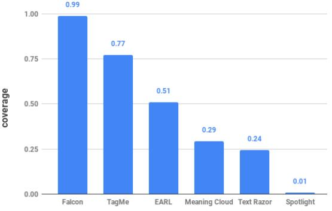

# Open Research Knowledge Graph: Next Generation Infrastructure for Semantic Scholarly Knowledge

Mohamad Yaser Jaradeh L3S Research Center, Leibniz University of Hannover jaradeh@l3s.de

Manuel Prinz TIB Leibniz Information Centre for Science and Technology manuel.prinz@tib.eu

Allard Oelen L3S Research Center, Leibniz University of Hannover oelen@l3s.de

Jennifer D'Souza TIB Leibniz Information Centre for Science and Technology jennifer.dsouza@tib.eu

Markus Stocker TIB Leibniz Information Centre for Science and Technology markus.stocker@tib.eu

Kheir Eddine Farfar TIB Leibniz Information Centre for Science and Technology kheir.farfar@tib.eu

Gábor Kismihók TIB Leibniz Information Centre for Science and Technology gabor.kismihok@tib.eu

TIB Leibniz Information Centre for Science and Technology auer@tib.eu

Sören Auer

# ABSTRACT

Despite improved digital access to scholarly knowledge in recent decades, scholarly communication remains exclusively documentbased. In this form, scholarly knowledge is hard to process automatically. We present the first steps towards a knowledge graph based infrastructure that acquires scholarly knowledge in machine actionable form thus enabling new possibilities for scholarly knowledge curation, publication and processing. The primary contribution is to present, evaluate and discuss multi-modal scholarly knowledge acquisition, combining crowdsourced and automated techniques. We present the results of the first user evaluation of the infrastructure with the participants of a recent international conference. Results suggest that users were intrigued by the novelty of the proposed infrastructure and by the possibilities for innovative scholarly knowledge processing it could enable.

# CCS CONCEPTS

• Information systems → Web searching and information discovery; Document structure; Retrieval efficiency.

# KEYWORDS

Information Science; Knowledge Graph; Knowledge Capture; Research Infrastructure; Scholarly Communication

## ACM Reference Format:

Mohamad Yaser Jaradeh, Allard Oelen, Kheir Eddine Farfar, Manuel Prinz, Jennifer D'Souza, Gábor Kismihók, Markus Stocker, and Sören Auer. 2019. Open Research Knowledge Graph: Next Generation Infrastructure for Semantic Scholarly Knowledge. In Proceedings of the 10th International Conference on Knowledge Capture (K-CAP '19), November 19–21, 2019, Marina Del

K-CAP '19, November 19–21, 2019, Marina Del Rey, CA, USA © 2019 Copyright held by the owner/author(s). ACM ISBN 978-1-4503-7008-0/19/11.

<https://doi.org/10.1145/3360901.3364435>

Rey, CA, USA. ACM, New York, NY, USA, [4](#page-3-0) pages. [https://doi.org/10.1145/](https://doi.org/10.1145/3360901.3364435) [3360901.3364435](https://doi.org/10.1145/3360901.3364435)

# 1 INTRODUCTION

Documents are central to scholarly communication. In fact, nowadays almost all research findings are communicated by means of digital scholarly articles. Unfortunately, it is difficult to automatically process scholarly knowledge communicated in this form. The key issue is that digital scholarly articles are mere analogues of their print relatives [\[11\]](#page-3-1). Print and digital media suffer from similar challenges. Scholarly knowledge remains as ambiguous and difficult to reproduce in digital as it used to be in print [\[7\]](#page-3-2). Moreover, addressing modern societal challenges relies on interdisciplinary research. Answers to such challenges are debated in scholarly discourse spanning often dozens and sometimes hundreds of articles [\[1\]](#page-3-3). While citation does link articles, their contents are hardly interlinked and generally not machine actionable. Therefore, processing scholarly knowledge remains a manual, and tedious task.

Furthermore, document-based scholarly communication stands in stark contrast to the digital transformation seen in recent years in other information rich publishing and communication services. Examples include encyclopedia, mail order catalogs, street maps or phone books. For these services, traditional document-based publication was not just digitized but has seen the development of completely new means of information organization and access.

There is an urgent need for a more flexible, fine-grained, context sensitive and machine actionable representation of scholarly knowledge and corresponding infrastructure for knowledge curation, publishing and processing. We suggest that representing scholarly knowledge as structured, interlinked, and semantically rich knowledge graphs is a key element of a technical infrastructure [\[3\]](#page-3-4). While the technology for representing, managing and processing scholarly knowledge in such form is largely in place, we argue that one of the most pressing concerns is how scholarly knowledge can be acquired as it is generated along the research lifecycle.

Permission to make digital or hard copies of part or all of this work for personal or classroom use is granted without fee provided that copies are not made or distributed for profit or commercial advantage and that copies bear this notice and the full citation on the first page. Copyrights for third-party components of this work must be honored. For all other uses, contact the owner/author(s).

In this article, we introduce the Open Research Knowledge Graph[1](#page-1-0) (ORKG) as an infrastructure for the acquisition, curation, publication and processing of semantic scholarly knowledge. We present, evaluate and discuss ORKG based scholarly knowledge acquisition using crowdsourcing and text mining techniques as well as knowledge curation, publication and processing. The alpha release of the ORKG is available online[2](#page-1-1) . Users can provide feedback on issues and features, guide future development with requirements, contribute to the implementation[3](#page-1-2) and last but not least populate the ORKG with content.

In this article, we tackle the following research questions:

- Are authors willing to contribute structured descriptions of the key research contribution(s) published in their articles using a fit-for-purpose infrastructure, and what is the user acceptance of the infrastructure?
- Can the infrastructure effectively integrate crowdsourcing and automated techniques for multi-modal scholarly knowledge acquisition?

Representing encyclopedic and factual knowledge in machine actionable form is increasingly feasible. This is underscored by knowledge graphs such as Wikidata [\[24\]](#page-3-5), domain-specific knowledge graphs [\[10\]](#page-3-6) as well as industrial initiatives at Google, IBM, Bing, BBC, Thomson Reuters, Springer Nature, among others. In the context of scholarly communication and its operational infrastructure the focus has so far been on representing, managing and linking metadata about articles, people, data and other relevant entities [\[2,](#page-3-7) [9,](#page-3-8) [16\]](#page-3-9). Some initiatives [\[13,](#page-3-10) [21\]](#page-3-11) extended the representation to document structure and more fine-grained elements. Others proposed comprehensive conceptual models for scholarly knowledge that capture problems, methods, theories, statements, concepts and their relations [\[8,](#page-3-12) [12,](#page-3-13) [17,](#page-3-14) [19\]](#page-3-15).

## 2 OPEN RESEARCH KNOWLEDGE GRAPH

We propose to leverage knowledge graphs to represent scholarly knowledge communicated in the literature. We call this knowledge graph the Open Research Knowledge Graph (ORKG). Crucially, the proposed knowledge graph does not merely contain (bibliographic) metadata (e.g., about articles, authors, institutions) but semantic (i.e., machine actionable) descriptions of scholarly knowledge.

## 2.1 Architecture

The infrastructure design follows a classical layered architecture. A persistence layer abstracts data storage implemented by labeled property graph (LPG), triple store, and relational database storage technology, each serving specific purposes. Versioning and provenance handles tracking changes to stored data.

The domain model specifies ResearchContribution, which is the core ORKG information object. A ResearchContribution relates the ResearchProblem addressed by the contribution, the ResearchMethod and (at least one) ResearchResult. Currently, we do not further constrain the description of these resources. Users can adopt arbitrary third-party vocabularies to describe problems, methods, and results.

RDF import and export enables data synchronization between LPG and triple store, which enables SPARQL and reasoning. Querying handles the requests by services for reading, updating, and creating content in databases. The following layer is for modules that implement infrastructure features such as authentication or comparison and similarity computation. The REST API acts as the connector between features and services for scholarly knowledge contribution, curation and exploration.

ORKG users in author, researcher, reviewer or curator roles interact differently with its services. Exploration services such as literature comparisons are useful in particular for researchers and reviewers. Contribution services are primarily for authors who intend to contribute content. Curation services are designed for domain specialists more broadly to include for instance subject librarians who support quality control, enrichment and other content organization activities.

## 2.2 Features

The ORKG services are underpinned by numerous features that, individually or in combination, enable services. We present the most important current features.

Literature comparison extracts similar information shared by user-selected research contributions and presents comparisons in tabular form. Such comparisons rely on extracting the set of semantically similar predicates among compared contributions. We use FastText [\[6\]](#page-3-16) word embeddings to generate a similarity matrix γ

$$\chi = \left[ \cos(\overrightarrow{p_i}, \overrightarrow{p_f}) \right]_{\text{i.t.}\dots, \text{i.t.}\dots, \text{i.t.}\dots} \tag{1}$$

with the cosine similarity of vector embeddings for predicate pairs (pi ,pj) ∈ R, whereby R is the set of all research contributions.

Furthermore, we create a mask matrix Φ that selects predicates of contributionsci ∈ C, whereby C is the set of research contributions to be compared. Formally,

$$\Phi_{\bar{t},f} = \begin{cases} 1 & \text{if } p_f \in c_{\bar{t}} \\ 0 & \text{otherwise} \end{cases} \tag{2}$$

Next, for each selected predicate p we create the matrix φ that slices Φ to include only similar predicates. Formally,

$$\Phi \circ_{i,f} = (\Phi_{i,f}) \quad_{\substack{\mathcal{C}_i \in \mathcal{C} \\ \rho_f \in \sinh(\rho)}} \tag{3}$$

where sim(p) is the set of predicates with similarity values γ [p] ≥ T = 0.9 with predicate p. The threshold T is computed empirically. Finally,φ is used to efficiently compute the common set of predicates and their frequency.

Contribution similarity is a feature used to explore related work, find or recommend comparable research contributions. The sub-graphs G(ri) for each research contribution ri ∈ R are converted into document D by concatenating the labels of subject s, predicate p, and object o, of all statements (s,p, o) ∈ G(ri). We then use T F /iDF [\[22\]](#page-3-17) to index and retrieve the most similar contributions with respect to some query q. Queries are constructed in the same manner as documents D.

The ORKG uses machine learning for automated extraction of scientific knowledge from literature. Of particular interest are the NLP tasks named entity recognition as well as named entity

1<http://orkg.org>

2<https://labs.tib.eu/orkg/>

3<https://gitlab.com/TIBHannover/orkg>

Table 1: Overview of answers to the key aspects covered by the evaluation questionnaire and other metrics recorded during the interviews.

| Partici pant Nr | Nav       | Term        | Auto     | Guidance | Suggest   | UI       |              |  |
|--------------------|-----------|-------------|----------|----------|-----------|----------|--------------|--|
|                    | igation   | inology     | Complete | Needed   | To Others | likeness | Time         |  |
|                    | 5 = Very  | 5 = Easy to | 5 = Very | 5 = All  | 9 = Very  | 9 = Very |              |  |
|                    | intuitive | understand  | helpful  | the time | likely    |          | much in mins |  |
| 1                  | 4         | 4           | 5        | 3        | 2         | 6        | 16           |  |
| 2                  | 2         | 3           | 5        | 4        | 8         | 7        | 19           |  |
| 3                  | 4         | 5           | 5        | 3        | 9         | 7        | 15           |  |
| 4                  | 3         | 3           | 5        | 3        | 6         | 7        | 13           |  |
| 5                  | 4         | 3           | 5        | 3        | 6         | 8        | 14           |  |
| 6                  | 4         | 3           | 5        | 3        | 8         | 9        | 13           |  |
| 7                  | 3         | 4           | 5        | 3        | 7         | 6        | 19           |  |
| 8                  | 3         | 2           | 4        | 3        | 8         | 6        | 13           |  |
| 9                  | 4         | 5           | 3        | 3        | 7         | 5        | 14           |  |
| 10                 | 4         | 5           | 5        | 1        | 8         | 8        | 22           |  |
| 11                 | 4         | 5           | 5        | 1        | 8         | 8        | 20           |  |
| 12                 | -         | -           | -        | -        | -         | -        | 21           |  |
| Average            | 4         | 4           | 5        | 3        | 7         | 7        | 17           |  |

classification and linking. As a first step, we trained a neural network based machine learning model for named entity recognition using in-house developed annotations on the Elsevier Labs corpus of Science, Technology, and Medicine[4](#page-2-0) (STM) for the following generic concepts: process, method, material and data. We use the Beltagy et al. [\[4\]](#page-3-18) Named Entity Recognition task-specific neural architecture atop pretrained SciBERT embeddings with a CRF-based sequence tag decoder [\[18\]](#page-3-19).

Linking scholarly knowledge to other knowledge graphs including those from the open domain as well as domain specific graphs such as ULMS [\[5\]](#page-3-20) is another important feature. Most importantly, such linking enables semi-automated enrichment of research contributions.

# 3 EVALUATIONS

The ORKG infrastructure, its services, features, performance and usability are continually evaluated to inform the next iteration and future developments. Among other preliminary evaluations and results, we present here the first front end user evaluation.

Following a qualitative approach, the evaluation of the first iteration of front end development aimed to determine user performance, identify major (positive and negative) aspects, and user acceptance/perception of the system. The evaluation process had two components: (1) instructed interaction sessions and (2) a short evaluation questionnaire. This evaluation resulted in data relevant to our first research question.

Supported by two instructors, we conducted instructed interaction sessions with 12 authors of articles presented at the DILS2018[5](#page-2-1) conference. At the start of each session, the instructor briefly explained the underlying principles of the infrastructure. Then, participants engaged with the system without further guidance from the instructor. However, at any time they could ask the instructor for assistance. For each participant, we recorded the time required to complete the task (to determine the mean duration of a session), the instructor's notes and the participant's comments.

Table 2: Time (in seconds) needed to perform State-of-the-Art comparisons with 2-8 research contributions using the baseline and ORKG approaches.

|          | Number of compared research contributions |        |         |      |        |        |        |  |  |  |
|----------|-------------------------------------------|--------|---------|------|--------|--------|--------|--|--|--|
|          | 2                                         | 3      | 4       | 5    | 6      | 7      | 8      |  |  |  |
| Baseline | 0.00026                                   | 0.1714 | 0.763   | 4.99 | 112.74 | 1772.8 | 14421  |  |  |  |
| ORKG     | 0.0035                                    | 0.0013 | 0.01158 | 0.02 | 0.0206 | 0.0189 | 0.0204 |  |  |  |

In addition to the instructed interaction sessions, participants were invited to complete a short evaluation questionnaire. The questionnaire is available online[6](#page-2-2) . Treated as a qualitative instrument, its aim was to collect further insights into user experience. The paper-based questionnaire consisted of 11 questions. These were designed to capture participant thoughts regarding the positive and negative aspects of the system following their instructed interaction session. Participants completed their questionnaire after the instructed interaction session. All 12 participants answered the questionnaire. The interaction notes, participant comments and the time recordings were collected together with questionnaire responses and analysed in light of our research questions.

A dataset summarizing the research contributions collected in the experiment is available online[7](#page-2-3) . The data is grouped into four main categories. Research Problem describes the main question or issue addressed by the research contribution. Approach describes the solution taken by the authors. Implementation & Evaluation were the most comprehensively described aspects, arguably because it was easier for participants to describe technical details compared to describing the problem or the approach.

In summary, 75% of the participants found the front end developed in the first iteration fairly intuitive and easy to use. Among the participants, 80% needed guidance only at the beginning while 10% did not need guidance. The time required to complete the task was 17 minutes on average, with a minimum of 13 minutes and a maximum of 22 minutes.

Further details of the questionnaire, including participant ratings on main issues, are summarized in Table [1.](#page-2-4) While the cohort of participants was too small for statistically significant conclusions, these results provided a number of important suggestions that informed the second iteration of front end development, which had a first evaluation at TPDL2019[8](#page-2-5) .

We have performed preliminary evaluations also of other components of the ORKG infrastructure. The experimental setup for these evaluations was an Ubuntu 18.04 machine with Intel Xeon CPUs 12 × 3.60 GHz and 64 GB memory.

With respect to the literature comparison feature, we compared our approach in ORKG with a baseline approach that uses brute force to find the most similar predicates and thus checks every possible predicate combination. Table [2](#page-2-6) shows the time needed to perform the comparison for the baseline approach and for the approach we implemented and presented above. As the results suggest, our approach clearly outperforms the baseline and the performance gain can be attributed to more efficient retrieval. The experiment is

4https://github.com/elsevierlabs/OA-STM-Corpus

5<https://www.springer.com/us/book/9783030060152>

6<https://doi.org/10.5281/zenodo.2549918>

7<https://doi.org/10.5281/zenodo.3340954>

8<http://www.tpdl.eu/tpdl2019/>

limited to 8 contributions because the baseline approach does not scale to larger sets.

We also tested the vertical scalability in terms of response time. For this, we created a synthetic dataset of papers. Each paper includes one research contribution described by three statements. The generated dataset contains 10 million papers or 100 million nodes. We tested the system with variable numbers of papers and the average response time to fetch a single paper with its related research contribution is 60 ms. This suggests that the infrastructure can handle large amounts of scholarly knowledge.

#### Figure 1: Coverage values of different NED systems over the annotated entities of the STM corpus.

We evaluated the performance of a number of existing NED tools on scholarly knowledge, specifically Falcon [\[23\]](#page-3-21), DBpedia Spotlight [\[20\]](#page-3-22), TagME [\[15\]](#page-3-23), EARL [\[14\]](#page-3-24), TextRazor[9](#page-3-25) and Meaning-Cloud[10](#page-3-26). These tools were used to link to entities from Wikidata and DBpedia. We used the annotated entities from the STM corpus as the experimental data. However, since there is no gold standard for the dataset, we only computed the coverage metric ζ = # of linked entities # of all entities . Figure [1](#page-3-27) summarizes the coverage percentage for the evaluated tools. The results suggest that Falcon is most promising.

## 4 CONCLUSION

This article described the first steps of a larger research and development agenda that aims to enhance document-based scholarly communication with semantic representations of communicated scholarly knowledge. We presented the architecture of the proposed infrastructure and some of its key features. We reported the results of a first user evaluation. By integrating crowdsourcing and automated techniques in natural language processing, initial steps were also taken and evaluated that advance multi-modal scholarly knowledge acquisition using the ORKG.

## ACKNOWLEDGMENTS

This work was co-funded by the European Research Council for the project ScienceGRAPH (Grant agreement ID: 819536) and the TIB Leibniz Information Centre for Science and Technology. The authors would like to thank the participants of the ORKG workshop series, for their contributions to ORKG developments. We also like

9<https://www.textrazor.com/docs/rest>

to thank our colleagues Kemele M. Endris, Viktor Kovtun, Arthur Brack and Anett Hoppe for their contributions.

## REFERENCES

- [1] Hugo F. Alrøe and Egon Noe. 2014. Second-Order Science of Interdisciplinary Research: A Polyocular Framework for Wicked Problems. Constructivist Foundations (2014), 65–76.
- [2] Amir Aryani and Jingbo Wang. 2017. Research Graph: Building a Distributed Graph of Scholarly Works using Research Data Switchboard. In Open Repositories CONFERENCE.
- [3] Sören Auer, Viktor Kovtun, Manuel Prinz, Anna Kasprzik, Markus Stocker, and Maria Esther Vidal. 2018. Towards a Knowledge Graph for Science. In Proceedings of the 8th International Conference on Web Intelligence, Mining and Semantics.
- [4] Iz Beltagy, Arman Cohan, and Kyle Lo. 2019. SciBERT: Pretrained Contextualized Embeddings for Scientific Text. CoRR abs/1903.10676 (2019).
- [5] Olivier Bodenreider. 2004. The unified medical language system (UMLS): integrating biomedical terminology. Nucleic acids research 32, suppl_1 (2004).
- [6] Piotr Bojanowski, Edouard Grave, Armand Joulin, and Tomas Mikolov. 2017. Enriching Word Vectors with Subword Information. Transactions of the Association for Computational Linguistics 5 (2017), 135–146.
- [7] Jeroen Bosman, Ian Bruno, Chris Chapman, Bastian Greshake Tzovaras, Nate Jacobs, Kramer, and et al. 2017. The Scholarly Commons - principles and practices to guide research communication.<https://doi.org/10.31219/osf.io/6c2xt>
- [8] Brodaric Boyan, Reitsma Femke, and Qiang Yi. 2008. SKIing with DOLCE: toward an e-Science Knowledge Infrastructure. Frontiers in Artificial Intelligence and Applications 183, Formal Ontology in Information Systems (2008), 208–219.
- [9] Adrian Burton, Hylke Koers, Paolo Manghi, Markus Stocker, Martin Fenner, Amir Aryani, Sandro La Bruzzo, Michael Diepenbroek, and Uwe Schindler. 2017. The Scholix Framework for Interoperability in Data-Literature Information Exchange. D-Lib Magazine Volume 23, 1/2 (2017).
- [10] Michelle Cheatham, Adila Krisnadhi, Reihaneh Amini, Pascal Hitzler, Krzysztof Janowicz, Adam Shepherd, Tom Narock, Matt Jones, and Peng Ji. 2018. The GeoLink knowledge graph. Big Earth Data 2, 2 (2018), 131–143.
- [11] Herbert Van de Sompel and Carl Lagoze. 2009. All aboard: toward a machinefriendly scholarly communication system. In The Fourth Paradigm.
- [12] Anita De Waard, Leen Breure, Joost G Kircz, and Herre Van Oostendorp. 2006. Modeling rhetoric in scientific publications. In International Conference on Multidisciplinary Information Sciences and Technologies, InSciT2006.
- [13] P. Donohoe, J. Sherman, and A. Mistry. 2015. The Long Road to JATS. In Journal Article Tag Suite Conference (JATS-Con) Proceedings 2015 [Internet]. Bethesda (MD): National Center for Biotechnology Information (US).
- [14] Mohnish Dubey, Debayan Banerjee, Debanjan Chaudhuri, and Jens Lehmann. 2018. EARL: Joint Entity and Relation Linking for Question Answering over Knowledge Graphs. In The Semantic Web – ISWC 2018. Springer International Publishing, Cham, 108–126.
- [15] Paolo Ferragina and Ugo Scaiella. 2010. TAGME: on-the-fly annotation of short text fragments (by wikipedia entities).. In CIKM, Jimmy Huang, Nick Koudas, Gareth J. F. Jones, Xindong Wu, Kevyn Collins-Thompson, and Aijun An (Eds.). ACM, 1625–1628.
- [16] Karen L. Hanson, Tim DiLauro, and Mark Donoghue. 2015. The RMap Project: Capturing and Preserving Associations Amongst Multi-Part Distributed Publications. In Proceedings of the 15th ACM/IEEE-CE JCDL. ACM, 281–282.
- [17] Alexander Hars. 2001. Designing Scientific Knowledge Infrastructures: The Contribution of Epistemology. Information Systems Frontiers 3, 1 (2001), 63–73.
- [18] Xuezhe Ma and Eduard H. Hovy. 2016. End-to-end Sequence Labeling via Bidirectional LSTM-CNNs-CRF. CoRR abs/1603.01354 (2016).
- [19] Vera G. Meister. 2017. Towards a Knowledge Graph for a Research Group with Focus on Qualitative Analysis of Scholarly Papers. In Proceedings of the First Workshop on Enabling Open Semantic Science co-located with 16th International Semantic Web Conference (ISWC 2017). 71–76.
- [20] Andrea Moro, Alessandro Raganato, and Roberto Navigli. 2014. Entity Linking meets Word Sense Disambiguation: a Unified Approach. TACL 2 (2014), 231–244.
- [21] Silvio Peroni. 2014. The Semantic Publishing and Referencing Ontologies. In Semantic Web Technologies and Legal Scholarly Publishing. Law, Governance and Technology, Vol. 15. Springer, Cham, 121–193.
- [22] Juan Ramos et al. 2003. Using tf-idf to determine word relevance in document queries. In Proceedings of the first instructional conference on machine learning, Vol. 242. Piscataway, NJ, 133–142.
- [23] Ahmad Sakor, Isaiah Onando Mulang, Kuldeep Singh, Saeedeh Shekarpour, Maria Esther Vidal, Jens Lehmann, and Sören Auer. 2019. Old is gold: linguistic driven approach for entity and relation linking of short text. In Proceedings of the 2019 Conference of the North American Chapter of the Association for Computational Linguistics: Human Language Technologies. 2336–2346.
- [24] Denny Vrandečić and Markus Krötzsch. 2014. Wikidata: A Free Collaborative Knowledgebase. Commun. ACM 57, 10 (2014), 78–85.

10<https://www.meaningcloud.com/developer>