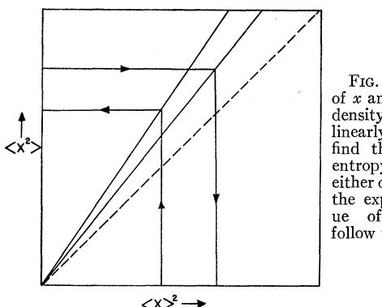
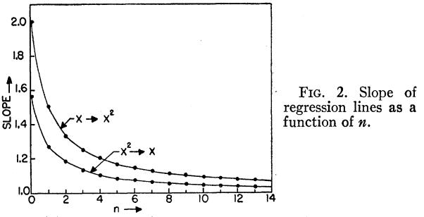

must be absorbed (or emitted) to achieve one photon of net absorption (or emission). These net photons must complete with the spontaneous-emission photons. Thus, as T,ff is lowered, fewer photons need be handled for the same signal-to-noise ratio. Here the tremendous di6'erence between so-called positive and negative temperatures (our T,tt) is apparent. For the absorption case, the noise-power distribution p"(T) approaches zero as T,tt approaches +0. However, it approaches hP as 7 ff approaches —0. This is intuitively satisfying, since it means that spontaneous-emission noise actually acts as least-count noise in a net emission system. To put it otherwise, if we have e photons per frequency interval per second from the amplifier, the least count is one photon and this is just the spontaneous-emission noise. We are dealing here with phasecoherent photons, however, so the signal-to-noise ratio is as the reciprocal band width, instead of as the square root of the reciprocal band width, which is the case when incoherent photons (or particles) are counted. We have essentially solved the problem of the statistical noise for a linear system with coherent particles.

For those who like a simple, appealing, albeit inaccurate, explanation of quantum-mechanical noise, we o8er the following suggestions that have grown out of our work. At high effective temperatures, the noise is high, since the least-count effect (shot effect) becomes

large, because the net emission is small on account of interfering absorption. As the effective temperature is lowered, the number of photons to be amplified can be linearly lowered and the same least count, i.e., the same signal-to-noise ratio, can be maintained. The limit as T,ff approaches 0 will always be photon shot noise.

Neglecting, then, many practical details that are solely within the realm of engineering ingenuity (for which we hold high regard), we have shown that the limiting sensitivity of quantum-mechanical amplihers is given in a readily achievable limit by the eGective quantum-mechanical noise power density. This noise power density is given parametrically by an effective temperature. The essential and drastic difference between negative and positive temperatures is demonstrated by this function, in that, as T approaches —0, this function approaches (—hv) and, as T approaches +0, this function approaches 0. This means that in the region where hv(kT. . . the noise 6gure can be represented, essentially, as the ratio of the quantummechanical temperature and the source temperature. With the equality sign reversed, the noise 6gure becomes large. For 1-cm radiation, this turning point is at 1.5'K. At any frequency, we may say that the limiting temperature sensitivity for a quantummechanical ampli6er is, essentially, hv/k.

P H YS I CAI R EVI EW VOI UME 106, NUMBER 4 MAY i5, &95 y

## Infolrxiation Theory and Statistical Mechanics

E. T. JAvxzs

Department of Physics, Stanford University, Stanford, California (Received September 4, 1956; revised manuscript received March 4, 1957)

Information theory provides a constructive criterion for setting up probability distributions on the basis of partial knowledge, and leads to a type of statistical inference which is called the maximum-entropy estimate. It is the least biased estimate possible on the given information; i.e. , it is maximally noncommittal with regard to missing information. If one considers statistical mechanics as a form of statistical inference rather than as a physical theory, it is found that the usual computational rules, starting with the determination of the partition function, are an immediate consequence of the maximum-entropy principle. In the resulting "subjective statistical mechanics, "the usual rules are thus justified independently of any physical argument, and in particular independently of experimental verification; whether

### 1. INTRODUCTION

HE recent appearance of a very comprehensive survey' of past attempts to justify the methods of statistical mechanics in terms of mechanics, classical or quantum, has helped greatly, and at a very opportune time, to emphasize the unsolved problems in this field.

or not the results agree with experiment, they still represent the best estimates that could have been made on the basis of the information available.

It is concluded that statistical mechanics need not be regarded as a physical theory dependent for its validity on the truth of additional assumptions not contained in the laws of mechanics (such as ergodicity, metric transitivity, equal a priori probabilities, etc.). Furthermore, it is possible to maintain a sharp distinction between its physical and statistical aspects. The former consists only of the correct enumeration of the states of a system and their properties; the latter is a straightforward example of statistical inference.

Although the subject has been under development for many years, we still do not have a complete and satisfactory theory, in the sense that there is no line of argument proceeding from the laws of microscopic mechanics to macroscopic phenomena, that is generally regarded by physicists as convincing in all respects. Such an argument should (a) be free from objection on mathematical grounds, (b) involve no additional arbi-

&#x27;D. ter Haar, Revs. Modern Phys. 27, 289 (1955).

trary assumptions, and (c) automatically include an explanation of nonequilibrium conditions and irreversible processes as well as those of conventional thermodynamics, since equilibrium thermodynamics is merely an ideal limiting case of the behavior of matter.

It might appear that condition (b) is too severe, since we expect that a physical theory will involve certain unproved assumptions, whose consequences are deduced and compared with experiment. For example, in the statistical mechanics of Gibbs' there were several difliculties which could not be understood in terms of classical mechanics, and before the models which he constructed could be made to correspond to the observed facts, it was necessary to incorporate into them additional restrictions not contained in the laws of classical mechanics. First was the "freezing up" of certain degrees of freedom, which caused the specific heat of diatomic gases to be only —, ' of the expected value. Secondly, the paradox regarding the entropy of combined systems, which was resolved only by adoption of the generic instead of the speci6c definition of phase, an assumption which seems impossible to justify in terms of classical notions. ' Thirdly, in order to account for the actual values of vapor pressures and equilibrium constants, an additional assumption about a natural unit of volume (l'ss~) of phase space was needed. However, with the development of quantum mechanics the originally arbitrary assumptions are now seen as necessary consequences of the laws of physics. This suggests the possibility that we have now reached a state where statistical mechanics is no longer dependent on physical hypotheses, but may become merely an example of statistical inference.

That the present may be an opportune time to re-examine these questions is due to two recent developments. Statistical methods are being applied to a variety of specific phenomena involving irreversible processes, and the mathematical methods which have proven successful have not yet been incorporated into the basic apparatus of statistical mechanics. In addition, the development of information theory' has been felt by many people to be of great significance for statistical mechanics, although the exact way in which it should be applied has remained obscure. In this connection it

is essential to note the following. The mere fact that the same mathematical expression —P p; logp; occurs both in statistical mechanics and in information theory does not in itself establish any connection between these fields. This can be done only by 6nding new viewpoints from which thermodynamic entropy and information-theory entropy appear as the same concept. In this paper we suggest a reinterpretation of statistical mechanics which accomplishes this, so that information theory can be applied to the problem of justification of statistical mechanics. We shall be concerned with the prediction of equilibrium thermodynamic properties, by an elementary treatment which involves only the probabilities assigned to stationary states. Refinements obtainable by use of the density matrix and discussion of irreversible processes will be taken up in later papers.

Section 2 defines and establishes some of the elementary properties of maximum-entropy inference, and in Secs. 3 and 4 the application to statistical mechanics is discussed. The mathematical facts concerning maximization of entropy, as given in Sec. 2, were pointed out long ago by Gibbs. In the past, however, these properties were given the status of side remarks not essential to the theory and not providing in themselves any justihcation for the methods of statistical mechanics. The feature which was missing has been supplied only recently by Shannon' in the demonstration that the expression for entropy has a deeper meaning, quite independent of thermodynamics. This makes possible a reversal of the usual line of reasoning in statistical mechanics. Previously, one constructed a theory based on the equations of motion, supplemented by additional hypotheses of ergodicity, metric transitivity, or equal a priori probabilities, and the identification of entropy was made only at the end, by comparison of the resulting equations with the laws of phenomenological thermodynamics. Now, however, we can take entropy as our starting concept, and the fact that a probability distribution maximizes the entropy subject to certain constraints becomes the essential fact which justifies use of that distribution for inference.

The most important consequence of this reversal of viewpoint is not, however, the conceptual and mathematical simplification which results. In freeing the theory from its apparent dependence on physical hypotheses of the above type, we make it possible to see statistical mechanics in a much more general light. Its principles and mathematical methods become available for treatment of many new physical problems. Two examples are provided by the derivation of Siegert's "pressure ensemble" and treatment of a nuclear polarization eGect, in Sec. 5.

#### 2. MAXIMUM-ENTROPY ESTIMATES

The quantity x is capable of assuming the discrete values x; (i =1,2 ~,rl). We are not given the corresponding probabilities p;; all we know is the expectation

J. W. Gibbs, Elementary Principles in Statistical Mechanics (Longmans Green and Company, New York, 1928), Vol. II of collected works. '

We may note here that although Gibbs (reference 2, Chap. XV) started his discussion of this question by saying that the generic definition "seems in accordance with the spirit of the statistical method, "he concluded it with, "The perfect similarity of several particles of a system will not in the least interfere with the identification of a particular particle in one case with a particular particle in another. The question is one to be decided in accordance with the requirements of practical convenience in the discussion of the problems with which we are engaged. "

4 C. E. Shannon, Bell System Tech. J. 27, 379, 623 (1948); these papers are reprinted in C. E. Shannon and %. Weaver, The Mathematical Theory of Commlnication (University of Illinois Press, Urbana, 1949).

value of the function f(oc):

$$
\langle f(\mathfrak{x}) \rangle = \sum_{i=1}^{n} \mathfrak{p}_i f(\mathfrak{x}_i). \tag{2-1}
$$

On the basis of this information, what is the expectation value of the function g(x) '? At first glance, the problem seems insoluble because the given information is insuflicient to determine the probabilities p, . Equation (2-1) and the normalization condition

$$\sum \Phi_i = 1 \tag{2-2}$$

would have to be supplemented by (tt—2) more conditions before (g(x)) could be found.

This problem of specie. cation of probabilities in cases where little or no information is available, is as old as the theory of probability. Laplace's "Principle of Insuf6cient Reason" was an attempt to supply a criterion of choice, in which one said that two events are to be assigned equal probabilities if there is no reason to think otherwise. However, except in cases where there is an evident element of symmetry that clearly renders the events "equally possible, " this assumption may appear just as arbitrary as any other that might be made. Furthermore, it has been very fertile in generating paradoxes in the case of continu' ously variable random quantities, ' since intuitive notions of "equally possible" are altered by a change of variables. ~ Since the time of Laplace, this way of formulating problems has been largely abandoned, owing to the lack of any constructive principle which would give us a reason for preferring one probability distribution over another in cases where both agree equally well with the available information.

For further discussion of this problem, one must recognize the fact that probability theory has developed in two very diferent directions as regards fundamental notions. The "objective" school of thought'' regards the probability of an event as an objective property of that event, always capable in principle of empirical measurement by observation of frequency ratios in a random experiment. In calculating a probability distribution the objectivist believes that he is making

predictions which are in principle veri6able in every detail, just as are those of classical mechanics. The test of a good objective probability distribution p(x) is: does it correctly represent the observable Quctuations of XP

On the other hand, the "subjective" school of thought" " regards probabilities as expressions of human ignorance; the probability of an event is merely a formal expression of our expectation that the event will or did occur, based on whatever information is available. To the subjectivist, the purpose of probability theory is to help us in forming plausible conclusions in cases where there is not enough information available to lead to certain conclusions; thus detailed verihcation is not expected. The test of a good subjective probability distribution is does it correctly represent our state of knowledge as to the value of xP

Although the theories of subjective and objective probability are mathematically identical, the concepts themselves refuse to be united. In the various statistical problems presented to us by physics, both viewpoints are required. Needless controversy has resulted from attempts to uphold one or the other in all cases. The subjective view is evidently the broader one, since it is always possible to interpret frequency ratios in this way; furthermore, the subjectivist will admit as legitimate objects of inquiry many questions which the objectivist considers meaningless. The problem posed at the beginning of this section is of this type, and therefore in considering it we are necessarily adopting the subjective point of view.

Just as in applied statistics the crux of a problem is often the devising of some method of sampling that avoids bias, our problem is that of 6nding a probability assignment which avoids bias, while agreeing with whatever information is given. The great advance provided by information theory lies in the discovery that there is a unique, unambiguous criterion for the "amount of uncertainty" represented by a discrete probability distribution, which agrees with our intuitive notions that a broad distribution represents more uncertainty than does a sharply peaked one, and satisfies all other conditions which make it reasonable. 4 In Appendix A we sketch Shannon's proof that the quantity which is positive, which increases with increasing uncertainty, and is additive for independent sources of uncertainty, is

$$H(\not p_1 \cdots \not p_n) = -K \sum_i \not p_i \ln \not p_i,\tag{2-3}$$

where J is a positive constant. Since this is just the expression for entropy as found in statistical mechanics, it will be called the entropy of the probability distribution p, ; henceforth we will consider the terms "entropy" and "uncertainty" as synonymous.

~ Yet this is precisely the problem confronting us in statistical mechanics; on the basis of information which is grossly inadequate to determine any assignment of probabilities to individual quantum states, we are asked to estimate the pressure, specific heat, intensity of magnetization, chemical potentials, etc., of a macroscopic system. Furthermore, statistical mechanics is amazingly successful in providing accurate estimates of these quantities. Evidently there must be other reasons for this success, that go beyond a mere correct statistical treatment of the problem as stated above. '

The problems associated with the continuous case are fundamentally more complicated than those encountered with discrete random variables; only the discrete case will be considered here. '

For several examples, see E. P. Xorthrop, EiddLes in Mathernatscs (D. Van Nostrand Company, Inc., ¹wYork, 1944l, Chap. 8.

SH. Cramer, 3IathematicaL Methods of Statistics (Princeton University Press, Princeton, 1946). '

W. Feller, An Introduction to ProbabiLity Theory and its APplications (John Wiley and Sons, Inc., New York, 1950).

IJ.M. Keynes, 2 Treatise on Probabitity (MacMillan Company,

London, 1921). "H. Jeffreys, Theory'of ProbabiLity (Oxford University Press, London, 1939).

(2-6)

It is now evident how to solve our problem; in making inferences on the basis of partial information we must use that probability distribution which has maximum entropy subject to whatever is known. This is the only unbiased assignment we can make; to use any other would amount to arbitrary assumption of information which by hypothesis we do not have. To maximize (2-3) subject to the constraints (2-1) and (2-2), one introduces Lagrangian multipliers ), p, in the usual way, and obtains the result =& &. vf—(*~—)' (2-&)

$$
\phi_i = e^{-\lambda - \mu f \cdot (\ast \mathbf{4})}.\tag{2-4}
$$

The constants X, p are determined by substituting into (2-1) and (2-2). The result may be written in the form

$$
\langle f(x) \rangle = -\frac{\partial}{\partial \mu} \ln Z(\mu),
\tag{2-5}
$$

where

$$Z\left(\mu\right) = \sum_{i} e^{-\mu f\left(\mu_{i}\right)}\tag{2-7}$$

will be called the partition function.

This may be generalized to any number of functions f(x): given the averages

$$
\langle f_r(\mathbf{x}) \rangle = \sum_i \oint_i f_r(\mathbf{x}_i) \,, \tag{2-}
$$

form the partition function

Then the maximum-entropy probability distribution is given by

$$\phi_i = \exp\{-\Box\lambda_0 + \lambda_1 f_1(x_i) + \dots + \lambda_m f_m(x_i)\}, \quad (2-10)$$

in which the constants are determined from

$$
\langle f_r(x) \rangle = -\frac{\partial}{\partial \lambda_r} \ln Z,\tag{2-11}
$$

$$
\lambda_0 = \ln Z. \tag{2-12}
$$

The entropy of the distribution (2-10) then reduces to

$$\stackrel{\circ}{S}_{\max} = \lambda_0 + \lambda_1 \langle f_1(\mathbf{x}) \rangle + \stackrel{\circ}{\cdot \cdot} + \stackrel{\circ}{\lambda_m} \langle f_m(\mathbf{x}) \rangle,\quad \text{(2-13)}$$

where the constant E in (2-3) has been set equal to unity. The variance of the distribution of f"(x) is found to be

$$
\Delta^2 f_r = \langle f_r \mathbf{^2} \rangle - \langle f_r \mathbf{^2} \rangle = \frac{\partial^2}{\partial \lambda_r \mathbf{^2}} (\ln Z) \,. \tag{2-14}
$$

In addition to its dependence on x, the function f"may contain other parameters n&, n2, ~ ~ ~, and it is easily shown that the maximum-entropy estimates of the derivatives are given by

$$
\left\langle \frac{\partial f_r}{\partial \alpha_k} \right\rangle = -\frac{1}{\lambda_r} \frac{\partial}{\partial \alpha_k} \ln Z. \tag{2-15}
$$

The principle of maximum entropy may be regarded as an extension of the principle of insufhcient reason (to which it reduces in case no information is given except enumeration of the possibilities x,), with the following essential difference. The maximum-entropy distribution may be asserted for the positive reason that it is uniquely determined as the one which is maximally noncommittal with regard to missing information, instead of the negative one that there was no reason to think otherwise. Thus the concept of entropy supplies the missing criterion of choice which Laplace needed to remove the apparent arbitrariness of the principle of insufficient reason, and in addition it shows precisely how this principle is to be modified in case there are reasons for "thinking otherwise. "

Mathematically, the maximum-entropy distribution has the important property that no possibility is ignored; it assigns positive weight to every situation that is not absolutely excluded by the given information. This is quite similar in eGect to an ergodic property. j.n this connection it is interesting to note that prior to the work of Shannon other information measures had been proposed"" and used in statistical inference, although in a diRerent way than in the present paper. In particular, the quantity —g pP has many of the qualitative properties of Shannon's information measure, and in many cases leads to substantially the same results. However, it is much more dificult to apply in practice. Conditional maxima of —p p,s cannot be found by a stationary property involving Lagrangian multipliers, because the distribution which makes this quantity stationary subject to prescribed averages does not in general satisfy the condition p;~&0. A much more important reason for preferring the Shannon measure is that it is the only one which satis6es the condition of consistency represented by the composition. law (Appendix A). Therefore one expects that deductions made from any other information measure, if carried far enough, will eventually lead to contradictions.

# &o=lnZ. (2-12) 3. APPLICATION TO STATISTICAL MECHANICS

It will be apparent from the equations in the preceding section that the theory of maximum-entropy inference is identical in mathematical form with the rules of calculation provided by statistical mechanics. Specifically, let the energy levels of a system be

## E(nt ns, ),

where the external parameters e; may include the volume, strain tensor applied electric or magnetic fields, gravitational potential, etc. Then if we know only the average energy (E), the maximum-entropy probabilities of the levels E; are given by a special case of (2-10), which we recognize as the Boltzmann distribution. This observation really completes our derivation

lnZ. (2-15) "R.A. Fisher, Proc. Cambridge Phil. Soc. 22, 700 (1925), "J.L. Doob, Trans. Arn. Math. Soc. 39, 410 (1936),

of the conventional rules of statistical mechanics as an example of statistical inference; the identification of temperature, free energy, etc., proceeds in a familiar manner, ' with results summarized as

$$
\lambda_1 = \langle 1/kT \rangle,\tag{3-1}
$$

$$U - TS = \dot{F}(T, \alpha_1, \alpha_2, \dots) = -kT \ln Z(T, \alpha_1, \alpha_2, \dots), \tag{3-2}$$

$$\delta S = -\frac{\partial F}{\partial T} = -k \sum_{i} \phi_i \ln \phi_i,\tag{3-3}$$

$$\beta_i = kT \frac{\partial}{\partial \alpha_1} \ln Z. \tag{3-4}$$

The thermodynamic entropy is identical with the information-theory entropy of the probability distribution except for the presence of Boltzmann's constant. " The "forces" p; include pressure, stress tensor, electric or magnetic moment, etc., and Eqs. (3-2), (3-3), (3-4) then give a complete description of the thermodynamic properties of the system, in which the forces are given by special cases of (2-15); i.e. , as maximum-entropy estimates of the derivatives (BE;/Bns) .

In the above relations we have assumed the number of molecules of each type to be 6xed. Nowlete~be the number of molecules of type 1, e2 the number of type 2, etc. If the e, are not known, then a possible "state" of the system requires a specification of all the n, as well as a particular energy level E;(nins l rsitis ). If we are given the expectation values

$$
\langle E \rangle, \quad \langle \mathfrak{n}_1 \rangle, \quad \langle \mathfrak{n}_2 \rangle, \quad \cdots
$$

then in order to make maximum-entropy inferences, we need to form, according to (2-9), the partition function

$$Z(\alpha_1 \alpha_2 \cdots \alpha_i | \lambda_1 \lambda_2 \cdots \lambda_i \mathcal{S}) = \sum_{n_1 n_2} \sum_i \exp\{- \left[ \lambda_1 n_1 + \lambda_2 n_2 \right] \},$$

$$+ \dots + \beta E_i \langle \alpha_k | n_s \rangle \mathcal{J} \rangle,\quad \text{(3-5)}$$

and the corresponding maximum-entropy distribution (2-10) is that of the "quantum-mechanical grand canonical ensemble;" the Eqs. (2-11) fixing the constants, are recognized as giving the relation between the chemical potentials

$$
\mu_i = -kT\lambda_i,\tag{3-6}
$$

'4 E. Schrodinger, Statistical Thermodynamics (Cambridge University Press, Cambridge, 1948).

and the (rs;):

$$
\langle \boldsymbol{n}_i \rangle = \partial F / \partial \mu_i,\tag{3-7}
$$

where the free-energy function Ii =—hap, and Xo——lnZ is called the "grand potential. '"' Writing out (2-13) for this case and rearranging, we have the usual expression

$$\begin{split} F(T, \alpha_1 \alpha_2 \cdots, \mu_1 \mu_2 \cdots \rangle) \\ = \langle E \rangle - TS + \mu_1 \langle n_1 \rangle + \mu_2 \langle n_2 \rangle + \cdots \ . \quad \text{(3-8)} \end{split} \tag{3-8}$$

It is interesting to note the ease with which these rules of calculation are set up when we make entropy the primitive concept. Conventional arguments, which exploit all that is known about the laws of physics, in particular the constants of the motion, lead to exactly the same predictions that one obtains directly from maximizing the entropy. In the light of information theory, this can be recognized as telling us a simple but important fact: theke is eothieg ie the ger&eral turns of motion that can provide us with any additional infor matiors about eke state of a system beyorid what we have obtairsed from measurement This re.fers to interpretation of the state of a system at time t on the basis of measurements carried out at time t. For predicting the course of time-dependent phenomena, knowledge of the equations of motion is of course needed. By restricting our attention to the prediction of equilibrium properties as in the present paper, we are in eRect deciding at the outset that the only type of initial information allowed will be values of quantities which are observed to be constant in time. Any prior knowledge that these quantities would be constant (within macroscopic experimental error) in consequence of the laws of physics, is then redundant and cannot help us in assigning probabilities.

This principle has interesting consequences. Suppose that a super-mathematician were to discover a new class of uniform integrals of the motion, hitherto unsuspected. In view of the importance ascribed to uniform integrals of the motion in conventional statistical mechanics, and the assumed nonexistence of new ones, one might expect that our equations would be completely changed by this development. This would not be the case, however, unless we also supplemented our prediction problem with new experimental data which provided us with some information as to the likely values of these new constants. Even if we had a clear proof that a system is not metrically tramsitive, we would still have no ratiorial basis for excluding arsy region of Phase sPace skat is allowed by the information available to Ns. In its eRect on our ultimate predictions, this fact is equivalent to an ergodic hypothesis, quite independently of whether physical systems are in fact ergodic.

This shows the great practical convenience of the subjective point of view. If we were attempting to establish the probabilities of di6erent states in the

&#x27;~ Boltzmann's constant may be regarded as a correction factor necessitated by our custom of measuring temperature in arbitrary units derived from the freezing and boiling points of water. Since the product TS must have the dimensions of energy, the units in which entropy is measured depend on those chosen for temperature. It would be convenient in general arguments to de6ne an "absolute cgs unit" of temperature such that Boltzmann's constant is made equal to unity. Then entropy would become dhnensionless (as the considerations of Sec. 2 indicate it should be), and the temperature would be equal to twice the average energy per degree of freedom; it is, of course, just the "modulus" O~ of Gibbs.

~6 D. ter Haar, Elements of Statistical Mechanics (Rinehart and Company, New York, 1954), Chap. 7.

objective sense, questions of metric transitivity would be crucial, and unless it could be shown that the system was metrically transitive, we would not be able to find any solution at all. If we are content with the more modest aim of 6nding subjective probabilities, metric transitivity is irrelevant. Nevertheless, the subjective theory leads to exactly the same predictions that one has attempted to justify in the objective sense. The only place where subjective statistical mechanics makes contact with the laws of physics is in the enumeration of the diferent possible, mutually exclusive states in which the system might be. Unless a new advance in knowledge aGects this enumeration, it cannot alter the equations which we use for inference.

If the subject were dropped at this point, however, it would remain very dificult to understand why the above rules of calculation are so uniformly successful in predicting the behavior of individual systems. In stripping the statistical part of the argument to its bare essentials, we have revealed how little content it really has; the amount of information available in practical situations is so minute that it alone could never su%ce for making reliable predictions. Without further conditions arising from the physical nature of macroscopic systems, one would expect such great uncertainty in prediction of quantities such as pressure that we would have no definite theory which could be compared with experiments. It might also be questioned whether it is not the most probable, rather than the average, value over the maximum-entropy distribution that should be compared with experiment, since the average might be the average of two peaks and itself correspond to an impossible value.

It is well known that the answer to both of these questions lies in the fact that for systems of very large number of degrees of freedom, the probability distributions of the usual macroscopic quantities determined from the equations above, possess a single extremely sharp peak which includes practically all the "mass" of the distribution. Thus for all practical purposes average, most probable, median, or any other type of estimate are one and the'same. It is instructive to see how, in spite of the small amount of information given, maximum-entropy estimates of certain functions g(x) can approach practical certainty because of the way the possible values of x are distributed. We illustrate this by a model in which the possible values x; are defined as follows: let e be a non-negative integer, and e a small positive number. Then we take

$$x_1^{n+1} = \epsilon, \quad x_{i+1} - x_i = \epsilon/x_i^n, \quad i = 1, 2, \ \cdots, \quad \text{(3-9)}$$

According to this law, the x; increase without limit as i—+~, but become closer together at a rate determined by e. By choosing e sufficiently small we can make the density of points x; in the neighborhood of any particular value of x as high as we please, and therefore for a continuous function f(x) we can approximate a sum as closely as we please by an integral taken over a corresponding range of values of x,

$$\sum_{\mathfrak{t}} f(x_{\mathfrak{t}}) \longrightarrow \int f(x)\rho(x)dx,$$

where, from (3-9), we have

$$
\rho\left(x\right) = x^{\ast}/\mathsf{e}.
$$

This approximation is not at all essential, but it simplifies the mathematics.

Now consider the problem: (A) Given (x), estimate x'. Using our general rules, as developed in Sec. II, we first obtain the partition function

$$Z\left(\lambda\right) = \int_0^\infty \rho\left(x\right) e^{-\lambda x} dx = \frac{n!}{\epsilon \lambda^{n+1}},$$

with X determined from (2-11),

$$\langle \mathfrak{a} \rangle = -\frac{\partial}{\partial \lambda} \ln Z = \frac{n+1}{\lambda}.$$

Then we find, for the maximum-entropy estimate of x',

$$\langle \langle x^2 \rangle \{ \langle x \rangle \} = Z^{-1} \int_0^\infty x^2 \rho(x) e^{-\lambda x} dx = \frac{n+2}{n+1} \langle x \rangle^2. \quad (3-10)$$

Next we invert the problem: (8) Given (x'), estimate x. The solution is

$$Z\langle \lambda \rangle = \int_0^\infty \rho(x) \exp(-\lambda x^2) dx$$

$$= \frac{\pi^4 n!}{2^{n+1} (n/2)!} \cdot \frac{1}{e^{\lambda^{\frac{1}{2}(n+1)}}},$$

$$\langle x^2 \rangle = -\frac{\partial}{\partial \lambda} \ln Z = \frac{n+1}{2\lambda},$$

$$\langle x \rangle \{\langle x^2 \rangle\} = Z^{-1} \int_0^\infty \rho x(x) \exp\left(-\lambda x^2\right) dx$$

$$= \left(\frac{n+1}{2}\right)^\dagger \frac{\left(\frac{1}{2}n\right)!}{\left[\frac{1}{2}\left(n+1\right)\right]!} \langle x^3 \rangle^{\mathbb{I}}.\quad(3-11)$$

The solutions are plotted in Fig. 1 for the case v=1. The upper "regression line" represents Eq. (3-10), and the lower one Eq. (3-11). For other values of I, the slopes of the regression lines are plotted in Fig. 2. As e—&~, both regression lines approach the line at 45', and thus for large e, there is for all practical purposes a de6nite functional relationship between (x) and (x'), independently of which one is considered "given, " and which one "estimated. " Furthermore, as e increases the distributions become sharper; in problem (A) we find for the variance of x,

$$
\langle x^{2} \rangle - \langle x \rangle^{2} = \langle x \rangle^{2}/(n+1). \tag{3-12}
$$

FIG. 1. Regression of x and x2 for state density increasing linearly with x. To find the maximumentropy estimate of either quantity given the expectation value of the other, follow the arrows.

Similar results hold in this model for the maximumentropy estimate of any sufficiently mell-behaved function g(x). If g(x) can be expanded in a power series in a sufficiently wide region about the point x=&x), we obtain, using the distribution of problem A above, the following expressions for the expectation value and variance of g:

$$
\langle g(x)\rangle = g(\langle x\rangle) + g^{\prime\prime}(\langle x\rangle) \frac{\langle x\rangle^2}{2\langle n+1\rangle} + O\left(\frac{1}{n^2}\right),\tag{3-13}
$$

$$\begin{split} \Delta^{\mathfrak{z}}(\mathfrak{g}) = \langle g^{\mathfrak{z}}(x) \rangle - \langle \mathfrak{g}(x) \rangle^{\mathfrak{z}} \\ = \mathbb{E} \langle \mathfrak{z}'(\langle x \rangle) \rangle^{\mathfrak{z}} \frac{\langle x \rangle^{\mathfrak{z}}}{n+1} + O\left(\frac{1}{n^{2}}\right). \end{split} \tag{3-14}$$

Conversely, a sufficient condition for x to be well determined by knowledge of &g(x)) is that x be a suSciently smooth monotonic function of g. The apparent lack of symmetry, in that reasoning from &x) to g does not require monotonicity of g(x), is due to the fact that the distribution of possible values has been speci6ed in terms of x rather than g.

As e increases, the relative standard deviations of all sufficiently well-behaved functions go down like e '; it is in this way that definite laws of thermodynamics, essentially independent of the type of information given, emerge from a statistical treatment that at first appears incapable of giving reliable predictions. The parameter e is to be compared with the number of degrees of freedom of a macroscopic system.

#### 4. SUBJECTIVE AND OBJECTIVE STATISTICAL MECHANICS

Many of the propositions of statistical mechanics are capable of two diferent interpretations. The Maxwellian distribution of velocities in a gas is, on the one hand, the distribution that can be realized in the greatest number of ways for a given total energy; on the other hand, it is a well-veri6ed experimental fact. Fluctuations in quantities such as the density of a gas or the voltage across a resistor represent on the one hand the uncertainty of our predictions, on the other a measurable physical phenomenon. Entropy as a concept may be regarded as a measure of our degree of ignorance as to the state of a system; on the other hand, for equilibrium conditions it is an experimentally measurable quantity, whose most important properties were 6rst found empirically. It is this last circumstance that is most often advanced as an argument against the subjective interpretation of entropy.

The relation between maximum-entropy inference and experimental facts may be clari6ed as follows. We frankly recognize that the probabilities involved in prediction based on partial information can have only a subjective significance, and that the situation cannot be altered by the device of inventing a fictitious ensemble, even though this enables us to give the probabilities a frequency interpretation. One might then ask how such probabilities could be in any way relevant to the behavior of actual physical systems. A good answer to this is Laplace's famous remark that probability theory is nothing but common sense reduced to calculation. " If we have little or no infor-

mation relevant to a certain question, common sense tells us that no strong conclusions either way are justified. The same thing must happen in statistical inference, the appearance of a broad probability distribution signifying the verdict, "no de6nite conclusion. " On the other hand, whenever the available information is sufficient to justify fairly strong opinions, maximumentropy inference gives sharp probability distributions indicating the favored alternative. Thus, the theory makes definite predictions as to experimental behavior only when, and to the extent that, it teads to sharp distri bled ops.

When our distributions broaden, the predictions become inde6nite and it becomes less and less meaningful to speak of experimental veri6cation. As the available information decreases to zero, maximum-entropy inference (as well as common sense) shades continuously into nonsense and eventually becomes useless. Nevertheless, at each stage it still represents the best that could have been done with the given information.

Phenomena in which the predictions of statistical mechanics are well veri6ed experimentally are always those iri which our probability distributions, for the macroscopic quantities actually measured& have enormously sharp peaks. But the process of maximumentropy inference is one in which we choose the broadest possible probability distribution over the microscopic states, compatible with the initial data. Evidently, such sharp distributions for macroscopic quantities can emerge only if it is true that for each of the overwhelming majority of those states to which appreciable weight is assigned, we would have the sabre macroscopic behavior. We regard this, not merely as an interesting side remark, but as the essential fact without which statistical mechanics could have no experimental validity, and indeed without which matter would have no definite macroscopic properties, and experimental physics would be impossible. It is this principle of "macroscopic uniformity" which provides the objective content of the calculations, not the probabilities per se. Because of it, the predictions of the theory are to a large extent independent of the probability distributions over microstates. For example, if we choose at random one out of each 10""of the possible states and arbitrarily assign zero probability to all the others, this would in most cases have no discernible eGect on the macroscopic predictions.

Consider now the case where the theory makes definite predictions and they are not borne out by experiment. This situation cannot be explained away by concluding that the initial information was not sufhcient to lead to the correct prediction; if that were the case the theory would not have given a sharp distribution at all. The most reasonable conclusion in this case is that the enumeration of the different possible states (i.e., the part of the theory which involves our knowledge of the laws of physics) was not correctly given. Thus, experirnenta/ proof that a definite prediction is incorrect gives evidence of the existence of new laws of physics The f.ailures of classical statistical mechanics, and their resolution by quantum theory, provide several examples of this phenomenon.

Although the principle of maximum-entropy inference appears capable of handling most of the prediction problems of statistical mechanics, it is to be noted that prediction is only one of the functions of statistical mechanics. Equally important is the problem of interpretation; given certain observed behavior of a system, what conclusions can we draw as to the microscopic causes of that behavior? To treat this problem and others like it, a diGerent theory; which we may call objective statistical mechanics, is needed. Considerable semantic confusion has resulted from failure to distinguish between the prediction and interpretation problems, and attempting to make a single formalism do for both.

In the problem of interpretation, one will, of course, consider the probabilities of diGerent states in the objective sense; i.e. , the probability of state e is the fraction of the time that the system spends in state e. It is readily seen that one can never deduce the objective probabilities of individual states from macroscopic measurements. There will be a great number of

diGerent probability assignments that are indistinguishable experimentally; very severe unknown constraints on the possible states could exist. We see that, although it is now a relevant question, metric transitivity is far from necessary, either for justifying the rules of calculation used in prediction, or for interpreting observed behavior. Bohm and Schutzer" have come to similar conclusions on the basis of entirely diGerent arguments.

#### 5. GENERALIZED STATISTICAL MECHANICS

In conventional statistical mechanics the energy plays a preferred role among all dynamical quantities because it is conserved both in the time development of isolated systems and in the interaction of diGerent systems. Since, however, the principles of maximumentropy inference are independent of any physical properties, it appears that in subjective statistical mechanics all measurable quantities may be treated on the same basis, subject to certain precautions. To exhibit this equivalence, we return to the general problem of maximum-entropy inference of Sec. 2, and consider the eGect of a small change in the problem. Suppose we vary the functions fj,(x) whose expectation values are given, in an arbitrary way; Sf'(x;) may be specified independently for each value of k and i. In addition we change the expectation values of the fI, in a manner independent of the bf~, i.e. , there is no relation between 5(fq) and (bfI,). We thus pass from one maximum-entropy probability distribution to a slightly different one, the variations in probabilities bp; and in the Lagrangian rnultipliers 5A, ~ being determined from the 8(f&) and 8f1,(x;) by the relations of Sec. 2. How does this affect the entropy? The change in the partition function (2-9) is given by

$$\delta\lambda_0 = \mathfrak{d}\ln Z = -\sum_k \left[ \delta\lambda_k \langle f_k \rangle + \lambda_k \langle \delta f_k \rangle \right],\qquad(5-1)$$

and therefore, using (2-13),

$$\begin{split} \delta S &= \sum_{k} \lambda_{k} [\![\delta \langle f_{k} \rangle - \langle \delta f_{k} \rangle ]\!] \\ &= \sum_{k} \lambda_{k} \delta Q_{k}. \end{split} \tag{5-2}$$

The quantity

$$
\delta Q_k = \delta \langle f_k \rangle - \langle \delta f_k \rangle \tag{5-3}
$$

provides a generalization of the notion of infinitesimal heat supplied to the system, and might be called the "heat of the hth type. " If f& is the energy, BQ& is the heat in the ordinary sense. We see that the Lagrangian multiplier XI, is the integrating factor for the kth type of heat, and therefore it is possible to speak of the kth type of temperature. However, we shall refer to ) & as the quantity "statistically conjugate" to fl"and use the terms "heat" and "temperature" only in their conventional sense. Up to this point, the theory is completely symmetrical with respect to all quantities fI,

&#x27;7 D. Bohm and W. Schutzer, Nuovo cimento, Suppl. II, 1004 (1955).

In all the foregoing discussions, the idea has been implicit that the (fi) on which we base our probability distributions represent the results of measurements of various quantities. If the energy is included among the fi" the resulting equations are identical with those of conventional statistical mechanics. However, in practice a measurement of energy is rarely part of the initial information available; it is the temperature that is easily measurable. In order to treat the experimental measurement of temperature from the present point of view, it is necessary to consider not only the system 0& under investigation, but also another system 0.2. We introduce several definitions:

A heat bath is a system 0-2 such that

(a) The separation of energy levels of o2 is much smaller than any macroscopically measurable energy diGerence, so that the possible energies E2; form, from the macroscopic point of view, a continuum.

(b) The entropy S2 of the maximum-entropy probability distribution for given (E~) is a definite monotonic function of (E2); i.e., o.2 contains no "mechanical parameters" which can be varied independently of its energy.

(c) o~ can be placed in interaction with another system 0~ in such a way that only energy can be transferred between them (i.e., no mass, momentum, etc.), and in the total energy E=E&+E2+E», the interaction term 8~2 is small compared to either E~ or E~. This state of interaction will be called thermal contact.

A thermometer is a heat-bath 02 equipped with a pointer which reads its average energy. The scale is, however, calibrated so as to give a number T, called the temperature, de6ned by

$$\mathbf{1}/T \equiv d\mathbf{S}_2/d\langle E_2 \rangle. \tag{5.4}$$

In a measurement of temperature, we place the thermometer in thermal contact with the system 0. ~ of interest. We are now uncertain not only of the state of the system 0. & but also of the state of the thermometer a2, and so in making inferences, we must find the maximum-entropy probability distribution of the total system 2=o.i+o.2, subject to the available information. A state of Z is de6ned by specifying simultaneously a state i of 0. & and a state j of 0.2 to which we assign a probability p;,. Now however we have an additional piece of information, of a type not previously considered; we know that the interaction of 0.& and cr2 may allow transitions to take place between states (ij) and (mu) if the total energy is conserved:

### Ei;+E2r=Ei +Ex

In the absence of detailed knowledge of the matrix elements of Ei2 responsible for these transitions (which in practice is never available), we have no rational basis for excluding the possibility of any transition of this type. Therefore all states of Z having a given total energy must be considered equivalent; the probability p;; in its dependence on energy may contain only

(E»+E»), not E» and E» separately ".Therefore, the maximum-entropy probability distribution, based on knowledge of (E2) and the conservation of energy, is associated with the partition function

$$Z(\lambda) = \sum_{ij} \exp[-\lambda \left(E_{1i} + E_{2j}\right)] = Z_1(\lambda) Z_2(\lambda), \quad \text{(5-5)}$$

which factors into separate partition functions for the two systems

$$Z_1(\lambda) = \sum_{i} \exp\left(-\lambda E_{1i}\right), \ Z_2(\lambda) = \sum_{j} \exp\left(-\lambda E_{2j}\right), \text{ (5-6)}$$

with ) determined as before by

$$
\langle E_2 \rangle = -\frac{\partial}{\partial \lambda} \ln Z_2(\lambda) \text{;}\tag{5-7}
$$

or, solving for X by use of (2-13), we find that the quantity statistically conjugate to the energy is the reciprocal temperature:

$$
\lambda = dS_{\mathbb{A}} / d \langle E_{\mathbb{A}} \rangle = \mathbf{1} / T. \tag{5-8}
$$

More generally, this factorization is always possible if the information available consists of certain properties of 0& by itself and certain properties of 0-2 by itself. The probability distribution then factors into two independent distributions

$$
\Phi_{ij} = \Phi_i(1)\Phi_j(2), \tag{5.9}
$$

and the total entropy is additive:

$$S\left(\Sigma\right) = S_1 + S_2.\tag{5-10}$$

We conclude that the function of the thermometer is merely to tell us what value of the parameter P should be used in specifying the probability distribution of system 0&. Given this value and the above factorization property, it is no longer necessary to consider the properties of the thermometer in detail when incorporating temperature measurements into our probability distributions; the mathematical processes used in setting up probability distributions based on energy or temperature measurements are exactly the same but only interpreted diGerently.

It is clear that any quantity which can be interchanged between two systems in such a way that the total amount is conserved, may be used in place of energy in arguments of the above type, and the fundamental symmetry of the theory with respect to such quantities is preserved. Thus, we may dehne a "volume bath, " "particle bath, " "momentum bath, " etc. , and the probability distribution which gives the most unbiased representation of our knowledge of the state of a system is obtained by the same mathematical procedure whether the available information consists of a measurement of (f&) or its statistically conjugate quantity XA, .

&#x27; This argument admittedly lacks rigor, which can be supplied only by consideration of phase coherence properties between the various states by means of the density matrix formalism. This, however, leads to the result given.

Wt.. now give two elementary examples of the treatment of problems using this generalized form of statistical mechanics.

The pressure ensemble .—Consider a gas with energy levels E,(V) dependent on the volume. If we are given macroscopic measurements of the energy (E) and the volume (V), the appropriate partition function is

$$Z(\lambda,\mu) = \int_0^\infty dV \,\sum \epsilon \exp[-\lambda E_i(V) - \mu V],$$

where ), p are Lagrangian multipliers. A short calculation shows that the pressure is given by

$$P = -\langle \partial E_i(V) / \partial V \rangle = \mu / \lambda,$$

so that the quantity statistically conjugate to the volume is

$$
\mu = \lambda \varGamma = P/kT.
$$

Thus, when the available information consists of either of the quantities (T,(E)), plus either of the quantities (P/T, (V)), the probability distribution which describes this information, without assuming anything else, is proportional to

$$\exp\left\{-\left[\frac{E_i(V) + PV}{kT}\right]\right\}.\tag{5-11}$$

This is the distribution of the "pressure ensemble" of Lewis and Siegert. "

A nuclear polarization egect Conside.—r amacroscopic system which consistsof o& (a nucleus with spin I), and o2 (the rest of the system) ~ The nuclear spin is very loosely coupled to its environment, and they can exchange angular momentum in such a way that the total amount is conserved; thus o-~ is an angular momentum bath. On the other hand they cannot exchange energy, since all states of 0.& have the same energy. Suppose we are given the temperature, and in addition are told that the system 02 is rotating about a certain axis, which we choose as the s axis, with a macroscopically measured angular velocity ~. Does that provide any evidence for expecting that the nuclear spin I is polarized along the same axis) Let m2 be the angular momentum quantum number of 02, and denote by e all other quantum numbers necessary to specify a state of 02. Then we form the partition function

$$Z_2(\beta,\lambda) = \sum_{n,m_2} \exp[-\beta E_2(n,m_2) - \lambda m_2],\quad(5-12)$$

where P=1/kT, and X is determined by

$$
\langle m_2 \rangle = -\frac{\partial}{\partial \lambda} \ln Z_{2^{\text{max}}} \frac{B\omega}{\hbar}, \tag{5-13}
$$

where 8 is the moment of inertia of 0.2. Then, our most unbiased guess is that the rotation of the molecular

surroundings should produce on the average a nuclear polarization(m')=(I. ), equal to the Brillouin function

$$
\langle m_1 \rangle = -\frac{\partial}{\partial \lambda} \ln Z_1(\lambda),
\tag{5-14}
$$

where

$$Z_1(\lambda) = \sum_{m=-I}^{I} e^{-\lambda m}. \tag{5-15}$$

In the case I=—, ', the polarization reduces to

$$
\langle m_1 \rangle = -\frac{1}{2} \tanh(\ddagger \lambda). \tag{5-16}
$$

If the angular velocity &o is small, (5-12) may be approximated by a power series in ):

'

$$Z_2(\beta,\lambda) = Z_2(\beta,0)\square - \lambda \langle m_2 \rangle_0 + \frac{1}{2} \lambda^2 \langle m_2^2 \rangle_0 + \dots \cdot \square,$$

where ( )~ stands for an expectation value in the nonrotating state. In the absence of a magnetic Geld, (m2)p=O, A'(m22)0=k', so that (5-13) reduces to

$$
\lambda = -\hbar\omega/kT.\tag{5.17}
$$

Thus, the predicted polarization is just what would be produced by a magnetic field of such strength that the Larmor frequency ~~=~. If ~X~«1, the result may be described by a "dragging coeKcient"

$$
\langle m_1 \rangle = \frac{\hbar^2 I(I+1)}{3kTB} \langle m_2 \rangle. \tag{5-18}
$$

There is every reason to believe that this ef'feet actually exists; it is closely related to the Einstein-de Haas effect. It is especially interesting that it can be predicted in some detail by a form of statistical mechanics which does not involve the energy of the spin system, and makes no reference to the mechanism causing the polarization. As a numerical example, if a sample of water is rotated at 36 000 rpm, this should polarize the protons to the same extent as would a magnetic Geld of about 1/7 gauss. This should be accessible to experiment. A straightforward extension of these calculations would reveal how the eGect is modiGed by nuclear quadrupole coupling, in the case of higher spin values.

#### 6. CONCLUSION

The essential point in the arguments presented above is that we accept the von-Neumann —Shannon expression for entropy, very literally, as a measure of the amount of uncertainty represented by a probability distribution; thus entropy becomes the primitive concept with which we work, more fundamental even than energy. If in addition we reinterpret the prediction problem of statistical mechanics in the subjective sense, we can derive the usual relations in a very elementary way without any consideration of ensembles or appeal to the usual arguments concerning ergodicity or equal a priori probabilities. The principles and mathematical methods of statistical mechanics are seen to be of much

» M. B.Lewis and A.J.F. Siegert, Phys. Rev. lol, j.227 (19S6).

more general applicability than conventional arguments would lead one to suppose. In the problem of prediction, the maximization of entropy is not an application of a law of physics, but merely a method of reasoning which ensures that no unconscious arbitrary assumptions have been introduced.

#### APPENDIX A. ENTROPY OF A PROBABILITY DISTRIBUTION

The variable x can assume the discrete values (xi, x ). Our partial understanding of the processes which determine the value of x can be represented by assigning corresponding probabilities (pi, ,p"). We ask, with Shannon, 4 whether it is possible to find any quantity H(pi p") which measures in a unique way the amount of uncertainty represented by this probability distribution. It might at first seem very diflicult to specify conditions for such a measure which would ensure both uniqueness and consistency, to say nothing of usefulness. Accordingly it is a very remarkable fact that the most elementary conditions of consistency, amounting really to only one composition law, already determines the function H(pi p") to within a constant factor. The three conditions are:

(1) H is a continuous function of the p,.

(2) If all p; are equal, the quantity A (I) =H(1/e, . ,1/e) is a monotonic increasing function of s.

(3) The composition law. Instead of giving the probabilities of the events (xi. . x") directly, we might group the 6rst k of them together as a single event, and give its probability wi ——(pi+ +p&); then the next possibilities are assigned the total probability w2——(pi+i+ +p~ ), etc. When this much has been specified, the amount of uncertainty as to the composite events is H(wi. w"). Then we give the conditional probabilities (pi/wi, ,pi,/wi) of the ultimate events (xi xi), given that the first composite event had occurred, the conditional probabilities for the second composite event, and so on. We arrive ultimately at the same state of knowledge as if the (pi p") had been given directly, therefore if our information measure is to be consistent, we must obtain. the same ultimate uncertainty no matter how the choices were broken

down in this way. Thus, we must have H(i'll'

$$\begin{aligned} H(\mathfrak{p}_1 \cdots \mathfrak{p}_n) &= H(w_1 \cdots w_2) + w_1 H(\mathfrak{p}_1/w_1, \cdots, \mathfrak{p}_k/w_1) \\ &+ w_2 H(\mathfrak{p}_{k+1}/w_2, \cdots, \mathfrak{p}_{k+m}/w_2) + \cdots . \end{aligned} \quad (\text{A-1})$$

The weighting factor x~ appears in the second term because the additional uncertainty H(p&/wi, . ,p&/wi) is encountered only with probability m». For example, H(1/2, 1/3, 1/6) =H(1/2, 1/2)+-,'H(2/3, 1/3).

From condition (1), it is sufhcient to determine H for all rational values

$$
\Phi_i = n_i \sqrt{\sum n_i},
$$

with n, integers. But then condition (3) implies that H is determined already from the symmetrical quantities 2 (n). For we can regard a choice of one of the alternatives (xi x") as a first step in the choice of one of

$$\sum_{i=1}^{n} n_i$$

equally likely alternatives, the second step of which is also a choice between e; equally likely alternatives. As an example, with x=3, we might choose (ei,e~,N3) = (3,4,2). For this case the composition law becomes

$$A\begin{pmatrix} 3 \ 4 \ 2 \\ \overline{9} \ 9 \ 9 \end{pmatrix} + \frac{3}{9}A\begin{pmatrix} 4 \\ \end{pmatrix} + \frac{2}{9}A\begin{pmatrix} 2 \\ \end{pmatrix} = A\begin{pmatrix} 9 \end{pmatrix}.$$

In general, it could be written

$$H(\not p_1 \cdots \not p_n) + \sum_i \not p_i A_\cdot(n_i) = A\left(\sum_i n_i\right). \qquad \text{(A-2)}$$

In particular, we could choose all e; equal to ns, whereupon (A-2) reduces to

$$A\left(m\right) + A\left(n\right) = A\left(mn\right). \tag{A-3}$$

Evidently this is solved by setting

$$A\left(n\right) = K\ln n,\tag{A-4}$$

where, by condition (2), E)0. For a proof that (A-4) is the only solution of (A-3), we refer the reader to Shannon's paper. 4 Substituting (A-4) into (A-2), we have the desired result,

$$\begin{array}{c} H(\not\phi_1 \cdots \not\phi_n) = K \ln(\sum n_i) - K \sum \not\phi_i \ln n_i \\ = -K \sum_i \not\phi_i \ln \phi_i. \end{array} \text{(A-5)}$$