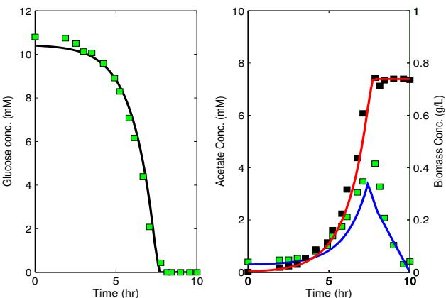
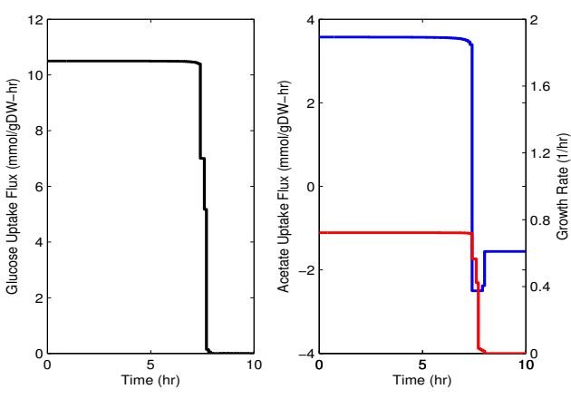

# Study of the growth of Escherichia coli on mixed substrates using dynamic flux balance analysis

Jim Joy ∗ and Andreas Kremling ∗∗

∗ Max Planck Institute for Dynamics of Complex Technical Systems, Sandtorstr. 1, 39106 Magdeburg, Germany (e-mail: Jim.Joy@mpi-magdeburg.mpg.de). ∗∗ Fachgebiet fu¨r Systembiotechnologie, Technische Universita¨t Mu¨nchen, Boltzmannstr. 15, D - 85748 Garching, Germany (e-mail: A.Kremling@lrz.tu-muenchen.de)

Abstract: Escherichia coli produces acetate as the major by-product when grown in a batch culture medium of glucose under aerobic conditions. The secreted acetate can be used as an additional substrate for cell growth leading to a mixed-substrate growth pattern of diauxic growth. However the acetate formed can limit growth of the organism if found in high amounts in the culture medium and such a scenario necessitates the study of the growth of microorganisms on mixed substrates. Dynamic flux balance analysis has turned out to be a promising tool in capturing such scenarios of growth on mixed substrates. In this study we carry out a dynamic flux balance analysis study of the growth of Escherichia coli in a batch culture medium of glucose and acetate where the organism encounters the presence of mixed substrates. Additionally we have used a detailed metabolic network to describe the process of metabolism in the organism Escherichia coli. DFBA combined with such detailed metabolic networks can open up possibilities of preventing such harmful growth scenarios for biotechnologically useful micro-organisms.

Keywords: Dynamic flux balance analysis, mixed substrates, dynamic optimization, bilevel, MPCC reformulation

# 1. INTRODUCTION

Industrial bioreactors, operated in batch mode, are commonly used to produce biotechnologically useful products. These reactors carry out processes involving the growth of micro-organisms on a complex media which may contain several sources of essential substrates. Therefore the design of bioreactors entail the need for studies of the growth of micro-organisms on mixed substrates (Narang et al. (1997)).

Escherichia coli is the most widely used bacterium for the production of the biotechnologically interesting metabolites e.g., recombinant proteins and amino acids (Choi et al. (2006)). Our study presently focuses on the growth of E. coli on a medium containing only two substrates although observations of growth on media containing more than two substrates have been made (Doshi and Venkatesh (1998)).

Under aerobic conditions of growth on glucose, E. coli produces acetate as the major byproduct. The secreted acetate can serve as an additional carbon source for utilization by the bacteria. However, high acetate accumulation in the medium can be detrimental for cell growth (Lin et al. (2006)) which implicates the necessity for a study of the growth of E. coli on these two substrates.

Bacteria grown in a batch culture medium of two growth limiting substrates can exhibit several substrate consumption patterns such as diauxic growth, simultaneous consumption, and bistable growth (Narang and Pilyugin (2007)). The growth of E. coli on glucose and acetate exhibits the mixed-substrate growth pattern of diauxic growth. Diauxic growth has been mathematically modeled and studied earlier using various approaches such as flux balance analysis (FBA) (Varma and Palsson (1994)), cybernetic modeling (Ramakrishna et al. (1996)), kinetic modeling (Xu et al. (1999), Guardia and Calvo (2001), Bettenbrock et al. (2006)), static optimizationbased dynamic flux balance analysis (DFBA), and dynamic optimization-based dynamic flux balance analysis (Mahadevan et al. (2002)). Amongst all, the dynamic optimization-based DFBA approach appears to be a lot more promising (Hjersted and Henson (2006), Hjersted and Henson (2009)) and hence this approach has been undertaken for our present study (from now on, DFBA would imply the dynamic optimization-based DFBA).

The earlier description of the mixed-substrate growth pattern of E. coli on glucose and acetate, using DFBA (Mahadevan et al. (2002)), involved the usage of a simplified metabolic network consisting of only 4 metabolites and 4 fluxes. Usage of such simplified networks do not provide any detailed understanding of the intracellular flux distributions nor can any regulation be easily incorporated into the network for accurate growth pattern descriptions. However these hurdles can be overcome by the usage of a more detailed (i.e., with lesser lumping of reactions) metabolic network in such studies. Hence the objective of this study is to use a more detailed metabolic network of E. coli to describe its mixed-substrate growth pattern on glucose and acetate using DFBA.

#### 2. METABOLIC NETWORK

Growth of an organism is the production of its biomass from certain extracellular metabolites (substrates) through a process called as metabolism which involves a metabolic network of several reactions and intracellular metabolites. A metabolic network is usually represented mathematically by a stoichiometric matrix S. We have used a metabolic network of E. coli constructed out of 113 reactions and 76 metabolites (Covert and Palsson (2002)) and hence in our study the matrix S would have a dimension of 76 x 113 (number of metabolites x number of reactions).

## 3. DYNAMIC FLUX BALANCE ANALYSIS

DFBA rests on the belief that an organism would grow by optimizing, in some constrained manner, the usage of the resources available to it. Hence the growth pattern description by the DFBA approach would involve the formulation and solution of an optimization problem composed of a dynamic flux balance model describing growth, some metabolic constraints and an objective. A dynamic flux balance model is set up by combining the dynamic mass balances on the key extracellular metabolites and the dynamic mass balances on the intracellular metabolites of the metabolic network.

#### 3.1 Dynamic Mass Balances - Extracellular Metabolites

The key extracellular metabolites in the present study include glucose, acetate and biomass. Dynamic mass balances of these metabolites are given as

$$\frac{dG(t)}{dt} = S^G v(t)X(t) \tag{1}$$

$$\frac{dA(t)}{dt} = S^A v(t)X(t) \tag{2}$$

$$\frac{dX(t)}{dt} = \mu(t)X(t) \tag{3}$$

where S G and S A are the rows of the stoichiometric matrix associated with glucose and acetate respectively, t is time (hours), G(t) is the glucose concentration (mM), A(t) is the acetate concentration (mM), X(t) is the biomass concentration (gDW/l), v(t) is a vector of flux variables (mmolgDW−1hr −1 ) that quantify the rates of the reactions in the metabolic network, and µ(t) is the growth rate (hr −1 ).

Oxygen can also be considered as a key extracellular metabolite and its dynamic mass balance could be included in the model (Mahadevan et al. (2002)). Since the study is focussed only on the aerobic batch growth pattern it would be ensured that the oxygen concentration is always maintained at the desired level ensuring no mass transfer limitations on the oxygen uptake flux.

## 3.2 Dynamic Mass Balances - Intracellular metabolites

A concised form of the dynamic mass balances of the intracellular metabolites can be given as

$$\frac{dx(t)}{dt} = Sv(t) \tag{4}$$

where x(t) is a vector of concentrations of the intracellular metabolites (mmolgDW−1 ), and S is the stoichiometric matrix.

The intracellular metabolites are assumed to equilibriate very rapidly to extracellular perturbations. This implies that the Pseudo-Steady-State Assumption (PSSA), which states that the concentration of a chemical compound is constant over a stipulated time frame, can be applied on them. Equation (4) then becomes (the steady-state mass balances)

$$Sv(t) = 0\tag{5}$$

#### 3.3 Metabolic Constraints

Metabolic constraints in the study of growth patterns arise in the form of bounds or uptake kinetic equations. The flux variables can be subjected to tight upper and/or lower bounds (called as flux capacity constraints). Flux variables associated with irreversible reactions have a zero lower bound or zero upper bound. Enzymatic reactions associated with known non-expressed genes have their flux variables constrained to a zero lower and zero upper bound. The concentration variables are naturally subjected to a zero lower bound.

The substrate uptake rate equations connect the intracellular steady-state mass balances and the extracellular dynamic mass balances. For glucose, a maximum allowable uptake rate (or flux) was defined using the Michaelis-Menten kinetics as in (6) and a maximum value for the uptake rate (or flux) of oxygen was defined as in (7).

$$S^G v(t) \le \frac{10 \ast G(t)}{K_m + G(t)}\tag{6}$$

$$S^{O_2}v(t) \le 15\tag{7}$$

where Km is the saturation constant (0.015 mM, (Mahadevan et al. (2002)).

# 3.4 Objective Function

Instantaneous objective functions have an upper hand over terminal time objective functions when it comes to the accurate description of growth patterns (Mahadevan et al. (2002)) and hence our chosen objective functions would be of the instantaneous formulation.

The formulated optimization problem turns out to be a dynamic optimization problem (8) with the state variables vector C(t) and the flux variables vector v(t) as the decision variables and φ(C(t), v(t)) as the objective function. It is to be noted that the growth rate µ(t) has been included as a growth (or biomass) flux variable (Varma and Palsson (1994) in the vector v(t) and all the extracellular metabolite concentration variables are represented by the vector of state variables C(t).

max C(t),v(t) φ(C(t), v(t)) (8) s.t. extracellular mass balances (eqns 1 − 3) intracellular mass balances (eqn 5) maximal uptake rate equations (eqns 6 − 7) v L ≤ v(t) ≤ v U , C(t) ≥ 0, t0 ≤ t ≤ tf

## 4. BILEVEL DYNAMIC OPTIMIZATION

The above formulated dynamic optimization problem could be solved, if a solution exists, to obtain an optimal solution which may or may not represent the true physiology of the cell. During the process of the consumption of a substrate, the cell directs the incoming substrate fluxes towards satisfying some cellular objective internally. Mathematically this implies that the flux variables are subjected to a seperate optimization problem: linear programming (LP) problem or nonlinear programmming (NLP) problem, whatever be the chosen objective function φ(C(t), v(t)). The consideration of this seperate optimization problem leads to a smaller feasible region within which the optimal solution of the original problem (8) could lie and this brings us closer to the predicability of the true physiological behaviour of the cell. Such optimization problems (9) involving the flux variables are seen in FBA (Varma and Palsson (1994)) where LP is usually used to obtain the optimal solution.

$$\max_{v(t)} c^T v(t) \tag{9}$$

$$\text{s.t. } Sv(t) = 0$$

where the objective function, c T v(t), is a linear combination of the flux variables.

So we see that the intracellular mass balances in (8) would have to be replaced by the optimization problem (9) to get the physiologically meaningful optimal solutions thereby giving rise to the bilevel dynamic optimization problem (10). The optimization problem (9) is usually called as the lower-level problem or the inner LP while the optimization problem (8), excluding the intracellular mass balances, is called as the upper-level problem (Colson et al. (2007)).

$$\max_{C(t),v(t)} \phi(C(t), v(t))\tag{10}$$

s.t. extracellular mass balances (eqns 1 − 3)

maximal uptake rate equations (eqns 6 − 7)

$$\begin{aligned} &v^L \le v(t) \le v^U, \quad C(t) \ge 0, \ t_0 \le t \le t_f\\ &\max_{\substack{v(t) \\ v(t)}} \quad c^T v(t) \\ &s.t. \quad S v(t) = 0 \end{aligned}$$

#### 4.1 Choice of Objective Functions

Though several attempts previously have been made to elucidate the best inner cellular objective (Schuetz et al. (2007), Ow et al. (2009)), maximization of growth rate has been realised to be better, as an inner cellular objective, in the description of growth on mixed substrates (Meadows et al. (2010)).

Maximizing the extracellular biomass concentration is chosen as the objective function in the upper-level problem. This ensures that the overall objective of the DFBA would be to maximize the growth of the organism and the correct description of the growth pattern of the organism would be obtained.

#### 4.2 Connecting Constraints

From the general formulation of a bilevel programming problem (Colson et al. (2007)), it can be seen that the state variables in the vector C(t) are called as the upperlevel variables and that the flux variables in the vector v(t) are called as the lower-level variables.

The extracellular mass balances and the maximal uptake rate equations in the bilevel dynamic optimization problem (10) form a set of upper-level constraints which involve both the upper-level and lower-level variables (Colson et al. (2007)). Such constraints are called connecting constraints. The shifting of constraints from one level to the other could lead to different optimal solutions and one should take care during such a shifting process (Mersha and Dempe (2006)).

## 5. MATHEMATICAL PROGRAM WITH COMPLIMENTARITY CONDITIONS

The bilevel dynamic optimization problem can be reformulated into a single-level dynamic optimization problem by replacing the lower-level problem with its firstorder optimality conditions or otherwise known as the Karush-Kuhn-Tucker (KKT) conditions (Raghunathan et al. (2003), Colson et al. (2007), Yang et al. (2008)). This gives rise to a mathematical program with complimentarity conditions (MPCCs) (Baumrucker et al. (2008)).

MPCCs are found to violate the linear independence constraint qualification (LICQ) and the Mangasarian-Fromovitz constraint qualification (MFCA) leading to non-unique and unbounded constraint multipliers. This may prove to be an obstacle in the search for an optimal solution to the MPCC. This can be circumvented by reformulating the MPCC through any of the methods mentioned in Baumrucker et al. (2008). For our study, we have chosen the Reg(ǫ) MPCC reformulation which involves the relaxation of the complimentarity conditions with a positive relaxation parameter ǫ. The solution of the MPCC is then obtained by solving a series of relaxed solutions as ǫ approaches to 0.

#### 5.1 Bilevel To Reformulated MPCC - General Formulation

In this subsection, we will show how a generally formulated bilevel problem is converted to a reformulated MPCC before it is solved. Let us consider the following general formulation of a bilevel DFBA problem (where v(t) ∈ nv, g: R nv → R nc , nc is the number of inequality constraints in the inner-level problem and nv is the number of flux variables)

$$\begin{aligned} \min_{C(t), v(t)} \phi(C(t), v(t)) \\ \text{s.t. } G(C(t), v(t)) \le 0 \end{aligned} \tag{11}$$

$$\begin{aligned} \min_{v(t)} \quad & f(v(t)) \\ \text{s.t.} \quad & g(v(t)) \ge 0 \end{aligned}$$

The inner-level problem in equation (11) (involving the objective function f(v(t))) is replaced by its first order optimality conditions to generate the following single-level problem or the MPCC

$$\begin{aligned} \min_{\begin{aligned} C(t), v(t), \lambda \\ \end{aligned}} & \phi(C(t), v(t)) \\ & s.t. \ G(C(t), v(t)) \le 0 \\ & g(v(t)) \ge 0 \\ & \lambda_i \ge 0, \quad i = 1, \dots, n_c \\ & \lambda_i \ g_i(v(t)) = 0, \quad i = 1, \dots, n_c \\ & \nabla_{v(t)} (f(v(t)) - \sum_{i=1}^{n_c} \lambda_i \ g_i(v(t))) = 0 \end{aligned}$$

The complimentarity conditions (13) are reformulated using the Reg(ǫ) MPCC reformulation to the set of equations given in (14).

λi gi(v(t)) = 0, i = 1, ..., nc (13)

$$
\lambda_i \ g_i(v(t)) \le \epsilon, \quad i = 1, \ldots, n_c \tag{14}
$$

The reformulated complimentarity conditions (14) are then substituted into the MPCC (12) to generate the following reformulated MPCC

$$\begin{aligned} \min_{\begin{aligned} C(t), v(t), \lambda \end{aligned}} & \phi(C(t), v(t)) \\ & s.t. \; G(C(t), v(t)) \le 0 \\ & g(v(t)) \ge 0 \\ & \lambda_i \ge 0, \quad i = 1, \dots, n_c \\ & \lambda_i \; g_i(v(t)) \le \epsilon, \quad i = 1, \dots, n_c \\ & \nabla_{v(t)} (f(v(t)) - \sum_{i=1}^{n_c} \lambda_i \; g_i(v(t))) = 0 \end{aligned}$$

The final solution of the MPCC (12) is obtained by solving a series of reformulated MPCCs where ǫ is varied from a low value to finally 0.

## 6. DYNAMIC OPTIMIZATION PROBLEM SOLUTION

Each of the series of reformulated MPCCs is solved using the simultaneous approach. In this approach, the state and the flux variables are discretized in time using orthogonal collocation on finite elements. This discretization along with other considerations transforms the dynamic optimization problem into an NLP problem which is finally solved to get the desired optimal time profiles of the state and flux variables. A detailed description of the simultaneous approach can be found in Biegler et al. (2002).

# 7. DFBA : MIXED-SUBSTRATE GROWTH PATTERN

A dynamic flux balance analysis was carried out to describe the mixed-substrate growth pattern exhibited by E. coli when it is grown in a batch culture medium of glucose and acetate. The experimental data provided in (Varma and Palsson (1994)) was used for the validating the model predictions.

# 7.1 Batch Culture Medium - Initial Concentrations

The in silico batch culture medium was assumed to contain glucose at a concentration of 10.4 mM and acetate at a concentration of 0.3 mM (Covert and Palsson (2002)). The initial biomass concentration was assumed to be 0.003 g/L (Covert and Palsson (2002)). The in silico cells were also assumed to be already adapted to the provided in silico batch culture medium.

# 7.2 Dynamic Optimization Problem Formulation

The batch culture growth was simulated for a total time period of 10 hours starting with an initial time of 0 hours. The considered time period was split into 100 elements of finite length for the dynamic optimization problem formulation.

The state and the flux profiles were approximated using three and two collocation points respectively. A further assumption introduced was that the flux profile could be represented by a piecewise constant polynomial (constant over each finite element).

The formulated single level dynamic optimization problem was then solved using the MATLAB and GAMS programming environments with the help of an interfacing software to connect these two environments.

# 7.3 Metabolic Constraints

The glucose uptake flux was bounded to a maximum value of 10.5 mmolgDW−1hr −1 while a maximum flux value of 2.5 mmolgDW−1hr −1 was enforced for the uptake of acetate.

# 7.4 Acetate production and consumption

Using DFBA, we were able to simulate the mixedsubstrate growth pattern of diauxic growth exhibited by Escherichia coli when grown in a batch culture medium of glucose and actetate. Fig. 1 shows the time profiles of the predicted concentrations of the key extracellular metabolites. The time profiles of the fluxes associated with these metabolites are shown in Fig. 2.

The simulation was able to capture the initial production of acetate and its later consumption by the organism. It seems that the consumption of acetate provided only for the maintenance requirements and growth during this phase was negligible. Once glucose is consumed, the organism encounters a nutrient-limiting condition. This may trigger a stress signal and the choice of maximizing growth may not be the best objective function to describe the behaviour of the organism during this period. However in total the simulated profiles show a good agreement with the experimental data.

Fig. 1. Predicted concentration-time profiles of the key metabolites (experimental data represented by square boxes)

Fig. 2. Predicted flux-time profiles associated with the key metabolites

## 8. CONCLUSION

Dynamic flux balance analysis presents itself as a powerful tool to describe the dynamics associated with microbial growth. In our study, the mixed-substrate growth pattern of Escherichia coli on glucose and acetate in a batch culture was predicted reasonably good. Choice of such large metabolic networks for DFBA studies of growth patterns gives a better description of the dynamics of the intracellular fluxes. This helps us to understand the interactions between the different pathways of the network and the effect of environmental conditions on them. The intracellular flux profiles however would have to be verified to ensure that the dynamic behaviour of the entire intracellular network has been correctly captured by DFBA. Due to lack of experimental data, we could not carry out this verification.

Although the present study has been restricted to the presence of only two substrates, the use of DFBA can be extended to the growth pattern studies of organisms in a complex medium containing more than two substrates. Also a study on the determination of the best inner cellular objective function could be carried out on a DFBA scale. DFBA can also admit experimental data in the outer objective function (minimizing the errors between model predictions and experimental observations) which carves out a new way for the incorporation of experimental data to obtain better model predictions.

#### ACKNOWLEDGEMENTS

The financial support provided by the the International Max Planck School Magdeburg, for this work, is gratefully acknowledged.

## REFERENCES

- Baumrucker, B.T., Renfro, J.G., and Biegler, L.T. (2008). MPEC problem formulations and solution strategies with chemical engineering applications. Computers & Chemical Engineering, 32(12), 2903–2913.
- Bettenbrock, K., Fischer, S., Kremling, A., Jahreis, K., Sauter, T., and Gilles, E.D. (2006). A quantitative approach to catabolite repression in Escherichia coli. Journal of Biological Chemistry, 281(5), 2578–2584.
- Biegler, L.T., Cervantes, A.M., and Wachter, A. (2002). Advances in simultaneous strategies for dynamic process optimization. Chemical Engineering Science, 57(4), 575–593.
- Choi, J.H., Keum, K.C., and Lee, S.Y. (2006). Production of recombinant proteins by high cell density culture of Escherichia coli. Chemical Engineering Science, 61(3), 876–885.
- Colson, B., Marcotte, P., and Savard, G. (2007). An overview of bilevel optimization. Annals of Operations Research, 153(1), 235–256.
- Covert, M.W. and Palsson, B.O. (2002). Transcriptional regulation in constraints-based metabolic models of Escherichia coli. Journal of Biological Chemistry, 277(31), 28058–28064.
- Doshi, P. and Venkatesh, K.V. (1998). An optimal model for microbial growth in a multiple substrate environment: simultaneous and sequential utilization. Process Biochemistry, 33(6), 663–670.
- Guardia, M.J. and Calvo, E.G. (2001). Modeling of Escherichia coli growth and acetate formation under different operational conditions. Enzyme and Microbial Technology, 29(6-7), 449–455.
- Hjersted, J.L. and Henson, M.A. (2006). Optimization of fed-batch Saccharomyces cerevisiae fermentation using dynamic flux balance models. Biotechnology Progress, 22(5), 1239–1248.
- Hjersted, J.L. and Henson, M.A. (2009). Steady-state and dynamic flux balance analysis of ethanol production by Saccharomyces cerevisiae. Iet Systems Biology, 3(3), 167–179.
- Lin, H., Castro, N., Bennett, G., and San, K.Y. (2006). Acetyl-CoA synthetase overexpression in Escherichia coli demonstrates more efficient acetate assimilation and lower acetate accumulation: a potential tool in metabolic engineering. Applied Microbiology and Biotechnology, 71(6), 870–874.
- Mahadevan, R., Edwards, J.S., and Doyle, Francis J., I. (2002). Dynamic flux balance analysis of diauxic growth in Escherichia coli. Biophys. J., 83(3), 1331–1340.
- Meadows, A.L., Karnik, R., Lam, H., Forestell, S., and Snedecor, B. (2010). Application of dynamic flux bal-

ance analysis to an industrial escherichia coli fermentation. Metabolic Engineering, 12(2), 150–160.

- Mersha, A.G. and Dempe, S. (2006). Linear bilevel programming with upper level constraints depending on the lower level solution. Applied Mathematics and Computation, 180(1), 247–254.
- Narang, A., Konopka, A., and Ramkrishna, D. (1997). New patterns of mixed-substrate utilization during batch growth of Escherichia coli K12. Biotechnology and Bioengineering, 55(5), 747–757.
- Narang, A. and Pilyugin, S.S. (2007). Bacterial gene regulation in diauxic and non-diauxic growth. Journal of Theoretical Biology, 244(2), 326–348.
- Ow, D.S.W., Lee, D.Y., Yap, M.G.S., and Oh, S.K.W. (2009). Identification of cellular objective for elucidating the physiological state of plasmid-bearing Escherichia coli using genome-scale in silico analysis. Biotechnology Progress, 25(1), 61–67.
- Raghunathan, A.U., Perez-Correa, J.R., and Biegler, L.T. (2003). Data reconciliation and parameter estimation in flux-balance analysis. Biotechnology And Bioengineering, 84(6), 700–709.
- Ramakrishna, R., Ramkrishna, D., and Konopka, A.E. (1996). Cybernetic modeling of growth in mixed, substitutable substrate environments: Preferential and simultaneous utilization. Biotechnology and Bioengineering, 52(1), 141–151.
- Schuetz, R., Kuepfer, L., and Sauer, U. (2007). Systematic evaluation of objective functions for predicting intracellular fluxes in Escherichia coli. Molecular Systems Biology, 3, 119.
- Varma, A. and Palsson, B.O. (1994). Stoichiometric flux balance models quantitatively predict growth and metabolic by-product secretion in wild-type Escherichia-Coli W3110. Applied And Environmental Microbiology, 60(10), 3724–3731.
- Xu, B., Jahic, M., and Enfors, S.O. (1999). Modeling of overflow metabolism in batch and fed-batch cultures of Escherichia coli. Biotechnology Progress, 15(1), 81–90.
- Yang, L., Mahadevan, R., and Cluett, W.R. (2008). A bilevel optimization algorithm to identify enzymatic capacity constraints in metabolic networks. Computers & Chemical Engineering, 32(9), 2072–2085.