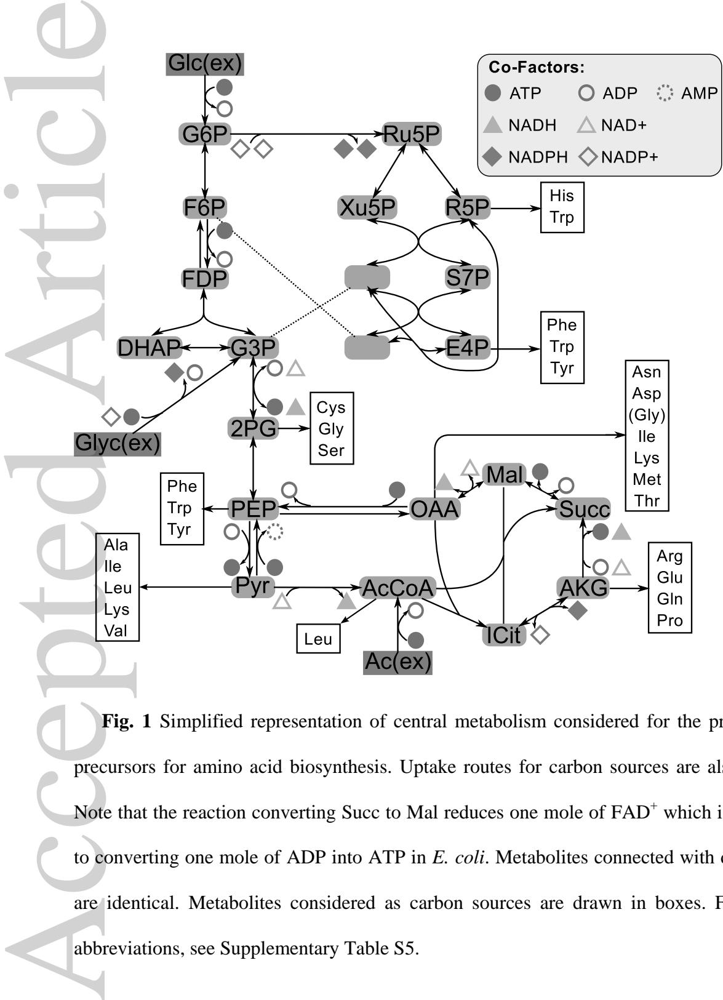
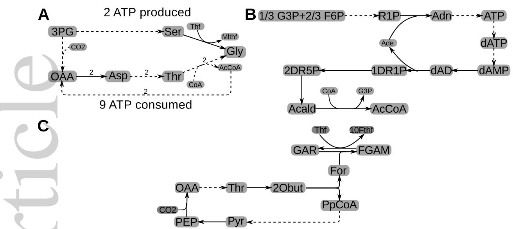
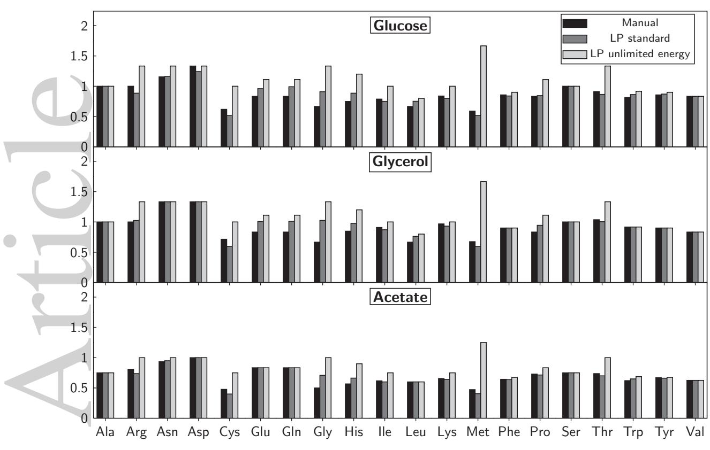
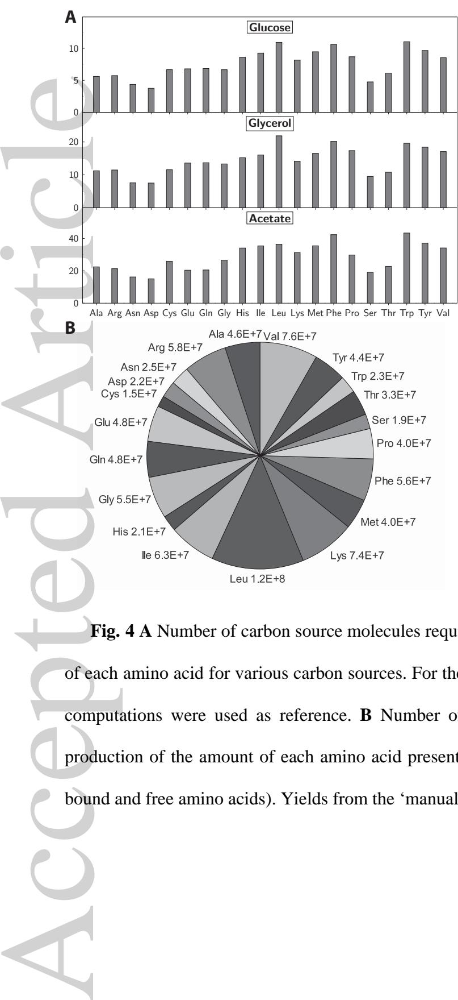
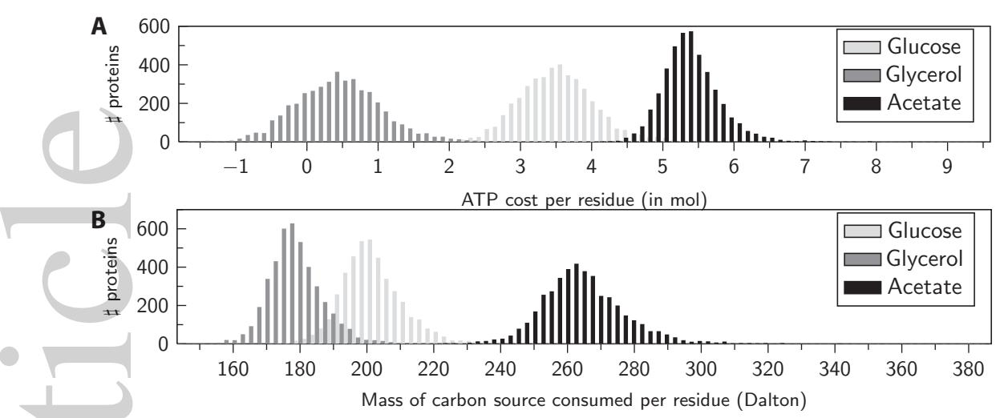

### Research Article

## **Metabolic costs of amino acid and protein production in** *Escherichia coli*

*Christoph Kaleta1,\$ , Sascha Schäuble1 , Ursula Rinas2,3 , Stefan Schuster4*

1 Research Group Theoretical Systems Biology, Friedrich Schiller University Jena, Leutragraben 1, 07743 Jena, Germany

Helmholtz Centre for Infection Research, Inhoffenstraße 7, 38124 Braunschweig , Germany

3 Institute of Technical Chemistry - Life Science, Leibniz University of Hannover, Callinstraße 5, 30167 Hannover, Germany

4 Department of Bioinformatics, Friedrich Schiller University Jena, Ernst-Abbe-Platz 2, 07743 Jena, Germany

Email: Christoph.Kaleta@uni-jena.de, sascha.schaeuble@uni-jena.de, uri@helmholtz-hzi.de, stefan.schu@uni-jena.de \$

To whom correspondence should be addressed.

#### **Corresponding author:**

2

Jun.-Prof. Dr. Christoph Kaleta Research Group Theoretical Systems Biology, School of Biology and Pharmaceutics Friedrich Schiller University Jena Leutragraben 1 D-07743 Jena, Germany E-mail: christoph.kaleta@uni-jena.de Phone: +49 3641 949590 Fax: +49 3641 949595 Accepted Article

## **Keywords**

Amino acid production; Amino acid biosynthetic cost; Protein production cost; *E. coli* metabolism; Recombinant proteins

This article has been accepted for publication and undergone full peer review but has not been through the copyediting, typesetting, pagination and proofreading process, which may lead to differences between this version and the Version of Record. Please cite this article as doi: 10.1002/biot.201200267.

Submitted: 30-Nov-2012 Revised: 05-Apr-2013 Accepted: 28-May-2013

© 2013 Wiley-VCH Verlag GmbH & Co. KGaA, Weinheim

#### **Abbreviations**

|   | acetyl-CoA | Acetyl coenzyme A                                     |
|---|------------|-------------------------------------------------------|
|   | e ADP   | Adenosine diphosphate                                 |
|   | ATP        | Adenosine triphosphate                                |
| l | CO2        | Carbon dioxide                                        |
|   | FADH       | Flavin adenine dinucleotide hydrate                   |
|   | c G3P   | Glyceraldehyde 3‐phosphate                            |
|   | GlyA       | Serine hydroxymethyltransferase                       |
|   | LP         | Linear programming                                    |
| i | Mlthf      | Methyltetrahydrofolate                                |
| t | NAD(P)H    | Nicotinamide adenine dinucleotide (phosphate) hydrate |
|   | TCA cycle  | Tricarboxylic acid cycle                              |
| r |            |                                                       |
|   | AA         | Amino acid                                            |
|   | Ala        | Alanine                                               |
| A | Arg        | Arginine                                              |
|   | Asn        | Asparagine                                            |
|   | Asp        | Aspartate                                             |
|   | Cys        | Cystein                                               |
|   | Glu        | Glutamate                                             |
| d | Gln        | Glutamine                                             |
|   | Gly        | Glycine                                               |
|   | His        | Histidin                                              |
|   | e Ile   | Isoleucin                                             |
|   | Leu        | Leucin                                                |
| t | Lys        | Lysin                                                 |
|   | Met        | Methionine                                            |
|   | p Phe   | Phenylalanine                                         |
|   | Pro        | Proline                                               |
|   | Ser        | Serine                                                |
|   | e Thr   | Threonine                                             |
|   | Trp        | Tryptophane                                           |
|   | Tyr        | Tyrosine                                              |
|   | c Val   | Valine                                                |
|   |            |                                                       |
|   |            |                                                       |
|   | c          |                                                       |
|   |            |                                                       |
|   |            |                                                       |
| A |            |                                                       |
|   |            |                                                       |
|   |            |                                                       |

## **Abstract**

*Escherichia coli* is the most popular microorganism for the production of recombinant proteins and also gaining increasing importance for the production of low-molecular weight compounds such as amino acids. The metabolic cost associated to the production of amino acids and (recombinant) proteins from glucose, glycerol and acetate was determined using three different computational techniques to identify those amino acids that put the highest burden on the biosynthetic machinery of *E. coli*. Comparing the costs of individual amino acids, we find that methionine is the most expensive amino acid in terms of consumed moles of ATP per molecule produced while leucine is the most expensive amino acid when additionally taking into account cellular abundances of amino acids. Moreover, we show that the biosynthesis of a large number of amino acids from glucose and particularly from glycerol provides a surplus of energy, which can be used to balance the high energetic cost of amino acid polymerization.

Accepted Article

## **1 Introduction**

In a technological setup, many biological products are currently being synthesized using bacteria such as *Escherichia coli*. *E. coli* is the most common bacterial host employed for the production of recombinant proteins which are required for pharmaceutical and technical applications but also for research purposes [1-3] and is one of the workhorses of synthetic biology [4, 5]. Also, *E. coli* emerges as an important producer of amino acids utilized as food additives or as components of cosmetics and pharmaceuticals [6-8]. Thus, a deeper understanding of the metabolic costs of amino acid and protein production and the characteristics of the corresponding pathways is crucial for the rational design of producer strains. Accepted Article

Using defined medium with glucose or especially with glycerol as carbon substrate, *E. coli* can be grown to high cell densities when cells are kept under balanced growth conditions with reduced carbon supply [9-12]. When grown under unbalanced conditions with carbon substrate excess, acetate formation can occur, which if accumulating to toxic concentrations, can prevent further growth and product formation [13-15]. However, acetate at moderate concentrations can also be utilized as carbon source [15]. Thus, glucose, glycerol and acetate are major starting carbon compounds, which are transformed into amino acids and proteins.

While pathways for synthesizing individual amino acids are biochemically well defined in textbooks [16], they usually cover only a small portion of reactions that are required to convert a source compound such as glucose into a certain product. However, a pathway has to be considered in the context of the entire network to account also for precursor production or balancing of co-factors and, thus, to allow for an unbiased characterization and comparison with other pathways.

In this work, we analyze amino acid and protein synthesis by determining and characterizing flux distributions of all required reactions using three different methods and evaluating three different measures for cost. We start with a 'manual' computation of amino acid biosynthetic cost from central metabolic precursors as done by Stouthamer et al. [17] and Akashi and Gojobori [18]. We update and correct the values given by Stouthamer in the light of new knowledge of metabolic pathways in *E. coli.*

We proceed by using two different linear programming (LP) methods, which allow a computation of flux distributions with maximal yield (product-to-substrate ratio) [19] in a genome-scale metabolic model of *E. coli* [20]. In the first 'LP standard' method, we assume that flux distributions have to balance energy currency metabolites such as ATP and NAD(P)H, while we relax this requirement in the second 'LP unlimited energy' method formulation where it is assumed that the cells have an excess of energy [ATP (H+ )] and free electrons available. In the following, we will distinguish between these three methods by using the terms 'manual', 'LP standard' and 'LP unlimited energy', respectively. Computing the measures of ATP consumption, carbon yield and per kilodalton cost for flux distributions and comparing them across different amino acids allows us to draw important conclusions on the characteristics of amino acid biosynthetic pathways. The different cost measures that we compute reflect different aspects of the biosynthetic routes as well as the carbon sources. While yield is strongly influenced by the molecular mass of a carbon source, ATP consumption is influenced by the energetic content of a carbon source and carbon yield by the position at which a carbon source enters central metabolism. Linear programming has been previously used to compute maximal yields of different amino acids in *E. coli* using reduced models available at that time [21, 22]. We have extended these studies using a genome-scale metabolic model leading to more accurate data from linear programming and determined the metabolic cost of protein synthesis for which we additionally need to consider the cost of polymerizing amino acids into proteins. These calculations can serve as a starting point to Accepted Article

design improved media for the production of amino acids and proteins since they indicate the metabolic cost of the production of individual amino acids and entire proteins for the cell.

## **2 Materials and Methods**

### *2.1 Data*

As metabolic model, we used the genome-scale reconstruction of *E. coli* metabolism *i*AF1260 [20]. For information on how we modified the metabolic network for our calculations see Supplementary Text S1. For the 'manual' determination of flux distributions for amino acid production we used pathways as displayed in the metabolic maps of *E. coli* of the BiGG database [23] as reference. Data on the sequence of proteins and mass of individual amino acids were taken from EcoCyc [24]. For details on the computation of the synthesis cost of all amino acids present in the cell see Supplementary Text S2.

## *2.2 'Manual' computation of amino acid costs*

Precursors of individual amino acids were assumed to be those as described before [25] (Supplementary Table S1 and Fig. 1). Costs in terms of NADPH, NADH, FADH, ATP and methyltetrahydrofolate (Mlthf) were determined for each pathway. It was assumed that the energy content of NADPH is equal to that of NADH and twice that of FADH and ATP. In the case of alternative routes for biosynthesis of an amino acid, the cost of the pathway with the lowest number of ATP consumed was used as reference. Furthermore, all intermediates of biosynthetic pathways except precursors and energetic co-factors were assumed to be balanced. To calculate overall ATP costs for each amino acid, the ATP produced during formation of each precursor from the respective amount of carbon source was added to the overall ATP cost of the amino acid. For these calculations glycolysis, TCA cycle and pentose Accepted Article

phosphate pathway are assumed to synthesize precursors (Fig. 1). The corresponding data is provided in Supplementary Table S2.

## **2.2.1 Computation of yields**

Yields were computed by determining, for each amino acid, the amount of carbon source that is required to produce the precursors of these amino acids (Supplementary Table S2). In the case that the biosynthetic pathway consumes ATP it was assumed that ATP is balanced by oxidizing the respective quantities of carbon source. If ATP is produced, it was assumed that the energy is dissipated or utilized through other means (e.g. protein synthesis) and thus does not affect yield. In *E. coli*, complete oxidation of one mole of glucose leads to a theoretical maximum yield of 26 moles of ATP, one mole of glycerol yields a maximum of 15 moles of ATP and one mole of acetate yields a maximum of 7 moles of ATP. Additionally, it was assumed that the carbon source is used to supply methyltetrahydrofolate in cases where the biosynthesis of the amino acid requires this compound. Using linear programming we determined that one mole of glucose can be used to convert 4.55 moles of tetrahydrofolate into methyltetrahydrofolate. For glycerol and acetate this number is 2.48 and 1.16, respectively. Total glucose consumption for synthesis of each amino acid was determined by summing up the amount of carbon source required to produce the precursors, the amount of carbon source oxidized to produce ATP and the amount of carbon source required to produce tetrahydrofolate. Yields were then computed by dividing one by the amount of carbon sources consumed. Hence, the resulting yield is given in mol/mol. Accepted Article

#### *2.3 Computational Methods*

Linear programming (LP) was used to compute optimal flux distributions. Given the stoichiometric matrix **S** of the metabolic network, in which rows correspond to metabolites and columns to reactions, we assumed that all intermediates are balanced (steady-state

condition) and that reversible reactions are only used in thermodynamically feasible directions. For computational reasons we split reversible reactions into irreversible forward and backward steps. For details on how we computed yield-optimal flux distributions with and without assuming an unlimited energy supply see Supplementary Text S3.

## **3 Results**

For our computations, we used a genome-scale model of *E. coli* metabolism [20]. We assumed aerobic conditions and unlimited availability of ammonia, sulfate, water (including H+ , OH- ), and carbon dioxide. For the interconversion of energy equivalents in the form of ATP, NADH, NADPH and FADH we used ATP as reference assuming a P/O ratio of 2.0. Thus, two moles of ATP are energetically equivalent to one mole of NADH, one mole of NADPH and two moles of FADH. Since this value depends on culture conditions, the data provided for the manual yield computations in Supplementary Table S2 allow one to determine yields also for other P/O ratios. Accepted Article

## *3.1 Methods to characterize amino acid biosynthetic flux distributions*

There exist various approaches to characterize flux distributions. Two important aspects are the yield, a measure that describes the product-to-substrate ratio, and energetic cost, such as the amount of ATP consumed or produced by a flux distribution.

Yield can be expressed by different quantities. A measure that is not biased by the mass of the final product is carbon yield. The carbon yield of a flux distribution relates the amount of carbon atoms present in the source compounds of a flux distribution to the carbon atoms in the final product. Thus, a carbon yield equal to one C-mol/C-mol indicates that the same numbers of carbon atoms are present in the source compounds and in the product. Hence, a carbon yield below one C-mol/C-mol indicates that carbon atoms have been lost to a sideproduct. A similar measure is per kilodalton costs, that is, the amount of source compounds that is required to synthesize one kilodalton of pathway product. In contrast to carbon yield, this measure does also take into account elements other than carbon.

Besides measures to characterize flux distributions, methods to determine them are another important issue. In the classical work of Stouthamer [17] it was assumed that glycolysis, pentose phosphate pathway and citric acid cycle are used to produce a set of predefined precursors for amino acid biosynthesis. From these precursors biosynthetic pathways leading to amino acids are relatively linear and there seldom exist alternative routes. These pathways were then characterized in terms of ATP, NADPH and NADH consumed and produced. In an extension of this work, Akashi and Gojobori [18] and Heizer et al. [5] additionally took into account the energy produced during synthesis of the precursors and determined the overall amount of carbon source required to synthesize each amino acid.

Besides this 'manual' method to determine flux distributions, another commonly used approach is linear programming [22, 26, 27]. This method allows one to determine a flux distribution that is optimal with respect to an objective function [4, 19, 28-30]. Such calculations allow one to determine the maximal amount of product that can be synthesized from a set of source compounds. This is particularly useful in bioengineering to predict the best yield that can be expected upon manipulating biosynthetic pathways. In this 'LP standard' approach, it is commonly assumed that flux distributions balance all intermediates including energy-currency co-factors. Additionally, these calculations can be performed with a network that contains a reaction that converts energy-currency co-factors back into their active form, thus simulating unlimited energy supply (see *Materials and Methods* and Supplementary Text S3). In vivo, such an artificial electron supply can be introduced, for instance, by a light-driven proton pump [16]. Moreover, these calculations offer the possibility to determine the en Accepted Articleergy-independent performance limits of the metabolic network and allow one to analyze pathways independent of energy-supplying reactions.

## *3.2 Costs of amino acid biosynthesis*

#### **3.2.1 'Manual' computation of ATP costs**

A simplified representation of the metabolic network considered for production of central metabolic intermediates of amino acid biosynthesis is depicted in Fig. 1. We computed ATP consumption of amino acid biosynthesis for the synthesis from central metabolic precursors (Supplementary Table S1) and the overall costs from different carbon sources (Table 1). Starting from the precursors, glycine and serine are the cheapest amino acids since their biosynthesis is ATP neutral. Methionine, whose biosynthesis consumes 20 moles of ATP, is the most expensive amino acid. A table similar to Supplementary Table S1, which is often used as reference for amino acid biosynthesis cost, has been published in [25], but contains several errors. These are due to biosynthetic pathways not known at the time of publication and an erroneous balancing of carbon atoms in several cases. Furthermore, we consider the consumption and production of methyltetrahydrofolate, which serves as a principal donor of C1-bodies for several amino acid biosynthetic pathways. This is of particular importance for the overproduction of amino acids whose synthesis requires this compound [31]. Additionally taking into account the amount of ATP produced during synthesis of precursors gives rise to costs as displayed in Table 1. In this table ten out of the 20 amino acids are listed with a negative ATP consumption when using glucose as carbon substrate and thus, a net ATP production along their corresponding pathways. This is most pronounced for leucine with a net production of nine moles of ATP. The most expensive amino acid is methionine, which consumes 18 moles of ATP, which arises primarily from incorporating sulfur. Using glycerol as carbon source, the biosynthesis of 13 amino acids entails a net production of ATP. Compared to glucose as carbon source, the effect of ATP production through amino acid synthesis is even more pronounced with leucine being the "cheapest" amino acid with a net Accepted Article

production of 15 moles of ATP. When synthesizing amino acids from acetate, only eight amino acids entail a net production of ATP. Thus, the metabolic cost associated to the production of amino acids strongly depends on the carbon source, which will be discussed in more detail in the section "Computation of protein synthesis costs".

We furthermore computed the yields of the flux distributions determined with the 'manual' approach (Table 1). For growth on glucose, tryptophan has the lowest yield of 0.444 mol/mol, while alanine, aspartate, glycine and serine allow for the highest yield of 2.0 mol/mol.

#### **3.2.2 Calculating costs by linear programming**

We computed the maximum yields of individual amino acid biosynthetic flux distributions starting from different carbon sources using linear programming under the assumption that 1) pathways have to balance energy containing co-factors ('LP standard') and 2) that reduction potential in form of NADH is available in excess ('LP unlimited energy'). In consequence, also NADPH and ATP are available in unlimited amounts.

#### *'LP standard' formulation*

The yields for the first case are displayed in Table 1. They contained only slight deviations or were identical in most cases to the yields computed with the 'manual' method in the last section. However, in particular the yields of amino acids that implied a net production of ATP are higher than in the 'manual' computations. In this case we assumed that the organism uses standard routes through central metabolism to produce the precursors and uses the route with the smallest overall ATP consumption to produce the amino acid from the precursors. Thus, we used different basic assumptions for the identification of the corresponding flux distribution: (i) standard routes of central metabolism are used and (ii) the yield of the amino acids is maximized. Accepted Article

These two assumptions are conflicting to some extent since the standard routes in central metabolism often produce energy in form of ATP, which in turn necessarily reduces the amount of synthesizable product. This is particularly apparent from the production of acetyl-CoA that is required in leucine biosynthesis. On the standard route through glycolysis, acetyl-CoA can be produced from 0.5 moles of glucose with an accompanied release of one mole CO2. Using an alternative route via the pentose phosphate pathway, nucleotide synthesis and deoxynucleotide degradation (Fig. 2B) 5/6 moles of glucose are converted into one mole of G3P and acetyl-CoA. Here, the CO2 releasing step is avoided and only 1/3 moles of glucose are required to produce one mole of acetyl-CoA, but require an overall two moles of ATP. When converting glucose into acetyl-CoA along glycolysis five moles of ATP are produced in total instead. Thus, in the case of leucine biosynthesis the yield from the 'manual' computations is 0.667 mol/mol with nine moles of ATP produced while the optimal yield is 0.752 mol/mol and uses the route depicted in Fig. 2B to synthesize acetyl-CoA.

Furthermore, in some cases there exist several routes on which amino acids can be produced, where again a pathway with a less favorable ATP balance can have a higher yield. One example is glycine biosynthesis (Fig. 2A). There exist three pathways for glycine biosynthesis in *E. coli*, two from oxaloacetate via threonine biosynthesis and one from 3 phosphoglycerate via serine biosynthesis. Starting from one mole of 3-phosphoglycerate, one mole of glycine is produced along with a zero net consumption of ATP (Supplementary Table S1). Additionally, this pathway produces one mole of methyltetrahydrofolate, which can be converted back into tetrahydrofolate while reducing one mole of NADP+ and, thus, providing two moles of ATP which is the overall ATP production along this pathway. The other pathway via threonine has a net consumption of one mole of oxaloacetate and nine moles of ATP. Hence, the pathway via serine has the higher ATP production but the lower yield. In contrast, the pathway via threonine has a higher yield but consumes ATP. In consequence, the optimal pathway combines the ATP production along the pathway via serine Accepted Article

with the ATP consumption of the pathway via threonine in order to achieve a higher yield than with the ATP producing pathway alone. In vivo, glycine biosynthesis via serine is the major source of glycine since a strain with a knockout in the enzyme converting serine to glycine, GlyA, is glycine auxotrophic [2].

#### *Linear programming assuming unlimited energy supply ('LP unlimited energy')*

The yields of yield-optimal flux distributions assuming "unlimited energy" supply are shown in Table 1. In a few cases, these yields are similar to 'LP standard' computed flux distributions. Glycine biosynthesis is particularly interesting, since the yield increases from 2.7 mol/mol to 4.0 mol/mol, as the pathway via threonine can be used exclusively if energy is available in excess. However, 4.125 moles of ATP per mole glycine produced are required to achieve this yield (Supplementary Table S3).

The most drastic increase can be observed for methionine biosynthesis, where the yield increases more than threefold from 0.621 mol/mol to 2.0 mol/mol. Thereby, the cost increases to 36.25 moles of ATP per mole of methionine produced (Supplementary Table S3). The reasons for this drastic increase are due to two carbon atoms of methionine that can be provided from carbon dioxide. On the biosynthetic pathway of methionine, one mole of 3 phosphoglycerate is converted into one mole of methionine. Additionally, one mole of Lhomoserine is converted into pyruvate and one mole of 5-methyltetrahydrofolate is converted into tetrahydrofolate, thereby providing two additional carbon atoms. During conversion of pyruvate back into L-homoserine, one carbon dioxide is fixed. Furthermore, a pathway that allows fixation of carbon dioxide by tetrahydrofolate and uses reactions of threonine degradation and purine biosynthesis can be used to convert tetrahydrofolate into 5 methyltetrahydrofolate (Fig. 2C). In consequence, one mole of glucose can be used to synthesize two moles of methionine. However, as the high energetic cost suggests, this Accepted Article

pathway might not be feasible under physiological conditions. Nevertheless, these numbers are important as they show the maximal theoretical yield from the carbon source even though additional energy (electrons) would be required from another source.

## **3.2.3 Carbon yields of amino acid biosynthesis**

Next, we determined the carbon yields of the flux distributions for the different computation schemes and carbon sources (Fig. 3). In case of the flux distributions computed with the 'manual' method using glucose as carbon source, carbon yields are mostly below one C-mol/C-mol with the exception of alanine, serine, asparagine and aspartate. For the latter two amino acids, carbon yields are even above one C-mol/C-mol showing that the synthesis of these amino acids involves fixation of carbon dioxide. The rather low carbon yield of cysteine and methionine of around 0.5 C-mol/C-mol is due to the high energy investment for their biosyntheses (Table 1). Using the 'LP standard' formulation to compute maximal yields only slightly changes the carbon yields in comparison to the 'manual' computations (Fig. 3). Assuming an unlimited energy supply, we found that the carbon yields are above one Cmol/C-mol in ten cases, equal to one C-mol/C-mol in five cases and below one C-mol/C-mol in another five cases (Fig. 3). Thus, the biosynthesis of half of the amino acids can, theoretically, be used to fix carbon dioxide. For glycerol as carbon source the yields tend to be slightly higher than in the case of glucose utilization. For acetate, the carbon yields show a strong decrease with only one being larger than one if assuming unlimited energy supply. This can be explained by gluconeogenesis requiring the action of either phosphoenolpyruvate carboxykinase or malic enzyme to produce phosphoenolpyruvate or pyruvate, respectively, from acetate. In both cases, one carbon atom is lost to carbon dioxide. Accepted Article

#### **3.2.4 Per kilodalton and overall amino acid synthesis costs**

One bias present in the number of ATPs required for the synthesis of individual amino acids as well as the yields is that the masses of the amino acids are neglected. Thus, the yields computed via the 'manual' method assuming glucose as carbon source indicate that the production of tryptophan (yield of 0.44 mol/mol) is almost five times as expensive as the production of alanine (yield of 2.0 mol/mol). However, alanine only contains three carbon atoms whereas tryptophan contains eleven. To reduce this bias we computed for each amino acid the number of carbon source molecules that are required to synthesize an equivalent of 1 kDa of the amino acid including the costs of oxidizing carbon sources to provide energy for amino acid synthesis (Fig. 4).

In the context of these numbers tryptophan is only twice as expensive as alanine. Moreover, these costs show that phenylalanine and methionine are almost as expensive as tryptophan if synthesized from glucose and more expensive if synthesized from glycerol.

Furthermore, we computed the overall number of glucose molecules invested into the production of the amount of every amino acid present in one *E. coli* cell, based on the yields from the 'manual' calculations and the biomass composition of *E. coli* reported in [20] (Fig. 4B). These numbers show that while tryptophan is the most expensive amino acid in terms of per molecule synthesis cost, it only represents 1.1% of all proteic amino acids on a molar basis and its production requires only 2.5% ( glucose molecules) of the glucose consumed for the production of all amino acids. In contrast, the biosynthesis of leucine which comprises 8.4% of all proteic amino acids demands glucose molecules, which corresponds to 13% of the glucose consumed for total amino acid production. 7 2.3 ⋅10 8 1.2 ⋅10 Accepted Article

### *3.3 Computation of protein synthesis costs*

In a next step, we combined the computation of the biosynthesic costs of individual amino acids with the computation of the biosynthesis cost of entire proteins (*Materials and Methods*). Besides amino acids, additional energy is required to translate the mRNA from DNA and to polymerize amino acids. We assumed that each amino acid requires a nucleotide triplet that can be synthesized with a cost of six ATP [17]. Furthermore, we assumed that on average 30 proteins are translated per mRNA [25]. Thus, the transcription costs add up to 6 ATP / 30 copies per mRNA = 0.2 ATP per amino acid. The costs of translation are 4 ATP per amino acid [32]. In consequence, the cost of polymerization is approximately 4.2 ATP per amino acid residue. Since linear programming based costs tend to involve non-canonical routes for the synthesis of individual amino acids, we used the costs calculated with the 'manual' method. Accepted Article

## **3.3.1 ATP investment for protein production**

In order to analyze the impact of biosynthesis and polymerization cost on metabolism, we first computed the average ATP investment per residue required for the biosynthesis of every protein of *E. coli* including polymerization costs. A histogram of these values over all proteins of *E. coli* assuming glucose as carbon source shows that the synthesis and polymerization of the amino acids to generate most proteins consume ATP with a median of 3.7 moles of ATP cost per residue (Fig. **5**). Since the polymerization costs of 4.2 moles of ATP per residue are included, there is on average a net production of 3.7-4.2 = 0.5 moles of ATP per residue if only accounting for the costs of amino acid syntheses.

This result is even more pronounced using glycerol as carbon source (Fig. **5**A). Here, 0.44 moles of ATP are consumed on average per residue. Thus, based on glycerol, for most proteins the polymerization cost of amino acids can be replenished from the energy produced during amino acid biosynthesis alone. This particular characteristic of protein production from glycerol is, as discussed above, due to the fact that the synthesis of 65% of amino acids from glycerol provides a surplus of energy.

A completely different picture can be obtained for acetate (Fig. **5**A), where the synthesis of amino acids contained in proteins has a median of 5.19 moles of ATP consumed per residue. Hence, a larger fraction of carbon source has to be additionally oxidized in order to synthesize amino acids and to provide ATP for polymerization in comparison to glucose and glycerol.

#### **3.3.2 Carbon source required to produce proteins**

We determined the amount of carbon source that is required to produce each protein. In order to reduce bias due to the different sizes of proteins we divided the amount of carbon source required for the production of each protein by the respective number of amino acid residues contained in the protein. Moreover, we accounted for the different molecular masses of the carbon sources by determining, for each carbon source, the mass of the carbon source molecules required to synthesize each amino acid residue.

Analyzing the histogram of the per residue costs of all proteins, we found monomodal distributions that resemble each other for the three carbon sources (Fig. 5B). For glucose we found a median of 204 Da of glucose consumed per amino acid residue per protein. For glycerol and acetate, the respective medians are at 178 Da and 259 Da of carbon source, respectively. Thus, also considering the mass of the invested carbon source, glycerol is most effective for protein production. Accepted Article

## **4 Discussion**

Here, we have characterized amino acid biosynthetic pathways in *E. coli* starting from different carbon sources using different types of costs. The knowledge of ATP yields is of great relevance in biochemistry in general. Many pathways (not only amino acid producing pathways) are characterized and compared according to their ATP yield. This has practical implications in biotechnology and Synthetic Biology because products of interest can only be produced when the net energy balance allows this. Moreover, energy-efficient pathways are obviously of special interest. Moreover, these numbers can serve as an important guideline for optimizing growth media for recombinant protein production. Depending on the physiological condition of the organism during the production process, such as intracellular ATP levels or levels of amino acid precursors, as well as experimental conditions, such as concentration of the carbon source, different cost measures can be most informative.

Classically, the ATP consumption along amino acid biosynthetic pathways as well as the product yield have been considered the most important factors [17, 18]. However, as we have shown, flux distributions with a high production of ATP often have a reduced yield with respect to the carbon substrate. We demonstrate that yield-optimal flux distributions of individual amino acids can contain non-canonical routes, which can potentially increase product yields compared to those routes that are normally used by the cell. Moreover, our analysis of protein producing flux distributions showed that the polymerization costs of a large number of proteins can be partially or, in the case of glycerol, almost fully compensated by energy produced during biosynthesis of amino acids. These results are confirmed to some extent by the findings that glycerol is often better suited as carbon source than glucose, in particular after recombinant protein production has been initiated [33, 34]. Accepted Article

In order to reduce the bias due to the different molecular mass of individual amino acids we have computed carbon yields and costs per kilodalton. These computations showed that

with the carbon sources considered here, carbon atoms are lost to carbon dioxide in most amino acid synthesizing flux distributions. However, in theory there exist flux distributions that allow for fixation of carbon atoms from carbon dioxide for half of the amino acids. The calculations showed that tryptophan is, despite being the largest amino acid, not the most expensive amino acid if accounting for the mass of amino acids. Instead, phenylalanine as well as methionine are equally expensive, if synthesized from glucose. Assuming canonical routes for the production of amino acid precursors, methionine is the most expensive amino acid. Its biosynthesis from glucose costs 18 moles of ATP, which is of particular importance for the design of production processes and strains over-producing this amino acid, as it is one of the most important commercial amino acids [7, 31, 35]. In contrast, considering the quantities in which amino acids are present in *E. coli*, we found that the cell invests the largest amount of carbon source molecules into the production of leucine. Our analysis gives a detailed overview on the metabolic costs of amino acid and protein synthesis from different points of view. These results can serve as an important guideline for the improvement of production media. In particular, the utilization of glycerol as carbon source and the supplementation of expensive amino acids as indicated by our analysis may help to considerably improve production processes. Accepted Article

## **5 Acknowledgments**

Financial support from the German Ministry of Education and Research (BMBF) within the Jena Centre of Bioinformatics, the FORSYS-Partner program (grant FKZ 0315285D and E) and the Jena Centre for Systems Biology of Ageing, JenAge (grant FKZ0315581D) is gratefully acknowledged.

# **6 Conflictsofinterest statement**

The authors declare no commercial or financial conflict of interest.

# **7 References**

[1] Makrides, S. C., Strategies for achieving high-level expression of genes in *Escherichia coli*. *Microbiol Rev* 1996, *60*, 512-538.

[2] Baneyx, F., Mujacic, M., Recombinant protein folding and misfolding in *Escherichia coli*. *Nat Biotechnol* 2004, *22*, 1399-1408.

[3] Carlson, R. P., Metabolic systems cost-benefit analysis for interpreting network structure and regulation. *Bioinformatics* 2007, *23*, 1258-1264.

[4] Kayser, A., Weber, J., Hecht, V., Rinas, U., Metabolic flux analysis of *Escherichia coli* in glucose-limited continuous culture. I. Growth-rate-dependent metabolic efficiency at steady state. *Microbiology* 2005, *151*, 693-706.

[5] Heizer, E. M., Raiford, D. W., Raymer, M. L., Doom, T. E.*, et al.*, Amino acid cost and codon-usage biases in 6 prokaryotic genomes: a whole-genome analysis. *Mol Biol Evol* 2006, *23*, 1670-1680.

[6] Park, J. H., Lee, S. Y., Fermentative production of branched chain amino acids: a focus on metabolic engineering. *Appl. Microbiol. Biotechnol.* 2010a, *85*, 491-506.

[7] Park, J. H., Lee, S. Y., Metabolic pathways and fermentative production of L-aspartate family amino acids. *Biotechnol. J.* 2010, *5*, 560-577.

[8] Wendisch, V. F., Bott, M., Eikmanns, B. J., Metabolic engineering of *Escherichia coli* and *Corynebacterium glutamicum* for biotechnological production of organic acids and amino acids. *Curr Opin Microbiol* 2006, *9*, 268-274.

[9] Korz, D. J., Rinas, U., Hellmuth, K., Sanders, E. A., Deckwer, W. D., Simple fed-batch technique for high cell density cultivation of *Escherichia coli*. *J. Biotechnol.* 1995, *39*, 59-65.

[10] Lee, S. Y., High cell-density culture of *Escherichia coli*. *Trends Biotechnol.* 1996, *14*, 98-105.

[11] Shiloach, J., Fass, R., Growing E. coli to high cell density--a historical perspective on method development. *Biotechnol Adv* 2005, *23*, 345-357.

[12] Rinas, U., Hellmuth, K., Kang, R., Seeger, A., Schlieker, H., Entry of *Escherichia coli* into stationary phase is indicated by endogenous and exogenous accumulation of nucleobases. *Appl. Environ. Microbiol.* 1995, *61*, 4147-4151. Accepted Article

[13] Luli, G. W., Strohl, W. R., Comparison of growth, acetate production, and acetate inhibition of *Escherichia coli* strains in batch and fed-batch fermentations. *Appl. Environ. Microbiol.* 1990, *56*, 1004-1011.

[14] Shiloach, J., Rinas, U., Glucose and acetate metabolism in *E. coli* - System level analysis and biotechnological applications in protein production processes, in: Lee, S. Y. (Ed.), *Systems Biology and Biotechnology of E. coli*, Springer-Verlag, Berlin, Heidelberg, New York 2009, pp. 377-400.

[15] Wolfe, A. J., The acetate switch. *Microbiol. Mol. Biol. Rev.* 2005, *69*, 12-50.

[16] Stryer, L., Berg, J. M., Tymoczko, J. L., *Biochemistry (7th edition)*, W H Freeman & Co 2010.

[17] Stouthamer, A. H., A theoretical study on the amount of ATP required for synthesis of microbial cell material. *Antonie Van Leeuwenhoek* 1973, *39*, 545-565.

[18] Akashi, H., Gojobori, T., Metabolic efficiency and amino acid composition in the proteomes of *Escherichia coli* and *Bacillus subtilis*. *Proc. Natl. Acad. Sci. USA* 2002, *99*, 3695-3700.

[19] Varma, A., Palsson, B. O., Stoichiometric flux balance models quantitatively predict growth and metabolic by-product secretion in wild-type *Escherichia coli* W3110. *Appl Environ Microbiol* 1994, *60*, 3724-3731.

[20] Feist, A. M., Henry, C. S., Reed, J. L., Krummenacker, M.*, et al.*, A genome-scale metabolic reconstruction for *Escherichia coli* K-12 MG1655 that accounts for 1260 ORFs and thermodynamic information. *Mol. Syst. Biol.* 2007, *3*, 121.

[21] Varma, A., Boesch, B. W., Palsson, B. O., Biochemical production capabilities of *Escherichia coli*. *Biotechnol Bioeng* 1993, *42*, 59-73.

[22] Burgard, A. P., Maranas, C. D., Probing the performance limits of the *Escherichia coli* metabolic network subject to gene additions or deletions. *Biotechnol Bioeng* 2001, *74*, 364- 375.

[23] Schellenberger, J., Park, J. O., Conrad, T. M., Palsson, B. O., BiGG: a Biochemical Genetic and Genomic knowledgebase of large scale metabolic reconstructions. *BMC Bioinformatics* 2010, *11*, 213.

[24] Keseler, I. M., Collado-Vides, J., Santos-Zavaleta, A., Peralta-Gil, M.*, et al.*, EcoCyc: a comprehensive database of *Escherichia coli* biology. *Nucleic Acids Res* 2011, *39*, D583- D590.

[25] Ingraham, J. L., Maaloe, O., Neidhardt, F. C., *Growth of the bacterial cell*, Sinauer Associates, Sunderland, Mass. 1983.

[26] Varma, A., Palsson, B. O., Metabolic capabilities of *Escherichia coli*: I. synthesis of biosynthetic precursors and cofactors. *J Theor Biol* 1993, *165*, 477-502.

[27] Sajitz-Hermstein, M., Nikoloski, Z., A novel approach for determining environmentspecific protein costs: the case of *Arabidopsis thaliana*. *Bioinformatics* 2010, *26*, i582-588.

[28] Fell, D. A., Small, J. R., Fat synthesis in adipose tissue. An examination of stoichiometric constraints. *Biochem. J.* 1986, *238*, 781-786.

[29] Shlomi, T., Benyamini, T., Gottlieb, E., Sharan, R., Ruppin, E., Genome-scale metabolic modeling elucidates the role of proliferative adaptation in causing the Warburg effect. *PLoS Comput Biol* 2011, *7*, e1002018. Accepted Article

[30] Feist, A. M., Palsson, B. O., The biomass objective function. *Curr Opin Microbiol* 2010.

[31] Krömer, J. O., Wittmann, C., Schroder, H., Heinzle, E., Metabolic pathway analysis for rational design of L-methionine production by *Escherichia coli* and *Corynebacterium glutamicum*. *Metab. Eng.* 2006, *8*, 353-369.

[32] Lehninger, A., Nelson, D. L., Cox, M. M., *Lehninger Principles of Biochemistry (5th edition)*, W. H. Freeman 2008.

[33] Luo, Q., Shen, Y. L., Wei, D. Z., Cao, W., Optimization of culture on the overproduction of TRAIL in high-cell-density culture by recombinant Escherichia coli. *Appl Microbiol Biotechnol* 2006, *71*, 184-191.

[34] Berger, C., Montag, C., Berndt, S., Huster, D., Optimization of *Escherichia coli* cultivation methods for high yield neuropeptide Y receptor type 2 production. *Protein Expr Purif* 2011, *76*, 25-35.

[35] Ikeda, M., Amino acid production processes. *Adv. Biochem. Eng. Biotechnol.* 2003, *79*, 1-35.

## **Tables**

| e Table 1 Characteristics of flux distributions producing the 20 amino acids from glucose,                                                                                       |                                                                                                 |       |                                                  |                  |          |          |        |                  |          |         |                                                                                           |           |          |  |  |
|-------------------------------------------------------------------------------------------------------------------------------------------------------------------------------------|-------------------------------------------------------------------------------------------------|-------|--------------------------------------------------|------------------|----------|----------|--------|------------------|----------|---------|-------------------------------------------------------------------------------------------|-----------|----------|--|--|
| glycerol and acetate. "ATP Cons." indicates the number of ATP consumed according to the                                                                                             |                                                                                                 |       |                                                  |                  |          |          |        |                  |          |         |                                                                                           |           |          |  |  |
| l                                                                                                                                                                                   |                                                                                                 |       |                                                  |                  |          |          |        |                  |          |         |                                                                                           |           |          |  |  |
| 'manual' calculations for each carbon source as indicated on the top of the rows (assuming 1 c NADH = 1 NADPH = 2 FADH = 2 ATP). "Yields" corresponds to yields obtained from |                                                                                                 |       |                                                  |                  |          |          |        |                  |          |         |                                                                                           |           |          |  |  |
|                                                                                                                                                                                     |                                                                                                 |       |                                                  |                  |          |          |        |                  |          |         |                                                                                           |           |          |  |  |
| i different computation schemes for flux distributions: 'manual' corresponds to 'manual'                                                                                         |                                                                                                 |       |                                                  |                  |          |          |        |                  |          |         |                                                                                           |           |          |  |  |
|                                                                                                                                                                                     | t computation, "LP Std" corresponds to linear programming using the standard formulation 'LP |       |                                                  |                  |          |          |        |                  |          |         |                                                                                           |           |          |  |  |
|                                                                                                                                                                                     | r standard' and "LP UE" corresponds to linear programming assuming unlimited energy supply   |       |                                                  |                  |          |          |        |                  |          |         |                                                                                           |           |          |  |  |
|                                                                                                                                                                                     |                                                                                                 |       |                                                  |                  |          |          |        |                  |          |         |                                                                                           |           |          |  |  |
| A                                                                                                                                                                                   |                                                                                                 |       |                                                  |                  |          |          |        |                  |          |         | ('LP unlimited energy'). For information about the ATP consumption for LP standard and LP |           |          |  |  |
|                                                                                                                                                                                     |                                                                                                 |       | unlimited energy see Supplementary Tables S3-S5. |                  |          |          |        |                  |          |         |                                                                                           |           |          |  |  |
|                                                                                                                                                                                     |                                                                                                 |       |                                                  |                  |          |          |        |                  |          |         |                                                                                           |           |          |  |  |
|                                                                                                                                                                                     | Glucose                                                                                         |       |                                                  |                  |          | Glycerol |        |                  |          | Acetate |                                                                                           |           |          |  |  |
|                                                                                                                                                                                     | AA                                                                                              | ATP   |                                                  | Yields (mol/mol) |          | ATP      |        | Yields (mol/mol) |          | ATP     | Yields (mol/mol)                                                                          |           |          |  |  |
| d                                                                                                                                                                                   |                                                                                                 | cons. | Manual                                           | LP Std        | LP UE | cons.    | Manual | LP Std        | LP UE | cons.   | Manual                                                                                    | LP Std | LP UE |  |  |
|                                                                                                                                                                                     | Ala                                                                                             | -1    | 2.00                                             | 2.00             | 2.00     | -3       | 1.00   | 1.00             | 1.00     | -1      | 0.50                                                                                      | 0.50      | 0.50     |  |  |
|                                                                                                                                                                                     | e Arg                                                                                        | 0     | 1.00                                             | 0.89             | 1.33     | -4       | 0.50   | 0.51             | 0.67     | 5       | 0.27                                                                                      | 0.25      | 0.33     |  |  |
|                                                                                                                                                                                     | Asn                                                                                             | 2     | 1.73                                             | 1.74             | 2.00     | 0        | 1.00   | 1.00             | 1.00     | 1       | 0.47                                                                                      | 0.47      | 0.50     |  |  |
| t                                                                                                                                                                                   | Asp                                                                                             | 0     | 2.00                                             | 1.86             | 2.00     | -2       | 1.00   | 1.00             | 1.00     | -1      | 0.50                                                                                      | 0.50      | 0.50     |  |  |
|                                                                                                                                                                                     | Cys                                                                                             | 8     | 1.24                                             | 1.03             | 2.00     | 6        | 0.71   | 0.60             | 1.00     | 8       | 0.32                                                                                      | 0.27      | 0.50     |  |  |
|                                                                                                                                                                                     | Glu                                                                                             | -7    | 1.00                                             | 1.15             | 1.33     | -11      | 0.50   | 0.60             | 0.67     | -2      | 0.33                                                                                      | 0.33      | 0.33     |  |  |
|                                                                                                                                                                                     | p Gln                                                                                        | -6    | 1.00                                             | 1.19             | 1.33     | -10      | 0.50   | 0.61             | 0.67     | -1      | 0.33                                                                                      | 0.33      | 0.33     |  |  |
|                                                                                                                                                                                     | Gly                                                                                             | -2    | 2.00                                             | 2.73             | 4.00     | -4       | 1.00   | 1.54             | 2.00     | -2      | 0.50                                                                                      | 0.71      | 1.00     |  |  |
|                                                                                                                                                                                     | e His                                                                                        | 3     | 0.75                                             | 0.89             | 1.20     | 4.33     | 0.42   | 0.49             | 0.60     | 7.67    | 0.19                                                                                      | 0.22      | 0.30     |  |  |
|                                                                                                                                                                                     | Ile                                                                                             | 7     | 0.79                                             | 0.75             | 1.00     | 3        | 0.45   | 0.44             | 0.50     | 6       | 0.21                                                                                      | 0.20      | 0.25     |  |  |
|                                                                                                                                                                                     | Leu                                                                                             | -9    | 0.67                                             | 0.75             | 0.80     | -15      | 0.33   | 0.38             | 0.40     | -5      | 0.20                                                                                      | 0.20      | 0.20     |  |  |
|                                                                                                                                                                                     | c Lys                                                                                        | 5     | 0.84                                             | 0.80             | 1.00     | 1        | 0.48   | 0.47             | 0.50     | 4       | 0.22                                                                                      | 0.21      | 0.25     |  |  |
|                                                                                                                                                                                     | Met                                                                                             | 18    | 0.71                                             | 0.62             | 2.00     | 16       | 0.40   | 0.36             | 1.00     | 17      | 0.19                                                                                      | 0.16      | 0.50     |  |  |
|                                                                                                                                                                                     | c Phe                                                                                        | 0     | 0.57                                             | 0.56             | 0.60     | -4.33    | 0.30   | 0.30             | 0.30     | 2.33    | 0.14                                                                                      | 0.14      | 0.15     |  |  |
|                                                                                                                                                                                     | Pro                                                                                             | -2    | 1.00                                             | 1.01             | 1.33     | -6       | 0.50   | 0.57             | 0.67     | 3       | 0.29                                                                                      | 0.29      | 0.33     |  |  |
|                                                                                                                                                                                     | Ser                                                                                             | -2    | 2.00                                             | 2.00             | 2.00     | -4       | 1.00   | 1.00             | 1.00     | -2      | 0.50                                                                                      | 0.50      | 0.50     |  |  |
|                                                                                                                                                                                     | Thr                                                                                             | 6     | 1.37                                             | 1.30             | 2.00     | 4        | 0.78   | 0.75             | 1.00     | 5       | 0.37                                                                                      | 0.35      | 0.50     |  |  |
| A                                                                                                                                                                                   | Trp                                                                                             | -1    | 0.44                                             | 0.47             | 0.50     | -2       | 0.25   | 0.25             | 0.25     | 6       | 0.11                                                                                      | 0.12      | 0.13     |  |  |
|                                                                                                                                                                                     | Tyr                                                                                             | -2    | 0.57                                             | 0.58             | 0.60     | -6.33    | 0.30   | 0.30             | 0.30     | 0.33    | 0.15                                                                                      | 0.15      | 0.15     |  |  |
|                                                                                                                                                                                     | Val                                                                                             | -2    | 1.00                                             | 1.00             | 1.00     | -6       | 0.50   | 0.50             | 0.50     | -2      | 0.25                                                                                      | 0.25      | 0.25     |  |  |

# **Figure Legends**

**Fig. 1** Simplified representation of central metabolism considered for the production of precursors for amino acid biosynthesis. Uptake routes for carbon sources are also depicted. Note that the reaction converting Succ to Mal reduces one mole of FAD+ which is equivalent to converting one mole of ADP into ATP in *E. coli*. Metabolites connected with dashed lines are identical. Metabolites considered as carbon sources are drawn in boxes. For a list of abbreviations, see Supplem entary Table S5.

**Fig. 2 A** Simplified representation of glycine biosynthetic and related pathways in *E. coli* from 3-phosphoglycerate (3PG) and oxaloacetate (OAA). Small numbers above the arrows indicates relative fluxes larger than one. The upper flux distribution produces two moles of ATP with a yield of one mole of glycine from one mole of 3PG. The lower pathway consumes nine moles of ATP with a glycine-over-3PG yield of two. **B** Simplified representation of a pathway that allows fixation of carbon dioxide by tetrahydrofolate (Thf). Please note that 10-formyltetrahydrofolate (10Fthf) can be converted into 5- methyltetrahydrofolate that is required for methionine biosynthesis. **C** Pathway for production of acetyl-CoA that bypasses CO2 production: one mole of glycerol-3P (G3P) and 2/3 moles of fructose-6P (F6P) are converted into one mole of AcCoA and G3P each. Dashed arrows correspond to lumped reactions. Additional abbreviations: 1DR1P, 2-deoxy-D-ribose-1- phosphate; 2DR5P, 2-deoxy-D-ribose-5-phosphate; 2Obut, 2-oxobutanoate; Acald, acetaldehyde; Adn, adenosine; dAD, deoxyadenosine; dAT(M)P, deoxy-AT(M)P; FGAM, N2-formyl-N1-(5-phospho-D-ribosyl)glycinamide; For, formate; GAR, N1-(5-phospho-Dribosyl)-glycinamide; Mlthf, methyltetrahydrofolate; PpCoA, propanoyl-CoA; R1P, ribose-1- phosphate. Accepted Article

**Fig. 3** Fraction of carbon atoms retained after biosynthesis of different amino acids for different cost computation schemes and carbon sources (given in C-mol/C-mol).

Accepted Article

**Fig. 4 A** Number of carbon source molecules required for the production of one kilodalton of each amino acid for various carbon sources. For the computation, yields from the 'manual' computations were used as reference. **B** Number of glucose molecules consumed for the production of the amount of each amino acid present in one *E. coli* cell (comprising protein bound and free amino acids). Yields from the 'manual' computations were used.

**Fig. 5** Cost of protein production. **A** Histogram of the average ATP balance (per amino acid) in the synthesis of amino acids for all proteins in *E. coli* including polymerization costs. For the corresponding numbers for each protein of *E. coli* see Supplementary Data S1. **B**  Histogram of the cost of the biosynthesis of all *E. coli* proteins (per residue and mole of protein) from various carbon sources. Costs are given as the average mass of carbon source (in Dalton) that is required per residue of the protein. Yields of individual amino acids from the 'manual' computations were used. Please note that these numbers include polymerization costs. For the corresponding numbers of each protein of *E. coli* see Supplementary Data S1.

Accepted Article