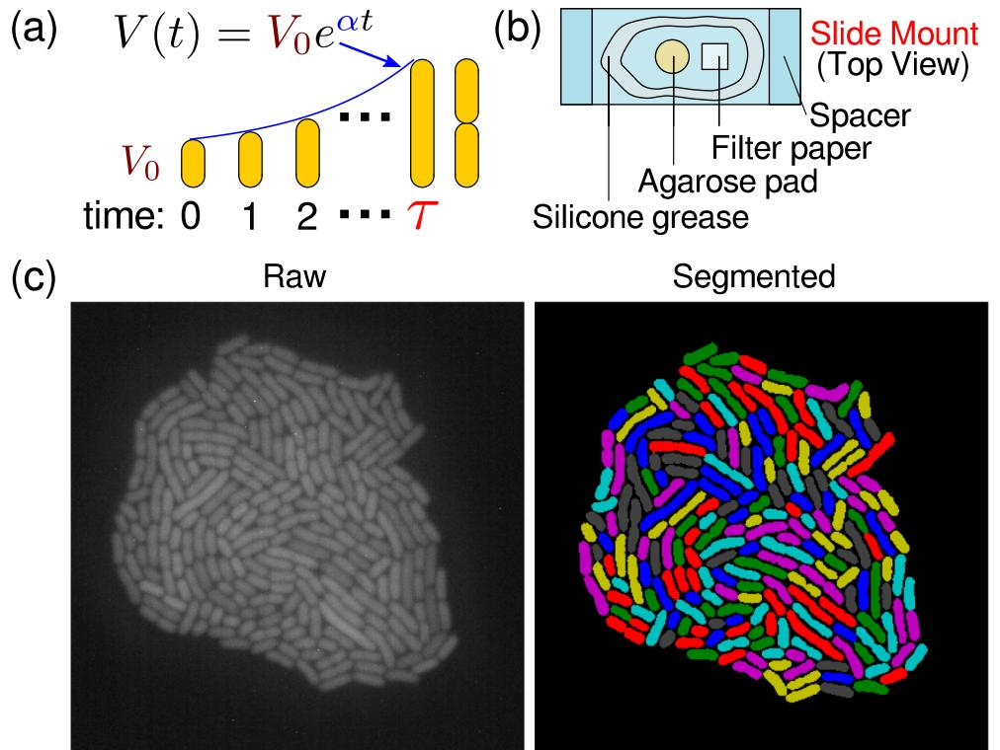
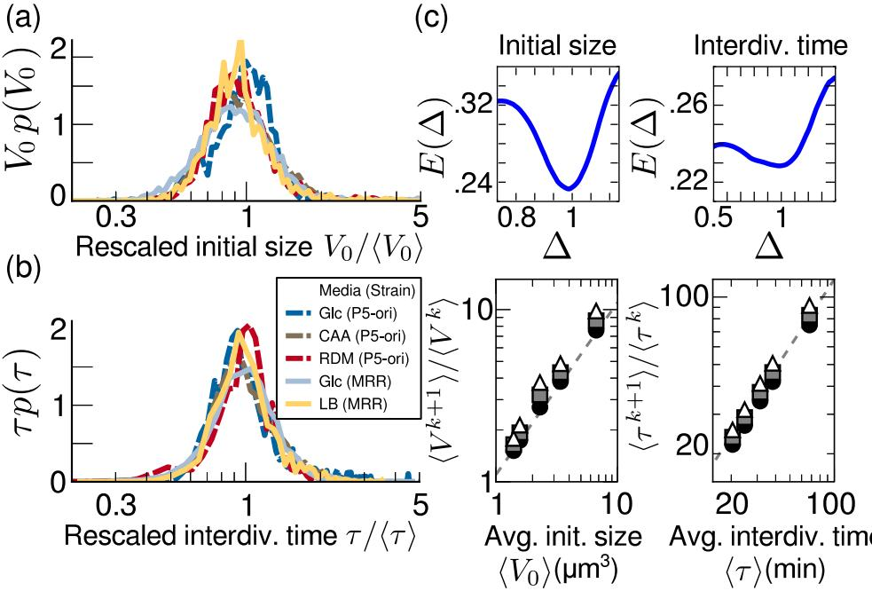
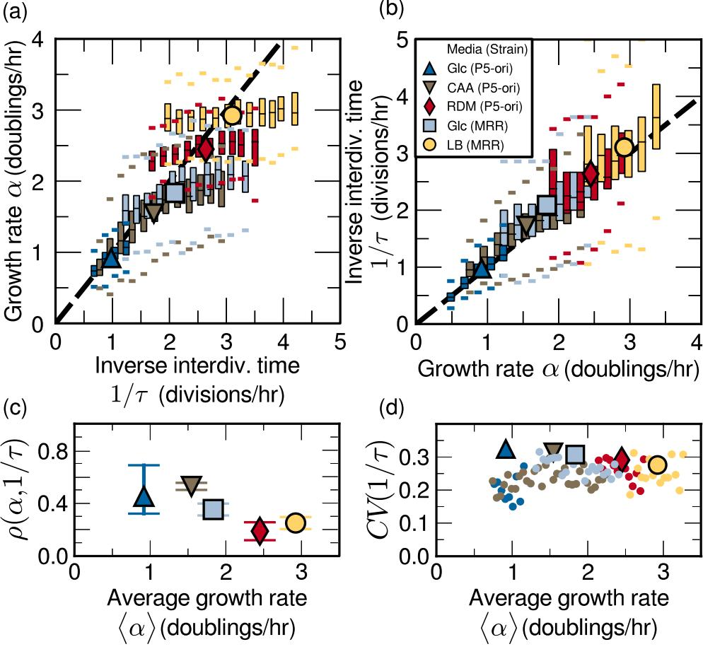
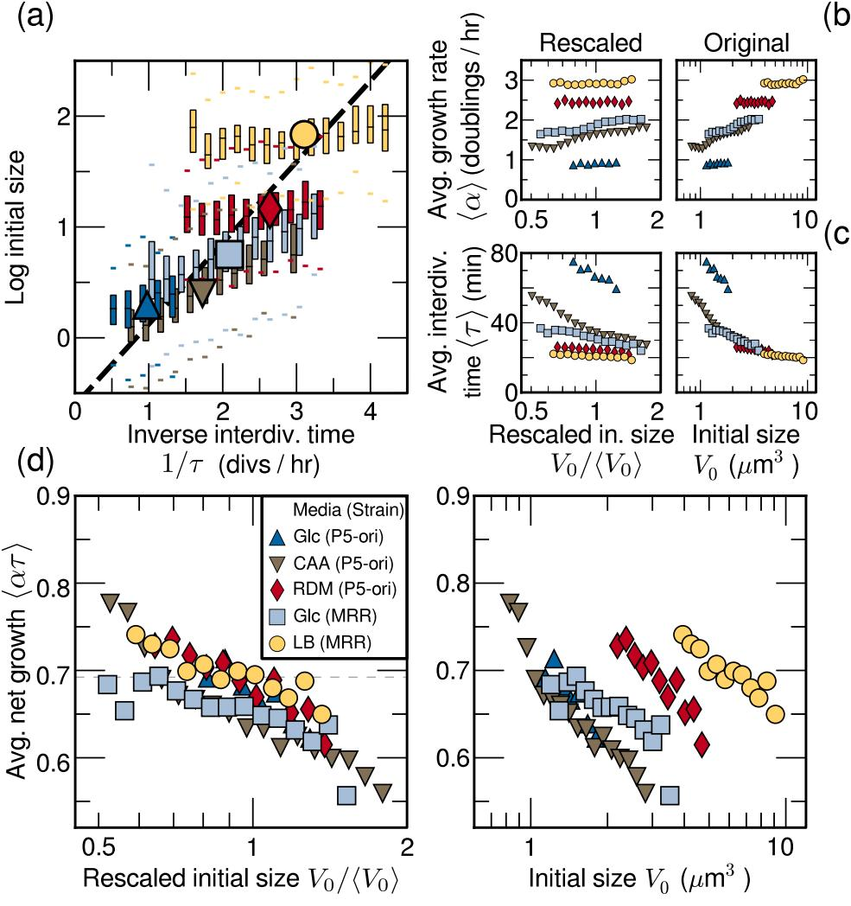
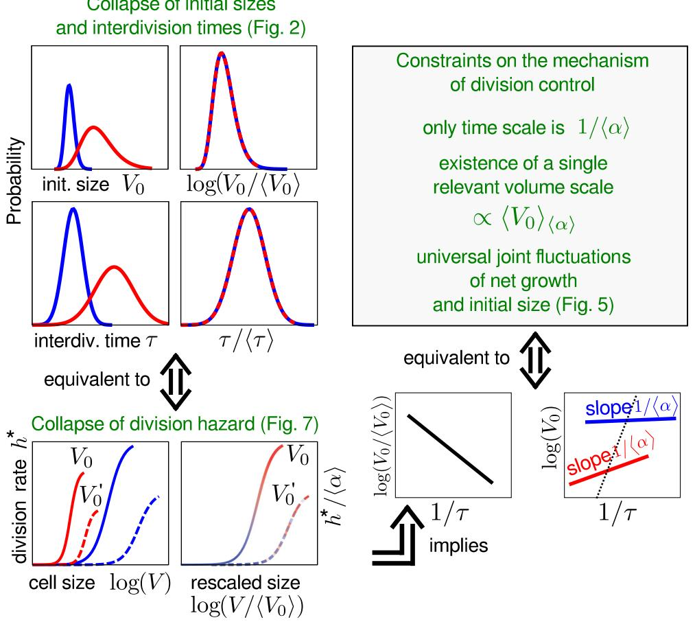

# **Individuality and universality in the growth-division laws of single** *E. coli* **cells**

Andrew S. Kennard,1,2 Matteo Osella,3 Avelino Javer,1 Jacopo Grilli,4,5 Philippe Nghe,6,7 Sander J. Tans,6 Pietro Cicuta,1 and Marco Cosentino Lagomarsino8,9,*

1*Cavendish Laboratory, University of Cambridge, Cambridge CB3 0HE, United Kingdom*

2*Biophysics Program, Stanford University, Stanford, California 94305, USA*

3*Dipartimento di Fisica and INFN, University of Torino, V. Pietro Giuria 1, Torino, I-10125, Italy*

4*Department of Ecology and Evolution, University of Chicago, 1101 E 57th st., Chicago, Illinois 60637, USA*

5*Dipartimento di Fisica e Astronomia 'G. Galilei', Universita di Padova, via Marzolo 8, Padova, 35131, Italy `* 6*FOM Institute AMOLF, Science Park 104 1098 XG Amsterdam, The Netherlands*

7*Laboratoire de Biochimie, UMR 8231 CNRS/ESPCI, Ecole Sup ´ erieure de Physique et de Chimie Industrielles, ´ 10 rue Vauquelin, 75005 Paris, France*

8*Sorbonne Universites, UPMC Univ Paris 06, UMR 7238, Computational and Quantitative Biology, 15 rue de ´*

*l'Ecole de M ´ edecine Paris, France ´*

9*CNRS, UMR 7238, Paris, France*

(Received 16 November 2014; revised manuscript received 18 June 2015; published 19 January 2016)

The mean size of exponentially dividing *Escherichia coli* cells in different nutrient conditions is known to depend on the mean growth rate only. However, the joint *fluctuations* relating cell size, doubling time, and individual growth rate are only starting to be characterized. Recent studies in bacteria reported a universal trend where the spread in both size and doubling times is a linear function of the population means of these variables. Here we combine experiments and theory and use scaling concepts to elucidate the constraints posed by the second observation on the division control mechanism and on the joint fluctuations of sizes and doubling times. We found that scaling relations based on the means collapse both size and doubling-time distributions across different conditions and explain how the shape of their joint fluctuations deviates from the means. Our data on these joint fluctuations highlight the importance of cell individuality: Single cells do not follow the dependence observed for the means between size and either growth rate or inverse doubling time. Our calculations show that these results emerge from a broad class of division control mechanisms requiring a certain scaling form of the "division hazard rate function," which defines the probability rate of dividing as a function of measurable parameters. This "model free" approach gives a rationale for the universal body-size distributions observed in microbial ecosystems across many microbial species, presumably dividing with multiple mechanisms. Additionally, our experiments show a crossover between fast and slow growth in the relation between individual-cell growth rate and division time, which can be understood in terms of different regimes of genome replication control.

DOI: [10.1103/PhysRevE.93.012408](http://dx.doi.org/10.1103/PhysRevE.93.012408)

#### **I. INTRODUCTION**

How is the size of a cell at division determined in different environments and conditions? This simple question lies at the foundations of our understanding of cellular growth and proliferation [\[1,2\]](#page-15-0). For some fast-growing bacteria, part of the question was answered between 1958 and 1968, through a series of key studies starting from the seminal work of Schaechter, Maaløe, and Kjeldgaard [\[3\]](#page-15-0). Quoting these authors, size (mass), as well as DNA and RNA content, "could be described as exponential functions of the growth rates afforded by the various media at a given temperature." Remarkably, these laws for the dependency of mass and intracellular content on population growth rate are fully quantitative and suggest the possibility of a theory of bacterial physiology in the way this term is intended by physicists [\[4,5\]](#page-16-0). Mean growth rate results as the sole "state variable," not unlike thermodynamic intensive properties such as pressure or concentration. Specifically, the exponent of the Schaechter *et al.* curve for size has been related to the control of replication initiation [\[6,7\]](#page-16-0), which is a key regulation step in the cell cycle.

The understanding summarized above, however, solely relates to the *average* behavior of, e.g., *Escherichia coli* cells within large colonies. A population can be made of between a handful to billions of cells, each of which will exhibit individual growth and division dynamics, where diversity depends both on fluctuations of the perceived environment and on inherent stochasticity in the decision process underlying cell division. One has then to address how such a heterogeneous collective of growing cells behaves in order to give rise to the Schaechter-Maaløe-Kjeldgaard "growth law." Thinking of mean growth rate as a "control parameter," i.e., a scalar variable that the cells may individually measure in their decisions about cell division, one key aspect is whether each cell is individually "aware" of the mean growth conditions to regulate its individual cell division dynamics or if it simply responds to individual-cell parameters. These two scenarios imply different relationships between the three main observed quantities: cell size, individual growth rate, and interdivision time (the two latter quantities cease to be equivalent for single cells), e.g., whether cells dividing at the same rate in different conditions will divide at similar sizes or tend to have similar growth rates. Early experimental efforts to capture this behavior were limited in precision and statistics [\[8,9\]](#page-16-0). Furthermore, such "nonmolecular" approaches rapidly came

*marco.cosentino-lagomarsino@upmc.fr

to be considered old-fashioned in favor of the rising paradigm of molecular biology [\[10\]](#page-16-0). Today, the characterization of the fluctuations of cell growth and division across growth conditions remains a largely open question, with potential impact for our general understanding of cell proliferation and its molecular determinants. Additionally, advances in hardware and computational power have made it possible to efficiently collect high-resolution and high-quality data resolved at the single-cell level. Recent studies on *Escherichia coli* [\[11,12\]](#page-16-0) and *Bacillus subtilis* [\[12\]](#page-16-0) have found a near constancy of the size extension in a single cell cycle (an "adder" mechanism of division control, see also Refs. [\[13,14\]](#page-16-0)). There is disagreement on whether the same feature is present in *Caulobacter crescentus* [\[11,12,15,16\]](#page-16-0). One study [\[12\]](#page-16-0) reports a universal trend in *E. coli* where the spread in both size and doubling times is a linear function of the population means of these variables, but also that the joint fluctuations of size and growth rate in a given condition deviate from the mean law followed by the means of these quantities. While the authors show that both behaviors are captured by a suitable "adder" model, they address neither a possible link between them nor an origin that is more general than the specific division mechanism they consider.

Here we use a generic scaling theoretical analysis and a set of high-throughput experiments to fully characterize the joint fluctuations of individual *E. coli* cell size, growth rate and doubling times in a considerable range of growth conditions and show their links to the scaling properties. Our experiments confirm the findings of Ref. [\[12\]](#page-16-0) on the universal scaling and "individual" joint fluctuations of size and growth rate, as well as uncovering novel behavior. Most importantly, the joint fluctuations of growth rate and doubling times also show the same "individualism," whereby two individuals with the same interdivision time, but coming from two populations with different average growth rate, typically do not follow the same behavior in growth rate (and deviate more strongly in faster growth conditions). Our general theoretical approach shows that the diversity in individual cell size and the scaling are linked by the control of cell division across conditions. Specifically, we calculate the condition under which the variation of cell size control with mean growth rate respects the observed scaling of the cell size and doubling time distributions, and show that this generally leads to the observed joint fluctuation patterns of doubling times and cell size. Importantly, while our results are compatible with near-adder division control, we show theoretically that the link between

FIG. 1. Description of experimental procedure. (a) Schematic of the data collected about each cell. Initial and final volumes *V*0 and *Vf* were estimated from the initial and final lengths of the cell and the width of the cell averaged across its life. The interdivision time *τ* was defined as the number of frames between two divisions, multiplied by the time between frames. Since cell growth was well described by exponential growth [\[17,18\]](#page-16-0), the growth rate *α* was defined by fitting the length of the cell to an exponential. (b) Schematic of the agarose pad growth environment. An agarose pad infused with a given growth media was placed on a cover slip, along with a piece of wet filter paper. A dilute bacterial suspension was placed on the agarose pad, sealed with silicone grease, and covered with a second cover slip. The cover slip "sandwich" was placed on the microscope for viewing (see Sec. [IV)](#page-9-0). (c) Example of the raw and processed data. The left panel is a representative "raw" image of a microcolony after several generations of continuously observed growth. The right panel is the result of the segmentation algorithm applied to the raw image (see Sec. [IV)](#page-9-0).

FIG. 2. *Escherichia coli* cell size and interdivision time distributions have a common scaling form across growth conditions. (a) Histograms of initial cell size (from *n >* 950 cell cycles each) in different nutrient conditions (represented by different curves) with different mean growth rates, rescaled according to mean initial cell size *V*0 as *p*(*V*0) = 1 *V*0 *F*(*V*0*/*-*V*0) [\[22\]](#page-16-0). In this and later figures, nutrient conditions are M9 + glucose 0.4% (Glc), M9 + casamino acids 0.5% + glucose 0.4% (CAA), Neidhardt's rich defined media (RDM) [\[23\]](#page-16-0), and LB. See Sec. [IV](#page-9-0) for exact formulations. P5-ori is the shorthand for a BW25113 derivative strain described under Sec. [IV,](#page-9-0) and MRR is the strain described in Ref. [\[24\]](#page-16-0). (b) Same plot as in (a) but for the interdivision time distribution. (c) Top panels: The minimum of the functional *E*() [\[22,25\]](#page-16-0) is a measure of the most parsimonious scaling exponent ; when evaluated for the distributions of initial size (left) and interdivision time (right), it suggests that the best estimate for the scaling exponent is near to 1. [For the definition of *E*(), see Sec. [IV.](#page-9-0)] Bottom panels: Linear scaling of successive moment ratios for the distributions of initial size (left) and interdivision time (right) confirms the linear scaling behavior. For a quantity *X* (either initial size or interdivision time), filled circles represent the value of -*X*2*/*-*X* for each condition; gray squares represent -*X*3*/*-*X*2; open triangles represent -*X*4*/*-*X*3. A dashed line with slope one is shown as a guide to the eye.

scaling and fluctuations holds beyond this specific mechanism and cannot be regarded as conclusive evidence in favor of a specific mechanism.

In the following we will first introduce the experiment (Fig. [1)](#page-1-0) and approach the problem from the point of view of the resulting data (Figs. 2[–5)](#page-5-0). Subsequently, we will introduce the theoretical approach and show how it unifies the interpretation of the experimental results shown in Fig. 2 (collapse of size and doubling-time distributions) and [5](#page-5-0) (joint fluctuations of growth and size). The link between all these results is shown in Fig. [6.](#page-6-0) Furthermore, Figs. [3](#page-3-0) and [4](#page-4-0) report measurements on individual growth rate and interdivision times that are not described by the current theories.

# **II. RESULTS**

# **A. Reliable high-throughput collection of cell division cycles**

By using agarose pad microscopy we grew and imaged a large set of colonies in media of varying nutrient quality (Fig. [1)](#page-1-0). Specifically, we report five physiological conditions from a total of four different nutrient conditions split across two (similar) strains, in the following referred to as P5-ori and MRR (see Sec. [IV)](#page-9-0). A custom-made protocol involving automated imaging and efficient segmentation algorithms (see Sec. [IV)](#page-9-0) gave us wide samples of full cell cycles, typically order 10 000 for each condition, including multiple biological replicates. Since, as we mentioned in the Introduction, doubling time and growth rate are not equivalent variables for single cells, it is important to define a consistent terminology. Figure [1(a)](#page-1-0) illustrates the variables measured in our experiment. Since growth in time of single cells is well described by an exponential [\[17,18\]](#page-16-0), the growth rate *α* is defined by an exponential fit. The interdivision time *τ* is defined as the time interval between two divisions. The inverse interdivision time defines a "rate" or "frequency" of cell division for a given cell, which can be naturally compared to *α*. Since we also consider a division hazard rate function *h*, which defines how the probability per unit time of dividing changes with internal cell-cycle variables such as instantaneous and initial size, we reserve the wording division rate for *h* and refer explicitly to inverse interdivision time otherwise. Finally, *V*0 and *Vf* are defined as the estimated spherocylinder volume from the initial and final lengths of the cell and the average width of the cell. Since we monitored cell volume fluctuations across a range of conditions, the changes in cell width made it necessary to estimate cell volume by measuring both width and length of cells (see Sec. [IV)](#page-9-0).

Colonies grown on agarose in microscope slides are known to show dependency of growth rates on both time and cell position in the colony. To avoid problems of nonsteady growth

FIG. 3. The distribution of single-cell growth rates is symmetric and does not show linear scaling with respect to the mean. (a) Distributions of growth rates *α* in different conditions. (b) Growth rate distributions rescaled by the means, as in Figs. [2(a)](#page-2-0) and [2(b),](#page-2-0) do not collapse. Inset: Coefficient of variation of *α* distributions for each experimental condition, as a function of average growth rate.

we designed and optimized our experiment in order to prepare and keep the cells in conditions that were as close as possible to steady growth. Importantly, both the total cell volume and the total number of cells grew exponentially (Supplemental Fig. S1 [\[19\]](#page-16-0))—consistent with previous reports [\[15,17,18,20,21\]](#page-16-0) and the growth rates of total colony volume and cell number are in good agreement. Further, colony growth rates in agar compared well with bulk growth rates (Supplemental Fig. S3 [\[19\]](#page-16-0)) with the exception of one condition, in which growth on agar was faster than bulk growth. As we shall show, however, these deviations from classic behavior in a single condition do not affect the statistics of cell size fluctuations.

During the analysis, we controlled for a possible dependency of growth parameters on position within the colony, finding that doubling times and growth rates of single cells are not dependent on colony position. However, we found that measured cell sizes on the outer edge of a colony appeared larger, due to an image segmentation bias (Supplemental Fig. S2 [\[19\]](#page-16-0), see Sec. [IV](#page-9-0) for a discussion). Removing these outermost cells from the analysis did not affect the results.

We analyzed 2000–20 000 cells in each condition (Table [I)](#page-4-0) that satisfied various technical requirements (completely tracked over their whole cell cycle, did not cross the image border, had a positive growth rate, etc.). We also verified that the area growth of microcolonies corresponded very well with the average growth rate of segmented cells and that the distributions of all measured variables agreed with manually curated data, hence the divisions that the segmentation algorithm failed to capture did not introduce any relevant bias (Supplemental Fig. S3 [\[19\]](#page-16-0)). The initial size distributions changed gradually with generation, at least in part due to the segmentation problems for cells close to colony edges mentioned above (Supplemental Fig. S5 [\[19\]](#page-16-0) and Sec. [IV C 4)](#page-11-0). This change was noticeable but small relative to the variability present within any one generation. To control for the effect of this time dependency on results, we analyzed the cells from the range of generations in which the main growth variables are most steady as well as the full data set (Supplemental Fig. S4 [\[19\]](#page-16-0)). From the 2000–20 000 cell divisions for each condition, about 1000–6000 were in the steadier interval of generations (Supplemental Table S1 [\[19\]](#page-16-0)) [\[18\]](#page-16-0). Subsequent analysis reported here refers to these data. Importantly, Supplemental Fig. S6 [\[19\]](#page-16-0), which reports our main plots on the joint fluctuations of cell size and doubling times for the unrestricted set, shows that the the subsample has the same statistical properties as the whole and hence shows that our conclusions do not depend on this restriction.

# **B. Single-cell size and interdivision times rescale with growth rate**

We first considered the distributions of three main observables: interdivision time *τ* , growth rate *α* (obtained from fitting an exponential to the curve of length versus time, see Sec. [IV)](#page-9-0), and initial size *V*0. Since the distribution of initial sizes at one generation is defined by the distribution of final sizes in the previous one, in steady growth with binary cell division and equal daughter cell sizes, the distribution of final sizes divided by two has to match the distribution of initial sizes. We verified that this was the case in our data (Supplemental Fig. S7 [\[19\]](#page-16-0), since daughters are nearly equal [\[17\]](#page-16-0), this condition is applicable to our data).

The distribution of newly divided cell size is right skewed, and symmetric when plotted on a log scale, resembling a log-normal or a Gamma distribution [Fig. [2(a)\]](#page-2-0). This is one of the most consistently reported features of *E. coli* size [\[9,11,12,18,26–32\]](#page-16-0). We found that the distribution of interdivision time *τ* was also positively skewed [Fig. [2(b)\]](#page-2-0) and resembles a Gaussian on a logarithmic scale. This point has been discussed in the recent literature [\[11,12,15,33\]](#page-16-0). Both initial size and doubling time distributions across all five growth conditions collapse when rescaled by their means [Figs. [2(a)](#page-2-0) and [2(b)\]](#page-2-0). This feature was reported early on for *E. coli* cell sizes [\[27\]](#page-16-0) and very recently also for doubling times [\[15\]](#page-16-0) in *C. crescentus* cells growing at different temperatures but constant nutrient conditions.

We tested a finite-size scaling form of these distributions [\[22\]](#page-16-0)

$$p(\mathbf{x}) = \frac{1}{\mathbf{x}^{\Delta}} F\left[\frac{\mathbf{x}}{\langle \mathbf{x} \rangle^{1/(2-\Delta)}}\right],\tag{1}$$

where *p*(*x*) is the distribution of a quantity of interest *x* (*τ* or *V*0), is a scaling exponent, and *F*(*ξ* ) is the functional shape seen in the distribution of *x*, assumed to be constant for all conditions [\[22,34\]](#page-16-0). Note that the normalization condition for

FIG. 4. Heterogeneous behavior of growth rates and interdivision time of single cells. (a) Box plots of growth rate *α* vs the inverse interdivision time 1*/τ* , showing that growth rates of cells with similar division frequencies (inverse interdivision times) are similar across slow growth conditions, while this correlation is lost in faster growth conditions. (b) Plot as in (a) but binned instead by growth rate *α*, showing that the mean expected equality of division and doubling rates is restored at the single cell level. Bin width is 0.2 units of 1*/τ* (in divisions*/*h) or *α* (doublings*/*h). Boxes are the inner quartile range and whiskers represent data within 1.5 times the inner quartile range; bins represent at least 50 cells. Large symbols represent population averages. Black dashed lines have a slope of one as a guide to the eye. (c) Pearson correlation coefficient between *α* and 1*/τ* across growth conditions. Error bars represent bootstrapped 95% confidence intervals. (d) Coefficient of variation (CV) of 1*/τ* distribution as a function of growth rate. Large symbols represent the whole population CV; dots represent CV binned by *α* (bin width 0.05 doublings*/*h, each dot represents at least 50 cells). Discrepancy between the large and small dots reveals heterogeneity.

Eq. [(1)](#page-3-0) requires some constraint on the cutoff of the upper or lower tail of the distribution in order to be compatible with = 1 (discussed in the Supplemental Material of Ref. [\[22\]](#page-16-0)). Equation [(1)](#page-3-0) is a postulate of self-similarity (stating that under a suitable rescaling a set of different curves are in fact the same), classically introduced by Fisher in the context of critical phenomena in statistical physics, justified by

TABLE I. Average values of the main parameters: initial size (*V*0), interdivision time (*τ* ), growth rate (*α*), and Lysogeny Broth (LB).

| Condition | V0 (μm3)  | τ  (min)  | α (doublings/h)  |
|-----------|--------------|--------------|---------------------|
| P5ori Glc | 1.4          | 68.2         | 0.9                 |
| P5ori CAA | 1.6          | 38.2         | 1.5                 |
| P5ori RDM | 3.4          | 24.6         | 2.4                 |
| MRR Glc   | 2.3          | 31.3         | 1.8                 |
| MRR LB    | 6.5          | 20.9         | 2.9                 |

behavior of a thermodynamic system near a critical point [\[34\]](#page-16-0). However, in the past decades it has found very broad application, for example, in ecology, including microbial size spectra [\[22,35–37\]](#page-16-0). Using a quantitative method to assess the most parsimonious value for [\[25\]](#page-16-0) based on a cost function *E*() measuring the goodness of the collapse (see Sec. [IV)](#page-9-0), we obtained values very close to unity for this parameter [Fig. [2(c)\]](#page-2-0). This suggests—as proposed in Ref. [\[22\]](#page-16-0)—that these size distributions can be described by a single parameter: their mean. Finally, we found that the scaling prediction that the ratios of successive moments of the size distributions should scale with the mean is verified [Fig. [2(c)\]](#page-2-0).

In contrast with initial size and doubling time, the distribution of the single-cell growth rates *α* was more symmetric and roughly compatible with a Gaussian in all conditions [Fig. [3(a)\]](#page-3-0), with the two faster growth conditions visibly distinct from the rest when the distributions were rescaled linearly as a test of the finite-size scaling hypothesis

FIG. 5. Joint fluctuations of interdivision times and size and cell division control. (a) Box plots of the logarithm of initial cell size binned by inverse interdivision time. Bins are as in Fig. [4(a).](#page-4-0) Large symbols represent the population averages. The black dashed line represents exponential fit of population averages and is compatible with the Schaechter-Maaløe-Kjeldgaard result. The fluctuations around this mean deviate from the law, more strongly for faster growth conditions. Single-cell growth rate (b) and interdivision time (c) do not show any collapse when plotted as a function of rescaled initial size *V*0*/*-*V*0, but average net growth *ατ* (commonly used to proxy for size control in cell division [\[39\]](#page-16-0)) does (d). Each point represents the average value of the corresponding quantity binned by size [bins are constant on log scale, and each bin is 0.02 units of log(*V*0*/*-*V*0)]. Left panels in (b), (c), and (d) are rescaled versions of the right panels.

[Fig. [3(b)\]](#page-3-0). Notably, the coefficient of variation (CV) of the growth rate decreases in faster growth conditions, consistent with recent results [\[38\]](#page-16-0), and hence the distribution does not show a simple linear scaling with the mean across all conditions [Fig. [3(b)\]](#page-3-0). We also tested scaling with other exponents using the same goodness-of-collapse measurement as for the initial size and interdivisional time, but the results gave poorer collapse. Indeed, the miminum value of *E*() was noticeably higher than for the other variables (Supplemental Fig. S8 [\[19\]](#page-16-0)). The most parsimonious scaling exponent for the growth rate distribution was = 0*.*82.

# **C. Increased deviations from mean-cell behavior at faster growth conditions**

Next, we asked how the growth process of cells influenced cell division. To explore this question, we first analyzed the relation between inverse doubling times 1*/τ* (i.e., "division frequencies") and growth rates *α* of single cells. Figure [4(a)](#page-4-0) shows boxplots of growth rates for cells with different inverse doubling times. As expected—on average—growth rate and inverse doubling time still follow the expected trend *y* = *x*. This is also confirmed by binning the same data by *α* [Fig. [4(b)\]](#page-4-0). However, the behavior of the fluctuations around this mean evidenced by Fig. [4(a)](#page-4-0) differs between slow and fast growth conditions. Indeed, in faster growth conditions, cells that divide at a given rate either because of stochasticity or carbon source can have very different growth rates. More specifically, Fig. [4(a)](#page-4-0) shows a transition in behavior at intermediate growth rates between roughly 1.5 and 2 divisions per hour or, equivalently, at a crossover time scale of roughly 30 min. This crossover is demonstrated by the slope of the scatterplot for each condition gradually switching from the straight line *y* = *x* (expected for the population

FIG. 6. Theoretical analysis showing that division control across different growth conditions is intimately linked to the universal size and doubling-time distributions. Scheme of the theoretical result, which unifies the findings of Fig. [2](#page-2-0) and [5.](#page-5-0) In the cartoons, different colors refer to different conditions. The collapse of initial sizes and doubling times are equivalent to the collapse property of the division rate [Eq. [(2)](#page-7-0)], when plotted as a function of size rescaled by the average initial size, and with *h*∗ rescaled by growth rate. The collapse of the size-growth plot in Fig. [5(d)](#page-5-0) is a consequence of these properties. The theory predicts that the slope of the fluctuations around the Shaechter-Maaløe-Kjeldgaard law should be the inverse of the mean growth rate.

means) to a completely flat slope and by a drop in the Pearson correlation [Fig. [4(c)\]](#page-4-0) between the two variables, possibly because cells have less time to adapt their divisions to transient environmental fluctuations. A similar crossover is visible in Fig. [3,](#page-3-0) although the measured quantity is not the same.

Several additional observations suggest a crossover. The correlation between inverse doubling time 1*/τ* and initial size *V*0 is stronger when -1*/τ* is less than two divisions per hour (Supplemental Fig. S9 [\[19\]](#page-16-0)), and the correlation between *α* and *V*0 is low except when *α* is about 1.5–2 doublings per hour (Supplemental Fig. S9 [\[19\]](#page-16-0)). Finally, for slower growth conditions, the CV of inverse doubling times of a population deviates from the CV of data binned by *α*, indicating that cells with similar individual growth rates have a more homogeneous division frequency in slow-growth conditions, while in faster conditions the variability in their inverse interdivision times increasingly matches the population behavior [Fig. [4(d)\]](#page-4-0). Taken together, these data clearly indicate that to characterize individual cell behavior one needs to specify both mean population growth rate and a deviation from the mean.

Diversity of cell behavior is also evident on the single-cell analog of the plot from Schaechter, Maaløe, and Kjeldgaard of cell size versus growth rate *α* or inverse of doubling time 1*/τ* [Fig. [5(a)](#page-5-0) and Supplemental Fig. S10 [\[19\]](#page-16-0)]. As previously discussed, inverse doubling time (division frequency) is equivalent to growth rate only when averaged over a population in steady-state growth conditions [i.e., *α* = log(2)*/τ* ], but the two quantities represent (in principle) independent variables at the single-cell level. Figure [5(a)](#page-5-0) and Supplemental Fig. S10 [\[19\]](#page-16-0) show that fixing either variable, the deviations from the population behavior increase in faster growth conditions; furthermore, the Schaechter-Maaløe-Kjeldgaard "growth law" (stating that in balanced growth, mean cell size increases exponentially when plotted against the mean of the growth rate or the reciprocal of the mean doubling time) does not appear to hold at the single-cell level in even the slowest conditions. These findings indicate as well that the laws coupling individual cell growth to division (hence to cell size) cannot be extrapolated from the population averages, seemingly in contrast with the universal features of size and doubling time fluctuations. On the other hand, the average sizes of cells growing in different conditions in our data are fully compatible with the expected trend (Fig. [5](#page-5-0) and Supplemental Fig. S11 [\[19\]](#page-16-0)).

# **D. Fluctuations in cell size and interdivision times are linked to cell division control**

The roles of individual growth rate and doubling time in setting cell division size may differ profoundly. The slope of the plots in Fig. [5(a)](#page-5-0) (and Supplemental Fig. S10 [\[19\]](#page-16-0)) may be interpreted as a test for the extent to which a cell that is born larger or smaller than average compensates for this error by modulating its growth or interdivision time. Equivalently, the changes in size control at different growth rates are shown directly by scatter plots of doubling time *τ* and single-cell growth rate *α* versus logarithmic initial size log *V*0 [Figs. [5(b)](#page-5-0) and [5(c)\]](#page-5-0). Consistently with previous results [\[17\]](#page-16-0), these plots show little correlation between initial size and growth rate [Fig. [5(b)\]](#page-5-0) and significant anticorrelation between initial size and interdivision time [Fig. [5(c)\]](#page-5-0), suggesting that the control of cell size should be mostly effected by modulating doubling times rather than growth rate. Additionally, the slopes of these plots show variability across conditions even when rescaled by mean initial size, reinforcing the idea that the extent of this doubling time modulation varies in the different conditions along the Schaechter-Maaløe-Kjeldgaard curve. To test how this is compatible with the observed universal scaling of initial size distributions, we considered another way to quantify size control in cell division, comparing the amount of relative growth within a time interval versus the cell size at the entrance of the interval [Fig. [5(d),](#page-5-0) often referred to as a "size-growth plot"] [\[17,39](#page-16-0)[,40\]](#page-17-0). The slope of this plot is normally considered a proxy of how much cell division depends on cell size. Figure [5(d)](#page-5-0) shows the average net growth *ατ* versus initial size. These curves show a common slope and, analogously to the size distributions, they collapse when rescaled by the mean initial size in each condition. Note that this is possible only because the correlation of *α* with 1*/τ* is nonzero and varies across conditions; one extreme case is LB, where the trend of both *α* and 1*/τ* with initial size is very weak, but the trend in Fig. [5(d)](#page-5-0) is the same as in other conditions. These results are consistent with a mechanism of cell size control that modulates the division time, such that the scaling is maintained or, equivalently, operated by a mechanism that contains a single intrinsic length scale [\[15\]](#page-16-0). Our measurements are also consistent with the nearly constant added volume in each cell cycle reported recently for *E. coli* [\[16\]](#page-16-0) (Supplemental Fig. S13 [\[19\]](#page-16-0)).

# **E. Theoretical constraints posed by finite-size scaling on division control**

To address the relationship among scaling, cell division control, and the individuality in fluctuations observed in our data, we used a theoretical approach (Fig. [6)](#page-6-0). The framework we employed generally describes cell division through the growth-division process in terms of a division hazard rate function *h*∗ [\[12,17\]](#page-16-0). The hazard division rate is defined as the probability per unit time that a cell divides, given the values of the available state variables (e.g., current size, cell-cycle time, etc.). This general description allows us to show that the collapse of initial size and doubling time distributions and the fluctuations around the Schaechter-Maaløe-Kjeldgaard law can be explained as a common result of the division control mechanism.

Specifically, we assumed a division hazard rate of the form *h*∗ *α*(*V,V*0) (for a population with given mean growth rate *α*) and asked under which conditions this hazard function can generate the observed scaling behavior of the doubling-time and initial-size distributions. This assumption includes *as a particular case* "adder" models where the control variable is a size difference *V* –*V*0 [\[11,12,33\]](#page-16-0) as well as models where elapsed time from cell division is a control variable instead of *V*0, provided the distribution of growth rates is sufficiently peaked [\[17\]](#page-16-0). To understand this, note that *h*∗ can be a function of all the state variables (*t,V*0*,V,α*), but under the constraint of exponential growth *Vf* = *V*0*eατ* , different choices of parameters become equivalent. (The full calculation, as well as further details about the formulation of the model, are reported in the Appendix). The essence of the calculation is that the initial size distribution *ρα*(*V*0) can be obtained as a functional of *h*∗ by solving the model. One can then impose the finite-size scaling condition on *ρα* and derive the consequences for *h*∗. This gives the condition

$$h^*_{\langle \alpha \rangle}(V, V_0) = \langle \alpha \rangle f\left(\frac{V}{\langle V_0 \rangle_{\langle \alpha \rangle}}, \frac{V_0}{\langle V_0 \rangle_{\langle \alpha \rangle}}\right). \tag{2}$$

In other words, our theoretical calculations show that under the condition stated by Eq. (2) (i.e., the scaling form of the division hazard rates from different conditions), the observed scaling behavior for doubling times and initial sizes (Fig. [2)](#page-2-0) hold and are equivalent. To test Eq. (2), i.e., the collapse of the division hazard rate *h*∗ *α*(*V,V*0), with data, we used direct inference from the histograms of dividing cells. The procedure is described in detail in Ref. [\[17\]](#page-16-0) and in the Appendix and is based on the fact that, as in a Poisson process, the division hazard rate *h*∗ is mathematically related to conditional histograms of undivided cells. Figures [7(a)](#page-8-0) and [7(b)](#page-8-0) show that the condition given in Eq. (2) is verified in our data.

# **F. The theory justifies the increased deviations of fluctuations from means in faster growth conditions**

Furthermore, the dependencies of the division hazard rate determine the slope and collapse of the size-growth plot [Appendix and Fig. [5(d)\]](#page-5-0). Since the size-growth plot is also related to the heterogeneus behavior in the growth of single cells [Fig. [5(a)](#page-5-0) and Supplemental Fig. S10 [\[19\]](#page-16-0)], this shows that, while apparently in contrast, the universal behavior of the fluctuations and the deviations of single cells from the Schaechter-Maaløe-Kjeldgaard behavior are in fact two sides of the same coin. This link can be derived directly from Eq. (2), as we report in the Appendix (see also Fig. [6)](#page-6-0). Here we support it with the following simple quantitative argument, valid for small fluctuations. Figure [5(d)](#page-5-0) implies that *ατ* ≈ log 2 − 1*/b* log(*V*0*/*-*V*0*α*), where *b* 2 is a dimensionless constant (the horizontal dashed line in the plot is log 2). However, Fig. [5(b)](#page-5-0) shows that most of the correlation with size is contained in *τ* . One can then suppose that *ατ* ≈ *ατ* . From these two conditions, one gets that

$$(1/\pi)\left(\log 2 - \frac{1}{b}\log(V_0/\langle V_0 \rangle_a)\right) \approx \langle \alpha \rangle. \tag{3}$$

FIG. 7. Division hazard rates inferred from data follow the predicted collapse properties. (a) Hazard rate plotted as a function of size, conditional on initial size. *h*∗ *<*(*V* ) (solid lines) is the rate of cell division for cells whose initial size was smaller than the average initial size; *h*∗ *>*(*V* ) (dashed lines) is the rate of cell division for cells whose initial size was larger than the average initial size (the curves would be the same if division depended only on current size [\[12,17\]](#page-16-0)). (b) The empirical functions *h*∗ *α*(*V,V*0) follow the collapse property of Eq. [(2)](#page-7-0) (see also Supplemental Fig. S12 [\[19\]](#page-16-0)).

Assuming small fluctuations [see also the Appendix, Eq. [(A20)](#page-14-0)], the first term in the left-hand side of this equation can be written as a mean, plus a fluctuation term, *α* + *δ*1*/τ* , while the second term is interpreted as a fluctuation of logarithmic size *δ*log *V*0 . Assuming small fluctuations, one immediately has that

$$
\delta_{\log V_0} \approx \frac{\delta_{1/\mathfrak{r}}}{\langle \alpha \rangle}. \tag{4}
$$

In other words, the fluctuations in logaritmic cell size around the Schaechter-Maaløe-Kjeldgaard law should become shallower in faster growth conditions, coherently with the observed trend in Fig. [5(a).](#page-5-0)

In conclusion, the joint universality in doubling time and size distributions can be explained by a generic division control mechanism based on a single length scale. Importantly, Eq. [(2)](#page-7-0) shows that other mechanisms, and not only the adder principle, may exhibit both scaling and individuality in the fluctuations. Thus, scaling and individuality are more general and not evidence or simple consequence of near-adder behavior [\[12,16\]](#page-16-0). The Appendix also shows how this result holds using specific examples of division control models [\[17\]](#page-16-0). For an adder, Eq. [(2)](#page-7-0) translates into the additional constraint that the division rate *h*∗ *α*(*V* − *V*0) should be a function of *V* −*V*0 -*V*0*α* , which immediately implies the prediction that, in each condition, each moment of order *k* of the distribution of added size should be proportional to the *k*th power of-*V*0*α* (since this is the only relevant length scale), while stationarity of the process requires that only their means are equal (as stated in Ref. [\[12\]](#page-16-0)).

# **III. DISCUSSION AND CONCLUSIONS**

Our study shows that single cells from a given condition with a defined average division rate deviate from the Schaechter-Maaløe-Kjeldgaard "growth law" (which states that mean cell size grows exponentially with mean growth rate), with stronger deviation in faster growth conditions. A similar "individuality" in cell behavior relates growth rate to cell division: At slow growth, individual cells appear to adapt their doubling time to match their individual growth rate (thus behaving like a colony of one). Conversely, at fast growth the correlation between inverse doubling times and individual growth rates decreases visibly. A crossover time scale around 30 min is seen across the data, marking the transition between these two regimes. In analogy with the standard interpretation linking the Schaechter *et al.* law with the control of replication initiation [\[6,7\]](#page-16-0), one can speculate that this characteristic time may be connected to replication time: for example, at fast growth, variability in interdivision times might be more dependent on DNA replication, which becomes increasingly challenging in the presence of overlapping rounds, while other determinants of cell division might be more relevant in slow growth. A connection between fluctuations in growth variables and multifork replication is also consistent with the qualitatively different correlations between *α* and 1*/τ* observed in our work compared to that recently shown in Ref. [\[15\]](#page-16-0), since *C. crescentus* does not use multifork replication. Iyer-Biswas *et al.* found that 1*/α* and *τ* were well correlated in all growth rates they observed, similarly to our data from slowly growing *E. coli*, which likely are not undergoing multifork replication.

Our fast-growth results are consistent with findings on cells growing steadily in a microchemostat in rich growth conditions [\[17,18\]](#page-16-0) and in line with more recent microchemostat results [\[12\]](#page-16-0) [Supplemental Fig. S13 [\[19\]](#page-16-0) and Fig. [5(a)\]](#page-5-0). Finally, we compared our results to previously obtained data in three additional growth media, including poor carbon sources, in order to enhance the range of explored growth rates (Supplemental Fig. S17 [\[19\]](#page-16-0)). These extra experiments were also in line with our main results, showing collapse of size and doubling time distributions, as well as increased deviations from mean behavior at faster growth rates.

We now address the measurements of the distributions of the main variables. The fact that the distribution of cell size is right skewed is one of the most consistently reported features in the *E. coli* literature [\[9,18,26–32\]](#page-16-0), and it has been derived theoretically using different assumptions about the dynamics (or fluctuations) in the growth process [\[8,17,22](#page-16-0)[,41–43\]](#page-17-0). The evidence on the shape of the doubling time distribution has been less consistent, with some studies observing that the distribution is weakly skewed and close to Gaussian [\[9\]](#page-16-0), and other studies finding positive skew in the distribution [\[15,](#page-16-0)[44–46\]](#page-17-0). The unskewed distribution of the growth rate *α* has previously been reported for one growth condition [\[17,18\]](#page-16-0). The *α* distributions for different mean values *α* have been considered in Ref. [\[12\]](#page-16-0), which appeared while the present work was under review. Interestingly, while this work only tests the collapse with = 1, the collapse with this value of the parameter appears adequate for their data, in contrast with our agar-derived data. An analytical form of this distribution has been obtained by a recent modeling study [\[47\]](#page-17-0). The functional form is Log-Frechet, which appears to fit the published ´ single-cell data better than other forms and is not collapsible.

The linear finite-size-scaling form of the initial size and doubling times distributions is consistent with recent results in *C. crescentus* [\[15\]](#page-16-0) for cells grown at different temperatures. Earlier work had shown such a scaling for size but had not investigated doubling time [\[27\]](#page-16-0). Our experiments extend the findings in *C. crescentus* to a phylogenetically distant bacteria with a radically different cell cycle, as well as a complementary perturbation (change of nutrient conditions instead of temperature), showing that the scaling properties of these distributions are unvaried for cells grown at the same temperature in different media. Interestingly, while the linear scaling suggests that the mean behavior (the relative time or length scale) fully sets the shape of the size distribution, the na¨ıve expectation would be that the fluctuations around the mean size would also behave equally in different conditions. It is then interesting to ask how these differing properties relate to the shape of the size and doubling-time distributions.

An important standing question is what sets this markedly universal scaling for both size and doubling times. Iyer-Biswas and coworkers [\[15](#page-16-0)[,48\]](#page-17-0) employ an autocatalytic model for growth fluctuations to predict that, within a cell cycle, cell sizes should not follow a multiplicative random walk but a multiplicative process where the noise scales as the square root of size. Under these conditions, the growth dynamics preserve the scaling of the size distribution, and, provided that binary division does not affect this property, scaling should be observed. This reasoning is robust and consistent with data [\[15\]](#page-16-0). However, being focused mostly on growth it does not fully address the possible role of cell division in setting the shape of the distribution.

In our case, we are able to show theoretically that in such models, finite-size scaling of the size and interdivision time distributions is directly related to the collapse of the division hazard rate functions of different conditions, Eq. [(2)](#page-7-0). Since this would not necessarily be the case if the scaling were purely determined by the cell growth process, we are led to surmise that both growth and cell division contribute to the observed size and doubling-time fluctuations. Considering the data, two different measurements of cell division control—the size-growth plot between net growth and initial size [Fig. [5(d)\]](#page-5-0) and our direct estimate of the division hazard rate as a function of cell size—show rescaling collapse, suggesting that cell division control across conditions contains the same universal scale observed in the size distributions. Hence, since the size-growth plot is also directly related to the fluctuations around the Schaechter-Maaløe-Kjeldgaard curve [Fig. [5(a)\]](#page-5-0), the outcome of this analysis suggests that both the observed finite-size scaling and the heterogeneity in single-cell behavior across conditions may have a common explanation through cell division control.

It is important to frame this result in the current debate regarding the specific mechanism for division control. Importantly, our theoretical result is achieved through a "model free" approach, i.e., a generic argument that can apply to a wide range of division mechanisms. Recent works [\[11,12,33\]](#page-16-0) have shown evidence in favor of "adder" mechanisms of cell division, where the division hazard rate depends on the volume added by a cell *h*∗(*V,V*0) = *h*∗(*V* − *V*0) and a nearly constant mean volume is added at each cell division. Our analysis and our data are compatible with this mechanism (Supplemental Fig. S13 [\[19\]](#page-16-0)). However, our calculations (see Appendix) also indicate that the scaling of size and doubling-time distributions and the fluctuation behavior around the Schaechter-Maaløe-Kjeldgaard curve should not be regarded as a smoking gun for an adder mechanism. Indeed, different hazard rate functions than that of an adder can obey the scaling given by Eq. [(2)](#page-7-0). Supplemental Fig. S14 and S15 [\[19\]](#page-16-0) show specific examples of nonadder models with universal size and interdivision-time distributions.

We conclude that the apparently contrasting universal behavior of the fluctuations and the deviations of single cells from the Schaechter-Maaløe-Kjeldgaard behavior are, in fact, two sides of the same coin. They come from control of cell division, but they do not suffice to pinpoint a single specific mechanism of cell division control. The idea that division control plays a relevant role in setting size and doubling time distributions is also supported by the finding of Giometto and coworkers [\[22\]](#page-16-0). These authors observe size scaling for a wide range of microorganisms in the context of a microbial ecosystem, not all of which presumably grow and divide in the same way, suggesting that the reason for the scaling behavior of sizes and doubling times should go beyond the specificity of a single mechanism [\[15,16,22\]](#page-16-0). Finally, we note that our explanation of the link between size fluctuations and scaling behavior does not include the additional heterogeneous behavior that we found experimentally between growth rates and doubling time (Fig. [4)](#page-4-0), and its crossover time scale. A model fully accounting for fluctuations in both the growth and division processes is still lacking, but the data reported here should provide important clues to construct it.

#### **IV. MATERIALS AND METHODS**

#### **A. Strains and growth conditions**

Two strains were used in this research: a GFP reporter strain of BW25113 (gift of Dr. Bianca Sclavi) with *gfp* and a kanamycin resistance cassette fused to the *λ* phage P5 promoter and inserted near the *aidB* gene and the origin of replication—this strain is referred to as P5-ori. The second strain was the MRR strain previously described in Ref. [\[24\]](#page-16-0).

Four different media were used: LB (Lennox formulation, Sigma L3022); Neidhardt's rich defined media [\[23\]](#page-16-0), referred to here as RDM (Teknova); and M9 [Difco, 238 mM Na2HPO4, 110 mM KH2PO4, 43 mM NaCl, 93 mM NH4Cl, pH 6*.*8 ± 0*.*2, supplemented with 2 mM MgSO4 and 100*μ*M CaCl2 (Sigma)] with either 0.4% w*/*v of glucose (Sigma) or 0.4% w*/*v Glucose and 0.5% w*/*v casamino acids (Difco) added. M9 media were prepared by autoclaving separately M9 salts, MgSO4, CaCl2, and casamino acids, and combining after autoclaving. Glucose was filter sterilized. Additional data (Supplemental Fig. S17 [\[19\]](#page-16-0)) were obtained as described in Ref. [\[38\]](#page-16-0), for three different nutrient conditions: M9 + acetate, M9 + lactose, and Neidhardt's Rich Defined Media (RDM) + glycerol, spanning growth rates from between 0.25 to 1.8 doubling per hour.

Strains were temporarily stored on LB-agar plates with appropriate selective antibiotic at 4 ◦C for up to 1 week. Prior to an experiment, cultures were inoculated into LB with appropriate selective antibiotics and incubated at 37 ◦C with shaking at 200 rpm overnight (10–16 h). Cultures were then diluted 1000× into 10 ml of growth medium without antibiotics in a 50-ml Ehrlenmeyer flask with a loosened cap for oxygen exchange and grown until early exponential phase (OD600 ∼ 0*.*05)—3–10 h depending on the growth rate. The culture was diluted again into fresh prewarmed media and grown to OD600 ∼ 0*.*05, 2–6 h depending on growth rate.

#### **B. Microscopy**

Agarose pads were cast using a custom-made mold, maintained at 35 ◦C. Sterile molten agarose (3% w*/*v, Sigma) was mixed 1:1 with preheated 2× growth media, poured onto a coverslip placed in the mold, covered with a glass slide, and allowed to cool. Agarose pad height was measured with a digital caliper to be 0*.*48 ± 0*.*04 mm (standard deviation, *n* = 4).

Immediately before starting the microscopy experiment, a disk was cut out of the agarose pad using an 8-mm biopsy punch and placed on a coverslip heated to 37 ◦C. 0.18-mm spacers were placed on each end of the coverslip and a piece of damp filter paper (approx 6-mm square) was placed next to the agarose pad to decrease evaporation. The pad was inoculated with 3 *μ*l of bacterial culture diluted to ∼0*.*0006 OD units (approximately 1000 cells total). The pad and filter paper were sealed with air-permeable silicone grease and a second coverslip was pressed on top.

The agarose pad-coverslip "sandwich" was transported to the microscope on a metal block heated to 37 ◦C to minimize temperature shock. During the experiment the sample was heated by direct thermal contact with the objective via the immersion oil. The objective was maintained at 37 ◦C using a custom-built PID controlling an objective jacket from ALA Scientfic Instruments.

Cells were imaged using a Nikon Eclipse Ti-E inverted microscope equipped with "perfect focus" autofocusing hardware and a 60× oil objective (NA 1.45). Images from the MRR strain and the Glucose experiments of the P5-ori strain were taken with an Andor iXon DU897_BV EMCCD camera using EM gain and an additional Nikon 2.5x magnifying element (VM lens C-2.5x). The pixel size was measured to be 0.106 *μ*m*/*pixel, within the optimal Nyquist sampling regime. For the CAA and RDM experiments in the P5-ori strain a Ximea MQ042MG-CM camera was used, with spatial sampling of 0.09167 *μ*m*/*pixel, again within the Nyquist regime. Fluorescence images were taken with light from a blue LED passed through a GFP filter (Semrock: excitation FF01-472/30, dichroic FF495-Di03, emission FF01-520/35). Frequency and intensity of illumination were kept as low as possible, since fluorescence illumination has phototoxic effects, which may slow down cell growth and cause smaller cell sizes. In order to set these parameters, we performed preliminary control experiments measuring the area growth of microcolonies at different illumination frequency and LED brightness. Based on these controls, we chose conditions such that our maximum loss in growth was less than 10%. When acquiring images, light from the LED was always shone on cells for 0.3 s.

In a given experiment multiple fields of view were observed: custom-written microscope control software kept track of the locations of the different fields of view and moved between them, acquiring an image of each field of view at specified intervals. The time between fields of view was chosen based on the growth rate so on average a cell would be imaged about 20–30 times during a cell cycle. A typical field of view contained one to three cells initially.

#### **C. Data analysis**

#### *1. Segmentation and tracking*

Segmentation was accomplished using custom-written Matlab scripts. A preprocessing step of dark-field subtraction was required for images taken with Ximea, due to the lower camera sensitivity. Individual microcolonies were identified by calculating the image gradient using the Sobel operator, and the threshold over the background using the Otsu method. Individual cells were identified by filtering with a logarithm of a Laplacian and using morphological operations. Most of the cells were segmented in the previous steps, except for overlapping or recently divided cells. To further segment overlapping cells, we used a seeded version of the watershed method. The segmentation mask of the preceding image was eroded to obtain the seeds. To separate cells that were recently divided, we calculated the mean intensity along the major axis of the candidate cells. If there was a decrease in intensity in the center, the candidate cell was divided in two.

To test how reliably our segmentation algorithm detects cell divisions, we investigated the asymmetry in daughter cell sizes. Because *E. coli* are known to divide symmetrically, if the segmentation algorithm is working, then the size of both daughter cells after division should be close to identical. We defined the "division asymmetry" as*LD*1 0 */*(*LD*1 0 + *LD*2 0 ), where *LD*1 0 and *LD*2 0 are the initial lengths of daughters 1 and 2 after a division; if division is symmetric the division asymmetry score should be 0.5. In all conditions the discrepancy between daughter cell sizes was very small (Supplemental Figure S16 [\[19\]](#page-16-0)), comparing favorably to that reported in other studies with other segmentation algorithms [\[11,12,33\]](#page-16-0), suggesting that our algorithm can reliably detect divisions.

To track the lineages, we measured the overlap between labeled regions in two consecutive frames. Since in these experiments the growth rate is slow compared with the frame rate, most of the pixels identified for a given cell in one frame will correspond to the same cell or its daughters in the next frame. Therefore if we considered the labeled pixels for a single cell identified in a given frame, in the next frame they could contain either: (1) only one label therefore being the same cell; (2) two labels, implying the cell divided, or (3) zero or more than two labels, meaning that there was a problem in the segmentation and the lineages must be restarted.

#### *2. Measurements*

The volume of a given cell was calculated (to leading order) assuming a cylindrical shape with hemispherical caps according to *V* (*t*) = *π* 4 (*t*)*w*2, where (*t*) is the length of that cell at a particular time and *w*is the width of the cell averaged over that cell's life. Length and width were calculated as the major and minor axes of the ellipse with the same normalized second central moments as the cell, as calculated by MATLAB's regionprops command.

Interdivision time *τ* was calculated as the number of images containing the cell, multiplied by the time elapsed between consecutive images. To calculate the growth rate *α*, linear regression was performed on log2[(*t*)], with *α* the inferred slope.

#### *3. Image analysis filters*

An essential part of the automated analysis pipeline is the quality control of data, avoiding false positives cells and tracks, while introducing no bias from filters. Data on segmented objects were processed by technical filters removing segmented objects that are not cells, and excluded wrong or incomplete tracks. A cell was excluded from analysis on *technical* grounds if

(1) It was smaller than the cutoff size (cross section less than ≈0*.*46 *μ*m2).

(2) It was touching the border of the image.

(3) It had no mother cell. This filter excludes the first cell, since its initial size is unknown, as well as other cells which emerge from just outside the field of view or due to errors in tracking.

(4) Its growth rate *α* was negative.

(5) An error in tracking occurred such that the cell was lost for at least a frame. This could be caused by mis-segmentation of a cell, or by overlap between two adjacent cells. A significant number of the total segmented cells were excluded by this criteria. We determined that this filter did not bias the distributions of the critical observables *α*, *τ* , and *V*0.

Additionally, we scanned for false-positive detections of cell division giving unreasonably short interdivision times. Inspection of several movies of such events revealed that these were often cells with tracking errors that had not been captured by the earlier technical filter. We also excluded cells for which the goodness-of-fit (*r*2) value of cell growth to an exponential was less than 0.8 (these were outliers, since 85–90% of cells had *r*2 values larger than 0*.*9). We verified that this affected *<*10% of cells, mostly with erratic tracks due to wrong segmentation. This filter also reduced the spuriously low interdivision time population without biasing the remainder of the distributions. Finally, we eliminated objects with track length less than 8.6 min. Relatively few cells failed to pass this filter: Between 0.1 and 6% of cells in each condition passing all other filters were excluded due to their interdivision time—less than 2% overall. This procedure completely eliminates the peak of tracks with implausibly short duration. Supplemental Table S1 [\[19\]](#page-16-0) highlights how many cells were excluded by each filter.

#### *4. Selection of steady state cells*

As mentioned in the main text, to control for varying conditions on the agarose pad, analysis was restricted to generations in which cell size, interdivision time, and growth rate were relatively steady (see Supplemental Fig. S4 [\[19\]](#page-16-0)). In most experiments, the growth rate and interdivision time varied little over the course of the experiment, while the initial size showed more visible change. We have tried to diagnose the source of the change in initial size (which occurs without concomitant changes in *τ* or *α*), but it remains elusive. Part of the effect is attributable to the fact that cells on the outside edge of a colony appear larger than cells on the inside (Supplemental Fig. S2 [\[19\]](#page-16-0)). This only affects cells on the outermost ring in the colonies and does not vary with time or correlate with concomitant variations of interdivision time or growth rate that could explain the increase in size. Hence, a plausible explanation is the image segmentation bias due to overall change in fluorescence signal in this area. Importantly, regardless of the source of this variability in initial size, our main conclusions are not qualitatively changed when the analysis is performed on cells from all generations (Supplemental Fig. S6 [\[19\]](#page-16-0)). Alternative microfluidics devices [\[18,](#page-16-0)[49\]](#page-17-0) are more laborious and fragile and at the time of writing gave us too-low experimental throughput.

#### *5. Statistics and evaluation of goodness-of-collapse*

The goodness of scaling for the finite-size scaling ansatz of cell size and interdivision time was calculated similarly to Refs. [\[22,25\]](#page-16-0). The distributions *p*(*x*) were smoothed using a Gaussian kernel and then rescaled according to

$$p(\mathbf{x}) = \frac{1}{\mathbf{x}^{\Delta}} F\left(\frac{\mathbf{x}}{\langle \mathbf{x} \rangle^{1/2 - \Delta}}\right),$$

for varying . The collapse of the distributions onto a single curve *F*(*x*) was assessed by calculating the function *E*(), which is defined as the average area enclosed by each pair of curves over their common support. This functional was minimized for . Bootstrapped confidence intervals were calculated using the Bias-Corrected and Accelerated (BCa) bootstrap method [\[50\]](#page-17-0) implemented in the PYTHON scikits.bootstrap module. Data points were repeatedly resampled with replacement to obtain the bootstrapped sampling distribution.

#### **ACKNOWLEDGMENTS**

We thank A. Giometto for useful discussions and feedback; J. Kotar for support on the imaging; and M. Panlilo, Q. Zhang, and N. Walker for technical help. This work was supported by the International Human Frontier Science Program Organization, Grants No. RGY0069/2009-C and No. RGY0070/2014, and a Herchel Smith Harvard Postgraduate Fellowship (A.S.K.)

# **APPENDIX : THEORETICAL ARGUMENTS ON FINITE-SIZE SCALING AND DIVISION CONTROL**

This Appendix presents a general formulation of the process of growth and division as a stochastic process and discusses the constraints that the empirical finite-size scaling of doubling time and size distributions impose on possible models of division control.

In particular, using a simple analytical calculation, we will show that the linear scaling of size and doubling time distributions with their mean values is equivalent to the scaling of the division rate hazard function and the collapse of the sizegrowth plots. Limiting the class of models compatible with the experimental data gives indications on the microscopic scheme at the basis of the observed phenomenology.

# **1. Theoretical description of the growth and division process**

As presented in detail in Ref. [\[17\]](#page-16-0), the growth and division of single cells can be represented as a stochastic process defined by the two functions, representing the rates of growth (*hg*) and the division hazard rate (*h*∗), i.e., the rate per unit time of cell division as a function of the measurable variables. A linear dependence on cell size *V* of the growth rate, *hg* = *αV* , implements the observed exponential growth of single cells. Empirically, *α* follows an approximately Gaussian distribution with a mean value dependent on the strain and nutrient conditions (Fig. [3)](#page-3-0). The division hazard rate *h*∗ may be a function of all the growth parameters, and its form can be inferred from the data [\[17\]](#page-16-0). In general, it can be described as a function of all the state variables, e.g., initial cell size and time elapsed in the cell cycle *h*∗(*t,V*0*,α*), or of current size and initial size *h*∗(*V,V*0*,α*). Under the constraint of exponential growth *Vf* = *V*0*eατ* , different choices of parameters, such as the ones just given, are equivalent. The probablity of division at time *t* for a cell with initial size *V*0 and growth rate *α* can be expressed as:

$$p(t|V_0, \alpha) = h^*(t, V_0, \alpha)e^{-\int_0^t ds h^*(s, V_0, \alpha)} = -\frac{d}{dt}P_0(t|V_0, \alpha),\tag{A1}$$

where *P*0(*t*|*V*0*,α*) is the cumulative probability that a cell born at *t* = 0 is not divided at time *t*, given that its initial size is *V*0 and its growth rate *α*. Alternatively, the size *V* can be used as a coordinate

$$p(V|V_0, \alpha) = h(V, V_0, \alpha)e^{-\int_{V_0}^{V} dv h(v, V_0, \alpha)} = -\frac{d}{dV}P_0(V|V_0, \alpha). \tag{A2}$$

Here *h*(*V,V*0*,α*)*dV* is the probability of cell division in the size interval [*V,V* + *dV* ]. The two rates *h* and *h*∗ are simply related by *h*(*V,V*0*,α*)*dV* = *h*∗(*t,V*0*,α*)*dt*, where *dV/dt* = *hg*(*V* ) = *αV* , and therefore

$$h^*(t, V_0, \alpha) = h(V(t), V_0, \alpha) \alpha \, V(t) = h(V_0 e^{\alpha t}, V_0, \alpha) \alpha \, V_0 e^{\alpha t}. \tag{A3}$$

The difference between the hazard functions *h*∗ and *h* is that the former is a probability per unit of time (i.e., a proper rate) while the latter is a probability per unit of volume. Note that both of them can be expressed as a function of size or time. In particular, in the main text we considered *h*∗(*V,V*0), i.e., the probability per unit of time of cell division at size *V* given an initial size *V*0.

For simplicity, in the following we will neglect fluctuations of *α* in a given condition, assuming *α* = *α*. We will indicate the rates obtained under this assumption as *h*∗ *α*(*t,V*0) and *h*∗ *α*(*V,V*0). In this formulation of the process, the stationary distribution of initial cell sizes *ρα*(*V*0) (if it exists) must satisfy

$$
\rho_{\langle a\rangle}(V_0) = 2 \int_0^\infty \theta(2V_0 - V_0') \rho_{\langle a\rangle}(V_0') P_{\langle a\rangle}(2V_0|V_0') dV_0',\tag{A4}
$$

as described previously [\[17\]](#page-16-0), where the Heaviside function *θ*(2*V*0 − *V* 0) is written explicitly to show the bounds. The equation above is fully defined given a functional form of the division rate *h* [which defines *ρα*(*V* = 2*V*0|*V* 0) in Eq. (A2)]. Once *ρα*(*V*0) is known, the interdivision time distribution at steady state can in principle be calculated from the condition

$$\rho_{\langle a\rangle}(\tau) = \int_0^\infty p_{\langle a\rangle}(t = \tau | V_0) \rho_{\langle a\rangle}(V_0) dV_0. \qquad (\text{A5})$$

Since the nutrient conditions define the average growth rate and the average cell size (Fig. [5)](#page-5-0), division control is expected to change with nutrient conditions. Moreover, in this modeling framework, the functional form of the division rate sets the mean values and the level of fluctuations of the observables and must induce the observed finite-size scaling of both doubling time and cell size distributions.

### **2. General scaling form of the division hazard rate function**

This section addresses the constraints imposed by the observed collapse of interdivision time and initial size distributions on the division hazard rate function *h* (or, equivalently, *h*∗). The initial size distribution *ρα*(*V*0) in a given condition characterized by mean growth rate *α* is given by

$$
\rho_{\langle \alpha \rangle}(V_0) = 2 \int_0^\infty \theta(2V_0 - V_0') \rho_{\langle \alpha \rangle}(V_0') p_{\langle \alpha \rangle}(2V_0|V_0') dV_0',\tag{A6}
$$

where *θ* is the Heaviside function and *pα*(*Vf* |*V*0) is the conditioned distribution of final sizes given initial ones.

The collapse of initial sizes implies that *ρα*(*y*) = *ρ*(*y*), with *y* = *V*0*/*-*V*0*α*. Imposing this condition in Eq. (A6) implies that

$$
\rho(\mathbf{y}) = 2 \int_0^\infty \theta(\mathbf{2y} - \mathbf{y'}) \rho(\mathbf{y'}) p_{\langle a \rangle}(\mathbf{2y}|\mathbf{y'}) d\mathbf{y'}.\tag{A7}
$$

This equation immediately shows that a necessary and sufficient condition for the collapse is that the conditioned distribution

$$p_{\langle a \rangle}(\mathbf{y}_f|\mathbf{y}_0) = f(\mathbf{y}_f|\mathbf{y}_0),\tag{A8}$$

i.e., it does not depend on *α*.

This condition immediately translates into a constraint for the division rate *hd* (*V,V*0), which is related to the above conditional distribution by the following equation:

$$\begin{split} h_{\langle \alpha \rangle}(V, V_0) &= -\frac{d}{dV} \log \int_V^{V_0} p_{\langle \alpha \rangle}(V | V_0) dV_0 \\ &= -\frac{1}{\langle V_0 \rangle_{\langle \alpha \rangle}} \frac{d}{d(V / \langle V_0 \rangle_{\langle \alpha \rangle})} \\ &\times \log \int_{V_0 / \langle V_0 \rangle_{\langle \alpha \rangle}}^{V / \langle V_0 \rangle_{\langle \alpha \rangle}} p(\mathbf{y} | V_0 / \langle V_0 \rangle_{\langle \alpha \rangle}) d\mathbf{y}. \end{split} \tag{A9}$$

This shows that the collapse of initial size distributions is equivalent to the fact that the division hazard rate is universal when rescaled by mean initial sizes, i.e., that

$$h_{\langle a\rangle}(V, V_0) = \frac{1}{\langle V_0 \rangle_{\langle a\rangle}} f\left(\frac{V}{\langle V_0 \rangle_{\langle a\rangle}}, \frac{V_0}{\langle V_0 \rangle_{\langle a\rangle}}\right). \tag{A10}$$

The equivalent condition for *h*∗ follows directly from the fact that *h*∗ *α*(*V,V*0) = *αV hα*(*V,V*0).

$$h^*_{\langle a\rangle}(V, V_0) = \langle \alpha \rangle \frac{V}{\langle V_0 \rangle_{\langle a\rangle}} f\left(\frac{V}{\langle V_0 \rangle_{\langle a\rangle}}, \frac{V_0}{\langle V_0 \rangle_{\langle a\rangle}}\right),\qquad \text{(A11)}$$

implying that *h*∗ *α*(*V,V*0)*/α* is a function only of the rescaled variable.

We now consider the collapse of interdivision-time distributions and the size-growth plot. Introducing a change of variables in Eq. [(A8)](#page-12-0), the conditional distribution for final sizes can be written as

$$p_{\langle \alpha \rangle}(V_f | V_0) = \frac{1}{\langle V_0 \rangle_{\langle \alpha \rangle}} \mathbf{g}_1 \left( \frac{V_f}{\langle V_0 \rangle_{\langle \alpha \rangle}}, \frac{V_0}{\langle V_0 \rangle_{\langle \alpha \rangle}} \right). \tag{A12}$$

Since log(*Vf /V*0) = *ατ* , the above expression, combined with Eq. [(A8)](#page-12-0), immediately gives the following condition for the collapse of the distribution of interdivision times:

$$p_{\langle \alpha \rangle}(\mathbf{r} \| V_0) = \langle \alpha \rangle \frac{V_f}{\langle V_0 \rangle_{\langle \alpha \rangle}} g_1 \left( \frac{V_f}{\langle V_0 \rangle_{\langle \alpha \rangle}}, \frac{V_0}{\langle V_0 \rangle_{\langle \alpha \rangle}} \right)$$

$$= \langle \alpha \rangle g_2 \left( \langle \alpha \rangle \mathbf{r}, \frac{V_0}{\langle V_0 \rangle_{\langle \alpha \rangle}} \right). \tag{A13}$$

The above condition implies the joint collapse of the distribution of interdivision times and initial cell sizes.

Additionally, the same condition also implies a collapse of the size-growth plot—essentially given by an average of the conditional distribution *pα*(*τ* |*V*0). Neglecting the variability of *α* within a single condition we have that

$$
\langle \alpha \tau \rangle = \langle \alpha \rangle \int_0^\infty d\tau \text{ } \mathfrak{r} \ p_{\langle \alpha \rangle}(\mathfrak{r} | V_0). \tag{A14}
$$

If Eq. (A13) holds, then

$$
\langle \alpha \tau \rangle = \langle \alpha \rangle \int_0^\infty d\tau \,\,\,\tau \,\, f(\alpha \tau | V_0 / \langle V_0 \rangle_a), \tag{A15}
$$

and the change of variable *u* = *ατ* gives

$$
\langle \alpha \pi \rangle = \int_0^\infty du \,\, u \,\, \text{g}(\mu |V_0/\langle V_0 \rangle_a), \tag{A16}
$$

i.e., the mean net volume change is a function of the sole ratio *V*0*/*-*V*0*α*, therefore implying that size-growth plots obtained with different conditions collapse when the sizes are rescaled relatively to the average initial size.

Importantly, Eq. (A13) and (A11) are necessary and sufficient conditions for the collapse of interdivision time and initial size distributions. Therefore the collapse of the size-growth plots [which is a direct consequence of Eq. (A13)] is a necessary condition for the universality of interdivision time and size distribution. These conditions are obtained neglecting the fluctuations of *α* and are approximately valid if these are sufficiently small. Growth-rate fluctuations introduce a new time scale (proxied, for example, by the inverse standard deviation of individual growth rate fluctuations), making Eq. (A13) not strictly applicable. Hence, these fluctuations are not compatible with a perfect collapse of the size-growth plot and the size and doubling time distribution. This fact could explain the small deviations across conditions that are observed when the size-growth plots are rescaled.

The recent study by Taheri-Araghi and coworkers [\[12\]](#page-16-0) has shown that, within the adder model, the collapse of the added size, the initial size and the final size are equivalent (i.e., the scaling of one of this quantity implies the scaling of the other ones). The more general calculation performed here shows that this result is model independent. Indeed, our calculation allows us to recover their result in our more general setting. For binary divisions, it is trivial to show that the scaling of the initial and final size are equivalent: Since the division ratio is independent of the size, the probability of the initial sizes is just given by the one of the final sizes under the change of variables *Vf* = 2*V*0. In order to show that the scaling property of the added size and the ones of final and initial size are equivalent, we can use the result of the previous section. There we showed that the scaling of final ans initial sizes is equivalent to the scaling of the probability *pα*(*V* |*V*0). The probability of the added size can be obtained from this one from a simple change of variable *V* = *V*0 + :

$$p_{\langle \alpha \rangle}^{\text{add}}(\Delta | V_0) = p_{\langle \alpha \rangle}(V_0 + \Delta | V_0), \tag{A17}$$

where *p*add is the probability of the added size given an initial size *V*0. The case of an adder would correspond to *p*add *α* (|*V*0) being independent of *V*0. From Eqs. (A17) and (A12), we have that the scaling of initial, final, and added size are equivalent even if the division control is not an adder. This result can be understood by a generic dimensional argument using the simple observation that the scaling of the sizes are a consequence of the fact that the division control depends on a single size scale. If a single size scale exists, then it follows immediately, just from dimensional analysis, that all the size distributions collapse when rescaled by that scale or any quantity with the same dimension.

# **3. Relationship between fluctuations around the Shaechter growth law and universal distributions of interdivision times and initial sizes**

This section derives the slope of fluctuations of individual cells logarithmic size around the Schaechter-Maaløe-Kjeldgaard law [Fig. [5(a)\]](#page-5-0) directly from the collapse condition on the division hazard rate [Eqs. [(2)](#page-7-0) and (A10)]. The fluctuations around Schaecter law have the form

$$\log(\langle V_0 \rangle_{\tau, a}) = \log(A) + \frac{B}{\tau},\tag{A18}$$

where -*V*0*τ,α*) stands for the average initial size *V*0 for a given growth condition *α* and single-cell interdivision time *τ* . The quantities *A* and *B* have respectively the dimensions of a size and a time. The collapse implies that the only size and time scales of the system are -*V*0*α* and 1*/α* and therefore the only dependence compatible with the collapse is *A* = *a*-*V*0*α* and *B* = *b/α*, where *a* and *b* are two dimensionless constants, independent of the condition. We have therefore

$$\log(\langle V_0 \rangle_{\mathfrak{r},a}) = \log(\langle V_0 \rangle_a) + \log(a) + \frac{b}{\langle a \rangle \mathfrak{r}}.\tag{A19}$$

Stationarity implies that when *V*0 = -*V*0*α*, *ατ* = log(2). Under this condition

$$\log(\langle V_0 \rangle_{\mathfrak{r},a}) = \log(\langle V_0 \rangle_a) - \frac{b}{\log(2)} + \frac{b}{\langle a \rangle \mathfrak{r}}.\tag{A20}$$

The parameter *b* can take different values depending on the mechanism of size control. We observe, in agreement with Fig. [5(a),](#page-5-0) that the slope of the fluctuations decreases for fastgrowth conditions as 1*/α*.

The same result can be obtained without dimensional considerations, from the conditional probability of initial size and interdivision times, applying Bayes's formula, as follows, *pα*(*V*0|*τ* ) = *pα*(*τ* |*V*0)*pα*(*V*0)*/pα*(*τ* ), which gives

$$p_{\langle \alpha \rangle}(V_0|\tau) = \frac{1}{\langle V_0 \rangle_{\langle \alpha \rangle}} \mathbf{g}_3 \left( \frac{V_0}{\langle V_0 \rangle_{\langle \alpha \rangle}}, \langle \alpha \rangle \tau \right).$$

Since -*V*0*τ,α* is defined as the mean of this distribution, if we impose it to have a linear dependence on 1*/τ* as in Eq. [(A18)](#page-13-0), then we immediately recover the dependence of *A* and *B* on -*V*0*α* and *α* obtained above.

#### **4. Inference of division hazard rate from data**

Recently, we have introduced a simple method to estimate directly the dependency of hazard-rate function from measurable variables such as size, cell-cycle time, and initial size [\[17\]](#page-16-0). Under the simplifying assumption of a division rate only dependent of current size *V* , the division hazard *h*(*V* ) can be directly estimated from the cumulative fraction *P*0(*V* ) of surviving cells at size *V* using Eq. [(A2)](#page-12-0). Considering our data, in every growth condition the estimated division rates shows a functional dependence on size characterized by a steep increase at small sizes, followed by a relaxation of control for larger sizes (Supplemental Fig. S14 [\[19\]](#page-16-0)), in good agreement with previous results [\[17\]](#page-16-0).

However, a cell's decision to divide may not depend solely on its current size [\[17](#page-16-0)[,43\]](#page-17-0). To test whether variables other than cell size are used to determine cell division, we applied the inference method considering the division rate dependence of both current size and an additional variable. As a coarse test of this additional dependence, we defined two bins of initial sizes and estimated division rates *h>*(*V,*) and a *h<*(*V,*), respectively, from the cumulative fractions *P*0*>*(*V* |*V*0 *>*) = *P*0*>*() and *P*0*<*(*V* |*V*0 *<*) = *P*0*<*() of surviving cells at size *V* and with initial size *V*0 larger or smaller than , respectively. Specifically, we chose for each condition  = -*V*0 and defined *h>* = *h>*(*V,*-*V*0) and *h<* = *h<*(*V,*-*V*0).

These functions, as estimated from data, are plotted in Fig. S12 [\[51\]](#page-17-0). Under the assumption that *h* depends only on size *V* , these two curves would be equal for data from the same experimental condition. The fact that the two curves deviate indicates that additional variables, summarized by *V*0, control division, a condition that can be defined "concerted control" [\[17\]](#page-16-0). In other words, cell division is not determined solely by the instantaneous size, but may contain a memory of a landmark size, or elapsed time from a given cell cycle event. Fig. [7](#page-8-0) in the main text reports the same estimate for *h*∗. We also performed two-sample Kolmogorov-Smirnov tests comparing the cumulative histograms *P*0*>*(-*V*0) and *P*0*<*(-*V*0), obtaining *P* values lower than 10−4 for all growth conditions for the null hypothesis that the underlying distributions were equal. Since these small *P* values may be affected by the large sample sizes, we also performed the test on survival histograms obtained from two random subsamples of the same data set, composed of a list of 1000 or 1500 dividing cells chosen randomly. In all cases the *P* values were higher, between 0.18 and 0.75, meaning that the null hypothesis that the underlying distribution is the same could not be rejected in this case. This analysis indicates that size-based control is similar at different growth rates (and is consistent with concerted control). Conversely, pure sizer or timer of division control are not consistent with the *E. coli* data and support a control, where at least one extra variable, in addition to size, determines division. This variable could be recapitulated equivalently by age in the cell cycle or initial size [\[17\]](#page-16-0), in line with the results of recent studies [\[1](#page-15-0)[,17\]](#page-16-0) and as argued in less recent ones [\[45\]](#page-17-0).

In addition, the shapes of the functions *h<* and *h>* are also similar at different growth rates. Furthermore, upon rescaling by average initial size -*V*0 the *h<* and *h>* curves appear to collapse [Fig. S12(b) and Fig. [7\]](#page-8-0), suggesting that the mechanism of division control is universal across conditions, as expected from Eq. [(A10)](#page-13-0). Finally, the distance between *h<* and *h>* is constant across conditions [Fig. S12(c)].

# **5. Connection between scaling and division control in specific models**

In the minimal assumption of a division rate only dependent on size *V* , the functional form of the divison rate *h*∗(*V* ) [or, equivalently, *h*(*V* )] can be estimated from empirical data starting from Eq. [(A1)](#page-12-0) [or [(A2)](#page-12-0)] [\[17\]](#page-16-0). More specifically, Supplemental Fig. S14 [\[19\]](#page-16-0) shows *h*∗(*V* ) for each environmental condition and *E. coli* strain used in experiments. The functional form is compatible with the result of the analysis of *E. coli* cells growing in a microfluidic device [\[17\]](#page-16-0). In particular, in every condition the division rate is characterized by a steep increase with cell size for small sizes with respect to the average one, and a subsequent plateau in division rate, indicating relaxation of control. Therefore, the empirical division rate *h*∗(*V* ) as a function of size *V* can be well represented by a nonlinear saturating function such as a Hill function in which the parameters are all in principle dependent on the average growth rate *α*:

$$h^*(V) = k(\alpha) \frac{1}{1 + \left[\frac{g(\alpha)}{V}\right]^{n(\alpha)}}.\tag{A21}$$

In the above expression, the Hill coefficient *n* sets the strength of division control, i.e., a sharper increase of the division rate with cell size. In the limit of *n* → ∞ the Hill function tends to a step function, and the model becomes equivalent to a "perfect" sizer, defined as a fixed size threshold at which division occurs. The parameter *g* is the half-maximum position of the division rate, setting an intrinsic size scale. In the *n* → ∞ perfect sizer limit this parameter becomes the size threshold for division. Finally, *k* is the maximum value of the division rate, defining the plateau level of the Hill function and dimensionally defining an intrisic time scale. With this functional form for the division rate, the stationary distribution of initial cell sizes [Eq. [(A4)](#page-12-0)] can be calculated analytically [\[17\]](#page-16-0),

$$p(V_0) = \frac{k}{\alpha} \frac{1}{V_0} \frac{1}{\left(\frac{\mathcal{g}}{2V_0}\right)^n + 1} \left[1 + \left(\frac{2V_0}{\mathcal{g}}\right)^n\right]^{-\frac{k}{\alpha n}},\qquad(A.22)$$

and, consequently, the coefficient of variation CV*V*0 = *σV*0 */*-*V*0 of initial cell size is

$$\text{CV}_{V_0}^2 = 2n \frac{\Gamma\left(\frac{2}{n}\right) \Gamma\left(\frac{k}{an}\right) \Gamma\left(\frac{k-2\alpha}{an}\right)}{\Gamma\left(\frac{1}{n}^2\right) \Gamma\left(\frac{k-\alpha}{an}\right)^2} - 1. \tag{A23}$$

(Here the dependence of *g*, *n*, and *k* has been omitted for clarity.) The empirical linear scaling of cell size shown in Fig. [2](#page-2-0) implies a constant level of relative fluctuations CV*V*0 . In the model, this noise level depends on the Hill coefficient *n*, and on the ratio *k/α*, but does not depend on the intrinsic size scale in the division rate defined by its half-maximum position *g*. Therefore, a sizer mechanism with a constant strength of control *n* (i.e., independent of *α*) naturally leads to a constant CV*V*0 if the only intrinisc time scale is simply set by *α* (i.e., *k/α* is a constant). In fact, the parameter *k* in the division rate is the only one with the dimensions of time and has to be linear in *α* to keep the relative fluctuations constant in every growth condition. This is a constraint on the possible mechanisms of size control.

Supplemental Figs. S14(a) and S12 [\[19\]](#page-16-0) strongly suggest an independence of *n* on growth conditions, supporting the picture of a constant strength of size control. Similarly, Supplemental Fig. S14(b) [\[19\]](#page-16-0) shows that the maximum division rate is simply proportional to the growth rate, i.e., *k* = *Aα* where *A* is a constant. Note that, due to the relation *h*∗ = *hαV* , this is equivalent to an independence from *α* of the plateau value of the rate *h* shown in Fig. S12 [\[19\]](#page-16-0). Therefore, the empirical division rates increase with cell size with the same steepness across growth conditions and hence are compatible with a constant parameter *n*. Additionally, the only time scale in the model, set by the plateau level *k* of the division rate, is simply proportional to the growth rate *α*. These two observations imply a level of relative size fluctuations completely independent from the average growth rate induced by the nutrient conditions. Moreover, Eq. (A23) shows that this level of fluctuations is completely independent from the intrinsic size scale in the model, defined by the half-maximum position *g*. In turn, the size scale *g* defines the average initial cell size, which is described by the expression

$$
\langle V_0 \rangle = g \frac{k}{2\alpha n^2} \frac{\Gamma\left(\frac{2}{n}\right) \Gamma\left(\frac{k-\alpha}{\alpha n}\right)}{\Gamma\left(1 + \frac{k}{\alpha n}\right)}.\tag{A24}
$$

Figure S14(c) [\[19\]](#page-16-0) confirms the linear proportionality *g* = *B*-*V*0, where *B* is a constant, in the data analyzed. Note that this implies an exponential dependence of *g* on growth rate, in agreement with the Schaechter *et al.* law. The different division rates can be collapsed on a universal division control function if size is rescaled by the average initial size and the rate is rescaled by the average growth rate [Supplemental Fig. S14(d) [\[19\]](#page-16-0)]. This opens the possibility of accumulating statistics using data collected for different strains and in different nutrients conditions to infer more precisely this universal function. With the two established relations *k*(*α*) = *Aα* and *g*(-*V*0) = *B*-*V*0, the size distribution in Eq. (A22) can be rewritten as

$$p(V_0)V_0 = A \frac{1}{\left(\frac{B}{2}\right)^n \left(\frac{\langle V_0 \rangle}{V_0}\right)^n + 1} \left[1 + \left(\frac{2}{B}\right)^n \left(\frac{V_0}{\langle V_0 \rangle}\right)^n\right]^{-\frac{A}{\pi}},\tag{A.25}$$

which represents the model prediction for the rescaled size distributions in Fig. [2(a).](#page-2-0) Supplemental Fig. S15(a) [\[19\]](#page-16-0) shows that Eq. (A25) with the estimated values of the constants *A* and *B* is indeed in good agreement with the empirical distributions.

Even for this simplified model in which the division rate is a function of size only, the stationary doubling time distribution is hard to calculate analytically. However, simulations of the process show that the model predicts a finite-size scaling also for the doubling time distribution [Supplemental Fig. S15(b) [\[19\]](#page-16-0)], as it is observed in empirical data (Fig. [2)](#page-2-0). In this case, the empirical and the simulated distributions cannot be compared quantitatively. Indeed, the model neglects the presence of concerted control, i.e., the dependence of the division rate on an additional control variable (*V*0 or *t*), which is supported by the data (Fig. [7](#page-8-0) and Supplemental Fig. S12 [\[19\]](#page-16-0)). As shown in Ref. [\[17\]](#page-16-0), this concerted control has the effect of reducing the fluctuations in the doubling time distributions (as well as altering some correlations between variables) but does not influence substantially the size distributions. For this reason, a simple sizer model can predict well the empirical size distributions [Supplemental Fig. S15(a) [\[19\]](#page-16-0)] but fails to capture, even qualitatively, the interdivision time distributions.

- [1] Amit Tzur, Ran Kafri, Valerie S. LeBleu, Galit Lahav, and Marc W Kirschner, Cell growth and size homeostasis in proliferating animal cells, [Science](http://dx.doi.org/10.1126/science.1174294) **[325](http://dx.doi.org/10.1126/science.1174294)**, [167](http://dx.doi.org/10.1126/science.1174294) [(2009)](http://dx.doi.org/10.1126/science.1174294).
- [2] Mitch Leslie, Mysteries of the cell: How does a cell know its size? [Science](http://dx.doi.org/10.1126/science.334.6059.1047) **[334](http://dx.doi.org/10.1126/science.334.6059.1047)**, [1047](http://dx.doi.org/10.1126/science.334.6059.1047) [(2011)](http://dx.doi.org/10.1126/science.334.6059.1047).
- [3] M. Schaechter, O. Maaløe, and N. O. Kjeldgaard, Dependency on medium and temperature of cell size and chemical composition during balanced grown of salmonella typhimurium, [J. Gen. Microbiol.](http://dx.doi.org/10.1099/00221287-19-3-592) **[19](http://dx.doi.org/10.1099/00221287-19-3-592)**, [592](http://dx.doi.org/10.1099/00221287-19-3-592) [(1958)](http://dx.doi.org/10.1099/00221287-19-3-592).
- [4] Hans Bremer and Patrick P Dennis, Modulation of chemical composition and other parameters of the cell by growth rate, in *Escherichia coli and Salmonella*, edited by F. C. Neidhardt (ASM Press, Washington, DC, 1996), pp. 1553–1569.
- [5] Matthew Scott, Carl W. Gunderson, Eduard M. Mateescu, Zhongge Zhang, and Terence Hwa, Interdependence of cell growth and gene expression: Origins and consequences, [Science](http://dx.doi.org/10.1126/science.1192588) **[330](http://dx.doi.org/10.1126/science.1192588)**, [1099](http://dx.doi.org/10.1126/science.1192588) [(2010)](http://dx.doi.org/10.1126/science.1192588).
- [6] S. Cooper and C. E .Helmstetter, Chromosome replication and the division cycle of *Escherichia coli* B/r, [J. Mol. Biol.](http://dx.doi.org/10.1016/0022-2836(68)90425-7) **[31](http://dx.doi.org/10.1016/0022-2836(68)90425-7)**, [519](http://dx.doi.org/10.1016/0022-2836(68)90425-7) [(1968)](http://dx.doi.org/10.1016/0022-2836(68)90425-7).
- [7] William D. Donachie, Relationship between cell size and time of initiation of DNA replication, [Nature](http://dx.doi.org/10.1038/2191077a0) **[219](http://dx.doi.org/10.1038/2191077a0)**, [1077](http://dx.doi.org/10.1038/2191077a0) [(1968)](http://dx.doi.org/10.1038/2191077a0).
- [8] A. L. Koch and M. Schaechter, A model for statistics of the cell division process, [J. Gen. Microbiol.](http://dx.doi.org/10.1099/00221287-29-3-435) **[29](http://dx.doi.org/10.1099/00221287-29-3-435)**, [435](http://dx.doi.org/10.1099/00221287-29-3-435) [(1962)](http://dx.doi.org/10.1099/00221287-29-3-435).
- [9] M. Schaechter, J. P. Williamson, J. R. Hood, Jr, and A. L. Koch, [Growth, cell and nuclear divisions in some bacteria,](http://dx.doi.org/10.1099/00221287-29-3-421) J. Gen. Microbiol. **[29](http://dx.doi.org/10.1099/00221287-29-3-421)**, [421](http://dx.doi.org/10.1099/00221287-29-3-421) [(1962)](http://dx.doi.org/10.1099/00221287-29-3-421).
- [10] Stephen Cooper, The origins and meaning of the Schaechter-Maaløe-Kjeldgaard experiments, [J. Gen. Microbiol.](http://dx.doi.org/10.1099/00221287-139-6-1117) **[139](http://dx.doi.org/10.1099/00221287-139-6-1117)**, [1117](http://dx.doi.org/10.1099/00221287-139-6-1117) [(1993)](http://dx.doi.org/10.1099/00221287-139-6-1117).
- [11] Manuel Campos, Ivan V. Surovtsev, Setsu Kato, Ahmad Paintdakhi, Bruno Beltran, Sarah E. Ebmeier, and Christine Jacobs-Wagner, A constant size extension drives bacterial cell size homeostasis, [Cell](http://dx.doi.org/10.1016/j.cell.2014.11.022) **[159](http://dx.doi.org/10.1016/j.cell.2014.11.022)**, [1433](http://dx.doi.org/10.1016/j.cell.2014.11.022) [(2014)](http://dx.doi.org/10.1016/j.cell.2014.11.022).
- [12] Sattar Taheri-Araghi, Serena Bradde, John T. Sauls, Norbert S. Hill, Petra Anne Levin, Johan Paulsson, Massimo Vergassola, and Suckjoon Jun, Cell-size control and homeostasis in bacteria, [Curr. Biol.](http://dx.doi.org/10.1016/j.cub.2014.12.009) **[25](http://dx.doi.org/10.1016/j.cub.2014.12.009)**, [385](http://dx.doi.org/10.1016/j.cub.2014.12.009) [(2014)](http://dx.doi.org/10.1016/j.cub.2014.12.009).
- [13] Maxime Deforet, Dave van Ditmarsch, and Joao B. Xavier, ˜ Cell-size homeostasis and the incremental rule in a bacterial pathogen, [Biophys J](http://dx.doi.org/10.1016/j.bpj.2015.07.002) **[109](http://dx.doi.org/10.1016/j.bpj.2015.07.002)**, [521](http://dx.doi.org/10.1016/j.bpj.2015.07.002) [(2015)](http://dx.doi.org/10.1016/j.bpj.2015.07.002).
- [14] Yu Tanouchi, Anand Pai, Heungwon Park, Shuqiang Huang, Rumen Stamatov, Nicolas E. Buchler, and Lingchong You, A noisy linear map underlies oscillations in cell size and gene expression in bacteria, [Nature](http://dx.doi.org/10.1038/nature14562) **[523](http://dx.doi.org/10.1038/nature14562)**, [357](http://dx.doi.org/10.1038/nature14562) [(2015)](http://dx.doi.org/10.1038/nature14562).
- [15] Srividya Iyer-Biswas, Charles S. Wright, Jon T Henry, Klevin Lo, Stanislav Burov, Yihan Lin, Gavin E. Crooks, Sean Crosson, Aaron R. Dinner, and Norbert F. Scherer, Scaling laws governing [stochastic growth and division of single bacterial cells,](http://dx.doi.org/10.1073/pnas.1403232111) Proc. Natl. Acad. Sci. USA **[111](http://dx.doi.org/10.1073/pnas.1403232111)**, [15912](http://dx.doi.org/10.1073/pnas.1403232111) [(2014)](http://dx.doi.org/10.1073/pnas.1403232111).
- [16] Suckjoon Jun and Sattar Taheri-Araghi, Cell-size maintenance: Universal strategy revealed, [Trends Microbiol.](http://dx.doi.org/10.1016/j.tim.2014.12.001) **[23](http://dx.doi.org/10.1016/j.tim.2014.12.001)**, [4](http://dx.doi.org/10.1016/j.tim.2014.12.001) [(2015)](http://dx.doi.org/10.1016/j.tim.2014.12.001).
- [17] Matteo Osella, Eileen Nugent, and Marco Cosentino Lagomarsino, Concerted control of *Escherichia coli* cell division, [Proc. Natl. Acad. Sci. USA](http://dx.doi.org/10.1073/pnas.1313715111) **[111](http://dx.doi.org/10.1073/pnas.1313715111)**, [3431](http://dx.doi.org/10.1073/pnas.1313715111) [(2014)](http://dx.doi.org/10.1073/pnas.1313715111).
- [18] Ping Wang, Lydia Robert, James Pelletier, Wei Lien Dang, Francois Taddei, Andrew Wright, and Suckjoon Jun, Robust growth of *Escherichia coli*, [Curr. Biol.](http://dx.doi.org/10.1016/j.cub.2010.04.045) **[20](http://dx.doi.org/10.1016/j.cub.2010.04.045)**, [1099](http://dx.doi.org/10.1016/j.cub.2010.04.045) [(2010)](http://dx.doi.org/10.1016/j.cub.2010.04.045).
- [19] See Supplemental Material at [http://link.aps.org/supplemental/](http://link.aps.org/supplemental/10.1103/PhysRevE.93.012408) 10.1103/PhysRevE.93.012408 for Supplemental Figures and Captions.
- [20] Yuichi Wakamoto, Neeraj Dhar, Remy Chait, Katrin Schneider, Franc¸ois Signorino-Gelo, Stanislas Leibler, and John D McKinney, Dynamic persistence of antibiotic-stressed mycobacteria, [Science](http://dx.doi.org/10.1126/science.1229858) **[339](http://dx.doi.org/10.1126/science.1229858)**, [91](http://dx.doi.org/10.1126/science.1229858) [(2013)](http://dx.doi.org/10.1126/science.1229858).
- [21] Matthew A. A. Grant, Bartłomiej Wacław, Rosalind J. Allen, and Pietro Cicuta, The role of mechanical forces in the planar-to-bulk

[transition in growing](http://dx.doi.org/10.1098/rsif.2014.0400) *Escherichia coli* microcolonies, J. Roy. Soc.: Interface **[11](http://dx.doi.org/10.1098/rsif.2014.0400)**, [4646](http://dx.doi.org/10.1098/rsif.2014.0400) [(2014)](http://dx.doi.org/10.1098/rsif.2014.0400).

- [22] Andrea Giometto, Florian Altermatt, Francesco Carrara, Amos Maritan, and Andrea Rinaldo, Scaling body size fluctuations, [Proc. Natl. Acad. Sci. USA](http://dx.doi.org/10.1073/pnas.1301552110) **[110](http://dx.doi.org/10.1073/pnas.1301552110)**, [4646](http://dx.doi.org/10.1073/pnas.1301552110) [(2013)](http://dx.doi.org/10.1073/pnas.1301552110).
- [23] F. C. Neidhardt, P. L. Bloch, and D. F. Smith, Culture medium for enterobacteria, J. Bacteriol. **119**, 736 (1974).
- [24] Michael B. Elowitz, Arnold J. Levine, Eric D. Siggia, and Peter S. Swain, Stochastic gene expression in a single cell, [Science](http://dx.doi.org/10.1126/science.1070919) **[297](http://dx.doi.org/10.1126/science.1070919)**, [1183](http://dx.doi.org/10.1126/science.1070919) [(2002)](http://dx.doi.org/10.1126/science.1070919).
- [25] Somendra M. Bhattacharjee and Flavio Seno, A measure of data collapse for scaling,[J. Phys. A: Math. and Gen.](http://dx.doi.org/10.1088/0305-4470/34/33/302) **[34](http://dx.doi.org/10.1088/0305-4470/34/33/302)**, [6375](http://dx.doi.org/10.1088/0305-4470/34/33/302) [(2001)](http://dx.doi.org/10.1088/0305-4470/34/33/302).
- [26] Arthur T Henrici, *Morphologic Variation and the Rate of Growth of Bacteria*, edited by R. E. Buchanan, E. B. Fred, and S. A. Waksman (Bailliere, Tindall, and Cox, London, 1928), p. 194.
- [27] F. J. Trueba, O. M. Neijssel, and C. L. Woldringh, Generality of the growth kinetics of the average individual cell in different bacterial populations, J. Bacteriol. **150**, 1048 (1982).
- [28] H. E. Kubitschek and C. L. Woldringh, Cell elongation and division probability during the Escherichia coli growth cycle, J. Bacteriol. **153**, 1379 (1983).
- [29] T. Akerlund, Kurt Nordstr ˚ om, and Rolf Bernander, Analysis ¨ of cell size and DNA content in exponentially growing and stationary-phase batch cultures of Escherichia coli, J. Bacteriol. **177**, 6791 (1995).
- [30] Yuichi Wakamoto, Jeremy Ramsden, and Kenji Yasuda, Singlecell growth and division dynamics showing epigenetic correlations, [Analyst](http://dx.doi.org/10.1039/b409860a) **[130](http://dx.doi.org/10.1039/b409860a)**, [311](http://dx.doi.org/10.1039/b409860a) [(2005)](http://dx.doi.org/10.1039/b409860a).
- [31] Eric J. Stewart, Richard Madden, Gregory Paul, and Franc¸ois Taddei, Aging and death in an organism that reproduces by morphologically symmetric division, [PLoS Biol.](http://dx.doi.org/10.1371/journal.pbio.0030045) **[3](http://dx.doi.org/10.1371/journal.pbio.0030045)**, [e45](http://dx.doi.org/10.1371/journal.pbio.0030045) [(2005)](http://dx.doi.org/10.1371/journal.pbio.0030045).
- [32] Jaan Mannik, Fabai Wu, Felix J. H. Hol, Paola Bisicchia, David ¨ J Sherratt, Juan E. Keymer, and Cees Dekker, Robustness and accuracy of cell division in *Escherichia coli* in diverse cell shapes, [Proc. Natl. Acad. Sci. USA](http://dx.doi.org/10.1073/pnas.1120854109) **[109](http://dx.doi.org/10.1073/pnas.1120854109)**, [6957](http://dx.doi.org/10.1073/pnas.1120854109) [(2012)](http://dx.doi.org/10.1073/pnas.1120854109).
- [33] I. Soifer, L. Robert, N. Barkai, and A. Amir, Single-cell analysis of growth in budding yeast and bacteria reveals a common size regulation strategy, [arXiv:1410.4771.](http://arxiv.org/abs/arXiv:1410.4771)
- [34] Michael E. Fisher and Michael N. Barber, Scaling Theory for Finite-Size Effects in the Critical Region, [Phys. Rev. Lett.](http://dx.doi.org/10.1103/PhysRevLett.28.1516) **[28](http://dx.doi.org/10.1103/PhysRevLett.28.1516)**, [1516](http://dx.doi.org/10.1103/PhysRevLett.28.1516) [(1972)](http://dx.doi.org/10.1103/PhysRevLett.28.1516).
- [35] Andrea Rinaldo, Amos Maritan, Kent K. Cavender-Bares, and Sallie W. Chisholm, Cross-scale ecological dynamics and [microbial size spectra in marine ecosystems,](http://dx.doi.org/10.1098/rspb.2002.2102) Proc. R. Soc. Lond. B: Biol. Sci. **[269](http://dx.doi.org/10.1098/rspb.2002.2102)**, [2051](http://dx.doi.org/10.1098/rspb.2002.2102) [(2002)](http://dx.doi.org/10.1098/rspb.2002.2102).
- [36] Jayanth R. Banavar, John Damuth, Amos Maritan, and Andrea Rinaldo, Scaling in Ecosystems and the Linkage of Macroecological Laws, [Phys. Rev. Lett.](http://dx.doi.org/10.1103/PhysRevLett.98.068104) **[98](http://dx.doi.org/10.1103/PhysRevLett.98.068104)**, [068104](http://dx.doi.org/10.1103/PhysRevLett.98.068104) [(2007)](http://dx.doi.org/10.1103/PhysRevLett.98.068104).
- [37] Jayanth R. Banavar, Jessica L. Green, John Harte, and Amos Maritan, Finite Size Scaling in Ecology, [Phys. Rev. Lett.](http://dx.doi.org/10.1103/PhysRevLett.83.4212) **[83](http://dx.doi.org/10.1103/PhysRevLett.83.4212)**, [4212](http://dx.doi.org/10.1103/PhysRevLett.83.4212) [(1999)](http://dx.doi.org/10.1103/PhysRevLett.83.4212).
- [38] Daniel J. Kiviet, Philippe Nghe, Noreen Walker, Sarah Boulineau, Vanda Sunderlikova, and Sander J. Tans, Stochasticity of metabolism and growth at the single-cell level, [Nature](http://dx.doi.org/10.1038/nature13582) **[514](http://dx.doi.org/10.1038/nature13582)**, [376](http://dx.doi.org/10.1038/nature13582) [(2014)](http://dx.doi.org/10.1038/nature13582).
- [39] Stefano Di Talia, Jan M. Skotheim, James M. Bean, Eric D. Siggia, and Frederick R. Cross, The effects of molecular noise and size control on variability in the budding yeast cell cycle, [Nature](http://dx.doi.org/10.1038/nature06072) **[448](http://dx.doi.org/10.1038/nature06072)**, [947](http://dx.doi.org/10.1038/nature06072) [(2007)](http://dx.doi.org/10.1038/nature06072).
- [40] [Jan M. Skotheim, Cell growth and cell cycle control,](http://dx.doi.org/10.1091/mbc.E13-01-0002) Mol. Biol. Cell **[24](http://dx.doi.org/10.1091/mbc.E13-01-0002)**, [678](http://dx.doi.org/10.1091/mbc.E13-01-0002) [(2013)](http://dx.doi.org/10.1091/mbc.E13-01-0002).
- [41] Kazufumi Hosoda, Tomoaki Matsuura, Hiroaki Suzuki, and Tetsuya Yomo, Origin of lognormal-like distributions with a common width in a growth and division process, [Phys. Rev. E](http://dx.doi.org/10.1103/PhysRevE.83.031118) **[83](http://dx.doi.org/10.1103/PhysRevE.83.031118)**, [031118](http://dx.doi.org/10.1103/PhysRevE.83.031118) [(2011)](http://dx.doi.org/10.1103/PhysRevE.83.031118).
- [42] Ariel Amir, Cell Size Regulation in Bacteria, [Phys. Rev. Lett.](http://dx.doi.org/10.1103/PhysRevLett.112.208102) **[112](http://dx.doi.org/10.1103/PhysRevLett.112.208102)**, [208102](http://dx.doi.org/10.1103/PhysRevLett.112.208102) [(2014)](http://dx.doi.org/10.1103/PhysRevLett.112.208102).
- [43] Lydia Robert, Marc Hoffmann, Nathalie Krell, Stephane ´ Aymerich, Jer´ ome Robert, and Marie Doumic, Division in ˆ *Escherichia coli* is triggered by a size-sensing rather than a timing mechanism, [BMC Biol.](http://dx.doi.org/10.1186/1741-7007-12-17) **[12](http://dx.doi.org/10.1186/1741-7007-12-17)**, [17](http://dx.doi.org/10.1186/1741-7007-12-17) [(2014)](http://dx.doi.org/10.1186/1741-7007-12-17).
- [44] E. O. Powell, Some features of the generation times of individual bacteria, [Biometrika](http://dx.doi.org/10.1093/biomet/42.1-2.16) **[42](http://dx.doi.org/10.1093/biomet/42.1-2.16)**, [16](http://dx.doi.org/10.1093/biomet/42.1-2.16) [(1955)](http://dx.doi.org/10.1093/biomet/42.1-2.16).
- [45] W. J. Voorn and L. J. Koppes, Skew or third moment of bacterial generation times, [Archiv. Microbiol.](http://dx.doi.org/10.1007/s002030050539) **[169](http://dx.doi.org/10.1007/s002030050539)**, [43](http://dx.doi.org/10.1007/s002030050539) [(1998)](http://dx.doi.org/10.1007/s002030050539).
- [46] G. Ullman, M. Wallden, E. G. Marklund, A. Mahmutovic, Ivan Razinkov, and J. Elf, High-throughput gene expression analysis

at the level of single proteins using a microfluidic turbidostat and automated cell tracking, [Philos. Trans. R. Soc. Lond. B](http://dx.doi.org/10.1098/rstb.2012.0025) Biol. Sci. **[368](http://dx.doi.org/10.1098/rstb.2012.0025)**, [20120025](http://dx.doi.org/10.1098/rstb.2012.0025) [(2013)](http://dx.doi.org/10.1098/rstb.2012.0025).

- [47] Rami Pugatch, Greedy scheduling of cellular self-replication leads to optimal doubling times with a log-frechet distribution, ´ [Proc. Natl. Acad. Sci. USA](http://dx.doi.org/10.1073/pnas.1418738112) **[112](http://dx.doi.org/10.1073/pnas.1418738112)**, [2611](http://dx.doi.org/10.1073/pnas.1418738112) [(2015)](http://dx.doi.org/10.1073/pnas.1418738112).
- [48] Srividya Iyer-Biswas, Gavin E. Crooks, Norbert F. Scherer, and Aaron R. Dinner, Universality in Stochastic Exponential Growth, [Phys. Rev. Lett.](http://dx.doi.org/10.1103/PhysRevLett.113.028101) **[113](http://dx.doi.org/10.1103/PhysRevLett.113.028101)**, [028101](http://dx.doi.org/10.1103/PhysRevLett.113.028101) [(2014)](http://dx.doi.org/10.1103/PhysRevLett.113.028101).
- [49] Zhicheng Long, Eileen Nugent, Avelino Javer, Pietro Cicuta, Bianca Sclavi, Marco Cosentino Lagomarsino, and Kevin D. Dorfman, Microfluidic chemostat for measuring single cell dynamics in bacteria, [Lab Chip](http://dx.doi.org/10.1039/c2lc41196b) **[13](http://dx.doi.org/10.1039/c2lc41196b)**, [947](http://dx.doi.org/10.1039/c2lc41196b) [(2013)](http://dx.doi.org/10.1039/c2lc41196b).
- [50] [Bradley Efron, Better bootstrap confidence intervals,](http://dx.doi.org/10.1080/01621459.1987.10478410) J. Am. Stat. Assoc. **[82](http://dx.doi.org/10.1080/01621459.1987.10478410)**, [171](http://dx.doi.org/10.1080/01621459.1987.10478410) [(1987)](http://dx.doi.org/10.1080/01621459.1987.10478410).
- [51] A. E. Wheals, Size control models of saccharomyces cerevisiae cell proliferation, [Mol. Cell. Biol.](http://dx.doi.org/10.1128/MCB.2.4.361) **[2](http://dx.doi.org/10.1128/MCB.2.4.361)**, [361](http://dx.doi.org/10.1128/MCB.2.4.361) [(1982)](http://dx.doi.org/10.1128/MCB.2.4.361).