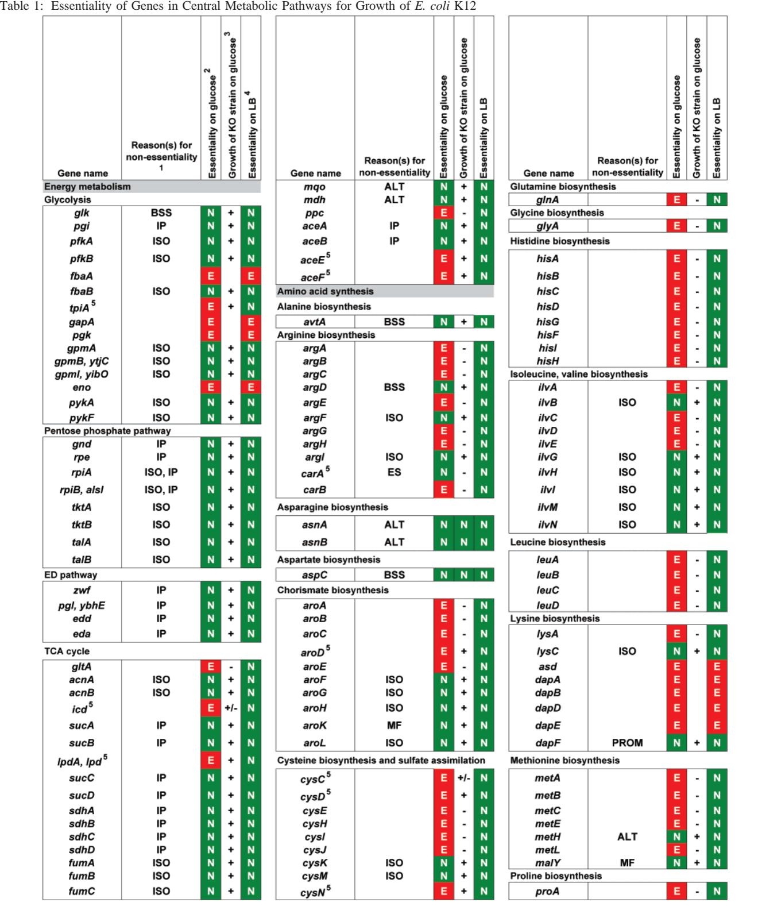
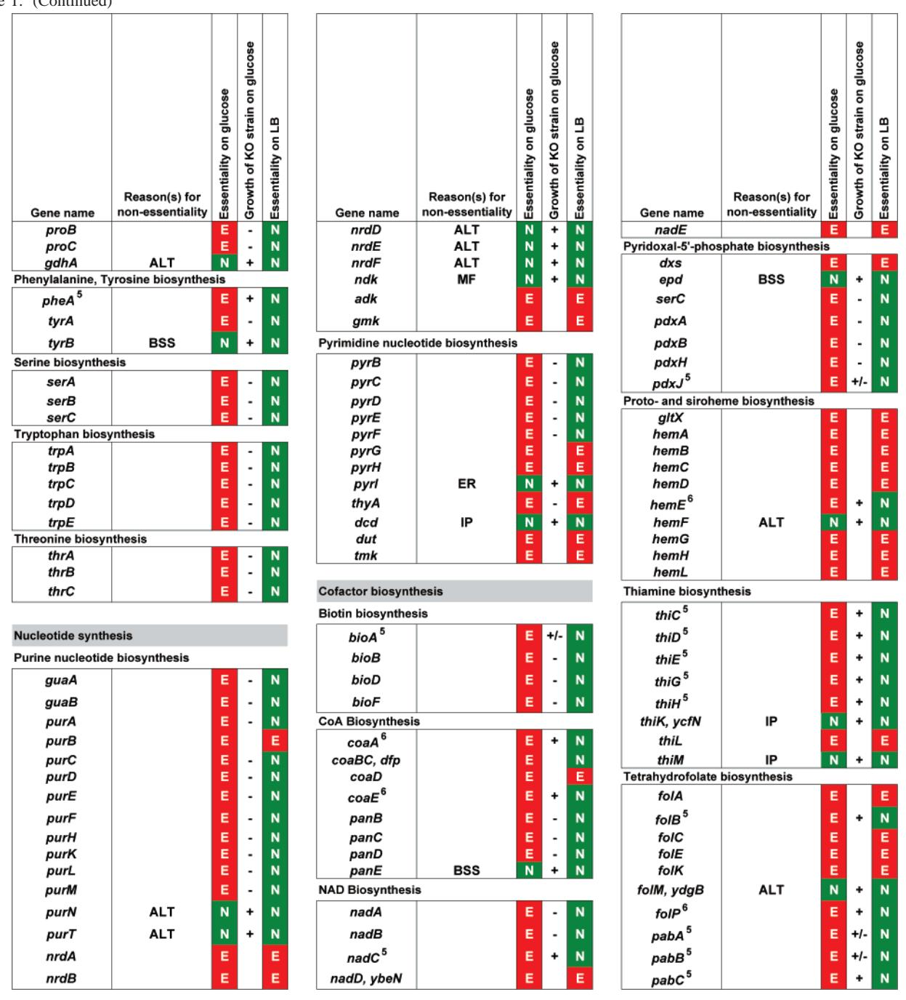
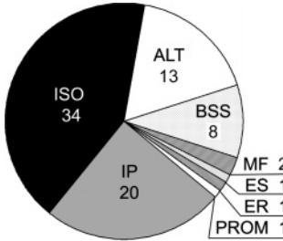
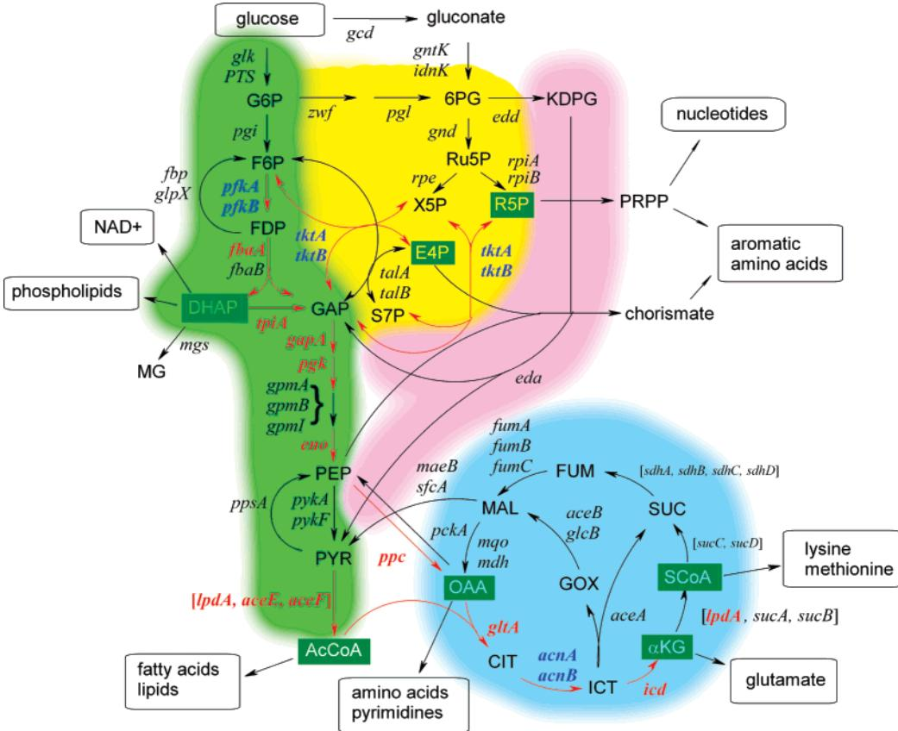

*© Copyright 2007 by the American Chemical Society Volume 46, Number 44 No*V*ember 6, 2007*

### *Current Topics*

### Why Metabolic Enzymes Are Essential or Nonessential for Growth of *Escherichia coli* K12 on Glucose†

Juhan Kim and Shelley D. Copley*

*Cooperati*V*e Institute for Research in En*V*ironmental Sciences and Department of Molecular, Cellular, and De*V*elopmental Biology, Uni*V*ersity of Colorado, Boulder, Colorado 80309*

*Recei*V*ed July 24, 2007; Re*V*ised Manuscript Recei*V*ed August 29, 2007*

ABSTRACT: The genes encoding metabolic enzymes involved in glucose metabolism, the TCA cycle, and biosynthesis of amino acids, purines, pyrimidines, and cofactors would be expected to be essential for growth of *Escherichia coli* on glucose because the cells must synthesize all of the building blocks for cellular macromolecules. Surprisingly, 80 of 227 of these genes are not essential. Analysis of why these genes are not essential provides insights into the metabolic sophistication of *E. coli* and into the evolutionary pressures that have shaped its physiology. Alternative routes enabled by interconnecting pathways can allow a defective step to be bypassed. Isozymes, alternative enzymes, broad-specificity enzymes, and multifunctional enzymes can often substitute for a missing enzyme. We expect that the apparent redundancy in these metabolic pathways has arisen due to the need for *E. coli* to survive in a variety of habitats and therefore to have a metabolism that allows optimal exploitation of varying environmental resources and synthesis of small molecules when they cannot be obtained from the environment.

When *Escherichia coli* grows on glucose as a sole carbon source, all amino acids, purines, pyrimidines, and cofactors must be synthesized. Thus, every step required for conversion of glucose to these essential biomolecules is critical for survival. Assessment of the essentiality of genes encoding enzymes in these central metabolic pathways for growth on glucose is unexpectedly difficult. Hundreds of studies of individual genes have been carried out over the past decades, but these studies have used a variety of strains, molecular methods, and growth conditions. Gene essentiality for growth on both rich medium and glucose has also been assessed using the Keio collection of single-gene knockout mutants (*1*). The Keio collection was generated by insertion of a kanamycin resistance gene into the reading frames of each of 3985 genes in *E. coli* K12 BW25113. This study has the distinct advantage of consistency in strains and growth conditions. However, a limitation is that the technique used for creation of the knockout strains requires growth on LB medium. Thus, knockout strains that cannot grow on LB were not recovered and were therefore unavailable for analysis of growth on glucose. In some cases, other laboratories have constructed these knockout strains by adding particular nutrients required to sustain growth in the absence of a critical gene. (Examples are given in the footnote of Table 1.) In several cases, the ability of the Keio collection knockout strains to grow on glucose is inconsistent with expectations based upon the Ecocyc pathway database. Possible reasons for these discrepancies will be discussed below.

Most of the 227 genes encoding enzymes in central metabolic pathways are essential for growth on glucose, as expected (see Table 1). However, 80 of these genes are not essential. Metabolic enzymes may be nonessential due to the existence of alternative pathways, or the availability of

† This work was supported by NIH Grant 1RO1GM06774901.

* To whom correspondence should be addressed: Cooperative Institute for Research in Environmental Sciences, UCB 216, University of Colorado, Boulder, CO 80309. E-mail: shelley@cires.colorado.edu. Telephone: (303) 492-6328. Fax: (303) 492-1149.

isozymes, alternative enzymes, broad-specificity enzymes, or multifunctional enzymes that can compensate for a missing enzyme (see Figure 1).

Although this review focuses upon essentiality for growth on glucose, this is a somewhat unidimensional perspective. A gene is considered nonessential even if a strain lacking that gene grows very slowly, and surely slow growth indicates that the gene is important for fitness, even if it is not essential. Furthermore, glucose is only one of many carbon sources that can support growth of *E. coli*. Similar analyses of essentiality for growth on other carbon sources would reveal additional intricacies. Finally, disruption of a gene can lead to a large number of underlying changes in metabolic fluxes and gene regulation (*2*), even if growth rate is only marginally affected. The story for each gene can be much more complicated than we can convey in this overview.

Table 1: (Continued)

1 Reasons for nonessentiality: IP, interconnecting pathway; ISO, isozyme available; ALT, alternative enzyme available; BSS, another enzyme with broad substrate specificity available; MF, overlapping function with a multifunctional enzyme; ES, expendable step; ER, expendable regulatory subunit; PROM, promiscuous enzyme available. 2 Based upon Ecocyc, the data of Baba et al. (*1*), and references in the general literature. 3 Based upon Baba et al. (*1*). +, OD600 ) 0.06-0.10 after 24 h and further change in OD600 to >0.06 by 48 h, or OD600 > 0.10 after 24 h; (, OD600 < 0.06 after 24 h but OD600 > 0.12 by 48 h or initial growth to an OD600 of 0.06-0.10 after 24 h, but further change in OD600 to <0.06 after 48 h; -, OD600 < 0.06 by 24 h and further change in OD600 to <0.06 after 48 h. 4 Genes were deemed to be essential if a knockout strain could not be retrieved from LB plates (*1*). 5 References to previous work evaluating essentiality for designations that conflict with the experimental data of Baba et al.: *tpiA* (*15*), *aceE* and *aceF* (*58*), *lpdA* (*62*), *aroD* (*63*), *carA* (*55*, *56*), *pheA* (*64*), *cysC*, *cysD*, and *cysN* (*65*), *metC* (*66*), *bioA* (*67*), *pdxJ* (*68*), *pabA* and *pabB* (*69*), *pabC* (*70*), *nadB* (*71*), *nadC* (*72*), *thiC*, *thiD*, *thiE*, *thiG*, and *thiH* (*73*, *74*), and *folB* (*75*). 6 Genes for which a duplicate gene in the Keio knockout strain was detected (J. Kim and S. D. Copley, unpublished results). 7 Strains lacking the following genes were constructed by including the indicated supplement(s) to support growth: *fbaA*, glycerol and xylose (*76*); *gapA*, glycerol and malate (*16*) or succinate (*77*); *pgk*, glycerol and malate (*17*); *eno*, glycerol and malate (*17*) or succinate (*78*); *asd*, *dapA*, *dapB*, *dapD*, and *dapE*, diaminopimelate (*79*-*81*); *hemA*, *δ*-aminolevulinic acid (*82*); *hemB*, hemin (*83*); *hemH*, lactate and a mixture of amino acids in Vogel-Bonner medium (*84*); *hemL*, *δ*-aminolevulinic acid (not essential, but improved growth) (*85*); *folA*, methionine, glycine, a purine, and thymidine (*86*, *87*); *pyrG*, cytidine (*88*).

### *Interconnecting Pathways*

In some cases, interconnecting metabolic pathways allow *E. coli* to bypass a defective metabolic step. This is most likely to occur for catabolic pathways, which tend to be highly connected, and less likely for biosynthetic pathways, which tend to be linear (*3*). It is important to recognize that

FIGURE 1: Reasons for the nonessentiality of genes in central catabolic and biosynthetic pathways. Abbreviations are given in the footnote of Table 1.

catabolic pathways are responsible not only for production of energy but also for supplying key precursors for biosynthetic pathways, including dihydroxyacetone phosphate (DHAP),1 erythrose 4-phosphate (E4P), ribose 5-phosphate (R5P), acetyl CoA (AcCoA), oxaloacetate (OAA), R-ketoglutarate (RKG), and succinyl CoA (ScoA) (see Figure 2). Steps in individual pathways may not be essential if there is an interconnecting pathway for synthesizing these molecules. However, even if an interconnecting pathway is available, accumulation of the substrate for a missing enzyme may cause toxicity and prevent growth on glucose.

In Figure 2, steps that are essential for growth on glucose are designated by red arrows. These include steps for which loss of a single enzyme or both of a set of isozymes prevents growth. In cases where deletion of two isozymes results in loss of growth on glucose, the gene names are highlighted in blue [*pfkA*/*pfkB* (*4*), *tktA*/*tktB* (*5*), and *acnA*/*acnB* (*6*)]. (Multiple-knockout mutants have not been analyzed for all sets of isozymes, so this information is incomplete. For example, a triple knockout of *gpmA*, *gpmB*, and *gpmI* should be unable to grow on glucose, but this mutant has not been made.)

*E. coli* has three pathways for degrading glucose, all of which form glyceraldehyde 3-phosphate (GAP) (see Figure 2). These include the classic glycolytic pathway (the Embden-Myerhof-Parnase pathway), the Entner-Doudoroff pathway, and the pentose phosphate pathway. Isotopic labeling experiments have shown that glucose is normally metabolized through both the glycolytic pathway and the pentose phosphate pathway (*7*). The major role of the Entner-Doudoroff pathway appears to be metabolism of gluconate derived from mucus in the mammalian intestine (*8*).

Since two pathways normally convert glucose to GAP, the steps in the upper part of the glycolytic pathway would be expected to be nonessential for growth on glucose. This is true in the case of phosphoglucose isomerase (Pgi). Contrary to expectation, the remaining steps are essential, apparently due to toxic effects of metabolites that accumulate in the absence of a particular enzyme. These effects may be due to inhibition of other metabolic enzymes, as well as to effects on gene expression caused by alterations in levels of metabolites both above and below the block in the pathway.

The essentiality of fructose bis-phosphate aldolase (FbaA), which catalyzes the aldol cleavage of FDP, is particularly interesting. [An isozyme, FbaB, is produced only under gluconeogenic conditions (*9*); thus, only FbaA is present during growth on glucose.] Strains with a temperaturesensitive *fbaA* have been isolated. A shift to the nonpermissive temperature during growth on glucose results in a 7-20 fold increase in the level of FDP (*10*, *11*). FDP inhibits 6-phosphogluconate dehydrogenase (*12*), so a block in the glycolytic pathway at *fbaA* should impair flux through the alternative pentose phosphate pathway. A shift to the nonpermissive temperature also causes an immediate downregulation of ribosomal RNA synthesis (*13*). Thus, the physiological consequences of a lack of FbaA are widespread and complex. FbaA appears to be essential for growth on LB medium, as well (*1*). Accumulation of FDP may have similar inhibitory effects even when other carbon sources are available to support growth.

In the case of triose phosphate isomerase, toxic effects are not caused by DHAP itself, but by methylglyoxal formed by its nonenzymatic decomposition (*14*). Strains from which *tpiA* has been deleted generally do not grow on glucose. However, adaptive mutations leading to expression of the methylglyoxal pathway genes occur readily, allowing methylglyoxal to be converted to D-lactate and the cells to grow on glucose (*14*, *15*).

The initial steps of the pentose phosphate pathway are not essential because the biosynthetic precursors R5P and E4P can be produced by alternative pathways. E4P can be produced from GAP and F6P, or from GAP and sedoheptulose 7-phosphate (S7P). R5P can be produced from GAP and S7P. The steps that interconvert these various sugar phosphates are catalyzed by transketolases A and B and transaldolases A and B. Cells lacking both transketolases cannot grow on glucose because E4P, an essential precursor of the aromatic amino acids and pyridoxal phosphate, cannot be produced (*5*).

All of the glucose metabolism pathways feed into a common pathway that converts GAP to downstream metabolites such as PEP and acetyl CoA. Every step in this pathway should be essential because PEP and acetyl CoA supply the TCA cycle. Indeed, strains lacking glyceraldehyde-3 phosphate dehydrogenase (GapA), phosphoglycerate kinase (Pgk), and enolase (Eno) cannot grow on glucose (*16*, *17*). *E. coli* contains three isozymes of phosphoglycerate mutase and two of pyruvate kinase, and strains lacking one of these isozymes are able to grow on glucose because activity can be provided by the other isozyme(s).

Although the TCA cycle allows maximal energy yield from degradation of glucose, its more critical role is to supply precursors for biosynthetic pathways that branch from R-ketoglutarate (R-KG), oxaloacetate (OAA), and succinyl CoA (ScoA). Several steps in the TCA cycle are nonessential because these intermediates can be produced by alternative pathways. OAA can be produced by PEP carboxylase (Ppc). Thus, conversion of malate to OAA by malate dehydrogenase and malate:quinone oxidoreductase is not essential (*18*). ScoA can be produced by cleavage of isocitrate to produce

1 Abbreviations: 6PG, gluconate 6-phosphate; AcCoA, acetyl CoA; E4P, erythrose 4-phosphate; RKG, R-ketoglutarate; CIT, citrate; DHAP, dihydroxyacetone phosphate; F6P, fructose 6-phosphate; FDP, fructose 1,6-bisphosphate; G6P, glucose 6-phosphate; GAP, glyceraldehyde 3-phosphate; GOX, glyoxylate; ICT, isocitrate; KDPG, 2-keto-3 deoxygluconate 6-phosphate; MAL, malate; MG, methylglyoxal; OAA, oxaloacetate; PEP, phosphoenolpyruvate; PRPP, phosphoribosyl pyrophosphate; PYR, pyruvate; R5P, ribose 5-phosphate; Ru5P, ribulose 5-phosphate; S7P, sedoheptulose 7-phosphate; SCoA, succinyl CoA; SUC, succinate; X5P, xylulose 5-phosphate.

FIGURE 2: Overview of the central metabolic pathways of *E. coli*. Pathways are indicated by shading as follows: green for the Embden-Myerhof-Parnase pathway, yellow for the pentose phosphate pathway, pink for the Entner-Doudoroff pathway, and blue for the TCA cycle. Steps catalyzed by enzymes that that are essential for growth on glucose are denoted with red arrows, and the genes are colored red. Genes encoding subunits of multisubunit enzymes are enclosed in brackets. Where deletion of genes encoding two isozymes results in loss of the ability to grow on glucose, the genes are colored blue.

succinate by isocitrate lyase (AceA), followed by conversion to succinyl CoA by succinyl CoA synthetase (SucCSucD). Thus, R-KG dehydrogenase (SucASucBLpdA) is not essential. (The essentiality of LpdA is due to its function as a subunit of pyruvate dehydrogenase, which is essential for generating acetyl CoA.) However, there is only one way to make R-KG, so the segment of the cycle leading to R-KG is essential.

## *Isozymes and Alternati*V*e Enzymes*

Many metabolic genes that are not essential encode proteins for which isozymes or alternative enzymes are encoded by other genes (see Table 2 and Table 1 of the Supporting Information). Isozymes catalyze the same chemical reaction, while alternative enzymes form a common product using different reactants. Isozymes and alternative enzymes are generally specialized for performance under different conditions. Many isozymes are paralogous. Such isozymes can arise by duplication of an ancestral gene, followed by mutations in either structural or regulatory regions to allow divergence of properties such as transcriptional regulation, feedback inhibition, or kinetic parameters. Paralogous isozymes can also arise by horizontal transfer of a gene into a bacterium whose genome already encodes a paralogue. However, isozymes can also arise by convergent evolution from different ancestors. The two isozymes of ribose phosphate isomerase are important examples (*19*, *20*).

Whether isozymes and alternative enzymes can substitute for each other depends upon whether they are expressed at sufficient levels and are active under similar conditions. Remarkably, only two enzymes out of the 15 sets of isozymes listed in Table 1 of the Supporting Information are essential for growth on glucose. As described above, FbaA, the class II fructose bis-phosphate aldolase, is essential for growth on glucose. The second case is ThrA, which is essential for growth on glucose. ThrA and MetL are bifunctional aspartate kinase/homoserine dehydrogenase isozymes that catalyze two reactions common to the pathways for synthesis of threonine and methionine. MetL is apparently not produced during growth on glucose, and little is produced during growth on LB (*21*) or on glycerol (*22*), so it is not clear under what circumstances MetL is active. In all of the other cases listed in Table 1 of the Supporting Information, isozymes apparently coexist during growth on glucose.

Isozymes are sometimes specialized for catalysis under different growth conditions. For example, *E. coli* has three genes for fumarate hydratase (fumarase). The constitutively expressed FumA is the major fumarase under anaerobic and microaerophilic conditions. FumB provides minor activity under anaerobic conditions. Both enzymes lose activity at high O2 levels because of oxidation of their iron-sulfur clusters (*23*, *24*). Thus, FumC, which lacks an iron-sulfur cluster, is the major fumarase under aerobic conditions (*25*). However, sufficient FumA is present under aerobic condi-

| gene  | enzyme                                            | reactionb                                    |
|-------|---------------------------------------------------|----------------------------------------------|
| mqo   | malate:quinone oxidoreductase                     | MAL + Q f OAA + QH2                       |
| mdh   | malate dehydrogenase                              | MAL + NAD f OAA + NADH                    |
| ppc   | phosphoenolpyruvate carboxylase                   | PEP + CO2 + H2O f OAA + Pi                |
| pckA  | phosphoenolpyruvate carboxykinase                 | OAA + ATP f PEP + ADP + CO2               |
| asnA  | aspartate-ammonia ligase                          | Asp + ATP + NH3 f Asn + AMP + PPi         |
| asnB  | asparagine synthetase B                           | Asp + ATP + Gln f Asn + AMP + Glu         |
| metE  | cobalamin-independent homocysteine transmethylase | hCys + MTHF f Met + THF (Cob-independent) |
| metH  | cobalamin-dependent homocysteine transmethylase   | hCys + MTHF f Met + THF (Cob-dependent)   |
| purN  | GAR transformylase 1                              | GAR + FTHF f FGAR + THF                   |
| purT  | GAR transformylase 2                              | GAR + ATP + FOR f FGAR + ADP + Pi         |
| nrdAB | ribonucleoside diphosphate reductase              | NDP + Trxred f dNDP + Trxox               |
| nrdEF | ribonucleoside diphosphate reductase II           | NDP + NrdHred f dNDP + NrdHox             |
| hemF  | O2-dependent coproporphyrinogen III oxidase       | CPP + 2O2 f PPHG + 2H2O2 + 2CO2           |
| hemN  | O2-independent coproporphyrinogen III oxidase     | CPP + 2SAM f PPHG + 2dA + Met + 2CO2      |

Table 2: Alternative Enzymes that Catalyze Formation of a Common Product Using Different Reactants*a*

*a* Variable reactants in each case are underlined, and the common products are shown in bold. Genes that are essential for growth on glucose are also highlighted in bold. *b* Abbreviations: CPP, coproporphyrinogen III; dA, deoxyadenosine; FGAR; 5′-phosphoribosyl *N*-formylglycineamide; FTHF, *N*10-formyltetrahydrofolate; GAR, phosphoribosylglycineamide; hCys, homocysteine; MAL, malate; MTHF, 5-methyl-THF; (d)NDP, (deoxy)ribonucleoside diphosphate; OAA, oxaloacetate; PEP, phosphoenolpyruvate; PPHG, protoporphyrinogen; SAM, *S*-adenosylmethionine; THF, tetrahydrofolate.

tions to allow growth in the absence of FumC (*23*).

Isozymes are sometimes differentially regulated to allow control of activity under particular metabolic circumstances. Three isozymes of DAHP synthase (AroF, AroG, and AroH) catalyze condensation of E4P with PEP in the chorismate pathway. AroF is inhibited by tyrosine, AroG by phenylalanine, and AroH by tryptophan. This system allows the flux through the pathway to be modulated independently by each of the three major products of the pathway; thus, a shortage of any of the aromatic amino acids will lead to increased flux through the pathway. AroG makes up 80% of DAHP synthase during growth on minimal medium; AroF makes up ∼20% and AroH only 1% (*26*). Thus, each isozyme is expendable.

Several enzymatic reactions in *E. coli* are catalyzed by alternative enzymes that synthesize the same product using different reactants (see Table 2). The availability of alternative enzymes allows the bacterium to take advantage of reactants that may be in sufficient supply only occasionally in a fluctuating environment. Alternative enzymes can, in some cases, substitute for each other. For example, PurN and PurT produce 5′-phosphoribosyl-*N*-formylglycineamide, an intermediate in the pathway for purine biosynthesis. PurN utilizes *N*10-formyltetrahydrofolate as the formyl donor, while PurT utilizes formate. Neither is essential for growth on glucose, suggesting that both are operational under these conditions. A second example is HemF and HemN, which catalyze oxidative decarboxylation of coproporphyrinogen III in the pathway for heme biosynthesis. HemF is O2 dependent and is the major enzyme utilized under aerobic conditions. However, HemN, which does not require O2 and therefore provides all activity under anaerobic conditions, is expressed and active under aerobic conditions and can substitute for a lack of HemF (*27*).

Alternative enzymes cannot substitute for each other if they are not active under the same conditions. MetE and MetH, two versions of homocysteine transmethylase, catalyze the final step required for synthesis of methionine. MetE does not require a cofactor (*28*), while MetH requires cobalamin (*29*). *E. coli* cannot synthesize cobalamin unless the intermediate cobamide is provided (*30*); thus, active MetH cannot be produced in cells growing on glucose. Consequently, MetE is the only active homocysteine transmethylase under these conditions and is essential for growth.

Alternative enzymes may be expressed under different conditions and therefore unable to substitute for each other. The ribonucleoside diphosphate reductases NrdAB and NrdEF are considered alternative enzymes because they receive reducing equivalents from different sources. NrdAB is reduced by thioredoxin, while NrdEF is reduced by NrdH. The *Salmonella typhimurium* NrdEF has robust ribonucleoside diphosphate reductase activity (*31*, *32*) and can complement a lack of NrdA or NrdB when expressed on a plasmid in *E. coli* (*33*). However, the endogenous *E. coli* NrdEF cannot substitute for NrdAB (*34*), even though the genes are transcribed (*31*, *35*-*37*). Apparently insufficient protein is produced during growth on glucose. The level of expression of the *nrdHIEF* operon is dramatically increased in the presence of oxidative stress (*37*), so NrdEF may function under specific conditions that have not yet been defined. NrdD, the class III ribonucleoside-triphosphate reductase, also cannot substitute for NrdAB, as it is expressed only during anaerobic and microaerophilic growth (*38*) and is inactivated by O2 (*39*).

Compensation by an alternative enzyme requires not only the enzyme but also its substrates. *E. coli* has two enzymes that convert aspartate into asparagine, AsnA (aspartateammonia lyase), which utilizes ammonia, and AsnB (asparagine synthetase B), which derives ammonia from glutamine. Since neither enzyme is essential, both enzymes and their substrates must be present in sufficient quantities during growth on glucose in minimal medium.

Alternative enzymes are sometimes specialized to catalyze reactions in a particular direction, as the use of different substrates can alter the energetics of the reaction. For example, PEP carboxylase (Ppc) converts PEP and CO2 to OAA during growth on glucose to compensate for losses due to siphoning off of intermediates in the TCA cycle for biosynthetic pathways. During gluconeogenesis, PEP carboxykinase (PckA) converts OAA and ATP to PEP, CO2, and ADP. The expenditure of ATP makes formation of PEP and CO2 energetically more favorable. Both enzymes are active during growth on glucose; metabolic flux analysis suggests that substantial flux occurs through both enzymes, even though this results in a futile cycle that dissipates ATP (*40*). Despite the presence of both enzymes, PEP carboxylase is essential for growth on glucose. This suggests that the reaction of PEP, ADP, and CO2 to form OAA and ATP catalyzed by PEP carboxykinase, the reverse of the normal direction, is too endergonic to produce sufficient OAA to support growth.

### *Complementation by Enzymes with Broad Substrate Specificities*

Most metabolic enzymes have fairly stringent substrate specificities. Fine-tuning of substrate binding pockets prevents inhibition due to binding of other molecules, as well as accidental conversion of valuable metabolites into deadend products that cannot be further metabolized. However, there are enzymes with quite broad specificities. Broad substrate specificity can be important for physiological function. However, in some cases, it may be an accidental consequence of an active site structure that permits binding of alternative substrates in the proximity of catalytic groups. Such activities can be considered promiscuous activities, which are generally adventitious and of no particular use to the cell. This distinction needs to be made carefully on the basis of knowledge of whether the activity in question contributes significantly to a particular function and thereby improves fitness.

The transaminases that convert R-keto acids to amino acids constitute an important class of enzymes for which broad substrate specificity is critical for function. The mechanism of these enzymes involves reaction of the pyridoxal 5′ phosphate cofactor with an amino donor (usually glutamate) to form pyridoxamine 5′-phosphate, followed by reaction with an acceptor R-keto acid to generate the final amino acid. Thus, structurally different molecules must bind to the active site to complete the catalytic cycle. *E. coli* contains eight transaminases; five are nonessential (AlaB, ArgD, AspC, AvtA, and TyrB), and three are essential (IlvE, SerC, and HisC), apparently because no other enzyme is able to handle at least one of their substrates. It is interesting that ArgD is not essential. ArgD catalyzes transamination of *N*-succinyl-2-amino-6-ketopimelate and *N*-acetyl-L-glutamate 5-semialdehyde, intermediates in the pathways for synthesis of Lys and Arg, respectively (*41*). A catabolic acetyl ornithine transaminase (AstC) that interconverts *N*-acetyl-L-ornithine and *N*-acetyl-L-glutamate 5-semialdehyde might substitute for ArgD function in Arg biosynthesis. Cox and Wang (*42*) have reported that *E. coli* extracts contain a transaminase that is specific for *N*-succinyl-2-amino-6-ketopimelate. This enzyme has not been purified, and the gene encoding it has not been identified. However, it is likely that this enzyme can substitute for ArgD in the pathway for Lys synthesis.

Another example is adenylate kinase, whose name reflects its primary function of conversion of AMP and ATP to two molecules of ADP. Adenylate kinase has substantial nucleotide diphosphate kinase activity, as well. Nucleotide diphosphate kinase converts ribo- and deoxyribonucleotide diphosphates to the corresponding triphosphates using ATP as the phosphoryl donor. A strain lacking nucleotide diphosphate kinase still had 10-15% of the nucleotide diphosphate kinase activity of the wild-type strain, and the activity was found to be due to adenylate kinase (*43*). Apparently, the enzyme can transfer phosphate to the terminal phosphate of both nucleotide monophosphates and nucleotide diphosphates. The specific activity of the nucleotide diphosphate kinase activity of adenylate kinase was estimated to be 1-5% of that of the authentic nucleotide diphosphate kinase. Depending upon the levels of expression of the two enzymes, adenylate kinase could be responsible for a substantial amount of the total nucleotide diphosphate kinase activity of the cells.

The ability of the broad-specificity enzyme IlvC to substitute for PanE involves only some of its catalytic abilities. IlvC catalyzes NADPH-dependent conversion of 2-acetolactate to 2,3-dihydroxyisovalerate in the valine biosynthesis pathway, as well as conversion of 2-aceto-2 hydroxybutyrate to 2,3-dihydroxy-3-methylvalerate in the isoleucine biosynthesis pathway (see Figure 3 in Supporting Information) (*44*). These reactions involve reduction of a carbonyl as well as an isomerization. IlvC can substitute for PanE, which catalyzes NADPH-dependent reduction of 2-dehydropantoate to pantoate in the pathway for CoA biosynthesis. Notably, conversion of 2-dehydropantoate to pantoate requires only reduction of a carbonyl, but no isomerization. The *k*cat/*K*M for reduction of 2-dehydropantoate by IlvC is 1.2 × 103 M-1 s-1 , only 50-fold lower than that of PanE (6.6 × 104 M-1 s-1 ) (*45*). This level of activity is apparently sufficient to support growth on glucose in the absence of PanE. Indeed, IlvC is responsible for all three activities in *Corynebacterium glutamicum*, which lacks PanE (*46*).

The ability of a broad-specificity enzyme to substitute for another is not necessarily mirrored by a comparable ability in the other enzyme. D-Erythrose-4-phosphate dehydrogenase (Epd) and glyceraldehyde-3-phosphate dehydrogenase (GapA) have overlapping substrate specificity (*47*). The D-erythrose-4-phosphate dehydrogenase activity of GapA is approximately 30% of that of Epd, while the glyceraldehyde-3 phosphate dehydrogenase activity of Epd is less than 2% of that of GapA (*48*). Thus, GapA can substitute for Epd, but Epd cannot substitute for GapA.

As noted above for isozymes and alternative enzymes, broad-specificity enzymes cannot substitute for a missing enzyme if they are not expressed during growth on glucose. *E. coli* contains a gene encoding methylcitrate synthase (*prpC*) that has considerable citrate synthase activity (*49*, *50*). However, the enzyme is expressed only when cells are grown on propionate, so it cannot substitute for citrate synthase during growth on glucose.

# *Redundant Acti*V*ities in Multifunctional Proteins*

In some cases, redundant catalytic activities exist in an enzyme dedicated to a certain task and another protein that serves multiple functions. Such proteins are often termed "moonlighting" proteins. Shikimate kinase I (AroK) and II (AroL) catalyze conversion of shikimate to shikimate 3-phosphate in the pathway for synthesis of chorismate. AroL has a *K*M,shikimate of 200 *µ*M; the *K*M,shikimate of AroK is 20 mM, suggesting that shikimate may not be its primary physiological substrate (*51*). This proposition is consistent with the observation that AroK is constitutively expressed, while AroL is expressed under the more obvious conditions of limiting levels of Trp and Tyr. It has been proposed that AroK plays a role in cell division, possibly by phosphorylating a protein target (*52*). However, AroK probably contributes to phosphorylation of shikimate as well, as the *k*cat/*K*M,shikimate we calculate from DeFeyter (*53*) is similar to that of AroL (*51*, *53*). Indeed, AroL is not essential for growth on glucose, suggesting that AroK can fill this function. AroL apparently lacks the suspected second function of AroK, but nevertheless, cells lacking AroK grow on glucose; therefore, this second function must not be essential.

Again, multifunctional proteins cannot substitute for a lack of a dedicated enzyme if they are not expressed under the same conditions. MalY, a transcriptional activator with substantial cystathionine *â*-lyase activity, cannot substitute for MetC, the cystathionine *â*-lyase required for methionine biosynthesis, unless it is supplied from a plasmid with inducible expression (*54*). Apparently, MalY is not expressed during growth on glucose.

## *Skipping a Defecti*V*e Step*

Nearly every metabolic reaction in *E. coli* is catalyzed by an enzyme, a notable exception being the spontaneous conversion of L-glutamate *γ*-semialdehyde to pyrroline 5-carboxylate in the pathway for proline synthesis. Thus, lack of a catalyst generally prevents a metabolic step from occurring. An exception is the NH3-generating subunit of carbamoyl phosphate synthetase, which catalyzes synthesis of carbamoyl phosphate from glutamine, HCO3 -, and ATP in the pathways leading to arginine and pyrimidine nucleotides. The enzyme is composed of two subunits. CarA generates NH3 from glutamine, and CarB activates HCO3 for nucleophilic attack of NH3 to form carbamoyl phosphate. Although CarB is essential, CarA is not. CarB can utilize NH3 directly, although the high *K*m for NH3 restricts the efficiency of this reaction (*55*), and cells lacking CarA grow slowly (*56*).

#### *Expendable Regulatory Fine-Tuning*

Aspartate carbamoyltransferase catalyzes the first step in the synthesis of pyrimidine ribonucleotides. It is composed of two catalytic trimers (encoded by *pyrB*) and three regulatory dimers (encoded by *pyrI*). The catalytic subunit is essential, but the regulatory subunit, which mediates inhibition by CTP and activation by ATP that helps to maintain balanced levels of purine and pyrimidine nucleotides, is not. This is a case in which fine-tuning of enzyme activity likely contributes to fitness but is not essential for growth.

### *Complementation by an Unidentified Promiscuous Enzyme*

DapF (diaminopimelate epimerase) is required for synthesis of diaminopimelate, a precursor of both lysine and peptidoglycan. Lysine synthesis is not important for growth when Lys can be obtained from the medium. However, even in rich medium, diaminopimelate must be produced for cell wall biosynthesis. A strain in which *dapF* had been disrupted had negligible diaminopimelate epimerase activity but was nevertheless able to synthesize meso-diaminopimelate and downstream metabolites in peptidoglycan synthesis (*57*). The authors speculate that the high levels of LL-diaminopimelate that accumulate in the absence of DapF may allow a promiscuous and inefficient amino acid epimerase activity to produce meso-diaminopimelate.

#### *Discrepancies in the Literature*

The Keio collection is a valuable resource and provides the opportunity for evaluation of gene essentiality in a single strain using consistent experimental conditions. However, in several cases, strains from the Keio collection are able to grow on glucose, although the gene that has been disrupted would be expected to be essential. The method used for construction of the Keio collection requires that knockout strains constructed by insertional mutagenesis be capable of growth on LB. If a gene is essential for growth on LB, cells lacking that gene will not grow. In such cases, colonies can be obtained if the target gene has been duplicated, allowing one copy to continue to supply the essential protein even if an antibiotic resistance gene is inserted into the other copy. In the cases of *coaA*, *coaE*, *hemE*, and *folP*, we have detected an intact copy of the target gene in the Keio collection clones (J. Kim and S. D. Copley, unpublished results).

Colonies can also be recovered after insertion of a resistance gene into an essential target gene if a mutant in the population carries a mutation that compensates in some way for loss of the target gene. The natural tendency of microbiologists to select the largest colonies on plates can lead to selection of strains with one or more adaptive mutations that optimize growth under particular conditions. Such adaptive mutations may explain the finding that the Keio strains lacking *aceE*, *aceF*, and *lpdA* can grow on glucose. AceE, AceF, and LpdA are components of the pyruvate dehydrogenase complex that converts pyruvate to acetyl CoA to fuel the TCA cycle and lipid biosynthesis. Previous studies have reported that strains lacking AceE and AceF cannot grow on glucose without supplementation with acetate. However, overexpression of pyruvate oxidase allows strains lacking AceE or AceF to grow on glucose alone (*58*). (Pyruvate oxidase converts pyruvate to acetate, which can be converted to acetyl CoA by acetyl CoA synthetase.) The ability of the Keio knockout strains lacking *aceE*, *aceF*, or *lpdA* to grow on glucose may be due to mutations that cause overexpression of pyruvate oxidase. Similarly, there are discrepancies in the literature regarding the essentiality of isocitrate dehydrogenase. Although this enzyme should be required for production of R-KG and thus glutamate (*59*, *60*), Baba et al. reported slow growth of the knockout strain (*1*). Another report in the literature reports robust growth of a strain lacking isocitrate dehydrogenase (*61*). Growth of both strains is likely due to an unidentified mutation that allows glutamate to be produced by an alternative route.

Surprisingly, all of the thiamine pyrophosphate genes except *thiL* were reported to be nonessential for growth on glucose by Baba et al. (*1*). Thiamine diphosphate is required by several enzymes in *E. coli*; these include the two transketolase isozymes (TktA and TktB) and two acetohydroxybutanoate synthase/acetolactate synthase isozymes (IlvBIlvN and IlvIIlvH), which are involved in synthesis of isoleucine, leucine, and valine. Lack of these activities should preclude growth on glucose. The growth of these knockout strains on glucose observed by Baba et al. may have been due to a small amount of carryover of thiamin from the rich medium on which the strains were cultured prior to phenotypic analysis.

A similar situation may explain the report that strains lacking PabA, PabB, and PabC grow to a small extent on glucose (*1*). The multicomponent *p*-aminobenzoate synthase complex contains aminodeoxychorismate synthase (PabAB) and aminodeoxychorismate lyase (PabC). These enzymes are involved in folate synthesis and would be expected to be essential for growth on glucose. This may be another case in which small amounts of growth can occur due to nutrient carryover.

#### *Conclusions*

Approximately 35% of genes encoding enzymes in central metabolic pathways are not essential for growth of *E. coli* K12 on glucose, conditions under which the cells must synthesize all of the building blocks for macromolecules such as proteins, nucleic acids, lipids, and cell wall constituents. This robustness to loss of particular enzymes cannot be attributed to selection for protection against the loss of key metabolic enzymes. In a large population with a short doubling time, loss of an individual cell due to a mutation in a critical metabolic gene is irrelevant. Rather, we attribute this robustness to billions of years of selective pressure that have created an organism that can adapt to varying environmental conditions and direct carbon flow through the necessary catabolic and anabolic pathways to allow efficient growth. *E. coli* is a heterotroph and thus dependent upon degradation of carbon compounds in its environment to supply energy and carbon for growth. *E. coli* can degrade various sugars, including glucose, galactose, mannose, rhamnose, ribose, and xylose, as well as organic acids, amino acids, and alcohols. Furthermore, the environments in which enteric bacteria find themselves vary, as different foodstuffs are digested within the mammalian intestine and as the bacteria encounter the external environment in transit to a new host. Thus, the fitness of the organism is enhanced by a flexible metabolic network that can rapidly adjust to take optimal advantage of resources in a fluctuating environment. A variety of mechanisms contributes to this metabolic flexibility. Interconnecting pathways allow direction of metabolic flux to enable both production of energy and synthesis of biosynthetic precursors. This is particularly important in the partitioning of glucose between glycolysis, which serves primarily a catabolic function, and the pentose phosphate pathway, which produces other sugars for amino acid and nucleotide synthesis. Regulation of metabolic flux is also frequently achieved using differentially regulated isozymes (e.g., the three isozymes of DAHP synthase, AroF, AroG, and AroH, which are inhibited by Tyr, Phe, and Trp, respectively). Isozymes can be advantageous for other reasons, as well. The availability of isozymes can allow a switch to a different mechanism when conditions are unfavorable for a particular catalyst. For example, FumC provides fumarase activity under aerobic conditions because the other two isozymes (FumA and FumB) lose activity due to oxidation of their iron-sulfur clusters. Metabolic flexibility is also enhanced by alternative enzymes that allow exploitation of different resources, allowing simple precursors to be used when they are available. For example, PurT (GAR transformylase) transfers formate directly to its substrate. When formate is not available, the alternative enzyme PurN utilizes *N*10-formyltetrahydrofolate. The formyl group to be transferred is derived from glycine or serine.

Most metabolic enzymes have fairly stringent substrate specificity, a feature that allows optimal catalysis due to precise positioning of the substrate in the active site, the potential for very specific regulation, and the ability to exclude other substrates that might compete with the normal substrate and/or might be diverted from other important pathways. However, this is not always the case; broad substrate specificity is important for the function of some enzymes (e.g., the transaminases). In some cases, broad substrate specificity allows catalysis of secondary reactions that are of no benefit to the organism; such enzymes are termed catalytically promiscuous. Promiscuous activities provide a repertoire of activities that can be useful when a novel activity is needed to take advantage of a new nutrient in the environment, or to generate a novel compound for use in metabolism, regulation, or interaction with other organisms.

### **SUPPORTING INFORMATION AVAILABLE**

Summary of the isozymes in the central metabolic pathways of *E. coli* (Table 1) and reactions catalyzed by PanE and IlvC (Figure 3). This material is available free of charge via the Internet at http://pubs.acs.org.

### **REFERENCES**

- 1. Baba, T., Ara, T., Hasegawa, M., Takai, Y., Okumura, Y., Baba, M., Datsenko, K. A., Tomita, M., Wanner, B. L., and Mori, H. (2006) Construction of *Escherichia coli* K12 in-frame, singlegene knockout mutants: The Keio collection, *Mol. Syst. Biol. 2*, 2006-2008.
- 2. Zhao, J., Baba, T., Mori, H., and Shimizu, K. (2004) Global metabolic response of *Escherichia coli* to *gnd* or *zwf* geneknockout, based on 13C-labeling experiments and the measurement of enzyme activities, *Appl. Microbiol. Biotechnol. 64*, 91-98.
- 3. Ravasz, E., Somera, A. L., Mongru, D. A., Oltvai, Z. N., and Barbasi, A. L. (2002) Hierarchical organization of modularity in metabolic networks, *Science 297*, 1551-1555.
- 4. Lovingshimer, M. R., Siegele, D., and Reinhart, G. D. (2006) Construction of an inducible, *pfkA* and *pfkB* deficient strain of *Escherichia coli* for the expression and purification of phosphofructokinase from bacterial sources, *Protein Expression Purif. 46*, 475-482.
- 5. Zhao, G. S., and Winkler, M. E. (1994) An *Escherichia coli* K-12 *tktA tktB* mutant deficient in transketolase activity requires pyridoxine (vitamin-B6) as well as the aromatic-amino-acids and vitamins for growth, *J. Bacteriol. 176*, 6134-6138.
- 6. Gruer, M. J., Bradbury, A. J., and Guest, J. R. (1997) Construction and properties of aconitase mutants of *Escherichia coli*, *Microbiology 143*, 1837-1846.
- 7. Fraenkel, D. G., and Levisohn, S. R. (1967) Glucose and gluconate metabolism in an *Escherichia coli* mutant lacking phosphoglucose isomerase, *J. Bacteriol. 93*, 1571-1578.
- 8. Peekhaus, N., and Conway, T. (1998) What's for dinner? Entner-Doudoroff metabolism in *Escherichia coli*, *J. Bacteriol. 180*, 3495-3502.
- 9. Scamuffa, M. D., and Caprioli, R. M. (1980) Comparison of the mechanisms of two distinct aldolases from *Escherichia coli* grown on gluconeogenic substrates, *Biochim. Biophys. Acta 614*, 583- 590.
- 10. Bock, A., and Neidhardt, F. C. (1966) Properties of a mutant of *Escherichia coli* with a temperature-sensitive fructose-1,6-diphosphate aldolase, *J. Bacteriol. 92*, 470-476.
- 11. Schneider, D. A., and Gourse, R. L. (2003) Changes in the concentrations of guanosine 5′-diphosphate 3′-diphosphate and the initiating nucleoside triphosphate account for inhibition of rRNA transcription in fructose-1,6-diphosphate aldolase (*fda*) mutants, *J. Bacteriol. 185*, 6192-6194.
- 12. de Silva, A. O., and Fraenkel, D. G. (1979) The 6-phosphogluconate dehydrogenase reaction in *Escherichia coli*, *J. Biol. Chem. 254*, 10237-10242.
- 13. Singer, M., Rossmiessl, P., Cali, B. M., Liebke, H., and Gross, C. A. (1991) The *Escherichia coli ts8* mutation is an allele of *fda*, the gene encoding fructose-1,6-diphosphate aldolase, *J. Bacteriol. 173*, 6242-6248.
- 14. Ferguson, G. P., Totemeyer, S., MacLean, M. J., and Booth, I. R. (1998) Methylglyoxal production in bacteria: Suicide or survival? *Arch. Microbiol. 170*, 209-219.
- 15. Fong, S. S., Nanchen, A., Palsson, B. O., and Sauer, U. (2006) Latent pathway activation and increased pathway capacity enable *Escherichia coli* adaptation to loss of key metabolic enzymes, *J. Biol. Chem. 281*, 8024-8033.
- 16. Hillman, J. D., and Fraenkel, D. G. (1975) Glyceraldehyde 3-phosphate dehydrogenase mutants of *Escherichia coli*, *J. Bacteriol. 122*, 1175-1179.
- 17. Thomson, J., Gerstenberger, P. D., Goldberg, D. E., Gociar, E., Orozco de Silva, A., and Fraenkel, D. G. (1979) ColE1 hybrid plasmids for *Escherichia coli* genes of glycolysis and the hexose monophosphate shunt, *J. Bacteriol. 137*, 502-506.
- 18. van der Rest, M. E., Frank, C., and Molenaar, D. (2000) Functions of the membrane-associated and cytoplasmic malate dehydrogenases in the citric acid cycle of *Escherichia coli*, *J. Bacteriol. 182*, 6892-6899.
- 19. Zhang, R., Andersson, C. E., Savchenko, A., Skarina, T., Evdokimova, E., Beasley, S., Arrowsmith, C. H., Edwards, A. M., Joachimiak, A., and Mowbray, S. L. (2003) Structure of *Escherichia coli* ribose-5-phosphate isomerase: A ubiquitous enzyme of the pentose phosphate pathway and the Calvin cycle, *Structure 11*, 31-42.
- 20. Zhang, R. G., Andersson, C. E., Skarina, T., Evdokimova, E., Edwards, A. M., Joachimiak, A., Savchenko, A., and Mowbray, S. L. (2003) The 2.2 Å resolution structure of RpiB/AlsB from *Escherichia coli* illustrates a new approach to the ribose-5 phosphate isomerase reaction, *J. Mol. Biol. 332*, 1083-1094.
- 21. Taoka, M., Yamauchi, Y., Shinkawa, T., Kaji, H., Motohashi, W., Nakayama, H., Takahashi, N., and Isobe, T. (2004) Only a small subset of the horizontally transferred chromosomal genes in *Escherichia coli* are translated into proteins, *Mol. Cell. Proteomics 3*, 780-787.
- 22. Corbin, R. W., Paliy, O., Yang, F., Shabanowitz, J., Platt, M., Lyons, C. E., Root, K., McAuliffe, J., Jordan, M. I., Kustu, S., Soupene, E., and Hunt, D. F. (2003) Toward a protein profile of *Escherichia coli*: Comparison to its transcription profile, *Proc. Natl. Acad. Sci. U.S.A. 100*, 9232-9237.
- 23. Tseng, C. P., Yu, C. C., Lin, H. H., Chang, C. Y., and Kuo, J. T. (2001) Oxygen- and growth rate-dependent regulation of *Escherichia coli* fumarase (FumA, FumB, and FumC) activity, *J. Bacteriol. 183*, 461-467.
- 24. van Kuijk, B. L. M., van Loo, N. D., Arendsen, A. F., Hagen, W. R., and Stams, A. J. M. (1996) Purification and characterization of fumarase from the syntrophic propionate-oxidizing bacterium strain MPOB, *Arch. Microbiol. 165*, 126-131.
- 25. Yumoto, N., and Tokushige, M. (1988) Characterization of multiple fumarase proteins in *Escherichia coli*, *Biochem. Biophys. Res. Commun. 153*, 1236-1243.
- 26. Ray, J. M., Yanofsky, C., and Bauerle, R. (1988) Mutational analysis of the catalytic and feedback sites of the tryptophansensitive 3-deoxy-D-arabino-heptulosonate-7-phosphate synthase of *Escherichia coli*, *J. Bacteriol. 170*, 5500-5506.
- 27. Troup, B., Hungerer, C., and Jahn, D. (1995) Cloning and characterization of the *Escherichia coli hemN* gene encoding the oxygen-independent coproporphyrinogen-III oxidase, *J. Bacteriol. 177*, 3326-3331.
- 28. Gonzalez, J. C., Banerjee, R. V., Huang, S., Sumner, J. S., and Matthews, R. G. (1992) Comparison of cobalamin-independent and cobalamin-dependent methionine synthases from *Escherichia coli*: Two solutions to the same chemical problem, *Biochemistry 31*, 6045-6056.
- 29. Banerjee, R. V., Frasca, V., Ballou, D. P., and Matthews, R. G. (1990) Participation of cob(I)alamin in the reaction catalyzed by methionine synthase from *Escherichia coli*: A steady-state and rapid reaction kinetic analysis, *Biochemistry 29*, 11101-11109.
- 30. Lawrence, J. G., and Roth, J. R. (1995) The cobalamin (coenzyme B12) biosynthetic genes of *Escherichia coli*, *J. Bacteriol. 177*, 6371-6380.
- 31. Jordan, A., Aragall, E., Gibert, I., and Barbe, J. (1996) Promoter identification and expression analysis of *Salmonella typhimurium*

and *Escherichia coli nrdEF* operons encoding one of two class I ribonucleotide reductases present in both bacteria, *Mol. Microbiol. 19*, 777-790.

- 32. Jordan, A., Aslund, F., Pontis, E., Reichard, P., and Holmgren, A. (1997) Characterization of *Escherichia coli* NrdH: A glutaredoxin-like protein with a thioredoxin-like activity profile, *J. Biol. Chem. 272*, 18044-18050.
- 33. Jordan, A., Gibert, I., and Barbe, J. (1994) Cloning and sequencing of the genes from *Salmonella typhimurium* encoding a new bacterial ribonucleotide reductase, *J. Bacteriol. 176*, 3420-3427.
- 34. Jordan, A., Pontis, E., Atta, M., Krook, M., Gibert, I., Barbe, J., and Reichard, P. (1994) A 2nd class-I ribonucleotide reductase in *Enterobacteriaceae*: Characterization of the *Salmonella typhimurium* enzyme, *Proc. Natl. Acad. Sci. U.S.A. 91*, 12892- 12896.
- 35. Tao, H., Bausch, C., Richmond, C., Blattner, F. R., and Conway, T. (1999) Functional genomics: Expression analysis of *Escherichia coli* growing on minimal and rich media, *J. Bacteriol. 181*, 6425-6440.
- 36. Jordan, A., Pontis, E., Aslund, F., Hellman, U., Gibert, I., and Reichard, P. (1996) The ribonucleotide reductase system of *Lactococcus lactis*: Characterization of an *nrdEF* enzyme and a new electron transport protein, *J. Biol. Chem. 271*, 8779-8785.
- 37. Monje-Casas, F., Jurado, J., Prieto-Alamo, M. J., Holmgren, A., and Pueyo, C. (2001) Expression analysis of the *nrdHIEF* operon from *Escherichia coli*: Conditions that trigger the transcript level *in* V*i*V*o*, *J. Biol. Chem. 276*, 18031-18037.
- 38. Garriga, X., Eliasson, R., Torrents, E., Jordan, A., Barbe, J., Gibert, I., and Reichard, P. (1996) *nrdD* and *nrdG* genes are essential for strict anaerobic growth of *Escherichia coli*, *Biochem. Biophys. Res. Commun. 229*, 189-192.
- 39. Frey, M., Rothe, M., Wagner, A. F. V., and Knappe, J. (1994) Adenosylmethionine-dependent synthesis of the glycyl radical in pyruvate formate-lyase by abstraction of the glycine C-2 pro-S hydrogen-atom: Studies of [2H]glycine-substituted enzyme and peptides homologous to the glycine-734 site, *J. Biol. Chem. 269*, 12432-12437.
- 40. Yang, C., Hua, Q., Baba, T., Mori, H., and Shimizu, K. (2003) Analysis of *Escherichia coli* anaplerotic metabolism and its regulation mechanisms from the metabolic responses to altered dilution rates and phosphoenolpyruvate carboxykinase knockout, *Biotechnol. Bioeng. 84*, 129-144.
- 41. Ledwidge, R., and Blanchard, J. S. (1999) The dual biosynthetic capability of N-acetylornithine aminotransferase in arginine and lysine biosynthesis, *Biochemistry 38*, 3019-3024.
- 42. Cox, R. J., and Wang, P. S. H. (2001) Is N-acetylornithine aminotransferase the real N-succinyl-LL-diaminopimelate aminotransferase in *Escherichia coli* and *Mycobacterium smegmatis*? *J. Chem. Soc., Perkin Trans. 1*, 2006-2008.
- 43. Lu, Q., and Inouye, M. (1996) Adenylate kinase complements nucleoside diphosphate kinase deficiency in nucleotide metabolism, *Proc. Natl. Acad. Sci. U.S.A. 93*, 5720-5725.
- 44. Primerano, D. A., and Burns, R. O. (1983) Role of acetohydroxy acid isomeroreductase in biosynthesis of pantothenic acid in *Salmonella typhimurium*, *J. Bacteriol. 153*, 259-269.
- 45. Tyagi, R., Lee, Y. T., Guddat, L. W., and Duggleby, R. G. (2005) Probing the mechanism of the bifunctional enzyme ketol-acid reductoisomerase by site-directed mutagenesis of the active site, *FEBS J. 272*, 593-602.
- 46. Merkamm, M., Chassagnole, C., Lindley, N. D., and Guyonvarch, A. (2003) Ketopantoate reductase activity is only encoded by *il*V*C* in *Corynebacterium glutamicum*, *J. Biotechnol. 104*, 253-260.
- 47. Boschi-Muller, S., Azza, S., Pollastro, D., Corbier, C., and Branlant, G. (1997) Comparative enzymatic properties of *gapB*encoded erythrose-4-phosphate dehydrogenase of *Escherichia coli* and phosphorylating glyceraldehyde-3-phosphate dehydrogenase, *J. Biol. Chem. 272*, 15106-15112.
- 48. Zhao, G., Pease, A. J., Bharani, N., and Winkler, M. E. (1995) Biochemical characterization of *gapB*-encoded erythrose 4-phosphate dehydrogenase of *Escherichia coli* K12 and its possible role in pyridoxal 5′-phosphate biosynthesis, *J. Bacteriol. 177*, 2804- 2812.
- 49. Gerike, U., Hough, D. W., Russell, N. J., Dyall-Smith, M. L., and Danson, M. J. (1998) Citrate synthase and 2-methylcitrate synthase: Structural, functional and evolutionary relationships, *Microbiology 144*, 929-935.
- 50. Blank, L., Green, J., and Guest, J. R. (2002) AcnC of *Escherichia coli* is a 2-methylcitrate dehydratase (PrpD) that can use citrate and isocitrate as substrates, *Microbiology 148*, 133-146.
- *165*, 331-333. 52. Vinella, D., Gagny, B., JoseleauPetit, D., Dari, R., and Cashel, M. (1996) Mecillinam resistance in *Escherichia coli* is conferred by loss of a second activity of the AroK protein, *J. Bacteriol.*
- *178*, 3818-3828. 53. Defeyter, R. (1987) Shikimate kinases from *Escherichia coli* K12,
- *Methods Enzymol. 142*, 355-361. 54. Zdych, E., Peist, R., Reidl, J., and Boos, W. (1995) MalY of *Escherichia coli* is an enzyme with the activity of a *â*C-S lyase (cystathionase), *J. Bacteriol. 177*, 5035-5039.
- 55. Rubino, S. D., Nyunoya, H., and Lusty, C. J. (1987) *In* V*i*V*o* synthesis of carbamyl-phosphate from NH3 by the large subunit of *Escherichia coli* carbamyl-phosphate synthetase, *J. Biol. Chem. 262*, 4382-4386.
- 56. Mergeay, M., Gigot, D., Beckmann, J., Glansdorff, N., and Pie´rard, A. (1974) Physiology and genetics of carbamoylphosphate synthesis in *Escherichia coli* K12, *Mol. Gen. Genet. 133*, 299-316.
- 57. Richaud, C., Higgins, W., Menginlecreulx, D., and Stragier, P. (1987) Molecular cloning, characterization, and chromosomal localization of *dapF*, the *Escherichia coli* gene for diaminopimelate epimerase, *J. Bacteriol. 169*, 1454-1459.
- 58. Abdel-Hamid, A. M., Attwood, M. M., and Guest, J. R. (2001) Pyruvate oxidase contributes to the aerobic growth efficiency of *Escherichia coli*, *Microbiology 147*, 1483-1498.
- 59. Helling, R. B., and Kukora, J. S. (1971) Nalidixic acd-resistant mutants of *Escherichia coli* deficient in isocitrate dehydrogenase, *J. Bacteriol. 105*, 1224-1226.
- 60. Lakshmi, T. M., and Helling, R. B. (1976) Selection for citrate synthase deficiency in *icd* mutants of *Escherichia coli*, *J. Bacteriol. 127*, 76-83.
- 61. Kabir, M. M., and Shimizu, K. (2004) Metabolic regulation analysis of *icd-*gene knockout *Escherichia coli* based on 2D electrophoresis with MALDI-TOF mass spectrometry and enzyme activity measurements, *Appl. Microbiol. Biotechnol. 65*, 84-96.
- 62. Li, M., Ho, P. Y., Yao, S. J., and Shimizu, K. (2006) Effect of *lpdA* gene knockout on the metabolism in *Escherichia coli* based on enzyme activities, intracellular metabolite concentrations and metabolic flux analysis by 13C-labeling experiments, *J. Biotechnol. 122*, 254-266.
- 63. Bottomley, J. R., Clayton, C. L., Chalk, P. A., and Kleanthous, C. (1996) Cloning, sequencing, expression, purification and preliminary characterization of a type II dehydroquinase from *Helicobacter pylori*, *Biochem. J. 319* (Part 2), 559-565.
- 64. Fischer, R. S., Zhao, G., and Jensen, R. A. (1991) Cloning, sequencing, and expression of the P-protein gene (*pheA*) of *Pseudomonas stutzeri* in *Escherichia coli*: Implications for evolutionary relationships in phenylalanine biosynthesis, *J. Gen. Microbiol. 137*, 1293-1301.
- 65. Leyh, T. S., Taylor, J. C., and Markham, G. D. (1988) The sulfate activation locus of *Escherichia coli* K12: Cloning, genetic, and enzymatic characterization, *J. Biol. Chem. 263*, 2409-2416.
- 66. Kim, J. W., Kim, H. J., Kim, Y., Lee, M. S., and Lee, H. S. (2001) Properties of the *Corynebacterium glutamicum metC* gene encoding cystathionine *â*-lyase, *Mol. Cells 11*, 220-225.
- 67. Rolfe, B. (1970) Lambda phage transduction of the bio A locus of *Escherichia coli*, *Virology 42*, 643-661.
- 68. Takiff, H. E., Baker, T., Copeland, T., Chen, S. M., and Court, D. L. (1992) Locating essential *Escherichia coli* genes by using mini-Tn10 transposons: The *pdxJ* operon, *J. Bacteriol. 174*, 1544-1553.
- 69. Huang, M., and Gibson, F. (1970) Biosynthesis of 4-aminobenzoate in *Escherichia coli*, *J. Bacteriol. 102*, 767-773.
- 70. Green, J. M., Merkel, W. K., and Nichols, B. P. (1992) Characterization and sequence of *Escherichia coli pabC*, the gene encoding aminodeoxychorismate lyase, a pyridoxal phosphatecontaining enzyme, *J. Bacteriol. 174*, 5317-5323.
- 71. Flachmann, R., Kunz, N., Seifert, J., Gutlich, M., Wientjes, F. J., Laufer, A., and Gassen, H. G. (1988) Molecular biology of pyridine nucleotide biosynthesis in *Escherichia coli*. Cloning and characterization of quinolinate synthesis genes *nadA* and *nadB*, *Eur. J. Biochem. 175*, 221-228.
- 72. Hove-Jensen, B. (1996) Phosphoribosyl diphosphate synthetaseindependent NAD de novo synthesis in *Escherichia coli*: A new phenotype of phosphate regulon mutants, *J. Bacteriol. 178*, 714- 722.
- 73. Vander Horn, P. B., Backstrom, A. D., Stewart, V., and Begley, T. P. (1993) Structural genes for thiamine biosynthetic enzymes (*thiCEFGH*) in *Escherichia coli* K-12, *J. Bacteriol. 175*, 982- 992.
- 74. Mizote, T., Tsuda, M., Smith, D. D., Nakayama, H., and Nakazawa, T. (1999) Cloning and characterization of the *thiD/J* gene of *Escherichia coli* encoding a thiamin-synthesizing bifunctional enzyme, hydroxymethylpyrimidine kinase/phosphomethylpyrimidine kinase, *Microbiology 145* (Part 2), 495-501.
- 75. Haussmann, C., Rohdich, F., Schmidt, E., Bacher, A., and Richter, G. (1998) Biosynthesis of pteridines in *Escherichia coli.* Structural and mechanistic similarity of dihydroneopterin-triphosphate epimerase and dihydroneopterin aldolase, *J. Biol. Chem. 273*, 17418- 17424.
- 76. Davis, E. O., Jones-Mortimer, M. C., and Henderson, P. J. (1984) Location of a structural gene for xylose-H+ symport at 91 min on the linkage map of *Escherichia coli* K12, *J. Biol. Chem. 259*, 1520-1525.
- 77. Seta, F. D., Boschi-Muller, S., Vignais, M. L., and Branlant, G. (1997) Characterization of *Escherichia coli* strains with *gapA* and *gapB* genes deleted, *J. Bacteriol. 179*, 5218-5221.
- 78. Burnett, M. E., Liu, J., and Conway, T. (1992) Molecular characterization of the *Zymomonas mobilis* enolase (*eno*) gene, *J. Bacteriol. 174*, 6548-6553.
- 79. Hatfield, D., Hofnung, M., and Schwartz, M. (1969) Genetic analysis of the maltose A region in *Escherichia coli*, *J. Bacteriol. 98*, 559-567.
- 80. Bukhari, A. I., and Taylor, A. L. (1971) Genetic analysis of diaminopimelic acid- and lysine-requiring mutants of *Escherichia coli*, *J. Bacteriol. 105*, 844-854.
- 81. Yeh, P., Sicard, A. M., and Sinskey, A. J. (1988) General organization of the genes specifically involved in the diaminopimelate-lysine biosynthetic pathway of *Corynebacterium glutamicum*, *Mol. Gen. Genet. 212*, 105-111.
- 82. Furano, K., and Campagnari, A. A. (2004) Identification of a hemin utilization protein of *Moraxella catarrhalis* (HumA), *Infect. Immun. 72*, 6426-6432.
- 83. Li, J. M., Umanoff, H., Proenca, R., Russell, C. S., and Cosloy, S. D. (1988) Cloning of the *Escherichia coli* K-12 *hemB* gene, *J. Bacteriol. 170*, 1021-1025.
- 84. Yang, H., Inokuchi, H., and Adler, J. (1995) Phototaxis away from blue light by an *Escherichia coli* mutant accumulating protoporphyrin IX, *Proc. Natl. Acad. Sci. U.S.A. 92*, 7332-7336.
- 85. Ilag, L. L., Jahn, D., Eggertsson, G., and Soll, D. (1991) The *Escherichia coli hemL* gene encodes glutamate 1-semialdehyde aminotransferase, *J. Bacteriol. 173*, 3408-3413.
- 86. Singer, S., Ferone, R., Walton, L., and Elwell, L. (1985) Isolation of a dihydrofolate reductase-deficient mutant of *Escherichia coli*, *J. Bacteriol. 164*, 470-472.
- 87. Howell, E. E., Foster, P. G., and Foster, L. M. (1988) Construction of a dihydrofolate reductase-deficient mutant of *Escherichia coli* by gene replacement, *J. Bacteriol. 170*, 3040-3045.
- 88. Friesen, J. D., Parker, J., Watson, R. J., Fill, N. P., Pedersen, S., and Pedersen, F. S. (1976) Isolation of a lambda transducing bacteriophage carrying the *relA* gene of *Escherichia coli*, *J. Bacteriol. 127*, 917-922.

BI7014629