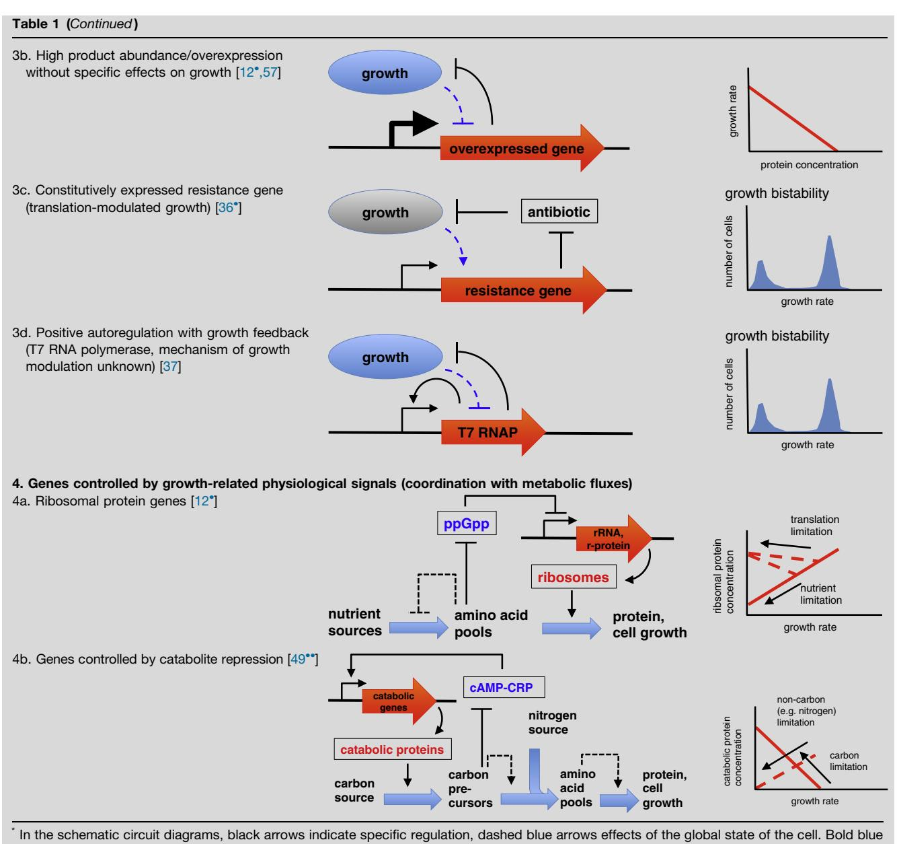
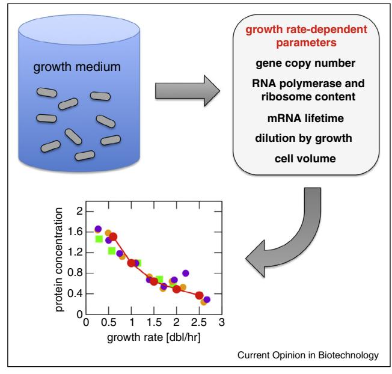

ScienceDirect

# Bacterial growth: global effects on gene expression, growth feedback and proteome partition

Stefan Klumpp1 and Terence Hwa2,3,4

The function of endogenous as well as synthetic genetic circuits is generically coupled to the physiological state of the cell. For exponentially growing bacteria, a key characteristic of the state of the cell is the growth rate and thus gene expression is often growth-rate dependent. Here we review recent results on growth-rate dependent gene expression. We distinguish different types of growth-rate dependencies by the mechanisms of regulation involved and the presence or absence of an effect of the gene product on growth. The latter can lead to growth feedback, feedback mediated by changes of the global state of the cell. Moreover, we discuss how growth rate dependence can be used as a guide to study the molecular implementation of physiological regulation.

#### Addresses

1 Max Planck Institute of Colloids and Interfaces, 14424 Potsdam, Germany

2 Department of Physics, University of California at San Diego, La Jolla, CA 92093-0374, United States

3 Center for Theoretical Biological Physics, University of California at San Diego, La Jolla, CA 92093-0374, United States

4Section of Molecular Biology, Division of Biological Sciences,

University of California at San Diego, La Jolla, CA 92093-0374, United States

Corresponding author: Klumpp, Stefan (<klumpp@mpikg.mpg.de>)

Current Opinion in Biotechnology 2014, 28:96–102

This review comes from a themed issue on Systems biology

Edited by Christian M Metallo and Victor Sourjik

0958-1669/\$ – see front matter, # 2014 Elsevier Ltd All rights reserved.

<http://dx.doi.org/10.1016/j.copbio.2014.01.001>

## Introduction

Many bacteria can grow exponentially with a wide range of growth rates, depending on the nutrient-content of the growth medium. Escherichia coli for example can grow with doubling times ranging from 20 min to many hours. The study of bacterial growth has played a central role in the development of modern microbial physiology as well as in the discovery of the regulation of gene expression [\[1](#page-5-0)–3]. It constitutes a rather natural subject of interest for systems biology [\[4,5\]](#page-5-0), as cell growth obviously is a systems-level phenomenon that depends on the coordinated functions of many cellular components [[6\]](#page-5-0), and new experimental tools allow to study growth with unprecedented control over the growth conditions [[7](#page-5-0)--].

Moreover, bacterial growth provides a model system for studying the coupling between individual genetic circuits and the global state of the cell. With recent progress in designing synthetic genetic circuits [8–[10\]](#page-5-0) and in quantitative studies of physiological gene regulation systems [\[11,12](#page-5-0)- ], it has become clear that genetic circuits are not strictly insulated from their 'host' cell, but rather are coupled to the physiological state of the cells as a whole. For example, gene expression requires RNA polymerases and ribosomes, and the concentration of these macromolecular machineries is dependent on the growth conditions [\[13,14\]](#page-5-0). These observations point towards the limitations of analogies between genetic and electronic circuits and of metaphors that describe the host cell of a circuit as a 'chassis' [\[15,16\]](#page-5-0), a rigid framework onto which the circuit is mounted: Changes in gene expression are often desired in response to changes in the environment, which typically also affect the cell's physiological state, for example, a slow-down of growth. Thus, changes in gene expression occur in conjunction with adaptation of the physiology of the cell as a whole. For synthetic gene circuits, such coupling may mostly be an undesired complication [\[17,18\]](#page-5-0), but for endogenous systems, the regulatory mechanisms have likely evolved to work in such conjunction with the global physiological adaptation of the cell.

While the coupling between physiology and gene expression can be expected to be a general phenomenon, exponentially growing bacteria provide a reasonably simple model system for its quantitative study, because the global state of a cell can to a large extent be characterized by the growth rate as a key parameter [[19\]](#page-5-0). In this article, we review different types of growth-rate dependent gene expression (summarized in [Table](#page-1-0) 1) and discuss the use of growth-rate dependencies as a physiological guide for studying regulatory mechanisms.

## Passive dependence of gene expression on growth-rate

The simplest cases of growth-rate dependence are given by genes, whose products are neutral with respect to growth and present in low abundance, so that negative effects of overexpression on growth are negligible. Specifically, constitutively expressed genes can be used to separate growth-rate dependence from the effects of gene regulation [\[20,21](#page-5-0)- ] ([Figure](#page-3-0) 1 and cases 1a, 1b in [Table](#page-1-0) 1). Already in the 1970s, several studies [[22,23\]](#page-5-0) showed that the concentrations of the protein product of several constitutively expressed genes in E. coli are lower at faster growth. More recently, this dependence was

shown to arise from the combination of the growth-rate dependencies of several cellular parameters, some of which tend to increase expression at faster growth (transcription rate, gene copy number) and some of which decrease it (dilution rate, cell volume) [\[20,21](#page-5-0)- ]. Within a phenomenological top-down view based on proteome partitioning this reduction can be interpreted as a consequence of shifting ribosomal activity to making more ribosomal protein and hence generally away from nonribosomal proteins [[12](#page-5-0)- [,24\]](#page-5-0); see also the discussion below. For genes controlled by transcriptional regulators, the growth-rate dependence of the regulator levels also contributes to the growth-rate dependent expression [\[20](#page-5-0)]. Some examples are listed in [Table](#page-1-0) 1 (cases 2a–2d).

The growth rate dependence is affected by the position of a gene on the chromosome, which determines the timing of its replication. In rapid growth, genes close to the origin of replication are amplified relative to genes close to the replication terminus [[13,25](#page-5-0)]. A recent study has tested and confirmed these position-dependent effects for constitutive and repressed genes at different chromosomal positions (with some additional effects for specific positions and for close proximity of the repressor gene and its target) [[26](#page-5-0)- ]. For genes on plasmids, the growth-rate dependence is affected by the plasmid copy number, which in turn depends on the growth-rate dependencies of parameters of its replication control system [\[27](#page-5-0)]. The copy number of some plasmids changes strongly as a

arrows depict nutrient fluxes.

#### Figure 1

Growth-rate dependence. The global state of a cell, which depends on the growth medium and can often be characterized by the growth rate, influences the quantitative level of gene expression via several parameters. As a result, the concentration of a gene product is typically growth-rate dependent, illustrated here with data for constitutive expression [[20](#page-5-0)].

function of growth rate [[28](#page-5-0)], resulting in strongly growthrate dependent expression of plasmid-encoded genes [\[20](#page-5-0)].

Several groups have explored the coupling between gene regulation and global adaptation further by considering dynamic changes in gene expression during growth transitions [\[29,30](#page-5-0)- [,31](#page-5-0)- ]. In contrast to steady state exponential growth, no mechanistic description of the change of microscopic parameters (such as transcription and translation rates, which are modulated by the RNA polymerase and ribosome content of the cell) is currently available for growth transitions and thus it is not straightforward to attribute changes in reporter activity directly to specific molecular mechanisms. However the global effects can still be addressed by comparing the dynamics of the gene of interest to that of a constitutively expressed reference gene. This approach has recently been used to study the slow-down of growth of E. coli cells during exhaustion of glucose in the growth medium, where a surprisingly large part of the changes in expression of genes related to carbon metabolism could be attributed to global effects rather than to specific regulation [\[30](#page-5-0)- ]. Another recent study characterized the 'promoter activity' (change in reporter fluorescence) as a function of steady-state growth rate and used these dependencies in a model for the dynamics of gene expression during a growth transitions [[31](#page-5-0)- ]. Good correspondence with measured data was found for several constitutive promoters and for growth on several different media. We note that this approach requires that the state of a cell during a growth transition can (at least approximately) be described by a continuum of quasi-steady states of growth.

Even though the growth rate is a key parameter of the physiological state of the cell, it is not the only such parameter. Different modes of growth modulation can lead to different growth rate dependencies [\[12](#page-5-0)- ]. All studies discussed so far modulated growth by changing the nutrients in the growth medium, the most common experimental situation. In that case, the concentration of constitutively expressed proteins decreases with increasing growth rate (case 1a in [Table](#page-1-0) 1). For growth modulation by antibiotics targeting the ribosomes, different growth rate dependencies have been observed and, in that case, constitutive expression leads to a protein concentration that increases with increasing growth rate (case 1b in [Table](#page-1-0) 1) [\[12](#page-5-0)- ]. For growth-rate dependencies based on growth-related regulators (discussed below), different modes of growth-rate dependence are obtained for different types of limiting nutrients, for example, carbon vs. nitrogen.

## Growth-mediated feedback

If the product of a gene has a (positive or negative) effect on growth, growth provides a feedback mechanism for the expression of that gene [[20\]](#page-5-0). Whether the feedback is positive or negative depends on the functional form of the growth rate dependence of gene expression (determined by the regulation of that gene) and on the mode of growth-limitation. The effect on growth may be genespecific (e.g. because the gene product is toxic or because it is required to process a limiting nutrient) or generic (e.g. growth suppression by overexpression),see cases 3a–3d in [Table](#page-1-0) 1.

Positive feedback is obtained for constitutive expression of a toxic protein in nutrient-limited growth [(Table](#page-1-0) 1, case 3a): An increase in the concentration of the toxic protein leads to a reduction in growth rate, which in turn result in a further increase of the toxin concentration (provided that the toxin's effect modulates growth in similar fashion as nutrient depletion). Bistability arises if positive feedback is sufficiently cooperative and is reflected in bimodal distributions of gene expression levels [\[32,33\]](#page-5-0). For growth-mediated feedback, the two subpopulations also exhibit different growth rates. Such feedback may, for example, be induced by expressions of toxins from chromosomal toxin–antitoxin systems. The resulting coexistence of rapidly growing and slow-growing cells is observed in bacterial persistence, phenotypic tolerance to antibiotics [\[34](#page-6-0)], where toxin–antitoxin systems indeed play a key role [\[35](#page-6-0)- ]. Another instance of generic growth feedback arises for antibiotic resistance genes in growth modulated by translation-targeting antibiotics: Increased expression of such a gene reduces the antibiotic level in the cell, thus enhancing growth, which in turn increases the concentration of the gene product [(Table](#page-1-0) 1, case 3c) [\[36](#page-6-0)- ].

Growth-mediated feedback may function in conjunction with feedback mediated by transcription factors, effectively making the latter more cooperative [\[20,37\]](#page-5-0). This was seen in an autoregulatory T7 RNA polymerase circuit [(Table](#page-1-0) 1, case 3d), where the effective cooperativity induced by growth modulation resulted in bistability in a nominally non-cooperative system [[37\]](#page-6-0), as well as in a synthetic positive autoregulation system in yeast [\[38](#page-6-0)]. Effective cooperativity is also induced generically when there are several growth feedback systems, because they are coupled through the growth modulation. For example, if one toxin slows down growth, it may enhance expression of other toxins as well. Such toxin cooperativity has recently been proposed [\[39](#page-6-0)- ] to explain persister frequencies in strains with deletions of multiple toxin–antitoxin systems [[40\]](#page-6-0).

Once a genetic circuit displays growth bistability, its dynamics couples to the population dynamics. While the rate at which cells switch between the two phenotypes is determined by the gene circuit, the percentage of these phenotypes in the population also depends on the two growth rates [\[38,41\]](#page-6-0). For example, the fraction of persister cells in an exponentially growing population (in steady-state, i.e. after the high persisters levels left over from the stationary phase have been diluted out) is given by the balance of normal cells outgrowing the persisters and persister generation by (one-way) phenotype switching [\[41](#page-6-0)]. Indeed, this switching rate was found to be the best predictor of observed persister fractions, when comparing different E. coli strains [\[42](#page-6-0)]. A related effect has been observed for a synthetic gene circuit in yeast that is turned on as a memory of DNA damage. In this case, cells with the circuit turned on were found to grow more slowly and thus to be outgrown by the cells with the circuit off [\[43](#page-6-0)].

## Growth-rate dependence based on growthrelated physiological signals

Finally, growth-rate dependence of gene expression can arise from regulation by growth-related physiological signals that coordinate expression of certain genes with metabolic fluxes. Even though such regulation may be complex, it can lead to surprisingly simple growth-rate dependencies that can be understood based on the economic rationale underlying that regulation. Perhaps the best known such case is the linear growth-rate dependence of ribosomal protein obtained for cells growing in media with different nutrients (case 4a in [Table](#page-1-0) 1) [\[12](#page-5-0)- [,19,44,45](#page-5-0)]. On a microscopic level it depends on the complex mechanisms controlling ribosome synthesis, with the regulatory nucleotide ppGpp as key physiological signal that adjusts ribosome synthesis to the availability of amino acids [\[46,47\]](#page-6-0). From a macroscopic viewpoint, this relation reflects the allocation of ribosomes to making different types of proteins. Specifically, the autocatalytic activity of ribosomes making ribosomal proteins is a requirement for exponential growth that increases with increasing growth rate [\[12](#page-5-0)- [,44,48\]](#page-5-0), but must be balanced with the need for making proteins that import and process nutrients. Thus, if the ribosomal capacity is saturated (with almost all ribosomes engaged in translation), the increased ribosome content (proteome fraction) at rapid growth comes at the expense of a reduced content of other proteins, such as the constitutively expressed ones. The observation of a second linear relation under translation inhibition, for example, by antibiotics, has allowed the development of this idea into a quantitative and predictive theory [[12](#page-5-0)- [,24\]](#page-5-0). A particular success of that theory was the quantitative predication of the growth reduction due to overexpression of unnecessary protein (case 3c in [Table](#page-1-0) 1).

Another set of strikingly simple growth-rate dependencies is found for catabolic genes under carbon-dependent and non-carbon-dependent growth limitation [[49](#page-6-0)--]: a linear decrease or increase with increasing growth rate, respectively [(Table](#page-1-0) 1, case 4b). These linear dependencies can again be understood as reflecting a trade-off in resource allocation, this time between catabolic proteins on the one hand and biosynthetic proteins (anabolic and ribosomal proteins) on the other hand. Within a quantitative theoretical description [[49](#page-6-0)--], the linear relations can be interpreted as reflecting Pareto surfaces [[50,51](#page-6-0)- ], resulting from the optimization of competing requirements. The physiological signal underlying these growth-rate dependencies is another regulatory nucleotide, cAMP (in a complex with the transcription factor CRP), long known as the effector of catabolite repression [\[52](#page-6-0)]. The central physiological role of cAMP-CRP as a coordinator of carbon metabolism with competing metabolic demands has, however, only been identified based on the quantitative analysis of these growth-rate dependencies [[49](#page-6-0)--]. Moreover, via the specific case of coordination between carbon and nitrogen metabolism, this analysis also suggested that feedback by precursors at the interface between carbon and nitrogen metabolism may provide the molecular implementation of that coordination. This hypothesis was subsequently confirmed and a-ketoacids (including a-ketoglutarate, which had previously been shown to control the uptake of both carbon and nitrogen sources [[53,54\]](#page-6-0)) were identified as the physiological trigger for cAMP-CRP regulation [[49](#page-6-0)--], thus playing the role of the unknown 'catabolites' in Magasanik's original catabolite repression hypothesis [\[55](#page-6-0)]. This discovery of a molecular link that had been elusive for decades provides an example for how the quantitative study of physiological growth-rate dependencies can guide the understanding of regulatory strategies and their molecular implementation [[49](#page-6-0)--[,56](#page-6-0)].

In summary, gene expression and cell growth are interrelated in multiple ways. An understanding of these relations can improve the quantitative understanding and prediction of gene circuit behavior and provide guidance towards understanding the economic principles as well as the molecular implementation of physiological regulation.

## Acknowledgments

This work was supported by the Max Planck Society (SK), by the NSF through Grant PHY1058793 (to TH) and through the Center for Theoretical Biological Physics (Grant PHY-0822283), and by the NIH through Grant RO1GM077298 (to TH).

### References and recommended reading

Papers of particular interest, published within the period of review, have been highlighted as:

- of special interest
- -of outstanding interest
- 1. Monod J: The growth of bacterial cultures. Annu Rev [Microbiol](http://refhub.elsevier.com/S0958-1669(14)00004-4/sbref0005) 1949, 3[:371-394.](http://refhub.elsevier.com/S0958-1669(14)00004-4/sbref0005)
- 2. Monod J: From enzymatic [adaptation](http://refhub.elsevier.com/S0958-1669(14)00004-4/sbref0010) to allosteric transitions. Science 1966, 154[:475-483.](http://refhub.elsevier.com/S0958-1669(14)00004-4/sbref0010)
- 3. Neidhardt FC, Ingraham JL, [Schaechter](http://refhub.elsevier.com/S0958-1669(14)00004-4/sbref0015) M: Physiology of the bacterial cell: a [molecular](http://refhub.elsevier.com/S0958-1669(14)00004-4/sbref0015) approach. Sinauer; 199[0.](http://refhub.elsevier.com/S0958-1669(14)00004-4/sbref0015)
- 4. Neidhardt FC: Bacterial growth: constant [obsession](http://refhub.elsevier.com/S0958-1669(14)00004-4/sbref0020) with dN/ dt. J Bacteriol 1999, 181[:7405-7408.](http://refhub.elsevier.com/S0958-1669(14)00004-4/sbref0020)
- 5. Schaechter M: From growth [physiology](http://refhub.elsevier.com/S0958-1669(14)00004-4/sbref0025) to systems biology. Int Microbiol 2006, 9[:157-161.](http://refhub.elsevier.com/S0958-1669(14)00004-4/sbref0025)
- 6. Edwards JS, Ibarra RU, Palsson BO: In silico [predictions](http://refhub.elsevier.com/S0958-1669(14)00004-4/sbref0030) of [Escherichia](http://refhub.elsevier.com/S0958-1669(14)00004-4/sbref0030) coli metabolic capabilities are consistent with [experimental](http://refhub.elsevier.com/S0958-1669(14)00004-4/sbref0030) data. Nat Biotechnol 2001, 19:125-130.
- 7. Wang P, Robert L, [Pelletier](http://refhub.elsevier.com/S0958-1669(14)00004-4/sbref0035) J, Dang WL, Taddei F, Wright A, Jun S:
- -- Robust growth of [Escherichia](http://refhub.elsevier.com/S0958-1669(14)00004-4/sbref0035) coli. Curr Biol 2010, 20:1099- [1103.](http://refhub.elsevier.com/S0958-1669(14)00004-4/sbref0035)

This study introduced the 'mother machine', a microfluidic device that enables the study of growth at single-cell resolution for long times under constant conditions. It was shown that the growth rate of E. coli remains stable for hundreds of generations.

- 8. Purnick PE, Weiss R: The second wave of [synthetic](http://refhub.elsevier.com/S0958-1669(14)00004-4/sbref0040) biology: from [modules](http://refhub.elsevier.com/S0958-1669(14)00004-4/sbref0040) to systems. Nat Rev Mol Cell Biol 2009, 10:410- [422.](http://refhub.elsevier.com/S0958-1669(14)00004-4/sbref0040)
- 9. Lu TK, Khalil AS, Collins JJ: [Next-generation](http://refhub.elsevier.com/S0958-1669(14)00004-4/sbref0045) synthetic gene networks. Nat Biotechnol 2009, 27[:1139-1150.](http://refhub.elsevier.com/S0958-1669(14)00004-4/sbref0045)
- 10. Voigt CA: Genetic parts to [program](http://refhub.elsevier.com/S0958-1669(14)00004-4/sbref0050) bacteria. Curr Opin [Biotechnol](http://refhub.elsevier.com/S0958-1669(14)00004-4/sbref0050) 2006, 17:548-557.
- 11. Kuhlman T, Zhang Z, Saier MH Jr, Hwa T: [Combinatorial](http://refhub.elsevier.com/S0958-1669(14)00004-4/sbref0055) [transcriptional](http://refhub.elsevier.com/S0958-1669(14)00004-4/sbref0055) control of the lactose operon of Escherichia coli. Proc Natl Acad Sci U S A 2007, 104[:6043-6048.](http://refhub.elsevier.com/S0958-1669(14)00004-4/sbref0055)
- 12. - Scott M, [Gunderson](http://refhub.elsevier.com/S0958-1669(14)00004-4/sbref0060) CW, Mateescu EM, Zhang Z, Hwa T: [Interdependence](http://refhub.elsevier.com/S0958-1669(14)00004-4/sbref0060) of cell growth and gene expression: origins and [consequences](http://refhub.elsevier.com/S0958-1669(14)00004-4/sbref0060). Science 2010, 330:1099-1102.

A study of 'growth laws', simple relations between protein concentrations, in particular the ribosome concentration, and growth rate. A systematic proteome partitioning theory is developed to explain these relations and used to predict the growth reduction due to overexpression of unnecessary protein.

- 13. Bremer H, Dennis PP: Modulation of chemical [composition](http://refhub.elsevier.com/S0958-1669(14)00004-4/sbref0065) and other [parameters](http://refhub.elsevier.com/S0958-1669(14)00004-4/sbref0065) of the cell by growth rate. In Escherichia coli
and [Salmonella,](http://refhub.elsevier.com/S0958-1669(14)00004-4/sbref0065) second edn. Edited by Neidhardt FC. ASM Press; [1996:1553-1569](http://refhub.elsevier.com/S0958-1669(14)00004-4/sbref0065).

- 14. Klumpp S, Hwa T: [Growth-rate-dependent](http://refhub.elsevier.com/S0958-1669(14)00004-4/sbref0070) partitioning of RNA [polymerases](http://refhub.elsevier.com/S0958-1669(14)00004-4/sbref0070) in bacteria. Proc Natl Acad Sci U S A 2008, 105[:20245-20250.](http://refhub.elsevier.com/S0958-1669(14)00004-4/sbref0070)
- 15. de Lorenzo V: Beware of [metaphors:](http://refhub.elsevier.com/S0958-1669(14)00004-4/sbref0075) chasses and [orthogonality](http://refhub.elsevier.com/S0958-1669(14)00004-4/sbref0075) in synthetic biology. Bioeng Bugs 2011, 2:3-7.
- 16. Danchin A: Scaling up [synthetic](http://refhub.elsevier.com/S0958-1669(14)00004-4/sbref0080) biology: do not forget the chassis. FEBS Lett 2012, 586[:2129-2137.](http://refhub.elsevier.com/S0958-1669(14)00004-4/sbref0080)
- 17. Kwok R: Five hard truths for [synthetic](http://refhub.elsevier.com/S0958-1669(14)00004-4/sbref0085) biology. Nature 2010, 463[:288-290.](http://refhub.elsevier.com/S0958-1669(14)00004-4/sbref0085)
- 18. Cardinale S, Arkin AP: [Contextualizing](http://refhub.elsevier.com/S0958-1669(14)00004-4/sbref0090) context for synthetic [biology](http://refhub.elsevier.com/S0958-1669(14)00004-4/sbref0090) — [identifying](http://refhub.elsevier.com/S0958-1669(14)00004-4/sbref0090) causes of failure of synthetic biological systems. [Biotechnol](http://refhub.elsevier.com/S0958-1669(14)00004-4/sbref0090) J 2012, 7:856-866.
- 19. Schaechter M, Maaløe O, Kjeldgaard NO: [Dependency](http://refhub.elsevier.com/S0958-1669(14)00004-4/sbref0095) on medium and [temperature](http://refhub.elsevier.com/S0958-1669(14)00004-4/sbref0095) of cell size and chemical [composition](http://refhub.elsevier.com/S0958-1669(14)00004-4/sbref0095) during balanced growth of Salmonella [typhimurium](http://refhub.elsevier.com/S0958-1669(14)00004-4/sbref0095). J Gen Microbiol 1958, 19:592-606.
- 20. Klumpp S, Zhang Z, Hwa T: Growth [rate-dependent](http://refhub.elsevier.com/S0958-1669(14)00004-4/sbref0100) global effects on gene [expression](http://refhub.elsevier.com/S0958-1669(14)00004-4/sbref0100) in bacteria. Cell 2009, 139:1366- [1375.](http://refhub.elsevier.com/S0958-1669(14)00004-4/sbref0100)
- 21. - Hintsche M, Klumpp S: Dilution and the theoretical [description](http://refhub.elsevier.com/S0958-1669(14)00004-4/sbref0105) of [growth-rate](http://refhub.elsevier.com/S0958-1669(14)00004-4/sbref0105) dependent gene expression. J Biol Eng 2013, 7[:22.](http://refhub.elsevier.com/S0958-1669(14)00004-4/sbref0105)

A short discussion of the role of dilution for growth-rate dependent gene expression that shows that the two simplest and commonly used theoretical descriptions of growth effects are not consistent with the observed growth-rate dependence of constitutively expressed genes.

- 22. Wanner BL, Kodaira R, Neidhardt FC: [Physiological](http://refhub.elsevier.com/S0958-1669(14)00004-4/sbref0110) regulation of a [decontrolled](http://refhub.elsevier.com/S0958-1669(14)00004-4/sbref0110) lac operon. J Bacteriol 1977, 130:212-222.
- 23. Maaloe O: Regulation of the [protein-synthesizing](http://refhub.elsevier.com/S0958-1669(14)00004-4/sbref0115) [machinery](http://refhub.elsevier.com/S0958-1669(14)00004-4/sbref0115) — [ribosomes,](http://refhub.elsevier.com/S0958-1669(14)00004-4/sbref0115) tRNA, factors, and so on. In Biological Regulation and [Development.](http://refhub.elsevier.com/S0958-1669(14)00004-4/sbref0115) Edited by Goldberger RF. [Plenum](http://refhub.elsevier.com/S0958-1669(14)00004-4/sbref0115) Press; 1979[:487-542](http://refhub.elsevier.com/S0958-1669(14)00004-4/sbref0115).
- 24. Scott M, Hwa T: Bacterial growth laws and their [applications](http://refhub.elsevier.com/S0958-1669(14)00004-4/sbref0120). Curr Opin [Biotechnol](http://refhub.elsevier.com/S0958-1669(14)00004-4/sbref0120) 2011, 22:559-565.
- 25. Cooper S, Helmstetter CE: [Chromosome](http://refhub.elsevier.com/S0958-1669(14)00004-4/sbref0125) replication and division cycle of [Escherichia](http://refhub.elsevier.com/S0958-1669(14)00004-4/sbref0125) coli B/r. J Mol Biol 1968, 31:519- [540.](http://refhub.elsevier.com/S0958-1669(14)00004-4/sbref0125)
- 26. - Kuhlman TE, Cox EC: Gene location and DNA density [determine](http://refhub.elsevier.com/S0958-1669(14)00004-4/sbref0130) [transcription](http://refhub.elsevier.com/S0958-1669(14)00004-4/sbref0130) factor distributions in Escherichia coli. Mol Syst Biol [2012,](http://refhub.elsevier.com/S0958-1669(14)00004-4/sbref0130) 8:610.

Systematic study of local concentration effects that also addresses the dependence of gene expression on growth rate and chromosomal location.

- 27. Klumpp S: Growth-rate [dependence](http://refhub.elsevier.com/S0958-1669(14)00004-4/sbref0135) reveals design principles of plasmid copy number control. PLoS One 2011, 6[:e20403.](http://refhub.elsevier.com/S0958-1669(14)00004-4/sbref0135)
- 28. Lin-Chao S, Bremer H: Effect of the [bacterial](http://refhub.elsevier.com/S0958-1669(14)00004-4/sbref0140) growth rate on replication control of plasmid pBR322 in [Escherichia](http://refhub.elsevier.com/S0958-1669(14)00004-4/sbref0140) coli. Mol Gen Genet 1986, 203[:143-149.](http://refhub.elsevier.com/S0958-1669(14)00004-4/sbref0140)
- 29. [Zaslaver](http://refhub.elsevier.com/S0958-1669(14)00004-4/sbref0145) A, Kaplan S, Bren A, Jinich A, Mayo A, Dekel E, Alon U, Itzkovitz S: Invariant [distribution](http://refhub.elsevier.com/S0958-1669(14)00004-4/sbref0145) of promoter activities in [Escherichia](http://refhub.elsevier.com/S0958-1669(14)00004-4/sbref0145) coli. PLoS Comput Biol 2009, 5:e1000545.
- 30. [Berthoumieux](http://refhub.elsevier.com/S0958-1669(14)00004-4/sbref0150) S, de Jong H, Baptist G, Pinel C, Ranquet C,
- - Ropers D, [Geiselmann](http://refhub.elsevier.com/S0958-1669(14)00004-4/sbref0150) J: Shared control of gene expression in bacteria by [transcription](http://refhub.elsevier.com/S0958-1669(14)00004-4/sbref0150) factors and global physiology of the cell. Mol Syst Biol [2013,](http://refhub.elsevier.com/S0958-1669(14)00004-4/sbref0150) 9:634.
- 31. - Gerosa L, [Kochanowski](http://refhub.elsevier.com/S0958-1669(14)00004-4/sbref0155) K, Heinemann M, Sauer U: Dissecting specific and global [transcriptional](http://refhub.elsevier.com/S0958-1669(14)00004-4/sbref0155) regulation of bacterial gene [expression](http://refhub.elsevier.com/S0958-1669(14)00004-4/sbref0155). Mol Syst Biol 2013, 9:658.

Two studies that address global growth effects during growth transitions using two different methods: by analyzing correlations with a constitutive reference gene (Ref. [30- ]) and by relating changes in gene expression during the growth transition to the corresponding steady-state growth rate dependencies (Ref. [31- ]).

- 32. Ferrell JE Jr: [Self-perpetuating](http://refhub.elsevier.com/S0958-1669(14)00004-4/sbref0160) states in signal transduction: positive feedback, [double-negative](http://refhub.elsevier.com/S0958-1669(14)00004-4/sbref0160) feedback and bistability. Curr Opin Cell Biol 2002, 14[:140-148.](http://refhub.elsevier.com/S0958-1669(14)00004-4/sbref0160)
- 33. Smits WK, Kuipers OP, Veening JW: [Phenotypic](http://refhub.elsevier.com/S0958-1669(14)00004-4/sbref0165) variation in bacteria: the role of feedback [regulation](http://refhub.elsevier.com/S0958-1669(14)00004-4/sbref0165). Nat Rev Microbiol 2006, 4[:259-271.](http://refhub.elsevier.com/S0958-1669(14)00004-4/sbref0165)
- 34. Balaban NQ, Merrin J, Chait R, Kowalik L, Leibler S: [Bacterial](http://refhub.elsevier.com/S0958-1669(14)00004-4/sbref0170) [persistence](http://refhub.elsevier.com/S0958-1669(14)00004-4/sbref0170) as a phenotypic switch. Science 2004, 305[:1622-1625.](http://refhub.elsevier.com/S0958-1669(14)00004-4/sbref0170)
- 35. Gerdes K, [Maisonneuve](http://refhub.elsevier.com/S0958-1669(14)00004-4/sbref0175) E: Bacterial persistence and toxin–

- antitoxin loci. Annu Rev Microbiol 2012, 66[:103-123.](http://refhub.elsevier.com/S0958-1669(14)00004-4/sbref0175) A recent review of the current knowledge about the role of toxin–antitoxin systems in persistence.

- 36. - Deris JB, Kim M, Zhang Z, Okano H, Hermsen R, [Groisman](http://refhub.elsevier.com/S0958-1669(14)00004-4/sbref0180) A, Hwa T: The innate growth bistability and fitness [landscapes](http://refhub.elsevier.com/S0958-1669(14)00004-4/sbref0180) of
[antibiotic-resistant](http://refhub.elsevier.com/S0958-1669(14)00004-4/sbref0180) bacteria. Science 2013, 342:1237435. This paper demonstrates growth bistability due to the growth-rate dependent expression of antibiotic resistance genes in translation-modulated growth.

- 37. Tan C, Marguet P, You L: [Emergent](http://refhub.elsevier.com/S0958-1669(14)00004-4/sbref0185) bistability by a growth[modulating](http://refhub.elsevier.com/S0958-1669(14)00004-4/sbref0185) positive feedback circuit. Nat Chem Biol 2009, 5[:842-848.](http://refhub.elsevier.com/S0958-1669(14)00004-4/sbref0185)
- 38. [Nevozhay](http://refhub.elsevier.com/S0958-1669(14)00004-4/sbref0190) D, Adams RM, Van Itallie E, Bennett MR, Balazsi G: Mapping the [environmental](http://refhub.elsevier.com/S0958-1669(14)00004-4/sbref0190) fitness landscape of a synthetic gene circuit. PLoS Comput Biol 2012, 8[:e1002480.](http://refhub.elsevier.com/S0958-1669(14)00004-4/sbref0190)
- 39. - Fasani RA, Savageau MA: Molecular [mechanisms](http://refhub.elsevier.com/S0958-1669(14)00004-4/sbref0195) of multiple toxin–antitoxin systems are [coordinated](http://refhub.elsevier.com/S0958-1669(14)00004-4/sbref0195) to govern the persister

phenotype. Proc Natl Acad Sci U S A 2013, 110[:E2528-E2537.](http://refhub.elsevier.com/S0958-1669(14)00004-4/sbref0195) A model for the formation of persister cells that proposes effective cooperativity of multiple toxin–antitoxin systems mediated by the slow-down of growth.

- 40. [Maisonneuve](http://refhub.elsevier.com/S0958-1669(14)00004-4/sbref0200) E, Shakespeare LJ, Jorgensen MG, Gerdes K: Bacterial persistence by RNA [endonucleases](http://refhub.elsevier.com/S0958-1669(14)00004-4/sbref0200). Proc Natl Acad Sci U S A 2011, 108[:13206-13211.](http://refhub.elsevier.com/S0958-1669(14)00004-4/sbref0200)
- 41. Patra P, Klumpp S: [Population](http://refhub.elsevier.com/S0958-1669(14)00004-4/sbref0205) dynamics of bacterial [persistence](http://refhub.elsevier.com/S0958-1669(14)00004-4/sbref0205). PLoS One 2013, 8:e62814.
- 42. Hofsteenge N, van Nimwegen E, Silander OK: [Quantitative](http://refhub.elsevier.com/S0958-1669(14)00004-4/sbref0210) analysis of persister fractions suggests different [mechanisms](http://refhub.elsevier.com/S0958-1669(14)00004-4/sbref0210) of formation among [environmental](http://refhub.elsevier.com/S0958-1669(14)00004-4/sbref0210) isolates of E. coli. BMC [Microbiol](http://refhub.elsevier.com/S0958-1669(14)00004-4/sbref0210) 2013, 13:25.
- 43. Burrill DR, Silver PA: Synthetic circuit identifies [subpopulations](http://refhub.elsevier.com/S0958-1669(14)00004-4/sbref0215) with [sustained](http://refhub.elsevier.com/S0958-1669(14)00004-4/sbref0215) memory of DNA damage. Genes Dev 2011, 25[:434-439.](http://refhub.elsevier.com/S0958-1669(14)00004-4/sbref0215)
- 44. Neidhardt FC, Magasanik B: Studies on the role of [ribonucleic](http://refhub.elsevier.com/S0958-1669(14)00004-4/sbref0220) acid in the growth of [bacteria](http://refhub.elsevier.com/S0958-1669(14)00004-4/sbref0220). Biochim Biophys Acta 1960, 42[:99-116.](http://refhub.elsevier.com/S0958-1669(14)00004-4/sbref0220)
- 45. Klumpp S, Scott M, Pedersen S, Hwa T: [Molecular](http://refhub.elsevier.com/S0958-1669(14)00004-4/sbref0225) crowding limits [translation](http://refhub.elsevier.com/S0958-1669(14)00004-4/sbref0225) and cell growth. Proc Natl Acad Sci U S A 2013, 110[:16754-16759.](http://refhub.elsevier.com/S0958-1669(14)00004-4/sbref0225)
- 46. Murray HD, [Schneider](http://refhub.elsevier.com/S0958-1669(14)00004-4/sbref0230) DA, Gourse RL: Control of rRNA expression by small molecules is dynamic and [nonredundant](http://refhub.elsevier.com/S0958-1669(14)00004-4/sbref0230). Mol Cell 2003, 12[:125-134.](http://refhub.elsevier.com/S0958-1669(14)00004-4/sbref0230)
- 47. [Potrykus](http://refhub.elsevier.com/S0958-1669(14)00004-4/sbref0235) K, Murphy H, Philippe N, Cashel M: ppGpp is the major source of growth rate control in E. coli. Environ [Microbiol](http://refhub.elsevier.com/S0958-1669(14)00004-4/sbref0235) 2011, 13[:563-575.](http://refhub.elsevier.com/S0958-1669(14)00004-4/sbref0235)
- 48. Maaloe O: An analysis of [bacterial](http://refhub.elsevier.com/S0958-1669(14)00004-4/sbref0240) growth. Develop Biol Suppl 1969, 3[:33-58.](http://refhub.elsevier.com/S0958-1669(14)00004-4/sbref0240)
- 49. You C, Okano H, Hui S, Zhang Z, Kim M, [Gunderson](http://refhub.elsevier.com/S0958-1669(14)00004-4/sbref0245) CW,
- -- Wang YP, Lenz P, Yan D, Hwa T: [Coordination](http://refhub.elsevier.com/S0958-1669(14)00004-4/sbref0245) of bacterial proteome with [metabolism](http://refhub.elsevier.com/S0958-1669(14)00004-4/sbref0245) by cyclic AMP signalling. Nature 2013, 500[:301-306.](http://refhub.elsevier.com/S0958-1669(14)00004-4/sbref0245)

A systematic study of catabolite repression based on the growth-rate dependence of catabolic genes under different growth limitations. It shows that the physiological role of CRP-cAMP is the coordinating different nutrient requirement (e.g. carbon and nitrogen) and identifies a-ketoacids as the underlying trigger of that coordination.

- 50. Schuetz R, Zamboni N, Zampieri M, [Heinemann](http://refhub.elsevier.com/S0958-1669(14)00004-4/sbref0250) M, Sauer U: [Multidimensional](http://refhub.elsevier.com/S0958-1669(14)00004-4/sbref0250) optimality of microbial metabolism. Science 2012, 336[:601-604.](http://refhub.elsevier.com/S0958-1669(14)00004-4/sbref0250)
- 51. - Shoval O, Sheftel H, Shinar G, Hart Y, [Ramote](http://refhub.elsevier.com/S0958-1669(14)00004-4/sbref0255) O, Mayo A, Dekel E, Kavanagh K, Alon U: [Evolutionary](http://refhub.elsevier.com/S0958-1669(14)00004-4/sbref0255) trade-offs, Pareto optimality, and the geometry of [phenotype](http://refhub.elsevier.com/S0958-1669(14)00004-4/sbref0255) space. Science 2012, 336[:1157-1160.](http://refhub.elsevier.com/S0958-1669(14)00004-4/sbref0255)

This study uses the concept of Pareto surfaces to investigate biological optimization with competing objectives. One example is the change in the global gene expression pattern during a growth transition, which is interpreted as a trajectory on a Pareto surface.

- 52. Kolb A, Busby S, Buc H, Garges S, Adhya S: [Transcriptional](http://refhub.elsevier.com/S0958-1669(14)00004-4/sbref0260) [regulation](http://refhub.elsevier.com/S0958-1669(14)00004-4/sbref0260) by cAMP and its receptor protein. Annu Rev Biochem 1993, 62[:749-795.](http://refhub.elsevier.com/S0958-1669(14)00004-4/sbref0260)
- 53. Doucette CD, Schwab DJ, Wingreen NS, [Rabinowitz](http://refhub.elsevier.com/S0958-1669(14)00004-4/sbref0265) JD: [alpha-Ketoglutarate](http://refhub.elsevier.com/S0958-1669(14)00004-4/sbref0265) coordinates carbon and nitrogen [utilization](http://refhub.elsevier.com/S0958-1669(14)00004-4/sbref0265) via enzyme I inhibition. Nat Chem Biol 2011, 7[:894-901.](http://refhub.elsevier.com/S0958-1669(14)00004-4/sbref0265)
- 54. Kim M, Zhang Z, Okano H, Yan D, [Groisman](http://refhub.elsevier.com/S0958-1669(14)00004-4/sbref0270) A, Hwa T: Needbased activation of ammonium uptake in [Escherichia](http://refhub.elsevier.com/S0958-1669(14)00004-4/sbref0270) coli. Mol Syst Biol [2012,](http://refhub.elsevier.com/S0958-1669(14)00004-4/sbref0270) 8:616.
- 55. Magasanik B: Catabolite [repression](http://refhub.elsevier.com/S0958-1669(14)00004-4/sbref0275). Cold Spring Harb Symp Quant Biol 1961, 26[:249-256.](http://refhub.elsevier.com/S0958-1669(14)00004-4/sbref0275)
- 56. Rabinowitz JD, Silhavy TJ: [Metabolite](http://refhub.elsevier.com/S0958-1669(14)00004-4/sbref0280) turns master regulator. Nature 2013, 500[:283-284.](http://refhub.elsevier.com/S0958-1669(14)00004-4/sbref0280)
- 57. Dong H, Nilsson L, Kurland CG: Gratuitous [overexpression](http://refhub.elsevier.com/S0958-1669(14)00004-4/sbref0285) of genes in [Escherichia](http://refhub.elsevier.com/S0958-1669(14)00004-4/sbref0285) coli leads to growth inhibition and ribosome [destruction](http://refhub.elsevier.com/S0958-1669(14)00004-4/sbref0285). J Bacteriol 1995, 177:1497-1504.