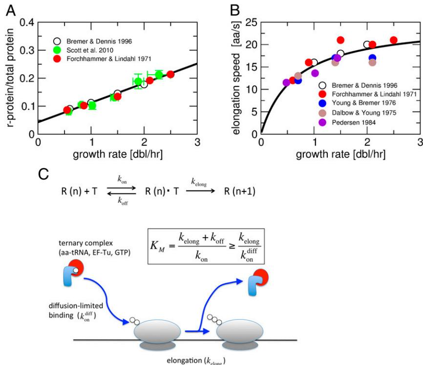
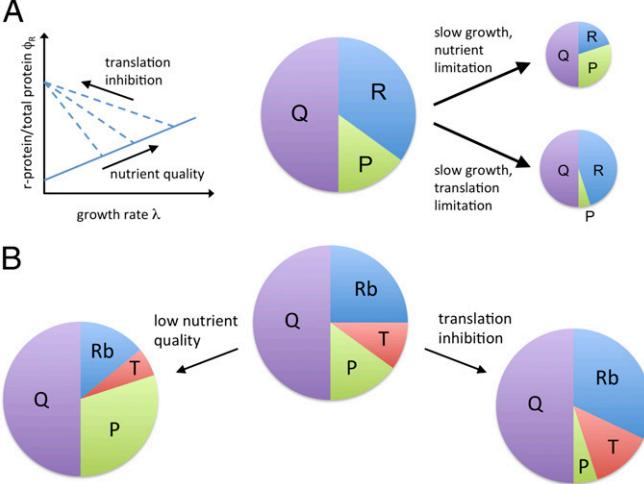
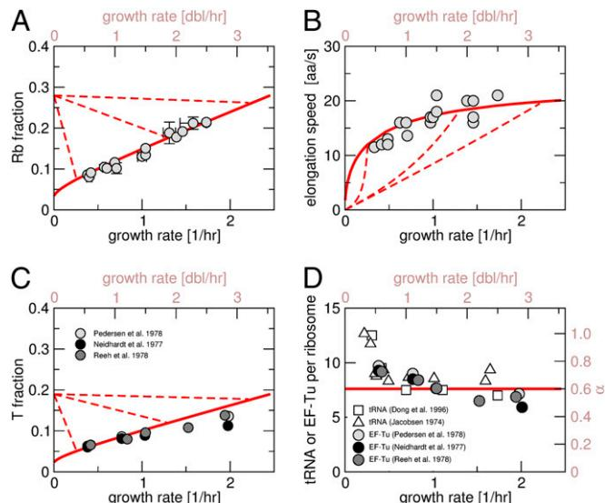
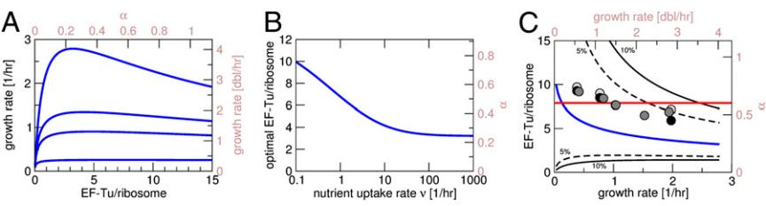
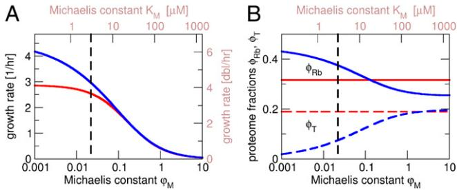

## Molecular crowding limits translation and cell growth

Stefan Klumppa,1, Matthew Scottb , Steen Pedersenc , and Terence Hwad,e

a Max Planck Institute of Colloids and Interfaces, 14424 Potsdam, Germany; b Department of Applied Mathematics, University of Waterloo, Waterloo, ON, Canada N2L 3G1; c Department of Biology, University of Copenhagen, 2200 Copenhagen N, Denmark; and d Department of Physics and Center for Theoretical Biological Physics, and e Section of Molecular Biology, Division of Biological Sciences, University of California, San Diego, La Jolla, CA 92093

Edited by David R. Nelson, Harvard University, Cambridge, MA, and approved September 5, 2013 (received for review May 31, 2013)

Bacterial growth is crucially dependent on protein synthesis and thus on the cellular abundance of ribosomes and related proteins. Here, we show that the slow diffusion of the bulky tRNA complexes in the crowded cytoplasm imposes a physical limit on the speed of translation, which ultimately limits the rate of cell growth. To study the required allocation of ancillary translational proteins to alleviate the effect of molecular crowding, we develop a model for cell growth based on a coarse-grained partitioning of the proteome. We find that coregulation of ribosome- and tRNA-affiliated proteins is consistent with measured growth-rate dependencies and results in near-optimal allocation over a broad range of growth rates. The analysis further resolves a long-standing controversy in bacterial growth physiology concerning the growth-rate dependence of translation speed and serves as a caution against premature identification of phenomenological parameters with mechanistic processes.

Bacterial cell growth and protein synthesis are tightly coupled as proteins account for a large fraction of the cellular biomass (1). In the model organism Escherichia coli, over half of the biomass is protein (2), and protein synthesis accounts for more than two-thirds of the cell's ATP budget during rapid growth (3). Therefore, the machinery of protein synthesis, i.e., ribosomes, tRNAs, and ribosome-affiliated factors, plays a central role in maintaining exponential growth (1, 4). This is manifested by an increased ribosome content in rapidly growing cells (2, 5, 6), by direct observations that protein synthesis is limited by the availability of free ribosomes (7), and by considerations that link evolutionary selective pressure to the cost of protein synthesis (8).

The most striking evidence for the central role of ribosomes in cell growth is provided by the linear relation between the ribosome mass fraction and the growth rate for bacteria grown in media containing different nutrients. This linear relation, which emerged from the systematic characterization of bacterial cells growing at different rates (5, 9), is illustrated in Fig. 1A with data for E. coli (2, 10, 11). It can be interpreted as reflecting the intrinsically autocatalytic activity of ribosomes synthesizing ribosomal proteins (9, 12) and identifies the fraction of ribosomes allocated to making ribosomal proteins as a key determinant of the growth rate (11). The picture that emerges from such considerations has formed the basis of a systematic theory of bacterial growth, based on empirical "growth laws", similar to the phenomenological laws of physics (11, 13). The theory provides a successful framework for the analysis of the interdependence of cell growth and gene expression, of the effects of antibiotics, and of protein overexpression (11) without the need to characterize how the individual steps of synthesis and degradation are affected by the global state of the cell (14).

In addition to their high ribosome content, rapidly growing bacteria also contain large amounts of other proteins associated with translation. In particular, the most abundant protein in fastgrowing E. coli is elongation factor Tu (EF-Tu), with about six to seven molecules per ribosome (15), and accounting for up to 10% of the total protein mass under conditions of rapid growth (2, 16). EF-Tu escorts charged tRNA to the ribosome and protects it from losing its amino-acylation (17, 18). The concentration of EF-Tu is closely linked to the concentration of tRNA, as EF-Tu and tRNA are typically present is cells as ternary complexes together with GTP (which activates EF-Tu) (19, 20). EF-Tu and the 21 different tRNA synthetases (21), which charge tRNAs with the corresponding amino acids, amount to a total tRNA-affiliated protein mass of about two-thirds that of the ribosomal protein mass in moderate-to-fast growth (15). As the fraction of ribosomes allocated to making ribosomal proteins is a central factor for cell growth, synthesizing this protein mass constitutes a massive "investment" of cellular resources by diverting ribosomes away from making ribosomal proteins and toward making tRNA-affiliated proteins.

To understand why rapidly growing cells allocate such a large fraction of their proteome to tRNA-affiliated proteins, we first estimate the concentration of these proteins needed to saturate the ribosome with charged tRNA. We find that slow diffusion of the ternary complexes defines a lower bound on this concentration, pointing to the role molecular crowding plays in proteome allocation, which ultimately sets a speed limit on protein synthesis and cell growth.

The high abundance of tRNA-affiliated proteins necessary to maintain rapid translation must be balanced against the burden associated with devoting precious ribosomal resources to their synthesis (22). To elucidate how rapid growth can be achieved subject to these constraints, we develop an explicit theory that accounts for the cost of ribosomal protein synthesis and the cost of synthesizing tRNA-affiliated proteins. Our theory is based on the quantitative phenomenological framework developed by Scott et al. (11), but in contrast to the earlier work allows the speed of translation to vary (through the abundance of tRNAs and tRNAaffiliated proteins). The resulting analysis shows that this theory is consistent with a large amount of experimental data and indicates that coregulation of tRNA- and ribosome-affiliated proteins results in near-optimal resource allocation irrespective of growth rate. Furthermore, our theory provides a resolution to a long-standing contradiction in bacterial physiology, between the observed growth-rate dependence of the translation speed (23–25) (Fig. 1B) and the linear relation between ribosome concentration and growth rate traditionally attributed to a constant translation speed (1).

## Significance

In rapidly growing bacteria, one-third of the proteins are ribosomal proteins and another one-sixth are ternary complexes (TCs) that bring amino acids to the ribosomes, making TCs the most abundant protein species. This study reveals that this very high TC content is forced upon the cell due to the slow diffusion of the large TCs in the crowded cytoplasm. A model is presented to describe how a bacterial cell solves the problem of proteomic resource allocation, balancing the two requirements for many ribosomes and for rapid translation. The model shows that proportional or approximately proportional synthesis of ribosomal proteins and TCs, as observed in Escherichia coli cells, is a near-optimal allocation scheme.

Author contributions: S.K., M.S., S.P., and T.H. designed research; S.K. and M.S. performed research; S.K., M.S., and S.P. analyzed data; and S.K., M.S., and T.H. wrote the paper. The authors declare no conflict of interest.

This article is a PNAS Direct Submission.

1 To whom correspondence should be addressed. E-mail: [klumpp@mpikg.mpg.de.](mailto:klumpp@mpikg.mpg.de) This article contains supporting information online at [www.pnas.org/lookup/suppl/doi:10.](http://www.pnas.org/lookup/suppl/doi:10.1073/pnas.1310377110/-/DCSupplemental) [1073/pnas.1310377110/-/DCSupplemental](http://www.pnas.org/lookup/suppl/doi:10.1073/pnas.1310377110/-/DCSupplemental).

Results and Discussion

Diffusion of Ternary Complexes Limits the Speed of Translation. Peptide chain elongation is a complex process consisting of many substeps (26). For our purpose, however, it suffices to consider a simplified description by Michaelis–Menten kinetics (22), with reversible binding of a ternary complex to the ribosome followed by irreversible incorporation of the amino acid into the elongating chain (Fig. 1C). In particular, we do not consider the dependence of the translation speed on the translated codon (27), so the corresponding rates should be considered as averages over the translated sequences. In this picture, binding between the ternary complex and the ribosome is characterized by the Michaelis constant KM = ðkoff + kelongÞ=kon, where kon and koff are the binding and unbinding rates of ternary complexes to the ribosome, and kelong is the effective rate of peptide elongation. This constant establishes an absolute scale for the concentration of the ternary complex necessary for efficient protein synthesis; the lower the Michaelis constant is, the less ancillary protein is required. A lower bound of this concentration scale can be estimated by the diffusion limit as

$$K_M = \frac{k_{\rm off} + k_{\rm elong}}{k_{\rm on}} \ge \frac{k_{\rm elong}}{k_{\rm on}} \ge \frac{k_{\rm elong}}{k_{\rm on}^{\rm diff}},\tag{1}$$

where we have replaced the binding rate by its upper limit, the diffusion-limited binding rate kdiff on . The binding rate can be estimated as kdiff on =4πDa for molecules of linear dimension a. For the ternary complex, a ≈ 2 nm (20). Measured diffusion coefficients of proteins in the crowded cytoplasmic environment are in the range of 0.4–8 μm2 · s −1 (28–30). From the size dependence of the diffusion coefficient (30), we estimate the diffusion coefficient for the large ternary complex to be D ≈ 1 μm2 · s −1 ; thus kdiff on ∼ 10 s−1 · μM−1 . The elongation rate kelong must exceed the largest translation speeds observed in vivo, 20–23 aa/s (2, 10). (The maximal elongation rate required here is an average over the translated sequences. Specific codons may have higher elongation rates.) Assuming kelong ≈ 30 s−1 , our estimate leads to a Michaelis constant in the micromolar range (KM ≈ 3 μM), Fig. 1. Translation and cell growth. (A and B) Growthrate dependence of (A) the ribosome concentration (measured by the fraction of total protein that is ribosomal protein) and (B) the translation elongation speed for growth in media with different nutrient content. The data points in A are from refs. 2, 10, and 11, and those in B are from refs. 2, 10, and 23–25. The black lines indicate a linear and Michaelis–Mententype fit to the data, respectively. (C) Michaelis–Menten description of the translation speed: Peptide chain elongation is described as reversible binding of a ternary complex (T) to a ribosome (R) containing a peptide chain with n amino acids and chain-irreversible chain elongation. Binding of ternary complexes to the ribosome is characterized by the Michaelis constant KM. A lower limit for that constant is given by diffusion-limited binding of ternary complexes.

comparable to the very high concentrations (∼3–30 μM) of the major tRNA species found in rapidly growing E. coli (31).

This concentration scale can be converted to a proteome fraction (φM) of tRNA-affiliated proteins (referred to henceforth as T-proteins). This class of proteins includes EF-Tu and the tRNA synthetases, which are found at constant ratio to EF-Tu in E. coli (15). Considering the protein mass of EF-Tu and tRNA synthetases, we obtain a scale of φM ≈ 0.02. This is consistent with the measured proteome fraction of T-proteins in the cell, which ranges between 5% and 13% depending on growth conditions and corresponds to ∼60% of the ribosomal protein mass (Fig. 1A). As the estimated Michaelis constant corresponds to the concentration at which translation would proceed at half of its maximal speed, these numbers indicate that the translation speed ranges between 70% and 86% of its maximum, consistent with earlier estimates for Salmonella (16). Our estimate of the Michaelis constant thus suggests that translation indeed operates close to the diffusion limit and that macromolecular crowding imposes a substantial cost to the cell by setting a large scale for the required allocation of T-proteins.

Growth Theory with a Four-Component Model of the Proteome. Our estimates above indicate that T-proteins may account for a substantial fraction of the total proteome. Thus, a corresponding fraction of ribosomes needs to be allocated to their synthesis. As ribosomes are critical factors for cell growth, this allocation represents a substantial investment of resources to the cell. We next develop a theory of bacterial growth that accounts for the trade-off between the costs of synthesizing ribosome- and tRNAaffiliated proteins. Our theory describes the proteome as consisting of four sectors and considers the constraints on allocating resources of protein synthesis (in particular, ribosomes) to these sectors. The theory extends the growth theory of Scott et al. (11), which was based on a three-component model of the proteome (Fig. 2A), by splitting the ribosome-affiliated proteome sector into a ribosomal fraction and a fraction of T-proteins (Fig. 2B) and allowing for a growth-rate dependence of the translation speed, which depends on the T-proteins.

We start developing our theory from the known fundamental constraints operating on exponentially growing bacteria. The first is a balance of exponential protein mass accumulation (dM/dt) by the translational output of the ribosomes,

$$dM \mid dt = \lambda \, M = k \left( N_{Rb} - N_{Rb,0} \right), \tag{2}$$

where the first equality expresses exponential growth of the cell and all its content at rate λ, and the second equality expresses the synthesis of protein by ribosomes whose total abundance is NRb (with NRb,0 not translating), and with the active ones working at an elongation speed k. It is convenient to express the number of ribosomes in units of the ribosomal protein mass, mRb. Then, dividing through by the total protein mass M, we arrive at a relation between the growth rate λ and the ribosomal protein fraction,

$$
\lambda = \chi \cdot \left( \phi_{Rb} - \phi_{Rb,0} \right),
\tag{3}
$$

where ϕRb = NRb · mRb=M is the total ribosomal protein mass fraction, ϕRb;0 = NRb;0 · mRb=M is the mass fraction of inactive ribosomes, and γ =k=mRb is the rescaled elongation rate, which has been taken as constant with k = kelong in previous work (11, 13).

A second constraint is the need to balance the flux of energy and amino acids consumed in translation against the influx mediated by metabolic proteins (denoted by the mass fraction ϕP) (11),

$$
\lambda = \nu \phi_P,\tag{4}
$$

where ν is a phenomenological parameter that characterizes the quality of the growth medium (11).

The significant fraction of the proteome devoted to T-proteins (ϕT) necessary to maintain rapid translation also needs to be accounted for in the growth theory. Previously, Scott et al. used the observed approximate proportionality between ϕT and the ribosomal fraction; i.e.,

Fig. 2. Proteome partitioning models with three and four proteome fractions. (A) Three-component model of the proteome of refs. 11 and 13: The proteome consists of three sectors, a fixed fraction (Q), a ribosome-affiliated fraction (R), which exhibits the linear growth rate dependencies for nutrient variation and translation inhibition sketched on the left, and a fraction of metabolic and other fractions (P) that has the opposite growth rate dependence. (B) The four-component model of this study splits the ribosomeaffiliated fraction into a ribosomal protein fraction (Rb) and a fraction of tRNA- or translation speed-affiliated proteins (T), which increase and decrease together.

with the observed value α ≈ 0.6 for a broad range of growth rates (discussed below), to define a ribosome-affiliated proteome fraction ϕR ≡ϕRb + ϕT =ð1 +αÞ· ϕRb. This amounts to increasing the unit mass of ribosomal proteins to (1 + α) mRb, leading to the relation

$$
\lambda = \chi_R \left( \phi_R - \phi_{R,0} \right) \tag{6}
$$

replacing Eq. 3, with γR =k=½ð1 +αÞ· mRb-.

The dependence of the growth rate on the nutrient quality (ν) and the elongation rate (γR) is derived in Scott et al.'s theory by simultaneously solving Eqs. 4 and 6 subject to the constraint ϕR + ϕP +ϕQ = 1, where ϕQ is a growth-rate–independent proteome fraction. (Data in ref. 11 suggest a value ϕQ ≈ 55%.) The results are summarized in Fig. 2A and in [SI Text](http://www.pnas.org/lookup/suppl/doi:10.1073/pnas.1310377110/-/DCSupplemental/pnas.201310377SI.pdf?targetid=nameddest=STXT).

In this work, we examine in detail the effect of the cell's allocation of the tRNA-affiliated fraction (T-fraction), ϕT, on the growth rate. To investigate the trade-off between a high translation speed and a high proteome fraction of T-proteins, the translation speed γ is now taken to depend on ϕT. This dependence is again described by a Michaelis–Menten relation (22),

$$\chi(\varphi_T) = \chi_{\max} \frac{\phi_T}{\phi_T + \varphi_M}.\tag{7}$$

This relation follows from the Michaelis–Menten relation of the translation speed on the ternary complex concentration cT (22), k= kelongcT=ðKM + cTÞ, by defining a rescaled maximal translation speed γmax = kelong/mRb and by expressing concentrations in terms of the corresponding proteome fractions (ϕT = σcT, with σ ≈2:5 × 10−4μM−1 ) (Methods). The Michaelis constant φM in Eq. 7 is thus also expressed in units of a proteome fraction; it is related to the usual Michaelis constant, KM (estimated above), via φM =σKM × nt, where nt ≈ 30 is the number of different tRNAs (not counting some rare tRNAs) (Methods), such that each codon sees a tRNA concentration of KM. The translation speed actually depends on the fraction of charged T-proteins and not the total pool ϕT. In moderate-to-fast growth, the charged fraction of tRNA is 70–80% (32), leading to an effective rescaling of the Michaelis constant φM. Here, we do not include an explicit partitioning between charged and uncharged T-proteins.

The four-component proteome model is thus defined by Eqs. 3 and 4, with γ given by Eq. 7, subject to the proteome constraint

$$
\phi_{Rb} + \phi_T + \phi_P + \phi_Q = 1.\tag{8}
$$

This model provides the growth rate λ and the proteome fractions ϕRb and ϕP for different choices of the T-fraction ϕT, once the parameters ν, γmax, and φM are specified. In the following, we assume that ϕT = α ϕRb, with a constant (growth-rate– independent) α, an approximation consistent with observed ratios of EF-Tu to ribosomes (see below). The (approximate) proportionality reflects the coregulation of ribosomal proteins and elongation factors, which are found in the same operons (likewise, many tRNA genes are in ribosomal RNA operons) (1).

The Four-Component Model Is Consistent with the Growth-Rate Dependence of Translation-Related Parameters. Next, we compare with experimental data the growth-rate dependencies of the proteome fractions and of the translation speed obtained from the four-component model. This comparison also allows us to estimate the parameters φM and γmax. We first consider the effect of changing growth by changing the nutrient quality (changing ν). By inverting the dependence of the growth rate on ν, we can plot proteome fractions and the translation speed as a function of the growth rate (rather than as a function of ν itself). As in the threecomponent model, there is a maximal growth rate (obtained in the limit of ν → ∞), at which the ribosomal proteome fraction is maximal [ϕRb → ð1− ϕQÞ=ð1 +αÞ] and the metabolic proteome fraction vanishes (ϕP → 0, a growth-rate–independent basal offset in the metabolic sector that accounts for the metabolic activity still present at maximal growth can be absorbed into the growth-rate–independent Q sector; for a discussion see the supporting information of ref. 33). For smaller growth rates, ϕRb depends approximately linearly on the growth rate λ,

$$
\phi_{Rb} = \phi_{Rb,0} + \frac{\rho_M}{\alpha} + \frac{\lambda}{\gamma_{\text{max}}} \left( 1 - f(\lambda) \right), \tag{9}
$$

up to a small correction f(λ) [(Eq.](http://www.pnas.org/lookup/suppl/doi:10.1073/pnas.1310377110/-/DCSupplemental/pnas.201310377SI.pdf?targetid=nameddest=STXT) S10), which turns out to be negligible for moderate to fast growth (e.g., above ∼0.5/h). However, comparing Eq. 9 to the form [6] for the three-component model, the interpretations of the slope and the offset of the linear relation are different as is discussed below. Because ϕT ∝ ϕRb, ϕT also depends linearly on λ, and consequently the translation speed γ (Eq. 7) is approximately given by a Michaelis– Menten function of growth rate for moderate-to-fast growth.

In Fig. 3 A and B, we plot the calculated growth rate dependence of the ribosomal proteome fraction (ϕRb) and the translation speed k = γ(ϕT)/mRb, matched to the corresponding data for growth in different nutrients (data as in Fig. 1 A and B). With α set to 0.6, this matching determines the two parameters characterizing the translation speed, the maximal speed γmax and the Michaelis constant φM, and the offset ϕRb,0 attributed to inactive ribosomes. The values of the fitted parameters are given in [Table S1.](http://www.pnas.org/lookup/suppl/doi:10.1073/pnas.1310377110/-/DCSupplemental/pnas.201310377SI.pdf?targetid=nameddest=ST1) Specifically, we obtain φM = 0.029, which is only slightly larger than the minimal value (0.02) estimated above based on diffusion-limited ternary complex binding. As a consistency check we also compare the calculated growth rate dependence of the T-fraction (ϕT) with an estimate of that proteome fraction from the measured amount of EF-Tu for growth in different nutrients (15, 34) (the measured proteome fraction of EF-Tu was multiplied by 1.6 to account for the tRNA synthetases) (Methods). This estimate and the results from the model show good agreement, with exception of the fastest growth.

Finally, we plotted the ratio ϕT : ϕR in Fig. 3D, expressed as a mass ratio (α) and as a ratio of molecule numbers (EF-Tu per ribosome) together with experimental data for EF-Tu per ribosome (15, 34, 35) (gray symbols) and tRNA per ribosome (31, 36) (white symbols). Within the present model the ratio ϕT : ϕR is constant; α = 0.6 corresponds to 7.6 elongation factors per ribosome. The data for EF-Tu per ribosome show a slight, but systematic reduction with increasing growth rate, possibly indicating that the two proteome fractions are not exactly coregulated, at least during very fast growth. For the ratio of tRNAs to ribosomes, the situation is less clear: There is a slight decrease at fast growth in one dataset (31), but not in another (1, 36). The increased tRNA content seen at very slow growth [based on data from chemostat growth (36)] is believed to arise from differential stability of tRNA and rRNA at slow growth (2) and thus may not reflect the dependence of the corresponding proteome fraction. In sum, over moderate-to-fast growth rates, the four-component model with coregulation of T-proteins and ribosomal proteins recapitulates the growth dependence of the proteins involved in translation, as well as the growth-rate–dependent translation speed under conditions where growth is modulated by nutrient quality.

We next calculated the growth-rate dependence of the ribosomal and T-fractions under translation-limited growth, as studied in ref. 11 using ribosome-targeting antibiotics, which is implemented in the model by reducing the maximal translation speed γmax for constant ν (dashed red lines in Fig. 3). With decreasing γmax, the ribosomal fraction increases as observed with increasing antibiotic concentrations (11). It exhibits a linear dependence on the growth rate and extrapolates to a maximal ribosomal fraction that is independent of the nutrient quality ν, i.e., independent

Fig. 3. Growth-rate dependence of translation-related parameters. (A) Ribosomal proteome fraction; (B) translation speed; (C) tRNA-affiliated proteome fraction; (D) ratio of tRNA- affiliated and ribosomal fractions (as mass ratio α and ratio of numbers of molecules). In all plots, the solid line is for growth variation by the nutrient quality (varying ν), and the dashed lines are for growth variation by translational inhibition, e.g., using antibiotics (varying γmax). The parameters [(Table S1](http://www.pnas.org/lookup/suppl/doi:10.1073/pnas.1310377110/-/DCSupplemental/pnas.201310377SI.pdf?targetid=nameddest=ST1)) are chosen to match the experimental data (gray symbols). Data sources: (A and B) As in Fig. 1 C and D; T-protein data are from refs. 15, 34, and 35; tRNA data in D are from refs. 31 and 36.

of the growth medium in the absence of the antibiotic (Fig. 3A). The tRNA-affiliated fraction ϕT also increases, being forced to do so by the assumption of coregulation (Fig. 3C). We note that in the four-component model, translation limitation can also be obtained by increasing the Michaelis constant of translation φM, which leads to the same growth-rate dependence as changing the maximal translation speed γmax.

Coregulation of Ribosomal and tRNA-Affiliated Proteins Corresponds to Near-Optimal Allocation of Protein Synthesis Resources. So far, we have assumed that the factor α, the ratio between the tRNAaffiliated and ribosomal proteome fractions, is constant and independent of the growth rate. Based on an optimization scheme originally proposed by Ehrenberg and Kurland (22), we have varied α and adjusted it such that the growth rate is maximized for any given growth conditions, i.e., for fixed medium parameters (ν, γmax, φM). The optimal α is dependent on the growth rate and a systematic decrease of the ratio of T-proteins to ribosomes with the growth rate is obtained (Fig. 4). Although the data for EF-Tu per ribosome (symbols in Fig. 4C) show a slight decrease with increasing growth rate, the optimal α is smaller than the observed values. However, for all realistic values of the growth rate (up to three doublings per hour), a constant α = 0.6 as used above leads to a growth rate within 10% of the maximum obtained by optimizing α, and the experimental ratio of EF-Tu per ribosome, which decreases slightly at fast growth, even remains in the ±5% region (gray symbols in Fig. 4C). As a result, we conclude that coregulation (or approximate coregulation) of ribosomal and T-proteins is a near-optimal strategy for the cell, which may be "good enough" to achieve fast growth. As the additional complexity of regulating the two proteome sectors separately to achieve full optimization may incur additional fitness costs, coregulation (with possibly some adjustment to lower the ratio ϕT/ϕR at fast growth) may even be the most robust strategy for the cell to adopt.

Effect of the Michaelis Constant on Cell Growth. Finally, we turn to the effective Michaelis constant (φM or KM) for ternary complex " Fig. 4. Optimality of resource allocation. (A) Growth rate as a function of the ratio α of the tRNA-related and ribosomal proteome fractions (or the tRNA or EF-Tu numbers per ribosome) for different values of the nutrient uptake rate [bottom to top: ν = 1, 5, 10 doublings per hour (dbl/h) and maximal growth rate]. The resulting optimal α is plotted as function of the nutrient uptake rate (B) and against the corresponding growth rate (C, blue line). The dashed and solid lines in C indicate the range of α values for

which the growth rate remains within 5% and 10% of the maximal value, respectively. The data are the same as in Fig. 3D. For realistic growth rates, the constant α of 0.6 assumed in the main text and the experimental values for EF-Tu per ribosome fall into this area. For simplicity, we have set the offset ϕRb,0 = 0 in these plots.

binding to the ribosome, which plays a unique role in our model: It sets an absolute concentration scale for the T-fraction, whereas otherwise the model is concerned with allocating fractions of the total proteome. Fig. 5A shows the maximal growth rate as a function of the Michaelis constant, with a fixed value of α and with α optimized for each given value of φM (red and blue lines, respectively). For fixed α, lowering the Michaelis constant increases the translation speed, and thus the growth rate, by saturating ribosomes with ternary complexes. Optimizing α with respect to a smaller Michealis constant allows the cell to reduce its investment in the T-fraction and to allocate more resources to the ribosomal fraction (Fig. 5B), as with a smaller φM the same translation speed can be achieved with a smaller concentration of ternary complexes. In either case, a decrease of the Michaelis constant increases the growth rate. Above we have argued that the value of the Michaelis constant is set by a physical limit, namely that binding of ternary complexes to the ribosome cannot be faster than diffusion-limited. This limit is indicated in Fig. 5 by the dashed vertical line. It points toward a key role molecular crowding plays in cell growth. The link between crowding and cell growth may be complex (37), as increased crowding slows diffusion (38), but also reduces unbinding (39) and effectively increases concentrations by reducing the accessible volume. However, if translation remains close to the diffusion limit, as we suggest here, slow diffusion should be the dominant effect of crowding (40, 41).

Mechanistic Interpretation of the Phenomenological Model. We have noted above that our growth theory with a four-component model of the proteome leads to a modified interpretation of the slope (1/γ) of the linear relation between ribosome concentration and growth rate (Fig. 1A). We now discuss this point in more detail and show that it resolves an old controversy surrounding the phenomenological approach to bacterial growth. Within the phenomenological approach, the mass balance argument presented in Eqs. 2 and 3 was used to identify the phenomenological parameter

Fig. 5. (A and B) Diffusion limitation of the minimal Michaelis constant. (A) Maximal growth rate and (B) ribosomal and tRNA-affiliated proteome fractions ϕRb and ϕT (solid and dashed lines, respectively) as a function of the Michaelis constant (φM or KM) of binding of ternary complexes to ribosomes. The red lines are for constant α and the blue lines for optimal α such that the growth rate is maximized for each value of the Michaelis constant. The dashed lines indicate our estimate of the diffusion-limited minimal value of the Michaelis constant.

terpretation is consistent with the observation that the slope is changed in mutants with slow ribosomes, with a strong correlation between the inverse slopes and the corresponding translation speeds measured in vitro (11). Nevertheless, that interpretation stood in contradiction to direct measurements in E. coli that indicate a dependence of the translation speed on growth rate (23–25) (Fig. 1B). Our discussion of the fourcomponent model above (Eq. 9) shows that the growth law of Fig. 1A is consistent with a growth-rate–dependent translation speed, with the modified interpretation that the slope in Fig. 1A be identified with a growth-rate–independent maximal translation speed, γmax (Eq. 6). The modified interpretation remains consistent with the slope-speed correlation for the slow ribosome mutants. In fact, the need for such modified interpretation is also obtained by asking for a functional form of γ(λ) that is compatible with the linear relation between ribosome concentration and growth rate. This argument, which is made in [SI Text](http://www.pnas.org/lookup/suppl/doi:10.1073/pnas.1310377110/-/DCSupplemental/pnas.201310377SI.pdf?targetid=nameddest=STXT), leads to a Michaelis–Menten-type dependence of the translation speed on growth rate (Eq. 9 without the nonlinear term, included as the black line in Fig. 1B with parameters given in [Table S1)](http://www.pnas.org/lookup/suppl/doi:10.1073/pnas.1310377110/-/DCSupplemental/pnas.201310377SI.pdf?targetid=nameddest=ST1). Quantitative phenomenology provides a powerful approach for

γ with a growth-rate–independent translation speed (1). This in-

predicting physiological responses to a variety of perturbations (11) and for uncovering regulatory links within their physiological context (33). However, our present study indicates that care must be taken when assigning a mechanistic interpretation to the empirical parameters appearing in such models. Coarse graining can bring into focus relations that are not apparent in rich datasets; nevertheless, coarse graining is a projection of the underlying dynamics of the system, and different (and, possibly, mutually contradictory) mechanistic models may be consistent with a particular set of phenomenological relations.

Concluding Remarks. In this study, we have derived an explicit model for proteome partitioning that accounts for the fact that an increase of the translation speed incurs a cost to the cell in the form of required protein such as elongation factors and tRNA synthetases. This fraction of the total protein mass that is devoted to the maintenance of the translation speed is ultimately governed by the slow diffusion of the large ternary complexes in a crowded cytoplasm. Furthermore, the analysis resolves the apparent discrepancy between a very successful phenomenological framework for understanding the interdependence of cell growth and gene expression based on the linear relation between ribosome concentration and growth rate (which is naturally interpreted as reflecting a constant translation speed) on the one hand and the measured growth rate dependence of the translation speed on the other hand. We have shown that a growth-rate dependence of the translation speed is consistent with the phenomenological approach and results in only a modified interpretation of the parameters.

The limitation of the Michaelis constant for ternary complex– ribosome binding by slow diffusion points toward a key role for molecular crowding in proteomic resource allocation and cell growth. In bacterial cells, the degree of crowding (or the water content of a cell) can be varied via the osmolarity of the growth

PHYSICS medium. Cells adapted to reduced water content still exhibit exponential growth, but with a reduced growth rate (42). Studying the ribosome content and translation speed of these cells should provide valuable insight into the link between crowding and cell growth. Specifically, our study suggests that the slow diffusion of ternary complexes is an important contribution to the slowdown of growth. This could be directly probed by following the diffusion of ternary complexes in cells under osmotic challenge.

## Methods

Growth Theory with a Four-Component Proteome Partitioning Model. The growth theory with the four-component model of the proteome is defined by Eqs. 3–5, 7, and 8. Solving these equations defines the growth rate (λ), the proteome fractions (ϕRb, ϕT, ϕP), and the translation speed (γ) as functions of the parameters of translation (γmax, φM) and the parameter ν, which characterizes the nutrient quality of the medium. Inverting the dependence of λ on ν or γmax leads to the growth-rate dependence of the quantities for nutrient-limited and translation-limited growth, respectively. A mathematical summary of the theory with a three-component and a four-component model of the proteome is given in [SI Text](http://www.pnas.org/lookup/suppl/doi:10.1073/pnas.1310377110/-/DCSupplemental/pnas.201310377SI.pdf?targetid=nameddest=STXT).

Conversion of Concentrations and Proteome Fractions. Proteome fractions (ϕ) and concentrations (c) are converted through ϕ=σc. The factor σ is obtained as

> σ =σ0 volume mass mass total protein Naa ≈3:8 × 10−7μM−1 × Naa; [10]

- 1. Maaloe O (1979) Regulation of the protein-synthesizing machinery ribosomes, tRNA, factors, and so on. Biological Regulation and Development, ed Goldberger RF (Plenum, New York), Vol 1, pp 487–542.
- 2. Bremer H, Dennis PP (1996) Modulation of chemical composition and other parameters of the cell by growth rate. Escherichia coli and Salmonella, ed Neidhardt FC (Am Soc Microbiol, Washington, DC), 2nd Ed, pp 1553–1569.
- 3. Russell JB, Cook GM (1995) Energetics of bacterial growth: Balance of anabolic and catabolic reactions. Microbiol Rev 59:48–62.
- 4. Dennis PP, Ehrenberg M, Bremer H (2004) Control of rRNA synthesis in Escherichia coli: A systems biology approach. Microbiol Mol Biol Rev 68:639–668.
- 5. Schaechter M, Maaløe O, Kjeldgaard NO (1958) Dependency on medium and temperature of cell size and chemical composition during balanced growth of Salmonella typhimurium. J Gen Microbiol 19:592–606.
- 6. Warner JR (1999) The economics of ribosome biosynthesis in yeast. Trends Biochem Sci 24:437–440.
- 7. Vind J, Sorensen MA, Rasmussen MD, Pedersen S (1993) Synthesis of proteins in Escherichia coli is limited by the concentration of free ribosomes. Expression from reporter genes does not always reflect functional mRNA levels. J Mol Biol 231:678–688.
- 8. Stoebel DM, Dean AM, Dykhuizen DE (2008) The cost of expression of Escherichia coli lac operon proteins is in the process, not in the products. Genetics 178:1653–1660.
- 9. Neidhardt FC, Magasanik B (1960) Studies on the role of ribonucleic acid in the growth of bacteria. Biochim Biophys Acta 42:99–116.
- 10. Forchhammer J, Lindahl L (1971) Growth rate of polypeptide chains as a function of the cell growth rate in a mutant of Escherichia coli 15. J Mol Biol 55:563–568.
- 11. Scott M, Gunderson CW, Mateescu EM, Zhang Z, Hwa T (2010) Interdependence of cell growth and gene expression: Origins and consequences. Science 330:1099–1102.
- 12. Maaloe O (1969) An analysis of bacterial growth. Dev Biol 3(Suppl):33–58.
- 13. Scott M, Hwa T (2011) Bacterial growth laws and their applications. Curr Opin Biotechnol 22:559–565.
- 14. Klumpp S, Zhang Z, Hwa T (2009) Growth rate-dependent global effects on gene expression in bacteria. Cell 139:1366–1375.
- 15. Neidhardt FC, Bloch PL, Pedersen S, Reeh S (1977) Chemical measurement of steadystate levels of ten aminoacyl-transfer ribonucleic acid synthetases in Escherichia coli. J Bacteriol 129:378–387.
- 16. Tubulekas I, Hughes D (1993) Growth and translation elongation rate are sensitive to the concentration of EF-Tu. Mol Microbiol 8:761–770.
- 17. Nierhaus KH (2004) The elongation cycle. Protein Synthesis and Ribosome Structure, eds Nierhaus KH, Wilson DN (Wiley-VCH, Weinheim, Germany), pp 323–366.
- 18. Andersen C, Wiborg O (1994) Escherichia coli elongation-factor-Tu mutants with decreased affinity for aminoacyl-tRNA. Eur J Biochem 220:739–744.
- 19. Gouy M, Grantham R (1980) Polypeptide elongation and tRNA cycling in Escherichia coli: A dynamic approach. FEBS Lett 115(2):151–155.
- 20. Krab IM, Parmeggiani A (1998) EF-Tu, a GTPase odyssey. Biochim Biophys Acta 1443(1–2): 1–22.
- 21. Martinis SA, Schimmel P (1996) Aminoacyl-tRNA synthetases: General features and relationships. Escherichia coli and Salmonella, ed Neidhardt FC (Am Soc Microbiol, Washington, DC), pp 887–901.
- 22. Ehrenberg M, Kurland CG (1984) Costs of accuracy determined by a maximal growth rate constraint. Q Rev Biophys 17(1):45–82.
- 23. Dalbow DG, Young R (1975) Synthesis time of beta-galactosidase in Escherichia coli B/r as a function of growth rate. Biochem J 150(1):13–20.

where σ0 = 600 μm−3 /μM converts numbers of molecules per volume into molar concentrations, Naa is the number of amino acids in the protein of interest, and the remaining two factors convert protein mass units to volume (43). The latter two factors [volume/mass ≈ 0.32 μm3 /(OD460/109 cells), protein/ mass ≈ 5 × 1017 amino acids/OD460] are approximately independent of the growth rate (2, 44). Specifically, for EF-Tu, Naa is 394 (20). The concentration of ternary complexes as seen by the ribosome is, however, not the total concentration of EF-Tu, but the concentration of a specific ternary complex (a specific tRNA); i.e., the total concentration of EF-Tu is nt times the concentration seen by the ribosome, where nt ≈ 30 is the number of different ternary complexes. As the concentrations of different tRNA species vary wildly, we estimated an effective number of different tRNA species, nt ≈ 30, excluding the minor tRNAs species for amino acids with more than one tRNA. To obtain an overall estimate of the tRNA-related protein mass, the proteome fraction of EF-Tu is multiplied by a factor 1.6 to account for the tRNA synthetases, which are present in E. coli at a constant ratio to EF-Tu (15). As only 10 of the 21 tRNA synthetases have been measured (with a mass ratio to EF-Tu of 0.3), their total proteome fraction has been doubled in this estimate.

ACKNOWLEDGMENTS. The authors thank Peter Geiduschek for comments on the manuscript. This work was supported by the National Institutes of Health through Grant R01-GM095903 (to T.H.), by the National Science Foundation through the Center for Theoretical Biological Physics (PHY0822283), and by a Natural Sciences and Engineering Research Council of Canada Discovery grant (to M.S.).

- 24. Young R, Bremer H (1976) Polypeptide-chain-elongation rate in Escherichia coli B/r as a function of growth rate. Biochem J 160(2):185–194.
- 25. Pedersen S (1984) Escherichia coli ribosomes translate in vivo with variable rate. EMBO J 3:2895–2898.
- 26. Wintermeyer W, et al. (2004) Mechanisms of elongation on the ribosome: Dynamics of a macromolecular machine. Biochem Soc Trans 32:733–737.
- 27. Klumpp S, Dong J, Hwa T (2012) On ribosome load, codon bias and protein abundance. PLoS ONE 7:e48542.
- 28. Elowitz MB, Surette MG, Wolf PE, Stock JB, Leibler S (1999) Protein mobility in the cytoplasm of Escherichia coli. J Bacteriol 181(1):197–203.
- 29. Elf J, Li GW, Xie XS (2007) Probing transcription factor dynamics at the single-molecule level in a living cell. Science 316:1191–1194.
- 30. Kumar M, Mommer MS, Sourjik V (2010) Mobility of cytoplasmic, membrane, and DNA-binding proteins in Escherichia coli. Biophys J 98:552–559.
- 31. Dong H, Nilsson L, Kurland CG (1996) Co-variation of tRNA abundance and codon usage in Escherichia coli at different growth rates. J Mol Biol 260:649–663.
- 32. Sorensen MA (2001) Charging levels of four tRNA species in Escherichia coli Rel(+) and Rel(-) strains during amino acid starvation: A simple model for the effect of ppGpp on translational accuracy. J Mol Biol 307:785–798.
- 33. You C, et al. (2013) Coordination of bacterial proteome with metabolism by cyclic AMP signalling. Nature 500:301–306.
- 34. Pedersen S, Bloch PL, Reeh S, Neidhardt FC (1978) Patterns of protein synthesis in Escherichia coli. Catalog of amount of 140 individual proteins at different growth rates. Cell 14(1):179–190.
- 35. Reeh S, Pedersen S (1978) Regulation of Escherichia coli elongation factor synthesis in vivo. Gene Expression (11th FEBS Meeting Copenhagen 1977), eds Clark BFC, Klenow H, Zeuthen J (Pergamon, Oxford), pp 89–98.
- 36. Jacobsen H (1974) Peptide chain growth rate, cell size, protein, DNA, tRNA and rRNA as function of the growth rate in chemostat and batch cultures of E. coli. PhD thesis (University of Copenhagen, Copenhagen).
- 37. Tadmor AD, Tlusty T (2008) A coarse-grained biophysical model of E. coli and its application to perturbation of the rRNA operon copy number. PLoS Comput Biol 4: e1000038.
- 38. Konopka MC, et al. (2009) Cytoplasmic protein mobility in osmotically stressed Escherichia coli. J Bacteriol 191:231–237.
- 39. Morelli MJ, Allen RJ, Wolde PR (2011) Effects of macromolecular crowding on genetic networks. Biophys J 101:2882–2891.
- 40. Zimmerman SB, Minton AP (1993) Macromolecular crowding biochemical, biophysical, and physiological consequences. Annu Rev Biophys Biomol Struct 22:27–65.
- 41. Ellis RJ (2001) Macromolecular crowding: Obvious but underappreciated. Trends Biochem Sci 26:597–604.
- 42. Cayley S, Record MT (2004) Large changes in cytoplasmic biopolymer concentration with osmolality indicate that macromolecular crowding may regulate protein-DNA interactions and growth rate in osmotically stressed Escherichia coli K-12. J Mol Recognit 17:488–496.
- 43. Klumpp S (2011) Growth-rate dependence reveals design principles of plasmid copy number control. PLoS ONE 6:e20403.
- 44. Nanninga N, Woldringh CL (1985) Cell growth, genome duplication, and cell division. Molecular Cytology of Escherichia coli, ed Nanninga N (Academic, London), pp 259–318.