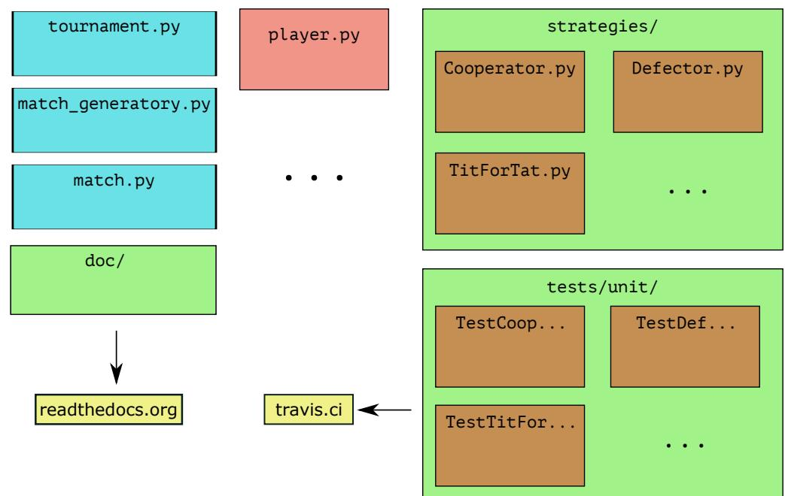
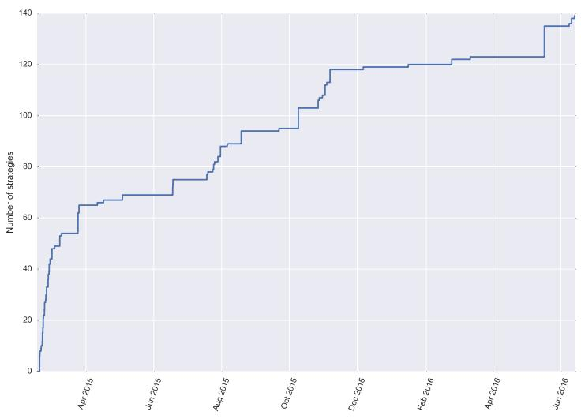
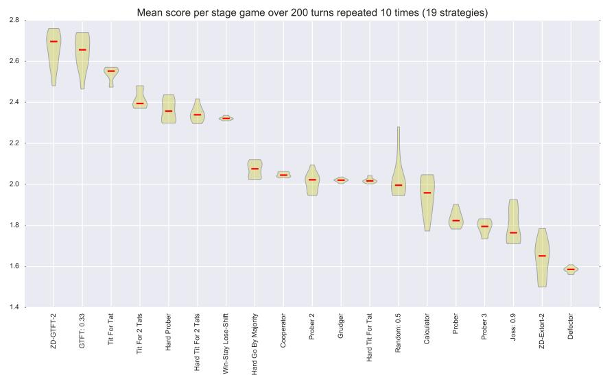
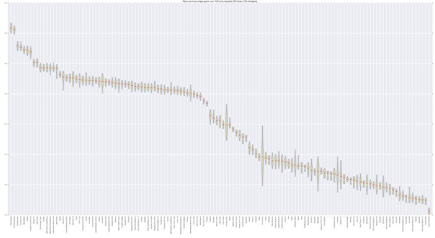

#### (1) Overview

#### Title

An open framework for the reproducible study of the iterated prisoner's dilemma.

### Authors

- 1. Knight, Vincent
- 2. Campbell, Owen
- 3. Harper, Marc
- 4. Langner, Karol M.
- 5. Campbell, James
- 6. Campbell, Thomas
- 7. Carney, Alex
- 8. Chorley, Martin
- 9. Davidson-Pilon, Cameron
- 10. Glass, Kristian
- 11. Glynatsi, Nikoleta

### Paper Author Roles and Affiliations

- 1. Development; Cardiff University
- 2. Development; Not affiliated
- 3. Development; Not affiliated
- 4. Development; Google Inc., Mountain View, CA
- 5. Development; Cardiff University
- 6. Development; St. Nicholas Catholic High School, Hartford
- 7. Development; Cardiff University
- 8. Development; Cardiff University
- 9. Development; Not affiliated
- 10. Development; Not affiliated
- 11. Development; Cardiff University
- 12. Ehrlich Tom´aˇs
- 13. Jones, Martin
- 14. Koutsovoulos, Georgios
- 15. Tibble, Holly
- 16. M¨uller, Jochen
- 17. Palmer, Geraint
- 18. Petunov, Piotr
- 19. Slavin, Paul
- 20. Standen, Timothy
- 21. Visintini, Luis
- 22. Molden, Karl
- 12. Development; Not affiliated
- 13. Development; Not affiliated
- 14. Development; The University of Edinburgh
- 15. Development; Not affiliated
- 16. Development; Not affiliated
- 17. Development; Cardiff University
- 18. Development; Not affiliated
- 19. Development; The University of Manchester
- 20. Development; Cardiff University
- 21. Development; Not affiliated
- 22. Development; Not affiliated

### Abstract

The Axelrod library is an open source Python package that allows for reproducible game theoretic research into the Iterated Prisoner's Dilemma. This area of research began in the 1980s but suffers from a lack of documentation and test code. The goal of the library is to provide such a resource, with facilities for the design of new strategies and interactions between them, as well as conducting tournaments and ecological simulations for populations of strategies.

With a growing collection of 136 strategies, the library is a also a platform for an original tournament that, in itself, is of interest to the game theoretic community. This paper describes the Iterated Prisoner's Dilemma, the Axelrod library and its development, and insights gained from some novel research.

### Keywords

Game Theory; Prisoners Dilemma; Python

### Introduction

Several Iterated Prisoner's Dilemma tournaments have generated much interest; Axelrod's original tournaments [\[2,](#page-13-0) [3\]](#page-13-1), two 2004 anniversary tournaments [\[20\]](#page-14-0), and the Stewart and Plotkin 2012 tournament [\[44\]](#page-16-0), following the discovery of zero-determinant strategies. Subsequent research has spawned a number of papers (many of which are referenced throughout this paper), but rarely are the results reproducible. Amongst well-known tournaments, in only one case is the full original source code available (Axelrod's second tournament [\[3\]](#page-13-1), in FORTRAN). In no cases is the available code well-documented, easily modifiable, or released with significant test suites.

To complicate matters further, a new strategy is often studied in isolation with opponents chosen by the creator of that strategy. Often such strategies are not sufficiently described to enable reliable recreation (in the absence of source code), with [\[42\]](#page-16-1) being a notable counter-example. In some cases, strategies are revised without updates to their names or published implementations [\[25,](#page-15-0) [26\]](#page-15-1). As such, the results cannot be reliably replicated and therefore have not met the basic scientific criterion of falsifiability.

This paper introduces a software package: the Axelrod-Python library. The Axelrod-Python project has the following stated goals:

- To enable the reproduction of Iterated Prisoner's Dilemma research as easily as possible
- To produce the de-facto tool for any future Iterated Prisoner's Dilemma research
- To provide as simple a means as possible for anyone to define and contribute new and original Iterated Prisoner's Dilemma strategies

The presented library is partly motivated by an ongoing discussion in the academic community about reproducible research [\[9,](#page-14-1) [16,](#page-14-2) [39,](#page-15-2) [40\]](#page-16-2), and is:

- Open: all code is released under an MIT license;
- Reproducible and well-tested: at the time of writing there is an excellent level of integrated tests with 99.73% coverage (including property based tests: [\[28\]](#page-15-3))
- Well-documented: all features of the library are documented for ease of use and modification
- Extensive: 135 strategies are included, with infinitely-many available in the case of parametrised strategies
- Extensible: easy to modify to include new strategies and to run new tournaments

#### Review of the literature

As stated in [\[6\]](#page-13-2): "few works in social science have had the general impact of [Axelrod's study of the evolution of cooperation]". In 1980, Axelrod wrote two papers: [\[2,](#page-13-0) [3\]](#page-13-1) which describe a computer tournament that has been a major influence on subsequent game theoretic work [\[5,](#page-13-3) [6,](#page-13-2) [7,](#page-13-4) [8,](#page-13-5) [10,](#page-14-3) [11,](#page-14-4) [12,](#page-14-5) [13,](#page-14-6) [15,](#page-14-7) [18,](#page-14-8) [23,](#page-14-9) [24,](#page-14-10) [27,](#page-15-4) [34,](#page-15-5) [35,](#page-15-6) [36,](#page-15-7) [38,](#page-15-8) [43,](#page-16-3) [44\]](#page-16-0). As described in [\[6\]](#page-13-2) this work has not only had impact in mathematics but has also led to insights in biology (for example in [\[43\]](#page-16-3), a real tournament where Blue Jays are the participants is described) and in particular in the study of evolution.

The tournament is based on an iterated game (see [\[29\]](#page-15-9) or similar for details) where two players repeatedly play the normal form game of [(1)](#page-2-0) in full knowledge of each other's playing history to date. An excellent description of the one shot game is given in [\[13\]](#page-14-6) which is paraphrased below:

Two players must choose between Cooperate (C) and Defect (D):

- If both choose C, they receive a payoff of R (Reward);
- If both choose D, they receive a payoff of P (Punishment);
- If one chooses C and the other D, the defector receives a payoff of T (Temptation) and the cooperator a payoff of S (Sucker).

<span id="page-2-0"></span>and the following reward matrix results from the Cartesian product of two decision vectors hC, Di,

$$
\begin{pmatrix} R, R & S, T \\ T, S & P, P \end{pmatrix} \quad \text{such that } T > R > P > S \text{ and } 2R > T + S \tag{1}
$$

The game of [(1)](#page-2-0) is called the Prisoner's Dilemma. Specific numerical values of (R, S, T, P) = (3, 0, 5, 1) are often used in the literature [\[2,](#page-13-0) [3\]](#page-13-1), although any satisfying the conditions in [1](#page-2-0) will yield similar results. Axelrod's tournaments (and further implementations of these) are sometimes referred to as Iterated Prisoner's Dilemma (IPD) tournaments. An incomplete representative overview of published tournaments is given in Table [1.](#page-2-1)

<span id="page-2-1"></span>

| Year | Reference | Number of Strategies | Type     | Source Code                     |  |
|------|-----------|----------------------|----------|---------------------------------|--|
| 1979 | [2]       | 13                   | Standard | Not immediately available       |  |
| 1979 | [3]       | 64                   | Standard | Available in FORTRAN            |  |
| 1991 | [6]       | 13                   | Noisy    | Not immediately available       |  |
| 2002 | [43]      | 16                   | Wildlife | Not a computer based tournament |  |
| 2005 | [20]      | 223                  | Varied   | Not available                   |  |
| 2012 | [44]      | 13                   | Standard | Not fully available             |  |

Table 1: An overview of a selection of published tournaments. Not all tournaments were 'standard' round robins; for more details see the indicated references.

In [\[34\]](#page-15-5) a description is given of how incomplete information can be used to enhance cooperation, in a similar approach to the proof of the Folk theorem for repeated games [\[29\]](#page-15-9). This aspect of incomplete information is also considered in [\[6,](#page-13-2) [24,](#page-14-10) [35\]](#page-15-6) where "noisy" tournaments randomly flip the choice made by a given strategy. In [\[36\]](#page-15-7), incomplete information is considered in the sense of a probabilistic termination of each round of the tournament.

As mentioned before, IPD tournaments have been studied in an evolutionary context: [\[12,](#page-14-5) [24,](#page-14-10) [38,](#page-15-8) [44\]](#page-16-0) consider this in a traditional evolutionary game theory context. These works investigate particular evolutionary contexts within which cooperation can evolve and persist. This can be in the context of direct interactions between strategies or population dynamics for populations of many players using a variety of strategies, which can lead to very different results. For example, in [\[24\]](#page-14-10) a machine learning algorithm in a population context outperforms strategies described in [\[38\]](#page-15-8) and [\[44\]](#page-16-0) that are claimed to dominate any evolutionary opponent in head-to-head interactions. Further to these evolutionary ideas, [\[8,](#page-13-5) [10\]](#page-14-3) are examples of using machine learning techniques to evolve particular strategies. In [\[4\]](#page-13-6), Axelrod describes how similar techniques are used to genetically evolve a high performing strategy from a given set of strategies. Note that in his original work, Axelrod only used a base strategy set of 12 strategies for this evolutionary study. This is noteworthy as the library now boasts over 136 strategies that are readily available for a similar analysis.

### Implementation and architecture

### Description of the Axelrod Python package

The library is written in Python (<http://www.python.org/>) which is a popular language in the academic community with libraries developed for a variety of uses including:

- Algorithmic Game Theory [\[30\]](#page-15-10) (<http://gambit.sourceforge.net/>)).
- Astrophysics [\[1\]](#page-13-7) (<http://www.astropy.org/>);
- Data manipulation [\[33\]](#page-15-11) (<http://pandas.pydata.org/>);
- Machine learning [\[37\]](#page-15-12) (<http://scikit-learn.org/>);
- Mathematics [\[46\]](#page-16-4) (<http://www.sagemath.org/>);
- Visualisation [\[17\]](#page-14-11) (<http://matplotlib.org/>);

Furthermore, in [\[18\]](#page-14-8) Python is described as an appropriate language for the reproduction of Iterated Prisoner's Dilemma tournaments due to its object oriented nature and readability.

The library itself is available at <https://github.com/Axelrod-Python/Axelrod>. This is a hosted git repository. Git is a version control system which is one of the recommended aspects of reproducible research [\[9,](#page-14-1) [40\]](#page-16-2).

As stated in the Introduction, one of the main goals of the library is to allow for the easy contribution of strategies. Doing this requires the writing of a simple Python class (which can inherit from other predefined classes). All components of the library are automatically tested using a combination of unit, property and integration tests. These tests are run as new features are added to the library to ensure compatibility (they are also run automatically using <travis-ci.org>). When submitting a strategy, a simple test is required which ensures the strategy behaves as expected. Full contribution guidelines can be found in the documentation, which is also part of the library itself and is hosted using <readthedocs.org>. As an example, Figures [1](#page-4-0) and [2](#page-5-0) show the source code for the Grudger strategy as well as its corresponding test.

```
class Grudger(Player):
    """A player starts by cooperating however will defect if
       at any point the opponent has defected."""
    name = 'Grudger'
    classifier = {
        'memory_depth': float('inf'), # Long memory
        'stochastic': False,
        'inspects_source': False,
        'manipulates_source': False,
        'manipulates_state': False
    }
    def strategy(self, opponent):
        """Begins by playing C, then plays D for the remaining
           rounds if the opponent ever plays D."""
        if opponent.defections:
            return D
        return C
```
Figure 1: Source code for the Grudger strategy.

You can see an overview of the structure of the source code in Figure [3.](#page-6-0) This shows the parallel collection of strategies and their tests. Furthermore the underlying engine for the library is a class for tournaments which lives in the tournament.py module. This class is responsible for coordinating the play of generated matches (from the match.py module). This generation of matches is the responsibility of a match generator class (in the match generator.py module) which is designed in such a way as to be easily modifiable to create new types of tournaments. This is described further in a tutorial in the documentation which shows how to easily create a tournament where players only play each other with probability 0.5. This will be discussed further in the reuse section of this paper.

To date the library has had contributions from 26 contributors from a variety of backgrounds which are not solely academic. These contributions have been mostly in terms of strategies. One strategy is the creation of an undergraduate mathematics student with little prior knowledge of programming. Multiple other strategies were written by a 15 year old secondary school student. Both of these students are authors of this paper. As well as these strategy contributions, vital architectural improvements to the

```
class TestGrudger(TestPlayer):
    name = "Grudger"
    player = axelrod.Grudger
    expected_classifier = {
        'memory_depth': float('inf'), # Long memory
        'stochastic': False,
        'inspects_source': False,
        'manipulates_source': False,
        'manipulates_state': False
    }
    def test_initial_strategy(self):
        """
        Starts by cooperating
        """
        self.first_play_test(C)
    def test_strategy(self):
        """
        If opponent defects at any point then the player will defect forever
        """
        self.responses_test([C, D, D, D], [C, C, C, C], [C])
        self.responses_test([C, C, D, D, D], [C, D, C, C, C], [D])
```
Figure 2: Test code for the Grudger strategy.

UP JORS software Latex paper template version 0.1

<span id="page-6-0"></span>

Figure 3: An overview of the source code.

library itself have also been contributed.

## (2) Availability

### Operating system

The Axelrod library runs on all major operating systems: Linux, Mac OS X and Windows.

## Programming language

The library is continuously tested for compatibility with Python 2.7 and the two most recent python 3 releases.

## Additional system requirements

There are no specific additional system requirements.

# Support

Support is readily available in multiple forms:

- An online chat channel: <https://gitter.im/Axelrod-Python/Axelrod>.
- An email group: <https://groups.google.com/forum/#!topic/axelrod-python>.

# Dependencies

The following Python libraries are required dependencies:

- Numpy 1.9.2
- Matplotlib 1.4.2 (only a requirement if graphical output is required)
- Tqdm 3.4.0
- Hypothesis 3.0 (only a requirement for development)

### List of contributors

The names of all the contributors are not known: as these were mainly done through Github and some have not provided their name or responded to a request for further details. Here is an incomplete list:

- Owen Campbell
- Marc Harper
- Vincent Knight
- Karol M. Langner
- James Campbell
- Thomas Campbell
- Alex Carney
- Martin Chorley
- Cameron Davidson-Pilon
- Kristian Glass
- Nikoleta Glynatsi
- Tom´aˇs Ehrlich
- Martin Jones
- Georgios Koutsovoulos
- Holly Tibble
- Jochen M¨uller
- Geraint Palmer
- Paul Slavin
- Timothy Standen
- Luis Visintini
- Karl Molden
- Jason Young
- Andy Boot
- Anna Barriscale

## Software location:

## Archive

Name: Zenodo Persistent identifier: [10.5281/zenodo.55509](https://zenodo.org/record/55509) Licence: MIT Publisher: Vincent Knight Version published: Axelrod: 1.2.0 Date published: 2016-06-13

## Code repository

Name: Github Identifier: <https://github.com/Axelrod-Python/Axelrod> Licence: MIT Date published: 2015-02-16

## Reuse potential

The Axelrod library has been designed with sustainable software practices in mind. There is an extensive documentation suite: <axelrod.readthedocs.org/en/latest/>. Furthermore, there is a growing set of example Jupyter notebooks available here: <https://github.com/Axelrod-Python/Axelrod-notebooks>.

The availability of a large number of strategies makes this tool an excellent and obvious example of the benefits of open research which should positively impact the game theory community. This is evidently true already as the library has been used to study and create interesting and powerful new strategies.

Installation of the library is straightforward via standard python installation repositories (<https://pypi.python.org/pypi>). The package name is axelrod and can thus be installed by calling: pip install axelrod on all major operating systems (Windows, OS X and Linux).

Figure [4](#page-8-0) shows a very simple example of using the library to create a basic tournament giving the graphical output shown in Figure [5.](#page-8-1)

```
>>> import axelrod
>>> strategies = [s() for s in axelrod.demo_strategies]
>>> tournament = axelrod.Tournament(strategies)
>>> results = tournament.play()
>>> plot = axelrod.Plot(results)
>>> p = plot.boxplot()
>>> p.show()
```
<span id="page-8-1"></span>Figure 4: A simple set of commands to create a demonstration tournament. The output is shown in Figure [5.](#page-8-1)


Figure 5: The results from a simple tournament.

### New strategies, tournaments and implications

Due to the open nature of the library the number of strategies included has grown at a fast pace, as can be seen in Figure [6.](#page-9-0)

<span id="page-9-0"></span>

Figure 6: The number of strategies included in the library

Nevertheless, due to previous research being done in an irreproducible manner with, for example, no source code and/or vaguely described strategies, not all previous tournaments can yet be reproduced. In fact, some of the early tournaments might be impossible to reproduce as the source code is apparently forever lost. This library aims ensure reproducibility in the future.

One tournament that is possible to reproduce is that of [\[44\]](#page-16-0). The strategies used in that tournament are the following:

| 1.  | Cooperator          | 11. | Random: 0.5         |
|-----|---------------------|-----|---------------------|
| 2.  | Defector            | 12. | ZD-GTFT-2           |
| 3.  | ZD-Extort-2         | 13. | GTFT: 0.33          |
| 4.  | Joss: 0.9           | 14. | Hard Prober         |
| 5.  | Hard Tit For Tat    | 15. | Prober              |
| 6.  | Hard Tit For 2 Tats | 16. | Prober 2            |
| 7.  | Tit For Tat         | 17. | Prober 3            |
| 8.  | Grudger             | 18. | Calculator          |
| 9.  | Tit For 2 Tats      | 19. | Hard Go By Majority |
| 10. | Win-Stay Lose-Shift |     |                     |

This can be reproduced as shown in Figure [8,](#page-11-0) which gives the plot of Figure [7.](#page-10-0) Note that slight differences with the results of [\[44\]](#page-16-0) are due to stochastic behaviour of some strategies.

In parallel to the Python library, a tournament is being kept up to date that pits all available strategies against each other. Figure [9](#page-12-0) shows the results from the full tournament which can also be seen (in full detail) here: [http://axelrod-tournament.](http://axelrod-tournament.readthedocs.org/)

<span id="page-10-0"></span>

Figure 7: The results from [\[44\]](#page-16-0).

[readthedocs.org/](http://axelrod-tournament.readthedocs.org/). Data sets are also available showing the plays of every match that takes place. Note that to recreate this tournament simply requires changing a single line of the code shown in Figure [4,](#page-8-0) changing:

>>> strategies = [s() for s in axelrod.demo_strategies]}

to:

```
>>> strategies = [s() for s in axelrod.ordinary_strategies]}.
```
<span id="page-10-1"></span>The current winning strategy is new to the research literature: Looker Up. This is a strategy that maps a given set of states to actions. The state space is defined generically by m, n so as to map states to actions as shown in [(2)](#page-10-1).

$$\underbrace{\left( (C, D, D, D, C, D, D, C) \right)}_{m \text{ first actions}}, \overbrace{\left( (C, C), (C, C) \right)}^{n \text{ last pairs of actions}}) \to D \tag{2}$$

The example of [(2)](#page-10-1) is an incomplete illustration of the mapping for m = 8, n = 2. Intuitively, this state space uses the initial plays of the opponent to gain some information about its intentions whilst still taking into account the recent play. The actual winning strategy is an instance of the framework for m = n = 2 for which a particle swarm algorithm has been used to train it. The second placed strategy was trained with an evolutionary algorithm [\[19,](#page-14-12) [22\]](#page-14-13). In [\[21\]](#page-14-14) experiments are described that evaluate how the second placed strategy behaves in environments other than those in which it was trained and it continues to perform strongly.

There are various other insights that have been gained from ongoing open research on the library, details can be found in [\[14\]](#page-14-15). These include:

```
>>> import axelrod
>>> strategies = [axelrod.Cooperator(),
... axelrod.Defector(),
... axelrod.ZDExtort2(),
... axelrod.Joss(),
... axelrod.HardTitForTat(),
... axelrod.HardTitFor2Tats(),
... axelrod.TitForTat(),
... axelrod.Grudger(),
... axelrod.TitFor2Tats(),
... axelrod.WinStayLoseShift(),
... axelrod.Random(),
... axelrod.ZDGTFT2(),
... axelrod.GTFT(),
... axelrod.HardProber(),
... axelrod.Prober(),
... axelrod.Prober2(),
... axelrod.Prober3(),
... axelrod.Calculator(),
... axelrod.HardGoByMajority()]
>>> tournament = axelrod.Tournament(strategies)
>>> results = tournament.play()
>>> plot = axelrod.Plot(results)
>>> p = plot.boxplot()
>>> p.show()
```
Figure 8: Source code for reproducing the tournament of [\[44\]](#page-16-0)

<span id="page-12-0"></span>

Figure 9: Results from the library tournament (2016-06-13)

- A closer look at zero determinant strategies, showing that extortionate strategies obtain a large number of wins: the number of times they outscore an opponent during a given match. However these do not perform particularly well from the overall tournament ranking point of view. This is relevant given the findings of [\[44\]](#page-16-0) in which zero determinant strategies are shown to be able to perform better than any other strategy. This finding extends to noisy tournaments (which are also implemented in the library).
- This negative relationship between wins and performance does not generalise. There are some strategies that perform well, both in terms of matches won and overall performance: Back stabber, Double crosser, Looker Up, and Fool Me Once. These strategies continue to perform well in noisy tournaments, however some of these have knowledge of the length of the game (Back stabber and Double crosser). This is not necessary to rank well in both wins and score as demonstrated by Looker Up and Fool Me Once.
- Strategies like Looker Up and Meta Hunter seem to be generally cooperative yet still exploit naive strategies. The Meta Hunter strategy is a particular type of Meta strategy which uses a variety of other strategy behaviours to choose a best action. These strategies perform very well in general and continue to do so in noisy tournaments.

## Conclusion

This paper has presented a game theoretic software package that aims to address reproducibility of research into the Iterated Prisoner's Dilemma. The open nature of the development of the library has lead rapidly to the inclusion of many well known strategies, many novel strategies, and new and recapitulated insights.

The capabilities of the library mentioned above are not at all comprehensive, a list of the current abilities include:

- Noisy tournaments.
- Tournaments with probabilistic ending of interactions.
- Ecological analysis of tournaments.
- Moran processes.
- Morality metrics based on [\[41\]](#page-16-5).
- Transformation of strategies (in effect giving an infinite number of strategies).
- Classification of strategies according to multiple dimensions.
- Gathering of full interaction history for all interactions.
- Parallelization of computations for tournaments with a high computational cost.

These capabilities are constantly being updated.

## Acknowledgements

The authors would like to thank all contributors. Also, they thank Robert Axelrod himself for his well wishes with the library.

## Competing interests

The authors declare that they have no competing interests.

## References

- <span id="page-13-7"></span>[1] Astropy Collaboration et al. "Astropy: A community Python package for astronomy". In: Astronomy and Astrophysics 558, A33 (Oct. 2013), A33. doi: [10.1051/0004-6361/201322068](http://dx.doi.org/10.1051/0004-6361/201322068). arXiv:[1307.6212 \[astro-ph.IM\]](http://arxiv.org/abs/1307.6212).
- <span id="page-13-0"></span>[2] R. Axelrod. "Effective Choice in the Prisoner's Dilemma". In: Journal of Conflict Resolution 24.1 (1980), pp. 3–25.
- <span id="page-13-1"></span>[3] R. Axelrod. "More Effective Choice in the Prisoner's Dilemma". In: Journal of Conflict Resolution 24.3 (1980), pp. 379–403. issn: 0022-0027. doi: [10.1177/](http://dx.doi.org/10.1177/002200278002400301) [002200278002400301](http://dx.doi.org/10.1177/002200278002400301).
- <span id="page-13-6"></span>[4] R. Axelrod. The Evolution of Cooperation.
- <span id="page-13-3"></span>[5] J. S. Banks and R. K. Sundaram. "Repeated games, finite automata, and complexity". In: Games and Economic Behavior 2.2 (1990), pp. 97–117. issn: 08998256. doi: [10.1016/0899-8256(90)90024-O](http://dx.doi.org/10.1016/0899-8256(90)90024-O).
- <span id="page-13-2"></span>[6] J. Bendor, R. M. Kramer, and S. Stout. "When in doubt . . .: Cooperation in a noisy prisoner's dilemma". In: Journal of Conflict Resolution 35.4 (1991), pp. 691–719. issn: 0022-0027. doi: [10.1177/0022002791035004007](http://dx.doi.org/10.1177/0022002791035004007).
- <span id="page-13-4"></span>[7] R Boyd and J. P. Lorberbaum. "No pure strategy is evolutionarily stable in the repeated Prisoner's Dilemma game". In: Nature 327 (1987), pp. 58–59. issn: 0028-0836. doi: [10.1006/jtbi.1994.1092](http://dx.doi.org/10.1006/jtbi.1994.1092).
- <span id="page-13-5"></span>[8] K Chellapilla and D. B. Fogel. "Evolution, neural networks, games, and intelligence". In: Proceedings of the Ieee 87.9 (1999), pp. 1471–1496. issn: 00189219. doi: [Doi10.1109/5.784222](http://dx.doi.org/Doi 10.1109/5.784222).
- <span id="page-14-1"></span>[9] T. Crick et al. ""Share and Enjoy": Publishing Useful and Usable Scientific Models". In: (2014). arXiv:[1409.0367](http://arxiv.org/abs/1409.0367).
- <span id="page-14-3"></span>[10] F. David B. "Evolving Behaviors in the Iterated Prisoner's Dilemma". In: Evol. Comput. 1.1 (1993), pp. 77–97. issn: 1063-6560. doi: [10.1162/evco.1993.1.1.](http://dx.doi.org/10.1162/evco.1993.1.1.77) [77](http://dx.doi.org/10.1162/evco.1993.1.1.77).
- <span id="page-14-4"></span>[11] M. Doebeli and C. Hauert. "Models of cooperation based on the Prisoner's Dilemma and the Snowdrift game". In: Ecology Letters 8.7 (2005), pp. 748–766. issn: 1461023X. doi: [10.1111/j.1461-0248.2005.00773.x](http://dx.doi.org/10.1111/j.1461-0248.2005.00773.x).
- <span id="page-14-5"></span>[12] G. Ellison. "Cooperation in the prisoner's dilemma with anonymous random matching". In: Review of Economic Studies 61.3 (1994), pp. 567–588. issn: 00346527. doi: [10.2307/2297904](http://dx.doi.org/10.2307/2297904).
- <span id="page-14-6"></span>[13] N. Gotts, J. Polhill, and A. Law. "Agent-based simulation in the study of social dilemmas". In: Artificial Intelligence Review 19 (2003), pp. 3–92. issn: 0269-2821. doi: [10.1023/A:1022120928602](http://dx.doi.org/10.1023/A:1022120928602).
- <span id="page-14-15"></span>[14] M. Harper. Marc Harper Codes. 2015.
- <span id="page-14-7"></span>[15] C. Hilbe, M. a. Nowak, and A. Traulsen. "Adaptive Dynamics of Extortion and Compliance". In: PLoS ONE 8.11 (2013), e77886. issn: 1932-6203. doi: [10 .](http://dx.doi.org/10.1371/journal.pone.0077886) [1371/journal.pone.0077886](http://dx.doi.org/10.1371/journal.pone.0077886).
- <span id="page-14-2"></span>[16] N. P. C. Hong et al. "Top Tips to Make Your Research Irreproducible". In: (2015), pp. 5–6. arXiv:[1504.00062](http://arxiv.org/abs/1504.00062).
- <span id="page-14-11"></span>[17] J. D. Hunter. "Matplotlib: A 2D graphics environment". In: Computing In Science & Engineering 9.3 (2007), pp. 90–95.
- <span id="page-14-8"></span>[18] A. Isaac. "Simulating Evolutionary Games: A Python-Based Introduction". In: Journal of Artificial Societies and Social Simulation 11.3 (2008), p. 8. issn: 14607425.
- <span id="page-14-12"></span>[19] M. Jones. Evolving strategies for an Iterated Prisoner's Dilemma tournament. 2015.
- <span id="page-14-0"></span>[20] G. Kendall, X. Yao, and S. Y. Chong. The iterated prisoners' dilemma: 20 years on. World Scientific Publishing Co., Inc., 2007.
- <span id="page-14-14"></span>[21] V. Knight. http://vknight.org/unpeudemath/gametheory/2015/11/28/Experimentingwith-a-high-performing-evolved-strategy-in-other-environments/. 2015.
- <span id="page-14-13"></span>[22] G. Koutsovoulos. Optimising the LookerUp strategy for an Iterated Prisoner's Dilemma tournament. 2016.
- <span id="page-14-9"></span>[23] D. Kraines and V. Kraines. "Pavlov and the prisoner's dilemma". In: Theory and Decision 26.1 (1989), pp. 47–79. issn: 00405833. doi: [10.1007/BF00134056](http://dx.doi.org/10.1007/BF00134056).
- <span id="page-14-10"></span>[24] C. Lee, M. Harper, and D. Fryer. "The Art of War: Beyond Memory-one Strategies in Population Games". In: Plos One 10.3 (2015), e0120625. issn: 1932-6203. doi: [10.1371/journal.pone.0120625](http://dx.doi.org/10.1371/journal.pone.0120625).
- <span id="page-15-0"></span>[25] J. Li. "How to design a strategy to win an IPD tournament". In: The iterated prisoners dilemma 20 (2007), pp. 89–104.
- <span id="page-15-1"></span>[26] J. Li, P. Hingston, and G. Kendall. "Engineering design of strategies for winning iterated prisoner's dilemma competitions". In: Computational Intelligence and AI in Games, IEEE Transactions on 3.4 (2011), pp. 348–360.
- <span id="page-15-4"></span>[27] J. P. Lorberbaum. "No strategy is evolutionarily stable in the repeated Prisoner's Dilemma game". In: Journal of Theoretical Biology 168.2 (1994), pp. 117–130.
- <span id="page-15-3"></span>[28] D. R. MacIver. Hypothesis 3.0.3. <https://github.com/DRMacIver/hypothesis>. 2016.
- <span id="page-15-9"></span>[29] M. Maschler, E. Solan, and S. Zamir. Game theory. Cambridge University Press, 2013, p. 1003. isbn: 9781107005488. doi: [http : / / dx . doi . org / 10 . 1017 /](http://dx.doi.org/http://dx.doi.org/10.1017/CBO9780511794216) [CBO9780511794216](http://dx.doi.org/http://dx.doi.org/10.1017/CBO9780511794216).
- <span id="page-15-10"></span>[30] R. Mckelvey et al. Gambit: Software tools for game theory. Tech. rep. 2006.
- [31] M. McKerns and M. Aivazis. pathos: a framework for heterogeneous computing. <http://trac.mystic.cacr.caltech.edu/project/pathos>. 2010.
- [32] M. M. Mckerns et al. "Building a Framework for Predictive Science". In: Scipy (2011), pp. 1–12. arXiv:[arXiv:1202.1056v1](http://arxiv.org/abs/arXiv:1202.1056v1).
- <span id="page-15-11"></span>[33] W. McKinney. "Data Structures for Statistical Computing in Python". In: Proceedings of the 9th Python in Science Conference. Ed. by S. van der Walt and J. Millman. 2010, pp. 51 –56.
- <span id="page-15-5"></span>[34] P. Milgrom, J. Roberts, and R. Wilson. "Rational Cooperation in the Finitely Repeated Prisoners' Dilemma". In: Journal of Economic Theory 252 (1982), pp. 245–252.
- <span id="page-15-6"></span>[35] P. Molander. "The optimal level of generosity in a selfish, uncertain environment". In: The Journal of Conflict Resolution 29.4 (1985), pp. 611–618. issn: 0022-0027. doi: [10.1177/0022002785029004004](http://dx.doi.org/10.1177/0022002785029004004).
- <span id="page-15-7"></span>[36] J. K. Murnighan et al. "Expecting Continued Play in Prisoner ' s Dilemma Games". In: 27.2 (1983), pp. 279–300.
- <span id="page-15-12"></span>[37] F. Pedregosa et al. "Scikit-learn: Machine Learning in Python". In: Journal of Machine Learning Research 12 (2011), pp. 2825–2830.
- <span id="page-15-8"></span>[38] W. H. Press and F. J. Dyson. "Iterated Prisoner's Dilemma contains strategies that dominate any evolutionary opponent". In: Proceedings of the National Academy of Sciences 109.26 (2012), pp. 10409–10413. issn: 0027-8424. doi: [10.](http://dx.doi.org/10.1073/pnas.1206569109) [1073/pnas.1206569109](http://dx.doi.org/10.1073/pnas.1206569109).
- <span id="page-15-2"></span>[39] A. Prli´c and J. B. Procter. "Ten Simple Rules for the Open Development of Scientific Software". In: PLoS Computational Biology 8.12 (2012), e1002802. issn: 1553-7358. doi: [10.1371/journal.pcbi.1002802](http://dx.doi.org/10.1371/journal.pcbi.1002802).
- <span id="page-16-2"></span>[40] G. K. Sandve et al. "Ten Simple Rules for Reproducible Computational Research". In: PLoS Computational Biology 9.10 (2013), pp. 1–4. issn: 1553734X. doi: [10.1371/journal.pcbi.1003285](http://dx.doi.org/10.1371/journal.pcbi.1003285).
- <span id="page-16-5"></span>[41] T. Singer-Clark. "Morality Metrics On Iterated Prisoners Dilemma Players". In: (2014).
- <span id="page-16-1"></span>[42] W. Slany and W. Kienreich. "On some winning strategies for the iterated prisoners dilemma". In: The iterated prisoners dilemma (2007), pp. 171–204.
- <span id="page-16-3"></span>[43] D. W. Stephens, C. M. McLinn, and J. R. Stevens. "Discounting and reciprocity in an Iterated Prisoner's Dilemma." In: Science (New York, N.Y.) 298.5601 (2002), pp. 2216–2218. issn: 00368075. doi: [10.1126/science.1078498](http://dx.doi.org/10.1126/science.1078498).
- <span id="page-16-0"></span>[44] A. J. Stewart and J. B. Plotkin. "Extortion and cooperation in the Prisoner's Dilemma". In: Proceedings of the National Academy of Sciences 109.26 (2012), pp. 10134–10135. issn: 0027-8424. doi: [10.1073/pnas.1208087109](http://dx.doi.org/10.1073/pnas.1208087109).
- [45] The Axelrod project developers. Axelrod: Appeaser Release. Mar. 2016. doi: [10.](http://dx.doi.org/10.5281/zenodo.48548) [5281/zenodo.48548](http://dx.doi.org/10.5281/zenodo.48548).
- <span id="page-16-4"></span>[46] The Sage Developers. Sage Mathematics Software (Version 7.0). http://www.sagemath.org. 7.0.