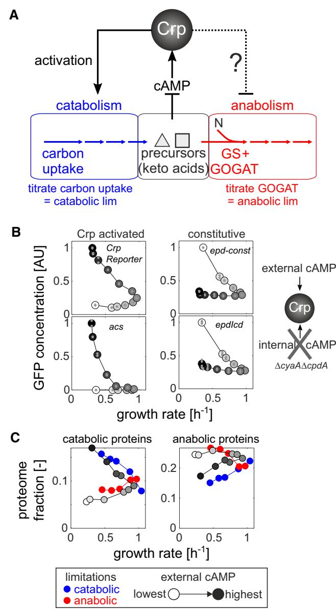
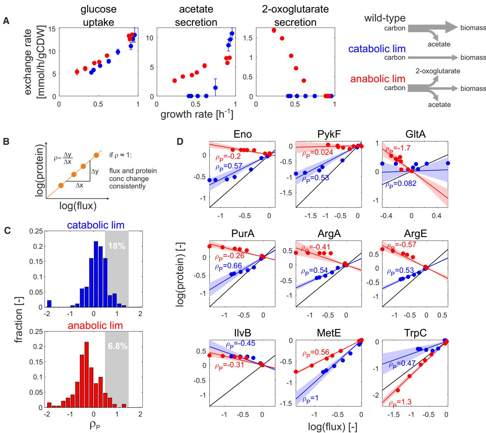
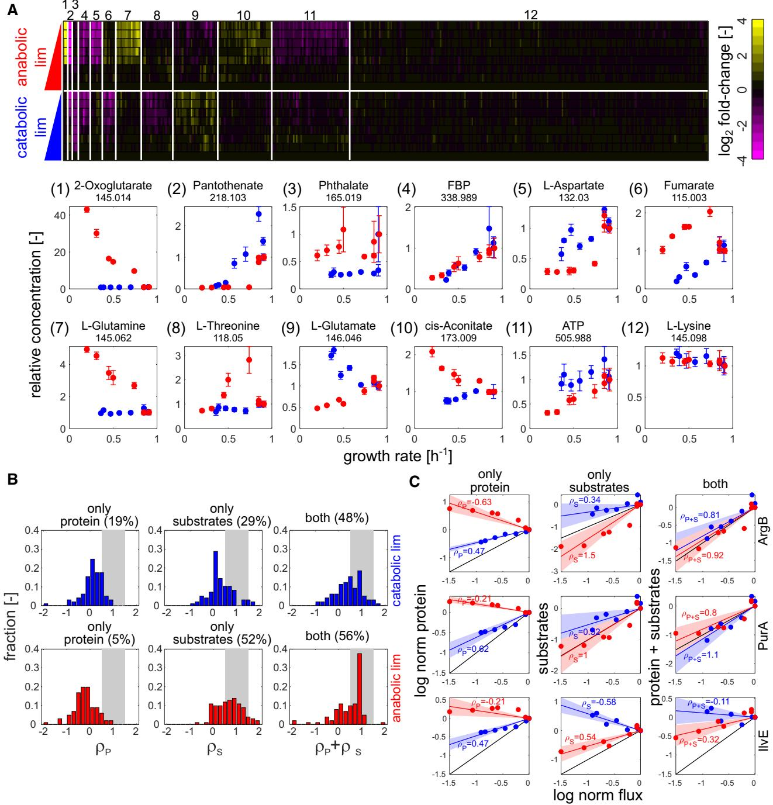
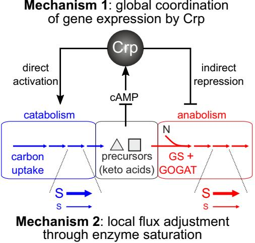
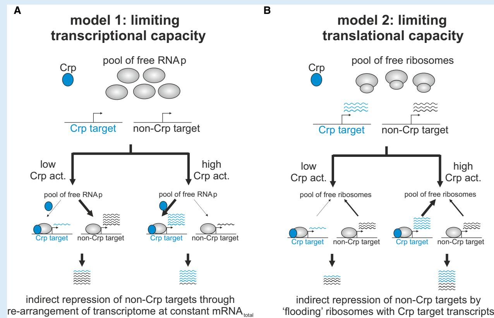

# Global coordination of metabolic pathways in Escherichia coli by active and passive regulation

Karl Kochanowski1,2,[*](https://orcid.org/0000-0002-1884-7694) , Hiroyuki Okano3 , Vadim Patsalo4 , James Williamson4 , Uwe Sauer1 & Terence Hwa3,5,**

## Abstract

Microorganisms adjust metabolic activity to cope with diverse environments. While many studies have provided insights into how individual pathways are regulated, the mechanisms that give rise to coordinated metabolic responses are poorly understood. Here, we identify the regulatory mechanisms that coordinate catabolism and anabolism in Escherichia coli. Integrating protein, metabolite, and flux changes in genetically implemented catabolic or anabolic limitations, we show that combined global and local mechanisms coordinate the response to metabolic limitations. To allocate proteomic resources between catabolism and anabolism, E. coli uses a simple global gene regulatory program. Surprisingly, this program is largely implemented by a single transcription factor, Crp, which directly activates the expression of catabolic enzymes and indirectly reduces the expression of anabolic enzymes by passively sequestering cellular resources needed for their synthesis. However, metabolic fluxes are not controlled by this regulatory program alone; instead, fluxes are adjusted mostly through passive changes in the local metabolite concentrations. These mechanisms constitute a simple but effective global regulatory program that coarsely partitions resources between different parts of metabolism while ensuring robust coordination of individual metabolic reactions.

Keywords 13C flux analysis; Crp; metabolomics; proteomics; regulation analysis

Subject Categories Metabolism; Microbiology, Virology & Host Pathogen Interaction

DOI 10.15252/msb.202010064 | Received 15 October 2020 | Revised 4 March 2021 | Accepted 9 March 2021

Mol Syst Biol. (2021) 17: e10064

## Introduction

In nature, microbes often encounter unpredictable changes in nutrient availability. To sustain growth when facing such environmental variations, microbes need to coordinate their metabolic supply of biomass precursors, energy, and redox factors (Chubukov et al, 2014) and coordinate the allocation of their proteome for metabolism and macromolecular synthesis (Scott et al, 2010; Erickson et al, 2017). In principle, microbes can mobilize a vast arsenal of regulatory mechanisms including transcriptional control (Kochanowski et al, 2013a), covalent posttranslational modifications (Oliveira & Sauer, 2012; Pisithkul et al, 2015; Su et al, 2016), and non-covalent binding by small molecules to proteins (Li et al, 2013; Kochanowski et al, 2015), and many recent case studies have elucidated the role of these mechanisms in regulating individual metabolic pathways (Kao et al, 2004; Semsey et al, 2007; Yuan et al, 2009; Li et al, 2010; Kotte et al, 2010; Madar et al, 2011; Gruning € et al, 2011; Cho et al, 2012; Oliveira & Sauer, 2012; Reaves et al, 2013; van Heerden et al, 2014; Gerosa et al, 2015; Kim et al, 2018; Sander et al, 2019; Okano et al, 2020). Mounting an appropriate response, however, requires not only regulation of a single pathway but coordinated regulation of a larger network (Wayman & Varner, 2013; Chubukov et al, 2014). Examples of such coordination are the bacterial stringent response to nutrient starvation that triggers the general activation of stress genes (Chatterji & Kumar Ojha, 2001; Potrykus & Cashel, 2008), the Crp-dependent activation of catabolic genes in carbon limitation (You et al, 2013), and the coordination of carbon and nitrogen assimilation by 2-oxoglutarate (Doucette et al, 2011; Kim et al, 2012). However, while these and other (Cho et al, 2012; Federowicz et al, 2014; Goel et al, 2015; Olin-Sandoval et al, 2019) examples unravel some of the more global coordination mechanisms, it remains unclear how a coordinated metabolic response emerges mechanistically from the interplay of the cell's various regulatory circuits (Chubukov et al, 2014).

Here we aim to identify the regulatory mechanisms that enable Escherichia coli to coordinate metabolic activity in response to different modes of nutrient limitation. Specifically, we focus on two

1 Institute of Molecular Systems Biology, ETH Zurich, Zurich, Switzerland

- 3 Department of Physics, University of California at San Diego, La Jolla, CA, USA
- *Corresponding author. Tel: +34 693 015 290; E-mail: karl.kochanowski@gmail.com **Corresponding author. Tel: +1 858 534 7263; E-mail: hwa@ucsd.edu
2 Life Science Zurich PhD Program on Systems Biology, Zurich, Switzerland

4 Department of Integrative Structural and Computational Biology, and The Skaggs Institute for Chemical Biology, The Scripps Research Institute, La Jolla, CA, USA 5 Institute for Theoretical Science, ETH Zurich, Zurich, Switzerland

orthogonal challenges, namely limitation of carbon influx ("catabolic limitation") and limitation in the ability to synthesize all amino acids while carbon is in excess ("anabolic limitation"). Previously, we constructed strains with titratable control of glucose uptake to implement catabolic limitation and strains with titratable control of glutamate synthesis (and hence limiting the transamination flux needed for the synthesis of all amino acids, Appendix Fig S1) to implement anabolic limitation. Importantly, these limitations can be conveniently imposed to mimic carbon- or ammoniumlimited continuous cultures (Goel et al, 2015; Hackett et al, 2016) while maintaining identical batch-like experimental conditions, using medium with saturating amounts of glucose and ammonium (You et al, 2013; Hui et al, 2015). It was found that E. coli's regulatory response to these limitations leads to a striking global proteome re-allocation (Hui et al, 2015): Catabolic and anabolic limitations are accompanied by a general increase and decrease in abundance of catabolic proteins, respectively, a pattern that is reversed for anabolic proteins.

How is this coordinated gene regulatory response established mechanistically? It is clear that transcriptional regulation of catabolic proteins in E. coli is largely driven by the transcriptional activator Crp (You et al, 2013; Gerosa et al, 2015). When carbon limits growth, the accumulation of cyclic AMP, the small-molecule activator of Crp, causes the general increase in the expression of catabolic proteins. Conversely, in anabolic limitation—when the availability of external carbon exceeds the cell's ability to synthesize biomass precursors such as amino acids—the accumulation of alpha-keto acids, such as 2-oxoglutarate (Doucette et al, 2011; You et al, 2013), inhibits the production of cyclic AMP (cAMP), thereby reducing the expression of catabolic proteins (Fig 1A). While this Crp-driven regulatory circuit provides a plausible explanation for the transcriptional response of catabolic proteins, it is unclear how anabolic gene expression is regulated (Fig 1A). Given the reversed behavior of catabolic and anabolic proteins (Hui et al, 2015), a parsimonious mechanism would have Crp (which activates catabolic proteins) also serving as a repressor of anabolic proteins. However, there are only few reported instances of anabolic proteins being under Crp control (Shimada et al, 2011; Santos-Zavaleta et al, 2019).

How else, then, could the proteome response of catabolism and anabolism be coordinated? As we will show, this coordination is achieved by a passive mode of regulation which originates from the inherent competition for limiting cellular resources (Scott et al, 2010) and which depends on Crp directly activating catabolism and indirectly repressing anabolism. Moreover, by integrating this gene regulatory program with the large-scale quantification of metabolic fluxes and metabolite concentrations, we demonstrate that passive local adjustments in enzyme saturation play a pivotal role in implementing a coordinated metabolic response for individual metabolic reactions.

### Results

#### A single transcription factor coordinates the global transcriptional response to nutrient limitation

To understand how the coordinated proteome response of catabolism and anabolism to nutrient limitation could be established mechanistically, we started from the observation that genes compete

#### Figure 1. Transcriptional coordination of catabolism and anabolism.

- A Schematic of metabolism—separated into catabolism (blue), central metabolic precursors (e.g., alpha-keto acids, black), and anabolism (red) and the cyclic AMP (cAMP)-dependent Crp regulatory circuit in Escherichia coli. By titrating the expression of carbon uptake proteins, catabolic limitation can be imposed externally. Conversely, by titrating the expression of the enzyme glutamate synthase (GOGAT), a limitation of anabolic capacity can be imposed externally. N: nitrogen. GS: glutamine synthase. See Appendix Fig S1 and Appendix Text 1 for detailed description of titration strains.
- B Steady-state expression of Crp-activated (left panel) or constitutive (right panel) fluorescent transcriptional reporters at varying external cyclic AMP concentrations (white and black colors denote lowest and highest external cyclic AMP concentration, respectively) in a strain that cannot produce or degrade endogenous cAMP (NQ1399, ΔcyaAΔcpdA). Small gray circles: individual biological replicates (n = 2–4). Large circles: mean across replicates.
- C Catabolic and anabolic fraction of E. coli's proteome in catabolic (blue) and anabolic (red) limitation (data from Ref. Hui et al, 2015 with few excluded proteins, see Appendix Text 3), as well as at varying external cAMP concentrations in strain NQ1399.

with each other for the limited capacity of the cellular protein expression machineries (Maaløe, 1979; Vind et al, 1993; Bremer & Dennis, 1996; Scott et al, 2010; Gerosa et al, 2013; Kafri et al, 2016; Borkowski et al, 2016). For example, expression of unneeded proteins was found to reduce the translation of other proteins, presumably due to competition for ribosomes (Vind et al, 1993; Scott et al, 2010). Based on these studies, we hypothesized that activation of hundreds of genes in the Crp regulon (Santos-Zavaleta et al, 2019), which constitutes up to ~30% of the cellular proteome (Hui et al, 2015; Schmidt et al, 2016), would sequester a large fraction of the cell's expression machinery capacity, thereby indirectly reducing the expression of non-Crp targets during catabolic limitation. Conversely, in anabolic limitation, where Crp is inactivated, other genes or transcripts would have access to a greater share of the expression machinery. This hypothesis is consistent with the negative and positive correlation of the intracellular cAMP concentrations with the growth rate for the catabolic- and anabolic-limited cultures, respectively (Appendix Fig S2).

To test whether Crp could indirectly repress the expression of non-Crp target proteins, and to mimic the divergent response of Crp in the two limitations, we constructed a strain (NQ1399) lacking endogenous cAMP production, such that Crp activity can be controlled externally through supplementation of cAMP (Kuhlman et al, 2007; Towbin et al, 2017) (Appendix Text S2). Using this "cAMP titration" strain, we quantified the activity of two synthetic constitutive promoters without any known transcription factor binding site (Gerosa et al, 2013; Kochanowski et al, 2017) and two exclusively Crp-activated promoters at varying external cAMP concentrations using fluorescent reporter plasmids (Gerosa et al, 2013; Kochanowski et al, 2017). As reported previously (Towbin et al, 2017), titration of cAMP to cultures of this strain caused a monotonic increase in the activity of Crp-activated promoters (Appendix Fig S3) and also reduced the growth rate for low as well as high cAMP concentrations (Appendix Fig S4). In agreement with our hypothesis, this pattern was reversed in strains with constitutive promoters, whose activity was lowest at the highest cAMP concentration (Appendix Fig S3). When plotting the activity of these promoters against the growth rate, we observed reversed growthdependent patterns for catabolic and constitutive promoters (Fig 1 B). These reversed expression patterns were also found in (Crp-activated) catabolic tricarboxylic acid (TCA) cycle compared to amino acid biosynthesis and constitutive-like glycolytic promoters (Appendix Figs S5 and S6). Thus, these fluorescent reporter data showed that activation of Crp can reduce the expression of non-Crp targets. Moreover, the similarity of non-Crp target expression to that of synthetic constitutive promoters suggests that the effect of Crp on non-Crp targets is indeed indirect.

To test whether such changes in Crp activity would also be sufficient to modulate the anabolic proteome fraction, we quantified the proteome response of the cAMP titration strain using shotgun proteomics. First, we tested whether deletion of adenylate cyclase (encoded by cyaA) and phosphodiesterase (encoded by cpdA) employed in the cAMP titration strain (see Appendix Table S1) affected the proteome independently of their effect on cAMP production. For this purpose, we grew the cAMP titration strain in glucose medium at an external cAMP concentration that matches the wild-type growth rate (Appendix Fig S4). The vast majority (88%) of proteins were within twofold of the wild-type concentrations, confirming that deletion of cyaA and cpdA has a limited impact on the proteome independently of cAMP (see Appendix Text 3 and Appendix Fig S7A and B). The few exceptions included proteins belonging to flagella and chemotaxis, which notably are under the control of promoters that frequently acquire mutations during strain development (Parker et al, 2019), and proteins whose operons are located close to the deletion loci (i.e., IlvB and RbsB), which could be attributed to genetic differences in the donor strain used to generate the gene deletions (Lyons et al, 2011) (see Appendix Text 2). Second, we titrated the cAMP concentration below and above the level required to yield wild-type-like growth rate. This titration affected the abundance of hundreds of proteins (Appendix Fig S7C) and led to a reversed global response of catabolic and anabolic proteins (gray points in Fig 1C, Appendix Fig S7D). Gratuitous Crp activity at high cAMP concentrations (above wild-type level) caused an overall increase in the abundance of catabolic proteins with a concomitant reduction of anabolic protein abundance, a pattern which was reversed with diminished Crp activity at low cAMP concentrations (below wild-type level).

Quite strikingly, the proteome response of the cAMP titration data showed good agreement with that of catabolic/anabolic limitation at the same growth rate, respectively; compare gray symbols with blue/red symbols in Fig 1C. In particular, catabolic proteins (Fig 1C, left) responded similarly when comparing the limitations and cAMP titration. This overlap was less pronounced for anabolic proteins (Fig 1C, right), in particular when comparing carbon limitation and gratuitous cAMP titration (blue circles and dark gray circles, see also Appendix Fig S8 for examples of individual proteins), suggesting that additional pathway-specific transcriptional regulators may further modulate the indirect regulatory effect by Crp. Notably, not all proteins were affected by the titration of Crp activity: Ribosomal proteins maintained their strict relationship with the growth rate (Appendix Figs S9 and S10), presumably due to additional compensatory regulation by ppGpp and DksA (Paul et al, 2004; Lemke et al, 2011; Bosdriesz et al, 2015). In addition, the sulfate assimilation proteins CysI and CysJ, and the methionine forming enzyme homocysteine transmethylase (MetE), showed a positive correlation with growth rate across all tested conditions (Appendix Fig S10). Since MetE, with its very low catalytic activity and high abundance, makes methionine biosynthesis a highly resource-demanding process (Li et al, 2014), a plausible explanation is that additional dedicated regulation, mediated presumably by the methionine biosynthesis regulators MetR and MetJ, further adjusts MetE expression to match the growth-dependent demand for methionine.

Our findings thus suggest a passive mode of regulating protein expression. We propose that Crp, the main transcriptional regulator of catabolic proteins, indirectly regulates the expression of anabolic proteins and thereby coordinates the expression of catabolism and anabolism. While the data presented here do not prove unequivocally that Crp regulation is the direct cause of the reversed patterns of catabolic and anabolic proteins in response to nutrient limitation, the good agreement of the proteome response to nutrient limitation and Crp activity titration, together with the response pattern of the constitutively expressed proteins, suggests that this model of regulation provides the most parsimonious mechanism consistent with all available data.

#### Global transcriptional program alone cannot explain the observed metabolic flux

The above passive mode of gene regulation suggests a potential mechanism for the global coordination of catabolism and anabolism. Next, we investigate whether this regulatory program is sufficient to account for E. coli's metabolic flux requirement for growth under the imposed nutrient limitations. Toward this end, we cultivated the aforementioned titratable strains (Appendix Fig S1) at different induction levels (8 induction levels per limitation) to impose different degrees of catabolic or anabolic limitation while keeping the media composition constant. To obtain a comprehensive picture of the steady-state flux response at each induction level, we determined extracellular exchange rates of over 20 metabolites and ten ratios of intracellular fluxes in central metabolism by 13C flux analysis (Zamboni et al, 2009) (Appendix Figs S11 and S12). Using these data and the growth requirements as constraints for flux balance analysis (Schellenberger et al, 2011; Heirendt et al, 2019), we obtained markedly different flux estimates between the catabolic and anabolic limitations (Appendix Fig S13A). In particular, there was a general shift in fermentation strategy between catabolic and anabolic limitations (Fig 2A): Consistent with many previous studies such as in carbon-limited chemostats (Varma & Palsson, 1994; Nanchen et al, 2006; Valgepea et al, 2010; Renilla et al, 2012; Basan et al, 2015), increasing growth rates under catabolic limitation caused a shift from full respiration to acetate overflow metabolism. Under anabolic limitation, however, acetate secretion occurred even at the lowest tested growth rate, as reported before in nitrogenlimited chemostat cultures (Sauer et al, 1999), but unexpectedly we also observed substantial 2-oxoglutarate secretion. To our knowledge, 2-oxoglutarate secretion has never been reported in nitrogenlimited chemostats. A possible contributor to this secretion may be a difference in the promoter region of the 2-oxoglutarate transporter KgtP in our strain compared to the common laboratory strain MG1655 (Lyons et al, 2011), although recent studies have demonstrated that many metabolites other than acetate can be secreted by E. coli (Paczia et al, 2012; Reaves et al, 2013), notably including 2 oxoglutarate (Paczia et al, 2012). Also, with up to 50% of the consumed glucose secreted as acetate and 2-oxoglutarate secretion under anabolic limitation (Appendix Fig S12), the resulting reduction in biomass yield we obtained was consistent with that observed in nitrogen-limited chemostat cultures (Sauer et al, 1999). The secretion of all other metabolites was at least an order of magnitude lower. As a result, most fluxes (in particular biosynthetic fluxes outside of central carbon metabolism) were found to scale with the growth rate regardless of the imposed limitation (Appendix Fig S13B and C). Moreover, most FBA-estimated fluxes were well constrained by the measured physiology as determined by flux variability analysis (Appendix Fig S13D).

With the quantified metabolic fluxes at hand, we asked whether the observed flux changes could be explained by corresponding protein concentration changes. For this purpose, we used the previously established theoretical framework of regulation analysis that quantifies the contribution of individual regulatory layers to the observed flux changes (Rossell et al, 2006; Chubukov et al, 2013; Gerosa et al, 2015) (see Appendix Text 3 for detailed description). For example, the contribution of gene expression can be quantified as the log–log slope between flux and protein concentration changes (Fig 2B), and is referred to as the protein regulation coefficient, ρP. ρP = 1 signifies that the observed flux changes can be fully explained by changes in protein concentration. Conversely, ρP < 0 signifies that flux and protein concentration change in opposite directions. For the catabolic and anabolic limitations, we determined protein regulation coefficients for 202 unique reactions by linear regression for all reactions that carry flux under the tested conditions and where at least one of the associated proteins was quantified. A shift toward negative protein regulation coefficients was apparent for the anabolic limitation compared to catabolic limitation, signifying that protein and flux change in opposite directions (Fig 2C). This shift was particularly pronounced in biosynthetic reactions, but occurred also in central reactions (Fig 2D, top row). Only 18 and 7% of all reactions had protein regulation coefficients around one under carbon and anabolic limitation, respectively. While systematic errors in proteomic analysis for weakly expressed proteins may play some role in these results, overall, the data show that observed flux changes were rarely accompanied by matching changes in protein concentrations. Among the few notable exceptions (Fig 2D, bottom row) was the aforementioned methionine biosynthesis enzyme MetE, suggesting that E. coli adjusts the expression of MetE to minimize the cost of methionine biosynthesis, in particular under catabolic limitation (Li et al, 2014).

The poor agreement between flux and proteome response observed here is in line with previous observations showing that gene expression is typically a poor predictor of flux changes (Chubukov et al, 2013; Valgepea et al, 2013; Kochanowski et al, 2013a; Gerosa et al, 2015; Goel et al, 2015; O'Brien et al, 2016; Hackett et al, 2016), and suggests that the gene regulatory program characterized above is rarely sufficient to regulate catabolic and anabolic metabolic fluxes. In particular, under anabolic limitation we observed that fluxes and proteins tended to change in opposite directions for many biosynthetic reactions (i.e., decrease in biosynthetic flux that is accompanied by an increase in protein concentration).

#### Passive regulation of enzyme activity through altering enzyme saturation

If the gene regulatory program alone is not sufficient to explain the observed metabolic fluxes, which other mechanisms could? One way how enzyme activity could be adjusted is by altering enzyme saturation through changes in the corresponding substrate concentrations. This "passive" mechanism of flux regulation provides a means to effectively buffer changes in enzyme concentration while keeping the flux constant (Fendt et al, 2010). Analogous to gene regulation, regulation analysis can quantify the effect of enzyme saturation on flux as the saturation regulation coefficient ρS, based on a power-law approximation of the non-linear relationship between substrate concentration and reaction rate (Chubukov et al, 2013; Gerosa et al, 2015) (see Appendix Text 3).

To test whether altered enzyme saturation could account for the observed flux responses, we quantified the relative intracellular concentration of 430 unique metabolites by untargeted metabolomics (Fuhrer et al, 2011) and obtained consistent results from targeted quantification of 40 central metabolites (Appendix Fig S14). Compared to the flux response, the metabolome showed more complex patterns that differed between the two limitations, as revealed by K-means clustering (Fig 3A). In some of these groups,

#### Figure 2. Regulation analysis of flux–protein relationship in nutrient limitations.

- A Specific uptake and secretion rates of glucose (left), acetate (middle), and 2-oxoglutarate (right) in catabolic (blue) and anabolic (red) limitation. Data shown are the mean of three biological replicates, and error bars denote standard deviation.
- B Schematic description of regulation analysis: The regulation coefficient ρ denotes the degree to which flux and protein concentration of a given reaction change consistently across conditions (ρ = 1: full proportionality of flux and protein changes). See Appendix Text 3 for detailed description.
- C, D Distribution of protein regulation coefficients (ρP) for catabolic (upper panel) and anabolic (lower panel) limitation. Protein regulation coefficients were determined separately for each limitation by linear regression. For reactions that are associated to more than one protein, the final protein regulation coefficients were calculated as the average regulation coefficients across all measured proteins (total number of considered reactions: 202). The fraction of reactions showing consistent flux and protein changes (regulation coefficients between 0.5 and 1.5) is highlighted by gray areas with corresponding percentages. Individual examples are shown in (D). Blue and red lines denote the estimated regulation coefficient ρP (calculated by linear regression) between measured flux and protein concentrations for catabolic and anabolic limitation, respectively. Shaded areas denote the standard error of each estimate. Black lines denote full proportionality. Top panel: central metabolic reactions. Middle panel: biosynthetic reactions showing a shift from positive to negative ρP for carbon and anabolic limitation, respectively. Bottom panel: biosynthetic reactions which deviate from this behavior.

only one limitation caused large changes in metabolite concentrations, for example, the L-glutamine (cluster 7) and 2-oxoglutarate (cluster 1) groups accumulated only in anabolic limitation. Other metabolite groups, such as the one including fructose-1,6-bisphosphate (FBP, cluster 4), were affected by both limitations, albeit in some cases in opposite directions (e.g., clusters 6, 9, and 10).

#### Figure 3. Impact of enzyme saturation on flux regulation.

- A Intracellular metabolome response (of 430 annotated ions) in mid-exponential growth as determined by FIA-TOF mass spectrometry. Upper panel: heatmap of log2 fold changes (relative to NCM3722 wild type) for both limitations. Annotated ions were sorted by K-means clustering of log2 fold changes, using squared Euclidian distance as metric (Arthur & Vassilvitskii, 2007). Annotated ions showing little variation across conditions (coefficient of variance across all conditions < 30%) were filtered out before clustering and assigned to cluster 12. Lower panel: exemplary ions for each cluster plotted (in linear scale) against the respective growth rate. Numbers underneath metabolite names denote m/z. Error bars denote standard deviation of three biological replicates.
- B, C Distribution of regulation coefficients quantifying the contribution of changes in protein concentration (left column) and enzyme saturation (middle column) to the explanation of observed flux changes, as well as their combined effect (right column). Upper panel: catabolic limitation. Lower panel: anabolic limitation. Only reactions for which at least one isoenzyme as well as all substrates had been quantified were considered in the analysis (total number of considered reactions: 108). The fraction of reactions with regulation coefficients between 0.5 and 1.5 is highlighted by gray areas. Individual exemplary reactions are shown in (C). Blue and red lines denote the estimated regulation between measured flux, protein, and metabolite concentrations for catabolic and anabolic limitation, respectively. Shaded areas denote the standard error of each corresponding estimate. Black lines denote full proportionality. ρ: corresponding regulation coefficients.

Nevertheless, more than 50% of the quantified metabolites were not significantly affected by either limitation, including most amino acids (cluster 12). Notably, the observed metabolome response to the genetically implemented limitations used here matches previous reports utilizing analogous environmental limitations, such as the consistent dramatic accumulation of 2-oxoglutarate amid largely constant amino acid concentrations found in nitrogen-limited cultures of the same E. coli background strain (Yuan et al, 2009).

Surprisingly, L-glutamate itself, whose production rate is reduced in the anabolic limitation used in this work (Appendix Fig S1), proved to be quite resilient against either limitation, consistent with previous findings in Salmonella typhimurium (Ikeda et al, 1996). Particularly in the anabolic limitation, which caused an up to fivefold growth rate reduction, its concentration was only twofold reduced and never dropped below 10 mM (Appendix Fig S14E), which is above the reported KM values for most glutamate-consuming reactions (Schomburg et al, 2002).

Based on this metabolome response, we quantified the saturation regulation coefficient ρS for over 100 reactions (separately for each limitation), only considering those reactions for which all substrates were quantified. In both limitations, the vast majority of ρS were positive, meaning that flux and substrate concentrations changed in the same direction (Fig 3B, middle column). Analysis of the combined effect of gene expression and enzyme saturation showed that the sum of ρP and ρS accounts for about half of all flux changes in both limitations (i.e., ρP þρS≈1 for ~ 50% of the examined reactions, see Fig 3B, right column), indicating that the multiplicative effects of enzyme abundance and enzyme saturation (as in, e.g., Michaelis–Menten relation) account for these reactions. However, the relative contribution of enzyme level changes and enzyme saturation differed between the two limitations: In carbon limitation, both mechanisms had a similar impact, whereas in the anabolic limitation, the contribution of enzyme saturation was dominant. This difference in regulatory strategy was typically maintained within a metabolic pathway (see arginine biosynthesis pathway as an example, Appendix Fig S15).

Taken together, these data show that passive regulation through enzyme saturation is pivotal for coordinating enzyme activity across conditions. This finding is consistent with previous computational studies highlighting the importance of metabolic regulation (that is, regulation of enzyme activity by, e.g., enzyme saturation and allosteric regulation) for the coordination of E. coli metabolism (Millard et al, 2017).

## Discussion

In this study, we aimed to identify the mechanisms underlying E. coli's coordinated response to different metabolic limitations. From the large-scale quantification of metabolic fluxes, metabolites, and proteins, in genetically implemented catabolic and anabolic limitations, we identify two mechanisms that facilitate the global as well as local coordination of metabolic activity (Fig 4). First, a global gene regulatory program coordinates the expression of catabolism and anabolism, largely through the activity of a single transcription factor, Crp. This regulatory program however does not exactly match protein levels to the required flux changes for many reactions. Second, the mismatches between protein and flux changes are

#### Figure 4. Schematic summary of mechanisms implementing the global coordination of metabolism identified in this study.

Coordination in the expression of catabolic and anabolic proteins is achieved by a single transcription factor, Crp, which directly induces catabolic proteins and indirectly represses anabolic proteins under catabolic limitation, through the competition for scarce expression machinery capacity (mechanism 1, see also Box 1). This approximate gene regulatory program is further adjusted locally through changes in metabolite concentrations, which alter each enzyme's saturation. At a given enzyme concentration, high substrate concentration (= high enzyme saturation, symbolized by large S) leads to a high reaction rate (symbolized by a thick horizontal arrow). Conversely, low substrate concentration (small S) reduces the reaction rate (thin horizontal arrow).

adjusted locally through passive changes in enzyme saturation. These findings provide insights on mechanistic implementations of global resource allocation predicted previously by the phenomenological theory of bacterial growth control (Appendix Text 4 and Appendix Figs S17–S19).

Our results suggest that Crp exerts its effect on catabolic and anabolic proteins through both direct and indirect regulation: Catabolic proteins are directly induced by Crp under catabolic limitation, while anabolic protein expression is repressed indirectly. Conversely, Crp induction of catabolic proteins is reduced under anabolic limitation (due to increased 2-oxoglutarate (You et al, 2013)), while anabolic protein expression is indirectly increased, exhibiting similar behaviors as the constitutive (i.e., unregulated) reporters. Importantly, the indirect mode of regulation reported here has broad implications beyond the coordination of catabolism and anabolism by Crp. A common approach to identify the targets of a transcriptional regulator is to identify genes whose expression changes upon its deletion (e.g., Wang et al, 2018). Our results suggest that deletion of transcriptional regulators, in particular global regulators, may also affect the expression of non-target genes, thus confounding the regulatory networks resulting from such efforts. Nevertheless, this indirect regulation of non-Crp targeted genes can be overridden by additional designated regulation, as exemplified by the regulation of the ribosomal proteome fraction, which maintains its strict dependency on growth rate in both of the imposed limitations (Appendix Fig S9). Future studies may use this work as a starting point to identify the regulatory mechanisms responsible for overriding the indirect regulation by Crp in other proteome fractions, e.g., those which do not change expression across either catabolic or anabolic limitations (Hui et al, 2015).

How this indirect mode of regulation is achieved mechanistically is currently unclear. In principle, this mechanism could be the result of competition for limited capacity of expression machinery at the transcription or translation level (Box 1). The proposed models yield the same result at the proteome level, and identifying whether any of these—or alternative—models are responsible for this indirect mode of regulation is left for future studies.

Although gene expression and enzyme saturation accounted for about 50% of the observed flux changes in a simple multiplicative model for both limitations, many flux changes could not be explained simply by these two mechanisms alone. For example, most glutamate-dependent transamination reactions—in which the amination of a metabolite is coupled to the deamination of glutamate to 2-oxoglutarate (see Appendix Fig S1C)—were poorly accounted for by changes in protein and substrate concentrations alone, resulting in regulation coefficients far from 1 (see IlvE as example in Fig 3C, bottom row). A possible explanation is that these reactions are affected by concerted changes in both substrate and product concentrations (Hackett et al, 2016). Although the lack of complete metabolite and proteome data for many reactions does not allow us to assess the impact of reaction products across a large number of reactions, our results already suggest that the glutamate-dependent transamination reactions show a massive shift in the ratio of 2-oxoglutarate (reaction product of most transamination reactions) to glutamate (reaction substrate) under anabolic limitation, causing a "thermodynamic choke-point" (Appendix Fig S16). In contrast, transamination reactions which use fumarate instead of 2-oxoglutarate as a product (and aspartate instead of glutamate as a substrate) are explained well by gene expression and enzyme saturation (see ArgG in Appendix Fig S15 as an example). Importantly, these findings also suggest a possible

#### Box 1. Two plausible mechanisms of indirect repression of non-Crp targets by the transcriptional activator Crp

Model 1 (panel A), termed "limiting transcriptional capacity", is based on the premise that protein expression is limited by different promoters in the cell competing for the same pool of free RNA polymerase molecules for transcription initiation. In this case, activation of Crp, which exerts its activating effect by directly recruiting RNA polymerase to catabolic genes (Lawson et al, 2004), would lead to a reduction in free RNA polymerase to initiate the transcription of other genes not activated by Crp, consequently causing a reduction in the expression of these genes. As a result, in this model indirect repression of genes not activated by Crp is established mechanistically as a Crp-dependent re-arrangement of the cell's transcriptome. Model 2 (panel B), termed "limited translational capacity", assumes that translation (i.e., number of free ribosomes) is the rate-limiting step in protein expression. In this case, activation of Crp would lead to increase in the transcript abundance of Crp-activated genes without effecting the transcript abundance of genes not activated by Crp. If Crp and non-Crp target transcripts compete for limiting ribosomes, an increase in number of Crp target transcripts would effectively reduce the availability of free ribosomes to initiate the translation of non-Crp target transcripts. Thus, in this model Crp-activated transcripts effectively act as competitive inhibitors of the translation of non-Crp-activated transcripts.

physiological rationale for the increased protein concentration of anabolic proteins despite a decrease in the net flux: Increasing the concentration of the catalyzing enzyme is an effective way to increase the net flux in a thermodynamically choked reaction involving high exchange flux (Noor et al, 2014). Therefore, by increasing the expression of transaminases in the anabolic limitation, cells can counter the reduction in driving force resulting from 2-oxoglutarate accumulation. Future studies, with broader metabolome coverage, may explore the importance of such changes in thermodynamic driving force in more detail.

Overall, the findings reported in this study point to a common theme, in which E. coli largely relies on simple heuristics, or "rules of thumb" to cope with environmental and genetic changes (Tversky & Kahneman, 1974; Towbin et al, 2017). Instead of specifically adjusting its gene expression program to meet exactly the imposed metabolic demands, the coordination of metabolic activity in E. coli is achieved by an approximate global gene regulatory response, which sets the system roughly in the desired direction. This response is further adjusted locally through changes in enzyme saturation. However, the downside of such a simple regulatory program is that it effectively makes each reaction involved more expensive (since enzymes are being expressed at higher levels than needed strictly to maintain the desired metabolic flux), with a potential cost to the steady-state growth rate (Scott et al, 2010; Hui et al, 2015; O'Brien et al, 2016).

While the approximate (or suboptimal) regulation of protein expression is widespread in bacteria (Price et al, 2013; Towbin et al, 2017), it appears to be at odds with numerous laboratory-based evolutionary studies (e.g., LaCroix et al, 2015), showing that even small differences in fitness (i.e., growth rate) are selected against. One previously proposed explanation (Price et al, 2013) is that cells have not evolved to cope with the artificial laboratory environments they are subjected to, which is particularly true for the genetically implemented limitations used in this study. Nevertheless, a recent study, which quantified the global proteome allocation of wild-type E. coli strains growing on various carbon sources (resulting in different degrees of catabolic limitation), found an inverse relationship between catabolic and anabolic proteome sectors that is consistent with our findings (Schmidt et al, 2016). Future studies may examine whether natural anabolic limitations similarly exert an effect on E. coli's proteome allocation that is consistent with our genetically implement anabolic limitation.

A more parsimonious explanation of the difference between the degree of optimization manifested by the laboratory-evolved and natural strains is that the simple regulatory programs emerged from an evolutionary trade-off: Given the multitude of environments that cells could encounter, it is simply infeasible to have a dedicated optimized program for each environment that is also consistent across conditions (Shoval et al, 2012; Keren et al, 2013; Price et al, 2013). Consequently, cells may rather rely on using the "rule of thumb" as a heuristic guide to coarsely allocate the proteome according to a few signals (Chubukov et al, 2014). A good illustration of this strategy is the proteome response to anabolic limitation: If cells cannot identify the exact reaction responsible for the reduction in anabolic capacity (in this case, it is ultimately the reduced glutamate synthesis that slows down transamination reactions), or if it cannot fix the problem (the "optimal solution" would be to upregulate just the transaminases), the best alternative may be an across-the-board increase in the expression of anabolic proteins (which include all the transaminases). Importantly, proteome allocation within this mode of response can be easily coordinated and optimized (You et al, 2013; Hui et al, 2015). Future research will reveal the prevalence and nature of this type of simple regulatory strategies underlying microbial responses to complex environmental challenges.

## Materials and Methods

#### Reagents and strains

Unless stated otherwise, all reagents were obtained from Sigma-Aldrich. All used strains were derived from NCM3722 (Soupene et al, 2003), a full list of strains is provided in Appendix Table S1, and a detailed description of the strains is provided in Appendix Text 1 and Appendix Fig S1. Fluorescent transcriptional reporter plasmids were obtained from Gerosa et al (2013, 2015) and Zaslaver et al (2006) and transferred to NQ1399 by electroporation as described previously (Kochanowski et al, 2013b).

#### Cultivation

All experiments were performed using M9 minimal medium (Kochanowski et al, 2013b), supplemented with 2 g/l glucose. Cultivations were performed as follows: M9 medium batch cultures in 96-deepwell format plates (Kuehner AG, Birsfeld, Switzerland), containing the same inducer concentration as for the subsequent main culture (with the exception of slow-growing NQ393 with 10/20 μM IPTG in the main culture, which were cultivated with 30 μM IPTG in the preculture to avoid the emergence of mutations), were inoculated 1:50 from LB precultures and incubated overnight at 37°C under shaking. Subsequently, 96-deep-well plate cultures were inoculated with overnight cultures to a starting OD600 of 0.03–0.05 (total fill volume per well: 1.2 ml) and incubated at 37°C under shaking. Culture OD600s were monitored by OD600 sampling from parallel wells on the same deep-well plate and subsequent OD600 measurements using a plate reader (TECAN infinite M200, Tecan Group Ltd, M€annedorf, Switzerland). Cultivation of strains bearing transcriptional reporter plasmids and calculation of promoter activity as the OD normalized GFP production rate were performed as described previously (Gerosa et al, 2013; Kochanowski et al, 2013b). Main cultures in M9 minimal medium with 2 g/l glucose with varying external cyclic AMP concentrations (ranging from 0 to 10 mM) were inoculated 1:100 with overnight cultures growing in M9 minimal medium with 2 g/l glucose and 1 mM cyclic AMP, and steady-state promoter activities were determined during the 1.5 h window during which the cultures exhibited the maximal growth rate. Steady-state GFP concentrations were calculated from promoter activities by division by the corresponding steady-state growth rate as described previously (Gerosa et al, 2013).

#### Proteome analysis of NQ1399

Cultures of NQ1399 were grown in M9 medium with 2 g/l glucose at various cyclic AMP concentrations between 0 and 3 mM as described above. 15N reference cultures of NQ1399 were grown in modified M9 media (42.2 mM Na2HPO4, 22 mM KH2PO4, 8.56 mM Na2SO4, 11.3 mM 15NH4Cl) at 0.01 and 3 mM cAMP. The samples were processed as described previously (Hui et al, 2015). The comparison of NQ1399 and wild type was performed as follows: Two replicate cultures were grown in 15N reference M9 medium (in the presence of 0.2 mM cyclic AMP to match the wild-type growth rate). Then, protein samples of the 15N replicate cultures were mixed (50 μg per replicate) with 100 μg of an unlabeled wild-type protein sample from a matched condition (without the addition of cyclic AMP) and processed as described previously (Hui et al, 2015).

#### Quantification of intracellular metabolite concentrations by untargeted metabolomics

Intracellular metabolomics samples were taken during midexponential phase at OD600s between 0.5 and 0.6 by fast filtration (sampling volume: 1 ml) (Link et al, 2013) and were immediately quenched in 4 ml quenching/extraction solution (40% methanol, 40% acetonitrile, 20% H2O) at −20°C (Link et al, 2012). Samples were incubated for 2 h at −20°C, subsequently dried completely at 120 μbar (Christ RVC 2-33 CD centrifuge and Christ Alpha 2–4 CD freeze dryer), and stored at −80°C until measurements. Before measurements, samples were resuspended in 100 μl water, centrifuged for 5 min (5,000 g, 4°C) to remove residual particles, diluted 1:10 in water, and transferred to V-bottom 96-well plates (Thermo Fisher Scientific). Samples were measured by flow-injection time-offlight mass spectrometry with an Agilent 6550 QToF instrument operated in negative ionization mode at 4 GHz high resolution in a range of 50–1,000 m/z as described before (Sevin & Sauer, 2014). Sample processing and ion annotation was performed based on accurate mass within 0.001 Da using the KEGG E. coli database (Ogata et al, 1999) as reference and accounting for single deprotonated forms of the respective metabolite (M–H+) as described before (Fuhrer et al, 2011). Intensities of annotated ions were normalized to NCM3722 wild type to yield relative concentrations.

#### Quantification of intracellular metabolite concentrations by targeted metabolomics

Intracellular metabolomics samples were taken as described above, with one difference: Immediately after quenching, 100 μl of a fully 13C-labeled E. coli internal metabolome extract was added for internal normalization. Samples were incubated and dried as described above. Before measurements, samples were resuspended in 100 μl water, centrifuged for 5 min (5,000 g, 4°C) to remove residual particles, and transferred to V-bottom 96-well plates (Thermo Fisher Scientific). Measurements, data acquisition, peak integration, and quantification of absolute metabolite concentrations were performed as described previously (Buescher et al, 2010; Kochanowski et al, 2017). To convert OD600 to cell volume, a conversion factor of 2.7 μl cell volume per mg CDW (Winkler & Wilson, 1966) (and a OD600 conversion factor to cell dry mass of 1 OD = 0.413 mg CDW/ml) was used.

#### Quantification of uptake and secretion rates

Culture samples were taken at 6–8 time points together with parallel OD600 samples throughout exponential growth phase (sampling volume: 100 μl). Supernatants were separated from cells by centrifugation (5,000 g, 4 min, at 4°C) and transferred to V-bottom 96-well plates (Thermo Fisher Scientific). Glucose and acetate concentrations in supernatants were determined by colorimetric enzymatic assays (Megazyme). All other secreted metabolites were quantified by flowinjection time-of-flight mass spectrometry as described above. Briefly, supernatants were diluted 1:10 in water and measured with an Agilent 6550 QToF instrument operated in negative ionization mode at 4 GHz high resolution in a range of 50–1,000 m/z. Sample processing and ion annotation was performed based on accurate mass within 0.001 Da using the KEGG E. coli database (Ogata et al, 1999) as reference and accounting for single deprotonated forms of the respective metabolite (M–H+ ) as described before (Fuhrer et al, 2011). Absolute extracellular metabolite concentrations were determined using parallel dilution series of the respective metabolite in the same medium as calibration curves. Uptake and secretion rates were determined from extracellular metabolite concentrations, corresponding OD600 (conversion factor to cell dry mass: 1 OD = 0.413 g CDW/l), and corresponding growth rates by linear regression as described previously (Haverkorn van Rijsewijk et al, 2011). With the exception of 2-oxoglutarate, all other quantified metabolites were secreted in minute amounts (< 70 μmol/ gCDW/h).

#### Quantification of intracellular metabolic fluxes

Intracellular central metabolic fluxes were determined by 13C flux analysis as follows. Cultivation was performed as described above, and glucose was added as the [1-13C] isotope (> 99%; Cambridge Isotope Laboratories), or as a mixture of 20% (wt/wt) [U-13C] (> 99%; Cambridge Isotope Laboratories) and 80% [12C] isotopes. Labeling samples (sampling volume 1 ml) were taken during midexponential phase (OD600 0.5–0.7), cells were harvested by centrifugation (13,000 g, 3 min), and cell pellets were washed once in cold 0.9% NaCl and stored dry at −20°C. 13C flux ratios were determined as described previously (Fischer, 2004; Zamboni & Fendt, 2009; Haverkorn van Rijsewijk et al, 2011). Briefly, cell pellets were hydrolyzed, dried, and derivatized, and labeling patterns of derivatized proteinogenic amino acids were quantified by GC-MS using a 6890 GC system combined with a 5973 Inert SL MS system (Agilent Technologies, Santa Clara, USA). Metabolic flux ratios were determined based on these labeling patterns (after correcting for naturally occurring 12C as described in van Winden et al (2002)) using the software FiatFlux (Zamboni et al, 2005). Two flux ratios (glyoxylate shunt and malic enzyme flux) were found to be zero in all conditions and were discarded in subsequent analyses. Using the flux ratios, uptake/secretion rates, and the measured growth rate as inputs, absolute central metabolic fluxes were inferred using the software FiatFlux (Zamboni et al, 2005).

To infer metabolic fluxes beyond central carbon metabolism, flux balance analysis (FBA) was performed with the Cobra toolbox v3.0 (Schellenberger et al, 2011; Heirendt et al, 2019) in MATLAB (Version 2019A) using the E. coli genome-scale metabolic model iJO1366 (Orth et al, 2011). This model was further modified as follows: (i) Based on the measured metabolite exchange rates, a phenylpyruvate exchange reaction was added using the Cobra toolbox command addExchangeRxn. (ii) The reaction boundaries of glyoxylate shunt and malic enzyme fluxes were set to zero based on the 13C labeling data. (iii) The reaction boundaries of two additional reactions ("FBA3" and "F6PA"), which emerged empirically as glycolytic bypass reactions that were not supported by the 13C labeling data, were also set to zero. (iv) For those conditions in which the strain NQ393 was used (i.e., anabolic limitation), the reaction boundaries of the deleted enzyme glutamate dehydrogenase ("GLUDy") were set to zero. (v) All measured major (glucose, acetate, 2-oxoglutarate) and eight minor (succinate, fumarate, malate, citrate, glycine, valine, glutamate, and phenylpyruvate) exchange rates (with maximal exchange rates across conditions > 10 micromol/h/gCDW), as well as the measured growth rate and the oxygen consumption rate as inferred by 13C flux analysis (see above), were used as constraints (allowing for 5% deviation for major exchange rates, oxygen consumption rate and growth rate, as well as 10% deviation for minor exchange rates) (Mo et al, 2009). To enable fumarate secretion, the main fumarate transporter DctA was set to be reversible. The exchange rates of pyruvate, lactate, and ethanol (common secretion products that were not found to be secreted in any of the conditions) were constrained to zero. (vi) Four ratios of absolute fluxes (as determined above, namely phosphofructokinase <> G6P dehydrogenase; phosphoglucoisomerase <> phosphogluconate dehydratase; malate dehydrogenase <> PEP carboxylase; and enolase <> PEP carboxykinase) were incorporated as constraints using the Cobra toolbox command addRatioReaction. Using this modified and constrained model, FBA was performed in two steps. First, the ATP production rate was used as an objective function (Schuetz et al, 2007) and maximized using the Cobra toolbox command optimizeCBmodel (i.e., maximize flux of reaction "ATPM"). Second, using the obtained ATP production rate as an additional constraint, minimization of sum of fluxes was performed to yield the final inferred flux distribution using the Cobra toolbox command minimizeModelFlux. In both steps, Gurobi V9.0.2 (Gurobi Optimization) was used as the FBA solver, and the minNorm parameter was set to 1e-6. The quality of the FBA flux estimates was assessed empirically by comparison with 13C flux analysis data. For all non-zero fluxes, the uncertainty of the flux estimates in the constrained FBA model (including the ATP production rate obtained in the first FBA step as an additional constraint) was determined by flux variability analysis using the Cobra toolbox command fluxVariability (using the "fastSNP" option to prevent loops). Due to numerical issues, both the optimality percentage and the lower bound of the ATP production rate constraint had to be relaxed very slightly (from 100 to 99.99%).

#### Regulation analysis

Regulation analysis was performed as described previously (Chubukov et al, 2013; Gerosa et al, 2015). Only reactions with nonzero fluxes in all tested conditions were considered. Absolute fluxes were normalized to NCM3722 wild type in the respective experiments and log-transformed. Transcriptional regulation coefficients were determined using a previously published proteomics study, which had determined relative protein concentrations in equivalent carbon and glutamate limitations (Hui et al, 2015). Relative protein concentrations were linearly interpolated to match exactly the same growth rate as in the corresponding flux measurements, normalized to NCM3722 wild type and log-transformed. Only proteins that were quantified in at least one limitation were considered. For each considered reaction, protein regulation coefficients were estimated separately for each limitation (by linear regression) as the slope between log-normalized fluxes and log-normalized protein concentrations. Reaction-protein pairs were used as defined in the aforementioned genome-scale metabolic model (Orth et al, 2011). For reactions that are associated to more than one isoenzyme, the final protein regulation coefficients were calculated as the average regulation coefficient across all measured proteins.

Enzyme saturation regulation coefficients were determined as follows. To account for potential non-linearity of the relationship between substrate concentration and flux (e.g., due to non-Michaelis–Menten type enzyme kinetics), approximate kinetic orders (α) for substrates were estimated using the following equation across all conditions as described previously (Chubukov et al, 2013; Gerosa et al, 2015) (eq. 1):

$$\min_{0 \le a \le 4} \log(J_l) - \log(P_l) = \sum_{\chi \in S_l} a_{l\chi} \cdot \log(M_\chi)$$

where J denotes the normalized flux, P denotes the normalized protein concentration, and M denotes the reaction substrate(s) with corresponding kinetic order(s) α. α was constrained to be between 0 and 4 to set a biologically realistic upper bound on the non-linear gain. Highly connected reactants (i.e., H2O, H+ , CO2, HCO3 −, sulfate, phosphate, ammonia) were excluded from the analysis. Kinetic orders were estimated independently for each flux–enzyme pair (considering both limitations) by least square optimization using the lsqlin function of MATLAB. Only reactions for which all substrates had been quantified were considered. As above, for reactions that are connected to more than one isoenzyme, the final regulation coefficients were calculated as the average regulation coefficients across all measured proteins.

## Data availability

The raw cAMP titration proteomics data are available at proteomeXchange (accession number PXD024504) under the follow link: [http://proteomecentral.proteomexchange.org/cgi/GetDataset?ID](http://proteomecentral.proteomexchange.org/cgi/GetDataset?ID=PXD024504)=PX [D024504](http://proteomecentral.proteomexchange.org/cgi/GetDataset?ID=PXD024504)

The code necessary to reproduce the FBA, FVA, and regulation analysis results is available on GitHub under the following link: [https://github.com/karl-kochanowski/MSB10064-Ecoli-metabolic_a](https://github.com/karl-kochanowski/MSB10064-Ecoli-metabolic_analysis) [nalysis](https://github.com/karl-kochanowski/MSB10064-Ecoli-metabolic_analysis)

Expanded View for this article is available [online.](https://doi.org/10.15252/msb.202010064)

#### Acknowledgements

We thank for helpful discussions with various colleagues: Elad Noor on metabolism, Hualin Shi for possible mechanisms of Crp-mediated indirect repression, and Uri Alon for the "rule of thumb" strategy of regulation. This work was supported by the NIH (R01GM109069) and the NSF (MCB 1818384) to TH, by the NIH (R01GM118850) to JRW, and by the SignalX project of the Swiss Initiative for Systems Biology (SystemsX.ch).

#### Author contributions

Conceived and designed the study: KK, TH. Performed experiments and analyses: KK, HO, VP, TH. Supervised the study: JW, US, TH.

#### Conflict of interest

The authors declare that they have no conflict of interest.

# References

- Arthur D, Vassilvitskii S (2007) K-means++: The advantages of careful seeding. In Proceedings of the Eighteenth Annual ACM-SIAM Symposium on Discrete Algorithms pp 1027– 1035. USA: Society for Industrial and Applied Mathematics
- Basan M, Hui S, Okano H, Zhang Z, Shen Y, Williamson JR, Hwa T (2015) Overflow metabolism in Escherichia coli results from efficient proteome allocation. Nature 528: 99 – 104
- Borkowski O, Goelzer A, Schaffer M, Calabre M, M€ader U, Aymerich S, Jules M, Fromion V (2016) Translation elicits a growth rate-dependent, genomewide, differential protein production in Bacillus subtilis. Mol Syst Biol 12: 870
- Bosdriesz E, Molenaar D, Teusink B, Bruggeman FJ (2015) How fast-growing bacteria robustly tune their ribosome concentration to approximate growth-rate maximization. FEBS J 282: 2029– 2044
- Bremer H, Dennis PP (1996) Modulation of chemical composition and other parameters of the cell by growth rate. In Escherichia coli and Salmonella, Neidhardt FC (ed.) pp 1553 – 1569. Washington, DC: ASM Press
- Buescher JM, Moco S, Sauer U, Zamboni N, Chemistry A (2010) Ultra-high performance liquid chromatography-tandem mass spectrometry method for fast and robust quantification of anionic and aromatic metabolites. Anal Chem 82: 4403–4412
- Chatterji D, Kumar Ojha A (2001) Revisiting the stringent response, ppGpp and starvation signaling. Curr Opin Microbiol 4: 160– 165
- Cho B-K, Federowicz S, Park Y-S, Zengler K, Palsson BØ (2012) Deciphering the transcriptional regulatory logic of amino acid metabolism. Nat Chem Biol 8: 65 –71
- Chubukov V, Gerosa L, Kochanowski K, Sauer U (2014) Coordination of microbial metabolism. Nat Rev Microbiol 12: 327 – 340
- Chubukov V, Uhr M, Le Chat L, Kleijn RJ, Jules M, Link H, Aymerich S, Stelling J, Sauer U (2013) Transcriptional regulation is insufficient to explain substrate-induced flux changes in Bacillus subtilis. Mol Syst Biol 9: 709
- Doucette CD, Schwab DJ, Wingreen NS, Rabinowitz JD (2011) α-ketoglutarate coordinates carbon and nitrogen utilization via enzyme I inhibition. Nat Chem Biol 7: 1– 8
- Erickson DW, Schink SJ, Patsalo V, Williamson JR, Gerland U, Hwa T (2017) A global resource allocation strategy governs growth transition kinetics of Escherichia coli. Nature 551: 119–123
- Federowicz S, Kim D, Ebrahim A, Lerman J, Nagarajan H, Cho BK, Zengler K, Palsson B (2014) Determining the control circuitry of redox metabolism at the genome-scale. PLoS Genet 10: e1004264
- Fendt S-M, Buescher JM, Rudroff F, Picotti P, Zamboni N, Sauer U (2010) Tradeoff between enzyme and metabolite efficiency maintains metabolic homeostasis upon perturbations in enzyme capacity. Mol Syst Biol 6: 356
- Fischer E (2004) High-throughput metabolic flux analysis based on gas chromatography–mass spectrometry derived 13C constraints. Anal Biochem 325: 308 –316
- Fuhrer T, Heer D, Begemann B, Zamboni N (2011) High-throughput, accurate mass metabolome profiling of cellular extracts by flow injection-time-offlight mass spectrometry. Anal Chem 83: 7074–7080
- Gerosa L, Haverkorn van Rijsewijk BRB, Christodoulou D, Kochanowski K, Schmidt TSB, Noor E, Sauer U (2015) Pseudo-transition analysis identifies the key regulators of dynamic metabolic adaptations from steady-state data. Cell Syst 1: 270– 282
- Gerosa L, Kochanowski K, Heinemann M, Sauer U (2013) Dissecting specific and global transcriptional regulation of bacterial gene expression. Mol Syst Biol 9: 658
- Goel A, Eckhardt TH, Puri P, de Jong A, Branco dos Santos F, Giera M, Fusetti F, de Vos WM, Kok J, Poolman B et al (2015) Protein costs do not explain evolution of metabolic strategies and regulation of ribosomal content: does protein investment explain an anaerobic bacterial Crabtree effect? Mol Microbiol 97: 77 –92
- Gruning N-M, Rinnerthaler M, Bluemlein K, M € ulleder M, Wamelink MMC, € Lehrach H, Jakobs C, Breitenbach M, Ralser M (2011) Pyruvate kinase triggers a metabolic feedback loop that controls redox metabolism in respiring cells. Cell Metab 14: 415–427
- Hackett SR, Zanotelli VRT, Xu W, Goya J, Park JO, Perlman DH, Gibney PA, Botstein D, Storey JD, Rabinowitz JD (2016) Systems-level analysis of mechanisms regulating yeast metabolic flux. Science 354: aaf2786
- Haverkorn van Rijsewijk BRB, Nanchen A, Nallet S, Kleijn RJ, Sauer U, Van RBRBH, Rb B, Van RH (2011) Large-scale 13C-flux analysis reveals distinct transcriptional control of respiratory and fermentative metabolism in Escherichia coli. Mol Syst Biol 7: 1– 12
- van Heerden JH, Wortel MT, Bruggeman FJ, Heijnen JJ, Bollen YJM, Planque R, Hulshof J, O'Toole TG, Wahl SA, Teusink B et al (2014) Lost in transition: startup of glycolysis yields subpopulations of nongrowing cells. Science 343: 1245114
- Heirendt L, Arreckx S, Pfau T, Mendoza SN, Richelle A, Heinken A, Haraldsdottir HS, Wachowiak J, Keating SM, Vlasov V et al (2019) Creation and analysis of biochemical constraint-based models using the COBRA Toolbox vol 3.0. Nat Protoc 14: 639 –702
- Hui S, Silverman JM, Chen SS, Erickson DW, Basan M, Wang J, Hwa T, Williamson JR (2015) Quantitative proteomic analysis reveals a simple strategy of global resource allocation in bacteria. Mol Syst Biol 11: e784
- Ikeda TP, Shauger AE, Kustu S (1996) Salmonella typhimurium apparently perceives external nitrogen limitation as internal glutamine limitation. J Mol Biol 259: 589 –607
- Kafri M, Metzl-Raz E, Jona G, Barkai N (2016) The cost of protein production. Cell Rep 14: 22 –31
- Kao KC, Yang Y-L, Boscolo R, Sabatti C, Roychowdhury V, Liao JC (2004) Transcriptome-based determination of multiple transcription regulator activities in Escherichia coli by using network component analysis. Proc Natl Acad Sci USA 101: 641– 646
- Keren L, Zackay O, Lotan-Pompan M, Barenholz U, Dekel E, Sasson V, Aidelberg G, Bren A, Zeevi D, Weinberger A et al (2013) Promoters maintain their relative activity levels under different growth conditions. Mol Syst Biol 9: 701
- Kim D, Seo SW, Gao Y, Nam H, Guzman GI, Cho B-K, Palsson BO (2018) Systems assessment of transcriptional regulation on central carbon metabolism by Cra and CRP. Nucleic Acids Res 46: 2901 –2917

Kim M, Zhang Z, Okano H, Yan D, Groisman A, Hwa T (2012) Need-based activation of ammonium uptake in Escherichia coli. Mol Syst Biol 8: 616

- Kochanowski K, Gerosa L, Brunner SF, Christodoulou D, Nikolaev YV, Sauer U (2017) Few regulatory metabolites coordinate expression of central metabolic genes in Escherichia coli. Mol Syst Biol 13: 903
- Kochanowski K, Sauer U, Chubukov V (2013a) Somewhat in control—the role of transcription in regulating microbial metabolic fluxes. Curr Opin Biotechnol 24: 987– 993
- Kochanowski K, Sauer U, Noor E (2015) Posttranslational regulation of microbial metabolism. Curr Opin Microbiol 27: 10– 17
- Kochanowski K, Volkmer B, Gerosa L, Haverkorn van Rijsewijk BR, Schmidt A, Heinemann M (2013b) Functioning of a metabolic flux sensor in Escherichia coli. Proc Natl Acad Sci USA 110: 1130– 1135
- Kotte O, Zaugg JB, Heinemann M (2010) Bacterial adaptation through distributed sensing of metabolic fluxes. Mol Syst Biol 6: 355
- Kuhlman T, Zhang Z, Saier MH, Hwa T (2007) Combinatorial transcriptional control of the lactose operon of Escherichia coli. Proc Natl Acad Sci USA 104: 6043 –6048
- LaCroix RA, Sandberg TE, O'Brien EJ, Utrilla J, Ebrahim A, Guzman GI, Szubin R, Palsson BO, Feist AM (2015) Use of adaptive laboratory evolution to discover key mutations enabling rapid growth of Escherichia coli K-12 MG1655 on glucose minimal medium. Appl Environ Microbiol 81: 17 –30
- Lawson CL, Swigon D, Murakami KS, Darst SA, Berman HM, Ebright RH (2004) Catabolite activator protein: DNA binding and transcription activation. Curr Opin Struct Biol 14: 10– 20
- Lemke JJJJ, Sanchez-Vazquez P, Burgos HLHL, Hedberg G, Ross W, Gourse RLRL (2011) Direct regulation of Escherichia coli ribosomal protein promoters by the transcription factors ppGpp and DksA. Proc Natl Acad Sci USA 108: 5712
- Li G-W, Burkhardt D, Gross C, Weissman JS (2014) Quantifying absolute protein synthesis rates reveals principles underlying allocation of cellular resources. Cell 157: 624– 635
- Li X, Gianoulis TA, Yip KY, Gerstein M, Snyder M (2010) Extensive in vivo metabolite-protein interactions revealed by large-scale systematic analyses. Cell 143: 639 –650
- Li X, Wang X, Snyder M (2013) Systematic investigation of protein-small molecule interactions. IUBMB Life 65: 2 –8
- Link H, Buescher JM, Sauer U (2012) Targeted and quantitative metabolomics in bacteria. Systems biology of bacteria pp 127 –150. Elsevier Ltd
- Link H, Kochanowski K, Sauer U (2013) Systematic identification of allosteric protein-metabolite interactions that control enzyme activity in vivo. Nat Biotechnol 31: 357 –361
- Lyons E, Freeling M, Kustu S, Inwood W (2011) Using genomic sequencing for classical genetics in E. coli K12. PLoS One 6: e16717
- Maaløe O (1979) Regulation of the protein-synthesizing machinery ribosomes, tRNA, factors, and so on. In Biological regulation and development, Goldberger RF (ed), Vol. 1, pp 487 –542. Boston, MA: Springer
- Madar D, Dekel E, Bren A, Alon U (2011) Negative auto-regulation increases the input dynamic-range of the arabinose system of Escherichia coli. BMC Syst Biol 5: 111
- Millard P, Smallbone K, Mendes P (2017) Metabolic regulation is sufficient for global and robust coordination of glucose uptake, catabolism, energy production and growth in Escherichia coli. PLOS Comput Biol 13: e1005396
- Mo ML, Palsson BO, Herrgard MJ (2009) Connecting extracellular metabolomic measurements to intracellular flux states in yeast. BMC Syst Biol 3: 37
- Nanchen A, Schicker A, Sauer U (2006) Nonlinear dependency of intracellular fluxes on growth rate in miniaturized continuous cultures of Escherichia coli. Appl Environ Microbiol 72: 1164
- Noor E, Bar-Even A, Flamholz A, Reznik E, Liebermeister W, Milo R (2014) Pathway thermodynamics highlights kinetic obstacles in central metabolism. PLoS Comput Biol 10: e1003483
- O'Brien EJ, Utrilla J, Palsson BO (2016) Quantification and classification of E. coli proteome utilization and unused protein costs across environments. PLOS Comput Biol 12: e1004998
- Ogata H, Goto S, Sato K, Fujibuchi W, Bono H, Kanehisa M (1999) KEGG: kyoto encyclopedia of genes and genomes. Nucleic Acids Res 27: 29 –34
- Okano H, Hermsen R, Kochanowski K, Hwa T (2020) Regulation underlying hierarchical and simultaneous utilization of carbon substrates by flux sensors in Escherichia coli. Nat Microbiol 5: 206– 215
- Olin-Sandoval V, Yu JSL, Miller-Fleming L, Alam MT, Kamrad S, Correia-Melo C, Haas R, Segal J, Pena Navarro DA, Herrera-Dominguez L ~ et al (2019)
- Oliveira AP, Sauer U (2012) The importance of post-translational modifications in regulating Saccharomyces cerevisiae metabolism. FEMS Yeast Res 12: 104– 117
- Orth JD, Conrad TM, Na J, Lerman JA, Nam H, Feist AM, Palsson BØ (2011) A comprehensive genome-scale reconstruction of Escherichia coli metabolism—2011. Mol Syst Biol 7: 1–9
- Paczia N, Nilgen A, Lehmann T, G€atgens J, Wiechert W, Noack S (2012) Extensive exometabolome analysis reveals extended overflow metabolism in various microorganisms. Microb Cell Fact 11: 122
- Parker DJ, Demetci P, Li GW (2019) Rapid accumulation of motilityactivating mutations in resting liquid culture of Escherichia coli. J Bacteriol 201: 3 –6
- Paul BJ, Barker MM, Ross W, Schneider DA, Webb C, Foster JW, Gourse RL (2004) DksA: a critical component of the transcription initiation machinery that potentiates the regulation of rRNA promoters by ppGpp and the initiating NTP. Cell 118: 311 –322
- Pisithkul T, Patel NM, Amador-Noguez D (2015) Post-translational modifications as key regulators of bacterial metabolic fluxes. Curr Opin Microbiol 24: 29 –37
- Potrykus K, Cashel M (2008) (p)ppGpp: still magical? Annu Rev Microbiol 62: 35 –51
- Price MN, Deutschbauer AM, Skerker JM, Wetmore KM, Ruths T, Mar JS, Kuehl JV, Shao W, Arkin AP (2013) Indirect and suboptimal control of gene expression is widespread in bacteria. Mol Syst Biol 9: 660
- Reaves ML, Young BD, Hosios AM, Xu Y-F, Rabinowitz JD (2013) Pyrimidine homeostasis is accomplished by directed overflow metabolism. Nature 500: 237 – 241
- Renilla S, Bernal V, Fuhrer T, Castano-Cerezo S, Pastor JM, Iborra JL, Sauer U, ~ Canovas M (2012) Acetate scavenging activity in Escherichia coli: interplay of acetyl-CoA synthetase and the PEP-glyoxylate cycle in chemostat cultures. Appl Microbiol Biotechnol 93: 2109– 2124
- Rossell S, van der Weijden CC, Lindenbergh A, van Tuijl A, Francke C, Bakker BM, Westerhoff HV (2006) Unraveling the complexity of flux regulation: a new method demonstrated for nutrient starvation in Saccharomyces cerevisiae. Proc Natl Acad Sci USA 103: 2166 – 2171
- Sander T, Farke N, Diehl C, Kuntz M, Glatter T, Link H, Sander T, Farke N, Diehl C, Kuntz M et al (2019) Allosteric feedback inhibition enables robust amino acid biosynthesis in E. coli by enforcing article allosteric feedback inhibition enables robust amino acid biosynthesis in E. coli by enforcing enzyme overabundance. Cell Syst 8: P66-75.e8
- Santos-Zavaleta A, Salgado H, Gama-Castro S, Sanchez-Perez M, G- omez-Romero L, Ledezma-Tejeida D, Garcıa-Sotelo JS, Alquicira-Hernandez K, Muniz-Rascado LJ, Pe ~ na-Loredo P ~ et al (2019) RegulonDB v 10.5: tackling challenges to unify classic and high throughput knowledge of gene regulation in E. coli K-12. Nucleic Acids Res 47: D212 –D220
- Sauer U, Lasko DR, Fiaux J, Hochuli M, Glaser R, Szyperski T, Wuthrich K, € Bailey JE (1999) Metabolic flux ratio analysis of genetic and environmental modulations of Escherichia coli central carbon metabolism. J Bacteriol 181: 6679 – 6688
- Schellenberger J, Que R, Fleming RMT, Thiele I, Orth JD, Feist AM, Zielinski DC, Bordbar A, Lewis NE, Rahmanian S et al (2011) Quantitative prediction of cellular metabolism with constraint-based models: the COBRA Toolbox v2.0. Nat Protoc 6: 1290– 1307
- Schmidt A, Kochanowski K, Vedelaar S, Ahrne E, Volkmer B, Callipo L, Knoops K, Bauer M, Aebersold R, Heinemann M (2016) The quantitative and conditiondependent Escherichia coli proteome. Nat Biotechnol 34: 104–110
- Schomburg I, Chang A, Hofmann O, Ebeling C, Ehrentreich F, Schomburg D (2002) BRENDA: a resource for enzyme data and metabolic information. Trends Biochem Sci 27: 54–56
- Schuetz R, Kuepfer L, Sauer U (2007) Systematic evaluation of objective functions for predicting intracellular fluxes in Escherichia coli. Mol Syst Biol 3: 119
- Scott M, Gunderson CW, Mateescu EM, Zhang Z, Hwa T (2010) Interdependence of cell growth and gene expression: origins and consequences. Science 330: 1099– 1102
- Semsey S, Krishna S, Sneppen K, Adhya S (2007) Signal integration in the galactose network of Escherichia coli. Mol Microbiol 65: 465 –476
- Sevin DC, Sauer U (2014) Ubiquinone accumulation improves osmotic-stress tolerance in Escherichia coli. Nat Chem Biol 10: 266 –272
- Shimada T, Fujita N, Yamamoto K, Ishihama A (2011) Novel roles of cAMP receptor protein (CRP) in regulation of transport and metabolism of carbon sources. PLoS One 6: e20081
- Shoval O, Sheftel H, Shinar G, Hart Y, Ramote O, Mayo A, Dekel E, Kavanagh K, Alon U (2012) Evolutionary trade-offs, pareto optimality, and the geometry of phenotype space. Science 336: 1157 –1160
- Soupene E, Van Heeswijk WC, Plumbridge J, Stewart V, Bertenthal D, Lee H, Prasad G, Paliy O, Charernnoppakul P, Kustu S (2003) Physiological studies of Escherichia coli strain MG1655: growth defects and apparent crossregulation of gene expression. J Bacteriol 185: 5611
- Su X, Wellen KE, Rabinowitz JD (2016) Metabolic control of methylation and acetylation. Curr Opin Chem Biol 30: 52 – 60
- Towbin BD, Korem Y, Bren A, Doron S, Sorek R, Alon U (2017) Optimality and sub-optimality in a bacterial growth law. Nat Commun 8: 14123
- Tversky A, Kahneman D (1974) Judgment under uncertainty: heuristics and biases. Science 185: 1124– 1131
- Valgepea K, Adamberg K, Nahku R, Lahtvee P-J, Arike L, Vilu R (2010) Systems biology approach reveals that overflow metabolism of acetate in Escherichia coli is triggered by carbon catabolite repression of acetyl-CoA synthetase. BMC Syst Biol 4: 166
- Valgepea K, Adamberg K, Seiman A, Vilu R (2013) Escherichia coli achieves faster growth by increasing catalytic and translation rates of proteins. Mol Biosyst 9: 2344– 2358
- Vanwinden WA, Wittmann C, Heinzle E, Heijnen JJ (2002) Correcting mass isotopomer distributions for naturally occurring isotopes. Biotechnol Bioeng 80: 477 –479
- Varma A, Palsson BO (1994) Stoichiometric flux balance models quantitatively predict growth and metabolic by-product secretion in wild-type Escherichia coli W3110. Appl Environ Microbiol 60: 3724–3731
- Vind J, Sørensen MA, Rasmussen MD, Pedersen S (1993) Synthesis of proteins in Escherichia coli is limited by the concentration of free ribosomes. Expression from reporter genes does not always reflect functional mRNA levels. J Mol Biol 231: 678 –688

Wang Z, Sun J, Xia T, Liu Y, Fu J, Lo YK, Chang C, Yan A, Liu X (2018) Proteomic delineation of the arca regulon in salmonella typhimurium during anaerobiosis. Mol Cell Proteomics 17: 1937 – 1947

- Wayman JA, Varner JD (2013) Biological systems modeling of metabolic and signaling networks. Curr Opin Chem Eng 2: 365 –372
- Winkler HH, Wilson TH (1966) The role of energy coupling in the transport of beta-galactosides by Escherichia coli. J Biol Chem 241: 2200 – 2211
- You C, Okano H, Hui S, Zhang Z, Kim M, Gunderson CW, Wang Y-P, Lenz P, Yan D, Hwa T (2013) Coordination of bacterial proteome with metabolism by cyclic AMP signalling. Nature 500: 301 –306
- Yuan J, Doucette CD, Fowler WU, Feng X-J, Piazza M, Rabitz HA, Wingreen NS, Rabinowitz JD (2009) Metabolomics-driven quantitative analysis of ammonia assimilation in E. coli. Mol Syst Biol 5: 302
- Zamboni N, Fendt S-M, Ruhl M, Sauer U ( € 2009) (13)C-based metabolic flux analysis. Nat Protoc 4: 878– 892
- Zamboni N, Fendt S (2009) 13C-based metabolic flux analysis. Nat Protoc 4: 878 –892
- Zamboni N, Fischer E, Sauer U (2005) FiatFlux–a software for metabolic flux analysis from 13C-glucose experiments. BMC Bioinformatics 6: 209
- Zaslaver A, Bren A, Ronen M, Itzkovitz S, Kikoin I, Shavit S, Liebermeister W, Surette MG, Alon U (2006) A comprehensive library of fluorescent transcriptional reporters for Escherichia coli. Nat Methods 3: 623 – 628

License: This is an open access article under the terms of the Creative Commons Attribution 4.0 License, which permits use, distribution and reproduction in any medium, provided the original work is properly cited.