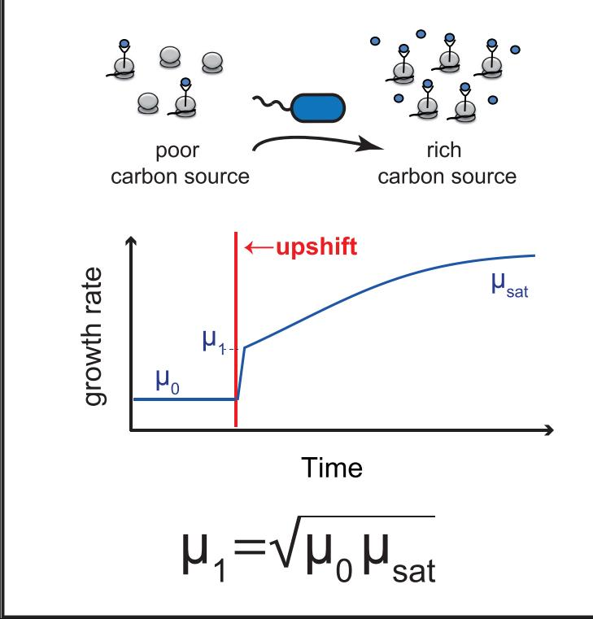
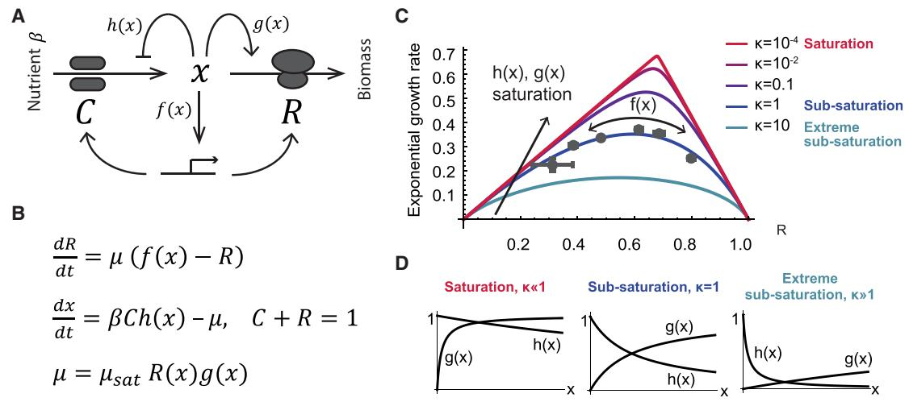
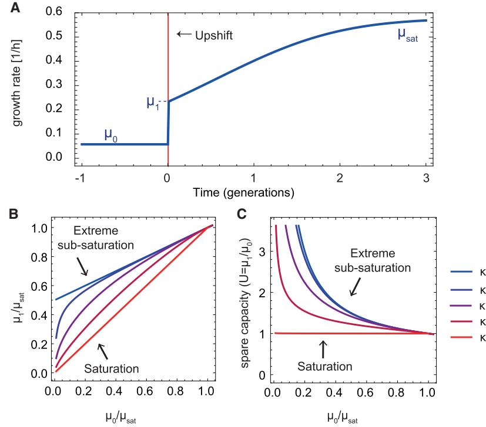
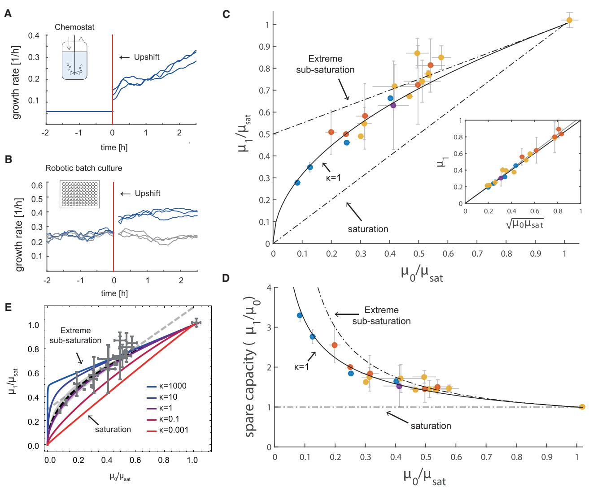
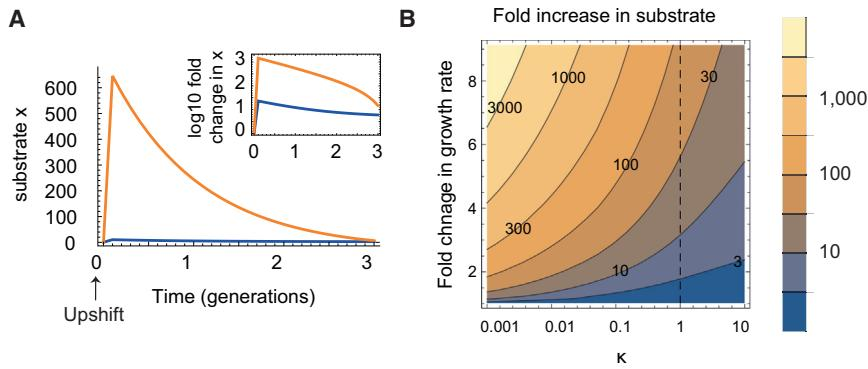
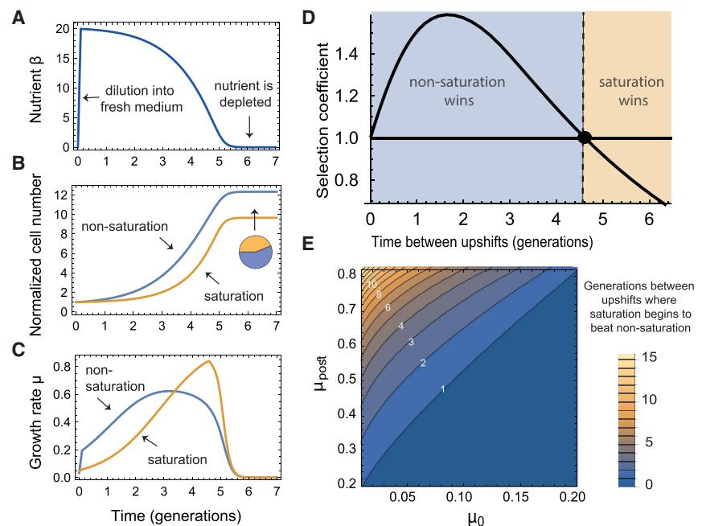

# A Bacterial Growth Law out of Steady State

# Graphical Abstract

# Highlights

- d Following nutritional upshifts, bacteria rapidly increase their growth rate
- d A square root relation exists between the pre-shift and postshift growth rates
- d The square root relation quantifies ribosomal spare capacity
- d Spare capacity speeds response to change and avoids metabolic overshoots

# Authors

Yael Korem Kohanim, Dikla Levi, Ghil Jona, Benjamin D. Towbin, Anat Bren, Uri Alon

# Correspondence

[uri.alon@weizmann.ac.il](mailto:uri.alon@weizmann.ac.il)

# In Brief

Bacterial growth depends on numerous reactions and yet in constant conditions follows surprisingly simple laws. Korem Kohanim et al. combine theory and experiment to find patterns in bacterial growth also for changing environments. These emerging patterns imply that bacteria save unused ribosomal capacity to better respond to change.

# A Bacterial Growth Law out of Steady State

Yael Korem Kohanim,[1](#page-1-0) Dikla Levi,[2](#page-1-1) Ghil Jona,[2](#page-1-1) Benjamin D. Towbin,[3](#page-1-2) Anat Bren,[1](#page-1-0) and Uri Alon[1,](#page-1-0)[4,](#page-1-3)[*](#page-1-4)

1Department of Molecular Cell Biology, Weizmann Institute of Science, Rehovot 7610001, Israel 2Department of Life Sciences Core Facilities, Weizmann Institute of Science, Rehovot 7610001, Israel

3Friedrich Miescher Institute for Biomedical Research, Maulbeerstrasse 66, 4058 Basel, Switzerland 4Lead Contact

*Correspondence: [uri.alon@weizmann.ac.il](mailto:uri.alon@weizmann.ac.il) <https://doi.org/10.1016/j.celrep.2018.05.007>

#### SUMMARY

Bacterial growth follows simple laws in constant conditions. However, bacteria in nature often face fluctuating environments. We therefore ask whether there are growth laws that apply to changing environments. We derive a law for upshifts using an optimal resource-allocation model: the post-shift growth rate equals the geometrical mean of the pre-shift growth rate and the growth rate on saturating carbon. We test this using chemostat and batch culture experiments, as well as previous data from several species. The increase in growth rate after an upshift indicates that ribosomes have spare capacity (SC). We demonstrate theoretically that SC has the cost of slow steady-state growth but is beneficial after an upshift because it prevents large overshoots in intracellular metabolites and allows rapid response to change. We also provide predictions for downshifts. The present study quantifies the optimal degree of SC, which rises the slower the growth rate, and suggests that SC can be precisely regulated.

#### INTRODUCTION

Systems biology aims to find principles for complex biological phenomena. One way to identify principles is by understanding patterns in biological data. Example of such patterns are bacterial growth laws that relate exponential growth rate to cellular and environmental parameters. Although the growth rate m depends on thousands of molecular reactions, it seems to follow surprisingly simple rules. For example, there is a linear relation between m and the ribosomal content of the cell *R* ([Ecker and Schaechter,](#page-10-0) [1963)](#page-10-0), a law that has been extensively replicated [(Scott et al.,](#page-10-1) [2010; Zaslaver et al., 2009)](#page-10-1) and which inspired mathematical modeling of bacterial resource allocation [(Bremer and Dennis,](#page-9-0) [2008; Churchward et al., 1982; Ehrenberg and Kurland, 1984;](#page-9-0) [Kremling et al., 2007)](#page-9-0).

Contemporary work by Hwa and co-workers further identified bacterial laws that connect m and cellular content ([Hui et al.,](#page-10-2) [2015; Scott et al., 2010; You et al., 2013](#page-10-2)). For example, the proteome fraction for carbon utilization, *C*, is a decreasing linear function of growth rate, and *R*+ *C* is approximately constant across growth rates on limiting carbon. These laws were studied using mathematical models ([Bosdriesz et al., 2015; Giordano et al.,](#page-9-1) [2016; Kafri et al., 2016; Maitra and Dill, 2015; Pavlov and Ehren](#page-9-1)[berg, 2013; Towbin et al., 2017; Weiße et al., 2015)](#page-9-1) to explain phenomena such as dependence of cellular content on antibiotics [(Scott et al., 2014](#page-10-3)) and the switch between carbon utilization strategies ([Basan et al., 2015; Mori et al., 2017a](#page-9-2)).

Most growth laws until now apply to steady-state exponential growth, which occurs when bacteria have been growing for several generations in constant conditions [(Maaløe and Kjeldg](#page-10-4)[aard, 1966; Shachrai et al., 2010; Wang et al., 2010](#page-10-4)). In nature, however, bacteria often face changing environments. In particular, they often go from poor conditions with slow growth to richer conditions with more rapid growth, changes known as nutritional upshifts [(Poulsen et al., 1995)](#page-10-5). Despite considerable experimental and theoretical research going back to Maaløe and Koch on nutritional upshifts ([Brunschede et al., 1977; Dennis, 1974; Ehrenberg](#page-9-3) [et al., 2013; Erickson et al., 2017; Giordano et al., 2016; Koch and](#page-9-3) [Deppe, 1971; Maaløe and Kjeldgaard, 1966; Mori et al., 2017b;](#page-9-3) [Pavlov and Ehrenberg, 2013; Sloan and Urban, 1976](#page-9-3)), no simple upshift growth law was yet described.

Here, we combine theory and experiment to quantify nutritional upshift dynamics. We apply a resource allocation model [(Towbin et al., 2017](#page-10-6)) and use it to study nutritional upshifts. The model predicts that the growth rate after a large upshift, m1, is equal to the geometrical mean of the pre-shift growth rate m0 and the growth rate on saturating carbon m*sat*, m1 = ffiffiffiffiffiffiffiffiffiffiffiffiffi m0m*sat* p : We test the model predictions using chemostat and batch-culture experiments with different carbon sources and temperatures, as well as reanalysis of published data, and find agreement with data across conditions, experimental systems, and species. This finding precisely quantifies the degree of sub-saturation or spare capacity for growth, showing that ribosomes are sub-saturated in all but the highest growth rates. We propose that ribosomal sub-saturation supplies benefit by (1) preventing large overshoots in intracellular metabolites after an upshift and (2) allowing faster growth immediately after an upshift, at the cost of a reduction in steady-state growth rate. Ribosomal sub-saturation is therefore selectable in environments where upshifts occur frequently.

### RESULTS

#### Optimal Resource Allocation Model for the Immediate Growth Rate after Upshifts

To study upshifts, we employ a minimal resource allocation model, which was experimentally calibrated for steady-state growth in different carbon sources by [Towbin et al. (2017)](#page-10-6).

#### Figure 1. Optimal Resource Allocation Model for Bacterial Growth

(A and B) Schematic description (A) and equations (B) for the cellular resource allocation model.

(C and D) Relation between the allocated ribosomal fraction and the steady-state growth rate in a given environment. Too little or too many ribosomes result in a sub-optimal steady-state growth rate. The optimal regulation function *f*ð*x*Þ brings steady-state ribosomal content *R* to its optimal value in terms of growth—the maxima of the curves. Different *h*ð*x*Þ, *g*ð*x*Þ offset the curve, with a tent-like curve with high optimal steady state for functions close to saturation (red curve) and shallow rounded curves with low optimal steady-state growth rate for sub-saturated functions (blue curve). We use MM functions *h*ð*x*Þ = *k*1=ð*k*1 + *x*Þ and *g*ð*x*Þ = *x*=ð*k*2 + *x*Þ and measure saturation level by k = *k*2=*k*1 (Supplemental Experimental Procedures S4). Small k values reflect a regime where both transporters and ribosomes work close to full saturation for a large range of substrate levels (red pointy curve in C, left bottom panel in D). k = 1 corresponds to sub-saturation of transporters and ribosomes (purple curve in C, middle panel in D). k[1 leads to extreme sub-saturation with a large substrate range, in which both ribosomes and pumps are not efficient (blue shallow curve in C, right panel in D). We used b = 2 to compute all growth curves. Data points in (C) are taken from [Towbin et al.](#page-10-6) [(2017](#page-10-6)) and represent perturbation experiments in which the allocation to catabolic and ribosomal sectors was tuned by externally supplying cAMP to a mutant strain that cannot endogenously produce it ([Experimental Procedures)](#page-8-0). The data are described best by k values on the order of 1, suggesting that ribosomes and transporters work at sub-saturation. These experiments suggest that whereas optimality is reached within a given curve, the curve itself is not optimized for steady-state growth. Error bars are SE of 3 day-day repeats (sometimes smaller than marker).

Here, we generalize the model and take it out of steady state to derive a prediction for growth rate after an upshift.

In the model ([Figures 1](#page-2-0)A and 1B), carbon uptake and biomass synthesis are described as a two-enzyme system, composed of a catabolic sector (denoted as the *C* sector) and a ribosomal sector (denoted as the *R* sector). The catabolic sector, which includes carbon transporters and catabolic enzymes, is responsible for carbon uptake and conversion into intracellular substrates (denoted by *x*). The ribosomal sector, which includes ribosomes and translational machinery, converts these substrates into biomass. A third sector (the *Q* sector; Supplemental Experimental Procedures S1) includes all proteins which under limiting carbon conditions do not change with growth rate ([Scott et al., 2014](#page-10-3)). Normalizing out factor *Q*, the experimentally observed tradeoff between making *R* and *C* sector proteins is summarized by *R*+ *C* = 1 [(You et al., 2013](#page-10-7)).

The exponential growth rate m is the product of the ribosomal sector size *R* and the average rate of the ribosomes, *g*. Both *R* and *g* depend on intracellular substrates *x*:

$$
\mu = \mu_{\text{ant}} \mathcal{B}(\mathbf{x}) \mathbf{g}(\mathbf{x}).\tag{\mathsf{Equation 1}}
$$

*g*ð*x*Þ and *R*ð*x*Þ are normalized between zero and one such that m*sat* is the growth rate when *x* is saturating. *g*ð*x*Þ, the average elongation rate, is an increasing function of *x*, describing ribosome utilization [(Dai et al., 2016](#page-9-4)). A sub-saturated ribosomal sector *g*ð*x*Þ *<* 1 can result from either a differential elongation rate or a fraction of inactive ribosomes [(Li et al., 2018](#page-10-8))—both are equivalent in terms of this model.

The internal substrate *x* dynamics are a balance between utilization for biomass production at rate m and the import of nutrients by the *C* sector:

$$\frac{d\mathbf{x}}{dt} = \beta \mathbf{C} \hbar(\mathbf{x}) - \mu. \tag{\text{Equation 2}}$$

Nutrients are imported and catabolized by the *C* sector at a rate b*h*ð*x*Þ, where b represents nutrient availability. *h*ð*x*Þ, the import rate, is a decreasing function of *x* that describes inhibition of the transporters by intracellular substrates ([Doucette et al., 2011](#page-10-9)).

The dynamics of *R* are a balance of production and dilution by cell growth:

$$
\frac{\mathsf{d}\mathsf{R}}{\mathsf{c}\mathsf{t}t} = \mathsf{\mu}\ (\mathsf{f}(\mathsf{x}) - \mathsf{R}).\tag{\mathsf{E}\mathsf{q}\mathsf{u}\mathsf{a}\mathsf{t}\mathsf{o}\mathsf{n}\ \mathsf{3}).
$$

The function *f*ð*x*Þ describes transcriptional control that determines the fraction of the total biomass production rate m that goes to the *R* sector [(Dalebroux and Swanson, 2012)](#page-9-5). At steady state, *R* = *f*ð*x*Þ. For a detailed derivation of the model, see Supplemental Information (Supplemental Experimental Procedures S1).

A key feature of this model is that growth rate in a given nutrient b depends on the control function *f*ð*x*Þ, because too

few or too many ribosomes result in slow growth ([Figure 1C](#page-2-0); Supplemental Experimental Procedures S2). In rich environments (large b), more ribosomes are needed, whereas in poor environments, more transporters are needed to provide the fastest growth. Whereas the activity curves of the *C* and *R* sectors, *h*ð*x*Þ and *g*ð*x*Þ, define the possible set of steady states (i.e., the curve in [Figure 1C](#page-2-0)), *f*ð*x*Þ determines the chosen steady state among this set. Importantly, [Towbin et al. (2017)](#page-10-6) experimentally found that the wild-type level of ribosomes, R, maximizes the steady-state exponential growth rate under many conditions.

We hence asked whether there exists an optimal *f*ð*x*Þ that provides the fastest growth for any environment b . Using a calculus-of-variations approach (Supplemental Experimental Procedures S3), we found that indeed such an optimal *f*ð*x*Þ exists:

$$\mathfrak{f}(\mathbf{x}) = \frac{1}{1 - \mathfrak{g}'(\mathbf{x})\hbar(\mathbf{x})/\mathfrak{g}(\mathbf{x})\hbar'(\mathbf{x})}. \tag{\text{Еquation 4}}$$

Intuitively, this optimal regulation function *f*ð*x*Þ determines the best trade-off between *R* and *C* by balancing the relative advantage of investing in each of these sectors according to the logarithmic sensitivities of their activity curves *h* 0 =*h* and *g* 0 =*g* [(Rosenheim et al., 2010](#page-10-10)).

With the optimal *f*ð*x*Þ of [Equation 4,](#page-3-0) cells are guaranteed to find the optimal growth rate for any nutrient b . However, the value of the optimal growth rate can change for different choices of *h*ð*x*Þ, *g*ð*x*Þ, which describe the transporter and ribosome activity at a given substrate level. In particular, when ribosomes and transporters are fully saturated ð*g* = *h* = 1Þ, growth rate is higher

#### Figure 2. The Model Provides Predictions for Growth Rate after an Upshift

(A) Growth rate dynamics during nutritional upshift. The growth rate before the shift is m0: Upon addition of a rich carbon source (red line), the growth rate rises within minutes to reach a new value m1, and then slowly increases on the timescale of hours until it reaches its new steady-state value m*sat*. The growth rate dynamics were computed from the model with parameter values h0 = 0:1; h1 = 10; k = 1 (Supplemental Experimental Procedures S8).

(B and C) Model predictions for the normalized post-shift growth rate (B) and spare capacity (C) for different k values, which correspond to different levels of saturation.

than if they are unsaturated (compare the tent-like curve to the more rounded curves in [Figure 1](#page-2-0)C).

[Towbin et al. (2017](#page-10-6)) calibrated the model for steady-state growth in different carbon sources using Michaelis-Menten-like (MM) saturation curves *h*ð*x*Þ = *k*1 *k*1 + *x*; *g*ð*x*Þ = *x k*2 + *x*. The halfway saturation points for pumps and ribosomes are *k*1 and *k*2, respectively. The ratio between these halfway coefficients k =

k2/k1 represents the cellular saturation level [(Figure 1D](#page-2-0); Supplemental Experimental Procedures S4). Full saturation, in which ribosomes and transporters work close to saturation in a wide range of substrate levels, is captured by k1 ([Figure 1D](#page-2-0), left). Extreme sub-saturation, in which ribosomes and transporters work far from their full capacity in most conditions, means k[1 ([Figure 1](#page-2-0)D, right). Intermediate sub-saturation, in which the halfway coefficients of ribosomes and transporters are equal, is captured by k =1[(Figure 1D](#page-2-0), middle).

[Towbin et al. (2017)](#page-10-6) experimentally manipulated the *C* sector and measured the resulting growth rate (black dots in [Figure 1C](#page-2-0)). These experiments indicated that the saturation halfway points are approximately equal, *k*1 = *k*2, and hence k1 .

Here, we take the model out of steady state and use it to study upshifts. Upshifts are modeled by suddenly increasing nutrient availability b from a low to a high value. We use the parameter k = 1. We also model full saturation and sub-saturation by varying k.

The model allows us to calculate the growth rate before the upshift m0 and immediately after the shift m1 [(Figure 2](#page-3-1)A). This yields a relation between the normalized post-shift and pre-shift growth rates mf1 = m1=m*sat*, mf0 = m0=m*sat* as a function of k for large upshifts (upshifts into saturating carbon, such that long after the upshift, the growth rate is m*sat*; Supplemental Experimental Procedures S4; [Figure 2B](#page-3-1)):

$$
\widehat{\mu_1} = \widehat{\mu_0}^- \left( \mathfrak{1} - \kappa \right) + \sqrt{\kappa} \sqrt{\widehat{\mu_0}^- - (\mathfrak{1} - \kappa) \widehat{\mu_0}^{-2}}.
\tag{\text{Equation 5}}
$$

At full saturation, k1, the expression reduces to mf1 = mf0 , because when ribosomes are saturated before the shift, growth rate cannot immediately increase after the upshift. At extreme sub-saturation, k[1, the model gives a linear relation between the normalized pre-shift and post-shift growth rates with an intercept of ½ [(Figure 2](#page-3-1)B).

When k = 1, as suggested by the findings of [Towbin et al.](#page-10-6) [(2017)](#page-10-6), this expression yields a simple prediction: the immediate growth rate after an upshift is the geometric mean of the pre-shift and saturating growth rates,

$$
\mu_1 = \sqrt{\mu_0 \mu_{\text{sat}}}.\tag{\text{Equation 6}}
$$

Intuitively, this square-root law results from the following situation: in poor conditions, both ribosomal content *R* and saturation level *g* are a small value ε and the growth rate is m0 ε2, whereas soon after the upshift, ribosomes are still ε but saturation is high due to the presence of nutrient, resulting in m1 ε. In Supplemental Experimental Procedures S5, we relax the assumption that *h*(*x*) and *g*(*x*) are MM-like and derive a similar square-root law for general *h*(*x*), *g*(*x*) functions (Supplemental Experimental Procedures S5).

In the case k = 1, the upshift law can be expanded to include general upshifts and downshifts (Supplemental Experimental Procedures S6), not only large ones as assumed above, resulting in the formula:

$$
\widehat{\mu_1} = \sqrt{\widehat{\mu_0}} \widehat{\mu_{\text{post}}} \frac{\left(1 - \widehat{\mu_0}\right)}{\left(\widehat{\mu_0} - 2\widehat{\mu_0}\right)\widehat{\mu_{\text{post}}} + \widehat{\mu_{\text{post}}}}\,,\tag{\text{Equation 7}}
$$

where the growth rate far after the shift is denoted m*post* and mg*post* = m*post*=m*sat*. In the case of large upshifts to saturating carbon, m*post* = m*sat*, and the formula reduces to the squareroot formula of [Equation 6](#page-4-0) (Supplemental Experimental Procedures S6).

The upshift law can be recast in terms of the spare capacity of the cells for growth [(Diamond, 2002](#page-10-11)). Cells grow at m0 and then jump to m1, indicating that they were operating below full capacity. The spare capacity *U* can be defined as the fold change in growth rate after the shift, *U* = m1 m0 . This definition, together with [Equation 6](#page-4-0), leads to a spare capacity of

$$
\mathbf{U} = \sqrt{\mu_{\text{sat}}/\mu_{\text{0}}},
\tag{\text{Бчиation 8}}
$$

as shown in [(Figure 2](#page-3-1)C). Spare capacity is smallest (*U* = 1) when cells are close to their saturating growth rate. Spare capacity increases the poorer the medium (the smaller m0=m*sat*). For example, in a medium that allows only 10% of the growth rate on saturating carbon, m0=m*sat* = 0.1, the cells grow *U* = ffiffiffiffiffiffi 10 p 3 times faster when shifted to saturating carbon.

The present model predicts that, at zero growth rate m0 = 0, there is no upshift, m1 = 0. This cannot capture the irreducible ribosomal fraction of the bacterial proteome that allows recovery from stationary phase [(Dai et al., 2016; Madar et al., 2013](#page-9-4)). The model can be extended to include such an irreducible ribosomal fraction (Supplemental Experimental Procedures S7).

#### Experimental Tests for Nutritional Upshifts Support the Square-Root Formula

To test the model predictions, we carried out experiments in which *E. coli* MG1655 cells were shifted from exponential growth in a poor medium to saturating glucose medium. We used two experimental systems: (1) a chemostat, in which slowly dividing cultures in glucose-limited medium (0.02%) were shifted to growth in 0.2% glucose ([Figures 3A](#page-5-0) and S1), and (2) batch culture in a multi-well robotic assay at several temperatures (25C, 30C, and 37C), in which cultures growing exponentially on different carbon sources (acetate, sorbitol, rhamnose, or pyruvate) were shifted to 0.4% glucose medium ([Figures 3](#page-5-0)B, S2, and S3). Because we are interested in biomass growth rate, we measured the optical density (OD) of the cells at a temporal resolution of 0.5 min in the chemostat and 3.6 min in the batch culture, with an error of 4%–10% in growth rate between biological repeats.

We find that growth rate increased abruptly after the upshift by up to 3.3-fold, starting from an initial value m0 before the shift and stabilizing after about 15–30 min at a new value m1 [(Figures 3](#page-5-0)A, 3B, S1, and S3). No such increase was found in control experiments in which pre-growth medium was added instead of glucose nor in the case where cells were shifted from saturating glucose to higher levels of glucose. After the initial increase, the growth rate further increased more slowly on the timescale of hours. We also measured the growth rate on saturating carbon, m*sat*, defined for a given medium and temperature as the exponential growth rate in batch culture with saturating glucose (Figure S4).

The rapid increase in growth rate from m0 to m1 cannot be explained by synthesis of new ribosomes [(Koch and Deppe, 1971](#page-10-12)). For example, the increase in growth rate that occurs almost immediately after an upshift from succinate to glucose would require at least 1.4 hr if it was only due to new ribosome production (Supplemental Experimental Procedures S9). As suggested by Koch and others [(Harvey, 1973; Koch, 1988)](#page-10-13), this hints that cells in slow growth have a higher translational capacity than is actually being used.

In addition to the experiment performed here, we collected data from previous studies on a different strain, *E. coli* 15T, on a different bacterial species, *S. typhimurium* [(Maaløe and Kjeldg](#page-10-4)[aard, 1966; Sloan and Urban, 1976)](#page-10-4) and on the yeast *Saccharomyces cerevisiae* ([Metzl-Raz et al., 2017)](#page-10-14). In these experiments, cells were transferred from various carbon sources (fumarate, succinate, aspartate, glyoxylate, galactose, or glycerol) to rich carbon sources (saturating glucose or broth), corresponding to strong upshifts. Growth rate was measured by radioactive amino acid incorporation [(Maaløe and Kjeldgaard, 1966](#page-10-4)), OD measurements [(Sloan and Urban, 1976](#page-10-15)), or microscopy [(Metzl-Raz et al.,](#page-10-14) [2017;](#page-10-14) [Experimental Procedures](#page-8-0)). Together, the different data sources span a range of conditions, growth rates (0.07– 1.67 hr-1 ), species, and measurement methods (Table S1).

Analyzing the results for the pre-shift growth rate m0 versus the post-shift growth rate m1 did not reveal a clear pattern, because the same pre-shift rate m0 could result in different post-shift rates m1 depending on the conditions. However, a data collapse occurred when taking into account the condition-dependent value of the saturating growth rate, m*sat* [(Figure 3C](#page-5-0)). As predicted

#### Figure 3. Experimental Data Support the Upshift Growth Law

(A) Growth rate in a chemostat upshift experiment. Cells in limiting-glucose M9 minimal medium (0.02%) with varying doubling times (here 12 hr) were shifted into high-glucose medium (0.2%; red line). The curves represent 3 biological repeats.

(B) Growth rate in a multi-well batch culture upshift experiment. Exponentially growing cells on M9 minimal medium with a poor carbon source (here acetate) were either supplemented with high-glucose medium (0.4%; blue curves) or with the pre-shift medium as a control (gray curves). The red line marks addition time. Curves are 3 biological repeats. Growth rate was computed from a window of time points ([Experimental Procedures)](#page-8-0), precluding an accurate estimate for about 9 min after the shift, resulting in a gap in the plot.

(C) Post-shift growth rate as a function of pre-shift growth rate is well described by m1=m*sat* = ffiffiffiffiffiffiffiffiffiffiffiffiffiffiffi m0=m*sat* p (black line) ([Equation 6](#page-4-0)). Dashed lines, model predictions when ribosomes and carbon transporters work at full saturation ðk 1Þ or very far from saturation ðk[1Þ; yellow dots, robotic batch culture experiments; blue dots, chemostat experiments (error bars are SE of 3 day-day repeats repeats); red dots, data from [Maaløe and Kjeldgaard (1966)](#page-10-4) and [Sloan and Urban (1976](#page-10-15)); purple dot, yeast data from [Metzl-Raz et al. (2017](#page-10-14)) (error bars described in [Experimental Procedures](#page-8-0)). For a detailed description of the data points, see Figure S5 and Table S1. Inset, data plotted versus [Equation 6.](#page-4-0)

(D) Spare capacity for growth computed from the data and from the model with k = 1 (full line) and with high and low saturation (dashed lines). (E) Comparison of data (gray points) with the model for different values of k. Model with the best fit k = 1:3 is in black dashed line, with 95% confidence intervals in gray. Gray dashed line represents the best linear fit.

by the model, the data are well described by [Equation 6](#page-4-0) [(Fig](#page-5-0)[ures 3](#page-5-0)C, 3D, and S5; Table S1; Pearson correlation = 0.99; p value < 10-26).

We also compared the data to the model with different values of k. Fitting [Equation 5](#page-3-2) to the data, we find that the best-fit saturation level k is 1.3 (0.7; 2.5 95% confidence interval; [Figure 3E](#page-5-0); Supplemental Experimental Procedures S4), providing independent support to the steady-state evidence of [Towbin et al. (2017](#page-10-6)) that the halfway coefficients of ribosomes and transporters are similar.

#### Fold increase in substrate Figure 4. Model Predicts that Sub-saturation of Ribosomes Avoids Large Overshoots in Metabolic Intermediates after an Upshift

(A) Model results for the substrate x after an upshift (increase in b from 0.2 to 5, corresponding to a change in steady-state growth rate of 4-fold, similar to a shift from acetate to glucose). A large overshoot is seen for saturated ribosomes ðk = 10-3Þ, and a much smaller overshoot for k = 1. Inset: log of the change in *x* (log10[*x*(*t*)/*x*(0)]), where *x*(0) is the pre-shift steady-state value.

(B) Substrate overshoot after an upshift, relative to pre-shift steady state, max(*x*(*t*))/*x*(0), as a function of k and the upshift strength (relative change in steady-state growth rate).

We also tested alternative mathematical relationships for the data, such as linear regression m1 = *a* m0 + *b* m*sat* + *c* (Table S2). Such relationships have free parameters, whereas [Equation 6](#page-4-0) is a fit with no free parameters. Despite these free parameters, the best-fit error of the alternative formula is comparable or higher than [Equation 6](#page-4-0) [(Figure 3E](#page-5-0); Table S2). Future experiments with lower error can further test the present predictions.

#### Ribosome Spare Capacity Prevents Large Substrate Overshoot and Is Beneficial in Frequently Changing Environments

The experiments indicate that ribosomes at low growth rates work far from saturation, because growth increases abruptly after the upshift ([Erickson et al., 2017; Mori et al., 2017b](#page-10-16)). This sub-saturation raises a question, because steady-state exponential growth rate is maximal when ribosomes are saturated [(Figure 1](#page-2-0)C). Maximum growth rate is the reason why many previous models assumed ribosomal saturation ([Neid](#page-10-17)[hardt, 1999)](#page-10-17).

We hypothesize that there are evolutionary benefits to ribosome sub-saturation. The first potential benefit is that subsaturation of ribosomes and pumps prevents large overshoots of the carbon intermediate x upon upshifts. Such overshoots can be toxic due to osmotic and hydration effects. The saturated model shows an overshoot of tens to thousands of folds in x after an upshift [(Figure 4](#page-6-0)), because the ribosomes have no spare capacity to process the excess carbon and the pumps cannot reduce their rate effectively to reduce influx. Because many metabolites in central carbon metabolism are in the mM range ([Albe et al., 1990](#page-9-6)), an overshoot of 1,000 would raise them to the 1M range, which is biologically unfeasible. In contrast, the unsaturated model shows only a small (e.g., 10-fold) transient increase in x upon upshift [(Figures 4](#page-6-0)A and 4B).

A second benefit of spare capacity is a growth advantage at early times after an upshift [(Mori et al., 2017b)](#page-10-18). Saturated ribosomes do not allow an increase in growth rate right after an upshift and result in m1 = m0. This is because all ribosomes are already working full speed before the shift, and an increase in growth rate cannot immediately occur but rather requires synthesis of new ribosomes ([Koch, 1988)](#page-10-19). Sub-saturation therefore has an advantage when upshifts occur often: the benefit of increased growth rate after the shift can offset the cost of lower exponential growth rate at steady state. In contrast, in conditions in which upshifts are rare, cells with saturated ribosomes have an advantage due to their higher steady-state growth.

To test this hypothesis, we simulated batch growth in which cells with saturated and unsaturated ribosomal strategies competed over a limiting nutrient ([Figure 5;](#page-7-0) Supplemental Experimental Procedures S8). The model allows us to simulate bacteria with different amounts of spare capacity (sub-saturation) by introducing different values of k = *k*2 *k*1 .

In the simulations, the two populations (k = 1 and k = 0.001) were diluted into fresh medium, resulting in an increase in nutrient availability b [(Figure 5](#page-7-0)A), and competed over the nutrient. As cells grew, they depleted the nutrient at rate proportional to their number times their growth rate ([Monod,](#page-10-20) [1949)](#page-10-20). As cells consumed the nutrient, growth rate declined to zero, simulating limiting nutrient conditions [(Bren et al.,](#page-9-7) [2013)](#page-9-7). The proportion between the two populations was estimated after stabilizing at a constant value [(Figure 5](#page-7-0)B). We repeated this for different initial cell concentrations (different initial dilutions), which determined the number of generations of growth until nutrient runs out.

As expected, we found that at steady state, higher growth rate is always achieved by using the saturation strategy. However, after the dilution, non-saturation achieves higher growth for the first few generations [(Figure 5C](#page-7-0)). After these few generations, the saturation population managed to catch up and achieved faster growth rate again. The relative advantage of the early gain and the long-term loss in growth depends on the number of generations of growth that the cells went through. For example, for a typical parameter set, non-saturation wins over the saturation strategy (selection coefficient > 1) when the number of generations until nutrient runs out is smaller than 4 [(Fig](#page-6-0)[ure 4D](#page-6-0); for m0 = 0:06m*sat*; m*st* = 0:7m*sat*, where m is computed with k = 1; see [Figure 4E](#page-6-0) for other parameters). Due to the exponential nature of the growth, even the transient advantage given by the spare capacity has long-lasting implications 4 generations later.

To generalize these findings, we performed a parameter scan to find the optimal level of spare capacity as a function of the frequency of upshifts in the environment and on the strength of the upshift (difference between pre- and post-steady-state growth rates). We find that using full saturation (k 1; zero spare

capacity) is beneficial in environments in which upshifts are rare and mild (small difference between pre- and post-media). In contrast, the more frequent the upshifts and the stronger they are, sub-saturation is more beneficial.

An experimental finding by [Gyorfy et al. (2015](#page-10-21)) supports this prediction. Gyorfy et al. compared strains deleted for some of the rRNA operons (D*rrn*) to wild-type strains in chemostat and batch culture. The D*rrn* strains outcompeted wild-type strains in a chemostat, but not in batch culture conditions. We interpret these findings in the light of the present model: the D*rrn* strains have fewer ribosomes ([Gyorfy et al., 2015](#page-10-21)) and hence ribosomes are more saturated. They do better under steady-state conditions (chemostat) due to their higher steady-state growth rate. But D*rrn* stains do worse after an upshift (shift from overnight to fresh batch culture), due to the predicted benefits of sub-saturation in the wild-type strain.

A further implication of the model is a growth law for nutritional downshifts. Like upshifts, downshifts are prevalent in nature, because bacteria tend to exhaust their nutrient resources during the last generations of exponential growth [(Bren et al., 2013)](#page-9-7). In very rich environments, ribosomes work near saturation, but the transporters are sub-saturated. In downshifts, the model suggests that it is the sub-saturation of transporters that is advantageous: in rich environments, few transporters (small *C* sector) are needed, but after the transition to a poor medium, cells need to produce new transporters (increased *C* sector) to reach optimal growth. Moreover, they need to produce these transporters despite the low nutrient influx in the poor medium. If transporters were saturated, growth rate would plummet in the poor condition; however, when transporters are unsaturated before the shift, there is spare capacity to prevent a strong decrease. Thus, transporter sub-saturation is selectable in conditions with frequent downshifts.

#### Figure 5. Competition Simulations Show that Sub-saturation Is Selectable in Sufficiently Fluctuating Environments

(A–C) In nutritional upshift simulations, two populations, one with sub-saturated ribosomes (k = 1, blue curve in B and C), and one with saturated ribosomes (k = 10-3, orange curve in B and C), were co-diluted into fresh medium. The two populations competed over the shared limited nutrient resource and depleted it at a rate proportional to their number times their growth rate (A). The proportion between the two populations was estimated after stabilizing at a constant value (pie diagram, B).

(D) This was repeated for different initial cell concentrations, which determined the number of generations of growth until nutrient runs out (typical time between upshifts). The threshold number of generations between upshifts for which saturation and sub-saturation are equally beneficial is marked with a black dot.

(E) This threshold was computed for different initial and post-shift steady-state growth rates.

The model analytically predicts a growth law for downshifts from a rich medium,

$$\frac{\mu_1}{\mu_{\text{sat}}} = \frac{\mu_{\text{post}}}{\mu_{\text{sat}}} \left( \mathbf{1} - \sqrt{\frac{\mu_0}{\mu_{\text{sat}}}} \right) \tag{\text{Equation 9}}$$

(see Supplemental Experimental Procedures S6 for the range of validity of this formula and for a more general formula), where m*post* is the steady-state growth rate in the post-shift medium. Because downshifts are experimentally harder to explore, we defer a test of this prediction to future studies.

### DISCUSSION

We derive a law for growth immediately after an upshift from a model of optimal regulation in cells. This growth law is supported by experiments in chemostat and robotic batch culture conditions in different media and temperatures and reanalysis of previous data on *E. coli*, Salmonella, and yeast. The growth law is also a quantitative measure of the spare capacity of cells for growth. We suggest that sub-saturation of ribosomes can be beneficial in frequently changing environments, because it prevents large overshoots in metabolic intermediates and allows rapid initial increase in growth rate following an upshift.

The question of whether ribosomes work at saturation has a long history. There seem to be at least two schools of thought. In one school, exemplified by Maaløe and co-workers [(Maaløe](#page-10-4) [and Kjeldgaard, 1966)](#page-10-4), ribosome saturation is almost a law in itself (as, for example, in a review by [Neidhardt, 1999)](#page-10-17). This postulate is due to the fact that balanced exponential growth is maximal at ribosomal saturation. The second school of thought suggests that ribosomes are substantially sub-saturated under all but the best conditions, often assuming a fraction of inactive ribosomes. Examples of this way of thinking can be found in works on upshifts by Koch ([Koch, 1971, 1988; Koch and Deppe,](#page-10-22) [1971](#page-10-22)), Harvey ([Harvey, 1973](#page-10-13)), and subsequent models ([Ehren](#page-10-23)[berg et al., 2013)](#page-10-23) and experiments [(Borkowski et al., 2016; Dai](#page-9-8) [et al., 2016; Metzl-Raz et al., 2017](#page-9-8)). The present study supports the second school. Importantly, it quantifies the extent of subsaturation, predicting the spare capacity *U* for growth as a function of the growth rate m0 and the saturating growth rate m*sat*, namely *U* = ffiffiffiffiffiffi m*sat* m0 q . Spare capacity is larger the poorer the carbon source in the medium (the smaller m0 m*sat*).

Sub-saturation is selectable in frequently changing environments, because it prevents large overshoots in intracellular metabolites after an upshift, which are likely to be toxic. Spare capacity also confers rapid growth after upshifts and downshifts, which may offset the cost of the reduction in growth rate at steady state. A potential experimental test could compare different bacterial strains and species in terms of their upshift performance and their ribosome saturation. Our model predicts that the higher the saturation, the slower the post-shift improvement, a prediction which is supported by experiments on *rrn* deletion strains [(Gyorfy](#page-10-21) [et al., 2015)](#page-10-21). This hints at a trade-off situation ([Klappenbach et al.,](#page-10-24) [2000; Shoval et al., 2012; Weiße et al., 2015](#page-10-24)), in which higher steady-state growth comes at the expense of rapid response to changes. [Mori et al. (2017b](#page-10-18)), in a paper published during the publication process of this study, reached a similar conclusion, elegantly showing how the basal fraction of ribosomes are optimal for a given frequency of environmental change.

More generally, metabolomic experiments indicate that subsaturation is the norm for many metabolic enzymes, which under typical conditions work well below their maximal rate [(Bennett](#page-9-9) [et al., 2009; Davidi et al., 2016](#page-9-9)). This sub-saturation is often thought of as a ''safety factor,'' which is beneficial when enzymatic load is uncertain [(Diamond, 2002)](#page-10-11). It would be interesting to check in other systems whether the present quantitative relationship for spare capacity is found (e.g., does spare capacity increase at low steady-state system flux or activity; [Suarez et al.,](#page-10-25) [1997](#page-10-25)) or whether different types of laws govern spare capacity in each context.

The upshift growth law can be tested in additional strains, organisms, and conditions. The model predicts specific forms for the ribosomal and transporter saturation and regulation functions, which can in principle be tested experimentally. More generally, this study suggests that growth laws can be found for dynamic situations, not only for steady-state growth, extending our understanding of how bacterial growth dynamics work and for what tasks they evolved.

#### EXPERIMENTAL PROCEDURES

#### Multi-well Batch Culture Experiments

Experiments were carried out with *E. coli* wild-type strain, MG1655. Cells were grown overnight in M9 minimal medium (42 mM Na2HPO4, 22 mM KH2PO4, 8.5 mM NaCl, 18.5 mM NH4Cl, 2 mM MgSO4, and 0.1 mM CaCl) supplemented with 0.4% glucose (w/v) and 0.05% casamino acids at 37C. Using a robotic liquid handler (FreedomEvo; Tecan), 96-well plates were prepared with 150 mL of M9 minimal medium (without casamino acids) with the indicated carbon sources (0.2%). The wells were inoculated with bacteria at a 1:500 dilution from the overnight culture. Wells were covered with 100 mL of mineral oil (Sigma) to prevent evaporation, a step which we previously found not to significantly affect growth ([Ronen et al., 2002; Zaslaver et al., 2004](#page-10-26)), and transferred into an automated incubator. Each experiment included 4 plates, each plate supplemented with a different carbon source. Cells were grown in an automated incubator with shaking (6 Hz) at either 37C, 30C, or 25C for about 25 hr. Every 3.6 min, the plate was transferred by a robotic arm into a multiwell fluorimeter (Infinite F200; Tecan) that reads OD (600 nm). For each carbon source, we determined an OD value for which cells are in mid-exponential growth. To achieve a nutritional upshift, when the robotic software detected that median OD value in the plate first exceeded this threshold value, the wells were automatically supplemented with 10 mL of medium: half of the wells were supplemented with M9 medium with glucose to reach a concentration of 0.4% glucose in the well. The other half were supplemented with M9 medium with no glucose as a control. This resulted in 48 replicates for each condition. Experiments were repeated three times.

#### Analysis of Robotic Batch Culture Experiments

We computed the mean OD curve by averaging each time point over all replicates. We removed data from about 1% of the wells that had an OD spike after medium addition, due to the formation of bubbles. We computed the growth rate curve [(Figures 3](#page-5-0)B and S3) for each condition by removing background OD and taking the logarithmic derivative of the mean OD curve over a window of 15 points (50 min). All growth rates in this manuscript are computed in base *e*. We computed separately the pre-shift growth curve and the post-shift growth curve, without mixing points before the shift with points after the shift. For time points next to the shift point, we used an asymmetric window of less than 15 points. For the computation of the pre-shift growth rate m0, we used the control experiment growth curves. For each condition, we defined the exponential phase as the range in which growth rate was fairly constant (SD < 0.05), over a window of 3–6 hr, and we averaged over the growth rate in this window. For the computation of the post-shift growth rate m1, we used the upshift experiments. The growth rate temporarily stabilized on a value smaller than the growth rate in glucose after 15–50 min, depending on the temperature. We computed this value by averaging the growth rate over a window of stability: 20–60 min (37C), 40–70 min (30C), or 55–85 min (25C) after the shift. The saturating growth rate m*sat* was computed from a batch culture in 0.4% glucose in each temperature by taking the logarithmic derivative of the OD at mid-exponential growth, in a window of 2–5 hr (37C), 2–4 hr (30C), or 3–8 hr (25C; Figure S4A). Errors for m0, m1, and m*sat* are SE of 3 day-day repeats. For all points in [Figures 3C](#page-5-0) and 3D, we computed the error in *F*ðm0; m*sat*Þ = m0=m*sat* from the errors in m0; m*sat* using the formula ffiffiffiffiffiffiffiffiffiffiffiffiffiffiffiffiffiffiffiffiffiffiffiffiffiffiffiffiffiffiffiffiffiffiffiffiffiffiffiffiffiffiffiffiffiffiffiffiffiffiffiffiffiffiffiffiffi 2 + *d*m*sat*2 s

D*F*ðm0; m*sat*Þ = Dm0 *dF d*m0 D m*sat dF* and similarly for m1=m*sat*, m1=m0, and ffiffiffiffiffiffiffiffiffiffiffiffiffi m0m*sat* p .

#### Chemostat Experiments

The chemostats were executed on a parallel DASBox mini Bacterial Fermentation system (DASGIP; Eppendorf; see below). A single overnight starter of *E. coli* MG1655 was used to inoculate the parallel bioreactors, each containing 150 mL (1:50; OD600 0.05) M9 media supplemented with vitamin B1 and 0.02% glucose. The cultures were initially grown at 37C in batch mode to early log phase and then shifted to growth in chemostat mode using the same media as above for feeding, with dilution rates of 0.28, 0.17, 0.09, and 0.06 hr-1 (corresponding to doubling times of 2.5 hr, 4 hr, 8 hr, and 12 hr) and the following controlled parameters: 200 rpm and 0.66 VVM (volume of air/volume of media/min). When the oxygen in the reactors became limiting (DO = <20% [dissolved oxygen]), a feedback cascade of mixing and aeration was engaged (300–800 rpm and 0.66–2.0 VVM, respectively). When the OD of all the cultures stabilized, the cultures were spiked with 1.5 mL of 20% glucose (final concentration 0.2%) and further grown for at least 4 hr in chemostat mode with the above media containing 0.2% glucose, while monitoring and logging their DO, OD, and pH.

#### Analysis of Chemostat Experiments

We computed the growth curves for the chemostat experiments by taking the logarithmic derivative of the OD over a window of 21 time points (10 min; [Figures 3A](#page-5-0) and S1). The value of the pre-shift growth rate m0 was taken from the dilution rates indicated. The post-shift growth rate m1 was computed by averaging the growth curve in a window of 20–60 min. The saturating growth rate m*sat* was computed from a batch culture in 0.2% glucose by averaging over the growth curve in a window of 1.5 hr at mid-exponential growth (Figure S4B). Errors for m0, m1, and m*sat* are SE of 3 day-day repeats. For all points in [Figures 3C](#page-5-0) and 3D, we computed the error as indicated above.

#### Analysis of Published Upshift Experiments

We used nutritional upshift experiment data from [Maaløe and Kjeldgaard](#page-10-4) [(1966](#page-10-4); pp. 109–114), [Sloan and Urban (1976)](#page-10-15), and [Metzl-Raz et al. (2017)](#page-10-14). [Maa](#page-10-4)[løe and Kjeldgaard (1966](#page-10-4)) reanalyzed upshift experiments from [Kjeldgaard](#page-10-27) [(1961](#page-10-27)), in which *S. typhimurium* cells were transferred from glycerol-minimal medium to broth. Growth rate was measured by radioactive amino acid incorporation. Maaløe and Kjeldgaard report the steady-state growth rate values in the pre-shift medium and in the post-shift medium, as well as the growth rate value in the first 15–25 min after the shift. We take these values to be m0; m*sat*, and m1, respectively. Note that Maaløe and Kjeldgaard define growth rate in base 2. We divide the reported values by *ln(2)* to transfer them to base *e*. No error estimate for these values was supplied.

[Sloan and Urban (1976](#page-10-15)) transferred *E. coli* 15T cells from M9 medium with fumarate, succinate, aspartate, or glyoxylate to glucose 0.4%. They measured OD at a resolution of 5 min. We extracted numerical data from the figures using the grabit package of MATLAB. We computed the post-shift growth rate m1 by taking the logarithmic derivative of the OD in a window of 6 points (30 min) after the shift, except for fumarate, for which we used a window of 8 points to avoid a large fitting error. Error bars are the fit 95% confidence intervals. For the pre-shift values m0, we use the authors report for the doubling times in the indicated carbon sources (no error estimate is supplied). For m*sat*, we use the steady-state growth rate value in the post-shift medium. This value is in agreement with the doubling time reported by the authors. Errors were computed from the fit confidence interval.

[Metzl-Raz et al. (2017](#page-10-14)) shifted budding yeast cells (*S. cerevisiae*) from galactose to glucose 0.4%. Cells were grown and imaged in a flow cell, and their volume was measured at a time resolution of 5 min. We computed the growth curve by taking the logarithmic derivative of the OD in a window of 5 time points (25 min). We computed the pre-shift growth rate m0 by averaging on a window of 1.5 hr before the shift. The error was taken to be the SE of the growth rate values in this window. The post-shift growth rate m1 was computed using a window of 25 min after the shift. Error bars represent 95% confidence intervals. The growth rate on saturating carbon msat was computed using a doubling time of 86 min, which is achieved in growth on 2% glucose (data kindly supplied by Metzl-Raz et al.).

#### Transformation of Data Points from Towbin et al

Data points in [Figure 1](#page-2-0)C are taken from [Towbin et al. (2017](#page-10-6)). There, the allocation to catabolic sector was set by externally supplying cyclic AMP (cAMP) to *E. coli* mutant strain, which cannot endogenously produce cAMP (a strain deleted for the enzymes *cyaA* and *cpdA* that synthesize and degrade cAMP). cAMP activates the transcription factor cAMP receptor protein (CRP), which controls the expression of many carbon catabolic enzymes (Go¨ [rke and St](#page-10-28)u[lke, 2008](#page-10-28) € ). Bacteria were grown on lactose with 1 mM of the competitive lactose permease inhibitor thio-di-glucoside (TDG) with different concentrations of external cAMP, and their growth rate and CRP activity (CRP*, defined as the promoter activity of a CRP reporter divided by the promoter activity of a s70 reporter) were measured. We transformed the CRP* values into ribosomal sector values R by: R = 1 - CRP*/Cm, where Cm is the maximal CRP* = 1.1 as found in [Towbin et al. (2017](#page-10-6)).

#### SUPPLEMENTAL INFORMATION

Supplemental Information includes Supplemental Experimental Procedures, five figures, two tables, and one data file and can be found with this article online at <https://doi.org/10.1016/j.celrep.2018.05.007>.

#### ACKNOWLEDGMENTS

We thank Naama Barkai, Ron Milo, Yuval Hart, Eyal Metzl-Raz, Dan Davidi, and members of the Alon laboratory for reading the manuscript and helpful discussions. U.A. is the incumbent of the Abisch-Frenkel Professorial Chair. This work was supported by the Israel Science Foundation (grant no. 1349/15), The Khan Family Center at the Weizmann Institute of Science, and Minerva Foundation, which is supported by the BMBF of the Federal Republic of Germany. Y.K.K. is supported by the Adams Fellowship Program of the Israel Academy of Sciences and Humanities.

#### AUTHOR CONTRIBUTIONS

Study Design, Y.K.K. and U.A.; Execution of Experiments, Y.K.K., A.B., D.L., and G.J.; Derivation of Theory, Y.K.K. and U.A.; Data Analysis, Y.K.K.; Writing Manuscript, Y.K.K. and U.A.; Editing Manuscript, Y.K.K., U.A., A.B., and B.D.T.

#### DECLARATION OF INTERESTS

The authors declare no competing interests.

Received: October 2, 2017 Revised: February 21, 2018 Accepted: May 1, 2018 Published: June 5, 2018

#### REFERENCES

[Albe, K.R., Butler, M.H., and Wright, B.E. (1990). Cellular concentrations of en](http://refhub.elsevier.com/S2211-1247(18)30740-X/sref1)[zymes and their substrates. J. Theor. Biol.](http://refhub.elsevier.com/S2211-1247(18)30740-X/sref1) *143*, 163–195.

[Basan, M., Hui, S., Okano, H., Zhang, Z., Shen, Y., Williamson, J.R., and Hwa,](http://refhub.elsevier.com/S2211-1247(18)30740-X/sref2) [T. (2015). Overflow metabolism in Escherichia coli results from efficient prote](http://refhub.elsevier.com/S2211-1247(18)30740-X/sref2)[ome allocation. Nature](http://refhub.elsevier.com/S2211-1247(18)30740-X/sref2) *528*, 99–104.

[Bennett, B.D., Kimball, E.H., Gao, M., Osterhout, R., Van Dien, S.J., and Rabi](http://refhub.elsevier.com/S2211-1247(18)30740-X/sref3)[nowitz, J.D. (2009). Absolute metabolite concentrations and implied enzyme](http://refhub.elsevier.com/S2211-1247(18)30740-X/sref3) [active site occupancy in Escherichia coli. Nat. Chem. Biol](http://refhub.elsevier.com/S2211-1247(18)30740-X/sref3) *5*, 593–599.

[Borkowski, O., Goelzer, A., Schaffer, M., Calabre, M., Ma¨](http://refhub.elsevier.com/S2211-1247(18)30740-X/sref4) der, U., Aymerich, S., [Jules, M., and Fromion, V. (2016). Translation elicits a growth rate-dependent,](http://refhub.elsevier.com/S2211-1247(18)30740-X/sref4) [genome-wide, differential protein production in Bacillus subtilis. Mol. Syst.](http://refhub.elsevier.com/S2211-1247(18)30740-X/sref4) Biol. *12*[, 870](http://refhub.elsevier.com/S2211-1247(18)30740-X/sref4).

[Bosdriesz, E., Molenaar, D., Teusink, B., and Bruggeman, F.J. (2015). How](http://refhub.elsevier.com/S2211-1247(18)30740-X/sref5) [fast-growing bacteria robustly tune their ribosome concentration to approxi](http://refhub.elsevier.com/S2211-1247(18)30740-X/sref5)[mate growth-rate maximization. FEBS J.](http://refhub.elsevier.com/S2211-1247(18)30740-X/sref5) *282*, 2029–2044.

[Bremer, H., and Dennis, P.P. (2008). Modulation of chemical composition and](http://refhub.elsevier.com/S2211-1247(18)30740-X/sref6) [other parameters of the cell at different exponential growth rates. Ecosal Plus](http://refhub.elsevier.com/S2211-1247(18)30740-X/sref6) *3*[, ecosal.5.2.3.](http://refhub.elsevier.com/S2211-1247(18)30740-X/sref6)

[Bren, A., Hart, Y., Dekel, E., Koster, D., and Alon, U. (2013). The last generation](http://refhub.elsevier.com/S2211-1247(18)30740-X/sref7) [of bacterial growth in limiting nutrient. BMC Syst. Biol.](http://refhub.elsevier.com/S2211-1247(18)30740-X/sref7) *7*, 27.

[Brunschede, H., Dove, T.L., and Bremer, H. (1977). Establishment of exponen](http://refhub.elsevier.com/S2211-1247(18)30740-X/sref8)[tial growth after a nutritional shift-up in Escherichia coli B/r: accumulation of](http://refhub.elsevier.com/S2211-1247(18)30740-X/sref8) [deoxyribonucleic acid, ribonucleic acid, and protein. J. Bacteriol.](http://refhub.elsevier.com/S2211-1247(18)30740-X/sref8) *129*, 1020– [1033.](http://refhub.elsevier.com/S2211-1247(18)30740-X/sref8)

[Churchward, G., Bremer, H., and Young, R. (1982). Macromolecular composi](http://refhub.elsevier.com/S2211-1247(18)30740-X/sref9)[tion of bacteria. J. Theor. Biol.](http://refhub.elsevier.com/S2211-1247(18)30740-X/sref9) *94*, 651–670.

[Dai, X., Zhu, M., Warren, M., Balakrishnan, R., Patsalo, V., Okano, H., William](http://refhub.elsevier.com/S2211-1247(18)30740-X/sref10)[son, J.R., Fredrick, K., Wang, Y.-P., and Hwa, T. (2016). Reduction of trans](http://refhub.elsevier.com/S2211-1247(18)30740-X/sref10)[lating ribosomes enables Escherichia coli to maintain elongation rates during](http://refhub.elsevier.com/S2211-1247(18)30740-X/sref10) [slow growth. Nat. Microbiol.](http://refhub.elsevier.com/S2211-1247(18)30740-X/sref10) *2*, 16231.

[Dalebroux, Z.D., and Swanson, M.S. (2012). ppGpp: magic beyond RNA poly](http://refhub.elsevier.com/S2211-1247(18)30740-X/sref11)[merase. Nat. Rev. Microbiol.](http://refhub.elsevier.com/S2211-1247(18)30740-X/sref11) *10*, 203–212.

[Davidi, D., Noor, E., Liebermeister, W., Bar-Even, A., Flamholz, A., Tummler,](http://refhub.elsevier.com/S2211-1247(18)30740-X/sref12) [K., Barenholz, U., Goldenfeld, M., Shlomi, T., and Milo, R. (2016). Global char](http://refhub.elsevier.com/S2211-1247(18)30740-X/sref12)[acterization of in vivo enzyme catalytic rates and their correspondence to](http://refhub.elsevier.com/S2211-1247(18)30740-X/sref12) [in vitro kcat measurements. Proc. Natl. Acad. Sci. USA](http://refhub.elsevier.com/S2211-1247(18)30740-X/sref12) *113*, 3401–3406.

[Dennis, P.P. (1974). Synthesis of individual ribosomal proteins in Escherichia](http://refhub.elsevier.com/S2211-1247(18)30740-X/sref13) [coli B/r. J. Mol. Biol.](http://refhub.elsevier.com/S2211-1247(18)30740-X/sref13) *89*, 223–232.

[Diamond, J. (2002). Quantitative evolutionary design. J. Physiol.](http://refhub.elsevier.com/S2211-1247(18)30740-X/sref14) *542*, 337–345.

[Doucette, C.D., Schwab, D.J., Wingreen, N.S., and Rabinowitz, J.D. (2011).](http://refhub.elsevier.com/S2211-1247(18)30740-X/sref15) a[-ketoglutarate coordinates carbon and nitrogen utilization via enzyme I inhi](http://refhub.elsevier.com/S2211-1247(18)30740-X/sref15)[bition. Nat. Chem. Biol.](http://refhub.elsevier.com/S2211-1247(18)30740-X/sref15) *7*, 894–901.

[Ecker, R.E., and Schaechter, M. (1963). Bacterial growth under conditions of](http://refhub.elsevier.com/S2211-1247(18)30740-X/sref16) [limited](http://refhub.elsevier.com/S2211-1247(18)30740-X/sref16) [nutrition*. Ann. N Y Acad. Sci.](http://refhub.elsevier.com/S2211-1247(18)30740-X/sref16) *102*, 549–563.

[Ehrenberg, M., and Kurland, C.G. (1984). Costs of accuracy determined by a](http://refhub.elsevier.com/S2211-1247(18)30740-X/sref17) [maximal growth rate constraint. Q. Rev. Biophys.](http://refhub.elsevier.com/S2211-1247(18)30740-X/sref17) *17*, 45–82.

[Ehrenberg, M., Bremer, H., and Dennis, P.P. (2013). Medium-dependent con](http://refhub.elsevier.com/S2211-1247(18)30740-X/sref18)[trol of the bacterial growth rate. Biochimie](http://refhub.elsevier.com/S2211-1247(18)30740-X/sref18) *95*, 643–658.

[Erickson, D.W., Schink, S.J., Patsalo, V., Williamson, J.R., Gerland, U., and](http://refhub.elsevier.com/S2211-1247(18)30740-X/sref19) [Hwa, T. (2017). A global resource allocation strategy governs growth transition](http://refhub.elsevier.com/S2211-1247(18)30740-X/sref19) kinetics of *[Escherichia coli](http://refhub.elsevier.com/S2211-1247(18)30740-X/sref19)*. Nature *551*, 119–123.

Giordano, N., Mairet, F., Gouze´ [, J.-L., Geiselmann, J., and de Jong, H. (2016).](http://refhub.elsevier.com/S2211-1247(18)30740-X/sref20) [Dynamical allocation of cellular resources as an optimal control problem: novel](http://refhub.elsevier.com/S2211-1247(18)30740-X/sref20) [insights into microbial growth strategies. PLoS Comput. Biol.](http://refhub.elsevier.com/S2211-1247(18)30740-X/sref20) *12*, e1004802.

Go¨ [rke, B., and St](http://refhub.elsevier.com/S2211-1247(18)30740-X/sref21)u[lke, J. (2008). Carbon catabolite repression in bacteria:](http://refhub.elsevier.com/S2211-1247(18)30740-X/sref21) € [many ways to make the most out of nutrients. Nat. Rev. Microbiol.](http://refhub.elsevier.com/S2211-1247(18)30740-X/sref21) *6*, 613–624.

[Gyorfy, Z., Draskovits, G., Vernyik, V., Blattner, F.F., Gaal, T., and Posfai, G.](http://refhub.elsevier.com/S2211-1247(18)30740-X/sref22) [(2015). Engineered ribosomal RNA operon copy-number variants of E. coli](http://refhub.elsevier.com/S2211-1247(18)30740-X/sref22) [reveal the evolutionary trade-offs shaping rRNA operon number. Nucleic Acids](http://refhub.elsevier.com/S2211-1247(18)30740-X/sref22) Res. *43*[, 1783–1794.](http://refhub.elsevier.com/S2211-1247(18)30740-X/sref22)

[Harvey, R.J. (1973). Fraction of ribosomes synthesizing protein as a function of](http://refhub.elsevier.com/S2211-1247(18)30740-X/sref23) [specific growth rate. J. Bacteriol.](http://refhub.elsevier.com/S2211-1247(18)30740-X/sref23) *114*, 287–293.

[Hui, S., Silverman, J.M., Chen, S.S., Erickson, D.W., Basan, M., Wang, J.,](http://refhub.elsevier.com/S2211-1247(18)30740-X/sref24) [Hwa, T., and Williamson, J.R. (2015). Quantitative proteomic analysis reveals](http://refhub.elsevier.com/S2211-1247(18)30740-X/sref24) [a simple strategy of global resource allocation in bacteria. Mol. Syst. Biol.](http://refhub.elsevier.com/S2211-1247(18)30740-X/sref24) *11*[, 784.](http://refhub.elsevier.com/S2211-1247(18)30740-X/sref24)

[Kafri, M., Metzl-Raz, E., Jonas, F., and Barkai, N. (2016). Rethinking cell growth](http://refhub.elsevier.com/S2211-1247(18)30740-X/sref25) [models. FEMS Yeast Res.](http://refhub.elsevier.com/S2211-1247(18)30740-X/sref25) *16*, fow081.

[Kjeldgaard, N.O. (1961). The kinetics of ribonucleic acid- and protein formation](http://refhub.elsevier.com/S2211-1247(18)30740-X/sref26) [in Salmonella typhimurium during the transition between different states of bal](http://refhub.elsevier.com/S2211-1247(18)30740-X/sref26)[ance growth. Biochim. Biophys. Acta](http://refhub.elsevier.com/S2211-1247(18)30740-X/sref26) *49*, 64–76.

[Klappenbach, J.A., Dunbar, J.M., and Schmidt, T.M. (2000). rRNA operon](http://refhub.elsevier.com/S2211-1247(18)30740-X/sref27) [copy number reflects ecological strategies of bacteria. Appl. Environ. Micro](http://refhub.elsevier.com/S2211-1247(18)30740-X/sref27)biol. *66*[, 1328–1333.](http://refhub.elsevier.com/S2211-1247(18)30740-X/sref27)

[Koch, A.L. (1971). The adaptive responses of Escherichia coli to a feast and](http://refhub.elsevier.com/S2211-1247(18)30740-X/sref28) [famine existence. Adv. Microb. Physiol.](http://refhub.elsevier.com/S2211-1247(18)30740-X/sref28) *6*, 147–217.

[Koch, A.L. (1988). Why can't a cell grow infinitely fast? Can. J. Microbiol.](http://refhub.elsevier.com/S2211-1247(18)30740-X/sref29) *34*, [421–426](http://refhub.elsevier.com/S2211-1247(18)30740-X/sref29).

[Koch, A.L., and Deppe, C.S. (1971). In vivo assay of protein synthesizing ca](http://refhub.elsevier.com/S2211-1247(18)30740-X/sref30)[pacity of Escherichia coli from slowly growing chemostat cultures. J. Mol.](http://refhub.elsevier.com/S2211-1247(18)30740-X/sref30) Biol. *55*[, 549–562.](http://refhub.elsevier.com/S2211-1247(18)30740-X/sref30)

[Kremling, A., Bettenbrock, K., and Gilles, E.D. (2007). Analysis of global control](http://refhub.elsevier.com/S2211-1247(18)30740-X/sref31) [of Escherichia coli carbohydrate uptake. BMC Syst. Biol.](http://refhub.elsevier.com/S2211-1247(18)30740-X/sref31) *1*, 42.

Li, S.H.-J., Li, Z., Park, J.O., King, C.G., Rabinowitz, J.D., Wingreen, N.S., and Gitai, Z. (2018). E. coli translation strategies differ across nutrient conditions. bioRxiv. <https://doi.org/10.1101/224204>.

Maaløe, O., and Kjeldgaard, N.O. (1966). Control of Macromolecular Synthesis: A Study of DNA, RNA, and Protein Synthesis in Bacteria (W.A. Benjamin).

[Madar, D., Dekel, E., Bren, A., Zimmer, A., Porat, Z., and Alon, U. (2013).](http://refhub.elsevier.com/S2211-1247(18)30740-X/sref34) [Promoter activity dynamics in the lag phase of Escherichia coli. BMC Syst.](http://refhub.elsevier.com/S2211-1247(18)30740-X/sref34) Biol. *7*[, 136.](http://refhub.elsevier.com/S2211-1247(18)30740-X/sref34)

[Maitra, A., and Dill, K.A. (2015). Bacterial growth laws reflect the evolutionary](http://refhub.elsevier.com/S2211-1247(18)30740-X/sref35) [importance of energy efficiency. Proc. Natl. Acad. Sci. USA](http://refhub.elsevier.com/S2211-1247(18)30740-X/sref35) *112*, 406–411.

[Metzl-Raz, E., Kafri, M., Yaakov, G., Soifer, I., Gurvich, Y., and Barkai, N.](http://refhub.elsevier.com/S2211-1247(18)30740-X/sref36) [(2017). Principles of cellular resource allocation revealed by condition-depen](http://refhub.elsevier.com/S2211-1247(18)30740-X/sref36)[dent proteome profiling. eLife](http://refhub.elsevier.com/S2211-1247(18)30740-X/sref36) *6*, e28034.

[Monod, J. (1949). The growth of bacterial cultures. Annu. Rev. Microbiol.](http://refhub.elsevier.com/S2211-1247(18)30740-X/sref37) *3*, [371–394](http://refhub.elsevier.com/S2211-1247(18)30740-X/sref37).

Mori, M., Marinari, E., and De Martino, A. (2017a). A yield-cost tradeoff governs Escherichia coli's decision between fermentation and respiration in carbonlimited growth. arXiv, arXiv:1703.00748v1, <https://arxiv.org/abs/1703.00748>.

[Mori, M., Schink, S., Erickson, D.W., Gerland, U., and Hwa, T. (2017b). Quan](http://refhub.elsevier.com/S2211-1247(18)30740-X/sref39)[tifying the benefit of a proteome reserve in fluctuating environments. Nat.](http://refhub.elsevier.com/S2211-1247(18)30740-X/sref39) [Commun.](http://refhub.elsevier.com/S2211-1247(18)30740-X/sref39) *8*, 1225.

[Neidhardt, F.C. (1999). Bacterial growth: constant obsession with dN/dt.](http://refhub.elsevier.com/S2211-1247(18)30740-X/sref40) J. Bacteriol. *181*[, 7405–7408.](http://refhub.elsevier.com/S2211-1247(18)30740-X/sref40)

[Pavlov, M.Y., and Ehrenberg, M. (2013). Optimal control of gene expression for](http://refhub.elsevier.com/S2211-1247(18)30740-X/sref41) [fast proteome adaptation to environmental change. Proc. Natl. Acad. Sci. USA](http://refhub.elsevier.com/S2211-1247(18)30740-X/sref41) *110*[, 20527–20532](http://refhub.elsevier.com/S2211-1247(18)30740-X/sref41).

[Poulsen, L.K., Licht, T.R., Rang, C., Krogfelt, K.A., and Molin, S. (1995). Phys](http://refhub.elsevier.com/S2211-1247(18)30740-X/sref42)[iological state of Escherichia coli BJ4 growing in the large intestines of strep](http://refhub.elsevier.com/S2211-1247(18)30740-X/sref42)[tomycin-treated mice. J. Bacteriol.](http://refhub.elsevier.com/S2211-1247(18)30740-X/sref42) *177*, 5840–5845.

[Ronen, M., Rosenberg, R., Shraiman, B.I., and Alon, U. (2002). Assigning](http://refhub.elsevier.com/S2211-1247(18)30740-X/sref43) [numbers to the arrows: parameterizing a gene regulation network by using ac](http://refhub.elsevier.com/S2211-1247(18)30740-X/sref43)[curate expression kinetics. Proc. Natl. Acad. Sci. USA](http://refhub.elsevier.com/S2211-1247(18)30740-X/sref43) *99*, 10555–10560.

[Rosenheim, J.A., Alon, U., and Shinar, G. (2010). Evolutionary balancing of](http://refhub.elsevier.com/S2211-1247(18)30740-X/sref44) [fitness-limiting factors. Am. Nat.](http://refhub.elsevier.com/S2211-1247(18)30740-X/sref44) *175*, 662–674.

[Scott, M., Gunderson, C.W., Mateescu, E.M., Zhang, Z., and Hwa, T. (2010).](http://refhub.elsevier.com/S2211-1247(18)30740-X/sref45) [Interdependence of cell growth and gene expression: origins and conse](http://refhub.elsevier.com/S2211-1247(18)30740-X/sref45)[quences. Science](http://refhub.elsevier.com/S2211-1247(18)30740-X/sref45) *330*, 1099–1102.

[Scott, M., Klumpp, S., Mateescu, E.M., and Hwa, T. (2014). Emergence of](http://refhub.elsevier.com/S2211-1247(18)30740-X/sref46) [robust growth laws from optimal regulation of ribosome synthesis. Mol.](http://refhub.elsevier.com/S2211-1247(18)30740-X/sref46) [Syst. Biol.](http://refhub.elsevier.com/S2211-1247(18)30740-X/sref46) *10*, 747.

[Shachrai, I., Zaslaver, A., Alon, U., and Dekel, E. (2010). Cost of unneeded pro](http://refhub.elsevier.com/S2211-1247(18)30740-X/sref47)[teins in E. coli is reduced after several generations in exponential growth. Mol.](http://refhub.elsevier.com/S2211-1247(18)30740-X/sref47) Cell *38*[, 758–767.](http://refhub.elsevier.com/S2211-1247(18)30740-X/sref47)

[Shoval, O., Sheftel, H., Shinar, G., Hart, Y., Ramote, O., Mayo, A., Dekel, E.,](http://refhub.elsevier.com/S2211-1247(18)30740-X/sref48) [Kavanagh, K., and Alon, U. (2012). Evolutionary trade-offs, Pareto optimality,](http://refhub.elsevier.com/S2211-1247(18)30740-X/sref48) [and the geometry of phenotype space. Science](http://refhub.elsevier.com/S2211-1247(18)30740-X/sref48) *336*, 1157–1160.

[Sloan, J.B., and Urban, J.E. (1976). Growth response of Escherichia coli to](http://refhub.elsevier.com/S2211-1247(18)30740-X/sref49) [nutritional shift-up: immediate division stimulation in slow-growing cells.](http://refhub.elsevier.com/S2211-1247(18)30740-X/sref49) [J. Bacteriol.](http://refhub.elsevier.com/S2211-1247(18)30740-X/sref49) *128*, 302–308.

[Suarez, R.K., Staples, J.F., Lighton, J.R.B., and West, T.G. (1997). Relation](http://refhub.elsevier.com/S2211-1247(18)30740-X/sref50)[ships between enzymatic flux capacities and metabolic flux rates: nonequilib](http://refhub.elsevier.com/S2211-1247(18)30740-X/sref50)[rium reactions in muscle glycolysis. Proc. Natl. Acad. Sci. USA](http://refhub.elsevier.com/S2211-1247(18)30740-X/sref50) *94*, 7065–7069.

[Towbin, B.D., Korem, Y., Bren, A., Doron, S., Sorek, R., and Alon, U. (2017).](http://refhub.elsevier.com/S2211-1247(18)30740-X/sref51) [Optimality and sub-optimality in a bacterial growth law. Nat. Commun.](http://refhub.elsevier.com/S2211-1247(18)30740-X/sref51) *8*, [14123](http://refhub.elsevier.com/S2211-1247(18)30740-X/sref51).

[Wang, P., Robert, L., Pelletier, J., Dang, W.L., Taddei, F., Wright, A., and Jun,](http://refhub.elsevier.com/S2211-1247(18)30740-X/sref52) [S. (2010). Robust growth of Escherichia coli. Curr. Biol.](http://refhub.elsevier.com/S2211-1247(18)30740-X/sref52) *20*, 1099–1103.

Weiße, A.Y., Oyarzu´ [n, D.A., Danos, V., and Swain, P.S. (2015). Mechanistic](http://refhub.elsevier.com/S2211-1247(18)30740-X/sref53) [links between cellular trade-offs, gene expression, and growth. Proc. Natl.](http://refhub.elsevier.com/S2211-1247(18)30740-X/sref53) [Acad. Sci. USA](http://refhub.elsevier.com/S2211-1247(18)30740-X/sref53) *112*, E1038–E1047.

[You, C., Okano, H., Hui, S., Zhang, Z., Kim, M., Gunderson, C.W., Wang, Y.-P.,](http://refhub.elsevier.com/S2211-1247(18)30740-X/sref54) [Lenz, P., Yan, D., and Hwa, T. (2013). Coordination of bacterial proteome with](http://refhub.elsevier.com/S2211-1247(18)30740-X/sref54) [metabolism by cyclic AMP signalling. Nature](http://refhub.elsevier.com/S2211-1247(18)30740-X/sref54) *500*, 301–306.

[Zaslaver, A., Mayo, A.E., Rosenberg, R., Bashkin, P., Sberro, H., Tsalyuk, M.,](http://refhub.elsevier.com/S2211-1247(18)30740-X/sref55) [Surette, M.G., and Alon, U. (2004). Just-in-time transcription program in meta](http://refhub.elsevier.com/S2211-1247(18)30740-X/sref55)[bolic pathways. Nat. Genet.](http://refhub.elsevier.com/S2211-1247(18)30740-X/sref55) *36*, 486–491.

[Zaslaver, A., Kaplan, S., Bren, A., Jinich, A., Mayo, A., Dekel, E., Alon, U., and](http://refhub.elsevier.com/S2211-1247(18)30740-X/sref56) [Itzkovitz, S. (2009). Invariant distribution of promoter activities in Escherichia](http://refhub.elsevier.com/S2211-1247(18)30740-X/sref56) [coli. PLoS Comput. Biol.](http://refhub.elsevier.com/S2211-1247(18)30740-X/sref56) *5*, e1000545.