Diss. ETH No. 11727

## Growth Kinetics of *Escherichia coli:*

## Effect of Temperature, Mixed Substrate Utilization and Adaptation to Carbon-Limited Growth.

A dissertation submitted to the

#### SWISS FEDERAL INSTITUTE OF TECHNOLOGY ZURICH

for the degree of

Doctor of Natural Sciences

#### presented by

### Karin Kovafova (Kovar)

M.Eng. (University of Chemical Technology, Prague)

and

M.Sc. (Charles University, Prague)

born on 22 May, 1967

citizen of Czech Republic and Federal Republic of Germany

accepted on the recommendation of

Prof. Dr. A. J. B. Zehnder, examiner

PD Dr. T. Egli, co-examiner

Prof. Dr. B. Witholt, co-examiner

*Petrovi* 

## **Acknowledgements**

During the work on my thesis at the Swiss Federal Institute for Environmental Science and Technology (EA WAG) I have met some remarkable personalities and co-workers who caused me to enjoy this time. I am grateful for their encouragement, support, help, advice, stimulating discussions and constructive criticism. I would like to express my sincere thanks to:

#### PD Dr. Thomas Egli,

Dr. Matthias Bally, Barbara Baumann, Vaclav Chaloupka, Roland Durner, Thomas Fleischmann, Hans-Peter Fuchslin, Andreas Hiltpold, Andres Kach,

Dr. Urs Lendenmann, Dr. Anthony Mason, Dr. Klaus Mechsner, Dr. Rainer Meckenstock, Anita Mock, Bouziane Outiti, Ilse-Dore Quednau, Roald Ravatn, Dr. Christian Schmidt, Stefano Simoni, Dr. Mario Snozzi, Prof. Dr. Werner Stumm, Elisabeth Stussi, Winfried Suske, Dr. Ronen Tchelet, Albert Tien, Marijke Tros, Hans-Ueli Weilenmann, Prof. Dr. Bernard Witholt, Prof. Dr. Alexander J. B. Zehnder, Christian Zipper, *"et al.".* 

Finally, I would like to express my gratitude to my family for their love, encouragement and understanding during all those years. Dekuji, Petre, mami, tati.

The following parts of this dissertation have been published or submitted for publication:

Koviii'ova, K., and T. Egli. Growth Kinetics of Suspended Cells. *Microbiol. Rev.* (Parts of Chapters 1 and 5)

KovafovB, K., A. J.B. Zehnder, and T. Egli. 1996. Temperature Dependent Growth Kinetics of *Escherichia coli* ML 30 in Glucose-Limited Continuous Culture.

*J. Bacteriol.* 178: 4530-4539. (Chapter 2)

Kovafova, K., A. Kach, V. Chaloupka, and T. Egli. Cultivation of *Escherichia coli* with Mixtures of 3-Phenylpropionic Acid and Glucose: Dynamics of Growth and Substrate Consumption. *Biodegradation.* BIOD396. (Chapter 3 .1)

Koviifovii, K., A. Kiich, A. J. B. Zehnder, and T. Egli. Cultivation of *Escherichia coli* with Mixtures of 3-Phenylpropionic Acid and Glucose: Steady-State Growth Kinetics.

*Appl. Environ. Microbiol.* AEM 1621-96. (Chapter 3.2)

Koviifova, K., V. Chaloupka, and T. Egli. Threshold Substrate Concentrations Required for Induction of the Catabolic Pathway for 3-Phenylpropionic Acid in *Escherichia coli. Appl. Environ. Microbial.* AEM 1622-96. (Chapter 3.3)

Kovafova, K., A. Mock, V. Chaloupka, and T. Egli. Adaptation of *Escherichia coli* in Glucose Affinity during Growth in Carbon-Limited Continuous Culture: A Kinetic Study. *Microbiology* (Chapter 4)

#### Table of Contents

|    | Summary                                                                                                                             |     |
|----|-------------------------------------------------------------------------------------------------------------------------------------------|-----|
|    | Zusammenfassung                                                                                                                        | 3   |
|    | Outline                                                                                                                                | 7   |
| 1. | Introduction                                                                                                                           | 9   |
| 2. | Temperature Dependent Growth Kinetics of Escherichia coli ML 30 in Glucose-Limited Continuous Culture | 15  |
| 3. | Cultivation of Escherichia coli with Mixtures of 3-Phenyl                                                            |     |
|    | propionic Acid and Glucose                                                                                                       | 47  |
|    | 3.1. Dynamics of Growth and Substrate Consumption                                                                       | 47  |
|    | 3.2. Steady-State Growth Kinetics                                                                                                | 67  |
|    | Threshold 3.3. Substrate Concentrations Required for Induction                                                          |     |
|    | of the Catabolic Pathway for 3-Phenylpropionic Acid in                                                               |     |
|    | Escherichia coli                                                                                                                       | 85  |
| 4. | Adaptation of Escherichia coli in Glucose Affinity during                                                            |     |
|    | Growth in Carbon-Limited Continuous Culture:                                                                                  |     |
|    | Kinetic Study A                                                                                                                  | 103 |
| 5. | Concluding Remarks                                                                                                                     | 123 |
|    | References                                                                                                                             | 131 |

#### **Table 1** Nomenclature

| Symbol   | Definition                                        | Unit          |
|----------|---------------------------------------------------|---------------|
| 3ppa     | 3-phenylpropionic acid                            |               |
| A        | Parameter in Esener model (equation 2.9)          | h·'           |
| a        | Specific maintenance rate (equations 2.3 and 2.5) | h·'           |
| B        | Model parameter (equation 2.11)                   | K2 µg L-l     |
| b        | Parameter in Ratkowsky model (equation 2.10)      | K-1 h-o.s     |
| c        | Model parameter (equation 2.11)                   | K-1           |
| c        | Parameter in Ratkowsky model (equation 2.10)      | K·l           |
| D        | Dilution rate (specific growth rate in chemostat) | h-l           |
| DOC      | Dissolved organic carbon concentration            | mgL-1         |
| DW       | Dry weight (biomass concentration)                | mgL-1         |
| glc      | Glucose                                           |               |
| K        | Parameter in Esener model (equation 2.9)          | -             |
| Km       | Michaelis-Menten substrate saturation constant    | µgL·I         |
| Ks       | Substrate affinity constant                       | µg L-1        |
| ki,kj,kh | Rate constants                                    | µg L-1 h·i or |
|          |                                                   | µg2 L-2 h·I   |
| n        | Number of steady-states analyzed (here number of  | -             |
|          | experiments not number of datum points collected  |               |
|          | from a particular steady-state)                   |               |
| n.r.     | not reported                                      |               |

| Symbol   | Definition                                                                    | Unit                         |
|----------|-------------------------------------------------------------------------------|------------------------------|
| (n-p)    | freedom Number of degrees of                                      | -                            |
| NPE      | Non-linear parameter estimation                                               |                              |
| p        | the medium feed 3ppa concentration given in % of (equation 3.8)   | %                            |
| PTS      | phosphoenolpyruvate dependent phosphotransfe rase system                   |                              |
| qexcess  | Specific excess substrate consumption rate                                    | (mg h)-1 DW mg      |
| qs,qs,i  | Specific substrate consumption rate, specific                                 | h)-1 mg (mg DW         |
|          | substrate consumption rate with respect to                                    |                              |
|          | substrate i                                                                   |                              |
| q02      | Specific oxygen consumption rate                                              | (g h)-1 µmo! DW     |
| qOz,O    | Specific oxygen consumption rate in the steady-                               | h)-1 µmol (g DW        |
|          | state                                                                         |                              |
| qtot     | Total specific consumption rate                                               | mg (mg DW h)-1         |
| qrnax    | Maximum specific consumption rate                                             | mg (mg DW h)-1         |
| RR       | Relative residuals (equation 2.14)                                            | %                            |
| RSS (s)  | of squares with respect to s Residual sum                               | µg2 L-2                   |
|          | (equation 2.13)                                                               |                              |
| r        | Degradation rate (defined by equation 3. 12)                                  | h-1                          |
| S, SJ | Steady-state substrate concentration, steady-state                            | L-1 L-1 µg or mg |
|          | substrate i concentration of                                            |                              |
| SJOO%,i  | Substrate concentration during single-substrate i growth with substrate | µgL-1                        |

| Symbol                     | Definition                                                                                        | Unit                   |
|----------------------------|---------------------------------------------------------------------------------------------------|------------------------|
| Sobs                       | Experimentally established value (s orµ)                                                       | L-1 h-1 µg or |
| Spred                      | Value predicted by model equation (s orµ)                                                      | L-1 h-1 µg or |
| si. so or so,;    | Substrate concentration in medium feed, substrate concentration in medium feed with respect to | mgL·l                  |
|                            | substrate i                                                                                       |                        |
| s(t)                       | Theoretically determined substrate concentration                                                  | L-1 µg or        |
|                            | time (equation 11) as function of 3.                                                  | mgL-1                  |
| s*                         | Actual (measured) 3ppa concentration in the                                                       | L·l µg or        |
|                            | culture                                                                                           | mgL-1                  |
| * smin> smin'        | Predicted substrate concentration at D=O h-1 for                                         | L-1 µg              |
| *** ** smin smin; | different growth models (equations 2.2, 2.4, 2.6,                                                 |                        |
|                            | 2.8)                                                                                              |                        |
| T                          | Cultivation temperature                                                                           | Kor°C                  |
| Tinin· Topi.               | Minimum, optimum and maximum temperatures,                                                        | Kor°C                  |
| Tmax                       | respectively                                                                                      |                        |
| x                          | Biomass concentration (usually dry weight)                                                        | mgL·l                  |
| Xo                         | Initial biomass concentration                                                                     | mgL-1                  |
| Xm                         | Maximum biomass concentration                                                                     | mgL·l                  |
| x                          | Westerhoff model (equation 2.7) in Parameter                                                | h-1                    |
| Y, y '               | Yield coefficient, yield coefficient with respect to                                              | q-1 mg DW (mg       |
|                            | particular substrate i                                                                            |                        |
| y                          | Parameter in Westerhoff model (equation 2.7)                                                      | h-1                    |

| Symbol      | Definition                                                                                                                        | Unit |
|-------------|-----------------------------------------------------------------------------------------------------------------------------------|------|
| 8H1.AH2     | Enthalpy changes (in Esener model, equation 2.9)                                                                               |      |
| µ           | Specific growth rate                                                                                                              | h-l  |
| µmax        | Maximum specific growth rate                                                                                                      | h-1  |
| µ3ppa, µglc | Specific growth rate contribution of 3ppa or glucose, respectively                                                    | h-1  |
| µexcess     | Specific growth rate exhibited by chemostat- grown cells when transferred into a medium containinl! excess of 2lucose | h-1  |

## **Summary**

The influence of selected environmental factors on the kinetics of microbial growth, i.e., the relationship between growth rate and the concentration of growth-limiting substrates, exhibited by *Escherichia coli* ML 30 was investigated. In particular, the effect of *(i)* temperature, *(ii)* mixed substrate utilization, and *(iii)* adaptation to low substrate concentrations, on the kinetic properties of the cells grown in continuous culture was studied. The laboratory observations presented here have important implications for our understanding of bacterial activities in the environment and particular attention is given to the degradation of pollutants.

*(i)* A detailed comparison of growth kinetics at temperatures below (17.4, 28.4, 37°C) and above (40°C) the optimum temperature (38.4°C) was carried out with *E. coli* growing in continuous culture with glucose as the sole carbon/energy source. An extended form of Monod model that predicts a finite substrate concentration at zero growth rate (smin), provided a good fit for the steady-state glucose concentrations as a function of the dilution rate. The two parameters µmax (maximum specific growth rate) and Smin were temperature dependent, whereas, surprisingly, virtually identical K5 values (substrate saturation constant) were obtained at all temperatures examined. The temperature dependence of Smin was astonishingly similar to those reported for maintenance energy requirements and the rate of synthesis of ~ -galactosidase in *E. coli.* 

*(ii)* Despite the fact that the microorganisms in nature grow with substrate mixtures and under conditions of changing substrate availability, both with respect to the concentration and the 'abundance' of particular substrates, the present concepts on microbial growth kinetics are based on utilization of single carbon/energy sources. Therefore, it is essential to extend these kinetic models to mixed substrate growth. This is especially relevant for the case of the degradation of pollutants in the presence of mixtures of natural substrates.

Particular aspects of growth dynamics, steady-state growth kinetics, and inducibility of a catabolic pathway have been studied using a model system where *E. coli* was grown with mixtures of glucose (an ea<>ily degradable substrate that is present in all ecosystems) and 3-phenylpropionic acid (3ppa, here the "pollutant"). Although, 3ppa and glucose are metabolized via completely different pathways, the 'general' pattern of reduced steady-state substrate concentrations reported recently for the simultaneous utilization of mixtures of sugars, was shown to hold also in this case. The experiments performed in continuous culture with glucose and additional 'low' concentrations of 3ppa indicated that a threshold concentration of 3ppa exists (ca. 3 mg L-1) below which induction of the catabolic pathway for 3ppa was not triggered and 3ppa was not utilized. However, once induced by higher concentration, *E. coli* was able to utilize 3ppa down to concentrations lower than the 'threshold' concentration.

*(iii)* During long-term cultivation of *E. coli* in a glucose-limited chemostat it was observed that, although the cultures were apparently in steadystate with respect to biomass concentration, the residual glucose concentration decreased in a hyperbolic-like fashion until it became finally constant. This implies that also the apparent affinity of the cells for glucose continuously increased during adaptation to the low substrate concentrations in carbonlimited continuous culture. Reproducible adaptation patlems were obtained by standardizing the treatment of inocula and the cultivation conditions during the adaptation process. It was clearly demonstrated for the first time that adaptation to low substrate concentrations proceeded faster (fewer generations required) at low than high growth rates.

## **Zusammenfassung**

Untersucht wurde der EinfluB einiger ausgewahlter Umweltfaktoren auf die mikrobielle Wachstumskinetik von *Escherichia coli* ML 30. Genauer betrachtet wurde zum Beispiel die Beziehung zwischen der Wachstumsrate und der Konzentration des wachstumslimitierenden Substrates. Spezielle Aufmerksamkeit gait dem EinfluB (i) der Temperatur, (ii) der Verwendung von Substratgemischen und (iii) der Adaptation an niedrige Substratkonzentrationen, auf die kinetischen Eigenschaften von kontinuierlich wachsenden Zellen. Die Beobaehtungen aus dem Labor, die hier prasentiert werden, stellen einen wichtigen Beitrag fiir unser Verstlindnis der bakteriellen Aktivitat in der Umwelt dar. Besondere Aufmerksamkeit mu£ diesen Vorgangen beim Abbau von Schadstoffen beigemessen werden.

*(i)* Es wurde ein detaillierter Vergleich der Wachstumskinetik von *E. coli* bei Temperaturen unter (17.4, 28.4, 37°C) und iiber (40°C) der optimalen Wachstumstemperatur (38.4°C) gemacht. Verwendet wurden *E.* coli-Zellen aus einer kontinuierlichen Kultur mit Glucose als einziger C- und Energiequelle. Eine erweiterte Form des Monod-Modells, welches eine endliche (finite) Substratkonzentration bei einer Wachstumsrate von null vorhersagt (smia), ist eine gute Annliherung fiir die Gleichgewichtskonzentration fiir Glucose als Funktion der Verdiinnungsrate. Die zwei Parameter µmax (maximale spezifische Wachstumsrate) und smin sind temperaturabhiingig. Uberraschenderweise wurden bei alien Temperaturen praktisch identische Ks Werte (Substratsiittigungskonstante) gefunden. Der Verlauf der Temperaturabhlingigkeit von Smin war erstaunlicherweise sehr lihnlich zu dern der Erhaltungsenergie und dem ftir die Rate der ~ -Galactosidase-Synthese in £. *coli.* 

*(ii)* Mikroorganismen wachsen in der Natur mit Substratgemischen und unter Bedingungen von stlindig wechselnder Substratverfiigbarkeit. Trotzdem basieren die heutigen Konzepte der mikrobiellen Wachstumskinetik auf dem Prinzip der Verwendung einzelner C-/Energie-Quellen. Die Erweiterung dieser Kinetikmodelle auf das Wachstum mit Substratgemischen ist aus diesem Grund notig. Besonders wichtig ist dies ftir den Schadstoffabbau in Gegenwart von natiirlichen Substratgemischen. Die verschiedenen Aspekte der Wachstumsdynamik, der 'steady-state' Wachstumskinetik und der Induzierbarkeit von Abbauwegen wurden anhand eines Modellsystems studiert. *E. coli* wuchs mit Gemischen von Glucose und 3-Phenylpropionsaure (3ppa). Dabei ist Glucose ein leicht abbaubares Substrat das in alien Okosystemen vorkommt, und 3ppa reprasentiert einen 'Schadstoff. Obwohl 3ppa und Glucose iiber zwei komplett verschiedene Wege metabolisiert werden, gilt das allgemeine Muster von verringerten steady-state Substratkonzentrationen, welches ftir den gleichzeitigen Gebrauch von Zuckergemischen gefunden wurde. Die Experimente, welche in kontinuierlicher Kultur rnit Glucose und einer zusatzlichen 'kleinen' Konzentration an 3ppa durchgefiihrt wurden, zeigen, daB ftir 3ppa eine Schwellenkonzentration von 3 mg L-l existiert. Unterhalb dieser Schwellenkonzentration werden die Abbauwege ftir 3ppa nicht induziert. 3ppa wird daher bei niedrigeren Konzentrationen nicht verwendet. Wird das Enzyrnsystem aber einmal durch hOhere Konzentrationen induziert, kann *E. coli* 3ppa bis zu Konzentrationen unterhalb des Schwellenwertes verwerten.

(iii) *E. coli* wurde einen langen Zeitraum in einem Glucose-limitierten Chemostaten kultiviert. Obwohl die Kultur beziiglich der Bioma~sekonzentration in einem steady-state Zustand war, wurde beobachtet, daB die Restglucosekonzentration weiterhin in Form einer hyperbolischen Funktion abnahm. SchlieBlich erreichte auch sie einen konstanten Wert. Dies deutet darauf hin, daB die Glucoseaffinitat der Zellen wiihrend der Adaptation an tiefe Substratkonzentrationen in C-limitierter kontinuierlicher Kultur standig zunimmt. Wurden die Behandlung des Inokulums und die Kultivationsbedingungen wlihrend des Adaptationsprozesses standardisiert, erhielt man reproduzierbare Adaptationsmuster. Dabei konnte zum ersten Mal klar gezeigt werden, daB die Adaptation an niedrige Substratkonzentrationen bei kleinen Wachstumsraten schneller stattfindet als bei groBen, da weniger Generationszeiten fiir die Anpassung benotigt werden.

#### **Outline**

Chapter 1 provides a critical *state-of-the-art review of microbial growth kinetics.* The topic is discussed primarily from the ecological point of view. Therefore, attention was focused on the inconsistencies that exist between the conventional concepts of growth kinetics and the growth conditions prevailing in nature.

In the chapters that follow, the experimental results are arranged according to the factors that influence microbial growth. The three major areas that were investigated are:

*Temperature dependence of growth kinetics.* (Chapter 2) - Although the effect of temperature on microbial growth kinetics is commonly accepted, there is no consistent theory (supported by experimental data) on the temperature dependency of growth kinetics. Therefore, a detailed comparison of growth kinetics at temperatures below and above the optimal temperature was carried out for *Escherichia coli* ML30 cultivated in continuous culture with glucose as the growth limiting (controlling) substrate.

*Mixed substrate utilization and kinetics.* (Chapters 3.1., 3.2., and 3.3.) - Central questions concerning the fate of pollutants in the environment are that of their degradation at low concentrations and in the presence of mixtures of easily degradable carbon sources. As a step towards understanding these complex interactions the degradation of mixtures of glucose (an easily degradable substrate that is present in all ecosystems) and 3-phenylpropionic acid (a "pollutant") was studied systematically for *E. coli* growing in both continuous and batch cultures.

*Adaptation to low substrate concentrations.* (Chapter 4) - This, indeed, is the fundamental mechanism that enables *E. coli* to survive and reproduce in both nutrient rich and poor environment. In the investigations reported herein, the attention was focused on the changes in kinetic properties during long-term cultivation of *E. coli* in a glucose-limited chemostat.

In the *Concluding remarks* (Chapter 5), some generally applicable principles and questions that we consider to be the most interesting for further investigations are put forward.

(Table I, pages *v-viii,* summarizes the *nomenclature* used throughout.)

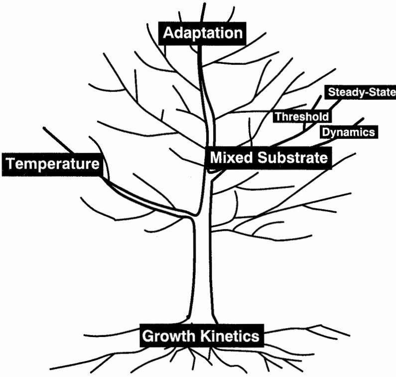

# **1.**

#### **Introduction**

#### **Aims and scope**

Microbial growth kinetics, i.e., the relationship between specific growth rate (µ) of a microbial population **and** substrate concentration ( s) is an indispensable tool in all the fields of microbiology such as physiology, genetics, ecology and biotechnology. Therefore, it is **an** important part of the basic teaching of microbiology. During the last half century the concepts in microbial growth kinetics have been dominated by the relatively simple empirical model proposed by Monod (1942). **In** this model (equation 1.1), the growth rate is related to the concentration of a single growth-controlling substrate (µ=f(s)) via two parameters, the maximum specific growth rate (µmax), and the substrate affinity constant **(K5):** 

$$
\mu = \mu_{\text{max}} \cdot \frac{\text{s}}{\text{K}_{\text{A}} + \text{s}} \tag{1.1}
$$

In biotechnological processes that are used to reduce environmental pollution the primary purpose is not to cultivate microbial cultures and produce biomass, but to remove organic compounds. Therefore, the kinetics of biodegradation processes is primarily expressed in terms of substrate removal. This link has already been made by Monod (1942) who related the yield coefficient (Y; equation 1.2) - a measure for the conversion efficiency of a growth substrate into cell material - to the rate of biomass growth (µ) and substrate consumption (q8; equation 1.3).

$$\mathbf{Y} = \frac{\Delta \text{ DW}}{\Delta \text{ s}} \tag{1.2}$$

$$\mathbf{Y} = \frac{\mu}{\mathbf{q}_s} \underset{\mathbf{q}_s}{\underset{\mathbf{q}_s}{\mathbf{q}_{\text{max}}}} \frac{\mu_{\text{max}}}{\mathbf{q}_{\text{max}}} \tag{1.3}$$

Unfortunately, the principles and definitions of growth kinetics are frequently presented as if they were firmly established and defined in the l 940's and during its 'golden age' in the 1950's and 1960's (the 'key'-publications are those of Monod, 1942, 1949 and 1950; Hinshelwood, 1946; van Niel, 1949; Novick and Szilard, 1950; Herbert et al., 1956; Malek, 1958; Pfenning and Janna.sch, 1962; Fencl, 1963; Pirt, 1965; Powell et al., 1967; Tempest, 1970). This state of affairs is probably the consequence of a stagnation in this area during past three decades in which the interest of many microbiologists was attracted by rapidly developing areas such as molecular genetics and the biochemistry of the biodegradation of xenobiotics (for a historical overview see Jannasch and Egli, 1993). This is also reflected by the fact that only few review articles (e.g., Button, 1985; Robinson, 1985; Owens and Legan, 1987; Rutgers et al., 1991; Schmidt, 1992) and one monograph (Panikov, 1995) primarily focussed on growth kinetics have been published within the last two decades. In contrast, biodegradation kinetics has been extensively reviewed by, for instance, Battersby (1990) or Alexander (1994). Although, some of these authors emphasized the ecological point of view, they almost totally neglected the fact that microorganisms grow mostly with mixtures of substrates (e.g., Harder and Dijkhuizen, 1976 and 1982), that growth may not only be limited (or controlled) by a single but by two or more nutrients simultaneously (Rutgers et al., 1990; Egli, 1991), or that kinetic properties of a cell might change due to adaptation (unfortunately, only preliminary data for such changes were published by, e.g., Jannasch, 1967; Hofle, 1983; Rutgers et al., I 987). Recently, the more ecologically oriented studies in the area of 'microbial growth kinetics' demonstrated that many fundamental questions concerning this topic are still waiting to be discovered, established and exploited (reviewed in, e.g., Egli, 1995).

For practical reasons, in the experiments presented in this thesis we focussed on the growth and biodegradation kinetics that are based on suspended heterotrophic cultures and where the substrates are available in the bulk liquid. Such systems are experimentally more easily accessible (e.g., Lendenmann et al., 1996) than 'heterogenous' ones, nevertheless, much of the information on, for instance, mixed substrate growth or threshold concentrations can be also applied to the conditions prevailing in biofilms (Namkung and Rittman, 1987a,b). Most of the discussed issues were approached from the classical kinetics perspective, where we restricted ourselves (with few exceptions) to the description of model systems that are well defined with respect to the microorganism, substrates and growth conditions. Such studies offer a conceptual framework within which a number of observations concerning the fate of chemicals in real, complex systems (e.g., activated sludge biocenoses, microorganisms cultured for biotechnological purpose, free living aquatic microorganisms) may be rationalized.

#### **Kinetic data and models available**

Nowadays, the Monod relationship (equation 1.1) is frequently used to describe the microbial growth kinetics. From the 1940's onwards, numerous affinity constants (K8) and maximum specific growth rates (µmax), or maximum specific removal rates were reported for different microorganisms and substrates (reviewed in Button, 1985; Owens and Legan, 1987; Senn et al., 1994; for examples of activated sludge systems see Pitter and Chudoba, 1990). However, there is considerable lack of consistency in the experimental data reported for a given microorganism-substrate combination. For example, the Ks value for *E. coli* growing with glucose was reported to vary by more than three

**Table 1.1** Kinetic parameters reported in the literature for different strains of *E. coli*  growing with glucose as the only source of carbon and energy. (a the extended Monod model (equation 2.2.) was fitted to the experimental data; b two uptake systems of different affinity reported) 

| E.coli      | T    | Ks               | µmax          | Cultivation          | References                       |
|-------------|------|------------------|---------------|----------------------|----------------------------------|
| Strain      | oc   | L·l µg        | h·l           | method               |                                  |
| ML30        | 40   | 34 3          | 0.75          | Chemostat            | Kovarova et al. (1996e)          |
| H           | 37   | 4000             | 0.94          | Batch                | Monod (1942)                     |
| Bir thy- | 37   | 180              | 1.04          | Batch                | von Meyenburg (1971)             |
| ML308       | 37   | 3400             | 0.75          | Batch                | Koch (1971)                      |
| BlrCM6      | 37   | 540              | n.r.          | Batch                | Bavoil et al. (1977)             |
| K12         | 37   | 7160             | 0.76          | Batch                | Dykhuizen (1978)                 |
| ML308       | 37   | 107 2 340     | 0.54 1.23  | (Chemostat) Batch | Koch and Wang (1982)             |
| ML30        | 37   | 53 72         | 0.80 0.92  | Chemoslat            | al. (1994) Senn et         |
| ML30        | 37   | 33a              | 0.76          | Chemostat            | Kovarova et al. (1996e)          |
| thy- Bir | 30   | 180              | n.r.          | Batch                | von Meyenburg (1971)             |
| n.r.        | 30   | 77000- -99000 | 0.92 -1.05 | Che mos tat          | Schulze and Lipe (1964)    |
| ML30G       | 30   | 68b 12600     | 0.78          | Batch                | Shehata and Marr (1971)          |
| ML30        | 28.4 | 33a              | 0.54          | Chemostat            | Kovarova et al. (1996e)          |
| 0-124       | 26   | 2400             | 0.55          | Batch                | Degermendzhy al.(1993) et  |
| OUMI7020    | 20   | 8460b 46800   | 0.55          | Batch                | Ishida et al. (1982)             |
| n.r.        | 20   | 8000             | 0.65          | Chemostat            | Jannasch (1968)                  |
| ML30        | 17.4 | 33a              | 0.19          | Chemostat            | al. (1996e) Kovarova et |

orders of magnitude (see Table 1.1). These large variations can not be satisfactorily explained by strain differences. It is more likely that they are a result of the history of the cells and different degree of adaptation (discussed in Owens and Legan, 1987; Senn et al., 1994).

Although it is widely accepted that the relationship between µ and s is best described by a 'saturation'-type of curve, i.e., at high substrate concentrations the organisms grow with a maximum rate (µmax) independent on the substrate concentration, the kinetics of growth with a single substrate has been described by a variety of mathematical expressions (reviewed in Powell et al., 1967; Owens and Legan, 1987; Senn et al., 1994). In principle, three ways were followed in designing more general growth equations:

- *(i)* incorporating additional constants into the original Monod equation (e.g., Powell et al., 1967; Shehata and Matr, 1971; Dabes et al., 1973; Pirt, 1975),
- *(ii)* proposing different kinetic concepts, both unstructured (e.g., Blackman, 1905; Westerhoff et al., 1982) and structured models (e.g., Droop, 1983; Kooijman et al., 1991),
- *(iii)* or describing the influence of environmental factors on the 'Monod' growth parameters (e.g., Characklis and Gujer, 1979; Ratkowsky et al., 1983; Kovarova et al., 1996e).

Although increasing model complexity often results in improved curve fitting, the most appropriate model should be selected upon statistical considerations (discussed in Koch, 1982 and Robinson, 1985). However, there is evidence to suggest that complex equations *(i* and ii) have been often constructed in an attempt to explain a set of data that exhibited so much scatter that it was impossible to discriminate between the different models (e.g., Koch and Wang, 1982; Owens and Legan, 1987; Rutgers et al., 1987 and 1989; Senn et al., 1994). Already Monod was aware of the inadequate quality of his data and he reasoned that: "several different mathematical formulations could be made to fit the data. But it is convenient and logical to adopt a hyperbolic equation" (Monod, 1949). Therefore, one can conclude that primarily, there is a need to acquire reproducible data of better quality (e.g., in Senn et al., 1994; Kovarova et al., 1996e) rather than proposing alternative models that fit the 'old' data better.

# **2. Temperature Dependent Growth Kinetics of** *Escherichia coli* **ML 30 in Glucose-Limited Continuous Culture**

#### **Abstract**

Detailed comparison of growth kinetics at temperatures below and above the optimal temperature was carried out with *Escherichia coli* ML 30 (DSM 1329) in continuous culture. The culture was grown with glucose as the sole limiting source of carbon and energy (100 mg L-1 **in** feed medium) and the resulting steady-state concentrations of glucose were measured as a function of dilution rate at 17.4 , 28.4, 37, and 40°C. The experimental data could not be described by the conventional Monod equation over the entire temperature range, but an extended form of the Monod model:

µ=µmax«s·Smin)/(K8+s-smin), which predicts a finite substrate concentration at zero growth rate (smin), provided a good fit. The two parameters µmax and Smin were temperature dependent, whereas, surprisingly, fitting the model to the experimental data yielded virtually identical K8 values (about 33 µg L-1) at all temperatures. A model that describes steadystate glucose concentrations as a function of temperature at constant growth rates is presented. In similar experiments with mixtures of glucose and galactose (1:1 mixture), the two sugars were utilized simultaneously at all temperatures examined, and their steady-state concentrations were reduced compared to growth with either glucose or galactose alone. The results of laboratory-scale kinetic experiments are discussed with respect to the concentrations observed **in** natural environments.

#### **Introduction**

Knowledge concerning the influence of environmental factors such as temperature, pH, salinity, etc., on microbial growth is of crucial practical importance in the control of bioprocesses, for the safe handling of food (Adams et al., 1991; Alexander, 1994; Gibson et al., 1987; Zwietering et al., 1991; Wijtzes et al., 1995), in waste water treatment (Characklis and Gujer, 1979) and bioremediation (Alexander, 1994). Also in taxonomy cardinal temperatures for growth are key characteristics of microbial strains (Rosso et al., 1993 and 1995). 

In recent years, several models for predicting the growth rate of microorganisms as a function of either temperature alone (Esener et al., 1981; McMeekin et al., 1987; Ratkowsky et al., 1982 and 1983; Zwietering et al., 1991and1994), or of temperature in combination with other factors have been proposed (Adams et al., 1991; Buchanan and Klawitter, 1992; McMeekin et al., 1988; Rosso et al., 1995; Wijtzes et al., 1993 and 1995). Surprisingly, few attempts at a better basic understanding have been made to relate the rate of growth and actual substrate concentration. This relationship is traditionally termed "growth kinetics" (Monod, 1942; Powell, 1967). (However, note that the same expression has also been used for the description of the time courses of population densities (e.g., Buchanan and Klawitter, 1992). The current lack of systematic data on the influence of temperature on the kinetics of growth makes the prediction of this effect difficult. Temperature modulation of growth kinetics is to be expected because both metabolism and cellular composition are affected by cultivation temperature, as was demonstrated with the cellular fatty acid composition (Ingraham, 1987; Nishihara et al., 1976; Shaw and Ingraham, 1965), the synthesis or degradation of certain proteins (Heitzer et al., 1992; Herendeen et al., 1979; Jones and Hough, 1970; Marr et al., 1964; Ng et al., 1962) and changes in protein activity (Herendeen et al., 1979; Ron and Shani,

1971), changes in maintenance requirements of cells (Mainzer and Hempfling, 1976; Palumbo and Witter, 1969; Schulze and Lipe, 1964; Shehata and Marr, 1971; Wallace and Holms, 1986), changes in end products of metabolism (Jones and Hough, 1970) and increased pigment formation (Palumbo and Witter, 1969).

Bacterial metabolism represents a network of reactions. Although, these individual biochemical reactions are temperature dependent, the fundamental question of whether the parameters used in growth kinetic models are temperature dependent must be asked. To determine this, a detailed comparison of the growth kinetics at temperatures below and above the optimal temperature was carried out for *Escherichia coli* ML 30 cultivated in continuous culture with glucose and/or galactose. Such investigations are only possible by using an extremely sensitive method for measuring low concentrations of sugars (µg L-l) in culture media (Senn et al., 1994). The objective of the presented study was to compare the experimentally established relationships between growth rate and steady-state substrate concentrations at different constant temperatures and find out whether or not the whole set of relationships can be described by a simple mathematical model. Additionally, the effect of temperature on steady-state substrate concentrations at constant growth rates (dilution rates in continuous culture) was studied.

#### Compendium of the models proposed in the literature

*(i) Conventional growth kinetics and models containing a smin term.* Various mathematical models have been proposed to quantitatively describe microbial growth kinetics. The Monod model (equation 2.1) is considered to be the "basic" equation (Monod, 1942) which has since been improved by including expressions for, e.g., maintenance, diffusion or transport limitation (Powell, 1967; Pirt, 1975, for detailed comparison see Senn et al., 1994). Microbial growth kinetics in both batch and continuous culture have been investigated. Earlier experiments carried out in batch cultures mostly relied on indirect methods, i.e., growth was measured, whereas the substrate concentrations were not directly determined but estimated by calculation. In contrast, when growth kinetics in continuous culture were investigated, the actual steady-state concentrations of the growth-limiting substrate were determined as a function of dilution rate. For such an experimental set-up, the s=f(D) form of the kinetic model (equation 2.1) correctly expresses the variable dependence, and not the µ=f(s) form, in which the models were originally reported (discussed **in** Senn et aL, 1994).

$$\mathbf{s} = \mathbf{K}_s \frac{\mathbf{D}}{\mu_{\text{max}} - \mathbf{D}} \tag{2.1}$$

Monod's original kinetic equation (equation 2.1) implies a substrate concentration of zero at a growth rate of 0 h-1 (Monod, 1942). This model represents a special case of a more general kinetic expression (equation 2.2, Fig. 2.1 ), in which a term for a finite substrate concentration s=smin at D=O h-1 is incorporated. When Smin<<s, Smin becomes negligible, and equation 2.2 reduces to equation 2.1.

$$\mathbf{s} = \mathbf{K}_{\mathbf{s}} \begin{array}{c} \hline \text{D} \\ \hline \mu_{\text{max}} - \text{D} \\ \hline \end{array} + \quad \mathbf{s}_{\text{min}} \tag{2.2}$$

Expressions having a similar meaning as that of smin (and noted here as s * . , mm s~~n' s~~:) are implicitly also present **in** other kinetic models (equations 2.3, 2.5 and 2.7). For instance, the original relationship proposed in Powell (1967) can be easily converted into a s=f(D) form (equation 2.3). The first part of this expression is identical with the Monod model (equation 2.1) and to this a dilution rate-dependents*. term (equation 2.4) is added. min

$$\mathbf{s} = \mathbf{K}_s \begin{array}{c} \hline \mathbf{D} \\ \hline \mu_{\text{max}} - \mathbf{D} \\ \hline \end{array} + \begin{array}{c} \mathbf{K}_s \end{array} \frac{\mathbf{a}}{\mu_{\text{max}} - \mathbf{D}} \tag{2.3}$$

$$\text{s}_{\text{min}}^{\bullet} = \text{K}_{\text{s}} \xrightarrow[\text{max}-\text{D}]{\text{a}}, \text{ hence at D} = \text{O h}^{-1} \text{ s}_{\text{min}}^{\bullet} = \text{K}_{\text{s}} \xrightarrow[\text{max}]{\text{a}} \tag{2.4}$$

In contrast to equation 2.2, s*. **in** equation 2.4 is dependent on D. In this mm model the contribution of s *. to the steady-state substrate concentrations at mm high dilution rates is usually negligible, s * . becomes important at growth rates mm near 0. Essentially, it can be also assumed that the s * . is not dependent on mm dilution rate (equation 2.2).

Fig. **2.1** Example of Monod model with apparent substrate term (equation 2.2) indicating the model parameters.

In another analysis of microbial growth van Uden (1967) followed up the original proposal of Pirt (1965, 1975) that only the overall growth rate is reduced by the maintenance rate "a" (in its s-form, equation 2.5). The resulting substrate concentration at D=O h-1 is shown in equation 2.6.

$$\mathbf{s} = \frac{\mathbf{K}_{\mathbf{s}} \cdot (\mathbf{a} + \mathbf{D})}{\left(\mu_{\max} - \mathbf{D} - \mathbf{a}\right)}\tag{2.5}$$

$$\mathbf{s}_{\text{min}}^{\bullet \bullet \bullet} = \frac{\mathbf{a}}{\mu_{\text{max}} - \mathbf{a}} \quad \mathbf{K}_{\text{s}} \tag{2.6}$$

While all the previous relationships are extensions of the Monod-type kinetics, a fundamentally different model, based on non-equilibrium thermodynamics, was proposed by Westerhoff and co-workers ( 1982). This logarithmic expression (exponential in s=f(D)-form; equation 2.7) also predicts at D=O h-1 a positive substrate concentration (equation 2.8). 

$$\mathbf{s} = \exp\left(\frac{\mathbf{D} - \mathbf{x}}{\mathbf{y}}\right) \tag{2.7}$$

$$\mathbf{s}_{\text{min}}^{\bullet \bullet \bullet \bullet} = \exp\left(-\frac{\mathbf{x}}{\mathbf{y}}\right) \tag{2.8}$$

*(ii) Steady-state substrate concentrations versus temperature at various growth rates.* Because the effect of temperature on steady-state substrate concentrations has not yet been studied systematically, there is no mathematical description of this relationship. Assuming a link between µ and s, here, we suggest using a modification of a model which was developed previously to describe the temperature dependence of the maximum specific growth rate. This suggestion follows the approach taken by McMeekin et al. (1988), who proposed that the simple Ratkowsky model (i.e., µ=f(T); equation 2.10), might be extended for any set of restricting conditions involving temperature as one of the factors. 

Several unsegregated and unstructured phenomenological models (Esener et al., 1981; Gibson et al., 1987; Ratkowsky et al., 1982 and 1983; Rosso et al. 1995) have been proposed both to predict the cardinal temperatures

and to describe bacterial growth in batch cultures within the growth-permissible temperature range. It has been shown (e.g., in Ratkowsky et al., 1983) that within this temperature-range µmax follows a bell-shaped curve, which has a maximum at the optimum growth temperature (T opt)· In the master reaction model proposed by Esener (1981; equation 2.9) µmax asymptotically approaches the abscissa at both the maximum (T max) and minimum (T min) growth temperatures:

$$\mu_{\text{max}} = \frac{\text{A}}{1 + \text{K}} \frac{\exp\{-\Delta \text{H}_1 / \text{RT}\}}{\exp\{-\Delta \text{H}_2 / \text{RT}\}} \tag{2.9}$$

In contrast, the square root model proposed by Ratkowsky et al. (1983) (equation 2.10) is defined for T min< T > T max• out of this range µmax= 0:

$$\sqrt{\mu_{\text{max}}} = \mathbf{b} \cdot \left(\mathbf{T} - \mathbf{T}_{\text{min}}\right) \cdot \left\{1 - \exp\left[\mathbf{c} \cdot \left(\mathbf{T} - \mathbf{T}_{\text{max}}\right)\right]\right\} \tag{2.10}$$

In continuous culture T min and T max can be determined for each particular dilution rate, e.g., by wash-out experiments, or from the T=f(µmax) relationship. In this contribution, we were primarily interested in how well the minimum and maximum temperature for growth at particular dilution rate can be predicted, not in the model structure.

For the s=f(T) model, we assumed that steady-state substrate concentrations are reciprocally proportional to the square of the temperature, i.e., the square-root of the concentration is reciprocally proportional to the temperature. This assumption can be justified in the following way. Under optimum conditions, a microbial cell grows with the highest possible µ and, therefore, also a cell's overall metabolic efficacy should be at its optimum. This implies that close to T opt• the lowest steady-state substrate concentrations should be expected at a particular growth rate, in the same way as the highest µmax is reached at T opt· This assumption provides a link between the squareroot model (equation 2.10) and the steady-state substrate concentrations model (equation 2.11). For these reasons, we propose to describe the s *versus* T relationship (equation 2.11) by a reciprocal form of the maximum specific growth rate *versus* temperature relationship (equation 2.10):

$$\text{ms} = \frac{\text{B}}{\left(\text{T} - \text{T}_{\text{min}}\right)^2 \left\{ 1 - \exp\left[\text{C} \cdot \left(\text{T} - \text{T}_{\text{max}}\right)\right] \right\}^2} \tag{2.11}$$

where the units of C are identical with those of c from the Ratkowsky model (equation 2.10) and the parameter Bis related to b from the Ratkowsky model according to equation 2.12:

$$\mathbf{B} \cong \frac{1}{\mathbf{b}^2} \tag{2.12}$$

Since the two regression coefficients (B and C) vary with dilution rate, it is possible to simply extend equation 2.11 by introducing terms to describe variations in B (orb) and C with growth rate in the chemostat, determined from experimental data (e.g, Fig. 2.7). Additionally, it should be pointed out that in theory, T min and T max used in equation 2.11 are equivocally defined because they can be understood as either constant properties of a given strain and medium composition (e.g., its cardinal temperatures) or as variables changing with the dilution rate.

#### **Materials and methods**

*Organism, medium and culture conditions. Escherichia coli* ML 30 (DSM 1329) was grown in mineral medium (Senn et al., 1994) supplemented with either glucose (100 mg L-1 in chemostat, 500 mg L-1 in batch culture), or with a mixture of glucose and galactose (each 50 mg L-1 in chemostat) as the only sources of carbon and energy. The bioreactor (MBR, Switzerland) provided with both pH (7.00 ± 0.05) and temperature control(± O.l°C) was operated in chemostatic mode with a working volume of 1.5 liter. The impeller speed control was at 1,000 min-1 and the oxygen saturation was >90% air saturation. The bioreactors were regularly checked for wall growth to avoid artifacts as reported by Pirt (1975).

*Maximum specific growth rates.* !-lmax rates were determined in batch cultures at different temperatures. The cells used as an inoculum were pre-grown exponentially for more than *50*  generations at the particular temperature. At least duplicate measurements were made at each temperature. The standard deviation obtained for !-lmax was reproducibly± 0.05 h-1.

*Steady-state substrate concentrations.* Steady-state concentrations of glucose and/or galactose were determined in continuous culture during independent chemostat runs, either as a function of dilution rate at constant temperatures (17.4, 28.4, 37 and 40 °C), or as a function of temperature at constant dilution rates (0.2, 0.3, 0.4 and 0.5 h-1 ). At each temperature the continuous cultivation was restricted by either the critical dilution rate below which the organism was able to grow without washing out, or by wall growth. The entire temperature range, within which the organism was able to grow in the chemostat at a particular D (i.e., !-lmax<=D), was extrapolated from batch data (for explanation see Fig. 2.2).

Individual steady-state concentrations of glucose or galactose represent the mean of approximately 10 measurements determined over a time period of more than 40 generations after the culture had reached steady-state with respect to glucose (galactose) concentration. The standard deviations of these values were between ± *5* to ± 10% and for clarity they are not given in all Figures presented. The sugar analysis has been described in detail elsewhere (Senn et al., 1994).

*Data processing.* The models were fitted to the experimental data by non-linear regression (Richter and Sondgerath, 1990; Robinson, 1985). The minimum of the least-squares criterion (RSS residual sum of squares, equation 2.13) was computed with a Simplex-algorithm.

$$\text{RSS}(s) = \Sigma \left( s_{\text{obs}} - s_{\text{pred}} \right)^2 \tag{2.13}$$

Initial estimates of the model parameters were required, because, the structural correlation between parameters made their estimation otherwise difficult. Starting values were chosen from the best extrapolations of the experimental data by exponential and/or polynomial functions.

The quality of the fits was evaluated by standard tools, such as comparing the variance, applying the *X* 2 -criterion, or, for the discrimination of competing models, the F-test (Beck and Arnold, 1977), or, by analyzing the linear regression between the measured and predicted substrate concentrations. Statistical validation was best visible in plots of relative residuals (equation 2. 14; e.g., Fig. 2.3).

RR = Sobs - Spred * 100 Sobs (2.14)

#### **Results**

*Temperature dependence of growth kinetics.* The kinetics of growth of *Escherichia coli* ML 30 (i.e., the s=f(D) relationship) was investigated at four different temperatures (17.4, 28.4, 37 and 40°C, respectively) both above and below the optimum growth temperature (Fig. 2.2).

For growth at 40°C the steady-state glucose concentrations were collected as a function of D during three independent glucose-limited chemostat runs. This cultivation temperature was slightly higher than the calculated optimum growth temperature (T0 pt=38.7°C) of *E. coli* ML 30 growing unrestricted in this medium in batch culture (Table 2.1). The glucose concentrations measured at low and moderate dilution rates (up to approximately 0.35 h-1) were distinctly enhanced compared to the previously reported growth kinetic data at 37°C (Senn et al., 1994; Fig. 2.2). Nevertheless, as judged by the Student's t-test, the two µmax values estimated by fitting equation 2 to the data at 37°C (0.76 ± 0.01) h-1and40°C (0.74 ± 0.01) h-1 were not significantly different (Fig. 2.2).

In contrast to the predictions made by the Monod model (equation 2.1), these results clearly demonstrate that the steady-state glucose concentrations of the limiting-substrate glucose did not approach 0. Therefore, the quality of the fit of various mathematical models (equations 2.2, 2.5 and 2.7), which contain implicitly a finite substrate concentration at D=O h-1, and of the original Monod model (equation 2.1) was compared to experimentally obtained data (Fig. 2.2).

Table 2.1 Comparison of the Ratkowsky and the Esener model describing the dependence of maximum specific growth rate of *E. coli* on temperature to data experimentally obtained in batch cultures. Values of the model parameters (equations 2.9 and 2.10}, optimum growth temperatures, and statistical parameters were computed for the batch-culture data; * - calculated from the best fit parameters. 

|              | units            | Ratkowsky model     | Esener model            |
|--------------|------------------|------------------------|----------------------------|
| A            | h-1              | -                      | ( 4.22 ± 0.35) JOI I |
| K            | h-1              | -                      | (8.07 ± 0.11) J049   |
| LiH1         | kJ moJ-1      | -                      | 68.9 ± 6.2                 |
| LiH2         | kJmoP            | -                      | 300.6 ± 25.4               |
| b            | K-1 -0.5 8 | 0.25) (2.76 10-2 | -                          |
| c            | K-1              | 1.12 ± 0.10            | -                          |
| Tmin         | K                | 275.7 ± 0.3            | -                          |
| Tmax         | K                | 315.2±0.2              | -                          |
| Topt         | K                | 311.9 ± 0.2•           | 311.4±0.2*                 |
| µmax         | h-1              | 0.95 ± 0.05*           | 0.92±0.05*                 |
| RSS (n-p) | h-2              | 2.5 10-4*           | 4.7 10-2*               |

The quality of the fit of these models (expressed as means of relative residuals, equation 2.14) was compared to the theoretical measurement error of ± IO % (Fig. 2.3). It is obvious that three of the models (equations 2.2, 2.5 and 2.7) exhibited a systematic deviation from the measured glucose concentrations at low dilution rates. The model proposed by Westerhoff (equation 2.7) could not be successfully fitted to this type of experimental data by the applied

minimizing procedure. Only the model, which contains an apparent substrate term (equation 2.2) exhibited a random distribution of the relative residuals. The mean estimation error for this model (6.7%) was in the same order of magnitude as the measurement errors (IO%) and was considerably lower than the mean estimation errors obtained for the other three models (26.8, 20.9 and 23.2% for equations 2.2, 2.5 and 2.7, respectively).

The data at 37, 28.4 and 17.4°C were used to test the validity of equation 2.2. In Fig. 2.2, the fits to data from different temperatures are given and the measured steady-state glucose concentrations are compared with predicted curves. It should be pointed out that at 37°C only data up to D=0.71 h-1 were used because data at higher dilution rates can be easily affected by experimental artifacts (Senn et al., 1994). The excellent correlation between the measured steady-state glucose concentrations and predicted values at all experimental temperatures (Fig. 2.4) confirms the utility of the model containing smin· The model parameters computed for equation 2.2 from experimental data measured at four different temperatures are collected in Table 2.2. Interestingly, the K8 values did not vary with temperature, whereas the two parameters µmax and Smin were temperature dependent. Ks remained constant at about 33 µg L-1, which is approximately 1/3 of the value obtained when the original Monod model (equation 2.1) was fitted to the data (Senn et al., 1994). The µmax values estimated in chemostat culture were generally some 15% lower than those measured under substrate excess conditions in batch culture (Fig. 2.5a); this phenomenon has been also observed in another study (Senn et al., 1994). Interestingly, the increase of µmax values at temperatures below Topt is more pronounced than their decrease at the superoptimal range. An inverse pattern was observed for Smin· The computed values (Table 2.2) indicate a slight increase of smin with decreasing temperatures and a steep increase at temperatures above T opt·

| Temperature | Ks         | µmax        | 8min   | --- RSS | n  |
|-------------|------------|-------------|--------|------------|----|
|             | µg vi      | h·l         | µg L·l | (n-p)      |    |
| oc          |            |             |        |            |    |
| 17.4        | 33.3 ±4.2  | 0.19±0.02   | 22±2   | 7503.2     | 4  |
| 28.4        | 33.3 ± 3.3 | 0.54± O.Ol  | 18 ±2  | 302.6      | 11 |
| 37          | 32.8 ± 3.2 | 0.76±0.01   | 12± 2  | 8122.8     | 23 |
| 40          | 33.6 ± 1.5 | 0.74 ± 0.01 | 64±8   | 161.8      | 15 |

**Table 2.2** Values of the best-fit parameters of the apparent substrate model obtained from fitting equation 2.2 to steady-state glucose concentrations experimentally determined during growth of *E. coli* at 17 .4, 28.4, 37 and 40°C as a function of dilution rate.

**Fig.** 2.2 Experimentally determined and predicted steady-state glucose concentrations (with the extended Monad model, equation 2) for growth of *E. coli* ML 30 in glucose limited-chemostat cultures at 17.4, 28.4, 37 and 40°C, as a function of dilution (growth) rate. **(a)** Bars, steady-state substrate concentrations (height indicates the standard deviation; approximately 10%; of the steady-state glucose concentrations estimated as an average of about l 0 measurements; the horizontal extensions of the bars give the approximate variation in D); lines, predictions of steady-state glucose concentrations by different models. **(b** and c) 0, data from Senn et al. (1994); • and 8, own steady-state glucose measurements; lines, best fit of equation 2.2)

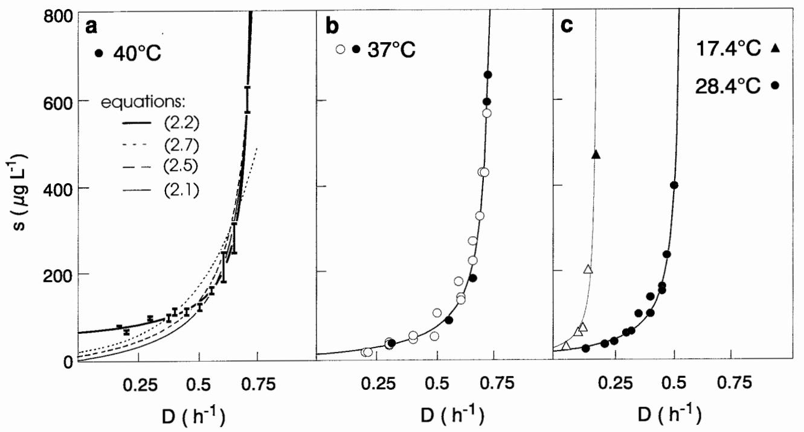

*Modelling substrate concentration as a function of temperature.* Glucose steady-state concentration as a function of cultivation temperature was measured for growth of *E. coli* at a constant dilution rate of 0.3 h-1 (Fig. 2.6). The observed parabola-like relationship can be described by equation 2.11, which is a modification of the Ratkowsky model (equation 2.10) commonly used to predict the temperature dependency of the maximum specific growth rate. Unfortunately, the original model contains four parameters, T min• T max> c and b, respectively. However, the number of parameters in equation 2.11 could be reduced to two, when assuming that T min and T max are either the cardinal temperatures for growth (predicted by equation 2.10), or that T min and T max represent the temperature boundaries within which growth is possible at a particular dilution rate. Therefore, the maximum specific growth rate was determined in batch culture at different temperatures and the bell-shaped curve in Fig. 2.5 indicates the temperature boundaries within which growth is possible at a particular dilution rate in continuous culture. By using these temperature boundaries the experimental data at D=0.3 hl could be described by an almost symmetrical parabola-like curve (Fig. 2.6). In contrast, using the cardinal temperatures from Table 2.2 did not lead to a good prediction of the substrate concentrations at lower temperatures (Fig. 2.6).

As mentioned above, the temperature range at a particular growth rate within which growth in the chemostat is possible (the experimentally accessible range lays below the bell-shaped curve in Fig. 2.5a) had to be determined in order to obtain T min and T max for equation 2.11. The maximum growth rates measured in batch cultures at various temperatures (Fig. 2.5) were compared with the predictions of the Ratkowsky and the Esener model equations (equations 2.9 and 2.10). Neither model described the data well at very low growth rates. Additionally, the Esener model slightly overestimated the maximum growth temperature.

**Fig.** 2.3 Relative residuals for the fits of four different kinetic models to experimentally determined steady-state glucose concentration during growth of *E. coli* at 40 °C. Hatched areas, a systematic underestimation of steady-state glucose concentrations; dashed lines, indicate 10% deviation from experimental steady-state glucose concentrations.)

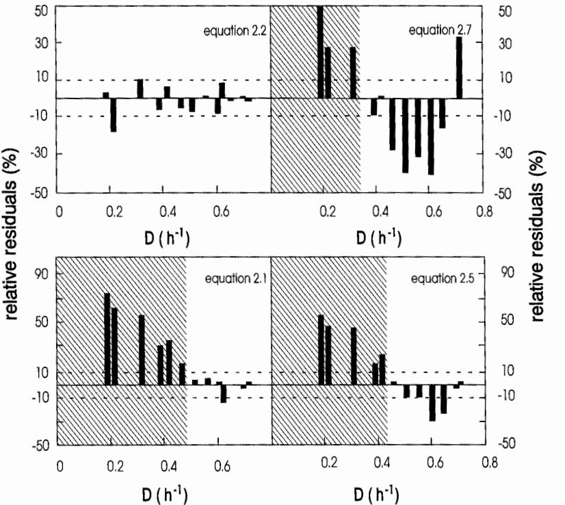

Despite these inaccuracies in the extreme low and high temperature range, both models allowed a good extrapolation (mean estimation error lower than ± 5%) of the experimental data (Fig. 2.Sb). In comparison to the µmax values measured under unrestricted growth conditions in batch cultures, those determined from the kinetic investigation made in glucose-limited chemostat cultures were consistently lower (Fig. 2.Sa). However, also the µmax values estimated from continuous culture data were well described by the Ratkowsky model. In this estimation procedure the two parameters b and c were optimized, whereas T min and T max values were set to those obtained from batch culture data (Table 2.1 ). From this curve, the minimum and maximum growth temperatures at particular dilution rates were estimated. 

**l"ig.** 2.4 Correlation between measured and predicted steady-state glucose concentrations by the extended Monod model (equation 2.2). Line, the calculated regression line for all pairs of sobs and Spred values for the temperatures of 17.4, 28.4, 37 and 40°C. 

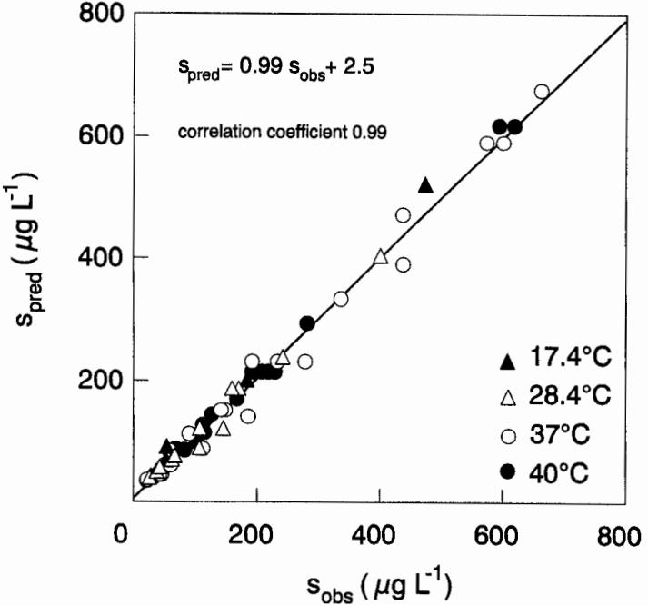

Fig. 2.S Temperature dependency of specific growth rate of *E. coli* ML 30 grown in mineral medium with glucose. (a) µmax as a function of temperature. • experimental data from batch cultures; 0 ma)(imum specific growth rates calculated from chemostat data; curve 1, predictions by the Esener model (equation 2.9); curve 2, predictions by the Ratkowsky model (equation 2.10); dashed line, predictions of growth rates in continuous culture by the Ratkowsky model; arrow, the temperature boundary within which growth is possible at D=0.3 h-1.) (b) Relative residuals (RR, equation 2.14) for the two fits of batch culture data. Hatched areas, areas where the model predictions of the Ratkowsky (right area) and the Esener (right and left area) equations did not hold; open rectangles - RR of the Ratkowsky model; closed rectangles, RR of the Esener model; dashed line, isoline of 0.05 h-1 standard deviation of experimental measurements.)

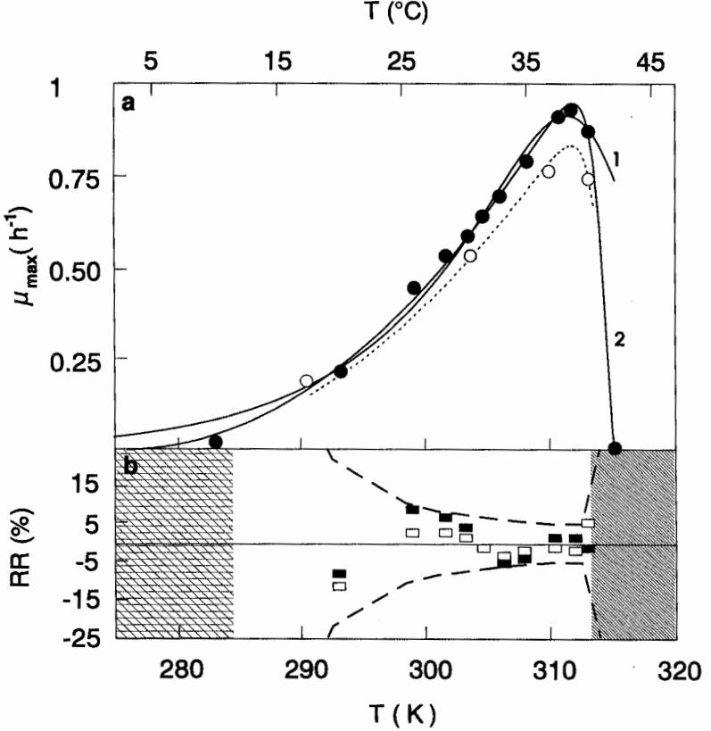

Fig. 2.6 Temperature dependency of steady-state substrate concentrations at dilution rate of 0.3 h-1. • (glucose) and Ll. (galactose at 37°C), experimentally determined steady-state glucose concentrations when 100 mg L-1 of glucose (or galactose) was supplied in the inflowing medium as the only substrate; 0 steady-state glucose concentrations predicted by equation 2.2 for different temperatures; D (•) steady-state glucose (galactose) concentrations when 1: 1 mixture of glucose and galactose was supplied in the inflowing medium; solid line - model equation 2.11 fitted with Tmax and Tmin values, which represent experimental set-points at D=0.3 h-1; dashed line - model equation 2.1 l fitted with the cardinal temperature values of *E. coli* ML 30 instead of Tmax and Tmin parameters. 

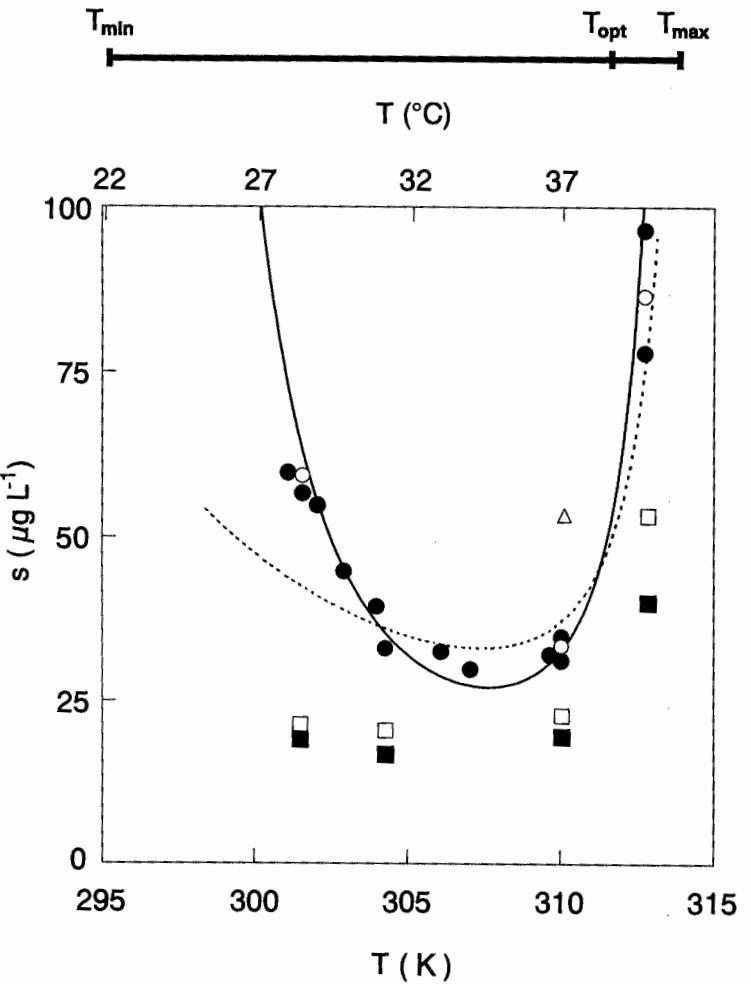

When fitting equation 2.1 l (s=f(T)), the two regression coefficients (B and C) were optimized with respect to the experimental data obtained at dilution rates of 0.2, 0.3, and 0.4 h-l, and with respect to predicted Smin values. Both T min and T max remained fixed during this fitting procedure. From the B vs. D and C vs. D plots (Fig. 2.7), it can be seen that for the range of O h-1 :s;o:;;; 0.4 h-1 the dependency of the two parameters on D is approximately linear. Hence, steady-state substrate concentrations as a function of temperature and growth rate can be described by replacing these parameters in equation 2.1 l with linear relationships. The resulting model is presented in Fig. 2.8b. The width of the parabola-like curve is narrower with increasing dilution rate, i.e., the temperature range for growth becomes restricted with increasing dilution rates. Unfortunately, the minimum of this function changed at different growth rates and this minimum is not always equivalent to the optimum temperature for growth.

*Extrapolation of the 'simple' relationships into more complex systems.*  The fact that relationships exist between model parameters and temperature (see Table 2.2 and Fig. 2.7) is of advantage for developing the complex s=f(D,T) model. In addition, eonsistent kinetic description, i.e., using only equation 2.2 for all temperatures examined, is an advantageous basis for developing additional models, since it is the only equation, which accurately described the experimental data at 40°C and, at the same time, also the data at lower temperatures. An equation with only two variables (T and D) can be proposed to describe the relationship between steady-state substrate concentration, growth rate/dilution rate and temperature. However, two different experimental approaches can be used to establish this model. First, D can be varied and s measured at constant T, and second, T can be varied and s is determined at constant D. A three-dimensional projection of the s=f(D, T) relationship was computed by fitting the best surface to the experimental data measured with the first approach (Fig. 2.8a). The same relationship, but projeeted into two dimensions, is shown in Fig. 2.8b, representing data collected by the second experimental approach.

Fig. 2.7 Relationships between the two regression coefficients B and C and dilution rate. B and C are the best-fit model parameters of the steady-state substrate concentrations model (equation 2. I I). 

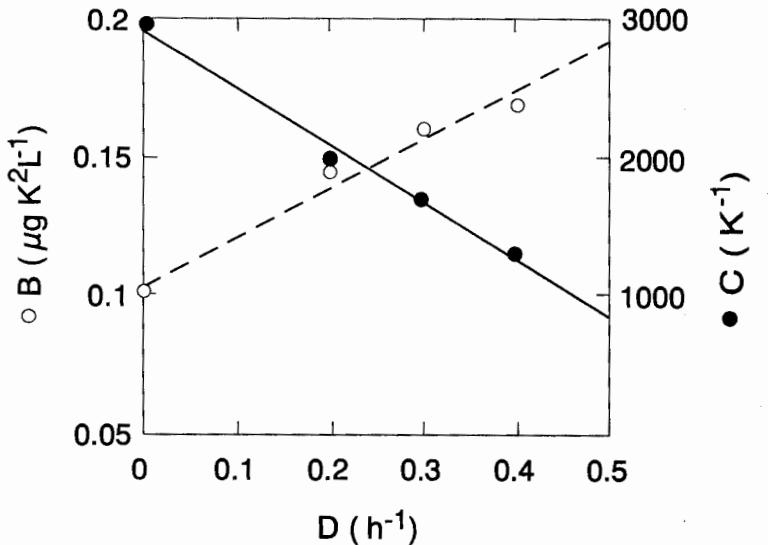

All the previous results were obtained using a simple model system with glucose as the only carbon and energy substrate for growth. However, it has been shown recently that *E. coli* is able to utilize mixtures of sugars simultaneously when cultivated in carbon-limited continuous culture (Egli et al., 1993). Therefore, steady-state sugar concentrations were measured as a function of temperature in cultures growing with a 1: 1 mixture of glucose and galactose.

Fig. 2.8 Steady-state glucose concentrations as a function of temperature and dilution rate for the growth of *E. coli* in glucose-limited continuous culture, (a) Three-dimensional relationship describing s=f(D,T). Thin-lined three-dimensional surface, the best fit to the experimental data; the heavy lines, the particular growth kinetics and the s=f(T) relationships at 0 and 0.3 h-l used in model building. (b) The s=f(D,T) relationship projected into s *versus* T plane. Lines, isolines of the same dilution rate. Predictions of residual glucose concentrations as function of temperature at dilution rates of 0, 0.2, 0.3, 0.4 h-1 were made by equation 2. 11.

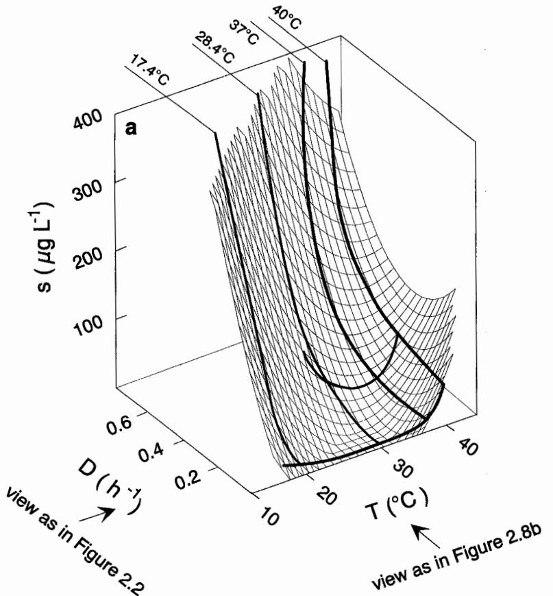

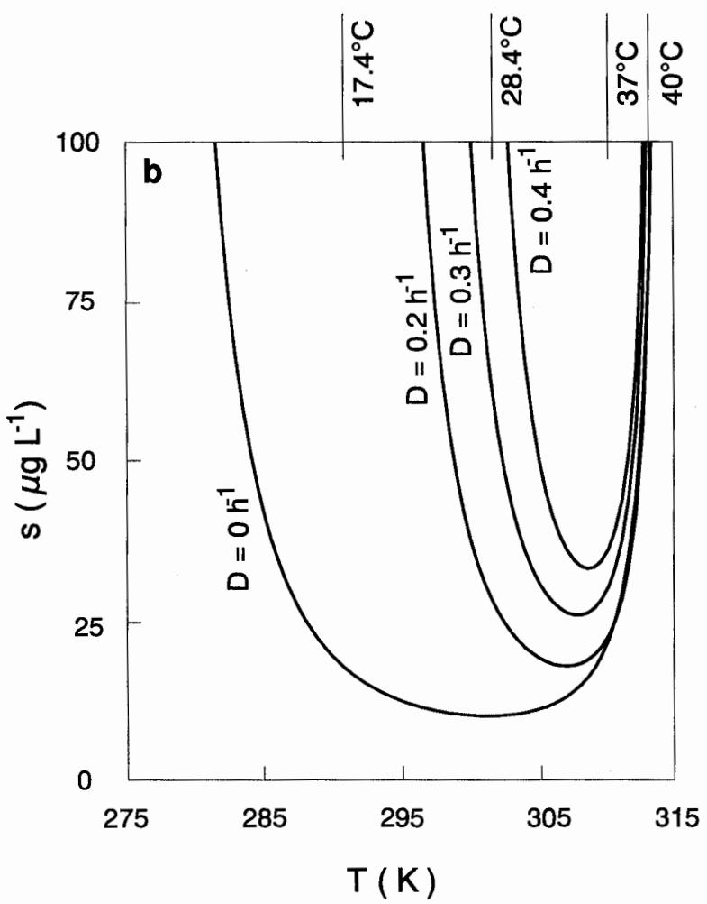

In Fig. 2.6 it is shown that at a constant growth rate the steady-state concentrations of glucose were reduced when an additional substrate (e.g., galactose) was utilized simultaneously compared with those during growth **with**  glucose only. Except for the lowest temperature tested, steady-state glucose concentrations were reduced to approximately 50%. For galactose, a similar effect was observed as judged from the results obtained at T=37°C, where the

concentration was reduced from 41 µg L-1 (Egli et al., 1993) to 19 µg L-1 at D=0.3 h-1. The data obtained at 28.4°C indicate that the reduction of individual steady-state sugar concentrations during mixed substrate growth might be even more pronounced at lower temperatures. Although this observation has to be confirmed, it might open a promising road to optimizing biodegradation processes where pollutants have to be removed to low concentration levels. 

#### Discussion

*What is the physiological meaning of a Smin term?* The conventional Monod equation (equation 2.1) did not hold for the description of the experimental data at all temperatures. This discrepancy was solved by using an extended form of the Monod model (equation 2.2), which predicts a finite substrate concentration at zero growth rate. It must be pointed out that smin is usually negligible compared to actual steady-state substrate concentrations, (i.e., s>>smin and, therefore, s + smin = s ), and no statistically significant difference between the Monod-model (equation 2.1) and the model including an "apparent substrate" term (equation 2.2) can be observed for example at 37°C. At Topt (and perhaps also at lower temperatures), both models predict well the experimental data and, therefore, the original Monod model can be used when a less complex model is preferred. On the other hand the data at 40°C cannot be predicted well by any of the alternative models, and therefore, equation 2.2, in which the Monod relationship was extended with Smin• must be preferred for describing the s=f(D) relationship at all temperatures. 

The existence of Smin can be justified on the basis of the maintenance energy concept and the existence of a cellular maintenance energy requirement can be easily explained by thermodynamic reasoning. A consequence of this concept is the existence of a finite concentration or flux of an energy (carbon) substrate at zero growth rate. In a system open with respect to the supply of substrate this results in a finite concentration of the energy (carbon) source at D=O h-l. For a culture of *E. coli* grown with glucose at 30°C, Schulze and Lipe (1964) measured a small rate of substrate consumption, even when no growth was observed. This rate (55 mg glucose (h g dry weight)-!, which represents a specific maintenance rate of 0.0286 h-l when the yield coefficient of 0.52 experimentally determined by these authors) is used, was just enough to sustain cellular metabolism, but not enough to allow growth and reproduction. Similarly, Shehata and Marr (1971) estimated that 18 µg L-1 (which represents for the reported Ks of 68 µg L-l and µmax=0.78 h-1 a specific maintenance rate of 0.163 h-1) was the lowest substrate concentration that allowed to maintain growth of *E. coli* in batch culture at 30°C. Wallace and Holms (1986) and Mainzer and Hempfling (1976) have also found the maintenance requirements of *E. coli* strains affected by temperature. 

To compare the smin values estimated in this study at different temperatures with previously reported maintenance requirements (Mainzer and Hempfling, 1976; Schulze and Lipe, 1964; Tros et al., 1996; Westermann et al., 1989) smin values were converted via equation 2.6 into specific maintenance rates. The resulting specific maintenance rates of 0.074 h-1 (17.4°C), 0.191 h-1 (28.4 °C), 0.204 h-1 (37°C), and 0.485 h-1 ( 40°C) are in the same order of magnitude as that estimated by Shehata and Marr (1971 ). All of them are at least one order of magnitude higher than the maintenance requirement measured by Schulze and Lipe ( 1964 ). 

Additionally, the Smin estimated from the experimental data (12 µg L-1 glucose at 37°C) can be compared with the threshold substrate concentration of 10.8 µg L-l computed according to the model proposed by Button (1985), using the values of K8=32.8 µg L-1, µmax=0.76 h-1 obtained in this study and a rate of endogenous metabolism of 0.25 h-1 (reported by Button, 1985). The very complex model proposed by Schmidt and co-workers (1985) predicts a threshold concentration for growth of 2.25 µg L-1 glucose which is slightly

lower than the value of 12 µg L-1 extrapolated from our experimental data. However, it should be stressed that such comparisons have to be made carefully, because many of the model parameters required for calculation of Smin in some of the more complex models were not measured in this study, but they had to be taken from other studies. 

The reported threshold (smin) concentrations are difficult to compare, because in each case different experimental systems were used. However, an analysis of the trends exhibited by the data should not be affected by the experimental set-up. Interestingly, the trend for the estimates of specific maintenance rates (Fig. 2.9) from our own data as a function of temperature is comparable with those measured for *E. coli* by Wallace and Holms ( 1986), and also with the effect of temperature on the rate of synthesis of ~-galactosidase in *E. coli* (Marr et al., 1964 ). A dramatic increase of the specific maintenance rate was also observed in the superoptimal temperature range by Mainzer and Hempfling (1976). The dependence of Smin on temperature did not exactly follow the pattern shown in Fig. 2.9. This can be due to the fact that temperature affects maintenance rate both at the level of Smin as well as µmax (see equation 2.6). 

*ls the substrate saturation constant temperature dependent?* Virtually identical Ks values for glucose (Table 2.2) were obtained from fitting the extended Monod model (equation 2.2) to the experimental data at 17.4, 28.4, 37 and 40°C. This is in agreement with data already reported by von Meyenburg (1971), who found similar values for Km for a mutant of *E. coli* growing with glucose at 30 and 37°C. However, in the few studies which are available on temperature modulation of saturation constants, both positive (Characlis and Gujer, 1979; Topiwala and Sinclair, 1971; Westermann et al., 1989) and negative (Characlis and Gujer, 1979; Ingraham, 1987; Knowles at al., 1965) modulations of Ks by temperature have been reported. In each of these studies,

the Arrhenius equation was used to describe the temperature modulation of Ks or Km constants (Characklis and Gujer, 1979; Westermann et al., 1989), since **it**  was assumed to be generally valid for defining the temperature dependency of chemical rate constants (Cornish-Bowden, 1979). However, it has never been confirmed that this thermodynamic concept can be applied to such a complex parameter as the Monod saturation constant. 

**Fig. 2.9** Comparison of temperature dependence of maintenance rates and rate of synthesis of l}-galactosidase in *E. coli* strains. (Rates are given as relative values standardized with respect to the minimal value.) Symbols: 0 specific maintenance rates calculated from smin values for *E. coli* growing with glucose (see Table 2.1, equation 2.6); + specific maintenance rates calculated from experimental data of Wallace and Holms (1986) for *E. coli* during growth with glucose; • differential rates of l}-galactosidase synthesis in submaximally induced cryptic strain (Marr et al., 1964). 

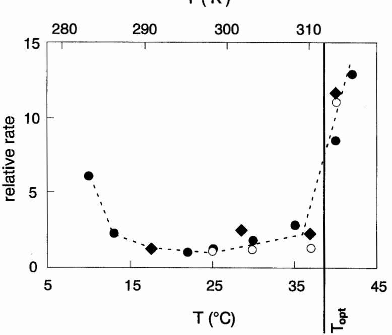

**T(K)** 

Considering that even for one particular temperature the steady-state glucose concentrations supporting half µmax (Ks - values) have been reported to vary by over three orders of magnitude (Senn et al., 1994), one has to question the accuracy of such studies of temperature modulation of growth constants. Some investigations indicate (Senn et al., 1994; Wallace and Holms, 1986) that this enormous variability is due to insufficient adaptation of bacteria to low substrate concentrations. To overcome this, standardization of experiments is necessary in comparative studies. In our experimental study, we used cells fully and reproducibly adapted to growth-limiting concentrations in continuous culture. Interestingly, for *Methanosarcina barkeri* it was shown that the temperature dependency of the affinity constant for molecular hydrogen and acetate was reduced when the substrate concentration was lowered to subsaturating levels, i. e., towards concentrations as found in balanced ecosystems (Westermann et al., 1989). This data support the results reported here for *E. coli.* For growth at very low substrate concentrations Button (1985) proposed that the ability of bacteria to grow is better described by a specific affinity term which is defined as the ratio of µmax and Ks· Since saturation constants are temperature-independent and µmax varies with temperature, specific affinity will also be temperature-dependent.

These observations raise the issue of whether the reported temperature modulation of substrate affinity is an experimental artifact and what is the theoretical background to such behavior. In the appendix, we present a simplified example and suggest possible reasons for a temperature independent Ks value. The main difference between Ks and the other model parameters (smin and µmax) is that because of the complexity of the Monod saturation constant, both the negative and positive temperature effects may compensate each other. Despite the clear evidence obtained in our experiments that the Ks value for glucose was temperature independent, it would still be premature to generalize this finding. When comparing with other published results (Characklis and Gujer, 1979; Ingraham, 1987; Knowles et al., 1965; Topivala and Sinclair, 1971; von Meyenburg, 1971; Westermann et al., 1989) one has to keep in mind several factors such as the differences in experimental set up (batch *versus* continuous culture cultivation, concentration of the feed, etc.), different methods that were used in determination of model parameters (linerization or non-linear parameter estimation), as well as the specific limitations inherent to hyperbolic models, namely that the parameters strongly influence each other. 

*What are the main factors influencing the steady-state substrate concentrations?* In our experience (for comparison, see Fig. 2.2) steady-state concentrations of the growth-limiting substrate are reproducible under defined conditions in continuous culture. Similarly, in open systems the growth conditions will determinate the limit down to which particular compounds can be degraded. Here, specific growth rate, temperature and composition of the utilized C-pool in the feed were shown to be important factors affecting a steady-state concentration of glucose during growth of *E. coli* in the chemostat. Under optimal growth conditions (defined as pH=: 7, T = 37°C) the steady-state glucose concentration of 32 ± 4 µg L-1 was measured at a dilution rate of 0.3 h-1. This concentration increased when the cultivation temperature was out of the optimum range and at higher growth rates. *Vice versa,* the steady-state glucose concentration decreased with decreasing growth rates or when the cells were simultaneously utilizing an additional substrate. 

We are aware of only two other reports in which parabola-like s=f(T) dependencies similar those for glucose described in this study were observed, both of them for nitrifiers in batch reactors (Characklis and Gujer, 1979; Knowles et al., 1965). The trend in steady-state glucose concentrations affected by temperature was sufficiently well described by the reciprocal Ratkowsky model (equation 2.11 ). Unfortunately, the minimum steady-state substrate concentration does not coincide with the optimum temperature for growth. At D=0.3 h-1 approximately the same glucose concentrations (i.e., 32 ± 4 µg L-1) are predicted in-between the range of 3 I to 37°C (see Fig. 2.6); however, according to batch data (Fig. 2.5) one would expect the minimum to be at approximately 38°C. As such, a simple parabolic function would describe the data similarly well. Such models have been proposed for the description of the effect of pH and temperature on growth rate (Rosso et al., 1995; Wijtzeset al., 1995). Fortunately, the reciprocal Ratkowsky model is only a modification of an already accepted model for temperature dependency of bacterial growth. This modification was also successfully applied for the description of the influence of temperature on lag-time (Wijtzes et al., 1993; Zwietering et al., 1994).

*Are the concentrations observed in real environments comparable to those of laboratory-scale experiments?* In natural waters threshold concentrations of certain compounds have been observed below which these compounds were either not significantly utilized, or at which the rate of their degradation slowed down enormously (summarized in Alexander, 1994). This phenomenon has been attributed either to the fact that a certain amount of substrate is needed to sustain necessary metabolic functions (i.e., maintenance energy; Powell, 1967) or that the concentration of a particular compound is too low to provoke induction of the enzymes necessary for its degradation (Alexander, 1994; DiMarco et al., 1995). As discussed above, the former phenomenon is based on the kinetic properties of a particular strain. However, the efficiency with which a bacterium takes up substrate is influenced by a variety of environmental factors, an important one being the presence and simultaneous utilization of

additional substrates (Egli el al., 1993). Therefore, one would expect that the concentrations of particular substrates under environmental conditions should be lower than those observed for laboratory-scale experiments where these compounds are supplied as the only substrates for growth. The Smin would, therefore be the highest expected substrate concentration under conditions of no growth. The fact that the observed maintenance energy requirements of indigenous soil microbial populations were some three orders of magnitude lower than those known from pure cultures supports this line of thinking (Andreson and Domsch, 1985; Morita, 1988). It should be pointed out that such thresholds should not be observed in closed systems like batch cultures (Tros et al., 1996), because the maintenance requirement of cells implies continued utilization until all available substrate is exhausted. This might not be the case when, e.g., toxic metabolites are accumulated, or when the culture is limited by an element other than carbon.

#### **Acknowledgements**

We acknowledge the advice of A. Hiltpold in processing the experimental data. We also indebted to U. Lendenmann for introducing K.K. into the handling of the analytical equipment, to M. Snozzi for helpful discussion, and to C.A. Mason for the linguistic help.

#### **Appendix**

Some quite contrasting temperature dependencies of ~ have been reported in the literature (Characklis and Gujer, 1979; von Meyenburg, 1971 ), although, to our knowledge, this problem has not yet been treated theoretically. On the basis of the mathematical analogy between Ks and the Michaelis-Menten saturation constant (Km) we will try here to explain theoretically our experimental data that have demonstrated for of *E. coli* growing with glucose that K5 was independent of temperature. Analogously to Km (for its definition, see Cornish-Bowden, 1979) the K8 can be interpreted as a ratio of rate constants of a single enzymatic step (Ron and Shani, 1971) that limits the specific growth rate (equation 2.15):

$$\mathbf{K}_{\mathbf{s}} = \frac{(\mathbf{k}_j + \mathbf{k}_{\mathbf{h}})}{\mathbf{k}_j} \tag{2.15}$$

For the special case where all the individual rate constants exhibit a similar temperature dependency (equations 2.16 a, b, c and 2.17), the apparent K5 parameter should also be independent of temperature (equation 2.18).

$$\mathbf{\dot{w}}\mathbf{\dot{w}}\mathbf{\dot{n}}, \mathbf{k}_{i}(\mathbf{r}_{\mathrm{l}}) = \mathbf{q}_{1} \cdot \mathbf{k}_{i}(\mathbf{r}_{2})\tag{2.16a}$$

$$\mathbf{k}_j(\mathbf{r}_1) = \mathbf{q}_2 \cdot \mathbf{k}_j(\mathbf{r}_2) \tag{2.16b}$$

$$\mathbf{k}_{\mathbf{h}}\left(\mathbf{T}_{\mathbf{l}}\right) = \mathbf{q}_{\mathcal{G}} \cdot \mathbf{k}_{\mathbf{h}}\left(\mathbf{T}_{\mathbf{2}}\right) \tag{2.16c}$$

and q= q1= q2= q3 (2.17)

then Ks is independent of temperature (equation 2.18), i.e. Ks (T1) and Ks (T2) are identical:

$$\begin{aligned} \mathbf{K}_s \{ \mathbf{T}_1 \} &= \frac{(\mathbf{k}_j + \mathbf{k}_h)}{\mathbf{k}_i} \\\\ \mathbf{K}_s \{ \mathbf{T}_2 \} &= \frac{\mathbf{q} \cdot \mathbf{k}_j + \mathbf{q} \cdot \mathbf{k}_h}{\mathbf{q} \cdot \mathbf{k}_i} = \frac{\mathbf{q} \cdot (\mathbf{k}_j + \mathbf{k}_h)}{\mathbf{q} \cdot \mathbf{k}_i} = \mathbf{K}_s \{ \mathbf{T}_l \} \end{aligned} \tag{2.18}$$

Assuming that the rate constants are dependent on temperature according to the Arrhenius equation (equation 2.19), the parameter q is expressed as shown in equation 2.20. For the case in which q 1, q2 and q3 are identical, this equation implies that the activation energies are also the same.

$$\ln\frac{\mathbf{k}\left(\mathbf{T}_{\mathrm{l}}\right)}{\mathbf{k}\left(\mathbf{T}_{2}\right)} = \frac{\mathbf{E}_{\mathrm{a}}\left(\mathbf{T}_{\mathrm{l}} - \mathbf{T}_{2}\right)}{\mathbf{R} \cdot \mathbf{T}_{\mathrm{l}} \cdot \mathbf{T}_{2}}\tag{2.19}$$

$$\mathbf{q} = \exp\left(\frac{\mathbb{E}_{\mathbf{a}}\left(\mathbf{T}_{\mathrm{l}} - \mathbf{T}_{\mathrm{2}}\right)}{\mathbf{R} \cdot \mathbf{T}_{\mathrm{l}} \ \mathbf{T}_{\mathrm{2}}}\right) \tag{2.20}$$

# **3. Cultivation of** *Escherichia coli* **with Mixtures of 3-Phenylpropionic Acid and Glucose**

# **3 .1** Dynamk• of Grnwth and Subottale C•n•nmptlon

#### **Abstract**

In technical as well as natural ecosystems, pollutants are often mineralized in the presence of easily degradable carbon sources. A laboratory model system consisting of *Escherichia coli* ML 30 growing with mixtures of 3-phenylpropionic acid (3ppa, 'pollutant') and glucose (easily degradable substrate) has been investigated in both batch and carbon-limited continuous culture. Untypically, a linear growth pattern was observed during batch cultivation with 3ppa as the only carbon and energy source. When exposed to mixtures of both substrates in batch culture *E. coli* utilized the two compounds sequentially. However, 3ppa and glucose were consumed simultaneously in continuous culture. Whereas a pulse of excess glucose to a batch culture growing with 3ppa led to the repression of 3ppa utilization, an excess of glucose added into continuous culture did not inhibit the utilization of 3ppa. During continuous cultivation the 3ppa-degrading enzyme system operated close to saturation.

#### **Introduction**

In natural as well as engineered environments microorganisms most probably utilize and grow with many different carbon compounds at the same time (a phenomenon that has been referred to as "mixed substrate growth", e.g., Egli, 1995; Harder and Dijkhuizen, 1982; Matin, 1979). Among the many different naturally available carbon substrates, sugars and aromatic hydrocarbons certainly belong to those chemical structure units that are most abundant in nature (Munster, 1993).

Whereas the metabolic pathways of sugars in *Escherichia coli* have been well studied (reviewed in, e.g., Lendenmann and Egli, 1995; Lengeler, 1993; Neidhart et al., 1987), there is so far little known on the catabolism of aromatic hydrocarbons. Although many different microorganisms are capable to degrade aromatic compounds, most of the present knowledge on aromatic catabolism has come from studies of bacteria that belong to the genus *Pseudomonas* (e.g., Smith, 1990). The ability of *E. coli* to degrade aromatic compounds to completion was first reported by Cooper and Skinner (1980). In particular the catabolism of 3-phenylpropionic acid (3ppa; for chemical structure see Fig. 3.1) was investigated by Burlingame and Chapman (1983) and a pathway for the degradation of 3ppa to succinate, acetaldehyde, and pyruvate was proposed. The reaction sequence was initiated by a dioxygenase attack at the aromatic ring and the meta-ring cleavage occurred before the side chain degradation. This catabolic pathway in *E. coli* is similar to that observed earlier in *Acinetobacter sp.* (Dagley et al., 1965). To date only, some genes of the 3ppa degradative pathway have been cloned (Bugg, 1993) and *E. coli*  aromatic hydrolase with a broad substrate range (unfortunately, there is no reference to 3ppa specificity) which is involved in the degradation of 4 hydroxyphenylacetic acid has been characterized by Prieto et al. (1993).

The existing concepts on microbial growth kinetics are based on the assumption that single substrates are utilized (e.g., Monad, 1942) despite the fact that the microorganisms in nature grow with substrate mixtures and under conditions of changing substrate availability - both with respect to the concentration and the presence of particular substrates. Therefore, it is essential to extend such kinetic models to mixed substrate growth, especially for the case of the degradation of pollutants in the presence of mixtures of natural substrates. These particular aspects have been investigated in three parallel studies using a model system consisting of *E. coli* ML 30 growing with mixtures of glucose (here, easily degradable substrate) and 3ppa ("pollutant"; Kovarova et al., l 996b.c, and this study). Using this experimental system, we were able to re-examine the tentative model proposed for utilization of mixtures of sugars (Egli et al., 1993; Lendenmann et al., 1996) for two carbon substrates that are quite different with respect to the metabolic pathways involved in their utilization and the regulation of enzyme expression. Here, a detailed investigation of the growth dynamics of *E. coli* with mixtures of 3ppa and glucose is presented.

#### **Materials and methods**

*Medium and culture conditions. Escherichia coli* ML 30 (DSM 1329) was grown at 37°C in both batch and continuous culture. The mineral medium was supplemented with either 3ppa, or with mixtures of 3ppa (Fluka) and glucose (Merck) as the only sources of carbon and energy. Details on the medium composition and cultivation conditions were described previously (Senn et al., I 994).

#### *Analytical procedures.*

*(i) Glucose analysis.* The glucose concentrations in batch cultures and during the pulse experiments (where concentrations were in the mg L-1 range) were measured enzymatically using the GOD-Period® method (Boehringer Mannheim, Germany). The samples were analyzed at 420 nm (instead of 560 nm as recommended by the manufacturer). This modification allows a higher sensitivity (detection limit ca. 1-2 mg L-1 of glucose).

Residual concentrations of glucose in continuous culture (in the µg L-I concentration range) were analyzed by HPLC according to Senn et al. (1994).

*(ii) 3ppa analysis.* The samples were immediately filtered after they were withdrawn from the bioreactor or batch culture and the pH was adjusted to pH 3 by adding concentrated HCI. The 3ppa-concentrations were analyzed by a standard HPLC application (Waters-Millipore 625LC; Waters 712 WISP injector, 50 to 150 µL injection volumes used) with UV detection at 206 nm (Waters 991 photodiode array detector). The reverse-phase separation was achieved on a Nova Pak C-18 column (Waters-Millipore) by applying a I: I mixture of 50 mM H3P04 and methanol (pH adjusted to 3.1) as the eluent with a flow rate of 0.6 ml min-I. The detection limit was ca. 0.01 mg L-1 of 3ppa.

*(iii) Acetate analysis.* The concentration of acetate was measured by ion-exclusion chromatography as described by Schneider et al. (1988).

*(iv) Dissolved organic carbon (DOC).* DOC concentrations were measured in the filtrate (0.2 µm polycarbonate membrane filter; Nuclepore, U.S.A.) after acidification with HCl using a Tocor 2 analyzer (Maihak, Germany).

*Biomass determination.* Biomass was measured as dry weight (OW) by filtration through a 0.2 µm pore size polycarbonate membrane filter (Nuclepore). Cells collected on filters (usually from of 100 mL cell suspension) were washed with distilled water and filters were dried at 105°C to constant weight. Optical density was determined in 5, 2 or l cm cuvettes at 546 nm with a Uvikon 860 spectrophotometer (Kontron, Switzerland).

*Specific oxygen uptake rates.* A sample of culture liquid (12 mL) was collected directly from the chemostat, centrifuged and washed twice with mineral medium and resuspended in 3 mL of mineral medium (Senn et al., 1994). The samples taken from batch cultures were also washed two times, but resuspended in mineral medium to the original volume. The 3ppa- or glucose-stimulated oxygen uptake rate was recorded at 37°C in a Clark-type oxygen probe (Rank Brothers). The total volume of the assay was 3 mL, consisting of 2.8 mL cell suspension of a known biomass concentration and 0.2 mL of 0.1 M glucose or 3ppa solution. The deviation of our measurements was about l 0 to 20 nmol o2 min- I (mg DW)-I.

*The rate of linear growth.* The maximum specific growth rate is conventionally determined from the exponential phase of a growth curve. Untypically, in our case no exponential growth was observed over an extended period of time and the initial "exponential growth" was followed by a linear growth phase. Because during the linear growth the growth rate changes

· · d h dx 1 with f · f · the time, we determine t e µ = - · - as unction o time. Here, the 'true' µmax was cit x determined as the maximum of the µ(t) - function (the approach is explained in Fig. 3.1).

#### Results

*Growth with 3ppa as sole carbon and energy source in batch culture.* When *E. coli* ML 30 was grown in batch culture with 3ppa as the sole carbon and energy source no distinct phase of exponential growth was observed but the cells grew linearly (Fig. 3.1). This did not change although the cells were transferred repeatedly (eight times) from one batch culture to the next always supplied with 200 mg L-1 of 3ppa carbon, as the only carbon/energy source, and in this way grew over more than 100 hours (i.e., ca. 50 generations) at an average maximum specific growth rate of 0.43 ± 0.05 h-1. Although the cells grew linearly, 3ppa was completely utilized and decreased from an initial concentration of 248 mg L-l (::: 180 mg L-1 of carbon from 3ppa) to concentrations ~ I mg L-1 and final DOC concentrations in the medium of about 40 mg L-1 (from this concentration 28 mg L-1 of DOC originated from the non-utilisable EDT A present in the mineral medium).

The linear growth pattern did not significantly change when yeast extract (to a final concentration of 1 mg L-1), vitamins (for exact composition see Egli et al., 1988) or trace elements (supplied in the fresh mineral medium) were added to growing cells. However, the growth rate increased (but remained linear) when sterile filtered culture supernatant from a chemostat fed with a mixture of glucose and 3ppa was added to a culture growing in batch mode (Fig. 3.2). Furthermore, no significant difference in the growth curves with 100, 200 and 400 mg L-1 of 3ppa-carbon was observed, indicating no toxic effects of 3ppa within the tested concentration range. The growth yield was 1.13 ± O.D7 mg DW (mg carbon)-1.

*Growth with mixtures of 3ppa and glucose in batch culture.* To obtain information concerning the regulation of the utilization of 3ppa in the presence of alternative easily degradable carbon sources, the bacterium was grown **Fig. 3.1** Typical linear batch growth curve for *E. coli* growing with 3ppa (200 mg L-1 of C) as the sole source of carbon and energy. (a) • biomass concentration measured as optical density, 0 3ppa concentration; **(b)** logarithm of optical density as function of time; (c) specific growth rate as function of time, the maximum of this curve was referred to as a µmax of 0.45 h- 1, which is indicated by the dashed line.

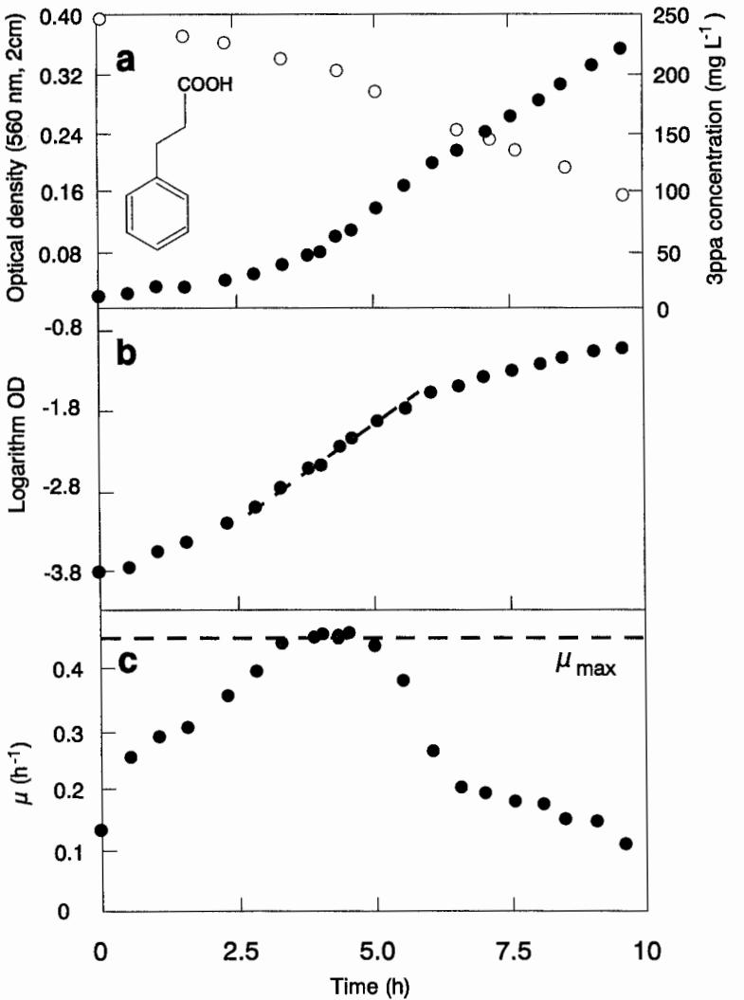

**Fig.** 3.2 Growth of *E. coli* in batch cultures with 3ppa as the sole carbon and energy source (200 g L-1 of 3ppa carbon; total culture volume of 500 mL) when pulsed with 20 mL of sterile filtrate from a chemostat culture grown with a mixture of 3ppa and glucose. As an inoculum cells grown in continuous culture with a 7:3 mixture of glucose:3ppa {C:C) were used; • OD of pulsed culture; the pulse is indicated by a vertical line; D reference experiment.

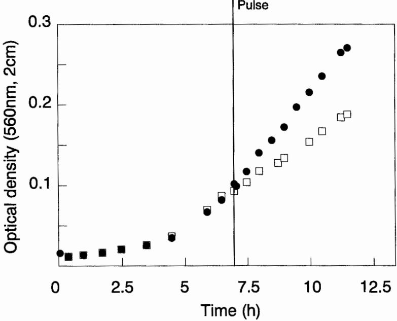

in batch culture with mixtures of 3ppa and glucose (Fig. 3.3). In these experiments the total carbon concentration was kept constant at 200 mg L-1 DOC and only the proportion of the two substrates in the mixture was changed. The growth of *E. coli* followed a diauxic pattern (Fig. 3.3). The utilization of 3ppa was not detectable until glucose was exhausted (data for substrate

concentrations not shown) **and** a lag-period of several hours was observed between the two growth phases. A typical example of the described growth pattern including the actual 3ppa and glucose concentrations is presented in Fig. 3.4. Surprisingly, the specific growth rates observed in the two growth 

**Fig. 3.3** Growth of *E. coli* in batch culture with mixtures of 3ppa and glucose as the sole sources of carbon and energy (total carbon concentration of 200 mg L· 1 ). As an inoculum cells pregrown in batch culture with glucose were used; the mixture composition is given in % of carbon: 0 100% of glucose; • mixture of 90% glucose and I 0% 3ppa; • mixture of 50% of each substrate; Li mixture of I 0% of glucose and 90% of 3ppa; 0 I 00% of 3ppa. 

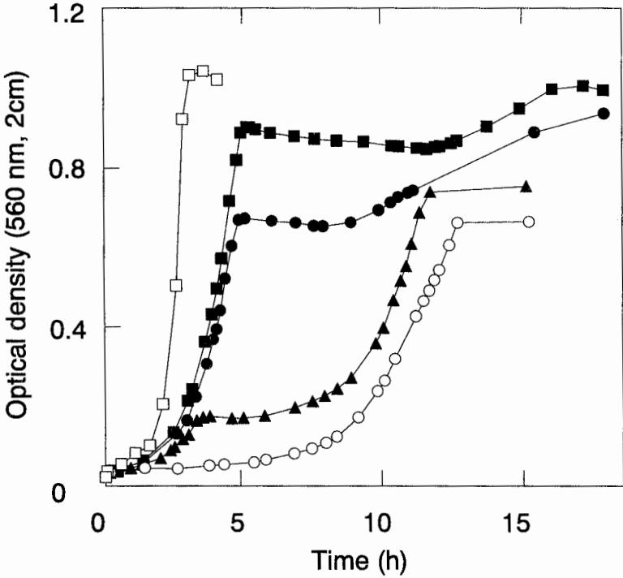

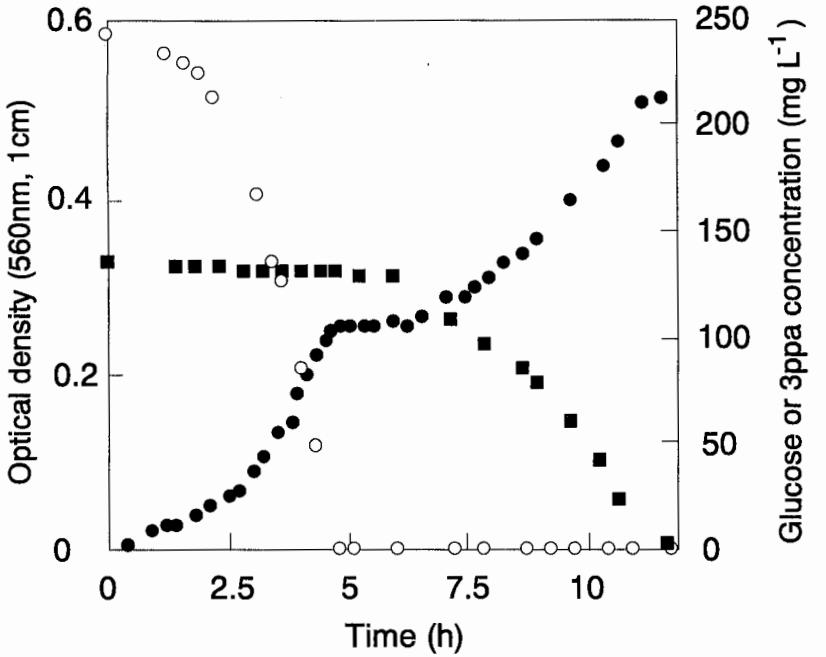

Fig. 3.4 Batch growth of *E.coli* with a 1:1 (C:C, 100 mg L-1 of carbon each) mixture of 3ppa and glucose. •optical density; 0 glucose concentration; • 3ppa concentration. 

phases were influenced by the mixture composition (Fig. 3.5). The maximum specific growth rate observed during growth with glucose decreased when increasing proportions of 3ppa were supplied in the initial mixture. Conversely, the maximum specific growth rate achieved in the 3ppa growth phase increased with increasing proportion of 3ppa in the mixture. The length of the lag-phase was dependent on the initial 3ppa:glucose ratio and it increased with decreasing proportion of 3ppa in the mixture. Differently than in the previous experiments (Fig. 3.1 and 3.2), the cells exponentially grown for more than 100 generations with glucose only (and never exposed to 3ppa) in batch culture were used as the inoculum. It appears that such a different pre-treatment of the inoculum caused

that 3ppa in the initial phase of the batch culture supported exponential growth in contrast to the data shown in Fig. 3.1 and 3.2. During the later phase of batch growth the cells clearly grew linearly. (Although, it is difficult to statistically distinguish the point at which the culture changes from an exponential to a linear growth behavior.) Additionally, this phenomenon was observed when the cells were grown in batch culture with a mixture of 3ppa and glucose (Fig. 3.3); the standard deviation of the µmax estimates being± 0.05 h-1.

Similar experiments were performed with mixtures of 3ppa and acetate. The utilization patterns for acetate and 3ppa as well as the DOC balance gave strong evidence that 3ppa was not utilized before acetate was exhausted. However, no lag-phase was detected in the growth curve (data not shown).

Fig. 3.5 Maximum specific growth rates during growth of *E. coli* with mixtures of 3ppa and glucose in batch culture, as a function of the fraction of carbon from 3ppa in medium feed (for the growth curves see Figure 3.3; the standard deviation of the µmax estimates being 0.05 h-1). Open column - µmax determined during the growth phase on glucose; black column - µmax determined during the growth phase on 3ppa.

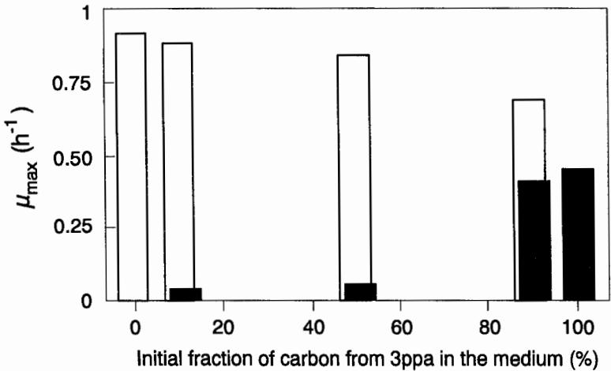

*The response to changing substrate availability and its effect on the utilization of 3ppa.* In both natural and technical environments microorganisms are often exposed to fluctuating substrate availability. A 'new' substrate (pollutant) can be introduced into such a system either pulswise, or more or less continuously over a longer time period. Here, 'simple' pulse and transient experiments were carried out as a contribution to the understanding of the complex regulation patterns involved in the utilization of substrate mixtures when the substrate availability is ehanging.

*(i) Pulse of glucose to batch culture growing with 3ppa.* To investigate in more detail to what extent the 3ppa utilization can be inhibited by glucose, *E. coli* was grown in batch mode with a mixture of 3ppa and glucose (initial concentrations being 100 mg L-1 of carbon from glucose and 200 mg L·l of carbon from 3ppa). As an inoculum, cells from continuous culture growing with a 3:7 (C:C) mixture of 3ppa and glucose were used. Although the cells (when washed) exhibited 3ppa-oxidising capacity (Fig. 3.6c), no apparent mixed substrate utilization was detected (Fig. 3.6a, d). When glucose was exhausted the cells started to grow with 3ppa as the sole carbon/energy substrate after a short lag. An addition of excess glucose (to a final concentration in the culture medium of 100 mg L·I of carbon) during the 3ppa growth phase transiently repressed the utilization of 3ppa (Fig. 3.6). The specific 3ppa-stimulated oxygen uptake rate increased when 3ppa was utilized

J<'ig. 3,6 Pulse of excess of glucose into a batch culture growing with a mixture of glucose and 3ppa. The initial mixture contained 100 mg L·l of glucose carbon and 200 mg L·l carbon from 3ppa; after ca. 840 minutes of cultivation glucose was pulsed (final concentration of 100 mg L-1 of glucose carbon) to the culture in the 3ppa growth phase; the arrows indicate the growth phases either with glucose or 3ppa; (a) growth curve; (b, c) glucose • or 3ppa 0 stimulated specific oxygen consumption rate; (d) • % of the initial substrate concentration left, • glucose, 0 3ppa.

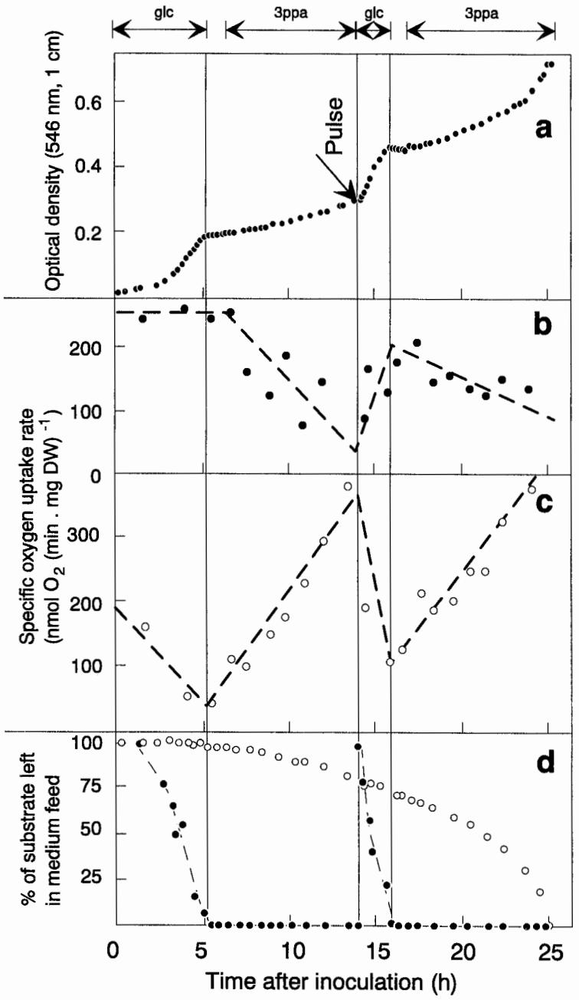

and decreased during glucose growth phases (Fig. 3.6c). An opposite pattern was observed for glucose-stimulated specific oxygen consumption rates (Fig. 3.6b).

*(ii) Pulse of glucose to a continuous culture growing with 3ppa and glucose.*  In contrast to batch culture, the two substrates were utilized simultaneously in carbon-limited continuous culture (see also Kovarova et al., 1996b). In order to study the effect of glucose on the utilization of 3ppa in continuous culture, cells growing at D=0.6 h-1 with a 7:3 (C:C) mixture of glucose and 3ppa (100 mg L-1 of glucose and 23.8 mg L-1of3ppa) were pulsed with an excess of glucose (Fig. 3.7). Immediately after the pulse the glucose concentration in the bioreactor was 200 mg L-1 (i.e., 80 mg L-1 of C, which is a comparable concentration range as that used in the batch experiments shown above). The biomass concentration as well as the substrate concentrations and the specific oxygen consumption rates stimulated by glucose or 3ppa were measured as function of time (Fig. 3.7). After the pulse, glucose concentration started to decrease (down to final concentration of< I mg L-1 of glucose) and at the same time the biomass concentration started to increase. However, the utilization of 3ppa, as indicated by the residual 3ppa concentrations in the culture, was not repressed (Fig. 3.7a) and only a transient increase of 3ppa concentration from 300 µg L-1 (steady-state value prior the pulse) up to 1000 µg L-1 (peak concentration) was measured. Nevertheless, after the pulse the 3ppa-stimulated specific oxygen consumption rates decreased until glucose was exhausted. After the exhaustion of glucose the excess biomass resulting from the pulse started to wash-out from the bioreactor, and the 3ppa-stimulated oxygen consumption rates reached again the initial steady-state level of 88±15 nmol 02 min-1 (mg DW)-1. During the whole experiment the glucose-stimulated specific oxygen consumption rates remained constant at 167±18 nmol 0 2 min-I (mg DW)-1 (Fig. 3.7b).

**Fig.** 3.7 Pulse of excess of glucose into a continuous culture of *E. coli* growing with a 3:7 (C:C) mixture of 3ppa and glucose. (a) • biomass concentration followed as optical density; 0 3ppa concentration; dashed line, wash-in of 3ppa assuming that the utilization of 3ppa had stopped immediately after the pulse; **(b)** glucose D or 3ppa • stimulated specific oxygen consumption rate.

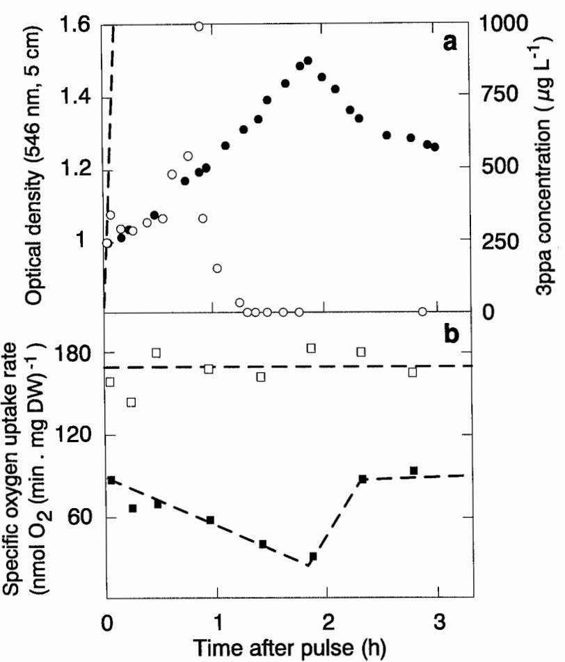

*(iii) Transient shift from glucose to a mixture of glucose and 3ppa.* To investigate how fast *E. coli* can respond to a sudden availability of 3ppa, the cells were grown with glucose ( 100 mg L-1) as the only carbon/energy source until a steady-state was reached. Then inlet medium was shifted to one containing the same concentration of glucose and, additionally, 3ppa. The mixture composition was 7:3 glucose:3ppa (C:C). This culture was during its 'history' transiently exposed to 3ppa for the second time; i.e., the culture was first grown with glucose for 260 generations, then it was cultivated with a mixture of 3ppa and glucose (590 generations), followed by a second period of growth with glucose only (234 generations) and then the above described experiment was performed. During the first medium shift the steady-state with respect to biomass concentration was approached in two to three-times slower than during the 3ppa-transient described above.

Similarly, as during the pulse experiment in continuous culture, the glucose-stimulated specific oxygen consumption rate remained constant at 178 ± 20 nmol o2 min-I (mg DW)-1 (Fig. 3.8a). Approximately 1 hour was required until a stable 3ppa-stirnulated specific oxygen consumption rate of 80 ± 15 nmol o2 min-I (mg DW)-1 was achieved (note, the sample preparation, during which the culture remains in contact with 3ppa, takes approximately 10 minutes). During this time period (see point 1, Fig. 3.8b) only 30% of the 3ppa concentration in the medium feed was effectively washed-in into the bioreactor and utilized (the actual 3ppa concentrations were always< 3 mg L-1). However, biomass concentration was still increasing due to the utilization of the inflowing 3ppa (Fig. 3.8b). Because the cells exhibited the same 3ppastimulated specific oxygen consumption rate (80 ± 15 nmol Oz min-1 (mg OW)· I) despite of whether 8 or 22 mg L-1 of 3ppa were effectively utilized (Fig. 3.Sb), they temporarily exhibited a higher specific 3ppa consumption rate than after the steady-state had established. This phenomenon is later on discussed as 'spare capacity' for 3ppa utilization, i.e., the measured excess specific 3ppa consumption rate is virtually higher to that calculated from the dilution rate and medium composition. 

**Fig.** 3.8 Transient behavior of *E. coli* grown in carbon-limited continuous culture after switching the feed from medium containing glucose (I 00 mg L-1) as the only carbon and energy source to one containing the same concentration of glucose plus additionally 30% of 3ppa-carbon. (a) glucose • or 3ppa 0 stimulated specific oxygen consumption rate; **(b)** • biomass concentration; D actual 3ppa concentration; curve, theoretical wash-in of 3ppa from the new medium feed; arrows, the effectively utilized 3ppa concentration at the particular time point **(1** - 8 mg vi, 2 - 22 mg vi). 

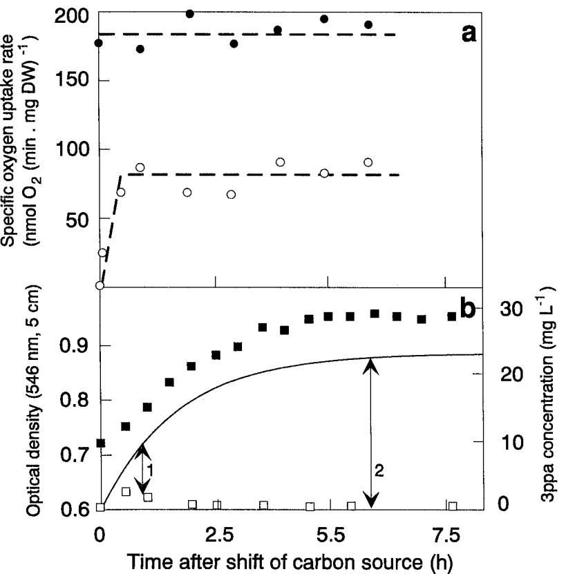

#### Discussion

*The phenomenon of linear growth in batch cultures.* Linear growth in batch cultures is known to be linked to conservative trace nutrient uptake (Brown et al., 1988), intracellular accumulation of the limiting substrate in any form (Novak et al., 1990), or inappropriate cultivation condition resulting in limitation by oxygen or substrate flux (i.e., constant rate of supply of oxygen or limiting substrate, reviewed by Brown et al., 1988).

Concerning the experimental observations during the growth of *E. coli*  with 3ppa as the sole source of carbon and energy, we can only speculate what is responsible for the linear growth pattern observed in these batch cultures. However, several factors can be excluded; for example, when the same mineral medium was supplemented with glucose or acetate instead of 3ppa, no linear growth pattern was observed. Because, the cultures growing with 3ppa were extensively aerated and they did not show any response to the addition of trace elements (trace nutrients) or vitamins, only a limitation by intracellular metabolite accumulation, or substrate transport might be considered. The cultures grew faster or nearly exponentially when sterile filtered culture supernatant from cells already growing with a mixture of 3ppa and glucose was added (e.g., Fig. 3.2).

It should be pointed out that the linear growth behavior observed during batch cultivation with 3ppa as the sole substrate did not hamper growth in continuous culture. During continuous cultivation in the presence, or even without glucose (for more details on continuous cultivation see Kovarova et al., l 996b and l 996c ), the cells grew exponentially (if *E. coli* was growing linearly in the chemostat the culture would have washed out). Therefore, only when estimating the µmax from batch growth data the linear growth pattern has to be considered (Fig. 3.1). It was also observed that it is easier to start up a continuous culture with medium containing a mixture of 3ppa and glucose either than with 3ppa alone. Applying a 'too high' dilution rate in the initial phase after switching the culture to the chemostat mode with 3ppa as the sole carbon and energy substrate occasionally resulted in a wash-out.

Surprisingly, no 'spare capacity' with respect to 3ppa consumption could be measured for cells growing in continuous culture (Kovarova et al., 1996b). The measured excess specific 3ppa consumption rate was virtually identical to that calculated from the dilution rate and medium composition. This indicates that we worked with a system that was close to saturation with respect to 3ppa uptake. Therefore, even when an excess of 3ppa was added to the culture, it was impossible to detect any difference in the consumption rate. Consequently, a virtual 'spare capacity' with respect to 3ppa consumption was observed transiently during the initial phase of the shift experiment (Fig. 3.8).

*How is the 3ppa degradation regulated?* Investigating the regulation of 3ppa utilization in mixtures with glucose we still remain at the phenomenological level by following the substrate concentrations and the substrate specific consumption capacities (i.e., excess rates). Here, we were mainly interested to what extent the utilization of 3ppa can be inhibited by a second substrate.

In batch culture, the utilization of 3ppa was immediately repressed by glucose, regardless of whether glucose was present in the initial substrate mixture or was pulsed to cells growing with 3ppa alone. Surprisingly, pulsing cells growing with 3ppa in continuous culture showed quite a different response (Fig. 3.7 and 3.8). Although the amount of glucose added resulted in comparable concentrations in both experiments, the pulse of excess glucose to continuous culture did not inhibit the utilization of 3ppa. The effect of glucose was only visible as a transient reduction in the 3ppa-stimulated oxygen uptake rate. This observations raises the question of what is the difference in the regulation of these two systems.

One explanation might be that in continuous culture - in contrast to batch growing cells - the glucose uptake system did not operate close to saturation. A 'spare capacity' to take up glucose was always measured under steady-state growth conditions (Kovarova et al., 1996b; Lendenmann and Egli, 1995). However, within the exponential growth phase in batch culture with glucose the cells are supposed to work close to saturation (shown in Fig. 3.6 for the first growth phase). Due to this 'spare capacity' the cells grown in continuous culture might be able to utilize the excess glucose without visibly affecting the utilization of 3ppa.

#### **Acknowledgement**

We are grateful to Albert Tien for correcting the English and for advice concerning the measurements of oxygen uptake rates. Furthermore, the authors are indebted to Christian Zipper and Stefano Simoni for advice concerning the 3ppa analysis, Hansueli Weilenmann and Thomas Fleischmann for skilled technical assistance during DOC measurements.

# **3 • 2** Sleady-Stare Gmwth Klnotl"

#### **Abstract**

The fate of pollutants in the environment is affected by the presence of easily degradable carbon sources. As a step towards understanding these complex interactions the degradation of mixtures of glucose (i.e., easily degradable substrate) and 3-phenylpropionic acid (3ppa, "pollutant") by *Escherichia coli* ML 30 was studied systematically in carbonlimited continuous culture. The two substrates were always consumed simultaneously independent of the dilution rate applied. Even at dilution rates higher than the maximum specific growth rate for 3ppa (0.35 ± 0.05 h-1) the two carbon substrates were utilized together under carbon-limited conditions. Over the range of 5 to 90% of 3ppa (proportions given as % of carbon) the steady-state concentrations of 3ppa and glucose were approximately proportional to the ratio of the two substrates in inflowing medium. Measured as a function of the substrate proportion in the medium feed, both, the specific substrate and the oxygen consumption rates determined in presence of excess glucose or 3ppa, followed a similar pattern. When cultivated with a 1: **1** mixture (based on carbon) of glucose and 3ppa an overall maximum specific growth rate of 0.90±0.05 h-1 and a Monod substrate saturation constant for 3ppa (K8 of 600-700 µg L-1) similar to that measured during growth with 3ppa alone, fitted to the experimentally determined steady-state 3ppa concentrations.

#### **Introduction**

The development of descriptive growth models in microbiology is based on the assumption that the observed phenomena are perfectly predictable and reproducible. This might be true for the growth kinetics such as this proposed by Monad (1942) which was derived from laboratory experiments with a pure culture and a single growth-limiting substrate (e.g., Button, 1985; Panikov, 1995). However, in natural environments, because of the complexity of nutritional and physical conditions (Miinster, 1993), the growth and substrate utilization is still poorly understood in quantitative terms. It was demonstrated (e.g., Harder and Dijkhuizen, 1982; Egli, 1995) that it is highly likely that under environmental growth conditions microorganisms will utilize a variety of carbon/energy substrates simultaneously (a phenomenon referred to as "mixed substrate growth"). Nevertheless, still few attempts have been made to elucidate the main kinetic principles of mixed substrate growth especially for mixtures of pollutants plus easily degradable carbon substrates. 

Over the past two decades, increasing information has become available in literature that in carbon-limited continuous culture heterotrophic bacteria utilize mixtures of substrates simultaneously. Typically, lower steadystate substrate concentrations than those observed during growth with the single substrates have been observed (Law and Button, 1977; Egli et al., 1983; Loubiere et al., 1992; Babel et al., 1993; Egli et al., 1993). Unfortunately, in most of these publications only the steady-state concentration of one of the carbon compounds used in the mixture has been reported, usually because the analytical methods were not sensitive enough to detect also the second substrate. Recently an improved method for the analysis of reducing sugars (Senn et al., 1994) enabled us to perform more detailed investigations. The most extensively studied example is that for the growth of *Escherichia coli* in carbon-limited chemostat culture with defined mixtures of up to six different

sugars (Lendenmann et al., 1996). The experimental results presented by Lendenmann et al., ( 1996) allowed to propose a tentative model suggesting that during growth at a constant rate the observed steady-state concentration of a particular sugar was proportional to its contribution to the total sugar concentration in the medium feed. The catabolic pathways of all the carbon substrates used in this converge after a few metabolic steps. Further experiments with mixtures of substrates that differ with respect to their chemical structure, carbon content, degree of carbon reduction, metabolic pathways involved in their degradation, or the physiological function they fulfil are necessary to elucidate whether a more general principle of mixed substrate growth kinetics exists.

Therefore, to confirm the validity of the simple model on mixed substrate growth proposed by Lendenmann et al. ( 1996) we set up a new experimental system that fulfilled the above mentioned preliminaries. This system consisted of *Escherichia coli* ML 30 growing with glucose and 3 phenylpropionic acid as the only sources of carbon and energy. In continuous culture both substrates could be conveniently measured down to concentrations of few µg L-1. In parallel studies both the dynamics of growth with mixtures of 3ppa and glucose (Kovarova et al., 1996a) and the inducibility of the 3ppa-degrading system have been investigated in more detail (Kovarova et al., 1996c ).

#### **Materials and methods**

*Medium and culture conditions. Escherichia coli* ML 30 (DSM 1329) was grown at 37°C in mineral medium (Senn et aL, 1994) supplemented with glucose and/or 3ppa as the sole sources of carbon and energy. In the bioreactors (MBR, Switzerland; working volume 1.5 L, and Bioengineering, Switzerland; working volume 1 L) the pH was maintained at 7 ± 0.05 and oxygen saturation was always >90% air saturation. The cultivation conditions have been described in detail elsewhere (Senn et al., 1994).

*Glucose analysis.* Glucose concentrations were analyzed by HPLC according to Senn et al. (1994).

*3ppa analysis.* The HPLC method for the analysis of 3ppa was described elsewhere (Kovarova et al., l996a).

*Biomass determination.* Biomass was measured as dry weight {DW) and/or optical density at 560 nm. Details can be found in Kovarova et aL (l996a).

*Specific oxygen uptake rates.* 3ppa or glucose stimulated specific oxygen uptake rates of whole cells were determined with a Clark type oxygen probe (Rank Brothers) as described by Kovarova et al. (1996a).

*Specific substrate consumption rates.* The excess glucose or 3ppa consumption capacity (given in nmol (or mg) of substrate (mg DW h)- 1) of the cells grown in continuous culture was measured immediately after the cells were withdrawn from the bioreactor by a modified method originally reported by :-.feijssel (Neijssel et al., 1977; Lendenmaun and Egli, 1995). The precision of such measurements was ± 0. I 5 mg substrate (mg DW h)" 1. Additionally, the actual specific consumption rate was calculated using equation 3.1:

$$\mathbf{q}_{\mathbf{s},i} = \frac{(\mathbf{s}_0 - \mathbf{s}_i)}{\mathbf{D}\mathbf{W}} \cdot \mathbf{D} \tag{3.1}$$

#### *Data analysis*

*(i) Monod growth kinetics.* The relationship between substrate concentration and the growth rate was described by the conventional growth kinetic model proposed by Monod (1942, equation 3.2):

$$
\mu = \mu_{\text{max}} \cdot \frac{s}{\text{K}_{\text{g}} + s} \tag{9.2}
$$

The models were fitted to the experimental data by non-linear parameter estimation (NPE, for details see Kovarova et al., l 996e).

*(ii) Growth rate during mixed substrate utilization.* The consumption of carbon/energy substrates (qtot' equation 3.1) supports a particular specific growth rateµ:

$$\mu = \sum_{i=1}^{n} \mathbf{q}_{s,i} \cdot \mathbf{y}_i \tag{3.3}$$

Thisµ can be achieved by utilizing either one substrate at a high rate (q1 = qtot) or several substrates simultaneously (q 101 q 1 +q2 ..... +qi) at reduced rates with respect to the individual substrates (here, glucose and 3ppa, equation 3.4):

$$
\mu = \mu_{\text{glc}} + \mu_{\text{\textquotedbl{}sppa}} \equiv \mathbf{q}_{\text{glc}} \cdot \mathbf{y}_{\text{glc}} + \mathbf{q}_{\text{\textquotedbl{}sppa}} \cdot \mathbf{y}_{\text{\textquotedbl{}pspa}} \tag{3.4}
$$

*(iii) Steady-state concentration as function of the mixture composition.* An empirical model (equation 3.5; Egli et al., 1993; Lendenmann et al., 1996) was used for the description of the relationship between the steady-state substrate concentrations and the corresponding proportions of these substrates in the inflowing medium. The steady-state substrate concentration is a function of the specific consumption rates of these substrates and, implicitly, of their proportions in medium feed.

$$\mathbf{s}_{i\uparrow\downarrow} \equiv \mathbf{s}_{\text{IOO}\%,i} \cdot \frac{\mathbf{q}_{i}}{\Sigma \mathbf{q}_{i}} \text{ if } \mathbf{s}_{\text{IOO}\%,i} \cdot \frac{\mathbf{s}_{\text{O},i}}{\sum \mathbf{s}_{\text{O},i}} \tag{3.9}$$

#### Results

*Relationship between substrate concentration and growth rate.* The growth kineties of *Escherichia coli* during growth with either 3-phenylpropionic acid (3ppa) alone or with a mixture of 3ppa:glucose (1: I, based on carbon concentration) was studied in carbon-limited continuous culture at different growth rates. With 3ppa as the sole carbon and energy source *E. coli* was able to grow up to a dilution rate (growth rate) of 0.35 ± 0.05 h-1. The substrate affinity constant (K8) fitted by NPE was 600-700 µg L·l (Fig. 3.9a, Table 3.1). No statistically significant difference between the fits of K5 could be determined during this range. (Note that the growth kinetics of *E. coli* on glucose as sole energy/carbon substrate has been studied systematically by Senn et al. (1994) and Kovarova et al. (l 996e).)

Fig. 3.9 (a) steady-state concentrations of 3ppa during growth of *E. coli* in carbon-limited continuous culture with 3ppa only • and with a 1: I (C:C) mixture of 3ppa D and glucose, as function of dilution rate. (Each data point is the average of 4 to I 0 single measurements); curves, predicted steady-state substrate concentrations based on Monod

model: 1, 600 µg L-1, µmax =0.9 h-1; 4, Ks= 700 µg L-1, µmax =0.9 h-1; for comparison, the steady state concentration for growth of *E. coli* with glucose alone were included (5, from Kovarova et al., 1996e). (b) specific substrate consumption rates: •,line 3, 3ppa specific consumption rate when cultivated with 3ppa only; D, line 4, specific consumption rate of 3ppa when fed with a mixture of glucose and 3ppa ( l: l: C:C): specific consumption rate of glucose when cultivated with glucose only (line **1)** or when a mixture of glucose and 3ppa (I: I; C:C; line 2) was supplied in the medium feed; shaded area - maximum specific consumption rate of 3ppa.

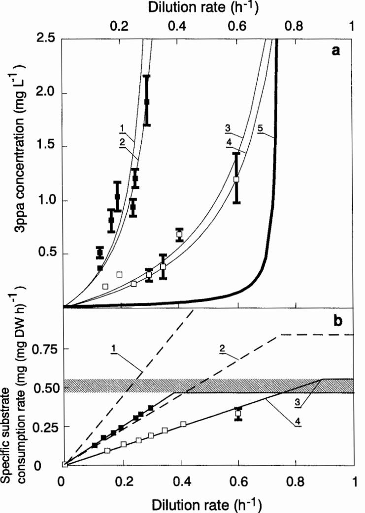

|                                    | Glucose                                     | 3ppa                                      | 3ppa (in 1:1, C:C mixture of 3ppa and glucose ) |
|------------------------------------|---------------------------------------------|-------------------------------------------|----------------------------------------------------------------------------|
| 1) (h" µmax                  | ± 0.92 0.05* ± 0.10**,b 0.76 | ± 0.05* 0.42 ± 0.35 0.05** | ± 0.90 0.10**. c                                                     |
| Yield (mg DW (mg C)·l) | ± 1.13 0.07                           | ± 0.75 0.06                         | additive                                                                   |
| Ks(µg L-1)                      | 51.5-177.0" 32.Sb                        | 600- 700d                              | 600 700d -                                                           |

| Table | 3.1 Growth parameters of | Escherichia coli | ML 30 |
|-------|--------------------------|------------------|-------|
|-------|--------------------------|------------------|-------|

* determined from batch-culture data (Kovarova et al., l 996a) 

** determined by NPE from continuous culture data

a from Senn et al. (1994) 

b from Kovarova et al. (l 996e) using an extended form of Monod model 

c the overall growth rate on the mixture determined from 3ppa concentrations 

d no statistically significant difference between the fits of K8 could be determined during this range 

In contrast to batch cultivation (Kovarova et al., 1996a) the two substrates were consumed simultaneously in continuous culture, independent of the dilution rate applied (tested was the range between 0.15 h-1 ::; D::; 0.6 h-1). The steady-state concentrations of both 3ppa and glucose were reduced in comparison to the concentrations measured during single substrate growth (Fig. 3.9a). The formation of the biomass from the two substrates occurred in an additive manner, which suggests that the growth yields did not change during the growth with mixtures in comparison to growth with single substrates (Kovarova et al., 1996a; Table 3.1). When growing with a 1:1 mixture of glucose and 3ppa (C:C, i.e., 50 mg L-1 of carbon each) a growth rate of 0.90±0.05 h-1 was fitted by NPE to the experimentally determined steady-state 3ppa concentrations. The fitted Monad substrate saturation constant for 3ppa (K8 of 600-700 µg L-1) was similar to that measured during growth with 3ppa alone (Fig. 3.9a). The s vs. D relationships for the growth with 3ppa, glucose and a 1:1 (C:C) mixture of glucose and 3ppa are compared in Fig. 3.9a, and the kinetic parameters are collected in Table 3.1.

The specific consumption rates of 3ppa and glucose during growth at different dilution rates are given in Fig. 3.9b. A particular specific substrate consumption rate (q10t) supports a corresponding specific growth rate (µ=D). This can be achieved by either consuming one substrate at a high rate or by consuming several substrates at lower rates (for formulas see Materials and methods). The specific consumption rates increased linearly with increasing growth rates, however, the slope was higher when *E. coli* was grown with single substrates (Fig. 3.9b). This implies that, when growing with a mixture, the cells experienced the maximum possible specific consumption rate of 3ppa (0.46 ± 0.05 mg 3ppa (mg DW htl) at higher dilution rate (0.8 ± 0.1 h-1) than during growth with 3ppa alone. Consequently, the bacterium was able to utilize and grow with 3ppa when supplied with a 3ppa/glucose-mixture at dilution rates exceeding µmax(3ppa).

#### *Growth with mixtures at constant dilution rate*

*(i) Residual substrate concentrations as a function of the mixture composition.* In the experiments described above it was observed that the 3ppa steady-state concentration was always reduced during growth with a 1:1 (C:C) mixture of 3ppa and glucose, compared to growth at the same D with 3ppa alone. To study this phenomenon in more detail, chemostat experiments with defined mixtures of 3ppa and glucose were performed. The substrates were added to the medium feed in such a way that the total biomass concentration was kept constant at 45 ± 5 mg L-1. The composition of the mixtures supplied was calculated under the assumption that the particular substrates contributed to the total biomass proportionally to the yield coefficients of the individual substrates (Kovarova et al., 1996a). Steady-state substrate concentrations were measured at a dilution rate of 0.6 h-1 because during growth at lower growth rates the concentrations of the two substrates were expected to be close to the detection limit.

Over the range of 5 to 90% of 3ppa (based on carbon) both substrates were utilized simultaneously. The steady-state concentrations were approximately proportional to the ratio of these substrates in the inflowing medium (Fig. 3. lOa, b) and, as tested for 3:7 and 1 :1 mixtures of 3ppa:glucose (C:C), the steady-state concentrations were independent from the total carbon concentration in medium feed, and, hence, the biomass concentration. Because the steady-state 3ppa concentrations were one order of magnitude higher than those of glucose (Fig. 3.lOb), the total steady-state carbon concentration was mainly determined by the 3ppa concentration. As a consequence the steady-state total carbon concentration followed closely the steady-state concentration of 3ppa carbon.

**Fig. 3.10** Steady-state concentrations of glucose and 3ppa during growth of *E. coli* in carbon-limited chemostat cultures with mixtures of the two substrates at a constant dilution rate of 0.6 h-1. The total biomass concentration was always 45 mg L-1 dry weight, which implies that the total carbon concentration in medium feed was variable. (a) • glucose concentrations as function of the mixture composition; numbered lines, (for their meaning see Table 3.2) the model predictions when the original equation (equation 3.5) proposed by Lcndenmann et al. (1996) was modified such that different ways to express the mixture composition and the contribution of an individual substrate were used in the calculation; **(b)** 3ppa concentrations • as function of the mixture composition; line **1,** model predictions (equation 3.5) when considering the contribution of carbon of the two substrates; line 2, predicted 3ppa substrate concentrations by equation 3.5 when weight proportions of the substrates are used; line 3 indicates the steady-state concentrations of glucose given in mg L-1 of carbon.

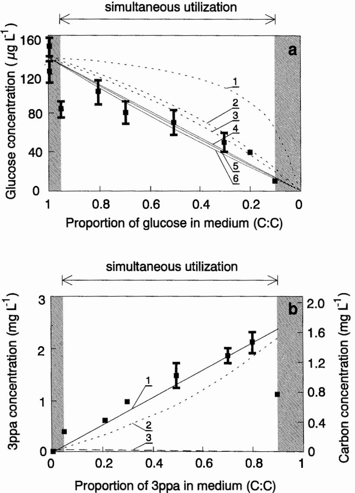

Chapter 3.2 77

Table 3.2 Characteristics for sugars and 3-phenylpropionic acid used for prediction of steady-state substrate concentrations during mixed substrate growth (Egli et al., 1993; Lendenmann et al., 1996; equation 3.5). The lines in Fig. 3. IOa correspond to the different models indicated by numbers.

| Line        |                                                                        | Glucose  | Galactose | 3ppa                 |
|-------------|------------------------------------------------------------------------|----------|-----------|----------------------|
| Fisz. 3.lOa |                                                                        |          |           |                      |
| 4           | carbon atoms I molecule of substrate                                   | 6        | 6         | 9                    |
|             | degree of carbon reduction                                             | 0        | 0         | +0.67                |
| 6           | moles of 0 2 required for full oxidation of one mo! of substrate | 6        | 6         | 10.5                 |
| 1           | Gibbs free energy of formation (kJ/mol) from elements at 25°C       | -917.22  | -923.53   | -171.sa (-248.5)b |
| 5           | Gibbs free energy for full oxidation at 25°C (kJ/mol)               | -2872.00 | -2868.69  | -4563.62             |
| 3           | mmoles in I 00 mg of compound                                          | 0.555    | 0.555     | 0.666                |
| 2           | weight contribution to substrate concentration in medium feed       |          |           |                      |

a - for 3-phenylpropionic acid calculated from the Gibbs free energies of propionate, phenol and H20; value for 3ppa is comparable to the calculation made according to Dolfing and Harrison ( 1992)

b for benzoic acid (Thauer et al., 1977)

*(ii) Contribution of the individual substrates to the overall growth rate.*  Although the dilution rate of 0.6 h-1 applied in this experiment was higher than the maximum specific growth rate achieved by *E. coli* with 3ppa as the only source of carbon and energy (0.42 ± 0.05 h-1 in batch culture, Kovarova et al., 1996a, or in 0.35 ± 0.05 h-1 continuous culture, this study) both substrates were utilized simultaneously. This suggests that each of the two substrates contributed to overall growth rate (equation 3.4). Assuming that the mixed substrate kinetics can be derived from the relationship between growth rate and steady-state substrate concentration during single-substrate growth, the contribution of the individual substrates to the overall growth rate was determined from the measured steady-state concentrations and the single substrate Monod growth kinetics (for kinetic parameters see Table 3.1). Based on this assumption the contribution of 3ppa has never been higher than the

Fig. 3.11 Contribution of individual substrates to the overall specific growth rate when cultivating *E. coli* in a chemostat at D=0.6 h-1 with different mixtures of 3ppa and glucose. The contribution of 3ppa (0) and glucose(•) was calculated via equation 3.4; dashed line, maximum specific growth rate for *E. coli* growing with 3ppa as sole carbon substrate in chemostat; full line, dilution rate of 0.6 h· 1.

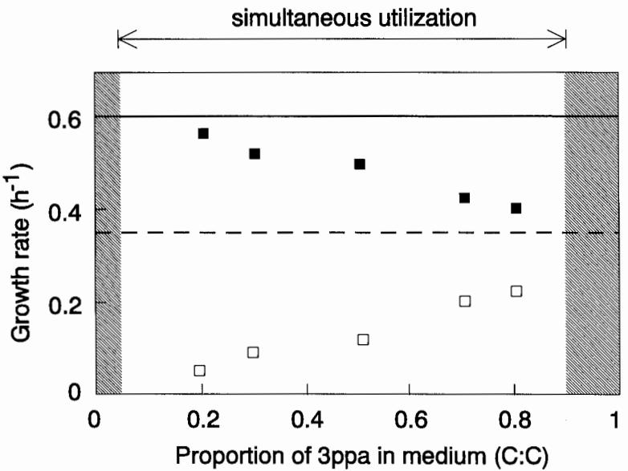

specific growth rate on 3ppa as sole substrate (Fig. 3.11). The resulting overall specific growth rate from glucose and 3ppa was always 0.60 ± 0.05 h-1 indicating that the assumption made with respect to constant yield coefficients for the two substrates was correct.

As expected, it was impossible to cultivate the bacterium with media containing 3ppa at a portion higher than 90-95% (carbon %; compare the specific consumption rate of individual substrates in Fig. 3.9b). When feeding mixtures containing 3ppa in the range of 0-5% (carbon the 3ppa-degradative pathway could not be induced when the cells were previously grown with glucose only, because the concentrations of 3ppa in the inflowing medium were below the threshold concentration of 3 mg L-l that is required to trigger induction (for details see Kovarova et al., 1996c). However, once the system was induced, e.g., after having been exposed to 3ppa concentrations exceeding 3 mg L-1, *E. coli* was able to utilize 3ppa and glucose simultaneously and, even more importantly, to concentrations lower than the threshold for induction (see Fig. 3.!0b).

*(iii) Evaluation of the mixed substrate models.* Using the experimental data, the mixed substrate model proposed by Egli et al. (1993) and Lendenmann et al. ( 1996) was evaluated for its ability to predict the steady-state substrate concentrations from the composition of the medium feed. It was proposed (equation 3.5), that the steady-state substrate concentrations during growth with mixtures are proportional to the mixture composition. The lines in Fig. 3.lOa indicate the model predictions of steady-state glucose concentrations by this simple empirical equation (equation 3.5) using different ways of expressing the contribution of a particular substrate to the mixture composition. In Fig. 3.lOb either the weight or carbon proportions of the substrates in the feed were used in the calculation of steady-state 3ppa concentrations. Although, it was confirmed that the phenomenon of reduced steady-state concentrations during

utilization of mixtures of carbon substrates is generally valid, the predictions made by the originally proposed model (Egli et al., 1993) using weight proportions systematically deviated from our experimental data. However, simply replacing the substrate weight proportions in equation 3.5 by the proportions of carbon lead to good agreement of the predicted steady-state glucose and 3ppa concentrations with the experimental data.

Fig, **3.12** Excess specific substrate consumption rates for glucose (•) and 3ppa (0) during growth of *E. coli* in carbon-limited chemostat culture with mixtures of the two substrates at a constant dilution rate of 0.6 h· 1. Dashed lines, actual specific substrate consumption rates with respect to glucose (line **1)** or 3ppa (line 2) in the chemostat as calculated from equation 3.1.

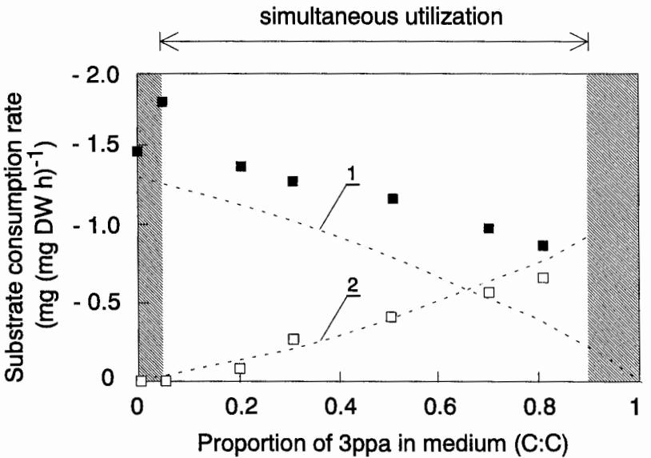

*Oxygen and substrate consumption rates.* Both the specific substrate and the specific oxygen consumption rates were measured in the presence of excess glucose or 3ppa, as a function of the substrate proportion (carbon) in medium feed (Fig. 3.12 and 3.13). The data obtained followed a similar pattern as that observed for the steady-state substrate concentrations. An 'spare-capacity' of roughly 0.4 ± 0.1 h-l was observed for glucose uptake compared to the actual specific consumption rates in the chemostat (equation 3.1). In contrast to

I<ig. 3.13 Correlation between the specific substrate and oxygen consumption rates glucose (•) and 3ppa (0) during growth of *E. coli* in carbon-limited chemostat cultures with mixtures of the two substrates at a constant dilution rate of 0.6 h-1. The numbers indicate the different mixtures (given in carbon%): 1, 100% glucose and 0% 3ppa; 2, 70% glucose and 30% 3ppa; 3, 30% glucose and 70% 3ppa; 4, 20% glucose and 80 % 3ppa; S, 95% glucose and 5% 3ppa; 6, 80% glucose and 20% 3ppa.

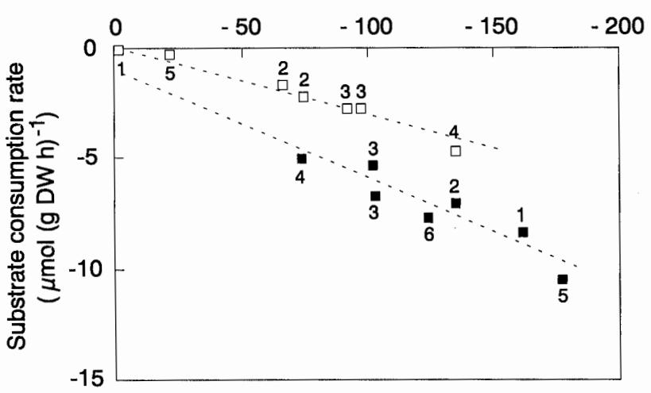

## **Oxygen consumption rate { µmol {g DW hf 1)**

glucose, the 3ppa uptake system appeared to operate close to saturation during growth in continuous culture and cells exposed to an excess of 3ppa were not able to utilize it significantly faster than they did in the chemostat. Similarly, when *E. coli* was grown at different growth rates in chemostat culture with 3ppa only, the measured specific excess 3ppa consumption rates corresponded to the actual consumption rate of this culture, whereas the cells retained a constant specific glucose consumption rate of 0.45 ± 0.05 h·l (data not shown).

As expected, the excess specific oxygen and substrate consumption rates were related to each other (both given in nmol h-1 (mg DW)-l in Fig. 3.13). The ratio of the two slopes for 3ppa and glucose (3ppa:glucose 1.5) approximately corresponded to the molar ratio of oxygen (1.75) necessary to fully oxidize the two substrates.

#### **Discussion**

The authors are aware of the fact that the experimental system used in previous studies consisting of *E. coli* utilizing mixtures of up to six sugars (Egli et al., 1993; Lendenmann et al., 1996) is rather artificial. Nevertheless, it is so far the best studied example of mixed substrate utilization that allows to propose an empirical equation for the description of the relationship between steady-state substrate concentrations and proportions of the substrates fed to a microbial culture (equation 3.5). For example, in a mixture of glucose, galactose and fructose the metabolic pathways are convergent; there are no more than four enzymatic reactions until each of these carbon skeletons enters the central glycolytic pathway. All these sugars (an example for glucose and galactose is given in Table 3.2) have the same carbon content, degree of carbon reduction of zero and the same energy content (i.e., the Gibbs free energy of formation from elements, Thauer et al., 1977). Therefore, when relating the steady-state substrate concentrations to the substrate proportions in medium

feed (equation 3.5), it cannot be distinguished between the relative contribution with respect to the weight, carbon, energy content, the molar ratio of substrates, or oxygen needed for complete oxidation. Although, the rule proposed by Egli et al. (1993) that "steady-state concentrations of an individual sugar would be linearly related to its proportion contributing to the total specific consumption rate into the cell" sounds rather simplistic, it seems to be correct for the special case of a mixture of homologous carbon substrates such as sugars. Nevertheless, it is to be expected that this concept has to be refined (e.g., Egli et al., 1982, 1983, and 1993) when applied to carbon substrates that differ in their chemical structure, degree of reduction, or the regulation of the enzyme system involved in their degradation.

Here, we tested whether this concept is also applicable for a mixture of 3ppa and glucose. These two substrates are metabolized via two completely different metabolic pathways. Additionally, the regulation of the enzymes of the two pathways is distinctly different. Whereas the 3ppa-degrading system is inducible, that for glucose is constitutive (Kovarova et al., 1996a). The differences in the physico-chemical characteristics of glucose and 3ppa are listed in Table 3.2. Fig. 3. lOa gives a comparison of the experimentally determined glucose concentrations and the predictions made by replacing the substrate weight proportions in equation 3.5 by other parameters expressing the contribution of an individual compound to the mixture composition. The predicted values were in good agreement when the calculation was based on the contribution of carbon of a substrate. Similarly, good predictions were obtained when the relative energy content of the substrates (here expressed as the Gibbs free energy for the full oxidation of the two substrates) or the molar ratio of oxygen needed for their complete oxidation to C02 and HzO were used. Hence, both these characteristics are indirect expressions of the degree of carbon reduction in the compound. It should be pointed out that one has to assume that the substrates are perfectly substitutable (i.e., both the substrates fulfil the same physiological functions) and that the energy conservation during catabolism and energy utilization during anabolism occurs with the same efficiency with respect to the individual substrates. However, the latter assumption can hardly be proven experimentally and its use to explain the substrate utilization pattern is rather speculative, though, plausible. Hence, to further test the general applicability of equation 3.5, other substrates that are more oxidized (e.g., such that exhibit negative degree of carbon reduction) than the sugars or 3ppa should be tested.

Furthermore, the experimental data presented for *E. coli* with mixtures of substrates in continuous culture (this paper; Lendenmann et al., 1996) give an answer to the question how microorganisms are able to reduce concentrations of carbon substrates in ecosystems to the low levels observed and still grow reasonably fast. When at a constant growth rate several substrates are consumed at the same time, the flux through the catabolic pathways of individual substrates will be reduced (reviewed in e.g., Egli, 1995). Thus, the pathways for individual substrates have always spare capacity for their utilization (e.g., Egli et al., 1983). Implicitly, this might enable higher rates of biodegradation of substrates (pollutants) when they are degraded in the presence of additional substrates (Brinkmann and Babel, 1992).

#### **Acknowledgments**

We are indebted to Albert Tien for advice concerning the measurements of oxygen uptake rates and to Vaclav Chaloupka for help with the bioreactors. We acknowledge the constructive comments made on this manuscript by Urs Lendenmann.

## 3.3 Threshold Substrate Concentrations Required for Induction of the Catabolic Pathway for 3-Phenylpropionic Acid in *Escherichia coli*

### Abstract

A central question concerning the fate of pollutants in the environment is that of their degradation at low concentrations. This problem was investigated for *E. coli* during cultivation in carbon-limited continuous culture. The experiments were performed at a dilution (growth) rate of 0.6 h-1 supplying in the inflowing medium mixtures of glucose (100 mg L-1) and 3 phenylpropionic acid (3ppa; from 0.25 to 25 mg L-1). It was demonstrated that low 3ppa concentrations (0.25 to 3.05 mg L-1) were not able to induce the degradative pathway in cells growing with glucose and that an apparent threshold concentration of 3ppa existed (ca. 3 mg L-1) below which the 3ppa was not utilized. However, at higher concentrations of 3ppa (5, 7.5, and 25 mg L-1) induction was always triggered and 3ppa was utilized. The induction of 3ppa-degrading enzymes proceeded faster (i.e, a shorter time was required before induction became detectable) at higher 3ppa concentrations in the medium feed, and at lower growth rates (e.g., D=0.2 h-1). Once induced, the cells were able to utilize 3ppa down to concentrations lower than those that were required to provoke induction of the 3ppa catabolic pathway. All these findings support the hypothesis that initially the induction is triggered at a certain concentration of 3ppa, but once the degrading system is induced the utilization is regulated by the flux of 3ppa through the pathway.

#### **Introduction**

In natural waters "threshold" concentrations of certain compounds (including pollutants) have been observed below which these compounds were either not utilized anymore, or where their rate of degradation slowed down enormously (summarized in, e.g., Schmidt et al., 1985; Alexander, 1994). This phenomenon has been attributed either to the fact that a finite amount of substrate is needed to sustain necessary metabolic functions (here threshold for "utilization and growth"; discussed in, e.g., Kovarova et al., 1996a; Pirt, 1975), or that the concentration of a particular compound is too low to provoke induction of the enzymes necessary for its degradation (here "induction" threshold, e.g., Alexander, 1994; DiMarco et al., 1995).

In both natural and engineered environments the biodegradation of pollutants always takes place in the presence of complex mixtures of easily degradable carbon sources of natural origin. Usually, constitutive enzymes are involved in the metabolism of easily degradable substrates, whereas the degradative pathways of "pollutants" very often have to be induced (reviewed in, e.g., Egli, 1995). If the synthesis of enzymes of a catabolic pathway requires the presence of the pollutant for induction, then the question arises as to how much of a pollutant is needed to stimulate induction, what the time course of this induction process looks like, and how rates and extent of biodegradation are influenced by the presence of natural carbon substrates.

As a step towards understanding the utilization patterns and kinetic interactions occurring during growth of microorganisms with mixtures of easily degradable substrates and pollutants at low concentrations, the biodegradation of mixtures of glucose (i.e., easily degradable substrate) and 3-phenylpropionic acid (3ppa; pollutant) by *Escherichia coli* has been studied systematically in continuous culture. 3ppa can support the growth of *Escherichia coli* as sole carbon and energy substrate (Burlingame and Chapman, 1983). Although

glucose repressed the utilization of 3ppa in batch culture, both substrates were utilized simultaneously in carbon-limited continuous culture. (details on this aspect have been presented elsewhere, Kov:irova et al., 1996 a,b ). In contrast to a number of biochemical or genetic studies (e.g., DiMarco et al., 1995; Duetz et al., 1994 ), in this study, we did not measure the effect of substrate concentration on the expression of a particular enzyme only, but on the overall degradation process. Such an approach is advantageous, when details on the entire pathway, the limiting step of the degradation, or the effects of additional substrates are not known.

#### **Materials and methods**

*Medium and culture conditions. Escherichia coli* ML 30 (DSM 1329) was grown in continuous culture at 37°C in mineral medium (Senn et al., 1994) supplemented with glucose and/or 3ppa as the sole sources of carbon and energy. In the bioreactors (MBR, Switzerland, working volume 1.5 L; and Bioengineering, Switzerland, working volume I L) the pH was maintained at 7 ± 0.05 and oxygen saturation was >90% air saturation. The cultivation conditions have been described in detail elsewhere (Senn et al., 1994).

#### *Analyrical procedures*

*(i) Jppa analysis.* The 3ppa-concentrations were analyzed by a standard application of HPLC with UV detection as described by Kovarova et al. ( l 996a}. Because the precision of this analysis was± 0.02 mg L-l and the accuracy in preparing the media was ca. *5* to 10% of the total concentration, the actual 3ppa concentrations in the culture are often given as percentage of the concentration in mtxlium feed and not as absolute concentrations.

*(ii) Glucose analysis.* The glucose concentrations were analyzed by HPLC according to Senn et al. (1994).

*Biomass determination.* Biomass was measured as dry weight (DW) by filtration through a 0.2 µrn pore size polycarbonate membrane filter (Nuclepore). Cells collected on filters (equivalent of 100 mL cell suspension) were washed with distilled water and filters were dried at !05°C to constant weight. Optical density was determined in 5 cm or I cm cuvettes at 546 nm with a Uvikon 860 spectrophotometer (Kontron).

#### *Measurement of 3ppa-degrading activity*

*(i) Specific oxygen uptake rates.* 12 mL of culture liquid were collected from the chemostat, washed twice and resuspended in 3 mL of mineral medium (Senn et al., 1994). The 3ppa- or glucose-stimulated oxygen uptake rate was recorded in a Clark-type oxygen probe (Rank Brothers) at 37°C. The total volume of the assay was 3 mL, consisting of 2.8 mL cell suspension of known biomass concentration and 0.2 mL of O.lM glucose or 3ppa solution. The deviation of the measurements was about± 15 nmol 02 min· I (mg DW)" 1. 

*(ii) Specific substrate consumption rates.* The excess consumption capacity of the cells grown in continuous culture was measured immediately after the cells were withdrawn from the bioreactor by a modified method as described by Kovarova et al. (1996b). The specific flux of particular substrate that is set by the hydraulic parameters, can be expresse-0 by equation 3.6, whens **=0* ors*<< s0. 

$$\mathbf{q}_s = \frac{\left(\mathbf{s}_0 - \mathbf{s}\,\,\mathbf{v}\right)}{\mathbf{X}} \cdot \mathbf{D} \tag{3.6}$$

*(iii) Growth experiments in batch cultures.* In preliminary experiments (Kovarova et al., l 996a), it was shown that when uninduced cells were inoculated into a medium containing 3ppa only the growth (degradation) on 3ppa started after an initial lag phase. This lag phase was not observed when the cells had experienced 3ppa degradation before they were used as an inoculum for the batch experiment. Such simple batch experiments (in Erlenmeyer flasks aerated by a magnetic stirrer: with 278.l mg L-1 of 3ppa as the sole source of carbon and energy) were performed as an additional check for the induction of the 3ppa-degrading pathway. 

#### *Data analysis*

*(i) Standardized wash-in curves.* The theoretical time course of the substrate concentration (s(t), curve No. 2 in Fig. 3.14a) when shifting a culture to a new medium composition is described by equation 3.7, where s0 is the concentration in the new medium feed, and s 1 is the concentration in reactor before change. This equation is a combination of the wash-in course of the new medium and wash-out course of the previous medium (curves No. la and 3 in Fig. 3. I 4a). 

$$\mathbf{s}(t) = \mathbf{s}_0 + (\mathbf{s}_1 - \mathbf{s}_0) \quad \mathbf{e}^{-\mathbf{D} \cdot \mathbf{t}} \tag{3.7}$$

When the 3ppa concentration measured in the culture (s *) was identical to s(t) and finally to s0, no 3ppa was utilized. Concentrations lower than s(t) indicate that 3ppa was utilized. In order to easily compare experiments with different initial 3ppa concentrations, the actual 3ppa concentrations were corrected for the influence of the previously used medium

$$\mathbf{p} = \frac{\begin{pmatrix} s \ \mathbf{s} - \ \mathbf{s}_{\parallel} \ \mathbf{c}^{-\text{D} \cdot \mathbf{t}} \end{pmatrix}}{\mathbf{s}_{\mathbf{0}}} \cdot 100 \tag{3.8}$$

**Fig. 3.14** Standardized wash-in curves: An explanation of the computing approach. (Relevant equations are given in Materials and methods) (a) la - line, wash-in of new medium (3ppa concentration= so); 2 - line, the actual (measured, s*) 3ppa concentration; 3 - line, wash-out of the previously used medium (3ppa concentration = s1); **(b)**  standardized wash-in curves for D=0.6 h-1 (line **lb)** and D=0.2 h-l (line **4).** 

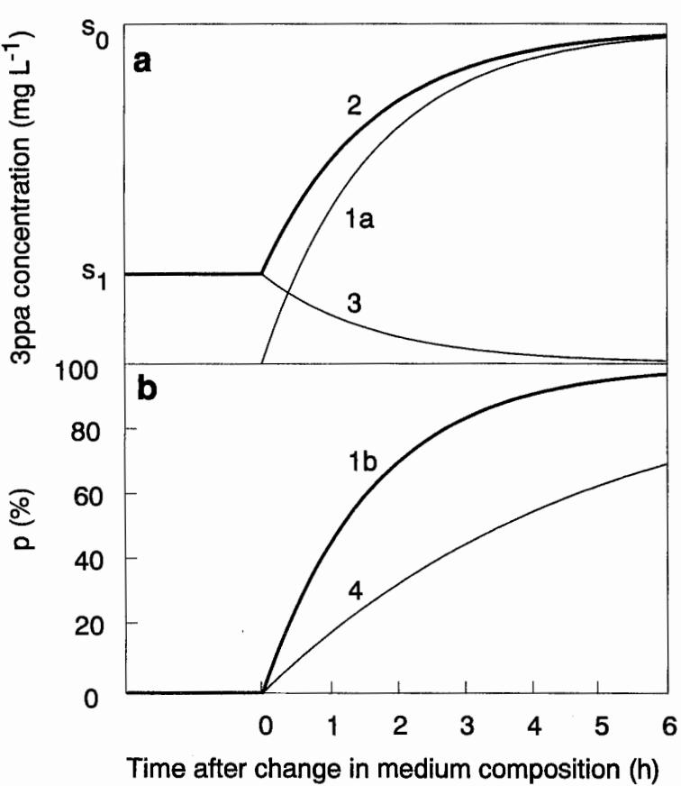

*(ii) Wash-out of 3ppa-degrading capacity.* The theoretical wash-out curve (equation 3.9) was used to describe the time course of specific 3ppa-stimulated oxygen uptake rate assuming that after the shift to medium containing only glucose the synthesis of 3ppa-enzymes was completely repressed.

$$\mathbf{q}_{\rm O2}(t) = \mathbf{q}_{\rm O2,0} \cdot \mathbf{c}^{-\rm D} \mathbf{t} \tag{3.9}$$

*(iii) 3ppa degradation rate.* The degradation rate (r) in the chemostat was determined from the substrate balance (equation 3.10). Integration of equation 3.10 using the boundary conditions s(t={))=so yields equation 3. I l, unfortunately, equation 3.11 cannot be explicitly solved for r.

$$\frac{d\mathbf{s}}{dt} = \mathbf{D} \cdot \mathbf{s}_0 - \mathbf{D} \cdot \mathbf{s}(t) - \mathbf{r} \cdot \mathbf{s}(t) \tag{3.10}$$

$$\mathbf{s}(\mathbf{t}) = \frac{\mathbf{s}(\mathbf{D} + \mathbf{r})\mathbf{t} \cdot (\mathbf{D} + \mathbf{r})}{\mathbf{s}(\mathbf{D} + \mathbf{r})\mathbf{t} \cdot (\mathbf{D} + \mathbf{r})} \tag{3.11}$$

In order to simplify this calculation the degradation rate was determined from the initial slope of the p=f(time) curve (see Fig. 3.16 and equation 3.8). Note that in the case of cultures grown at the same dilution rate the slope (equation 3. 12} is directly proportional to the actual degradation rate and one can compare only the easily computable slopes without any need for corrections for wash-in or wash-out.

$$\mathbf{v} = \frac{\Delta \cdot \mathbf{p}}{\Delta \cdot \mathbf{t}} \tag{3.12}$$

#### Results

# *Effect of the 3ppa concentration on the induction of its catabolic pathway.*  In order to investigate the effect of 3ppa concentration on its utilization. glucose-limited continuous cultures of *Escherichia coli,* that were in steadystate at a dilution rate of 0.6 h· l with respect to biomass and residual glucose concentration, were shifted to a new medium containing the same concentration of glucose ( 100 mg L-1) plus a certain concentration of 3ppa. The experiments were carried out in three independent chemostat runs and the sequence of 3ppa concentrations is given in Fig. 3.15. When non-inducing concentrations of 3ppa

were supplied the culture was exposed to this medium for at least 130 generations before the 3ppa concentration in the feed medium was increased to

**Fig. 3.15** Sequence of induction experiments carried out in three independent continuous cultures. Glucose concentration in the inflowing medium was always 100 mg L-1 and the dilution rate was constant at 0.6 h-1; each continuous culture was started with glucose as Lhe only carbon/energy source (here indicated by "O"); columns, 3ppa concentrations in the medium feed, the different patterns indicate 1hree independent chemostat runs.

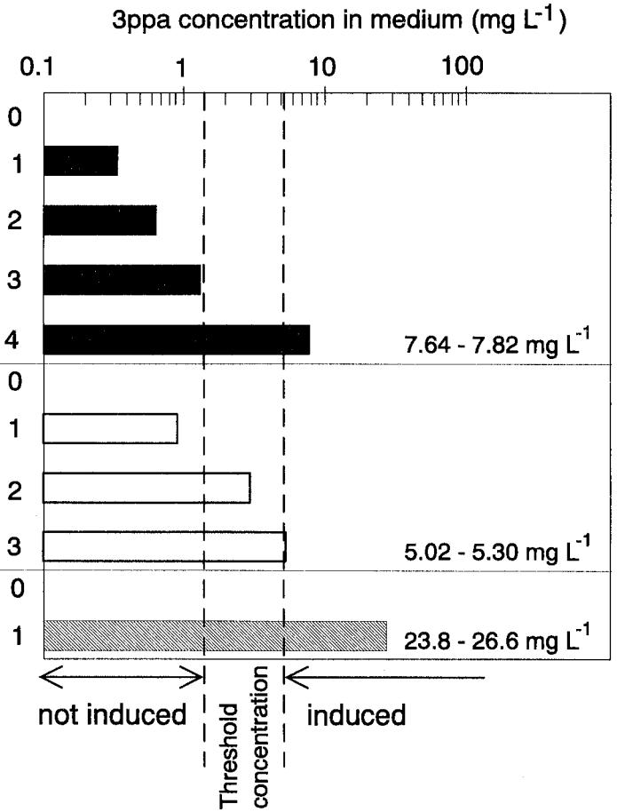

the next higher concentration. After changing the concentration of 3ppa in the medium the wash-in of 3ppa was followed in the culture and compared with the theoretical wash-in curves for 3ppa (for explanation see Fig. 3.14; equation 3.8) assuming that no 3ppa was utilized. Onset of 3ppa utilization was arbitrarily defined as the point where the measured concentrations were systematically 10% lower than those theoretically expected (e.g., Fig. 3.16).

When media were fed that contained 3ppa at concentrations between 0.25 to 3 mg L-1 no 3ppa degradation was detected over more than 215 generations (250 hours) for each of the tested concentrations. At higher concentrations (approximately 5, 7 .5 and 25 mg L-1) 3ppa was always utilized. In the latter experiments 3ppa-degrading activity was induced after an initial wash-in period resulting in 3ppa concentrations in the culture lower than those theoretically expected (equation 3.7).

In the different experiments the time needed until induction started was determined by linear extrapolation of the maximum slope of the p=f(time) curve (see, e.g., Fig. 3.16, 3.17). The data (Table 3.3) clearly indicate that the induction of 3ppa-degrading enzymes was triggered faster (i.e, a shorter induction time was required) when higher concentrations of 3ppa were supplied in the medium feed, however, the exhibited degradation rates were similar at either 7.5 or 25 mg L-1 of 3ppa. Additionally, the presence of 3ppa-degrading enzymes in the cells was assessed both by monitoring the cellular 3ppastimulated oxygen uptake rate and by batch incubation experiments. Consistently, oxygen uptake rates were below the detection limit when the pathway was not induced and the lag exhibited by non-induced cells inoculated into medium containing 200 mg L-1 of 3ppa carbon was in the range of 10 h.

These experiments suggest that a glucose-growing culture of *E. coli*  requires a minimum concentration of approximately 3 mg L-1 of 3ppa (i.e., threshold concentration) until induction of 3ppa-degrading enzymes is

Q)

J!!

E

:::J

Q)

E

(/)

c:

0

.l:l

c:

Q)

0

c:

0

(.)

----·-------·-----

...

Fig. 3.16 Relative concentrations of 3ppa after medium shift to a higher 3ppa concentration compared to the theoretical wash-in curve. Glucose concentration in the inflowing medium was always 100 mg L-1 and dilution rate was constant at 0.6 h·l; lines, theoretical wash-in curve with 10% deviation (equation 3.8); data for 23.8-26.6 mg L-l of 3ppa in medium feed were adapted from Kach (1995); dashed lines indicate the linear extrapolation of the initial slope used to determine the time required for induction. 

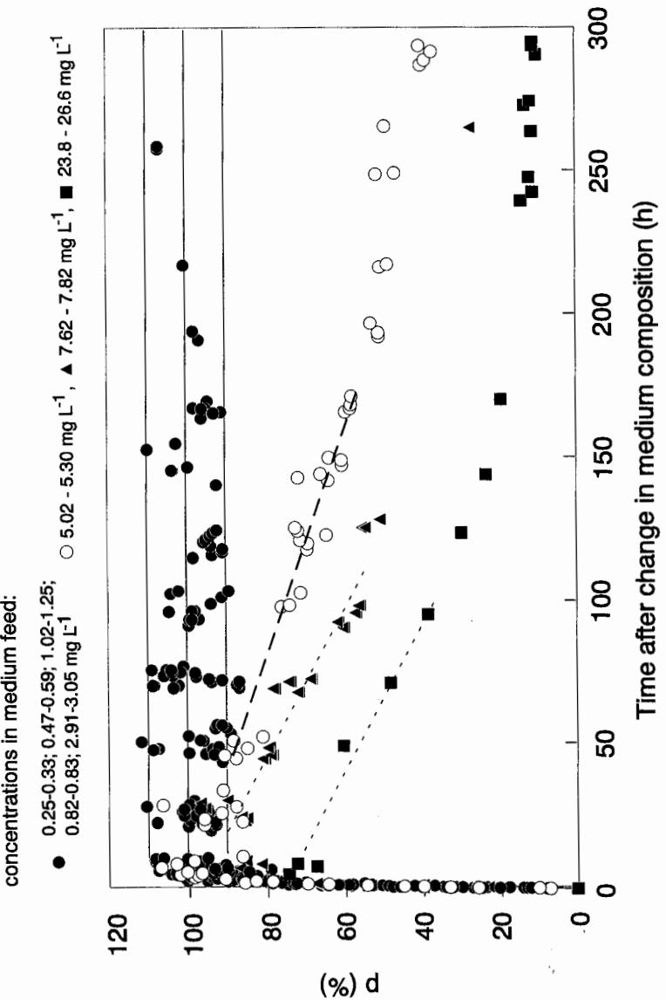

| D     | Mixture supplied     |                       |                           | q (3ppa) 8 | Time        |
|-------|----------------------|-----------------------|---------------------------|------------------|-------------|
| (h•l) | So (glc) (ma L-1) | so (3ppa) (ma L-1) | F'raction of 3ppa (%C) | (h•l)            | (h)         |
| 0.6   | 100                  | 5.0-5.3               | 8.-8.7                    | 0.067-0.071      | 52.5 ± 2.5  |
| 0.6   | 100                  | 7.6-7.8               | 12.0-12.3                 | 0.101-0.104      | 20 ± 5      |
| 0.6   | 100                  | 23.8-26.6             | 30.0-32.4                 | 0.317-0.355      | 4 ±I*       |
| 0.6   | 10                   | 50.0                  | 90.0                      | 6.67             | 3.5 ± 1 *   |
| 0.6   | 25                   | 4.5-5.6               | 24.5-28.7                 | 0.240-0.299      | 180 ± 20    |
| 0.2   | 100                  | 4.5-5.6               | 7.5-9.2                   | 0.020-.025       | 17.S ± 2.5* |

**Table 3.3** Time required for induction of the 3ppa-degrading activity in *E. coli* when an non-induced cells growing in glucose-limited culture were shifted lo a medium containing a mixture of 3ppa and glucose.

*corresponding lo 3-5 generations

triggered. Importantly, once induced, the cells were able to utilize 3ppa to concentrations that were lower than the threshold concentration for induction (Fig. 3.16). For example, after 300 hours of cultivation the actual concentrations of 3ppa were 1.9 and 2.3 mg L· I in cultures fed with media containing 5 and 25 mg L-1of3ppa, respectively.

*Effect of the flux of 3ppa on its degradation.* Although a threshold concentration was observed, one could also argue that not the concentration of 3ppa but a particular flux of this compound will switch on the 3ppa-degrading system. Using the following two (i. *ii)* experimental approaches it was tested, whether the concentration or the flux of 3ppa initiates the induction of the 3ppa-degrading enzyme system.

*(i) varying the glucose concentration (i.e., the total biomass concentration).*  When considering a chemostat culture growing at a dilution (growth) rate of 0.6 h·I with a mixture of *5* mg L·I of 3ppa and 100 mg L·l of glucose the flux (equation 3.6) of 3ppa was ca. 0.067 h-1. Theoretically, a culture would experience the same flux of 3ppa if it was grown with a mixture of l.25 mg L-1 of 3ppa and 25 mg L · l of glucose, i.e., when the feed concentrations of both substrates were four times lower. In Fig. 3.17, it is shown that for a culture growing at D=0.6 h-1 with a mixture of 4.46-5.60 mg L-1 of 3ppa and 25 mg L-1 of glucose ca. 180 ± 20 hours of cultivation were required before the 3ppa utilization started. However, 3ppa was not utilized (data not shown) when a mixture of 1.25 mg L·l of 3ppa and 25 mg L·l of glucose was fed. This indicates that a certain concentration but not the same proportion of 3ppa:glc triggered 3ppa utilization (Table 3.3). Furthermore, when the culture was cultivated with a medium containing the same 3ppa concentration but l 00 mg L-1 of glucose, the degradation started already 50-55 hours after the change to the 3ppa-containing medium.

*(ii) varying the dilution (growth) rate.* Alternatively, the flux of 3ppa a culture is experiencing could be also manipulated when the cells are cultivated with media containing the same 3ppa concentration (5 mg L·l) and by varying the dilution rate. At an inducing 3ppa concentration of 5 mg L·l the cells were exposed to different external fluxes of 3ppa by cultivating them at different dilution rates (0.6 and 0.2 h·l). It was shown (Fig. 3.17) that when the cells were grown at D=0.2 h·I with a mixture of 4.51-5.65 mg L-1of3ppa and 100 mg L-1 of glucose, 3ppa was utilized almost immediately, i.e., within 15-20 hours after the medium shift, corresponding to ca. *5* generations. However, at the higher growth rate (0.6 h-1) the time/generations required to trigger 3ppa degradation was distinctly longer.

**Fig. 3.17** Relative 3ppa concentrations in the culture after shift of a non-induced culture to a medium containing ca. *5* mg L-1 of 3ppa compared with the theoretical wash-in curves. • glc:3ppa concentration in medium feed was 25:4.5 to 5.6 mg L-l at a dilution rate of 0.6 h·l; • glc:3ppa concentration in medium feed was 100:4.5 to 5.6 mg L-1 at a dilution rate of 0.2 h·I; 0 glc:3ppa concentration in medium feed was 100:5.0 to 5.3 mg L-1 at a dilution rate of 0.6 h-1; lines, theoretical wash-in curves (dashed line for 0.2 h-1, full line for 0.6 h-l; equation 3.8).

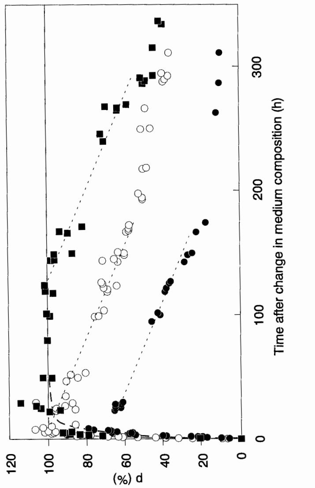

*Loss of the 3ppa-degrading activity.* In order to test how fast the degrading activity is lost again after shifting an induced culture back to the concentration below the 3ppa threshold level, a culture growing with a mixture of 3ppa:glc (23.8:100 mg L-1) was shifted to a medium containing glucose only (100 mg L-1 ). After the medium change the 3ppa-degrading activity followed the theoretical wash-out curve (Fig. 3.18), i.e., in the absence of the inducing compound the 3ppa-degrading activity, as determined by oxygen consumption rate, was lost. This suggests that synthesis of enzymes responsible for 3ppa degradation ceased and that the present enzyme activity was diluted among newly formed cells. 

**Fig. 3.18** Loss of 3ppa-degrading activity after shift of an induced culture growing with a mixture of glc:3ppa (100:23.8 mg L-1) to medium containing glucose only (100 mg L-1) at a dilution rate of 0.6 h-1. 3ppa (•) and glucose (0) stimulated specific oxygen consumption rate; curve, theoretical wash-out curve (equation 3.9) for 3ppa-degrading capacity. 

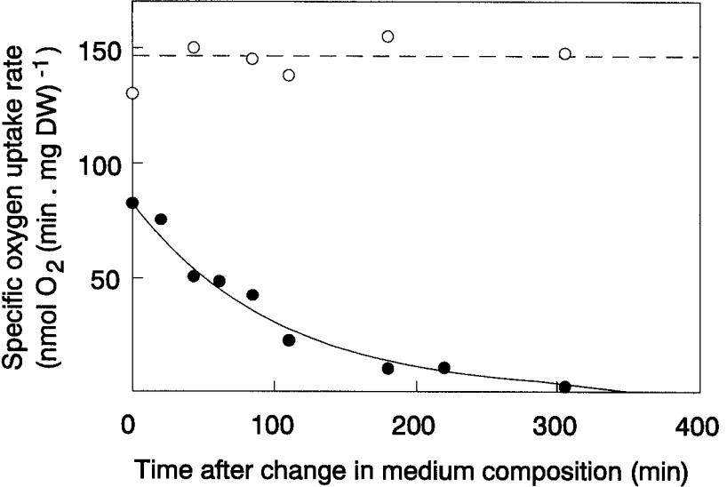

#### **Discussion**

*ls the utilization of 3ppa regulated by concentration, substrate flux, or exposure-time?* In natural as well as technical systems the microorganisms are confronted with a changing availability of both pollutants and easily degradable carbon substrates. Hence, one can envisage that under such conditions the concentration, flux, or exposure time needed to express the enzymes involved in the particular catabolic pathway are important factors affecting the degradation of pollutants. It is very likely that not exclusively one but all these parameters are important at particular stages of the induction process and the subsequent utilization.

The data presented here (Fig. 3.16) clearly demonstrate that a threshold concentration in the range of 3 mg L-1 of 3ppa, i.e., 2· 10-5 M, was needed before 3ppa-degrading enzymes were induced in glucose-grown cells. Threshold concentrations for induction have also been reported for other systems. For example, studies on *Acinetobacter calcoaceticus* reported that 1 µM of 3-chloro-benzoate and 4-chlorobenzoate were not enough to induce the degrading activities (Reber, 1982); or, similarly, an induction threshold of 1 o-7 M of p-hydroxybenzoate was observed by DiMarco et al. ( 1995).

However, our results also give strong indications that the flux of 3ppa through the pathway regulates the utilization of 3ppa in already induced cells. For instance, when a culture was grown with 5 mg L-1 of 3ppa in the medium feed, 3ppa was utilized down to 40% of initial feed concentration (Fig. 3.16), hence, the cells experienced an extracellular 3ppa concentration of 2 mg L-1. Although, this concentration is lower than that which provokes induction, the cells continued to utilize 3ppa. (Note, Kovarova et al., 1996b) reported that already induced cells were able to grow for at least 300 generations at concentrations lower than I mg L-1 of 3ppa without loosing the degrading capacity.) The reproducible data obtained with this well defined experimental system strongly suggest that initially the extracellular concentration and

subsequently the intracellular flux controlled the utilization of 3ppa. However, the mechanism of this control still remains unknown.

It was observed (Table 3.3) that 3ppa utilization started after only some 5 generations either when the cells were exposed to concentrations much higher than the threshold (e.g., 23.8-26.6. and 50.3 mg of 3ppa mg L-1) or when the cells were grown at a lower growth rate (D=0.2 h-1; 3ppa:glc, 5:100 mg L-1). The former experiments demonstrate that, even if an inducer was present at concentrations higher than the threshold level, a certain time for the enzyme synthesis was required before the utilization of 3ppa started. Unfortunately, from the experimental data (e.g., for 3ppa:glc, 5:100 mg L-1 and 3ppa:glc, 7.7:100 mg L-1, Table 3.3), it can not be clearly distinguished whether the exposure dose of 3ppa, i.e., the exposure time multiplied by concentration, played an important role in triggering the synthesis of the degradative system. The latter experiment indicates that at lower growth rates the cells have more "free capacity" to synthesize new enzymes. We would like to point out that in contrast to many other enzyme systems (see Egli, 1995) no derepression (i.e., basal level) of 3ppa-degrading activity was observed in *E. coli* in absence of 3ppa (Note, it is not known whether or not some of the enzymes in the pathway were expressed.). It should also be mentioned that Duetz et al. (1994) observed higher enzyme synthesis rates at higher growth rates which is not consistent with the pattern observed here for 3ppa. All this indicates that the time required for induction of catabolic enzyme systems is probably not the same in different microorganisms.

*Ecological and practical implications of the thresholds for induction.* This study has revealed some interesting regulatory features that are probably not only valid for this particular system but may be a step towards understanding of the regulation of pollutant degradation under complex environmental conditions. Particularly intriguing is the question of the existence of an induction threshold concentration. One should be aware of the fact that the interpretation of the reported threshold concentrations in ecosystems (e.g., Schmidt et al., 1985; Alexander, 1994) is affected by a number of uncertainties. For example, neither the level of induction of the degrading pathway nor the flux of the pollutant were known to which the cells were exposed. Therefore, the threshold concentrations determined in the environment do not necessarily reflect an induction threshold but may be also interpreted as equilibrium concentrations in a dynamic system in which the cells were already induced.

The fluctuating substrate availability in ecosystems implies that also time periods may occur during which no substrate ("pollutant") is available. Therefore, it is of high practical interest to know how long the cells retain a pollutant degrading activity when a culture is shifted back to concentrations below a threshold level. In this context observations from two different experimental set-ups can be distinguished. In a first case where the 3ppa-flux was interrupted and the cells continued to grow with glucose only; here, no new enzymes were synthesized and the 3ppa-degrading activity was lost according to the theoretical wash-out curve (Fig. 3.18). It has been reported for other bacteria that the loss of the catabolic activity can proceed even faster, indicating that the enzymes were additionally degraded (Bally and Egli, 1995). An additional, but not well documented observation was made for our system (Kach, 1995). Cultures that had once been induced and were shifted back to glucose until they had lost all 3ppa activity showed a faster response to a second addition of 3ppa. Although not yet well understood, the system "memory" seems to be an important factor in the flexibility of the culture to adapt to a sudden appearance of xenobiotics that can be used as substrates. In contrast to the above experimental set-up where the flux of 3ppa was interrupted it was demonstrated (Kovarova et al., 1996b) that the catabolic pathway remained induced in an open system (chemostat) in which the resulting steady-state concentrations of 3ppa were below induction threshold. It

should be pointed out that this interraction between flux and extracellular concentration of substrate is still poorly understood. 

## **Acknowledgments**

The authors acknowledge the constructive comments made on this manuscript by Alexander J.B. Zehnder, Stefano Simoni and Urs Lendenmann.

·-------·-----

# **4.**

**Adaptation of** *Escherichia coli* **in Glucose Affinity during Growth in Carbon-Limited Continuous Culture: A Kinetic Study** 

#### **Abstract**

*Escherichia coli* was able to adapt to nutrient-limited or to nutrient-rich environments by changing its kinetic properties (i.e., µmax and K5) drastically. Adaptation from glucose-excess to glucose-limited growth has been studied in continuous culture at different dilution rates (D). Reproducibly (at D=0.3 and 0.6 h-1 ), after some five to ten volume changes the culture was apparently in steady-state with respect to the biomass concentration, however, the residual glucose concentration continued to decrease in a hyperbola-like fashion. The lower the dilution rate, the fewer generations were required to reach steady-state glucose concentrations. This implies that at the very low growth rates observed in nature, the cells coming from a nutrient-rich habitat should adapt "relatively" quickly to a low nutrient environment by reducing their apparent substrate affinity (K8). The long-term cultivation under glucose-limited conditions also affected the uptake capacity with respect to sugars other than glucose. Whereas the specific excess uptake rate for both glucose and galactose decreased and until they reached a higher steady-state level after some 100 generations, that for maltose increased by a factor of two during this period of adaptation. Cells adapted to carbon-limited growth exhibited reduced initial specific growth rates when exposed to excess glucose (compared to µmax). During adaptation from carbonlimited to carbon-excess conditions, a gradual increase with time in the specific growth rate was observed, however, estimation of the apparent substrate affinity Ks proved difficult.

#### **Introduction**

During their life cycle many microorganisms encounter distinct habitats that differ markedly in both the variety and the concentration of available nutrients as well as with respect to physical conditions (e.g. Effendi and Austin, 1995; Savageau, 1983). For example, the bacterium *Escherichia coli,* when leaving its primary habitat - the intestine of warm-blooded animals - has to adapt to conditions of nutrient deficiency in the secondary habitat, i.e., water, soil, or sediment (Azam and Cho, 1987; Morita, 1993; Mi.inster, 1993). On the other hand, free-living aquatic bacteria that are exposed for long periods of time to a wide spectrum of potential substrates in the range of few µg L-1, are frequently difficult to isolate on agar plates of routine bacteriological media (e.g., Effendi and Austin, 1995; Jannasch and Jones, 1959) despite the fact that they are viable (Kjelleberg et al., 1993). It has been suggested that the reasons for this inability to grow were either that the agar was too selective to support all of the nutritional requirements (Heme, 1983), or the cells were unable to multiply because of oversupply of nutrients (Postgate and Hunter, 1964). As a result of such plate count studies, the ecological relevance of many bacterial strains, including *E. coli,* and the importance of their secondary habitat, has often been wrongly assessed (discussed in, Brock, 1987).

In the past two decades it has been demonstrated that free-living microorganisms remain active (discussed in Kaprelyants et al., 1993; Morita, 1993), irrespective of whether no or very slow growth occurs, and that they are adapted to the low nutrient fluxes available to them (e.g., Morita, 1988; Miinster, 1993; Poindexter, 1987). Of the two fundamentally different experimental approaches that are presently used to study the physiological changes taking place in microorganisms when the availability of a particular substrate becomes restricted (i.e., starvation experiments and carbon-limited continuous cultivation) neither is able to exactly reproduce the growth and starvation conditions that microorganisms experience in ecosystems. Nevertheless, it has been suggested that from an ecological point of view, one should study the response of bacterial cells growing continuously under oligothrophic conditions rather than starving non-growing cells, i.e., cells exposed to complete absence of particular nutrients (Morita, 1993). 

In the laboratory, adaptation to low nutrient concentrations can be studied employing a model system in which the microorganisms are transferred from carbon-excess conditions in batch culture to carbon-limited conditions in continuous culture. As a rule of thumb, during continuous cultivation steadystate conditions for macroscopic parameters, such as the concentration of biomass, are reached after some five to ten volume changes. In contrast, it has been observed for a number of microbial strains that significantly longer periods of time were required to reach steady-state conditions with respect to the concentration of the growth-limiting substrate (e.g., Hofle, 1983; Rutgers et al., 1987; Senn et al., 1994). However, it is yet unknown whether or not this process is reproducible and which are the important factors that can influence the adaptation. 

To investigate this phenomenon systematically, a well-defined experimental system is presented in this paper. *Escherichia coli* was used as a model organism because of the enormous background knowledge concerning its physiology and genetics (Neidhardt et al., 1987). Glucose was chosen as carbon and energy substrate, because it is the most abundant dissolved carbohydrate in aquatic habitats (Mopper et al., 1980). Furthermore, its rapid turnover in nature indicates that glucose is one of the major substrates for many

free-living heterotrophs (e.g., Munster, 1993; Rich et al., 1996). The survival under and adaptation to low substrate concentrations exhibited by *E. coli,* is of great practical interest because it might be applied also to the behavior of pathogenic microorganisms in water distribution systems or natural waters (e.g., Camper et al., 1991). 

#### **Materials and methods**

*Organism and medium. Escherichia coli* ML 30 (DSM 1329) was grown at 37°C in mineral medium (Senn et al., 1994) supplemented with glucose. 

*Adaptation to glucose-limited conditions.* Such conditions were simulated by a transfer of cells from a batch culture to a carbon-limited continuous culture supplemented with 100 mg L· I of glucose in the feed. Prior to inoculation into the bioreactor, the bacterium taken from stock cultures (stored at -80°C) was pre-grown for ca. 50 generations in stirred batch cultures with 500 mg L· l of glucose as the sole source of carbon and energy. In order to maintain comparable initial conditions, this procedure was repeated always in the following way before starting up a new continuous culture: the bioreactor (Bioengineering, Wald ZH, Switzerland) was inoculated up to an OD of 0.1 (measured at 546 nm, 5 cm light path cuvette) and feeding of the medium corresponding to the selected dilution rate was started at an OD of ca. 0.45. The pH was maintained at 7 ± 0.05, and the oxygen saturation was >90% air saturation. The cultivation conditions have been described in detail elsewhere (Senn et al., 1994). 

*Adaptation to glucose-excess conditions.* Such conditions were achieved when a culture, grown for an extended time period under carbon limitation at a constant growth rate, was switched to a batch mode. This was performed in the following way: the continuous medium feed was interrupted, the culture volume was reduced to approximately 1/10 of the original volume and simultaneously the reactor was filled by fresh medium supplemented with 100 mg L·I of glucose. The whole process took approximately IO minutes. (Note that differently to the mineral medium used during continuous cultivation, here, we adjusted the pH at 7 ± 0.05 before pumping it into the reactor.) Thus, the culture was diluted and an excess of glucose was present in the culture media that allowed an unrestricted growth. Growth was followed by measuring optical density at 546 nm. By the time when roughly 5 mg L-1 glucose was left in the culture medium, the culture was repeatedly diluted by fresh medium. This process was repeated for at least 14 hours.

The instantaneous growth rates (equation 4.1) were determined as function of time.

$$
\mu(\mathbf{t}_l) = \frac{d\mathbf{x}}{d\mathbf{t}} \cdot \frac{1}{\mathbf{x}} \tag{4.1}
$$

The calculations were always performed using 5 subsequent biomass measurements (i.e., µ(t1) using the first to the fifth, for µ(12) the second to the sixth datapoint, etc.).

*Glucose analysis.* Glucose concentrations were analyzed by HPLC (for more details on the method and the preparation of samples see Senn et al., 1994).

*Specific consumptWn rates for glucose, maltose, or galactose.* The qexcess of cells grown in continuous culture was measured immediately after the cells were withdrawn from chemostat by a modified method (Lendenmann and Egli, 1995) originally reported by Neijssel and co-workers (Neijssel et al., 1977). The specific sugar consumption rate in the bioreactor was calculated using equation 4.2:

$$\mathbf{q}_s = \frac{(\mathbf{s}_0 - \mathbf{s}) \cdot \mathbf{D}}{\mathbf{X}} \tag{4.2}$$

*Substrate affinity constant.* Ks for glucose (as defined hy Monod, 1942) was determined by different methods. It was calculated *(i)* from glucose concentrations in continuous culture, *(ii)*  from batch growth data, or *(iii)* was determined by consumption experiments:

*(i)* K8 was calculated from glucose concentrations measured in continuous culture using either the original (equation 4.3), or an extended form of the Monod model (equation 4.4, Kovarova et al., l 996e).

$$\mathbf{K}_{\mathbf{s}} = \frac{(\mu_{\text{excess}} - \mathbf{D}) \text{ s}}{\mathbf{D}} \tag{4.3}$$

$$\mathbf{K}_{\mathbf{s}} = \frac{\left(\mu_{\text{cscases}} - \mathbf{D}\right) \left(\mathbf{s} \cdot \mathbf{s}_{\text{Minin}}\right)}{\mathbf{D}} \tag{4.4}$$

*(ii)* When the growth curve was available (batch growth with 500 mg L-l of glucose as the sole source of carbon and energy), K5 was also determined by non-linear parameter estimation of the transcendental equation 4.5, i.e., an equation that cannot be explicitly solved for X. This relationship results from a combination of equations for specific growth rate, Monod growth kinetics and the relationship between microbial growth rate and substrate consumption rate (for more details see Pitter and Chudoba, 1990).

$$\mathbf{t} = \frac{1}{\mu_{\text{max}}} \left( \frac{\mathbf{Y} \cdot \mathbf{K}_{\text{s}} + \mathbf{X}_{\text{m}}}{\mathbf{X}_{\text{m}}} \cdot \ln \frac{\mathbf{X}}{\mathbf{X}_{\text{0}}} - \frac{\mathbf{Y} \cdot \mathbf{K}_{\text{s}}}{\mathbf{X}_{\text{m}}} \ln \frac{\mathbf{X}_{\text{m}} - \mathbf{X}}{\mathbf{X}_{\text{m}} - \mathbf{X}_{\text{0}}} \right) \tag{4.5}$$

*(iii.)* Ks was determined from consumption rates (q8) measured with cells withdrawn from chemostat culture and immediately exposed to at least six different initial glucose concentrations. The method to measure q8 has been already described by Lendenman and Egli ( 1995). In order to determine the K8 value the Monod equation (Monod, 1942) was fitted to the q5=f(s) relationship by using non-linear parameter estimation.

#### **Results and discussion**

*Adaptation to carbon-limited conditions.* The time courses of the adaptation process have been studied for *Escherichia coli* in glucose-limited continuous culture. After inoculation of a bioreactor with cells pregrown in batch culture on glucose-containing mineral medium the biomass concentration, residual glucose concentration *(i)* and excess specific consumption rates with respect to different sugars *(ii)* were followed as a function of time.

*(i) Evolution of biomass and glucose concentration.* The concentration of the growth-limiting substrate (glucose) was followed at three different dilution rates (0.2, 0.3 and 0.6 h-l, Fig. 4.1). The steady-state concentration of biomass (45 ± *5* mg L-1 dry weight, corresponding to a yield coefficient of *0.45* ± *5*  mg biomass *I* mg glucose) was reached after approximately five volume changes. Although the culture was in steady-state with respect to biomass,

Fig. 4.1 Time course of the residual glucose concentration in glucose ( carbon)-lirnited continuous cultures of *Escherichia coli* ML 30 operated at different dilution rates. A, culture operated at D=0.2 h- 1; data for independent continuous cultures are shown for D=0.6 h-1 (•and 0, from Kach, 1995) and D=0.3 h·l (•,O).

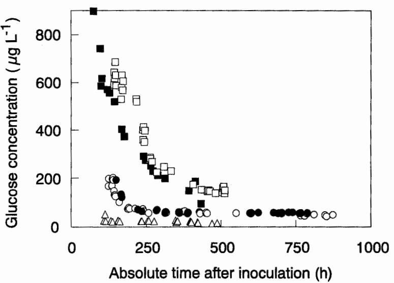

concentration the residual glucose concentration in the culture continued to . decrease in a hyperbola-like fashion.

Assuming a constant yield coefficient (Monod, 1942), continuous cultivation with a single growth-limiting substrate at a particular growth rate results in a biomass concentration directly proportional to the substrate consumed. Therefore, changes in residual glucose concentration imply changes in biomass concentration. The apparent constancy of the biomass concentration in our experiments is due to the experimental set up, where in relation to the background biomass concentration of 45 ± *5* mg L·I, detection of an increase of at the most 0.5 mg L-1, caused by the decrease of glucose concentration from 1000 to 30 µg L-1, is impossible.

In the case of D 0.6 h-l the steady-state concentration of glucose was reached after some 250 to 300 volume changes (i.e., 360-420 generations). When the same experiment was carried out at lower dilution rates, the time/generations required to achieve steady-state levels of glucose became shorter with decreasing dilution rates and the relation between the number of generations or volume changes and the absolute time required changed (Fig. 4.2). Fig. 4.1 demonstrates for independent continuous cultures a perfectly reproducible hyperbola-like decrease of the residual glucose concentration during the initial pha<;e of cultivation performed at D of 0.3 and 0.6 h-1. It should be pointed out that obtaining reproducible results required that the history and treatment of the inoculum was strictly identical.

Once the culture was in steady-state with respect to the residual glucose concentration, the time required to reach steady-state conditions for growth at either a higher or a lower dilution rate was considerably shorter (ca. 10 volume changes) than in the initial adaptation phase. Furthermore, the end point of adaptation with respect to the cell's kinetic properties was always identical, independent of the culture history (results not shown, Kovarova et al., 1996e).

*(ii) Evolution of the consumption capacity with respect to glucose, maltose and galactose.* It was observed that carbon-limited growth, especially at low dilution rates, results in the expression of enhanced levels of many catabolic enzymes (e.g., Egli et al., 1980; Matin, 1979; Sepers, 1984). Therefore, one can speculate the cells could increase their "apparent affinity" for a growthlimiting substrate by using the strategy to either increase the amount of existing glucose transporters, or to transport part of the glucose via other nonspecific uptake systems that are also able to accept glucose. Such an increase in either the amount, or variety of glucose carriers in the membrane would result in higher excess consumption capacities at lower growth rates,

i.e., a larger difference between the qexcess and the q8, which remains fixed at a particular dilution rate in the chemostat (Lendenmann and Egli, 1995). However, although determination of glucose qexcess gives information about the consumption capacity of the cells, one cannot distinguish in such experiments which of or/and to what proportion different transport systems are really used. Interestingly, Leegwater (1983) measured a more or less constant PTS activity in *E. coli* growing in a glucose-limited chemostat at different growth rates which implies that the PTS operated below saturation at low growth rates. This observation raises the question of whether or not an alternative transport systems is used for glucose uptake at low growth rates, especially when considering that PTS exhibits an overcapacity and that the affinities for glucose known alternative sugar transport systems are

**Fig.** 4.2 Influence of dilution rate on the time required until reaching constant kinetic properties for *E. coli* growing in glucose-limited continuous culture. (open columns approximate total time required to achieve steady-state; full columns - volume changes or generations required to achieve steady-state).

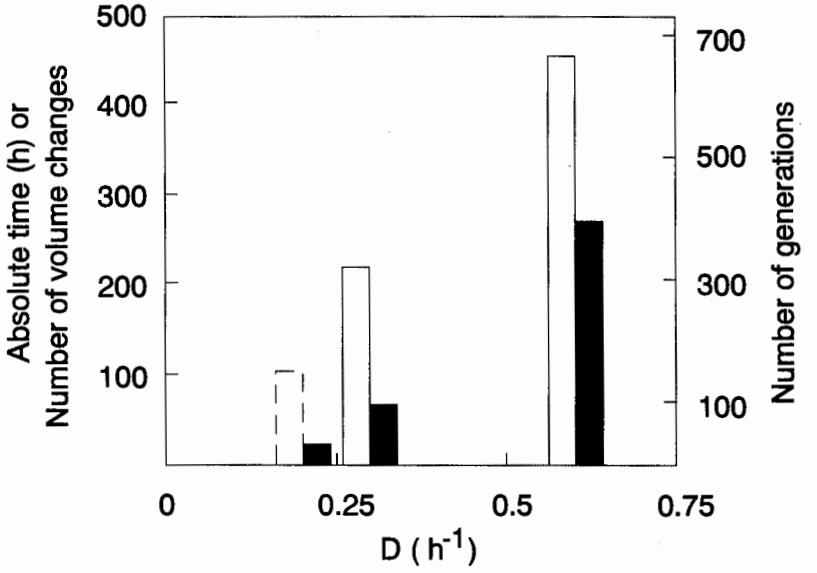

as far as known lower than that of PTS (20-2000 µg L-1; Lengeler, 1993).

Therefore, the qexcess for glucose and additionally, galactose and maltose was determined. It was observed (Fig. 4.3) that long-term cultivation under glucose-limited conditions affected the uptake capaeity for all these sugars. Wherem; the qexcess for both glucose and galactose decreased and until they reached (after some 100 generations) a steady-state level, that for maltose increased by factor of two during this period of adaptation. The theoretical (initial) maximum specific consumption rate (qmax) for glucose is 2.04 h-1 (calculated from equation 4.2, using D-µmax=0.92 h-1, Y=0.45 mg biomass *I*  mg glucose). The experimentally determined qexcess for glucose (Fig. 4.3a) was always between the theoretical qmax (2.04 h-1) and the actual q8 in the chemostat (0.67 h-1, when D=0.3 h-1).

Similar to the residual glucose concentration, we were also able to demonstrate that the time-course of the adaptation process with respect to the qexcess for glucose varied with dilution rate (data not shown). The final level of qexcess was reached faster at the lowest growth rate examined. It is interesting that the changes in qexcess proceeded more rapidly than the changes in residual glucose concentration. This implies that changes observed in residual glucose concentration do not necessarily reflect the changes in glucose qexcess· This explanation has been put toward by Hofle (1983) for glucose-grown *Cytophaga johnsonae* in which the residual glucose concentration decreased whereas, after some time an increase in the glucose consumption capacity was measured (Hofle, 1983). It should be pointed out that the presently existing results from different groups are difficult to compare. In our experiments the inoculum was well trained and exhibited µmax and qexcess that the cells can achieve under these cultivation

Fig. 4.3 Evolution of the excess sugar consumption capacity of *E. coli* cultivated in glucose-limited continuous culture. (a) qexcessfor glucose, D=0.3 h-1; the horizontal lines indicate the qmax (equation 4.2) and q5 in the chemostat at D=0.3 h- 1; **(b)** qexce~sfor galactose, D=0.2 h-1 and (c) qexcess for maltose, D=0.2 h-1. 

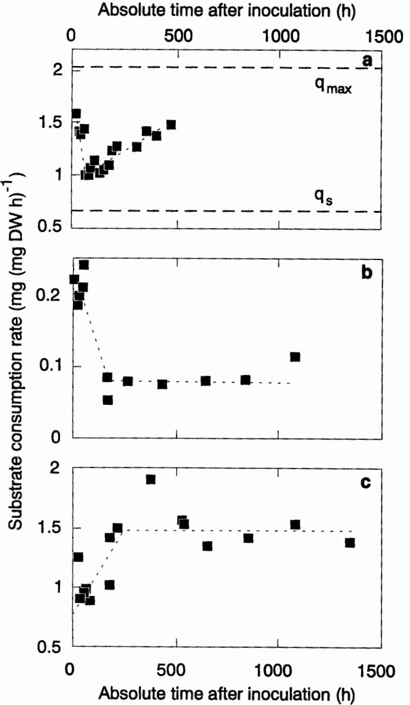

conditions. In contrast, Hi:ifle ( 1983) started continuous cultivation only after the cells were left starving for 8 h in the stationary phase that probably resulted in a decrease of the exhibited µmax· Unfortunately, other authors that rep01ted an increase in µmax during long-tenn cultivation (Helling et al., 1987; Rutgers et al., 1987) also did not mention any training or special standardized treatment of the inoculum.

*Re-adaptation to carbon-excess conditions.* During the adaptation in the opposite direction, i.e., when cells adapted to the growth in a glucose (carbon) limited chemostat were inoculated into a batch culture and transferred several times, continuous increase in the specific growth rate exhibited was observed (Fig. 4.4; the same effect has been already reported by Dean and Hinshelwood, 1966, or an increase in the cell "fitness" has been reported by Santiago et al., 1996). It should be pointed out that it is not clear yet how cultivation condition and culture history, such as dilution rate or the total time of cultivation in the chemostat, influence this re-adaptation. However, our data clearly demonstrate that it takes a considerable time before a culture of *E. coli* exhibits again the maximum specific growth rate possible in this mineral medium. With the readaptation to glucose excess and the simultaneous increase in µmax• one would expect that, at the same time, an increase in Ks occurs. In order to confirm this hypothesis, *E. coli* was grown with an excess of glucose in batch culture and the Ks for glucose was determined by fitting the integrated Monod equation (equation 4.5) to the growth curve. It could be shown that for So>>Ks, which is usually the case in batch cultures, it holds that Y K8 << Y So"'Xm and equation 4.5 is reduced to equation 4.6:

$$\mathbf{x} = \frac{1}{\mu_{\text{max}}} \quad \ln \frac{\mathbf{x}}{\mathbf{x}_{\text{o}}} \tag{4.6}$$

As a result of this, equation Fig. 4.5 becomes insensitive to changes in Ks and, consequently, Ks values differing by more than four orders of magnitude were able to successfully describe the experimental data (Fig. 4.5). Such problems in estimation of parameters of Monod growth kinetics from growth or substrate

**Fig. 4.4** Improvement of the growth rate during batch cultivation. The instantaneous growth rates were determined from biomass concentration as described by equation 4. I. (The improvement factor was defined as the actual growth rate divided by the growth rate at the beginning of the experiment, i.e., the D of the chemostat culture). Culture history: • for 675 hours at D=0.15 h-l and afterwards for next 25 hours at D=0.3 h-1, 0 for 153 hours at D=0.3 h-1 and fornext 43 hours at D=0.15 h-1.

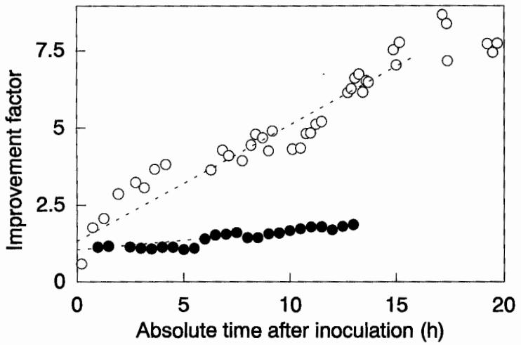

depletion curves are well known and were discussed by Robinson and Tiedje (1983). This indicates that the experimental estimation of the apparent substrate affinity (Ks) was difficult. Also alternative approaches were reported to have their failures. For example, it was found that the kinetic properties of cells change when they are collected from batch culture, washed and exposed to low substrate concentrations (discussed in Herbert and Kornberg, 1976; Hunter and Kornberg, 1978).

*Does Escherichia coli alternately operate a high and a low affinity uptake system for glucose?* It is well known that, depending on the extracellular concentration, many microorganisms can take up substrates such as, e.g., glycerol or ammonia, via either a high or a low affinity uptake system (Tempest and Neijssel, 1976). In the case of glucose transport in *Escherichia coli* it is thought that only a single uptake mechanism, the PTSGlc (phosphoenolpyruvate dependent phosphotransferase system), exists (Postma and Lengeler, 1985, 1993). Additionally, glucose may be taken up via transport systems for other sugars, although, all of these exhibit low affinity for glucose and seem to be operating only at high extracellular glucose concentrations (e.g.,

Fig. 4.5 Comparison of batch growth data with predicted growth curves using different values for Ks· • biomass concentration; lines. model predictions (equation 4.5) for different K8 values: **(1)** K8 = 0.05-100 mg L-1, (2) K, = 1000 mg L-1, (3) K8 5000 mgL-1.

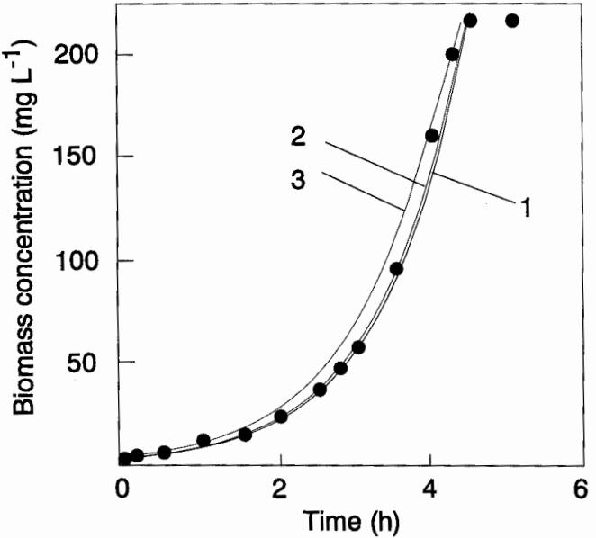

Henderson and Maiden, 1987). Glucose is subsequently metabolized in the central glycolytic pathway, both at low and high substrate concentrations (information compiled in Lendenmann and Egli, 1995).

Two experimental observations provoke the question of whether or not *E. coli* operates glucose transport systems of different affinity. Firstly, the substrate affinity constants reported in the literature for growth of *E. coli* with glucose vary over three orders of magnitude (discussed in Senn et al., 1994), probably dependent on whether the experiments were carried out with cells sufficiently adapted to either low or high substrate concentrations. Despite of the fact that there is still no evidence for two uptake systems for glucose, some authors (Shehata and Marr, 1971; Ishida et al, 1982) successfully fitted models considering two uptake systems of different affinity to the experimental data. Secondly, it was observed for various microorganisms that the substrate affinity for glucose increased during long-term continuous cultivation at low substrate concentrations (e.g., HOfle, 1983; Rutgers et al., 1987; Senn et al., 1994). The latter observation suggests that cells might not switch between a low and high affinity system but continuously change their kinetic properties during the longterm adaptation process from high to low concentrations. (Note that the existence of multiphasic uptake systems, i.e., transport proteins that can change their substrate affinity with concentration reflecting the adaptation to fluctuating nutrient concentration, have been proposed for some marine bacteria by Nissen et al., 1984.)

*(i) Ks calculated by Monod model.* Steady-state kinetic properties of fully adapted cells can be well described by Monod's growth kinetics (Monod, 1942; Senn et al., 1994 ). This model includes two parameters (K8 and µmax) that might change during the adaptation process. Hence, the observed decrease in residual glucose concentration (Fig. 4.1) can be due to either an increased affinity of the cells for glucose or to an increase in µmax (or a combination of both).

With respect to the maximum specific growth rate it was recently found that µexcess (i.e., the specific growth rate exhibited by cells grown in glucoselimited chemostat culture when transferred into a medium containing excess of glucose, Lendenmann and Egli, 1995) remained considerably lower than the µmax of 0.92 h-1 that the bacterium typically attained in batch culture at high concentrations of glucose. When it is assumed that during the adaptation process at D=0.3 h-1 µexcess changed from 0.92 h-1 (i.e., µmax) to 0.635 h-1 (determined by Lendenmann and Egli, 1995), the K8 values should lie in the hatched area shown in Fig. 4.6. It is also obvious that relating s and K8 via equation 4.3 implies that an increase in µexcess will cause an increase in K8 when the residual substrate concentration remains constant. This means that the decrease in residual glucose concentration with cultivation time was mainly due to an improvement in substrate affinity, because an observed increase (as reported by Hofle, 1983; Rutgers et al., 1987) in µexcess during the adaptation should have an opposite effect on K8 •

*(ii) Ks detennined from consumption rates.* In contrast to the apparent substrate affinity (equation 4.3) calculated from the residual glucose measurements (the original-data are given in Figure 4.1., the K8 values, in Fig. 4.6), the direct experimental determination of the 'apparent substrate affinity' from measured glucose consumption rates at various initial glucose concentrations, gave different results (Fig. 4.7). When the Monod equation (Monod, 1942) was fitted to the data obtained for a culture of *E. coli* grown in glucose-limited continuous culture at D=0.6 h-1, a K8 of ca. 600 µg L-1 was determined after both the 262nd and 452nd hour of cultivation. However, the

Fig. 4.6 Decrease of apparent glucose affinity K8 exhibited by *E. coli* ML 30 growing in carbon-limited continuous culture at D=0.3 h-1. The calculation of Ks (equation 4.3) was performed assuming either 0 a constant µexcess of 0.92 h-1 (maximum specific growth rate observed in batch culture); or• a constant µexcess of 0.635 h-1 (the specific growth rate exhibited by cells adapted to chemostat culture when transferred into a medium containing excess of glucose). Hatched area, the range within which the calculated Ks values can change.

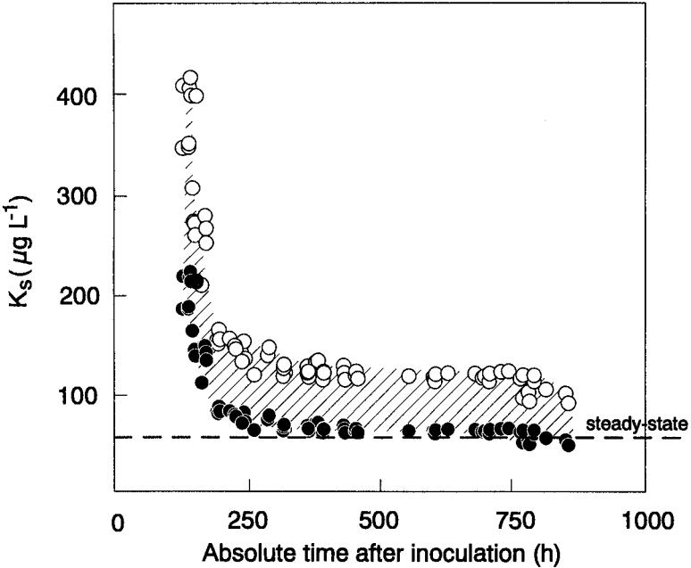

apparent glucose affinity determined from the residual substrate measurements at D=0.6 h-1 was considerably lower and changed from 172 to 78 µg L-1 at the 262nd and 452nd hours of cultivation time, respectively.

### **Outlook**

*What is the origin of adaptive changes?* Many efforts have been made in order to clarify at what level glucose utilization is regulated (Koch and Wang, 1982;

Herbert and Kornberg, 1976; Hunter and Kornberg, 1978; Neijssel et al., 1977; von Meyenburg, 1971). Suggested were: the transport of glucose through either the outer or across the cytoplasmatic membrane, or its catabolism via glycolysis and central metabolism. It is presently not known whether one or several of these processes are responsible for the adaptive changes that have been

Fig. 4. 7 "Apparent" glucose affinity determined from glucose consumption experiments for a culture of *E. coli* grown in glucose-limited continuous culture at D=0.6 h-1. q8 was determined after 262 (•) or 452 (0) hours of continuous cultivation; dashed line, the theoretical maximum specific consumption rate calculated from batch data; curve. prediction of the q8 = f(s) relationship.

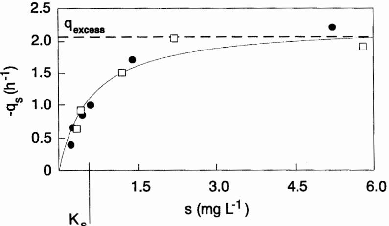

described here for *E. coli.* The fact that similar observations were made earlier also for other microbial strains (e.g., Hofle, 1983; Rutgers et al., 1987) suggests that this slow improvement of kinetic properties in a microbial population is a common phenomenon, whereas the nature and the sequence of changes that take place in a cell still remain to be established. The only available information that comes from continuous cultivation are the data of Neijssel et al. (1977) who found that glucose transport capacity is not the rate-limiting step, i.e., that the transport system is not operating in the saturation range. This observation has been recently confirmed for our experimental system (Lendenmann and Egli, 1995).

Studies on long-term adaptation to glucose-limited environments that focused primarily on outer membrane proteins (e.g., Sterkenburg et al., 1984; Villarejo et al., 1978; Death et al., 1993; Death and Ferenci, 1994) have demonstrated increased contents of these proteins. For example, it was shown by Death et al. (1993, 1994) that expression of the LamB protein was enhanced in cells cultivated under glucose limitation and that mutants lacking this protein did not exhibit improved glucose transport properties. Studies investigating changes at the cellular level demonstrated that also the content of intracellular proteins varied, e.g., ptsH protein, an important component of the PTS, decreased during adaptation to low glucose concentrations in the chemostat (Kurlandzka et al., 1991).

Hence, the processes involved in this gradual improvement in transport or metabolic efficiency are still essentially unknown. Such an adaptive behavior under carbon-limited conditions cannot be predicted from the current knowledge on transport and regulation deduced from cultures grown with excess of substrates and at high growth rates. It is well possible that the adaptive changes are of a highly pleiotropic nature as suggested by Kurlandzka et al. (1991) and they might be better investigated with 'screening' techniques such as two-dimensional gel electrophoresis. Interestingly, the adaptation to glucose-limited conditions changed the kinetic properties towards other sugars (see Fig. 4.3). Thus, it is probably not a specific process directed towards the limiting glucose, but more general response as a result of carbon/energy limitation.

Of course, the adaptation of a culture from carbon excess to carbonlimited conditions, and *vice versa,* could also involve the selection of mutants (Dykhuizen and Hartl, 1981, 1983). But it is not known yet what genetic mechanism governs such an adaptation process and whether the mutations produced are reversible. Clearly, the experimental experience demonstrates that the adaptation is reproducible with respect to the maximum specific growth rate that is reached after sufficient training (Dean and Hinshelwood, 1966) as well as with respect to the high affinity kinetic properties under substrate limitation (this work). This suggests that processes taking place at the molecular level should also be reproducible.

The most surprising conclusion of the growth rate dependent adaptation pattern found for *E. coli* in carbon-limited continuous culture is that the cells in nature, because of very low growth rates, should adapt, i.e., improve their affinity for the limiting nutrient, 'relatively' quickly in order to allow them to scavenge such substrates from environment (Azam and Cho, 1987; Kay and Grolund, 1969). Our observation that the time required for adaptation was shorter at low dilution rates is in contrast to the conclusions drawn by Dykhuizen and Hartl (1981) who found that adaptation was independent from the growth rate in continuous culture.

Despite the fact that the adaptation to carbon-limited conditions has not been studied *in situ,* the information presently available suggests that "relatively" simple experiments using continuous culture might be a good approach for understanding the adaptation process in natural systems.

#### **Acknowledgements**

We would like to thank A. J.B. Zehnder, C. A. Mason and U. Jena] for many stimulating suggestions and for careful reading of the manuscript. We are also indebted A. Kach who permitted us to use his unpublished results.

**5.** 

## **Concluding Remarks**

There are still many questions that are not yet answered but which are important for a better understanding of the behavior of microorganisms in nature and technical systems (discussed in Egli, 1995). One of the most important questions, which has been addressed throughout the whole thesis, is that of the effect of additional, easily degradable, carbon-substrates on the biodegradation of pollutants at low concentrations. 

In nature or in technical systems, which are often carbon-limited, microorganisms most probably utilize and grow with pollutants and easily degradable carbon sources of natural origin at the same time (a phenomenon that has been referred as 'mixed substrate growth'). Such interactions of carbon substrates have a significant influence on the fate of pollutants in these environments. One can expect that additional carbon sources affect the regulation of enzymes involved in the pollutant degradation, and the extent and rate of bi ode gradation. 

Unfortunately, the information available in literature is scarce and inconsistent. However, it is agreed upon that the presence of alternative carbon sources of natural origin affects microbial degradation of pollutants (examples given in Alexander, 1994). Some principles that seem to be generally applicable to biodegradation in the presence of natural carbon substrates emerged only recently and they will be presented in this contribution.

#### **Laboratory** *versus* **environmental/technical** systems

*Model systems used.* Up to now, the biodegradation of pollutants has been investigated either in complex systems consisting of undefined mixtures of cultures and substrates (e.g., in natural or technical environments directly, and in laboratory microcosms), or in pure cultures with a single pollutant supplied as the only carbon source. However, neither of these two experimental strategies is sufficient to explain and predict the biodegradation under complex nutritional and physical conditions that pertain in natural and engineered environments. The many reports on "die-away" studies of pollutants using water or soil samples are essentially black-box systems and, therefore, difficult to interpret, although the observed degradation for some compounds seems to follow a rather simple pattern. On the other hand, the single substrate laboratory approach totally ignores the reality of the broad spectrum of substrates available for microorganisms in complex systems. The use of a well-defined laboratory system, namely a carbon-limited chemostat with pure cultures and defined mixtures of substrates, allowed us to make some general predictions on the behavior of pollutant-degrading organisms and describe them in quantitative terms (compiled in Egli, 1995). These studies offered a conceptual framework within which a number of observations concerning the fate of chemicals in real environmental and technical systems can be rationalized. The results indicate that further improvement of the existing biodegradation/biotransformation processes will be possible due to better understanding of the behavior of microbial cultures with respect to mixed substrates.

*Mixed substrate utilization.* Both the substrate (pollutant) concentration and the nature of the catabolic enzymes involved in the biodegradation strongly influence the utilization/growth pattern exhibited when mixtures of carbon substrates are degraded. Under conditions usually used for batch cultures, where the carbon sources are supplied at concentrations of grams per liter,

sequential utilization of mixtures of carbon substrates (frequently resulting in a diauxic growth pattern) is considered to be the rule rather than the exception. However, mixtures of diauxic carbon compounds are frequently consumed simultaneously in batch culture when the initial concentrations are lowered. On the other hand, microorganisms in nature usually grow under carbon-limited conditions in the presence of complex mixtures of potentional substrates (of both natural and anthropogenic origin), all of which are present in the concentration range of nanograms to micrograms per liter. Although difficult to prove experimentally, under such conditions mixed substrate growth is assumed to take place (e.g., Egli, 1995).

#### **Enzyme regulation**

*Inducible enzyme systems.* Usually, constitutive enzymes are involved in the metabolism of easily degradable substrates, whereas the degradative pathways of "pollutants" very often have to be induced (reviewed in, e.g., Egli 1995). The experimental data (Bally et al., 1994) suggest that in the environment, where pollutants usually contribute only to a minor fraction of the total carbon utilized by the cell (and, therefore, does not significantly contribute to an increase in biomass), the degradation of many pollutants is primarily regulated via the level of expression of degrading enzymes. Only, if a pollutant contributes to a large fraction of the available carbon, does enrichment of competent strains takes place.

If the synthesis of enzymes of a eatabolic pathway is essentially dependent on the presence of the pollutant for the induction, then the questions arise as to how much of a pollutant is needed to stimulate induction, what the time course of this induction process looks like, and how rates and the extent of biodegradation are influenced by the presence of natural carbon substrates. At extracellular pollutant concentrations lower than a certain "threshold", induction will not occur and the compound will not be degraded even if the

degrading microorganism is present in the system. This has been demonstrated for *E. coli* growing in carbon-limited continuous culture with a mixture of glucose and 3-phenylpropionate (3ppa). It was found (Kovarova et al., 1996c) that cells growing on glucose were not able to induce the 3ppa degrading enzyme system when 3ppa was supplied at concentrations below 3 mg L-1 and, 3ppa remained untouched in the culture liquid. When this threshold concentration was surpassed, induction was triggered and, once induced, the cells were able to degrade 3ppa to lower concentrations than those required for induction (Fig. 5.1 ).

Fig. 5.1 Concentrations of 3-phenylpropionate after medium shift from glucose to glucose/3ppa mixtures. Glueose concentration in the inflowing medium was always I 00 mg L· l and dilution rate was constant at 0.6 h· l; the 3ppa concentration in the medium feed was either lower (a), or higher (b) than the "induction threshold". For each concentration the theoretical wash-in curve for 3ppa is indicated by a line (data adapted from Kovarovii et al., I 996c ).

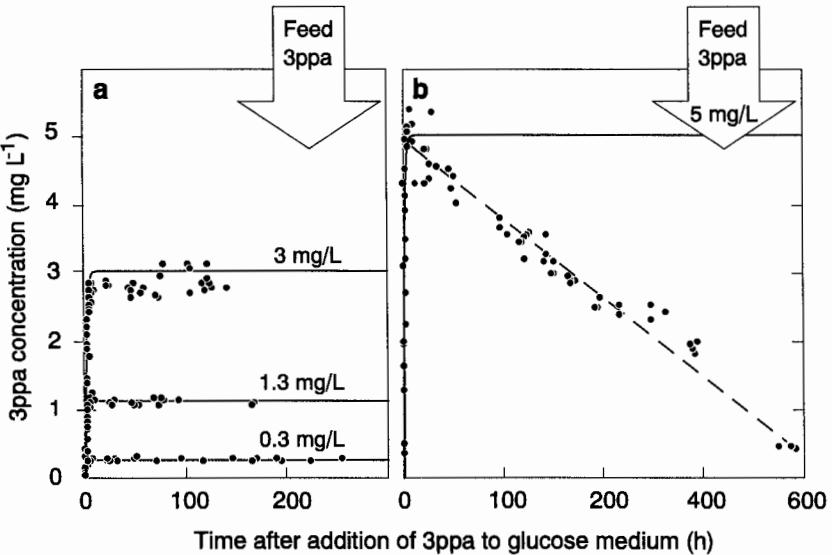

the absence

observed.

of

in

As

the example given

extent of the effect

of

composition

 *"Non-regulated" systems.* When catabolic pathways of pollutants are either not regulated (constitutive). or when they are always partially expressed (even in the pollutant), no threshold concentration phenomenon will be a result the steady-state pollutant concentrations will become independent from the concentration supplied in the medium feed in contrast to Fig. 5.1. The experimental data available (e.g., Lendenmann et al., 1996; Kovru:ova et al., 1996b) suggest that in this case the of additional carbon sources might depend on the the substrate mixture and the nature of the substrates supplied. This has consequences for the kinetic equations that are commonly used to of the concentration of a single substrate. 

describe degradation of pollutants because all of these equations still imply that the growth rate is a function However, it has now been shown for several examples that the mixed substrate growth results in reduced steady-state concentrations of individual carbon substrates compared to growth with single carbon/energy sources (compiled in Egli, 1995). Only recently, Lendenmann and co-workers (1996) proposed a tentative model suggesting that steady-state concentration of an individual carbon source (e.g., different sugars and *E. coli)* is proportional to its contribution to the total available carbon concentration. Using another experimental system (i.e., *E. coli,* 3-phenylpropionate and glucose; Kovru:ova et al., 1996b), this model has been re-examined and extended. The concept of 'reduced concentrations of individual substrates' during mixed substrate utilization was applicable for all examples studied. However, Fig. 5.2 demonstrates that the residual total carbon concentration was in one case independent of the mixture composition (Fig. 5.2a), and in the other case highly related to the contribution of the pollutant to the total carbon in the feed (Fig. 5.2b). The latter example is of great importance because it shows that not only the concentration of an individual compound but also the total carbon

**Fig.** 5.2 Growth of *E. coli* in carbon-limited culture. **(a)** growth with mixtures of glucose, fructose, and galactose at a dilution rate of 0.3 h-1 (adapted from Lendenmann et al., 1996); **(b)** growth with mixtures of glucose and 3-phenylpropionate at a dilution rate of 0.6 h-1 {adapted from Kovarova et al., 1996b). All the mixtures were designed in such a way that the total biomass concentration was always approximately 45 mg L-1 of dry weight.

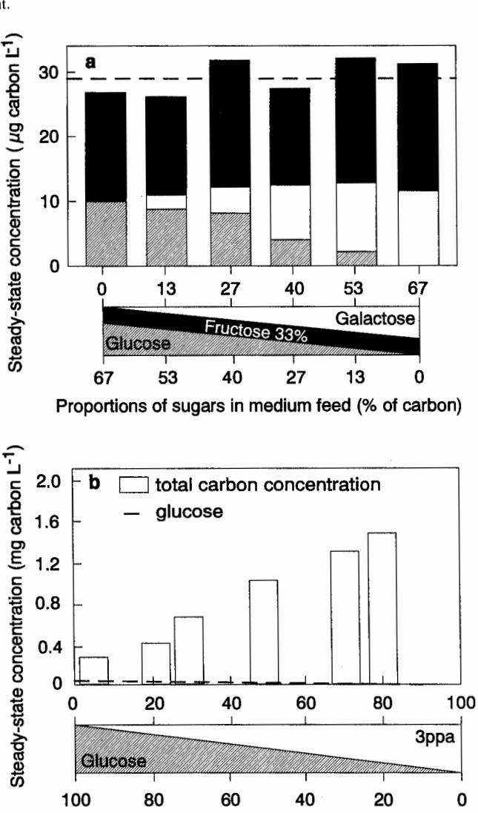

**Proportions of 3ppa/glucose in medium feed (% of carbon)** 

concentration may be reduced by a proper system design. Furthermore, the presented data (Lendenmann et al., 1996; Kovarova et al., 1996b) also strongly indicate that microorganisms can grow relatively quickly, at low environmental substrate concentrations, by utilizing mixtures of carbon sources simultaneously.

As an additional positive effect, it was observed that the simultaneous utilization of carbon substrates can extend the area of the stability of the degradation process to higher growth rates (i.e., the utilization of a pollutant is possible above the maximum specific growth rate which this compound can support on its own; Kovarova et al., 1996b).

#### **Outlook**

*(i)* With respect to the pollutant degradation, constitutive, derepressed, or inducible systems will most likely differ in the way in which they handle a pulse-addition of a pollutant. Also, it can be predicted that they will behave differently with respect to the threshold concentrations below which compounds are either not utilized anymore, or below which their rate of utilization will slow down enormously. Unfortunately, we are not aware of any published data where this differences has been tested experimentally.

*(ii)* There are also indications (Bally and Egli, 1996) that the presence of additional carbon/energy sources accelerates the induction and expression of pollutant degrading enzymes. Therefore, the simultaneous utilization of natural carbon sources and pollutants might be advantageous for an organism under both transient and steady-state growth conditions. This could be exploited, for instance, for the selective and fast induction of pollutant degrading activity in industrial WWTP.

*(iii)* The information originating from continuous culture laboratory systems (e.g., on mixed substrate growth or threshold concentrations) may help to explain the concentrations of pollutants determined in complex systems, such as biofilms (Namkung and Rittman, 1987a,b), ornatural soils.

*(iv)* On comparing the conditions that prevail in nature or technical systems with those typical of most laboratory studies (i.e., high concentrations of one carbon/energy source), the environmental relevance of isolated pure cultures of degrading strains and the "relevance" of pure culture - single substrate studies in general, has to be questioned.

#### **References**

**Adams, M. R., C. L. Little, and M. C. Easter.** 1991. Modelling the effect of pH, acidulant and temperature on the growth rate of *Yersinia enterocolitica.*  J. Appl. Bacteriol. **71:** 65-71. 

**Alexander, M.** 1994. Biodegradation and Bioremediation. Academic Press, San Diego. 

**Andreson, T.-H., and K. H. Domsch.** 1985. Determination of ecophysiological maintenance carbon requirements of soil microorganisms in dormant state. Biol. Fert. Soils **1:** 81-89. 

**Azam, F., and B. C. Cho.** 1987. Bacterial utilisation of organic matter in the sea. In : Ecology of Microbial Communities (M. Fletcher, T. R. Gray and J. G. Jones, eds.), Cambridge University Press, Cambridge, pp. 261-281. 

**Babel, W., U. Brinkmann, and R. H. Millier.** 1993. The auxiliary substrate concept - an approach for overcoming limits of microbial performance. Acta Biotechnol. **13:** 211-242. 

**Bally, M., E. Wilberg, M. Kiihni, and T. Egli.** 1994. Growth and regulation of enzyme synthesis in the nitrilotriacetic acid (NT A) degrading *Chelatobacter heintzii* ATCC 29600. Microbiology. **140:** 1927-1936. 

**Bally, M., and T. Egli.** 1996. Dynamics of substrate consumption and enzyme synthesis in *Chelatobacter heintzii* during growth in carbon-limited continuous culture with different mixtures of glucose and nitrilotriacetate. Appl. Environ. Microbiol. 62: 133-140. 

**Battersby, N.** S. 1990. A review of biodegradation kinetics in the aquatic environment. Chemosphere. **21:** 1243-1284. 

**Bavoil, P., H. Nikaido, and K. von Meyenburg.** 1977. Pleiotrophic transport mutants of *Escherichia coli* lack porin, a major membrane protein. Molec. Gen. Genet. **158:** 23-33.

Beck, J. V., and K. J. Arnold. 1977. Parameter estimation in engineering and science. Wiley, New York.

Blackman, :F. F. 1905. Optima and limiting factors. Annals of Botany. 19: 281- 295.

Brinkmann, U., and W. BabeL 1992. Simultaneous utilisation of heterotrophic substrates by *Hansenula polymorpha* results in enhanced growth. Appl. Microbiol. Biotechnol. 37: 98-103.

Brock, T. D. 1987. The study of microorganisms *in situ:* Progress and problems. In: Ecology of Microbial Communities (M. Fletcher, T. R. G. Gray, and J. G. Jones, eds.), Cambridge University Press, Cambridge, England, pp. 281-299.

Brown, D. E., R. N. Gaddum, and A. MeAvoy. 1988. Linear growth in batch culture caused by conservative trace nutrient limitation. Biotechnol. Letters 10: 525-530.

Buchanan, R. L., and L. A. Klawitter. 1992. The effect of incubation temperature, initial pH, and sodium chloride on the growth kinetics of *Escherichia coli* 0157:H7. Food Microbiol. 9: 185-196.

Bugg, T. D. H. 1993. Overproduction, purification and properties of 2,3 dihydroxyphenylpropionate 1,2-dioxygenase from *Escherichia coli.* Biochim. Biophys. Acta. 1202: 258-264.

Burlingame, R., and P. J. Chapman. 1983. Catabolism of phenylpropionic acid and its 3-hydroxy derivate by *Escherichia coli. I.* Bacteriol. 155: 113-121.

Button, D. K. 1985. Kinetics of nutrient-limited transport and microbial growth. Microbiol. Rev. 49: 270-297.

Camper, A. K., G. A. McFeters, W. G. Characklis, and W. L. Jones. 1991. Growth kinetics of coliform bacteria under conditions relevant to drinking water distribution systems. Appl. Env. Microbiol. 46: 1045-1053.

Characklis, W. G., and W. Gujer. 1979. Temperature dependency of microbial reactions. In: Prog. Wat. Tech. Suppl. I, Pergamon Press. pp. 111-130.

**Cooper, R. A., and M. A. Skinner.** 1980. Catabolism of 3- and 4 hydroxyphenylacetate by the 3,4-dihydroxyphenylacetate pathway in *Escherichia coli.* J. Bacteriol. **143:** 302-306.

**Cornish-Bowden, A.** 1979. Fundamentals of enzyme kinetics. Butterworth, London.

**Dabes, J. N., R. K. Finn, and C. R. Wilke.** 1973. Equations of substrate-limited growth: The case of Blackman kinetics. Biotechnol. Bioeng. **15:** 1159-1177.

**Dagley,** S., **P. J. Chapman, and D. T. Gibson.** 1965. The metabolism of *B*phenylpropionic acid by an *Achromobacter.* Biochem. J. **95:** 466-474.

**Dean, A. C.R., and C. N, Hinshelwood.** 1966. Growth, function and regulation in bacterial Cells. Claredon Press, Oxford.

**Death, A., and T. Ferenci.** 1994. Between feast and famine: Endogenous inducer synthesis in the adaptation of *Escherichia coli* to growth with limiting carbohydrates. **J.** Bacteriol. **176:** 5101-5107.

**Death, A., L. Notley, and T. Ferenci.** 1993. Derepression of LamB protein facilitates outer membrane permeation of carbohydrates into *Escherichia coli*  under conditions of nutrient stress. J. Bacteriol. **175:** 1475-1483.

**Degermendzhy, A.G., V. V. Adamovich, and V. A. Adamovich.** 1993. A new experimental approach to the search for chemical density factors **in** the regulation of monoculture growth. J. Gen. Micro biol. **139:** 2027-2031.

**DiMarco, A. A., B. Averhoff, and L. N. Omston.** 1995. Identification of the transcriptional activator *pobR* and characterisation of its role in the expression of *pobA,* the structural gene for p-hydroxybenzoate hydrolase in *Acinetobacter calcoaceticus.* J. Bacteriol. **175:** 4499-4506.

**Doltlng, J., and B. K. Harrison.** 1992. Gibbs free energy of formation of halogenated aromatic compounds and their potential role as electron acceptors in anaerobic environments. Environ. Sci. Technol. **26:** 2213-2218.

**Droop, M. R.** 1983. 25 years of algal growth kinetics. Botanica Marina. **26:** 99· 112.

**Duetz, W. A., S. Marques, C. de Jong, J. L. Ramos, and J. G. van Andel.** 1994. Inducibility of the TOL catabolic pathway in *Pseudomonas putida* (pWWO) growing on succinate in continuous culture: Evidence of carbon catabolite repression control. **J.** Bacteriol. **176:** 2354-2361.

**Dykhuizen, D.** 1978. Selection for tryptophan auxotrophs of *Escherichia coli* in glucose-limited chcmostats as a test of the energy conservation hypothesis of evolution. Evolution. **32:** 125-150.

**Dykhuizen, D., and D. Hartl.** 1981. Evolution of competitive ability in *Escherichia coli.* Evolution. **35:** 581-594.

**Dykhuizen, D., and D. Hartl.** 1983. Selection in chemostats. Microbiol. Rev. **47:**  150-168.

**Effendi, I., and B. Austin.** 1995. Dormant/unculturable cells of the fish pathogen *Aeromonas salmonicida.* Microb. Ecol. **30:** 183-192.

**Egli, T.** 1991. On multiple-nutrient-limited growth of microorganisms, with special reference to carbon and nitrogen substrates. Antonie van Leeuwenhoek. **60:**  225-234.

**Egli, T.** 1995. The ecological and physiological significance of the growth of heterotrophic microorganisms with mixtures of substrates. In: Advances in Microbial Ecology, Vol. 14, ed. J. Gwynfryn Jones. Plenum Press, New York. pp. 305-386.

**Egli, T., U. Lendenmann, and M. Snozzi.** 1993. Kinetics of microbial growth with mixtures of carbon sources. Antonie van Leeuwenhoek. **63:** 289-298.

**Egli, T., H.-U. Weilenmann, T. El-Banna, and G. Auglin.** 1988. Gram-negative, aerobic, nitrilotriacetate-utilising bacteria from wastewater and soil. Syst. Appl. Microbiol. **10:** 297-305.

Egli, T., O. Kippeli, and A. Fiechter. 1982. Regulatory flexibility of methylothrophic yeasts in chemostat culture: Simultaneous assimilation of glucose and methanol at fixed dilution rate. Arch. Microbiol. 131: 8-13.

Egli, T., N. D. Lindley, and J. R. Quayle. 1983. Regulation of enzyme synthesis and variation of residual methanol concentration during carbon-limited growth of *Kloeckera sp.* 2201 on mixtures of methanol and glucose. J. Gen. Microbiol. 129: 1269-1281.

Egli, T., J. P. van Dijken, M. Veenhuis, W. Harder, and A. Fiechter. 1980. Methanol metabolism in yeasts: Regulation of the synthesis of catabolic enzymes. Arch. Microbiol. 124: 115-121.

Esener, A. A., J. A. Roels, and N. W. F. Kossen. 1981. The influence of temperature on the maximum specific growth rate of *Klebsiella pneumoniae.*  Biotechnol. Bioneng. 23: 1401-1405.

Fencl, z. 1963. A uniform system of basic symbols for continuous cultivation of microorganisms. Folia Microbiol. 8: 192-194.

Gibson, A. M., N. Bratchell, and T. A. Roberts. 1987. The effect of sodium chloride and temperature on the rate and extent of growth of *Clostridium botulinum* type A in pasteurized pork slurry. J. Appl. Bacteriol. 62: 479-490.

Harder, W., and L. Dijkhuizen. 1976. Mixed substrate utilisation. Continuous Culture. 6: 297-314.

Harder, W., and L. Dijkhuizen. 1982. Strategies of mixed substrate utilisation in microorganisms. Phil. Trans. R. Soc. London B 297: 459-480.

Harder, W., and L. Dijkhuizen. 1983. Physiological responses to nutrient limitation. Ann. Rev. Microbiol. 37: 1-23.

Heitzer, A., H.-P. E. Kohler, P. Reichert, and G. Hamer. 1991. Utility of phenomenological models for describing temperature dependence of bacterial growth. Appl. Environ. Microbiol. 57: 2656-2665.

**Heitzer,** A., **C. A. Mason, and G. Hamer.** 1992. Heat shock gene expression in continuous cultures of *Escherichia coli.* J. Biotechnol. **22:** 153-170.

**Helling, R. B., C. N. Vargas, and J. Adams.** 1987. Evolution of *Escherichia coli*  during growth in a constant environment. Genetics. **116:** 349-358.

**Henderson, P. J. F., and C. J. Maiden.** 1987. Transport of carbohydrates by bacteria. In: Carbon Substrates in Biotechnology, J. D. Stowell, A. **J.** Beardsmore, C. W. Keevil, and *1.* R. Woodward, Eds., IRL Press, Oxford, England, Washington, D.C., pp. 67-92.

**Herbert, D.** 196 L The chemical composition of micro-organisms as a function of their environment. In: Meynell, G. G., and **H.** Gooder (Eds.). Microbial Reaction to Environment. 11th Symp. Soc. Gen. Microbiol. Cambridge Univ. Press, London. pp. 391-416.

**Herbert, D., R. Elsworth, and R. C. Telling.** 1956. The continuous culture of bacteria: A theoretical and experimental study. J. Gen. Microbial. **14:** 601-622.

**Herbert, D., and H. L. Kornberg.** 1976. Glucose transport as rate-limiting step in the growth of *Escherichia coli* on glucose. Biochem. J. **156:** 477-480.

**Herendeen, S. L., R. A. van Bogelen, and F. C. Neidhardt.** 1979. Levels of major proteins of *Escherichia coli* during growth at different temperatures. J. Bacteriol. **139:** 185-194.

**Hinshelwood, C. N.** 1946. The chemical kinetics of the bacterial cell. Oxford University Press.

**Hofle, M. G.** 1983. Long-term changes in chemostat cultures of *Cytophaga }ohnsonae.* Appl. Environ. Microbiol. **46:** 1045-1053.

**Horowitz, A., M. I. Krichevsky, and R. M. Atlas.** 1983. Characteristics and diversity of subartic marine oligotrophic, stenoheterotrophic and euryheterotrophic bacterial populations. Can. J. Microbiol. **29:** 527-535.

**Hunter, I. S., and H. L. Kornberg.** 1978. Glucose transport of *Escherichia coli*  growing in glucose-limited continuous culture. Biochem. l **178:** 97-101.

Ingraham, J. 1987. Effect of temperature, pH, water activity, and pressure on growth. *In* Neidhardt, F. C. et al. (eds.), *Escherichia coli* and *Salmonella typhimurium.* American Society for Microbiology, Washington, D.C., pp. 1543- 1554.

Ishida, Y., I. Imai, T. Miyagaki, and H. Kadota. 1982. Growth and uptake kinetics of a facultatively oligotrophic bacterium at low nutrient concentrations. Microb. Ecol. 8: 23-32.

Jannasch, H. W. 1967. Growth of marine bacteria at limiting concentrations of organic carbon in seawater. LimnoL Oceanogr. 12: 264-271.

Jannasch, H. W. 1968. Growth characterictics of heterotrophic bacteria in seawater. J. Bacteriol. 95: 722-723.

Jannasch, H. W., and T. Egli. 1993. Microbial growth kinetics: A historical perspective. Antonie van Leeuwenhoek. 63: 213-224.

Jannasch, H. W., and G. F. Jones. 1959. Bacterial populations in sea water as determined by different methods of enumeration. Limnol. Oceanogr. 19: 716-720.

Jones, R. C., and J. S. Hough. 1970. The effect of temperature on the metabolism of backer's yeast growing on continuous culture. J. Gen. Microbiol. 60: 107-116.

Kach, A. 1995. unpublished data.

Kaprelyants, A. S., C. J. Gottschal, and D. B. Kell. 1993. Dormancy in nonsporulating bacteria. FEMS Microbiol. Lett. 104: 271-286.

Kay, A. A., and Grolund, A. F. 1969. Influence of carbon or nitrogen starvation on amino acid transport in *Pseudomonas aeruginosa.* J. Bacteriol. 100: 276-282.

Kjelleberg, S., N. Albertson, K. Fliirdh, L. Holmquist, A. Jouper·Jaan, R. Marouga, J. Ostling, B. Svenblad, and D. Weichart. 1993. How do nondifferentiating bacteria adapt to starvation? Antonie van Leeuwenhoek. 63: 333- 341.

**Knowles, G., A. L. Downing, and M. J. Barrett.** 1965. Determination of kinetic constants for nitrifying bacteria in mixed culture, with the aid of an electronic computer. **J.** Gen. Microbiol. **38:** 263-278.

**Koch, A. L.** 1971. The adaptative response of *Escherichia coli* to a feast and famine existance. Adv. Microbiol. Physiol. **6:** 147-217.

**Koch, A. L.** 1982. Multistep kinetics: Chois of models for the growth of baeteria. J. Theor. Biol. **98:** 401-417.

**Koch, A. L., and C.H. Wang.** 1982. How close to the theoretical diffusion limit do bacterial uptake systems function. Arch. Microbiol. **131:** 36-42.

**Kooijman, S. A. L. M., E. B. Muller, and A.H. Stouthamer.** 1991. Microbial growth dynamies on the basis of individual budgets. Antonie van Leeuwenhoek. **60:** 159-174.

**Kovarova, K., A. Klich, and T. Egli.** 1996a. Cultivation of *Escherichia coli* with mixtures of 3-phenylpropionic acid and glucose: Dynamics of growth and substrate consumption. Biodegradation. BIOD396, in print.

**Kovarova, K., A. Klich, A. J.B. Zehnder, and T. Egli.** 1996b. Cultivation of *Escherichia coli* with mixtures of 3-phenylpropionic acid and glucose: Steady-State growth kinetics. Appl. Environ. Microbiol. AEM 1621-96.

**Kovarova, K., V. Chaloupka, and T. Egli.** 1996c. Threshold substrate concentrations required for induction of the catabolic pathway of 3 pheny lpropionic acid in *Escherichia coli.* Appl. Environ. Microbiol. AEM 1622- 96.

**Kovarova, K., A. Mock, V. Chaloupka, and T. Egli.** 1996d. Adaptation of *Escherichia coli* in glucose affinity during growth in carbon-limited continuous culture: a kinetic study. Submitted to Microbiology.

**Kovarova K., A. J. B. Zehnder, and T. Egli.** 1996e. Temperature dependent growth kinetics of *Escherichia coli* ML 30 in glucose-limited continuous culture. J. Bacteriol. **178:** 4530-4539.

Kurlandzka, A, R. F. Rosenzweig, and J. Adams. 1991. Identification of adaptive changes in an evolving population of *Escherichia coli:* the role of changes with regulatory highly pleiotrophic effects. Mol. Biol. Evol. 8: 261-281.

Law, A. T., and D . .K. Button. 1977. Multiple-carbon-source-limited growth kinetics of a marine coryneform bacterium. J. Bacteriol. 129: 115-123.

Leegwater, M. P. 1983. Microbial reactivity: Its relevance to growth in natural and artificial environments. PhD thesis, University of Amsterdam, The Netherlands.

Lendenmann, U., M. Snozzi, and T. Egli. 1996. Kinetics of simultaneous utilization of sugar mixtures by *Escherichia coli* in continuous culture. Appl. Environ. Microbiol. 62: 1493-1499.

Lendenmann, U., and T. Egli. 1995. ls *Escherichia coli* growing in glucoselimited chemostat culture able to utilize other sugars without lag? Microbiology. 141:71-78.

Lengeler, J. W. 1993. Carbohydrate transport in bacteria under environmental conditions, a black box? Antonie van Leeuwenhoek. 63: 275-288.

Loubiere, P., E. Gros, V. Paquet, and N. D. Lindley. 1992. Kinetics and physiological implications of the growth behaviour of *Eubacterium limosum* on glucose/methanol mixtures. J. Gen. Microbiol. 138: 979-985.

Mainzer, S. E., and W. P. Hempfling. 1976. Effects of growth temperature on yield and maintenance during glucose-limited continuous culture of *Escherichia coli.* J. Bacteriol. 126: 251-256.

Malek, I. 1958. Continuous cultivation of microorganisms. Czech. Acad. Sci., Prague.

Marr, A. G., J. L. Ingraham, and C. L. Squires. 1964. Effect of the temperature of growth of *Escherichia coli* on the formation of P-Galactosidase. J. Bacteriol. 87: 356-362.

**Matin, A.** 1979. Microbial regulatory mechanisms at low nutrient concentrations as studied in chemostat. In: Strategies of Microbial Life in Extreme Environments (Berlin: Dahlem Konferenzen, **M.** Shilo, ed.). Verlag Chemie, Weinheim, pp. 323- 339.

**McMeekin, T.** A., **R. E. Chandler, P. E. Doe, C. D. Garland, J. Olley, S. Putro, and D. A. Ratkowsky.** 1987. Model for combined effect of temperature and salt concentration/water activity on the growth rate of *Staphylococcus xylosus.* J. Appl. Bacteriol. **62:** 543-550.

**McMeekin, T. A., J. Olley, and D. A. Ratkowsky.** 1988. Temperature effects on bacterial growth rates. In: Bazin M.J. and J. I. Prosser (eds.), *Physiological Models in Microbiology.* Volume I, CRC Press, Inc., Florida. pp. 75-89.

**Monod, J.** 1942. Recherches sur la croissance des cultures bacteriennes. Hermann et Cie., Paris.

**Monod, J.** 1949. The growth of bacterial cultures. Ann. Rev. Microbiol. **3:** 371- 394.

**Monod, J.** 1950. La technique de culture continue; theorie and applications. Ann. Inst. Pasteur **79:** 390-410.

**Mopper, K., R. Dawson, G. Liehezeit, and V. Ittekkot.** 1980. The monosacharide spectra of waters. Marine Chem. **10:** 55-66.

**Morita, R.Y.** 1988. Bioavailability of energy and its relationship to growth and starvation survival in nature. J. Can. Microbiol. **43:** 436-441.

**Morita, R. Y.** 1993. Bioavailability of energy and the starvation state. In: Starvation in Bacteria. Ed. S. Kjelleberg, Plenum Press, New York, pp.1-23.

**Munster, U.** 1993. Concentrations and fluxes of organic carbon substrates in the aquatic environment. Antonie van Leeuwenhoek. **63:** 243-264.

**Namkung, E., and B. E. Rittman.** I 987a. Modeling bisubstrate removal by biofilms. Biotechnol. Bioeng. **29:** 269-278.

**Namkung, E., and B. E. Rittman.** l 987b. Evaluation of bisubstrate secondary utilization kinetics by biofilms. Biotechnol. Bioeng. **29:** 335-342.

**Neidhardt et al.** (Eds.). 1987. *Escherichia coli* and *Salmonella typhimurium.*  American Society for Microbiology, Washington, D.C. 

**Neijssel, 0. M., S. Hueting, and D. W. Tempest.** 1977. Glucose transport capacity is not the rate-limiting step in the growth of some wild-type strains of *E. coli* and *K. aerogenes* in chemostat culture. FEMS Microbiol. Letters. **2:** 1-3. 

**Ng, H., J. L. Ingraham, and A. G. Marr.** 1962. Damage and derepression in *Escherichia coli* resulting from growth at low temperatures. J. Bacteriol. **84:** 331- 339. 

**Nishihara, M., M. lshinaga, M. Kato, and M. Klto.** 1976. Temperature-sensitive formation of the phospholipin molecular species in *Escherichia coli* membranes. Biochim. Biophys. Acta. **431:** 54-61. 

**Nissen, H., P. Nissen, and F. Azam.** 1984. Multiphasic uptake of D-glucose by an oligotrophic marine bacterium. Mar. Ecol. Prog. Ser. **Hi:** 155-160. 

**Novak, M., B. Sikyta, V. Kiener, and C. Novotny.** 1990. Linear growth in microbial cultures limited by accumulated substrate. Biotechnol. Letters. **12:** 24 7- 252. 

**Novick, A., and L. Szilard.** 1950. Description of the chemostat. Science. **112:**  715-716. 

**Owens, J. D., and J. D. Legan.** 1987. Determination of the Monod substrate saturation constant for microbial growth. FEi\.1S Microbiol. Rev. **46:** 419-432. 

**Palumbo, S., and L. D. Witter.** 1969. Influence of temperature on glucose utilisation by *Pseudomonasfluorescens.* Appl. Bacteriol. **18:** 137-141. 

**Panikov, N.** S. 1995. Microbial growth kinetics. Chapman & Hall, London. **Pfenning, N., and H. W. Jannasch.** 1962. Biologische Grundfragen bei der Homokontinuierlichen Kultur von Mikroorganismen. Ergebnisse der Biologie. 25: 93-135. 

**Pirt, S. J.** 1965. The Maintenance energy of bacteria in growing cultures. Proc. Roy. Soc. B **163:** 224-231. 

**Pirt, S. J.** 1975. Principles of microbe and cell cultivation. Blackwell, London. 

**Pitter, P., and J. Chudoba.** 1990. Biodegradability of organic substances in the aquatic environment. CRC Press, Inc. Boca Raton. 

**Poindexter, J.** S. 1987. Bacterial responses to nutrient limitation. In: Ecology of microbial communities. Eds. M. Fletcher, T. R. G. Gray, and J. G. Jones. Cambridge University Press, Cambridge, England. pp. 283-317. 

**Postgate, J. R., and J. R. Hunter.** 1964. Accelerated death of Aerobacter aerogenes starved in the presence of growth-limiting substrates. J. Gen. Microbiol. **34:** 459-473. 

**Postma, P. W., and J. W. Lengeler.** 1985. Phosphoenolpyruvate: carbohydrate phosphotransferase system of bacteria. Microbiol. Rev. **49:** 232-269. 

**Postma, P. W., and J. W. Lengeler.** 1993. Phosphoenolpyruvate: Carbohydrate phosphotransferase system of bacteria. Microbiol. Rev. 57: 543-594. 

**Powell, E. 0.** 1967. The growth rate of micro-organisms as function of substrate concentration. In: Evans, C. G. T., R. E. Strange and D. W. Tempest (eds.) Microbial physiology and continuous culture. H.M.S.0., London, pp. 34-55. 

**Powell, E. 0., C. G. T. Evans, R. E. Strange, and D. W. Tempest.** 1967. Microbial physiology and continuous culture. H.M.S.O., London. 

**Prieto, M.A., A. Perez-Aranda, and J. L. Garcia.** 1993. Characterization of an *Escherichia coli* aromatic hydrolase with a broad substrate range. **J.** Bacteriol. **175:**  2162-2167.

**Ratkowsky, D. A., R. K. Lowry, T. A. McMeekin, A. N. Stokes, and R. E. Chandler.** 1983. Model for bacterial culture growth rate throughout the entire biokinetic temperature range. J. Bacteriol. **154:** 1222-1226.

**Ratkowsky, D. A., J. Olley, T. A. McMeekin, and A. Ball.** 1982. Relationship between temperature and growth rate of bacterial cultures. J. Bacteriol. **149:** 1-5.

**Reber, H. H.** 1982. Inducibility of benzoate oxidizing cell activities in *Acinetobacter calcoaceticus* Strain Bs 5 by chlorobenzoates as influenced by the position of chlorine atoms and the inducer concentration. Eur. J. Appl. Microbiol. Biotechnol. **15:** 138-140.

**Rich, J. H., H. W. Ducklow, and D. L. Kirchman.** 1996. Concentrations and uptake of neutral monosaccharides along 140°W in equatorial Pacific: Contribution of glucose to heterotrophic bacterial activity and the DOM flux. LimnoL Oceanogr. **41:** 595-604.

**Richter, 0., and D. Sondgerath.** 1990. Parameter estimation in ecology. The link between data and models. Verlag Chemie, Weinheim, Germany.

**Rittmann, B. E., E. Seagren, B. A. Wrenn, A. J. Valocchi, C. Ray, and L. Raskin.** 1994. In situ bioremediation. Second Edition. Noyes Publications, Park Ridge, New Jersey.

**Robinson, J. A.** 1985. Determining microbial kinetic parameters using non-linear regression analysis. Adv. Microb. Ecol. **8:** 61-114.

**Robinson, J. A., and J. M. Tiedje.** 1983. Nonlinear estimation of Monod growth kinetic parameters from a single substrate depletion curve. Appl. Env. Microbiol. **45:** 1453-1458.

**Ron, E. Z., and M. Shani.** 1971. Growth rate of *Escherichia coli* at elevated temperatures: Reversible inhibition of homoserin trans-succinylase. J. Bacteriol. **107:** 397-400.

**Rosso, L., J. R. Lohry, and J. P. Flandrois.** 1993. An unexpected correlation between cardinal temperatures of microbial growth highlighted by a new model. **J.**  Theor. Biol. **162:** 447-463.

**Rosso, L., J. R. Lohry, S. Bajard, and J.P. Flandrois.** 1995. Convenient model to describe the combined effects of temperature and pH on microbial growth. Appl. Environ. Microbial. **61:** 610-616.

**Rutgers, M., M. J. Teixeira de Mattos, P. W. Postma, and K. van Dam.** 1987. Establishment of the steady-state in glucose-limited chemostat cultures of *Klebsiella pneumoniae.* **J.** Gen. Microbial. **133:** 445-453.

**Rutgers, M., P. A. Balk, and K. van Dam.** 1989. Effect of concentration of substrates and products on the growth of *Klebsiella pneumoniae* in chemostat cultures. Biochim. Biophys. Acta. **977:** 142-149.

**Rutgers, M., P. A. Balk, and K. van Dam.** 1990. Quantification of multiplesubstrate controlled growth: simultaneous ammonium and glucose limitation in chemostat cultures of *Klebsiella pneumoniae.* Arch. Microbial. **153:** 478-484.

**Rutgers, M., K. van Dam, and H. V. Westerhoff.** 1991. Control and thermodynamics of microbial growth. Rational Tools for Bioengineering. CRC Crit. Rev. Biotechnol. **11:** 367-395.

**Santiago, E. F., V. S. Cooper, and R. E. Lenski.** 1996. Punctuated evolution caused by selection of rare beneficial mutations. Science **272:** 1802-1804.

**Savageau, M. A.** 1983. *Escherichia coli* habitats, cell types, and molecular mechanisms of gene control. Am. Nat. **122:** 732-744.

**Schmidt, S. K.** 1992. Models for studying the population ecology of microorganisms in natural systems. In: Modeling the Metabolic and Physiologic Activities of Microorganisms. Hurst, C. **J.** (Ed.). John Wiley & Sonc, Inc., U.S.A.

**Schmidt, S. K., M. Alexander, and M. L. Shuler.** 1985. Predicting threshold concentrations of organic substrates for bacterial growth. **J.** Theor. Biol. **114:** 1-8.

**Schulze, K. L., and R. S. Lipe.** 1964. Relationship between substrate concentration, growth rate, and respiration rate of *Escherichia coli* in continuous culture. Arch. Microbial. **48:** 1-20.

**Senn, H., U. Lendenmann, M. Snozzi, G. Hamer, and T. Egli.** 1994. The growth of *Escherichia coli* in glucose-limited chemostat cultures: A reexamination of the kinetics. Biochim. Biophys. Acta. **1201:** 424-436.

**Sepers, A. B. J.** 1984. The uptake capacity for organic compounds of two heterotrophic bacterial strains at carbon-limited growth. Z. Alig. Mikrobiol. **24:**  261-267.

**Shaw, M. K., and J. Ingraham.** 1965. Fatty acid composition of *Escherichia coli*  as a possible controlling factor of the minimal growth temperature. **J.** Bacteriol. **90:** 141-146.

**Shehata, T. E., and A.G. Marr.** 1971. Effect of nutrient concentration on the growth of *Escherichia coli.* **J.** Bacteriol. **107:** 210-216.

**Smith, M. R.** 1990. The biodegradation of aromatic hydrocarbons by bacteria. Biodegradation. **1:** 191-206.

**Sterkenburg, A., E. Vlegels and J. T. M. Wouters.** 1984. Influence of nutrient limitation and growth rate on the outer membrane proteins of *Klebsiella aerogenes*  NCTC 418. **J.** Gen. Microbiol. **130:** 2347-2355.

**Tempest, D. W.** 1970. The continuous cultivation of microorganisms. 1. Theory of the Chemostat. In: Noris, **J. R.,** and D. W. Ribbson (Eds.), Methods in Microbiology, Vol. 2, Academic Press, London. pp. 259-276.

**Tempest, D. W., and O. M. Neijssel.** 1978. Eco-physiological aspects of microbial growth in aerobic nutrient-limited environments. Adv. Microb. Ecol. **2:**  105-153.

**Tempest, D. W., and O. M. Neijssel.** 1976. Microbial adaptation to low-nutrient environments. In: Continuous culture 6: Applications and New Fields. 6th Int. Symposium on Continuous Culture of Micro-organisms, St. Catherine's College, Oxford, July 1975. Ed. A.C.R. Dean et al., Publisher Ellis Horword, pp. 282-296.

**Thauer, R. K., K. Jungermann, and K. Decker.** 1977. Energy conservation in chemotrophic anaerobic bacteria. Bacteriol. Rev. **41:** 100-180.

**Topiwala, H., and C. G. Sinclair.** 1971. Temperature relationships in continuous culture. Biotech. Bioeng. **13:** 795-813. 

**Tros, M. E., G. Schraa, and A. J. B. Zehnder.** 1996. Transformation of low concentrations of 3-chlorbenzoate by *Pseudomonas* sp. strain Bl3: Kinetics and residual concentrations. Appl. Environ. Microbiol. **62:** 437-442. 

**van Niel, C. B.** 1949. The kinetics of growth of microorganisms. In: Parpart, E. D. (Ed.), The Chemistry and Physiology of Growth, Princeton Univ. Press. pp: 91- 102. 

**van Uden, N.** 1967. Transport-limited growth in the chemostat and its competitive inhibition; A Theoretical Treatment. Arch. Microbiol. **58:** 145-154. 

**Villarejo, M., J. Stanovich, K. Young, and G. Edlin.** 1978. Differences in membrane proteins, cyclic AMP levels, and glucose transport between batch and chemostat cultures of *Escherichia coli.* Current Microbiology **1:** 345-348. 

**von Meyenburg, K.** 1971. Transport-limited growth rates in a mutant of *Eschericia coli.* J. Bacteriol. **107:** 878-888. 

**Wallace, R. J., and W. H. Holms.** 1986. Maintenance coefficients and rates of turnover of cell material in *Escherichia coli* ML308 at different growth temperatures. FEMS Microbiol. Letters. **37:** 317-320. 

**Westerhoff, H. V., J. S. Lokema, R. Otto, and K. J. Hellingwerf.** 1982. Thermodynamics of growth, non-equilibrium them1odynamics of bacterial growth, the phenomenological and the mosaic approach. Biochim. Biophys. Acta. **683:**  181-220. 

**Westermann, P., B. K. Ahring, and R. A. Mah.** 1989. Temperature compensation in *Methanosarcina barkeri* by modulation of hydrogen and acetate affinity. Appl. Environ. Microbiol. **55:** 1262-1266. 

**Wijtzes, T., P. J. McClure, M. H. Zweitering, and T. A. Roberts.** 1993. Modelling bacterial growth of *Listeria monocytogenes* as a function of water activity, pH and temperature. Int. **J.** Food Microbiol. **18:** 139-149.

**Wljtzes, T., J. C. de Wit, J. H. J. Huis in't Veld, K., van't Riet and M. H. Zwietering.** 1995. Modeling of bacterial growth of *Lactobacillus curvatus* as a function of acidity and temperature. Appl. Environ. Microbiol. **61:** 2533-2539.

**Zwietering, M. H., J. T. de Koos, B. E. Hasenack, C. J. de Wit, and K. van't Riet.** 1991. Modelling of bacterial growth as a function of temperature. Appl. Environ. Microbiol. **57:** 1094-1101.

**Zwietering, M. H., C. J. de Wit, G. A. M. Coppers, and K. van't Riet.** 1994. Modeling of bacterial growth with shifts in temperature. Appl. Environ. Microbiol. **60:** 204-213.

#### **Curriculum Vitae**

| 22 May 1967    | born in Liberec, Czech Republic.                                      |
|----------------|-----------------------------------------------------------------------|
| 1985 - 1989 | M. Eng., Department of Water Technology and Environmental             |
|                | Engineering, University of Chemical Technology, Prague, Czech         |
|                | Republic.                                                             |
| 1988           | Practical training at Max-Planck-Institute of Radiation Chemistry,    |
|                | Millheim a.d. Ruhr, Germany.                                          |
| 1988 1993   | M. Sc., Faculty of Science, Charles University, Prague, Czech         |
|                | Republic.                                                             |
| 1989 - 1990 | Teaching Assistant at the University of Chemical Technology,          |
|                | Prague, Czech Republic.                                               |
| 1989 - 1991 | Research Assistant scholarship and doctoral studies at the University |
|                | of Chemical Technology, Prague, Czech Republic.                       |
| 1990-1991      | Internships at the Department of Hydrology, University of Bayreuth,   |
|                | Germany.                                                              |
| 1991 1992   | Postgraduate Course in Sanitary Engineering and Water Pollution       |
|                | Control, Swiss Federal Institute of Environmental Science and         |
|                | Technology (EA WAG), Dtibendorf, Switzerland.                         |
| 1992- 1995  | Teaching Assistant at the Swiss Federal Institute of Technology       |
|                | (ETH), Zilrich, Switzerland:                                          |
| 1994- 1996  | Teaching Assistant at the University of Basel, Biozentrum, Basel,     |
|                | Switzerland.                                                          |
| 1992 - 1996 | Doctoral studies at the Swiss Federal Institute of Environmental      |
|                | Science and Technology (EA WAG) and the Swiss Federal Institute       |
|                | of Technology (ETH), Switzerland; defence on 9.7.1996.                |