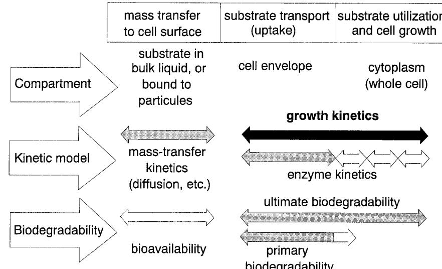
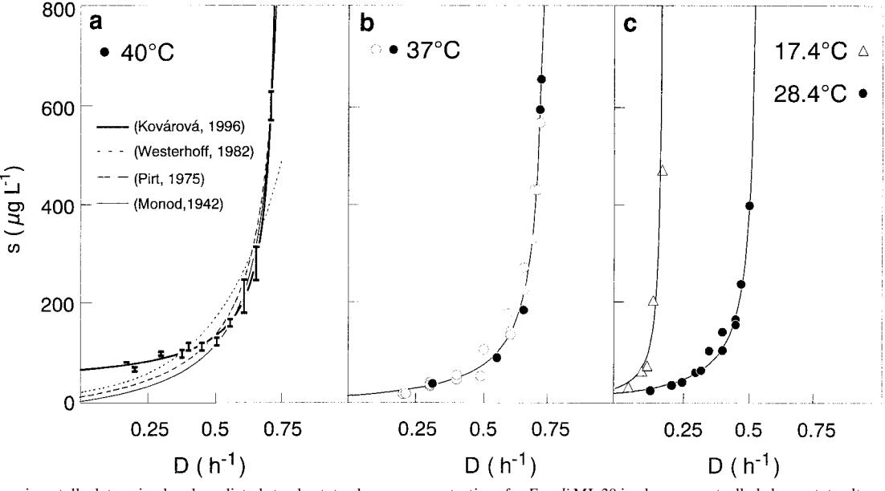
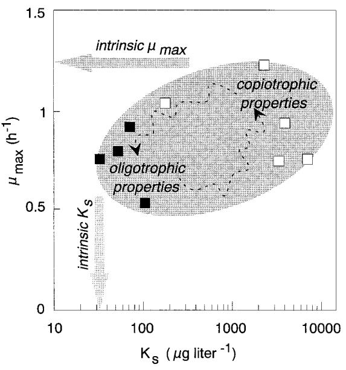
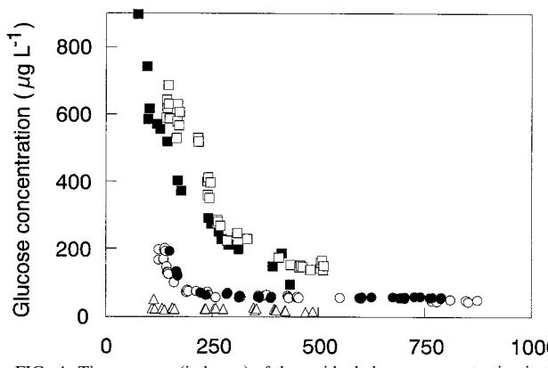
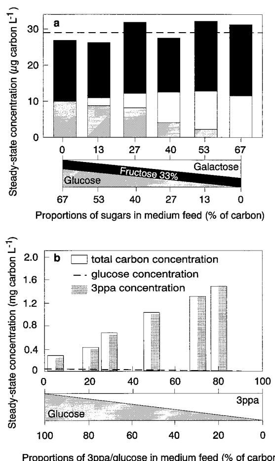
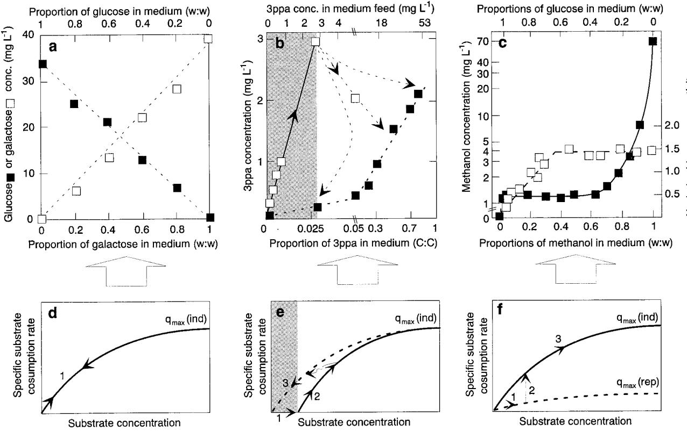
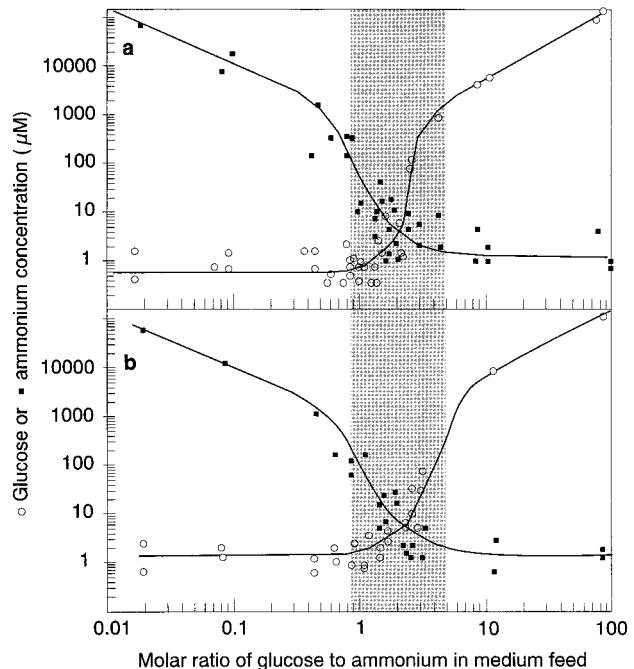
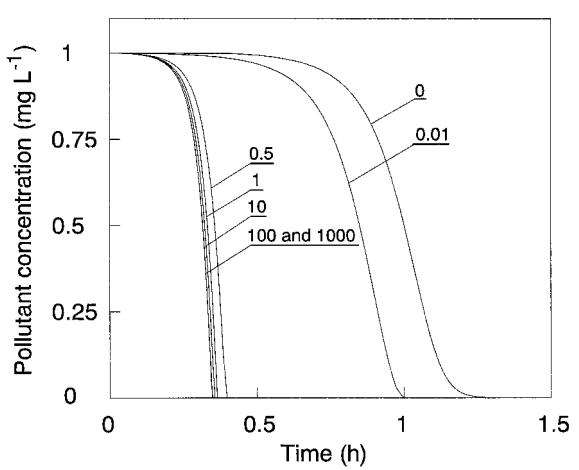
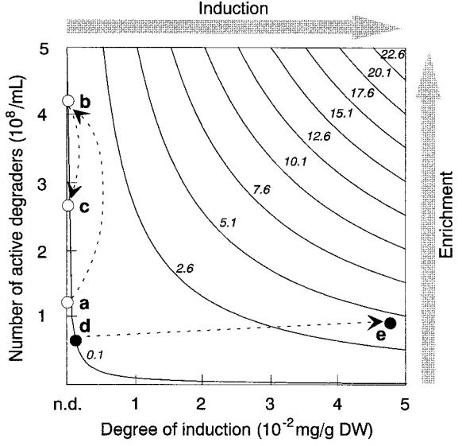

# Growth Kinetics of Suspended Microbial Cells: From Single-Substrate-Controlled Growth to Mixed-Substrate Kinetics

# KARIN KOVA´ROVA´ -KOVAR† AND THOMAS EGLI*

*Swiss Federal Institute for Environmental Science and Technology (EAWAG), CH-8600 Du¨bendorf, Switzerland*

| INTRODUCTION 646                                                                      |  |
|---------------------------------------------------------------------------------------|--|
| EXPERIMENTAL APPROACHES AND KINETIC DATA AVAILABLE647                                 |  |
| Quality of Experimental Data647                                                       |  |
| Laboratory cultivation techniques versus conditions in the environment648             |  |
| Problems of measuring growth-controlling substrate concentrations648                  |  |
| Kinetic Models and Data Processing648                                                 |  |
| Monod-type kinetics 648                                                               |  |
| (i) Kinetic and stoichiometric parameters649                                          |  |
| (ii) Biological meaning of mmax, Ks, and smin 649                                  |  |
| Alternative kinetic expressions 650                                                   |  |
| Some comments on the choice of models and fitting exercise 650                        |  |
| Parameter identifiability 651                                                         |  |
| Variations in Kinetic Parameters651                                                   |  |
| Intrinsic versus extant kinetics652                                                   |  |
| Feast and famine ends of an organism's kinetic properties652                          |  |
| (i) Long-term adaptation from high to low substrate concentrations and vice versa 653 |  |
| (ii) Implications for growth of microbial cells in the environment653                 |  |
| SUBSTRATE MIXTURES AND MIXED CULTURES 654                                             |  |
| Utilization of Mixtures of Carbon Sources 654                                         |  |
| Kinetic Effects during Utilization of Defined Substrate Mixtures by Pure Cultures 654 |  |
| Experimental data 654                                                                 |  |
| (i) Continuous cultivation 655                                                        |  |
| (ii) Batch cultivation 656                                                            |  |
| Kinetic models656                                                                     |  |
| Effect of enzyme expression patterns 657                                              |  |
| (i) Fixed catabolic enzyme level657                                                   |  |
| (ii) Regulated catabolic enzyme level657                                              |  |
| (iii) Threshold for enzyme induction 657                                              |  |
| Kinetics of Multiple-Nutrient-Controlled Growth 658                                   |  |
| Biodegradation Kinetics: Effects during Utilization of Complex Substrate Mixtures     |  |
| by Mixed Cultures 659                                                                 |  |
| Effect of uncharacterized DOC on utilization of pollutants659                         |  |
| Kinetics of multicomponent substrate removal660                                       |  |
| Influence of initial substrate-to-biomass ratio 660                                   |  |
| Catabolic capacity660                                                                 |  |
| CONCLUDING REMARKS AND OUTLOOK 661                                                    |  |
| ACKNOWLEDGMENTS 662                                                                   |  |
| REFERENCES 662                                                                        |  |
|                                                                                       |  |

"The study of the growth of bacterial cultures does not constitute a specialised subject or a branch of research: it is the basic method of microbiology." J. Monod, 1949

#### **INTRODUCTION**

Microbial growth kinetics, i.e., the relationship between the specific growth rate (m) of a microbial population and the substrate concentration (*s*), is an indispensable tool in all fields of microbiology, be it physiology, genetics, ecology, or biotechnology, and therefore it is an important part of the basic teaching of microbiology. Unfortunately, the principles and definitions of growth kinetics are frequently presented as if they were firmly established in the 1940s and during the following "golden age" in the 1950s and 1960s (the key publications are those of Monod [166, 167, 168], Hinshelwood [102], van Niel [252], Novick and Szilard [181], Herbert et al. [101], Ma´lek [155], Pfenning and Jannasch [193], Fencl [67], Pirt [194], Powell et al. [200], and Tempest [243, 251], culminating in the book by Pirt [195]). This state of affairs is probably the consequence of a stagnation in this area during the past three decades, in which the interest of many microbiologists was attracted by rapidly developing areas such as molecular genetics or the biochem-

* Corresponding author. Mailing address: EAWAG, U` berlandstrasse 133, CH-8600 Du¨bendorf, Switzerland. Phone: 41-1-823 5158. Fax: 41-1-823 5547. E-mail: egli@eawag.ch.

† Present address: Vitamins and Fine Chemicals—Biotechnology, F. Hoffmann-La Roche Ltd., CH-4070 Basel, Switzerland.

FIG. 1. Kinetic processes which affect microbial growth, specified with respect to compartment, kinetic model, and biodegradability characteristics. Ranges of definition for the most important aspects of microbial growth and degradation kinetics are given.

istry of the degradation of xenobiotics. However, it might also be the consequence of certain frustration from the many attempts that had been made to obtain coherent experimental data (127; for a historical overview, see reference 114). This state is also reflected by the fact that only a few review articles (e.g., references 34, 36, 79, 173, 182, and 211) and one monograph (187) that primarily deal with growth kinetics per se and its problems were published within the last two decades. In contrast, considerable attention has been paid to the modeling aspects of both growth and substrate removal (biodegradation) kinetics (recently reviewed in references 3, 20, 18, 66, 86, 178, 208, 218, and 228).

Although some of these authors dealing with microbial growth kinetics started to emphasize the ecological point of view, they almost totally neglected the facts that in nature microorganisms grow mostly with mixtures of substrates (87, 88), that growth may not be controlled by only a single nutrient but by two or more nutrients simultaneously (57, 183, 214, 255), and that kinetic properties of a cell might change due to adaptation (unfortunately, only preliminary data for such changes have been published [e.g., references 104, 110, 134, and 212]). How little these topics were considered to be of importance to microbial ecology may be seen from the fact that all major microbial ecology textbooks (and monographs) (e.g., references 31, 69, 108, 171, and 240) ignore these subjects. However, recent more ecologically oriented studies in the area of microbial growth and biodegradation kinetics demonstrated that many fundamental questions in this field are still waiting to be discovered, established, and exploited (reviewed in reference 58).

Our intention was to present here a critical overview on microbial growth kinetics with respect to the current state, the recent advances that have been made, and its possible future developments. However, we kept in mind Monod's warning that "it would be a foolish enterprise, and doomed to failure, to attempt to reviewing briefly a 'subject' which covers our whole discipline. Unless, of course, we considered the formal laws of growth as a method for their own sake, an approach which has repeatedly proved sterile" (167). Therefore, we focus here on growth and growth-linked biodegradation kinetics of suspended heterotrophic cultures where the substrates are available in the bulk liquid; such systems are experimentally more easily accessible than heterogeneous ones (in Fig. 1, the various aspects of cell growth that are frequently dealt with in the literature are shown). Nevertheless, one can envisage that much of the information presented here on, for instance, mixedsubstrate growth or threshold concentrations can be also applied to the conditions prevailing in biofilms (176, 177, 206, 227). By necessity rather than choice, most of the issues discussed here are approached from the perspective of classical kinetics, where we restrict ourselves (with few exceptions) to the description of model systems that are well defined with respect to the microorganisms used, substrates, and growth conditions. Such studies offer a conceptual framework within which a number of observations concerning the growth of microbial cells and the fate of chemicals in real, complex systems (e.g., activated sludge biocenoses, microorganisms cultured for biotechnological purpose, and free-living aquatic microorganisms) may be rationalized, although they result mostly in unstructured models. Because of the large body of literature that is available on many of the aspects treated here (particularly on single-substrate-controlled kinetics), the list of references presented cannot be complete but is, in many instances, a personal selection that allow us to illustrate a particular issue.

# **EXPERIMENTAL APPROACHES AND KINETIC DATA AVAILABLE**

# **Quality of Experimental Data**

To validate a theory, experimental data of sufficient quality are needed. In this respect, however, most of the experimental data published on the relationship between specific growth rate and concentration of growth-controlling substrates are inadequate (for the use of the terms "growth-controlling" and "growth-limiting" substrate, see "Kinetic models and data processing" below). Typically, they exhibit a considerable degree of scattering (129, 166, 212, 213) that makes it virtually impossible to validate different models statistically. This can be attributed primarily to (i) the experimental cultivation systems used to collect the data and (ii) poor selectivity and sensitivity of analytical methods for measuring low concentrations of the growth-controlling substrates. The latter point represents a limitation in the analytical techniques used which may be overcome eventually; therefore, we will address this aspect only shortly (the problems have been discussed previously [128, 224, 226]). However, the first point is of primary importance because in this respect many conceptually different approaches are found in the published literature to collect the experimental data (182).

**Laboratory cultivation techniques versus conditions in the environment.** Microbial growth kinetics of suspended cells have been investigated in the laboratory in batch, continuous-culture, or fed-batch systems. Although, in theory (264), the last technique should overcome some of the disadvantages which hamper the conventional methods of batch and chemostat cultivation (discussed below), it has never been routinely used to experimentally estimate kinetic parameters (e.g., mmax and *Ks*), and therefore we will not discuss this approach in more detail.

In batch-culture experiments, either the consumption of the growth-controlling substrate or the increase in biomass concentration was monitored as a function of time. Inherent in this system is that the cell's environment and hence the cell's composition and physiological state change during the experiment (this has already been recognized and discussed in the classical studies by Kluyver [124], Ma´lek [155], Herbert [100], Tempest [242], Koch [125, 126], and Tempest and Neijssel [245]). However, in continuous culture, an equilibrium concentration of the growth-controlling substrate is established independently of culture density and time. This allows the culture to grow at the set dilution rate by maintaining stable environmental growth conditions and hence the same physiological state. Therefore, in an ideal continuous culture, more precise, reproducible, and statistically relevant data can be collected than those obtained from batch cultures (137, 224). However, the constancy of all physicochemical parameters similarly represents artificial growth conditions as those imposed by a closed batch-culture system, and therefore the classical continuous-culture system is also not appropriate to study a number of microbial kinetic phenomena as they occur in the environment. In this respect, the situation of an organism under natural conditions most probably resides somewhere between the closed batch-culture and open continuous-culture systems (discussed in reference 114).

In addition to studies performed with defined elements in batch or chemostat cultures, the kinetics of biodegradation of specific compounds has been investigated in complex systems consisting of undefined mixtures of cultures and substrates, e.g., in natural and technical environments directly or in laboratory microcosms (37, 108, 187). Such data are preferentially used to model processes in wastewater treatment plants or environmental compartments (83, 97, 98). Unfortunately, with the techniques presently at hand, it is extremely difficult to carry out kinetic experimental studies in such ecosystems and it is virtually impossible to obtain information at the single-cell level directly (for more details, the reader is referred to the following sections on mixed cultures and mixed substrates).

At this point, the reader should be reminded that—as a result of the slow hydrolysis of particulate organic matter—the growth of heterotrophic microorganisms in most ecosystems is controlled by the availability of carbon and energy substrates (reviewed in references 58, 90, and 169; note that evidence that the removal of "solubilized" and bioavailable substrates is not a limiting factor in the activated-sludge process had already been reported in the 1960s [185]). Therefore, it is the growth in carbon-limited continuous culture, mostly under (slow) transient conditions or sometimes close to steady-state conditions, that probably resembles the growth conditions experienced by microorganisms in nature most of the time. In such a laboratory system, the rate of hydrolysis is simulated by the rate of supply of the growth-controlling substrate. We are convinced that defined laboratory studies with mixed substrates and pure and mixed cultures performed in continuous culture is one of the most appropriate experimental approaches to understanding the kinetic and physiological behavior of microorganisms in their natural environment (discussed in references 58, 103, 112, and 170).

**Problems of measuring growth-controlling substrate concentrations.** To overcome the analytical difficulties of determining (low) growth-controlling substrate concentrations, kinetic experiments [i.e., determination of the m 5 *f*(*s*) relationship] carried out in batch cultures mostly relied on indirect methods of obtaining data. The obvious reason for this is that the exact determination of the growth-controlling substrate concentration was and still is difficult whereas determination of the specific growth rate is quite easy (224, 270). Typically, specific rates of growth were measured (by determining cell number by plating or optical density) at different substrate concentrations which, in turn, were estimated either by calculation from the biomass produced and a growth yield factor (166) or simply by calculation from known dilution factors (129, 226).

To obtain kinetic data directly, either nonspecific or specific analytical techniques were used to measure concentrations of growth-controlling substrates. However, these methods not only have particular advantages but also have their specific limitations. The simple and cost-effective nonspecific methods, i.e., summary parameters such as dissolved organic carbon (DOC) removal, oxygen consumption (oxygen uptake rate or biological oxygen demand), and CO2 evolution (26, 38, 270), provide in the best case (i.e., DOC) kinetic information on the process of ultimate biodegradation, including the degradation of perhaps transiently excreted metabolites (see Fig. 1, where the different ranges of definition of biodegradability are indicated). Unfortunately, such methods cannot discriminate between different substrates in a mixture. In addition, these nonspecific methods are less sensitive (typically, detection limits are in the milligram-per-liter range). Therefore, they are less suitable for ecologically oriented studies, where one usually wants to obtain information on the effects on growth of low concentrations of particular substrates in mixtures.

Alternatively, either the removal of an individual growthcontrolling (i.e., parent) compound by a sensitive substratespecific analysis (224) or the disappearance or production of 14C-labeled chemicals can be assessed (48, 115, 192, 233). The latter (high-cost) method has been successfully used for in situ measurements or at very low concentrations (micrograms per liter and lower) when other sensitive analytical techniques were not available. With respect to degradation kinetics, it should be pointed out that when the kinetics of the utilization of the parent compound is followed by specific analysis, only information on the primary degradation of this compound is obtained.

## **Kinetic Models and Data Processing**

**Monod-type kinetics.** During the last half century, the concepts in microbial growth kinetics have been dominated by the relatively simple empirical model proposed by Monod (166). The Monod model (equation 1) differs from the "classical" growth models (74, 256, 257, 205) in the way that it introduces the concept of a growth-controlling ("limiting") substrate.

It should be added that, confusingly, the terms "nutrient limitation" and "nutrient-limited growth" have been used in microbiology to describe two completely different growth phe-

TABLE 1. Nomenclature and abbreviations used in this study

| Term    | Definition                                                                          | Units           |  |
|---------|-------------------------------------------------------------------------------------|-----------------|--|
| a(i)    | Specific affinity (for substrate i)                                                 | Liters mg21 h21 |  |
| BOD     | Biological oxygen demand                                                            |                 |  |
| C       | Catabolic capacity                                                                  |                 |  |
| D       | Dilution rate (specific growth rate in chemostat)                                | h21             |  |
| DOC     | Dissolved organic carbon                                                            |                 |  |
| Ii      | Degree of induction for substrate i                                                 | Percent         |  |
| Km      | Michaelis-Menten substrate saturation constant                                   | mg liter21      |  |
| Ks      | Substrate saturation constant                                                       | mg liter21      |  |
| m       | Specific maintenance rate                                                           | h21             |  |
| Ni      | Number of active (induced) cells in a community                                  |                 |  |
| qmax    | Maximum specific substrate consump tion rate                                     | h21             |  |
| OUR     | Oxygen uptake rate                                                                  |                 |  |
| Ri      | Contribution of substrate i to a mixture                                            |                 |  |
| s0,i    | Concentration of substrate i in the feed                                            | (m)g liter21    |  |
| s       | Steady-state substrate concentration                                                | mg liter21      |  |
| s100%,i | Steady-state concentration of substrate i during growth with this substrate only | mg liter21      |  |
| smin    | Predicted substrate concentration at D 5 0 h21                                   | mg liter21      |  |
| X       | Biomass concentration                                                               | (m)g liter21    |  |
| YX/s    | Growth yield                                                                        |                 |  |
| m       | Specific growth rate                                                                | h21             |  |
| mmax    | Maximum specific growth rate                                                        | h21             |  |

nomena. First, they are used in a stoichiometric sense to indicate that a certain amount of biomass can be produced from a particular amount of nutrient (or element, or substrate), i.e., that in a culture medium the availability of this nutrient determines the cell density which can be achieved (Liebig's law). Second, these terms are also used to indicate that the microbial growth rate (m) is dictated by the (low) actual concentration of a particular substrate(s), as described, for example, by Monod's model (equation 1). For clarity, in this review we consistently use the term "nutrient-controlled" growth to describe the latter situation and use the term "limitation" to refer to stoichiometric aspects of growth (159, 214).

**(i) Kinetic and stoichiometric parameters.** For most applications, it has turned out that growth or degradation phenomena can be described satisfactorily (usually based on a visual and not a statistical judgment) with four parameters, the two kinetic parameters, mmax and *Ks*, and the two stoichiometric parameters, *YX/s* and *s*min, as discussed below.

Monod's model relates the growth rate to the concentration of a single growth-controlling substrate [m 5 *f*(*s*)] via two parameters, the maximum specific growth rate (mmax), and the substrate affinity constant (*Ks* ) (the nomenclature used throughout, is listed in Table 1). Since growth is a result of catabolic and anabolic enzymatic activities, these processes, i.e., substrate utilization or growth-associated product formation, can also be quantitatively described on the basis of growth models (see, e.g., reference 94 and the excellent overview given in reference 13). The link between growth and substrate utilization has already been made by Monod (166), who linearly related the yield coefficient (*YX/s*; equation 2)—a measure for the conversion efficiency of a growth substrate into cell material—to the specific rate of biomass growth (m) and the specific rate of substrate consumption (*q*) (equation 3).

$$
\mu = \mu_{\text{max}} \frac{s}{K_s + s} \tag{1}
$$

$$Y_{X|s} = \frac{dX}{ds} \tag{2}$$

$$
\mu = \frac{Y_{X\&}}{X} \cdot \frac{ds}{dt} \cong Y_{X\&} \, q \tag{3}
$$

The classical Monod equation does not consider the fact that cells may need substrate (or may synthesize product) even when they do not grow. For this reason, the original Monod equation was modified by introducing the terms of maintenance, expressed as the threshold substrate concentration (*s*min [equation 4] [3, 28, 135, 206, 220, 246]) or maintenance rate (*m* [equation 5], originally proposed by Herbert [99], or the alternatives proposed by Marr et al. [157], van Uden [253], and Pirt [194]). Recently, it has been discussed (135) that the finite substrate concentration, *s*min, at zero growth rate is implicitly present in many of the kinetic expressions published in the literature, e.g., in the models proposed by Powell (199), van Uden (253), Pirt (194, 195), and Westerhoff et al. (266).

$$s = K_s \frac{D}{\mu_{\text{max}} - D} + s_{\text{min}} \tag{4}$$

$$
\mu = \left(\mu_{\text{max}} + m\right) \frac{s}{K_s + s} - m \tag{5}
$$

**(ii) Biological meaning of** m**max,** *Ks***, and** *s***min.** A comment on the biological meaning of the parameters *Ks*, mmax, and *s*min, which are used to characterize microbial growth for given growth conditions, is necessary. Whereas the interpretation of mmax as the maximum specific growth rate is straightforward, the biological meaning of *Ks* is less obvious. Although, the Monod equation is mathematically analogous to the formula that was proposed by Michaelis and Menten (43) to describe enzyme kinetics, the meaning of the two parameters *Ks* and *Km* is quite different. Monod had already stressed (167) that there is no relationship between the *Ks* (affinity constant used in his growth model, which represents the substrate concentration at m 5 0.5mmax) and the Michaelis-Menten constant *Km*. In contrast to Michaelis-Menten kinetics, which is used to describe a process catalyzed by a single enzyme, Monod kinetics describes processes (both growth and growth-linked biodegradation) of a more complex nature in which many enzyme systems are involved (Fig. 1). Therefore, the still frequently used habit of describing the kinetics of growth or growth-associated biodegradation as "Michaelis-Menten-type" kinetics is not correct. Only in some special cases, when cell growth is controlled by the rate of active transport of a substrate, may *Ks* be considered to be similar to the Michaelis-Menten constant (*Km*) for the permease carrier (see, e.g., references 22 and 23). The value of 1/*Ks* is interpreted as a reflection of the affinity of the cell towards a substrate.

The existence of *s*min can be justified on the basis of the maintenance energy concept that can be easily explained by thermodynamic reasoning (194, 220). A consequence of this concept is the existence of a finite concentration or flux of an energy or carbon substrate at zero growth rate. In a system that is open with respect to the supply of substrate, this results in a finite concentration of the energy or carbon source at *D* 5 0 h21 (this concept has also been verified experimentally for single-substrate-controlled growth [135, 154, 226, 222, 246, 263]). It should be pointed out that such thresholds should not be observed in closed systems like batch cultures (246), because the maintenance requirement of cells implies continued utilization until all available substrate is exhausted.

FIG. 2. Experimentally determined and predicted steady-state glucose concentrations for *E. coli* ML 30 in glucose-controlled chemostat cultures at 17.4, 28.4, 37, and 40°C, as a function of dilution (growth) rate. Bars indicate the steady-state substrate concentrations (indicating vertically the standard deviation of the steady-state glucose concentrations determined as a mean of about 10 measurements and horizontally the approximate variation in *D*); lines indicate predictions

of steady-state glucose concentrations by different models (adapted from reference 34) as follows: *s* 5 *Ks* S *D* mmax 2 *D*D 1 *s*min ~34!, *s* 5 exp(2*x*/*y*) ~266!,

$$\stackrel{\circ}{\text{max}} = \stackrel{\circ}{K_s} \frac{(\stackrel{\circ}{D} + \stackrel{\circ}{a})}{(\mu_{\text{max}} - \stackrel{\circ}{D} - \stackrel{\circ}{a})} (195), \text{and } \stackrel{\circ}{s} = \stackrel{\circ}{K_s} \left(\frac{\stackrel{\circ}{D}}{\mu_{\text{max}} - \stackrel{\circ}{D}}\right) (166).$$

**Alternative kinetic expressions.** The first kinetic principle proposed for microbial growth by Penfold and Norris in 1912 (189), namely, that the relationship between m and *s* is best described by a "saturation" type of curve, i.e., that at high substrate concentrations the organisms should grow at a maximum rate (mmax) independent of the substrate concentration, has been widely accepted. Although Monod's model (equation 1) fulfills this requirement, it has been criticized in the past in various respects. In particular, its systematic deviations of m at low substrate concentrations, where the actual growth rate lies above the prediction, and at high substrate concentrations, where mmax is approached too slowly, were a matter of much debate (see particularly reference 199). The fact that even Monod's own data (166) did not indisputably support his proposed mathematical formula gave rise to many more studies. A variety of other mathematical expressions have been put forward to describe this hyperbolic curve (reviewed in references 182, 200, and 224). However, the development of structured (mechanistic) models for quantifying microbial growth kinetics is still limited because the mechanism of cell growth is very complex and is not yet completely understood (for a review of structured models, the reader is referred to reference 178). Therefore, most of the proposed growth models are unstructured and empirical. In principle, three methods were used to design such refined equations for the growth kinetics of suspended cells: (i) incorporating additional constants into the original Monod model that provided corrections of, for instance, substrate or product inhibition, endogenous metabolism (maintenance), substrate diffusion, or the dependence of mmax on the biomass density (5, 41, 44, 94, 99, 173, 195, 200, 199, 226); (ii) proposing different kinetic concepts, resulting in both empirical (24, 94, 239, 241, 266) and mechanistic (50, 133, 178) models; and (iii) describing the influence of physicochemical factors on the Monod growth parameters (39, 73, 135, 201).

Some of the recent attempts to create a general kinetic model that will be valid over a wide range of growth conditions, are represented by the equation proposed by Tan et al. (239), which includes the Monod, Moser, and multiple Monod equations as special cases, or by the powered Monod equation (equation 6) proposed by Heijnen and Romein (94). By including the exponent *n*, the model of Heijnen and Romein model was said to take into account the influence of variable enzyme concentrations. The fact that intracellular enzyme concentrations exert an important influence on overall growth kinetics has been already discussed (22, 23, 130). (Note that this powered Monod equation differs from the growth model proposed by Moser [cited in reference 199]; the influence of enzyme regulation on the kinetics of growth is discussed in more detail below.)

$$\frac{q}{q_{\text{max}}} = \left[\frac{\text{s/K}_{\text{s}}}{(\text{s/K}_{\text{s}}) - 1 + 2^{1/n}}\right]^n \tag{6}$$

This flexible three parameter formula displays the features of most of the growth models that had been proposed previously, including that of Monod (i.e., for *n* 5 1). For *n* , 0, equation 6 exhibits a threshold substrate concentration at zero substrate uptake rate. Unfortunately, the model has not been supported by experimental data yet. However, it has recently been shown that a single threshold-type kinetic model (i.e., an extension of the Monod equation) gives a sufficiently good description of the whole set of data for *Escherichia coli* growing in continuous culture controlled by glucose over a wide temperature range, both below and above the optimal growth temperature (135) (Fig. 2).

**Some comments on the choice of models and fitting exercise.** Although increasing model complexity often results in improved curve fitting, the most appropriate model should be selected on the basis of statistical considerations (discussed in references 127 and 208). Unfortunately, there is evidence that complex equations (e.g., models described in the previous section under points i and ii) have often been constructed in an attempt to explain a set of experimental data that exhibited so much scatter that it was impossible to discriminate between the different models (127, 182, 200, 212, 213, 224). Monod was aware of the inadequate quality of his data, and he reasoned that: "several different mathematical formulations could be made to fit the data. But it is convenient and logical to adopt a hyperbolic equation" (167). This leads to the conclusion that there is a need to acquire reproducible data of better quality (reproducible data from continuous culture were presented in, for example, references 135 and 224) and that it seems a fruitless exercise to develop new models as long as it is not possible to discriminate between them on the basis of the experimental data. One should be also aware that the development of unstructured models has, perhaps, reached its maturity and that much effort will therefore now be channeled into the development and verification of structured models (66, 178). However, the experimental effort expended to generate data that are required by the structured models will be enormous (i.e., data are needed that provide information on the mechanism of biomass growth and its composition). Although both the analytical and computational facilities for the advancement of such models are well developed, it will still be difficult to find the necessary balance between avoiding unnecessary complexity and ensuring sufficient reality.

**Parameter identifiability.** When the Monod model (equation 1) is directly fitted to a set of experimental data, *Ks* values are known to vary with mmax (the question of whether and to what extent the observed changes in Monod kinetic parameters are a result of this high correlation between them is still unanswered). This means that the two parameters are not completely independent but "draw" each other during the fitting procedure. For example, changing mmax in such a fitting exercise will also immediately lead to a small adjustment of *Ks*, and not, as one would expect theoretically, that they can be varied independently (discussed in reference 151). Therefore, it was proposed that the mmax/*Ks* ratio is a better parameter to assess the advantage in competition for a nutrient(s) at low concentrations (93). This ratio, also referred to as specific affinity, bridges the kinetics of enzymatic substrate uptake and microbial growth (comprehensively analyzed by Button [33–35]). It has been frequently pointed out that any combination of the two parameters that results in the same mmax/*Ks* ratio will fit equally well in the parameter estimation routine (the practical problems of the parameter identifiability for growth models containing "Michaelis-Menten-type" nonlinearities and the optimal experimental design are discussed in references 40, 208–210, and, recently, 258). In particular, it was stressed that it is almost impossible to obtain reliable kinetic parameters from a single batch substrate depletion curve. The reason for this is that for initial substrate concentrations much higher than the effective *Ks*, which is usually the case in batch cultures, the fitting procedure becomes insensitive to changes in *Ks* and, consequently, *Ks* values differing by several orders of magnitude could successfully describe the experimental data. Thus, mmax is the only parameter that rigidly fixes the growth behavior in batch culture (this statement is based on our personal experience but has also been discussed in references 66, 86, and 210).

Additionally, it should be pointed out that it has been demonstrated (43) that transformations of the original data by using, for instance, the Eadie-Hofstee, Lineweaver-Burk, or "direct linear" plots significantly affect the estimated kinetic constants. Therefore, it remains an open question whether some of the

TABLE 2. Kinetic constants and their temperature dependencies for *E. coli* grown with glucose as the sole source of carbon and energy

| E. coli strain | T (°C) | Ks (mg liter21 ) | mmax (h21 ) | Cultivation method | Refer ence |
|-------------------|-----------|------------------------|-------------------|-----------------------|---------------|
| ML 30             | 40        | 34a                    | 0.75              | Chemostat             | 135           |
| H                 | 37        | 4,000                  | 0.94              | Batch                 | 166           |
| B/r Thy2          | 37        | 180                    | 1.04              | Batch                 | 260           |
| ML 308            | 37        | 3,400                  | 0.75              | Batch                 | 125           |
| B/r CM6           | 37        | 540                    | NRc               | Batch                 | 19            |
| K-12              | 37        | 7,160                  | 0.76              | Batch                 | 52            |
| ML 308            | 37        | 107                    | 0.54              | Chemostat             | 129           |
|                   |           | 2,340                  | 1.23              | Batch                 |               |
| ML 30             | 37        | 53                     | 0.80              | Chemostat             | 224           |
|                   |           | 72                     | 0.92              |                       |               |
| ML 30             | 37        | 33a                    | 0.76              | Chemostat             | 34            |
| B/r Thy2          | 30        | 180                    | NR                | Batch                 | 260           |
| NRc               | 30        | 77,000–99,000          | 0.92–1.05         | Chemostat             | 222           |
| ML 30G            | 30        | 68b                    | 0.78              | Batch                 | 226           |
|                   |           | 12,600                 |                   |                       |               |
| ML 30             | 28.4      | 33a                    | 0.54              | Chemostat             | 34            |
| O-124             | 26        | 2,400                  | 0.55              | Batch                 | 49            |
| OUMI7020          | 20        | 8,460b                 | 0.55              | Batch                 | 109           |
|                   |           | 46,800                 |                   |                       |               |
| NRc               | 20        | 8,000                  | 0.65              | Chemostat             | 111           |
| ML 30             | 17.4      | 33a                    | 0.19              | Chemostat             | 34            |

*a* The extended Monod model (equation 4) was fitted to the experimental data. *b* Two uptake systems of different affinity were reported.

*c* NR, not reported.

observed changes in kinetic parameters are a product of a tendentious data evaluation procedure rather than a reflection of reality (see, for instance, Fig. 3 and 5 in reference 179).

#### **Variations in Kinetic Parameters**

Of all the different models that have been proposed, the Monod relationship (equation 1) is the one that has been most frequently used to describe microbial growth kinetics in both pure (reviewed in references 34, 182, and 224) and mixed (83, 196) culture systems. Therefore, the two "organism constants," mmax and *Ks*, dominate the literature and are discussed in the following sections of this review. Astonishingly, there is a considerable lack of consistency in the Monod parameters reported even for a specified combination of an organism and a substrate. Williams (268), who simulated the uptake kinetics by an undefined mixed culture, concluded that "departure from the predictions of Michaelis-Menten equation cannot be attributed simply to the fact that the population is heterogeneous." A typical example of the state of information on the kinetic properties exhibited by a particular microorganism are the data available for *Escherichia coli* growing with glucose. The *Ks* values reported vary over more than 3 orders of magnitude (Table 2; Fig. 3), and it should be stressed that the case of *E. coli* does not stand alone; similar examples can be found for or *Cytophaga johnsonae* (104) and *Klebsiella pneumoniae* (212).

Based on the discussion so far, it is evident that there are many different reasons for this variability. Those that seem to be the most important are the culture history, parameter identifiability, and quality of the experimental data (for a comprehensive review from an engineering point of view, the reader is referred to reference 79). Here, we would like to concentrate on the changes which are linked in one or another way to the experimental setup and the physiological state of the cell (but see also "Substrate mixtures and mixed cultures" below).

FIG. 3. Kinetic properties of *E. coli* reported in the literature for glucosecontrolled growth at 37°C. Experimental data from batch (h) and chemostat (■) cultures are given. The numerical values and references are listed in Table 2. "Ideal" intrinsic kinetic properties (indicated by arrows) cannot be determined experimentally at the same time, because cells can be cultivated only in such a way that they exhibit either the intrinsic *Ks* (in chemostat culture) or the intrinsic mmax (in batch culture). The shaded area represents an approximation of the extant kinetic properties that *E. coli* can potentially exhibit.

**Intrinsic versus extant kinetics.** As discussed above, the enormous variations in reported kinetic constants cannot be satisfactorily explained by strain differences or other (technical) deficiencies, but it is very likely that they depend to a considerable part "not only on s(t) but also on the history of the culture, in particular on the way in which 's' has varied in the past" (200). Hence, during a kinetic experiment, the physiological state of a culture can change and may exhibit socalled "intrinsic" or "extant" kinetic properties (this nomenclature has been proposed by Grady et al. [79]). The intrinsic parameters depend only on the nature of the substrate, the type of bacterial culture, and the set environmental (physicochemical) conditions, and they are considered to be independent of culture history and therefore reproducible. In contrast, the extant kinetic properties are a reflection of cell's history, the organism's intrinsic characteristics, and the currently existing environmental conditions; they are therefore variable and difficult to reproduce. (Note that a similar concept was already outlined by Powell in 1967 [199], who proposed an instantaneous specific substrate consumption rate that is related to both the substrate concentration and organism's physiological state.)

In most experimental systems that are used to determine kinetic parameters of microbial cultures, the physiological state of the cells changes during the experiment; hence, the culture will always exhibit extant kinetic properties. In the course of the experiment, the exhibited kinetic characteristics will move toward the intrinsic values that can be achieved under the given specific environmental conditions (temperature pH, etc.). With respect to the Monod parameters, it appears either that a culture is able to improve the mmax, when it is "trained" during repeated growth in batch culture with a corresponding loss in affinity towards the previously growth-controlling substrate (45), or, alternatively, that during cultivation in continuous culture it improves its ability to scavenge the growthcontrolling substrate by decreasing *Ks* with the loss of capacity to grow at the maximum possible rate (134, 224). We are not aware of any experimental evidence showing that a culture simultaneously exhibited both the intrinsic mmax and *Ks* (arbitrarily defining "intrinsic" as the "best" possible value, i.e., the highest possible mmax and the lowest *Ks*); hence, only one of these parameters can be determined experimentally at a time. Such an understanding would extend the definition of intrinsic properties as originally proposed by Grady et al. (79).

To date, the discussion of whether intrinsic or extant kinetic parameters are better suited to describe the biodegradation processes and to predict the fate of organic compounds in nature and engineered systems is still under way (86, 180). Unfortunately, most of the kinetic data reported in literature were determined somewhere between the two well-defined kinetic properties discussed above (150). Such data must therefore be interpreted with caution. To judge the quality and meaningfulness of the reported parameters, it is at least necessary to know the exact conditions of the experimental approach used. Hence, as is the case for cellular composition (100), with respect to kinetic properties we also have to recall that ". . .bacterial cells are able to change themselves phenotypically to such an extent that it is quite impossible to define them chemically (or structurally or functionally) without reference to the growth environment" (243).

**Feast and famine ends of an organism's kinetic properties.** To survive and compete successfully in nature, most microorganisms are able to meet many of the environmental challenges by adjusting their cellular composition with respect to both structure and metabolic function (198). Regardless of whether these adaptive changes occur at the phenotypic level, the genotypic level, or both, it is logical that they also affect the growth and/or biodegradation kinetic properties exhibited by a cell. For example, microorganisms are able to adapt to growth at different extracellular substrate concentrations by drastically adjusting their key kinetic properties (in Monod terms, mmax and *Ks*), and the strategies that have been reported for both gram-negative and gram-positive microorganisms include the following: (i) a single uptake system that exhibits different kinetic properties depending on the concentration of its substrate is used (so-called multiphasic kinetics [7, 179]); (ii) the microorganisms switch between two or more transport systems of different affinity, as observed for different sugars (68, 95, 96) or for glycerol and ammonia (244) (such changes can include the modification of outer membrane components [68]); and (iii) other less well defined changes can be used, such as variations in the catabolic and/or anabolic capacity (the "metabolon"), as suggested by Kurlandzka et al. (140).

These modes of adaptation considerably differ in the time frame within which changes take place (discussed in reference 66). Whereas a multiphasic system will react instantaneously, the switch between different transport systems can proceed relatively quickly, i.e., within few minutes to hours; however, adaptation at the population level (e.g., evolution and enrichment of more competitive mutant strains) is predisposed to long-term changes.

Two fundamentally different approaches are used at present to study the physiological changes taking place in microorganisms when the availability of particular substrate becomes restricted: (i) the starvation approach (i.e., behavior in the complete absence of a particular nutrient in batch culture [123, 131, 160, 161]), and (ii) slow growth at very low nutrient concentrations (as occurs, for example, during continuous cultivation [58]). It must also be stressed that there are distinct differences in the processes that occur during growth at different

FIG. 4. Time courses (in hours) of the residual glucose concentration in the initial phase of glucose (carbon)-controlled continuous cultures of *E. coli* ML 30 operated at different dilution rates. The experiment was performed so that at time zero a batch culture of *E. coli*, growing exponentially at mmax 5 0.92 h21 , was switched to chemostat mode at the dilution rate indicated. Data for a culture operated at *D* 5 0.2 h21 is shown ('); data for independent continuous cultures are shown for *D* 5 0.6 h21 (■ and h) and *D* 5 0.3 h21 (F and E). Adapted from reference 134.

substrate concentrations, such as starvation (i.e., the total absence of a particular nutrient), steady-state growth under substrate control, and growth with excess substrate (i.e., control by the quality rather than the quantity of nutrients). However, neither of these approaches is able to exactly reproduce the growth and starvation conditions that microorganisms experience in ecosystems. Nevertheless, it has been recently argued that from the ecological point of view the continuous culture method seems more relevant because it resembles the growth under oligotrophic conditions (170). Therefore, the information obtained by this approach is used in the discussions in the following sections.

**(i) Long-term adaptation from high to low substrate concentrations and vice versa.** For a number of bacterial strains, it has been observed that during long-term cultivation in a carbon-controlled continuous culture, although the culture was already in steady state with respect to the biomass concentration, the residual substrate concentration decreased, implying that the affinity for the substrate increased (104, 129, 212). A systematic study of this phenomenon was performed for *E. coli* grown at different growth rates in a glucose-limited continuous culture (134), and it was shown for the first time that the process of adaptation is reproducible and proceeds faster at low than at high growth rates (Fig. 4). Assuming that the Monod model can be applied, the data imply that the affinity constant for glucose (*Ks*) decreased from approximately a few milligrams per liter during batch-growth conditions to some 30 mg liter21 at steady state in continuous culture (134, 224). It should be pointed out that the end point of adaptation with respect to the kinetic properties of the cell was always identical and was independent of the culture history (i.e., the intrinsic kinetic properties with respect to the substrate affinity were reproducibly achieved, apparently independently of dilution rate [134]).

The improvement in glucose-scavenging ability (*Ks*) seems to be a highly complex process (for *E. coli*, a review of the recent developments in this field has been presented by Ferenci [68]). The published data (46, 47, 107, 140, 235, 259) suggest that changes in outer membrane proteins, induction of a periplasmic binding protein-dependent transport system, and induction of genes in two distinct regulons (*mgl/gal* and *mal/lamB*) take place through the combined action of endogenously synthesized inducers (galactose and maltotriose) and cyclic AMP. In particular the last observation led to the suggestion that during growth at low glucose concentrations, e.g., in the chemostat, glucose is transported mainly via the high-affinity galactose binding protein/maltose system rather than the glucose phosphotransferase system, which was previously considered to be the only relevant glucose-transporting system in *E. coli* under such conditions (149). In contrast to the repressing role that glucose exerts when present at millimolar concentrations, the expression of transport systems for other sugars was observed in cells growing at nanomolar to micromolar glucose levels. This leads to a broadening of the scavenging potential of the bacterium for other substrates (for more details, see "Substrate mixtures and mixed cultures" below).

All this indicates that on the basis of the current knowledge of transport and regulation deduced from experiments with cultures grown with excess substrates and at high growth rates, it is difficult to predict what happens during adaptation to and growth at low glucose concentrations (see, in particular, references 68 and 149). It is unclear whether the observed adaptation is a general phenomenon that can be attributed to a limited availability of glucose in particular or of carbon in general, and it is also not known whether this behavior is a widespread phenomenon in gram-negative nonsporulating microorganisms. Still, the observations made during adaptation of *E. coli* in chemostat culture to low glucose concentrations (Fig. 4) indicate that this process is probably not a result of a long-term selection of stable mutants (for a discussion of the selection of stable mutants under such conditions, see references 53 and 212).

It should be pointed out that the reverse process, i.e., the readaptation from famine to feast conditions, is even more poorly understood. However, the process was reported to occur when bacteria isolated from seawater were transferred into media containing high substrate concentrations, where a decrease in the affinity for the carbon substrate, together with an increase in the maximum specific growth rate, was observed (111). Similarly, when resting cultures are transferred again into fresh medium, achieving the final mmax in batch culture is known to take time and several transfers are often needed, a phenomenon that is referred to as training of the cells (46, 134). Furthermore, when long-term-adapted cells are removed from the chemostat and cultivated in batch culture (or on agar plates) at high glucose concentrations, their specific growth rate is initially only some 50 to 60% of mmax and slowly increases during cultivation; at the same time, the cells lose their high affinity for glucose (reference 165 and unpublished data). The recent discovery that signaling compounds excreted by cells are involved in the resuscitation of dormant cells (119, 172, 261) fosters the speculation that such compounds might also play a role in the process of adaptation from famine to feast conditions and vice versa.

**(ii) Implications for growth of microbial cells in the environment.** During their life cycle many heterotrophic microorganisms encounter habitats that differ markedly in the spectrum and concentration of available nutrients (55, 216, 272), in addition to environmental parameters such as pH or temperature. For example, when the bacterium *E. coli* leaves its primary habitat, the nutrient-rich (copiotrophic) anaerobic intestine of warm-blooded animals and humans with an ample supply of carbonaceous compounds (153, 215), it has to adapt to its nutrient-deficient (oligotrophic) secondary habitat (water, soil or sediment), where concentrations of carbon and energy compounds are typically in the low micromolar or even nanomolar range and the availability of carbon and energy sources restricts the growth of heterotrophic microbes (6, 58, 169, 170, 175). It is obvious that a particular organism can successfully compete in both environments only if it can change and appropriately adapt its kinetic properties. This suggests that the kinetic properties of a microbial cell cannot be described by a single set of kinetic constants as has been done up to now. The experimental data reported in the literature for *Ks* and mmax of *E. coli* during growth on glucose (Table 2; Fig. 3) clearly indicate that this bacterium can exhibit different kinetic properties. This is schematically shown in Fig. 3, which suggests that a microbial cell can adjust its kinetic properties within a certain window of the *Ks*-mmax plane. All these observations support the statement (158) that categorizing bacteria according to the nutrient concentration (141, 197) as "typical" oligotrophs or copio(eu)trophs (and additional categories that were introduced by Horowitz et al. [105]) is arbitrary. In this respect, the observations reported long ago by ZoBell and Grant (275, 276), namely, that the ability to use nutrients at high or low concentrations is also dependent on the compound used as the test substrate, indicate that oligotrophy and copiotrophy are vaguely defined and documented concepts (see especially the excellent discussion in reference 223).

#### **SUBSTRATE MIXTURES AND MIXED CULTURES**

Often, the observed degradation for a particular compound in soil or water samples follows a rather simple pattern. However, such die-away studies are essentially black-box systems and therefore difficult to interpret. A few years ago, Grady et al. commented on the state-of-understanding of such complex systems as follows: ". . .efforts to model systems of practical complexity may be premature at this time. . ." because first, ". . .data must be available upon which model development can be based" (80). It follows from the information presented and discussed earlier in this review that a systematic experimental approach is needed to elucidate the main principles of microbial growth kinetics and describe them in quantitative terms. Indeed, this is especially important when investigating the growth of mixed cultures with mixed substrates. For this reason, after a brief description of the situation in environmental systems, the problem will be approached here starting out from the growth of pure cultures with defined mixtures of substrates and moving toward the more complex situation of mixed cultures utilizing mixed substrates.

#### **Utilization of Mixtures of Carbon Sources**

Traditional kinetics are based on the assumption that a single compound (e.g., a particular carbon source, such as glucose, or a nitrogen source, such as ammonia) is controlling the rate of growth of a microbial cell. This concept has been investigated, tested, and confirmed for cultures cultivated under defined conditions in the laboratory with synthetic or mineral media, where each of the physiologically required nutrients is supplied in the form of a single compound, as discussed above. In contrast to the laboratory, growth in ecosystems proceeds under more complex conditions where microorganisms are faced with mixtures of compounds that can fulfill a particular nutritional function. This is probably best illustrated for heterotrophic microbial cells and the carbon substrates they use for growth. In almost all ecosystems, the availability of carbon and energy sources is extremely restricted (169, 170) and carbon is available in the form of a myriad of different compounds, all of them at concentrations of a few micrograms per liter or lower. These compounds originate mainly from the hydrolysis of particulate organic matter or are excretion products of higher organisms and, recently, to an increasing extent also from xenobiotic chemicals released into the environment (122, 174, 175, 219). Together with temperature, this pool of carbon compounds is known to control the growth rate of the heterotrophic microbial population in ecosystems (169) (unfortunately, the two parameters are difficult to separate because as well as the microbial growth rate, temperature affects the hydrolysis rate of polymeric carbon sources and therefore their availability). It should be pointed out that it is not only the actual concentration of compounds in the environment that has to be taken into account when assessing its role for microbial growth but also its rate of turnover. For example, the rapid turnover of glucose in seawater indicates that this sugar is probably one of the major substrates of many free-living heterotrophs in this ecosystem (121, 171, 204).

Under such conditions, one would expect no significant growth if cells were specialized for one of the many available carbon compounds (249, 250), as suggested by the principle of diauxic growth (e.g., for pure cultures [166] and for mixed cultures [71, 236]). There is overwhelming experimental evidence that carbon starvation or slow growth in carbon-limited continuous culture provokes the expression of many carbon catabolic enzyme systems, although the appropriate carbon sources are absent (2, 27, 78, 225, 221, 237), resulting in cells that are able to immediately utilize these carbon substrates if they become available in the environment. In addition, over the last two decades, many studies published by different research groups have provided evidence that under such conditions heterotrophic microorganisms do not restrict themselves to the utilization of a single carbon source but are simultaneously assimilating many of the carbonaceous compounds available in their environment, even mixtures of carbon sources that normally provide diauxic growth at high concentrations (a growth behavior referred to as mixed-substrate growth [88, 160] and recently summarized in reference 58). For example, *Pseudomonas aeruginosa* was reported to grow with a mixture of 45 carbonaceous compounds, each added to tap water at a concentration of 1 mg of carbon per liter, whereas none of these compounds supported growth on its own at this concentration (249, 250).

All the evidence outlined above indicates that in addition to improved substrate affinity (see the previous section on adaptation), the potential to utilize different carbon substrates simultaneously has to be taken into account when considering microbial competition at low environmental concentrations (125, 160; bacterial substrate transport strategies and environmental fitness are reviewed in reference 89). There are now numerous examples in the literature that demonstrate this catabolic versatility and flexibility of microbial cells, not only when growing under carbon- and energy-limited conditions but also for growth in carbon-sufficient batch cultures (reviewed in reference 58). This of course raises the question whether and how the traditional kinetic concepts based on growth rate control by a single substrate can be applied to the environmental situation where a cell (or mixed microbial population) is most probably utilizing several carbon compounds simultaneously.

## **Kinetic Effects during Utilization of Defined Substrate Mixtures by Pure Cultures**

**Experimental data.** Unfortunately, kinetic studies involving mixed substrates in batch culture are currently restricted to effects reported on the specific growth rate. As far as we are aware, systematic experimental kinetic data for mixed-substrate growth were obtained only from studies in carbon-controlled continuous cultures with defined mixtures of carbon substrates.

**(i) Continuous cultivation.** The first experimental evidence for an influence of the simultaneous utilization of mixtures of carbon substrates on kinetics of growth was reported by Law and Button (142). When a *Corynebacterium* strain was grown in carbon-controlled chemostat culture with various mixtures of glucose and amino acids at a constant growth rate, the steadystate concentrations of glucose were lowered in the presence of the amino acids. This was later confirmed by other investigations in a carbon-controlled chemostat culture, when it was reported that the steady-state concentration of a particular substrate became reduced during mixed-substrate growth conditions (8, 61, 160, 191, 267). Although in all these studies the concentration of only one of the carbon substrates supplied to the culture was reported, usually because no suitable analytical methods were available to detect the other substrates, the data suggested that this effect was not limited to only one of the substrates but that it might be a general phenomenon.

Recently, an improved method for the analysis of reducing sugars (224) allowed a more detailed investigation (137, 148). This method allowed the reliable determination of the free concentrations of a variety of reducing sugars in carbon-limited chemostat cultures of *E. coli* in the low microgram per liter range (e.g., for glucose, quantification of reducing sugars in the culture medium was possible down to concentrations of 2 mg liter21 ). The method, including all necessary tests done to ensure that no significant amounts of sugars were consumed during sample collection, has been described in detail (145, 224).

To test the general validity of the pattern of reduced steadystate concentrations of individual substrates during mixed-substrate growth, *E. coli* was grown in a carbon-controlled chemostat culture at fixed growth rate with mixtures of up to six different sugars, all of them supporting growth when supplied on their own (65, 148). As expected, all the sugars were utilized simultaneously, whether mixtures of two, three, or six sugars were supplied in the feed. In all experiments the steady-state concentrations of the sugars were reduced during mixed-substrate growth compared to those measured during growth with single sugars. Furthermore, the concentrations of the individual sugars approximately reflected their contribution to the total substrate supplied to the culture, whereas the steady-state concentration of total carbon remained approximately constant. An example of this behavior is given in Fig. 5a, which shows the steady-state concentrations measured during growth of this bacterium with mixtures of glucose, galactose, and fructose at a dilution rate of 0.3 h21 . In this particular experiment, fructose always contributed some 33% to the total carbon concentration in the feed medium whereas the contribution of glucose and galactose varied. Accordingly, the steady-state concentration of fructose was virtually constant, while the residual concentration pattern for the two other sugars reflected their proportion in the feed medium.

These results suggest that the growth rate during cultivation with two or three sugars is not controlled in some way by the individual concentrations of the sugars but is controlled by either the total sugar concentration or the concentration of a sum parameter, such as total DOC (available for the cell) in the culture medium. However, some of the data obtained in this series of experiments with *E. coli* growing with a mixture of six different sugars (148) and for a methylotrophic yeast growing with mixtures of methanol plus glucose (63) indicated that this proportionality pattern is probably applicable only to substrates for which both the affinity constants and the growth yields are in the same range. This was confirmed in a recent example for the growth of *E. coli* with glucose and 3-phenylpropionic acid (3-PPA), two substrates for which the affinity constants are very different (136, 137). In this case, the total

FIG. 5. Mixed-substrate kinetics during growth of *E. coli* in carbon-limited culture. (a) Growth with mixtures of glucose, fructose, and galactose at a dilution rate of 0.3 h21 . Data from reference 145. (b) Growth with mixtures of glucose and 3-PPA at a dilution rate (*D*) of 0.6 h21 . All the mixtures were designed in such a way that the total biomass concentration was always approximately 45 mg liter21 (dry weight). Data from reference 137. Adapted from reference 138.

steady-state carbon concentration in the culture was essentially determined by the steady-state concentration of 3-PPA, the substrate for which *E. coli* exhibited a much higher *Ks* (ca. 600 to 700 mg liter21 ) compared to that for glucose (ca. 30 mg liter21 ). However, the steady-state concentrations of the two carbon substrates were lower than during single-substrate growth and reflected their contribution in the feed (Fig. 5b; see also the following section on kinetic models for mixed-substrate utilization). A similar effect was observed during growth of the methylotrophic yeast *Kloeckera* sp. strain 2201 with mixtures of glucose plus methanol, where the concentration of DOC varied at a constant dilution rate (the total carbon concentration essentially followed that of methanol because the glucose concentration was always below the detection limit of 2 mg liter21 [see Fig. 6c]).

It should be pointed out that the observed dependence of the steady-state substrate concentration on the concentration of the particular substrate in medium feed (i.e., mixture composition) does not contradict the well-known chemostat theory which states that the steady-state substrate concentration is not affected by the concentration of substrate in medium feed and, hence, biomass concentration (99, 101) and which has been verified only recently (224). This prediction was based on the

assumption that only a single substrate is controlling growth. In contrast, for the simultaneous utilization of mixtures, not only the total substrate (carbon) concentration but also the composition of the mixture in the feed becomes relevant. Also, during mixed-substrate utilization, steady-state concentrations are independent of the total carbon concentration in the medium feed, but this statement is now restricted to each of the specific mixtures.

**(ii) Batch cultivation.** Under typical batch growth conditions, where carbon sources are supplied at concentrations of grams per liter, diauxic or sequential utilization of mixtures of carbon substrates is usually considered to be the rule rather than the exception. Surprisingly, the list of experimental data presented recently (58) clearly demonstrates that in the presence of high substrate concentrations the simultaneous utilization of two or more different carbon sources is commonly observed for both bacteria and yeasts, independent of whether growth occurs under aerobic, anaerobic, mesophilic, or thermophilic conditions. From the information available, it seems that carbon sources that on their own support only low to medium maximum specific growth rates are utilized together.

Even incompatible combinations of substrates (such as, e.g., glucose and galactose for *E. coli*), which lead to diauxic growth behavior when supplied at high concentrations, are often consumed simultaneously in batch culture when their initial concentrations are lowered into the milligram-per-liter range (32, 145, 147, 152, 248).

Frequently, an increase in the maximum specific growth rate was observed when a culture was exposed to mixtures of carbon sources in comparison to growth with either of these substrates as single carbon sources (29, 92, 202, 271). It should be added that this stimulation is not restricted to growth with mixtures of carbon substrates but was also reported for mixed electron acceptor utilization. For instance, the growth of *Thiosphaera pantotropha* with molecular oxygen and nitrate as terminal electron acceptors was reported to lead to an increase in the specific growth rate compared to that observed during cultivation of this bacterium with either nitrate or oxygen alone (207). Similar effects have been observed in continuous culture, resulting in increased critical dilution rates during mixedsubstrate growth (29, 152, 231). Although the increase in the specific growth rate seems to be a common effect, it is not yet possible from the limited data available to quantitatively predict the extent of stimulation of the specific growth rate. Nevertheless, it seems logical to assume that in such cases the rate of utilization of the individual substrates are limiting the supply of carbon into anabolic pathways and that consequently two or more catabolic pathways operating at the same time are able to better feed or even saturate anabolism, resulting in an increased maximum growth rate.

**Kinetic models.** Because carbon substrates are most often utilized simultaneously under the carbon- and energy-controlled environmental conditions, several compounds together, not a single compound, will control the growth rate. Therefore, one must ask whether it is possible to describe mixed-substrate growth by combining the kinetic relationships determined for individual substrates during single-substrate-controlled growth or whether it is necessary to develop alternative mathematical models to describe growth under such conditions.

Although every microbiologist knows from practical experience that the growth rate is influenced by the complexity of the medium composition (see, e.g., references 80 and 217), the single-substrate growth models discussed above have been commonly used for describing bacterial growth and competition under more complex or even environmental conditions (76, 83, 97, 98, 139, 272). In the line with this single-substrate approach is the fact that most of the models for mixed-substrate growth that have been published were originally designed to describe the sequential or diauxic utilization of substrates in batch culture (and therefore contain inhibition terms).

Nevertheless, several proposals—usually derived by combining two or more (modified) Monod terms—were made to describe the utilization of both homologous (21, 25, 75, 132, 231, 272, 274) and heterologous (9, 11, 12, 17, 144, 156, 162) combinations of substrates; for more detail, the reader is referred to the section on kinetics of multiple-nutrient-controlled growth, below). Some of these models were also applied to growth with substrate mixtures in chemostat cultures (75, 231, 274). Whereas these models could be easily tested for batch-culture growth, the authors were unable to prove their validity for mixed-substrate growth in the chemostat because of the lack of data on steady-state concentrations of growth-controlling substrates. Unfortunately, only few of these models can be extended to more than two substrates. Furthermore, a serious drawback is that most of them contain no upper limit for mmax. This implies that the more components that are used, the higher the resulting mmax, until it becomes unrealistic. For instance, the model proposed by Bell (21), which describes the total substrate uptake rate or growth rate on mixtures of carbon substrates as the sum of individual Monod terms, gives a good fit to the experimental data of Lendenmann et al. (148) for growth with mixtures containing two sugars. However, for mixtures containing three or more sugars, the specific growth rates predicted from the experimentally measured sugar concentrations are far too high (147). A totally different approach to modeling bacterial growth with mixtures of substrates (i.e., a cybernetic model consisting of mass balance and rate equations describing growth, maintenance, and enzyme synthesis) was presented by Ramkrishna and coworkers (16, 247). However, these models were not tested rigorously with good experimental data.

Hence, there are few realistic published "multisubstrate" models which describe the specific growth rate as a function of the individual concentrations of more than two simultaneously utilized carbon substrates (25, 137, 147). A first set of experimental data, namely, the steady-state concentrations determined during growth of *E. coli* with mixtures of up to six sugars (148), was used to evaluate the applicability of several models (148). A new phenomenological model proposed by Lendenmann et al. (148) (equation 7a), which was subsequently found to fit the data best for growth with most mixtures, allows the prediction of steady-state substrate concentrations during mixed-sugar utilization (*si* ) if the "intrinsic" Monod parameters of single-substrate growth (i.e., when *s*100%,*i* can be calculated from *Ks*,*i* measured in chemostat culture and mmax,*i* in batch cultures) and the contribution of the particular substrate to the total substrate (*s*0,*i* ) are known. Recently, this model was applied to the experimental data for growth of *E. coli* with mixtures of 3-PPA and glucose (137). To obtain a good fit, it had to be rewritten in a more general form in which the contribution of the individual substrates (*Ri* ) was expressed in the terms of either Gibbs energy, carbon content of the substrates, or moles of oxygen needed for their combustion (whereas the originally proposed model was based on weight contributions of individual substrates). Thus, the initial concept proposed for growth with mixtures of sugars (147) was extended to the growth of *E. coli* with mixtures of glucose and 3-PPA, two substrates that differ with respect to their chemical structure, carbon content, degree of carbon reduction, and metabolic pathways involved in their degradation (equation 7b) (137).

$$s_l = s_{100\%,l} \cdot \frac{q_l}{\sum q_l} \equiv s_{100\%,l} \cdot \frac{s_{0\beta}}{\sum s_{0\beta}}\tag{7a}$$

$$\mathbf{s}_{l} = \mathbf{s}_{100\%,l} \mathbf{ \cdot \ \mathbf{R}_{l}} \tag{7b}$$

When equation 7a was substituted into the Monod model (equation 1), a growth model was obtained (equation 8) which predicts the specific growth rate (m) for mixed-substrate growth as a function of the steady-state concentrations of individual sugars by using the Monod parameters determined during single-substrate growth (where *ai* is defined as the specific affinity mmax *Ks*,*i* 2*1* ; for the exact derivation of this model, the reader is referred to reference 147).

$$\mu = \frac{\mu_{\text{max}} \cdot \sum a_i \cdot s_i}{\mu_{\text{max}} + \sum a_i \cdot s_i} \tag{8}$$

Although this model gives an accurate description of the two sets of experimental data presented here, its general applicability might be hampered by the huge number of parameters (i.e., two parameters are required for each individual component *i*). Furthermore, it is obvious that a good estimate for the growth rate of a microbial cell in the environment would depend on the knowledge of at least the major growth-controlling substrates together with their concentrations and environmentally relevant values for substrate affinities. In most cases, this will prove to be too difficult to accomplish. Perhaps it will be possible at a later stage to simplify the above approach again and to use lumped parameters such as DOC (or the fraction that can be utilized) in combination with average substrate affinities and maximum specific growth rates to predict growth rates in nature.

Although such models might be difficult to apply to a particular environmental situation, they provide a first approach to the understanding of the principles of mixed-substrate growth kinetics. For example, with respect to microbial growth in the environment, probably the most important message that can be deduced from both the experimental data and the kinetic models presented here is that these organisms will obviously be able to grow considerably faster at low substrate concentrations when simultaneously utilizing mixtures of growth-controlling substrates than when growing with a single compound only. This was convincingly demonstrated for a carbon-limited continuous culture of *E. coli* cultivated with a mixture of six different sugars at a dilution rate of 0.6 h21 (i.e., two-thirds of the maximum specific growth rate). In this culture, steady-state concentrations of the six sugars were between 10 and 50 mg liter21 whereas the corresponding concentrations for growth with single sugars at this dilution rate were between 140 and 250 mg liter21 (148).

**Effect of enzyme expression patterns.** It has been frequently pointed out that for growth of a microbial strain in continuous culture, the steady-state extracellular concentration of the growth-controlling substrate and the content of the enzymes involved in transport and catabolism of this substrate influence each other (reviewed in references 34 and 211). This implies that the kinetic properties exhibited by a microbial cell for a particular substrate should be intimately linked to the expression levels of enzymes involved in the metabolic pathway of this substrate. Consequently, the regulatory pattern should be known to predict the resulting steady-state substrate concentrations.

We would like to discuss this question here for the case of mixed-substrate growth of a microbial culture in a chemostat at a constant dilution rate when supplied with different proportions of two carbon substrates. This is done because experimental data are available for this case. However, this line of thinking not only is valid for this particular case but also can be applied to growth with either a single substrate or more complex mixtures. As simplifying preliminaries, we assume that the growth yields for the two substrates are not markedly different and that for each of the substrates the specific consumption rate (*qs*) can be described by the Monod model, i.e., *qs* 5 *q*max [*s*/(*Ks* 1 *s*)]. It should be pointed out that in this case, the specific consumption rate for a substrate is linearly related to its proportion in the substrate mixture fed.

Essentially, three different regulation strategies for the synthesis of catabolic enzymes in a pathway can be postulated and are described below.

**(i) Fixed catabolic enzyme level.** Let us first assume that regulation is such that the intracellular levels of the different enzymes in the pathway (and therefore also the cellular maximum specific substrate consumption capacity, *q*max) are not affected by changes in the composition of the substrate mixture supplied. Two different patterns can now be anticipated for the residual concentration of a substrate in response to the changes in the supplied mixture, depending on whether the pathway operates in the saturated or nonsaturated region. In the latter case, an almost linear relationship between the steady-state substrate concentration and the mixture composition is expected, whereas the former situation will result in a distinctly nonlinear relationship (Fig. 6d).

Examples of virtually linear residual substrate patterns were reported for *E. coli* growing with different mixtures of sugars (65) (Fig. 6a). This suggests that the enzyme content of the cells with respect to these substrates was more or less constant and that the pathways were operating far from saturation. The second pattern can be seen in Fig. 6c for the growth of the methylotrophic yeast (63, 64) with substrate mixtures containing methanol proportions higher than 50% (wt/wt).

**(ii) Regulated catabolic enzyme level.** An altogether different regulation strategy can be postulated, namely, that the cellular concentration of enzymes in a catabolic pathway is subject to regulation and in some manner is dependent on the individual flux of the particular carbon substrate (the different options are schematically outlined in Fig. 6f). An experimental verification of this hypothesis was given by the results obtained for the methylotrophic yeast *Kloeckera* sp. strain 2201 during simultaneous utilization of glucose and methanol in a carboncontrolled continuous culture at constant growth rate (63, 64). During growth with low proportions of methanol (less than 50% [wt/wt]), the cells used the strategy of regulating the amount of enzyme in the pathway in order to sustain the increasing carbon flux (Fig. 6c), as demonstrated for the specific activity of alcohol oxidase, the first enzyme in the pathway for methanol in this yeast. This resulted in an essentially constant external methanol concentration of 1.2 mg liter21 . However, when the flux of carbon through the methanol pathway exceeded 50%, all enzymes of the pathway were fully induced, and to support the increase in the specific methanol consumption rate necessary to maintain the growth rate, the external methanol concentration increased to approximately 70 mg liter21 . A similar pattern, also suggesting a close link between kinetics and the regulation of enzyme levels, has been reported recently for the steady-state concentration of hydrogen during mixotrophic growth of *Acetobacterium woodii* with different ratios of hydrogen plus lactate in the chemostat (191).

**(iii) Threshold for enzyme induction.** A third strategy might be that at low concentrations of a potential substrate the cells are not expressing the catabolic enzymes necessary to utilize the substrate and that a certain threshold concentration of this compound has to be reached until induction occurs. This reg-

FIG. 6. Effect of enzyme regulation on the relationship between specific substrate consumption rate and steady-state substrate concentration (note the link between panels a and d, panels b and e, and panels c and f). (a) Steady-state concentrations of glucose and galactose in chemostat cultures of *E. coli* growing under carbon-controlled conditions at a constant dilution rate (*D* 5 0.3 h21 ) with different glucose-galactose mixtures in the feed. The total sugar concentration in the inflowing medium was always 10 mg liter21 , and the composition of glucose-galactose is given in weight proportions. Data from reference 148. (b) Regulated catabolic enzyme level. Concentrations of 3-PPA during growth of *E. coli* in carbon-controlled chemostat cultures with different mixtures of 3-PPA and glucose at constant dilution rate are shown (*D* 5 0.3 h21 ). The shaded area indicates the range from 0 mg of 3-PPA liter21 up to the apparent threshold concentration below which the 3-PPA was not utilized (i.e., the same residual concentrations [h] as those in medium feed were measured). Once induced, 3-PPA was utilized down to concentrations (■) that were lower than those required to trigger induction. Data from reference 134. (c) Steady-state methanol concentration (■) and specific activity of alcohol oxidase (h) in the yeast *Kloeckera* sp. strain 2201 during simultaneous utilization of glucose-methanol mixtures in carbon-controlled chemostat culture at a constant dilution rate (*D* 5 0.14 h21 ). The specific activity of alcohol oxidase is given in micromoles per milligram of protein per minute. Adapted from references 63 and 64. (d to f) Different enzyme expression patterns (the details of the meaning of the numbers are discussed in the text). It is assumed that the consumption kinetics of a microbial culture for a substrate can be described by a Monod-type relationship. *q*max(ind) and *q*max(rep) are the maximum specific substrate consumption rates under fully induced and repressed conditions, respectively.

ulatory pattern was observed for growth of *E. coli* with 3-PPA in combination with glucose in carbon-limited continuous culture (134, 138). When the culture was supplied with very low 3-PPA concentrations (,3 mg liter21 ) in the inflowing medium, the enzymes (or at least some of them) necessary for its degradation were not induced, and consequently 3-PPA was not utilized (Fig. 6b and e). When the concentration of 3-PPA in the medium feed was increased above 3 mg liter21 , the synthesis of enzymes for 3-PPA degradation was induced and the cells were utilizing this compound together with glucose. Interestingly, once the enzymes were induced, the cells were able utilize 3-PPA down to concentrations lower than those required to trigger the induction.

These examples clearly indicate that residual concentrations of growth-controlling substrates may be intimately linked to the regulatory patterns of enzymes that are involved in their catabolism.

# **Kinetics of Multiple-Nutrient-Controlled Growth**

Most microbiologists still support the view that only one specific compound (e.g., glucose, or ammonia) can limit, i.e., control, the rate of growth at any one time. This contrasts with the substantial body of literature presented in the preceding sections on the simultaneous utilization of homologous substrates, where the basic principles of growth kinetics with mixtures of carbon sources was presented. Indeed, an interaction of two nonhomologous substrates (mostly a carbon source and a nitrogen source) at the kinetic level has been predicted based on theoretical reasoning and a number of models have been proposed in the literature to describe this behavior (10, 11, 17, 84, 144, 156, 162). Although kinetic experimental studies on this aspect of growth are extremely scarce, a number of reports that demonstrate such an interaction can be found in the literature. The first experimental indications that more than one nutrient may stoichiometrically limit growth had been published in the early 1970s (42, 56, 91, 106, 143, 144, 162, 186, 191, 230). Over the last decade, clear experimental proof has been given for the existence of dual-nutrient-limited (e.g., C and N or C and P) growth regimes during cultivation of bacteria, yeasts, and algae in the chemostat on the basis of culture parameters and the composition and physiological properties of the cells (1, 51, 59, 60, 82, 164, 186, 190, 203, 214).

Although there is now convincing evidence that stable multiple-nutrient-limited regimes exist and one would expect that

FIG. 7. Influence of the molar ratio of glucose to ammonium in the feed medium on the steady-state concentration of glucose (E) and ammonium (■) in chemostat cultures of *Klebsiella pneumoniae* at dilution rates of 0.2 h21 (a) and 0.4 h21 (b). The shaded area indicates the dual carbon- and nitrogen-limited zone. Adapted from reference 214.

the rate of growth within this region would be controlled by two or more nutrients at the same time, the kinetic relationship between concentrations of the growth-controlling nutrients and growth rate has not yet been elucidated. The only kinetic data reported to date are those by Rutgers et al. (214) for the simultaneous control of the growth rate of *K. pneumoniae* by glucose and ammonia in continuous culture (Fig. 7). Their data clearly demonstrate the (stoichiometrically) dual-nutrient-limited zone of growth at different dilution rates and the steady-state concentrations for glucose and ammonia, indicating that they control the growth together. Unfortunately, the scattering of the data is such that they do not allow a comparison of different models on a statistical basis. Therefore, the kinetic interaction of two nonhomologous growth-controlling substrates remains to be elucidated, and experimental confirmation of whether one of the many models proposed in the literature can describe the specific growth rate under such conditions is required.

# **Biodegradation Kinetics: Effects during Utilization of Complex Substrate Mixtures by Mixed Cultures**

In the fields of environmental engineering and microbial ecology, Monod kinetics, which were originally derived from laboratory experiments with pure cultures and single substrates, are frequently applied to describe the behavior of undefined mixed cultures growing with single substrates or complex substrate mixtures (83, 180, 264). In this case, the growth parameters used (*Ks*, mmax, and for growth-linked biodegradation kinetics, *YX/s*) represent overall values reflecting the growth constants of the many different strains with respect to the multicomponent substrate and the frequencies and concentrations of both the different substrates and microbial strains (a survey of *Ks* values for mixed populations of activated sludge was published by Pitter and Chudoba [196]). Consequently, mmax and *Ks* are not constants but variables in time that depend on the composition of the biocenosis and physiological state of the strains responsible for growth and substrate consumption (72, 188).

**Effect of uncharacterized DOC on utilization of pollutants.** In virtually all ecosystems, even oligotrophic ones, the concentration of accessible uncharacterized DOC is high enough to support considerable bacterial growth (109, 249, 250, 251). Hence, assuming simultaneous utilization of DOC together with pollutants, one must ask how uncharacterized DOC influences the rate and extent of pollutant degradation (3). The die-away curves in Fig. 8 present a straightforward theoretical calculation which gives an idea of the changes in the shape of a pollutant depletion curve (from convex to S shaped) for the case where different proportions of uncharacterized DOC are utilized simultaneously with the compound of interest. Consistent with the experimental data presented by Simkins and Alexander (229), the rate of degradation of the pollutant was enhanced and the acclimation phase was shortened when the growth of the population was supported by supplementary carbon sources. When the consumption rate of uncharacterized DOC was at least 10 times higher than that of the simultaneously utilized pollutant, the shape of the pollutant removal curves did not change any more and hence degradation became independent of the uncharacterized DOC (these effects are also dependent on the *Ks* values for both the pollutant and for DOC).

In this context, it should be mentioned that during the 1980s Alexander's group addressed the important issue of the effect of additional substrates on biodegradation in some detail (compiled in reference 3). Up to 14 different models that can be solved analytically were proposed by this group (115). Despite this, it was not always possible to describe the experimental data satisfactorily. Surprisingly, the authors did not consider the important feature of the integration of two interdependent Monod equations, namely, that depending on the initial conditions, the shape of the resulting curve might change although

FIG. 8. Model predictions concerning the mineralization of a pollutant in the presence of various constant concentrations of uncharacterized DOC, assuming that both are utilized simultaneously. The calculation was performed numerically with following assumptions: (i) both the pollutant and uncharacterized DOC supported the growth of the organism and the initial biomass concentration was always 0.01 mg liter21 (dry weight); (ii) the initial pollutant concentration was always 1 mg liter21 , whereas the available DOC concentration was assumed to remain constant at 0, 0.01, 0.5, 1, 10, 100, or 1,000 mg liter21 (as indicated) due to a continuous supply of DOC by hydrolysis of particulate organic matter; (iii) growth of the microorganism was described by the Monod model (equation 1) with the parameters *Ks* 5 1 mg liter21 (for the pollutant), *Ks* 5 0.1 mg liter21 (for DOC), and mmax 5 0.3 h21 (for both substrates); and (iv) the substrate consumption was proportional to growth via a constant yield factor *YX/c* 5 1.1 (for both pollutant and DOC) (equation 2).

the model equations remain the same. This option circumvents the need to introduce additional kinetic models (this issue has also been partially discussed by Chudoba and Pitter [196] with respect to substrate removal curves determined in activated sludge).

**Kinetics of multicomponent substrate removal.** The substrate removal kinetics as formulated by Grau et al. (81) (equation 9) represent a useful tool—often verified experimentally to describe in a simplified way the complex substrate patterns during biodegradation experiments carried out in batch cultures. It is assumed that the concentrations of individual substrates in a complex mixture decrease linearly (i.e., zero-order kinetics) until the substrates are exhausted. Thus, the overall DOC removal rate, i.e., the sum of the individual removal rates, becomes a function of the ratio of the remaining number of components in the mixture to the number of components initially present. If the mixture contains a large number of components, the ratio of the number of components remaining in the mixture to the initial number can be approximated by, for instance, the ratio of concentrations *S/S*0, usually determined as DOC. To reflect the decrease in the rate of substrate removal due to the decreasing number of components as a function of time, the exponent *n* (corresponding to an "order of reaction" similar to that of chemical reaction kinetics) was introduced. With this exponent, it was possible to fit any substrate depletion curve. Integration of this model for *n* 5 1 or *n* 5 2 yields first- or second-order kinetic equations, i.e., the multiple-substrate removal kinetics most commonly found in the literature. For the initial degradation period during which all substrates are still present in the mixture, the overall removal pattern resembles Monod kinetics.

$$-\frac{dS}{dt} = k_{n(s)} X \left(\frac{S}{S_0}\right)^n \tag{9}$$

**Influence of initial substrate-to-biomass ratio.** The majority of the methods reported in the environmental engineering literature for determination of kinetic parameters rely on simple and rapid batch cultivation or die-away experiments (86, 117, 196, 264). Unfortunately, the outcome of such kinetic experiments is highly influenced by the ratio of initial substrate to biomass concentration (*S*0/*X*0). For instance, it was recommended to use low *S*0/*X*0 ratios when conducting batch testing for determination of kinetic parameters used for the mathematical modeling of wastewater treatment plants (40). On the other hand, Kappeler and Gujer (117) advocated the use of very high *S*0/*X*0 ratios for estimation of the maximum specific growth rate of heterotrophic biomass by a respirometric method. This latter setup was criticized for delivering unrealistic values of maximum specific growth rates that do not reflect the kinetic properties exhibited by the microbial community in the environment from which it was removed (180); nevertheless, the meaning of the kinetic parameters determined at high *S*0/*X*0 ratios is obvious because they reflect the ultimate reactor performance under defined growth conditions (i.e., intrinsic kinetic properties, as discussed in reference 79). All this indicates that kinetic parameters determined by batch cultivation methods should be applied with caution (86).

The *S*0/*X*0 ratio has also been identified as an important parameter affecting the shape of growth-linked biodegradation curves determined in the laboratory. As far as we are aware, this issue was first discussed during the 1960s by Gates and Marlar (70), and later it was presented systematically by Simkins and Alexander (228) and Pitter and Chudoba (196). Dependent on the *S*0/*X*0 ratio chosen, simplification of the integrated Monod equation leads to six "new" kinetic expressions for the description of substrate disappearance. The resulting six models are (i) zero order, (ii) Monod (no growth), (iii) first order, (iv) logistic, (v) Monod (growth), and (vi) logarithmic. Unfortunately, the differences in the shape of the curves resulting from these models are usually minute, and in most cases it is difficult to statistically distinguish the different models when applied to experimental data (115). It should be pointed out that several of the presently available software packages allow us to solve differential equations by both numerical and analytical methods. Hence, the relevance of such simplifications of the original Monod model must be questioned today because the different models mainly introduce additional kinetic constants and in this way make the comparison of data from different studies even more difficult.

**Catabolic capacity.** Unless pollution is heavy, the dominance of a particular strain with the ability to degrade this pollutant is rarely observed. Usually only a fraction of the microbial cells present have the potential to degrade a certain compound, and, furthermore, these strains are unevenly distributed and do not represent a constant fraction of the population. Likewise, the degree of induction of the catabolic enzyme system(s) responsible for the degradation can vary and usually is not known and cannot be determined easily. Therefore, kinetic measurements in undefined mixed cultures are a "black-box" approach. As a result, the kinetic parameters are usually assigned to the total biomass, not to its active part.

Whereas it is well accepted that only a fraction of the population is able to degrade a certain compound (chemical), it is less well known that the relevant catabolic enzymes are (because the cells are growing with substrate mixtures and not with single carbon sources) most probably only partially induced (as shown in Fig. 6) (15, 58). Consequently, the catabolic capacity (*C*) of a mixed population is a product of the number of active organisms (*Ni* ) responsible for the substrate utilization and their respective degree of induction (*Ii* ) (equation 10).

$$C = \sum_{i=1}^{n} N_i I_i \tag{10}$$

Whereas *C* can be experimentally determined by relatively simple methods, it is still not trivial to separately determine either *N* or *I*, (26, 116, 262, 272). The classical enumeration methods (based on plating techniques, different staining, or epifluorescence microscopy) combined with substrate uptake measurements failed in this respect (for the limitations of the currently available methods, the reader is referred to the numerous reviews on this subject [30, 113, 118, 120, 234, 251]). Also, the technique of autoradiography allows the determination of number of active degraders, but numerous handling problems have been reported for this method (161, 236). Theoretically, the recently developed methods based on parallel probing for rRNA and mRNA molecules should provide information on specific in situ activities of defined populations (4, 85). However, the results reported for this technique are still very preliminary.

For most pollutants that are eliminated biologically, it is still uncertain whether their degradation in the environment is affected as a result of the enrichment of competent cells (i.e., a change in *N*) or as a result of the induction of the relevant enzymes in potential degraders present in the indigenous population (i.e., a change in *I*). This question is of high practical interest because the timescales within which the two variables *N* and *I* can change are considerably different. Whereas changes in the population due to enrichment of a pollutantdegrading strain usually require days to weeks (or even long-

FIG. 9. Regulation strategies involved in NTA degradation in WWTP and rivers. Labeled curves indicate the isolines of constant catabolic capacity (equation 10), which represents the number of active degraders (here, the number of immunopositive cells) multiplied by their degree of induction (here, the concentration of NTA monooxygenase component A). Due to enrichment of NTA degraders in the WWTP at Glatt, the catabolic capacity changed from a (in the river water above the plant) to b (in the activated sludge of the WWTP) and subsequently to c (in the effluent of the WWTP). The catabolic capacity of NTA degraders in the WWTP at Sa¨ntis changed mainly due to induction from d (periods before adaptation of the activated sludge to high NTA concentrations in the wastewater) to e (microorganisms adapted to the high NTA concentrations). The directions of the two main regulation strategies are also indicated by the arrows. Data from reference 14.

er), catabolic enzymes can be induced within minutes to hours. Some interesting information with respect to this question has been presented by Bally (14) for nitrilotriacetic acid (NTA) degradation in two different wastewater treatment plants (Fig. 9). To investigate in more detail whether NTA-degrading bacteria are induced (and to what extent) and whether degradation in wastewater treatment plants (WWTP) occurs via expression of NTA enzymes or enrichment of NTA degraders, both the number of NTA-degrading bacteria and the expression of NTA monooxygenase components were determined at different locations by immunological methods. It was found that in surface waters the number of potential NTA-degrading bacteria was in the range of 0.01 to 0.1% of the total population and the degree of induction was too low to be detected (Fig. 9). In WWTP this number increased by 1 order of magnitude. Whereas the wastewater treated at the WWTP at Glatt contained only a low fraction of NTA (0.06% of the total DOC), that entering the small treatment plant on Mount Sa¨ntis contained 5 to 10% of the total DOC as NTA (because the plant was fed with wastewater from three tourist restaurants, all of which were using a dishwasher detergent containing NTA as the main chelating agent). Surprisingly, the fraction of NTAdegrading bacteria was similar to that found in the WWTP at Glatt. However, whereas the sludge from the WWTP at Glatt contained no NTA monooxygenase, the two components of this enzyme were detected in the sludge from WWTP Sa¨ntis. Although these findings give no final proof (discussed in reference 58), they indicate that the degradation of NTA in WWTP is probably controlled at the level of enzyme regulation and not at the level of enrichment of competent cells.

## **CONCLUDING REMARKS AND OUTLOOK**

All of us teach and apply the well-established microbial growth kinetics almost daily. The principles seem to have been worked out long ago, and we feel little urge to question them. As a result, to most of us the field of microbial growth kinetics has become a (boring and stale) necessity rather than a field of active research. This review is an attempt to critically evaluate and discuss the foundation upon which the presently used kinetics for describing microbial growth and biodegradation processes are built (more information on historical aspects and the development of growth kinetics can be found in reference 114). Although certainly an important goal of this review was to make the reader aware of some of the most important deficiencies in this area (many of them are due to experimental difficulties), a major goal was also to indicate how to avoid the most common pitfalls and to suggest directions in which future developments might (or should) go.

One of the main messages of this review is certainly that for the description of growth of pure cultures with single growthcontrolling substrates under ideal conditions, the widely applied kinetic model based on Monod's original proposal (or slight modifications thereof) is a solid basis. This was recently confirmed by using data of adequate quality for growth of *E. coli* with glucose (Fig. 3). However, it has also become clear that the two parameters used in the Monod model, *Ks* and mmax, are not constants but can vary. In the case of the substrate affinity exhibited by *E. coli* for glucose, the range within which *Ks* can change is enormous (and the data in the literature indicate that other organisms also behave in this way). Hence, we must accept that it may never be possible to describe the kinetic properties of a microbial cell with a single set of constants. After accepting this, it becomes of great interest to know the boundaries of the feast-and-famine kinetic properties of an organism, how they are influenced by the physiological conditions, growth substrates and so on, and what the timescale of such an adaptive response is and to elucidate the molecular and genetic events that are responsible for this process.

A first insight into growth kinetics under more complex conditions is provided by the recent results obtained for the kinetics of growth controlled by more than one carbon source (i.e., during mixed-substrate growth). Clearly, the kinetic data presented here for *E. coli* and the methylotrophic yeast strongly suggest that simultaneous utilization of carbon sources will, as a rule (rather than an exception), result in reduced steadystate concentrations of all substrates. This strategy allows a nutritionally "multicompetent" organism to utilize the available growth-controlling resources more efficiently (i.e., to lower the concentrations). Theoretically, this should allow the utilization of compounds at concentrations at which they will no longer support growth on their own (i.e., below their threshold concentration for growth). Under carbon-controlled conditions, the ability to grow with several carbon substrates simultaneously should result in enhanced competitiveness over an organism that is able to utilize only one or a few of the substrates present. Indeed, there are a number of reports in the literature showing that nutritionally versatile strains outcompeted specialist strains under mixed-substrate growth conditions (54, 77, 232). Although the actual concentrations of the substrates were not measured in the culture in any of these cases, it seems the most plausible explanation that competition occurred at the level of substrate concentration. In contrast to the traditional competition of two organisms for a single substrate, competition under mixed-substrate growth conditions is still in its infancy (76), although it is obviously an area of crucial importance for understanding the growth behavior of

microbial strains in ecosystems. Considering in addition the ability of microbial strains to modulate their kinetic properties according to the growth environment, one can predict that there is still a lot to discover.

Finally, it should be pointed out that we have so far always considered that growth of a microbial culture is controlled by homologous nutrients, i.e., nutrients that fulfill the same physiological function (e.g., as a carbon source). However, it has been demonstrated within the last decade that microbial growth can be stoichiometrically limited at the same time by two or more heterologous nutrients, for example by carbon and nitrogen (57, 58), and there is now considerable evidence that under such conditions growth is probably also controlled by these nutrients. To date, the subject of multiple-nutrient-controlled growth has been addressed only theoretically (10, 17), and the few data that presently exist (214) do not allow one to draw conclusions on the kinetic relationship between the concentrations of growth-controlling nutrients and growth rate. However, the observation that in aquatic ecosystems the growth of algae and bacteria is probably frequently controlled by several nutrients simultaneously and not by a single nutrient (183, 184, 254) points out the ecological relevance of multiple-nutrient-controlled growth.

It is not difficult to foresee that this information will be most important for understanding and successful application of growth kinetics in more complex environments than just laboratory cultures.

#### **ACKNOWLEDGMENTS**

We thank numerous colleagues for helpful discussions, and we particularly thank Matthias Bally, Va´clav Chaloupka, Andres Ka¨ch, Urs Lendenmann, and Anita Mock for careful experimental measurements upon which the theoretical considerations are based. We also thank H. Harms, K. Demnerova, and A. J. B. Zehnder for critically reviewing the manuscript. K.K. is also indebted to P. Grau and J. Chudoba for introducing her to the "classical" mode of growth kinetics as well as to T. Egli for introducing her to the "postclassical" modes.

We are grateful for the support provided by Swiss Federal Institute for Environmental Science and Technology (EAWAG). The research on mixed-substrate kinetics was financed by the Swiss National Science Foundation (projects NF-3.474.-083, 31-9210.87, 31-30004.90, 31-30004. 90/2). Financial support for the work on NTA came from both the Research Commission of ETH Zu¨rich (project 0.330.089.86) and Lever (Switzerland)/Unilever Merseyside (England).

#### **REFERENCES**

- 1. **Ahlgren, G.** 1980. Effects on algal growth rate by multiple nutrient limitation. Arch. Hydrobiol. **89:**43–53.
- 2. **Alexander, D. M., K. Damerau, and A. C. St. John.** 1993. Carbohydrate uptake genes in *Escherichia coli* are induced by carbon starvation. Curr. Microbiol. **27:**335–340.
- 3. **Alexander, M.** 1994. Biodegradation and bioremediation. Academic Press, Inc., San Diego, Calif.
- 4. **Amann, R. I., W. Ludwig, and K.-H. Schleifer.** 1995. Phylogenetic identification and in situ detection of individual microbial cells without cultivation. Microbiol. Rev. **59:**143–169.
- 5. **Andrews, J. F.** 1968. A mathematical model for the continuous culture of microorganisms utilizing inhibitory substrates. Biotechnol. Bioeng. **10:**707– 723.
- 6. **Azam, F., and B. C. Cho.** 1987. Bacterial utilisation of organic matter in the sea, p. 261–281. *In* M. Fletcher, T. R. Gray, and J. G. Jones (ed.), Ecology of microbial communities. Cambridge University Press, Cambridge, United Kingdom.
- 7. **Azam, F., and R. E. Hodson.** 1981. Multiphasic kinetics for D-glucose uptake by assembles of natural marine bacteria. Mar. Ecol. Prog. Ser. **6:** 213–222.
- 8. **Babel, W., U. Brinkmann, and R. H. Mu¨ller.** 1993. The auxiliary substrate concept—an approach for overcoming limits of microbial performance. Acta Biotechnol. **13:**211–242.
- 9. **Bader, F. G.** 1978. Analysis of double-substrate limited growth. Biotechnol. Bioeng. **20:**183–202.
- 10. **Bader, F. G.** 1982. Kinetics of double-substrate limited growth, p. 1–32. *In*

M. J. Bazin (ed.), Microbial population dynamics. CRC Press, Boca Raton, Fla.

- 11. **Bae, W., and B. E. Rittmann.** 1996. A structured model of dual-limitation kinetics. Biotechnol. Bioeng. **49:**683–689.
- 12. **Bae, W., and B. E. Rittmann.** 1996. Responses of intracellular cofactors to single and dual substrate limitations. Biotechnol. Bioeng. **49:**683–689.
- 13. **Bailey, J. E., and D. F. Ollis.** 1977. Biochemical engineering fundamentals. McGraw-Hill Inc., New York, N.Y.
- 14. **Bally, M.** 1994. Physiology and ecology of nitrilotriacetate degrading bacteria in pure culture, activated sludge and surface waters. Ph.D. thesis. Swiss Federal Institute of Technology, Zu¨rich.
- 15. **Bally, M., and T. Egli.** 1996. Dynamics of substrate consumption and enzyme synthesis in *Chelatobacter heintzii* during growth in carbon-limited continuous culture with different mixtures of glucose and nitrilotriacetate. Appl. Environ. Microbiol. **62:**133–140.
- 16. **Baloo, S., and D. Ramkrishna.** 1991. Metabolic regulation in bacterial continuous cultures: II. Biotechnol. Bioeng. **38:**1353–1363.
- 17. **Baltzis, B. C., and A. G. Fredrickson.** 1988. Limitation of growth rate by two complementary nutrients: some elementary but neglected considerations. Biotechnol. Bioeng. **31:**75–86.
- 18. **Battersby, N. S.** 1990. A review of biodegradation kinetics in the aquatic environment. Chemosphere **21:**1243–1284.
- 19. **Bavoil, P., H. Nikaido, and K. von Meyenburg.** 1977. Pleiotrophic transport mutants of *Escherichia coli* lack porin, a major membrane protein. Mol. Gen. Genet. **158:**23–33.
- 20. **Bazin, M. J., and J. I. Prosser (ed.).** 1988. Physiological models in microbiology, volume I. CRC Press, Inc., Boca Raton, Fla.
- 21. **Bell, W. H.** 1980. Bacterial utilization of algal extracellular products. The kinetic approach. Limnol. Oceanogr. **25:**1007–1020.
- 22. **Best, J.** 1955. The interference on intracellular enzymatic properties for kinetic data obtained from cells. I. Some kinetic considerations regarding an enzyme enclosed by a diffusion barrier. J. Cell Comp. Physiol. **46:**1–27.
- 23. **Best, J.** 1955. The interference on intracellular enzymatic properties for kinetic data obtained from cells. II. A study of hexokinase and invertase as cellular components of baker's yeast. J. Cell Comp. Physiol. **46:**29–52.
- 24. **Blackman, F. F.** 1905. Optima and limiting factors. Ann. Bot. **19:**281–295. 25. **Bley, T. W., and W. Babel.** 1992. Calculating affinity constants of substrate
- mixtures in a chemostat. Acta Biotechnol. **12:**13–15.
- 26. **Block, J.** 1976. Measurements of the viable biomass concentration in activated sludge by respirometric techniques. Water Res. **10:**919–925.
- 27. **Blum, P. H., S. B. Jovanovich, M. P. McCann, J. E. Schultz, S. A. Lesley, R. R. Burgess, and A. Matin.** 1990. Cloning and in vivo and in vitro regulation of cyclic AMP-dependent carbon starvation genes from *Escherichia coli*. J. Bacteriol. **172:**3813–3820.
- 28. **Boethling, R. S., and M. Alexander.** 1979. Effect of concentration of organic chemicals on their biodegradation by natural microbial communities. Appl. Environ. Microbiol. **37:**1211–1216.
- 29. **Brinkmann, U., and W. Babel.** 1992. Simultaneous utilisation of heterotrophic substrates by *Hansenula polymorpha* results in enhanced growth. Appl. Microbiol. Biotechnol. **37:**98–103.
- 30. **Brock, T. D.** 1987. The study of microorganisms *in situ*: progress and problems, p. 3–17. *In* M. Fletcher, T. R. G. Gray, and J. G. Jones (ed.), Ecology of microbial communities. Cambridge University Press, Cambridge, United Kingdom.
- 31. **Brock, T. D., M. T. Madigan, J. M. Martinko, and J. Parker.** 1994. Biology of microorganism, 7th ed. Prentice-Hall, Englewood Cliffs, N.J.
- 32. **Brooke, A. G., and M. M. Attwood.** 1983. Regulation of enzyme synthesis during the growth of *Hyphomicrobium* X on mixtures of methylamine and ethanol. J. Gen. Microbiol. **129:**2399–2404.
- 33. **Button, D. K.** 1983. Differences between the kinetics of nutrient uptake by micro-organisms, growth and enzyme kinetics. Trends Biochem. Sci. **8:**121– 124.
- 34. **Button, D. K.** 1985. Kinetics of nutrient-limited transport and microbial growth. Microbiol. Rev. **49:**270–297.
- 35. **Button, D. K.** 1991. Biochemical basis for whole-cell uptake kinetics, specific affinity, olitrophic capacity, and the meaning of the Michaelis constant. Appl. Environ. Microbiol. **57:**2033–2038.
- 36. **Button, D. K.** 1993. Nutrient-limited microbial growth kinetics. Antonie Leeuwenhoek **63:**225–235.
- 37. **Carson, D. B., V. W. Saeger, and W. E. Gledhill.** 1990. Use of microcosmos versus conventional biodegradation testing for estimating chemical persistence, p. 48–59. *In* W. G. Landis and W. H. van der Schalie (ed.), Aquatic toxicology and risk assessment, vol. 13. ASTM STP 1096, American Society for Testing and Materials, Philadelphia, Pa.
- 38. **Cech, J. S., J. Chudoba, and P. Grau.** 1984. Determination of kinetic constants of activated sludge microorganisms. Water Sci. Technol. **17:**259– 272.
- 39. **Characklis, W. G., and W. Gujer.** 1979. Temperature dependency of microbial reactions. Prog. Water Technol. Suppl. 1**:**111–130.
- 40. **Chudoba, P., B. Capdeville, and J. Chudoba.** 1992. Explanation of biological meaning of the S0/X0 ratio in batch cultivation. Water Sci. Technol. **26:** 743–751.

- 41. **Contois, D. E.** 1959. Kinetics of bacterial growth: relationship between population density and specific growth rate of continuous culture. J. Gen. Microbiol. **21:**40–50.
- 42. **Cooney, C., D. C. I. Wang, and R. I. Mateles.** 1976. Growth of *Enterobacter aerogenes* in a chemostat with double nutrient limitations. Appl. Environ. Microbiol. **31:**91–98.
- 43. **Cornish-Bowden, A.** 1979. Fundamentals of enzyme kinetics. Butterworths, London, United Kingdom.
- 44. **Dabes, J. N., R. K. Finn, and C. R. Wilke.** 1973. Equations of substratelimited growth: the case of Blackman kinetics. Biotechnol. Bioeng. **15:**1159– 1177.
- 45. **Dean, A. C. R., and C. N. Hinshelwood.** 1966. Growth, function and regulation in bacterial cells. Clarendon Press, Oxford, United Kingdom.
- 46. **Death, A., and T. Ferenci.** 1994. Between feast and famine: endogenous inducer synthesis in the adaptation of *Escherichia coli* to growth with limiting carbohydrates. J. Bacteriol. **176:**5101–5107.
- 47. **Death, A., L. Notley, and T. Ferenci.** 1993. Derepression of LamB protein facilitates outer membrane permeation of carbohydrates into *Escherichia coli* under conditions of nutrient stress. J. Bacteriol. **175:**1475–1483.
- 48. **Deeley, G. M., P. Skierkowski, and J. M. Robertson.** 1985. Biodegradation of [14C]phenol in secondary sewage and landfill leachate measured by double-vial radiorespirometry. Appl. Environ. Microbiol. **49:**867–869.
- 49. **Degermendzhy, A. G., V. V. Adamovich, and V. A. Adamovich.** 1993. A new experimental approach to the search for chemical density factors in the regulation of monoculture growth. J. Gen. Microbiol. **139:**2027–2031.
- 50. **Droop, M. R.** 1983. 25 years of algal growth kinetics. Bot. Mar. **26:**99–112. 51. **Duchars, M. G., and M. M. Attwood.** 1989. The influence of the carbon:
- nitrogen ratio of growth medium on the cellular composition and regulation of enzyme activity in *Hypomicrobium X*. J. Gen. Microbiol. **135:**787–793. 52. **Dykhuizen, D.** 1978. Selection for tryptophan auxotrophs of Escherichia
- coli in glucose-limited chemostats as a test of the energy conservation hypothesis of evolution. Evolution **35:**125–150.
- 53. **Dykhuizen, D., and D. Hartl.** 1983. Selection in chemostats. Microbiol. Rev. **47:**150–168.
- 54. **Dykhuizen, D., and M. Davies.** 1980. An experimental model: bacterial specialists and generalists competing in chemostats. Ecology **61:**1213–1227.
- 55. **Effendi, I., and B. Austin.** 1995. Dormant/unculturable cells of the fish pathogen *Aeromonas salmonicida*. Microb. Ecol. **30:**183–192.
- 56. **Egli, T.** 1982. Regulation of protein synthesis in methylotrophic yeasts: repression of methanol dissimilating enzymes by nitrogen limitation. Arch. Microbiol. **131:**95–101.
- 57. **Egli, T.** 1991. On multiple-nutrient-limited growth of microorganisms, with special reference to carbon and nitrogen substrates. Antonie Leeuwenhoek **60:**225–234.
- 58. **Egli, T.** 1995. The ecological and physiological significance of the growth of heterotrophic microorganisms with mixtures of substrates. Adv. Microb. Ecol. **14:**305–386.
- 59. **Egli, T., and J. R. Quayle.** 1984. Influence of the carbon:nitrogen ratio on the utilization of mixed carbon substrates by the methylotrophic yeast *Hansenula polymorpha*, p. M13. *In* Proceedings of the 100th Annual Meeting of the Society for General Microbiology.
- 60. **Egli, T., and J. R. Quayle.** 1986. Influence of the carbon:nitrogen ratio of the growth medium on the cellular composition and the ability of the methylotrophic yeast *Hansenula polymorpha* to utilize mixed carbon sources. J. Gen. Microbiol. **132:**1779–1788.
- 61. **Egli, T., C. Bosshard, and G. Hamer.** 1986. Simultaneous utilization of methanol-glucose mixtures by *Hansenula polymorpha* in chemostat: influence of dilution rate and mixture composition on utilization pattern. Biotechnol. Bioeng. **28:**1735–1741.
- 62. **Egli, T., J. P. van Dijken, M. Veenhuis, W. Harder, and A. Fiechter.** 1980. Methanol metabolism in yeasts: regulation of the synthesis of catabolic enzymes. Arch. Microbiol. **124:**115–121.
- 63. **Egli, T., N. D. Lindley, and J. R. Quayle.** 1983. Regulation of enzyme synthesis and variation of residual methanol concentration during carbonlimited growth of *Kloeckera sp.* 2201 on mixtures of methanol and glucose. J. Gen. Microbiol. **129:**1269–1281.
- 64. **Egli, T., O. Ka¨ppeli, and A. Fiechter.** 1982. Regulatory flexibility of methylothrophic yeasts in chemostat culture: simultaneous assimilation of glucose and methanol at fixed dilution rate. Arch. Microbiol. **131:**8–13.
- 65. **Egli, T., U. Lendenmann, and M. Snozzi.** 1993. Kinetics of microbial growth with mixtures of carbon sources. Antonie Leeuwenhoek **63:**289–298.
- 66. **Esener, A. A., J. A. Roels, and N. W. F. Kossen.** 1983. Theory and applications of unstructured growth models: kinetic and energetic aspects. Biotechnol. Bioeng. **25:**2803–2841.
- 67. **Fencl, Z.** 1963. A uniform system of basic symbols for continuous cultivation of microorganisms. Folia Microbiol. **8:**192–194.
- 68. **Ferenci, T.** 1996. Adaptation to life at micromolar nutrient levels: the regulation of *Escherichia coli* glucose transport by endoinduction and cAMP. FEMS Microbiol. Rev. **18:**301–317.
- 69. **Ford, T. E. (ed.).** 1993. Aquatic microbiology: an ecological approach. Blackwell Scientific Publications, Oxford, United Kingdom.
- 70. **Gates, W. E., and J. T. Marlar.** 1968. Graphical analysis of batch culture

data using the Monod expression. J. Water Pollut. Control Fed. **40:**469–476. 71. **Gaudy, A. F., K. Komolrit, and M. N. Bhatla.** 1963. Sequential substrate removal in heterogenous populations. J. Water Pollut. Control Fed. **35:**903–

- 922. 72. **Ghosh, S., and F. G. Pohland.** 1972. Kinetics of assimilation multiple
- substrates in dispersed growth systems. Water Res. **6:**99–115. 73. **Gibson, A. M., N. Bratchell, and T. A. Roberts.** 1987. The effect of sodium chloride and temperature on the rate and extent of growth of *Clostridium botulinum* type A in pasteurized pork slurry. J. Appl. Bacteriol. **62:**479–490.
- 74. **Gompertz, B.** 1825. On the nature of the function expressive of the law of human mortality, and on a new mode of determining the value of life contingencies. Philos. Trans. R. Soc. London **115:**513–585.
- 75. **Gondo, S., K. Kaushik, and K. Venkatasubramanian.** 1978. Two carbonsubstrate continuous culture: multiple steady-states and their stability. Biotechnol. Bioeng. **20:**1479–1485.
- 76. **Gottschal, J. C.** 1993. Growth kinetics and competition—some contemporary comments. Antonie Leeuwenhoek **63:**299–313.
- 77. **Gottschal, J. C., S. de Vries, and J. G. Kuenen.** 1979. Competition between the facultatively chemolithotrophic *Thiobacillus* A2, an obligately chemolithotrophic *Thiobacillus*, and a heterotrophic *Spirillum* for inorganic and organic substrates. Arch. Microbiol. **121:**241–249.
- 78. **Gottschal, J. C., A. Pol, and G. J. Kuenen.** 1981. Metabolic flexibility of *Thiobacillus* A2 during substrate transitions in the chemostat. Arch. Microbiol. **129:**23–28.
- 79. **Grady, C. P. L., Jr., B. F. Smets, and D. S. Barbeau.** 1996. Variability in kinetic parameter estimates: a review of possible causes and proposed terminology. Water Res. **30:**742–748.
- 80. **Grady, C. P. L., Jr., L. Cordone, and L. Cusack.** 1993. Effects of media composition on substrate removal by pure and mixed bacterial cultures. Biodegradation **4:**23–38.
- 81. **Grau, P., M. Dohanyos, and J. Chudoba.** 1975. Kinetics of multicomponent substrate removal by activated sludge. Water Res. **9:**637–642.
- 82. **Gra¨zer-Lampart, S. D., T. Egli, and G. Hamer.** 1986. Growth of *Hyphomicrobium* ZV620 in the chemostat: regulation of NH4 1-assimilating enzymes and cellular composition. J. Gen. Microbiol. **132:**3337–3347.
- 83. **Gujer, W., M. Henze, T. Mino, T. Matsuo, M. C. Wentzel, and G. R. Marais.** 1995. The activated sludge model no. 2: biological phosphorus removal. Water Sci. Technol. **31:**1–11.
- 84. **Haas, C. N.** 1994. Unified kinetic treatment for growth on dual nutrients. Biotechnol. Bioeng. **44:**154–164.
- 85. **Hahn, D., R. I. Amann, and J. Zeyer.** 1993. Detection of mRNA in *Streptomyces* cells by in situ hybridization with dioxigenin-labeled probes. Appl. Environ. Microbiol. **59:**2753–2757.
- 86. **Hales, S. G., F. Feijtel, H. King, K. Fox, and W. Verstraete (ed.).** 1997. Biodegradation kinetics: generation and use of data for regulatory decision making. SETAC-Europe, Brussels, Belgium.
- 87. **Harder, W., and L. Dijkhuizen.** 1976. Mixed substrate utilisation. Continuous Culture **6:**297–314.
- 88. **Harder, W., and L. Dijkhuizen.** 1982. Strategies of mixed substrate utilisation in microorganisms. Philos. Trans. R. Soc. London Ser. B **297:**459–480.
- 89. **Harder, W., and L. Dijkhuizen.** 1983. Physiological responses to nutrient limitation. Annu. Rev. Microbiol. **37:**1–23.
- 90. **Harms, H., and T. N. P. Bosma.** 1997. Mass transfer limitation of microbial growth and pollutant degradation. J. Ind. Microbiol. Biotechnol. **18:**97–105.
- 91. **Harrison, D. E. F.** 1972. Physiological effects of dissolved oxygen tension and redox potential on growing populations of microorganisms. J. Appl. Chem. Biotechnol. **22:**417–440.
- 92. **Harte, M. J., and F. C. Webb.** 1967. Utilization of mixed sugars in continuous fermentation II. Biotechnol. Bioeng. **9:**205–221.
- 93. **Healey, F. P.** 1980. Slope of the Monod equation as an indicator of advantage in nutrient competition. Microb. Ecol. **5:**281–286.
- 94. **Heijnen, J. J., and B. Romein.** 1995. Derivation of kinetics equations for growth on single substrates based on general properties of a simple metabolic network. Biotechnol. Prog. **11:**712–716.
- 95. **Henderson, P. J. F., and C. J. Maiden.** 1987. Transport of carbohydrates by bacteria, p. 67–92. *In* D. J. Stowell, A. J. Beardsmore, C. W. Keevil, and J. R. Woodward (ed.), Carbon substrates in biotechnology. IRL Press, Oxford, United Kingdom.
- 96. **Henderson, P. J. F.** 1980. The inter-relationship between proton-coupled and binding-protein-dependent transport systems in bacteria. Biochem. Soc. Trans. **8:**678–679.
- 97. **Henze, M., C. P. L. Grady, Jr., W. Gujer, G. R. Marais, and T. Matsuo.** 1987. Activated sludge model no. 1. IAWPRC Scientific and technical report no. 3. International Association of Water Quality, London, United Kingdom.
- 98. **Henze, M., W. Gujer, T. Mino, T. Matsuo, M. C. Wentzel, and G. R. Marais.** 1995. Wastewater and biomass characterization for the activated sludge model no. 2: biological phosphorus removal. Water Sci. Technol. **31:**13–23.
- 99. **Herbert, D.** 1958. Continuous culture of microorganisms; some theoretical aspects, p. 45–52. *In* I. Ma´lek (ed.), Continuous cultivation of microorganisms. Czech Academy of Sciences, Prague, Czech Republic.
- 100. **Herbert, D.** 1961. The chemical composition of micro-organisms as a func-

tion of their environment. Symp. Soc. Gen. Microbiol. **11:**391–416.

- 101. **Herbert, D., R. Elsworth, and R. C. Telling.** 1956. The continuous culture of bacteria: a theoretical and experimental study. J. Gen. Microbiol. **14:** 601–622.
- 102. **Hinshelwood, C. N.** 1946. The chemical kinetics of the bacterial cell. Oxford University Press, Oxford, United Kingdom.
- 103. **Hobbie, J. E., and T. E. Ford.** 1993. A perspective on the ecology of aquatic microbes, p. 1–14. *In* T. E. Ford (ed.), Aquatic microbiology: an ecological approach. Blackwell Scientific Publications, Oxford, United Kingdom.
- 104. **Ho¨fle, M. G.** 1983. Long-term changes in chemostat cultures of *Cytophaga johnsonae*. Appl. Environ. Microbiol. **46:**1045–1053.
- 105. **Horowitz, A., M. I. Krichevsky, and R. M. Atlas.** 1983. Characteristics and diversity of subartic marine oligotrophic, stenoheterotrophic and euryheterotrophic bacterial populations. Can. J. Microbiol. **29:**527–535.
- 106. **Hueting, S., and D. W. Tempest.** 1979. Influence of the glucose input concentration on the kinetics of metabolite production by *Klebsiella aerogenes* NCTC418: growing in chemostat culture in potassium- or ammonialimited environments. Arch. Microbiol. **123:**189–199.
- 107. **Hunter, I. S., and H. L. Kornberg.** 1978. Glucose transport of *Escherichia coli* growing in glucose-limited continuous culture. Biochem. J. **178:**97–101.
- 108. **Hurst, C. J., G. R. Knudsen, M. J. McInerney, L. D. Stetzenbach, and M. V. Walter (ed.).** 1997. Manual of environmental microbiology. American Society for Microbiology, Washington, D.C.
- 109. **Ishida, Y., I. Imai, T. Miyagaki, and H. Kadota.** 1982. Growth and uptake kinetics of a facultatively oligotrophic bacterium at low nutrient concentrations. Microb. Ecol. **8:**23–32.
- 110. **Jannasch, H. W.** 1967. Growth of marine bacteria at limiting concentrations of organic carbon in seawater. Limnol. Oceanogr. **12:**264–271.
- 111. **Jannasch, H. W.** 1968. Growth characteristics of heterotrophic bacteria in seawater. J. Bacteriol. **95:**722–723.
- 112. **Jannasch, H. W.** 1974. Steady-state and the chemostat in ecology. Limnol. Oceanogr. **19:**716–720.
- 113. **Jannasch, H. W., and G. F. Jones.** 1959. Bacterial populations in sea water as determined by different methods of enumeration. Limnol. Oceanogr. **19:** 716–720.
- 114. **Jannasch, H. W., and T. Egli.** 1993. Microbial growth kinetics: a historical perspective. Antonie Leeuwenhoek **63:**213–224.
- 115. **Jones, S. H., and M. Alexander.** 1986. Kinetics of mineralization of phenols in lake water. Appl. Environ. Microbiol. **51:**891–897.
- 116. **Jørgensen, P. E., T. Eriksen, and B. K. Jensen.** 1992. Estimation of viable biomass in wastewater and activated sludge by determination of ATP, oxygen utilization rate and FDA hydrolysis. Water Res. **26:**1495–1501.
- 117. **Kappeler, J., and W. Gujer.** 1992. Estimation of kinetic parameters of heterotrophic biomass under aerobic conditions and characterization of wastewater for activated sludge modelling. Water Sci. Technol. **25:**125–139.
- 118. **Karl, D. M.** 1986. Determination of *in situ* microbial biomass, viability, metabolism and growth, p. 85–176. *In* J. S. Poindexter and E. R. Leadbetter (ed.), Bacteria in nature, vol. 2. Plenum Press, New York, N.Y.
- 119. **Kell, D. B., A. S. Kaprelyants, G. V. Mukamolova, H. M. Davey, and M. Young.** 1997. Dormancy and social resuscitation in nonsporulating bacteria—the identification of a molecular wake-up call. p. 117, *In* 8th European Congress on Biotechnology.
- 120. **Kepner, R. L., Jr., and J. R. Pratt.** 1994. Use of fluorochromes for direct enumeration of total bacteria in environmental samples: past and present. Microbiol. Rev. **58:**603–615.
- 121. **Kirchman, D. L.** 1990. Limitation of bacterial growth by dissolved organic matter in the subartic Pacific. Mar. Ecol. Prog. Ser. **62:**47–54.
- 122. **Kirchman, D. L.** 1993. Particulate detritus and bacteria in marine environments, p. 1–14. *In* T. E. Ford (ed.), Aquatic microbiology: an ecological approach. Blackwell Scientific Publications, Oxford, United Kingdom.
- 123. **Kjelleberg, S., N. Albertson, K. Fla¨rdh, L. Holmquist, A. Jouper-Jaan, R. Marouga, J. O¨ stling, B. Svenblad, and D. Weichert.** 1993. How do nondifferentiating bacteria adapt to starvation? Antonie Leeuwenhoek **63:**333– 341.
- 124. **Kluyver, A. J.** 1956. Life's flexibility: microbial adaptation, p. 93. *In* A. J. Kluyver and C. B. Van Niels (ed.), The microbes' contribution to biology. Harvard University Press, Cambridge, Mass.
- 125. **Koch, A. L.** 1971. The adaptative response of *Escherichia coli* to a feast and famine existence. Adv. Microbiol. Physiol. **6:**147–217.
- 126. **Koch, A. L.** 1976. How bacteria face depression, recession and derepression. Perspect. Biol. Med. **20:**44–63.
- 127. **Koch, A. L.** 1982. Multistep kinetics: choice of models for the growth of bacteria. J. Theor. Biol. **98:**401–417.
- 128. **Koch, A. L.** 1997. Microbial physiology and ecology of slow growth. Microbiol. Mol. Biol. Rev. **61:**305–318.
- 129. **Koch, A. L., and C. H. Wang.** 1982. How close to the theoretical diffusion limit do bacterial uptake systems function. Arch. Microbiol. **131:**36–42.
- 130. **Koch, A. L., and R. Coffman.** 1970. Diffusion permeations or enzyme limitation: A probe for the kinetics of enzyme induction. Biotechnol. Bioeng. **12:**651–677.
- 131. **Kolter, R., D. A. Siegele, and A. Torno.** 1993. The stationary phase of the bacterial life cycle. Annu. Rev. Microbiol. **47:**855–874.
- 132. **Kompala, D. S., D. Ramakrishna, and G. T. Tsao.** 1984. Cybernetic modeling of microbial growth on multiple substrates. Biotechnol. Bioeng. **26:** 1272–1281.
- 133. **Kooijman, S. A. L. M., E. B. Muller, and A. H. Stouthamer.** 1991. Microbial growth dynamics on the basis of individual budgets. Antonie Leeuwenhoek **60:**159–174.
- 134. **Kova´rova´, K.** 1996. Growth kinetics of *Escherichia coli*: effect of temperature, mixed substrate utilization, and adaptation to carbon-limited growth. Ph.D. thesis. Swiss Federal Institute of Technology, Zu¨rich.
- 135. **Kova´rova´, K., A. J. B. Zehnder, and T. Egli.** 1996. Temperature-dependent growth kinetics of *Escherichia coli* ML 30 in glucose-limited continuous culture. J. Bacteriol. **178:**4530–4539.
- 136. **Kova´rova´, K., A. Ka¨ch, and T. Egli.** 1997. Cultivation of *Escherichia coli* with mixtures of 3-phenylpropionic acid and glucose: dynamics of growth and substrate consumption. Biodegradation **7:**445–453.
- 137. **Kova´rova´, K., A. Ka¨ch, V. Chaloupka, A. J. B. Zehnder, and T. Egli.** 1997. Cultivation of *Escherichia coli* with mixtures of 3-phenylpropionic acid and glucose: steady-state growth kinetics. Appl. Environ. Microbiol. **63:**2619– 2624.
- 138. **Kova´rova´, K., and T. Egli.** 1997. Effects of naturally occurring substrates on the biodegradation of pollutants at low concentrations, p. 211–214. *In* H. Verachtert and W. Verstraete (ed.), Proceedings of the International Symposium "Environmental Biotechnology."
- 139. **Kuenen, J. G., and W. Harder.** 1982. Microbial competition in continuous culture, p. 342–367. *In* R. G. Burns and J. H. Slater (ed.), Experimental microbial ecology. Blackwell Scientific Publications, Oxford, United Kingdom.
- 140. **Kurlandzka, A., R. F. Rosenzweig, and J. Adams.** 1991. Identification of adaptive changes in an evolving population of *Escherichia coli*: the role of changes with regulatory highly pleiotrophic effects. Mol. Biol. Evol. **8:**261– 281.
- 141. **Kusnetzov, S. I., G. A. Dubinia, and N. A. Lapteva.** 1979. Biology of oligotrophic bacteria. Annu. Rev. Microbiol. **33:**377–387.
- 142. **Law, A. T., and D. K. Button.** 1977. Multiple-carbon-source-limited growth kinetics of a marine coryneform bacterium. J. Bacteriol. **129:**115–123.
- 143. **Lawford, H. G., J. R. Pick, G. R. Lawford, T. Williams, and A. Kligerman.** 1980. Physiology of *Candida albicans* in zinc-limited chemostats. Can. J. Microbiol. **26:**64–70.
- 144. **Lee, A. L., M. M. Ataai, and M. L. Shuler.** 1984. Double-substrate-limited growth of *Escherichia coli*. Biotechnol. Bioeng. **26:**1398–1401.
- 145. **Lendenmann, U.** 1994. Growth kinetics of *Escherichia coli* with mixtures of sugars. Ph.D. thesis. Swiss Federal Institute of Technology, Zu¨rich.
- 146. **Lendenmann, U., and T. Egli.** 1995. Is *Escherichia coli* growing in glucoselimited chemostat culture able to utilize other sugars without lag? Microbiology **141:**71–78.
- 147. **Lendenmann, U., and T. Egli.** 1998. Kinetic models for the growth of *Escherichia coli* with mixtures of sugars under carbon-limited conditions. Biotechnol. Bioeng. **59:**99–107.
- 148. **Lendenmann, U., M. Snozzi, and T. Egli.** 1996. Kinetics of simultaneous utilization of sugar mixtures by *Escherichia coli* in continuous culture. Appl. Environ. Microbiol. **62:**1493–1499.
- 149. **Lengeler, J. W.** 1993. Carbohydrate transport in bacteria under environmental conditions, a black box? Antonie Leeuwenhoek **63:**275–288.
- 150. **Lewis, D. L., and H. W. Holms.** 1984. Application of single- and multiphasic Michaelis-Menten kinetics to predictive modeling for aquatic ecosystems. Environ. Toxicol. Chem. **3:**563–574.
- 151. **Lobry, J. R., J. P. Flandrois, G. Carret, and A. Pave.** 1992. Monod's bacterial growth model revised. Bull. Math. Biol. **54:**117–122.
- 152. **Loubie´re, P., E. Gros, V. Paquet, and N. D. Lindley.** 1992. Kinetics and physiological implications of the growth behaviour of *Eubacterium limosum* on glucose/methanol mixtures. J. Gen. Microbiol. **138:**979–985.
- 153. **Macfarlane, G. T., and S. Macfarlane.** 1997. Human colonic microbiota: ecology, physiology and metabolic potential of intestinal bacteria. Scand. J. Gastroenterol. **222:**3–9.
- 154. **Mainzer, S. E., and W. P. Hempfling.** 1976. Effects of growth temperature on yield and maintenance during glucose-limited continuous culture of *Escherichia coli*. J. Bacteriol. **126:**251–256.
- 155. **Ma´lek, I.** 1958. Continuous cultivation of microorganisms. Academia, Prague, Czech Republic.
- 156. **Mankad, T., and H. R. Bungay.** 1988. Models for microbial growth with more than one limiting nutrient. J. Biotechnol. **7:**161–166.
- 157. **Marr, A. G., E. H. Nilson, and D. J. Clark.** 1963. The maintenance require-
- ment of *Escherichia coli*. Ann. N. Y. Acad. Sci. **102:**536–548. 158. **Martin, P., and R. A. MacLeod.** 1984. Observations on the distinction
- between oligothrophic and euthrophic marine bacteria. Appl. Environ. Microbiol. **47:**1017–1022.
- 159. **Mason, C. A., and T. Egli.** 1993. Dynamics of microbial growth in the decelerating and stationary phase of batch culture, p. 81–102. *In* S. Kjelleberg (ed.), Starvation in bacteria. Plenum Press, New York, N.Y.
- 160. **Matin, A.** 1979. Microbial regulatory mechanisms at low nutrient concentrations as studied in chemostat, p. 323–339. *In* M. Shilo (ed.), Strategies of microbial life in extreme environments (Berlin: Dahlem Konferenzen).

Verlag Chemie, Weinheim, Germany.

- 161. **Matin, A., E. A. Auger, H. P. Blum, and J. E. Schultz.** 1989. Genetic basis of starvation survival in nondifferentiating bacteria. Ann. Rev. Microbiol. **43:**855–874.
- 162. **McGee, R. D., F. J. Drake, A. G. Fredrickson, and H. M. Tschuiya.** 1972. Studies in intermicrobial symbiosis, *Saccharomyces cerevisiae* and *Lactobacillus casei*. Can. J. Microbiol. **18:**1733–1742.
- 163. **Meyer-Reil, L. A.** 1978. Autoradiography and epifluorescence microscopy combined for the determination of number and spectrum of actively metabolizing bacteria in natural waters. Appl. Environ. Microbiol. **36:**506–512.
- 164. **Minkevich, I. G., A. Y. Krynitskaya, and V. K. Eroshin.** 1988. A double substrate limitation zone of continuous microbial growth, p. 171–189. *In* P. Kyslik, E. A. Dawes, V. Krumphanzl, and M. Novak (ed.), Continuous culture. Academic Press, Ltd., London, United Kingdom.
- 165. **Mock, A., K. Kova´rova´, and T. Egli.** 1997. Unpublished data.
- 166. **Monod, J.** 1942. Recherches sur la croissance des cultures bacte´riennes. Hermann et Cie, Paris, France.
- 167. **Monod, J.** 1949. The growth of bacterial cultures. Annu. Rev. Microbiol. **3:** 371–394.
- 168. **Monod, J.** 1950. La technique de culture continue: theorie and applications. Ann. Inst. Pasteur **79:**390–410.
- 169. **Morita, R. Y.** 1988. Bioavailability of energy and its relationship to growth and starvation survival in nature. J. Can. Microbiol. **43:**436–441.
- 170. **Morita, R. Y.** 1993. Bioavailability of energy and the starvation state, p. 1– 23. *In* S. Kjelleberg (ed.), Starvation in bacteria. Plenum Press, New York, N.Y.
- 171. **Morita, R. Y.** 1997. Bacteria in oligotrophic environments: starvation-survival lifestyle. Chapman & Hall Microbiology Series. Chapman & Hall, New York, N.Y.
- 172. **Mukamolova, G. V., N. D. Yanoposkaya, T. V. Votyokova, V. I. Popov, A. S. Kaprelyants, and D. B. Kell.** 1995. Biochemical changes accompanying the long-term starvation of *Micrococcus luteus* cultures held in extended stationary phase. Arch. Microbiol. **163:**373–379.
- 173. **Mulchandani, A., and J. H. T. Luong.** 1989. Microbial inhibition kinetic revised. Enzyme Microb. Technol. **11:**66–73.
- 174. **Mu¨nster, U., and Chro´st, R. J.** 1990. Origin, composition, and microbial utilization of dissolved organic matter, p. 8–46. *In* J. Overbeck and R. J. Chro´st (ed.), Aquatic microbial ecology, biochemical and molecular approaches. Springer-Verlag, New York, N.Y.
- 175. **Mu¨nster, U.** 1993. Concentrations and fluxes of organic carbon substrates in the aquatic environment. Antonie Leeuwenhoek **63:**243–264.
- 176. **Namkung, E., and B. E. Rittmann.** 1987. Modeling bisubstrate removal by biofilms. Biotechnol. Bioeng. **29:**269–278.
- 177. **Namkung, E., and B. E. Rittmann.** 1987. Evaluation of bisubstrate secondary utilization kinetics by biofilms. Biotechnol. Bioeng. **29:**335–342.
- 178. **Nielsen, J., and J. Villadsen.** 1992. Modelling of microbial kinetics. Chem. Eng. Sci. **47:**4225–4270.
- 179. **Nissen, H., P. Nissen, and F. Azam.** 1984. Multiphasic uptake of D-glucose by an oligotrophic marine bacterium. Mar. Ecol. Prog. Ser. **16:**155–160.
- 180. **Nova´k, L., L. Larrea, and J. Wanner.** 1994. Estimation of maximum specific growth rate of heterotrophic and autotrophic biomass: a combined technique of mathematical modelling and batch cultivations. Water Sci. Technol. **30:**171–180.
- 181. **Novick, A., and L. Szilard.** 1950. Description of the chemostat. Science **112:** 715–716.
- 182. **Owens, J. D., and J. D. Legan.** 1987. Determination of the Monod substrate saturation constant for microbial growth. FEMS Microbiol. Rev. **46:**419– 432.
- 183. **Paerl, H. W.** 1982. Factors limiting productivity of freshwater ecosystems. Adv. Microb. Ecol. **6:**75–110.
- 184. **Paerl, H. W.** 1993. Interaction of nitrogen and carbon cycles in the marine environment, p. 343–381. *In* T. E. Ford (ed.), Aquatic microbiology: an ecological approach. Blackwell Scientific Publications, Oxford, United Kingdom.
- 185. **Painter, H. A., R. S. Denton, and C. Quarmby.** 1968. Removal of sugars by activated sludge. Water Res. **2:**427–447.
- 186. **Panikov, N. S.** 1979. Steady-state growth kinetics of *Chlorella vulgaris* under double substrate (urea and phosphate) limitation. J. Chem. Technol. Biotechnol. **29:**442–450.
- 187. **Panikov, N. S.** 1995. Microbial growth kinetics. Chapman & Hall, London, United Kingdom.
- 188. **Peil, K. M., and A. F. Gaudy, Jr.** 1971. Kinetic constants for aerobic growth of microbial populations selected with various single compounds and with municipal wastes as substrates. Appl. Microbiol. **21:**253–256.
- 189. **Penfold, W., and D. Norris.** 1912. The relation of concentration of food supply to generation time of bacteria. J. Hyg. **12:**527–531.
- 190. **Pengerud, B., E. Skjoldal, and F. Thingstad.** 1987. The reciprocal interaction between degradation of glucose and ecosystem structure. Studies in mixed chemostat cultures of marine bacteria, algae, and bacteriovorus nanoflagellates. Mar. Ecol. Prog. Ser. **35:**111–117.
- 191. **Peters, V., P. H. Janssen, and R. Conrad.** Efficiency of hydrogen utilization during unitrophic and mixotrophic growth of *Acetobacterium woodii* on

hydrogen and lactate in the chemostat. Submitted for publication.

- 192. **Pfaender, F. K., and G. W. Bartholomew.** 1982. Measurement of aquatic biodegradation rates by determining heterotrophic uptake of radiolabeled pollutants. Appl. Environ. Microbiol. **44:**159–164.
- 193. **Pfenning, N., and H. W. Jannasch.** 1962. Biologische Grundfragen bei der homokontinuierlichen Kultur von Mikroorganismen. Ergeb. Biol. **25:**93– 135.
- 194. **Pirt, S. J.** 1965. The maintenance energy of bacteria in growing cultures. Proc. R. Soc. London Ser. B **163:**224–231.
- 195. **Pirt, S. J.** 1975. Principles of microbe and cell cultivation. Blackwell Scientific Publication, Oxford, United Kingdom.
- 196. **Pitter, P., and J. Chudoba.** 1990. Biodegradability of organic substances in the aquatic environment. CRC Press, Inc., Boca Raton, Fla.
- 197. **Poindexter, J. S.** 1981. Oligotrophy. Feast and famine existence. Adv. Microb. Ecol. **5:**63–89.
- 198. **Poindexter, J. S.** 1987. Bacterial responses to nutrient limitation, p. 283– 317. *In* M. Fletcher, T. R. G. Gray, and J. G. Jones (ed.), Ecology of microbial communities. Cambridge University Press, Cambridge, United Kingdom.
- 199. **Powell, E. O.** 1967. The growth rate of micro-o¨rganisms as function of substrate concentration, p. 34–55. *In* C. G. T. Evans, R. E. Strange, and D. W. Tempest (ed.), Microbial physiology and continuous culture. HMSO, London, United Kingdom.
- 200. **Powell, E. O., C. G. T. Evans, R. E. Strange, and D. W. Tempest.** 1967. Microbial physiology and continuous culture. HMSO, London, United Kingdom.
- 201. **Ratkowsky, D. A., R. K. Lowry, T. A. McMeekin, A. N. Stokes, and R. E. Chandler.** 1983. Model for bacterial culture growth rate throughout the entire biokinetic temperature range. J. Bacteriol. **154:**1222–1226.
- 202. **Reber, H. H., and R. Kaiser.** 1981. Regulation of the utilization of glucose and aromatic substrates in four strains of *Pseudomonas putida*. Arch. Microbiol. **130:**243–247.
- 203. **Rhee, G.-Y.** 1978. Effect of N:P atomic ratios and nitrate limitation on algal growth, cell composition, and nitrate uptake. Limnol. Oceanogr. **23:**10–25.
- 204. **Rich, J. H., H. W. Ducklow, and D. L. Kirchman.** 1996. Concentrations and uptake of neutral monosaccharides along 140°W in equatorial Pacific: contribution of glucose to heterotrophic bacterial activity and the DOM flux. Limnol. Oceanogr. **41:**595–604.
- 205. **Richards, F. J.** 1959. A flexible growth function for experimental use. J. Exp. Bot. **10:**290–300.
- 206. **Rittmann, B. E., and P. L. McCarty.** 1980. Evaluation of steady-statebiofilm kinetics. Biotechnol. Bioeng. **22:**2359–2373.
- 207. **Robertson, L. A., and J. G. Kuenen.** 1990. Aerobic denitrification, a controversy reviewed. Arch. Microbiol. **139:**351–354.
- 208. **Robinson, J. A.** 1985. Determining microbial kinetic parameters using nonlinear regression analysis. Adv. Microb. Ecol. **8:**61–114.
- 209. **Robinson, J. A., and J. M. Tiedje.** 1983. Nonlinear estimation of Monod growth kinetic parameters from a single substrate depletion curve. Appl. Environ. Microbiol. **45:**1453–1458.
- 210. **Robinson, J. A., and W. G. Characklis.** 1984. Simultaneous estimation of Vmax, Km, and the rate of endogenous substrate production (R) from substrate depletion data. Microb. Ecol. **10:**165–178.
- 211. **Rutgers, M., K. van Dam, and H. V. Westerhoff.** 1991. Control and thermodynamics of microbial growth. Rational tools for bioengineering. Crit. Rev. Biotechnol. **11:**367–395.
- 212. **Rutgers, M., M. J. Teixeira de Mattos, P. W. Postma, and K. van Dam.** 1987. Establishment of the steady-state in glucose-limited chemostat cultures of *Klebsiella pneumoniae*. J. Gen. Microbiol. **133:**445–453.
- 213. **Rutgers, M., P. A. Balk, and K. van Dam.** 1989. Effect of concentration of substrates and products on the growth of *Klebsiella pneumoniae* in chemostat cultures. Biochim. Biophys. Acta **977:**142–149.
- 214. **Rutgers, M., P. A. Balk, and K. van Dam.** 1990. Quantification of multiplesubstrate controlled growth: simultaneous ammonium and glucose limitation in chemostat cultures of *Klebsiella pneumoniae*. Arch. Microbiol. **153:** 478–484.
- 215. **Savage, D. C.** 1977. Microbial ecology of the gastrointestinal tract. Annu. Rev. Microbiol. **31:**107–133.
- 216. **Savageau, M. A.** 1983. *Escherichia coli* habitats, cell types, and molecular mechanisms of gene control. Am. Nat. **122:**732–744.
- 217. **Schaechter, M., O. Maaløe, and N. O. Kjeldgaard.** 1958. Dependency on medium and temperature of cell size and chemical composition during balanced growth of *Salmonella typhimurium*. J. Gen. Microbiol. **19:**592–606.
- 218. **Schmidt, S. K.** 1992. Models for studying the population ecology of microorganisms in natural systems, p. 31–59. *In* C. J. Hurst (ed.), Modelling the metabolic and physiologic activities of microorganisms. John Wiley & Sons, Inc., New York, N.Y.
- 219. **Schmidt, S. K., and M. Alexander.** 1985. Effects of dissolved organic carbon and second substrates on the biodegradation of organic compounds at low concentrations. Appl. Environ. Microbiol. **49:**822–827.
- 220. **Schmidt, S. K., M. Alexander, and M. L. Shuler.** 1985. Predicting threshold concentrations of organic substrates for bacterial growth. J. Theor. Biol. **114:**1–8.
- 221. **Schultz, J. E., G. I. Latter, and A. Matin.** 1988. Differential regulation by cyclic AMP of starvation protein synthesis in *Escherichia coli*. J. Bacteriol. **170:**3903–3909.
- 222. **Schulze, K. L., and R. S. Lipe.** 1964. Relationship between substrate concentration, growth rate, and respiration rate of *Escherichia coli* in continuous culture. Arch. Microbiol. **48:**1–20.
- 223. **Schut, F., R. A. Prins, and J. C. Gottschal.** 1997. Oligotrophy and pelagic marine bacteria: facts and fiction. Aquat. Microb. Ecol. **12:**177–202.
- 224. **Senn, H., U. Lendenmann, M. Snozzi, G. Hamer, and T. Egli.** 1994. The growth of *Escherichia coli* in glucose-limited chemostat cultures: a reexamination of the kinetics. Biochim. Biophys. Acta **1201:**424–436.
- 225. **Sepers, A. B. J.** 1984. The uptake capacity for organic compounds of two heterotrophic bacterial strains at carbon-limited growth. Z. Allg. Mikrobiol. **24:**261–267.
- 226. **Shehata, T. E., and A. G. Marr.** 1971. Effect of nutrient concentration on the growth of *Escherichia coli*. J. Bacteriol. **107:**210–216.
- 227. **Shreve, G. S., and T. M. Vogel.** 1993. Comparison of substrate utilization and growth kinetics between immobilized and suspended *Pseudomonas* cells. Biotechnol. Bioeng. **41:**370–379.
- 228. **Simkins, S., and M. Alexander.** 1984. Models for mineralization kinetics with the variables of substrate concentration and population density. Appl. Environ. Microbiol. **47:**1299–1306.
- 229. **Simkins, S., and M. Alexander.** 1985. Nonlinear estimation of the parameters of Monod kinetics that best describe mineralization of several substrate concentrations by dissimilar bacterial densities. Appl. Environ. Microbiol. **50:**816–824.
- 230. **Sinclair, C. G., and D. N. Ryder.** 1975. Models for the continuous culture of microorganisms under both oxygen and carbon limiting conditions. Biotechnol. Bioeng. **17:**375–398.
- 231. **Slaff, G. F., and A. E. Humphrey.** 1986. The growth of *Clostridium thermohydrosulfuricum* on multiple substrates. Chem. Eng. Commun. **45:**33–51.
- 232. **Smith, A. L., and D. P. Kelly.** 1979. Competition in the chemostat between an obligately and a facultatively chemolithotrophic *Thiobacillus*. J. Gen. Microbiol. **115:**377–384.
- 233. **Speitel, G. E., Jr., and F. A. DiGiano.** 1988. Determination of microbial kinetic coefficients through measurement of initial rates by radiochemical techniques. Water Res. **22:**829–835.
- 234. **Staley, J. T., and A. Konopka.** 1985. Measurement of *in situ* activities of nonphotosynthetic microorganisms in aquatic and terrestrial habitats. Annu. Rev. Microbiol. **39:**321–346.
- 235. **Sterkenburg, A., E. Vlegels, and J. T. M. Wouters.** 1984. Influence of nutrient limitation and growth rate on the outer membrane proteins of *Klebsiella aerogenes* NCTC 418. J. Gen. Microbiol. **130:**2347–2355.
- 236. **Stumm-Zollinger, E.** 1966. Effect of inhibition and repression on the utilization of substrates by heterogenous bacterial communities. Appl. Microbiol. **14:**654–664.
- 237. **Su, T.-Z., H. P. Schweizer, and D. L. Oxender.** 1991. Carbon-starvation induction of the *upg* operon, encoding the binding protein-dependent *sn*glycerol-3-phosphate transport system in *Escherichia coli*. Mol. Gen. Genet. **230:**28–32.
- 238. **Tabor, P. S., and R. A. Neihof.** 1982. Improved microautoradiographic method to determine individual microorganisms active in substrate uptake in natural waters. Appl. Environ. Microbiol. **44:**945–953.
- 239. **Tan, Y., Z.-X. Wang, R. P. Schneider, and K. C. Marshall.** 1994. Modelling microbial growth: a statistical thermodynamic approach. J. Biotechnol. **32:** 97–106.
- 240. **Tate, R. L. III.** 1986. Environmental microbial autecology: practicality and future, p. 249–259. *In* R. L. Tate III (ed.), Microbial autecology. John Wiley & Sons, Inc., New York, N.Y.
- 241. **Teissier, G.** 1942. Croissance des populations bacte´riennes et quantite´ d'aliment disponible. Rev. Sci. **80:**209.
- 242. **Tempest, D. W.** 1970. The continuous cultivation of microorganisms. 1. Theory of the chemostat. Methods Microbiol. **2:**259–276.
- 243. **Tempest, D. W.** 1970. The place of continuous culture in microbiological research. Adv. Microbiol. Physiol. **4:**223–250.
- 244. **Tempest, D. W., and O. M. Neijssel.** 1976. Microbial adaptation to lownutrient environments, p. 282–296. *In* A. C. R. Dean, et al. (ed.), Continuous culture 6: applications and new fields. 6th International Symposium on Continuous Culture of Micro-Organisms. Ellis Horwood, Chichester, United Kingdom.
- 245. **Tempest, D. W., and O. M. Neijssel.** 1978. Eco-physiological aspects of microbial growth in aerobic nutrient-limited environments. Adv. Microb. Ecol. **2:**105–153.
- 246. **Tros, M. E., G. Schraa, and A. J. B. Zehnder.** 1996. Transformation of low concentrations of 3-chlorbenzoate by *Pseudomonas* sp. strain B13: kinetics and residual concentrations. Appl. Environ. Microbiol. **62:**437–442.
- 247. **Turner, B. G., D. Ramkrishna, and N. B. Jansen.** 1988. Cybernetic modeling of bacterial cultures at low growth rates: mixed-substrate systems. Biotechnol. Bioeng. **32:**46–54.
- 248. **Tyree, R. W., E. C. Clausen, and J. L. Gaddy.** 1990. The fermentative characteristics of *Lactobacillus xylosus* on glucose and xylose. Biotechnol. Lett. **12:**51–56.
- 249. **van der Kooij, D., A. Visser, and W. A. M. Hijnen.** 1980. Growth of *Aeromonas hydrophila* at low concentrations of substrates added to tap water. Appl. Environ. Microbiol. **39:**1198–1204.
- 250. **van der Kooij, D., J. P. Oranje, and W. A. M. Hijnen.** 1982. Growth of *Pseudomonas aeruginosa* in tap water in relation to utilization of substrates at concentrations of few micrograms per liter. Appl. Environ. Microbiol. **44:** 1086–1095.
- 251. **van Es, F. B., and L. A. Meyer-Reil.** 1982. Biomass and metabolic activity of heterotrophic marine bacteria. Adv. Microb. Ecol. **6:**111–170.
- 252. **van Niel, C. B.** 1949. The kinetics of growth of microorganisms, p. 91–102. *In* E. D. Parpart (ed.), The chemistry and physiology of growth. Princeton University Press, Princeton, N.J.
- 253. **van Uden, N.** 1967. Transport-limited growth in the chemostat and its competitive inhibition: a theoretical treatment. Arch. Microbiol. **58:**145– 154.
- 254. **Veldkamp, H.** 1976. Continuous culture in microbial physiology and ecology. Meadowfield Press, Durham, United Kingdom.
- 255. **Veldkamp, H., and H. W. Jannasch.** 1972. Mixed culture studies with the chemostat. J. Appl. Chem. Biotechnol. **22:**105–123.
- 256. **Verhulst, P. F.** 1845. Recherches mathe´matiques sur la loi d'accroissement de la population. Mem. Acad. Sci. Lett. Belg. **18:**1–38.
- 257. **Verhulst, P. F.** 1847. Deuxie´me me´moire sur la loi d'accroissement de la population. Mem. Acad. Sci. Lett. Belg. **20:**1–18.
- 258. **Versyck, K. J., J. E. Claes, and J. F. van Impe.** 1997. Optimal experimental design for practical identification of unstructured activated sludge growth models, p. 211–214. *In* H. Verachtert and W. Verstraete (ed.), Proceedings of the International Symposium "Environmental Biotechnology."
- 259. **Villarejo, M., J. Stanovich, K. Young, and G. Edlin.** 1978. Differences in membrane proteins, cyclic AMP levels, and glucose transport between batch and chemostat cultures of *Escherichia coli*. Curr. Microbiol. **1:**345– 348.
- 260. **von Meyenburg, K.** 1971. Transport-limited growth rates in a mutant of *Escherichia coli*. J. Bacteriol. **107:**878–888.
- 261. **Votyokova, T. V., A. S. Kaprelyants, and D. B. Kell.** 1994. Influence of viable cells on the resuscitation of dormant cells in *Micrococcus luteus* cultures held in extended stationary phase. The population effect. Appl. Environ. Microbiol. **60:**3284–3291.
- 262. **Walker, I., and M. Davis.** 1977. The relationship between viability and respiration rate in the activated sludge process. Water Res. **11:**575–578.
- 263. **Wallace, R. J., and W. H. Holms.** 1986. Maintenance coefficients and rates of turnover of cell material in *Escherichia coli* ML308 at different growth temperatures. FEMS Microbiol. Lett. **37:**317–320.
- 264. **Wanner, J.** 1994. Activated sludge bulking and foaming control. Technomic Publishing Co., Inc., Lancaster, Pa.
- 265. **Webster, I. A.** 1983. The continuously fed batch reactor for measuring microbial growth rates. Biotechnol. Bioeng. **25:**2981–2990.
- 266. **Westerhoff, H. V., J. S. Lokema, R. Otto, and K. J. Hellingwerf.** 1982. Thermodynamics of growth, non-equilibrium thermodynamics of bacterial growth, the phenomenological and the mosaic approach. Biochim. Biophys. Acta **683:**181–220.
- 267. **Weusthuis, R. A., H. Adams, W. A. Scheffers, and van Dijken.** 1993. Energetics and kinetics of maltose transport in *Saccharomyces cerevisiae*: a continuous culture study. Appl. Environ. Microbiol. **59:**3102–3109.
- 268. **Williams, P. J. B.** 1973. The validity of the application of simple kinetic analysis to heterogenous microbial populations. Limnol. Oceanogr. **18:**159– 165.
- 269. **Williams, S. T.** 1985. Oligotrophy in soil: fact or fiction? p. 81–110. *In* M. Fletcher and G. D. Floodgate (ed.), Bacteria in their natural environments. Academic Press, Ltd., London, United Kingdom.
- 270. **Williamson, K. J., and P. L. McCarty.** 1975. Rapid measurement of Monod half-velocity coefficients for bacterial kinetics. Biotechnol. Bioeng. **17:**915– 924.
- 271. **Wood, A. P., and Kelly, D. P.** 1977. Heterotrophic growth of *Thiobacillus* A2 on sugars and organic acids. Arch. Microbiol. **113:**257–264.
- 272. **Wright, R. T.** 1978. Measurement and significance of specific activity in the heterotrophic bacteria of natural waters. Appl. Environ. Microbiol. **36:**297– 305.
- 273. **Yoon, H., and H. W. Blanch.** 1977. Competition for double growth-limiting nutrients in continuous culture. J. Appl. Chem. Biotechnol. **27:**260–268.
- 274. **Yoon, H., G. Klinzing, and H. W. Blanch.** 1977. Competition for mixed substrates by microbial populations. Biotechnol. Bioeng. **19:**1193–1210.
- 275. **ZoBell, C. E., and C. W. Grant.** 1942. Bacterial activity in dilute nutrient solutions. Science **96:**189.
- 276. **ZoBell, C. E., and C. W. Grant.** 1943. Bacterial utilization of low concentrations of organic matter. J. Bacteriol. **45:**555–564.