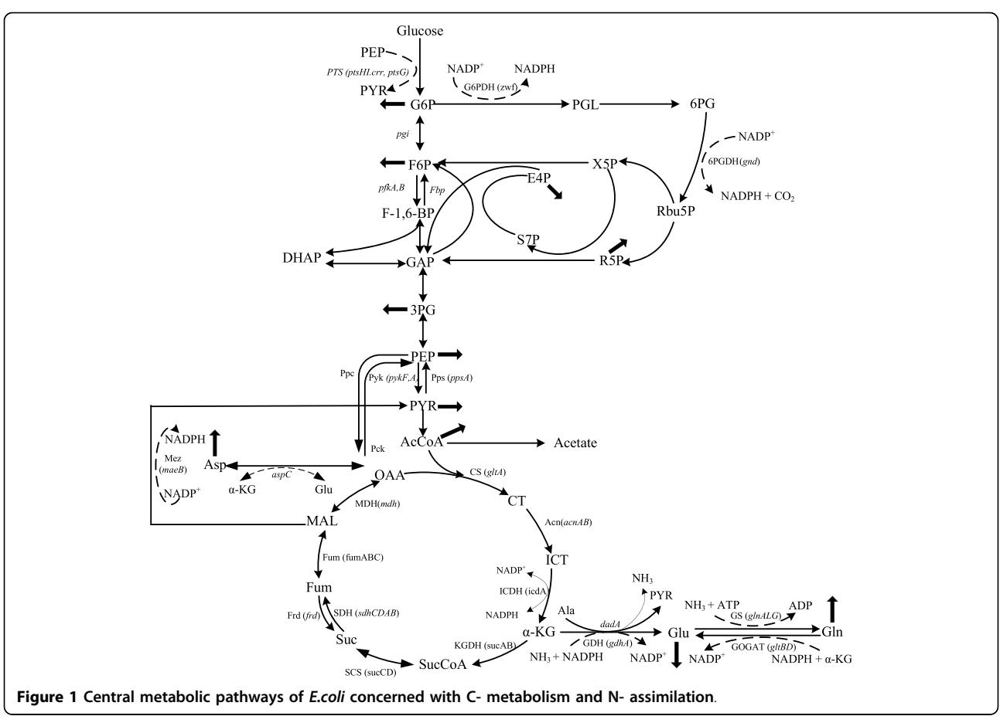
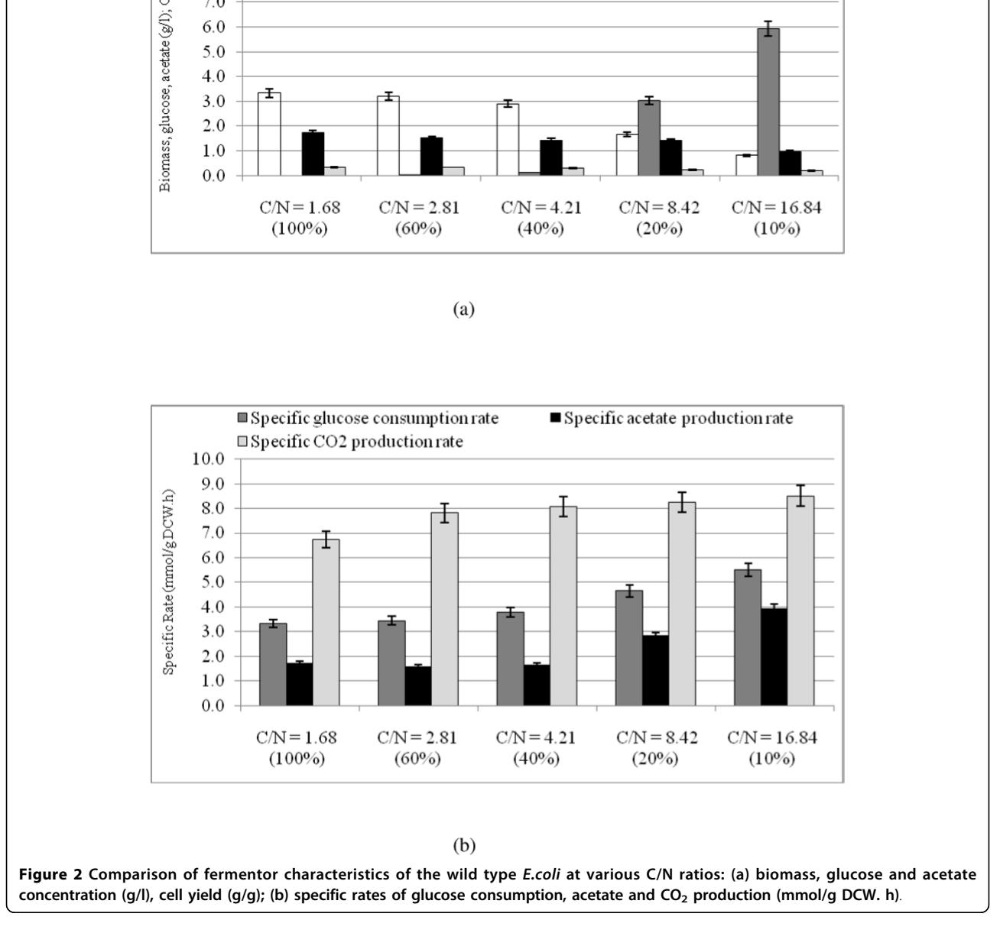
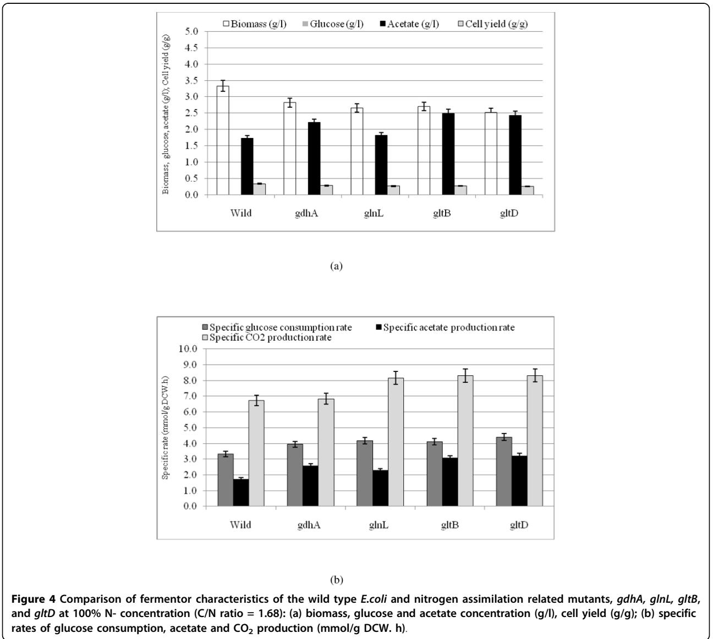
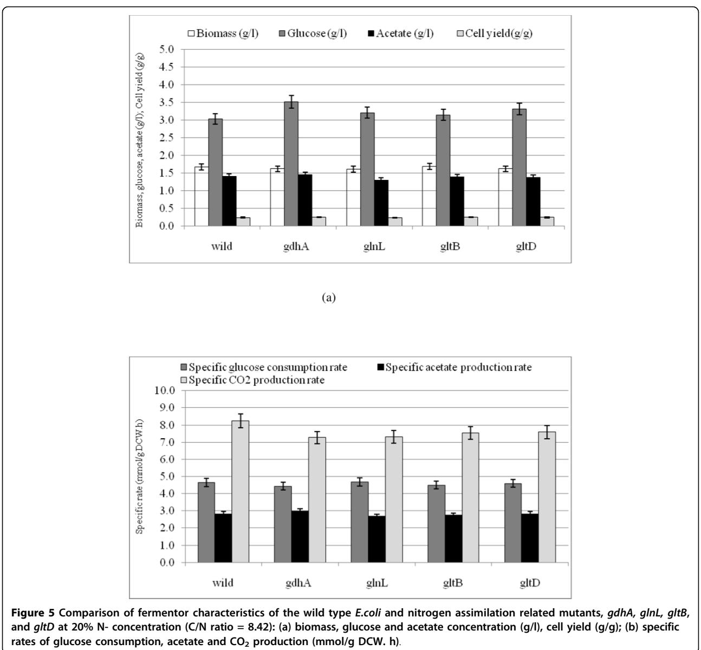
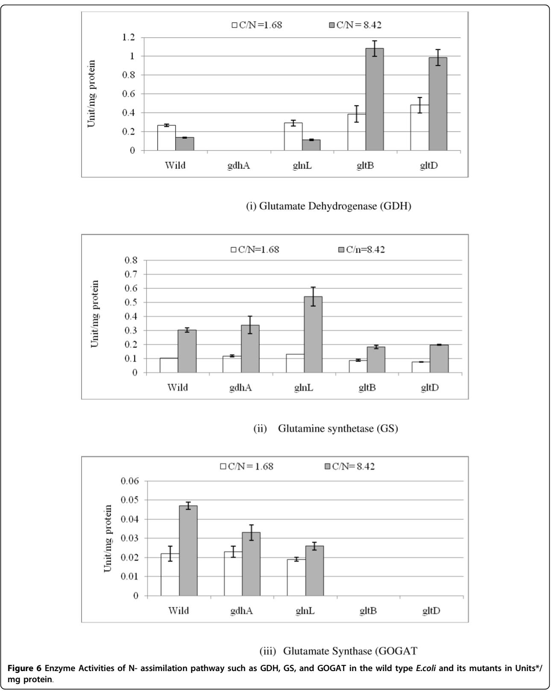
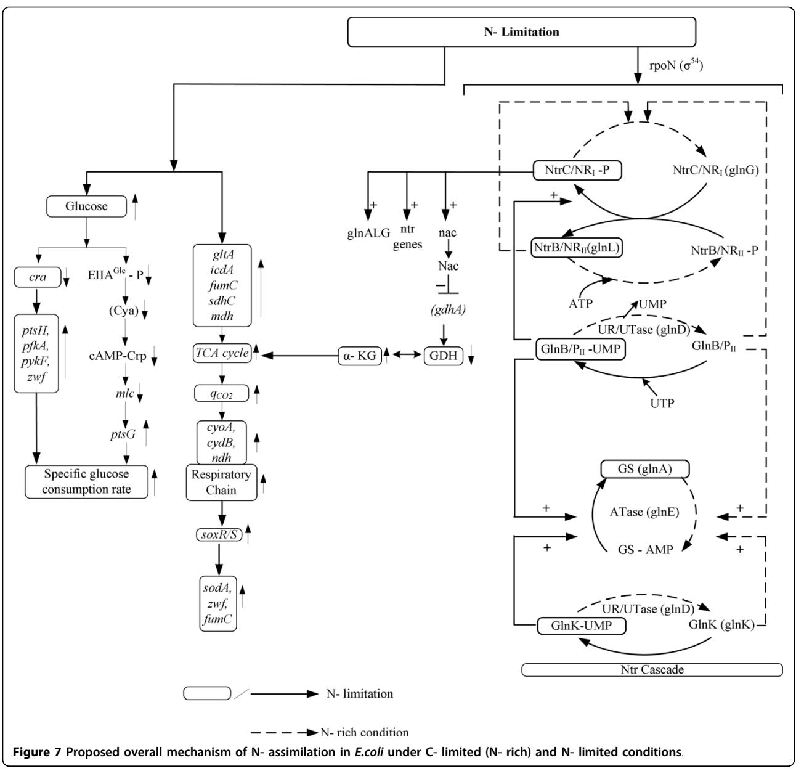
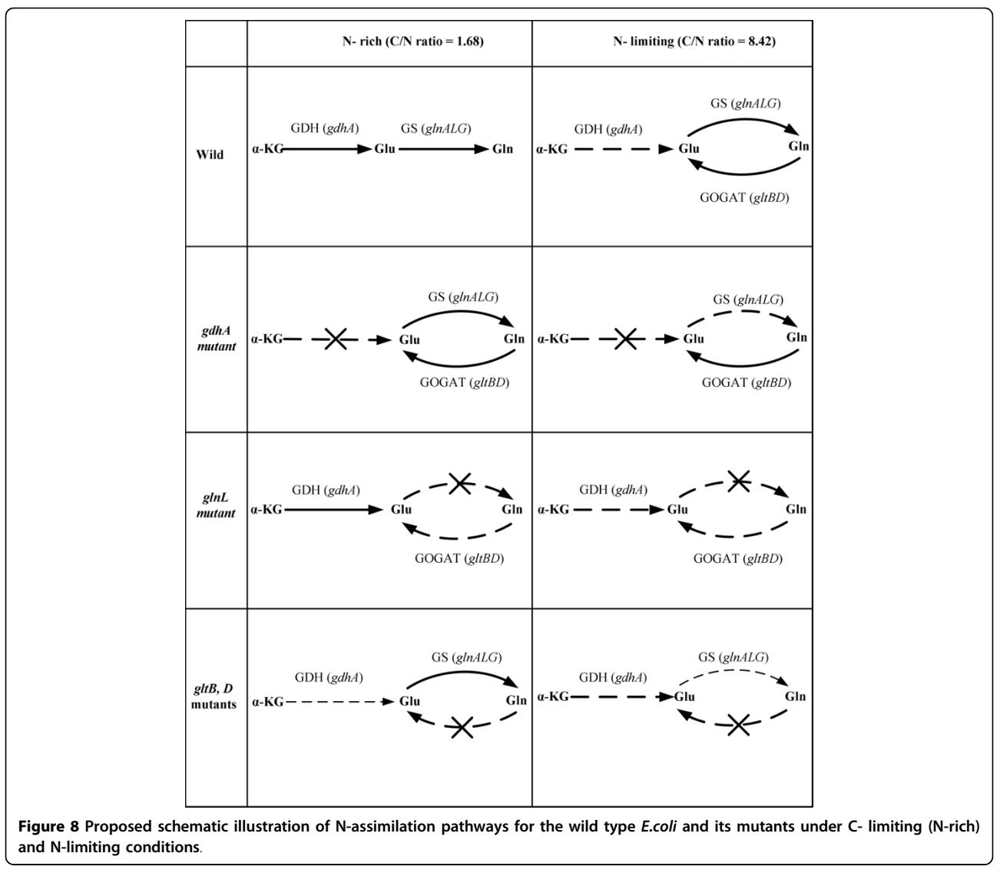
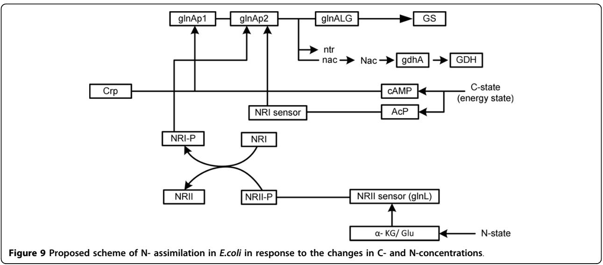

# R E S EARCH Open Access

# Metabolic regulation of Escherichia coli and its gdhA, glnL, gltB, D mutants under different carbon and nitrogen limitations in the continuous culture

Rahul Kumar1 , Kazuyuki Shimizu1,2*

# Abstract

Background: It is quite important to understand how the central metabolism is regulated under nitrogen (N) limitation as well as carbon (C)- limitation. In particular, the effect of C/N ratio on the metabolism is of practical interest for the heterologous protein production, PHB production, etc. Although the carbon and nitrogen metabolisms are interconnected and the overall mechanism is complicated, it is strongly desirable to clarify the effects of culture environment on the metabolism from the practical application point of view.

Results: The effect of C/N ratio on the metabolism in Escherichia coli was investigated in the aerobic continuous culture at the dilution rate of 0.2 h-1 based on fermentation data, transcriptional RNA level, and enzyme activity data. The glucose concentration was kept at 10 g/l, while ammonium sulfate concentration was varied from 5.94 to 0.594 g/l. The resultant C/N ratios were 1.68 (100%), 2.81(60%), 4.21(40%), 8.42(20%), and 16.84(10%), where the percentage values in brackets indicate the ratio of N- concentration as compared to the case of 5.94 g/l of ammonium sulfate. The mRNA levels of crp and mlc decreased, which caused ptsG transcript expression to be upregulated as C/N ratio increased. As C/N ratio increased cra transcript expression decreased, which caused ptsH, pfkA, and pykF to be up-regulated. At high C/N ratio, transcriptional mRNA level of soxR/S increased, which may be due to the activated respiratory chain as indicated by up-regulations of such genes as cyoA, cydB, ndh as well as the increase in the specific CO2 production rate. The rpoN transcript expression increased with the increase in C/N ratio, which led glnA, L, G and gltD transcript expression to change in similar fashion. The nac transcript expression showed similar trend as rpoN, while gdhA transcript expression changed in reverse direction. The transcriptional mRNA level of glnB, which codes for PII, glnD and glnK increased as C/N ratio increases. It was shown that GS-GOGAT pathway was activated for gdhA mutant under N- rich condition. In the case of glnL mutant, GOGAT enzyme activity was reduced as compared to the wild type under N- limitation. In the case of gltB, D mutants, GDH and GS enzymes were utilized under both N- rich and N- limited conditions. In this case, the transcriptional mRNA level of gdhA and corresponding GDH enzyme activity was higher under N- limitation as compared to Nrich condition.

Conclusion: The metabolic regulation of E.coli was clarified under both carbon (C)- limitation and nitrogen (N) limitation based on fermentation, transcriptional mRNA level and enzyme activities. The overall regulation mechanism was proposed. The effects of knocking out N- assimilation pathway genes were also clarified.

* Correspondence: [shimi@bio.kyutech.ac.jp](mailto:shimi@bio.kyutech.ac.jp)

1 Department of Bioscience and Bioinformatics, Kyushu Institute of Technology, Iizuka, Fukuoka 820-8502, Japan

© 2010 Kumar and Shimizu; licensee BioMed Central Ltd. This is an Open Access article distributed under the terms of the Creative Commons Attribution License [(http://creativecommons.org/licenses/by/2.0](http://creativecommons.org/licenses/by/2.0)), which permits unrestricted use, distribution, and reproduction in any medium, provided the original work is properly cited.

### Background

It is quite important to understand how the culture environment affects the cell metabolism. Among the culture environments, carbon and nitrogen sources are by far important in practice. To understand the regulation of central metabolism in E.coli, the cell metabolism under carbon (C) and nitrogen (N) limitations has been investigated in the continuous culture [[1-3](#page-15-0)]. These studies highlight the importance of critical nodal points like PEP-PYR-OAA for the carbon catabolism [[4\]](#page-15-0), and glutamine and glutamate synthesis for nitrogen assimilation [[5\]](#page-15-0). The subsequent studies made it clear that carbon metabolism is not only controlled by carbonderived signals, but also by the availability of nitrogen and other nutrients [[6\]](#page-15-0). Therefore, several studies have been made on the regulatory interdependence of different metabolic routes. From these studies, two of the major signal transduction systems of nitrogen and carbon metabolism have been identified as PII, a small nitrogen regulatory protein and the phosphotransferase system (PTS). Because of the important roles in regulatory functions, PII and the PTS can be regarded as the central processing units of nitrogen and carbon metabolism, respectively. The PII protein senses a-KG and ATP, thus link the state of central carbon and energy metabolism for the control of nitrogen assimilation [\[6](#page-15-0)]. The glucose catabolism is modulated by the global regulators encoded by such genes as cra, crp, cya, mlc etc [[7,8](#page-15-0)], while nitrogen assimilation is regulated by PII-Ntr system together with global regulators like Crp, providing a novel regulatory network between carbon and nitrogen assimilation in E.coli [[9\]](#page-15-0).

In E.coli, assimilation of N-source such as ammonia/ ammonium (NH4 + ) using a-KG results in the synthesis of glutamate and glutamine (Fig. [1](#page-2-0)). Glutamine synthetase (GS, encoded by glnA) catalyzes the only pathway for glutamine biosynthesis. Glutamate can be synthesized by two pathways through the combined actions of GS and glutamate synthase (GOGAT, encoded by gltBD) forming GS/GOGAT cycle, or by glutamate dehydrogenase (GDH, encoded by gdhA) [[10\]](#page-15-0). The GS/ GOGAT cycle has a high affinity for NH4 + (Km < 0.2 mM for GS), and therefore, is dominant when nitrogen is scarce in the medium, whereas GDH has a low affinity for NH4 + (Km > 1 mM), and is utilized when sufficient nitrogen is available in the medium. When extracellular NH4 + concentration is low around 5 μM or less, ammonium enters the cell via AmtB and is converted to glutamine by GS, and UTase uridylylates both GlnK and GlnB [[11\]](#page-15-0). When extracellular NH4 + concentration is more than 50 μM, the metabolic demand for glutamine pool rises, and UTase deuridylylates GlnK and GlnB. GlnK complexes with AmtB, thereby inhibiting the transporter via AmtB, where GlnB interacts with NtrB and activates its phosphatase activity leading to dephosphorylation of NtrC, and NtrC-dependent gene expression ceases [[11](#page-15-0)]. The central nitrogen intermediates such as glutamine and glutamate provide nitrogen for the synthesis of all the other N- containing components. About 88% of cellular nitrogen comes from glutamate, and the rest from glutamine [\[5\]](#page-15-0). The ATP required for the nitrogen assimilation using GS/ GOGAT cycle under N- limiting condition accounts for 15% of the total requirement in E.coli. A significant amount of NADPH is also required for nitrogen assimilation [[5,10](#page-15-0)]. The other pathways involved in maintaining cellular nitrogen balance under specific conditions include aspartate-oxaloacetate and alanine-pyruvate shunts [[12,13](#page-15-0)].

The carbon and nitrogen metabolism are linked by energy metabolism. The glycolytic flux in E. coli is controlled by the demand for ATP [[14](#page-15-0)]. Recently, it has been reported that the PII protein controls nitrogen assimilation by acting as a sensor of adenylate energy charge, which is the measure of energy available for metabolism. The signal transduction requires ATP binding to PII, which is synergistic with the binding of a-KG. Furthermore, a-KG serves as a cellular signal of carbon and nitrogen status, and strongly regulates PII functions [\[15](#page-15-0)]. The studies on the carbon and nitrogen pathway interdependence have so far focused on the conversion of a-KG to glutamate [[16](#page-15-0)]. It is evident that the regulatory mechanism of this conversion is critical for the interdependence of carbon and nitrogen assimilation. However, little has been investigated on how gene-level regulation affects the cell metabolism under nitrogen and carbon limitations. In the present research, the effects of C/N ratio on E.coli metabolism based on fermentation, transcriptional mRNA levels, and enzyme activities were investigated. Such investigation is also of practical interest for the efficient production of PHB, ergosterol, ornithine, arginine, putrescine, GABA, lycopene, ε- caprolactone, etc [\[17](#page-15-0)-[20\]](#page-15-0). Moreover, the metabolic regulation analysis can be utilized for the dynamic modeling of N- regulation [\[21](#page-15-0)]. In order to understand the metabolic regulation mechanism in more details, we also investigated the effects of deleting N- assimilating pathway genes such as gdhA, glnL, gltB, and gltD on the metabolism as compared to the wild type E.coli.

## Results

### Wild Type

Fig. [2](#page-3-0) shows the effect of C/N ratio on the fermentation characteristics, where Fig. [2a](#page-3-0) indicates that the glucose concentration increases, whereas the cell concentration decreases as C/N ratio increases. Fig. [2a](#page-3-0) also shows that

the glucose concentration was very low at 100% and 60% of N concentrations (C-limitation), whereas its concentration was high at 20% and 10% of N concentrations (N-limitation). Fig. [2b](#page-3-0) shows the effect of C/N ratio on the specific rates, which indicates that the specific glucose consumption rate as well as the specific acetate and CO2 production rates tended to increase as C/N ratio increases. The raw fermentation data are given in Additional file [1](#page-14-0).

In order to interpret the fermentation characteristics, the relative mRNA levels were measured for different C/ N ratios by RT-PCR (Fig. [3)](#page-4-0). Fig [3a](#page-4-0) shows that crp transcript level became lower (p < 0.01) as C/N ratio increases, which corresponds to the fact that cAMP-Crp level decreases as glucose concentration increases. In accordance with the change in crp transcript level, mlc level changed in similar fashion [\[8](#page-15-0)]. Fig. [3a](#page-4-0) also shows that the transcript levels of such genes as soxR/S and rpoS became higher as C/N ratio increases, which may be due to oxygen stress caused by higher respiratory activity for the former [\[1](#page-15-0)], along with nutrient stress for the latter [[22\]](#page-15-0). In relation to the up-regulation of soxR/ S, the sodA transcript level increased as C/N ratio increases except at the highest C/N ratio (Fig. [3d)](#page-4-0). Fig. [3a](#page-4-0) shows quite high expression of anaerobic regulator fnr at the highest C/N ratio, while the transcript level of arcA which codes for microaerobic regulator did not change much.

The transcript level of rpoN, which encodes s54, increased as C/N ratio increases (Fig. [3b)](#page-4-0). Fig [3b](#page-4-0) also shows that the expressions of glnA, glnL, glnG, and gltD genes changed in similar fashion as rpoN, indicating the activation of GS-GOGAT pathway under N-limitation. The glnB gene which codes for PII also changed in similar fashion, while glnD which controls the uridylylation and deuridylylation shows somewhat different but the trend seems to be similar (Fig. [3b)](#page-4-0). PII paralogue encoding gene, glnK shows very high expressions at 20% and 10% of N-limitation (Fig. [3b](#page-4-0)). The expression pattern of nac is similar to that of rpoN, whereas gdhA shows reverse pattern, implying that gdhA is repressed by Nac (Fig. [3b)](#page-4-0).

As C/N ratio increases, the transcript level of crp gene as well as mlc gene decreased, which then caused the transcript level of ptsG gene to be increased as shown in Fig. [3c](#page-4-0). In relation to the decrease in the transcript level of cra, the transcript levels of such genes as ptsH, pfkA and pykF increased as C/N ratio increases (Fig. [3c](#page-4-0)).

These correspond to the increased specific glucose consumption rate as C/N ratio increases. Moreover, the respiratory chain genes such as cyoA, cydB, and ndh together with TCA cycle genes such as gltA, icdA, fumC, sdhC, and mdh showed increased expressions as C/N ratio increases (Fig. [3d](#page-4-0)), which corresponds to the increase in the specific CO2 production rate (Fig. 2b). Part of the reason why this happened may be due to the accumulation of a- KG caused by the decreased activity

of GDH. Although TCA cycle genes are under control of ArcA (Additional file [2](#page-14-0)), Fig. [3a](#page-4-0) shows little change in the transcript level of arcA gene. Since ferric uptake regulator Fur activates some of the TCA cycle genes such as sdh, suc, and fum [\[23\]](#page-15-0), part of the reason may be due to up-regulation of the transcript level of fur gene, where it is not clear at this time why the transcript level of this gene tends to decrease as C/N ratio increases (Fig. [3a)](#page-4-0).

# Mutants

Figs. [4](#page-5-0) and [5](#page-6-0) show the comparisons of the fermentation data for gdhA, glnL, gltB, and gltD mutants as compared to the wild type under N-rich and N- limiting conditions, where the raw data are given in Additional file [3a](#page-14-0) and [3b.](#page-14-0) Fig. [4a](#page-5-0) indicates that the cell concentrations and the cell yields of the mutants were all lower as compared to those of the wild type, where glucose was nearly completely consumed under N-rich condition. Fig. [4a](#page-5-0) also indicates that acetate concentrations increased for all the mutants as compared to the wild type. Among the mutants, acetate concentration was the lowest for glnL mutant followed by gdhA, gltB and gltD mutants. Fig. [4b](#page-5-0) indicates that the specific glucose consumption rate, specific acetate and CO2 production rates were all increased for the mutants as compared to the wild type. Fig. [5a](#page-6-0) indicates that the cell and acetate concentrations and the cell yields of the mutants were almost similar as compared to those of the wild type under N- limitation. The glucose concentration was relatively higher for the mutants as compared to the wild type (Fig. [5a](#page-6-0)), although the specific glucose consumption rates showed little changes (Fig. [5b)](#page-6-0). The former phenomenon may be caused by the lower cell concentration. Fig. [5b](#page-6-0) also indicates that the specific CO2 production rates for all the mutants were lower as compared to that of the wild type. Note that the specific CO2 production rates of glnL, gltB, gltD mutants as well as the wild type were higher under N-limitation as compared to those under N-rich condition, whereas the specific CO2 production rate of gdhA mutant was similar under N-limitation as compared to N-rich condition. In the following sections, the comparisons of the transcript levels between the wild type and gdhA, glnL, gltB and gltD mutants are made. Overall, the changing patterns of gltB and gltD mutants were similar, whereas gdhA and glnL mutants show somewhat different patterns. gdhA mutant

# In the case where gdhA gene was knocked out, glutamate and glutamine were formed by GS and GOGAT pathways under N-rich condition as can be seen from the up-regulations of the transcript levels of glnA, L, G (p < 0.01, p < 0.01, p < 0.01, respectively), and gltD gene (p < 0.01) as shown in Additional file [4b.](#page-14-0) The changing patterns were similar to those of the wild type under Nlimitation (Fig. [3b)](#page-4-0). Additional file [4e](#page-14-0) indicates that PTS and glycolysis genes such as ptsH, ptsG, pfkA, pykF genes were up-regulated (p < 0.01, p < 0.05, p < 0.01, p < 0.01, respectively) and PP pathway and ED pathway genes such as zwf, gnd, and eda genes as well as lpdA

gene were up-regulated (p < 0.01, p < 0.01, p < 0.05, p < 0.01 respectively) for gdhA mutant as compared to the wild type under N-rich condition. Moreover, TCA cycle genes such as gltA, icdA, fumC, sdhC, mdh were upregulated (p < 0.01, p < 0.01, p < 0.01, p < 0.01, p < 0.01, respectively), and glyoxylate pathway gene aceA were up-regulated (p < 0.01) for gdhA mutant as compared to the wild type under N-rich condition. Note that aspC gene expression was down-regulated for the mutant as compared to the wild type (p < 0.05), which may be due to the coupling with GDH reaction. Moreover, Additional file [4f](#page-14-0) indicates that the respiratory chain genes such as cydB, cyoA, ndh were up-regulated (p < 0.01, p < 0.01, p < 0.1, respectively), and sodA gene expression was also up-regulated (p < 0.01), where the latter was consistent with the up-regulation of soxR gene expression (p < 0.05) (Additional file [4a](#page-14-0)) for gdhA mutant as compared to the wild type under N-rich condition.

Under N-limitation, the transcript levels of glnA, L, G genes as well as rpoN were down-regulated (p < 0.01, p < 0.01, p < 0.01, p < 0.01, respectively), whereas transcript levels for gltB, D genes were similar to those of the wild type (Additional file [4d)](#page-14-0), indicating that only GOGAT pathway was active in gdhA mutant under Nlimitation. It was also confirmed by the enzyme activity measurements (Additional file [4](#page-14-0) and Fig. [6](#page-8-0)). Under Nlimitation, the transcript level of mlc gene was higher (p < 0.01) (Additional file [4c)](#page-14-0) and correspondingly ptsH gene was down-regulated (p < 0.01) (Additional file [4g](#page-14-0)). Moreover, the transcript levels of TCA cycle genes such as gltA, icdA, sdhC were down-regulated (p < 0.05, p < 0.01, p < 0.01, respectively) for gdhA mutant as compared to the wild type (Additional file [4g](#page-14-0)).

## glnL mutant

The operon glnALG transcribes a sensor-histidine kinase (NtrB/NRII, glnL) which phosphorylates response regulator (NtrC/NRI, glnG) in response to the change in C/N ratio. This operon transcribes the only glutamine synthesizing enzyme, glutamine synthetase (GS, glnA), where the GS is an essential enzyme (glnA mutant failed to grow in M9 minimal medium, data not shown). In the glnL mutant under N- rich condition, the transcript level of glnA gene was comparable to that of the wild type (Additional file [5b](#page-14-0)), while it was significantly reduced (p < 0.01) under N- limitation (Additional file [5d)](#page-14-0). Additional file [5a](#page-14-0) shows that the transcript levels of genes, which encode global regulators, such as fnr, arcA, cra, mlc, fur, soxR, S and rpoS were up-regulated (p < 0.05, p < 0.01, p < 0.1, p < 0.01, p < 0.01, p < 0.01, p < 0.01 and p < 0.01 respectively) for glnL mutant as compared to the wild type under N- rich condition. Additional file [5e](#page-14-0) shows up-regulations of PTS and glycolysis genes such as ptsH, ptsG, pfkA, pykF (p < 0.01, p < 0.01, p < 0.01, p < 0.01, respectively), and PP pathway genes such as zwf and gnd genes (p < 0.01, p < 0.01, respectively) and ED pathway gene eda (p < 0.01) as compared to the wild type under N-rich condition. Moreover, Additional file [5e](#page-14-0) also indicates that the TCA cycle genes such as gltA, icdA, sdhC, fumC, mdh were upregulated (p < 0.01, p < 0.01, p < 0.01, p < 0.01, p < 0.01, respectively) and glyoxylate pathway gene aceA as well as lpdA were up-regulated (p < 0.01, p < 0.01, respectively) for glnL mutant under N-rich condition. The up-regulations of TCA cycle genes are consistent with the increased specific CO2 production rate. The aspC gene expression was higher (p < 0.01) for glnL mutant as compared to the wild type under such condition (Additional file [5e](#page-14-0)).

Under N-limitation, the transcript level of ptsH gene was down-regulated (p < 0.1), while yfiD and gadA genes were up-regulated (p < 0.01, p < 0.1, respectively). Note that Additional file [5g](#page-14-0) indicates that the TCA cycle genes such as gltA, icdA, sdhC, mdh were down-regulated (p < 0.01, p < 0.01, p < 0.01, p < 0.01, respectively) and lpdA was down-regulated (p < 0.01) for glnL mutant as compared to the wild type under N-limitation. Additional file [5h](#page-14-0), however, shows upregulation of the transcript levels of respiratory pathway genes such as cydB, cyoA, and ndh (p < 0.01, p < 0.01, p < 0.01, respectively) for glnL mutant as compared to the wild type under N-limitation, which is consistent with the increased specific CO2 production rate.

#### gltB and gltD mutants

The gltBD operon is responsible for the synthesis of glutamate synthase (GOGAT) enzyme. Under N- rich condition, GDH and GS may be used to form glutamate and glutamine. Additional file [6b](#page-15-0) shows significant down-regulation of the transcript level of gdhA gene (p < 0.01) for gltB, D mutants as compared to the wild type, where p-values are given for the critical values of either gltB or gltD mutant in the followings. Additional file [6a](#page-15-0) indicates that the transcript levels of fur, rpoS and soxR/S were up-regulated (p < 0.01, p < 0.01, p < 0.01, p < 0.01, respectively), while transcript expression of mlc gene was down-regulated (p < 0.01) for gltB, D mutants as compared to the wild type. The down-regulation of mlc transcript caused up-regulation of ptsH transcript (p < 0.01) as shown in Additional file [6e.](#page-15-0) The transcript of glnE gene which encodes ATase was downregulated (p < 0.01) for gltB, D mutants as compared to the wild type under N-rich condition (Additional file [6b)](#page-15-0). Moreover, Additional file [6b](#page-15-0) shows that rpoN, glnB, glnK, glnL, and glnD genes were up-regulated (p < 0.01, p < 0.01, p < 0.01, p < 0.01, p < 0.01, respectively) for gltB, D mutants as compared to the wild type, implying the activation of GS pathway.

Under N-limitation, the transcript levels of such genes as fur, rpoS and soxR were up-regulated (p < 0.01, p < 0.01, p < 0.01, respectively), and also mlc and cra genes were up-regulated (p < 0.05, p < 0.01 respectively) for gltB, D mutants as compared to the wild type (Additional file [6c](#page-15-0)). Additional file [6g](#page-15-0) indicates that the transcript level of ptsH gene was down-regulated (p < 0.01), while the transcript levels of pfkA and eda genes were up-regulated (p < 0.01, p < 0.05) for gltB, D mutants as compared to the wild type under N-limitation. Moreover, the transcript levels of lpdA, gltA, and sdhC genes were downregulated (p < 0.01, p < 0.01, p < 0.01, respectively), while yfiD and gadA genes were up-regulated (p < 0.01, p < 0.05, respectively) for gltB, D mutants as compared to the wild type under N-limitation. Additional file [6d](#page-15-0) indicates that the transcript levels of glnA, glnG, glnK, nac, and glnE genes were down-regulated (p < 0.01, p < 0.01, p < 0.01, p < 0.1, and p < 0.05, respectively) for gltB, D mutants as compared to the wild type, which implies that the cell tries to repress the GS activity. Note that gdhA gene expression was higher as compared to N- rich condition, and comparable to the wild type under N- limitation. The corresponding activity of GS showed repression, while that of GDH enzyme showed de-repression as compared to the wild type under N- limitation (Additional file [6](#page-15-0) and Fig. [6)](#page-8-0).

### Discussion

The glucose concentration in the fermentor increased with the increase in C/N ratio (Fig. [2)](#page-3-0). The glucose

uptake is made via phosphotransferase system (PTS) in E.coli, where phosphate of PEP is transferred by the phosphorelay via enzyme I (EI) encoded by ptsI, histidine phosphorylatable protein HPr encoded by ptsH, glucose specific enzyme II, EIIAGlc encoded by crr, and membrane bound EIICBGlc encoded by ptsG. When glucose is present in excess, the phosphorylated EIIAGlc transfers phosphate to EIICBGlc for the glucose uptake with phosphorylation, and the unphosphorylated EIIAGlc is dominated in the cytosol [[24\]](#page-15-0). Since unphosphorylated EIIAGlc does not activate Cya, the cAMP level decreases under N-limitation together with crp gene as shown in Fig. [3a](#page-4-0). Since mlc is under control of crp, the transcript level of mlc gene decreased as well (Fig. [3a](#page-4-0)), which caused up-regulation of transcript levels of ptsH and ptsG genes (Additional file [2)](#page-14-0). Moreover, increase in the glucose concentration at higher C/N ratio may have caused down-regulation of cra, which caused up-regulation of the glycolysis genes such as ptsH, ptsG, pfkA, pykF, together with zwf (Additional file [2](#page-14-0)).

The GDH pathway is important during glucose-limited (C-limited) condition. This pathway is favored when the organism is stressed for energy because GDH does not use ATP as does GS pathway [[25\]](#page-15-0). Fig [3b](#page-4-0) shows the decreased expression of gdhA as C/N ratio increases. Liang and Houghton [[26\]](#page-15-0) investigated the effect of NH4Cl concentration on GDH and GS activities, and showed the up-regulations of GDH and transhydrogenase activities at lower NH4Cl concentration.

The availability of nitrogen is sensed by PII protein at the level of intracellular glutamine, where glutamine is synthesized by glutamine synthetase (GS) encoded by glnA, and is transported mainly by GlnHPQ. The glnHPQ operon is under the control of tandem promoters such as glnHp1 and glnHp2, where the former is s70 - dependent, and the latter is s54 - and NtrC-P dependent [[27,28](#page-15-0)]. It has been shown that as the major transcriptional effector of the glucose effect, Crp affects nitrogen regulation [[9](#page-15-0)]. Namely, glnAp1 is activated by Crp with glutamine as N-source. Through glnHPQdependent signaling, Crp acts to decrease the amount of the phosphorylated NtrC activator, which in turn causes the decrease in glnAp2 expression [[9](#page-15-0)]. However, this regulation is more complex as explained next.

It has been suggested that s54-dependent Ntr genes of E.coli form a gene cascade in response to N-limitation [[29](#page-15-0)]. The central participants of Ntr response are NRI or NtrC and NRII or NtrB, and RNA polymerase complexed to s54. NRI is the transcriptional activator of s54 dependent promoters, while NRII is a bifunctional protein that can either transfer phosphate to NRI or control the dephosphorylation of NRI - phosphate. N-limitation results in the phosphorylation of NRI, which in turn stimulates the expression of glnALG operon. The expression of the glnALG operon is controlled by tandem promoters such as glnAp1 and glnAp2, where glnAp1 is a s70 - dependent weak promoter and its transcription can be activated by Crp and blocked by Ntr-P. On the other hand, glnAp2 is transcribed by RNA polymerase (Es54) and is activated by Ntr-P. Therefore, glnAp2 is responsible for activating glnA transcription under N-limitation [\[30\]](#page-15-0). Fig [3b](#page-4-0) shows that the expressions of glnA, L, G genes changed in similar fashion as rpoN gene expression.

It has been reported that there is no NRI-P binding sites in the gdhA regulatory region [[31\]](#page-15-0), and it is unlikely for NRI to directly repress gdhA promoter [[32\]](#page-15-0). As it has been shown that Nac is involved in the transcriptional repression of gdhA gene under N-limitation [\[32](#page-15-0)], Nac seems to repress gdhA gene as shown in Fig. [2b](#page-3-0). Fig [2b](#page-3-0) shows that the transcript level of gdhA gene was lower, while gltB and D genes were higher under N-limitation as compared to C-limitation. NADPH is an important cofactor in GDH and (GS)-GOGAT activities, and it has been reported that transhydrogenase plays some role in the regulation of these pathways [[26\]](#page-15-0). Under N-limitation, the glutamate and glutamine synthetic pathways are expected to be repressed due to shortage of NH3 for those reactions, and thus NADPH is less utilized, resulting in overproduction of NADPH. Part of this may be converted to NADH by transhydrogenase and the converted NADH together with other NADH formed may be utilized for ATP production through respiratory chain. Overproduction of NADPH represses such pathways as G6PDH, 6PGDH and ICDH in E.coli. However, zwf was activated in Fig. [3c,](#page-4-0) which may be due to soxR/S caused by higher respiratory activity. The ICDH activity is reported to be insensitive to N concentration, where Fig. [3c](#page-4-0) also shows little change in icdA gene.

E.coli possesses two closely related PII paralogues such as GlnB and GlnK, where GlnB is produced constitutively, and it regulates the NtrB (NRII)/NtrC (NRI) two component system [\[33\]](#page-15-0). It has been shown that the intracellular concentrations of NRI and NRII increased upon N-limitation [[34](#page-15-0)-[36\]](#page-16-0). The phosphorylated NtrC is an activator of various nitrogen-controlled genes such as glnA which codes for GS [[29\]](#page-15-0) and glnK encoding the second PII paralogues [[36\]](#page-16-0). The increased NRI, presumably in the phosphorylated form such as NRI-P activates the expression of glnK and nac promoters under N-limitation [[37,38](#page-16-0)]. Fig [3b](#page-4-0) shows that the transcript levels of glnK and nac gene increased as C/N ratio increases, while slight decrease can be seen at the highest C/N ratio, where it has been reported that glnK and nac promoters are sharply activated when ammonia is used up [[36](#page-16-0)].

The gltBDF operon which has been found to have binding affinity with global regulators such as Fnr and Crp in the promoter region [\[39\]](#page-16-0), where the transcript level of fnr gene was higher under N-limitation whereas crp gene became lower (Fig. [3a](#page-4-0)). The up-regulation of yfiD (Fig. [3c)](#page-4-0) may be due to up-regulation of fnr.

The Ntr system is composed of four enzymes (Fig. [7](#page-11-0)): a uridylytransferase/uridylyl-removing enzyme (UTase/ UR) encoded by glnD gene, a small trimeric protein, PII encoded by glnB, and the two-component system composed of NtrB and NtrC. GlnD controls the activity of GS by adenylylation/deadenylylation through a bifunctional enzyme adenylyltransferase (ATase), the glnE gene product [[40](#page-16-0)-[42](#page-16-0)]. The activity of GlnK becomes high under N-limitation (Fig. [3b](#page-4-0)) and contributes to the regulation of NtrC-dependent genes [[43\]](#page-16-0). It has been shown that on GS adenylylation, ATase activity is regulated by UTase/UR and PII such that upon nitrogen limitation, UTase covalently modifies PII by addition of a UMP group at a specific residue and the resultant uridylylated form of PII promotes deadenylylation of GS by ATase (Fig. [7](#page-11-0)). Conversely, under N- rich condition, the uridylyl-removing activity of GlnD predominates and the deuridylylated PII promotes adenylation of GS by ATase. Adenylylation by ATase is promoted by deuridylated PII which is produced by UR action on PII (UMP)3 under higher N-concentration (low C/N ratio) (Fig. [7](#page-11-0)). These indicate that UTase/UR and PII acting together sense the intracellular nitrogen status [[44\]](#page-16-0). The PII signal transduction proteins such as GlnB and GlnK are uridylylated/deuridylylated in response to intracellular glutamine level, where low intracellular glutamine level, signalling N-limitation, leads to uridylylation of GlnB [[44](#page-16-0)]. GlnB was shown to be allosterically regulated by a-KG, and thus GlnB may play a role in integrating signals of C/N status. The NtrB/NtrC two component system and GlnE which adenylylates/deadenylylates GS are the receptors of GlnB signal transduction [[43](#page-16-0)]. It has been suggested that the carbon/cAMP effect was mediated through GlnB uridylylation [[43](#page-16-0)].

The phosphorylated NRI/NtrC (NRI/NtrC-P) activates transcription from N- regulated s54-dependent promoters by binding to the enhancers [\[11](#page-15-0)[,44](#page-16-0)-[46\]](#page-16-0). PII and the related GlnK protein control the phosphorylation state of NRII/NtrB by stimulating the phosphatase activity of NRII (Fig. [7)](#page-11-0). The ability of GlnK and PII to regulate the activities of NRII is in turn regulated by the intracellular signals of C and N availability via allosteric control [\[11\]](#page-15-0).

It is not clear at this time why TCA cycle is activated under N- limitation. One of the possible reasons why TCA cycle together with respiration became active under N- limitation may be due to the accumulation of a-KG caused by the blockage of the GDH pathway. This is also true for gdhA mutant even under N- rich condition. The reason why glycolysis was activated may be due to ATP requirement and the down-regulations of crp and cra caused by the increase in glucose concentration as mentioned before. When gdhA gene was knocked out, the changing patterns of nitrogen-regulated genes under N-rich condition (Additional file [4b](#page-14-0)) were similar to those of the wild type under N-limiting condition (Fig. [3b](#page-4-0)), indicating that GS-GOGAT cycle was mainly utilized, where 2 moles of Glu were formed from a-KG and Gln via GOGAT pathway, and Gln is formed from Glu via GS pathway. Under N-limitation, GS became less active for gdhA mutant, where only GOGAT pathway was active (Additional file [4d)](#page-14-0).

In the case of glnL mutant, the transcripts of glycolysis, PP pathway, and TCA cycle genes were up-regulated under N-rich condition, while those were repressed under N-limitation. Part of the reason may be due to up-regulation of crp and mlc genes. Under N-limitation, Glu is produced from both GDH and GOGAT but the former is less utilized because of less availability of NH3, which means that essentially GOGAT pathway was active. This phenomenon is similar to the case of gdhA mutant under N-limitation (Fig. [8)](#page-12-0). Since NRI could not be phosphorylated in glnL mutant, glnA gene expression was lower as compared to the wild type (Additional file [5d](#page-14-0)). Moreover, the transcript level of nac gene did not change even under N- limitation, which may be due to lack of phosphorylated NRI. There might be another mechanism in glnL mutant [\[47\]](#page-16-0). Namely, acetyl phosphate (AcP) is a signaling molecule for glucose availability [[48](#page-16-0)] as well as cAMP, and NRI itself is capable of sensing the AcP level, where this becomes significant only in the absence of NRII (glnL mutant) [[49,50](#page-16-0)]. In the absence of NRII, NRI senses AcP level and induce glnAp2. The glnG gene expression may be reflected in the carbon level, where NRI binding site overlap another promoter, glnAp1, which is regulated by cAMP-Crp. The effect of glnG gene knockout is also given elsewhere [[51](#page-16-0)]. Those mechanisms are briefly summarized in Fig. [9.](#page-13-0)

In the case of gltB, D mutants, the effects of these genes knockout on the metabolism may be considered to be minor under N-rich condition, since this pathway is not utilized under N-rich condition in the wild type. However, it was shown that gdhA gene expression was significantly reduced, while GS pathway was activated as can be seen in Additional file [6b](#page-15-0). Since, the transcript level of rpoN gene was high even under N-rich condition for gltB, D mutants (Additional file [6b)](#page-15-0), this may have caused Nac to be increased (although not significant in Additional file [6b)](#page-15-0) and repressed gdhA gene. It is not clear at this time why the transcript levels of rpoN gene became higher under N-rich condition. Under N- limitation, nac gene was repressed (p < 0.01), and thus the transcript level of gdhA gene was comparable to the wild type under N-limitation. The de-

repression of GDH activity appears to be driven by the cellular requirement for glutamate (Additional file [6](#page-15-0) and Fig. [6](#page-8-0)). Additional file [6d](#page-15-0) shows that the transcript levels of glnA and glnG genes were low (p < 0.01, p < 0.01) and thus GS enzyme was repressed under N- limitation as compared to the wild type (Additional file [6](#page-15-0) and Fig. [6)](#page-8-0). Additional file [6e](#page-15-0) and [6g](#page-15-0) indicates that the transcript level of gadA gene was higher under both C-limitation and N-limitation. Since gltB, D mutants are reported to be osmosensitive [\[52\]](#page-16-0), glutamate and GABA etc. may have been accumulated and excreted into the fermentation broth. Overall, the de-repression of GDH enzyme under N- limitation indicates the complex mechanism of N- regulation in these mutants and the mechanistic details of this de-repression are not yet completely known.

One of the reason why the cell concentrations of the mutants under C- limitation is lower than that of the wild type (Fig. [4a)](#page-5-0) may be due to lower formation rate of Glu caused by the deficiency in N- assimilating pathways. The overall regulation mechanism is summarized in Fig. 7, and the effects of specific gene knockout on the nitrogen assimilating pathways are illustrated in Fig. [8.](#page-12-0)

It is important to note that the experimental results at C/N ratio 16.48 show somewhat different pattern as

compared to the other ratios used in the present study. The amount of available nitrogen seems to be the crucial factor in deciding the metabolic response especially under N- limitation. Most the pathways used for Nassimilation under N- limitation utilize high amount of ATP. Therefore, it appears critical for the cell to shut down activities of such pathways like GS-(GOGAT) under certain circumstances to save ATP and to prevent excessive glutamine production. This scenario has been speculated for ammonium shock to the carbon starved cells [[20](#page-15-0)]. Note that the transcript levels of such genes as glnA, glnL, glnG and gltB, gltD which encodes for GS-GOGAT pathway enzymes were reduced (Fig. [3b)](#page-4-0).

# Conclusion

The metabolic regulation of E.coli was clarified to some extent under both C- limitation (N- rich condition) and N- limitation in view of fermentation characteristics, transcript levels, and enzyme activities. The overall mechanism was found to be as depicted in Fig. [7](#page-11-0). Moreover, the effects of knockout of N- assimilation pathway genes such as gdhA, glnL, and gltB, D were investigated and found to be as shown in Fig. 8.

# Materials and methods

## Strains, media composition, and cultivation conditions

The strains used were E.coli BW25113 [F- l- rph-1 ΔaraBADAH33 lacIq ΔlacZWJ16 rrnBT14 ΔrhaBADLD78 hsdR514], and its single gene knockout mutants lacking such genes as gltB (JW3180), gltD (JW3180), gdhA (JW1750), and glnL (JW3840). These single gene knockout mutants were obtained from Keio collection [[53\]](#page-16-0). All the strains were first precultured in the Luria-Bertani medium. The second preculture and the main

culture were carried out using M9 minimal medium containing 10 g of glucose together with the following components (per liter): 6.81 g Na2HPO4, 2.99 g KH2PO4, 0.58 g NaCl and 5.94 g (NH4)2SO4. The following components were filter sterilized and then added (per liter) with 1 ml of 1 M MgSO4.7H2O, 1 ml of 0.1 mM CaCl2.2H2O, 1 ml of 1 mg/l thiamine HCl and 10 ml of trace element solution containing (per liter): 0.55 g CaCl2.2H2O, 1.67 g FeCl3.6H2O, 0.1 g MnCl2.4H2O, 0.17 g ZnCl2, 0.043 g CuCl2.2H2O, 0.06 g CoCl2.2H2O, and 0.06 g Na2MoO4.2H2O. The nitrogen concentrations used in the present experiments were 0.594 g/l, 1.188 g/l, 2.376 g/l, 3.564 g/l, and 5.94 g/l of (NH4)2SO4, whereas the concentrations of all the other medium components were the same. The continuous culture was conducted in a 1-l fermenter (MDL 100, Marubishi Co., Tokyo, Japan) with a working volume of 500 ml. The pH was controlled at 7.0 ± 0.05 using 2 N HCl or 2 N NaOH, and the temperature was set at 37°C. The air flow rate was 1 vvm (air volume/working volume/min), and the agitation speed was 350 rpm to maintain the dissolved oxygen concentration to be at 35-40% (v/v) of air saturation [[22](#page-15-0)]. The CO2 and O2 concentrations were monitored using an off-gas analyzer (BMJ-02 PI, ABLE Co., Japan). The dilution rate was 0.2 h-1 for all the continuous cultures. The samples were collected at the steady state which was confirmed by the constant off-gas and cell density. It generally took 5-6 residence times to achieve the steady state.

## Analytical method

Bacterial growth was monitored by measuring the optical density of the culture broth at 600 nm (OD600 nm) using a spectrophotometer (Ubet-30, Jasco, Tokyo, Japan). It was converted to dry cell weight (DCW) based on the OD600 nm-DCW relationship previously obtained [[54\]](#page-16-0). Glucose and acetate concentrations in the medium were measured using commercially available kits (Wako Co., Osaka, Japan for glucose; Roche, Molecular Biochemical, Mannheim, Germany for acetate).

## RNA preparation, design of PCR primers

Total RNA was isolated from E. coli cells by Qiagen RNeasy Mini Kit (QIAGEN K.K., Japan) according to the manufacturer's recommendation. The quantity and purity of RNA were determined by the optical density measurements at 260 and 280 nm and by 1% formaldehyde agarose gel electrophoresis. The sequences of primers for respective genes used in this study were reported elsewhere [[55](#page-16-0)], except such genes as rpoN, glnA, glnB, glnD, glnE, glnG, glnL, gltD and nac. The primer sequences of these additional genes are as follows:

rpoN Forward: 5' GCAACTCAGGCTTAGCCAAC 3' Reverse: 5' TCCAGCGTTTCACTGTCTTG 3'

glnA Forward: 5' ATGTCCGCTGAACACGTACT 3' Reverse: 5' GCTGTAGTACAGCTCAAACTC 3

glnB Forward: 5' CGAAGTGAAAGGCTTTGGTC 3' Reverse: 5' GCCACGTCAAAGACGAAGAT 3'

glnD Forward: 5' CACCTGTTGATGTCGGTGAC 3' Reverse: 5' GCTTCCAGCTATTCCACAGC 3'

glnE Forward: 5' CCCGCACCACCTATTTAGAA 3' Reverse: 5' GCTGGTAAAGGGTGTTTGGA 3'

gln G Forward: 5' ATGCAACGAGGGATAGTCTG3' Reverse: 5' TCACTCCATCCCCAGCTCTT 3'

glnL Forward: 5' GAGATGGCTCCGATGGATAA3'

# Reverse: 5' ATGGGTCAGGTAACGCTTTG 3'

gltD Forward: 5' CAATTTATCGACCTGCAGCG 3' Reverse: 5' AACTTCCAGCCAGTTCATAAT 3'

nac Forward: 5'TTCAGACGCCTGAAATACTTC3' Reverse: 5' TTAGCTCACCAATTGCCACT 3'

Criteria for the design of the gene-specific primer pairs were followed according to Sambrook and Russell [[56\]](#page-16-0). The primers used in this study were synthesized at Hokkaido System Science Co. (Sapporo, Hokkaido, Japan). In all cases, the primer-supplied company confirmed the purity and absolute specificity of primers.

## c DNA synthesis and PCR amplification

RT-PCR reactions were carried out in a TaKaRa PCR Thermal Cycler (TaKaRa TP240, Japan) using Qiagen OneStep RT-PCR Kit (QIAGEN K.K., Japan). The reaction mixture was incubated for 30 min at 50°C for reverse transcription (cDNA synthesis) followed by 15 min incubation at 95°C for initial PCR activation. Then, the process was subjected to 30 cycles of amplification which consisted of a denaturing step (94°C for 1 min), an annealing step (approximately 5°C below melting temperature of primers for 1 min) and an extension step (72° C for 1 min), and finally the reaction mixture was incubated for 10 min at 72°C for final extension. To check for nucleic acid contamination, one negative control was run in every round of RT-PCR. This control lacks the template RNA in order to detect possible contamination of the reaction components. 5 ml of amplified products were run on a 1% agarose gel. Gels were stained with 1 μg ml-1 of ethidium bromide, photographed using a Digital Image Stocker (DS-30, FAS III, Toyobo, Osaka, Japan) under UV light and analyzed using Gel-Pro Analyzer 3.1 (Toyobo, Osaka, Japan) software. Although the PCR products obtained for all the genes showed the predicted sizes on agarose gel, the identity of amplified fragments of some genes was demonstrated by DNA sequencing. In order to determine the optimal amount of input RNA, the two-fold diluted template RNA was amplified in RT-PCR assays under identical reaction conditions to construct a standard curve for each gene product. When the optimal amount of input RNA was determined for each gene product, RT-PCR was carried out under identical reaction conditions to detect differential transcript levels of genes. The gene dnaA, which encodes for DnaA, a replication initiation factor in E.coli and is not subjected to variable expression, i.e. abundant expression at relatively constant rate in most cells, was used as an internal control for the RT-PCR determinations [[55\]](#page-16-0). To calculate the standard deviation, RT-PCR was independently performed three times for each gene under identical reaction condition. To ensure that the observed changes were statistically significant, the Student's t-test was applied.

### Enzyme Assays

The cells were harvested at the same stage as those taken for RT-PCR analysis by the centrifugation at 10,000 × g for 10 min, washed twice in ice-cold 100 mM Tris-HCl (pH 7.0) buffer containing 20 mM KCl, 5 mM MnSO4, 2 mM dithiothreitol and 0.1 mM EDTA, and then re-suspended in the same buffer solution (ca. 15 g wet cells in 50 ml buffer solution) and stored at -80°C in aliquots for at least 30 min. The cell disruption was achieved by sonication on an ultrasonic disrupter (UD-201, Tomy Co., Tokyo, Japan) and resulting crude cell extracts were immediately used for the measurements of enzyme activities or stored at -80°C in aliquots. All above mentioned operations were carried out on ice [[54](#page-16-0)]. In the present study enzyme activities involved in the N- assimilation pathway were measured. The measurements were carried out on a thermostat recording spectrophotometer (U-2000A, Hitachi Co., Japan) at 37°C. The protein concentrations were estimated by the Bradford assay method. Each enzyme was measured three times for the same culture. GDH was assayed by following the oxidation of NADPH in a solution containing 50 mM Hepes/KOH, pH 7.5, 50 mM NH4Cl, 5 mM a- KG, and 0.3 mM NADPH. GOGAT was assayed in the same reaction mixture substituting 5 mM L-glutamine for NH4Cl [[57\]](#page-16-0). GS assay followed the method suggested by Sigma-Aldrich based on previously published study [\[58\]](#page-16-0).

Additional file 1: Fermentation parameters for the chemostat cultures of the wild type E.coli at the dilution rate of 0.2 h-1 under various C/N ratios.

Click here for file

[ http://www.biomedcentral.com/content/supplementary/1475-2859-9-8- S1.DOC ]

Additional file 2: Global regulators and their regulated genes. Click here for file

[ http://www.biomedcentral.com/content/supplementary/1475-2859-9-8- S2.DOC ]

Additional file 3: a: Fermentation parameters for the chemostat cultures of the wild type E.coli in comparison to the nitrogen regulatory mutants at the dilution rate of 0.2 h-1 at 100% nitrogen. b: Fermentation parameters for the chemostat cultures of the wild type E.coli in comparison to the nitrogen regulatory mutants at the dilution rate of 0.2 h-1 at 20% nitrogen concentration.

Click here for file [ http://www.biomedcentral.com/content/supplementary/1475-2859-9-8-

S3.DOC ] Additional file 4: Comparison of the transcriptional mRNA levels between the wild type E.coli and gdhA mutant genes at C/N ratio 1.68 and 8.42.

Click here for file

[ http://www.biomedcentral.com/content/supplementary/1475-2859-9-8- S4.DOC ]

Additional file 5: Comparison of the transcriptional mRNA levels between the wild type E.coli and glnL mutant genes at C/N ratio 1.68 and 8.42.

Click here for file

[ http://www.biomedcentral.com/content/supplementary/1475-2859-9-8- S5.DOC ]

#### Additional file 6: Comparison of the transcriptional mRNA levels between the wild type E.coli and gltB, gltD mutants genes at C/N ratio 1.68 and 8.42.

Click here for file

[ http://www.biomedcentral.com/content/supplementary/1475-2859-9-8- S6.DOC ]

#### Abbreviations

PEP: Phospho-enol-pyruvate; PYR: Pyruvate; OAA: Oxaloacetic Acid; a-KG: 2 ketoglutarate; PTS: Phosphotransferase system; GS: Glutamine Synthetase; GOGAT: Glutamate synthase; GDH: Glutamate dehydrogenase; PHB: poly (3 hydroxybutyrate); GABA: Gamma-aminobutyric acid; DCW: Dry Cell Weight.

#### Acknowledgements

This research was supported in part by Strategic International Cooperative Program, Japan Science and Technology Agency (JST). The authors are pleased to mention about the fruitful discussion with Prof. Hans Westerhoff of Manchester University.

#### Author details

1 Department of Bioscience and Bioinformatics, Kyushu Institute of Technology, Iizuka, Fukuoka 820-8502, Japan. 2 Institute of Advanced Bioscience, Keio University, Tsuruoka, Yamagada 997-001, Japan.

#### Authors' contributions

RK carried out fermentation experiments, assayed, made statistical analysis, analyzed the result, and drafted the manuscript. KS participated in the experimental design, analyzed the result, and prepared manuscript together with RK. All authors read and approved the final manuscript.

#### Competing interests

The authors declare that they have no competing interests.

#### Received: 4 September 2009

Accepted: 27 January 2010 Published: 27 January 2010

#### References

- 1. Hua Q, Yang C, Baba T, Mori H, Shimizu K: [Response of the central](http://www.ncbi.nlm.nih.gov/pubmed/14645264?dopt=Abstract) metabolism in Escherichia coli [to phosphoglucose isomerase and](http://www.ncbi.nlm.nih.gov/pubmed/14645264?dopt=Abstract) [glucose-6-phosphate dehydrogenase knockouts.](http://www.ncbi.nlm.nih.gov/pubmed/14645264?dopt=Abstract) J Bacteriol 2003, 185:7053-7067.
- 2. Hua Q, Yang C, Oshima T, Mori H, Shimizu K: [Analysis of gene expression](http://www.ncbi.nlm.nih.gov/pubmed/15066832?dopt=Abstract) [in Escherichia coli in response to changes of growth-limiting nutrient in](http://www.ncbi.nlm.nih.gov/pubmed/15066832?dopt=Abstract) [chemostat cultures.](http://www.ncbi.nlm.nih.gov/pubmed/15066832?dopt=Abstract) Appl Environ Microbiol 2004, 70:2354-2366.
- 3. Nanchen A, Schicker A, Revelles O, Sauer U: [Cyclic AMP -dependent](http://www.ncbi.nlm.nih.gov/pubmed/18223071?dopt=Abstract) [catabolite repression is dominant control mechanism of metabolic](http://www.ncbi.nlm.nih.gov/pubmed/18223071?dopt=Abstract) [fluxes under glucose limitation.](http://www.ncbi.nlm.nih.gov/pubmed/18223071?dopt=Abstract) J Bacteriol 2008, 190:2323-2330.
- 4. Sauer U, Eikmanns BJ: [The PEP-pyruvate-oxaloacetate node as the switch](http://www.ncbi.nlm.nih.gov/pubmed/16102602?dopt=Abstract) [point for carbon flux distribution in bacteria.](http://www.ncbi.nlm.nih.gov/pubmed/16102602?dopt=Abstract) FEMS Microbiol Rev 2005, 29:765-794.
- 5. Reitzer L: [Nitrogen assimilation and global regulation in](http://www.ncbi.nlm.nih.gov/pubmed/12730324?dopt=Abstract) Escherichia coli. Annu Rev Microbiol 2003, 57:155-176.
- 6. Commichau FM, Forchhammer K, Stülke J: [Regulatory links between](http://www.ncbi.nlm.nih.gov/pubmed/16458044?dopt=Abstract) [carbon and nitrogen metabolism.](http://www.ncbi.nlm.nih.gov/pubmed/16458044?dopt=Abstract) Curr Opin Microbiol 2006, 9:167-172.
- 7. Perrenound A, Sauer U: [Impact of global transcriptional regulation by](http://www.ncbi.nlm.nih.gov/pubmed/15838044?dopt=Abstract) [ArcA, ArcB, Cra, Crp, Cya, Fnr, and Mlc on glucose catabolism in](http://www.ncbi.nlm.nih.gov/pubmed/15838044?dopt=Abstract) [Escherichia coli](http://www.ncbi.nlm.nih.gov/pubmed/15838044?dopt=Abstract). J Bacteriol 2005, 187:3171-3179.
- 8. Gosset G, Zhang Z, Nayyar S, Cuevas WA, Saier MH Jr: [Transcriptome](http://www.ncbi.nlm.nih.gov/pubmed/15150239?dopt=Abstract) [analysis of Crp- dependent catabolite control of gene expression in](http://www.ncbi.nlm.nih.gov/pubmed/15150239?dopt=Abstract) [Escherichia coli](http://www.ncbi.nlm.nih.gov/pubmed/15150239?dopt=Abstract). J Bacteriol 2004, 186:3516-3524.
- 9. Mao XJ, Huo YX, Buck M, Kolb A, Wang YP: [Interplay between CRP-cAMP](http://www.ncbi.nlm.nih.gov/pubmed/17284458?dopt=Abstract) [and PII -Ntr systems forms novel regulatory network between carbon](http://www.ncbi.nlm.nih.gov/pubmed/17284458?dopt=Abstract) [metabolism and nitrogen assimilation in](http://www.ncbi.nlm.nih.gov/pubmed/17284458?dopt=Abstract) Escherichia coli. Nucleic Acids Res 2007, 35:1432-1440.
- 10. Yan D: [Protection of the glutamate pool concentration in enteric](http://www.ncbi.nlm.nih.gov/pubmed/17517610?dopt=Abstract) [bacteria.](http://www.ncbi.nlm.nih.gov/pubmed/17517610?dopt=Abstract) Proc Natl Acad Sci USA 2007, 104:9475-9480.
- 11. Ninfa AJ, Jiang P, Atkinson MR, Peliska JA: Integration of antagonistic signals in the regulation of nitrogen assimilation in Escherichia coli. Curr Top Cell Reg 2000, 36:31-75.
- 12. Fischer E, Sauer U: [Metabolic flux profiling of](http://www.ncbi.nlm.nih.gov/pubmed/12603321?dopt=Abstract) Escherichia coli mutants in [central carbon metabolism using GC-MS.](http://www.ncbi.nlm.nih.gov/pubmed/12603321?dopt=Abstract) Eur J Biochem 2003, 270:880-891.
- 13. Zhang X, Jantama K, Moore JC, Shanmugam KT, Ingram LO: [Production of](http://www.ncbi.nlm.nih.gov/pubmed/17874321?dopt=Abstract) [L-alanine by metabolically engineered](http://www.ncbi.nlm.nih.gov/pubmed/17874321?dopt=Abstract) Escherichia coli. Appl Microbiol Biotechnol 2007, 77:355-366.
- 14. Koebmann BJ, Westerhoff HV, Snoep JL, Nilsson D, Jensen PR: [The](http://www.ncbi.nlm.nih.gov/pubmed/12081962?dopt=Abstract) glycolytic flux in Escherichia coli [is controlled by the demand for ATP.](http://www.ncbi.nlm.nih.gov/pubmed/12081962?dopt=Abstract) J Bacteriol 2002, 184:3909-3916.
- 15. Jiang P, Ninfa AJ: Escherichia coli [PII signal transduction protein](http://www.ncbi.nlm.nih.gov/pubmed/17939683?dopt=Abstract) [controlling nitrogen assimilation acts as a sensor of adenylate energy](http://www.ncbi.nlm.nih.gov/pubmed/17939683?dopt=Abstract) [charge in vitro.](http://www.ncbi.nlm.nih.gov/pubmed/17939683?dopt=Abstract) Biochemistry 2007, 46:12979-12996.
- 16. Ninfa AJ, Jiang P: [PII signal transduction proteins: sensors of](http://www.ncbi.nlm.nih.gov/pubmed/15802248?dopt=Abstract) a[ketoglutarate that regulate nitrogen metabolism.](http://www.ncbi.nlm.nih.gov/pubmed/15802248?dopt=Abstract) Curr Opin Microbiol 2005, 8:168-173.
- 17. Kabir MM, Shimizu K: [Fermentation characteristics and protein expression](http://www.ncbi.nlm.nih.gov/pubmed/12883871?dopt=Abstract) [patterns in a recombinant](http://www.ncbi.nlm.nih.gov/pubmed/12883871?dopt=Abstract) Escherichia coli mutant lacking [phosphoglucose isomerase for poly(3-hydroxybutyrate) production.](http://www.ncbi.nlm.nih.gov/pubmed/12883871?dopt=Abstract) Appl Microbiol Biotechnol 2003, 62:244-255.
- 18. Shang F, Wen S, Wang X, Tan T: [Effect of nitrogen limitation on the](http://www.ncbi.nlm.nih.gov/pubmed/16488499?dopt=Abstract) [ergosterol production by fed-batch culture of](http://www.ncbi.nlm.nih.gov/pubmed/16488499?dopt=Abstract) Saccharomyces cerevisiae. J Biotechnol 2006, 122:285-292.
- 19. Reitzer L, Schneider BL: [Metabolic context and possible physiological](http://www.ncbi.nlm.nih.gov/pubmed/11528004?dopt=Abstract) [themes](http://www.ncbi.nlm.nih.gov/pubmed/11528004?dopt=Abstract) [of](http://www.ncbi.nlm.nih.gov/pubmed/11528004?dopt=Abstract) s54 [- dependent genes in](http://www.ncbi.nlm.nih.gov/pubmed/11528004?dopt=Abstract) Escherichia coli. Microbiol Mol Biol Rev 2001, 65:422-444.
- 20. Martínez I, Zhu J, Lin H, Bennett GN, San KY: Replacing [Escherichia coli](http://www.ncbi.nlm.nih.gov/pubmed/18852061?dopt=Abstract) [NAD-dependent glyceraldehyde3-phosphate dehydrogenase (GAPDH)](http://www.ncbi.nlm.nih.gov/pubmed/18852061?dopt=Abstract) [with a NADP -dependent enzyme from](http://www.ncbi.nlm.nih.gov/pubmed/18852061?dopt=Abstract) Clostridium acetobutylicum [facilitates NADPH dependent pathways.](http://www.ncbi.nlm.nih.gov/pubmed/18852061?dopt=Abstract) Metab Eng 2008, 10:352-359.
- 21. Yuan J, Doucette CD, Fowler WU, Feng X-J, Piazza M, Rabitz HA, Wingreen NS, Rabinowitz JD: Metabolomics-driven quantitative analysis of ammonia assimilation in E. coli. Mol Sys Biol 2009, 5:302.
- 22. Rahman M, Hassan MR, Shimizu K: [Growth phase-dependent changes in](http://www.ncbi.nlm.nih.gov/pubmed/18175070?dopt=Abstract) [the expression of global regulatory genes and associated metabolic](http://www.ncbi.nlm.nih.gov/pubmed/18175070?dopt=Abstract) pathways in [Escherichia coli](http://www.ncbi.nlm.nih.gov/pubmed/18175070?dopt=Abstract). Biotechnol Lett 2008, 30:853-860.
- 23. Zhang Z, Gosset G, Barabote R, Gonzalez CS, Cuevas WA, Saier MH Jr: [Functional interactions between the carbon and iron utilization](http://www.ncbi.nlm.nih.gov/pubmed/15659676?dopt=Abstract) [regulators, Crp and Fur, in](http://www.ncbi.nlm.nih.gov/pubmed/15659676?dopt=Abstract) Escherichia coli. J Bacteriol 2005, 187:980-990.
- 24. Deutscher J, Francke C, Postma PW: [How Phosphotransferase System-](http://www.ncbi.nlm.nih.gov/pubmed/17158705?dopt=Abstract)[Related Protein Phosphorylation Regulates Carbohydrate Metabolism in](http://www.ncbi.nlm.nih.gov/pubmed/17158705?dopt=Abstract) [Bacteria.](http://www.ncbi.nlm.nih.gov/pubmed/17158705?dopt=Abstract) Microbiol Mol Biol Rev 2006, 70:939-1031.
- 25. Helling RB: [Pathway choice in glutamate synthesis in](http://www.ncbi.nlm.nih.gov/pubmed/9721297?dopt=Abstract) Escherichia coli. J Bacteriol 1998, 180:4571-4575.
- 26. Liang A, Houghton RL: [Coregulation of oxidized nicotinamide adenine](http://www.ncbi.nlm.nih.gov/pubmed/6787021?dopt=Abstract) [dinucleotide (phosphate) transhydrogenase and glutamate](http://www.ncbi.nlm.nih.gov/pubmed/6787021?dopt=Abstract) [dehydrogenase activities in enteric bacteria during nitrogen limitation.](http://www.ncbi.nlm.nih.gov/pubmed/6787021?dopt=Abstract) J Bacteriol 1981, 146:997-1002.
- 27. Willis RC, Iwata KK, Furlong CE: [Regulation of glutamine transport in](http://www.ncbi.nlm.nih.gov/pubmed/238938?dopt=Abstract) [Escherichia coli](http://www.ncbi.nlm.nih.gov/pubmed/238938?dopt=Abstract). J Bacteriol 1975, 122:1032-1037.
- 28. Claverie-Martin F, Magasanik B: Role of integration host factor in the regulation of the glnHp2 promoter of Escherichia coli. Proc Nadl Acad Sci USA 1991, 88:1631-1635.
- 29. Blauwkamp TA, Ninfa AJ: [Physiological role of the GlnK signal](http://www.ncbi.nlm.nih.gov/pubmed/12366843?dopt=Abstract) transduction protein of Escherichia coli[: survival of nitrogen starvation.](http://www.ncbi.nlm.nih.gov/pubmed/12366843?dopt=Abstract) Mol Microbiol 2002, 46:203-214.
- 30. Magasanik B: Regulation of nitrogen utilization. Escherichia coli and Salmonella typhimurium: Cellular and Molecular Biology Washington, DC: American Society for MicrobiologyNeidhardt FC, others 1996, 1344-1356.
- 31. Riba L, Becerril B, Servèn-Gonzaèlez L, Valle F, Bolivar F: [Identification of a](http://www.ncbi.nlm.nih.gov/pubmed/2465204?dopt=Abstract) [functional promoter for the](http://www.ncbi.nlm.nih.gov/pubmed/2465204?dopt=Abstract) Escherichia coli gdhA gene and its [regulation.](http://www.ncbi.nlm.nih.gov/pubmed/2465204?dopt=Abstract) Gene 1988, 71:233-246.
- 32. Camarena L, Poggio S, Garcèa N, Osorio A: [Transcriptional repression of](http://www.ncbi.nlm.nih.gov/pubmed/9785451?dopt=Abstract) gdhA in Escherichia coli [is mediated by the Nac protein.](http://www.ncbi.nlm.nih.gov/pubmed/9785451?dopt=Abstract) FEMS Microbiol Lett 1998, 167:51-56.
- 33. Ninfa AJ, Atkinson MR: [PII signal transduction proteins.](http://www.ncbi.nlm.nih.gov/pubmed/10754576?dopt=Abstract) Trends Microbiol 2000, 8:172-179.
- 34. Reitzer LJ, Magasanik B: Expression of glnA in [Escherichia coli](http://www.ncbi.nlm.nih.gov/pubmed/2858855?dopt=Abstract) is regulated [at tandem promoters.](http://www.ncbi.nlm.nih.gov/pubmed/2858855?dopt=Abstract) Proc Natl Acad Sci USA 1985, 82:1979-1983.
- 35. Atkinson MR, Ninfa AJ: [Mutational analysis of the bacterial signal](http://www.ncbi.nlm.nih.gov/pubmed/7901195?dopt=Abstract) [transducing protein kinase/phosphatase nitrogen regulator II (NRII or](http://www.ncbi.nlm.nih.gov/pubmed/7901195?dopt=Abstract) [NtrB).](http://www.ncbi.nlm.nih.gov/pubmed/7901195?dopt=Abstract) J Bacteriol 1993, 175:7016-7023.
- 36. Atkinson MR, Blauwkamp TA, Ninfa AJ: [Context-dependent functions of](http://www.ncbi.nlm.nih.gov/pubmed/12218023?dopt=Abstract) [the PII and GlnK signal transduction proteins in](http://www.ncbi.nlm.nih.gov/pubmed/12218023?dopt=Abstract) Escherichia coli. J Bacteriol 2002, 184:5364-5375.
- 37. van Heeswijk WC, Hoving S, Molenaar D, Stegeman B, Kahn D, Westerhoff HV: [An alternative PII protein in the regulation of glutamine](http://www.ncbi.nlm.nih.gov/pubmed/8843440?dopt=Abstract) synthetase in [Escherichia coli](http://www.ncbi.nlm.nih.gov/pubmed/8843440?dopt=Abstract). Mol Microbiol 1996, 21:133-146.
- 38. Pahel G, Rothstein DM, Magasanik B: [Complex glnA-glnL-glnG operon of](http://www.ncbi.nlm.nih.gov/pubmed/6120929?dopt=Abstract) [Escherichia coli](http://www.ncbi.nlm.nih.gov/pubmed/6120929?dopt=Abstract). J Bacteriol 1982, 150:202-213.
- 39. Paul L, Mishra PK, Blumenthal RM, Matthews RG: [Integration of regulatory](http://www.ncbi.nlm.nih.gov/pubmed/17233899?dopt=Abstract) [signals through involvement of multiple global regulators: control of the](http://www.ncbi.nlm.nih.gov/pubmed/17233899?dopt=Abstract) Escherichia coli gltBDF [operon by Lrp, IHF, Crp, and ArgR.](http://www.ncbi.nlm.nih.gov/pubmed/17233899?dopt=Abstract) BMC Microbiol 2007, 7:2.
- 40. Shapiro BM, Stadtman ER: [Glutamine synthetase deadenylylating enzyme.](http://www.ncbi.nlm.nih.gov/pubmed/4866293?dopt=Abstract) Biochem Biophys Res Commun 1968, 30:32-37.
- 41. Stadtman ER: [Discovery of glutamine synthetase cascade.](http://www.ncbi.nlm.nih.gov/pubmed/1969107?dopt=Abstract) Methods Enzymol 1990, 182:793-809.
- 42. Jaggi R, van Heeswijk WC, Westerhoff HV, Ollis DL, Vasudevan SG: [The two](http://www.ncbi.nlm.nih.gov/pubmed/9312015?dopt=Abstract) [opposing activities of adenylyltransferase reside in distinct homologous](http://www.ncbi.nlm.nih.gov/pubmed/9312015?dopt=Abstract) [domains, with intramolecular signal transduction.](http://www.ncbi.nlm.nih.gov/pubmed/9312015?dopt=Abstract) EMBO J 1997, 16:5562-5571.
- 43. Maheswaran M, Forchhammer K: Carbon-source-dependent nitrogen regulation in Escherichia coli is mediated through glutamine-dependent GlnB signalling. Microbiol 2003, 149:2163-2172.
- 44. Merrick MJ, Edwards RA: Nitrogen control in bacteria. Microbiol Rev 1995, 4:604-622.
- 45. Jiang P, Peliska JA, Ninfa AJ: [The regulation of](http://www.ncbi.nlm.nih.gov/pubmed/9737857?dopt=Abstract) Escherichia coli glutamine [synthetase revisited: role of 2-ketoglutarate in the regulation of](http://www.ncbi.nlm.nih.gov/pubmed/9737857?dopt=Abstract) [glutamine synthetase adenylylation state.](http://www.ncbi.nlm.nih.gov/pubmed/9737857?dopt=Abstract) Biochemistry 1998, 37:12802-12810.
- 46. Kustu S, Santero E, Keener J, Popham D, Weiss D: [Expression of sigma 54](http://www.ncbi.nlm.nih.gov/pubmed/2677638?dopt=Abstract) (ntrA[)-dependent genes is probably united by a common mechanism.](http://www.ncbi.nlm.nih.gov/pubmed/2677638?dopt=Abstract) Microbiol Rev 1989, 53:367-376.
- 47. Javelle A, Severi E, Thornton J, Merrick M: [Ammonium Sensing in](http://www.ncbi.nlm.nih.gov/pubmed/14668330?dopt=Abstract) [Escherichia coli](http://www.ncbi.nlm.nih.gov/pubmed/14668330?dopt=Abstract). J Biol Chem 2004, 279:8530-8538.
- 48. Farmer WR, Liao JC: Improving Lycopene Production in Escherichia coli by Engineering Metabolic Control. Nature Biotechnol 2000, 18:533-537.
- 49. Nyström T: [The glucose-starvation stimulon of](http://www.ncbi.nlm.nih.gov/pubmed/8052134?dopt=Abstract) Escherichia coli: induced [and repressed synthesis of enzymes of central metabolic pathways and](http://www.ncbi.nlm.nih.gov/pubmed/8052134?dopt=Abstract) [role of acetyl phosphate in gene expression and starvation survival.](http://www.ncbi.nlm.nih.gov/pubmed/8052134?dopt=Abstract) Mol Microbiol 1994, 12:833-843.
- 50. Feng J, Atkinson MR, Mccleary W, Stock JB, Wanner BL, Ninfa AJ: [Role of](http://www.ncbi.nlm.nih.gov/pubmed/1356964?dopt=Abstract) [phosphorylated Metabolic Intermediates in the Regulation of Glutamine](http://www.ncbi.nlm.nih.gov/pubmed/1356964?dopt=Abstract) [Synthetase Synthesis in Escherichia coli.](http://www.ncbi.nlm.nih.gov/pubmed/1356964?dopt=Abstract) J Bacteriol 1992, 174:6061-6070.
- 51. Sukmarini L, Shimizu K: Metabolic regulation of Escherichia coli and its glnG and zwf mutants under nitrogen limitation. Biochem Eng J 2010, 48:230-236.
- 52. Nandineni MR, Laishram RS, Gowrishankar J: [Osmosensitivity associated](http://www.ncbi.nlm.nih.gov/pubmed/15375119?dopt=Abstract) with insertions in argP (iciA) or glnE [in glutamate synthase- deficient](http://www.ncbi.nlm.nih.gov/pubmed/15375119?dopt=Abstract) mutants of [Escherichia coli](http://www.ncbi.nlm.nih.gov/pubmed/15375119?dopt=Abstract). J Bacteriol 2004, 186:6391-6399.
- 53. Baba T, Ara T, Hasegawa M, Takai Y, Okumura Y, Baba M, Datsenko KA, Tomita M, Wanner BL, Mori H: Construction of Escherichia coli K-12 inframe, single gene knockout mutants: the Keio collection. Mol Syst Biol 2006, 2.
- 54. Peng L, Shimizu K: Effect of fadR gene knockout on the metabolism of Escherichia coli based on analyses of protein expressions, enzyme activities and intracellular metabolite concentrations. Enzyme Microbiol Technol 2006, 38:512-520.
- 55. Kabir MM, Shimizu K: [Gene expression patterns for metabolic pathway in](http://www.ncbi.nlm.nih.gov/pubmed/14511906?dopt=Abstract) pgi knockout Escherichia coli with and without phb [genes based on RT-](http://www.ncbi.nlm.nih.gov/pubmed/14511906?dopt=Abstract)[PCR.](http://www.ncbi.nlm.nih.gov/pubmed/14511906?dopt=Abstract) J Biotechnol 2003, 105:11-31.
- 56. Sambrook J, Russell DW: Molecular Cloning: A Laboratory Manual Cold Spring Harbor Laboratory Press, Cold Spring Harbor, NY, 3 2001.
- 57. Maurizi RM, Fatima Rasulova: [Degradation of L-Glutamate Dehydrogenase](http://www.ncbi.nlm.nih.gov/pubmed/11795873?dopt=Abstract) from Escherichia coli: [allosteric regulation of enzyme stability.](http://www.ncbi.nlm.nih.gov/pubmed/11795873?dopt=Abstract) Arch Biochem Biophys 2002, 397:206-216.
- 58. Kingdon HS, Hubbard JS, Stadtman ER: [Regulation of glutamine](http://www.ncbi.nlm.nih.gov/pubmed/4873172?dopt=Abstract) [synthetase.](http://www.ncbi.nlm.nih.gov/pubmed/4873172?dopt=Abstract) Biochemistry 1968, 7:2136-3142.

Publish with **[BioMed Central](http://www.biomedcentral.com/)** and every scientist can read your work free of charge

*"BioMed Central will be the most significant development for disseminating the results of biomedical research in our lifetime."* Sir Paul Nurse, Cancer Research UK

Your research papers will be:

- available free of charge to the entire biomedical community
- peer reviewed and published immediately upon acceptance
- cited in PubMed and archived on PubMed Central
- yours you keep the copyright

Submit your manuscript here: <http://www.biomedcentral.com/info/publishing_adv.asp>

doi:10.1186/1475-2859-9-8

Cite this article as: Kumar and Shimizu: Metabolic regulation of Escherichia coli and its gdhA, glnL, gltB, D mutants under different carbon and nitrogen limitations in the continuous culture. Microbial Cell Factories 2010 9:8.