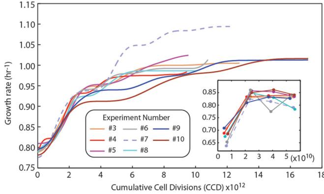
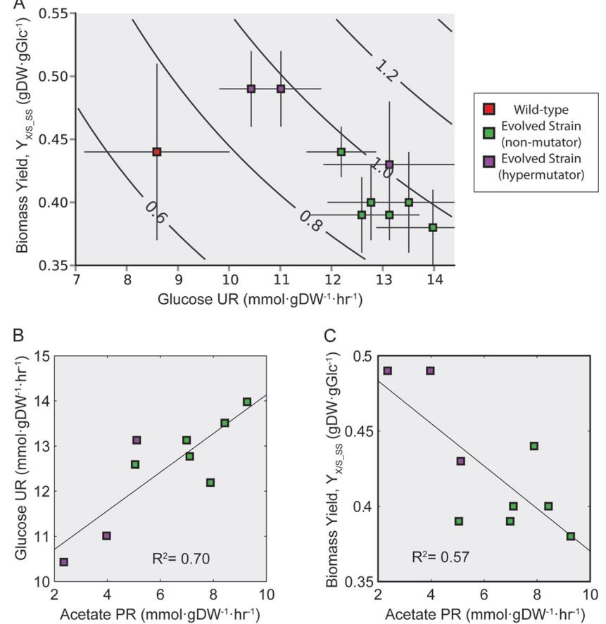
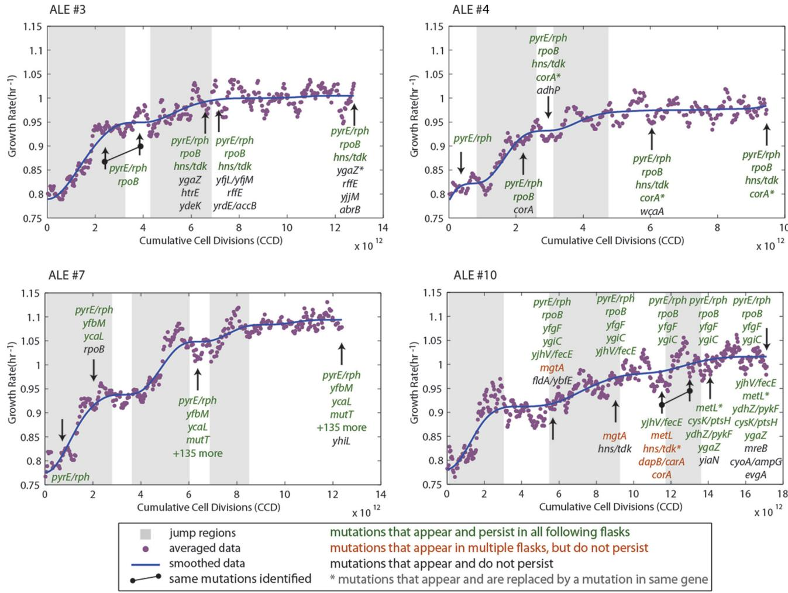
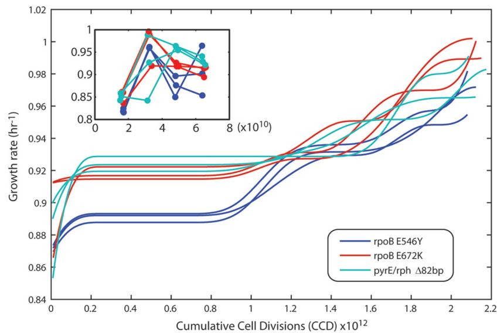
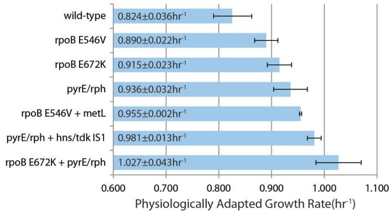
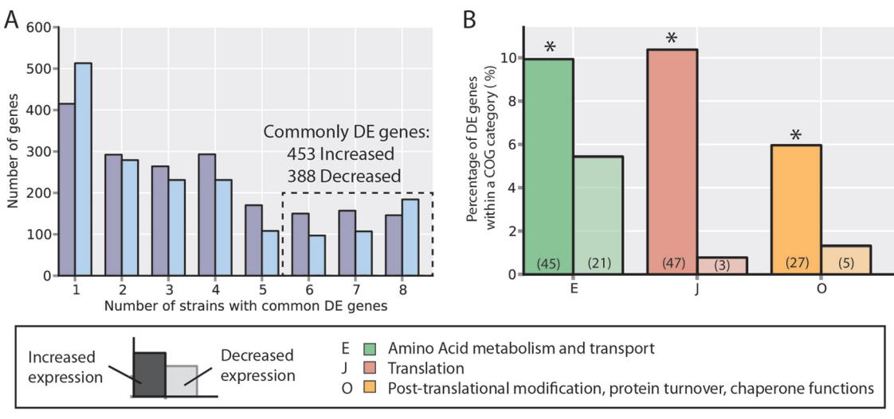
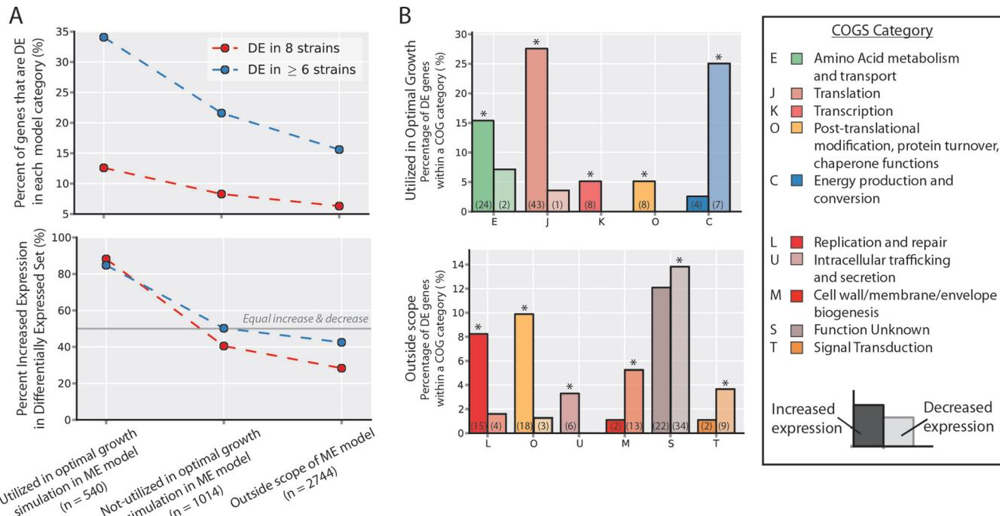

# **Use of Adaptive Laboratory Evolution To Discover Key Mutations Enabling Rapid Growth of** *Escherichia coli* **K-12 MG1655 on Glucose Minimal Medium**

**Ryan A. LaCroix,a Troy E. Sandberg,a Edward J. O'Brien,a Jose Utrilla,a Ali Ebrahim,a Gabriela I. Guzman,a Richard Szubin,a Bernhard O. Palsson,a,b,c Adam M. Feista,b**

Department of Bioengineering, University of California, San Diego, La Jolla, California, USAa ; Novo Nordisk Foundation Center for Biosustainability, Technical University of Denmark, Lyngby, Denmarkb ; Department of Pediatrics, University of California, San Diego, La Jolla, California, USAc

**Adaptive laboratory evolution (ALE) has emerged as an effective tool for scientific discovery and addressing biotechnological needs. Much of ALE's utility is derived from reproducibly obtained fitness increases. Identifying causal genetic changes and their combinatorial effects is challenging and time-consuming. Understanding how these genetic changes enable increased fitness can be difficult. A series of approaches that address these challenges was developed and demonstrated using** *Escherichia coli* **K-12 MG1655 on glucose minimal media at 37°C. By keeping** *E. coli* **in constant substrate excess and exponential growth, fitness increases up to 1.6-fold were obtained compared to the wild type. These increases are comparable to previously reported maximum growth rates in similar conditions but were obtained over a shorter time frame. Across the eight replicate ALE experiments performed, causal mutations were identified using three approaches: identifying mutations in the same gene/region across replicate experiments, sequencing strains before and after computationally determined fitness jumps, and allelic replacement coupled with targeted ALE of reconstructed strains. Three genetic regions were most often mutated: the global transcription gene** *rpoB***, an 82-bp deletion between the metabolic** *pyrE* **gene and** *rph***, and an IS element between the DNA structural gene** *hns* **and** *tdk***. Model-derived classification of gene expression revealed a number of processes important for increased growth that were missed using a gene classification system alone. The methods described here represent a powerful combination of technologies to increase the speed and efficiency of ALE studies. The identified mutations can be examined as genetic parts for increasing growth rate in a desired strain and for understanding rapid growth phenotypes.**

**A**daptive laboratory evolution (ALE) is a growing field facilitated by whole-genome sequencing. The process of ALE involves the continuous culturing of an organism over multiple generations. During an ALE experiment, mutations arise, and those beneficial to the selection pressure are fixed over time in the population. Most ALE experiments analyze a perturbation from a reference state to another (e.g., environmental [\[1,](#page-12-0) [2\]](#page-12-1) or genetic [\[3\]](#page-12-2)). After adaptation, understanding what genetic changes enabled an increase in fitness is often desirable [(4)](#page-12-3). Generally there are two methods of evolving microorganisms: batch cultures and chemostats. Each method has its own advantages and disadvantages, in terms of maintenance, growth environment, and selection pressures [(5)](#page-12-4). Applications of ALE are numerous and include those for biotechnological goals, such as improving tolerance to a given compound of interest [(6](#page-12-5)[–](#page-12-6)[8)](#page-12-7), or more progressive uses such as improving electrical current consumption in an organism [(9)](#page-12-8). In addition, there has been a significant focus on using ALE to understand antibiotic resistance to given compounds (i.e., drugs) in order to combat clinical resistance [(10)](#page-12-9). A number of in-depth reviews on ALE have appeared as the field continues to grow [(5,](#page-12-4) [11,](#page-12-10) [12)](#page-12-11).

The methodology utilized for conducting an ALE experiment needs to be carefully considered. A critical characteristic of ALE experiments is that they have long timescales, on the order of months, and often require daily attention [(1,](#page-12-0) [5)](#page-12-4). The time scale is typically determined by culture size, the amount of cells propagated to the next culture (i.e., passage size), and the growth phase under which it is passed. When passing strictly in exponential phase [(3,](#page-12-2) [13](#page-12-12)[–](#page-12-13)[15)](#page-12-14), the time scale becomes restrictive since there is only a small window of time in which to aliquot the culture and propagate it. The amount passed significantly influences when the next window will occur. Thus, it is often the case that the passage size is adjusted according to the experimenter's schedule [(3,](#page-12-2) [16)](#page-12-15). An unfortunate consequence of this is that as the growth rate increases, the passage size is generally decreased. This allows for fewer potentially beneficial mutations to advance to the next flask, possibly slowing evolution. An alternate approach is to pass a fixed amount at a regular time interval, generally once per day. This time frame allows the cells to reach stationary phase, where they remain for the majority of the time. This approach has been used in a notable study where *Escherichia coli* B strains were evolved in glucose minimal medium batch cultures for more than 25 years [(17)](#page-12-16). Passaging cells after they have reached stationary phase cre-

Received 9 July 2014 Accepted 2 October 2014 Accepted manuscript posted online 10 October 2014 Citation LaCroix RA, Sandberg TE, O'Brien EJ, Utrilla J, Ebrahim A, Guzman GI, Szubin R, Palsson BO, Feist AM. 2015. Use of adaptive laboratory evolution to discover key mutations enabling rapid growth of *Escherichia coli* K-12 MG1655 on glucose minimal medium. Appl Environ Microbiol 81:17–30. [doi:10.1128/AEM.02246-14.](http://dx.doi.org/10.1128/AEM.02246-14) Editor: R. M. Kelly Address correspondence to Adam M. Feist, afeist@ucsd.edu. Supplemental material for this article may be found at [http://dx.doi.org/10.1128](http://dx.doi.org/10.1128/AEM.02246-14)

[/AEM.02246-14.](http://dx.doi.org/10.1128/AEM.02246-14) Copyright © 2015, American Society for Microbiology. All Rights Reserved.

[doi:10.1128/AEM.02246-14](http://dx.doi.org/10.1128/AEM.02246-14)

ates a more complex selection pressure than strictly passaging cells during exponential growth [(18)](#page-12-17), favoring both growth rate increases and decreases in lag-phase duration [(19)](#page-12-18). Thus, experimental setup should be tailored to the desired selection pressure of the experiment.

Next-generation sequencing has eased the process of finding mutations in ALE studies; however, tying specific components of the genotype to the phenotype remains difficult. Strains generated using ALE often have multiple mutations [(20,](#page-12-19) [21)](#page-12-20), and determining causality for a phenotype can require a significant effort [(22](#page-12-21)[–](#page-12-22)[24)](#page-12-23). Despite the growing availability of genome engineering tools [(22,](#page-12-21) [25,](#page-12-24) [26)](#page-12-25), determining causality is still a time-consuming process. An alternative approach to speed in the discovery of causal mutations would be to perform multiple independent experiments and examine mutations that occur most frequently. Performing multiple experiments under strict identical conditions can help filter casual mutation candidates encountered during ALE.

Along with understanding causal genetic changes in ALE experiments, there is also a need to understand changes at the cellular pathway level. Omics characterization coupled with systems modeling approaches enable the mechanistic interpretation of data based on reconstructed metabolic network content [(27)](#page-12-26). Constraint-based modeling, which is a bottom-up approach based on network interactions and overall physiochemical constraints, has been shown to be a valuable systematic approach for analyzing omics data [(28,](#page-12-27) [29)](#page-12-28). This approach has largely been pioneered using *E. coli*K-12 MG1655 as the organism of choice for validation and comparison of *in silico* predictions to experimental data [(30,](#page-12-29) [31)](#page-12-30). In short, integration of omics data types with genome-scale constraint-based models has provided a context in which such data can be integrated and interpreted.

In an effort to demonstrate the power of using strict selection pressure to understand the process of ALE, *E. coli* K-12 MG1655 was adaptively evolved in minimal medium at 37°C with excess glucose in eight parallel experiments. At the end of the ALE experiments, clones from the final populations were characterized in terms of their growth rate, metabolic uptake and secretion rates, genome sequence, and transcriptome. These multi-omics data types were then integrated and further categorized with genomescale models to examine how the cells adapted to the conditions and how their physiology and genomes changed.

### **MATERIALS AND METHODS**

**Adaptive laboratory evolution.** Primary adaptive evolutions were started from wild-type *E. coli* strain MG1655 (ATCC 47076) frozen stock and grown up overnight in 500-ml Erlenmeyer flask with 200 ml of minimal media. Eight 900-l aliquots were placed in eight separate flasks containing 25 ml of medium, and magnetic stir discs were used for aeration. A total of 800 l of culture was serially passaged during mid-exponential phase (3.2% of the total culture volume was propagated to the next culture). Cultures were not allowed to reach stationary phase before passage. Four optical density at 600 nm (OD600) measurements were taken between ODs of 0.05 and 0.30 to determine the growth rates. Periodically, aliquots of samples were frozen in 25% glycerol solution and stored at 80°C for future analysis. Glucose M9 minimal medium consisted of 4 g/liter glucose, 0.1 mM CaCl2, 2.0 mM MgSO4, trace element solution, and M9 salts. A 4,000 trace element solution consisted of 27 g/liter FeCl3·6H2O, 2 g/liter ZnCl2·4H2O, 2 g/liter CoCl2·6H2O, 2 g/liter NaMoO4·2H2O, 1 g/liter CaCl2·H2O, 1.3 g/liter CuCl2·6H2O, 0.5 g/liter H3BO3, and concentrated HCl dissolved in double-distilled H2O (ddH2O) and sterile filtered. A 10 M9 salts solution consisted of 68 g/liter Na2HPO4 anhydrous, 30 g/liter KH2PO4, 5 g/liter NaCl, and 10 g/liter NH4Cl dissolved in ddH2O and autoclaved. The final concentrations in the media were 1. The validation was performed under the conditions described above except that 0.7% of the culture was passaged.

**Physiological characterizations.** The growth rates of clones isolated from the primary ALE experiments were screened by inoculating cells from an overnight culture to a low OD and then sampling the OD600 until the stationary phase was reached. A linear regression of the log-linear region was computed using "polyfit" in MATLAB, and the growth rate (slope) was determined. The growth rates of clones isolated from the follow-up validation ALE were similarly assessed, but these samples were passaged serially three times in late exponential phase. The growth rates of each culture were computed as described above, and the average of the three cultures was determined. The first culture was omitted due to physiological characterization [(32)](#page-12-31). Growth rates of populations were determined from the output of the interpolated cubic spline used, unless stated otherwise.

Extracellular by-products were determined by high-pressure liquid chromatography (HPLC). Cell cultures were first sampled and then sterile filtered. The filtrate was injected into an HPLC column (Aminex HPX-87H 125-0140). The concentrations of the detected compounds were determined by comparison to a normalized curve of known concentrations. Substrate uptake and secretion rates were calculated from the product of the growth rate and the slope from a linear regression of the grams (dry weight) (gDW) versus the substrate concentration. The biomass yield (*Y*X/S_ss) was calculated as the quotient of the growth rate and the glucose uptake rates during the exponential growth phase.

**DNA sequencing.** Genomic DNA was isolated using a Promega Wizard DNA purification kit. The quality of DNA was assessed with UV absorbance ratios by using a NanoDrop apparatus. DNA was quantified by using a Qubit dsDNA high-sensitivity assay. Paired-end resequencing libraries were generated using an Illumina Nextera XT kit with 1 ng of input DNA total. Sequences were obtained using an Illumina Miseq with a PE500v2 kit. The breseq pipeline [(33)](#page-12-32) version 0.23 with bowtie2 was used to map sequencing reads and identify mutations relative to the *E. coli*K-12 MG1655 genome (NCBI accession [NC_000913.2)](http://www.ncbi.nlm.nih.gov/nuccore?term=NC_000913.2). These runs were performed on the National Energy Research Scientific Computing Center carver supercomputer. The identified mutations were then entered into an SQL database to track mutations along each evolution. All samples had an average mapped coverage of at least 25.

**RNA sequencing.** RNA sequencing data were generated under conditions of exponential and aerobic growth in M9 minimal medium with a glucose carbon source. Cells were washed with Qiagen RNA-Protect bacterium reagent and pelleted for storage at 80°C prior to RNA extraction. Cell pellets were thawed and incubated with Illumina's Read-Lyse lysozyme, Life Technologies' SuperaseIn, protease K, and 20% sodium dodecyl sulfate for 20 min at 37°C. Total RNA was isolated and purified by using Qiagen RNeasy minikit columns and following the procedures of the manufacturer. An on-column DNase treatment was performed for 30 min at room temperature. RNA was quantified using a NanoDrop and quality assessed by running an Agilent RNA-Nano chip on a bioanalyzer. Paired-end, strand-specific RNA-seq was performed according to a modified dUTP method [(34)](#page-12-33). A majority of the rRNA was removed by using Epicentre's Ribo-Zero rRNA removal kit for Gram-negative bacteria.

Reads were mapped with bowtie2 [(35)](#page-12-34). Expression levels in units fragments per kilobase per million fragments mapped (FPKM) were found with Cufflinks 2.0.2 [(36)](#page-12-35). The gene expression fold change (with respect to the wild-type strain) was found using cuffdiff; a q-value cutoff of 0.05 was used to call significant differential expression. Gene annotation from EcoCyc version 15.0 was used for all analysis [(37)](#page-12-36). All FPKM, fold change, and q-values are provided in Data Set S3 in the supplemental material.

**Commonly differentially expressed genes.** A statistical model was used to determine how many genes are expected to be commonly differentially expressed in the same direction (up or down) across multiple

**TABLE 1** Fitness properties of the evolved populations

| Strain                | Mean population growth rate (h1 )  95% CIa | Total CCDb | Total doublings | Ratio of final fitness to wild type | Total no. of flasks |
|-----------------------|--------------------------------------------------|------------|--------------------|----------------------------------------|------------------------|
| Wild-type K-12 MG1655 | 0.69  0.02                                       | 0          | 0                  | 1                                      | NAc                    |
| 3                     | 1.01  0.16                                       | 13.5  1012 | 1,903              | 1.46                                   | 382                    |
| 4                     | 0.98  0.10                                       | 10.2  1012 | 1,440              | 1.42                                   | 288                    |
| 5                     | 1.01  0.08                                       | 8.3  1012  | 1,184              | 1.46                                   | 288                    |
| 6                     | 1.00  0.16                                       | 11.3  1012 | 1,630              | 1.46                                   | 327                    |
| 7                     | 1.11  0.10                                       | 13.6  1012 | 1,870              | 1.59                                   | 375                    |
| 8                     | 0.99  0.11                                       | 10.5  1012 | 1,542              | 1.43                                   | 309                    |
| 9                     | 1.01  0.09                                       | 18.1  1012 | 2,589              | 1.46                                   | 519                    |
| 10                    | 1.02  0.12                                       | 18.3  1012 | 2,582              | 1.48                                   | 518                    |

*a* The 95% confidence interval for the wild-type strain was determined from biological triplicates, population growth rates were taken from the endpoint of the fitted spline. *b* CCD, cumulative cell divisions.

*c* NA, not applicable.

strains. In the null model, each gene in each strain can have one of three states: upregulated, downregulated, or not significantly differentially expressed compared to the wild type. For each gene in a given strain, the probability of the three states follows a multinomial distribution parameterized empirically by the differential expression calls in the processed RNA-seq data (see "RNA sequencing" above). The genes that are differentially expressed in each strain are assumed to be independent in the null model, so the probability that a gene is differentially expressed in multiple strains is determined by the product rule of probability. Commonly differentially expressed genes are then called when no genes are expected to be differentially expressed in the same direction across that number of strains (i.e., the expected value is 1). For this data set, no genes are expected to be commonly differentially expressed (in either direction) across six or more strains.

**ME-Model simulation and gene classification.** The ME-Model reported by O'Brien et al. was used for all simulations [(38)](#page-12-37). A total of 20 distinct glucose uptake rates, evenly spaced between 0 and the optimal substrate uptake rate (when glucose is unbounded), were simulated as described by O'Brien et al. [(38)](#page-12-37). Any gene predicted to be expressed in any of the 20 simulations was classified as "utilized ME"; genes within the scope of the ME-Model but not expressed in any of the 20 simulations are classified as "nonutilized ME"; genes outside the scope of the ME-Model are classified as "outside scope ME." These gene groups are then compared to COGs and the identified commonly differentially expressed genes in the endpoint strains (see "Commonly differentially expressed genes" above) [(39)](#page-12-38).

**Jump finding.** Growth rates were calculated for each batch during the course of evolution using a least-squares linear regression. The following criteria were used to determine whether to accept or reject the computed growth rate: the number of OD samples must be -3, the range of OD measurements must be -0.02, and the passage OD must be within 50% of the targeted passage OD.

The accepted growth rates were fit with a monotonically increasing piecewise cubic spline. Regions with a slope greater than 4.2 1015 h1 cumulative cell divisions (CCD)1 were considered jumps, with a few exceptions. The spline was created using the "slmtools" function in MATLAB available on the MATLAB file exchange. The number of spline segments ("#knots-1") was varied to capture the upward trends in growth rates.

**Knock-in procedure.** The single point mutation introduction in *rpoB* was performed by "gene gorging" as described previously [(22)](#page-12-21). Briefly, the mutation in *rpoB* was amplified by PCR from the genomic DNA of the ALE clone where it was originally found. Amplification was accomplished with primers 500 bp upstream and downstream of the mutation and flanked by the 18-bp I-SceI site, and the PCR product was cloned in a pCR-Blunt II-Topo vector (Invitrogen, Carlsbad, CA) to create a donor plasmid. The donor plasmid was cotransformed along with the pACBSR plasmid harboring an arabinose-induced lambda red system and the I- SceI endonuclease on a compatible replicon. A colony of the strain transformed with both plasmids was grown with arabinose as an inducer and, after 7 to 12 h, several dilutions of culture were plated with or without antibiotics to verify the loss of the donor plasmid. The initial screening of positive clones was carried out by PCR using a 3= specific primer to the introduced mutation [(40)](#page-12-39). The positive colonies were confirmed by Sanger sequencing.

**GEO accession number.** The RNA sequencing data associated with this study are available in the Gene Expression Omnibus (GEO) database under accession number [GSE61327.](http://www.ncbi.nlm.nih.gov/geo/query/acc.cgi?acc=GSE61327)

## **RESULTS**

**Characterization of the evolution process and the endpoint strains.** Adaptive laboratory evolution was used to examine *E. coli*'s physiological and genetic adaptation to simple medium conditions under a strict selection pressure. Eight independent populations of wild-type *E. coli* K-12 MG1655 from the same seed culture were adaptively evolved in parallel under continuous exponential growth for a time period of 39 to 81 days. During this time, the cultures underwent approximately 8.3 1012 to 18.3 1012 CCD [(Table 1)](#page-2-0) [(41,](#page-13-0) [42)](#page-13-1). The use of CCD as a coordinate allows for incorporation of the number of cells passed in an ALE experiment along with the generations of a culture [(41)](#page-13-0). Variations in time courses and CCD are due to reinoculations from frozen stocks (taken throughout the experiment) and occasional unexpected losses of cultures or suspected contamination, as determined using 16S ribosomal sequencing. The fitness trajectories (i.e., population growth rates) as fit by a spline over the course of the evolution are given in [Fig. 1,](#page-3-0) and individual flask growth rates are given in Fig. S1 and Data Set S1 in the supplemental material. Each of the evolved populations increased in fitness from the starting strain [(Table 1)](#page-2-0). The growth rate increases were 1.47 0.05 (standard deviation, *n* 3)-fold faster than the starting strain and ranged from 1.42 to 1.59. One of the populations (determined to be a hypermutator strain, see below) was statistically faster than the rest and increased 1.59-fold (*P* 0.01).

There was a significant increase in fitness from the first flask to the second in each of the independent experiments [(Fig. 1,](#page-3-0) insert). This phenomenon has been previously observed and described through an examination of growth when cells are repeatedly passaged during their exponential growth phase [(32)](#page-12-31). An initial "physiologically adapted" growth rate was determined for the starting wild-type strain of 0.824 0.036 h1 and was determined using growth rates recorded for flasks 2 to 4 across all of the inde-

**FIG 1** Fitness trajectories for *E. coli* populations evolved on glucose minimal medium. Shown is a plot of the fitness (i.e., the growth rate) of the independently evolved experiments versus the number of cumulative cell divisions (CCD). The strain indicated with a dashed line was classified as a hypermutator. The inset shows the growth rates of the initial four flasks of batch growth in each experiment. Overall, the fitness of the hypermutator population outpaced the nonmutators.

pendent ALE experiments. This repeated exponential-phase growth rate is 19% faster than the average growth rate of flask 1 from each experiment (0.69 0.02 h1 ). It should be noted that this increase in growth rate is not expected to be a result of a beneficial mutation (see the supplemental material).

Clones were isolated from the last flask of each of the evolved populations, phenotypically characterized (i.e., the growth rate, the glucose update rate [GUR], and the acetate production rate [APR]), and compared to the starting wild-type strain to understand how their behavior changed after evolution [(Fig. 2)](#page-3-1). Nine clones isolated from the experiments were analyzed (six isolated from the nonhypermutator populations and three isolated from the hypermutating lineage were analyzed, since this lineage possessed a significantly higher population fitness). The increase in fitness (i.e., growth rate) was 1.29- to 1.46-fold. To quality control the data, the phenotype of the wild-type strain was compared to other studies and found to be in good agreement with previous characterizations [(43)](#page-13-2). The clone growth rates were compared to the population from which they were derived, and the Pearson correlation coefficient between them was 0.16 (see Fig. S2 in the supplemental material). The isolated hypermutator clones di-

**FIG 2** Phenotypic properties of evolved strains. Clones isolated from the last flask of the experiments (i.e., endpoint strains of nonmutators) and three hypermutator strains were characterized phenotypically. (A) Plot of the biomass yield versus the glucose uptake rate (UR) (see Materials and Methods for calculations). The isoclines indicate different growth rates. Of all measured phenotypic traits for the evolved strains, the correlations between glucose uptake rate and acetate production rate (PR) (B) and between biomass yield and acetate production rate (C) were the strongest. The percentage of carbon from glucose being secreted in the form of acetate increased in all of the nonmutator endpoint strains (18 to 22%) except for one (13%), compared to the wild type (15%). This percentage decreased for all of the hypermutator strains (8 to 13%).

verged more significantly from the population growth rates (1.10 to 1.20) than did the nonhypermutator strains (1.02 to 1.11).

The physiological properties of each of the clones isolated from the independent ALE experiments were compared to examine whether there were any conserved trends across the different experimental outcomes. There was a similar increase in growth rate across the isolates from different experiments but a larger variation in the GURs and biomass yields [(Fig. 2A)](#page-3-1). The GURs and APRs increased in the endpoint strains compared to the wild type (except for one strain for which the APR decreased). There is a correlation (*r* 2 0.70) between the increase observed in the GUR and APR [(Fig. 2B)](#page-3-1). Of the characterized strains, the hypermutators accounted for three of the four lowest APRs and highest steady-state biomass yields (*Y*X/S_ss). No other common fermentation products of *E. coli* K-12 MG1655 (i.e., formate, ethanol, succinate, and lactate) were detected as secretion products in any of the endpoints, thus indicating that the three hypermutator strains generally metabolized glucose more efficiently. A similar correlation was also seen between biomass yield and APR (*r* 2 0.57, [Fig. 2C)](#page-3-1). Thus, clones in the independent ALE experiments converged to a similar optimal fitness by either becoming more efficient in their biomass yield or increasing GUR and overflow metabolism in the form of acetate secretion. A trade-off between GUR and *Y*X/S_SS was observed in that higher GURs led to lower *Y*X/S_SS values (i.e., they are inversely correlated, *r* 2 0.93 [see Fig. S3 in the supplemental material]). However, it should be noted that the *Y*X/S_SS calculation involves GUR as a factor.

**Analysis of mutations identified in the evolved strains.**A persistent challenge and goal in ALE experiments is differentiating between causal mutations and genetic hitch-hikers. In these sets of experiments, 72 unique mutations were identified across nonmutator strains (see Data Set S2 in the supplemental material). To aid in determining causal mutations, jumps in fitness were identified by using a jump-finding algorithm (see Materials and Methods). Clones were isolated that bracketed jump regions and sequenced in order to evaluate whether jumps in growth rates could be linked to a genetic change that had been fixed in the population over the course of the jump [(Fig. 3;](#page-5-0) see Fig. S1 in the supplemental material). An analysis of key mutations is given in [Table 2.](#page-6-0) The genes or genetic regions listed in [Table 2](#page-6-0) are those that were found mutated in multiple experiments or which contained multiple unique mutations across the gene/genetic region. [Figure 3](#page-5-0) and Fig. S1 in the supplemental material also show whether a given mutation persisted, whether it was found at multiple points of clonal analysis, or whether it was no longer detected but another mutation in the same gene was identified. Mutations that were linked to fitness jumps are identified in [Table 2.](#page-6-0)

Overall, 52 unique genetic regions (i.e., genes or intergenic regions between two genes) were mutated across all nonmutator clones sequenced, encompassing 72 total unique mutations (see Data Set S2 in the supplemental material). Of the 52 unique genetic regions, multiple unique mutations occurred in eight genetic regions [(Table 2)](#page-6-0). 57% (30 of 53) of all mutations persisted in every subsequent clone examined until the experiment ended (mutations only observed in the last clone examined for each experiment were not considered). Some mutations were found in multiple subsequent clones from an experiment but did not persist after first being observed. There were two such instances in experiment 10, where three distinct genotype lineages were observed in the various clones sequenced. Of the genes containing the 30 persistent mutations, only three have been reported in a similar glucose minimal media ALE experiment: *rpoB*, *ygiC*, and the *ydhZ-pykF* intergenic region [(44)](#page-13-3). When considering the hypermutator population clones, an additional *pykF* mutation was also observed (see Data Set S2 in the supplemental material). It should be noted that the exact mutations were different than those previously reported, and only *rpoB* was included in our analysis of key mutations. Overall, there were 7 to 21 mutations identified in each experiment, with a median value of 13. Experiment 4 had the fewest genetic changes with seven unique mutations across all sequenced clones, and only four in the final clonal isolate. In comparison, experiment 10 had 21 unique mutations observed across all clones and 12 in the final clonal isolate. Similar continuous exponential-growth-phase ALE experiments run for 1011 CCDs (more than an order of magnitude fewer than in the present study) on glycerol, lactic acid, and L-1,2-propanediol minimal media yielded 2 to 5, 1 to 8, and 5 to 6 mutations per independent experiment, respectively [(23,](#page-12-22) [24,](#page-12-23) [45)](#page-13-4).

Several genes and genetic regions were identified that contained mutations across many of the independent ALE experiments, implying causality. A detailed analysis of each of the key mutations is given in the supplemental material, but the most frequent mutation targets were the intergenic region between *pyrE* and *rph*, the *rpoB* gene, and the intergenic region between *hns* and *tdk* via an insertion sequence (IS). An 82-bp *pyrE-rph* intergenic region deletion was observed in every sequenced clone. A K-12 specific defect has been previously described which is ameliorated by this mutation [(23,](#page-12-22) [46)](#page-13-5). A subunit of RNA polymerase,*rpoB* was found to be mutated in every experiment and likely has a genomewide impact on transcription given its vital role in the transcription process [(47,](#page-13-6) [48)](#page-13-7). All of the mutations were single amino acid changes. Multiple unique mutations were found singly across clones that harbored *rpoB* mutations after the first jump in fitness. IS element-mediated mutations were found in all experiments, typically after the second jump in fitness, except where a hypermutating phenotype was dominant. Three different IS elements (IS*1*, IS*2*, and IS*5*) were inserted in seven different locations, and one identical IS*5* mutation was detected using the described clonal analysis.

The clones sequenced after the second jump in experiment 7 exhibited hypermutator behavior. This was readily apparent from the 139 mutations it possessed, an order of magnitude greater than any other strain for a given number of CCDs. In addition, there was an IS element inserted into the *mutT* gene of this strain. Due to the large size of the insertion (777 bp), it almost surely results in *mutT* loss of function. It has been shown, by knockout, that defective MutT increases single nucleotide polymorphisms (SNPs) in the form of A·T to C·G conversions [(49)](#page-13-8). Of all of the mutations observed in the hypermutator strains, only 6 of 381 were not A·T to G·C conversions. When all four isolated and resequenced hypermutator clones were compared, 33 mutations were shared between allfour. The overlap in genes or genetic regions between the hypermutators and nonmutators was analyzed, and it was found that the only identical shared mutation was the 82-bp deletion in the *pyrE-rph* intergenic region. Only two (*iap* and *ydeK*) of the same genes or genetic regions were mutated in both the nonmutator and the hypermutator lineages. Thus, these genes also indicate potential key mutations for the observed phenotypes [(Table 3)](#page-6-1).

**Analysis of reproducibility for key mutations that enable increased fitness phenotypes.** To analyze how reproducibly key

**FIG 3** Fitness trajectories of ALE experiments 3, 4, 7, and 10, along with identified jump regions and resequencing data. Shown are the fitness increases over the course of the evolution as a function of cumulative cell divisions (CCD) and the jump regions (gray boxes) identified using the outlined algorithm. Arrows indicate where colonies were isolated and resequenced. Mutation types are indicated by color: green, mutations that occurred and were found in each subsequent colony resequencing; sienna, mutations that appear in colonies from multiple flasks but not consecutively; and black, mutations that were only found in one particular clone and not in subsequent clones. Further, genetic mutations that replace a previously identified mutation in the same gene are marked with an asterisk. All of the mutations from the hypermutator strain that arose in experiment 7 are not shown (more than 135 total mutations). Plots for all nine experiments are given in Fig. S1 in the supplemental material. Note that genetic expressions in [Fig. 3](#page-5-0) and in subsequent figures that incorporate a shill (/), such as "*pyrE/rph*", refer to intergenic regions, e.g., "*pyrE/rph*" refers to the *pyrE-rph* intergenic region.

mutations occur, the evolution process was repeated starting with strains that harbored three of the key mutations identified in the present study: *rpoB*(E546V), *rpoB*(E672K), and *pyrE-rph*( 82bp) (i.e., an 82-bp deletion in the *pyrE-rph* intergenic region) (see [Table 2)](#page-6-0). The hypothesis that was tested was the expectation that key mutations would again occur, and the approach developed in this work could select for them when starting another ALE experiment with one of the key mutations already present (i.e., with different starting material). Consequently, the fitness increase associated with each mutation could also be tested. Each of these single mutants was reconstructed in the starting strain background and validated (see Materials and Methods). The conditions of this "validation" ALE experiment were essentially identical to the first ALE experimental setup but with the dilution ratio changed to 0.67% of the total culture volume (compared to 5.0% in the initial experiment) in order to reduce clonal interference and genetic drift. The fitness trajectories of the validation evolution experiment are shown in [Fig. 4.](#page-7-0) The initial and physiologically adapted growth rates of the three reconstructed strains demonstrated that their mutations were indeed causal for faster growth on minimal media. The key mutations detected in the validation ALE are given in [Table 4.](#page-7-1) It is interesting that a different mutation between *pyrE* and *rph* was detected (a 1-bp deletion) besides the ubiquitous 82-bp deletion detected in the primary ALE. Furthermore, using PCR, we found that all populations showed evidence of obtaining the 82-bp deletion, although the entire population did not harbor the mutation (see Fig. S5 in the supplemental material). In addition, *metL* gene and *hns-tdk* intergenic region mutations were also detected in the validation ALE. *metL* mutations are not as widespread, but two out of three mutations that did appear in *metL* are consistently loss-of-function mutations,

## **TABLE 2** Key mutations

| Genea    | Mutation                               | Appearance location | Replacing mutation (within same expt) | Appearance location | n | Expt(s)                |
|----------|----------------------------------------|------------------------|------------------------------------------|------------------------|---|------------------------|
| pyrE/rph | 82bp                                   | Jump 1, pre-jump 1     |                                          |                        | 8 | 3, 5, 9, 10 4, 6, 7, 8 |
| rpoB     | E672K (GAA¡AAA)                        | Jump 1                 |                                          |                        | 8 | 3, 5, 9                |
|          | P1100Q (CCG¡CAG)                       | Jump 1                 |                                          |                        |   | 4, 8                   |
|          | E546V (GAA¡GTA)                        | Jump 1                 |                                          |                        |   | 10                     |
|          | H673Y (CAC¡TAC)                        | Jump 1                 | D785Y (GAC¡TAC)                          | Jump 2                 |   | 6                      |
|          | L671P (CTG¡CCG)                        | Jump 1                 | Hypermutator                             | Jump 2                 |   | 7                      |
| hns/tdk  | Intergenic (114/–487) IS2              | Jump 2                 |                                          |                        | 7 | 3                      |
|          | Intergenic (110/–488) IS1              | Jump 2                 |                                          |                        |   | 4                      |
|          | Intergenic (274/–328) IS5              | Jump 2                 |                                          |                        |   | 5                      |
|          | Intergenic (86/–511) IS1               | Post-jump 2            |                                          |                        |   | 6                      |
|          | Intergenic (67/-531) IS1               | Jump 2                 |                                          |                        |   | 8                      |
|          | Intergenic (93/–505) IS1               | Jump 3                 |                                          |                        |   | 9                      |
|          | Intergenic (258/–344) IS5              | Jump 2                 | Intergenic (274/–328) IS5                | Post-Jump 2            |   | 10                     |
| corA     | Coding (726–728/951 nt) 	3bp           | Jump 1                 | Coding (220–224/951 nt) 	5bp             | Jump 1                 | 3 | 4                      |
|          | A206V (GCG¡GTG)                        | Jump 1/2               | Coding (113–211/951 nt) 	99bp            | Jump 2                 |   | 5                      |
|          | Coding (668/951 nt) duplication, 21 bp | Jump 2/3               | Wild type                                | Jump 3                 |   | 10                     |
| ygaZ     | Coding (529–532/738 nt) IS5            | Jump 2                 | Coding (307–316/738 nt) 	10bp            | Post-jump 3            | 3 | 3                      |
|          | E49* (GAA¡TAA)                         | Jump 3                 |                                          |                        |   | 9                      |
|          | 2807900, 19 bp  2                      | Post-jump 3            |                                          |                        |   |                        |
| iap      | Coding (98–101/1,038 nt) IS5           | Post-jump 2/3          |                                          |                        |   | 6, 9                   |
| metL     | Coding (1,338/2,433 nt) 	1bp           | Jump 2/3               | A798E (GCG¡GAG)                          | Jump 3                 | 1 | 10                     |
| ygeW     | S200R (AGC¡CGC)                        | Jump 1                 |                                          |                        | 2 | 5, 9                   |

*a* Genetic terms that incorporate a shill (/), such as "*pyrE/rph*", refer to intergenic regions, e.g., "*pyrE/rph*" refers to the *pyrE-rph* intergenic region.

suggesting that inactivation of the gene can increase the growth rate in the minimal medium conditions tested.

To examine the increase in fitness from key mutations identified, growth screens were performed for relevant single and double mutants [(Fig. 5)](#page-7-2). These strains were either reconstructed manually or were isolates of the validation ALE. The results show that the mutation observed in *metL* and the IS*1* insertion into the *hnstdk* intergenic region also conferred a fitness advantage. The *metL* gene and the *hns-tdk* intergenic region were both shown in the presence of additional mutations, so their potential for epistasis is unknown. However, for the mutant with the IS*1* insertion into the region within the *hns-tdk* intergenic region, it only harbors the 82-bp deletion in the *pyrE-rph* intergenic region which has been previously shown to alleviate a known K-12 MG1655-specific defect [(23,](#page-12-22) [46)](#page-13-5). Thus, it is highly likely that it is uniquely causal without epistasis. In the case of *metL*, mutations were only observed after a mutation in *rpoB* was present. This could either indicate epistasis between the two mutations or simply that *rpoB* confers a larger fitness advantage and thus was selected for before a mutation in *metL*. If the fitness advantage from the double mutant screens is assumed to be additive, the increases in fitness for the observed mutation in *metL* and within the *hns-tdk* intergenic

**TABLE 3** Phenotypic data from clones isolated from the final flask of each experiment

| Straina                  | Mean  95% CIb           |                                           |                                               |                                          |                               |                                 |
|--------------------------|-------------------------|-------------------------------------------|-----------------------------------------------|------------------------------------------|-------------------------------|---------------------------------|
|                          | Growth rate (h1 ) | Glucose uptake rate (mmol gDW1 h1 ) | Acetate production rate (mmol gDW1 h1 ) | Biomass yield (gDW g of glucose1 ) | Fold increase vs wild type | Population/clone growth rate |
| Wild-type K-12 MG1655 | 0.69  0.02              | 8.59  1.42                                | 3.91  1.14                                    | 0.44  0.07                               |                               |                                 |
| 3                        | 0.98  0.02              | 13.51  1.15                               | 8.43  2.17                                    | 0.40  0.04                               | 1.42                          | 1.03                            |
| 4                        | 0.96  0.01              | 12.19  0.68                               | 7.89  1.88                                    | 0.44  0.02                               | 1.39                          | 1.02                            |
| 6                        | 0.93  0.01              | 12.77  0.85                               | 7.11  1.51                                    | 0.40  0.03                               | 1.34                          | 1.07                            |
| 7*                       | 1.01  0.04              | 13.13  1.29                               | 5.12  0.57                                    | 0.43  0.06                               | 1.46                          | 1.10                            |
| 7A*                      | 0.97  0.01              | 11.01  0.79                               | 3.97  0.98                                    | 0.49  0.03                               | 1.41                          | 1.14                            |
| 7B*                      | 0.92  0.02              | 10.43  0.62                               | 2.36  0.54                                    | 0.49  0.03                               | 1.33                          | 1.20                            |
| 8                        | 0.89  0.01              | 12.59  1.01                               | 5.05  0.40                                    | 0.39  0.03                               | 1.29                          | 1.11                            |
| 9                        | 0.92  0.02              | 13.13  0.59                               | 6.99  0.48                                    | 0.39  0.02                               | 1.33                          | 1.10                            |
| 10                       | 0.95  0.01              | 13.98  1.11                               | 9.27  1.76                                    | 0.38  0.03                               | 1.38                          | 1.07                            |

*a* *, hypermutator strain.

*b* gDW, grams dry weight.

**FIG 4** Fitness trajectory for the validation ALE. Shown is a plot of the validation ALE wherein three unique starting strains were evolved in biological triplicate, each harboring one of the following mutations: *rpoB*(E546V), *rpoB*(E672K), and *pyrE-rph*( 82bp). The increase in fitness is shown as a function of the cumulative cell divisions (CCD). The inset shows the unsmoothed and filtered growth rates of the beginning of the experiment to show any possible physiological adaptation that is characteristic of ALE experiments. A smoothing spline will often obscure such abrupt changes.

region are 0.065 0.023 h1 and 0.045 0.035 h1 , respectively. Furthermore, the double mutant harboring both the *rpoB* E672K and the 82bp *pyrE-rph* intergenic region mutation follows this additive trend, since each single mutant increased fitness 0.125 0.038 h1 and 0.146 0.044 h1 , respectively, and when they were both present the increased fitness was 0.237 0.058 h1 . It should be noted that the growth rate measured from just the *rpoB*(E672K) and the 82bp *pyrE-rph* intergenic region mutations (1.027 0.043 h1 ) matches the highest growth rate measured from the populations that harbored both of these mutations (1.01 h1 ) in its 95% confidence interval.

**Transcriptomic analysis of evolved strains.** Expression profiling was performed on endpoint strains using RNA-seq to identify system-wide changes in gene expression after evolution. For the eight strains profiled using RNA-seq, out of 4,298 proteincoding open reading frames, reads aligned to a total of 4,189 genes (109 have no reads) in at least one strain and 2,922 genes in all strains (see Materials and Methods), indicating a comprehensive/

| TABLE 4 Key mutations in validation ALE |  |  |  |
|-----------------------------------------|--|--|--|
|-----------------------------------------|--|--|--|

| Genetic  | Starting strain |                             | No. of      |         |  |
|----------|-----------------|-----------------------------|-------------|---------|--|
| regiona  | genotype        | Mutation                    | occurrences | Expt(s) |  |
| pyrE/rph | rpoB(E546V)     | 82bp deletion               | 1           | 2       |  |
|          |                 | 1bp deletion                | 1           | 3       |  |
|          | rpoB(E672K)     | 82bp deletion               | 3           | 4, 5, 6 |  |
| rpoB     | pyrE/rph        | A679V (GCA¡GTA)             | 1           | 8       |  |
|          |                 | V857E (GTG¡GAG)             | 1           | 9       |  |
| hns/tdk  | pyrE/rph        | Intergenic (75/–522) IS1 | 1           | 9       |  |
| metL     | rpoB(E546V)     | W424* (TGG¡TAG)             | 1           | 1       |  |

*a* Genetic expressions that incorporate a shill (/), such as "*pyrE/rph*", refer to intergenic regions, e.g., "*pyrE/rph*" refers to the *pyrE-rph* intergenic region.

deep coverage of the transcriptome. Genes were identified that were differentially expressed in endpoint strains compared to the wild type (see Materials and Methods). In all strains, hundreds of genes significantly increased and decreased in expression (see Fig. S6 in the supplemental material), indicating large shifts in the transcriptome.

The common changes in gene expression across strains were analyzed to examine the heterogeneity of the different independent ALE experiments. As a null model, it was assumed that the expression changes in each gene are independent of each other. Using this null model, the expectation would be that no genes

**FIG 5** Causal mutation analysis. Shown is a bar graph of the physiologically adapted growth rates of strains harboring key mutations identified in the present study. The error bars represent 95% confidence intervals from three biological replicates. These results show that the mutation in *metL* and the IS*1* insertion between *hns* and *tdk* are causal in the presence of the additional mutations shown. The strain with *metL* also had one additional mutation, but this was not observed in any other sequenced *metL* mutant from the ALE experiment. It is clear from the fastest growing mutant, with a growth 1.3-fold greater than the wild type, how significantly the *pyrE-rph* intergenic region and *rpoB* gene mutations can affect growth rate. "*pyrE/rph*" refers only to the 82-bp deletion.

**FIG 6** Commonly differentially expressed (DE) genes. (A) Numbers of differentially expressed genes (with respect to the wild-type strain) common across evolved strains. Increased- and decreased-expression genes are counted separately to ensure the direction of change is conserved across strains. The *y* axis indicates the number of genes differentially expressed in exactly the number of strains indicated on the *x* axis. From this, 453 increased-expression and 388 decreased-expression genes are identified as common to at least six strains, whereas one would expect no genes in common to all six by random chance (see Fig. S6 in the supplemental material; see also Materials and Methods). (B) The functions of commonly differentially expressed genes for both the increase-expression and decreased-expression sets were interrogated using annotated clusters of orthologous groups (COGs). The groups shown are those which were overrepresented in either the increased or decreased DE gene sets as identified with a hypergeometric test (*P* 0.05; *, overrepresented; see Materials and Methods). The percentage of DE genes that fell in each of the overrepresented COG categories is indicated by the bar height, and the total number of DE set genes anotated with that COG function is indicated in parentheses (e.g., 45/453 9.9% and 21/388 5.4%).

should be commonly differentially expressed across six or more strains (see Fig. S6 in the supplemental material). However, 453 genes commonly increased in expression, and 388 genes commonly decreased in expression across six or more strains [(Fig. 6A)](#page-8-0), indicating largely consistent changes in expression (although there is also a significant amount of diversity in the expression changes). This commonly differentially expressed gene set was selected for further analysis to better understand the coordinated change in the transcriptomes of the evolved strains.

For a broad overview of the cellular processes with modulated expression, overrepresented COG (cluster of orthologous group) annotations [(39)](#page-12-38) in the commonly differentially expressed genes were identified. Overall, 79% (359) of the commonly increased genes and 65% (252) of the commonly decreased genes had annotated COGs (see Materials and Methods). Although no COG annotation was enriched in the genes that decreased in expression, three categories were enriched in the increased genes. These upregulated COGs are translation, protein folding, and amino acid metabolism [(Fig. 6B)](#page-8-0). All of these COGs are related to protein synthesis, indicating that an increase in protein synthesis capacity is a common trend among evolved strains. These changes are consistent with previously described growth rate-dependent increases in ribosomal and other protein synthesis machinery [(50)](#page-13-9). At higher growth rates, the increased dilution of protein to daughter cells places a higher demand on protein synthesis, driving the increased expression.

In order to connect genotype to molecular phenotype where possible, a comparison was made between the identified common mutations [(Table 2)](#page-6-0) and gene expression levels within or between the mutational loci. Paired mutation and expression data for six endpoint strains (strains 3, 4, 6, 8, 9, and 10), along with two hypermutator isolates, 7A and 7B, were used in the analysis. The same *pyrE-rph* intergenic region mutation occurred in all six endpoint strains; *pyrE* was significantly upregulated in all strains, whereas *rph* was significantly downregulated in five of six strains (with no significant differential expression in strain 6). The upregulation of *pyrE* is consistent with the previously identified mechanism of the mutation as relieving a pyrimidine pseudoauxotrophy [(23,](#page-12-22) [46)](#page-13-5); the *rph* downregulation, on the other hand, is likely not directly beneficial for fitness since the gene contains a frameshift and lacks RNase PH activity [(46)](#page-13-5). An *hns-tdk* intergenic region mutation also occurred in all 6 endpoint strains, and in all strains, *hns* is significantly upregulated and *tdk* is significantly downregulated (although not significantly in strain 9). Histonelike nucleoid structuring protein (H-NS) is a global transcription factor, which represses a wide array of stress responses [(51)](#page-13-10); the benefit of the *hns-tdk* intergenic region mutation may therefore be due to the upregulation of *hns* and subsequent downregulation of many stress responses. Tdk downregulation has no apparent benefit, but may ameliorate a potential imbalance in deoxyribonucleotide biosynthesis. A mutation occurred in *rpoB* in all six endpoint strains, and *rpoB* was also upregulated in all of these strains (although not significantly in strain 8). The mutation was intragenic within *rpoB* and likely does not directly affect its expression level; however, *rpoB* was upregulated (in addition to all other subunits of the sigma 70 holoenzyme) as a consequence of increases in growth rate (see section below). This growth rate dependency is further corroborated in that the hypermutator clones did not have an *rpoB* mutation, but all of the RNAP holoenzyme subunits are upregulated in these strains as well. For the other key mutations that occurred repeatedly, there was no clear pattern between the occurrence of the mutation and the differential expression of the related gene. Upon examination of an additional strain-specific intergenic IS element insertion between *uvrY* and *yecF* in endpoint strain 6, it was found that *uvrY* was significantly downregulated, a shift experienced in three of the other strains as well (the *yecF*

**FIG 7** Comparison of genome-scale modeling predictions and categorization of commonly differentially expressed (DE) genes. (A) Commonly differentially expressed genes (*n* 841) were compared to a gene classification obtained by using a genome-scale model of *E. coli* [(38)](#page-12-37). The growth rate was optimized using the model under the same glucose aerobic batch conditions as those used in the ALE experiment. Simulation results were used to classify genes (*x* axis). Overall, differentially expressed genes are more enriched in the set predicted to enable an optimal growth phenotype (top). Furthermore, within the differentially expressed set of genes, genes predicted to enable an optimal growth phenotype are more often upregulated than downregulated (bottom), and DE genes outside the scope of the model were more often decreased. (B) Using a combination of the increased and decreased DE gene sets and the *in silico*-predicted gene classification (see Fig. S7 in the supplemental material), subsets of genes could be identified that enabled the observed optimal states of the evolved strains at the functional level. This was accomplished by using COG categories as for [Fig. 6B.](#page-8-0) The percentage of DE genes that fell in each of the overrepresented COG categories in either the increased- or decreased-expression set is indicated by the bar height, and the total number of DE set genes annotated with that COG function is indicated in parentheses.

expression was essentially the same as the wild type). Furthermore, there was an intragenic mutation in *uvrY* (W42G) in strain 7A, one of the other strains where it was differentially expressed. Thus, comparison of expression data and mutation data revealed potential links between genotype and molecular phenotype for the three intergenic IS element mutations identified in evolutions (those where one would most expect to see a change in transcription) [(52](#page-13-11)[–](#page-13-12)[54)](#page-13-13).

**Integrated genome-scale modeling.** Constraint-based models are capable of predicting growth-optimizing phenotypes [(15,](#page-12-14) [30,](#page-12-29) [55,](#page-13-14) [56)](#page-13-15). A recent genome-scale model of metabolism and gene expression for *E. coli*, the ME-Model, extends predictions beyond metabolism to also include growth optimization of gene expression phenotypes [(38)](#page-12-37). To test the predictions of gene expression, categorize the transcriptomic data, and provide further insight into the expression data, model predictions were compared to the commonly differentially expressed genes from the analysis of evolved strains.

Utilizing the ME-Model of *E. coli*, growth rate optimizing phenotypes in glucose aerobic culture medium conditions (i.e., the same conditions as the ALE experiments) were simulated. Based on these simulations, three groups of genes were identified: (i) genes utilized by the ME-Model in maximum growth rate conditions ("utilized ME"; *n* 540); (ii) genes within the scope of the ME-Model, but not predicted to be utilized in a maximum growth phenotype ("nonutilized ME"; *n* 1,014); and (iii) genes outside the scope of the ME-Model ("outside scope ME"; *n* 2,744) that have yet to be reconstructed in a constraint-based formalism [(38)](#page-12-37).

If the *in silico*-predicted utilized ME genes are indeed important for an apparent optimal growth rate, one would expect them to be in the commonly differentially expressed set as determined through untargeted transcriptomics. To test this hypothesis, the three model-defined gene classes were compared to the commonly differentially expressed genes (see Fig. S7 in the supplemental material). Indeed, it was determined that the utilized ME genes were more often commonly differentially expressed [(Fig.](#page-9-0) [7A,](#page-9-0) top). Furthermore, of the utilized ME genes that are differentially expressed, 85% were upregulated, indicating that the transcriptome generally shifts toward these optimal growth-supporting genes [(Fig. 7A](#page-9-0) bottom). The nonutilized ME genes form an intermediate category whose frequency of differential expression (and frequency of increased differential expression) is between that of utilized ME genes and outside scope ME genes. Nonutilized ME genes, although not predicted to be utilized for purely growth-optimizing phenotypes, still contribute to increased growth, whereas many outside scope ME genes do not. Although differentially expressed nonutilized ME genes have increased expression about half of the time, outside scope ME genes more often show decreased expression, indicating a shift away from the outside scope ME genes.

The COG and model-based gene categorizations were combined to provide further insight into the processes commonly differentially expressed among the endpoint clonal isolate strains. By dividing up the genes into utilized ME genes and outside scope ME genes, new processes missed by just considering the COG annotations alone were identified, which also served to highlight important areas of model expansion.

As in the analysis of the transcriptomic data alone, amino acid metabolism, translation, and protein maturation were enriched in the commonly differentially expressed utilized ME genes, indicating that the ME-Model correctly predicted a number of the genes in these processes that are important for increased growth rate. By further categorizing the COGs based on the utilized ME genes, transcription was identified as an upregulated process. This finding was missed by the categorization based on COGs alone as a result of the numerous genes annotated as related to transcription. However, by further segmenting this COG by model-predicted genes essential for transcription, it is revealed as an upregulated process.

Looking at the specific genes in the pared gene groups at the intersection of COG annotations and modeling predictions revealed more details on the specific processes and complexes that change in expression [(Fig. 7B)](#page-9-0). A detailed analysis of the pared groups is given in the supplemental material. However, there are some clear pathway-level shifts worth mentioning here. Energy production and conversion was identified as a downregulated process (again, energy production and conversion [C] is a broad COG category), but when it is pared down to only consider model-predicted utilized ME genes, it is identified as a category with significant changes in expression. Interestingly, genes that decrease in expression all belong to the tricarboxylic acid (TCA) and glyoxylate cycles (*mdh*, *acnAB*, *aceAB*, *gltA*, and *icd*). This concerted downregulation is likely related to the increase in fermentative metabolism and acetate secretion of the evolved strains [(Fig. 2)](#page-3-1). Although aerobic respiration has higher energy yields than fermentative metabolism, it has been hypothesized that the flux through the respiratory reactions is limited by protein synthesis cost and capacity [(38,](#page-12-37) [57,](#page-13-16) [58)](#page-13-17) (since TCA and the electron transport system require more proteins than glycolysis and acetate secretion) or limitations in membrane space [(58)](#page-13-17) (for electron transport system enzymes). These gene expression and physiological changes may be driven by these key capacity constraints.

Many COG categories were revealed as enriched when combining this categorization with the outside scope ME genes. COG categories with significantly increased expression indicate processes important for growth, but not yet encompassed by the ME-Model, whereas COG categories with decreased expression indicate processes important for growth but not important for optimal growth in glucose-excess aerobic culture conditions [(Fig.](#page-9-0) [7B)](#page-9-0). The upregulated outside scope ME genes involved in intracellular trafficking and secretion are all involved with protein translocation from the cytosol to the membranes and periplasm. These include genes in the Sec (*secA*, *secE*, and *yajC*), Tat (*tatB*), and SRP (*ffh* and *ftsY*) translocation pathways. Similar to the common changes in gene expression and protein folding (see the supplemental material), this increased expression is likely driven by the increased need to synthesize a functional (and localized) proteome, since the dilution of these proteins to daughter cells increases their demand. Thus, categorization using both COGs and the ME-Model allows for an interpretation of the expression changes driving the observed growth increases in the evolved strains and highlights areas of poor understanding to be further characterized and included in future genome-scale models.

# **DISCUSSION**

Adaptive laboratory evolution was utilized to explore the optimal growth of *E. coli* K-12 MG1655 on glucose minimal medium. This combination of organism and medium conditions is arguably the most widely used in basic science and biotechnology applications [(59)](#page-13-18). Multiple parallel experiments were performed to use as comparison points for the overall process. The ALE was performed by propagating batch cultures during the exponential growth phase, where the passage volume was intentionally kept at a relatively large amount and held constant throughout the experiment. This is different from previous ALE studies where the passage volume was generally decreased as the growth rate increased [(45)](#page-13-4). The intent was to isolate the growth rate as the only selection pressure and remove any bottlenecks associated with a lower passage size. The results show that the large increases in growth rates observed here are achieved over a significantly shorter time frame [(44)](#page-13-3). As with stationary-phase batch culture propagation, any fixed mutated genetic regions could very well select for fitness benefits other than growth rate (e.g., lag-phase duration). The strains produced by this experiment were screened for their phenotype, genotype, and transcriptome. Genome-scale models were used to analyze the results of these screens. Accordingly, the major findings determined here were that (i) passaging larger volumes strictly in exponential-phase batch culture can increase the rate of selection for improved fitness, (ii) key reproducibly occurring mutations were identified that enable higher growth rates for *E. coli* K-12 MG1655 under glucose minimal medium conditions, (iii) apparent optimal phenotypes can be realized through modification of different mechanisms, and (iv) optimal phenotypic states, as probed through transcriptomic assays, are in good agreement with predicted cellular states from genome-scale modeling and categorization with modeling results reveals drivers for the optimal phenotypes on a pathway level.

The growth rates achieved in the present study surpass those from comparable studies. In a long-term evolution experiment (LTEE) in which *E. coli* has been evolving for over 50,000 generations in glucose minimal medium, the results at the 2,000-generation mark were used for comparison, since those were closest in evolutionary time frame to the results of the present study [(60)](#page-13-19). It is important to note that in the LTEE an *E. coli* B strain was used on glucose minimal medium, as opposed to the *E. coli* K-12 strain used here, and that the cells were always passaged during the stationary phase. Nonetheless, the LTEE observed a (1.29 0.10) fold increase in growth rates of the populations, compared to the 1.42- to 1.59-fold increase achieved here. Further, the LTEE took 10,000 to 15,000 generations to reach an 1.5-fold increase in growth rate; here, this fold increase was achieved in 2,000 generations. No identical mutations were seen between the LTEE and the present study, and only three mutated genetic regions were found in both studies: *rpoB*, *ygiC*, and *pykF*. The differences can presumably be attributed to the serial passage of cultures and/or the different starting *E. coli* strain. As another point of comparison, a different evolution study was performed on glucose minimal medium for 50 days using the same K-12 strain and medium conditions used here [(3)](#page-12-2). In that experiment, a 1.1-fold increase in growth rate was observed, which was drastically lower than the increase determined here. The only major difference between the two K-12 studies was that in the previous work the passage size was adjusted (i.e., reduced as the fitness increased) to keep the cultures out of stationary phase. Thus, these findings point to the importance of methodology used in an ALE experiment, as highlighted by the differences in phenotypic and genotypic outcomes.

Key mutations were identified which enabled faster growth of *E. coli* K-12 MG1655 on glucose minimal medium and these mutations did not appear in the identified hypermutating lineage. These key mutations were straightforward to identify as the given genetic regions were reproducibly mutated across multiple ALE experiments. The causality of select single and double mutants of these regions was shown.[(Fig. 5)](#page-7-2). The reproducibility observed is likely due to the strict selection pressure that was maintained in the experiment, keeping the populations in constant exponential growth. However, in one experiment, a hypermutating population arose. The genotype of the hypermutator differed significantly from the nonmutators; the vast majority of the key mutations determined from the nonmutator set were not detected in the hypermutator clones sequenced. This indicated that there were multiple genetic changes capable of enabling a similar fitness increase, which is further supported by the similarities in the transcriptome across all strains. Furthermore, the *rpoB* gene and *hnstdk* intergenic region mutations in the nonmutator strains likely affect global transcriptional levels. This would allow for single mutations to affect many reactions in the network. Similar effects could have been realized in the hypermutator strain through the effect of the multiple, perhaps more local, mutations it possessed. It should be mentioned, however, that while the hypermutator did not have mutation in *rpoB*, it did have one in the *rpoC* subunit of the RNA polymerase holoenzyme, which could have a similar board impact on transcriptional levels in the cellular network.

The occurrence of the identified key mutations was highly reproducible. This conclusion was supported by the results of the validation ALE experiment which was started using clones already harboring single causal mutations [(Fig. 5,](#page-7-2) [Table 4)](#page-7-1). Mutations in the *pyrE-rph*, *rpoB*, *hns-tdk*, and *metL* genes or intergenic regions all reappeared in these experiments to various extents. The ability of clonal analysis to capture population dynamics was also examined. Although clonal resequencing most often yielded agreement with the population-level analysis (analyzed with population PCR), it did not always capture the presence of a specific mutation shown to cause an increase in fitness (in this case, the 82-bp deletion between *pyrE* and *rph*). Thus, clonal analysis is useful and informative, but it has its limitations, and ultimately ALE studies can benefit from a more population-centric analysis of mutations. Looking at the differences in mutations which occurred in a given gene, it appears that there are multiple specific mutations that can have a similar effect on fitness [(Table 2)](#page-6-0). Of the specific mutations observed in the *rpoB* gene, all conferred a fitness advantage but to various degrees [(Fig. 5)](#page-7-2). More than one mutation in *rpoB* was never observed in a single strain, suggesting that there could be negative epistasis between the different identified SNPs; their effects are nonadditive. Nonetheless, we present here a number of reproducibly occurring and causal genes that enable the rapid growth of *E. coli* on glucose minimal medium.

The physiological characterization of evolved strains indicated that there were multiple mechanisms through which to realize an increased growth rate. The clones isolated from the endpoints of the primary ALE experiments all increased in fitness to a relatively similar degree, and yet the GUR and *Y*X/S_ss varied between them [(Fig. 2)](#page-3-1). Of the three hypermutator clones isolated and characterized, two seemed to diverge from the others by having significantly lower GURs and yet higher *Y*X/S_ss (i.e., they are more efficient). The observed extremes in GUR, APR, and *Y*X/S_ss show that the trajectory across the fitness landscape traversed by MG1655 on glucose minimal medium is not a rigid, predetermined path. It should be noted that the growth rates of the two aforementioned hypermutators fell in between the range of growth rates of the other clones. Furthermore, we have shown here that there is a clear and distinct physiologically adapted growth state that is realized after several generations of continuous exponential growth (in contrast to growth started directly from a stationary-phase culture). This observed phenomenon was reproducible here using a quantitative approach and puts an emphasis on critically evaluating previously reported "maximum" growth rates of strains.

Genome-wide analysis of the evolved strains using transcriptomics revealed a consistent evolved expression shift and further categorization using genome-scale modeling revealed pathwaylevel shifts underlying the increased-growth phenotypes. Furthermore, transcriptomics was utilized to link genotype to phenotype when considering the effects of IS element mutations. The most apparent mutational effect was that of IS elements between *hns* and *tdk*, where the *hns* gene product was significantly upregulated in all of the strains harboring these mutations. These *hns-tdk* intergenic region insertions were shown to cause an increased growth rate and could be further utilized, along with other key mutations, to improve efficiency in biomass yield or GUR. The most highly conserved changes in the transcriptomes across the evolved strains were in good agreement with the predicted gene products, whose differential expression would enable rapid growth, as determined through genome-scale modeling. In light of the coordinated changes in the transcriptomes of the evolved strains solely with a classification such as COGs, enriched pathways became apparent that contributed to the shift in the functional state of the cells. The results of the genome-scale modeling classification changed this enrichment significantly and allowed a deeper examination into the physiological state and mutationinduced pathway expression changes of the evolved strains. Thus, it was useful to interpret the outcome of evolution in the context of an *in silico* analysis of optimal performance in this particular condition.

In summary, we have shown that ALE can be utilized to find reproducible causal mutations that optimize for a selectable phenotype using a controlled experimental setup and strict selection pressure. Whole-genome resequencing enabled the mutational discovery, and transcriptomic analysis coupled with genome-scale modeling uncovered the metabolic pathways underlying the evolved phenotypes. These findings and the general experimental approach we have laid out can be extended to additional culture conditions, strains, and selection pressures for a variety of basic science and applied biotechnological purposes.

### **ACKNOWLEDGMENTS**

We thank Marc Abrams, Kaiwen Zhang, and Jonathan Monk for their help with the project.

We acknowledge the Novo Nordisk Foundation for funding for this project.

# **REFERENCES**

- 1. **Tenaillon O, Rodriguez-Verdugo A, Gaut RL, McDonald P, Bennett AF, Long AD, Gaut BS.** 2012. The molecular diversity of adaptive convergence. Science **335:**457–461. [http://dx.doi.org/10.1126/science.1212986.](http://dx.doi.org/10.1126/science.1212986)
- 2. **Dragosits M, Mozhayskiy V, Quinones-Soto S, Park J, Tagkopoulos I.** 2013. Evolutionary potential, cross-stress behavior, and the genetic basis of acquired stress resistance in *Escherichia coli*. Mol Syst Biol **9:**643. [http:](http://dx.doi.org/10.1038/msb.2012.76) [//dx.doi.org/10.1038/msb.2012.76.](http://dx.doi.org/10.1038/msb.2012.76)
- 3. **Charusanti P, Conrad TM, Knight EM, Venkataraman K, Fong NL, Xie B, Gao Y, Palsson BO.** 2010. Genetic basis of growth adaptation of *Escherichia coli* after deletion of *pgi*, a major metabolic gene. PLoS Genet **6:**e1001186. [http://dx.doi.org/10.1371/journal.pgen.1001186.](http://dx.doi.org/10.1371/journal.pgen.1001186)
- 4. **Palsson B.** 2011. Adaptive laboratory evolution. Microbe **6:**69 –74.
- 5. **Dragosits M, Mattanovich D.** 2013. Adaptive laboratory evolution: principles and applications for biotechnology. Microb Cell Fact **12:**64. [http:](http://dx.doi.org/10.1186/1475-2859-12-64) [//dx.doi.org/10.1186/1475-2859-12-64.](http://dx.doi.org/10.1186/1475-2859-12-64)
- 6. **Reyes LH, Almario MP, Winkler J, Orozco MM, Kao KC.** 2012. Visualizing evolution in real time to determine the molecular mechanisms of *n*-butanol tolerance in *Escherichia coli*. Metab Eng **14:**579 –590. [http://dx](http://dx.doi.org/10.1016/j.ymben.2012.05.002) [.doi.org/10.1016/j.ymben.2012.05.002.](http://dx.doi.org/10.1016/j.ymben.2012.05.002)
- 7. **Atsumi S, Wu TY, Machado IM, Huang WC, Chen PY, Pellegrini M, Liao JC.** 2010. Evolution, genomic analysis, and reconstruction of isobutanol tolerance in *Escherichia coli*. Mol Syst Biol **6:**449. [http://dx.doi.org](http://dx.doi.org/10.1038/msb.2010.98) [/10.1038/msb.2010.98.](http://dx.doi.org/10.1038/msb.2010.98)
- 8. **Horinouchi T, Tamaoka K, Furusawa C, Ono N, Suzuki S, Hirasawa T, Yomo T, Shimizu H.** 2010. Transcriptome analysis of parallel-evolved *Escherichia coli* strains under ethanol stress. BMC Genomics **11:**579. [http:](http://dx.doi.org/10.1186/1471-2164-11-579) [//dx.doi.org/10.1186/1471-2164-11-579.](http://dx.doi.org/10.1186/1471-2164-11-579)
- 9. **Tremblay PL, Summers ZM, Glaven RH, Nevin KP, Zengler K, Barrett CL, Qiu Y, Palsson BO, Lovley DR.** 2011. A *c*-type cytochrome and a transcriptional regulator responsible for enhanced extracellular electron transfer in *Geobacter sulfurreducens* revealed by adaptive evolution. Environ Microbiol **13:**13–23. [http://dx.doi.org/10](http://dx.doi.org/10.1111/j.1462-2920.2010.02302.x) [.1111/j.1462-2920.2010.02302.x.](http://dx.doi.org/10.1111/j.1462-2920.2010.02302.x)
- 10. **Jansen G, Barbosa C, Schulenburg H.** Experimental evolution as an efficient tool to dissect adaptive paths to antibiotic resistance. Drug Resist Update 16:96 –107. [http://dx.doi.org/10.1016/j.drup.2014.02.002.](http://dx.doi.org/10.1016/j.drup.2014.02.002)
- 11. **Conrad TM, Lewis NE, Palsson BO.** 2011. Microbial laboratory evolution in the era of genome-scale science. Mol Syst Biol **7:**509. [http://dx.doi](http://dx.doi.org/10.1038/msb.2011.42) [.org/10.1038/msb.2011.42.](http://dx.doi.org/10.1038/msb.2011.42)
- 12. **Mozhayskiy V, Tagkopoulos I.** 2013. Microbial evolution in vivo and in silico: methods and applications. Integr Biol (Camb) **5:**262–277. [http://dx](http://dx.doi.org/10.1039/c2ib20095c) [.doi.org/10.1039/c2ib20095c.](http://dx.doi.org/10.1039/c2ib20095c)
- 13. **Fong SS, Joyce AR, Palsson BO.** 2005. Parallel adaptive evolution cultures of *Escherichia coli* lead to convergent growth phenotypes with different gene expression states. Genome Res **15:**1365–1372. [http://dx.doi.org](http://dx.doi.org/10.1101/gr.3832305) [/10.1101/gr.3832305.](http://dx.doi.org/10.1101/gr.3832305)
- 14. **Ibarra RU, Edwards JS, Palsson BO.** 2002. *Escherichia coli* K-12 undergoes adaptive evolution to achieve in silico predicted optimal growth. Nature **420:**186 –189. [http://dx.doi.org/10.1038/nature01149.](http://dx.doi.org/10.1038/nature01149)
- 15. **Fong SS, Palsson BO.** 2004. Metabolic gene-deletion strains of *Escherichia coli* evolve to computationally predicted growth phenotypes. Nat Genet **36:**1056 –1058. [http://dx.doi.org/10.1038/ng1432.](http://dx.doi.org/10.1038/ng1432)
- 16. **Conrad TM, Frazier M, Joyce AR, Cho BK, Knight EM, Lewis NE, Landick R, Palsson BO.** 2010. RNA polymerase mutants found through adaptive evolution reprogram *Escherichia coli* for optimal growth in minimal media. Proc Natl Acad SciUSA **107:**20500 –20505. [http://dx.doi.org](http://dx.doi.org/10.1073/pnas.0911253107) [/10.1073/pnas.0911253107.](http://dx.doi.org/10.1073/pnas.0911253107)
- 17. **Wiser MJ, Ribeck N, Lenski RE.** 2013. Long-term dynamics of adaptation in asexual populations. Science **342:**1364 –1367. [http://dx.doi.org/10](http://dx.doi.org/10.1126/science.1243357) [.1126/science.1243357.](http://dx.doi.org/10.1126/science.1243357)
- 18. **Vasi F, Travisano M, Lenski RE.** 1994. Long-term experimental evolution in *Escherichia coli*. II. Changes in life-history traits during adaptation to a seasonal environment. Am Nat **144:**432–456.
- 19. **Vasi FK, Lenski RE.** 1999. Ecological strategies and fitness tradeoffs in *Escherichia coli* mutants adapted to prolonged starvation. J Genet **78:**43– 49. [http://dx.doi.org/10.1007/BF02994702.](http://dx.doi.org/10.1007/BF02994702)
- 20. **Deng Y, Fong SS.** 2011. Laboratory evolution and multi-platform genome re-sequencing of the cellulolytic actinobacterium *Thermobifida fusca*. J Biol Chem **286:**39958 –39966. [http://dx.doi.org/10.1074/jbc.M111](http://dx.doi.org/10.1074/jbc.M111.239616) [.239616.](http://dx.doi.org/10.1074/jbc.M111.239616)
- 21. **Quan S, Ray JC, Kwota Z, Duong T, Balazsi G, Cooper TF, Monds RD.**

2012. Adaptive evolution of the lactose utilization network in experimentally evolved populations of *Escherichia coli*. PLoS Genet **8:**e1002444. [http:](http://dx.doi.org/10.1371/journal.pgen.1002444) [//dx.doi.org/10.1371/journal.pgen.1002444.](http://dx.doi.org/10.1371/journal.pgen.1002444)

- 22. **Herring CD, Glasner JD, Blattner FR.** 2003. Gene replacement without selection: regulated suppression of amber mutations in *Escherichia coli*. Gene **311:**153–163. [http://dx.doi.org/10.1016/S0378-1119(03)00585-7.](http://dx.doi.org/10.1016/S0378-1119(03)00585-7)
- 23. **Conrad TM, Joyce AR, Applebee MK, Barrett CL, Xie B, Gao Y, Palsson BO.** 2009. Whole-genome resequencing of *Escherichia coli* K-12 MG1655 undergoing short-term laboratory evolution in lactate minimal media reveals flexible selection of adaptive mutations. Genome Biol **10:**R118. [http:](http://dx.doi.org/10.1186/gb-2009-10-10-r118) [//dx.doi.org/10.1186/gb-2009-10-10-r118.](http://dx.doi.org/10.1186/gb-2009-10-10-r118)
- 24. **Lee DH, Palsson BO.** 2010. Adaptive evolution of *Escherichia coli* K-12 MG1655 during growth on a nonnative carbon source, L-1,2-propanediol. Appl Environ Microbiol **76:**4158 –4168. [http://dx.doi.org/10.1128/AEM](http://dx.doi.org/10.1128/AEM.00373-10) [.00373-10.](http://dx.doi.org/10.1128/AEM.00373-10)
- 25. **Wang HH, Isaacs FJ, Carr PA, Sun ZZ, Xu G, Forest CR, Church GM.** 2009. Programming cells by multiplex genome engineering and accelerated evolution. Nature **460:**894 –898. [http://dx.doi.org/10.1038/nature08187.](http://dx.doi.org/10.1038/nature08187)
- 26. **Hill SA, Little JW.** 1988. Allele replacement in *Escherichia coli* by use of a selectable marker for resistance to spectinomycin: replacement of the *lexA* gene. J Bacteriol **170:**5913–5915.
- 27. **Feist AM, Herrgard MJ, Thiele I, Reed JL, Palsson BO.** 2009. Reconstruction of biochemical networks in microorganisms. Nat Rev Microbiol **7:**129 –143. [http://dx.doi.org/10.1038/nrmicro1949.](http://dx.doi.org/10.1038/nrmicro1949)
- 28. **Joyce AR, Palsson BO.** 2006. The model organism as a system: integrating 'omics' data sets. Nat Rev Mol Cell Biol **7:**198 –210. [http://dx.doi.org/10](http://dx.doi.org/10.1038/nrm1857) [.1038/nrm1857.](http://dx.doi.org/10.1038/nrm1857)
- 29. **Schmidt BJ, Ebrahim A, Metz TO, Adkins JN, Palsson BO, Hyduke DR.** 2013. GIM3E: condition-specific models of cellular metabolism developed from metabolomics and expression data. Bioinformatics **29:**2900 – 2908. [http://dx.doi.org/10.1093/bioinformatics/btt493.](http://dx.doi.org/10.1093/bioinformatics/btt493)
- 30. **McCloskey D, Palsson BO, Feist AM.** 2013. Basic and applied uses of genome-scale metabolic network reconstructions of *Escherichia coli*. Mol Syst Biol **9:**661. [http://dx.doi.org/10.1038/msb.2013.18.](http://dx.doi.org/10.1038/msb.2013.18)
- 31. **Feist AM, Palsson BO.** 2008. The growing scope of applications of genome-scale metabolic reconstructions using *Escherichia coli*. Nat Biotechnol **26:**659 –667. [http://dx.doi.org/10.1038/nbt1401.](http://dx.doi.org/10.1038/nbt1401)
- 32. **Shachrai I, Zaslaver A, Alon U, Dekel E.** 2010. Cost of unneeded proteins in *Escherichia coli* is reduced after several generations in exponential growth. Mol Cell **38:**758 –767. [http://dx.doi.org/10.1016/j.molcel.2010.04](http://dx.doi.org/10.1016/j.molcel.2010.04.015) [.015.](http://dx.doi.org/10.1016/j.molcel.2010.04.015)
- 33. **Deatherage DE, Barrick JE.** 2014. Identification of mutations in laboratory-evolved microbes from next-generation sequencing data using breseq. Methods Mol Biol **1151:**165–188. [http://dx.doi.org/10.1007/978-1](http://dx.doi.org/10.1007/978-1-4939-0554-6_12) [-4939-0554-6_12.](http://dx.doi.org/10.1007/978-1-4939-0554-6_12)
- 34. **Latif H, Lerman JA, Portnoy VA, Tarasova Y, Nagarajan H, Schrimpe-Rutledge AC, Smith RD, Adkins JN, Lee DH, Qiu Y, Zengler K.** 2013. The genome organization of *Thermotoga maritima* reflects its lifestyle. PLoS Genet **9:**e1003485. [http://dx.doi.org/10.1371/journal.pgen.1003485.](http://dx.doi.org/10.1371/journal.pgen.1003485)
- 35. **Langmead B, Salzberg SL.** 2012. Fast gapped-read alignment with Bowtie 2. Nat Methods **9:**357–359. [http://dx.doi.org/10.1038/nmeth.1923.](http://dx.doi.org/10.1038/nmeth.1923)
- 36. **Trapnell C, Williams BA, Pertea G, Mortazavi A, Kwan G, van Baren MJ, Salzberg SL, Wold BJ, Pachter L.** 2010. Transcript assembly and quantification by RNA-Seq reveals unannotated transcripts and isoform switching during cell differentiation. Nat Biotechnol **28:**511–515. [http:](http://dx.doi.org/10.1038/nbt.1621) [//dx.doi.org/10.1038/nbt.1621.](http://dx.doi.org/10.1038/nbt.1621)
- 37. **Keseler IM, Mackie A, Peralta-Gil M, Santos-Zavaleta A, Gama-Castro S, Bonavides-Martinez C, Fulcher C, Huerta AM, Kothari A, Krummenacker M, Latendresse M, Muniz-Rascado L, Ong Q, Paley S, Schroder I, Shearer AG, Subhraveti P, Travers M, Weerasinghe D, Weiss V, Collado-Vides J, Gunsalus RP, Paulsen I, Karp PD.** 2013. EcoCyc: fusing model organism databases with systems biology. Nucleic Acids Res **41:**D605–D612. [http://dx.doi.org/10.1093/nar/gks1027.](http://dx.doi.org/10.1093/nar/gks1027)
- 38. **O'Brien EJ, Lerman JA, Chang RL, Hyduke DR, Palsson BO.** 2013. Genome-scale models of metabolism and gene expression extend and refine growth phenotype prediction. Mol Syst Biol **9:**693. [http://dx.doi.org](http://dx.doi.org/10.1038/msb.2013.52) [/10.1038/msb.2013.52.](http://dx.doi.org/10.1038/msb.2013.52)
- 39. **Tatusov RL, Fedorova ND, Jackson JD, Jacobs AR, Kiryutin B, Koonin EV, Krylov DM, Mazumder R, Mekhedov SL, Nikolskaya AN, Rao BS, Smirnov S, Sverdlov AV, Vasudevan S, Wolf YI, Yin JJ, Natale DA.** 2003. The COG database: an updated version includes eukaryotes. BMC Bioinformatics **4:**41. [http://dx.doi.org/10.1186/1471-2105-4-41.](http://dx.doi.org/10.1186/1471-2105-4-41)
- 40. **Newton CR, Graham A, Heptinstall LE, Powell SJ, Summers C,**

**Kalsheker N, Smith JC, Markham AF.** 1989. Analysis of any point mutation in DNA. The amplification refractory mutation system (ARMS). Nucleic Acids Res **17:**2503–2516.

- 41. **Lee DH, Feist AM, Barrett CL, Palsson BO.** 2011. Cumulative number of cell divisions as a meaningful timescale for adaptive laboratory evolution of *Escherichia coli*. PLoS One **6:**e26172. [http://dx.doi.org/10.1371/journal](http://dx.doi.org/10.1371/journal.pone.0026172) [.pone.0026172.](http://dx.doi.org/10.1371/journal.pone.0026172)
- 42. **Sandberg TE, Pedersen M, LaCroix RA, Ebrahim A, Bonde M, Herrgard MJ, Palsson BO, Sommer M, Feist AM.** 2014. Evolution of *Escherichia coli* to 42°C and subsequent genetic engineering reveals adaptive mechanisms and novel mutations. Mol. Biol. Evol. **31:**2647–2662. [http://dx.doi](http://dx.doi.org/10.1093/molbev/msu209) [.org/10.1093/molbev/msu209.](http://dx.doi.org/10.1093/molbev/msu209)
- 43. **Portnoy VA, Herrgard MJ, Palsson BO.** 2008. Aerobic fermentation of D-glucose by an evolved cytochrome oxidase-deficient *Escherichia coli* strain. Appl Environ Microbiol **74:**7561–7569. [http://dx.doi.org/10.1128](http://dx.doi.org/10.1128/AEM.00880-08) [/AEM.00880-08.](http://dx.doi.org/10.1128/AEM.00880-08)
- 44. **Barrick JE, Yu DS, Yoon SH, Jeong H, Oh TK, Schneider D, Lenski RE, Kim JF.** 2009. Genome evolution and adaptation in a long-term experiment with *Escherichia coli*. Nature **461:**1243–1247. [http://dx.doi.org/10](http://dx.doi.org/10.1038/nature08480) [.1038/nature08480.](http://dx.doi.org/10.1038/nature08480)
- 45. **Herring CD, Raghunathan A, Honisch C, Patel T, Applebee MK, Joyce AR, Albert TJ, Blattner FR, van den Boom D, Cantor CR, Palsson BO.** 2006. Comparative genome sequencing of *Escherichia coli* allows observation of bacterial evolution on a laboratory timescale. Nat Genet **38:**1406 – 1412. [http://dx.doi.org/10.1038/ng1906.](http://dx.doi.org/10.1038/ng1906)
- 46. **Jensen KF.** 1993. The *Escherichia coli* K-12 "wild types" W3110 and MG1655 have an *rph* frameshift mutation that leads to pyrimidine starvation due to low *pyrE* expression levels. J Bacteriol **175:**3401–3407.
- 47. **Kobayashi M, Nagata K, Ishihama A.** 1990. Promoter selectivity of *Escherichia coli* RNA polymerase: effect of base substitutions in the promoter 35 region on promoter strength. Nucleic Acids Res **18:**7367– 7372. [http://dx.doi.org/10.1093/nar/18.24.7367.](http://dx.doi.org/10.1093/nar/18.24.7367)
- 48. **Ayers DG, Auble DT, deHaseth PL.** 1989. Promoter recognition by *Escherichia coli* RNA polymerase: role of the spacer DNA in functional complex formation. J Mol Biol **207:**749 –756. [http://dx.doi.org/10.1016](http://dx.doi.org/10.1016/0022-2836(89)90241-6) [/0022-2836(89)90241-6.](http://dx.doi.org/10.1016/0022-2836(89)90241-6)
- 49. **Cox EC.** 1976. Bacterial mutator genes and the control of spontaneous mutation. Annu Rev Genet **10:**135–156. [http://dx.doi.org/10.1146](http://dx.doi.org/10.1146/annurev.ge.10.120176.001031) [/annurev.ge.10.120176.001031.](http://dx.doi.org/10.1146/annurev.ge.10.120176.001031)
- 50. **Scott M, Gunderson CW, Mateescu EM, Zhang Z, Hwa T.** 2010. Interdependence of cell growth and gene expression: origins and consequences. Science **330:**1099 –1102. [http://dx.doi.org/10.1126/science](http://dx.doi.org/10.1126/science.1192588) [.1192588.](http://dx.doi.org/10.1126/science.1192588)
- 51. **Wang W, Li GW, Chen C, Xie XS, Zhuang X.** 2011. Chromosome organization by a nucleoid-associated protein in live bacteria. Science **333:** 1445–1449. [http://dx.doi.org/10.1126/science.1204697.](http://dx.doi.org/10.1126/science.1204697)
- 52. **Barker CS, Pruss BM, Matsumura P.** 2004. Increased motility of *Escherichia coli* by insertion sequence element integration into the regulatory region of the *flhD* operon. J Bacteriol **186:**7529 –7537. [http://dx.doi.org/10](http://dx.doi.org/10.1128/JB.186.22.7529-7537.2004) [.1128/JB.186.22.7529-7537.2004.](http://dx.doi.org/10.1128/JB.186.22.7529-7537.2004)
- 53. **Hall BG.** 1999. Transposable elements as activators of cryptic genes in *Escherichia coli*. Genetica **107:**181–187. [http://dx.doi.org/10.1023/A:1003](http://dx.doi.org/10.1023/A:1003936706129) [936706129.](http://dx.doi.org/10.1023/A:1003936706129)
- 54. **Umeda M, Ohtsubo E.** 1989. Mapping of insertion elements IS1, IS2, and IS3 on the *Escherichia coli* K-12 chromosome: role of the insertion elements in formation of Hfrs and F= factors and in rearrangement of bacterial chromosomes. J Mol Biol **208:**601–614.
- 55. **Feist AM, Palsson BO.** 2010. The biomass objective function. Curr Opin Microbiol **13:**344 –349. [http://dx.doi.org/10.1016/j.mib.2010.03.003.](http://dx.doi.org/10.1016/j.mib.2010.03.003)
- 56. **Schuetz R, Zamboni N, Zampieri M, Heinemann M, Sauer U.** 2012. Multidimensional optimality of microbial metabolism. Science **336:**601– 604. [http://dx.doi.org/10.1126/science.1216882.](http://dx.doi.org/10.1126/science.1216882)
- 57. **Beg QK, Vazquez A, Ernst J, de Menezes MA, Bar-Joseph Z, Barabasi AL, Oltvai ZN.** 2007. Intracellular crowding defines the mode and sequence of substrate uptake by *Escherichia coli* and constrains its metabolic activity. Proc Natl Acad Sci U S A **104:**12663–12668.
- 58. **Adadi R, Volkmer B, Milo R, Heinemann M, Shlomi T.** 2012. Prediction of microbial growth rate versus biomass yield by a metabolic network with kinetic parameters. PLoS Comput Biol **8:**e1002575. [http://dx.doi.org/10](http://dx.doi.org/10.1371/journal.pcbi.1002575) [.1371/journal.pcbi.1002575.](http://dx.doi.org/10.1371/journal.pcbi.1002575)
- 59. **Janssen P, Goldovsky L, Kunin V, Darzentas N, Ouzounis CA.** 2005. Genome coverage, literally speaking: the challenge of annotating 200 genomes with 4 million publications. EMBO Rep **6:**397–399.
- 60. **Lenski RE, Rose MR, Simpson SC, Tadler SC.** 1991. Long-term experimental evolution in *Escherichia coli*. I. Adaptation and divergence during 2,000 generations. Am Nat **138:**1315–1341.