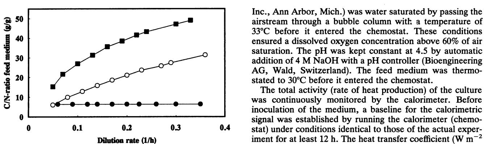
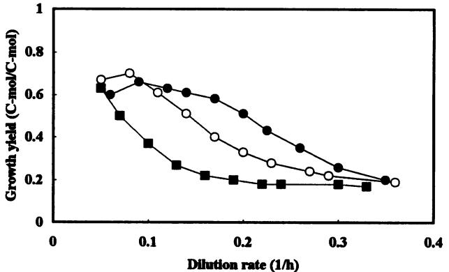
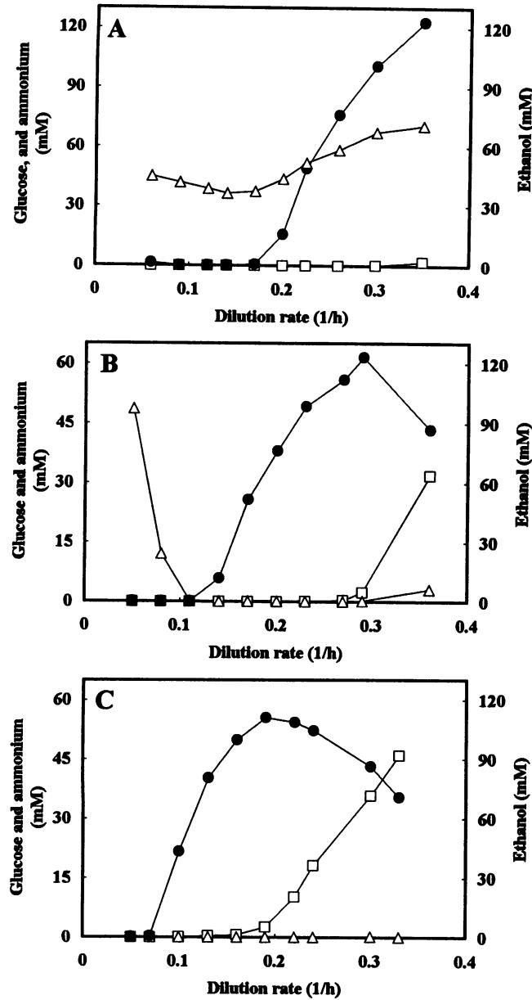
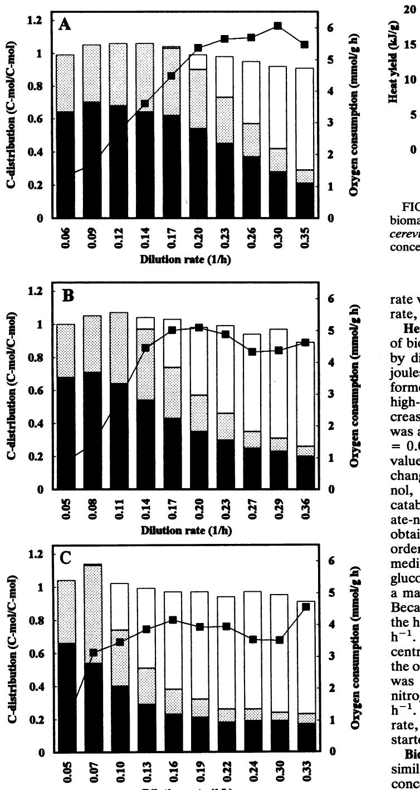
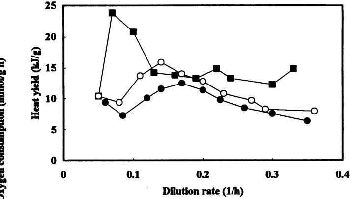
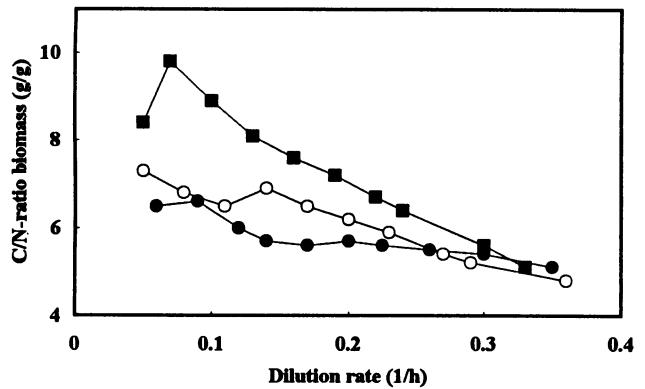

# Growth and Metabolism of Saccharomyces cerevisiae in Chemostat Cultures under Carbon-, Nitrogen-, or Carbon- and Nitrogen-Limiting Conditions

CHRISTER LARSSON,t* URS VON STOCKAR, IAN MARISON, AND LENA GUSTAFSSONt

Department of Chemical Engineering, Swiss Federal Institute of Technology, CH-1O15 Lausanne, Switzerland

Received 21 December 1992/Accepted 24 May 1993

Aerobic chemostat cultures of Saccharomyces cerevisiae were performed under carbon-, nitrogen-, and dual carbon- and nitrogen-limiting conditions. The glucose concentration was kept constant, whereas the ammonium concentration was varied among different experiments and different dilution rates. It was found that both glucose and ammonium were consumed at the maximal possible rate, i.e., the feed rate, over a range of medium C/N ratios and dilution rates. To a small extent, this was due to a changing biomass composition, but much more important was the ability of uncoupling between anabolic biomass formation and catabolic energy substrate consumption. When ammonium started to limit the amount of biomass formed and hence the anabolic flow of glucose, this was totally or at least partly compensated for by an increased catabolic glucose consumption. The primary response when glucose was present in excess of the minimum requirements for biomass production was an increased rate of respiration. The calculated specific oxygen consumption rate, at D = 0.07 h-', was more than doubled when an additional nitrogen limitation was imposed on the cells compared with that during single glucose limitation. However, the maximum respiratory capacity decreased with decreasing nitrogen concentration. The saturation level of the specific oxygen consumption rate decreased from 5.5 to 6.0 mmol/g/h under single glucose limitation to about 4.0 mmol/g/h at the lowest nitrogen concentration tested. The combined result of this was that the critical dilution rate, i.e., onset of fermentation, was as low as 0.10 h-1 during growth in a medium with a low nitrogen concentration compared with 0.20 hobtained under single glucose limitation.

During growth of Saccharomyces cerevisiae in a chemostat with glucose as the sole limiting substrate, energy rather than carbon limits biomass formation (7, 22, 29), i.e., it can be regarded as a catabolic limitation. If, on the other hand, a nitrogen source such as ammonium is used as the limiting substrate, this can instead be viewed as an anabolic limitation. Several studies, concerning bacteria, have shown that anabolism and catabolism do not seem to be tightly coupled (3, 5, 12, 16-20, 25). The catabolic activity is often higher than what can be explained by the anabolic requirements for ATP when the energy source is present in excess. When glucose-grown chemostat cultures of the bacterium Klebsiella aerogenes were subjected to a limitation other than a glucose limitation, it was found that the specific respiration rate increased compared with that of glucose-limited cells. In addition, when the energy source was in excess, the cells responded by excreting a number of products more oxidized than the carbon source, i.e., not a fermentative metabolism, a phenomenon named overflow metabolism (3, 12, 17-20, 25). K aerogenes is the most extensively studied in this respect, but several other bacteria seem to respond in a similar way (16, 20). In regards to the yeast S. cerevisiae, uncoupling between catabolism and anabolism has also been reported. When glucose-limited chemostat cultures of S. cerevisiae were pulsed with excess glucose, the catabolic activity increased more or less immediately, whereas the rate of biomass production remained unchanged for the first 30 min (26). However, these cells were adapted to an energy limitation when they were faced with a sudden energy excess

through glucose pulsing. In contrast, this work describes metabolic uncoupling under steady-state conditions for cells adapted to energy excess.

The main aim of this study was to investigate metabolic uncoupling of S. cerevisiae cultivated aerobically in chemostat cultures with glucose as a carbon and energy source. Uncoupling was induced by gradually decreasing the nitrogen concentration of the feed medium and thereby imposing an increasing anabolic constraint on the cells. Furthermore, S. cerevisiae is capable of both respiratory and fermentative metabolism, and the relative importance of these two pathways for uncoupling was determined.

The transition from one limitation to another is not very sharp (1, 12). Consequently, a dual limitation, in which both the carbon as well as the nitrogen substrate is limiting, may occur (3, 5, 6, 15). A limiting substrate is in this case defined by von Stockar and Auberson (31) as a substrate which is consumed at the maximal possible rate, i.e., the feed rate, and this rate is not determined by the concentration or feed rate of any other substance in the medium. Although both the carbon and nitrogen sources constitute limiting substrates if the dual limitation is induced by reducing the nitrogen concentration, the cells are facing an energy excess. Actually, glucose will be available-and also consumed-in excess of the minimum requirements for the formation of biomass that is possible in nitrogen-limited situations.

Finally, the influence of growth limitation, i.e., by carbon and/or nitrogen, and dilution rate on biomass composition was studied. An influence of C/N ratio in the medium on biomass composition has previously been reported for the bacteria Hyphomicrobium X (5) and Hyphomicrobium ZV620 (9) as well as for the yeasts Hansenula polymorpha (6) and Candida valida (15). For S. cerevisiae, it seems as if

* Corresponding author.

t Present address: Department of General and Marine Microbiology, University of Goteborg, S-413 19 Goteborg, Sweden.

cellular nitrogen concentration (27, 28). exponential or stationary phase of batch growth. The exper-

tion): glucose, 20 g; KH2PO4, 2 g; MgSO4 . 7H20, 0.4 g; determination of the elemental composition of the biomass. CaCl2 2H20, 0.2 g; NaCl, 0.5 g; yeast extract, 1 g; H3B03, Test for steady-state conditions. A constant heat producmyo-inositol, 25 mg; 1-alanine, 2.5 mg; biotin, 7 pLg; folic reactions in a cell give rise to a heat change; therefore, the ,g; pyridoxine hydrochloride, 400 ,ug; thiamine hydrochlo- activity of the culture (2, 8, 11). ride, 400 ,ug; riboflavin, 200 ,ug; and Sigma Antifoam A, 0.2 Dry weight determinations. Samples (two, 4 ml each) were

S04 concentration in the feed was constant at 6 g/liter is ±0.6%. stant, while the flow of an identical medium, lacking tion; Boehringer Mannheim GmbH, Mannheim, Germany). intermediate nitrogen concentration, while the second (4.6 prevent condensation of ethanol in the gas stream.

liters, the temperature was 30°C, and the stirring rate was 0.06% (wt/wt) for carbon, hydrogen, and nitrogen, respec-The sterile filtered air (pore size, 0.45 ,um; Gelman Sciences, and the duplicates differed by +0.01%. The ash content

6 10 ( t * * * * * * * * * | was continuously monitored by the calorimeter. Before inoculation of the medium, a baseline for the calorimetric 0 signal was established by running the calorimeter (chemo-0 0.1 0.2 03 0.4 stat) under conditions identical to those of the actual exper-Dilution rate (1/h) iment for at least 12 h. The heat transfer coefficient (W m-2 FIG. 1. Changes in the C/N ratio of the feed medium at different K-1) was then determined by measuring the response to the dilution rates for high (0)-, intermediate (0)-, and low (E)-nitrogen- activation of a 10-W in situ calibration heater for 20 min. The concentration media. principles of the calorimetric measurement procedure have been described previously (32).

After inoculation, substrate feeds for continuous operathe growth rate is an important parameter in determining the tion were initiated once the cells had reached the late iments were always performed by starting at the lowest MATERIALS AND METHODS dilution rate and subsequently increasing the dilution rate step by step. Apart from continuous on-line measurement of Yeast strain and media. S. cerevisiae CBS 426 was main- the rate of heat production by the cells, samples were taken, tained on YPD agar slants (1% [wt/vol] yeast extract, 2% once a steady state had been established, for determination peptone, 2% glucose, and 2% agar). Cells were cultured in a of biomass concentration and extracellular concentrations of medium having the following composition (per liter of solu- glucose, ethanol, acetate, glycerol, and ammonium and for

1 mg; ZnSO4 - 7H20, 1 mg; MnCl2, 1 mg; FeCl3 3H20, 0.5 tion rate, as recorded by the calorimeter, was used as the mg; CUS04 *5H20, 0.1 mg; Na2MoO4, 1 mg; KI, 0.1 mg; criterion for the establishment of steady-state conditions. All acid, 2 ,ug; p-aminobenzoic acid, 200 pg; nicotinic acid, 400 calorimetric technique can be used as a measure of the total

ml. centrifuged for 5 min at 3,500 x g, washed twice with The concentration of (NH4)2SO4 was varied between the deionized water, dried for 24 h at 105°C, and stored in a different experiments. The experiment in which the (NH4)2 desiccator before being weighed. The duplicates differed by

referred to in the text as the high or highest nitrogen Determinations of glucose, ethanol, acetate, glycerol, and concentration in medium. In the remaining experiments, the ammonium concentrations. Samples (two, 4 ml each) were feed concentration of (NH4)2SO4 was different for each centrifuged for 5 min at 3,500 x g. The supernatants were dilution rate. This was achieved by the use of two indepen- stored in the freezer (-20°C). Glucose, ethanol, acetate, dently controlled medium flow rates. The flow of the first glycerol, and ammonium concentrations were determined medium, containing (NH4)2SO4, was maintained at a con- with enzyme combination kits (Biochemica Test Combina-

(NH4)2S04, was varied in order to achieve the desired Gas analysis. The concentrations of CO2 and ethanol in the dilution rate. Thus, increasing the dilution rate resulted in a exhaust gas stream from the reactor were determined by decrease in the feed concentration of (NH4)2SO4. Further- infrared spectroscopy (model PSA-401; Servomex, Crowmore, two different reservoir concentrations of (NH4)2SO4 borough, United Kingdom). The sample line from the reacwere employed. The first (13.4 g/liter) is referred to as the tor and the gas distribution system were heated in order to

g/liter) is referred to as low or lowest nitrogen concentration Determination of elemental composition and ash and residin medium. The resulting C/N ratios of the feed medium at ual water content of the biomass. The procedure used for different dilution rates are shown in Fig. 1. determination of elemental composition and enthalpy of Growth conditions and calorimetry. The chemostat cul- combustion of biological material has been described previtures were conducted in a 2-liter bench-scale calorimeter ously by Gurakan et al. (10). The elemental composition of (model RC-1; Mettler-Toledo AG, Greifensee, Switzerland) each sample of freeze-dried biomass samples was measured modified for biological work. The working volume was 1.5 four times, and the standard deviations were 0.11, 0.11, and 700 rpm. Aeration was controlled at 1.5 volume of air per tively. The residual water and ash determinations were volume of liquid per minute by a mass flow meter (5850 TR; performed in duplicate. The residual water content ranged Brookes Instrument, B.V., Veenendal, The Netherlands). from 5.13 to 8.15% (wt/wt) of the lyophilized sample weight,

ranged from 6.76 to 10.71% (wt/wt), and the duplicates differed by ±0.02%.

Calculation of carbon flow and oxygen consumption. The fractions of the carbon substrate used for anabolism (Sa) and catabolism (Se) were calculated for different dilution rates and different C/N ratios in medium. In addition, the catabolic fraction was further divided into a respiratory (Scr) and a fermentative (SCf) part.

The anabolic fraction (Sa, C-mol per C-mol; 1 C-mol is the amount of an organic compound containing 1 mol [e.g., 12 g, of carbon]) was determined by dividing the measured rate of biomass produced (dX/dt, C-mol per liter per hour) and the accompanying carbon dioxide (dCO2,/dt, C-mol per liter per hour) by the measured rate of glucose consumed (dS/dt, C-mol per liter per hour):

$$\mathbf{S}_a = [(d\mathbf{X}/dt) + (d\mathbf{CO}_{2a}/dt)](d\mathbf{S}/dt)$$

The rate of carbon dioxide produced in anabolism was determined by using the concept of degree of reduction (14, 22). The biomass carbon content was determined by an elemental analyzer, and the results were calculated on an ash- and water-free basis (see above).

The catabolic fermentative part (SCP C-mol per C-mol) was calculated by dividing the measured rates of formation of the fermentation products (dP/dt, C-mol per liter per hour) ethanol, acetate, glycerol, and the corresponding carbon dioxide by the rate of glucose consumed (dSldt, C-mol per liter per hour):

$$\mathcal{S}_{\mathbf{q}'} = (dP/dt)(dS/dt)$$

The carbon dioxide formed in the fermentative pathways (dCOQ/dt, C-mol per liter per hour) could be determined, since 1 C-mol of acetate or ethanol produced corresponds to 0.5 C-mol of carbon dioxide formed.

The catabolic respiratory part (Sc, C-mol per C-mol) was calculated by taking the measured total rate of carbon dioxide produced (dCO2,,0dt, C-mol per liter per hour) minus the carbon dioxide production rate which accompanied the formation of fermentation products (dCO2/dt, C-mol per liter per hour) and biomass (dCO2ajdt, C-mol per liter per hour) and dividing by the rate of glucose consumed (dS/dt, C-mol per liter per hour):

$$S_{cr} = [(d\text{CO}_{2tot}/dt) - (d\text{CO}_{2f}/dt) - (d\text{CO}_{2o}/dt)]/(dS/dt)$$

The specific oxygen consumption rate (dO2spldt, moles per gram per hour) was obtained by taking the measured total rate of carbon dioxide produced (dCO2,,Jdt, C-mol per liter per hour) minus the carbon dioxide production which accompanies the formation of ethanol (dCO2,tOhldt, C-mol per liter per hour) and biomass (dCO2jdt, C-mol per liter per hour) minus 0.5 times the rate of glycerol produced (dGlyc/ dt, moles per liter per hour) divided by the actual biomass concentration (X, grams per liter):

$$d\text{O}_{2sp}/dt = \left[ (d\text{CO}_{2tot}/dt) - (d\text{CO}_{2stob}/dt) \right]$$

$$- \left( d\text{CO}_{2d}/dt \right) - [0.5 \cdot (d\text{Mgc}/dt)]/X$$

Production of 1 mol of glycerol consumes 1 mol of NADH, and 0.5 mol less 02 will be consumed per mol of glycerol produced. Carbon dioxide production accompanying acetate formation is followed by production of NADH, i.e., 1 CO2 produced yields 2 NADH and hence consumption of 1 02- Consequently, the 02 consumption is already accounted for by the dCO2,tjdt term.

FIG. 2. Changes in growth yield at different dilution rates during growth of S. cerevisiae in high (0)-, intermediate (0)-, and low (-)-nitrogen-concentration media.

The results are shown in Fig. 4 for the different nitrogen concentrations in medium. The heights of the columns also show the carbon balance for each dilution rate; ideally, this should always equal 1. The average values of the carbon balance for the different dilution rates were 0.99 ± 0.05 (standard deviation; n = 10) during growth in high and intermediate nitrogen concentrations in medium and 0.99 + 0.06 (standard deviation; n = 10) during growth in lownitrogen medium. It was assumed in all the calculations that the carbon content of the yeast extract, measured to 32.05 mmol of C per g, was consumed. Calculations on the assumption that none of the carbon content of the yeast extract was consumed yielded an average carbon balance of 1.05, indicating that the former assumption is more correct.

In addition, calculations were also made to determine the respiratory yield (SrX, C-mol per C-mol). The respiratory yield was calculated by dividing the rate of glucose respired (dScrgdt, C-mol per liter per hour) by the rate of biomass formation (dX/dt, C-mol per liter per hour) plus the accompanying carbon dioxide production (dCO2,/dt, C-mol per liter per hour):

$$S_{r\&} = (dS_{cr}/dt) \left[ (dX/dt) + (d\mathbf{CO}_{2a}/dt) \right]$$

The respiratory yield can be obtained from Fig. 4 by dividing the size of the respiratory fraction (grey part) with the size of the anabolic fraction (black part) of the bars.

### RESULTS

Chemostat cultures of S. cerevisiae were performed at different dilution rates and at different C/N ratios of the medium.

Growth characteristics. (i) High N concentration. When the nitrogen feed concentration was high, the growth yield remained approximately constant over the dilution rate range 0.06 to 0.17 h-1 (Fig. 2). Above 0.17 h-1, the growth yield fell with increasing D. In these experiments, glucose was the sole limiting substrate, as shown by the low residual glucose concentration (Fig. 3A), while the residual ammonium concentration remained above 36 mM for all values of D (Fig. 3A). The critical dilution rate, Dc, representing the onset of respirofermentative activity, was 0.20 h-, as shown by the appearance of ethanol in the medium. At values of D < 0.20 h-1, the ethanol concentration was <1

FIG. 3. Changes in measured parameters at different dilution rates during growth of S. cerevisiae in high (A)-, intermediate (B)-, and low (C)-nitrogen-concentration media. Residual glucose (0), ammonium (A), and extracellular ethanol (0) concentrations are shown.

mM, while the maximum concentration (123 mM) was observed at the highest dilution rate (0.35 h- ) tested (Fig. 3A).

(ii) Intermediate N concentration. Three distinct phases could be distinguished. (i) D = 0.05 to 0.08 h-1. This was characterized by a high growth yield (Fig. 2), low residual glucose (<0.4 mM), and high residual ammonium concentration (>12 mM) (Fig. 3B) and corresponds to glucose limitation of the culture. (ii) D = 0.11 to 0.26 h-1. This was characterized by a reduced growth yield, low residual glucose (<0.4 mM), and low residual ammonium concentration (<0.3 mM) and corresponds to dual carbon and nitrogen limitation of the culture. (iii) D > 0.29 h-1, where the growth yield continued to fall and the residual glucose concentration

increased, whereas the ammonium concentration remained low (Fig. 2 and 3B). This phase corresponds to a nitrogenlimited culture. Furthermore, DC decreased (0.14 h-1) compared with the high-N-concentration experiment, and the maximum ethanol concentration of 123 mM was obtained at D = 0.29 h-1.

(iii) Low N concentration. In this case, the growth yield fell continuously with increasing dilution rate (Fig. 2). The residual ammonium concentration remained low (<0.3 mM) over the whole range of dilution rates studied while the residual glucose concentration was <1 mM up to D = 0.16 h-1 and increased at higher values of D (Fig. 3C). Thus, two distinct phases could be distinguished: (i) D ' 0.16 h-1 characterized by low residual glucose and ammonium concentrations and corresponding to a dual carbon and nitrogen limitation of the culture and (ii) D 2 0.19 h-1, characterized by an increasing residual glucose and low residual ammonium concentrations (Fig. 3C), corresponding to nitrogen limitation of the culture. Furthermore, DC decreased (0.10 h-1) compared with both of the previous experiments, and the maximum ethanol concentration of 111 mM was obtained atD = 0.19 h-1.

Carbon flow and oxygen consumption. (i) High N concentration. The anabolic fraction remained more or less constant between D = 0.06 h-1 and D = 0.17 h-1 (Fig. 4A). In this interval, there was no fermentation; only respiration occurred. Consequently, there was a steady increase in oxygen consumption with increasing dilution rate. The ratio of glucose respired per biomass formed, the so-called respiratory yield, attained its maximal value of 0.66 C-mol/C-mol at D = 0.17 h-1. Fermentation was used in addition to respiration at D = 0.20 h-1. The oxygen consumption rate of 5.4 mmol/g/h at this dilution rate seemed to be close to the maximum capacity during these conditions (Fig. 4A). The fermentative part accounted for almost all of the increased consumption rate of glucose as the dilution rate was increased above 0.20 h-1 (Fig. 4A).

(ii) Intermediate N concentration. At D = 0.11 h-1, the anabolic fraction already started to decrease (Fig. 4B). At this point, the respiratory yield began to increase, and the maximum value of 0.79 C-molIC-mol was obtained at D = 0.14 h-1. Fermentation in addition to respiration started to appear at a dilution rate of 0.14 h-1 (Fig. 4B). The specific oxygen consumption rate seemed to have reached its maximum value of about 5.0 mmol/g/h at D = 0.17 h-1. The respiratory rate remained more or less constant, whereas the fermentation rate increased when the dilution rate was increased above 0.17 h-1 (Fig. 4B).

(iii) Low N concentration. The anabolic fraction decreased continuously with increasing dilution rate up to D = 0.22 h-1 (Fig. 4C). Further increase of the dilution rate resulted in a constant anabolic fraction of approximately 0.18 C-mol/Cmol. The respiratory yield was very high, with a maximum value of 1.09 C-molIC-mol at D = 0.07 h-1. In fact, the values for this ratio at the three different dilution rates 0.07, 0.10, and 0.13 h-1 were all well above the maximum value obtained during growth in the highest nitrogen concentration in the feed medium (Fig. 4A and C). Consequently, the oxygen consumption rate increased rapidly with increasing D at low dilution rates. Fermentation in addition to respiration started at D = 0.10 h-1. The specific oxygen consumption rate at this point was 3.5 mmol/g/h (Fig. 4C). When the dilution rate was further increased, the fermentative rate increased; there was also a small increase in the respiratory rate as well. The maximum specific oxygen consumption

FIG. 4. Changes in carbon flow and specific oxygen uptake rate at different dilution rates during growth of S. cerevisiae in high (A)-, intermediate (B)-, and low (C)-nitrogen-concentration media. The calculated specific oxygen consumption rate (U) and fraction of glucose used for biomass production (black bar), respiration (grey bar), and fermentation (unfilled bar) are shown. The total heights of the columns also show the carbon balance at each dilution rate.

Dilution rate (1/h)

FIG. 5. Changes in the heat yield (heat produced per unit of 0 biomass formed) at different dilution rates during growth of S. cerevisiae in high (0)-, intermediate (0)-, and low (-)-nitrogenconcentration media.

rate was about 4.0 mmol/g/h (except for the highest dilution rate, at which 4.6 mmol/g/h was recorded).

Heat production. The amount of heat produced per amount of biomass formed, the so-called heat yield, was calculated by dividing the steady-state rate of heat production (kilojoules per liter per hour) by the rate of ash-free biomass formed (grams per liter per hour). During growth in the high-nitrogen-concentration medium, the heat yield increased with increasing dilution rate as long as fermentation was absent (Fig. 5). The values increased from 9.4 kJ/g at D = 0.06 h-' to 12.5 kJ/g at D = 0.17 h-1, with a very low value of 7.3 kJ/g at D = 0.09 h-1. Because of the small heat change accompanying the fermentation of glucose to ethanol, the heat yield decreased as the fermentative part of catabolism became increasingly important. In the intermediate-nitrogen-concentration medium, the heat yield values obtained for the two lowest dilution rates were of the same order of magnitude as in the high-nitrogen-concentration medium (Fig. 5). However, as nitrogen, in addition to glucose, became limiting, the heat yield values increased to a maximum of 15.9 kJ/g at D = 0.14 h-1 (Fig. 3B and 5). Because of the increased fermentative part of catabolism, the heat yield started to decrease at dilution rates above 0.14 h-1. Furthermore, during growth in the low-nitrogen-concentration medium, the heat yield value was comparable to the others at the lowest dilution rate (Fig. 5). However, there was a dramatic increase in the heat yield to 23.8 kJ/g as nitrogen in addition to glucose became limiting at D = 0.07 h-1. As observed before, with an increase in fermentation rate, at dilution rates above 0.07 h-1, the heat yield values started to decrease.

Biomass composition. The carbon content was more or less similar during growth at all dilution rates and nitrogen concentrations in medium, with typical values of 50% (wt/ wt). There was, however, a slight tendency to a lower carbon content at the very lowest dilution rates in all three media, with values of about 48%. The hydrogen content was always about 7% irrespective of dilution rate and medium composition. For the glucose-limited culture during growth in the high-nitrogen-concentration medium, there was a steady increase in nitrogen content of the biomass from 7.5% at D = 0.06 h-1 to 9.6% at D = 0.35 h-1. Consequently, the C/N ratio of the biomass decreased from 6.6 to 5.1 g of C per g of N with increasing dilution rate (Fig. 6). When ammo-

FIG. 6. Changes in the biomass C/N ratio at different dilution rates during growth of S. cerevisiae in high (0)-, intermediate (0)-, and low (E)-nitrogen-concentration media.

nium also became limiting during growth in intermediateand low-nitrogen-concentration media at the dilution rates 0.14 and 0.07 h-', respectively, the nitrogen content of the biomass decreased. The result was that the C/N ratio of the biomass made a shift in the otherwise steady decrease with increasing dilution rate (Fig. 6). When the dilution rate was further increased, above the point at which ammonium started to become limiting, the C/N ratio of the biomass decreased again continuously with increasing dilution rate (Fig. 6). This is despite the fact that the actual nitrogen concentration in the feed medium decreased with increasing dilution rate (Fig. 1). The lowest nitrogen content of the biomass was 5.2% obtained at D = 0.07 h-1 during growth in low-nitrogen-content medium, resulting in a C/N ratio of the biomass of 9.8 g of C per g of N.

#### DISCUSSION

When S. cerevisiae is grown aerobically in a chemostat under glucose limitation, a strictly respiratory metabolism is obtained at low dilution rates. However, as the dilution rate is increased above a certain critical value, fermentation in addition to respiration becomes apparent, a behavior which has been attributed to the limited respiratory capacity of S. cerevisiae (21, 24). This study showed that the value of the critical dilution rate was very much dependent on the nitrogen concentration of the medium. During growth in the lowest-nitrogen-concentration medium, significant amounts of ethanol were produced at a dilution rate as low as 0.10 h- 1 (Fig. 3C). When a nonlimiting concentration of ammonium was supplied and only glucose was limiting, ethanol was not detected until a dilution rate of 0.20 h-1 (Fig. 3A). The reason for this behavior seems to be that the maximum respiratory capacity, i.e., the maximum specific oxygen consumption rate, decreased with decreasing nitrogen concentrations in the medium (Fig. 4). The maximum value decreased from about 5.5 to 6.0 mmol/g/h under single glucose-limiting conditions during growth in the highestnitrogen-concentration medium, down to 4.0 mmol/g/h at the lowest nitrogen concentration tested. Similar to the observations by Rieger et al. (21), the specific consumption rate of oxygen remained more or less constant when the dilution rate was increased above the critical value (Fig. 4). The small decrease in nitrogen concentration in the medium with increasing dilution rates, at dilution rates above the critical value, did not seem to affect the oxygen consumption rate.

This is not surprising, since as shown in Fig. 1, this decrease was very small compared with the differences in nitrogen concentrations in the medium among the three different experiments. Both the critical dilution rate as well as the maximal specific oxygen consumption rate were somewhat lower compared with those reported by Rieger et al. (21), who used a different strain of S. cerevisiae. Increasing the dilution rate in small steps as suggested by Rieger et al. (21) did not change the situation. Ethanol always accumulated at a dilution rate of about 0.20 h-1 when glucose was the sole limiting substrate.

However, not only the fermentation rate was affected by the nitrogen concentration of the medium. In fact, the primary response when ammonium started to limit the amount of biomass formed was an increased rate of respiration. The amount of glucose respired per amount of biomass formed, the so-called respiratory yield, increased from a maximum value of 0.66 C-mol/C-mol during single glucose limitation to a maximum value of 1.09 C-mol/C-mol during growth at the lowest nitrogen concentration (calculated from Fig. 4A and C). Consequently, the specific oxygen consumption rate was more than doubled during growth at D = 0.07 h-1 under dual carbon and nitrogen limitation compared with single glucose limitation at similar dilution rates (Fig. 4). The increased respiratory yield was not due to an increased acetate concentration during growth in the lownitrogen-concentration medium. The acetate concentrations were between 0.5 and 1.0 mM irrespective of nitrogen concentration in the medium (data not shown). When the respiratory capacity became saturated, an increased rate of fermentation was observed. To summarize, as the C/N ratio of the feed medium increased and nitrogen started to limit the anabolic flow of carbon, this was compensated for, totally or at least in part, by an increased catabolic carbon flow.

An increased catabolic compared with anabolic flow might result in an overproduction of ATP unless the cells are able to adjust either the amount of ATP produced or the ATP yield. An increased degree of fermentation relative to respiration at conditions of low nitrogen concentration may be a way of producing less ATP when the requirement is decreased in the anabolic pathway because of the limited supply of nitrogen. Of course, the decrease in the maximum specific oxygen consumption rate might also simply be a reflection of a reduced synthesis of nonessential respiratory enzymes during nitrogen-limiting conditions. However, the increased respiratory yield when an additional nitrogen limitation was imposed on the cells implies that the ATP yield and/or the P/O ratio must be able to change. Assuming a constant ATP yield and adopting the value of 16 g of biomass per mol of ATP reported for S. cerevisiae under optimal growth conditions (28) yielded a P/O ratio of about 1 to 1.5 during glucose limitation at low dilution rates and values of about 0.3 at high dilution rates under nitrogen limitation. If instead a fixed P/O ratio of 1 is used (23, 29, 30), the corresponding ATP yield can be calculated to a maximum of about 20 g per mol of ATP under glucose limitation and low dilution rates down to values below 10 g of biomass per mol of ATP under nitrogen limitation. In fact, even for the culture in which only glucose was limiting, a decrease in the ATP yield could be calculated with increasing dilution rate. Assuming a P/O ratio of 1 gave an average ATP yield of about 18 g of biomass per mol of ATP at low dilution rates whereas the value at high dilution rates was about 13 g of biomass per mol of ATP. This is in line with the results obtained for anaerobically grown glucose-limited cultures of

S. cerevisiae, in which a decrease in the ATP yield was obtained with increasing dilution rate (28). It has also been argued that a constant YATp value for S. cerevisiae at different dilution rates is highly unlikely, since the protein content increases significantly with increasing growth rate (27-29).

The obtained heat yield values (Fig. 5) below the critical dilution rate support the view that the ATP yield and/or the efficiency of energy generation, i.e., the P/O ratio, decreased with increasing dilution rate and when an additional nitrogen limitation was introduced, i.e., the heat yield increased. The maximum value was 23.8 kJ/g compared with 12.5 kJ/g of biomass formed during growth in low- and high-nitrogenconcentration media, respectively. At dilution rates above the critical value, the heat yield decreased (Fig. 5) because of the very low heat change accompanying fermentation of glucose to ethanol compared with respiration of glucose. Respiration of glucose yields -468.7 kJ/C-mol, whereas fermentation only provides -16.7 kJ/C-mol (14). Nevertheless, the heat yield values obtained at different dilution rates above the critical value were significantly higher during growth in the lowest-nitrogen-concentration medium compared with growth under single glucose limitation (Fig. 5). This was despite the fact that the fermentative part was even more dominating during growth in the lowest-nitrogen-concentration medium. Part of the increased heat yield and the suggested decrease in ATP yield during growth in low nitrogen concentrations can most probably be explained by an increased uncoupling between ATP production and biomass formation during these conditions. However, it is also probable that the decrease in ATP yield and increase in heat yield are in part due to the increased energy requirements for ammonium transport during growth in the low nitrogen concentration. The Km values of the two ammonium transport systems in S. cerevisiae have been reported to be 2 and 0.25 mM (4).

It seemed as if the cells changed their C/N ratio of the biomass according to the C/N ratio of the feed medium at low dilution rates. However, this relationship between biomass and C/N ratio of the medium gradually disappeared as the dilution rate increased. The C/N ratios of the biomass at the highest dilution rates tested were 5.1, 4.8, and 5.1 g of C per g of N in high-, intermediate-, and low-nitrogen-concentration media, respectively (Fig. 6). The increase in C/N ratio with increasing D is probably, at least in part, due to a decreasing content of reserve carbohydrates at high dilution rates (13). However, if this was the only reason for the difference in C/N ratio it should also be reflected in a changing carbon content of the cells. This was not the case, except for the very lowest dilution rates, at which a slightly lower carbon content of the biomass was obtained. Consequently, the main reason for the decreasing C/N ratio at high dilution rates is probably an increasing protein content under these conditions (27, 28). This view is supported by the fact that the nitrogen content of the biomass did increase with increasing dilution rates.

To summarize, the primary response when nitrogen started to limit biomass formation and the energy and carbon source was present in excess was an increased respiratory activity. When the respiratory capacity became saturated, an increased rate of fermentation was observed. The saturation level of respiration decreased with decreasing nitrogen concentration in medium. Consequently, the critical dilution rate, i.e., onset of fermentation, decreased concomitantly with decreasing nitrogen concentrations in the medium. Both the energy and carbon source (glucose) as well as the

nitrogen source (ammonium) were limiting over a range of dilution rates and medium C/N ratios. This dual limitation was to a small extent due to a changing biomass composition, but much more important was the ability of uncoupling between anabolic biomass formation and catabolic energy substrate consumption.

## ACKNOWLEDGMENT

This work was supported by a grant from the Swiss National Science Foundation (FNRS).

#### REFERENCES

- 1. Aiking, H., and D. W. Tempest. 1976. Growth and physiology of Candida utilis NCYC 321 in potassium-limited chemostat culture. Arch. Microbiol. 108:117-124.
- 2. Belaich, J. P. 1980. Growth and metabolism in bacteria, p. 1-42. In A. E. Beezer (ed.), Biological microcalorimetry. Academic Press, Ltd., London.
- 3. Cooney, C. L., D. I. C. Wang, and R. I. Mateles. 1976. Growth of Enterobacter aerogenes in a chemostat with double nutrient limitations. Appl. Environ. Microbiol. 31:91-98.
- 4. Dubois, E., and M. Grenson. 1979. Methylamine/ammonia uptake systems in Saccharomyces cerevisiae: multiplicity and regulation. Mol. Gen. Genet. 175:67-76.
- 5. Duchars, M. G., and M. M. Attwood. 1989. The influence of C:N ratio in the growth medium on the cellular composition and regulation of enzyme activity in Hyphomicrobium X. J. Gen. Microbiol. 135:787-793.
- 6. Egli, T., and J. R. Quayle. 1986. Influence of the carbon: nitrogen ratio of the growth medium on the cellular composition and the ability of the methylotrophic yeast Hansenula polymorpha to utilize mixed carbon sources. J. Gen. Microbiol. 132: 1779-1788.
- 7. Erickson, L. E. 1987. Energy requirements in biological systems, p. 14-33. In A. M. James (ed.), Thermal and energetic studies of cellular biological systems. IOP Publishing, Limited, Bristol, England.
- 8. Gnaiger, E. 1983. Heat dissipation and energetic efficiency in animal anoxibiosis: economy contra power. J. Exp. Zool. 228:471-490.
- 9. Grazer-Lampart, S., T. Egli, and G. Hamer. 1986. Growth of Hyphomicrobium ZV620 in the chemostat: regulation of NH4' assimilating enzymes and cellular composition. J. Gen. Microbiol. 132:3337-3347.
- 10. Gurakan, T., I. W. Marison, U. von Stockar, L. Gustafsson, and E. Gnaiger. 1990. Proposals for a standardized sample handling procedure for the determination of elemental composition and enthalpy of combustion of biological material. Termochim. Acta 172:251-266.
- 11. Gustafsson, L. 1987. Microcalorimetry as a tool in microbiology and microbial ecology, p. 167-181. In M. A. Sleigh (ed.), Microbes in the sea. Ellis Horwood, Limited, Chichester, United Kingdom.
- 12. Hueting, S., and D. W. Tempest. 1979. Influence of the glucose input concentration on the kinetics of metabolite production by Kiebsiella aerogenes NCTC 418: growing in chemostat culture in potassium- or ammonia-limited environments. Arch. Microbiol. 123:189-194.
- 13. Kuenzi, M. T., and A. Fiechter. 1972. Regulation of carbohydrate composition of Saccharomyces cerevisiae under growth limitation. Arch. Microbiol. 84:254-265.
- 14. Larsson, C., A. Blomberg, and L. Gustafsson. 1991. Use of microcalorimetric monitoring in establishing continuous energy balances and in continuous determinations of substrate and product concentrations of batch-grown Saccharomyces cerevisiae. Biotechnol. Bioeng. 38:447-458.
- 15. Minkevitch, I. G., A. Y. Krynitskaya, and V. K. Eroshin. 1988. A double substrate limitation zone of continuous microbial growth, p. 171-184. In P. Kyslik, E. A. Dawes, V. Krumphanzl, and M. Nowak (ed.), Continuous culture. 41st FEMS Sympo-

sium. Academic Press, Ltd., London.

- 16. Neossel, 0. M., E. T. Buurman, and M. J. Teixeira de Mattos. 1990. The role of futile cycles in the energetics of bacterial growth. Biochim. Biophys. Acta 1018:252-255.
- 17. Neijssel, 0. M., and D. W. Tempest. 1975. The regulation of carbohydrate metabolism in Klebsiella aerogenes NCTC 418 organisms, growing in chemostat culture. Arch. Microbiol. 106:251-258.
- 18. Neijssel, 0. M., and D. W. Tempest. 1976. Bioenergetic aspects of aerobic growth of Kiebsiella aerogenes NCTC 418 in carbonlimited and carbon-sufficient chemostat culture. Arch. Microbiol. 107:215-221.
- 19. Neijssel, 0. M., and D. W. Tempest. 1976. The role of energyspilling reactions in the growth of Klebsiella aerogenes NCTC 418 in aerobic chemostat culture. Arch. Microbiol. 110:305-311.
- 20. Neijssel, 0. M., and D. W. Tempest. 1979. The physiology of metabolite overproduction, p. 53-82. In A. T. Bull, D. C. Ellwood, and C. Ratledge (ed.), Microbial technology: current state, future prospects. Proceedings of the 29th Symposium of the Society for General Microbiology. Cambridge University Press, London.
- 21. Rieger, M., 0. Kiippeli, and A. Fiechter. 1983. The role of limited respiration in the incomplete oxidation of glucose by Saccharomyces cerevisiae. J. Gen. Microbiol. 129:653-661.
- 22. Roels, J. A. 1983. Energetics and kinetics in biotechnology. Elsevier Biomedical Press, Amsterdam.
- 23. Rogers, P. J., and P. R. Stewart. 1974. Energetic efficiency and maintenance energy characteristics of Saccharomyces cerevisiae (wild type and petite) and Candida parapsilosis grown aerobically and micro-aerobically in continuous culture. Arch. Microbiol. 99:25-46.
- 24. Sonnleitner, B., and 0. KAppeli. 1986. Growth of Saccharomy-

ces cerevisiae is controlled by its limited respiratory capacity: formulation and verification of a hyphothesis. Biotechnol. Bioeng. 28:927-937.

- 25. Tempest, D. W., and 0. M. NeUssel. 1984. The status of YATP and maintenance energy as biologically interpretable phenomena. Annu. Rev. Microbiol. 38:459-486.
- 26. van Urk, H., P. R. Mak, W. A. Scheffers, and J. P. van Djken. 1988. Metabolic responses of Saccharomyces cerevisiae CBS 8066 and Candida utilis CBS 621 upon transition from glucose limitation to glucose excess. Yeast 4:283-291.
- 27. Verduyn, C., E. Postma, W. A. Scheffers, and J. P. van Djken. 1990. Physiology of Saccharomyces cerevisiae in anaerobic glucose-limited chemostat cultures. J. Gen. Microbiol. 136:395- 403.
- 28. Verduyn, C., E. Postma, W. A. Scheffers, and J. P. van DUken. 1990. Energetics of Saccharomyces cerevisiae in anaerobic glucose-limited chemostat cultures. J. Gen. Microbiol. 136:405- 412.
- 29. Verduyn, C., A. H. Stouthamer, W. A. Scheffers, and J. P. van Diken. 1991. A theoretical evaluation of growth yields of yeasts. Antonie van Leeuwenhoek 59:49-63.
- 30. von Meyenburg, H. K. 1969. Energetics of the budding cycle of Saccharomyces cerevisiae during glucose limited aerobic growth. Arch. Microbiol. 66:289-303.
- 31. von Stockar, U., and L. C. M. Auberson. 1992. Chemostat cultures of yeasts, continuous culture fundamentals and simple unstructured mathematical models. J. Biotechnol. 22:69-88.
- 32. von Stockar, U., and I. W. Marison. 1989. The use of calorimetry in biotechnology, p. 94-136. In A. Fiechter (ed.), Advances in biochemical engineering. Biotechnology, vol. 40. Springer-Verlag, Berlin.