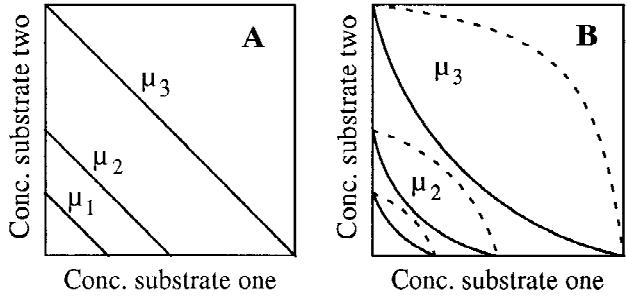
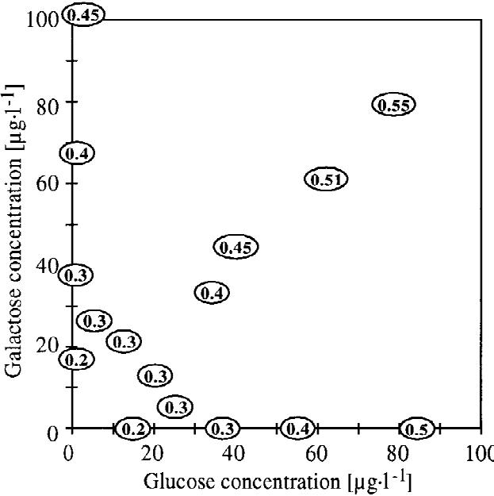
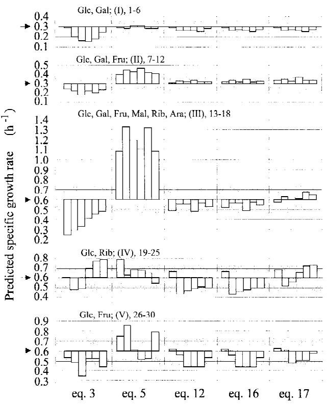

#### **Kinetic Models for the Growth of Escherichia coli with Mixtures of Sugars under Carbon-Limited Conditions**

# **Urs Lendenmann,* Thomas Egli**

Swiss Federal Institute for Environmental Science and Technology (EAWAG), Swiss Federal Institute of Technology (ETH), Überlandstrasse 133, CH-8600 Du¨ bendorf, Switzerland; tel +41 1 823 5158; fax +41 1 823 5547

Received 12 May 1997; accepted 19 November 1997

**Abstract:** In natural environments, heterotrophic microorganisms encounter complex mixtures of carbon sources, each of which is present only at very low concentrations. Under such conditions no significant growth could be expected if cells utilized only one of the available carbon compounds as suggested by the principle of diauxic growth. Indeed, there is much evidence that microbial cells utilize many carbon sources simultaneously. In order to predict bacterial growth under such conditions we developed a model describing the specific growth rate as a function of the individual concentrations of several simultaneously utilized carbon substrates. Together with multisubstrate models previously published, this model was evaluated for its ability to describe growth of Escherichia coli during the simultaneous utilization of mixtures of sugars in carbon-limited continuous culture. Using the µmax and Ks constants determined for single substrate growth with six different sugars, the model was able for most experiments to adequately describe the specific growth rate of the culture, i.e., the experimentally set dilution rate, from the measured concentrations of the individual sugars. The model provides an explanation why bacteria can still grow relatively fast under environmental conditions where the concentrations of carbon substrates are usually extremely low. © 1998 John Wiley & Sons, Inc. Biotechnol Bioeng**59:** 99–107, 1998.

**Keywords:** Monod kinetics; mixed substrate growth; continuous culture

## **INTRODUCTION**

Many models have been proposed which relate the specific growth rate to the concentration of a growth-limiting medium component. A selection of them have been discussed and evaluated in previous publications (see e.g., Powell, 1967; Koch, 1982; Senn et al., 1994). Amongst them the model of Monod (1942) is most widely used. All these models are based on the assumption that the concentration

*Correspondence to:* T. Egli

of one single growth-limiting medium component determines the rate of growth. However, it has been demonstrated that the growth rate is also influenced by the complexity of the medium composition (Schaechter et al., 1958). This indicates that single-substrate growth models are applicable only under laboratory conditions for synthetic media in which the growth-limiting nutrient is supplied as a single compound. Nevertheless, these models have been used widely for describing bacterial growth in ecosystems (Kuenen and Harder, 1982; Veldkamp and Jannasch, 1972) and wastewater treatment plants (Henze et al., 1987). Therefore, it remains to be established whether or not the known models are able to describe bacterial growth in nature where microbes always encounter complex mixtures of nutrients (Mu¨nster, 1993) many of which are utilized simultaneously.

Presently, nutrients are classified with respect to their physiological function: substrates that serve the same physiological purpose, e.g., a mixture of carbon substrates, are called homologous, and compounds that satisfy different metabolic requirements, e.g., one serving as carbon and the other as nitrogen source, are referred to as heterologous or complementary substrates (Harder and Dijkhuizen, 1976). Concepts for the identification of the growth-limiting nutrient (Sykes, 1973; Bader, 1982; Egli, 1991) and models describing growth rate as a function of the concentrations of complementary nutrients (Megee et al., 1972; Mankad and Bungay, 1988; Haas, 1994) have been published. However, little is known about the kinetics of growth with homologous substrates.

The growth of heterotrophic microbes with mixtures of carbon substrates is of particular interest because in most ecosystems carbon-limitation seems to be predominant (Kjelleberg et al., 1993) and carbon is present in a very large number of different compounds (Mu¨nster, 1993). Laboratory experiments have provided strong evidence that under natural conditions carbonaceous compounds are utilized simultaneously (Harder and Dijkhuizen, 1982; Lendenmann et al., 1996). Because one will probably never be able to identify all the individual carbonaceous compounds which are used simultaneously by a heterotrophic microbial cell for growth in an environmental system, it is all the more

* *Present address:* Boston University Goldman School of Dental Medicine, Department of Periodontology, and Oral Biology, 700 Albany Street W-201, Boston, MA 02118

Contract grant sponsor: Swiss National Science Foundation Contract grant number: NF 31.30004.90/2

important to approach such conditions in defined laboratory systems in order to establish kinetic principles. Therefore, as a model system *Escherichia coli* was grown in carbonlimited continuous culture with different mixtures of up to six sugars, and the steady-state substrate concentrations have been determined (Lendenmann et al., 1996). It was found that mixtures of sugars were always utilized simultaneously in the chemostat and the steady-state concentrations of the individual sugars were lower during growth with mixtures than during single-substrate growth with the particular sugars. In this publication the results obtained were used to develop a model for the description of simultaneous growth with mixed carbon substrates. Together with other models which previously have been put forward for mixed substrate growth this model was evaluated for its ability to describe the experimental data.

## **Models Previously Published for Mixed Substrate Growth**

Most of the models describing mixed substrate growth were originally designed to describe the sequential utilization of substrate mixtures in batch culture. Discussed here are those that have also been applied to chemostat growth. Yoon and co-workers (1977) proposed a model for mixed substrate utilization where each substrate competitively inhibits utilization of the other substrates (Eq. (1), Table I). Gondo and co-workers (1978) described a model for growth with two carbon substrates in chemostat culture and Slaff and Humphrey (1986) proposed a model describing the growth of *Clostridium thermohydrosulfuricum* on a mixture of glucose plus cellobiose. However, these two models could not be extended to more than two substrates. Only recently, an extension of the Monod model was published by Bley and Babel (1992) based on the observation that steady-state substrate concentrations in the chemostat are reduced during mixed substrate growth in comparison to single substrate growth (Eq. (2), Table I). It is possible to extend their model to utilization of mixtures of more sugars (Eq. (3), Table I) when defining the factor *p* as given in Eq. (4) where *si* is the concentration of substrate *i*.

$$p_i = \frac{s_i}{\sum_j s_j} \,\,\,\tag{4}$$

Bell (1980) described the total substrate uptake rate or growth rate on mixtures of carbon substrates as the sum of individual Monod terms (Eq. (5), Table 1). Some of these models were able to predict the dilution rate above which the utilization of secondary substrates ceased (Yoon et al., 1977; Gondo et al., 1978). However, the lack of data made it impossible to evaluate their applicability for growth at lower dilution rates where the substrates were utilized simultaneously.

## **Developing a Model on the Basis of Experimental Findings**

In a mixture, the individual compounds can interact in different ways with respect to their influence on the rate of growth (Leo´n and Tumpson, 1975). Substrates are perfectly substitutable (Fig. 1A) if one can replace the other proportionally at all mixing ratios (Tilman, 1980). Utilization patterns of homologous substrates can also be interactive, when either a synergistic or an antagonistic effect occurs (Fig. 1B) (Tilman, 1980). In Fig. 2, the dilution rate is plotted as a function of the steady-state concentrations determined for chemostat growth of *E. coli* with glucose (Senn et al., 1994) and galactose (Lendenmann, 1994) as single substrates and during mixed substrate growth in continuous culture (Lendenmann et al., 1996). Up to a dilution rate of approximately *D* 4 0.45 h−1, glucose and galactose were perfectly substitutable for *E. coli.* Only at higher dilution rates a slightly antagonistic behavior was observed (Fig. 2). On the basis of these results, a model was proposed predicting steady-state concentrations of individual sugars (*si* ) during growth with mixtures from the steady-state concentrations observed for single substrate growth (*s*100%,*i* ) and the fraction of the sugars in the feed (Eq. (6)):

$$s_i = s_{100\%,i} \frac{S_{o,i}}{\sum_j S_{o,j}},\tag{6}$$

**Table I.** Models previously proposed in the literature for describing mixed substrate utilization in batch and chemostat culture. For further explanations see text.

| Author                   | Growth model m 4 f(s1, s2)                                              | Parameters and variables                                                                                                                                             |     |  |
|--------------------------|-------------------------------------------------------------------------|----------------------------------------------------------------------------------------------------------------------------------------------------------------------|-----|--|
| Yoon et al., 1977        | n mmax,isi m =( n i=1 +( Ki ai, jsj j=1      | mmax,i : mmax for growth with substrate i Ki : Monod saturation constants for substrate i ai j : inhibition constant of substrate j on substrate i | (1) |  |
| Bley and Babel, 1992     | F G ps1 ~1 − p!s2 m = mmax + K1 + s1 K2 + s2 | mmax: maximum specific growth rate K1, K2: Monod saturation constants for substrates 1 or 2 p: proportion of substrate 1 in the culture medium                 | (2) |  |
| Bley and Babel, modified | si m = mmax( pi Ki + si i                                | mmax: maximum specific growth rate Ki : Monod saturation constants for substrate i pi : proportion of substrate i in the culture medium                  | (3) |  |
| Bell, 1980               | si m =(mmax,i Ki + si                                          | mmax,i: mmax for growth with substrate i Ki : Monod saturation constants for substrate i                                                                    | (5) |  |

**Figure 1.** Contour plots indicating principles of mixed substrate growth. (A) Perfectly substitutable substrates which have an additive effect on growth; (B) interactive substitutable substrates which can exhibit either an (- - -) antagonistic or a (—) synergistic effect on growth.

where *So,i* is the concentration of sugar *i* in the medium feed. The Monod model solved for *s* can be used to calculate *s*100%*,i* because it has been established previously that growth of *E. coli* with both glucose (Senn et al., 1994) and galactose (Lendenmann, 1994) follows Monod kinetics.

$$s_i = \frac{K_i \mu}{\mu_{\text{max},i} - \mu} \frac{S_{o,i}}{\sum_j S_{o,j}} \tag{7}$$

Eq. (7) allows prediction of steady-state substrate concentrations during mixed substrate utilization if the specific growth rate and the contribution of the particular component *i* to the total substrate are known. Mathematically, it is limited to the description of systems where the maximum specific growth rates of all individual substrates *i* during single substrate growth (mmax,*i* ) are higher than the growth

**Figure 2.** Contour plot showing data of *E. coli* ML30 growing either with glucose or galactose or with mixtures of the two. The dilution rate in chemostat culture is drawn as a function of the glucose and galactose steady-state concentration.

rate of interest (m) because otherwise the denominator becomes negative and *si* cannot be calculated.

A model predicting the specific growth rate as a function of the concentrations of several simultaneously growthlimiting carbon sources can be derived by solving Eq. (7) for m. For simplification of the subsequent equations the ratio of a sugar in the medium feed will be given as

$$r_i = \frac{S_{o,i}}{\sum_j S_{o,j}},\tag{8}$$

and Eq. (7) can be rewritten as

$$\mathbf{s}_{i} = \mathbf{s}_{100\%,i} r_{i} = K_{i} \frac{\mu}{\mu_{\text{max},i} - \mu} r_{i} \tag{9}$$

and solved for m (Eq. (10)):

$$\mu = \frac{\mu_{\text{max},i}(s_i/r_i)}{K_i + (s_i/r_i)} \cdot \tag{10}$$

Eq. (10) predicts the specific growth rate of a culture from the steady-state concentration of one particular sugar and its fraction of the total carbon utilized by the cells. The term *si ri* −1 4 *s*100%,*i* corresponds to the concentration of substrate *i* required to support single substrate growth at the rate m.

The contribution of a particular substrate *i* to the specific growth rate (m) of the cells is the product of m estimated from Eq. (10) and the ratio of the substrate *i* (*ri* ),

$$
\mu = \mu r_i = \frac{\mu_{\text{max},i} s_i}{K_i + (s_i/r_i)},
\tag{11}
$$

and the specific growth rate (m) is the sum of all the individual rates m*i*

$$
\mu = \sum_{i} \mu_i = \sum_{i} \frac{\mu_{\text{max},i} s_i}{K_i + (S_i/r_i)} \cdot \tag{12}
$$

Biologically interpreted, each term of the sum in Eq. (12) represents the contribution of a particular substrate to the overall specific growth rate (m). Eq. (12) allows estimation of the specific growth rate on substrate mixtures as long as the ratios of the individual substrates utilized are known and all of them are simultaneously growth-limiting. This is certainly the case in the example referred to here, i.e., during carbon-limited growth of *E. coli* with sugar mixtures in a chemostat, where *r*i was given by the medium composition. However, this model cannot predict the specific growth rates of microorganisms in systems where only the substrate concentrations can be measured and the fluxes remain unknown. Of course, it would be more desirable to predict the specific growth rate of bacteria from the concentrations of the individual components of a mixture even when their ratios remain unknown, such as it is the case in environmental systems where substrate fluxes are difficult to measure; not to speak of the difficulty to determine the contribution of a particular substrate to the total carbon utilized by a cell.

For a single substrate, the Monod model predicts the specific bacterial growth rate from its concentration *s* with mmax and *K*s. If these kinetic parameters remain more or less the same during the simultaneous utilization of mixed substrates, the rates at which the individual substrates can be consumed should still be given by their concentrations and the ratios could be approximated from the total available substrate. Therefore, we made an attempt to eliminate the substrate ratio *r* from Eq. (12).

Because *si* 4 *S*100%,*i ri* , Eq. (12) can be rewritten as

$$\mu = \sum_{i} \frac{\mu_{\text{max},i} \, s_i}{K_i + s_{100\%,i}} \,. \tag{13}$$

For a simplified system where all substrates *i* have identical kinetic parameters, the equation

$$s_{100\%,i} = \sum_{j} s_{100\%,j} r_j = \sum_{j} s_j \tag{14}$$

is true for all *i* because ∑*rj* 4 1 and Eq. (13) can be rewritten and one obtains Eq. (15).

$$\mu = \sum_{i} \frac{\mu_{\text{max},i} s_i}{K_i + \sum_j s_j} \cdot \tag{15}$$

Hence, the *S*100%, *i* for the individual substrates in the denominator of Eq. 13 have been replaced by the sum of the concentration of all substrates. This equation cannot be used for predictions of growth rates from our data because the kinetic constants for the growth of *E. coli* with different sugars vary considerably (Table II). For example, the predicted steady-state concentrations of glucose, galactose, maltose, ribose, arabinose, or fructose that support a specific growth rate of 0.3 h−1 during single substrate growth vary more than 4-fold (Table IV). But all these different concentrations have the same weight for supporting growth of *E. coli*. Therefore, if the concentrations of the different substrates could be normalized to values that approximate their ability to support growth of *E. coli* then Eq. (15) could be used for the prediction of mixed substrate growth.

One way to achieve such a normalization would be the division of the individual substrate concentrations by their corresponding *K*s values. This normalization with respect to

**Table II.** Kinetic parameters of batch and chemostat growth of *E. coli* on the sugars used in this study.

| Sugar     | (h−1) mmax | (mg L−1) Ks | Reference         |  |  |
|-----------|---------------|----------------|-------------------|--|--|
| Glucose   | 0.92          | 73             | Senn et al., 1994 |  |  |
| Galactose | 0.92          | 98             | Lendenmann, 1994  |  |  |
| Maltose   | 0.87          | 100            | Lendenmann, 1994  |  |  |
| Ribose    | 0.57          | 132            | Lendenmann, 1994  |  |  |
| Arabinose | 0.73          | 147            | Lendenmann, 1994  |  |  |
| Fructose  | 0.70          | 125            | Lendenmann, 1994  |  |  |

*Note*. mmax, maximum specific growth rate observed in batch culture. *K*s values were obtained by fitting the Monod model to the experimental data using mmax values obtained from batch growth.

*K*s reduces the differences for the six sugars used in this study to a factor of 2.3 (Table IV).

The same operation applied to Eq. 15 results in

$$\mu = \sum_{i} \frac{\mu_{\text{max},i}(s_i/K_i)}{1 + \sum_{j} (s_j/K_j)} \cdot \tag{16}$$

An even more homogenous normalization can be achieved by multiplying the substrate concentrations with mmax,*i Ki* −1. For the example presented in Table IV this operation reduces the factor between glucose and ribose to 1.4. mmax*K*s −1 is the slope of the Monod equation at zero substrate concentration and is comparable to the specific affinity in enzyme kinetics defined as nmax*K*m −1. Hence, the substrate concentrations are now normalized with respect to both, their mmax,*i* and *Ki* values. A hyperbolic relationship between the individual substrate concentrations and the growth rate that meets the boundary conditions, i.e., m 4 0 for *s* 4 0 and m → mmax for *s* → `, can be formulated as given in Eq. 17,

$$\mu = \frac{\mu_{\text{max}} \sum (\mu_{\text{max},i} / K_i) s_i}{\mu_{\text{max}} + \sum (\mu_{\text{max},i} / K_i) s_i},\tag{17}$$

where mmax is the highest of the individual mmax,*i values.* Using the highest value seems justified for two reasons. First, in contrast to the *K*s values (Table II), the mmax constants exhibited by *E. coli* for the different sugars—with the exception of ribose—varied only over a small range. Secondly, during chemostat growth with mixtures of carbon sources, substrates supporting low growth rates are often still utilized at dilution rates above the maximum specific growth rates they support on their own as long as another substrate allowing a higher growth rate is present (Egli et al., 1986; Lendenmann et al., 1996).

#### **Evaluation of Models**

Two models proposed in the literature (Eqs. (3) and (5)) along with the three equations developed here (Eqs. (12), (16), and (17)) were tested for their ability to describe the experimental data collected for the simultaneous utilization of sugars by *E. coli* in carbon-limited chemostat culture (Lendenmann et al., 1996). Various reasons did not allow application of the other models to our experimental system. The equations of Gondo and co-workers (1978) and Slaff and Humphrey (1986) were designed for mixtures of only two sugars and, therefore, cannot be used to describe the experiments carried out with mixtures of three or more sugars. Eq. (1) contains parameters for inhibition. In our experiments (Lendenmann et al., 1996) it is not possible to estimate inhibition constants because mixtures of sugars were always utilized simultaneously.

The data listed in Table III were selected for evaluation of the models. These five experiments were described in a previous publication (Lendenmann et al., 1996). The growth

**Table III.** Data used for evaluation of ''mixed substrate models''. Steady-states; 1–6, glucose/galactose mixtures (I); 7–12, glucose/galactose/fructose mixtures (II); 13–18, glucose/galactose/maltose/ribose/arabinose/fructose mixtures (III); 19–24, glucose/ribose mixtures (IV); 25–30, glucose/fructose mixtures (V).

| Steady-state | D   | DW   | So,Glc | So,Gal | So,Mal | So,Rib | So,Ara | So,Fru | sGlc | sGal | sMal | sRib | sAra | sFru |
|--------------|-----|------|--------|--------|--------|--------|--------|--------|------|------|------|------|------|------|
| 1            | 0.3 | 4.8  | 10     | 0      |        |        |        |        | 34   | 0    |      |      |      |      |
| 2            | 0.3 | 4.5  | 8      | 2      |        |        |        |        | 25   | 6    |      |      |      |      |
| 3            | 0.3 | 4.4  | 6      | 4      |        |        |        |        | 21   | 13   |      |      |      |      |
| 4            | 0.3 | 4.2  | 4      | 6      |        |        |        |        | 13   | 22   |      |      |      |      |
| 5            | 0.3 | 5.3  | 2      | 8      |        |        |        |        | 7    | 28   |      |      |      |      |
| 6            | 0.3 | 6.0  | 0      | 10     |        |        |        |        | 2    | 39   |      |      |      |      |
| 7            | 0.3 | 6.7  | 0      | 10     |        |        |        | 5      | 0    | 29   |      |      |      | 48   |
| 8            | 0.3 | 6.4  | 2      | 8      |        |        |        | 5      | 6    | 26   |      |      |      | 47   |
| 9            | 0.3 | 6.7  | 4      | 6      |        |        |        | 5      | 10   | 21   |      |      |      | 37   |
| 10           | 0.3 | 6.6  | 6      | 4      |        |        |        | 5      | 20   | 10   |      |      |      | 48   |
| 11           | 0.3 | 6.7  | 8      | 2      |        |        |        | 5      | 22   | 5    |      |      |      | 38   |
| 12           | 0.3 | 6.7  | 10     | 0      |        |        |        | 5      | 25   | 0    |      |      |      | 42   |
| 13           | 0.6 | 47.9 | 50     | 10     | 10     | 10     | 10     | 10     | 39   | 8    | 28   | 30   | 43   | 61   |
| 14           | 0.6 | 46.4 | 10     | 50     | 10     | 10     | 10     | 10     | 19   | 69   | 28   | 33   | 53   | 73   |
| 15           | 0.6 | 50.5 | 10     | 10     | 50     | 10     | 10     | 10     | 12   | 11   | 109  | 31   | 45   | 63   |
| 16           | 0.6 | 47.4 | 10     | 10     | 10     | 50     | 10     | 10     | 10   | 12   | 16   | 187  | 49   | 69   |
| 17           | 0.6 | 47.9 | 10     | 10     | 10     | 10     | 50     | 10     | 13   | 13   | 32   | 37   | 256  | 81   |
| 18           | 0.6 | 47.4 | 10     | 10     | 10     | 10     | 10     | 50     | 9    | 11   | 17   | 31   | 51   | 254  |
| 19           | 0.6 | 49.3 | 90     |        |        | 10     |        |        | 200  |      |      | 35   |      |      |
| 20           | 0.6 | 46.5 | 50     |        |        | 50     |        |        | 37   |      |      | 169  |      |      |
| 21           | 0.6 | 45.8 | 50     |        |        | 50     |        |        | 48   |      |      | 178  |      |      |
| 22           | 0.6 | 44.5 | 20     |        |        | 80     |        |        | 25   |      |      | 480  |      |      |
| 23           | 0.6 | 45.7 | 10     |        |        | 90     |        |        | 16   |      |      | 750  |      |      |
| 24           | 0.6 | 47.0 | 5      |        |        | 95     |        |        | 5    |      |      | 820  |      |      |
| 25           | 0.6 | 47.8 | 90     |        |        |        |        | 10     | 142  |      |      |      |      | 30   |
| 26           | 0.6 | 47.0 | 50     |        |        |        |        | 50     | 82   |      |      |      |      | 140  |
| 27           | 0.6 | 47.8 | 50     |        |        |        |        | 50     | 42   |      |      |      |      | 80   |
| 28           | 0.6 | 44.3 | 10     |        |        |        |        | 90     | 9    |      |      |      |      | 180  |
| 29           | 0.6 | 46.3 | 10     |        |        |        |        | 90     | 10   |      |      |      |      | 180  |
| 30           | 0.6 | 48.3 | 50     |        |        |        |        | 50     | 75   |      |      |      |      | 109  |

*Note. D*, dilution rate, h−1 (accuracy ± 5%). DW, dry weight of cells in the culture, mg L−1. Columns 4 to 9, medium composition in the feed. Columns 10 to 15, steady-state concentrations in the culture. Empty spaces, sugar not present in the mixture. Experiments are described in detail in (Lendenmann et al., 1996). *So* values are in mg L−1, and *s* values are in mg L−1.

conditions of experiments I, II, and V fulfill the mathematical requirements of Eqs. (12), (16), and (17), i.e., that each substrate of the mixture must support single substrate growth at the experimental dilution rate. The experiments carried out with mixtures of six sugars (III) and glucose plus ribose (IV) do not fulfill this requirement because the maximum specific growth rate of *E. coli* with ribose was found to be 0.57 h−1 which is lower than the dilution rate of 0.6 h−1 used in this experiment. For Eqs. (3) and (5) no such restrictions are reported (Bell, 1980; Bley and Babel, 1992).

All mixed substrate models listed originate from the Monod single substrate model and if the number of substrates is one they become identical to the Monod model. Consequently, the kinetics of the simultaneous utilization of substrate mixtures should be described with mmax and *K*s constants determined for single substrate growth (Table II).

Figure 3 shows the specific growth rates that Eqs. (3), (5), (12), (16), and (17) predict from the steady-state data listed in Table III using the parameters given in Table II. Table V gives the sum of the squares between the predicted specific growth rates and the experimental dilution rate for each experiment and model. The listed square deviations can be directly compared, because they all represent the sum of six steady-states, i.e., the same number of data points.

Eq. 5 proposed by Bell describes best the data from experiment I carried out with glucose/galactose mixtures at *D* 4 0.3 h−1. This is clearly visible in Fig. 3 and Table V. It also accurately describes the data from experiments IV and V where only few predicted values differ more than 20% from the experimental dilution rate. However, in the glucose/galactose/fructose experiment II all predicted values are at least 20% higher than 0.3 h−1. In experiment III carried out with mixtures of six sugars the predicted specific growth rates were approximately two times too high. This behavior can be explained by the fact that this model consists of the sum of individual Monod equations. At very low growth rates the relation between the substrate concentration and the growth rate is almost linear and therefore, Eq.

**Figure 3.** Comparison of specific growth rates predicted from the data listed in Table III with the dilution rates set in the experiments for five different model equations. Bars give the difference between the experimentally set dilution rate and the predicted specific growth rate. The experiments selected for evaluation are marked in the figure together with the rows corresponding to the data in Table III. The borders of the shaded area indicate a deviation from the predicted growth rate of 10 and 20%, respectively, from the set dilution rate (indicated by an arrow). For the five experiments predictions are made for each steady-state starting from the left to the right.

(5) adequately describes growth with glucose/galactose mixtures at the low specific growth rate of 0.3 h−1. However, at higher concentrations the specific growth rate no longer depends in a linear fashion on to the concentration of the growth-limiting substrate which results in overestimation of growth rates in the experiments carried out at *D* 4 0.6 h−1 (Fig. 3). Additionally, for excess substrate concen-

**Table IV.** Predicted steady-state concentrations required for single substrate growth of *E. coli* at a specific rate of 0.3 h−1 and their normalization with respect to *K*s or *K*s and mmax. The kinetic parameters used are listed in Table II. The ratio of ribose (highest) to glucose (lowest substrate concentration) illustrates the effectiveness of the applied normalization.

| Substrate      | s (mg L−1) | −1 sKs | −1 (h−1) sµmaxKs |
|----------------|------------|-----------|---------------------|
| Glucose        | 35         | 0.48      | 0.45                |
| Galactose      | 47         | 0.48      | 0.45                |
| Maltose        | 53         | 0.53      | 0.46                |
| Ribose         | 147        | 1.11      | 0.63                |
| Arabinose      | 103        | 0.70      | 0.51                |
| Fructose       | 94         | 0.75      | 0.53                |
| Ribose/Glucose | 4.2        | 2.3       | 1.4                 |

**Table V.** Sum of square deviations between the specific growth rate predicted by the model equations and the dilution rate for each experiment. The lowest value for a particular experiment is typed in bold face. Each field gives the sum of the square deviations between the experimental dilution rate and the model prediction ∑(*D*obs − mpred) 2 for the six different steady-states of the particular experiments (Table III).

| Rows in Table III | Exp. No. | Eq. (3) | Eq. (5) | Eq. (12) | Eq. (16) | Eq. (17) |
|----------------------|----------|---------|---------|----------|----------|----------|
| 1–6                  | I        | 0.0647  | 0.0009  | 0.0059   | 0.0061   | 0.0061   |
| 7–12                 | II       | 0.0457  | 0.1106  | 0.0047   | 0.0062   | 0.0144   |
| 13–18                | III      | 0.3701  | 2.1099  | 0.0342   | 0.0270   | 0.0090   |
| 19–25                | IV       | 0.0994  | 0.0585  | 0.0797   | 0.0900   | 0.0535   |
| 26–30                | V        | 0.1162  | 0.1365  | 0.0826   | 0.0830   | 0.0346   |
| 1–30                 | Total    | 0.6961  | 2.4164  | 0.2071   | 0.2124   | 0.1176   |

trations the specific growth rate in Eq. (5) would result in the sum of the individual mmax's for the different sugars present in a mixture. For this reason the specific growth rates predicted by Eq. (5) increase as more sugars are present in the mixture (compare in Fig. 3, experiments I, II, and III which were carried out with mixtures of two, three, and six sugars, respectively). Therefore, the applicability of Eq. (5) is restricted firstly to growth rates much lower than mmax and secondly to mixtures comprising only few components.

Eq. (3) proposed by Bley and Babel generally underestimated the specific growth rates (Fig. 3). In principle, Eq. 3 is an extension of Eq. 5. Each Monod term is multiplied with a proportionality factor (*pi* ). Therefore, in experiment I the predicted specific growth rates were much too low at intermediate mixture ratios in contrast to Eq. 5. Additionally, *pi* does not account for the differences in the kinetic parameters for growth of *E. coli* with these sugars; for example in experiment III for steady-state number 13 the ratio of glucose in the feed was 50% but the proportionality factor (*p*Glc) was calculated to be 0.19 based on the steady-state sugar concentrations. In contrast, for steady-state 19 fructose contributed 50% of the carbon but *p*Fru was 0.68. Therefore, the lower the steady-state concentration of a sugar contributing to a major fraction of the overall substrate flux the more Eq. (3) will underestimate the growth rate.

Fig. 3 illustrates that Eq. (12), (16), and (17) describe all experiments better than Eq. (3) and, with the exception of experiment I, also better than Eq. (5). The predictions of Eq. (12) which exactly accounts for the fractions each individual sugar contributed to the total substrate and those of Eq. (16) where the substrate ratios have been eliminated are very similar in all five experiments (Fig. 3). Hence, Eq. 16 is a good approximation of Eq. (12).

Eq. (16) has the tendency to underestimate the specific growth rate. Nevertheless, it adequately describes experiments I, II, and III where all predicted values differ less than 20% from the experimental dilution rate (Fig. 3). However, in experiments IV and V significant deviations become visible. Especially, for data obtained with high proportions of either ribose (steady-states 20–24) or fructose (steady-states 28–30) in the feed predicted growth rates are too low (compare Table III and Fig. 3).

Equation 17 satisfactorily describes experiments I, III, and V. It considerably overestimates the specific growth rates in experiment II, partly because the measured steadystate fructose concentrations were higher than those theoretically expected (Lendenmann et al., 1996), and partly because mmax for growth with fructose (0.70 h−1) is considerably lower than that for glucose (0.92 h−1). Nevertheless, Eq. (17) exhibits the lowest deviation in experiment IV although it does not comply with the mathematical requirements of this growth model. It is remarkable that experiments carried out at a dilution rate of 0.6 h−1 with mixtures consisting of ribose were described quite well as long as the proportion of ribose in the medium feed did not exceed 50%.

This graphical evaluation agrees with statistical results. Eq. (17) exhibited the lowest sum of square deviations for experiments III, IV, and V. Additionally, the sum of the square deviations for all experiments was significantly lower than those of all other models. In conclusion, Eq. (17) was superior to the other models because it described the whole series of experiments satisfactorily, whereas other models were better only in isolated cases.

A different approach to modeling bacterial growth with mixtures of substrates was presented by Ramkrishna and co-workers. They formulated a cybernetic model consisting of mass balance and rate equations describing growth, maintenance, and enzyme synthesis (Turner et al., 1988; Baloo and Ramkrishna, 1991). Their model was not included in this evaluation because it contained parameters which were not determined for chemostat cultures of *E. coli*, e.g., enzyme synthesis, degradation, and maintenance rates. Nevertheless, the qualitative predictions were simulated. The cybernetic model was able to predict the dilution rate range where mixed substrates were utilized simultaneously in chemostat culture (Baloo and Ramkrishna, 1991). However, it predicted similar steady-state substrate concentrations of the particular compounds during mixed substrate utilization than during growth with the individual substrates which contradicted the experimental results obtained for growth of *E. coli* with mixtures of sugars (Lendenmann et al., 1996). An advanced cybernetic model designed for chemostat growth was able to reflect this pattern correctly (Narang, 1997).

# **DISCUSSION**

When comparing the different models that have been proposed in the literature describing mixed substrate utilization it is surprising that both structured as well as unstructured approaches led to very similar equations for relating the specific growth rate and the concentrations of individual substrates. The one presented in this study or that reported earlier by (O'Neill et al. 1989)—the latter was formulated in order to satisfy the definition of substitutable substrates (Tilman, 1980) (Fig. 1A)—resulted in a similar growth model to the structured approach presented by (Yoon et al., 1977). Eq. (1) (Table I) results in Eq. (16) when the inhibition constants *aij* are used as indicated in Eq. (18).

$$a_{i,j} = \frac{K_i}{K_j} \tag{18}$$

Yoon and co-workers derived their model from reaction kinetics assuming that each substrate exhibits a competitive inhibition effect on the utilization of the other substrates.

Furthermore, it is remarkable that the kinetics of simultaneous growth with mixed substrates follows the simplest rule of mixtures which has been successfully applied in many cases for predicting properties of mixtures of gases, liquids, and alloys (Nielson, 1978). For two-component mixtures this rule predicts that the resulting property of the mixture (*P*) can be described from the properties of the components *P*1 and *P*2 and the fractions of the two components f1 and f2, respectively, according to Eq. (19).

$$P = P_1 \phi_1 + P_2 \phi_2. \tag{19}$$

When defining

$$P_i = s_{100\%,i} \quad \text{and} \quad \phi_i = \frac{S_{o,i}}{\sum_j S_{o,j}},$$

Eq. (19) results in

$$\begin{aligned} s_{\text{Glc}} + s_{\text{Gal}} &= s_{100\%, \text{ Glc}} \frac{S_{o, \text{Glc}}}{S_{o, \text{Glc}} + S_{o, \text{Gal}}} \\ &+ s_{100\%, \text{Gal}} \frac{S_{o, \text{Gal}}}{S_{o, \text{Gal}} + S_{o, \text{Gal}}} . \end{aligned} \tag{20}$$

Eq. (20) is similar to Eq. (6) formulated on the basis of the steady-state concentrations observed during growth of *E. coli* with mixtures of glucose and galactose. In this case, very basic principles describing general properties of matter also apply to biological processes.

The experimental data reported (Lendenmann et al., 1996) and the proposed mixed substrate model (Eq. (16)) imply that under carbon-limited conditions heterotrophic bacteria which are able to utilize a wide range of the carbon compounds can grow faster than those which exhibit a narrow substrate spectrum. For example, let us assume that three microbial species A, B, and C are growing on a medium containing glucose (50 mg L−1) and galactose (50 mg L−1). A can grow on glucose only, B can utilize glucose and galactose simultaneously, while C can utilize only galactose. Using the kinetic parameters from Table II, Eq. (16) predicts specific growth rates of 0.37, 0.50, and 0.31 h−1 for organism A, B, and C, respectively. This results in a considerable competitive advantage of organism B over A and C. There are indeed experiments illustrating this prediction. A first example has been reported by (Dykhuizen and Davies, 1980) who cultivated two mutants of *E. coli* in continuous culture with various mixtures of maltose and lactose. One of these mutants was able to use both maltose and lactose (generalist) whereas the other utilized maltose only

(specialist). At high proportions of lactose in the medium feed only the generalist was retained in the culture. Additional evidence for the importance of mixed substrate utilization in microbial competition comes from the experiments carried out by (Gottschal et al., 1979). They investigated growth of an obligatory chemolithotrophic thiobacillus (*Thiobacillus neapolitanus*), the facultatively chemolithotrophic *T. versutus* A2, and the heterotrophic *Spirillum* G7 in chemostat culture at a constant dilution rate supplied with various mixtures of thiosulfate (energy) and acetate (carbon/energy). At high proportions of thiosulfate in the feed the autotrophic specialist *T. neapolitanus* dominated the mixed culture, whereas at high acetate proportions *Spirillum* G7 was most abundant. However, at intermediate mixing ratios the metabolically flexible *T. versutus* A2 was most successful, because it was able to utilize both acetate and thiosulfate simultaneously.

The understanding on the kinetics of mixed substrate growth obtained in this study provides an explanation why bacteria utilize mixed substrates simultaneously at low concentrations and sequential at high concentrations. At low substrate concentrations *K*s determines the competitive ability (Veldkamp and Jannasch, 1972; Kuenen and Harder, 1982). Then mixed substrate utilization allows faster growth at reduced concentrations. In contrast, at high concentrations, where m*max* determines the competitive ability, catabolite repression ensures firstly, that only the substrate supporting the highest growth rate is utilized (Harder and Dijkhuizen, 1982) and secondly, it may prevent toxic intracellular effects of other substrates present in excess (Calcott and Postgate, 1974). This allows the bacteria to cope successfully with natural environments where the composition and the concentrations of the available carbon substrates may change rapidly.

## **OUTLOOK**

The work presented here focused on the simultaneous utilization of mixtures of carbon/energy substrates. There are, however, indications in the literature that growth in the presence of mixtures including heterologous compounds, e.g. of sugars plus amino acids, may have synergistic effects on the kinetics (Law and Button, 1977). In contrast, data have been published for the growth with heterologous mixtures, e.g. carbon and nitrogen, which indicate an antagonistic effect on the simultaneous utilization of carbon sources (Ng and Dawes, 1973). Our models cannot be applied to such conditions. Additionally, in nature often more than one nutrient can be growth-limiting (Paerl, 1982). This indicates that to date one is still far from an adequate description of bacterial growth kinetics in nature.

Recently, a first model accounting for synergistic and antagonistic interactions during microbial growth with substrate and nutrient mixtures has been proposed (Haas, 1994). However, experimental data that could be used for evaluation of such models are extremely scarce. Therefore, to obtain deeper insight into growth kinetics under environmentally relevant conditions, future investigation will have to focus on more complex mixtures, i.e., mixtures including heterologous compounds (Law and Button, 1977), and the utilization of mixtures of carbon sources under multiplenutrient-limited conditions.

The authors are indebted to Tony Mason for correcting our Swiss style English to understandable English.

## **References**

- Bader, F. B. 1982. Kinetics of double-substrate limited growth. In: M. J. Bazin (ed.), Microbial population dynamics, pp. 1–32. CRC Press Inc., Boca Raton, FL.
- Baloo, S., Ramkrishna, D. 1991. Metabolic regulation in bacterial continuous cultures: II. Biotechnol. Bioeng. **38**: 1353–1363.
- Bell, W. H. 1980. Bacterial utilization of algal extracellular products. 1. The kinetic approach. Limnol. Oceanogr. **25**: 1007–1020.
- Bley, T., Babel, W. 1992. Calculating affinity constants of substrate mixtures in a chemostat. Acta Biotechnol. **12**: 13–15.
- Calcott, P. H., Postgate, J. R. 1974. The effects of a-galactosidase activity on cyclic AMP on lactose-accelerated death. J. Gen. Microbiol. **85**: 85–90.
- Dykhuizen, D., Davies, M. 1980. An experimental model: Bacterial specialists and generalists competing in chemostats. Ecology **61**: 1213–1227.
- Egli, T. 1991. On multiple-nutrient-limited growth of microorganisms, with special reference to dual limitation by carbon and nitrogen. Antonie van Leeuwenhoek **60**: 225–234.
- Egli, T., Bosshard, C., Hamer, G. 1986. Simultaneous utilization of methanol–glucose mixtures by *Hansenula polymorpha* in chemostat: Influence of dilution rate and mixture composition on utilization pattern. Biotechnol. Bioeng. **28**: 1735–1741.
- Gondo, S., Kaushik, K., Venkatasubramanian, K. 1978. Two carbonsubstrate continuous culture: Multiple steady states and their stability. Biotechnol. Bioeng. **20**: 1479–1485.
- Gottschal, J. C., de Vries, S., Kuenen, J. G. 1979. Competition between the facultatively chemolithotrophic *Thiobacillus* A2, an obligately chemolithotrophic *Thiobacillus* and a heterotrophic *Spirillum* for inorganic and organic substrates. Arch. Microbiol. **121**: 241–249.
- Haas, C. N. 1994. Unified kinetic treatment for growth on dual nutrients. Biotechnol. Bioeng. **44**: 154–164.
- Harder, W., Dijkhuizen, L. 1976. Mixed substrate utilisation. Contin. Cult. Appl. New Fields, Int. Symp. Contin. Cult. Micro-org. **6**: 297–314.
- Harder, W., Dijkhuizen, L. 1982. Strategies of mixed substrate utilization in microorganisms. Phil. Trans. R. Soc. Lond. B **297**: 459–480.
- Henze, M., Grady, C. P. L., Gujer, W., Marais, C. V. R., Matsuo, T. 1987. Activated sludge model No. 1. IAWPRC Sci. Technol. Rep. No. 1, London.
- Kjelleberg, S., Fla¨rdh, K. B. G, Nystro¨m, T., Moriarty, D. J. W. 1993. Growth limitation and starvation of bacteria, pp. 289–320. In: T. E. Ford (ed.), Aquatic microbiology. An ecological approach. Blackwell, Boston.
- Koch, A. L. 1982. Multistep kinetics: Choice of models for the growth of bacteria. J. Theor. Biol. **98**: 401–417.
- Kuenen, J. G., Harder, W. 1982. Microbial competition in continuous culture, pp. 342–367. In: R. G. Burns and J. H. Slater (eds.), Experimental microbial ecology. Blackwell, Oxford, England.
- Law, A. T., Button, D. K. 1977. Multiple-carbon-source-limited growth kinetics of a marine coryneform bacterium. J. Bacteriol. **129**: 115–123.
- Lendenmann, U. 1994. Growth kinetics of *Escherichia coli* with mixtures of sugars. Ph.D. Thesis No. 10658. Swiss Federal Institute of Technology, Zu¨rich.
- Lendenmann, U., Snozzi, M., Egli, T. 1996. Kinetics of the simultaneous utilization of sugar mixtures by *Escherichia coli* in continuous culture. Appl. Env. Microbiol. **62**: 1493–1499.
- Leo´n, J. A., Tumpson, D. B. 1975. Competition between two species for two complementary or substitutable resources. J. Theor. Biol. **50**: 185–201.
- Mankad, T., Bungay, H. R. 1988. Model for microbial growth with more than one limiting nutrient. J. Biotechnol. **7**: 161–166.
- Megee, R. D., Drake, J. F., Fredrickson, A. G., Tsuchiya, H. M. 1972. Studies in intermicrobial symbiosis. *Saccharomyces cerevisiae* and *Lactobacillus casei.* Can. J. Microbiol. **18**: 1733–1742.
- Monod, J. 1942. Recherches sur la croissance des cultures bacte´riennes. Hermann, Paris.
- Mu¨nster, U. 1993. Concentrations and fluxes of organic carbon substrates in the aquatic environment. Antonie van Leeuwenhoek. **63**: 243–274.
- Narang, A. 1997. The steady states of microbial growth on mixtures of substitutable substrates in a chemostat. J. Theor. Biol. In press.
- Ng, F. M.-W., Dawes, E. A. 1973. Chemostat studies on the regulation of glucose metabolism in *Pseudomonas aeruginose* by citrate. Biochem. J. **132**: 129–140.
- Nielson, L. E. 1978. Predicting the properties of mixtures: Mixture rules in science and engineering. Marcel Dekker, Inc., New York.
- O'Neill, R. V., de Angelis, D. L., Pastor, J. J., Jackson, B. J., Post, W. M. 1989. Multiple nutrient limitations in ecological models. Ecol. Modell. **46**: 147–163.
- Paerl, H. W. 1982. Factors limiting productivity of freshwater ecosystems. In: K. C. Marshall (ed.), Advances in microbial ecology. **6**: 75–110.
- Powell, E. O. 1967. The growth rate of microorganisms as a function of

substrate concentration. Microbial physiology and continuous culture (Proceedings of the 3rd International Symposium), HMSO, London, p. 34–56.

- Schaechter, M., Maaloe, O., Kjeldgaard, N. O. 1958. Dependency on medium and temperature of cell size and chemical composition during balanced growth of *Salmonella thyphimurium.* J. Gen. Microbiol. **19**: 592–606.
- Senn, H., Lendenmann, U., Snozzi, M., Hamer, G., Egli, T. 1994. The growth of *Escherichia coli* in glucose-limited chemostat cultures: A reexamination of the kinetics. Biochim. Biophys. Acta. **1201**: 424–436.
- Slaff, G. F., Humphrey, A. E. 1986. The growth of *Clostridium thermohydrosulfuricum* on multiple substrates. Chem. Eng. Commun. **45**: 33–51.
- Sykes, R. M. 1973. Identification of the limiting nutrient and specific growth rate. J. Wat. Pollut. Control Fed. **45**: 888–895.
- Tilman, D. 1980. Resources: A graphical–mechanistic approach to competition and predation. Am. Nat. **116**: 362–393.
- Turner, B. G., Ramkrishna, D., Jansen, N. B. 1988. Cybernetic modeling of bacterial cultures at low growth rates: Mixed-substrate systems. Biotechnol. Bioeng. **32**: 46–54.
- Veldkamp, H., Jannasch, H. W. 1972. Mixed culture studies with the chemostat. J. Appl. Chem. Biotechnol. **22**: 105–123.
- Yoon, H., Klinzing, G., Blanch, H. W. 1977. Competition for mixed substrates by microbial populations. Biotechnol. Bioeng. **19**: 1193–1210.