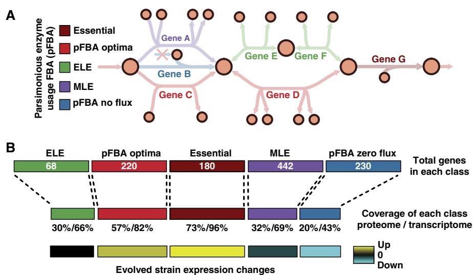
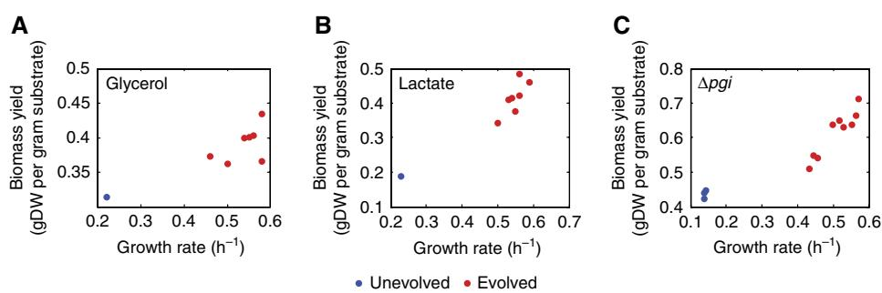
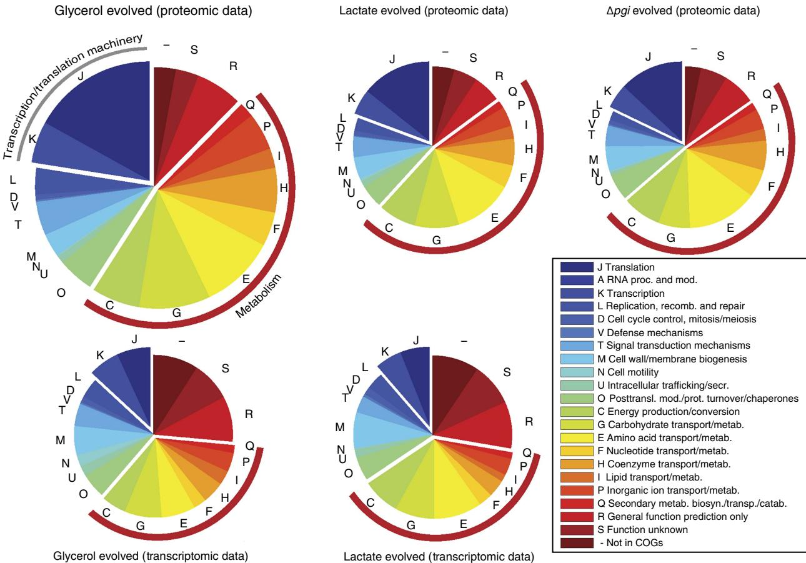
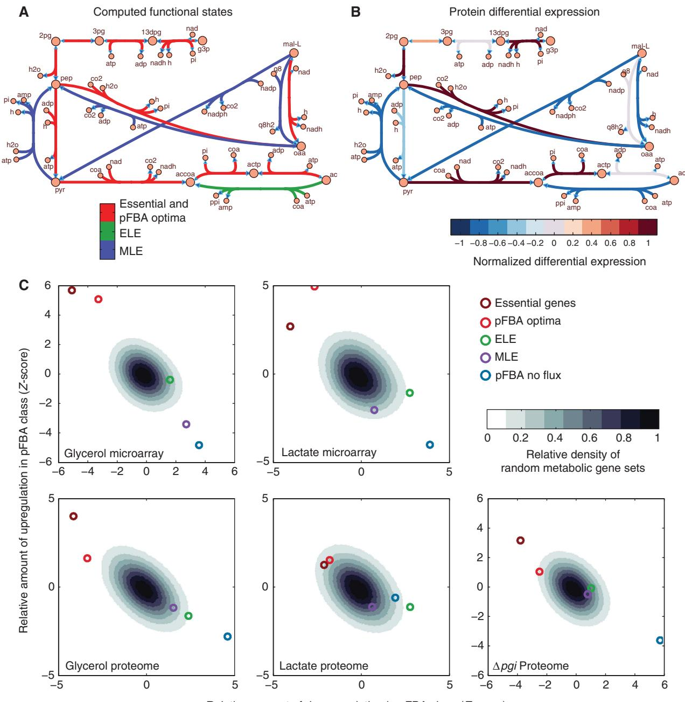

# Omic data from evolved E. coli are consistent with computed optimal growth from genome-scale models

Nathan E Lewis1 , Kim K Hixson2 , Tom M Conrad3 , Joshua A Lerman4 , Pep Charusanti1 , Ashoka D Polpitiya2 , Joshua N Adkins2 , Gunnar Schramm5,6, Samuel O Purvine2 , Daniel Lopez-Ferrer2 , Karl K Weitz2 , Roland Eils5,6, Rainer Ko¨nig5,6, Richard D Smith2 and Bernhard Ø Palsson1,*

1 Department of Bioengineering, University of California San Diego, La Jolla, CA, USA, 2 Biological Sciences Division and Environmental Molecular Sciences Laboratory, Pacific Northwest National Laboratory, Richland, WA, USA, 3 Department of Chemistry and Biochemistry, University of California San Diego, La Jolla, CA, USA, 4 Systems Biology and Bioinformatics Program, University of California San Diego, La Jolla, CA, USA, 5 Department of Bioinformatics and Functional Genomics, Institute of Pharmacy and Molecular Biotechnology, and Bioquant, University of Heidelberg, Heidelberg, Germany and 6 Department of Theoretical Bioinformatics, German Cancer Research Center (DKFZ), Heidelberg, Germany

* Corresponding author. Department of Bioengineering, University of California San Diego, 417 Powell-Focht Bioengineering Hall, 9500 Gilman Drive, La Jolla, CA 92093-0412, USA.

Tel.: þ 1 858 534 5668; Fax: þ 1 858 822 3120; E-mail: [palsson@ucsd.edu](mailto:palsson@ucsd.edu)

Received 18.3.10; accepted 1.6.10

After hundreds of generations of adaptive evolution at exponential growth, Escherichia coli grows as predicted using flux balance analysis (FBA) on genome-scale metabolic models (GEMs). However, it is not known whether the predicted pathway usage in FBA solutions is consistent with gene and protein expression in the wild-type and evolved strains. Here, we report that 498% of active reactions from FBA optimal growth solutions are supported by transcriptomic and proteomic data. Moreover, when E. coli adapts to growth rate selective pressure, the evolved strains upregulate genes within the optimal growth predictions, and downregulate genes outside of the optimal growth solutions. In addition, bottlenecks from dosage limitations of computationally predicted essential genes are overcome in the evolved strains. We also identify regulatory processes that may contribute to the development of the optimal growth phenotype in the evolved strains, such as the downregulation of known regulons and stringent response suppression. Thus, differential gene and protein expression from wild-type and adaptively evolved strains supports observed growth phenotype changes, and is consistent with GEM-computed optimal growth states.

Molecular Systems Biology 6: 390; published online 27 July 2010; doi:[10.1038/msb.2010.47](http://dx.doi.org/10.1038/msb.2010.47)

Subject Categories: functional genomics; simulation and data analysis

Keywords: Escherichia coli; genome-scale models; microarray; optimality; proteomics

This is an open-access article distributed under the terms of the Creative Commons Attribution Noncommercial Share Alike 3.0 Unported License, which allows readers to alter, transform, or build upon the article and then distribute the resulting work under the same or similar license to this one. Thework must be attributed back to the original author and commercial use is not permitted without specific permission.

# Introduction

When prokaryotes are grown at low- to mid-log phase for hundreds of generations through periodic serial passaging, they acquire an increased growth rate [(Lenski and Travisano,](#page-11-0) [1994;](#page-11-0) Ibarra et al[, 2002;](#page-11-0) Fong et al[, 2003;](#page-11-0) [Barrick](#page-10-0) et al, 2009; [Conrad](#page-10-0) et al, 2009; [Teusink](#page-11-0) et al, 2009). This example of laboratory adaptive evolution is expected, as faster growing mutants quickly outgrow slower growing cells, even if the initial fitness difference is small [(Applebee](#page-10-0) et al, 2008). Molecular changes that confer the growth improvement have been previously studied using fluxomics (Fong et al[, 2006; Hua](#page-11-0) et al[, 2007](#page-11-0)), transcriptomics (Fong et al[, 2005](#page-11-0); [Becker and](#page-10-0) [Palsson, 2008;](#page-10-0) [Le Gac](#page-11-0) et al, 2008; [Kinnersley](#page-11-0) et al, 2009), and whole-genome resequencing ([Herring](#page-11-0) et al, 2006; [Barrick](#page-10-0) et al, [2009](#page-10-0); [Conrad](#page-10-0) et al, 2009; Charusanti et al, submitted for publication). For example, whole-genome resequencing of adapted strains showed that only a small number of mutations arise after hundreds of generations [(Herring](#page-11-0) et al, 2006; [Conrad](#page-10-0) et al, 2009). Although each evolved strain acquired a different set of mutations, each set of mutations yielded a similar growth phenotype. When these mutations were introduced into the wild-type strain by allelic replacement, the wild-type cells acquired the evolved-strain growth rates [(Herring](#page-11-0) et al, 2006). However, the mechanism linking the mutations to the improved growth rate in most evolved strains has yet to be clearly identified, except for cases in which strains had a mutation in RNA polymerase (RNAP) or glpK [(Herring](#page-11-0) et al[, 2006)](#page-11-0), which altered activity of transcription and glycerol uptake.

Although the genetic changes have been identified and characterized, the resulting coordination of cellular processes that lead to the altered phenotypes have only been studied briefly from a network perspective. Such studies of adaptively evolved strains have shown an activation of normally latent metabolic pathways (Fong et al[, 2006)](#page-11-0), expression improvements to the strains that make them more consistent with a high-growth rate for various minimal media conditions [(Becker and Palsson, 2008](#page-10-0)), improved respiration [(Ferea](#page-11-0) et al[, 1999)](#page-11-0), optimization of a small growth-coupled circuit [(Dekel and Alon, 2005)](#page-11-0), and optimization of yield on a poor carbon source ([Teusink](#page-11-0) et al, 2009). In addition, the measured growth rates of evolved strains were shown to be consistent with most growth rate predictions from an in silico genomescale metabolic model (GEM) of Escherichia coli ([Ibarra](#page-11-0) et al, [2002](#page-11-0); [Fong and Palsson, 2004)](#page-11-0).

Although all of these studies have elucidated some characteristics of the complex adaptation process, it is not known (1) whether absolute genome-scale gene and protein expression levels and expression changes are consistent with optimal growth predictions from in silico GEMs or (2) whether measured expression changes can be linked to physiological changes that are based on known mechanisms or pathways. To begin to address these questions, we use constraint-based modeling of E. coli K-12 metabolism [(Feist and Palsson, 2008](#page-11-0); Lewis et al[, 2009b)](#page-11-0) to analyze a compendium of 'omics' data obtained from adaptive evolution experiments. First, we show that the data are consistent with pathway usage from the computationally predicted optimal growth states. We next show that expression changes during the adaptation process relative to wild type further converge to predicted enzyme usage from the optimal growth rate predictions (Figure 1). Finally, we show that changes in known regulatory processes acting on the metabolic network, but not accounted for in the GEMs, are consistent with the improved-growth phenotypes of the adapted strains.

## Results

#### The omics data sets

Multiple strains of E. coli were subjected to adaptive evolution through serial passaging in three different M9-minimal media conditions: lactate, glycerol, and glucose (glucose grown strains had the glycolytic gene pgi deleted to perturb the normal flux into glycolysis). For each growth condition, three to six replicates of the adaptive process were performed in parallel until each strain had reached and maintained a steadygrowth rate, which typically took 700–1000 generations (see Fong et al[, 2005, 2006](#page-11-0) for details). Through adaptive evolution, all strains improved their growth rate and efficiency in converting substrate to biomass (yield) within the exponential growth phase ([Figure 2](#page-2-0)).

Fifty quantitative proteomic data sets were obtained from the wild-type and evolved strains. Within these data sets, 983 proteins were identified with high confidence, of which 731 were identified in all strains. An extended discussion on methods and an analysis of data content and quality can be found in the Supplementary information. Transcriptomic data for strains corresponding to two of the three growth conditions (lactate and glycerol) have been published earlier (Fong et al[, 2005)](#page-11-0) and are also analyzed alongside the proteomic data in this study using the E. coli GEM as a context for the analysis.

In the omics data sets for the adaptation process, hundreds of genes and proteins are differentially expressed (Supplementary Table 1), representing 32–59% of the identified proteins and expressed genes in the data sets. The proteomic

Figure 1 A variant of flux balance analysis shows consistency with proteomic and transcriptomic data. Parsimonious enzyme usage FBA (pFBA) is used to label all metabolic genes based on simulation results. (A) pFBA classifies each gene based on its ability to contribute to the optimal growth rate predictions and its flux level. These classes include (1) essential genes; (2) pFBA optima, which includes genes that are predicted to be used for optimal growth in silico; (3) ELE, which includes genes that will increase cellular metabolic flux if used; (4) MLE, which includes genes predicted to decrease the growth rate if used; and (5) pFBA no-flux, which includes genes that cannot be used in the given growth conditions. (B) The omic data show good coverage of essential genes and the pFBA optima, and low coverage of the genes that are predicted to be non-functional. In addition, in laboratory evolution experiments, genes within these optimal states are upregulated, whereas non-functional genes are downregulated. These results support predicted optimal growth states, and suggest that laboratory-evolved strains further enhance these optimal growth states.

Figure 2 In adaptive evolution through serial passaging, E. coli evolves to a higher growth rate and biomass yield at exponential growth. Growth rates and substrate uptake rates were acquired for each strain before and after adaptive evolution, as reported earlier (Fong et al[, 2005;](#page-11-0) Charusanti et al, submitted for publication). For growth on (A) glycerol, (B) lactate, and for (C) the Dpgi strain grown on glucose, the evolved strains (red) all improved their growth rate and biomass yield at exponential growth, compared with the unevolved parent strains (blue).

and transcriptomic data show significant agreement in the direction of differential expression for cases in which both the gene and protein significantly changed expression level (see Supplementary information for details).

We first analyze the omics data with reference to enzyme usage in the computed optimal states from GEMs, then look at the changes that occur during evolution by analyzing the differential expression relative to the wild-type cells. Finally, we look at changes that correspond to the action of nonmetabolic genes represented in the data sets.

#### Analysis of omics data in the context of computed optimal growth states

Both the omics data sets and the computed solutions can be compared in the context of network functions. The transcripts and proteins found in the omics data sets can be mapped onto the reconstructed genome-scale network. Computed optimal solutions can also be presented on the network map and compared with the omics data. A comparative analysis can then be performed.

To determine whether gene and protein expression support properties of optimal predicted network function, we used a variant of flux balance analysis (FBA), referred to as Parsimonious enzyme usage FBA (pFBA) [(Figure 1A](#page-1-0); Supplementary Figure S1). As described below, this method uses in silico simulations to identify functional properties of metabolic pathway genes under the given growth conditions. We applied pFBA to the omics data sets to determine whether absolute expression and differential expression during adaptation supports the enzyme usage in computed optimal solutions. All reports of absolute expression coverage are a combination of WT and evolved-strain data, as there are few proteins that are missing in the WTstrains but identified the evolved strains, and vice versa (fewer than four for any single growth condition). To provide additional insight into the conclusions in this study, an alternative method, flux variability analysis (FVA) [(Mahadevan and Schilling, 2003)](#page-11-0), was also used and yielded supportive results (see Supplementary information for details).

pFBA [(Figure 1A)](#page-1-0) assumes that under exponential growth, there is a selection for the fastest growing strains and for strains that require the lowest overall flux through the metabolic network (a proxy for minimizing the total necessary enzyme mass to implement the optimal solution). This additional constraint introduces a small improvement over normal FBA (Supplementary Figure S2). Although these assumptions may not hold true in all growth conditions for all organisms [(Teusink](#page-11-0) et al, 2006; [Schuster](#page-11-0) et al, 2008; [Molenaar](#page-11-0) et al, 2009), earlier studies in E. coli [(Ibarra](#page-11-0) et al, [2002](#page-11-0); Fong et al[, 2003](#page-11-0); [Schuetz](#page-11-0) et al, 2007) and data presented here support these assumptions under our experimental conditions.

pFBA finds the subset of genes and proteins that may contribute to the most efficient metabolic network topology under the given growth conditions, called here the pFBA optima. The genes contributing to pFBA solutions can be classified as follows:

- 1. Essential genes: metabolic genes necessary for growth in the given media.
- 2. pFBA optima: non-essential genes contributing to the optimal growth rate and minimum gene-associated flux.
- 3. Enzymatically less efficient (ELE): genes requiring more flux through enzymatic steps than alternative pathways that meet the same predicted growth rate.
- 4. Metabolically less efficient (MLE): genes requiring a growth rate reduction if used.
- 5. pFBA no-flux: genes that are unable to carry flux in the experimental conditions.

See [Figure 1B](#page-1-0) for average sizes of these classes and Supplementary Figure S1 for a more detailed description of the classification.

Do omics data support pFBA optimal growth states? Computed pFBA solutions correspond well with the set of identified proteins and expressed genes, as well as gene expression levels. Almost all in silico-predicted essential genes are expressed. In addition, there is much higher omics data coverage of the genes and proteins in pFBA optima as compared with the less efficient classes (ELE and MLE) and the conditionally non-functional pFBA no-flux class [(Figures 1B and 3)](#page-1-0). In the transcriptomic data, 482% of all genes that can contribute to the pFBA optima are expressed. Of the missing genes (mean of 38, representing about 18% of the

Figure 3 pFBA classes are consistent with omic data. Simulations for each growth condition were used to classify each gene according to the efficiency of its associated reaction(s). The coverage of (A) expressed genes above a statistical cutoff and (B) identified proteins were determined. More genes and proteins in the essential and pFBA optima classes were expressed than genes and proteins in the less efficient (ELE and MLE) and conditionally non-functional (pFBA no-flux) pathways. Almost half of the missing essential and pFBA optima proteins are membrane associated, hence its lower coverage. (C) In all, 99 and 98% of the active reactions associated with the essential genes and pFBA optima, respectively, are supported by the union of expressed genes and proteins. Gene expression levels are also consistent with the pFBA classes, as shown in density plots for growth on (D) glycerol and (E) lactate. (F) Pairwise comparisons of classes show the significant ordering of expression levels as Essential4pFBA optima4ELE4MLE4pFBA no-flux for growth on glycerol (upper triangle) and lactate (lower triangle) (one-sided Wilcoxon test).

pFBA optima), about 82% have known isozymes or redundant pathways in the pFBA optima that can replace their functions.

Coverage of proteins in the pFBA optima is less comprehensive than coverage from the transcriptomic data (Figure 3B); however, about 40% of the missing proteins in the essential and pFBA optima classes are members of the GO classes 'membrane,' 'integral to membrane,' or 'transport.' These classes are significantly depleted from the proteomic data sets (see Supplementary information), and commonly depleted in other proteomic data sets ([Ferguson and Smith, 2003)](#page-11-0). Moreover, 459% (450 proteins) of the missing pFBA optima proteins have isozymes in the pFBA optima that could replace their function if these proteins are not expressed.

Neither proteomic nor transcriptomic data alone show expression of all genes or proteins that can contribute pFBA optima. Complete coverage, however, is not expected because of model alternate optima, inaccurate probes on the arrays, and hard-to-detect proteins. However, when the expressed genes and identified proteins are mapped back onto the metabolic network, the union of the proteomic and transcriptomic data correspond to 97.7% of the non-essential active gene-associated reactions in the glycerol and lactate optimal solutions ([Figure 3C](#page-3-0)). Unsupported reactions include a few transporters (H2O, NH4 þ ) and reactions that are necessary for cofactor biosynthesis.

Beyond presence and absence, the expression levels of genes are consistent with the various pFBA classes. That is, the expression levels are greatest for the essential genes and lowest for the pFBA no-flux genes ([Figure 3D and E)](#page-3-0) and is significant for almost all pairwise comparisons ([Figure 3F)](#page-3-0). All of the above results suggest that the pFBA optima are expressed and likely active in E. coli K12.

#### Many metabolic genes and proteins are differentially expressed with adaptation

There is high coverage of expressed genes and proteins in the optimal computed states. As the efficient use of the metabolic network is presumed to underlie the optimal growth phenotype after adaptation, the question arises: Do metabolic genes dominate the differential changes during adaptation? Differential expression of proteins and genes in the adaptation process occur in many functional classes; however, a large fraction of these differentially expressed proteins and genes are associated with metabolic clusters of orthologous groups (COGs) ([Tatusov](#page-11-0) et al, 1997) (Figure 4). Specific metabolic COGs that show the highest enrichment include carbohydrate transport and metabolism for the lactate- and glycerol-evolved strains (Po0.009) and amino acid and nucleotide metabolism in the pgi-deletion strains (Po0.012).

This high coverage of metabolism supports its important role in the evolved-growth phenotype, and allows the analysis of the data in the context of the genome-scale metabolic network reconstruction (Feist et al[, 2007](#page-11-0)). The dominant contribution of metabolic genes to the changes in the omics data sets is further validated when the data are evaluated using singular value decomposition, which shows that metabolic GO classes covary and separate evolved and unevolved strains (see Supplementary information).

As some specific metabolic subsystems may change more than others, we mapped the differential gene and protein expression to the metabolic network using PathWave [(Schramm](#page-11-0) et al, 2010), a method that identifies groups of

Figure 4 Proteins and genes associated with metabolic processes dominate differential expression in evolved strains. Adaptively evolved strains have hundreds of altered gene and protein expression levels covering a broad range of COGs. However, the relatively large coverage of genes and proteins in COGs associated with metabolism (red brackets) clearly suggests the importance of changes in the metabolic network. The most significantly enriched metabolic COG is 'carbohydrate metabolism and transport.' In addition, the proteomic data suggest that the transcription and translation machinery may also have an important function in the physiological changes witnessed in the adaptively evolved strains.

topologically close reactions that show concerted expression changes (see Supplementary information). Among the different data sets, this analysis shows significant changes in central carbon metabolism, tRNA charging, and/or the metabolism of specific amino acids (see Supplementary Table 2). Changes in such regions of the metabolic network have an important function in providing the metabolic precursors for biomass production, and thus may contribute to an increased growth rate. However, for greater insight, changes in biomass-coupled pathways must be quantitatively associated to the actual growth state of the cell.

#### Adaptive evolution overcomes dosage limitations of essential genes

Although pathways that produce key biomass precursors are significantly changed, it is not clear whether necessary growth-coupled essential genes are consistently changed as would be needed for an increased growth rate. To address this question, we first used pFBA to identify all genes that are needed for growth in silico and compared these with experimental data (see [Figure 5A and B](#page-6-0)). As in silico growth is dependent on these essential genes, they may be needed in higher abundances for higher growth rates. The adaptive evolution strains, with their improved growth rates, are consistent with this hypothesis. In the evolved strains, computationally predicted essential genes and proteins are significantly upregulated ([Figure 5C](#page-6-0)) and have fewer downregulated genes and proteins than expected ([Table I](#page-7-0)). Moreover, downregulated essential proteins are more abundant in the WT strains than upregulated proteins (Po2 -108 ). Thus, the downregulation may be the result of tuning protein expression for overexpressed proteins in WT. This result, with the upregulation of essential genes and proteins, suggests that the computationally predicted essential genes are indeed growth coupled as predicted in silico. Moreover, this result suggests that these essential genes not only confer cellular viability, but they also may act as cellular bottlenecks because of dosage limitations. Expression changes during adaptive evolution allow these limitations to be overcome, thereby increasing the growth rate.

#### The emergence of the optimal metabolic states in adaptive evolution

All evolved strains profiled here show improvements in both growth rate and yield [(Figure 2)](#page-2-0). The upregulation of essential genes may partially support the increased growth rate; however, it does not address the question as to whether nonessential gene and protein expression is more consistent with the enzyme usage in computed optimal growth states. In addition, the highly interconnected nature of metabolic networks may preclude a growth improvement from upregulated essential genes, if pathways that are upstream and downstream of the essential genes do not change accordingly. To answer these questions, we compared the differential gene and protein expression to computational simulations of genome-scale optimal growth states [(Figure 5A and B](#page-6-0)). Thus, all upstream and downstream pathways may be considered.

Using pFBA, we find that in all strains, the pFBA optima are significantly upregulated in the transcriptomic and proteomic data. This upregulation is significant for both the number of genes [(Table I)](#page-7-0), and the net fold change [(Figure 5C](#page-6-0)). Further support for the use of the pFBA optima comes from the findings that, in-general, the less-efficient MLE genes are not significantly upregulated [(Table I](#page-7-0)), and that they are downregulated in most data sets ([Figure 5C)](#page-6-0). Among those that are upregulated, few contribute to any coherent functional metabolic pathways (see Supplementary information and Supplementary Figure S3). Only one MLE gene is consistently upregulated in all data sets and functional in the context of a non-downregulated pathway (see Supplementary information). This protein, deoxyuridinetriphosphatase (3.6.1.23), which dephosphorylates dUTP, is upregulated in all data sets. Although this process wastes resources, this enzyme is needed to preclude dUTP from being integrated into the genome, and the absence of this enzyme decreases the growth rate in E. coli [(Hochhauser and Weiss, 1978)](#page-11-0). A few other MLE genes were upregulated in multiple, but not all data sets (see Supplementary information).

The upregulation of the pFBA optima, and the lack of upregulation among less efficient pathways reveal that the adaptive evolution process leads to the further emergence of pathways that help to maximize the predicted growth rate. Thus, the differential changes are consistent with the computed optimal growth state.

#### Adaptation suppresses conditionally inactive pathways

As excess enzyme mass creates a large maintenance demand on cells [(Kurland and Dong, 1996)](#page-11-0), cells under growth selective pressure are expected to modulate expression levels of enzymes as needed for growth [(Dekel and Alon, 2005)](#page-11-0). Although we showed an upregulation of optimal pathways, it is expected that genes and proteins associated with nonfunctional reactions should be downregulated, thereby saving resources for improved-growth performance.

Gene and protein expression changes in the pFBA conditionally non-functional class (pFBA no-flux) are consistent with this hypothesis. For all experimental conditions, there is a significant downregulation of pFBA no-flux genes, except for the lactate strain proteomic data [(Table I)](#page-7-0). Moreover, when compared with the non-evolved strains, the mean abundances of expressed pFBA no-flux proteins and transcripts are significantly lower in all evolved strains (P 1 -1016 and P¼8.3 -108 , respectively). FVA further supports the suppression of conditionally non-functional metabolic reactions (see Supplementary Table 3). Thus, during the process of adaptive evolution, computationally predicted non-functional pathways are suppressed through a concerted downregulation of genes associated with such pathways.

#### Only downregulation is tied to known regulon structure

The analysis of the omics data shows that strains under growth pressure adjust their transcriptional program towards the in silico-predicted optimal growth states in metabolism.

Relative amount of downregulation in pFBA class (*Z*-score)

Figure 5 The subnetwork providing optimal growth emerges in adaptively evolved strains. (A) For each growth condition, pFBA was used to classify all genes and their associated reactions. (B) Subsequently, these classifications were compared with differentially expressed genes or proteins for each growth condition (a representative portion of the metabolic network with glycerol strain proteomic data is shown). (C) A quantitative assessment was performed, in which the sum of fold-change values from all downregulated genes in each class (x axis) was plotted against the fold change sum of all upregulated genes (y axis), and then scaled by the variance of the sum of randomly selected differentially expressed genes. The cloud represents the normalized distribution of the summed upregulated and downregulated genes or proteins of randomly chosen differentially expressed genes. This analysis shows that for all data sets, genes and proteins within the essential set and the pFBA optima show more upregulation and much less downregulation than expected from randomly selected differentially expressed metabolic genes and proteins. This emergence of the optimal pathways is enhanced by the lack of upregulation and the significant downregulation within the less efficient ELE and MLE pathways and the conditionally inactive pFBA no-flux pathways. ELE, enzymatically less efficient; MLE, metabolically less efficient.

However, the mechanisms controlling these changes are outside the scope of the reconstructed metabolic network, and their activities are not predicted. Thus, the question arises: are known transcriptional regulatory mechanisms consistent with the observed differential expression changes?

Across all conditions, the downregulated transcripts and proteins correspond to several known regulons, and each condition has a unique set of differentially expressed regulons (Supplementary Table 4). For example, downregulated molecular species in the glycerol-evolved strains include the

| h0                                                    | Glyc Prot | Lac Prot | Δpgi Prot | Glyc MA  | Lac MA   |
|-------------------------------------------------------|-----------|----------|-----------|----------|----------|
| Essential genes are not enriched in up-regulation     | 8.88E-05  | 2.17E-02 | 2.05E-07  | 1.58E-07 | 4.52E-02 |
| Essential genes are not depleted in down-regulation   | 4.08E-05  | 1.14E-01 | 1.76E-05  | 8.25E-07 | 5.63E-07 |
| pFBA optima are not enriched in up-regulation         | 2.85E-04  | 9.88E-05 | 4.37E-08  | 4.01E-11 | 6.96E-04 |
| MLE is not depleted in up-regulation                  | 1.83E-02  | 2.01E-02 | 5.62E-04  | 6.12E-06 | 4.12E-01 |
| pFBA no-flux class is not depleted in up-regulation   | 3.07E-03  | 8.70E-02 | 8.15E-04  | 2.18E-07 | 6.28E-04 |
| pFBA no-flux class is not enriched in down-regulation | 4.63E-04  | 2.96E-01 | 3.30E-04  | 6.98E-09 | 6.06E-07 |

Table I Null hypotheses and P-values from hypergeometric tests involving the presence of pFBA classes in the upregulated and downregulated genes and proteins

MLE, metabolically less efficient; Glyc, glycerol; Lac, lactate; MA, microarray; Prot, proteome.

flagellar FlhC/FlhD regulon, the GatR regulon (transport and catabolism of galactitol), and Hns (chromosome organization). For lactate-evolved strains, the carbohydrate metabolism regulators Crp and DgsA regulons are enriched in the downregulated genes and proteins, respectively. Among the Dpgi strains, the four most significantly enriched regulons in the downregulated proteins include Crp, IhfA/IhfB, MetJ, and ArcA. All of these are associated with carbon or nitrogen metabolism. Moreover, downregulated members of these regulons account for a higher fraction of the expressed genes and proteins outside of the optimal growth solutions (see Supplementary Figure S4). Together, these results suggest that known regulatory programs may be used in a conditionspecific manner for the downregulation of genes and proteins in the adaptation process.

Conversely, no data set reflects known regulons among the upregulated transcripts or proteins. The only exception is for the glycerol-evolved strain microarrays, in which a few aminoacid biosynthetic regulons are enriched (ArgR, LysR, MetJ), along with the purine synthesis regulon (PurR), and Fis. These results suggest that few known transcriptional regulatory programs are consistently used to upregulate genes and ultimately proteins. Therefore, it seems that there are unknown regulatory mechanisms at work, potentially because of mutations found in transcriptional regulators in the evolved strains ([Herring](#page-11-0) et al, 2006; [Conrad](#page-10-0) et al, 2009; Charusanti et al, submitted for publication). Mutations in these regulators have previously led to drastic alterations in gene and protein expression [(Cooper](#page-11-0) et al, 2008; [Ansong](#page-10-0) et al, 2009; Conrad et al, submitted for publication). Further interrogation of these mutated regulators will aid in associating the expression changes to known regulatory pathways.

#### Adaptively evolved strains largely eliminate the stringent response

Changes in transcriptional regulation observed here lead to altered physiological responses associated with metabolism, such as the stringent response. All experiments here were performed in media without amino acids. Under such conditions, the stringent response increases transcription of amino-acid biosynthesis genes needed for growth ([Traxler](#page-12-0) et al[, 2008)](#page-12-0), and simultaneously decreases the growth rate; however, evolved strains manage to attain a higher growth rate, despite the stringent response.

To find a rebalancing of genes involved in the stringent response, we compared the microarray data from the glyceroland lactate-evolved strains to published data sets that profile the stringent response in E. coli K-12 MG1655 ([Traxler](#page-12-0) et al, [2008](#page-12-0)). Out of the 170 differentially expressed stringent response genes, a total of 97 genes are also significantly differentially expressed in the evolved strains (Supplementary Table 5). In both evolved strain conditions, B90% of the expression changes occur in the opposite direction as the stringent response. That is, after adaptation to minimal media, the E. coli strains show expression patterns consistent with a decreased stringent response during growth. Only eight genes show changes in the same direction in the evolved strains and the stringent response. Of these, half are amino-acid biosynthetic genes (ilvM, ilvD, and thrL) or have a secondary function in amino-acid biosynthesis (folE). Thus, there is a clear suppression of the stringent response in the evolved strains, but alternative mechanisms allow the needed upregulation of amino-acid biosynthesis genes normally activated by the stringent response.

# Discussion

Wild-type laboratory strains of E. coli adapt to new growth conditions when placed under a growth rate selective pressure [(Lenski and Travisano, 1994;](#page-11-0) Ibarra et al[, 2002; Fong](#page-11-0) et al, [2003](#page-11-0); [Barrick](#page-10-0) et al, 2009; [Teusink](#page-11-0) et al, 2009). The genetic and physiological characteristics of the adaptation have been described ([Herring](#page-11-0) et al, 2006; [Barrick](#page-10-0) et al, 2009; [Conrad](#page-10-0) et al[, 2009](#page-10-0); Charusanti et al, submitted for publication). The underlying genotype–phenotype relationship can be detailed using systems biology; namely the acquisition and analysis of omics data and the use of genome-scale models.

In this study, we obtained a compendium of quantitative proteomic profiles of the evolved strains and used a similar set of previously published microarrays (Fong et al[, 2005; Lewis](#page-11-0) et al[, 2009a)](#page-11-0). The analysis of the data sets, using conventional statistical methods and GEM computations, yielded three key results. First, the proteomic and transcriptomic data are consistent with enzyme usage in optimal growth state computations using GEMs. Second, the essential and non-essential metabolic genes associated with the predicted optimal growth states are induced during the adaptive process. This is accompanied by a suppression of proteins and

transcripts outside of the optimal growth solutions. Third, regulatory mechanisms, not accounted for in genome-scale metabolic network models, contribute to the altered metabolic states and the improved-growth phenotype. Known transcriptional regulatory mechanisms contribute to the downregulation of genes and proteins, and physiologically, there is a suppression of the stringent response. These results have three main implications.

First, in this work, we found a high coverage of genes and proteins associated with the predicted optimal growth states. This result provides added support for the validity of predicted pathway utilization using GEMs and for the assumptions underlying their computation. More specifically, FBA pathway flux predictions are computed by relating uptake and secretion rates, given the stoichiometry of the metabolic network and a biomass objective function. The biomass function represents the stoichiometric balance of metabolites needed for growth. Thus, FBA allows the computation of the growth yield (the amount of biomass produced per mole of substrate), and predicts pathways that can be used to obtain this yield. FBA further computes the optimal growth rate, assuming the cell will optimize this growth yield, given the measured substrate uptake rate and cellular maintenance costs [(Varma and](#page-12-0) [Palsson, 1993](#page-12-0)) (for discussion on the subtle differences between computed growth yields versus growth rates, see [Teusink](#page-11-0) et al (2009)).

The physiological relevance of the FBA optimal growth rate assumption has been discussed [(Schuster](#page-11-0) et al, 2008). In particular, it has been proposed that two possible mechanisms can lead to improved growth rates: (1) the improved efficiency of converting substrate to biomass (consistent with FBA predictions) or (2) the speeding up of metabolism by increasing the expression level of any enzymes (efficient or less efficient) to speed up metabolism. Earlier studies have presented evidence supporting both scenarios under the adaptive evolution experimental conditions by measuring growth rates, substrate uptake rates, and by-product secretion rates (Ibarra et al[, 2002;](#page-11-0) Fong et al[, 2003; Schuetz](#page-11-0) et al, 2007; [Teusink](#page-11-0) et al, 2009). This study provides additional experimental support for both an improved efficiency and a speeding up of metabolism in adaptively evolved strains by showing the upregulation of the pathways in the optimal growth rate solutions, and not in the less efficient pathways. The upregulation of the essential genes allow for a higher growth rate, as they are more tightly coupled to the in silico-predicted growth rate. The upregulation of the pFBA optima allows for improved efficiency in converting substrate to biomass (biomass yield). Thus, the upregulation of the essential and non-essential genes in the optimal pathways allows for both the 'speeding up' of metabolism and increased efficiency, as the measured substrate uptake increases (Fong et al[, 2005](#page-11-0); Charusanti et al, submitted for publication) and is metabolized through the upregulated optimal pathways.

The second implication of this work is that a few simple mutations may perturb the function of the entire network, and that the resulting phenotype can be better understood using GEMs. Earlier studies have shown that simple mutations in metabolic network enzymes produce a transient response that minimizes flux changes (Segre et al[, 2002](#page-11-0); [Shlomi](#page-11-0) et al, 2005). However, in this work, each strain studied had ample time for more drastic changes in gene and protein expression, as a result of the mutations in metabolic enzymes and global regulators attained in the adaptive time course [(Herring](#page-11-0) et al, [2006](#page-11-0); [Conrad](#page-10-0) et al, 2009; Charusanti et al, submitted for publication). Even though the cellular biochemistry is tightly woven into a large network, the measured expression changes shifted towards the computed optimal growth predictions. This finding shows that some physiological observations cannot be simply explained with a direct link to a single mutation. However, the genotype–phenotype link, which usually is complex, may be better identified by analyzing the data in the biomolecular network context.

The third implication of this work is that genome-scale models of other systems such as transcriptional regulation, transcription, and translation are needed for a more complete understanding of the genotype–phenotype link. This work showed the successful model-based analysis of a large fraction of differentially expressed genes and proteins. However, we also witnessed changes beyond the scope of the model, such as in the transcription and translation machinery components [(Figure 4](#page-4-0)). Many of these, such as tRNA charging enzymes, the ribosomal proteins, and subunits of the RNAP, were upregulated in most strains (data not shown). Each of these could allow for faster growth by providing increased translation and transcription rates [(Vogel and Jensen, 1994;](#page-12-0) [Klumpp](#page-11-0) et al, [2009](#page-11-0)). Metabolic models do not directly account for these mechanisms. Thus, it is anticipated that genome-scale models of transcription and translation (Thiele et al[, 2009)](#page-12-0) will be useful in evaluating the functional consequences of changes in these systems. Moreover, efforts are also being made to address additional growth rate-associated parameters, such as changes to the cell surface to volume ratio and molecular crowding constraints (Beg et al[, 2007](#page-10-0); [Molenaar](#page-11-0) et al, 2009).

Metabolism, transcription, and translation are important for modulating growth rate. However, the expression changes for these systems are possibly controlled by alterations in transcriptional regulation [(Conrad](#page-10-0) et al, 2009). In the evolved strains, there are mutations in several regulatory proteins, such as RNAP, Crp, Hfq, or AtoS ([Herring](#page-11-0) et al, 2006; [Conrad](#page-10-0) et al[, 2009;](#page-10-0) Charusanti et al, submitted for publication). Unfortunately, the normal wiring within these regulons is still not completely characterized. However, efforts are being made to identify the missing links in the E. coli transcriptional regulatory network (TRN) (Cho et al[, 2008](#page-10-0)). As genome-scale TRN models are completed and linked to the comprehensive transcription unit architecture for E. coli (Cho et al[, 2009)](#page-10-0), greater insight into the scope of the regulatory changes in the evolved strains may be determined.

# Conclusion

Experimental adaptive evolution is a useful approach to develop an understanding of the metabolic genotype–phenotype relationship in bacteria and to aid in the identification of principles underlying evolution. To identify such principles, various types of data are being generated. For the strains in this study, these data types include the genome sequences, gene expression profiles, proteomic data, fluxomic data, and physiological data. The analysis of these omics data types using optimality properties of GEMs enables the elucidation of

principles of adaptation and the identification of large-scale mechanisms that confer selected optimal phenotypes. The metabolic genotype–phenotype relationship in bacteria can now be understood through multi-scale analysis, including: (1) changes in the genotype and molecular constituents [(Herring](#page-11-0) et al, 2006; [Conrad](#page-10-0) et al, 2009; Charusanti et al, submitted for publication), (2) analysis of omics data in the context of reconstructed networks that represent the component interactions (Lewis et al[, 2009a](#page-11-0)), and (3) changes in the physiological state and performance (Ibarra et al[, 2002; Fong](#page-11-0) [and Palsson, 2004](#page-11-0)). The development of the second step is found in this study.

# Materials and methods

#### Parsimonious enzyme usage FBA

pFBA is a bilevel linear programming optimization using the genomescale constraint-based model of E. coli K-12 (Feist et al[, 2007)](#page-11-0). FBA was used to compute the optimal growth rate, using experimentally measured substrate uptake rates (Fong et al[, 2005;](#page-11-0) Charusanti et al, submitted for publication). This was followed by a minimization of the sum of all gene-associated reaction fluxes while maintaining optimal growth (see Supplementary Figure S1). This proxy computes the pFBA optima, representing the set of genes associated with all maximumgrowth, minimum-flux solutions, thereby predicting the most stoichiometrically efficient pathways. The idea underlying this method is similar to the 'max biomass per unit flux' objective presented earlier ([Schuetz](#page-11-0) et al, 2007), but the mathematical implementation is different (see Supplementary information).

Five classes of genes emerge, associated with reactions that (1) are essential for optimal and suboptimal growth, (2) are inside the pFBA optima, (3) are ELE, requiring more enzymatic steps than alternative pathways that meet the same cellular need, (4) are MLE, requiring a reduction in growth rate if used, or (5) cannot carry a flux in the given environmental condition/genotype (pFBA no-flux). Lists of genes in each class are given in Supplementary Table 6.

Here, the pFBA optima were computed for wild-type E. coli under growth in lactate M9-minimal media, glycerol M9-minimal media, and a Dpgi mutant on glucose M9-minimal media, using experimentally measured substrate uptake rates (Supplementary Table 7). As detailed in Supplementary Figure S5, the steps were as follow. First, FBA was used to test gene essentiality. Second, FVA with no biomass constraint was conducted to identify reactions that cannot carry a flux. Third, FBA helped identify the optimal growth rate, which was subsequently set as a lower bound for the biomass function. Fourth, FVA was conducted again to find all metabolically less-efficient reactions. Fifth, the absolute value of flux through all gene-associated reactions was minimized using linear programming, and this flux was set as an upper bound for the summed network flux. Sixth, FVA was conducted on the model, holding the maximum-predicted growth rate and minimum network flux constant, thereby identifying all reactions that are active in alternate optimal solutions [(Reed and Palsson, 2004)](#page-11-0). Genes were assigned to the five categories as follow. All genes necessary for growth in silico were classified as 'essential.' Non-essential genes associated with reactions that were active when maximizing biomass and minimizing flux were classified as 'pFBA optima' genes. Genes that were only associated with reactions that could not carry a flux were identified as 'pFBA no-flux' genes.'ELE' genes were identified as those associated with reactions that could carry a flux while optimizing biomass, but not when minimizing flux (genes associated with the pFBA optima were filtered out). All remaining genes, which were associated with reactions that could carry a flux when not optimizing biomass, were classified at 'MLE' genes.

The sets of pFBA genes and proteins were compared with all nonessential upregulated proteins and mRNAs using the hypergeometric test to determine whether there were more upregulated proteins in the pFBA optima than expected by chance. A similar approach was used to find the enrichment and depletion of upregulated and downregulated species in the essential, non-functional, and less efficient pathways; however, all genes were used for these tests. Significant tests are shown in [Table I.](#page-7-0) In addition, the significance of fold change within upregulation and downregulation in the classes was tested by summing up all upregulated and all downregulated genes within each class and then comparing to 10 000 random sets of the same number of differentially expressed metabolic genes.

## Regulon enrichment

Regulon structure was determined from RegulonDB 6.0 [(Gama-Castro](#page-11-0) et al[, 2008)](#page-11-0). Significance of enrichment of regulons in upregulated and downregulated genes/proteins was determined using the hypergeometric test with a false-discovery rate of 0.1. The results, however, were robust with FDR cutoff choice.

#### Gene expression profiling

Microarrays corresponding to the same glycerol- and lactate-evolved strains in this study have been published previously as described in the corresponding studies (Fong et al[, 2005](#page-11-0); Lewis et al[, 2009a](#page-11-0)) and may be downloaded at [http://systemsbiology.ucsd.edu/In_Silico_Organisms/](http://systemsbiology.ucsd.edu/In_Silico_Organisms/E_coli/E_coli_expression2) [E_coli/E_coli_expression2.](http://systemsbiology.ucsd.edu/In_Silico_Organisms/E_coli/E_coli_expression2) The arrays were renormalized for this study using GCRMA. Genes that did not have a gene expression level significantly above a set of negative controls on the arrays (FDR¼0.05) were removed from the data set and were not considered in further analyses.

## Cell preparation

E. coli K-12 MG1655 strains used for this study were prepared earlier (Fong et al[, 2005, 2006)](#page-11-0). Briefly, for the Dpgi strains, pgi was removed as described in [Datsenko and Wanner (2000](#page-11-0)), and transferred to M9 glucose minimal media. Wild-type strains were also transferred to glycerol or lactate M9-minimal media. Adaptive evolution was conducted by growing the strains in batch culture until they reached mid-exponential growth. At this point, the culture was diluted by serial passage into fresh media. The quantity of passaged cells was determined based on the growth rate from the previous day. Multiple replicates for each strain were evolved in parallel for about 700, 800, and 1000 generations for the glycerol, pgi deletion, and lactate-evolved strains, respectively. Despite the different number of generations, all strains were evolved until they converged to a stable maximum growth rate, which was maintained for at least 5 days (Fong et al[, 2005, 2006)](#page-11-0). Growth rates and substrate uptake rates were determined and reported earlier (Fong et al[, 2005, 2006)](#page-11-0). Instantaneous steady-state biomass yields for the exponential growth phase (see Supplementary Table 7) were determined as similarly shown earlier (Feist et al[, 2010](#page-11-0)) by dividing the mid-exponential growth rate by the substrate uptake rate at that time:

$$Y_{B,E} = \frac{\text{gr}}{\text{SUR}}$$

where gr is the growth rate at mid-exponential phase (1/h) and SUR is the substrate uptake rate (g substrate/gDW biomass/h). This figure provides a measure of how efficiently the strains can convert substrate into biomass while in exponential growth.

For subsequent experiments, all strains were streaked out on solid media, and a single colony was then isolated, grown up, and frozen down. Glycerol stocks of each strain at day 1 and the evolution end point were placed in fresh media and grown up to an OD of 0.500 at 600 nm. Cells were then pelleted, washed in PBS, and frozen before proteomic profiling.

#### Cell lysis

Each cell pellet (B50 ml in size as measured in a microfuge tube) was resuspended in 1.5 ml of nanopure water. Lysis was achieved using pressure cycling technology with the Barocycler (Pressure Bio-Sciences, West Bridgewater, MA) for 10 cycles going between ambient pressure for 20 s and 2.4 -105 kPa for 20 s. The lysate was collected and placed immediately on ice. Each lysate was concentrated down to about 500 ml using a speed vac (ThermoSavant, San Jose, CA). The protein concentration of each cell lysate was measured using a Coomassie Plus protein assay (Pierce, Rockford, IL) using a bovine serum albumin standard.

### Protein reduction, trypsin digestion, and alkylation

Each lysate was dried down and 150 ml of 8 M guanidine HCL, and 3 ml of Bond Breaker TCEP solution (Pierce) was added. The samples were vortexed and incubated at 601C for 30 min. Iodoacetamide was added to a concentration of 20 mM and then each sample was incubated at room temperature for 30 min. The samples were diluted 10-fold with freshly prepared 50 mM ammonium bicarbonate solution, pH 7.8 and CaCl2 was added to a final concentration of 1 mM. Finally, trypsin was added in a 1:50 (wt/wt) ratio of trypsin to sample protein, and the samples were digested at 371C for 4 h.

## Peptide concentration and cleanup

Each digest was desalted using Supelco (St Louis, MO) Supelclean C-18 tubes as described elsewhere ([Masselon](#page-11-0) et al, 2005). Each sample was concentrated using vacuum centrifugation to adjust the concentration to be 1 mg/ml.

#### SCX fractionation of peptides and data preprocessing

A measure of 300 mg of a pooled sample of all glycerol adaptation samples, lactate adaptation samples, and Dpgi study samples were fractionated separately into 25 SCX LC fractions for analysis using a LTQ iontrap mass spectrometer to obtain tandem MS (i.e. MS/MS) data for peptides as described earlier (Qian et al[, 2005)](#page-11-0). The MS/MS spectra were analyzed using the peptide identification software SEQUEST ([Eng](#page-11-0) et al[, 1994](#page-11-0)) in conjunction with the annotated protein translations from the genome sequence of E. coli. 44 610 peptide identifications that met the criteria of: (1) a minimum XCorr value of 2; (2) a minimum discriminate score of 0.6 ([Strittmatter](#page-11-0) et al, 2004); and (3) a peptide prophet probability of at least 0.99 were used to build an accurate mass and time (AMT) database with peptide sequences and normalized elution times.

## Accurate mass and time tag analysis of peptides

LC-MS spectra were analyzed using the accurate mass and elution time tag approach [(Zimmer](#page-12-0) et al, 2006). A detailed description of this method is provided in the Supplementary information. The AMT tag approach, in the end, provides peptide identifications along with their abundances for all the data sets. The data for each peptide identified in each sample were represented by the median value obtained across the three LC-MS runs. These data were loaded into the software tool DAnTE [(Polpitiya](#page-11-0) et al, 2008) for further analysis. Peptide abundances were transformed to log base 2 and an outlier check was applied by observing the Pearson correlations between data sets. Any data sets with weak correlations were excluded from further analysis. A linear regression-based normalization method available in DAnTE was then applied within each replicate category. The central tendency adjusted peptide abundances were used to infer the corresponding protein abundances through the 'Rrollup' algorithm in DAnTE [(Polpitiya](#page-11-0) et al, [2008](#page-11-0)). During the Rrollup step, the Grubbs outlier test was applied with a P-value cutoff of 0.05 to further remove any outlying peptides. Protein expression values were computed with all data sets combined (Supplementary Data 1), and for individual growth conditions (Supplementary Data 2) for differential expression analysis. Data may be downloaded at [https://proteomecommons.org/dataset.jsp?i](https://proteomecommons.org/dataset.jsp?i=74547(hash=JenmtXBVI/RUip5X+dbDKDK8NXeJPVZBxMdbWqZz+n1rV7H1g6WEBaeKo5mr4KXIplrB7cV4+pxDj+dVV6j9pmeclWEAAAAAAAAFYw==))¼ [74547(hash](https://proteomecommons.org/dataset.jsp?i=74547(hash=JenmtXBVI/RUip5X+dbDKDK8NXeJPVZBxMdbWqZz+n1rV7H1g6WEBaeKo5mr4KXIplrB7cV4+pxDj+dVV6j9pmeclWEAAAAAAAAFYw==))¼[JenmtXBVI/RUip5X+dbDKDK8NXeJPVZBxMdbWqZz+](https://proteomecommons.org/dataset.jsp?i=74547(hash=JenmtXBVI/RUip5X+dbDKDK8NXeJPVZBxMdbWqZz+n1rV7H1g6WEBaeKo5mr4KXIplrB7cV4+pxDj+dVV6j9pmeclWEAAAAAAAAFYw==)) [n1rV7H1g6WEBaeKo5mr4KXIplrB7cV4+pxDj+dVV6j9pmeclWEAA](https://proteomecommons.org/dataset.jsp?i=74547(hash=JenmtXBVI/RUip5X+dbDKDK8NXeJPVZBxMdbWqZz+n1rV7H1g6WEBaeKo5mr4KXIplrB7cV4+pxDj+dVV6j9pmeclWEAAAAAAAAFYw==)) [AAAAAAFYw](https://proteomecommons.org/dataset.jsp?i=74547(hash=JenmtXBVI/RUip5X+dbDKDK8NXeJPVZBxMdbWqZz+n1rV7H1g6WEBaeKo5mr4KXIplrB7cV4+pxDj+dVV6j9pmeclWEAAAAAAAAFYw==))¼¼[)](https://proteomecommons.org/dataset.jsp?i=74547(hash=JenmtXBVI/RUip5X+dbDKDK8NXeJPVZBxMdbWqZz+n1rV7H1g6WEBaeKo5mr4KXIplrB7cV4+pxDj+dVV6j9pmeclWEAAAAAAAAFYw==)). The raw data may also be downloaded at [http://](http://omics.pnl.gov/view/publication_1019.html) [omics.pnl.gov/view/publication_1019.html.](http://omics.pnl.gov/view/publication_1019.html)

# Computation of differential expression

Differential expression was computed for all identified proteins and all transcripts with a significantly higher expression than negative controls on the microarrays (FDR¼0.05). The grand mean was subtracted from the data sets of interest, and differentially expressed genes and proteins were determined with a two-sample t-test. Falsediscovery rate cutoffs were determined as discussed in [Storey and](#page-11-0) [Tibshirani (2003)](#page-11-0).

# Supplementary information

Supplementary information is available at the Molecular Systems Biology website (<http://www.nature.com/msb>).

# Acknowledgements

We thank Eric Knight at the University of Iceland for experimental input, Ron Milo at the Weizmann Institute of Science for suggestions pertaining to this work, Marc Abrams, Aarash Bordbar, Jeff Orth, and Dr Daniel R Hyduke at UCSD for input on the manuscript, and the following at PNNL: Angela Zhang, Priscilla A Moore, David J Anderson for aiding in sample preparation and data acquisition and Gordon A Anderson and Nikola Tolic for helpful input and data deposition. A portion of this work was performed in EMSL, using capabilities developed under the support of the NIH National Center for Research Resources (RR18522) and the U S Department of Energy Office of Biological and Environmental Research (DOE/BER), EMSL is a DOE/ BER national scientific user facility located on the Pacific Northwest National Laboratory campus in Richland, WA. This work was funded in part by a Fulbright fellowship, an NSF IGERT Plant Systems Biology training grant (# DGE-0504645), NIH grants R01 GM062791 and R01 GM57089, and NIAID IAA Y1-A1-8401.

# Conflict of interest

The authors declare that they have no conflict of interest.

# References

- Ansong C, Yoon H, Porwollik S, Mottaz-Brewer H, Petritis BO, Jaitly N, Adkins JN, McClelland M, Heffron F, Smith RD (2009) Global systems-level analysis of Hfq and SmpB deletion mutants in Salmonella: implications for virulence and global protein translation. PLoS One 4: e4809
- Applebee MK, Herrgard MJ, Palsson BO (2008) Impact of individual mutations on increased fitness in adaptively evolved strains of Escherichia coli. J Bacteriol 190: 5087–5094
- Barrick JE, Yu DS, Yoon SH, Jeong H, Oh TK, Schneider D, Lenski RE, Kim JF (2009) Genome evolution and adaptation in a long-term experiment with Escherichia coli. Nature 461: 1243–1247
- Becker SA, Palsson BO (2008) Context-specific metabolic networks are consistent with experiments. PLoS Comput Biol 4: e1000082
- Beg QK, Vazquez A, Ernst J, de Menezes MA, Bar-Joseph Z, Barabasi AL, Oltvai ZN (2007) Intracellular crowding defines the mode and sequence of substrate uptake by Escherichia coli and constrains its metabolic activity. Proc Natl Acad Sci USA 104: 12663–12668
- Cho BK, Barrett CL, Knight EM, Park YS, Palsson BØ (2008) Genomescale reconstruction of Lrp-regulatory network in Escherichia coli. Proc Natl Acad Sci USA 105: 19462–19467
- Cho BK, Zengler K, Qiu Y, Park YS, Knight EM, Barrett CL, Gao Y, Palsson BO (2009) The transcription unit architecture of the Escherichia coli genome. Nat Biotechnol 27: 1043–1049
- Conrad TM, Joyce AR, Applebee MK, Barrett CL, Xie B, Gao Y, Palsson BO (2009) Whole-genome resequencing of Escherichia coli K-12 MG1655 undergoing short-term laboratory evolution in lactate minimal media reveals flexible selection of adaptive mutations. Genome Biol 10: R118
- Cooper TF, Remold SK, Lenski RE, Schneider D (2008) Expression profiles reveal parallel evolution of epistatic interactions involving the CRP regulon in Escherichia coli. PLoS Genet 4: e35
- Datsenko KA, Wanner BL (2000) One-step inactivation of chromosomal genes in Escherichia coli K-12 using PCR products. Proc Natl Acad Sci USA 97: 6640–6645
- Dekel E, Alon U (2005) Optimality and evolutionary tuning of the expression level of a protein. Nature 436: 588–592
- Eng JK, McCormack AL, Yates JR (1994) An approach to correlate tandem mass spectral data of peptides with amino acid sequences in a protein database. J Am Soc Mass Spectrom 5: 976
- Feist AM, Henry CS, Reed JL, Krummenacker M, Joyce AR, Karp PD, Broadbelt LJ, Hatzimanikatis V, Palsson BO (2007) A genome-scale metabolic reconstruction for Escherichia coli K-12 MG1655 that accounts for 1260 ORFs and thermodynamic information. Mol Syst Biol 3: 121
- Feist AM, Palsson BO (2008) The growing scope of applications of genome-scale metabolic reconstructions using Escherichia coli. Nat Biotechnol 26: 659–667
- Feist AM, Zielinski DC, Orth JD, Schellenberger J, Herrgard MJ, Palsson BO (2010) Model-driven evaluation of the production potential for growth-coupled products of Escherichia coli. Metab Eng 12: 173–186
- Ferea TL, Botstein D, Brown PO, Rosenzweig RF (1999) Systematic changes in gene expression patterns following adaptive evolution in yeast. Proc Natl Acad Sci USA 96: 9721–9726
- Ferguson PL, Smith RD (2003) Proteome analysis by mass spectrometry. Annu Rev Biophys Biomol Struct 32: 399–424
- Fong SS, Joyce AR, Palsson BO (2005) Parallel adaptive evolution cultures of Escherichia coli lead to convergent growth phenotypes with different gene expression states. Genome Res 15: 1365–1372
- Fong SS, Marciniak JY, Palsson BO (2003) Description and interpretation of adaptive evolution of Escherichia coli K-12 MG1655 by using a genome-scale in silico metabolic model. J Bacteriol 185: 6400–6408
- Fong SS, Nanchen A, Palsson BO, Sauer U (2006) Latent pathway activation and increased pathway capacity enable Escherichia coli adaptation to loss of key metabolic enzymes. J Biol Chem 281: 8024–8033
- Fong SS, Palsson BO (2004) Metabolic gene-deletion strains of Escherichia coli evolve to computationally predicted growth phenotypes. Nat Genet 36: 1056–1058
- Gama-Castro S, Jimenez-Jacinto V, Peralta-Gil M, Santos-Zavaleta A, Penaloza-Spinola MI, Contreras-Moreira B, Segura-Salazar J, Muniz-Rascado L, Martinez-Flores I, Salgado H, Bonavides-Martinez C, Abreu-Goodger C, Rodriguez-Penagos C, Miranda-Rios J, Morett E, Merino E, Huerta AM, Trevino-Quintanilla L, Collado-Vides J (2008) RegulonDB (version 6.0): gene regulation model of Escherichia coli K-12 beyond transcription, active (experimental) annotated promoters and Textpresso navigation. Nucleic Acids Res 36: D120–D124
- Herring CD, Raghunathan A, Honisch C, Patel T, Applebee MK, Joyce AR, Albert TJ, Blattner FR, van den Boom D, Cantor CR, Palsson BO (2006) Comparative genome sequencing of Escherichia coli allows observation of bacterial evolution on a laboratory timescale. Nat Genet 38: 1406–1412
- Hochhauser SJ, Weiss B (1978) Escherichia coli mutants deficient in deoxyuridine triphosphatase. J Bacteriol 134: 157–166
- Hua Q, Joyce AR, Palsson BO, Fong SS (2007) Metabolic characterization of Escherichia coli strains adapted to growth on lactate. Appl Environ Microbiol 73: 4639–4647
- Ibarra RU, Edwards JS, Palsson BO (2002) Escherichia coli K-12 undergoes adaptive evolution to achieve in silico predicted optimal growth. Nature 420: 186–189
- Kinnersley MA, Holben WE, Rosenzweig F (2009) E Unibus Plurum: genomic analysis of an experimentally evolved polymorphism in Escherichia coli. PLoS Genet 5: e1000713
- Klumpp S, Zhang Z, Hwa T (2009) Growth rate-dependent global effects on gene expression in bacteria. Cell 139: 1366–1375
- Kurland CG, Dong H (1996) Bacterial growth inhibition by overproduction of protein. Mol Microbiol 21: 1–4
- Le Gac M, Brazas MD, Bertrand M, Tyerman JG, Spencer CC, Hancock RE, Doebeli M (2008) Metabolic changes associated with adaptive diversification in Escherichia coli. Genetics 178: 1049–1060
- Lenski RE, Travisano M (1994) Dynamics of adaptation and diversification: a 10,000-generation experiment with bacterial populations. Proc Natl Acad Sci USA 91: 6808–6814
- Lewis NE, Cho BK, Knight EM, Palsson BO (2009a) Gene expression profiling and the use of genome-scale in silico models of Escherichia coli for analysis: providing context for content. J Bacteriol 191: 3437–3444
- Lewis NE, Jamshidi N, Thiele I, Palsson BØ (2009b) Metabolic systems biology: a constraint-based approach. In Encyclopedia of Complexity and Systems Science, Robert A Meyers (ed), pp 5535. New York: Springer
- Mahadevan R, Schilling CH (2003) The effects of alternate optimal solutions in constraint-based genome-scale metabolic models. Metab Eng 5: 264–276
- Masselon C, Pasa-Tolic L, Tolic N, Anderson GA, Bogdanov B, Vilkov AN, Shen Y, Zhao R, Qian WJ, Lipton MS, Camp 2nd DG, Smith RD (2005) Targeted comparative proteomics by liquid chromatography-tandem Fourier ion cyclotron resonance mass spectrometry. Anal Chem 77: 400–406
- Molenaar D, van Berlo R, de Ridder D, Teusink B (2009) Shifts in growth strategies reflect tradeoffs in cellular economics. Mol Syst Biol 5: 323
- Polpitiya AD, Qian WJ, Jaitly N, Petyuk VA, Adkins JN, Camp II DG, Anderson GA, Smith RD (2008) DAnTE: a statistical tool for quantitative analysis of omics data. Bioinformatics 24: 1556–1558
- Qian WJ, Liu T, Monroe ME, Strittmatter EF, Jacobs JM, Kangas LJ, Petritis K, Camp 2nd DG, Smith RD (2005) Probability-based evaluation of peptide and protein identifications from tandem mass spectrometry and SEQUEST analysis: the human proteome. J Proteome Res 4: 53–62
- Reed JL, Palsson BO (2004) Genome-scale in silico models of E. coli have multiple equivalent phenotypic states: assessment of correlated reaction subsets that comprise network states. Genome Res 14: 1797–1805
- Schramm G, Wiesberg S, Diessl N, Kranz AL, Sagulenko V, Oswald M, Reinelt G, Westermann F, Eils R, Konig R (2010) PathWave: discovering patterns of differentially regulated enzymes in metabolic pathways. Bioinformatics 26: 1225–1231
- Schuetz R, Kuepfer L, Sauer U (2007) Systematic evaluation of objective functions for predicting intracellular fluxes in Escherichia coli. Mol Syst Biol 3: 119
- Schuster S, Pfeiffer T, Fell DA (2008) Is maximization of molar yield in metabolic networks favoured by evolution? J Theor Biol 252: 497–504
- Segre D, Vitkup D, Church GM (2002) Analysis of optimality in natural and perturbed metabolic networks. Proc Natl Acad Sci USA 99: 15112–15117
- Shlomi T, Berkman O, Ruppin E (2005) Regulatory on/off minimization of metabolic flux changes after genetic perturbations. Proc Natl Acad Sci USA 102: 7695–7700
- Storey JD, Tibshirani R (2003) Statistical significance for genomewide studies. Proc Natl Acad Sci USA 100: 9440–9445
- Strittmatter EF, Kangas LJ, Petritis K, Mottaz HM, Anderson GA, Shen Y, Jacobs JM, Camp 2nd DG, Smith RD (2004) Application of peptide LC retention time information in a discriminant function for peptide identification by tandem mass spectrometry. J Proteome Res 3: 760–769
- Tatusov RL, Koonin EV, Lipman DJ (1997) A genomic perspective on protein families. Science 278: 631–637
- Teusink B, Wiersma A, Jacobs L, Notebaart RA, Smid EJ (2009) Understanding the adaptive growth strategy of Lactobacillus plantarum by in silico optimisation. PLoS Comput Biol 5: e1000410
- Teusink B, Wiersma A, Molenaar D, Francke C, de Vos WM, Siezen RJ, Smid EJ (2006) Analysis of growth of Lactobacillus plantarum

WCFS1 on a complex medium using a genome-scale metabolic model. J Biol Chem 281: 40041–40048

- Thiele I, Jamshidi N, Fleming RM, Palsson BO (2009) Genome-scale reconstruction of Escherichia coli's transcriptional and translational machinery: a knowledge base, its mathematical formulation, and its functional characterization. PLoS Comput Biol 5: e1000312
- Traxler MF, Summers SM, Nguyen HT, Zacharia VM, Hightower GA, Smith JT, Conway T (2008) The global, ppGpp-mediated stringent response to amino acid starvation in Escherichia coli. Mol Microbiol 68: 1128–1148
- Varma A, Palsson BO (1993) Metabolic capabilities of Escherichia coli II. Optimal growth patterns. J Theor Biol 165: 503–522
- Vogel U, Jensen KF (1994) The RNA chain elongation rate in Escherichia coli depends on the growth rate. J Bacteriol 176: 2807–2813
- Zimmer JS, Monroe ME, Qian WJ, Smith RD (2006) Advances in proteomics data analysis and display using an accurate mass and time tag approach. Mass Spectrom Rev 25: 450–482

Molecular Systems Biology is an open-access journal published by European Molecular Biology Organization and Nature Publishing Group. This work is licensed under a

Creative Commons Attribution-Noncommercial-Share Alike 3.0 Unported License.