This is a reproduction of a library book that was digitized by Google as part of an ongoing effort to preserve the information in books and make it universally accessible.


https://books.google.com


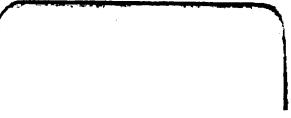


# THERMODYNAMICS

### AND

# THE FREE ENERGY OF CHEMICAL SUBSTANCES


# THERMODYNAMICS

### AND

# THE FREE ENERGY OF CHEMICAL SUBSTANCES

BY

### GILBERT NEWTON LEWIS V PROFESSOR OF CHEMISTRY IN THE UNIVERSITY OF CALIFORNIA

## AND

### MERLE RANDALL

ASSOCIATE PROFESSOR OF CHEMISTRY IN THE UNIVERSITY OF CALIFORNIA

FIRST EDITION SECOND IMPRESSION

MCGRAW-HILL BOOK COMPANY, INC. NEW YORK: 370 SEVENTH AVENUE LONDON: 6 & 8 BOUVERIE ST. , E. C. 4 1923

QC 311 L4 c. 3

COPYRIGHT, 1923, BY THE MCGRAW-HILL BOOK COMPANY, INC.

PRINTED IN THE UNITED STATES OF AMERICA


LET THIS BOOK BE DEDICATED TO THE CHEMISTS OF THE NEWER GENERATION , WHO WILL NOT WISH TO REJECT ALL INFERENCES FROM CONJECTURE OR SURMISE, BUT WHO WILL NOT CARE TO SPECU-LATE CONCERNING THAT WHICH MAY BE SURELY KNOWN. THE FASCINATION OF A GROWING SCIENCE LIES IN THE WORK OF THE PIONEERS AT THE VERY BORDERLAND OF THE UNKNOWN, BUT TO REACH THIS FRONTIER ONE MUST PASS OVER WELL TRAVELLED ROADS ; OF THESE ONE OF THE SAFEST AND SUREST IS THE BROAD HIGHWAY OF THERMODYNAMICS.


# PREFACE

There are ancient cathedrals which, apart from their consecrated purpose, inspire solemnity and awe. Even the curious visitor speaks of serious things, with hushed voice, and as each whisper reverberates through the vaulted nave, the returning echo seems to bear a message of mystery. The labor of generations of architects and artisans has been forgotten , the scaffolding erected for their toil has long since been removed, their mistakes have been erased , or have become hidden by the dust of centuries. Seeing only the perfection of the completed whole, we are impressed as by some superhuman agency. But sometimes we enter such an edifice that is still partly under construction ; then the sound of hammers, the reek of tobacco, the trivial jests bandied from workman to workman, enable us to realize that these great structures are but the result of giving to ordinary human effort a direction and a purpose.

Science has its cathedrals, built by the efforts of a few architects and of many workers. In these loftier monuments of scientific thought a tradition has arisen whereby the friendly usages of colloquial speech give way to a certain severity and formality. While this may sometimes promote precise thinking, it more often results in the intimidation of the neophyte. Therefore we have attempted, while conducting the reader through the classic edifice of thermodynamics, into the workshops where construction is now in progress , to temper the customary severity of the science in so far as is compatible with clarity of thought. But since it is improbable that we have been successful in this endeavor, to more than a limited extent, we shall take this opportunity of conversing very informally with the reader concerning our book and its purpose.

There are several kinds of audience to which a book on thermodynamics might be addressed. There is the beginner who, in

### viii PREFACE

order that he may decide whether the subject will meet his needs or arouse his interest, asks what thermodynamics is and what sorts of problems in physics , chemistry and engineering can be solved by its aid; there is the reader who looks for the philosophical implications of such concepts as energy and entropy ; above all there is the investigator who, attacking problems of pure or applied science, seeks the specific thermodynamic methods which are applicable to his problem and the data requisite for its solution. Perhaps we have been over-ambitious in attempting, within the confines of a single volume , to meet all these demands, -tolead the beginner through the intricacies of thermodynamic theory and to guide the experienced investigator to the extreme limits now set by existing methods and data.

Indeed our purpose at the outset was quite different. We proposed merely to collect, for the practical use of the chemist and the chemical engineer, the data which we have obtained , or which we have assembled from the work of other investigators, pertaining to the great problem of chemical affinity. But then we were convinced that mere reference tables would hardly render full service without some description of the methods by which they were obtained. The development of these methods of applying thermodynamics to chemical problems has occupied the greater part of our time for many years. It has been an investigation fascinating because of its diversity. Every new reaction that we have studied has presented some new requirements either of experimental method or of theoretical treatment. Thus we have been forced to develop a variety of special methods-chemical, algebraic, arithmetical and graphical-and it is our hope that a full presentation of these methods may spare other workers in this field much of the arduous labor which we ourselves have spent.

Finally , these methods themselves require a fuller understanding of the underlying principles of thermodynamics than most elementary treatises afford. Indeed few books on thermodynamics touch upon the thermodynamic properties of solutions , a subject which we have regarded as of the utmost importance to any adequate treatment of thermodynamic chemistry. Partly for this reason, and partly perhaps because of a temptation to present

### PREFACE ix

in a somewhat novel manner the basic ideas of thermodynamics, we devote the first part of our book to a presentation of the elements of thermodynamic theory ; and while we have written primarily for the chemist , we hope that this portion of our work will not be without interest to some students of physics and of engineering.

Our work is not a textbook in the ordinary sense of the term. Atextbook is a sort of table d'hôte to which any one may sit down and satisfy his hunger for information , with no thought of the complex agricultural processes which gave rise to the raw materials, nor of the mills which converted these raw materials into foodstuffs , nor of the arts of cookery responsible for the well-prepared meal which is set before him. It has not been our desire to offer such a repast to the reader. Our book is designed rather as an introduction to research, and as a guide to anyone who wishes to use thermodynamics in productive work. We have wished to permit every statement made during the course of the book to be traced either to the fundamental postulates of thermodynamics or to experimental work which is described in the literature and to which copious references have been furnished.

In spite of this departure from the textbook tradition-and perhaps even because of this departure we trust that this volume will be found serviceable in advanced chemical courses. For the benefit of the student, whether he is a member of a class, or is attempting by himself to master the fundamentals of thermodynamics, we have introduced numerous exercises during the earlier part of the book. These exercises will suggest many others , and it is only by repeated application of theory to concrete example that a real grasp of thermodynamics can be obtained.

There will be some difference of opinion as to the age and degree of maturity requisite for such a study as this. In most universities any thorough-going study of thermodynamics is deferred to the senior and graduate years. This we believe to be a mistake , and in the course in chemistry at the University of California a large part of the material treated in this work is presented to the better students before the end of the third college year. Indeed it seems as unwise for the prospective chemical engineer or investigator to postpone the study of this fundamental subject as it

would be for the student of mechanical or electrical engineering to postpone his calculus.

As for our extensive use of calculus in this book, we believe it unnecessary in the present age to make any apology. It is now very generally recognized that a chemist or a chemical engineer who enters his profession without a familiarity with this important tool suffers under a life-long handicap. It may be possible to acquire a very serviceable knowledge of thermodynamics without any understanding of the calculus , and indeed many important discoveries in thermodynamics have been made by non-analytical methods ; but, for any presentation of the subject which is to be both concise and comprehensive, calculus is indispensable. It is possible that some of our readers will have forgotten the simple methods of partial differentiation and, since this is the only part of calculus which we extensively employ, these methods are very briefly reviewed in one of the earlier chapters.

A scientific author must always envy the narrator who is not obliged to coerce into some artificial order the natural sequence of his story. To arrange in serial order a great mass of branching and interlocking ideas is always a painful task. It is always a choice of evils, and we cannot hope that the particular sequence which has seemed to us the best will necessarily appear so to others. Fortunately the reader is not entirely bound by our choice. For example, in the course in thermodynamics at the University of California, to which we have referred, the first and second laws , and their applications to simple systems, are presented before the student is required to face the intricate problems relating to the thermodynamics of solutions. So also our chapters on the third law of thermodynamics and the entropy of monatomic gases might follow immediately after the early chapters on the first and second laws. In general we must point out that our desire to present so extensive a material within a convenient volume has required a certain conciseness which does not permit the frequent reiteration and recapitulation that might be pedagogically desirable. This we must leave to the student himself, who will indeed realize that our subject matter is hardly compatible with fluent reading , but rather necessitates protracted and repeated study.

We presume that every author regards his own as the best of all possible notations. While we may privately be victims of some such hallucination , all that we care to claim publicly is that our system of nomenclature and of notation is one which has gradually developed through many years of practical work and the teaching of many types of students , and that it has proved satisfactory. As for complete arithmetical and typographical accuracy, we suppose that this is not humanly attainable. We have made every effort to avoid serious errors, but if we have failed we shall be very grateful to the reader who will call our attention to the mistakes which he discovers.

Several of the investigations which led to the preparation of this work have been materially aided by grants from the Bache Fund of the National Academy of Sciences and the Rumford Fund of the American Academy of Arts and Sciences. A great debt of gratitude, which cannot be adequately acknowledged , we owe to the assistance and criticism of many of our students and colleagues. We should have liked to express more concretely our heartfelt appreciation . We cannot refrain from mentioning in particular the help we have received from Mr. Thomas Fraser Young, whose unselfish labor in connection with our later free energy calculations has contributed much toward the attainment of the accuracy which we have so greatly desired.

And now we must conclude this conversation with our readers. If during the course of the book we help disclose to the student some of the beauty and simplicity of the thermodynamic method, if we convince a few practical chemists of the extreme practicality of the results of thermodynamic calculations , if we contribute in some measure toward making chemistry an exact science , our task is rewarded.

BERKELEY, CALIFORNIA, October, 1922.

GILBERT NEWTON LEWIS, MERLE RANDALL.


# CONTENTS

|                                                                                                                                                                                                                                                                                                                                                                                                                                                                                                                                                                                                                                                                                                                                                                                                                                              | PAGE          |
|----------------------------------------------------------------------------------------------------------------------------------------------------------------------------------------------------------------------------------------------------------------------------------------------------------------------------------------------------------------------------------------------------------------------------------------------------------------------------------------------------------------------------------------------------------------------------------------------------------------------------------------------------------------------------------------------------------------------------------------------------------------------------------------------------------------------------------------------|---------------|
| PREFACE<br>                                                                                                                                                                                                                                                                                                                                                                                                                                                                                                                                                                                                                                                                                                                                                                                                                                  | vii           |
| THE<br>THERMODYNAMICS<br>CHAPTER<br>OF<br>SCOPE<br>I.<br>-<br>POWER<br>THE<br>THE<br>AND<br>THE<br>OF<br>THERMODYNAMICS<br>LIMITATIONS<br>, 2.<br>-PLAN<br>MODERN<br>THERMODYNAMICS,<br>STAGE<br>OF<br>OF<br>THE<br>PRESENT<br>5.<br>WORK<br>,<br>6                                                                                                                                                                                                                                                                                                                                                                                                                                                                                                                                                                                          | 1             |
| THE<br>CONCEPT<br>CHAPTER<br>OF<br>DEFINITIONS<br>EQUILIB<br>II.<br>RIUM<br>;<br><br>OF<br>Homogeneous<br>SUBSTANCES,<br>8;<br>CLASSIFICATION<br>Substances,<br>9;<br>and<br>Heterogeneous<br>Systems,<br>9;<br>Pure<br>Substances<br>Solutions,<br>10<br>; Solids,<br>-<br>Non-Crystals<br>AND<br>and<br>and<br>STATES<br>Gases;<br>Liquids<br>Crystals<br>, 11.<br>and<br>PROPERTIES,<br>Extensive<br>; Reproduci<br>12;<br>Intensive<br>Properties,<br>13<br>-<br>AND<br>REACTION<br>SPEED,<br>EQUILIBRIUM<br>of<br>; Stable<br>States,<br>16<br>bility<br>14.<br>Systems,<br>Equilibrium,<br>; Degrees<br>; Equi<br>18<br>18<br>; Partial<br>19<br>of<br>Stability,<br>a<br>Macroscopic<br>19.<br>librium<br>as<br>State,                                                                                                                | 8             |
| MATHEMATICAL<br>CONVENTIONS<br>AND<br>CHAPTER<br>III.<br>METHODS<br><br>-<br>The<br>Mol<br>AND<br>CHEMICAL<br>EQUA<br>; Molal<br>SYMBOLS<br>, 21<br>Properties,<br>—THE<br>22.<br>-<br>LANGUAGE<br>OF<br>MATHEMATICS<br>PROPERTIES<br>TIONS,<br>23.<br>26.<br>-<br>,<br>TWO<br>MORE<br>WHICH<br>DEPEND<br>UPON<br>OR<br>VARIABLES,<br>TYPICAL<br>27.<br>EQUATIONS<br>OF<br>PARTIAL<br>DIFFERENTIATION,<br>29.                                                                                                                                                                                                                                                                                                                                                                                                                                | 12<br>21<br>7 |
| CHAPTER<br>SOLUTIONS<br>IV<br><br>-<br>MOL<br>MOLAL<br>THE<br>FRACTION<br>QUANTITIES,<br>33;<br>Apparent<br>PARTIAL<br>, 32.<br>-<br>MOLAL<br>METHODS<br>Volume<br>DetermininG<br>THE<br>of<br>Molal<br>PARTIAL<br>, 35.<br>Method<br>Method<br>QUANTITIES,<br>36<br>, 36<br>( Graphical)<br>(Analytical)<br>II<br>I<br>;<br>;<br>,<br>Method<br>Method<br>IV<br>Method<br>36;<br>, 37;<br>( Graphical)<br>(Graphical,<br>of<br>III<br>-THE<br>FUNDAMENTAL<br>MOLAL<br>EQUATIONS<br>OF<br>PARTIAL<br>Intercepts)<br>, 38.<br>Forms<br>QUANTITIES,<br>Molal<br>Equations,<br>43;<br>41<br>the<br>of<br>; Special<br>Partial<br>The<br>an<br>Binary<br>44;<br>Case<br>Applications<br>to<br>Solutions,<br>Special<br>of<br>Infi<br>44<br>Molal<br>Quanti<br>Dilute<br>Solution,<br>; Derivatives<br>nitely<br>of<br>Partial<br>ties<br>,<br>45 | 31            |
| LAW<br>AND<br>THE<br>THERMODYNAMICS<br>CHAPTER<br>OF<br>FIRST<br>V.<br>THE<br>ENERGY<br>CONCEPT<br>OF<br>THE<br>ENERGY<br>49.—<br>OF<br>A<br>Mass<br>INTERNAL<br>SYSTEM<br>Energy<br>and<br>, 49<br>-HEAT<br>;<br>,<br>WORK<br>AND<br>TEMPERATURE<br>AND<br>The<br>PRESSURE<br>Heat<br>, 53<br>, 51.<br>-HEAT<br>-<br>;<br>ENERGY<br>AND<br>CAPACITY,<br>UNITS<br>OF<br>COR<br>Content,<br>55.<br>56.<br>RELATED<br>UNITS,<br>58.                                                                                                                                                                                                                                                                                                                                                                                                            | 47            |

### xiv CONTENTS

PAGE

109

### CHAPTER VI. APPLICATION OF THE FIRST LAW TO A PURE HOMOGENEOUS SUBSTANCE..... 62

THE PERFECT GAS, 62 ; Work and Heat of Isothermal Expansion, 63; Work of Adiabatic Expansion, 64 ; The Difference between the Heat Capacity at Constant Pressure and at Constant Volume, 65.—THE HEAT OF FREE EXPANSION, 65.

### CHAPTER VII. THE HEAT CAPACITY OF PURE SUBSTANCES . 71

HEAT CAPACITY OF ELEMENTS IN THE SOLID STATE, 71 ; Heat Capacity of Solid Elements at Low Temperatures, 73 ; Solid Elements of Class I, 74 ; Solid Elements of Class II, 76 ; Heat Capacity of Solid Compounds, 77.-HEAT CAPACITY OF LIQUIDS, 78.-HEAT CAPACITY OF GASES, 79 ; Empirical Equations for the Heat Capacity of Gases, 80; Theory of the Heat Capacity of Gases, 81 ; Heat Capacity of Gases at Low Temperatures, 81 .

| CHAPTER<br>VIII. | AND<br>THE<br>HEAT<br>HEAT<br>CONTENT<br>CAPACITY |    |
|------------------|---------------------------------------------------|----|
|                  |                                                   |    |
| OF               | SOLUTIONS                                         | 83 |

PARTIAL MOLAL HEAT CAPACITY, 83. -PARTIAL MOLAL HEAT CON-TENT, 87; Reference States, 88 ; Partial or Differential Heat of Solution, 89; Calculation of a Partial Molal Quantity for the Solute when that for the Solvent is Known, 90; Calculation of a Partial Molal Quantity for the Solvent from that for the Solute, 92 ; Total or Integral Heat of Solution, 94.

### CHAPTER IX. HEAT OF REACTION AND ITS CHANGE WITH THE TEMPERATURE.... 97

Combination of Thermochemical Equations, 98 ; Heat of Formation, 99; Indirect Determination of Heat of Reaction at Constant Pressure, 100.-EFFECT OF TEMPERATURE UPON HEAT OF REACTION, 101. -REACTIONS INVOLVING SOLUTIONS, 105 ; Effect of Temperature upon the Abnormality of Solutions, 106.

### CHAPTER X. THE SECOND LAW OF THERMODYNAMICS AND THE CONCEPT OF ENTROPY ...

Preliminary Statement of the Second Law: The Actual or Irreversible Process, 110; The Idea or Reversible Process, 112. -A QUAN-TITATIVE MEASURE OF DEGRADATION, 113 ; The Entropy of the Spring- Reservoir, 115 ; Comparison of Any Irreversible Process with the Standard Irreversible Process, 116 ; The Entropy Change in the Free Expansion of a Perfect Gas, 116 ; Entropy as an Extensive Property, 117; An Important Criterion for Reversible Processes , 118.

### CHAPTER XI. ENTROPY AND PROBABILITY. Chance,122.120

### CONTENTS

### CHAPTER XII. MISCELLANEOUS APPLICATIONS OF EN- TROPY

.... The Heat Engine, 129 ; The Refrigerating Machine, 131. -ENTROPY AND HEAT CAPACITY; CHANGE OF ENTROPY WITH TEMPERATURE, 132. -CHANGE OF ENTROPY WITH VOLUME AND WITH PRESSURE , 133 ; Equilibrium between a Substance and its Vapor, 134.-THER-MODYNAMIC EQUATIONS OF STATE, 134 ; The Perfect Gas Thermometer and the Thermodynamic Scale of Temperature, 135 ; Difference between Heat Capacity at Constant Pressure and at Constant Volume, 136. -REVERSIBLE ADIABATIC CHANGES, 137 ; An Indirect Method of Measuring the Heat Capacity of Liquids, 137.-RADIATION AND STEFAN'SLAW,138.129

### CHAPTER XIII. THE NUMERICAL CALCULATION OF EN-TROPY.. 143

ENTROPY CHANGES IN ISOTHERMAL PROCESSES, 143; The Entropy Change in Fusion, 143 ; The Entropy Change in Vaporization, 144 ; The Entropy Change in Expansion, 146; The Entropy Change in a Chemical Reaction, 146. -CHANGE OF ENTROPY WITH TEMPERAture, 147 ; Absolute Value of Entropy, 149 ; Entropy of Solid Elements of Class I, 149 ; Entropy of Solid Elements which are not of Class I, 152; Entropy of Liquid and Gaseous Elements, 152.

### CHAPTER XIV. CRITERIA OF EQUILIBRIUM AND OF SPON-TANEOUS CHANGE; THE FREE ENERGY... 155

TWO THERMODYNAMIC FUNCTIONS, 155 ; Maximum Work, 156; The Net Work in an Isothermal Process at Constant Pressure, 157.— THE DRIVING FORCE OF A CHEMICAL REACTION, AND A NEW TEST FOR EQUILIBRIUM, 159; Systems which are Subject to No External Forces except a Constant Pressure, 160 ; A Necessary Condition for Equilibrium, 161. -THE EFFECT OF PRESSURE AND TEMPERATURE UPON THE FREE ENERGY, 162. -A CONDENSED SUMMARY OF THER-MODYNAMIC FORMULAE, 163.

### CHAPTER XV. THE FREE ENERGY CHANGE IN A CHEM-ICAL REACTION.. 167

Free Energy and the Electromotive Force of a Galvanic Cell, 167 ; Free Energy and Heat of Reaction, 169 ; The Addition of Free Energy Equations, 171.-THE FREE ENERGY CHANGE AS A FUNCTION OF THE TEMPERATURE, 172 ; The Gibbs-Helmholtz Equation, 172 ; The Integration of the Free Energy Equation, 173.

### CHAPTER XVI. THE ESCAPING TENDENCY; EQUILIBRIUM BETWEEN TWO OR MORE PURE PHASES.. 176

Molal Free Energy as a Measure of the Escaping Tendency, 178.— THE EFFECT OF PRESSURE AND TEMPERATURE UPON SIMPLE TYPES OF EQUILIBRIUM, 180; Change of " Equilibrium Pressure" with Tem-

XV PAGE

perature, 180; Two Phases under Different Pressures at Constant Temperature, 181 ; Two Phases under Different Pressures and the Temperature of the Whole System Variable, 183 ; Systems in which the Temperature is not the Same in All Parts, 184.-THE PHASE RULE, 185; Continuity between Liquid and Vapor States, 186 ; Possible Continuity between Solid and Liquid Phases, 188.

### CHAPTER XVII. THE FUGACITY……. 190

THE FUGACITY OF A PERFECT GAS, 191.-THE FUGACITY OF AN IMPERFECT GAS, 192 ; Change of Fugacity with Pressure, 192 ; Calculation of Fugacity by Graphical Methods, 192 ; Calculation of Fugacity from the Equation of van der Waals, 195; A Simple Approximate Method of Calculating Fugacity, 197. -FUGACITY OF SOLIDS AND LIQUIDS, 198. -CHANGE OF FUGACITY WITH TEMPERATURE, 200.

### CHAPTER XVIII. APPLICATION OF THE SECOND LAW TO SOLUTIONS . 203

THE ESCAPING TENDENCY FROM SOLUTIONS, 203 ; Partial Molal Free Energy and Entropy, 203 ; Change of Partial Molal Free Energy with Pressure and Temperature, 204; The Fugacity of a Dissolved Substance, 205. -CHANGE OF ESCAPING TENDENCY WITH COMPOSI-TION, 207; The Critical Mixing Point, 211. -OSMOTIC PRESSURE, 213.-EQUILIBRIUM BETWEEN PHASES WHICH MAY BE SOLUTIONS, 215; Change of Eutectic Temperature with Pressure, 215; The Solubility Curve of a Dissociable Solute, 217.

### CHAPTER XIX. THE PERFECT SOLUTION .... 221

GASEOUS Solution, 225. —EqUILIBRIUM BETWEEN A PURE SOLID AND A PERFECT LIQUID SOLUTION, 227; Change of Solubility with Pressure, 228 ; Change of Solubility with the Temperature, 228.

## CHAPTER XX. THE LAWS OF THE DILUTE SOLUTION...... 232

Henry's Law, 233; Nernst's Law of Distribution between Two Solvents, 234; Raoult's Law, 234; van't Hoff's Law of Osmotic Pressure, 235; van't Hoff's Law of Freezing Point Lowering, 237 ; The Freezing Point Lowering when a Solid Solution Appears, 238 ; Dilute Solution in a Mixed Solvent, 239.

### CHAPTER XXI. SYSTEMS INVOLVING VARIABLES OTHER THAN PRESSURE, TEMPERATURE AND COMPOSITION 242

GRAVITATIONAL AND CENTRIFUGAL FIELDS, 242. -THE ELECTRIC FIELD: CHANGE OF DIELECTRIC CONSTANT WITH PRESSURE AND TEMPERATURE, 245. —THERMODynamics of Surfaces, 247 ; Change of Surface Tension with Pressure and Temperature, 247; Change of Surface Tension with Composition, 249; The Escaping Tendency from Curved Surfaces, 251.

### CONTENTS xvii

### CHAPTER XXII. A USEFUL FUNCTION, CALLED THE AC-TIVITY, AND ITS APPLICATION TO SOLUTIONS .. 254

CHOICE OF A STANDARD STATE, 256; For a Gas, 256; For a Liquid or Solid which may Act as a Solvent, 256 ; For a Solute, 258 ; For a Solute in Aqueous Solution when the Composition is Expressed by Molality, 259. -THE NUMERICAL CALCULATION OF ACTIVITY, 259; The Activity of a Solvent, from its Vapor Pressure over a Solution, 259; Activity of a Solute from its Vapor Pressure, 260 ; Determination of Activity from the Distribution of a Solute between Two Solvents, 262; Activity from Measurements of Electromotive Force, 263. -CALCULATION OF THE ACTIVITY OF ONE COMPONENT OF A SOLUTION WHEN THE ACTIVITY OF THE OTHER IS KNOWN, 268; A Graphical Computation of the Activity of the Solvent, 269; Calculation of the Activity of the Solute : ( I ) An Analytical Method, 271 ; (II) A Graphical Method, 272 ; ( III ) A Special Graphical Method, 273.

CHAPTER XXIII. CHANGE OF ACTIVITY WITH THE TEM-PERATURE, AND THE CALCULATION OF ACTIVITY FROM FREEZING POINTS.. 278

= CHANGE OF SOLUBILITY WITH THE TEMPERATURE, 281.-ACTIVITY OF A SOLID IN THE NEIGHBORHOOD OF ITS MELTING POINT, 282 ; H₂O(1) H2O(s) , 283. -CALCULATION OF THE ACTIVITY IN AQUE-OUS SOLUTION FROM FREEZING POINT DATA, HEAT OF DILUTION BEING NEGLECTED, 284 ; The Activity of the Solute, 285; The Integration, 286; A Simple Empirical Rule, 288.-THE CORRESPONDING CALCU-LATION WHEN THE HEAT OF DILUTION IS NOT NEGLECTED, 288.- CALCULATION OF ACTIVITIES FROM THE RISE IN BOILING POINT, 290.

### CHAPTER XXIV. THE STANDARD CHANGE OF FREE EN-ERGY; THE EQUILIBRIUM CONSTANT ……….. THE EQUILIBRIUM CONSTANT, 294; The Activity of a Solute which Forms Compounds with the Solvent, 296. -THE CHANGE OF Equi-LIBRIUM CONSTANT WITH THE TEMPERATURE, 298 -THE DISSOCIA-TIONCONSTANT,301.291

### CHAPTER XXV. SOLUTIONS OF ELECTROLYTES. 307

THE CONDUCTIVITY AND THE DISSOCIATION OF WEAK ELECTROLYTES, 309; The Two Dissociation Constants of Carbonic Acid, 311.-THE EFFECT OF TEMPERATURE UPON IONIZATION, 313. -STRONG ELEC-TROLYTES, 315.-THE CONCENTRATION OF THE IONS AND THE "TRUE" DEGREE OF DISSOCIATION, 317; The Interpretation of Conductivity, 319; What Do We Mean by Degree of Dissociation?, 323.

### CHAPTER XXVI. THE ACTIVITY OF STRONG ELECTRO-LYTES . THEVAPOR326

THE ACTIVITY COEFFICIENT, 328. -ACTIVITY FROM PRESSURE OF THE SOLUTE, 329. -ACTIVITY FROM DISTRIBUTION

RATIOS, 330. -ACTIVITY FROM THE VAPOR PRESSURE OF THE SOL-VENT, 331.—ACTIVITY FROM ELECTROMOTIVE FORCE, 332; The Activity of Hydrochloric Acid from Cells of Uniform Concentration of Electrolyte, 332.-CONCENTRATION CELLS WITH LIQUID JUNCTION (" WITH TRANSFERENCE" ) , 337.

### CHAPTER XXVII. THE ACTIVITY OF ELECTROLYTES FROM FREEZING POINT DATA, AND TABLES OF ACTIVITY COEFFICIENTS .. 341

AN EMPIRICAL LAW FOR THE LOWERING OF THE FREEZING POINT BY ELECTROLYTES IN DILUTE SOLUTION, 342.-PRELIMINARY TREAT-MENT OF CONCENTRATED SOLUTIONS, 346.-FINAL CALCULATION OF THE ACTIVITY COEFFICIENT AT A GIVEN TEMPERATURE, NEITHER THE HEAT OF DILUTION NOR ITS TEMPERATURE COEFFICIENT BEING NEGLECTED, 348; An Alternative Method, 351.-COMPARISON OF THESE ACTIVITY COEFFICIENTS WITH THOSE OBTAINED FROM ELEC-TROMOTIVE FORCE MEASUREMENTS, 352.-THE ACTIVITY COEFFI-CIENT OF SULFURIC ACID BY THREE INDEPENDENT METHODS, 353; Freezing Points, 353 ; Electromotive Force, 355 ; Activity Coefficient from the Vapor Pressure, and Comparison of the Three Series, 356- METHODS OF EVALUATING ACTIVITY COEFFICIENTS WHEN DATA AT HIGH DILUTIONs are Lacking, 357 ; Potassium Chloride, 359 ; Cadmium Chloride, 360.-ACTIVITY COEFFICIENTS OF SEVERAL TYPICAL ELECTROLYTES, 362.

### CHAPTER XXVIII. ACTIVITY COEFFICIENT IN MIXED ELECTROLYTES; THE PRINCIPLE OF THE IONIC STRENGTH; THE ACTIVITY OF INDIVIDUAL IONS ... 364

THE ACTIVITY COEFFICIENT IN MIXTURES, CALCULATED FROM ELECTROMOTIVE FORCE DATA, 365 ; An Objection by Brönsted, 368.- THE ACTIVITY COEFFICIENT IN MIXED ELECTROLYTES, FROM SOLU-BILITY MEASUREMENTS, 369 ; Uni-univalent Salts, 370; Mixtures Containing Two or More Valence Types; The Ionic Strength, 373 ; The Solubility of Uni-bivalent Salts, 374; Bi-bivalent Salts, 376; Uni-trivalent Salts, 378. -THE ACTIVITY COEFFICIENTS OF INDI-VIDUAL IONS, 379; Hypothesis of the Independent Activity Coefficients of the Ions, 380; Numerical Values of Ion Activity Coefficients, 381 ; The Possible Determination of Ion Activity Coefficients without any Arbitrary Assumption, 382. -RÉSUMÉ OF OUR CONCLUSIONS CONCERNING THE ACTIVITY COEFFICIENTS OF STRONG ELECTRO-LYTES, 383.

CHAPTER XXIX. THE GALVANIC CELL.. CONDITIONS WHICH DETERMINE THE REVERSIBILITY OF A CELL, 386; Constancy and Reproducibility of Electrodes, 388. -CONVEN-TION REGARDING THE SIGN OF ELECTROMOTIVE FORCE, 389. - EFFECT OF TEMPERATURE ON THE ELECTROMOTIVE FORCE of a Cell, 391.— 386

### CONTENTS xix

ACTIVITY AND ELECTROMOTIVE FORCE, 393. -ELECTROMOTIVE FORCE AND EQUILIBRIUM CONSTANT, 396. -CASES IN WHICH THE CELL REACTION IS NOT DEFINITELY KNOWN, 397; Liquid Potentials, 397; Other Uncertainties as to the Cell Reaction, 400.

### CHAPTER XXX. SINGLE POTENTIALS; STANDARD ELEC-TRODE POTENTIALS OF THE ELEMENTS ... . . . . 401

THE POTENTIALS OF SOME REFERENCE ELECTRODES, AT 25°C, 404; Pt, H2, H+, 404; Hg, HgCl (s) , Cl-, 405 ; The Normal Calomel Electrode, 406 ; Ag, AgCl (s) , Cl−, 407 ; Hg, Hg₂SO4 (8) , SO₁¯¯¯, 407; Pt, H2, OH , 408; Hg, HgO (s ) , OH-, 408. - METHODS OF AVOIDING CELLS WITH LIQUID POTENTIALS, 409.-THE FREE ENERGY CHANGE IN AN ELECTRODE PROCESS, 409. -THE STANDARD ELECTRODE PO-TENTIALS OF THE ELEMENTS AT 25°C, 411 ; Tl, TI+, 412 ; Ag, Ag†, 414; Na, Na+, 414 ; K, K+; Li, Li+ ; Rb, Rb+, 417 ; Hg, Hg₂++, 417; Cd, Cd++, 419; Zn, Zn++, 419 ; Cu, Cu++, 420; Pb, Pb++, 421 ; Sn, Sn**, 424; Fe, Fe++, 425 ; Pt, Cl-, Cl2 (g) , 425; Pt, Br-, Br₂ (1) , 426; Pt, I-, I2 (s ) , 427; Standard Potentials in Non-Aqueous Solvents, 430.- CHANGE OF SINGLE ELECTRODE POTENTIALS WITH TEMPERATURE, AND INDIVIDUAL IONIC HEAT CONTENTS, 431.-SUMMARY, 432.

## CHAPTER XXXI. THE THIRD LAW OF THERMODYNAMICS . 435

THE INTEGRATION CONSTANT OF THE FREE ENERGY EQUATION, 435.— HEAT CAPACITY AND ENTROPY AT THE ABSOLUTE ZERO, 438 ; An Important Corollary, 439; Entropies at the Absolute Zero, 440.— LIMITATIONS Of the Nernst PRINCIPLE, 440; Solutions, 440 ; Failure of the Nernst Principle in the Case of Liquids, 442. -A RESTATE-MENT OF THE ENTROPY PRINCIPLE, 444; Entropy as a Positive Entity, 445.-FINAL STATEMENT OF THE THIRD Law, 447. -EXPERIMENTAL DETERMINATION OF ENTROPIES AND TESTS OF THE THIRD LAW, 448 ; S(rhomb. ) S (monocl. ) , 449 ; Sn(white) Sn(gray) , 450; The Entropy of Chlorine Calculated by Several Different Methods, 450 ; The Entropy of Iodine Calculated by Two Methods, 451 ; Three Determinations of the Entropy of Oxygen, 452. -THE CONSTANT OF THE FREE ENERGY EQUATION AND NERNST'S CHEMICAL CON-STANTS,453 .= =

### CHAPTER XXXII. THE ENTROPY OF MONATOMIC GASES .. 455 AND A TABLE OF ATOMIC ENTROPIES ...

THE EQUATION OF SACKUR, 455. -THE SACKUR CONSTANT FROM ULTIMATE RATIONAL UNITS, 456. -APPLICATIONS, 458; The Entropy of "Electron Gas, " 458; The Thermal Ionization of a Metal, 458; Diatomic Hydrogen, 460. -SEVERAL APPROXIMATE METHODS OF CALCULATING ENTROPIES, 461 ; Entropy of Solid Salts, 461 ; Diatomic Gases, 462. -TABLE OFATOMICENTROPIES,463.

### CONTENTS

### CHAPTER XXXIII. INTRODUCTION TO SYSTEMATIC FREE ENERGY CALCULATIONS : THE FREE ENERGY OF ELEMENTARY HYDROGEN AND METALLIC HY-DRIDES...... 466

NON-METALLIC COMPOUNDS AND ANIONS, 466. -SALTS, 467; Hydrated Salts, 467 ; Fused Salts, 468. -SOME REMARKS CONCERNING THE NUMERICAL ACCURACY OF THE DATA, 468. -ELEMENTARY HY-DROGEN, 469; Hydrogen Ion, 469; Monatomic Hydrogen, 470.- METALLIC HYDRIDES, 472 ; Calcium Hydride, 472.

### CHAPTER XXXIV. OXYGEN AND ITS COMPOUNDS WITH HYDROGEN AND WITH SOME METALS . 475

= ELEMENTARY OXYGEN, 475; Ozone, ¾½02 = O3, 475.—Water, 476; Heat Capacity and Heat Content of Water, 476 ; The Free Energy of Formation of Water from Measurements of its Dissociation at High Temperatures, H₂ + ½02 H₂O (g) , 477 ; Free Energy of Formation of Water from the Dissociation of Silver Oxide, 479; Free Energy of Water from the Dissociation of Mercuric Oxide, 483; Free Energy of Water from Equilibrium in the Deacon Process, 484; Final Value for the Free Energy of Formation of Liquid Water, 485 ; Water Vapor, 485; Ice, 486. -THE DEGREE OF IONIZATION OF WATER AND THE FREE ENERGY OF HYDROXIDE ION, 486 ; Hydroxide Ion, 487.-HYDROGEN PEROXIDE, 487 ; BaO + ½02 = BaO2, 488 ; Thermal Dissociation of Barium Hydroxide, 489 ; Vapor Pressure over Ba(OH) 2 and Ba(OH) 2 H2O, 490 ; Vapor Pressure over Ba (OH) 2 H2O and Ba(OH) 2 8H2O, 490; Solubility of Barium Hydroxide Octahydrate, 490; Vapor Pressure over BaO2 and BaO2 · 10H2O, 490 ; BaO2 · 10H2O = Ba+++ 20H + H2O2 (Aq) + 8H₂O (1) , 491 ; Free Energy of Formation of Aqueous Hydrogen Peroxide, 492 ; The Ionization of Hydrogen Peroxide, 492 ; H₂O₂ ( aq) + OH¯ = HO₂ + H₂O, 492 ; Hydroperoxide Ion, 492 ; H₂O½ (1) H2O, ( s ) , 493 ; H2O2 (aq ) = HO ( 1 ) , 493 ; H₂O₂ (1) H₂O2 (g) , 495 ; The Free Energy of Formation of Liquid, Solid and Gaseous Hydrogen Peroxide, 495; The Formation and Dissociation of Hydrogen Peroxide at High Temperatures, 495; H₂O (g) + O2 (g) = H2O2 (g) , 496. -METALLIC OXIDES AND HY-DROXIDES,496.= =

### CHAPTER XXXV. CHLORINE AND ITS COMPOUNDS . 499

ELEMENTARY CHLORINE, 499 ; Chlorine Gas (Diatomic) , 499; Monatomic Chlorine, 499 ; Liquid Chlorine, 501 ; Chlorine in Water and in Carbon Tetrachloride, 502. -Chloride Ion, Tri-chloride Ion, Hydrochloric Acid, 502 ; Tri-chloride Ion, 502; Gaseous Hydrogen Chloride, 503. —THE DEACON PROCESS, 503; MgCl2 ( s ) + ½0½ = MgO (s) + Cl2 ( g) , 505 ; MgCl2 (s ) + H2O = MgO (s ) + 2HCl ( g) , 506; Summary of Results for the Deacon Process, 507.-HYPO-CHLOROUS ACID AND HYPOCHLORITE ION, 507. -CHLORATE ION,


xxi PAGE

508.-METALLIC CHLORIDES AND CHLORATES, 510; Potassium Chlorate, 511.

## CHAPTER XXXVI. BROMINE AND ITS COMPOUNDS ....... 512

BROMINE VAPOR, 512; Br₂ (1) = Br2 ( g) , 512.— MONATOMIC BROMINE, 513.-BROMINE IN THE SOLID STATE AND IN SOLUTION, 515; Bromine in Carbon Tetrachloride, 515 ; Bromine in Water, 516. -HYDRO-BROMIC ACID AND BROMIDE ION, 517 ; ½H½ + ½Br2 (g) HBr (g), 517; Aqueous Hydrobromic Acid, 518 ; The Activity Coefficient of Aqueous Hydrobromic Acid, 519. -POLYBROMIDES, 519; Tri-bromide Ion, 519; Penta-bromide, 520. -HYPOBROMOUS ACID, 521. -BROMIC ACID AND BROMATE ION, 521. =

### CHAPTER XXXVII. IODINE AND ITS COMPOUNDS .. 522

= ELEMENTARY IODINE, 522 ; Liquid Iodine, 522; Iodine Vapor, 522; Monatomic Iodine, 522 ; Aqueous Iodine, 523. -GASEOUS HYDROGEN IODIDE, 524; ½H½ + ½I½ (g) HI (g) , 524. -HYDRIODIC ACID, IODIDE ION, TRI-IODIDE ION AND HYPOIODOUS ACID, 526 ; Activity Coefficient of Hydriodic Acid, 526 ; Tri-iodide Ion , 526 ; Hypoiodous Acid, 527.-IODIC ACID AND IODATE ION, 528. -A COMPARISON OF THE ACIDS OF THE Halogens, 529.

### CHAPTER XXXVIII. SULFUR AND ITS COMPOUNDS. ...... 530

= SOLID SULFUR, 531 ; Monoclinic Sulfur, 531.-LIQUID SULFur, 532; S(rhomb. ) Sx (1 ) , 532 ; S(monocl. ) = Sx (1 ) , 533 ; The Equilibrium Liquid, 533; Sx (1) = Sx,µ (1) , 533. -GASEOUS SULFUR, 536 ; Diatomic Sulfur, 536 ; S. and S., 538 ; Monatomic Sulfur, 539.-HYDROGEN SULFIDE, 540 ; S (rhomb. ) + 2HI (g) = I₂ ( s) + H2S (g) , 541 ; Comparison of Results ; Heat of Formation of Hydrogen Sulfide, 542.- AQUEOUS HYDROGEN SULFIDE AND ITS Ions, 543 ; Hydrosulfide Ion, 543; Sulfide Ion, 543. -SULFUR DIOXIDE, 544; The Reaction between Sulfur and Water at the Boiling Point of Sulfur, 545; The Reaction between Sulfur and Water at High Temperatures, 546 ; The Reaction between Sulfur Dioxide and Carbon Monoxide, 547 ; Final Value for the Free Energy of Sulfur Dioxide, 548. -AQUEOUS SULFUROUS ACID AND ITS IONS, 549. -SULFUR TRIOXIDE, 550. -SULFURYL CHLORIDE, 551 ; SO2 (g) + Cl2 (g) = SO₂Cl₂ (g) , 551. —SULFURIC ACID AND SULFATE ION, 552 ; Reactions in the Roasting of Lead Sulfide, 552 ; The Reduction of Sulfuric Acid by Sulfur, 553 ; The Reduction of Sulfuric Acid by Mercury, 553 ; The Free Energy of Aqueous Sulfuric Acid from that of Sulfur Trioxide, 554 ; Provisional Value for the Free Energy of Sulfuric Acid, 554.

### CHAPTER XXXIX. NITROGEN COMPOUNDS . 556

AMMONIA AND AMMONIUM ION, 556; Liquid Ammonia, 558; Aqueous Ammonia, 558; Ammonium Ion, 558. -OXIDES OF NITROGEN, 559;

### CONTENTS

PAGE

Nitric Oxide, 559; Nitrogen Dioxide, 560 ; Nitrogen Tetroxide, 561.— NITROSYL CHLORIDE, 562. -NITROUS AND NITRIC ACID AND THEIR IONS, 562; 2AgNO2 (s) = Ag+ + NO3˜ + Ag + NO (g) , 562; Nitrate and Nitrite Ion, 563 ; The Ionization of Nitrous Acid, 563 ; H++ NO3¯ + 2NO (g) + H2O (l ) = 3HNO, aq) , 563 ; Combining the Equations, 565; The Reaction between Nitrogen Dioxide and Water, 566; The Activity Coefficient of Nitric Acid Solutions, 566 ; Final Free Energy Values, 567 ; The Stability of Nitric Acid, 567.

## CHAPTER XL. CARBON AND SOME OF ITS COMPOUNDS . . 569

= ELEMENTARY Carbon, 569 ; C (graph. ) = C (diamond) , 570. —HYDRO-CARBONS, 571 ; Methane, 571 ; Benzene, 572. -OXIDES OF CARBON, 573; C + CO2 2CO, 573 ; CO . + H = CO +H,O ( g) , 574 ; CO + 120 , = CO2, 575; Final Values for the Two Oxides, 576. -CARBONIC ACID AND ITS IONS, 576 ; Bicarbonate Ion, 577; Carbonate Ion, 577.— SOME ORGANIC COMPOUNDS CONTAINING OXYGEN AND HYDROGEN, 578; Formic Acid, 578 ; Ethyl Alcohol, 580. -COMPOUNDS WITH CHLORINE, 580; Carbonoxychloride, 580. -COMPOUNDS WITH SUL-FUR, 581 ; Carbonoxysulfide, 581 ; Carbon Disulfide, 582.

## CHAPTER XLI. COMPOUNDS OF CARBON AND NITROGEN .. 584

UREA, 585; The Free Energy of Solid Urea, 586 ; The Free Energy of Aqueous Urea, 586. -CYANATE ION, 587.-CYANIC ACID, 587.— CYANIDE ION, 588; The Oxidizing Power of Cyanates, 588 ; The Free Energy of Solution of Potassium Cyanide and Cyanate, 589; The Free Energy of Cyanide Ion, 589. -HYDROCYANIC ACID, 589; The Aqueous Solution , 589; Gaseous and Liquid Hydrogen Cyanide, 590; The Measurements of von Wartenberg, 590.-CYANOGEN IODIDE AND CYANOGEN, 591 ; The Free Energy of Cyanogen, 592 ; Paracyanogen, 594.

### CHAPTER XLII. TABLE OF FREE ENERGIES; AND EX-AMPLES ILLUSTRATING ITS USE.. 596

Example 1. Hydrolysis of Nitrogen, 597 ; Example 2. Oxidation of Nitrites by Iodine, 598 ; Example 3. The Oxidation-Reduction Series, 599; Example 4. Catalytic Decomposition of Hydrogen Peroxide, 601 ; Example 5. Equilibrium in the Gaseous Phase in the Lead Chamber Process, 602 ; Example 6. The Vapor Pressure of Hydrochloric Acid, 603 ; Example 7. Reduction of Thallous Oxide by Hydrogen, 603; Example 8. The Decomposition Potential of Fused Cadmium Chloride, 604; Example 9. Explosives, 606.- TABLE OF STANDARD FREE ENERGIES OF FORMATION AT 25°C, 607.

| APPENDIX<br>I. | CONVERSION    | TABLE      | MOL<br>FOR | FRACTIONS<br>, |     |
|----------------|---------------|------------|------------|----------------|-----|
| MOL            | AND<br>RATIOS | MOLALITIES |            |                | 609 |

### APPENDIX II. SOME USEFUL NUMERICAL FACTORS.. 612

### CONTENTS xxiii

|                                                                    | PAGE |
|--------------------------------------------------------------------|------|
| EMPLOYED<br>CONVERT<br>COEFFICIENTS<br>IN<br>APPENDIX<br>III.      |      |
| AND<br>CONSTANT<br>FREE<br>ING<br>ACTIVITY<br>EQUILIBRIUM<br>,     |      |
| ENERGY<br>FROM<br>TEMPERATURE<br>ANOTHER<br>ONE<br>TO<br>          | 613  |
| THE<br>BY<br>AUTHORS<br>PUBLICATIONS<br>PER<br>APPENDIX<br>IV<br>, |      |
| THERMODYNAMICS<br>TO<br>TAINING                                    | 617  |
| NOTATION                                                           | 621  |
| INDEX<br>                                                          | 625  |

## THERMODYNAMICS AND THE FREE ENERGY OF CHEMICAL SUBSTANCES

# CHAPTER I

# THE SCOPE OF THERMODYNAMICS

Aside from the logical and mathematical sciences, there are three great branches of natural science which stand apart by reason of the variety of far reaching deductions drawn from a small number of primary postulates. They are mechanics, electromagnetics, and thermodynamics.

These sciences are monuments to the power of the human mind ; and their intensive study is amply repaid by the aesthetic and intellectual satisfaction derived from a recognition of the order and simplicity which have been discovered among the most complex of natural phenomena. Also much of the material progress of the past century has sprung from the development of mechanical and electrical engineering, and from the application of thermodynamics to the steam engine and other power-generating apparatus.

Yet the greatest development of applied thermodynamics is still to come. It has been predicted that the era into which we are passing will be known as the chemical age ; but the fullest employment of chemical science in meeting the various needs of society can be made only through the constant use of the methods of thermodynamics.

When it was first discovered that heat and work could be transformed one into the other, and the laws governing such transformation were embodied in the science of thermodynamics,

### THERMODYNAMICS

CHAP. I

it was the primary function of this science to increase efficiency in the design and the use of engines for the production of work. Although this function has grown steadily in importance, it is now overshadowed by numerous applications of thermodynamics to physics and especially to chemistry. Here the methods of thermodynamics have brought quantitative precision in place of the old, vague ideas of chemical affinity, and thus chemistry has made the greatest advance toward the status of an exact science since the early chemists, Lavoisier, Richter and Dalton laid the foundations of stoichiometry. Even in the superchemistry of to-day, in which processes of stellar evolution, of radioactivity and of intense electric discharge lead to the consideration of phenomena of a very different order from those of traditional chemistry, sometimes involving the dissolution of the atom itself, thermodynamics affords an unerring guide to the investigator.

## THE POWER AND THE LIMITATIONS OF THERMODYNAMICS

Our book might be introduced by the very words used by Le Chatelier¹ a generation ago : "These investigations of a rather theoretical sort are capable of much more immediate practical application than one would be inclined to believe. Indeed the phenomena of chemical equilibrium play a capital rôle in all operations of industrial chemistry. " He continues : "Unfortunately there has been such an abuse of the applications of thermodynamics that it is in discredit among experimentors. " If this was true when written by Le Chatelier it is no less true to- day. The widespread prejudice against any practical use of thermodynamics in chemistry is not without reason, for the propagandists of modern physical chemistry have at times shown more zeal than scientific caution. We have seen "cyclical processes " limping about eccentric and not quite completed cycles, we have seen the exact laws of thermodynamics uncritically joined to assumptions comprising half truths or no truth at all, and worst of all we have seen ill -begotten equations supported by bad data.

Le Chatelier, Ann. mines, [ 8 ] 13 , 157 ( 1888) .

However, the fact that errors are constantly made in numerical calculations does not diminish our confidence in the principles of arithmetic ; nor can any reasonable person question either the possibility of an exact application of thermodynamics to practical chemistry, or the great value to be gained thereby. Let us once more quote the words of Le Chatelier.

"It is known that in the blast furnace the reduction of iron oxide is produced by carbon monoxide, according to the reaction

$$\rm{Fe_3O_3 + 3CO = 2Fe + 3CO_2}$$

but the gas leaving the chimney contains a considerable proportion of carbon monoxide, which thus carries away an important quantity of unutilized heat. Because this incomplete reaction was thought to be due to an insufficiently prolonged contact between carbon monoxide and the iron ore, the dimensions of the furnaces have been increased. In England they have been made as high as thirty meters. But the proportion of carbon monoxide escaping has not diminished, thus demonstrating, by an experiment costing several hundred thousand francs, that the reduction of iron oxide by carbon monoxide is a limited reaction. Acquaintance with the laws of chemical equilibrium would have permitted the same conclusion to be reached more rapidly and far more economically. "

In the third of a century which has elapsed since this was written, many other examples could be cited of economic waste, and retarded development, due to ignorance of the rudimentary theorems of thermodynamics. Fortunately such ignorance is fast disappearing, but there is still hardly an industry which could not be bettered by a more thorough and critical application of thermodynamic principles.

Before speaking more in detail of that which can be accomplished through the aid of thermodynamics, we must from the outset recognize its limitations. In mechanics it is possible to foretell by simple laws the minimum expenditure of work by which a certain operation may be effected ; but unless we know what frictional resistance may be encountered, we cannot predict how much work will actually be required . So thermo-

dynamics tells us the minimum amount of work necessary for a certain process, but the amount which will actually be used will depend upon many circumstances. Likewise thermodynamics shows us whether a certain reaction may proceed, and what maximum yield may be obtained, but gives no information as to the time required. The rate of a reaction is determined by factors which have hitherto eluded any exact analysis.

Although subject to these limitations, thermodynamics is an instrument of great power and universality. It shows the engineer the maximum amount of work which a given quantity of fuel can produce in a given type of steam engine, it shows that more work is available when the fuel is burned in an explosion engine, and, finally, that still more could be utilized if we were to solve the technical difficulties in obtaining "electricity direct from coal. " The maximum efficiency of a turbine, or of a refrigerator, or of a weapon of ordnance are subjects for thermodynamic calculation.

To the manufacturing chemist thermodynamics gives information concerning the stability of his substances, the yields which he may hope to attain, the methods of avoiding undesirable substances, the optimum range of temperature and pressure, the proper choice of solvent, the limitations of methods of fractional distillation and crystallization .

To the analytical chemist it offers the means of predicting the limits of possible error, of avoiding side-reactions, of choosing the concentrations best suited to his work.

The methods of solving such problems will be indicated during the course of this book. The reader may be interested in glancing at the last chapter in which numerous specific examples of applied thermodynamics are given; but before such methods as are there illustrated can be used with speed and precision, a difficult road must be followed, which will prove wearisome to one who is not attracted by the abundant interest of the domain through which it winds, or lured by the rewards which await the traveller who reaches the journey's end.

### THE MODERN STAGE OF THERMODYNAMICS

Except for some addenda of very recent date, the whole foun. dation of thermodynamics was laid before the middle of the nineteenth century. The work of Black, Rumford, Hess, Carnot, Mayer, Joule, Clausius, Kelvin and Helmholtz established the basic principles of the theory of energy.

Next came the task of building up from these cardinal principles a great body of thermodynamic theorems. This was the work of many men, among whom may be mentioned van't Hoff, and especially J. Willard Gibbs, whose great monograph on "The Equilibrium of Heterogeneous Substances " has proved a rich and still unexhausted mine of thermodynamic material.

The third stage of thermodynamic development, in which we now find ourselves, is characterized by the design of more specific thermodynamic methods and their application to particular chemical processes, together with a systematic accumulation and utilization of the data of thermodynamic chemistry.

Indeed this work was begun many years ago. One of the pioneers in such specialized research was Sainte-Claire Deville2 who gave to the phenomenon of dissociation its modern name, and who devoted his life to a study of this phenomenon in all its aspects. A little later Horstmann³ showed quantitatively how the laws of thermodynamics could be employed in concrete studies of chemical equilibrium. But fashions change, and such lines of inquiry were for a time largely abandoned. Only in the present century have chemists returned to this most important branch of applied thermodynamics.

The first systematic study of all the thermodynamic data necessary for the calculation of the free energy changes in a group of important reactions was published in Germany by Haber. This book, "Thermodynamik der technischen Gas Reaktionen, " is a model of accuracy and of critical insight. Also

<sup>1</sup> J. Willard Gibbs, Trans. Conn. Acad. Sci. , 3, 228 ( 1876) .

Sainte-Claire Deville, " Leçons sur la Dissociation " ; Leçons de Chimie, 1864 -65 , p . 255, Hachette et Cie. , Paris, 1866 .

Horstmann, Ber. deut. chem. Ges,, 1 , 137 ( 1869) , Ann. Chem. Pharm. , 170, 192 ( 1873) .

<sup>♦</sup> Oldenbourg, München ( 1905) ; English Translation by Lamb; Longmans, Green and Co. , London and New York ( 1908) .

in Germany, Nernst and his associates have made remarkable contributions both to theory and to practice. Some arithmetic and thermodynamic inaccuracy occasionally marring their work is far outweighed by brilliancy of imagination and originality of experimentation.

In Denmark, Brönsted has prosecuted a most valuable series of investigations, " Concerning Chemical Affinity," and has interpreted his experiments with the aid of a very uncommon knowledge of the finer points in thermodynamic theory. He has been one of the first to understand the accurate methods of treating solutions.

In the United States there has been a widespread interest in the chemical applications of thermodynamics, and much valuable experimental material has been obtained . Among the earliest of such important contributions from this country was the work of A. A. Noyes on dilute aqueous solutions and solid salts of low solubility.

# PLAN OF THE PRESENT WORK

In writing this book we have endeavored to keep constantly in mind the needs and inclinations both of those interested in the fundamentals of science and of those whose interest lies primarily in its worldly application . In attempting to hold together a little while longer these divergent interests, we realize that the time may arrive when handbooks of thermodynamic chemistry will be placed in the hands of the craftsman ; that he may follow a recipe, or substitute numerical values in a formula of origin unknown to him. But for many years to come the most useful application of thermodynamics to the arts will be made by those who in some degree have mastered the content and the methods of thermodynamics as a whole.

While in this introduction we have emphasized the importance of the technical applications of thermodynamics, a large part of our book will be devoted to the theory of pure thermodynamics. Indeed we shall speak of some applications which seemingly are far from practicality, and lie at the very border of the field of

possible experimentation. For example we treat briefly the thermodynamic consequences of the extremely small pressure exerted by light and radiant energy. Still the study of this very phenomenon has been of practical use in the development of the commercial optical pyrometer. So Gibbs' study of minute phenomena in liquid films has furnished a sound basis to the great science of colloids. But apart from such considerations, it is important for anyone who uses thermodynamic methods, even though he be occupied solely with problems of a single type, to see how broad is the scope of thermodynamics ; in order that he may attack new problems with a wider vision, and that he may have greater confidence in the power and infallibility of the thermodynamic method.

The material of our book may be divided into three parts, of which the first treats of the foundations of thermodynamics, the second deals with the special methods of applying the fundamental principles to chemical problems, and the third is devoted to a systematic consideration of the data of thermodynamic chemistry. However, it has proved inexpedient to make the sequence of chapters conform entirely to such a classification , but in the main we may say that the second part begins with Chapter XXII, and the third with Chapter XXXIII. For a reader whose interest lies chiefly in the theory of thermodynamics and its more elementary applications to engineering, physics and chemistry, the more essential chapters will be V, VI, X, XI, XII, XIV, XVI, XVII, XIX, XX, XXI, XXIV, XXIX, XXXI, and XXXII. On the other hand, one whose primary interest is in the practical applications may be inclined to pass over a few chapters like XI and XXI, in the first reading. Indeed we can expect no one who is not already largely conversant with the content of thermodynamics to read such a book as this rapidly and consecutively. There are many sections which deal with ideas and with methods which can be mastered only by arduous study and exercise. While therefore consecutive reading is recommended, the reader is strongly advised to return from time to time to earlier chapters for practice in the use of the more important methods.

### CHAPTER II

# DEFINITIONS ; THE CONCEPT OF EQUILIBRIUM

As a science grows more exact it becomes possible to employ more extensively the accurate and concise methods and notation of mathematics. At the same time it becomes desirable, and indeed necessary, to use words in a more precise sense. For example if we are to speak, in the course of this work, of a pure substance, or of a homogeneous substance, these words must convey as nearly as possible the same meaning to writer and to reader.

Unfortunately it is seldom possible to satisfy this need by means of formal definitions ; partly because the most fundamental concepts are the least definable, partly because of the inadequacy of language itself, but more particularly because we often wish to distinguish between things which differ rather in degree than in kind. Frequently therefore our definitions serve to divide for our convenience a continuous field into more or less arbitrary regions, —as a map of Europe shows roughly the main ethnographic and cultural divisions, although the actual boundaries are often determined by chance or by political expediency.

The distinction between a solid and a liquid is a useful one, but no one would attempt to fix the exact temperature at which sealing-wax or glass passes from the solid to the liquid state. Any attempt to make the distinction precise, makes it the more arbitrary.

### CLASSIFICATION OF SUBSTANCES

Whatever part of the objective world is the subject of thermodynamic discourse is customarily called a system. Sometimes it is desirable to use this term in a more definite sense, implying a spatial content. If we make an enclosure by means

of physical walls, or if we imagine such an enclosure made by a mathematical surface, such an enclosing surface serves as the boundary of the system, which then comprises everything of thermodynamic interest contained within that boundary. Thus for example a crystal, or any chosen cubic centimeter of that crystal, may be chosen as the system. A thermodynamic system may contain no substance at all, in the ordinary sense,, and consist of radiant energy, or an electric or magnetic field. \ Usually, however, a system comprises a substance, which may be homogeneous or heterogeneous.

Homogeneous Substances. At the outset we meet the difficulty of exact definition or classification, if we attempt to make this traditional distinction between homogeneous and heterogeneous systems. Nevertheless it will be convenient to define a homogeneous system as one whose properties are the same in all parts, or at least which vary continuously from point to point; a system, in other words, in which there are no apparent surfaces of discontinuity.

This definition would include among homogeneous systems some which are of little importance to us in thermodynamic work. Thus a tube of water through which copper sulfate is diffusing, in such a manner that the concentration varies gradually from one end of the tube to the other, gives, according to our definition, a homogeneous system. But it is one that is not susceptible to simple treatment by the ordinary methods of thermodynamics. On the other hand, a long vertical tube containing a solution of copper sulfate will, under the influence of gravity, finally reach a condition in which there is a definite and constant concentration gradient, governed by simple thermodynamic laws. These are, however, unusual cases, and ordinarily, by a homogeneous system, we shall mean one whose properties,asjudgedbyourordinarycriteria,arethesamethroughout.

Heterogeneous Systems. A heterogeneous system consists of two or more distinct homogeneous regions. Thus benzene and water, or ice and water, form heterogeneous systems. The homogeneous regions, which are called phases, appear to be separated from one another by surfaces of discontinuity. our usual thermodynamic work it is immaterial whether we have one piece of ice or several pieces of ice in contact with a mass of (In

water. In such cases it is commonly considered that there are only two phases present, the ice phase and the water phase. )

The boundaries between phases are not surfaces in a strict mathematical sense, but are very thin regions, in which the properties change with great abruptness from the properties of the one homogeneous phase to those of the other. Ordinarily these thin transition regions between phases contain relatively so small an amount of substance that they may be entirely ignored. But when we study surface tension, adsorption, and kindred phenomena, they become of great importance.

Indeed the classification of substances according to homogeneity or heterogeneity seemed formerly more precise than it does now, when so much attention is being devoted to the interesting type of substances known as colloids. When, therefore, we speak of a heterogeneous system, without further qualification, it must be understood that the system is one in which each homogeneous region is large.

Pure Substances and Solutions. Homogeneous systems are further classified according as they contain one or more pure substances. Any homogeneous system, whether solid , liquid, or gaseous, is called a solution if composed of more than one pure substance. Thus air, brine, glass, and a mixed crystal of alum and chrome alum are all called solutions.

However, it seems impossible to define the pure substance itself without some degree of arbitrariness. For thermodynamic purposes we shall define a pure substance as one which is composed of a single molecular species, or which is rapidly derivable from a single molecular species under the conditions which are being considered . Thus nitrogen gas is doubtless composed of identical molecules of the formula N2. On the other hand, gaseous acetic acid and liquid water are believed to contain more than one kind of molecule. Nevertheless, each of these three substances, whatever its complexity may be, is , under ordinary circumstances, instantly derivable from a single molecular species, N2, CH3COOH, or H₂O.

A mixture of equivalent amounts of hydrogen and oxygen at ordinary temperatures is not regarded as a pure substance, but at 3000° such a mixture, together with the small amount of water vapor present, may be regarded as a pure substance in the thermodynamic sense ; since at that temperature the equilibrium mixture would be instantly derivable from the single species H₂O.

Liquid sulfur at its melting point has been shown to consist of two varieties known as soluble and insoluble sulfur (Sx and Su) ; and since these substances do not change readily into one another, it is necessary to regard the liquid as a solution. But at higher temperatures, and especially in the presence of a small amount of ammonia as catalyzer, the transformation from one variety to the other is rapid, and the condition is analogous to that which presumably exists in water. It may then be treated thermodynamically as a pure substance. Whenever we employ arbitrary definitions there will always be some border-line cases, and these must be given special treatment.

Solids, Liquids and Gases ; Crystals and Non-Crystals. The ancient categories represented by earth, water and air have persisted in a simple classification of substances into solids, liquids and gases. While this useful classification may ordinarily be employed without fear of ambiguity, there are, as we have already pointed out, some substances which are unquestionably solid, like glass, but which, when heated, pass by imperceptible gradations into typical liquids. Also, since the pioneer investigation of the critical state by Andrews, it has been known that a liquid may be changed to a gas by a process in which the substance remains as a pure phase from beginning to end, without the appearance of discontinuity at any stage. 1

A more fundamental distinction at present seems to be the one between crystalline and non-crystalline states, for as yet no one has succeeded in passing by a continuous process from one of these states to the other. Crystalline substances, although usually solid, range from hard rigid substances like diamond, through soft crystals like rubidium, to the extremely fluid crystals discovered by Lehmann.2

Andrews, Trans. Roy. Soc. , London, 159, 575 ( 1869) .

<sup>*</sup> Lehmann, " Molekularphysik, " Leipzig, 1888 .

### 12 THERMODYNAMICS CHAP. II

In a later chapter we shall mention attempts which have been made by wide variation of temperature, and especially of pressure, to find a critical point between crystalline and non-crystalline phases such as ice and water. There is another possible mode of continuous transition from crystal to non-crystal which is open to investigation. If a crystal were divided into smaller and smaller particles it might be difficult to decide how far this subdivision could go and still permit us to call the substance crystalline. So a soft metal might conceivably be "worked " until, all traces of crystalline structure being effaced, it would approach a supercooled liquid in character. A crystalline liquid has a definite transition point at which it passes over into the ordinary isotropic liquid, and there is a definite though small difference in the energy of the two forms. It would be interesting to know whether the crystalline form by violent stirring could be made to approach the non-crystalline form.

### STATES AND PROPERTIES

If it were possible to know all the details of the internal constitution of a system, in other words, if it were possible to find the distribution, the arrangement, and the modes of motion of all the ultimate particles of which it is composed, this great body of information would serve to define what may be called the microscopic state of the system, and this microscopic state would determine in all minutiae the properties of the system.

We possess no such knowledge, and in thermodynamic considerations we adopt the converse method. The state of a system (macroscopic state) is determined by its properties, just in so far as these properties can be investigated directly or indirectly by experiment . We may therefore regard the state of a substance as adequately described when all its properties, which are of interest in a thermodynamic treatment, are fixed with a definiteness commensurate with the accuracy of our experimental methods. Let us quote from Gibbs' in this connection : "So when gases of different kinds are mixed, if we ask what changes in external bodies are necessary to bring the system to its original state, we do not mean a state in which each particle shall occupy more or less exactly the same position as at some

1 Gibbs, Trans. Conn. Acad. Sci. , 3, 228 ( 1876) .

previous epoch, but only a state which shall be undistinguishable from the previous one in its sensible properties. It is to states of systems thus incompletely defined that the problems of thermodynamics relate. "

The properties of a substance describe its present state and do not give a record of its previous history. When we determine the property of hardness in a piece of steel we are not interested in the previous treatment which produced this degree of hardness. If the metal has been subjected to mechanical treatment, the work which has been expended upon it is not a property of the steel, but its final volume is such a property.

It is an obvious but highly important corollary of this definition that, when a system is considered in two different states, the difference in volume or in any other property, between the two states, depends solely upon those states themselves, and not upon the manner in which the system may pass from one state to the other.

Extensive and Intensive Properties. Most of the properties which we measure quantitatively may be divided into two classes. If we consider two identical systems, let us say two kilogram weights of brass, or two exactly similar balloons of hydrogen, the volume, or the internal energy, or the mass of the two is double that of each one. Such properties are called extensive.

On the other hand, the temperature of the two identical objects is the same as that of either one, and this is also true of the pressure and the density. Properties of this type are called intensive. They are often derived from the extensive properties ; thus, while mass and volume are both extensive, the density, which is mass per unit volume, and the specific volume, which is volume per unit mass, are intensive properties.¹

These intensive properties are the ones which describe the specific characteristics of a substance in a given state, for they are independent of the amount of substance considered. Indeed in common usage it is only these intensive properties which are meant when the properties of a substance are being described .

1 See Tolman, Phys. Rev., [ 2] 9, 237 ( 1917) .

Reproducibility of States. We have tacitly assumed in the two preceding paragraphs that a pure substance always exists in one of a few well defined forms, so that if a few conditions are fixed, all of the properties are determined. Indeed this is true for so large a number of substances that unless otherwise stated it will be taken for granted.

Until recently only three forms of pure water were known: vapor, liquid, and ice . The properties of a given amount of pure water vapor can be completely determined by external conditions. Thus, if the temperature and the pressure are fixed, two equal quantities of water vapor will, by any experimental test, be found identical in all respects. The same is true of liquid water, and it is probably nearly true for ice, as well as for the various other forms of solid water which have been lately discovered.

On the other hand, certain metals, even when pure, vary greatly according to their previous treatment, and two samples are not identical although all external conditions are the same. In such cases a substance, instead of appearing only in a few well defined states, may assume any one of an infinite number of states, depending upon its mode of preparation and its mechanical or thermal treatment. Cases of this sort deserve more careful consideration than they usually receive. Thus there is no doubt that many measurements of the electrode potentials of metals have been deprived of value because of the lack of definition of the surface conditions in the electrodes.

In a perfect crystal the atoms are supposed to be arranged in a perfectly definite order. At a given temperature and pressure, we should thus expect the properties to be unambiguously determined. It is, however, doubtful whether there are many actual crystalline substances in which the conditions are so simple.

Let us consider common ice . When pure water is frozen , long crystals first traverse the mass; these are then connected by shorter crystals, until finally a mesh is produced in which the last remaining drops of liquid may not be free to form the same perfect crystals as were produced at the beginning. It is conceivable therefore that the material formed at the end of the process has somewhat different properties from those of the more ideal crystals produced at the beginning. Such a difference might exhibit itself, for example, by a slightly lower melting point. Indeed it has never been possible to obtain ice of such purity as not to exhibit somewhat anomalous properties in the neighborhood of the freezing point.¹

In the case of a typical liquid also we may expect the properties to be definitely determined by external conditions, not because of any ordered arrangement of the particles, but rather because their mobility permits a complete randomness of arrangement, so that with large numbers of molecules the average properties of the mass are constant.

However, in the case of substances of high viscosity, the mobility of the particles is so small that they do not readily assume the positions of symmetry in a space lattice which is characteristic of the perfect crystal, nor the random arrangement which is characteristic of the mobile fluid. In such a case the particles may remain for long periods of time in strained positions which are determined by their previous treatment, or by the fortuitous circumstances of their original assemblage. As examples we may cite, on the one hand, a drawn wire of hard metal, or a piece of unevenly cooled glass ; on the other, such materials as are obtained when a metal is deposited by electrical spattering. Here each particle may lie as it strikes without later rearrangement. 2

Many solid substances obtained by sudden precipitation from solution, or from a vapor, or in a reaction chamber, belong to this type. One of the most important of the numerous substances which we shall be obliged to consider thermodynamically is the so- called gas carbon. Charcoal is another substance of this type, in which the arrangement of the particles is due largely to the previous configuration of the substance from which the charcoal was produced. Now it is doubtful whether it would be possible to find two samples of gas carbon precisely alike, and great caution must therefore be used in discussing such substances thermodynamically.

It is evident that if we are to treat quantitatively and numerically of the properties of substances, the state of a substance must be described with great particularity, unless we

<sup>1</sup> See Lewis and Gibson (J. Am . Chem. Soc. , 39, 2574 ( 1917) ) .

<sup>*</sup>See Langmuir, J. Am. Chem. Soc. , 38, 2221 ( 1916) .

### THERMODYNAMICS

CHAP. II

can assume that its properties are completely determined by the external conditions. When the properties are so determined the state of a given amount of a substance can ordinarily be fixed merely by stating the temperature and pressure, and, in the case of solutions, the composition . Only in special cases shall we consider the properties of substances as dependent upon the degree of subdivision of the phases, upon gravitational, electric, magnetic or centrifugal fields, or upon other external influences which have only a minute effect upon the system .

### EQUILIBRIUM AND REACTION SPEED

We have developed in some detail the ideas of the preceding section because they lead us directly to the idea of equilibrium, and in all thermodynamics there is no concept more fundamental than this.

If a substance like water is under fixed external conditions which completely determine its state, its properties do not change with time. It is said to be in a state of rest. If the external conditions are momentarily altered the water returns immediately thereafter to its original state and properties.

Employing, instead of water, a substance like soft tar the same thing happens, but more slowly. If the tar is subjected to some temporary distortion , or to some unevenness of pressure, it slowly yields, or flows, until the former state of rest is once more established.

Whena system is in such a state that after any slight temporary disturbance of external conditions it returns rapidly or slowly to the initial state, this state is said to be one of equilibrium. A state of equilibrium is a state of rest.

Even crystalline substances of the softer sort fail to retain for long any condition differing from the characteristic state of equilibrium. Thus, for example, we may account for the extraordinary reproducibility of the electrode potentials of soft metals, such as sodium or lead, as compared with metals like iron or nickel. Even in the case of substances of great viscosity or rigidity it seems reasonable to suppose that they also behave

in a similar manner, although the changes may be imperceptible because of their slowness.

Any change in the properties of a system is called a process, and if the process is one which is roughly termed chemical, it is sometimes called a reaction, but we shall employ these terms almost interchangeably. The idea which we have developed regarding the restoration of equilibrium after a mechanical disturbance we may extend to cases in which chemical reactions are involved.

If we dissolve methyl acetate in water, hydrolysis will set in, and the properties of the system will change until a definite state is reached, which is fixed by conditions such as temperature and pressure. In addition to the original substances, methyl alcohol and acetic acid will be found in solution in fixed amounts. We have again a state of equilibrium. If the system is temporarily disturbed, for example by raising the temperature for a short time and then bringing it back to the original value, the solution will once more return to the same state.

Slow establishment of equilibrium, after mechanical disturbance, we have attributed to such factors as viscosity. When the rate of a chemical reaction is involved, the time required to establish an equilibrium depends upon factors which we may suspect to be often fundamentally analogous to viscosity, but which are still very obscure.

As in the case of the mechanical processes which we discussed above, we may assume that every process, which can lead to a state of equilibrium, is actually occurring with a finite, although perhaps immeasurable, speed . In the work of Gibbs¹ and some other writers upon thermodynamics, some processes are supposed to be of infinite slowness, but this view of the existence of a so-called " passive resistance " is not supported by experimental evidence, and it has led in the hands of Duhem² to unfortunate conclusions regarding the existence of what he calls a "false equilibrium " in homogeneous systems. For example, he concludes that a certain gaseous reaction occurs

<sup>1</sup> "The Scientific Papers of J. Willard Gibbs : Thermodynamics. " Longmans, Green & Co. , 1906.

Duhem, "Traité élémentaire de Mécanique Chimique, " vol. 1. A. Hermann, Paris, 1897.

with measurable speed above a certain temperature and ceases absolutely below that temperature. Such a conclusion is opposed by the most reliable experimental evidence.

We shall therefore consider, not only that every state of equilibrium is a state of rest, but that every state of absolute rest is a state of equilibrium ; and therefore that every system which has not reached a state of equilibrium is changing continuously towards such a state with greater or less speed.

Stable Systems. Frequently one speaks of stable systems, and much confusion of thought has resulted from the use of this term for two different ideas which are separable, and indeed must be separated, if any clarity is to be obtained in the application of thermodynamics to chemistry. In common usage a system is said to be stable when it undergoes no apparent changes. Now a system which is apparently in a stationary state may be so because it has reached one of the states of equilibrium from which it has no tendency to depart, no matter how great its mobility; or it may be because processes occurring within it are so slow as to be imperceptible, even though the system may be far from a true state of equilibrium. It is only systems of the first kind, which are really in a state of equilibrium, which we shall call stable in any thermodynamic sense. Systems of the second kind may be called inert or unreactive.

A mixture of oxygen and hydrogen might be kept for a long time without the formation of any measurable quantity of water, but the system is inert, and not thermodynamically stable, as shown by the fact that any one of a number of catalytic substances causes a rapid formation of water. Such a catalyzer merely increases the rate of attainment of equilibrium. In the absence of such catalyzer , and at room temperature, the rate of the reaction is entirely too slow to be measurable. Nevertheless we can make an approximate calculation of that rate by actually measuring it at a number of high temperatures, and employing the method of extrapolation.

Partial Equilibrium . Of the various possible processes which may occur within a system, some may take place with extreme slowness, others with great rapidity. Hence we may speak of equilibrium with respect to the latter processes before the systemhasreachedequilibriumwithrespecttoallthepossible

processes. Thus in a system of oxygen, hydrogen and water, the two gases dissolve rapidly until the water is saturated, and we may say that the system is in equilibrium with respect to the process of solution. It is far from equilibrium with respect to the reaction by which water is formed from oxygen and hydrogen, -a process in which the speed is of a far different order of magnitude. As another example we may consider nitrogen tetroxide, which dissociates rapidly until a state of equilibrium is soon reached between N2O4 and NO2. But each of these substances is really extremely unstable with respect to elementary oxygen and nitrogen, although, without catalysts, the process of decomposition into these elements is an extraordinarily slow one.

Degrees of Stability. A stone lying in a hollow upon a hillside is considered to be in a stable position, although, if pushed over the edge, it will roll to a position of greater stability at the bottom. So in thermodynamics a system may be in a state of rest and, if slightly disturbed, may revert to this same state of rest, but if largely disturbed it may proceed toward some entirely new condition of equilibrium. Thus liquid water, a degree or two below the freezing point, reaches a state of equilibrium to which it will return after a slight disturbance. Any large disturbance, however, may cause it to seek a new condition of equilibrium in the more stable form of ice. 1

In practice we often assume the existence of several such equilibrium states toward which a system may tend, all these states being stable, but representing higher or lower degrees of stability. From a theoretical standpoint it might be doubted whether there is any condition of real equilibrium, with respect to every conceivable process, except the one which represents the most stable state. This, however, is not a question which need concern us greatly, nor is it one which we could discuss adequately at this point, without largely anticipating what we shall later have to say regarding the statistical view of thermodynamics.

Equilibrium as a Macroscopic State. Even here it is desirable to emphasize that by a state of rest, or equilibrium, we mean a state in which the properties of a system, as experimentally

## THERMODYNAMICS

measured, would suffer no further observable change even after the lapse of an indefinite period of time. It is not intimated that the individual particles are unchanging. Thus when sulfuric acid is heated in a closed vessel, a condition is ultimately reached in which definite amounts of the liquid sulfuric acid and of the gases, sulfuric acid, sulfur trioxide and water, have been produced. These amounts, as determined by any of our quantitative methods, then remain constant. This is what we call the state of equilibrium. If, however, we were in a position to follow the paths of the individual molecules, we should perceive the wildest chaos ; molecules of the liquid evaporating, some molecules of vapor entering the liquid phase, others dissociating. into molecules of water and sulfur trioxide, and these in turn constantly combining. The absolute number of molecules of each of these species varies from instant to instant, but these variations are so small compared to the total numbers that they would be imperceptible even if the accuracy of our analytical processes were increased a billionfold.¹


There is, however, one interesting case in which these minute variations may perhaps be observable. See Einstein's interesting theory ofturbidity in the neighborhood of the critical point (Ann. Physik, 33, 1275 ( 1910) ) .

### CHAPTER III

# CONVENTIONS AND MATHEMATICAL METHODS

In an extended application of thermodynamics to chemistry, involving, as it does, a large number of arithmetical computations, it is essential that a definite notation be established, and that certain conventions be laid down and adhered to rigorously. Such conventions usually have no theoretical significance, but their practical value can hardly be overestimated . Some of these conventions, for example, will be made solely to prevent that confusion of sign which is so fatal to accuracy and speed in numerical calculations .

It is a necessary consequence of the haphazard growth of science that certain terms are used in various senses at different times, and by different authors. Thus the heat of reaction. ordinarily means the heat evolved in a chemical reaction, while the heat of vaporization and the heat of fusion mean the heat absorbed in these processes. The socalled equilibrium constant of one author may be the reciprocal, or the square root, of that used by another. There is frequently not the slightest a priori reason for preferring one definition to another, and yet, as it is important that people of one locality decide by artificial convention whether to pass, on meeting, to the right or to the left , it is likewise important that scientists should endeavor to establish uniform usage of scientific terms. When there is no urgent reason for the choice of one convention rather than another, we shall employ that one which seems best to conform topermanentinternationalusage.

The Mol. The gram, which has been universally adopted in science as the unit of mass, has also been much employed as the unit of quantity of material . However, when we are dealing with chemical reactions, it is far more convenient to employ

the mol or the equivalent for such unit. For general purposes the mol is the better unit, since an equivalent of a substance may have different meanings according to the kind of reaction into which the substance enters. Thus one equivalent of permanganic acid has a variable significance, according as we consider the power to neutralize a base, or to act as an oxidizing agent in acid or in alkaline solution.

If w is the molal mass of a substance (also known as molal weight or molecular weight) , a mol of the substance in question is defined as w grams. This unit is by no means as free from ambiguity as the gram. In the first place, atomic weights are subject to constant revision and therefore vary from year to year; it is for this reason that most tabulations of chemical data express amounts and compositions in terms of the more permanent unit, the gram. In the second place, the true molal weight, except in the case of certain gases and dissolved substances, is not known, and the formula which is employed expresses only a surmise as to the composition of the ultimate molecule, or more frequently is merely the simplest expression which represents the stoichiometrical proportions of the elements involved.

In general we regard the mol as identical with what has also been called the formula weight. Therefore the mol is not defined unless the chemical formula is established by universal usage or is definitely stated. In this book we shall choose the chemical formula with regard more to convenience than to consistency. For gases the actual molal weight has frequently been experimentally determined , and in the case of liquids we shall, for the most part, use the same formula as in the gaseous state. In the case of solids we shall sometimes do the same thing. Thus for solid halogens we write I2, Br2, etc. On the other hand, we shall use the formula S for solid sulfur, although in all the crystalline forms it seems to us highly probable that the unit of the crystal structure is the molecule Ss.

Molal Properties. We have defined an extensive property as one whose quantitative measure is proportional to the amount of substance taken. Thus volume is an extensive property, but the volume per mol of any substance is an intensive property.

If we denote the volume in general by V, we may denote the volume per mol, or the molal volume, ' by v. Morever if G is any extensive property, G will denote the molal value of G, and is an intensive property.

### CHEMICAL SYMBOLS AND EQUATIONS

Our chemical symbols will frequently be used to indicate, not only the substance under consideration, but also a definite quantity of that substance. Thus HCl denotes 1 mol of hydrogen chloride and 1202 denotes half a mol of oxygen. Thus when we write for water at 4°C, v = 18.02 cc. , we could state the same thing by the expression V( H2O) = 18.02 , or V(½H2O) = 9.01 . Similarly, Cv ( 2Pb) = 12 will be read, " The heat capacity at constant volume of two mols of lead is 12 units. " Occasionally we shall adopt an alternative method of expressing these same things, namely: ½H₂O; V = 9.01 , or 2Pb ; Cv = 12.

Thus the formulae in a chemical equation may indicate not only the substances, but the amounts of those substances involved. They do not, however, indicate the particular condition of each substance. It will often be necessary to amplify the chemical equation by specifying the exact state of each substance, whether it is a solid, liquid or gas, or is in solution in some solvent at a certain concentration. The pressure on each substance must also be given, and the temperature, although the latter will ordinarily not be stated in the equation itself, but in the context. In the case of certain substances, such as the gas carbon which we discussed in the previous chapter, it will be necessary to add further specifications in order to make absolutely unambiguous the exact character of the substance. In most cases the specifications which we have mentioned will suffice.

We may therefore append to each formula, appearing in a chemical equation, an abbreviated statement of the physical state. Thus HCl (g, 2 atmos. ) will indicate one mol of hy-

In general molal quantities will be denoted by small Roman capitals, as in the examples above, w, v and G.

drochloric acid gas at two atmospheres pressure. HCl( s) and HCl(1) will indicate solid and liquid respectively, while HCl(aq, 0.01M) means hydrochloric acid in aqueous solution at a concentration of one-hundredth molal. Sometimes, for example in dealing with approximate heats of reaction, it is not necessary to specify the exact concentration , hence HCl(aq) will indicate hydrochloric acid in more or less dilute aqueous solution.

In general the pressure will be assumed to be one atmosphere unless otherwise specifically indicated , and the distinguishing marks (1) , (s) , (g) , (aq) may sometimes be omitted when no ambiguity is likely. Thus the plain symbol, H₂, will indicate hydrogen gas at unit pressure.

A chemical equation indicates that the substances appearing to the right of the equality sign are produced, and those to the left are consumed. The manner of the change is not specified, but only the final result. The amount also of the substances consumed or produced is given. Thus if we write the two equations

(a) (b)Hg + 1/2Cl2 2Hg + Cl₂ = =HgCl, 2HgCl,

we are considering the formation of one mol of calomel in (a) and two mols in (b) , and the volume change, or the heat evolved, will be twice as great for process (b) as for process (a) .

Finally, then, if we write

> Hg(1) + 2Cl2(g, 10 atmos. ) = HgCl (s),

we are considering a process whereby one mol of liquid mercury at unit pressure, and one-half a mol of chlorine gas at 10 atmospheres, disappear, and one mol of solid mercurous chloride is produced.

It should perhaps be emphasized that there is some difference between this thermodynamic significance of a chemical equation and the one which is usually understood in chemistry. Ordinarily when the equation is written there is some implication as to the mechanism of the reaction. Here we are not interested in such a mechanism. We pour one mol of mercury from a

flask, we draw the chlorine gas from a cylinder containing half a mol at a pressure of 10 atmospheres, then by any process, direct or indirect, these are brought into combination, and we finally have a mol of mercurous chloride, at the same temperature (unless otherwise stated) as the original mercury and chlorine. We have expressed by our equation merely what existed at the beginning and what exists at the end.

We shall use similar equations for processes which are not ordinarilyrepresentedbychemicalequations.Thus

$$\mathbf{^0O(l)} = \mathbf{^0O(g)}$$

will indicate the formation of one mol of water vapor from one molofliquidwater,bothatatmosphericpressure.Similarly

$$\mathbf{H_2O(g) = H_2O(g, 0.01 \text{ atm}os.)}$$

indicates any process whereby one mol of water vapor has been changed from a pressure of one atmosphere to a pressure of one-hundredth of an atmosphere.

If any quantity, such as the volume, is determined by the state of a system, in other words, if it is a property of the system, then when the system changes from one state to another it will be convenient to designate the increase in that quantity by the symbol A. Thus if we consider the fusion of ice at atmospheric pressure and at 0°C, or approximately 273° absolute (273°K) , we write

$$\mathbf{H_{3}O(s) = H_{2}O(l)}; \Delta V_{273} = -2 \text{ cc.} $$

The system in the first state consists of one mol of ice, the volume of which is about 20 cc.; the system in the second state consists of one mol of water, of which the volume is about 18 cc. We could equally well write,

$$\mathbf{H_{3}O(l) = H_{3}O(s); \Delta V_{23} = 2 \text{ cc.}}$$

In general, when a system passes from state A to state B, AV = VB- VA =

1 This symbol ▲ may be used to denote any such increment, whether finite or infinitesimal. It is made to correspond in sign with the symbol d used only for infinitesimal change. Both dz and Az are to be read as " the increase in z, " although this increase may be negative,

## 26 THERMODYNAMICS СНАР. ІІІ

As we proceed we shall find it necessary to make numerous other conventions which we cannot discuss here without anticipating ideas which will be developed in subsequent chapters. In the meantime we may turn our attention briefly to the most important of all our conventions, those of mathematics.

## THE LANGUAGE OF MATHEMATICS

It is said that, during his long membership in the Yale faculty, Willard Gibbs made but one speech, and that of the shortest. After a prolonged discussion of the relative merits of language and mathematics as elementary disciplines, he rose to remark, "Mathematics is a language." However, such a language , usually acquired late in life , must not be used unnecessarily in place of our mother tongue if we wish to avoid an appearance of affectation.

Mathematics offers a wonderful shorthand for the precise formulation of well standardized ideas. On the other hand, the expressions of mathematics are lacking in humor, which is to say that they are no suitable medium for those finer shades of thought which are often necessary in the exposition of ideas which are on the way towards standardization. The formal severity of a mathematical treatment has its disadvantages. Indeed in our opinion absolute mathematical rigor is a sort of ignis fatuus, which must not serve as a guide to the scientific investigator, although we do not claim that its pursuit, with proper safeguards, may not offer a very wholesome exercise.

In this book we have not consciously sacrificed any desirable elements of mathematical rigor. If we have the appearance of doing so, it is because we feel the great need of a visualization of the numerous problems before us, and because this end seems best to be attained by mitigating rather than accentuating the formality of mathematical analysis. It is a dangerous thing to use any kind of mathematical equation unless we keep its meaning before us, and are able to express this meaning without the symbolism which mathematics affords.

The amount of calculus really essential for a compact statement of the equations of thermodynamics is very small. Since we are to deal with numerous properties which depend upon several variables, it will be necessary to use repeatedly the methods of partial differentiation . As a review of the more important equations of partial differentiation, and as a practice in the translation of equations into common language, we shall discuss briefly the dependence of a variable property, such as the volume, upon such other variables as temperature and pressure.

## PROPERTIES WHICH DEPEND UPON TWO OR MORE VARIABLES

In the preceding chapter we have said that the state of a system is defined by the properties of a system. Now since there is no end to the number of properties of a system, it might seem that it would be necessary to ascertain an infinite number of facts, before the state of a system could be definitely fixed. As a matter of fact, however, this is far from being the case. If we are dealing with a mobile system, which readily comes to equilibrium with its environment, we find that when a very few properties are fixed, all its properties are fixed .

Indeed in the ordinary case we find that, for a given amount of a pure substance, the fixing of almost any pair of properties fixes all the others. Thus if we consider a liquid like benzene, and impose the condition that it shall have a certain viscosity and a certain refractive index, there will be one temperature, one pressure, one density, one dielectric constant, compatible with. these conditions.

In mathematical parlance the properties are called variables, and we say that we are dealing with a case of two independent variables. We may arbitrarily choose two of the properties and call them the independent variables, and then the other properties are called dependent variables.

Most frequently it will be convenient to call pressure and temperature, P and T, the independent variables. Thus when we are dealing with a given amount of some substance we say that the volume, V, is a function of P and T. Any equation giving the relation between these three variables for a certain substance is called an equation of state of that substance.

When P is given a certain value and is maintained constant at that value, V becomes a function of the single variable, T, and we may express the relationship by means of a curve with axes of V and T. The slope of this curve at any point is called the partial differential coefficient of V with respect to T, is denoted by V/ƏT, and is read as the rate of change of volume with temperature alone. If we wish to indicate explicitly the constancy of pressure, we write ( V/ T)p.

Similarly if T is kept constant we obtain, at each value of T, a V-P curve, which (because of the constancy of temperature) is known as an isotherm. The slope of this curve at any point is expressed by ǝV/aP, or (aV/ƏP)г·

We shall find it convenient to call these two partial differential coefficients the volume-temperature coefficient, or simply the V-T coefficient, and the volume-pressure coefficient, or V-P coefficient. These are extensive quantities, which depend upon the amount of the substance present, and must be distinguished from the ordinary coefficient of thermal expansion and compressibility, which are intensive quantities (namely, the above coefficients divided by the volume).

The whole relationship between V, P and T can be expressed geometrically only by means of a surface. Thus if we have perpendicular T and P axes in a horizontal plane, and a vertical axis of V, the height of the surface at any point gives the volume corresponding to the temperature and pressure at that point.

If the volume is determined at a number of temperatures and pressures it is not difficult, by means of beads on a wire frame, to plot the surface from the experimental data, much as we plot a curve when the property is a function of a single variable. Or if we have a number of results at each of several temperatures, the several isotherms may be drawn, cut out, and mounted vertically at the proper distance from one another so as to give a very satisfactory idea of the surface . Ordinarily, for a qualitative idea of such a surface it suffices to give in a single plane a number of such isotherms, as illustrated in Chapter XVI, Figure 2.

### TYPICAL EQUATIONS OF PARTIAL DIFFERENTIATION

If V depends upon the two variables, P and T, the change in V, when we pass from T and P, to T + dT and P + dP, is given by the basic equation of partial differentiation,

$$dV = \left(\frac{\partial V}{\partial \bar{T}}\right)_P dT + \left(\frac{\partial V}{\partial P}\right)_T dP.\tag{1}$$

It states that the change in V is equal to the rate of change of V with T alone, multiplied by the change in T; plus the rate of change with P alone, multiplied by the change in P.

This equation is illustrated. in Figure 1 , where a and c are two infinitesimally distant points on a V-T-P surface, and abcd is an infinitesimal element of this surface obtained by planes parallel to the V-T plane and the V-P plane. Then dv = Vc - Va = (Vo - Va) + (VcV) . The slope of the line ab is the V-T co-

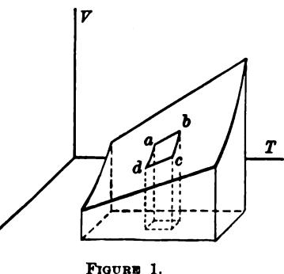

P a efficient, (aV/ T)p, and V - V, is equal to the slope multiplied by dT. Likewise the slope of bc is the V-P coefficient and V. V is (av/aP) TdP. For such an infinitesimal change it is immaterial which operation is considered first, and we find the same terms if we pass from a to d and thence to c.

P

There are special forms of the general equation ( 1 ) which are frequently useful. Thus if we impose the condition that V is constant, that is if we move along a contour line of the surface,

$$
\left(\frac{\partial V}{\partial \bar{T}}\right)_P dT + \left(\frac{\partial V}{\partial \bar{P}}\right)_T dP = 0,\tag{2}
$$

and expressing the constancy of V in the equation itself,

$$
\left(\frac{\partial P}{\partial \bar{T}}\right)_{\mathcal{V}} = -\left(\frac{\partial V}{\partial \bar{T}}\right)_{\mathcal{P}} / \left(\frac{\partial V}{\partial \bar{P}}\right)_{\mathcal{T}}.\tag{3}
$$

Again, if we have some other dependent variable, that is, 30me other quantity which, like the volume, depends only upon

the temperature and pressure, let us say the energy E, we may impose the condition that E is constant and obtain from ( 1 ) equations of the form,

$$
\begin{pmatrix} \frac{\partial V}{\partial \overline{T}} \end{pmatrix}_{\mathbb{B}} = \begin{pmatrix} \frac{\partial V}{\partial \overline{T}} \end{pmatrix}_{\mathbb{P}} + \begin{pmatrix} \frac{\partial V}{\partial \overline{P}} \end{pmatrix}_{\mathbb{T}} \begin{pmatrix} \frac{\partial P}{\partial \overline{T}} \end{pmatrix}_{\mathbb{B}}.\tag{4}
$$

This equation states that when we proceed upon the surface along a line of constant energy, the change in V corresponding to a given infinitesimal change in T is the sum of two terms, namely; the change in V, which would be caused by this same change in T alone, and the change in V caused by such a change in P as is necessary to keep the energy constant.

Finally there is a familiar equation involving second derivatives which we must frequently employ, namely,

$$\frac{\partial}{\partial \bar{P}} \begin{pmatrix} \partial V \\ \partial \bar{T} \end{pmatrix}_P = \frac{\partial^2 V}{\partial \bar{P} \partial \bar{T}} = \frac{\partial}{\partial \bar{T}} \begin{pmatrix} \partial V \\ \partial \bar{P} \end{pmatrix}_T. \tag{5}$$

According to this equation, the rate of change with P of the V-T coefficient is equal to the rate of change with T of the V-P coefficient. The intermediate member of the equation is merely a shorthand method of expressing either of the others.

When a property depends upon three or more independent variables, the geometrical method of interpreting the relations is no longer available, but the equations assume a similar form. Thus if the volume of a given quantity of material depends not only upon temperature and pressure but also upon one or more other independent variables, such as the intensity of an electric field, we write

$$dV = \frac{\partial V}{\partial T}dT + \frac{\partial V}{\partial \bar{P}}dP + \frac{\partial V}{\partial \bar{X}}dX + \cdots \cdot \cdot \, . \tag{6}$$

Here also subscripts may be employed to show the independent variables which remain constant during the differentiation. Thus for aV/ T we may write ( V/OT)p.X, ·

= RT/(V - EXERCISE 1. The relation between the pressure, the temperature, and the volume of a certain amount of hydrogen gas may be expressed over a limited range by the equation P b), where b is a constant. Find (ǝV/ T) and ( ƏV/¿P) Ț. By differentiating the first with respect to P and the second with respect to T, show that the result agrees with Equation 5. P

# CHAPTER IV

## SOLUTIONS

Someofour most important reactions involve substances which are present, not in a pure state, but in solution. Throughout the course of this work, we shall therefore devote much attention to this important class of substances ; indeed this is the more necessary in that many who have applied thermodynamics to chemical problems have treated this subject inadequately and often erroneously. '

The pure substances from which a solution may be prepared are called the components or constituents of the solution . There is always something arbitrary in the choice of these components; thus a given aqueous sulfuric acid could be prepared equally well from H2SO4 and H2O or from SO, and H2O. We are at liberty to choose either of these pairs as the components of the solution in question, or indeed we might even consider all three substances, SO3, H2SO4, H2O, as the components. However, it is always possible to state the minimum number of pure components from which the solution may be made, and this number plays an important rôle in thermodynamics. In the case we have just cited this number is 2, and such a solution is called a binary solution, or sometimes, with less precision, a binary mixture.

Under ordinary circumstances the extensive properties of a pure substance are determined by pressure, temperature, and amount, and its intensive properties by pressure and temperature alone. Likewise we shall assume, unless the contrary is especially stated, that the extensive properties of a solution are determined by pressure, temperature, and the amount of

<sup>1</sup> We shall later, however, call the attention of the reader to various papers by Brönsted, who has studied extensively , and in a most satisfactory manner, the thermodynamic charac teristics of numerous important solutions.

## 32 THERMODYNAMICS CHAP. IV

each constituent ; and its intensive properties by pressure, temperature, and the relative amounts of the several constituents, or, in other words, by pressure, temperature, and composition.

# THE MOL FRACTION

The composition of a solution is most advantageously expressed by the ratio of the number of mols of each component to the total number of mols. Thus, if a solution contains n₁ mols of the substance X1, na mols of X2, and no mols of X3, the mol fraction of the first substance, which we shall denote by N1, is given by the formula,

$$\mathbf{N}_1 = \frac{n_1}{n_1 + n_2 + n_\bullet},\tag{1}$$

and it is evident that

$$
\mathbf{N}_1 + \mathbf{N}_2 + \mathbf{N}_3 = 1.
$$

In the case of a binary solution we note that

$$\mathbf{N}_{\mathsf{I}} + \mathsf{N}_{\mathsf{I}} = 1; \quad d\mathsf{N}_{\mathsf{I}} = -d\mathsf{N}_{\mathsf{I}}.\tag{2}$$

In this case it is frequently convenient to use also the mol ratio of X1, defined as ni/n2 = N1/N2.

When we have such an amount of a given solution that ni + n₂ + ·· = 1 , or n₁ = N1, etc. , we say that we have one mol of the solution. Its volume will be called the molal volume of the solution, and designated, as in the case of a pure substance, by v. In general,

$$\mathbf{v} = \frac{\mathbf{v}}{n_1 + n_2 + \dotsb}.\tag{3}$$

In dealing with dilute solutions it is convenient to speak of the component present in the largest amount as the solvent, while a substance present in small amount is called a solute. But it is really immaterial which constituent is called the solvent, and we may even apply this term at times to a component present in relatively small amount.

In a very dilute solution the mol fraction of a solute is pro-

### SOLUTIONS

portional to the number of mols of solute in a fixed amount of solvent, and also proportional to the concentration, which is the number of mols per unit volume of solution.

It would be simpler, perhaps, to express all compositions in terms of mol fractions, but in the case of aqueous solutions it has become the almost universal custom to express numerical data in mols per liter of solution, or in mols per 1000 grams (55.51 mols) of water. The latter method is the one which we shall usually adopt, and when we speak of a molal or tenth molal aqueous solution, e.g. , HCl (0.1 M) , we shall refer, not to the concentration , but to the number of mols of solute in 1000 grams of water, which we may call the molality, and denote by m. This method has certain advantages; for example, the molality of a given solution is independent of the temperature, while the concentration is not.

EXERCISE 1. What is the mol fraction of the solute in a molal aqueous solution? What is its mol ratio? (See also Appendix I. )

EXERCISE 2. What is the mol fraction of water in aqueous ethyl alcohol which is 50% by weight?

EXERCISE 3. At 15° the density of aqueous sulfuric acid containing 5 mols per liter is 1.2894. Calculate the molality of H2SO4 and its mol fraction.

EXERCISE 4. What is the molal volume of the solution used in the preceding exercise ?

EXERCISE 5. Show that the volume of a solution containing 1000 grams of water is V = ( 1000 +mw) /d, where m is the molality, wis the molal weight of solute, and d is the density of the solution.

### PARTIAL MOLAL QUANTITIES

Let us now consider with some care chemical reactions in which dissolved substances take part : for example,

$$\text{Ag} + \text{\textquotedblleft}_2\text{Cl}_2(0.01 \text{ M}) = \text{AgCl(s)}\text{.}$$

This equation may be read as follows : There is produced one mol of solid silver chloride, and there are consumed one mol of solid silver, and half a mol of chlorine from a one-hundredth

¹ It will be well for the reader to preserve a record of the results obtained in numerical exer cises , since such results are sometimes assumed in the exercises of later chapters.

molal aqueous solution. It must be definitely understood that all of the chlorine comes from a solution of this composition, and not merely that it is taken from a limited quantity of solution which had this composition at the outset..

In this process AV represents the total change of volume per unit of the reaction, that is, per mol of silver consumed, or per mol of silver chloride produced. If we wish to determine AV experimentally, we may measure the change of volume when one mol of silver reacts with so large an amount of solution that a negligible fraction of the total chlorine is consumed. Or, with a limited amount of solution, we may observe the change of volume when a very small amount of silver reacts, and then calculate the change in volume per mol.

In the case of reactions with pure substances we may obtain AV immediately from the molal volumes of the substances concerned. Fortunately, in the case of a solution, we are able to define properties which play a rôle thermodynamically identical with the molal volume, the molal heat capacity, etc. , of pure substances. We shall call these quantities the partial molal volume, the partial molal heat capacity, and so forth.¹

In order to define these quantities, let us consider a solution containing ni mols of X1, n2 mols of X2, etc. Designating the total volume of the mixture by V, and the partial molal volume of X₁ by V₁, we will define the latter analytically by the equation

$$\frac{\partial V}{\partial n_1} = \mathbf{v}_1. \tag{4}$$

In other words, if the substance X1 is added to the solution in question (while all other independent variables which determine the state of the system remain constant) , the partial molal volume of X₁ is the rate of change of the volume of the solution with the amount of X1. If we start with a very large amount of the solution , V₁ is the increase in its volume when one mol of X1, is added.

Unlike the molal volume of a pure substance, the partial molal volume may be either positive or negative. We shall

<sup>1</sup> Lewis, " A New System of Thermodynamic Chemistry, " Proc. Am. Acad. , 43 273 ( 1907) ; Z. physik. Chem. , 61, 144 ( 1907) .

see presently that, with dilute aqueous solutions of magnesium sulfate, the addition of more solute actually diminishes the total volume of the solution .

It will now be evident that , in the reaction which we have just been considering, AV is equal to the molal volume of silver chloride, less the sum of the molal volume of silver and half the partial molal volume of chlorine (in one-hundredth molal solution) . Since the methods of determining partial molal volumes are directly applicable to other partial molal quantities of greater thermodynamic importance, it will be well to discuss them in some detail at this point.¹

Apparent Molal Volume. Before proceeding to these formal methods we may mention a quantity which is related to the partial molal volume, and which is frequently to be found in the literature. It is called the apparent molal volume and is denoted by . If a solution contains n, mols of a substance which we may call the solvent, and n₂ mols of a substance which we may call the solute, then V - n₁v₁ is the difference between the volume of the solution and the volume of the pure solvent which it contains. The apparent molal volume is defined as

$$\varphi = \frac{(V - n_1 \mathbf{v}_1)}{n_2}.\tag{5}$$

This quantity is related to the partial molal volume, V2, as is a ratio of finite increments to the corresponding differential coefficient. Therefore these two quantities approach identity as no approaches zero ; that is , as the solution approaches infinite dilution. The apparent molal quantities have little thermodynamic utility, but we shall occasionally use them as a step toward the determination of the partial molal quantities. Table 1 gives the apparent molal volume of sodium chloride at 18°C at several concentrations in aqueous solution . Here, taking n₁ fixed at 55.51 mols ( 1000 g. ) , n₂ = m, the molality.

<sup>1</sup> The reader who is unfamiliar with the methods of this chapter is recommended not to attempt to master them completely at the outset, but rather to revert to them from time to time as occasion demands.

<sup>*</sup> See Landolt, Börnstein and Roth, " Physikalisch-chemische Tabellen, " Berlin, 1912.

| TABLE | -APPARENT<br>1. | MOLAL | VOLUME<br>AQUEOUS | (IN<br>CC.<br>)<br>SOLUTION¹ | OF   | SODIUM | CHLORIDE<br>IN |
|-------|-----------------|-------|-------------------|------------------------------|------|--------|----------------|
| m     | 0               | 0.1   | 0.2               |                              | 0.3  | 0.4    | 0.5            |
|       | 16.4            | 16.7  | 16.9              |                              | 17.0 | 17.2   | 17.3           |

The value at m = 0 is extrapolated, and gives , not only the apparent molal volume, but also the partial molal volume, of sodium chloride in an infinitely dilute aqueous solution.

### METHODS OF DETERMINING THE PARTIAL MOLAL QUANTITIES

Method I (analytical) . If the volume of a solution is known as a function of the composition, the partial molal volume of a constituent may be found by partial differentiation with respect to the amount of that constituent. Thus the data of Table 1 may be adequately represented by the empirical equation

$$\varphi = \frac{V - n_1 \mathbf{v}_1}{n_2} = 16.4 + 2.5n_2 - 1.2n_1^2,$$

or,

$$V = n_1 \mathbf{v}_1 + \stackrel{\cdot}{16.4} n_2 + 2.5 n_2 \mathbf{i} - 1.2 n_2 \mathbf{i}$$

and differentiating with respect to në (n₁ constant) ,

$$\Phi_{\mathfrak{k}} = \frac{\partial V}{\partial n_{\mathfrak{k}}} = 16.4 + 5n_{\mathfrak{k}} - 3.6n_{\mathfrak{k}}\mathfrak{k}.$$

= Thus at 0.5 M, V₂ = 18.0, while 17.3. This analytical method is usually less expeditious than the graphical methods which are about to be discussed.

Method II (graphical) . If V, the volume of solution containing a fixed amount of solvent, is known for several values of n2, we may plot V against n2, and the slope of the curve at any point is 2. This is illustrated in Figure 1 , which shows the volumes of aqueous solutions of magnesium sulfate, ' at 18°C. The volume at every point is the volume of a solution containing 1000 grams of water and n₂ mols of magnesium sulfate. The partial molal volume of the latter is given at each point by the slope of the tangent, and it will be seen that in this case V2 is negative in dilute solutions, passes through

<sup>1</sup> Wade, J. Chem. Soc. 75, 254 ( 1899) .

<sup>2</sup> Kohlrausch and Hallwachs, Ann. Physik. , [ 3] 53, 14 ( 1894) .

zero at about 0.07 M, and becomes positive at higher concentrations. This is the most obvious graphical method of finding partial molal volume, but there are other methods which, in point of speed and accuracy, are preferable. This is true of the following method.

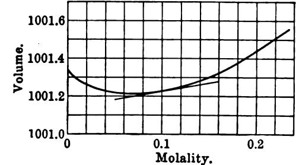

 FIGURE 1. -Volumes of Solutions Containing Magnesium Sulfate and 1000 g. of Water at 18°C.

Method III (graphical) . If we have the apparent molal volumes of the solution and plot them against the common logarithm¹ of n2, the slope s of the curve is given by the equation

$$\mathfrak{s} = \frac{d\varphi}{d\operatorname{log} n_{\mathfrak{a}}} = 2.303 \, \frac{d\varphi}{d\operatorname{ln} n_{\mathfrak{a}}} \,. \tag{6}$$

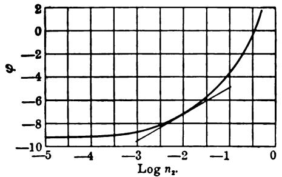

FIGURE 2. -Apparent Molal Volume of Aqueous Magnesium Sulfate at 6.3°C.

Noting that d ln ng = dna/n2, substituting the value of 4 from Equation 5, and performing the differentiation, n₁ being constant, we find

1 We shall denote common logarithms by log , and natural logarithms by In.

38 THERMODYNAMICS CHAP. IV

$$
\Box \stackrel{s}{2.303} = \Box \mathfrak{z} - \varphi.\tag{7}
$$

In other words, V₂ at any point is obtained when we divide the slope by 2.303, and add the corresponding ordinate . This method is illustrated in Figure 2 , where we have used the data for magnesium sulfate obtained by Kohlrausch and Hallwachs at 6.3°C.

Method IV (graphical, method of intercepts ' ) . Suppose that we have the molal volume, v (of the solution as a whole) , tabulated against the mol fraction. Let us plot this molal volume against the mol fraction, as in Figure 3. Now if we draw a tangent to the curve at any point, the intercept of this tangent upon the ordinate of N₁ = 1 is equal to v₁ ; and the intercept corresponding to N₂ = 1 equals V2.

The proof of this very simple theorem is as follows. If V is the volume of a solution containing n₁ mols of X1 , and n₂ mols of X2, then v == V/(n₁ + ną) . If now v is plotted against the mol fraction N₂, namely against n2/(n1 + n2) , and if we draw a tangent at any point of the curve, its slope is dv/dN2. The intercept AB, which we wish to prove equal to V₁, is equal

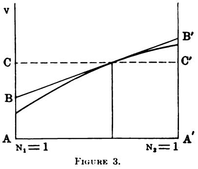

to AC minus BC, and it is evident by inspection that AC = v, and BC · N2dv /dN2, so that we must prove that =

$$
\mathbf{v}_{\mathbf{v}} = \mathbf{v}_{\mathbf{r}} \frac{d\mathbf{v}}{d\mathbf{v}_{\mathbf{r}}} = \mathbf{v}_{\mathbf{r}}.\tag{8}
$$

Now N₂ may be varied by changing n or n2, or both. For the sake of simplicity we will assume that n, is kept constant, and that a change in

1See Roozeboom, " Die Heterogenen Gleichgewichte, " II-1 , p. 288, Braunschweig, 1904. SOLUTIONS 39

N₂ is produced solely by a change in n₁. ofv, Equation 3, We have then from the definition

$$d\mathbf{v} = \frac{dV}{n_1 + n_2} - V_{\frac{1}{(n_1 + n_2)^2}} \,\mathrm{}^{\tag{9}}\tag{9}$$

Likewise, from Equation1,

$$d\mathbf{v}_{\mathbf{t}} = -\frac{n_{\mathbf{t}}dn_{\mathbf{t}}}{(n_{\mathbf{t}} + n_{\mathbf{t}})^{\mathbf{t}}}\mathbf{:}\tag{10}$$

Whence we find

$$\mathbf{v_{N_2}} \frac{d\mathbf{v}}{d\mathbf{v_2}} = -\frac{d\mathbf{V}}{dn_1} + \frac{\mathbf{V}}{n_1 + n_2} = -\mathbf{v_1} + \mathbf{v},\tag{111}$$

which is identical with Equation 8. In the same way we prove that A'B' is equal to 2.

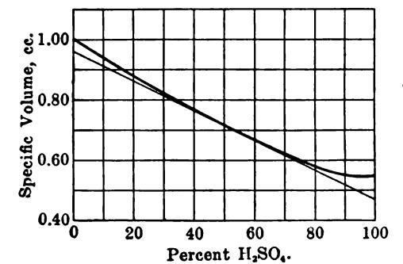

FIGURE 4. -Specific Volume of Aqueous Sulfuric Acid at 25°C.

It is evident that if we had chosen the gram instead of the mol as unit amount of a substance, our equations would all have been of the same form. In place of the mol fraction we should have used the gram fraction (weight fraction) , and, in place of the partial molal volume, we could define the partial specific volume of one component of a solution as the change in volume of the solution per gram of that component. Thus we may employ the method of intercepts by plotting the specific volume of the solution, which is the reciprocal of the density, against the weight fraction, and this enables us to use directly data as they are ordinarily tabulated in the literature. The intercepts of the tangent give immediately the partial specific volumes, and these multiplied by the molal weights give the corresponding partial molal quantities .

Figure 4 shows the application of this method to data on aqueous sulfuric acid, at 25°C. The tangent at 60 weight per cent, N2 = 0.216, cuts the two limiting ordinates at 0.964 and 0.465 , these being the two partial specific volumes. The former multiplied by 18 gives V1, the partial molal volume of water in the solution , namely, 17.4 cc . The latter multiplied

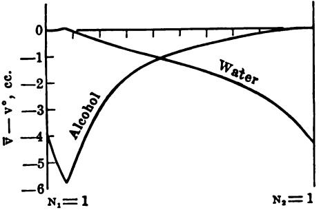

FIGURE 5. -Partial Molal Volumes of Water and Alcohol.

by 98 gives V2 = 45.6 cc. , the partial molal volume of the sulfuric acid.

The variation of the partial molal volumes with the mol fraction, for two different types of solutions, is further illustrated in Figures 5 and 6. Here for convenience we give as

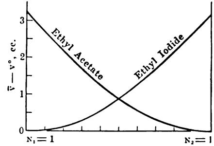

FIGURE 6. -Partial Molal Volumes of Ethyl Iodide and Ethyl Acetate.

ordinates the partial molal volume of each constituent, less the molal volume of that constituent in the pure state, namely, V₁ - V₁° and V2 -V2° . Figure 5 is for water and ethyl alcohol, and Figure 6 is for ethyl iodide and ethyl acetate.¹

<sup>1</sup> Calculated by Professor J. H. Hildebrand, from the experiments of Hubbard, Phys. Rev., [ 1 ] , 30, 740 ( 1910) ; Z. physik . Chem. , 74, 207 ( 1910) .

### SOLUTIONS 41

EXERCISE 6. Table 2 gives Hubbard's values of the specific volumes (cc. per g. ) at 50°, of mixtures of ethyl iodide and ethyl acetate, at several compositions, expressed in fractions by weight of ethyl iodide. Plot as in Method IV, and find from the curve the partial molal volume of ethyl acetate when N₁ = N₂ = 0.50 (not when weight fraction is 0.50) .

### TABLE 2

| Wt<br>. Fraction<br>of | Vol<br>Sp     | Wt<br>. Fraction<br>of | Vol<br>Sp     |
|------------------------|---------------|------------------------|---------------|
| Iodide<br>Ethyl        | at<br>50<br>° | Ethyl<br>Iodide        | at<br>50<br>° |
| 0.00000                | 1.15866       | 0.74566                | 0.70040       |
| 0.19082                | 1.04358       | 0.82792                | 0.64814       |
| 0.35007                | 0.94654       | 0.89093                | 0.60749       |
| 0.49517                | 0.85737       | 0.94970                | 0.56927       |
| 0.59741                | 0.79377       | 1.00000                | 0.53622       |
| 0.68529                | 0.73880       |                        |               |

EXERCISE 7. For each of the first four data of Table 2, calculate the number of mols of ethyl iodide to one mol ethyl acetate, and also the volume occupied by an amount of solution containing one mol ethyl acetate. Obtain the apparent molal volumes, and determine more accurately than in the preceding exercise some one value of V2.

EXERCISE 8. In Table 3, m represents the molality, and d the density at 25°, of aqueous solutions of potassium chloride. Determine the partial molal volume of the latter at several different molalities.

|        | TABLE<br>3   |                      |                   |                   |                   |                   |  |  |
|--------|--------------|----------------------|-------------------|-------------------|-------------------|-------------------|--|--|
| m<br>d | 0<br>0.99707 | 1668<br>0<br>1.00490 | 0.2740<br>1.00980 | 0.3385<br>1.01271 | 0.6840<br>1.02797 | 0.9472<br>1.03927 |  |  |

THE FUNDAMENTAL EQUATIONS OF PARTIAL MOLAL QUANTITIES

We may now proceed to the consideration of the characteristics common to all partial molal quantities . Let G be any extensive property of a given solution, such as volume, heat capacity, or internal energy, which is a function of temperature, pressure and the amounts of the several constituents. For the sake of clarity we shall assume for the present that temperature and pressure are constant, so that G depends only upon ni, n2,

We will define the partial molal values by the equations

$$\mathfrak{d}_1 = \frac{\partial G}{\partial n_1}; \mathfrak{d}_2 = \frac{\partial G}{\partial n_2}; \quad \text{\textsuperscript{\(\cdot\)}}\quad \text{\textsuperscript{\(\cdot\)}}\tag{12}$$

Now by the chief equation of partial differentiation,

$$dG = \frac{\partial G}{\partial n_1} dn_1 + \frac{\partial G}{\partial n_2} dn_2 + \cdots \cdot \cdot \cdot \, , \tag{13}$$

or

$$dG = \mathfrak{d}_1 dn_1 + \mathfrak{d}_2 dn_2 + \dots \cdot \cdot \cdot \cdot \tag{14}$$

It is evident that these partial molal quantities such as i are not extensive but intensive properties of the solution .They depend therefore, not upon the total amount of each constituent, but only upon the composition ; that is, upon the relative amounts of the several constituents.

If, therefore, to a given solution we add the several constituents simultaneously, keeping their ratios constant, these partial molal quantities will remain constant. We may therefore integrate Equation 14, keeping n₁, n2, portions, and find · in constant pro-

$$\mathbf{G} = n_1 \mathfrak{d}_1 + n_2 \mathfrak{d}_2 + \dotsb \quad \text{ }\tag{15}$$

This equation we could have obtained without the use of calculus. Let V be the volume of a solution containing ni mols of X₁, n₂ mols of X2, etc. Consider now a very large quantity of a solution of this same composition. If ni mols of X₁ are added, the total volume will increase by niv₁; then if n₂ mols of X2 are added, the volume will increase by nava, etc. The total change in volume will be independent of the order in which the constituents are added and will be equal to V, since all that we have done is to produce an additional quantity of the same solution, containing n₁ mols of X₁, etc.

It is evident from Equation 15 that we may find the value of any extensive property, let us say the volume, if we know the amounts and the partial molal volumes of the several constituents. In obtaining this equation and the subsequent ones of this chapter, we are anticipating a need which will become more apparent in our later work. However, it has seemed desirable, before entering upon a discussion of the first and second laws of thermodynamics, to obtain some of the useful formulae which do not require these laws in their derivation. We shall thus be able to see, as we proceed, just to what

SOLUTIONS 43

extent our various generalizations depend upon the laws of thermodynamics, and to what extent they depend merely upon a mathematical analysis of our concept of properties.

In deriving Equation 15 we did not limit ourselves to any special values of ni, n2, Hence this equation, being entirely general, can be differentiated with respect to any change of composition, howsoever this change is produced (whether by addition or subtraction of infinitesimal amounts of any or all of the components) . This general differentiation gives

dG =· п₁dĞ₁ + Ğ₁dn₁ + n₂dĞ₂ + Gądną + · · (16)

and this equation combined with Equation 14 gives

$$
\dot{n}_1 d\mathfrak{S}_1 + n_2 d\mathfrak{S}_2 + \cdots \quad \cdot \quad \cdot \quad \cdot = 0,\tag{17}
$$

which shows, for any infinitesimal alteration in composition, at constant temperature and pressure, the relation between the change in any one & and the change in all the others. Equations 15 and 17 may for brevity be called the partial molal equations.

Special Forms of the Partial Molal Equations. These equations assume a number of special forms, which are frequently useful. Thus, if we are dealing with one mol of solution, Equations 15 and 17 become

$$\mathbf{g} = \mathbf{N_1}\mathbf{5_1} + \mathbf{N_2}\mathbf{5_2} + \dotsb \quad ; \quad \cdot \quad \text{ } \tag{18}$$

$$\mathbf{N_1d\mathbf{5_1} + N_2d\mathbf{5_2} + \cdots \quad \cdot \quad \cdot \quad \cdot \quad} = 0.\tag{19}$$

We may regard the number of mols of one constituent, say n₁, as the main variable. Then if, as a reminder, we indicate also the constancy of P and T, Equation 17 takes the form,

$$n_1 \left(\frac{\partial \mathbb{G}_1}{\partial n_1}\right)_{P,T} + n_2 \left(\frac{\partial \mathbb{G}_2}{\partial n_1}\right)_{P,T} + \dotsb \quad \text{
$$\cdot$$
} \quad \text{
$$\cdot$$
} \quad \text{
$$\leftarrow$$
} \quad \text{(20)}$$

Similarly Equation 19 becomes

$$\mathbf{N}_1 \begin{pmatrix} \frac{\partial \mathbf{N}_1}{\partial \mathbf{N}_1} \end{pmatrix}_{P,T} + \mathbf{N}_2 \begin{pmatrix} \frac{\partial \mathbf{N}_2}{\partial \mathbf{N}_1} \end{pmatrix}_{P,T} + \begin{array}{c} \cdot \quad \cdot \quad \cdot \quad = 0. \tag{21}$$

THERMODYNAMICS

It will be noted that while n₁ can vary without any change in na, na, etc.,we cannot change N, without some change in N2, N3, etc. So in a binary solution,

$$d\mathbf{v}_1 = -d\mathbf{v}_2.\tag{22}$$

It is also to be noted that in spite of the similarity of Equations 20 and 21, do /dni has a very different meaning from dĞ₁ /dN1. Thus in a binary mixture, when n, is constant,

$$d\mathbf{N}_1 = \overline{n_1}^{n_1} \overline{+n_1}; \quad d\mathbf{N}_1 = \overline{(n_1}^{n_1} \overline{+n_1}^{n_1} d n_1.$$

Applications to Binary Solutions. Applying Equation 19 to a mixture of two components, and for later convenience choosing N2 as the chief variable ,

$$
\mathbf{N_1} \cdot \frac{\partial \mathfrak{G_1}}{\partial \mathbf{N_2}} + \mathbf{N_2} \frac{\partial \mathfrak{G_2}}{\partial \mathbf{N_3}} = \mathbf{0}, \tag{23}
$$

or,

$$
\begin{pmatrix}
\frac{\partial \mathbf{\tilde{u}_1}}{\partial \mathbf{\tilde{u}_2}}
\end{pmatrix}
\begin{pmatrix}
\frac{\partial \mathbf{\tilde{u}_2}}{\partial \mathbf{\tilde{u}_2}}
\end{pmatrix}
=
-\begin{pmatrix}
\frac{\mathbf{\tilde{u}_2}}{\mathbf{\tilde{u}_1}}
\end{pmatrix}
\tag{24}
$$

If G1 and G2 are plotted against N2, the two differential coefficients are the slopes of the two curves, and therefore the slope of one curve is entirely determined by the slope of the other curve and the composition. Thus at fifty mol per cent, where Ni N2, the slopes of the two curves must be equal and opposite in sign. If at any composition one of the curves has a maximum, the other curve will have a minimum at the same composition. These statements are well illustrated by the curves of Figures 5 and 6. =

The Special Case of an Infinitely Dilute Solution. For finite values of Ni and N2, if ƏĞ₁/ƏN₂ = 0 , then dĞ2/ ƏN2 = 0. But the limiting case, where one of the mol fractions is zero, deserves. comment. In an infinitely dilute solution of X2 in X1, where we may write N2/N₁ = 0, it is evident that either aĞ₁ /ƏN₂ is zero, or G2/ N2 is infinite. In other words, when N₂ is zero either the curve of G₁ becomes horizontal, or the curve of G2 becomes vertical. These two types are illustrated respectively in Figures 7 and 8. All of the partial molal quantities to be considered in the next few chapters belong to the first type.

### SOLUTIONS 45

But, in discussing entropy and free energy, we shall find partial molal quantities which belong to the second type.

Partial molal volumes are of the first type, and we may say that, in very dilute solutions, the partial molal volume of the solvent is constant, and equal to the molal volume of the pure solvent. How far, in a given case, this constancy will extend into the field of finite concentrations is a question which can be decided only by experiment. There are cases, such as a mixtureofbenzeneandtoluene,inwhichthepartialmolal


volume of each constituent is essentially constant over the whole range of concentration (from pure benzene to pure toluene) . In other cases there are measurable departures from constancyevenatlowconcentrations.

Derivatives of Partial Molal Quantities. If the property G is a quantity such as the V-T coefficient, that is, if GaV/ T, then, by Equation III-5 ,

$$\mathfrak{G}_1 = \frac{\partial}{\partial n_1} \frac{\partial V}{\partial T} = \frac{\partial}{\partial T} \frac{\partial V}{\partial n_1} = \frac{\partial \mathfrak{F}_1}{\partial T},\tag{25}$$

and we see that the partial molal V- T coefficient is equal to the temperature coefficient of the partial molal volume. This

will serve as the prototype of numerous important equations which we are to employ in later chapters.

EXERCISE 9. If we have two variables, n₁ and ng, and G, is a quantity which is a function only of n₁ /n2, then, by successive partial differentiation,

$$\frac{\partial \mathfrak{G}_1}{\partial n_1} = \frac{\partial \mathfrak{G}_1}{\partial (n_1/n_2)} \frac{\partial (n_1/n_2)}{\partial n_1} = \frac{\partial \mathfrak{G}_1}{\partial (n_1/n_2)} \frac{1}{n_1}$$

and

$$\frac{\partial \mathfrak{G}_{1}}{\partial n_{\mathfrak{t}}} = \frac{\partial \mathfrak{G}_{1}}{\partial (n_{\mathfrak{t}}/n_{\mathfrak{t}})} \frac{\partial (n_{\mathfrak{t}}/n_{\mathfrak{t}})}{\partial n_{\mathfrak{t}}} = -\frac{\partial \mathfrak{G}_{1}}{\partial (n_{\mathfrak{t}}/n_{\mathfrak{t}})} \frac{n_{\mathfrak{t}}}{n_{\mathfrak{t}}!}.$$

Combining,

$$n_1 \frac{\partial \mathfrak{G}_1}{\partial n_1} + n_2 \frac{\partial \mathfrak{G}_1}{\partial n_2} = 0. \tag{26}$$

From the definition of G₁, and by reference to Equation III -5, prove that this equation is identical with Equation 20.

EXERCISE 10. In a mixture of water and ethyl alcohol, in which the mol fraction of the water is 0.4, the partial molal volume of the alcohol is 57.5, and the density of the mixture is 0.8494. Calculate the partial molal volume of the water.

EXERCISE 11. In order to determine the partial molal V- T coefficient it is necessary to know the volume of a solution at different compositions and at different temperatures. If the volume of a certain amount of some solution is given over a small range by the equation V = 20 (nı + n₂) + 0.006T (nı + n ) + 0.20n₁ , calculate ov₁ /ƏT = ə²V/ǝTən , in this range.

# CHAPTER V

# THE FIRST LAW OF THERMODYNAMICS AND THE CONCEPT OF ENERGY

In the simple mechanics of rigid elastic bodies there is a quantity, formerly called vis viva, which is measured by the sum of the terms 12mv2 , and which remains constant no matter how the system may change through collisions of its component parts. If, however, the system includes such a force as is said to act at a distance, the vis viva no longer remains constant. Thus if an object is thrown upwards against the earth's gravitational force, its vis viva diminishes, and at a certain point the object comes momentarily to rest. If it is arrested at this point, the whole of the vis viva, or the whole of the kinetic energy, as we now call it, has disappeared. However, we are accustomed to say that as the object loses in kinetic energy it gains in latent or potential energy by an equal amount, and this idea is justified by the fact that if the object is allowed to drop once again to its original position , it regains the whole of the kinetic energy which it lost in rising.

If in such a mechanical system there are inelastic collisions, or if frictional processes are at work, there may be a net loss of mechanical energy; in other words, the sum of the kinetic and potential energies may diminish. At the end of the eighteenth century when Count Rumford was observing the boring of cannon in the Munich arsenal, he noticed that the mechanical energy expended was roughly measured by the amount of heat produced. This idea, developed by Mayer and by Joule, led to the first determinations of the mechanical equivalent of heat . It was thus found that a certain amount of mechanical energy, of whatever form, always produces the same amount of heat; and therefore the units of heat and work can be so chosen that

the amount of heat produced is always equal to the amount of mechanical energy lost . This discovery led to the consideration of heat as a form of energy, and to the enunciation of the broad principle which we know as the law of the conservation of energy, or the first law of thermodynamics.

As far back as 1762 that remarkably accurate thinker and investigator, Joseph Black, showed, in studying heat alone, that it was necessary to introduce a concept of latent heat (analogous to potential energy) . Here again the concept of latent energy is justified by the fact that the amount of heat required to melt a gram of ice is equal to the heat evolved when a gram of water freezes.

When the phenomena of electricity became better understood it was necessary to define electrical energy, and the brilliant investigations of Maxwell made it possible to follow the course of electrical energy, not only through material bodies, but through space which is empty of all else but an electromagnetic field.

So, as science has progressed, it has been necessary to invent other forms of energy, and indeed an unfriendly critic might claim, with some reason, that the law of conservation of energy is true because we make it true, by assuming the existence of forms of energy for which there is no other justification than the desire to retain energy as a conservative quantity. This is indeed true in a certain sense, as shown by the explanations which have been given for the enormous, and at first sight apparently limitless, energy emitted by radium. But a study of this very case has shown the power and the value of the conservation law in the classification and the comprehension of new phenomena.

It should be understood that the law of conservation of energy implies more than the mere statement that energy is a quantity which is constant in amount. It implies that energy may be likened to an indestructible and uncreatable fluid which cannot enter a given system except from or through surrounding systems. In other words, it would not satisfy the conservation law if one system were to lose energy, and another system, at a distance therefrom, were simultaneously to gain energy in the same amount. If a system gain or lose energy,theimmediatesur-

roundings must lose or gain energy in the same amount, and energy may be said to flow into or out of the system through its boundaries.

### THE INTERNAL ENERGY OF A SYSTEM

The energy contained within a system, or its internal energy, is a property of the system, in the technical sense in which this term has been used in Chapter II. The increase in such energy when a system changes from state A to state B is independent of the way in which the change is brought about. It is simply the difference between the final and the initial energy.

$$\Delta E = E_{\rm B} - E_{\rm A}$$

where AE for this system must, by the conservation law, be equal and opposite in sign to AE for all other systems involved.

In a particular process, for example when we write

Cu + 1/202 = CuO; AE = - 37000 calories,

we mean that, at a given temperature, 37000 calories are evolved when one mol of cupric oxide is formed from its elements; or that one mol of cupric oxide contains so much less energy than one mol ofcopperandonehalfmolofoxygen.

In this example, when we write EB = E(CuO) and E₁ = E(Cu) + E(½02) , we are able to measure EB - EA, but we do not claim to know the value of either of these quantities alone. Nor are we interested in the kinds of energy which make up the total internal energy of a substance like copper oxide. It presumably consists in the kinetic energy of the moving particles, in the energy of the electric fields emanating from the charged particles of which the atoms are composed, and in other forms of energy to which names are now assigned or may be assigned in the future. But of all this, thermodynamics takes no cognizance.

Energy and Mass. While the amount of energy given to or taken from the environment, in a case like this, is easy to measure, the determination of the total energy of any one material system has, until recently, seemed beyond the range of human possibility. For practical purposes it is still necessary to regard as undetermined the total energy which a given system possesses. It is, however, of much theoretical interest to note that the great discovery of Einstein, ¹ embodied in the principle of relativity, shows us that every gain or loss of energy by a system is accompanied by a corresponding and proportional gain or loss in mass, and therefore presumably that the total energy of any system is measured merely by its mass.

In other words, mass and energy are different measures of the same thing, expressed in different units ; and the law of conservation of energy is but another form of the law of conservation of mass. These units are indeed very different in magnitude, differing by the square of the velocity of light, so that one gram is equal to 9 × 1020 ergs. Even the largest amounts of energy evolved in ordinary chemical reactions produce changes in mass that are below the limits of detectability by means of the balance.

On the other hand, the great quantities of energy emitted in radioactive processes should be large enough to be weighed. Thus, if we accept the common view that the energy emitted is equal to the diminution in the internal energy of the substances concerned, the sum of the atomic weights of the products of a radioactive change should be measurably smaller than the atomic weight of the parent substance. However, if we adopt the view of Perrin, ³ that the internal energy of a system increases in a radioactive change, the additional energy coming from without (in the form of ultra-X radiation) , the atomic weights of the products should be greater in sum than the atomic weight of the parent substance. A careful study of the atomic weights of uranium and of radium might permit the decision between these rival theories .

It is further to be noted in this connection that, if we assume Prout's hypothesis, the deviations from whole numbers of the atomic weights of pure isotopes (referred to hydrogen) should measure the energy changes in the synthesis of the elements. Thus, if one gram atom of helium weighs 0.032 g. less than four gram atoms of hydrogen, we could on this hypothesis write

### 4H=He;AE = - 3 × 1019 ergs .

This is nearly a million million calories.

- 2 For a simple demonstration of this proposition, independent of the principle of relativity, see Lewis, Phil. Mag. , 16 , 705 ( 1908) , and Science, 30, 84 ( 1909) .
	- Perrin, Ann . physique, 11 , 5 ( 1919) .

<sup>1</sup> Einstein, Ann. Physik, 18 , 639 ( 1905) .

### PRESSURE AND TEMPERATURE

There are two intensive properties, pressure and temperature, which play an important role in thermodynamics, since they largely affect, and often completely determine, the state of a system. Pressure is too familiar an idea to require definition ; it has the dimensions of force per unit area, and therefore pressure timesvolume hasthe dimensionsofenergy(forcetimesdistance).

The concept of temperature is a little more subtle . When one system loses energy to another by thermal conduction or by the emission of radiant energy, there is said to be a flow of heat, or a thermalflow. The consideration of such cases leads immediately to the concept of temperature, which may be qualitatively defined as follows: if there can be no thermal flow from one body to another, the two bodies are at the same temperature ; but if one can lose energy to the other by thermal flow, the temperature of the former is the greater. This establishment of a qualitative temperature scale is obviously more than a definition . It involves a fundamental principle, to which we have already given preliminary expression in discussing equilibrium, but which we are not yet ready to put in a general and final form. For thermal flow, this principle requires that if A lose energy to B, B cannot lose it to A; if A lose to B, and B lose to C, C cannot lose to A.

Expressed briefly, our qualitative laws of temperature are : If TA TB, and TB Tc, TA Tc; if TA > TB, and TË Tc, TA Tc. As in our general discussion of equilibrium, it must be understood that we are dealing with net gains or losses in energy. We do not mean that no energy passes from a cold body to a hot, but only that the amount so transferred is always less than that simultaneously transferred from hot to cold. = ==

When we have established the qualitative laws of temperature, we still have a wide freedom of choice in fixing the quantitative scale. Indeed temperature, as ordinarily measured, or its square, or its logarithm, would equally satisfy these qualitative requirements.

Since the volume of most things changes appreciably with the temperature, and since volumes are easily measured, it early

proved convenient to correlate the temperature with the volume of some chosen thermometric substance. It is obvious that this substance could not be chosen altogether at random, for if water were taken, then, on account of the existence of a maximum density, there would be two temperatures corresponding to one volume. But, even in the case of substances whose volume always increases with the temperature, one choice may be more convenient than another.

If thermometers made of mercury and alcohol, with linear scales, are made to agree at two temperatures, they will not agree at some intermediate temperature; but if two gases such as hydrogen and air are employed the agreement will be nearly complete over a wide temperature range. Hydrogen and air do not behave exactly alike at atmospheric pressure, but the behavior of any two gases becomes more nearly the same the lower the pressure. We therefore adopt, as our ideal thermometric substance, any gas at very low pressure (strictly speaking, at zero pressure) .

If we adopt the centigrade scale, and call the freezing and boiling points of water 0° and 100° , respectively, and make the temperature proportional to the volume of our ideal gas at constant pressure, there proves to be a temperature, which we shall later find to be 273.1°, at which the volume of the ideal gas becomes zero.

This is known as the absolute zero of temperature. In addition to the centigrade scale we may therefore define a new scale, known as the absolute scale, obtained by adding 273.1 to the centigrade temperature. In order to distinguish between absolute and centigrade temperature, we shall designate the former by T, the latter by t, and we write : 25° C = 298.1°K.¹ (Since this is a temperature which we shall very frequently use, we shall designate it commonly, for convenience, 298° K, bearing in mind that in our calculations we are to use the more precise value . )

In a later chapter we shall define the thermodynamic scale of temperature, which fortunately proves to be identical with the ideal gas scale which we have just considered . In that place

1 K, for Lord Kelvin, the author of the absolute scale.

we shall be able to show that the point which we have defined as the absolute zero of temperature is not an arbitrary point, brought into prominence by the properties of any one substance or class of substances. It is in fact the limit of any rational thermodynamic scale, a true zero where all thermal energy would cease; but as unattainable as the other limit of our scale, the infinite temperature.

### HEAT AND WORK

There are two terms, "heat" and "work, " that have played an important part in the development of thermodynamics, but their use has often brought an element of vagueness into a science which is capable of the greatest precision. It is not, however, convenient to avoid altogether the use of these terms, although unfortunately their best definition can be given only after the introduction of certain ideas which will be developed in a later chapter. For our present purpose we may say that when a system loses energy by radiation or thermal conduction it is giving up heat ; and that when it loses energy by other methods, usually by operating against external mechanical forces, it is doing work.

Thus if a system is subjected to a constant external pressure P, and is allowed to expand against that pressure so that its increase in volume is AV, then w, the work donebythesystem,is

$$w = P\Delta V,\tag{1}$$

or, if the external pressure, instead of being constant, varies during the process,

$$w = \int_{V_A}^{V_B} P dV.\tag{2}$$

In order that such an expansion may occur, the internal pressure must of course be greater than the external. But this difference may be made as small as is desired, and in the limit. we may consider the case in which the internal pressure is equal to the external pressure, or differs from it by a negligible amount.

Ordinarily, when we speak of an expansion or a contraction we shall assume that at each moment the external and internal pressures differ only infinitesimally. In such cases, Equations 1 and 2 are valid if P is also considered as the internal pressure of the system.

According to the law of the conservation of energy, any system in a given condition contains a definite quantity of energy, and when this system undergoes change, any gain or loss in its internal energy is equal to the loss or gain in the energy of surrounding systems. In any physical or chemical process, the increase in energy of a given system is therefore equal to q, the heat absorbed from the surroundings, less w, the work done by the system upon the surroundings. If EA represents the initial energy content of thesystem,andEB,thefinalenergycontent,then

$$
\Delta E_{\theta} - E_{A} = \Delta E = q - w_{\bullet} \tag{3}
$$

We shall use q and w to represent quantities of heat and work whether finite or infinitesimal. Thus for an infinitesimal change we write,

$$dE = q - w.\tag{4}$$

Some authors express an infinitesimal value of q by dq, but we have agreed to read dr always as the infinitesimal increment of x, and not as an infinitesimal value of x.

The values of q and w depend upon the way in which the process is carried out, and in general neither is uniquely determined by the initial and final states of the system. However, their difference is determined, so that if either q or w is fixed by the conditions under which the process occurs, the other is also fixed. Thus in the case just cited, where the work done by the system is the work of expansion against an external pressure, the expansion may be carried out in such a manner that no heat enters or leaves the system. We then say that the process is adiabatic, and we may write,

$$-\Delta E = w = \int_{V_A}^{V_B} P dV.\tag{5}$$

On the other hand, if the process is such that no work is done

upon the surroundings (as in the case of a chemical reaction taking place in a constant volume calorimeter) , then AE = q.

The Heat Content. In most calorimetric work the pressure, and not the volume, is kept constant. If the increase in volume during the reaction is AV, then

$$
\Delta E = q - P\Delta V = q - P(V_\text{B} - V_\text{J})\tag{6}
$$

or

$$
\left(E_{\rm B} + PV_{\rm B}\right) - \left(E_{\rm A} + PV_{\rm A}\right) = q,\tag{7}
$$

and the heat absorbed during the reaction is again a quantity which obviously depends only upon the initial and final states. We may define a new quantity by the equation HE+PV; AH = (EB + PBVB) − (E₁ + PÂV₁) . (8)

$$H = E + PV; \quad \Delta H = (E_{\mathcal{B}} + P_{\mathcal{B}}V_{\mathcal{B}}) - (E_{\mathcal{A}} + P_{\mathcal{A}}V_{\mathcal{A}}).\tag{8}$$

Like E, the property H is one to which we do not attempt to give a numerical value, although changes in H are readily measured. Thus in any constant pressure calorimeter,

$$
\Delta H = q.\tag{9}
$$

On account of this relation, and for want of a better term, we call H the heat content of a system.

As an example we may consider a simple process such as the vaporization of water, in a calorimeter at constant pressure ; H₂O(1, 1 atmos. ) H2O(g, 1 atmos. ) . Here =

$$
\dot{\Delta H} = \dot{H_{\theta}} - \dot{H_{\lambda}} = \dot{\langle E_{\theta} \rangle} + PV_{\theta} \dot{\lambda} - (E_{\lambda} + PV_{\lambda}) = q_{\rho}
$$

where E is the energy, VAᎪ the volume, and H₁A the heat content of one mol of liquid water; E , etc. , are the corresponding quanti-· ties for one mol of the vapor, and q is the heat of vaporization as ordinarily measured (see Exercise 3) .

While we have thus called attention to the equality of AH and q in a constant pressure calorimeter, it must not be supposed that the utility of the quantity H is in any way limited to such a case. The change in heat content is determined only by the initial and final states, and not by the particular manner in which the process is carried out. Thus if we have a process involving substances at different pressures, for example

$$\mathbf{H_2O(l, 1 atmos.) = H_2O(g, 0.01 atmos.), }$$

## 56 THERMODYNAMICS CHAP. V

we have AH as the difference between HB = HA EA + PAVA =EB PBVB and

## HEAT CAPACITY

When we impart heat to a system, and thereby raise its temperature, the average heat capacity between the initial and final temperatures is defined as q/AT, and the limit of this ratio, as q is made indefinitely small, or, in other words, as the second temperature is brought indefinitely near to the first, is called the actual heat capacity at that temperature.

The amount of heat required to produce a given rise in temperature will, however, depend upon the circumstances under which the system is heated. In particular we must consider the cases in which the system is heated at constant volume, and at constant pressure. Thus we speak of the heat capacity at constant volume, Cv, and of the heat capacity at constant pressure, Cp.

In the first case, the heat absorbed is equal to the increase in internal energy, for when a system is heated at constant volume there is no work done. Therefore,

$$C_{\mathbf{v}} = \left(\frac{\partial E}{\partial T}\right)_{\mathbf{v}}.\tag{10}$$

Such an equation as this is general and applies to any system, homogeneous or heterogeneous. Indeed, if we are to determine experimentally the heat capacity of a system, it is unnecessary to know what the system contains ; it might be some pure liquid, or it might be a mixture of ice and brine.

Even when we are dealing with a pure phase, its internal energy may increase with the temperature in a variety of ways. The translational energy of its molecules may alone be increased, as in the ideal monatomic gas; the molecules may acquire energy of rotation or of oscillation, as in the case of a polyatomic gas; the potential energy of the molecules may be larger owing to their increasing separation, as in the case of liquid mercury; or there may even be an increase of energy owing to a dissociation (or to some other chemical reaction) which occurs when the temperature is raised (as in the case of iodine vapor at high temperatures, and presumably in the caseofliquidwateratroomtemperature).Allofsuchchangesto-

gether make up the increase in internal energy, and for the purposes of thermodynamics the particular nature of the transformations of energy within the system is immaterial.

If a system changes in volume during heating, the heat absorbed differs from the increase in internal energy by the work which is done, or q = dE + PdV. In particular, if any system is heated infinitesimally at constant pressure,

$$C_{\mathfrak{P}} = \begin{pmatrix} \partial E \\ \bar{\partial} \dot{T} \end{pmatrix}_{\mathfrak{P}} + P \begin{pmatrix} \partial V \\ \bar{\partial} T \end{pmatrix}_{\mathfrak{P}}.\tag{11}$$

When the system is thus heated from one temperature to another,at the same pressure, the increase in its energy is the same as it would be if the system were heated from the first temperature to the second, at constant volume, and then brought at constant temperature to the original pressure. This may be expressed in mathematical form (see Equation III -4) ,

$$
\begin{pmatrix} \frac{\partial E}{\partial T} \\ \frac{\partial}{\partial T} \end{pmatrix}_P = \begin{pmatrix} \frac{\partial E}{\partial \bar{T}} \end{pmatrix}_V + \begin{pmatrix} \frac{\partial E}{\partial \bar{V}} \end{pmatrix}_T \begin{pmatrix} \frac{\partial V}{\partial \bar{T}} \end{pmatrix}_P. \tag{12}
$$

Combining Equations 10, 11 and 12, we obtain an important equation for the difference between the heat capacity at constant pressure and the heat capacity at constant volume,

$$\mathcal{C}_{\mathsf{P}} = \mathcal{C}_{\mathsf{V}} + \left[ P + \left( \frac{\partial E}{\partial \bar{V}} \right)_{\mathsf{T}} \right] \left( \frac{\partial V}{\partial \bar{T}} \right)_{\mathsf{P}}.\tag{13}$$

Finally, by a slight modification in Equation 11 , we may see at once the extremely simple relation between C, and the heat content. For, if P is constant,

$$P\underset{\partial\bar{T}}{\overset{\partial}{\partial\bar{T}}} = \frac{\partial(PV)}{\partial T},$$

and

$$\mathcal{C}_{\mathbf{P}} = \left(\frac{\partial \langle E + PV \rangle}{\partial T} \right)_{\mathbf{P}} = \left(\frac{\partial H}{\partial T} \right)_{\mathbf{P}}.\tag{14}$$

In other words, the heat capacity, at constant pressure, is equal to the rate of change of heat content with temperature, just as,at constant volume, the heat capacity is the energy- temperature coefficient.

CHAP. V

We have pointed out, in discussing the properties of substances, that instead of taking pressure and temperature as our independent variables, we might take another pair such as temperature and volume. There seems, however, to be some a priori reason for selecting P and T, two quantities which are similar to one another in their general characteristics. Certainly this choice is justified on practical grounds. Thus the temperature coefficients of various properties are far more frequently measured at constant pressure than at constant volume. It is for this reason that H and C, will be more frequently used than E and Cv. In fact, as we proceed we shall find that, besides H and Cp, there are a number of properties which come into prominence in the P-T system, while other closely related properties would be brought into prominence in the V- T system. It will further be noted that our equations assume the simplest form when they include only properties which are characteristic of only one of these systems. Thus, for example, ( E/ǝV) and ( ƏH/ƏP) will be more frequently met than (ƏE/ƏP) or ( ƏH/ƏV)r. T

EXERCISE 1. Prove that

$$\mathbf{C_{P}} = \mathbf{C_{V}} + \left[\mathbf{V} - \left(\frac{\partial H}{\partial \bar{P}}\right)_{\mathbf{r}}\right] \left(\frac{\partial P}{\partial \bar{T}}\right)_{\mathbf{v}}.\tag{15}$$

EXERCISE 2. Consider the sign of (CD - Cv) for water in the range between 0° and 10°C ( assume ( E/ V) tobepositive).

### UNITS OF ENERGY AND CORRELATED UNITS¹

It must be made clear at the outset that our general equations assume the employment of some self-consistent set of units. On the other hand, in our numerical calculations we shall employ practical units which are not always mutually consistent. In such calculations it is therefore of the utmost importance at all times to bear in mind the units which are being employed, and to know the exact numerical relationship between these units.

The basic c.g.s. unit of energy is the erg. The joule 10' ergs is also in frequent use. For practical reasons we shall adopt neither of these, but rather the calorie, as the unit of energy; just as we shall adopt the atmosphere instead of the c.g.s. unit of pressure. This is at present justifiable not only on practical grounds, but also for the reason that many of our =

<sup>1</sup> The fundamental constants given here are those which were decided upon , after very care ful consideration of the data then available, in 1913 ( Lewis, J. Am. Chem. Soc. , 35, 1 ( 1913) ) . Since that time several investigations have been published which might lead to very slight changes in the values chosen; but in no case would any substantial alteration occur. For this reason it has seemed best to make no change in the values of these constants until the time comes when it is desirable to make a systematic revision. It is to be hoped that in the near future there will be established an international committee on free energy data, like the International Atomic Weight Commission, and that such a body may at intervals determine the values of the more fundamental constants which are to be employed.

other units, such as the unit of temperature, have no rational basis ; and it may be desirable, in the very near future, to revise our whole system.

If the calorie is defined merely as the amount of energy required to raise one gram of water one degree, it depends on the temperature of the water. Two different calories are in common use, the 15° calorie, which is the amount of energy required to raise one gram of water from 15° to 16° C, and the mean calorie, or the amount of energy required to raise 0.01 gram of water from 0° to 100°C. Fortunately these two units are almost identical. According to the calculation of Barnes, ¹ the mean calorie is 0.017 % larger than the 15° calorie. It is the 15° calorie which we shall use throughout and call simply the calorie.

The mechanical equivalent of heat has been determined by numerous experimentors, who have for the most part, however, determined the equivalent of the calorie in units of electrical energy, and not in units of mechanical energy. In other words, the relation between the calorie and the voltcoulomb has been obtained, rather than between the calorie and the erg. Since the work of Rowland, the only determinations of the latter ratio which need be considered are those of Miculescu, and of Reynolds and Moorby. Of these the work of the latter authors deserves the greater weight. Their value, after a small correction pointed out by A. W. Smith' has been applied, is 1 cal. = 4.1829 × 107 ergs. This is in complete agreement with the value 4.183 × 107 obtained by Miculescu.

5 Of all the measurements of the mechanical equivalent involving the ratio of volt-coulomb to erg, those of Callendar and Barnes are so complete and reliable that they alone can be given serious weight. Barnes, in his latest recalculation of their results, assumes the electromotive force of the Clark cell at 15° as 1.4330 volts, and of the standard Weston cell at 20° as 1.0187 volts. Since the electromotive force of the latter standard cell is now taken by international agreement, as 1.0183 volts at 20° , the work of Barnes has been recalculated by A. W. Smith. He finds one mean calorie equal to 4.1816 × 107 ergs, or 1 cal. ( 15° ) = 4.1809 ×107 ergs. This calculation, of course, depends upon the assumption that, under the new definition of electromotive force, 1 volt- coulomb 1 joule 10' ergs. This is the assumption that we shall henceforth make. = 7 ====

As an average between this value and the one obtained by Reynolds and Moorby, we shall take as the final value of the mechanical equivalent of heat,

$$1\text{ cal.} \bullet \text{ 4.182 } \times 10^7 \text{ ergs.}\tag{16}$$

1 Barnes, Proc. Roy. Soc. London , (A) 82, 390 ( 1909) .

- * Barnes, Trans. Roy. Soc. , London, (A) 199, 149 ( 1902.3
- Bureau of Standards, Circular No. 29, Washington, 1910.

A. W. Smith, Phys. Rev. , 33, 173 ( 1911) .

<sup>2</sup> Miculescu, J. physique [ 3] , 1, 109 ( 1892) .

Reynolds and Moorby, Trans. Roy. Soc. , London, ( A) 190, 301 ( 1898) .

A. W. Smith, U. S. Weather Review, 35, 458 ( 1907) .

Another unit of energy which is of occasional service is the cubic centimeter-atmosphere. If one atmosphere is defined as the pressure of 760 mm. of mercury under standard conditions,

$$1\text{ atmos.} = 1013300\text{ dynes per }\text{sq. cm.}\tag{17}$$

and

$$\mathbf{1}\text{ сс.-atmos.} = \mathbf{0}.10133\text{ јоules,}\tag{18}$$

or

$$\textbf{1\ c.*.atmos.} = 0.02423 \text{ cal.}\tag{19}$$

The difference between the absolute and centigrade temperature scales has been carefully investigated by D. Berthelot ' who found the limiting value of the coefficient of expansion of gases, as the pressure is indefinitely diminished. He thus obtained,

$$\stackrel{\text{u},}{T} = t + 273.1^{\circ}. \tag{20}$$

In the next chapter we shall discuss the perfect gas whose equation of state is Pv = RT, an equation which is approached by all gases at low pres-Berthelot found the limiting value of Pv at 0°C to be 22412 ±2 cubic centimeter-atmospheres. sures . Hence,

$$R \text{ = } 82.07 \pm 0.01 \text{ cc.-atmos. per degree.}\tag{21}$$

It will be frequently convenient, however, to express this constant in calories per degree. For this purpose we write,

$$R = 1.9885 \text{ calories per degree.} \tag{22}$$

Likewise, we write,

$$R = 8.316 \text{ joules per degree.} \tag{23}$$

In order to obtain energy data from measurements of electromotive force, it is necessary to know the electrochemical equivalent, which is defined as the number of grams of silver deposited per coulomb of electricity in the standard coulometer. The value of this equivalent, which was used as the basis of the new definition of the international volt, is 0.00111800. If we take 107.88 as the atomic weight of silver, we obtain as the Faraday equivalent, that is, the number of coulombs of electricity associated with one gram equivalent of any ion, 3

$$\mathbf{F} = \text{96494 coulombs per equivalent.} \tag{24}$$

If E is the electromotive force of a cell, then the electrical work done by that cell is 96494 × E volt- coulombs per equivalent, or 23074 E calories per equivalent. In other words,

$$\mathbf{F} = 23074 \text{ cal. per } \mathbf{volt}\text{-equivalent.} \tag{25}$$


<sup>1</sup> D. Berthelot, Z. Elektrochem. , 10, 621 ( 1904) .

2 Guye obtains the value 22410. J. chim. phys. , 6, 769 ( 1908) .

<sup>3</sup> Bureau of Standards, Circular No. 29, Washington, 1910.

For convenience in our future calculations, we have collected the assembled constants, together with several other numerical factors which are of frequent utility, in Appendix II.

EXERCISE 3. In vaporizing water at 1 atmos. and 100° C the heat of vaporization per mol is q = AH = 9730 cal. The volume of one mol of vapor under these conditions is 29730 cc. The volume of the liquid is negligible. Find the difference in internal energy per mol between vapor and liquid .

EXERCISE 4. The current from a storage cell operating at two volts is used for heating purposes. How much heat would be developed per gram of lead consumed in the cell? (This exercise is introduced merely to show one of the many types of elementary problems involving the conversion of units and the employment of numerical factors. The reader who is not practised in this kind of numerical manipulation should set himself numerous problems of this character. )

# CHAPTER VI

# APPLICATION OF THE FIRST LAW TO A PURE HOMOGENEOUS SUBSTANCE

In the very general treatment of the last chapter we obtained equations which are valid for any sort of system. It will be well to illustrate the use of these equations by showing their application to the limited case of a single phase of a pure substance.¹ We have chosen as subjects of such illustration : first, the perfect gas, which has played so large a part in the development of physical science ; and, secondly, the phenomenon of free expansion, which has not only been of great theoretical service in the determination of the absolute scale of temperature, and in the choice of suitable equations of state for imperfect gases, but has also, more recently, been of great practical importance in the liquefaction of air and other gases.

In dealing with a pure phase it will frequently be useful to employ molal quantities. Thus, from the general equations of the preceding chapter, we may write such more special equations as,

$$\mathbf{H} = \mathbf{E} + P\mathbf{v};\tag{1}$$

$$
\left(\frac{\partial \mathbf{E}}{\partial \bar{T}}\right)_{\mathcal{V}} = \mathbf{c} \mathbf{v}; \ \left(\frac{\partial \mathbf{H}}{\partial \bar{T}}\right)_{\mathcal{P}} = \mathbf{c}_{\mathsf{\b} \bullet} \tag{2}
$$

## THE PERFECT GAS

It often happens in science that a law, which at first is supposed to be universally valid, is found after more thorough investigation of particular systems to be subject to correction . It may indeed be found that no individual system obeys the law rigor-

<sup>1</sup> The discussion in this chapter is not really limited to pure substances, but applies to anysolution, provided that its composition is fixed ; nor would the equations for free expansion bemodified in any essential manner if we were dealing with a heterogeneous system such as a fluidemulsion.

ously, but nevertheless that numerous systems may be made to approach an ideal limiting state in which the law would be exact. Such limiting laws are frequently of great value. Thus, in the theory of radiation , we speak of the laws of reflection from a perfect reflector and the laws of emission from a perfectly black body, although the perfect reflector and the perfect "black body" are not found among actual substances.

Such an ideal limiting law is the gas law. The perfect gas or the ideal gas is an invented substance, defined by certain properties which are not possessed by any actual substance, but which are supposed to be approached by every actual gas as its pressure is indefinitely diminished. We may state then that the perfect gas is a substance which fulfills the two following conditions: (1 ) that its energy is a function of the temperature alone, or, in other words, that,¹

$$
\begin{pmatrix}
\frac{\partial E}{\partial \vec{V}}
\end{pmatrix}_{\mathcal{T}} = 0; \tag{3}
$$

(2) that when its temperature, pressure and volume are changed, these obey the relation

$$PV = nRT,\tag{4}$$

where n is the number of mols, or

$$P\mathbf{v} = RT.\tag{5}$$

Work and Heat of Isothermal Expansion. At constant temperature, for example if the containing vessel is immersed in a thermostat, the internal energy of a perfect gas must by definition remain constant. Under such circumstances, therefore, when the gas does external work by expansion the conservation law requires that an equivalent amount of heat must be absorbed from the environment (the thermostat) . That is, wq. If the expansion occurs slowly, and without friction, so that the internal pressure is kept equal to the external pressure, then

$$q = w = P dV_r$$

<sup>1</sup> Equations such as these, which are not true for actual substances but which may be used as approximation formulae, the approximation becoming more perfect as we approach nearer to a certain limiting condition, will be marked with an asterisk. The same device will be later adopted for marking the equations of the perfect or the ideal solution.

or, for a finite change,

$$q = w = \int_{\mathcal{V}_{\mathcal{A}}}^{\mathcal{V}_{\mathcal{B}}} P dV.$$

Hence, substituting for P from the gas law, and integrating,

$$q = w = nRT \ln \frac{V_B}{V_A} = nRT \ln \frac{P_A}{P_B}.\tag{6}$$

R = = In employing this equation for numerical calculation we use 82.07 if we wish to measure q and w in cc. -atmos. , or R 1.9885 if the result is to be in calories. Thus let us consider the work required to compress one mol of a perfect gas from 1 atmos. to 200 atmos. at 25°C or 298.1°K. We have, per mol,

$$1 - w = -1.9885 \times 298.1 \times 2.3026 \log \frac{1}{200} = 3141 \text{ cal.} $$

and 3141 cal. is also the heat evolved in this isothermal compression. In a later chapter we shall have an opportunity to compare this figure with the work required to compress an actual gas (oxygen) under similar conditions.

= - Work of Adiabatic Expansion. When one mol of a perfect gas expands, not isothermally but adiabatically (in other words, when it is enclosed in a vessel which is a nonconductor of heat) , then q 0, and w = de. In this process the temperature will change. Since by Equation 3 the internal energy, at constant temperature, does not depend upon the volume, E must be a function of T alone. It will therefore be evident, for a perfect gas, that not only for a change at constant volume, but foranychange,dE=CvdT.Hencewemaywrite,

$$P d\mathbf{v} = -\mathbf{c} \boldsymbol{\omega} d\mathbf{T},$$

or, substituting from the gas law,

$$\frac{RT}{\mathbf{v}} \, d\mathbf{v} = -\mathbf{c} \, d\mathbf{T},$$

or

$$R d\ln \mathbf{v} = -\mathbf{c} \cdot d\ln T.\tag{7}$$

This equation cannot be integrated without knowing more

about Cv. In the special case in which cv is constant, the integrationissimpleandgives,

$$T\mathbf{v}^{(R/\phi_{\mathbf{v}})} = \text{constant.}\tag{8}$$

It was through the study of such adiabatic changes that Sadi Carnot first obtained the equation for the work which could be produced by an ideal heat engine, and thus laid the foundations of the second law of thermodynamics.

The Difference between the Heat Capacity at Constant Pressure and at Constant Volume. For a perfect gas Equation V- 13 assumes a very simple form. Since ( E/ V) rT = = R/P, 0, and (ǝv/ǝT)P

$$\mathbf{c}_{\mathsf{P}} - \mathbf{c}_{\mathsf{V}} = R.\tag{9}$$

EXERCISE 1. Show that for a perfect gas

$$\left(\stackrel{\partial H}{\partial \mathcal{V}}\right)_r \mathbf{-}\mathbf{0}$$

EXERCISE 2. Suppose that for a certain gas ( ¿E/¿ V)† = 0 , but P(v −b) = RT, where b is a constant. Calculate (ǝH/əv) , and cp - Cv.

EXERCISE 3. Employing the same gas as in Exercise 2, obtain the expression for the heat and work of isothermal expansion, and calculate numerically the heat absorbed in expanding 1 mol at 25°C from 250 to 25000 cc. , assuming b = 20 cc.

EXERCISE 4. Show that Equation 8, for adiabatic change, can be put into the equivalent form,

$$P\mathbf{v}^{\langle \mathbf{c}_{\mathbf{p}}/\mathbf{c}_{\mathbf{v}}\rangle} = \text{constant},\tag{10}$$

### THE HEAT OF FREE EXPANSION

When a substance under pressure expands against a smaller external pressure, as for example when the valve of a cylinder containing gas at high pressure is opened, the process is known as free expansion . In the case of any actual substance this free expansion is associated with thermal changes. A perfect gas, when it changes volume at constant temperature, suffers no change in energy or heat content, but an actual gas does.

If we look at the matter from the standpoint, not of thermodynamics,

but of molecular mechanics, we may attribute this change largely¹ to change in the potential energy of the molecules, due to their approach or separation. Thus the heat absorbed in the irreversible or free expansion of a compressed gas may be regarded as a residuum of the latent heat of vaporization.

An experiment of great significance in this connection was first performed in an English brewery by Joule and Thomson (Lord Kelvin) . Joule had already attempted to show, and did show within the limits of experimental error, that ( ƏE/ V) r = 0 for the common gases. He allowed the gases to expand, without doing work, from one vessel to another exhausted vessel, both being immersed in a calorimeter. There resulted no measurable change in the temperature of the calorimeter. T

It was evident, however, that small energy changes could not be detected in this manner, and the new experiment of Joule and Thomson2 was therefore undertaken. This experiment consisted in allowing a gas to escape through a porous plug from a high pressure on one side to a low pressure on the other, the resistance of the plug being great enough to insure a nearly constant pressure in the incoming, and also in the outgoing gas. Thermometers placed on either side of the plug showed a temperature difference (T' - T) depending upon the pressure difference (P' P). The apparatus was constructed of such poor thermal conductors that no appreciable amount of heat could pass into or out of the system.

At ordinary temperatures and pressures, all gases, except hydrogen and helium, show a cooling effect in such free expansion. This amounts in the case of carbon dioxide to more than one degree for a difference of pressure of one atmosphere, while the cooling for air, which approaches more nearly to the perfect gas, is only about onefifth as great. However, this effect in air is large enough to be of practical importance, and the most common apparatus for the production of liquid air depends

<sup>1</sup> Of course the changes in the heat content are due in part to changes in the product PV, but even in regard to the internal energy it would be incorrect to say that its changes are due solely to changes in potential energy. For, contrary to earlier belief, the kinetic energy of molecules is not always the same at the same temperature for a substance in different states. This is because of the failure, especially at low temperatures, of the law of molecular kinetics known as the equi-partition of energy.

<sup>2</sup> Joule and Thomson, Proc . Roy. Soc. London, 143, 357 ( 1853) .

solely upon this phenomenon. Thus, if a certain portion of compressed gas undergoes free expansion, and the cooling effect is used to pre-cool another portion, that portion upon expansion will fall to a still lower temperature. By continuing this process a certain fraction of the original compressed gas can be liquefied.

The experiments of Joule and Thomson, and of others who have used the same method, show that the cooling produced by a given pressure drop is nearly independent of the pressure (although it is noticeably smaller at the highest pressures which have been studied) . On the other hand, it increases rapidly with diminishing temperature. Thus a difference of two hundred atmospheres causes a lowering of forty-five degrees in air initially at 0° C, and of one hundred degrees if the air is initially - 90°C. Indeed hydrogen and helium, which at ordinary temperatures are not cooled,

but are heated by free expansion, behave like other gases at low temperatures. If therefore hydrogenis precooled by liquid

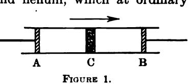

air, it can be further cooled and eventually liquefied by its own free expansion.

The temperature at which a gas is neither heated nor cooled, by free expansion , is called its inversion temperature. Probably all gases which at ordinary temperatures are cooled by free expansion will show such an inversion at higher temperatures.

In order to understand clearly the theory oftheJoule-Thomson experiment, let us consider the schematic representation in Figure 1. The gas is passing through the porous plug C from left to right. The pistons A and B are moved at such a rate as to keep each of the pressures, P and P' , constant. When one mol of gas has passed through the plug, the work PV will have been done upon the system, and the work P'V' will have been done by the system. The net work done by the system is w = P'V' - PV. Assuming now that the apparatus is constructed of such good thermal insulators that the process is adiabatic, then q = 0, and E' - E = PV - P'V' . Hence, by Equation V-8, ΔΗ = 0, and the process is one occurring at constant H.

### THERMODYNAMICS CHAP

- - The ratio (T' − T) / (P' − P) being obtained at several values of (P' - P), we may find its value in the limiting case as (P' P) approaches zero. This value may be called the Joule-Thomson coefficient, μ. It is formally defined by the equation, -

$$
\mu = \left(\frac{\partial T}{\partial P}\right)_H.\tag{11}
$$

. VI

Now this coefficient is related to others which we have already employed(seeIII-3),bytheequation,

$$
\begin{pmatrix} \frac{\partial T}{\partial P} \end{pmatrix}_H = \begin{pmatrix} \frac{\partial H}{\partial P} \end{pmatrix}_T \Big/ \begin{pmatrix} \frac{\partial H}{\partial T} \end{pmatrix}_P
$$

or, by Equations 11 and V-14,

$$
\left(\frac{\partial H}{\partial P}\right)_T = -\,\mu C_{\text{p}},\tag{12}
$$

where ( H/aP) shows the heat which would be absorbed, per unit difference in pressure, if the experiment were carried out, not in a thermally insulated tube, but in a calorimeter at constant temperature.

The equations of this section are in no way restricted to gaseous substances, and the experiment of Joule and Thomson can be made with any fluid substance. Few such experiments with liquids have been carried out , but there is no doubt that much valuable information regarding liquids may and will be obtained by this method.

EXERCISE 5. Let us see in a particular case how large a fraction of a compressed gas may be liquefied by a process of free expansion. In so far as the process can be made adiabatic, the heat content of the liquefied gas, together with the heat content of the residual gas which has not been liquefied, must be equal to the heat content of the original compressed gas. In a good liquefier, the heat interchange is so effective that the residual gas issues at a temperature very little lower than that of the compressed gas which enters, and by improving the interchanger this difference can be made indefinitely small. Let us assume then that of one mol of oxygen, at 298°K and at 200 atmos. , entering the liquefier, the fraction x is converted into liquid oxygen at 1 atmos. and at 90°K (the boiling point of the liquid ) ; and that the fraction ( 1 - x) issues from the liquefier at 1 atmos. and at

- 0. 298 K. Then we may write the equation O2 (g, 200 atmos. , 298 ° K) == r0: (1, 1 atmos. , 90° K) + ( 1 − x) O2(g, 1 atmos. , 298°K) ; ▲H

Or, looking at the matter in another way, if the whole mass of the gas is cooled by free expansion from 200 atmos. to 1 atmos. it has been found by the Joule-Thomson experiment that the drop in temperature will be about 50°. Thus the heat content at 200 atmos. and 298° K is the same as the heat content at 1 atmos. and 248°K. Hence we may write for the three states (all at atmospheric pressure) ,

$$\text{O}_2(\text{g, }248^\circ \text{K}) \rightleftharpoons x\text{O}_2(\text{l, }90^\circ \text{K}) \\ \text{ + } (1 - x)\text{O}_2(\text{g, }298^\circ \text{K}); \quad \Delta H = \text{0.} $$

Assuming Cp for the gas to be constant and equal to 6.7, and taking the heat of vaporization per mol as 1600 cal. , show that

$$x[1600 \ + \ 6.7(248 \ - \ 90)] \ = (1 \ - \ x)[6.7(298 \ - \ 248)],$$

or that about 11 % of the gasisliquefied.

EXERCISE 6. Assuming Equation 6 (which produces an error in this calculation of only about 3 %) , show that, if we compress oxygen to 200 atmos. at 25°C and use an efficient liquefier, it will require about 27000 cal. of mechanical work for each mol of liquid oxygen produced.

EXERCISE 7. Show from Equation V- 15 that for any substance

$$C_V = C_\mathcal{P} \left[ 1 - \mu \left( \frac{\partial P}{\partial \vec{T}} \right)_V \right] - V \left( \frac{\partial P}{\partial \vec{T}} \right)_V \tag{13}$$

How is this equation simplified at the inversion temperature?

EXERCISE 8. Hoxton (Phys. Rev., 13, 438 ( 1919) ) has made a careful study of the Joule-Thomson coefficient for air over a limited range of temperature and pressure. His results are summarized in the empirical formula,

$$
\mu \, \text{--} \, - \, 0.1975 \, + \, \frac{138}{T} \, - \, \frac{319P}{T^3} \, .
$$

- Show that at 60°C, and at small pressures, 0.217 and ( əµ/ əT)p = -0.00124.

EXERCISE 9. The differentiation of Equation 12 with temperature leads to an interesting and useful formula. Show that

$$\left(\frac{\partial C\rho}{\partial \vec{P}}\right)_T = -\left(\mu \left(\frac{\partial C\rho}{\partial \vec{T}}\right)_P - C\left(\frac{\partial \mu}{\partial T}\right)_P\right) \tag{14}$$

Few experiments have been made upon the change of heat capacity with pressure, but Holborn and Jakob ( Z. Verein deut. Ing. , 58, 1429 ( 1914) ) have made a careful study, for air at 60° , of the change of Cp with pressure. They found for 1 gram of air at 60° , Cp = 0.241, and at small pressures, (†C»/¿P)↑ =0.000286. At this same temperature ( CD / T) p is 0.000035 per gram. Using these values and the value of from the previous exer-

cises, calculate ( Əμ/ƏT) , and note how nearly it agrees with the experimental value given in the previous exercise.

EXERCISE 10. It may have been noticed that the equation of Hoxton in Exercise 8 makes the Joule -Thomson coefficient approach a finite value at zero pressure. Indeed all of our experimental evidence indicates that (and therefore (ƏH/ ǝP) Ț) does not approach zero as the gas is indefinitely expanded. We have already seen that ( ƏH/ V) is zero at zero pressure. Show analytically that, for a given amount of gas, the ratio of ǝH/ǝP to ƏH/ V approaches infinity as the pressure is diminished. T


# CHAPTER VII

# THE HEAT CAPACITY OF PURE SUBSTANCES

We shall have such frequent occasion to employ numerical values of heat capacity that it seems well to pause at this point for a brief examination of the experimental information which we possess concerning these useful data.

## HEAT CAPACITY OF ELEMENTS IN THE SOLID STATE

Dulong and Petit ' announced the empirical rule that the heat capacity per gram atom is the same for all solid elements. Later this discovery was somewhat discredited, when it was found that the specific heats always increase with the temperature, and sometimes very rapidly, so that at low temperatures, and indeed at ordinary temperatures for a number of elements of low atomic weight, the heat capacity proves to be much lower than the value of Dulong and Petit ; while at higher temperatures the heat capacities rise considerably above this value.

Meanwhile, however, Boltzmann2 had shown that the rule of Dulong and Petit could be directly deduced from the classical kinetic theory, and that the constant of Dulong and Petit should be equal to 3R = 5.97 calories per degree . Now the theoretical considerations of Boltzmann would pertain to cv rather than Cp, and it became therefore a matter of much interest to determine whether the rule of Dulong and Petit might not be more nearly valid if applied to heat capacity at constant volume.

In order to answer this question Lewis 3 employed a thermo-

<sup>1</sup> Dulong and Petit, Ann. chim. phys. , 10 , 395 ( 1819) .

<sup>*</sup> Boltzmann, Sitzb. kgl . Akad. Wiss. Wien, 63 : 2, 679 ( 1871) .

Lewis, J. Am. Chem. Soc. , 29, 1165 , 1516 ( 1907) .

dynamic formula (which we are going to prove in a later chapter, Equation XII- 24) , reading

$$\mathbf{c}_{\mathsf{P}} - \mathbf{c}_{\mathsf{V}} = \frac{\alpha^{\mathsf{a}} \mathbf{v} T}{\mathfrak{P}} \tag{1}$$

where a β = - = - (1/v) (əv/ƏT) p is the coefficient of thermal expansion, ( 1/v) (ðv/ƏP) ™ is the compressibility, v is the molal volume, and T is the absolute temperature. (In ordinary units this equation gives cp cv in cc. -atmos. per deg. , which may then be converted to cal. per deg. through multiplication by 0.02423 . ) Applying this equation to all the solid elements for which the requisite data were known, he was led to the interesting conclusion: "Within the limits of experimental error, the atomic heat at constant volume, at 20°C, is the same for all the solid elements whose atomic weights are greater than that of potassium." Thus for the 15 elements for which data were available, the mean value of cv was 5.9, and the average deviation from this mean was 0.09. The values of cp are far more variable. Thus for iodine Cp Cp = = 6.9, Cp - Cv = 0.9, and Cv - = 6.0, while for iron 6.0, Cp Cv = 0.1 , and cv = 5.9. Such experimental data as we possess on the difference between the two heat capacities are given in Table 1 , taken from a paper by Lewis and Gibson¹ of which we shall make frequent use in this chapter. It is evident that at ordinary temperatures the difference between Cpandcvisusuallysmall.

|    |     | TABLE | 1.<br>-<br>Cp | -<br>AT<br>CV | ROOM | TEMPERATURE |     |    |     |
|----|-----|-------|---------------|---------------|------|-------------|-----|----|-----|
| ᏞᎥ | 0.3 | Ca    | 0.3           | As            | 0.0  | Sn          | 0.3 | Au | 0.3 |
| Be | 0.2 | ᎢᎥ    | 0.1           | Se            | 0.3  | Sb          | 0.1 | TI | 0.3 |
| C  | 0.0 | Cr    | 0.1           | Zr            | 0.1  | I           | 0.9 | Pb | 0.4 |
| Na | 0.5 | Mn    | 0.1           | Mo            | 0.1  | La          | 0.1 | Bi | 0.1 |
| Mg | 0.2 | Fe    | 0.1           | Ru            | 0.1  | Ce          | 0.1 | Th | 0.1 |
| Al | 0.2 | Co    | 0.1           | Rh            | 0.1  | W           | 0.1 | U  | 0.1 |
| Si | 0.1 | Ni    | 0.2           | Pd            | 0.2  | Os          | 0.1 |    |     |
| S  | 0.4 | Cu    | 0.2           | Ag            | 0.3  | Ir          | 0.2 |    |     |
| K  | 0.6 | Zn    | 0.3           | Cd            | 0.3  | Pt          | 0.2 |    |     |

Recent investigations have thoroughly substantiated the conclusion that, in normal cases, the atomic heat capacity at

1 Lewis and Gibson, J. Am. Chem. Soc. , 39, 2554 ( 1917) .

constant volume, however it may change at low temperatures, rises with increasing temperature and approaches asymptotically the value 3R.

There is, however, one type of substances constituting an exception to this rule. This exceptional class, discovered by Lewis, Eastman and Rodebush, ' was also satisfactorily explained by them. They pointed out that for extremely electropositive metals, such as sodium, potassium, calcium and magnesium, the values of c, rise, with increasing temperature, considerably above the Dulong and Petit constant. Indeed for the most electropositive metal, cesium, the measurements of Dewar, which we are about to discuss, show that even at temperatures between the boiling points of hydrogen and nitrogen the value of cy is greater than 3R. This phenomenon is explained by assuming that in addition to the thermal energy of the atoms, certain electrons in these electropositive metals are held by such weak restraints that they also acquire thermal energy.

Heat Capacity of Solid Elements at Low Temperatures The change of specific heats with temperature has always been recognized, but it was called sharply to the attention of scientists by the work of Dewar2 at very low temperatures. He showed that between the temperatures of liquid air and liquid hydrogen the average heat capacity of diamond is less than one per cent of the Dulong and Petit value.

The results of a recent extensive investigation, by the same author, ³ of mean heat capacities between 20.0° K and 77.4° K, are given in Table 2.

Einstein was the first to see the close connection between the diminution of specific heats at low temperatures, and the departure from the classical theory of heat in another of its branches; namely, the one which deals with the distribution of energy in the spectrum of radiant energy emitted by a hot body. By assuming a certain type of hypothetical solid , he was able to obtain an equation for its heat capacity based solely upon the known laws of radiation.

Since this brilliant theoretical investigation of Einstein, our experimental knowledge of the specific heats at low temperatures

<sup>1</sup> Lewis, Eastman and Rodebush, Proc. Nat. Acad. Sci. , 4, 25 (1918) .

<sup>*</sup>Dewar, Proc. Roy. Soc. , London , ( A) 74, 122 ( 1904) .

Dewar, Proc. Roy. Soc. , London, ( A) 89, 158 ( 1913) .

<sup>4</sup> Einstein, Ann. Physik. [ 4] 22, 180 ( 1907) .

CHAP. VII

| Mean<br>Cv                     | Mean<br>Cv            | Mean<br>Cv          |
|--------------------------------|-----------------------|---------------------|
| Lithium<br>.1.24               | Titanium<br><br>0.91  | <br>Tin<br>.3.14    |
| Beryllium<br><br>1.15          | Chromium<br><br>0.64  | Antimony<br>.2.66   |
| .0.22<br>Boron<br>             | Manganese<br><br>1.16 | Iodine<br>4.23      |
| Graphite<br><br>.0.15          | .0.90<br>Iron<br>     | Tellurium<br>.3.39  |
| Diamond<br><br>0.03            | Nickel<br>.1.12       | Cesium<br><br>.6.29 |
| Sodium<br>.3.22                | 1.12<br>Cobalt.       | Lanthanum4.24       |
| Magnesium<br>.1.60             | .1.44<br>Copper       | Cerium<br><br>.4.27 |
| Aluminum.<br>1.03              | .2.32<br>Zinc         | 1.61<br>Tungsten    |
| 0.79<br>Silicon<br>,<br>I.     | 1.79<br>Arsenic       | Osmium<br>.1.37     |
| Silicon<br>0.71<br>,<br>II<br> | Selenium<br>2.63      | Iridium<br>.1.77    |
| Phosphorus                     | Bromine<br>.3.33      | .2.42<br>Platinum   |
| yellow<br>2.21<br>(<br>)<br>   | Rubidium<br>.5.54     | Gold<br>2.91<br>    |
| Phosphorus                     | 2.19<br>Zirconium     | Mercury<br>.4.29    |
| 1.24<br>(red)<br>              | Molybdenum1.25        | Thallium<br>.4.42   |
| Sulfur                         | Ruthenium<br>1.01<br> | Lead<br><br>.4.57   |
| (<br>rhombic<br>)<br><br>1.61  | Rhodium<br>.1.27      | Bismuth<br>4.18     |
| Chlorine<br>3.16               | Palladium<br>.1.87    | Thorium<br>4.22     |
| Potassium<br>4.61<br>          | Silver<br><br>.2.41   | Uranium<br>3.04     |
| Calcium<br>.2.63               | Cadmium<br>.3.19      |                     |

TABLE 2. -MEAN ATOMIC HEAT CAPACITIES BETWEEN 20° K AND 77.4°K

has been greatly increased through the work of Eucken, Nernst and Lindemann, and many others. This work shows that actual substances do not possess quantitatively the properties of Einstein's hypothetical solid . On the other hand, further theoretical treatment of this problem by Debye¹ led to an equation which, within the small limits of experimental error, is in agreement with the numerous experimental data to which it has been applied. His equation, however, is one of such complexity of mathematical form that it cannot be conveniently employed in practical work. Instead of such an analytical method we shall therefore adopt the simple graphical method of Lewis and Gibson, which we are about to discuss.

Solid Elements of Class I. The equation of Einstein and that of Debye have one important idea in common. They express the heat capacity, at constant volume, of all isotropic crystalline solids by the single equation ,

$$\text{cv} = \varphi \begin{pmatrix} T \\ \ddot{\theta} \end{pmatrix}, \tag{2}$$

1 Debye, Ann. Physik. [ 4] 39, 789 ( 1912) . An analogous and in some respects preferable theoretical discussion is that of Born and Kármán, Physik. Z., 13 , 294 ( 1912) ; 14, 15 ( 1913 ) .


where is a characteristic constant for each substance, and is a function which is the same for different substances.

The characteristic isotropic metals like copper or lead, and all other substances which show, with these, cv as the same function of T/0, we call substances of Class I. Presumably all elements which crystallize in the regular system belong to this class.

Without attempting to ascertain just what function is represented by in Equation 2, we may test the validity of that equation by a simple expedient. If for two substances cv is

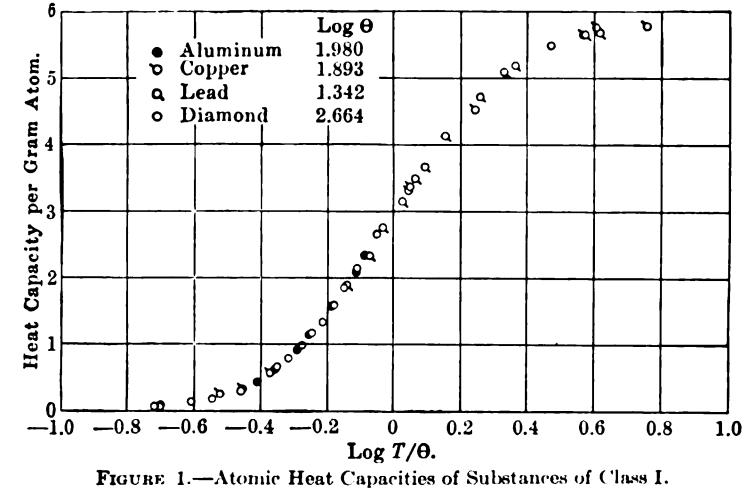

 the same function of T/O it will also be the same function of log (T/O), or of (log T log 0) . Hence if we plot cv for the two substances against log T, the curves must be identical except for a horizontal displacement, and if we shift one curve horizontally by an amount equal to the difference between the two values of log 0, the two curves must coincide entirely.

It will be convenient to define the characteristic constant → as the temperature at which cv is equal to one-half the Dulong and Petit constant, namely 3½R. The extraordinary confirmation of Equation 2 which we obtain by this graphical method is shown in Figure 1 , taken from the paper of Lewis and Gibson,

in which the values of cv for aluminum, copper, lead and diamond are simultaneously plotted against log T/O. Four other metals for which accurate data have been obtained, silver, mercury, thallium and zinc, are not included in the figure, but their curves also coincide fully with the others. This is especially interesting in the case of zinc, since this metal in its ordinary state is not composed of regular, but chiefly of hexagonal crystals. This leads to the suspicion that Class I may include not only those elements which crystallize in the regular form but all those which are monatomic, if we use this term to indicate that the unit of the crystalline space-lattice is a single atom. In this sense a substance may be presumed to be monatomic in the solid state when in the vapor state it is known only in the monatomic form.

Solid Elements of Class II. In the case of elements of complicated crystalline structure the heat capacity does not follow the curve of Figure 1 , but in general gives a flatter curve. Numerous solids of this sort were treated by Lewis and Gibson on the assumption that they follow the equation,

$$\mathbf{v}_{\mathbf{v}} = \varphi \left( \frac{T}{\Theta} \right)^{\bullet}, \tag{3}$$

where is the same function as before and n is an additional constant, characteristic of the substance. It is unity for substances of Class I and less than unity for other substances. It may be that this equation has no theoretical basis, but in any case it has served as a useful empirical formula. Substances which obey this formula may be said to belong to Class II.

In this case we may plot cv against n log ( T/0) , and then the curves for all substances of this class coincide. This is illustrated in Figure 2, also taken from Lewis and Gibson, which shows the atomic heat capacity of graphite (n = 0.789, log 0 = 2.594) . This figure also shows the average atomic heat capacity ( 13 the molal heat capacity) of lead chloride (n 0.796, log → = 1.660) . The points fall very nearly on the continuous curve, which is the curve of Figure 1 . =

It is evident that since there is only one constant in Equation 2, the whole course of the heat capacity is determined by a single measurement of cv, if this value is not too near 3R or zero . For a substance of Class II, Cv must be determined at two properly chosen temperatures in order to give both and n.

Heat Capacity of Solid Compounds. It was early apparent that the heat capacities of solid compounds are approximately the sum of the heat capacities of their constituent elements. Thus at ordinary temperatures if certain elements obey the law of Dulong and Petit, the molal heat capacity of a compound containing x atoms of such elements in its molecule is approximately 3Rx. Kopp¹ in a thorough investigation extended this additivity principle to compounds containing elements of small atomic weight, which do not even approximately obey the Dulong and Petit law. He found that the molal heat capacity

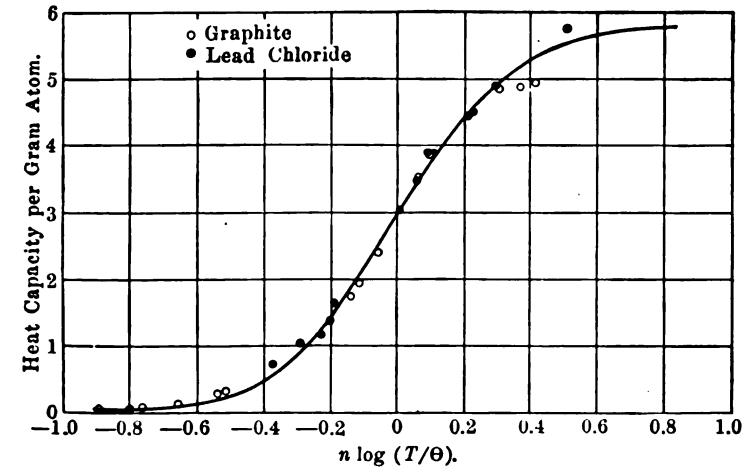

FIGURE 2. -Atomic Heat Capacities of Substances of Class II.

= at constant pressure could be calculated by assigning to each atom the value of 6.4, except for some of the light elements to which he assigned the following values: C, 1.8; H, 2.3 ; B, 2.7;Si, 3.8 ; 0,4.0 ; F, 5.0; P, 5.4 ; S, 5.4. Thus for BaCO3 he found experimentally Cp 21.7, while he would calculate it to be 6.4+ 1.8 +3 × 4.0 20.2. This rule, although a useful one when direct measurements are lacking, is far from accurate. We have already seen a marked exception to this additive principle even in the case of an element itself, for by Kopp's law diamond and. graphite would have identical specific heats.

1 Kopp, Ann. Chem. Pharm. Suppl. , 3, 1 , 289 ( 1864) .

## 78 THERMODYNAMICS CHAP. VII

The values of cp for all compounds rise without apparent limit as the temperature is increased. Thus Goodwin and Kalmus, ' studying numerous salts at 300 to 400°C, found cp to be nearly additive if oxygen were assigned the value 5.9, and heavier elements the value 7.1 . Undoubtedly the molal heat capacity at constant volume in all cases approaches 3Rx with increasing temperature and zero at the absolute zero of temperature. Work at lower temperatures shows that compounds sometimes belong to Class I , more frequently to Class II, and in other cases they may satisfy the requirements of neither class.

### HEAT CAPACITY OF LIQUIDS

In discussing the specific heat of liquids we have no theoretical guide, nor are existing data sufficient to warrant generalization. As a rule the heat capacity of a liquid is of the same order of magnitude as that of the same substance in the solid state, but somewhat larger. The following table gives the molal heat capacity at constant pressure for several salts in the liquid and solid states, in the neighborhood of the melting point (t) , as found by Goodwin and Kalmus.

|          | t   | Cp(1) | Cp<br>(<br>s<br>) |
|----------|-----|-------|-------------------|
| KNO<br>3 | 308 | 33.7  | 29.5              |
| NaNO3    | 333 | 36.6  | 33.0              |
| LiNO3    | 250 | 26.9  | 26.7              |
| AgNO3    | 218 | 33.1  | 33.1              |
| AgCl     | 455 | 18.5  | 14.3              |
| TICI     | 427 | 14.1  | 13.9              |
| РЬСІ2    | 498 | 33.7  | 21.6              |
| AgBr     | 430 | 14.3  | 14.2              |
| TlBr     | 460 | 22.7  | 14.9              |
| PbBr2    | 488 | 28.6  | 20.8              |
| NaCIOs   | 255 | 34.6  | 34.1              |
| K2Cr2O7  | 397 | 98.6  | 68.0              |

TABLE 3. -HEAT CAPACITIES OF FUSED AND SOLID SALTS

For liquids as well as for solids cp ordinarily rises markedly with the temperature, and this increase proceeds regularly in the case of liquids of the normal type which we believe to be composed of a single molecular species . On the other hand very irregular changes are observed in certain liquids in which we suspect that temperature changes the molecular constitution. An extreme example of such irregularity was found by Lewis Goodwin and Kalmus, Phys. Rev., 28, 1 ( 1909) .

and Randall¹ in their study of liquid sulfur. The extraordinary way in which the specific heat of this substance changes with the temperature is shown in the curve of Figure 3. The very high values in the neighborhood of 160°C can be entirely explained in this instance, since it is possible to show that there are two molecular species, Sλ and Sμ (probably S, and S ) . The heat absorbed goes largely towards increasing the amount of the latter at the expense of the former.

## HEAT CAPACITY OF GASES

The specific heat of gases has long been a favorite subject for experimental investigation. Nevertheless the results still leave much to be desired.

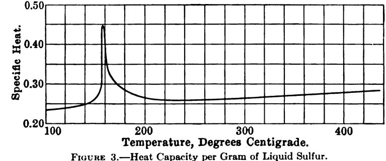

Numerous methods have been employed. If a gas is passed from a high temperature into a calorimeter, the heat measured gives directly the mean heat capacity of the gas, between the high temperature and the temperature of the calorimeter. By using several high temperatures a graphical or analytical differentiation yields values of the true heat capacity at a definite temperature. Recently Eucken³ has succeeded in measuring directly the true specific heat of gases, in a calorimeter designed especially for low temperatures.

Indirect methods have also been employed. The one first

<sup>1</sup> Lewis and Randall, J. Am. Chem. Soc. , 33, 476 ( 1911) .

<sup>2</sup> For an excellent discussion of the various methods of determining the specific heats of gases, the reader is referred to Haber, "Thermodynamik technischer Gasreactionen, " Olden- bourg, München, 1905. English translation by Lamb; Longmans, Green and Co. London and New York, 1908.

Eucken, Ber. deut. physik. Ges. , 18, 4 ( 1916) ,

invented by Bunsen, ' which depends upon the measurement of pressure developed in an explosion, gives rough values for mean specific heats up to very high temperatures. Various types of experiment which consist in measuring the thermal effects in a small adiabatic expansion give the true heat capacity at the temperature of the measurements. Such experiments have added largely to our knowledge of the heat capacity of gases. The theory of one such adiabatic process will be discussed in Chapter XII.

Empirical Equations for the Heat Capacity of Gases. A few years ago the authors reviewed the existing data for the specific heat of gases at room temperature and at higher temperatures, and obtained a number of empirical formulae which in a convenient form summarize the best evidence that we have concerning these important quantities. These formulae are as follows:

| Monatomic<br>gases<br>,<br>Cp<br>5.0<br>=                                                               | (<br>4<br>)  |
|---------------------------------------------------------------------------------------------------------|--------------|
| =<br>6.50<br>+<br>0.0009T<br>H2<br>Cp<br>;                                                              | (5)          |
| NO<br>CO<br>=<br>HBr<br>N2<br>HCl<br>HI<br>+0.00107<br>O2<br>; Cp<br>6.50<br>,<br>,<br>,<br>,<br>,<br>, | )<br>(<br>6  |
| +<br>=<br>0.0017<br>Br2,<br>Cp<br>Cl2,<br>7.4<br>I2<br>;                                                | (7)          |
| +<br>H₂O<br>H₂S<br>-<br>=<br>0.0019T<br>0.00000222T2<br>; Cp<br>8.81<br>,                               | (<br>8<br>)  |
| -<br>0.00000186T2<br>CO2<br>SO2<br>0.0071T<br>,<br>;<br>Cp<br>=<br>7.0+                                 | (<br>9<br>)  |
| NH3<br>CD<br>=<br>8.040.00077<br>+<br>0.0000051T²<br>;                                                  | 10<br>(<br>) |
| +<br>=<br>0.005T<br>CH4<br>Cp<br>7.5<br>;                                                               | (<br>11<br>) |

The equation for ammonia is based upon the new measurements of Haber and Tamaru.3 That for methane represents a very rough estimate which we have made elsewhere. The equation which we formerly gave for the heat capacity of the halogens was recognized to be inadequate at high temperatures. We have modified it in order to bring it into accord with measurements of the specific heat of chlorine made by Pier with the explosion method.

<sup>1</sup> Bunsen, Ann. Physik. [ 2] 131 , 161 ( 1867) .

<sup>2</sup> Lewis and Randall, J. Am. Chem. Soc. , 34, 1128 ( 1912) .

Haber and Tamaru, Z. Elektrochem. , 21, 228 ( 1915 ) .

Lewis and Randall, J. Am. Chem. Soc. , 37 , 458 ( 1915) .

Pier, Z. physik. Chem. , 62, 385 ( 1908) .

We have no illusions regarding these equations for the specific heats of gases, which for the most part are grossly empirical. They give little indication of the details of the actual course of the specific heat curves, and rest upon meagre experimental evidence. Nevertheless, over the range of temperature of the measurements upon which they are based, chiefly from ordinary temperatures up to 1000° or 2000° C, they prove of much value in applied thermodynamics. It is to be noted that the formulae are for gases at moderate pressures ; at high pressures the heat capacities become appreciably greater, as illustrated in Exercise VI-9.

Theory of the Heat Capacity of Gases. In the kinetic theory of gases, the increase in internal energy with the temperature is ascribed in part to an increase in the translational energy of the molecules, and in part to an increase, within the molecules, of the kinetic energy (of rotation or oscillation) and of the potential energy. The first portion is readily calculated to be 3½RT. Whence, if we consider translational energy alone, we should find cv 3½R, or, by Equation VI-9, Cp = 52R. =

It was in 1867 that Naumann' predicted that a monatomic gas would possess no energy except that of translation, and therefore that its heat capacity should correspond to the one just calculated. This prediction was brilliantly verified for mercury vapor by Kundt and Warburg, and has since been abundantly confirmed over wide temperature ranges, in the case of other monatomic gases. 2

Also in accordance with Naumann's prediction , all gases with more than one atom to the molecule have molal heat capacities which are larger than those for the monatomic gas. But for such cases no adequate quantitative theory has as yet been proposed.

Heat Capacity of Gases at Low Temperatures. A very significant discovery was made by Eucken, ³ who studied the specific heat of hydrogen at low temperatures. He found that when the temperature is lowered below the boiling point of liquid air, the molal heat capacity diminishes rapidly; approaching, as a limitingvalue,themolalheatcapacityofamonatomicgas.

 Presumably this would be found to be true for all other poly-

<sup>1</sup> Naumann, Ann. Chem. Pharm. , 142, 265 (1867 ) .

<sup>*</sup> Kundt and Warburg, Ann. Physik. [ 2] 157, 353 ( 1876) .

Eucken, Sitzb. kgl. preuss. Akad. Wiss. , 1912 144 ; Ber. deut. physik. Ges. , 18, 4 ( 1916) .

atomic gases if they could be studied at sufficiently low temperature. The form of the heat capacity-temperature curve for hydrogen is shown in Figure 4.

It is evident from this figure that, at low temperatures, Equation 5 would give far from correct values for the heat capacity of hydrogen. Indeed, there are several curves shown in the figures of this chapter which cannot be fitted by an equation of thealgebraictypewithasmallnumberofterms.

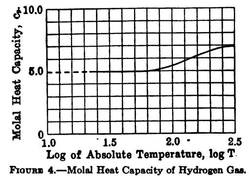

EXERCISE 1. The specific heat of benzene at constant pressure is 0.425 cal. per deg. at 25° C. Calculate c, and cv for 1 mol of benzene whose volume is 88.8 cc. , and for which a = 0.00124 and 8 = 0.000098 . (Use consistent units . )

EXERCISE 2. The following table gives the results of Nernst and Lindemann (Z. Elektrochem. , 17, 817 ( 1911 ) ) on the atomic heat capacity of silver at various temperatures. Plot the values of cv against either T or log T and find the value of 0.

| T    | Cv   | T    | Cv   | T   | Cv   |
|------|------|------|------|-----|------|
| 35.0 | 1.59 | 51.4 | 2.81 | 200 | 5.60 |
| 39.1 | 1.92 | 53.8 | 2.97 | 273 | 5.77 |
| 42.9 | 2.22 | 77.0 | 4.07 | 535 | 5.90 |
| 45.5 | 2.43 | 100  | 4.72 | 589 | 5.92 |

EXERCISE 3. Employing Equation 6, calculate the mean cp for oxygenbetween 0°C and 1000° C.

# CHAPTER VIII

# THE HEAT CAPACITY AND HEAT CONTENT OF SOLUTIONS

## PARTIAL MOLAL HEAT CAPACITY

Just as we have defined the partial molal volumes, we may define the partial molal heat capacities of the several constituents of a solution. Thus for a solution containing n₁ mols of a sub-

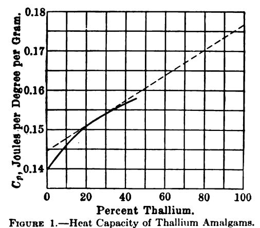

stance X1, n2 mols of X2, etc., and whose total heat capacity is Cp, we define the partial heat capacities by the equations,

$$\mathfrak{C}_{\mathfrak{p}1} = \frac{\partial C_{\mathfrak{p}}}{\partial n_1}; \ \mathfrak{C}_{\mathfrak{p}2} = \begin{array}{c} \partial \underline{C}_{\mathfrak{p}} \\ \partial n_2 \end{array}; \ \dots \ \quad \cdot \quad \cdot \tag{1}$$

These partial molal heat capacities may be obtained by any of the methods which were described in Chapter IV.

For example, Richards and Daniels¹ give the heat capacity 1 Richards and Daniels, J. Am. Chem. Soc. , 41 , 1732 ( 1919) .

per gram (specific heat) of liquid thallium amalgams at various weight percents. We may plot their results in Figure 1 , and obtain the values of Cp by the method of intercepts.¹ Thus, by laying a ruler tangent to the curve at any composition , we read off the two intercepts at zero and one hundred percent thallium. At 25 gram percent, which is 25.3 mol percent, the intercepts are 0.1444 and 0.1767 . These results are in joules per degree per gram, so that if we divide them by 4.182, and multiply by the atomic weights, respectively, of mercury and thallium, we obtain for mercury CP1 -6.93, and for thallium Cp2 8.62. In the same. way we have read off the values at several round mol fractions, asshowninTable1.=

TABLE 1. -PARTIAL MOLAL HEAT CAPACITIES ( CALORIES PER DEGREE) IN THALLIUM AMALGAMS AT ABOUT 30°C

| N2   |                        | Cpl  | CP2   |
|------|------------------------|------|-------|
| 0.00 |                        | 6.70 | 10.20 |
| 0.05 |                        | 6.72 | 9.81  |
| 0.10 |                        | 6.75 | 9.54  |
| 0.15 |                        | 6.80 | 9.15  |
| 0.20 |                        | 6.85 | 8.82  |
| 0.25 |                        | 6.93 | 8.62  |
| 0.30 |                        | 6.97 | 8.50  |
| 0.35 |                        | 7.02 | 8.40  |
| 0.40 |                        | 7.05 | 8.34  |
| 1.00 | extrapolated<br>(<br>) |      | 8.2   |

As an example from the domain of aqueous salt solutions, we give, in Table 2, the results of Randall and Bisson² on sodium chloride solutions. The several columns show ( 1) the gram fraction of sodium chloride, (2) the heat capacity per gram (specific heat) , ( 3) the molality, m, (4) the heat capacity of the solution containing 1000 g. of water and n₂ = m mols of salt , (5 ) the partial molal heat capacity of the water, and ( 6) that of the salt.

This example shows that the partial molal heat capacity, like the partial molal volume, may be negative. In other words, the heat capacity of a dilute solution of sodium chloride is actually diminished by the addition of a further amount of the salt .


<sup>1</sup>Chapter IV, Method IV.

2 Randall and Bisson, J. Am. Chem. Soc. , 42, 347 ( 1920) .

| Wt<br>. Per<br>cent | Sp<br>Heat | m    | Cp<br>(<br>total<br>) | Cpl   | Cp2          |
|---------------------|------------|------|-----------------------|-------|--------------|
| 0.000               | 0.9979     | 0.00 | 997.9                 | 17.98 | -10          |
| 1.439               | 0.9815     | 0.25 | 995.8                 | 17.98 | 8.5          |
| 2.838               | 0.9652     | 0.50 | 993.4                 | 17.97 | -<br>6       |
| 5.523               | 0.9365     | 1.00 | 991.2                 | 17.92 | -<br>3       |
| 8.07                | 0.9110     | 1.50 | 991.1                 | 17.88 | 1.5          |
| 9.53                | 0.8973     | 1.80 | 991.7                 | 17.79 | 3.5          |
| 12.75               | 0.8690     | 2.50 | 996.0                 | 17.61 | 8            |
| 16.17               | 0.8430     | 3.30 | 1005.6                | 17.32 | 13           |
| 18.95               | 0.8233     | 4.00 | 1015.8                | 17.21 | 2<br>16<br>2 |
| 21.55               | 0.8063     | 4.70 | 1027.8                | 16.91 | 19<br>3      |
| 23.66               | 0.7945     | 5.30 | 1040.6                | 16.64 | 5            |
| 26.29               | 0.7837     | 6.12 | 1063.2                | 16.48 |              |
|                     |            |      |                       |       |              |

TABLE 2. -HEAT CAPACITIES OF AQUEOUS SODIUM CHLORIDE SOLUTIONS AT25°C

Indeed this phenomenon, which has not been elsewhere observed, proves to be of frequent occurrence in aqueous solutions of electrolytes.

Thermodynamics exhibits no curiosity ; certain things are poured into its hopper, certain others emerge according to the laws of the machine, no cognizance being taken of the mechanism of the process or of the nature and character of the various molecular species concerned. In thermodynamics a pure substance obeys the same rigorous laws, whether its molecules are all of one sort, as we imagine them to be in hexane, or extremely diversified, as we assume them to be in water. In a thermodynamic formula we may use the value of a partial molal quantity equally well, whether it is positive or negative, and if it proves to be the latter no explanation need be given. It may therefore be out of place in a thermodynamic treatise to consider why it is that partial molal volumes and heat capacities are so frequently small or even negative. However, the fact is so characteristic of aqueous solutions, and the explanation is so simple, that we may pause briefly for its consideration.

Various properties of water, especially the phenomenon of maximum density at 4° C, can most readily be interpreted by assuming : that, in the neighborhood of its freezing point, water contains a large amount of a molecular species formed by the aggregation of simple molecules ; that this species occupies a larger volume than the simpler molecules of which it is constituted; and that it breaks up into these simpler molecules ( with absorption of heat) as the temperature is raised.

It appears that any electrolyte dissolved in water in some way causes these aggregates to break up to a degree which increases with the concentration. Thus, when a small additional amount of the solute is added to

an aqueous solution of an electrolyte, the total volume is increased by the volume occupied by the solute molecules, but is diminished by the dissociation of the larger aggregates. The latter effect may predominate over the former, in which case the partial volume of the solute is negative.

Again, the large heat capacity of water can be partly ascribed to the absorption of heat necessary to the dissociation of these aggregates, as temperature increases. In as far as the addition of an electrolyte diminishes the number of these aggregates remaining to be dissociated, it lowers the heat capacity of the water, and if this effect predominates over the heat capacity which may be ascribed to the solute molecules themselves, the partial heat capacity of the solute is negative.

In cases of another type, where solvent and solute belong to the class of substances which we call relatively non-polar, the various partial molal quantities in a liquid solution do not differ greatly from the corresponding molal quantities for the pure liquid constituents.

As an extreme example of the abnormalities which sometimes are met in aqueous solutions, we give in Table 3 and in Figure 2 the partial molal heat capacities of the constituents of aqueous sulfuric acid, calculated from the data of Biron.¹

| N2   | Cpl   | CD2  | N2   | Cpl   | Cp2  |
|------|-------|------|------|-------|------|
|      |       |      |      |       |      |
| 0.00 | 18.02 | 10.4 | 0.30 | 13.78 | 34.3 |
| 0.01 | 17.98 | 14.7 | 0.35 | 12.02 | 38.1 |
| 0.02 | 17.87 | 21.8 | 0.40 | 10.45 | 40.7 |
| 0.04 | 17.75 | 26.8 | 0.50 | 15    | 35   |
| 0.06 | 17.96 | 23.0 | 0.60 | 21.6  | 29.8 |
| 0.08 | 18.31 | 17.1 | 0.70 | 19.7  | 30.6 |
| 0.10 | 18.61 | 14.7 | 0.80 | 16.2  | 31.9 |
| 0.15 | 17.80 | 19.9 | 0.90 | 11.7  | 32.7 |
| 0.20 | 16.68 | 25.3 | 1.00 | 8.1   | 33.0 |
| 0.25 | 15.33 | 30.1 |      |       |      |

EXERCISE 1. By Method IV, Chapter IV (using the first two columns of Table 2) , or by Method II (using the third and fourth columns) , verify some of the values of that table.

EXERCISE 2. Table 4 gives Thomsen's measurements of the specific heats of aqueous hydrochloric acid at several values of the molality. Show that the partial molal heat capacity of the acid, at 0.1 M, is about · 32. -

1 Biron, J. Russ. Phys. Chem. Soc . , 31 , 190 ( 1899) ; the data are quoted by Domke and Bein, Z. anorg. Chem. , 43 , 148 ( 1904–5) .

TABLE 4. -SPECIFIC HEAT OF AQUEOUS HYDROCHLORIC ACID (AT ABOUT 18°C)

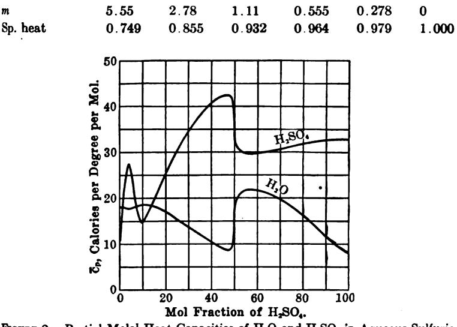

FIGURE 2.-Partial Molal Heat Capacities of H2O and H2SO4 in Aqueous Sulfuric Acid.

## PARTIAL MOLAL HEAT CONTENT

In the same way that we have defined other partial quantities, we define the partial molal heat content. If the total heat content of any solution is H, we write for the first constituent,

$$\mathfrak{A}_1 = \frac{\partial H}{\partial n_1}.\tag{2}$$

By further differentiation, with respect to temperature (see Equations III-5 and VI-2) , we obtain the important result,

$$\frac{\partial \mathfrak{H}_1}{\partial \bar{T}} = \mathfrak{C}_{\mathbb{P}^1}. \qquad \Box. \tag{3}$$

In such algebraic equations the molal heat content may be freely used regardless of the possibility of its numerical evaluation. When we come to arithmetical calculations we find a slight complication owing to our inability to state the absolute

values of the heat content. We measure directly the heat capacity or the volume of a system ; thus we state that the molal volume of ice at 0° C is 20 cc. But concerning the molal heat content of ice at 0°C we can only say that it is 1438 cal. less than that of liquid water at the same temperature, or 69908 cal. less than the heat content of one mol of hydrogen gas and one-half a mol of oxygen gas at the same temperature. For this reason, and also because of the immense confusion existing in the literature regarding various sorts of heat of solution, heat of dilution, and the like, we shall enter with some minuteness into the problem of the partial molal heat content.

Reference States. While we cannot give the absolute magnitude of for a substance in solution, we may ascertain how much greater or less this is than the heat content of the same substance in some chosen state. Thus, at any temperature, if we are dealing with the partial molal heat content of water in some solution in which water is the solvent, we may choose pure liquid water as the reference state, and denote its molal heat content by H₁°. (This is identical with ° , which will denote the partial molal heat content of water in any infinitely dilute aqueous solution .)

In the same manner, if we are considering some solute such as sodium chloride, we may choose for it a reference state. Thus we might choose the solid salt. Indeed, as we are confronted by various problems, it may be convenient to choose sometimes one reference state and sometimes another. However, for reasons which will later be more obvious, we will agree that (unless otherwise stated) the infinitely dilute solution, rather than any pure phase, will be chosen as the reference state of the solute in a given solvent. The partial molal heat content of the solute X2 at infinite dilution we shall then denote by й2° .

The difference between the partial molal heat content of any constituent, and the molal heat content of its reference state, may be called the relative heat content and designated by L. Thus,for solvent and solute respectively,

$$\mathsf{L}_{1} = \mathsf{R}_{1} - \mathsf{R}_{1}\mathsf{o}; \quad \mathsf{L}_{2} = \mathsf{R}_{2} - \mathsf{R}_{2}\mathsf{o}.\tag{4}$$

When we adopt the conventions stated above, we have at infinite dilution, L₁Li = 0 and L2 = 0.

It is better to define the reference state and the relative heat content as we have done here than to state that we take the heat content in the reference state as zero. This could be done arbitrarily at some one temperature, but if any н° is taken as zero at one temperature, it cannot be at another temperature, for it changes in accordance with Equation V- 14.

Partial or Differential Heat of Solution. In discussing heats of solution in concentrated solutions, there are two quantities which must be carefully distinguished. When a mol of sodium chloride is dissolved in enough water to form a given solution, the heat absorbed is called the total or integral heat of solution . On the other hand, starting with the given solution of sodium chloride, if we add a further small quantity of the solute, the heat absorbed per mol is called the partial or differential heat of solution.

The total and the partial heats of solution become identical at infinite dilution, and therefore in dealing with very dilute solutions it is customary to disregard the distinction between them. Unfortunately, however, this practice has led to confusion of the two quantities in concentrated solutions, where they may differ widely. Thus, in the case of sulfuric acid, the total and partial heats of solution differ by 350 cal. at 0.5 M; and by 2000 cal. at 5.0 M.

In our thermodynamic calculations it will almost invariably be the partial molal heat of solution that we need. Thus, if we are considering the thermodynamics of solid salt in contact with its saturated solution, we shall be interested, not in the heat absorbed when the solution is prepared from pure water and salt, but rather in the heat absorbed when an infinitesimal amount of salt dissolves in the already saturated solution.

To a solution containing ni mols of water and ng mols of salt let us further add dn₂ mols of salt at constant temperature and pressure . If q is the heat absorbed, then q/dn₂ is the partial heat of solution of the salt, per mol. We note that q is equal to the total increase in heat content. Representing the molal heat content of the solid salt by H2(s) , the heat content of the salt used is H2(s) dną; the increase in the heat content of the solution is, by definition, H2dn2, so that,

$$\mathbf{h}_{\mathbf{i}\hat{d}_{\mathbf{i}}}^{\mathbf{q}} = \mathbf{h}_{\mathbf{i}} - \mathbf{h}_{\mathbf{i}}(\mathbf{s}) = \mathbf{L}_{\mathbf{i}} - \mathbf{L}_{\mathbf{i}}(\mathbf{s}),\tag{5}$$

where L2 and L2(s) are the corresponding relative heat contents.

In order to determine the value of L2( s) it is only necessary to determine the heat of solution of the solute in a large amount of pure solvent. In such case L2 = 0, by our convention, and q/dną L₂(s) . Thus at 25°C the heat of solution of one mol of solid sodium chloride in a very large amount of water is¹ 1019 cal. Hence L2 (s) = - = -1019 cal.

Although it may sound a little unusual, we shall speak also of the heat of solution of water in the aqueous solution of sodium chloride, for there is no essential difference between the introduction of the one or the other constituent of the solution. The equation for the partial heat of solution of the water is even simpler than that for the salt ; for, pure water being taken as reference state, the relative heat content of the solvent is zero. Hence,

$$\frac{q}{\overline{dn_1}} = \mathbf{L}_1.\tag{6}$$

If very small quantities of water are added to large quantities of salt solutions of various concentrations, in a calorimeter, values of L1 are directly obtained. It was in this way that Randall and Bisson obtained the results of Table 5 which we are . about to discuss. 1

Calculation of a Partial Molal Quantity for the Solute, when that for the Solvent is Known. By our basic partial molal equation (IV- 15) , we write for the total heat content of a solution,

$$H = n_1 \mathfrak{h}_1 + n_2 \mathfrak{h}_2.\tag{7}$$

Now if we define the total relative heat content as L - n22 , it is evident that = H O -

$$L = n_1 \mathbb{f}_1 + n_2 \mathbb{f}_2,\tag{8}$$

1 Randall and Bisson, J. Am. Chem. Soc. , 42, 347 ( 1920) .


and at constant temperature and pressure, by Equation IV- 19,

$$
\mathbf{N}_1 d\mathbf{L}_1 + \mathbf{N}_2 d\mathbf{L}_2 = \mathbf{0},\tag{9}
$$

and after transforming and integrating,

$$
\int d\mathbf{t}_{\mathbf{t}} = -\int \frac{\mathbf{N}_{1}}{\mathbf{N}_{2}} d\mathbf{t}_{1}.\tag{10}
$$

If then the values of L₁ are known, and are plotted as abscissae, against N1/N2 as ordinates, the negative value of the area under this curve between two limits is the change in L₂ between these

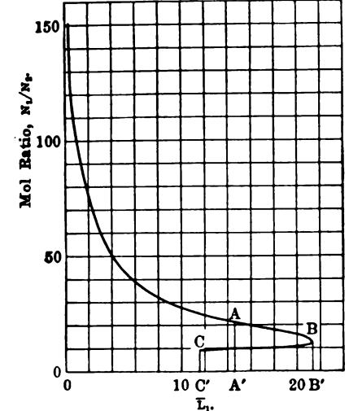

FIGURE 3.-Relative Partial Molal Heat Content of Water in Aqueous Sodium Chloride .

limits. If we take one of the limits at infinite dilution , where N1/N2 is infinite and the value of L2 is zero, the total area from infinity to a given point gives the value of -L2 at that point.

This procedure is illustrated in Figure 3, where we have plotted the values of L₁ in aqueous sodium chloride, given in Table 5. The value of L2 at any point A is the total area to the left of AA' . The value of L₁ reaches a maximum at B. Here again L2 is the total area under the upper curve, to the left of BB' . At any point such as C, which represents the saturated solution, L₂ is equal to the area which we have just mentioned, less the area BCC'B' .

## 92 THERMODYNAMICS CHAP. VIII

In any case of this kind where we attempt to determine the area under a curve which runs to infinity, there is involved some uncertainty, but one which is less, the more rapidly the quantity plotted approaches its limiting value. We may estimate that the uncertainty in the present case is of the order of 10 calories, and this uncertainty affects equally the values of L2 obtained at various compositions, and given in Table 5¹ .

TABLE 5. -RELATIVE PARTIAL MOLAL HEAT CONTENTS OF STITUENTS OF AQUEOUS SODIUM CHLORIDE AT 25°C THE CON-

| m                           | N1<br>/<br>N2 | *Li  | L2                            |
|-----------------------------|---------------|------|-------------------------------|
| 0                           | ∞             | 0    | 0                             |
| 0.278                       | 200           | 0.2  | 46                            |
| 0.370                       | 150           | 0.3  | ---<br>73                     |
| 0.555                       | 100           | 0.9  | -<br>142                      |
| 0.793                       | 70            | 2.4  | 268                           |
| 1.110                       | 50            | 4.0  | -<br>363                      |
| 1.632                       | 34            | 7.3  | -<br>483                      |
| 2.13                        | 26            | 11.0 | 587<br>--                     |
| 2.78                        | 20            | 15.9 | -<br>709                      |
| 3.47                        | 16            | 20.0 | -<br>783                      |
| 4.63                        | 12            | 21.4 | -<br>802                      |
| 5.55                        | 10            | 15.6 | 741                           |
| 6.12<br>(<br>saturated<br>) | 9.04          | 11.5 | -<br>702                      |
|                             |               |      | =<br>-<br>1019<br>)<br>(L2(S) |

Calculation of a Partial Molal Quantity for the Solvent from that for the Solute. The determination of L₁, when the values of L₂ are known is an analogous and even simpler process. By interchanging the subscripts in Equation 10,

$$d\mathfrak{L}_1 = -\frac{\mathfrak{N}_\mathfrak{2}}{\mathfrak{N}_1} d\mathfrak{L}_\mathfrak{2}.\tag{11}$$

Thus plotting values of L2 as abscissae, against those of N2/N1 as ordinates, the area under the curve from a certain point to N2/N₁1 = 0 gives immediately the value of L₁ at that point.

In the exhaustive investigation of Richards and Daniels on the properties of thallium amalgams, their most accurate determinations of the thermal changes accompanying changes of

<sup>1</sup> These values of L2 are not identical with the final ones given by Randall and Bisson, who combined the results of this calculation with other experimental data of the type that we are to discuss presently.

Richards and Daniels, J. Am. Chem. Soc. , 41 , 1732 ( 1919) .

concentration give almost immediately¹ the relative partial heat contents of thallium, L2. These values are given in the second column of Table 6, while the figures of the last column give the corresponding values for mercury, obtained graphically from the plot of Figure 4. It will be noted in this case that there is

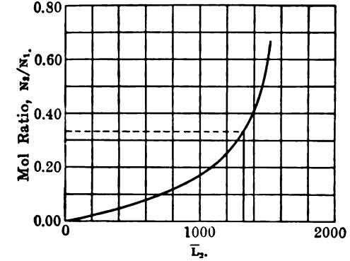

FIGURE 4. -Relative Partial Molal Heat Content of Thallium in Thallium Amalgams.

no uncertainty due to the extrapolation to infinity, such as we found in the converse problem.

| TABLE | -RELATIVE<br>6. | PARTIAL | MOLAL          | HEAT | CONTENTS | IN | THALLIUM |
|-------|-----------------|---------|----------------|------|----------|----|----------|
|       |                 |         | AMALGAMS<br>AT | 30°C |          |    |          |

| N2                                          | L2   | Lu             |
|---------------------------------------------|------|----------------|
| 0.0000                                      | 0    | 0.0            |
| 0.0250                                      | 212  | -<br>3.1       |
| 0.0500                                      | 413  | -<br>10.2      |
| 0.0863                                      | 671  | -<br>28.1<br>- |
| 0.1000                                      | 750  | 37.2<br>--     |
| 0.1070                                      | 800  | 41.8<br>-      |
| 0.1500                                      | 1013 | --<br>75.8     |
| 0.2000                                      | 1195 | -<br>112       |
| 0.2500                                      | 1324 | -<br>144       |
| 0.3000                                      | 1415 | -176           |
| 0.3500                                      | 1478 | -207           |
| 0.4000                                      | 1520 | 232<br>-       |
| 1.0000<br>(extrapolated)                    | 1640 |                |
| with<br>TI<br>(<br>s<br>,<br>sat<br>Hg<br>) | 805  |                |

¹ See the full discussion of these data by Lewis and Randall ( J. Am. Chem. Soc. , 43, 233 (1921) ) .

Total or Integral Heat of Solution. When one mol of sodium chloride is added to 1000 grams of water, the process may be written,

NaCl(s) + 55.51 H2O(l ) = solution (containing 1 mol NaCl and 55.51 mols H2O) .

= - = The integral heat of solution is the value of AH AL for this process. We have shown that for 1 mol of the solid sodium chloride L2(s) 1019 cal.; L₁ for liquid water is taken as zero. The relative heat content of the solution, by Equation 8, is 55.51L₁ + L2. By interpolation of Table 5 we find, at 1.0 M, that Li 3.5 and L2 884. This is the integral heat of solution ; as compared with 1019 when the salt is dissolved in an infinite amount of water, and 330 + 1019 689, when it is dissolved in an infinite amount of a molal solution. = = = -- 330, whence AH = -

Knowing the values of L1 and L2 and some one integral heat of solution, we could, conversely, calculate L2(s) . In their most accurate experiment, Richards and Daniels added 0.0305 mols of thallium to amalgam already containing 1.199 mols of mercury and 0.1132 mols of thallium, producing an amalgam containing 1.199 mols of mercury and 0.1437 mols of thallium. The heat absorbed was 0.2 cal. We may therefore write,

- 0.0305 mols Tl( s) + amalg. (n₁ = 1.199, n₂ 0.1132) = amalg. (nı = 1.199, n = 0.1437) ; AH = AL = 0.2 cal.

= Let us now determine the total heat contents of these two amalgams, for which the mol fractions are, respectively, N₂ 0.0863 and N2 = 0.1070 . For the first amalgam, we find, from the table, Li n₁ī₁ + N22 42.3 . Likewise for the second amalgam, L = 64.8 . Hence, = - 28.1 and L2 = 671 , and L = =

$$-64.8 - 0.0305 \text{L} \text{(s)} \ -42.3 = 0.2; \text{ } \text{L} \text{(s)} \ = 730 \text{ cal.}$$

This is the heat which would be evolved if 1 mol of thallium were dissolved in an infinite amount of mercury. It is to be noted that Table 6 gives 805 as the heat content of solid thallium in contact with the saturated amalgam. Weshall see in Chapter


XXII that such thallium contains mercury in solid solution , and therefore 805 is the relative partial molal heat content of thallium in this solid solution.

The methods of calculation are evidently similar when more solvent is added to a given solution. If to a certain amount of solution we add a very large amount of solvent it will readily be seen that the total heat absorbed is equal to the value of -L for the original solution . If a saturated solution of sodium chloride (6.12 M) containing 1 mol of the salt (and therefore 55.51 /6.12 mols of water), is added to a very large amount of water, it was found experimentally by Randall and Bisson that 606 calories were absorbed. This agrees, within the limits of error of experiment and calculation, with the values of L calculated from Table 5, namely, 702 ( 55.51 /6.12) 11.5 = 598 cal. -– -

It would be possible, in this manner, to determine the values of L at various concentrations, and then to determine the values of L1 and L2 by any of the methods of Chapter IV. Indeed it has been possible in this chapter to give only a few of the numerous methods of utilizing the thermal data as they are found in the literature.

EXERCISE 3. What heat is absorbed or evolved in the addition of 4 mols of sulfuric acid to 6 mols of water? Use the data of the following. table obtained from the measurements of Brönsted. (Z. physik. Chem. , 68, 693 ( 1910) ) .

TABLE 7. -RELATIVE PARTIAL MOLAL HEAT CONTENTS IN AQUEOUS SUL-FURIC ACID AT ABOUT 18°C

| N2   | Li         | L2    | N2   | L         | Lz    |
|------|------------|-------|------|-----------|-------|
| 0.00 | 0.0        | 0     | 0.55 | -5730     | 19040 |
| 0.05 | 43.7       | 4130  | 0.60 | 6300<br>- | 19530 |
| 0.10 | 293.3      | 7730  | 0.65 | -6690     | 19740 |
| 0.15 | -<br>580.  | 9310  | 0.70 | -7010     | 19910 |
| 0.20 | -1000      | 11190 | 0.75 | -7280     | 20027 |
| 0.25 | -<br>1450  | 12680 | 0.80 | -7490     | 20098 |
| 0.30 | -<br>1910  | 13970 | 0.85 | -7700     | 20136 |
| 0.35 | -<br>2470. | 15130 | 0.90 | -7870     | 20153 |
| 0.40 | -3060.     | 16160 | 0.95 | -8050     | 20172 |
| 0.45 | -3880      | 17240 | 1.00 | -8220     | 20200 |
| 0.50 | -<br>4850  | 18310 |      |           |       |

= CP1 - EXERCISE 4. Show that dī₁ /dT CP1° where CP1 is the molal heat capacity of the solvent in its reference state. In 50 mol percent sulfuric acid find, from Table 3, the change in Li per degree rise in temperature.

= - EXERCISE 5. Find the integral heat of solution of 0.1132 mols of thallium in 1.199 mols of mercury, and compare with the less accurate result of direct measurement, which gave approximately q 48 cal.

EXERCISE 6. What is the total relative heat content at 30°C of an amalgam containing 0.3 mols of thallium and 1.70 mols of mercury?

N2 EXERCISE 7. In Figure 4 an ordinate is drawn at N2/N1 = 0.333 or 0.25. Show that the area between the curve and the dotted line of that figure gives the total heat content of an amalgam containing 1 mol of mercury and 0.333 mols of thallium.

EXERCISE 8. Table 8, based on the measurements of Thomsen, gives q, the heat absorbed when no mols of gaseous HCl are dissolved in 1000 grams of water. If L2 (g) represents the relative heat content of the gas, show that L2(g) is about 17,300 calories . Show further that dq/dn L2 L2(g) . By plotting q against n2, find L2 at 1.0 M. - =

### TABLE 8

| N2    |             | n2    |            |
|-------|-------------|-------|------------|
| 55.51 | -298000     | 2.775 | -46500     |
| 27.75 | -<br>315300 | 1.110 | -<br>19000 |
| 18.50 | 247200<br>- | 0.555 | 9550       |
| 11.10 | -<br>166100 | 0.185 | 3200       |
| 5.55  | 89800<br>-  |       |            |

# CHAPTER IX

# HEAT OF REACTION AND ITS CHANGE WITH THE TEMPERATURE

In the preceding chapters we have been led into some discussions of more practical than theoretical importance, and also in the present chapter, which concludes our formal consideration of the first law of energy, we shall devote ourselves chiefly to questions of applied thermodynamics.

The work of Thomsen, Berthelot and others has given us a great mass of thermochemical data of all grades of accuracy. The hope of these investigators that the results of their labors would give a direct measure of chemical affinity has proved to be a vain one. Nevertheless, their data are of the greatest utility in the calculations which lead to the true measurement of chemical affinity, and will be constantly employed in our later calculations.

It is customary to give thermochemical results by such a shorthand expression as the following:

$$\text{Hg(l)}\,+\,\text{l}\%\text{Cl}_2(\text{g})\,=\text{HgCl(s)}\,+\,\text{31300 cal.}$$

The chemical symbols thus represent not only the nature and the stoichiometrical amounts of the substances involved, but also the respective heat contents of these substances. However, it seems unwise to place so heavy a burden upon a single symbol, and we shall express the same result more explicitly in the form,

$$\text{H(a)}\qquad \text{Hg(l)}\quad + \text{]} \\ \text{Cl}_2\text{(g)}\quad = \text{HgCl(s)};\ \Delta H \text{ = } - \text{ 31300 cal.}$$

In our previous chapters, conforming with universal practice, we have called the heat of vaporization, or of fusion, the heat absorbed in the process of vaporization or fusion. In the case of the heat of solution usage varies, but here also we have meant

CHAP. IX

the heat absorbed in the process of solution. To be consistent therefore we should, in the case of an ordinary chemical reaction,denote by the heat of reaction the heat absorbed in the process. This, however, is contrary to common custom. In order to avoid confusion in this regard, we shall always express reaction heats by giving the value of AH, which without ambiguity shows theheatabsorbedinthegivenreaction.

 Combination of Thermochemical Equations. If we reverse the above reaction (a) , we write,

$$\text{(b)}\qquad \text{HgCl(s)}\quad = \text{Hg(l)}\quad + \text{/} \text{Cl}_2\text{(g)}; \ \Delta H \text{ = 31300 cal.}$$

In fact such equations may be treated much like algebraic equations, and if we write some other equation, such as,

$$\text{(c)}\qquad \text{]}\prime_2\text{H}_2(\text{g})\;+\ \text{]}\prime_2\text{Cl}_2(\text{g})\;=\text{HCl(g)};\;\Delta H\;=\;-22000\text{ cal},\text{g}$$

then, by a method which is familiar, we may add (b) to ( c) , or subtract (a) from ( c ) , and find

$$\begin{aligned} \text{(d)} \quad &\{\text{g}\} \text{H}_{2}\text{(g)} \quad + \text{HgCl} \text{(s)} \quad = \text{Hg(l)} + \text{HCl(g)};\\ &\Delta H \text{ = 31300 - 22000 = 9300 \text{ cal.} \end{aligned}$$

It is by means of such combinations of existing thermochemical equations that we are able to determine the heats of reaction in many cases which have not been the subject of direct experimental investigation , and indeed in cases where such a determination is impracticable. It would be difficult to measure directly the heat of the reaction

$$\text{2C(graphite)}\,+\,\text{2H}_{\text{2}}(\text{g})\,=\,\text{C}_{\text{2}}\text{H}_{\text{4}}(\text{g}),$$

but we may burn ethylene and find:

$$\begin{aligned} \text{(e)} \qquad & \quad \text{C}_{\text{2}}\text{H}_{\text{4}}(\text{g}) + 3\text{O}_{\text{2}}(\text{g}) \ = 2\text{CO}_{\text{2}}(\text{g}) + 2\text{H}_{\text{2}}\text{O}(\text{l});\\ & \quad \Delta H \ = -342000 \text{ cal}, \end{aligned}$$

or

$$\text{(f)}\ 2\text{CO}_2\text{(g)} + 2\text{H}_2\text{O(l)} \ = \text{C}_2\text{H}_4\text{(g)} + 3\text{O}_2\text{(g)}; \Delta H \ = 342000\text{ cal.} $$

Likewise we may burn graphite and hydrogen and find:

- (g) 2C(graphite) + 202(g) = 2CO2(g) ; AH= · 188000 cal.
- (h) 2H2 (g) + O2(g) = 2H₂O(1) ; AH = - 136000 cal .

Then, by directly adding (f) , (g) , and ( h) , we have,

(i) 2C(graphite) + 2H2(g) = C₂H₁(g) ; AH =18000 cal.

This determination is not of high accuracy, for it involves the difference between very large numbers, in which even a small percentage error means a large absolute error. Indeed it cannot be too strongly emphasized that almost invariably it is the absolute and not the percentage error which is of significance in our thermochemical calculations. Thus in the above illustration an error of 100 calories in any one of the determinations (f) , (g) and (h) would produce the same error of 100 calories in the final result.

Heat of Formation. It is highly convenient, especially for purposes of concise tabulation, to know the heats of reaction. when various substances are formed from their elements. It is therefore desirable to choose some one standard reference state for each element. For this purpose, we shall, at all temperatures, take the element at a pressure of one atmosphere, and in that form which is most stable or most common at room temperature. Thus liquid mercury, gaseous oxygen, solid iodine, rhombic sulfur and graphitic carbon, all under a pressure of one atmosphere, will be considered to be in their standard reference state.

We speak, then, of the AH of formation of a given substance, or, even more tersely, of its AH, meaning the increase in heat content in the reaction by which one mol of that substance is prepared from its elements in their standard states. Thus ΔΗ for HgCl( s) , for HCl (g) , for C₂H₁(g) , are seen from ( a) , ( c) , and (i) to be -- 31300, - 22000, and 18000 cal. , respectively.

We may use the same phraseology even for the elements themselves when they are not in their standard states. Thus Brönsted¹ found for the heat of transition between rhombic and monoclinic sulfur at 0°C,

(j) S(rhombic) = S(monoclinic) ; AH273 77 cal. , =

and we have seen from our discussion of the Joule- Thomson effect at 25°C (see Exercise VI-5)

1 Brönsted, Z. physik. Chem. , 55, 371 ( 1906) .

### THERMODYNAMICS

(k) O2(g, 1 atmos. ) = O2(g, 200 atmos. ) ; AH298 = - 335 cal.

Hence we may say that for monoclinic sulfur AH273 77, and for oxygen at 200 atmos. AH293 = -- 335. =

As an illustration of the use of heats of formation we may consider the production of potassium chlorate from potassium chloride and oxygen. From the literature we find for KClO3(s) , ΔΗ 94800; for KCl(s) , AH = - = 105700. Hence,

$$\begin{aligned} \text{(l)} \qquad \begin{aligned} \text{KCl(s)} + \text{\textasciicircum} \text{(g)} &= \text{KClO}_{3} \text{(s)};\\ \Delta H &= -\text{\textasciicircum} \text{(s)} + \text{\textasciicircum} \text{(g)} \end{aligned} \end{aligned} $$

Indirect Determination of Heat of Reaction at Constant Pressure. In writing a thermochemical equation it is not necessary that all the reagents and the products should be at the same pressure. In most cases, however, we employ each substance in a reaction at atmospheric pressure, and then AH is simply the heat measured in the constant pressure calorimeter. Sometimes, however, a constant volume calorimeter is used, especially in determining heat of combustion, where the substance is burned in a steel bomb under a high pressure of oxygen. Here we measure not AH but AE. The difference between these two quantities is ordinarily quite negligible, except where gases are involved ; and in such case the difference can usually be calculated with sufficient accuracy by assuming that the gases obey the simple law Pv RT. Then, approximately, =

$$
\Delta H = \Delta E + RT\Delta n,\tag{1}
$$

where An is the number of mols of gas produced, less the number consumed. If we wish the result in calories we use R = 1.9885, and since most calorimetric measurements have been made at about 291 °K, AH ·AEΔΕ = 580An.

In addition to the direct calorimetric method of determination of heats of reaction , there are several indirect methods which we cannot discuss fully until we have become familiar with the second law of thermodynamics. From the change of an equilibrium constant with the temperature, and especially from the temperature coefficient of electromotive force in a galvanic

cell, it is frequently possible to determine a heat of reaction with an accuracy rarely equalled in direct calorimetry. We shall have occasion later in this chapter to consider the results obtained by such an indirect method.

## EFFECT OF TEMPERATURE UPON HEAT OF REACTION

Each thermochemical result is given for a single temperature, and unless thermochemical equations are all valid at the same temperature, they cannot be combined in the way we have illustrated . Most of the data which appear in the literature were obtained at about 17° or 18°C, and when calorimetric data are given it may be assumed, unless otherwise stated, that they were obtained at this temperature.

When substances at a given temperature are consumed, and other substances are produced at this same temperature, we say that the reaction is isothermal. By this we do not mean that during the course of the reaction the temperature may not vary, for we are interested thermodynamically only in the conditions at the beginning and at the end. Thus in measuring a heat of combustion, the materials within the bomb, starting at the temperature of the calorimeter, are brought back after the combustion to the temperature of the calorimeter, which is only slightly higher than before. We are not interested in ascertaining how hot the material may have become in the interim. It occasionally happens that we wish to use a thermochemical equation for a reaction which is not isothermal. In such case the temperatures are explicitly stated in the equation itself, as we have illustrated in Exercise VI-5.

Having obtained the heat of a reaction at some one temperature, it is frequently necessary to know the heat of the same reaction at some other temperature. To make a direct calorimetric determination at each desired temperature would require a prohibitive expenditure of effort. But fortunately the equations which we have derived from the law of the conservation of energy enable us, in the simplest manner, to calculate the change in a heat of reaction with the temperature.

## 102 THERMODYNAMICS CHAP. IX

We know that AH is the difference between the sum of the heat contents of the products and the sum of the heat contents of the reagents, and that each molal heat content varies with the temperature according to the equation (Oн/ƏТ) = Сp. By combination of such equations we obtain the Kirchhoff¹ formula, P

$$
\left(\frac{\partial \Delta H}{\partial T}\right)_P = \Delta C_{\text{p},} \tag{2}
$$

we where AC is the sum of the heat capacities of the products, less the corresponding sum for the reagents ; in other words, it is the total increase in heat capacity resulting from the reaction. In interpreting such a coefficient as ǝAH/ƏT, regard AH as a symbol which represents a single quantity.

If AH and AH' represent the heat of a given isothermal reaction at two different temperatures T and T' , then by integration of Equation 2

$$
\Delta H' - \Delta H' = \int_{T}^{T'} \Delta C_p dT.\tag{3}
$$

Over a small range of temperature, or in general when ACD can be regarded as a constant, this equation takes the form. ACD(TT) .

$$
\Delta H' - \Delta H = \Delta C_P (T' - T). \tag{4}
$$

Let us consider the freezing of water, first starting with water at 0°C and obtaining ice at 0°C, and then starting with supercooled water at -2°C and obtaining ice at 2°C. We can easily determine the amount of heat set free in the latter process. Writing the equation -

$$\mathbf{H^{\mathfrak{A}}O(l) \ = H_{\mathfrak{A}}O(s)},$$

- 79.8 cal. per gram, or - - 1438 - 9 cal. per degree, AH at 0° has been found to be cal. per mol. The molal heat capacities of water and ice are respectively about 18 and 9. Thus ACP = and AH is diminishing by 9 cal. for each degree rise in temperature. Hence at 2°C, AH = cal. --- - 1438+ (2 × 9) = - 1420 ·

1 Kirchhoff. Ann. Physik. [ 2] , 103, 177 ( 1858) .

When the variation of heat capacities is so rapid, or the temperature interval is so great, that ACp cannot be regarded as constant, we may integrate Equation 2 by some graphical method, or by an analytical method in which we represent the heat capacities by empirical equations. Ordinarily we assume an algebraic expression for each heat capacity, as in Chapter VII,

$$C_{\mathsf{P}} = \Gamma_{\mathsf{0}} + \Gamma_{\mathsf{1}}T + \Gamma_{\mathsf{1}}T^2 + \Gamma_{\mathsf{3}}T^3 + \dotsb \cdot \cdot \quad , \tag{5}$$

where the number of terms employed will depend upon the range of temperature which has been studied, upon the variability of the heat capacity, and upon the accuracy of the experimental data.

Now if we are dealing with a chemical reaction involving substances for each of which the heat capacity has been studied over the same range of temperature, and for each of which we have obtained such an algebraic expression, then we may write

$$
\Delta C_{\rm P} = \Delta \Gamma_{\rm 0} + \Delta \Gamma_{\rm 1} T + \Delta \Gamma_{\rm 2} T^{\rm 2} + \begin{array}{c} \cdot \quad \cdot \quad \cdot \quad \cdot \end{array} , \tag{6}
$$

where A is the algebraic sum of all the values of To, etc. Finally, substituting in Equation 2 and integrating, we find

$$
\Delta H = \Delta H_0 + \Delta \Gamma_0 T + \lambda_2' \Delta \Gamma_1 T^2 + \lambda_3' \Delta \Gamma_2 T^3 \quad \cdot \quad \cdot \quad \cdot \quad . \tag{7}
$$

Here AH is a constant of integration, and would be the heat absorbed in the reaction at the absolute zero, if the empirical equation were valid down to the absolute zero, which, however, will seldom, if ever, be the case.

As an illustration of the mode of application of these equations we may consider the formation of water vapor from its elements according to the equation,

$$\text{H}_{\mathfrak{z}}(\mathfrak{g}) \, + \,\!\!\!\!\!\!\!Q \mathfrak{z}(\mathfrak{g}) \, = \,\!\!\!H_{\mathfrak{z}}\text{O}(\mathfrak{g}) .$$

As we have seen in Chapter VII, the heat capacities of these three gases are known over the wide range of temperature from 0°C to 2000°C, and within the limits of experimental error can be expressed by the following equations :

$$\text{(m)}\qquad \mathrm{H_2O(g)}; \, C_\mathrm{p} = 8.81 \, -0.0019T \, +0.00000222T^2 \, ,$$

(n)Hz; C = 6.5 + 0.0009T ,

$$\text{(o)}\qquad\qquad\qquad\qquad\text{//O}_2\text{;}\text{; C}_\text{\text{P}} = 3.25 \,+\, 0.0005 T.\,\text{]}$$

By adding (n) and (o) and subtracting from (m) ,

$$\text{(p)}\qquad \Delta C_{\text{P}} = -0.94 \, -0.0033 T + 0.00000222 T^{\circ},$$

where AF - 0.94, ΔΓ1 AT = - = 0.0033 , and AT2 = 0.00000222. Hence from Equation 7,

$$\Delta \text{(q)} \qquad \Delta H = \Delta H_0 - 0.94T - 0.00165T^2 + 0.00000074T^3 \text{.}$$

= Now at 0° C, that is at 273° K (more strictly 273.1°) , the experimental value for the heat of the reaction is AH273 Substituting this value in (q) , - - 57780 cal.

$$\begin{array}{rcl} \text{(r)} & -57780 & = \Delta H_0 & -0.94 \text{(273.1)} & -0.00165 \text{(273.1)}^\sharp \\ & & & + 0.00000074 \text{(273.1)}^\sharp \text{.} \end{array}$$

Solving, and finding AH。 = — 57410, we may write,

$$
\Delta H = -57410 - 0.94T - 0.00165T^2 + 0.00000074T^3
$$

If now we wish the value of AH at any other temperature, say at our standard temperature of 25°C, or 298.1 °K, we may substitutethistemperaturein(s)andfindAH298 = 57817 cal.

 This illustration will suffice to show the method of employing our equations of ACp and of AH, although we shall find many a case in which the effect of temperature upon the heat of reaction is far more pronounced. In fact it might be asked why it is necessary to employ so elaborate an equation when, at ordinary temperatures, the whole value of the last term, and possibly of the term in T2, is less than the probable error in the experimental determination used for the evaluation of AH。. It may be answered that such is not the case if we proceed to higher temperatures, as we do when we apply this equation to the dissociation of water vapor between 1000° and 2000° C; but this is not the whole answer. Indeed, we may assert, as a result of practical experience, that it is not only convenient, but necessary, having once determined upon a fundamental equation for some substance, such as the equation for Cp, to con-

tinue to use the same equation in all cases in which this substance is involved ; even though the choice of the original equation is arbitrary, and some other empirical equation may accord equally with the experimental data. Otherwise, in such addition and subtraction of equations as we have already illustrated, discrepancies appear and may be magnified to a surprising degree.

### REACTIONS INVOLVING SOLUTIONS

All that we have said in the preceding paragraphs is directly applicable to reactions in which a substance in solution takes part, provided that we employ the partial molal heat content and the partial molal heat capacity where we would use the molal heat content and heat capacity of a pure substance. Thus in the case which we considered in Exercise VIII- 8 we may write for the solution of gaseous hydrogen chloride in a molal aqueous solution,

$$\begin{aligned} \text{(t)} \quad \begin{array}{rcl} \text{HCl(g)} &=& \text{HCl(1.0 M)}; & \Delta H &= \text{R}_2 - \text{H}_2(\text{g})\\ &=& \text{L}_2 - \text{L}_2(\text{g}) &=& -16900 \text{ cal}, \end{array} \end{aligned}$$

or if it is dissolved in an infinitely dilute solution ,

$$\text{H}(\text{u}) \qquad \text{HCl(g)} \quad = \text{HCl(aq)}; \quad \Delta H = -\text{L}_2(\text{g}) = -17300.1$$

We may combine these with any other equations. Thus (t) and (d) give

(v) ½H2(g) + HgCl (s) = Hg(1) + HCl( 1.0 M) ; ΔΗ = -- 7600.

We presume that the meaning of such an equation is now fully understood If this reaction occurs to a minute extent, so that a very small amount of hydrochloric acid is produced in a molal solution, AH is the heat absorbed per mol of the acid produced.

Likewise, from (u) and ( d) ,

$$\text{H(w)}\;_2\text{H}_2\text{(g)} + \text{HgCl(s)}\;=\text{Hg(l)}\;+\text{HCl(aq)};\quad \Delta H = -\;8000\text{ cal.} $$

So also in calculating the change in a heat of reaction with the

temperature, we employ the partial molal heat capacity of each of the dissolved substances. The procedure is the same as with pure substances, but it is to be noted that the temperature coefficient of AH may be of a very different order of magnitude when solutions are concerned. In a reaction between pure substances AH rarely changes more than a few calories per degree, while the change is frequently very large when certain aqueous solutions are involved. For this reason, when we are dealing with the heats of reaction in salt solutions, it is necessary to specify very definitely the temperature at which the measurements are made.

By an indirect method, based on measurements of the electromotive force of a cell in which the above reaction (w) occurs, Lewis¹ was able, not only to measure very accurately AH for this reaction, but also to estimate its temperature coefficient. From his measurements AH291 - 7900 cal. (cf. the above calorimetric value of 8000) , and at 20°C, ǝAH/ƏT Here, - - 58 cal. per degree. - = = ACP-

$$\mathsf{hAC_{\mathsf{p}}} = \mathsf{c_{\mathsf{p}}(\mathsf{Hg})} + \mathsf{c_{\mathsf{p}}(\mathsf{HCl})} - \mathsf{b_{\mathsf{2}}c_{\mathsf{p}}(\mathsf{H_{2}}) - \mathsf{c_{\mathsf{p}}(\mathsf{HgCl})}.$$

From the known values of Cp for the other substances, we find for hydrochloric acid in dilute aqueous solution, Cp = - 50 cal. per degree. This is considerably higher numerically than the value · 32 obtained in Exercise VIII-2 from the measurements of Thomsen, but at least there is no question that cp has a very large negative value. -

Effect of Temperature upon the Abnormality of Solutions. When liquids of a certain type (as benzene and toluene) are mixed, such partial molal quantities as we have considered are nearly constant and equal to the corresponding molal quantities for the pure liquids. When this is not the case and some of these partial molal quantities vary greatly with the concentration, or even assume negative values, the solutions are sometimes said to be abnormal. If we consider the partial molal heat capacities as given in the various tables of the last chapter, we note that

<sup>1</sup> These experiments are described by Lewis and Randall (J. Am. Chem. Soc. , 36, 1969 (1914) ) , and are treated in more detail in Chapter XXIX.

the abnormality of the solutions, as indicated by their heat contents, becomes less with rising temperature. Thus if we consider the differential heat of solution of mercury in amalgam which contains 40 mol percent of thallium ; Hg(l ) = Hg( inTl amalg. , N₂ = 0.40) , we see, from Table VIII-6, that AH303 = - 232, and from Table VIII- 1 , that ACD 0.35. The numerical value of AH is diminishing with increasing temperature. N2 =

= = Likewise, if we consider the transfer of a small amount of sodium chloride from a molal solution to an infinitely dilute solution; NaCl ( 1.0 M) NaCl(0.0 M) , we see from Table VIII-5 that AH 332 cal. , and from Table VIII-2 that ACD - 7, so that once more AH is becoming numerically smaller as the temperature increases. So in general AC, and AH, for such processes, will be found to be opposite in sign, except in a few cases of very unusual abnormality. = -

If now we were to investigate the partial molal volumes, we should find that, by this criterion also, the abnormality of solutions diminishes with the temperature. It seems almost certain, although our experimental information is extremely meager, that the partial molal heat capacities follow a similar rule, and that, in such cases as we have been considering, AC, also becomes numerically smaller with increasing temperature.

= In the absence of actual data for the change of partial molal heat capacities with the temperature, we may, over small ranges of temperature, assume the heat capacities to be constant and employ Equation 4, but this may be very far from justifiable over a large range of temperature, where indeed it would often be better, as in either of the above examples, to assume that ACD 0. So in the transfer of sodium chloride from a molal to a very dilute solution, which we have considered above, we see that the assumption of a constant AC, would mean that with a rise of temperature of less than 50° , AH would drop to zero, and that with further increase of temperature AH would proceed toward an infinite negative value. This is certainly not the case, and it seems more reasonable to assume that with increasing temperature the difference between two values of I, and the difference between two values of Cp, both approach zero.

= Let us illustrate our meaning by Figure 1 , where curve A represents the assumption that ACD 0 and therefore AH is constant. Curve B represents the assumption that AC, is constant. The true curve is undoubtedly of the general form of C, where not only the ordinate (AH) , but also the slope (AC ) are approaching zero with increasing temperature. We have no doubt that in typical cases the truth lies somewhat between the two assumptions of constant AH and of constant ACP, and it would be of great value to determine experimentally the actual behavior in a number of typical cases.

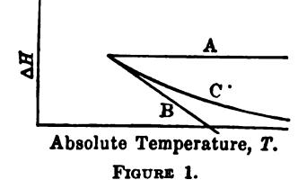

EXERCISE 1. In the combustion of ethyl alcohol to form gaseous carbon dioxide and liquid water, AH = 327000. With the aid of Equations (g) and (h) find AH of formation of the alcohol.

= - EXERCISE 2. For the formation (from its elements) of sulfuric acid in very dilute aqueous solution, AH 210400. What is AH of formation of H2SO4 in an aqueous solution in which the mol fraction is 0.50 (see Table VIII-7) ?

EXERCISE 3. Consider the reaction Na(s ) + ½Cl2(g) = Take CD(Na) NaCl (0.5M) . = 7,2Cp(Cl2) = 4, and CD(NaCl) from Table VIII- 2, and find the rate of change with the temperature of AH, for this reaction.

EXERCISE 4. Consider the reaction CO(g) + O2(g) = CO2(g) ; AH291 = - 68100. Using the heat capacity equations of Chapter VII, find the complete equation for ▲H as a function of the temperature.

EXERCISE 5. By the conservation law, show that if a reaction occurs at one temperature, and the products are then raised to a higher temperature, the change in heat content is the same as when the reagents are first heated to the higher temperature and then allowed to react at that temperature. Assume that carbon (graphite) is burned in pure oxygen to give carbon dioxide ; assume that the materials start at 20°C and that the heat developed is used to heat a furnace at 1000° C, at which temperature the carbon dioxide escapes. Find the maximum amount of energy which car be given to the furnace from the combustion of 1 kg. of carbon.

CHAP. IX

# CHAPTER X

## THE SECOND LAW OF THERMODYNAMICS AND THE CONCEPT OF ENTROPY

After the extremely practical considerations in the preceding chapters, we now turn to a concept of which neither the practical significance nor the theoretical import can be fully comprehended without a brief excursion into the fundamental philosophy of science.

Clausius summed up the findings of thermodynamics in the statement, "Die Energie der Welt ist konstant ; die Entropie der Welt strebt einem Maximum zu, " and it was this quotation which headed the great memoir of Gibbs on " The Equilibrium of Heterogeneous Substances." What is this entropy, which such masters have placed in a position of coordinate importance with energy, but which has proved a bugbear to so many a student of thermodynamics?

The first law of thermodynamics, or the law of conservation of energy, was universally accepted almost as soon as it was stated; not because the experimental evidence in its favor was at that time overwhelming, but rather because it appeared reasonable, and in accord with human intuition. The concept of the permanence of things is one which is possessed by all. It has even been extended from the material to the spiritual world. The idea that, even if objects are destroyed, their substance is in some way preserved, has been handed down to us by the ancients, and in modern science the utility of such a mode of thought has been fully appreciated . The recognition of the conservation of carbon permits us to follow, at least in thought, the course of this element when coal is burned and the resulting carbon dioxide is absorbed by living plants, whence the carbon passes through an unending series of complex transformations.

The second law of thermodynamics, which is known also as the law of the dissipation or degradation of energy, or the law of the increase of entropy, was developed almost simultaneously with the first law through the fundamental work of Carnot, Clausius and Kelvin. But it met with a different fate, for it seemed in no recognizable way to accord with existing thought and prejudice. The various laws of conservation had been foreshadowed long before their acceptance into the body of scientific thought. The second law came as a new thing, alien to traditional thought, with far-reaching implications in general cosmology.

Because the second law seemed alien to the intuition , and even abhorrent to the philosophy of the times, many attempts were made to find exceptions to this law, and thus to disprove its universal validity. But such attempts have served rather to convince the incredulous, and to establish the second law of thermodynamics as one of the foundations of modern science. In this process we have become reconciled to its philosophical implications, or have learned to interpret them to our satisfaction ; we have learned its limitations, or better we have learned to state the law in such a form that these limitations appear no longer to exist ; and especially we have learned its correlation with other familiar concepts, so that now it no longer stands as a thing apart, but rather as a natural consequence of long familiar ideas.

Preliminary Statement of the Second Law: The Actual or Irreversible Process. The second law of thermodynamics may be stated in a great variety of ways. We shall reserve until later our attempt to offer a statement of this law which is free from every limitation, and shall confine ourselves for the present to a discussion of the law sufficient to display its character and content.

Indeed in an early chapter we have already announced the essential feature of the second law when we stated that every system left to itself changes, rapidly or slowly, in such a way as to approach a definite final state of rest. This state of rest (defined in a statistical way) we also called the state of equilibrium. Now since it is a universal postulate of all natural science that a system, under given circumstances, will behave in one and only one way, it is a corollary that no system, except through the influence of external agencies, will change in the opposite direction, that is, away from the state of equilibrium.

Many types of processes leading toward equilibrium are familiarly known. The diffusion of material from a concentrated solution into a dilute solution, leading toward a condition of uniform concentration ; the passage of heat from a hot body to a cold, leading to uniformity of temperature ; the oxidation of organic substances by the atmosphere ; the running down of a clock; the easing of strains in a plastic solid ; the self- demagnetization of a magnet, are all processes which illustrate the kind of change that occurs spontaneously in nature. Sometimes, as in the motion of the planets, this approach to a final state is extremely slow, but their mechanical energy is gradually being converted into heat by unceasing tidal action.

These processes and all other natural processes are alike in one respect, in that they are bringing the various systems toward the condition of ultimate equilibrium or rest, and we may think of these systems as thereby losing in some measure their capacity for spontaneous change.

It is not coal but the combustion of coal which causes a steam engine to operate. As a rule, one system affects other systems in consequence of changes which are going on within it. Hence a system far removed from its condition of equilibrium is the one chosen if we wish to harness its processes for the doing of useful work. A system isolated from all others will always maintain a constant amount of energy, and therefore, if the second law of thermodynamics is spoken of as the law of the dissipation of energy, no loss in energy is meant, but rather a loss in the availability of energy for external purposes. It seems better therefore to speak, not of the dissipation or degradation of energy, but rather to speak of the degradation of the system as a whole. For in many cases, such as the diffusion of one gas into another, the process does not essentially involve an energy change.

Before proceeding to a more exact characterization of the second law, let us make sure that there is no misunderstanding of its qualitative significance. When we say that heat naturally passes from a hot to a cold body, we mean that, in the absence of other processes which may complicate, this is the process which inevitably occurs. It is true that by means of a refrigerating machine we may further cool a cold body by transferring heat from it to its warmer surroundings, but here we are in the presence of another dissipative process proceeding in the engine itself. If we include the engine within our system, the whole is moving always toward the condition of equilibrium. A system already in thermal equilibrium may develop large differences of temperature through the occurrence of some chemical reaction, but all such phenomena are but eddies in the general uni-directional flow toward a final state of rest.

The essential content of the second law might be given by the statement that when any actual process occurs it is impossible to invent a means of restoring every system concerned to its original condition. Therefore, in a technical sense, any actual process is said to be irreversible .

The Ideal or Reversible Process. When we speak of an actual process as being always irreversible we have had in mind a distinction between such a process and an ideal process which, although never occurring in nature, is nevertheless imaginable. Such an ideal process, which we will call reversible, is one in which all friction, electrical resistance, or other such sources of dissipation are eliminated . It is to be regarded as a limit of actually realizable processes.

Let us imagine a process so conducted that at every stage an infinitesimal change in the external conditions would cause a reversal in the direction of the process ; or, in other words, that every step is characterized by a state of balance. Evidently a system which has undergone such a process can be restored to its initial state without more than infinitesimal changes in external systems. It is in this sense that such an imaginary process is called reversible.

To illustrate, we may consider a system comprising water and water vapor contained in a cylinder with a movable piston. Now in practice the piston cannot be made free from friction, but we have no reason to believe that such friction may not be diminished indefinitely, and therefore we may regard the ideal frictionless piston as a limit which may be approached as nearly as is desired . After a constant temperature is established throughout the system, and when the external pressure upon the piston equals the vapor pressure of water, the system is in equilibrium with respect to internal and external agencies. If, then, the external pressure is increased by any amount, however small, the piston will move inward and the vapor will condense. If the external pressure upon the piston be diminished by any amount, however small, the piston will move outward and the liquid will vaporize. In other words, the work required to condense one mol of vapor differs by an infinitesimal amount from the work furnished by the vaporization of one mol of liquid.

If this cylinder of water vapor is kept in contact with a thermostat, the pressure required to maintain equilibrium is constant as long as both liquid and vapor are present. Otherwise the vapor pressure will change as the piston is moved, and if our process is to be reversible the external pressure must vary so that at any stage it differs by no more than an infinitesimal amount from the internal pressure.

An excellent example of an actual process which is very nearly reversible is furnished when the electromotive force of a galvanic cell is measured by means of a sensitive potentiometer. Here the driving force of the cell itself is so nicely balanced against an external electromotive force, that in favorable cases a current may be made to flow in one direction or the other by external changes of 0.000001 volt.

Again we may consider a case in which we deal, not with the balance of mechanical or electrical forces, but with a thermal equilibrium. If two bodies differ in temperature only by an infinitesimal amount, the transfer of heat from one to the other is likewise a reversible process, for evidently it would be possible to restore the system to its original condition without causing more than an infinitesimal change in external systems.

# A QUANTITATIVE MEASURE OF DEGRADATION

In viewing the reversible process as the limit toward which actual processes may be made to approach indefinitely, it is implied that processes differ from one another in their degree of irreversibility. It is of the utmost importance to establish a quantitative measure of this degree of irreversibility, or this degree of degradation.

When we wish to measure a quantity such as length, we first choose a standard, say a bar of platinum kept at the International Bureau of Weights and Measures, and next we adopt a method of comparing the length of other objects with the length of this standard object. So in defining the degree of irreversibility of a process we will choose some standard irreversible process, and then define the method whereby others may be compared quantitatively with it .

We will choose a standard system composed of a metallic spring and a heat reservoir. In employing this spring-reservoir in conjunction with other systems we are going to use the spring as a source of work, and the reservoir as a source or as a sink of heat. It will therefore be desirable to choose them so that the spring will undergo no thermal change, and the reservoir will do no work, during the processes we are about to consider.

If the spring is released and by some frictional process gives up a part of its energy to the reservoir in the form of heat, the process is an irreversible one, and, without the intervention of some external agency, the reverse process, whereby the spring would again be coiled at the expense of the heat of the reservoir, is impossible.

As the spring is gradually released, its potential energy being transferred into thermal energy in the reservoir, we might measure the extent of this irreversible process by a pointer and scale attached to the spring, or by the amount of heat given to the reservoir. We shall in fact take as the measure of the extent of this standard universal process a quantity which is proportional to the energy exchange, but not equal to it, for it is necessary to our purpose to consider also the temperature of the reservoir.

To make this clear we may consider a spring and two separate reservoirs, one at the temperature T and one at the lower temperature T'. If the spring is released and a certain amount of heat is given to the reservoir at T, and if then this same amount of heat is allowed to flow to the other reservoir at T', this latter is also an irreversible process. The net result is the same as if the heat developed by the spring were given at once

to the cold reservoir at T. Now the sum of the degradation in two successive irreversible processes must be greater than that in either one alone ; otherwise our definition would not be quantitative. Therefore if we are to have a genuine scale of irreversibility, the transfer of energy from the spring to the hot reservoir at T must be regarded as a less irreversible process than the transfer of the same amount of energy from the spring to the cold reservoir at T' .

It will therefore be expedient to define the extent of irreversibility of our standard process by making it equal, not to q, but to q/0, where q is the heat received by the reservoir, and 0 is some quantity which qualitatively satisfies our definition of temperature. Moreover when the function is determined, it completes the quantitative definition of the degree of degradation . We are going to prove in a later chapter that 0, which Kelvin called the thermodynamic temperature, may be completely identified with the absolute temperature scale which we have already defined by means of the perfect gas. In order to avoid extensive duplication of our formulae, we shall not wait for that proof, but write immediately = T.

The Entropy of the Spring-Reservoir. So far we have not given a name to our measure of the irreversibility of the standard process. The value of q/T, when this process occurs, we shall call the increase in entropy of the spring-reservoir. If we denote its entropy at the beginning by SA and at the end by SB, we write as our definition ,

$$\begin{aligned} S_{\mathcal{B}} - S_{\mathcal{A}} &= \frac{q}{T} \end{aligned} \tag{1}$$

Thus entropy has the same dimensions as heat capacity and may be expressed in calories per degree.

Our present definition of entropy will be found identical with the definition originally given by Clausius. We have, however, departed radically from the traditional method of presenting this idea, for we have desired to emphasize the fact that the concept of entropy, as a quantity which is always increasing in all natural phenomena, is based upon our recognition of the uni-directional flow of all systems toward the final state of equilibrium. In the ordinary definition of entropy the attention is focussed upon the

reversible process and not upon the irreversible process, the existence of which necessitates the entropy concept. For this reason we have based our definition immediately upon an irreversible process, and shall now employ the reversible process only as a means of comparing the degree of degradation, or the increase in entropy, of two irreversible processes.

Comparison of Any Irreversible Process with the Standard Irreversible Process. If in any system an irreversible process occurs, it is possible, with sufficient ingenuity, to devise a mechanism by which in actuality, or at least in thought, every part of the system may be restored to its original condition at the expense of a degradation in the standard system.

For example, let the system in question be a mixture of oxygen and hydrogen at the temperature of the standard reservoir, and let the irreversible process consist in the combination of these elements to form water. Then by means of an electric generator, operated by the spring, the water can be dissociated by electrolysis, and the various parts of the system can be brought to their original temperature by contact with the (large) standard reservoir. At the end the spring-reservoir has alone suffered degradation.

Of all methods of restoring to its original condition a system in which some process has occurred, there must be at least one which produces the smallest change in the spring-reservoir. Such a method will be one which consists in a reversible process, and therefore causes no further degradation. In a reversible process there is no change in total entropy.

When a process has occurred in any system, we may define the increase in entropy of that system as equal to the minimum increase in entropy of the spring- reservoir necessary to restore the system to its original state. In other words, it is the increase in entropy of the spring-reservoir when the restoration occurs reversibly.

The Entropy Change in the Free Expansion of a Perfect Gas. As an illustration of the method of calculating the increase of entropy in a simple irreversible process, let us consider a perfect gas enclosed in a flask of volume VA. Let this flask be attached by a stopcock to an evacuated flask, such that the volume of the

two flasks together is VB. If these flasks are isolated from other systems and the stopcock is opened, the gas will distribute itself uniformly between them. Since the flasks are isolated the energy does not change during expansion, and since by our previous definition of a perfect gas the temperature and the internal energy uniquely determine one another, the temperature is the same after the expansion as before.

In order to measure the increase of entropy in this process,we shall now restore the system to its initial state by means of a standard spring and a standard reservoir of the same temperature as the gas, namely T. By keeping the gas in thermal contact with the reservoir it may be compressed isothermally by means of the spring. The work done by the spring and the heat absorbed by the reservoir, if the compression is carried on in a reversible manner, are given by Equation VI-6,

$$q = w = nRT \ln \frac{V_{\mathbf{B}}}{\bar{V}_{\mathbf{A}}^{\ast}}.$$

Now q/T is the increase in the entropy of the spring-reservoir and therefore this is also by definition the increase in entropy during the free expansion of the gas. If we write S▲ as the entropy of the gas before expansion and S, as the entropy of the gas after expansion, we find

$$S_{\mathcal{B}} - S_{\mathcal{A}} = nR \ln \frac{V_{\mathcal{B}}}{V_{\mathcal{A}}}.\tag{2}$$

Entropy as an Extensive Property. In expressing the entropy change during an irreversible process as the difference between the entropy at the end and the entropy at the beginning, we have implied that entropy is a property, and therefore that the entropy change depends solely upon the initial and final states. Indeed this follows directly from our definition, for by whatever irreversible path we proceed from state A to state B, the minimum degradation of the spring- reservoir necessary for the return from state B to state A is the same. It is true that we have not shown how to obtain the absolute value of S or SA, but only their difference, nor shall we need to discuss this question until a much later chapter. In the meantime we shall regard the entropy, like the energy and heat content, as a quantity of which the absolute magnitude is undetermined.

Moreover, entropy is an extensive property, for we may consider two systems which are just alike, and each of which undergoes the same infinitesimal irreversible process ; evidently the change in the standard spring-reservoir necessary for their restoration is twice as great as it would be for one of them alone.

Since entropy is extensive, we may regard the entropy of a system as equal to the sum of the entropies of its parts. It is therefore important to ascertain how to determine the localization of entropies in the various parts of a system. Owing to the special properties of the standard spring-reservoir which we assumed at the outset, it will be convenient to postulate that in any operation of the spring-reservoir the entropy changes occur in the reservoir alone, so that if the standard reservoir gains heat from any source by the amount q, the reservoir changes in entropy by q/T.

An Important Criterion for Reversible Processes. We have seen that the total entropy change in a reversible process is zero. It follows that in such a process the entropy change in any system must be equal and opposite in sign to the entropy change in all other systems involved. In order to study this case further, let us consider the energy changes which occur in a reversible process between some system and the standard spring-reservoir. For the sake of simplicity we shall choose an infinitesimal process. Letting S denote the entropy of the system, and S that of the standard spring-reservoir, the condition of reversibility, since the total entropy must remain constant, is

$$dS = -dS_{\mathfrak{st}}.\tag{3}$$

Bearing in mind the condition that the process is to be reversible, it is possible to conduct it so that the system and the standard spring merely exchange mechanical energy, and the system and the reservoir merely exchange heat. There must , moreover, be a state of balance between the mechanical forces exerted by the system and by the spring ; and the temperature

of the system and the reservoir must not differ more than infinitesimally from one another. The total energy gained by the system is equal to the total energy lost by the spring-reservoir, and, owing to the state of balance, the work done by the spring must equal the work done upon the system. Therefore, by the conservation law, the heat lost by the system is equal to the heat gained by the reservoir.

= - - 9st; or, since the 1st/T. But by definition Algebraically speaking, if the heats absorbed by system and reservoir are respectively q and qst , then q = temperatures are the same, q/T of the standard spring-reservoir, 1st/T Equation 3, = dSst; and therefore by

dS = 9 T (4)

Generalizing this important equation, we conclude that in any reversible process the increase in entropy of any system, or part of a system, is equal to the heat which it absorbs, divided by the absolute temperature. Indeed it is this fundamental equation which Clausius used for his original definition of entropy.

We may sum up our quantitative conclusions regarding entropy. In any irreversible process the total entropy of all systems concerned is increased. In a reversible process the total increase in entropy of all systems is zero, while the increase in the entropy of any individual system, or part of a system, is equal to the heat which it absorbs divided by its absolute temperature. It is important to see clearly that the idea of entropy is necessitated by the existence of irreversible processes ; it is only for the purpose of convenient measurement of entropy changes that we have discussed reversible processes here.

# CHAPTER XI

# ENTROPY AND PROBABILITY

The second law of thermodynamics is not only a principle of wide-reaching scope and application, but also it is one which has never failed to satisfy the severest test of experiment. The numerous quantitative relations derived from this law have been subjected to more and more accurate experimental investigation without detection of the slightest inaccuracy. Nevertheless, if we submit the second law to a rigorous logical test, we are forced to admit that, as it is ordinarily stated, it cannot be universally true.

It was Maxwell who first showed the consequences of admitting the possible existence of a being who could observe and discriminate between the individual molecules. This creature, usually known as Maxwell's demon, was supposed to stand at the gateway between two enclosures containing the same gas at the same original temperature. If now he were able, by opening and shutting the gate at will , to permit only rapidly moving molecules to enter one enclosure and only slowly moving molecules to enter the other, the result would ultimately be that the temperature would increase in one enclosure and would decrease in the other. Or, again, we could assume the enclosures filled with air, and the demon operating the gate to permit only oxygen molecules to pass in one direction and only nitrogen molecules in the other, so that ultimately the oxygen and nitrogen would be completely separated . Each of these changes is in a direction opposite to that in which a change normally occurs, and each is therefore associated with a diminution in entropy.

Of course even in this hypothetical case one might maintain the law of entropy increase by asserting an increase of entropy within the demon, more than sufficient to compensate for the decrease in

question. Before conceding this point it might be well to know something more of the demon's metabolism. Indeed a suggestion of Helmholtz raises a serious scientific question of this character. He inquires whether micro-organisms may not possess the faculty of choice which characterizes the hypothetical demon of Maxwell. If so, it is conceivable that systems might be found in which these micro-organisms would produce chemical reactions where the entropy of the whole system, including the substances of the organisms themselves, would diminish . Such systems have not as yet been discovered, but it would be dogmatic to assert that they do not exist.

While in Maxwell's time it seemed necessary to ascribe demoniacal powers to a being capable of observing molecular motions, we now recognize that the Brownian movement, which is readily observable under the microscope, is in reality thermal motion of large molecules. It would therefore seem possible, by an extraordinarily delicate mechanism in the hands of a careful experimentor, to obtain minute departures from the second law, as ordinarily stated. But here also we should depend upon a conscious choice exercised by the experimentor.

It would carry us altogether too far from our subject to take part in the long-continued debate on the subject of vitalism ; the vitalists holding that there are certain properties of living matter which are not possessed at all by inanimate things, or, in other words, that there is a difference in kind between the animate and the inanimate. However, we may point out that in the last analysis differences of kind are often reduced to differences in degree. There certainly can be no question as to the great difference in trend which exists between the living organism , and matter devoid of life. The trend of ordinary systems is toward simplification, toward a certain monotony of form and substance ; while living organisms are characterized by continued differentiation, by the evolution of greater and greater complexity of physical and chemical structure.

In the brilliant investigation of Pasteur on asymmetric or optically active substances, it was shown that a system of opticallyinactiveingredientsnever developsopticallyactivesub-

stances except through the agency of living organisms, or as the result of the conscious choice of an experimentor. While we admit the theoretical possibility that somewhere, by chance, an inanimate system might develop optical activity, such a case has not been actually observed, and indeed we know that even when an asymmetric system has once been obtained , it will in course of time become optically inactive through the process known as racemization. On the other hand, countless asymmetric substances are found in animate nature, where indeed a symmetric substance is more the exception than the rule. With this analogy before us it seems by no means outside the realm of probability that changes which are associated with a total decrease of entropy may sometimes occur in living things.

Even if we recognize the possible validity of such exceptions, and attempt to express the second law in a form which would meet such objections, it would still be difficult to make a really satisfactory statement until we have indicated the connection between the law of entropy and another fundamental generalization which is sometimes called the law of probability.

Chance. Sometimes when a phenomenon is so complex as to elude direct analysis, whether it concern the life and death of a human being, or the toss of a coin, it is possible to apply methods which are called statistical. Thus tables and formulae have been developed for predicting human mortality and for predicting the results of various games of chance, and such methods are applied with the highest degree of success. It is true that in a given community the " expectation of life" may be largely and permanently increased by sanitary improvements, but if a great many individual cases be taken promiscuously from different localities at different times, the mean duration of life, or the average deviation from this mean, becomes more and more nearly constant the greater the number of casessochosen.

Likewise it is conceivable that a person might become so expert in tossing a coin as to bring heads or tails at will, but if we eliminate the possibility of conscious choice on the part of the player, the ratio of heads to tails approaches a constant value as the number of throws increases. If the two sides of the

coin are mechanically alike, and if a number of players are chosen, sufficient to eliminate the effect of habits formed by individual players, this constant ratio becomes equal to unity. We then say that the chance of turning a head in a random throw is one-half.

Now it is characteristic of such a mathematical chance that if we know the chance of each of several independent events, the chance that all will occur together is the product of the individual chances. Thus if a coin be thrown three times the chance that it will be a head every time is ( 2)3 = 8. Similarly, if three coins are tossed simultaneously the chance that three heads will appear is %. When we say that the chance of a head in a single throw is 1½ we do not mean that five heads will necessarily appear in ten throws ; this will be precisely true on the average. As the number of throws increases the chance that the ratio of heads to tails will differ by any specified amount from 1½ will approach zero, or, in other words, the chance that the ratio will lie within the set limits approaches unity. In the theory of probability a chance equal to unity represents complete certainty.

Let us consider two equal boxes joined by an opening, and three white and three black balls placed within and shaken in so random a manner that any one ball is as often in one box as in the other. Then we may say that the chance of finding a specified ball in box A is 12. What is the chance that after an indefinite shaking we shall find the three black balls in box A and the three white balls in box B? The chance of each ball being in a specified box is 12, therefore the chance of finding the given arrangement is (2) . This system suggests an analogy to a physical system containing molecules of two different gases, each molecule being driven hither and thither in a random manner; that is, in a manner so complicated as to elude analysis.

An even simpler case is one in which we consider N identical balls shaken in the boxes in a random way, as before. The chance that all the N balls will be in a specified box at a given time is ( ½) . Likewise if in a pair of similar flasks connected by a stopcock we have N molecules of a certain gas, then if the stopcock is closed at a certain instant the chance that all of the N

molecules will be in one specified flask is (½) . Thus if N = 20, the chance in question is about one in a million, and this chance obviously diminishes enormously as we proceed to the large number of molecules such as we deal with in practice. The most recent determinations of the number of molecules in a mol give 6.06 × 1023 ; in dealing with numbers so vast, the laws of chance lead inexorably to results of an accuracy far exceeding that which is possible even in the most refined physical measurements.

Thus in the case before us, if a mol of gas is distributed between the two flasks, the very randomness of the molecular motions makes it logically certain that minute temporary changes in concentration will from time to time occur. Nevertheless the relative deviations from complete uniformity of distribution between the two flasks must be so exceedingly small that it seems inconceivable that they could ever be detected experimentally. In other words, the chance that, within the limits of accuracy of our observation, the gas will be equally distributed between the two flasks is, to all intents and purposes, unity. Expressing this mathematical chance or the probability by the symbol P, we write, as a very close approximation, P = 1 . On the other hand we have found that the probability of finding all of the molecules in one flask is almost zero, namely = (2) , where N is now the number of molecules in a mol. N

When therefore the gas is at first enclosed in one of the flasks, and the stopcock is then opened to allow it to distribute itself between the two flasks, it is legitimate to say that immediately after opening the cock the system passes from a state of very small probability to a state of very large probability, that is from PA (2) to PB = 1 . = N

In order to obtain a relation which we are about to exhibit, let us in a purely arbitrary manner define a new quantity by the equation R

$$
\sigma = \frac{R}{N} \ln \mathfrak{D}; \qquad \sigma_B - \sigma_A = \frac{R}{N} \ln \frac{\mathfrak{D}_B}{\mathfrak{D}_A} \tag{1}
$$

where R is the gas constant. Using the above values,

$$
\sigma_B - \sigma_A = \frac{R}{N} \ln 2^N = R \ln 2.1
$$

## ENTROPY AND PROBABILITY 125

If, instead of using two flasks of equal size , we had allowed the mol of gas to expand from any volume VA to any other volumeV,weshould have found by precisely similar reasoning

$$\frac{\mathbf{p}_B}{\mathbf{p}_A} = \begin{pmatrix} \mathbf{v}_B \\ \mathbf{v}_A \end{pmatrix}^N$$

and

$$
\sigma_B - \sigma_A = R \ln \frac{\mathbf{v_B}}{\mathbf{v_A}}.\tag{2}
$$

This equation is of very great interest since we have obtained in Equation X-2 an identical expression for the change in entropy intheexpansion ofanideal gas, namely,

$$\mathbf{s}_{\mathbf{B}} - \mathbf{s}_{\mathbf{A}} = R \ln \frac{\mathbf{v}_{\mathbf{B}}}{\mathbf{v}_{\mathbf{A}}}.$$

Hence in this simple case we find a very simple relation between the entropy and the logarithm of the probability, namely,

$$\mathbf{s}_{\mathcal{B}} - \mathbf{s}_{\mathcal{A}} = \frac{R}{\check{N}} (\ln \mathfrak{B}_{\mathcal{B}} - \ln \mathfrak{B}_{\mathcal{A}}).\tag{3}$$

Next let us consider two identical bodies in contact with the same thermostat. If we admit that each individual molecule is sometimes losing and sometimes gaining energy in a purely random manner, there will be in general a difference between the energies of the two bodies, and it is conceivable that by waiting a very long time we might, for an instant, find the system in a state in which this difference would be perceptible. However, the chance of finding a measurably uneven distribution at any given instant would be exceedingly small. If therefore two bodies at different temperatures are brought into thermal contact, the probability of their maintaining a measurable difference in temperature is entirely negligible. Indeed we know by experience that in such a case energy always flows from the hot body to the cold until no sensible difference remains. Again we may look upon this irreversible process as a change in the whole system from a highly improbable to a highly probable condition .

As a further illustration, let us consider a body which is in motion. In addition to the chaotic motion of its molecules, which depends upon the temperature, each molecule will on the average have a component of velocity equal in direction and magnitude to the velocity of the body as a whole. In the absence of friction this state of motion will continue indefinitely, but if through frictional processes opportunity is given to the individual molecules to acquire perfectly random motion, the body as a whole will soon come to rest, and the average molecular velocity in one direction will be just as great as in another. In this spontaneous irreversible process the energy of translational motion is converted into the energy of chaotic motion, which we call heat. The chance of a certain velocity on the part of one molecule will be just as great in one direction as in another, but the chance that all molecules will happen to acquire a component velocity in a single direction so as to set the whole body in motion as before is extremely minute.

Indeed if a body, initially at rest , is in contact with a reservoir of heat, it must from time to time, owing to the very randomness of the motions which are imparted to its molecules by the molecules of the reservoir, acquire a minute velocity as a whole, first in one direction and then in another. If the number of molecules in the body is very large such effects are entirely imperceptible, but in bodies of microscopic, and especially of ultramicroscopic size, these random jostlings become discernible and give rise to the phenomenon known as the Brownian movement.

The distinction between the energy of ordered motion and the energy of unordered motion is precisely the distinction which we have already attempted to make between energy classified as work and energy classified as heat. Our present view of the relation between entropy and probability we owe largely to the work of Boltzmann, who, however, himself ascribed the fundamental idea to Gibbs, quoting, "The impossibility of an uncompensated decrease of entropy seems to be reduced to improbability. " 1

It would carry us too far if we should attempt to analyze more fully this idea that the increase in the entropy of a system through processes of degradation merely means a constant change to states of higher and higher probability. The mere

1 Boltzmann, " Vorlesungen über Gastheorie, " Barth, Leipzig, 1912.

recognition that such a relationship exists suffices to give a new and larger conception of the meaning of an irreversible process and the significance of the second law of thermodynamics.

If we regard every irreversible process as one in which the system is seeking a condition of higher probability, we cannot say that it is inevitable that the system will pass from a certain state to a certain other state. If the system is one involving a few molecules, we can only assert that on the average certain things will happen. But as we consider systems containing more and more molecules we come nearer and nearer to complete certainty that a system left to itself will approach a condition of unit probability with respect to the various processes which are possible in that system. This final condition is the one which we know as equilibrium . In other words, the system approaches a thermodynamic or macroscopic state, which represents a great group of microscopic states that are not experimentally distinguishable from one another. With an infinite number of molecules, or with any number of molecules taken at an infinite number of different times, the probability that the macroscopic state of the system will lie within this group is infinitely greater than the probability that it will lie outside of that group.

Leaving out of consideration systems, if such there be, which possess that element of selection or choice that may be a characteristic of animate things, we are now in a position to state the second law of thermodynamics in its most general form: Every system which is left to itself will, on the average, change toward a condition of maximum probability. This law, which is true for average changes in any system, is also true for any changes in a system of many molecules .

We have thought it advisable to present in an elementary way the ideas touched upon in this chapter in order to give a more vivid picture of the nature of an irreversible process, and a deeper insight into the meaning of entropy. It is true we shall not, henceforth, make formal use of the relation between entropy and probability ; nevertheless we shall always tacitly assume that we are dealing with statistical ideas.

For example, whencalculating solubilitiesorvaporpressures,

figures are sometimes obtained which are so small as to seem ridiculous to the uninitiated. And yet such figures, when properly interpreted, have as definite a significance, and often as high an accuracy as others which are capable of direct measurement. Thus by several methods it has been shown that if a mol of silver cyanide is dissolved in a liter of thrice molal potassium cyanide the concentration of silver ion is about 10-21 mols per liter. This means that the number of actual molecules of silver ion is about one hundred per liter, or one-tenth of a molecule per cubic centimeter. Howthen, since the molecules are assumed indivisible, can we say that in such a cubic centimeter there is any concentration of silver ion at all? We mean simply that, while the complex ions are being dissociated and others are being formed, there will be at any one instant one hundred molecules of silver ion per liter on the average, or the chance of there being one in any given cubic centimeter is one in ten.

We shall show in the course of our work that if a suitable catalyzer is placed in saturated water vapor there is at every temperature some dissociation into hydrogen and oxygen, and that at 25°C the partial pressure of the hydrogen is 2.80 x 10-28 atmospheres, which is equivalent to the pressure exerted by a single molecule in a space of about a million liters. Yet this value has a precise significance and is certainly known within a few percent.

1 One of the most striking results of this character is obtained if we calculate the vapor pressure of tungsten at 25° from experiments at very high temperatures. The result, 10-149 atmospheres, would mean that the concentration of tungsten vapor would be less than one molecule in a space equivalent to the known sidereal universe. Such a calculation need not alarm us. Allowing for the possibilities of experimental uncertainty we may utilize such a calculated vapor pressure in our thermodynamic work with the same sense of security as we use the vapor pressure of water.

1 Langmuir, Phys. Rev. , [ 2] , 2, 329 ( 1913) .

# CHAPTER XII

# MISCELLANEOUS APPLICATIONS OF ENTROPY

The Heat Engine. Every system which is not in equilibrium can be made to do useful work. However, in every irreversible process there is always some waste of opportunity in this regard. Let us consider the flow of heat between two reservoirs at different temperatures. Instead of allowing heat to flow directly from one to the other, we may obtain work by means of a steam engine, or a hot air engine, or any one of the various inventions which are known generically as heat engines. These are characterized by operating in such manner that they themselves undergo no permanent change ; but do work at the expense of a part of the energy taken from a hot reservoir, while the rest of the energy passes into a cold reservoir.

The ratio between the work done and the heat taken from the hot reservoir has not been satisfactorily named ; we may call it the conversion factor of the engine. The problem of determining the maximum value of this ratio is the one which occupied Carnot¹ in the great monograph which laid the foundations of the second law of thermodynamics.

Every actual heat engine is inefficient because of friction or imperfect design; but even if all sources of degradation are eliminated it is evident that no engine could be constructed to give a conversion factor of 100 percent. For if all the heat taken from the hot reservoir were converted into work, the cold reservoir might be removed altogether. The energy taken from the hot reservoir would then be converted into mechanical work without any degradation in other systems. This work could , by friction , be returned as heat to the reservoir, and we should thus find an

<sup>1</sup> Carnot, " Reflexions sur la puissance motrice du feu. " Paris, 1824.

irreversible process bringing the whole system back to its original state.

In order to obtain the maximum possible work from a heat engine, it would be necessary to eliminate friction, to prevent direct flow of heat from hot to cold portions of the system, and to maintain a state of balance with respect to the mechanical forces. In other words, the process must be reversible. Under given conditions, therefore, the maximum conversion factor is that of a heat engine which operates reversibly in all its stages ; and if we find the conversion factor of such an engine, we know the limit which may be approached by any actual engine as its design and construction are improved.

If a heat engine operates reversibly, and passes through a whole number of complete cycles, so that it is in the same state at the end of the operation as at the beginning, it will itself suffer no change of entropy. Hence all of the entropy changes are in the rest of the system, and these must sum up to zero in a reversible process. These entropy changes are immediately obtained from Equation X-4. If q is the heat taken from the hot reservoir at T, and q' is the heat given to the cold reservoir at T' , then the increase of entropy of the hot reservoir is - q/T, and that in the cold reservoir is q' /T' . Equating the sum to zero, ૧

$$-\frac{g}{T} + \frac{q'}{T'} = 0.\tag{1}$$

By the conservation law,

$$w = q - q'_{\bullet} \tag{2}$$

and combining these two equations, we find

$$\frac{w}{q} = \frac{T - T'}{T}.\tag{3}$$

This important equation gives the conversion factor of a perfectly efficient engine operating between temperatures T and T'. Any actual engine operating between these temperatures has a lower conversion factor, but one which may approach that of Equation 3 as a limit . Thus for a steam engine with a condenser

at 27°C or 300° K, and with a boiler at 327°C or 600° K, the maximum work obtainable is equal to one half of the heat taken from the boiler.

The Refrigerating Machine. By reversing a heat engine it is possible, through the expenditure of work, to transport heat from a cold to a hot reservoir. This is the method employed in a refrigerating machine. If w is now the work done, and q' is the heat withdrawn from the cold reservoir, then we find,

$$\frac{w}{\bar{q}'} = \frac{T_- - T_{-}'}{T_-}.\tag{4}$$

Let us calculate, as an example, the minimum amount of work required to convert a kilogram of water at 0°C into ice at 0°C by an engine operating in a room at 30°C. In the operation heat will be given up to the room in an amount equal to the heat absorbed from the water, together with the work done by the engine. If the engine is reversible we employ Equation 4, q' is 79800 cal . and w is 79800 (30/273) = 8770 cal. (It will be observed that this is not the work required to convert a kilogram of water at 30° into ice at 0°. A problem of this more complex type will be considered in the next chapter. )

The theory of the heat engine leads to a curious consequence which possesses theoretical, and may ultimately acquire practical interest. In some localities buildings are heated by electricity, the electricity passing through some form of heater whose resistance converts electrical into thermal energy.At first sight it would appear, from the law of conservation of energy, that the maximum heating effect would be produced when a certain amount of electrical energy is completely converted into thermal energy. But this is very far from the truth.

If a heat engine were constructed with the inside of the building serving as the hot reservoir and the outdoor air as the cold reservoir, and if by means of a motor the electrical energy were used to operate this engine, so that the heat would be taken from without and given up inside the building, the amount of heating thus produced would, in the limiting case of ideal efficiency, be given by Equation 3, where w represents the electrical energy expended, q the heating effect in the building, and T and T'' the temperatures within and without. If the internal temperature were 18 °C or 291° K, and the external, 0°C or 273°K, the heating effect at the maximum would be (291/18) w, or more than 16 times the electrical energy expended.

### ENTROPY AND HEAT CAPACITY; CHANGE OF ENTROPY WITH TEMPERATURE

When heat flows between two systems of different temperature, the process is more nearly reversible the smaller the temperature difference. (When the two temperatures differ only infinitesimally there is , of course, a total entropy change during thermal flow, but in mathematical parlance this entropy change is an infinitesimal of higher order than the heat exchanged, q, and therefore is negligible in comparison with q. We then say that the process is reversible. )

If a system, with heat capacity C, absorbs heat from a reservoir of infinitesimally higher temperature, and thus rises through the temperature interval dT, so that

$$q = C dT,\tag{5}$$

then, by Equation X-4,

$$dS = C\frac{dT}{T} \,\text{s}\tag{6}$$

Indeed the entropy change in the system alone is the same regardless of the temperature from which the heat flows, since the entropy is a property. This equation therefore is true for any infinitesimal rise of temperature in the system, no matter how it is produced.

Ordinarily the heating is done either at constant volume or at constant pressure. Then

$$dS = C\sqrt{\frac{dT}{T}} = C\sqrt{d} \text{ in } T; \; \begin{pmatrix} \partial S\\ \partial T \end{pmatrix}_T = \frac{C_V}{T} \tag{7}$$

or

$$dS = C_{\mathbb{P}} \frac{dT}{T} = C_{\mathbb{P}} d \ln T; \; \left(\frac{\partial S}{\partial \bar{T}}\right)_{\mathbb{P}} = \frac{C_{\mathbb{P}}}{T}. \tag{8}$$

We shall need presently two equations which are obtained from (7) and ( 8) by differentiating the former with respect to volume and the latter with respect to pressure. Remembering the definitions of Cv and of Cp, we find,

$${}^{\partial^2 S}_{\bar{\partial} T \bar{\partial} \bar{V}} = \frac{1}{T} \begin{pmatrix} \partial C_V \\ \bar{\partial} \bar{V} \end{pmatrix}_T = \frac{1}{\bar{T}} \begin{vmatrix} \partial^2 E \\ \bar{\partial} T \bar{\partial} \bar{V} \end{vmatrix} ; \tag{9}$$

$$\stackrel{\text{d}^2S}{\partial T \partial \bar{P}}_{\mathcal{I}} = \frac{1}{T} \left( \frac{\partial C_{\mathcal{P}}}{\partial \bar{P}} \right)_{\mathcal{T}} = \frac{1}{\bar{T}} \stackrel{\text{d}^2H}{\partial T \partial \bar{P}} . \tag{10}$$

## CHANGE OF ENTROPY WITH VOLUME AND WITH PRESSURE

We may obtain some very useful thermodynamic equations by considering the common case in which the pressure within a system is equal to the pressure exerted upon the system from without . In this case an infinitesimal expansion or compression is a reversible process. By Equation X-4, the heat absorbed by the system is therefore TdS, while the work done by the system is PdV. Thus by the first law of thermodynamics

$$dE = TdS - PdV.\tag{11}$$

If we wish to restrict this general equation to the special case of an isothermal process, we may express it conveniently in the form

$$P_{\parallel} = T \begin{pmatrix} \frac{\partial S}{\partial \bar{V}} \end{pmatrix}_{\mathcal{T}} - \begin{pmatrix} \frac{\partial E}{\partial \bar{V}} \end{pmatrix}_{\mathcal{T}}.\tag{12}$$

Differentiating Equation 12 with respect to temperature, the volume being constant,

$$
\begin{pmatrix} \delta P \\ \ddot{\partial} \overline{T} \end{pmatrix}_{\mathcal{V}} = \begin{pmatrix} T \frac{\partial^2 S}{\partial T \partial \dot{V}} + \begin{pmatrix} \partial S \\ \partial \overline{V} \end{pmatrix}_{\mathcal{T}} + \begin{pmatrix} \partial^2 E \\ \ddot{\partial} \overline{T} \ddot{\partial} \overline{V} \end{pmatrix} \tag{13}
$$

We note from Equation 9 that the second and fourth terms cancel, and (see Equation III-3) ,

$$
\begin{pmatrix} \frac{\partial S}{\partial V} \\ \frac{\partial V}{\partial \tau} \end{pmatrix}_T = \begin{pmatrix} \frac{\partial P}{\partial T} \\ \frac{\partial P}{\partial \tau} \end{pmatrix}_P = -\begin{pmatrix} \frac{\partial V}{\partial T} \\ \frac{\partial P}{\partial \tau} \end{pmatrix}_T \begin{pmatrix} \frac{\partial V}{\partial P} \\ \frac{\partial P}{\partial \tau} \end{pmatrix}_T. \tag{14}
$$

In the same manner we may employ the heat content instead of the energy. From Equations 11 and V-8,

$$dH = dE + PdV + VdP = TdS + VdP,\tag{15}$$

and proceeding just as before we find the analogous equations,

$$\boldsymbol{V} = \left. - \, T \begin{pmatrix} \delta S \\ \bar{\partial} \bar{P} \end{pmatrix}_T + \begin{pmatrix} \partial H \\ \bar{\partial} \bar{P} \end{pmatrix}_T \right. \tag{16}$$

$$
\begin{pmatrix} \frac{\partial S}{\partial \dot{P}} \end{pmatrix}_{\mathcal{T}} = - \begin{pmatrix} \frac{\partial V}{\partial \mathcal{T}} \end{pmatrix}_{\mathcal{P}}.\tag{17}
$$

All of these equations merely express the thermodynamic condition that a system is in equilibrium with the external

CHAP. XII

pressure. They are valid for any system homogeneous or heter-As an illustration of their use we may calculate the change of the vapor pressure of a solid or liquid with the temperogeneous. ature.

Equilibrium between a Substance and its Vapor. Let us apply Equation 14 to a system composed of a substance and its vapor, the two being in equilibrium with one another at the vapor pressure p, which is moreover equal to the applied external pressure P. In this case S/ V is the same as AS/AV, where AS is the increase in entropy and AV is the increase in volume when one mol of the substance vaporizes. Since we are dealing with an equilibrium, and therefore with a reversible process, AS q/T, and q, which we may also write as AH, is the ordinary heat of vaporization. Moreover, since the vapor pressure does not depend upon the volume of the system, we may omit the restriction of constancy of volume, and thus Equation 14 becomes =

$$\frac{dP}{d\bar{T}} = \frac{\Delta H}{\bar{T}\Delta \bar{V}}.\tag{18}$$

This is the famous equation which Clapeyron¹ obtained essentially in this form in 1834. It was the first physico-chemical application of what we now call the second law of thermodynamics.

### THERMODYNAMIC EQUATIONS OF STATE

By combining Equations 12 and 14, and again by combining Equations 16 and 17, we obtain the important equations,

$$P_- = T \begin{pmatrix} \partial P \\ \bar{\partial} \bar{T} \end{pmatrix}_V - \begin{pmatrix} \bar{\partial} E \\ \bar{\partial} \bar{V} \end{pmatrix}_T,\tag{19}$$

$$V = \left. T \begin{pmatrix} \dot{\partial} \\ \dot{\partial} T \end{pmatrix}_P + \begin{pmatrix} \partial H\\ \overline{\partial} P \end{pmatrix}_T . \tag{20}$$

A relation between pressure, temperature, and volume we have called an equation of state. If either (aE/OV) or ( H/ƏP)T has been determined by experiment, we have in Equation 19

1 Clapeyron, J. l'ecole polytechnique , 14, No. 23, 153 ( 1834) .

or 20 a thermodynamic requirement to which any empirical equation of state must conform.

These equations have proved very useful in interpreting thermometric measurements made with gas thermometers. In the case of an actual gas like hydrogen or air, the volume at constant pressure is not proportional to the temperature. If, however, we have measured the Joule-Thomson effect, we may calculate ( H/JP), from Equation VI- 12 and make the needful correction. We will not pursue the intricacies of such a calculation, but shall now do what we have promised to do in an earlier chapter, namely, prove that the thermodynamic scale of temperature may be identified with the scale of the ideal gas thermometer.

The Perfect Gas Thermometer and the Thermodynamic Scale of Temperature. It will be remembered that in Chapter X we postponed the proof that 0, the thermodynamic temperature, could be identified with T, the temperature of the perfect gas scale. This proof we may now furnish. If this identification had not been made, all of our thermodynamic equations would have contained instead of T. Thus Equation 19 would have to be written as

$$P = \theta \begin{pmatrix} \partial P \\ \partial \dot{\theta} \end{pmatrix}_{\mathcal{V}} - \begin{pmatrix} \partial E \\ \partial \dot{V} \end{pmatrix}_{\theta}.$$

We have seen, however, that @ and T obey the same qualitative laws, and therefore constant implies also constant T, so that (ƏE/ƏV) . (ƏE/ƏV)T. =

Let us now consider a system composed of a perfect gas, in which, by Equation VI-3, (ƏE/ƏV) , = 0. For such a gas

$$P = \theta \begin{pmatrix} \partial P \\ \partial \theta \end{pmatrix}_V.$$

and we see that at constant volume the pressure is proportional to 0. But also, by the definition of a perfect gas, pressure is proportional to T, hence is proportional to T. This is all that we need to know in order to permit the complete identification of the thermodynamicscalewiththeperfectgasscale,

for in both scales the size of the degree may be arbitrarily chosen, and we have chosen the centigrade degree in both cases, so that isnotonlyproportionalbutequaltoT.

Difference between Heat Capacity at Constant Pressure and at Constant Volume. By the first law of thermodynamics we obtained, in Equation V- 13, a formula for the difference between CD and Cv, namely,

$$\mathcal{C}_{\mathsf{P}} - \mathcal{C}_{\mathsf{V}} = \left[ P + \left( \frac{\partial E}{\partial V} \right)_{\mathsf{T}} \right] \left( \frac{\partial V}{\partial \vec{T}} \right)_{\mathsf{P}}.$$

This was as far as it was possible to go with the first law of thermodynamics alone, but now we may substitute from Equation 19, which was derived from the second law, and thus obtain the more useful formula,

$$\mathcal{C}_{\mathsf{P}} - \mathcal{C}_{\mathsf{V}} = T \begin{pmatrix} \partial P \\ \overline{\partial T} \end{pmatrix}_{\mathsf{V}} \begin{pmatrix} \partial V \\ \overline{\partial T} \end{pmatrix}_{\mathsf{P}}.\tag{21}$$

Since we do not ordinarily measure the pressuretemperature coefficient at constant volume, we may write from Equation III-3,

$$
\begin{pmatrix} \delta P \\ \overline{\partial} T \end{pmatrix}_{\mathcal{V}} = - \begin{pmatrix} \delta V \\ \overline{\partial} T \end{pmatrix}_{\mathcal{P}} / \begin{pmatrix} \delta V \\ \overline{\partial} P \end{pmatrix}_{\mathcal{T}}.\tag{22}
$$

Hence

$$\mathbf{C_{P}} - \mathbf{C_{V}} = -\left. T \left( \frac{\partial V}{\partial T} \right) \right\vert_{P} / \left( \frac{\partial V}{\partial P} \right)_{T} . \tag{23}$$

If instead of the volume-temperature coefficient and the volumepressure coefficient we wish to employ the so-called coefficient of thermal expansion and compressibility, a = (1/V) (ƏV/ƏT)P and ẞB = ( 1 / V) ( ƏV/ǝP) r, then -- T

$$C_{\mathbf{p}} - C_{\mathbf{v}} = \frac{\alpha^2 VT}{\beta}.\tag{24}$$

This is a valuable equation, for while most of the general laws of specific heats relate to the heat capacity at constant volume, this is rarely determined directly, but must be calculated from the measured values of Cp. Some of the results of such a calculation have already been discussed in Chapter VII.

### REVERSIBLE ADIABATIC CHANGES

In connection with the Joule-Thomson effect we have studied a process which was adiabatic. That is to say it was a process in which no heat entered or left the system which was under investigation. That process, however, was irreversible. We may now study a process which is adiabatic and at the same time reversible. If we compress or expand a substance in such a manner that no sensible pressure gradients develop within the system , and if we prevent by adequate thermal insulation any transfer of heat to or from the surroundings, the process is reversible and adiabatic. But in any reversible change a substance suffers no entropy change unless it gains or loses heat. Therefore in a reversible adiabatic change AS = 0, and such a process is sometimes spoken of as isentropic.

In such an isentropic compression there will ordinarily be a change in temperature, and by measuring the ratio between this temperature change and the pressure change we obtain (ƏT/ǝP) s. By following the method of Equation III-3 and employing also Equations 8 and 17, we find

$$
\begin{pmatrix} \delta T \\ \ddot{\partial} \ddot{P} \end{pmatrix}_{\mathcal{S}} = \ -\begin{pmatrix} \partial S \\ \ddot{\partial} \boldsymbol{P} \end{pmatrix}_{\mathcal{T}} \Big/ \begin{pmatrix} \partial S \\ \ddot{\partial} \ddot{T} \end{pmatrix}_{\mathcal{P}} = \frac{T}{C_{\mathfrak{D}}} \begin{pmatrix} \partial V \\ \ddot{\partial} \ddot{T} \end{pmatrix}_{\mathcal{P}}.\tag{25}
$$

A close approach to fulfillment of the requirements for a reversible adiabatic change occurs when sound of moderate intensity passes through a gas. This is the basis of one of the indirect methods of measuring the specific heat of gases, to which reference was made in Chapter VII.

An Indirect Method of Measuring the Heat Capacity of Liquids. Equation 25 suggests a method of measuring the specific heat of substances whose coefficient of expansion is known. This method, although not hitherto employed, gives promiseofbeingveryuseful.¹

Let us illustrate by means of the diagram (Figure 1 ) . The flask A containing the liquid to be studied is placed in a ther-

<sup>1</sup> The feasibility of this method was shown by a preliminary investigation made some years An analogous method has recently been proposed by Barus, Publ. Carnegie Inst. , No. 249 : 4, 37 ( 1919) . ago.

"

mostat and brought to a uniform temperature, as indicated by the sensitive thermocouple EF. The stopcock B, which has been open to maintain atmospheric pressure, is now closed ; and the stopcock C is opened to subject the liquid to the pressure of a column of mercury in CD. The temperature increase is read, and this, when divided by the applied pressure, gives immediately the first member of Equation 25. The time elapsed before reading the temperature must suffice to bring the thermo-

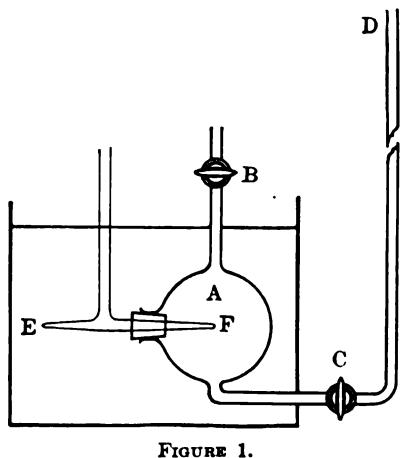

couple junction to the temperature of the liquid, but must not be long enough to allow appreciable thermal exchange between the middle of the flask and the walls.

## RADIATION AND STEFAN'S LAW

Our respect for the second law of thermodynamics continually grows with the increasing number and diversity of phenomena to which this law is applicable. Indeed the laws of thermodynamics are not merely laws of material systems. There are systems which contain no substance, as the term is commonly used, and yet which are subject to our general thermodynamic equations. Thus we may employ these equations to demonstrate an important principle in the theory of radiation.

## MISCELLANEOUS APPLICATIONS OF ENTROPY 139

A completely enclosed space, which is empty of all ordinary matter, and is traversed by radiant energy, we may call a hollow, in the same technical sense as the Germans speak of a " Hohlraum. " On account of the finite velocity of radiant energy, which is the velocity of light, a hollow will contain at any instant a definite amount of energy in transit between the walls. When the surrounding wall is at the same temperature throughout, the hollow will come to a state of equilibrium, and the radiant energy which it contains may be shown by simple thermodynamic reasoning to be independent of the materials of which the walls are composed, and of the shape of the enclosure.

Thus suppose that a hollow with given walls has come to equilibrium, and by some sort of sliding partition we could put in a wall of a different character. If a new equilibrium were now established there would be a spontaneous process associated with an increase in entropy. If now the original wall were restored, another spontaneous process would have to occur bringing the system back to equilibrium, with a further increase of entropy. But the entropy of the hollow must now be the same as at the beginning, and since the changes of entropy attending the sliding of the partitions may be made negligible, it is evident that the spontaneous changes under consideration could not occur and that the state of equilibrium is independent of the nature of the walls. Likewise it may be shown that the shape is inessential, for the hollow might be divided into small cells and these cells rearranged spatially with negligible changes in entropy.

The energy therefore will be proportional to the volume of the hollow, and it may readily be shown that it is proportional also to the rate of emission of energy from unit surface of a perfect radiator (black body) at the temperature in question, which rate depends upon the temperature alone.

Such a hollow at a given temperature constitutes a simple thermodynamic system. If it is brought in contact with a heat reservoir of the same temperature, and its volume is in some way increased or diminished, heat will be taken from or given to the reservoir. The case is entirely analogous to a mixture of liquid and vapor enclosed in a cylinder with a moving piston . Such a system will absorb heat from a reservoir if the piston is pulled out and will give heat to the reservoir if the piston is pushed in.

When the volume of the hollow is increased in a reversible

### THERMODYNAMICS

way and it absorbs heat from the reservoir, it thereby increases in entropy. Hence ( S/ V) is a positive quantity; but we have already found the universal thermodynamic equation ( 14) ,

$$
\begin{pmatrix} \frac{\partial S}{\partial \overline{V}} \end{pmatrix}_T = \begin{pmatrix} \frac{\partial P}{\partial T} \end{pmatrix}_V.
$$

Now it would be impossible to interpret this equation without assuming, (a) that there is a pressure exerted upon the walls of a hollow which is not due to any particular construction of the walls, but must rather be attributed to the radiation itself ; and (b) that this pressure increases with the temperature. These consequences were first pointed out by Bartoli.¹

In fact Maxwell² predicted from his electromagnetic theory of light that radiant energy would exert a pressure upon a body receiving the radiation, and his equation has been qualitatively and quantitatively verified by the experiments of Lebedew³ and of Nichols and Hull. As a consequence of this equation the pressure upon the walls of a hollow is given by the simple formula

$$P = \frac{1}{3} \frac{E}{\bar{V}'} \tag{26}$$

where E is the energy of the hollow and V is its volume. At constant temperature, as the volume of a hollow is increased from zero,

$$
\begin{pmatrix} E \\ \dot{V} \end{pmatrix} = \begin{pmatrix} \dot{\partial}E \\ \ddot{\partial}\ddot{V} \end{pmatrix}_T. \tag{27}
$$

Now by Equation 19,

$$T\begin{pmatrix} \partial P\\ \bar{\partial}T \end{pmatrix}_{\mathcal{V}} = P \, + \begin{pmatrix} \partial E\\ \bar{\partial}\bar{V} \end{pmatrix}_{\mathcal{T}},$$

and by Equations 26 and 27,

$$T\begin{pmatrix} \delta P\\ \bar{\delta}\bar{T} \end{pmatrix}_V = 4P. \tag{28}$$

By integrating at constant volume we thus find

$$P = \text{const.} \times \text{ } \mathcal{T} \text{.} \tag{29}$$

СНАР. ХІІ

<sup>1</sup> Bartoli, " Sopra i movimenti prodotti dalla luce e dal calore. " Florence, 1876.

<sup>*</sup> Maxwell, " Treatise on Electricity and Magnetism , " Vol. II , p . 391 , Oxford, 1873.

Lebedew, Ann. Physik, [ 4 ] , 6, 433 ( 1901) .

<sup>4</sup> Nichols and Hull, Phys. Rev. , 17 , 26, 91 ( 1903) .

Hence we see that the energy per unit volume, and also the rate of radiation from a perfect radiator (black body) , are proportional to the fourth power of the temperature.

This important relation was first obtained by Stefan ' as a purely empirical equation. It was Boltzmann' who showed it to be an exact consequence of the principles of electromagnetics and thermodynamics.³

EXERCISE 1. What is the maximum conversion factor of a steam engine operating with a condenser at 30°C and a boiler at 200°C?

EXERCISE 2. A refrigerating machine operating in a room at 30°C, is employed to maintain a cold storage tank at - 10°C. What is the minimum amount of work required to withdraw 1000 cal. from the tank?

EXERCISE 3. The vapor pressure of liquid ammonia is about 7.6 atmos. at 17°C, and is increasing at the rate of 0.25 atmos. per degree. The specific volumes of vapor and liquid are respectively 165 and 2 cc. Calculate the heat of vaporization per gram of ammonia and compare with the slightly higher measured value of 296 cal. It will be noted that the measured heat would be expected to be the higher if the ammonia is allowed to vaporize against atmospheric pressure. For AH obtained by the Clapeyron equation is for the reaction NH (1, 7.6 atmos. ) NH3(g, 7.6 atmos. ) , and would therefore differ from the heat of vaporization at 1 atmos. owing to the Joule-Thomsen effect. =

EXERCISE 4. Calculate the difference, at low pressures, between V and T(ǝV/ǝT)p for one gram of air. Use Equations 20 and VI-12, and the data of Exercises VI-8 and VI-9. It is well in such a case as this (and Exercise 6) to express energy in cc. -atmos.

EXERCISE 5. By further partial differentiation of Equations 19 and 20 obtain the following equations and interpret their meaning:

$$\left(\stackrel{\partial C_V}{\partial \bar{V}}\right)_T = T \left(\stackrel{\partial^* P}{\partial \bar{T}^\natural}\right)_V,\tag{30}$$

$$\left(\stackrel{\partial C_P}{\bar{\partial}\bar{P}}\right)_T = -\left.T \left(\stackrel{\partial^* V}{\bar{\partial}T^{\bar{\sharp}}}\right)_P\right| \tag{31}$$

EXERCISE 6. From the preceding equation and from Exercise VI-9, show that for air at 60° ( ə²V/†T²)p expressed in cc. = - 0.000035 per gram, where V is Since ( VT) is about 3 cc . per degree for 1 g. of air we see that while this coefficient is not constant, it is changing by only one thousandth of one percent per degree.

1 Stefan, Sitzb. Akad. Wiss. Wien , 79 : 2, 391 ( 1879) .

2 Boltzmann, Ann. Physik, [ 2] , 22, 291 , 616 ( 1884) .

For a further study of the application of thermodynamics to radiation, especially the extremely important deductions of Wien, the reader is referred to the treatise by Planck on the Theory of Radiation, Barth, Leipzig, 1913.

EXERCISE 7. For 1 mol of benzene at T α = (1/V) (əV/əT)p = = 298, assume v = 88.8 cc.;0.00124; CD 33.2 cal . per degree. Bringing these data to consistent units, show that the rise in the temperature of benzene,whenitspressureissuddenlyincreasedby1atmos.,isabout0.024°.

EXERCISE 8. Lummer and Pringsheim (Ann. Physik, [ 3] 64, 582 ( 1898) ) measured the specific heats of gases by suddenly lowering the pressure in a large balloon of gas and measuring the change in internal temperature by means of a very fine platinum resistance thermometer. The equation they employ is

$$\frac{\mathcal{T}_{\mathsf{i}}}{\mathcal{T}_{\mathsf{i}}} \stackrel{\textstyle \quad}{\leftarrow} \left(\frac{P_{\mathsf{i}}}{P_{\mathsf{i}}}\right)^{\frac{\mathsf{m}-1}{\mathsf{m}}},$$

where x is CD/Cv. Show that this equation may be derived from Equation 25 if we assume a perfect gas.


# CHAPTER XIII

# THE NUMERICAL CALCULATION OF ENTROPY

Unquestionably the idea of entropy appears at first sight a little abstruse. However, it is the universal tool of thermodynamics, and one of great power. Like other tools it cannot be successfully handled without some theoretical knowledge of its mode of operation, and some practice in its use. In the preceding chapters we have endeavored to make clear its theoretical significance ; and in the present chapter we shall make the concept more concrete by showing how entropy may be handled numerically.

As a starting point we may recall that in any reversible process a system, or any part of a system, undergoes an increase of entropy just in so far as it absorbs heat ; and that the increase in entropy is equal to the heat so absorbed divided by the absolute temperature:

$$dS = \frac{q}{\bar{T}}.\tag{1}$$

## ENTROPY CHANGES IN ISOTHERMAL PROCESSES

The Entropy Change in Fusion. Let us use this equation to calculate the change of entropy when a substance changes from one phase to another at constant temperature, and under conditions of equilibrium. We will consider the fusion of a mol of solid mercury at its melting point, which (at atmospheric pressure) is 234.1 ° K. At the melting point the two phases are in equilibrium. That is to say, there is a state of balance such that if the external temperature is raised by an infinitesimal amount the solid will melt, and if it is diminished by an infinitesimal amount the liquid will freeze. So also, at constant temperature, if the pressure is lowered or raised by any amount

the process will occur in the one direction or the other. Hence theprocessoffusionatthemeltingpointisareversibleone.

In the case of a pure substance like mercury the temperature remainsconstant during fusion, and we have from Equation 1

$$
\Delta S = \frac{\Delta H}{\overline{T}}.\tag{2}
$$

If AH is the heat of fusion of one mol, namely 560 cal. , and T is 234.1 , we may write,

$$\text{Hg(s)} = \text{Hg(l)}; \quad \Delta S_{234.1} = \frac{560}{234.1} = 2.39 \text{ cal. per deg.}$$

Since in this process one mol of solid has disappeared and one mol of liquid has appeared, we may say that the molal entropy of liquid mercury is greater than the molal entropy of solid mercury by 2.39 units at the melting point. Or,

$$\text{s}_{\text{зм}\cdot1}(\text{Hg, l}) - \text{s}_{\text{зм}\cdot1}(\text{Hg, s}) = 2.39.5$$

It must be borne in mind that such a calculation is based upon the fact that we have a state of equilibrium in which every process is reversible. If, on the other hand, we consider the difference in entropy between ice at - 10°C and supercooled water at the same temperature, that difference cannot be obtained by dividing the difference in heat content by the absolute temperature, 263° K. We shall revert to this point in Exercise 1.

The Entropy Change in Vaporization. In vaporization the change of entropy is usually much larger than in fusion. Ether at its boiling point, 307.7°K, absorbs 6500 cal. per mol byevaporation. Hence we write,

(C2H5) 2O(1 , 1 atmos. ) = (C₂H ) 2O(g, 1 atmos. ) ;

$$
\Delta S_{\mathfrak{u}\sigma\tau\sigma} = \frac{6500}{307.7} = 21.1.
$$

(We might equally well have written,

(C2H5) 2O(g, 1 atmos. ) == (C2H5) 2O(1, 1 atmos. ) ; AS307-7 = 21.1.)

Similarly, for benzene boiling at 353.3° K, and chlorbenzene

boiling at 405.1 °K, the corresponding values of AS at the two boiling points are 20.7 and 20.5.

It will be noted that these three values are nearly equal. An empirical principle, known as Trouton's Rule, ' states that the entropy increase per mol is the same for all so-called normal, or non-polar, liquids at their boiling points. The constant of Trouton's Rule is usually given as about 21 cal. per deg.

This rough but useful rule, when applied to liquids with a wide range of boiling points, shows a marked trend in the average value of the constant with the temperature, so that the "constant" is about 50% greater for liquids boiling in the neighborhood of 1000°C than it is for low boiling liquids like oxygen and nitrogen. Several attempts have been made to restate the rule in such a way as to obviate this trend, the most simple being that of Hildebrand. His rule states that the "entropy of vaporization" is the same for different liquids, not at the boiling points, which are the temperatures where the several liquids have unit vapor pressure, but rather at temperatures where the liquids give the same vapor concentration. Choosing arbitrarily temperatures at which the concentration of vapor is 0.005 mols per liter, he gives the following table for the entropy change in vaporization.

| TABLE | -<br>ENTROPY<br>1. | CHANGE | IN | VAPORIZATION |  |
|-------|--------------------|--------|----|--------------|--|
|       |                    |        |    |              |  |

|                         | AS   |                     | AS   |
|-------------------------|------|---------------------|------|
| Nitrogen                | 27.6 | Fluorbenzene        | 27.4 |
| Oxygen                  | 27.6 | Stannic<br>chloride | 27.2 |
| Chlorine                | 27.8 | Octane              | 27.6 |
| Pentane                 | 27.0 | Bromnaphthalene     | 27.6 |
| Hexane                  | 27.2 | Mercury             | 26.2 |
| Carbon<br>tetrachloride | 27.0 | Cadmium             | 26.4 |
| Benzene                 | 27.4 | Zinc                | 26.4 |

Corresponding values of AS for highly polar substances are larger, 32.4 for ammonia, 32.0 for water, and 33.4 for ethyl alcohol, for example.

All of these processes which we have been considering are reversible. Let us now consider a similar irreversible process, for example, the liquefaction of supercooled water vapor, at 1 atmos. and 25°C, to form water at 25°C. The heat of vaporiza-

<sup>1</sup> Trouton, Phil. Mag. [ 5] , 18, 54 ( 1884) .

We can not enter here upon a discussion of this useful classification (See Lewis, J. Am. Chem. Soc., 35, 1448 ( 1913) ) . To the non-polar type belong such substances as benzene and liquid nitrogen, while water, ammonia and fused salts are classified as polar liquids.

Hildebrand, J. Am. Chem. Soc . , 37, 970 ( 1915) .

tion at this temperature is 10450 cal. , so that if water is formed from water vapor at the equilibrium pressure, namely, 23.8 mm. = 0.0313 atmos. , the entropy change in liquefaction is readily obtained ,

$$\begin{aligned} \text{H}_{\text{2}}\text{O}(\text{g}, \ 0.0313 \text{ atmos.}) &= \text{H}_{\text{2}}\text{O} \quad \text{(l, } 0.0313 \text{ atmos.)};\\ \Delta S_{296} &= -10450/298.1 = -35.06. \end{aligned}$$

Now if we assume that the water vapor behaves as a perfect gas, then we may find the change in the entropy of the vapor between 1 atmos. and 0.0313 atmos. by Equation X-2,namely,

$$\begin{aligned} \mathsf{H_2O(g, 1 \text{ atmos.})} &= \mathsf{H_2O(g, 0.0313 \text{ atmos.})};\\ \Delta S_{298} &= R \text{ \In (1/0.0313) = 6.89.} \end{aligned} $$

If we ignore the minute difference in the entropy of liquid water between 1 atmos. and 0.0313 atmos. we add our two equations to give,

$$\mathbf{H_{1}O(g, 1 \text{ atm} \text{os.})} = \mathbf{H_{1}O(l, 1 \text{ atm} \text{os.})} \text{; } \Delta S_{\mathbf{298}} = -28.17.7$$

The Entropy Change in Expansion. If in the previous illustration we had desired neither to ignore the change in the entropy of liquid water with the pressure, nor to regard the vapor as a perfect gas, our calculation could have been made formally more precise. It would suffice to know values of the V-T coefficient for liquid and vapor. Thus from Equation XII- 17

$$\int dS = -\int \left(\frac{\partial V}{\partial \overline{T}}\right)_P dP. \tag{3}$$

For example, let us take the V-T coefficient of one mol of liquid water at 25° as constant and equal to 0.00465 cc. per deg. The change of entropy when the pressure changes 0.97 atmos. is 0.0045 cc. -atmos. per deg. , or 0.00011 cal. per deg. In other words,

$$\mathbf{H_2O(l, 1\ atmos.)} = \mathbf{H_2O(l, 0.0313\ atmos.)}; \ \Delta S_{298} = 0.00011,$$

and this quantity is evidently less than the experimental errors in the other quantities involved in the above calculation.

The Entropy Change in a Chemical Reaction. When we consider a chemical reaction, such as the union of mercury and

chlorine to form mercurous chloride, the change in entropy resulting from the reaction is not to be calculated from the heat of reaction, since the process is a highly irreversible one. However, if we construct a galvanic cell in which this reaction is the one which occurs, and if the electromotive force of this cell is exactly balanced by an external electromotive force, so that slight changes in the latter will cause the current to pass in one direction or the other through the cell, the reaction is made reversible.

The heat absorbed by the cell, when operating under these conditions, is the quantity which, divided by the temperature, gives the increase in entropy during the reaction. This reversible heat of reaction, TAS, is entirely different in magnitude, and often in sign, from the ordinary calorimetric heat of reaction , AH.

It was the recognition of these facts by Willard Gibbs which permitted him to place upon a sound foundation the thermodynamics of the galvanic cell . We shall have in our further work frequent occasion to study the reversible galvanic cell, as well as other methods of investigating chemical reactions occurring under reversible conditions.

## CHANGE OF ENTROPY WITH TEMPERATURE

We have seen in Equations XII-7 and XII- 8 how the entropy of a substance changes with the temperature. The equations read,

$$
\begin{pmatrix} \frac{\partial \mathbf{s}}{\partial \bar{T}} \end{pmatrix}_V = \begin{smallmatrix} \mathbf{c} \cdot \\ \bar{T} \end{smallmatrix}; \qquad \begin{pmatrix} \frac{\partial \mathbf{s}}{\partial \bar{T}} \end{pmatrix}_P = \frac{\mathbf{c}_P}{\bar{T}} \mathbf{s}.
$$

Thus, if a mol of a substance is heated at constant pressure, the changeofentropyisgivenbytheequation,

$$\int \mathrm{d}s = \int \mathrm{d}s = \int \mathrm{c_p}d\,T = \int \mathrm{c_p}d\,\ln\,T = 2.303 \int \mathrm{c_p}d\,\log\,T.\tag{4}$$

If therefore Cp is known at various temperatures we may perform the integration by analytical or graphical methods, and find the change in entropy of a substancebetweentwotemperatures.

148 THERMODYNAMICS СНАР. ХІІІ

The simplest case is the one in which cp is constant , when we find between the temperatures, T and T' ,

$$\mathbf{s'} - \mathbf{s} = \mathbf{c}_{\mathsf{p}} \ln \frac{T'}{\overline{T}}.\tag{5}$$

For liquid mercury in the small temperature range between T' 298.1°K and the freezing point T = 234.1° K, we may regard Cp as approximately constant and equal to 6.7. Hence =

$$\text{s}' - \text{s} = \text{6.7} \ln \frac{298.1}{23\overline{4.1}} = 1.62.$$

We may next consider the case in which cp is a linear function of T. If we employ Equation VII-6 for the heat capacity of oxygen between its boiling point 90.3°K and 298.1°K we obtain by integration of Equation 4,

$$\text{s}' - \text{s} = 6.50 \ln \frac{298.1}{90.3} + 0.0010(298.1 - 90.3) = 7.96.1$$

The analytical method becomes more cumbersome, the greater the number of terms in our empirical expression for Cp. On the other hand the graphical method of integration can readily be applied to a curve of any degree of complexity.

It is evident from Equation 4 that if we plot Cp against the common logarithm of T, as we have done in Chapter VII, the area under the curve between two points, multiplied by 2.303, gives immediately the difference in entropy between the two points.¹

We may illustrate this procedure by means of Figure 1 , which shows the atomic heat capacity of graphite plotted against log T. If we wish to determine the difference in entropy between 298°K (log T = 2.47) , and 90° K (log T = 1.95) , we merely find the area under the curve between A and B, multiply by 2.303, and obtain S298 -S90.

It will be noted that when Cp is so plotted against log T, the curve proceeds to the left indefinitely as we approach the absolute zero. Nevertheless, if we assume the curve to be asymptotic

<sup>1</sup> Here again we are following closely the treatment of the subject by Lewis and Gibson, J. Am. Chem. Soc. , 39 , 2554 ( 1917) .

<sup>*</sup> For a résumé of the data, see Lewis and Randall, J. Am. Chem. Soc. , 37, 458 ( 1915) .

to the horizontal axis, the value of cp is falling so rapidly that the area to minus infinity may be estimated without serious error. Thus we may obtain the total area under the curve to the left of the point A, and find \$298 So = 1.3 , where so represents the entropy at the absolute zero.

Absolute Value of Entropy. In all of our discussions of entropy we have shown how to determine, not the entropy of any particular system, but only the change in entropy which accompanies a change in the system. In this respect our definition of S places it in the same category as the quantities E and H, of which the absolute values are as yet undetermined. As with these quantities, we might assign an arbitrary value to the entropy of some

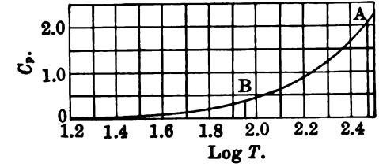

FIGURE 1. -Atomic Heat Capacity of Graphite.

one substance in a given state, but this could not be done for all substances. Thus if we assign an arbitrary value to the entropy of ice at 0°C, the entropy of water is then determined, since we know the entropy change in fusion. So also if we choose arbitrary values for the entropies of mercury and chlorine, we could not arbitrarily choose a value for mercurous chloride, since we have shown how the change in entropy in the formation of mercurous chloride may be determined.

However, we might at least fix arbitrarily the entropy of each element, in some one state, and this we shall do by taking the entropy of each element in its solid state, or in some one solid state, as zero at the absolute zero of temperature. Thus in the case of graphite, which we considered above, we may write 0, and therefore \$ 298 1.3 . The reason for this procedure will be more fully explained in a later chapter. So - =

Entropy of Solid Elements of Class I. The determination of the entropy of an element of Class I at any temperature is ,

### THERMODYNAMICS

CHAP. XIII

in the main, a matter of great simplicity, even if the heat capacity is not known over any wide range of temperature. But it is to be noted that the regularities observed in this class of substance hold only for the values of cv. We shall therefore put Equation 4 in another form by writing,

$$\mathbf{s} - \mathbf{s}_{\bullet} = \int_{\mathbf{0}}^{T} \mathbf{c} \cdot d \ln T + \int_{\mathbf{0}}^{T} (\mathbf{c}_{\mathbf{p}} - \mathbf{c} \mathbf{v}) d \ln T. \tag{6}$$

The last term is small except at high temperatures, and frequently may be estimated with sufficient accuracy by means of the rough empirical rule expressed by Lindemann and Magnus¹ in the equation,

$$\mathbf{c}_{\mathfrak{p}} - \mathbf{c}_{\mathfrak{v}} = aT^{\mathfrak{Y}},\tag{7}$$

where a is a constant. Using this we find, by a simple integration, that at any temperature

$$\int_{\mathfrak{d}}^{T} (\mathbf{c_{\mathfrak{p}}} - \mathbf{c_{\mathfrak{v}}}) d\,\ln T = \,_{\mathfrak{d}}^{2} \langle (\mathbf{c_{\mathfrak{p}}} - \mathbf{c_{\mathfrak{v}}}),\tag{8}$$

and the values of Table VII- 1 may be used for the calculation of this term .

We may therefore give our attention to the more important term in Equation 6, which is the entropy change that would be found if the substance were heated at constant volume. We shall therefore denote this by sv and write,

$$\mathbf{s}_{\mathbf{v}} = \int_{0}^{T} \mathbf{c}_{\mathbf{v}} d\ln T = 2.303 \int_{0}^{T} \mathbf{c}_{\mathbf{v}} d\log T. \tag{9}$$

= In employing this equation by the graphical method, it is to be noted in the first place that the area under the curve, up to a given temperature, is the same whether we plot cv against log T or against log (T/O) log Tlog 0, for in the latter case we merely shift the curve horizontally by a distance equal to log . We therefore see at once, from what we have said in Chapter VII regarding substances of Class I, that sv must be the same for all of these substances at the same value of T/0.

By using the curve of Figure VII- 1 , Lewis and Gibson obtained 1 Lindemann and Magnus, Z. Elektrochem. , 16 , 269 ( 1910) .

Table 2, which will give by interpolation the value of sv as well as of cv, at any temperature, for any substance of Class I whose is known. Thus for example let us consider an element with 0 = 40, or, in other words, an element for which cv = 32R at 40°K. At 400°K, where log (7/0) = 1 , Cv will be 5.79, and sv will be 13.40, both being expressed in calories per degree.

| log<br>T<br>/<br>O | Cv   | Sv   | T/O<br>log | Cv   | Sv    |
|--------------------|------|------|------------|------|-------|
| -0.60              | 0.11 | 0.04 | 0.40       | 5.26 | 5.59  |
| -0.50              | 0.21 | 0.07 | 0.50       | 5.49 | 6.82  |
| -0.40              | 0.43 | 0.15 | 0.60       | 5.65 | 8.08  |
| -0.30              | 0.84 | 0.30 | 0.70       | 5.72 | 9.41  |
| -0.20              | 1.43 | 0.53 | 0.80       | 5.76 | 10.74 |
| -0.10              | 2.19 | 0.98 | 0.90       | 5.78 | 12.07 |
| 0.00               | 2.98 | 1.62 | 1.00       | 5.79 | 13.40 |
| 0.10               | 3.78 | 2.41 | 1.10       | 5.80 | 14.74 |
| 0.20               | 4.43 | 3.37 | 1.20       | 5.81 | 16.08 |
| 0.30               | 4.91 | 4.42 |            |      |       |

In constructing this table it was necessary to determine the = - area under the heat capacity curve to log ( T/0) ∞. This,however, is a simple matter for substances of Class I , for it was shown by Debye that at low temperatures the heat capacity is proportional to the cube of T/O. Whence it follows, by integration of Equation XII-7, that at any low temperature,

$$\mathbf{s}\mathbf{v} = \frac{\mathbf{c}\mathbf{v}}{\mathbf{3}}.\tag{10}$$

- In Table 3 are given values of log and Sv298 thus calculated by Lewis and Gibson for 8 solid elements of Class I , which have been subjected to the most detailed investigation . We have given also the values of s Sv, obtained from Equation 8 and Table VII- 1 ; and the values of \$298 found by adding the two preceding columns. The value given for mercury is the one which would be found if this element could exist in the solid state at 25°C. (The value given for diamond should for the present be considered merely as s - So. For if we have already taken So = 0 for graphite, we have said nothing so far to justify our making the same assumption for diamond also . )

|                | log<br>→ | Sv298 | S<br>Sv | 8298  |
|----------------|----------|-------|---------|-------|
| Diamond        | 2.664    | 0.58  | 0.00    | 0.58  |
| Aluminum       | 1.980    | 6.73  | 0.13    | 6.86  |
| Copper         | 1.893    | 7.91  | 0.13    | 8.04  |
| Zinc           | 1.760    | 9.60  | 0.20    | 9.80  |
| Silver         | 1.730    | 10.00 | 0.20    | 10.20 |
| Mercury<br>(s) | 1.379    | 14.69 |         |       |
| Thallium       | 1.396    | 14.44 | 0.20    | 14.64 |
| Lead           | 1.342    | 15.11 | 0.27    | 15.38 |

TABLE 3. -ENTROPIES OF SEVERAL ELEMENTS AT 25°C¹

Entropy of Solid Elements which are not of Class I. By the graphical method which we have illustrated in Figure 1 we may obtains - So for any substance whose heat capacity has been determined over a sufficient range. When, however, only a few measurements of heat capacity are available, the evaluation of the entropy becomes more difficult. While it takes only one measurement to establish the heat capacity curve and the entropy of a substance of Class I, it takes two data for a substance of Class II. The combined analytical and graphical method necessary in such a case is fully described by Lewis and Gibson.

However, while it requires only two data to determine the entropy of a substance of Class II, it may take many more to prove that the substance belongs to this class. Among compound substances several have been found which belong neither to Class I nor to Class II, and in such cases the entropy can be reliably determined only by a series of specific heat measurements extended to very low temperatures.

Entropy of Liquid and Gaseous Elements. To illustrate the simultaneous use of the methods of this chapter, let us calculate the entropy of liquid mercury at 25°C from the entropy of solid mercury, and from the changes in entropy when the solid is melted, and the liquid is then brought to 25°C. We may first calculate the entropy of the solid at the melting point ,namely, 234.1 ° K. We have seen that for this element log → = 1.377, hence log ( T/0) = log 234.1 1.377 0.992 . By interpolation in Table 2 we find Sv234.1 13.31 . In this case we have the experimental values of CD obtained by Pollitzer,2 and these = =

<sup>1</sup> Values differing slightly from those of the table are given in Chapter XXXII, based on the later calculations of Lewis, Gibson and Latimer (J. Am. Chem. Soc. , 44, 1008 ( 1922) ) .

<sup>2</sup> Pollitzer, Z. Elektrochem. , 19, 513 (1913) .

values plotted against log T/0 give a curve which at the higher temperatures is appreciably higher than the typical cv curve for substances of Class I , to which mercury belongs. From the area between these two curves we find s Sv = 0.49. Whence for Hg(s);\$234.1= 13.31 0.49 = 13.80. -

Now we have previously calculated the entropy change in the fusion of mercury to be 2.39, and we have also calculated the entropy change in heating liquid mercury from the melting point to 25°C to be 1.62, whence we finally obtain for Hg(1) ; S298 = 17.81. Capacity

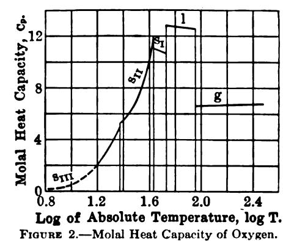

The same method may be employed in other cases which, however, are frequently more complicated. Thus from the interesting investigations of Eucken on thermal changes in oxygen at low temperatures we have constructed Figure 2, which shows the molal heat capacity of the several forms of oxygen. In addition to gaseous and liquid oxygen, three solid forms were discovered, and the heat of each transition was determined. Hence, taking So = 0 for solid III at the absolute zero, we obtain s for gaseous oxygen at 25°C by taking the areas under the curves SS , S₁, 1, and g (to 298 ° K) , multiplying by 2.303 , and adding further the entropy changes in passing from s to S from sto s₁, from s, to liquid, and from liquid to gas.

We may point out in this connection that thermodynamics imposes certain conditions regarding the form of such heat capacity curves and the heats of transition. The difference in entropy between s, at a certain temperature and S at another temperature is entirely independent of the path by which we pass from one to the other. It might have happened that s failed to appear, in which case the s, and s curves would have been continued until they met, at the transition point Sm-S Our calculation of the entropy of oxygen gas would then have contained different terms, but except for possible experimental error the result would have been the same.

at - = = EXERCISE 1. Calculate the changes in entropy when 1 mol of water 10°C is heated to 0°C, is frozen at 0° C, and the solid is cooled to 10°C. The sum is equal to AS263 in the irreversible isothermal process, H₂O(1) H₂O(s) . Take Cp as constant for both ice and water, namely 9 and 18 respectively ; and take AH273 1438.

EXERCISE 2. Taking the latent heat of vaporization of oxygen per mol as1600cal.at90.3°K,show that O2 (1, 90.3 ° ) = O2 (g, 298.1 °) ; AS = 25.68.

EXERCISE 3. We have seen in Exercise VI-6 that by starting with oxygen at 25°C, and at one atmos. , compressing isothermally to 200 atmos. , and then cooling by free expansion, it would require at least 27000 calories ofmechanical work for each mol of liquid oxygen produced. It will be interesting now to calculate how much work would be requisite if the whole process of liquefaction were made reversible, so as to obtain the maximum theoretical efficiency. In its simplest terms the process would consist in converting one mol of oxygen gas at 298.1 ° K into one mol of liquid oxygen at 90.3 °K, in which AH, the energy set free, is approximately 1600 + 6.7 (298.1 90.3) cal. (see Exercise VI- 5) . Furthermore x calories of work have to be provided, and q calories of heat are given up to some reservoir at 25°C. By the conservation law, ΔΗ q x. Since the process is to be reversible, the increase in entropy of the reservoir, which is q/298.1, is equal to the diminution in entropy of the oxygen, which by the preceding exercise is 25.68. Show from these data that x, the amount of work required to liquefy one mol of oxygen by a reversible process, is about 4660 cal. , which is barely onesixth as much as was required in the irreversible process of Exercise VI-6. - =

= EXERCISE 4. From Dewar's measurements it may be shown that tin, which presumably belongs to Class I, has a value of log → 1.632. By interpolation from Table 2, find the value of cv at 100° K, and the value of Also by means of Table VII- 1 find S298. Sv298.

EXERCISE 5. Plot the following values (Nernst and Schwers, Sitzb. kgl. preuss. Akad. Wiss. , 1914, 355) of c, for one mol of PbI, against log T, and determine the change of entropy from 20° K to 100 ° K.

| T  | 22.3 | 26.2 | 38.2 | 50.6 | 62.1 | 89.4 | 95.6 |
|----|------|------|------|------|------|------|------|
| Cp | 7.1  | 7.9  | 10.7 | 13.2 | 14.8 | 17.1 | 17.3 |

EXERCISE 6. Employing Equation VII- 9 , find the difference in the molal entropy of carbon dioxide between 0° C and 1000°C.

# CHAPTER XIV

## CRITERIA OF EQUILIBRIUM AND OF SPONTANEOUS CHANGE; THE FREE ENERGY

We have seen that any actual or irreversible process is characterized by an increase in the total entropy of all systems concerned. Therefore a system is subject to spontaneous change if there is any conceivable process for which dS > 0. On the other hand, a state of equilibrium is one in which every possible infinitesimal process is reversible, or one in which the total entropy remains constant. It is therefore a necessary condition for equilibrium that, for any process, dS = 0.

This is the most general criterion of equilibrium which thermodynamics offers. Indeed for many purposes it is too general. It is not always as easy to study the change in entropy of all the systems which may be affected by a given process, as to focus our attention upon some one system. It is for this reason that numerous "thermodynamic functions" have been invented, which are less fundamental and less general than the entropy, but are of more practical convenience in the study of some concrete problems. In the present chapter we are going to discuss two of these thermodynamic functions, one of which is of such importance that it will play a prominent rôle in all of our later discussions.

## TWO THERMODYNAMIC FUNCTIONS

By means of quantities which have already been employed let us define two new quantities through the equations,

$$A = E - TS,\tag{1}$$

$$A = E - TS,\tag{1}$$

$$F = H - TS = (E + PV) - TS = A + PV.\tag{2}$$

## 156 THERMODYNAMICS CHAP. XIV

Before explaining the reason for the invention of these quantities A and F, we may note that they are properties of a system, determined by its state and not by its history, since they are defined by means of quantities which themselves are all properties. Moreover, if we consider two identical systems, since T and P are intensive properties, while E, V and S are extensive, the value of each term will be twice as great for the two systems as for either one, and A and F are extensive properties.

Maximum Work. In order to illustrate the significance of the quantity A, let us consider a system which changes from one state to another at the same temperature, so that

$$
\Delta \mathbf{A} = \Delta \mathbf{E} - T \Delta S.\tag{3}
$$

$$
\Delta \mathbf{A} = \Delta \mathbf{E} - T \Delta S.\tag{4}
$$

Now if the process is also reversible, the last term is the heat absorbed. Hence by the first law of thermodynamics, the total external work done by the system in the reversible process is equal to AA = AA - AB. - Ал

-- - In any other process leading from the same initial to the same final condition AA will be the same, and if the second process is also a reversible one the work performed will also be ΔΑ▲A.. In other words, all reversible isothermal processes, leading from the same initial to the same final states, perform the same amount of work, w = AA. In any actual isothermal process the work performed is less , owing to friction and other sources of degradation, but we may regard AA as the limit of the work which can be performed by an isothermal process, as its efficiency is indefinitely improved. -

As a concrete example, let us consider a process in which zinc acts upon aqueous sulfuric acid to form aqueous zinc sulfate and hydrogen, under constant atmospheric pressure, and in a thermostat. Evidently this process can occur in such a way as to perform no work except the small amount done against the atmosphere by the evolved hydrogen. This, in fact, is just what will occur if impure zinc is added directly to the acid. This process is highly irreversible. On the other hand, if we place in the thermostat the same substances arranged as a galvanic cell , with zinc as one electrode, and another electrode of

hydrogen in contact with a platinized electrode, and if these two electrodes are connected to a motor or other electrical system , in such a way as to utilize the electrical energy which is now available, an amount of work will be done which will depend upon the efficiency of our arrangements.

The maximum work would be obtained if at every instant the external electrical system were arranged to exert so large a counter electromotive force that, when infinitesimally increased, it would force the current in the opposite direction , thus causing hydrogen to be consumed and zinc to precipitate. The process would then be reversible and the total work equal to A AB. -

In both of the processes which we have described, the system passes from the same initial to the same final states. Therefore AA is the same in both cases. This difference - AA, is, in the reversible process, the work which the system has performed, while in the irreversible process it is the maximum work whichmighthavebeenperformed.

As a corollary we may note that while TAS is also the same for both processes, it represents in the reversible process the amount of heat actually absorbed from the thermostat, while in the irreversible process it merely shows the maximum amount of heat which might have been absorbed ; for AE is the same in both cases, and therefore the heat absorbed will be greater, the greater the amount of work performed.

The Net Work in an Isothermal Process at Constant Pressure. In the case we have just considered, the total work done is the sum of the electrical work and the work done against the constant pressure of the atmosphere. The latter quantity of work is equal to PAV, where AV is the increase in volume accompanying the process, and must always be done when a process occurs at constant pressure, whether this process be reversible or irreversible. The remainder, which in a particular case we have called the electrical work, is alone available for external utilization. In general we may call this remainder the net work, giving it the symbol w' , and we may write,

$$w' = w - P\Delta V.\tag{4}$$

If we are dealing with a process which is reversible, w is at a maximum and equal to - ΔΑ. In such a reversible case

$$
\Delta w' = -\Delta A - P\Delta V.\tag{5}
$$

Or since we are taking P as constant, we have, by Equation 2

$$
\Delta w' = -\ \Delta F = F_A - F_B.\tag{6}
$$

- Thus, in any process occurring at constant temperature and pressure, FA FB represents the maximum of work which can be obtained from a given process and applied to useful purposes. It is for this reason that F is known as the free energy.

The quantities F and A, or better, the molal or partial molal values of these quantities, are sometimes called thermodynamic potentials, on account of certain rough analogies to mechanics, which we need not stress. While the value of such functions was pointed out by Massieu, ¹ their great utility in the interpretation of the most diverse physico- chemical phenomena was first fully demonstrated in the comprehensive work of Gibbs.2 Students of Gibbs will observe that the quantities F and A are his functions & and 4. (We may note also that our H is Gibbs' x and our E his e. )

It was Helmholtz³ who introduced the term free energy, and it is to be remarked that he applied this name to A rather than to F. Later, however, since AA and AF do not largely differ numerically, unfortunate confusion has arisen in the literature between these two quantities. Several authors' who have defined the free energy as A have really used the function F. It has therefore seemed best to retain this useful expression for the latter function, which has in practice by far the greater importance.

It will be seen that F bears the same relation to A that H bears to E. We have previously remarked that the choice of pressure and temperature as the chief variables in thermodynamics, together with the fact that most experiments are carried on at constant temperature or pressure, makes

<sup>--</sup> 1 Massieu, Compt. rend. , 69, 858, 1057 ( 1869) . He employed -F/T and A/T, the former of which has more recently been used by Planck (" Thermodynamik, " Veit, Leipzig, 1897) .

<sup>2</sup> Gibbs, Trans. Conn . Acad. Arts. Sci. , 2, 309, 382 ( 1873) ; 3, 108, 343 ( 1875) .

Helmholtz, Sitzb. kgl. preuss . Akad. Wiss. , 1 , 22, ( 1882) .

<sup>4</sup> Thus Nernst (" Theoretische Chemie, " 6th Ed. , p. 730 ; Enke, Stuttgart, 1909) writes on the same page two equations, one connecting AA and equilibrium constant, and the other AÅ and electromotive force. Both of these equations are quite erroneous, but similar equations in which AF is substituted for AA are correct. Even Haber in his extraordinarily careful work " The Thermodynamics of Technical Gas Reactions, " occasionally confuses these quantities thus causing a numerical error of 300 cal. on page 177 (English Ed. ) and of 700 cal . on page 320.

quantities like H, Cɔ, and F more generally useful than the corresponding quantities E, Cv and A.

## THE DRIVING FORCE OF A CHEMICAL REACTION, AND A NEW TEST FOR EQUILIBRIUM

The difference between a process conducted reversibly, and the same process conducted with different degrees of irreversibility, is well illustrated by the study of the type of galvanic cell which is called a storage battery. The minimum electrical work required to charge the battery from one state to another is equal to the maximum work obtainable in discharging from the second state to the first, and both of these are equal numerically to the change of free energy within the cell . Stating this same thing in another way, the minimum electromotive force. required for charging and the maximum electromotive force obtainable in discharge are both equal to the reversible electromotive force.

In attempting to measure such a value we find that the charging and discharging e.m.f.'s are nearer together the smaller the current. With modern methods of measuring potentials, it is sometimes possible to balance a cell so nicely that a change of one millionth of a volt will charge or discharge the cell, as shown by the deflection of a galvanometer to right or left . However, in order to approach so near to reversibility it is necessary to use a galvanometer which is sensitive to a current of the order of 10-9 amperes. At this rate it would take a million years to charge a small storage battery.

In practice reversibility is sacrificed to save time, and if we examine the so-called charge and discharge curves of a battery, we find that the electromotive force obtained in discharging the battery at the normal rate is smaller by several tenths of a volt than the reversible electromotive force. That used in charging is correspondingly higher. The more rapid the charging or discharging is, the greater is the loss in energy efficiency. This is somewhat analogous to the mechanical principle that frictional losses increase with velocity.

In practice different processes differ greatly in degree of irreversibility; but it is a universal rule that if any isothermal process is to occur with finite velocity, it is necessary that AF>w'. -

Systems which are Subject to No External Forces except a Constant Pressure. In the preceding discussion we have considered a chemical process which is in some way harnessed for the production of useful work. We may now turn to the far more common case of a reaction which runs freely, like the combustion of fuel, or the action of an acid upon a metal. In other words, let us consider a system which is subjected to no external forces, except a constant pressure exerted by the environment. In such cases w' 0, and it follows from what we have said above that no actual isothermal process is possible unless AF <0. =

Therefore if we know the value of AF for any isothermal reaction, and if this value is positive, then we know that the reaction , in the direction indicated, is thermodynamically impossible. If, on the other hand, the value is negative the process is one which can occur, and does occur, although perhaps with no measurable speed.

When water is formed from its elements at 25°C there is a very large loss of free energy. In our later work we shall show this to be given by the equation

$$\begin{aligned} \mathsf{H_{\sf{z}}(\mathsf{g}, 1 \text{ atmos.}) + \mathsf{Y}_{2}\mathsf{O_{2}}(\mathsf{g}, 1 \text{ atmos.}) &= \mathsf{H_{\sf{z}}\mathsf{O(l)}};\\ \mathsf{\Delta F_{\sf{z}\mathtt{89}}} &= -56560 \text{ cal.} \end{aligned}$$

The reaction can therefore proceed spontaneously ; and although ordinarily it takes place at no measurable rate, the presence of a catalyzerlikespongyplatinumpermitsittoproceedreadily.

 We may next consider the union of oxygen and nitrogen to form nitric oxide. We shall find for this reaction the equation

$$\text{N}_{\text{2}} + \text{O}_{\text{2}} = 2\text{NO}; \text{ } \Delta F_{\text{288}} = 41700 \text{ cal.}$$

The large positive value of AF shows not only that the reaction has no tendency to proceed in the direction indicated, but also that nitric oxide, from a thermodynamic standpoint, is an extremely unstable substance.


The fact that nitric oxide apparently does not dissociate into its elements under ordinary conditions must be ascribed to an extremely inert or unreactive character which it is beyond the scope of thermodynamics to predict or to explain. In an earlier chapter we have spoken of the ambiguous manner in which the term "stability" is used. In a thermodynamic sense a system is stable when no process can occur with a diminution in free energy. By a rough analogy to mechanics we may think of the quantity - AFas the driving force of a reaction, while the factors which retard a possible process may be likened to friction.

- = A Necessary Condition for Equilibrium. We have seen that for any isothermal reversible process dF w' , and since it is a condition for equilibrium that every infinitesimal process be reversible, this equation furnishes also a test of equilibrium. But if we are dealing with a system which can perform no net work, in other words, if our system is subject to no external forces except a constant pressure, then w' = 0. Thus, with respect to any process occurring at constant temperature and pressure, the state of equilibrium is defined by the equation

$$dF = 0.\tag{7}$$

This seems at first sight to be a criterion of very limited scope, until we realize that if no reaction at constant temperature and pressure is thermodynamically possible, no reaction whatever can occur. For suppose that some spontaneous process could occur in such a way as to produce inequalities of temperature and pressure within the system , or to produce a difference between the temperature and pressure of the system and the temperature and pressure of the environment ; then this process could be followed by another obviously spontaneous process, consisting in the equalization of pressure and temperature. But these two processes together would be the equivalent of a spontaneous process occurring at constant temperature and pressure.

It is therefore a general criterion of equilibrium, with respect to every possible change, that the free energy remain unchanged in any infinitesimal process occurring at constant temperature and pressure.

## 162 THERMODYNAMICS CHAP. XIV

### THE EFFECT OF PRESSURE AND TEMPERATURE UPON THE FREE ENERGY

Since the free energy is to be one of our most useful thermodynamic instruments, we must show how it depends upon the important variables, pressure and temperature. By Equation 2

$$\text{sure ano } \texttt{vamp}$$

$$F = H - \texttt{rs.}$$

Differentiating this equation with respect to pressure,

$$
\begin{pmatrix} \frac{\partial F}{\partial \bar{P}} \end{pmatrix}_T = \begin{pmatrix} \frac{\partial H}{\partial \bar{P}} \end{pmatrix}_T - T \begin{pmatrix} \frac{\partial S}{\partial \bar{P}} \end{pmatrix}_T. \tag{8}
$$

But we have already found in Equation XII- 16 that

$$
\begin{pmatrix} \frac{\partial H}{\partial \overline{P}} \end{pmatrix}_T - T \begin{pmatrix} \frac{\partial S}{\partial \overline{P}} \end{pmatrix}_T = V_r
$$

whence

$$
\begin{pmatrix}
\frac{\partial F}{\partial \overline{P}}
\end{pmatrix}_{\mathbf{T}} = \mathbf{V}.\tag{9}
$$

This very simple and important equation may be put in convenient form for use in connection with an isothermal process, namely,

$$
\int dF = \int \mathbf{V} d\mathbf{P}.\tag{10}
$$

Starting again with Equation 2, and differentiating with respect to temperature,

$$
\begin{pmatrix} \partial \bar{F} \\ \bar{\partial} \bar{T} \end{pmatrix}_P = \begin{pmatrix} \partial \bar{H} \\ \bar{\partial} \bar{T} \end{pmatrix}_P - T \begin{pmatrix} \partial \bar{S} \\ \bar{\partial} \bar{T} \end{pmatrix}_P - S,\tag{11}
$$

but two of these terms cancel one another by Equations V- 14 and XII-8. Hence

$$
\begin{pmatrix} \frac{\partial F}{\partial \dot{T}} \end{pmatrix}_P = \begin{pmatrix} -S \ \end{pmatrix} = \frac{F - H}{T} \text{-} \tag{12}
$$

We shall further develop these equations and illustrate their application in the following chapter.

# A CONDENSED SUMMARY OF THERMODYNAMIC FORMULAE

Even if we confine our attention to the commoner thermodynamic quantities T, S, P, V, H, E, F, and A, the number of simple thermodynamic relations between these quantities is so great that it would be impracticable to deduce or even to state them all in a work of this size . Of course many of these relations are little used; but even the ones of frequent service are so numerous that it is desirable to have some sort of mnemonic or shorthand system by which they may be obtained.

It has been shown by Bridgman' how this may be accomplished and we shall follow essentially his discussion . He treats both first and second derivatives, but we shall confine our attention to the former.

In a purely formal way we may write,

$$
\begin{pmatrix} \frac{\partial x}{\partial y} \end{pmatrix}_{\bullet} = \frac{(\partial x)_{\bullet}}{(\partial y)_{\bullet}}
$$

where x, y and z may represent any of the eight quantities given above. It then proves to be possible to write ( dx), equal to a certain expression , and (ay) , equal to another expression, so that the division of the first expression by the second gives in every case (dx/dy) . Thus if according to the following summary we write ( H)p = C, and (OT)p = 1 , then

$$
\begin{pmatrix} \partial H\\ \bar{\partial}\bar{T} \end{pmatrix}_P = C_\bullet
$$

as in Equation V-14. P Similarly we find ( H)r = − V + - 1 , and by dividing we obtain at once = - T(ǝV/OT) and (JP)r

$$
\begin{pmatrix} \frac{\partial H}{\partial \bar{P}} \end{pmatrix}_T = V - T \begin{pmatrix} \frac{\partial V}{\partial \bar{T}} \end{pmatrix}_P
$$

which is Equation XII-20. Again we find ( 7) s and (OP)s = – Cp/ T. And S = - (JV/ǝT)P

$$
\begin{pmatrix} \partial T \\ \bar{\partial}\bar{P} \end{pmatrix}_{\mathcal{S}} = \frac{T}{\bar{C}_{\mathsf{p}}} \begin{pmatrix} \partial \, V \\ \bar{\partial} \, \overline{T} \end{pmatrix}_{\mathcal{P}},
$$

whichisEquationXII-25.

 1 Bridgman, Phys. Rev. , [ 2] , 3, 273 ( 1914) .

= - It will be seen that in general (dx), ((ayმყ)) ,.. Furthermore it is to be noted that in addition to the fundamental quantities employed, certain of their derivatives must appear. Bridgman decided to reduce these to the three which are most readily capable of experimental measurement, namely, ( V/ƏT) p, (ƏV/ƏP)r and CDCp ( H/ T)p. The summaryfollows: =

(ƏT)P (JV) P = - = - = (aS)P (JE)P - (JH)P = (ƏF)P (JA)P (JV)T (as)r (JE)T (ƏH)T (ƏF)T (JA)T - - = ― - = = - ( P) (JP)v = 1. = - - - - (OP)s ( P)E = = (JV/ǝT)p. Cp/T. Со Cь P(ðV/ƏT)p. ( P)H = Сp. (JP)F (ƏP)A ---- = S. − [ S + P( ƏV/ƏT) p] . = --- (JT)v = - (OT) s = = -- (ƏT)E = - = - = = (ƏТ) = (ƏV/ƏP)г. (JV/ƏT)P. T(ƏV/ƏT) Þ + P(ƏV/ƏP)r. - V + T(ƏV/ƏT) p. (ƏT)F = - V. (ƏT)A = P(ƏV/JP)T. - (JV) s = (1 /T) [Cp( V/əP)г + T(ƏV/ƏT)²p]. (JV)E = Cp(OV/ǝP)Tr + T(¿ V/ƏT) ²p. ( V)н = Сp( V/ƏP)rT + (as)v (JE) v (JH)v = - = - = - (JF)v (JA)v = = - (JV) F (ƏV)A = = (JE)s = (JH) s (OF) s (JA) s = - = -- = - (JS)E (OS)H = (OS)F = (Ə.S)A = - T(ƏV/ƏT)² – V(ƏV/ƏT) p. - − [ V( ƏV/ ƏT) p + S(ƏV/ƏP)r] . - S(JV/ƏP)r. (P/T) [C»(¿V/ƏP)r + T(ƏV/ƏT)²pl. - VCD/T. - (1/T) [ VCp – ST(ƏV/ƏT) p] . (1/T) { P[CD( ǝV/ƏP) r + T(ƏV/ ƏT)²p] + ST(ƏV/ƏT)p} .

(JH)E = ( E)Hн = - V[CD - P(ƏVƏT) p] – P[ C» (ƏV/ƏP)r + T(¿ V/ ƏT)²p].


$$\begin{aligned} (\partial F)_{\mathbb{F}} &= - (\partial E)_{\mathbb{F}} = -V[C_{\mathbb{P}} - P(\partial V/\partial T)_{\mathbb{F}}] + S[T(\partial V/\partial T)_{\mathbb{F}}], \\ &+ P(\partial V/\partial P)_{\mathbb{F}}, \\ (\partial A)_{\mathbb{F}} &= - (\partial E)_{\mathbb{A}} = P[C_{\mathbb{P}}(\partial V/\partial P)_{\mathbb{T}} + T(\partial V/\partial T)^{\mathbb{1}}_{P}]. \end{aligned}$$

$$\begin{aligned} (\partial F)_H &= -\langle \partial H \rangle_{\mathcal{F}} = -\left[ V(C_{\mathcal{F}} + S) + TS \langle \partial V / \partial T \rangle_{\mathcal{F}} \right] \\ (\partial A)_H &= -\langle \partial H \rangle_{\mathcal{A}} = -\left[ S + P \langle \partial V / \partial T \rangle_{\mathcal{F}} \right] \left[ V - T \langle \partial V / \partial T \rangle_{\mathcal{F}} \right] \\ &+ P \langle \partial V / \partial P \rangle_{\mathcal{F}}. \end{aligned}$$

$$(\partial A)_F = - (\partial F)_A = -S[V + P(\partial V / \partial P)_T] - PV(\partial V / \partial T)_P.$$

EXERCISE 1. Consider the process of fusion of ice, namely, H₂O(s) H2O( l) ; what is the sign of AF at - 10°C, at 0° C, and at 10°C? =

EXERCISE 2. What is the change in the free energy (calories) of 1 mol of water when the pressure is increased by 1 atmos. ?

EXERCISE 3. Show that

$$
\begin{pmatrix} \frac{\partial A}{\partial V} \end{pmatrix}_T = \begin{pmatrix} -\mathbf{P}, & & & \mathbf{P} \end{pmatrix} \tag{13}
$$

and

$$\left(\frac{\partial A}{\partial \vec{T}}\right)_{\mathbf{y}} = -\text{ s.}\tag{14}$$

Check these equations also by means of the " Condensed Summary."

EXERCISE 4. Consider a substance under two different pressures , at the same temperature. Let the pressure and volume in the first state be PA and VA and in the second PB and VB. Show that

$$P_B = F_A \quad \bullet \int_A^B VdP,\tag{15}$$

$$A_B = A_A \quad \text{e} \quad -\int_A^B P dV.\tag{16}$$

From Equation 2,

$$
\langle (F_B - F_A) - \langle A_B - A_A \rangle \rangle = P_B V_B - P_A V_A. \tag{17}
$$

Show that this equation follows also from Equations 15 and 16, and from the principles of integral calculus. Furthermore, show that Equation 17 follows from (15) and ( 16) if we consider the area corresponding to the four terms in ( 17) when we use a P- V diagram, as in Figure 1 .

EXERCISE 5. Show that for a perfect gas, in an isothermal change,

$$F_B - F_A = RT \ln \frac{P_B}{P_A}.\tag{18}$$

$$\mathbf{165}$$

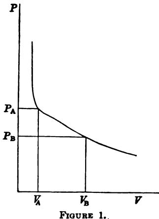

EXERCISE 6. Check various equations of this chapter and of Chapter XII by meansofthe"CondensedSummary."


# CHAPTER XV

## THE FREE ENERGY CHANGE IN A CHEMICAL REACTION

To devise various methods of calculating the change of free energy in chemical reactions is a task which will occupy us throughout the greater part of this book. Already, however, we have become acquainted with one or two of the important methods. Thus we know that whenever a condition of equilibrium is reached in a chemical reaction , the free energy change of the reaction is zero. For example there is a transition point between rhombic and monoclinic sulfur at one atmosphere and 95°C = 368°K. Hence we may write,

S(rhombic) = S(monoclinic) ; AF368 = 0.

So also we have seen that AF for a reaction which occurs in a galvanic cell is measured by the maximum electrical work which that cell is capable of performing. A further study here of such a cell will be profitable.

Free Energy and the Electromotive Force of a Galvanic Cell. Let us consider a cell composed of a lead electrode in contact with solid lead chloride, a mercury electrode in contact with mercurous chloride, and a solution of potassium chloride as electrolyte. When electrical contact is established between the two electrodes a current will pass through the cell so that metallic lead is used up, metallic mercury is precipitated, and at the same time the lead chloride increases and the mercurous chloride diminishes in amount according to the chemical equation,

> Pb(s ) + 2HgCl( s) = PbCl2(s) + 2Hg( 1) .

In such a case, by Equation XIV- 6,

$$
\Delta F = -w'_{\text{n}67}
$$

where w' is the electrical work capable of being obtained, under conditions of maximum efficiency. Under such conditions the counter electromotive force of the storage battery, motor, or other apparatus upon which the electrical work is done, must differ only infinitesimally from the maximum or reversible electromotive force of the cell. This electromotive force, E, multiplied by the amount of electricity flowing through the cell, measures the maximum output of electrical work. If F is the Faraday equivalent, and N is the number of such equivalents passing through the cell when the above reaction occurs, we may write,

$$
\Delta F = -w' = -\mathbf{NFE},\tag{1}
$$

where E is positive if the reaction as written is a spontaneous one.

In accordance with the chemical equation which we have written, N ==2, and

$$
\Delta F = -2 \times 96494 \mathbf{E} \text{ volt-coulombs.}
$$

Or, by Equation V-25,

$$
\Delta F = -2 \times 2307 \mathbf{4E} \text{ calories.}
$$

The measured value of the electromotive force at 25°C is 0.5357 v. , whence

Pb(s ) + 2HgCl (s) = 298 = - PbCl2(s) + 2Hg(1 ) ; AF29 24720 cal.

This is the change of free energy which results from the above reaction, whether the reaction occurs in the cell, or lead is added to mercurous chloride and the process takes place in an irreversible way. Any other reversible cell in which this reaction , and only this reaction, occurs can equally well be used to measure the free energy change, and since N would be the same, E would be the same. Thus the cell that we have described must give the same electromotive force independently of the particular chloride used as electrolyte, and of its concentration, and of the solvent ; provided always that when the current passes through the cell no other process occurs than the one stated . If, for example, we used a very dilute solution of potassium chloride as an electrolyte,

the solubility of the two chlorides no longer being negligible, the cell process would not correspond exactly to this chemical equation, and the electromotive force would be slightly different .

Free Energy and Heat of Reaction. In the early days of the first law of thermodynamics, before the second law was fully understood, it was assumed as a matter of course that the most efficient utilization of a chemical reaction for the production of work would consist in converting all of the heat of that reaction into work. In other words, the quantity - AH was assumed to represent the limiting quantity of work which could be obtained under the conditions of maximum efficiency. In some quarters this idea has persisted to the present day.

However, we have just seen that it is not - ΔΗ but - AF which measures this maximum capacity for performing useful work. And these two quantities are not equal unless the entropy of the system in question is the same at the beginning and end of the isothermal reaction under consideration . This is shown by applying Equation XIV-2 to an isothermal process, which gives

$$
\Delta F - \Delta H = -\mathcal{T}\Delta S.\tag{2}
$$

According to the sign of AS, the work obtainable in a given reversible process may be greater or less than the heat of the reaction.

It is true that, according to the first law, the external work performed must be equal to the loss in heat content of a system, unless some heat is given to or taken from the surroundings, but this is precisely the point first clearly seen by Willard Gibbs. When an isothermal reaction runs reversibly, TAS is the heat absorbed from the surroundings, and if this is positive the work done will be even greater than the heat of reaction.

= - In the specific reaction which we have just been considering, AH298 22730 cal. If a mol of lead reacts irreversibly with mercurous chloride, as in the calorimeter, 22730 calories are given up. But we have seen that AF - 24720, so that, in the reversible isothermal process, the work done is greater than the heat of reaction . Therefore, when this galvanic cell operates =

reversibly in a thermostat, heat is not given to, but taken from the thermostat, to the extent of 1990 calories for each mol of lead consumed.

Let us consider another case ; namely, a cell with an electrode of mercury and mercurous chloride on one side, on the other side chlorine gas in contact with an electrode of platinumiridium, and between the two electrodes some electrolyte such as a solution of some chloride. Here again the electromotive force will be independent of the electrolyte, provided that in the electrolyte the solubility of chlorine and of mercurous chloride are negligible, so that the following reaction alone occurs in the cell ,

$$\text{Hg(l) } + \text{]} \not\subset \text{Cl}_2(\text{g, 1 atmos.}) = \text{HgCl(s)}.$$

= - = - The electromotive force of such a cell is found to be 1.0894 v. , and the reaction as written involves one equivalent, hence AF298 - 23074 × 1.0894 25137 cal. The heat of this reaction has also been determined, and the value found is AH298 = Here then is a case where, even in the reversible reaction, the work produced is smaller than the heat of reaction, and the cell will give up heat to the surroundings. - 31300.

In many cases it has been difficult to find an efficient method for utilizing the diminution of free energy for the production of useful work. The most important of all work- producing chemical reactions is the combustion of carbon. Yet, when coal is burned under the boiler of a steam engine, at best the work obtained is only a few percent of the maximum work calculated from the free energy. To obtain perfect efficiency it would be necessary to contrive a process in which carbon and oxygen at a given temperature would be consumed, carbon dioxide would be produced at the same temperature, and every step of the process would be reversible, so that by reversing the engine, carbon dioxide would be dissociated into carbon and oxygen.

This might be done, as in the examples already given, if we could devise a galvanic cell with reversible electrodes of carbon and oxygen. But hitherto all such attempts to obtain " electricity direct from coal" have failed. It is however possible, by methods which we shall develop later, to ascertain the theoretical amount of work obtainable in such a process, and we shall find, ¹

$$\text{C} + \text{O}_{\text{2}} = \text{CO}_{\text{2}}; \Delta F_{\text{288}} = -94260 \text{ cal.} $$

= This value happens to correspond almost exactly with the heat of combustion, for AH298 94250. This is far from being the case in the combustion of carbon to carbon monoxide for which we shall find the equation,

$$\text{CO}_2 + \text{H}_2\text{O}_2 = \text{CO}; \ \Delta F_{\text{208}} = -32510 \text{ cal.}; \ \Delta H_{\text{208}} = -26150 \text{ cal.}$$

It is evident here that if carbon were burned to carbon monoxide, and the heat of combustion were all converted into work, this work would still be less than the maximum possible work of the reaction.

The Addition of Free Energy Equations. The same reasons which justified us in adding and subtracting thermochemical equations also permit us to combine free energy equations in a We have obtained two such equations,similar manner. namely,

$$\begin{array}{rcl} \text{Pb(s)} & +2\text{HgCl} \text{ (s)} & = \text{PbCl}_{2} \text{(s)} & +2\text{Hg(l)}; \ \Delta F_{298} & = & -24720 \text{ cal.}\\ \text{Hg(l)} & +\text{} \end{array}$$

$$\begin{array}{rcl} \text{Hg(l)} & +\text{} \end{array}$$

Multiplying the latter by 2 and adding to the former, we find

$$\text{Pb(s)} + \text{Cl}_2(\text{g}) \rightleftharpoons \text{PbCl}_2(\text{s}); \ \Delta F_{298} = -74994 \text{ cal.} $$

This is the reaction which occurs in a cell with one electrode of chlorine and the other of lead and lead chloride. For such a cell therefore E298 = 74994 74994//((22 x× 23074 23074)) = 1.625 volts. So likewise by combining the two equations for the combustion of carbon, which we have obtained above, we may write,

$$\text{CO} + \text{}_2\text{O}_2 = \text{CO}_2; \ \Delta F_{298} = -61750; \ \Delta H_{298} = -68100.$$

1 The value of AF will vary according to the kind of carbon chosen. The figures given arefor graphite. This, as well as the oxygen and the carbon dioxide, are assumed to be at atmo spheric pressure.

THERMODYNAMICS

CHAP. XV

### THE FREE ENERGY CHANGE AS A FUNCTION OF THE TEMPERATURE

It will be understood that when we speak of a free energy change, without further qualification, we refer to an isothermal process. Thus we have obtained the difference between the free energy of a mol of lead chloride at 25°C and the free energy of its elements at the same temperature.

Such a value of AF will ordinarily change when we carry on the isothermal process at some other temperature, and it is evidently of much importance to be able to calculate AF at other temperatureswhenitisknownatsomeonetemperature.

 Since we apply Equation XIV- 12 both to the substances consumed and to the substances produced, we may write

$$
\left(\frac{\partial \Delta F}{\partial T}\right)_P = -\quad \Delta S = \frac{\Delta F}{T} \frac{-\Delta H}{T}.\tag{3}
$$

The subscript P in the first term merely indicates that the pressure on each substance is to be the same whether we are working at one temperature or another. Thus if we know AF, at one temperature, for the conversion of one mol of liquid ammonia at one atmosphere into ammonia vapor at ten atmospheres, then Equation 3 shows us how to calculate AF at some other temperature when likewise one mol of liquid ammonia at one atmosphere is converted into ammonia vapor at ten atmospheres.

Indeed, since the pressures are always stated or implied in our chemical equations, and quantities such as AF, AS, and AH pertain to the reaction as expressed in this chemical equation, we may henceforth without ambiguity omit the subscript P in Equation 3.

The Gibbs-Helmholtz Equation. We are now led immediately to a valuable formula for the temperature coefficient of the electromotive force of a reversible galvanic cell. For combining Equations 1 and 3, we have

$$-\mathbf{NF}\frac{d\mathbf{E}}{dT} = \ -\ \Delta S \ = \ \frac{-\mathbf{NFE}}{T}\frac{-\Delta H}{T},\tag{4}$$

•


or, in simpler form,

or

$$\mathbf{E} \, \pm \begin{array}{c} \frac{\Delta H}{\mathbf{NF}} = T \, \frac{d\mathbf{E}}{dT} \, \end{array} \tag{5}$$

Thus for the cell which we have described above, in which lead reacts with mercurous chloride , E298 = 0.5357 volts and this value increases by 0.000145 volts per degree. Hence we may calculate the heat of this reaction, namely,

= 2 x 23074 (298.1 × 0.000145 – 0.5357) AH298 = - 22730 cal. ,

andthisis farmoreaccuratethananyof thecalorimetricvalues.

 The Integration of the Free Energy Equation . Equation 3 may be put into several alternative forms , two of which will be useful from time to time . Thus by the use of simple methods of the differentialcalculus, we find

$$\frac{d(\Delta F/T)}{dT} = \stackrel{\cdot}{-} - \frac{\Delta H}{T^3},\tag{6}$$

$$\frac{d(\Delta F/T)}{d(1/\bar{T})} = \Delta H.\tag{7}$$

Either of these equations is suitable for direct integration, if we know AH as a function of T. Sometimes the variation of AH is of such character that the integration can best be performed by graphical methods. Ordinarily, however, when we are dealing with reactions at ordinary temperatures, and at higher temperatures, the values of Cp are conveniently expressed by equations of the algebraic type, and we may express ACp and AH as we have previously done in Equations IX- 6 and IX-7, namely,

$$
\Delta C_{\mathfrak{p}} = \Delta \Gamma_{\mathfrak{p}} + \Delta \Gamma_1 T + \Delta \Gamma_2 T^2 + \dotsb \cdot \cdot \cdot \, ,
$$

$$
\Delta H = \Delta H_0 + \Delta \Gamma_0 T + \lambda_2^{\prime} \Delta \Gamma_1 T^2 + \lambda_3^{\prime} \Delta \Gamma_2 T^3 + \dotsb \cdot \cdot \, .
$$

Substituting this last expression in Equation 6 , and integrating, we find,

$$\frac{\Delta \mathcal{F}}{T} = \frac{\Delta H_0}{T} - \Delta \Gamma_0 \ln T - \lambda_2' \Delta \Gamma_1 T - \lambda_6' \Delta \Gamma_2 T^2 - \dotsb \quad + I,\tag{8}$$

$$
\Delta \mathcal{F} = \Delta H_0 - \Delta \Gamma_0 T \ln \ T \\
- \lambda_2' \Delta \Gamma_1 T^2 - \lambda_6' \Delta \Gamma_2 T^3 - \dotsb \\
\quad + IT. \text{ (9)}.
$$

The quantity I is the integration constant, and may be evaluated when we know AF at some one temperature.

As a simple illustration of the use of this equation, let us consider again the conversion of rhombic to monoclinic sulfur,

$$\text{S(rhombic)} = \text{S(mnocelinc)}.$$

We have already seen that for this reaction AF368 == 0. Now over a limited range, say from 0° to 100° C we may write,

```
S(monoclinic) ; Cp 3.62 + 0.0072T,
                 =
```
S(rhombic) ; Cp = 4.12 0.0047T.

Whence,

ACP = -0.50 +0.0025T,

and

$$
\Delta H^\circ = \Delta H_0 - 0.50T + 0.00125T^2.5
$$

Taking AH273 == assumestheform,77.0, we find AH. = 120. Hence Equation 9

$$
\Delta F = 120 + 0.50T \ln T - 0.00125T^2 + IT.
$$

Now substituting2 the value AF 0 at T 368, we find I = -2.820, whence we perature ; thus AF298 = = may calculate AF at any other tem-17.5 . This positive value corresponds to the fact that the rhombic form is more stable at this temperature. =

When we have such expressions for AF as a function of the temperature for a number of different reactions, we may combine the chemical equations, and at the same time combine the free energy equations, term by term, and thus obtain new equations for new reactions. This procedure will be illustrated in many of our later calculations .

= = EXERCISE 1. A galvanic cell in which occurs the reaction, Ag( s) + HgCl(s) AgCl(s) + Hg(1 ) , gives E298 0.0455. For this reaction AH:29898 = 1280. Calculate AF295 , AS298, and dE/dT. (Here is a case in which AH and AF have opposite signs. )

<sup>1</sup> For the data see Lewis and Randall, J. Am. Chem. Soc . , 36, 2468 ( 1914) .

In the arithmetical operations connected with the use of such a free energy equation it is sometimes expedient to employ Equation 8, thus solving first for AF/T. This frequently gives a higher accuracy with less effort.

EXERCISE 2. For the reaction CO(g) +½O2(g) = CO2(g) , find from the data obtained in Exercise IX-4 the complete free energy equation, namely,

AF = - 67510 + 2.75T In T- 0.002872 + 0.000000317³ + 4.46T.

Calculate AF2500- What can be said regarding the stability of carbon dioxide at 2500° K?

EXERCISE 3. A cell, operating at constant temperature and pressure,undergoes a change of volume AV when N equivalents pass. Show that if the pressure on the whole cell is changed, the electromotive force changes accordingtotheequation

$$\frac{d\mathbf{E}}{d\mathbf{P}} = -\frac{\Delta V}{\mathbf{n}\overline{\mathbf{p}}}.\tag{10}$$

# CHAPTER XVI

### THE ESCAPING TENDENCY; EQUILIBRIUM BE-TWEEN TWO OR MORE PURE PHASES

In the science of mechanics there are two kinds of methods of ascertaining whether a system is in equilibrium. One consists in determining the effect of some infinitesimal displacement upon the properties of the system as a whole, the other depends upon a more localized view of the forces operating between different portions of the system. Thus if a system is at rest, it is a sufficient condition for equilibrium either that the potential energy of the system is at a minimum with respect to any possible infinitesimal displacement, or that the resultant of the forces acting on every part of the system is zero.

The former of these is analogous to those thermodynamic criteria of equilibrium which we have hitherto stated. For many purposes, however, it is desirable to possess also in thermodynamics a more intimate criterion of physico-chemical equilibrium, such as we have already obtained for thermal equilibrium.

In order that a system be in thermal equilibrium it is a necessary and sufficient condition that any infinitesimal flow of heat within the system be attended by no change of total entropy. However, this criterion is far less convenient than the one comprised in the simple statement that thermal equilibrium exists when the temperature is the same in all parts of the system. The entropy criterion directs our attention to changes in the whole of a complicated system. The temperature criterion permits us to focus our attention upon the individual parts.

The value of the temperature concept lies in the fact that two bodies have the same temperature if they both have the same temperature as a third, and that we have a corresponding law

of temperature inequalities. The temperature scale is therefore unambiguous. If we choose we may imagine everything to have a certain tendency to lose heat, or we may say that heat has a tendency to escape from every system. Temperature is then a measure of this escaping tendency of heat; for if one body has a higher temperature than another, then the escaping tendency of heat can be said to be greater in that body, and whatever mechanism may be used to establish thermal contact, heat will flow from that body to the other.

Now all that we have said regarding the distribution of thermal energy is true also of the distribution of a material substance throughout any system. If three phases of a substance are coexistent, let us say ice, water and water vapor, all at constant temperature, it would be impossible to find a state of affairs in which at the same time ice spontaneously goes over into water, water into water vapor, and water vapor into ice. For if this were the case we might have a complete cycle leading to a system identical with the original system, and therefore possessing the same entropy. But spontaneous processes without increase of entropy do not exist.

It is evident therefore that if a substance X is distributed through some system, we may speak of the escaping tendency¹ of X in each part, or in each phase, of the system. The condition of equilibrium will be that the escaping tendency of each substance is constant throughout the system. The escaping tendency will thus obey the same laws of equality and inequality which we have found to hold for temperature.

As an illustration we may state that the escaping tendency of water is the same for liquid and solid at the freezing point, while at lower temperatures the escaping tendency is greater for the liquid than for the solid . The escaping tendency of sodium chloride in solution is greater, equal to, or less than that of solid sodium chloride, according as the solution is supersaturated, saturated or unsaturated. If water and ether are shaken together to form two liquid phases in equilibrium, the escaping tendency of the water, and also that of the ether, will be the

1 Lewis, Proc. Am. Acad. , 36, 145 ( 1900 ) ; Z. physik. Chem. , 35, 343 ( 1900) .

same in both phases. Moreover, if there is a vapor phase present, the escaping tendency of each substance is the same in that phase as in the other two phases. Lest there be any misunderstanding, it should be made plain that we are not comparing the escaping tendency of one substance with that of another ; we are merely comparing the escaping tendency of a given substance in one phasewiththatofthesamesubstanceinanotherphase.

The value of this conception is not limited to the simpler systems of thermodynamics. If a column of some solution is placed in a gravitational field , equilibrium will not be established until the escaping tendency of each substance present is constant throughout the field ; if we consider the surface layer of a soap solution, the concentration of soap is very different in this surface layer and in the interior of the liquid, but the escaping tendency of the soap must be the same in both places.

In adopting the concept of escaping tendency we are abandoning a view of the system as a whole in order to view more intimately the individual substance. The escaping tendency of a system has no meaning. We seek rather some property which will measure quantitatively the escaping tendency of each material substance, as temperature measures the escaping tendency of heat.

Molal Free Energy as a Measure of the Escaping Tendency. Let us consider once more the equilibrium existing between ice and water at 0°C and at a pressure of one atmosphere. If an infinitesimal amount of ice be melted at constant temperature and pressure, then from Equation XIV-7 , we see that the condition of equilibrium is

$$dF = \mathbf{0}.$$

Since equilibrium is maintained as long as both phases are present, we may also write for any finite amount melted,

$$\Delta F = \mathbf{0}.$$

If we write the chemical equation,

$$\text{H}_2\text{O (s, 1 atmos.) = H}_2\text{O (l, 1 atmos.)}_2$$

then AF measures the increase in free energy when one mol of

178

ice is converted into one mol of water. If the molal free energy of water is FA in the solid state and FB in the liquid state,

$$
\Delta \mathbf{F} = \mathbf{r_B} - \mathbf{r_{A}}.
$$

Thereforeatthemeltingpoint, underatmosphericpressure,

$$\mathbf{r}_{\mathsf{B}} = \mathbf{r}_{\mathsf{A}}.$$

At higher temperatures the process in the direction indicated is a spontaneous one,

$$\Delta F < 0; \text{ гь } < \text{ гь }.$$

At lower temperatures , on the other hand, the process is thermodynamically impossible,

$$
\Delta \mathbf{F} > 0; \mathbf{r_B} > \mathbf{r_{44}}
$$

By similar reasoning we see that in general no system can be in equilibrium unless the molal (or partial molal) free energy of each substance¹ involved is the same in every part of the system. If the molal free energy of any substance is greater in one part of the system than in another, that substance will pass from the former to the latter place.

In order to avoid any misunderstanding we must repeat a remark made in Chapter III regarding the meaning of the mol . If we had stated that a condition of equilibrium requires that the free energy of one gram or of any given number of grams of a substance is the same in the several phases, such a statement would be unquestionable. But when we state that the molal free energy is the same in all phases, we imply that the same formula is used for the substance in each phase. This is unfortunately not always the case. Iodine vapor at high temperatures dissociates in part into the monatomic form, so that we write, I2( g) = 21 (g ) , and the condition of equilibrium is that AF = 0, or that the molal free energy of I2 (g) is equal to twice that of I ( g ) . In the case of sulfur there are various molecular species known or suspected. Thus we have S(g) , S2(g) , S ( g) , Sɛ(g) , and various liquid and solid forms. Both rhombic and monoclinic sulfur in all probability form crystal lattices in which the same unaltered molecule S is the primary unit. But in the absence of complete evidence we prefer =

<sup>1</sup> In accordance with usage determined in Chapter II, the term substance, as here employed, may mean a single molecular species , such as H2O, or it may mean something immediately obtainable from a single molecular species, such as water.

to use the simple formula S. tract our attention from the points which we are now considering. These special cases need not, however, dis-

Thus we see that the molal free energy (or the partial molal free energy in solutions) may serve as a quantitative measure of the escaping tendency. We shall not adopt exclusively this method of quantitative definition of the escaping tendency, for there are other no less convenient measures which we are going to introduce in later chapters. But the usefulness of the present definition will be seen when we now proceed to investigate, more systematically than we have hitherto, the equilibrium between two or more pure phases.

### THE EFFECT OF PRESSURE AND TEMPERATURE UPON SIMPLE TYPES OF EQUILIBRIUM

If two phases of a pure substance are in equilibrium with one another, and the pressure is increased, the molal free energy of the substance will be increased in each phase, and to a greater extent in the phase of larger molal volume (Equation XIV-9) . That phase will therefore disappear. Thus at one atmosphere ice and water are in equilibrium at 0°C ; if the pressure exerted upon the two phases is now increased , the molal free energy of the ice, which is more voluminous, is increased more than the molal free energy of the water, and the former will disappear if the temperature remains constant . So also if the two phases are in equilibrium, and the temperature is changed, the two molal free energies will change differently in accordance with Equation XIV- 12, and equilibrium will no longer exist .

We may, however, change both temperature and pressure in such a way as to keep the two molal free energies equal to one another. This is the condition for the maintenance of equilibrium, which now we need only to translate into mathematical form.

Change of "Equilibrium Pressure" with Temperature. If we have two phases of the same pure substance, in equilibrium, and if FA, VA, SA, HA; and FB, VB, SB, HB are the molal free

energies, molal volumes, etc. , in the two phases, our condition for equilibrium is

$$
\mathbf{F}_{\mathcal{A}} = \mathbf{F}_{\mathcal{B}}.\tag{1}
$$

Moreover, if any change occurs and equilibrium is to be maintained, it is necessary that

$$d\mathbf{r}_{\mathbf{A}} = d\mathbf{r}_{\mathbf{0}}.\tag{2}$$

But the two states are completely determined by the two variables P and T. Hence we have (see Equation III- 1 ) ,

$$d\mathbf{F}_A = \left(\frac{\partial \mathbf{r}_A}{\partial P}\right)_T dP + \left(\frac{\partial \mathbf{r}_A}{\partial T}\right)_P dT; \quad d\mathbf{r}_B = \left(\frac{\partial \mathbf{r}_B}{\partial P}\right)_T dP + \left(\frac{\partial \mathbf{r}_B}{\partial T}\right)_P dT. \tag{3}$$

By combining this with Equations 1 and 2, and substituting the values of the differential coefficients from Equations XIV-9 and XIV- 12, we find (since AF = 0) ,

$$\frac{dP}{d\overline{T}} = \frac{\mathbf{s}_B}{\mathbf{v}_B} \frac{-\mathbf{s}_A}{-\mathbf{v}_A} = \frac{\Delta S}{\Delta \overline{V}} = \frac{\Delta H}{T\Delta \overline{V}}.\tag{4}$$

This equation shows how the equilibrium pressure must change with the temperature in any two-phase system such as vapor and liquid ; liquid and solid ; or two solid forms like rhombic and monoclinic sulfur.

In case we are dealing with vapor pressure it is convenient to denote this equilibrium pressure by p, and Equation 4 is evidently identical with Equation XII- 18, the Clapeyron equation, which we obtained before by using the fundamental equations of entropy. Indeed in this simple case that method seems a little less cumbrous, but the method that we have just described is of such general serviceability, and will be so frequently employed, that its use will become almost automatic.

Two Phases under Different Pressures at Constant Temperature. Strictly speaking, a system cannot be in complete equilibrium unless the pressure is constant throughout (except in so far as pressure differences may be produced by such an influence as a gravitational field ) . If every actual substance has a finite

fluidity there must be a constant, although perhaps imperceptible, flow toward a state of constant pressure . But as it rarely happens that we are fortunate enough to find a system which is in equilibrium with respect to every possible change, we are content to find the conditions of equilibrium with respect to certain changes, without inquiring whether there may be other processes which are slowly proceeding. Thus if we are studying the equilibrium between liquid benzene and its vapor, we are not at all disturbed if we are told that benzene is essentially unstable and tends to go spontaneously into carbon and hydrogen.

So it will be profitable to consider the distribution of a substance between two phases of unlike pressure, provided that a

A change in such distribution is rapid compared to the process of equalization of pressure throughout the system. Attention was first drawn to such systems E by the discovery of the so -called semipermeable membrane, which in turn led to the discovery of osmotic pressure. We shall here consider a membrane of C somewhat similar properties , which is chosen, not to permit the passage of a single substance in the presence of other substances, but rather to permit the passage of a substance in one state while remaining impermeable to the same substance in other states. In Figure 1 , A will represent a piston pressing upon a 

FIGURE 1.

a

mass of liquid mercury B, while E is another piston exerting pressure upon pure mercury vapor in D. The diaphragm C is of fine porous porcelain. Owing to the phenomenon of capillarity, an excess pressure can be exerted by the piston A without forcing the liquid mercury through the pores of the diaphragm. On the other hand, the vapor of mercury may pass readily through these pores, thus permitting a transfer of material between B and D.

If the system comes to equilibrium at constant temperature, there will be a certain pressure in the vapor phase and another pressure in the liquid phase. Now if the pressure upon one phase is increased, the escaping tendency from that phase becomes greater. In order to maintain equilibrium the pressure upon

the other phase must then be raised until the escaping tendency from that phase is increased by an equal amount.

Let us proceed, in the general case, to calculate the ratio of the pressure increments upon two phases of the same pure substance, necessary to maintain equilibrium at constant tempera-Let PA, VA, and FA; PB, VB, and FB be the pressures, molal volumes and molal free energies in the two phases in a condition of equilibrium. Then, if the pressure upon the first phase is increased by the arbitrary amount dPA, let us find the change of pressure, dPB, upon the other phase, which will just maintain equilibrium, or, in other words, which will make dr = dFB. By Equation XIV- 9,

$$d\mathbf{r}_{\mathcal{A}} = \mathbf{v}_{\mathcal{A}} d\mathbf{P}_{\mathcal{A}}; \ d\mathbf{r}_{\mathcal{B}} = \mathbf{v}_{\mathcal{B}} d\mathbf{P}_{\mathcal{B}}.$$

hence for equilibrium,

$$\frac{dP_A}{dP_B} = \frac{\mathbf{v}_B}{\mathbf{v}_A}, \text{ or } \left(\frac{\partial P_A}{\partial P_B}\right)_T = \frac{\mathbf{v}_A}{\mathbf{v}_B}.\tag{5}$$

The two changes of pressure must therefore be inversely proportional to the two molal volumes.¹

Two Phases under Different Pressures, and the Temperature of the Whole System Variable. When the system which we have just been considering is subjected to changes of temperature,there are three independent variables, PA, Pв and T, and our criterion of equilibrium merely gives us one relation between the variation inthesequantities,thus

$$d\mathbf{r}_A = \left(\frac{\partial \mathbf{r}_A}{\partial P_A}\right)dP_A + \left(\frac{\partial \mathbf{r}_A}{\partial T}\right)dT$$
 
$$\left(\frac{\partial \mathbf{r}_B}{\partial P_B}\right)dP_B + \left(\frac{\partial \mathbf{r}_B}{\partial T}\right)dT,\quad(6)$$

and substituting again the values of the various partial differential coefficients ,

$$(\mathbf{v}_B dP_B - \mathbf{v}_A dP_A = \begin{pmatrix} \mathbf{s}_B \ - \ \mathbf{s}_A \end{pmatrix} dT = \frac{\Delta H}{T} \text{ } dT. \tag{7}$$

1 This equation was first obtained, for the special case of liquid and vapor, by Poynting (Phil. Mag. , [ 4] , 12, 32 ( 1881 ) ) ; for the general case , by Le Chatelier ( Z. physik. Chem. , 9, 335 (1892) ) .

184 THERMODYNAMICS CHAP. XVI

The only case of much interest here is the one in which the pressure of one phase remains constant. Then the pressure on the other phase is determined at each temperature. So in Equation 7 let dP = 0. Then

$$
\begin{pmatrix}
\frac{\partial P_{\mathcal{B}}}{\partial \bar{T}}
\end{pmatrix}_{P_{\mathcal{A}}} = \begin{array}{c}
\Delta H \\
\bar{T}\mathbf{v}_{\mathcal{B}}
\end{array}
\tag{8}
$$

Thus if we are considering a system in which the first phase is liquid mercury and the second is mercury vapor, each phase being under a different pressure as in Figure 1 , Equation 8 shows the temperature coefficient of vapor pressure, not when the liquid is under the variable vapor pressure as in Equation 4, but when the pressure upon the liquid is constant.¹

Systems in which the Temperature is not the Same in All Parts. The study of equilibria when different parts of the system are at different temperatures is difficult, owing to the fact that the flow of heat is usually rapid compared with processes involving the transfer of a material substance. When a solution is placed in a tube, the two ends of which are maintained at different temperatures, the system reaches a constant state in which the composition varies at the two ends. This is the Soret phenomenon. It would be hard to judge, a priori, whether this is a case of true equilibrium, suitable for thermodynamic study, or whether the distribution of the solute is in part determined by the irreversible process of thermal flow. In any case it is to be noted that the free energy function is designed primarily for the study of isothermal processes, and that a problem such as this could be better handled by means of the equations of entropy .

EXERCISE 1. It is sometimes convenient to regard the vapor pressure of a substance as one of the properties of that substance. If, at a given temperature and pressure, p is the vapor pressure and v is the molal volume ofthesubstance,andAHisitsheatofvaporizationpermol,showthatby

Soret, Ann. chim. phys. , [ 5] 22, 293 ( 1881 ) .

1 This equation is due to Lewis, Proc. Am. Acad. , 37, 49 ( 1901 ) ; Z. physik. Chem. , 38 , 205 (1901) .

assuming the equation of the perfect gas for the vapor, we may obtain the two approximate equations, ¹

$$\left(\frac{\partial \ln p}{\partial P}\right)_T = \frac{\mathbf{v}}{RT^*}\tag{9}$$

$$
\left(\frac{\partial \ln p}{\partial T}\right)_P = \frac{\Delta H}{\bar{R}\bar{T}^3}.\tag{10}
$$

EXERCISE 2. Taking the molal volume of benzene as 90 cc. at its boiling point, 80°C, find approximately the change in vapor pressure which would be produced if the pressure on the liquid benzene alone could be increased by 1 atmos.

### THE PHASE RULE

When the state of a system cannot be completely determined. until at least r data are given, we say that it possesses r degrees of freedom. This is only another way of saying that the state of the system depends upon r independent variables. The state of a single phase of a pure substance depends usually upon only two variables, let us say temperature and pressure . If we impose the further condition that two such pure phases are to exist together in equilibrium, the number of degrees of freedom is reduced to one. With three coexisting phases we have what is known as non-variant system. Thus, if water and water vapor are to be coexistent, we may arbitrarily fix the pressure or the temperature, but not both; while the condition that ice, water, and water vapor exist together, completely determines the state of the system at a so-called triple point.

There may be other variables besides temperature and pressure which are requisite to determine the state of a phase. Thus we may have to consider the presence of an electric or of a magnetic field, or the size of particles. Especially, if the phase in question is a solution, the number of degrees of freedom is increased by one, for each componentbeyondthefirst.

Whatever the number of variables, it still remains true that the number of degrees of freedom of a system as a whole is equal to the number of variables requisite to determine the state of the individual phases, less the number of phases

1 See footnote to Equation VI -3 for the significance of the asterisk in these equations.

in the system, beyond the first . This is the celebrated phase rule of Gibbs.

This simple principle has been the starting point for the development of a large field of exact but qualitative thermodynamic study, into which it will be impossible for us to enter far, since we are presenting the science of thermodynamics with the primary purpose of making it readily applicable to quantitative and numerical calculations. While it would carry us too far to enter into the intricacies of phase relations in complex systems, it will be useful to devote the remainder of this chapter to a few very simple problems relating to the coexistence of phases.

Continuity between Liquid and Vapor States. The discovery by Andrews ' of the critical phenomenon and its implications contributes very greatly to an understanding of the relation between a liquid and its vapor. He found that while the ordinary condensation of a vapor or evaporation of a liquid involves a discontinuity between the two phases, it is nevertheless possible to pass from liquid to vapor, or from vapor to liquid, by a process in which the substance remains perfectly homogeneous. Thus, if a liquid under high pressure is heated above its critical point ; the pressure then reduced isothermally to a small value ; and the temperature finally reduced to its original value, the substance will have passed by imperceptible gradations from liquid to vapor.

This idea that the liquid and vapor phases are essentially one state of matter is clearly brought out by an inspection of the isotherms on a P- V diagram. In Figure 2 each continuous curve shows, at a single temperature, the measured molal volume of a pure phase of carbon dioxide at various pressures, as determined by Amagat. At the highest temperature (represented by the curve farthest from the axes) the gas is nearly perfect, and the curve approaches the regular hyperbola. As the temperature is lowered, deviations from the gas law become more and more pronounced, until at t 31.35 a curve is reached which at thepointChaszeroslope,thatisdP/dV=0.Thisisthe=

 1Andrews,Phil.Mag.,[4],39,150(1870).

 2 Amagat, J. physique, [ 3] , 3 , 307 ( 1894 ) ; [ 3] , 8, 353 ( 1899) .

critical point. Below this point we find two phases capable of coexistence, and two separate curves at the same temperature are experimentally determined ; one for the change in volume of the liquid with pressure, and one for the change in volume of the vapor with pressure.

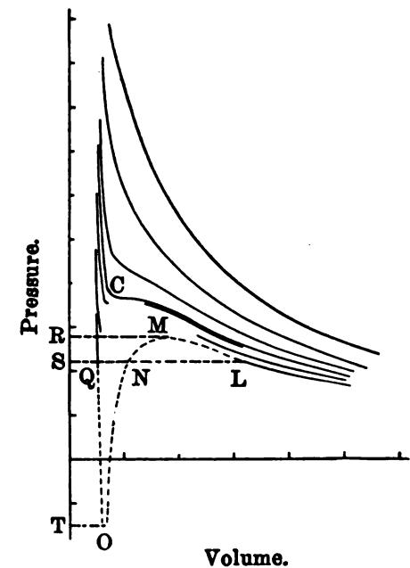

FIGURE 2.-Isotherms of Carbon Dioxide.

However, it would be difficult to avoid the conclusion that these two branches are really parts of a single curve¹, and that a truly satisfactory mathematical equation for one would also fit the other. Thus the two branches would be joined by some such curve² as the broken line QONML in the figure.

1 For the first discussion of this point, see James Thomson, Phil. Mag. , [ 4 ] 43, 227 ( 1872) . It is evident that the equation for such a complete curve must be of odd degree in V, for V increases with diminishing P at both ends of the curve. Furthermore the equation must be of at least the third degree in V, since a certain pressure may correspond to more than one volume. At lower temperatures three roots of the equation are real , at the critical point the three coincide, and at higher temperatures two of them become imaginary. The van der Waals equation satisfied these conditions and therefore has been of great use in interpreting the relations of liquid and vapor, in spite of the fact that at small values of V it gives only the roughest sort of approximation to actual curves.

Indeed the broken line in Figure 2 is not altogether hypothetical. Owing to the phenomena of supersaturation and superheating it is possible to study vapors at higher pressure and liquids at lower pressure than the vapor pressure. At temperatures well below the critical point the left-hand branch of the curve becomes nearly vertical, and passes far below the axis of zero pressure. Indeed it has been found possible, by subjecting liquids to tension, to study their physical properties at large negative pressures. But the central portion of the curve has never been and may never be realized. Nevertheless if we assume continuity of liquid and vapor, the whole curve must have physical reality and be subject to thermodynamic reasoning.

It will therefore be instructive to follow the molal free energy along the broken curve, or, in other words, through the process by which hypothetically the vapor may be converted into liquid at constant temperature, without a second phase appearing. The horizontal line QNL represents the vapor pressure, and the molal free energy F is therefore the same at Q and at L. So also the total change in free energy in passing from L to Q by any path must be zero. Remembering that the free energy of a pure substance always increases with increasing pressure and diminishes with decreasing pressure, we see that in proceeding from L to M, F increases by SvdP, namely by the area LMRS. From M to N it diminishes by the area MNSR, so that at N the free energy is greater than at the beginning by the difference between these areas, namely the small area LMN. From N to O it continues to diminish by the area NOTS and from 0 to Q it increases by OQST, so that from N to Q it decreases by the area NOQ. But the free energy is the same at L and Q, and therefore the area LMN is equal to the area NOQ. This is a a well known theorem.

Possible Continuity between Solid and Liquid Phases. We have seen in Chapter II that the conventional classification into solids and liquids is not exact. When quartz glass is heated it softens gradually until at high temperatures it becomes a typical liquid, but there is no definite melting point. It is to be regarded in every sense as the same phase at all temperatures,

and it should be possible to pass in a continuous manner from quartz glass to quartz vapor.

On the other hand, vitreous quartz bears the same relation. to crytalline quartz that water does to ice . The question as to the existence of a critical point between two crystalline forms ofa substance, or between a crystalline and a non- crystalline form, has been the subject of extensive experimental investigation. The work of Tammann' on the equilibrium between liquid and several solid forms of water at high pressure has been greatly extended by Bridgman who has made an exhaustive study of the equilibrium between water and five different forms of ice at various temperatures, and at pressures up to 20,000 atmos. So far there is nothing to indicate the existence of a critical point in such systems.

EXERCISE 3. Show the existence and find the approximate location of a third point on the curve QONML ( Figure 2) where the free energy is the same as at the points Q and L.

1 Tammann, Z. physik. Chem. , 72, 609 ( 1910) .

Bridgman, Proc. Am. Acad. , 47 , 441 ( 1912).

# CHAPTER XVII

# THE FUGACITY

When we were speaking of the qualitative laws of temperature, we saw that any number of quantitative temperature scales might be erected which would conform to these qualitative laws. Thus we might have defined the temperature scale by means of the air thermometer instead of the perfect gas thermometer; or if T is the reading of the latter scale we might have defined temperature as T2, or In T. It has, however, proved a convenience to adopt one and only one temperature scale.

In the treatment of the analogous concept of escaping tendency, our methods are not so completely standardized . Although we have already seen that the molal free energy makes a very satisfactory quantitative measure of the escaping tendency, there are certain respects in which this function is awkward. For instance the molal free energy of a gas approaches an infinite " negative value as the. pressure approaches zero, and we shall see that this kind of inconvenience enters even more seriously in the study of the partial molal free energy in solutions.

For such reasons another scale of measurement of the escaping tendency is sometimes to be preferred, and we shall not hesitate to employ, side by side with the molal free energy, a second measure of the escaping tendency, which is called the fugacity.¹

The vapor pressure has frequently been used in a qualitative way as a measure of escaping tendency. Thus the vapor pressure of ice is equal to that of water at the melting point, but less than that of water at all lower temperatures. So also if we have two forms of sulfur, at a given temperature, the one which is more stable must have the lower vapor pressure.

1 Lewis, Proc. Am. Acad. , 37 , 49 ( 1901) ; Z. physik. Chem. , 38, 205 ( 1901) .

Indeed we could with entire correctness use the vapor pressure also as a quantitative measure of escaping tendency, and this would be a very satisfactory procedure if every vapor behaved as a perfect gas. In the fugacity we are going to define a measure of escaping tendency which bears to the vapor pressure a relation analogous to the relation between the perfect gas thermometer and a thermometer of some actual gas. The fugacity will be equal to the vapor pressure when the vapor is a perfect gas,and in general it may be regarded as an " ideal" or " corrected" vapor pressure.

We may partially define the fugacity, f, in terms of the molal free energy, F, through the equation¹

$$
\mathbf{r} = RT\ln f + B,\tag{1}
$$

where B is defined no further than by the statement that it is a function of temperature only, or, in other words, that it is a constant at a single temperature.

Between two isothermal states, this equation becomes

$$\mathbf{r}_{\mathcal{B}} - \mathbf{r}_{\mathcal{A}} = RT \ln \frac{f_{\mathcal{B}}}{\dot{f}_{\mathcal{A}}'} \tag{2}$$

or in differential form ,

$$d\mathfrak{r} = RTd\ln f.\tag{3}$$

We see that these equations do not determine the numerical value of the fugacity, but only determine the ratio of the fugacities of a substance in two isothermal states. We may therefore complete the definition by assigning at each temperature a numerical value to the fugacity in some one state.

## THE FUGACITY OF A PERFECT GAS

We have found in Equation XIV- 18 the difference in free energy of a perfect gas between two different pressures, at the same temperature, namely,

$$
\mathbf{r}_B - \mathbf{r}_A = RT \ln \frac{P_B}{\bar{P}_A^{\prime}} \tag{4}
$$

1 When we return to the discussion of solutions we shall define the fugacity similarly with respect to the partial molal free energy, F.

and comparing this with Equation 2, we see that the fugacity of a perfect gas is proportional to its pressure.

Now, at least theoretically, every substance can be brought isothermally into the state of a perfect gas . For, if we admit that every substance at a finite temperature has a finite vapor pressure, then if the pressure upon a substance is decreased without limit the substance will eventually vaporize, and with further diminution in pressure the vapor will approach nearer and nearer to the condition of a perfect gas.

Therefore instead of completing our definition of fugacity by assigning to it some arbitrary value in a chosen state, such as the liquid state at one atmosphere, it is better to complete the definition by making the fugacity of a perfect gas equal to the pressure. Fugacity will be regarded as having the same dimensions as pressure, and the unit of fugacity will be the atmosphere.

## THE FUGACITY OF AN IMPERFECT GAS

Change of Fugacity with Pressure. We have seen by Equation XIV-9 that

$$
\begin{pmatrix}
\frac{\partial \mathbf{F}}{\partial \dot{P}}
\end{pmatrix}_{\mathbf{r}} - \mathbf{v},
$$

and that by Equation 3,

$$\left(\frac{\partial}{\partial \mathbf{r}} \frac{\ln f}{\partial \mathbf{r}}\right)_{\mathbf{r}} = \frac{1}{\overline{R}\overline{T}},\tag{5}$$

whence

$$
\left(\frac{\partial}{\partial \bar{P}} \frac{\ln \bar{f}}{\bar{P}}\right)_{\mathbf{r}} = \begin{array}{c} \mathbf{v} \\ \bar{R}\bar{T} \end{array} \tag{6}
$$

By integrating this equation at constant temperature, we may ascertain the fugacity of a substance at any pressure if it is known at some other pressure, and if v is known as a function of P. Let us illustrate this procedure by studying the fugacity of an imperfect gas. We shall begin with a graphical method.

Calculation of Fugacity by Graphical Methods. Plotting pressure against molal volume in Figure 1 , the curve MM' is a typical isotherm of an imperfect gas such as carbon dioxide.


The dotted hyperbola NN' is the isotherm which the gas would give if at all pressures it followed the equation of a perfect gas, = Pv RT. The two curves rapidly approach each other as P approaches zero and v approaches infinity.

The points L, M and N correspond to pressure P; and L' , M' and N' to pressure P'. Integrating Equation 6,

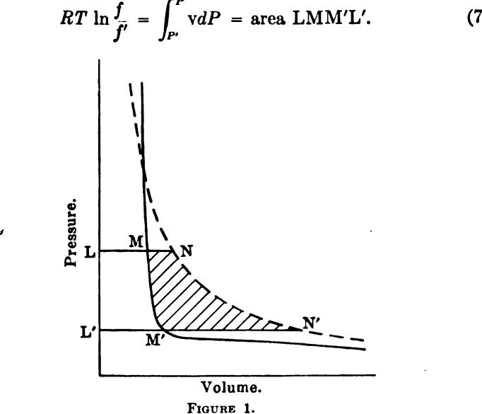

By the gas law the area LNN'L' is equal to RT ln (P/P'). The difference between the two is the area MNN'M' which we may call A. Thus,

$$RT\ln\frac{f}{\bar{f}'} = RT\ln\frac{P}{\bar{P}'} - A.\tag{8}$$

Now if we replace P' by a variable pressure P*, which we may decrease to zero, and if f* is the corresponding fugacity ; then in the limit, when P* 0, we know that f* P* by the definition of fugacity. Equation 8 then assumes the simple form. =

$$RT\ln f = RT\ln P - A^{\bullet},\tag{9}$$

where A* is the whole shaded area out to infinite volume.

)

CHAP. XVII

Therefore, whenever we have the P- V isotherm we may calculate the fugacity at any pressure. The difference between f and P depends upon the area A*, or, in other words, upon the amount of divergence from the gas law. In the case of hydrogen and helium at ordinary temperatures, the isotherm lies on the other side of the isotherm of the perfect gas. In such a case A* is negative and RT In ƒ is greater than RT In P. Furthermore it should be noted that in Figure 1 the isotherm at very high pressures crosses the isotherm of a perfect gas, and that here also regard must be paid to the sign of the area.

In making a numerical calculation it is necessary to work with consistent units. If in the plot the atmosphere is the unit of and the cubic centimeter is the unit of volume, the unit of area will be the cc. -atmos. We have shown in Chapter V that R 82.07 cc. -atmos. per degree . Thus we have =

$$
\ln f = \ln P - \frac{A^\bullet}{82.07T},
\tag{10}
$$

and dividing by 2.3026

$$
\log f = \log P - \frac{A^\bullet}{189.0T}.\tag{11}
$$

In practice the graphical method of obtaining A* , which we have just described, may be replaced by a method which is in principle the same, but which gives accurate results with less labor. This method consists in plotting merely the deviations from the gas law. If v is the molal volume of any gas and RT/P is the molal volume calculated from the gas law, the difference we may denote as a and write

$$\mathbf{v} = \frac{RT}{P} - \alpha_t \tag{12}$$

where a is in general a complicated function of temperature and pressure. Using the same data as were employed in constructing Figure 1 , we may now plot a against P as in Figure 2. We then have

$$RTd\ln f = \text{v}dP = \frac{RT}{P}\,dP - \alpha dP.\tag{13}$$

Proceeding just as in the previous case and integrating between zero pressure and a given pressure, P,

$$RT\ln f = RT\ln P - \int_{0}^{r} \alpha dP.\tag{14}$$

The shaded area in Figure 2 is equal to the shaded area in Figure 1. When one of the limits of pressure is zero the area is equal to the last term in Equation 14, and is also equal to A*.

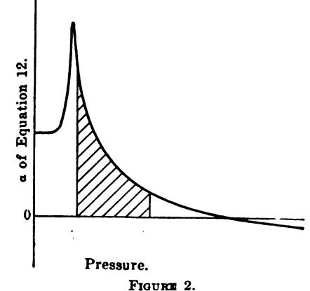

Calculation of Fugacity from the Equation of van der Waals. Instead of determining the fugacity by a graphic integration we may choose any empirical equation for an imperfect gas, and integrate by the conventional methods. The most familiar of the various equations of state is that of van der Waals, according to which

$$P = \frac{RT}{\mathbf{v} - \mathbf{b}} \mathbf{\hat{b}} - \frac{\mathbf{a}}{\mathbf{v}^{\mathbf{v}}} \tag{15}$$

where a and b are empirical constants. Such an equation can be used for the desired integration by substituting in Equation 7 either v expressed in terms of P, or dP in terms of v. The former substitution cannot readily be made in this case because the van der Waals equation is of the third degree in v, but we may obtain a value of dP by immediate differentiation of Equation 15 .

Substituting the value of dP, so obtained, in Equation 7, and integrating¹ between v and v*, we find

$$\begin{split} \ln \frac{f}{f^{\star}} = \frac{b}{\mathbf{v} - \mathbf{b}} - \frac{b}{\mathbf{v}^{\star}} - \frac{b}{\mathbf{b}} - \ln \left( \mathbf{v} - \mathbf{b} \right) + \ln \left( \mathbf{v}^{\star} - \mathbf{b} \right) \\ & - \frac{2a}{R T \mathbf{v}} + \frac{2a}{\bar{R} T \bar{\mathbf{v}}^{\star}} . \end{split} \tag{16}$$

Ifv*ismadetoapproach infinitywemaywrite

$$\frac{\mathbf{v}^{\bullet} - b}{\mathbf{v}^{\bullet}} = 1; \frac{1}{\mathbf{v}^{\bullet}} = 0; \text{ v}^{\bullet} = \frac{RT}{P^{\bullet}}; P^{\bullet} = f^{\bullet}. \tag{17}$$

Thenbysimplification,

$$
\ln f = \ln \frac{RT}{\mathbf{v} - b} + \frac{b}{\mathbf{v} - b} - \frac{\mathbf{2}a}{\overline{R}\overline{T}\mathbf{v}}.\tag{18}
$$

This equation we may use directly for calculating, at any temperature and pressure, the fugacity of any gas which satisfies van der Waals' equation, and for which the constants a and b have been determined. For oxygen at 0° C the experimental data are well satisfied by choosing2 a = 1.009 × 106 and b = 26.4. Table 1 shows at pressures from 50 to 600 atmos. , the fugacity as calculated from Equation 18. Column 3 gives the ratio between the pressure P, and the pressure P₁, which would be calculated from the ideal gas law, so that P/P; = Pv/RT. Column 4 shows the ratio of the fugacity to the pressure. Both these ratios, which would be unity for a perfect gas, will be discussed further in the following section.

TABLE 1. -PRESSURE AND FUGACITY OF OXYGEN AT 0°C

| P   | f    | P<br>/<br>P<br>: | f<br>/<br>P |
|-----|------|------------------|-------------|
| 50  | 48.0 | 0.961            | 0.960       |
| 100 | 92.5 | 0.929            | 0.925       |
| 200 | 174  | 0.91             | 0.87        |
| 400 | 338  | 1.05             | 0.85        |
| 600 | 540  | 1.29             | 0.90        |

Carbon dioxide is a much more imperfect gas than oxygen; its constants are a = 3.1 × 106, b behavior of this gas at 60° C. = 34.0. Table 2 shows the

$$\int \frac{\mathbf{v} \cdot \mathbf{v}}{(\mathbf{v} - \mathbf{b})^{\overline{\mathbf{n}}}} = \ln|\mathbf{v} - \mathbf{b}| - \frac{b}{\mathbf{v} - \overline{\mathbf{b}}} \cdot \mathbf{b}$$

2 Since pressure is expressed in atmospheres and volume in cubic centimeters, the unit of b is cc. and that of a is atmos . Xcc2.

| TABLE<br>2.<br>- | PRESSURE<br>AND<br>FUGACITY | CARBON<br>OF | DIOXIDE<br>AT<br>60<br>°<br>C¹ |
|------------------|-----------------------------|--------------|--------------------------------|
| P                | f                           | P<br>/<br>P  | f<br>/<br>P                    |
| 25               | 23.2                        | 0.922        | 0.928                          |
| 50               | 42.8                        | 0.83         | 0.86                           |
| 100              | 70.4                        | 0.51         | 0.70                           |
| 200              | 91                          | 0.43         | 0.45                           |
| 300              | 112                         | 0.59         | 0.37                           |

A Simple Approximate Method of Calculating Fugacity. The methods for calculating the fugacity of an imperfect gas, which we have been illustrating, are not only time- consuming, but they assume more experimental familiarity with the pressure-volume relations than always exists. We shall therefore conclude this phase of our discussion by describing a remarkably simple approximate method which is sufficiently accurate at all ordinary pressures, and which requires no more than a single determination of the molal volume of a gas at the given temperature.

We have seen in Equation 12 that the equation of state may be put in the form

$$\mathbf{v} = \frac{RT}{P} - \mathbf{a},\tag{19}$$

where a is some function of temperature and pressure. We find in plotting the isotherm of an imperfect gas, as in Figure 1 , that a always approaches a constant value at low pressures. In other words, at constant temperature and at low pressures there is a constant difference between the actual volume and the volume calculated by the gas law. "

If P is a given pressure and P* is some very small pressure, and if ƒ and f* are the corresponding fugacities, we may combine theaboveequationwithEquation7,

$$RT\ln\frac{f}{f^{\bullet}} = \int_{P^{\bullet}}^{P^{\bullet}} \text{v}dP = RT\ln\frac{P}{P^{\bullet}} - a(P-P^{\bullet}).\tag{20}$$

Even when the constants a and b are chosen to fit best the experimental data at a given temperature, there are discrepancies between the calculated and measured volumes, when the range of pressures is large. In the cases here discussed the maximum discrepancy amounts to 1 % for oxygen and 6 % for carbon dioxide. It is the calculated volume that is here used n obtaining Pi. ८

The statement that there is a constant difference between these two quantities does not conflict with the statement that the ratio of y to RT/P approaches unity as v increases to infinity.

aP

СНАР. ХѴІІ

> (21)*

or

$$\frac{f}{P} = e^{-\frac{aP}{RT}}.\tag{22}$$

- Hence, if we remember that when x is small e¯ = 1 − x,

When P* = 0, P* = f*. Thus simplifying,

In /

THERMODYNAMICS

$$\frac{f}{\bar{P}} = 1 - \frac{aP}{\bar{R}\overline{T}},\tag{23}$$

and therefore from Equation 19,

$$\frac{f}{\overline{P}} = \frac{P\mathbf{v}}{R\overline{T}}.\tag{24}$$

This may be put into another useful form if once more we substitute for RT/v, the pressure which an ideal gas would exert at the given volume, the symbol P. Then from the above equations,

$$\frac{f}{P} = \frac{P}{P_i}.\tag{25}$$

Thus the actual pressure lies between the fugacity and the pressure calculated from the gas law; and is the geometrical mean of the two.

This extremely simple rule for calculating fugacity has been deduced for low pressures, but we see from Tables 1 and 2, where f/P and P/P; may be compared, that it is valid for oxygen up to 100 atmos. , while for the much more imperfect gas, carbon dioxide, it is in error by 1 % at 25 atmos. , and by 4% at 50 atmos. Even for the most imperfect gas it should be possible to use this principle up to a pressure of a few atmospheres.

### FUGACITY OF SOLIDS AND LIQUIDS

Whenever two phases are in equilibrium, the fugacity ofthe substance in both phases is the same. If therefore a solid or liquid phase is in equilibrium with vapor, and if we do not desire the highest accuracy, or if the vapor, asnearlyaswecan

measure, obeys the gas law, we take the vapor pressure as a measure of the fugacity. If the fugacity in the vapor phase cannot be taken equal to the pressure, it may be calculated by one of the preceding methods.

We will calculate the fugacity of liquid chlorine at 25° C and at the pressure (7.63 atmos. ) at which it is in equilibrium with the pure vapor. From measurements of the density of chlorine gas, we find at 25° C that a/RT in Equation 23 is 0.011 . Hence at the vapor pressure, namely at 7.63 atmos. ,

$$f_{\overline{7.63}} = 1 - 0.011 \times 7.63,$$

or f = 6.99 atmos. The fugacity thus differs from the pressure by nearly 10%. The fugacity of the liquid chlorine at 25°C and 7.63 atmos. is also thus found to be 6.99.

The fugacity of a liquid or solid changes very little with moderate changes in pressure, and this change may therefore often be neglected. However, it may readily be calculated by means of Equation 7. For ordinary purposes the molal volume may be regarded as constant, and

$$RT\ln\frac{f}{\bar{f}'} = \mathbf{v}(P - P') \text{ (approx.)}.\tag{26}$$

The molal volume of liquid chlorine (based on the formula Cl₂) is about 51 cc . Substituting this value in Equation 26 and using P = 1 , P' = 7.63, we find the fugacity of liquid chlorine at 25°C and one atmos. to be 6.90 atmos.

To this calculation it may be objected that liquid chlorine cannot exist at 25°C under a pressure of one atmosphere. As a matter of fact, owing to the phenomenon of superheating, it can so exist, but this is not important. We shall often, for convenience, make calculations for substances in states which are incapable of actual existence. Thus we shall not hesitate to use the fugacity and the free energy of ice at 25°C, or of rhombic sulfur at 150°C.

Since the fugacity is defined with reference to the gaseous state at low pressure, it is the molal weight in that state which we must use consistently

CHAP. XVII

in our fugacity equations. Thus in the case which we have just considered, the molal volume in any phase is to be based upon the formula Cl2, and is the volume of 2 × 35.46 grams. There remains a slight possibility of ambiguity when a substance may appear in more than one molecular species in the gaseous state. At high temperatures chlorine dissociates into the monatomic form. Therefore at high temperatures, and indeed theoretically at all temperatures, an indefinite diminution in pressure would mean complete dissociation of chlorine into the monatomic form. If we had accurate volume measurements at all pressures down to those corresponding to nearly complete dissociation, we could state fugacities with respect to either of the two formulas Cl₂ or Cl, but it would be necessary to specify the one chosen.

### CHANGE OF FUGACITY WITH TEMPERATURE

We have seen that at least theoretically any substance may be converted isothermally into a vapor and that this vapor maybe made to approach the perfect gas, without limit , as the pressure is indefinitely diminished. Suppose now that we have a substance in a given state and compare its molal free energy F with the molal free energy F* in the vapor state, at some very low pressure and at the same temperature. We are to consider the increase in free energy when one mol of the given substance is converted into the highly attenuated vapor. By Equation 2,

$$\mathbf{r}^\bullet - \mathbf{r} = RT \ln \frac{f^\bullet}{f} \,\tag{27}$$

Differentiating this equation with respect to temperature, while the pressure upon each of the two states remains constant ,

$$\left(\frac{\partial \mathbf{r}^\bullet}{\partial \bar{T}}\right)_P - \left(\frac{\partial \mathbf{r}}{\partial \bar{T}}\right)_P = R \cdot \ln \frac{f^\bullet}{\bar{f}} + RT \left(\frac{\partial \ln f^\bullet}{\partial \bar{T}}\right)_P - RT \left(\frac{\partial \ln f}{\partial T}\right)_P \tag{28}$$

In the gas at very low pressure the fugacity is equal to the pressure. Hence f* does not change with the temperature at constant pressure, and the next to the last term disappears.Also by Equation 27 , R ln (f*/f) (F* − F) / T, whence =

$$
\begin{pmatrix}
\frac{\partial \mathbf{r}^\bullet}{\partial \vec{T}}
\end{pmatrix}_P - \begin{pmatrix}
\frac{\partial \mathbf{r}}{\partial \vec{T}}
\end{pmatrix}_P = \frac{\mathbf{r}^\bullet}{\vec{T}} - \frac{\mathbf{r}}{\vec{T}} - RT \begin{pmatrix}
\frac{\partial \ln \vec{f}}{\partial \vec{T}}
\end{pmatrix}_P.\tag{29}
$$

Now employing Equation XIV- 12 we obtain the simple equation

$$
\left(\frac{\partial}{\partial T}\frac{\ln f}{T}\right)_P = \frac{\mathbf{H}^\bullet - \mathbf{H}}{RT^\bullet}.\tag{30}
$$

- The important quantity H* H has been called the ideal heat of vaporization . It is the increase in heat content when the substance escapes into a vacuum.

Equations 6 and 30, which are exact, lead to the approximate formulæ of the last chapter (Equations XVI-9 and XVI- 10) , if the vapor of the substance in question is assumed to be a perfect gas, and if the vapor pressure is substituted for the fugacity.

- - H = Obviously Equation 30 can be applied not only to a solid or liquid phase, but to a gas at any finite pressure. In the latter case H* H is the total Joule-Thomson heat. We have previously considered the heat of free expansion of oxygen at 0° C from 200 atmos. down to 1 atmos. and found it to be 340 cal . per mol. This is the same as the heat of free expansion to zero pressure if we neglect the small heat of expansion from 1 atmos. to zero pressure, and we may write н* 340 cal. We must then express Rin calories per degree ( 1.9885) , and write T = 273. Hence ( In ƒ/ƏT) , at 0° C and 200 atmos. is 0.0023, and the fugacity is increasing at the rate of 0.23 % per degree. We have seen in Table 1 that under those conditions the fugacity of oxygen is about 15 % less than the pressure. Therefore, with rising temperature, the fugacity at 200 atmos. is approaching more nearly to the gas pressure, and at the above rate would reach it below 100°C. However, the Joule-Thomson heat itself diminishes with increasing temperature, so that as the temperature is increased the fugacity approaches the pressure more slowly.¹ P

EXERCISE 1. From the following table of Amagat for hydrogen at 0°C, find, by the second graphical method, the fugacity of hydrogen at 1000 atmos.

The fugacity may eventually reach and somewhat surpass the pressure, for we believe that other gases at high temperatures would behave as hydrogen and helium do at ordinary temperatures.

| Pv<br>ᎡᎢ | P    | Pv<br>ᎡᎢ |
|----------|------|----------|
| 1.069    | 600  | 1.431    |
| 1.138    | 700  | 1.504    |
| 1.209    | 800  | 1.577    |
| 1.283    | 900  | 1.649    |
| 1.356    | 1000 | 1.720    |
|          |      |          |

EXERCISE 2. Plot very roughly a of Equation 12 against P, from the data of Table 1, and find approximately the pressure at which ƒ/P is a minimum.

EXERCISE 3. Show that at moderate pressures Equation 19 is consistent with van der Waals' equation, by expanding the latter in series, and omittingtermsofhigherorderwithrespecttoPorto1/v.

 EXERCISE 4. Using van der Waals' equation, integrate Pdv between v and v' . Then by Exercise XIV-4 show that

$$
\ln f = \ln \frac{RT}{\mathbf{v} - \bar{b}} - \frac{a}{\bar{R}\bar{T}\bar{\mathbf{v}}} + \frac{P\mathbf{v}}{\bar{R}\bar{T}} - 1,\tag{31}
$$

and further show that this is identical with Equation 18.

EXERCISE 5. The fugacity of liquid water at 25°C is approximately 0.0313 atmos. Taking the ideal heat of vaporization as 10450 cal. per mol, calculate the fugacity at 27°C.

EXERCISE 6. Assuming the constants used in obtaining Table 2, show that at 0°C and 5 atmos. the fugacity of carbon dioxide is about 4.88 atmos.

EXERCISE 7. If ƒ and In ƒ depend upon temperature and pressure alone we may write

$$d\ln f = \left(\frac{\partial \ln f}{\partial T}\right)_P dT + \left(\frac{\partial \ln f}{\partial P}\right)_T dP$$

for any pure phase. If two phases are in equilibrium, In ƒ = In f' , and the condition that equilibrium is maintained during some infinitesimal change is that d ln f = d ln f' . By the method thus suggested repeat the proof of Equations XVI-4, XVI- 5 and XVI- 8 , using In ƒ instead of F.

TABLE 3


# CHAPTER XVIII

# APPLICATION OF THE SECOND LAW TO SOLUTIONS

Since the beginning of our study of the second law of thermodynamics there has been such a variety of subjects demanding consideration that we have been obliged to postpone any separate and detailed treatment of solutions. Of course our fundamental laws and equations have been obtained for any sort of system, and it only remains to consider the special forms which they assume when a phase contains more than one constituent. Such a phase is ordinarily a liquid, but the same thermodynamic equations are also valid for gaseous solutions and for solid solutions.

THE ESCAPING TENDENCY FROM SOLUTIONS

Partial Molal Free Energy and Entropy. Let us consider any solution containing n₁ mols of X1, n₂ mols of X2, etc. The free energy of the solution is related to the heat content and the entropy by Equation XIV-2, FHTS.

$$\boldsymbol{F} = \boldsymbol{H} - \boldsymbol{\mathsf{T}}\mathbf{s}.$$

Now if we wish to ascertain the effect produced by adding a small quantity of one of the constituents at constant temperature and pressure, we differentiate this equation with respect to the number of mols of that constituent . For example,

$$
\begin{pmatrix} \overset{\partial}{\partial n_1} \\ \overset{\cdot}{\partial n_1} \end{pmatrix}_{\mathcal{T}, \mathcal{P}, \mathfrak{n}_{\mathfrak{n}_\bullet}} = \begin{pmatrix} \partial H \\ \overset{\cdot}{\partial n_1} \end{pmatrix}_{\mathcal{T}, \mathcal{P}, \mathfrak{n}_{\mathfrak{n}_\bullet}} - T \begin{pmatrix} \overset{\cdot}{\partial S} \\ \overset{\cdot}{\partial n_1} \end{pmatrix}_{\mathcal{T}, \mathcal{P}, \mathfrak{n}_{\mathfrak{n}_\bullet}}.\tag{1}
$$

Now we recognize OH/on , as ₁ , the partial molal heat content. In the same manner we denote the other two coefficients by F₁ and S, and so define the partial molal free energy and the partial molal entropy. Thus,

$$\mathbf{F}_1 = \mathbf{f}_1 - T\mathbf{\overline{s}}_1.\tag{2}$$

### THERMODYNAMICS

CHAP. XVIII

To illustrate the meaning of these quantities, let us consider a system composed of solid sodium chloride and its saturated aqueous solution. It is a condition for equilibrium that if any infinitesimal quantity of solid phase passes into the solution, dF = 0. Hence if F (s) denotes the molal free energy of the solid salt, and F2, the partial molal free energy of the salt in solution,

$$\mathbf{F_1} = \mathbf{F_2(s)}.\tag{3}$$

This transfer of an infinitesimal quantity of salt, at the point of equilibrium , is reversible ; and if the heat absorbed, per mol of salt dissolved, is divided by the temperature, we find the partial molal entropy S2, less the molal entropy of the solid salt s2 (S) .

Change of Partial Molal Free Energy with Pressure and Temperature. Starting again with some solution of fixed composition, we have the important Equations XIV-9 and XIV- 12, namely,

$$
\begin{pmatrix} \partial F \\ \partial \bar{P} \end{pmatrix}_r = V; \quad \begin{pmatrix} \partial F \\ \partial \bar{T} \end{pmatrix}_p = \begin{pmatrix} -\ S \ -\frac{H}{T} \end{pmatrix}_r
$$

In the same way that these equations were obtained, we may derive the analogous equations for the partial molal free energy by differentiating Equation 2 with respect to pressure and temperature. More simply, we may differentiate Equations XIV-9 and XIV- 12 with respect to the number of mols of some constituent. Performing this differentiation, and remembering that by Equation III-5 the order in which two partial differentiations occur is immaterial, we find, ¹

$$
\begin{pmatrix} \frac{\partial \mathfrak{F}_1}{\partial \bar{P}} \end{pmatrix}_{\mathfrak{T}_\cdot \,\mathsf{A}} = \begin{array}{c} \mathfrak{F}_\mathsf{i}, \\\\ \end{array} \tag{4}
$$

and here we notice that while the escaping tendency of a pure substance must increase with the pressure, this is not true for a substance in solution,wherev maybenegative.

Likewise we find,

$$
\begin{pmatrix}
\partial \mathbb{F}_1 \\
\partial \bar{T}
\end{pmatrix}_{\mathcal{P}_1, \mathbf{x}} = \begin{array}{c}
- \ \mathsf{F}_1 \ = \begin{array}{c}
\mathsf{F}_1 \ - \ \mathsf{R}_1 \\
T
\end{array}
\end{array}
\tag{5}
$$

1 The use of the second subscript in the partial differential coefficient will denote constancy of composition.

In the same manner, we may show that all of the equations of our recent chapters have identical form when the partial molal quantities are substituted for molal quantities. Indeed the study of free energy changes in systems which involve solutions introduces nothing essentially new, as we may show by a simple example.

Let us see how we may determine the change in free energy, at 40°C, when a mol of sodium chloride dissolves in a large amount of 6.12 M solution, according to the equation,

$$\text{NaCl(s)} \rightleftharpoons \text{NaCl(6.12 M)}.$$

= At this composition, the solution is saturated at 25°C, at which temperature therefore AF F2F2(S) = 0. In order to calculate AF at another temperature we use the data of Chapter VIII. Thus from Table VIII-5, AH298 = = - 702 + 1019 - = 317 cal. The molal heat capacity of solid sodium chloride is about 12, hence, by Table VIII-2, ACp 25 12 13. Assuming ACP constant over the small temperature range from 25° to 40°C, we have now the material for calculating AF at 40° C, by means of Equation XV-9 ( see Exercise 1 ) .

The Fugacity of a Dissolved Substance. Proceeding as in the case of a pure substance, we may partially define the fugacity of a solution constituent by the equation

$$
\left(\frac{\partial \ln f_l}{\partial \tilde{\mathbb{F}}_1}\right)_{\mathcal{T}} = \frac{1}{\bar{R}\bar{T}}\,,\tag{6}
$$

or

$$\mathbf{F}_1 = RT\ln f_1 + B_1,\tag{7}$$

1 where B is a constant for a given substance at a given temperature.

The statement that a system is in equilibrium when, and only when, the fugacity of every susbstance is constant throughout, holds also for systems which contain solutions. The numerical value of the fugacity of any constituent of a solution may therefore be obtained, just as in the case of a pure solid or liquid, if we can ascertain the fugacity of the constituent in the vapor phase over the solution.

Also by methods identical with those used in deriving Equations XVII-6 and XVII-30, we find,

$$
\left(\frac{\partial \ln f_1}{\partial P}\right)_{T, \star} = \frac{\mathfrak{P}_1}{\overline{R}\overline{T}}\ ,\tag{8}
$$

and

$$\left(\frac{\partial \ln f_1}{\partial T}\right)_{P, \mathbf{x}} = \frac{\mathbf{H}_1 \mathbf{"} - \mathbf{H}_1}{RT^2},\tag{9}$$

where H1* is the heat absorbed per mol when a small quantity of the constituent X₁ evaporates from the solution into a vacuum.

It is of interest to combine two or more equations of the type of ( 8) or (9) by means of EquationIV-15,thusobtaining,

$$\mathbf{v}_{\Re_1} \left( \frac{\partial \ln f_1}{\partial \dot{P}} \right)_{\Im, \varkappa} + \mathbf{v}_{\Im} \left( \frac{\partial \ln f_{\Im}}{\partial P} \right)_{\Im, \varkappa} + \cdots \quad \cdot \quad \cdot \quad = \frac{\mathbf{v}}{\dot{R}\dot{T}} \,, \tag{10}$$

and

$$\mathbf{w}_1 \left( \frac{\partial \ln f_1}{\partial T} \right)_{T, \mathbf{x}} + \mathbf{w}_2 \left( \frac{\partial \ln f_2}{\partial T} \right)_{T, \mathbf{x}} + \dotsb \quad \cdot \quad \cdot \quad = \frac{\mathbf{H}^\bullet - \mathbf{H}}{RT^2}, \quad \text{(11)}$$

H* where v is the volume and н* - H is the ideal heat of vaporization of one mol of the solution.¹

EXERCISE 1. From the data given in the text, complete the calculation of AF at 40°C for the dissolving of sodium chloride in 6.12 M solution.

EXERCISE 2. Show that the change of entropy when one mol of sodium chloride is dissolved in its saturated solution, at 25° C, is about unity. Calculate AS when sodium chloride dissolves in 6.12 M solution at 40°C.

EXERCISE 3. The molal volume of sodium chloride in the solid state is greater than its partial molal volume in a saturated solution . How does thesolubility change with the pressure?

EXERCISE 4. Combining the data of Exercise XVII-5 and of Table VIII-7, and assuming that water vapor obeys the gas law, calculate, at 25°C, the percentage change per degree in the vapor pressure of water above 50 mol percent sulfuric acid.

EXERCISE 5. Let dn, mols of X₂ be added to a system composed of two or more phases ; let the total free energy be taken as the sum of the free energies of the several phases of the system, F = F' + F" +

<sup>1</sup> Substituting the vapor pressure for the fugacity in Equations 9 and 11 , we may obtain two approximate equations which are simplifications of an equation obtained by Kirchhoff (Ann. Physik, [ 2] , 104, 612 ( 1858) ) , and of one obtained by Nernst ( " Theoretische Chemie, " Enke, Stuttgart, 1909) . See Lewis (Proc. Am. Acad. , 43, 259 ( 1907) ; Z. physik. Chem. , 61, 129 ( 1907) ) .

## APPLICATION OF THE SECOND LAW TO SOLUTIONS 207

= The partial molal free energies F2 F2" , etc. , are equal. Let dn2 dne + dn " + where dng is the amount going into the first phase, and so on. Show that here, as in the case of a single phase, OF/on, = F₂ = F2" 1 =

### CHANGE OF ESCAPING TENDENCY WITH COMPOSITION

In treating the effect of pressure and temperature upon the escaping tendencies of the components of a solution, we have obtained equations which are identical in form with those found for pure substances. We turn now to a problem which has no analogy in a system of pure phases.

In every realizable case the escaping tendency of any constituent of a solution increases with the mol fraction of that constituent. Perhaps we should only say that this is true in all cases hitherto realized. It is conceivable that an exception might be found in a solution of highly viscous or glassy character. Indeed our first statement is not a thermodynamic one, and we shall discuss hypothetical cases in which this statement is not true. It is analogous to the statement that in every realizable case the volume of a system diminishes with increasing pressure. This fact has not prevented us (Chapter XVI, Figure 2) from discussing thermodynamically a hypothetical case of the opposite kind.

In order to obtain an exact expression for the effect of change of composition upon the escaping tendencies of the various constituents of a solution, we may employ the general equation for partial molal quantities (Equation IV- 21 ) which we have already used in studying partial molal volume and partial molal heat content. Introducing the free energy into this equation, we obtain a formula of fundamental importance, first obtained by Gibbs,

$$\mathbf{N}_{\mathbf{N}} \begin{pmatrix} \frac{\partial \mathbf{F}_{1}}{\partial \mathbf{N}_{1}} \end{pmatrix}_{P,\mathcal{T}} + \mathbf{N}_{\mathbf{2}} \begin{pmatrix} \frac{\partial \mathbf{F}_{2}}{\partial \mathbf{N}_{1}} \end{pmatrix}_{P,\mathcal{T}} + \begin{array}{c} \cdot \ \cdot \ \cdot \ \cdot \ \ \bullet \ \ \bullet \end{array} = \mathbf{0}.\tag{12}$$

The equation does not permit us to determine in any case how the escaping tendency of each constituent changes with its mol fraction, nor is this possible from thermodynamics alone . But if we have experimentally solved this problem for one constituent

CHAP. XVIII

of a binary mixture, then it is solved for the other constituent by Equation 12.

What Equation 12 tells us is that when the two mol fractions are equal, the slopes of the two curves are equal and opposite in sign ; when N₁ = 1/4 and N₂ = 3/4 , OF2/ON1 1/3 OF1 /ON1, and so on. In general , if one of the curves is known, and we know a single point on the other curve, the slope of the second curve is = -

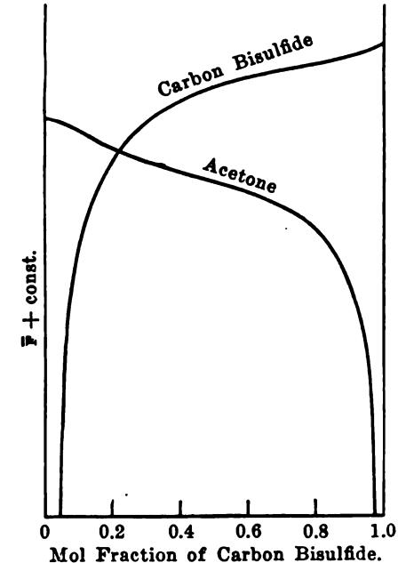

FIGURE 1.-Partial Molal Free Energies in Solutions of Carbon Bisulfide and Acetone.

determined at that point . Hence it is possible, by graphical or by analytical methods, to build up the second curve through the range of composition over which the first curve is given.

The trend of the partial molal free energy of each constituent in a mixture of carbon bisulfide and acetone is shown¹ in Figure 1 . The mol fraction is plotted horizontally so that the left-hand

<sup>1</sup> Since we never attempt to obtain the numerical value of free energy, but only its change when we pass from one condition to another, each curve can be shifted vertically at will. The ordinates give therefore in each case F +const.

axis of ordinates represents pure acetone ; and the right-hand axis of ordinates, pure carbon bisulfide.

The curves in Figure 1 suggest that F is one of the partial molal quantities, mentioned in Chapter IV, which numerically approach infinity as the corresponding mol fraction approaches zero. That this is the general characteristic of partial molal free energy is demonstrated by a consideration of the fugacity and its relation to vapor pressure.

Writing as before,

$$
\mathfrak{F}_1 = RT \ln f_1 + B_1,
$$

we see that if, in any given condition, F₁ and f₁ have finite values, B₁ also is finite. Now the vapor pressure of any constituent of a solution must approach zero as its mol fraction approaches zero. But as the vapor pressure approaches zero, it becomes equal to the fugacity. Therefore, when N₁ = 0, fi = 0. Hence ᎡᎢ ln f1 = - ∞ , and Fi = - ∞ .

We have not explained how we obtained the values of F plotted in Figure 1. In fact, of the various methods which are employed in the determination of partial molal free energy, there are several which we are not yet in a position to discuss ; but the simplest and one of the most useful of these methods consists in determining the vapor pressure, and thence the fugacity, of the constituents of a solution.

If we use fugacity in place of free energy, Equation 12 becomes

$$\mathbf{N}_{\mathbf{l}} \left( \frac{\partial}{\partial \mathbf{N}_{1}} \frac{\mathbf{h}_{1}}{\partial \mathbf{N}_{1}} \right)_{P,T} + \mathbf{N}_{\mathbf{l}} \left( \frac{\partial}{\partial \mathbf{N}_{1}} \frac{\mathbf{h}_{1}}{\partial \mathbf{N}_{1}} \right)_{P,T} + \cdots \quad \cdots \quad \cdots \quad = \mathbf{0}. \tag{13}$$

In a binary solution , where dN1 = - dN2, this equation becomes

$$\mathbf{N}_{\mathbf{N}} \Big( \frac{\partial \ln f_1}{\partial \mathbf{N}_1} \Big)_{P,T} = \mathbf{N}_{\mathbf{3}} \Big( \frac{\partial \ln f_2}{\partial \mathbf{N}_2} \Big)_{P,T}.\tag{14}$$

When the vapors are nearly perfect gases we may substitute partial pressures¹ for fugacities, and obtain the approximate equation

$$\mathbf{N}_{\mathbf{l}} \left( \frac{\partial \ln p_1}{\partial \mathbf{N}_1} \right)_{P,T} = \mathbf{N}_{\mathbf{l}} \left( \frac{\partial \ln p_2}{\partial \mathbf{N}_{\mathbf{l}}} \right)_{P,T}. \tag{15}$$

1 The significance of " partial pressures" will be made more precise in the next chapter.

This approximate equation was found by Duhem, ' and it is in this form that these fundamental relations between escaping tendency and composition have received their most extensive experimental verification ; especially in the work of Zawidzki, 2 who determined, over the whole range of concentration, the partial vapor pressures from numerous binary liquid mixtures. We will reproduce in Figures 2-5 his curves for the four pairs, propylene bromideethylene bromide, carbon bisulfide-acetone, acetone-chloroform,

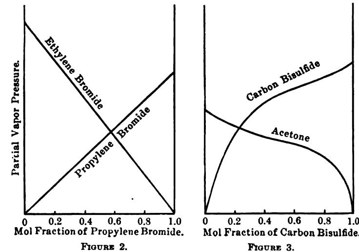

and pyridine-water. No discernible difference would be made in these figures if we plotted the actual fugacity in place of the partial pressures.

Although a reference to Zawidzki's original paper will show better the excellence of the quantitative agreement, an inspection of the curves shows that their slopes conform to Equation 15,which may also be put in thealternativeform,

$$\begin{aligned} \stackrel{\partial p_1}{\partial \mathbf{N_1}} / \stackrel{\partial p_2}{\partial \mathbf{N_2}} &= \begin{array}{c} p_1 / \stackrel{p_2}{\mathbf{N_2}} \\ \mathbf{N_1} \end{array} \end{aligned} \tag{16} \tag{16} \tag{16} \tag{16} \tag{17}$$

One of the simplest corollaries of this equationisthat,ifone

.

<sup>1</sup>Duhem,Compt.rend.,102,1449(1886)

 2 Zawidski, Z. physik. Chem. , 35. 129 ( 1900) .

of the curves is a straight line through a certain range of composition, the other is also a straight line through the same range. For if the first curve is straight, api/ Ni1 = P₁ /N₁, whence дрг Ə2/диг ƏN₂ = P2/N2. Such a case is illustrated in Figure 2.

The Critical Mixing Point. If we study, over a range of temperature, the fugacity-mol fraction curve of one of the components of such a mixture as that represented in Figure 3, we often find that as the temperature is lowered the curvature

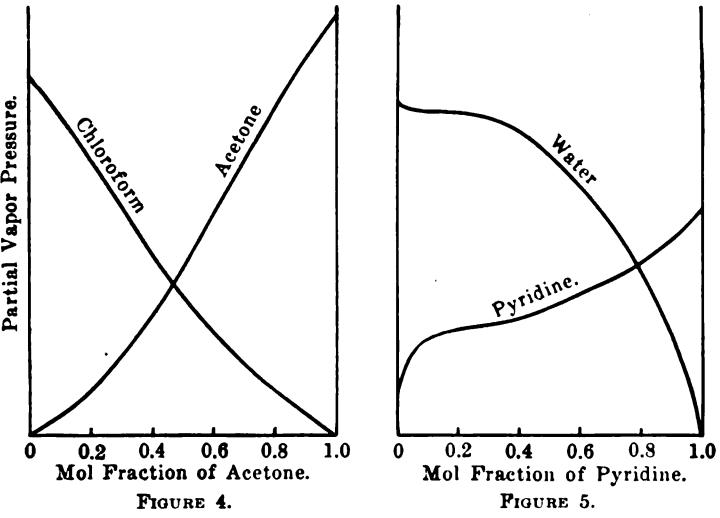

Partial

Pressure

Vapor

.

becomes more pronounced, as illustrated in Figure 6. Finally a temperature T' is reached, where the curve is horizontal at a point C. If the solution at C is further cooled, it breaks into two phases. The whole phenomenon is closely analogous to the phenomenon of the critical point in the case of a pure substance, and therefore the temperature at this point is known as the critical mixing temperature, and the composition as the critical composition. 1

At this critical point, since the curve is horizontal,

$$\begin{array}{ll}\frac{\partial f_1}{\partial \mathbf{N}_1} = 0; & \frac{\partial f_1}{\partial \mathbf{N}_1} = 0. \end{array} \tag{17}$$

In peculiar cases, we find two substances which are miscible in all proportions below a certain critical mixing temperature, and form two phases above that temperature.

Hence for the other component, by Equations 13 and 12,

$$\frac{\partial f_{\mathbf{2}}}{\partial \mathbf{N}_{\mathbf{1}}} = \mathbf{0}; \quad \frac{\partial \mathbf{F}_{\mathbf{3}}}{\partial \mathbf{N}_{\mathbf{1}}} = \mathbf{0}.\tag{18}$$

If, below the critical mixing temperature, we could prevent the separation into phases, we should expect to obtain for both constituents something like the dotted portions of the two curves T", each having a maximum and a minimum, and a certain region in which the escaping tendency would diminish with an increase inmolfraction.Inpractice,however,exceptfor

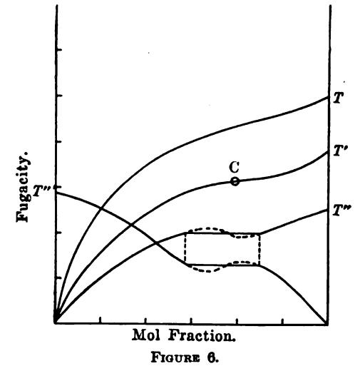

a small degree of possible supersaturation , separation into two phases occurs. This separation must occur in such measure. as to make the escaping tendency of either constituent the same in both phases.

EXERCISE 6. Show that the partial molal entropy of a solution approaches an infinite positive value with increasing dilution .

EXERCISE 7. Show that in the curves T" of Figure 6 the maximum in the curve for one constituent must come at the same composition as the minimum in the curve for the other.

EXERCISE 8. Show diagrammatically the sort of fugacity-composition curves which would characterize a solution possessing two critical mixing temperatures, between which separation into two phases occurs.

EXERCISE 9. A constant boiling solution is one in which evaporation causes no change in the composition of the liquid. In other words, the composition of liquid and gaseous phases must be identical. If the vapors may be assumed to be perfect gases, then the ratio of the two partial pressures is equal to the ratio of the mol fractions in the liquid. Hence show that

$$
\frac{dp_1}{d\mathbf{N}_1} + \frac{dp_2}{d\mathbf{N}_1} = \mathbf{0},\tag{19}
$$

and that the total vapor pressure, P = Pi + P2, is a maximum or minimum. This is an important principle in the theory of distillation .

### OSMOTIC PRESSURE

Upon adding a solute to any solvent, as the escaping tendency of the solute increases that of the solvent diminishes, as shown in

Equations 12 and 13. This lowering of the escaping tendency of a solvent by the dissolved substance is evidenced in numerous ways. Thus the vapor pressure of water from a salt solution is lower than the vapor pressure of pure water at the same temperature; or, again, if such a salt solution is brought into contact with ice at 0°C, equilibrium does not exist, and the ice disappears. However, it is possible to increase the pressure

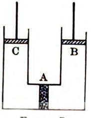

FIGURE 7.

upon the solution until the escaping tendency of the solvent is the same in the solution as in the pure state. This increase in pressure, which ordinarily is greater the higher the concentration of the solute, is known as the osmotic pressure.

The botanist Pfeffer2 discovered the phenomenon of osmosis when he found certain membranes, known as semi-permeable membranes, which permit the free passage of water, and which do not permit the passage of certain substances dissolved in water. In Figure 7, A represents such a semi-permeable membrane between the space AB, which contains an aqueous solution , and the space AC, which contains pure water. If the pressures are the same on both sides, the escaping tendency of the water is

<sup>1</sup> In the rare case in which the partial molal volume of the solvent is negative, its escaping tendency is increased when the pressure is lowered.

Pfeffer, " Osmotische Untersuchungen, " Leipzig, 1877.

less in the solution, and the phenomenon of osmosis will occur; that is, water will flow through the membrane from left to right. But if the pressure upon the piston B is increased (or that upon the piston C is diminished) to the point where the escaping tendency of the water is the same on both sides, then equilibrium prevails, and water will pass through the membrane in neither. direction. If P° is the pressure upon the pure solvent, and P is the pressure upon the solution when osmotic equilibrium is maintained, P - P° is the osmotic pressure.

In the early study of the theory of solutions, van't Hoff¹ made important use of the conception of osmotic pressure to obtain results of great value. Except, however, for its historical significance, the osmotic pressure is not a phenomenon of primary importance; it will suffice here to show the simple relation between the osmotic pressure and the escaping tendency of the solvent.

Let Fi° be the molal free energy, and fi° the fugacity, of a pure solvent at pressure P°, and let F₁ and fi be the partial molal free energy and the fugacity of the solvent in some solution, also at pressure P° . Now the F₁ may be made equal to F1°, andfi to fi°, by changing the pressure on the solution isothermally from Po to P. Hence by Equations 4 and 8,

$$\mathbb{P}_1\text{"} - \mathbb{P}_1 = RT\ln\frac{f_1\text{"}}{f_1} = \int_{P^*}^P \mathbb{P}_1 dP.\tag{20}$$

For dilute solutions, in which the osmotic pressure is small, V₁ may be regarded as constant and equal to V₁, the molal volume of pure solvent . Hence as an approximate equation we write,

$$\mathbf{v_1^o - }\mathbf{v_1} = RT \ln \frac{f_1 \mathbf{^\bullet}}{f_1} = \mathbf{v_1} \ (P - P^o) . \tag{21}$$

The osmotic pressure thus furnishes a method of determining the escaping tendency of the solvent from a solution . In practice, however, it is a method which is far more cumbrous and inaccurate than numerous others which we shall have


<sup>1</sup> van't Hoff, Z. physik. Chem. , 1 , 481 ( 1887) .

## APPLICATION OF THE SECOND LAW TO SOLUTIONS 215

occasion to employ. In theoretical work, the osmotic pressure has been used as a thermodynamic function, but here again it proves an awkward substitute for such quantities as the free energy and the fugacity. However, in the infinitely dilute solution the equations of osmotic pressure assume a simple form which we shall discuss in Chapter XX.

### EQUILIBRIUM BETWEEN PHASES WHICH MAY BE SOLUTIONS

The types of equilibrium in systems containing two or more substances are so numerous and so complex that we must content ourselves here with a few simple illustrations.

The properties of a given amount of a binary solution are determined by temperature, pressure and composition, the latter being fixed when the mol fraction of either constituent is given. When two phases in equilibrium are present, for example solid water and brine, or the two liquid phases obtained by mixing ether and water, or aqueous hydrochloric acid and its vapor, the system is restricted to two degrees of freedom, and in this respect resembles a single phase of a pure substance.

Change of Eutectic Temperature with Pressure. With three phases in equilibrium the case is analogous to two phases of a pure substance, with one degree of freedom. Thus the whole system is determined when we choose the temperature, or the pressure, or the composition of one phase which contains both constituents. As an example of such a system, we may consider a solid salt, ice and a saturated solution, at the eutectic point. If the temperature is changed, the pressure, as well as the composition of the solution, must change by a fixed amount, in order to maintain equilibrium.

In this very simple case the rate of change of the eutectic pressure with the temperature may be immediately ascertained by the methods of Chapter XII . But it will be instructive to go through the more complicated calculation in which we investigate the escaping tendency of each substance in the several phases. If we denote by Fi' the molal free energy of water in the solid state, and by F₁ its partial molal free energy in the

solution, the first condition of sustained equilibrium is that Fi = F1 , and dri'= d . But we may write

$$d\mathbb{P}_1 = \frac{\partial \mathbb{P}_1}{\partial T} dT + \frac{\partial \mathbb{P}_1}{\partial P} dP + \frac{\partial \mathbb{P}_1}{\partial \mathbb{N}_1} d\mathbb{N}_1 \tag{22}$$

and for the ice, since it is a pure phase,

$$d\mathbf{r}_1' = \frac{\partial \mathbf{r}_1'}{\partial T} dT + \frac{\partial \mathbf{r}_1'}{\partial P} dP. \tag{23}$$

Equating these two expressions, and substituting the values of the temperature and pressure coefficients, by means of Equations 4 and 5, and the corresponding equations for the pure substances, we find

$$(\mathfrak{s}_1'-\mathfrak{s}_1)\,\,dT + (\mathfrak{v}_1 - \mathfrak{v}_1')\,\,dP + \frac{\partial \mathfrak{F}_1}{\partial \mathfrak{v}_1}\,d\mathfrak{v}_1 = 0,\tag{24}$$

and likewise for the second constituent,

$$\left(\left(\mathbf{s_2}'-\mathfrak{E}_{\mathfrak{k}}\right)\,dT+\left(\mathfrak{v_2}-\mathbf{v_2}'\right)\,dP_\parallel+\frac{\partial\mathfrak{F}_{\mathfrak{k}}}{\partial\mathbf{N_1}}\,d\mathbf{N_1}=\mathbf{0}.\tag{25}$$

Now the remaining differential coefficients are eliminated, in accordance with Equation 12, if we multiply the first equation by N₁ and the second by N2, and then add. Hence

$$\begin{aligned} \left(\mathbf{N_{1}s_{1}}' - \mathbf{N_{1}\mathfrak{S}_{1}} + \mathbf{N_{3}s_{2}}' - \mathbf{N_{3}\mathfrak{S}_{2}}\right)dT &= \\ \left(\mathbf{N_{1}v_{1}'}' - \mathbf{N_{1}\mathfrak{V}_{1}} + \mathbf{N_{3}v_{1}'} - \mathbf{N_{3}\mathfrak{V}_{2}}\right)d\dot{P}. \end{aligned} \tag{26}$$

But we recall that, by Equation IV- 18, N₁₁ and N.S₂ together equal s, the entropy of one mol of the solution, while NiS₁′ + N2S2' give the entropy of the corresponding amounts of the two solids. The algebraic sum of all these terms is therefore AS, the increase in entropy when one mol of the solution is formed from the two solids. Similarly the volume terms together give AV in the same process, and we obtain an equation which we might have taken directly from Equation XII- 18. It is identical with the equation for the change of pressure with temperature when only one component is present and only two phases, namely,

$$\frac{dP}{d\bar{T}} = \frac{\Delta S}{\Delta \bar{V}} = \frac{\Delta H}{T\Delta \bar{V}}.\tag{27}$$

The Solubility Curve of a Dissociable Solute. Let us consider one further case in which we deal simultaneously with an equilibrium between phases and an equilibrium in a chemical reaction. We may select for such a study the solubility curve of a hydrated salt such as CaCl2 6H2O.

If we are dealing with a system of two components, and one of our variables is fixed, as when the pressure is kept constant at one atmosphere, a system of two phases has one remaining degree of freedom, and either temperature or composition may be arbitrarily varied, but not both. Thus, if the two components are CaCl2 and H2O, and the two phases are CaCl2 6H2O and a . Temperature

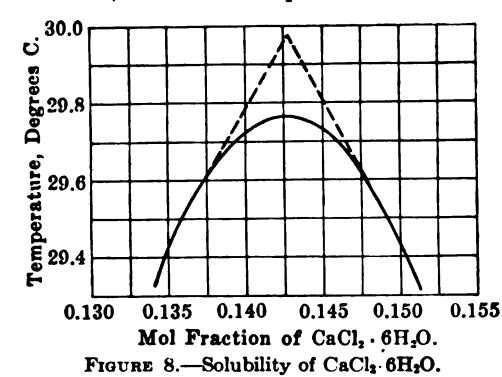

solution, the relation between the temperature and the composition of the solution may be represented by a continuous curve, as in Figure 8, where temperature is the ordinate, and the mol fraction N2 of CaCl2 in the solution is the abscissa.

At the maximum point of the curve, where the composition of the solution is the same as that of the solid, any finite addition of either H2O or CaCl2 will lower the equilibrium temperature. But if in the solution there is any appreciable dissociation of CaCl2 6H2O into its constituents, an infinitesimal addition of . either component does not change the equilibrium temperature. In other words, the point in question is a true maximum of a continuous curve, and not a cusp, or a point of intersection of two curves. This theorem, due to Lorentz and Stortenbeker, ¹ may be demonstrated as follows:

1 Stortenbeker, Z. physik. Chem. , 10, 183 ( 1892) .

## 218 THERMODYNAMICS CHAP. XVIII

Although this system is one of two independent constituents, we may, if we choose, consider three constituents present in the solution, namely, n₁ mols of H₂O, n₂ mols of CaCl2, and nз mols of CaCl2 6H2O, with the partial molal free energies F1, F2, and F3. At the melting point of the pure hydrate, its composition is that of the solution, and therefore N₁ = 6N2 (however far dissociation may occur according to the equation CaCl2 6H2O = CaCl2 + 6H2O) .

Let us now find the effect of adding dn mols of water. By Equation 12 (put into the alternative form of Equation IV- 17) , we have at constant temperature and pressure,

$$n_1 d\mathbb{F}_1 + n_2 d\mathbb{F}_2 + n_3 d\mathbb{F}_3 = 0,\tag{28}$$

or

$$n_{\mathfrak{A}}(6d\mathbb{F}_1 + d\mathbb{F}_2) + n_{\mathfrak{A}}d\mathbb{F}_3 = 0.\tag{29}$$

. Now CaCl2 6H2O, CaCl2 and H2O are in equilibrium and must so remain. Therefore, by Equation XIV- 7,

$$d\Delta \mathbf{F} = \mathbb{F}_{\mathfrak{k}} - \mathbf{6}\mathbb{F}_{\mathfrak{k}} - \mathbb{F}_{\mathfrak{k}} = \mathbf{0}; \qquad d\mathbb{F}_{\mathfrak{k}} = \mathbf{6}d\mathbb{F}_{\mathfrak{k}} + d\mathbb{F}_{\mathfrak{k}}.$$

Combining this with Equation 29, we find

$$n_{\mathfrak{A}}d\mathbb{F}_{\mathfrak{b}} + n_{\mathfrak{A}}d\mathbb{F}_{\mathfrak{b}} = \mathbf{0}; \qquad d\mathbb{F}_{\mathfrak{b}} = \mathbf{0}.$$

In other words, the escaping tendency of CaCl2 6H2O in the liquid phase is not changed by an infinitesimal addition of water, and it will therefore remain in equilibrium with the solid CaCl2 6H2O without change in the equilibrium temperature.

Of course thermodynamics is unable to predict how flat such a curve as that of Figure 8 will be. This must depend upon the extent to which the compound dissociates, for, if there were no dissociation at all in the solution, adding one of the components would be like adding some foreign constituent, and the continuous curve would be replaced by two curves intersecting at the melting point, as illustrated by the dotted lines in the figure.

There is an interesting field in which a serious error crept into the literature owing to the neglect of the principle that the freezing point of a dissociable substance is not affected by a small

## APPLICATION of the SECOND LAW TO SOLUTIONS 219

addition of one of its components. Several authors, who investigated the lowering of the freezing point of salts by the addition of other salts, found that the freezing point of a substance like potassium chloride is lowered no more by a small addition of sodium chloride than it would be by the same number of mols of a substance incapable of dissociation. They therefore concluded that sodium chloride dissolved in fused potassium chloride was undissociated.

This unexpected conclusion was discussed in a seminar in Boston, and it was pointed out by one of the present authors that the experimental facts could be quite otherwise interpreted, and that they spoke rather for a large dissociation of the solvent than for a small dissociation of the solute. Thus, if fused potassium chloride, at its freezing point, is largely dissociated (KCl = K+ + Cl−) , then a small addition of one of these ions will not lower the freezing point. If then a small amount of sodium chloride is added, the dissociation of one mol will not produce two mols which are capable of lowering the freezing point, but only one, namely Na+.

It was then suggested by Professor W. C. Bray that a decision could be made between the two interpretations by studying a pair such as PbBr₂ and PbCl2. If the former is dissolved in the latter at its freezing point, the complete dissociation of one mol of PbBr₂ would give two mols of the foreign substance Br . Therefore, if dissociation occurs, the molal lowering of the freezing point should be greater than that calculated for an undissociated solute. Goodwin and Kalmus¹ performed this experiment and found the molal lowering to be about 70% greater than that calculated, thus indicating a very large dissociation of the solute .

EXERCISE 10. The vapor pressure of water over a certain solution is 0.95 times that over pure water. Assuming the partial molal volume of water to be equal to the molal volume in the pure solvent, calculate approximately the osmotic pressure at 25° C.

EXERCISE 11. Show from the phase rule that, under constant atmospheric pressure, a sodium chloride solution in the presence of the solid salt has one degree of freedom. Let us calculate in this case the change in the fugacity of water from the saturated solution as the temperature varies .

1 Goodwin and Kalmus, Phys. Rev. , 28 , 1 ( 1909) .

Let fi be the fugacity of water from the solution, fa' that of solid salt, and f2 that of the dissolved salt. = We write d In f2 d In f2' , and further

$$\begin{array}{rcl}d\,\,\ln f_{\mathbf{1}} &=& \frac{\partial \ln f_{\mathbf{1}}}{\partial \mathbf{\tilde{T}}} \, dT & + \frac{\partial \ln f_{\mathbf{1}}}{\partial \mathbf{\tilde{N}_{\mathbf{1}}}} \, d\mathbf{N_{\mathbf{1}}}; \\\\d\,\,\ln f_{\mathbf{1}} &=& \frac{\partial \ln f_{\mathbf{1}}}{\partial T} \, dT & + \frac{\partial \ln f_{\mathbf{1}}}{\partial \mathbf{N_{1}}} \, d\mathbf{N_{1}}; \\\\d\,\,\ln f_{\mathbf{1}} &=& \frac{\partial \ln f_{\mathbf{1}}}{\partial T} \, dT. \end{array}$$

From these equations show that

$$\frac{d}{dT}\frac{\ln f_1}{T} = \frac{\mathbf{H_1}}{RT^2} - \frac{\mathbf{R_1}}{\mathbf{N_1}} + \frac{\mathbf{N_1}}{\mathbf{N_1}}\frac{\hat{\mathbf{H_1}}' - \mathbf{R_1}}{RT^3},\tag{30}$$

where the numerators of the two last fractions are the negative of the differential heats of solution of attenuated water vapor and of solid salt.

Ꭲ

EXERCISE 12. Find numerically the percentage change in the fugacity of water, per degree rise in temperature, from a saturated solution of sodium chloride at 25°C, .using the data of Table VIII-5 and of Exercise XVII-5.

# CHAPTER XIX

# THE PERFECT SOLUTION

When two liquids are mixed it is often possible to predict with close approximation the properties of the solution, when the properties of the pure constituents and the amounts of these. constituents are given. Thus, if we are dealing with an extensive property like the volume, it may frequently be assumed that the volume of a solution is the sum of the volumes of the pure substances of which it is composed. But when water and alcohol are mixed there is a large diminution in total volume. So also the internal energy is sometimes far from additive, as illustrated by the large evolution of heat when water and sulfuric acid are mixed.

Nevertheless the fact that these phenomena excite comment shows that we consider them as exceptions to the normal results of mixing. Indeed it is a fact of observation that two liquids which are similar in chemical composition and in physical properties, especially if they are of the less polar type, mix with little change in volume or energy .

Moreover, a pair of such liquids approximates to Raoult's law, that is to say, it gives the linear type of curve shown in Figure XVIII-2, where the vapor pressure is proportional to the mol fraction. Such a result might be predicted from the kinetic theory, for, if the molecules of the two components are so closely identical that the forces between unlike molecules are the same as those between like molecules, it would result from the laws of chance that the number of molecules of either constituent escaping into the vapor phase would be proportional to the relative number of those molecules in the liquid.

1 Raoult, Compt. rend. , 104, 1430 ( 1887) ; Z. physik. Chem. , 2, 353 ( 1888) .

Among organic isomers pairs of substances may be found whose properties are so nearly identical that we may expect no measurable departure from linearity in the curves of vapor pressure against mol fraction. An even closer approach to identity is furnished by the recently discovered isotopes, which resemble one another so closely that the separation of a solution of two isotopes into its components presents a problem of the greatest difficulty.

We are thus led to the conception of an ideal or perfect¹ solution with properties which are not perhaps possessed by any actual solution, just as in the perfect gas an ideal substance was invented with properties not possessed by any real substance.

In order to focus our attention upon the solution itself and not upon another phase in equilibrium with it, let us consider the fugacities rather than vapor pressures, and define the perfect solution as one in which the fugacity of each constituent is proportional to the mol fraction of that constituent. Indeed we go still farther and require that this proportionality shall exist at every pressure and at every temperature.

This generalized statement of Raoult's law is more comprehensive than may be evident at first sight. It implies, among other things, that the volume and the heat content are additive, or, in other words, that the partial molal volume and the partial molal heat content of each constituent remain constant over the whole range of composition ; otherwise, according to Equations XVII-6 and XVII- 30, the fugacity might be proportional to the mol fraction at one temperature and pressure, but would not be at all temperatures and pressures.

In accordance with our definition, we therefore write for any component of a perfect solution,

$$f_1 = f_1 \mathbf{^o} \mathbf{v}_1,\tag{1}$$

where fi at a given temperature and pressure is a constant. If we can proceed over the whole range of concentration to N₁ = 1, fi° appears as the fugacity of the pure constituent. In the ordinary case where the solution in question is a liquid, fi°

1 Lewis, J. Am. Chem. Soc. , 30, 668 ( 1908) .


represents the fugacity of the pure component in the liquid state.

In terms of the partial molal free energy, Equation XVIII-6 shows that for a perfect solution

$$d\mathbb{P}_1 = RTd\ln f_1 = RTd\ln \mathbf{N}_{1\rho} \tag{2}$$

or

$$
\begin{pmatrix}
\frac{\partial \mathbf{F}_1}{\partial \mathbf{N}_1}
\end{pmatrix}_{P,T} = \frac{RT}{\mathbf{N}_1}.\tag{3}
$$

Integrating between two compositions,

$$
\mathbb{P}_1' - \mathbb{P}_1 = RT \ln \frac{\mathbf{N}_1^{'}}{\mathbf{N}_1}.\tag{4}
$$

Benzene and toluene form nearly perfect solutions. Suppose that we have two reservoirs containing such mixtures ; one,in which N2, the mol fraction of the benzene, is 14 ; the other,in which it is 34. We may then calculate the increase in free energy when a mol of benzene is removed from the first reservoir and added to the second:

$$\begin{aligned} \mathbf{C_{\bullet}}\mathbf{H_{\bullet}} (\text{in toluene, } \mathbf{N_{1}} = \text{\textquotedblleft} \boldsymbol{\zeta} \mathbf{)} &= \mathbf{C_{\bullet}}\mathbf{H_{\bullet}} (\text{in toluene, } \mathbf{N_{1}} = \text{\textquotedblright} \boldsymbol{\zeta} \mathbf{)};\\ \boldsymbol{\Delta F} &= RT \text{ \textquotedblleft } \mathbf{3}. \end{aligned}$$

These equations will frequently be useful in approximate calculations when we may assume a perfect solution, in default of any definite information. Even when we know the deviation from Raoult's law, it will frequently be convenient first to assume a perfect solution and then to introduce these deviations as a correction to the first calculation.

The types of deviation from the law of the perfect solution have already been illustrated in Figures 2, 3, 4 and 5 of Chapter XVIII. In the second of these cases the fugacities are all above those calculated from Raoult's law; it is in such mixtures that separation into two phases may occur. Indeed when two liquids are very nearly immiscible the deviations from the law of the perfect solution must be extremely great . Thus if mercury and benzene are brought together, the amount of either substance which dissolves in the other is very small, but the escaping tendencyofeachmustbethesameinbothphases.

As a rule, in case of incomplete miscibility, one phase consists chiefly of one of the constituents and the other chiefly of the other constituent. But this is not always the case. Kraus¹ has shown that a solution of sodium in liquid ammonia separates at low temperatures into two liquid phases, of which even the more concentrated contains not more than 10 mol per cent of the metal. Numerous peculiarities appear in the study of electrolytes dissolved in water, where we shall find many cases in which the deviations from the law of the perfect solution are very great.

We know that the mol fraction of a solution is determined, not merely by its composition by weight, but also by the chemical formulae which we ascribe to the individual components. Thus in a mixture of benzene and toluene, if we should give toluene its ordinary formula, but write benzene as C12H12, and reckon the mol fractions on this basis, the vapor pressures would no longer be proportional to the mol fraction. In many cases we have reason to believe that pure liquids and solutions contain more molecular species than there are independent components in a thermodynamic sense. This is usually due to the combination of like or unlike molecules to form heavier molecules, the relative amounts of which vary with temperature, pressure and composition.

In such cases we expect, and we find, large deviations from Raoult's law. Some scientists have gone so far as to attribute all deviations from the perfect solution to the phenomenon of chemical combination or dissociation, but this view is certainly not tenable . Neither mercury nor benzene gives evidence of being an associated liquid, nor do the two form compounds with one another, yet their solutions deviate enormously from the perfect solution.2

<sup>1</sup> Kraus, J. Am. Chem. Soc. , 29, 1557 ( 1907) .

<sup>2</sup> van der Waals ( Arch . Néerland, 24 , 1 ( 1890) ; Z. physik. Chem. , 5, 133 ( 1890) ) developed an extensive theory of solutions in which account was taken of the mutual attractions between like and unlike molecules. See also van Laar, " Sechs Vorträge über das thermodynamische Potential, " Vieweg, Braunschweig, 1906. The whole problem of the departure of solutions from Raoult's law is discussed fully in a paper by Hildebrand ( J. Am. Chem. Soc. , 38, 1452 ( 1916)) .

### GASEOUS SOLUTIONS

As far as is known, all gases are miscible with one another in all proportions. The gaseous solutions so formed have been subjected to little detailed investigation, either from a theoretical or an experimental standpoint. Indeed, except at high pressures, no great error is introduced by assuming that each gas in the solution behaves the same, and exerts the same pressure, as it would if the other gases were absent. Hitherto this has been our own procedure, but sometimes we shall have occasion to deal with cases in which the experimental accuracy is so high, or the pressures are so great, as to warrant a more careful analysis of the escaping tendency of the constituents of a gaseous solution, than the mere assumption of the perfect gas law affords.

If a mixture of hydrogen and carbon dioxide, at 100 atmos. , is contained in a vessel which is separated from another vessel containing pure hydrogen by a palladium plate, this plate will act as a semipermeable membrane, allowing hydrogen to pass through, in one direction or the other, until its fugacity is the same in both vessels. If the fugacity of the pure hydrogen is obtained by the method of Chapter XVII, that of the hydrogen in the solution is determined at the same time.

Let us consider what meaning can be given to the partial pressure of a gas in such a mixture. It would seem at first sight that the partial pressure could best be defined as equal to the pressure of the pure hydrogen in the apparatus just described. However, this would be awkward, for if another membrane, permeable only to carbon dioxide, were added, and the equilibrium pressure of pure carbon dioxide then determined, the sum of the two pressures would not be equal to 100 atmos. , the pressure of the mixed gas. For this reason it seems to us best to define the partial pressure of each constituent of a gaseous solution as the product of the total pressure by the mol fraction of that constituent. If the total pressure is P, each partial pressure will then be defined by such an equation as

$$p_1 = \aleph_1 P.\tag{5}$$

When a gaseous solution is at so low a pressure that each constituent may be regarded as a perfect gas, it evidently obeys the laws of the perfect solution . Sometimes, however, it is necessary to know how the escaping tendency of a constituent of a gaseous solution, under high pressure, changes with the composition. Thus, when we consider the free energy of sulfur compounds, we shall see that one of the methods of attack has been to study the equilibrium in the reaction by which sulfur and sulfuric acid give sulfur dioxide and water vapor, at a total pressure of several hundred atmospheres. Before such results can be interpreted, it is necessary to estimate the fugacity of each gas.

It seems reasonable to suppose that the solution of a given pair of substances will be more nearly perfect when the density of the solution is less, or, in other words, when the average distance between the molecules is greater. We shall therefore expect gaseous solutions to be much more nearly perfect than corresponding liquid solutions, and since we find even among liquids numerous cases in which there is a close approach to the perfect solution, it is likely that almost any gaseous solution may be regarded as nearly perfect.

This important question has not, as far as we know, been the subject of any theoretical or experimental investigation. Until further experiments have been made we shall assume that every gaseous solution is a perfect solution, and therefore that, at a given temperature and total pressure, the fugacity of each constituent is proportional to its mol fraction or to its partial pressure. Thus in the experiment of Zawidski, in which he measured the vapor pressure, and the composition of the vapor phase in equilibrium with the solution , he obtained the partial pressures as we have defined this term. Assuming the vapor to be a perfect solution, these partial pressures would be exactly proportional to the fugacities if the total vapor pressure were constant.

In considering the gaseous mixture as a perfect solution, we assume that the fugacity of each constituent is equal to its mol fraction multiplied by the fugacity which it would exhibit

## THE PERFECT SOLUTION 227

as a pure gas, at the same temperature and the same total pressure. Supposing we know the approximate equation of state of pure carbon dioxide, we could then calculate its fugacity, say at 100°C and 100 atmos. , as in Chapter XVII. We should then assume that in a mixture of carbon dioxide and air at the same temperature, having a total pressure of 100 atmos. , and in which the mol fraction is 0.10, the fugacity of carbon dioxide would be onetenth of that calculated for the pure substance.

### EQUILIBRIUM BETWEEN A PURE SOLID AND A PERFECT LIQUID SOLUTION

Sometimes a binary solution , which might be expected to behave throughout as a perfect solution, cannot be studied over the whole range of composition , owing to the appearance of a new phase of one of the pure constituents. Thus, if benzene is gradually removed from a solution of benzene and naphthalene, it might be possible with care to proceed to pure liquid naphthalene in a supercooled condition ; and the solutions over the whole range would undoubtedly obey very nearly the law of the perfect solution.

Ordinarily, however, before reaching the highest concentrations in naphthalene, that substance will separate out in the crystalline state. The resulting system, of pure solid naphthalene and a solution of naphthalene in benzene, furnishes an interesting study. We will assume that the solution is a perfect one, and therefore that the partial molal volume and the partial molal heat content of the dissolved naphthalene are equal to the molal volume and the molal heat content of supercooled liquid naphthalene. If f2° is the fugacity of the latter, then for any mol fraction of naphthalene f₂ = f2°N2.

Let us now see how the solubility of naphthalene in benzene changes with the pressure and temperature. We have discussed such problems qualitatively in Chapter XVIII. Here we are in a position to make the calculation quantitative, after assuming the law of the perfect solution . We may deal first with a change in pressure at constant temperature.

Change of Solubility with Pressure. If f2 and fa' represent the fugacity of the naphthalene in the solution and in the pure solid state, then if any change in condition occurs which leaves the solution saturated, these two quantities must remain equal, or we may write, d ln f2 d ln fa' . Since the temperature is constant, In f2' depends only upon the pressure, while In f₂ depends upon pressure and composition. Therefore =

$$\frac{\partial \ln f_{\mathbf{l}}^{\prime}}{\partial P}dP = \frac{\partial \ln f_{\mathbf{l}}}{\partial P}dP + \frac{\partial \ln f_{\mathbf{l}}}{\partial \mathbf{N}_{\mathbf{l}}}d\mathbf{N}_{\mathbf{l}}.\tag{6}$$

Substituting for the first two differential coefficients from EquationsXVII-6andXVIII-8, and writing Equation 1 in the form ;

$$
\frac{\partial \ln f_{\mathbf{2}}}{\partial \mathbf{N_{3}}} = \frac{1}{\mathbf{N_{3}}},\tag{7}
$$

we find

$$
\frac{\mathbf{v_t}'}{\bar{R}\bar{T}}\,dP = \frac{\mathfrak{v_t}}{\bar{R}T}\,dP + \frac{d\mathfrak{v_t}}{\mathfrak{v_t}},\tag{8}
$$

or, expressing in the equation the constancy of temperature,

$$
\left(\frac{\partial \ln \mathbf{v_2}}{\partial P}\right)_T = \frac{\mathbf{v_2}^\prime - \mathbf{v_2}}{RT}.\tag{9}
$$

Since N2 may be used as a measure of the solubility, this equation shows how we may calculate the change of solubility with the pressure, in the case of a perfect solution.

= - For the system under consideration N2 is about 0.50 at 323°K. The molal volume of solid naphthalene is about 115 cc. , while V2, which is also the molal volume of pure supercooled liquid naphthalene, may be calculated to be 128 cc. by extrapolating the values given for liquid naphthalene at higher temperatures. Since R 82.07, ( In N2/OP)T = 0.0004. Thus the solubility diminishes with increasing pressure, N₂ changing by 0.04% per atmos. In such a system, which involves only liquids and solids, the effect of pressure upon an equilibrium is so small as to be ordinarily neglected, except when we deal with very large changes in pressure.

Change of Solubility with Temperature. A much more important equation is obtained when we consider the change of solu-

bility with temperature, at constant pressure. Proceeding precisely as before, and using Equation 7 with Equations XVII- 30 and XVIII-9, we find,

$$
\left(\frac{\partial}{\partial T}\frac{\ln N_{\mathbf{2}}}{\partial T}\right)_P = \frac{R_{\mathbf{2}} - R_{\mathbf{2}}}{RT^{\mathbf{2}}} = \frac{\Delta H}{RT^{\mathbf{2}}}.\tag{10}
$$

Here AH is the differential heat of solution, but it is also the heat of fusion of naphthalene at the same temperature, since H2, by the law of the perfect solution, is equal to the heat content of the supercooled liquid naphthalene. Over a small range of temperature AH may be taken as constant, in which case a simple integration gives

$$\ln \frac{\mathbf{N}_2^{\prime}}{\mathbf{N}_2} = \int_{T}^{T} \frac{\Delta H}{\dot{R} \, \overline{T}^{\prime}} \, dT = \frac{-\Delta H}{\dot{R}} \left( \frac{1}{\overline{T}^{\prime}} - \frac{1}{\overline{T}} \right) = \frac{\Delta H}{\dot{R}} \left( \frac{T^{\prime} - T}{\overline{T} \, \overline{T}^{\prime}} \right) . \tag{11}$$

= This equation was first obtained by Schröder¹ , who also made a thorough experimental investigation of solubilities of substances of this type. According to his figures, naphthalene melts at 80°C. Therefore , at this temperature T', the soldi is in equilibrium with pure liquid naphthalene and N2' 1. In contact with benzene at 61 ° C, naphthalene dissolves until N₂ = 0.689. Substituting these values and solving for AH, the value 4600 cal. was found. This value he showed to be in agreement with the experimental determination of AH within the limits of experimental error. If a more thorough investigation should show some slight departure from Equation 10, it would prove that the naphthalene solution is not an entirely perfect. solution. N2

So also if we know the heat of fusion of both constituents of a perfect solution, the solubility of each in the mixture may be calculated . Washburn and Read² have shown how this method may be employed to calcu late the eutectic point, namely the temperature at which both solids are in equilibrium with the liquid solution . The comparison of their calcu lated and observed eutectic temperatures for these pairs of substances follows:

¹ Schröder, Z. physik. Chem . , 11 , 449 ( 1893) .

<sup>*</sup> Washburn and Read, Proc. Nat. Acad. Sci. , 1 , 191 ( 1915 ) .

|                      | Calc   | Obs    |
|----------------------|--------|--------|
| Benzene-naphthalene  | -3.56° | -3.48° |
| Benzene-diphenyl<br> | -6.1   | -5.8   |
| Diphenyl-naphthalene | 39.4   | 39.4   |

It is interesting to note that in these considerations the specific properties of the solvents do not enter. Indeed it is evident that at a given temperature and pressure the solubility of a substance (expressed as the mol fraction) must be the same in all solvents in which it forms a perfect solution . For let us consider a temperature at which solid naphthalene has one-half as large a

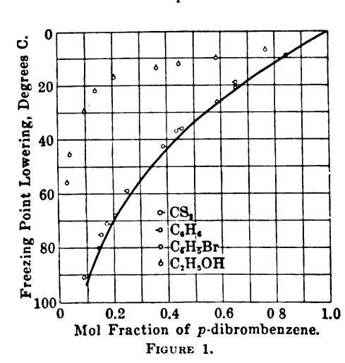

fugacity as the pure supercooled liquid. Then in any perfect solution of mol fraction 0.50 the fugacity in the solution will also be one-half that of the supercooled liquid, and therefore the solution will be saturated with respect to the solid. Schröder found in fact that naphthalene has nearly the same solubility in benzene, chlorbenzene and carbon tetrachloride. He also obtained similar results with p-dibrombenzene, and found the curve of solubility and temperature almost identical in benzene, brombenzene and carbon bisulfide, but quite different in the alcohols, which, like all hydroxyl compounds, are in general abnormal. Some of his results are given in Figure 1 , where the points may be interpreted as expressing the solubility of p-dibrom-

benzene in the several solvents, or the lowering of the freezing point of p-dibrombenzene by the same substances. The continuous curve represents values calculated by Equation 11.

In this chapter we have gone rather fully into the theory of the perfect solution, notwithstanding the fact that in the ordinary calculations of thermodynamic chemistry we do not often meet with solutions which can be regarded as perfect. We have, however, presented in such detail the properties of these solutions, partly because the perfect solution is in some sense the norm with respect to which we may classify solutions in general; partly because in dealing with a solution whose properties are unknown, we may, as a first approximation, apply the simple law in anticipation of later experimental investigation of the solution in question ; but especially because in certain respects every solution whatsoever approaches the perfect solution as a limit, as it becomes more and more dilute. This important theorem will be the subject of the next chapter.

EXERCISE 1. Assuming a perfect solution , what is the ratio between the fugacity of pure ether and the fugacity of ether in a solution containing 10 g. of ether, 10 g. of benzene, and 10 g. of carbon bisulfide?

EXERCISE 2. Employing Table XVII- 2, find the fugacity of carbon dioxide in an equimolal mixture of carbon dioxide and oxygen at 300 atmos. and 60°C.

EXERCISE 3. It will be noted that while and are constant in a perfect solution at constant temperature, this is not the case with F and 5. Obtain the equation for ( 951 /ON₁) Tp for a perfect solution , and the equation for the change of entropy when a mol of X₁ is transferred from a solution of mol fraction N to a solution of mol fraction N₁'. P

EXERCISE 4. Employing Equation XVIII- 21 as a first approximation , obtain the equation for the osmotic pressure of a perfect solution,

$$P \quad - \quad P^{\circ} \quad \star \quad - \quad \frac{RT}{\mathbf{v}_{1}} \text{ \(\mathbf{n}_{1}\)}.\tag{12}$$

EXERCISE 5. We have seen in Chapter XVII that chlorine gas, at 25°C and 1 atmos. , has a volume 1.1 % below that calculated by the gas law. In a mixture of chlorine with air, in which the total pressure is 1 atmos. , and the partial pressure of Cl₂ is 0.01 atmos. , calculate the fugacity of the chlorine.

# CHAPTER XX

# THE LAWS OF THE DILUTE SOLUTION

In the development of physical chemistry the dilute solution has played a very important rôle. Consequently, both in theory and in experiment, the study of very dilute solutions has been given a prominence perhaps even greater than it intrinsically deserves. The various laws of the dilute solution are really laws of the infinitely dilute solution, and it is purely an experimental problem to determine how far into the range of finite concentration these laws may be employed without material error.

There are several of these laws which, although discovered independently, may be shown to be thermodynamically deducible from one another. We may mention van't Hoff's law of osmotic pressure, the laws for the lowering of the vapor pressure and of the freezing point of a solvent obtained by Raoult and van't Hoff, and Henry's law for the vapor pressure of the solute. Because they are thermodynamically related, we shall see that if any one of these laws is assumed as an empirical fact the others necessarily follow. But they cannot all be obtained from thermodynamics alone, without some empirical basis.

It is, however, astonishing to find what a small basis of experimental fact is necessary for the development of the whole theory of dilute solutions. Let us consider a solution in which the mol fraction of the solvent is N1, and that of the solute is N2. If N₂ is infinitesimal we call the solution infinitely dilute. Plotting f2, the fugacity of the solute, against N2, as we did in Chapter XVIII , the slope of this curve at the point N₂ = 0 might be infinite, finite, or zero. We shall assume as an experimental fact that this slope is finite ; namely, that when N₂ = 0, df2/dN2 is finite.¹

<sup>1</sup> See Story, Z. physik. Chem . , 71 , 129 ( 1910) . When the solute dissociates, as when hydrochloric acid is dissolved in water, we havethe only known type of exception to the above rule. In

From this one assumption all the laws of the dilute solution may be deduced.

Henry's Law. In the first place, we may show that this assumption leads directly to the exact formulation of Henry's law. It is an elementary proposition in calculus that in the immediate neighborhood of the point where x = 0 and y = 0, dy/dxy/x. We have shown that f₂ = 0 when N₂ = 0, and therefore in the immediate neighborhood of this point, that is, in the region of the infinitely dilute solution, N2

$$\frac{\partial f_{\mathbf{2}}}{\partial \mathbf{N}_{\mathbf{2}}} = \frac{f_{\mathbf{2}}}{\mathbf{N}_{\mathbf{2}}} = \text{const.},\tag{1}$$

or

$$f_{\mathbf{t}} = k \mathbf{v}_{\mathbf{t}}.\tag{2}$$

In other words, at constant pressure and temperature, the f2-N2 curve starts out as a straight line, and in the infinitely dilute solution the fugacity of the solute is proportional to its mol fraction. By the nature of the proof, it is evident that this equation holds whether the solvent is a pure substance or is itself a solution. Thus in a mixture of any number of constituents, if one of these constituents is present in very small amount, its fugacity is proportional to its mol fraction.

In this respect, therefore, any infinitely dilute solution has the character of a perfect solution . But the value of the constant k cannot be predicted . It depends upon the nature of both solute and solvent, and only in the special case of a solution which is perfect over the whole range of composition does the f2- N2 curve remain a straight line. It is therefore only in this case that k can be identified with the fugacity of a pure phase of the solute.

We have seen in Chapter IV that when a solution becomes very dilute the mol fraction of the solute becomes proportional to the concentration c, and to the molality m. Hence, with different constants,

$$f_{\mathbf{2}} = k_{\mathbf{c}} c; \qquad f_{\mathbf{2}} = k_{m} m. \tag{3}$$

such case dfg /dN₂ = 0 when N2 = 0. If, however, we take the products of dissociation as our solute, instead of the dissociable substance, then the rule as stated holds for these cases also. However, since we are going to devote a later chapter to this problem of dissociation in solution, we will proceed now with the understanding that the laws of the infinitely dilute solution will not be applied, without further explanation, to cases in which the solute dissociates.

СНАР. ХХ

Equations 2 and 3 express in exact form the idea of Henry's law, and are entirely true at infinite dilution. Henry's law in its original form states that the vapor pressure of the solute is proportional to its concentration , or

$$p_{\mathfrak{a}} = k_{\mathfrak{c}}c.\tag{4}$$

This is also true at infinite dilution, where f2 and p2 are both infinitesimal, and therefore equal to one another. If then at a finite concentration we find deviations from Henry's law, it may be that the concentration is too high for Equation 3 to hold, or the vapor pressure may be high enough to depart measurably from the fugacity.

Nernst's Law of Distribution between Two Solvents. If a very small amount of alcohol is added to a two- phase mixture, such as benzene and water, so that the alcohol solution in each phase may be regarded as infinitely dilute, the fugacity of the alcohol in each phase is proportional to its mol fraction in that phase. For equilibrium the fugacities in both phases must be the same, and therefore, as the amount of solute is varied, the mol fraction in one phase must remain proportional to the mol fraction in the other phase.¹ Also the concentration or molality in one phase will be proportional to the concentration or molality in the other.

In mathematical form, we have for the solute in the first phase f2 =kN2, and in the second fa'k'N2'. Then for equilibrium,

$$\frac{\mathbf{N_{2}}'}{\mathbf{N_{2}}} = \frac{k}{k'} = \text{const.}\tag{5}$$

Raoult's Law. We have previously found for constant temperature and pressure the general equation (XVIII- 14)

$$\mathbf{N_1} \frac{d \ln f_1}{d \mathbf{N_1}} = \mathbf{N_2} \frac{d \ln f_2}{d \mathbf{N_2}}.$$

Now in the infinitely dilute solution, since df2/dN2 is finite, the second member of this equation becomes unity, by Equation 1 . Therefore

$$d \ln f_{\mathbf{l}} = d \ln \mathbf{v}_{\mathbf{l}}.\tag{6}$$

1 Nernst, Z. physik. Chem. , 8, 110 ( 1891 ) .

and by integration

$$f_1 = f_1 \mathbf{^0} \mathbf{s}_1 \tag{7}$$

Ni where fi is the value of fi when N₁ = 1 , and is therefore the fugacity of the pure solvent. Thus we see that in the infinitely dilute solution, regardless of the nature of the solute, the fugacity of the solvent is proportional to its mol fraction. Hence in this respect every infinitely dilute solution is a perfect solution. In so far as the vapor of the solvent behaves like a perfect gas, we may substitute vapor pressure for fugacity, and write

$$p_1 = p_1^{\bullet} \mathbf{v}_1.\tag{8}$$

This is Raoult's law. It is well illustrated by Figures XVIII-2 to XVIII-5, which show that the vapor pressure of the solvent is always lowered by a small addition of the solute just as though the mixture were going to behave as a perfect solution , although large deviations from the perfect solution may appear at higher concentrations.

We may put Equation 6 in other forms, for example,

$$\frac{df_1}{d\mathbf{N_1}} - \frac{f_1}{\mathbf{N_1}}$$

Since we are dealing with an infinitely dilute solution, N₂ is negligible compared to N₁, and therefore N₁ = 11.. Hence we may write this equation in the form

$$d\ln f_1 = d\mathbf{N}_1 = -d\mathbf{N}_{\mathbf{3}}.\tag{10}$$

or, expressing in the equation itself the constancy of temperature and pressure,

$$\left(\frac{\partial}{\partial \mathbf{N}_{\mathbf{S}}} \frac{\ln f_{\mathbf{i}}}{\partial \mathbf{N}_{\mathbf{S}}}\right)_{P,T} = - \ 1. \tag{11}$$

van't Hoff's Law of Osmotic Pressure. The escaping tendency of a solvent is always lowered by the additionofa solute,

1 Raoult (Compt. rend. , 104, 130 ( 1887) ; Z. physik. Chem. , 2 , 353 ( 1888) ) put this in a different form. Writing Ni 1 - N2, Equation 7 becomes о

$$\frac{1}{p_1^{p_1}} = 1 - \kappa_1; \quad \frac{p_1^{\bullet} - p_1}{p_1^{\bullet}} = \kappa_1. \tag{9}$$

showing that the fractional lowering of the vapor pressure of the solvent is equal to the number of mols of solute in a mol of solution.

at constant temperature and pressure, but we have seen that it may be restored to the value for the pure solvent by the application of pressure , so that if P° is the pressure on the solvent and P is that on the solution , P - P° is the osmotic pressure. If the pressure upon the solution is increased as solute is added, so as to maintain osmotic equilibrium, then fi (and therefore also In f₁) remains constant. Hence we may write

$$d\ln f_1 = 0 = \frac{\partial \ln f_1}{\partial P} dP + \frac{\partial \ln f_1}{\partial \mathbf{N_2}} d\mathbf{N_2} \tag{12}$$

and substituting by Equations 11 and XVIII- 8 ,

$$\frac{dP}{d\mathbf{N_3}} = \frac{d}{dt}\frac{(P - P^o)}{d\mathbf{N_3}} = \frac{RT}{\mathbf{\bar{v}_1}}.\tag{13}$$

Now P - ро = O when N2 = 0, and therefore by the rule that we usedin obtaining Equation 1 , d(P- P°) /dN2 = (P- P°)/N2. Furthermore in the infinitely dilute solution v₁ is equal to v₁, the molal volume of the pure solvent ; and N2, the number of mols of solute in one mol of solution, is also the number of mols of solute in one mol of solvent. Thus we have the familiar equation of van't Hoff,

$$P - P^{\bullet} = \begin{array}{c} \text{N}_{\text{2}} \overset{RT}{\underset{\text{V}}{\rightleftharpoons}} . \tag{14} \\ \text{2} \end{array} . \tag{14} \text{2}$$

van't Hoff himself used the equation

$$P \rightharpoonup P^{\bullet} = \frac{n_2RT}{\bar{V}^{\bullet}},\tag{15}$$

where n is the number of mols of solute in the volume V ofthe solution. This is identical with Equation 14 in the infinitely dilute solution, but diverges at finite concentrations. In any actual case it is for experiment to determine which equation better fits the experimental facts at finite concentrations. Morse, ¹ in studying sugar solutions, found a far better agreement with Equation 14 than with Equation 15. Indeed the former comes nearer than the latter to the equation found in Exercise XIX4 for the osmotic pressure of a perfect solution.2

<sup>1</sup> Morse, Am. Chem. J., 34, 1 ( 1905).

<sup>2</sup> See Lewis, J. Am. Chem. Soc. , 30, 668 (1908) .

van't Hoff's Law of Freezing Point Lowering. If a mixture of ice and water is placed in a thermostat at 0° C, and a certain amount of solute is added to the water, the escaping tendency of the water becomes less than that of the ice, and the ice will disappear. If the same thing is done, not in a thermostat, but in a thermally insulated vessel, a part of the ice will melt and thus the mixture will be cooled, until once more the escaping tendency of the ice will be the same as that of the water in the solution; for by Equation XVII-30 ice, having a smaller heat content than water, will suffer the greater diminution in escaping tendency as the temperature is lowered.

We may put this into quantitative form, using the fugacity as a measure of escaping tendency. If fi' is the fugacity of the ice, and f₁ that of the water, and if we add solute, lowering the temperature at the same time, so that fi and In fi remain equal to fi' and In fi' ; then In fi' will change only because of the change of temperature, while In fi changes both because of the change of temperature and because of the addition of solute. Thus

$$\frac{\partial \ln f_1^{\prime}}{\partial \bar{T}^-} \, dT \, = \frac{\partial}{\partial T} \frac{\ln f_1}{T} \, dT \, + \, \frac{\partial \ln f_1}{\partial \mathbf{N_2}} \, d\mathbf{N_2}, \tag{16}$$

and substituting the values of the partial differential coefficients , by Equations 11 , XVII-30, and XVIII-9, we find

$$
\frac{dT}{d\mathbf{N_2}} = -\underbrace{R}_{\mathbf{R_1}} \frac{RT^2}{-\mathbf{n_1}^2} \tag{17}
$$

й₁ and, in such dilute solution, ₁H' is the heat of fusion of the pure solvent.

This is the familiar formula¹ for the lowering of the freezing point in a dilute solution. It shows that the freezing point depends only upon the molal composition, and not upon the nature of the solute. All solutes, whether they give perfect or imperfect solutions at higher concentrations, produce the same lowering of the freezing point per mol, at high dilution . This

<sup>1</sup> van't Hoff, Z. physik. Chem. , 1 , 481 ( 1887) .

While N2 is the number of mols of solute in one mol of solution, it may also be regarded here as the number of mols of solute in one mol of solvent.

Always excepting the type of solute mentioned in a previous footnote, and to be discussed later, namely, the solute which dissociates.

is well illustrated in a diagram which we have already given in Figure XIX- 1 while discussing the lowering of the freezing point of pdibrombenzene by benzene and alcohol. It will be noticed that the molal lowering of the freezing point caused by these two substances is very different when they are present in large amount, but becomes identical for the two as their concentration diminishes.

The Freezing Point Lowering when a Solid Solution Appears.¹ Equation 17 was derived on the assumption that the solid phase of the solvent was practically pure. This is the usual case, but there are instances, which indeed become very numerous at high temperatures, in which the solute proves to be appreciably soluble in the solid phase of the solvent. Let N₁ and N₂ be the mol fractions of solvent and solute in the liquid solution, and Ni and N2' the corresponding mol fractions in the solid solution. Since the properties of the solid phase now depend upon the composition as well as upon the temperature, we may repeat the operation which gave us Equation 17, merely adding one term , and find

$$\frac{\hbar_1 - \hbar_1}{RT^\natural}dT = - (d\mathbf{v}_\mathbf{2} - d\mathbf{v}_\mathbf{1}),\tag{18}$$

assuming that both solid and liquid solutions are infinitely dilute.

Now by Equation 5, if k/k' is the distribution coefficient of the solute between the solid and liquid phases, k/k' = dN , dN ., which, with Equation 18, gives a result which is the same as that of Equation 17, except that a numerical coefficient is involved which becomes unity when the solute remains entirely in the liquid solution, namely,

$$
\begin{pmatrix} dT \\ d\mathbf{v_{2}} \end{pmatrix} = \begin{pmatrix} k \\ k' \end{pmatrix} - \mathbf{1} \begin{pmatrix} RT^{\mathfrak{z}} \\ \overline{\mathbf{R}}_{1} - \overline{\mathbf{R}_{1}}' \end{pmatrix} . \tag{19}
$$

- Here again ₁₁' , for an infinitely dilute solution, is the same as the heat of fusion of the pure solvent.

Let us once more emphasize the fact that such equations are derived only for the limiting case of an infinitely dilute solution,

1 See van't Hoff, Z. physik. Chem . , 5 , 322 ( 1890) .

and thermodynamics does not predict how far they will maintain their validity in the range of finite concentrations. It may well be that, in the solid solutions which we have been discussing, marked deviations from the laws of the dilute solution appear at much lower concentrations than they ordinarily do in liquid solutions.

Dilute Solution in a Mixed Solvent. If, instead of a pure solvent, we consider a solvent of two (or more) constituents in fixed proportion, a dilute solution of another substance in this mixed solvent will have many of the characteristics of a dilute solution in a pure solvent. Thus if the two constituents of the solvent are called X1 and X2, the fugacity of the solute X3 may be assumed, at infinite dilution, to be proportional to its mol fraction N3. The general equation for a ternary mixture (Equation XVIII- 13 ) is

$$\mathbf{N_1} \left( \frac{\partial \ln f_1}{\partial \mathbf{N_3}} \right)_{T,P} + \mathbf{N_2} \left( \frac{\partial \ln f_2}{\partial \mathbf{N_3}} \right)_{T,P} + \mathbf{N_3} \left( \frac{\partial \ln f_3}{\partial \mathbf{N_3}} \right)_{T,P} = \mathbf{0}. \tag{20}$$

If X3 is infinitely dilute ,

$$f_{\mathfrak{k}} = k \mathfrak{N}_{\mathfrak{k}}; \quad d \ln f_{\mathfrak{k}} = d \ln \mathfrak{N}_{\mathfrak{k}}; \quad \frac{d \ln f_{\mathfrak{k}}}{d \mathfrak{N}_{\mathfrak{k}}} = \frac{1}{\mathfrak{N}_{\mathfrak{k}}}, \tag{21}$$

and

$$\mathbf{N}_{\mathbf{N}} \left( \frac{\partial \ln f_{\mathbf{l}}}{\partial \mathbf{N}_{\mathbf{3}}} \right)_{T,P} + \mathbf{N}_{\mathbf{2}} \left( \frac{\partial \ln f_{\mathbf{2}}}{\partial \mathbf{N}_{\mathbf{3}}} \right)_{T,P} = -\mathbf{1},\tag{22}$$

or, more simply,

$$
\mathbf{v}_1 d \ln f_1 + \mathbf{v}_2 d \ln f_2 = -d \mathbf{v}_3. \tag{23}
$$

As this equation shows, it is impossible from thermodynamics alone to calculate how much the fugacity of each constituent of the solvent is lowered by the addition of solute ; in fact, one of the two fugacities might actually be increased.

This indeed happens, especially when the solute is very insoluble in one of the constituents of the solvent. Thus in a mixture of nearly equal parts of water and alcohol the fugacity of the water is increased by the addition of a small amount of benzene. It is an interesting experiment to bring such a mixture of alcohol and

water in contact with ice in a well insulated vessel, and observe the rise of the freezing point upon the addition of benzene.

If in the experiment just mentioned the mixture had been contained, not in an insulated vessel, but in a thermostat; the increased escaping tendency of the water in the solution would have manifested itself by a separation of ice, until the change in composition thus produced led to a new state of equilibrium .

We may obtain an interesting general formula for such a case. Let us consider the mixed solvent of X, and X2 in equilibirum with solid X2 in a thermostat. Since the temperature is constant, and since therefore f2 is constant because of the equilibrium with the solid, the result of adding a solute is given by a simplified form of Equation 23 , namely, ¹

$$
\kappa_1 d \ln f_1 = \ - \ d \mathbf{v}_3. \tag{24}
$$

Since in this equation N3/N₁ is the number of mols of solute to one mol of the first solvent, the expression is very similar to that for the lowering of the fugacity of a single solvent (Equation 10) . The meaning of Equation 24 may be illustrated as follows. If a saturated solution of salt in 1000 grams of water is in contact with solid salt in a thermostat, and a small amount of sugar is added, the fugacity of the water is lowered by the same percentage as when the same amount of sugar is added to 1000 grams of pure water.

EXERCISE 1. Derive an expression for the change of solubility (mol fraction of solute) with the temperature, for a case in which the solubility is small.

EXERCISE 2. When an infinitesimal amount of solute is added, find the lowering of the freezing point of water (a) per mol of solute added to 1 mol of water, (b) per mol of solute added to 1000 g. of water. The heat of fusion of ice is 1438 cal. per mol.

EXERCISE 3. Show again the analogy between a solution at its eutectic point, and a pure liquid at its freezing point, by obtaining an equation for the lowering of the eutectic point of a binary solution through the addition of an infinitesimal amount of a third substance. Thus may be obtained an expression identical in form with Equation 17. (See Lewis, Proc. Am.

This equation was first obtained by Lewis (Proc. Am. Acad. , 43, 259 ( 1907) ; Z. physik. Chem. , 61, 129 ( 1907) ) .

Acad. , 43, 259 ( 1907) ; Z. physik. Chem. , 61 , 129 ( 1907) ) . The method used will be analogous to that used in deriving Equation XVIII-27.

EXERCISE 4. Derive an exact equation for the rise in the boiling point of a solvent caused by an infinitesimal addition of a non-volatile solute.

EXERCISE 5. "The boiling point of a constant boiling mixture is changed by the addition of a non-volatile solute according to the same law as that which applies in the case of a simple solvent" (Lewis, Proc. Am. Acad. , 43, 259 (1907) ; Z. physik. Chem. , 61 , 129 ( 1907) ) . Demonstrate this theorem in the following manner. Let fi and f½ be the fugacities in a binary liquid solution, and fi' and ƒ½' in the gaseous phase. Let Ni and N2, N₁' and N2' be the mol fractions. For equilibrium dln f₁ = d ln fi' , and d ln ƒ½ d in fa'. In a constant boiling mixture Ni N₁' and N₂ = N2' . Whence, multiplying and adding, = =

$$\approx_1 d\ln f_1 + \aleph_{\mathfrak{I}} d\ln f_{\mathfrak{I}} = \aleph_{\mathfrak{I}}' d\ln f_{\mathfrak{I}}' + \aleph_{\mathfrak{I}}' d\ln f_{\mathfrak{I}}'.\tag{25}$$

This is true for any sort of change. If an infinitesimal amount of a nonvolatile solute X, is added at constant pressure, and if the temperature is changed also to maintain equilibrium, then the first member of Equation 25 is due to changes in T and N3, while the second member is due to changes in T alone. By means of the fundamental equation of partial differentiation, substitute for the several terms in Equation 25, and then simplify by using Equation 22 and the values of the several differential coefficients.

### CHAPTER XXI

## SYSTEMS INVOLVING VARIABLES OTHER THAN PRESSURE, TEMPERATURE AND COMPOSITION

In most thermodynamic calculations it can be assumed, as we have usually assumed hitherto, that the thermodynamic state of a substance is determined solely by temperature, pressure, and composition ; but there are instances, and sometimes important ones, in which it is necessary to consider other independent variables. We shall therefore devote the present chapter to a brief illustration of the methods employed in handling such cases.

### GRAVITATIONAL AND CENTRIFUGAL FIELDS

If a mol of substance of molal mass, w, is situated in a gravitational field, the free energy depends upon the position. If the substance is lifted in a reversible manner, the increase in the free energy of the substance is equal to the work done upon it.¹ If h is the height above some arbitrary level, and g is the gravitational force per gram,

$$d\mathbf{F} = \mathbf{w}gdh,\tag{1}$$

or

$$
\begin{pmatrix}
\partial \mathbf{F} \\
\partial h
\end{pmatrix}_{P.T.\dots} = \mathbf{w} \mathbf{g}.\tag{2}
$$

This is the fundamental equation for the change of free energy due to a change in position in a gravitationalfield, whenall

<sup>1</sup> As far as we are aware, there is no thermal effect, and therefore no entropy change, in such a reversible lifting in a constant gravitational field . This is no longer the case when a body is lifted through a field in which g is not constant. A study of such phenomena led Langevin to his theory of paramagnetism . (Ann. chim. phys. , [ 8] , 5, 70 ( 1905) ) .

other variables which might affect the thermodynamic properties are constant.

Consider a vertical column of a pure liquid in a state of equilibrium. Then the molal free energy must be constant throughout the tube. In the lower part the molal free energy is diminished on account of the influence of gravity, but it is increased by the hydrostatic pressure ; and if our equations are correct these two influences must just offset one another. The molal free energy being affected only by the position in the gravitational field , and by pressure, we write

$$d\mathbf{r} = \frac{\partial \mathbf{r}}{\partial \bar{h}} \, dh + \frac{\partial \mathbf{r}}{\partial \bar{P}} \, dP \, = \mathbf{0},\tag{3}$$

or, by Equations 2 and XIV-9,

$$
\mathbf{w}gdh \,\, + \, \mathbf{v}dP \,\, = \, \mathbf{0}.\tag{4}
$$

But the change of pressure with the height is determined by the density p, so that

$$\begin{aligned} \frac{\partial P}{\partial \dot{h}} &= -\rho g, \qquad \dot{} \tag{5} \end{aligned} \tag{5}$$

and since p is evidently equal to w/v, Equation 4 is satisfied .

A more interesting case is furnished by a solution. Here the composition will vary with the height after equilibrium is established. The addition of a small amount of one of the constituents to a solution (at a given pressure, temperature, and composition) will produce the same heat effect at different positions in a gravitational field. Therefore here also the entropy is independent of the height, and the change of partial molal free energy with the height is equal to the work done in raising a mol of the pure constituent. Thus,

$$
\left(\frac{\partial \mathbf{F}_1}{\partial h}\right)_{P.T.\mathbf{x}} = \mathbf{w}_1 g. \tag{6}
$$

Now consider a vertical column of the solution after it has reached equilibrium. At different heights the pressure and

I See Gouy and Chaperon, Ann. chim. phys. , [ 6 ] , 12 , 384 ( 1887 ) .

composition may vary, but the partial molal free energy must be constant. So for any constituent

$$d\mathbb{P}_1 = 0 = \frac{\partial \mathbb{P}_1}{\partial h} dh + \frac{\partial \mathbb{P}_1}{\partial P} dP + \frac{\partial \mathbb{P}_1}{\partial \mathbb{N}_1} d\mathbb{N}_1. \tag{7}$$

But

$$dP = -\frac{\mathbf{w}}{\mathbf{v}} gdh,\tag{8}$$

where w is the mass and v is the volume of one mol of the solution. Hence, substituting from Equations 6 and XVIII-4 , we find

$$\left(\mathbf{w}_1 - \frac{\mathbf{w}\boldsymbol{\Phi}_1}{\mathbf{v}}\right) gdh + \frac{\partial \mathbf{f}_1}{\partial \mathbf{v}_1} d\mathbf{v}_1 = 0. \tag{9}$$

Therefore if we know experimentally the value of OF / ON1 we may calculate the change in composition with the height.

As a simple case we may consider a perfect solution, when, by Equation XIX-3,

$$\frac{d\mathbf{v}_1}{dh} = \left(\frac{\mathbf{w}\boldsymbol{\Phi}_1}{\mathbf{v}} - \mathbf{w}_1\right) \frac{\mathbf{v}_1\boldsymbol{\varrho}}{\bar{R}\bar{T}}.\tag{10}$$

(If g is expressed in c.g.s. units, R must be also. )

Expressions identical with Equations 9 and 10 are obtained for a solution which is placed in a centrifugal machine. It is only necessary to replace g by the centrifugal force per gram, and h by the distance toward the center of rotation. However, while the change of composition through gravity is always minute, the corresponding effect in a powerful centrifugal machine is enormously greater, and may have practical importance. 1

EXERCISE 1. Although the differential equations are the same for the gravitational and the centrifugal field, in integrating we may ordinarily regard the gravitational force as constant, while the centrifugal force changes rapidly with the distance. Obtain an expression for centrifugal force as a function of distance with respect to the center of rotation, and of the rotation frequency, and employ this expression in integrating Equation 10.


<sup>1</sup> See, for example, Tolman, J. Am. Chem. Soc. , 33, 121 ( 1911) .

EXERCISE 2. A tube, closed at both ends, and filled with an equimolal mixture of benzene and carbon tetrachloride, is rotated about its center. The total length of the tube is 10 cm. , and it is given a constant speed of 10000 revolutions per minute ; calculate the composition at the center, and at one end of the tube, when equilibrium is reached; namely when the partial molal free energy of each constituent is the same throughout the tube. The solution may be regarded as perfect and the partial molal volumes may be taken as constant, 89 cc. for benzene, and 97 cc. for carbon tetrachloride, at about 20°C.

= EXERCISE 3. From Figure IV- 1 it is evident that the partial molal volume of magnesium sulfate, at 18° C, is zero at about 0.07 M, or N2 0.0013. The solution is far from perfect, but by employing data which we are going to obtain in a later chapter, we may find F2/ƏN2 400000, where the free energy is expressed in calories. Change the subscripts in Equation 9, and solve for dN2/dh. Take g = 981 dynes per gram. =

### THE ELECTRIC FIELD ; CHANGE OF DIELECTRIC CONSTANT WITH PRESSURE AND TEMPERATURE

The thermodynamic properties of a substance will change when it is placed in an electric field. It is rare, however, that such effects need be considered, and we shall only pursue the subject far enough to show, by an example of a new type, how far-reaching are the consequences of the laws of thermodynamics.

Let us consider a condenser of parallel plates, at such distance and of such dimensions as to give unit capacity in vacuo. If these plates are placed in a dielectric fluid, as illustrated in Figure 1 , the properties of the whole system will depend upon the potential E which is applied . If Q is the charge on the condenser, the change in the

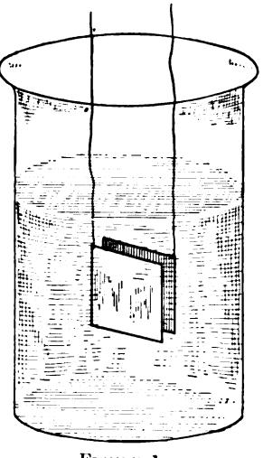

FIGURE 1 .

free energy of the whole system, due to infinitesimal charging or discharging, is given by the equation

$$dF \,\,=\,\mathbf{E}d\mathbf{Q}.\tag{11}$$

Now by precisely the same methods that we have employed in obtaining Equations XV-5 and XV- 10 we find

$$
\begin{pmatrix} \frac{\partial \mathbf{E}}{\partial \dot{P}} \end{pmatrix}_{\mathbf{q}, \mathbf{r}} = \begin{pmatrix} \frac{\partial \mathcal{V}}{\partial \ddot{\mathbf{Q}}} \end{pmatrix}_{\mathbf{r}, \mathbf{r}'} \tag{12}
$$

and

$$T\begin{pmatrix}\frac{\partial \mathbf{E}}{\partial T}\end{pmatrix}_{\mathbf{Q},\mathbf{P}} = \mathbf{E} \ -\begin{pmatrix}\frac{\partial \mathbf{H}}{\partial \mathbf{Q}}\end{pmatrix}_{\mathbf{r},\mathbf{P}}.\tag{13}$$

Here ǝH/ƏQ is the change in the heat content of the system, with the charge on the condenser ; and ǝV/ƏQ is the corresponding change in the volume of the system, or, if we neglect the condenser plates, it is the change in volume of the liquid dielectric per unit change in the charge on the condenser. These quantities may therefore be calculated if we know the change in dielectric properties with temperature and pressure. For if D is the dielectric constant, and we are dealing with unit condenser,

$$
\mathbf{E} = \mathbf{Q}/\mathbf{D},\tag{14}
$$

andsubstitutingthisvaluein Equations12 and 13 we have

$$
\begin{pmatrix}
\frac{\partial}{\partial \dot{\boldsymbol{P}}}
\begin{pmatrix}
\partial \mathbf{D} \\
\ddot{\boldsymbol{\partial}} \dot{\boldsymbol{P}}
\end{pmatrix}_{\mathbf{q},\boldsymbol{\tau}} = -\begin{pmatrix}
\partial \boldsymbol{V} \\
\partial \overline{\mathbf{Q}}
\end{pmatrix}_{\mathbf{p},\boldsymbol{\tau}},\tag{15}
$$

where ǝD/ P is the change of dielectric constant with the pressure, other things being constant. Likewise,

$$-\frac{T\mathbf{Q}}{\mathbf{D}^2} \left(\frac{\partial \mathbf{D}}{\partial T}\right)_{\mathbf{Q},\rho} = \frac{\mathbf{Q}}{\mathbf{D}} - \left(\frac{\partial H}{\partial \mathbf{Q}}\right)_{T,\rho},\tag{16}$$

where ǝD/ T is the change of dielectric constant with temperature, when other things are constant. "

These equations are fundamental to the whole theory of dielectrics. They may be put in several different forms, for example in such form as to exhibit the heat and volume changes attending a change in the strength of the electric field , rather than a change in the condenser charge. But such transformations, together with the selection of the units most suitable for

<sup>1</sup> In a cursory search we have been unable to find Equations 15 and 16 in the literature. The subject was discussed in a way which was partly thermodynamic by Koenigsberger ( Ann. Physik, [4] , 5, 113 ( 1901) ) .

numerical calculations, we may leave to the reader who is interested in this subject. An entirely similar treatment may be applied to the properties of a substance in a magnetic field.

### THERMODYNAMICS OF SURFACES

The boundary between two contiguous phases, which is known as a surface or an interface, is not a mathematical boundary of only two-dimensional extension. There is a minute though finite region in which the properties differ appreciably from the properties in the interior of either phase, and vary from point to point.

Thus neither molal volume nor molal heat content is the same within the surface region as in the body of a phase ; nor is it in general the same at two points within the surface region. But it is to be noted that when equilibrium exists, the escaping tendency of each substance present must be the same in every part.

Without attempting to investigate the different parts of the surface layer, it is an interesting thermodynamic study to examine the volume and heat changes when the extent of the surface layer is changed, and to show the relation between these changes, and the influence of pressure and temperature upon the surface tension.

Change of Surface Tension with Pressure and Temperature. When a system is in equilibrium it is possible, by familiar mechanical means, to increase the extent of the surface between two phases. The work required per unit increase in surface is called the surface tension. Equating this mechanical work to the increase in the free energy of the system, we write

$$dF = \gamma d\sigma,\tag{17}$$

where is the surface tension and σ is the extent of the surface in question.

We meet an apparent paradox when we consider, on the one hand the molal free energy of a substance, and on the other hand the total free energy of a system of which it is composed. We often assume that the total free

energy of a substance is equal to its molal free energy multiplied by the total number of mols. But we may now see that this is not strictly correct. If we start with a given amount of a liquid and increase its surface, the molal free energy in the body of the liquid does not necessarily change, and if we maintain equilibrium the molal free energy in the surface formed must be the same as in the body of the liquid. Therefore the molal free energy multiplied by the total number of mols remains constant, but the total free energy is increased by ydo.

Let us now consider a two-phase system, for example water and mercury. Any infinitesimal change in the extent of the surface between the two phases will in general produce a change of volume, and the ratio of these two changes, aV/do, is thermodynamically connected with the change of surface tension with pressure. Indeed if we keep temperature constant, and thus make the state of the system depend upon pressure and surface, the dependence of the free energy of the system upon these two variables may be expressed in accordance with Equation III-5,

$$
\left[\frac{\partial}{\partial P}\left(\frac{\partial F}{\partial \sigma}\right)_P\right]_\sigma = \left[\frac{\partial}{\partial \sigma}\left(\frac{\partial F}{\partial P}\right)_\sigma\right]_P,\tag{18}
$$

and inserting the values of the two coefficients by Equations 17 and XIV-9, we see that

$$
\begin{pmatrix} \frac{\partial \gamma}{\partial \dot{P}} \end{pmatrix}_{\sigma} = \begin{pmatrix} \frac{\partial V}{\partial \sigma} \end{pmatrix}_{P}. \tag{19}
$$

Thus if y is found to diminish with increasing pressure, it shows a contraction at the surface between the two phases. In other words a diminution in total volume would accompany the emulsifyingofthetwophases.

In just the same way we may proceed if the pressure is constant and the free energy depends only upon temperature and surface. In this case

$$
\left[\stackrel{\partial}{\partial T} \begin{pmatrix} \partial F \\ \partial \sigma \end{pmatrix}_{\tau} \right]_{\sigma} = \left[\stackrel{\partial}{\partial \sigma} \begin{pmatrix} \partial F \\ \partial \bar{T} \end{pmatrix}_{\sigma} \right]_{\tau}, \tag{20}
$$

1 Equation 19 was developed by one of the authors in 1904 in connection with an experimen tal investigation of the surface tension between ether and air at high pressures. The experi ments, which were not concluded, showed a very marked change of surface tension with pressure. In such a case as this the pressure not only changes the density of each phase, but changes the vapor pressure of ether and the solubility of air in ether. However, regardless of such complexities, Equation 19 must hold.

### or,byEquations 17 and XIV- 12,

$$
\begin{pmatrix} \frac{\partial \gamma}{\partial \bar{T}} \end{pmatrix}_{\sigma} = - \begin{pmatrix} \frac{\partial S}{\partial \sigma} \end{pmatrix}_{\bar{T}} = \frac{1}{\bar{T}} \begin{bmatrix} \left( \frac{\partial F}{\partial \sigma} \right)_{\bar{T}} - \left( \frac{\partial H}{\partial \sigma} \right)_{\bar{\tau}} \end{bmatrix}, \tag{21}
$$

or

$$T\begin{pmatrix}\partial\gamma\\\bar{\partial}\bar{T}\end{pmatrix}_{\sigma} = \gamma - \begin{pmatrix}\partial H\\\bar{\partial}\sigma\end{pmatrix}_{\bar{T}}.\tag{22}$$

This equation, which is entirely analogous to the Gibbs- Helmholtz equation for electromotive force (Equation XV- 5) , was first obtained by Lord Kelvin. It connects directly the temperature coefficient of surface tension and the heat change accompanying the change of surface ; for example, the heat of emulsification.

EXERCISE 4. Derive an equation for the change of y/T with the temperature. A large amount of meat is evolved when finely divided silica, after thorough drying, is brought in contact with water. Considering the surface tension between silica and water, does y/T increase or diminish with rising temperature?

Change of Surface Tension with Composition. Even at constant temperature and pressure the surface tension between. two phases may be altered, through a change in composition of either phase. Keeping all constituents of the system constant in amount, and only varying n2, the number of mols of the substance X2 present in the whole system, the properties of the system depend upon the two variables n₂ and σ. Once more, therefore, we may represent the total free energy as a function of two variables, by the equation,

$$
\left[\begin{array}{c}
\frac{\partial}{\partial n_2} \left(\frac{\partial F}{\partial \sigma}\right)_{\mathfrak{m}} \\
\end{array}\right]_{\sigma} = \left[\begin{array}{c}
\frac{\partial}{\partial \sigma} \left(\frac{\partial F}{\partial n_2}\right)_{\sigma} \\
\end{array}\right]_{\mathfrak{m}},\tag{23}
$$

or, by Equation 17 and by the definition of partial molal free energy (see Exercise XVIII-5) ,

$$
\begin{pmatrix} \partial \gamma \\ \partial n_2 \end{pmatrix}_{\sigma} = \begin{pmatrix} \partial \mathcal{F}_{\mathbb{H}} \\ \partial \sigma \end{pmatrix}_{n_2}.\tag{24}
$$

This equation shows the effect on the surface tension between two phases, caused by the addition of the substance X2, regardless of the way in which the added substance is distributed between 1 Thomson, Phil. Mag.. [ 4] , 17, 61 ( 1859) .

the two phases. Now, since temperature and pressure are constant, F2, which is constant throughout the system, cannot be changed in the body of either phase merely by the extent of surface, unless this change of surface causes some change of compositioninthebodyofeachphase.

This important generalization of Gibbs may be more clearly understood if we focus our attention upon one phase, say a liquid solution which is in contact with its vapor, and consider the change in its composition accompanying a change in the extent of its surface. If an increase in surface diminishes the concentration of one constituent in the body of the solution , that constituent is said to be adsorbed on the surface. Let us consider a solution containing n₁ mols of X₁ and ng mols of X2, and let us increase the surface by do. This will in general change the composition of the body of the solution, and thus will change the various properties which depend upon composition, such as the partial molal free energy. In order to restore such properties to their original value, it will suffice to add (or withdraw) one of the constituents X2 by the amount dng. In other words, ana/do shows the amount of X2 which has to be added per unit increase of surface in order to maintain the original composition in the body of the solution. It may be called the adsorption coefficient of X2 and be denoted by u2. It is the excess of X2 in the surface layer, above that required to give the surface layer the same composition as the body of the solution.

We may now put Equation 24 into a more usable form. ByEquation III- 3,

$$
\begin{pmatrix} \partial \mathbb{F}_2 \\ \partial \sigma \end{pmatrix}_{\mathbb{N}_2} = \begin{pmatrix} \partial \mathbb{F}_2 \\ \bar{\partial} n_2 \end{pmatrix}_{\sigma} \begin{pmatrix} \partial n_2 \\ \bar{\partial} \sigma \end{pmatrix}_{\mathbb{F}_2}, \tag{25}
$$

and noting by our definition that ( an2/dσ) F₂ = U2, we find

$$
\begin{pmatrix} \frac{\partial \gamma}{\partial n_2} \end{pmatrix}_{\sigma} \Big/ \begin{pmatrix} \frac{\partial \mathcal{F}_2}{\partial n_2} \end{pmatrix}_{\sigma} = \begin{pmatrix} \frac{\partial \gamma}{\partial \mathcal{F}_2} \end{pmatrix}_{\sigma} = \begin{pmatrix} - \ u_{\mathfrak{A}} \end{pmatrix} \tag{26}
$$

This important theorem of Gibbs shows that if we know the change of surface tension with composition, and the change of escaping tendency with composition , we may calculate the

coefficient of adsorption. There are not, as yet, sufficiently accurate data to illustrate quantitatively this exact equation ; but qualitatively it has been of the greatest aid in the study of emulsions, foams, and other systems in which surface phenomena play an important rôle.

Perhaps we have been less precise in our explanations than in our equations. The fact is that, if we are dealing strictly with a two-phase and twocomponent system, Equation 26 does not apply; for, by the phase rule (regardless of any considerations relating to the boundary surface) , we cannot maintain equilibrium between the two phases at constant temperature and pressure if we vary the composition of either phase at all. We must have at least one more component present in one or both of the phases, in order to make the equation significant.

Most commonly we deal with the surface between a liquid and its vapor, or between the same liquid and air. Indeed we find that the surface tension of a liquid is approximately the same in contact with any gas at moderate pressure, and for convenience this is called the surface tension of the liquid. So Equation 26 may be applied to the surface tension of a two-component liquid solution against a gaseous phase of any number of components, provided that these components are not sufficiently soluble in the liquid to affect materially its thermodynamic properties. However, Equation 26 itself may be applied rigorously and without limitation to any system, however complex, as follows .

If we have a system of any number of components, and any number of surfaces between various phases, the rate of change of surface tension at any one surface, with a change in the partial molal free energy of any one component, is equal to the adsorption coefficient of that component at that surface. But the adsorption coefficient must be defined as the amount of that component which has to be added to the whole system (per unit change of surface in question) in order to keep the escaping tendency of that component constant . Keeping the escaping tendency of one component at a constant value will usually imply, in this general case, a change in the composition of the several phases.

The Escaping Tendency from Curved Surfaces. Hitherto we have considered cases of surface layers in equilibrium with large bodies of the contiguous phases. Conditions are different when we consider, for example, a small drop of water and a large body of water, both in contact with air or vapor. The two together do not give a system in equilibrium, for water tends to go over from the small drop to the large body.

252 THERMODYNAMICS CHAP. XXI

Let us consider the change in free energy in this process. Assuming the drop to be spherical, with a radius r, its volume is 33. If n is the number of mols in the drop, and v is the molal volume,

$$W = n\mathbf{v} = \mathcal{G}\mathcal{G}\,\pi r^3. \tag{27}$$

Upon changing the contents of the drop by dn mols, the radius changes as shown by differentiation of Equation 27,

$$dn = \frac{4\pi r^2}{\mathbf{v}} dr.\tag{28}$$

The surface of the drop, σ = 4πr², changesatthesametime,

$$d\sigma = 8\pi r dr.\tag{29}$$

Now if F is the molal free energy in the drop, and Fº that in the large body of liquid, the change of free energy in a transfer of dn mols is

$$dF = (\mathbf{r} - \mathbf{r}^{\bullet})dn.\tag{30}$$

But this is also equal to the change in surface energy, by Equation 17 ; whence (assuming that the change in surface of the body of liquid is negligible)

$$
\gamma d\sigma = (\mathbf{r} - \mathbf{r}^{\bullet})dn.\tag{31}
$$

Substituting the above values of do and dn,

$$\mathbf{r} \cdot - \mathbf{r}^{\circ} = RT \ln \frac{f}{f^{\circ}} = \frac{2\gamma \mathbf{v}}{r}. \tag{32}$$

Thus the escaping tendency is greater the smaller the radius. By substituting vapor pressure for fugacity, we have an approximate equation for the vapor pressure as a function of the size of the drop.¹

Such effects , which are ordinarily quite negligible, become important when we deal with matter in a state of fine subdivision. When gypsum is finely ground, its solubility in water may be increased by 20 percent. The important phenomenon of adsorption on a substance like charcoal doubt-2


<sup>1</sup> W. Thomson, Phil. Mag. , [ 4] , 42, 448 ( 1881) .

<sup>2</sup> Hulett, Z. physik. Chem. , 47, 357 ( 1904) .

less depends, not only upon the amount of surface, but also largely upon the degree of curvature of the small cavities in the surface.

EXERCISE 5. Since a condition of equilibrium establishes itself within a small drop, the escaping tendency must be the same in the interior as at the surface. The escaping tendency must therefore be greater in the interior of a drop than in the interior of a large mass. Show that this is due to the increased pressure within the drop caused by the surface tension, and by this means derive Equation 32 from Equation XIV- 9. The pressure may most simply be calculated by considering the surface tension as a force, normal to a great circle, tending to pull together two hemispheres of the drop. The force therefore is 2πry, and this, divided by the area of a great circle, gives the pressure.

EXERCISE 6. Derive an equation for the escaping tendency of one component of a solution which forms a spherical drop.

EXERCISE 7. The critical mixing temperature of phenol and water is 68.4°C. At this temperature the composition may be varied at will, without producing two liquid phases. At the particular composition which is known as the critical mixing composition, show from Equation XVIII- 17 that a small change of composition will not change the surface tension between the liquid and air, regardless of the amount of surface adsorption of either constituent of the liquid.

# CHAPTER XXII

## A USEFUL FUNCTION, CALLED THE ACTIVITY, AND ITS APPLICATION TO SOLUTIONS

Our task of presenting the basic ideas and methods of thermodynamics is nearly completed. There are a few matters of fundamental importance which it has seemed expedient to postpone until after the classic methods of thermodynamics have been fully treated. But in the main we shall henceforth direct our attention more particularly to the questions which arise in the application of the fundamental principles to specific numerical calculations.

Of all the applications of thermodynamics to chemistry, none has in the past presented greater difficulties, or been the subject of more misunderstanding, than the one involved in the calculation of what has rather loosely been called the free energy of dilution ; namely, the difference in the partial molal free energy of a dissolved substance at two concentrations. We shall therefore, in this and in subsequent chapters, give much attention to the various special methods whereby this important quantity may be simply and precisely determined.

- If we consider one constituent of a solution at two different concentrations, but at the same temperature, and if by some method we determine for this constituent AF = F F' between these concentrations, then we have also determined the ratio of the fugacities. For by Equation XVIII-7 ,

$$
\mathbb{F} - \mathbb{F}' = RT\ln\frac{f}{\overline{f}'}.\tag{1}
$$

Now we often have occasion to determine and to use such a ratio of fugacities when it is impossible or inexpedient to determine the numerical value of either fugacity; for example, we 254

may be dealing with an almost involatile substance. It has therefore proved advantageous to consider, at a given temperature, the ratio between the fugacity f of a substance in some given state, and its fugacity f° in some state which, for temporary convenience, is chosen as a standard state. This relative fugacity¹ is called the activity, and denoted by a. Thus in the standard state the activity is unity, a° givenbytheequations,= 1, while in any other state it is

$$a = \frac{f}{f^{\circ}}; \quad \mathbf{r} - \mathbf{r}^{\circ} = RT \ln a,\tag{2}$$

where, at a given temperature, the molal free energy in any state is F, and in the standard state Fº.

Since in any state the activity at a given temperature is always proportional to the fugacity, we may write d In adln f. Thus for the change of activity with pressure we write from Equation XVII- 6,

$$
\left(\frac{\partial \ln a}{\partial P}\right)_T = \left(\frac{\partial \ln f}{\partial P}\right)_T = \prescript{\mathbf{v}}{\ddot{R}\ddot{T}}.\tag{3}
$$

Now if for the purpose of some calculation we choose any one state of a substance as the standard state, for example liquid water at atmospheric pressure, we shall consider this the standard state at different temperatures. Thus in the example chosen, if we should take the activity of liquid water as unity, the activity of water in any solution would be given by the ratio of its fugacity to that of liquid water, at each temperature.

It would evidently avoid confusion if once for all we should choose for a given substance its standard state. This consideration, however, is outweighed by the practical advantage of being able at any time to choose the standard state or states best adapted for a particular problem. For reasons which will become more apparent when we enter upon free energy calcula-

<sup>1</sup> Sometimes called also the relative activity ; for Lewis first defined the absolute activity, as he defined the fugacity , by reference to the attenuated gaseous state, in which the activity was taken as equal to the concentration. (Proc. Am. Acad. , 43, 259 ( 1907) ; Z. physik. Chem. , 61, 129 ( 1907) ) . More recently, however, it has become the general custom to use the term activity in the sense of the relative activity, or relative fugacity, and it is in this sense that we shall use it henceforth.

## 256 THERMODYNAMICS CHAP. XXII

tions , we shall choose as standard now one state and now another, as convenience dictates, although to avoid confusion this choice. must in each case be clearly stated. For, as we proceed, we shall find it desirable to choose different standard states for a substance, not only in different problems, but even in a single problem. However, we may in advance lessen the arbitrariness of our procedure by setting down certain rules for choosing the standard state to which we shall almost invariably adhere.

### CHOICE OF A STANDARD STATE

1. For a Gas : a = f; that is, a/P = 1 when P = 0. Since the activity of a substance at a given temperature is always proportional to its fugacity, it will be convenient in the case of a gas to make the activity equal to the fugacity ; in other words, we choose at each temperature as standard state the one in which the fugacity is unity. For a perfect gas this is the same as making the activity unity at unit pressure ; but in general the activity will not be exactly equal to the pressure. It is therefore to be borne in mind that while the standard state of a liquid or solid is always taken at unit pressure, the standard state of a gas is one in which not the pressure, but the fugacity, is unity.

As a matter of fact we wish to go a little farther than this. The standard state, as we shall use the term, implies not only that the fugacity is unity, but that the heat capacity, heat content, etc., are those of the gas at infinite attenuation . Our standard state therefore is a hypothetical one and corresponds to no real state of the gas.

= 1 2. For a Liquid or Solid which may Act as a Solvent : a/N when N = 1. If a pure liquid, or a pure solid, X₁, at atmospheric pressure, be chosen as the standard state, or state of unit activity, at each temperature, we may change the activity of such a liquid or solid by dissolving in it a very small amount of another substance. Then by Raoult's law, the fugacity, and therefore

<sup>1</sup> In the case of a mixed gas we shall also make the activity equal to the fugacity for each constituent.

## THE ACTIVITY 257

the activity a is proportional to the mol fraction N1. But by definition, a = 1 for the pure solvent when N = 1. Thus for the solution,

$$\frac{a_1}{\mathbf{N}_1} = \mathbf{1},\tag{4}$$

an equation that is valid for the infinitely dilute solution, and as far into the range of finite concentrations as Raoult's law is obeyed. In a region where it is not obeyed a series of values of a1/N1 shows immediately the degree of departure from that law.

By our definition of a₁ , the activity of the solvent is equal to fi/fi°. Now if the solvent has a measurable vapor pressure, we may let P1 be the measured vapor pressure of the solvent from the solution, and pi° be the vapor pressure of the pure solvent . Then if we may assume that the vapor behaves as a perfect gas, p₁ = fi and p₁° = fi°, so that

$$a_1 = \frac{p_1}{p_1^{\bullet}}, \quad \text{ } \tag{5}$$

and this equation, as we shall see, furnishes one of the most useful means of calculating activities. If the vapor is not a perfect gas we may still determine a₁ = fi/fi° by the methods of Chapter XVII. -

Let us make sure that there is no misunderstanding of the way in which we are to use the term activity. We have seen in a previous chapter that in a state of equilibrium the fugacity of a given substance is the same in every phase, or in every part of a system. Since the activity is defined as the relative fugacity; if we should choose, for the whole system, a single standard state of the given substance, its activity would be the same in every part of the system. On the other hand, since we have decided to use for the substance in question different standard states in different phases, its activities in the several phases which are in equilibrium will not be equal, but will nevertheless remain proportional to one another as long as equilibrium persists, the factor of proportionality depending upon the choice of standard states.

Thus in the case, which we have just cited , of a solvent in equilibrium with its vapor, the activity in the vapor phase being defined as in the pre-

### 258 THERMODYNAMICS СНАР. ХХІІ

ceding section, and that in the liquid phase being defined as in this section, the ratio of these two activities remains constant no matter how the concentration of solute changes ( and this ratio is equal to fi ° , the fugacity of the pure liquid) . We shall meet a similar case when we discuss the distribution of a solute between two solvents.

When the vapor pressure of the solvent is not measurable, numerous other methods of determining the activity are available. Thus if we should measure the electromotive force of some galvanic cell with a silver electrode, and then substitute for the silver a solid solution of gold in silver, the electromotive force would be found to change, owing to the fact that the gold lowers the escaping tendency of the silver. A careful investigation of this sort would enable us, by methods which we shall illustrate later in this chapter, to determine the activity of the silver in a series of gold-silver alloys.

3. For a Solute : a/N = 1 when N = 0. Turning now to the activity of the solute in a dilute solution , we enter a field in which the concept of activity has proved most fruitful. In the typical case of a solution at infinite dilution , we have Henry's law, which states that the fugacity of the solute, and therefore its activity, is proportional to its mol fraction . It is therefore usually convenient to choose the standard state of a solute X2 so that at infinite dilution a2/N₂ = 1.

Thus in any range in which Henry's law is obeyed, a2/N2 remains equal to unity; and if the solution happens to be one which is perfect over the whole range of composition, the standard state which we have so chosen is simply pure X2. Then the present definition of the standard state coincides with that of the preceding section. Ordinarily, however, this is not the case, and the chosen standard state of the solute depends upon the solvent employed. The only danger of confusing this definition of the standard state with that of the preceding section is in concentrated solutions where either substance might be regarded as solvent or solute. In such a case it will be necessary to state very plainly which definition is being used for each substance.

We offer no general rule for fixing the standard state of a solute in a mixed solvent. If in any problem the constituents of the mixed solvent remain in the same relative amounts the case can be treated just as though the solvent were pure. In other cases it will usually be best to use as standard state one defined with respect to a solution in one of the pure solvents.

- 4. For a Solute in Aqueous Solution ' when the Composition is Expressed by Molality : a/m 1 when m = 0. Unfortunately in aqueous solutions, where most of the available data have been obtained, it has been customary to express composition, not by mol fraction, but by molality, namely the number of mols in 1000 g. of water (or by concentration) . But since in the dilute solution these are proportional to one another, Henry's law requires the activity at infinite dilution also to be proportional to the molality. In this case we choose the standard state of a solute X2 by taking a2/m2 1, when m2 = =0.

As in the case of gases, we shall here use as our standard state of the solute, not any real solution, but a hypothetical one in which the activity is unity, and one furthermore in which the partial molal volume, heat content, and heat capacity are those of the solute at infinite dilution.

In dilute solution the deviation of a2/m2 from unity measures once more the departure of the solution from the perfect solution, but in concentrated solutions, where the molality is not proportional to the mol fraction, this is no longer the case. For nearly every purpose the mol fraction furnishes the most advantageous method of measuring composition, and the employment of this measure in aqueous as well as in non- aqueous solutions is to be encouraged. In the meantime, however, most existing data in aqueous solutions are expressed in terms of molality (or what is very nearly the same,the concentration) , and unless otherwise stated our unit of activity in aqueous solutions will be the one defined in this section.

## THE NUMERICAL CALCULATION OF ACTIVITY

The Activity of a Solvent, from its Vapor Pressure over a Solution. In most cases where vapor pressures of solutions have been measured the vapor may be assumed, within the limits of experimental error, to be a perfect gas. This is true for the thallium amalgams, which have been studied by Hildebrand and Eastman at 325°C. If N₁ is the mol fraction of mercury in the amalgam, a , its activity, p₁ its vapor pressure from the amalgam, and if p ° is the vapor pressure of pure mercury, then, since the activity of pure mercury is taken as unity, a₁ = p₁/p₁ ° .

<sup>1</sup> The case of electrolytes will be discussed in a subsequent chapter. * Hildebrand and Eastman, J. Am. Chem. Soc. , 37 , 2452 ( 1915) .

Table 1 gives the values of p₁ /pi° found by Hildebrand and Eastman at several values of the mol fraction N1. The third column gives a₁ /N1, a quantity whose difference from unity shows the degree of departure from the perfect solution . This ratio is useful for the interpolation of activities at round mol fractions, as well as for another purpose which we shall discuss presently.

| -<br>TABLE<br>ACTIVITY<br>1. | MERCURY<br>OF | AMalgams<br>THALLIUM<br>IN | 325°C<br>at |
|------------------------------|---------------|----------------------------|-------------|

| Ni       | P₁/pi<br>a1<br>= | a1/Ni |
|----------|------------------|-------|
| 0.957    | 0.955            | 0.998 |
| 0.942    | 0.938            | 0.996 |
| 0.915    | 0.901            | 0.985 |
| 0.893    | 0.875            | 0.980 |
| 0.836    | 0.803            | 0.961 |
| 0<br>742 | 0.690            | 0.930 |
| 0.664    | 0.602            | 0.907 |
| 0.614    | 0.548            | 0.893 |
| 0.497    | 0.433            | 0.871 |
| 0.347    | 0.293            | 0.844 |
| 0.202    | 0.166            | 0.822 |

Activity of a Solute from its Vapor Pressure. When a solution is in equilibrium with the vapor of the solute X2, we may measure the vapor pressure of X2 over a range of concentration , and by knowing the fugacity of the vapor at each pressure we may obtain the activity of the solute in the solution. When we may assume that the vapor is a perfect gas, a2, the activity in the solution, may be taken as proportional to P2, the vapor pressure of the solute. Hence, as we pass from some mol fraction N₂ to an infinitely dilute solution of mol fraction N2* ; a2 / p₂ = a2*/p2*. Now by Henry's law N2/p2 approaches at infinite dilution a constant value, which may be denoted by N2*/p2*. But by definition of our standard state a2* N2*, and therefore at any concentration, =

$$a_2 = \, p_2 \, \frac{\text{N}_2 \text{*}}{p_2 \text{*}} ; \qquad \frac{a_2}{\text{N}_2} = \frac{p_2}{\text{N}_2} / \frac{p_2 \text{*}}{\text{N}_2 \text{*}} . \tag{6} \text{*}$$

Lewis and Storch¹ measured the vapor pressure of bromine 1 Lewis and Storch, J. Am. Chem. Soc. , 39, 2544 ( 1917) .

= from solutions of bromine¹ (Br₂) in carbon tetrachloride (CCL) ranging from N2 0.004 to N₂ = 0.025, and they found, over the whole range, a constant value of p2/N2, namely, 0.539. Thus over this limited range the activity of bromine in carbon tetrachloride is equal to the mol fraction, and there is no departure from the law of the perfect solution . However, if we should attempt to extrapolate to N₂ = 1 , we should find for the vapor pressure of pure bromine 0.539 atmos. , while the actual vapor pressure of pure bromine is 0.280 atmos. Thus we see that the standard state which we have chosen for bromine, in its dilute solutions in carbon tetrachloride, differs materially from the standard state of pure liquid bromine.

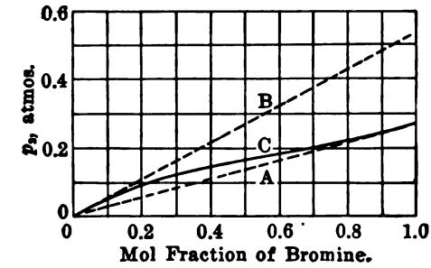

FIGURE 1.-Vapor Pressure of Bromine from Carbon Tetrachloride Solutions.

This is illustrated in Figure 1 , where the line A shows the values that would be calculated from the vapor pressure of pure bromine, assuming a perfect solution . The line B is an extrapolation of the straight line experimentally obtained in the dilute solutions ; while the actual curve for the whole range would be of the form of C. In other words B represents the extrapolation given by Henry's law from dilute solutions of bromine in carbon tetrachloride ; while A represents the extrapolation by Raoult's law from dilute solutions of carbon tetrachloride in bromine. The ratio of 0.539 to 0.280, which is also the ratio

<sup>1</sup> It must constantly be borne in mind that the mol fraction is ambiguous unless the chemical formulas are stated. The mol fraction of bromine in a solution containing 160 grams bromine and 154 grams carbon tetrachloride is 1½ if we are considering the formula Br2, but if we are considering the formula Br. While theoretically thermodynamics is not concerned with the way in which the molecular species or the formula is defined, in practice it would produce awkward complications to use any formula except Br2 for bromine solutions. This is equivalent to saying that bromine is found empirically to have the molal weight 160 in solution.

СНАР. ХХІІ

of the slopes of B and A, gives us at once the ratio of the fugacity of bromine in the two standard states ; the first of which being the one we have chosen for bromine in dilute solution in carbon tetrachloride, and the second (pure bromine) being the one we would have chosen if we had taken bromine as the solvent.

If the vapor of the solute cannot be regarded as a perfect gas, our procedure is not seriously complicated. Let us consider the vapor pressure of CO₂ from aqueous solutions (or the solubility of CO2 in water) . At a given temperature let a₂ be the activity, and m the molality, of CO2 in the aqueous phase. Let på be the vapor pressure of CO2, and ƒ2 the fugacity, which is the same in both phases. Then since a₂ is always proportional to f2,

$$\frac{a_{\mathfrak{a}}}{f_{\mathfrak{a}}} = \frac{a_{\mathfrak{a}}\mathfrak{*}}{f_{\mathfrak{a}}\mathfrak{*}}.\tag{7}$$

The second member represents the values in a very dilute solution, where ƒ2*, being small, is equal to p * ; and a₂ * by definition of the standard state may be taken equal to m*. Hence

$$\frac{a_{\mathfrak{r}}}{f_{\mathfrak{r}}} = \frac{m^{\bullet}}{p_{\mathfrak{r}}\mathfrak{r}}.\tag{8}$$

Here the second member is the limit approached at infinite dilution by the "solubility coefficient, " m/p2. In the present case, at 0 ° C, m*/p2* = 0.076, and ar == 0.076f2.

Thus, consider a solution which at 0° C gives a pressure of CO2 amounting to 5 atmos. By Exercise XVII-6 the fugacity is 4.88 atmos. and the activity of CO2 in the solution is 0.076 × 4.88 = 0.371 .

Determination of Activity from the Distribution of a Solute between Two Solvents. Instead of finding the distribution of a substance between a solution and a gaseous phase, in which its activity is known, we may study the distribution of a solute. between two immiscible solvents, so that if its activity at different concentrations is known in one solvent it may be calculated in the other.

Thus, when a very small amount of bromine, Br2, is shaken up with carbon tetrachloride and water (slightly acidulated to


<sup>1</sup> Strictly speaking we measure the distribution not between pure water and pure carbon tetrachloride, but between water saturated with carbon tetrachloride and carbon tetrachloride saturated with water. In the present case the difference is not important, but this is by no means always true. In the interesting case studied by Lewis and Burrows (J. Am. Chem. Soc. , 34, 1515 ( 1912) ) where urea was shaken up with the two-phase system of ethyl acetate

prevent the hydrolysis of the bromine) , it was found by Lewis and Storch (loc. cit . ) that the molality m in the aqueous phase, divided by the mol fraction N₂ of bromine in the carbon tetrachloride phase, is 0.371 at 25°C. In other words, at infinite dilution m*/N2* = 0.371. If we denote by a the activity of bromine in the water phase and by a its activity in the other, these two activities must be proportional to one another, and since we define the standard states so that at infinite dilution m* , and a ,* * аг = == == N2*,

$$\frac{a_w}{a_t} = \frac{a_w}{a_t^{"\star"}}^* = \frac{m^*}{\mathbf{N}_t^*}.\tag{9}$$

Thus, a = 0.371 a,. But we have seen, earlier in this chapter, that in the carbon tetrachloride phase, up to N₂ = а1 = N2, and therefore in this range au = 0.025,0.371N2. If then we wish to know the activity of bromine in any dilute aqueous solution, we find its mol fraction in a carbon tetrachloride solution which maintains equilibrium with the aqueous phase, and multiplythismolfractionby0.371.

If iodine ( I2) is shaken with glycerine and carbon tetrachloride, and if its mol fraction in the former phase is N, and in the latter Ne, then N /N, should be constant in very dilute solutions. At the moderate concentrations studied at 25°C by Landau¹ this constancy no longer holds. He found that when N, varies from 0.0001 to 0.002 , N,/N, changes from 0.50 to 0.40 . If we assume that for iodine ( as for bromine) the activity in carbon tetrachloride is equal to N,, we may find in the glycerine phase the ratio of activities at the two concentrations. Or if, in the glycerine phase, we consider the ratio of the activity a, to the mol fraction N,, this ratio evidently increases 20 % in going from the more dilute to the more concentrated solution .

Activity from Measurements of Electromotive Force. In most galvanic cells the electromotive force depends upon the

and water, the results would have been vastly different if the distribution between urea in pure water and urea in pure ethyl acetate could have been obtained, for the escaping tendency of urea from ethyl acetate solutions varies greatly with a small change in the water content of the ester. (Indeed the solubility of solid urea in ethyl acetate containing water was found to be nearly proportional to the water content. )

<sup>1</sup>¹ Landau, Z. physik. Chem. , 73, 200 ( 1910) .

### THERMODYNAMICS

composition of the electrolyte. Deferring consideration of such cells until we have more fully studied the thermodynamic properties of electrolytes, there is still an important class of cells, of which the electromotive force depends solely upon the condition of the electrodes.

1 If two electrodes of the same metal in the same condition are placed in the same electrolyte, a small current results in the transfer of a certain amount of metal from one electrode to the other, but this is a process which is attended by no change in free energy and the reversible electromotive force of the cell is zero ; as might have been foretold also from the symmetry of its construction . If, however, the two electrodes differ from one another, thus if the electrodes are in different states of strain, or if one of the electrodes is of pure copper and the other is of copper containing some impurity such as silver in solid solution, the activity of the copper will not be the same in the two electrodes, and the cell will have an electromotive force.

Thus in the second of these cases, the process which occurs in the cell and the change in free energy accompanying this process may be expressed by the equation

Cu(s) =· Cu ( in the solid solution) ; AF = RT In (a/a') = ᎡᎢ ln a ,

if a is the activity in the solid solution, and if a' , the activity of pure copper, is taken as a or unity. Hence from Equation XV- 1 ,

$$-\text{ NEF} = RT \ln a; \quad \mathbf{E} = -\frac{RT}{\mathbf{NF}} \ln a. \tag{10}$$

Ordinarily in a case of this kind the electromotive force is entirely independent of the particular electrolyte which is employed. But in the present instance it is interesting to note that the nature of the electrolyte may affect E by determining the value of N; for if the electrolyte is a pure cupric salt, N 2, but if it is a pure cuprous salt, N = 1. With given electrodes E is therefore twice as great in the latter case as in the former. =

A more common type of cell is furnished when the electrode is a metallic solution in which the more electropositive metal is the solute . Let us consider a cell whose electrodes are two

¹ At the same time a certain amount of electrolyte, determined by the transference number, is carried from one pole to the other, but here also , since the transfer is between two regions of equal concentration, the free energy change is zero.

thallium amalgams of different composition, both immersed in the same solution of electrolyte. Now when a current passes through such a cell , the only thing of thermodynamic significance which occurs in the cell , is the carrying of a certain quantity of thallium out of one amalgam into the other, a process which may be expressed as follows :

> Tl (in Tl amalg; N2') = Tl (in Tl amalg; N2) .

If a₂ and a2' are the activities of the thallium, when the mol fractions of the thallium are N2 and N2' ,

$$
\Delta F = RT \ln \frac{a_2}{a_1} = -\text{ NEF.}\tag{11}
$$

Introducing the numerical values of F and Rfrom Appendix II , and using common logarithms,

$$\mathbf{E} = -\frac{0.00019844T}{\mathbf{N}} \log \frac{a_2}{a_1}.\tag{12}$$

If we fix N = 1, by using a pure thallous salt, it is evident that the electromotive force is independent of the particular salt chosen, and also independent of its concentration, and of the solvent in which it is dissolved. In fact, at a given temperature,it is determined completely bytheproperties ofthetwoamalgams.

In very dilute amalgams, where the activity is proportional to the mol fraction, we may predict the electromotive force of the concentration cell by means of the equation

$$\mathbf{E} = -\underbrace{0.00019844T}_{\mathbf{\tilde{N}}} \log \frac{\mathbf{v_{\tilde{\mathbf{N}}}}}{\mathbf{v_{\tilde{\mathbf{N}}}}}.\tag{13}$$

On the other hand, in the concentrated amalgams we may use the measured values of E to find how the activity varies with the composition.

In order to illustrate this method we may employ the data obtained for such cells by Richards and Daniels¹ at 20° C. At this temperature Equation12becomes.

$$
\log a_{\mathbf{2}} = \frac{-\mathbf{E}}{\overline{0.05816}} + \log a_{\mathbf{2}}'.\tag{14}
$$

1 Richards and Daniels, J. Am. Chem. Soc. , 41, 1732 ( 1919) . In discussing, here and elsewhere, the thermodynamic properties of thallium amalgams, we follow the paper of Lewis and Randall, J. Am. Chem. Soc. , 43, 233 ( 1921 ) .

Now we may let N₂ be the mol fraction and a₂ the activity of thallium in any amalgam, and N2' and a ' the corresponding values in some particular amalgam chosen for reference. Then E is the electromotive force of any concentration cell of which one electrode is the amalgam of fixed mol fraction N2' , and the other is an amalgam of any mol fraction N2.

While this equation permits the immediate calculation of the ratio of activities between two amalgams which have been studied experimentally, it is frequently desirable to obtain this ratio by interpolation between two compositions that have not

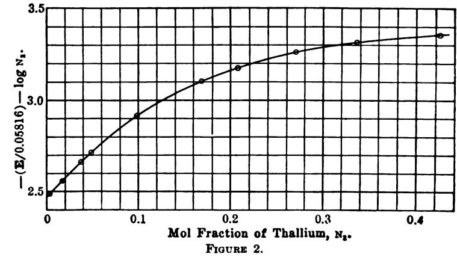

= been directly investigated. Especially it is desirable to obtain not merely such ratios of activities, but also the value of each activity, which can be found if we are able to extrapolate our data to infinite dilution, where a2 N2. For such purpose of extrapolation and interpolation we shall once more employ the expedient of plotting the difference between the experimental data and a function chosen with regard to simplification at infinite dilution .

Thus subtracting log N₂ from both sides of Equation 14,

$$\log \frac{a_{\mathfrak{a}}}{\mathfrak{N}_{\mathfrak{a}}} = \left(\overline{\underset{0.058}{\overline{0}}} \overline{\underset{16}{\mathbb{R}}} - \log \mathfrak{N}_{\mathfrak{a}}\right) + \log a_{\mathfrak{a}} \text{'}.\tag{15}$$

If now we plot the quantity in parenthesis, against N₂, as in Figure 2, we note that when N2 = O we have by definition a₂/N:

= - 1 , or log (a2/N2) = 0. The value of the ordinate where the curve cuts the vertical axis is therefore equal to log a2' . Thus we determine the activity in the reference amalgam. The value of the limiting ordinate, subtracted from the ordinate at any other value of N2, gives at once the corresponding log (a2/N2) .

= - The curve is drawn from the experimental data given in Table 2. We have chosen N2' 0.00326, so that E is equal to the value of the e.m.f. given by Richards and Daniels. The first column gives the mol fraction of thallium ; the second gives E (the e.m.f. between an amalgam of the mol fraction given and one in which N2' 0.00326) . In the next column is given (- E/0.05816 - log N2) , plotted as ordinate in Figure 2 ; the fourth gives the values of a2/N2 obtained from the plot by the method just described. Namely, log a2/N2 is obtained by subtracting the intercept on the axis of ordinates ( log a₂ = 2.4689) from the values in Column 3. The last column gives the values of a2. =

|                             | -<br>E<br>-E |                      | a2    | a2       |  |
|-----------------------------|--------------|----------------------|-------|----------|--|
| N2                          |              | log<br>N2<br>0.05816 | N2    |          |  |
| 0                           |              | 2.4689               | 1     | 0        |  |
| 0.003259                    | 0            | 2.4869               | 1.042 | 0.003396 |  |
| 0.01675                     | 0.04555      | 2.5592               | 1.231 | 0.02062  |  |
| 0.03723                     | 0.07194      | 2.6660               | 1.574 | 0.05860  |  |
| 0.04856                     | 0.08170      | 2.7184               | 1.776 | 0.08624  |  |
| 0.0986                      | 0.11118      | 2.9177               | 2.811 | 0.2772   |  |
| 0.1680                      | 0.13552      | 3.1045               | 4.321 | 0.7259   |  |
| 0.2074                      | 0.14510      | 3.1780               | 5.118 | 1.061    |  |
| 0.2701                      | 0.15667      | 3.2610               | 6.196 | 1.674    |  |
| 0.3361                      | 0.16535      | 3.3159               | 7.031 | 2.363    |  |
| 0.4240                      | 0.17352      | 3.3558               | 7.707 | 3.268    |  |
| 0.428<br>sat<br>¹<br>(<br>) | 0.17387      | 3.3580               | 7.75  | 3.316    |  |
| Tl<br>(liquid,              | supercooled) |                      | 8.3   | 8.3      |  |

| TABLE | -<br>ACTIVITY<br>2. | OF | THALLIUM | IN | AMALGAMS | AT | 20°C |
|-------|---------------------|----|----------|----|----------|----|------|

1 The next to the last value of az is for saturated amalgams containing an excess of solid thallium . It is to be noted that Lewis and von Ende (J. Am. Chem. Soc. , 32, 732 ( 1910) ) assumed the potential of solid thallium to be the same as that of a saturated thallium amalgam, since at ordinary temperatures thallium and mercury had been shown by Kurnakov and Puschkin to form no compound, and since Sucheni had shown that mercury does not dissolve appre ciably in solid thallium. Richards and Daniels find by preliminary experiment that the saturated amalgam has a lower potential than pure thallium by 0.0025 volts. Hence the statement of Sucheni must be incorrect, and solid thallium must dissolve several percent of its own weight of mercury. It is, however, this thallium in contact with mercury, and possibly

### CALCULATION OF THE ACTIVITY OF ONE COMPONENT OF A SOLU-TION WHEN THE ACTIVITY OF THE OTHER IS KNOWN

When we know any partial molal quantity for one constituent of a binary mixture over a range of compositions, we have seen in previous chapters how it is possible to find the change in the corresponding partial molal quantity for the other constituent over the same range. Thus for changes in partial molal free energy, due to isothermal changes in composition, we have by Equation XVIII- 12

$$d\mathbb{F}_1 = \begin{array}{c} - \ \stackrel{\text{N}_\mathbf{2}}{\operatorname{\!\!\!\!}} d\mathbb{F}_{\mathbf{2}}, \end{array} \tag{16}$$

or by integration

$$
\mathbb{P}_1 - \mathbb{P}_1{'} = \ -\int_{\mathbb{N}_2^{\times}}^{\mathbb{N}_2} \overset{\mathbb{N}_2}{d} d\mathbb{P}_2. \tag{17}
$$

The only difference between the use of this equation and of similar equations which we have used for v, Cp, H, etc., is that F of a solute, instead of approaching a finite value at infinite dilution, approaches -∞. For this reason it is a great convenience to replace the free energy by the activity, according to the differential form of Equation 2,

$$d\mathbf{r} = RTd\ln a.\tag{18}$$

Then Equation 16 becomes

$$d \ln a_1 = \begin{array}{c} -\frac{N_2}{\cdot} \, d \ln a_1, \\ \text{(19)} \end{array} . \tag{19}$$

or

$$\log \frac{a_1}{a_1^{'}} = \ -\int_{\text{N}_2^{'}}^{\text{N}_2} \frac{\text{N}_2}{\text{N}_1} \, d \log a_1. \tag{20}$$

Now by plotting N2/N1 against log a₂ we could integrate this equation graphically, merely by determining the area under the

containing some mercury dissolved, that we shall call solid thallium for the purposes of this and the following chapter.

It will be observed that in the higher concentrations the values of a:/N: are rapidly ap proaching a constant value, about 8.3. This value will give a2/N2 for pure supercooled liquid thallium, a quantity which we would have taken as unity if we had chosen to regard liquid thallium as the solvent. Thus between the two standard states, one of which makes a:/N: = 1 when N2 = 1, and the other of which makes a2/N2 = 1 when N2 = 0, the ratio of fugacities is 8.3.

curve between two limits. We have, however, observed before that, of two exact equations which are mathematically identical , one may give far more accurate results than another, when employed in practice in an arithmetical or graphical computation.The method we have just suggested of integrating Equation 19 does not in fact, without the expenditure of an undue amount of labor, permit a very accurate calculation of the change in log a₁ between two finite limits of concentration, and still less doesitlenditselftoanextrapolation toinfinite dilution.

A Graphical Computation of the Activity of the Solvent. We may, however, by a simple expedient, turn this equation into another which is equally simple, and which is extremely well suited for use in our graphical methods.

Noting that by Equation IV-3

$$d\mathbf{N}_{\mathbf{l}} = \begin{bmatrix} - \ d\mathbf{N}_{\mathbf{l}}; & \mathbf{N}_{\mathbf{l}}d \ln \mathbf{N}_{\mathbf{l}} = \begin{bmatrix} - & \mathbf{N}_{\mathbf{l}}d \ln \mathbf{N}_{\mathbf{l}}; \end{bmatrix}$$

$$d\ln \mathbf{N}_{\mathbf{l}} = \begin{bmatrix} - & \frac{\mathbf{N}_{\mathbf{l}}}{\mathbf{N}_{\mathbf{l}}}d \ln \mathbf{N}_{\mathbf{l}} \end{bmatrix} \tag{21}$$

we may subtract the last equation from Equation 19 and find

$$d \ln \frac{a_1}{\mathbf{N_1}} = \left[ -\frac{\mathbf{N_2}}{\mathbf{N_1}} d \ln \frac{a_2}{\mathbf{N_2}} ,\right. \tag{22}$$

or, using common logarithms and integratingg,

$$\log \frac{a_1}{\mathbf{N_1}} - \log \frac{a_1}{\mathbf{N_1}'} = -\int_{\mathbf{N_1}'}^{\mathbf{N_1}} \frac{\mathbf{N_2}}{\mathbf{N_1}} d \log \frac{a_2}{\mathbf{N_2}}.\tag{23}$$

If now we integrate graphically, by plotting N2/N1 as ordinates against log (a2/N2) , the area under the curve between the points corresponding to the two compositions gives immediately the difference between the two values of log ( a₁ /N1) .

If one of the two compositions be taken at infinite dilution , that is if N2' 0, then by definition a '/N ' = = 1 and its logarithm is 0. Hence

$$\int \log \frac{a_1}{\mathbf{N_1}} = \quad - \int_0^{\mathbf{N_2}} \frac{\mathbf{N_2}}{\mathbf{N_1}} d \, \log \frac{a_2}{\mathbf{N_2}},\tag{24}$$

where the integral now is the whole area under the curve from the origin (where log (a2/N2) = 0) to the given composition.

### THERMODYNAMICS

CHAP. XXII

We shall now illustrate the use of this equation by determining the activity of mercury in thallium amalgams, by means of the activities of thallium which were obtained in Table 2 from measurements of electromotive force. Figure 3 shows N2/N₁ plotted against log (a2/N2) . By measuring the areas to ordinates which correspond to round mol fractions (illustrated in the figure by ordinate corresponding to N₂2 = 0.25, N₂/N1 = 0.333) we obtain the values of a₁/N1 given in the last column of Table 3. The

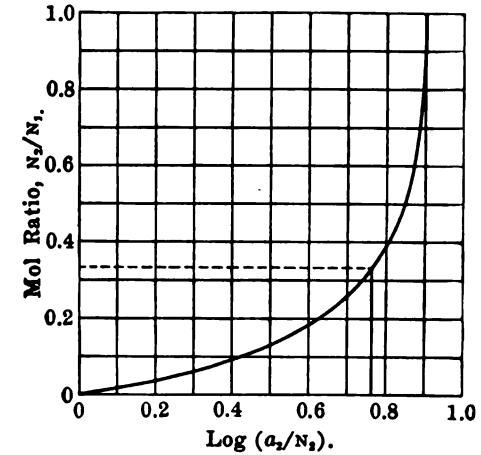

FIGURE 3. -Activity of Thallium in Thallium Amalgams at 20°C.

• approximate interpolated values of a2/N2 are also given for later reference.

TABLE 3.-ACTIVITY OF MERCURY ( AND OF THALLIUM) IN THE AMALGAMS AT 20°C

| N2    | N₂/Ni   | a2<br>/<br>N2 | αι<br>/<br>Νι |
|-------|---------|---------------|---------------|
| 0     | 0       | 1             | 1             |
| 0.005 | 0.00502 | 1.06          | 0.9998        |
| 0.01  | 0.0101  | 1.15          | 0.999         |
| 0.05  | 0.0526  | 1.80          | 0.986         |
| 0.1   | 0.111   | 2.84          | 0.950         |
| 0.2   | 0.250   | 4.98          | 0.866         |
| 0.3   | 0.428   | 6.60          | 0.790         |
| 0.4   | 0.667   | 7.57          | 0.734         |
| 0.5   | 1.000   | 7.98          | 0.704         |

Calculation of the Activity of the Solute : (I) An Analytical Method. More frequently we have the problem of determining the activity of the solute when that of the solvent is known over a range of composition. The equations are identical with those which we have already employed, with the subscripts interchanged(exceptinthelimitsofintegration).Thus

$$\log \frac{a_{\mathtt{2}}}{\mathtt{N}_{\mathtt{3}}} = -\int_{0}^{\mathtt{N}_{\mathtt{1}}} \frac{\mathtt{N}_{1}}{\mathtt{N}_{\mathtt{1}}} \, d \, \log \frac{a_{\mathtt{1}}}{\mathtt{N}_{1}}.\tag{25}$$

We shall illustrate the use of this equation by means of the data of Table 1 .

In performing such an integration as is indicated in Equation 25, we have the option of employing such a graphical method as we have just illustrated, or some analytical method. In the case before us, Hildebrand and Eastman have used an analytical method for the interpretation of their results, and we may make use of the empirical equation, which they found to reproduce their experimental results in a very satisfactory manner, namely,

$$\log \frac{p_{\text{l}}}{p_{\text{l}}^{\text{o}}} - \log \text{s}_{\text{l}} = -\frac{0.0960}{\left(1 + 0.263 \frac{\text{N}_{\text{l}}}{\text{N}_{\text{2}}}\right)^{\text{g}}} = \log \frac{a_{\text{l}}}{\text{N}_{\text{1}}}.\tag{26}$$

Substituting in Equation 25 and integrating, ¹

$$\log\frac{a_{\mathtt{2}}}{\mathtt{N_{2}}} = \frac{2 \times 0.0960}{0.263} \left( \frac{1}{1 + 0.263 \frac{\mathtt{N_{1}}}{\mathtt{N_{2}}}} - \frac{1}{2 \left( 1 + 0.263 \frac{\mathtt{N_{1}}}{\mathtt{N_{2}}} \right)^{2}} \right) . \tag{27}$$

N2 From Equations 26 and 27 we have obtained the values given. in Table 4. The last figures in parentheses are the extrapolated values for N₂ = 1 , in other words 2.32 is the activity of pure molten thallium, and 0.80 is the value of a₁/N₁ in a very dilute solution of mercury in thallium, when the standard states have been chosen with reference to dilute solutions of thallium in mercury.

1 The fundamental equation for the integration (B. O. Pierce, " Short Table of Integrals, " Ginn and Co. , Boston, 1899) is,

$$\int \frac{\mathbf{z} \, dx}{(1+\epsilon x)^{\mathfrak{t}}} = \frac{1}{\epsilon^{\mathfrak{t}}} \left( \frac{-1}{1+\epsilon x} + \frac{1}{2(1+\epsilon x)^{\mathfrak{t}}} \right).$$

| N2     |        | a2     |  |
|--------|--------|--------|--|
|        | Ni     | N2     |  |
| 0      | 1      | 1      |  |
| 0.10   | 0.98   | 1.53   |  |
| 0.20   | 0.95   | 1.86   |  |
| 0.30   | 0.92   | 2.05   |  |
| 0.40   | 0.89   | 2.17   |  |
| 0.50   | 0.87   | 2.23   |  |
| 0.60   | 0.85   | 2.28   |  |
| 0.70   | 0.83   | 2.30   |  |
| 0.80   | 0.82   | 2.31   |  |
| (1.00) | (0.80) | (2.32) |  |

TABLE 4.-ACTIVITIES OF MERCURY AND THALLIUM IN AMALGAMS At 325°C, FROM THE EMPIRICAL EQUATION

(II) A Graphical Method. If in using Equation 25 we had employed the graphical method and plotted N1/N2 against log (a₁/N1) , we should have obtained the plot illustrated in Figure 4. It is evident at once that this case presents formidable difficulties which we did not encounter when working with Figure 3. For our curve is now asymptotic to the vertical axis, and must be extrapolated to infinity in order to obtain the area under the curve between a given ordinate and the ordinate axis.¹

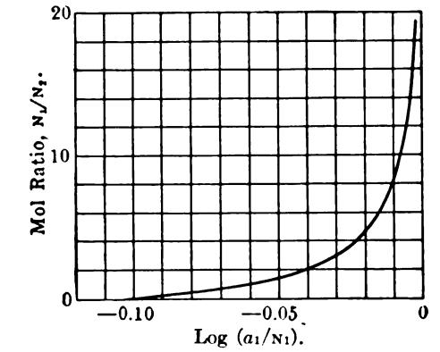

FIGURE 4. -Activity of Mercury in Thallium Amalgams at 325°C.

That part of the area which lies to the right of the measured points and represents the range of extrapolation will vary with any changeinthemethod

1 It will be observed that the total area under the curve, to the point where it meets the horizontal axis, gives the value of log a2/N2, or log az, for pure molten thallium.

of extrapolation. This will not produce any change in the ratio between two values of a2/N2 in the range of the measurements, but will result in a multiplication of every value of a2/N₂ by a constant factor. Thus, if we plot in Figure 4 the rounded off values of Hildebrand and Eastman, and extrapolate our curve with the aid of their empirical equation, we obviously must obtain the same values of a₂/N₂ as those given in Table 4. On the other hand, if in drawing the figure and in making the extrapolation we should give full weight to the experimental values of p /p at the two lowest concentrations, namely, 0.955 and 0.938, instead of the rounded-off values 0.952 and 0.935, this small change would have a large effect upon our extrapolation, and would diminish all the values of a2/N2 by 10% or more.

It is evident that in cases of this kind, which show so pronounced a deviation from the perfect solution, accurate data for a₁ /N₁ in dilute solutions are necessary to exact evaluation of a2/N2 by this method. If we had experimental values of the activity of thallium, in dilute solutions of mercury in thallium, we could, by the present method, determine the activity of the mercury with a relatively high percentage accuracy; for we see in Table 4 how much more nearly the amalgams behave like perfect solutions when there is an excess of thallium than when there is an excess of mercury.

(III) A Special Graphical Method. Various means could be devised whereby the graphical method, which we have just employed for extrapolation to infinite dilution, might be rendered less laborious, or more exact with a given expenditure of labor, at the cost of a small amount of additional arithmetical work. For such a purpose we shall invent a function which rapidly approaches zero at infinite dilution , namely,

$$h = \frac{\ln a_1}{r} + 1,\tag{28}$$

where we write for convenience, r = N2/N1. Hence

$$dh = \frac{d\ln a_1}{r} - \frac{\ln a_1 dr}{r^2} \,. \tag{29}$$

Combining with Equation 19 gives

d In a₂ = dh + (h1) d ln r,(30)

1 If we should have values of a₁ over a range of composition, without sufficiently accurate data in dilute solutions to permit the evaluation of the activity of the solute with respect to the standard state referred to infinite dilution, we might depart from our rule, and choose for temporary convenience the solute in some pure form as standard. But this expedient also might in many cases be difficult or impossible as in the case of a solute which is not stable in any pure form. In such a case we might take a2 = N2, or am, at some arbitrarily chosen concentration. In all such cases it is necessary, if we are to avoid misunderstanding, to make it perfectly clear that an unusual definition of the standard state is being employed.

CHAP. XXII

and adding d In r to both sides,

$$-\,d\ln\frac{a_2}{r} = dh + hd\ln r.\tag{31}$$

When N2 = 0, and N₁ = 1 , ln(a₂/r) = 0, and it may also be easily shown from Raoult's law that h = 0. Therefore, integrating to infinite dilution,

$$\ln \frac{a_2}{r} = -h - \int_0^r \frac{h}{r} \, dr. \tag{32}$$

In aqueous solutions we write N2/N1 = r = m/55.51 , whence

$$
\ln \frac{a_2}{m} = 2.303 \text{ log } \frac{a_2}{m} = - \text{ } h - \int_0^m \frac{h}{m} \, dm \,, \tag{33}
$$

where h, for the purpose of numerical calculation, ' may be written

$$h = \frac{55.51 \ln a_1}{m} + 1.\tag{35}$$

We may then plot h/m against m, without great care, and, by making a rough estimate of the area, obtain a high accuracy in a2/m.

3 The plot is so sensitive that even minute defects in the experimental measurements are very noticeable. In fact there are no existing data for dilute solutions which are of sufficient accuracy to warrant the full application of this method. The most precise measurements of this sort are those of Smits² and of Frazer, Lovelace and Rogers. The latter investigation we shall consider in Exercise 9. The measurements of Smits on solutions of sugar in water at 0° C are reproduced in Table 5, where the first column gives the molality, the second the relative lowering of the vapor pressure, while the third, fourth and fifth give the values of ln a₁ , of h, and of h/m calculated from these data.

1 In working with dilute solutions it is preferable to retain the natural logarithm, since it may readily be shown by expansion in series that

$$\text{by explanation in secines } \text{true}$$

$$\ln a_1 = -\frac{p_1^{\circ} - p_1}{p_1^{\circ}} - \left(\frac{p_1^{\circ} - p_1}{p_1^{\circ}}\right)^{\circ} - \left.\cdot \cdot \right\cdot \cdot \right. \tag{34}$$

and in dilute solutions the first term is the only one of consequence.

- Frazer, Lovelace and Rogers, J. Am. Chem. Soc. , 42, 1793 ( 1920) .
<sup>2</sup> Smits, Z. physik. Chem. , 39, 385 ( 1901 ) .

## THE ACTIVITY 275

TABLE 5.-VAPOR PRESSURE OF AQUEOUS SUGAR SOLUTIONS AT 0°C m Pio - Pi P1° h In ai h m 0.050 0.00053 -0.00053 0.413 8.26 0.172 0.00323 -0.00324 -0.044 -0.255 0.454 0.00867 -0.00871 -0.065 -0.143 1.009 0 01982 -0.02002 -0.101 -0.100

In spite of the care with which the measurements were made, it i evident that h has quite an absurd value in the most dilute solution. But even eliminating this point and plotting the other three, we should obtain a result which is probably erroneous. In fact, when we consider the more exact determinations afforded by freezing point measurements, we are going to point out an empirical rule , according to which a quantity, nearly identical with h, is proportional to m in dilute solutions of non-electrolytes. Therefore according to this view the observed variations in h/m are due solely to error of experiment.

Adopting such a rule, Equation 33 assumes the simple form

$$
\ln \frac{a_2}{m} = -2h,\tag{36}
$$

an equation which in a case like this presumably holds without sensible error, to concentrations higher than molal. Applying it to the data for the molal solution , where the chance of experimental error is least, we find 2.303 log (a2/m) = 0.2, or a2/m = 1.22. In making a similar calculation with a more dilute solution we should not employ the experimental value of h, but rather one which is proportional to the one just used. Thus at 0.1M, we would write 2.303 log (a2/m) -0.02.

EXERCISE 1. Assuming it to be incompressible, calculate the activity of liquid water at 25°C and at 100 atmos. pressure.

EXERCISE 2. What is the activity of water at 100° C in a solution from which the vapor pressure of water is 700 mm. ?

EXERCISE 3. For the process, Hg(1 ) calculate AF598- = Hg(in T amalg. , N₂ = 0.60) ,

EXERCISE 4. We may show that the activity of bromine in aqueous solution is nearly proportional to the molality, up to the saturated solution . First show, from data given in this chapter, that, for the vapor pressure of

= = 1.45 m. If this pro-0.280, which is the vapor bromine from a dilute aqueous solution at 25°C, p portionality continued up to the point where p pressure of pure bromine, we could calculate the molality of a solution which would be in equilibrium with liquid bromine, or, in other words, the solubility of bromine. Compare with the value thus obtained the solubility at 25°C, measured by Jakowkin (Z. physik. Chem. , 20, 19 ( 1896) ) , namely, 34.0 g. per 1000 g. of water.

EXERCISE 5. The distribution of HgCl₂ between benzene and water at 25°C has been obtained by Linhart (J. Am. Chem. Soc. , 37, 258 ( 1915) ). He expresses concentration (mols per liter) in the two phases by cp and cw. These are given in the following table, together with the ratio of cw to CB at the various concentrations. In these dilute solutions c = m, the molality. Assuming the activity of HgCl, in benzene to be proportional to CB, and taking the activity in the water equal to m in the most dilute solution, find the activity in the most concentrated of the aqueous solutions

### TABLE 6.-DISTRIBUTION OF MERCURIC CHLORIDE BETWEEN WATER AND BENZENE

| CB       | cw<br>m<br>= | cB<br>m<br>/ |
|----------|--------------|--------------|
| 0.0210   | 0.2866       | 13.65        |
| 0.0174   | 0.2326       | 13.38        |
| 0.01222  | 0.1578       | 12.91        |
| 0.00880  | 0.1112       | 12.64        |
| 0.00524  | 0.0648       | 12.35        |
| 0.000618 | 0.00738      | 11.95        |
| 0.000310 | 0.00369      | 11.90        |
| 0.000155 | 0.001845     | 11.90        |

EXERCISE 6. In Figure 2, ( E/0.05816 - log N₂) might equally well have been plotted against any function of N2, instead of against N₂ itself. If instead of N₂ we had used N2/N₁, show that with such a plot we could have dispensed with Figure 3, and could have obtained log (a₁ /N₁ ) without obtaining log (a2/N2) .

= 0.40, and N2 - 0.80. EXERCISE 7. At 325° C, find, from Table 4, the e.m.f. of a concentration cell with two thallium amalgam electrodes, N2

EXERCISE 8. From mixtures of acetone, mol fraction form, mol fraction = = N₁, and chloro-N2, Zawidzki ( Z. Physik. Chem. , 35, 129 ( 1900) ) obtained at 35.2°C the following vapor pressures, p₁, of acetone (in mm. Hg) :

| N1 | 1.000 | 0.9405 | 0.8783 | 0.8165 | 0.7103 | 0.6387 | 0.5750 |
|----|-------|--------|--------|--------|--------|--------|--------|
| Pi | 344.5 | 322.9  | 299.7  | 275.8  | 230.7  | 200.3  | 173.7  |

== 0.40. a2/N2 when N2 0.10, 0.20 , 0.30 and 0.40, and show that this ratio increases about 50 % from N₂ = 0 to N2 Calculate a₁ /N1 , and by plotting as in Figure 4 calculate, for the chloroform, =

EXERCISE 9. Frazer, Lovelace and Rogers made a very careful study of the vapor pressure lowering in aqueous solutions of mannite. They give the temperature as 20° C, but if we are to admit the degree of accuracy which the authors claim, it is necessary to assume that their work was done at a slightly lower temperature where the vapor pressure of pure water is 17.31 mm. Using this value of pi° and their results given in Table 7 ( also expressed in mm. ) , calculate the values of h, and by taking an average value of h/m, show, by Equation 36, that a /m increases about 4% between m = O and m == 1 .

| TABLE | -VAPOR<br>7. | PRESSURE | LOWERING | IN | AQUEOUS | MANNITE | SOLUTIONS |
|-------|--------------|----------|----------|----|---------|---------|-----------|

| P₁<br>°<br>-<br>Pi | m      | Pio<br>-<br>Pi | m      |
|--------------------|--------|----------------|--------|
| 0.0307             | 0.0984 | 0.1863         | 0.5958 |
| 0.0614             | 0.1977 | 0.2162         | 0.6934 |
| 0.0922             | 0.2962 | 0.2478         | 0.7927 |
| 0.1227             | 0.3945 | 0.2791         | 0.8913 |
| 0.1536             | 0.4938 | 0.2792         | 0.8922 |
| 0.1860             | 0.5944 | 0.3096         | 0.9908 |

# CHAPTER XXIII

## CHANGE OF ACTIVITY WITH THE TEMPERATURE, AND THE CALCULATION OF ACTIVITY FROM FREEZING POINTS¹

Before discussing one of the most important of all methods of determining the activity of substances in solution, we must find how the activity changes with the temperature. Consider the isothermal transfer of some constituent from a solution of one concentration to a solution at another concentration ; then

$$
\Delta F = \mathfrak{F} - \mathfrak{F}' = RT \ln \frac{a}{a'}.\tag{1}
$$

Now if AH is the change in heat content accompanying this transfer, we may write, by Equation VIII-4,

$$
\Delta H' = \mathbf{f}\mathbf{t} - \mathbf{f}\mathbf{t}' = \mathbf{L} - \mathbf{L}',\tag{2}
$$

where L = A - H° is the heat content referred to the chosen standard state. Hence by Equation XV-6,

$$d\left(\frac{\Delta F}{T}\right)_{\text{-}}dT = d\left(\frac{\mathbf{F} - \mathbf{F'}}{T}\right)_{\text{-}}dT = -\frac{\Delta H}{T^2} = -\frac{\mathbf{E} - \mathbf{E'}}{T^2},\quad(3)$$

where we are considering AF between two fixed concentrations, as a function of T. Combining with Equation 1 ,

$$d\ln\frac{a}{a'}dT = -\frac{\mathbf{L}-\mathbf{L'}}{RT^\ddagger}.\tag{4}$$

If the transfer in question is from a state which we have taken as standard we may replace, in these equations, F' by F°; a' by a° = 1 ; and L' by L° = 0, and we have the fundamental

1 In such chapters as this there are sections which most readers will prefer to pass over until they find occasion to employ the special methods here developed.

equation for the change of activity with the temperature, at constant composition,

$$\frac{d\ln a}{dT} = -\frac{\mathbf{L}}{\overline{R T^z}}.\tag{5}$$

This equation is applicable to any constituent of a solution . In the case of a solution in which we call one constituent the solvent and the other the solute, we shall take L = L° = 0, at infinite dilution , for both solvent and solute, in accord with our previous conventions in Chapter VIII.

If in any calculation L is assumed to be constant, the integration (always at constant composition) gives

$$R \ln a = \frac{L}{\dot{T}} + \text{const.},\tag{6}$$

or, if we wish to consider the ratio of activity to mol fraction (the latter being constant with varying temperature) , and if we use common logarithms,

$$4.5787 \text{ log } \frac{a}{N} = \frac{L}{\bar{T}} + \text{const.}\tag{7}$$

The integration constants may be found by determining a at some one temperature.

On the other hand, if the partial molal heat capacities are known, I may be expressed as a function of the temperature by Equations VIII-3 and VIII-4,

$$\underset{\overrightarrow{d}\overrightarrow{T}}{}^{d\textbf{L}} = \mathfrak{c}_{\mathsf{P}} - \mathfrak{c}_{\mathsf{P}}\mathfrak{o}_{\mathsf{u}}$$

where CD is the heat capacity in the given state and cp° the heat capacity in the standard state. Except when the heat capacities are changing rapidly with the temperature, or we are dealing with a very wide interval of temperature, we may then express L as a linear function of the temperature, ¹

$$\mathbf{L} = \mathbf{L}_{\bullet} + (\mathbf{\tilde{c}}_{\bullet} - \mathbf{c}_{\bullet}{}^{\bullet})T. \tag{8}$$

1 The constant Lo in this equation must not be confused with L°, which refers to the standard state.

The integration of Equation 5 then gives

$$4.5787\ \log a \ = \frac{\mathbf{L}_0}{\overline{T}} - 2.303\ (\mathbf{\tilde{c}}_\mathsf{p} - \mathbf{c}_\mathsf{p}^\circ)\ \log \ \mathbf{T} + \text{const.},\tag{9}$$

and also,

$$4.5787\log\frac{a}{\mathbf{x}} = \frac{\mathbf{L}_0}{T} - 2.303(\mathbf{c_\mathbf{\bar{\nu}}} - \mathbf{c_\mathbf{\bar{\nu}}}\prime)\log T + \text{const.}\tag{10}$$

Both these equations are for a solution of fixed composition.

We may illustrate these equations by showing how the tables for the activity of thallium and mercury in amalgams, which we gave in the preceding chapter, may be compared with one another. For example, from the measurements of electromotive force of concentration cells at 20°C, we may calculate the vapor pressure of mercury over an amalgam containing 40 mol per cent of thallium, at 325°C.

From Table XXII-3, a₁/N1, for mercury at 20°, when N2N₂ = 0.40, is 0.734. For the same amalgam we find by Table VIII- 1 , Cpl - CP1° 7.05 6.70 0.35, and by Table VIII-6, L1 ( 303 ) 232. First let us assume Li constant, and substitute our values in Equation 7. We first solve for the integration con- = = - stant, and then, at T = = 598°K, we find a₁ /N₁ = 0.899.

Now if we repeat this calculation , using Equation 10 and the values of Cp, we find, at 598° K, a₁/N₁ = 0.871 .

This is just such a case as was discussed in Chapter IX (Figure 1 ) , where the calculation is over such a wide range that we may be sure that AC, must change very considerably. Therefore, as was explained in that chapter, we can only be sure that the true value must lie between those obtained in the two calculations we have just made. In fact, from the measurements of Hildebrand and Eastman (Table XXII-4) , a₁/N₁ = 0.89. Instead of calculating a₁/N₁ we might calculate p₁/pi , which would be 0.60 from Raoult's law, is found to be 0.534 by Hildebrand and Eastman, while we calculate that the value must lie between 0.539 and 0.522.

By precisely the same method we may calculate, in the same amalgam, the activity of the thallium or a2/N2 at 598° K. Here, on account of the large values of L2 and of Cp2-- Cp2 (Tables

VIII-6 and VIII- 1 ) , the uncertainty of extrapolation is greatly increased. Thus we find for a2/N2, at 598°K; by the first method 2.00, by the second method 2.38, whereas the value obtained from the measurements at the high temperature ( Table XXII-4) is 2.17.

EXERCISE 1. A greater accuracy than that of the last illustration is obtained if we calculate, not the absolute activity of thallium, but the ratio of its activity at two concentrations. Consider the two amalgams, N₂ = 0.10 and N2 = 0.40, and by calculations based on previous tables find, at 325° C, the ratio of a2/N2 at the two concentrations; first by Equation 7 and second by Equation 10. Compare with Table XXII-4.

EXERCISE 2. For a more limited range of temperature Equation 10 is obviously the one to employ. With this equation calculate the vapor pressure of mercury, at 200°C, from an amalgam containing an equal number of mols of mercury and of thallium (the vapor pressure of pure mercury being taken as 18 mm. ) . Extrapolate where necessary.

0.50. EXERCISE 3. By Equation 10, and from Tables VIII- 1 , VIII-6, and XXII-3, find the activity of thallium at 121 °C in the three thallium amalgams, N2 0.30, N2 0.40 and N2 Plot the values of a2 and draw a curve permitting extrapolation to N₂ = 0.60 . (This plot will be referred to in the next section . ) = = =

## CHANGE OF SOLUBILITY WITH THE TEMPERATURE

It is sometimes convenient to refer the activity of a substance in one phase to the same standard state that is employed in another phase. This has been done, for example, in Table XXII-2, where we have given the activity of solid thallium in terms of the standard state used in dilute amalgams, namely, at 20°C, a, = 3.316. This procedure has the advantage that the substance is assigned the same activity in both phases when they are in equilibrium. Thus in the case just cited we have also for the thallium in the saturated amalgam (N₂ = 0.428) , 3.316. We now have adequate data for the calculation of the solubility of thallium in mercury at other temperatures. a₂ =

We find from Table VIII-6 for solid thallium L = 805 (again) referring to the standard state as defined in dilute solutions) . We may take for solid thallium cp 6.2, while from Table VIII- 1, CP2° 10.2 . We may substitute these values in Equa-= =

= N2 = tion 9 and solve for T = 394 ( 121 °C) , at which temperature we find a₂ 2.48, which corresponds, according to the curve of Exercise 3, with N₂ = 0.597. This therefore represents the composition of the saturated amalgam at T 394, and is in remarkable agreement with the solubility experimentally determined, ² namely N₂ = 0.598. This whole calculation is in no appreciable way affected by assumptions as to the purity of the solid phase, since, throughout our calculations with thallium, we have consistently used as solid phase the one (whatever its composition may be) which exists in contact with mercury.

### THE ACTIVITY OF A SOLID IN THE NEIGHBORHOOD OF ITS MELTING POINT

When we treat of the transfer of a substance from the pure liquid to the pure solid phase, we may take the former as the standard state, and if we represent the activity of the solid by a. , and its heat content by L,, the corresponding quantities for the liquid are respectively unity and zero. Corresponding to Equation 5 we have,

$$\frac{d\ln a_{\bullet}}{dT} = -\begin{array}{c} \text{L}_{\bullet} \\ \overline{R}\overline{T}^{\mathfrak{q}} \end{array} = -\begin{array}{c} \Delta H \\ \overline{R}\overline{T}^{\mathfrak{q}} \end{array} \qquad\qquad\qquad\qquad\qquad\tag{11}$$

where AH is the latent heat of solidification.

Sometimes it is desirable to put such an equation as this into a form which is especially adapted to calculations in the immediate neighborhood of the freezing point. If we represent by → the absolute temperature of the freezing point, and if we are using sometemperature,&degreesbelowthefreezingpoint,then

$$T = \Theta - \mathfrak{d}; \quad dT = -d\mathfrak{d}.\tag{12}$$

If AH, is the heat of solidification at the freezing point, and if ACD is the molal heat capacity of the solid, less that of the liquid , we may write

$$
\mathbf{L}_{\bullet} = \Delta H_{\bullet} - \Delta C_{\bullet} \boldsymbol{\vartheta}.\tag{13}
$$


<sup>1</sup> Equation 9 is obviously valid also for a pure substance.

<sup>*</sup> Kurnakov and Puschkin, Z. anorg . Chem. , 30 , 86 ( 1902) .

Substituting this equation and the preceding one in Equation 11 ,

$$d\ln a_{\bullet} = \begin{array}{c} \langle \underline{\Delta H_{\bullet}} - \underline{\Delta C_{\bullet}} \vartheta \rangle d\vartheta\\ \bar{R}(\overline{\Theta} - \overline{\vartheta})^{\ddagger} \end{array},\tag{14}$$

and expanding this equation in series ,

$$d \ln a_{\bullet} = \frac{1}{R\Theta^2} \left( 1 + 2\frac{\vartheta}{\Theta} + 3\frac{\vartheta^2}{\Theta^2} + \cdots \cdot \right) \left( \Delta H_{\Theta} - \Delta C_{\mathcal{P}} \vartheta \right) d\vartheta,\tag{15}$$

$$d \ln a_{\bullet} = \frac{d\vartheta}{\Xi} \left[ \Delta H_{\Theta} + \left( \frac{2\Delta H_{\Theta}}{} - \Delta C_{\mathcal{P}} \right) \vartheta \right.$$

$$\begin{split}d\ln a_{\bullet} = \frac{\omega\nu}{R\Theta^{\ddagger}} \Big[ \Delta H_{\bullet} + \left( \frac{2\Delta H_{\bullet}}{\Theta} - \Delta C_{\bullet} \right) \mathfrak{d} + \\ & \quad \Big( \frac{3\Delta H_{\bullet}}{\Theta^{\ddagger}} - \frac{2\Delta C_{\bullet}}{\Theta} \Big) \mathfrak{d}^{\ddagger} + \left. \cdot \right| \cdot \left. \cdot \right|. \end{split} \tag{16}$$

Now upon integrating this equation we note that the constant ofintegration is zero, since when = 0 the solid is in equilibrium with the liquid and a, =a = 11.. Hence¹

$$\begin{split} \ln a_{\mathfrak{s}} &= \frac{1}{R\Theta^{\mathfrak{s}}} \Big[ \Delta H_{\mathfrak{o}} \mathfrak{z} + \left( \frac{\Delta H_{\mathfrak{o}}}{\Theta} - \frac{\Delta C_{\mathfrak{o}}}{2} \right) \mathfrak{z}^{\mathfrak{z}} + \\ & \qquad \qquad \qquad \qquad \qquad \left( \frac{\Delta H_{\mathfrak{o}}}{\Theta^{\mathfrak{s}}} - \frac{2\Delta C_{\mathfrak{o}}}{3\Theta} \right) \mathfrak{z}^{\mathfrak{s}} + \left( \cdots \cdot \right) . \end{split} \tag{17}$$

= = = - = - 9. H₂O(1) H₂O(s) . If we wish to use Equation 17 for water and ice we have² 273.1, ΔΗΘ 1438 and ACP Substituting these values and neglecting terms of higher order, which, within 20 or 30 degrees from the freezing point, are negligible in comparison with errors in our experimental data, we find

$$d \ln a_\bullet = (-0.009696 - 0.0000103\vartheta)d\vartheta. \tag{19}$$

1Working with RTin as, we obtain a simpler expression. Thus multiplying Equation 17 by RT = ᎡᎾ - d) we find

$$RRT \ln a_{\bullet} = \frac{\Delta H_{\Theta} \theta}{\Theta} - \frac{\Delta C_{p} \theta^{\bullet}}{2\Theta} - \frac{\Delta C_{p} \theta^{\bullet}}{6\Theta^{\bullet}} + \cdots \cdot \frac{\cdot}{\cdot} \cdot \,\tag{18}$$

This is also an expression for AF, the free energy change in the solidification of the pure liquid, since AF- ᎡᎢ ln as.

The value ofAHO = - 1438 cal. ( = 79.8 cal. per gram. ) is based upon the very accurate measurements of Smith (Phys. Rev. , 17, 193 ( 1903 ) ) as recalculated by Lewis (J. Am. Chem .Soc., 30, 681 ( 1908) ) . We prefer this to the value 79.7 given by Roth (Z. physik. Chem.,63, 441 ( 1908) ) as a weighted mean of a number of measurements. Neither the exact value ofCp for ice, nor its temperature coefficient is known. By extrapolating a curve based upon several measurements of the specific heat of water, and from the curve used by Lewis and Gibson (J. Am. Chem. Soc. , 39, 2554 ( 1917) ) , for the heat capacity of ice , the best equationwould probably be ACD -9.1 0.030, but for our present purposes we may use the round value given above. -

## 284 THERMODYNAMICS CHAP. XXIII

Such an equation is useful for the determination of activities or of free energies in the neighborhood of a freezing point, or of a transition point , and is well adapted to the utilization of freezing point data in solutions, as we shall show in the following sections.

### CALCULATION OF THE ACTIVITIES IN AQUEOUS SOLUTION FROM FREEZING POINT DATA, HEAT OF DILUTION BEING NEGLECTED

The great mass of existing data upon the freezing points of aqueous solutions furnishes our best source of information concerning the activities of substances dissolved in water. However, such thermodynamic discussion of these data as is to be found in the literature is for the most part unsatisfactory and often quite erroneous. The method proposed by Lewis ' for the calculation of the activity of the solute, while thermodynamically accurate, was difficult of application, and time-consuming. In this chapter, and in a later chapter upon electrolytes, we shall develop that method to permit the thermodynamic interpretation of freezing point data with speed and accuracy.

The lowering of the freezing point of water by any given solute depends (at constant pressure) solely upon the composition, so that, if m is the molality , and is the lowering of the freezing point, any value of m determines a single value of , and vice versa. At the freezing point of the solution the activity, a₁, of water in the solution , is equal to the activity, a,, of the ice, by the convention that we adopted above. Hence by Equation 19,

$$d \ln a_1 = (-0.009696 - 0.0000103 \vartheta) d \vartheta,\tag{20}$$

and

$$
\ln a_1 = -0.009696 \theta - 0.0000051 \theta^2,\tag{21}
$$

or

$$
\log a_1 = -0.004211 \mathfrak{d} - 0.0000022 \mathfrak{d}^\natural. \tag{22}
$$

In these equations a, is the activity of the water in each solution at its freezing point.

1 Lewis, J. Am. Chem. Soc. , 34, 1631 ( 1912) .


Now that we know a₁ for each concentration at one temperature, namely, at the melting point, we may employ Equation 5 to find the activity at the same concentration at other temperatures. Indeed we see from that equation that a, at a given concentration is independent of the temperature as long as Li is zero or negligible. This is the fact in the great majority of cases where we have to deal neither with very concentrated solutions nor with an exceptionally large heat of dilution.

For this reason we may postpone for the moment the most general treatment in order to consider the case in which a₁, at a given concentration , is independent of the temperature. With this assumption, the values of a₁ which appear in Equation 21 are valid at any temperature. Hence at some one temperature, say 25°C, we may use this as an isothermal equation. It may seem strange to use, as an isothermal equation, one in which appears as a variable, but we must remember that is not the temperature of the solution , but merely the temperature at which it would happen to be in equilibrium with ice . We may therefore regard & merely as a property of the solution, which, like the density or the refractive index, is simply a function of the composition, such that each concentration determines a value of , and each value of determines a concentration.

With this understanding we will introduce Equation 20 into the isothermal equation, XXII- 19. The Activity of the Solute.

$$d \ln a_{\mathbf{2}} = -\frac{\mathbf{N_1}}{\mathbf{N_2}} d \ln a_{\mathbf{1}}$$

to give

$$d \ln a_{\mathbf{a}} = -\frac{55.51}{m} (-0.009696 - 0.0000103\vartheta)d\vartheta,\qquad(23)$$

an equation from which we may obtain the activity of the solute.

Before proceeding to the integration of this equation, let us examine the case where approaches zero. The last term disappears, and since we are approaching infinite dilution we may write a₂ = m, whence

$$d \ln m = \overbrace{- \overleftarrow{\phantom{5.5.51}}}^{55.51} \underset{m}{\underset{m}{\gtrless}} \begin{matrix} 0.009696\\ \end{matrix} d\theta ; \quad \frac{d\theta}{dm} = 1.858. \tag{24}$$

The important number¹ 1.858 is known as the molal lowering of the freezing point at infinite dilution. We will represent it by the symbol X, and put Equation 23 in the form,

$$d \ln a_2 = \frac{d\vartheta}{\lambda m} + 0.00057 \frac{\vartheta d\vartheta}{m},\tag{25}$$

where the last term does not become appreciable until the molality is nearly unity.

The Integration. For practical reasons we shall slightly transform Equation 25. Let us define a quantity j by the equation

$$\frac{\vartheta}{\lambda m} = 1 - j; \quad j = 1 - \frac{\vartheta}{\lambda m}, \tag{26}$$

where /(Am) is obviously the ratio between a given molal lowering and the molal lowering at infinite dilution . By differentiation,

$$\frac{d\vartheta}{\lambda m} - \frac{\vartheta dm}{\lambda m^{\ast}} = -\
\
\vartheta,\tag{27}$$

or

$$\frac{d\theta}{\lambda m} = (1 - j) \, d \, \ln m - d j. \tag{28}$$

Substituting in Equation 25, and subtracting d ln m from both sides, we have

$$d \ln \frac{a_2}{m} = -j d \ln m - d j + 0.00057 \frac{\vartheta d \vartheta}{m}. \tag{29}$$

Finally, integrating from infinite dilution up to a given molality,

$$
\ln \frac{a_2}{m} = \int_0^m -\text{ }j d\ln m - \, j + \int_0^m 0.00057 \, \frac{\vartheta}{m} \, d\vartheta. \tag{30}
$$

Each of these terms disappears at infinite dilution, so that the

In the older literature the limiting molal lowering was given as 1.85 , based on an earlier value for the heat of fusion. The recalculation by Lewis ( to which we have already referred) led to the above value of A which is now generally adopted . It has been experimentally cor roborated by recent exact measurements of freezing points. See Adams ( J. Am. Chem. Soc., 37, 481 (1915) ) .

constant of integration is zero. The first definite integral (A) is the area under the curve of -j/m plotted against m. The second definite integral (B) is the area under the curve of /m plotted against , after multiplication by the numerical factor.

The freezing points of aqueous solutions of non-electrolytes have rarely been obtained with the highest possible accuracy, and never over any wide range of concentration. As an example of the use of Equation 30, we may use the data for the freezing point of glycerine solutions obtained by various observers and given in the tables of Landolt, Börnstein and Roth.

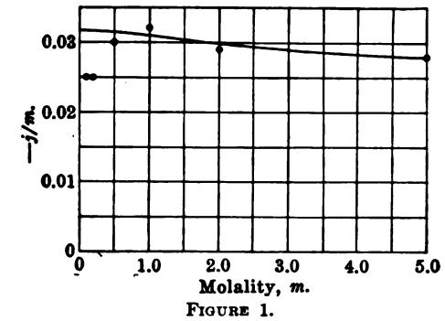

- These data are contained in Table 1 , where the sixth column gives the definite integral A obtained from Figure 1 , - j/m being plotted against m. Evidently the drawing of a line through the experimental points is somewhat arbitrary. We have chosen to disregard entirely the experimental points at the two lowest concentrations. Fortunately the exaggeration produced by this method is so great that a considerable variation in the curve causes very little difference in the final results.

A still cruder plot suffices for the estimation of B, which is an insignificant term except at the higher concentrations ; even at 5 M it affects a /m by only 1 %. Therefore in all dilute solutions the term B may be neglected, and in concentrated solutions may ordinarily be estimated with sufficient accuracy without plotting.

TABLE 1. -ACTIVITY OF GLYCERINE IN AQUEOUS SOLUTIONS AT 0°C

| m   |        |             |        |              |       |        |                               | a<br>: /m |
|-----|--------|-------------|--------|--------------|-------|--------|-------------------------------|-----------|
|     | Ꮽ      | v<br>/<br>m | -<br>j | -j<br>m<br>/ | A     | B      | log<br>(<br>a2<br>/<br>m<br>) |           |
| 0.1 | 0.1863 | 1.863       | 0.0025 | 0.025        | 0.003 | 0.0002 | 0.0026                        | 1.006     |
| 0.2 | 0.3734 | 1.867       | 0.005  | 0.025        | 0.006 | 0.0005 | 0.0051                        | 1.012     |
| 0.5 | 0.9430 | 1.886       | 0.015  | 0.030        | 0.016 | 0.0009 | 0.0138                        | 1.032     |
| 1.0 | 1.918  | 1.918       | 0.032  | 0.032        | 0.031 | 0.0021 | 0.0284                        | 1.068     |
| 2.0 | 3.932  | 1.966       | 0.058  | 0.029        | 0.062 | 0.0041 | 0.0539                        | 1.132     |
| 5.0 | 10.58  | 2.116       | 0.139  | 0.028        | 0.148 | 0.0120 | 0.1297                        | 1.348     |

A Simple Empirical Rule. Now it will be noted in Table 1 , and we have found this also to be true in the case of all other aqueous solutions of non-electrolytes which we have examined, that j/m is constant within the limits of experimental error. In other words, we may assume that j is proportional to m at infinite dilution, and that this proportionality persists into moderately concentrated solutions.

This empirical rule renders it possible to make an extrapolation without employing the very questionable experimental data obtained for freezing points at high dilutions ; and indeed it permits an immediate integration of Equation 30 when the term B is neglected . For if j/m is constant,

$$2.303\ \log\frac{a_2}{m} = -2j.\tag{31}$$

In using this equation in dilute solutions it is best to draw a curve of j/m which becomes horizontal at infinite dilution , and to substitute in the equation the values of j taken from this smooth curve of extrapolation.

## THE CORRESPONDING CALCULATION WHEN THE HEAT OF DILU-TION IS NOT NEGLECTED

If now we wish to take account of the change of a₁ with the temperature, it will be seen that Equation 30 remains the same except for the addition of one or more new terms.

If we wish to determine the activity of the solute as a function of the concentration at some one temperature, say at 25°C, we may call the activity of the solvent at the freezing point of

a given solution, a ' , and the activity of the solvent in a solution of the same concentration at some reference temperature (usually 25°C) we may call a ". Let us also for convenience write,

$$
\log a_{\text{l}}^{\prime\prime} \, - \log a_{\text{l}}^{\prime} \, = \, x. \tag{32}
$$

Denoting the activity of the solute at the reference temperature (25°C) merely by a2, we may employ at that temperature our isothermal equation (XXII- 19) , namely,

$$d \log a_{\mathbf{i}} = -\frac{55.51}{m} \, d \log a_{\mathbf{i}}\prime\prime = -\frac{55.51}{m} d \log a_{\mathbf{i}}\prime - \frac{55.51}{m} \, dx. \tag{33}$$

If we subtract d log m, and integrate as before, we find ,

$$\begin{aligned} \log \frac{a_{\theta}}{m} &= \int_{0}^{m} -j d \log m - \frac{j}{2.303} + \\ &= 0.00025 \int_{0}^{m} \frac{\vartheta}{m} d\vartheta - 55.51 \int_{0}^{\cdot} \frac{1}{m} \, dx, \end{aligned} (34)$$

an expression which is identical with Equation 30 except for the additional term in x, which we may evaluate as follows.

From Equation 5 we find

$$
\log a_1^{\prime\prime} - \log a_1^{\prime} = x = -\frac{1}{2.303R} \int_{T^{\prime}}^{T^{\prime}} \frac{\mathbf{f}_1}{T^{\mathbf{a}}} \, dT,\tag{35}
$$

where T'" 298.1 is the temperature chosen for the calculation, and T' = 273.1 , is the freezing point of the given solution.In the first instance we may take L₁ as constant, and

$$x = \frac{\mathbf{L}_1}{2.303R} \left( \frac{1}{\overline{T}^{\prime\prime}} - \frac{1}{\overline{T}^{\prime}} \right) = -\frac{\mathbf{L}_1}{2.303\overline{R}} \left( \frac{\mathbf{T}^{\prime\prime} - \mathbf{T}^{\prime}}{\overline{T}^{\prime\prime}\overline{T}^{\prime}} \right) . \tag{36}$$

If then at any concentration we know Li and the freezing point T', we obtain a value of x, and if this is done at a series of concentrations we may plot 1/m against x and thus obtain the integral in the last term of Equation 34.

We shall carry this discussion no further at present because there are very few existing data for nonelectrolytes which would warrant the use of this elaborate method, and especially because we are to have abundant exercise in the use of a similar

### THERMODYNAMICS

equation, involving not only L1, but its temperature coefficient, when we discuss solutions of electrolytes.

### CALCULATION OF ACTIVITIES FROM THE RISE IN BOILing Point

By methods entirely similar to those which we have employed in the preceding section, we may obtain isothermal tables for the activity of solvent and solute from the rise in boiling point due to the addition of a solute to a solvent. However, this is a method which, though frequently used for measurements of a cruder sort, does not lend itself to work of high precision. It will usually be replaced by isothermal measurements of vapor pressures over a range of compositions, and such measurements may be utilized by the methods already discussed.

It may be remarked that ordinarily, if we desire an accurate determination of the activity of a solute over a range of dilute and concentrated solutions, a high degree of accuracy may be most readily obtained by combining freezing point measurements in dilute solutions with isothermal measurements of the vapor pressure of the solvent in concentrated solutions.

EXERCISE 4. Assuming the following values for freezing point lowering in aqueous acetic acid, construct a table like Table 1. Remember that this method exaggerates experimental errors, which in these data, collected from various sources, are by no means small. Nevertheless the best smooth curve drawn through the plotted points of j/m, and extrapolated to a horizontal line at m 0, will give reasonably accurate values of a / m . To avoid anticipating the work of a later chapter, we pay no attention in this exercise to the electrolytic dissociation which will begin to manifest itself in the freezing points of very dilute solutions. =

| m   | 0.514 | 1.159 | 2.240 | 4.24 | 7.18 | 8.67 | 11.85 | 19.42 |
|-----|-------|-------|-------|------|------|------|-------|-------|
| v/m | 1.825 | 1.802 | 1.75  | 1.63 | 1.51 | 1.46 | 1.34  | 1.15  |

EXERCISE 5. From the following values for the freezing point of aqueous solutions of aniline, show that j is proportional to m within the limits of experimental error, and calculate a /m at each concentration from Equation 31.

| m           | 0.050 | 0.204 | 0.276 | 0.437 |
|-------------|-------|-------|-------|-------|
| 9<br>/<br>m | 1.82  | 1.74  | 1.69  | 1.60  |

### CHAPTER XXIV

## THE STANDARD CHANGE OF FREE ENERGY; THE EQUILIBRIUM CONSTANT

When the free energy change in a chemical reaction is measured, the substances involved are often in states which are chosen by the experimentor either arbitrarily or to meet the demands of the experimental conditions. One substance may be in the gaseous state at high pressure, or another may be a constituent of some concentrated solution . The change of free energy as measured would be of little service in further calculations, if we could not obtain from it the free energy change of the same reaction when each substance taking part in it is in some simple state, or better, in its standard state.

When Lewis and Burrows¹ determined the first free energy of formation of an organic substance, urea, it proved to be a simple matter to obtain the change in free energy attending the conversion of ammonium carbonate into urea and water, in a very concentrated aqueous solution of ammonium carbonate. The great difficulties of the investigation came in determining for each substance the difference between the free energy in that concentrated solution and in some standard state.

If F is the molal free energy of a substance in any state, and F° that in the standard state, the difference, according to Equation XXII-2, is given as

$$\mathbf{r} - \mathbf{r}^{\bullet} = RT \ln a.$$

The problem of converting free energies in various states into free energies in standard states is therefore the problem of determining the activities of the various substances concerned.

<sup>1</sup> Lewis and Burrows, J. Am. Chem. Soc. , 34 , 1515 ( 1912) .

Let us consider a reaction such as

3Ag2O(s) + 2NH3(aq, 2.0 M) = 6Ag(s ) + 3H2O( l, with NH3 2.0 M) + N₂(g, 100 atmos. ) ,

and let us assume that AF has been determined for the reaction as written, that is , for the reaction in which three mols of solid silver oxide disappear, together with two mols of ammonia from a twice molal aqueous solution, while six mols of solid silver, three mols of water (in the same ammonia solution) , and one molofnitrogengasat100atmos.are formed.¹

= = Knowing the value of AF, we could also find the change in free energy in the same reaction, with every substance in its standard state, if we knew FF for each substance . The silver oxide and the silver are already in their standard states and FF 0. By investigating the vapor pressure of ammonia solutions , or by one of the other methods described in previous chapters, we could determine the activity of the ammonia and write FF° RT In a. So also the activity of the water is not that of pure water, but is several percent lower owing to the presence of the ammonia, a difference which can readily be determined. The activity of the nitrogen could be calculated roughly by assuming it to be a perfect gas, or more accurately by the methods of Chapter XVII. We are then in a position to determine AF°, that is, the change of free energy for the reaction when each substance is in its standard state, the reaction being then written

3Ag2O(s) + 2NH3(aq) = 6Ag(s) + 3H2O(l ) + N2(g) ,

which indicates, in the absence of any further specification, that each substance is at unit activity, or, in other words, that we are dealing with pure substances at atmospheric pressure, except the ammonia, which is taken as being in that hypothetical state which we have defined as the standard state of a solute in aqueous solutions ; and also excepting the nitrogen, if its fugacity at one atmosphere is not regarded as exactly equal to the pressure.

<sup>1</sup> All the substances except nitrogen are taken at atmospheric pressure. If we had taken them all at 100 atmos. the difference in free energy thus produced in these liquid and solidphases could ordinarily be neglected , or if the precision of the work should warrant, the difference could be calculated by Equation XXII-3.

Instead of pursuing this special reaction further, let us consider the general reaction in which 1 mols of the substance L and m mols of M, etc. , give q mols of Q, etc., as represented by the equation

$$\mathbf{L} + \mathbf{m}\mathbf{M} + \cdots \cdot \cdot = \mathbf{q}\mathbf{Q} + \mathbf{r}\mathbf{R} + \cdots \cdot \cdot \cdots$$

Let AF be the free energy change in this reaction when the substances are in any given states,

$$\Delta \mathbf{F} = \langle q\mathbf{F}_{\mathbf{Q}} + r\mathbf{F}_{\mathbf{R}} + \cdots \times \cdot \rangle \ - \langle l\mathbf{F}_{L} + m\mathbf{F}_{\mathbf{M}} + \cdots \cdot \cdot \rangle,\tag{1}$$

and let AF be the free energy change when each substance is in its standard state,

AF° = (qFq° + TFR° + . • ·) — (IF1° + MFM° + · · · ). . (2)

If a , a , etc. , represent the activities in the nonstandard states, then we have

$$l(\mathbf{r}_L - \mathbf{r}_L \mathbf{\hat{}}) = RT \ln a_L^{\mathbf{l}} \tag{3}$$

and so on.

Combining the several equations we find

$$
\Delta F - \Delta F^{\circ} = RT \ln \frac{a_d^{\sharp} a_R^{\sharp} \cdot \dots \cdot \dots}{a_L^{\sharp} a_M^{\sharp} \cdot \dots \cdot \dots} \cdot \tag{4}
$$

The important quotient appearing in the last term we may call the activity quotient of the reaction. By determining this quotient we may calculate AF° when AF is known, and conversely.

When AF is obtained for a number of reactions it may immediately be found for other reactions by mere addition or subtraction. When a reaction consists in the formation of a substance from its elements in their standard reference states, as for example, H2(g) , Hg(l ) , I2 ( s ) , then AF° is known as the AF of formation, or, more loosely, as the free energy of formation of the compound.

EXERCISE 1. A galvanic cell with one electrode of hydrogen at a partial pressure of 0.9 atmos. , and another electrode of mercury and solid mercurous chloride, with an electrolyte over which the partial pressure of hydrogen chloride gas is 0.01 atmos. , has an e.m.f. at 25° C of 0.0110 v. Writing the cell reaction as

½H2(g, 0.9 atmos. ) + HgCl( s) calculate AF and AF° = Hg(1 ) + HCl (g, 0.01 atmos. ), EXERCISE 2. We also find from e.m.f. measurements

$$\text{MgCl}_2(\text{g}) \text{ } + \text{Hg}(\text{l}) \text{ } = \text{HgCl}(\text{s}); \text{ } \Delta F^{\circ}_{\text{200}} = -25137 \text{ cal.}$$

Find AF228 for the reaction

$$\mathsf{Mcl}_{\mathfrak{z}}(\mathfrak{g}) \, + \,\mathsf{YD}_{\mathfrak{z}}(\mathfrak{g}) \, = \mathsf{HCl}(\mathfrak{g}).$$

### THE EQUILIBRIUM CONSTANT

Whenever we meet with a case of chemical equilibrium , we immediately acquire important information regarding the free energy change in the reaction concerned. For in such a reaction, by Equation XIV-7,

$$
\Delta F = \mathbf{0}.
$$

Hence, for equilibrium, by Equation 4

$$\cdot \,\,\Delta F^{\bullet} = \,-\,\,RT \,\,\ln \frac{a_{\bullet}^{\prime} a_{R}^{\prime} \,\,\cdot \,\, \cdot \,\, \cdot}{a_{L}^{\prime} a_{R}^{\prime\prime} \,\,\, \cdot \,\, \cdot \,\, \cdot} \,\,. \tag{5}$$

At a given temperature AF is a constant, and therefore the condition of equilibrium is that the activity quotient shall also be constant. The value of this quotient, when the system is in equilibrium, we shall call the equilibrium constant, K, and write

$$"\Delta F^{\bullet} = \!-RT \ln K. \tag{6}$$

Some of the substances taking part in the reaction, such as pure solids at constant or nearly constant pressure, have a fixed activity at a given temperature. If these activities are omitted from the equilibrium constant, the residual quotient will still be a constant, and it is usually the custom to retain in the equilibrium constant only the activities of gases and of substances in solution, where the activity varies markedly with the pressure or the composition.

Let us consider a case in which the substances of variable activity are constituents of a perfect solution . Thus in a homogeneous mixture of methyl bromide, ethyl chloride, ethyl bromide and methyl chloride we might, from our knowledge of

<sup>1</sup> The equilibrium constant obtained by omitting all the constant activities will not be equal to Kas defined in Equation 6 unless each activity so omitted is unity, or, in other words, unless each substance left out of consideration is in its standard state.

these substances, expect the activity of each substance to be approximately equal to its mol fraction. Hence for the reaction

$$\mathrm{CH_4Cl} + \mathrm{C_3H_5Br} \rightleftharpoons \mathrm{CH_3Br} + \mathrm{C_3H_5Cl},$$

we should expect an equilibrium to be attained which would satisfy the condition

$$\frac{{}^{\mathsf{N}}\!\!\!\!\!\!N_{R}^{\mathsf{N}}}{{}^{\mathsf{N}}\!\!\!\!N_{L}^{\mathsf{N}}}=K.\tag{7}$$

The great majority of equilibrium measurements have been made in systems involving gases at moderate pressures and dilute aqueous solutions. In such cases it is frequently possible, with adequate accuracy, to replace the activities of the gases by their pressures, and of the solutes by their molalities. We then have the 'mass law" in the form in which we owe it to Guldberg and Waage¹ and to van't Hoff, a generalization which will always be esteemed as one of the milestones in the progress of chemistry toward an exact science . 66 2

After writing the equation for a given reaction it will be our convention to write the equilibrium constant with the activities of the substances produced, in the numerator ; and of the substances consumed, in the denominator.

It is sometimes convenient to denote the activity of a gas by its formula, in brackets, and the activity of any constituent of an aqueous solution by its formula, in parentheses. To illustrate these conventions we write

$$\begin{aligned} \text{NH_3(g)} + 3\acute{\cdot}\text{H}_2(\text{g}) &= \text{NH}_3(\text{g}); \quad K = \frac{[\text{NH}_3]}{[\text{N}_2]^{\text{?}}[\text{H}_2]^{\text{?}} \mathsf{K}}, \\ \text{N}_2(\text{g}) + 3\text{H}_2(\text{g}) &= 2\text{NH}_3(\text{g}); \quad K = \frac{[\text{NH}_3]^2}{[\text{N}_2][\text{H}_2]^{\text{?}}}, \\ \text{NH}_3(\text{g}) &= \not\not\ge \text{N}_2(\text{g}) + \not\not\ge \text{H}_2(\text{g}); \quad K = \frac{[\text{N}_2]^{\text{?}}[\text{H}_2]^{\text{?}}}{[\text{NH}_3]}, \\ \text{NH}_3(\text{aq}) &= \text{NH}_3(\text{g}); \quad K = \frac{[\text{NH}_3]}{(\text{NH}_3)}. \end{aligned}$$

1 Guldberg and Waage, " Etudes sur les affinités chimiques. " Brögger and Christie, Chris tiania, 1867.

2 van't Hoff, Z. physik . Chem. , 1 , 481 ( 1887) .

If in these equations we substitute for the activities the partial pressures or molalities, the quotients are not strictly constant at finite pressures and concentrations, but approach the true equilibrium constant (the quotient of activities ) as the gases approach zero pressure, and the concentrations of the solutes approach zero.

The Activity of a Solute which Forms Compounds with the Solvent. We frequently have to deal with solutions in which, for one reason or another, it is assumed that the solute forms compounds with the solvent, which are known in general as solvates. Thus many substances dissolved in water are assumed to form hydrates, with one or more molecules of water combined with each molecule of solute. This assumption is sometimes mere hypothesis, but often it rests upon very substantial evidence. Up to the present time, however, it has been possible in no case to determine with any degree of certainty the relative amounts of unhydrated substance and of the various possible hydrates. How then are we to treat such compounds in our thermodynamic work?

The simplest method of disposing of this question would be to ignore the existence of such hydrates, and this would be entirely justifiable, since thermodynamics is not compelled to take cognizance of the various molecular species which may exist in a system, particularly when the existence of such species cannot be absolutely demonstrated . Nevertheless, it will be frequently more convenient, as well as more consistent with chemical usage, to include these hydrates in our consideration, especially since by a simple device we may do this without really complicating our procedure. We may illustrate this device by a concrete case.

When ammonia dissolves in water it is supposed to form, although in unknown amount, at least one hydrate, the monohydrate, which may be written NH, H2O or NH4OH. In other words, we assume the reaction

$$\text{NH}_3\text{(aq) + H}_2\text{O(l) = NH_4OH(aq)}\text{.}$$

Now if ( NH3) , ( H2O) and ( NH4OH) represent the several activities,

$$
\begin{aligned}
\text{(NH}_4\text{OH)} &= \text{K}. \\
\text{(NH}_4\text{)(H}_2\text{O)} &= \text{K}.
\end{aligned}
$$

At high dilution the activity of the water is constant and equal to unity, therefore the ratio of ( NH4OH) to ( NH3) is constant, and the two molalities are also approximately proportional to one another. But we do not know any of these quantities separately, we only know the gross or stoichiometric molality, m, as determined, for example, by the number of mols of gaseous ammonia which have been dissolved in a kilogram of water. In very dilute solution this is the same as the number of mols of NH4OH which would be dissolved in a kilogram of water to produce the same concentration.

In ignorance of the individual concentrations, we may arbitrarily take the standard state of each substance in such manner that at infinite dilution its activity is equal to the gross molality, m. Or, in other words, we assume such standard states as to make K 1. The activities of the two substances then remain equal as long as (H2O) = 1 (but in concentrated solutions their ratio is the activity of the water). =

= Such a definition introduces an equal simplicity into the free energy equation, since it makes AF° 0. The same method may be employed in all similar cases, although it is possible that this method might be abandoned if we ever should succeed in determining quantitatively the actual concentrations of the individual species.

EXERCISE 3. In the "watergas reaction, " CO2 + H2 = CO + H2O(g) , equilibrium would be reached at 1538 ° K when the four gases have respectively the following partial pressures : 0.10, 0.10, 0.10, and 0.285 atmos.Calculate K and AF°151538.

= EXERCISE 4. Supposing that by some powerful catalyzer equilibrium could be established at 0°C for the reaction N2 + 3H2 2NH3(g) . If the total pressure of the mixed gases is 4 atmos. , show that the equilibrium constant K, calculated from the partial pressures, instead of the activities, would be in error by about 15 percent. In this calculation consider H, and N2 as perfect gases, and employ the fact that in pure ammonia gas at 0°C, and 1 atmos. , the pressure is 2 percent less than that calculated for an ideal

gas. Use Equations XVII-25 and XVII- 19 (taking a as constant) , together with the rule which we announced in Chapter XIX, to the effect that every gaseous solution may be regarded as a perfect solution

### THE CHANGE OF EQUILIBRIUM CONSTANT WITH THE TEMPERATURE

The standard free energy change, AF°, varies with the temperature according to Equations XV-6 and XV-7,

$$d\left(\frac{\Delta F^{o}}{\overline{T}}\right) = -\frac{\Delta H}{\overline{T}^{\overline{z}}} \, dT = \Delta H d\left(\frac{1}{\overline{T}}\right). \tag{8}$$

where AH is the sum of the heat contents of the substances produced, less the sum of the heat contents of the substances, consumed, when each substance is in its standard state. Now, substituting for AF° , by Equation 6, we obtain the well known equationofvan'tHoff,

$$\frac{d\ln K}{dT} = \frac{\Delta H}{\overline{R}\overline{T}^3} \tag{9}$$

or, in another form,

$$\frac{d(R\ln K)}{d(1/T)} = \frac{4.5787\ d\log K}{d(1/T)} = -\Delta H.\tag{10}$$

These equations enable us to calculate the rate at which the equilibrium constant is changing with the temperature, when AH is known; and if we know AH as a function of the temperature, they may be integrated . Thus from the value of the equilibrium at any one temperature we may calculate its value at any other temperature. We are going to have frequent opportunity to illustrate such calculations, and therefore we shall confine ourselves at this time to the description of an interesting method of solving the converse problem, which consists in calculating the heat of a reaction from the temperature variation of its equilibrium constant.

We see from Equation 10 that if we should plot - R ln K

<sup>1</sup> It would be more consistent with our nomenclature to use AH° here, but we have refrained from doing so in order to avoid any possible confusion with the quantity AH which we so frequently employ. Moreover the simplification is also justified by the fact that ordinarily AH is nearly independent of pressure and concentration.

against 1 /T the slope of the curve at each point must give the value of AH. Such a method is especially useful in numerous cases where the only information which we possess regarding the heat of a reaction is derived from the equilibrium measurements themselves.

As an example, we may employ the measurements of Preuner and Schupp¹ and of Randall and Bichowsky2 on the equilibrium between hydrogen, sulfur and hydrogen sulfide, at temperatures above 1000°K. Now at these temperatures sulfur vapor is in the form of S2, a species which exists to no measurable extent at ordinary temperatures, and is therefore not subject to the usual kind of calorimetric investigation. The reaction is written

$$\mathbf{H_{2}(g) + \lambda/\mathbf{S_{2}(g)} = H_{2}S(g)}; \quad K = \overset{\text{[H_{2}S]}}{[\overset{\text{[}} \overset{\text{[}} \text{]} ][\overset{\text{[}} \text{]} ]^{\lambda}} $$

The results are given in Table 1 , and the data of the last two columns are plotted in Figure 1 .

### TABLE 1. -EQUILIBRIUM BETWEEN HYDROGEN, SULFUR AND HYDROGEN SULFIDE

| T    | log<br>K | -R<br>In<br>K | 1/T       |
|------|----------|---------------|-----------|
| 1023 | 2.025    | -9.272        | 0.0009775 |
| 1103 | 1.710    | -7.830        | 0.0009066 |
| 1218 | 1.305    | -<br>5.975    | 0.0008210 |
| 1338 | 0.964    | -4.414        | 0.0007474 |
| 1362 | 0.902    | 4.130<br>-    | 0.0007342 |
| 1405 | 0.793    | -3.631        | 0.0007117 |
| 1473 | 0.643    | 2.944<br>-    | 0.0006789 |
| 1537 | 0.490    | -2.244        | 0.0006506 |
| 1667 | 0.257    | 1.177<br>-    | 0.0005999 |

The individual points fall beautifully upon a smooth curve which is nearly a straight line. The slope at each point is AH, thus at 1025°K, AH = - - 20900 ; at 1675°K, AH ― 22000, and this

? Randall and Bichowsky, J. Am. Chem. Soc. , 40, 368 ( 1918) .

<sup>1</sup> Preuner and Schupp, Z. physik. Chem. , 68 , 157 ( 1909) .

The fact that such curves usually approximate to straight lines makes this method also very advantageous for the interpolation or extrapolation of the equilibrium constant. It is frequently convenient to plot log K instead of R ln K which serves equally well for inter polation, but in this case the slope must be multiplied by -4.5787 in order to obtain the value of AH. -

trend agrees with that calculated from the specific heats of the gases (see Exercise 7) .

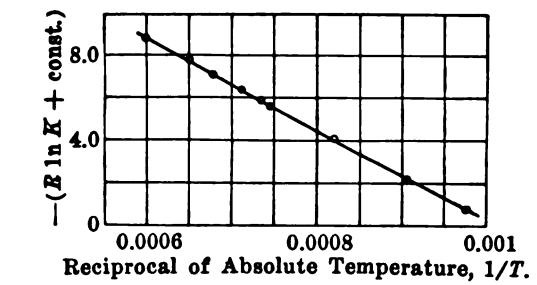

FIGURE 1. -Equilibrium between Hydrogen, Sulfur and Hydrogen Sulfide.

If we had reversed the equation of this reaction, which is the same as taking the reciprocal of the former equilibrium constant, we would write

$$\mathbf{H_{3}S(g) = H_{2}(g) + \frac{1}{2}S_{2}(g)};\quad K = \frac{[\mathbf{H_{2}}]_{2}[\mathbf{S_{2}}]^{\mathsf{H}}}{[\mathbf{H_{2}}]^{\mathsf{H}}}.$$

In such a case we speak of the reaction as a dissociation, and this class of reactions presents some interesting features which will be further discussed in the following section.

EXERCISE 5. Another reaction for which AH cannot be obtained by calorimetric methods is the one studied by Starck and Bodenstein (Z. Elektrochem. , 16, 961 ( 1910) ) . Using the equation I2(g ) 21 (g) , calculate AH at 1100°K and at 1400° K from the data of the following table. By extrapolation obtain K1000, and AF 1000 . =

| T | 1073   | 1173   | 1273  | 1373  | 1473 |
|---|--------|--------|-------|-------|------|
| K | 0.0114 | 0.0474 | 0.165 | 0.492 | 1.23 |

EXERCISE 6. From the fact that I (g ) is monatomic, and from Equation VII- 7, derive the equation,

$$\mathbf{I_1(g)} = 2\mathbf{I(g)};\ \Delta F^\bullet = \Delta H_\bullet - 2.6\ \mathrm{T}\ \ln\ \mathrm{T}^\bullet + 0.0005T^\bullet + IT,\ \Delta$$

or

די

$$-\text{ }R\text{ }\ln K + 2.6\ln T - 0.0005\,T = \frac{\Delta H_{\text{0}}}{T} + I.$$

The first member is then a linear function of 1 /T. Show therefore that a straight line may be obtained by plotting the sum of the above three terms against 1 /T, and that the slope of this line is AH..

EXERCISE 7. Assuming that Cp is the same for S¿(g) as for O2, and using Equations VII-5 , VII-6 and VII-8, obtain a complete expression for AH for the reaction H2( g) + 2S2(g) =H2S(g) . Calculate the change in H

### STANDARD FREE ENERGY; EQUILIBRIUM CONSTANT 301

between 1675° K and 1025° K, and show that the result agrees in sign and in order of magnitude with the difference obtained in the text, from equilibrium measurements alone

### THE DISSOCIATION CONSTANT

Since the pioneer work of Sainte-Claire Deville, ¹ many of the most important reversible reactions which have been studied at high temperatures are those which may be classified as dissociations.

In such valuable technical processes as the catalytic union of sulfur dioxide and oxygen to form sulfur trioxide, or the Haber process for the synthesis of ammonia, the yield under given conditions of temperature and pressure is limited by the equilibrium, that is, by the balance between the process of formation of sulfur trioxide or ammonia, and the process of dissociation.

An interesting type of dissociation is one in which a molecule breaks up to form two like molecules. Let us consider the dissociation of iodine vapor at high temperatures, according to the equation

$$\mathbf{I_{2}(g)} = \mathbf{2I(g)};\ K = \frac{[\mathbf{I}]^{\mathfrak{z}}}{[\bar{\mathbf{I_{2}}}]}.\tag{11}$$

At a temperature of 1000 °C or above, the dissociation is very large, but, at 600°C, K is about 0.0002, so that if I2 is at atmospheric pressure, I will be at 0.014 atmos. (and the degree of dissociation will be 0.007) .

If, therefore, we were working with this gas in the neighborhood of atmospheric pressure we should find Boyle's law to be approximately obeyed, and would take the activity of I2 as equal to the total pressure of the gas.

If now the pressure were lowered we should pass through a range in which the gas would be found to deviate very markedly from the law of the perfect gas, until at low pressures, say onemillionth of an atmosphere, the dissociation would be practically complete, and Boyle's law would be once more obeyed.

<sup>1</sup> Sainte-Claire Deville, Ann. Chem. Pharm. , 135, 94 ( 1865) .

<sup>*</sup> Starck and Bodenstein, Z. Elektrochem. , 16, 961 ( 1910) ; Lewis and Randall, J. Am. Chem.Soc., 36, 2259 ( 1914) .

### THERMODYNAMICS

Strictly speaking, it is outside the province of thermodynamics to speculate concerning the cause of such anomalous behavior. We may choose any formula for the substance iodine, such as I, or I2, or I7, and then carry through all of our thermodynamic calculations, ultimately arriving at the same conclusions, irrespective of our choice. On the other hand, it may be far more convenient to use one formula rather than another, and in such a case as we are now discussing there is nothing to be lost, and much to be gained, by accepting the view that we have in iodine vapor two distinct molecular species, I , and I ; and by explaining the anomalous behavior of the gas as due to equilibrium between these two species. Thus in the range of low dissociation we may say approximately that the activity of I2 is equal to the total pressure, while from Equation 11 the activity of I is proportional to the square root of that pressure. 1

Indeed if the association of monatomic iodine to form diatomic iodine, and the dissociation of diatomic iodine to form monatomic iodine were both very slow reactions it might be possible to isolate both I, and I as separate pure substances. Such separation has actually been made in the case of two forms of elementary sulfur, and we may recall in this connection our discussion of pure substances in Chapter II.

When, from the dissociation constant of this reaction, we calculate its standard free energy change, we may be dealing with a process which is not realizable in practice. We write

$$\mathbf{I_{i}(g)} = 2\mathbf{I(g)}; \quad \Delta F^{o} = -RT\ln K,$$

where AF is the increase in free energy which would attend an isothermal process which uses up one mol of pure I, and produces two mols of pure I, both at atmospheric pressure, or, more strictly, both at unit activity. In using such equations it will make no difference to us whether the various substances considered are in states which are experimentally realizable. Thus we could calculate, from Equation XXIII- 18, the change in free energy in going from water to ice at 25°C, although hitherto no one has succeeded in obtaining ice in a superheated condition.

We may next examine similar cases of dissociation in solution. Thus hexa-aryl ethanes² dissociate into the corresponding triaryl methyls, to an extent which depends upon the temperature, the concentration , and the nature of the solvent. As a rule these substances are colorless in the undissociated form, but the disso-

<sup>1</sup> In the range of negligible dissociation, if the gas law is not obeyed, we cannot determine the activity by experiments at lower and lower pressures as our practice has been hitherto; but we may use some empirical equation, such as that of van der Waals, or Equation XVII- 19, and thus by extrapolating to zero pressure find approximately what the behavior of the gas would be, if there were no dissociation.

Gomberg, J. Am. Chem. Soc. , 36, 1144 ( 1914) .

ciated molecules, being " odd molecules", ¹ are colored . By making the simple assumption that the absorption of light is proportional to the amount of dissociated substance, the degree of dissociation may be determined colorimetrically.2

By just such a method Cundall³ made an exhaustive investigation of the dissociation of N2O4 in various solvents, and especially in chloroform. Since chloroform, NO2 and N2O4 might be expected to form nearly perfect solutions, and since, as far as we are aware, this is the only case of this sort for which we have data over a wide range of concentration , it will be interesting to see how near an approach there may prove to be between Cundall's results and the demands of Equation 7.

We have calculated from his data at 0° C the various figures needed for this comparison, and in Table 2 we give in the several columns: N1, the mol fraction of chloroform ; N2" , the mol fraction of N2O4; N2' , the mol fraction of NO2; and the ratio (N2' ) 2/N2″ , which should be constant according to Equation 7. We see that it changes only twofold in passing from the liquid containing no chloroform to the dilute solution in chloroform ; and in the concentrated solution, when the mol fraction of chloroform rises from 0 to 0.5, the ratio changes by only 6 percent. The small variation from constancy which exists is evidently due to the fact that, over this wide range of composition, the activities of NO2 and N2O4 are not quite proportional to their mol fractions.

# TABLE 2.-DISSOCIATION AT 0°C of N2O4, DISSOLVED IN CHLOROFORM

| Ni       | N2<br>" | N₂<br>' | (<br>N2<br>)<br>2<br>N2<br>X<br>108<br>" |
|----------|---------|---------|------------------------------------------|
| 0.00     | 1.00    | 0.00094 | 88                                       |
| 0.27     | 0.73    | 0.00080 | 87                                       |
| 0.46     | 0.54    | 0.00067 | 83                                       |
| 0.70     | 0.30    | 0.00045 | 67                                       |
| 0<br>875 | 0.125   | 0.00029 | 66                                       |
| 0.934    | 0.066   | 0.00019 | 52                                       |
| 0.950    | 0.050   | 0.00015 | 43                                       |
| 0.963    | 0.037   | 0.00012 | 35                                       |
| 0.982    | 0.018   | 0.00010 | 49                                       |

1 Lewis, J. Am. Chem. Soc . , 38, 770 ( 1916 ) ; Proc. Nat. Acad. , 2, 586 ( 1916) .

* See Piccard, Ann. Chem. , 381 , 347 ( 1911) .

Cundall, J. Chem. Soc. , 59, 1076 ( 1891) ; 67 , 794 ( 1895) .

We have chosen this illustration partly also for the sake of discussing another point which without explanation might prove troublesome. In the table it will be noted that the amounts of NO, are so small that N₁ and N2" are together practically equal to unity. At higher temperatures this is no longer the case. We might, for example, find a mixture containing 80 mols of CHCl3, 10 mols of NO2 and 10 mols of N2O4, and we might write : (a) N₁ = 0.80, N2' = 0.10 and N2" 0.10. It must be emphasized, however, that this procedure is in some ways arbitrary, and due to our foreknowledge of the dissociation of N2O4. We would have obtained a mixture of the same composition if we =

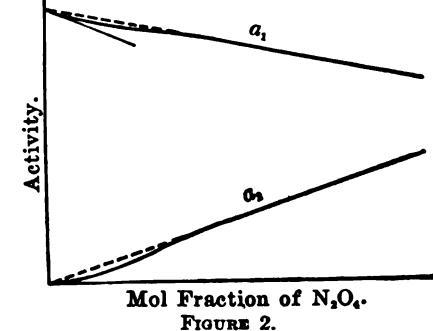

N2 had taken 15 mols of pure N2O4 and 80 mols of CHCl3, in which case, if we followed the normal usage and paid no attention to the possible dissociation, we would have written : (b) N₁ = 80/(80 +15) and N₂ = 15/( 80 + 15) . Again, we might have reached the same composition had we used 30 mols of NO, and 80 mols of CHCl3. In this case, paying no attention to the possible association of the NO2, we would have written : ( c ) for CHCl3, N1 80/( 80 +30) , and for NO2, N2 = 30/(80 +30) . =

Suppose that we were ignorant of this phenomenon of dissociation, and were to study the activities of the solvent and the solute in solutions of N2O4 in chloroform at 0°C, by any of the methods employed in the preceding chapters. We should of course reckon the mol fractions by the method (b) suggested above; and plotting a2, the activity of N2O4, against its mol fraction as in Figure 2, we should undoubtedly find in moderately

### STANDARD FREE ENERGY; EQUILIBRIUM CONSTANT 305

dilute solutions that a would be proportional to N2 ( Henry's law) . If, however, we carried our investigations into the very dilute solutions, where marked dissociation occurs, we should find the values of a falling below the (dotted) straight line. At extreme dilutions, where the dissociation is nearly complete, a2, instead of being proportional to N₂, would be found proportional to N22, so that at infinite dilution da /dN₂ = 0. Likewise a₁, the activity of the solvent, would be approximately proportional to N₁ (Raoult's law) in the range of moderate dilution ; but at very high dilution deviations from this law would appear, and at infinite dilution the slope of the curve would be twice that of the dotted line. In other words, the rate of lowering of the activity of the solvent by the solute at infinite dilution is just twiceasgreatasthatpredictedbyRaoult'slaw.

This seems to be, and is in fact, a direct contradiction of one of the fundamental laws of the infinitely dilute solution ( obtained in Chapter XX) , but it will be recalled that the whole development of that chapter was based on the assumption that df2/dN2 is finite on approaching infinite dilution where N₂ = 0. This also means that da2/dN2 is finite. However, as we pointed out at that time, there is one exception to this rule, namely, in the case where the solute dissociates.

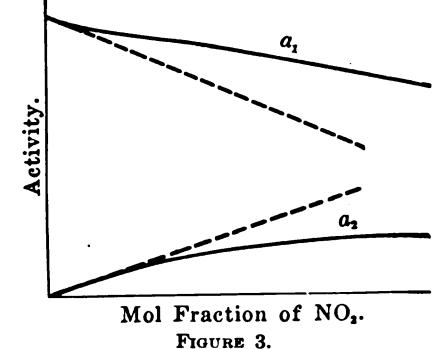

Fortunately, in such cases we may eliminate these exceptions to the laws of the dilute solution by considering as solute, not

1 At least, if we do not make so absurd a choice of a standard state as to make the ratio of a to f zero or infinity.

### 306 THERMODYNAMICS CHAP. XXIV

the undissociated substance, but the products of dissociation. Thus, if in place of Figure 2 we had plotted the activity of CHCl, and of NO2 against the mol fraction of NO2, as in the above method (c ) , we should obtain in extremely dilute solutions such a plot as that of Figure 3, where it is evident that both Henry's law and Raoult's law are obeyed at first, although even in pretty dilute solutions marked deviations from these laws would appear, which now would be attributed to association of NO2.

We have entered at some length into this discussion of the thermodynamic properties of a solution in which dissociation occurs, partly because of its intrinsic importance in thermodynamic theory, and partly also because this discussion furnishes a simple introduction to the study of solutions of electrolytes.

EXERCISE 8. Calculate AF° for I2( g) = 21 ( g) at 600°C. Find the degree of dissociation of the gas when the total pressure is one atmosphere; one thousandth of an atmosphere; one millionth of an atmosphere.

EXERCISE 9. At 0°C and a pressure of 87 mm. of mercury, the density of an equilibrium mixture of NO2 and N2O4 is 0.84 times the density calcu lated for pure N₂O, (E. and L. Natanson, Ann. Physik, [ 3] 24, 454 ( 1885) , 27, 606 ( 1886) ; Schreber, Z. physik. Chem. , 24, 651 ( 1897) ) . Assuming that both gases are perfect, calculate the degree of dissociation of N2O4, the dissociation constant K, and AF°273 for N2O4 (g) = 2NO2(g) .

EXERCISE 10. Referring to Exercise XV-3, find the percentage of carbon dioxide which would be dissociated if the gas is heated to 1500° K at atmospheric pressure. (As a first approximation assume the partial pressure of CO₂ to be 1 atmos. , and thus obtaining the partial pressures of CO and O2, subtract these from unity, and obtain the partial pressure of CO₂ which is to be used in the second approximation. )

# CHAPTER XXV

## SOLUTIONS OF ELECTROLYTES

When we studied the freezing point of acetic acid solutions in Exercise XXIII-4, we found that, in proceeding from very concentrated solutions to about half molal, the molal lowering /m appeared to be rapidly approaching the theoretical value of 1.858. We therefore felt justified in extrapolating to infinite dilution in the usual manner, thus determining the individual values of the activity of acetic acid in the various concentrated solutions. λ =

If, however, the experimental measurements of the freezing point are carried into very dilute solutions, we find that /m, instead of steadily approaching A, soon exceeds this value and continues to increase with the dilution . This is shown by the measurements of Hausrath¹ given in the second column of Table 1 . These data do not suffice to show whether a new limit is being approached, nor would it be possible with the present technique to obtain accurate measurements at much higher dilutions. But if we turn to dichloracetic acid, which exhibits the same phenomenon at higher concentrations, we learn from the measurements of the same author that /m is 3.47 at 0.018 M; 3.60 · at 0.008 M; and 3.71 at 0.003 M. Here it is evident that the molal lowering is approaching 2 3.716 as a limit. =

This case shows so near an analogy to N2O4 dissolved in chloroform , which we studied in the preceding chapter, that it is natural to assume here also some kind of dissociation whereby a molecule of acetic acid yields two new molecules; this dissociation being negligible at the higher concentrations, becoming noticeable in the more dilute solutions, and approaching completion at infinite dilution .

1 Hausrath, Ann. Physik, [ 4] 9, 548 ( 1902) .

Later we are going to discuss more fully the nature of this dissociation, and to show how the dissociation constant may be calculated from measurements of a quite different sort. Such measurements give as the dissociation constant of acetic acid¹ 2.0 × 105 at 0°C. From this dissociation constant we find the degree of dissociation, a, at each of the three concentrations of Table 1. Since m is the number of mols of acetic acid dissolved in a kilogram of water, the total molality would be 2m in the case of complete dissociation, or for incomplete dissociation ( 1 + a)m. This coefficient, 1 + a, is also known as the van't Hoff factor, i.

# TABLE 1. -MOLAL FREEZING POINT LOWERING IN AQUEOUS ACETIC ACID

| m     | /m(obs<br>. ) | α    | i<br>=<br>1<br>+<br>a | 9/m<br>(calc<br>. ) |
|-------|---------------|------|-----------------------|---------------------|
| 0.001 | 2.05          | 0.13 | 1.13                  | 2.10                |
| 0.003 | 2.01          | 0.08 | 1<br>08               | 2.00                |
| 0.035 | 1.93          | 0.02 | 1.02                  | 1.90                |

Assuming now that each species obeys the law of the dilute solution, we may calculate /m as equal to 1.858 ( 1 + a) . The values so calculated are given in the last column of Table 1, and agree, well within the limits of experimental error, with the figures of Hausrath.

This dissociation of acetic acid is of a type first explained by Arrhenius' brilliant theory of electrolytic dissociation , which, in the half century that has elapsed since its inception, has been the subject of bitter contention, but is now universally accepted.

It is assumed that a molecule of acetic acid dissociates to form a positively charged and a negatively charged molecule, the former belonging to the same molecular species (hydrogen ion) as exists in all aqueous acid solutions, and the latter (acetate ion) , common to all aqueous solutions of acetates. These ions, or charged molecules, are assumed to be responsible for the phenomenon of electrolytic conduction, and it is by a study of the conductivity of electrolytes that much of our information regarding these substances has been obtained.

This value is obtained by extrapolation of the results of conductivity measurements at various temperatures made by Noyes and Cooper, Publ. Carnegie Inst. No. 63 ( 1907) .

## THE CONDUCTIVITY AND THE DISSOCIATION OF WEAK ELECTROLYTES

It is supposed that the conductivity due to any ion is the product of two factors, (a) the concentration of that ion, and (b) its mobility. If the mobility is assumed to be independent of the concentration ( Kohlrausch's law) the ratio of conductivity to ion concentration must be constant. If this be assumed for both ions of a substance like acetic acid, then the conductivity of this electrolyte divided by the ion concentration is constant, but the conductivity divided by the gross concentration, which is usually expressed for this purpose in equivalents per liter, will vary according to the degree of dissociation . This latter quotient, called the equivalent conductivity, and denoted by A, must approach a constant value A°, as we approach infinite dilution and complete dissociation.

On the assumption of constant ionic mobility, A/A° gives the degree of dissociation at each concentration, and mA/A° gives the molality of each ion, while m(1- A/A°) gives the molality of the undissociated substance. Let us consider the quotient KA defined by the equation

$$\mathcal{L}^{\rm m} \begin{pmatrix} \Lambda \\ \bar{\Lambda}^{\bullet} \end{pmatrix}^{\bullet} \Big/ \begin{pmatrix} 1 & -\Lambda \\ 1 & \bar{\Lambda}^{\bullet} \end{pmatrix} = \mathcal{K}_{\Lambda}. \tag{1}$$

If we now assume further that the activity of each substance is equal to its molality, the quotient K is equal to K, the equilibrium constant , for such a reaction as XY = X ++ Y-. We thus have the well known dilution law of Ostwald.

If any one of the above assumptions is false we cannot expect K to be a constant, nor is it in practice found to be constant except for a certain class of electrolytes, and then only in dilute solutions. However, it seems reasonable to conclude that the several assumptions approach complete validity at infinite dilution, and therefore that the limiting value approached by K₁Aat infinite dilution is the true dissociation constant K.

To illustrate a case in which the several assumptions appear to be valid over a considerable range of concentrations, we may

CHAP. XXV

cite the measurements by Kendall' of the conductivity of acetic acid solution at 25°C. Table 2 gives in the first column the molality, and in the second the values of K.

TABLE 2. -DISSOCIATION CONSTANT OF ACETIC ACID AT 25°C

| m     | KA<br>×<br>105 |
|-------|----------------|
| 1.0   | 1.40           |
| 05    | 1.65           |
| 0.25  | 1.76           |
| 0.13  | 1.81           |
| 0.063 | 1.84           |
| 0.032 | 1<br>85        |
| 0.016 | 1.85           |
| 0.004 | 1<br>84        |
| 0.002 | 84<br>1        |
| 0.001 | 1.84           |

It is evident that in the more concentrated solutions the dilution law fails ; indeed it is probable that every one of the assumptions from which this law was derived becomes invalid. One of them we know to be false, for we have already calculated (Exercise XXIII-4) that the activity of the undissociated acid is less than the molality by about 6 percent in molal solution. Below 0.1 M, however, the constancy of K leaves nothing to be desired. We may conclude that K 0.0000184 and therefore, for the free energy of the reaction , = A

CH3COOH = H+ + CH3COO¯; AF° 298 = —- ᎡᎢ ln K = 6463 cal.

Like acetic acid a large number of acids and bases, and also a few salts , obey the Ostwald dilution law in aqueous solution over a measurable range of concentrations. These are generally

Wegscheider (Z physik. Chem . , 69 , 603 ( 1909) ) has come to the conclusion that it is principally the ion concentration which determines the limit of validity of the Ostwald dilution law. Thus the law holds for acetic acid up to about 0.1 M where the ion concentration is about 0.001 M, and we should expect according to the view of Wegscheider that a stronger organic acid would obey the law only to 0.01 M if at this concentration it should give the same ion concentration of 0.001 M.


<sup>1</sup> Kendall, Medd. Vetenskapsakad. Nobelinst. , 2, No.38(1911).

 It must be constantly borne in mind that, by thermodynamic necessity, at a given temperature K is a constant at all concentrations. If therefore, in addition to determining the activity of the undissociated acid in molal solution , we should also determine the activities of the ions, the product of the latter divided by the former would be 0.0000184 . How such ion activities are measured, and how interpreted , will be fully discussed in following chapters.

classified as weak electrolytes, a term which we may also use to include substances, about to be discussed, that are themselves ions but are capable of further ionization .

The Two Dissociation Constants of Carbonic Acid. Let us consider the case of carbonic acid which, when dissolved in pure water, shows no measurable ionization except in accordance with the reaction

> H2CO3(aq) = H++ HCO3-.

The conductivity of water containing varying amounts of carbon dioxide has been carefully measured by Walker and Cormack¹ and by Kendall. The measurements of the latter at 25° lead at the several concentrations given in Table 3, from which we find K = 3.50 X 10-7, and therefore for the reaction, to the values of K

> H2CO3(aq) =-´H+ + HCO3¯; AF°298 =8810 cal.

TABLE 3. DISSOCIATION CONSTANT OF H₂COз AT 25°C

| m      | KA<br>X<br>107 |
|--------|----------------|
| 0.027  | 3.51           |
| 0.019  | 3<br>48        |
| 0.014  | 3.49           |
| 0.010  | 3.48           |
| 0.0069 | 3.55           |

Bythe convention of the preceding chapter concerning hydrates we have

$$\text{CO}_2\text{(aq) } + \text{H}_2\text{O(l) } = \text{H}_2\text{CO}_3\text{(aq)}; \Delta F^\bullet = 0.1$$

Hence we might equally well write

$$\text{HCO}_3\text{(aq) + H}_2\text{O(l) = H^+ + HCO_3^- ; \Delta F^\circ_{298} = 8810 \text{ cal.} )$$

and likewise for this reaction ,

$$\text{°.}\,\text{K} = \frac{\text{(H}^+\text{)(HCO}_3^-\text{)}}{\text{(}\text{CO}_2\text{)(H}_2\text{O}\text{)}} = 3.50 \times 10^{-7} \text{.}$$

It is not experimentally possible to continue such measurements

1 Walker and Cormack, J. Chem. Soc. , 77 , 5 ( 1900) .

2 Kendall, J. Am. Chem. Soc. , 38, 1480 ( 1916) .

as those of Table 3 into the range of extreme dilution, where the ion HCO3 would itself largely dissociate according to the equation

$$\mathrm{HCO_3^-} = \mathrm{H^+} + \mathrm{CO_2^-}.$$

But by indirect methods, which we need not discuss at this point, it is possible to calculate the constant of this dissociation. Thus Lewis and Randall¹ from the measurements of McCoy: have calculated the "second dissociation constant" of carbonic acid,

$$K_{298} = \frac{(\text{H}^+)(\text{CO}_3^-)}{(\text{HCO}_3^-)} = 5.4 \times 10^{-11}; \,\Delta F^\circ_{298} = 14010 \text{ cal.}$$

Now we may combine this result with that obtained for the first dissociation , either by adding the values of AF° or by multiplying the two values of K, and we thus find for the reaction

$$\begin{aligned} \text{CH}_3\text{CO}_3 \text{ (aq) } &= 2\text{H}^+ + \text{CO}_3^{--}; \text{ } K_{\mathfrak{z}\mathfrak{g}} = \frac{(\text{H}^+)^2(\text{CO}_3^{--})}{(\text{H}_2\text{CO}_3)} = \\ &= \frac{1.89 \times 10^{-17}; \quad \Delta F^{\bullet}_{\mathfrak{z}\mathfrak{g}} = 22820 \text{ cal.} \end{aligned}$$

EXERCISE 1. Dichloracetic acid is a much stronger acid than acetic, nevertheless the values of KA obtained from conductivity rapidly approach a constant limiting value at infinite dilution . From the following table obtained by Kendall at 25°C find this limiting value, K, and find AF 295 for the dissociation :

$$\begin{array}{cccccccccccccc} \mathbf{1/m} & \mathbf{1} & \mathbf{4} & \mathbf{16} & \mathbf{32} & \mathbf{64} & \mathbf{128} & \mathbf{256} & \mathbf{512} \\ \mathbf{A/h}^{\bullet} & \mathbf{0.211} & \mathbf{0.393} & \mathbf{0.600} & \mathbf{0.708} & \mathbf{0.803} & \mathbf{0.878} & \mathbf{0.931} & \mathbf{0.963} \\ \end{array}$$

EXERCISE 2. Because the dissociation of carbonic acid at moderate concentrations is extremely slight, the solubility of gaseous carbon dioxide in water obeys Henry's law over a wide range, and therefore if we take the activity of the gas as equal to its pressure, the activity in solution is equal to the molality. The solubility at 25°C is 0.0338 M, when the partial pressure of CO2 is 1 atmos. Hence, find K (CO2) /[ CO2] and AF° for the reaction CO2 (g) = CO₂ (aq) . Show that this is the same as AF for the reaction CO2( g) + H2O(l ) H2CO3(aq) . By combining with previous results of this chapter find AF° for the reactions, CO2(g) + H2O(l) = H+ = = + HCO₁¯; CO2(g) +H2O ( l) = 2H++ CO₂¯¯¯. Also find K = (H+) ²(CO3¯¯) [COz](H2O)

<sup>1</sup> Lewis and Randall, J. Am. Chem. Soc. , 37, 458 ( 1915) .

<sup>2</sup> McCoy, Am. Chem. J., 29, 437 ( 1903) .

## THE EFFECT OF TEMPERATURE UPON IONIZATION

When the quotient which we have called KA is independent of the concentration over a considerable range, we feel justified in regarding K₁ as equal to the true dissociation constant K (unless by some improbable coincidence two of our assumptions fail simultaneously, the deviations completely compensating one for the other) . Therefore throughout the range of its constancy we may take K = K, and introduce K into our thermodynamic equation for the change of equilibrium constant with the temperature, Equation XXIV-9. Thus when the heat of dissociation has been obtained by calorimetric methods we may find the change in A/A° with the temperature, or conversely if the latter change is known we may calculate the heat of dissociation.

Such a calculation will introduce no new principles, but will nevertheless bring out a startling fact regarding the magnitude of the temperature coefficient of AH in ionic reactions ; a fact which we must henceforth keep in mind when dealing with solutions of electrolytes. We shall choose for this illustration the data of Noyes and Kato¹ and of Sosman ' on the conductivity of dilute solutions of ammonium hydroxide, which dissociates according to the equation.

$$\mathbf{NH_4OH} = \mathbf{NH_4^+} + \mathbf{OH^-}.$$

Their results are given in Table 4, where the first column gives

| t     | 1<br>/<br>T | K<br>×<br>106 | -<br>R<br>ln<br>K | ΔΗ        |  |
|-------|-------------|---------------|-------------------|-----------|--|
| 18    | 0.003436    | 17.2          | 21.81             | 1240      |  |
| 25    | 0<br>003356 | 18.1          | 21.71             | 790       |  |
| 51    | 0.003086    | 18.1          | 21<br>71          | -<br>470  |  |
| 75.2  | 0.002872    | 16.4          | 21.91             | -<br>1550 |  |
| 100   | 0.002681    | 13.5          | 22.30             | 2730<br>- |  |
| 124.8 | 0.002514    | 10.4          | 22.82             | -4180     |  |

23.82

26.30

32 20 - 27400

6.28

1.80

0.093

TABLE 4. -DISSOCIATION CONSTANT OF AMMONIUM HYDROXIDE AT DIFFERENTTEMPERATURES

1 Noyes, Publ. Carnegie Inst. , No. 63, pp . 178, 228 ( 1907) .

0.002331

0.002037

0.001727

156

218

306

-6390

- 12100 the centigrade temperature ; the second the reciprocal of the absolute temperature; the third KK; and the fourth R ln K.

Now, using the method of the preceding chapter, we may plot -RIn K against 1 /T. Instead of the straight line which we should ordinarily expect for so small a temperature range, we obtain the very pronounced curve of Figure 1. The slope of this curve at the various temperatures gives at once AH, the heat absorbed in the dissociation of one mol of NH4OH. These slopes read from the curve are given in the last column of Table 4. Without attempting to interpret the values at the higher temperatures, we may observe that at the four lowest tempera-

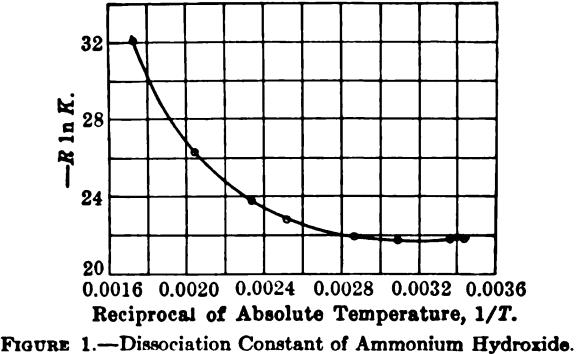

= = tures AH varies almost linearly with the temperature and can be expressed by the equation AH 16500 - 52.5T. Thus at 18°C we find AH291 1200 cal. , while Thomsen, ' by several different calorimetric experiments, obtained values ranging from 1200 to 1400 cal. Even more striking is the agreement between the values of ACD given by the above equation, namely 52.5, with the value obtained from Thomsen's measurements, which give ACD = - 47 , with an uncertainty of 5 or 10 units.

1 Thomsen's measurements were not made at a single temperature, but at the temperature of his laboratory, which was usually between 16° and 20°. For the greater part of his data this uncertainty is of no importance, but in such reactions as the above, in which the number of ion molecules changes, the effect of small temperature changes upon AH is alone sufficient to account for the variations in AH between Thomsen's several experiments. The above values attributed to Thomsen are based upon the assumption that when a strong acid neutral izes a strong base the only reaction is H + OH¯ H2O, but that when a strong acid neutralizes a weak base this reaction occurs together with the dissociation of the base. Similar assumptions are made in obtaining the values of ACp. The validity of such assumptions will be discussed in the next chapter.


### STRONG ELECTROLYTES

When a group of substances is arbitrarily arranged according to the measure of some one property, we expect to find a few members of the group in which the value of this property is very large, a few others in which it is very small, while the great majority are clustered about some mean value. Thus, if we arrange all known electrolytes according to the value of A/A° in 0.1 molal aqueous solution , we might expect to find a few very weak and a few very strong electrolytes, with the majority in some intermediate class. This, however, is very far from the fact. We find a very large number of electrolytes which are highly ionized, and comparatively few which lie in the intermediate region between these strong electrolytes and the typical weak electrolytes, which obey the Ostwald dilution law over a measurable range of concentration.

We may therefore conclude that our classification into strong and weak electrolytes is not entirely arbitrary, but represents, perhaps crudely, some natural classification . It is indeed a striking fact that the values of A/A° at some definite low concentration seem in the great majority of strong electrolytes to depend, not so much upon their specific properties, as upon their valence type. Thus the uni-univalent electrolytes, such as potassium chloride or sodium acetate, have about the same values of A/A° , the uni-bivalent salts like potassium sulfate and barium chloride all give a lower value, while a still lower is found with. bi- bivalent salts such as magnesium sulfate. We shall see a little later that this is not true merely of A/A° but also of what we are going to term the thermodynamic degree of dissociation.

To see what a wide gap separates these electrolytes from the ones which we have been discussing in this chapter, we will calculate, from the conductivity data for potassium chloride, KA at the three concentrations given in Table 5. It will be seen that K increases nearly twelve-fold when the molality changes one hundred-fold, and while these figures might be changed materially by possible errors in A° , such uncertainties are in no A

way adequate to account for the enormous departure from the Ostwald dilution law.

| TABLE<br>5 |       |  |  |  |
|------------|-------|--|--|--|
| m          | ΚΑ    |  |  |  |
| 0.001      | 0.046 |  |  |  |
| 0.01       | 0.148 |  |  |  |
| 0.1        | 0.528 |  |  |  |

It must therefore be concluded, for such strong electrolytes, either that A (because of some variation in the mobility of the ions) does not measure the ion concentration, or that the substances concerned are very far from obeying Henry's law.

These very peculiar characteristics of strong electrolytes in aqueous solution, together with the presumption that the constituents of an electrolytic solution, even at low concentrations, would depart radically from the ideal solution, led Lewis ' to propose a general study, by purely thermodynamic methods, of the activities of such constituents. In 19122 he collected the meagre data which were then available for such thermodynamic treatment and showed that in all cases the activity of the ions is very appreciably less than the ion concentration as calculated from A/A°. In these calculations he employed measurements of electromotive force, of the solubility of salts in the presence of other salts, and of freezing points ; there showing how freezing point data could be exactly employed in these thermodynamic calculations.

Since the publication of that paper an extensive literature on this subject has developed, and the new data not only confirm Lewis' conclusions, but furnish for the calculation of ionic activities the abundant material which we are to employ in the next few chapters.

Now from a purely thermodynamic point of view we might rest content with the determination of the activities, for these are the quantities which we need in our various calculations. It is not necessary for us to know the concentrations of the various molecular species which occur in these solutions of

<sup>1</sup> Lewis, Proc . Am. Acad. , 43 , 259 ( 1907) ; Z. physik. Chem. , 61 , 129 ( 1907) ; 70, 212 ( 1909) . 2 Lewis, J. Am. Chem. Soc. , 34, 1631 ( 1912) .

strong electrolytes. Nevertheless the matter is of so much interest that we feel justified in departing from the thermodynamic method long enough for a short discussion regarding the concentration of the constituents in these solutions, especially since this discussion will bring out certain facts which will be of value in our further work.

### THE CONCENTRATION OF THE IONS AND THE "TRUE" DEGREE OF DISSOCIATION

As we develop the various thermodynamic methods which lead to the determination of the activity of ions, and of the "thermodynamic degree of dissociation," we shall see that none of them give us any clue as to the actual concentration of the ions, nor to that quantity which has, with unconscious irony, been called the true degree of dissociation .

There remain, however, two groups of properties which give some evidence, although of a somewhat conflicting character. The first includes volume, heat content, and optical properties; the second includes electrical conductivity and related properties.

Many of the properties of dilute aqueous solutions are to a pronounced degree additive, in the sense that they can be represented as the sum of two numbers, one characteristic of the cation and the other of the anion . With such properties as the partial molal volume, heat content and heat capacity, this addi tivity seems to be absolute at infinite dilution . How far these additive relations persist into the realm of finite concentration, is an experimental problem which is far from solved. Perhaps the best evidence that we have is that which concerns the partial molal heat content.

The old law of Hess ' regarding the thermoneutrality of salt. solutions, which was a powerful support to Arrhenius' theory of electrolytic dissociation, might perhaps with equal force have been used against his assumption of partial dissociation . On mixing very dilute solutions of two salts, let us say potassium chloride and sodium nitrate, we find no heat evolved or absorbed.

1 Hess, Ann. Physik. , [ 2] , 52, 97 ( 1842) .

## 318 THERMODYNAMICS СНАР. ХХѴУ

This is in accord with the additivity of heat contents and is what would be expected from the theory of complete dissociation. But, since we obtain nearly the same result at higher concentrations, we might, by this method of reasoning, be led to assume complete dissociation where other criteria lead to the assumption of a dissociation of only 50 percent or less.

The great mass of data obtained by Thomsen show, within the limits of error of his measurements, that the partial molal heat contents of all the strong electrolytes, up to a concentration of 0.5 M or greater, obey the additivity principle. Thus, for example, in the neutralization of any strong acid by a strong base the reaction may be regarded merely as H+ + OH = H₂O, and the heat of neutralization is constant within the limits of his error. This is true of acids like HCL, HBr and HNO3, and of bases like KOH, LiOH and Ba(OH) 2, whose dissociation at 0.5 M is ordinarily assumed to be not over 70 percent . It is not true of acetic or phosphoric acid, nor even for sulfuric acid, which, with respect to its second dissociation, shows many ofthe characteristics of a weak electrolyte.

More accurate investigations will doubtless show departures from additivity, increasing with increasing concentration. Thus Harned, ¹ by means of the Gibbs-Helmholtz equation, has studied the partial molal heat content of 0.1 M hydrochloric acid as affected by the addition of other chlorides. When the added potassium chloride reaches a concentration of 0.5 M, the heat content of the acid is changed by 150 calories, and when it reaches 3.3 M, the change amounts to nearly 3000 calories. The change of heat content of the acid is more affected by some other salts . Thus molal sodium chloride causes a change of 800 cal. , and molal lithium chloride causes a change of about 2000 cal. On the whole, however, the general approach of heat contents to additivity at moderate dilutions is very striking .

There are other properties which show the same kind of additivity. Thus to quote A. A. Noyes," " The optical activity and the color of salts in solution . are additive with respect to the properties of the constituent ions even up to concentrations where a large proportion of the salt is in the un-ionized state. "

<sup>1</sup> Harned, J. Am. Chem. Soc. , 42, 1808 ( 1920 ) .

<sup>2</sup> A. A. Noyes, Address before International Congress of Arts and Sciences, St. Louis, Technology Quarterly. 17 , 293 ( 1904)

As Lewis' has remarked, " If we had no other criterion for the degree of dissociation , these facts would undoubtedly lead us to regard salts, up to a concentration of normal or half-normal, as completely dissociated. " Indeed this conclusion had been drawn by Sutherland, and more recently this theory of complete dissociation has been adopted by Bjerrum, 3 Milner, Ghosh' and numerous other authors who explain the properties of strong electrolytes by the mutual influence of ions already separated to a considerable distance. The diminution in equivalent conductivity, and in the thermodynamic degree of dissociation, with increasing concentration are both ascribed to the nearer approach of the charged particles rather than to chemical union of the ions. Whether there is any essential difference between these two views is a question to which we shall revert presently.

The Interpretation of Conductivity. If we do not choose to assume complete ionization, there remains only one method" which might possibly give us ion concentration instead of ion activity. This is the method of conductivity. Unless our present theories of the mechanism of electrical conduction are quite erroneous, there would seem to be no objection to regarding the conductivity due to each ion as the product of the mobility by the concentration of that ion. If then we adopt the assumption of Kohlrausch that the ion mobility is independent of the concentration of the electrolyte, we must regard the conductivity as a direct measure of the ion concentration .

Jahn' was the first to express serious doubt as to the validity of the Kohlrausch assumption of constant ion mobility. His conclusions were somewhat discredited because they were largely based upon the tacit assumption that the quantities

2 Sutherland, Phil. Mag. , [ 6] 3, 161 ( 1902) ; 7 , 1 ( 1906) .

• Milner, Phil. Mag. , [ 6] , 25, 742 ( 1913) .

Ghosh, J. Chem. Soc. , 113, 149, 627, 790 ( 1918) .

We do not mention the method which depends upon the rate of catalysis of a reaction as determined by the amount of some ion present. Even if this method could be brought to greater refinement, it would give activities rather than concentrations. At least this is the case in the neighborhood of an equilibrium where the reaction rates are definitely related to the equilibrium constant.

7 Jahn, Z. physik. Chem , 33, 545 (1900) .

Lewis, " The Use and Abuse of the Ionic Theory, " Z. physik. Chem. , 70, 212 ( 1909) .

Bjerrum, Proc . VII Intern. Cong. Appl . Chem. (London) , 1909 ; Z. Elektrochem. , 24, 321 (1918) ; Medd. Vetenskapsakad. Nobelinst. , 5, No. 16 ( 1919) .

obtained by thermodynamic methods, and which we now call the activities, must be equal to the ion concentrations. Nevertheless we are now certain that his contentions were in the main correct. After a careful scrutiny of existing data on conductivity and transference numbers, Lewis ' was able to show that certainly in many cases, and presumably in all cases, the ion mobilities change with the concentration of electrolyte (and by an amount which is some function of the mobility of these ions at infinite dilution) .

The transference number of each ion of an electrolyte is the fraction ofthe total current carried by that ion. If we are dealing with the simple case of two ions, one positive and one negative, the ratio of the two transference numbers must be the ratio of the two mobilities. Thus if t, and t are the transference numbers of cation and anion, so that t+ + t = 1, and if u and u are the two mobilities, u+/u_ = t+/t_. It is evident that if the mobilities are independent of the concentration of electrolyte, the transference numbers must be also; although the converse is not true, for if the two mobilities increased or diminished in the same ratio, the transference numbers would remain constant.

As a matter of fact, the transference numbers themselves are not in general constant, thus proving definitely that the mobility of some ions must be variable. For hydrochloric acid solutions t is about 0.17 at infinite dilution , drops rapidly to a minimum² of about 0.155 at a little over half- molal, whence it increases rapidly until in very concentrated solutions the two ions have mobilities of the same order of magnitude. The change in the dilute solutions is the one which interests us for the moment, and this striking change is not, as was sometimes assumed, peculiar to acid solutions. As far as we may judge from the fragmentary and uncertain transference numbers that are given in the literature, such a change occurs whenever the transference numbers differ much from 12 ; that is when the two mobilities are markedly unequal. Thus for lithium chloride, t is 0.67 at 0.01 M and 0.74 at 1 M.

<sup>1</sup> Lewis, J. Am. Chem. Soc. , 34, 1631 ( 1912) .

Noyes and Kato, Publ. Carnegie Inst. , No. 63 ( 1907) ; Riesenfeld and Reinhold, Z. physik. Chem., 68, 440 ( 1909) .

It therefore seems a reasonable conclusion that all mobilities are changing with the concentration, but that when cation and anion have about the same mobility they experience about the same change in mobility, so that the transference number remains approximately constant in such cases.

It is evident that the Kohlrausch hypothesis is invalid , certainly for some, and probably for all of the ions. If, however, the variations in mobility are dependent primarily upon the total ion concentration, we would be justified in making a more limited assumption than that of Kohlrausch; namely, that in two salts of the same type, having a common ion, and both at the same concentration, the common ion would have the same mobility. Thus we might assume that in 0.1 M LiCl and 0.1 M KCl, Cl- would have the same mobility. On this very plausible assumption we could write for the two degrees of dissociation ,

$$\alpha = \frac{\Lambda}{u_{\star} + u_{-}}; \quad \alpha' = \frac{\Lambda'}{u + ' + u_{-}}.\tag{2}$$

If t_ and t_' are the transference numbers of the anion in the two electrolytes,

$$t_- = \frac{u_-}{u_+ + u_-}; \quad t_- ' = \frac{u_-}{u_+ ' + u_-}, \tag{3}$$

and thus for two salts with a common anion whose mobility is assumed to be the same in both salts , we may eliminate the mobilities and obtain the equation

$$\stackrel{\alpha}{\dot{\alpha}^{\prime}} = \stackrel{\Lambda t_{-}}{\dot{\Lambda}^{\prime} \overline{t_{-}}} . \tag{4}$$

Thus if we know the conductivity and the transference number for both salts we may calculate by this limited assumption, not the degree of dissociation of each salt , but at least the ratio of the two. An entirely similar result is obtained if the two salts. have a common cation.

Lewis2 showed that it was possible by this method to obtain 1 This principle when originally employed by Lewis gave the same results , but by a more awkward procedure. The above simpler method of stating the assumption is due to Dr. R. C. Tolman.

<sup>2*</sup> Lewis, J. Am. Chem. Soc., 34, 1631 ( 1912) .

CHAP. XXV

the ratio of a for a considerable number of electrolytes in tenth molal solution, to that of KCl, a' . His table may be summarized as follows. For all the halides of the alkali metals and ammonium, together with HCl, KOH and NaOH, a/a' lies between 0.99 and 1.02, although the values of A/A° for these electrolytes range from 0.83 to 0.93. For HNO3 and the nitrates, chlorates and bromates of the alkali metals, a/a' lies between 0.94 and 0.98, and for TINO, and AgNO3 the values of a/a' are 0.92 and 0.91 .

In using this method it has been unnecessary to know whether the mobilities are increasing or diminishing with the concentration of electrolyte. If they are assumed to diminish with increasing concentration, this change might be of such magnitude as to make the degree of dissociation unity for all of the first group, although the second and third groups would still have to be considered as incompletely dissociated .

On the other hand, if the mobility is assumed to increase with increasing concentration (and relatively more for ions which already have a higher mobility) , it is possible to make the values of a agree very closely in the main with the thermodynamic degrees of dissociation which we are going to discuss in following chapters. Thus we shall find that the thermodynamic degrees of dissociation are always smaller for salts like nitrates and chlorates than they are for the halides.

This coincidence, which is perhaps a rough one, and certainly not universal at as high a concentration as 0.1 M, will nevertheless frequently furnish a method of estimating thermodynamic degrees of dissociation when they have not been directly determined. Until more evidence is at hand this method gives hardly more than a guess, but we shall employ it provisionally when all other data are wanting. Thus, for example, we shall feel justified in assuming, in the absence of other evidence, that in tenth molal solution the thermodynamic degree of dissociation of chlorates is several percent lower than that of the corresponding halides, and that the thermodynamic degree of dissociation of silver chlorate is several percent lower still.

This bearing of conductivity upon thermodynamic calculations

has been our reason for treating in detail the combined use of conductivity and transference data. But it must be confessed that we have been led no nearer to the solution of the problem of determining actual ion concentrations.

What Do We Mean by Degree of Dissociation? While we have this question before us and before we return to our purely thermodynamic treatment, it may be of interest to view for a moment the logical implications of such a term as " degree of dissociation. "

Let us consider the equilibrium in the vapor phase, between diatomic and monatomic iodine, and at such a temperature that on the average each molecule of I2, after it has been formed by combination of two atoms, remains in the diatomic condition one minute before it redissociates. During this minute such a molecule will traverse several miles in a zigzag path, and after its dissociation each of its constituents will traverse a similar path before it once more combines with another atom. If we imagine an instantaneous photograph of such a gaseous mixture, with such enormous magnifying power as to show us the molecules as they actually exist at any instant, then by counting the single and double molecules we should doubtless find the same degree of dissociation which is actually determined by physicochemical methods.

On the other hand, if we should choose a condition in which the dissociation and reassociation occurs 1013 or 1014 times as frequently, the atoms of the dissociated molecules would hardly emerge from one another's sphere of influence before they would once more combine with each other, or with new atoms. In such a case the time required in the process of dissociation would be comparable with the total time during which the atoms would remain free, and even our imaginary instantaneous photograph would not suffice to tell us the degree of dissociation . For, first, it would be necessary to know how far apart the constituent atoms of a molecule must be to warrant our calling the molecule dissociated . But such a decision would be arbitrary; and according to our choice of this limiting distance, we should find one or another degree of dissociation .

### THERMODYNAMICS

Until a problem has been logically defined it cannot be experimentally solved, and it seems evident in such a case as we are now considering that, just as we should obtain different degrees of dissociation by different choices of the limiting distance, so we should expect to find different degrees of dissociation when we come to interpret differentexperimentalmethods.

Now it is generally agreed that ionic reactions are among the most rapid of chemical processes, and it is in just such reactions that we should expect to find difficulty in determining, either logically or experimentally, a really significant value of the degree of dissociation.

On the whole, we must conclude that the degree of dissociation and the concentration of the ions are quantities which we cannot determine by existing methods, and which perhaps cannot be defined without some degree of arbitrariness. The question is one which should be left open, especially as its answer is of no immediate concern to those who employ purely thermodynamic methods.

Whatever conclusions may ultimately be reached regarding the degree of dissociation of strong electrolytes, there can be no doubt whatever that the phenomenon of dissociation is a very different thing in strong and in weak electrolytes. In accordance with the theory of valence and molecular structure advanced by Lewis' we may explain such a difference as follows.

.. If we have a uni-univalent electrolyte whose cation is M+ and whose anion is X-, the molecule may be represented by the formula M : X:, where the pairs of dots represent the valence electrons, or the electrons of the outer shells. The pair lying between the atomic kernels M and X constitutes the chemical bond. In the weak electrolytes, like acetic acid or mercuric chloride, this approximates to the typical bond of organic chemistry, but as we pass to stronger electrolytes the kernel of the cation draws away from this bonding pair until, in the limit , this electron pair may be regarded as the property of the anion

<sup>1</sup> Lewis, J. Am. Chem. Soc. , 38, 762 ( 1916) .

<sup>2</sup> We have for simplicity represented the ions as unsolvated . The same remarks apply equally, however, to the more complicated case.

alone. Then the positive ion, which is the kernel M, is held to the symmetrical anion X:, only by the fact that they are oppo- .. sitely charged. When an electrolyte in a strongly polar or electrophilic medium approximates to this condition it may be classified as a strong electrolyte. Whether we should call such an electrolyte completely dissociated is, as we have seen, a matter of choice. In all probability the additivity, in dilute solutions, of certain physical properties , such as the heat content, accompanies the practical disappearance of the chemical bond.

If then we agree that a strong electrolyte is one which is completely polar, ' and that the ions are held to one another by a simple electrostatic force which obeys Coulomb's law, it becomes merely a matter of terminology to decide whether we shall say that a certain fraction of such an electrolyte is dissociated, or, with Ghosh, that a certain fraction of the ions are free, oroutside the"sphere ofmutual attraction. "

1 We use the word polar in the sense proposed by Bray and Branch (J. Am. Chem. Soc. , 35, 1440 ( 1913) ) and by Lewis ( ibid. , 35, 1448 ( 1913) ) .

# CHAPTER XXVI

# THE ACTIVITY OF STRONG ELECTROLYTES

The considerations of the previous chapter have shown that it is not profitable, at least for thermodynamic purposes, to attempt to determine separately the concentration of the undissociated substance and of the ions of a strong electrolyte. In studying the activities we may therefore employ the same expedient that we have used in the similar case of solvated solutes.

It is our custom to denote the activity of a solute by a2. If this solute is a substance like sodium chloride we may denote by a and a , respectively, the activities of cation and anion, while a₂ is called the activity of undissociated NaCl, or more simply, of NaCl. In the case of a binary electrolyte like this, the thermodynamic equation of chemical equilibrium takes the form ,

$$\frac{a_{+}a_{-}}{a_{2}} = K,\tag{1}$$

where at any given temperature K is an exact constant.

At infinite dilution, we make the activity of each ion of sodium chloride equal to its molality, which, assuming complete dissociation, is equal to the stoichiometrical molality of NaCl. Now in the complete absence of any reliable information as to the concentration of the undissociated salt , we shall find it extremely convenient to choose our standard state of that substance so that the Kin Equation 1 becomes unity. We thus define the activity of NaCl as the product of the activities of its two ions,

$$a_+a_- = a_\mathbf{2}.\tag{2}$$

In the same manner we may treat possible intermediate ions of a strong electrolyte . Thus if we assume that barium chloride gives the intermediate ion BaCl , its activity multiplied by the activity of Cl- will be written equal to the activity of BaCl2, and likewise the activity of BaCl + will be written as equal to the product of the activities of Ba++ and Cl-. This convention gives AF° = 0 for each of the reactions.

$$\begin{array}{rcl} \mathbf{BaCl_{1}} & = \mathbf{Ba^{+*}} & + \mathbf{2Cl^{-}},\\ \mathbf{BaCl_{2}} & = \mathbf{BaCl^{+}} & + \mathbf{Cl^{-}},\\ \mathbf{BaCl^{+}} & = \mathbf{Ba^{+*}} & + \mathbf{Cl^{-}}.\end{array}$$

An interesting case arises when a strong electrolyte dissociates to give an ion which itself dissociates as a weak electrolyte. Thus NaH2PO, is a strong electrolyte, and we write

$$\text{NaH}_2\text{PO}_4 = \text{Na}^+ \, + \,\text{H}_2\text{PO}_4^-; \,\Delta F^\bullet = 0; \,\, K = 1, 2$$

but H2PO4 is a weaker electrolyte than acetic acid, and the next ion HPO, - is much weaker still. Using the dissociation constants obtained by Abbott and Bray, ¹

$$\rm H_2PO_4^- \text{ = } H^+ + HPO_4^{--}; \; K_{\mathfrak{M}} = 1.95 \times 10^{-7}; \; \Delta F^\circ_{\mathfrak{M}} = 8940, \; HPO_4^{--} \text{ = } H^+ + HPO_4^{--}$$

Our methods in this chapter are designed primarily for strong electrolytes. In the treatment of a mixed type, such as monosodium phosphate, we shall ordinarily combine these methods with the methods of the preceding chapter. Nevertheless this is a matter of choice, and it is perfectly rigorous to apply the methods of the present chapter to any weak electrolyte if we are unable, or if we do not choose, to fix separately the standard states of the ions and of the undissociated substance.

At infinite dilution , the molality of anion and cation being the same,

$$a_{+} = a_{-} = a_{\mathfrak{A}}{}^{\mathcal{H}}.\tag{3}$$

How far this equality of the two ion activities extends into the range of finite concentration is a question which experiment alone can decide. However, if we consider the geometrical mean of the two ion activities, denoted by a , we see that at all concentrations

$$a_{\pm} = \begin{pmatrix} a_+ \ a_- \end{pmatrix}^{\natural_{\hat{\mathbf{i}}}} = a_{\mathfrak{k}}{}^{\natural_{\hat{\mathbf{i}}}},\tag{4}$$

and this mean activity will play an important part in our calculations. We shall later examine the problem of the separate determination of the two ion activities when they are not equal to one another and to a .

1 Abbott and Bray, J. Am. Chem. Soc. , 31 , 729 ( 1909) .

## 328 THERMODYNAMICS CHAP. XXVI

## THE ACTIVITY COEFFICIENT

The mean activity of the ions , a , divided by the molality of the electrolyte, gives a quantity which has been called the thermodynamic degree of dissociation , since it may be used to replace the degree of dissociation as used in the older approximate formulas. This quantity has also been called the activity coefficient, and, in order to avoid any implication as to the molecular species which may be present, this is the term we shall ordinarily employ henceforth. It will be denoted by y.

So far we have been considering the case of a binary electrolyte like KCl or CuSO, When we treat the more complicated types, such as K2SO₁ , K4Fe(CN) 。 and La2 ( SO4) 3 our equations become a little more complicated. If an electrolyte dissociates into v ( = v+ + v_) ions according to the equation X = v +X+ + v_X¯, we write for equilibrium

$$a_{+}^{"+}a_{-}^{"-}=a_{\mathfrak{t}};\ a_{\pm}=\left(a_{\mathfrak{t}}\right)^{1/\mathfrak{r}}.\tag{5}$$

If now we wish to define the activity coefficient y, so that in dilute solutions it may be regarded as a thermodynamic degree of dissociation, and become equal to unity at infinite dilution, we must no longer write it equal to a /m. In a solution of barium chloride in which the molality m is very small, a+ = m, 2m, and a [(m) (2m) ²] = 2m. By defining the activity coefficient by the equation y = a / (2 m) it becomes equal to unity at infinite dilution. In the case of lanthanum sulfate, La2 (SO4) 3 , which gives 2 positive and 3 negative ions, the corresponding factor is (2233) . In general, we shall define a_ = = the activity coefficient by the equation,

$$\gamma = \frac{a_{\pm}}{m(\nu_{+}{}^{\nu_{+}}\nu_{-}{}^{\nu_{-}})^{1/\nu}}.\tag{6}$$

## We might have made this derivation clearer if we had intro-

<sup>1</sup> The term activity coefficient has been used in two senses, sometimes to mean the ion activity divided by the assumed ion molality, and sometimes to express the ion activity divided by the gross molality of the electrolyte . This latter usage, to which we shall find it desirable to adhere in thermodynamic work, is more expressly designated by Brönsted (J. Am. Chem. Soc. , 42, 761 ( 1920) ) as the stoichiometrical activity coefficient .

For a weak binary electrolyte, when we do not choose to employ the convention that a +a- = a2, we still write y = a / m , but we cannot write y = a22/m.

duced the individual activity coefficients of the several ions. If in a solution of a chloride the stoichiometrical molality of the chloride present is designated by m_, and if the activity of the chloride ion is a_, the activity coefficient of chloride ion is defined as y = a /m_. Furthermore, if we define the mean molality of the ions, as we have their mean activity, and write it as m , it is readily seen that

$$m_{\pm} = m(\nu_{+}{}^{\prime} \nu_{-}{}^{\prime} \text{-})^{1/\prime},\tag{7}$$

and in place of Equation 6 we may write for the mean activity coefficient (which we might for consistency have called Y+)

$$
\gamma = a_{\pm}/m_{\pm} = (\gamma_{+}{}^{\prime +}\gamma_{-}{}^{\prime -})^{1/\prime}.\tag{8}
$$

Having established these conventions, we are now ready to undertake the arduous but very interesting and important task of determining the activity of electrolytes dissolved in water. We may study the activity a2 of the undissociated electrolyte, or the geometrical mean of the activities of the ions, namely, a = a¹ . In practice we shall use both of these activities, although the mean ion activity, together with the activity coefficient obtained therefrom, will be most frequently employed. In the present chapter we shall describe several methods of calculating the activities from measurements made at a single temperature. a±

### ACTIVITY FROM THE VAPOR PRESSURE OF THE SOLUTE

Few electrolytes are sufficiently volatile to permit the determination of their activities from their own vapor pressures. However, when this is possible it furnishes a method of great simplicity.

Bates and Kirschman¹ have made a careful study at 25°C of the partial pressures of hydrogen chloride, bromide and iodide over their aqueous solutions. Their results are given in Table 1 , in which the first column gives the molality ; the second , fourth and sixth, the partial pressures of the halides ; and the third,

1 Bates and Kirschman, J. Am. Chem. Soc. , 41 , 1991 ( 1919) .

fifth and seventh, a quantity which is proportional to the activity coefficient. If a is the activity of one of the undissociated halides, and a is the mean activity of its ions, we have defined the activity coefficient as a /m = a₂" /m. Hence if we consider a2 as proportional to the vapor pressure p, then p /m is a quantity proportional to the activity coefficient and may be written as ky.

| TABLE | -<br>ACTIVITY<br>1. | COEFFICIENTS | OF        | HYDROGEN  | HALIDES   | 25C°<br>AT |
|-------|---------------------|--------------|-----------|-----------|-----------|------------|
|       | HCI                 |              | HBr       |           | HI        |            |
| M     | px<br>104           | kiy          | PX<br>104 | K2Y       | PX<br>104 | kay        |
| 4     | 0.2395              | 0<br>001222  |           |           |           |            |
| 5     | 0.6974              | 0.001669     |           |           |           |            |
| 6     | 1.842               | 0.002263     | 0.01987   | 0.0002351 | 0.00750   | 0.0001444  |
| 7     | 4.579               | 0.003058     | 0.04868   | 0.0003152 | 0.02395   | 0.0002213  |
| 8     | 11.10               | 0.004171     | 0.1171    | 0.0004280 | 0.08555   | 0.0003664  |
| 9     | 25.39               | 0.005586     | 0.2974    | 0.0006058 | 0.3882    | 0.0006928  |
| 10    | 55.26               | 0.007436     | 0.7763    | 0.0008815 | 1.737     | 0.001317   |
| 11    |                     |              | 1.987     | 0.001280  |           |            |

If these measurements could be carried to high dilutions, k could be determined as the limit approached by ky at infinite dilution. This, however, is experimentally impossible in the present case, and therefore we must leave k as an undetermined constant until a later section.

## ACTIVITY FROM DISTRIBUTION RATIOS

A very similar method of calculating the activities is available when we know the distribution of an electrolyte between water and some non-ionizing solvent, in which the activity of the electrolyte is known as a function of the concentration (or assumed proportional to it) . To illustrate such a case we may use the measurements of Rothmund and Drucker¹ on the distribution of picric acid between water and benzene. Their results, expressed in mols per liter, are given in Table 2. The first column shows the concentration in water, and the second in benzene. Here again , taking a₂ as proportional to c₁, and identi-

<sup>1</sup> Rothmund and Drucker, Z. physik. Chem. , 46, 827 ( 1903) .

fying cw with m, we may write ky = CCB /cw. The values of this quantity, which are given in the third column, we have extrapolated to infinite dilution , obtaining 15.4 . But at infinite dilution Y = 1 , and therefore 15.4 is the value of k. Dividing now by this factor, we obtain the values of the activity coefficient given in the last column.

| -<br>TABLE<br>2. | COEFFICIENT<br>ACTIVITY | OF<br>PICRIC | 18°C<br>ACID<br>AT |
|------------------|-------------------------|--------------|--------------------|
| Cw               | CB                      | Εγ           | γ                  |
| 0.0334           | 0.1772                  | 12.6         | 0.82               |
| 0.0199           | 0.0700                  | 13.3         | 0.86               |
| 0.0101           | 0.0199                  | 14.0         | 0.91               |
| 0.00701          | 0.0101                  | 14.3         | 0.93               |
| 0.00327          | 0.00225                 | 14.5         | 0.94               |

ACTIVITY FROM THE VAPOR PRESSURE OF THE SOLVENT

15.4 1.00

0.00208 0.000932 14.9 0.97

The method of calculating a2, the activity of the solute, from a₁, the activity of the solvent, we have already fully discussed in Chapter XXII. It is applicable without modification to electrolytic solutions. In dilute solutions vapor pressure measurements give far less accuracy than the electromotive force or freezing-point measurements which we are about to discuss, but in concentrated solutions they furnish a very satisfactory means of determining the ratio of the activities of the solute between two concentrations.

From Brönsted's¹ measurements of the vapor pressure of water over sulfuric acid solutions at 20° and at 30° C, we have

| TABLE<br>3. | -VAPOR | PRESSURE<br>OF | SULFURIC      | ACID<br>SOLUTIONS           | 25°C<br>AT |
|-------------|--------|----------------|---------------|-----------------------------|------------|
| N2          | m      | Pi<br>/<br>pi  | N1<br>/<br>N2 | 10+<br>log<br>p₁<br>/<br>pi | ky         |
| 0.02175     | 1.236  | 0.959          | 44.9          | 9.982                       | 0.00348    |
| 0.04255     | 2.467  | 0.878          | 22.5          | 9.944                       | 0.00350    |
| 0.0801      | 4.88   | 0.716          | 11.4          | 9.856                       | 0.00469    |
| 0<br>1110   | 6.83   | 0.545          | 8.01          | 9.744                       | 0.00760    |
| 0.2014      | 14.02  | 0.201          | 3.96          | 9.320                       | 0.0227     |
| 0.2742      | 20.94  | 0.068          | 2.65          | 8.851                       | 0.0477     |

1 Brönsted, Z. physik. Chem. , 68 , 693 ( 1910) .

0

CHAP. XXVI

interpolated the values at 25°C given in Table 3, where the first and second columns give the mol fractions and molalities of H2SO4, and the third gives p₁ , the vapor pressure of water from the solution, divided by pi° , the vapor pressure of pure water.

Assuming that a₁ = pi/p₁° , we may employ Equation XXII- 19, with subscripts interchanged, ¹

$$\int d\log a_{\mathbf{i}} = \left. - \int \frac{\mathbf{N}_{1}}{\mathbf{N}_{2}} d\log a_{\mathbf{i}}.\right. \tag{9}$$

We plot the values in the fourth column against those of the fifth, and find the difference between the two values of log a; by obtaining the area under the curve. We may thus obtain a quantity which is proportional to a2, and if we then take the cube root and divide by m we have a series of quantities which are proportional to y. Such values of ky we give in the last column, and later we shall have occasion to check these values with those obtained by two other methods of determining the activity coefficient.

### ACTIVITY FROM ELECTROMOTIVE FORCE

The Activity of Hydrochloric Acid from Cells of Uniform Concentration of Electrolyte. If in a cell filled with aqueous hydrochloric acid of given composition we have a hydrogen electrode (at a partial pressure of hydrogen of one atmosphere) and an electrode of mercury and solid mercurous chloride, then for one equivalent of electricity passing through the cell the following reaction occurs :

$$\begin{aligned} \text{H}_2\text{H}_2\text{(g, 1 atmos.)} + \text{HgCl}(\text{s}) &= \text{Hg(l) + HCl(aq)} = \\ &\text{Hg(l) + H^+ + Cl^-.} \end{aligned}$$

Since N = 1 , the change in free energy is

$$
\Delta F = -\mathbf{NFE} = -\mathbf{FE}.
$$

If the temperature is fixed and the partial pressure of the hydro-

1 In a case of this sort where there is a wide departure from the law of the perfect solution there is no advantage to be gained by employing the method of Equation XXII- 24.

gen is maintained at one atmosphere, the electromotive force will depend solely upon the molality of the acid.

If we measure two such cells the combination is called a concentration cell without liquid junction, or, less accurately, a concentration cell without transference. If in the first cell the molality is m, and in the second m' , the difference between the two values of the electromotive force, E and E' , measures the change in free energy, per mol, in the transfer of acid from m' to m ,

$$\begin{aligned} \text{HCl(aq, } m') &= \text{HCl(aq, } m);\\ \Delta \mathbf{F} &= \mathbf{F}_{\mathbf{3}} \mathbf{\hat{+}} \mathbf{\hat{-}} \mathbf{\hat{z}}' = RT \ln \frac{a_{\mathbf{2}}}{a_{\mathbf{2}}'} = -\mathbf{F}(\mathbf{E} - \mathbf{E}'). \end{aligned} \tag{10}$$

If in the one cell we have HCl in its standard state, so that we may write

$$\mathbb{P}_{\mathbf{2}}{}^{\prime} = \mathbb{P}_{\mathbf{2}}{}^{\bullet}; \quad \mathbf{E}{}^{\prime} = \mathbf{E}^{\bullet}; \quad a_{\mathbf{2}}{}^{\prime} = 1,\tag{11}$$

then at any other concentration the partial molal free energy and the activity of the solute are given by the equation

$$
\mathbb{P}_2 - \mathbb{P}_2^\circ = RT \ln a_1 = -\mathbb{P}(\mathbb{E}_1 - \mathbb{E}^\circ).\tag{12}
$$

Or, if we wish to deal with the note that a = a2, or 2 In a = mean activity of the ions, we In a2, and

$$\mathbf{2}\ \text{RT}\ \ln a_{\pm} = \ -\mathbf{F}(\mathbf{E}\ -\mathbf{E}^{\circ})\,.\tag{13}$$

Such cells have been measured at 25°C by numerous investigators.¹ Work over a wide range of concentration has been done by Ellis , and over a still wider range and with more concordant results by Linhart. By plotting their data, we may obtain the ratio of the activity of hydrochloric acid between any two concentrations by eliminating E° from Equation 13. 3

The problem of determining E° , and thence the absolute value of the activity at any one concentration, is a far more difficult one, since it involves extrapolation to infinite dilution . Any such extrapolation, depending upon electromotive force measure-

<sup>1</sup> The first experiments of this kind, on the activity of hydrochloric acid, were made by Tolman and Ferguson, J. Am. Chem . Soc . , 34, 232 ( 1912 ) . They were at 18°C.

<sup>2</sup> Ellis , J. Am. Chem. Soc. , 38, 737 ( 1916 ) .

Linhart, J. Am. Chem. Soc . , 39, 2601 ( 1917) .

ments alone, must give large weight to measurements at high dilution, where the difficulties in securing accurate values for the electromotive force are very great.

1 An analogous cell, in which silver and silver chloride are substituted for mercury and calomel, has been studied with dilute solutions of hydrochloric acid by Noyes and Ellis, and more recently by Linhart who has succeeded in obtaining in very dilute solutions a degree of accuracy such as no other investigator has attained. The two series of measurements are for the most part in excellent agreement and permit the best determination of absolute activities which is at present possible from measurements of electromotive force alone.

The extrapolation to infinite dilution can best be made by employing an expedient entirely similar to that which we used in Chapter XXII ( Equation XXII- 15) . Changing Equation 13 to common logarithms, and introducing the several numerical factors, we find

$$10.1183 \text{ log } a_{\pm} = \mathbf{E}^{\circ} - \mathbf{E},\tag{14}$$

and to obtain the activity coefficient we subtract 0.1183 log m from each member, thus,

0.1183 log a± m= 0.1183 log y = E° -― (E +0.1183 log m) . ( 15)

At infinite dilution the first member disappears. Plotting the quantity in parenthesis ( called E°') as ordinate, against any function of m as abscissa, we see that the limit approached by the ordinate at infinite dilution is equal to E° , which we take with Linhart as 0.2234 volts. At any concentration this value,subtractedfromtheordinate,givesthevalueof0.1183logy.-

This plot which we have just described we give in Figure 1 , with the square root of m as abscissae, since this not only serves to compress the wide range of concentrationintoreasonable

<sup>1</sup> Noyes and Ellis , J. Am. Chem . Soc . , 39, 2532 ( 1917) .

<sup>2</sup> Linhart, J. Am. Chem. Soc. , 41 , 1175 ( 1919) . Linhart in his cells used finely divided metallic silver and the form of silver chloride which is obtained by precipitating a silver salt with a chloride in dilute aqueous solutions . All other investigators who have used the silver chloride electrode have coated a silver electrode with chloride by electrolysis. Electrodes prepared in the latter manner usually give a constant e.m.f. , but not always a reproducible one.

compass, but also since it should give a curve approximating to linearity at high dilution (for reasons which will later be discussed) .

Figure 1 comprises not only the results with the silver chloride cell, but also those with the calomel cell, for at each concentration the two series should differ in e.m.f. by a constant amount,and we find in fact that the two curves fit well together if we subtract 0.0466 volts from each e.m.f. of the calomel series. 'From the final curve, of which only the general trend can be shown in the small scale reproduction in Figure 1 , we have

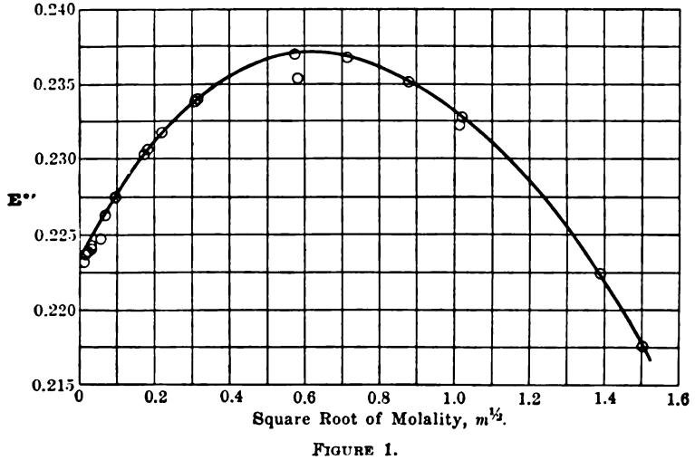

taken the values of Table 4. The several columns show the molality of the hydrochloric acid, its activity coefficient, the mean activity of the ions, the activity of HCl, and finally the partial molal free energy of HCl less that in the standard state,F2 - F2° = RT In a2 = 2 ᎡᎢ ln

The activity coefficient of any electrolyte starts at unity at zero concentration and very frequently reaches a minimum. In the present case y passes through the minimum even below.

<sup>1</sup> With this curve we have also compared the results of Lewis and Storch (J. Am. Chem. Soc., 39, 2544 ( 1917) ) on the cell H2, HBr(aq) , AgBr, Ag, at 0.01 M, 0.03 M, and 0.1 M. The several values of E differ by a constant amount from those used in Figure 1 , and we may therefore conclude that up to 0.1 M the activity coefficients of hydrochloric and hydrobromic acids are identical.

THERMODYNAMICS

CHAP. XXVI

| m      | γ     | a<br>+   | a2          | -<br>F2<br>F2 |
|--------|-------|----------|-------------|---------------|
| 0.0005 | 0.991 | 0.000496 | 0.000000246 | -<br>9022     |
| 0.001  | 0.984 | 0.000984 | 0.000000909 | -<br>8204     |
| 0.002  | 0.971 | 0.001942 | 0.00000377  | -7403         |
| 0.005  | 0.947 | 0.00474  | 0.0000228   | -<br>6336     |
| 0.01   | 0.924 | 0.00924  | 0.0000855   | -5552         |
| 0.02   | 0.894 | 0.01788  | 0.000319    | -<br>4772     |
| 0.05   | 0.860 | 0.0430   | 0.00185     | -3732         |
| 0.1    | 0.814 | 0.0814   | 0.00664     | -2977         |
| 0.2    | 0.733 | 0.1566   | 0.0246      | -2197         |
| 0.3    | 0.768 | 0.2304   | 0.0530      | -<br>1742     |
| 0.4    | 0.763 | 0.305    | 0.0929      | 1409<br>-     |
| 0.5    | 0.762 | 0.381    | 0.145       | -1144         |
| 0.6    | 0.770 | 0.462    | 0.213       | -<br>917      |
| 0.75   | 0.788 | 0.591    | 0.348.      | 625           |
| 1      | 0.823 | 0.823    | 0.676       | 232           |
| 2      | 1.032 | 2.064    | 4.17        | 846           |
| 3      | 1.35  | 4.05     | 16.4        | 1657          |
| 4      | 1.84  | 7.36     | 54.2        | 2367          |
| 5      | 2.51  | 12.55    | 158         | 3000          |
| 6      | 3.40  | 20.4     | 416         | 3575          |
| 7      | 4.66  | 32.6     | 1064        | 4132          |
| 8      | 6.30  | 50.4     | 2540        | 4647          |
| 9      | 8.32  | 74.9     | 5607        | 5117          |
| 10     | 10.65 | 106.5    | 11340       | 5534          |
| 16     | 43.21 | 691.0    | 478000      | 7751          |
|        |       |          |             |               |

TABLE 4. -ACTIVITIES IN AQUEOUS HYDROCHLORIC ACID SOLUTIONS AT25°C

halfmolal ; from there it rises rapidly, passing one hundred percent between 1 M and 2 M, and reaching 43.2 at 16 M. While in dilute solutions it is useful to think of the activity coefficient as a thermodynamic measure of the degree of dissociation, such an idea loses all value in these concentrated solutions, where it might be misleading to speak of a " degree of dissociation" of over four thousand percent.

The enormous difference between the electrolytic solutions which we are now considering and the solutions that we have discussed in the preceding chapters is best seen in the great variation of a2, the activity of HCl as such. For example, a

Recalculated from Linhart's value, using newer vapor pressure measurements, for correcting E to 1 atmos. of hydrogen.

increases half a million times between 1 M and 16 M. Since this quantity, a2, may be regarded as proportional to the vapor pressure of HCl, we may compare the values of Table 1 and Table 4. Assuming from the latter table that y 1.84 at 4 M, k₁ of the former table becomes 0.000664. The several values of k₁y divided by this constant give the following values of y which, except for the last concentration, are in excellent agreement with Table 4.

| TABLE<br>5 |                |      |      |      |      |      |       |
|------------|----------------|------|------|------|------|------|-------|
| m          | 4              | 5    | 6    | 7    | 8    | 9    | 10    |
| γ          | (<br>1.84<br>) | 2.51 | 3.41 | 4.60 | 6.27 | 8.43 | 11.20 |

CONCENTRATION CELLS WITH LIQUID JUNCTION (" WITH TRANSFERENCE")

Any cell of the type

Ag, AgCl, HCl (m) , HCl (m' ) , AgCl, Ag,

gives, with reversible electrodes, a definite and reproducible electromotive force. In the early days of the ionic theory Nernst2 showed how such a cell could be treated thermodynamically. In his solution of the problem he used ion concentrations (obtained from conductivity measurements) , where we should now use the activities, and his equation gave results which were only approximately correct. The problem is , however, one with which thermodynamics is perfectly competent to deal in an exact manner.

In solving this problem we may, for the sake of variety, make use of the partial molal free energies instead of the activities . In order to fix our ideas let us consider the concentration cell as sketched in Figure 2. At A and to the left of A the molality of the acid is constant and equal to m^ ; the transference number of the cation is 4, and the partial molal free energy of the HCl

In general, cells which involve a junction between two different solutions give an electromotive force which varies with the kind and with the physical nature of the liquid junction. This is not the case, however, when the two solutions are of different concentrations of the same electrolyte. In such a case both theory and practice show that the electromotive force is constant and reproducible.

<sup>2</sup> Nernst, Z. physik. Chem. , 4, 129 ( 1889) .

### THERMODYNAMICS

1

is F. Somewhere between A and B the concentration varies in some continuous but unspecified manner, until at B, and to the right, the molality is constant at m¹ the transference number at t , and the partial molal free energy atFB.B "

Now when the cell operates, and a small negative current passes through the cell from right to left , the total change in free energy, per equivalent of electricity, is determined if we know the amount of acid being added or removed at each point, and also the value of F at each point.

The amount leaving the region to the left of A is t^, the amount entering the region to the right of B is t , and the difference is taken from (or given to) the intervening region where the gradient occurs. In the region to the right of B the free energy

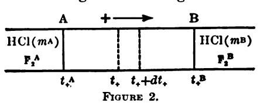

+ B increases by t ; in the region to the left of A it increases by -t , and in the intervening region there is a summation of effects which may be analyzed as follows : Consider some infinitesimal region (indicated by the space between the dotted lines) in which the transference number varies from t+ on the one side to t + dt on the other, and in which the partial molal free energy is F. The amount of acid leaving this region is dt+, hence the increase in free energy in the total intermediate region is B ー ド Fdt+.

Therefore for the whole cell¹

$$
\Delta F = t_+^{\text{B}} \mathbb{F}^{\text{B}} - t_+^{\text{A}} \mathbb{F}^{\text{A}} - \int_{\text{A}}^{\text{B}} \mathbb{F} dt_+ = \int_{\text{A}}^{\text{B}} t_+ d\mathbb{F}.\tag{16}
$$

Now since N = 1 , we have

$$
\stackrel{\text{\textbullet}}{\Delta F} = -\mathbf{n} \mathbf{B} \mathbf{\tilde{r}},
$$

and

$$\mathbf{E} = -\frac{1}{\bar{\mathbf{F}}} \int_{\mathbf{A}}^{\mathbf{B}} t_{+} d\mathbf{F} = -\frac{1}{\bar{\mathbf{F}}} \int_{\mathbf{A}}^{\mathbf{B}} t_{+} d(\mathbf{F} - \mathbb{P}^{\bullet}).\tag{17}$$
 
$$\mathbf{a} \cdot \int \mathbf{v} d\mathbf{v} = \mathbf{v} - \int \mathbf{v} dx.$$

We may therefore calculate the electromotive force of any such concentration cell if we know, over a range of concentration, the values of the transference number, and of the partial molal free energy (which may, for example, be obtained from the cells without liquid junctions) . It is only necessary to plot at several concentrations the values of t+ against the values of FF , and the area under the curve, divided by -F, gives immediately the desired result.

The differential form of Equation 17 is

$$-\mathbf{F}\,\frac{d\mathbf{E}}{d\mathbf{F}} = t_+,\tag{18}$$

and this equation gives a remarkably simple and exact method of measuring the transference number.

This method has been used with great success by MacInnes and Beattie, who have measured the concentration cells Ag, AgCl, LiCl (m^) , LiCl (m³) , AgCl, Ag. At the same time they determined the activity or the partial molal free energy of the lithium chloride by cells of the type Ag, AgCl, LiCl (m) , Li (amalg. ) . Using the Lewis and Kraus2 amalgam electrode, and taking special pains, especially in the exclusion of oxygen,

| TABLE | -<br>TRANSFERENCE<br>6. | Number | THE<br>of | CATION | LITHIUM<br>IN | CHLORIDE³ |
|-------|-------------------------|--------|-----------|--------|---------------|-----------|

|       | t<br>+           | 1+                |
|-------|------------------|-------------------|
| m     | method<br>e.m.f. | method<br>Hittorf |
| 0.001 | 0.359            |                   |
| 0.005 | 0.341            |                   |
| 0.01  | 0.334            | 0.332             |
| 0.02  | 0.327            | 0.328             |
| 0.05  | 0.318            | 0.320             |
| 0.10  | 0.311            | 0.313             |
| 0.20  | 0.304            | 0.304             |
| 0.30  | 0.299            | 0.299             |
| 0.50  | 0.293            |                   |
| 1.00  | 0.286            |                   |
| 2.00  | 0.276            |                   |
| 3.00  | 0.268            |                   |

IMacInnes and Beattie, J. Am. Chem. Soc. , 42, 1117 ( 1920) .

Lewis and Kraus, J. Am. Chem. Soc. , 32, 1459 ( 1910) .

The first two figures, based upon measurements in the two most dilute solutions, are doubtful.

they obtained results which, except in the case of their most dilute solution (0.001M) , seem to be reliable. We reproduce in Table 6 their results for the transference number of the cation in lithium chloride as obtained by this method, together with the "best values" which they quote from Noyes and Falk, ' who compiled the existing data obtained by the Hittorf method. The agreement is strikingly good.

EXERCISE 1. From the data of Table 4 calculate pi /p₁° at 25° C for water in hydrochloric acid solutions of 1.0 M, 5.0 M, and 10.0 M.

EXERCISE 2. The transference number, t+, of HCl at 25°C may be approximately estimated by drawing a rough curve through a value obtained by Hittorf at 10 M and those obtained by Riesenfeld and Reinhold (Z. physik. Chem. , 68, 440 ( 1910) ) up to 1 M. We thus obtain the values given below.

m t+ 1 2 3 4 5 6 7 8 9 10 0.845 0.839 0.823 0.804 0.785 0.762 0.741 0.718 0.695 0.665 With the values of F - F given in Table 4 find the e.m.f. of the concentration cell Ag, AgCl, HCl( 10M) , HCl( 1M) , AgCl, Ag. (Compare with an unpublished measurement of Gerke, E = 0.1990. )

EXERCISE 3. Obtain a formula corresponding to Equation 17, for the cell H2, HCl( m^ ) , HCl(m³) , H₂.

1 Noyes and Falk, J. Am . Chem. Soc. , 33, 1436 ( 1911) .

# CHAPTER XXVII

## THE ACTIVITY OF ELECTROLYTES FROM FREEZING POINT DATA, AND TABLES OF ACTIVITY COEFFICIENTS

In the measurement of the freezing points of electrolytic solutions we have a method of great generality and importance for the determination of the activities of electrolytes. Since, moreover, it is a method which has been almost universally misunderstood we shall present it here in some detail.

The van't Hoff factor, i, which is the ratio between the molal lowering caused by an electrolyte and the theoretical molal lowering (assuming no dissociation) is a quantity which has been much used in the interpretation of dilute solutions of electrolytes. It has been customary to consider (i - 1 ) for a binary electrolyte as the measure of the degree of dissociation, but the value so obtained is not the thermodynamic degree of dissociation, nor does it give any valuable information regarding the thermodynamic properties of the solute. At best, the factor i gives the ratio of the lowering of the activity of the solvent to the lowering which would be produced by a normal undissociated substance. To proceed from the activity of the solvent to the activity of the solute involves, as we have seen , a laborious process of integration.

The purely thermodynamic treatment of freezing-point data which permits the exact calculation of activities has been almost entirely ignored, perhaps because of its mathematical complexity. Nevertheless, it furnishes a method which is so general and at the same time so precise that it has become more important than all other methods of calculating the activity coefficient.

¹ Here also we are going to employ, with some extensions, the method used by Lewis (J. Am. Chem. Soc. , 34, 1631 ( 1912) ) .

### THERMODYNAMICS

In repeating for electrolytes the interpretation of freezing point data, which we have already employed for non-electrolytes, we shall find it convenient to develop our general formula in three stages. First, we shall consider the very dilute solutions ; then the more concentrated solutions, in which, however, we neglect the heat of dilution ; and finally, the general and exact calculation for solutions of any concentration.

## AN EMPIRICAL LAW FOR THE LOWERING OF THE FREEZING POINT BY ELECTROLYTES IN DILUTE SOLUTION

1 2 The exact determination of the freezing point lowering in dilute solutions presents great experimental difficulties, which, however, have largely been overcome by recent developments in thermometry, in the work of Hausrath, Bedford, Adams,3 Harkins and Roberts, and Hall and Harkins. A survey of the results obtained by these experimentors led Lewis and Linhart to an interesting generalization which permits a simple calculation of activity coefficients in very dilute solutions.

We have seen by Equation XXIII-25 that, for any dilute solution,

$$d \ln a_{\mathfrak{k}} = \frac{d\mathfrak{d}}{\lambda m} \cdot$$

Now for an electrolyte, each molecule of which produces molecules when completely dissociated, we may divide this equation through by and find.

$$\frac{1}{\nu}d\ln a_{\mathfrak{r}} = d\ln a_{\mathfrak{r}}\prime\prime = d\ln a_{\mathfrak{r}\natural} = \frac{d\vartheta}{\nu\lambda m}.\tag{1}$$

For such an electrolyte the molal lowering at infinite dilution is vλ, and in this case we may define the function j in order to make it once more equal to zero at infinite dilution, namely,

$$j = 1 - \frac{\mathfrak{d}}{\dot{\nu}\lambda m} \cdot \stackrel{\cdot}{\cdot} \tag{2}$$

<sup>1</sup> Hausrath, Ann. Physik. [ 4] , 9, 522 ( 1902) .

<sup>2</sup> Bedford, Proc. Roy. Soc. , London, 83A, 454 ( 1909) .

Adams, J. Am. Chem. Soc. , 37 , 494 ( 1915) .

Harkins and Roberts, J. Am. Chem. Soc . , 38, 2676 ( 1916) .

Hall and Harkins, J. Am. Chem . Soc. , 38, 2658 ( 1916) .

Lewis and Linhart, J. Am. Chem. Soc. , 41 , 1952 ( 1919) .

Proceeding now just as with the non-electrolytes we find

$$d \ln \frac{a_{\overline{\mathbf{n}}}}{m} = d \ln \gamma = -dj - jd \ln m. \tag{3}$$

If j is known as a function of m we may proceed as before to a graphic integration of Equation 3. But it is simpler to employ the equation of Lewis and Linhart, who discovered that electrolytes of all the various types which have been accurately investigated, approach as a limiting law in dilute solutions¹

$$j = \beta m^\bullet,\tag{4}$$

and that, for all the salts considered, this law was obeyed within the limits of experimental error below 0.01 M. At higher concentrations the values of j always become smaller than the ones calculated from the formula, and in some cases j passes through a maximum.

The method of obtaining the constants a and ẞβ in this formula is evident if we take the logarithm of both sides, when

$$
\log j = \log \beta + \alpha \log m.\tag{5}
$$

If log j is plotted against log m, a is the slope of the line, and log ẞ is the intercept2 on the axis of log j.

By combining Equations 3 and 4 we find

$$d\ln\gamma = -\beta d(m^{\bullet}) - \beta m^{\bullet -1} dm.\tag{6}$$

Integrating, we observe that the constant of integration is zero, and

$$
\ln \gamma = -\beta m^{\bullet} - \frac{\beta}{\alpha} m^{\bullet},
\tag{7}
$$

or

$$\log \gamma = -\frac{\beta(\alpha + 1)m^{\bullet}}{2.303} \underline{\alpha} \underline{\text{\textquotedblleft}}{\underline{\alpha}} \underline{\text{\textquotedblleft}}{\underline{\alpha}} \underline{\text{\textquotedblleft}}{\underline{\alpha}} \underline{\text{\textquotedblleft}}{\underline{\alpha}} \underline{\text{\textquotedblleft}}{\underline{\alpha}} \underline{\text{\textquotedblright}} \underline{\text{\textquotedblleft}}{\underline{\alpha}} \underline{\text{\textquotedblleft}}{\underline{\alpha}} \underline{\text{\textquotedblleft}}{\underline{\alpha}} \underline{\text{\textquotedblleft}}{\underline{\alpha}} \underline{\text{\textquotedblleft}}{\underline{\alpha}} \underline{\text{\textquotedblright}} \underline{\text{\textquotedblleft}}{\underline{\alpha}} \underline{\text{\textquotedblleft}}{\underline{\alpha}} \underline{\text{\textquotedblleft}}{\underline{\alpha}} \underline{\text{\textquotedblleft}}{\underline{\alpha}} \underline{\text{\textquotedblright}} \underline{\text{\textquotedblleft}}{\underline{\alpha}} \underline{\text{\textquotedblleft}}{\underline{\alpha}} \underline{\text{\textquotedblleft}}{\underline{\alpha}} \underline{\text{\textquotedblleft}}{\underline{\alpha}} \underline{\text{\textquotedblleft}}{\underline{\alpha}} \underline{\text{\textquotedblright}} \underline{\text{\textquotedblright}}} \underline{\text{\textquotedblleft}}{\underline{\alpha}} \underline{\text{\textquotedblleft}} \underline{\text{\textquotedblright}} \underline{\text{\textquotedblleft}}{\underline{\alpha}} \underline{\text{\textquotedblleft}} \underline{\text{\textquotedblleft}} \underline{\text{\textquotedblright}}} \underline{\text{\textquotedblleft}} \underline{\text{\textquotedblleft}} \underline{\text{\textquotedbl}}} \underline{\text{\textquotedbl}} \underline{\text{\textquotedbl}}} \underline{\text{\textquoted$$

By employing this equation Lewis and Linhart obtained a series of values of y for various electrolytes, a part of which we reproduce in Table 1 .

<sup>1</sup> The rule that we used for non-electrolytes , from which Equation XXIII- 31 was obtained, may be regarded as a special case of Equation 4 in which a = 1 .

<sup>2</sup> Our ẞ is the ẞ of Lewis and Linhart divided by vλ.

|                               | α     | B     | 0.0001 | 0.0002 | 0.0005 | 0.001 | 0.002 | 0.005 | 0.01        |
|-------------------------------|-------|-------|--------|--------|--------|-------|-------|-------|-------------|
| KCl<br>NaCl<br>,              | 0.535 | 0.329 | 0.993  | 0.990  | 0.984  | 0.977 | 0.967 | 0.946 | 0.922       |
| KNO<br>                       | 0.565 | 0.427 | 0.994  | 0.990  | 0.984  | 0.976 | 0.965 | 0.943 | 0.916       |
| KIO<br>NaIO3<br>,             | 0.500 | 0.417 | 0.988  | 0.982  | 0.972  | 0.961 | 0.946 | 0.915 | 0.882       |
| K2SO4                         | 0.374 | 0.572 | 0.935  | 0.917  | 0.885  | 0.853 | 0.814 | 0.749 | 0.687       |
| H2SO4                         | 0.417 | 0.970 | 0.932  | 0.910  | 0.871  | 0.831 | 0.782 | 0.696 | 0.617       |
| BaCl2                         | 0.364 | 0.477 | 0.939  | 0.923  | 0.894  | 0.865 | 0.830 | 0.771 | 0.716       |
| CoCl2.                        | 0.362 | 0.441 | 0.943  | 0.927  | 0.900  | 0.873 | 0.840 | 0.784 | 0.731       |
| MeSO4                         | 0.38  | 1.44  | 0.85   | 0.81   | 0.75   | 0.69  | 0.61  | 0.50  | 0.40<br>(4) |
| KзFe<br>(<br>CN<br>)<br>6<br> | 0.420 | 1.148 | 0.922  | 0.897  | 0.853  | 0.808 | 0.752 | 0.657 | 0.571       |
| La(NO3)<br>3                  | 0.420 | 1.148 | 0.922  | 0.897  | 0.853  | 0.808 | 0.752 | 0.657 | 0.571       |
|                               |       |       |        |        |        |       |       |       |             |

TABLE 1. -ACTIVITY COEFFICIENTS OF VERY DILUTE Solutions ( at ANY TEMPERATURE) AT SEVERAL VALUES OF m

This investigation showed for the first time the general trend of the activity coefficient in very dilute solutions. The table may be in error in some details, for it is based upon measurements in which the smallest inaccuracies cause a relatively large error. However, we may place reliance upon the general results of this calculation, and also upon most of the individual results .

When we compare the results of Table 1 with the values of A/A°, which have ordinarily been used as a measure of the degree of dissociation, we find a divergence between A/A° and the thermodynamic degree of dissociation which, especially in salts of

= 1 We have added to this table values of y for KNO, obtained from a very accurate series of measurements by Adams, which was inadvertently omitted by Lewis and Linhart. In examining the plot for KIO, and NaIO3 we find that the individual points are hardly sufficiently concordant to determine with any accuracy the value of a. In fact within the limits of experimental error a is one-half, probably for all of the uni-univalent salts given in the table, and also for other uni-univalent salts which we are going to study by another method. The value of a previously given for these iodates, 0.442, was the only one falling below one-half. We have pre ferred to recalculate these values on the assumption that a = 0.50, which, together with the experimental value of j at 0.01 M, makes 8 = 0.417. Also it may be noted that, looking over the numerical calculations of Lewis and Linhart, we are led to one minor change, namely, for 0.01 M KCl and NaCl, 0.922 instead of y = 0.925. Finally, in considering the sulfates of Mg, Zn, Cd and Cu, which we have grouped together as MeSO4, we have altered the values given by Lewis and Linhart. (Average a 0.31, B 1.08, (at 0.01 M) = 0.33.) Those values rested chiefly upon measurements made by Hausrath in 1902. These were undoubtedly the most accurate freezing -point data ever obtained up to that time. But in the meantime important improvements in thermometry have been made, and Hausrath's results in very dilute solutions must be regarded as uncertain. By a method which we cannot give here in detail, and which involves the use of Horsch's measurements (J. Am. Chem. Soc. 41, 1787 ( 1919) ) on cells with zinc electrodes in ZnSO4 and in ZnCl2, we have obtained new values for the activity coefficients of ZnSO4. By this method at 0.01 M, y = 0.47. Giving equal weight to the two independent determinations, we obtain as an average at 0.01 M. y = 0.40, and this value will be corroborated by another method which we shall describe later. Moreover, this value is in better agreement with the results on MgSO4 alone, as obtained by Hall and Harkins ( J. Am. Chem. Soc. , 38, 2658 ( 1916 ) ) , than the one used by Lewis and Linhart. Assuming, therefore, this value of y and taking the average j at 0.01 M as 0.25, we obtain the values given in the table.

1 the higher types, is truly astonishing. For the sake of comparison we give in Table 2 the values of y and of A/A° at 18° for a number of salts at 0.01 M.

TABLE 2.-COMPARISON OF Y AND A/A° FOR SEVERAL SALTS AT 0.01 M

|     | KCI        | NaCl  | KNO   | K₂SO<br>, | BaCl2 | CdSO<br>, | CuSO<br>, | La(NO3)<br>3 |
|-----|------------|-------|-------|-----------|-------|-----------|-----------|--------------|
| Υ   | 0.922      | 0.922 | 0.916 | 0.687     | 0.716 | 0.404     | 0.404     | 0.571        |
| A/A | 0.941<br>° | 0.936 | 0.935 | 0.832     | 0.850 | 0.53      | 0.55      | 0.75         |

The assumption that, at 0.01 or 0.001 molal, A/A° can be taken as a satisfactory measure of the thermodynamic degree of dissociation, or activity coefficient , is evidently very far from the truth, especially for salts of a higher type than the uni-univalent . In the case of copper sulfate, where this great divergence was first pointed out by Lewis and Lacey,2 we find that even at so great a dilution as 0.001 M, A/A° is 0.80 while y is 0.69.

On the other hand, when we compare y with the " corrected degree of dissociation" which we have studied in Chapter XXV (obtained by combining conductivity and transference data) we find, not perhaps an identity, but certainly a remarkable parallelism between those values and the activity coefficient . That corrected degree of dissociation is always a little lower for nitrates, bromates, and other salts of the oxygen acids than for chlorides or bromides. Likewise it is smaller for silver and thallium salts than for salts of the alkali metals. These are precisely the conclusions which we are going to reach concerning the activity coefficient from our inspection of Table 1 and following tables.

Before turning our attention from the Lewis and Linhart equation, we may point out some interesting corollaries which will be found very useful in practical calculations. We note that, within the limits of experimental error, a for a uni-univalent electrolyte is 12. This is shown not merely by Table 1 but also by other data which will be mentioned later. Therefore, at least

<sup>1</sup> Another proof that any relation between y and the values of A/A°, which are uncorrected for changing mobility, must be a very rough one, is furnished by a consideration of the change of these quantities with the temperature. In the very dilute solutions which we are now dis cussing, the heat of dilution is always negligible, and the values of y must be independent of the temperature. But the values of A/A° diminish markedly with increasing temperature. For several salts at 0.08 normal, studied by Noyes and Melcher (Publ. Carnegie Inst. , 63 , ( 1907) ) , this diminution between 18° and 100° ranged from 3 % for NaCl to 30 % for MgSO4.

<sup>*</sup> Lewis and Lacey, J. Am. Chem . Soc. , 36, 804 ( 1914) .

as a close approximation to the truth, for uni-univalent electrolytes,

$$j = \beta m^{\mathsf{A}},\tag{9}$$

or by Equation 7,

$$
\ln \gamma = -3\beta m^{\mathcal{H}} = -3j,\tag{10}
$$

which furnishes an extremely simple method of calculating the activity coefficient in dilute solution from the freezing point. We may put this equation in a different form by expanding in series, whence

$$\stackrel{\text{te}}{\gamma} = 1 - 3\beta m^{\text{M}} + \lambda (3\beta m^{\text{M}})^{\text{g}} + \cdots \cdot \frac{1}{\cdot},\tag{11}$$

and for very dilute solutions the last term disappears, giving

$$
\gamma = 1 - 3\beta m^{\aleph} = 1 - 3j.\tag{12}
$$

It is interesting to compare this equation with the classic equation of van't Hoff, which we may write as

$$
\dot{\gamma} - i - 1 = \dot{1} - 2\dot{\text{y}}.
$$

In other words, in any dilute solution, y obtained from the van't Hoff equation differs from unity by only 2% as much as the true y. Thus for 0.001 M potassium iodate the value of j is 0.0132, whence from Equation 12, y 0.960, while by the van't Hoff equation it would be 0.974.¹ =

Finally, it is to be noted that if Equation 12 is correct at high dilution, y should be a linear function of m", or, in other words, if we plot the activity coefficient against the square root of the molality, the curve at small values of m should become a straight line, intersecting the y axis at unity. We have used such a plot in Figure XXVI- 1 and shall later have numerous occasions for illustrating its utility.

### PRELIMINARY TREATMENT OF CONCENTRATED SOLUTIONS

For most salts above 0.01 M the freezing points no longer obey the simple rule of Lewis and Linhart. Moreover two corrections

<sup>1</sup> It is a curious coincidence that for uni-univalent salts this false value of y is not far from the value of A/A°. This coincidence has doubtless been in part responsible for the previous neglect of the correct thermodynamic method of using freezing-point data.

become necessary in Equation 3. The first of these involves the heat of dilution, and this one we shall ignore for the moment. The other is due to the same factors that gave rise to the last term in Equation XXIII- 29. Returning to that equation and proceeding just as we did with the non-electrolytes, except that we now write

$$j = 1 - \frac{\mathfrak{d}}{\mathfrak{n}\lambda m},$$

we thus find

$$d \ln \gamma = -j d \ln m - d j + \frac{0.00057}{\nu} \frac{\vartheta}{m} d \vartheta. \tag{13}$$

Changing to common logarithms and integrating, noting that the constant of integration is zero,

$$\log \gamma = \int_0^\cdot -j d \, \log \, m - \underset{2.303}{\text{--}} + \frac{0.00025}{\nu} \int_0^\cdot \frac{\theta}{m} \, d\theta. \tag{14}$$

The last definite integral may readily be obtained as before by a very rough plot, and the first definite integral is the total area under the curve of j'against log m. When we have data which permit the use of the method of the preceding section we may plot merely from m = 0.01 , and determine the area from infinite dilution up to m = 0.01 from Equation 4,

$$\int_0^{0.01} -j d \log m = -\lim_{2 \cdot 30 \overline{3} \alpha}^{0} (0.01)^{\circ}. \tag{15}$$

We shall illustrate the use of Equation 14 by means of the freezing point data for sodium chloride. Here we make use of the measurements up to 0.136 M made by Harkins and Roberts, ¹ those of Rodebush between molal and the eutectic of NaCl 2H2O, and a few intermediate points of Jahn. In Figure 1 we give the curve ofj against log m, the area under which gives the value of Sjd log m. This area up to m 0.01 , or log m = 2, is found from Equation 15 to be 0.0227, and this value must be added to the areas counted to the right of the point where log m = 2. - - =

In Table 3 we give the various terms which enter into Equation

<sup>1</sup> Harkins and Roberts, J. Am. Chem. Soc. , 38, 2676 (1916) .

<sup>2</sup> Rodebush, J. Am. Chem. Soc. 40, 1204 ( 1918) .

Jahn, Z. physik. Chem. , 50, 144 ( 1905) ; 59, 33 ( 1907) .

### THERMODYNAMICS

CHAP. XXVII

14, and the values obtained therefrom for the activity coefficient , which we may call for the moment y' . These values are to be regarded merely as provisional, for we have not yet considered the magnitude of the effect which is due to the heat of dilution.

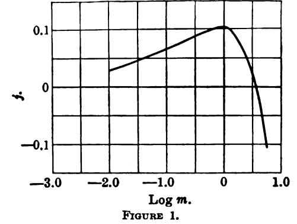

TABLE 3.-PROVISIONAL VALUES OF THE ACTIVITY COEFFICIENT OF SODIUM CHLORIDE

| m    | j<br>2.303 | m<br>[™<br>m<br>jd<br>log | 0.000125<br>dv<br>fm<br>om<br>d<br>5 | -<br>logy<br>' | Y<br>' |
|------|------------|---------------------------|--------------------------------------|----------------|--------|
| 0.01 | 0.0126     | 0.0227                    |                                      | 0.0353         | 0.922  |
| 0.02 | 0.0169     | 0.0327                    |                                      | 0.0496         | 0.892  |
| 0.05 | 0.0235     | 0.0513                    |                                      | 0.0748         | 0.842  |
| 0.1  | 0.0287     | 0.0694                    | 0.0001                               | 0.0980         | 0.798  |
| 0.2  | 0.0339     | 0.0913                    | 0.0002                               | 0.1250         | 0.750  |
| 0.5  | 0.0413     | 0.1259                    | 0.0008                               | 0.1664         | 0.682  |
| 1.0  | 0.0456     | 0.1566                    | 0.0014                               | 0.2008         | 0.630  |
| 2.0  | 0.0317     | 0.1840                    | 0.0029                               | 0.2128         | 0.613  |
| 3.0  | 0.0135     | 0.1937                    | 0.0046                               | 0.2026         | 0.627  |
| 4.0  | -0.0065    | 0.1950                    | 0.0064                               | 0.1821         | 0.657  |
| 5.0  | -0.0347    | 0.1909                    | 0.0090                               | 0.1472         | 0.713  |
| 5.2  | -0.0425    | 0.1895                    | 0.0095                               | 0.1375         | 0.729  |

### FINAL CALCULATION OF THE ACTIVITY COEFFICIENT AT A GIVEN TEMPERATURE, NEITHER THE HEAT OF DILUTION NOR ITS TEMPERATURE COEFFICIENT BEING NEGLECTED

We shall now illustrate the more general method by which we are able to utilize the freezing point data for even the most

concentrated solutions when the partial molal heat contents and beat capacities are known.

We have seen in Equation XXIII-35 that the activity of the water in a solution of given concentration is not independent of the temperature, if L₁ is not negligible, but that we write

$$
\log a_{\mathbf{i}}\prime\prime - \log a_{\mathbf{i}}\prime = x = -\frac{1}{2.303R} \int_{T}^{T\prime} \frac{\mathbf{L}_{\parallel}}{T^2} dT,\tag{16}
$$

= - where T" is the temperature chosen for our calculation, usually 298.1, and T' 273.1 is the freezing point of the solution of a given concentration . In the case of electrolytes, Li changes very rapidly with the temperature. We might follow our ordinary procedure and write.

$$\mathbf{L}_1 = \mathbf{f}_{1\{0\}} + (\mathbf{f}_{\mathfrak{p}1} - \mathbf{f}_{\mathfrak{p}1}\mathbf{\tilde{}})T.\tag{17}$$

We shall, however, find it more convenient in our numerical calculations to use the equivalent expression

$$\mathbf{L}_1 = \mathbf{L}_{1(T')} + (\mathbf{\tilde{c}}_{\mathbb{P}1} - \mathbf{\tilde{c}}_{\mathbb{P}1}\mathbf{\tilde{c}})(T - T'). \tag{18}$$

Using this expression we may integrate Equation 16, and find

$$\begin{split} x &= -\mathbb{L}_{\mathbb{L}(T')} \frac{T'' - T'}{2.303 \overline{R} \overline{T}^{\prime\prime\prime} \overline{T}'} \\ &+ (\mathbb{S}_{\mathbb{s}1} - \mathbb{S}_{\mathbb{s}1}{}^{\mathbb{s}}) \left( T^{\prime\prime} \frac{T^{\prime\prime} - T^{\prime}}{2.303 R \overline{T}^{\prime\prime\prime} \overline{T}^{\prime\prime}} - \frac{1}{R} \log \frac{T^{\prime\prime}}{\overline{T}^{\prime}} \right) . \end{split} \tag{19}$$

In using this equation we shall find it convenient to call

$$y = \frac{T^{\prime\prime} - T^{\prime}}{2.303RT^{\prime\prime}T^{\prime}}; \quad z = T^{\prime\prime}y - \frac{1}{\bar{R}} \log \frac{T^{\prime\prime}}{\bar{T}^{\prime}}.\tag{20}$$

Since these quantities are used in various calculations, we have made a table of y and z, when T" is 298.1 , for various values of T', and this table, since it will be useful for other purposes, is given in full in Appendix III at the end of the book. If therefore we know the freezing point, T' , of a solution of a certain concentration, we find y and z from the table, and if we know L₁ and Cpi CP1° for that concentration, we obtain the value of x, о

$$\log a_{1(200)} - \log a_1 \prime = x \, = \, - \, \mathcal{L}_{1(200)} \, y \, + \, (\mathbb{G}_{\mathbb{P}1} - \mathbb{G}_{\mathbb{P}1} \overset{\circ}{\mathsf{z}}) \, \text{z} \, \tag{21}$$

We may now proceed just as in Chapter XXIII and find

$$
\log \gamma = \log \gamma' - \frac{55.51}{\nu} \int_0^\eta \frac{dx}{m},\tag{22}
$$

where y is the final value of the activity coefficient at the chosen temperature, while y' is the value obtained , as in the preceding section, when L₁ and Cpi are neglected. The last term is obtained by plotting 1/m against the value of x obtained from Equation 21 , and then determining the area under the curve.

- For the calculation of the activity coefficient of sodium chloride at 25°C we take the thermal quantities from the results of Randall and Bisson given in Tables VIII- 5 and VIII-2. These quantities, together with yLi and z(CD1 CP1°) are given in Table 4. It will be noticed that the Cp term could be neglected at the lower concentrations, at which the L term becomes appreciable ; but on account of the rapid change of L₁ with the temperature, which is characteristic of electrolytes, the Cp term becomes the more important of the two at the higher concentrations, where we are extrapolating over nearly fifty degrees . The last column¹ gives x = YL1 ( 298 ) + (CP1 - CPI ).

| TABLE | 4 |  |
|-------|---|--|
|       |   |  |

| m   |      | L1<br>(<br>298<br>) | -<br>CD1<br>CP1<br>° | JL1<br>298<br>(<br>) | Z(CD1<br>Ep1°) | I         |  |
|-----|------|---------------------|----------------------|----------------------|----------------|-----------|--|
| 0.2 | 0.7  | 0.1                 | 0                    | .0.000007            | 0.000000       | -0.000007 |  |
| 0.5 | 1.7  | 0.7                 | -0.01                | 0.000050             | 0.000011       | -0.000061 |  |
| 1.0 | 3.3  | 3.2                 | -0.06                | 0.000256             | 0.000068       | -0.000324 |  |
| 2.0 | 6.9  | 10.3                | -0.24                | 0.000935             | 0.000398       | -0.001333 |  |
| 3.0 | 10.8 | 17.2                | -0.55                | 0.00172              | 0.00103        | -0.00275  |  |
| 4.0 | 15.1 | 21.7                | -0.77                | 0.00248              | 0.00185        | -0.00433  |  |
| 5.0 | 19.8 | 19.5                | -1.21                | 0.00253              | 0.00371        | -0.00624  |  |
| 5.2 | 21.1 | 18.2                | -<br>1.30            | 0.00244              | 0.00426        | -0.00770  |  |
|     |      |                     |                      |                      |                |           |  |

The plot of 1 /m against x gives Curve I in Figure 2. By finding the area under this curve up to a given concentration , we evaluate the term - > 55.51 2 m S dx-" given in the second column m of Table 5. By Equation 22 this term is equal to log (y/y').

<sup>1</sup> Since we are concerned here primarily with the calculation of the activity of the solute we shall not pause for the calculation of the activity of the solvent, a₁" , but the latter can obviously be readily obtained from z, for if a " is the activity of the solvent at 298.1 and a ' is the value at the freezing point, calculated from Equation XXIII- 22, then by Equation 16, log a₁" al' = I. log

The corresponding values of Y/Y' are shown in the third column, and taking y' from Table 3, we obtain the final values of y, the activity coefficient of sodium chloride at 25°C.

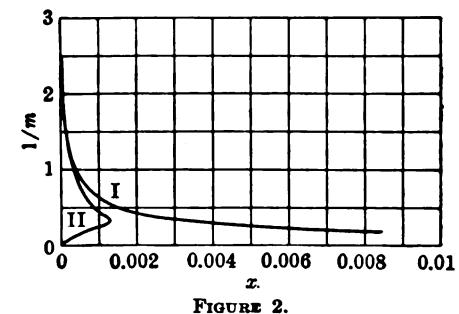

TABLE 5.-FINAL VALUES OF THE ACTIVITY COEFFICIENT OF SODIUM Chloride at 25°C, FROM FREEZING POINTS

| m        | log<br>(<br>y<br>/Y<br>'<br>) | Y/Y'  | γ     |
|----------|-------------------------------|-------|-------|
| 0.01     |                               | 1.000 | 0.922 |
| 0.02     |                               | 1.000 | 0.892 |
| 0.05     |                               | 1.000 | 0.842 |
| 0.1      |                               | 1.000 | 0.798 |
| 0.2      | 0.0010                        | 1.002 | 0.752 |
| 0.5      | 0.0039                        | 1.009 | 0.689 |
| 1.0      | 0.0136                        | 1.032 | 0.650 |
| 2<br>2   | 0.0332                        | 1.080 | 0.661 |
| 3        | 0.0500                        | 1.109 | 0.704 |
| 4        | 0.0657                        | 1.163 | 0.765 |
| 5        | 0.0778                        | 1.197 | 0.852 |
| 5<br>5.2 | 0.0791                        | 1.200 | 0.874 |

It is evident in this case that when we neglect thermal effects we make an error of three percent at 1 M and an error of twenty percent at 5.2 M.

An Alternative Method. If we wish to make a corresponding calculation at some other temperature than 25°C, say at -21.12° C, which is the eutectic point of NaCl- 2H2O, we may still employ the table of Appendix III. If we read from this table the same values as before and subtract from each one the value obtained from the table for t 21.12 we obtain the values of y to be used in the new calculation ; and similarly with z. as before and plotting, we obtain Curve II of Figure 2. = - Proceeding just Taking the algebraic area, after noting the difference of sign for the upper and lower parts of the curve, we find at 5.2 M and at 0.951 and y = 0.693. - 21.12 °C, Y/Y' =

To calculate y at 25° C from this figure we must now use the heat content and heat capacity, not of the solvent, but of the solute. For

$$
\log \gamma_{\text{THS}} - \log \gamma_{\text{TH}} = \gg_4 \int_{T=252}^{T=298} \frac{\mathbf{f}_2}{2.303} \frac{\mathbf{f}_2}{\bar{R}\bar{T}^4} dT. \tag{23}
$$

Integrating as in Equation 19, taking L2( 296) , CD2 and CD2° from Tables VIII-5 and VIII-2, and again employing the table of Appendix III , we find log y7298 - log Y262 = 0.1036 and Y298 0.878, as compared with 0.874 obtained above. =

It should be remarked that this is a purely numerical check, for if the values of L and Cp for solute and solvent were strictly in accord with Equation IV- 19, and if our graphical integrations were entirely accurate, the agreement should be perfect.

### COMPARISON OF THESE ACTIVITY COEFFICIENTS WITH THOSE OBTAINED FROM ELECTROMOTIVE FORCE MEASUREMENTS

We are now in a position to make one of the most remarkably satisfactory checks which has yet been afforded by applied thermodynamics. The results of the arduous calculation of the activity coefficient of sodium chloride at 25° from the freezing point data we may compare directly with the results of Allmand and Polack, who studied the electromotive force at 25°C of the cell, Na(amalg. ) , NaCl (aq) , HgCl, Hg, using the amalgam electrodes of Lewis and Kraus. Their measurements at various concentrations enabled them to calculate values which are proportional to the activity coefficient. Multiplying those values by a constant factor in order to give at 1 Mthe same value

| TABLE | -<br>ACTIVITY<br>6. | COEFFICIENT   | OF | SODIUM | CHLORIDE | AT | 25°C<br>, | FROM |
|-------|---------------------|---------------|----|--------|----------|----|-----------|------|
|       |                     | ELECTROMOTIVE |    | FORCE  |          |    |           |      |
|       |                     | m             |    |        | γ        |    |           |      |

| 0.1                         | 0.784      |
|-----------------------------|------------|
| 0.5                         | 0.681      |
| 1                           | 0.650<br>( |
| 3.196                       | 0.726      |
| 6.12<br>(<br>saturated<br>) | 1.013      |
|                             |            |

1 Allmand and Polack, J. Chem. Soc , 115, 1020 ( 1919) .


of y that we have found in Table 5, we obtain the activity coefficients of Table 6.¹

In order to show the relation between these values and our previous ones, we exhibit in Figure 3 the activity coefficient as a function of m . The continuous curve is from the data of Table 5 and the circles represent the values of Allmand and Polack. The average deviation of these points from the curve • 

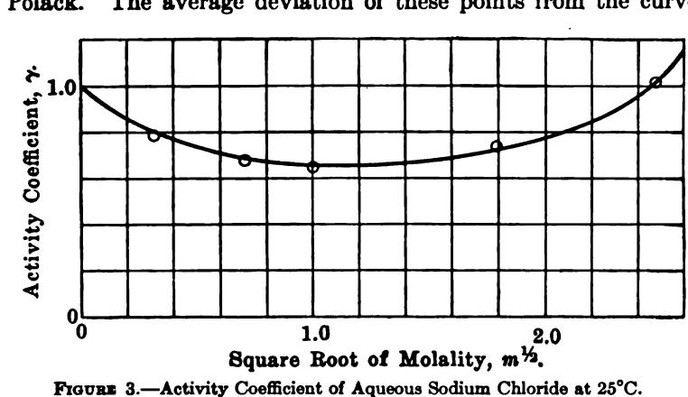

is only a few tenths of a percent, and when we consider that in the concentrated solutions the use of the L and Cp values introduced a term which alone amounted to twenty percent, the agreement is most striking.

## THE ACTIVITY COEFFICIENT OF SULFURIC ACID BY THREE INDEPENDENT METHODS

Another case in which we have material for a very satisfactory comparison of the activity coefficients obtained by various methods is afforded by aqueous solutions of sulfuric acid.

Freezing Points. In the freezing point method we may employ the data of Drucker, 2 Roth and Knothe,3 Pickering and Barnes,5

<sup>1</sup> We have not utilized their results at concentrations below 0.1 M where the experimental uncertainty proved to be large.

<sup>2</sup> Drucker, Z. Elektrochem . , 17, 400 ( 1911 ) .

Roth and Knothe, published only in Landolt, Börnstein Tables.

<sup>•</sup> Pickering, Z. physik. Chem. , 7 , 392 ( 1891) .

Barnes, Trans. Roy. Soc. Canada , II , [ 3] , 6, 37 ( 1900) .

### THERMODYNAMICS

CHAP. XXVII

together with those which we have already considered in obtaining Table 1. We proceed just as in the case of sodium chloride, except that, in Equation 14, v =3. The results are given in Table 7.¹

TABLE 7. -ACTIVITY COEFFICIENT OF SULFURIC ACID AT 25° C FROM FREEZING POINTS

| m    | j      | L1<br>298<br>y<br>(<br>) | -<br>Z<br>(<br>Cpl<br>-<br>CD<br>) | mdx<br>55.51<br>3<br>m | ŕ     | Y298  |
|------|--------|--------------------------|------------------------------------|------------------------|-------|-------|
| 0.01 | 0.142  |                          |                                    |                        | 0.617 | 0.617 |
| 0.02 | 0.197  |                          |                                    |                        | 0.519 | 0.519 |
| 0.05 | 0.258  |                          |                                    |                        | 0.397 | 0.397 |
| 0.1  | 0.293  | -0.000027                | -0.000005                          | 0.00407                | 0.316 | 0.313 |
| 0.2  | 0.320  | -0.000090                | -0.000012                          | 0.00795                | 0.248 | 0.244 |
| 0.5  | 0.329  | -0.00022                 | -0.000033                          | 0.0152                 | 0.182 | 0.176 |
| 1.0  | 0.280  | -0.00055                 | -0.000144                          | 0.0230                 | 0.155 | 0.147 |
| 2.0  | 0.134  | -0.00184                 | -0.000413                          | 0.0360                 | 0.155 | 0.143 |
| 4.0  | -0.350 | -0.01778                 | 0.000342                           | 0.1202                 | 0.268 | 0.203 |
| 5.0  | -0.650 | -0.0419                  | 0.00297                            | 0.2320                 | 0.413 | 0.242 |

In this table the first column gives the molality, and the second the value of j calculated from the best value of the freezing point, while the next to the last column gives ' which is the activity coefficient calculated from Equation 14 ; in other words, calculated without consideration of the partial heat contents and heat capacities. These thermal quantities may however be obtained at once from Tables VIII-7 and VIII-3, leading to the values of the third and fourth columns. From 55.51 "dx these are calculated the values of where v = V m 3. These values are given in the fifth column, and in the last column are the values of Y298, the activity coefficient of sulfuric acid at 25°C.

It will be seen that in this case of sulfuric acid the correction caused by the introduction of the thermal terms is of the opposite sign as compared with the corresponding correction for sodium chloride. So in this case y is less than y' . The thermal effects are so large that at 5 M the correction is nearly as large as y itself. This means that in the concentrated solutions y is

<sup>1</sup> For this whole calculation of the activity of sulfuric acid from the freezing points, we are indebted to Mr. T. F. Young. Wehave not checked his calculations, but have much confidence in their accuracy.

changing rapidly with the temperature. At 5 M it about doubles in going from 25°C to a temperature in the neighborhood of the freezing point, which is 46°C.

H2SO4, Hg2SO4, Hg has Randall and Cushman, ¹ Electromotive Force. The cell , H2, been thoroughly investigated at 25°. who have made the most recent study of this cell , obtained very reproducible results, which, moreover, they showed to be in the main concordant with the earlier results of Brönsted and of Edgar, in concentrated solutions, and with those of Lewis and Lacey in the dilute solutions. Their results (together with one of Brönsted's at 14 M) are given in Table 8, where the first column gives the molality of the sulfuric acid, and the second gives the e.m.f. of the cell (hydrogen at one atmosphere) . The last column gives values of k'y obtained as follows.

We have the equation

$$\stackrel{\frown}{\mathbf{E}} = \mathbf{E}^{\bullet} - \frac{RT}{2\mathbf{F}} \ln a_{\mathfrak{k}},\tag{24}$$

or, by Equations XXVI-5 and XXVI-6,

,

$$\mathbf{E} = \mathbf{E}^{\bullet} - \frac{3RT}{2\mathbf{F}} \ln|\gamma m \text{ 4\%} \,\text{.}\tag{25}$$

We may, for simplicity, collect the constants and write

$$\mathbf{E} = -\frac{3RT}{2\mathbf{\overline{F}}} \ln \,\mathrm{(k'\gamma m)}.\tag{26}$$

TABLE 8. -ELECTROMOTIVE FORCE OF THE CELL H2, H2SO4, Hg₂SO4, Hg AT25°C

| m      | E      | k'y<br>×<br>1010 |
|--------|--------|------------------|
| 0.0506 | 0.7544 | 621              |
| 0.505  | 0.6960 | 283              |
| 1.031  | 0.6751 | 239              |
| 3.637  | 0.6187 | 291              |
| 8.204  | 0.5506 | 761              |
| 14.00  | 0.4977 | 1757             |

Thus each electromotive-force measurement yields a quantity which is proportional to the activity coefficient and is here represented as k'y. These are the values given in the last column of Table 8. It is difficult in this case to determine k' 1 Randall and Cushman, J. Am. Chem. Soc . , 40, 393 ( 1918) .

CHAP. XXVII

(which is the same as determining E°) by a process of extrapolation, since it was shown by Lewis and Lacey¹ and by Horsch that, in solutions as dilute as 0.005 M, the use of the mercurous sulfate electrode gives results which are not in agreement with other thermodynamic methods. This is undoubtedly due to the fact that at such concentrations the solubility of mercurous sulfate cannot be ignored. However, by assuming the value of y

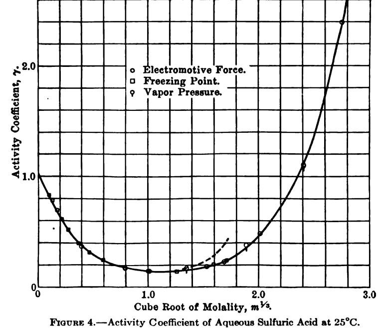

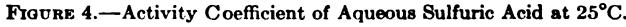

at one concentration from Table 7, namely, Y = 0.397 at 0.05 M, we find k' = 1.578 X 10-7 and thus obtain the other values of y which we are about to compare with those of Table 7. =

Activity Coefficient from the Vapor Pressure, and Comparison of the Three Series. We must also consider another series of values, which we have already obtained in Table XXVI-3, namely, the values of ky obtained from the vapor pressure of water over aqueous sulfuric acid. Here again, by interpolation

<sup>1</sup> Lewis and Lacey, J. Am. Chem. Soc. , 36, 804 ( 1914) .

<sup>2</sup> Horsch, J. Am. Chem. Soc. 41 , 1787 ( 1919 ) .

from Table 7, we find y - 0.238 at 4.88 M. Hence, and we obtain another series for y. k = 0.00197,

The agreement between our three series is shown in Figure 4, where we have plotted the values of y obtained by all three methods, against the cube root of the molality. This makes the most convenient plot for an electrolyte of this type. The agreement between the several series is not quite as complete as it was in our previous case of sodium chloride, but is, nevertheless, an even more powerful confirmation of the adequacy of our several methods. For here we are dealing with an exceptionally large range of concentrations, and the values of y obtained from the freezing points depend chiefly upon the successful employment of the partial molal heat content and heat capacity. To illustrate this point the dotted curve in Figure 4 shows the results which would have been obtained if these thermal quantities had been neglected.

From the plot we have chosen the final values of y given in Table 9.

| γ<br>γ<br>2<br>0.617<br>0.147<br>0.01<br>3<br>0.519<br>0.166<br>0.02<br>4<br>0.05<br>0.397<br>0.203<br>0.313<br>0.1<br>5<br>0.242<br>0.244<br>0.2<br>10<br>0.660 | SULFURIC | OF<br>COEFFICIENT | ACTIVITY<br>25°C | THE<br>OF<br>ACID<br>AT | -FINAL<br>VALUES<br>9. | TABLE |
|------------------------------------------------------------------------------------------------------------------------------------------------------------------|----------|-------------------|------------------|-------------------------|------------------------|-------|
|                                                                                                                                                                  |          |                   | m                |                         | m                      |       |
|                                                                                                                                                                  |          |                   |                  |                         |                        |       |
|                                                                                                                                                                  |          |                   |                  |                         |                        |       |
|                                                                                                                                                                  |          |                   |                  |                         |                        |       |
|                                                                                                                                                                  |          |                   |                  |                         |                        |       |
|                                                                                                                                                                  |          |                   |                  |                         |                        |       |
|                                                                                                                                                                  |          | 1.26              | 15               | 0.178                   | 0.5                    |       |
| 0.150<br>20<br>2.22<br>1                                                                                                                                         |          |                   |                  |                         |                        |       |

## METHODS OF EVALUATING ACTIVITY COEFFICIENTS WHEN DATA AT HIGH DILUTION ARE LACKING

It frequently happens, as we have seen, that a series of data permits the calculation of ky, a quantity proportional to the activity coefficient, without affording means for any very accurate extrapolation which would give the value of k. If we have a series of ky for some uni-univalent salt, extending down to about 0.01 M, all of the values having about the same percentage

accuracy, the extrapolation can be made with a fair degree of precision. For example, we may plot the values of ky against the square root of the molality. The curve through the several points approaches a straight line at low concentrations, and the interceptofthislineupon the axis of ky is the value of k.

Unfortunately in most cases the values of ky are subject to greater uncertainty the higher the dilution , and if we should give full weight to the experiments in the most dilute solutions, the extrapolation would be entirely misleading. Accurate measurements of electromotive force always become increasingly difficult at high dilution, and in employing existing data it is often necessary to ignore completely results obtained with the most dilute solutions.

Perhaps the best method of treating cases of this kind consists in comparing the data obtained for the given electrolyte with the data for some other electrolyte of similar type, which has been carefully investigated . Here we need only to assume that for salts of a similar type the activity coefficients approach one another in some regular manner as the dilution is indefinitely increased. In order to illustrate the method we may employ the data obtained by Noyes and MacInnes, ¹ and their associates, for potassium and lithium chlorides, and potassium hydroxide.

These investigators, using amalgam electrodes of the Lewis and Kraus type, exercised the greatest care, by the exclusion of oxygen and otherwise, to avoid the complications which attend the use of these highly reactive amalgams. They were thus able to obtain an unexpected degree of accuracy and reproducibility. Nevertheless it appears to be impossible to prevent side reactions, which are comparatively harmless in concentrated solutions, but which, in the measurements with dilute solutions, produce far greater error than the authors supposed.

In re-examining the activity coefficients given by Noyes and MacInnes, we must therefore recognize two sources of uncertainty . Their activity coefficients may have to be multiplied


<sup>1</sup> Noyes and MacInnes, J. Am. Chem. Soc . , 42 , 239 ( 1920) .

<sup>2</sup> A third source of uncertainty enters in the piecing together of several overlapping series of measurements. This probably causes no difficulty in the case of LiCl and KCl, but may in the case of KOH

by a constant factor, because of a change in the method of extrapolation to infinite dilution, and it may be necessary to give less weight to the measurements in dilute solution.

Potassium Chloride. These questions are answered immediately by comparison of potassium chloride with sodium chloride, for which we have obtained accurate values of the activity coefficient. Table 10 contains in the second column the values. of y given by Noyes and MacInnes. The next column gives the values of y for sodium chloride furnished by our previous tables. The next shows the ratio between the values of the second and third columns. Now according to our assumption, this ratio should in some regular manner approach constancy as the concentration diminishes.

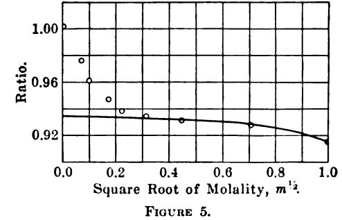

In Figure 5 we have plotted these ratios against m , and the smooth curve which we have drawn is obtained by ignoring the points at low concentrations and extrapolating from the points at high concentrations. The ordinate at zero concentration by this extrapolation is 0.935, and if we divide any other ordinate by this value we obtain the value of y at the corresponding concentration. The values so obtained are given in the last column of Table 10. They differ as a rule by several percent from the values of Noyes and MacInnes, but are completely corroborated by freezing-point measurements as we shall show presently.¹ We have treated in a similar manner their results

<sup>1</sup> We might also have used the measurements of Harned ( J. Am. Chem. Soc. , 38 , 1986 ( 1916) ) , and of Getman (ibid. , 42 , 1556 ( 1920) ) , on concentration cells with liquid junctions (with transference) . This, however, requires a knowledge of the transference number, which

CHAP. XXVII

for lithium chloride and the results will be given later in Table 12.

TABLE 10.-ACTIVITY COEFFICIENT OF POTASssium Chloride at 25°C from ELECTROMOTIVE FORCE

| m     | y<br>-<br>KCl<br>(<br>N<br>&<br>M<br>) | y<br>-<br>NaCl | Ratio | KCI<br>Y<br>- |
|-------|----------------------------------------|----------------|-------|---------------|
| 0.001 | 0.979                                  | 0.977          | 1.002 | 0.977         |
| 0.005 | 0.923                                  | 0.946          | 0.976 | 0.946         |
| 0.01  | 0.890                                  | 0.922          | 0.964 | 0.922         |
| 0.03  | 0.823                                  | 0.869          | 0.947 | 0.869         |
| 0.05  | 0.790                                  | 0.842          | 0.938 | 0.841         |
| 0.1   | 0.745                                  | 0.798          | 0.934 | 0.796         |
| 0.2   | 0.700                                  | 0.752          | 0.931 | 0.749         |
| 0.5   | 0.638                                  | 0.689          | 0.928 | 0.682         |
| 1.0   | 0.593                                  | 0.650          | 0.912 | 0.634         |

Cadmium Chloride. A very beautiful illustration of the interpretation of the data for one salt, by comparison with those for another, is furnished by the case of cadmium chloride, whose abnormal behavior puts it in a class by itself. For this salt we have the measurements of Horsch which, upon examination, prove to be more accurate than the author himself claimed. He measured the electromotive force of a cell with cadmium amalgam and silver-silver chloride electrodes, with various concentrations of cadmium chloride.

Our methods here will be somewhat altered. Knowing that cadmium chloride is a peculiar electrolyte, we may nevertheless assume, as a first approximation, that in very dilute solutions it has the same activity coefficient as barium chloride. The calculations we are about to make will show to what extent this assumption is justified .

Using the same equation as for sulfuric acid ( Equation 25) , we might, from each measurement of E, calculate a value of E° on the assumption that y is the same as we have found for barium chloride in Table V. These values, which we may call E°,


can be most accurately determined by these very measurements. It may be noted that if we take the ordinarily accepted transference number of KCl the results given in Table 10 are not in accord in dilute solution with the measurements of MacInnes and Parker ( ibid. , 37, 1445 (1915 ) ) on concentration cells with transference.

Horach, J. Am. Chem. Soc. , 41 , 1787 ( 1919 )

should be constant and equal to the true E° if the measurements are correct, and if y is really the same for cadmium and barium chlorides. The results of this calculation are shown in Table 11 .

Table 11.—ELECTROMOTIVE FORCE OF THE CELL, AND THE ACTIVITY COEFFICIENT OF CADMIUM CHLORIDE AT 25°C

| m        | BaCl2<br>)<br>Y<br>( | E      | E<br>°<br>/ | CdCl₂<br>(<br>) |
|----------|----------------------|--------|-------------|-----------------|
| 0.000103 | 0.939                | 0.9060 | 0.5676      |                 |
| 0.000109 | 0.938                | 0.9023 | 0.5661      |                 |
| 0.000114 | 0.937                | 0.9011 | 0.5665      |                 |
| 0.000127 | 0.934                | 0.8978 | 0.5673      | same            |
| 0.000153 | 0.930                | 0.8926 | 0.5691      | as              |
| 0.000214 | 0.923                | 0.8803 | 0.5705      | BaCl2           |
| 0.000336 | 0.905                | 0.8644 | 0.5702      |                 |
| 0.000366 | 0.901                | 0.8614 | 0.5703      |                 |
| 0.000479 | 0.894                | 0.8520 | 0.5690      | 0.872           |
| 0.000924 | 0.868                | 0.8296 | 0.5727      | 0.809           |
| 0.00258  | 0.816                | 0.7958 | 0.5761      | 0.697           |
| 0.00352  | 0.796                | 0.7864 | 0.5777      | 0.652           |
| 0.0074   | 0.741                | 0.7630 | 0.5802      | 0.568           |
| 0.0995   |                      | 0.6996 |             | 0.219           |
| 6.62     |                      | 0.6220 |             | 0.025           |

It is evident that the assumption of equal values of y for the two salts is far from correct, except at very high dilution . Fortunately, the experimental results are of such accuracy that we find a range of concentration, namely, between 0.000366 and 0.000153 M in which E ' is nearly constant and we may take the true E° as 0.5700 . At lower concentrations the experimental uncertainty, and the effect of the solubility of silver chloride, become too great to make the data useful.

Having found the value of E° we may now obtain the activity coefficients for cadmium chloride by Equation 25. These values are given, for the more concentrated solutions, in the last column of the table. The great divergence between these values and the corresponding ones for barium chloride persists to concen trations as dilute as 0.0005 M. We have seen other cases of slight disagreement between the activity coefficients of salts of the same valence type, but this is evidently a different kind of phenomenon. The fact is that cadmium chloride cannot be

regarded as a strong electrolyte. It possesses in a lesser degree the characteristics of the analogous substance, mercuric chloride, which shows almost no ionization.

### ACTIVITY COEFFICIENTS OF SEVERAL TYPICAL ELECTROLYTES

It will be convenient to have before us a table of the activity coefficients of a few electrolytes of the several types, which we present in Table 12. The values for several of these electrolytes are merelya recapitulationofprevioustables.¹

| TABLE             | -<br>12.  | ACTIVITY | COEFFICIENTS | OF    | TYPICAL |       | ELECTROLYTES |       |
|-------------------|-----------|----------|--------------|-------|---------|-------|--------------|-------|
| Molality<br>      | 0.01      | 0.02     | 0.05         | 0.1   | 0.2     | 0.5   | 1            | 3     |
| HCl<br>(25°)<br>  | 0.924     | 0.894    | 0.860        | 0.814 | 0.783   | 0.762 | 0.823        | 1.35  |
| LiCl<br>(25°<br>) | 0.922     | 0.892    | 0.843        | 0.804 | 0.774   | 0.754 | 0.776        | 1.20  |
| NaCl<br>(25       | °)  0.922 | 0.892    | 0.842        | 0.798 | 0.752   | 0.689 | 0.650        | 0.704 |
| KCl<br>(25°)<br>  | 0.922     | 0.892    | 0.840        | 0.794 | 0.749   | 0.682 | 0.634        |       |
| KOH<br>(25°)<br>  | 0.92      | 0.89     | 0.84         | 0.80  | 0.75    | 0.73  | 0.75         |       |
| KNO<br>           | 0.916     | 0.878    | 0.806        | 0.732 |         |       |              |       |
| AgNO3.<br>        | 0.902     | 0.857    | 0.783        | 0.723 | 0.655   | 0.526 | 0.396        |       |
| KIO3<br>, NaIO3   | 0.882     | 0.840    | 0.765        | 0.692 |         |       |              |       |
| BaCl2.            | 0.716     | 0.655    | 0.568        | 0.501 |         |       |              |       |
| CdCl2<br>(25°)    | 0.532     | 0.44     | 0.30         | 0.219 |         |       |              |       |
| K2SO4<br>         | 0.687     | 0.614    | 0.505        | 0.421 |         |       |              |       |
| H2SO4<br>(25°)    | 0.617     | 0.519    | 0.397        | 0.313 | 0.244   | 0.178 | 0.150        | 0.170 |
| La(NO3)<br>3      | 0.571     | 0.491    | 0.391        | 0.326 | 0.271   |       |              |       |
| MgSO4             | 0.404     | 0.321    | 0.225        | 0.166 | 0.119   |       |              |       |
| CdSO4             | 0.404     | 0.324    | 0.220        | 0.160 |         |       |              |       |
| CuSO4             | 0.404     | 0.320    | 0.216        | 0.158 | 0.110   | 0.067 |              |       |

The values for potassium nitrate and iodate, sodium iodate, barium chloride, potassium sulfate, lanthanum nitrate, magnesium, cadmium and cupric sulfates, were obtained by Equation 14, from the freezing point data collected in the paper of Lewis and Linhart. They correspond to the values of y' which we obtained for sodium chloride. Not having been corrected for the heat of dilution, they are strictly valid only in the neighborhood of the freezing point. However, at these moderate concentra-

<sup>1</sup> Approximate values of the activity coefficient of nitric acid, over a wide range of concen tration, are given in Chapter XXXIX, Table 3.

tions the corrections due to the L and Cp terms are certainly small , and, except perhaps for one or two of the most concentrated solutions, it seems safe to use the given values as the activity coefficientsat 25°C.

A similar calculation for potassium chloride may be compared directly with the results of Table 10. The values found from the freezing point data are given in Table 13. It is evident that in the dilute solutions the values are practically identical with those of the previous table , thus fully corroborating our method of employing the data of Noyes and MacInnes, which has been used also for lithium chloride and potassium hydroxide.

| TABLE<br>13 |       |       |       |       |       |       |
|-------------|-------|-------|-------|-------|-------|-------|
| m           | 0.01  | 0.02  | 0.05  | 0.1   | 0.2   | 0.5   |
|             | 0.922 | 0.892 | 0.839 | 0.791 | 0.737 | 0.660 |

In the more concentrated solutions a difference is to be expected owing to our neglect of the heat of dilution in Table 13. This difference amounts at 0.5 M to a little over 3%. The corresponding difference between Y298 and y' for sodium chloride was about 1 %. In fact such data as we possess show that the heat of dilution is two or three times as great for potassium as for sodium chloride.

We include also approximate values for silver nitrate, since it represents an important type of uni-univalent salt . The freezing point measurements seem reliable down to about 0.01 M. The results at higher dilutions hardly warrant a determination of a and by the method of Lewis and Linhart, but by taking the experimental value at 0.01 M and assuming, as we have done before, that a 0.902 at 0.01 M. The remaining values given below are obtained from Equation 14, using the data of Roth ' in the more dilute, and of Raoult in the more concentrated solutions . - 1/2 , we find = 0.343 , and y =

# TABLE 14. -ACTIVITY COEFFICIENT OF SILVER NITRATE

m j Y' 0.01 0.02 0.05 0.1 0.2 0.5 1.0 2.0 5.0 0.0343 0.055 0.080 0.099 0.122 0.199 0.291 0.419 0.630 0.902 0.857 0.783 0.723 0.655 0.526 0.396 0.280 0.141 1 Roth, Z. physik. Chem. , 79, 599 ( 1912) .

<sup>*</sup> Raoult, Z. physik. Chem . , 2, 488 ( 1888) .

# CHAPTER XXVIII

### ACTIVITY COEFFICIENT IN MIXED ELECTRO-LYTES ; THE PRINCIPLE OF THE IONIC STRENGTH; THE ACTIVITY OF INDI-VIDUAL IONS

The behavior of electrolytes, when two or more are dissolved in the same solution , is of both theoretical and practical importance. The quantitative information which we possess consists chiefly in measurements of the solubility of one salt in the presence of others . Lately a series of measurements of the electromotive force of cells, with mixed electrolytes, has furnished a still more direct method of studying the free energy and the activity in mixed salt solutions. The data obtained in these ways permit us to make some interesting and useful generalizations regarding activity coefficients in mixtures of salts at moderate concentrations. At the higher concentrations we must, in this case as in others, have recourse to direct experiment in each particular case.

The activity coefficient of an electrolyte in a mixture may be defined in strict conformity with our previous usage. If m + is the (stoichiometrical) molality of the positive ion, and m_ that of the negative, then in general a+/m+ y+ defines the activity coefficient of the first ion, and a_/my , the activity coefficient of the second ion. If a molecule of a given electrolyte furnishes (stoichiometrically) + molecules of the positive ions and v molecules of the negative ion , where + + v_ = v , then the mean activity coefficient of the ions or, more briefly, the activity coefficient of the electrolyte, is defined as

$$
\gamma = (\gamma_+ \, \text{"+} \gamma_- \, \text{"-})^{1/\text{"}} = \frac{a_{\pm}}{m_{\pm}}.\tag{1}
$$

It will be understood that we are speaking of the gross molality 364

of the ions, quite irrespective (in the case of strong electrolytes) of any assumed degree of dissociation, or intermediate ions. Thus in a solution containing 0.1 M potassium chloride and 0.1 M barium chloride m+ 0.1 for K and also for Ba++ ; while for Cl-, m 0.3. Thus in this mixture we find for potassium chloride, m + = (0.1 × 0.3) ; while for barium chloride, m [0.1 × (0.3) . = = m₁ =

### THE ACTIVITY COEFFICIENT IN MIXTURES, CALCULATED FROM ELECTROMOTIVE FORCE DATA

In the study of the conductivity of strong electrolytes, an empirical rule has proved extremely serviceable, namely, that in a mixture of electrolytes with a common ion, the value of A/A° for each electrolyte depends not upon the amount of that electrolyte but only upon the total equivalent concentration . When it was realized that A/A° does not measure the thermodynamic degree of dissociation, it became of interest to inquire whether any similar rule would apply to the activity coefficients.

The first experiments in this direction were made by Lewis and Sargent, who measured the potential of a gold electrode in a solution of potassium chloride, containing potassium ferro- and ferricyanides, in amounts negligible compared with the amount of potassium chloride present. Their experiments, in which the concentration of the potassium chloride varied from 0.05 to 0.8 M, and in which the ratio of ferro- to ferricyanide was varied several fold, show that within 0.0001 volts their results could be interpreted by assuming the degree of dissociation to depend solely upon the concentration of potassium chloride. Moreover, they obtained the same values when potassium bromide was substituted for potassium chloride.

Identical conclusions were reached by Linhart, who studied the mercury electrode in a solution of perchloric acid containing relatively small amounts of mercurous perchlorate. He found, under these conditions, that the thermodynamic degree of dis-

<sup>1</sup> Lewis and Sargent, J. Am. Chem. Soc. , 31 , 335 ( 1909) ; see also later work of Schoch and Felsing, ibid. , 38 , 1928 ( 1916) ; and Linhart, ibid. , 39 , 615 ( 1917) .

<sup>2</sup> Linhart, J. Am. Chem. Soc. , 38, 2356 ( 1916) .

sociation of the mercurous perchlorate was independent of the amount of that salt and varied only with the total concentration of electrolyte .

Similar results have been obtained with hydrochloric acid in the presence of other chlorides. The work of Loomis and Acree, ' and the early work of Harned , 2 on cells with mixed electrolytes, involved liquid junctions between different electrolytes. Therefore these cells are not so well adapted to simple thermodynamic treatment as those we are about to discuss. The second paper by Harned³ contained measurements of a cell with hydrogen and calomel electrodes, and 0.1 M hydrochloric acid, with the addition of various amounts of potassium chloride to the electrolyte ; and more recently cells of this type have been studied by several authors.

Loomis, Essex and Meacham' investigated such a cell in which the concentrations of hydrogen chloride and potassium chloride were varied in such a way that the total molality was kept at 0.1 M. Their purpose was to see whether the electromotive force of the cell could be calculated upon the assumption that the degree of dissociation, or the activity coefficient, of the hydrochloric acid is independent of the relative amounts of the two electrolytes, when the total concentration of the electrolyte is fixed. They found in fact what appeared to be a slight departure from this principle in the direction of a greater activity coefficient in the solutions containing larger percentages of hydrogen chloride.

Later measurements of a similar cell by Ming Chows do not show any variation in the activity coefficient with varying percentages of the two electrolytes ; and in dilute solutions the same conclusion would be drawn from Harned's latest very comprehensive investigation of this cell in which the HCl is kept at 0.1 M ; in the presence of KCl, NaCl and LiCl, ranging from zero to several molal.

<sup>1</sup> Loomis and Acree, Am. Chem. J., 46, 632 ( 1911 ) .

Harned, J. Am. Chem. Soc. , 37 , 2460 ( 1915) .

Harned, J. Am. Chem. Soc. , 38, 1986 ( 1916) .

Loomis, Essex and Meacham , J. Am. Chem . Soc. , 39, 1133 ( 1917) .

<sup>5</sup> Ming Chow, J. Am. Chem. Soc. , 42 , 488 ( 1920) .

Harned, J. Am. Chem. Soc. , 42, 1808 ( 1920) .

The electromotive force of his cellisgivenbytheequation.

$$\mathbf{E} = \mathbf{E}^{\circ} - \frac{RT}{\mathbf{F}} \text{ in } (a_{+}a_{-}) \\ = \mathbf{E}^{\circ} - \frac{2RT}{\mathbf{F}} \text{ in } a_{\pm}, \tag{2}$$

where a is the activity of H+ , a_ is the activity of Cl-, and a is their geometrical mean. Thus calculating from his measure. ments the values of a , and also calculating m from his given concentrations, we have obtained values of y at various concentrations of each of the added salts. These we have interpolated to round concentrations and the results are given in Table 1 .

TABLE 1. -THE ACTIVITY COEFFICIENT OF HCl (0.1 M) IN THE PRESENCE OF OTHER CHLORIDES

|            | γ           | γ                 | γ                 | Y                |
|------------|-------------|-------------------|-------------------|------------------|
| Total<br>m | Pure<br>HCI | HCl<br>LiCl<br>in | HCl<br>in<br>NaCl | HCl<br>KCl<br>in |
| 0.1        | 0.81        | 0.81              | 0.81              | 0.81             |
| 0.2        | 0.78        | 0.78              | 0.78              | 0.78             |
| 0.5        | 0.76        | 0.78              | 0.76              | 0.75             |
| 1.0        | 0.82        | 0.86              | 0.80              | 0.75             |
| 2.0        | 1.02        | 1.09              | 0.94              | 0.84             |
| 3.0        | 1.35        | 1.47              | 1.17              | 0.97             |
| 4.0        | 1.84        | 2.02              | 1.47              | 1.17             |

The first column shows the total molality, MeCl and HCl, the latter always being 0.1 M; the second column reproduces from Table XXVI-4 the activity coefficient of pure aqueous HCl, and the remaining columns show the activity coefficient of HCl in the presence of the three chlorides.

It appears from these results that the behavior in concentrated solutions cannot be quantitatively predicted from any simple rule. The activity coefficient of the hydrochloric acid depends upon the specific nature of the added chloride. It seems to be smaller in the presence of a salt whose own activity coefficient in the pure state is small ( cf. Table XXVII- 12) , but this can hardly be universally true, for we observe that y is higher in the presence of lithium chloride than in the pure acid, although the activity coefficient of lithium chloride itself is lower than that of pure hydrochloric acid.

When we confine our attention to the dilute solutions we see that in the presence of NaCl up to 0.5 M, and in the presence of

CHAP. XXVIII

the other chlorides to at least 0.2 M, the activity coefficient is the same as in pure HCI.

Without doubt, nearly identical values of y would have been obtained by Harned at the same total concentrations if he had used throughout a smaller concentration of hydrochloric acid. In so far, therefore, as these various measurements go, they support the general rule, for which, moreover, we shall find abundant evidence from another source: in any dilute solution of a mixture of strong electrolytes, of the same valence type, the activity coefficient of each electrolyte depends solely upon the total concentration. Such a statement, however, cannot be regarded as anything more than a limiting law which approaches complete accuracy only at infinite dilution .

It is unfortunate that the measurements which we have here discussed have not been extended to include cases where the added salt is of a different valence type like BaCl2 or MgSO, or La2(SO4) 3 . We shall show how this deficiency is made up by a different kind of experiment, which will permit a wider generalization. From that generalization it should be possible to predict in advance the electromotive force of such cells. shall therefore turn presently to the evidence which is furnished by the solubility of salts in the presence of one another.

An Objection by Brönsted. Since this chapter was written Professor Brönsted has kindly sent to us a personal communication, in which he raises objections to the rule for the activity coefficients in mixed electrolytes which we have stated above. In the first place he believes that his new experimental data are in conflict with this rule ; but since his experiments have dealt with solutions which were not very dilute, and have involved valence types in which we should expect the earliest departure from any simple rule for dilute solutions, they do not bear evidence against the limiting law which we have stated and which can be strictly accurate only at infinite dilution.

Brönsted also raises a theoretical objection to this rule which is somewhat as follows. Let us consider a solution containing a mixture of HCl and NaCl, the total molality being kept constant, let us say at 0.1M . Then if we pass gradually from the pure solution of NaCl at 0.1M to the pure solution of HCl at 0.1M , we may employ a formula analogous to Equation XXII- 19. Thus if a , is the activity of the water, if m2 is the stoichiometrical molality of NaCl, and a2 its activity, while m, and a, refer similarly to HCl, we may write

$$\int 55.51 \, d \ln a_1 + \int m_\sharp d \ln a_\sharp + \int m_\sharp d \ln a_\sharp = 0.\tag{3}$$

Further, writing m₂+2 = 0.1m2, a½ = m²± 2, etc., and remembering that m₂ + m, is kept constant, Equation 3 reduces to

$$m_{\mathbf{i}} \text{ is kept constant, Equation 3 reduces to}$$

$$\int \mathbf{55.51} \, d \, \ln \, a_{\mathbf{i}} + \int 2m_{\mathbf{i}} d \, \ln \, \gamma_{\mathbf{i}} + \int 2m_{\mathbf{i}} d \, \ln \, \gamma_{\mathbf{i}} = 0. \tag{4}$$

If, however, according to the rule, y2 and 3 both remain constant as long as the total molality is tenth-molal, the activity of the water must remain constant, and therefore must be the same in 0.1 M NaCl as in 0.1 M HCl, but this is contrary to fact.

The answer to this interesting argument is again that the rule does not require that 2 and 3 should be absolutely constant except at infinite dilution, although it implies a rapid approach to this condition as the concentration approaches zero . It would not be fair, however, to leave the matter at this point. Brönsted's suggestion furnishes a valuable aid in the utilization of experimental data concerning mixed electrolytes, and we have attempted to apply it to the meagre data which are at present available. Without entering upon the details of our calculations, they seem to indicate that the activity coefficient of hydrochloric acid in the presence of other chlorides cannot be so nearly constant as it appears to be in the first few rows of Table 1 , which is based on Harned's data. In other words, these calculations speak in favor of the conclusions of Loomis, Essex and Meacham rather than of those obtained by Harned and by Ming Chow.

After accepting any such limiting law as the one we are now considering, it remains to determine experimentally the degree of departure from the law at any finite concentration, just as we determine the degree of departure of actual gases from the law of the perfect gas. But having determined these departures for a number of substances of different types, it will usually be possible to estimate the degree of departure for a new substance. Indeed, on the basis of evidence which we have offered and are to offer in this chapter, the direction of the departure from the simple rule for the activity coefficient of mixed electrolytes may ordinarily be predicted . In almost every case we find that the departure from the simple law is in such direction that the activity coefficient of a given electrolyte is greater in the presence of another electrolyte which itself has a higher activity coefficient.

### THE ACTIVITY COEFFICIENT IN MIXED ELECTROLYTES, FROM SOLUBILITY MEASUREMENTS¹

When, at a given temperature, a solid salt is in equilibrium with a solution, the activity of that salt in the solution is fixed .

<sup>1</sup> The experimental development of this subject, especially in the field of dilute solution ,is due in large measure to the work of A. A. Noyes and his collaborators , beginning with an early paper by Noyes ( Z. physik. Chem. , 6, 241 ( 1890) ) , and culminating in an exhaustive

It cannot be changed by any change in the nature of the solution, such as would be produced by the addition of other electrolytes. Thus for the salt whose solid phase is present, the value of a2 and also of a is constant.

γ Since by Equation 1 the activity coefficient is defined as y = a /m , we see that whatever happens (isothermally) to the solution , the activity coefficient of the salt in question must remain inversely proportional to the mean molality of its ions. This principle will be of the greatest service in determining the activity coefficient in mixtures, and in some cases we shall see that it furnishes a very accurate means of obtaining the activity coefficients of pure salts as well .

Uni-univalent Salts. In order first to illustrate the method in the simplest case, let us consider the solubility of a uni- univalent salt in the presence of another uni- univalent salt with no common ions. We shall consider the solubility of thallous chloride in the presence of potassium nitrate, as given in the second column of Table 2 , which we take directly from the work of Bray and Winninghoff.¹

In the simple case where we have no common ion, m is equal to the solubility, and the activity coefficient is proportional to 1/m . If then we plot the reciprocal of the solubility against the total molality of the solution, or, better, against the square root of the total molality, as we have done in Figure 1 , we may find the proportionality factor by a simple extrapolation . The points for potassium nitrate are represented in the figure by circles whichlieonacurvewhichisrapidlyapproachingastraight

1 Bray and Winninghoff, J. Am. Chem. Soc. , 33 , 1663 ( 1911) . It will be noted that the unit in this table is the equivalent and not the mol. Moreover, in this and in some subsequent tables the values given are expressed in amount per liter and not in amount per 1000 g. of water. We have not taken the trouble to recalculate since we are interested primarily in the dilute solutions, where the two methods of expressing the composition are essentially identical.


experimental and critical study by Noyes, Bray, Harkins, and their assistants, appearing mainly in J. Am. Chem. Soc. , 33 ( 1911) . Very recently, Brönsted (J. Am. Chem. Soc. , 42, 761 ( 1920) ) has published a brilliant paper on the interpretation of solubility measurements, in which he mentions extensive investigations of the influence of one salt upon the solubility of another, the greater part of which has not yet been published . His theoretical treatment of this subject is of the utmost interest, and he has shown for the first time how cases with and without a common ion may be treated by identical thermodynamic methods . We are unable here to follow his methods in detail, since he bases his work upon an empirical rule, which is inconsistent with the facts that we have deduced . (It is equivalent to making a = in Equation XXVII-4. for all types of electrolytes . )

TABLE 2. -SOLUBILITY OF THALLOUS CHLORIDE AT 25°C IN THE PRESENCE OF OTHER SALTS

| Added<br>salt<br>,<br>equivalents<br>per<br>liter | KNO<br>, | KCI     | HCI     | TINO3   | BaCl2   | Tl₂SO<br>, | K₂SO<br>, |
|---------------------------------------------------|----------|---------|---------|---------|---------|------------|-----------|
| 0                                                 | 0.01607  | 0.01607 | 0.01607 | 0.01607 | 0.01607 | 0.01607    | 0.01607   |
| 0.020                                             | 0.01716  |         |         |         |         | 0.01034    | 0.01779   |
| 0.025                                             |          | 0.00869 | 0.00866 | 0.00880 | 0.00898 |            |           |
| 0.050                                             | 0.01826  | 0.00590 | 0.00583 | 0.00624 | 0.00618 | 0.00677    | 0.01942   |
| 0.100                                             | 0.01961  | 0.00396 | 0.00383 | 0.00422 | 0.00416 | 0.00468    | 0.02137   |
| 0.200                                             |          | 0.00268 | 0.00253 |         | 0.00282 |            |           |
| 0.300                                             | 0.02313  |         |         |         |         |            | 0.02600   |
| 1.000                                             | 0.03072  |         |         |         |         |            | 0.03416   |
|                                                   |          |         |         |         |         |            |           |

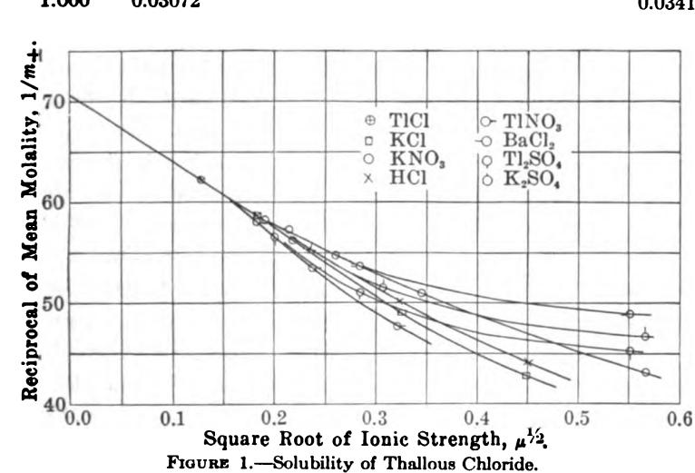

= line. This tangent line, which we have obtained not alone from the measurements upon potassium nitrate, but also from the measurements in the other salts, cuts the axis of zero concentration ' at 1/m 70.3. If, therefore, we divide any of our values of 1 /m by this number, we obtain at once the activity coefficient of thallous chloride in the corresponding solution. This method of calculation and extrapolation gives at once absolute values of the activity coefficient. The results rival in accuracy those of the best instances which we have chosen for the corre-

1 This method of extrapolating solubility data to obtain ion activities is equivalent to theone used by Lewis in his paper, " The Activity of the Ions, " J. Am. Chem. Soc. , 34, 1631 ( 1912) .

sponding calculation from electromotive force and freezing point data.

Before giving the figures so obtained we may illustrate the treatment of the case where a common ion is present. Let us consider the solubility of thallous chloride in the presence of potassium chloride. We find, for example, that when m = 0.050 for KCl, m = 0.00590 for TICI. Thus m+ 0.00590, m = 0.050 +0.00590 = 0.05590, and m₁ = (0.00590 × 0.05590) = =3 0.0181 . Operating similarly at the other concentrations, we obtain the points indicated by squares in the figure. These points approach more rapidly than those of the previous case to the same straight line, which cuts the axis of zero concentration at 70.3. Our example thus shows that in the mixture of total molality, 0.0559, the activity coefficient of TICI is 1/(0.0181 × 70.3) = 0.784.

Proceeding similarly with the data for the solubility in hydrochloric acid and in thallous nitrate, we find other curves ' which differ slightly from those for potassium chloride and nitrate at higher concentrations, but up to several hundredths molal the curves are all identical and lead to the same extrapolated values of 1 /m , namely, 70.3. By reading the values of 1 /m from the various curves , at round total molalities, and dividing by 70.3, we obtain the activity coefficient of thallous chloride, in the various mixtures, as given in Table 3.

| Total<br>m | In<br>KNO3 | In<br>KCl | In<br>HCI | TINO,<br>In |
|------------|------------|-----------|-----------|-------------|
| 0.001      | 0.970      | 0.970     | 0.970     | 0.970       |
| 0.002      | 0.962      | 0.962     | 0.962     | 0.962       |
| 0.005      | 0.950      | 0.950     | 0.950     | 0.950       |
| 0.01       | 0.909      | 0.909     | 0.909     | 0.909       |
| 0.02       | 0.872      | 0.871     | 0.871     | 0.869       |
| 0.05       | 0.809      | 0.797     | 0.798     | 0.784       |
| 0.1        | 0.742      | 0.715     | 0.718     | 0.686       |
| 0.2        | 0.676      | 0.613     | 0.630     | 0.546       |

TABLE 3.-ACTIVITY COEFFICIENT OF THALLOUS CHLORIDE AT 25°C

Up to a concentration of about 0.02 M the rule stated in the

1 The curves are drawn on so large a scale as to exaggerate greatly their differences . The maximum difference at 0.05 Mis only 1 %.

preceding section is completely corroborated , and we need not hesitate to assume that in the dilute solutions the values of y given in the table represent also the activity coefficients of pure thallous chloride. Thus we may predict that if we could obtain a supersaturated solution of this salt at 0.02 M its activity. coefficient would be found to be 0.871 . At values below saturation (0.016 M) the values given in the table could be readily checked either by the electromotive force or by the freezing point method.

By comparing Table 3 with Tables XXVII- 1 and XXVII- 12, we see that the activity coefficient of thallous chloride is distinctly below that of sodium or potassium chloride, which again corroborates a rule which we have mentioned before, and which was first observed in a study of the corrected degree of dissociation, obtained by a combination of conductivity and transference data.

Mixtures Containing Two or More Valence Types ; The Ionic Strength. The remaining cases in Table 2 involve mixtures of thallous chloride with uni-bivalent salts . Hence we are now forced to consider activity coefficients in mixtures of different valence types. We might guess the activity coefficient of a given electrolyte to depend simply upon the total molal concentration of electrolytes, or to depend upon the total equivalent concentration (which would be assuming that one molecule of a bivalent ion has the effect of two molecules of a univalent ion) . Neither of these two guesses is correct, although the latter comes nearer the truth than the former.

In attempting to solve this problem we have brought to light what appears to be a remarkably simple and precise generalization, ' which we shall find to be in exact agreement with all of the experimental results which are at present available. Before stating this new principle, let us introduce a new term, the ionic strength.

In any solution of strong electrolytes let us multiply the stoichiometrical molality of each ion by the square of its valence (or charge) . The sum of these quantities, divided by two (since

¹ Lewis and Randall, J. Am. Chem . Soc. , 43, 1112 ( 1921 ) .

= we have included both positive and negative ions) , we call the ionic strength, and designate by μ. Thus in pure solutions of potassium chloride, magnesium sulfate and barium chloride , all at 0.01 M, we have, respectively, μ = 0.01 , μ = 0.04, and μ [ (4 × 0.01 ) + 0.02] /2 0.03. We may now state our general principle : In dilute solutions, the activity coefficient of a given strong electrolyte is the same in all solutions of the same ionic strength. =

In a solution which is 0.01 M in K2SO4 the solubility of TICI is 0.01779. We take half the sum of 0.01779 for Tl+, 0.01779 for

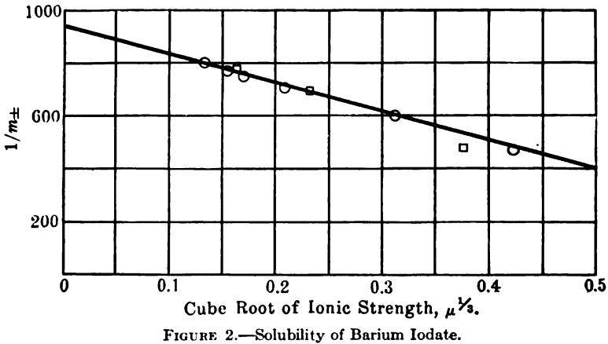

= Cl-, 0.02000 for K+, and 4 × 0.01000 for SO¯¯, hence μ 0.04779 . Obtaining by this procedure the other values for K2SO4, Tl2SO4 and BaCl2, given in Table 2, we plot, also in Figure 1 , 1 /m against the square root of the ionic strength, μ". We see that all the series give curves which coincide, in dilute solutions, with one another, and with the curves obtained with the uni-univalent salts. As a further check it would be desirable to have measurements of the solubility of thallous chloride in salts like magnesium sulfate and lanthanum sulfate.

The Solubility of Unibivalent Salts. We may next test the principle of the ionic strength by a study of the influence of other salts upon the solubility of a unibivalent salt. Here we

shall utilize the data of Harkins and Winninghoff¹ on the solubility of barium iodate in the presence of barium nitrate, and of potassium nitrate (represented, respectively, in Figure 2 by circles and squares) . Their results, together with the calculated values of 1 /m and of μ, the ionic strength, are shown in Table 4.

These values of 1 /m are plotted against the cube root of the ionic strength in Figure 2. Our rule for mixtures evidently holds with great precision. For practically all of the range shown in the figure the two series fall on the same curve, which moreover proves to be a straight line.

| TABLE<br>4.                   | -<br>SOLUBILITY               | OF               | BARIUM<br>POTASSIUM | IODATE<br>IN<br>NITRATE | BARIUM                        | NITRATE          | AND<br>IN |
|-------------------------------|-------------------------------|------------------|---------------------|-------------------------|-------------------------------|------------------|-----------|
| m<br>Ba<br>(<br>NO3<br>)<br>: | m<br>Ba<br>(<br>IO3<br>)<br>2 | 1<br>/<br>m<br>± | μ                   | KNO<br>m                | IO3<br>m<br>Ba<br>(<br>)<br>2 | /<br>m<br>±<br>1 |           |
| 0                             | 0.000790                      | 797              | 0.00237             |                         |                               |                  |           |
| 0.0005                        | 0.000681                      | 770              | 0.00354             | 0.002                   | 0.000812                      | 776              | 0.00444   |
| 0.001                         | 0.000606                      | 751              | 0.00482             | 0.01                    | 0.000913                      | 690              | 0.01274   |
| 0.0025                        | 0.000488                      | 706              | 0.00896             | 0.05                    | 0.001320                      | 477              | 0.0528    |
| 0.01                          | 0.000337                      | 597              | 0.0310              | 0.2                     | 0.001595                      | 395              | 0.2098    |
| 0.025                         | 0.000307                      | 472              | 0.0759              |                         |                               |                  |           |
| 0.05                          | 0.000283                      | 396              | 0.1508              |                         |                               |                  |           |
| 0.1                           | 0.000279                      | 317              | 0.3009              |                         |                               |                  |           |

Throughout the range of concentration shown in Figure 2 we may certainly assume that the value of y is the same at a given ionic strength as it would be for pure barium iodate. It can be found from the figure if we divide the ordinate at any concentration by the limiting ordinate. Owing to the accuracy of the results, and especially to the insolubility of barium iodate, which renders necessary only a small extrapolation , we may

TABLE 5. -ACTIVITY COEFFICIENTS OF BARIUM IODATE AND BARIUM CHLORIDE, AT 25°C

| m     | Ba<br>(<br>IO3<br>)<br>2 | BaCl2 |
|-------|--------------------------|-------|
| 0.001 | 0.834                    | 0.865 |
| 0.002 | 0.790                    | 0.830 |
| 0.005 | 0.714                    | 0.771 |
| 0.01  | 0.639                    | 0.716 |
| 0.02  | 0.549                    | 0.655 |

1 Harkins and Winninghoff, J. Am. Chem . Soc. , 33, 1827 ( 1911 ) .

obtain the activity coefficients of barium iodate with much certainty. In Table 5, values of y so obtained are given at round values of the molality, and compared with those of barium chloride (Tables XXVII- 1 and XXVII- 12) . In accordance with the observation that we have previously made, it is seen that in this case also the activity coefficient of a salt of an oxygen acid is less than that of the corresponding halide.

Bi-bivalent Salts. In the study of salts with two bivalent ions we have little to add to our previous theoretical treatment, but we have material for a still more severe test of our rule that the activity coefficient of any electrolyte varies only with the total ionic strength of the solution.

Let us use for study the data of Harkins and Paine' on the solubility of CaSO4 in the presence of MgSO4, CuSO4 and KNO3. The solubilities are given in the second column of Table 6 , the first column showing the molality of the other salt which is added. The third column gives the reciprocal of the mean molality, and it will be noted that m in the case of added potassium nitrate is simply the solubility of CaSO4, while in the case

TABLE 6.-SOLUBILITY OF CALCIUM SULFATE IN THE PRESENCE OF OTHER SALTS AT 25°C

| Added<br>salt | m<br>CaSO4 | 1/<br>m<br>+ | μ      | Y(MgSO4) | 1<br>/<br>m<br>±<br>MgSO<br>Y<br>(<br>) |
|---------------|------------|--------------|--------|----------|-----------------------------------------|
| None          | 0.01535    | 65.15        | 0.0614 | 0.358    | 182                                     |
| MgSO4         |            |              |        |          |                                         |
| 0.00502       | 0.01441    | 59.77        | 0.0777 | 0.327    | 183                                     |
| 0.01012       | 0.01362    | 55.59        | 0.0950 | 0.305    | 183                                     |
| 0.01528       | 0.01310    | 51.92        | 0.1135 | 0.286    | 181                                     |
| CuSO4         |            |              |        |          |                                         |
| 0.01254       | 0.01360    | 53.08        | 0.1046 | 0.298    | 179                                     |
| 0.05010       | 0.01239    | 35.97        | 0.250  | 0.200    | 180                                     |
| 0.1010        | 0.01242    | 26.67        | 0.454  | 0.162    | 166                                     |
| 0.2120        | 0.01329    | 12.92        | 0.901  | 0.113    | 114                                     |
| 0.9771        | 0.01654    | 7.81         | 3.974  |          |                                         |
| KNO3          |            |              |        |          |                                         |
| 0.02766       | 0.01812    | 55.19        | 0.1001 | 0.300    | 184                                     |
| 0.05293       | 0.02019    | 49.53        | 0.1237 | 0.277    | 179                                     |
| 0.1038        | 0.02130    | 46.95        | 0.1890 | 0.231    | 204                                     |

1 Harkins and Paine, J. Am. Chem. Soc. , 41 , 1155 (1919) . of the other two salts it is the geometrical mean of the total calcium and total sulfate. The fourth column gives the ionic strength , μ.

We already have activity coefficients for a substance very similar to calcium sulfate, namely, magnesium sulfate. The best way, therefore, to determine the proportionality factor, which converts the values of 1/m into values of y, would be to divide each value of 1/m by y for magnesium sulfate at the same ionic strength, and then to find the limiting value of this ratio at zero concentration (zero ionic strength) . This is essentially the method which we have illustrated before, in determining the activity coefficients of potassium chloride. We have, in Tables XXVII- 1 and XXVII- 12, y for MgSO, at several values of the ionic strength (which is four times the molality) . By interpolating we have thus obtained the values of y (magnesium sulfate) in the fifth column, corresponding to the values of µ in our table. The ratios which we have just mentioned are given in the last column.

The results are very striking. Evidently, within the limits of experimental error, the activity coefficient of calcium sulfate is identical with that of magnesium sulfate up to an ionic strength of over 0.1 . Taking the limiting value of the ratio as 182, we find for calcium sulfate, in molal copper sulfate (μ 4), Y 7.81 /182 = 0.043. = =

It may be that these results do not show superficially what an extraordinary confirmation of our rule is furnished by these figures. Supposing that we had measurements of the solubility of calcium sulfate in the presence of magnesium or copper sulfate, and were obliged to estimate from these values its solubility in the presence of 0.05 M potassium nitrate. Reversing our previous procedure (and using the method of approximations) we should calculate a value within 1 % of that actually found, or within the limits of experimental error. On the other hand, if we made a similar calculation, assuming that it is not the ionic. strength, but the equivalent concentration , which determines the activity coefficient, we should make an error of over 20 %. Or if we should assume neither of these , but rather the molal con-

centration, to be the governing factor, our error would prove to be over 50%.

Uni-trivalent Salts. It is evident that our rule for activity coefficients in mixtures will be given a very severe test in systems involving trivalent ions, for here, according to our rule, a certain concentration of trivalent ion is nine times as effective as a univalent ion at the same molal concentration . It is regrettable that no one has studied the influence of salts containing polyvalent ions upon the activity coefficients of uni-univalent electrolytes , although this could readily be done, either by adding a lanthanum salt to the hydrochloric acid in the cell with hydrogen and calomel electrodes, or by measuring the solubility of thallous chloride in the presence of such a salt. On the other hand, Harkins and Pearce¹ have measured the solubility of lanthanum iodate in the presence of lanthanum nitrate, lanthanum ammonium nitrate, and sodium nitrate. Unfortunately an error seems to have slipped into the first two of these series, the source of which we are unable to discover, but the series with sodium nitrate furnishes an excellent opportunity of testing our rule of mixtures.

TABLE 7. -SOLUBILITY AND ACTIVITY COEFFICIENT OF LANTHANUM IODATE IN SOLUTIONS OF SODIUM NITRATE AT 25°C

| NaNO<br>, | La<br>(<br>IO3<br>)<br>3 | /<br>m<br>±<br>1 | μ       | Y-La(NO3)3 | 1<br>/<br>m<br>+<br>Y<br>-<br>La<br>(<br>NO3<br>)<br>3 | y-La(I03), |
|-----------|--------------------------|------------------|---------|------------|--------------------------------------------------------|------------|
| 0         | 0.00103                  | 426              | 0.00618 | 0.809      | 527                                                    | 0.806      |
| 0.001     | 0.001043                 | 421              | 0.00726 | 0.796      | 529                                                    | 0.796      |
| 0.002     | 0.001056                 | 415              | 0.00834 | 0.784      | 529                                                    | 0.784      |
| 0.010     | 0.001150                 | 382              | 0.0169  | 0.720      | 529                                                    | 0.720      |
| 0.025     | 0.001309                 | 335              | 0.0329  | 0.645      | 520                                                    | 0.633      |
| 0.050     | 0.001492                 | 294              | 0.0589  | 0.570      | 517                                                    | 0.556      |
| 0.100     | 0.001748                 | 251              | 0.1105  | 0.505      | 497                                                    | 0.475      |

Once more, in Table 7, together with the molality of added salt and the solubility of lanthanum iodate, we give the values of 1 /m calculated therefrom. Lanthanum iodate and nitrate. should closely resemble each other. We have already obtained values of y for the nitrate, and from these we have interpolated

1 Harkins and Pearce, J. Am. Chem. Soc. , 38, 2679 ( 1916) .

the figures corresponding to the several values of μ (where, for pure lanthanum nitrate, μ = 6m) . Dividing 1 /m by y of lanthanum nitrate, we obtain the figures in the next to the last column, which afford once more a remarkable confirmation of our rule, and show that for values of μ up to about 0.02, the activity coefficient of lanthanum iodate is the same as that given by Lewis and Linhart for lanthanum nitrate, the average deviation being hardly 0.1 %. In order to show the deviation at higher concentration we have given in the last column of Table 7 the activity coefficient of lanthanum iodate in the mixture, obtained by dividing each value of 1/m by 529.

## THE ACTIVITY COEFFICIENTS OF INDIVIDUAL IONS

In developing our equations we have made use of the activity coefficient of the separate ions, and we have shown that, for a salt like potassium chloride, the activity coefficient is the geometrical mean of the activity coefficients, + of potassium ion , and of chloride ion. It remains for us to consider whether these separate values can be experimentally determined. This is a problem of much difficulty, and indeed we are far from any complete solution at the present time.

At infinite dilution the activity coefficient is the same for all ions, and equal to unity. As the concentration increases, we might expect that the activity coefficients of two ions of similar type would remain approximately the same, up to moderately concentrated solutions. We have seen in the preceding section that, in dilute solutions, the mean activity coefficient of an electrolyte is independent of the particular ions present in the solution, and this would hardly be true if it were not true also of the activity coefficients of the individual ions.

MacInnes has assumed that in two univalent salts with a common ion, and at the same concentration, the common ion has the same activity coefficient in both. This assumption,

<sup>1</sup> From considerations which we are about to give, we should expect the values for the iodate to be slightly smaller than those for the nitrate, even at 0.01 M. The above data hardly suffice to warrant any exact conclusion in this regard .

<sup>*</sup> MacInnes, J. Am. Chem. Soc. , 41 , 1086 ( 1919) .

## 380 THERMODYNAMICS CHAP. XXVIII

which should be confined to dilute solutions, will be seen to be a corollary of a much wider generalization, which the consideration of the preceding sections now permits us to make; a generalization which will give us a very novel idea of the activities of the separate ions in salts of a mixed valence type.

Hypothesis of the Independent Activity Coefficients of the Ions. In studying the mean activity coefficients of the ions of numerous electrolytes it has been seen how advantageous it is to employ the quantity which we have called the ionic strength ; and the conclusion was reached that, except in rather concentrated solutions, the activity coefficient of a certain electrolyte is independent of the particular character of any other strong electrolytes which may be present, but depends solely upon the total ionic strength. Now, unless some peculiar compensation operates, this could hardly be true in general if it were not true of the individual activity coefficients of the several ions, and we are thus led to the following simple hypothesis : In dilute solution' the activity coefficient of any ion depends solely upon the total ionic strength of the solution.

Accepting this hypothesis, it is possible to calculate the activity coefficient of a salt when the activity coefficients of other salts are known. For example, let us consider KCl, KIOз, BaCl, and Ba(IO3) 2 , each at an ionic strength of 0.01 ; in other words, we will consider the first pair at 0.01 M and the second pair at 0.0033 M. From Table XXVII- 1 (interpolating in the case of barium chloride) , we find YKCI = 0.922, YKIO₁ = 0.882 , and YBaCl2 0.800 . Let us calculate from these the value of y for barium iodate. Writing KCI YK+YCI- ; YBaCl₂ = YBa ++YCI , and so on, and taking the activity coefficient for each ion as the same in whichever salt it appears, we obtain by simple algebra = 2 = 3 2

$$
\begin{pmatrix}
\gamma_{\underline{\mathsf{KCl}}} \\
\gamma_{\underline{\mathsf{KCl}}}
\end{pmatrix}^{\mathsf{i}} = \begin{pmatrix}
\gamma_{\underline{\mathsf{BaCl}}} \\
\gamma_{\underline{\mathsf{BaCl}}}
\end{pmatrix}^{\mathsf{i}} \tag{5}
$$

1 When we use the rather vague phrase " dilute solution" in a case like this, we mean that the principle as stated approaches complete validity as the dilution is indefinitely increased. It becomes then a matter of experiment to determine to what concentrations such a principle may be regarded as valid within certain limits of permissible error, say 1 %. With such interpretation it is our belief that this hypothesis is correct over the same range as our previous rule of mixtures, namely, up to an ionic strength of a few hundredths to a fewtenths, according to the nature of the ions. The degree of departure in concentrated solutions doubtless depends upon numerous factors , such as the amount of hydration of the ion.

and substituting the above values we find YBa( 103) 2 = 0.754, while by interpolating the experimental values of Table 5 we find 0.746. The agreement is well within the limits of error.

Unfortunately, the number of such checks which are at present available is small, and our principle must therefore be regarded rather as a prediction than as a summing up of accurate data now existing. We feel confident, however, that this hypothesis will be verified by further exact experimentation, and that even now we are safe to employ it, sometimes in preference to experimental data if these are of a low grade of accuracy.

Numerical Values of Ion Activity Coefficients. It is evident that if we ascertain, or if we arbitrarily assume, the individual activity coefficient of some one ion , at a given value of the ionic strength, we can then proceed to determine the values for other ions. Thus, at a given value of μ, if we had given the activity coefficient of sodium ion, we could combine this with the known activity coefficient of sodium chloride to obtain the value for chloride ion. Using then the known value for barium chloride, we could obtain that of barium ion, and so on. MacInnes has suggested that at each concentration the two ions of potassium chloride, "which have nearly the same weight and mobility," be considered to have equal activity coefficients. This convention which, at least in the concentrated solutions, must be regarded as purely arbitrary, we may adopt as well as any other for the sake of obtaining a table of individual activity coefficients for the ions.

Thus when μ = 0.01 we take, both for K+ and Cl-, y from Table XXVII- 1. From the same table whence for IO3 , γy = (0.882) 2/0.922 when μ = 0.01 or m γ = (0.800) ³ /(0.922) ² = = = = 0.922 YKIO3 = 0.882, 0.845 . For BaCl2, 0.0033, y is 0.800. Whence, for Ba++, 0.602 . Hence the activities in the - solution at this concentration are, for Ba++, a+ = 0.00333 X 0.602 = 0.00201 , and for Cl−, a_ = 0.00333 × 2 × 0.922 0.00614. Obviously this is a very radical departure from the idea that the concentration , and hence approximately the activity, is half as great for the barium as for the chloride ion.

By the method that we have just sketched, and by means of

the previous tables, the values of Table 8 have been obtained.¹ These values may be interpolated at intermediate concentrations, and thus we find for MgSO4 at 0.01 M, where = 0.04, Y++ = 0.44 , and Y-y = 0.38, whence y = 0.41 . This is to be compared with the value 0.40, which we obtained from experimental measurements. The agreement is better than we should expect, considering the uncertainty of some of the experimental data.

TABLE 8. -ACTIVITY COEFFICIENTS OF INDIVIDUAL IONS AT VARIOUS VALUES OF THE IONIC STRENGTH μπ 0.001 0.002 0.005 0.01 0.02

|                                        |      |      |      |      |      | 0.05 | 0.1  |
|----------------------------------------|------|------|------|------|------|------|------|
| H<br>+                                 | 0.98 | 0.97 | 0.95 | 0.92 | 0.90 | 0.88 | 0.84 |
| он-                                    | 0.98 | 0.97 | 0.95 | 0.92 | 0.89 | 0.85 | 0.81 |
| I<br>Cl-<br>,<br>Br¯<br>,              | 0.98 | 0.97 | 0.95 | 0.92 | 0.89 | 0.84 | 0.79 |
| Li+                                    | 0.98 | 0.97 | 0.95 | 0.92 | 0.89 | 0.85 | 0.81 |
| Na+                                    | 0.98 | 0.97 | 0.95 | 0.92 | 0.89 | 0.84 | 0.80 |
| Rb<br>Cs<br>K<br>+<br>,<br>+<br>,<br>+ | 0.98 | 0.97 | 0.95 | 0.92 | 0.89 | 0.84 | 0.79 |
| Ag+                                    | 0.97 | 0.96 | 0.93 | 0.90 | 0.85 | 0.80 | 0.77 |
| TI<br>+                                | 0.97 | 0.96 | 0.93 | 0.90 | 0.85 | 0.75 | 0.64 |
| NO₂-                                   | 0.97 | 0.96 | 0.94 | 0.91 | 0.87 | 0.77 | 0.68 |
| BrO3-<br>IO3¯<br>ClO3-<br>,<br>,       | 0.95 | 0.93 | 0.89 | 0.85 | 0.79 | 0.70 | 0.61 |
| Me<br>++                               | 0.78 | 0.74 | 0.66 | 0.60 | 0.53 | 0.43 | 0.34 |
| SO4--                                  | 0.77 | 0.71 | 0.63 | 0.56 | 0.47 | 0.35 | 0.26 |
| Fe(CN<br>La+++<br>) 6¯<br>,            | 0.73 | 0.66 | 0.55 | 0.47 | 0.37 | 0.28 | 0.21 |

This table is prepared from fragmentary data and will need revision when more data are available.

The Possible Determination of Ion Activity Coefficients without any Arbitrary Assumption. Although the development, as far as we have carried it , suffices for all ordinary thermodynamic calculations, it would be of much theoretical interest if we could determine the actual activity of an ion in a solution of any concentration . This indeed might be accomplished if we had any general method of calculating the potential at a liquid junction. Such an attempt to estimate individual ion activities even in very concentrated solutions has been made by Harned, but he was obliged to make certain assumptions regarding the elimination of liquid potentials which may be very far from valid.

<sup>1</sup> Under Me we include Mg++, Ca++ , Sr++, Ba** , Cu** , Zn** , Cd++, except that for Cd** the value is not to be used for obtaining the activity coefficient of a halide.

<sup>2</sup> Harned, J. Am. Chem. Soc. , 42, 1808 ( 1920) .

Supposing that we consider the cell, H₂, dil . HCl, conc. HCl, H2, the electromotive force may be expressed by the equation

$$\mathbf{E} = \frac{RT}{\mathbf{F}} \ln \frac{a_{+}}{a_{+}} + \mathbf{E}_{\text{L}} \tag{6}$$

where the activity of hydrogen ion in the dilute solution is a+ and in the concentrated, a ' , while E is the potential at the liquid junction. Now, if a were very small, so that it could be taken as equal to the molality, we could determine directly a ' if we knew EL. This, unfortunately, we do not know. The Nernst equation for the liquid potential between the two concentrations of an electrolyte might be improved by replacing concentration by activity, but even so the equation could at best be valid only in very dilute solutions. Efforts to eliminate such a liquid potential by interposing, between the two solutions, some concentrated salt solution like potassium chloride have doubtless served in many cases to reduce such a potential to a few millivolts. But, by the methods so far proposed, the elimination has never been complete, and the uncertainties increase. with the concentration of the solutions between which the liquid potential is to be estimated.

In the case of a liquid junction between two different solutions of the same concentration, conditions are quite similar. The equations that have been proposed we are going to discuss in the next chapter. At best, they are valid only in dilute solutions. At the present time we must conclude that the determination of the absolute activity of the ions is an interesting problem, but one which is yet unsolved.

### RÉSUMÉ OF OUR CONCLUSIONS CONCERNING THE ACTIVITY COEFFICIENTS OF STRONG ELECTROLYTES .

In this and in the preceding chapter we have permitted ourselves to go much farther than usual in the blending of thermodynamics with various empirical equations of no more

<sup>1</sup> On the other hand, the potential between two concentrations of the same electrolyte is absolutely constant and reproducible, while that between two different electrolytes depends upon the method of making the junction, and upon the time. See Lewis, Brighton and Sebastian, J. Am. Chem . Soc. , 39, 2245 ( 1917) .

than approximate validity. It may therefore be well, for the sake of clarity, to review the results in order to see which depend upon thermodynamics alone, and which rest to some extent upon conjecture.

The methods employed in Chapter XXVII rest solely upon thermodynamics, except that certain empirical rules were employed in the extrapolation to infinite dilution. In so far as the methods of extrapolation are doubtful, the activity coefficients for a given electrolyte may be in error by a constant factor. With the same proviso, the activity coefficients in mixtures, as determined in the present chapter from electromotive force and from solubility, are obtained from experimental data with theaidofnothingbutpurethermodynamics.

On the other hand, the assumption that in a mixture of salts of the same type the activity coefficient of a given salt depends solely upon the total concentration, is not only extra-thermodynamic, but, if stated as an exact rule, conflicts with thermodynamic principles, as Brönsted has shown. If such a principle is to be employed, it must be regarded merely as a limiting principle which becomes more nearly valid the higher the dilution, and it is for experiment to decide how far it deviates from the truth, with different salts and at different concentrations. At present the existing data are not entirely consistent as to this point, although the rule appears to hold without sensible error in dilute solutions in which the concentration of the salt in question is small compared with the total salt content.

The hypothesis regarding the independent activity coefficients of individual ions is also one which cannot be considered strictly accurate . We are sure that in concentrated solutions the behavior of each ion will depend upon the particular ion with which it is associated, and it would be unreasonable to suppose that such specific effects absolutely disappear at any finite concentration, however small .

As to the concept of the ionic strength, we believe that it promises to be of much service, whether or not we employ the other two empirical rules which have just been mentioned. Aside from the specific characters of individual ions, there is

unquestionably a factor, depending upon the concentration of the ions and upon their charge, which largely determines the properties of any electrolytic solution ; and we feel confident that this factor is the ionic strength, as we have defined this term. It is our belief that with the aid of the ionic strength the behavior of ions in a solution of electrolytes of mixed valence type may be predicted with the same degree of accuracy as in a solution containing only a single valence type ; and while any such prediction is rendered uncertain , especially in more concentrated solutions, by variations depending upon the specific properties of the individual ions, it will be best to regard such variations as minor deviations from the rule of the ionic strength, which may be taken as the norm.

# CHAPTER XXIX

# THE GALVANIC CELL

We have had occasion in several previous chapters to illustrate various thermodynamic methods through the study of some simple type of galvanic cell . We may now proceed a little more systematically to discuss these cells and the general methods of utilizing the valuable data which are obtained by their employment.

### CONDITIONS WHICH DETERMINE THE REVERSIBILITY OF a Cell AND THE CONSTANCY AND REPRODUCIBILITY OF ITS ELECTRODES

Of all the chemical reactions which we meet in our thermodynamic calculations, comparatively few may be studied by the simple measurement of an electromotive force. This is due to the difficulty of finding a galvanic cell in which a given reaction occurs, and occurs with such ease as to permit an approach to complete reversibility.

Every cell reaction is irreversible when a finite current is passing, and theoretically every cell reaction is reversible with an infinitely small current. But in practice there is a very limited number of cases in which an experimentally determined electromotive force may be regarded as equal to the reversible electromotive force when a measurable current is employed.

When a finite current passes through a cell, a certain amount of the applied electromotive force is required to overcome the electrical resistance of the circuit, and in rare cases, especially when some poorly conducting film is produced at one of the electrodes, this may become a very large factor. However, after allowance is made for this increase of electromotive force due to ohmic resistance, there remains a difference between the imposed and the reversible electromotive force . This difference, which is a counter electromotive force, is known as polarization.¹

<sup>1</sup> The term polarization was formerly used to include also the potential drop due to electrical resistance, but it is better to differentiate between these two entirely unlike phenomena, and to limit the term polarization to the counter electromotive force induced by electrolysis.

In some cases it is easy to see the cause of this counter electromotive force or polarization. If a solution of copper sulfate is electrolyzed between two copper electrodes, the result of the electrolysis is to increase the concentration about the anode and to diminish that about the cathode. Thus a concentration cell is set up, whose electromotive force opposes the one which is applied. If the current is constant, and if convection could be avoided, a steady state would ultimately be established in which the difference in concentration at the two electrodes would be determined by the shape and size of the cell and by the rate of diffusion of the electrolyte . Any process, such as stirring, which would favor the equalization of the two concentrations,woulddiminishpolarization .

Material accumulating at an electrode may be removed not only by physical transfer but by some chemical reaction. In one of the most valuable contributions to our knowledge of polarization, Haber¹ studied the depolarization of a cathode upon which hydrogen was evolved, by a substance which reacts with hydrogen ; and he was able to predict quantitatively the effect of nitrobenzene in diminishing the cathode polarization of hydrogen. Here the rate of reduction of nitrobenzene is the determining factor.

In many cases the mechanism of polarization is still obscure, and often depends upon processes occurring on the surface of the electrode² or in a very thin film surrounding it. Nevertheless it seems probable that all types of polarization may be given the interpretation which we may quote from Lewis and Jackson.³

"We assume that all true polarization (excepting the apparent polarization caused by an electric resistance at the electrode) is due to a counterelectromotive force caused either by the exhaustion of the substances used in the electrolytic reaction faster than they can be replaced , or by the accumulation of the products of this reaction faster than they can be removed. The degree of polarization is therefore a measure of the slowness of some irreversible process or processes, these being either processes of diffusion to or from the field of action (situated at or near the electrode surface) , or chemical processes which supply the factors or destroy the products ofthe electrolytic action. From this point of view, the potential of the electrode, when the current is passing, differs from that of the unpolarized electrode by the potential of a concentration cell. "

We see then that polarization involves certain time factors, such as rates and velocities, with which thermodynamics at the present time is not competent to deal. The phenomenon there-

<sup>1</sup> Haber, Z. physik. Chem. , 32, 193 ( 1900) .

<sup>2</sup> There is also a possibility of polarization at any other junction of two dissimilar substances, such as the junction between two electrolytes .

Lewis and Jackson, Proc. Amer. Acad. , 41 , 399 ( 1906 ) ; Z. physik. Chem. , 56, 193 ( 1906) .

fore need not concern us, except in so far as it influences the experimental determination of the reversible electromotive force. With the present construction of galvanometers, electrodes are considered satisfactory if a current of the order of 10-8 or 10-9 amperes produces no sensible polarization. The measured electromotive force is then independent of the direction of the small current used in the measurement, and may be taken as equal to the reversible electromotive force.

To this class belong most electrodes of the common metals in solutions of their salts , except when we meet the still mysterious phenomenon of passivity, which may ultimately prove to be a phenomenon of pure polarization . It includes electrodes of hydrogen in the presence of finely divided platinum, or better still , iridium ; and chlorine, bromine and iodine in the presence of an inert electrode such as an alloy of platinum and iridium. Finally, it includes a number of oxidizing-reducing mixtures in the presence of an inert electrode. Such cases are usually free from excessive polarization if the electrode process consists merely in changing the charge upon an ion, for example Fe++-Fe+++, TI+-TI+++, Fe ( CN) 6¯¯¯--Fe -Fe ( CN)66¯ , MnO -MnO₁-. As a rule an electrode process consisting in a change of the oxygen content of an anion is not sufficiently rapid to prevent serious polarization, although Sammet¹ succeeded in measuring the potential when the electrode process involved the reduction of iodate to iodine, and bromate to bromine. Doubtless at high temperatures numerous electrodes could be studied which are too highly polarized under ordinary conditions.

Constancy and Reproducibility of Electrodes. Quite aside from the possibility of polarization there is often a considerable variability in the potential of an electrode, due to changes in physical state. This is especially true when solid metals are used. Two plates of the same metal, immersed in a solution of some salt of that metal, give a difference of potential which amounts in extreme cases to tenths of a volt. If the metal is pure such differences can hardly be ascribed to any other cause than a variation in the physical state of the metal, or at least

1 Sammet, Z. physik. Chem. , 53, 641 ( 1905) .

of its surface. In fact any treatment such as produces surface strains has a marked effect upon the electrode potential.

It is known that when a metallic film is produced by electrolysis it sometimes is disrupted with almost explosive violence. Silver deposited electrolytically has a higher potential¹ the greater the current density, until the latter reaches a point at which the film breaks and gives way to a spongy mass. Then the potential drops to the value given by silver in its most stable condition. Such surface strains might be expected to persist less strongly in the softer metals, which yield more readily. This is found to be the case experimentally. Thus the alkali metals form electrodes of a higher constancy and reproducibility than have been attained with any other solid metals.2

In order to minimize these irregularities, Richards and Lewis³ proposed the use of a mat of finely divided metal, and this method has proved, in a great number of cases, to give extremely satisfactory results . Such electrodes possess a high degree of constancy and reproducibility, and presumably give the potential which is characteristic of the metal in its most stable state."

In proceeding from this general discussion to a consideration of individual cells, we shall imply henceforth that a given electromotive force is obtained under reversible conditions ; and that the electrode materials are not in some accidental physical condition, but are in the well defined states indicated by our symbols and conventions.

CONVENTION REGARDING THE SIGN OF ELECTROMOTIVE FORCE

We have hitherto left open the rather troublesome question as to the sign of the electromotive force. It is not sufficient to state that a cell composed of cadmium amalgam, saturated cadmium sulfate solution, mercurous sulfate, and mercury, gives an electromotive force of 1.0183 volts at 20° ; for a person

<sup>1</sup> See Lewis, J. Am. Chem. Soc. , 28 , 158 ( 1906) .

<sup>2</sup> See Lewis and Kraus, J. Am . Chem. Soc. , 32 , 1459 ( 1910) .

Richards and Lewis, Proc. Am. Acad. , 34, 87 ( 1898) ; Z. physik. Chem. , 28 , 1 ( 1899) .

If the particles were exceedingly small, their free energy might exceed that of the metal in its standard condition ( see Chapter XXI) , but such very minute particles would rapidly disappear in the presence of the electrolyte and in contact with larger particles.

unacquainted with the cadmium cell would not know whether this cell would do work through the consumption of cadmium and the deposition of mercury, or vice versa.

If we express such a cell diagramatically as

Cd(sat. amalg. ) , CdSO4 H2O( sat. ) , Hg₂SO4( sat . ) , Hg,

= we shall adopt the convention that the electromotive force given shall represent the tendency of the negative current to pass spontaneously through the cell from right to left. Thus, at 25°C we write E 1.0181 . If now we write the reaction which occurs when the current runs in this direction, namely, Cd(in sat. amalg. ) + Hg₂SO₁ (s) + H2O (in solution sat. with CdSO, %H2O) CdSO, H₂O(s) + 2Hg(1) , we are led to the equation which we have already employed, and which is entirely general, =

$$
\Delta F = -\mathbf{NFE}.\tag{1}
$$

1.4885 ,

Similarly, we write

> H2 (g) , HCl ( 0.1 M) , Cl2 (g) ; E298 =

but

Cl2( g) , HCl( 0.1 M) , H2( g) ; E298 = - 1.4885.

Of course our knowledge of the chemistry of the cell usually prevents an error in sign, even although no conventions such as those above are observed, but this is by no means always the case. Thus two electrodes, one of silver and silver chloride, the other of mercury and mercurous chloride, both in the same solution of some chloride, yield an electromotive force of 0.0455 v. Not all chemists could state offhand whether the silver or the mercury is consumed when the cell operates spontaneously. However, if we write

$$\text{Ag, AgCl, KCl(aq), HgCl, Hg}; \text{E} = 0.0455,\text{g}$$

we are at once informed, not merely of the magnitude of the electromotive force, but we learn that silver spontaneously replaces mercury in the chloride, since this is the process which accompanies the passage of a negative current through the cell from right to left.

There is a very similar and entirely compatible convention which we may also use. If we merely write.

$$\begin{aligned} \text{Ag(s)} + \text{HgCl(s)} &= \text{AgCl(s)} + \text{Hg(l)}; \begin{aligned} \text{H}_{296} &= 0.0455; \\ \Delta F_{298} &= -23074 \times 0.0455, \end{aligned} \end{aligned}$$

this statement (together with our common knowledge of the substances concerned) gives all the information that is desired. For a positive value of E always means a negative value of AF; and therefore shows that the reaction as written proceeds spontaneously, so that the substances on the left are consumed and those on the right are produced.

If we are to use the two methods simultaneously, in other words if we are to state both the composition of the cell and the cell reaction, then, in order to prevent inconsistency in our conventions, we must write the reaction in the way in which it will occur when the negative current passes from right to left through the cell as specified . For example,

Ag, AgCl, ZnCl2(aq) , Zn ; 2Ag + ZnCl2 (aq) = 2AgCl + Zn.

### EFFECT OF TEMPERATURE ON THE ELECTROMOTIVE FORCE OF A CELL

We have already given in Chapter XV the fundamental equations for change of electromotive force with temperature. But it may be well to illustrate at this point the methods which are to be employed in cases more complicated than those which we have so far considered.

Lewis¹ measured carefully the electromotive force, at different temperatures, 2 of the cell H2, HCl(0.1 M) , HgCl, Hg. His results are given in Table 1 , the data being arranged in the order in which they were obtained . The values of E are corrected in each case to hydrogen at one atmosphere.³

### TABLE 1

t. E 17.85 18.50 25.30 18.30 16.85 46.42 41.85 33.75 27.45 0.3978 0.3984 0.3995 0.3983 0.3980 0.4014 0.4011 0.4004 0.3996

<sup>1</sup> See Lewis and Randall, J. Am. Chem. Soc. , 36, 1969 ( 1914 ) .

<sup>?</sup> These measurements were later repeated by Ellis (J. Am. Chem. Soc. , 38, 737 (1916 ) ) but his results prove to be somewhat inferior in accuracy.

The acid in the cell was not precisely 0.1 M, but sufficiently close for our present purpose.

All of these values of E except the first, when plotted against the temperature, lic on a smooth curve which is far from being a straight line; thus showing that the temperature coefficient of the cell is itself diminishing rapidly with increasing temperature. The slope of the curve at any point gives dE/dT, and we may at once determine the heat of the cell reaction, 12H2 + HgCl HC1( 0.1 M) + Hg, by Equation XV-5, namely, =

$$\mathbf{E} + \frac{\Delta H}{\mathbf{\bar{N}F}} = T \frac{d\mathbf{E}}{dT} \,\mathrm{.}\tag{2}$$

Here N = 1 , as we have written the reaction, and by substituting the values from the curve we obtain¹ the values of AН at round temperatures (centigrade) given in Table 2.

| TABLE<br>2 |           |         |  |
|------------|-----------|---------|--|
| t          | ΔΗ        | ACP     |  |
| 20<br>°    | -<br>7995 | -58     |  |
| 25<br>°    | -<br>8291 | -<br>42 |  |
| 30<br>°    | -<br>8471 | -30     |  |
| 35<br>°    | -<br>8609 | -22     |  |
| 40<br>°    | -8694     | -<br>18 |  |
| 45°        | -<br>8774 | -<br>15 |  |

From available calorimetric data, AH for this reaction is 8000 at about 18°C. The indirect determination which we have just discussed is undoubtedly the more accurate.

The great change in dE/dT and in AH, in such a case as this, is due to the high negative partial molal heat capacity of the electrolyte. If we plot the values of AH against the temperature, the slope of this curve gives ACp for the cell reaction, and the values so obtained are given in the third column of Table 2. The accuracy thus obtained is not great, but probably compares favorably with that of existing calorimetric data. The calorimetric values for the pure substances involved in this reaction are, Cp( Hg) 6.7, Cp (HgCl) 11.5, and Cp(½2H2) = 3.4. Combining these values with the ACp found for the cell reaction, say at 25°C, we find HC1( 0.1 M) ; Cp298 = - = - 33.8. This is of the

<sup>1</sup> Another method of utilizing these data is given in the paper of Lewis and Randall. The present method is, however, simpler and has a wider range of validity.

same order of magnitude as the value calculated from Thomsen's measurements.

This is perhaps the only case in which we have any evidence as to the change of a partial molal heat capacity with the temperature, and it is interesting to observe that the high negative value of cp for hydrochloric acid is apparently falling rapidly as the temperature increases ; although the experimental results can hardly be accurate enough to give a really quantitative measure of this change.

### ACTIVITY AND ELECTROMOTIVE FORCE

In Chapter XV we have obtained also an equation for the effect of pressure upon the electromotive force. Equation XV-10 shows how simply the pressure effect can be calculated if we know the volume change which accompanies the cell reaction. Instead, however, of considering the cell as a whole, we might have considered separately how the pressure affects the activity of each of the substances entering into the cell reaction. Indeed it will be evident that at any given temperature the electromotive force will be completely determined by the activities of the several substances concerned.

Let us consider a cell such that, when N equivalents of electricity pass, we have the reaction

$$\mathbf{\color{red}{ML} + mM + \ \cdot \ \cdot \ \cdot \ \cdot \ \ = \mathbf{q}Q + \mathbf{r}R + \ \cdot \ \cdot \ \cdot \ \cdot \ \cdot$$

When each of these substances is in its standard state, that is, when each substance has unit activity, we write the change of free energy as AF , and the electromotive force as E°. In the more general case, where the activities are not unity, the corresponding values of AF and of E are given immediately by Equation XXIV-4 which reads

$$
\begin{array}{c}
\text{mean areas} \\
\Delta F = \Delta F^{\circ} + RT \ln \frac{a_{\bullet}^{\circ} a_{R}^{\circ} \cdot \cdot \cdot \cdot}{a_{L}^{\circ} a_{M}^{\circ \circ} \cdot \cdot \cdot \cdot},
\end{array}
\tag{3}
$$

and since AF * - NFE,

$$\mathbf{E} = \mathbf{E}^{\circ} - \frac{RT}{\bar{\mathbf{N}}\bar{\mathbf{F}}} \ln \frac{a_b^{\prime} a_h^{\prime} \cdot \cdot \cdot}{a_L^{\prime} a_M^{\prime \ast} \cdot \cdot \cdot} . \tag{4}$$

### THERMODYNAMICS

CHAP. XXIX

If we avoid those irregularities in the surface conditions of metal electrodes which we have discussed in a preceding section, the activities of the various cell constituents will ordinarily depend, at given temperature, only upon pressure and concentration. The pressure effect is usually negligible except when some one of the substances concerned is a gas. In such case the activity may be found by the methods of Chapter XVII, or it frequently suffices to assume a perfect gas, and to write the activity equal to the partial pressure.

When the hydrogen electrode came into common use, it was important to show that this electrode gives a reversible electromotive force, and one which is in accord with the assumed cell reaction. The simplest test was to study the effect of pressure upon the electromotive force of a cell with hydrogen and calomel electrodes in hydrochloric acid, the cell reaction being

$$\text{H}_2 + 2\text{HgCl} \rightleftharpoons 2\text{Hg} + 2\text{HCl(aq)}\cdot$$

If pure hydrogen passes through such a cell against a given external pressure, the partial pressure of the hydrogen is equal to the difference between the external pressure and the vapor pressure of water from the solution. By varying the external pressure, the partial pressure of the hydrogen, p, is also changed. If this is the only variable we may write by Equation 4

$$\mathbf{E} = \text{const.} + \frac{RT}{2\overline{\mathbf{F}}} \text{ in } p.$$

This equation was first tested by Lewis¹ who allowed the hydrogen in such a cell to escape against a variable excess pressure. The results (at 25°C) are given in Table 3. The excess pressure is given in cm. of water. (Between the fourth and fifth experiments the excess pressure was raised to 100 cm. )

TABLE 3. -EFFECT OF PRESSURE UPON THE HYDROGEN ELECTRODE ΔΡ E (obs. ) . E (calc. ) 0 37 63 0.40089 0.40134 0.40163 0.40089 0.40134 0.40165 84 84 63 37 0.40190 0.40189 0.40164 0.40138 0.40189 0.40189 0.40165 0.40134

The very satisfactory agreement between the observed and See Lewis and Randall, J. Am. Chem. Soc. , 36, 1969 (1914) .

the calculated values, together with the lack of appreciable polarization in the electrode, make it certain that we are dealing here with a well defined and reversible reaction. Some years. ago a similar oxygen electrode was often employed, but has since been shown by indirect methods to give quite erroneous results. This would have been detected earlier if similar experiments had been made with varying partial pressures of oxygen.¹

In order to illustrate more generally the relation between the electromotive force of a cell and the activity of the cell constituents, we may take a case which was fully studied experimentally and thermodynamically by Dolezalek : 2

$$\textbf{H_4, H_2SO_4(aq), PbSO_4, PbO_3, Pb, }$$

with the cell reaction,

$$\begin{aligned} \text{H}_{\text{2}(\text{g})} &+ \text{PbO}_{\text{2}(\text{s})} + \text{H}_{\text{2}}\text{SO}_{4}(m=x) \\ &= \text{PbSO}_{4}(\text{s}) + 2\text{H}_{\text{2}}\text{O} \text{ (with } \text{H}_{\text{2}}\text{SO}_{4} \text{ at } m=x). \end{aligned}$$

Expressing as in Chapter XXIV the activity of a gaseous substance by the formula in brackets, and that of a substance in solution by its formula in parentheses, Equation 4 becomes

$$\mathbf{E} = \mathbf{E}^{\circ} - \frac{RT}{\bar{2}\mathbf{F}} \ln \frac{(\text{H}_{2}\text{O})^{z}}{(\bar{\text{H}}_{2}\overline{\text{SO}}_{4})[\text{H}_{2}]},\tag{5}$$

the solid substances being omitted, since their activity is taken as unity. Thus the electromotive force varies with the pressure of hydrogen, and with the composition of the solution (which affects the activity of both H2SO4 and H2O) . By measuring the electromotive force of some one cell, and by placing the activity. of the hydrogen equal to its partial pressure, while the activity of the water and that of the sulfuric acid (a₂ = a ) are determined by the methods which we have fully illustrated in the preceding chapters ; we obtain the value of E°. This is the

The interesting case studied by Edgar, of the sulfur dioxide electrode in sulfuric acid, which leads to erroneous results , in spite of the fact that the change of the electromotive force with the pressure is approximately the one predicted , is discussed by Lewis, Randall and Bichowsky (J. Am. Chem. Soc. , 40, 356 ( 1918) ) .

Dolezalek, Z. Elektrochem. , 5 , 533 ( 1899) .

electromotive force of the cell when each substance is in its standard state ; namely, for the reaction,

$$\begin{aligned} \mathsf{H}_{\mathsf{2}}(\mathsf{1}\ \mathsf{atmos.}) + \mathsf{PbO_{2}(s)} + \mathsf{H}_{\mathsf{2}}\mathsf{SO_{4}(g_{\mathsf{2}}=1)} \\ = \mathsf{PbSO_{4}(s)} + \mathsf{2H_{2}O(l)}.\end{aligned}$$

In a case like the preceding it makes no difference whether we deal with the activity of the electrolyte as a whole, or with the activities of the individual ions. Thus we might have written the reaction

$$\rm H_{2} + PbO_{2} + 2H^{+} + SO_{4} \rightleftharpoons PbSO_{4} + 2H_{2}O,$$

in which case we should have in place of Equation 5

$$\mathbf{E} = \stackrel{\cdot}{\mathbf{E}} \mathbf{\overline{\mathbf{\dot{}}}} - \frac{RT}{2\mathbf{\overline{F}}} \ln \frac{(\text{H}_{\text{2}}\text{O})^{\text{2}}}{(\text{H}^{+})^{2}(\text{SO}_{4}^{-} \text{-})[\text{H}_{\text{2}}\text{]}} \text{.} \tag{6}$$

But the two equations are identical, since our conventions regarding activities of electrolytes make (H2SO4) =(H+) ²(SO, ¯¯).

### ELECTROMOTIVE FORCE AND EQUILIBRIUM CONSTANT

Since the standard free energy change of a reaction may be calculated at once from an equilibrium constant by Equation XXIV-6, and since, moreover, it is related to the standard electromotive force of a galvanic cell by the equation , AF - NFE we may determine E° for a cell from the equilibrium constant of the reaction occurring within the cell. = Thus

$$-RT\ln K = \Delta F^{\circ} = -\text{ NFE}^{\circ},\tag{7}$$

and

$$\mathbf{E}^{\circ} = \frac{RT}{\mathbf{\bar{NF}}} \ln K,\tag{8}$$

or at 25°C

$$\mathbf{E}^{\bullet}_{\mathsf{zss}} = \begin{array}{c} \underline{0.05915} \text{ log } K_{\mathsf{zss}}. \end{array} \tag{9}$$

If we construct a cell Ag, Ag+ , Fe++, Fe+++, Pt , where " Pt " stands for any inert electrode, the cell reaction may be written

$$\mathrm{Ag} + \mathrm{Fe^{+++}} = \mathrm{Ag^{+}} + \mathrm{Fe^{++}}$$

Now the equilibrium in this reaction has been studied by Noyes and Brann, ¹ who allowed silver and ferric nitrate to form ferrous nitrate and silver nitrate until equilibrium was established. They worked at various concentrations, and by extrapolation to infinite dilution were able to obtain the true equilibrium constant in the above reaction, namely, K298 (Fe++) (Ag+ ) / ( Fe+++) 0.128 . Hence from Equation 9, where N This value agrees within the limits of error with one obtained from electromotive force measurements. = = = 1, E°238= -- 0.0528.

## CASES IN WHICH THE CELL REACTION IS NOT DEFINITELY KNOWN

Liquid Potentials. If we are dealing with a cell which involves not only the electrode potentials, but also the potentials between electrolytes, it is often impossible to state the exact reaction occurring when a certain current passes. In the case of the socalled concentration cell with transference we have seen that it is possible to make such a statement when the transference number has been adequately studied. But let us consider such simple cells as

- (a)H2, HCl( 0.1 M) , KOH(0.1 M) , H₂
- (b) H2, HC1( 0.1 M) , KC1( 0.1 M) , KOH(0.1 M) , H₂.

In the first cell there is one liquid junction and in the second there are two. In neither case do we know just what occurs during the passage of a small current. If the liquid contacts are not always made in just the same way, the electromotive force will not be reproducible ; and if the nature of the junction changes with the time, the electromotive force will change with the time. Even if the junction is constant and reproducible, and if we know the exact composition of the solution at every point in the neighborhood of the junction, it would still be necessary to know just how each ion moves with the current before we could state fully the cell reaction.

In a case such as (b) simple equations have been set up for 1 Noyes and Brann, J. Am. Chem. Soc. , 34, 1016 ( 1912) .

CHAP XXIX

the calculation of the liquid potentials. Planck' was the first to give the theory of such a liquid junction , and his equation in all probability may be regarded as completely valid when the solutions are at infinite dilution . At moderate concentrations his equation gives less satisfactory results than a modification proposed by Lewis and Sargent.2 According to the latter, if two uni-univalent electrolytes at the same concentration have a common ion, and if A1 and A2 are the equivalent conductivities of the electrolytes on the left and on the right, respectively, the equation for the liquid potential reads, in the case of a common anion,

$$\mathbf{E} = \frac{RT}{\mathbf{F}} \ln \frac{\mathbf{A}_1}{\mathbf{A}_2},\tag{10}$$

and in the case of a common cation,

$$\mathbf{E} = -\frac{RT}{\mathbf{F}} \ln \frac{\Lambda_1}{\bar{\Lambda}_2} \,\tag{11}$$

Let us consider the cell³

(c) Ag, AgCl, HC1(0.01 M) , KC1( 0.01 M) , AgCl, Ag; E= 0.0272.

Now, as we shall show in the next chapter, the two electrode potentials depend only upon the activity of chloride ion on the two sides. But our previous work has shown that these two activities are the same, and therefore the whole electromotive force of the cell is presumably equal to the liquid potential. The formula of Lewis and Sargent gives in this case 0.0274 which is in sufficiently satisfactory agreement with experiment.

If, however, we consider a similar cell with the two chlorides at 0.1 M (identical results are also obtained with mercurycalomel electrodes) we may still assume that the measured electromotive force is very nearly equal to the liquid potential. Here the measured value is 0.0278, while the formula of Lewis and Sargent gives 0.0284 and the unmodified Planck equation gives 0.0266.

1 Planck, Ann. Physik, 40, 561 ( 1890) .

3 For the numerical values see Lewis, Brighton and Sebastian, J. Am. Chem . Soc . , 39, 2265 (1917) , and also Bjerrum, Z. Elektrochem. , 17, 58 ( 1911) , and Myers and Acree, Am. Chem. J. 50, 396 ( 1913) .

<sup>2</sup> Lewis and Sargent, J. Am. Chem. Soc. , 31 , 363 ( 1909)

The whole problem is a difficult one. Henderson showed that the correct theoretical treatment differs if we assume that the concentration changes at the junction depend partly upon convection and not merely upon diffusion; and it has been repeatedly shown by experiment that the liquid potential varies according to the method of establishing the junction.2

Instead of calculating liquid potentials, numerous investigators have sought to eliminate them by interposing between the two electrolytes a concentrated solution of some salt such as ammonium nitrate or potassium chloride. It is now certain that the first of these salts by no means eliminates, and sometimes may even increase, the liquid potential. The use of concentrated potassium chloride doubtless serves in many cases to reduce a large liquid potential to a value of the order of a few millivolts, but the elimination has certainly never been complete.

Fortunately we are going to be able to show that by the exercise of some ingenuity it is possible to obtain all the data which are of thermodynamic interest, from cells which involve no liquid potentials. Therefore in the future we may hope to eliminate this source of uncertainty. In the meantime, however, it is necessary to employ the existing data, and here for want of anything better we shall employ the formula of Lewis and Sargent, recognizing that, in the most unfavorable cases which we shall consider, this may lead to an error of as much as one millivolt.

When we wish to express the electromotive force which a cell would have, exclusive of its liquid potentials, we insert two vertical bars in the diagrammatic formulation of the cell, at the point where the liquid potentials are eliminated. Thus, either of the above cells (a) and (b) , without liquid potentials, is written

# H2, HC1(0.1 M) || KOH(0.1 M) , H2,

and for cell (c) we write

Ag, AgCl, HC1 (0.01M) || KC1(0.01M) , AgCl, Ag; E = 0.

1 Henderson, Z. physik. Chem. , 59, 118 ( 1907) ; 63 , 325 ( 1908) .

2 See the recent paper of Lamb and Larson, J. Am. Chem. Soc. , 42, 229 ( 1920) .

## 400 THERMODYNAMICS CHAP. XXIX

Other Uncertainties as to the Cell Reaction. We cannot too strongly emphasize the importance of considering the electromotive force as a property, not of the cell , but of the reaction which occurs within the cell. Until that reaction is definitely known, measurements of electromotive force have no meaning. This is not a point of mere academic interest. A great deal of material which has been accumulated regarding so-called oxidation and reduction cells awaits interpretation until a more definite knowledge of the cell reactions is obtained . This is especially true in those cases in which the electrode reactions are not very rapid . Thus Bornemann¹ has apparently succeeded in interpreting a mass of questionable data on cells involving hydrogen peroxide as an oxidizing or reducing agent, by a careful study of the possible and the most probable reactions occurring in these cells.

1 Bornemann, " Nernst Festschrift, " p. 119, Knapp, Halle ( 1912) .


# CHAPTER XXX

## SINGLE POTENTIALS ; STANDARD ELECTRODE POTENTIALS OF THE ELEMENTS

It is customary to regard the electromotive force of a galvanic cell as the sum of a number of single potentials, arising at the several points or regions of contact between two phases which differ in substance or in concentration. Thus, in the cell ,

Ag, AgNO3( 0.1 M) , AgNO3 ( 0.01 M) , Ag,

we have the two electrode potentials, and the potential between the solutions.

In the cell,

# Zn, ZnSO4 (0.01 M) , AgNO3 (0.01 M) , Ag,

in addition to the electrode potentials and the liquid potential, there is the potential at the junction between zinc and silver. It was the idea of Volta that this potential at the junction between the two metals is large and, to a great extent, determines the total electromotive force. This idea , which was for a long time discredited, has been shown during the last decade to be correct in the main. Meanwhile, however, it has become the custom to ignore this potential between metals, or rather to include it with the electrode potentials ; and since this practice introduces no practical difficulties, we may continue to employ it until the time comes when we are able to determine the absolute values of our electrode potentials.

Twenty years ago it was hoped that the problem of determining single electrode potentials had been solved by the use of the so-called drop electrode. This hope, however, proved to be illusory, and while the problem still remains one of theoretical interest, in practice we are quite content to reckon electrode potentials from some purely arbitrary zero.

CHAP. XXX

We shall thus assume that the potential of hydrogen at atmospheric pressure, against an aqueous solution containing hydrogen ion at unit activity, is zero at all temperatures. This arbitrary assumption will make it possible to give numerical values to other single electrode potentials.

The sign of the single potential at a junction will be determined by the same convention that we have adopted for the galvanic cell as a whole. Thus, if we are considering the junction at an electrode, we may represent this junction by the expression : electrode, electrolyte. We then say that the single potential measures the tendency for negative electricity to pass from right to left, that is from the electrolyte to the electrode. On the other hand, we may express the junction as : electrolyte, electrode. Here again the potential measures the tendency of the negative current to pass from right to left. It has the same magnitude as before, but the opposite sign.

The same convention is employed for a liquid junction such as: KCI( 0.1 M) , HCl (0.1 M) . The single potential once more measures the tendency of negative electricity to pass from right to left. In this particular case the potential is negative, but is positive if we reverse the junction and write: HC1(0.1 M) , KCl( 0.1 M) .

Usually the material of which the electrode is composed is one of the substances which takes part in the reaction at the electrode, but when this is not the case, an inert electrode is employed. Since platinum is commonly used for this purpose we shall find it convenient to designate any inert electrode by the symbol Pt.

To illustrate further, the sign of the potential differs according as we write : Na, Nat ; or Na+, Na. This is because the sodium serves as the electrode. So also the sign of the potential changes according as we write: Pt, Fe++, Fe+++ ; or Fe++, Fe+++, Pt. On the other hand, the order in which Fe++ and Fe+++ are set down is immaterial.

Just as we divide the cell into two parts, each with its own electromotive force or potential, it is also convenient to divide the total cell reaction into two electrode reactions¹ (or half

<sup>1</sup> We are here using the same conventions as formerly (Lewis, J. Am. Chem. Soc. , 35, 1 (1913 ) ) , but the mode of expression is somewhat changed, since the time has come to recognize the negative electron as the atom of electricity, in our formal equations . We shall therefore

reactions) in which negative electricity appears as one of the substances in the chemical equation. Here also we decide by convention to write the equation for the electrode reaction in the direction in which it will occur when negative electricity. passes from right to left through the junction in question .Let us consider once more the cell with hydrogen and calomel electrodes in aqueous hydrochloric acid. If we divide this cell in halves we may express the composition of the halfcell and the corresponding electrode reaction as follows :

$$\text{(a)}\qquad\text{Pt, }\mathrm{H_2(g), }\mathrm{H^+};\quad\text{]}\\\text{_2H_2(g) = H^+ + E^-,}$$

$$\text{(b)}\qquad \text{Cl}^-, \text{HgCl, Hg}; \quad \text{HgCl} + \text{E}^- = \text{Hg} + \text{Cl}^-.$$

As these now stand, the sum of the two electrode potentials gives the electromotive force of the cell, and the sum of the two electrode reactions gives the cell reaction. If, however, instead of (b) we had written

$$\text{(c)}\qquad\qquad\text{Hg, HgCl, Cl}^{-};\quad\text{Hg + Cl^{-}= HgCl + E^{-}}$$

then the value of E for ( c) subtracted from that for (a) gives the electromotive force of the cell, and likewise the subtraction of the two chemical equations gives the equation for the total cell reaction.

In general, if we consider the single electrode reaction,

IL + mM + = rR + s\$ + + NE , ( 1 )

we may write, as for a whole cell,

$$\mathbf{E} = \mathbf{E}^{\circ} - \frac{RT}{\mathbf{NF}} \ln \frac{a_R^{\prime} a_S^{\prime}}{a_L^{\prime} a_M^{\prime\prime}} \frac{\cdot \cdot \cdot}{\cdot \cdot \cdot}. \tag{2}$$

Here N represents the number of equivalents of electricity appearing in the equation (on either side) . Thus for the above reaction (a) we have

**нислои (a)** we **a**v**

(a)** 
$$\mathbf{E} = \mathbf{E}^{\circ} - \frac{RT}{\mathbf{F}} \ln \frac{(\mathbf{H}^{+})}{[\mathbf{H}_{2}]^{\circ} \mathbf{i}} \text{.$$

treat electricity as though it were a typical element, and the symbol E will represent one equivalent or F coulombs of negative electricity. This symbol represents N electrons, where N is the number of molecules in a mol (6.059 X 1023 ) ; just as the symbol Na represents N atoms of sodium.

It is this reaction for which we have arbitrarily decided to write E° = 0. Likewise,

$$\begin{array}{cccc} \text{(b)} & \text{ } & \text{ } & \text{---} & \text{ } & \text{---} \\ \text{(b)} & & \text{ } & \text{E} = \text{E}^{\circ} - \frac{RT}{\text{F}} \ln \text{ (Cl}^{-}), \end{array}$$

$$\text{(c)}\qquad\qquad\qquad\qquad\mathbf{E}=\mathbf{E}^{\bullet}-\frac{RT}{\mathbf{F}}\ln\frac{1}{(\mathbf{Cl}^{-})},$$

and in the two last cases E is numerically the same but opposite in sign, that is E(b) = -- E == · (c) , and E° (b) = - E° ( c ) . As further illustrations we may consider the following half-reactions :

- (d) Ag = Ag++ E-,

$$\text{(e)}\qquad\text{Cl}_{\mathfrak{A}}(\text{g})\,+\,2\text{E}^{-}=\,2\text{Cl}^{-},$$

(f) Cl2 (aq) + 2E- = 2C1 ,

- (g) Fe++ = Fe++++ E-,

$$\overset{\circ}{\text{(h)}}\qquad\overset{\circ}{\text{Fe(CN)}_{\bullet}}\overset{\circ}{\text{--}}-\overset{\circ}{\text{+}}\overset{\circ}{\text{--}}\overset{\circ}{\text{-}}\overset{\circ}{\text{-}Fe(CN)_{\bullet}}\overset{\circ}{\text{-}},$$

$$\stackrel{\circ}{\text{(i)}}\qquad\stackrel{\circ}{\text{Br}}\text{(aq)}+\stackrel{\circ}{\text{H}}\text{H}_{2}\text{O(l)}=\stackrel{\circ}{\text{2BrO}^{-}}+\stackrel{\circ}{\text{12H}^{+}}+\stackrel{\circ}{\text{10E}^{-}}.$$

The corresponding equations for the single potentials are

$$\text{(d)}\qquad\qquad\qquad\mathbf{E}=\mathbf{E}^{\bullet}-\frac{RT}{\mathbf{F}}\ln\left(\mathbf{Ag}^{+}\right),$$

$$\text{(e)}\qquad\qquad\qquad\mathbf{E}=\mathbf{E}^{\bullet}-\frac{RT}{2\mathbf{F}}\ln\frac{(\text{Cl}^{-})^{\bullet}}{[\text{Cl}_{2}]},$$

$$\begin{array}{cc} \text{(f)} & \mathbf{E} = \mathbf{E}^{\bullet} - \frac{RT}{\mathbf{\bar{2}F}} \ln \frac{(\mathbf{C} \mathbf{l}^{-})^{\bullet}}{(\mathbf{C} \mathbf{\bar{l}}_{2})}, \end{array}$$

$$\mathbf{(g)}^{\cdot\cdot}\qquad\qquad\mathbf{E}=\mathbf{E}^{\bullet}-\frac{RT}{\mathbf{F}}\ln\frac{(\mathbf{\bar{F}}^{\cdot\cdot\cdot+\cdot})}{(\mathbf{\bar{F}}^{\cdot\cdot+\cdot})},\quad\text{-}$$

$$\text{(h)}\qquad\qquad\qquad\mathbf{E}=\mathbf{E}^{\bullet}-\frac{RT}{\mathbf{\bar{F}}}\ln\frac{\langle\text{Fe(CN)}_{\bullet}\rangle}{\langle\text{Fe(CN)}_{\bullet}\rangle^{---}},\qquad$$

$$\text{(i)}\qquad\qquad\qquad\mathbf{E}=\mathbf{E}^{\bullet}-\frac{\overset{\text{\tiny\text{\tiny}}}{RT}\ln\frac{(\text{BrO}_{3}-)^{2}(\text{H}^{+})^{12}}{(\text{Br}_{2})(\text{H}_{2}\text{O})^{6}}}{\text{H}_{2}}.$$

THE POTENTIALS OF SOME REFERENCE ELECTRODES, AT 25°C

Pt, H2, H+. We have agreed to write for this electrode

$$\mathbf{E}^{\sigma} = \mathbf{0}.\tag{3}$$

This standard of electrode potentials is not to be identified with the one which was adopted by Abegg, Auerbach and Luther¹

<sup>1</sup> Abegg, Auerbach and Luther, " Messungen elektromotorischer Kräfte galvanischer Ketten, " Abhandlungen der deutschen Bunsengesellschaft, No. 5. Halle, 1911 .

in their extensive bibliography of electromotive force data. They take as zero the potential of hydrogen at one atmosphere against a solution of unit concentration in hydrogen ion, the ion concentration being determined by conductivity. However, this definition is quite indefinite, since different acids give very different values for the activity of hydrogen ion , when the ion concentration calculated from conductivity is unity. Thus this definition, according as sulfuric or hydrochloric acid is employed, gives standard potentials differing by 3 centivolts.

As a matter of fact, however, they use the potential of the normal calomel electrode for the great part of their calculations, and their value for its potential happens to differ only by a few millivolts from our own.

Abegg, Auerbach and Luther, departing from well-established custom, reversed the sign of electrode potentials so as to make the electrode potential of sodium negative and that of chlorine positive. Their reasons for making this change seem to us inadequate, and the sign which we employ is the same as that of all the early tables of electrode potentials.

Hg, HgCl(s) , C1-. We have already discussed in Chapter XXVI the various measurements of the cell H2, HCl ( aq) , HgCl, Hg. With 0.1 M HCl, E = 0.3989 with an uncertainty of not more than 0.0001 v. From equation XXVI- 13 ,

$$\mathbf{E} = \mathbf{E}^{\bullet} - \frac{RT}{\mathbf{F}} \ln \left( \mathbf{H}^{+} \right) \text{(Cl}^{-}\text{)} = \mathbf{E}^{\bullet} - \frac{2RT}{\mathbf{F}} \ln \left( m\gamma \right) . \tag{4}$$

At 0.1 M we find, from Table XXVI-4, y = 0.814. Substituting we find E° 0.2700 for the standard e.m.f. of the cell = Pt, H2, H++Cl−, HgCl, Hg.

This cell we now divide into

$$\text{(a)}\qquad\qquad\text{Pt, H}_2\text{, H}^+,\qquad\qquad\text{(b)}\qquad\text{Cl}^-,\text{ HgCl, Hg,}$$

or

(a) Pt, H2, H+, (c) Hg, HgCl, Cl-,

SO = that 0.2700 E° (a) + E°(b) =E°(a) E° (c) . Now, by

¹ Lewis, Brighton and Sebastian, J. Am. Chem. Soc. , 39, 2245 ( 1917) .

THERMODYNAMICS

Equation 3, E° (a) = 0, hence E° (c) , the standard electrode potential of mercury-calomel is

$$\begin{array}{rcl} \text{.} \\ \text{.} \text{Hg, HgCl(s), Cl^-} \text{; } \mathbf{E^o} &=& -0.2700. \end{array} \tag{5}$$

Mercury and calomel in 0.1 M KCl constitute a reference electrode which has been frequently employed, and is sometimes known as the deci-normal calomel electrode. The equation for its potential is

$$\mathbf{E} = \mathbf{E}^{\circ} - \frac{RT}{\mathbf{F}} \ln \frac{1}{(\overline{\text{Cl}^{-}})},\tag{6}$$

where E is the value given in Equation 5 and the activity of chloride ion in 0.1 M KCl is found from Table XXVIII-8 to be 0.0794, whence for the deci-normal electrode ( D.E.) ,

$$\mathbf{D}.\mathbf{E}.;\;\mathbf{E} = -0.3351.\tag{7}$$

Very nearly the same value would doubtless be obtained with any other univalent chloride at the same concentration.

The Normal Calomel Electrode. At high concentrations it makes an appreciable difference whether the composition of the solution is given in mols per liter or in mols per 1000 grams of water. The normal calomel electrode ( N.E.) has long been one of the most important of reference electrodes. Following the original custom it is made up with a solution containing one mol of potassium chloride per liter of solution, or about 1.03 M. In a large percentage of the cases in which this electrode has been used for exact measurement it has been connected with another electrode through KCl (0.1 M) . Hence has arisen¹ the custom of including this potential between the two concentrations of potassium chloride in the definition of the normal electrode, which we therefore write

$$\text{Hg, HgCl(s), KCl(1 mol per liter), KCl(0.1 M).}$$

We thus eliminate the need of attempting to estimate the potential between the two solutions. The most recent direct measure-

<sup>1</sup> See Lewis and Randall, J. Am. Chem. Soc. , 36, 1969 (1914) .

ments of the normal electrode against the deci-normal electrode give¹ 0.0529 v.Hence with Equation 7 we find²

$$\mathbf{N}.\mathbf{E}.; \mathbf{E} = -0.2822\tag{8}$$

Ag, AgCl( s) , C1-. The silver chloride electrodes prepared by Jahn's method of electrolyzing a chloride solution with a silver anode give potentials which vary according to the conditions of preparation. This variability was eliminated by Linhart who employed an electrode of finely divided silver, intimately mixed with silver chloride prepared in the wet way. In an investigation which is not yet published , Dr. R. H. Gerke has made a thorough study of the difference of potential between this electrode and one of mercury-calomel, both in the same chloride solution. This electromotive force, assuming the solubility of the two chlorides to be negligible, should be independent of the composition of the electrolyte, and is so found in practice. He obtains as the most reliable value

$$\text{Ag, AgCl, MeCl(aq), HgCl, Hg; E} = 0.0455,\tag{9}$$

and by combining with Equation 5 we find immediately for the standard potential of silver- silver chloride

$$\text{Ag, AgCl(s), Cl^-; } \mathbf{E^o} = -0.2245. \tag{10}$$

Hg, Hg₂SO4 (s) , SO . According to the experiments of Lewis and Lacy, and of Randall and Cushman, which we have already discussed in Chapter XXVII, we have H2, H2SO4 (0.0506 M) , Hg2SO4, Hg; E = 0.7544. By a slight interpolation from Table XXVII-9, we find the activity coefficient to be 0.394. Whence 0.7544 E° (RT/2F) In (4m³ ) and E° = 0.6213 ; and combining with Equation 3, = -

$$\text{Hg, Hg}_2\text{SO}_4(s), \text{SO}_4^{--}; \quad \mathbf{E}^\bullet = -0.6213. \tag{11}$$

1 See Harned , J. Am. Chem. Soc. , 38 , 1986 ( 1916 ) ; Lewis, Brighton and Sebastian, J. Am.Chem. Soc., 39, 2245 ( 1917) .

3 Linhart, J. Am. Chem . Soc. , 41 , 1175 ( 1919) .

This investigation, to which we often refer in this and later chapters, has just been published ; Gerke, J. Am. Chem. Soc. , 44, 1684 ( 1922) .

There is a discrepancy between this value and one based directly upon the measurements of Linhart ( -0.2234) which remains at present unexplained.

<sup>2</sup> Cf. Beattie, J. Am. Chem. Soc. , 42, 1128 ( 1920) , who obtains for the normal electrode(neglecting liquid potential) -0.2822, the same value as ours, but he used different activitycoefficients from those employed above.

= Pt, H2, OH . In addition to the potential of hydrogen against hydrogen ion, it is important to give the potential of hydrogen against a solution in which the activity of the hydroxide is unity. Here the electrode reaction per equivalent is ½H₂ + OH H₂O + E¯. It was shown by Lewis and Randall¹ that the measurements of Lorenz and Böhi and of Lewis were in almost perfect accord, and led, after the elimination of liquid potentials by the formula of Lewis and Sargent, to the value E 0.7008 for the cell Pt, H2, KOH(0.1 M) || HC1( 0.1 M) , H2, Pt. Using the activity coefficients for OH- and H+ given in Table XXVIII-8 (and taking the activity of the water as unity) , we have Pt, H2, OH− || H+, H2, Pt ; E° 0.8289. = =

Likewise we may use the value of Lewis, Brighton and Sebastian, in hundredth molal solutions, namely, Pt, H2, KOH(0.01 M) || KC1(0.01 M) , HgCl, Hg; E = 1.0972, and introducing the activity coefficients we obtain also Pt, H2, OH− || Cl¯, HgCl, Hg; E = 1.0972. Combining with Equations 3 and 5, we find in this case Pt, H2, OH || H , H₂, Pt; E° = 0.8272.

The value obtained with the tenth molal solutions is experi mentally more certain ; on the other hand, the elimination of liquid potentials is less certain in that case. We may take as an average

$$\text{Pt, } \text{H}_{\text{t}} \text{, } \text{OH}^{-} \text{; } \text{E}^{\bullet} \text{ = 0.8280.} \tag{12}$$

Hg, HgO(s ) , OH-. The cell studied by Brönsted2, Pt, H2, KOH(aq) , HgO, Hg, gives the same electromotive force at different concentrations of the hydroxide, except for small differences due to changing activity of the water. His value in dilute solutions is E° = 0.9268 , which, reduced to the new volt³ , is 0.9265. More recently Ming Chow and also Buehrer (in an unpublished investigation) have found E° 0.9264. With Equation 12 we then find , =

$$\rm{Hg,HgO(s),OH^-}; \quad E^\circ = -0.0984. \tag{13}$$

<sup>1</sup> Lewis and Randall, J. Am. Chem. Soc. , 36, 1969 ( 1914) .

<sup>2</sup> Brönsted, Z. physik. Chem. , 65, 84 , 744 ( 1909) .

<sup>*</sup> All values in terms of the old volt become 0.03 per cent lower in terms of the new inter national volt.

Ming Chow, J. Am. Chem. Soc. , 42, 488 ( 1920) .

### METHODS OF AVOIDING CELLS WITH LIQUID POTENTIALS

It is to be hoped that in the future we may be spared the uncomfortable necessity of guessing at the values of liquid potentials, since it seems to be possible in nearly all if not in all cases to obtain the data which are of thermodynamic value , solely by means of cells which contain no liquid junctions.

To exemplify this statement we shall outline a series of measurements which would, with no experimental difficulty , lead to a more certain value of the standard potential of hydrogen against hydroxide ion than the one given in Equation 12. First, we may consider a cell composed of a thallium amalgam (preferably saturated) , saturated thallous chloride, silver chloride , and silver. Knowing from Table XXVIII-3 the activity coefficient of saturated thallous chloride, we would then calculate the E° value for the cell , and thence by Equation 10, the standard potential of the thallium amalgam. Next we might study, at several concentrations, the electromotive force of the cell, Tl (amalg. ) , TIOH(aq) , H₂. This would give the activity coefficient of thallous hydroxide and the value of E° for the cell , which, combined with the value obtained for the standard potential of the thallium amalgam, would lead at once to a new value for the potential of Equation 12.

We shall make use of an entirely analogous method in discussing the electrode potential of sodium, and shall also consider a somewhat similar method of avoiding liquid potentials when we are discussing the electrode potential of mercury.

## THE FREE ENERGY CHANGE IN AN ELECTRODE PROCESS

By ignoring the potential existing between two metals, or rather, by dividing it between the electrode potentials, in accordance with our conventions, we have, for the sake of certain practical advantages, foregone the theoretical advantage of treating electricity as we treat other substances. In conformity with this usage, we define the increase in free energy in the electrode process by NFE, where E is the electrode potential. Similarly, for the standard change of free energy in the electrode process, we write AF = - NFE°.

By combining two such values of AF for individual electrode processes, or " half-reactions," we may obtain the value of AF for a complete cell reaction. Thus we write by Equations 3 and 11

Pt, H2, H+ ; E° = 0; H2 Hg, Hg2SO4, SO₁¯¯; E° = = - = 2H+ + 2E¯ ; AF° = 0, 0.6213 ; 2Hg+SO4--Hg2SO4+2E-;AF°=28670,

and by subtraction = 2Hg + 2H+ + SO₁~~; AF° = - H2 + Hg2SO4 28670.

Likewise, by combining Equations 5 and 11 , we obtain the equation

2HgCl(s) + SO4 = Hg2SO4 ( s) + 2C1- ; AF° = 16210.

A problem, which at first sight is a little confusing, was first stated and solved in the valuable papers by Luther, " On the Electromotive Behavior of Substances with Several Oxidation Steps. " If a copper electrode is placed in a mixture of cuprous and cupric ions, a reaction will occur until such an equilibrium is established that the potentials of copper to cuprous ion, of cuprous to cupric ion, and of copper to cupric ion all become identical. This fact, although important in itself, in no way helps us to determine the several standard electrode potentials which are here involved, namely, (a) the potential of copper in cuprous ion at unit activity, (b) the potential of an inert electrode in a mixture of the two ions, each at unit activity, and (c) the potential of copper in cupric ion at unit activity. It might be thought at first glance that the third of these potentials might be obtained by adding the other two, but this is not the case, as we may see by finding the values of AF for the three electrode reactions, Cu++ E-;

$$\begin{array}{rcl} \text{(a)} & \text{Cu} & = \text{Cu}^{+} & + \text{E}^{-} ; \Delta F_{\bullet}^{\bullet} & = & - \mathbf{F} \mathbf{E}^{\bullet} \mathbf{e}_{\bullet} \end{array}$$

$$\begin{array}{ccccc}\text{(b)} & \text{Cu}^{\cdot} & -\text{Cu}^{\cdot} & +\text{H}^{\cdot}, \text{H}^{\cdot} & - & \text{Fe}^{\bullet},\\\text{(b)} & \text{Cu}^{+} & \text{Cu}^{++} & +\text{E}^{-}, \text{A}^{\bullet} & - & -\text{FE}^{\bullet},\end{array}$$

$$\stackrel{\cdot}{\text{(c)}}\qquad\qquad\text{Cu}\quad-\text{C}\text{u}^{++}+2\text{E}^{\cdot-};\stackrel{\cdot}{\Delta F}^{\bullet}_{\text{e}}=-2\text{FE}^{\bullet}_{\text{e}}.$$

-1 Luther and Wilson, Z. physik. Chem., 34, 488 ( 1900) ; Luther, Z. physik. Chem. , 36, 385 (1901 ) .

Now by adding the first two free energy equations we find

$$\begin{array}{rcl} \text{Cu} = \text{Cu}^{++} + 2\text{E}^{-}; \Delta F^{\circ}_{e} = -\text{F}(\text{E}^{\circ}_{a} + \text{E}^{\circ}_{b}) = -2\text{FE}^{\circ}_{e}, \\\\ \text{whence} \end{array}$$

$$\mathbf{E}^{\circ}{}_{e} = \frac{\mathbf{E}^{\circ}{}_{a}}{2} \frac{+\mathbf{E}^{\circ}{}_{b}}{2} . \tag{14}$$

In this particular case the experimental values given by Luther and other authors ' are in no sort of agreement with one another. So also the extensive investigations of Abegg and Spencer on cells involving thallous and thallic salts, in spite of their evident accuracy, are difficult to employ, partly on account of the large liquid potentials which were present, and partly because of our previously mentioned lack of knowledge regarding the activity coefficients of halides of trivalent metals.

In the case of iron it is possible to obtain values for the first two of the three electrode potentials, (a) iron, ferrous ion ; (b) ferrous ion, ferric ion ; and ( c) iron, ferric ion. In this case we find by Luther's method,

$$\mathbf{E}^{\circ}_{\circ} = \frac{2\mathbf{E}^{\circ}_{\circ} + \mathbf{E}^{\circ}_{\circ}}{3}. \tag{15}$$

In the next section we shall find E°a = 0.441 . The most accurate method of obtaining E, is to use the equilibrium data which we discussed in the last chapter and which led to E° = 0.0528 for the cell Ag, Ag+ || Fe +++, Fe++, Pt. We shall see in the next section that E° -0.7995 for Ag, Ag+, and therefore E -0.7467. Whence we find the potential of iron against ferric ion at unit activity, E. = 0.045 from Equation 15. = =

### THE STANDARD ELECTRODE POTENTIALS OF THE ELEMENTS AT 25°C

The importance of the standard electrode potentials will be realized when it is seen that from a few such values it is possible to obtain the free energy of formation of a great number of electrolytes in dilute aqueous solutions. These values, it is

¹ See Bodländer and Storbeck, Z. anorg. Chem. , 31 , 1 , 458 ( 1902) .

<sup>*</sup> Abegg and Spencer, Z. anorg. Chem. , 44, 379 ( 1905) .

true, are valid for a single solvent, water. But as long as aqueous solutions retain their prominence in scientific and industrial work, these standard electrode potentials must be regarded as among the mostimportantofphysicochemicalconstants.

1 Of especial value are the standard electrode potentials of the elements. The first systematic tabulation of these quantities was made in 1900 by Wilsmore, who made a careful review of all data then existing, and calculated the standard potentials of the elements, taking that of hydrogen as zero. His tables were not much improved, in 1911 , by the committee of the German Bunsen Gesellschaft, Abegg, Auerbach and Luther, to whose work we have already referred . They concluded at that time that, "even for the most accurately measured electrodes, the value of the normal potential can at best be given with an accuracy of one centivolt."

In the meantime the work of Lewis and his associates has made it possible to determine many of these important values with nearly a hundredfold greater accuracy, on the average, and it is these new values which we shall proceed to discuss in some detail.

T1, T1 . Early investigations of the potential of thallium gave anomalous results with changing concentration of thallous ion, which led to suggestions of various types of possible ions which might be present . It was shown, however, by Brislee³ and by Lewis and von Ende¹ that these anomalies were due solely to oxidation of the electrodes by atmospheric oxygen. By the careful exclusion of air the latter authors obtained results , even in the most dilute solutions (0.002 M) , which were in remarkably good accord with the thermodynamic equation for the change of electrode potential with ion concentration. From various cells in which an electrode of saturated thallium amalgam, in thallous salts of various concentrations, was measured against a normal calomel electrode , they obtained as an average value for the standard potential, Tl(sat. amalg. ) , T +, N.E.; E = 0.6170.

<sup>1</sup> Wilsmore, Z. physik. Chem. , 35, 291 ( 1900) .

<sup>2</sup> Neumann, Z. physik. Chem. , 14 , 193 ( 1894) ; Abegg and Spencer, Z. anorg. Chem. , 46, 406 (1905) ; Shukoff, Ber. deut. chem. Ges. , 38, 2691 ( 1905) .

Brislee, Trans. Faraday Soc. , 4, 157 ( 1909) .

<sup>4</sup> Lewis and von Ende, J. Am. Chem. Soc. , 32, 732 ( 1910) .

This value, however, included a small liquid potential and was based upon activity coefficients which were slightly different from those which we now employ. Two other series of their measurements furnish material for an accurate calculation of this electrode potential without making any assumptions regarding liquid potential, namely, ' Tl (sat. amalg. ) , TICl ( s) , KCl (0.1 M) , N.E.; E = 0.7704, and Tl( sat. amalg. ) , TICl (s ) , KCl M, N.E.; E = 0.8225 .

In the first of these cells we may make a very accurate calculation of the activity of thallous ion by the method of Chapter XXVIII. There we have seen that the mean activity of the ions of TICI in any saturated solution at 25°C. is 0.01422. The solubility of TIC1 in 0.1 M KCl is 0.00396 M, and the total molality (which is here the ionic strength) is 0.10396. The activity of Cl- in this solution is 0.792 x 0.10396 = 0.0823 ; and dividing the square of the mean activity by this figure we find for the activity of Tl+, a+ = 0.00246. Using this value in Equation 2 , we find E 0.6162 for the cell Tl (sat. amalg.) , TI+ || N.E., and with Equation 8, Tl (sat . amalg. ) , Tl+ ; E° 0.3340. = =

In the case of the cell with molal KCl throughout, the whole cell reaction is Tl (sat. amalg. ) + HgCl (s ) = TICI (s ) + Hg, and since the activity of solid TICI is the same as that of its saturated solution it is equal to a2 = (0.01422) . Hence, Tl (sat. amalg. ) , TI+ || Cl-, HgCl, Hg; E° 0.6040. Combining with Equation 8 we have Tl (sat . amalg. ) , T1+ ; E° = 0.3340. =

Some recent unpublished measurements of a similar character by Dr. R. H. Gerke lead to the value E° 0.3336. We may take E° 0.3338 as a very reliable mean. = =

It was previously assumed that the potential of solid thallium is the same as that of the saturated amalgam. This was based on the statement of Kurnakov and Puschkin' that thallium and mercury form no solid compounds, and the statement of Sucheni³ thatmercurydoesnotdissolve in solid thallium. However,

<sup>1</sup> These two values given by the authors have been reduced by 0.0002 to conform to the new international volt.

<sup>*</sup> Kurnakov and Puschkin, Z. anorg. Chem . , 30, 86 ( 1902) .

Sucheni, Z. Elektrochem. , 12, 726 ( 1906) .

CHAP. XXX

Richards and Daniels ' experimentally found a difference of potential between the two electrodes of approximately 0.0026 . This proves the incorrectness of Sucheni's statement, and we must assume that mercury dissolves in solid thallium to an appreciable extent . New measurements by Gerke lead to the same conclusion. Thallium is not a very soft metal and is liable to changes in its surface conditions. Therefore the electrode of solid thallium is less reproducible than that of the saturated amalgam. Using finely divided thallium, Gerke finds Tl, Tl salt, Tl(sat. amalg. ) ; E = 0.0025 . Combining this with the potential obtained for the saturated amalgam, we obtain as the final value for the standard electrode potential of pure thallium ,

$$\text{Tl(s), Tl}^{\text{+}} ; \mathbf{E}^{\bullet} = \mathbf{0}.3363. \tag{16}$$

Ag, Ag+. It was shown by Lewis that while massive silver electrodes differ very widely in their potential, finely divided silver (whether prepared by rapid electrolysis or by heating silver oxide) gives reproducible values. He measured the cell, Ag, AgNO3( 0.1 M) , KNO3 ( 0.1 M) , KCI(0.1 M) , D.E., and found E -0.399. This same measurement was repeated by Noyes and Brann who found E - 0.3992, or after correcting for liquid potentials, Ag, AgNO3(0.1 M) || D.E.; E = -0.3985. By Table XXVIII-8 the activity of the silver ion is 0.077, whence, changing to unit activity and eliminating the deci-normal electrode by Equation 7, = -

$$\text{Ag(s)}, \text{Ag}^+; \mathbf{E}^\bullet = -0.7995. \tag{17}$$

Na, Nat. For many years the measurement of the electrode potentials of the alkali metals in aqueous solution seemed hopeless, and in all of the earlier tables of electrode potentials those of the extremely electro-positive metals were only roughly estimated, from heats of reaction. Lewis had conceived the

<sup>1</sup> Richards and Daniels, J. Am. Chem. Soc. , 41 , 1732 ( 1919) .

<sup>2</sup> This is for stable crystalline thallium. Recent measurements of Jones and Schumb (Proc. Am. Acad. , 56, 199 ( 1921 ) ) give as the potential difference of solid thallium and saturated amalgam, 0.0028v. 

<sup>3</sup> Lewis, J. Am. Chem. Soc. , 28, 158 ( 1906) .

Noyes and Brann, J. Am. Chem. Soc. , 34, 1016 ( 1912) .

idea of making such a measurement by obtaining, first the difference of potential between the metal and a dilute amalgam , and, second, the electrode potential of the amalgam in aqueous solution. In the first stage it is evident that any cell , whatever, which will carry, per equivalent, one mol of sodium from the pure solid to the given amalgam, should give the same electromotive force. In his first experiments, however, the search for a solvent which would dissolve a sodium salt to form a conducting solution, and at the same time have no action upon the solid metal, was unsuccessful.

The discovery that ethylamine had approximately the desired properties was due to the investigations of Kraus, and it was his extraordinary experimental skill which made it possible to obtain for the first time the electrode potential of a highly electropositive metal, and with a constancy and reproducibility exceeding any that has hitherto been obtained with any electrode of solid metal.

In the work of Lewis and Kraus¹ the cell was composed of electrodes of pure sodium and of 0.206 per cent amalgam, both in the same solution of sodium iodide in liquid anhydrous ethylamine. In the first cell (in which the last trace of water may not have been removed) E298 was 0.8457 v. Two other cells , prepared with even greater care, both gave 0.8456 , and these cells were constant for many days. The variations which are usually found with electrodes of solid metal were absent, and in the words of the authors, "it was perhaps to be predicted that in the case of so soft a metal as sodium such variations would not appear. " Subtracting 0.0003 to conform to the new international volt we have

(a)Na(s) , Na( amalg. 0.206 %); E = 0.8453.

The next step was to determine the electrode potential of the same dilute amalgam. It was found that such an amalgam would remain unattacked for a short time, in a solution of sodium hydroxide, but that after the evolution of hydrogen once began, this reaction proceeded with increasing rapidity. By a device which permitted the frequent restoration of a fresh amalgam

¹ Lewis and Kraus, J. Am. Chem. Soc. , 32, 1459 ( 1910) .

surface, a reproducible electromotive force, E = 2.1749 v. , was found for the cell Na(amalg. 0.206 %) , NaOH(0.2M) , NaCl(0.2M) , KC1(0.2 M) , N.E. The authors, after correcting for the liquid potentials by the method of Lewis and Sargent, obtained a value which we now diminish by 0.0006 for the new volt. Hence

(b) Na(amalg. 0.206 %), NaOH(( 0.2.2_MM)) || N.E.; E = 2.1980,

and taking the activity coefficient of Na+ in this solution as 0.756, and combining with Equation 8, we find

$$\text{(c)}\qquad\text{Na(am\stackrel{\frown}{\text{kg}}.0.206\%), \text{ Na}^+; \text{ E = 1.8673.4}$$

Thus, by adding (a) and (c) , we find for the standard potential of sodium ,

$$\text{(d)}\qquad\qquad\text{Na(s), Na}\\ \text{+;}\ \mathbf{E}^{\bullet}=\text{2.7126.}$$

The uncertainty in this value resides almost entirely in the liquid potentials, and it is very fortunate that in this important case we have material for calculating the electrode potential without introducing liquid potentials at all. We have already referred to the experiments of Allmand and Polack' who used several different amalgams in their work. By interpolation we find from their measurements

(e) Na(amalg. 0.206 %) , NaCl ( 1.022M) , HgCl, Hg; E = 2.1582,

and with (a)

$$\begin{array}{cccc} \text{(f)} & \text{Na(s), NaCl(1.022 M), HgCl, Hg; E} & = 3.0035.5 \end{array}$$

Now taking from Chapter XXVII the activity coefficient of NaCl (1.022 M) as 0.650 , we find

$$\text{(g)}\qquad\text{Na(s), Na}^+ \parallel \text{Cl}^-, \text{ HgCl, Hg; } \mathbf{E}^\circ \text{ = 2.9825.1}$$

And finally with Equation 5 ,

$$\text{(h)}\qquad\qquad\text{Na(s), Na}\\ \text{+; }\mathbf{E}^{\bullet}=\mathbf{2.7125.}$$

This value is identical with the one found before , (d) , and while on account of the uncertainty in the liquid potentials in the former

Allmand and Polack, J. Chem. Soc. , 115, 1020 ( 1919) .

case, the exact agreement seems somewhat fortuitous, it will increase our confidence in the approximate correctness of other determinations of electrode potentials, where the liquid potentials have not yet been avoided. From the nearly identical values (d) and (h) we write for the standard potential of sodium

$$\mathbf{\color{red}{Na(s), Na^{+}}; E^{\bullet}} = \mathbf{2.7125.} \tag{18}$$

K, K+; Li, Li+ and Rb, Rb+. The work of Lewis and F. G. Keyes on the potentials of potassium¹ and lithium, 2 and that of Lewis and Argo on the potential of rubidium³ followed an entirely similar procedure. In the case of lithium, propylamine had to be used as the solvent ; and in the case of rubidium, the only adequate solvent was a mixture of ethylamine and ammonia in a very definite proportion . The results of the several experiments, after correcting for liquid potentials (and calculating to the new volt in the case of potassium) , are as follows,

- (a)K(s) , KOH(0.2026 M) || N.E.; E = 3.2531 ,
- (b) Li (s ) , LiOH ( 0.1 M) || N.E.; E = 3.3044,
- (c)Rb(s ) , RbOH(0.1 M) || N.E.; E = 3.2715 .

Taking Y+ in the three cases as 0.749, 0.814 and 0.794, respectively, and combining with Equation 8, we find

$$\mathbf{K}(\text{s}), \,\mathbf{K}^+; \,\mathbf{E}^\bullet = 2.9224,\tag{19}$$

$$\text{Li}(\text{s}), \text{Li}^+; \text{E}^\bullet = 2.9578,\tag{20}$$

$$\text{Rb(s)}, \text{ Rb}^{\text{+}}; \mathbf{E}^{\text{o}} = \text{2.9242}. \tag{21}$$

Hg, Hg₂++. Mercury, although regarded as univalent in mercurous salts, exhibits there the curious phenomenon of a double ion, which is therefore a bivalent ion. Ogg was the first to prove that the ion of mercurous salts is not Hg+ but Hg2++. This view was thoroughly corroborated by the work of Linhart, who concluded that even at such low concentrations. as 0.00005 M the double ion shows no signs of dissociation . 5

Lewis and Keyes, J. Am. Chem. Soc. , 34, 119 ( 1912) . 2 Lewis and Keyes, J. Am. Chem Soc. , 35 , 340 ( 1913) .

Lewis and Argo, J. Am. Chem. Soc. , 37 , 1983 ( 1915) .

<sup>4</sup> Ogg, Z. physik. Chem. , 27, 295 ( 1898) .

Linhart, J. Am. Chem. Soc. , 38 , 2356 ( 1916 ) .

It may be that the calculation of Linhart's data which we are about to make shows some indication of a dissociation of the double ion, but such dissociation, if it exists at all, must be slight.

This investigation illustrates another method of avoiding liquid potentials. The cell as studied may be expressed in the form, H2, HClO4 (xM) , HClO4( xM) + Hg2( ClO4) 2 ( yM) , Hg. Now if y is made small as compared with x, the two solutions become nearly identical and the liquid potential is negligible. It is therefore only necessary to determine the activity of H+ in the solution on the left and of Hg2++ in the solution on the right , in order to calculate from the measured e.m.f. the value of E for the cell Pt, H2, H+ || Hg₂++, Hg, according to the equation,

$$\mathbf{E} = \mathbf{E}^{\circ} - \frac{0.05915}{2} \log \frac{(\text{H}^{+})^{\text{a}}}{(\text{Hg}^{++})} .$$

When Linhart's paper was published, the problem of the activity of bivalent ions was still somewhat obscure. With the aid of certain assumptions he obtained the E° values given in the third column of Table 1 , and chose 0.7926 as the average of the results in the three most dilute solutions. With the new values of activity coefficients at various ionic strengths given in our tables, we have been able to calculate new values, assuming Y+ to be the same for Hg2++ as for other bivalent ions. Thus

| TABLE<br>1 |                            |         |        |
|------------|----------------------------|---------|--------|
| m          | m                          | E°      | E°     |
| HCIO4      | Hg2<br>(<br>ClO4<br>)<br>2 | Linhart |        |
| 0.0817     | 0.002750                   | 0.7896  | 0.7989 |
|            | 0.001375                   |         |        |
| 0.0817     | 0.000550                   | 0.7895  | 0.7984 |
|            | 0.000275                   |         |        |
| 0.0236     | 0.000550                   | 0.7927  | 0.7986 |
|            | 0.000275                   |         |        |
| 0.0118     | 0.0001062                  | 0.7929  | 0.7978 |
|            | 0.0000531                  |         |        |
| 0.0059     | 0.0001062                  | 0.7922  | 0.7963 |
|            | 0.0000531                  |         |        |

we obtain the values of E° given in the last column of the table.

It is evident that it is in the more concentrated solutions that the values of E° are approximately constant. The falling off in the last two cases is probably to be regarded as the same phenomenon which we have noted in the case of every series of electromotive force measurements which is carried to high dilutions (due to the heightened effect of small experimental variations) . We shall therefore take the average of the first three experiments, and write

$$\mathbf{Hg(l)}, \,\mathbf{Hg_{2}}^{\ast +}; \,\mathbf{E}^{\circ} = -\,\mathbf{0}.7986. \tag{22}$$

Cd, Cd++. We have already discussed in Chapter XXVII the measurements of Horsch upon the cell Cd(amalg. ) , CdCl2(aq) , AgCl(electrolytic) , Ag ; and we have seen that although cadmium chloride is a weak salt, his measurements were of such accuracy, even in dilute solutions, as to lead to a dependable value of E° , namely 0.5700. His measurements were made with silver chloride electrodes of the old type, made by electrolytic deposition, but they were measured against hydrogen in 0.01 M HCl ; those measurements led to the value Pt, H2, H+ || C1−, AgCl(electrolytic) , Ag; E° 0.2258. His other electrode was not of pure cadmium, but of cadmium amalgam; however, this amalgam he compared with pure finely divided cadmium, prepared as recommended by Richards and Lewis. He found Cd(s) , Cd(amalg. ) ; E = 0.0534. Combining all these values we find a value for the standard potential which, on account of the difficult extrapolation to infinite dilution , can probably be regarded as reliable only to about one millivolt, namely, =

$$\text{Cd}(s), \text{Cd}^{++}; \text{E}^{\bullet} = 0.3976. \tag{23}$$

Zn, Zn++. Horsch made some preliminary measurements of the cell Zn, ZnSO4, Hg2SO4, Hg. The measurements at low concentrations cannot be at present interpreted because of the uncertain effect of the solubility of Hg2SO4. The results at

<sup>1</sup> Richards and Lewis, Proc. Am. Acad. , 34, 87 ( 1898) ; Z. physik. Chem . , 28, 1 , 1899.

0.1 M we have already used to help establish the activity coefficients of bi-bivalent salts.

We may therefore proceed to the more accurate series of Horsch in which pure finely divided zinc, in zinc chloride of several concentrations, was measured against the same silver chloride electrodes as were used in his experiments with cadmium. His results are given in the following table, omitting cells with concentrations below 0.0007 M, which possess little significance. The first column gives the molality of zinc chloride ; the second, the observed e.m.f.; the third, the activity coefficient, which we assume to be the same as that of BaCl2, and the fourth the values of E° calculated upon this assumption.

| TABLE | OF<br>2.-E.M.F.      | CELL<br>THE<br>Zn(s) | AgCl<br>, ZnCl2, | Ág<br>( ELECTROLYTIC)<br>, |
|-------|----------------------|----------------------|------------------|----------------------------|
|       | m<br>(<br>ZnCl2<br>) | E                    | γ                | E<br>°                     |
|       | 0.01021              | 1.1558               | 0.714            | 0.9839                     |
|       | 0.006022             | 1.1742               | 0.757            | 0.9843                     |
|       | 0.003112             | 1.1953               | 0.804            | 0.9832                     |
|       | 0.001453             | 1.2219               | 0.850            | 0.9817                     |
|       | 0.001253             | 1.2289               | 0.854            | 0.9831                     |
|       | 0.000772             | 1.2475               | 0.875            | 0.9840                     |

The lack of any trend in the E° values shows that, unlike cadmium chloride, zinc chloride is a typical strong electrolyte. The individual fluctuations may be in part attributed to some inconstancy in the solid zinc electrodes. We shall choose the value 0.9839 as the most probable. Once more taking Pt, H2, H+ || Cl-, AgCl (electrolytic) , Ag; E° = 0.2258, we have for the standard potential of zinc ,

$$\mathbf{z}\mathbf{n}(\mathbf{s})\,,\,\mathbf{z}\mathbf{n}\prime\prime\prime\prime\prime\,,\,\mathbf{E}^{\bullet}\,=\,\mathbf{0}.\,7581.\tag{24}$$

Cu, Cu++. The first intimation of the extraordinary divergence between the true activity coefficient and that calculated from conductivity values was contained in the work of Lewis and Lacey on the potential of the copper electrode. Their results, however, were not entirely conclusive because of a discrepancy which they found between the free energy of

<sup>1</sup> Lewis and Lacey, J. Am. Chem. Soc . , 36, 804 ( 1914) .

dilution of copper sulfate, as determined by measurements of e.m.f. and of freezing point. This discrepancy we now know to be due to the use of mercurous sulfate electrodes, which in dilute solutions give erroneous results if the solubility of mercurous sulfate is neglected.

They studied the cell, Cu, CuSO4(aq) , Hg₂SO4, Hg, with the copper sulfate at 0.05 M and 0.005 M. The first series is the only one which we are at present able to use. Nine cells were investigated and the average deviation from the mean e.m.f. was 0.00023 v. This is very satisfactory for so stiff a metal as copper. The finely divided metal was prepared electrolytically, and this raised an interesting question which was answered by the experiments. During electrolysis the metal is charged with hydrogen and there is therefore a possibility that the metal might be acting as a hydrogen rather than as a copper electrode . To settle this doubt, a small amount of sulfuric acid was added to the electrolyte in some experiments, not enough to change the e.m.f. if the metal is serving as a copper electrode , but enough to change it enormously if it acts as a hydrogen electrode. It was found that such addition of acid had no effect upon the measurements.

With 0.05 M CuSO, the measured e.m.f. was 0.3928 v. With 0.005 M CuSO4 the solubility of Hg2SO4 changes the e.m.f. by nearly 8 millivolts, and it is possible that this effect is not entirely negligible at the higher concentration. Therefore our final result may be (numerically) too low by several tenths of a millivolt. Taking the activity coefficient of 0.05 M CuSO4 as 0.216 , we find for the above cell E° 0.2765, and hence, combining with Equation 11, =

$$\text{Cu(s), Cu^{++}; } \mathbf{E^{o}} = -0.3448. \tag{25}$$

Pb, Pb++. In spite of several very accurate investigations of electromotive force, the electrode potential of lead remains somewhat uncertain, because of doubt as to the activity coefficients of the lead salts. In the work of Lewis and Brighton¹ the following cells were measured :

1 Lewis and Brighton, J. Am. Chem. Soc. , 39, 1906 ( 1917) .

### THERMODYNAMICS

| (a)         | M<br>E<br>KI<br>Pb<br>N.E.;<br>=<br>PbI2<br>0.5812<br>,<br>(0.1<br>(s),<br>) ,<br>,            |
|-------------|------------------------------------------------------------------------------------------------|
| (b)         | E<br>Pb<br>N.E<br>KI<br>0.01M)<br>=<br>0.5277,<br>PbI2<br>(s)<br>.;<br>(<br>,<br>,<br>,        |
| (c<br>)     | M<br>=<br>E<br>KBr<br>N.E<br>Pb<br>PbBr2(<br>0.4979<br>( 0.1<br>s)<br>) ,<br>.;<br>,<br>,<br>, |
| (<br>d<br>) | M<br>=<br>E<br>KC1<br>N.E.;<br>Pb<br>PbCl2<br>0.4862<br>(0.1<br>(s)<br>) ,<br>,<br>,           |

Getman, ¹ measuring a cell analogous to (d) , used eleven different solid lead electrodes. The average deviation from the mean was 0.0005 v. , and his average value agrees with the value given in (d) within 0.0002 v. On the other hand, he studied some lead electrodes prepared by treating a rod of common lead with a concentrated solution of lead acetate. Under these circumstances a very peculiar phenomenon occurs. The solid lead disintegrates, forming what has been supposed to be a more stable allotropic modification, but the results of Getman do not really support this explanation, for he found that the lead thus produced had a higher potential than ordinary lead.

We may also mention measurements of Henderson and Stegeman on the cell Pb, PbCl2( sat . ) , D.E. , but on account of our lack of knowledge of the liquid potential and of the activity coefficient of Pb++ in the saturated solution, we are unable to use this value for the calculation of the standard potential. Another interesting cell studied by these authors was Pb, PbSO4(s) , SO₁¯¯¯ Hg₂SO4 ( s ) , Hg. With a concentrated sulfate solution as electrolyte, this cell was found to be extremely constant, E298 0.9697, but in this case also it is impossible with existing data to employ the result for the calculation of the standard potential of lead. =

More recently Gerke has measured the cell

(e)Pb, PbCl2(s) , KCl + PbCl2, HgCl, Hg; E = 0.5357.

All of these measurements were made in two stages, lead amalgam being used in the cells, and later compared with pure lead. Lead is so soft a metal that this comparison is a very accurate one. Lewis and Brighton found that sticks of pure lead, some of which were several years old, gave identical values with lead freshly prepared by electrolysis.

In addition there is available a series of measurements by Brönsted on the cell Pb, PbCl2(aq) , AgCl, Ag, which cannot be employed for the absolute determination of the standard lead potential, because the silver chloride electrodes were of the old


<sup>1</sup> Getman, J. Am. Chem. Soc. , 38, 722 ( 1916) ; 40, 611 ( 1918) .

<sup>2</sup> Henderson and Stegeman, J. Am. Chem. Soc. , 40, 84 ( 1918) .

Brönsted, Z. physik. Chem. , 56, 645 ( 1906) .

type, but which are of great service in helping to determine the activity coefficient of lead chloride.

It has long been known from conductivity measurements, and otherwise, that lead halides are distinctly weak electrolytes. For this reason Lewis and Brighton based their determination of the potential of the lead electrode upon measurements with lead iodide, which is so insoluble that the activity coefficient in the saturated solution might be assumed to be nearly normal. They say, " The only chance of error in our value for the normal lead potential lies in the possibility that even in so dilute a solution as that of lead iodide in water, the ordinary methods of calculating the solubility product may be slightly incorrect. " In fact, the new calculations which we are about to outline show that lead iodide is one of the weakest uni-bivalent salts which has so far been investigated, and that even in the saturated solution, which is only 0.00165 M, the activity coefficient is still surprisingly low.

By the methods which we have already fully illustrated, we may employ the results of Brönsted, which we have here interpolated to 25°C, to determine the activity coefficient of lead chloride at various concentrations. We shall not take the space to describe these calculations in detail, but merely give the results in Table 3.

|       | TABLE | -ACTIVITY<br>3. | COEFFICIENT | LEAD<br>OF | CHLORIDE. |       |
|-------|-------|-----------------|-------------|------------|-----------|-------|
| <br>m | 0.001 | 0.002           | 0.005       | 0.01       | 0.02      | 0.039 |
| γ     | 0.81  | 0.74            | 0.63        | 0.55       | 0.47      | 0.39  |

A comparison of these values with those of Table XXVII—11 shows that lead chloride is nearly as weak a salt as cadmium chloride.

Now in cell (e) , in which the same electrolyte is in contact with both electrodes, the cell process consists solely in the formation of solid lead chloride and mercury from lead and calomel. We may therefore write E E° (RT/2F) In a2, where a 4(my) is the activity of saturated PbCl2. The solubility, m, is 0.0390 and y we see from the Table to be 0.39, hence, = 3 =

$$\text{(f)}\qquad\qquad\text{Pb, Pb^{++}}\text{ ||| Cl^{-}
$$, HgCl, Hg; E^{\bullet}$$
 = 0.392,}$$

or

$$\text{(g)}\qquad\qquad\text{Pb, Pb}\text{++};\ \mathbf{E}^{\bullet}=\mathbf{0}.122.5$$

With this value we may now calculate from cell ( a ) , where the liquid potential is entirely negligible, the activity of Pb+; and knowing the activity of I- we may further calculate as for saturated PbI2, and the value of y in that solution which thus proves to be 0.71 . Therefore in its activity coefficient lead iodide lies nearly as much below cadmium chloride as the latter does below barium chloride.

The same calculation with cell (b) requires a slight correction for the liquid potential, and for the increase of I- due to the solubility of PbI2. Making a reasonable assumption as to the latter, we are led to an almost identical value of y for saturated PbI2.

A similar calculation of the activity coefficient in saturated PbBr2 may be made from cell ( c) , but the greater solubility of the bromide makes the calculation uncertain. We find, however, that the activity coefficient of this salt must be very near to that of cadmium chloride.

The electrode potential of lead could be obtained with great accuracy, either by finding the activity coefficient of PbCl2, through freezing point measurements, and combining with measurement (e) , or by using lead perchlorate in the same type of cell as was studied by Linhart in the case of mercury. meantime we may use the value obtained above, In the

$$\text{Pb(s)}, \text{Pb^{++}}; \mathbf{E^{\bullet}} = 0.122. \tag{26}$$

Sn, Sn++. With the same accuracy as was obtained in the case of lead we may obtain the electrode potential of tin, for Noyes and Toabe¹ have obtained the equilibrium between Pb, Sn, Pb( CIO4) 2 and Sn(CIO4) 2 with a high degree of accuracy. The ratio at 25°C of the tin salt to the lead salt was found to be constant at 2.98, showing that in the various mixtures the activity coefficients of the two salts are the same. Hence the

1 Noyes and Toabe, J. Am. Chem. Soc. , 39, 1537 ( 1917) .

electrode potential of tin is higher than that of lead by 0.0140 0.0001 v. Hence

$$\text{Sn(s), Sn^{++}; } \mathbf{E^{o}} = \mathbf{0.136}. \tag{27}$$

Fe, Fe++. One of the most important of all standard electrode potentials is that of iron, and yet its experimental determination presents the greatest difficulties . It is a metal in which conditions of strain in the surface, when once established, will persist almost indefinitely ; at ordinary temperatures the transition between the several modifications of iron is too slow to permit the attainment of equilibrium ; the surface may easily be affected by dissolved or adsorbed hydrogen ; finally this metal exhibits in marked degree the phenomenon of passivity.

Richards and Behr¹ made an exhaustive study of the difference in potential of various kinds of iron, differing in mode of preparation and in mechanical and thermal treatment. Enormous differences were obtained, but with the use of finely divided reduced iron it was found possible to obtain constancy within about one centivolt, and with this form of iron they found 0.79 volts for the cell Fe, FeSO4 (0.5 M) , KC1( 0.1 M) , HgCl, Hg. Because of the large liquid potential involved , and because of the unknown activity of Fe++ in this concentrated solution, it is impossible to calculate from this measurement a value of the standard electrode potential.

A more recent and as yet uncompleted investigation of Hampton has shown that finely divided iron prepared in several ways gives approximately the same e.m.f. His measurements of the cell Fe, FeCl2(aq) , HgCl, Hg ( assuming y to be the same as for BaCl2) led to a value of E° 0.711 , which can hardly be in error by more than a few millivolts. This value combined with Equation 5 gives =

$$\text{Fe(s)}, \text{ Fe}^{++}; \text{ E}^{\bullet} = \text{0.441.} \tag{28}$$

Pt, Cl-, Cl2(g) . Turning now to a consideration of the nonmetallic elements, we must note in the first place that, in conformity with our conventions , the electrode process here indicated

<sup>1</sup> Richards and Behr, Z. physik. Chem. , 58, 301 ( 1907) .

is the one in which the negative current passes to the electrode from right to left. The reaction indicated is therefore, per equivalent, Cl = ½Cl2(g) + E .

An inert electrode, such as platinumiridium, in the presence of chlorine and chloride ion, each at a fixed activity, gives readily a reversible electromotive force. In the measurements of Müller¹ the cell was H2(g) , HCl(aq) , Cl2(g) . The electromotive force was constant and reproducible, but the values of E° calculated from his measurements at various concentrations vary enormously. Müller himself recognized that the discrepancies must be due to reactions between chlorine and the electrolyte, which affect the activity of Cl- in two ways, ( 1 ) by the formation of trichloride ion, Cl₂ + Cl− = Cl¯, and ( 2) by hydrolysis, Cl2 + H2O HOCI + H++ Cl-. =

Lewis and Rupert' found it possible to make both of these disturbing factors negligible by using a small partial pressure of chlorine at the electrode. They employed the cell Hg, HgCl, HCl(0.1 M) , Cl2(g) in which the chlorine gas was diluted with varying amounts of air, the total pressure being about 1 atmos. In a series of 13 measurements, in which the partial pressure of the chlorine ranged from 0.003 to 0.05 atmos. , they obtained E° = 1.0896, with an average deviation of 0.0002. This is based on the assumption that the activity of the chlorine gas is equal to its partial pressure. Calculating to unit activity (see Exercise XIX-5) we must raise E° by 0.0001 v. , to 1.0897.

In this cell, where the pressure of the chlorine is sufficiently reduced so that the electrolyte is the same at both electrodes, the cell process is merely the formation of calomel from its elements, and E must be independent of the concentration of the hydrochloric acid. We may therefore write Hg, HgCl, Cl−, Cl2(g) ; E° 1.0897, or, in the new volt, E° 1.0894. Combining with Equation 5 we therefore find = =

$$\text{Pt, Cl}^-\text{,Cl}_2(\text{g}); \text{ E}^\circ = -1.3594.\tag{29}$$

Pt, Br , Br2(1 ) . The potential of the bromine electrode has

<sup>1</sup> Müller, Z. physik. Chem. , 40, 158 ( 1902) .

<sup>2</sup> Lewis and Rupert, J. Am. Chem. Soc. , 33, 299 ( 1911) .

been extensively investigated by Lewis and Storch ' . Their best series of measurements was made with the cell H2, HBr(aq) , Br2(aq) . Here, as in the case of chlorine, the cell is complicated by a reaction between bromine and the electrolyte. In this case the tendency to hydrolyze is small, and the hydrolysis can be entirely ignored in the acid solutions which were employed. On the other hand, the formation of tri-bromide is very appreciable, and must be corrected for. The concentration of bromine was kept small and its activity was fixed by shaking the solutions with a known solution of bromine in carbon tetrachloride. From the dissociation constant of tri-bromide the concentration of bromide as such was determined.

In their measurements the concentration of bromine was varied over wide limits, and the concentration of hydrobromic acid ranged from 0.01 to 0.1 M. Repeating their whole calculation, except that we use the very slightly different activity. coefficients given for HCl in Table XXVI-4, we obtain an average E° of 1.0870, with an average deviation of 0.0003 . Within these limits of error we may take this average as the standard e.m.f. of the cell Pt, H2, H+ || Br-, Br2( aq) , Pt.

Lewis and Storch found the difference in potential between bromine in water and liquid bromine as Br2(aq) , Br¯, Br₂(l ) ; E° 0.0211 . Combining this with the above value, we find for the standard potential of liquid bromine =

$$\text{Pt, Br}^{\text{-}}, \text{Br}_{\text{2}}(\text{l}); \text{E}^{\text{o}} = -1.0659. \tag{30}$$

Pt, I , I2 (s) . The potential of the iodine electrode was established within a few millivolts by the work of Sammet? and of Maitland³. The numerous and careful measurements of the latter author will certainly determine the potential much more accurately than this, given the activity of the various substances involved in his work. However, ten years ago these activities were unknown, and Lewis and Faragher¹

<sup>1</sup> Lewis and Storch, J. Am. Chem . Soc. , 39, 2544 ( 1917) .

Sammet, Z. physik. Chem. , 53, 641 ( 1905) .

Maitland, Z. Elektrochem . , 12, 263 ( 1906) .

Lewis and Faragher. This work has not been published, but see Lewis and Randall, J. Am. Chem. Soc. , 36 , 2259 ( 1914) .

undertook a redetermination of the standard iodine potential. They attempted to eliminate this uncertainty by making a series of measurements with increasing dilution of electrolyte, and extrapolating to infinite dilution. This led nearer to the E value which we are about to obtain, but such a method always has the disadvantage of giving the greatest weight to measurements in the dilute solution, where the experimental accuracy is least.

We are now, with the aid of our new tables of activity coefficients, in a position to utilize more directly the experimental data of Faragher and those of Maitland at his lowest concentration (0.1 M) . Maitland shook 0.1 M KI with a solution of carbon tetrachloride containing known amounts of iodine and thus obtained material for determining the ratio of the activity of I, in the solution to that of a solution saturated with solid iodine. A certain fraction of the potassium iodide was thus converted into tri-iodide, without, however, changing the ionic strength, μ = 0.1 . Knowing the concentration of I, as such, and measuring the total free iodine, he calculated the concentration of tri-iodide and hence the concentration of uncombined iodide. His results for the cell N.E., KI + KIs (μ = 0.1 ) , Pt, are given in the following table.

| KI<br>+<br>KI3 | Degree<br>of<br>Saturation<br>of<br>12 | KI     | E      | E<br>° |
|----------------|----------------------------------------|--------|--------|--------|
| 0.1            | 0.3127                                 | 0.0674 | 0.3100 | 0.2530 |
| 0.1            | 0.1383                                 | 0.0881 | 0.2970 | 0.2541 |
| 0.1            | 0.0686                                 | 0.0938 | 0.2865 | 0.2542 |
| 0.1            | 0.0338                                 | 0.0968 | 0.2763 | 0.2539 |

The second column gives the ratio of the activity of I2 to that of a solution saturated with solid iodine, and the third gives the (stoichiometrical) concentration of the iodide left after the triiodide formation. Multiplying this column by the activity coefficient of I when μ 0.1 , namely, 0.794, we obtain the activity of I. The fourth column gives the measured e.m.f.; and the last column, E° for the cell N.E., I , 12(s ) . The liquid =

potential is negligible. Except in the first case, where the uncertainties in the determination of the third column are largest, there is good agreement. (The value of E°, calculated by Maitland himself, was 0.2569. )

The measurements of Lewis and Faragher were very similar, except that they employed solutions of potassium chloride to which were added small amounts of potassium iodide, and still smaller amounts of iodine, which were fixed by shaking with standard tetrachloride solution. The results are given in Table 5, where the first column gives the molality of KC1; the second, that of added KI ; the third, total free iodine by analysis ; the fourth, the free iodide ; the fifth, the relative activity of the iodine ; the sixth, the measured electromotive force ; and the last gives the values against N.E. of E° for the cell with solid iodine. In obtaining these values it is to be noted that the ionic strengths are in the three cases, respectively, 0.1031 , 0.0431 and 0.0131 , whence by interpolation of Table XXVIII-8 the activity coefficients of I are 0.792, 0.857 and 0.915. Moreover, in the last two cases there are small liquid potentials between 0.1 M KCl and the two more dilute solutions, amour.ting by the Nernst formula to 0.0004 and 0.0007 v. , which must be added to the observed value of E.

|      |                |          | TABLE<br>5 |                                        |        |        |  |
|------|----------------|----------|------------|----------------------------------------|--------|--------|--|
| KCI  | KI<br>+<br>KI3 | I2       | ΚΙ         | Degree<br>of<br>Saturation<br>of<br>I2 | E      | E<br>° |  |
| 0.1  | 0.003113       | 0.000595 | 0.00274    | 0.1411                                 | 0.3862 | 0.2539 |  |
| 0.04 | 0.003113       | 0.000588 | 0.00273    | 0.1411                                 | 0.3840 | 0.2539 |  |
| 0.01 | 0.003113       | 0.000589 | 0.00272    | 0.1411                                 | 0.3820 | 0.2538 |  |

These values of E° are in perfect agreement with those of Table 4. Eliminating the normal electrode by Equation 8, we have for the standard electrode potential Pt, I-, I2 ( s) ; E° - 0.5361 . - =

Although the agreement between the values which we have just obtained is entirely satisfactory , the work of Maitland and of Lewis and Faragher was so nearly the same that any error of calculation would affect both equally. Fortunately we

CHAP. XXX

now have material for a completely independent determination. In the hitherto unpublished work to which we have already referred, Gerke has investigated the cell Pb(s) , PbI2(s ) , Pb(ClO4) : (aq) , PbI2(s) , I2 (s) , and has found E = 0.8994. This cell was designed to give solely the reaction Pb(s ) + I2 ( s) = PbI2 (s) . It therefore gives the same e.m.f. as the hypothetical cell Pb(s) , PbI2(s) , KI (0.1M) , 12 (s) , if such a cell could be constructed without reaction between the iodine and potassium iodide. Now we have already spoken of the cell measured by Lewis and Brighton, Pb(s) , PbI2(s) , KI (0.1 M) || N.E.; E = 0.5812. Merely by subtracting the values of E for these two cells , we find I2 (s) , KI ( 0.1 M) || N.E.; E = 0.3182, and taking the activity coefficient of I as 0.794, we have I2(s) , I− || N.E.; E° 0.2531 , or with Equation 8, Pt, I-, I2 (s ) ; E° = = - 0.5353. —

Of these two methods of determining the standard potential of iodine, which differ by 0.0008v. , it is probable that the second is more reliable . We shall, however, merely take the average and write

$$\mathbf{^1Pt, I^-, I^-} \\ \text{(s)}; \mathbf{E^o} = - \begin{array}{c} \text{0.5357.} \\ \end{array} \tag{31}$$

Standard Potentials in Non-Aqueous Solvents. Existing data do not suffice for any extensive calculation of standard electrode potentials in solvents other than water. Neither the electromotive forces nor the activity coefficients have been adequately studied. It has sometimes been supposed that the potential of a metal against a solution of one of its salts at some fixed concentration, this concentration being very small, would be the same in different solvents ; but this is very far from being the case. The potential of silver against silver ion will be the same for all electrolytes in which the fugacity of silver ion is the same, but, owing to our definition of activity, and the choice of a different standard state for each different solvent, the potential of silver against silver ion at unit activity will not be the same in two different solvents unless the distribution coefficient of silver ion between the two solvents should happen to be unity.

### CHANGE OF SINGLE ELECTRODE POTENTIALS WITH TEMPERATURE, AND INDIVIDUAL IONIC HEAT CONTENTS

― = = Hg + 0.2700. In Let us consider once more the cell Pt, H2, H+ || Cl−, HgCl, Hg, and the corresponding cell process 12H2 + HgCl H++ Cl . We have previously obtained E°298 Chapter XXIX we have found, for this cell , AH298 (the same for any dilute solut on) to be 8291. Such a value, if determined calorimetrically, enables us to calculate, by the Gibbs-Helmholtz equation, the temperature coefficient of electromotive force. Conversely it may be determined from measured values of the temperature coefficient. Indeed we have seen that the latter. method permits a far more accurate determination of AH than can be obtained by ordinary calorimetry.

Now let us divide the above cell into the two half- cells , (a) Pt, H2, H+, and (b) Cl-, HgCl, Hg. The corresponding electrode reactions are (a) 1½H₂ = H+ + E-, and (b) HgCl + E- Cl + Hg. Then applying the Gibbs- Helmholtz equation to each electrode, we write = 2

$$
\mathbf{E} + \frac{\Delta H}{\mathbf{\bar{N}F}} = T \frac{d\mathbf{E}}{\bar{d}T'} \tag{32}
$$

where E is the single electrode potential, and dE/dT is its temperature coefficient ; while AH is the heat of the single electrode reaction. Now AH for the separate electrode reactions. is something which we do not know. All that we know is the sum of the two values of AH, which, as we have stated, is - 8291 cal.

However, by choosing an arbitrary value of AH for one such electrode reaction, we may obtain the other by difference, and so proceed to obtain the values of AH for numerous other electrode reactions. Indeed we have already made that choice by deciding to make E° 0, at all temperatures, for the hydrogen electrode (a) . Hence Equation 32 forces us to choose for the electrode reaction (a) , AH = 0 (and also ACp = 0) . Consequently we may write for (b) =

$$\mathrm{HgCl} + \mathrm{E^{-}=Cl^{-} + I} \\ \mathrm{Ig; } \Delta H_{\mathrm{298}} = -8291.5$$

In the same manner thermochemical measurements give

$$\text{Mg}_2\text{H}_2 + \text{[}\%\text{Cl}_2(\text{g}) \text{ = H}^+ + \text{Cl}^-; \ \Delta H_{\mathfrak{M}\mathfrak{g}} = -39590.4$$

Or once more taking the heat of formation of hydrogen ion as zero, we find.

$$\begin{array}{rcl} \text{\(\Box\text{Cl}_{2}(g)\) + E^{-} = Cl^{-}; \,\Delta H_{\text{298}} = \,-\,\,\text{39590.} \end{array}$$

Using this value of AH with Equations 29 and 32, we could obtain at once the temperature coefficient of the chlorine potential.

Knowing the heat of formation of aqueous sodium chloride or zinc chloride, we could subtract the heat of formation of chloride ion and obtain that of sodium or zinc ion. Proceeding in this manner, it is possible to obtain a very useful table of the heats of formation of important ions.¹

We had indeed contemplated the preparation of such a table, but the heats of reaction now available differ so greatly in accuracy (the probable error ranging from less than one calorie to more than ten thousand) that we have felt that such a table would be too misleading, unless we should go more fully than is desirable into the sources of error attending the several measurements. New determinations carried on both electrometrically and calorimetrically, which would furnish us an adequate table of this character, constitute one of the most important tasks of applied thermodynamics.

### SUMMARY

For the sake of ready reference, we have brought together in three tables the numerous results which we have obtained in this chapter. In order to show the advance which has been made in this field, and which has been due in part to more improved experimental measurements, and in part to a more precise knowledge of ion activities, we give side by side in Table 6 the results published by Wilsmore² in 1900, by Abegg, Auerbach

<sup>1</sup> See Ostwald, " Lehrbuch der allgemeinen Chemie" , II- 1 , p. 955, Engelmann, Leipzig, 1893. 2 Wilsmore, Z. physik. Chem. , 35 , 291 ( 1900)

and Luther in 1911 , and those which we have calculated in this chapter, chiefly from the measurements of Lewis and of those who have worked with him in this field, namely, Sargent, von Ende, Kraus, Rupert, F. G. Keyes, Lacey, Faragher, Argo, Linhart, Brighton, Sebastian, Storch, Horsch, Hampton, Buehrer and Gerke. It is to be noted that the value for tin is based solely on the measurements of Noyes and Toabe, that the value for silver depends on the measurements of Noyes and Brann, which corroborate the earlier work of Lewis, and that the values for oxygen and sulfur are not based directly upon measurements of electromotive force, but are obtained indirectly by methods which we shall discuss in later chapters.

In Table 7 we calculate from the new values of electrode

| TABLE<br>SINGLE<br>6.                     | ELECTRODE   | POTENTIALS | THE<br>OF           | ELEMENTS | AT      | 25°C              |
|-------------------------------------------|-------------|------------|---------------------|----------|---------|-------------------|
|                                           | Wilsmore    |            | Abegg<br>Auerbach   | and      | Lewis   | and<br>Associates |
|                                           | ( 1900)     |            | Luther<br>1911<br>( | )        | ( 1921) |                   |
| Li<br>,<br>Li+                            |             |            | 2.7                 |          |         | 2.9578            |
| Rb<br>Rb<br>,<br>+                        |             |            |                     |          |         | 2.9242            |
| K<br>K<br>+<br>,                          | (3.20)      |            | 3.2                 |          |         | 2.9224            |
| Na<br>Na<br>,<br>+                        | (2.82)      |            | 2.8                 |          |         | 2.7125            |
| Zn<br>++<br>Zn<br>,                       | 0.770       |            | 0.76                |          |         | 0.7581            |
| Fe<br>Fe<br>++<br>,                       | 0.340       |            | 0.43                |          |         | 0.441             |
| Cd<br>,<br>Cd<br>++                       | 0.420       |            | 0.40                |          |         | 0.3976            |
| TI<br>,<br>TI<br>+                        | 0.322       |            | 0.32                |          |         | 0.3363            |
| Sn<br>Sn<br>,<br>++                       | <<br>0.192  |            | 0.10                |          |         | 0.136             |
| Pb<br>Pb<br>,<br>++                       | 0.148       |            | 0.12                |          |         | 0.122             |
| Fe<br>,<br>2<br>Fe<br>+++                 |             |            | 0.04                |          |         | 0.045             |
| Pt<br>H2<br>H<br>+<br>,<br>,              | 0           |            | 0                   |          | 0       |                   |
| Cu<br>,<br>Cu<br>++                       | -0.329      |            | -0.34               |          |         | -0.3448           |
| Hg<br>, Hg2++                             | <<br>-0.750 |            | -0.86               |          |         | -0.7986           |
| Ag<br>Ag<br>,<br>+                        | <<br>-0.771 |            | -0.80               |          |         | -0.7995           |
| rhomb<br>Pt<br>,<br>S<br>,<br>S<br>(<br>) |             |            |                     |          | 0.51    |                   |
| Pt<br>,<br>OH<br>,<br>O₂                  | -0.28<br>(  | )          | -0.41               |          |         | -0.3976           |
| Pt<br>,<br>I-<br>,<br>I2<br>(<br>s<br>)   | -0.520      |            | -0.54               |          |         | -0.5357           |
| Pt<br>,<br>Br<br>Br₂<br>,<br>(1<br>)      | -0.993      |            | 1.08<br>-           |          | -       | 1.0659            |
| Pt<br>Cl-<br>Cl2<br>,<br>,<br>(<br>g<br>) | -<br>1.417  |            | -1.35               |          |         | -1.3594           |

¹ Abegg, Auerbach and Luther, " Messungen eälektromotorischer Krfte galvansicher Ketten, " Abhandlungen der deutschen Bunsengesellschaft, No. 5. Halle, 1911. 2Seepage411.

СНАР. ХХХ

potentials the free energy of formation of the corresponding elementary ions.

In Table 8 the electrode potentials and the free energy change in the corresponding electrode reactions are given for a numberof reference electrodes.

TABLE 7. -FREE ENERGY OF ELECTRODE REACTIONS AT 25°C ( PER EQUIVALENT)

| Reaction                           | AF<br>298  | Reaction                                 | AF              |
|------------------------------------|------------|------------------------------------------|-----------------|
| =<br>ᏞᎥ<br>Li<br>++<br>E-          | -68248     | H++<br>=<br>E<br>2H2                     | 0               |
| Rb++<br>=<br>Rb<br>E-              | -67473     | Cu½Cu<br>+<br>E-<br>++                   | 7956            |
| K<br>=<br>K<br>+<br>+<br>E-        | -67431     | Hg<br>=<br>½Hg2<br>++<br>+<br>E-         | 18427           |
| +<br>Na<br>Na+<br>E-<br>-          | -62588     | Ag<br>=<br>Ag<br>+<br>+<br>E-            | 18448           |
| ½Zn++<br>½Zn<br>+<br>=<br>E-       | -<br>17492 |                                          |                 |
| =<br>+<br>2Fe<br>2Fe++<br>E-       | -<br>10175 | =<br>12S--<br>2S<br>(<br>rhomb<br>)<br>+ | E-<br>-11700    |
| =<br>2Cd+++<br>E-<br>1<br>/<br>2Cd | -<br>9174  | =<br>OH-<br>40½<br>+<br>½H₂O             | +<br>E-<br>9175 |
| =<br>TI<br>E-<br>TI<br>++          | -<br>7760  | -<br>+<br>E-<br>I-<br>2I2(s)             | 12361           |
| =<br>12Sn<br>½Sn<br>+++<br>E-      | -<br>3138  | +<br>E-<br>=<br>Br-<br>½Br2(1)           | 24595           |
| 2Pb+++<br>2Pb<br>E-<br>=           | -<br>2815  | +<br>E-<br>=<br>½Cl2(g)<br>Cl            | 31367           |
| Fe++++<br>E-<br>=<br>Fe            | 1040<br>-  |                                          |                 |

|                                | TABLE         | -REFERENCE<br>ELECTRODES<br>8.                            |
|--------------------------------|---------------|-----------------------------------------------------------|
| Electrode                      | 298<br>E<br>° | Reaction                                                  |
| Pt<br>,<br>H2<br>,<br>H<br>+   | 0             | =<br>0<br>H<br>++<br>12H2<br>E                            |
| HgCl<br>Hg<br>,<br>,<br>CI     | -0.2700       | 6230<br>=<br>Hg<br>+<br>CI<br>HgCl<br>+<br>E              |
| Ag<br>AgCI<br>,<br>,<br>CI     | -0.2245       | 5180<br>=<br>+<br>C<br>AgCl<br>+<br>E<br>Ag               |
| Hg2SO4<br>SO₁¯<br>Hg<br>,<br>, | -0.6213       | 14336<br>Hg<br>+<br>HgSO4<br>+<br>E-<br>½SO¯¯¯            |
| Pt<br>,<br>H2<br>,<br>OH<br>™  | 0.8280        | -19105<br>OH<br>+<br>E˜<br>+<br>H₂O<br>H₂<br>=<br>(l )    |
| Hg<br>,<br>HgO<br>,<br>OH<br>™ | -0.0984       | 2270<br>Hg<br>OH¯<br>HgO<br>+<br>H₂O<br>+<br>E˜<br>+<br>= |
| D.E.                           | -0.3351       |                                                           |
| N.E.                           | -0.2822       |                                                           |

# CHAPTER XXXI

# THE THIRD LAW OF THERMODYNAMICS

Up to this point it has been our purpose to develop as fully as possible the science which may be called classical thermodynamics, and which consists in a study of the consequences and applications of the first and second laws. It has seemed desirable to build broadly upon these two principles, which are universally accepted, before introducing certain other principles of more recent discovery, the validity of which has not yet been so completely demonstrated. Nevertheless there are two of these principles which we believe will ultimately secure the same degree of credence as the classical laws of thermodynamics, and these two principles respectively will engage our attention in this chapter and the next.

## THE INTEGRATION CONSTANT OF THE FREE ENERGY EQUATION

Some method of calculating the driving force of a chemical reaction from purely thermal data has long been sought. By such a formula as Equation XV-9 we see that the change of free energy in a reaction may be expressed as a series of terms, every one of which is obtained from measurements of heats of reaction or of specific heats, except the one involving I, the constant of integration . If in turn this constant could be evaluated from the known physical and chemical properties of the substances involved in the reaction, without the necessity of studying an equilibrium, the problem would be solved.

Le Chatelier', in his great Memoir of 1888 , integrated the free energy equation, and stated very clearly the problem of the integration constant. "It is highly probable that the constant

1 Le Chatelier, Ann. Mines, 13, 157 ( 1888) .

of integration is a determinate function of certain physical properties of the substances in question . The determination of the nature of this function would lead to a complete knowledge of the laws of equilibrium . It would permit us to determine a priori, independently of any new experimental data, the full conditions of equilibrium corresponding to a given chemical reaction. "

Le Chatelier showed that if a chemical reaction is equivalent to the sum of two other reactions its constant of integration will be the sum of their integration constants. Thus the constant of any complex chemical reaction "can be obtained from the constants relating to phenomena of simple dissociation of vaporization . " and

He predicted that reactions of the same type would have the same integration constants. Thus for the process of vaporization of liquids this assumption leads to the generalization commonly known as Trouton's rule. Also for a number of dissociations which involve solid and gaseous substances he found approximately equal values of the constants of integration ; and finally he predicted that for homogeneous gaseous reactions of similar character, such as the union of hydrogen with the several halogens, measurements would lead to very nearly equal constants a prediction which has been abundantly verified by recent experiment.

Unfortunately, owing to the inaccessibility of the journal in which Le Chatelier's paper was published, his study of the integration constant was for a long time overlooked, until in 1906 his methods were revived by Nernst in his work on the so-called chemical constants .

1 In 1899 the free energy equation was again investigated by Lewis, with a view to ascertaining what relationship exists between the constant of integration and the change of heat capacity in a reaction . That such a relationship must exist was manifest, but except for a few cases in which the constant I was predicted and found to be approximately equal to zero, the available data seemed inadequate for a precise formulation of the relations sought.

1 Lewis, Proc. Am. Acad. , 35 , 3 ( 1899) , Z. physik. Chem . , 32, 364 ( 1900) .

However, Richards¹ , further pursuing this investigation , found a study of the free energy and heat changes in a number of galvanic cells to yield results of great interest. His evidence showed that in a great many cells the two quantities, AF and AH, approach each other rapidly as the temperature is lowered, and in a manner exemplified in Figure 1. According to his curves, d(AF)/dT and d(AH) / dT not only are opposite in sign but both rapidly approach zero as the absolute zero of temperature is approached. Now we see from Equations XV-3 and IX-2 that d(AF) /dT = AS, and d(AH) /dT ACp, so that, in almost every cell studied, the available experimental material showed the change in heat capacity and the change in entropy to be equal to zero at the absolute zero of temperature. Thus, except - =

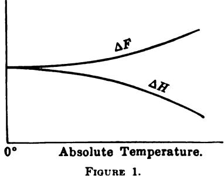

for the fact that these cells involved solutions, the curves presented by Richards very nearly imply the generalizations which werelatertobeembodiedinthethirdlawofthermodynamics.

 In a paper by van't Hoff the results of Lewis and Richards were further discussed, and the probable form of the free energy curve in the neighborhood of the absolute zero was again. examined. He thus obtained a rule which will later be seen to be a limited form, or a corollary, of the third law of thermodynamics. It states that when two forms (solid or liquid) of a substance exist, the one with the larger specific heat is the one whichisstableathighertemperatures.

2 van't Hoff, " Boltzmann Festschrift, " p, 233, Barth, Leipzig, 1904.

¹ Richards, Z. physik. Chem. , 42, 129 ( 1902) .

Haber ' , dealing with gas reactions, considered at length the nature of the thermodynamically undertermined constant I. He concluded, in the case of gas reactions in which there is no change in the number of molecules (in which therefore AC ordinarily is small) , that I is zero. We shall find. however, that this rule is probably not exact.

All of these attempts to secure information regarding free energy from other than equilibrium data were brought to a focus in the important paper of Nernst" , "Ueber die Berechnung chemischer Gleichgewichte aus thermischer Messungen. " Here he announced the general principle that in any chemical reaction between solid or liquid substances, d(AH) / dT and d(AF)/ dT approach zero (tangentially) at the absolute zero of temperature. While we shall show that this principle is only true after some serious limitations, it may be regarded as the basis of the fundamental generalization which will be known as the third law of thermodynamics.

Aside from the question of the limitations to which we have referred, Nernst, in attempting the calculation of chemical equilibrium, employed certain additional assumptions regarding specific heats, which at best could not be expected to possess more than approximate validity. He was thus led to the use of certain quantities called "chemical constants" to which we shall turn later. In the meantime we may give our attention to the simple principle stated above, free from the other extraneous portions of the Nernst heat theorem.

## HEAT CAPACITY AND ENTROPY AT THE ABSOLUTE ZERO

The two principles announced by Nernst for condensed systems (systems containing no gaseous phase) are obviously equivalent to the statement that , for any reaction in such systems. ACD and AS both approach zero asymptotically at the absolute zero of temperature.

In order to explain the vanishing of ACp, he assumed that the

* Nernst, Nachr. kgl. Ges. Wiss. , Göttingen. Math. -physik. Klasse, 1906, 1 .

<sup>1</sup> Haber, " Thermodynamik technischer Gasreactionen, " Oldenbourg, München, 1905. English translation by Lamb Longmans, Green and Co. , New York and London, 1908.

heat capacity of solids and liquids approached the same finite value per atom at the absolute zero. As we have seen in Chapter VII, Einstein predicted that heat capacities would approach not a finite but a zero value with diminishing temperature We have also seen that that prediction has been abundantly verified by experiment, and although the experimental values do not obey the simple equation suggested by Einstein, they show that, in all cases so far investigated, the heat capacity falls off with such rapidity that not only C, but also CD/T approaches zero.

However, for the formulation of the third law which we are going to offer, it is only necessary to assume that for every solid or liquid, as an empirical law,

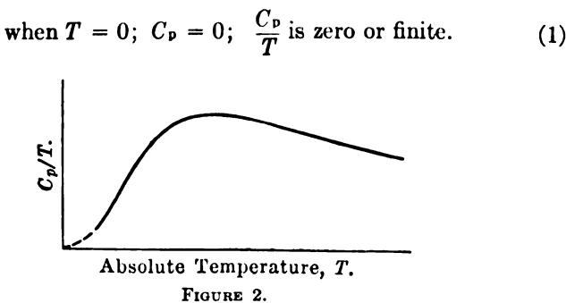

An Important Corollary. We have seen by Equation XIII-4 that the difference between the entropy of a substance at two different temperatures is given by the equation

$$\int dS = \int C_{\mathfrak{p}d} \ln T = \int \frac{C_{\mathfrak{p}}}{T} \, dT.$$

In order therefore to evaluate such a change of entropy, we may plot Cp against In T as in Chapter XIII, and obtain the area under the curve between two temperatures. Or, if we prefer, we may plot CD/T against T and obtain the area under this curve. Now by ( 1 ) , the area under the curve so plotted must be finite, and therefore the change in entropy from any finite temperatureto the absolutezeroisafinitequantity.

(See, for example, Figure 2, which shows the curve of C»/T against T for metallic copper. )

= Entropies at the Absolute Zero. The second part of Nernst's principle is equivalent to the statement that in any reaction, involving only solids and liquids, the entropy change becomes zero at the absolute zero. Orat T 0the entropies are additive, in the sense that the entropy of a compound is the sum of the entropies of its elements. Before discussing the necessary modifications of this statement, we may consider the very interesting interpretation offered by Planck, who stated that the entropy of every solid or liquid may be taken as zero at the absolute zero of temperature. 1

We have seen in Chapter XIII that the value of the entropy of any one substance at any one temperature may be arbitrarily chosen. We now see that if So is taken as zero for rhombic sulfur, and if there is no change in entropy in passing at the absolute zero from rhombic sulfur to monoclinic sulfur, then also for the latter So 0. So likewise if we choose to write So = 0 for lead and for iodine, and if there is no change of entropy in the formation of lead iodide from its elements at the absolute zero, we must also write for lead iodide S。 = 0. ==

## LIMITATIONS OF THE NERNST PRINCIPLE

Solutions. One of the first questions to arise concerning the additivity of the entropies at the absolute zero was the question as to the applicability of this principle to solutions. Can a solid solution, or a supercooled liquid solution such as ordinary glass, be assigned zero entropy at the absolute zero? Planck answered this question in the negative . Indeed if we consider a perfect solution, the entropy change in producing one mol of the mixture from the two pure constituents is given by the equation (see Exercise XIX-3) ,

$$
\Delta S = \begin{bmatrix} - \text{ N}_1 R \text{ \'n N}_1 \ - \text{ N}_2 R \text{ \'n N}_2 \end{bmatrix}
$$

Planck, " Thermodynamik, " 3rd Ed. , p. 279, Veit and Co., Leipzig, 1911.

<sup>1</sup> Planck, Ber, deut, chem. Ges. , 45, 5 ( 1912) .

where N₁ and N2 are the two mol fractions. For an equimolal mixture in which N₁ = N2 = 0.5,

$$\begin{array}{rcl} \text{Cu} & \text{N}_{\text{L}} & = & \text{Cu} & \text{=} \\\\ \Delta S & = & R \text{ In 2 } = 1.4 \text{ cal. per degree.} \end{array}$$

= = Now if the solution remains perfect down to the absolute zero, this same entropy difference will persist , and taking So O for the pure components, we should find So 1.4 for one mol ofthe mixture. On the other hand, since solutions ordinarily become less perfect with diminishing temperature, it might be assumed that this departure from the perfect solution would manifest itself in such manner as to reduce AS to zero at the absolute zero.

= Let us see how this might occur. According to Equation XII-8, d(AS)/dT ACD/T, where AC, is the difference between the heat capacity of the solution and that of its pure constituents. This is zero for a perfect solution . In order that AS should diminish with diminishing temperature, AC, must depart from zero and acquire a positive value.

In order to test this point experimentally, Gibson, Parks and Latimer¹ have made a careful study of the specific heats of supercooled ethyl alcohol, propyl alcohol, and their equimolal mixture, from room temperature down to 86°K. Throughout this range they found no appreciable difference between the heat capacity of the mixture and the sum of the heat capacities of the pure constituents.

It is true a difference might appear at still lower temperatures, but it was pointed out by Lewis and Gibson² that even if this phenomenon were to occur in some solutions, it could hardly occur in such a way as to reduce AS。 to zero for all types of solutions. Thus with a mixture of two almost identical organic isomers we should expect ACD to be nearly zero, and therefore AS to be nearly constant, over a wide range of temperature. This reasonable surmise becomes a conviction when we consider the extreme case of a mixture of two isotopes. Here we have substances which are so nearly identical in properties that as yet no way has been found for bringing about their separation. We even know isotopes which have not only the same atomic number but also the same atomic weight. It seems hardly conceivable that two such isotopes would suffer any measurable change in

<sup>1</sup> Gibson, Parks and Latimer, J. Am. Chem. Soc. , 42, 1542 ( 1920) .

<sup>2</sup> Lewis and Gibson, J. Am. Chem . Soc. , 42 , 1529 ( 1920) .

heat capacity on mixing, and therefore we must conclude that in such a case the entropy change on mixing remains essentially constant down to the absolute zero.

In fact one such solution has already been thoroughly investigated. Ordinary lead is known to be a mixture of isotopes, and yet its specific heat at low temperatures follows quantitatively the course that would be predicted from the behavior of other metals.

Failure of the Nernst Principle in the Case of Liquids. The conclusion that the additivity of entropies is invalid for solutions led Lewis and Gibson to a further conclusion which is of vital importance in the interpretation of the entropy principle. We may quote their words.

"The distinction between a pure liquid and a solution is in some measure artificial. Thus water is probably composed of several molecular species, including simple molecules, various types of associated molecules, together with hydrogen and hydroxide ions. Yet water is regarded as a pure substance, since at ordinary temperatures the establishment of equilibrium between these various types of molecules is so rapid that water, in the condition in which we know it , can be formed instantly from a single molecular species. This might not be the case, however, if we could cool water to a very low temperature where the several molecular species could behave as independent constituents of a mixture. "

"Just such a state of affairs is known in the case of sulfur. Liquid sulfur at high temperatures has entirely reproducible properties, but at lower temperatures it behaves like a mixture of two substances , SA and Su, which are only slowly transformable into one another. By rapid cooling, and treatment with carbon disulfide, it is possible to ascertain the amounts of the two species, since one is soluble and the other insoluble in this solvent. In so far as the two species are not transformed into one another, they act as entirely independent substances. Thus when crystalline sulfur melts it produces pure liquid SX and the addition of Sµ lowers the melting point just as any other solute would. Therefore, if SA and Su are mixed there must be a definite increase in entropy. "

"This liquid mixture is readily supercooled by sudden chilling. If we should study this material at low temperatures and also pure SX and Su in the supercooled liquid state we should undoubtedly find at least a part of this entropy change persisting down to the absolute zero. If then we assign zero entropy to the supercooled SA and Sμ we cannot assume zero entropy for the mixture. But this mixture would ordinarily be classed as a pure substance, and is in fact composed of a single element. These conditions which happen to have been observed in the case of sulfur may exist in many other liquids and glasses. "

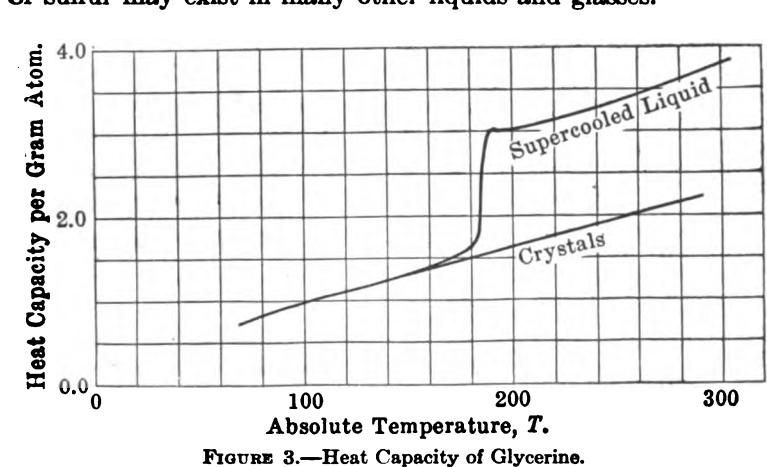

"Even if a substance contain but a single molecular species, if it is in an amorphous state or in the state of a supercooled liquid, there seems at present no reason, theoretical or experimental, which forces us to believe that such a substance falls within the scope of the third law. "

On the experimental side, the few measurements of the entropy of liquids which have been carried out are shown by Gibson and Giauque (in a paper about to be published) to support the view that there is an increase in entropy in passing from a pure crystalline solid to the corresponding supercooled liquid at the absolute zero. However, the only case which has been studied accurately enough to be regarded as crucial is one which they themselves have investigated, and which is illustrated in Figure 3.

They have measured the entropy change in the fusion of glycerine, and also the heat capacity of crystalline glycerine and the supercooled liquid, down to low temperatures.

The upper curve of Figure 3, which is the one for the supercooled liquid, is characteristic of this type of substance . At a certain temperature the heat capacity of this supercooled liquid begins to drop very rapidly and approaches that of the crystalline form. Indeed the drop is so sharp as to suggest a change of phase, but the evidence is all against this supposition. If at low temperatures the two curves continue to coincide down to the absolute zero, and if the entropy of fusion is zero at the absolute zero, then, in going from the absolute zero to the melting point of glycerine, the increase in entropy of the liquid form should be greater than that for the crystalline form by an amount just equal to the entropy change in fusion. This is not quite true, and the experiments indicate that the entropy of the liquid form is appreciably greater than that of the crystalline form at the absolute zero.

It is of course possible that the two curves may depart from one another at lower temperatures than those which have been so far investigated. Indeed the experiments show a very slightly greater heat capacity for liquid than for solid at the lowest temperature so far studied. The experiments are therefore being continued to still lower temperatures, but it seems hardly likely that the curves will be found to diverge sufficiently from one another to make AS。 =0.

### A RESTATEMENT OF THE ENTROPY PRINCIPLE

The discussion of Lewis and Gibson led them to the following conclusions.

"When we turn to the consideration of crystalline solids we not only find numerous cases in which the third law has been verified experimentally, but we also see some a priori reasons for the existence of such a law, even though these reasons cannot at present be stated with all the lucidity that might be desired. "

"Since entropy is a quantity defined for the purpose of giving mathematical expression to the second law of thermodynamics,

and since that law, from the standpoint of statistical mechanics, is essentially a consequence of the law of probability , it is natural to look for a relation between the entropy of a substance in a given state and the probability of the particular arrangement of molecules which determines that state. Essays in this direction by Boltzmann and more recently by Planck, important and suggestive as they have been, have not sufficed to show just what this relationship is. Nevertheless , it seems to us that if the entropy of a given state be regarded as in some sense a measure of the randomness of that state, the condition of a perfect crystal of a pure substance at the absolute zero is unique. In a solution there is a random distribution of several types of molecules. Even in a pure liquid or glass there is some randomness of arrangement. In any substance at a finite temperature there is a random distribution of energy among the individual molecules. But in the pure crystal at the absolute zero no randomness remains, for when the positions and the properties of a few molecules are fixed, the positions and properties of all other molecules are completely determined ; thus when a few elements of the crystalline structure are known we may build up the whole crystal by a process of repetition. It is this lack of any sort of randomness that we believe to be the theoretical basis for the conclusion that the entropy of a perfect crystal of a pure substance vanishes at the absolute zero. "

They were therefore led to state : "If the entropy of each element in some crystalline form be taken as zero at the absolute zero, the entropy of any pure crystal at the absolute zero is zero, and the entropy of any other substance is greater than zero. It seems likely, however, that the difference between the entropy of a pure substance in a crystalline state and in an amorphous state may, in many cases, prove to be very small. "

Entropy as a Positive Entity. We have seen in Chapter XIII how we may calculate the difference between the entropy of a substance at a given temperature and in a given physical state, and the entropy of the same substance as a crystalline solid at the absolute zero of temperature. Now if we ascribe zero entropy to the crystalline solid at the absolute zero, such a

calculation gives us the numerical value of the entropy in the given state.

By such computations we may obtain from existing data the absolute value of the entropy for a large number of solids, liquids and gases. In examining the results we are struck by the fact that these entropies are invariably positive.

In the older thermodynamics, entropy was regarded as a property which might equally well have a value positive or negative, finite or infinite. Let us consider, for example, the entropy of a perfect monatomic gas. Taking the molal heat capacity as constant, namely, Cp = 5½R, its entropy is given by the thermodynamic equation (from Equations XII-8 and XII-17),5½R In TRIn P + const. ,

$$\mathbf{s} = \mathbb{W}_2^\prime \boldsymbol{R} \ln \boldsymbol{T} - \boldsymbol{R} \ln \boldsymbol{P} + \text{const.},\tag{2}$$

$$\mathbf{s} = \begin{pmatrix} \mathbf{\tilde{i}} \cdot \mathbf{\tilde{r}} \end{pmatrix} \begin{pmatrix} \mathbf{\tilde{i}} + \mathbf{\tilde{r}} \end{pmatrix} + \begin{pmatrix} \mathbf{\tilde{i}} \cdot \mathbf{\tilde{r}} \end{pmatrix} \tag{3}$$

where these constants were formerly regarded as undeterminable, but can now be assigned definite values. Thus for helium Lewis and Gibson calculate the entropy at 1 atmos. and 25°C to be 29.2 cal. per degree. This fixes the value of the constants, and it is evident that at constant pressure the entropy would diminish with diminishing temperature, becoming negative, according to Equation 2, at temperatures a little below 1° K. However, long before it reaches so low a temperature, helium ceases to be a perfect gas, and therefore Equation 2 becomes invalid. Indeed helium ceases to be a gas at all, but goes over into the liquid and into the solid form ( and this occurs at temperatures at which the entropy of the gas is greater than the diminution in entropy which must accompany the process of liquefaction and solidification) .

Likewise if we maintain the gas at 25°C, but increase the pressure, the entropy diminishes, and according to Equation 2 would become negative at something over one million atmospheres. But, long before such a pressure is reached , Equation 2 would be invalid, and the entropy would be changing very slowly with the pressure, as in the case of a liquid.

It seems highly probable that, with respect to the third law,

infinite pressure would correspond closely to the absolute zero of temperature. Unfortunately, we are far from having sufficient data to enable us to ascertain whether the entropies of substances approach small values or zero at infinite pressure, as they do at zerotemperature.

On the basis of existing experimental data, we believe it safe to generalize, and to state that no realizable substance can possess a negative entropy. Further we believe that no substance can even be properly imagined, which would possess a negative entropy. Suppose, for example, that we imagine a gas, cooled under such conditions that, through the phenomenon of supersaturation, it is prevented from liquefying or solidifying ; we must believe that eventually such a gas would acquire the same kind of rigidity as is exhibited by solids or glasses, and that as it approached the absolute zero, its heat capacity curve would resemble the one shown in Figure 2.

Thus in place of the older vague and formless entropy concept, we arrive at the idea of entropy as a positive entity, or we might almost say substance, of which every material contains a definite amount, which may be removed by increase of pressure or diminution of temperature. But no more entropy can be removed from a substance than it possesses, for, according to this view,a negative entropy would have no more meaning than a negative mass or a negative volume.

If we adopt the idea that entropy is the logarithm of a probability, then this probability must be so defined as always to be greater than unity. The full significance of this idea still remains hidden, but the work of Planck, and others who are developing the theory of quanta, already gives us some inkling of the explanation which will ultimately be forthcoming.

### FINAL STATEMENT OF THE THIRD LAW

All that we believe to be correct of the various detailed propositions which have so far been discussed in this chapter, we may condense into a single statement, the third law of thermodynamics.

If the entropy of each element in some crystalline state be taken as zero at the absolute zero of temperature : every substance has a finite positive entropy, but at the absolute zero of temperature the entropy may become zero, and does so become in the case of perfect crystalline substances.

Presumably it is only for a single perfect crystal that So = 0,but a substance composed of crystals of microscopic size would not in this regard differ appreciably from a single crystal . If, however, a metal should be worked until the number of separate crystals (or regions throughout which the molecular structure could be completely expressed by a few specifications) should become comparable with the total number of atoms, S. might be expected to be greater than zero.

### EXPERIMENTAL DETERMINATION OF ENTROPIES AND TESTS OF THE THIRD LAW

We discussed fully in Chapter XIII the methods of calculating the entropies of the elements from various thermal data, and since the methods are essentially the same for compound substances, we need consider them no further here. In that chapter, all that we attempted to ascertain was S So, where So is the entropy at 0°K. But now we see by the third law that for any crystalline solid, So = 0. -

In addition to values of entropy obtained from measurements of heat capacity, the third law permits us to calculate entropies indirectly, and by such calculations we shall at the same time test the validity of the third law and obtain some important entropy values.

The available material for testing the adequacy of the third law of thermodynamics has been collected by Lewis and Gibson, ¹and again more recently by Lewis, Gibson and Latimer. Their calculations we shall follow closely in the remainder of this chapter and in the following.

Lewis and Gibson, after examining nine cases in which the


<sup>1</sup> Lewis and Gibson, J. Am. Chem. Soc. , 39, 2554 ( 1917) .

<sup>2</sup> Lewis, Gibson and Latimer, J. Am. Chem. Soc. , 44, 1008 ( 1922) .

third law could be tested, found an average discrepancy of 1.6 entropy units (or less than 500 cal. in AF or AH at 25°C) . They believed that these discrepancies lay within the limits of experimental error, and therefore stated : "While we hope that in the near future more accurate data concerning heats of reaction may be available, in the meantime we may assert that the third law rests upon a more adequate experimental basis than either the first or second laws of thermodynamics possessed at the time of their universal adoption. We believe, therefore, that it would be an excess of conservatism to refuse the acceptance of this powerful weapon of calculation in energetics until additional data are made available. "

The later paper of Lewis, Gibson and Latimer, dealing with new experimental material which had become available, very greatly reduces the former discrepancies, so that possibility of error in the third law now seems to be negligibly small.

We may now consider these tests individually, and shall begin with two cases in which the reaction in question is merely the transition between two crystalline forms of an elementary substance. Afterwards we shall discuss a number of reactions in which the changes in free energy and heat content are vastly greater, and in which therefore the scope of the third law is more fully illustrated.

= S(rhomb. ) S( monocl. ) . From the measurements of Nernst¹ and of Wigand on the specific heats of the two common crystalline forms of sulfur the entropy per gram-atom of rhombic sulfur at 25°C, S°298, is 7.6 cal . per degree. (In general S° will represent the entropy of a substance in its standard state. ) The data on the specific heat of monoclinic sulfur are not good enough for a very accurate determination of the entropy, but they permit an estimate which shows the entropy of this form to be two or three tenths of a unit higher than that of the rhombic form. By means of the data which we shall give in Chapter XXXVIII, we find for this reaction AF298 = 17, AH298 = 82, whence AS°298 = (82-17)/298== 0.22.

<sup>1</sup> Nernst, Ann. Physik. [ 4] , 36, 345 ( 1911) .

<sup>2</sup> Wigand, Ann. Physik. [ 4] , 22, 64 ( 1907) .

## 450 THERMODYNAMICS CHAP. XXXI

= = Sn (white) Sn (gray). Brönsted' has made a careful study not only of the specific heats, but also of the free energy and heat of transition. From the specific heats we have for white tin, S°298 = 11.17, and for gray tin, S°298 = 9.23, whence AS 1.94. From the free energy and heat of transition AS298 - 1.87. The difference between the two values is only 0.07 , and we thus have an excellent confirmation of the third law. - 298 =

The Entropy of Chlorine Calculated by Several Different Methods. One method of testing the third law is to calculate, by means of this law, the entropy of some one substance from the entropies of other substances, and from the changes in free energy and heat content in the corresponding reactions. In the case of chlorine this was done by Lewis and Gibson, first by employing the rough data for the specific heat of chlorine in its various states, together with the heats of fusion and vaporization ; and again by considering the entropies of mercurous chloride, lead chloride, silver chloride, thallous chloride and sodium chloride, together with the free energy and heat of formation of these substances . The mean value of S°298 for 12Cl2 was 25.7, from the six calculations, with an average deviation from the mean amounting to nearly two units. Since the values of AH were taken from the work of Thomsen and of Berthelot , it was believed that the discrepancies were within the limits of experimental error.

From Gerke's new and unpublished measurements of the electromotive force, and its temperature coefficient, in cells with electrodes of chlorine, of silver-silver chloride, of lead-lead chloride, of mercury-mercurous chloride, and of thalliumthallous chloride, Lewis, Gibson and Latimer have repeated four of the above calculations. The first three give within one-tenth of a unit the same value of S°298 for chlorine, namely, for Cl₂, S°298 26.3 ; while the fourth case with thallous chloride gives a considerably higher value, namely 28.2. S298 =

The exactness of the agreement in the first three cases is probably somewhat fortuitous. On the other hand, the discrepancy in the fourth case has led to a reinspection of the specific heat of thallous chloride which shows that the value of

2 Brönsted, Z. physik. Chem. , 88, 479 ( 1914) .

the entropy calculated by Lewis and Gibson is unquestionably too high. However, even including this case as it stands, the average discrepancy found by Lewis and Gibson has been reduced tenfold, and this series of results furnishes the best proof of the accuracy of the third law which has yet been obtained.

The Entropy of Iodine Calculated by Two Methods. The newer work by Günther not only proves the unreliability of the earlier measurements of the specific heat of iodine made by Nernst, but also shows that his own measurements were affected by some peculiar phenomenon which he believes to be a slow transition between two forms of iodine. It does not seem possible at present to obtain a reliable value for the entropy of iodine from the measurements of heat capacity.

On the other hand, the measurements of Gerke have been extended to include the two cells,

- Pb, PbI2, PbC1O4( aq) , PbI2, I2 ( s) , and Pb, PbI2, KI(aq) , AgI, Ag. (a) (b)
Thus for the two cell reactions,

- (a) Pb + I2 (s) = PbI2; AS 298 = 1.2,
- (b) Pb + 2AgI = PbI2 + 2Ag; AS°298 = - 8.0.

= = = = Now from the papers of Lewis and Gibson and of Lewis, Gibson and Latimer, we find for Pb, S 298 15.5 ; for PbI2, S 298 41.3 ; for Ag, S°298 10.2 and for AgI, S°298 26.8, all obtained from specific heat measurements. The first two values, combined with AS for reaction (a) give directly the entropy of iodine, namely for 2I2 (S) , S°298 = 13.5 .

On the other hand, by combining Equations (a) and (b) we eliminate Pb and PbI2, and find

$$\text{Ag} + \text{J}_2\text{I}_2(\text{s}) \rightleftharpoons \text{AgI}; \Delta S^\bullet_{\text{298}} = 3.4.7$$

298 = And now combining with the entropies of Ag and AgI we find for 12I2 (s) ; S° 29813.2 . The difference between the two values amounts only to three-tenths of a unit.

<sup>1</sup> Günther. Ann. Physik. [4] , 51 , 828 ( 1916 ) .

CHAP. XXXI

Three Determinations of the Entropy of Oxygen. In the case of oxygen we have three reliable methods of determining its entropy which are so different in character as to furnish once more a very satisfactory test of the third law.

We have seen in Chapter XIII how, from the study by Eucken of the specific heats and the heats of transition of the various forms of oxygen, we may calculate the entropy of oxygen gas at standard temperature. This gives for 1202, S°298 = 24.1.

From a similar investigation by Eucken of carbon monoxide, we find for it the value S°298 = 45.6. For carbon in the form of graphite the specific heat measurements give S°298 = 1.3. Finally the free energy and heat of formation of carbon monoxide we shall find in Chapter XL to be AF 29 32510 and AH298 -- 26140. Whence 298 = =

$$\text{C(graph.)} + \text{JyO}_2 = \text{CO}; \ \Delta S^\bullet_{\mathfrak{M}} = 21.4.$$

By combining these data, we find for 1/202, S°298 = 22.9.

A third very reliable calculation is now permitted by the measurements of Günther¹ oxide, which leads to S°298 well established as 17.8. on the specific heat of mercuric = 16.3. The entropy of mercury is For the formation of HgO from its elements we are going to find in Chapter XXXIV AF° 298 = - 13810 and AH298 = 21600, whence

$$\text{Hg(l)}\,\,+\,\text{j}\,\text{Q}_{\text{2}}\,=\,\text{HgO};\,\Delta S^{\bullet}_{\text{209}}\,=\,-26.1.$$

By combining these data, we find for 1/202, S°298 = 24.6.

Considering the great variety of experiments employed in the determination of these values, the three results 24.1 , 22.9 and 24.6 are in very satisfactory agreement, and serve to fix the entropy of oxygen to within less than one unit. (Lewis and Gibson attempted also to utilize the data on the heat capacity of ice, and its free energy and heat of formation. The heat capacity data are, however, very uncertain, and the resulting value of the entropy of oxygen, namely, 26.7, can be given no weight. )

Günther, Ann. Physik. [ 4] , 51 , 828 ( 1916) .

## THE CONSTANT OF THE FREE ENERGY EQUATION AND NERNST'S CHEMICAL CONSTANTS

From Equation XV- 2we may write forany process,

$$
\Delta F - \Delta H = -\mathcal{T}\Delta \mathcal{S}_1
$$

and by Equation XII-8 ,

$$
\Delta S = \int_{\mathfrak{o}}^{\mathfrak{T}} \Delta C_{\mathfrak{p}d} \ln |\mathcal{T} - \mathfrak{J}| \tag{4}
$$

or

$$
\Delta F - \Delta H = -T \int_0^T \Delta C_P d\ln T + \text{J.T.}\tag{5}
$$

Here the constant of integration I must be distinguished from the constant I which we ordinarily use in our equations of free energy, and which depends upon empirical equations of heat capacity that are approximately true over a limited range of temperature, but rarely are even approximately valid in the neighborhood of the absolute zero.

The equation corresponding to Equation 4, obtained from the empirical equations of heat capacity, is found by subtracting Equation IX-7 from XV-9 and dividing by T, whence

$$
\Delta \mathbf{S} = \Delta \Gamma_0 (1 + \ln T) + \Delta \Gamma_1 T + \lambda_2' \Delta \Gamma_2 T^2 + \dotsb \quad \text{(6)}
$$

Now if we compare Equations 4 and 5, we see that I can be obtained only when we know the heat capacity of each substance involved in the reaction, down to the absolute zero, while I is found from empirical equations, usually obtained from measurements over a limited temperature range. Therefore the two quantities may differ very widely from one another.

With this introduction we turn to the discussion of the chemical constants of Nernst. Let us consider some reaction between solid substances.

$$\text{A(s) } + \text{B(s) } = \text{C(s)}.$$

For such a reaction it is a consequence of the third law that at 0°K, AS is zero, Cp/T is not infinite, and therefore I == 0.

## 454 THERMODYNAMICS CHAP. XXXI

We may next consider the same reaction when the substances are gases.

$$\text{A(g) } + \text{B(g) } = \text{C(g)}.$$

The integration constant for this reaction we may call J'. Finally, we may write the three reactions,

> A(s)= A(g) ; B ( s ) = B(g) ; C(s) = C(g),

and the integration constants for these three reactions we may write as JA, JB and Jc. Now, if we combine the equations for these reactions with that for the solid reaction , we obtain the equation for the gaseous reaction, and thus

$$\begin{array}{ccccccccc}\hline\\\mathbf{3}' & \mathbf{3} & \mathbf{3} & \mathbf{3} & \mathbf{3} & \mathbf{3} & \mathbf{3} & \mathbf{3} & \mathbf{3} \\\hline\\\mathbf{3}' & \mathbf{3} & \mathbf{3} & \mathbf{3} & \mathbf{3} & \mathbf{3} & \mathbf{3} & \mathbf{3} & \mathbf{3} \\\hline\\\hline\\\end{array}$$

Now if we have the complete heat capacity curves of the three solids and of the three gases, and if we know the three heats of vaporization, we could calculate JA, IB and Ic from measurements of vapor pressure, and thus obtain an exact value for the constant J' of the gaseous reaction.

Unfortunately, Nernst, in his attempt to use this method, and in the absence of thermal data at low temperatures, made use of empirical equations based on measurements at ordinary temperatures (and further complicated the situation by employing liquids instead of solids) . He thus obtained values of IA, IB, and Ic from which he hoped to calculate I' . The quantities IA, IB and Ic, multiplied by a constant factor, were called by Nernst the chemical constants.

While Nernst saw the need of studying specific heats at low temperatures, and was one of the first to enter this important field of investigation, this did not stay the rapidly growing use of the chemical constant; and the various efforts which have been made to square the calculations based on these constants with the results of equilibrium measurements constitute a regrettable episode in the history of chemistry.

### CHAPTER XXXII

# THE ENTROPY OF MONATOMIC GASES AND A TABLE OF ATOMIC ENTROPIES

Nothing can be of greater service to applied thermodynamics than an accurate table of the entropies of the common elements. Thus if we once have, under standard conditions, the entropies of carbon, hydrogen, oxygen and nitrogen, the third law permits us to determine the free energy of formation of an organic substance, merely by determining the heat of formation and the entropy of that substance.

However, before giving such an entropy table we must discuss another exact principle which is going to be as serviceable in the calculation of the entropies of the elements as the third law itself.

## THE EQUATION OF SACKUR

From the known values of a number of atomic entropies, it was shown by Sackur¹ that the constant in the thermodynamic equation for the entropy of a perfect monatomic gas could be separated into two terms, one depending upon the atomic weight of the gas, and the other being a constant independent of the nature of the gas. Thus Equation XXXI-3 may be written.

$$\mathbf{s} = R \ln \left( T^{\frac{3\zeta}{2}} \mathbf{w}^{\frac{3\zeta}{2}} \mathbf{v} \right) + C = R \ln \left( C' T^{\frac{3\zeta}{2}} \mathbf{w}^{\frac{3\zeta}{2}} \mathbf{v} \right), \qquad \text{(1)} \\ \mathbf{r}^* $$

where C' and C ( = R ln C' ) are universal constants.

Sackur attempted to calculate the value of these constants from the theory of quanta, but obtained values which are not consistent with the experimental data. A similar calculation which gives a result more nearly in accord with the experimental values has been made by Tetrode.2

<sup>1</sup> Sackur, Ann. Physik. [ 4] , 36, 598 ( 1911 ) ; 40, 67 ( 1913) .

Tetrode, Ann. Physik. [ 4] , 38, 434 ( 1912) .

THE SACKUR CONSTANT FROM ULTIMATE RATIONAL UNITS

It would carry us too far from the purpose of this book to give an exposition of the very unusual theory which permitted Lewis and Adams' in 1914 to calculate certain physical constants far more accurately than they were at that time measured, and to predict values which have since been thoroughly corroborated by experiment.

In this theory the dimensions of every physical quantity are reduced to a power of a single dimension, which may be taken as a length. Consequently, every quantity is expressed in terms of a single unit, which, in the present development of the theory, may be provisionally taken as the centimeter (although this arbitrary unit will eventually be replaced by a rational one) . Our present units are then translated as follows :

> 1 second = 2.999 X 1010 centimeters. 1 gram 1 erg = 2.499 × 1037 reciprocal centimeters. = 2.779 × 1016 reciprocal centimeters. 1 degree (Celsius) = 3.813 reciprocal centimeters.

Units which bear these ratios to the chosen unit of length (or reciprocal length) are called ultimate rational units (U.R.U.) .

If Sackur's equation is a precise law of nature, it has recently been shown by Lewis that when we employ in Equation 1 , instead of the molal quantities, the mass of one molecule, the volume occupied per molecule, and the entropy per molecule, and reduce to ultimate rational units, then C' = 1 and C = 0. This is equivalent to the statement that in ordinary units

$$C' = \frac{k^{3/4}c^{3}}{N^{\frac{5}{2}i}(4\pi e)^{\mathfrak{s}}} = 3.252 \times 10^{-4}.\tag{2}$$

= Here k is the molecular gas constant ( = R/N 1.372 × 10-16), c is the velocity of light ( = 2.999 × 1010) , N is the number of molecules in a mol ( = 6.059 × 1023) , and e is the electron charge


<sup>1</sup> Lewis and Adams, Phys. Rev. [ 2] , 3, 92 ( 1914) .

<sup>2</sup> Lewis, Phys. Rev. [ 2] , 18, 121 ( 1921) . The question is more fully discussed in the volume dedicated to Professor E. H. Hall, Jefferson Physical Laboratory Contributions, Vol. XV, Cam bridge, Mass. , 1922.

in electrostatic units ( = 4.774 x 10-10). Substituting these values, Equation 1 becomes

$$\mathbf{s} = R \ln \left( T^{\circ} \mathbf{w}^{\circ} \mathbf{\hat{v}} \right) - 11.39, \qquad \qquad \cdot \qquad \text{(3)}^{\bullet}$$

or,

$$\mathbf{s} = R \ln \left( T^{\circ_2^{\circ_2}} \mathbf{w}^{\circ_2^{\circ_2}} \mathbf{v} \times 3.252 \times 10^{-8} \right). \tag{4}$$

Using pressure in atmospheres and substituting for v from the gas law, we find

$$\mathbf{s} = R \ln \left( T^{\circ_2'} \mathbf{w}^{\circ_2'} / P \right) - 2.63,\tag{5}$$

and at 25°C, and 1 atmos. ,

$$S^{\bullet}_{\text{two}} = \, \%R \text{ } \ln \le +25.70. \tag{6}$$

In obtaining these various equations we have assumed a perfect gas. So in Equation 6, S° shows the entropy of a gas in its hypothetical standard state ; in other words, in a state in which its heat content is the same as at zero pressure, and its fugacity is unity. For a gas at 1 atmos. , Equation 6 is applicable only if the gas law is assumed; otherwise the entropy at 1 atmos. may be obtained by finding from Equation 5 the entropy at some small pressure, and then ascertaining the work and the heat involved in compressing to one atmosphere.

For only four monatomic gases have the entropies been experimentally determined with sufficient accuracy to permit a significant comparison with the theoretical equation. Table 1 compares the values calculated by Equation 6, and the experimental values given by Lewis, Gibson and Latimer.¹

TABLE 1. -ENTROPY OF FOUR MONATOMIC GASES AT 25° C AND 1 ATMOS

|       | Calc | Exp  |
|-------|------|------|
| He    | 29.8 | 29.2 |
| A<br> | 36.7 | 36.4 |
| Cd    | 39.8 | 40.0 |
| Hg    | 41.5 | 41.3 |

Here we are dealing with four gases whose atomic weights range from 4 to 200, and the remarkable agreement, which in every case is within the limits of experimental error, gives us 1 Lewis, Gibson and Latimer, J. Am. Chem. Soc. , 44, 1008 ( 1922) .

much confidence, not only in the accuracy of the Sackur equation, but also in the validity of the method of ultimate rational units.

The accuracy of the physical constants used in obtaining Equation 4 permits the calculation of the constant of that equation to about 0.01 entropy unit, which is far more accurate than any present experimental value. Lewis predicts that "new experimental determinations will bring the entropies constantly nearer to those calculated from the equation. "

### APPLICATIONS

The Entropy of "Electron Gas. " It has been shown by Laue¹ and by Tolman2 that free electricity in a gaseous phase should have the properties of a monatomic gas, and therefore an entropy calculable by the same equation as that employed for other monatomic gases. Here we have a substance whose atomic weight of 0.000544 is of an entirely different magnitude from that of the other gases which we have considered . Nevertheless, as nearly as its entropy can be computed by various methods, which we shall not enter into here, it obeys the same law.

Thus applying Equation 6 to gaseous electricity, we find for its entropy under standard conditions

$$S^{\circ}_{\text{ggs}} = \sqrt[3]{2}R \text{ ln } 0.000544 \, + \, 25.70 \, = \, 3.28.\tag{7}$$

The Thermal Ionization of a Metal. An extraordinarily interesting application of this idea has been made by Saha³ who has attempted to explain the difference between the spectra of different types of stars, by considering the differences in gaseous ionization which would occur at different stellar temperatures, and has calculated the ionization as a function of the temperature by assuming that gaseous electrons obey the same entropy law as other monatomic gases.

Since this is a type of calculation which will doubtless be

<sup>1</sup> Laue, Jahrb. Radioakt. Elektronik, 15, 257 ( 1918) .

<sup>2</sup> Tolman, J. Am. Chem. Soc. , 43, 1592 ( 1921) .

Saha, Phil. Map , 40, 72 ( 1920) .

frequently used in the future, we may consider briefly the thermodynamics of the thermal ionization of gases. We shall choose for illustration cesium vapor, which probably appreciably ionizes at a lower temperature than any other metal.

Let us consider the reaction

$$\text{Cs(g)} \, = \, \text{Cs}^{+}(\text{g}) \, + \, \text{E}^{-}(\text{g}) .$$

Assuming now that we are dealing with partial pressures of cesium vapor, gaseous cesium ion, and gaseous electricity, so low that the gas laws hold (of course this means a very low partial pressure of the charged substances) , and therefore that all three act as perfect monatomic gases, then AC, is approximately 5, and the general free energy equation is

$$
\Delta F^{\circ} = \Delta H_{0} - 5T \ln T + IT. \tag{8}
$$

While the heat of such a reaction has not been determined by ordinary methods, it is believed that AH (which, within the limits of accuracy, is the same as AH ) is measured by the ionizing potential, or the electric work required to ionize the atom. The ionizing potential of cesium, according to Foote, Rognley and Mohler ' , is 3.9 volts (a value which might also be calculated by Bohr's theory from the spectrum of cesium²) . In order to find AH in calories per equivalent, we multiply by 23074 (see Appendix II) . Hence AH, 90000 cal. =

Now in order to determine the free energy of the reaction at any temperature we may calculate AH298 and then take AS 298 by the application of Equation 6 to each of the three substances. However, a more general method consists in using Equation XXXI-6, whence

$$
\Delta S^\bullet = 5(1 + \ln T) - I.
$$

Since the atomic weights of Cs and Cs+ are essentially identical, AS is equal to the entropy of the gaseous electricity ; whence from Equation 7, AS 298 = 3.28. = Substituting this value we find I 30.20 and

$$
\Delta F^{\bullet} = 90000 - 5T \ln T + 30.20T. \tag{9}
$$

* Foote and Meggers, Scien . Paper Bur. of Standards, No. 386, Bull. , 16, 309 ( 1920) .

Foote, Rognley and Mohler, Phys. Rev. [ 2 ] , 13 , 61 ( 1919 ) .

Except for the value of AH, this same equation will apply to any other case of the ionization of an atom to give a positive ion and a single electron.

= — == Let us calculate the degree of ionization of cesium vapor at one atmosphere and at 1000° K = 727° C. By the equation, AF 1000 = 85700 , log K 18.7 and the degree of ionization is 4.4 × 10-10. At such partial pressures the ions and electrons may be assumed to obey the gas laws, and presumably the only source of error in the calculation is in the determination of the ionizing potential. This calculation shows that at only moderately high temperatures the ionization should result in averyappreciablenaturalconductivityofthevapor.

At the time that the above paragraphs were written, the thermal ionization of the vapor had never been proved experimentally. But very recently Mr. H. C. Urey, at the suggestion of one of the authors, has undertaken a study of the thermal ionization of cesium vapor; and his experiments, although not yet completed, already show a definite thermal ionization. This ionization, as nearly as the experiments can now be interpreted, agrees with that calculated from Equation 9.

Diatomic Hydrogen. These gases which we have called monatomic are not, according to present theory, composed of single ultimate particles, but each atom is supposed to contain a positive nucleus together with the accompanying electrons, and the nucleus itself, in consequence of the modern revival of Prout's hypothesis, is regarded as containing hydrogen nuclei. That which characterizes the monatomic gas is not the indivisibility of the molecules but rather its adherence to the law 5½R, and it may therefore be assumed that any gas, in the range in which this law is obeyed, will have an entropy calculable from Equation 4. Ср =

We have seen in Chapter VII that the work of Eucken shows the molal heat capacity of hydrogen at low temperatures to become equal to that of a monatomic gas. It therefore seems justfiable to calculate the entropy of diatomic hydrogen at these low temperatures from Equation 4. By doing so, and

1 See Tolman, J. Am. Chem. Soc. , 42, 1185 ( 1920) .

then proceeding to 25°C from Eucken's data , as in the paper of Lewis and Gibson, we find for 1/2H2, S°298 = 14.72 . This is the value used in our final table of atomic entropies. Lewis, Gibson and Latimer have calculated independently the entropy of hydrogen from recent determinations of the heat of fusion of solid hydrogen, and from the specific heat and heat of vaporization of liquid hydrogen. This calculation leads to a value 0.67 higher than the one we have just obtained with Sackur's equation, combined with the principle of ultimate rational units. But the discrepancy is probably no larger than the uncertainty which still exists in the heat of fusion and heat of vaporization of hydrogen.

### SEVERAL APPROXIMATE METHODS OF CALCULATING ENTROPIES

In the former chapter and in this we have discussed two thermodynamic methods which lay claim to perfect exactness ; (1) the third law of thermodynamics, and ( 2) the equation of Sackur in conjunction with the principle of ultimate rational units. In addition, there are certain inexact generalizations which, like Trouton's rule, are occasionally useful in estimating the change in entropy in a reaction, when no other experimental or theoretical means are available.

Entropy of Solid Salts. It has been shown by Latimer¹ that although it is not to be expected in general that the entropies of solid substances could be calculated from the atomic weights alone, this is very nearly the case for many substances, and especially for binary salts. For such compounds he assumes that the entropy is the sum of two numbers, each characteristic of one of the elements of the salt. For each of these numbers he writes, in analogy to the Sackur equation, -

$$S^{\circ}_{\text{two}} = \,^3\!/\!_2R \text{ in } A \text{ -- } 0.94 \text{ (approx.),}\tag{10}$$

where A is the atomic weight, - 0.94 is a purely empirical constant, and the sum of the individual values of S°298 gives the entropy of the compound. He thus calculates the entropies

¹ Latimer, J. Am. Chem. Soc. , 43, 818 ( 1921) .

of 16 salts, the calculated value rarely deviating by more than one entropy unit from the experimental values.

Diatomic Gases. When we turn to the entropies of diatomic gases, we neither expect nor do we find any such simple generalization as the monatomic gases afford. Probably the heat capacity formula is not exactly the same for any two diatomic gases, and therefore if a simple relation between the entropies of two such gases should be found at one temperature, the same relation could not be expected to hold at another temperature. Sackur¹ has attempted to see whether the entropy of a diatomic gas at a given temperature and pressure could be made a function of the atomic weight and some one other parameter, such as the diameter of the molecule, and he proposed the following formula for a given temperatureandpressure:

$$\mathbf{s}^{\bullet} = R \ln \left( \mathbf{w}^{\bullet} A_1 A_2 \rho^{\mathbf{z}} \right) + \text{const.},$$

where w is the molecular weight, equal to A1 + A2, and p is the molecular diameter. Since these diameters have not been measured, the equation cannot be tested in any quantitative way.

However, in this case also, Latimer has shown that the mass of the atoms is the chief factor in determining the difference in entropy between two diatomic gases, and he proposes for one mol of a diatomic gas at one atmosphere and 25°C,

$$\mathbf{s^{\bullet}}_{\mathsf{198}} = R \ln \left( \mathbf{w^{\mathsf{M}}} A_1 \mathbf{^{\mathsf{M}}} A_2 \mathbf{^{\mathsf{M}}} \right) + \mathbf{30.22},$$

and this agrees with the experimental values for the diatomic gases, as far as they have been measured, within a few entropy units.

An even simpler empirical expression which seems to fit the facts equally well has been suggested to us by Professor E. D. Eastman; namely, for one mol of a diatomic gas at 25° C and one atmosphere

$$\text{Cs}^{\circ}_{\text{190}} = \text{\textasciicircum}_{\text{2}} R \ln \text{ (
$$A_1A_3$$
) } + \text{\textasciicircum}_{\text{1}} \text{\textasciicircum}_{\text{121}} \text{\textasciicircum}_{\text{111}} \text{\textasciicircum}_{\text{122}} \text{\textasciicircum}_{\text{111}} \text{\textasciicircum}_{\text{112}} \text{\textasciicircum}_{\text{113}} \text{\textasciicircum}_{\text{114}} \text{\textasciicircum}_{\text{114}} \text{\textasciicircum}_{\text{115}} \text{\textasciicircum}_{\text{115}} \text{\textasciicircum}_{\text{116}} \text{\textasciicircum}_{\text{117}} \text{\textasciicircum}_{\text{117}} \text{\textasciicircum}_{\text{117}} \text{\textasciicircum}_{\text{118}} \text{\textasciicircum}_{\text{118}} \text{\textasciicircum}_{\text{119}} \text{\textasciicircum}_{\text{119}} \text{\textasciicircum}_{\text{111}} \text{\textasciicircum}_{\text{111}} \text{\textasciicircum}_{\text{111}} \text{\textasciicircum}_{\text{112}} \text{\textasciicircum}_{\text{111}} \text{\textasciicircum}_{\text{112}} \text{\textasciicircum}_{\text{111}} \text{\textasciicircum}_{\text{112}} \text{\textasciicircum}_{\text{111}} \text{\textquotesicum}_{\text{112}} \text{\textquotesicum}_{\text{113}} \text{\textquotesicum}_{\text{114}} \text{\textquotesicum}_{\text{114}} \text{\textquotesicum}_{\text{115}} \text{\textquotesicum}$$

This rough rule is one which fits all of the existing data for diatomic gases within two entropy units. It may be of considerable service in making estimates of free energy changes in chemical reactions where other means are lacking. Thus for diatomic sulfur Equation 11 gives s °298 = 51.7, while

1 Sackur, Ann. Physik. [ 4] , 40, 87 ( 1913) .

the value which we have very recently obtained from free energy data is 52.4 (see Chapter XXXVIII) . The agreement increases our confidence in the latter value, which was obtained through a very complicated series of calculations.

If now we consider a gaseous reaction of the form

$$\mathbf{X_1(g) + Y_1(g) = 2XY(g)},$$

= = Equation 11 predicts that AS°298 0, and if for the purpose of rough calculation we also take ACP 0, then by Equation XXXI-6 , I = 0. This is a rule first given by Haber, to which we have referred in the preceding chapter. The only case which has been investigated, and in which the assumptions are valid, is the formation of nitric oxide from its elements. Here, as we shall find in Chapter XXXIX, the experimental value of I is 2.5. Another corollary of the same empirical rule is that, for a reaction of this sort, the general free energy equation assumes the simplest form, namely, AF° AH. In an unknown case we might expect to obtain a value of AF by this rule within a few hundred calories. Thus at present we have no information regarding the free energy of formation of hydrofluoric acid; but the heat of formation has been measured, AH = By using this empirical rule, we would therefore find - = -- 38500.1

$$
\Delta\!_2\text{H}_1 + \lambda_2\text{F}_2(\text{g}) \quad \text{= HF(g)}; \quad \Delta F^{\bullet}_{\text{201}} = -38500 \text{ (approx.)}.\tag{12}
$$

Another deduction from Equation 11 we find in the case of the dissociation of a diatomic gas, according to the equation

$$\mathbf{X}_{\mathbf{2}(\mathbf{g})} = \mathbf{2}\mathbf{X}(\mathbf{g})\dots$$

By combining Equations 6 and 11 we find for such a case

$$
\Delta S^\circ_{\text{two}} = 20.4 \text{ (approx.)}.\tag{13}
$$

This equation also may be used in rough predictions of free energy values.

The employment of such approximate empirical rules is , however, sharply to be distinguished from the precise methods. of using entropy values. It is the precise methods, and these only, which we shall employ in subsequent chapters.

### TABLE OF ATOMIC ENTROPIES

We shall conclude this chapter with a table of the entropies, per gram atom, of all the elements for which the calculation is now possible. The first table of atomic entropies was that of

1 Berthelot and Moissan, Ann. chim. phys. , [ 6] , 23, 570 ( 1891) .

Lewis and Gibson' . This table has been recently revised and much enlarged by Lewis, Gibson and Latimer², who have based their calculations upon measurements of heat capacity and other thermal data, upon the third law of thermodynamics, and upon Sackur's equation combined with the principle of ultimate rational units. Their table we reproduce without alteration, except that we add the value for S2(g) which will be found in Chapter XXXVIII.

TABLE 2.-ENTROPY OF THE ELEMENTS PER GRAM-ATOM AT 25°C

|                                           | 298<br>S<br>° |                                         | 298<br>S<br>° |
|-------------------------------------------|---------------|-----------------------------------------|---------------|
| (E¯<br>, gas)<br>Electricity<br>          | 3.28          | Potassium<br>gas<br>(<br>)<br>          | 36.63         |
| ½H₂<br>Hydrogen<br>(<br>) .               | 14.72         | Calcium<br>                             | 10.64         |
| H<br>Hydrogen<br>(<br>) .                 | 25.72         | Calcium<br>gas<br>(<br>)                | 36.71         |
| Helium<br>                                | 29.83         | Titanium<br>                            | 6.6           |
| Lithium                                   | 7.6           | Chromium                                | 5.8           |
| Lithium<br>gas<br>(<br>)                  | 31.48         | Manganese                               | 7.3           |
| Beryllium                                 | 7.3           | Iron                                    | 6.71          |
| Carbon<br>diamond<br>(<br>)               | 0.6           | Cobalt<br>                              | 7.2           |
| Carbon<br>graphite<br>(<br>)              | 1.3           | Nickel<br>                              | 7.2           |
| N2)<br>Nitrogen<br>(<br>·                 | 22.8          | Copper                                  | 8.18          |
| N<br>Nitrogen<br>(<br>)                   | 33.57         | Zinc<br>                                | 9.83          |
| (202<br>Oxygen<br>)                       | 24.0          | Zinc<br>gas<br>(<br>)                   | 38.17         |
| (O)<br>Oxygen<br>                         | 33.97         | Bromine<br>liquid<br>(<br>Br2<br>,<br>) | 16.3          |
| Fluorine<br>(<br>F<br>)                   | 34.48         | Bromine<br>(<br>Br₂<br>gas<br>,<br>)    | 27.7          |
| Neon<br>                                  | 34.66         | Bromine<br>(<br>Br<br>,<br>gas<br>)     | 38.77         |
| Sodium                                    | 12.2          | Krypton<br>                             | 38.88         |
| Sodium<br>gas<br>(<br>)                   | 35.06         | Rubidium<br>(<br>gas<br>)               | 38.97         |
| Magnesium                                 | 8.3           | Zirconium<br>                           | 9.5           |
| Aluminum                                  | 6.82          | Molybdenum                              | 7.5           |
| Silicon<br>metal<br>(<br>)                | 4.7           | Ruthenium                               | 6.9           |
| Phosphorus<br>(<br>P<br>,<br>gas<br>)     | 35.95         | Rhodium                                 | 7.6           |
| rhombic<br><br>Sulfur<br>(<br>)           | 7.6           | Palladium                               | 8.9           |
| monoclinic<br>Sulfur<br>(<br>)            | 7.8           | Silver<br>                              | 10.25         |
| Sulfur<br>2S2<br>(<br>,<br>gas<br>)       | 26.7          | Cadmium<br>                             | 11.80         |
| Sulfur<br>(<br>S<br>,<br>gas<br>)         | 36.04         | Cadmium<br>gas<br>(<br>)                | 39.79         |
| Chlorine<br><br>(<br>Cl2<br>,<br>gas<br>) | 26.3          | Tin<br>white<br>(<br>)<br>              | 11.17         |
| Chlorine<br>(<br>Cl<br>,<br>gas<br>)<br>  | 36.35         | Tin<br>gray<br><br>(<br>)               | 9.23          |
| Argon<br>                                 | 36.70         | Iodine<br>(<br>½I<br>,<br>solid<br>)    | 13.3          |
| Potassium                                 | 16.6          | Iodine<br>(<br>212<br>,<br>gas<br>)<br> | 30.9          |

1 Lewis and Gibson, J. Am. Chem. Soc. , 39, 2554 ( 1917) .

2 Lewis, Gibson and Latimer, J. Am. Chem. Soc. , 44, 1008 ( 1922 ) .

✓

|                                   | S298  |                     | So<br>298 |
|-----------------------------------|-------|---------------------|-----------|
| Iodine<br>(<br>I<br>,<br>gas<br>) | 40.15 | Gold<br>            | 11.0      |
| Xenon                             | 40.23 | Mercury<br>(liquid) | 17.8      |
| Cesium<br>gas<br>(<br>)           | 40.28 | Mercury<br>(gas)    | 41.51     |
| Lanthanum                         | 13.7  | Thallium            | 14.6      |
| Cerium<br>                        | 13.8  | Lead<br>            | 15.53     |
| Tungsten                          | 8.4   | Niton<br>           | 41.81     |
| Osmium                            | 7.8   | Thorium.            | 13.6      |
| Iridium                           | 8.7   | Uranium             | 11.1      |
| Platinum                          | 10.0  |                     |           |

# TABLE 2. -Continued.

# CHAPTER XXXIII

## INTRODUCTION TO SYSTEMATIC FREE ENERGY CALCULATIONS: THE FREE ENERGY OF ELEMENTARY HYDROGEN AND METALLIC HYDRIDES

Having now discussed not only the fundamental principles of thermodynamics, but also many special methods employed in the application of these principles to chemical problems, we shall devote the remainder of this book to the purely practical task of calculating the changes in free energy attending important chemical reactions.

In order to present the results of these calculations in the most convenient form, we have attempted to obtain the free energy change which accompanies the formation of each substance from its elements, in their standard reference states. These values for the free energy of formation will all be given at the standard reference temperature, 25°C. The several results will be tabulated in Chapter XLII. In many cases equations are given which show the free energy of formation as a function of the temperature.

# NON- METALLIC COMPOUNDS AND ANIONS

Of the various problems which we are to meet, the most intricate are those which deal with the free energies of compounds of the nonmetals, and to these we shall give our chief attention. Unfortunately it seems necessary, at the present time, to omit from consideration compounds of boron, silicon, phosphorus, arsenic, antimony, selenium and tellurium, although a few equilibrium measurements involving compounds of these elements have already been made, and more are now in progress.

Even for the elements which are systematically treated it will be only too obvious how incomplete our present data are ; thus the few cases in which we are able to calculate the free energy of organic compounds show only the paths by which we may enter a great unexplored domain.

In studying the non-metallic elements, one of our chief objectives has been the determination of the free energy of formation of the common anions, to supplement corresponding values for the cations such as are given in Table XXX-7.

Unfortunately there is an important group of anions which has hitherto been neglected . These are the anions which contain metallic elements, such as CrO. , and MnO . Although some sporadic data exist, no systematic study of these anions has as yet been made. Such a study will furnish a valuable contribution to our knowledge of the free energies of chemical compounds.

### SALTS

Even the commonest metallic salts are too numerous to be considered individually in our tables. Occasionally we give values for the free energies of metallic salts which we have considered incidentally or for purposes of illustration . These cases will suffice to exemplify the methods which are employed in such cases. Indeed when the free energy of formation is known for both cation and anion, the determination of the free energy of the solid salt is very simple. It suffices to know, in addition, the solubility of the salt in water and the activity coefficient of its saturated solution .

Hydrated Salts . Except that the free energy of formation of liquid water enters into the calculation, the same method is used in determining the free energy of formation of a hydrated salt. Often we encounter the problem of obtaining the free energy of an anhydrous salt from that of a hydrated form, or conversely. There are two common methods of solving such a problem ; one depends upon a determination of the transition point and the heat of transition between the two forms, the

## 468 THERMODYNAMICS CHAP. XXXIII

other depends upon determinations of the vapor pressure over a mixture of the hydrated and the anhydrous (or less hydrated) salts . A complex example of the latter method will be found in the discussion of hydrogen peroxide in Chapter XXXIV, while both methods are illustrated in Example 8, Chapter XLII.

Similar methods may be employed in dealing with other complexes, such as those between salts and ammonia. Likewise numerous data on the decomposition pressures of metallic carbonates furnish material for obtaining the change in free energy in changing an oxide into a carbonate.

Fused Salts. Reactions at high temperature often involve salts in the molten state. When the necessary thermal data are available, such reactions present no difficulties. As a rule, however, the heats of fusion and the specific heats of fused salts have not been determined . It is therefore necessary to devise special methods, one of which will be described in Chapter XLI, when we discuss the oxidation of carbon monoxide by fused potassium cyanate.

### SOME REMARKS CONCERNING THE NUMERICAL ACCURACY OF THE DATA

We do not attempt to indicate in any formal way the probable accuracy of the various free energy values which we are to present. In numerous cases this is sufficiently indicated by the degree of coincidence between values obtained by independent methods; but when only one method has been employed, it is often difficult to form an opinion as to the magnitude of the possible or probable error. This is especially true when it is necessary to extrapolate over a wide range of temperature. In such cases we are dependent upon existing thermal data, the accuracy of which it is hard to estimate.

Especially it is to be pointed out that when we are dealing with quantities such as heats of reaction or free energies, it is impossible to employ the recognized expedient of indicating the approximate accuracy by the number of significant figures

given. In using simultaneously a number of free energy values, the errors are additive, not multiplicative. The free energy of formation, from the elements, of either liquid or gaseous ammonia may be in error by two or three hundred calories, but we should have values for these two quantities, that, when subtracted, give the correct value for the free energy of vaporization of liquid ammonia, which is accurately known. On the other hand it may seem a little ludicrous to give a value, to the last calorie, which may be in error by several thousand calories. We have compromised in the great majority of cases by giving the results to the nearest ten calories, although occasionally we further round off numbers when the data are crude.

With this introduction we shall now proceed to a systematic study of the free energy of various substances. It is a source of regret to us that in these chapters dealing with the experimental investigation of chemical equilibria, we have been unable to describe more fully the individual experiments and the experimental methods, always significant in the interpretation of data, and often possessing an intrinsic interest because of their novelty and ingenuity. But such a discussion would extend our volume far more than is compatible with its primary purpose.

## ELEMENTARY HYDROGEN¹

The standard reference state of hydrogen will be the gas, H2, at unit fugacity. For all ordinary purposes this may be regarded as the same as hydrogen gas at one atmosphere.

Hydrogen Ion. As we have frequently explained, it is, for thermodynamic purposes, purely a matter of choice whether we give hydrogen ion in aqueous solution the simple formula H+ or a more complicated one, for example that of hydronium ion OH3+. The former is more customary and will be employed .

According to conventions which we have already established , we shall arbitrarily write for the reaction, ½H2(g) = H+; AH = 0, ACD = 0, and AF = 0.

<sup>1</sup> The calculations of this chapter and of the next constitute a revision of our paper "The Free Energy of Oxygen, Hydrogen and the Oxides of Hydrogen, " J. Am. Chem . Soc. , 36, 1969 ( 1914) .

Monatomic Hydrogen. The dissociation of hydrogen according to the equation,

$$\mathbf{H}_{\mathbf{2}}(\mathbf{g}) = 2\mathbf{H}(\mathbf{g}),$$

occurs appreciably at high temperatures, and has been quantitatively studied by Langmuir¹, using a novel method which involved the rate of thermal flow from an incandescent tungsten wire in an atmosphere of hydrogen. By such measurements, at a variety of temperatures and pressures, he simultaneously determined both the dissociation constant and the heat of dissociation.

His first experiments and calculations led to the values AH = 136000 at an average temperature of about 2500°K, and to values of the dissociation constant as shown in the second column of Table 1. Later work of Langmuir and Mackay² gave AH 90000, and values of K given in the third column of the table. =

In spite of the ingenuity of the experiments and of their interpretation, it seems very doubtful whether such a method is capable of giving much more than the order of magnitude of the quantities sought. Such suspicions are verified by a calculation of the entropy change in the dissociation .

Let us first set up the general free energy equation by the aid of the heat capacity values given in Equations VII-4 and VII-5, namely,

$$
\Delta F^{\bullet} = \Delta H_{\bullet} - 3.5T \ln T + 0.00045T^{\bullet} + IT.
$$

In this equation Langmuir's final results give ▲H。 I = 6.0. = 85000 and

Now from Equation XXXI-6

AS 3.5 ( 1 + In T) - 0.00097 - I, =

= and substituting this value of I, we find AS°298 17.2. This value is certainly erroneous. From the entropies given in Table XXXII- 2, and which are unquestionably correct within a small fraction of an entropy unit, we find AS 298 = 22.0. We

¹ Langmuir, J. Am. Chem. Soc. , 34, 860 ( 1912) .

<sup>?</sup> Langmuir and Mackay, J. Am. Chem. Soc. , 36, 1708 ( 1914) . Langmuir, ibid., 37, 417 (1915) .

thus see that either Langmuir's value of AH2500 is in error by many thousand calories, or his values of K must be in error by a factor of over ten.

On the other hand we may calculate I exactly from the entropies and thus find I = 1.17, and if we could obtain an independent value for the heat of the dissociation we could make a completely new determination of the degree of dissociation of hydrogen at any temperature.

We have seen in Chapter XXXII how the heat of ionization of a metallic vapor may be calculated from the ionizing potential, or from a measurement of the characteristic lines of the spectrum. In the case of hydrogen the situation is more complicated. Nevertheless by a combination of spectrum data with the ionization and resonance potentials, several different methods lead to approximately the same value for the heat of dissociation of hydrogen into atoms. Thus Franck, Knipping and Krüger¹ calculate the voltage required to dissociate hydrogen molecules as 3.5 volts, corresponding to AH 81000 cal. , while Mohler and Foote obtain a lower value of 3.2 volts, corresponding to 74000 cal. Accepting provisionally the former value, and taking (within the limits of experimental error) AH, AH, our general free energy equation becomes = =

$$
\Delta F^{\bullet} = 81000 \,\mathrm{--} 3.5T \,\ln T \,\mathrm{+} 0.00045T^{\bullet} \,\mathrm{+} 1.17T. \tag{1}
$$

This equation gives the values of K shown in the first column of Table 1 .

|               |                  | TABLE<br>1          |                    |
|---------------|------------------|---------------------|--------------------|
|               | Equation<br>1    | Langmuir<br>( 1912) | Langmuir<br>(1915) |
| 2000<br><br>K | 3.2<br>×<br>10-4 | X<br>10-<br>1.7     | 1.1<br>10-5<br>X   |
| K3500         | 3.8              | 4.4                 | 0.18               |
| <br>ΔΗ        | 81000            | 131000              | 85000              |

Except for slight uncertainty in the heat capacity terms at high temperatures, the only possibility of an appreciable error in Equation 1 lies in the value of AH . Adopting provisionally the value from ionizing potentials, we find from Equation 1 ,

<sup>1</sup> Franck, Knipping and Krüger, Verhandl. physik. Ges. , 21 , 728 ( 1919) .

<sup>2</sup> Mohler and Foote, J. Optical Soc. Am. , 4, 49 ( 1920) ; for a full review of this subject see Hughes, Bull, Nat. Res. Council, 2, Part 2, 83 ( 1921 ) .

Lewis and Gibson' . This table has been recently revised and much enlarged by Lewis, Gibson and Latimer², who have based their calculations upon measurements of heat capacity and other thermal data, upon the third law of thermodynamics, and upon Sackur's equation combined with the principle of ultimate rational units. Their table we reproduce without alteration, except that we add the value for S2(g) which will be found in Chapter XXXVIII.

TABLE 2.-ENTROPY OF THE ELEMENTS PER GRAM-ATOM AT 25°C

|                                          | 298<br>S<br>° |                                          | S     |
|------------------------------------------|---------------|------------------------------------------|-------|
| (E-<br>Electricity<br>, gas<br>)         | 3.28          | Potassium<br>(<br>gas<br>)               | 36.63 |
| Hydrogen<br>H₂)<br>(                     | 14.72         | Calcium                                  | 10.64 |
| Hydrogen<br>(<br>H<br>)                  | 25.72         | Calcium<br>(<br>gas<br>)                 | 36.71 |
| Helium<br>                               | 29.83         | Titanium<br>                             | 6.6   |
| Lithium                                  | 7.6           | Chromium                                 | 5.8   |
| Lithium<br>gas<br>(<br>)                 | 31.48         | Manganese.                               | 7.3   |
| Beryllium                                | 7.3           | Iron                                     | 6.71  |
| Carbon<br>diamond<br>)<br>(              | 0.6           | Cobalt                                   | 7.2   |
| graphite<br>Carbon<br>(<br>)<br>         | 1.3           | Nickel                                   | 7.2   |
| N2)<br>Nitrogen<br>(                     | 22.8          | Copper                                   | 8.18  |
| N<br>Nitrogen<br>)<br>(                  | 33.57         | Zinc                                     | 9.83  |
| (202)<br>Oxygen<br>                      | 24.0          | Zinc<br>gas<br>(<br>)                    | 38.17 |
| Oxygen<br>O<br>(<br>)                    | 33.97         | Bromine<br>Br2,<br>liquid<br>(<br>) .    | 16.3  |
| Fluorine<br>(<br>F<br>)                  | 34.48         | Bromine<br>Br₂<br>gas<br>(<br>,<br>)<br> | 27.7  |
| Neon<br>                                 | 34.66         | Bromine<br>Br<br>gas<br>(<br>,<br>)<br>  | 38.77 |
| Sodium                                   | 12.2          | Krypton<br>                              | 38.88 |
| Sodium<br>(<br>gas<br>)                  | 35.06         | Rubidium<br>(<br>gas<br>)                | 38.97 |
| Magnesium.                               | 8.3           | Zirconium<br>                            | 9.5   |
| Aluminum                                 | 6.82          | Molybdenum                               | 7.5   |
| Silicon<br>metal<br>(<br>)               | 4.7           | Ruthenium                                | 6.9   |
| Phosphorus<br>(<br>P<br>,<br>gas<br>)    | 35.95         | Rhodium                                  | 7.6   |
| rhombic<br>Sulfur<br>(<br>)<br>          | 7.6           | Palladium                                | 8.9   |
| Sulfur<br>monoclinic<br>(<br>)           | 7.8           | Silver<br>                               | 10.25 |
| Sulfur<br>(<br>12S2<br>,<br>gas<br>)     | 26.7          | Cadmium                                  | 11.80 |
| Sulfur<br>gas<br>(<br>S<br>,<br>)<br>    | 36.04         | Cadmium<br>gas<br>(<br>)                 | 39.79 |
| Chlorine<br>2Cl2<br>(<br>,<br>gas<br>)   | 26.3          | Tin<br>(<br>white<br>)<br>               | 11.17 |
| Chlorine<br>(<br>Cl<br>,<br>gas<br>)<br> | 36.35         | Tin<br>gray<br><br>(<br>)                | 9.23  |
| Argon<br>                                | 36.70         | (212<br>Iodine<br>, solid)               | 13.3  |
| Potassium                                | 16.6          | Iodine<br>(<br>212<br>,<br>gas<br>)      | 30.9  |

1 Lewis and Gibson, J. Am. Chem. Soc. , 39, 2554 ( 1917) .

Lewis, Gibson and Latimer, J. Am. Chem. Soc. , 44, 1008 ( 1922) .

|                                       | TABLE<br>2. | -<br>Continued.          |           |
|---------------------------------------|-------------|--------------------------|-----------|
|                                       | So<br>298   |                          | So<br>298 |
| Iodine<br>gas<br>(<br>I<br>,<br>)<br> | 40.15       | Gold<br>                 | 11.0      |
| Xenon<br>                             | 40.23       | Mercury<br>(liquid)      | 17.8      |
| Cesium<br>(<br>gas<br>)               | 40.28       | Mercury<br>(<br>gas<br>) | 41.51     |
| Lanthanum<br>                         | 13.7        | Thallium<br>             | 14.6      |
| Cerium<br>                            | 13.8        | Lead<br>                 | 15.53     |
| Tungsten<br>                          | 8.4         | Niton                    | 41.81     |
| Osmium<br>                            | 7.8         | Thorium<br>              | 13.6      |
| Iridium                               | 8.7         | Uranium<br>              | 11.1      |
| Platinum                              | 10.0        |                          |           |

Except for the value of AH, this same equation will apply to any other case of the ionization of an atom to give a positive ion and a single electron.

= Let us calculate the degree of ionization of cesium vapor at one atmosphere and at 1000° K = 727°C. By the equation, AF 1000 85700, log K = - 18.7 and the degree of ionization is 4.4 × 10-10. At such partial pressures the ions and electrons may be assumed to obey the gas laws, and presumably the only source of error in the calculation is in the determination of the ionizing potential. This calculation shows that at only moderately high temperatures the ionization should result in a very appreciablenaturalconductivityofthevapor.

At the time that the above paragraphs were written, the thermal ionization of the vapor had never been proved experimentally. But very recently Mr. H. C. Urey, at the suggestion of one of the authors, has undertaken a study of the thermal ionization of cesium vapor; and his experiments, although not yet completed, already show a definite thermal ionization. This ionization, as nearly as the experiments can now be interpreted, agrees with that calculated from Equation 9.

Diatomic Hydrogen. These gases which we have called monatomic are not, according to present theory, composed of single ultimate particles, but each atom is supposed to contain a positive nucleus together with the accompanying electrons, and the nucleus itself, in consequence of the modern revival of Prout's hypothesis, is regarded as containing hydrogen nuclei. That which characterizes the monatomic gas is not the indivisibility of the molecules but rather its adherence to the law Cp = 5½R, and it may therefore be assumed that any gas, in the range in which this law is obeyed, will have an entropy calculable from Equation 4.

We have seen in Chapter VII that the work of Eucken shows the molal heat capacity of hydrogen at low temperatures to become equal to that of a monatomic gas. It therefore seems justfiable to calculate the entropy of diatomic hydrogen at these low temperatures from Equation 4. By doing so, and

1 See Tolman, J. Am. Chem. Soc. , 42, 1185 ( 1920) .

= then proceeding to 25°C from Eucken's data, as in the paper of Lewis and Gibson, we find for 1/2H2, S°298 14.72 . This is the value used in our final table of atomic entropies. Lewis, Gibson and Latimer have calculated independently the entropy of hydrogen from recent determinations of the heat of fusion of solid hydrogen, and from the specific heat and heat of vaporization of liquid hydrogen. This calculation leads to a value 0.67 higher than the one we have just obtained with Sackur's equation, combined with the principle of ultimate rational units . But the discrepancy is probably no larger than the uncertainty which still exists in the heat of fusion and heat of vaporization of hydrogen.

### SEVERAL APPROXIMATE METHODS OF CALCULATING ENTROPIES

In the former chapter and in this we have discussed two thermodynamic methods which lay claim to perfect exactness ; (1) the third law of thermodynamics, and ( 2) the equation of Sackur in conjunction with the principle of ultimate rational units. In addition, there are certain inexact generalizations which, like Trouton's rule, are occasionally useful in estimating the change in entropy in a reaction, when no other experimental or theoretical means are available.

Entropy of Solid Salts. It has been shown by Latimer¹ that although it is not to be expected in general that the entropies of solid substances could be calculated from the atomic weights alone, this is very nearly the case for many substances, and especially for binary salts. For such compounds he assumes that the entropy is the sum of two numbers, each characteristic of one of the elements of the salt. For each of these numbers he writes, in analogy to the Sackur equation,

$$S_{\text{204}}^{\circ} = \text{\textasciicircum}_{2}{R \text{ in } A \text{ -- 0.94 (approx.),}{\text{ (approx.), }}} \qquad \text{(10)}$$

where A is the atomic weight, 0.94 is a purely empirical constant, and the sum of the the entropy of the compound. individual values of S° 298 gives He thus calculates the entropies

<sup>1</sup> Latimer, J. Am. Chem. Soc. , 43, 818 ( 1921) .

CHAP. XXXII

Lewis and Gibson ' . This table has been recently revised and much enlarged by Lewis, Gibson and Latimer2, who have based their calculations upon measurements of heat capacity and other thermal data, upon the third law of thermodynamics, and upon Sackur's equation combined with the principle of ultimate rational units. Their table we reproduce without alteration, except that we add the value for S2 (g) which will be found in Chapter XXXVIII.

TABLE 2.-ENTROPY OF THE ELEMENTS PEr Gram-Atom at 25°C

|                                          | 298<br>S<br>° |                                          | S      |
|------------------------------------------|---------------|------------------------------------------|--------|
| ( E-<br>, gas)<br>Electricity            | 3.28          | Potassium<br>(<br>gas<br>)               | 36.63  |
| (½H₂<br>Hydrogen<br>) .                  | 14.72         | Calcium                                  | 10.64  |
| H<br>Hydrogen<br>)<br>(                  | 25.72         | Calcium<br>gas<br>(<br>)<br>             | 36.71  |
| Helium                                   | 29.83         | Titanium                                 | 6.6    |
| Lithium                                  | 7.6           | Chromium<br>                             | 5.8    |
| Lithium<br>gas<br>(<br>)                 | 31.48         | Manganese.                               | 7.3    |
| Beryllium<br>                            | 7.3           | Iron<br>                                 | 6.71   |
| Carbon<br>diamond<br>(<br>)              | 0.6           | Cobalt                                   | 7.2    |
| Carbon<br>graphite<br>(<br>)             | 1.3           | Nickel.                                  | 7.2    |
| N2)<br>Nitrogen<br>(<br>··               | 22.8          | Copper                                   | 8.18   |
| N<br>Nitrogen<br>)<br>(                  | 33.57         | Zinc                                     | 9.83   |
| Oxygen<br>(<br>20<br>)                   | 24.0          | Zinc<br>gas<br>(<br>)                    | 38.17  |
| Oxygen<br>(<br>O<br>)<br>                | 33.97         | Bromine<br>Br2,<br>liquid)<br>(          | . 16.3 |
| Fluorine<br>(<br>F<br>)                  | 34.48         | Bromine<br>(<br>Br₂<br>,<br>gas<br>)<br> | 27.7   |
| Neon                                     | 34.66         | Bromine<br>(<br>Br<br>,<br>gas<br>)      | 38.77  |
| Sodium<br>                               | 12.2          | Krypton<br>                              | 38.88  |
| Sodium<br>gas<br>(<br>)                  | 35.06         | Rubidium<br>(<br>gas<br>)                | 38.97  |
| Magnesium                                | 8.3           | Zirconium<br>                            | 9.5    |
| Aluminum                                 | 6.82          | Molybdenum                               | 7.5    |
| Silicon<br>(<br>metal<br>)               | 4.7           | Ruthenium                                | 6.9    |
| Phosphorus<br>(<br>P<br>,<br>gas<br>)    | 35.95         | Rhodium                                  | 7.6    |
| (rhombic)<br>Sulfur                      | 7.6           | Palladium                                | 8.9    |
| Sulfur<br>monoclinic<br>(<br>)           | 7.8           | Silver<br>                               | 10.25  |
| Sulfur<br>12S2<br>,<br>gas<br>)<br><br>( | 26.7          | Cadmium<br>                              | 11.80  |
| Sulfur<br>S<br>,<br>gas<br>(<br>)<br>    | 36.04         | Cadmium<br>gas<br>(<br>)                 | 39.79  |
| ( 2Cl2,<br>Chlorine<br>gas)<br>          | 26.3          | Tin<br>(<br>white<br>)<br>               | 11.17  |
| Chlorine<br>Cl<br>gas<br>(<br>,<br>)     | 36.35         | Tin<br>(<br>gray<br>)<br>                | 9.23   |
| Argon                                    | 36.70         | Iodine<br>(<br>212<br>,<br>solid<br>)    | 13.3   |
| Potassium                                | 16.6          | Iodine<br>212<br>gas<br>(<br>,<br>)      | 30.9   |

1 Lewis and Gibson , J. Am. Chem. Soc. , 39, 2554 ( 1917) .

2 Lewis, Gibson and Latimer, J. Am. Chem. Soc. , 44, 1008 ( 1922) .

✓

|                                   | -<br>TABLE<br>2. | Continued.                   |           |
|-----------------------------------|------------------|------------------------------|-----------|
|                                   | So<br>298        |                              | So<br>298 |
| Iodine<br>gas<br>(<br>I<br>,<br>) | 40.15            | Gold<br>                     | 11.0      |
| Xenon<br>                         | 40.23            | Mercury<br>liquid<br>(<br>)  | 17.8      |
| Cesium<br>(<br>gas<br>)<br>       | 40.28            | Mercury<br>(<br>gas<br>)<br> | 41.51     |
| Lanthanum<br>                     | 13.7             | Thallium                     | 14.6      |
| Cerium                            | 13.8             | Lead                         | 15.53     |
| Tungsten                          | 8.4              | Niton.                       | 41.81     |
| Osmium                            | 7.8              | Thorium                      | 13.6      |
| Iridium                           | 8.7              | Uranium                      | 11.1      |
| Platinum                          | 10.0             |                              |           |

# CHAPTER XXXIII

## INTRODUCTION TO SYSTEMATIC FREE ENERGY CALCULATIONS: THE FREE ENERGY OF ELEMENTARY HYDROGEN AND METALLIC HYDRIDES

Having now discussed not only the fundamental principles of thermodynamics, but also many special methods employed in the application of these principles to chemical problems, we shall devote the remainder of this book to the purely practical task of calculating the changes in free energy attending important chemical reactions.

In order to present the results of these calculations in the most convenient form, we have attempted to obtain the free energy change which accompanies the formation of each substance from its elements, in their standard reference states. These values for the free energy of formation will all be given at the standard reference temperature, 25°C. The several results will be tabulated in Chapter XLII . In many cases equations are given which show the free energy of formation as a function of the temperature.

# NON- METALLIC COMPOUNDS AND ANIONS

Of the various problems which we are to meet, the most intricate are those which deal with the free energies of compounds of the non-metals, and to these we shall give our chief attention. Unfortunately it seems necessary, at the present time, to omit from consideration compounds of boron, silicon, phosphorus, arsenic, antimony, selenium and tellurium, although a few equilibrium measurements involving compounds of these elements have already been made, and more are now in progress.

Even for the elements which are systematically treated it will be only too obvious how incomplete our present data are ; thus the few cases in which we are able to calculate the free energy of organic compounds show only the paths by which we may enter a great unexplored domain.

In studying the non-metallic elements, one of our chief objectives has been the determination of the free energy of formation of the common anions, to supplement corresponding values for the cations such as are given in Table XXX-7.

Unfortunately there is an important group of anions which has hitherto been neglected. These are the anions which contain metallic elements, such as CrO. , and MnO, -. Although some sporadic data exist, no systematic study of these anions has as yet been made. Such a study will furnish a valuable contribution to our knowledge of the free energies of chemical compounds.

### SALTS

Even the commonest metallic salts are too numerous to be considered individually in our tables. Occasionally we give values for the free energies of metallic salts which we have considered incidentally or for purposes of illustration . These cases will suffice to exemplify the methods which are employed in such cases. Indeed when the free energy of formation is known for both cation and anion, the determination of the free energy of the solid salt is very simple. It suffices to know, in addition, the solubility of the salt in water and the activity coefficient of its saturated solution.

Hydrated Salts. Except that the free energy of formation of liquid water enters into the calculation , the same method is used in determining the free energy of formation of a hydrated salt. Often we encounter the problem of obtaining the free energy of an anhydrous salt from that of a hydrated form, or conversely. There are two common methods of solving such a problem; one depends upon a determination of the transition point and the heat of transition between the two forms, the

$$\mathrm{H_{2}(g)}\,=\,\mathrm{2H}(\mathrm{g})\,,\,\Delta F^{\bullet}_{\mathrm{208}}\,=\,\,75460\,,$$

and for the free energy of one mol of monatomic gas,

$$
\Delta\!\!/\!_2\text{H}_2(\text{g}) \, = \text{ H}(\text{g}) ; \Delta F^{\bullet}_{\text{208}} = 37730. \tag{2}
$$

Equation 1 leads to higher values for the degree of dissociation than those calculated from the final results of Langmuir. It has been suggested by Siegel¹ that a large dissociation of hydrogen is incompatible with results obtained by Pier , Bjerrum and himself in explosion experiments with hydrogen. It is possible, however, that the dissociation of hydrogen is not sufficiently rapid to affect the explosion experiments.

### METALLIC HYDRIDES

The compounds of hydrogen with the metals are in general unstable at high temperatures, and the free energy of their formation may be readily obtained by a study of the dissociation pressures. Thus Keyes has studied the equilibrium pressures for sodium and potassium hydrides, while Brönsted³ has made a similar study of calcium hydride. We shall choose the latter case for numerical treatment since the measurements by Günther¹ of the specific heat of calcium hydride permit a rough comparison of Brönsted's work with a result obtained by means of the third law.

Calcium Hydride. Brönsted in studying the reaction

$$\begin{array}{rcl} \mathbf{CaH_2(s)} & \mathbf{= Ca(s)} & + \,\mathbf{H_2} \end{array}$$

obtained AH at room temperature, not only from the change of the dissociation pressure with temperature, but also calorimetrically. The two methods gave respectively 43900 and 45100 calories . In examining his thermodynamic calculation, we find that he has made an error in estimating the difference in heat capacity between the hydride and its elements. He assumes that calcium has approximately the same heat capacity in the metal and in the compound, and takes for hydrogen in the compound the value 2.3 from Kopp's rule. Now that rule assigns the value 2.3 to one atom of hydrogen, so that the two atoms of hydrogen in CaH, would have

<sup>1</sup> Siegel, Z. physik. Chem . , 87, 641 ( 1914) .

2 Keyes, J. Am. Chem. Soc. , 34, 779 ( 1912) .

<sup>3</sup> Brönsted, Z. Elektrochem . , 20 , 81 ( 1914) .

<sup>4</sup> Günther, Ann. Physik. [ 4] , 51, 828 ( 1918) .

= the value 4.6 . The value of co for hydrogen gas at room temperature is 6.8, and thus we should find for the reaction, ACD 2.2. Moreover, on account of the rapid rise in the heat capacity of the hydride, this value will grow smaller with increasing temperature, and probably be not far from zero at the temperature of Brönsted's measurements. In extrapolating from his measurements to 25°C, the average value of ACD would be approximately 1.0 as against a value 4.2 which he employs.Using this value of AC, we find complete agreement between the calorimetric value of AH and the one which conforms to the change of equilibriumpressurewiththetemperature.

Taking the calorimetric value, we find AH. general free energy equation = 44800, and write the

$$
\Delta F^{\circ} = 44800 \, - \, 1.07 \, \ln \, T + IT.
$$

TABLE 2.-DISSOCIATION OF CALCIUM HYDRIDE

| T    | RIn<br>P | I         |
|------|----------|-----------|
| 914  | 14.56    | -<br>27.6 |
| 943  | 12.82    | -<br>27.8 |
| 978  | 10.99    | -<br>27.9 |
| 1001 | 9.89     | -<br>28.0 |
| 1020 | 9.11     | 27.9<br>- |

The value of I may now be obtained from any one equilibrium measurement. In Table 2 we have given only a few of Brönsted's data, chosen at random at approximately equal temperature intervals. It will be noted that except at the lowest temperature, where accurate pressure measurements were impossible, I is nearly constant, thus showing complete agreement with the calorimetric value of AH.

For the formation of calcium hydride from its elements, the equation is reversed, whence,

$$\text{Ca(s)}\, + \text{ H}_{\text{1}} = \text{CaH}_{\text{1}}(\text{s}); \quad \Delta F^{\text{o}}_{\text{200}} = -34780,\tag{3}$$

$$
\Delta F^{\circ} \text{ = - } 44800 \,\, + \, 1.07 \,\, \ln \, T \,\, + \, 27.97 \,\,. \tag{4}
$$

In spite of the self-consistency of these results some doubt is thrown upon their validity by the statement of Moldenhauer and Roll-Hansen ' that calcium hydride dissociates in two stages, first to give CaH and then to give Ca.

This doubt is augmented when we apply the third law to this case. From the values of AH and AF° given by the work of Brönsted, we find AS 298 34.6 for the dissociation . The entropies of calcium and hydrogen are given in Table XXXII-2. While the specific heat of calcium hydride was obtained by Günther only through a small range of low temperatures, =

1 Moldenhauer and Roll-Hansen, Z. anorg . Chem. , 82, 130 ( 1913) .

we may supplement his results by assuming Kopp's rure at ordinary temperatures. We thus estimate a value for S°298 of CaH2, which we should hardly expect to be much in error, namely 9.5. We thus calculate for the dissociation, AS° = 30.6. While the discrepancy of 4 entropy units may in part be due to uncertainties in the specific heat curve of the hydride, it seems altogether unlikely that it could be entirely attributed to this source.


# CHAPTER XXXIV

## OXYGEN AND ITS COMPOUNDS WITH HYDROGEN AND WITH SOME METALS

### ELEMENTARY OXYGEN

While, strictly speaking, oxygen gas at unit activity is taken as the standard state of oxygen, we may, for ordinary purposes, use oxygen gas at 1 atmosphere ; since at room temperature and above, the free energy at atmospheric pressure is lower than the standard free energy by less than 1 calorie.

At higher pressures we may obtain the fugacity or free energy of oxygen gas by means of the van der Waals equation , as in Chapter XVII, or by the more exact equation obtained by Keyes and Hara¹ from the data of Amagat. The latter equation we shall have occasion to use a little later in this chapter when interpreting the dissociation pressure of silver oxide.

At high temperatures oxygen undoubtedly dissociates appreciably to give the monatomic form, but the equilibrium has not yet been measured.

Ozone. 20₂ = O3. The heat capacity of ozone has not been accurately determined . We shall, however, make no great error in assuming that the equation which holds for the two triatomic gases, CO2 and SO2, is applicable in this case also , namely:

$$\text{O}_{\text{i}}; \quad C_{\text{P}} \text{ = 7.0 } + 0.0071T \text{ -- 0.00000186}T\text{"}_{\text{i}} \text{ -- } \text{ (1)}$$

from which we may subtract the heat capacity of 3½ mols of oxygen (Equaton VII-6 ) , whence

$$
\Delta C_{\rm P} \ = -2.75 \ + 0.0056 \, T \ - \ 0.00000186 \, T^{\bf z} \tag{2}
$$

and

$$
\Delta H^\circ = \Delta H_\circ - 2.75T^\circ + 0.0028T^\circ - 0.00000062T^\circ \text{.}
$$

The heat of this reaction has been determined by a number of investigators, 1 Keyes and Hara, J. Am. Chem. Soc . , 44, 479 ( 1922) .

who have obtained values for AH ranging from 23000 to 36000 cal. These results are fully discussed by Ostwald. We will take 34000 cal. as the most probable value. Hence

$$
\Delta H \approx 34600 \text{ -- } 2.75T \; + 0.0028T^{\circ} \; - \; 0.00000062T^{\circ} \tag{3}
$$

and

$$
\Delta P^\circ \text{ = } 34600 \,\, + \, 2.75T \,\text{ln } T \,\, - \, 0.0028T^\circ \,\, + \, 0.00000031T^\circ \,\, + \, \, IT. \qquad (4)
$$

2 The attempts to study the free energy of this reaction have achieved little success. The potential of the ozone electrode has been studied, especially by Luther and Inglis, who obtained nearly reproducible potentials by means of a platinum electrode surrounded by ozone, but they were unable to determine definitely the nature of the electrode reaction, and, in fact, it was later shown by Luther³ that, with an iridium electrode, values differing from those with the platinum electrode by as much as 0.2 volts could be obtained.

The numerous unsuccessful attempts to detect ozone, in oxygen suddenly cooled from a high temperature, were shown by Clement' to be due to the extremely rapid rate of decomposition of ozone even at comparatively low temperatures. Later Fischer and Braehmers succeeded in obtaining ozone by heating a filament to about 2300° K under liquid oxygen. If we admit the validity of certain assumptions suggested by Fischer and Braehmer, which, however, at best could be only very roughly true, the oxygen at the temperature of the filament contained one mol percent of ozone, whence K P03 /(P02) ½ = 0.01 ; and if R is the gas constant in calories per degree, AF° 2300 21000 cal. Substituting in Equation 5 gives I = = = - RTIn K = 22.4, whence

$$
\partial_2^\circ \mathcal{O}_\mathbf{t} = \mathcal{O}_\mathbf{t}; \quad \Delta F^\circ_{\mathbf{t}|\mathbf{M}} = 32400. \tag{5}
$$

It is, however, doubtful whether even the order of magnitude of the equilibrium constant between oxygen and ozone can be safely estimated from the data here employed.

### WATER

Heat Capacity and Heat Content of Water. The heat capacity of water is neither entirely constant nor can it be represented by any very simple formula . For ordinary work we

<sup>1</sup> Ostwald, " Lehrbuch der allgemeinen Chemie, " Engelmann, Leipzig, 1893.

<sup>2</sup> Luther and Inglis , Z. physik. Chem. , 43, 203 ( 1903).

Luther, Z. Elektrochem. , 11 , 832 ( 1905) .

<sup>4</sup> Clement, Ann. Physik. , [ 4 ] , 14, 334 ( 1904) .

Fischer and Braehmer, Ber. deut . chem. Ges. , 39, 940 ( 1906) .

## OXYGEN COMPOUNDS 477

may regard it as constant, and in more exact calculations we may use the data of Table 1 , taken from the work of Barnes¹.

TABLE 1. -SPECIFIC HEAT AND MOLAL HEAT CAPACITY OF WATER t Sp. heat Ср t Sp. heat Ср 0 1.0092 18.182 50 0.9978 17.98 5 1.0051 18.108 60 0.9989 18.00 10 1.0021 18.054 70 1.000 18.02 15 1.0001 18.018 80 1.002 18.05 20 0.9988 17.994 90 1.004 18.09 25 0.9979 17.978 100 1.006 18.12 30 0.9974 17.969 125 1.012 18.23 35 0.9972 17.966 150 1.019 18.36 40 0.9972 17.966 200 1.026 18.48

The existing data on the heat of formation of liquid water have been summarized by Lewis and shown to be very concordant. The mean value is 68470 at 0° C. By the aid of the specific heats this gives, at 18°C, 68330, and at 25°C, 68270. The heat of vaporization of water at 100° C has recently been the subject of careful research . Richards and Matthews obtained the value 538.1 cal. per gram of water. A. W. Smith¹ has reviewed his earlier work upon this subject with extraordinary care and finds the value 540.7 cal. We will adopt the value 540.0 or 9730 cal. per mol. At 25°C this becomes 10450, whence for the heat of formation of gaseous water we find 57820 at 25°C.

= The Free Energy of Formation of Water from Measurements of its Dissociation at High Temperatures. H2 + 202 H₂O(g) . From Equations VII- 5, VII-6 and VII-8 , and from the heat of formation which we have just discussed, the general free energy equation for the formation of gaseous water from its elements is

$$
\begin{array}{rcl}
\text{means is} \\
\Delta F^{\circ} & = & -57410 \, + \, 0.947 \, \ln T \, + \, 0.00165 T^{\circ} \\
& & - \, 0.00000037 T^{\circ} \, + \, \text{IT.} \\
\end{array}
\begin{array}{rcl}
\text{R} \\
\text{
$$\varepsilon$$
} \\
\text{
$$ \varepsilon$$
} \\
\text{
$$ \varepsilon$$
} \\
\text{
$$ \varepsilon$$
} \\
\end{array}
$$

For determining the value of I in the above equation several 1 Barnes, Trans. Roy. Soc. , London, (A) 199 , 149 ( 1902) .

A. W. Smith, Phys. Rev. , 34, 173 ( 1911) .

<sup>2</sup> Lewis, J. Am. Chem. Soc. , 28 , 1390 ( 1906) .

Richards and Matthews, Proc. Amer. Acad. , 46, 511 ( 1911) .

CHAP. XXXIV

direct determinations of the dissociation of water vapor at high temperatures are available. Nernst and von Wartenberg¹ were the first to investigate this important equilibrium, and later measurements by different methods were made by Löwenstein, von Wartenberg³ and Langmuir. The measurements of Holts were obviously lacking in self- consistency and can be given no weight . The results obtained by these investigators are given in Table 2. The first column indicates the names of the investigators, the second the absolute temperature, the third the measured percentage dissociation, and the fourth the equilibrium constant K [H₂O] / [ H2] [ O2] , where the brackets indicate the pressureofthegasesinquestion.=

|                                        |      | Percent |                   |          |
|----------------------------------------|------|---------|-------------------|----------|
|                                        | T    | dissoc. | K                 | Log<br>K |
|                                        | 1397 | 0.0078  | X<br>2.05<br>10   | 6.312    |
| Wartenberg1480<br>and<br>von<br>Nernst |      | 0.0184  | ×<br>5.66<br>105  | 5.753    |
|                                        | 1561 | 0.0340  | X<br>2.26<br>105  | 5.354    |
|                                        | 1705 | 0.0326  | X<br>2.3<br>104   | 4.362    |
| Löwenstein<br>                         | 1783 | 0.0778  | X<br>1.82<br>104  | 4.260    |
|                                        | 1863 | 0.211   | X<br>6.70<br>10³  | 3.826    |
|                                        | 1968 | 0.373   | X<br>3.79<br>10³  | 3.579    |
| (                                      | 2155 | 1.18    | X<br>1.094<br>10³ | 3.039    |
| von<br>Wartenberg                      | 2257 | 1.77    | X<br>0.590<br>10³ | 2.771    |
|                                        | 1325 | 0.00325 | 7.65<br>X<br>106  | 6.884    |
|                                        | 1354 | 0.0049  | ×<br>4.13<br>106  | 6.616    |
|                                        | 1393 | 0.0069  | ×<br>2.47<br>106  | 6.393    |
|                                        | 1433 | 0.0103  | X<br>1.35<br>10   | 6.129    |
| Langmuir                               | 1455 | 0.0142  | X<br>8.35<br>105  | 5.922    |
|                                        | 1474 | 0.0141  | ×<br>8.45<br>105  | 5.927    |
|                                        | 1531 | 0.0255  | 3.47<br>×<br>105  | 5.540    |
|                                        | 1550 | 0.0287  | 2.91<br>×<br>105  | 5.464    |

 TABLE 2.-DISSOCIATION OF WATER VAPOR

1 Nernst and von Wartenberg, Nacht. Kgl. Ges. Wiss. Göttingen 1905, 35.

2 Löwenstein, Z. physik. Chem. , 54, 715 ( 1905) .

von Wartenburg, Z. physik. Chem. 56, 513 ( 1906) .

4 Langmuir, J. Am. Chem. Soc. , 28, 1357 (1906) .

Holt, Phil. Mag. , [ 6 ] , 13, 630 ( 1907) .

We have not included in this calculation measurements of the electromotive force of the oxygen, hydrogen, water vapor cell by Haber and his students. These experiments, although not capable of being carried out with the same accuracy as the equilibrium measurements, furnished a further important check upon the correctness of the results obtained by the later methods.

= From each of these values of K we may determine a value for I. Thus, the measurements of Nernst and von Wartenberg give I = 3.81 , 3.94, 3.67 , respectively, average 3.81 . Langmuir's values lead to the average value I 3.55, with about the same mean deviation. Löwenstein's results show greater variation and lead to the average value I 3.71 , while von Wartenberg's two measurements at the highest temperatures give 3.67 and 3.57 , average 3.62 . We may take as the weighted mean of all these results I 3.66 (prelim. ) . Substituting this value of I in our equation we find == =

$$\stackrel{\cdot}{\mathbf{H_1}} + \downarrow_2^{\cdot} \!_{\mathbf{O_2}} = \mathbf{H_1O}(\mathbf{g}) ; \Delta F^{\bullet}_{\mathbf{g_{98}}} = -54590 \text{ (prelim.)}.\tag{7}$$

As we have indicated, these values of AF° 298 and of I are to be regarded as preliminary, since there are other important methods of determining the free energy of water still to be considered.

We shall presently determine the free energy change in the vaporization of water, namely,

$$\stackrel{\cdot}{\mathbf{H}_{\mathbf{f}}\mathbf{O}(l)} = \stackrel{\cdot}{\mathbf{H}_{\mathbf{f}}\mathbf{O}(g)}; \stackrel{\cdot}{\Delta F^{\bullet}_{\mathbf{g}\mathbf{s}}} = \stackrel{\cdot}{2053.1}$$

Hence from the above value we find for the formation of liquid water from its elements,

$$\mathbf{H_{2}} + \lambda_{2}^{\prime}\mathbf{O_{2}} = \mathbf{H_{2}O}(\mathbf{l}); \ \Delta F^{\bullet}_{\mathbf{298}} = -56640 \text{ (predim.)}.\tag{8}$$

Free Energy of Formation of Water from the Dissociation of Silver Oxide. Lewis¹ obtained the free energy of formation of water by studying the dissociation pressure of silver oxide, and combining the equation for this reaction with several others, as follows:

(a) (b) 2Ag +1202 Ag2O + H2O(1) = Ag₂O, = 2Ag++ 20H-

$$\begin{array}{rcl} \text{(c)} & & 2\text{Ag}^+ + 2\text{E}^- & = 2\text{Ag}, \\ \text{(d)} & & \text{H}_2 & = 2\text{H}^+ + \\ \end{array}$$

- (d) (e) 2H++ 20H- = 2H+ + 2E2H2O(1).
Several of the free energy changes have recently been redetermined. accompanying these reactions

1 Lewis, J. Am. Chem. Soc. , 28, 139, 158 ( 1906) .

,

 ,

CHAP. XXXIV

(a) Keyes and Hara' have reinvestigated , over a wide range, the dissociation pressure of silver oxide. The earlier points of Lewis fall precisely upon the curve through their points, but their experiments at higher temperatures permit a more accurate calculation of the heat of the reaction than was formerly possible. The results of both series are given in Table 3.

| TABLE | DISSOCIATION<br>3. | PRESSURE<br>OF | OXIDE<br>SILVER |
|-------|--------------------|----------------|-----------------|
| t     | T                  | P              | Author          |
| 302   | 575.1              | 20.5           | L.              |
| 325   | 598.1              | 32.0           | L.              |
| 374   | 647.1              | 74.3           | and<br>H.<br>K. |
| 403   | 676.1              | 114.5          | and<br>H.<br>K. |
| 445   | 718.1              | 207            | L.              |
| 452   | 725.1              | 213.5          | and<br>H.<br>K. |
| 467.7 | 740.8              | 257.8          | H.<br>K.<br>and |
| 484   | 757.1              | 323.5          | K.<br>and<br>H. |
| 500.2 | 773.3              | 388.3          | and<br>H.<br>K. |

14 If we should employ the ordinary procedure and plot - R In p against 1 /T the slope of the curve would not give exactly the heat of the reaction, for such a calculation assumes a propor tionality between the activity and the pressure of the oxygen, which is far from complete at these high pressures. Moreover, the effect of the pressure upon the solid phases is not to be ignored. By the methods which are explained in Chapter XVII, and using the new equation of state for oxygen of Keyes and Hara, to which we have already referred , we have calculated the activity of the oxygen which would be in equilibrium with the solid phases if the latter were under a pressure of one atmos.; in other words, we have calculated 1/K2, where K is the true equilibrium constant . Thus at 325°C we find instead of P = 32.0, 1 /K² = 32.2, and at 500.2°C, P = 388.3, 1/K² = 392.1 . The corrections evidently have nearly counterbalanced one another. At the higher pressure the activity of the gas differs from its pressure by 14 percent, but the high pressure produces an effect upon the activities of the solids which nearly offsets this.

1 We owe these data to the courtesy of the authors who have permitted us to quote in advance a paper which they are submitting to the Journal of the American Chemical Society.

## OXYGEN COMPOUNDS 481

Since these two points fall upon the best representative curve, we may use them for determining AH and AF for the reaction. The heat capacity of silver oxide has unfortunately not been investigated, but by analogy with other oxides we estimate that between room temperature and 500°C, AC, == 1.0. Hence we write

$$\frac{\Delta F}{T} = -R\ln K = \frac{\Delta H_0}{T} - 1.0\ln T + I.\tag{9}$$

Substituting the two above values, we find AH, = I = 21.95. Hence, - 7240, and

$$\text{Ag} + \text{\textquotedblleft}_2\text{O}_2 = \text{Ag}_2\text{O}; \Delta F^{\text{o}}_{\text{208}} = -2395. \tag{10}$$

(b) From the solubility measurements of Böttger¹ we obtain directly the activity of Ag+ and of OH- in the saturated solution at 25° as 1.4 x 10-4 (assuming that in so dilute a solution the conductivity, which he determined, measures the activity of the ions) , and K = (1.4 × 10-4)2, whence,

$$\begin{aligned} \text{\textsuperscript{\text{\\$}}\text{\\$}\text{Ag}_2\text{O} &+ \text{\textsuperscript{\text{\\$}}\text{\\$}}\text{H}_2\text{O}(\text{l}) &= \text{Ag}^+ + \text{OH}^- ; \Delta F^\bullet_{\mathfrak{t}\text{\\$8}} = 10520 \text{ J} \\ \text{or,} \end{aligned}$$

$$\text{Ag}_3\text{O} + \text{H}_3\text{O(l)} \rightleftharpoons 2\text{Ag}^+ + 2\text{OH}^-\\\text{;}\\\Delta F^\circ_{\text{298}} = 21040. \tag{1}$$

(c), (d) and (e ) The values of AF° for the two electrode reactions may be obtained from Table XXX-7,

$$\begin{array}{rcl} \text{\textbf{2Ag}^+} & \text{\textbf{2E}^-} = \text{\textbf{2Ag}; } \boxed{} \text{\textbf{2}Ag}; \boxed{} \text{\textbf{2}Ag} = & - \text{\textbf{3}6896}; \\\ \text{\textbf{2Ag}^+} & \text{\textbf{2E}^-} = \text{\textbf{2Ag}; } \Delta F^\bullet_{\text{298}} = & - \text{\textbf{36896}}; \\\ \text{\textbf{H}_2} = \text{\textbf{2H}^+} + \text{\textbf{2E}^-}; \Delta F^\bullet_{\text{298}} = \text{\textbf{0}}, \end{array}$$

and from Equation 26, which we are going to obtain later in this chapter,

$$\text{\bf 2H^{+} + 2OH^{-} = 2H_{2}O(l); \,\Delta F^{\bullet}_{\text{208}} = -38210.4$$

Finally, combining all these equations, we find

$$\text{H}_{\text{2}} + \text{I}_{\text{2}}\text{O}_{\text{2}} = \text{H}_{\text{2}}\text{O}(\text{l}); \Delta F^{\text{o}}_{\text{298}} = -56460 \text{ (prelim.)}.\tag{12}$$

Perhaps the most uncertain value in the foregoing series is the one based upon the solubility of silver oxide. It is therefore fortunate that another method is available for utilizing the dissociation pressures of silver oxide. Let us consider the fol-

1 Böttger, Z. physik. Chem. , 46, 521 ( 1903) .

11) lowing reactions, which again give by addition merely the formation of water from its elements.

- (a) 2Ag + 1/202 = Ag2O,

$$\stackrel{\cdot}{\text{(f)}}\qquad\qquad\text{Ag}\\ \stackrel{\cdot}{\text{O}}\stackrel{\cdot}{\text{O}} + \stackrel{\cdot}{\text{H}}\stackrel{\cdot}{\text{O}} + 2\stackrel{\cdot}{\text{Cl}}^{-} = 2\text{AgCl} + 2\text{OH}^{-},$$

- (g)H₂ + 20H = 2H2O + 2E ,
- (h) 2AgCl + 2E = 2Ag + 2C1-.

(f) Noyes and Kohr¹ determined the ratio of potassium hydroxide and potassium chloride in a solution shaken with an excess of silver oxide and silver chloride. Their results are given in the first two columns of Table 4. The third column gives the ionic strength, and the fourth, the ratio of the activities of Cland OH as obtained by interpolation of Table XXVIII-8 . This ratio should be constant , and is so within the limits of error. We may take as an average value 0.0092 .

TABLE 4. -EQUILIBRIUM BETWEEN Ag2O, AgCI, AND AQUEOUS KOH AND KCI

| m<br>(KCl) | m<br>(<br>KOH<br>) | μ      | /(OH-)<br>(Cl−) |
|------------|--------------------|--------|-----------------|
| 0.000666   | 0.0707             | 0.0714 | 0.00928         |
| 0.000530   | 0.0597             | 0.0602 | 0.00877         |
| 0.000494   | 0.0542             | 0.0547 | 0.00902         |
| 0.000620   | 0.0650             | 0.0656 | 0.00941         |
| 0.001046   | 0.1095             | 0.1110 | 0.00927         |
| 0.000918   | 0.0944             | 0.0953 | 0.00948         |

The equilibrium constant of our reaction, as written, is therefore 1/(0.0092) 2 , and

Ag2O + H2O + Cl = 2AgCI + 20H-; AF°298 = · 5558. ( 13) -

(g) and (h) From Table XXX-8,

- H₂ + 20H = 2H2O + 2E¯; ▲F°298 2AgCl + 2E = 2Ag2C1 ; AF298 = - 38210, = 10360.
Again adding the several values we find

$$\text{H}_{\text{2}} + \text{} \ndownarrow \text{O}_{\text{2}} = \text{H}_{\text{2}}\text{O}(\text{l}); \Delta F^{\text{o}}_{\text{298}} = -56520 \text{ (prelim.)}.\tag{14}$$

This value, together with Equation 12, gives us an average 1 Noyes and Kohr, Z. physik. Chem. , 42, 336 ( 1902 ) .

result from the two methods depending on the dissociation of silver oxide, AF° = - 56490.

It would seem that a much simpler method than either of these which we have described would consist in setting up the cell Ag, Ag₂O, KOH( aq) , H2. The free energy change obtained from the electromotive force of this cell, when added to ( a) , should give immediately the free energy of formation of water. This is precisely analogous to the corresponding cell with mercury and mercurous oxide electrodes, which we have found in Equation XXX-13 to give so constant and reproducible a potential.

Luther and Pokorny¹ investigated such a cell, but with variable and uncertain results. Recently Buehrer in an unpublished investigation has made an extensive study of the silver-silver oxide electrode in alkaline solutions, using finely divided silver obtained by electrolysis, and silver oxide purified with the greatest care. He obtained, however, surprisingly variable results, which moreover seemed to tend toward a value which differs by many millivolts from the one which is calculated from reliable data. It cannot be the silver which is at fault, for it is the same as that which gives such constant results in the silver-silver chloride electrode of the Linhart type. Moreover the silver oxide is the same as that which gives consistent values in the reactions (b) and (f) . It is possible that something in the nature of silver suboxide, which was shown by Lewis not to exist at 300°C (in contradiction to the earlier work of Guntz³) , may exist at ordinary temperatures.

Free Energy of Water from the Dissociation of Mercuric Oxide. An entirely similar calculation of the free energy of water was made by Brönsted¹, from his own measurements of the mercury-mercuric oxide electrode and from the measurements of Pélabon on the dissociation pressure of mercuric oxide.

$$\text{(a)}\qquad\qquad\text{Hg(l)}\quad+\text{(g)}\quad\text{H}_2\qquad\text{(b)}\quad\text{H}_2$$

$$\begin{array}{rcl} \text{(b)} & & \text{Hg} + \text{HgO} = \text{HgO} \\ \text{(b)} & & \text{Hg} + \text{HgO} = \text{Hg(l)} + \text{H}_2\text{O(l)}. \end{array}$$

(a) More recently Taylor and Hulett have studied the dissociation of mercuric oxide at the boiling point of mercury, 357°C, where the total pressure at equilibrium is 86 mm. Now one-third of this gas is oxygen and two- thirds mercury. Reducing pressures to atmospheres we find 1/K = [ Hg][ O₂] = 0.0146.

<sup>1</sup> Luther and Pokorny, Z. anorg. Chem . , 57, 290 ( 1908) . ).

Lewis, J. Am. Chem. Soc. , 28, 139 ( 1906

Guntz, Compt. rend. , 128, 996 ( 1899) .

Brönsted, Z. physik. Chem. , 65, 84, 744 ( 1909) .

Taylor and Hulett, J. Phys. Chem. , 17 , 565 ( 1913) .

- RTIn K = -- 5290 is also At this temperature liquid mercury is in equilibrium with its vapor at 1 atmos. , therefore AF630 = the free energy change for the reaction Hg(1) +½0₂ = HgO.

= - The heat of this reaction at room temperature was found by Varet' as 21500 and by Brönsted as 21700 cal. We may take the average, ▲H 21600. The accurate determinations of heat capacity for mercury may be expressed by the equation, Hg(1 ) ; Cp7.1-0.00167. The results of Günther on the heat capacity of mercuric oxide can be represented in the range which we are considering by HgO; C, 9.0 +0.0067, whence with Equation VII-6, AC, 1.35+ 0.0071T. Combining these various data, we find = - =

-- AF° 0.0035572+ 19.28T, = -- 21510+ 1.357 In T and

Hg(1) + 202 = HgO; AF°298 = - 13786 (prelim. ) . ³ ( 15)

(b) From Equations XXX- 12 and XXX- 13

= - 42752. ( 16) H2 + HgO = H2O(l ) + Hg( 1 ) ; AF°299

Combined with (a) ,

56540 (prelim. ) . ( 17) H2 +1202 = H2O(l) ; AF° 299 = -

Free Energy of Water from Equilibrium in the Deacon Process. In the original paper of Lewis three indirect methods of determining the free energy of water were proposed : "(1) the decomposition of silver oxide, (2) the decomposition of mercuric oxide, (3) the reaction between oxygen and hydrochloric acid gas (Deacon process) . " The first two we have already discussed in detail, and recently data have become available which make the last method also worthy to rank as a primary method of determining the free energy of water. We cannot here go into the details which are going to be fully considered in the next chapter. There we shall find

(a) H₂2 + Cl2 (g) = 2HCl(g) ; AF 298 = - 45384, -

$$\begin{aligned} \text{(b)} \quad &2I\text{I}\text{Cl}(\text{g}) + \overset{\cdot}{\text{}}_{2}\text{O}_{2} = \text{H}_{2}\text{O}(\text{g}) + \text{Cl}_{2}(\text{g}); \Delta F^{\bullet}_{\text{298}} = -\text{9120 (prelim.)},\\ \text{(b.7art, } Ann.\text{.} \text{ } \text{} \text{.} \text{ } \text{} \text{.} \text{ } \text{.} \text{ } \text{.} \text{ } \text{.} \text{ } \text{.} \text{ } \text{.} \text{ } \text{.} \text{ } \text{.} \text{ } \text{.} \text{ } \text{.} \text{ } \text{.} \text{ } \text{.} \text{ } \text{.} \text{ } \text{.} \text{ } \text{.} \text{ } \text{.} \text{ } \text{.} \text{ } \text{.} \text{ } \text{.} \text{ } \text{.} \text{ } \text{.} \text{ } \text{.} \text{ } \text{.} \text{ } \text{.} \text{ } \text{.} \text{ } \text{.} \text{ } \text{.} \text{ } \text{.} \text{ } \text{.} \text{ } \text{.} \text{ } \text{.} \text{ } \text{.} \text{ } \text{.} \text{ } \text{.} \text{ } \text{.} \text{ } \text{.} \text{ } \text{.} \text{ } \text{.} \text{ } \text{.} \text{ } \text{.} \text{ } \text{.} \text{ } \text{.} \text{ } \text{.} \text{ } \text{.} \text{ } \text{.} \text{ } \text{.} \text{ } \text{$$

1Varet, Ann. chim. phys. , [ 7] , 8, 100 ( 1896) .

www

Günther, Ann. Physik, [4] , 51 , 828 ( 1916 ) .

From Equation 16 and from the final value for the free energy of formation of water we may take as a final value for HgO, AF°2298 =13808.

<sup>4</sup> Lewis, J. Am. Chem. Soc. , 28, 158 ( 1906) .

and anticipating Equation 22,

(c) H₂O(g) = H2O(1) ; AF°298 = 2053,

we find by addition

> H2 + 1/202 = H2O(l) ; AF2298 = -56560 (prelim. ) .(18)

Final Value for the Free Energy of Formation of Liquid Water. We have now four independent values which are in remarkably satisfactory accord with one another; from the dissociation of water vapor, 56640; from silver oxide, -56490; from mercuric oxide, 56540; and from the Deacon process , - 56560. 56560. As our final value we shall take the average of these four. Thus, -

H2 + 1/202 = H2O(l ) ; AF 293 = - 56560. (19)

Over the limited range in which liquid water may be employed, AC, may be regarded as constant and equal to 8.0. Using the heat of formation of water already given, we may write

$$
\Delta F^{\bullet} = -70650 - 8.07 \text{ in.} \ T + 92.84T. \tag{20}
$$

Water Vapor. The free energy change in the vaporization of water may be obtained from the vapor pressure. According to Scheel and Heuse¹ the vapor pressure of water at 25°C is 23.8/760 atmos. Assuming that water vapor at this temperature and pressure is sufficiently near to a perfect gas,

$$\text{H}_2\text{O(l)} = \text{H}_2\text{O(g)}; \quad \Delta F^{\text{o}}_{2\text{@}} = -RT\ln\frac{23.8}{760} = 2053.\tag{21}$$

Combining this equation with Equation 19, we find for the free energy of formation of gaseous water,

$$\text{CH}_{\text{2}} + \text{H}_{\text{2}}\text{O}_{\text{2}} = \text{H}_{\text{2}}\text{O}(\text{g}); \Delta F^{\text{o}}_{\text{298}} = -54507. \tag{22}$$

By substituting in Equation 6 we finally obtain the equation,

$$
\Delta F^{\bullet} = -57410 + 0.94T \ln T + 0.00165T^2 \\
\begin{aligned}
 & - 0.0000037T^3 \\ & + 3.92T.
\end{aligned} \quad (23)
$$

1 Scheel and Heuse, Ann. Physik. , [ 4 ] , 31 , 715 ( 1910) . See also the determination of Derby, Daniels and Gutsche, J. Am. Chem. Soc. , 36, 793 ( 1914) ,

Ice. In Chapter XXIII we discussed fully the difference in free energy between liquid water and ice. From the equations there given we find

$$\text{H}_{\text{2}}\text{O}(\text{l}) \, = \text{H}_{\text{2}}\text{O}(\text{s}); \, \Delta F^{\bullet}_{\text{288}} = 142. \tag{24}$$

Combining with Equation 19,

$$
\dot{\mathbf{H}}_{\mathfrak{k}} + \dot{\lambda}_{\mathfrak{l}} \dot{\mathbf{O}}_{\mathfrak{k}} = \mathbf{H}_{\mathfrak{l}} \mathbf{O}(\mathbf{s});
\Delta F^{\mathfrak{o}}_{\mathfrak{B}\mathfrak{8}} = -56418.\tag{25}
$$

THE DEGREE OF IONIZATION OF WATER AND THE FREE ENERGY OF HYDROXIDE ION

We have seen in Chapter XXX that from the independent and closely agreeing results of Lorenz and Böhi and of Lewis it is possible to determine the potential of the hydrogen electrode against a solution of hydroxide ion at unit activity. Hence, from Equation XXX- 12

$$\mathrm{H_2O + E^- = \downarrow{\zeta}_2^{\prime}H_{\mathfrak{A}} + OH^-} ; \Delta F^{\mathfrak{o}}_{\mathfrak{A}\mathfrak{s}} = 19105, \text{ }$$

and by Equation XXX-3,

$$\mathcal{Y}_2^{\prime} \mathbf{H}_{\bullet} = \mathbf{H}^+ + \mathbf{E}^- ; \Delta F^{\bullet}_{\bullet \bullet \bullet} = \mathbf{0} .$$

Hence by addition,

H2O = H+ + OH¯; AF°298= 19105 ; K298 = 1.005 × 10-14. ( 26 )

This important dissociation constant, often designated by K is of service in many calculations in aqueous solutions. To ascertain its value at other temperatures, we must know the heat of dissociation of water and its change with the temperature. From Thomsen's experiments on the heat of neutralization of various strong acids and bases, the value of AH at 18°C is 13700. From his measurements of the specific heats of acid and basic solutions ACD is about —44.

A later investigation of Wörmann ' on the heat of neutralization at several temperatures gives results from 0° to 40°C, which may be represented by the equation

$$\Delta H = 29210 - 53T.$$

1 Wörmann, Ann. Physik. , [ 4] , 18, 775 ( 1905) .

Whence AH291 = 13780 and ACp53. Adopting these values, and combining with Equation 26 , we find for the free energy of ionization of water, over a limited range,

$$
\Delta F^{\bullet} = 29210 + 53T \ln T - 335.86T. \tag{27}
$$

Thus we find¹ at 0°C, K = 0.58 × 10-14. 0.114 × 10-14, and at 18° C, Kw =

== The calculations of Kohlrausch and Heydweiller, based on the conductivity of pure water, led to Kw 0.59 x 10-14 at 18°C, a value which is 2 percent higher than ours. All of the other methods which have been used for determining this important dissociation constant have been subject to errors of at least 15 or 20 percent in the methods of calculation alone . Our value is still subject to an uncertainty of perhaps 2 or 3 percent, owing to the liquid potentials in the cells which were employed in this determination. We have shown in Chapter XXX how this determination could be repeated with a complete avoidance of liquid potentials, and it is to be hoped that the experiment there suggested will be carried out in the near future.

Hydroxide Ion. The free energy of formation of hydroxide ion may be obtained immediately by combining Equations 19, 26 and XXX-3, whence

$$\text{Mg}_2\text{O}_2 + \text{I}_2\text{H}_2 + \text{E}^- = \text{OH}^-; \text{ } \Delta F^\circ_{\text{294}} = - \text{ } 37455. \tag{28}$$

From Equations 28 and 19,

$$\text{Mg}_4\text{O}_2 + \text{[}\% \text{H}_2\text{O} + \text{E}^- = \text{OH}^- ; \Delta F^\circ_{\text{298}} = - \text{ 9175.} \quad \text{(29)}$$

Hence we obtain the standard potential of oxygen against. hydroxide ion

$$\text{Pt, } \mathrm{OH^{-}}, \mathrm{O_{4}; } \mathrm{E^{\bullet}}_{\mathrm{-}98} = -0.3976 \,\mathrm{v}. \tag{30}$$

### HYDROGEN PEROXIDE

In the older work on the potential of the oxygen electrode it was discovered that the oxidizing potential was lowered instead of being raised by the addition of hydrogen peroxide. Nernst¹

<sup>1</sup> Calculations of this kind can most readily be performed by using the table of Appendix III .

Heydweiller, Ann. Physik. , [4 ] , 28, 503 ( 1909) .

Haber and Grinberg, Z. anorg. Chem. , 18, 37 ( 1898) ; Haber. Z. Elektrochem. , 7, 441 , 1043 ( 1901) .

Nernst, Z. physik. Chem. , 46, 720 ( 1903)

CHAP XXXIV

employed these measurements to calculate the equilibrium between water vapor, oxygen, and the vapor of hydrogen peroxide at various temperatures. Thus he concluded that at about 2500°K the concentration of hydrogen peroxide would be of the same order of magnitude as that of the other two gases. This result he believed to be corroborated by Traube's' discovery that an oxyhydrogen flame directed against cold water gave an appreciable yield of hydrogen peroxide.

The present authors were not satisfied that Nernst's deductions from the potential measurements were at all justified , ² and were therefore led to undertake a series of measurements which, when combined with other existing data, would measure the free energy of formation of hydrogen peroxide.

The method depended upon the utilization of the known equilibrium between barium oxide, oxygen and barium peroxide, by studying the reversible change of barium peroxide and water into barium oxide and hydrogen peroxide. The necessary steps of this complicated calculation are as follows:

- BaO + 120 ,` = BaO, (a)
- Ba(OH)2 = BaO + H,O(g),(b)
- (c) Ba(OH)2.H₂O= Ba(OH)2 + H2O(g) ,
- (d)Ba(OH) 2 8H2O = Ba( OH) 2 H₂O + 7H₂O(g) ,
- (e) Ba+++ 20H + 8H2O(1) = Ba(OH) 2 8H2O,
- (f) H₂ + 1202 H₂O(g) , =

- (g)BaO+10H2O(g)= BaO2 10H2O,
- (h) BaO2 10H2O = Ba+++ 20H− + H₂O₂(aq) + 8H₂O (1) .

In all of these reactions except the last two, the free energy change could be calculated from data already existing, and it only remained to make experiments on (g) and (h) .

= (a) BaO + 1/202 BaO2. According to Berthelot, AH291 - 17200. The later measurements of de Forcrand' give AH = =

<sup>1</sup> Traube, Ber. deut. chem. Ges. , 18, 1890 ( 1885) .

In fact a careful study of the potential measurements led Bornemann (Nernst Festschrift.p. 118, Knapp, Halle, 1912) to an interpretation of the potential measurements which leads to freeenergyvalues agreeing with our own, within the wide limits of error of the potential work.).

 Lewis and Randall, J. Am. Chem. Soc. , 36, 1969 ( 1914

de Forcrand, Ann. chim. phys. , [ 8] , 15, 433 ( 1908).

-18400. We will use the value - 18000. The change in heat capacity in this reaction is small and will be neglected . Hence

$$
\Delta F^\bullet = -18000 \, + \, IT. \tag{31}
$$

1 The value of I was first calculated from the dissociation pressures given by Le Chatelier. Except at the lower temperatures, his pressures lead to a constant value of I, namely, 16.8, whence AF 298 - 13000 (prelim . ) . =

Hildebrand² made a careful investigation of the dissociation of barium peroxide and found that the reaction did not occur except in the presence of water (and, therefore, barium hydroxide) as catalyzer. His results apparently indicated a considerable mutual solubility of BaO in BaO2, but an inspection of his curves makes it seem equally probable that the Ba( OH) 2 was largely responsible for the phenomena which he attributed to solid solution, and that in his univariant system the BaO and BaO2 behave as nearly pure substances. We therefore calculate I directly from Hildebrand's several oxygen pressures and obtain very constant results, average I 16.1 , whence we find as final value =

$$\text{BaO} \, + \, !_2\text{O}_{\text{2}} = \text{BaO}_{\text{2}}; \, \Delta F^{\text{o}}_{\text{288}} = - \, - \, 13200. \tag{32}$$

3 (b) The thermal dissociation of barium hydroxide has been investigated by Johnston, who calculated from his data the free energy of the reaction at 25°C. This calculation, however, was based on the assumption that barium hydroxide was solid at the temperatures investigated. The melting point of barium hydroxide has apparently not been accurately determined, but several observers state that it melts at a dull red heat. We may assume, therefore, that the difference in free energy between liquid and solid Ba ( OH) 2 is small at the lowest temperature investigated by Johnston, namely 647°C, at which temperature the pressure obtained from his curve is 12 mm. Assuming, further, that BaO at this temperature is not sufficiently soluble in Ba(OH) 2 to lower materially the activity of the latter, we

<sup>1</sup> Le Chatelier, Compt. rend. , 115 , 654 ( 1892) .

Hildebrand, J. Am. Chem. Soc. , 34 , 246 ( 1912) .

Johnston, J. Am . Chem. Soc. , 30, 1357 ( 1908) .

find AF920 - 7590. = According to measurements of de Forcrand, AH 34700, and the change in heat capacity is very nearly zero.Hence

$$\text{Ba(OH)}_{\text{2}} = \text{BaO} \, + \, \text{H}_{\text{2}}\text{O(g)}; \, \Delta F^{\text{o}}_{\text{294}} = 25900. \tag{33}$$

(c) Lescoeur¹ found the vapor pressure over a mixture of Ba(OH) 2 H2O and Ba( OH) 2 at 100° C to be 45 mm. . According to the work of de Forcrand, AH = = 14800, whence p298 0.3 mm. ,and

$$\text{Ba(OH)}_{2}\cdot\text{H}_{2}\text{O}=\text{Ba(OH)}_{2} + \text{H}_{2}\text{O}(\text{g}); \Delta F^{\bullet}_{\text{298}} = 4650. \text{ (34)}$$

• (d) Lescoeur also measured, at different temperatures, the vapor pressures over a mixture of Ba( OH) 2 8H2O and Ba(OH) , H2O. His measurements lead to 9.1 mm. for the vapor pressure at 25°C. Whence

$$\begin{aligned} \text{Ba(OH)}_{\text{2}} \cdot 8\text{H}_{\text{2}}\text{O} &= \text{Ba(OH)}_{\text{2}} \cdot \text{H}_{\text{2}}\text{O} + 7\text{H}_{\text{2}}\text{O} \text{(g)};\\ \Delta F^{\text{o}}_{\text{298}} &= 18350. \end{aligned} \text{(g)};$$

in (e) The solubility of barium hydroxide octahydrate water at 0°C is almost exactly 0.1 M.2 We may take the activity coefficient as a trifle greater than that of barium chloride (Table XXVII- 12) , namely 0.51 . Now a₂ 4(my) , and AF°273 = 4090. By the measurements of de Forcrand, = RT In a₂ = - ΔΗ - 14500, and

$$\begin{aligned} \text{Ba^{++} + 2OH^- + 8H_2O(l) &= Ba(OH)_4 \cdot 8H_2O;} \\ \Delta F^{\bullet}_{\mathfrak{B^{\bullet}}} &= -3140. \end{aligned} \quad (36)$$

(f) The free energy of this reaction is given by Equation 22.

. (g) In the presence of water at ordinary temperatures, barium peroxide forms a hydrate which, according to the work of de Forcrand³ , is BaO2 10H2O. As a first step towards the completion of the calculation of the free energy of formation of hydrogen peroxide, we therefore measured the pressure of water vapor over a mixture of BaO2 and BaO2 10H2O. This vapor pressure proved to be only slightly less than that of pure water,

490

<sup>1</sup> Lescoeur, Compt. rend. , 103 , 1260 ( 1887) .

<sup>2</sup> Landolt-Börnstein-Roth, Tabellen.

de Forcrand, Compt. rend. , 130, 778 , 834 ( 1900) .

namely, 15 mm. at 22° , 18.6 mm. at 25° , 28.3 mm. at 31°C. Hence

BaO2 + 10H2O(g)= . BaO2 10H2O; AF° 298 = 22000. (37)

(h) BaO2 10H₂O = Ba+++ 2OH + H2O2 (aq) + 8H₂O(1) . This final reaction in our series we investigated by stirring the hydrated barium peroxide with water, or with water containing hydrogen peroxide, at 0°C. After equilibrium was obtained the solution was rapidly withdrawn and analyzed .

Owing to the constant decomposition of the hydrogen peroxide, exact measurements were difficult ; and the results which were obtained at first seemed impossible to interpret . A little later, however, there appeared a paper by Joyner, ' who discussed the equilibrium between hydrogen peroxide and hydroxide ion to form hydroperoxide ion , which we may write as HO₂ . (As we have seen before, it makes no difference whether we use this formula or one which represents some other degree of hydration. ) These measurements of Joyner enabled us to calculate in each of our experiments the amount of free hydrogen peroxide, and of free hydroxide, thus permitting a simple interpretation of the data that we had secured.

Joyners' work, as we shall see presently, gives, at 0° C, K = 587 for the reaction OH + H2O2(aq) HO2 + H2O. Therefore in our solutions ( HO₂¯) /(OH-) The activity of H2O2 may be taken as equal to its molality, and since the activity coefficients of the two ions are presumably alike, we may take the ratio of the two ion activities as equal to the ratio of the stoichiometrical molalities of HO2 and of OH-. The sum of these molalities is equal to twice that of Ba++ in the solutions, and the sum of the molalities of HO₂ and of H2O2 is equal to the total hydrogen peroxide found by titration . Hence we are able to calculate the molalities given in the first four columns of Table 5. By the aid of our tables of activity coefficients we obtain the values of y for Ba ( OH) 2 given in the = 587(H2O2) . =

|          |               | TABLE          | 5       |       |                |
|----------|---------------|----------------|---------|-------|----------------|
| Ba<br>++ | Total<br>H2O2 | Actual<br>H2O2 | он-     | γ     | K<br>×<br>1012 |
| 0.00268  | 0.00544       | 0.00235        | 0.00227 | 0.821 | 18.0           |
| 0.00274  | 0.00536       | 0.00225        | 0.00237 | 0.819 | 19.1           |
| 0.00278  | 0.00206       | 0.00060        | 0.00410 | 0.817 | 15.3           |
| 0.00266  | 0.00536       | 0.00230        | 0.00226 | 0.821 | 17.3           |
| 0.00329  | 0.01250       | 0.00718        | 0.00126 | 0.798 | 19.1           |
| 0.00298  | 0.00860       | 0.00432        | 0.00168 | 0.817 | 19.8           |
| 0.00287  | 0.00156       | 0.00042        | 0.00460 | 0.818 | 14.0           |
|          |               |                |         |       |                |

1 Joyner, Z. anorg . Chem. , 77, 103 ( 1912) .

CHAP XXXIV

fifth column, and therefore we find K273 = (Ba++) (OH ) 2( H2O2) as given in the last column.¹

It is evident that no great accuracy can be claimed for the measurements, but they are entirely adequate for our purpose. We may take as a weighted mean K273 = 18.5 X 10-12.

From the thermochemical investigations of de Forcrand, we find for the above reaction AH 23700; hence K298 7.17 X 10-10, and = =

$$\mathrm{BaO_3\cdot 10H_3O} = \mathrm{Ba^{++} + OH^- + H_2O_3(aq) + 8H_2O;}$$

$$\begin{array}{c} \Delta F^\bullet_{\mathrm{298}} = 12480. \end{array} \quad \text{(38)}$$

Free Energy of Formation of Aqueous Hydrogen Peroxide. Now by adding our whole series of equations we find

$$\text{H}_{\text{1}} + \text{O}_{\text{2}} = \text{H}_{\text{2}}\text{O}_{\text{2}}(\text{aq}); \Delta F^{\text{o}}_{\text{288}} = -31470. \tag{39}$$

The Ionization of Hydrogen Peroxide. In the paper to which we have referred, Joyner has determined the ionization constant of hydrogen peroxide by several methods. It is possible that a complete revision of his results with our new activity coefficients might appreciably modify a number of his individual values, but would probably not alter materially his average result, which we shall therefore take from his paper, namely, K273 = 0.67 × 10-12, K298 = 2.4 x 10-12, or

$$\mathrm{H_2O_2(aq)} = \mathrm{H^+} + \mathrm{HO_2^-}; \,\Delta F^\bullet_{\mathrm{298}} = 15860. \tag{40}$$

H₂O2(aq) + OH = HO₂ + H2O. Dividing the ionization constant just given by the ionization constant of water, K., we obtain the equilibrium constant of this reaction, namely, K273 = 587, K298 = 239.

Hydroperoxide Ion. By combining Equations 39 , 40 and XXX-3, we find the free energy of formation of hydroperoxide ion,

$$\rm M_2H_3 + O_2 + E^- = HO_3^- ; \Delta F^\circ_{\rm BB} = -15610. \tag{41}$$


<sup>1</sup> Since our new activity coefficients differ materially from those formerly used, and since. moreover, the new value of Ku gives a different value for the constant of the HO reaction, we have completely recalculated the data of Table 5, with a result, however, which differs very little from our former value. We have omitted Experiments 4 and 9, which give too small s concentration of H2O2 for exact measurement.

H2O2(1) = H2O2(s). As a step towards the determination of the free energy of formation of the various forms of hydrogen peroxide, we may first obtain, at various temperatures, the free energy change in the solidification of pure hydrogen peroxide.Maass and Hatcher¹ have determined the melting point ( -1.7°C) ,the heat of fusion , and the specific heats of solid and liquid .They find ACD 16.0 19.7 - 3.7, and at the melting point ΔΗ = = - = - - 2516, whence AH。 = - 1512 and AH298 = 2615. With the usual formula, taking AF = 0 at the melting point, we find

$$
\Delta F^{\bullet} = -1512 + 3.7T \ln T - 15.16T; \Delta F^{\bullet}_{\bullet \bullet \bullet} = 252. \quad (42)
$$

However, since Equation 42 would never be used over a very large temperature range, it may be advantageously replaced by one which in computation does not require so many significant figures. If, for example, we wish to know the activity of the solid at any temperature when the activity of the liquid is taken as unity, we may write

$$\frac{d\ln a_*}{dT} \rightarrow -\frac{\Delta H}{RT^\bullet}$$

where AH is the heat of solidification. Now let us integrate this equation in terms of the quantities which appear in Appendix III . Then we have log a, (at - 1.7°C) = O and

$$\begin{array}{rcl} \text{Log } a_\bullet \text{ (at } t^\bullet \text{C) } & = \Delta H_{\mathsf{M}} \left[ y \text{(at } t^\bullet \text{C) } - y \text{(at } -1.7^\bullet \text{C)) } \right] - \\ & \Delta C_\mathsf{p} \left[ z \text{(at } t^\bullet \text{C) } - z \text{(at } -1.7^\bullet \text{C)) } \right] . \end{array} \tag{43}$$

We shall presently wish to know the activity of the solid at 70°C. Using the tables, we find at this temperature a, = 0.23.

H₂O₂(aq) = H₂O₂(1 ) . In order to ascertain the difference in free energy between pure liquid hydrogen peroxide and hydrogen peroxide in its standard state in aqueous solution, the only information which is available is the complete freezing point curve obtained by Maass and Herzberg.2

Since we have not previously given any example of just this kind of calculation , it will be interesting to show briefly the method which is appropriate in such cases.

The curve of Maass and Herzberg, recalculated to mol fractions, is given in Figure 1 , where the mol fractions are abscissae, and centigrade temperatures are ordinates. They found a compound, H2O2 2H2O, as shown by the freezing point diagram. But instead of following their

* Maass and Herzberg, J. Am. Chem. Soc. , 42, 2569 ( 1920) .

<sup>1</sup> Maass and Hatcher, J. Am. Chem . Soc . , 42, 2548 ( 1920) .

experimental curve, which would involve more laborious calculation, we may, with about equal accuracy, extrapolate the right and left limbs, as in the dotted portions of Figure 1. By such extrapolation we find that the eutectic temperature of the two simple solids would be about — 70°C, with a eutectic composition of about 36 mol percent H₂O, which is 31.2 M.

Now by methods with which we have become familiar we may make two distinct calculations.

I. We may employ the left-hand curve, and by the methods developed for aqueous solutions in Chapter XXIII we may calculate the activity of H2O2 at the eutectic point, referred to the standard state in water solution.

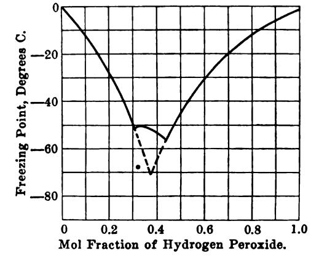

FIGURE 1. -Freezing Point of Aqueous Hydrogen Peroxide .

In order to employ Equation XXIII-30, we convert mol fractions to molalities, and find j/m at each temperature. Thus at 70°, - 46.25°, 38.0°, 35.7° the values of j/m are 0.0066, — 0.0079, 0.0081, 0.0082. At higher dilutions the values become irregular, but when we plot j/m against m, we may draw a smooth curve which approaches the value j/m 0.0086 at infinite dilution . Proceeding as in Chapter XXIII , we thus find for the activity of H2O2 at 70°, referred to the customary standard in aqueous solution, a2 ( I) = 54. B

- II. Now the right-hand curve of Figure 1 represents the equilibrium between solid H₂O₂ and the solution . At each point the activity of the solid is the same as that of the dissolved hydrogen peroxide when referred to the same standard. But we have already seen that at — 70° C, the eutectic point, the activity of the solid , referred to pure liquid as standard, is 0.23 . Therefore in the solution, when we employ the same standard, a2(II) == 0.23 .

## OXYGEN COMPOUNDS 495

The ratio of these two expressions for the activity at the eutectic point is related to the difference in free energy in the two standard states, and

$$
\Delta F^{\circ} = RT \ln \frac{a_2(\mathbf{I})}{a_2(\mathbf{I}|\mathbf{I})}.\tag{44}
$$

The heat of mixing of water and hydrogen peroxide is probably small, and we have been assuming that it is negligible . On this assumption the ratio a₂ (I) /a2( II) = 235 is the same at different temperatures. Thus, we find

$$\text{H}_{\text{2}}\text{O}_{\text{2}}\text{(aq) }\, = \text{H}_{\text{2}}\text{O}_{\text{2}}(\text{l}); \,\,\Delta F^{\text{o}}_{\text{298}} = \,\, 3240. \tag{45}$$

H₂O2(1) = H2O2(g) . According to the experiments of Wolffenstein' and of Brühl, the vapor pressure of pure H2O2 is 29 mm. at 69°C, and 65 mm. at 85°C. This makes an uncertain basis for estimating the heat of vaporization . Calculating from these data AH = 12300 cal. and the vapor pressure at 25°C is 2.1 mm.Hence for the process of vaporization

$$
\Delta F^{\circ}_{\text{ggs}} = 3500.\tag{46}
$$

The Free Energy of Formation of Liquid, Solid and Gaseous Hydrogen Peroxide. Combining Equation 39 with Equations 45, 42 and 46, we have

$$\mathbf{H_{1} + O_{2} = H_{2}O_{2}(l)}; \Delta F^{\bullet}_{\text{288}} = -28230, \tag{47}$$

$$\begin{array}{llll} \text{H}_{\text{3}} & \text{O}_{\text{2}} - \text{H}_{\text{2}}\text{O}_{\text{2}}(\text{s}), \Delta & \text{288} - & \text{288}\text{cov}, \\\text{H}_{\text{3}} + \text{O}_{\text{3}} = \text{H}_{\text{3}}\text{O}_{\text{2}}(\text{s}); \Delta F^{\text{o}}_{\text{298}} = -27980, & \text{(48)} \\\text{H}_{\text{2}} + \text{O}_{\text{2}} = \text{H}_{\text{2}}\text{O}_{\text{2}}(\text{g}) \cdot \Delta F^{\text{o}}_{\text{298}} = -24730 \end{array} \tag{48}$$

$$\mathbf{H_{1} + O_{2} = H_{2}O_{2}(g)} \stackrel{\cdot}{;} \Delta F^{o}_{\text{298}} = -24730. \tag{49}$$

The Formation and Dissociation of Hydrogen Peroxide at High Temperatures. The heat of formation of gaseous hydrogen peroxide may be found by combining the value found above. for the heat of vaporization with the thermochemical data of Thomsen and de Forcrand. This gives AH291 = 32600. The heat capacity of gaseous H2O2 has not been determined. For the purpose of the rough calculation which we are about to make, we may take as in our previous publication , Cp = 7.5 + -

<sup>1</sup> Wolffenstein, Ber. deut. chem. Ges. , 27, 3307 ( 1894) .

<sup>*</sup> Brühl, Ber. deut, chem. Ges. , 28, 2847 ( 1895) .

These figures make the boiling point of H2O2, 144°C, and the constant of Trouton's rule becomes 29.5. The recent work of Maass shows a great similarity between water and hydrogen peroxide, but Trouton's constant for water is 26.2. It seems likely therefore that the value given above for the heat of vaporization may prove to be too high by as much as 1000 cal

0.0042T. We thus construct the general free energy equation theusualway,makinguseofEquation49,andthusfind

CHAP. XXXIV

$$
\Delta F^{\bullet} = -31200 + 5.5T \ln T - 0.00115T^{\bullet} - 9.3T. \qquad (50)
$$

From this equation, it appears that hydrogen peroxide cannot spontaneously be formed from oxygen and hydrogen in appreciable amount, except below 1000° .

H₂O(g) + O2(g) = H₂O2 H2O2((gg)).. This is the reaction which Nernst believed to occur in considerable amount at high temperatures. By combining Equations 23 and 50.

$$
\Delta F^{\circ} = 26210 \, + \, 4.567 \, \ln T \, - \, 0.00280 T^{2} \, + \, 0.00000037 T^{3} \, - \, 13.22 T. \tag{51}
$$

From this equation we find that even from 2000 to 3000° K the amount of H₂O₂ that could form in the presence of water vapor and oxygen is quite inappreciable, not more than 1/100000 of that which was calculated by Nernst. The experiment of Traube, already referred to, in which a considerable yield of H2O2 is obtained by the rapid cooling of an oxyhydrogen flame, cannot therefore be explained by assuming that H₂O, is largely present in the gases in the hottest portion of the oxyhydrogen flame. It must be explained rather by assuming that in the colder parts of the flame, probably between 500° and 1000° C, hydrogen and oxygen combine directly to form hydrogen peroxide.

### METALLIC OXIDES AND HYDROXIDES

The great importance of metallic oxides, especially in metallurgical operations, makes it highly desirable to investigate this class of substances in a systematic manner. This, however, has not yet been done, and we shall not attempt to collect the sporadic data which now exist, especially since in many cases which have been investigated there is some doubt as to the composition of the phases with respect to which equilibrium was obtained. In connection with other work we have incidentally obtained data for several oxides, and these we shall include in our tables.

We may review briefly the principal methods which are serviceable in obtaining the free energy of formation of metallic oxides.

in

If the solubility of an oxide is known and the activity coefficient of its saturated solution, then we may obtain immediately the free energy of formation of the oxide from the standard electrode potentials. Or if the hydroxide is the substance whose solubility is known, its free energy may be similarly determined, and that of the oxide may be obtained therefrom .

It may be well to illustrate the use of such methods in cases where the existing data are inferior in accuracy to those which we have ordinarily employed hitherto in our calculations. Thus the molality of a saturated solution of thallous hydroxide at 25°C is 1.70, according to the measurements of Bahr. We can obtain only roughly the activity coefficient at this concentration. With the aid of Table XXVII- 12, assuming that silver ion and thallous ion are alike, we shall estimate the activity coefficient to be in the neighborhood of 0.50. We thus find a± = 1.70 X 0.50 = 0.85, and

$$\rm{^1Tl^+ + OH^- = TlOH(s); \quad \Delta F^\circ_{\rm{\mathfrak{M}}} = - 190.} \tag{52}$$

Combining with Equations 28 and XXX- 16 ,

$$\text{Tl } + \text{ } \natural \text{\u0}_1 + \text{ } \natural \text{H}_1 = \text{TlOH(s)}; \quad \Delta F^{\text{o}}_{\text{mo}} = - \text{ } 45400. \tag{53}$$

R ln p The vapor pressure of water over thallous hydroxide and oxide was also accurately measured by Bahr. From his data we have plotted against 1 /T, and the siope of the curve corresponds very exactly to the heat of hydration given by Thomsen. We may therefore extrapolate his curve to 25°C and find

$$\text{2TIOH}(\text{s}) \begin{array}{c} \text{\textasciicircum} \end{array} \begin{array}{c} \text{\textasciicircum} \end{array} \begin{array}{c} \text{\textasciicircum} \end{array} \begin{array}{c} \text{\textasciicircum} \end{array} \begin{array}{c} \text{\textasciicircum} \end{array} \begin{array}{c} \text{\textasciicircum} \end{array} \begin{array}{c} \text{\textasciicircum} \end{array} \begin{array}{c} \text{\textasciicircum} \end{array} \begin{array}{c} \text{\textasciicircum} \end{array} \begin{array}{c} \text{\textasciicircum} \end{array} \begin{array}{c} \text{\textasciicircum} \end{array} \tag{54}$$

And combining this equation with Equations 53 and 22 we have

$$2\text{Tl(s)}\,+\text{ J}_2\text{O}_1\bullet\,\text{Tl}_1\text{O(s)};\quad\Delta F^\circ_{\mathfrak{M}}\bullet\,-\,-32410.\tag{55}$$

Let us take another case where the solubility is low, and therefore the activity coefficient of the saturated solution is accurately known, but the solubility measurements are uncertain . Böttger² found that with different samples of lead oxide he obtained different solubilities. We may assume that the lowest solubility which he obtained by the conductivity method corresponded to the purest and most stable form. Taking that value at 20°C, and calculating to 25° C from the thermochemical data of Thomsen, we find

$$\text{Pb}^{\text{++}} + 2\text{OH}^- \text{ = H}_2\text{O}^- + \text{PbO}; \quad \Delta F^\text{\text{\textbullet}}_{\text{\textbullet 0}} \text{ = } -17000. \tag{56}$$

1 Bahr, Z. anorg. Chem. , 71 , 85 ( 1911) .

2 Böttger, Z. physik. Chem. , 46, 602 ( 1903) .

CHAP. XXXIV

Now utilizing as before the free energy of the ions and of water, we find

$$\text{Pb} + \text{h}\%\text{O}_{\text{1}} \rightarrow \text{PbO}; \quad \Delta F^{\circ}_{\text{301}} = -41000. \tag{57}$$

The free energy of hydration of lead oxide is small. By reversing the procedure used in the case of thallium oxide we could calculate the free energy of formation of lead hydroxide.

Another method which we have employed in this chapter consists in determining the dissociation pressure of an oxide, either to give the metal, as in the case of silver and mercury, or to give a lower oxide, as in the case of cupric oxide going to cuprous (an equilibrium which has been measured, but which we have not employed) . So also valuable data may be obtained by the reversible reduction of such oxides as those of iron, by hydrogen or carbon monoxide. In the next chapter we shall discuss the equilibrium in the reaction MgO + 2HCI MgCl2 + H2O, which would permit the calculation of the free energy of magnesium oxide if that of magnesium chloride were known. =

Finally we may study the oxides with the aid of the third law of thermodynamics, as we already have done in Chapter XXXI,with mercuric oxide. Thus from the measurements of Nernst and Schwers we calculate for PbO; S°298 16.3, and using forthe elements the values of Table XXXII- 1 , we find =

$$\text{Pb} + \text{} \rangle_2\text{O}_2 = \text{PbO}; \Delta S^\bullet_{\text{208}} = -23.2,\tag{58}$$

and at 25°C TAS = 6900. Unfortunately the only thermochemical data are those of Thomsen which seem very uncertain. He gives AH 6900 = - = - 50300, whence AF°298 = -50300 + 43400, a value which differs by more than 2000 cal. from the more reliable value which we have found above. It is probable that the discrepancy is due chiefly to error in AH, although the measurement of the solubility of PbO may be in part responsible.

1 Nernst and Schwers, Sitzb, Kyl, preuss, Akad. Wiss. , 1914, 355,


# CHAPTER XXXV

# CHLORINE AND ITS COMPOUNDS

## ELEMENTARY CHLORINE

Chlorine Gas (Diatomic) . Gaseous chlorine will be chosen as state of reference, and the standard state of chlorine gas is one in which the activity, or the fugacity, is unity, a =·fƒ = 1 . This differs only slightly from choosing, as a standard, chlorine gas at one atmosphere ; and for most purposes the difference can be ignored. However, chlorine is sufficiently imperfect so that in very precise calculations the departures from the gas law are appreciable. Thus we have seen in Chapter XVII that for chlorine at 25°C the fugacity is less than the pressure, as shown by the equation

$$\frac{f}{\bar{P}} = 1 - 0.011P.$$

At one atmosphere f = 0.989, and we may write

Cl2(g, a = 1) = Cl2(g, P = 1 ) ; AF298 = RTIn 0.989 = - - 6.5. ( 1 )

Monatomic Chlorine. In the experiments of Pier, the specific heats of gases were determined up to high temperatures by the method of explosions. Chlorine at temperatures above 1500° C showed a departure from the normal which is most readily explained by the assumption of a dissociation into monatomic molecules. The problem of interpreting Pier's data is quite analogous to the one which we encountered in discussing monatomic hydrogen. His data did not give directly either the beat of dissociation or the degree of dissociation ; but at each temperature the product of the two was found. Then, employing the thermodynamic requirement for the change of the degree of dissociation with the temperature, he solved simul-

1 Pier, Z. physik. Chem. , 62, 385 ( 1908) .

### THERMODYNAMICS

CHAP. XXXV

taneously for both unknowns. Thus he found 0.026 as the degree of dissociation at his highest temperature (2067° K) , and AHΔΗ. =113000 for the reaction,

$$\text{Cl}_{\mathfrak{s}}(\mathfrak{g}) \, = 2\text{Cl}(\mathfrak{g}) .$$

Such a procedure greatly exaggerates the large errors which are inevitable in work of this character, and therefore we need not be surprised to find that a very large discrepancy exists between the integration constant, I, calculated from Pier's figures, and the one calculated from the entropies. From the heat capacity equations (VII-4 and VII- 7) we may write

$$
\Delta F^{\bullet} = \Delta H_{\bullet} - 2.6T \ln T + 0.0005T^{\bullet} + IT,
$$

and from Equation XXXI-6

$$
\Delta S^\bullet = 2.6(1 + \ln T) - 0.001T - I.
$$

= - Now S°298 is accurately known for Cl2, from specific heats and the third law, and for Cl by Sackur's principle and ultimate rational units. Thus from Table XXXII-2, AS°298 = 20.1 and I 3.0. Substituting this value in the general free energy equation, we have a relation at each temperature between AF and AHo. Since each of Pier's measurements presumably furnishes another such relation , we may calculate from one measurement both AH。 and the free energy change, or the degree of dissociation. Using his results at his highest temperature (2067°K) , where the dissociation is most pronounced, we thus find 0.04 for the degree of dissociation, and 70000 for AH。.

The great advantage of our new method of determining I lies in the fact that an approximate determination of the free energy change at one temperature suffices to give a relatively accurate value of AHo. Thus if we assumed the degree of dissociation 0.026, given by Pier at 2067° K, it would change AH。 ( and consequently AF 298) by only 3600 cal.

With this value of AH, we have the complete free energy equation and find

$$\text{Cl}_2(\text{g}) = 2\text{Cl}(\text{g}); \Delta F^{\bullet}_{\bullet \text{20}} = 64800,$$

or for the free energy of formation of one mol of monatomic chlorine,

$$\begin{array}{rcl} \text{\reflectbox{\$\reflectbox{\$\reflectbox{}}\$}} & \text{\reflectbox{\$\reflectbox{}}\$Cl(g) & = \text{Cl(g)}; \; \Delta F^{\text{o}}_{\text{298}} = 32400, \\\ \Delta F^{\text{o}} & = 35000 \text{ -- } 1.3T \ln T & + 0.00025T^{\text{a}} - 1.5T. \end{array} \tag{2}$$

Liquid Chlorine. According to the measurements of Knietsch, ¹ the vapor pressure of liquid chlorine at 25°C is 7.63 atmos. Now in Chapter XVII we have seen that at this pressure the activity of the gas is 6.99 atmos. and the activity of the liquid , by Equation XVII-26, is 1.012, so that

$$\text{Cl}_{\mathfrak{s}}(\text{l}) = \text{Cl}_{\mathfrak{s}}(\text{g}); \quad \Delta F^{\bullet}_{\mathfrak{s}\mathfrak{s}} = -RT\ln\frac{6.99}{1.012} = -1146.4$$

- If the vapor pressure at 25°C had not been measured, and we had desired to calculate AF 298 with similar precision from the measurements of Johnson and McIntosh² on the vapor pressure of chlorine at 32°, and at lower temperatures, we could use an equation given by Pier, to find the degree of departure from the gas law at each temperature, and thus obtain the activity of the gas. We could also determine the activity of the liquid by applying Equation XVII-26. The ratio of the former to the latter would give the equilibrium constant; then by plotting Rln K against 1 /T we could have obtained the ideal heat of vaporization, and by means of the known specific heats we could, by our usual methods, find AF°298. We have in fact carried out this series of calculations, the details of which we do not reproduce, and have thus obtained a value of AF298 differing by only three or four calories from the one given above. -

By reversing our reaction we find for the free energy of formation of liquid chlorine

$$\text{Cl}_{\mathfrak{z}}(\mathfrak{g}) = \text{Cl}_{\mathfrak{z}}(\mathfrak{l}); \,\Delta F^{\mathfrak{o}}_{\mathfrak{z}\mathfrak{g}} = \mathbf{1146}.\tag{3}$$

We have carried out the preceding calculations with the utmost precision as a further example of a type of computation which must occasionally be employed. For ordinary purposes we do not need to know the free energy of substances with so high a degree of accuracy, especially since such data will usually be combined with other data, in the derivation of which no such precision is at present possible.

<sup>1</sup> Knietsch, Ann. Chem. , 259, 100 ( 1890) .

<sup>*</sup> Johnson and McIntosh, J. Am. Chem. Soc. , 31 , 1138 ( 1909) .

CHAP. XXXV

Chlorine in Water and in Carbon Tetrachloride. Jakowkin, ' in his valuable paper upon the hydrolysis of chlorine, finds, at 25°C, that an aqueous solution which is 0.0618 M with respect to chlorine (as such) is in equilibrium with gaseous chlorine at unit pressure (or, within the limits of accuracy of his measurements, at unit fugacity) . Hence,

$$\text{Cl}_2(\text{g}) \, = \text{Cl}_2(\text{aq}); \, \Delta F^{\bullet}_{\text{298}} = -RT \ln \, 0.0618 \, = \, 1650. \qquad (4)$$

On account of the frequent use of carbon tetrachloride in distribution experiments with the halogens, it will be desirable to know the free energy of chlorine in this solvent. Jakowkin determined the equilibrium between chlorine (as such) in water and in CC . By interpolating his results to 25°C we find N/m 2.85, where N is the mol fraction of Cl₂ in CCl4, and m is the number of mols of Cl₂ per 1000 grams of water. Hence =

$$\text{Cll}_{\mathfrak{t}}(\text{aq}) \, = \text{Cll}_{\mathfrak{t}}(\text{in } \text{CCl}_{\mathfrak{t}}); \, \Delta F^{\mathfrak{o}}_{\mathfrak{so}} \neq \, - \, 620. \tag{5}$$

Adding Equations 4 and 5 gives

$$\text{Cl}_{\mathfrak{z}}(\mathfrak{g}) = \text{Cl}_{\mathfrak{z}}(\text{in CCl}_{\mathfrak{t}}); \Delta F^{\mathfrak{o}}_{\mathfrak{z}\mathfrak{s}} = 1030. \tag{6}$$

CHLORIDE ION, TRI-CHLORIDE ION, HYDROCHLORIC ACID

The free energy of formation of chloride ion we have already obtained in Table XXX-7, which gave

$$\text{Al}_2\text{Cl}_2(\text{g}) \, + \, \text{E}^- \, = \text{Cl}^-; \, \Delta F^\circ_{\text{\tiny{\text{208}}}} = -31367, \, \text{g}$$

and this is equivalent to the expressions

$$\begin{array}{rcl} \text{l/} \acute{\text{2H}}_{\text{2}} + \text{l/} \acute{\text{2Cl}}_{\text{2}}(\text{g}) &= \text{H}^{+} + \text{Cl}^{-}; \Delta F^{\text{o}}_{\text{298}} = - & 31367, \\\text{l/} \acute{\text{2H}}_{\text{2}} + \text{l/} \acute{\text{2Cl}}_{\text{2}}(\text{g}) &= \text{HCl}(\text{aq}); \ \Delta F^{\text{o}}_{\text{298}} = - & 31367. \end{array} \tag{7}$$

Tri-chloride Ion. Jakowkin, in his extensive study of chlorine in aqueous solution , which we shall discuss in detail shortly, showed that the absorption of chlorine in aqueous hydrochloric acid is relatively greater at high concentrations of acid. interpreted by assuming the existence of the ion Cl . This he While from analogy to other halogens the formation of some tri-chloride

1 Jakowkin, Z. physik. Chem. , 29, 613 ( 1899) .

is to be predicted, the degree to which it forms should be approximately independent of the concentration of the hydrochloric acid. Moreover it should form in equal degree in solutions of other chlorides, contrary to the results obtained by Jakowkin. At present therefore there is no justification for a calculation of the free energy of tri-chloride ion.

= Gaseous Hydrogen Chloride. The constant of the reaction, HCl(aq) HCl(g) , may be calculated immediately from the measurements of Bates and Kirschman which we have already considered in Table XXVI- 1 . There, and in Table XXVI- 5, we Therefore for our present reaction found Ρ p /a to be 0.000664. K = (0.000664) 2 , and

$$\text{HCl(aq)} \,=\,\text{HCl(g)};\,\Delta F^{\text{\textquotedblleft}}_{\text{298}} = \,\text{8675.}\tag{8}$$

Now merely by adding Equations 7 and 8 we obtain an extremely accurate value for the free energy of formation of gaseous hydrogen chloride, namely,

$$
\stackrel{\cdot}{\cdot} \not\sim \stackrel{\cdot}{\text{H}_2} + \not\sim \! \not\sim \! \! _2
\text{Cl}_2(\text{g}) \;= \text{HCl}(\text{g}); \; \Delta F^{\bullet}_{\text{298}} = - \; - \; 22692.\tag{9}
$$

In forming gaseous hydrogen chloride from its elements, both Thomsen and Berthelot found AH291 = - 22000. Using the heat capacities given in Chapter VII, and the above value of AF 298, we have

$$
\Delta F^{\bullet} = -21870 + 0.45T \ln T - 0.000025T^2 - 5.31T. \tag{10}
$$

From Equation 10 we may calculate the degree of dissociation of hydrogen chloride at high temperatures. Thus at 1810° K we find the degree of dissociation to be 0.17 percent, while by direct experiment at this temperature Löwenstein ' found 0.27 percent. Considering the wide temperature range of the calculation, and the difficulty of measurements at the high temperature, the agreement is not bad.

## THE DEACON PROCESS

The values which we have obtained for the free energy of formation of water and of hydrochloric acid are data of such 1 Löwenstein, Z. physik. Chem. , 54, 715 ( 1906) .

importance to applied thermodynamics that we are fortunate in having an independent method of checking them. This is furnished by the reaction between water and chlorine to give hydrogen chloride and oxygen. Combining Equations 10 and XXXIV-23, we find

$$\begin{aligned} \text{\textsuperscript{\text{\\$}}\text{\{}}\text{Cl\_(g)} &+ \text{\}}_{\text{\text{\textdegree}}\text{H}_{2}\text{O}(g) = \text{HCl}(g) + \text{\}} \text{\{}_{4}\text{O}_{2}; \text{ }_{26}F^{\text{o}}_{26} = 4560,}\\ \Delta F^{\text{o}} &= 6835 - 0.02T \ln T - 0.00085T^{2} \\ &+ 0.000000185T^{3} - 7.27T. \end{aligned}$$

2 This reaction has been studied experimentally by Lunge and Marmier, ' by Lewis, and by von Falkenstein.3 From the values of K = [ 02] [ HCl] / [ Cl₂] [ H₂O] we may calculate the corresponding values of I. It may be of interest to present here the full table of calculations in order to illustrate what has proved to be the most convenient method of calculating I from a number of equilibrium measurements at different temperatures. In this case all of the terms may be obtained with sufficient accuracy by means of a good 20inch slide rule ; in other cases some of the large terms must be obtained by means of logarithms if the second place of decimals is desired. Writing our equation in the form,

I = AF° T 6835 T +0.02 In T + 0.00085T0.0000001857 ,

we will give the individual terms in order in Table 1. The

| TABLE<br>1  |     |     |          |       |          |                |      |        |       |
|-------------|-----|-----|----------|-------|----------|----------------|------|--------|-------|
|             | t   | T   | log<br>K | T     | AHO<br>T | Are<br>In<br>T | Arıt | ¼arıtı | I     |
| L           | 352 | 625 | -0.608   | +2.78 | -10.93   | 0.13           | 0.53 | -0.07  | -7.56 |
| L           | 386 | 659 | -0.475   | +2.18 | -10.38   | 0.13           | 0.56 | -0.08  | -7.59 |
| L           | 419 | 692 | -0.380   | +1.74 | 9.88     | 0.13           | 0.59 | -0.09  | -7.51 |
| v<br>F      | 450 | 723 | -0.353   | +1.62 | 9.46     | 0.13           | 0.61 | -0.10  | -7.20 |
| v<br>F      | 600 | 873 | -0.001   | +0.00 | 7.83     | 0.14           | 0.74 | -0.14  | -7.09 |
| F<br>v      | 650 | 923 | +0.100   | -0.46 | 7.41     | 0.14           | 0.78 | -0.16  | -7.11 |
| L.<br><br>M | 430 | 703 | -0.403   | +1.85 | - 9.73   | 0.13           | 0.60 | -0.09  | -7.24 |
| M.<br>L.    | 480 | 753 | -0.335   | +1.53 | - 9.08   | 0.13           | 0.64 | -0.10  | -6.88 |

1 We have only used the two measurements of Lunge and Marmier which are included in the table of von Falkenstein .

Lewis, J. Am. Chem. Soc. , 28 , 1380 ( 1906) .

von Falkenstein, Z. physik. Chem. , 59, 313 ( 1907) .

first column indicates the investigator ; the second, the centigrade temperature ; the third, the absolute temperature ; the fourth, log K; and then come the individual terms in the equation, namely; AF /T = -R In K - 4.579 log K; next - AH。/T; then 0.02 In T = 0.02 x 2.303 log T, etc. =

In addition to these direct measurements we may consider two other reactions which combined give the reaction we are studying,

- (a) MgCl2(s ) + 20₂ = MgO( s) + Cl2(g) ,
- (b) MgCl2(s) + H2O(g) = MgO(s) + 2HCl(g) .

One-half the difference between these two gives the reaction of the Deacon process.

(a) This reaction has been studied by Haber and Fleischmann' and by Moldenhauer.2 Unfortunately the former of these investigations is unavailable for our calculations, since the tables, owing to some error in transcription from the original records, are quite incomprehensible. Moldenhauer obtained the equilibrium starting with magnesium chloride and oxygen, and again with magnesium oxide and chlorine, and determined the equilibrium constants at 550°, 650° and 700°C. In expressing his constant, however, he apparently chose as his unit of pressure 0.01 atmos. (and called these pressures concentrations) . If his constants are divided by 10 we obtain K = [ Cl2] / [ 02] . The results are given in Table 2, where the first column gives . the absolute temperature, the second the equilibrium constant, and the third the constant I, obtained from the equation given below.

|     | TABLE<br>2 |            |
|-----|------------|------------|
| T   | K          | I          |
| 823 | 1.75       | -<br>44.86 |
| 923 | 2.53       | -<br>44.97 |
| 973 | 2.95       | -45.03     |

Taking as the heat of formation of MgCl2, 151000 ( Thomsen) , and of MgO, 143600 (Berthelot 143300 ; von Wartenburg3 143900) , we find AH2291 = 7400. The heat capacities of MgCl2

<sup>1</sup> Haber and Fleischmann, Z. anorg. Chem. , 51 , 336 ( 1906) ; 52, 127 ( 1907) .

Moldenhauer, Z. anorg. Chem. , 51 , 369 ( 1906) .

<sup>3</sup> von Wartenburg, Z. Elektrochem. , 15, 866 ( 1909) .

and MgO, taken from the tables of Landolt- Börnstein- Roth, are 18.7 and 9.6 respectively, and taking the heat capacities of the gases from Chapter VII, we find ACp = 4.950.0005T, ΔΗAH. = 8820, and with the aid of Table 2, -

$$\begin{array}{ll} \text{MgCl}_{2}(s) & + \text{/} _{2}\text{O}_{2} = \text{MgO} + \text{Cl}_{2}; \Delta F^{\circ}_{\text{298}} = 3810, \\\ \Delta F^{\circ} & = 8820 \text{ + } 4.95T \ln T \text{ -- } 0.00025T^{\circ} \text{ -- } 44.95T. \end{array} \tag{12}$$

(b) Moldenhauer also investigated the reversible action of water upon magnesium chloride. He found that below 520°C the solid phases contained MgCl2 and MgOHCl, but that between 520° and 700° the solid substances are the same as in the previous reaction, namely, MgO and MgCl2. The values of K = [HC] ] ²/ [ H₂O] , calculated from the original data of Moldenhauer, are given in the second column of Table 3 , in which the first column gives the absolute temperature, and the third, the values of I obtained by the equation which we shall presently obtain. The values of I do not show the remarkably good agreement of the other set of experiments, but a weighted mean of the results, obtained from a careful consideration of his probable errors, does not differ from the unweighted mean, which we shall adopt.

|     | TABLE<br>3 |            |
|-----|------------|------------|
| T   | K          | I          |
| 803 | 0.623      | -<br>58.57 |
| 873 | 2.24       | -59.18     |
| 973 | 8.40       | -<br>59.56 |

Taking the same heats of formation as in the previous section for MgCl2 and MgO, and for HCl(g) and H₂O(g) , the values we have previously adopted, 22000 and 57800 respectively, we find AH291 = 21200. Using once more the heat capacities of MgCl; ΔΗ and MgO, and those of H2O and HCl, ACD -0.00000222T2 ; AH。 mental constants, = = 4.91 0.00397 22480, and with the aid of the experi-

MgCl2(s) + H2O(g) MgO(s) + 2HCl( g) ; AF° 298 = 13040, == AF = 22480 +4.917 In T ― 0.00195T2 + 0.0000003773 - 59.107. (13)

Since Equations 12 and 13 were obtained from experiments in approximately the same range of temperature, the value of I obtained by their combination is nearly independent of any errors which may have been made in choosing the heats of formation and the specific heats of MgO and MgCl2, and is, moreover, independent of the assumption that the solid phase in the two investigations of Moldenhauer was a mixture of pure MgO and pure MgCl2. The only assumption necessary is that the solid phases were the same in both sets of experiments. By combining Equations 12 and 13 we obtain a new value of I for the Deacon process, namely, -7.08.

-- Summary of Results for the Deacon Process. This new value of I, together with those of Equation 11 and of Table 1 , serve to fix the values of this constant within narrow limits. From the investigations of the Deacon process alone, before the experiments of Bates and Kirschman were available, the mean value, I = 7.27, led to the preliminary value of AF298 = 4560, which we employed in the preceding chapter for one of the independent determinations of the free energy of water. That value of I is identical with the most exact value which is given by Equation 11. The degree of concordance between the various experiments on the Deacon process is shown by the fact that choosing the value of I farthest from the mean would cause a change of only 100 cal. in AF° 298-

### HYPOCHLOROUS ACID AND HYPOCHLORITE ION

The hydrolysis of chlorine has been very thoroughly studied by Jakowkin.¹ Owing to the extreme weakness of HCIO as an acid, its ionization is entirely negligible in a neutral or acid solution. When the system is composed of chlorine and water alone, ( H+) , ( Cl−) , and ( HCIO) are equal to one another and to the degree of hydrolysis of the chlorine. From the latter we therefore find at once K = ( H+ ) ( Cl−) ( HCIO) / ( Cl2) . Since Jakowkin's results are expressed in units which are not easily understood, and since his measurements were made at a variety

<sup>1</sup> Jakowkin, Z. physik. Chem. , 29, 613 ( 1899) .

## 508 THERMODYNAMICS CHAP. XXXV

of random temperatures, we have considered it advisable to recalculate his results in our units, to plot log K against 1 /T, and from the curve to find the values of this important constant at regular intervals of temperature, as shown in the following table.

| 4<br>TABLE |               |    |               |  |  |
|------------|---------------|----|---------------|--|--|
|            | K<br>×<br>104 | t  | K<br>×<br>104 |  |  |
| 0          | 1.45          | 35 | 6.43          |  |  |
| 5          | 1.96          | 40 | 7.15          |  |  |
| 10         | 2.58          | 45 | 7.84          |  |  |
| 15         | 3.28          | 50 | 8.51          |  |  |
| 20         | 4.06          | 55 | 9.12          |  |  |
| 25         | 4.84          | 60 | 9.75          |  |  |
| 30         | 5.65          |    |               |  |  |

From this table we find K298 = 0.000484 and

Cl2(aq) + H2O(l) = H+ + Cl− + HClO(aq) ; AF°298 = 4525. (14)

The electrolytic dissociation of hypochlorous acid was studied by Sand¹ at 17°, who found K = 3.7 × 10−8. But the value is doubtless too high. W. A. Noyes and T. A. Wilson have very recently found K298 given us this value constant, = 6.7 × 10-10. The authors have kindly in advance of publication. From this

$$\text{HClO(aq)} = \text{H}^+ + \text{ClO}^- ; \ \Delta F^\circ_{\text{gg}} = 12520. \tag{15}$$

Combining Equations 14 and 15 with Equations 4, 7, and XXXIV- 19 ,

$$\text{Mg}_2\text{H}_2 + \text{[}\%\text{Cl}_2\text{(g)} + \text{[}\%\text{O}_2 = \text{HClO}\text{(aq)}; \Delta F^{\text{o}}_{\text{298}} = -19018. \quad \text{(16)}$$

$$\text{Al}_2\text{Cl}_2(\text{g}) \, + \, \text{l}_2\text{O}_2 \, + \, \text{E}^- \, = \text{ClO}^- ; \, \Delta F^{\bullet}_{\text{gg}} \, = \, - \, 6500. \tag{17}$$

### CHLORATE ION

We shall see in the following chapters that there is no great difficulty in studying equilibria involving bromates and iodates.But on account of the much lower reactivity of chlorine com-

1 Sand, Z. physik. Chem. , 48 , 610 ( 1904) .

pounds, the determination of the free energy of formation of chlorates has met with difficulties which for a time seemed almost insuperable. Some years ago it occurred to us to study the pressure developed when fused potassium chlorate evolves oxygen. Our first experiment was made in a closed steel bomb at about 400°C. The bomb was 1½ inches in diameter, with a 3% inch hole in its center. After about half an hour the pressure had become so enormous as to cause the bottom of the bomb (at least a half- inch of solid steel) to flow gradually into a bulb. This showed that the pressure which would be attained at equilibrium would be far too great to measure, a conclusion completely verified by the results we are about to discuss.

Upon the suggestion of one of the authors, Mr. A. L. Parson attempted to study the equilibrium in the reaction ½Cl2 + BrO3 = ½Br₂ + ClO3-, but at every temperature at which this reaction occurred at measurable velocity, oxygen was evolved in sufficient amount to destroy the containing vessel.

The problem was next attacked by Olson' who studied the reaction between water and chlorine to give chloric and hydrochloric acids. Here again at temperatures sufficiently low to avoid a large evolution of oxygen, the reaction was found to be too slow to permit the determination of the equilibrium. However, by catalyzing with manganese salts, in accordance with the suggestion of Professor W. C. Bray, it proved possible to accelerate the reaction, so that at 91°C, at the end of seven months, the equilibrium constants obtained by approaching the equilibrium from both sides differed only by a factor of 2 ( corresponding to an uncertainty of 400 cal. in AF° at 25°C) . Thus Olson found 4.3 X 10-7 and AF°3364 10600 for the reaction 3C12 (aq) 6H5Cl + CIO3¯. K361 = + 3H2O(l ) = =

We have already studied cases in which we have succeeded in extrapolating free energy values over a range of one or two thousand degrees with an uncertainty amounting to less than one hundred calories. It would therefore seem an easy matter to pass in this case over a range of only 66 degrees from 91 °C to 25°C. Indeed the data of Thomsen and Berthelot lead by a

1 Olson, J. Am. Chem. Soc. , 42, 896 ( 1920) .

 curious coincidence to a value of exactly zero for AH291 in this reaction. This, however, would be far from true at other temperatures, for the large negative partial molal heat capacities of the ions make ACD of the order of 300 cal . per degree. On the other hand, it is probable that ACD itself is rapidly becoming smaller numerically with increasing temperature (see Table XXIX-2) . We are therefore forced to a certain amount of guesswork. Let us assume that the average ACD for the range we are considering is one-half of the above value, namely Using this value and AH291 = 0, we find -

$$3\text{Cl}_2(\text{aq}) + 3\text{H}_2\text{O(l)} = 6\text{H}^+ + 5\text{Cl}^- + \text{ClO}_3^-; \Delta F^\circ_{\text{298}} = 7650. \text{ (18)}$$

Combining this with Equations 4, 7 and XXXIV- 19, we have

$$\text{Mg}_2\text{H}_2 + \text{J}_2\text{Cl}_2(\text{g}) + 3\%\text{O}_2 = \text{HClO}_3(\text{aq}); \Delta F^\circ_{\text{208}} = -250, \quad (19)$$

$$\text{Mg}_2\text{H}_2 + \text{I}_2\text{Cl}_2(\text{g}) + \text{\textdegree\text{\textdegree}}_2\text{O}_2 = \text{H}^+ + \text{ClO}_3^- ; \Delta F^{\text{\textdegree}}_{\text{298}} = -250, \quad (20)$$

1½Cl2(g) + ¾½02 + E = CIO3¯; AF° 298 = -- 250. (21)

By means of these equations we may form a rough idea of the equilibrium pressure in the decomposition of potassium chlorate. Assuming that the difference in free energy between solid potassium chloride and potassium chlorate is approximately the same as that between chloride ion and chlorate ion, the decomposition pressure of potassium chlorate is of the order of 1015 atmos. at room temperature, and rises rapidly with the temperature. The result which we obtained in the steel bomb is therefore not surprising.

### METALLIC CHLORIDES AND CHLORATES

We have incidentally obtained values for the free energy of formation of a number of metallic chlorides, and these we may collect for reference .

For HgCl and AgCl, Tables XXX-7 and XXX-8 give immediately

$$\text{Hg} + \text{J}_2\text{Cl}_2(\text{g}) = \text{HgCl}; \Delta F^{\bullet}_{\text{298}} = -25137,\tag{22}$$

$$\text{Ag} \, + \, \text{V}_2\text{Cl}_2(\text{g}) \, = \, \text{AgCl}; \, \Delta F^{\text{o}}_{\text{298}} \, = \, - \, 26187. \tag{23}$$


Also in Chapter XXX we discussed some unpublished measurements of Gerke, which give

$$\text{Pb, PbCl}_2, \text{AgCl, Ag}; \text{E}^\circ_{\text{298}} = 0.4901,$$

$$\text{Tl, TiCl, AgCl, Ag}; \text{E}^\circ_{\text{298}} = 0.7791.$$

Whence

$$\text{Pb} + \text{Cl}_2(\text{g}) = \text{PbCl}_2; \Delta F^{\text{o}}_{\text{298}} = -74990,\tag{24}$$

$$\stackrel{\cdot}{\text{Tl}} + \stackrel{\cdot}{\text{V}}\stackrel{\cdot}{\text{Cl}_{\mathfrak{t}}(\text{g})} = \stackrel{\cdot}{\text{TlCl}}; \stackrel{\cdot}{\Delta F}\stackrel{\bullet}{\text{g}}_{\mathfrak{g}\mathfrak{s}} = -44164.\tag{25}$$

In discussing the work of Allmand and Polack (Table XXVII - 6) we have found that saturated sodium chloride (6.12 M) , at 25°C, has the activity coefficient , 1.013, whence with Table XXX-7,

$$\text{Na} + \text{J}_2\text{Cl}_2(\text{g}) = \text{NaCl}; \Delta F^{\text{o}}_{\text{298}} = -91792. \tag{26}$$

Potassium Chlorate. In the same way in which we obtain the free energy of formation of a solid salt composed of elementary ions we may calculate the free energy of salts with compound ions. Thus the solubility of KClO3 is about 0.67 M at 25°C. The activity coefficient is somewhat lower than that of silver nitrate, and we may therefore estimate from Table XXVII- 12 that y =0.40 , whence

$$\rm K^{+} + \rm ClO_{3}{}^{-} = \rm KClO_{3}(s); \Delta F^{\circ}_{\rm 298} = -1570. \tag{27}$$

Combining this with the free energies of formation of K+ and CIO3 by Table XXX-7 and Equation 21 , we find

$$\text{IK } + \text{ } \% \text{Cl}_{\mathbf{2}}(\text{g}) \text{ } + \text{ } \% \text{O}_{\mathbf{2}} = \text{KClO}_{\mathbf{3}}(\text{s}); \Delta F^{\circ}_{\text{298}} = - \text{ } - \text{ } 69250. \tag{28}$$

# CHAPTER XXXVI

# BROMINE AND ITS COMPOUNDS¹

From existing data we are in a position to calculate the free energy of the various known forms of elementary bromine, of bromide and polybromide ions, and of all the known compounds of bromine with oxygen and hydrogen. We shall take liquid bromine at atmospheric pressure as the standard state of reference, and shall indicate its formula by Br₂(1) .

### BROMINE VAPOR

Br2(1) = - Br₂(g) . The vapor pressure of liquid bromine has been determined by Roozeboom, 2 and by Ramsay and Young.3 Both sets of measurements show excellent self-consistency when tested by plotting R ln p against 1 /T. In both cases a few scattering points are obviously in error, but the remaining points give for each set a straight line, and these two straight lines are not only near to one another but are parallel, that is , they have the same slope. From this slope we may determine directly the heat of vaporization at the average temperature ( 32 ° ) of the points which were plotted. We thus find AH305 7520. While the heat capacity of liquid bromine has not been accurately determined, we may take the approximate value ACD for this reaction . = = - 9.6

It may be well to such a choice as this. Br2(g) the value Cp taking for Br2(1) , Cp emphasize once more the implications of Since we have adopted permanently for 7.40.0017, this means that we are 17.0 +0.0017, an equation which is = =

<sup>1</sup> This chapter constitutes a revision of our paper " The Free Energy of Bromine Compounds", Lewis and Randall, J. Am. Chem. Soc. , 38, 2348 ( 1916) .

<sup>2</sup> Roozeboom, Rec. trav . chim. , 3, 73 ( 1884) .

Ramsay and Young, J. Chem. Soc. London, 49, 453 ( 1886) .

purely formal, is introduced for convenience, and only has experimental significance inasmuch as it gives the approximate value of the specific heat of liquid bromine at room temperature. Having once assumed this equation we must of course apply it consistently in future equations.

We therefore write AH = 10450 9.6T, which agrees almost precisely with the heat of vaporization determined by Berthelot at 60° and is a trifle higher than the value obtained by Thomsen. The final free energy equation is

$$
\Delta F^{\bullet} = 10450 \,\mathrm{+} \,\mathrm{9.67 \,\mathrm{ln}\,\,T} - \,\mathrm{87.21}\,\mathrm{T},\tag{1}
$$

where the value of I - 87.21 is obtained from the following determination of AF 298. The vapor pressure of bromine at 25° is 208 mm. of mercury, if we use the data of Roozeboom, and 213 mm. if we use the data of Ramsay and Young. The latter measurements are in somewhat better agreement with the determinations of the boiling point of bromine, and we shall therefore accept Ramsay and Young's value. Hence,

$$\text{Br}_2(\text{l}) \, = \text{Br}_2(\text{g}); \, \Delta F^{\text{\textquotedblleft}}_{\text{208}} = 755 \text{ cal.} \tag{2}$$

In these calculations we have assumed bromine vapor to be a perfect gas. If we had accurate data on the density of the vapor we could make the calculations more precise, thus obtaining somewhat different values for the free energy change and especiallyfortheheatofvaporization.

### MONATOMIC BROMINE

The dissociation of bromine vapor into the monatomic gas has been studied by Perman and Atkinson ' who measured the density of bromine vapor between 650° and 1050°C. Their method of calculation is not easy to follow, but if we divide what they call vapor density by 80.3, which seems to be the best value of this quantity at the lowest temperature (where we may assume that no dissociation occurs), we should get the ratio. between the actual density and the density calculated on the

<sup>1</sup> Perman and Atkinson, Z. physik. Chem. , 33 , 215 , 577 ( 1900) .

## 514 THERMODYNAMICS CHAP. XXXVI

assumption of no dissociation. The equilibrium constants K, calculated from these ratios, are given in the second row of Table 1 , the absolute temperature being given in the first row.

TABLE 1.-Br2(g) = 2Br(g) T K 1073 1123 0.000179 0.000403 1173 1223 0.00140 0.00328 1273 1323 0.0077 0.0182

In our former publication on this subject we plotted the values of log K against 1 /T and thus obtained a provisional but very uncertain value for the heat of dissociation. We are now in a position to calculate this quantity with the aid of the entropies given in Table XXXII-2. In spite of the uncertainty in the experimental value of the entropy of bromine vapor this calculation will be more reliable than the one based on equilibrium measurements alone.

= 77.6, hence AS 298 = From that table we find for Br2(g) , S°298 = 55.5 ; and for 2Br(g) , S298 22.1 . Employing this value of AS , and the equilibrium constant at any one temperature, we may calculate both AH, and the integration constant I of the general free energy equation. With the heat capacity data of Chapter VII, this equation becomes

$$
\Delta F^{\bullet} = \Delta H_{\bullet} - 2.6T \ln T + 0.0005T^{\bullet} + IT. \tag{3}
$$

From Equation XXXI-6 we find

$$
\Delta S^\bullet = 2.6(1 + \ln T) - 0.001T - I,\tag{4}
$$

and using the above value of AS° at T =298.1 , we find I = - 5.0.

With this value of I we may calculate from each experiment in Table 1 a value of AH0. At the four highest temperatures, where the experimental error would be least, we find for the respective values of AH0, 42100, 41900, 41500, 41000. These show a certain trend, but agree well within the limits of experimental error. Using the mean, we finally have

$$\begin{aligned} \text{Br}_2(\text{g}) &= 2\text{Br}(\text{g}); \,\Delta F^{\text{o}}_{\text{298}} = 35740;\\ \Delta F^{\text{o}} &= 41600 \, -2.6T \ln T + 0.0005T^2 - 5.0T. \end{aligned}$$


Combining Equations 2 and 5 we find for the free energy of formation of one mol of the monatomic gas,

$$
\Delta\!\!/\!_2\text{Br}_2(\text{l}) \, := \text{Br}(\text{g}); \,\Delta F^{\text{o}}_{\text{208}} = \,\, 18250. \tag{6}
$$

### BROMINE IN THE SOLID STATE AND IN SOLUTION

The heat of fusion of bromine was found by Regnault to be 2580 cal. per mol of Br2. The heat capacity of solid bromine has not been much studied , but judging from the measurements of Koref¹ at low temperatures it is not far from that of liquid bromine at ordinary temperatures. We may write, therefore, ACP 0 and AH. - 2580. Taking the freezing point as - 0, we find = 7.3°C, where AF° = -

$$\text{Br}_{\mathfrak{t}}(\text{l}) \stackrel{\circ}{=} \text{Br}_{\mathfrak{t}}(\text{s}); \Delta F^{\mathfrak{o}} = -2580 \text{ + } 9.71T; \Delta F^{\mathfrak{o}}_{\mathfrak{so}} = 314. \text{ (7)}$$

- Without a direct determination of either melting point or heat of fusion, we could make this same calculation from the experiments of Ramsay and Young and those of Cuthbertson2 upon the vapor pressure of solid bromine. We have plotted their data in the usual way, namely, R ln p against 1 /T. From the slope of the curve, which gives the heat of sublimation, and from the heat of vaporization of the liquid, which we have already discussed, we find a value, for the heat of fusion , of 2490 cal. This, within the limits of error of the vapor-pressure measurements, coincides with the value of Regnault. Likewise from the vapor-pressure measurements we could calculate directly the value of AF298, and here too the calculation, although subject to large errors, agrees with the value which we have given. Similar calculations, based upon more accurate data, we are going to make in discussing the various forms of elementary sulfur.

Bromine in Carbon Tetrachloride. Before proceeding to determine the free energy of aqueous bromine, it will be desirable to calculate the free energy of bromine dissolved in carbon tetrachloride. This calculation will be useful on account of the frequent employment of carbon tetrachloride as a solvent in distribution experiments, and in general where it is necessary to maintain a phase in which the activity of the solute is at a known constant value. As we have seen in Chapter XXII,

<sup>1</sup> Koref, Ann. Physik. , [ 41 , 36, 49 ( 1911 ) .

<sup>2</sup> Cuthbertson, Proc. Roy. Soc. London, ( A) , 85, 306 ( 1911) .

from the measurements of Lewis and Storch, the vapor pressure of bromine from a dilute solution in carbon tetrachloride is proportional to the mol fraction in the latter phase, namely at 25°C, P2/N2 = 0.539. Whence

$$\text{Br}_2(\text{g}) \, = \text{Br}_2(\text{in CCl}_4); \, \Delta F^{\text{o}}_{\text{298}} = -366. \tag{8}$$

By combining Equations 2 and 8

$$\text{Br}_2(\text{l}) \, = \, \text{Br}_2(\text{in CCl}_4); \, \Delta F^{\bullet}_{\text{208}} = \, 389. \tag{9}$$

Bromine in Water. The distribution coefficient of bromine between carbon tetrachloride and water was studied extensively by Jakowkin ' . In his more dilute solutions the results are rendered uncertain by the hydrolysis of bromine. We need not reproduce the laborious calculations which we have made in reducing his measurements to our units (with the aid of the probable assumption that liquid bromine and carbon tetrachloride mix without any large change of volume) . His results show that if m is the molality in the aqueous phase, and N₂ is the mol fraction of the bromine in the other phase, m/N₂ varies from 0.35 at N2 0.14 to a value in dilute solution which agrees with the one obtained by Lewis and Storch, namely m/N₂ = 0.371 . The latter value was obtained by shaking up bromine with carbon tetrachloride and water (containing 0.001M HCl or H2SO4 to prevent the hydrolysis) . The result was the same with both acids ; and taking for dilute solution m/N₂ = 0.371 , we have =

$$\text{Br}_2\text{(in CCl}_4\text{)} = \text{Br}_2\text{(aq)}; \Delta F^\bullet_{\text{298}} = 588. \tag{10}$$

Combining our last two equations we find

$$\text{Br}_2(\text{l}) \, := \, \text{Br}_2(\text{a} \, \text{q}); \, \Delta F^{\text{\textquotedblleft}}_{\text{\textquotedblleft}\text{\textquotedblright}} = \, \text{977}. \tag{11}$$

From this value we may calculate a₂, the activity of bromine in water saturated with liquid bromine. Since AF RT in a₂ = 977, A₂ = = - = 0.192 . For the solubility of bromine in water at 25°C, Bray and Connollyfoundm= 0.207.Inotherwords,theactivityofbromineinthe

¹ Jakowkin, Z. physik. Chem. , 18 , 583 ( 1895) .

Bray and Connolly, J. Am. Chem . Soc. , 33, 1485 ( 1911) .

## BROMINE COMPOUNDS 517

saturated solution is 7.5 percent less than the molality. Indeed the deparcure of a from m must be a little greater than this, since in the solubility measurements the aqueous solution is in equilibrium, not with pure bromine, but with bromine in which a small amount of water is dissolved.

### HYDROBROMIC ACID AND BROMIDE ION

= -- 12H2 + 2Br2(g) HBr(g) . The value of AH for this reaction at room temperature is 11900 according to Thomsen, and - 12300 according to Berthelot, the average being - 12100. The heat capacities are given in Chapter VII. In order therefore to complete the free energy equation it is only necessary to know the dissociation of hydrogen bromide at some one temperature. This dissociation was measured by von Falckenstein ' at 1024°, 1108° and 1222° C. At these temperatures he obtained the three values of log K, 2.60, 2.44 and 2.27, which lead in turn to three values of I, namely, 5.87, -- 5.72 and 5.74. Hence the general equation is - 5.64, average I =

$$\begin{array}{rcl} \Delta F^{\bullet} & = & -11970 \, + 0.45T \, \ln T \, - 0.000025T^{\bullet} - 5.74T, \\\ \text{J}_{2}\text{H}_{\text{2}} + \text{J}_{2}\text{Br}_{\text{2}}(\text{g}) & = \text{HBr}(\text{g}); \, \Delta F^{\bullet}_{\text{208}} = -12920. \end{array} \tag{12}$$

In such a case as this, and the similar case of the formation of hydrogen chloride which we discussed in the last chapter, we note that neither the number of molecules, nor the number of atoms within a molecule, changes in the reaction. In such cases, not only is AС small, but the value of I proves to be sinall, as was first pointed out by Haber. In such a case we have a close approach to the simplest form of the free energy equation, namely,

$$-\,RT\,\ln K\,\,=\,\Delta F^{\circ}\,\,=\,\Delta H_{\circ}\,\,=\,\text{const.}\,\tag{13}$$

In our earlier publication on bromine compounds, we pointed out a fact regarding such a reaction which, though obvious when stated, has not, to our knowledge, been previously recognized . Ordinarily it has been assumed that in a reaction like the dissociation of hydrogen bromine, the dissociation would approach completion with increasing temperature. This is by no means the case. Using for approximation Equation 13 , we see that as the temperature is indefinitely increased, In K approaches zero, therefore K approaches unity. In other words, the degree of dissociation will approach

<sup>1</sup> von Falckenstein, Z. physik. Chem. , 68 , 270 ( 1909) .

50 percent and not 100 percent as the temperature is increased. In the actual cases which we have considered there are additional small terms in the free energy equation, but nevertheless it is evident that in any temperature range in which Equation 12 is approximately valid the degree of dissociation of HBr cannot exceed 50 percent, except of course in so far as other reactions enter, such as the dissociation of H2 and Br₂ into their monatomie forms.

Before leaving Equation 12 we may note that while the extrapolation to 25° from von Falckenstein's experiments is made over a wide temperature range, the probable errors in the specific heats and in the heat of reaction are not sufficient to produce an uncertainty of more than 100 to 150 cal. in the value of AF 298. This calculation therefore is probably more reliable than one which we shall now make and which is based upon the measurements by Bodenstein and Geiger¹ of the e.m.f. of the hydrogen, bromine, hydrobromic acid cell. They used two half cells, and placed in both the same concentrated aqueous hydrobromic acid. In one was a hydrogen electrode, in the other a bromine electrode, enough bromine being added to the hydrobromic acid so that the vapor pressures of the bromine and hydrobromic acid could be simultaneously determined. Knowing then the vapor pressure of Br₂, HBr and H2, the electromotive force should be represented by the equation

$$\mathbf{E}^{\circ} = \mathbf{E}^{\circ} - \frac{RT}{\mathbf{F}} \ln \frac{[\mathbf{HBr}]}{[\mathbf{H_{z}}]^{\lambda_{i}}[\mathbf{Br_{z}}]^{\lambda_{i}}} \mathbf{A}^{\circ}$$

The three cells in which Bodenstein and Geiger measured the electromotive forces and vapor pressures give for E° the values 0.557 , 0.558 and 0.549 v. at 30°. The differences between these values of E° may be partly due to experimental error, but they must in part be due to the error in assuming the hydrobromic acid to be the same in the two halves of the cell, even though enough bromine is added on one side to change appreciably the vapor pressure of HBr, as shown by the authors themselves. The mean of their values gives AF 298 12800. Their value therefore agrees as well as could be expected with the one which we have given above. =

Combining Equations 2 and 12 we have

$$\text{H}_2\text{\textdegree H}_2 + \text{H}_2\text{Br}_2(\text{l}) \text{ = HBr(g)}; \Delta F^{\text{\textdegree}}_{\text{\textdegree \text{89}}} = -12540. \tag{14}$$

Aqueous Hydrobromic Acid. From Table XXX-7 we obtain the free energy of formation of bromide ion, namely,

$$\text{Br}_2\text{Br}_2(\text{l}) \, \text{ } + \text{ E}^- = \text{Br}^- ; \, \Delta F^\circ_{\text{298}} = -24595. \tag{15}$$

 1 Bodenstein and Geiger, Z. physik. Chem. , 49, 70 ( 1904) .

This equation may be put in the equivalent forms

$$
\lambda_2' \text{H}_\text{\textbullet} + \lambda_2' \text{Br}_\text{\textbullet} (\text{l}) \, \text{ = H}^+ \, + \, \text{Br}^- ; \Delta F^\bullet_{\text{\textbullet}} = -24595, \qquad \text{(16)}
$$

$$
\lambda \langle \mathsf{H}_{\mathsf{1}} + \lambda \langle \mathsf{Br}_{\mathsf{1}}(\mathsf{l}) \rangle = \mathsf{HBr}(\mathsf{aq}); \Delta F^{\mathsf{o}}_{\mathsf{286}} = -24595. \tag{17}
$$

The Activity Coefficient of Aqueous Hydrobromic Acid. We have seen in Chapter XXVI that the measurements of Lewis and Storch show the activity coefficient of HBr to be the same as that of HCl up to 0.1 M. This is far from being true at higher concentrations, as we may see by combining the free energies of HBr(g) and HBr( aq) with the vapor pressure measurements of Bates and Kirschmann given in Table XXVI- 1 . Let us write the reaction HBr(aq) = HBr(g), for which we find by Equations 14 and 15 , AF 298 = 12055, and K = 14.72 x 10-10. If a₂ is the activity in the solution and if p, the vapor pressure, is taken equal to the activity of the gas, K = p/a₂ = (p /a+ )2 . Now in Table XXVI- 1 we wrote kay p /m. Hence we find k₂ = K½ 0.0000383. Substituting this value in that table we = 1/2 find the following activity coefficients at several molalities.

| -<br>TABLE<br>2. | ACTIVITY | COEFFICIENT | OF   | AQUEOUS |      | HYDROBROMIC<br>ACID |
|------------------|----------|-------------|------|---------|------|---------------------|
| m                | 6.0      | 7.0         | 8.0  | 9.0     | 10.0 | 11.0                |
| Y                | 6.14     | 8.23        | 11.2 | 15.8    | 23.0 | 33.4                |

The activity coefficients are even higher than those given for hydrochloric acid in Table XXVI-4. On account of the fact that the values for hydrobromic acid are based on the extrapolation of the high temperature measurements of von Falckenstein their accuracy cannot be high. A study of the cell H2, HBr(aq) , AgBr, Ag, from dilute solutions to the concentrations used by Bates and Kirschmann, would give far more accurate values, and would furnish a check upon the free energy of formation of gaseous hydrobromic acid.

### POLYBROMIDES

Tri-bromide Ion. In previous discussions of the polyhalides it has been assumed that the degree of dissociation (activity coefficient) of the polyhalide in dilute solution is the same as that

of the simple halide. However, when we come to a discussion of tri-iodides we shall see that there is strong evidence for believing that the activity coefficient of I3 is lower than that of I- (as in the case of other compound ions) , and is about the mean of that of I and that of NO . Assuming this to be the case also with the bromides, we are led to a slight change in the evaluation of the free energy of tri-bromide ion.

Lewis and Storch, ' by shaking a carbon tetrachloride solution of bromine with 0.1 M HBr, found the molality of HBrs divided by the product of the molalities of HBr and Br₂, to be 16.4. Now according to the assumption that we have just made (see Table XXVIII-8) the activity coefficient of Br3 is 8 percent less than that of Br-, and we therefore find K = (Br3-) / [ (Br) (Br2)] 15.2. The corresponding work of Jakowkin² with potassium bromide solutions of the same average concentration leads to approximately the same result. We thus find =

$$\mathbf{B}\mathbf{r}^{-} + \mathbf{B}\mathbf{r}_{2}(\mathbf{a}\mathbf{q}) = \mathbf{B}\mathbf{r}_{3}^{-}; \ \Delta F^{\mathbf{o}}_{298} = -1610. \tag{18}$$

Combining with Equations 11 and 15,

$$
\sqrt[3]{2}\text{Br}_2(\text{l}) + \text{E}^- = \text{Br}_3^- ; \quad \Delta F^\bullet_{\text{398}} = -25230. \tag{19}
$$

Penta-bromides. There cannot be much question that, in addition to the tri-bromide, penta-bromide and higher polybromides exist. By making certain assumptions, the equilibrium constants in polybromide formation may be calculated. Nevertheless since a substance like KBr, is found in appreciable amount only when the concentration of bromine is high, and therefore the laws of the dilute solution are not necessarily valid, we believe that a quantitative calculation , at the present time, would be illusory. We shall therefore not attempt to evaluate the free energy of formation of penta-bromide ion.

As we have so often remarked, it is merely a matter of choice from a thermodynamic standpoint whether or not we explain deviations from the ideal solution through the assumption of some chemical reaction. In the case of the tri-bromide reaction, no other interpretation would be quite so simple as that which assumes a combination of bromine and bromide ion. It may be that after we have acquired greater familiarity with the properties of concentrated electrolytic solutions, a similar interpretation may be made with respect to the penta- bromide.

<sup>1</sup> Lewis and Storch, J. Am. Chem. Soc. , 39, 2544 ( 1917)

<sup>2</sup> Jakowkin, Z. physik. Chem. , 20, 19 ( 1896) .

See Linhart, J. Am. Chem. Soc. , 40, 158 ( 1918) .

### HYPOBROMOUS ACID

From careful measurements of the conductivity, Bray and Connolly¹ have determined the degree of hydrolysis of bromine solutions and found

$$K_{\text{208}} = \text{(H}^+\text{)}\ \text{(Br\text{-})}\ \text{(HBrO)}/\text{(Br\text{-})} = 5.2 \times 10^{-9} \text{.}$$

Hence

$$\begin{aligned} \text{Br}_{\text{2}(\text{aq})} + \text{H}_{\text{2}}\text{O(l)} &= \text{H}^{+} + \text{Br}^{-} + \text{HBrO(aq)};\\ \Delta F^{\text{o}}_{\text{298}} &= 11310. \end{aligned} \tag{20}$$

Owing to our lack of knowledge of the dissociation constant of hypobromous acid, it is impossible to determine the free energy of hypobromite ion. We must therefore at present be content with the determination of that of the free acid. Combining Equations 11 , 15, and 20 with Equation XXXIV- 19, we find

$$\text{Mg}_2\text{H}_2 + \text{MgO}_2\text{(l)} + \text{J}_2\text{O}_2 = \text{HBrO(aq)}; \Delta F^{\circ}_{\text{288}} = -19680. \text{ (21)}$$

### BROMIC ACID AND BROMATE ION

- Sammet measured, at 25° C, the potential of a platinum electrode dipping into an aqueous solution of bromic acid saturated with liquid bromine. With 0.001 M HBrO, the potential against the normal calomel electrode was 0.929. By the use of the Planck formula he calculated the liquid potential to be 0.031 v. which probably is as nearly correct as the measurements themselves. The potential therefore against the normal calomel electrode, excluding liquid potentials, is 0.960 v. , or against the hydrogen electrode is 1.242 v. We have then the equation - 1.242 =- E° ᎡᎢ 5F ― - In [( H+)6 (BrO3-) ] . Taking the activity. coefficient of the bromic acid as 0.97, ½Br2(1 ) + 3H2O(l) = E° 6H++ BrO3 + 5E-; AF 298 = = -- 1.491 , and 172000. (22)

Combining with Equation XXXIV- 19, we have

$$\text{Br}_2\text{Br}_2\text{(l)} + \text{}^\text{3}_2\text{O}_2 + \text{E}^- = \text{BrO}_3\text{-}; \Delta F^\text{o}_{\text{298}} = 2300. \tag{23}$$

<sup>1</sup> Bray and Connolly, J. Am Chem. Soc. , 33, 1485 ( 1911) .

<sup>*</sup> Sammet, Z. physik. Chem. 53 , 678 ( 1905) .

# CHAPTER XXXVII

# IODINE AND ITS COMPOUNDS

### ELEMENTARY IODINE

Taking solid iodine, I2 ( s) , as the standard reference state, we may calculate the free energy of the several elementary forms.

Liquid Iodine. The melting point was found by Ramsay and Young2 to be 114°C, a value which is in good agreement with those given by Regnault and by Stas. From the vapor pressure measurements of Ramsay and Young the heat of vaporization of liquid iodine has been calculated by Baxter, Hickey and Holmes and shown to be 10500 cal. per mol. From their own measurements, the heat of sublimation of I2 (s) at the same temperature, 114° , is 14540 cal. Subtracting, we find in round numbers AH 4000 cal. as the heat of fusion. In the absence of any evidence as to the heat capacity of liquid iodine, we shall ignore AC, and write AF 4000+ IT, and since AF = 0 = = at 114°C, we have

$$\mathcal{I}_{\mathfrak{z}}(\mathsf{s}) \, := \mathcal{I}_{\mathfrak{z}}(\mathsf{l}); \,\Delta F^{\mathfrak{o}}_{\mathfrak{z}\mathfrak{g}\mathfrak{g}} \, :\, \mathsf{920}.\tag{1}$$

Iodine Vapor. From the measurements of Baxter, Hickey and Holmes, the vapor pressure of solid iodine at 25°C is 0.305 mm. , or 0.000403 atmos. , whence we find

$$\mathbf{I_2(s)} = \mathbf{I_2(g)} ; \Delta F^{\diamond}_{\mathbf{298}} = \mathbf{4630}.\tag{2}$$

Monatomic Iodine. I2(g) = 21(g). On account of the identity in the equations for specific heats, the general free energy equation for the dissociation of iodine vapor is the same as that

<sup>1</sup> This chapter constitutes a revision of our paper "The Free Energy of Iodine Compounds", Lewis and Randall, J. Am. Chem. Soc. , 36, 2259 ( 1914) .

<sup>2</sup> Ramsay and Young, J. Chem. Soc. , 49, 453 ( 1886) .

<sup>3</sup> Baxter, Hickey and Holmes, J. Am. Chem . Soc. , 29, 127 ( 1907) .

which we have already found in the similar case of bromine, namely,

$$
\Delta F^\bullet = \Delta H_\bullet - 2.6\ T \ln T + 0.0005T^3 + IT.
$$

At the time of our former publication there was no method available for determining AH, and I except one based on the measurements of dissociation which had been carried out between 800 and 1200°C by Starck and Bodenstein.¹ Their results were in remarkable agreement with the thermodynamic formula when AHO = 34300 and I = - 5.44.

= - In the meantime the use of the third law and the principle of ultimate rational units permits us to calculate AS 298 18.4 for the dissociation, from Table XXXII- 2, whence, using the same equation which we used for bromine, I 1.3. It is hard to decide where to place the blame for this discrepancy. There may be errors in the experimental data from which the entropy of gaseous iodine was obtained, but on the other hand the self-consistency of the results obtained by Starck and Bodenstein may be illusory. For one thing, their calculations assumed. iodine vapor to be a perfect gas, which would not greatly affect any one value of the equilibrium constant, but might largely affect its trend and therefore the value of AH. We can do no better at present than take a mean of the two values of I, namely - 3.4, which corresponds, at the mean temperature of the experiments of Starck and Bodenstein, to a value of AH。 of 31700. Hence we obtain as a rough value of the free energy change at standard temperature,

$$\mathbf{I_2(g)} = 2\mathbf{I(g)};\ \Delta F^{\bullet}_{\mathbf{298}} = 26310. \tag{3}$$

Combining with Equation 2, we find

$$
\mathbf{J}_{\sharp}\mathbf{\hat{I}_{2}(s)} = \mathbf{I}(\mathbf{g});\ \Delta F^{\mathbf{o}}_{\sharp \mathfrak{g} \mathfrak{s}} = \mathbf{1} 5470.\tag{4}
$$

Aqueous Iodine. Jakowkin found the solubility of iodine. at 25°C to be 0.001334 M. This value is corroborated by the work of Hartley and Campbell.3 Bray and MacKay' show that

<sup>1</sup> Starck and Bodenstein, Z. Elektrochem. , 16, 961 ( 1910) .

<sup>2</sup> Jakowkin, Z. physik. Chem. , 18 , 590 ( 1895) .

Hartley and Campbell , J. Chem. Soc. , 93 , 741 ( 1908) .

<sup>4</sup> Bray and MacKay, J. Am. Chem. Soc. , 32, 914 ( 1910) ; 33, 1485 ( 1911) .

some of the iodine dissolved is not present as such, owing to hydrolysis, and they give the true solubility as 0.00132 M. Assuming now that the activity of I2 in solution is equal to its molality, we find,

$$\text{I}_{\text{2}(s)} = \text{I}_{\text{2}(aq)}; \,\Delta F^{\text{o}}_{\text{288}} = \,-RT\ln 0.00132 \,= 3926. \qquad (5)$$

### GASEOUS HYDROGEN IODIDE

½H2 + 1½I2(g) 1 = HI(g) . This reaction was carefully studied by Bodenstein, and the work has been subjected to a careful critique by Haber in his " Thermodynamics of Technical Gas Reactions. "

Haber expresses Bodenstein's data by the free energy equation

AF°= - 89.575 1.5757 ln T +0.0054972 + 2.67T.

This equation, as we shall see, gives values of AF° , AH and ACp, which are by no means consistent with those obtained in other ways. Haber suggested the possibility that the dissociation of iodine into monatomic vapor might have caused some error in the calculations based upon Bodenstein's measurements. Since then the investigation of Bodenstein and Starck has permitted us to calculate the actual dissociation of I2 at the various temperatures and pressures used by Bodenstein. Thus, we have calculated the fraction of I2 dissociated at the four absolute temperatures which we have taken as representative, and have made the corresponding corrections as shown in Table 1 .

| =<br>-<br>2H₂<br>+<br>½I2(g)<br>TABLE<br>HI<br>(<br>g<br>)<br>1. |                            |                          |           |           |  |
|------------------------------------------------------------------|----------------------------|--------------------------|-----------|-----------|--|
| T                                                                | In<br>K<br>(<br>Haber<br>) | In<br>K<br>cor<br>(<br>) | AF<br>°   | I         |  |
| 553                                                              | 2.2229                     | 2.2229                   | -<br>2440 | -4.94     |  |
| 633                                                              | 2.0983                     | 2.0984                   | -2640     | -5<br>05  |  |
| 713                                                              | 1.9631                     | 1.9638                   | -<br>2780 | -5.06     |  |
| 793                                                              | 1.8195                     | 1.8219                   | -<br>2870 | 5.00<br>- |  |

From these corrected values it is theoretically possible to repeat Haber's procedure and obtain a free energy equation with four constants (see Equation XV- 9) , representing the values of AH , Aгo, Aгı, and I, and we would thus find for AH , 465.2 instead of Haber's 89.6; for Aro, -0.246 instead of 1.575, and for AT₁, 0.008 instead of 0.011. Nowthis work of Boden- -

1 Bodenstein, Z. physik. Chem. , 29, 295 ( 1899) , and earlier papers.

stein is perhaps as careful an investigation of a gaseous equilibrium as is to be found in the literature, and the calculation that we have just made shows how impossible it is to use any such body of data, obtained over a small temperature range, for the calculation of such quantities as Ar。 and Ar ; since the corrections which we made amounted to hardly more than the probable experimental error, and yet have produced enormous changes in the calculated thermal quantities.

Let us then proceed in our ordinary manner. Thomsen gives 6000 and Berthelot 6300 cal . (average 6150) as the value of AH for the formation of HI from solid iodine at room temperature. We have already seen that the heat of sublimation ofiodine at room temperature is 7550 cal. per gramatom. Hence for our reaction AH291 = - 1400. Using the specific heat equations of Chapter VII we obtain the general free energy equation, and the values of I, from the several measurements of Bodenstein as shown in Table 1. Using the average of I,

$$
\Delta F^{\bullet} = -1270 + 0.45T \ln T - 0.000025T^{\bullet} - 5.01T. \quad \text{(6)}
$$

$$\text{Mg}_2\text{H}_2 + \text{Q}_2\text{I}_2(\text{g}) = \text{HI(g)}; \ \Delta F^{\text{o}}_{\text{208}} = -2000. \tag{7}$$

The value of AF 298 thus calculated may be compared with the results of Stegmüller, who measured the electromotive force of a cell with hydrogen and iodine electrodes, and hydrogen iodide solution as electrolyte. The pressures of H2, I2 and HI were all measured. His results are given in Table 2, where the first column shows the centigrade temperature, the second the values of AF obtained from the e.m.f. , the third the values of AFº calculated from Equation 7, and the fourth the values of I obtained from Stegmüller's results.

TABLE 2

| t    | AF        | AF<br>calc | I    |
|------|-----------|------------|------|
| 31.6 | -<br>2036 | -<br>2018  | -5.0 |
| 55.2 | 2019<br>- | -<br>2063  | -4.8 |
| 81.6 | -<br>1958 | 2120<br>-  | -4.5 |

It is evident that some error (probably the neglect of the liquid potential between the HI solution and HI solution saturated 1 Stegmüller, Z. Elektrochem. , 16, 85 (1910) .

CHAP. XXXVII

with 12) has given a false temperature trend to Stegmüller's results, but his value at the lowest temperature is in almost perfect agreement with Equation 7.

½H2(g) + ½I2( s) = HI(g) . By combining Equations 2 and 7. we find for this reaction

$$
\Delta F^{\bullet}_{\text{298}} = 315. \tag{8}
$$

### HYDRIODIC ACID, IODIDE ION, TRI-IODIDE ION AND HYPOIODOUS ACID

For the free energy of formation of aqueous hydriodic acid and of iodide ion we obtain the value directly from Table XXX-7,

$$\text{M}_2\text{I}_2\text{(s)} \, + \text{ E}^- = \text{I}^-; \, \Delta F^\circ_{\text{298}} = \, - \, 12361,\tag{9}$$

the same value being obtained for H+ + I- and for HI( aq) .

Activity Coefficient of Hydriodic Acid. In concentrated aqueous solutions the activity coefficient rises to still higher values for HI than for HCl and HBr. Using Equations 8 and 9 with Table XXVI- 1 , just as we did in the case of HBr, we obtain the activity coefficients given in Table 3.

| TABLE | -<br>3. | ACTIVITY | COEFFICIENT | OF   | AQUEOUS | HYDRIODIC | ACID |
|-------|---------|----------|-------------|------|---------|-----------|------|
|       | m       | 6        | 7           | 8    | 9       | 10        |      |
|       | γ       | 6.35     | 9.71        | 16.1 | 30.5    | 57.9      |      |

Tri-iodide Ion. When an aqueous solution of an iodide comes to equilibrium with an excess of solid iodine , it was shown by Jakowkin' that the amounts of iodide and tri- iodide present are approximately equal . The careful measurements of this equilibrium by Bray and MacKay2 are given in Table 4. The first row gives the total concentration of salt, and the second gives the ratio of the stoichiometrical concentrations. If the activity coefficients of the two anions were the same, this ratio should be a constant. As a matter of fact, we have already seen that no compound anion which we have studied has as high an activity coefficient as the simple halide ions. The data of Table 4 can

<sup>1</sup> Jakowkin, Z. physik. Chem. , 20, 19 ( 1896) .

Bray and MacKay, J. Am. Chem. Soc. , 32, 914 ( 1910) .

best be interpreted by assuming that the activity of I3- lies halfway between that of I- and NO3-. On this assumption, with the aid of Table XXVIII-8 we have calculated the equilibrium constant ( I -) / (I3- ) given in third row of the table. We may take K =1.08 and

$$\mathbf{I_3}^- = \mathbf{I}^- + \overset{\cdot}{\mathbf{I_2}}(\mathbf{s}); \Delta F^\bullet_{\mathbf{z}\mathfrak{g}} = -46. \tag{10}$$

| TABLE<br>4                         |       |       |       |       |       |       |
|------------------------------------|-------|-------|-------|-------|-------|-------|
| Total<br>conc<br>                  | 0.100 | 0.020 | 0.010 | 0.005 | 0.002 | 0.001 |
| KI<br>/<br>KI3                     | 0.99  | 1.04  | 1.06  | 1.08  | 1.11  | 1.14  |
| I3-<br>(<br>I-<br>)<br>/<br>(<br>) | 1.08  | 1.06  | 1.07  | 1.08  | 1.11  | 1.14  |

Combining Equations 9 and 10,

$$\rm{^3_2\zeta_2(s) + E^- = I_3 -} ; \quad \Delta F^\circ_{\rm{^{298}}} = -12315. \tag{11}$$

Hypoiodous Acid. The hydrolysis of iodine leads to the reversible formation of hydriodic and hypoiodous acids. The latter, a very weak acid, is present in the un- ionized state. The degree of hydrolysis has been investigated by Bray¹ and by Bray and Connolly through measurements of the conductivity of solutions of iodine in water. They find at 25° for the equilibrium constant , ³

$$\mathbf{K} = \text{(H}^+\text{)}\text{ (I}^-\text{)}\text{ (HIO)}\\\text{/(I}_2\text{)} = 3 \times 10^{-13} .$$

Hence

$$\text{H}_{\text{2(aq)}} + \text{H}_{\text{2O(l)}} = \text{H}^+ + \text{I}^- + \text{HIO(aq)}; \Delta F^\bullet_{\text{298}} = 17100. \text{ (12)}$$

Combining with Equations 5 , 9 and XXXIV- 19,

$$\text{M}_2\text{H}_2 + \text{M}_2\text{I}_2\text{(s)} + \text{I}_2\text{O}_2 = \text{HIO(aq)}; \Delta F^\circ_{\text{298}} = -23170. \quad \text{(13)}$$

The degree of dissociation of HIO as an acid is extraordinarily small, and has not been quantitatively determined. It is therefore impossible at present to calculate the free energy of the hypoiodite ion.

1 Bray, J. Am. Chem. Soc. , 32 , 932 ( 1911 ) .

Bray and Connolly, J. Am. Chem. Soc. , 33 , 1485 ( 1911) .

* Skrabal, Z. Elektrochem. , 17, 665 ( 1911) , by a more indirect method obtained a value between 3 and 4 times as great as this.

A preliminary value of the ionization constant of HIO, namely 10-", is given by Fürth, 2. Elektrochem. , 28, 57 ( 1922) .

## 528 THERMODYNAMICS CHAP. XXXVII

## IODIC ACID AND IODATE ION

We have shown in our previous publication on this subject how the free energy of iodate may be found by two different methods, both of which depend upon measurements of Sammet.¹

The first of these methods rests upon his study of the equilibrium in the reaction between water, iodine and silver iodate. Using also the solubility of silver iodate and the measurements of Danneel' upon the equilibrium between silver iodide, hydrogen, silver and hydriodic acid, and using other data which we have already obtained, we may write a series of reactions as follows:3

|                                                                                        | AF<br>298   |
|----------------------------------------------------------------------------------------|-------------|
| +<br>+<br>+<br>6H+<br>+<br>=<br>3H₂O(1)<br>610;¯<br>5AgIO3<br>5AgI<br>aq)<br>312(<br>; | 4190        |
| -<br>5AgIO3;<br>5Ag<br>++<br>5103<br>™                                                 | -51100      |
| =<br>+<br>+<br>5H+<br>+<br>5Ag<br>5AgI<br>H₂<br>51−;<br>5½                             | 19000       |
| =<br>+<br>51-<br>5E-;<br>= 5½I2(s)                                                     | 61805       |
| =<br>312<br>(<br>s<br>)<br>312<br>(<br>aq<br>)<br>;                                    | 11778       |
| +<br>=<br>3H₂O(1)<br>3H2<br>3202<br>;                                                  | -<br>169680 |
| 11H<br>++<br>11E<br>=<br>1½H₂<br>;                                                     | 0           |
| =<br>+<br>5Ag+<br>5E-<br>5Ag<br>;                                                      | 92240       |

Adding these equations as they stand, we find

212 ( 8) +202 + E = IO₂¯; AF298 (prelim. ) = - 31770.

A better method of finding the free energy of formation of iodate ion is furnished by Sammet's investigation of the potential of an inert electrode in contact with aqueous HIO, and solid iodine. When the acid was 0.001 M, the potential at 25°C against the normal electrode was -0.665, exclusive of liquid potentials, or 0.947 against the standard hydrogen electrode. We therefore write 0.947 E° ( 0.05915/5) log [ ( H+ )6 ( IO3−) ] . Assuming the activity coefficient of the acid to be 0.97, we find E° = - 1.197, and -- =

$$\text{H}_2\text{I}_2(\text{s}) + 3\text{H}_2\text{O}(\text{l}) = 6\text{H}^+ + \text{IO}_3^- + 5\text{E}^- ; \Delta F^\circ_{\text{288}} = 138100. \text{ (15)}$$

Combining this equation with Equation XXXIV- 19, we finally have

1212 (S) + 3202 + E = 103 ; AF2298 = - 31580. (16) 1 Sammet, Z. physik. Chem . , 53, 641 ( 1905) .

Danneel, Z. physik. Chem. , 33, 439 ( 1900) .

Since this whole calculation is less reliable than one we are about to make, we have used the free energies for the first three reactions as given in our former publication, without revision.

This is in better agreement than could have been expected with - 31770 obtained by the indirect method which we the value considered above.

# A COMPARISON OF THE ACIDS OF THE HALOGENS

It will be interesting at this point to review our results relating to the acids formed by chlorine, bromine and iodine. The values for the free energy of formation of compounds of the types HX, HXO and HXO3 in aqueous solution are collected in Table 5.

TABLE 5.- FREE ENERGY OF FORMATION OF AQUEOUS HALOGEN ACIDS AT 25°C

|    | HX         | HXO        | HXO3   |
|----|------------|------------|--------|
| Cl | -<br>31370 | -<br>19020 | 250    |
| Br | -<br>24590 | -<br>19680 | 2300   |
| I  | -<br>12360 | -<br>23170 | -31580 |

It is evident that the stability of HCl, HBr and HI follows the order which was to be expected from the position of these elements in the periodic table. But in their oxygen acids chlorine and bromine stand near together, while iodine occupies a position by itself. Of course we are dealing with figures based upon arbitrary states of reference, gaseous chlorine, liquid bromine and solid iodine. But the figures would not be much changed if we referred each of the halogens to the same physical state . Indeed we may eliminate the elementary halogens entirely by considering the three reactions of the type XO3¯ = X + 202, for which the values of AF 298 are 31120 in the case of chlorine, - 26890 for bromine, and +19220 for iodine . Thus while chlorates and bromates have a strong tendency to decompose with the evolution of oxygen, iodates are completely stable with respect to this reaction (which, however, does not prevent their breaking up in another way, for example to give iodine, oxygen and metallic oxide) .

# CHAPTER XXXVIII

# SULFUR AND ITS COMPOUNDS

There is no element which in its compounds and its elementary forms presents so diversified a series of problems in applied thermodynamics as sulfur, and the study of this element will give us occasion to employ a majority of the various special methodswhichwehavedevelopedthroughoutthisbook.

During the whole course of our own investigations in the field of free energy, we have constantly had under way some study of sulfur and its compounds, beginning with two papers on the heat content' and the free energy of the various forms of elementary sulfur, and ending with several researches on the free energy of formation of sulfate ion, which we shall discuss below. An idea of the difficulty of the whole problem, and of the large number of reactions which had to be considered, and to some extent investigated , before the free energy of formation of the more important sulfur compounds could be obtained, is given in a paper by Lewis, Randall and Bichowsky, "A Preliminary Study of Reversible Reactions of Sulfur Compounds. "3

As so often elsewhere in this book, it will be readily noticeable in this chapter that there is no unitary purpose underlying the calculations. If our plan were merely to show, by precise agreement between independent methods, the adequacy of our methods of applying thermodynamics to chemical problems, we could have found numerous cases in which better concordance could be found with less arduous effort, than through the study of the complex reactions of sulfur. On the other hand, if our purpose were merely to furnish data for the practical applications of thermodynamics to important technical processes, such as

<sup>1</sup> Lewis and Randall, J. Am. Chem. Soc. , 33, 476 ( 1911 ) .

<sup>2</sup> Lewis and Randall, J. Am. Chem . Soc. , 36, 2468 ( 1914) .

Lewis, Randall and Bichowsky, J. Am. Chem. Soc. , 40, 356 ( 1918) .

those that occur in the manufacture of sulfuric acid, or in metallurgy, we should have been satisfied throughout with an accuracy of a few thousand calories, and could have ignored completely those minute effects, such as we shall meet in the discussion of the several elementary forms, where we shall be dealing at times with a fraction of a calorie.

### SOLID SULFUR

No other element is known to occur in as many different forms as sulfur. Several solid modifications have been studied , of which we shall consider only the familiar rhombic and monoclinic forms, S(rhomb. ) and S (monoclin. ) . Rhombic sulfur, being the stable form at room temperature, will be taken as the standard reference state. In the liquid state two distinct substances are present, known as S, and S. (soluble and insoluble sulfur) , and perhaps a third. In the gaseous state at least four modifications have been studied : S, S2, S. and S.. μ

Monoclinic Sulfur. The process of converting rhombic into monoclinic sulfur has already been considered in some detail as an illustration in Chapter XV, where we used the equations2 (which are only valid for the range from 0° to 100°C, but may be used at higher temperatures in a purely formal manner if we so desire) .

$$\mathcal{S}(\text{rhomb.}); C_{\mathcal{P}} = 4.12 \, + \, 0.0047T,\tag{1}$$

$$\dot{\mathbf{S(monool.)}}; C_{\mathbf{P}} = 3.62 \, + \, 0.0072T,\tag{2}$$

$$
\stackrel{\circ}{\text{S(rhomb.)}} = \stackrel{\circ}{\text{S(monoc.)}}; \stackrel{\circ}{\Delta F^{\bullet}_{\text{208}}} = \stackrel{\circ}{17.5}, \tag{3}
$$

$$
\Delta F^{\circ} = 120 + 0.50T \ln T - 0.00125T^{2} - 2.82T.\tag{4}
$$

This same change in free energy can also be calculated from the data of Brönsted on the relative solubility of the two forms of sulfur in various solvents. The monoclinic form was found to be 1.28 times as soluble as the rhombic. Since both forms of sulfur were shown by Brönsted to give identical solutions with the formula S., the free energy between the

<sup>1</sup> Aten, Z. physik. Chem. , 86, 1 ( 1913 ) .

<sup>2</sup> The various data upon which these equations depend are discussed in our papers on the free energy and heat content of sulfur, which we have cited above.

Brönsted, Z. physik. Chem. , 55, 371 ( 1906) .

= two forms, per gram-atom, is equal to that in the transfer of % of a mol of S. in solution from one saturated solution to the other. Hence AF298 (RT/8) In 1.28 18.3, which agrees closely with the value, 17.5, given above. =

### LIQUID SULFUR

While it is probable that a large number of pure liquids contain two or more molecular species in equilibrium with one another, the case of sulfur is peculiar in that the equilibrium under certain circumstances is established so slowly that it has been possible to demonstrate the existence in the liquid state of the two substances known as S, and S. (which in all probability have the formulae¹ S, and S. respectively) , and to determine quantitatively, at various temperatures, the relative amounts of the two in equilibrium. We have therefore three reactions to consider, involving the formation from the standard rhombic sulfur of pure S , of pure S , and finally of the mixture of the two as they exist together in equilibrium, which may be denoted by S Of these only the first and last have been fully investigated .

S(rhomb. ) S (1) . The heat capacity of S, is given by the equation² =

$$C_{\mathcal{P}}(\mathbf{S}_{\lambda}) = 5.4 \, + \, 0.005 T. \tag{5}$$

Combining this with Equation 1 ,

$$\Delta C_{\text{p}} = 1.28 + 0.0003T,$$

and

$$
\Delta H = \Delta H_{\text{0}} + 1.28T + 0.00015T^{\text{a}}.
$$

AH₂ ΔΗ = In the paper just cited we have found ▲H373 35, and =467 and thus

$$
\Delta F^{\bullet} = -35^{\circ} - 1.28T \ln T - 0.00015T^{\circ} + 7.77T. \quad (6)
$$

The value of I = 7.77, in this equation, was obtained as follows: Kruyt found that when rhombic sulfur melts to form pure S

<sup>1</sup> Our evidence, on the basis of which we attribute the formula Se to Sp, is given in a letter published by Smith and Carson, Z. physik. Chem. , 77, 672 ( 1911) .

<sup>2</sup> Lewis and Randall, J. Am. Chem. Soc. , 33 , 476 ( 1911) .

Kruyt, Z. physik. Chem., 64 , 513 ( 1908) , where a bibliography of earlier work on the different forms of sulfur may be found.

the melting point ' is 112.8°C. At this temperature therefore 0, and the above equation may be solved for I. From this equation we find AF° =

$$\mathbf{S(rhomb.)} = \mathbf{S_{\lambda}(l)}; \ \Delta F^{\bullet}_{\mathbf{z}\mathbf{e}\mathbf{e}} = \mathbf{94}.\tag{7}$$

S(monocl. ) = S (1) . We may make a similar calculation for this reaction. The melting point of S(monocl. ) to form pure S is 119°. This,together with the heat capacities and heats of transition already used, leads to the equation

$$
\Delta F^{\circ} \text{ = } -155 \, -1.78T \, \ln T \, + 0.0011T^{\circ} \, + 10.60 \, T. \tag{8}
$$

Subtracting this equation from Equation 6 gives an equation identical with Equation 4, except that I = - 2.83 instead of I = -- 2.82.

The Equilibrium Liquid. In addition to the melting points when the two solid forms melt to form pure S , we have also the so- called natural melting points, namely, the temperatures at which the solids are, respectively, in equilibrium with Sx, the stable mixture of S, and S. The natural melting point of rhombic sulfur is 110.4°C ( Kruyt, 110.6° ; Smith and Carson, 110.2°) . The natural melting point of monoclinic sulfur is 114.6° ( Kruyt) . From either of these experimental points we may calculate the free energy of the equilibrium liquid, or with the known data for the heat content of the various forms, we may, from the first of these points, calculate the second point, and this calculation gives a value within 0.2° of the one experi mentally determined.

= S₁(1) S (1). There is still another way of calculating the free energy of the equilibrium liquid, Sx, With decreasing temperature the equilibrium liquid becomes more and more nearly pure S. It would therefore be a very close approximation to the truth to assume that at 25° the free energy of Sx, is equal to that of S ; or, better, since by extrapolation from data about to be mentioned we find the amount of S, converted into S at 25° to be about 0.8 %, we may assume that in this very dilute solution the activity of the S, is proportional to its mol μ

See also Smith and Carson, Z. physik. Chem . , 77, 668 ( 1911 ) .

<sup>2</sup> Smith and Holmes (Z. physik. Chem. , 42, 469 ( 1903) ) give 119.25° ; Wigand in a later paper gives 118.95°C (Z. physik. Chem. , 75, 235 ( 1910) ) .

fraction, and thus we find by a very simple calculation ( taking S as S, and Sμ, as S6) that AF° 298 = -0.8 cal.

Next from the thermal data it is possible to calculate the free energy of S , at higher temperatures. In this case, however, the use of the thermal data cannot be made conveniently in the ordinary way, for, as we have shown in our paper dealing with the heat content of sulfur, the specific heat of the equilibrium liquid cannot be expressed as any simple algebraic function of the temperature. We must therefore go back to the fundamental free energy equation which we may write in the form (Equation XV-6) ,

$$d\left(\frac{\Delta F}{T}\right) = -\frac{\Delta H}{T^3}dT,$$

or when integrated between two temperatures, T1 and T2,

$$
\frac{\Delta F_{\mathfrak{z}}}{T_{\mathfrak{z}}} - \frac{\Delta F_{\mathfrak{z}}}{T_{\mathfrak{z}}} = \int_{\mathfrak{T}_{\mathfrak{z}}}^{\mathfrak{T}_{\mathfrak{z}}} - \frac{\Delta H}{T^{\mathfrak{z}}} dT.
$$

Now, if AH/T2 is plotted against T, we may perform the indicated integration graphically and thus obtain the free energy at one temperature when it is known at some other temperature. This is the general method which must be employed when the heat of reaction is known at various temperatures, but cannot be conveniently expressed in terms of a simple equation.

= μ μ The value of AH in the formation of 32 g. of S from S, was found to be 416 cal. The specific heat of S, is unknown, but we shall make no serious error in assuming that it is approximately the same as that of S , and therefore AH for S、 = S₁ is approximately constant, and AH for S S , is simply 416x where r is the fraction of S in S , Substituting this value for AH in the above equation, we have only to integrate (416x/ T²) dT. Now from the data of Smith and Holmes' and of Carson² ( see Fig. 1 , Lewis and Randall³) we have plotted the values of x/T² between 25° and 445° and determined graphically the area of this curve between 25° and various upper temperature limits, thus μ

<sup>1</sup> Smith and Holmes, Z. physik. Chem. , 54 , 257 ( 1905) .

<sup>2</sup> Carson, J. Am. Chem. Soc. , 29, 499 ( 1909) .

Lewis and Randall, J. Am. Chem. Soc. , 33, 476 ( 1911) .

## SULFUR COMPOUNDS 535

obtaining the following table, in which the first column gives the absolute temperature, the second the fraction of S , the third the value of the integral, and the fourth the value of AF at each temperature, provided that AF°298 = -- 0.8.

|     | TABLE | Sx.p<br>=<br>-<br>1.<br>S     |               |
|-----|-------|-------------------------------|---------------|
| T   | B     | 416.x<br>-<br>dT<br>T2<br>298 | AF            |
| 298 | 0.008 | 0.0                           | -<br>0.8      |
| 373 | 0.031 | -0.00465                      | -<br>2.5      |
| 393 | 0.040 | -0.00664                      | -<br>3.4      |
| 413 | 0.055 | -0.00902                      | -<br>-<br>4.5 |
| 423 | 0.067 | -0.01037                      | -<br>5.2<br>- |
| 433 | 0.111 | -0.01217                      | -<br>6.1      |
| 443 | 0.187 | -0.01553                      | -<br>7.7      |
| 453 | 0.225 | -0.01981                      | 9.8<br>-      |
| 473 | 0.270 | -0.0295                       | -<br>14.8     |
| 510 | 0.313 | -0.0496                       | -26.1         |
| 573 | 0.332 | -0.0771                       | -45.0         |
| 653 | 0.338 | -0.1070                       | -70.8         |
| 718 | 0.341 | -0.1267                       | -91.8         |

" The value of AF°, for S = Sat 110.4°C, can be very readily found from independent data already given, for, this being the natural melting point of S(rhomb. ) , AF° = 0, for S (rhomb. ) = S .; and therefore AF , for S₁ = SA, is equal to AF , for S (rhomb. ) S. The latter value may be obtained from Equation 6, whence we find at 110.4°, for S (rhomb. ) = S , AF° 2.7 ;and thus, for S 2.7 cal. The value obtained = = SAM AFO = by interpolation in Table 1 is - 3.0. =

At standard temperature, taking the free energy of S , as one calorie less than that of S,, we have

$$\mathcal{S}\langle \text{homb.} \rangle = \mathcal{S}_{\lambda,\mu}(\mathfrak{l}); \,\Delta F^{\mathfrak{o}}_{\mathfrak{z}\mathfrak{g}\mathfrak{s}} = \mathfrak{g}\mathfrak{3}.\tag{9}$$

All these calculations have been entered into in more detail than would be warranted by the importance of the particular problem involved, but the whole question appeared at first so complicated, and has been cleared up with such success, that it affords an unrivaled demonstration of the effectiveness of the more detailed methods of applied thermodynamics.

### GASEOUS SULFUR

Knowing the free energy of formation of liquid sulfur in its equilibrium condition at each temperature, we know also the free energy of formation of the vapor at the particular pressure at which the liquid and vapor are in equilibrium at the given temperature. We may then obtain the free energy of the vapor at any other pressure by the general methods with which we have become familiar. However, the departure from the simple gas law is so very large, and is so obviously due to the existence in varying amounts of several molecular species, that we are justified in investigating not merely the free energy of the vapor as a whole, but also the standard free energy of the individual molecular species.

Diatomic Sulfur. When the vapor, at temperatures in the neighborhood of the boiling point of sulfur (444.6°C = 717.7° K) , is expanded, it rapidly approaches a perfect gas with the formula S2. Now assuming that S₂ as such would obey the perfect gas law up to one atmosphere, and that the observed departure from the perfect gas is due to the formation of compounds such as S and Ss, we can use a method of the type discussed in Chapter XVII to determine the difference in free energy between the equilibrium vapor at 1 atmos. , and pure S2 at 1 atmos. ( if the latter could exist) . If we could expand the equilibrium vapor reversibly to such a low pressure that it would be practically pure S2, and then recompress to 1 atmos. (say with the aid of some hypothetical negative catalyst) , so that only S, would exist, then the difference between the values of SV dP in the two isotherms would be the desired difference in free energy. other words, In P= 1

$$\text{64.12 g. sulfur vapor = S}_2 \text{(g); } \Delta F = \int_{P=0}^{P=1} (V - V^o) \,dP,\text{ i.e.}$$

where V is the actual volume, and V° is the volume calculated by the gas law for the formula S2.

When we first made this calculation the best available data were those of Biltz and Preuner¹ who determined the vapor 1 Biltz and Preuner, Z. physik. Chem. , 39, 322 ( 1902) .

density at the boiling point between 14 mm. and 458 mm. Plotting V - V° against P and extrapolating, we found AF°718 = 192 liter-atmos. = 4650 cal.

Since at the boiling point liquid and vapor have the same free energy, this will also be the free energy change in the reaction , Sx, μ(1) S2(g) . =

The later admirable paper of Preuner and Schupp¹ contained a very thorough experimental and theoretical investigation of the equilibrium between the various forms of gaseous sulfur. With their new data, we have repeated the calculation which has just been described, with approximately the same result. Instead of going into this calculation in detail, it will be interesting to employ the conclusion reached by the authors themselves by an application of the mass law. They showed that three molecular species exist, namely, S8, S. and S2, and assuming that each of these gases is perfect they calculated the three partial pressures at various temperatures and total pressures.

From their figures, with slight interpolation , we may find the partial pressure of S2 in equilibrium with liquid sulfur at 450° and 350°C, namely, 0.041 and 0.0020 . Hence, for the reaction 2S (1) S2(g) , AF° RT In p, namely 4590 at 450° , and 7710 at 350°C. Hence by interpolation we find for the boiling point = = ―

$$\Delta \mathbf{S}_{\lambda,\mu}(\mathbf{l}) = \mathbf{S}_2(\mathbf{g}); \Delta F^{\mathbf{o}}_{718} = 4660. \tag{10}$$

This value happens to agree almost exactly with the value we obtained above, but nevertheless is probably uncertain to as much as 100 cal .

Now by Equation 6, AFF718718 = 580 in passing from rhombic sulfur to S , and by Table 1 , AF° 718 = Hence, -90 from S to S

S(rhomb. ) ---- 670. (11) = S. (1) ; AF°718 =

Combining with Equation 10,

$$\text{2S(rhomb.)} = \text{S}_2(\text{g}); \Delta F^{\bullet}_{718} = 3320. \tag{12}$$

Finding similarly at 350°C the value of AF° from rhombic sulfur to S₂, 1 Preuner and Schupp, Z. physik. Chem. , 68 , 129 ( 1909) .

CHAP. XXXVIII

we may employ these two values to calculate AH of this reaction. We thus obtain the value 31400, which is less accurate than one which we are going to calculate by an indirect method, but is sufficiently close thereto to demonstrate the essential validity of the calculations of Preuner and Schupp.

By a roundabout but accurate method we are going to find, at 25°, for the free energy of formation of S2, AF 298 = 18280 (Equation 25) . If we assign¹ to S₂ the same equation for heat capacity that we assign to O2, we may write for this reaction the general free energy equation

$$
\Delta F^\bullet = \Delta H_\bullet + 1.74T \ln T + 0.0042T^\bullet + IT.
$$

Using the values of AF at 298° and 718° , we may solve for both AH。 and I, and find for the former 30580, and for the latter - 0 52.4.

This equation gives, at 298°K, AH = = 29690, and since AF 298 = 18280, TAS° = 11430 and AS°298 38.3 for the reaction 25 (rhomb. ) S2(g) . We may thus find the entropy of S₂ by taking that of rhombic sulfur from Table XXXII-2. Thus we find for S2(g) the value which has been anticipated in the same table, namely, S2 (g) ; S°298 = 53.5.

S. and Ss. By a slight interpolation of the figures of Preuner and Schupp, the partial pressures of S. and Ss at the boiling point of sulfur are 0.546 and 0.416 respectively. Therefore

$$\text{6S}_{\lambda,\mathfrak{a}}(\text{l}) \;=\text{S}_{\mathfrak{d}}(\text{g}); \; \Delta F^{\mathfrak{o}}_{718} = -RT\ln 0.546 \;=\text{860},\tag{13}$$

$$\mathbf{S}_{\lambda,\mu}(\mathbf{l}) = \mathbf{S}_{\mathsf{8}}(\mathbf{g}); \Delta \mathbf{F}^{\mathsf{o}}_{718} = -RT\ln 0.416 = 1250.\tag{14}$$

Now, using Equation 11 , multiplying by 6 and 8 respectively, and adding to Equations 13 and 14 we find

$$\text{6S(rhomb.)} = \text{S}_{\text{V}}(\text{g}); \Delta F^{\bullet}_{718} = -3160,\tag{15}$$

$$\text{\\$8\\$\text{(rhomb.)} = \\$s(g); \text{\\$}\text{\\$}F^{\text{\\$}}_{718} = -4110. \text{\\$} \tag{16}$$

We know nothing of the values of ACp in these reactions, and they may be ignored in the rough calculation which we are able

<sup>1</sup> In the absence of any complete data on the heat capacity of sulfur compounds, we are going to assume in general, that the heat capacity is the same as that of corresponding oxygen compounds. Thus for HS, CS, we use the formulae of H: O and CO₂. Also we shall assume SO: to be the same as CO2. It is probable that further investigation will show that these assumptions give somewhat too low values for the sulfur compounds.

to make in this case. By studying the isotherms at several temperatures, Preuner and Schupp calculated values of AH in Reactions 15 and 16, namely, 22600 and 20000. Since these values will be largely affected by small experimental error, or by deviation of any of the gaseous forms from the perfect gas, they can be regarded as nothing more than rough approximations. Using them in a perfectly formal manner, we find for the first reaction

$$
\Delta F^{\circ} = 22600 - 35.97,
$$

$$
\text{6S(rhomb.)} = S_{\bullet}(\text{g}); \Delta F^{\circ}_{\text{298}} = 11900; \tag{17}
$$

and for the second reaction

$$
\Delta F^{\circ} = 20000 - 33.67,\\
$$

$$
\text{8S(rhomb.)} = S_{\\$}(\text{g}); \Delta F^{\circ}_{\text{298}} = 10000. \tag{18}
$$

Monatomic Sulfur. At very high temperatures S2 itself dissociates into the monatomic form. Assuming that the heat capacity of S₂ is the same as that of O2 (an assumption that may be not entirely valid at high temperatures) we find by Equation XXXI-6, for the reaction S₂ = 2S, AS° 3.5 ( 1 + In T) 0.001T - I. We have recently obtained the entropy of S2, namely S° 298 = 53.5, that of 2S is 72.0 byEquation XXXII-6 , hence I = 4.6 and =

$$
\Delta F^\circ = \Delta H_0 - 3.5T \ln T + 0.0005T^2 + 4.6T. \tag{19}
$$

A few measurements by Nernst¹ of the vapor density of sulfur at about 2200° K led him to estimate the equilibrium constant as about unity, or AF 2200 = 0. Substituting in Equation 19,we thus find AH。 46700, and=

$$\text{S}_{\mathfrak{z}}(\mathfrak{g}) \;= 2\text{S}(\mathfrak{x}); \; \Delta F^{\bullet}_{\mathfrak{z}\mathfrak{g}\mathfrak{s}} = 42200. \tag{20}$$

Our equation gives 0.83 as the degree of dissociation at 2450°C. At this temperature, by the method of explosions, Budde² found 0.50. However, it has been shown by Bjerrum³ that Budde's measurements are capable of an interpretation entirely different from the one which he employs.

<sup>1</sup> Nernst, Z. Elektrochem . , 9, 622 ( 1903) .

<sup>2</sup> Budde, Z. anorg. Chem . , 78 , 169 ( 1912) .

Bjerrum, Z. physik. Chem. , 81 , 281 ( 1912) .

CHAP. XXXVIII

Once more referring forward to Equation 25, we find for the formation of monatomic gas,

$$\text{S(rhomb.)}\, = \text{S(g)} ; \, \Delta F^{\bullet}_{\mathfrak{A98}} = 30240. \tag{21}$$

### HYDROGEN SULFIDE

The equilibrium in the reaction H₂ + 2S2(g) = H₂S (g) has been investigated by Preuner, ' by Preuner and Schupp, and by Randall and Bichowsky, over a wide range of temperature.In all of these investigations essentially the same method was employed, the partial pressure of the hydrogen in the equilibrium mixture being directly determined by the use of a platinum tube whichispermeabletothisgasalone.

This method permits a high degree of accuracy, and the measurements furnish one of the most satisfactory studies of high temperature equilibrium that we possess . This is fortunate since here we have a case in which the heat of the reaction can be most accurately determined from the equilibrium measurements themselves.

Assuming that the heat capacity of hydrogen sulfide is given by the same equation that we have employed for water vapor, our general free energy equation becomes

$$\Delta F^{\bullet} = \Delta H_{\bullet} + 0.94T \ln T + 0.00165T^{\bullet} - 0.00000037T^{\bullet} + \text{IT}.$$

At each temperature at which the equilibrium constant is obtained, AF is determined . Combining this with the other known terms, dividing the sum by T, and calling the quotient b, we have b = AH /T + I. Plotting the values of b against 1 / T the points should fall upon a straight line with a slope equal to AH . We have made such a plot and find AH。 19200. Using this value and the data for the several temperatures, we obtain values of I which should be constant, and are remarkably so, over the whole range of over 600° . The experimental values of log K, and the corresponding values of I are given in Table 2. =

<sup>1</sup> Preuner, Z. anorg. Chem. , 55, 279 ( 1907) .

<sup>*</sup> Preuner and Schupp , Z. physik. Chem. , 68, 157 ( 1909) .

Randall and Biochowsky, J. Am. Chem. Soc. , 40, 368 ( 1918) .

| T    | log<br>K | Observer      | b               | I    |
|------|----------|---------------|-----------------|------|
| 1023 | 2.025    | P<br>and<br>S | -<br>17.092     | 1.68 |
| 1103 | 1.710    | P<br>and<br>S | -<br>15.786     | 1.63 |
| 1218 | 1.305    | P<br>and<br>S | -<br>14.118     | 1.64 |
| 1338 | 0.964    | P<br>and<br>S | 12.724<br>-     | 1.63 |
| 1362 | 0.902    | R<br>B<br>and | -<br>12.475     | 1.63 |
| 1405 | 0.793    | P<br>and<br>S | -<br>12.032     | 1.64 |
| 1473 | 0.643    | R<br>B<br>and | 11.429<br>-     | 1.61 |
| 1537 | 0.490    | R<br>B<br>and | 10.805<br>-     | 1.69 |
| 1667 | 0.257    | R<br>and<br>B | 9.833<br>-<br>- | 1.69 |

TABLE 2 - H2 + 2S2(g) = H2S(g)

In all the calculations it was assumed that sulfur existed in the equilibrium mixtures only in the form of S2. At these high temperatures the amount of S. and S. is entirely negligible , but according to Equation 19 the dissociation into monatomic sulfur should begin to be appreciable. Indeed when we recalculate the results of Randall and Bichowsky, finding the dissociation of S₂ by Equation 19, we calculate the partial pressure of S to be 33% of that of S2 at 1667°, 18 % at 1537°, 12% at 1473°, and 6% at 1362°K.

By a sheer coincidence the assumption of these values makes almost no change in the constants calculated for the hydrogen sulfide equilibrium, for the reduction in partial pressure of S₂ is about offset by the reduction in the partial pressure of H2S (which is obtained by difference) . Thus, allowing for the dissociation of S2, we obtain an equilibrium constant 2% lower at 1667°, 1 % higher at 1537° , 2% higher at 1473°, and 1 % higher at 1362°K, than those used in Table 2. The maximum difference thus produced in I is less than 0.04 .

Since our knowledge of the degree of dissociation of S2 is far from exact, we shall not attempt to improve upon the calculations of Table 2. We may therefore take I therefore = 1.65, and

$$
\Delta F^{\bullet} = -19200 + 0.94T \ln T + 0.00165T^2 - 0.00000037T^3 + 1.65T,
$$

$$
\text{H}_{\text{1}} + \text{J}_{\text{2}}\text{S}_{\text{2}}(\text{g}) = \text{H}_{\text{2}}\text{S}(\text{g}); \Delta F^{\bullet}_{\text{298}} = -16980. \tag{22}
$$

S(rhomb. ) + 2HI (g) = I2 ( s ) + HS(g) . Before utilizing further the equations which we have just obtained, we may consider

CHAP. XXXVIII

an entirely independent method of calculating the free energy of formation of hydrogen sulfide, which is afforded by an investigation of Pollitzer. He measured the partial pressures of gaseous H2S and HI over a mixture containing solid iodine and sulfur between 40° and 60°C. By a small extrapolation of his values we find

$$
\Delta F^{\circ}_{\text{ggs}} = -8470. \tag{23}
$$

Combining this with Equation XXXVII-8 , we find

$$\mathbf{H_{2} + S(rhomb.) = H_{2}S(g); \Delta F^{\bullet}_{\sf 288} = -7840.}\tag{24}$$

Comparison of Results ; Heat of Formation of Hydrogen Sulfide. By employing Equations 22 and 24 we find for the formation of diatomic sulfur

$$\text{2S(rhomb.)}\, = \text{S}_{\sharp}(\text{g}); \Delta F^{\bullet}_{\text{288}} = 18280. \tag{25}$$

We have already used this value in advance, together with AF for the same reaction at the boiling point of sulfur from the measurements of Preuner and Schupp, in order to get AH, which was found to be 29690 at 25°C. Perhaps the extremely satisfactory concordance between the investigations of Preuner and Schupp, on the vapor density of sulfur, of Preuner and Schupp and of Randall and Bichowsky, on the dissociation of hydrogen sulfide, and of Pollitzer, on the reaction between sulfur and hydrogen iodide, may best be illustrated by calculating from our various data the heat of formation of hydrogen sulfide.

We have just seen that for the formation of S₂ from rhombic sulfur , AH is 29690 per mol, or 14850 for 1/2S2. From Equation 22 we find for the heat of formation of H2S(g) from S2(g) , AH298 - 19610, and therefore for the formation of H2S (g) from rhombic sulfur, AH2 - 4760. The value obtained by Thomsen and which appears commonly in the literature is - 2730, but Pollitzer from his own measurements found 5200, and he gives - 298 = - - 5000 as an average between his experimental value and the results of a complete recalculation of the data of Thomsen and Berthelot.

1 Pollitzer, Z. anorg . Chem. , 64, 121 ( 1909) .

## SULFUR COMPOUNDS 543

### AQUEOUS HYDROGEN SULFIDE AND ITS IONS

According to the measurements of Winkler¹ and of Kendall and Andrews, hydrogen sulfide, at a partial pressure of one atmos. , dissolves in water at 25°C to give a solution that is 0.102 M. Undoubtedly Henry's law is very closely obeyed, and therefore we may write immediately

$$\text{H}_{\text{2}}\text{S(g)} = \text{H}_{\text{2}}\text{S(aq)}; \Delta F^{\bullet}_{\text{288}} = -RT\ln 0.102 = 1350, \quad \text{(26)}$$

or, with Equation 24,

$$\text{H}_{\text{2}} + \text{S(rhomb.)} = \text{H}_{\text{2}}\text{S(aq)}; \Delta F^{\bullet}_{\text{298}} = -6490. \tag{27}$$

Hydrosulfide Ion. Even as a monobasic acid hydrogen sulfide is very weak. Probably the best determination of the dissociation constant is that of Auerbach³ who found by conductivity measurements at 18°C, ( H+) ( HS ) / ( H2S) = 0.91 X 10-7. Using the heat of neutralization ( 7800 cal . ) of hydrogen sulfide given by Thomsen, together with the heat of neutralization of a strong acid, we find for the dissociation of H2S, AH = 6000, and K298 1.15 X 10-7. Hence =

$$\mathrm{H_{3}S(aq)} = \mathrm{H^{+}} + \mathrm{HS^{-}}; \,\Delta F^{\mathrm{o}}_{\mathrm{208}} = \mathrm{9470},\tag{28}$$

and combining with Equation 27,

$$\text{M}_2\text{H}_2 + \text{S(rhomb.)} + \text{E}^- = \text{HS}^- ; \Delta F^o_{\text{208}} = 2980. \quad (29)$$

Sulfide Ion. The second dissociation constant of hydrogen sulfide is so very small that even in moderately alkaline solution a normal sulfide is largely hydrolyzed . It is difficult to determine this constant with any accuracy. Knox, by using a variety of methods, has concluded that the hydrolysis constant, (HS-) ( OH-) /(S- ), is about 10. Combining this with K, from Equation XXXIV-26, we find ( H+ ) ( S−−) / ( HS ) = 1.0 × 10−15,

$$\mathrm{HS^{-}} = \mathrm{H^{+}} + \mathrm{S^{--}}; \Delta F^{\bullet}_{\mathrm{298}} = 20470,\tag{30}$$

<sup>1</sup> Winkler, Z. physik. Chem. , 55, 350 ( 1906) .

<sup>2</sup> Kendall and Andrews, J. Am. Chem. Soc . , 43, 1545 ( 1921) .

Auerbach, Z. physik. Chem. , 49, 217 ( 1904) .

<sup>4</sup> Knox, Trans. Faraday Soc. , 4, 29 ( 1908) .

and with Equation 29,

$$\text{Adumoso: } \omega_1$$

$$\text{S(rhomb.) } +2\text{E}^- = \text{S^{---}}; \Delta F_{\text{308}}^\text{o} = 23450. \tag{31}$$

For the standard electrode potential of rhombic sulfur we thus find

$$\text{Pt, S}^{\circ}, \text{S(rhomb.)}; \text{E}^{\bullet}_{\text{208}} = 0.51. \tag{32}$$

### SULFUR DIOXIDE

All attempts to produce thermal dissociation of sulfur dioxide have failed, even at the highest temperatures. Indeed Equation 38 is going to show us that the degree of dissociation is of the order of one part in one hundred thousand at 1600° K, and of only one part in a thousand at 2200° K. It was at about this temperaturethatNernst¹foundthemolecularweightofSO2tobenormal.

2 Various preliminary or unsuccessful methods of studying the free energy of formation of sulfur dioxide are described by Lewis, Randall and Bichowsky. These studies led , however, to three independent and successful methods which will be described below.

The determinations of the heat of formation of sulfur dioxide gas from rhombic sulfur are not concordant. Thomsen gives 71080, and Berthelot 69260 cal. However, an inspection of Thomsen's work shows that it was subject to large and uncertain Moreover, Ferguson, reexamining Berthelot's work, concludes that one of his series is invalid on account of the analytical method, and thus obtains, as a mean of Berthelot's remaining series, AH = 69400. We shall use the provisional value, AH = 69000. -

= We may combine this with the heat of formation of gaseous diatomic sulfur, which we have previously obtained, namely, 2S(rhomb. ) S2(g) ; AH298 29690. We thus find the heat of combustion of S2, and if we make the assumption that the equation for the heat capacity of SO, is the same as that for CO₂, =

544

<sup>1</sup> Nernst, Z. Elektrochem. , 9, 622 ( 1903) .

<sup>2</sup> Lewis, Randall and Bichowsky, J. Am. Chem. Soc. , 40, 356 ( 1918) .

Ferguson, J. Am. Chem. Soc. , 40, 1626 ( 1918) .

we may write the general free energy equation for the reaction

$$\begin{array}{rcl} \text{J/S}_{\mathbf{2}}(\mathbf{g}) + \text{O}_{\mathbf{1}} = \text{SO}_{\mathbf{1}}(\mathbf{g}); \ \Delta F^{\mathbf{o}} = -\ \text{-} 83260 \ + \text{2.75T} \ln T\\ - \text{ 0.0028} T^{\mathbf{1}} + \text{0.00000031} T^{\mathbf{o}} + I'T. \end{array} \tag{33}$$

Here we have designated the constant of the equation by I' , to distinguish it from the constants for the several reactions which we are about to use for its evaluation.

The Reaction between Sulfur and Water at the Boiling Point of Sulfur. The first quantitative determination leading to the determination of the free energy of sulfur dioxide was made by Lewis and Randall, who showed that sulfur at its boiling point reacts with water vapor to give appreciable amounts of hydrogen sulfide and sulfur dioxide, according to the equation,

2H2O(g) + 3Sx, µ (1) = 2H₂S( g) + SO2(g) .

The reaction is an extremely rapid one, and for this reason there was no apparent method of investigating the equilibrium, except by finding the increase in pressure due to the formation of 3 mols of the resulting gases from 2 mols of water vapor, the pressure of sulfur vapor remaining constant and equal to the vapor pressure. Since the change in pressure thus produced by the reaction was only a few percent of the total pressure, extreme care had to be exercised in order to insure even a moderate degree of accuracy in the final calculation.

By means of a number of blank experiments, which led to the making of a small correction for water adsorbed on the walls of the glass container, various sources of error were eliminated . Six experiments, with varying quantities of water, led to values of the equilibrium constant with an average deviation from the mean of 28 percent. Considering the enormous magnification of errors, the agreement is very satisfactory. Perhaps the greatest chance of error comes in the assumption of the gas law, especially for sulfur vapor. If the departure from this law is appreciable, the calculated values of K are a little too high.

The mean value for K whence we have = [ H2S] ²[ SO2] / [ H2O] ² is 0.00154 ,

2H2S(g) + SO2(g) ; AF°718 9240. (34)= 2H2O(g) + 3Sx, (1 ) =

1 Lewis and Randall, J. Am. Chem. Soc. , 40, 362 ( 1918) . The measurements were completed in 1910.

Now if we pass from liquid sulfur to S, by Equation 10 , we find

2H₂O(g) + ¾½S2(g) = 2H₂S( g) + SO2(g) ; AF 718 = 2250. (35) Finally, combining with Equations 22 and XXXIV-23, we find at the same temperature the free energy of formation of SO; from S2(g) ; and for the constant in Equation 33, I' = 0.97

1 (prelim . ) . The Reaction between Sulfur and Water at High Temperatures. A similar reaction was studied by Randall and Bichowsky, who passed mixed gases with accurately known percentages of oxygen, hydrogen and sulfur through a hot tube. They assumed five gases to be present in the equilibrium mixture, namely, H2, H2S, SO2, S2 and H2O. The five partial pressures were determined by five simultaneous equations which involved : (1) the total pressure, ( 2) the ratio of total hydrogen to total oxygen, ( 3) the ratio of total sulfur to total oxygen, (4) the dissociation constant of H2S, (5) the partial pressure of hydrogen, which was determined directly through a platinum wall as in the corresponding experiments on the dissociation of HS. The authors chose to determine from the partial pressures so obtained the equilibrium constant in the reaction 3H2 + SO₂ = H₂S + 2H2O. Calling the equilibrium constant so calculated K₁, the values of log K, at five different temperatures are given in Table 3.

| =<br>+<br>2H2O<br>H2S<br>TABLE<br>3.<br>-<br>3H2<br>+<br>SO2 |           |          |      |        |
|--------------------------------------------------------------|-----------|----------|------|--------|
| T                                                            | log<br>K₁ | log<br>K | I    | I<br>' |
| 1160                                                         | 5.93      | 5.93     | 9.03 | 0.46   |
| 1362                                                         | 4.32      | 4.33     | 9.02 | 0.47   |
| 1473                                                         | 3.59      | 3.57     | 9.27 | 0.22   |
| 1473                                                         | 3.50      | 3.50     | 9.59 | -0.10  |
| 1645                                                         | 2.56      | 2.53     | 9.85 | -0.36  |

In these experiments the dissociation of the water is negligible on account of the presence of an excess of hydrogen, but the authors ignored the dissociation of S₂ which, according to Equation 19, is not inappreciable at these temperatures. With the partial pressure of S as a sixth unknown, and with a sixth simultaneous equation introducing the dissociation constand of S₂ from Equation 19 , we have, with the aid of Mr. T. F. Young, recalculated the results of Randall and Bichowsky, and thus obtained the

1 Randall and Bichowsky, J. Am. Chem. Soc. , 40, 368 ( 1918) .

values of log K given in the table. It is evident that the assumption of the dissociation of S₂ makes no appreciable change in the results.

By combining Equations 22, 33 and XXIV-23, we find the general free energy equation for the reaction

$$\begin{array}{rcl} \text{3H}_{\text{1}} + \text{SO}_{\text{2}}(\text{g}) &= \text{H}_{\text{2}}\text{S}(\text{g}) + 2\text{H}_{\text{2}}\text{O}(\text{g}); \,\Delta F^{\text{o}} = -50760 \\ &+ 0.07T\ln T + 0.00775T^{\circ} - 0.00000142T^{\circ} + IT, \end{array}$$

= - and we see from the equations that I 9.49 I' , where I' is again the constant in Equation 33.

The values of I and of I' calculated from the individual values of log K are also given in Table 3. It is evident that these values show a trend. But whether this trend is due to slight errors of experiment, or to a wrong value of the heat of combustion of sulfur, or to invalidity of the assumption that the heat capacity of SO2 at high temperatures is the same as that of CO2 , we cannot now determine. In any case, considering the difficulty of both series of measurements, the agreement between these values of I' and that obtained from the measurements of Lewis and Randall, namely 0.97, is surprisingly good.

The Reaction between Sulfur Dioxide and Carbon Monoxide. The third method which seemed practical for obtaining the free energy of sulfur dioxide depends upon a study of the reduction of sulfur dioxide by carbon monoxide. Before investigating this equilibrium, however, it was necessary to ascertain to what extent the formation of COS would interfere with the interpretation of the results.

For this reason Lewis and Lacey¹ determined the equilibrium between carbon monoxide, sulfur, and carbon oxysulfide (also CS2, CS, and CO2) . Their results we shall discuss in the chapter on carbon compounds, and from the equations there obtained it will be seen that the relative amount of carbon oxysulfide diminishes with increasing temperature, and at temperatures of 1000°C and above becomes a factor of minor importance.

When this investigation was completed, a study of the degree of reduction of sulfur dioxide by carbon monoxide had already

1 Lewis and Lacey, J. Am. Chem. Soc. , 37, 1976 ( 1915) ; 40, 359 ( 1918) .

### THERMODYNAMICS

CHAP. XXXVIII

1 been begun by Dr. J. B. Ferguson, whose final measurements were made at the average temperature of 1275° K and 1460°K, and at such pressures that the formation of oxysulfide was almost or quite negligible. In this reaction, Ferguson was able to obtain values of the equilibrium constant corroborating the free energy of formation of sulfur dioxide obtained by Lewis and Randall, and by Randall and Bichowsky.

The reaction in question is 2CO2 + 1/2S2 = 2CO + SO2. Its general free energy equation may be found directly by combining Equation 33 with one which we are going to obtain in the study of carbon compounds (Equation XL- 11 ) . We thus find for the present reaction

$$
\Delta F^{\bullet} = 51760 - 2.75T \ln T + 0.0028T^{\bullet}
$$

$$
-0.00000031T^{\bullet} + IT,\quad(37)
$$

where I = tion 33. I' 8.92 and I' is once more the constant of Equa--

In four experiments at an average temperature of 1275°K and in four experiments at an average of 1460° K, log K was found to be -3.56 and -2.38 respectively. We thus obtain for I' the two values 1.2 and 1.0.

The agreement is somewhat fortuitous, since at the same temperature the constants obtained by Ferguson vary by an amount corresponding to a difference of more than one unit in I. Nevertheless the values of I' so obtained are in such good agreement with those obtained by the other two methods as to furnish a very satisfactory check.

Final Value for the Free Energy of Sulfur Dioxide. In determining the free energy of formation of sulfur dioxide at standard temperature , the measurements of Lewis and Randall must be given chief weight on account of the smaller extrapolation necessary. We shall therefore take I' 0.9, whence =

$$\text{Al}_2\text{S}_2(\text{g}) + \text{O}_2 = \text{SO}_2(\text{g}); \quad \Delta F^{\text{o}}_{\text{298}} = -78560,\tag{38}$$

AF° = -83260 + 2.75T In T -0.002872 + 0.000000317³ +0.97.

* At this lower temperature we calculate the amount of COS to be about 10 percent of thst of CO. The neglect of this quantity produces an error smaller than the other errors in A


<sup>1</sup> Ferguson, J. Am. Chem. Soc. , 40, 1626 , 1900 ( 1918) .

### Finally, with Equation 25 we find

S(rhomb. ) + O2 = SO2(g) ; AF°, = 298 69660. (39)

### AQUEOUS SULFUROUS ACID AND ITS IONS

For the first time in our calculations we encounter in sulfurous acid a weak electrolyte, which is , however, so far ionized that at moderate concentrations the amount of substance present in the ionized state is comparable with that in the un-ionized state. For this reason the solubility of sulfur dioxide in water shows marked deviations from Henry's law, and likewise the distribution of sulfur dioxide in water and chloroform is far from constant. By assuming the un- ionized sulfurous acid to be proportional to its molality, Drucker¹ calculated from the distribution experiments of McCrae and Wilson' the dissociation constant of sulfurous acid. Moreover, it has been shown by Jellinek³ that this dissociation constant is the same as that calculated by other methods, for example the conductivity. The assumption made by Drucker is therefore justified . The constant so determined is 0.017 at 25°C, whence

$$\mathrm{H_3SO_3(aq)} = \mathrm{H^+} + \mathrm{HSO_3^-}; \quad \Delta F^{\bullet}_{\mathrm{298}} = \mathrm{2410}.\tag{40}$$

In any solution of sulfur dioxide we may now calculate the molality of SO2 or H2SO3 as such, and compare this molality with the partial pressure of SO2 gas in equilibrium with the solution. Thus according to the work of Lindner at a partial pressure of 0.412 atmos. , the solubility, at 25° , is 0.585 M, but from the above constant we find 16 percent dissociated, whence the molality of SO2 as such is 0.494 , and the partial pressure divided by the molality is 0.830. Likewise at a partial pressure of 0.115 the total molality is 0.189, and the molality of SO2 as such is 1.40, whence p/m 0.825 . Accepting this value, we find =

$$\text{SO}_2\text{(aq)} \, = \text{SO}_2\text{(g)}; \quad \Delta F^{\text{o}}_{\text{298}} = 110. \tag{41}$$

- 1 Drucker, Z. physik. Chem. , 49 , 563 ( 1904) .
<sup>2</sup> McCrae and Wilson, Z. anorg. Chem. , 35 , 11 ( 1903) .

Jellinek, Z. physik. Chem ., 76, 257 ( 1911) . Lindner, Monatsh. , 33 , 613 ( 1912) ,

We have attempted to distinguish only between the ionized and un-ionized substance, not between SO2( aq) and H2SO3(aq) . Thus, adopting the convention of Chapter XXIV, we write

$$\text{SO}_2(\text{aq}) \, + \text{ H}_2\text{O(l)} \, = \text{H}_2\text{SO}_3(\text{aq}); \quad \Delta F^{\bullet}_{\text{298}} \, = \text{0.} \tag{42}$$

The second dissociation constant of sulfurous acid cannot bedetermined so accurately as the first. Jellinek, by several methods, is led to the value ( H+) ( SO3¯¯)/(HSO3¯)=5×10-6,or

$$\mathrm{HSO_3^{-}} = \mathrm{H^{+}} + \mathrm{SO_3^{--}}; \quad \Delta F^{\mathrm{o}}_{\mathrm{agg}} = 7240. \tag{43}$$

Using these several equations with the equations for the free energy of formation of SO2(g) and of H2O(l) , we find

$$\text{S(rhomb.)} \, + \, \text{O}_{\text{2}} = \text{SO}_{\text{2}}(\text{aq}); \quad \Delta F^{\text{o}}_{\text{298}} = - \, 69770,\tag{44}$$

S(rhomb. ) + H2 + ¾½02 = H₂SO3(aq) ;

$$
\Delta F^{\circ}_{\mathfrak{a}\mathfrak{s}} = -126330,\quad(45)
$$

CHAP. XXXVIII

HSO3 ; = - 298 123920, (46) S(rhomb. ) + 2H2 + 3202 + E = AF

== - 116680. (47) S(rhomb. ) + 202 + 2E¯ = SO3¯¯¯ ; AF° 298

### SULFUR TRIOXIDE

On account of its great technical importance, the reaction between sulfur dioxide and oxygen has been studied by numerous investigators. The most careful measurements of the equilibrium are those of Bodenstein and Pohl.1 From their measurements we have calculated [ SO3] / [ SO2] [ O2] ' , the equilibrium constant, and the values are given in Table4. The first column gives the absolute temperature ; the second, log K, and the third, the values of I obtained with the aid of the following assumption concerning the thermal data.

In the absence of any detailed information regarding the specific heat of SO, we can make no large error in assuming that ACD 0. The only determination of the heat of reaction is that of Berthelot, namely, AH = 22600. The values of I then obtained show a most surprising constancy. = -

1 Bodenstein and Pohl, Z. Elektrochem . , 11, 373 ( 1905) .


### SULFUR COMPOUNDS 551

| TABLE | -SO2<br>½0½<br>+<br>(g)<br>4. | =<br>SO3<br>(<br>g<br>) |
|-------|-------------------------------|-------------------------|
| T     | log<br>K                      | I                       |
| 801   | 1.496                         | 21.35                   |
| 852   | 1.141                         | 21.31                   |
| 900   | 0.816                         | 21.37                   |
| 953   | 0.510                         | 21.38                   |
| 1000  | 0.268                         | 21.37                   |
| 1062  | -0.020                        | 21.38                   |
| 1105  | -0.202                        | 21.37                   |
| 1170  | -0.446                        | 21.36                   |

The general equation becomes

$$
\Delta F^{\bullet} = -22600 \, + \, 21.36 \, T,\tag{48}
$$

$$\text{SO}_{\mathfrak{z}}(\mathfrak{g}) \, + \, \! \! \! / \! \! O_{\mathfrak{z}} \, = \text{SO}_{\mathfrak{z}}(\mathfrak{g}); \quad \Delta F^{\mathfrak{o}}_{\mathfrak{z}\mathfrak{g}} \, = \, \! - \, \! 16230. \tag{49}$$

On account of this exact knowledge of the equilibrium in the "contact process" we obtain the free energy of formation of SO, with about the same accuracy as that of SO2. Equations 39 and 49 Thus by

S(rhomb. ) + 3³½02 = SO3(g) ; AF°298 = 85890. (50)

### SULFURYL CHLOPIDE

= SO2(g) + Cl2(g) SO2Cl2(g) . The equilibrium in this reaction has been studied by Trautz¹ who found that at temperatures in the neighborhood of 200°C the compound is almost completely dissociated, while at lower temperatures the reaction proceeds but slowly, even in the presence of catalysts. He was able, however, to obtain approximate values of the degree of dissociation between 110° and 180°C, and from his results, by a rough extrapolation , which we need not enter into in detail, the degree of dissociation would be in the neighborhood of 20 percent at 25°C, or

$$\text{SO}_2(\text{g}) + \text{Cl}_2(\text{g}) = \text{SO}_2\text{Cl}_2(\text{g}); \quad \Delta F^{\text{o}}_{\text{298}} = -1900. \tag{51}$$

Combining with Equation 47 ,

$$\begin{array}{rcl} \mathbf{S(cohub.)} + \mathbf{O_2} + \mathbf{Cl_2(g)} &= \mathbf{SO_2Cl_2(g)}; & \Delta F^{\bullet}_{\;\;298} &= -71560. \; (52)^{\bullet} \\ \mathbf{\color{red}{4:7}} \text{Trustu. } \mathbf{z}. & \mathbf{\color{red}{4:54}} \text{Tr} \mathbf{z} \text{ (1908)}. \end{array}$$

### THERMODYNAMICS

## SULFURIC ACID AND SULFATE ION

The determination of the free energy of formation of sulfuric acid, while one of the most important tasks of thermodynamic chemistry, has also proved to be one of the most difficult. Investigations, begun many years ago, are not yet entirely completed. They suffice, however, to give us a value which cannot be far from the true one.

Since the final calculations have not yet been made, we shall here content ourselves with a sketch of the several methods which have been employed, together with a provisional value of the free energy of formation of sulfuric acid in aqueous solution, derived therefrom.

Reactions in the Roasting of Lead Sulfide. In the study of the metallurgy of lead, numerous equilibrium measurements have been made which seem to offer an opportunity for the evaluation of the free energy of sulfate ion. Schenck and Rassbach ' studied the equilibrium pressure of sulfur dioxide over a mixture containing three of the four phases PbS, PbSO4, PbO and Pb. An examination of their results showed us, however, that for some unknown reason they were not available for the desired free energy calculations. Later it was shown by Reinders that Schenck and Rassbach had not sufficiently considered the various basic sulfates which are capable of existence at the temperature of their measurements.

Mr. G. B. Frost has made a careful examination of the measurements of Reinders in the equilibria for the two reactions

> PbS + 7PbSO4 = 4 PbO PbSO4 + 4SO2, 3PbS + 2 PbO PbSo = 7Pb + 5SO2.

From the equilibrium pressures in these two reactions at several temperatures he calculated the free energy changes and thence, by combination, AF for the reaction

$$\text{PbS } + \text{PbSO}_4 = 2\text{Pb } + 2\text{SO}_4.$$

The free energy of sulfur dioxide is known, that of lead sulfide can be calculated with moderate accuracy, and the difference in free energy between lead sulfate and its ions may be obtained with high accuracy from the measurements of Mellon and Henderson. Thus we have all the data for calculating the free energy of formation of sulfate ion, but the result differs by about 8000 calories from the value which we are going to obtain

<sup>1</sup> Schenck and Rassbach, Ber. deut. chem. Ges. , 40, 2185 ( 1907) ; Metallurgie, 4, 455 ( 1907) .

<sup>2</sup> Reinders , Z. anorg. allgem. Chem. , 93, 213 ( 1915) .

Mellon and Henderson, J. Am. Chem. Soc. , 42, 676 ( 1920) .

by three other methods, and this discrepancy seems to point to some error in the interpretation of the work of Reinders.

The Reduction of Sulfuric Acid by Sulfur. Dr. F. R. Bichowsky¹ has studied, in the neighborhood of 300°C, the reversible reaction

$$\text{3SO}_{\bullet} + 2\text{H}_{\bullet}\text{O} = \text{S} + 2\text{H}_{\bullet}\text{SO}_{\bullet} \text{O}$$

With liquid sulfur and acid of mol fraction 0.04 to 0.16, he measured the total pressure of sulfur dioxide and water vapor at equilibrium. He also measured the pressure of water vapor alone at the same temperatures and the same strengths of sulfuric acid , in the absence of sulfur. Now if the gas law could be assumed it would be a simple matter to subtract the partial pressure of the water from the total pressure , and obtain the partial pressure of the sulfur dioxide. But the measured pressures were of the order of 200 atmospheres, and at such pressures sulfur dioxide and water are very far from perfect gases . However, the equations of state of these gases are known with some accuracy, and Bichowsky was able to obtain the activities of the two gases by employing the principle which we have announced in Chapter XIX, namely, that the activity of each constituent of a gaseous mixture is equal to its mol fraction multiplied by the activity which it would possess in the pure state, at a pressure equal to the total pressure of the mixture. Then, using the partial molal heat content, heat capacity and activity coefficient of sulfuric acid, as given in several tables in this book, he was able to obtain the standard change in free energy of his reaction , and thus to obtain the free energy of formation of aqueous sulfuric acid.

The Reduction of Sulfuric Acid by Mercury. When aqueous sulfuric acid is heated with mercury, a reaction occurs according to the equation

2Hg + 2H2SO4 = Hg₂SO₁ + SO2 + 2H2O,

and here also, by determining the partial pressures and activities of sulfur dioxide and water vapor, in equilibrium with solid

Bichowsky, J. Am. Chem. Soc. , 44, 116 ( 1922) .

CHAP. XXXVIII

mercurous sulfate, liquid mercury, and acid of given concentration, it is possible to determine the free energy of the reaction under the standard conditions, and thence the free energy of formation of sulfuric acid .

Mr. T. R. James has determined the equilibrium at about 200°C and with sulfuric acid of 20 to 30 mol percent. Here the equilibrium pressures amount to only a few atmospheres and the activities can be determined with less uncertainty than in the preceding case. Moreover, the lower temperature of the measurements causes less uncertainty in the extrapolation to standard temperature. On the other hand the reaction is a very slow one, but this has not prevented the determination of the true equilibrium pressures.

The Free Energy of Aqueous Sulfuric Acid from that of Sulfur Trioxide. In the previous three methods we have not made use of the free energy of gaseous sulfur trioxide. Bodenstein and Katayama¹ have studied the vapor density, and thus the dissociation, of sulfuric acid vapor. From their measurements we may calculate the equilibrium constant [ SO3] [ H2O] / [ H2SO4] at 326°C, which is the boiling point of the constant boiling acid. The vapor over such a liquid would have the same stoichiometrical composition as the liquid itself, which in the present case is about 0.082 mols H2O to 0.918 mols H2SO4. From this fact and from the dissociation constant, we may find the partial pressures of SO3 and of H2O in equilibrium with the acid. Proceeding now to standard temperature by means of known heats of reaction, and employing Brönsted's data on the free energy of dilution of the concentrated acid, we obtain once more the free energy of formation of sulfuric acid in aqueous solution.

Provisional Value for the Free Energy of Sulfuric Acid. The three last methods give by preliminary calculation three values for the free energy of formation of sulfuric acid which differ in the extreme by only 1000 calories . We shall adopt for the present the mean of these values, and write

H₂ + S (rhomb. ) + 202 =H2SO4 (aq) ; AF°2 = - 298 176500. (53)

1 Bodenstein and Katayama, Z. Elektrochem., 15, 244 (1909).


Alsothereforebyourconventionswemaywrite

S(rhomb. ) + 20₂ + 2E SO₁¯¯; AF°, = 298 = - 176500. (54)

In taking the standard free energy of this electrolyte as equal to the sum of the standard free energies of its ions, we are following the practice which we have uniformly employed in the case of strong electrolytes. We may, however, point out once more that this is a practice which we could also employ without any inaccuracy in the case of weak electrolytes, if it were convenient, which it ordinarily is not. But while sulfuric acid cannot be classed strictly as a strong acid, it is so near to being one that it seems desirable to treat it in the same manner as the typical strong electrolytes.

# CHAPTER XXXIX

# NITROGEN COMPOUNDS¹

Gaseous nitrogen, which we take as the standard reference state, is not known to exist except in the condition represented by the formula N2. The so-called active nitrogen observed in electric discharge through Geissler tubes has not as yet been chemically studied. The dissociation into the monatomic gas does not occur to an appreciable extent² even at 3500°K.

## AMMONIA AND AMMONIUM ION

The equilibrium between ammonia and its elements is of great technical importance and has been widely studied, chiefly in the laboratories of Haber and of Nernst. Discrepancies between the results obtained in the two laboratories, and also between the experimental results and earlier thermal data, led Haber3 and his associates to a new and exhaustive series of investigations in which have been determined, not only the equilibrium constant at different temperatures and pressures, but also, at several temperatures, the heat of formation and specific heat of ammonia.

Their equation for the heat capacity of gaseous ammonia is the one which we have adopted in Equation VII- 11 , and from this and the other equations there given we find for the reaction 1/2N2 + 32H2 =NH3(g) ,

$$
\Delta C_{\text{p}} = -4.96 - 0.00115T + 0.0000051T^{\sharp}.\tag{1}
$$

1 This chapter constitutes a revision of a paper by Lewis and Adams, J. Am. Chem. Soc . 37, 2308 ( 1915) .

Langmuir, J. Am. Chem. Soc . , 34, 860 ( 1912) .

Haber, Z. Elektrochem . , 20, 597 ( 1914) ; Haber, Tamaru and Ponnay, Ibid., 21 , 89 ( 1915) ; Haber and Maschke, Ibid . , 21 , 129 ( 1915) ; Haber and Greenwood, Ibid. , 21 , 241 ( 1915) ; Heat of Formation , Haber and Tamaru, Ibid. , 21 , 191 ( 1915) ; Haber, Tamaru and Oeholm, Ital 21, 206 ( 1915) ; Specific Heat, Haber and Tamaru, Ibid. , 21, 228 ( 1915) .

The heats of formation obtained from 0°C to 659°C are in accord with this formula within 100 or 200 cal. and lead to the value AH 9500, which is numerically 1000 cal. less than the value obtained from the work of Thomsen and Berthelot. =

The values of log K from the various series of Haber and his associates are shown plotted against 1/T in Figure 1 , where the continuous curve shows the values calculated from the general free energy equation, in which the mean value of I is taken as - 9.61 . 

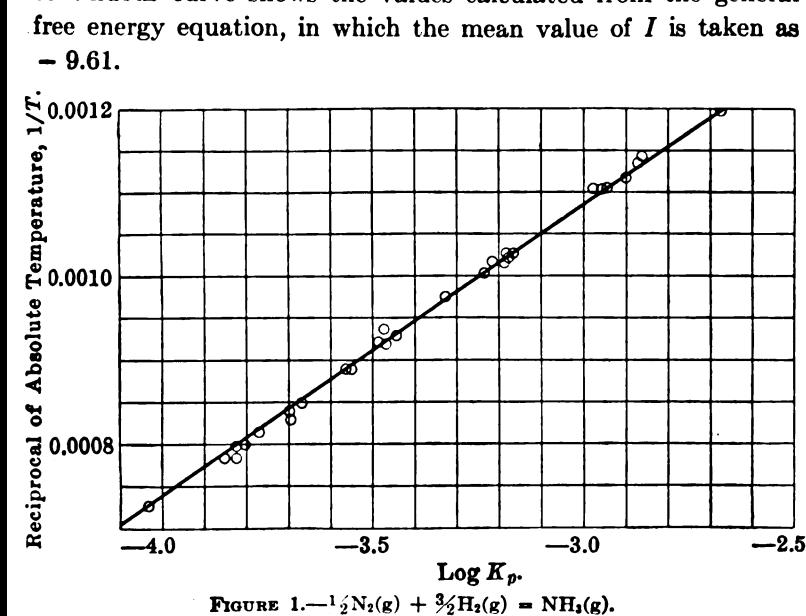

The agreement between the experimental values and the calculated curve is seen to be excellent. Many of the experiments were made at a pressure of 30 atmos. , where the departure of ammonia from the gas law must be appreciable. But apparently the correction which might be made on this account is less thantheindividual errors of the experiments themselves.

Taking the above value of I, the general free energy equation is,

$$\begin{aligned} \Delta \mathbf{F^{o}} &= -950 \mathbf{\hat{C}} + 4.96T \ln T + 0.000575T^{2} \\ &- 0.00000085T^{3} - 9.61T. \end{aligned} \tag{2}$$

$$\text{NH}_2\text{N}_2 + \text{\text{\textquotedblleft}}_2\text{H}_2 = \text{NH}_3\text{(g)} \text{: } \Delta F^{\text{\textquotedblleft}}_{\text{\textquotedblleft}} = -3910. \text{.} \tag{3}$$

## 558 THERMODYNAMICS CHAP. XXXIX

Liquid Ammonia. The vapor pressure of liquid ammonia at 25°C has been shown by Cragoe, Myers and Taylor¹ to be 9.90 atmos . From the tables of Keyes and Brownlee we find that this pressure is 89 percent of that which would be exerted by a perfect gas of the same molal volume. Using the approximate method of Equation XVII-25 , we thus see that the fugacity is 0.89 times the vapor pressure. Whence

$$\text{NH}_3(\text{g}) = \text{NH}_3(\text{l}); \quad \Delta F^{\bullet}_{\text{208}} = RT \ln \text{ (1.90} \times 0.89) \\ = 1290. \quad \text{(4)}$$

Combining with Equation 3 we find

$$
\Delta\!\!\!\!/\text{N}_{\mathfrak{z}} + \\$\!\!\!\!/\text{H}_{\mathfrak{z}} = \text{NH}_{\mathfrak{z}}(\mathfrak{l}); \quad \Delta F^{\mathfrak{o}}_{\mathfrak{z}\mathfrak{so}} = -2620.\tag{5}
$$

Aqueous Ammonia. Solutions of ammonia in water appear to obey Henry's law over a wider range of concentration than might have been expected. At 25°C, the constant K = m/p, where m is the molality and p is the pressure in atmospheres, varies only very slightly between m = 1 and m = 0.1 , according to the very consistent measurements of Gaus, 3 of Abegg and Riesenfeld, and of Locke and Forssal. The limiting value at m = 0 is 56.7 with a probable error of about 1 percent. Hence,

$$\text{NH}_3(\text{g}) = \text{NH}_3(\text{aq}); \quad \Delta F^{\text{o}}_{\text{298}} = -RT\ln K = -2390. \quad (6)$$

Combining Equations 3 and 6,

$$
\stackrel{\cdot}{\text{H}_2\text{N}_2 + 3\acute{\jmath}_2\text{H}_2} = \stackrel{\cdot}{\text{NH}_3(aq)}; \quad \Delta F^{\bullet}_{\text{298}} = -6300.\tag{7}
$$

According to the convention which we established in Chapter XXIV, we shall write

NH3 (aq) + H2O(l) = Hence, from the free energy of formation of water, NH4OH(aq) ; AF° = 0. (8)

2N2 + 52H2 + 202 = NH4OH(aq) ; AF 298 = -62860. (9)

Ammonium Ion. Ammonium hydroxide is a weak electrolyte,

- Abegg and Riesenfeld, Z. physik. Chem . , 40, 84 ( 1902) ; Riesenfeld, Ibid. , 45, 461 ( 1903) .
- 5 Locke and Forssall , Am. Chem. J. , 31, 268 ( 1904) .

<sup>1</sup> Cragoe, Myers and Taylor, J. Am. Chem. Soc. , 42, 206 ( 1920) .

<sup>2</sup> Keyes and Brownlee, " Thermodynamic Properties of Ammonia, " Wiley and Sons, New York, 1916 .

Gaus, Z. anorg. Chem. , 25, 236 ( 1900) .

the dissociation constant being 18.1 x 10-6 at 25°C, according to Noyes and Kanolt. Hence,

$$\dot{\bf NH_4OH(aq)} = \dot{\bf NH_4^+} + \dot{\bf OH^-}; \quad \Delta F^\bullet_{\mathfrak{gg}} = 6470. \tag{10}$$

Combining Equations 9, 10 and XXXIV- 28, we have

$$\Delta\!\!/\text{N}_{2} + 2\text{H}_{2} = \text{NH}_{4}{+} + \text{E}^{-}; \quad \Delta F^{\bullet}_{\text{298}} = \,-18930. \tag{11}$$

### OXIDES OF NITROGEN

Nitric Oxide. One of the most important of technical gas reactions is the direct union of oxygen and nitrogen in the electric arc. Haber has expressed the conviction that the equilibrium obtained in the arc is not a purely thermal equilibrium, but that some of the electrical energy is in some way utilized directly to produce a larger yield of nitric oxide than corresponds to the temperature. However this may be, it is evident that experiments with the electric arc alone could hardly give sufficiently accurate results for a free energy calculation. But Nernst² measured the amount of NO produced by heating air at atmospheric pressure to definite temperatures, for a sufficient time to establish equilibrium.

These equilibrium measurements are given in Table 1 , where the first column gives the absolute temperature ; the second, the percentage (by volume) of NO in equilibrium with air at one atmosphere; the third, K = [ NO] /[ N2]' [ 0 ] ; and the fourth , the constant I.

|      | -2N½<br>TABLE<br>1. | ½02<br>+<br>= | NO                 |
|------|---------------------|---------------|--------------------|
| T    | NO<br>%             | K             | I                  |
| 1811 | 0.37                | 0.0092        | -2.59              |
| 1877 | 0.42                | 0.0105        | -2.55              |
| 2033 | 0.64                | 0.0161        | -<br>2.40          |
| 2195 | 0.97                | 0.0246        | 2.47<br>-          |
| 2580 | 2.05                | 0.0539        | -2.56              |
| 2675 | 2.23                | 0.0590        | 2.44<br>-          |
|      |                     |               | -2.50<br>Mean<br>, |

The free energy equation in this case is extremely simple. 1 Noyes and Kanolt, Publ. Carnegie Inst. , No. 63, 285 ( 1907) .

2Nernst, Z. anorg. Chem. , 49, 213 ( 1906) .

### THERMODYNAMICS

CHAP. XXXIX

Since we have taken the same formula for the heat capacities of N2, NO and O2, ACp = 0. AH for this reaction is given both by Thomsen and by Berthelot as 21600 cal. , which is independent of the temperature. Therefore,

$$
\Delta F^{\circ} = \begin{array}{c} \text{21600 } - \text{2.50} \text{T}, \end{array} \tag{12}
$$

$$\mathbf{J}_{2}\mathbf{\dot{N}_{2}} + \mathbf{J}_{2}\mathbf{\dot{O}_{2}} = \mathbf{NO}(\mathbf{g}); \quad \Delta F^{\mathbf{o}}_{298} = \mathbf{20850}.\tag{13}$$

In this reaction there is no change in the number of molecules, and it would probably have been quite impossible to determine the equilibrium, or even the existence of the equilibrium, were it not for the extraordinary inertness of the reaction . Even at the high temperature of the measurements equilibrium is established but slowly, and therefore by rapid cooling the composition of the equilibrium mixture may be ascertained . If, from the rate of the reaction at high temperature, we should estimate the rate at room temperature by means of the rough rules ordinarily employed in such a calculation , the reaction velocity would be found to diminish in the ratio of about 10100. It is therefore easy to understand why it is that nitric oxide, although extremely unstable thermodynamically, in another sense is considered as a very stable substance.

Nitrogen Dioxide. Above 150°C, nitrogen dioxide dissociates appreciably into nitric oxide and oxygen. The early measurements of Richardson' on the vapor densities have been repeated with greater precision, and over a wider temperature range, by Bodenstein and Katayama.2 Their numerous measurements we have employed to determine both AH, and I in the general free energy equation (which we have obtained by assuming the heat capacity of NO2 to be the same as that of CO2) . We thus find

$$\begin{aligned} \Delta F^{\bullet} &= -14170 + 2.75T \ln T - 0.0028T^2 \\ &+ 0.00000031T^3 + 2.73T, \quad (14) \\ \text{NO} + f_2(\text{O}_2 = \text{NO}_2(\text{g})) & \Delta F^{\bullet}_{\text{298}} = -8930. \end{aligned} \tag{15}$$

$$\text{NO} + \text{H}_2\text{O}_2 = \text{NO}_2(\text{g}); \quad \Delta F^{\text{o}}_{\text{298}} = -8930. \tag{15}$$

With Equation 13 we then have

$$\text{H}_2\text{N}_2 + \text{O}_2 = \text{NO}_2; \quad \Delta F^{\text{o}}_{298} = 11920. \tag{16}$$

- 1 Richardson, J. Chem. Soc . , 51 , 397 ( 1887) .
2 Bodenstein and Katayama, Z. Elektrochem. , 15, 244 ( 1909) .

Nitrogen Tetroxide. The equilibrium between nitrogen dioxide and tetroxide was one of the earliest to be studied from the thermodynamic standpoint , and has been the subject of numerous publications. This is another case where the heat of reaction can best be determined from the equilibrium measurements themselves, although the value thus obtained is in good agreement with those obtained from a study of the change of specific heat with the temperature.¹ Schreber² has made a critical summary of the dissociation constant calculated from the numerous measurements of the gas density. In accordance with that work, we shall take as an average value between 0° and 100°C, ΔΗ 13600. The heat capacity of 2 mols of NO2 is doubtless greater than of one mol of N2O4, but since this reaction can be studied only over a small range of temperature, we shall regard AH as constant and thus obtain values of I given in Table 2, where AH is taken as = - - - 13600.

> TABLE2.-2NO₂= N₂O

| T     | K     | I    |
|-------|-------|------|
| 273.0 | 65.0  | 41.5 |
| 291.3 | 13.8  | 41.4 |
| 322.9 | 1.25  | 41.7 |
| 346.6 | 0.296 | 41.6 |
| 372.8 | 0.075 | 41.6 |

We thus find

AF° = 1360041.67, (17)

$$2\text{NO}_3 = \text{N}_2\text{O}_4; \quad \Delta F^\circ_{\text{298}} = -1200. \tag{18}$$

The more recent study of the same reaction by Bodenstein and Katayama is in perfect agreement with the results of Schreber, and leads to no change in the free energy value.

Combining Equations 16 and 18 ,

$$\text{N}_{\text{2}} + 2\text{O}_{\text{2}} = \text{N}_{\text{2}}\text{O}_{4}; \quad \Delta F^{\text{o}}_{\text{298}} = 22640. \tag{19}$$

1 See Abegg, " Handbuch der anorganischen Chemie, " III-3, p. 135, Hirzel, Leipzig, 1908. 2 Schreber, Z. physik. Chem. , 24, 651 ( 1897) .

## NITROSYL CHLORIDE

The equilibrium between nitric oxide, chlorine and nitrosyl chloride has been investigated by Trautz and Wachenheim.¹ We have plotted the logarithm of the equilibrium constant as obtained from their measurements between 500° and 750° K against 1 /T, and thus obtain a value for the heat of the reaction . We might make some estimate of the heat capacity of NOCI, but it will be sufficiently accurate to assume ACp 10 and AH constant. Taking an average value of I from their measurements we thus find =

$$
\Delta F^{\circ} = -9100 \, + \, 14.3T,\tag{20}
$$

$$\begin{aligned} \text{"} \{ \text{"} \} \text{"} & \text{"} \{ \text{"} \} \text{"} \\ \text{"} \{ \text{"} \} \text{"} \text{"} + \text{"} \{ \text{"} \} \text{"} & \text{"} \} \text{"} \end{aligned} \qquad \begin{aligned} \text{"} \{ \text{"} \} \text{"} & \text{"} \text{"} \text{"} \} \text{"} \\ \text{"} \{ \text{"} \} \text{"} & \text{"} \text{"} \text{"} \text{"} \end{aligned} \qquad \begin{aligned} \text{"} \{ \text{"} \} \text{"} & \text{"} \end{aligned} $$

Combining with Equation 13, we have

16010. (22) 1½N½ + ½0½ + ½Cl2(g) = NOCI(g) ; AF 293 = 16010.

## NITROUS AND NITRIC ACID AND THEIR IONS

In all the cases which we have considered hitherto, it has been possible to determine the free energies of a series of compounds one by one, each new value being available for use in the determination of the free energies of other compounds. However, in the case of nitrous and nitric acids all data which existed until very recently led to a series of free energy equations which must be employed simultaneously to give the free energy of formation of these two acids. Since we are thus confronted by a problem of somewhat unusual character, it will be interesting to make this calculation before taking up the newer data.

2AgNO2(s) = Ag++ NO3 + Ag + NO(g) . Solid silver nitrite when heated, especially in the presence of water, decomposes to form silver nitrate, metallic silver and nitric oxide. Abegg and Pick² showed that at 55° C equilibrium in this reaction was established in a few days, and that when the pressure of NO was 4.28 atmos. the molality of silver nitrate was 0.179. From the data of Thomsen and Berthelot we find for this reac-

<sup>1</sup> Trautz and Wachenheim, Z. anorg. allgem . Chem. , 97, 241 ( 1916) .

<sup>2</sup> Abegg and Pick, Z. anorg. Chem. , 51 , 1 ( 1906) .

tion AH = 21200. Assuming this to be constant over the small range of temperature, we find the pressure of NO, at 25°C, which would be in equilibrium with 0.179M AgNO3, to be 0.162 atmos. Interpolating from Table XXVII- 12, we find the activity coefficient of the silver nitrate to be 0.67. Hence the activity of the silver nitrate is (0.179 × 0.67) ² = 0.0144 , and for the standard change of free energy,

$$
\Delta F^{\bullet}_{\text{ggs}} = \stackrel{\cdots}{-} RT \ln \left( 0.162 \times 0.0144 \right) \\
= \text{3600}.\tag{23}
$$

For the purpose of checking this determination, Lewis and Adams¹ measured the equilibrium in the same reaction at 100° C and with silver nitrate at 1.10 M. The equilibrium pressure was found to be 8.35 atmos. Unfortunately the change in the partial molal heat content of silver nitrate with the concentration is unknown, and the uncertainty in the value of AH is more important in this case , where the range of extrapolation is greater. If we use the same value of AH as before and take y 0.38, we find AF°298 4040. The difference between this value and the one obtained by Abegg and Pick is probably due almost solely to neglecting the heat of dilution. =

Nitrate and Nitrite Ion. Abegg and Pick made a careful study of the solubility and complex formation of silver nitrite. For the true solubility product, at 25°C, they find (Ag+) ( NO2¯) =2.0 × 10-4, whence

$$\mathrm{AgNO_3(s)} \rightleftharpoons \mathrm{Ag^+} + \mathrm{NO_2^-}; \quad \Delta F^{\mathrm{o}}_{\mathrm{298}} = 5050. \tag{24}$$

Combining with Equations 13 , 23 and Table XXX-7, we have 1/2N2 + 1/20₂ + NO3 + E-= 2NO2 ; AF°298 8900 (prelim. ) . (25) =

The Ionization of Nitrous Acid. Nitrous acid is a weak acid whose dissociation constant has not been determined with high accuracy on account of its great instability. However, Schümann² measured the conductivities of freshly prepared mixtures of equivalent solutions of sodium nitrite and hydrochloric acid, and it does not seem that there can be any great error in his value of the ionization constant, K298 ; namely ( NO₂¯) ( H+) / (HNO2) =0.00045 . Hence

$$\mathrm{HNO_2(aq)} \rightleftharpoons \mathrm{H^+} + \mathrm{NO_2^-}; \quad \Delta F^\bullet_{\mathrm{298}} = 4570. \tag{26}$$

3HNO2(aq) . H++ The reac- NO3 + 2NO(g) + H2O(1 ) = 1 Lewis and Adams, J. Am. Chem. Soc . , 37, 2308 ( 1915) .

' Schümann, Ber. deut. chem. Ges. , 33, 527 ( 1900) .

CHAP. XXXIX

tion which occurs in the decomposition of aqueous nitrous acid is reversible. Nitric oxide at a definite pressure, in contact with a solution of nitric acid, leads to an equilibrium concentration of nitrous acid. This equilibrium was studied over a wide range of concentration by Saposhnikov¹ by passing nitric oxide through nitric acid solution and determining the amount of nitrous acid, either by analysis or by measurements of the conductivity of the solution at the beginning and end of the experiments. The latter method was also employed by Lewis and Edgar with the purpose of obtaining a more exact determination of the equilibrium constant. Starting with 0.1 M HNO3 and passing NO through at approximately atmospheric pressure, they were able to determine the change of conductance with unusual exactness. It is of course possible that the conductivity of nitric acid may be altered slightly by the presence of nitrous acid or of nitric oxide, but the essential agreement between the results of Lewis and Edgar and those of Saposhnikov, who measured concentration both by conductivity and by analysis, indicates that this effect, if it exists, must be small.

According to the measurements of Lewis and Edgar, the solution originally 0.1M with respect to nitric acid becomes, in equilibrium with NO at 0.961 atmos. , 0.0830 M with respect to nitric acid, and 0.0495 M with respect to undissociated nitrous acid . The activity coefficient of nitric acid at this concentration is 0.80, and we find for the equilibrium constant K = (HNO₂)³/ (H+) (NO3¯) [ NO] ² = 0.030.

The values of this constant obtained from Saposhnikov's data, using our present activity coefficients, are 0.032, 0.024, and 0.022, starting with 0.05, 0.1 and 0.2 M nitric acid. A few incomplete experiments by Lewis and Edgar with 0.2 M acid lead to a still lower value of K, namely, 0.019 . The apparent trend of K with the concentration is perhaps to be explained by some minor side reaction, and for this reason it seems best to adopt the value obtained in the most dilute solution, namely, K298 = 0.032, whence

<sup>1</sup> Saposhnikov, J. Russ. Phys. Chem. Soc . , 32, 375 ( 1900) ,

<sup>2</sup> Lewis and Edgar, J. Am. Chem. Soc. , 33, 292 ( 1911) .

H+ + NO3 + 2NO(g) + H2O = 3HNO2(aq) ; AF 298 = 2040. (27

Combining the Equations. We now have material for determining the free energy of both nitrate and nitrite ion . Thus, from Equations 27 , 26, 13, XXXIV- 19 and Table XXX- 7,

2H++ 2NO3 + 4NO(g) + 2H2O(l ) 6HNO2(aq) = 6H++ 6NO₂-; 2N₂ + 20₂ = 4NO(g) ; 2H2 + O2 = 2H2O(l) ; 4H++ 4E- = 2H2; = = 6HNO2(aq) ; AF 298 = - 298 4080, 27420, = = 83400, -113120, = 0. AF ΔΡΟ298 AF 298 AF°293

And by addition

$$\begin{aligned} \text{2N}_{\text{2}} + 3\text{O}_{\text{2}} + 2\text{NO}_{3}^{-} + 4\text{E}^{-} &= 6\text{NO}_{\text{2}}^{-};\\ \text{4F}_{\text{298}}^{\text{o}} &= 1780 \text{ (predim.)}. \end{aligned} \tag{28}$$

Now we have also by Equation 25

6N02- = 32N2 + 3202 + 3NO3 + 3E-; AF° 298 = -26700,

and finally adding the two last equations we find -24920 (prelim. ) as the free energy of formation of nitrate ion. Now using this value, together with either Equation 25 or 28 we find -8010 (prelim. ) as the free energy of formation of nitrite ion.

Owing to the way in which the equations have been combined, small errors in the individual data, while causing relatively small errors in the free energy of nitrite ion, would cause a very large error in the free energy of nitrate ion. Probably the two most uncertain data are those for the solubility product of silver nitrite and for the ionization constant of nitrous acid. Both of these data enter six times in the above calculation , so that an error of 30 percent in either one would cause an error of 1000 cal. in the free energy of nitrate ion.

For this reason it has long been desirable that some other reversible reaction involving nitrates or nitrites be investigated . Very recently the reaction between nitric oxide and concentrated nitric acid, to give nitrogen dioxide and water, has been studied

)

by Burdick and Freed, ' with results which permit a new and independent calculation of the free energy of nitric acid.

The Reaction between Nitrogen Dioxide and Water. Burdick and Freed, passing a stream of gas containing nitrogen dioxide through nitric acid of various concentrations, found that a measurable equilibrium was established in the reaction

$$\text{3NO}_3 + \text{H}_2\text{O} = \text{2HNO}_3 + \text{NO}_2$$

They analyzed the gas for nitric oxide and dioxide, and they also studied the vapor pressure of nitric acid and of water from the various solutions. They were thus able, at 25°C, to obtain an equilibrium constant for the reaction with all of the substances as gases. They thus found K [ NO][ HNO3] 2/[ NO;} [H2O] = 0.0046 with five concentrations of acid, and with an average deviation from the mean of about 15 percent. thus find = We

= 3NO2(g) + H2O(g) = NO(g) + 2HNO3(g) ; AF28 3190. (29)

This equation with Equations 16, 13 and XXXIV-22 gives the free energy of formation of gaseous nitric acid, namely,

½H½ + ½N½ + ¾½0₂ = HNO3(g) ; AFAF°298 298 = -18210. (30)

The Activity Coefficient of Nitric Acid Solutions. In order to proceed from this point to the free energy of aqueous nitric acid, we must know the activity of nitric acid in its concentrated solutions. Bythe use of such rough freezing point measurements as are available, we may calculate the activity coefficients up to 3 M. From this point on, we may use the vapor pressures of nitric acid obtained by Burdick and Freed. Proceeding just as we did in the case of hydrochloric acid (see the discussion of Table XXVI- 1 ) , we note that the vapor pressure is connected with the molality and the activity coefficient by the expression Ρ = kmy, and taking y = 0.89 at 3 M from the freezing point measurements, we find as an average value, k = 0.00092. We then obtain from the freezing point and vapor pressure measurements the approximate values of y given in Table 3. 1/2

<sup>1</sup> Burdick and Freed, J. Am. Chem. Soc. , 43, 518 ( 1921 ) .

### NITROGEN COMPOUNDS

### TABLE 3.-ACTIVITY COEFFICIENT OF HNO,

| m | 0.05 | 0.1  | 0.2  | 0.5  | 1    | 2    | 4    | 9    | 16   | 36   |
|---|------|------|------|------|------|------|------|------|------|------|
| Y | 0.83 | 0.79 | 0.76 | 0.73 | 0.73 | 0.79 | 0.92 | 1.16 | 1.45 | 2.18 |

We may now use the value of k which we have just obtained , to determine the free energy change in passing from HNO3(aq) to HNO3(g) . The equilibrium constant for this reaction is K = k2 and

$$\text{HNO}_3(\text{aq}) \, = \text{HNO}_3(\text{g}); \quad \Delta F^{\bullet}_{\text{298}} = 8290. \tag{31}$$

Finally, thisequation withEquation30gives

$$
\lambda_2^{\prime} \mathbf{H_1} + \lambda_2^{\prime} \mathbf{N_1} + \lambda_2^{\prime} \mathbf{O_2} = \text{HNO}_3(\text{aq}); \ \Delta F^{\bullet}_{\text{298}} = -26500. \quad (32)
$$

Final Free Energy Values. Notwithstanding the lack of complete agreement among the various data obtained by Burdick and Freed, this method of determining the free energy of nitric acid is so much more direct than the other one, that we shall accept Equation 32 as final, and in accordance with the convention which we use for strong electrolytes, we also write

$$
\Delta\!\!/\text{N}_{\text{2}} + \text{}^{\text{3}}\!\!/\text{O}_{\text{2}} + \text{E}^{-}=\text{NO}_{\text{3}}^{-}\text{}; \quad \Delta F^{\text{o}}_{\text{298}} = -26500.\tag{33}
$$

We may now combine this value with either Equation 25 or Equation 28 to obtain a value for nitrite ion. We obtain respectively - 8800 and -8540 as against -8010 as obtained before.As a weighted mean we shall take

$$\text{Q}_{2}\text{N}_{2} + \text{O}_{2} + \text{E}^{-} = \text{NO}_{2}{}^{-}; \quad \Delta F^{\circ}_{298} = -8500. \tag{34}$$

To obtain the free energy of nitrous acid we combine Equations 26 and 34, and

$$\lambda_2^\prime \text{H}_\text{\textbullet} + \lambda_2^\prime \text{N}_\text{\textbullet} + \text{O}_\text{\textbullet} = \text{HNO}_2(\text{aq}); \quad \Delta F^\circ_{\text{\textbullet}\text{\textbullet}} = -13070. \tag{35}$$

The Stability of Nitric Acid. We have called attention to the extreme inertness of nitric oxide, which permits it to exist despite its great thermodynamic instability. This inert or unreactive character is typical of the nitrogen compounds in general. Thus practically all explosives are composed of nitrogen compounds which, although thermodynamically unstable, do not decompose except under the influence of high temperature or of shock. Also nitrogen compounds which are thermodynamically capable

of forming under certain conditions do not readily form. We see from the large negative free energy of formation of nitric acid that it should be producible directly from its elements. Even starting with water and air, we see by our equations that nitric acid should form until it reaches a concentration of about 0.1 M where the calculated equilibrium exists. It is to be hoped that nature will not discover a catalyst for this reaction, which would permit all of the oxygen and part of the nitrogen of the air to turn the oceans into dilute nitric acid.


# CHAPTER XL

# CARBON AND SOME OF ITS COMPOUNDS¹

### ELEMENTARY CARBON

Of the various forms of carbon only two, graphite and diamond, have definite and reproducible properties. We shall choose graphite as the standard reference state. The heat capacity of a solid at temperatures below the range of validity of the law of Dulong and Petit cannot be well represented by a simple algebraic expression . However, between 0°C and 2000°C we find that the heat capacity data for graphite may be fitted, with sufficient accuracy for our purpose, by the equation

$$\text{C(graph.)}; \quad C_{\text{P}} = 1.1 + 0.0048T - 0.0000012T^{\circ}. \tag{1}$$

It is possible that substances like coal, charcoal, and coke should be regarded, not as elementary carbon, but as mixtures of hydrocarbons of low hydrogen content. Passing from benzene through naphthalene to more unsaturated compounds of higher molecular weight, there seems to be no limit to the ratio between the number of carbon atoms to the number of hydrogen atoms in a hydrocarbon molecule. However, there are certain of the so-called amorphous forms of carbon, such as the one produced by the decomposition of carbon monoxide, which must be regarded as pure, but of which the properties vary according to the method of preparation.

In determining the difference in free energy of the elementary forms of carbon, it is impossible to proceed as we have in the case of sulfur, since no transition points are known . Schenck and Heller believed that they had discovered, in the equilibrium between carbon, iron , ferrous oxide, and the oxides of carbon, different equilibrium pressure curves for the different modifications of carbon, the pressure being higher with amorphous carbon and diamond than with graphite. Theoretically it is barely conceivable that, by the intervention of a phenomenon analogous to supercooling, true equilibria involving in one case diamond and in another case

<sup>1</sup> This chapter constitutes a revision of our paper, J. Am. Chem . Soc. , 37 , 458 ( 1915) .

<sup>*</sup> Schenck and Heller, Ber. deut. chem . Ges. , 38, 2139 ( 1905) .

graphite might be obtained. But it has been shown by Falcke' that under the conditions of Schenck and Heller's experiments this certainly is not the case. Pring and Fairlie², in their investigation of the equilibrium between carbon, hydrogen and methane, obtained in all cases a larger proportion of methane with amorphous carbon than with graphite, but on standing with amorphous carbon the percentage of methane diminished as the carbon became graphitized, until the conditions obtained with pure graphite were established . It is possible that in the early stages of their experiments with amorphous carbon there was a close approach to equilibrium between this substance and the gaseous mixture. Aside from these investigations we have no chemical data which enable us to calculate the difference in free energy of the forms of carbon.

C(graph. ) = C(diamond) . In the absence of equilibrium data we may employ the third law to calculate the free energy of diamond. The entropies of diamond and of graphite as calculated by Lewis and Gibson are given in Table XXXII-2, from which we see that AS°298 = -0.7.

The older determinations of the heats of combustion of graphite and diamond were too inaccurate to give AH, but the recent very careful work of Roth and Wallasch³ indicates that the heat of combustion of diamond is larger than that of graphite by 180 cal.Thus AH298 180. NowAF°=AHTAS,andtherefore = -

$$\text{C(graph.)} = \text{C(diamond)} ; \quad \Delta F^{\circ}_{\mathfrak{B}\mathfrak{g}} = 390. \tag{2}$$

The accuracy of this value depends almost entirely upon the accuracy of the work of Roth and Wallasch. Assuming that their measurements are correct, we may draw some interesting conclusions regarding the stability of diamond. We see from Equation 2, since AF is positive, that diamond is the unstable form at ordinary temperature. Moreover, if we write the general free energy equation, we find that AF° acquires a larger positive value with increasing temperature. We may therefore conclude that at all temperatures diamond is unstable at atmospheric pressure. If, however, we employ Equation XIV- 9 ( neglecting compressibility) we may calculate, at 25° C, the transition pressure. Thus, in order to make AF 0, we must increase the pressure, so that ▲V(P − 1 ) = 390 cal. the densities we find AV = - 2.1 cc. , and converting calories to cc. atmos. , we find that it would require a pressure of about 8000 atmos. to make diamond stable. At higher temperatures AF° and AV both become larger - From

<sup>1</sup> Falcke, Ber. deut. chem. Ges. , 46, 743 ( 1913) . 2

Pring and Fairlie, J. Chem. Soc. , 101 , 91 ( 1912) .

Roth and Wallasch, Ber. deut. chem. Ges. , 46, 896 ( 1913) .

with the result that the pressure required does not greatly increase . Assuming these conclusions to be correct, they indicate that if diamonds were formed in nature under conditions in which they represent the stable form of carbon they must have been produced at least 15 miles below the surface of the earth.

### HYDROCARBONS

Methane. Of all the compounds of hydrogen and carbon, methane is the only one for whose formation from the elements we have exact equilibrium data. Taking the heat capacity of hydrogen and the rough estimate of that of methane from Equations VII-5 and VII- 11 , and combining with Equation 1 , we have

$$
\Delta C_{\text{P}} = -6.6 - 0.0016T + 0.0000012T^2
$$

for the reaction

> C(graph. ) + 2H₂ = CH4.

The heat of combustion of methane to form gaseous carbon dioxide and liquid water is 212400 according to Thomsen, and 212800 according to Berthelot, -mean 212600. The heat of formation of liquid water we have shown in a previous chapter to be 68470 at 0° C, or 68330 at 18 °. The heat of combustion of graphite, as given by Roth and Wallasch, is 94250. We find for our reaction AH291 -18300. From these data we may set up the general free energy equation in which the constant I may be determined from any one measurement of the equilibrium. 1= 1

 Such measurements were first made by Mayer and Altmayer, 2 but we shall consider chiefly the far more extensive work of Pring and Fairlie. These authors obtained a higher yield of methane from amorphous carbon than from graphite, but in the latter case a true equilibrium was reached, whereas in the former the equilibrium continually changed owing to the gradual

<sup>1</sup> Roth and Wallasch, Ber. deut, chem. Ges. , 46, 896 ( 1913) .

<sup>*</sup> Mayer and Altmayer, Ber. deut. chem. Ges . , 40 , 2134 ( 1907) .

<sup>3</sup> Pring and Fairlie, J. Chem. Soc. , 101 , 91 ( 1912) . In this paper and in previous papers by the same authors the equilibrium conditions are investigated in the formation, not only of methane, but of ethylene and acetylene. From the results it probably would be possible to obtain approximate values for the free energies of these hydrocarbons.

transition from amorphous carbon to graphite. The ultimate equilibrium was the same as that obtained directly from graphite. We shall give in Table I the various results obtained by Pring and Fairlie without distinguishing between the different varieties of graphite which they used. The first column shows the absolute temperature ; the second, the equilibrium constant [ CH ]/ [ H2]², and the third , the corresponding value of I. (The first value given represents the average of the measurements of Mayer and Altmayer at 823° K, with amorphous charcoal which was covered with a catalyzer of nickel or cobalt and was presumably graphitized in part. )

### TABLE 1. -C( GRAPH. ) + 2H, = CH4

| T     | K       | I           | T    | K       | I         |
|-------|---------|-------------|------|---------|-----------|
| (823) | (0.64)  | -24.2)<br>( | 1673 | 0.00103 | -26.4     |
| 1473  | 0.00244 | -<br>25.9   | 1673 | 0.00089 | -26.1     |
| 1548  | 0.00147 | -<br>25.8   | 1673 | 0.00089 | -26.1     |
| 1573  | 0.00146 | -<br>26.0   | 1723 | 0.00075 | -26.1     |
| 1573  | 0.00158 | -<br>26.2   | 1773 | 0.00077 | 26.7<br>- |
| 1648  | 0.00100 | -26.1       | 1848 | 0.00062 | -<br>27.0 |
| 1648  | 0.00117 | -<br>26.4   |      |         |           |

There is evidently a slight trend of I with the temperature. This may be due to an error in the equation assumed for the heat capacity of methane, but it may also be an experimental error, the possibility of which the authors themselves have pointed out, namely, an excessive yield of methane at high temperatures owing to the indirect formation of methane, during the rapid cooling of the gas for analysis, from other hydrocarbons which may be present at high temperatures. In either case it would be advisable to give a little more weight to the values at low temperatures and we may take I 26.0. Hence =

$$
\Delta F^{\bullet} = -16300 \,\mathrm{+} + 6.6T \ln T + 0.0008T^{\bullet}
$$

$$
-0.0000002T^{\bullet} - 26.0T,\quad(3)
$$

$$
\varepsilon_{\mathrm{V}} = \begin{array}{c}
\cdots & \cdots & \cdots & \cdots & \cdots & \cdots \\
\cdots & \cdots & \cdots & \cdots & \cdots
\end{array}
$$

C(graph. ) + 2H2 CH4 ; AF 298-12800. (4) =

Benzene. The third law furnishes a powerful method for determining the free energy of substances which cannotreadily

be studied by equilibrium methods, and it is probable that in the future most of the basic free energy data of organic chemistry will be so obtained. Knowing the entropies of the elements , it is only necessary to find the entropy and the heat of formation of the compound in question, in order to find its free energy of formation.

We may illustrate the method by an example taken from the work of Lewis and Gibson. From the specific heat of solid benzene at low temperatures, and from its heat of fusion, they find for CH (1) , S° 298 = 44.5, and using Table XXXII- 2, we have

$$6\text{C(graph.)}\,+\,3\text{H}_{\text{2}}=\text{C}_{\bullet}\text{H}_{\bullet}(\text{l});\quad\Delta S^{\bullet}_{\text{298}}=-\,51.6.\tag{5}$$

The heat of combustion of benzene has been very carefully investigated by Roth and v. Auwers2 and by Richards and Barry.³ Using the same values as before for the heat of combustion of hydrogen and graphite, their work gives for the formation of benzene AH298 = 11700. Since AF° = ΔΗ TAS ,

$$6\text{C(graph.)}\,+3\text{H}_{\bullet}\,=\text{C}_{\bullet}\text{H}_{\bullet}\text{(l)};\quad\Delta F^{\bullet}_{\bullet \text{20}}\,=\text{27100.}\tag{6}\,\cdot$$

### OXIDES OF CARBON

= C + CO2 2CO. The important technical process for the manufacture of producer gas involves an equilibrium between carbon, carbon dioxide, and carbon monoxide, and this equilibrium has been studied by several investigators. The work of Boudouard gave the order of magnitude of the equilibrium constant and its change with the temperature, but his work has been superseded by the very careful measurements of Rhead and Wheeler. In their experiments wood charcoal was used,which was treated with chlorine at 1000° for 24 hrs. , and later with other gases for several days at the same temperature, so

<sup>1</sup> Lewis and Gibson, J. Am. Chem. Soc. , 39, 2554 ( 1917) .

<sup>2</sup> Roth and v. Auwers, Ann. Chem. , 407 , 152 ( 1914) .

<sup>3</sup> Richards and Barry , J. Am. Chem. Soc. , 37, 993 ( 1915) .

<sup>4</sup> Boudouard, Compt. rend. , 130, 132 ( 1900) .

Rhead and Wheeler, J. Chem. Soc. , 97, 2178 ( 1910) . In the work of Clement, U. S. Bureau of Mines Bull. 17 ( 1911) , the rate of this reaction was chiefly studied. His estimate of the equilibrium constant is evidently erroneous, owing to the fact that his experiments were of too short duration to permit the attainment of equilibrium conditions .

that we may assume that their carbon was, at least on the surface, in the form of graphite.

Table 2 summarizes their measurements, giving the absolute temperature, the composition of the gas at a total pressure of one atmosphere, the equilibrium constant, and, finally, the constant I in the equation we are about to set up.

|      | TABLE   | -C<br>+<br>( GRAPH<br>2.<br>. ) | =<br>2CO<br>CO₂ |                        |
|------|---------|---------------------------------|-----------------|------------------------|
| T    | %<br>CO | CO2<br>%                        | K               | I                      |
| 1123 | 93.77   | 6.23                            | 14.11           | -<br>12.16             |
| 1173 | 97.78   | 2.22                            | 43.07           | -<br>12.73             |
| 1223 | 98.68   | 1.32                            | 73.77           | -<br>12.43             |
| 1273 | 99.41   | 0.59                            | 167.5           | -<br>12.72             |
| 1323 | 99.63   | 0.37                            | 268.3           | -<br>12.46             |
| 1373 | 99.85   | 0.15                            | 664.7           | -<br>13.15             |
| 1473 | 99.94   | 0.06                            | 1665            | -<br>12.95             |
|      |         |                                 |                 | Average<br>-12.66<br>, |

The heat of this reaction may be found from the heat of formation of carbon dioxide, which we have already seen to be 94250, and from the heat of combustion of carbon monoxide. For the latter Berthelot gives 68300 and Thomsen 67960, the mean being 68100. By combination we find for our reaction AH291 41950. Using the heat capacity equations for the several substances involved, we find the general free energy equation =

$$
\Delta F^{\bullet} = 40910 - 4.9T \ln T + 0.00495T^2
$$

-0.00000051T³ 12.66T, - (7)

C(graph. ) + CO₂ = 2CO; AF 298 =29240. (8)

CO2 + H2 = CO + H₂O(g) . This reaction, which is known as the watergas reaction , has also been frequently studied. From the heats of formation of the several substances which we have already given, and from the heat capacity equations of Chapter VII, we obtain the general free energy equation given below. The constant I is obtained from the work of Hahn¹ and of Haber and Richardt , whose results are summarized in Table 3.

<sup>1</sup> Hahn, Z. physik. Chem . , 44, 513 ( 1903) ; 48, 735 ( 1904) .

<sup>*</sup> Haber and Richardt, Z. anorg . Chem . , 38, 5 ( 1904) .

|        |       |       | TABLE | CO2<br>3.<br>- | +<br>H2        | =<br>CO   | +<br>H2O | (<br>g<br>) |       |       |
|--------|-------|-------|-------|----------------|----------------|-----------|----------|-------------|-------|-------|
|        |       |       |       |                | (<br>Hahn<br>) |           |          |             |       |       |
| T<br>7 | 959   |       | 1059  | 1159           | 1259           | 1278      |          | 1359        | 1478  | 1678  |
| K<br>4 |       | 0.534 | 0.840 | 1.197          | 1.571          |           | 1.620    | 1.960       | 2.126 | 2.490 |
| I<br>1 | -0.59 |       | -0.53 | -0.56          | -0.52          | -0.49     |          | -0.50       | -0.23 | 0.06  |
|        |       |       |       | (Haber         | and            | Richardt) |          |             |       |       |
| T<br>7 | 1503  | 1528  | 1538  | 1582           | 1597           | 1643      | 1768     | 1783        | 1797  | 1824  |
| K<br>4 | 3.05  | 2.68  | 2.85  | 2.72           | 2.93           | 3.26      | 3.83     | 3.66        | 3.86  | 3.56  |
| I<br>1 | -0.65 | -0.51 | -0.58 | -0.37          | -0.47          | -0.64     | -0.61    | -0.47       | -0.55 | -0.32 |

= In Hahn's work the gases were allowed to stream through a catalyzer and were rapidly cooled, but, as shown by Haber¹ in his critical résumé of this equilibrium, the discrepancy between Hahn's measurements at high and low temperatures is due to the difficulty in cooling the mixture from a high temperature rapidly enough to prevent the continuance of the reaction. This criticism apparently does not hold for Hahn's lower temperatures and we may take from his first three measurements I -0.56. The measurements of Haber and Richardt were obtained by a study of the temperature and composition of the gases in the free flame. Although the method is unusual, the agreement of the values of I with one another, and with those of Hahn at low temperature, not only give us confidence in the reliability of the experimental results, but also in the equations which we have chosen to express the heat capacities of the several gases involved. As a final mean we have chosen I -0.54, hence, =

$$
\Delta F^{\ominus} = 10100 - 1.81T \ln T + 0.00445T^2
$$

- 0.0000006873 - 0.54T, (9)

$$\text{H}_{\text{2}} + \text{CO}_{\text{2}} = \text{H}_{\text{2}}\text{O}(\text{g}) + \text{CO}; \quad \Delta F^{\text{o}}_{\text{294}} = 7240. \tag{10}$$

CO + 1/202 = CO2. The free energy equation for this reaction may be obtained independently in two ways. Merely by combining Equation 9 with Equation XXXIV- 23, we find AF° = -67510 + 2.75T In T 0.0028T2 + 0.000000317³ +4.467. ( 11 )

We also have direct measurements of the dissociation of carbon dioxide at high temperatures by Nernst and von Warten-

<sup>1</sup> Haber, "Thermodynamics of Technical Gas Reactions." English translation by Lamb. Longmans, Green and Co. , London, 1908.

### THERMODYNAMICS

1 berg, Langmuir, and Löwenstein. Their results are summarized in Table 4, which gives the degree of dissociation and the equilibrium constant, K = [ CO2]/ [ CO][ O₂] .

TABLE 4. - CO + 202 = CO₂

$$\begin{array}{ccccc} & \% \text{ dis-} & & \\ T & \text{secation} & K & I \\ 1395 & 0.0142 & 837000 & 4.7 & \text{Largmur} \\ 1400 & 0.015 & 781000 & 4.6 & \text{Nernst and von Wartenberg} \\ 1443 & 0.025 & 358000 & 4.8 & \text{Largmur} \\ 1478 & 0.032 & 247000 & 4.4 & \text{Nernst and von Wartenberg} \\ 1481 & 0.028 & 295000 & 3.9 & \text{Largmur} \\ 1498 & 0.047 & 138000 & 4.9 & \text{Largmur} \\ 1565 & 0.064 & 87300 & 4.9 & \text{Largmur} \\ 1823 & 0.4 & 5600 & 3.3 & \text{Lövenastein} \\ \end{array}$$

The table also gives the values of I obtained from the several measurements and, although the individual values fluctuate, the average of 4.4 agrees extremely well with the value given in Equation 11 , which we shall take as final. We then find

$$\text{CO} + \text{H}_2\text{O}_2 = \text{CO}_3; \quad \Delta F^\circ_{\text{298}} = -61750. \tag{12}$$

Final Values for the Two Oxides. By the simultaneous use of Equations 7 and 11, we find

AF°= C(graph. ) + 202 = CO; AF298 = -32510, ( 13)-26600 - 2.157 In T + 0.00215T2

> -0.0000002T³ -- 8.20T. (14)

Using the same equations , and eliminating carbon monoxide, we find

= AF° = C(graph) + O2 CO2; AF 298 = -94260, -94110+ 0.607 In T - 0.00065T2 (15)

+0.0000001173 - 3.74T. ( 16)

### CARBONIC ACID AND ITS IONS

The solubility of CO2 in water, at 25°C and at a partial pressure of 1 atmos. , is 0.0338 mols per liter, according to the entirely

<sup>1</sup> Nernst and von Wartenberg, Z. physik. Chem. , 56, 548 ( 1906) .

<sup>*</sup> Langmuir, J. Am. Chem. Soc. , 28 , 1357 ( 1906) .

<sup>*</sup> Löwenstein, Z. physik. Chem. , 54, 707 ( 1905) .

concordant measurements of Bohr and Bock' and of Just.2 Hence

$$\text{CO}_{\text{2}(g)} = \text{CO}_{\text{2}(aq)}; \quad \Delta F^{\text{o}}_{\text{288}} = 2010. \tag{17}$$

According to our convention regarding hydrated solutes,

$$\text{CO}_{\mathfrak{t}}\text{(aq) } + \text{H}_{\mathfrak{t}}\text{O(l) } = \text{H}_{\mathfrak{t}}\text{CO}_{\mathfrak{t}}\text{(aq)}; \quad \Delta F^{\bullet} = \text{0, } \cdot$$

and combining with Equations 15, 17 and XXXIV- 19,

C(graph. ) + H2 + 3½O₂ = H2CO3(aq) ; AF°298 = -148810. ( 18)

Bicarbonate Ion. We formerly calculated the first dissociation constant of carbonic acid at 25°C from the measurements of Walker and Cormack³ at 18°C. We thus obtained K298 3.39 X 10-7. More recently Kendall has made corresponding measurements at 25°C and finds K298 3.50 X 10-7. From the latter value = =

$$\mathrm{H_2CO_3(aq)} = \mathrm{H^+} + \mathrm{HCO_3^-}; \quad \Delta F^{\bullet}_{\mathrm{200}} = 8810. \tag{19}$$

Hence with Equation 18,

C(graph. ) + 2H2 +¾½O½ + E¯ = HCO3-; AF° 298-140000. (20)

Carbonate Ion. The second dissociation constant of carbonic acid has been the subject of investigations by Bodländer,5 McCoy, and Auerbach and Pick. The uncertainty in this constant has been due not so much to the experiments as to the difficulty of interpreting them. In our former publication there seemed no better way of obtaining the dissociation constant than by roughly extrapolating to infinite dilution the data given by McCoy at several concentrations. We thus obtained for the ratio ( HCO3¯) ²/( H2CO3) ( CO3--) the value 63C0. From our new method of mixtures, employing the principle of the ionic strength, we are able to make a more satisfactory calculation. In a solution made up as 0.1M NaHCO3, and in which the ionic

<sup>1</sup> Bohr and Bock, Ann. Physik, [ 3] 44, 318 ( 1891) .

<sup>2</sup> Just, Z. physik. Chem. , 37, 324 ( 1901 ) .

Walker and Cormack, J. Chem. Soc. , 77 , 5 ( 1900).

Kendall, J. Am. Chem. Soc. , 38, 1480 ( 1916) .

Bodländer, Z. Physik. Chem. , 35, 23 ( 1900) . McCoy, Am. Chem. J. , 29, 437 ( 1903 ) .

<sup>7</sup> Auerbach and Pick, Arb. Kais. Gesundh. , 38, 243 ( 1911 ) .

СНАР. XL

strength is approximately 0.1 , and assuming the activity coefficient of HCO3- to be the same as that of NO3-, namely 0.68, and that of CO3- to be the same as that of SO4 , namely, 0.26 (see Table XXVIII-8) , we find the value of the constant to be 9400. From the data for 0.3M NaHCO3, we can only roughly estimate the activity coefficients of the ions ; taking y = 0.54 for HCO3 and y = 0.15 for CO3- , the constant becomes 8700, a value for which we can claim no accuracy, but which corroborates the high value obtained in 0.1 M solution. We therefore take (HCO3 ) 2/ ( H2CO3) (CO3¯¯) 9400. =

Dividing the first dissociation constant of carbonic acid by this value, we find the second dissociation constant, (H+) ( CO;-) /(HCO3 ) = 3.7 × 10-11, and

HCO3- = H++ CO3¯¯¯; AF 298 =14240. (21)

This with Equation 20 gives

C(graph. ) +202 + 2E¯ = CO3--; AF° 298 = -125760. ( 22)

### SOME ORGANIC COMPOUNDS CONTAINING OXYGEN AND HYDROGEN

Formic Acid. The only compound of carbon, oxygen and hydrogen whose free energy of formation has been determined by equilibrium measurements is formic acid. Branch¹ found it possibletodeterminetheequilibriuminthereaction

> HCOOH( aq) = H2O(1) + CO( g)

at 156.1° and 217.9°C. In order to catalyze the reaction , 0.5M HCl was used as a solvent, instead of pure water. Taking the activity of the liquid water as 0.98, that of the formic acid as equal to the molality, and that of the carbon monoxide as equal to its partial pressure, Branch obtained K = 89.9 at 156.1° and 310 at 217.9°C. The assumption that formic acid in water obeys Henry's law is justified by freezing point measurements (and furthermore by the fact that the heat of dilution of formic acid solution is negligible) . But in determining the activity of

<sup>1</sup> Branch, J. Am. Chem. Soc. , 37, 2316 ( 1915) .

the carbon monoxide the gas law was assumed, and the partial pressure of carbon monoxide was obtained by subtracting the vapor pressure of the water from the total pressure. Since these total pressures ranged from 16 to 51 atmos. this assumption is hardly justifiable. Using the methods which we developed in Chapter XVII, we have made an estimate of the necessary corrections and find for the value of K at the two temperatures 85 and 264 respectively.

From the experiments on the heat of combustion of formic acid, which we shall discuss presently, AH for the reaction is 5200 cal. , and may be assumed independent of the temperature. Now using the values of K at the two temperatures, we find the two values, I -21.0 and -21.7. The difference is rather larger than was to be expected. We may take the mean as -21.3, and AF° = 5200 - 21.3T, =

$$\text{HCOOH(aq)} = \text{H}_2\text{O(l)} + \text{CO}; \quad \Delta F^{\circ}_{\text{298}} = -1150. \quad \text{(23)}$$

Branch also studied the vapor pressure of formic acid from aqueous solutions, and, comparing these with the vapor pressure of the pure acid, found

$$\stackrel{\circ}{\text{HCOOH(l)}} = \text{HCOOH(aq)}; \quad \Delta F^{\bullet}_{\text{298}} = -3880. \tag{24}$$

By combining these equations with those for the formation of carbon monoxide and water, we find for the free energy of formation of formic acid.

C(graph. ) + O2 + H2 C(graph. ) + O2 + H2 = = HCOOH(aq) ; AF 29 HCOOH(1 ) ; = -87920, (25) AF 298 = -84040. (26)

A check upon this value of the free energy of formation of formic acid is furnished by the third law, although it is an uncertain one and leads, as we shall see, to a rather large discrepancy. The heat of combustion of formic acid has been investigated by Berthelot, by Thomsen, and by Jahn. Their values, when reduced to liquid formic acid, give 62600, 63200, and 62800, respectively. The agreement is probably better than the accuracy of the data would lead us to expect. From the mean ofthese values we find the heat of formation of liquid formic acid to be 99700. Through specific heat measurements, Gibson, Latimer

and Parks' find for the entropy of this substance S° 298 = 34.2, and using the entropies of the elements from Table XXXII-2 we find

C(graph. ) + O2 + H2 = HCOOH(1) ; AS 298-44.5. (27) From this value and the heat of formation we find the free energy of formation to be -86400, a value differing by over 2000 calories from the one which we have obtained from the equilibrium measurements. It is impossible at present to fix the responsibility for this large difference. It is possible that the heat of combustion is in error by this amount. On the other hand, the specific heat measurements of Gibson, Latimer and Parks were carried only to 80°K. Measurements at lower temperatures may show an appreciable error in their estimate of the entropy of formic acid.

The same authors have measured the entropy of urea, and in this case also the present data lead to a free energy of formation differing in the same direction by several thousand calories from the one which we are going to obtain from equilibrium measurements.

Ethyl Alcohol. Gibson, Parks and Latimer2, from measurements of the specific heat of alcohol and from available data on its heat of formation, have calculated its free energy of formation. They use for AH, -66700 ; for the entropy of alcohol , 42.6, and, with the new values for the entropies of the elements, the calculation gives

2C(graph. ) + 3H2 + 1/202 = C₂H₂OH(1) ; AFAF298298 = -45100. (28) There are at present no equilibrium measurements which suffice for a calculation of this value.

### COMPOUNDS WITH CHLORINE

Carbonoxychloride. Bodenstein and Dunants and Horak' studied the equilibrium in the reaction

$$\text{CO} + \text{Cl}_{\mathfrak{z}}(\mathfrak{g}) = \text{COCl}_{\mathfrak{z}}(\mathfrak{g}).$$

- 1 Gibson, Latimer and Parks, J. Am. Chem. Soc. , 42, 1533 ( 1920) . .
580 CHAP. XL

<sup>2</sup> Gioson, Parks and Latimer, J. Am. Chem. Soc. , 42, 1542 ( 1920)

Bodenstein and Dunant, Z. Physik. Chem. , 61 , 437 (1907) .

<sup>4</sup> Horak, Dissertation, Berlin, 1909.

The highest temperature used in the latter series is the same as the lowest used in the former, but the two values of K differ by a factor of 2. Nevertheless, if we plot all the values of -RIn K against 1/T, the points fall moderately well on a smooth curve which, if we roughly estimate ACD as -4, leads to the equations

$$\begin{aligned} \Delta F^{\circ} &= -24100 + 4T \ln T + 3.5T, \\ \text{CO} + \text{Cl}_{\mathfrak{s}}(\mathfrak{g}) &= \text{COCl}_{\mathfrak{s}}(\mathfrak{g}); \quad \Delta F^{\circ}_{\mathfrak{g}\text{8}} = -16260. \end{aligned} \tag{29}$$

By the aid of Equation 13,

C(graph. ) + 2½O½ + Cl2(g) = COCl2(g) ; AF°298 = -48770. (30)

There are no other compounds of carbon and chlorine for which, at the present time, the free energies can be calculated . The entropy of carbon tetrachloride has been accurately determined by Latimer, ¹ but the heat of formation cannot be obtained from the very conflicting data given in the literature.

### COMPOUNDS WITH SULFUR

Carbonoxysulfide. Lewis and Lacey² studied the equilibrium in the reaction

$$\text{CO } + \text{S}_{\text{A}}(\text{l) } = \text{COS}(\text{g}),$$

and found K = [ COS] /[ CO] to be 201 as an average of five experiments at 575°K, and 435 in one experiment at 533°K. At these relatively low temperatures several days were required for the establishment of equilibrium. However, at the higher of the two temperatures equilibrium was surely established , and this was probably the case at the lower temperature also.

By means of the data given in Chapter XXXVIII we may change these results to a more convenient form by considering the reaction involving diatomic gaseous sulfur instead of liquid sulfur. We thus find, for R ln K, -18.10 at 575° and -21.39 at 533° K, when K = [ COS] /[ CO][ S ] , corresponding to the reaction

$$\text{CO} + \text{H}_2\text{S}_2(\text{g}) = \text{COS}(\text{g})\text{.}$$

$$\bullet \text{ \textbf{\color{red}{14.1cm}}, \color{blue}{J}. \text{ \textbf{\color{red}{14.1cm}}, \color{green}{C}} \text{\textbf{\color{red}{14.95}}, \color{green}{\color{blue}{14.95}}, \color{green}{\color{green}{14.95}}. \text{\textbf{\color{red}{14.95}}}$$

2 Lewis and Lacey, J. Am. Chem. Soc. , 37, 1976 ( 1915) .

### THERMODYNAMICS

Between the heats of formation of COS obtained by Thomsen and Berthelot, there exists the extraordinary discrepancy of 14000 calories. The evidence seems to show that there is some gross error in Berthelot's measurement, and although all of Thomsen's determinations for sulfur compounds are uncertain, we can do no better than take his value for the heat of formation from rhombic sulfur and carbon monoxide, which is 8000 cal. Using the heat of formation of S2(g) obtained from Chapter XXXVIII , we find for the above reaction AH = −22500. The value of AC, must be small, and may be neglected, considering the uncertainty of AH. We then have

$$
\Delta F^{\circ} = -22500 \, + \, 21.07 \, , \tag{31}
$$

where the value of I is the weighted mean of the values obtained from the equilibrium values given above, namely, at 575°K, I = 21.03, and at 533°K, I = 20.82.

This equation gives K = 1.0 at 1073°K. At this temperature Stock and Seelig¹ studied the equilibrium in this reaction by a continuous flow method, and, as was to be expected from the the rapidity of the reaction, they obtained results which depended upon the rapidity of cooling of the equilibrium mixture. In their last series , in which the cooling was most rapid, they still found different results with different rates of cooling. From their four experiments in which the cooling rate was successively increased, we calculate for K, 4.6 , 4.1 , 3.2 and 2.9. These values seem to be converging toward a value not far different from the one we have calculated .

Finally, from Equation 31 we have

$$\text{CO} + \text{\text{\textquotedblleft}S}_2\text{S}_2(\text{g}) = \text{COS}(\text{g}); \quad \Delta F^{\text{\textquotedblleft}g} = -16230. \qquad (32)$$

And with Equations 13 and XXXVIII-25

-39600. ( 33) C(graph. ) + S (rhomb. ) + ½0½= COS ; AF°298 =

Carbon Disulfide. The equilibrium between graphite, sulfur vapor and carbon disulfide has been studied at high temperatures by Koref. He obtained equilibrium constants which seem

582 CHAP. XL

<sup>1</sup> Stock and Seelig, Ber, deut. chem. Ges. , 52, 681 ( 1919) .

Koref, Z. anorg . Chem. , 66, 73 ( 1910 ) .

to be thermodynamically consistent, but which lead to a heat of reaction differing by more than 10000 calories from those obtained calorimetrically. These calorimetric results alone could perhaps be given little weight, but Koref's results are also inconsistent with some not entirely quantitative but nevertheless significant results, obtained by Stock and Seelig and by Lewis and Lacey. It appears as though the heat of reaction obtained by Koref is erroneous not only in magnitude but probably in sign also.

There are numerous ways in which systematic errors might have entered into Koref's work. The cooling of his equilibrium gas may not have been rapid enough to prevent change of composition, but a still more serious error may have been introduced by his ignoring other compounds of carbon and sulfur, such as carbon monosulfide, the existence of which we believe to have been demonstrated by Lewis and Lacey, and the more complex sulfides which, according to Arctowski, ' are formed from carbon disulfide at high temperatures. It seems inadvisable, until new equilibrium data or new calorimetric data have been obtained, to attempt to set up a general equation for the free energy of formation of carbon disulfide.

¹ Arctowski, Z. anorg. Chem. , 8, 314 ( 1895) .

### CHAPTER XLI

# COMPOUNDS OF CARBON AND NITROGEN

We shall devote this, the last of our chapters which will deal with the systematic calculation of the free energy, to a sequence of reactions which together furnish the most interesting chain of free energy determinations which has so far been attempted. The plan of this series of investigations was sketched by Lewis and Burrows as follows :

"The study of free energy affords the only true measure of chemical affinity, and although, when the free energies of all the substances involved in a given reaction are known, it may still be impossible to predict the rate of the reaction, it will be possible to state in advance in what direction and to what extent the process can ultimately occur. This will be an advance of no small importance.

"The field of organic chemistry is especially rich in the socalled ' reversible reactions,' that is, reactions in which equilibrium exists under such conditions that all the reacting substances are present in measurable amounts. Whenever such an equilibrium is found, it is possible to study the change of free energy which accompanies the reaction. In a systematic tabulation of free energies it is, however, of the greatest convenience to know the free energy of a large number of important compounds referred directly to the elements of which they are composed. In other words, we desire the free energy change accompanying the formation of each substance from its elements.

"In order to obtain thus the free energy of an organic substance, it is necessary to synthesize it from its elements by a series of processes in each of which a true equilibrium is investigated. Such a procedure we shall term a reversible synthesis.

<sup>1</sup> Lewis and Burrows, J. Am. Chem. Soc. , 34, 1515 ( 1912) .

"If such a reversible synthesis can be carried out for a few typical compounds, then through a study of already known equilibria involving these substances, a very large number of free energy values can be readily obtained.

"In a preliminary investigation we have found a number of reactions, a study of which seems likely to afford several important reversible syntheses. Of these the most promising was the synthesis of urea and ammonium cyanate from ammonia, carbon dioxide and water, for each of which three substances the free energy has already been determined. From the cyanate it will then be no difficult task to determine the free energy of hydrocyanic acid. This is, for our purpose, one of the most important of substances, since it enters into a very large number of reactions of various types."

The program of investigation of the nitrogen compounds of carbon which they outlined has been successfully prosecuted, beginning with their study of urea. It is interesting that this substance, which was the first typical organic compound to be synthesized from its elements, was also the first to be reversibly synthesized.

### UREA

A concentrated solution of ammonium carbonate (containing approximately 1 g. of carbonate to 1.5 g. of water) was heated by Lewis and Burrows in a sealed tube and allowed to come to equilibrium according to the reaction

$$\text{(NH}_4\text{)}_2\text{CO}_2 = \text{CO(NH}_2\text{)}_2 + 2\text{H}_2\text{O.}$$

Similar experiments were also performed with an initial excess of urea. At 132°C equilibrium was reached in two days from both sides (3.31 % of carbonate converted to urea) . At 110.7°C equilibrium was reached from both sides in from 7 to 10 days (2.12% urea) . At 77°C equilibrium was not established in 95 days (the percentages of urea being 0.9 from one side and 1.1 from the other) .

In a case like this, in which the concentration of urea at each

temperature is small, and that of the remaining substances is practically unchanged, we may treat these remaining substances together as though they were a simple solvent, and if we assume the heat of the reaction to be constant , the logarithm of the percentage of urea will be a linear fraction of 1 /T. The authors thus calculate that in a solution of 1 g. of ammonium carbonate in 1.5 g. of water, 0.18 % of the carbonate will be converted into urea at 25°C.

Knowing then this state of equilibrium, it remains to determine the activity of each of the reacting substances in the mixture, in order to determine the standard free energy change of the reaction. Any one of numerous reactions may be chosen ; for convenience the authors chose to consider the reaction

$$\text{CO}_2(\text{g}) \, + \, 2\text{NH}_3(\text{g}) \, = \text{CO(NH}_3)_2(\text{s}) \, + \, \text{H}_2\text{O(g)}\dots$$

The activities of the three gaseous substances were readily obtained by bubbling air through the mixture and obtaining the three partial pressures. The determination of the activity of the urea, referred to solid urea as a standard, proved to be a far more difficult task. This was accomplished by ascertaining the distribution of urea between the ammonium carbonate solution and an organic solvent, and the solubility of urea in the same solvent. While the difficulties encountered in this investigation and the methods devised for overcoming them are very instructive , we cannot enter into their discussion here. They finally obtained for the equilibrium constant K = 0.615, and

CO2(g) + 2NH3(g) = CO(NH2) 2 (S ) + H2O(g) ; AF 298 =290. ( 1)

The Free Energy of Solid Urea. By combining Equation 1 with our previous equations for the free energy of formation of CO2(g) , NH3(g) and H2O(g) (Equations XL- 15 , XXXIX-3 and XXXIV- 22) , we find

$$\text{C(graph.)} + \text{V}_2\text{O}_2 + \text{N}_2 + 2\text{H}_2 = \text{CO(NH}_2\text{)}_2\text{(s)};$$

$$\Delta F^{\text{O}}_{\text{298}} = -47280. \quad (2)$$

The Free Energy of Aqueous Urea. By two methods, the more accurate of which consisted in determining the vapor pres-

It sure of water from solutions of different concentrations, Lewis and Burrows obtained for urea the free energy of solution. is of interest to note that aqueous solutions of urea, even to the saturated solution (mol fraction of urea 0.242) obey very closely the laws of the perfect solution. The final result was as follows:

$$\text{CO(NH_3)_2(s)} = \text{CO(NH_3)_2(aq)}; \quad \Delta F^{\varepsilon}_{\text{298}} = -1560. \tag{3}$$

Combining with Equation 2 we find C(graph. ) + ½02 + N2 + 2H₂ = CO (NH2) 2( aq ) ; AF 298 = -48840.(4)

### CYANATE ION

In the experiments of Walker and Hambley, ' of Walker and Kay2 and of Fawsitt, the equilibrium between urea and ammonium cyanate in dilute aqueous solution has been determined at 100°C. From their observations the fraction of 0.1 M urea which is converted into cyanate is 0.065. Taking the activity coefficient of the cyanate at 0.0065 M to be 0.93, we find the equilibrium constant to be (0.0065) 2 (0.93 ) 2 /0.0935 and AF°373 5820. Walker determined calorimetrically the heat of the reaction, and found AH 7500. Assuming this to be constant, we have = =

$$\rm CO(NH_2)_2(aq) = NH_4^+ + \rm COO^-; \quad \Delta F^\bullet_{\mathfrak{g}\mathfrak{sl}} = 6160. \tag{5}$$

Combining this equation with Equations 4 and XXXIX- 11 , we find5

C(graph. ) + 2½N½ + ½О½ + E- = CNO-; AF298 = -23750 . ( 6)

### CYANIC ACID

Although it is unnecessary for the sequence of reactions which we are considering, we may consider at this point the ionization

 The last few lines of the paper by Lewis and Burrows were pied by the printer, so that two values of AF for the formation of cyanate ion appear to be given. Through inadvertence the wrong value was cited in the paper by Lewis and Brighton which we are about to discuss.

<sup>1</sup> Walker and Hambley, J. Chem. Soc . , 67 , 746 ( 1895) .

<sup>2</sup> Walker and Kay, J. Chem. Soc. , 71 , 507 ( 1897) . .

Fawsitt, Z. physik. Chem. , 41 , 601 ( 1902)

<sup>4</sup> Walker, Z. physik. Chem. , 42, 207 ( 1902).

CHAP. XLI

of cyanic acid. The only measurements are those of Naumann, ¹ and it is difficult to estimate their accuracy. He obtains for the dissociation constant, K= 0.00012 at 18°C. Probably within the limits of error of the measurements we may take the same value at 25°C, whence

HCNO(aq) = H+ + CNO-; AF 298 = 5350, (7) and with Equation 6 , C(graph. ) + ½N½ + ½О½ + ½H₂ = HCNO( aq) ; AF298=-29100.(8)

### CYANIDE ION

The Oxidizing Power of Cyanates. In order to proceed from cyanates to cyanides, Lewis and Brighton² studied the equilibrium between carbon monoxide, carbon dioxide and fused cyanate and cyanide of potassium. In the absence of any thermal data on the fused salts , the following device was adopted for obtaining the standard change in free energy.

First the eutectic temperature of the two salts was determined, and found to be 282°C, and the eutectic mixture was found to contain 14.6 % KCN. Then a mixture of this composition was allowed to come to equilibrium , at numerous temperatures between 721 ° K and 847°K, with a mixture of carbon monoxide and carbon dioxide. Since the liquid phase was of constant composition, the logarithm of the ratio of the two partial pressures was plotted against 1 /T, and the straight line through the several measurements was extrapolated to the eutectic temperature 555° K, where [ CO2] / [ CO] was thus found to be 0.89. This then will be the equilibrium mixture over the two solid salts , and we may write

$$\text{KCNO(s)} + \text{CO} = \text{KCN(s)} + \text{CO}_2;$$

$$\Delta F^{\bullet}_{\text{55}} = -RT\ln 0.89 = 128.1$$

From the data of Thomsen and Berthelot, AH = 4300, and although the specific heats of the two solids have not been deter-


<sup>1</sup> Naumann, Z. Elektrochem . , 16, 772 ( 1910) .

<sup>2</sup> Lewis and Brighton, J. Am. Chem. Soc . , 40, 482 ( 1918)

mined, the application of Kopp's rule shows that ACD cannot be far from zero. Whence we find

$$\text{KCNO(s)} + \text{CO} = \text{KCN(s)} + \text{CO}_2; \quad \Delta F^{\bullet}_{\text{298}} = 2060. \quad \text{(9)}$$

The Free Energy of Solution of Potassium Cyanide and Cyanate. Lewis and Brighton also determined in collaboration with Dr. W. H. Rodebush the freezing point of solutions of potassium cyanide and cyanate up to saturated solutions. They thus obtained the following equations:

$$\begin{aligned} \text{KCN(s)} &= \text{K}^+ + \text{CN}^-; \quad \Delta F^{\bullet}_{\text{298}} = -2130, \\ \text{KCNO(s)} &= \text{K}^+ + \text{CNO}^-; \quad \Delta F^{\bullet}_{\text{298}} = -1440. \end{aligned}$$

It is probable that on the basis of our new activity coefficients in dilute solutions these equations would be somewhat changed, but not their difference, which alone concerns us, namely,

$$\mathrm{KCN(s)} + \mathrm{CNO^{-}} = \mathrm{KCNO(s)} + \mathrm{CN^{-}}; \quad \Delta F^{\bullet}_{\mathrm{298}} = -690. \tag{10}$$

The Free Energy of Cyanide Ion. By combining Equations 9 and 10 with our equations for the free energy of formation of CO, CO2 and CNO-, we find

$$\stackrel{\circ}{\text{C(graph.)}} + \stackrel{\circ}{\text{V2}}\text{N}_2 + \stackrel{\circ}{\text{E}^-} = \text{CN}^-; \quad \Delta F^{\bullet}_{\text{208}} = 39370. \tag{11}$$

### HYDROCYANIC ACID

The Aqueous Solution. Hydrocyanic acid is a very weak electrolyte. Walker and Cormack, ¹ from measurements of conductivity found the dissociation constant at 18° to be 1.32 × 10−9. The heat of dissociation is 11000 cal. according to the concordant work of Thomsen and von Steinwehr.2 We therefore find K298 =2.06 × 10-9, and

$$\text{HCN(aq)} = \text{H}^+ + \text{CN}^-; \quad \Delta F^{\bullet}_{\text{298}} = 11860. \tag{12}$$

From Equations 11 and 12 together we have

C(graph. ) + ½N₂ + ½H₂ = HCN(aq) ; AF 298 27520. ( 13)

1 Walker and Cormack, J. Chem. Soc . , 77, 16 ( 1900) .

2 von Steinwehr, Z. physik. Chem. , 38, 198 ( 1901 ) .

Gaseous and Liquid Hydrogen Cyanide. The vapor pressure HCN over dilute aqueous solutions has been obtained by Lewis and D. B. Keyes ' who found that the partial pressure in atmospheresdividedHence

molality

$$\text{divided by the molality us 0.096 at 25°C.}\quad \textbf{Hennes}$$

$$\text{HCN(aq)} = \text{HCN(g)}; \quad \Delta F^{\bullet}_{\text{298}} = 1390,\tag{14}$$

 0.096 at 25°C.

and with Equation 13 ,

 by the

C(graph. ) + ½N½ + ½H₂ = HCN(g) ; AF°298 == 28910. ( 15)

The boiling point of liquid HCN is only a degree and a half above our standard temperature. Using the heat of vaporization, this makes a difference of only about 40 cal. between the free energies of liquid and gas. We may therefore write

C(graph. ) + ½N½ + ½H½ = HCN(1) ; AF298 = 28870. ( 16)

The value which we have now obtained for the free energy of formation of gaseous HCN depends upon the data employed in determining the free energies of H2O, NH3, CO2 and CO, in addition to twelve distinct equilibrium measurements described in this chapter, together with data necessary for their reduction to standard temperature. We are now able to compare the results of this lengthy series of calculations with independent and direct measurements of the free energy of formation of HCN at high temperatures.

The Measurements of von Wartenberg. At very high temperatures hydrogen, nitrogen and carbon combine directly to give appreciable quantities of HCN. The equilibrium has been studied by von Wartenberg2 between 1900° and 2100° K. Even at these high temperatures the reaction appears to be slow, and he was obliged to estimate the equilibrium by extrapolating results obtained at different rates of flow of gas through his apparatus. The method is not capable of the highest accuracy, but we may regard as very nearly correct his average value, at 2000°K, of log K - 1.24 for the reaction.

$$\text{C(graph.)} + \text{V}_2\text{N}_2 + \text{V}_2\text{H}_2 = \text{HCN(g)},$$

or AF 2000 =11360.

of

<sup>1</sup> Lewis and Keyes, J. Am. Chem . Soc. , 40, 472 ( 1918) .

<sup>2</sup> von Wartenberg, Z. anorg. Chem. , 52, 299 ( 1907) .

The thermal data are by no means adequate for a complete calculation of the change of free energy with the temperature. The specific heat of HCN has not been studied at all. Nevertheless no very large error can be made in assuming for this reaction ACD = 0. Making this assumption, we may calculate from AF and from AF°. in Equation 15 the value of AH and 2000 298 of I. This leads to the equation

$$
\Delta F^{\circ} = 32000 \stackrel{\cdot}{-} 10.3 T. \tag{17}
$$

This value of AH = 32000, when combined with the heats of combustion of graphite and of hydrogen which we have previously employed, makes the heat of combustion of gaseous hydrogen cyanide equal to 160400 calories, while Berthelot found. 159300 and Thomsen 158800. The agreement is probably within the limit of error of the calorimetric determinations, and certainly confirms remarkably the validity of the sequence of free energy values which we have employed.

## CYANOGEN IODIDE AND CYANOGEN

In order to proceed further and obtain the free energy of cyanogen, we shall first consider a reaction which was shown to be reversible by von Meyer, and which was quantitatively investigated by Lewis and D. B. Keyes, namely, 1

$$\text{H}_{\text{2}(s)} + \text{HCN(g)} \rightleftharpoons \text{H}^{+} + \text{I}^{-} + \text{CNI(s)}.$$

Equilibrium in the aqueous solution is readily reached at 25°C. The activities of iodine and cyanogen iodide are fixed by the presence of the solid phases, the vapor pressure of the HCN was measured experimentally, and it remained to determine the activity of H+ and I- . This was complicated not only by the formation of tri-iodide ion , but also by another reaction which was believed to be the formation of a complex between I and CNI. An attempt was made to determine the activity of the hydrogen iodide by an electromotive force method, but the

<sup>1</sup> von Meyer, J. prakt. Chem. , 36, 292 ( 1887) .

<sup>2</sup> Lewis and Keyes, J. Am. Chem. Soc . , 40, 472 ( 1918) .

### THERMODYNAMICS

CHAP. XLI

result was only partially satisfactory. The values of K = (H+) (I-) /[ HCN] varied nearly twofold. However, there is probably no great error in assuming the average value of K = 0.077, from which we find

$$\text{H}_{\text{2(s)}} + \text{HCN(g)} = \text{H}^+ + \text{I}^- + \text{CNI(s)}; \quad \Delta F^{\bullet}_{\text{208}} = 1520. \text{ (18)}$$

With Equations 15 and XXXVII-9 we then have

C(graph. ) + ½N½ + ½I2( s ) = CNI(s) ; AF 298 = 42790. ( 19)

The Free Energy of Cyanogen. Lewis and Keyes also measured the equilibrium between solid cyanogen iodide and a mixture of cyanogen and iodine in the vapor phase. The dissociation is a slow one, and difficulty was found in establishing this equilibrium before the cyanogen in turn appreciably polymerized to form paracyanogen. By taking certain precautions the authors were able to retard this latter autocatalytic process and thus obtained a series of values for the equilibrium constant between 90° and 123°C in which the absolute error is probably small. On the other hand, when the values of Rln K are plotted against 1 /T, the value of AH which they obtained, 48000, seems entirely too large. Taking into consideration the uncertain but nevertheless significant experiments of Berthelot on cyanogen iodide, we have made a provisional estimate of AH as 32000 and this combined with the equilibrium measurement at 110°C leads to the provisional equation

$$2\text{CNI}(\text{s}) \rightleftharpoons \text{C}_{\text{2}}\text{N}_{\text{2}}(\text{g}) \quad + \text{I}_{\text{2}}(\text{g}); \quad \Delta F^{\text{o}} = 32000 \text{ } - 70T; \quad \begin{aligned} \text{C}_{\text{2}}\text{N}_{\text{2}}(\text{g}) \quad &\quad \text{(20)}\\ \Delta F^{\text{o}}_{\text{298}} = 11000. \end{aligned} \quad \text{(20)}$$

This equation, together with Equations 19 and XXXVII- 2,gives

$$2\text{C(graph.)} \, + \, \text{N}_{\text{2}} = \, ^\circ \text{C}_{2}\text{N}_{\text{2}}(\text{g}); \quad \Delta F^{\text{o}}_{\text{208}} = \stackrel{\cdot}{92000}.\tag{21}$$

The only possibility of serious error in this value lies in the uncertainty in the value of AH for the dissociation of CNI, and it would take an error of 4500 cal. in AH to make an error of 1000 cal. in our value of AF°.

We are now obliged to consider some strange results obtained in connection with the Nernst heat theorem, which have been

widely accepted in recent chemical literature. First von Wartenberg¹ calculated, from the chemical constants of Nernst, an equation for the equilibrium between cyanogen and its elements, as a function of the temperature. From this the free energy of formation of C₂N2(g) , at 25° C, would be 69600 cal. , which would make cyanogen a far less unstable substance than our equation shows it to be. From his equation von Wartenberg predicts a yield of 44% of cyanogen when a carbon arc operates in an atmosphere of nitrogen. Every attempt to form cyanogen by such a method having entirely failed, von Wartenberg offers several possible explanations of this fact, and maintains that cyanogen must be produced, as evidenced by the intense cyanogen spectrum exhibited under these circumstances. But the so- called cyanogen spectrum is now believed to be due not to cyanogen but to nitrogen. From our equation cyanogen is completely unstable at all temperatures.

3 Naumann, working under the direction of Nernst, attempted to investigate reversible reactions of cyanogen by the use of the cyanogen electrode. He believed such an electrode to be reversible, and used it in a cell in which he supposed the reaction to be the formation of hydrocyanic acid from hydrogen and cyanogen. The change of electromotive force with the concentration and with the temperature appeared to him to substantiate this conclusion, and he proceeded to calculate the equilibrium constant of this reaction with results which he found to be in excellent agreement with an equation he set up, employing Nernst's method of the chemical constant. Unfortunately for this contention, it was pointed out by the American reviewer in Chemical Abstracts that Naumann made an error amounting to a factor of 1019 in his numerical calculation of the equilibrium constant. In a second paper5 Naumann admitted this error, and concluded that his measurements with the cyanogen electrode were without significance.

<sup>1</sup> von Wartenberg, Z. anorg. Chem. , 52, 299 ( 1907) .

<sup>2</sup> See Grotrian and Runge, Physik. Z. , 15 , 545 ( 1914) .

Naumann, Z. Elektrochem. , 16, 191 ( 1910) .

C. A., 4, 2405 ( 1910) .

Naumann, Z. Elektrochem. , 16, 772, 778 ( 1910) .

He attempted, however, the measurement of another equilibrium involving cyanogen, with even more unfortunate results. Here he studied the hydrolysis of cyanogen according to the equation C2N2 + H2O = HCN + HCNO. The reaction appeared to come to equilibrium, but we may calculate the hydrolysis constant from our value of the free energies of C2N2, H₂O, HCN and HCNO, and find a result differing from Naumann's by a factor of 1037. Even if the free energy of formation of cyanogen were as low as that obtained by von Wartenberg, it would still show Naumann's result to be out by a factor of 10ª¹. We may have no doubt that Naumann's degree of hydrolysis was purely illusory, and that no experimental conditions could be found in which cyanogen would not hydrolyze completely if given sufficient time.

= Reverting for a moment to von Wartenberg's calculation , it must be admitted that his result is in far better accord with the calorimetric values for the heat of the reaction than is our own. Indeed a mere qualitative application of the third law shows our value of AF° 92000 to be entirely incompatible with AH = 65700 (Thomsen) or AH = 73900 (Berthelot) . Even the higher of these values, combined with our value of AF° , makes AS° = -60 for the formation of cyanogen from its elements. Now the entropy of the elements themselves amounts to 48 units, and this would give cyanogen an entropy of -12; but our statement of the third law of thermodynamics precludes the possibility of such a negative entropy. Indeed, unless our value of the free energy of formation of cyanogen is wrong, the heat of formation obtained by Thomsen and Berthelot must be too small, probably by 20000 calories or more.

Paracyanogen. Troost and Hautefeuille, ' among their classical investigations, studied the equilibrium pressures of cyanogen over solid paracyanogen at high temperatures. But their results are not of sufficient accuracy to warrant a calculation of the free energy of formation of paracyanogen. A repetition of their experiments with modern methods of measurement would be an easy matter and would permit a study of the free energy

<sup>1</sup> Troost and Hautefeuille, Compt. rend. , 66, 795 ( 1868) .

of formation of cyanogen by the use of reactions involving the more stable paracyanogen. Indeed further investigation of the free energies, the heat contents, and the entropies of cyanogen and its compounds offers one of the most interesting fields for future study.

# CHAPTER XLII

## TABLE OF FREE ENERGIES; AND EXAMPLES ILLUSTRATING ITS USE

At the end of this chapter we shall collect for easy reference the values which we have obtained for the increase in free energy, at 25°C, in the formation of various substances (at unit activity) from the elements in their standard reference states.

The methods of employing such a table are so nearly identical with the methods by which the table has been prepared, or their converse, that they are best exhibited in the great variety of calculations which we have carried out in our preceding chapters. Nevertheless, it has seemed desirable to give a few further illustrations, including some in which the tables are employed to give merely qualitative answers to certain questions.

The general method is simple. If we are interested in the course of some chemical reaction, at a certain temperature, and under certain conditions of pressure and composition, we first add algebraically the equations for the free energies of formation of the several substances, and thus obtain the standard change of free energy in the reaction at 25°C.

298 If AF298 has a large positive value then we know that the reaction would not occur at this temperature to any measurable extent; if AF . has a large negative value the reaction may run "completely," that is , it may run so nearly to an end that no analytical methods would indicate the existence of an equilibrium. If the numerical value of AF298 is small, either positive or negative, the reaction may usually be led to proceed in either direction, by a suitable choice of concentrations and partial pressures. Suppose that we are considering a very simple reaction such as X( aq) = Y(g) , and find AF° 2 -4000 cal. Now 298 =

$$
\Delta F^{\bullet}_{\text{298}} = -RT\ln K_{\text{298}} = -1364.9 \log K_{\text{298}}.
$$

If therefore we divide any AF°298 by 1364.9 we find the corresponding log K298. Thus in the present case we find approximately log K298 = 3, and therefore K298 103. In other words, if Y is at a partial pressure of 1 atmos. , equilibrium will exist when the concentration of X is about 0.001 M. =

If our problem relates to some other temperature, and if the heat of formation of each substance (also in its standard state) is known, these heats of formation may be combined to give AH for the reaction. Using this value, and also the value of ACP, and its variation with the temperature when occasion requires and permits, we find the standard change in free energy at the desired temperature. From this point, introducing such conditions of pressure and concentration as may be given, we proceed, according to the nature of the problem, to its concrete solution.

Example 1. Hydrolysis of Nitrogen. Some years ago a distinguished chemist told us of experiments which he had under way to determine whether nitrogen under pressure would hydrolyze to some extent, to give aqueous ammonium nitrite according to the reaction N2 + 2H2O = NH4++ NO₂ . It was pointed out to him that the magnitude of the effect sought could be calculated from the free energy tables. The calculation showed conclusively that it would be impossible under any circumstances to detect such a hydrolysis. Assuming that ammonium nitrite might be detected at a molality of 10-6 M, let us calculate the pressure of nitrogen which would be in equilibrium with a solution of this concentration.

From our table we write the equations,

2H₂O(1) = Elements ; AF° ;298 = Elements = NH₁+ ; AF = 298 113120, - 18930, Elements = NO₂ ; AF = 298 -8500,

whence

N2 + H2O(l ) = NH₁ ++ NO₂-; AF°; = 29885690.

Whence fortheequilibriumconstant,(NH4+)(NO₂¯)/[N2]we

1 In such short-hand expressions for the reactions by which substances are formed from their elements, the electron may be left out of consideration, without ambiguity.

find 10-63, and, substituting the molalities of the two ions, we find that the fugacity of the nitrogen would have to be to 1051 atmos. It is evident that even if the reaction proceeded rapidly to equilibrium it would require a quite unattainable pressure to give detectable hydrolysis.

Example 2. Oxidation of Nitrites by Iodine. While we are considering nitrite ion, let us ascertain how far a nitrite would be oxidized by solid iodine, in a solution in which the molality of hydrogen ion is kept constant at 10-5. Combining the equations for the free energy of formation of the several substances, as in the previous example, we find

NO₂ + I2 (S ) + H2O(l ) = NO3¯+ 2H+ + 21- ; AF°298 = 13840,

= or ( NO3−) ( H+) ² (I−) ²/ (NO₂¯) 10-10. Let us assume that iodide ion in the solution is 0.01 M, and since we have fixed H+ at 10-5 M, we find ( NO3¯) / ( NO2 ) = 104. In other words, all but one-hundredth of one percent of the nitrite will be oxidized, assuming that the reaction occurs with sufficient rapidity, and that all side-reactions may be neglected.

Let us examine for a moment the possibility of side-reactions. In the first place it is desirable to find what part of the nitrite is present as undissociated nitrous acid. From the table we find the free energy of ionization and hence the ionization constant of HNO2. From this value and from the fact that we have fixed H+ at 10-5 M, we find that only 2 percent of the nitrite is present as HNO2.

Next we may consider the stability of the nitrous acid in this solution. We find from the table

$$\dot{\text{^2NO_2^-}} + 2\text{H^+} = \text{NO_3^-} + 2\dot{\text{NO}(g)} + \text{H_2O(l)}; \ \Delta F^{\bullet}_{\text{208}} = -15860,$$

or K298 = 1012. With all substances in their standard state, the reaction can therefore occur with a considerable diminution in free energy. On the other hand, in the solution we are considering, (H+)2 = 10-10, and the concentrations of NO3- and NO₂ will vary during the course of the primary reaction . If we suppose that for a considerable interval of time NO is about 10-2 and NO2 about 10-3 M, then the partial pressure

of NO would not exceed 0.001 atmos. , and it is therefore probable that this side-reaction would not occur to any serious extent.

Another sidereaction which might be expected is one which is often employed in the quantitative determination of nitrites . A nitrite solution is acidified and treated with an iodide, which it oxidizes quantitatively to iodine. For this reaction we find from the table

$$\begin{aligned} \text{H}^{-} + \text{NO}_{2}^{-} + 2\text{H}^{+} &= \text{V}_{2}\text{I}_{2}(\text{s}) + \text{NO}(\text{g}) + \text{H}_{2}\text{O}(\text{l});\\ &\Delta F^{\bullet}_{\text{298}} = -14850. \end{aligned}$$

Now it is interesting to see that this reaction, which runs quantitatively in a moderately acid solution, hardly occurs at all in the very dilute acid solution we are considering. Using the same values for the several concentrations as before, we find that the partial pressure of NO could reach only 10-4 atmos. , and this side-reaction is negligible.

While we have considered these side-reactions, which our table shows to be possible only to a very limited extent, there are other possible reactions in the solution which would occur with a very large diminution in free energy, but which take place so very slowly that they play no important part in ordinary oxidation-reduction reactions. As an example we may write NO₂ + 31 + 4H+ = ½N½ + ¾½I2( S) +2H₂O; AF298= - 67540.

All of these calculations show what an important part the free energy values must play in any critical study of the methods of quantitative analysis.

Example 3. The Oxidation-Reduction Series. In inorganic chemistry a reagent is frequently sought which will completely oxidize or reduce a given substance. Thus chlorine is known to oxidize a ferrous salt completely to a ferric salt (as far as can be observed) , and from our table we find a large negative value of AF for the reaction. On the other hand ferrous salts will not ordinarily be largely oxidized by iodine. Here we find by combination of the free energies of formation,

$$\text{H}_2\text{I}_2\text{(s)} + \text{Fe}^{++} = \text{Fe}^{+++} + \text{I}^-; \quad \Delta F^\circ_{\text{298}} = 4870, \text{K}$$

CHAP. XLII

or (Fe+++) ( I−) / (Fe++) = 2.7 ×X 10-4. If the iodide ion (after allowance for tri-iodide) , for example, is 0.01 M, the ratio of ferric to ferrous will be 0.027.

As a rough rule we may say that a small value of AF° means an incomplete reaction, although of course for any quantitative statement the concentration of the various substances must be given.

Frequently the oxidation and reduction process involves substances other than those which are oxidized or reduced. If one of these substances is H+ or OH- the condition of equilibrium may be varied enormously in passing from an acid to an alkaline solution, or the reverse. Thus let us consider the reaction

$$\begin{aligned} \text{HO}_{\mathfrak{k}}^{-} + 5\text{Br}^{-} + 6\text{H}^{+} &= \text{\text{\textquotedblleft}{2}\text{I}_{2}\text{(s)} + \text{\textquotedblright}{2}\text{Br}_{2}\text{(l)} + 3\text{H}_{2}\text{O}(\text{l});\\ \Delta F^{\text{\textquotedblleft}}_{\mathfrak{2}\mathfrak{8}} &= -15120. \end{aligned}$$

Here, if the ions are at unit activity, the reaction has a great tendency to run from left to right (and in practice this tendency would be further increased owing to the fact that the iodine and bromine, instead of appearing in their standard states, would form a loose compound with each other) . However (since the activity of H+ enters to the sixth power) merely reducing H+ to an activity of 0.01 causes AF to change sign, and in very dilute acid the reaction has a great tendency to occur from right to left.

We have found it expedient to divide a cell reaction into two half-reactions ; so also it is convenient to divide an oxidationreduction reaction into two half-reactions. we have just considered we may write In the case which

$$\begin{aligned} \text{(a)} \quad \mathrm{IO^{-}} + 6\mathrm{H^{+}} + 5\mathrm{E^{-}} &= \mathbb{I}\sqrt{} \mathrm{I_{2}}(\mathrm{s}) + 3\mathrm{H_{2}O}; \quad \Delta F^{\bullet}_{\mathrm{298}} = -138100, \\ \text{(b)} \quad \qquad 5\mathrm{Br^{-}} &= \mathbb{I}\sqrt{} \mathrm{Br_{2}}(\mathrm{l}) + 5\mathrm{E^{-}}; \quad \Delta F^{\bullet}_{\mathrm{298}} = 122980. \end{aligned}$$

Now if we are dealing with a large number of oxidation reduction reactions, the corresponding values of AF may be obtained by combining a number of these half- reactions. For this purpose it is convenient to express the halfreaction so that it involves one unit of negative electricity on the right of the equation. Thus (a) and (b) are written.

(a') 10 I2 (s) + 3% H₂O = ½IO¯ + %H+ + E¯; (b') AF 298 = 27620 Br½Br2(1) + E-; AF°298 = 24595. ,

Thus from the various free energies of formation it is easy to construct a table for the values of AF° , per equivalent, in such half- reactions. If such a table is arranged according to the values of AF°, the order shows the relative oxidizing power, under standard conditions, of the several half-reactions ; the halfreaction with the highest positive AF having the highest oxidizing power. If one prefers, the values of AF° per equivalent may be divided by -23074, thus giving a table of oxidizing potentials . From such tables it is a simple matter to find, by Equation XXIV-4, the oxidizing power of a half-reaction when the substances involved are in some given states which are not the standard states.

Example 4. Catalytic Decomposition of Hydrogen Peroxide. In seeking for the mechanism of a reaction, it is frequently assumed that the main reaction is the resultant of several transitory or intermediate reactions. It is evident that if such an explanation is to be valid, each stage in the reaction must itself be a spontaneous process, and therefore be attended by a diminution in free energy. We thus have an important criterion as to whether a given explanation is consistent with thermodynamics.

Of course the concentrations of the supposed intermediate substances may be unknown, so that the results of such a calculation are frequently of more qualitative than quantitative significance, and for this purpose it often suffices to consider merely the standard free energy changes accompanying the reactions in question.

The importance of this criterion has been pointed out by Bray in his discussion of an extremely interesting periodic reaction occurring in a homogeneous system. Moreover, he shows how such a criterion can be used to predict for a given reaction the substances which may prove effective as catalyzers or "carriers". When aqueous hydrogen peroxide decomposes in

1 Bray, J. Am. Chem. Soc. , 43, 1262 ( 1921) .

the presence of iodine, the process may be regarded as occurring in two stages,

$$\begin{aligned} \text{5H}_2\text{O}_2(\text{aq}) + \text{I}_2(\text{aq}) &= 2\text{H}^+ + 2\text{IO}_3^- + 4\text{H}_2\text{O}(\text{l}),\\ \text{5H}_2\text{O}_2(\text{aq}) + 2\text{H}^+ + 2\text{IO}_3^- &= 5\text{O}_2 + \text{I}_2(\text{aq}) + 6\text{H}_2\text{O}(\text{l}). \end{aligned}$$

298 = 298 From the data of our table we find for the first reaction AF° . = -135980, and for the second, AF , -114920. Since both of these values are large and negative we see that the assumption of these two intermediate reactions is not inconsistent with thermodynamic principles. It is, however, impossible from thermodynamics alone to state that these two reactions would actually proceed rapidly enough to account for the catalytic decomposition, or to state that other reactions may not be more effective. Indeed, even admitting that the reactions which we have written are responsible for the catalysis, this in any case could be considered only as a first step towards the explanation of the detailed mechanism of the reaction.

Nevertheless, even such a partial explanation is of great value in so difficult a problem as that which deals with chemical mechanism, and it is important to know that if we replace the iodine-iodate couple with one far removed from it in the oxidationreduction series it could not be expected to act catalytically. For example, the couple Zn-Zn++ could not so act, for while zinc might be oxidized to zinc ion by hydrogen peroxide, the hydrogen peroxide is not a sufficiently powerful reducing agent to reconvert zinc ion to zinc.

Example 5. Equilibrium in the Gaseous Phase in the Lead Chamber Process. In the lead chamber process for the manufacture of sulfuric acid, the presence of water leads to a number of complex reactions. Let us consider how far the essential reaction in this process would occur in the gaseous phase, in the absence of water, at 100° C. This reaction is

$$\text{NO}_2\text{(g)} + \text{SO}_2\text{(g)} = \text{NO}\text{(g)} + \text{SO}_2\text{(g)}; \quad \Delta F^\bullet_{\text{208}} = -7300.4$$

The value of AH, obtained from data which we have considered in previous chapters, is -7700. Let us assume this to be constant and write, AF° -7700 + IT. From the value of AF298

we determine I and thence AF373 = -7200. From this value log K = 4.2. In other words, starting with equivalent amounts of the original gases, all but about 1 % of the sulfur dioxide can be oxidized.

Example 6. The Vapor Pressure of Hydrochloric Acid. Let us calculate the vapor pressure of hydrochloric acid from a 10 M solution at 75°C. From the table we find for the reaction, under standard conditions,

$$\text{HCl(aq)} \rightleftharpoons \text{HCl(g)}; \quad \Delta F^{\bullet}_{\text{298}} = 8660.4$$

In this case it will be simpler to proceed directly to the given concentration at 25°C. From Table XXVI-4 we find

> HCl( 10 M) == HCl(aq);AF298 AF298=-5580,

and adding,

$$\text{HCl(10 M)} = \text{HCl(g)}; \quad \Delta F_{\text{298}} = 3080.1$$

= The difference between the heat content of the gas and the partial molal heat content of HCl at 10 M can be found directly from the data of Table VIII- 8, namely, AH = 13000. Over a small range of temperature we may take this as constant and write AF 13000+ IT. Substituting the value of AF298, we find I, and thence AF348 = 1400. Writing this equal to - RT In p we find the vapor pressure at 75°C to be 0.13 atmos. A more accurate result will be obtained if AH is taken as a function of T, by using the value of ACp.

Example 7. Reduction of Thallous Oxide by Hydrogen. It is stated in the literature that thallous oxide is not readily reduced by hydrogen. Let us see whether this is due to the existence of a condition of equilibrium or merely to the slowness of the reaction. From the table we find

Tl₂O(s) + H2(g) = 2Tl(s ) + H2O(g) ; AF°,298 = -22100.

It is evident therefore that at ordinary temperatures the reaction should be complete. This will also be true at higher tempera- -15600. This leads, at the temperature of 300° C, for example, to AF° = -28100, or tures.From the literature we find AH =

[ H₂O] /[ H2] = 1011. (It is to be remarked that while AF goes to higher negative values with increasing temperature, -AF° /T Rln K is decreasing, and the equilibrium shifts showly in favor of thallous oxide and hydrogen, as it must since heat is evolved in the reaction. ) =

Example 8. The Decomposition Potential of Fused Cadmium Chloride. As an illustration of a complex problem which may be solved partly by the data of the free energy table and partly from other subsidiary data, we will calculate the electromotive force required to decompose fused cadmium chloride, into solid cadmium and chlorine at 1 atmos. , at the melting point of cadmium chloride. From our table we find

$$\rm{Cd^{++} + 2Cl^{-} = Cd(s) \, + \, Cl_{2}(g) ; \quad \Delta F^{\bullet}_{\rm 298} = 81080.4$$

At 25°C, CdCl2 5½H₂O dissolves in water to give a solution which is 6.62 M. The activity coefficient at this concentration (by Table XXVII- 11 ) is very small, namely, 0.025 . The activity of the cadmium chloride in this saturated solution is therefore 4(6.62 0.025) 3 , by Equations XXVI-5 and XXVI-6. therefore have We

$$\text{CdCl}_2(6.62\text{ M}) \rightleftharpoons \text{Cd^{++} + 2Cl^-}; \quad \Delta F_{\text{208}} = 2380.1$$

Since the solution is saturated, we may also write

$$\begin{array}{rcl} \text{CdCl}_{\mathfrak{k}} \cdot \mathfrak{k}_{\mathfrak{2}}^{\prime} \text{H}_{\mathfrak{t}} \text{O}(\mathfrak{s}) &=& \text{CdCl}_{\mathfrak{t}} \text{(6.62 M)} \\ &+ \mathfrak{k}_{\mathfrak{2}}^{\prime} \text{H}_{\mathfrak{t}} \text{O} \text{ (in sat. solution)}; \quad \Delta F_{\mathfrak{2}\mathfrak{8}} = \text{0.} \end{array}$$

By interpolating the data of Lescoeur¹ and of Tammann² we find the vapor pressure of water from the saturated solution to be 69 percent of that of pure water, therefore

52H2O(in the sat . sol. ) = 5½ H2O(l) ; =

$$\Delta F_{\text{208}} = -\sharp_2^{\sharp} RT \ln 0.69 = 550.5$$

. The transition temperature between CdCl2 52H2O and CdCl2 H2O is 34.1°C, and at this temperature the free energy of the transition is zero when water is formed at the activity

- * Tammann, Landolt-Börnstein, Physikalische-chemische Tabellen, Springer, Berlin, 1912.
<sup>1</sup> Lescoeur, Ann. chim. phys. , [ 7] 2, 86 ( 1894) .

The remaining data used in this example are taken from Abegg's Handbuch der anorgs nischen Chemie, Hirzel, Leipzig, 1905.

corresponding to the saturated solution . Finding this activity as before from the data on the vapor pressure of the water, we have for the free energy of transition, when pure water is formed, AF° -360 cal. at 34.1 °C, and extrapolating with the aid of Thomsen's heats of solution, =

$$\text{CdCl}_2\cdot\text{H}_2\text{O} + \text{}^\bullet_2\text{H}_2\text{O} (\text{l}) \text{ = CdCl}_2\cdot\text{^5}_2\text{H}_2\text{O}; \quad \Delta F^\bullet_{\text{298}} = -430.7$$

The vapor pressure of the monohydrate has been roughly determined. Using the value at 100° C, where the standard free energies of H2O(g) and H2O(l ) are the same, and extrapolating with Thomsen's data to 25°C, we find

> CdCl2 + H2O(1) = · CdCl2 H2O; AF°; = - 1320. 298

Adding all these equations , we find

$$\text{CdCl}_{\mathfrak{z}}(\text{s}) \,=\,\text{Cd}(\text{s}) + \text{Cl}_{\mathfrak{z}}(\text{g}); \quad \Delta F^{\bullet}_{\mathfrak{z}\mathfrak{g}\mathfrak{g}} = 82260.4$$

The negative of this value is the free energy of formation of solid anhydrous cadmium chloride. This value may be regarded as free from any serious error.

Larger errors probably will enter when, from uncertain thermal data, we attempt to calculate AF° at the melting point of CdCl2, namely, 568° K. Taking Thomsen's value, AH = 93240, and assuming AC, to be zero, we write AF 93240 + IT. Introducing AF 298 we calculate I, and thence AF°; 72320. = 568 = At this temperature the free energy of solid and liquid salt is the same,and therefore

$$\text{CdCl}_2(\text{l}) \text{ = Cd(s) + Cl_2(g); \ } \Delta F^{\bullet}_{\text{688}} = 72320.4$$

Dividing this number by 2 × 23074 we find the electromotive force necessary for the electrolysis of the fused salt, namely, 1.57 volts.

1 Actual measurements of this sort at higher temperatures have been made by Weber, and extrapolating from his results , the decomposition potential is 1.54 . His experiments were all with fused cadmium. The extrapolation therefore shows the potential required to decompose the salt with the production of liquid

1 Weber, Z. anorg. Chem. , 21 , 342 (1899) .

cadmium, but since the melting point of cadmium is near that of cadmium chloride the correction is negligible.

Example 9. Explosives. If a substance is capable of undergoing a spontaneous change, and if by this change the substance is heated so that the process accelerates itself after once starting, the substance belongs to the class of explosives . It is true we do not recognize as explosives all substances whose decomposition would be attended by large negative values of AF and AH.Neverthelesstheybelongatleastpotentially to this class.

Potassium chlorate goes over into potassium chloride and oxygen with a large negative value of AF . Moreover AH is also negative, but amounts only to -11000 cal. Hence potassium chlorate by itself, although unstable, could hardly be violently explosive.

Potassium nitrate alone is in no sense explosive. During the war it was feared that a large stock of potassium nitrate was deteriorating on standing, and we were asked by the Ordnance Department to state whether this were possible. Anexamination of the free energy table showed that pure potassium nitrate, dry or moist, is completely stable at ordinary temper atures, with respect to every possible reaction.

On the other hand, ammonium nitrate is not only an important component in explosives, but also in the pure state it must be regarded as dangerous. Let us consider the reaction ,

$$\text{NH}_4\text{NO}_4(\text{s}) = 2\text{H}_2\text{O}(\text{g}) + \lambda_2^{\circ}\text{O}_2 + \text{N}_2 - \frac{1}{2}$$

on we find We have not calculated the free energy of format■ on of solid ammonium nitrate, but even with an aqueous solut for the above reaction , AF ,298 = -63600, and the solid is still less stable ; moreover AH is -28000. It is believed that a recent explosion of unparalleled violence may have been due to careless handling of this supposedly harmless substance.

### TABLE OF FREE ENERGIES 607

## TABLE OF STANDARD FREE ENERGIES OF FORMATION AT 25°C

|                      |                | Equation         |                     |            | Equation              |
|----------------------|----------------|------------------|---------------------|------------|-----------------------|
| Substance            | AF<br>29<br>28 | Table)<br>(or    | Substance           | AF<br>298  | Table<br>(<br>or<br>) |
| H+                   | 0              |                  | Hg2++               | 36854      | T<br>XXX<br>-<br>7    |
| Li<br>+              | -68248         | TXXX<br>-7       | HgCl(s)             | -<br>25137 | XXXV<br>-22           |
| Na<br>+              | -62588         | XXX<br>T<br>-7   | HgO<br>(s)          | -<br>13808 | XXXIV<br>- 15         |
| NaCl(s)              | -91792         | XXXV<br>-<br>26  | TI+                 | -7760      | TXXX<br>-<br>7        |
| K<br>+               | -67431         | XXX<br>T<br>-7   | TICl(s)             | -44164     | XXXV<br>-25           |
| KClO3<br>(<br>s<br>) | 69250<br>-     | XXXV<br>-28      | Tl₂O<br>(<br>s<br>) | -32410     | XXXIV<br>-55          |
| Rb<br>+              | -67473         | TXXX<br>-7       | TIOH<br>(<br>s)     | -45400     | XXXIV<br>-53          |
| Cu<br>++             | 15912          | XXX<br>T<br>-7   | Sn<br>++            | -6276      | TXXX<br>-<br>7        |
| Ag<br>+              | 18448          | TXXX<br>-7       | Pb<br>++            | -5630      | XXX<br>T<br>-7        |
| AgCl<br>(<br>s<br>)  | -26187         | XXXV<br>-<br>23  | PbCl2<br>(s)        | -<br>74990 | XXXV<br>-24           |
| AgO<br>(<br>s<br>)   | -2395          | XXXIV-10         | PbO<br>(<br>s)      | -41000     | XXXIV<br>-57          |
| CaH2<br>(<br>s<br>)  | 34780<br>-     | XXXIII<br>-<br>4 | Fe<br>++            | -20350     | XXX<br>T<br>-7        |
| Zn<br>++             | -34984         | XXX<br>T<br>-7   | Fe<br>+++           | -3120      | TXXX<br>-7            |
| Cd<br>++             | -<br>18348     | XXX<br>T<br>-7   | NH4<br>+            | -18930     | XXXIX<br>- 11         |

### CATIONS AND A FEW METALLIC COMPOUNDS

### NON-METALLIC COMPOUNDS AND ANIONS

| Substance                     | AF<br>298  | Equation        | Substance             | AF<br>298 | Equation       |
|-------------------------------|------------|-----------------|-----------------------|-----------|----------------|
| H<br>g<br>(<br>)              | 37730      | XXXIII-2        | H2<br>(<br>)<br>g     | 0         |                |
| O₂<br>(<br>g<br>)             | 0          |                 | H2O2<br>(<br>g<br>)   | -24730    | XXXIV-49       |
| O3<br>(<br>g<br>)             | 32400      | XXXIV<br>4<br>- | H₂O2(1)               | -28230    | XXXIV<br>-47   |
| H₂O<br>(<br>g<br>)            | -54507     | XXXIV<br>-23    | H2O2(S)               | -27980    | XXXIV-48       |
| H₂O(1)                        | -56560     | XXXIV<br>-20    | H₂O2(aq)              | -31470    | XXXIV<br>-39   |
| H₂O(s)                        | -56418     | XXXIV<br>-25    | HO₂                   | -15610    | XXXIV-41       |
| он-                           | -37455     | XXXIV<br>-28    |                       |           |                |
| Cl<br>(<br>g<br>)             | 32400      | XXXV<br>-2      | HCl(aq)               | -31367    | XXXV<br>-7     |
| Cl2<br>(<br>g<br>)            | 0          |                 | CI-                   | -31367    | XXXV<br>-<br>7 |
| Cl2<br>(<br>g<br>1<br>at<br>) | -6         | XXXV<br>- 1     | HCIO(aq)              | -19018    | XXXV<br>- 16   |
| Cl₂<br>(1<br>)                | 1146       | XXXV<br>-3      | CIO-                  | -6500     | XXXV<br>- 17   |
| Cl2<br>(<br>aq<br>)           | 1650       | XXXV-4          | HClO3<br>(<br>aq<br>) | -250      | XXXV<br>- 19   |
| CCL)<br>(in<br>Cl₂            | 1030       | XXXV<br>-6      | CIO3<br>™             | -250      | XXXV<br>-21    |
| HCl<br>(<br>g<br>)            | -22692     | XXXV<br>- 10    |                       |           |                |
| Br<br>(<br>g<br>)             | 18250      | XXXVI<br>-6     | HBr<br>(<br>aq<br>)   | -24595    | XXXVI<br>- 17  |
| Br2<br>g<br>)<br>(            | 755        | XXXVI<br>-<br>1 | Br<br>=               | -24595    | XXXVI<br>- 15  |
| Br₂<br>(<br>1)                | 0          |                 | Br3                   | -25230    | XXXVI<br>- 19  |
| Br₂<br>(<br>s)                | 314        | XXXVI<br>7      | HBrO<br>(<br>aq<br>)  | -19680    | XXXVI<br>-21   |
| Br₂(aq)                       | 977        | XXXVI<br>- 11   | HBrO3<br>(<br>aq<br>) | 2300      | XXXVI<br>-23   |
| CCL)<br>Br₂(in                | 389        | XXXVI<br>-9     | Bro₁<br>™             | 2300      | XXXVI<br>-23   |
| HBr(g)                        | -<br>12540 | XXXVI<br>- 14   |                       |           |                |

### THERMODYNAMICS

CHAP. XLII

| -<br>NON-METALLIC<br>COMPOUNDS<br>AND<br>ANIONS<br>Continued |            |                    |                             |            |                    |
|--------------------------------------------------------------|------------|--------------------|-----------------------------|------------|--------------------|
| Substance                                                    | AF<br>298  | Equation           | Substance                   | AF<br>298  | Equation           |
| I<br>(<br>g<br>)                                             | 15470      | XXXVII<br>-<br>4   | HI<br>aq<br>(<br>)          | -12361     | XXXVII<br>-9       |
| I2<br>(<br>g<br>)                                            | 4630       | XXXVII<br>-2       | I                           | -<br>12361 | XXXVII-9           |
| I2<br>(1)                                                    | 920        | XXXVII<br>- 1      | Is                          | -12315     | XXXVII<br>11<br>-  |
| I2<br>(<br>s<br>)                                            | 0          |                    | HIO<br>(<br>aq<br>)         | -23170     | XXXVII-13          |
| I2<br>(<br>aq<br>)                                           | 3926       | XXXVII<br>-<br>5   | HIO3<br>(<br>aq<br>)        | -31580     | XXXVII<br>- 16     |
| HI<br>(<br>g<br>)                                            | 315        | XXXVII<br>-<br>8   | IO3                         | -31580     | XXXVII<br>- 16     |
|                                                              |            |                    |                             |            |                    |
| S<br>(<br>g<br>)                                             | 30240      | XXXVIII-21         | S--                         | 23450      | XXXVIII-31         |
| S2<br>g<br>(<br>)                                            | 18280      | XXXVIII<br>-25     | SO2(g)                      | -69660     | XXXVIII-39         |
| S.<br>g<br>(<br>)                                            | 11900      | XXXVIII<br>- 17    | SO2(aq)                     | -69770     | XXXVIII-44         |
| Ss<br>(<br>g<br>)                                            | 10000      | XXXVIII-<br>18     | H₂SO3(aq)                   | -126330    | XXXVIII<br>- 45    |
| Sx<br>(1<br>)                                                | 94         | XXXVIII-7          | HSO3-                       | -123920    | XXXVIII<br>-<br>46 |
| SX,<br>μ<br>(1)                                              | 93         | XXXVIII-9          | SO3¯¯                       | -116680    | XXXVIII<br>-47     |
| S(monocl<br>. )                                              | 18         | XXXVIII<br>-<br>4  | SO2Cl2<br>(<br>g<br>)       | -71560     | XXXVIII-52         |
| S(rhomb<br>. )                                               | 0          |                    | SO3<br>(<br>g<br>)          | -85890     | XXXVIII-50         |
| H₂S(g)                                                       | -7840      | XXXVIII<br>-<br>24 | H2SO4<br>(<br>aq<br>)       | -176500    | XXXVIII<br>-<br>53 |
| H₂S(aq)                                                      | -6490      | XXXVIII<br>-<br>27 | SO₁¯¯                       | -176500    | XXXVIII<br>-<br>54 |
| HS-                                                          | 2980       | XXXVIII<br>-<br>29 |                             |            |                    |
|                                                              |            |                    |                             |            |                    |
| N₂<br>(<br>K<br>)                                            | 0          |                    | NO2<br>(<br>g<br>)          | 11920      | XXXIX<br>-<br>16   |
| NH<br>(g<br>)                                                | -3910      | XXXIX<br>-<br>2    | N₂O<br>(<br>g<br>)          | 22640      | XXXIX<br>-<br>19   |
| NH3(<br>1)                                                   | -2620      | XXXIX<br>-5        | HNO2(aq<br>)                | -13070     | XXXIX<br>-<br>35   |
| NH3<br>aq<br>(<br>)                                          | -6300      | XXXIX<br>-7        | NO₂                         | -8500      | XXXIX-34           |
| NH4OH<br>(<br>aq<br>)                                        | -62860     | XXXIX<br>-<br>9    | HNO3<br>g<br>)<br>(         | -18210     | XXXIX<br>-<br>30   |
| NH4<br>+                                                     | 18930<br>- | XXXIX<br>-<br>11   | HNO3<br>(<br>)<br>aq        | -26500     | XXXIX<br>-<br>32   |
| NO<br>(g)                                                    | 20850      | XXXIX<br>-12       | NO3                         | -26500     | XXXIX<br>-<br>33   |
| NOCI<br>(<br>g<br>)                                          | 16010      | XXXIX<br>-22       |                             |            |                    |
|                                                              |            |                    |                             |            |                    |
| C(diamond)                                                   | 390        | XL<br>-<br>2       | HCOOH<br>(<br>aq<br>)       | -87920     | XL<br>-25          |
| C<br>(<br>graph<br>)                                         | 0          |                    | C₂H₂OH<br>(1)               | -45100     | XL<br>-28          |
| CH<br>,<br>(<br>g<br>)                                       | -<br>12800 | XL<br>-3           | CO<br>NH2<br>) 2 ( s )<br>( | -47280     | XLI-2              |
| C<br>&<br>H<br>&(<br>1<br>)                                  | 27100      | XL-6               | CO<br>( NH2)<br>, (aq)      | −48840     | XLI-<br>4          |
| CO<br>(<br>g<br>)                                            | -32510     | XL<br>-<br>14      | HCN<br>(<br>g<br>)          | 28910      | XLI-<br>15         |
| COCl2<br>g<br>(<br>)                                         | -48770     | XL<br>30<br>-      | HCN<br>(<br>1<br>)          | 28870      | XLI-16             |
| COS<br>(<br>g<br>)                                           | -39600     | XL<br>33<br>-      | HCN<br>(<br>aq<br>)         | 27520      | XLI-13             |
| CO2<br>(<br>g<br>)                                           | -94260     | XL-<br>16          | CN-                         | 39370      | XLI<br>-<br>11     |
| H2CO3<br>(<br>aq<br>)                                        | -148810    | -<br>18<br>XL      | HCNO<br>(<br>aq<br>)        | -29100     | XLI-8              |
| HCO3-                                                        | -140000    | XL<br>-<br>20      | CNO-                        | -23750     | XLI-6              |
|                                                              | -125760    | XL<br>-<br>22      | C2N2(g)                     | 92000      | XLI-21             |
| HCOOH<br>(1<br>)                                             | -84040     | XL<br>-26          | CNI<br>(s)                  | 42790      | XLI-19             |

## APPENDIX I

## CONVERSION TABLE FOR MOL FRACTIONS, MOL RATIOS AND MOLALITIES

If in any binary solution the mol fraction of one constituent is given, the following table gives the other mol fraction and the two mol ratios. If the solution is aqueous, the last column of the table gives the molality. Little error is caused by linear interpolation between two successive values of the table.

| N2    | Ni    | N1<br>/<br>N2 | N2<br>/<br>Ni | m       |
|-------|-------|---------------|---------------|---------|
| 0.001 | 0.999 | 999.0         | 0.001001      | 0.05557 |
| 0.002 | 0.998 | 499.0         | 0.002004      | 0.1112  |
| 0.003 | 0.997 | 332.3         | 0.003009      | 0.1670  |
| 0.004 | 0.996 | 249.0         | 0.004016      | 0.2229  |
| 0.005 | 0.995 | 199.0         | 0.005025      | 0.2789  |
| 0.006 | 0.994 | 165.7         | 0.006036      | 0.3351  |
| 0.007 | 0.993 | 141.9         | 0.007049      | 0.3913  |
| 0.008 | 0.992 | 124.0         | 0.008065      | 0.4477  |
| 0.009 | 0.991 | 110.1         | 0.009082      | 0.5041  |
| 0.010 | 0.990 | 99.00         | 0.01010       | 0.5607  |
| 0.015 | 0.985 | 65.67         | 0.01523       | 0.8453  |
| 0.020 | 0.980 | 49.00         | 0.02041       | 1.133   |
| 0.025 | 0.975 | 39.00         | 0.02564       | 1.423   |
| 0.030 | 0.970 | 32.33         | 0.03093       | 1.717   |
| 0.035 | 0.965 | 27.57         | 0.03627       | 2.013   |
| 0.040 | 0.960 | 24.00         | 0.04167       | 2.313   |
| 0.045 | 0.955 | 21.22         | 0.04712       | 2.616   |
| 0.050 | 0.950 | 19.00         | 0.05263       | 2.922   |
| 0.055 | 0.945 | 17.18         | 0.05820       | 3.231   |
| 0.060 | 0.940 | 15.67         | 0.06383       | 3.543   |
|       |       | 609           |               |         |

| N2    | N1    | N1/N2 | N2<br>/<br>Ni | m     |
|-------|-------|-------|---------------|-------|
| 0.065 | 0.935 | 14.38 | 0.06952       | 3.859 |
| 0.070 | 0.930 | 13.29 | 0.07527       | 4.178 |
| 0.075 | 0.925 | 12.33 | 0.08108       | 4.501 |
| 0.080 | 0.920 | 11.50 | 0.08696       | 4.827 |
| 0.085 | 0.915 | 10.76 | 0.09290       | 5.157 |
|       |       |       |               |       |
| 0.090 | 0.910 | 10.11 | 0.09890       | 5.490 |
| 0.095 | 0.905 | 9.526 | 0.1050        | 5.827 |
| 0.100 | 0.900 | 9.000 | 0.1111        | 6.168 |
| 0.11  | 0.89  | 8.091 | 0.1236        | 6.861 |
| 0.12  | 0.88  | 7.333 | 0.1364        | 7.570 |
| 0.13  | 0.87  | 6.692 | 0.1494        | 8.295 |
| 0.14  | 0.86  | 6.143 | 0.1628        | 9.037 |
| 0.15  | 0.85  | 5.667 | 0.1765        | 9.796 |
|       |       |       |               |       |
| 0.16  | 0.84  | 5.250 | 0.1905        | 10.57 |
| 0.17  | 0.83  | 4.882 | 0.2048        | 11.37 |
| 0.18  | 0.82  | 4.556 | 0.2195        | 12.19 |
| 0.19  | 0.81  | 4.263 | 0.2346        | 13.02 |
| 0.20  | 0.80  | 4.000 | 0.2500        | 13.88 |
| 0.21  | 0.79  | 3.762 | 0.2658        | 14.76 |
| 0.22  | 0.78  | 3.545 | 0.2821        | 15.66 |
| 0.23  | 0.77  | 3.348 | 0.2987        | 16.58 |
| 0.24  | 0.76  | 3.167 | 0.3158        | 17.53 |
| 0.25  | 0.75  | 3.000 | 0.3333        | 18.50 |
|       |       |       |               |       |
| 0.26  | 0.74  | 2.846 | 0.3514        | 19.50 |
| 0.27  | 0.73  | 2.704 | 0.3699        | 20.53 |
| 0.28  | 0.72  | 2.571 | 0.3889        | 21.59 |
| 0.29  | 0.71  | 2.448 | 0.4085        | 22.67 |
| 0.30  | 0.70  | 2.333 | 0.4286        | 23.79 |
| 0.31  | 0.69  | 2.226 | 0.4493        | 24.94 |
| 0.32  | 0.68  | 2.125 | 0.4706        | 26.12 |
| 0.33  | 0.67  | 2.030 | 0.4925        | 27.34 |
| 0.34  | 0.66  | 1.941 | 0.5152        | 28.60 |
| 0.35  | 0.65  | 1.857 | 0.5385        | 29.89 |
|       |       |       |               |       |

APPENDIX

| N2   | Ni   | N1<br>/<br>N2 | N2<br>/<br>NI | m     |
|------|------|---------------|---------------|-------|
| 0.36 | 0.64 | 1.778         | 0.5625        | 31.22 |
| 0.37 | 0.63 | 1.703         | 0.5873        | 32.60 |
| 0.38 | 0.62 | 1.632         | 0.6129        | 34.02 |
| 0.39 | 0.61 | 1.564         | 0.6393        | 35.49 |
| 0.40 | 0.60 | 1.500         | 0.6667        | 37.01 |
| 0.41 | 0.59 | 1.439         | 0.6949        | 38.57 |
| 0.42 | 0.58 | 1.381         | 0.7241        | 40.20 |
| 0.43 | 0.57 | 1.326         | 0.7544        | 41.88 |
| 0.44 | 0.56 | 1.273         | 0.7857        | 43.62 |
| 0.45 | 0.55 | 1.222         | 0.8182        | 45.42 |
| 0.46 | 0.54 | 1.174         | 0.8519        | 47.29 |
| 0.47 | 0.53 | 1.128         | 0.8868        | 49.23 |
| 0.48 | 0.52 | 1.083         | 0.9231        | 51.24 |
| 0.49 | 0.51 | 1.041         | 0.9608        | 53.33 |
| 0.50 | 0.50 | 1.000         | 1.000         | 55.51 |

I 611

# APPENDIX II

# SOME USEFUL NUMERICAL FACTORS

|                                       |                                             |                               | Log<br>≈            |
|---------------------------------------|---------------------------------------------|-------------------------------|---------------------|
| -atmos.<br>1<br>cc.                   | joules<br>=<br>x                            | 0.10133                       | 9.005737-10         |
| cc.-atmos.<br>1                       | cals<br>=<br>x                              | 0.02423                       | 8.384353-10         |
| 1<br>cal<br>(<br>15<br>°<br>)         | joules<br>=<br>x                            | 4.182                         | 0.621384            |
| Absolute<br>zero                      | x°C<br>=                                    | 273.1                         | 2.436322            |
| Ꭱ                                     | cc.-atmos./deg<br>=<br>x                    | 82.07                         | 1.914175            |
| Ꭱ<br>R                                | =<br>x<br>cals./deg.                        | 1.9885                        | 0.298528            |
| R<br>Ꭱ                                | =<br>x<br>joules<br>/<br>deg                | 8.316                         | 0.919912            |
| F<br>E                                | =<br>x<br>coulombs/equiv.                   | 96494                         | 4.984500            |
| F                                     | =<br>x<br>cals./v.-equiv.                   | 23074                         | 4.363116            |
| )<br>In<br>(                          | =<br>x<br>log<br>(<br>)                     | 2.3026                        | 0.362216            |
| 25<br>°<br>C                          | =<br>x<br>°<br>K                            | 298.1                         | 2.474362            |
| (298.1)2                              | =<br>x                                      | 88863                         | 4.948724            |
| (298.1)³                              | =<br>x                                      | 26490000                      | 7.423086            |
| 298.1<br>In                           | =<br>x                                      | 5.6975                        | 0.755683            |
| 298.1<br>In<br>(<br>>                 | =<br>x<br>log<br>(<br>)                     | 686.40                        | 2.836578            |
| 298.1<br>In<br>298.1                  | =<br>x                                      | 1698.4                        | 3.230041            |
| R<br>ln<br>(<br>)                     | )<br>log<br>=<br>x<br>(                     | 4.5787                        | 0.660744            |
| R<br>ln<br>298.1<br>)<br>(            | )<br>=<br>x<br>log<br>(                     | 1364.9                        | 3.135106            |
| (<br>R<br>/<br>F<br>)<br>In<br>(<br>) | log<br>(<br>)<br>=<br>x                     | 0.00019844                    | 6.297626-10         |
| R/F<br>298.1<br>) In<br>(<br>(        | =<br>x<br>log<br>(<br>)                     | 0.05915                       | 8.771988-10         |
| In<br>the<br>four,<br>last            | R<br>per<br>degree,<br>in<br>calories<br>is | F<br>per<br>is in<br>calories | equivalent.<br>volt |

# APPENDIX III

## COEFFICIENTS EMPLOYED IN CONVERTING ACTIV-ITY, EQUILIBRIUM CONSTANT AND FREE ENERGY FROM ONE TEMPERATURE TO ANOTHER

The following table, a part of which was prepared to expedite the calculation of free energy of dilution at the standard temperature, 298.1 °K, from freezing points, has been extended to permit the calculation of equilibrium constants, or of changes of free energy, at one temperature when they are known at another temperature, both temperatures lying between the range -70°C to 125°C.

If K is an equilibrium constant, then by Equation XXIV-9,

$$\frac{d\ln K}{dT} = \frac{\Delta H}{RT^2}; \quad \frac{d\log K}{dT} = \frac{\Delta H}{4.5787T^2}.\tag{1}$$

If AH may be regarded as a linear function of the temperature, we may write, as in Equation XXVII- 18,

$$
\Delta H = \Delta H_{\text{298}} + \Delta C_{\text{\textpi}}(T - 298.1). \tag{2}
$$

Combining Equations 1 and 2, and integrating, we find

$$
\log \frac{K_{\text{298}}}{K} = \Delta H_{\text{298}} \, y \, - \, \Delta C_{\text{p}} z,\tag{3}
$$

where, as in Equation XXVII-20,

$$y = \frac{298.1 - T}{4.5787 \times 298.1T}; \; z = 298.1y - \frac{1}{R} \log \frac{298.1}{T}. \tag{4}$$

Thus from the following table of y and z, K at a given temperature may be calculated from K298, or vice versa.

If we desire to calculate from any temperature T to any other

temperature T' we may subtract two equations of the form of Equation 3, and obtain

$$\log \frac{K'}{K} = \Delta H_{\text{good}} \left( y - y' \right) - \Delta C_p (z - z'). \tag{5}$$

Likewise the table may be used to calculate the change in free energy at one temperature from that at another. In this case -AF/4.5787T takes the place of log K in the above formulae.

In the rare case in which the distinction is important it will be noted that when we are calculating AF for any reaction, AH and AC, refer to the substances as they take part in the reaction, but when we use the table to calculate AF or log K, those quantities must refer to the substances in their standard states.

| t<br>°<br>C | T<br>°<br>K |            | 2       |
|-------------|-------------|------------|---------|
| -70         | 203.1       | 0.00034270 | 0.01835 |
| -65         | 208.1       | 31686      | 0.01596 |
| -60         | 213.1       | 29224      | 0.01380 |
| -55         | 218.1       | 0.00026874 | 0.01187 |
| -50         | 223.1       | 24630      | 0.01013 |
| -45         | 228.1       | 22484      | 0.00857 |
| -<br>40     | 233.1       | 20430      | 0.00718 |
| -35         | 238.1       | 18462      | 0.00595 |
| -30         | 243.1       | 0.00016576 | 0.00487 |
| -29         | 244.1       | 16208      | 0.00467 |
| -28         | 245.1       | 15843      | 0.00447 |
| -27         | 246.1       | 15481      | 0.00428 |
| -<br>26     | 247.1       | 15122      | 0.00410 |
| -25         | 248.1       | 0.00014765 | 0.00392 |
| -24         | 249.1       | 14412      | 0.00374 |
| -23         | 250.1       | 14061      | 0.00357 |
| -22         | 251.1       | 13713      | 0.00341 |
| -<br>21     | 252.1       | 13368      | 0.00325 |
| -<br>20     | 253.1       | 0.00013026 | 0.00309 |
| -<br>19     | 254.1       | 12687      | 0.00294 |
| -18         | 255.1       | 12350      | 0.00279 |
| -<br>17     | 256.1       | 12015      | 0.00265 |
| -<br>16     | 257.1       | 11684      | 0.00251 |

| C<br>t<br>°       | T<br>°<br>K | y           | 2       |
|-------------------|-------------|-------------|---------|
| -<br>15           | 258.1       | 0.00011355  | 0.00238 |
| -<br>14           | 259.1       | 11028       | 0.00225 |
| -<br>13           | 260.1       | 10704       | 0.00213 |
| 12<br>-           | 261.1       | 10382       | 0.00201 |
| -11               | 262.1       | 10063       | 0.00189 |
| -10               | 263.1       | 0.00009746  | 0.00178 |
| -<br>9            | 264.1       | 9432        | 0.00167 |
| -<br>8            | 265.1       | 9120        | 0.00156 |
| -<br>7            | 266.1       | 8811        | 0.00146 |
| -<br>6            | 267.1       | 8503        | 0.00137 |
| -<br>5<br>1       | 268.1       | 0.00008198  | 0.00127 |
| 4                 | 269.1       | 7896        | 0.00118 |
| -<br>3            | 270.1       | 7595        | 0.00110 |
| -<br>2<br>-<br>2  | 271.1       | 7297        | 0.00102 |
| 1<br>-            | 272.1       | 7001        | 0.00094 |
| 0                 | 273.1       | 0.00006707  | 0.00086 |
| 5                 | 278.1       | 5269        | 0.00054 |
| 9<br>10           | 283.1       | 3882        | 0.00030 |
| 5<br>15           | 288.1       | 2543        | 0.00013 |
| 16                | 289.1       | 0.00002281  | 0.00010 |
| 17                | 290.1       | 2020        | 0.00008 |
| 18                | 291.1       | 1762        | 0.00006 |
| 19                | 292.1       | 1505        | 0.00005 |
| 20                | 293.1       | 1250        | 0.00003 |
| 2<br>2<br>2<br>21 | 294.1       | 0.00000996  | 0.00002 |
| 3<br>2            | 295.1       | 0745        | 0.00001 |
|                   | 296.1       | 0495        | 0.00000 |
| 24                | 297.1       | 0247        | 0.00000 |
| 2<br>25<br>7      | 298.1       |             |         |
| 8<br>2<br>26      | 299.1       | -0.00000245 | 0.00000 |
| 8                 | 300.1       | 0488        | 0.00000 |
|                   | 301.1       | 0730        | 0.00001 |
| 29                | 302.1       | 0970        | 0.00002 |
| 30                | 303.1       | 1209        | 0.00003 |

| C<br>ť<br>° | T°K   | y           | 2       |
|-------------|-------|-------------|---------|
| 35          | 308.1 | -0.00002378 | 0.00012 |
| 40          | 313.1 | 3510        | 0.00026 |
| 45          | 318.1 | 4606        | 0.00045 |
| 50          | 323.1 | 5669        | 0.00069 |
| 55          | 328.1 | 6699        | 0.00097 |
| 60<br>8     | 333.1 | -0.00007698 | 0.00130 |
| 65<br>3     | 338.1 | 8668        | 0.00166 |
| 70<br>2     | 343.1 | 9609<br>--  | 0.00206 |
| 3<br>75     | 348.1 | -0.00010524 | 0.00250 |
| 8<br>80     | 353.1 | 11412       | 0.00296 |
| 85          | 358.1 | -0.00012276 | 0.00346 |
| 90          | 363.1 | 13115       | 0.00398 |
| 95          | 368.1 | 13933       | 0.00453 |
| 100         | 373.1 | 14728       | 0.00511 |
| 101         | 374.1 | -0.00014884 | 0.00523 |
| 102         | 375.1 | 15040       | 0.00535 |
| 103         | 376.1 | 15195       | 0.00547 |
| 104         | 377.1 | 15349       | 0.00559 |
| 105         | 378.1 | 15502       | 0.00571 |
| 110         | 383.1 | -0.00016256 | 0.00633 |
| 115         | 388.1 | 16990       | 0.00697 |
| 120         | 393.1 | 17706       | 0.00764 |
| 125         | 398.1 | 18404       | 0.00832 |


## APPENDIX IV

## PUBLICATIONS BY THE AUTHORS, PERTAINING TO THERMODYNAMICS.

- LEWIS AND RICHARDS : Some Electrochemical and Thermochemical Relations of Zinc and Cadmium Amalgams. Proc. Amer. Acad. , 34, 87 ( 1898) ; Z. physik. Chem., 28, 1 ( 1899) .
- LEWIS: The Development and Application of a General Equation for Free Energy and Physico- Chemical Equilibrium. Proc. Amer. Acad. , 35, 3 ( 1899) ; Z. physik. Chem. , 32, 364 ( 1900) .
- LEWIS: A New Conception of Thermal Pressure and a Theory of Solutions. Proc. Amer. Acad. , 36, 145 ( 1900) ; Z. physik. Chem. , 35, 343 ( 1900) .
- LEWIS: The Law of Physico-Chemical Change. Proc. Amer. Acad. , 37, 49 (1901) ; Z. physik. Chem. , 38, 205 ( 1901) .
- LEWIS: Concerning Silver Oxide and Silver Suboxide. J. Am. Chem. Soc. , 28, 139 ( 1906) ; Philippine J. Sci. , 1 , 439 ( 1906 ) ; Z. physik. Chem. , 55, 449 (1906) .
- LEWIS: The Potential of the Oxygen Electrode. J. Am. Chem. Soc. , 28, 158 (1906) ; Z. physik. Chem. , 55, 465 ( 1906) .
- LEWIS: An Elementary Proof of the Relation between the Vapor Pressures and the Composition of a Binary Mixture. J. Am. Chem. Soc. , 28, 569 (1906) .
- LEWIS: On the Applicability of Raoult's Laws to Molecular Weight Determinations in Mixed Solvents and in Simple Solvents whose Vapor Dissociates. J. Am. Chem. Soc. , 28, 766 ( 1906) .
- LEWIS: Equilibrium in the Deacon Process. J. Am. Chem. Soc. , 28, 1380 (1906).
- LEWIS: The Specific Heat of Solids at Constant Volume, and the Law of Dulong and Petit. J. Am. Chem . Soc. , 29, 1165 ( 1907) ; Z. anorg. Chem. , 55, 200 ( 1907) .
- LEWIS: Outlines of a New System of Thermodynamic Chemistry. Proc.Amer. Acad. , 43, 259 ( 1907 ) ; Z. physik. Chem. , 61 , 129 ( 1907) .
- LEWIS: The Osmotic Pressure of Concentrated Solutions, and the Laws of the Perfect Solution. J. Am. Chem. Soc. , 30, 668 ( 1908 ) ; Chem. News, 99,40 ( 1909) .
- LEWIS: The Determination of Ionic Hydration from Electromotive Force.J. Am. Chem. Soc. , 30, 1355 ( 1908); Z. Elektrochem. , 14 , 509 ( 1908) .
- LEWIS AND SARGENT: The Potential of the Ferro-Ferricyanide Electrode. J. Am. Chem. Soc. , 31, 355 ( 1909) .
- LEWIS AND SARGENT: Potentials between Liquids. J. Am. Chem. Soc. , 31, 363 (1909) .
- LEWIS : The Use and Abuse of the Ionic Theory. Z. physik. Chem. , 70, 212 (1909) ; Science, 30, 1 ( 1909) .
- LEWIS AND VON ENDE: The Potential of the Thallium Electrode. J. Am. Chem. Soc. , 32, 732 ( 1910) .
- LEWIS AND KRAUS : The Potential of the Sodium Electrode. J. Am. Chem. Soc. , 32, 1459 ( 191C) .
- LEWIS AND EDGAR: The Equilibrium between Nitric Acid, Nitrous Acid and Nitric Oxide. J. Am. Chem. Soc. , 33, 292 ( 1911) .
- LEWIS AND RUPERT: The Potential of the Chlorine Electrode. J. Am. Chem. Soc. , 33, 299 ( 1911) .
- LEWIS AND RANDALL: The Heat Content of the Various Forms of Sulfur. J. Am. Chem. Soc. , 33, 476 ( 1911) .
- LEWIS AND KEYES : The Potential of the Potassium Electrode. J. Am. Chem. Soc. , 34, 119 ( 1912) .
- LEWIS AND BURROWS: The Equilibrium between Ammonium Carbonate and Ammonium Carbamate in Aqueous Solution at 25°. J. Am. Chem. Soc. , 34, 993 ( 1912) .
- LEWIS AND RANDALL : A Summary of the Specific Heats of Gases. J. Am. Chem. Soc. , 34, 1128 ( 1912) .
- LEWIS AND BURROWS: The Free Energy of Organic Compounds. I. The Reversible Synthesis of Urea and of Ammonium Cyanate. J. Am. Chem. Soc. , 34, 1515 ( 1912) .
- LEWIS: The Activity of the Ions and the Degree of Dissociation of Strong Electrolytes. J. Am. Chem. Soc. , 34, 1631 ( 1912) .
- LEWIS : The Free Energy of Chemical Substances. J. Am. Chem. Soc. , 35, 1 ( 1913 ) .
- LEWIS AND KEYES : The Potential of the Lithium Electrode. J. Am. Chem. Soc. , 35, 340 ( 1913 ) .
- LEWIS AND LACEY: The Potential of the Copper Electrode and the Activity of Bivalent Ions. J. Am. Chem. Soc. , 36, 804 ( 1914) .
- LEWIS AND RANDALL: The Free Energy of Oxygen, Hydrogen and the Oxides of Hydrogen. J. Am. Chem. Soc. , 36, 1969 ( 1914) .
- LEWIS AND RANDALL: The Free Energy of Iodine Compounds. J. Am Chem. Soc. , 36, 2259 ( 1914) .
- LEWIS AND RANDALL : The Free Energy of the Various Forms of Elementary Sulfur. J. Am. Chem. Soc. , 36, 2468 ( 1914) .
- LEWIS AND RANDALL: The Free Energy of Some Carbon Compounds. J. Am . Chem. Soc. , 37, 458 ( 1915) .
- LEWIS AND LACEY: The Equilibrium between Carbon Oxysulfide, Carbon Monoxide and Sulfur. J. Am. Chem. Soc. , 37, 1976 ( 1915) .

- LEWIS AND ARGO: The Potential of the Rubidium Electrode . J. Am. Chem. Soc., 37, 1983 ( 1915) .
- LEWIS AND ADAMS: The Free Energy of Nitrogen Compounds. J. Am. Chem.Soc.,37,2308(1915).

- LEWIS AND RANDALL: The Free Energy of Bromine Compounds. J. Am. Chem. Soc. , 38, 2348 ( 1916) .
- LEWIS AND BRIGHTON: The Potential of the Lead Electrode. J. Am. Chem. Soc. , 39, 1906 ( 1917) .
- LEWIS, BRIGHTON AND SEBASTIAN: A Study of Hydrogen and Calomel Electrodes. J. Am. Chem. Soc. , 39, 2245 ( 1917) .
- LEWIS AND STORCH: The Potential of the Bromine Electrode ; the Free Energy of Dilution of Hydrogen Bromide; the Distribution of Bromine between Several Phases. J. Am. Chem. Soc. , 39, 2544 ( 1917) .
- LEWIS AND GIBSON: The Entropy of the Elements and the Third Law of Thermodynamics. J. Am. Chem. Soc. , 39, 2554 ( 1917) .
- LEWIS, RANDALL AND BICHOWSKY : A Preliminary Study of Reversible Reactions of Sulfur Compounds. J. Am. Chem. Soc. , 40, 356 ( 1918 ) .
- LEWIS AND RANDALL: Equilibrium in the Reaction between Water and Sulfur at the Boiling Point of Sulfur. J. Am. Chem. Soc. , 40, 362 ( 1918 ) .
- RANDALL AND BICHOWSKY: Equilibrium in the Reaction between Water and Sulfur at High Temperatures. The Dissociation of Hydrogen Sulfide. J. Am. Chem. Soc. , 40, 368 (1918) .
- RANDALL AND CUSHMAN: The Free Energy of Dilution of Sulfuric Acid. J. Am. Chem. Soc. , 40, 393 ( 1918) .
- LEWIS, EASTMAN AND RODEBUSH : The Heat Capacity of Electro Positive Metals and the Thermal Energy of Free Electrons. Proc. Nat. Acad. Sci. , 4, 25 ( 1918) .
- LEWIS AND KEYES : Equilibria Involving Cyanogen Iodide ; the Free Energy of Formation of Cyanogen. J. Am. Chem. Soc. , 40, 472 ( 1918 ) .
- LEWIS AND BRIGHTON: The Oxidizing Power of Cyanates and the Free Energy of Formation of Cyanides. J. Am. Chem. Soc. , 40, 482 ( 1918) .
- LEWIS AND LINHART: The Degree of Ionization of Very Dilute Electrolytes. J. Am. Chem. Soc. , 41 , 1951 ( 1919) .
- RANDALL AND BISSON: The Heat of Solution and the Partial Molal Heat Content of the Constituents of Aqueous Solutions of Sodium Chloride. J. Am. Chem. Soc. , 42, 347 ( 1920) .
- LEWIS AND GIBSON : The Third Law of Thermodynamics and the Entropy of Solutions and of Liquids. J. Am. Chem. Soc. , 42, 1529 ( 1920) .
- LEWIS AND RANDALL : The Thermodynamic Treatment of Concentrated Solutions, and Applications to Thallium Amalgams. J. Am. Chem . Soc. , 43, 233 (1921) .
- LEWIS AND RANDALL: The Activity Coefficient of Strong Electrolytes . J. Am. Chem. Soc. , 43, 1112 ( 1921 ) .
- LEWIS: Some New Consequences of the Theory of Ultimate Rational Units. Phys. Rev., 18, 121 ( 1921) .
- LEWIS: Physical Constants and Ultimate Rational Units. (Contributions in Physics Dedicated to Professor E. H. Hall. ) Contrib. Jefferson Phys. Lab. , Vol. XV, Cambridge, Mass. , 1922,


# NOTATION

- a Activity; constant in van der Waals' equation.
- b Constant in van der Waals' equation.
- c Speed of light.
- d Differential.
- e Electron charge; base of natural logarithms.
- fFugacity.

- g Acceleration due to gravity.
- h Aspecial function in Equation XXII- 28 ; height.
- i van't Hoff factor of freezing point lowering.
- j A special function in Equation XXIII- 26.
- k Molecular gas constant; several special constants.
- m Molality.
- n Number of mols; a constant in Equation VII-3.
- pVapor pressure.
- q Heat absorbed.
- ፐ Molratio;radius.

- Ꭶ Slope of a curve.
- t Temperature ( Centigrade) ; transference number.
- น Mobility of an ion.
- го Work done.

x, y, z Special functions in Equations XXIII-35 and XXVII-20.

- A Helmholtz' free energy; atomic weight; area.
- B A constant in Equation XVII- 1 .
- C Heat capacity; a constant in Equation XXXII- 1 .
- Cp Heat capacity at constant pressure.
- C Heat capacity at constant volume.
- E Internal Energy.
- F Free energy.
- G Any extensive property.
- H Heat content.
- I Integration constant of the free energy equation.
- K Equilibrium constant.
- L Relative heat content.
- N Number of molecules in a mol.
- P Pressure.

- R Gas constant.
- SEntropy.

- Sv Entropy (at the same volume as at absolute zero).
- TTemperature (absolute).
- V Volume.
- C,Cp,Cv Molal heat capacities.
	- E Molal internal energy.
	- F Molal free energy.
	- G Molalquantityingeneral.

- H Molal heat content.
- L Molal relative heat content.
- N Mol fraction.
- S, Sv Molal entropies.
	- V Molal volume.
	- W Molal mass (molecular weight) .
	- D Dielectric constant.
	- E Electromotive force, potential.
	- F Faraday equivalent.
	- N Number of equivalents.
	- QElectric charge.
	- Special integration constant.
	- Probability.
	- α Coefficient of thermal expansion; degree of electrolytic dissociation; constant in Equation XXVII-4; difference between molal volume of an ideal gas andactual molalvolume.
	- B Coefficient of compressibility ; constant in Equation XXVII-4.
	- y Activity coefficient ; surface tension.
	- a Partial differential.
	- Ꮽ Freezing point lowering.
	- 0 Temperature (thermodynamic) .
	- K Ratio of Cp to Cv for a gas.
	- A Molal freezing point lowering.
	- μ Ionic strength; Joule- Thomson coefficient.
	- V Number of ion molecules formed by dissociation of a molecule.
	- p Density.
	- σ A function in Equation XI- 1 ; extent of surface.
	- Apparent molal volume; a function in general.
- Fo, F1 , 12 Coefficients in algebraic expression for heat capacity.
	- A Increment.
	- → Temperature (absolute) at which Cv is 3/2 R; temperature (absolute) of a transition point.
	- A Equivalent conductivity.
	- In Natural logarithm .
	- log Common logarithm.
	- C Centigrade temperature scale.
	- K Kelvin (absolute) temperature scale.
	- M Molal, ( 0.1 M = 0.1 mol per 1000 g. water) .

SPECIAL SIGNS, SUBSCRIPTS AND SUPERSCRIPTS

- GA, GB A property of a system in state A, state B.
	- GoA property of a substance in its standard state.
	- G* A property of a substance when the system is made to approach a perfect gas or a perfect solution.
- Go, G273 The value of G at 0°K, at 273°K.
	- G1, G2 Properties of components X, and X2 of a solution. (X₁ is usually called solvent, and X2, X3 GApartial molal property. solutes. )
- 
- G+, G , GA property of a positive ion, of a negative ion, mean property of the two ions.
	- Indicates elimination of a liquid potential.
	- * Upon an equation number the asterisk indicates an equation which is completely valid only for a perfect gas or a perfect solution.


### Α

ABBOTT, 327 ABEGG, 404, 411, 412, 433, 558, 562, 604 Absolute temperature, 52, 60, 612 (see Temperature) Accuracy, xi, 99 activity coefficients, 357 in mixed electrolytes, 369 from solubility, 371 of individual ions, 384 difference between similar equations, 269 electromotive force in dilute solution, 358 empirical equations, consistent use of, 104 entropy, 458, 461, 580 extrapolation, 269, 519 free energy, 468, 497, 507 freezing point, 287 heat capacity, 81 , 580 liquid potential calculations, 399, 417 mathematical rigor, 26 physical constants, 458 Sackur equation, 458 significant figures, 468 slide rule, 504 third law, 449, 580 Acetic acid, 10, 290, 307, 310, 318 Acetone, 208 , 210, 276 Acetylene, 571 ACREE, 366, 398 Activity and activity coefficient (see also Fugacity, Free energy, and Escaping tendency) accuracy, 353, 357 boiling point, 290

Activity, calculation from activity of other component, 268, 273, 285, 331 when data in dilute solution are lacking, 322, 357, 381 coefficient, 328 compound between components , 296 concentration, 275, 344, 346 definition, 255, 328 distribution between solvents, 262, 276, 330 electrolytes, 342, 345, 362, 376 mixed, 364, 383 strong, 326, 383 electromotive force, 263, 332, 352, 365, 393 equilibrium between phases, 180, 257 equilibrium constant, 293, 396 eutectic mixtures, 495 free energy, 255, 291 , 393 freezing point, 278, 284, 288, 341, 369, 495 fugacity, 255, 262 gases, 302 geometrical mean, 329 heat of dilution, 284, 288, 348, 493, 613 ions, individual, 310, 319, 329, 364, 379, 382, 396 pressure, 255, 302, 479 quotient, 293, 393 reaction rate, 319 relative, 255 salts of various types, 322 solubility, 281 , 369 standard state , 256, 297 , 326 stoichiometrical, 328 tables, 341 , 345, 362, 382 temperature, 278, 282, 494, 613 activity coefficient, 345, 349, 352

,

,

Activity, transition or melting point, 282 heat of transition, 282 vapor pressure, 259, 290, 329, 331ADAMS, 286, 342, 344, 456, 556, 563Additivity of properties of solutions317 Adiabatic process, 54, 64, 137 Adsorption, 250, 252, 253 coefficient, 251 Affinity, chemical, 6, 97, 584 Air, 65, 67, 69, 141 mixture, Cl2, 231 ; CO2, 227 ; ether248 Alcohol, ethyl entropy, 145, 426 free energy, 580 heat capacity, 441, 580 combustion, 108 formation, 108, 580 propyl alcohol mixture, 441 solubility of p-dibrombenzene in, 230 water mixture, 40, 46, 221 water and benzene, 240 Alcohol, propyl, 441 ALLMAND, 352, 416, 511 ALTMAYER, 571 Aluminum, 72, 76, 152, 464 AMAGAT, 186, 201 , 475 Ammonia gas, 80, 141 , 145, 297, 469, 557 reaction with CO2, 586 liquid, 141, 145, 469, 558 solution ethylamine, 417 water, 558 reaction with Ag₂O, 292 Ammonium bromate, 322 carbonate, 291 , 585 chlorate, 322 cyanate, 587 halides, 322 hydroxide, 296, 313, 558 nitrate, 399, 606 nitrite, 597 Analysis, quantitative, 599

ANDREWS, 11 , 186, 543 Aniline, 290 Animate matter, 121 Antimony, 72, 74, 466 Apparent molal volume, 35 Appendix I, 609 II, 612 III, 349, 493, 613 IV, 617 ARCTOWSKI, 583 ARGO, 417, 433 Argon, 457, 464 Arrangement of book, ix, 6 ARRHENIUS, 308, 317 Arsenic, 72, 74, 466 Association of molecules, 224, 296, 303 (see Molecules, Species) ATEN, 531 ATKINSON, 513 Atmosphere (pressure unit) , 59, 612 Atoms, 324 AUERBACH, 404, 412, 433, 543, 577 AUWERS, 573

### B

BAHR, 497 Barium carbonate, 77 chloride, 344, 345, 362, 371 hydroxide, 318, 489 iodate, 375 ion, 382 nitrate, 375 oxide, 488 peroxide, 488, 490 BARNES, 59, 353, 477 BARTOLI, 140 BARRY, 573 BARUS, 137 BATES, 329, 503, 507, 519 Battery, 159 (see Electromotive force, Cells) BAXTER, 522 BEATTIE, 339, 407 BEDFORD, 342 BEHR, 425

BEIN, 86 Benzene, 145, 224 boiling point, 144, 185 density and volume, 82, 142, 185 entropy, 144, 573 free energy, 573 heat capacity, 82, 142, 573 combustion, 573 formation, 573 fusion, 573 vaporization, 144 mixtures alcohol and water, 240 carbon tetrachloride, 245 pdibrombenzene, 230 diphenyl, 230 ether and carbon bisulfide, 231 naphthalene, 227, 230 toluene, 223 water mercuric chloride, 276 picric acid, 330 vapor pressure, 185 BERTHELOT numerous references, see Berthelot, "Thermochimie; Données et Lois Numériques, " 2 vols. , Gauthier-Villars et Fils, Paris, 1897 Beryllium, 72, 74, 464 Bicarbonate ion, 577 BICHOWSKY, 299, 395, 530, 540, 542, 544, 546, 548, 553 BILTZ, 536 BIRON, 86 Bismuth, 72, 74 BISSON, 84, 90, 92, 95 Bisulfite ion, 550 BJERRUM, 319, 398, 472, 539 BLACK, 5 , 48 Black body, 139 Воск, 577 BODENSTEIN, 300, 301, 518, 523, 524, 550, 554, 560, 561, 580 BODLÄNDER, 411 , 577 Вӧні, 408, 486 BOHR, 577 Boiling point, 241 , 290

BOLTZMAN, 71 , 126 , 141 , 445 Bond, chemical, 324 BORNEMANN, 400, 488 BÖRNSTEIN; see LANDOLT Boron, 74 compounds, 77, 466 BÖTTGER, 481 , 497 BOUDOUARD, 573 Boundary of phase, 10, 247 BRAEHMER, 476 BRANCH, 325, 578 BRANN, 397, 414, 433 BRAY, 219, 325, 327, 370, 509, 516, 521 , 523, 526 , 527, 601 BRIDGMAN, 163, 189 BRIGHTON, 383, 398, 405, 407, 421 , 422, 433, 588, 589 BRISLEE, 412 Bromates, 322, 529 Bromate ion activity, 382 electrode, 388 free energy, 521, 529 reaction with Cl2, 509 Brombenzene, 230 Bromic acid, 521 (see Bromate ion) Bromides, 322 Bromide ion, 382, 517, 520, 600 electrode, Pt, Br , Br2, 426 Bromine, 22, 512, 515 electrode, Pt, Br , Br₂, 426, 433, 518 bromate, 388 entropy, 464 free energy, 512, 518 heat capacity, 74, 80, 512 hydrolysis, 427, 516, 521 polybromides, 427, 520 solution; carbon tetrachloride, 261, 263, 516 water, 261 , 263, 276, 516 Bromnaphthalene, 145 BRÖNSTED, 6, 31 , 95, 99, 328, 331 , 355, 368, 370, 408, 422, 450, 472, 473, 483, 484, 531 Brownian movement, 121 , 126 BROWNLEE, 558 BRÜHL, 495

### 628

BUDDE, 539 BUEHRER, 408, 433, 483 BUNSEN, 80 BURDICK, 566 BURROWS,262,291,584

### C

Cadmium, 419 entropy, 145, 457, 464 heat capacity, 72 amalgam, 419 chloride, 361 , 362, 419, 604 ion, 382 electrode, Cd, Cd++, 419, 433 sulfate, 344, 345, 362, 390 electromotive force of cell, 390 Calcium, 72, 74, 464 chloride, 217 hydrate, 472 sulfate, 252, 376 ion, 382 Calculus, x, 26, 27 CALLENDAR, 59 Calomel electrode, 405 ( see Mercurous chloride) Calorie, 58, 612 CAMPBELL, 523 Carbon, 74, 76, 148, 152, 170, 452, 464, 569 (see Charcoal) dioxide activity, 262 critical data, 186 entropy, 154 free energy, 171, 175, 576 fugacity, 196, 202 mixture; CO2, 227 ; O2, 231 heat capacity, 80 heat of formation, 98, 108, 171, 571 isotherms , 186 van der Waal's constants, 196 Joule-Thomson coefficient, 65 reactions, dissociation, 171 , 175, 306, 575 with NH3, 586; carbon, 574; H2, 297, 574; Fe, 3, 569;

> KCN, 588 ; S, 548

### INDEX

Carbon dioxide, solubility , 312, 576 (See Carbonic acid) disulfide, 538, 583 mixture acetone, 208, 210 benzene and ether, 231 pdibrombenzene, 230 sulfur, 442 monosulfide, 583 monoxide, 80, 108, 171 , 452, 573 reaction 2CO = C+CO2, 574 with Cl2, 580; Fe, 3, 569; iron oxides, 3, 498, 569 ; O₂, 108, 171, 175, 306, 575; KCNO, 588; S, 547, 581 ; SO2, 548; H₂O, 297, 574, 578 oxychloride, 580 oxysulfide, 547, 581 tetrachloride, 145 benzene, 245 bromine, 261, 263, 427, 515, 520 chlorine, 502 iodine, 263, 428 Carbonates, 467 Carbonate ion, 578 Carbonic acid, 311 , 577 CARNOT, 5, 65, 110, 129 CARSON, 532, 533, 543 Catalysis and activity, 319 Cell, galvanic, 386 (see Electromotive force) Centigrade temperature, 52, 60, 612 (see Temperature) Centimeter, in ultimate rational units, 456 Centrifugal field, 242 Cerium, 72, 74, 464 Cesium, 459, 464 compounds, 322 ion, 382 C. g. s. units, 58 Chance, 122, 221 CHAPERON, 243 Charcoal, 15, 252, 569, 571 , 573 (see Carbon) Chemical affinity, 6, 97, 584 Chemical constants of Nernst , 438,453, 593

Chlorates, 322, 510, 529 Chlorate ion, 382, 510 Chlorbenzene, 145 Chloric acid, 510 Chlorides, 322, 510 Chloride ion, 382, 482, 502 electrode, Pt, Cl-, Cl2, 425, 432 Chlorine, 22, 426, 499 activity, 501 boiling point, 199 density and volume, 199, 500 distribution in H2O and CC , 502 electrode, 388, 425, 432 entropy, 145, 450, 464, 500 free energy, 499, fugacity, 199, 499 in air, 231 502 heat capacity, 74, 80, 450, 499 heat of dissociation , 500 fusion, 450 vaporization, 450, 501 hydrolysis, 426, 502, 507, 509 reaction with BrO3-, 509; charcoal, 573; Cl-, 426, 502; CO, 580; H₂O, 504, 509 ; MgO, 505; NO, 562; SO2, 551 superheated, 199 vapor pressure aqueous, 502 CCl solution, 502 liquid, 501 Chloroform, 303, 305 and acetone, 210, 276 Chromate ion, 467 Chromium, 72, 74, 464 CLAPEYRON, 134 Clapeyron equation, 134, 141 , 181 , 202 Clark cell , 59 Class I , elements, 74, 151 II, elements, 76, 152 CLAUSIUS, 5, 109, 110, 115, 119 CLEMENT, 476, 573 Coal, 170, 569 (see Carbon) Cobalt, 72, 74, 464, 512 chloride (ous) , 344 Coefficient, 28 , 45 ( see Joule-Thomson) compressibility, 28, 136 thermal expansion, 28, 136

Coke, 569 (see Carbon) Components of solutions, 31, 224 Composition of solutions, 32, 259 Compound formation, 296 (see Molecules, Species) Compressibility, coefficient, 136 Compression of gas, 63 (see Expansion) Concentration, 32, 168, 259 Concept of energy, 47 entropy, 109 equilibrium, 8 temperature, 51 Conductivity of electrolytes , 308, 319 metallic vapors, 460 CONNOLY, 516, 521, 527 Conservation law, energy, 47, 62, 130 mass, 50 Constant boiling solution 213, 241 Constant of integration, 174, 435, 453 Constituents of solutions, 31 Contents, table of, xiii Continuity between states, 186 Conventions, xi , 21 , 158, 621 sign of electromotive force, 389, 402 Conversion coefficients, 58, 609, 612 factor, 129 COOPER, 308 Copper, 72, 74, 152, 421 , 440, 464 ion (ic) , 382, 411, 420 electrode, Cu, Cu++ , 420, 433 ion (ous) , 411 oxides, 49, 498 sulfate, 344, 345, 362, 421 calcium sulfate mixture, 376 CORMACK, 311, 577, 589 Coulomb, 60, 612 CRAGOE, 558 Critical phenomena gases, liquids , solids, 11 , 20, 186, 188 mixtures of liquids, 211 Crystal and non-crystal, 11 , 76, 189 liquid, 11 perfect, 14, 445 Cubic centimeteratmosphere, 60, 612 CUNDALL,303

CUSHMAN, 355 CUTHBERTSON, 515 Cyanate ion, 587 Cyanic acid, 588, 594 Cyanide ion, 589 Cyanogen, 592, 594 iodide, 591

# D

DANEEL, 528 DANIELS, 83, 92, 94, 265, 267 , 414, 485 Deacon process , 484, 504, 507 DEBYE, 74, 151 Debye's equation, 74 Definitions, 8 de FORCRAND, 488, 490, 492 Degradation of energy, 110, 116 Degree (Celsius) in ultimate rational units, 456 Degrees of freedom, 185, 215 Demon of Maxwell, 120 DERBY, 485 Derivatives of partial molal quan- tities , 45 (see Partial Molal Equations) DEWAR, 73, 154 Diamond, 74, 76 , 152, 569 (see Carbon) p-Dibrombenzene, 230 Dichloracetic acid, 307, 312 Dielectric constant, 245 Differentiation, 27, 30 Diffusion, 387 Dilution law of Ostwald, 309 free energy, 254, 613 heat, 88, 284, 288, 348 Diphenyl, 230 Dissipation of energy, 110, 116 Dissociation, 224 (see Ionization) concentration , 319, 346 conductivity, 309, 345 constant, 301 , 518 degree, 301 corrected, 345 thermodynamic , 317 , 322, 328336 (see Activity Coefficient) true,317

### INDEX630

Dissociation, degree, for various salts, 322 in fused salts, 219 free energy, 327 freezing point, 219, 307, 341 fugacity, 232 heat of, 298, 313 solutions, 217, 232, 307 Ionization) temperature, 345, 518 Distillation theory, 213 (see Distribution coefficient, 234, 262, 331, 430 DOLEZALEK, 395 DOMKE, 86 Drops, size, 252 DRUCKER, 330, 353, 549 DUHEM, 17, 210 Duhem's equation, 210 DULONG, 71 Dulong and Petit, law, 71 DUNANT,580

### E

EASTMAN, 73, 259, 271 , 273, 280, 462 EDGAR, 355, 564 Efficiency, 129, 131 EINSTEIN, 20, 50, 73, 439 Electric field, 185, 245 Electrical heating, efficiency, 131 work, 157, 170 Electricity , atom, 402 (see Electron) Electricity from coal , 170 Electrode (see E. m. f.; electrode) Electrolytes (see Ionization and Activity) activity, 326, 342, 364, 383 conductivity, 309, 319 freezing point, 342 heat capacity, 85, 314, 317, 392, 486 content, 317, 350 of solution, 317, 350 mixed, 317, 364 properties , 85, 224 solubility, 369 solutions, 307 standard state, 327

,

Electrolytes, strong, 315, 325, 555 temperature, 350 theory of heat capacity , 85 thermo-neutrality, 317 weak, 309, 325, 555 Electromagnetic theory of light, 140 Electromotive force (and galvanic cells) (see also Potential) activity, 258, 263, 352, 365, 393 cells, galvanic, 113, 167 , 386 concentration, 168, 358, 386 diffusion, 386 liquid junction, 333 (see E.m.f., Liquid Junction) oxidation-reduction, 400 polarization, 386 resistance, 386 reversibility, 113, 147, 159, 386 standard, 59, 390 storage, 159 transference, 333, 337 concentration, 168, 358, 386 counter e.m.f. , 386 electrode constancy, 14, 386, 388 drop , 401 inert, 402 Lewis and Kraus, 339, 415 normal, 406 reaction, 409 reference, 404, 434 reproducibility, 14 , 386, 388, 395 surface, 14, 16, 387 electrode potential convention of sign, 402 nonaqueous solvent, 430 standard, of the elements, 401 temperature, 431 entropy, 147 equilibrium constant, 396 free energy, 168, 409 heat of reaction, 100 , 147, 172, 392 liquid junctions (potentials) , 333, 337, 382, 387 accuracy, 417 elimination , 383, 399, 409 formulae for estimating, 398

Electromotive force, liquid junctions, properties, 399 theory, 397 measurement, 159, 358 mixed electrolytes, 365 pressure, 175, 393 reaction, 400 not known, 169,397,400, 421,425 side reaction, 168, 358 sign convention of, 389, 402 temperature, 172, 391 units, 59 volume, 175 work, 156 Electron energy, 73 in equation, 597 number in Faraday, 402 Electron gas, entropy, 458, 464 Electrophilic medium, 325 Elements class I, 74, 151 class II, 76, 152 entropy, 151 , 464 heat capacity, 71 standard electrode potentials, 411 synthesis, 50 ELLIS, 333, 334, 391 Empirical rules, 104, 384 Emulsification, 248 Emulsions, 62, 248 Energy (see Heat) atoms, 73 change in a process, 54 concept, 47 conservation, 48 (see First Law of Thermodynamics) degration (dissipation ) , 110, 116 electrons, 73 equipartition, 66 formulae, summary, 163 free, (see Free energy) gas, 64, 81 hohlraum, 140 hollow, 140 internal, 47, 58, 62, 65, 132 kinetic, 47, 65 latent, 47, 66

Energy, mass, 49 molecules, 65 potential, 47 pressure, 63 radiation, 139 radioactive change, 50 synthesis of elements, 50 temperature, 57, 63, 140 coefficient, 57 at absolute zero, 53 thermal, 53, 73, 126 total, 50 units, 58 volume, 140 work, 53, 63, 126, 131 , 157 , 169 Engine, 65, 129 Entropy, 109, 119, 143 absolute value, 118, 149 additivity, 440 animate matter, 121 applications, 129 calculations, 143, 154, 448 approximate, 461 concentration, 212, 231 definition, 115, 119, 153 dimensions, 115 electromotive force, 147 elements, 149 of class I, 151 II, 152 expansion, 116, 133, 146 formulae, 119 , 163, 169 free energy, 172, 204 fusion, 143 gas, 446, 462 monatomic, 455 perfect, 116, 125 heat capacity, 132, 147 , 152 , 448 heat engine, 129 localization, 118 mixing of solutions, 441 Nernst principle, 440 partial molal, 203 path, independent of, 154 pressure, 133, 137 , 146, 160 infinite, 447 principle, 119 , 169, 445 probability, 120

Entropy, process, 119, 154 isentropic, 137 isothermal, 143 not isothermal, 184 reversible, 118, 137 spontaneous, 122, 155 reaction, 146, 154, 155, 159 salts and solids, 461 spring-reservoir, 115 tables, 145, 151 , 457, 464 temperature, 132, 137, 147, 162, 184, 453 at absolute zero, 438 third law, 448 ultimate rational units, 455 vaporization, 134, 144 table, 145 volume, 133 work, 156, 169 Equation, chemical, 23 general free energy, 173, 293 , 393 Equation of state, 28, 186, 197 fugacity calculated from, 194 necessary conditions, 187 perfect gas, 63 thermodynamic, 134 van der Waal's, 187 Equation, thermochemical, 98 Equilibrium and equilibrium constant between phases, 176, 180 , 183, 204, 257 solid and pure liquid, 227 which may be solutions, 215 constant, 291, 294, 396 criteria, 155-159, 176, 436 definition, 16, 294 concept, 16, 19 dissociation, 301 (see Dissociation) electromotive force, 396 entropy, 111 , 127 false, 17 free energy, 167, 180, 294, 597 heat capacity and content, 597 (see Equilibrium; Temperature) partial, 17 pressure, 180, 202 probability, 127

Equilibrium, rates of realization, 182, 319 perfect solution, 294 temperature, 180, 202, 298, 518, 604, 613 not uniform throughout system, 184 true or real, 19, 296 vaporization, 134 Equipartition of energy, 66 Equivalent electrochemical, 22, 60 Faraday, 60, 612 mechanical, of heat, 60, 612 Erg, 58, 456, 612 Errors (see Accuracy) Escaping tendency, 176 (see also Fugacity, Activity, and Free Energy) activity, 254 composition or concentration, 207, 250 third component in solutions, 239 equilibrium between phases, 181 , 211 free energy, 178 freezing points, 213 fugacity, 190 gases, 225 osmotic pressure, 213 pressure, 181, 213 solutions, 225 surfaces, 247 temperature, 183 vapor pressure, ESSEX, 366 190 Ether, 144, 231 , 248 Ethyl acetate, 40, 263 alcohol (see Alcohol) amine, 415, 417 bromide, 294 chloride, 294 iodide, 40 Ethylene, 98, 571 bromide, 210 EUCKEN, 74, 79, 81 , 153, 452, 460 Eutectic mixture, 240, 494 temperature, 215, 230

Expansion coefficient, 136 entropy, 116, 146 heat, 65, 201 work, 63 Explosives, 606 Extensive properties, 13, 31 Extrapolation comparison, activity of other electrolytes, 357 electromotive force, 226, 334, 428 freezing point, 286, 342 eutectic mixture, 494 ionic strength, rules, 384 pressure, 519 if gas dissociates, 302

### F

Factor, conversion, 129 FAIRLIE, 570, 571 FALCKE, 570 FALK, 340 Faraday, 60, 403, 612 FARAGHER, 427, 433 FAWSITT, 587 FELSING, 365 FERGUSON, 333, 544, 548 Filament conversion of O2 to O, by, 476 dissociation of gas by, 471 First law of thermodynamics, 43, 47,62, 130 (see Energy) FISCHER, 476 FLEISCHMANN, 505 Fluorbenzene, 145 Fluorine, 77, 464 FOOTE, 459, 471 Force driving chemical reaction , 159 Formic acid, 578 Formulae, summary, 163 chemical, 22, 179, 199, 261 (see Molecules, Species) FORSSAL, 558 FRANCK, 471 FRAZER, 274, 277 FREED, 566 Freedom, degrees of, 185, 215

Free energy, molal free energy and partial molal free energy (see also Activity, Fugacity, and Escaping Tendency) accuracy and errors, 468 activity, 255, 291 , 293, 393 calculations, approximate, 462 systematic, 466 of the following elements and their compounds bromine, 512 carbon, 569, 584 chlorine, 499, 580 hydrogen, 469 hydroxides, 496 iodine, 522 nitrogen, 556, 584 oxygen, 475, 580 sulfur, 530, 581 Tables, 434, 607 centrifugal field, 242 chemical affinity, 584 composition and concentration, 168, 207, 249, 333 in perfect solution, 223, 231 compounds between solvent and solute, 297 critical mixing point, 211 definition, 155, 158, F, 203 dilution, 254, 613, (see Activity) dissociation, 327, 459, 468 (see Free Energy, Reaction) drops, size, 252 electric field, 245 electrode process, 409 electromotive force, 167, 333 entropy, 162, 169 equations, addition and integration of, 171 , 435, 453 equilibrium, 159, 167, 179, 613 (see Free Energy, Reaction) between phases, 181, 207, 215 constant, 294, 396 escaping tendency, 178 eutectic temperature, 215, 588 formation, 293, 455, 607 individual ions, 433 formulae summary, 163

Free energy, freezing points, 613 (see Activity) fugacity, 191 , 200 fusion, 283, 468, 613 gases, perfect, 165, at zero pressure, 190 gravitational field, 242 heat of transition or reaction, 162, 169, 174, 431, 534 Helmholtz free energy, 158, 165 hydrates, 468 integration of equations, 173 constant, 435, 453 ionization, 327, 459 magnetic field, 247 molal, 179, 248 osmotic pressure, 214 partial molal, 203, 223 pressure, 160, 162, 165, 181, 292, F, 204, 216 hydrostatic, 242 (see Osmotic Pressure) reaction, 159, 167, 588, 596, 613 (see Free Energy, Dilution,Dissociation, Equilibrium ,Fusion, Ionization, Solidification, Solubility, Transition,Vaporization) entropy of reaction, 162, 169 heat of reaction, 162 , 169,534 solid, 283, 468 solidification, 283, 468, 613 (see Free Energy, Reaction) solubility, 218, 228 solution, 190, 207, 215, 254. 613 perfect, 223, 227, 231 , dilute, 232 standard change, 291 , 297 surface phenomena, 247 tables, 434, 607 temperature, 162, 165, 172, 173,181 , 201, 298, 534, 604, 613 ; F, 204; temp. not constant throughout system, 184 ; absolute zero, 437; eutectic, 215 third law, 455

Free energy, transition, heat and temperature of, 283, 467 (see Free Energy, Reaction) use and importance of criterion of chemical equilibrium, 159, 179 measure chemical affinity, 584 predict reactions, 160, 596 vaporization and vapor pressure, 188, 468, 501 volume, 162, 165 work, maximum and net, 156, 169 Freezing point, 219 (see Activity) dilute solutions rule, 288, 342, 369 dissociated solvent, 218 mixed electrolyte, 213, 219, 369 solvent, 239 molal lowering in water, 286 pure liquid, 282 solid solution, 232, 238 eutectic mixture, 495 FROST, 552 Fugacity (see also Activity, Free Energy and Escaping Tendency) activity, 257 calculation, 192, from fugacity of other constituent, 208, 212 concentration, 232, 235 (see Henry's and Raoult's Laws) critical mixing point, 211 definition, 190, 205 dissociation, 232 equilibrium between phases, 180, 212 free energy, 191 , 254 gases, 191 , 225 osmotic pressure, 213 pressure, 192, 198, 206 relative, 255 solutions, 205, 235 effect of third component, 239 gaseous, 225 perfect, 222 surface, 252 temperature, 200, 206, 220 vapor pressure, 199, 209 FÜRTH, 527

G

Galvanic cell, 386 (see Electromotive force; Cell) Galvanometer, 388 Gas (see Vapor) constant, 60, 456, 612 diatomic, 460 dissociation, 463 electron, 458 entropy, 152, 455, 462 fugacity, 192, 197 heat capacity, 62, 79, 137, 142, 256, 499 content, 55, 65, 256 ideal, 52, 62, 192 kinetic theory, 81 law, 63 (see Equations of State) molecules (see Molecules) monatomic, 460 perfect, 52, 62, 192 pressure, 142, 197 solutions, 225 standard state, 256 temperature, 81, 135, 142 thermometer, 135 volume, 197 GAUS, 558 GEIGER, 518 GERKE, 340, 407, 413, 414, 422, 430, 433, 450, 511 GETMAN, 359, 422 GHOSH, 319, 325 GIAUQUE, 443 GIBBS, 5 , 7 , 11 , 17, 26, 109, 126, 147, 158, 169, 186 , 207, 250 Gibbs-Helmholtz equation, 172 (see Electromotive Force, Temperature) Gibbs, phase rule, 186 GIBSON, 15, 72, 74, 75, 76, 148, 150, 151 , 152, 283, 441 , 443, 444, 446, 448, 450, 452, 457, 461 , 464, 570, 573, 580 Glass, 443 Glycerine, 263 , 287, 444 Gold, 72, 365, 464 GOMBERG, 302 GOODWIN, 78, 219

Gour, 243 Gram fraction, 39 in ultimate rational units, 456 Graphite, 74, 148, 171 , 452, 569 (see Carbon) Gravitational field, 178, 181, 242 GREENWOOD, 556 GRINBERG, 487 GROTRIAN, 593 GULDBERG, 295 GÜNTHER, 451, 452, 472, 484 GUNTZ, 483 GUTSCHE, 485 Gypsum, 252, 376

# H

HABER, 5 , 79, 80, 158, 387, 438, 478, 487, 505, 517, 524, 556, 574, 575 HAHN, 574, 575 Half reaction, 402, 410, 600 HALL, 342, 344 HALLWACHS, 36, 37 HAMBLEY, 587 HAMPTON, 425, 433 HARA, 475, 480 HARKINS, 342, 344, 347, 370, 375, 376, 378 HARNED, 318, 359, 366, 382, 407 HARTLEY, 523 HATCHER, 493 HAUSRATH, 307, 342, 344 HAUTEFEUILLE, 594 Heat (see Heat Capacity, Heat Content and Heat of Reaction) electrically produced, 131 energy, 126, see Energy engine, 65, 129 latent, 48, 66 mechanical equivalent, 47, 59, 612 of formation; fusion ; etc. (see Heat of Reaction) theorem of Nernst, 438, 593 theory, 126 (see Kinetic Theory) work, 53 , 63, 126 , 131 , 169 Heat capacity, 56 (see Heat of Reaction) compounds,77,472

Heat capacity, Debye's equation, 74 difference, at constant pressure and at constant volume, 65, 72, 136 Einstein's equation, 74 electrolytes, 85, 314, 317, 350, 392 acids and bases, 486 electromotive force, 100, 173, 392, 431 electrons, 73 elements, 71 entropy, 132, 147, 153, 448 equilibrium constant, 300, 614 formulae, summary, 163 free energy, 173, 349, 436, 614 gas, 79, 137, 142, 256, 499 perfect, 62, 65 heat of reaction, (see Heat of Reaction; Temperature) ions, 314, 431, 459 (see Electrolyte) Joule-Thomson coefficient, 68 Kopp's law, 77, 472 liquids, 78, 137 molal, 62 partial molal, 83 (see Partial Molal Quantities) pressure, 57, 68, 132 ratio, at constant pressure and at constant volume, 65 salts and solids, 71, 77 solute, 259 solutions, 83, 486 stability, 437 standard state, 256, 259 temperature, 57, 69, 103, 107, 141 at absolute zero, 437 at low temperature, 73, 81, 454 theory, 79, 81 , 85 (see Molecules,Species) volume, 57, 132, 141 Heat content, 55 (see Heat of Reaction and Heat Capacity) absolute value, 88 activity, 284, 288, 347, 493, 614 change (see Heat of Reaction) electric field, 246 electrolytes, 317, 350

Heat content, electromotive force, 392 (see Heat of Reaction, Electromotive Force) emulsification, 248 equation of state, 134 expansion, 65, 201 formulae, summary, 163 free energy, 162 (see Heat of Reaction) gas, 55, 65, 180, 256 ions, individual, 431 Joule-Thomson coefficient, 68 magnetic field, 247 molal, 62 partial, 83 (see Partial Molal Quantities) pressure, 65, 68, 70, 132, 298 relative, 88, 90, 96 solutions, 83, 486 (see Partial Quantities) perfect, 222, 231 standard state, 298 surface, 247 temperature, 57, 62, 68, 96, 132 electrolytes, 317, 350 (see Heat Capacity, Electrolytes) total, 90 total relative, 90 volume, 65, 70, 133 Heat of reaction, 21, 99, 153, 613 (see Heat Content and Heat Capacity) activity, 284, 288, 347, 493, 614 compression (see Expansion) concentration, 298 dilution, 188, 284, 288, 347, 614 dissociation, 298, 314 from conductivity, 313 electromotive force , 100, 147, 173, 392, 431 emulsification, 249 entropy, 143, 147 equilibrium constant, 100, 202, 298, 518, 604, 614 expansion, 63, 65, 201 formation, 99, 431 free energy, 169, 172, 174, 181 , 349, 604, 614 freezingpoint,284,288,347,614

Heat of reaction , fugacity, 206 fusion, 21, 143, 237 from solubility, 229 ionic reaction, 314, 317, 431 ionization, 459, 471 ionization potential, 471 mixing electrolytes, 317, 364 neutralization, 314, 486 pressure, 100, 180, 183, 202, 298 solidification, 282 solution, 229, 349 (see Heat of Reaction, Activity) partial or differential, 89 total or integral , 89, 94 spectrum, 471 surface, 257 temperature, 97, 102 , 107, 180, 183, 202, at absolute zero, 437 (see Heat Capacity) transition, 153 vaporization, 21 , 66, 134, 144, 201 ideal, 206 volume, 100 work, 53, 63, 126, 131 , 156, 169 Helium, 50, 65 entropy, 446, 457, 464 HELLER, 569 HELMHOLTZ, 5, 121 , 158 Helmholtz, free energy, 158, 165 (see Free Energy) HENDERSON, 399, 422, 552 Henry's law, 232, 258, 305 HERZBERG, 493 HESS, 5, 317 Hess, law of, 317 HEUSE, 485 Heterogeneous systems, 9, 62, 134 Hexa-aryl ethanes, 302 Hexane, 145 HEYDWEILLER, 487 HICKEY, 522 HILDEBRAND, 40, 145, 224, 259, 271 , 273, 280, 489 Hildebrand's modification of Trouton's rule, 145 HITTORF, 340 Hohlraum, 139 Hollow, 139

### 638

### INDEX

HOLBORN, 69 HOLMES, 522, 533, 534 HOLT, 478 Homogeneous systems, 9, 62, 134 HORAK, 580 HORSCH, 344, 356, 360, 419, 433 HORSTMANN, 5 HOXTON, 69 HUBBARD, 40, 41 HUGHES, 471 HULETT, 252, 483 HULL, 140 Hydrates, 296, 467 Hydrides, of metals, 472 Hydriodic acid (see Hydrogen Iodide) Hydrobromic acid (see Hydrogen Bromide) Hydrocarbons, 571 Hydrochloric acid (see Hydrogen Chloride) Hydrocyanic acid (see Hydrogen Cyanide) Hydrogen, 80, 294, 392, 460,, 464, 469 adsorbed on metals, 421 , 425 electrode (see Hydrogen Ion) Joule-Thomson effect, 65, 67 Kopp's law constant, 77 pressure, volume, and fugacity, 201 bromide, 80, 318, 329, 335, 517 chloride, 318, 502 activity, 329, 336, 362, 366 conduction of electricity , 320,322, 340 electromotive force of cells involving H₂ and Ag, AgCl, Cl-, 334, 340, 398 H₂ and Cl-, 340, 390, 426 H₂ and Hg, HgCl, Cl-, 293, 332, 391 , 394, 405, 426 mixed electrolytes, 366, 378 free eneegy aqueous, 336, 502, 603 gas, 294, 503 , 603 heat capacity, 80, 86, 106, 392 heat content aqueous,96,105,603

Hydrogen, chloride, heat of, gas, 96, 98, 503, 603 heat of neutralization , 318 liquid junction, 337, 340, 383, 397 mixed electrolytes, 318, 366, 371 reaction with O2, 484, 504; MgO, 506 vapor pressure of solutions, 329, 340, 603 cyanate, 587, 594 cyanide, 588, 589 (see also Cyanogen, 591) fluoride, 463 iodide, 80, 329, 524, 528, 541, 591 ion, 382, 410, 431 , 434, 469 electrode, Pt, H2, H+ , 402, 404. 431, 434; note also Pt, H₂ OH-, 408, 434 polarization, 387 pressure, 394 reactions, 600 peroxide, 400, 487, 602 sulfate (see Sulfuric Acid) sulfide, 80, 299, 538, 540, 546 Hydroperoxide ion , 491 Hydrosulfide ion, 543 Hydroxides, 496 Hydroxide ion, 382, 408, 486 electrodes, Pt, H2, OH-, 408, 433 Pt, OH , O2, 433, 487 reactions, 482, 491 , 600 Hydroxyl compounds, 230 Hypobromite ion, 521 Hypobromous acid, 521 Hypochlorite ion, 508 Hypochlorous acid, 508 Hypoiodite ion, 527 Hypoiodousacid,527

### I

Ice, 14, 25, 88, 102, 283 (see Water) Ideal gas, 52, 62, 192 heat of vaporization , 201 , 206 process, 112, 116, 132 Immiscible liquids, 224 (see Liquids)

Independent variables, 27, 58, 185 (see Degrees of Freedom) Inert or unreactive, 18 electrode, 402 INGLIS, 476 Integral heat of solution, 89, 94 (see Heat of Reaction, Solution) Integration constant of free energy equation, 174, 435, 453 Intensive properties, 13 , 31 Interface, 247 Internal energy, 49, 63 (see Energy) Interpolation, 266, 299 Inversion temperature, 67 Iodates, 529 Iodate ion, 382, 528, 600` electrode, 388, 528 Iodic acid, 528 Iodides, 322 Iodide ion, 427, 526 (see Hydrogen Iodide) activity, 382, 430 electrode, Pt, I−, I2, 427, 433 reactions, 591 , 598, 599 Iodine, 22, 522 activity, 263, 524 dissociation of vapor, 300 , 306, 323, 523 distribution in glycerine and CCl4, 263 electrode, Pt, I−, I2, 427, 430 iodate, 388, 528, 600 entropy, 451 , 464, 523 forms of solid, 451 free energy, 522, 528dissociation, 523 heat capacity, 72, 74, 80, 451 , 522 heat content, 522 hydrolysis, 524, 527 melting point, 522 reactions with AgIO, and H₂O, 528; Br2, 600 ; C₂N , 592 ; Fe++, 599; HCN, 591 ; H2O2, 601 ; H2S, 541 ; I-, 428, 526; nitrites, 598 solubility, 523 vapor pressure,522

Ionic strength, 373, 428 Ionization, 308 (see Dissociation) concentration, 317 conductivity, 309, 345 degree, of, 308, 319, 460 for types of salts, 322 thermodynamic, 317 (see Activity Coefficient) true, 317 entropy, 459 free energy, 434, 459 heat, 313 of thermal, 459, 471 potential, 459 temperature, 313 thermal, 458 Ions (see Electrolytes) activities, 310, 326, 379, 396 concentration, 317, 329 free energy, 434, 459 heat capacity, 314, 431 , 459 heat content, 314, 317, 431 , 459 heat of formation, 313, 431 , 459 mobility, 309, 319 structure, 324 transference, 320, 333, 337, 339 Iridium, 74, 464 electrode, 170, 388, 476 Iron, 74, 425, 464 electrodes (see Iron, Ions) chloride (ous) , 425 cyanide ferricyanide ion, 382, 388 ions electrode, Pt, Fe**, Fe+++, 388, 396, 402, 411 ferric , 599 electrode, Fe, Fe+++, 433 ferrous, 599 electrode, Fe, Fe++, 425, 433 oxide, 3, 498, 569 sulfate (ous) , 425 Irreversible process, 110, 113, 116 Isentropic process , 137 Isomers, 222, 441 Isotherm, 28, 186 Isothermal process, 63, 143, 157 Isotopes, 50, 222, 441

### J

JACKSON, 387 JAHN, 319, 347, 579 ЈАКОВ, 69 JAKOWKIN, 276, 502, 507, 516, 520, 523, 526 JAMES, 554 JELLINEK, 549 JOHNSON, 501 JOHNSTON, 489 JONES, 414 JOULE, 5, 47, 66, 67, 68 Joule, 58, 612 Joule-Thomson effect, 65, 135, 201 coefficient, 68 JOYNER, 491, 492 Junction, liquid, 333 (see Electromotive Force, Liquid Junction) JUST,577

### K

KALMUS, 78, 219 KANOLT, 558 KATAYAMA, 554 , 560 , 561 KATO, 313, 320 KAY, 587 KELVIN (See Thomson, W.) Kelvin, law of, 249 Kelvin temperature, 52, 612 (see Temperature) KENDALL, 310, 311 , 543, 577 KEYES, D. B., 590, 592 KEYES, F. G., 417, 433, 472, 475, 480, 558 Kinetic energy, 47, 65 Kinetic theory, 79, 81 , 85, 125, 221 ,224 KIRCHOFF, 102, 206 formula, 102 KIRSCHMANN, 329, 503, 507, 519 KNIETSCH, 501 KNIPPING, 471 iodide, 154, 423, 451 KNOTE, 353 KNOX, 543 KOENIGSBERGER, 246 KOHLRAUSCH, 36, 37, 319, 321 , 487

Kohlrausch's law, 309, 320 KOHR, 482 Kopp, 77 Kopp's law, 77, 472 KOREF, 515, 582 KRAUS, 224, 339, 389, 415, 433 KRÜGER, 471 KRUYT, 532, 533 Krypton, 464 KUNDT, 81 KURNAKOV, 267, 282, 413

## L

LACEY, 345, 355, 356, 407, 420, 433, 547, 581 LAMB, 399 LANDAU, 263 LANDOLT, BÖRNSTEIN, ROTH, 35, 287, 353, 490, 506, 604 LANGEVIN, 242 LANGMUIR, 15, 128, 470, 472, 478, 556, 576 Lanthanum, 72, 74, 464 ammonium nitrate, 378 iodate, 378 ion, 382 nitrate, 344, 345, 362, 378 sulfate, 368, 374, 378 LARSON, 399 Latent energy, 48, 66 (see Heat) LATIMER, 152, 441, 448, 450, 457, 461, 462, 464, 580, 581 LAUE, 458 Lead, 74, 152, 421 , 442, 451 , 464 acetate, 422 bromide, 78, 219, 423 chlorate, 424, 451 chloride, 78, 171 , 423, 450, 511 cells , 167, 173, 422, 511 bromide mixture, 219 dioxide, 395 hydroxide, 498 ion electrode, Pb, Pb++, 167, 395, 421, 433, 450, 511 oxide,498,552

640

,

Lead sulfate, 395, 422, 552 sulfide, 395, 552 Lead chamber process, 602 LEBEDEW, 140 LE CHATELIER, 2, 183 , 435 , 489 LEHMANN, 11 LESCOEUR, 490, 604 LEWIS (see Appendix IV, 617) Life, properties of, 121 Light, 140 LINDEMANN, 74, 82, 150 LINDNER, 549 LINHART, 276, 333, 334, 336, 342, 352, 362, 365, 379, 407 , 417, 433, 520 Liquefaction of gas, 66, 68, 154 Liquid abnormal, 106, 219, 230 crystals, 11 definition, 11, 442 entropy, 152 Nernst principle, 440, 442 free energy, 283, 292 fugacity, 198 heat capacity, 78, 137 junction (see Electromotive Force, Liquid Junction) kinetic theory, 224 miscibility, 224 molecular species, 10, 14, 79, 224261 , 302, 442, 520, 555 normal or typical, 15, 145, 230 partial molal quantities, 86, 106 polar and non-polar, 145, 221 , 325 potential (see Electromotive Force, Liquid Junction) pressure, 292 pure, 442 solidification, 187, 283 structure, 445, 520 supercooled, 12, 227, 440 vaporization, 186 Lithium, 74, 417, 464 bromate, 322 bromide, 322 chlorate, 322 chloride, 322, 339, 358, 362 mixed with HCl, 318, 366

Lithium, hydroxide, 318, 417 iodide, 322 ion, 382 electrode, Li, Li*, 339, 417, 433 nitrate, 78, 322 Localization of entropy, 118 LOCKE, 558 Logarithms, change of base, 612 LOOMIS, 366 LORENTZ, 217 LORENZ, 408, 486 LOVELACE, 274, 277 LÖWENSTEIN, 478, 503, 576 LUMMER, 142 LUNGE, 504 LUTHER, 404, 410, 412, 433, 476, 483

# M

MAASS, 493 McCoy, 312, 577 MCCRAE, 549 MACINNES, 339, 358, 360, 379, 381 MACINTOSH, 501 MACKAY, 470, 523, 526 Macroscopic state, 12, 19, 127 Magnesium, 74, 464 chloride, 506 ion, 382 oxide, 498, 506 sulfate, 37, 245, 344, 345, 362 mixed electrolytes, 368, 376 Magnetic field, 185, 247 Magnetism, 242 MAGNUS, 150 MAITLAND, 427 Manganate ion, 388 Manganese, 74, 464 salts, 509 Mannite, 277 MARMIER, 504 MASCHKE, 556 Mass conservation, 50 energy, 49 law, 295 MASSIEU, 158 MATTHEWS, 477

### 642

### INDEX

Mathematics, x, 26, 30 MAXWELL, 48, 120, 121 , 140 Maxwell's demon, 120 MAYER, 5 , 47, 571 MEACHAM, 366 Mean, geometrical, 329 Mechanical equivalent of heat, 47, 59, 612 Mechanism of reaction, 24, 101, 602 MEGGERS, 459 MELCHER, 345 MELLON, 552 Membrane, semipermeable, 182, 213 Mercury, 143, 224 entropy, 143, 145, 148 , 152, 452, 457, 465 heat capacity and content, 74, 76, 81, 143, 148 chloride (ic) , 276 chloride (ous) electrode, Hg, HgCl, Cl-, 170, 405, 431 , 433 entropy, 450 free energy, 170, 294, 433, 450, 510 heat capacity and content, 97, 173, 392, 431 , 450 reaction with H2, 98 used as reference electrode (405) in many cell reactions (see Ag, AgCl, Cl-, 174, 390, 407; H2, H+, 98, 105, 293, 332, 366, 391 , 405) ion (ous) electrode, Hg, Hg2++, 417, 433 oxide ( ic) , 408, 452, 483 electrode, Hg, HgO, OH-, 408, 434 perchlorate (ous) , 365, 418 sulfate (ous), 356, 407, 553 electrode, Hg, Hg2SO4, SO,¯¯, 355, 407, 410, 421 , 434 used as reference electrode Metals (see Elements, Electromotive Force, Electrodes) compounds (see the Negative Radicals) thermal ionization, 458 Methane, 80, 570

Method of intercepts, 35 Methyl bromide, 294 chloride, 294 Micro organisms, 121 Microscopic state, 12, 127 MICULESCU, 59 MILNER, 319 MING CHOW, 366, 408 Miscibility of liquids, 224 (see Liquids) Mixing point, critical, 211 Mobile system, 27 Mobility of ions, 309, 319 MOHLER, 459, 471 MOISSAN, 463 Mol, 21 fraction, 32, 261 , 304, conversion table, 609 number of molecules in, 124, 402 ratio, 32, conversion table, 609 Molal free energy, 178 (see Free Energy) heat content, 62 properties, 22 quantities, 62 partial molal, 33 (see Partial Molal Quantities) apparent molal, 35 volume, 32 weight, 22, 199, 261 Molality, 32 conversion table, 609 of ions, 329 Molecular (see Molecules, Species) formulae, 179, 199 weight, 22, 199, 261 ¡Molecules energy, 65, 81 motion, 124 number in a mol, 124, 402 odd, 303 size, 468 species, 10, 14, 79, 224, 261 , 296, 302, 328, 442, 520, 555 (see Dissociation and Ionization) structure, 324 theory, 124, 324 in liquids, 224

MOLDENHAUER, 473, 505 Molybdenum, 74, 464 Monatonic, 76 MOORBY, 59 MORSE, 236 MÜLLER, 426 MYERS, 398, 558

### N

Naphthalene, 227, 230 NATANSON, 306 NAUMANN, 81 , 588, 593 Neon, 464 NERNST, 6, 74, 82, 154, 158, 206, 234, 337, 436, 438, 449, 454, 478, 487, 488, 498, 539, 544, 559, 576, 593 Nernst's chemical constants, 438, 453 equation, liquid potentials, 383 heat theorem, 438, 593 law, distribution between solvents, 234 NEUMANN, 412 Neutralization, heat, 314, 486 NICHOLS, 140 Nickel, 74, 464, 572 Niton, 464 Nitrates, 322 Nitrate ion, 382, 563, 565, 598 Nitric acid, 318, 322, 362, 563, 566 Nitric oxide (see Nitrogen Oxides) Nitrite ion, 563, 567, 598 Nitrobenzene, 387 Nitrogen, 10, 80, 145, 464, 556, 593, 597 oxides nitric oxide, 80, 160 , 463, 560, 567 reactions, 562, 566, 598, 602 nitrogen dioxide , 19, 303, 560, 566, 602 nitrogen tetroxide, 19 , 303 , 561 Nitrosyl chloride, 562 Nitrous acid, 563, 567, 598 Nonpolar, 145 (see Liquids, Normal) Nonvariant system , 185 Normal calomel electrode, 406 ( see Mercury Chloride Electrode)

Normal liquid, 15 , 145, 230 solutions, 106 (see Solutions) Notation, xi, 21, 158, 621 NOYES, A. A. , 6, 308, 313, 318, 320,334, 340, 345, 358, 369, 397, 414,424, 433, 482, 558 NOYES, W. A. , 508 Numericalfactors,58,609,612

# 

Octane, 145 Odd molecule, 303 OEHOLM, 556 OGG, 417 OLSON, 509 Optical properties, 317 Osmium, 74, 464 Osmotic pressure, 182 , 213, 219, 231 van't Hoff's law, 235 Ostwald, 432, 476 Ostwald's dilution law, 309 Oxidation-reduction series, 599 Oxides, 467, 496 Oxygen, 475 dissociation, 464, 475 electrode, Pt, OH-, O2, 395, 433, 487 hydrogen peroxide, 487 entropy, 145, 148, 153, 452, 464 equation of state, 196, 475, 480 fugacity, 196, 201, 475 in carbon dioxide, 231 heat capacity, 69, 77, 80, 82, 148, 452 heat content, 69, 452 heat of vaporization , 69, 153 , 201 Joule-Thomson effect, 69, 201 liquid, 154 Ozone,476

### P

PAINE, 376 Palladium, 74, 464 Paracyanogen, 594 PARKER, 360 PARKS, 441 , 580 PARSON, 509 Partial differentiation, 27, 29

,

Partial and partial molal quantities33, 86 concentration, 41 , 45 derivatives, 45 equations, 43 in binary solution, 41 , 44 free energy, 203 heat capacity, 83 heat content, 83, 87, 90 heat of solution, 89 methods of obtaining, 36, 84, 90 of intercepts, 37 normal liquids, 86, 106 standard state, 259 temperature coefficient, 45, 87 theory, 85 volumes, 33, 45, 86 perfect solutions, 222, 231 Partial pressures, 209, 225 constant boiling mixture, 213 Partial specific quantities, 39 volumes, 39 Passive resistance, 17 Passivity, 388 PASTEUR, 121 PEARCE, 378 Penta-bromide, 520 Pentane, 145 Perchloric acid, 365, 418 Perfect crystal, 14, 76, 189, 445 gas, 62, 116 thermometer, 135 radiator, 139 solution, 221 , 231 Periodic reaction, 601 PERMAN, 513 Permanganate ion, 388, 467 PERRIN, 50 PETIT, 71 PFEFFER, 213 Phase, 9 boundary, 10, 247 composition, 206, 507 critical mixing point, 211 equilibrium between, 181 , 183, 206 , 215, 224, 234 activity not same in all phases, 257

Phase rule, 185 Phenol, 253 Phosphoric acid, 318, 327 Phosphorus, 74, 464, 466 PICCARD, 303 PICK, 562, 563, 577 PICKERING, 353 Picric acid, 330 PIER, 80, 472, 499 PIERCE, 271 Plan of book, ix, 6, 531 PLANCK, 141 , 158 , 398, 440, 445, 447 Platinum, 74, 464 electrode, 170, 388, 396, 402, 476 POHL, 550 POKORNY, 483 POLACK, 352, 416, 511 Polar, 145, 221 , 325 (see Liquids) Polarization, 386 POLLITZER, 152, 542 Polyhalide ions (see Trihalide Ions) PONNAY, 556 Potential (see Electromotive Force) contact, 401 electrode, 14, 16, 401 standard, 411 , table, 433 energy, 47, 65 (see Energy) ionizing, 459, 471 and heat of reaction, 471 liquid, 401 (see Electromotive Force, Liquid Potential) measurement, 159 resonance, 471 single, 401 thermodynamic, 158 Potassium, 72, 464 bromate, 322 bromide, 322, 365, 429, 520 chlorate, 100 , 322, 509, 511 , 606 chloride activity, 322, 345, 359, 362 conduction of electricity, 322, 344, 359 density and volume of solutions, 41 freezing point, 219, 344 heat of dilution, 363

Potassium, chloride, liquid junctions 383, 398, 399, 406 mixed electrolytes ; HCl, 318- K,Fe(CN) 6 , 365; K4Fe(CN) . 365; KI and I2, 429 ; KOH 482; NaCl, 219; NaNO3, 317 TICI, 371 , 413 reaction with oxygen, 100 , 606 cyanate, 588 cyanide, 588 dichromate, 78 ferricyanide, 344, 365 ferrocyanide, 365 hydride, 472 hydroxide, 318, 322, 358, 362, 417 (see Hydroxide Ion) iodate, 344, 345, 362 iodide, 322, 429, 451 ion, 382 electrode, K, K+, 417, 434 nitrate, 78, 322, 344, 345, 362, 606 in mixed electrolytes, 370, 375 sulfate, 344, 345, 362, 371 POYNTING, 183 Pressure, 51 (see Equation of State, Vapor Pressure, and Osmotic Pressure) activity, 480 entropy, 133, 136, 146 equilibrium between phases , 183, 202 external, 54 formulae, summary, free energy, 242 fugacity, 192, 196 hydrostatic, 242 internal, 54 163 negative, 188 partial, 225 Duhem's equation, 209 constant boiling mixture, 213 radiation, 140 temperature coefficient, 29, 58, 133, 136, 141 , 181 units, 58 volume, 29, 133, 136, 186 PREUNER, 299, 536, 537, 540, 542 PRING, 570, 571

PRINGSHEIM, 142 Probability, 120, 221 Process, 17 (see Reaction) Ideal, 112 irreversible, 110 standard, 113, 116 isentropic, 137 isothermal, 63, 143, 157 reversible, 112, 118, 132 spontaneous, 111 , 155, 159 work, 157 Producer gas, 573 Properties change in reaction, 34 extensive, 12 , 31 intensive, 13, 31 molal, 22 solution, 31 , 317 relation to partial molal quantities , 42 which depend on several variables, 27 Propyl alcohol, 441 Propylamine, 417 Propylene bromide, 210 Prout's hypothesis , 50, 460 Pure substances, 10, 179 , 302 PUSCHKIN, 267, 282, 413 Pyridine, 210

### Q

Quantum theory, 447, 455 Quartz, 189

### R

Radiation, 140 Stefan's law, 138 ultra X, 50 Radiator, perfect , 139 Radioactive change, 50 RAMSAY, 512, 522 RANDALL (see Appendix IV, 617) Raoult, 221 , 235, 363 Raoult's law, 221 , 232, 257, 305 RASSBACH, 552 Rate of reaction , 16, 160, 182 , 319, 387,560,584

Reaction, 17 (see Process) chemical, 167 driving force, 159 electrode, 402, 410, 600 entropy, 146, 169 free energy, 160, 169 (see Free Energy) half, 402, 410, 600 heat, 169 (see Heat of Reaction) mechanism, 24, 101 , 602 periodic, 601 prediction, 160, 596 rate, 16, 160 , 182, 387, 560, 584 and equilibrium constant, 16, 319 reversible, 112, 118, 132, 584 side, 168, 358, 599 READ, 229 Rectification of curve, 342, 358 (see Extrapolation) Reference state, 88, 99, 255, 273, 305,326 REGNAULT, 515 REINDERS, 552 REINHOLD, 320 Relative activity, 255 fugacity, 255 heat content, 88, 90, 96 Relativity, 50 Reproducibility, 14, 386, 395 Resistance, 386 passive, 17 Resonance potentials, 471 Reversibility of cells, 113 , 147 , 159, 386 Reversible process, 112, 118, 132, 159 reaction, 584 synthesis, 585 Reynolds, 59 RHEAD, 573 Rhodium, 72, 74, 464 RICHARDS, 83, 92, 94 , 265, 267, 389, 414, 419, 425, 537, 477, 573 RICHARDSON, 560 RICHARDT, 574, 575 RIESENFELD, 320, 340, 558 Rigor, mathematical, 26 ROBERTS,342,347

RODEBUSH, 73, 347, 589 ROGERS, 274, 277, 340 ROGNLEY, 459 ROLL-HANSEN, 473 ROOZEBOOM, 37, 512 ROTH, 283 , 353, 363, 570, 571 , 573 (see Landolt) ROTHMUND, 330 ROWLAND, 59 Rubidium, 74, 464 compounds, 322 ion, 382 electrode, Rb, Rb+ , 417, 433 Rule, empirical, 104, 384 phase, 185 RUMFORD, 5, 47 RUNGE, 593 RUPERT, 426, 433 Ruthenium, 72, 74, 464

## S

SACKUR, 455, 462 Sackur equation, 455 SAHA, 458 SAINTE-CLAIRE DEVILLE, 5 , 301 Salts (see Electrolytes and Solid) complex (hydrates) , 296, 467 fused, 78, 145 mixed, 219 SAMMET, 388, 427, 521 , 528 SAND, 508 SAPOSHNIKOV, 564 SARGENT, 365, 398, 433 SCHEEL, 485 SCHENCK, 552, 569 SCHOCH, 365 SCHUMANN, 563 SCHUMB, 414 SCHREBER, 306, 561 SCHRÖDER, 229, 230 SCHUPP, 299, 537, 540, 542 SCHWERS, 154, 498 SEBASTIAN, 383, 398, 405, 407, 433 Second, in ultimate rational units, 456 Second law of thermodynamics, 43, 65, 109, 120, 127, 203 (see Entropy)

SEELIG, 582 Selenium, 72, 74, 466 Semipermeable membrane, 182 Shell, electron, 324 SHUKOFF, 412 Side reaction, 358, 599 SIEGEL, 472 Silicon, 72, 74, 77, 464, 466 Silver, 60, 414 entropy, 152, 451, 464 heat capacity, 72, 76, 82 bromide, 78 electrode, Ag, AgBr, Br¯, 335, 519 chlorate, 322 chloride, 78, 450, 510 electrode, Ag, AgCl, Cl-, 334, 407, 434 used as reference electrode in many cell reactions (see H2, H+, 334; Hg, HgCl, Cl-, 174, 390, 407) preparation, 334, 407 cyanide, 128 hydroxide, 481 (see Silver Oxide) iodate, 528 iodide, 451 , 528 ion, 128, 382, 414, 481 electrode, Ag, Ag+, 414, 434 nitrate, 78, 322, 362 (see Silver Ion, Electrode) from decomposition of AgNO2, 563 nitrite, 563 oxide, 292, 479, 481 electrode, Ag, Ag2O, OH-, 483 suboxide, 483 Single potentials, 401 Size of drops and particles, 185, 389 (see Surface) SKRABAL, 527 SMITH, A. , 532, 533, 534 SMITH, A. W., 59, 283, 477 SMITS, 274 Soap solution, 178 Sodium, 72, 74, 415, 464 amalgam, 414 bicarbonate, 578 bromate, 322

Sodium, bromide, 322 chlorate, 78, 322 chloride activity, 322, 344, 347, 351 , 352,362 conduction of electricity, 322, 345 density and volume, 36 electromotive force, 352, 416 entropy, 206, 450 eutectic mixture, 347, 351 free energy, 205, 450, 511 freezing point, 344, 347 fugacity of H2O, 219 heat capacity, 84, 108 formation, 108, 450 solution, 90, 95, 205 mixtures with HCl, 318, 366; KCl, 219 solubility, 205 dihydrogen phosphate, 327 hydride, 472 hydroxide, 322, 415 iodate, 344, 345, 362 iodide, 322, 415 ion, 382 electrode, Na, Na+, 414, 433 nitrate, 78, 317, 322, 378 Solidification of pure liquid , 282 Solid, 11 , 188 (see Salts) elements of class I, 74 of class II , 76 entropy, 152, 461 fugacity, 198 heat capacity, 71 , 77, 152 solubility (see Solubility) state, theory of, 11 , 76, 189, 445 transition to liquid, 188 Solubility activity, 281 coefficient, 369 association of components, 224 coefficient, 262 curve, 217 dissociation, 217, 224 heat of fusion, 229 mixed solute, 369 solvent, 233, 239 perfect solution, 223, 227 , 230

Solubility, perfect solution, devia- tions from, 224 pressure, 223, 228 surface, or size of particles, 252 temperature, 228, 240, 281 Solute, 31 , 258 (see Solution and Electrolyte) Solution abnormal, 106, 224, 259, 441 activity, 257, 281 aqueous, theory, 85 association, 224 binary, 32, 44, 209, 215, 227 centrifugal fields, 242 components, 31 composition. 32, 206, 259 constant boiling, 213, 241 constituents, 31 definition, 10, 442 dilute, 32, 44, laws, 232, 380 dissociation, 217, 224, 305 (see Ionization) distribution between solvents , Nernst's law, 234 electric field, 245 electrolytes, 85, 307 (see Electrolytes) entropy, Nernst principle, 440 equilibrium between phases, 206, 215 constant in perfect solution, 294 with pure solid, 227 (see Solubility) escaping tendency, 203 first law applied to, 62 freezing point, 232, 342 van't Hoff's law, 237 fugacity, 205 gaseous, 225 gravitational field, 242 heat of, 88, 284, 288, 348 heat capacity and heat content, 83, 486 kinetic theory, 85, 221, 224 magnetic field, 247 mixed solvent, 233, 239 normal (see Solutions, Perfect, Abnormal)

Solution, osmotic pressure, van't Hoff's law, 235 perfect, 222, 235, 359, 441 pressure, 206 properties, 31 second law, applied to, 203 solid, 238 solubility, in perfect solution , 227 (see Solubility) solute, 31 , 258 solvent, 31 surfaces, 252 temperature, 106, 184, 206, 228, 240 solutions at low temperatures,222 theory, 85, 224 vapor pressure, 206, 232 Henry's and Raoult's laws, 221, 232, 257, 305 volume, 33 Solvate, 296 Solvent, 32, 258 (see Solutions) mixed, 233, 239 nonaqueous, 430 SORET, 184 Soret phenomenon, 184 SOSMAN, 313 Sound, velocity, 137 Species, molecular (see Molecules) Specific heat, 73 (see Heat capacity) volume, 39 (see Volume) Spectrum, lines of, 471 SPENCER, 411, 412 Sphere of mutual attraction , 325 Spontaneous 159 process, Spring-reservoir, 114 Stable substance, 437, 560 system, 18, 161 Standard cell, 59, 390 111, free energy change, 291 , 297 irreversible process, 114 155,state, 88, 99, 255, 273, 291 , 305, 326 STARCK, 300, 301, 523, 524 STAS, 522

State critical, 11, 186, 188 equation (see Equation of State) macroscopic, 12, 19, 127 microscopic, 12, 127 reproducibility, 14, 386, 395 rest, of, 16 (see Equilibrium) Statistical ideas, 122, 127 (see Macroscopic State) STEFAN, 141 Stefan's law, 138 STEGEMAN, 422 STEGMÜLLER, 525 STOCK, 582 Storage battery, 159 (see Electromotive Force, Cells) STORBECK, 411 STORCH, 260, 263, 427, 433, 516, 519, 520 STORTENBECKER, 217 STORY, 232 Strontium ion, 382 Substances, 179 (see Elements) classification, 8 class I, 74, 151 class II, 76 , 152 heterogeneous, 9 homogeneous, 9 pure, 10, 179, 302 SUCHENI, 267, 413 Sugar solution, 274 Sulfate ion, 382, 554 electrode, Hg, Hg₂SO4, SO₁¯¯, 407 Sulfide ion, 543 electrode, Pt, S--, S, 433, 544 Sulfite ion, 550 Sulfur, 11 , 22, 79, 302, 442, 530 electrode , 533, 544 entropy, 449, 463 free energy, 174, 449, 542 530, heat capacity, 72, 79, 174 , 531 heat content, 99, 174, 449, 532, 542 dioxide, 80, 538, 544, 548 electrode, 395 reactions with Cl2, 551 ; CO, 548;H2,546;Hg₂SO4,553;

H₂O, 546, 549, 553; H2S, 545, 546; NO2, 602 ; O2, 546, 550; 552; S2, Pb, PbO PbSO4, 546 solubility, 549 trioxide, 550, 554, 602 Sulfuric acid, 318, 552 (see Sulfur Trioxide) activity, 331 , 344, 353, 357, 362 density and volume, 39 dissociation, 318, 554 electromotive force, 355, 407 free energy, 554 freezing point, 354 heat capacity and heat content, 86, 95, 108, 318, 554 reaction with Hg, 553, S, 553 vapor pressure of solution , 206, 331 , 356 Sulfurous acid, 549 Sulfuryl chloride, 551 Summary of thermodynamic formulae, 163 Supercooled liquid, 12, 227 , 440 Superheating, 188, 199 Supersaturation, 188 Surface energy, 252 phenomena in electrodes, 14, 16, 387 in solutions, 178, 185, 247 tension, 252 SUTHERLAND, 319 Symbols, xi, 21, 158, 621 Synthesis of elements, 50 reversible, 585 Systems condensed, 438 heterogeneous, 9, 134 homogeneous, 9 , 134 involving other variables than pressure, temperature and volume, 242 mobile, 27 nonvariant, 185 phases in equilibrium, 182 stable, 9, 18 thermodynamic,9

### T

Tables not limited to one substance (or reaction) activity coefficient change with temperature, 613 electrolytes, typical, 344, 345, 362 hydrogen halides, 330 ions, individual, 382 concentrations of solutions molality, mol fraction , mol ratio, 609 conductivity of several salts , 345 electrode potentials of elements,433 electrodes, reference, 434 entropy elements, 151 , 152, 464 several gases, 457 vaporization, 145 equilibrium constant, change with temperature, 613 164 free energy formulae, summary, change with temperature, 613 change in electrode reactions, 434 formation, 607 freezing points several salts, 344 heat capacity elements, 72, 73, 151 gases, 80 salts, fused and solid, 78 numerical factors, 612 standard free energies of formation, 607 ultimate rational units, 456 TAMARU, 80, 556 TAMMAN, 189, 604 TAYLOR, C. S. , 558 TAYLOR, G. B. , 483 Tellurium, 74, 466 Temperature, 51 , 177, 190 (see Equations of State) absolute, 52, 60, 612 adiabatic process, 63, 65, 137 centigrade, 52, 60, 612 coefficient, 28 entropy,133

Temperature, formulae, summary, 163 gas thermometer, 52, 135 inversion, 67 isentropic process, 137 Kelvin, 52 pressure, 29, 68, 133, 142, 180 Soret phenomenon temperature not uniform throughout system, 184 thermodynamic, 52, 115, 135 unit, 59 volume, 29, 133 free expansion, 68 Tendency (see Escaping Tendency) Ternary mixture (see Solution) TETRODE, 455 Thallium, 267 entropy, 152, 464 heat capacity, 72, 76 amalgam activity, 260, 267 , 270, 272, 280 electrodes, 412 electromotive force, 276, 265, 280 free energy, 275 heat capacity, 80, 84 content, 93, 94 solubility of Tl, 281 ; Hg, 267, 413 vapor pressure, 260, 280 bromide (ous) , 78 chloride (ous) , 412, 450 activity, 370, 372, 412 electromotive force, 409, 412, 511 free energy, 450, 511 heat capacity, 78 solubility, 371 mixed electrolytes, 371 , 378 hydroxide (ous), 409, 497 ion (ous) , 382, 412 electrode, Tl, Tl+, 412 nitrate (ous) , 322, 371 oxide, 497, 603 sulfate (ous) , 371 Thermal flow , 51 , 471 (see Energy, Thermal)

- Thermo-neutrality of salt solutions, 317 Thermodynamic degree of dissociation, 317, 322, 328, 336 formulae, summary, 163 functions, 155 potentials, 158 temperature, 52, 115, 135 Thermodynamics first law, 47, 62 scope, viii, 6, 13, 24, 43, 49, 138, 188, 232, 239, 242, 245, 337 , 384, 596 mechanism of process, 24, 101 , 602 molecular species, 261 , 296, 302, 324, 520, 555 rate of change, 160, 182 , 319, 387, 584 second law, 43, 65, 109, 120, 127, 203 third law, 435, 440, 447 Thermometer, 52 (see Temperature) Third law of thermodynamics, 435, 440, 447 THOMSEN, JULIUS numerous references (see Thomsen, Julius, Thermochemische Untersuchungen , " 4 vols . , Barth, Leipzig , 1882-86 ; "Thermochemistry," translated by Burke; Longmans, Green and Co. , London and New York, 1908) THOMSON, JAMES, 187 THOMSON, W. (Lord Kelvin) , 5, 52, 110, 115 , 252 Thorium, 72, 74, 464 Tin , 74, 154, 424, 450 , 404 chloride (stannic) , 145 ion electrode, Sn, Sn++, 424, 433 perchlorate (stannous) , 424 Titanium, 72, 74, 464 TOABE, 424, 433 TOLMAN, 13 , 244, 321 , 333, 458, 460 Toluene, 223, 224
Total heat content, 90 (see Heat and Energy) solution, 89, 90 Transference, 320, 333, 337, 339 Transition region between phases, 10, 247 TRAUBE, 488 TRAUTZ, 551 , 562 Triaryl methyls, 302 Tribromide ion, 427, 519 Trichloride ion, 426 , 502 Triiodide ion, 428, 526, 591 Triple point, 185 TROOST, 594 TROUTON, 145 Trouton's rule, 145, 436 Tungsten, 72, 74, 128, 464 Turbidity near critical point, 20

## U

Ultimate rational units, 456 Ultra X-radiation, 50 Units, 58, 194, 612 ultimate rational , 456 Uranium, 72, 74, 464 Urea, 263, 291 , 585, 587 UREY, 460

### V

VAN DER WAAL, 224

- van der Waal's equation, 187 , 195 ,302
- VAN LAAR, 224

VAN'T HOFF, 5, 214, 237 , 238, 295, 437

van't Hoff's equation for change of equilibrium constant, 298, 437 factor, 308, 341 , 346 freezing point, 237 osmoticpressure,232

 Vapor,186,188

 Vaporpressure

 activity,229,258,290

 corrected , or ideal , 190

- escapingtendency,190
- free energy,209, 468, 501
	- fugacity, 199, 209

Vapor pressure on liquid or solid, 184, 202, 206 solutions, 206, 229, 232 constant boiling mixture, 213 surface, size of drops, 252 temperature, 134, 201 , 206 Vaporization entropy, 134. 144 free energy, 501 heat, 66, 134 volume, change, 134 VARET, 484 Variables, 27, 58, 185 (see Degrees ofFreedom) Viscosity, 15 Vis viva, 47 Vitalism , 121 Volt, 59, 408, 612 VOLTA, 401 Volume (see Equation of State) adiabatic process, 63, electric field, 247 65 electromotive force, 162 , 175 emulsification, 248 entropy, 133 equilibrium between phases, 181 , 202 formulae, summary, 163 free energy, 203 magnetic field, 247 partial molal (see Partial Molal Quantities) volume in terms of partial molal volumes, 42 pressure, 29, 133, 136 , 181 , 185, 202, 207 low pressures, 197 volumepressure coefficient, 28 reaction, 34, 181 solution, 33, 42 dilute, 317 perfect, 222 surface, 247 temperature, 29, 57, 133, 136 , 141 , 181 volume-temperature coefficient, 28 VON ENDE, 267, 412, 433

VON FALKENSTEIN, 504, 517, 519 VON MEYER, 591 VON STEINWEHR, 589 VON WARTENBURG, 478, 505, 576, 590, 593

# W

WAAGE, 295 WACHENHEIM, 562 WADE, 36 WALKER, 311 , 577, 587, 589 WALLASCH, 570, 571 WARBURG, 81 WASHBURN, 229 Water activity, 275, 283, 284 conductivity, 487 density and volume, 61 , 88, 146 entropy, 145 constant 495 of Trouton's rule, formation and dissociation , 10, 19, 103, 128, 160, 477, 485 free energy, 165, 479, 485 freezing point, 240, 283, 286 fugacity, 202 heat capacity ice, 102, 154, 452 ions, 487 gas, 80, 103 liquid, 102, 154, 477 heat of formation ice, 88 gas, 104, 477 liquid, 98, 477, 571 heat offusion, 88, 102 , 154 , 240, 283 ionization, 486 vaporization, 61 , 477 ice, 15, 189, 302, 486 ionization, 486 molecular constitution , 85, 442 10, 19, mols in 1000 grams, 33 vapor or gas, 61 , 145, 477, 485 reactions, 545, 546, 553 Water gas, 297, 574 WEBER, 695

WEGSCHEIDER, 310 Wein's law, 141 Weston cell, 59, 390 WHEELER, 573 WIEGAND, 449, 533 Y WILLSMORE, 412, 432 WILSON, D. R. , 410 YOUNG, 512, 522 WILSON, T. A., 508 WILSON, W. E. , 549 WINKLER, 543 WINNINGHOFF, 370, 375 WOLFFENSTEIN, Work, 53, 126 495 adiabatic process, 63 heat, 53, 63, 126, 131 , 169 isothermal process, 63, 157, of liquefaction 131 refrigeration, 131 WÖRMANN, 486 169

### X

Xenon, 464

### Z

ZAWIDSKI, 210, 226, 276 Zinc, 420 entropy, 145, 152, 464 heat capacity, 72, 74 chloride, 344, 391 , 420 ion, 382, 602 electrode, Zn, Zn++, 419, 433 sulfate, 344, 401 , 419 Zirconium, 72, 74, 464

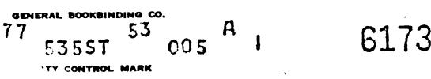


QC311 24 cop.3


### DATE DUE


