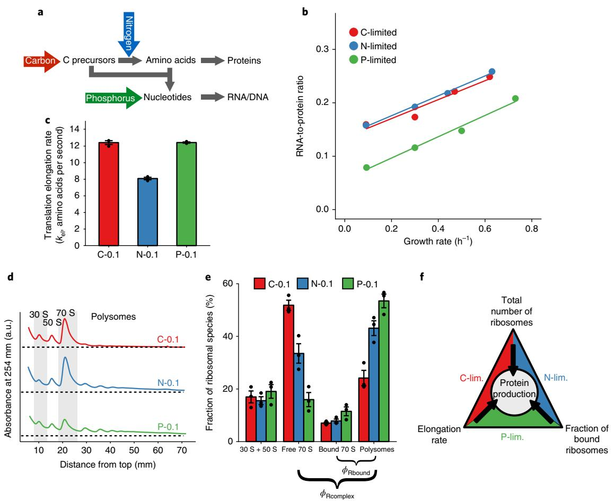
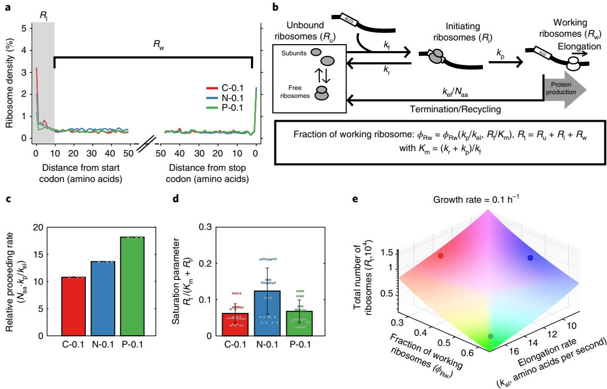
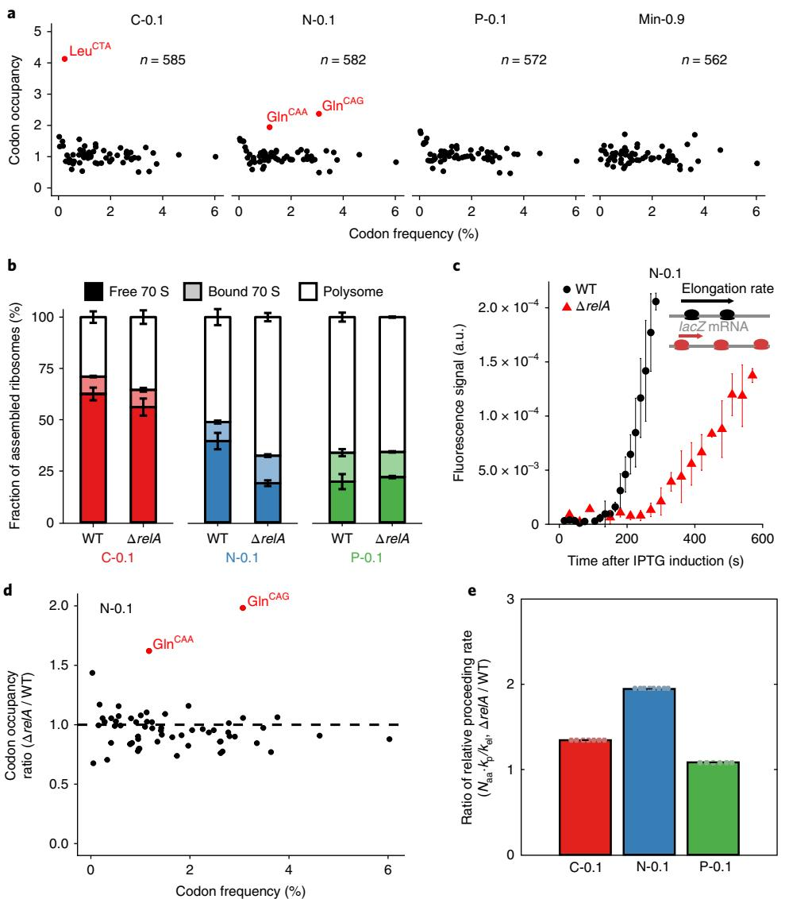
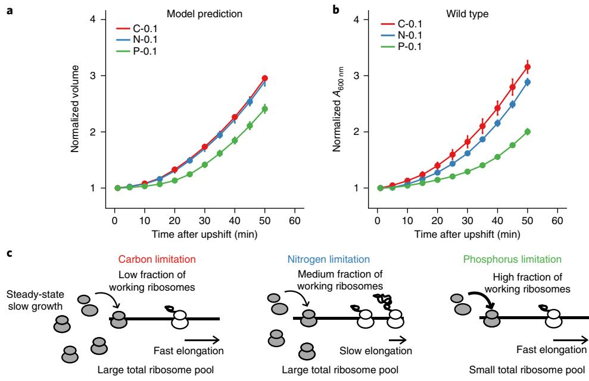
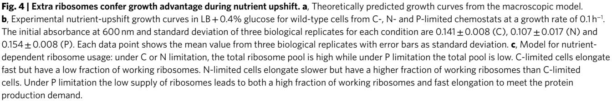

# *Escherichia coli* **translation strategies differ across carbon, nitrogen and phosphorus limitation conditions**

**Sophia Hsin-Jung Li1 , Zhiyuan Li2 , Junyoung O. Park  3,4,7, Christopher G. King5 , Joshua D. Rabinowitz3,6, Ned S. Wingreen1,3* and Zemer Gitai 1 ***

**For cells to grow faster they must increase their protein production rate. Microorganisms have traditionally been thought to accomplish this increase by producing more ribosomes to enhance protein synthesis capacity, leading to the linear relationship between ribosome level and growth rate observed under most growth conditions previously examined. Past studies have suggested that this linear relationship represents an optimal resource allocation strategy for each growth rate, independent of any specific nutrient state. Here we investigate protein production strategies in continuous cultures limited for carbon, nitrogen and phosphorus, which differentially impact substrate supply for protein versus nucleic acid metabolism. Unexpectedly, we find that at slow growth rates,** *Escherichia coli* **achieves the same protein production rate using three different strategies under the three different nutrient limitations. Under phosphorus (P) limitation, translation is slow due to a particularly low abundance of ribosomes, which are RNA-rich and thus particularly costly for phosphorous-limited cells. Under nitrogen (N) limitation, translation elongation is slowed by processes including ribosome stalling at glutamine codons. Under carbon (C) limitation, translation is slowed by accumulation of inactive ribosomes not bound to messenger RNA. These extra ribosomes enable rapid growth acceleration during nutrient upshift. Thus, bacteria tune ribosome usage across different limiting nutrients to enable balanced nutrient-limited growth while also preparing for future nutrient upshifts.**

Resource allocation during growth is a fundamental challenge faced by all cell[s1](#page-7-0)[–4](#page-7-1) . For example, with a fixed resource budget, cells must balance production of the machinery that makes proteins (ribosomes, transfer RNAs, translation factors) with the production of the proteins themselves. This balance is generally represented by the RNA/protein ratio (R/P ratio)[5](#page-7-2),[6](#page-7-3) . The R/P ratio captures protein production capacity, as>95% of total RNA is devoted to translation (ribosomal RNAs and tRNAs[5](#page-7-2)[,7](#page-7-4) ). In single-celled organisms such as *E. coli*, previous studies have demonstrated that there is a linear relationship between R/P ratio and growth rate, with faster growth rates requiring more protein production capacity and therefore higher R/P ratio[s5,](#page-7-2)[6](#page-7-3),[8](#page-7-5)[,9](#page-7-6) . Production of ribosomes is costly as each contains 52 protein subunits and three large rRNA[s10](#page-7-7),[11;](#page-7-8) hence, it is advantageous for the cell to saturate ribosomes with substrates. In this efficient ribosome scenario, the ribosome level should be fixed and independent of nutrient conditions for any growth rate, with the only way to increase protein synthesis rate being to increase the number of ribosome[s1](#page-7-0)[,5](#page-7-2)[,12](#page-7-9). One surprise for such a seemingly optimized system is that multiple studies have demonstrated that at slow growth rates *E. coli* accumulates inactive ribosome[s13.](#page-7-10) There are two possible explanations for the presence of inactive ribosomes. First, it is possible that *E. coli* translation is constrained in such a way that it cannot function when ribosome levels drop too lo[w13](#page-7-10). Alternatively, *E. coli* could regulate ribosome production independently of growth rate. Here we settle this debate by showing that *E. coli* ribosome production and usage differ across nutrient conditions.

#### **Results**

**Phosphate-limited cells achieve the same growth rate with fewer ribosomes than C- or N-limited cells.** To determine the generality of the relationship between growth rate and ribosome content, we examined how the R/P ratio changes as a function of growth under different nutrient limitations. We measured R/P ratios in *E. coli* under glucose (C, carbon), ammonia (N, nitrogen) and phosphate (P, phosphorus) limitations over a range of different growth rates in chemostats (Fig. [1a](#page-1-0)). Surprisingly, P-limited cells consistently exhibited lower R/P ratios than C-limited or N-limited cells, with a roughly 2-fold difference at the slowest growth rate tested (0.1h−1 , Fig. [1b](#page-1-0)). Whereas most bacterial physiology studies have been performed with batch cultures, chemostat cultures reach a steady state due to limitation of a specific nutrient. To determine if our findings are specific to chemostat-grown cultures we also determined the R/P ratios for batch cultures with different growth rates. These results confirmed previous findings that the R/P ratios of C- and N-limited cells follow the same trend regardless of whether they are grown in batch or chemostat conditions (Supplementary Fig. 1a,b and Supplementary Table 2). Measured protein levels were similar in all cells regardless of growth rate or nutrient limitation (Supplementary Fig. 1c,d). Moreover, the rRNA fraction of total RNA remained similar across different nutrient limitations at the same growth rate and decreased as growth was slowed (Supplementary Fig. 1e,f). Since the nutrient-specific changes in R/P ratio cannot be explained by changes in rRNA fraction, and the P-limited cells with the lowest

1 Department of Molecular Biology, Princeton University, Princeton, NJ, USA. 2 Princeton Center for Theoretical Science, Princeton University, Princeton, NJ, USA. 3 Lewis-Sigler Institute for Integrative Genomics, Princeton University, Princeton, NJ, USA. 4Department of Chemical and Biological Engineering, Princeton University, Princeton, NJ, USA. 5 Department of Physics, Princeton University, Princeton, NJ, USA. 6Department of Chemistry, Princeton University, Princeton, NJ, USA 7 Present address: Department of Chemical and Biomolecular Engineering, University of California, Los Angeles, CA, USA. *e-mail: [wingreen@princeton.edu](mailto:wingreen@princeton.edu); [zgitai@princeton.edu](mailto:zgitai@princeton.edu)

**Fig. 1 | RNA-to-protein ratio is both growth-rate and nutrient dependent. a**, Schematic flow of nutrients for biomass formation. Carbon (C) and nitrogen (N) combine to make amino acids. Amino acids combine with carbon precursors and phosphorus (P) to make nucleic acids. **b**, RNA-to-protein ratios for chemostat cultures under C, N and P limitations at different growth rates. Each data point shows the mean value from three technical replicates. **c**, Translation elongation rates (amino acids per second) as measured by the *lacZ* induction assay after correction for translation initiation. The bar height represents mean values with error bars as s.e.m. from three biological replicates. **d**, Polysome profiles of cells grown under C, N and P limitations in chemostats at a dilution rate of 0.1 h−1 . Five independent experiments were repeated, with a single representative curve shown. **e**, Quantification of ribosomes in the form of subunits (30 S + 50 S), free 70 S, mRNA-bound 70 S (one ribosome on one mRNA) and polysomes (multiple ribosomes on one mRNA). The bar height represents mean values with error bars as s.e.m. from three biological replicates. **f**, Cells adapt to different nutrient limitations using different strategies of translational regulation that achieve the same protein production rate.

R/P ratios also have the lowest rRNA fraction, our data collectively suggest that P-limited cells produce protein at the same rate as C/Nlimited cells using fewer ribosomes.

The finding that P-limited cells make the same amount of protein with fewer ribosomes, suggests that C/N-limited *E. coli* cells do not use ribosomes with optimal efficiency and their 'extra' ribosomes do not reflect a biophysical limitation. Since RNA accounts for two-thirds of the mass of bacterial ribosomes[10,](#page-7-7)[14](#page-7-11), producing fewer ribosomes under P limitation makes sense as a way for cells to deal with a limitation that preferentially reduces an elemental substrate needed to make RNA but not protein. This lower ribosome level may be a direct consequence of low phosphate resulting in limited nucleotide pools, as deletion of genes involved in phosphate sensing or storage, *phoB*[15](#page-7-12) or *ppk*[16](#page-7-13), did not alter the R/P ratio (Supplementary Fig. 1g,h).

**N-limited ribosomes translate slowly while C-limited cells accumulate more mRNA-free ribosomes.** Why do C/N-limited cells accumulate so many ribosomes if P-limited cells can achieve the same protein synthesis rates with fewer ribosomes? One possibility is that the ribosomes in these cells translate slowly. We thus used a *lacZ* induction assay to compare the translation elongation rates of slow-growing C-, N- and P-limited cells (0.1h−1 )[17,](#page-7-14)[18](#page-7-15). We observed a reduced elongation rate in N-limited cells compared to C- and P-limited cells but no difference between C- and P-limited cells (Fig. [1c](#page-1-0) and Supplementary Fig. 2). Thus, N-limited cells may need higher ribosome numbers to compensate for their slow translation elongation, but something else must explain the elevated ribosome numbers in C-limited cells.

To characterize ribosome pools we performed polysome profiling, which separates ribosome species using a sucrose gradient[19.](#page-7-16) Regardless of the growth condition, all cells exhibited similar fractional pools of dissociated 30S and 50S subunits (Fig. [1d)](#page-1-0). In contrast, the fraction of 70S monosomes was significantly larger in C/N-limited cells than in P-limited cells (Fig. [1d](#page-1-0)). Since growth rate is proportional to protein synthesis rate, growth rate can be estimated by the product of the number of active ribosomes and the translation elongation rate. However, using the assumption that all 70S monosomes are active yielded very different growth rate estimates for C-, N- and P-limited cells (Table [1](#page-2-0) and Supplementary Information), which is inconsistent

#### **Table 1 | Growth rate estimation from parameters measured**

| Sample | R/P ratio | rRNA frac.  | ϕRcomplex   | ϕRbound     | kel (amino acids per second) | Estimated growth rate from all 70 S (h–1) | Estimated growth rate from bound 70 S (h–1) | Actual growth rate (h–1) |
|--------|--------------|-------------|-------------|-------------|---------------------------------|-------------------------------------------------|---------------------------------------------------|-----------------------------|
| C-0.1  | 0.16         | 0.64 ± 0.03 | 0.83 ± 0.02 | 0.31 ± 0.03 | 12.4 ± 0.2                      | 0.29 ± 0.02                                     | 0.09 ± 0.01                                       | 0.09 ± 0.00                 |
| N-0.1  | 0.16         | 0.59 ± 0.06 | 0.84 ± 0.02 | 0.51 ± 0.03 | 8.1 ± 0.1                       | 0.17 ± 0.01                                     | 0.09 ± 0.01                                       | 0.09 ± 0.00                 |
| P-0.1  | 0.08         | 0.51 ± 0.03 | 0.81 ± 0.03 | 0.65 ± 0.04 | 12.4 ± 0.1                      | 0.12 ± 0.01                                     | 0.08 ± 0.01                                       | 0.09 ± 0.01                 |

Estimation of growth rate using measurements from R/P ratio, fraction of rRNA in total RNA (rRNA frac.), elongation rates (*k*el) and fractions of different ribosomal species (*ϕ*Rcomplex and *ϕ*Rbound). All values are mean values. R/P ratio values are derived from three technical replicates and the rest of the parameters are from three biological replicates with the s.e.m. shown. The propagated error is shown for growth rate estimates.

with the fact that these cells are growing at the same rate and have the same protein content. This inconsistency suggested that a fraction of the 70S ribosomes may not be active.

The mass of a single mRNA is small relative to the mass of a ribosome, such that 70 S monosomes could represent either mRNAs with only one ribosome per transcript or inactive 'free' ribosomes that are not associated with an mRNA. To distinguish free and mRNA-bound 70 S monosomes, we used their differential sensitivity to high potassium levels (170mM)[20.](#page-7-17) High potassium causes free ribosomes to shift to a lower density but does not shift the density of mRNA-bound monosomes[20.](#page-7-17) We thus designed a high-resolution 'free-ribosome profiling' method to resolve this density shift (Supplementary Fig. 3). As controls, we confirmed that our assay detects the potassium-dependent shift of 70 S monosomes induced by puromycin (Supplementary Fig. 3a), which releases elongating ribosomes from their associated mRNA[s21](#page-7-18). There was no potassium-dependent shift detected in fast-growing cells that lack free ribosomes (Supplementary Fig. 3a). As a second validation of our free-ribosome profiling method we confirmed that free ribosome pools decreased as growth rate increased across all three nutrient limiting conditions (Supplementary Fig. 3b).

By combining traditional and free-ribosome polysome profiling, we quantified the relative fractions of all ribosome species in slow-growing C-, N- and P-limited *E. coli*. The fraction of free monosomes was roughly 3-fold greater in the C-limited cells than in the P-limited cells, while the fraction of mRNA-bound monosomes remained relatively constant across nutrient limitations (Fig. [1e](#page-1-0)). The accumulation of free 70 S monosomes in C- and N-limited cells appears to be independent of a previously described RaiA-dependent mechanism for ribosome storage as deletion of *raiA* had no impact on R/P ratios or polysome profiles (Supplementary Fig. 4). Importantly, revising our protein synthesis rate estimates to account for the fraction of inactive 70 S monosomes correctly yielded similar values for all cells, regardless of nutrient limitation (Table [1](#page-2-0)). These results both validate our experimental measurements and suggest that, in different nutrient states, *E. coli* differentially tune ribosome number, elongation rate and active fraction to produce proteins at the same rates (Fig. [1f](#page-1-0)).

**Quantitative modelling describes three different strategies of ribosome dynamics to achieve the same protein production rate.** To better understand nutrient-dependent ribosome dynamics, we probed translation in slow-growing C-, N- and P-limited cells by ribosome profiling. Analysis of ribosome densities as a function of distance from the start and stop codons revealed higher ribosome occupancy near the start codon for C- and N-limited ribosomes (Fig. [2a](#page-3-0)). Ribosome density thereafter was similar, with no decrease in ribosome density between the first and second halves of genes (Fig. [2a](#page-3-0) and Supplementary Fig. 5a), suggesting that there is little to no aborted translation after the first few codons.

To gain more mechanistic insights into the differences in translation across nutrient limitations, we developed a macroscopic mathematical model of ribosome dynamics (Fig. [2b,](#page-3-0) Supplementary Fig. 5b-e and details in the Supplementary Information). This macroscopic model incorporates the ribosome profiling data and models ribosomes as three species: unbound ribosomes, initiating ribosomes and working ribosomes. Unbound ribosomes (*R*u) can bind to an mRNA with a free ribosomal binding site (with rate constant *k*f) to become initiating ribosomes (*R*i ). The initiating ribosomes can proceed to elongation (with rate constant *k*p) to become working ribosomes (*R*w) or can abort translation (with rate constant *k*r). Working ribosomes elongate to finish translation and become unbound (with rate constant *k*el/*N*aa), where *N*aa is the length of an average protein in amino acids. We defined the fraction of ribosomes bound to the first 10 codons as initiating ribosomes since the ribosome footprint size is ~10 codon[s22](#page-7-19),[23.](#page-7-20) To validate our model we used it to calculate elongation rates, which closely agreed with those we measured experimentally (Supplementary Fig. 6a).

Analysis of our model indicated that the system can be characterized by two main dimensionless parameters (Supplementary Information): the 'relative proceeding rate', defined as the ratio between the rate of ribosomes proceeding from initiation to elongation (*k*p, s-1) and the rate of elongation (*k*el /*N*aa, s-1); and the 'saturation parameter' (*R*t /(*K*m +*R*t )), reflecting the degree of saturation of ribosome binding sites on mRNAs, where *R*t is the total ribosome number and *K*m=(*k*r+*k*p)/*k*f (Fig. [2c,d](#page-3-0) and Supplementary Fig. 6b,c). Fitting the measured ribosome densities, translation elongation rates and pool sizes of ribosome species to the macroscopic model revealed that P-limited cells have the highest relative proceeding rate while C-limited cells have the lowest saturation parameter, and N-limited cells have the highest saturation parameter (Fig. [2c,d](#page-3-0) and Supplementary Fig. 6b-e). Thus, C-, N- and P-limited cells produce proteins at the same rate using three different strategies: P-limited cells have few ribosomes that are mostly active and elongate rapidly, N-limited cells have more ribosomes but fewer are active and they elongate slowly, and C-limited cells have many ribosomes, which elongate rapidly, but even fewer are bound to mRNA (Fig. [2e](#page-3-0) and Supplementary Fig. 6f).

**N-limited ribosomal regulation is mediated by RelA, the ppGpp alarmone synthase.** Our ribosome profiling data provides additional insight into the molecular basis of nutrient-specific ribosome regulation through analysis of codon occupancies. Codon-specific ribosome stalling leads to increased codon occupancy and is a hallmark of insufficient pools of the corresponding charged tRNAs. P-limited cells exhibited no elevated codon frequencies, consistent with the efficient ribosome usage of these cells (Fig. [3a](#page-4-0)). In contrast, both C- and N-limited cells exhibited significant codon-specific stalling. Under N limitation, ribosomes stalled at both of the two glutamine-encoding codons. This result is consistent with previous studies indicating that glutamine is the most strongly depleted amino acid pool under N limitation and serves as an intracellular sensor for extracellular nitrogen levels[24–](#page-7-21)[26.](#page-7-22) Since glutamine codons account for 4.4% of all predicted open reading frame (ORF) codons in *E. coli*,

## Articles **NATURe MiCRobiology**

**Fig. 2 | A macroscopic model reveals different ribosome dynamics that achieve the same growth rate. a**, Averaged A-site ribosome counts within the first and last 50 codons of the transcripts from ribosome profiling analysis. Ribosomes bound to the first 10 codons are defined as 'initiating ribosomes' (*R*i ) and those bound to the rest of the transcripts except the stop codon are 'working ribosomes' (*R*w) (*n*= 1 independent biological sample). **b**, A macroscopic model of ribosome dynamics. *k*f , forward rate (s-1); *k*p, proceeding rate (s-1); *k*el, elongation rate (amino acids per second); *N*aa, number of amino acids in an average protein of *E. coli*; *k*r , aborted translation rate (s-1); *R*t , total number of ribosomes. **c**, The relative proceeding rate under C, N and P limitations at a growth rate of 0.1 h−1 . The bar height represents mean values with error bars as standard deviation from all the possible combinations of experimental measurements. **d**, The saturation parameter under C, N and P limitations at a growth rate of 0.1 h−1 . The bar height represents mean values with error bars as standard deviation from all the possible combinations of experimental measurements. **e**, The relationship between elongation rate (*k*el), fraction of working ribosomes (*ϕ*Rw) and total number of ribosomes (*R*t ) that leads to the same growth rate at 0.1 h−1 . Coloured dots indicate the values for C-, N- and P-limited wild-type cells.

the ~2-fold increase in glutamine codon occupancy indicates that additional mechanisms also contribute to the ~30% reduction in translation elongation rate observed under N limitation. Under C limitation, we observed elevated occupancy of the Leu-CTA codon, which was surprising as there is no known intracellular carbon sensor that controls translation. *E. coli* has six leucine codons decoded by five leucine tRNA specie[s27,](#page-7-23)[28.](#page-7-24) Leu-CTA is the rarest Leu codon, accounting for only 0.4% of all predicted ORF codons.

In addition to clarifying the link between metabolism and translation for N limitation, the observation that ribosomes stall at specific codons under C/N limitation suggested a molecular mechanism for nutrient-specific translation regulation (Fig. [3a](#page-4-0)). In bacteria, insufficient charged tRNA pools activate the stringent response, which is mediated by the accumulation of the cellular alarmone, ppGpp[29](#page-7-25)[,30.](#page-7-26) ppGpp is known to regulate rRNA transcription in vivo. Its role in translation is less well understood but ppGpp has been shown in vitro to inhibit translation factors such as EF-Tu and IF-2 by competing with GTP[31](#page-7-27)[,32](#page-7-28). To test how ppGpp accumulation might affect translation in vivo, we induced ppGpp synthesis by treating batch-grown *E. coli* with serine hydroxamate (SHX). SHX is a serine analogue that competitively inhibits serine tRNA synthetase to yield uncharged serine tRNA and thereby activate the RelA ppGpp synthas[e33](#page-7-29). SHX treatment increased the pool of mRNA-free 70 S monosomes, and this effect was completely dependent on *relA* (Supplementary Fig. 7a,b). Thus, inducing ppGpp by activating RelA alters translation by increasing the fraction of inactive free 70 S ribosomes.

RelA is primarily required for the accumulation of ppGpp under N limitation but not C limitation[30.](#page-7-26) Consistently, deletion of *relA* had little impact on the accumulation of free ribosomes under C limitation, but significantly reduced free ribosome pools under N limitation to levels similar to those observed under P limitation (Fig. [3b](#page-4-0) and Supplementary Fig. 7c). We could not probe the role of ppGpp in C-limited ribosome accumulation because, unlike N limitation, C limitation elevates ppGpp through *spoT*, which is essential[34.](#page-7-30) N-limited *ΔrelA* cells also contained more polysomes than wild type (Fig. [3b)](#page-4-0), suggesting that these cells had a higher fraction of elongating ribosomes. This result was initially confusing because the wild type and *ΔrelA* N-limited cells were grown at the same growth rate and maintained the same R/P ratio (Supplementary Fig. 7d). We thus measured the rate of translation elongation and found that while N-limited *ΔrelA* cells have higher fractions of translating ribosomes, their ribosomes elongate more slowly (Fig. [3c](#page-4-0)), resulting in the same rate of protein production as wild type.

To understand how RelA influences ribosome dynamics we performed ribosome profiling. N-limited *ΔrelA* cells exhibited even more pronounced ribosome stalling at both glutamine codons than wild type N-limited cells, while *relA* deletion had no effect on P- or C-limited cells (Fig. [3d](#page-4-0) and Supplementary Fig. 8). Fitting the *ΔrelA* cells measurements to our ribosome dynamics model revealed that *ΔrelA* cells specifically increase the relative proceeding rate under N limitation, but display no effect on relative proceeding rate under P or C limitation and no effect on the saturation parameter in any condition (Fig. [3e](#page-4-0) and Supplementary Fig. 6b,c). These results

## **NATURe MiCRobiology** Articles

**Fig. 3 | Deletion of** *relA* **disrupts translation regulation under nitrogen limitation. a**, A-site codon occupancy under different growth conditions from ribosome profiling. Occupancy was calculated as the ratio between measured and expected counts for each gene based on codon frequency. The average of this ratio is plotted (with number of genes specified). Codons that have higher than average ratio by 2.5 standard deviations are highlighted. **b**, Fraction of assembled (70 S) ribosomes in wild type and Δ*relA* under C, N and P limitations at a growth rate of 0.1 h−1 . The bar height represents mean values with error bars as s.e.m. from three biological replicates. **c**, *lacZ* induction assay for wild type and Δ*relA* under nitrogen limitation at a growth rate of 0.1 h−1 . The lag time measures when the first functional LacZ is produced and is inversely proportional to the elongation rate. Mean values from three biological replicates are shown with error bars as s.e.m. **d**, Ratio of codon occupancy between Δ*relA* and wild type (WT) under nitrogen limitation at a growth rate of 0.1 h−1 (*n*= 1 independent biological sample). **e**, Ratio of the relative proceeding rate (*N*aa·*k*p/*k*el) between Δ*relA* and wild type across different conditions at a growth rate of 0.1 h−1 . The bar height represents mean values with error bars as standard deviation from all the possible combination of experimental measurements.

suggest that in N-limited cells, RelA-dependent ppGpp serves to restrict ribosome function by regulating the translation initiation rate and/or the frequency at which ribosomes transition from initiation to elongation. Furthermore, we speculate that in the absence of RelA more ribosomes attempt to elongate, which exacerbates the depletion of charged tRNA pools, leading to increased stalling and a slower translational elongation rate.

**Extra ribosomes may facilitate growth acceleration during nutrient upshift.** While cells can modulate different aspects of ribosome dynamics to achieve the same protein production rate, what benefits might be served by the inefficient translation system used by C-limited cells where many ribosomes are inactive? Since free ribosomes accumulate the most at the slowest growth rates, we hypothesized that our findings could reflect a trade-off between steady-state growth rate and the ability to respond to a fluctuating environment. Such transitions could include rapidly and safely slowing growth when nutrients become depleted and rapidly increasing growth rate when nutrients are replenished. In this scenario, cells may benefit more by optimizing their ability to rapidly use new nutrients, for example to outcompete their neighbours or maximally use a transient pulse of nutrients, than by optimizing a steady-state growth rate when nutrient levels are low.

We extended our mathematical model of ribosome dynamics to predict cellular growth dynamics during nutrient upshift. This modelling supported the hypothesis that the larger free ribosome pools of C/N-limited cells should enable them to increase their growth rates more quickly than P-limited cells during nutrient upshift (Fig. [4a,](#page-5-0) Supplementary Fig. 9 and details in the Supplementary Information[)4,](#page-7-1)[35](#page-7-31). We experimentally tested this prediction by measuring the growth rates of slow-growing (0.1h−1 ) *E. coli* immediately after being shifted to rich media (Luria-Bertani media (LB)+0.4% glucose[)36.](#page-7-32) As predicted, C/N-limited cells increased their growth rates significantly faster than P-limited cells (Fig. [4b)](#page-5-0). Thus, the distinct translation strategies employed under different nutrient conditions may represent nutrient-specific adaptations, with P-limited cells optimizing for current steady-state growth under slow growth conditions, and C- and N-limited cells favouring the ability to rapidly recover growth (Fig. [4c)](#page-5-0).

### **Discussion**

In previous studies, *E. coli* were found to vary R/P ratio with growth rate independently of the specific nutrient limitation used to produce a given growth rate[5](#page-7-2)[,9](#page-7-6) . While pioneering physiology studies acknowledged the possibility that such growth laws could depend on the specific growth state of the cel[l6,](#page-7-3)[8](#page-7-5) , the reproducibility of the correlation between R/P ratio and growth rate has often been considered to be more genera[l1](#page-7-0)[,9](#page-7-6) . Meanwhile, transcriptional analysis in *Saccharomyces cerevisiae* suggested that the primary determinant of the response to a wide range of stresses was the cellular growth rate rather than the specific stressor[37.](#page-7-33) Together, these studies suggested that the primary regulator of microbial physiology is growth rate. However, our findings demonstrate that, at the same growth rate, *E. coli* exhibit significantly different translation strategies across nutrient limitations; at the lowest growth rate tested, P-limited cells produced the same amount of protein with roughly half as many ribosomes as C/N-limited cells. P-limited cells also exhibited smaller inactive 70 S monosome pools and higher relative proceeding rates than C/N-limited cells. Furthermore, while C/N-limited cells have similar ribosome numbers, they also display differences in free ribosome pools, translational elongation rates and sensitivity to the loss of the ppGpp synthase RelA. Thus, our results suggest that the extra ribosomes of C/N-limited cells do not reflect essential constraints, but rather reflect a selectively beneficial adaptation.

Our findings also implicate ppGpp as a key mediator of ribosome activity that specifically modulates the transition from translation initiation to elongation. ppGpp is a well-characterized cellular alarmone that senses translational activity and inhibits rRNA transcription[30](#page-7-26)[,38.](#page-7-34) However, ppGpp can competitively inhibit GTP-dependent enzymes, including the translation initiation factor IF-2 that is required for the transition to elongatio[n39](#page-8-0). Since ppGpp can also be produced by SpoT and *spoT relA* mutants cannot survive in the conditions of our experiments[40,](#page-8-1) the effect of complete loss of ppGpp remains unclear. Nevertheless, the phenotypes we observe in the absence of RelA provide in vivo support that ppGpp can affect translation in addition to affecting ribosome production. Our modelling suggests that ppGpp affects translation by altering the relative proceeding rate, which can be influenced by both the translation initiation rate and the frequency with which ribosomes transition from translation initiation to elongation. One attractive candidate target for ppGpp is IF-2, as a previous in vitro study demonstrated that ppGpp inhibits IF-2 functio[n32](#page-7-28) and IF-2 has been implicated in both initiation and the transition to elongation. Since ppGpp can also affect other GTP-binding proteins involved in translation[31](#page-7-27)[,41,](#page-8-2) future studies on bacterial translation will need to address both how RelA-dependent ppGpp interferes with ribosome function and whether other sources of ppGpp are important translational modulators in other contexts.

In native environments such as the mammalian gut, bacteria such as *E. coli* are faced with feast and famine cycles induced by feeding

## **NATURe MiCRobiology** Articles

cycle[s42.](#page-8-3) Here we show at the same growth rate that the R/P ratio in *E. coli* does not reflect the optimization of steady-state growth but, instead, may reflect the ability of cells with higher inactive ribosome pools to rapidly accelerate growth during nutrient repletion. These findings suggest that *E. coli* may improve their fitness by sacrificing their maximal growth rate in nutrient-poor periods in return for the ability to respond to a changing environment, including rapidly accelerating growth in nutrient-rich periods. Our macroscopic ribosome dynamics model highlights how cells can tune total ribosome number, the fraction of working ribosomes and the rate of translational elongation to achieve the same total protein production rate while balancing other constraints such as reduced amino acid availability or the need to rapidly accelerate growth. This strategy could help explain recent reports of the suboptimality of protein allocation for *E. coli* in the presence of poor carbon source[s43–](#page-8-4)[46,](#page-8-5) the suboptimal expression levels of essential genes in *Bacillus subtilis*[47](#page-8-6) and excess ribosome production in *S. cerevisiae*[48](#page-8-7)[,49.](#page-8-8) Future studies will address the consequences of adaptation strategies in dynamic conditions, for example the generality of optimizing growth rate transitions at the expense of steady-state growth.

### **Methods**

**Cell strains and growth conditions.** *E. coli* strain NCM3722 was grown in batch or continuous cultures. To achieve diferent growth rates, diferent carbon or nitrogen sources were provided in batch culture, whereas dilution rates ranging from 0.1h−1 to 0.7h−1 were used in continuous (chemostat) cultures. Te chemostat (Sixfors, HT) volume was 300ml with oxygen and pH probes to monitor the culture. pH was maintained at 7.2±0.1 and the aeration rate was set at 4.5 l/h. 40mM MOPS media (M2120, Teknova) was used with glucose (0.4%, Sigma G8270), ammonia (9.5mM NH4Cl, Sigma A9434) and phosphate (1.32mM K2HPO4, Sigma P3786) added separately. For C- and N-limiting media, glucose and ammonia concentrations were reduced by 5-fold (0.08% and 1.9mM, respectively). Te P-limiting medium contains 0.132mM K2HPO4. Δ*relA* mutant was generated by P1 transduction from the Keio collectio[n50](#page-8-9) into *E. coli* strain NCM3722.

**Nutrient upshift growth measurement.** Cells from chemosats were mixed with 4×volumes of fresh pre-warmed media and grown in flasks in a 37 °C water bath. Cell growth was monitored every 5min by checking absorbance at 600nm in a quartz cuvette (Starna, 16.160-Q-10/Z8.5) using a spectrophotometer (GENESYS™ 20, Thermo Scientific). The LB media (244610, BD) used for upshift was supplemented with 0.4% glucose.

**Total RNA measurement.** The method for RNA measurement was adapted from You et al[.1](#page-7-0) . 1.5ml of cultures were pelleted by centrifugation for 1min at 13,000*g*. The pellet was frozen on dry ice and the supernatant was taken to measure absorbance at 600nm for cell loss. The pellet was then washed twice with 0.6M HClO4 and digested with 0.3M KOH for 1h at 37 ˚C. The solution was then precipitated with 3M HClO4 and the supernatant was collected. The pellet was re-extracted again with 0.5M HClO4. The supernatants were combined and absorbance measured at 260nm using Tecan Infinite 200 Pro (Tecan Trading AG, Switzerland). Total RNA concentration is the multiplication product of the A260 absorbance value and the extinction coefficient (31 µg RNA ml–1).

**Total protein measurement.** The method for protein measurement is adapted from You et al[.1](#page-7-0) . 1.5ml of cell cultures were pelleted by centrifugation for 1min at 13,000*g*. Cells were washed with 1ml MOPS buffer once, re-suspended in 200 µl water and left on dry ice. All the supernatant was collected and *A*600 nm was measured for cell loss. To measure the protein content, samples were thawed, 100µl of 3M NaOH was added and the sample was heated for 5min at 98˚C. The samples were cooled down to room temperature for 5min before 300µl of 0.1% CuSO4 were added for biuret assay. The samples were incubated at room temperature for 5min and centrifuged at 13,000*g* for 1min. The supernatant was collected and the absorbance was measured at 555nm for a 200µl sample volume in a microplate reader (Synergy HT, BioTek) with software Gen5. Proper dilution of albumin (23209, Thermo) with known concentrations was used to infer the total protein concentration in the cell.

**rRNA fraction quantification.** 2ml of culture were pelleted by centrifugation at maximum speed for 1min. Supernatant was removed and the sample was flash frozen in liquid nitrogen. Total RNA was extracted using a hot-phenol metho[d51](#page-8-10). The sample was analysed using a 2100 Bioanalyzer instrument with the RNA 6000 Nano kit (Agilent). The RNA fraction was quantified by integrating the area under each peak in the 2100 Expert software using the Prokaryote Total RNA Nano Assay (Version 2.5). rRNA fraction is defined as the sum of the 16 S and 23 S peak areas divided by the total area. tRNA fraction is defined as the sum of the area between 80 nt and 175 nt divided by the total area.

**Polysome profiling and quantification of ribosome fraction.** 200ml of cells were collected from cultures by filtration through 90mm cellulose acetate membranes with a 0.2µm pore size (CA029025, Strelitech) at 37 ˚C, scratched with a clean and pre-warmed stainless steel spatula, and snap frozen in liquid nitrogen. The whole filtration procedure did not take more than 2min to maintain the original physiological state. Cell pellets were mixed with 650µl lysis buffer frozen nuggets (20mM Tris-HCl pH 8.0, 10mM MgCl2, 100mM NH4Cl, 0.4% Triton X-100, 0.1% NP-40, 1mM Chloramphenicol, 100U ml−1 RNase-free DNase I (04716728001 Roche)) in a pre-chilled 10ml jar (014620331, Retsch). Pulverization was done by cryomill (Retsch) at 15Hz for 15min. The thawed cell lysates were quantified by NanoDrop and 200 µl of lysates with RNA concentration ranging from 80 µg to 500 µg were used. For overall polysome quantification, lysates were loaded to 10–55% linear sucrose gradients (20mM Tris-HCl pH 8.0, 10mM MgCl2, 100mM NH4Cl, 300µM Chloramphenicol) made by GradientMaster (BioComp). The gradients were placed in a SW41Ti bucket and centrifuged in Optima XE-100 Ultracentrifuge (Beckman Coulter) at 35,000 r.p.m. for 2h at 4 ˚C. Gradients were fractionated by BioComp Gradient Fractionator and the absorption curves at 254nm were recorded by a ultraviolet monitor (EM-1, BioRad).

Quantification of the polysome profiles was performed using customized MATLAB codes. First, since chloramphenicol absorbs at the same wavelengths as RNA, we estimated a baseline absorbance using the average of the last 50 readings where no RNA was detected (the bottom of the tubes) and subtracted this background value. The background from the free nucleotides and tRNA was removed by fitting an exponential decay function to the first peak representing the source of non-ribosome signals. Each ribosome peak was picked and quantified by integrating the area underneath the curve.

To quantify different species of ribosomes in the 70 S peak, 100mM NH4Cl was replaced with 170mM KCl. Cell lysates were loaded onto 10–30% linear gradient and centrifuged at 35,000 r.p.m. in a SW41Ti bucket at 4 ˚C for 5h. Because the two peaks for the free and mRNA-bound 70 S ribosomes are very close in mass and clean separation was not possible, the MATLAB file-exchange package, *peakfit* (2.0), was used to fit the three overlapped peaks (50 S subunit, mRNA-free 70 S and mRNA-bound 70 S) as three Gaussian distributions. For the free ribosome control, cells were treated with 100 µM puromycin for 5min and collected. For serine hydroxamate (SHX, Sigma S4503) treatment, cells were grown in MOPS glucose minimal media until *A*~0.3 and treated with SHX with a final concentration of 1mgml−1 for 10 min before collection.

*lacZ* **induction and translational elongation rate measurement.** The method was adapted from Zhu et al[52](#page-8-11). A final concentration of 5mM isopropyl-β -D-thiogalactoside (IPTG) (I2481C-25, Gold Biotechnology) was added to cultures. At every 15 s, 1ml of culture was collected in a tube containing 10 µl of 100mM chloramphenicol, snap frozen in liquid nitrogen and stored at -20 ˚C before subsequent measurement. After cells were thawed, 400 µl of the sample was added to 100 µl 5×Z-buffer (0.3M Na2HPO4.7H2O, 0.2M NaH2PO4.H2O, 50mM KCl, 5mM MgSO4, 20mM β-mercaptoethanol) and incubated at 37 ˚C for 10min. 100 µl of 4mgml−1 4-methylumbelliferyl-β-D-galactopyranoside (MUG, 337210010, ACROS Organics) in DMSO was then added to each sample every 10 s to accurately control the reaction time. The samples were incubated at 37 ˚C in Eppendorf Thermomixer R at 1,400 r.p.m. mixing rate for 30min to 2h, depending on the enzyme expression level. The reaction was stopped by addition of 300 µl of 1M Na2CO3. The tubes were spun down at 16,000*g* for 3min to sediment the cell debris. 200 µl of supernatant were taken and the fluorescence measured by a microplate reader (365nm excitation and 450nm emission filter).

To infer translational elongation rate, the square root of the signal in excess of the signal at time zero was plotted. A linear fit was performed on the points after the signal began to increase. The lag time is the *x* intercept of the line. A previous study has shown that the initiation time remains constant for about 10 s across a wide range of conditions tested[52.](#page-8-11) Therefore, we corrected the elongation times measured by subtracting 10 s from the lag times measured.

**Ribosome footprinting and RNA extraction.** The cell collection step was the same as for polysome profiling except that 1mM of chloramphenicol was used in the sucrose solution. The footprinting and library preparation steps were adapted from Li et al[.2](#page-7-35) After quantification of RNA concentration with NanoDrop, samples with 500 µg RNA were digested with 750U MNase (10107921001, Roche) for 1h at 25 ˚C before being quenched with 6mM EGTA. The lysates were then layered onto a 10–55% sucrose gradient and centrifuged. The monosome fraction was collected and snap frozen in liquid nitrogen. No polysome peaks were observed, indicating a thorough digestion. The RNA was isolated using hot phenol and size selected on 15% TBE-Urea PAGE gels run for 1h at 210V. Gels were stained with SYBR Gold and visualized using Dark Reader (Clare Chemical Research). RNA fragments with size between 25nt and 40nt were extracted using isopropanol precipitation.

**Library preparation and sequencing.** Fragments from footprints were dephosphorylated at the 3' end by T4 Polynucleotide Kinase (M0201, NEB). The repaired fragments were linked to the Universal miRNA Cloning Linker (S1315S, NEB), reverse transcribed (18080044, Thermo) and circularized (CL4111K, Epicentre). rRNA was subtracted from the circularized samples before PCR

amplification (M0531L, NEB) and size selection. High-quality PCR samples were checked by Bioanalyzer high-sensitive DNA chip. Deep sequencing was done by Illumina HiSeq 2500 on Rapid flow cells with settings of single end and 75nt-long read length.

**Mapping and sequencing data analysis.** Data manipulation including barcode splitting, linker trimming and mapping were done using Galax[y53](#page-8-12). The processed reads were mapped to *E coli* genome escherichia_coli_k12_nc_000913_3 from the National Center for Biotechnology Information (NCBI) database with the BW[A54](#page-8-13) short read mapping algorithm. Only the reads between 20nt and 45nt that aligned to the coding region were used for further analysis.

To infer the ribosome A-site position, the Python package Plastid[55](#page-8-14) was used to align the 3' end of reads to the stop and start codon[s56](#page-8-15), which are known to have higher ribosome densities. We found that the offsets were 12nt for the stop codon and 15nt for the start codon. Therefore, we used 11nt for the A-site position and 14nt for the P site. The counts were normalized to the total counts in the coding region as reads per million (RPM) and transcripts per million (TPM). Further analysis was done using customized Python and R codes with packages including Plastid, dplyr, tidyr and ggplot2.

**Analysis of ribosome profiling data.** TPM was used to identify highly expressed genes for codon occupancy analysis. After assigning each mapped read to the A-site nucleotide, the raw counts were first normalized by the length of their mapped coding region, to yield the count density for each gene. These count densities were then globally normalized to one million counts across all genes within one sample. To determine codon occupancy, transcripts having total counts over 100 TPM and containing more than 200 codons were considered. Ribosome footprint counts for the first and last 40 codons were removed to avoid possible effects from initiation and termination, and counts per codon were recorded for the remaining counts. For each gene and each codon type, the codon occupancy ratio is defined as the ratio of measured counts to expected counts. Expected counts are simply proportional to the frequency of that particular codon in the gene. The final reported codon occupancy ratio is the average of codon occupancy ratios from all genes considered weighted equally.

We calculated ribosome counts along a transcript using RPM. Only transcripts having total counts over 10 TPM and containing more than 100 codons were considered. Total counts after filtering were normalized to one million reads. The selected genes account for more than 75% of the total counts. The ribosome counts are the sum of re-normalized RPM at each position.

To compare the ribosome counts of genes from the first and second halves, the same set of genes and trimming processing for codon occupancy were used. The RPM from the first and second halves of the gene were summed up separately and plotted against each other.

**Reporting Summary.** Further information on experimental design is available in the Nature Research Reporting Summary linked to this article.

**Code availability.** All the codes used for data analysis in this paper are available on request.

**Data availability.** All the sequencing data used to reach the conclusion of this paper are available under NCBI BioProject ID [PRJNA474410](https://www.ncbi.nlm.nih.gov/bioproject/?term=PRJNA474410) and SRA accession number [SRP149755.](https://www.ncbi.nlm.nih.gov/sra/?term=SRP149755) All the RNA-to-protein ratio data are available in Supplementary Table 2 as an Excel file.

Received: 21 January 2018; Accepted: 15 June 2018; Published: xx xx xxxx

### **References**

- 1. You, C. et al. Coordination of bacterial proteome with metabolism by cyclic AMP signalling. *Nature* **500**, 301–306 (2013).
- 2. Li, G.-W., Burkhardt, D., Gross, C. & Weissman, J. S. Quantifying absolute protein synthesis rates reveals principles underlying allocation of cellular resources. *Cell* **157**, 624–635 (2014).
- 3. Scott, M., Klumpp, S., Mateescu, E. M. & Hwa, T. Emergence of robust growth laws from optimal regulation of ribosome synthesis. *Mol. Syst. Biol.* **10**, 747–747 (2014).
- 4. Giordano, N., Mairet, F., Gouzé, J.-L., Geiselmann, J. & de Jong, H. Dynamical allocation of cellular resources as an optimal control problem: novel insights into microbial growth strategies. *PLoS Comput. Biol.* **12**, e1004802 (2016).
- 5. Dennis, P. P. & Bremer, H. Modulation of chemical composition and other parameters of the cell at diferent exponential growth rates. *EcoSal Plus* <https://doi.org/10.1128/ecosal.5.2.3> (2008).
- 6. Neidhardt, F. C. & Magasanik, B. Studies on the role of ribonucleic acid in the growth of bacteria. *Biochim. Biophys. Acta* **42**, 99–116 (1960).
- 7. Baracchini, E. & Bremer, H. Determination of synthesis rate and lifetime of bacterial mRNAs. *Anal. Biochem.* **167**, 245–260 (1987).
- 8. Schaechter, M., Maaløe, O. & Kjeldgaard, N. O. Dependency on medium and temperature of cell size and chemical composition during balanced growth of *Salmonella typhimurium*. *Microbiology* **19**, 592–606 (1958).
- 9. Scott, M., Gunderson, C. W., Mateescu, E. M., Zhang, Z. & Hwa, T. Interdependence of cell growth and gene expression: origins and consequences. *Science* **330**, 1099–1102 (2010).
- 10. Yamamoto, T., Izumi, S. & Gekko, K. Mass spectrometry of hydrogen/ deuterium exchange in 70S ribosomal proteins from *E. coli*. *FEBS Lett.* **580**, 3638–3642 (2006).
- 11. Nomura, M. & Gourse, R. Regulation of the synthesis of ribosomes and ribosomal components. *Annu. Rev. Biochem.* **53**, 75–117 (1984).
- 12. Maaloe, O. & Kjeldgaard, N. O. *Control of Macromolecular Synthesis* (WA Benjamin, New York, 1966).
- 13. Dai, X. et al. Reduction of translating ribosomes enables *Escherichia coli* to maintain elongation rates during slow growth. *Nat. Microbiol.* **2**, 16231 (2016).
- 14. Lewin, B. *Genes VIII* (Pearson Education, Upper Saddle River, 2003).
- 15. Wanner, B. L. Gene regulation by phosphate in enteric bacteria. *J. Cell. Biochem.* **51**, 47–54 (1993).
- 16. Ahn, K. & Kornberg, A. Polyphosphate kinase from *Escherichia coli*. Purifcation and demonstration of a phosphoenzyme intermediate. *J. Biol. Chem.* **265**, 11734–11739 (1990).
- 17. Schleif, R., Hess, W., Finkelstein, S. & Ellis, D. Induction kinetics of the L-arabinose operon of *Escherichia coli*. *J. Bacteriol.* **115**, 9–14 (1973).
- 18. Dalbow, D. G. & Young, R. Synthesis time of β-galactosidase in *Escherichia coli* B/r as a function of growth rate. *Biochem. J.* **150**, 13–20 (1975).
- 19. Qin, D. & Fredrick, K. Analysis of polysomes from bacteria. *Meth. Enzymol.* **530**, 159–172 (2013).
- 20. Beller, R. J. & Lubsen, N. H. Efect of polypeptide chain length on dissociation of ribosomal complexes. *Biochemistry* **11**, 3271–3276 (1972).
- 21. Nathans, D. Puromycin inhibition of protein synthesis: incorporation of puromycin into peptide chains. *Proc. Natl Acad. Sci. USA* **51**, 585–592 (1964).
- 22. Steitz, J. A. Polypeptide chain initiation: nucleotide sequences of the three ribosomal binding sites in bacteriophage R17. *RNA* **224**, 957–964 (1969).
- 23. Ingolia, N. T., Ghaemmaghami, S., Newman, J. R. S. & Weissman, J. S. Genome-wide analysis in vivo of translation with nucleotide resolution using ribosome profling. *Science* **324**, 218–223 (2009).
- 24. Doucette, C. D., Schwab, D. J., Wingreen, N. S. & Rabinowitz, J. D. α-Ketoglutarate coordinates carbon and nitrogen utilization via enzyme I inhibition. *Nat. Chem. Biol.* **7**, 894–901 (2011).
- 25. Yuan, J. et al. Metabolomics‐driven quantitative analysis of ammonia assimilation in *E. coli*. *Mol. Syst. Biol.* **5**, 302 (2009).
- 26. Ikeda, T. P., Shauger, A. E. & Kustu, S. *Salmonella typhimurium* apparently perceives external nitrogen limitation as internal glutamine limitation. *J. Mol. Biol.* **259**, 589–607 (1996).
- 27. Subramaniam, A. R., Pan, T. & Cluzel, P. Environmental perturbations lif the degeneracy of the genetic code to regulate protein levels in bacteria. *Proc. Natl Acad. Sci. USA* **110**, 2419–2424 (2013).
- 28. Sørensen, M. A. et al. Over expression of a tRNALeu isoacceptor changes charging pattern of leucine tRNAs and reveals new codon reading. *J. Mol. Biol.* **354**, 16–24 (2005).
- 29. Hauryliuk, V., Atkinson, G. C., Murakami, K. S., Tenson, T. & Gerdes, K. Recent functional insights into the role of (p)ppGpp in bacterial physiology. *Nat. Rev. Micro* **13**, 298–309 (2015).
- 30. Potrykus, K. & Cashel, M. (p)ppGpp: Still Magical?. *Annu. Rev. Microbiol.* **62**, 35–51 (2008).
- 31. Mitkevich, V. A. et al. Termodynamic characterization of ppGpp binding to EF-G or IF2 and of initiator tRNA binding to free IF2 in the presence of GDP, GTP, or ppGpp. *J. Mol. Biol.* **402**, 838–846 (2010).
- 32. Milon, P. et al. Te nucleotide-binding site of bacterial translation initiation factor 2 (IF2) as a metabolic sensor. *Proc. Natl Acad. Sci. USA* **103**, 13962–13967 (2006).
- 33. Jiang, M., Sullivan, S. M., Wout, P. K. & Maddock, J. R. G-protein control of the ribosome-associated stress response protein SpoT. *J. Bacteriol.* **189**, 6140–6147 (2007).
- 34. Gentry, D. R. & Cashel, M. Mutational analysis of the *Escherichia coli spoT* gene identifes distinct but overlapping regions involved in ppGpp synthesis and degradation. *Mol. Microbiol.* **19**, 1373–1384 (1996).
- 35. Pavlov, M. Y. & Ehrenberg, M. Optimal control of gene expression for fast proteome adaptation to environmental change. *Proc. Natl Acad. Sci. USA* **110**, 20527–20532 (2013).
- 36. Kjeldgaard, N. O., Maaløe, O. & Schaechter, M. Te transition between diferent physiological states during balanced growth of *Salmonella typhimurium*. *Microbiology* **19**, 607–616 (1958).
- 37. Brauer, M. J. et al. Coordination of growth rate, cell cycle, stress response, and metabolic activity in yeast. *Mol. Biol. Cell* **19**, 352–367 (2008).
- 38. Paul, B. J., Ross, W., Gaal, T. & Gourse, R. L. rRNA transcription in *Escherichia coli. Annu. Rev. Genet.* **38**, 749–770 (2004).

## Articles **NATURe MiCRobiology**

## **NATURe MiCRobiology** Articles

- 39. Laursen, B. S., Sørensen, H. P., Mortensen, K. K. & Sperling-Petersen, H. U. Initiation of protein synthesis in bacteria. *Microbiol. Mol. Biol. Rev.* **69**, 101–123 (2005).
- 40. Xiao, H. et al. Residual guanosine 3',5'-bispyrophosphate synthetic activity of relA null mutants can be eliminated by spoT null mutations. *J. Biol. Chem.* **266**, 5980–5990 (1991).
- 41. Rojas, A.-M., Ehrenberg, M. N., Andersson, S. G. E. & Kurland, C. G. ppGpp inhibition of elongation factors Tu, G and Ts during polypeptide synthesis. *Mol. Gen. Genet.* **197**, 36–45 (1984).
- 42. Zarrinpar, A., Chaix, A., Yooseph, S. & Panda, S. Diet and feeding pattern afect the diurnal dynamics of the gut microbiome. *Cell Metab.* **20**, 1006–1017 (2014).
- 43. Korem Kohanim, Y., Levi, D., Jona, G., Bren, A. & Alon, U. A bacterial growth law out of steady-state. **23**, 2891–2900 (2018).
- 44. Erickson, D. W. et al. A global resource allocation strategy governs growth transition kinetics of *Escherichia coli*. *Nature* **551**, 119–123 (2017).
- 45. Mori, M., Schink, S., Erickson, D. W., Gerland, U. & Hwa, T. Quantifying the beneft of a proteome reserve in fuctuating environments. *Nat. Commun.* **8**, 1225 (2017).
- 46. Towbin, B. D. et al. Optimality and sub-optimality in a bacterial growth law. *Nat. Commun.* **8**, 14123 (2017).
- 47. Peters, J. M. et al. A comprehensive, CRISPR-based functional analysis of essential genes in bacteria. *Cell* **165**, 1493–1506 (2016).
- 48. Kafri, M., Metzl-Raz, E., Jona, G. & Barkai, N. Te cost of protein production. *Cell Rep.* **14**, 22–31 (2016).
- 49. Metzl-Raz, E. et al. Principles of cellular resource allocation revealed by condition-dependent proteome profling. *eLife* **6**, e03528 (2017).
- 50. Baba, T. et al. Construction of *Escherichia coli* K-12 in-frame, single-gene knockout mutants: the Keio collection. *Mol. Syst. Biol.* **2**, 2006.0008 (2006).
- 51. Ares, M. Bacterial RNA isolation. *Cold Spring Harb. Protoc.* **2012**, 1024–1027 (2012).
- 52. Zhu, M., Dai, X. & Wang, Y.-P. Real time determination of bacterial in vivoribosome translation elongation speed based on LacZα complementation system. *Nucleic Acids Res.* **44**, e155 (2016).
- 53. Afgan, E. et al. Te Galaxy platform for accessible, reproducible and collaborative biomedical analyses: 2016 update. *Nucleic Acids Res.* **44**, 3–10 (2016).
- 54. Li, H. & Durbin, R. Fast and accurate long-read alignment with Burrows-Wheeler transform. *Bioinformatics* **26**, 589–595 (2010).
- 55. Dunn, J. G. & Weissman, J. S. Plastid: nucleotide-resolution analysis of next-generation sequencing and genomics data. *BMC Genom.* **17**, 958 (2016).
- 56. Woolstenhulme, C. J., Guydosh, N. R., Green, R. & Buskirk, A. R. Highprecision analysis of translational pausing by ribosome profling in bacteria lacking EFP. *Cell Rep.* **11**, 13–21 (2015).

### **Acknowledgements**

We thank the members of the Gitai, Wingreen and Rabinowitz laboratories for helpful discussions. We thank G.-W. Li for his support for the ribosome profiling experiments. We thank the Microarray Core Facility at the Lewis-Sigler Institute (D. Sanchez, J. M. Miller, J. Wiggins and W. Wang) for RNA-Seq sample processing and sequencing and the Princeton Proteomics Core Facility (H. Shwe and T. Srikumar) for ribosome profiling sample processing. L. Parsons provided helpful technical support for bioinformatics analysis of the sequencing data. We thank the Botstein lab, particularly S. Silverman, for chemostat operation support and all former members for discussions relating to microbial growth. This work was supported by grants from the National Institutes of Health (DP1AI124669 and R01GM082938) and NSF (PHY-1607612).

### **Author contributions**

S.H.L., J.O.P., J.D.R., N.S.W. and Z.G. designed the experiments. S.H.L., J.O.P. and C.G.K. performed experiments. Z.L. and N.S.W. constructed the mathematical models. S.H.L. conducted computational analysis of sequencing data. S.H.L, Z.L., N.S.W. and Z.G. wrote the paper with assistance from J.D.R.

### **Competing interests**

The authors declare no competing interests.

### **Additional information**

**Supplementary information** is available for this paper at [https://doi.org/10.1038/](https://doi.org/10.1038/s41564-018-0199-2) [s41564-018-0199-2](https://doi.org/10.1038/s41564-018-0199-2).

**Reprints and permissions information** is available at [www.nature.com/reprints](http://www.nature.com/reprints).

**Correspondence and requests for materials** should be addressed to N.S.W. or Z.G.

**Publisher's note:** Springer Nature remains neutral with regard to jurisdictional claims in published maps and institutional affiliations.

Corresponding author(s): Ned S. Wingreen, Zemer Gitai

# Life Sciences Reporting Summary

Nature Research wishes to improve the reproducibility of the work that we publish. This form is intended for publication with all accepted life science papers and provides structure for consistency and transparency in reporting. Every life science submission will use this form; some list items might not apply to an individual manuscript, but all fields must be completed for clarity.

For further information on the points included in this form, see Reporting Life Sciences Research. For further information on Nature Research policies, including our data availability policy, see Authors & Referees and the Editorial Policy Checklist.

Please do not complete any field with "not applicable" or n/a. Refer to the help text for what text to use if an item is not relevant to your study. For final submission: please carefully check your responses for accuracy; you will not be able to make changes later.

## ` Experimental design

|     | 1. Sample size                                                                                                                                                                                 |                                                                                                                                                                                    |  |  |  |  |
|-----|------------------------------------------------------------------------------------------------------------------------------------------------------------------------------------------------|------------------------------------------------------------------------------------------------------------------------------------------------------------------------------------|--|--|--|--|
|     | Describe how sample size was determined.                                                                                                                                                       | Sample size was not pre-determined. Critical data was repeated three times independently to acquire sufficient statistical power for calculation of standard error of the mean. |  |  |  |  |
|     | 2. Data exclusions                                                                                                                                                                             |                                                                                                                                                                                    |  |  |  |  |
|     | Describe any data exclusions.                                                                                                                                                                  | No data was excluded.                                                                                                                                                              |  |  |  |  |
|     | 3. Replication                                                                                                                                                                                 |                                                                                                                                                                                    |  |  |  |  |
|     | Describe the measures taken to verify the reproducibility of the experimental findings.                                                                                                     | All main findings have been repeated at least three times and can be reproducible. Wild type sequencing data has been repeated at least twice and results are consistent.       |  |  |  |  |
|     | 4. Randomization                                                                                                                                                                               |                                                                                                                                                                                    |  |  |  |  |
|     | Describe how samples/organisms/participants were allocated into experimental groups.                                                                                                        | No randomization is used as the strain of E.coli is identical to begin with.                                                                                                       |  |  |  |  |
|     | 5. Blinding                                                                                                                                                                                    |                                                                                                                                                                                    |  |  |  |  |
|     | Describe whether the investigators were blinded to group allocation during data collection and/or analysis.                                                                                 | The investigators were not blinded to the group allocation during data collection and analysis. All the data was processed by the same analysis code.                           |  |  |  |  |
|     | Note: all in vivo studies must report how sample size was determined and whether blinding and randomization were used.                                                                         |                                                                                                                                                                                    |  |  |  |  |
|     | 6. Statistical parameters                                                                                                                                                                      |                                                                                                                                                                                    |  |  |  |  |
|     | For all figures and tables that use statistical methods, confirm that the following items are present in relevant figure legends (or in the Methods section if additional space is needed). |                                                                                                                                                                                    |  |  |  |  |
| n/a | Confirmed                                                                                                                                                                                      |                                                                                                                                                                                    |  |  |  |  |

|  | The exact sample size (n) for each experimental group/condition, given as a discrete number and unit of measurement (animals, litters, cultures, etc.)                                                      |
|--|-------------------------------------------------------------------------------------------------------------------------------------------------------------------------------------------------------------|
|  | A description of how samples were collected, noting whether measurements were taken from distinct samples or whether the same sample was measured repeatedly                                             |
|  | A statement indicating how many times each experiment was replicated                                                                                                                                        |
|  | The statistical test(s) used and whether they are one- or two-sided Only common tests should be described solely by name; describe more complex techniques in the Methods section.                       |
|  | A description of any assumptions or corrections, such as an adjustment for multiple comparisons                                                                                                             |
|  | Test values indicating whether an effect is present Provide confidence intervals or give results of significance tests (e.g. P values) as exact values whenever appropriate and with effect sizes noted. |
|  | A clear description of statistics including central tendency (e.g. median, mean) and variation (e.g. standard deviation, interquartile range)                                                               |
|  | Clearly defined error bars in all relevant figure captions (with explicit mention of central tendency and variation)                                                                                        |
|  | See the web collection on statistics for biologists for further resources and guidance.                                                                                                                     |
|  |                                                                                                                                                                                                             |

November 2017

## ` Software

Policy information about availability of computer code

- 7. Software
Describe the software used to analyze the data in this study.

R (3.4.2), Python (3.5.3 |Anaconda 4.4.0 (x86_64)|), dplyr (0.7.4), tidyr (0.7.2), ggplot2 (2.2.1), pysam (0.10.0), plastid (0.4.7), Galaxy tools: Barcode splitter (1.2), Cutadapt (1.6 with Python 2.7.10), BWA (0.7.15.1), 2100 Expert (Prokaryote Total RNA Nano v 2.5), Tecan icontrol (1.12.4.0), Gen5 (2.00.18), Gradient Profiler (2.07), MATLAB (R2016b), peakfit (2.0)

*lines used have been authenticated OR state that no eukaryotic cell lines were used.*

*Confirm that all cell lines tested negative for mycoplasma contamination OR describe the results of the testing for mycoplasma contamination OR declare that the cell lines were not tested for mycoplasma contamination OR state that no eukaryotic cell lines were used.*

*Provide a rationale for the use of commonly misidentified cell lines OR state that no commonly*

For manuscripts utilizing custom algorithms or software that are central to the paper but not yet described in the published literature, software must be made available to editors and reviewers upon request. We strongly encourage code deposition in a community repository (e.g. GitHub). *Nature Methods* guidance for providing algorithms and software for publication provides further information on this topic.

## ` Materials and reagents

## Policy information about availability of materials

8. Materials availability

Indicate whether there are restrictions on availability of unique materials or if these materials are only available for distribution by a third party.

- 9. Antibodies
Describe the antibodies used and how they were validated for use in the system under study (i.e. assay and species).

No antibodies were used in the study.

No unique materials were used

- 10. Eukaryotic cell lines
	- a. State the source of each eukaryotic cell line used. No eukaryotic cells were used.
	- b. Describe the method of cell line authentication used. *Describe the authentication procedures for each cell line used OR declare that none of the cell*
	- c. Report whether the cell lines were tested for mycoplasma contamination.
	- d. If any of the cell lines used are listed in the database of commonly misidentified cell lines maintained by ICLAC, provide a scientific rationale for their use.

## ` Animals and human research participants

Policy information about studies involving animals; when reporting animal research, follow the ARRIVE guidelines

- 11. Description of research animals
Provide all relevant details on animals and/or animal-derived materials used in the study.

No animals were used in the study.

*misidentified cell lines were used.*

Policy information about studies involving human research participants

- 12. Description of human research participants Describe the covariate-relevant population characteristics of the human research participants.
No human participants were used in the study.