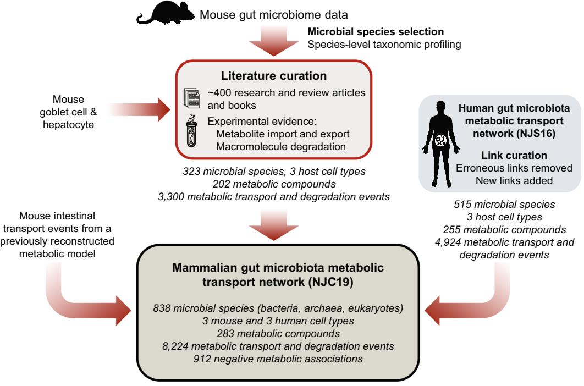
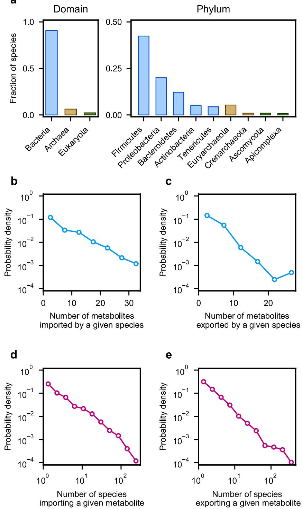
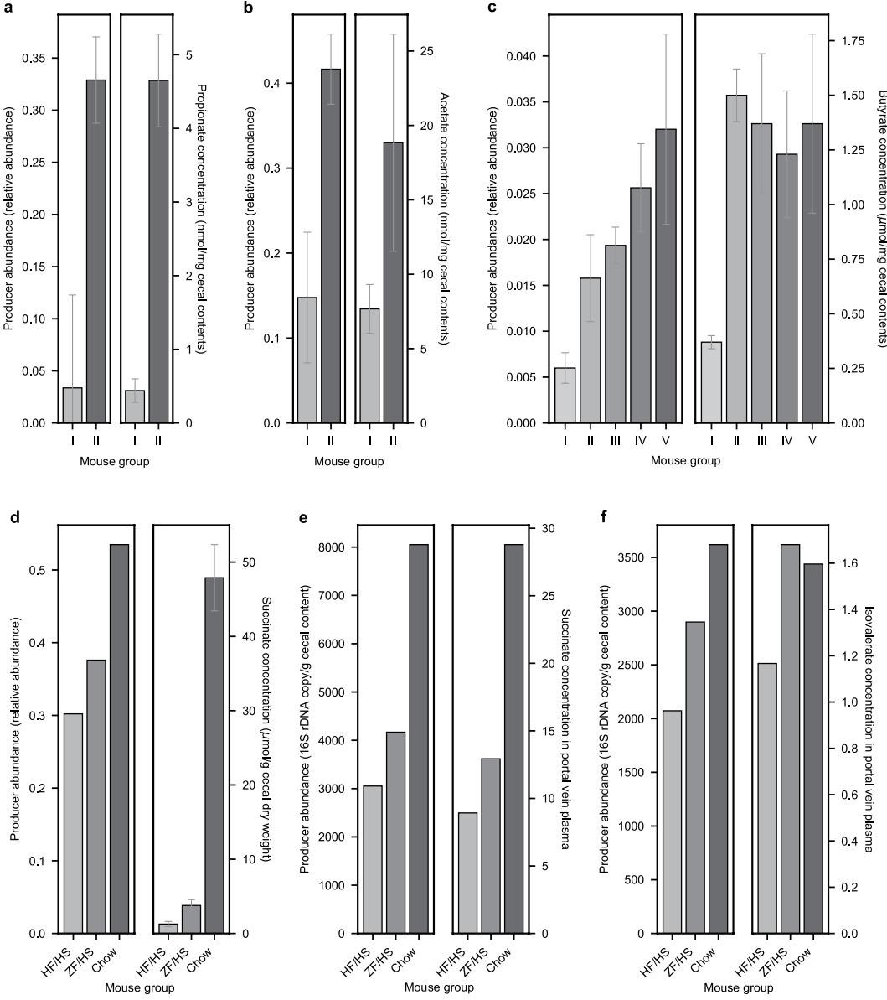

## **OPEN**

**Data Descriptor**

# **Large-scale metabolic interaction network of the mouse and human gut microbiota**

**Roktaek Lim 1, Josephine Jill T. Cabatbat2,3, Thomas L. P. Martin1, Haneul [Ki](http://orcid.org/0000-0002-9329-4997)m4, Seunghyeon Kim1,5,6, Jaeyun Sung7,8,9,10, Cheol-MinGhim2,4 & Pan-Jun Kim 1,11,12,13** ✉

**The role of our gut microbiota in health and disease is largely attributed to the collective metabolic activities of the inhabitant microbes. A system-level framework of the microbial community structure, mediated through metabolite transport, would provide important insights into the complex microbemicrobe and host-microbe chemical interactions. This framework, if adaptable to both mouse and human systems, would be useful for mechanistic interpretations of the vast amounts of experimental data from gut microbiomes in murine animal models, whether humanized or not. Here, we constructed a literature-curated, interspecies network of the mammalian gut microbiota for mouse and human hosts, called NJC19. This network is an extensive data resource, encompassing 838 microbial species (766 bacteria, 53 archaea, and 19 eukaryotes) and 6 host cell types, interacting through 8,224 smallmolecule transport and macromolecule degradation events. Moreover, we compiled 912 negative associations between organisms and metabolic compounds that are not transportable or degradable by those organisms. Our network may facilitate experimental and computational endeavors for the mechanistic investigations of host-associated microbial communities.**

### **Background & Summary**

Te mammalian intestinal tract is colonized by various microorganisms, called the gut microbiota or microbiom[e1](#page-6-0)[–3](#page-6-1) . Recent advances in metagenomics have revealed that alterations in the human gut microbiota are implicated in a number of disorders, such as obesity, infammatory bowel disease, colorectal cancer, and diabetes[4](#page-6-2)[–7](#page-6-3) . At the center of the gut microbiota functions are the various interactions between microbes and their interplay with the host environmen[t2](#page-6-4)[,6](#page-6-5)[,8](#page-6-6) . Microbes degrade diet-derived and host-derived chemical substances, and release the degradation products to other members of the community. Te microbial transport of nutrients and metabolic byproducts gives rise to competition for resources and cooperative relationships via metabolic cross-feeding[2](#page-6-4),[8](#page-6-6) . Te metabolites secreted by the microbes are absorbed by host tissues, and translate into benefcial or detrimental mediators of host physiolog[y6](#page-6-5),[9](#page-6-7) . As a result, such microbe-microbe and microbe-host interactions form a complex ecological network in the gut environmen[t10.](#page-6-8)

In the microbiome research, one common practice for reconstructing metabolite-mediated microbial networks is to combine the entire biochemical reactions inferred from annotated metagenomes[11](#page-6-9),[12](#page-6-10). Tis method, by its nature, does not delineate biochemical reactions to the species from which they originate, making it diffcult to elucidate interspecies interactions. On the other hand, there exist previous works on the modeling of

1Department of Biology, Hong Kong Baptist University, Kowloon, Hong Kong. 2School of Life Sciences, Ulsan National Institute of Science and Technology, Ulsan, 44919, Republic of Korea. 3 Analytics, Computing, and Complex Systems Laboratory, Asian Institute of Management, Makati, 1229, Metro Manila, Philippines. 4Department of Physics, Ulsan National Institute of Science and Technology, Ulsan, 44919, Republic of Korea. 5 Department of Physics, Pohang University of Science and Technology, Pohang, Gyeongbuk, 37673, Republic of Korea. 6 Samsung SDS, Seoul, 05510, Republic of Korea. 7Microbiome Program, Center for Individualized Medicine, Mayo Clinic, Rochester, MN, 55905, USA. 8 Division of Surgical Research, Department of Surgery, Mayo Clinic, Rochester, MN, 55905, USA. 9 Division of Rheumatology, Department of Internal Medicine, Mayo Clinic, Rochester, MN, 55905, USA. 10Department of Molecular Pharmacology and Experimental Therapeutics, Mayo Clinic, Rochester, MN, 55905, USA. 11Center for Quantitative Systems Biology, Hong Kong Baptist University, Kowloon, Hong Kong. 12Institute of Computational and Theoretical Studies, Hong Kong Baptist University, Kowloon, Hong Kong. 13Abdus Salam International Centre for Theoretical Physics, 34151, Trieste, Italy. ✉e-mail: [panjunkim@hkbu.edu.hk](mailto:panjunkim@hkbu.edu.hk)

**Fig. 1** Construction of the mammalian (mouse and human) gut microbiota interaction network NJC19. Te fow chart of the network construction is presented. NJC19 is mainly built upon literature-curated, metabolic information of the mouse gut microbiota, combined with the revised version of NJS16 that represents the human gut microbiota interaction network.

diverse interspecies interactions explicitly mediated by metabolites that are transported (imported or exported) by individual microbial specie[s13](#page-6-11)[,14](#page-6-12). Yet, these works are based on error-prone, automated identifcation protocols for transportable metabolites, which are possibly inaccurate to some degrees. Tere are ongoing computational eforts towards biologically realistic microbial interactions, by using manually curated, constraint-based metabolic models or relatively simple kinetic models[15,](#page-6-13)[16.](#page-6-14) Nevertheless, most of these models are far from the scale of diversity seen in the gut community, which typically comprises hundreds of diferent microbial species. Notably, this scale of microbial diversity has been recently captured by constraint-based metabolic models with semi-automatic model reconstruction[s17,](#page-6-15) but they still exhibit limited biological accuracies[18–](#page-7-0)[20](#page-7-1).

Recently, we have constructed an extensive, literature-curated interspecies metabolic interaction network of the human gut microbiota, NJS16, which represents another system-level framework for gut microbiota analysis[10.](#page-6-8) Tis network is primarily based on biological knowledge and experimental evidence documented in the literature. Te network NJS16 encompasses >4,000 small-molecule transport and macromolecule degradation events of >500 bacterial and archaeal species and 3 human cell types. Although NJS16 is useful to explore the microbial community inside the human gut, mechanistic studies in the microbiome research feld have been mainly conducted on animal models, rather than on human subjects, due to the technical and regulatory limitations on human experimentation[21](#page-7-2),[22](#page-7-3). Regarding animal models, physiological, anatomical, and genetic similarities between humans and mice, as well as massively accumulated knowledge of mouse genetics, have facilitated the use of murine models, to elucidate causality and mechanisms of host-microbiota interaction[s4](#page-6-2)[,7](#page-6-3),[23](#page-7-4). In this regard, a phylogenetic extension of NJS16 to murine gut microbes would be useful for the system-level mechanistic exploration of gut microbiota functions using murine animal models.

Here, we present a literature-curated, interspecies metabolic interaction network of the microbiota associated with the mouse and human gut, NJC19. To our knowledge, NJC19 represents the largest ever, literature-based network data resource for the mammalian gut microbiota, as a compilation of information from 769 research and review articles and textbooks (Fig. [1](#page-1-0)). Tis network is an advancement from our previous network, NJS16, which is limited to the human gut microbiot[a10.](#page-6-8) Specifcally, NJC19 greatly expands the diversity of microbial species and host cells to those relevant to the mouse gut environments, and even covers a certain range of eukaryotic microbes that were completely missing in the predecessor NJS16. Terefore, NJC19 serves as a global network template, adaptable to the gut microbiota of either a mouse, human, or humanized mouse. Moreover, not only does NJC19 incorporate metabolite transport and macromolecule degradation events of the microbiota, but it also provides literature-annotated, *negative* information of which metabolic compounds are not able to be transported or degraded by the organisms. Such negative information would be useful to curate computational microbial models, such as constraint-based metabolic models, which can include false-positive transport reactions from automatic genome annotations.

We expect our network NJC19 to be a useful template for the mechanistic interpretation of various microbiome data from murine and human experiments.

#### **Methods**

**Collection of mouse microbiome data and taxonomic identifcation for NJC19 construction.** We aimed to construct a large-scale network for the mammalian gut microbiota that comprises microbial species populating the mouse and human gut. Figure [1](#page-1-0) provides the overview of our network construction procedure. To construct the network, we started by collecting raw shotgun metagenome and 16S rRNA gene sequence data from fecal and cecal samples of laboratory and wild-caught mice from seven diferent studie[s3](#page-6-1),[24](#page-7-5)[–29,](#page-7-6) as detailed in Online-only Table 1. It is noteworthy that the inclusion of the data from wild-caught mice[3](#page-6-1) allows the coverage of diverse microbial communities associated with natural murine lifestyles. Te species-level taxonomic profling of the shotgun metagenome sequence data was performed using the MetaPhlAn v2.0 sofware, which utilizes clade-specifc marker sequences to identify microbial taxa[30](#page-7-7). When using MetaPhlAn v2.0, the "sensitive-local" mapping option was selected. For the taxonomic profling of 16S rRNA gene sequence data, we used the open-reference OTU picking workfow of QIIME v1.8.0 with Greengenes v13_8_pp reference fle[s31](#page-7-8), and then selected species-level microbial taxa from the results. Among all species detected from the metagenome and 16S rRNA gene sequence data, priority for the collection of metabolic information (see below) was given to species absent in our previous network, NJS16[10](#page-6-8). In the case of the metagenome sequence data, the number of the detected species was rather excessive for our further processing; therefore, among those species, we only considered the species inhabiting ≥90% of the metagenome samples (with the relative abundance ≥0.001%) in each study. We found that the genera of these selected species account for the vast majority [89.6±4.3% (avg.±s.d.)] of the total microbial abundances in the metagenome samples. In addition, we manually considered some relevant species, such as *Citrobacter rodentium*[32](#page-7-9) (Online-only Table 2–3).

**Collection and integration of metabolic information for NJC19 construction.** Using the repertoire of the aforementioned microbial species, metabolic information primarily collected for NJC19 construction was direct experimental evidence of the import and export of small-molecule metabolites (e.g., sugars, vitamins, organic acids, and gases) and the degradation of macromolecules (e.g., starch, cellulose, hemicellulose, and mucin), reported in literature. For the small-molecule metabolites, we mostly considered primary metabolites, i.e., nutrients and metabolic byproducts associated with microbial growth or reproduction. In addition, literature sources that report the mRNA or protein expression for metabolite-specifc enzymes or transporters were considered. When encountering the information of which chemical compounds are not able to be transported or degraded by a given organism, we recorded this negative information as well, as part of our collected data. Despite technically not being a part of the gut microbiota, some host cells directly afect or are afected by microbial metabolism, and thus were considered to be a functional extension of the microbial community. In a similar fashion to our previous network NJS16 for the human case, the specifc mouse tissue cells that we considered were the intestinal absorptive cell, the mucin-secreting goblet cell, and the bile acid-secreting hepatocyte. Although the hepatocyte is not part of intestinal tissue, its secreted bile acids are utilized by microbes in the gut. In the case of the mouse intestinal absorptive cell, the information from a manually-curated, genome-scale metabolic model (iSS1393) was adopte[d33.](#page-7-10) All annotated metabolite transport or macromolecule degradation processes for diferent strains of the same species were consolidated for that species as its collective feature. Because degradation of a given macromolecule is ofen performed by multiple species in the gut, we considered the corresponding degradation products to be indirect export products of all species participating in that macromolecule degradation. In this work, we diferentiated two macromolecules, xylan and mannan, from a "hemicellulose" macromolecule in NJS16, for more specifc representation of their degradation products.

In parallel, we carefully re-examined the existing components of NJS16[10](#page-6-8),[34](#page-7-11), and removed the incorrectly-placed components and added new links found from literature, according to more specifc and accurate information. Te revised NJS16 was fnally connected to the above mouse gut microbiota interaction network through the common chemical compounds shared by the both networks, to form the mouse and human gut microbiota interaction network, NJC19 (Fig. [1](#page-1-0) and Table [1)](#page-3-0). NJC19 is provided in both human- and machine-readable forms, through Online-only Tables 1–5(XLSX fles) and JavaScript Object Notation (JSON) fles deposited in the Dryad Digital Repository[35](#page-7-12), respectively. In addition, the Cytoscape Session (cys) fle of NJC19 is provided for interactive network visualizatio[n35](#page-7-12).

#### **Data Records**

Our network NJC19 ofers the reference map of the mammalian gut microbiota and chemical compound relationships (from 769 literature sources), which can be adapted for each context of mouse, human, and humanized mouse microbiomes. In NJC19, one set of nodes corresponds to organisms (i.e., microbial species and host cells), while the other set corresponds to chemical compounds (i.e., small-molecule metabolites or macromolecules). An organism and a chemical compound are connected if the organism imports, exports, or degrades the chemical compound. NJC19 comprises 838 microbial species (766 bacteria, 53 archaea, and 19 eukaryotes) in the mouse and human gut, 6 mouse and human cell types metabolically interacting with those microbes, and 283 chemical compounds (266 small molecules and 17 macromolecules)—all interconnected by 8,224 small-molecule transport or macromolecule degradation events. In addition, NJC19 provides information on small molecules and macromolecules that are reportedly not transportable or degradable by certain organisms—described through 912 negative metabolic associations. Tese negative associations can be particularly useful for the curation of automatically-generated metabolic models, which may include false-positive transport reactions derived from inaccurate genome annotations.

Figure [2a](#page-4-0) shows the overall phylogenetic composition of microbial species included in NJC19. To overview the network topology of NJC19, we counted the number of metabolites imported or exported by each microbial species. Each species in the network imports 5.8 and exports 3.5 metabolites on average, and the probability that a given species imports (or exports) *k* metabolites follows an exponential distribution *P*(*k*) ∝ *e*−*rk* (*r* ≈ 0.2 and

| Source                                                                                                              | Processing                                                                                                                                | Data                                                                                                                                                             |
|---------------------------------------------------------------------------------------------------------------------|-------------------------------------------------------------------------------------------------------------------------------------------|------------------------------------------------------------------------------------------------------------------------------------------------------------------|
| Mouse fecal and cecal microbiome data (Online-only Table 1).                                                     | Application of taxonomic analysis tools to the microbiome data (Methods).                                                              | Output fies of the taxonomic analysis tools, which include the lists of identifed microbial taxa and their relative abundances35.                          |
| Lists of identifed microbial taxa and their relative abundances from mouse fecal and cecal microbiome data35. | Selection of microbial species in metagenome samples based on the frequency of the species occurrence across the samples (Methods). | List of selected microbial species in the metagenome samples35.                                                                                               |
| Literature (Online-only Table 2) and NJS1634.                                                                    | Manual collection of metabolic information from literature, and revision of NJS16 (Methods).                                        | Interaction network of microbial species/ host cells mediated by metabolic compounds, NJC19 (Online-only Tables 3–5 and the corresponding JSON fles35). |
| Mouse microbiome and metabolome data4,37,38.                                                                     | Extraction of taxonomic compositions and metabolite levels (see Technical Validation and Fig. 3 legend).                            | Taxonomic compositions35, and microbial producer and metabolite levels for NJC19 validation (Fig. 3).                                                      |

**Table 1.** Datasets used for the construction and validation of NJC19.

0.3 for the import and export cases, respectively; see Fig. [2b,c](#page-4-0)). *Bacteroides thetaiotaomicron* is one of the most promiscuous species, importing 33 and exporting 29 metabolites. Conversely, for each metabolite, we counted the number of species importing or exporting that metabolite. Te probability that a given metabolite is imported (or exported) by *k* species follows a power-law distribution *P*(*k*) ∝ *k*−*γ* (*γ* ≈ 1.4 for both import and export cases; Fig. [2d,e)](#page-4-0), which is much broader than the above exponential distributions. Among metabolites, glucose and acetate are the most frequent substrate and product, respectively, and are imported by 303 species (36.2% of the total species) and exported by 461 species (55.0% of the total species). In contrast, an average metabolite is imported by 21.8 species and exported by 13.0 species. Collectively, metabolites are highly uneven in terms of the ranges of their transporting species.

As noted above, the full details of NJC19 are available in both human- and machine-readable forms, through Online-only Table 1 and JSON fles in the Dryad Digital Repositor[y35,](#page-7-12) respectively. As noted above, the cys fle of NJC19 is available for network visualization[35](#page-7-12), and can be accessed by Cytoscape v3.7.[236.](#page-7-13)

Online-only Table 1 shows the detailed sources of mouse metagenome and 16S rRNA gene sequence data that were used for microbial species identifcation when we constructed NJC19. Online-only Table 2 shows the literature sources of metabolic information used for NJC19 construction. Online-only Table 3 shows the list of microbial species and host cell types in NJC19. Te name of each microbial species is presented with the NCBI taxonomy ID. Online-only Table 4 includes the list of small-molecule metabolites and macromolecules in NJC19. Te name of each compound is presented with the KEGG compound ID. Supplementary Table 1 provides all the metabolic associations between chemical compounds and microbial species/host cells in NJC19, along with their literature sources. Tese metabolic associations include both positive and negative associations (see above). Online-only Table 5 shows the degradation products of macromolecules in NJC19.

On the other hand, our JSON fle[s35](#page-7-12) include "NJC19_network.json", "NJC19_organism.json", "NJC19_compound.json", and "NJC19_reference.json". Among them, "NJC19_network.json" is equivalent to in Supplementary Table 1, in terms of its contents. Tis fle consists of a total of 9,136 items. Each object in the fle is exactly matched with one association in Supplementary Table 1. Each object has its own identifcation number that starts with "NJC19_" followed by a fve-digit number. Te object includes four key-value pairs. Te keys are "Species", "Small-molecule metabolite or macromolecule", "Metabolic activity", and "Ref. #", reminiscent of the column names in Supplementary Table 1. Te other fles "NJC19_organism.json", "NJC19_compound.json", and "NJC19_ reference.json" include detailed information on the values of the keys "Species", "Small-molecule metabolite or macromolecule", and "Ref. #" in the fle "NJC19_network.json", respectively. In a similar fashion to Online-only Tables 3 and 4, each microbial species in "NJC19_organism.json" is annotated with the NCBI taxonomy ID, and each compound in "NJC19_compound.json" is annotated with the KEGG compound ID. Furthermore, the specifc sample sources of these microbial species are also present in "NJC19_organism.json". Full metadata of these JSON fles are provided in another fle "README_NJC19.txt", which is available in the Dryad Digital Repository together with the JSON fle[s35.](#page-7-12)

As described in Methods, our NJC19 construction was started with taxonomic identifcation of mouse gut microbiome samples. Te comprehensive repertoire of those microbial taxa, identifed before the collection of their metabolic information, is provided in the Dryad Digital Repositor[y35](#page-7-12) (Table [1](#page-3-0)). In the case of the metagenome samples, it also provides the list of the selected species based on the frequency of their occurrence across the samples (Methods).

#### **Technical Validation**

Metabolic information collected in this study was primarily experimental evidence of small molecule transport and macromolecule degradation events, reported in the literature. Given the information dispersed across research papers, review articles, and textbooks (Online-only Table 2), a careful read of these sources was done to distinguish experimentally-verifed information from the predictions solely based on automated bioinformatics algorithms. To check the accuracy of our network, the entire individual links in the compiled network were thoroughly re-examined by the independent authors who had not participated in the initial construction of the network. If potential errors were identifed from the examined links (e.g., errors from the possible misinterpretations of the literature), these errors were carefully corrected based on the discussion of multiple authors.

To further assess the validity of our network, we examined the correlations between microbe-metabolite links in the network and measured metabolite levels in the mouse gut and portal vein plasma. Specifcally, we examined whether

**Fig. 2** Microbial taxonomic composition and network structural properties of NJC19. **(a)** Fraction of microbial species in the network, which belong to each domain (lef) or phylum (right). Te right panel shows several phyla with the largest fractions in each domain. Both lef and right panels show bacteria in blue, archaea in tan, and eukaryotes in green. (**b**,**c**) Te vertical axis represents the distribution of the probability *P*(*k*) that a given microbial species imports (**b**) or exports (**c**) *k* metabolites on the horizontal axis. (**d**,**e**) Te vertical axis represents the distribution of the probability *P*(*k*) that a given metabolite is imported (**d**) or exported (**e**) by *k* species on the horizontal axis.

the abundance increase/decrease of microbes associated with a particular metabolite in our network is consistent with the shif of the metabolite level across diferent experimental conditions. Regarding this analysis, three published mouse studies were found to provide the information of both microbial and metabolite levels in their collected samples: one

**Fig. 3** Comparison of mouse microbiome and metabolome data based on NJC19. (**a**,**b**) In the lef panels, the abundances of the propionate (**a**) and acetate (**b**) producers in NJC19 were obtained from cecal 16S rRNA gene sequence dat[a35](#page-7-12) in ref. [37](#page-7-14) Cecal metabolite concentrations in the right panels were obtained from Fig. [3c](#page-5-0) of the same study. Mouse group I consists of mice six weeks afer 10-day cefoperazone treatment on mouse group II, cefoperazone-naive mice. (**c**) In the lef panel, the abundances of the butyrate producers in NJC19 were obtained from fecal 16S rRNA gene sequence data[35](#page-7-12) in ref. [4](#page-6-2) Cecal butyrate concentrations in the right panel were obtained from Fig. [2c](#page-4-0) of the same study. Although we used the fecal 16S rRNA gene sequence data for the lef panel due to the limited data availability, fecal and cecal microbial compositions were found to strongly correlate in other samples from that study, allowing us to use the fecal sequence data as a proxy for the cecal ones. All mice were initially germ-free in the study. Mouse groups I to V comprise mice transplanted with an obese twin's microbiota (Ob; group I), mice co-housed with Ob and Ln mice (group II; see next for the defnition of Ln mice), mice transplanted with the lean co-twin's microbiota (Ln; group III), Ob mice co-housed with Ln and germ-free mice (group IV), and Ln mice co-housed with Ob and germ-free mice (group V). (**d**–**f**) In the lef panels, the abundances of the succinate (**d**,**e**) and isovalerate (**f**) producers in NJC19 were obtained from cecal 16S rRNA gene copy levels in Fig. 2a of ref. [38](#page-7-15) We re-scaled succinate producers in (**d**) to the total 16S rRNA gene copy levels, because the corresponding succinate concentrations (**d**) were available per cecal dry weight (i.e., per cecal microbial load). Cecal and portal vein metabolite concentrations in the right panels were obtained from Fig. [2b](#page-4-0) and Supplementary Table 4 of the same study, respectively. Mouse groups 'HF/HS', 'ZF/ HS', and 'Chow' represent gnotobiotic mice on a high-fat/high-sucrose diet, a zero-fat/high-sucrose diet, and a chow diet, respectively. In (**a**–**d**), each error bar represents standard deviation across replicates. Error bars are missing for (**e**,**f**), as well as for the lef panel in (**d**), and units are missing for the right panels in (**e**,**f**), because of the information unavailability from the data sources.

study is for antibiotics (cefoperazone) treatment and recovery[37](#page-7-14), another is for fecal microbiota transplantation from twins discordant for obesity[4](#page-6-2) , and the other for gnotobiotic mice with multiple diet[s38.](#page-7-15) From these studies, we considered only the cases with clear variations in the microbial and metabolite levels, which span at least 1.5-fold changes across diferent mouse groups for the metabolites and their microbial producers/consumers in NJC19. We further excluded host- and diet-derived metabolites, which may confound our analysis focusing on the efects of microbial metabolism. For all the resulting metabolites, Fig. [3](#page-5-0) presents the levels of their microbial producers in NJC19 and those metabolite levels across the mouse groups with varying experimental conditions (Table [1](#page-3-0)). In Fig. [3](#page-5-0), we did not consider microbial consumers because they were relatively defcient in their abundance, less than a half of the producers in each case. Here, microbial producers of each metabolite from the gnotobiotic mouse stud[y38](#page-7-15) in Fig. [3](#page-5-0) are defned as the microbial species that produce this metabolite in NJC19. However, for the other two studies in Fig. [3](#page-5-0), the fnest taxonomic information is available at the genus leve[l35,](#page-7-12) from the 16S rRNA gene sequence data processed by the Ribosomal Database Project Classifer in this analysis (RDP Naive Bayesian rRNA Classifer Version 2.11 with 16S rRNA training set 16)[39](#page-7-16). Terefore, for these two studies, microbial producers of a given metabolite are defned as the microbial genera, with each having the species whose majority (>50%) can produce that metabolite in NJC19. We also defned microbial consumers in a similar way, although they were excluded from Fig. [3](#page-5-0) as discussed above.

Figure [3](#page-5-0) indeed demonstrates that alternations in the producer and metabolite levels tend to agree with each other, with the overall 71.4% matches of their increasing or decreasing tendencies across the mouse groups. For example, the propionate producers in NJC19 decreased by 90.0% in the cecum afer cefoperazone treatment and recovery, consistent with an 88.5% decrease in the cecal propionate concentration (Fig. [3a](#page-5-0)). Likewise, the acetate producers in NJC19 decreased by 64.5% at the same time, consistent with a 59.3% decrease in the cecal acetate concentration (Fig. [3b](#page-5-0)). In these examples, the total microbial loads remained similar during the experiments[37,](#page-7-14) and thus the metabolite concentration changes here are not likely to be a mere consequence of the microbial load changes. To test the statistical signifcance of these correlations, we introduce quantities *fij*, *gij*, and *fij*' for each pair of mouse groups *i* and *j*: *fij* (*gij*) denotes a fold change from group *i* to group *j* in the measured producer (metabolite) abundance averaged over the replicates in the group *i* or *j*. *fij*' denotes a group-*i*-to-*j* fold change in the average abundance of randomly-assigned producers, while the number of those randomly-assigned producers from all the data sources in Fig. [3](#page-5-0) is maintained as the same as the number of the total observed producers. To assess the signifcance of the observed producer and metabolite correlations against a scenario that the producer information in NJC19 may not be more correct than expected by chance, we computed the *P* value as the probability of satisfying *fij*'≥*fij* (*fij*'≤*fij*) for all (*i*, *j*)-pairs that have *fij* and *gij* with both≥1 (≤1). Accordingly, our *P* value calculation reveals that the producers in NJC19 and the detected metabolic compounds are signifcantly correlated in Fig. [3](#page-5-0), thereby supporting the validity of the microbe-compound associations in NJC19 (*P*=0.02 for Fig. [3a,c–e,](#page-5-0) *P*<10–4 for Fig. [3f,](#page-5-0) and *P*=0.06 for Fig. [3b](#page-5-0)).

#### **Code availability**

Our Python code that converts the JSON format of NJC19 network data (NJC19_network.json[35](#page-7-12)) to the format of Supplementary Table 1 can be downloaded from the Dryad Digital Repository[35](#page-7-12). For the taxonomic profling of microbiome samples for the NJC19 construction, we used MetaPhlAn v2.0 with the "sensitive-local" mapping option and QIIME v1.8.0 with Greengenes v13_8_pp reference fle[s30](#page-7-7)[,31](#page-7-8), as described above. Te aforementioned cys fle of NJC19 for network visualization was produced by Cytoscape v3.7.2[36](#page-7-13).

Received: 22 May 2019; Accepted: 11 May 2020; Published: xx xx xxxx

#### **References**

- 1. Qin, J. *et al*. A human gut microbial gene catalogue established by metagenomic sequencing. *Nature* **464**, 59–65 (2010).
- 2. Mackie, R. I., White, B. A. & Isaacson, R. E. *Gastrointestinal Microbiology* (Chapman & Hall, New York, 1997).
- 3. Wang, J. *et al*. Dietary history contributes to enterotype-like clustering and functional metagenomic content in the intestinal microbiome of wild mice. *Proc. Natl. Acad. Sci. USA* **111**, E2703–E2710 (2014).
- 4. Ridaura, V. K. *et al*. Gut microbiota from twins discordant for obesity modulate metabolism in mice. *Science* **341**, 1241214 (2013).
- 5. Manichanh, C., Borruel, N., Casellas, F. & Guarner, F. Te gut microbiota in IBD. *Nat. Rev. Gastroenterol. Hepatol* **9**, 599–608 (2012).
- 6. Louis, P., Hold, G. L. & Flint, H. J. Te gut microbiota, bacterial metabolites and colorectal cancer. *Nat. Rev. Microbiol.* **12**, 661–672 (2014).
- 7. Zhao, L. *et al*. Gut bacteria selectively promoted by dietary fbers alleviate type 2 diabetes. *Science* **359**, 1151–1156 (2018).
- 8. Blaut, M. Ecology and physiology of the intestinal tract. *Curr. Top. Microbiol. Immunol.* **358**, 247–272 (2013).
- 9. Furusawa, Y. *et al*. Commensal microbe-derived butyrate induces the diferentiation of colonic regulatory T cells. *Nature* **504**, 446–450 (2013).
- 10. Sung, J. *et al*. Global metabolic interaction network of the human gut microbiota for context-specifc community-scale analysis. *Nat. Commun.* **8**, 15393 (2017).
- 11. Abubucker, S. *et al*. Metabolic reconstruction for metagenomic data and its application to the human microbiome. *Plos Comput. Biol.* **8**, e1002358 (2012).
- 12. Greenblum, S., Turnbaugh, P. J. & Borenstein, E. Metagenomic systems biology of the human gut microbiome reveals topological shifs associated with obesity and infammatory bowel disease. *Proc. Natl. Acad. Sci. USA* **109**, 594–599 (2012).
- 13. Levy, R. & Borenstein, E. Metabolic modeling of species interaction in the human microbiome elucidates community-level assembly rules. *Proc. Natl. Acad. Sci. USA* **110**, 12804–12809 (2013).
- 14. Zelezniak, A. *et al*. Metabolic dependencies drive species co-occurrence in diverse microbial communities. *Proc. Natl. Acad. Sci. USA* **112**, 6449–6454 (2015).
- 15. Heinken, A. & Tiele, I. Systematic prediction of health-relevant human-microbial co-metabolism through a computational framework. *Gut Microbes* **6**, 120–130 (2015).
- 16. Kettle, H., Louis, P., Holtrop, G., Duncan, S. H. & Flint, H. J. Modelling the emergent dynamics and major metabolites of the human colonic microbiota. *Environ. Microbiol.* **17**, 1615–1630 (2015).
- 17. Magnúsdóttir, S. *et al*. Generation of genome-scale metabolic reconstructions for 773 members of the human gut microbiota. *Nat. Biotechnol.* **35**, 81–89 (2017).
- 18. Tramontano, M. *et al*. Nutritional preferences of human gut bacteria reveal their metabolic idiosyncrasies. *Nat. Microbiol* **3**, 514–522 (2018).
- 19. Babaei, P., Shoaie, S., Ji, B. & Nielsen, J. Challenges in modeling the human gut microbiome. *Nat. Biotechnol.* **36**, 682–686 (2018).
- 20. Magnúsdóttir, S., Heinken, A., Fleming, R. M. T. & Tiele, I. Reply to "Challenges in modeling the human gut microbiome". *Nat. Biotechnol.* **36**, 686–691 (2018).
- 21. Bleich, A. & Fox, J. Te mammalian microbiome and its importance in laboratory animal research. *ILAR J.* **56**, 153–158 (2015).
- 22. Nelson, K. E. An update on the status of current research on the mammalian microbiome. *ILAR J.* **56**, 163–168 (2015).
- 23. Nguyen, T. L. A., Vieira-Silva, S., Liston, A. & Raes, J. How informative is the mouse for human gut microbiota research? *Dis. Model Mech.* **8**, 1–16 (2015).
- 24. Pickard, J. M. *et al*. Rapid fucosylation of intestinal epithelium sustains host–commensal symbiosis in sickness. *Nature* **514**, 638–641 (2014).
- 25. Cullender, T. C. *et al*. Innate and adaptive immunity interact to quench microbiome fagellar motility in the gut. *Cell Host Microbe* **14**, 571–581 (2013).
- 26. Langille, M. G. *et al*. Microbial shifs in the aging mouse gut. *Microbiome* **2**, 50 (2014).
- 27. Rooks, M. G. *et al*. Gut microbiome composition and function in experimental colitis during active disease and treatment-induced remission. *ISME J.* **8**, 1403–1417 (2014).
- 28. Benson, A. K. *et al*. Individuality in gut microbiota composition is a complex polygenic trait shaped by multiple environmental and host genetic factors. *Proc. Natl. Acad. Sci. USA* **107**, 18933–18938 (2010).
- 29. Linnenbrink, M., Wang, J., Hardouin, E. A., Künzel, S., Metzler, D. & Baines, J. F. Te role of biogeography in shaping diversity of the intestinal microbiota in house mice. *Mol. Ecol.* **22**, 1904–1916 (2013).
- 30. Truong, D. T. *et al*. MetaPhlAn2 for enhanced metagenomic taxonomic profling. *Nat. Methods* **12**, 902–903 (2015).
- 31. Caporaso, J. G. *et al*. QIIME allows analysis of high-throughput community sequencing data. *Nat. Methods* **7**, 335–336 (2010).
- 32. Bouladoux, N., Harrison, O. J. & Belkaid, Y. Te mouse model of infection with *Citrobacter rodentium*. *Curr. Protoc. Immunol.* **119**, 19.15.1–19.15.25 (2017).
- 33. Heinken, A., Sahoo, S., Fleming, R. M. T. & Tiele, I. Systems-level characterization of a host-microbe metabolic symbiosis in the mammalian gut. *Gut Microbes* **4**, 28–40 (2013).
- 34. Sung, J. *et al*. Data from: Global metabolic interaction network of the human gut microbiota for context-specifc community-scale analysis. *Dryad Digital Repository*, <https://doi.org/10.5061/dryad.mc1j9>(2017).
- 35. Lim, R. *et al*. Data from: Large-scale metabolic interaction network of the mouse and human gut microbiota. *Dryad Digital Repository*, <https://doi.org/10.5061/dryad.dr7sqv9v8> (2020).
- 36. Shannon, P. *et al*. Cytoscape: a sofware environment for integrated models of biomolecular interaction networks. *Genome Res.* **13**, 2498–2504 (2003).
- 37. Teriot, C. M. *et al*. Antibiotic-induced shifs in the mouse gut microbiome and metabolome increase susceptibility to *Clostridium difcile* infection. *Nat. Commun.* **5**, 3114 (2014).
- 38. Kovatcheva-Datchary, P. *et al*. Simplifed intestinal microbiota to study microbe-diet-host interactions in a mouse model. *Cell Rep* **26**, 3772–3783 (2019).
- 39. Wang, Q., Garrity, G. M., Tiedje, J. M. & Cole, J. R. Naïve Bayesian classifer for rapid assignment of rRNA sequences into the new bacterial taxonomy. *Appl. Environ. Microbiol.* **73**, 5261–5267 (2007).

#### **Acknowledgements**

We thank John F. Baines and Philipp Rausch for kindly providing wild-caught mouse metagenome data, and Jonathan W. Johnson for preparing most icons in Fig. 1. Tis work was supported by Hong Kong Baptist University, Faculty Research Grant Category II (FRG2/17-18/097) and Start-up Grant Tier 2 (RC-SGT2/18-19/ SCI/001). Tis work was conducted using the resources of the High Performance Cluster Computing Centre, Hong Kong Baptist University, which receives funding from Research Grant Council, University Grant Committee of the HKSAR and Hong Kong Baptist University.

#### **Author contributions**

P.-J.K. designed the research. R.L., J.J.T.C., T.L.P.M., H.K., S.K., J.S. and P.-J.K. performed the research. R.L., J.J.T.C., T.L.P.M., H.K., C.-M.G. and P.-J.K. analyzed the data. R.L., J.J.T.C., J.S., C.-M.G. and P.-J.K. wrote the manuscript.

#### **Competing interests**

Te authors declare no competing interests.

## **Additional information**

**Supplementary information** is available for this paper at [https://doi.org/10.1038/s41597-020-0516-5.](https://doi.org/10.1038/s41597-020-0516-5)

**Correspondence** and requests for materials should be addressed to P.-J.K.

**Reprints and permissions information** is available at [www.nature.com/reprints.](http://www.nature.com/reprints)

**Publisher's note** Springer Nature remains neutral with regard to jurisdictional claims in published maps and institutional afliations.

**Open Access** This article is licensed under a Creative Commons Attribution 4.0 International License, which permits use, sharing, adaptation, distribution and reproduction in any medium or format, as long as you give appropriate credit to the original author(s) and the source, provide a link to the Creative Commons license, and indicate if changes were made. Te images or other third party material in this article are included in the article's Creative Commons license, unless indicated otherwise in a credit line to the material. If material is not included in the article's Creative Commons license and your intended use is not permitted by statutory regulation or exceeds the permitted use, you will need to obtain permission directly from the copyright holder. To view a copy of this license, visit [http://creativecommons.org/licenses/by/4.0/.](http://creativecommons.org/licenses/by/4.0/)

Te Creative Commons Public Domain Dedication waiver<http://creativecommons.org/publicdomain/zero/1.0/> applies to the metadata fles associated with this article.

© Te Author(s) 2020