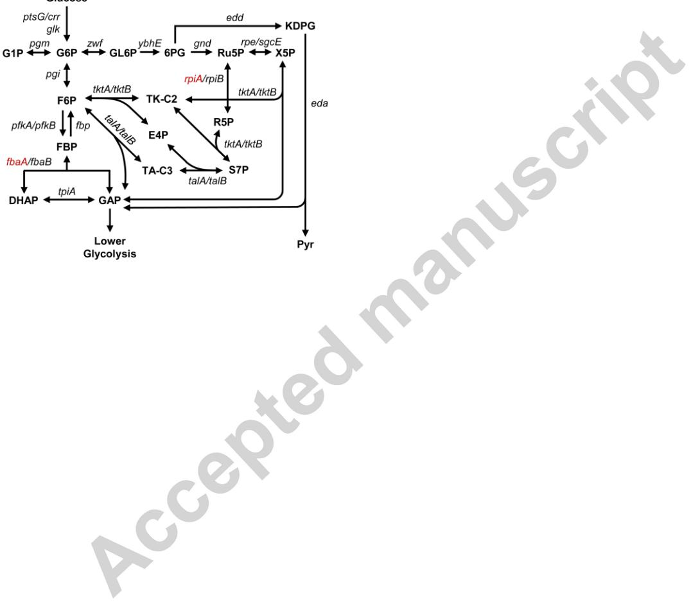
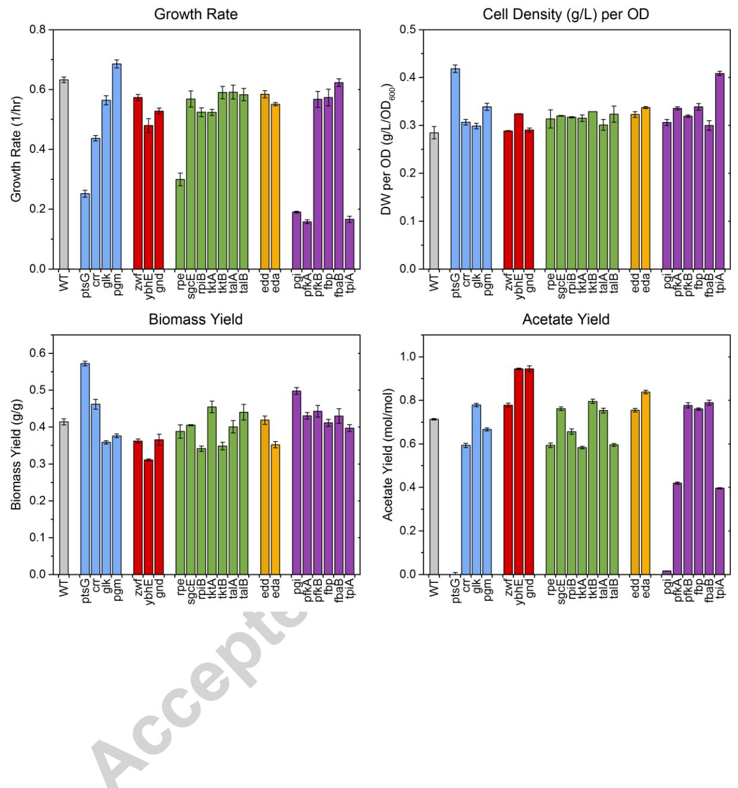
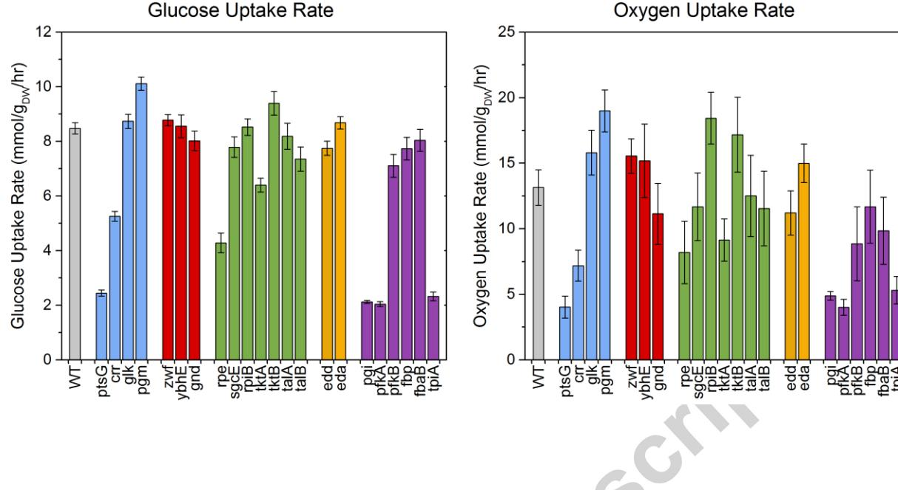
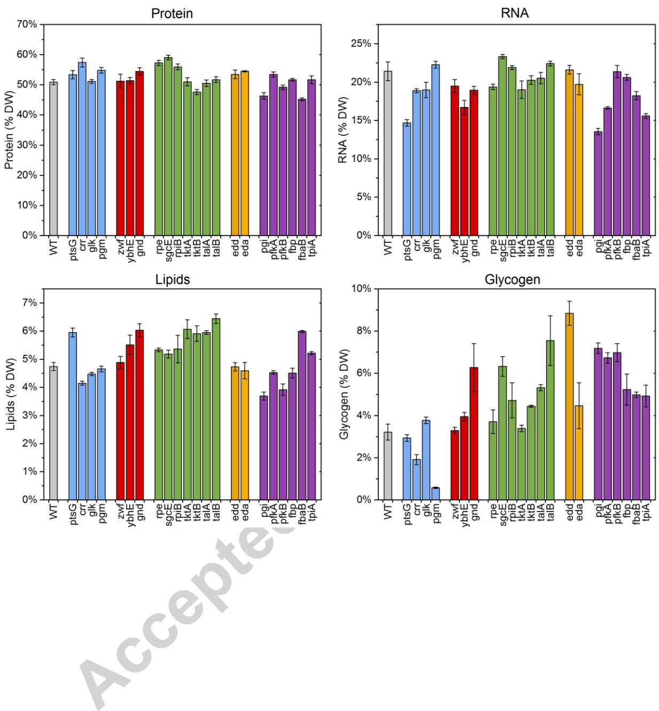
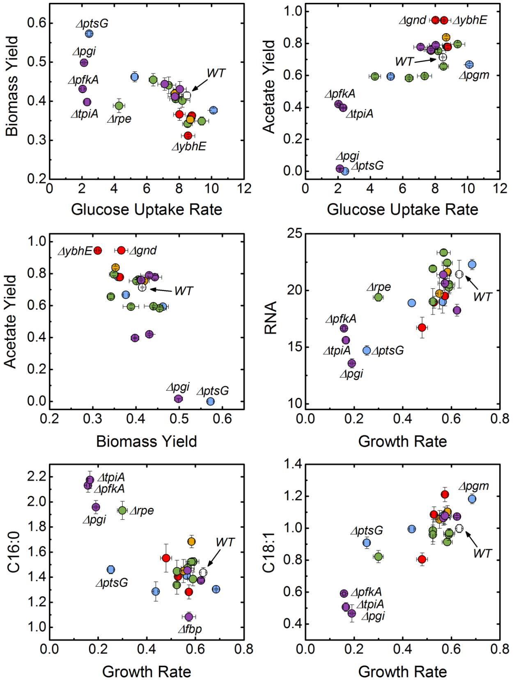
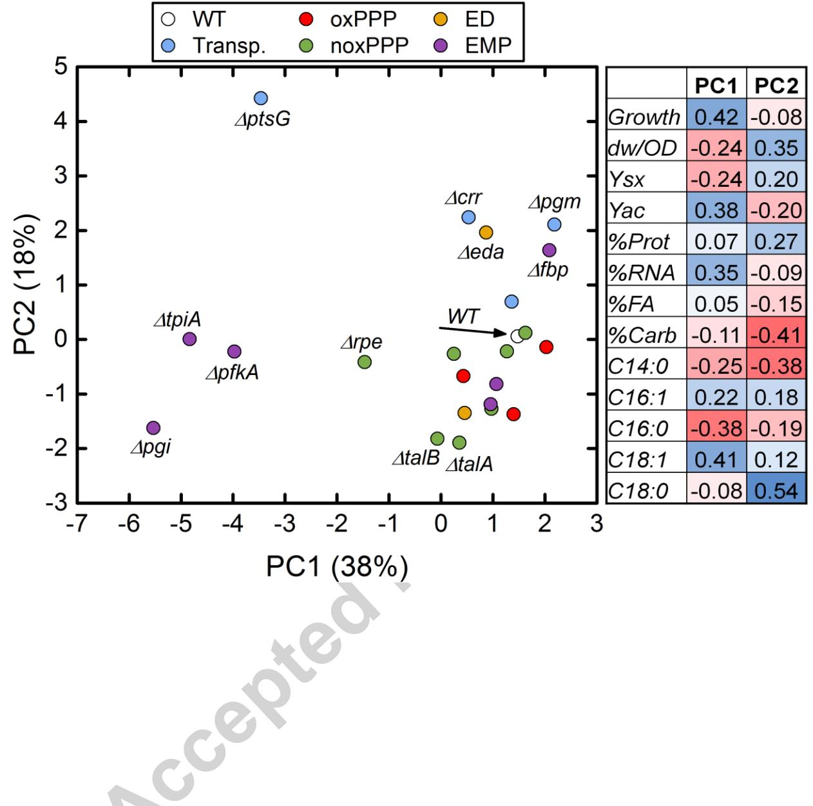
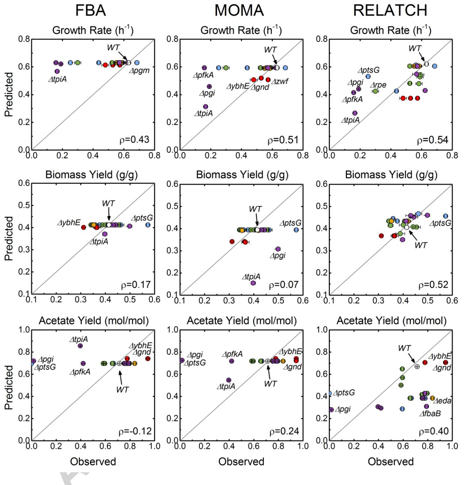

## Author's Accepted Manuscript

Characterization of physiological responses to 22 gene knockouts in *Escherichia coli* central carbon metabolism

Christopher P. Long, Jacqueline E. Gonzalez, Nicholas R. Sandoval, Maciek R. Antoniewicz

PII: S1096-7176(16)30017-9 DOI: <http://dx.doi.org/10.1016/j.ymben.2016.05.006> Reference: YMBEN1117

To appear in: *Metabolic Engineering*

Received date: 25 March 2016 Revised date: 9 May 2016 Accepted date: 16 May 2016

Cite this article as: Christopher P. Long, Jacqueline E. Gonzalez, Nicholas R. Sandoval and Maciek R. Antoniewicz, Characterization of physiological responses to 22 gene knockouts in *Escherichia coli* central carbon metabolism, *Metabolic Engineering,* <http://dx.doi.org/10.1016/j.ymben.2016.05.006>

This is a PDF file of an unedited manuscript that has been accepted for publication. As a service to our customers we are providing this early version of the manuscript. The manuscript will undergo copyediting, typesetting, and review of the resulting galley proof before it is published in its final citable form. Please note that during the production process errors may be discovered which could affect the content, and all legal disclaimers that apply to the journal pertain.

# **Characterization of physiological responses to 22 gene knockouts in**  *Escherichia coli* **central carbon metabolism**

Christopher P. Long, Jacqueline E. Gonzalez, Nicholas R. Sandoval, Maciek R. Antoniewicz*

Department of Chemical and Biomolecular Engineering, Metabolic Engineering and Systems

Biology Laboratory, University of Delaware, Newark DE 19716, USA

*corresponding author:

Maciek R. Antoniewicz

Department of Chemical and Biomolecular Engineering

University of Delaware

150 Academy St

Newark, DE 19716

Tel.: 302-831-8960

Fax.: 302-831-1048

Email: mranton@udel.edu

### **ABSTRACT**

Understanding the impact of gene knockouts on cellular physiology, and metabolism in particular, is centrally important to quantitative systems biology and metabolic engineering. Here, we present a comprehensive physiological characterization of wild-type *Escherichia coli*  and 22 knockouts of enzymes in the upper part of central carbon metabolism, including the PTS system, glycolysis, pentose phosphate pathway and Entner–Doudoroff pathway. Our results reveal significant metabolic changes that are affected by specific gene knockouts. Analysis of collective trends and correlations in the data using principal component analysis (PCA) provide new, and sometimes surprising, insights into *E. coli* physiology. Additionally, by comparing the data-to-model predictions from constraint-based approaches such as FBA, MOMA and RELATCH we demonstrate the important role of less well-understood kinetic and regulatory effects in central carbon metabolism.

### **KEYWORDS**

*Escherichia coli*; gene knockout; cell physiology; metabolism; COBRA modeling

### **1. INTRODUCTION**

Gene knockouts are widely used in biology to identify specific functions of corresponding gene products, as well as to study their roles in broader systems contexts. The utility of this approach has long been appreciated in the study of microbial metabolism, particularly by observing responses to knockouts of metabolic enzymes and global regulators. For example, in the model organism *Escherichia coli*, multiple '-omics' techniques have been applied to gain insights into metabolic robustness (Ishii et al., 2007), transcriptional regulatory control (Haverkorn van Rijsewijk et al., 2011), hidden reactions (Nakahigashi et al., 2009), as well as responses following adaptive evolution (Charusanti et al., 2010; Fong et al., 2006). Metabolic fluxes are often the output of interest, and numerous studies have applied 13C-metabolic flux analysis (13C-MFA) to knockouts of genes in *E. coli* central carbon metabolism and its global regulators (Long and Antoniewicz, 2014a). Many of these studies have been facilitated by the Keio collection of all viable single-gene *E. coli* knockouts (Baba et al., 2006). Knockout studies such as these are highly useful in improving our understanding of the structure and dynamics of metabolic networks, and provide data for assessing and improving our ability to predict complex genetic perturbation responses. This ability is critical to rational strain design in metabolic engineering, and the difficulty of such predictions has long been identified as a key obstacle in the field (Bailey, 1991; Stephanopoulos, 1999).

Due to the centrality of gene perturbation response prediction to metabolic engineering, a variety of modeling approaches have been developed and applied. The most prominent set are the constraint-based reconstruction and analysis (COBRA) methods, which rely on metabolic network stoichiometry and a defined 'objective function'. These include flux balance analysis

(FBA) (Edwards and Covert, 2002), minimization of metabolic adjustment (MOMA) (Segre et al., 2002), regulatory on/off minimization of metabolic flux changes (ROOM) (Shlomi et al., 2005), and relative optimality in metabolic networks (RELATCH), which also includes gene expression data from the reference state (Kim and Reed, 2012). These predictive models are then implemented as tools for rational strain design, such as in OptKnock (Burgard et al., 2003; Chowdhury et al., 2014; Ranganathan et al., 2010).

In a recent review (Long and Antoniewicz, 2014a), we highlighted important gaps in studies of *E. coli* knockout metabolism. For example, knockouts of many genes in central carbon metabolism have not been studied at all, and flux results from those that have been studied are often inconsistent or difficult to compare due to differences in culturing conditions and analytical approaches. This has impeded broad systems biology analyses that would be possible with a large, self-consistent study, as well as by integrating flux data with complimentary phenotypic observations. Illustrating the broad interest of such data, Mackie et al. (Mackie et al., 2014) recently suggested that knockout phenotypic data would be an important addition to the Ecocyc database.

Limitations in the available experimental data have inhibited thorough evaluation of the various competing COBRA models and the development more mechanistic kinetic and regulatory models. Demonstrating the potential of the latter, Khodayari et al. (Khodayari et al., 2014) recently used flux data from seven *E. coli* knockout mutants to estimate the parameters of a kinetic model of central carbon metabolism. In efforts such as these, additional high quality physiological data would undoubtedly be of great use.

In this study, we present a comprehensive physiological characterization of wild-type *E. coli* and 22 knockouts of central carbon metabolism enzymes. The scope of this work consists of the following physiological data: growth rates, substrate uptake rates, product secretion rates, biomass and acetate yields, and biomass composition. These data were collected for the knockouts of upper central carbon metabolism, defined here to include glucose transporters, the upper portion of the glycolysis (EMP) pathway, pentose phosphate pathway (PPP), and Entner-Doudoroff (ED) pathway (Figure 1). In this work, we chose to study cellular responses under aerobic, batch (glucose-rich) conditions during exponential growth in M9 minimal medium. Under these conditions, no external growth limitations are imposed on the cells. We therefore expect to observe metabolic responses that inherently reflect the altered metabolic state of the knockouts, i.e. more so than would be observed with imposed growth limitations. Previous continuous culture studies reported surprisingly little metabolic variation when *E. coli* knockouts were grown at an arbitrary low growth rate (Ishii et al., 2007).

### **2. METHODS**

### **2.1. Chemicals**

All chemicals were purchased from Sigma-Aldrich (St. Louis, MO). [U-13C]Glucose was purchased from Cambridge Isotope Laboratories (Andover, MA). M9 minimal medium was used for all experiments. All media and solutions were sterilized by filtration.

### **2.2. Strains and culture conditions**

*E. coli* strains were obtained from the Keio collection (GE Healthcare Dharmacon), which were generated by one-step inactivation of all non-essential genes in *E. coli* K-12 BW25113 (Baba et al., 2006). The specific strains used in this study are listed in Table 1. The Keio collection contains two strains per gene knockout, and the reader should note which specific strain was used here, as differences resulting from adaptive evolution or contamination of stock cultures are possible. Two knockouts were excluded from this study: *fbaA* and *rpiA* (Figure 1). *fbaA* is not available from the Keio collection, indicating it is likely essential; the purchased *ΔrpiA* was validated to not be the correct strain. We were unable to create a *rpiA* knockout *de novo*, suggesting that this gene may be essential.

For assessment of biomass and excreted metabolite yields, each strain was grown in aerated mini-bioreactors with 10 mL working volume (Leighty and Antoniewicz, 2013) in M9 minimal medium with 2 g/L glucose. Cultures were grown until glucose depletion. Biomass yields were calculated by regression of glucose concentrations and optical density (OD600) measurements (Eppendorf BioPhotometer). Supernatant was collected at the time of glucose depletion for analysis of excreted metabolites by HPLC (Au et al., 2014). For assessment of dry weight and biomass composition, two biological replicate 100 mL cultures were grown aerobically in shaker flasks, in M9 minimal medium with 2 g/L glucose. Cells were harvested at mid-exponential phase (OD600 ≈ 0.7). At that point, samples for dry weight analysis were taken by filtration of 70 mL of culture using a 0.2 μm cellulose acetate filter (Sartorius 11107-47-N), followed by drying for several days at 80 °C until constant weight. Additionally, samples containing the equivalent of 1 mL of culture at OD600 = 1.0 (roughly 0.3 mg of dry weight) were washed twice with glucose-free M9 medium and used for biomass composition analysis.

### **2.3. Biomass composition analysis**

The methods used for quantifying biomass composition were previously described in detail (Long and Antoniewicz, 2014b). Briefly, samples were prepared by three respective methods: hydrolysis of protein and subsequent TBDMS derivatization of amino acids; hydrolysis of RNA and glycogen and subsequent aldonitrile propionate derivatization of sugars (ribose and glucose, respectively); and fatty acid methyl ester derivatization. In total, 17 amino acids were quantified. The amino acids arginine, cysteine and tryptophan are degraded during hydrolysis and were thus not detected. For total protein quantification, we assumed the values previously reported (Neidhardt, 1987) for these three amino acids. Glutamine and asparagine were deaminated to glutamate and aspartate, respectively, during hydrolysis; thus, we report the combined pools of each. Quantification of all species was achieved by isotope ratio analysis using an isotopically labeled standard and a naturally labeled sample. In this study, the standard was generated by growing wild-type *E. coli* on [U-13C]glucose and aliquoting identical (1 mL of an OD600 = 1.0) samples of this "fully labeled" biomass. These were centrifuged and washed twice with M9 medium. The composition of the fully labeled biomass was characterized using unlabeled chemical standards, and subsequently these were used as standards by co-dissolving with the unlabeled samples at the beginning of each respective analytical method.

### **2.4. Gas chromatography-mass spectrometry**

GC-MS analysis was performed on an Agilent 7890B GC system equipped with a DB-5MS capillary column (30 m, 0.25 mm i.d., 0.25 μm-phase thickness; Agilent J&W Scientific), connected to an Agilent 5977A Mass Spectrometer operating under ionization by electron impact

(EI) at 70 eV. Helium flow was maintained at 1 mL/min. The source temperature was maintained at 230 °C, the MS quad temperature at 150 °C, the interface temperature at 280 °C, and the inlet temperature at 250 °C. For GC-MS analysis of amino acids, 1 μL was injected at 1:40 split ratio. The column was started at 80 °C for 2 min, increased to 280 °C at 7 °C/ min, and held for 20 min. For GC-MS analysis of fatty acid methyl esters (FAME) and sugar derivatives, 1 μL was injected splitless (Crown et al., 2015b). The column was started at 80 °C for 2 min, increased to 280 °C at 10 °C/min, and held for 12 min.

### **2.5. Calculation of oxygen uptake and carbon dioxide production rate**

The carbon dioxide production rate was calculated from overall carbon balance, accounting for glucose uptake, acetate secretion, and biomass formation. The oxygen uptake rate was calculated from overall redox balance using the degrees of reduction and production/consumption rates of glucose, acetate and biomass. The degree of reduction of biomass of each strain was calculated from the measured biomass composition. The degree of reduction () was calculated as follows (Antoniewicz et al., 2007; Crown and Antoniewicz, 2013):

$$\chi = 4\mathcal{C} + H - 2\mathcal{O}(\neg^2 \mathcal{S} N + 6\mathcal{S} + 5P - charge)$$

### **2.6. COBRA modeling**

Flux balance analysis (FBA), minimization of metabolic adjustment (MOMA), and the relative change (RELATCH) algorithms were implemented through the COBRA Toolbox 2.0 in Matlab 2012b (Kim and Reed, 2012; Schellenberger et al., 2011) using the *E. coli* iAF1260 genome scale model (Feist et al., 2007). CPLEX from Tomlab (http://tomopt.com) was used as the LP

and QP solvers. RELATCH was downloaded from the Reed Laboratory website (http://reedlab.che.wisc.edu/codes.php). For FBA calculations, the upper bounds for glucose and oxygen uptake rates were set at wild-type values of 8.5 mmol/gdw/hr and 12 mmol/gdw/hr respectively (see Results), and growth rate was optimized. For MOMA and RELATCH, the reference state was generated using fluxes previously reported from a 13C-MFA study (Leighty and Antoniewicz, 2013) as follows. First, the reported fluxes were re-normalized to the reported glucose uptake rate of 8.5 mmol/gdw/hr. Then, in the iAF1260 model, the upper and lower bounds for key branch point reactions in central carbon metabolism were set as the measured value plus or minus 0.05 respectively, corresponding approximately to the reported 95% confidence intervals. These included the glucose-6-phosphate isomerase ('PGI'), glucose-6 phosphate dehydrogenase ('G6PDH2r', otherwise referred to as "zwf" here), 6 phosphogluconate dehydratase ('EDD'), triose phosphate isomerase ('TPI'), glyceraldehyde-3 phosphate dehydrogenase ('GAPD'), pyruvate kinase ('PYK'), phosphotransacetylase ('PTAr', toward acetate production), citrate synthase ('CS'), isocitrate lyase ('ICL'), malic enzyme (ME1, ME2), phosphoenolpyruvate carboxylase ('PPC'), and phosphoenolpyruvate carboxykinase ('PPCK') reactions. The upper limit of the glucose uptake rate was set to 8.5 mmol/gdw/hr, at least 95% of which was required to be transported via the PTS system ('Glcptspp'). An FBA simulation was then run to obtain a genome-scale reference state flux solution. For RELATCH, gene expression data for the wild-type reference state was included (Covert et al., 2004). All reaction bounds, including all transport bounds, were lifted for the calculation of the knockout phenotype using MOMA and RELATCH.

### **3. RESULTS**

### **3.1. Characterization of physiological responses to gene knockouts**

### *Biomass dry weights*

The experimentally determined OD600 to cell-dry-weight conversion factors are summarized in Figure 2 (top right). Out of the 23 strains studied here, 21 strains had a conversion factor that conformed to a normal distribution (as confirmed by the Lilliefors normality test) with a mean of 0.31 g/L/OD600 and a standard deviation of 0.02. The two notable outliers were *ΔptsG* with a dry weight conversion factor of 0.41 g/L/OD600 and *ΔtpiA* with a dry weight conversion factor of 0.41 g/L/OD600. The high conversion factors for these two strains were consistently observed in multiple biological replicates. Interestingly, we also observed significant foaming in cultures of these two strains, while little or no foaming was observed with the other 21 strains. For all subsequent calculations we used the individual dry weight conversion factors for *ΔptsG* (0.42 g/L/OD600) and *ΔtpiA* (0.41 g/L/OD600), and used the average value of 0.31 g/L/OD600 for the other 21 strains.

### *Growth rates*

The measured growth rates are shown in Figure 2 (top left). The growth rate of wild-type strain was 0.63 hr-1 . Only one knockout strain had a significantly higher growth rate, *Δpgm*, which grew with a specific growth rate of 0.68 hr-1 . The slowest growing strains were *ΔpfkA* (0.16 hr-1 ), *Δtpi* (0.17 hr-1 ), *Δpgi* (0.19 hr-1 ), *ΔptsG* (0.25 hr-1 ), *Δrpe* (0.30 hr-1 ) and *Δcrr* (0.44 hr-1 ). Other strains had growth rates similar to or slightly less than the wild-type.

### *Biomass yields*

We observed relatively little variability in the measured biomass yields (Figure 2, bottom left). Most knockouts had similar values to the wild-type (0.42 gdw/g). The *ΔptsG* strain had a higher yield of 0.57 gdw/g. Other knockouts had yields similar to or less than the wild-type, with *ΔybhE* having the lowest biomass yield (~0.31 gdw/g).

### *Acetate yields*

Relatively large variability was observed for acetate yields (Figure 2, bottom right), and correspondingly, the acetate secretion rates. The wild-type strain produced 0.71 mol of acetate per mol of glucose consumed. The knockouts *ΔptsG* and *Δpgi* produced little or no acetate, while others produced anywhere from ~0.4 mol/mol (*ΔpfkA* and *ΔtpiA*) to as much as 0.95 mol/mol (*ΔybhE* and *Δgnd*). The variations in acetate yields likely reflect significant differences in underlying internal fluxes, particularly with respect to the acetyl-CoA node and the TCA cycle.

### *Glucose uptake rates*

The calculated glucose uptake rates are shown in Figure 3. The uptake rate for wild-type strain was 8.5 mmol/gdw/hr, consistent with previous reports (Crown et al., 2015a; Haverkorn van Rijsewijk et al., 2011; Leighty and Antoniewicz, 2013). Large reductions in glucose uptake rate were observed in some of the slow growing strains, with *ΔptsG*, *Δpgi*, *ΔpfkA*, and *ΔtpiA* all at approximately 2 mmol/gdw/hr. Additionally, *Δcrr* and *Δrpe* had lower glucose uptake rates at approximately 5 mmol/gdw/hr. Interestingly, two knockouts consumed glucose at a higher rate than the wild-type, the fastest being *Δpgm* at 10.1 mmol/gdw/hr. Other knockouts had uptake rates similar to or slightly less than the wild-type.

### *Gas exchange rates*

Specific oxygen uptake (Figure 3, right) and carbon dioxide evolution rates were calculated from redox and carbon balances, respectively (see also Figure S1). Despite relatively larger uncertainty in these estimated rates, resulting from propagation of measurement errors, some significant variations were still apparent. The specific oxygen uptake rate of wild-type was estimated to be ~13 mmol/gdw/hr, consistent with prior literature (Chen et al., 2011; Leighty and Antoniewicz, 2013). The strains *ΔptsG*, *Δpgi*, *ΔpfkA*, and *ΔtpiA* consumed oxygen at a much lower rate, ~4 to 5 mmol/gdw/hr; while other strains consumed oxygen at a higher rate than wildtype, particularly *Δpgm* and *ΔrpiB* (~19 mmol/gdw/hr). The carbon dioxide secretion rates and respiratory coefficients (RQ = CO2 produced per O2 consumed) are shown in Figure S1. The RQ values for all strains were between 1.1 and 1.3, with no significant outliers.

### *Biomass composition*

The biomass compositions for all 23 strains are shown in Figure 4 (see also Supplemental Materials for more details). We observed several striking differences in the relative distribution of the four major biomass components, i.e. proteins, RNA, lipids and glycogen. The total protein content varied between 45 wt% and 59 wt% (wild-type strain 51 wt%). The RNA content ranged between 14 wt% and 23 wt%, with most knockouts having lower RNA content than wild-type (21 wt%). The lipid content varied significantly between 3.7 wt% and 6.4 wt% (wild-type strain 4.7 wt%). The glycogen content also varied widely, ranging from 0.6 wt% to 8.9 wt%, with most knockout strains accumulating more glycogen than the wild-type (3.2 wt%). A notable exception was *Δpgm*, which had almost no glycogen, consistent with the gene's key role in generating the precursor glucose 1-phosphate for glycogen synthesis. The relatively large variations in biomass

composition highlight the relevance of these measurements for interpreting the metabolic and physiological states of these strains.

The normalized distributions of amino acids (per gram of protein) were constant for all strains (Figure S2). In contrast, there was large variability in the distribution of fatty acids, particularly amongst C16:0, C16:1 and C18:1 fatty acids (Figure S3). Interestingly, all slow-growing strains (*Δrpe*, *Δpgi*, *ΔpfkA*, and *ΔtpiA*) had elevated C16:0 levels and decreased C18:1 levels. Another strain that stood out was *Δfbp*, which had more C16:1 than C16:0.

The calculated degrees of reduction and molecular weights of biomass are listed in Table S1. The degrees of reduction had minimal variation, ranging from 4.34 to 4.45 electrons per Cmol of biomass. The molecular weight of biomass also varied minimally, ranging from 26 to 27 gdw per Cmol of biomass.

All physiological data are also provided in a spreadsheet in the Supplementary Materials.

### **3.2. Correlations in physiological data and PCA analysis**

Next, we analyzed the measured growth data, yield data, and biomass composition data for pairwise correlations. The results are summarized in Figure 5, and scatter plots of several highly correlated physiological parameters are shown in Figure 6. Several correlations that we identified were anticipated based on prior literature reports (see below), while other correlations were more surprising. The growth rate correlated with several physiological parameters, including acetate yield, RNA content, and the content of the fatty acids C16:0 and C18:1. There were also clear

trade-offs between biomass and acetate yields, and between fatty acids, particularly C16:1 vs. C16:0, and C16:0 vs. C18:1. The strong correlations between biomass composition and growth rate are also highlighted in Figure 6. The RNA dependence on growth rate has been reported previously (Neidhardt, 1987; Pramanik and Keasling, 1997), and is thought to reflect the need for more ribosomes to support fast growth rates. The trade-off in fatty acid composition, on the other hand, in which the unsaturated C18:1 is preferred to the saturated C16:0 at faster growth rates, has not been previously reported to our knowledge.

Also shown in Figure 6 are the correlation between glucose uptake rate and both biomass and acetate yields, which has implications in terms of the acetate "overflow" metabolism interpretation (Basan et al., 2015; Majewski and Domach, 1990). *E. coli* is believed to produce acetate under aerobic conditions in order to maximize glucose uptake and growth rate under constrained oxidative phosphorylation capacity. Therefore, at a lower glucose uptake rate, a relatively higher oxidative phosphorylation flux would result in higher biomass yields and lower acetate flux. For example, Basan et. al (Basan et al., 2015) showed a highly linear dependence of acetate flux on growth rate. In our data, the expected trends are present: biomass yield correlates negatively with glucose uptake rate and acetate yield correlates positively with glucose uptake rate. However, it is interesting to note the imperfect nature of this relationship in our data, especially relative to the results of Basan et al. These results indicate that the gene knockouts are likely perturbing the system in ways that exceed this relatively well-understood phenomenon.

Principal component analysis (PCA) was also applied to explore correlations in our data set. PCA is a data reduction technique that can be used to identify redundant and linearly dependent

measurements, allowing for the identification and interpretation of nontrivial variation in large multidimensional data sets such as is presented here. PCA defines a new lower-dimensional space spanned by new variables, or "principal components", that are linear combinations of the original variables and that capture the maximum amount of original variation in the data. For PCA analysis, all data was normalized and standardized prior to analysis. The results of PCA analysis are shown in Figure 7. Principal components 1 and 2, accounted for 56% of the total data variability. PC1 mostly captured the growth rate dependencies discussed above (i.e. covariation of growth rate with acetate yield, %RNA, C16:0, and C18:1), while PC2 captured subtler correlations mostly in biomass composition data, particularly between %Carb, C14:0, and C18:0 (see coefficients in Figure 7). The various *E. coli* knockouts clustered in informative ways. For example, knockouts of the dominant enzymes in the EMP pathway (*Δpgi*, *ΔpfkA*, *ΔtpiA*) clustered in a region with low PC1 and low PC2 values. These knockouts are likely to disrupt the highly active glycolytic flux of wild-type cells. *ΔptsG* was an outlier with low PC1 and high PC2 values. Both isozymes of *ΔtalA* and *ΔtalB* also clustered together with low PC2 values, and several strains clustered with high PC1 and moderately high PC2 values. Interestingly, the two knockouts of the ED pathway (*Δedd* and *Δeda*) did not cluster together. Hierarchical clustering was also applied as an alternative clustering approach, and the resulting dendrogram is included in Figure S4. Overall, similar general relationships were observed with hierarchical clustering and PCA analysis, for example, the clustering of *Δpgi*, *ΔpfkA*, *ΔtpiA* and *Δrpe*, and the largest distances being between wild-type and this cluster, and between wild-type and *ΔptsG*.

### **3.3. Evaluating COBRA modeling predictions**

Next, we applied several widely used COBRA modeling approaches to predict several of the directly measured physiological characteristics for the 23 strains. For FBA, the upper bounds on glucose and oxygen uptakes were taken to be those of the wild-type *E. coli*. The wild-type glucose uptake and oxygen uptake rates applied were 8.5 mmol/gdw/hr and 12 mmol/gdw/hr, respectively. The former was as measured in this study, and the latter value was chosen because it is within the experimental error of measurements in this study, is consistent with previous studies (Chen et al., 2011; Leighty and Antoniewicz, 2013), and results in FBA predictions of wild-type growth rate, biomass yield, and acetate yield that are consistent with experiment (Figure 8). These constraints are a necessary and common assumption of FBA in which the wildtype is assumed to be optimal. No uptake rate constraints were applied for MOMA or RELATCH. The reference state, generated as described in the Methods section, also had good agreement with the experimental wild-type growth rate, biomass and acetate yields (Figure 8). Of the 22 knockout strains studied here, 13 were knockouts of isozymes catalyzing the same reaction, which do not impose new stoichiometric constraints, thus allowing FBA and MOMA to find the trivial wild-type solution. The same is true for *Δglk*, *Δedd*, *Δeda*, and *Δfbp*, which do not carry significant flux in the wild-type (both in the FBA solution and according to (Leighty and Antoniewicz, 2013)). In contrast, RELATCH utilizes gene expression data to calculate the metabolic costs of adjustment associated with each individual gene knockout, including isozymes.

The performance of the three models in terms of predicting growth rate, biomass yield, and acetate yield are summarized in Figure 8. Pearson correlation coefficients were calculated to quantify the agreement between prediction and measurement. In general, FBA predicted very

few deviations from the wild-type physiology for the 22 knockouts. This resulted in poor agreement with the data, with correlation coefficients of 0.43, 0.17, and -0.12 for growth, biomass yield, and acetate yield respectively. As assuming growth rate optimization has long been considered invalid for un-evolved knockouts, this poor performance is not surprising. MOMA performed better in some cases, for example in predicting growth rates for the oxidative pentose phosphate pathway knockouts (predicted: 0.51-0.52 hr-1 , observed: 0.58, 0.48, 0.53 hr-1 ), *Δpgi* (predicted: 0.46, observed: 0.19 hr-1 ) and *ΔtpiA* (predicted: 0.31, observed: 0.16 hr-1 ). The overall growth rate correlation coefficient was 0.51. MOMA had a very poor overall agreement with the biomass yield data (ρ=0.07), and in particular overestimated the biomass yield penalties for *Δpgi* (predicted: 0.31 gdw/g, observed: 0.46 gdw/g) and *ΔtpiA* (predicted: 0.15 gdw/g, observed: 0.39 gdw/g). MOMA predicted almost no changes to acetate yields across all strains except *ΔtpiA* (0.55 mol/mol), also resulting in poor overall agreement (ρ=0.24). Of the three models tested here, RELATCH predictions agreed best with measurement for growth rate (ρ=0.54), biomass yield (ρ=0.52), and acetate yield (ρ=0.40). This is partially a result of the fact, as mentioned above, that RELATCH was the only one of the three without a large number of trivial (wildtype) solutions for knockouts. While performing best of this set of COBRA methods, RELATCH did not fully capture the range of growth rates observed. The growth rates of all of the slowest growing strains were over-estimated. While performing by far the best in terms of biomass yield, it did not predict the high yield for *ΔptsG*. The acetate yield predictions of RELATCH were generally low relative to the measured values, but high for the non-producing strains *ΔptsG* and Δ*pgi*.

### **4. DISCUSSION**

The phenotypic data collected and reported here demonstrate that there are significant metabolic and physiological changes associated with the knockout of central carbon metabolism enzymes. The "rewired" metabolic phenotypes are direct responses to the altered metabolic network, with effects of stoichiometry, kinetics, and regulation manifested. The study of this rewiring can offer new insights into these areas. In the knockouts studied here, we observed a 4.3 fold range of growth rates, a 1.8 fold range in biomass yields, and a wide range of acetate producing phenotypes from non-producing (~0 mol/mol for *Δpgi*) to high-producing (~1 mol/mol for *ΔybhE* and *Δgnd*). The corresponding metabolic rates (glucose uptake, oxygen uptake, carbon dioxide secretion, and acetate secretion) had correspondingly high variations. These results demonstrate that under nutrient-rich conditions, the impact of many central carbon metabolism knockouts on the metabolic phenotype is dramatic. This contrasts with previous studies in which, for example, at a low dilution rate of 0.2 hr-1 no acetate was produced by any knockout strains (Ishii et al., 2007), including many of the same as are presented here.

There are several interesting cases to which more specific analyses can be applied. For example, it was unexpected that two knockouts to complimentary components of the PTS glucose transport (*ΔptsG* is the glucose-specific transporter, and *Δcrr* is its first partner phosphotransferase) displayed different growth and glucose uptake rates (*Δcrr* took up glucose approximately twice as fast). This could indicate the presence of regulatory effects or kinetic differences as alternative transporters or phosphotransferases are utilized. Also of note are the phenotypes of the many isozymes studied. Some of these knockouts were severely impacted in terms of growth, indicating a heavy reliance on one dominant isozyme. This was the case for *Δrpe* and *ΔpfkA*, which had been previously reported to be the dominant isozymes (Kotlarz et al.,

1975; Lyngstadaas et al., 1998). This was even more severely the case for fructose bisphosphate aldolase, where the primary *fbaA* is essential for *E. coli* growth even with rich media (Baba et al., 2006). In contrast, the growth rate was not nearly as affected for *tktA/B* and *talA/B*, indicating perhaps a more equitable and flexible distribution of the flux load. However, significant differences in biomass and acetate yields and biomass composition indicate that measurable phenotypic changes do occur in these cases. The one knockout studied here that was not completely integrated into a central carbon metabolic pathway was *Δpgm*. Phosphoglucomutase interconverts G6P and G1P, and under glucose rich conditions generates G1P for glycogen biosynthesis (Eydallin et al., 2007). In this knockout, we observed an elevated growth rate, higher glucose and oxygen uptake rates, and negligible glycogen content, in agreement with results reported by Eydallin et al. These results show quantitatively the metabolic and growth "opportunity cost" that *E. coli* pays for security against future glucose starvation.

Looking at the growth and yield data in aggregate, we can extract general trends and identify outliers of interest. For example, we observed a positive correlation between acetate yield and glucose uptake rate (Figure 6). This is consistent with the general interpretation of acetate overflow metabolism (Majewski and Domach, 1990). However, we can see deviations from this trend, including very slowly growing strains that still produce significant amounts of acetate such as *ΔpfkA* and *ΔtpiA*. Similarly, acetate yield correlates negatively with biomass yield, as would be expected given the trade-off of carbon fates; and biomass yield correlates negatively with glucose uptake rate. Along with the two strains mentioned above, *Δrpe* also clearly falls into a category of knockout strains that grows both slowly and inefficiently. It is notable that while the severity of the EMP disruptions (also including *Δpgi*) may be intuitive due to the large wild-type

glycolytic flux, the RPE flux is much less (Crown et al., 2015a; Leighty and Antoniewicz, 2013), showing that disruptions even in nominally small fluxes can have large effects.

The presented biomass composition information also provided valuable perspective and opportunity for insight. It is notable that the total protein content varied only slightly, and the relative amino acid composition did not vary at all. However RNA, fatty acids, and glycogen contents exhibited much more variation. We demonstrated that RNA content correlated positively with growth rate, which had been previously reported (Neidhardt, 1987; Pramanik and Keasling, 1997). However, we did not observe the also previously reported negative correlations between growth rate and both protein and glycogen content (Neidhardt, 1987; Pramanik and Keasling, 1997). Many knockouts exhibited an increased level of glycogen storage, which could indicate that it is an effect of a general stress response. Most surprising were strains that did not have impaired growth or other significant differences from the wild-type, but had much higher glycogen levels, such as *Δedd*, *ΔtalB*, and *ΔpfkB*. The total fatty acid content ranged moderately both higher and lower than the wild-type, but we observed striking correlations in fatty acid content. Faster growing strains had a more equitable distribution of C16:1, C16:0, and C18:1 fatty acids. Slower growing strains, however, contained much more C16:0, which came primarily at the expense of C18:1. These fatty acids are associated with the phospholipid membrane, so the differing compositions likely correspond to different membrane properties, e.g. membrane fluidity and stability (Zhang and Rock, 2008). On the other hand, C14:0, which did not change much between the strains, is primarily associated with lipopolysaccharide (LPS) (Neidhardt, 1987). Some growth rate effects on membrane lipid have been identified previously (Shokri et

al., 2002), but the identified trends were not as monotonic or clear as is reported here. The exact mechanism behind this correlation is worthy of future investigation.

These correlations and others were captured also in the presented PCA analysis. Clustering was observed among knockout strains with similar roles in a pathway, particularly the dominant EMP enzymes *Δpgi*, *ΔpfkA*, and *ΔtpiA*. These knockouts were likely to have similar physiological effects such as sugar-phosphate stress from accumulation of glycolytic intermediates (Richards et al., 2013). The *ΔptsG* strain was also significantly unique from all other strains. Surprisingly, a significant distance was observed between the two ED pathway knockouts, *Δedd* and *Δeda*. This was due to differences in biomass composition, particularly higher glycogen levels and less C18:0 in *Δedd*. It is not known by what mechanism these two strains would be affected in this way, as this pathway carries negligible flux in the wild-type. Both the PCA analysis and hierarchical clustering provided a quantitative sense of the similarity between all studied strains, and could identify the knockout strains with the most severe impacts relative to the wild-type strain.

Metabolic networks have been most thoroughly studied and understood thus far at the level of stoichiometry. This is reflected in the prevalence of the COBRA modeling tools. Using the external flux data collected here, we have applied three COBRA methods, FBA, MOMA, and RELATCH, to determine whether the observed phenotypes could be predicted on the basis of stoichiometry and wild-type phenotypic data alone (fluxes for MOMA; and fluxes and gene expression for RELATCH). While RELATCH performed the best of the three, all fell short of broad quantitative accuracy. For the isozymes, which make up a large fraction of the included

knockout set, any deviation from the wild-type could not be predicted on the basis of stoichiometry alone by FBA or MOMA. These results demonstrate the difficulty of predicting knockout flux behavior, particularly in nutrient-rich environments where glucose uptake rates can vary significantly. In this regime, there are likely to be significant kinetic and/or regulatory effects, which further study of knockout metabolism will help to elucidate.

### **5. CONCLUSIONS**

Knockouts of central carbon metabolism enzymes in *E. coli* show significant physiological and metabolic changes, or "metabolic rewiring". This is particularly true in the case of unconstrained growth conditions used in this study, in contrast to previous reports of robustness seen in slow dilution rate chemostat cultures (Ishii et al., 2007). Large variations in growth rate, biomass yield, acetate yield, uptake rates, and biomass composition were observed. The external metabolic fluxes of glucose uptake, biomass generation, and acetate generation provide a glimpse into the kinetic limitations and regulatory adjustments occurring in these knockouts. These also provide an important data set for assessing and improving metabolic modeling, as we have demonstrated that common COBRA modeling approaches do not accurately predict observed behavior. Significantly more detailed understanding of these rewired metabolisms, and commensurate modeling opportunities, will be possible with more detailed 13C-MFA studies. The results presented also demonstrate the importance and complementarity of biomass composition measurements to the other physiological measurements. Relationships between general composition changes and common physiological changes like altered growth rate were observed in RNA and fatty acid composition. Large differences in glycogen composition,

uncorrelated with growth or other measured parameters, could offer insights into other types of stress response in these strains.

### **ACKNOWLEDGEMENTS**

This work was supported by the NSF CAREER Award (CBET-1054120). CPL was also supported the University of Delaware Graduate Fellows Award.

### **REFERENCES**

- Antoniewicz, M.R., Kraynie, D.F., Laffend, L. a, González-Lergier, J., Kelleher, J.K., Stephanopoulos, G., 2007. Metabolic flux analysis in a nonstationary system: fed-batch fermentation of a high yielding strain of E. coli producing 1,3-propanediol. Metab. Eng. 9, 277–92.
- Au, J., Choi, J., Jones, S.W., Venkataramanan, K.P., Antoniewicz, M.R., 2014. Parallel labeling experiments validate Clostridium acetobutylicum metabolic network model for (13)C metabolic flux analysis. Metab. Eng. 26C, 23–33.
- Baba, T., Ara, T., Hasegawa, M., Takai, Y., Okumura, Y., Baba, M., Datsenko, K.A., Tomita, M., Wanner, B.L., Mori, H., 2006. Construction of Escherichia coli K-12 in-frame, singlegene knockout mutants: the Keio collection. Mol. Syst. Biol. 2, 1–11.

Bailey, J.E., 1991. Toward a Science of Metabolic Engineering. Science 252, 1668–1675.

- Basan, M., Hui, S., Zhang, Z., Shen, Y., Williamson, J.R., Hwa, T., 2015. Overflow metabolism in bacteria results from efficient proteome allocation for energy biogenesis. Nature.
- Burgard, A.P., Pharkya, P., Maranas, C.D., 2003. Optknock: a bilevel programming framework for identifying gene knockout strategies for microbial strain optimization. Biotechnol.

Bioeng. 84, 647–57.

- Charusanti, P., Conrad, T.M., Knight, E.M., Venkataraman, K., Fong, N.L., Xie, B., Gao, Y., Palsson, B.Ø., 2010. Genetic basis of growth adaptation of Escherichia coli after deletion of pgi, a major metabolic gene. PLoS Genet. 6, e1001186.
- Chen, X., Alonso, A.P., Allen, D.K., Reed, J.L., Shachar-Hill, Y., 2011. Synergy between 13Cmetabolic flux analysis and flux balance analysis for understanding metabolic adaptation to anaerobiosis in E. coli. Metab. Eng. 13, 38–48.
- Chowdhury, A., Zomorrodi, A.R., Maranas, C.D., 2014. k-OptForce: Integrating Kinetics with Flux Balance Analysis for Strain Design. PLoS Comput. Biol. 10, e1003487.
- Covert, M.W., Knight, E.M., Reed, J.L., Herrgard, M.J., Palsson, B.Ø., 2004. Integrating highthroughput and computational data. Nature 429, 92–96.
- Crown, S.B., Antoniewicz, M.R., 2013. Parallel labeling experiments and metabolic flux analysis: Past, present and future methodologies. Metab. Eng. 16, 21–32.
- Crown, S.B., Long, C.P., Antoniewicz, M.R., 2015a. Integrated 13C-metabolic flux analysis of 14 parallel labeling experiments in Escherichia coli. Metab. Eng. 28, 151–158.
- Crown, S.B., Marze, N., Antoniewicz, M.R., 2015b. Catabolism of Branched Chain Amino Acids Contributes Significantly to Synthesis of Odd-Chain and Even-Chain Fatty Acids in 3T3-L1 Adipocytes. PLoS One 10, e0145850.
- Edwards, J.S., Covert, M., 2002. Minireview Metabolic modelling of microbes : the flux-balance approach 4, 133–140.
- Eydallin, G., Viale, A.M., Morán-Zorzano, M.T., Muñoz, F.J., Montero, M., Baroja-Fernández, E., Pozueta-Romero, J., 2007. Genome-wide screening of genes affecting glycogen metabolism in Escherichia coli K-12. FEBS Lett. 581, 2947–53.

- Feist, A.M., Henry, C.S., Reed, J.L., Krummenacker, M., Joyce, A.R., Karp, P.D., Broadbelt, L.J., Hatzimanikatis, V., Palsson, B.Ø., 2007. A genome-scale metabolic reconstruction for Escherichia coli K-12 MG1655 that accounts for 1260 ORFs and thermodynamic information. Mol. Syst. Biol. 3, 121.
- Fong, S.S., Nanchen, A., Palsson, B.O., Sauer, U., 2006. Latent pathway activation and increased pathway capacity enable Escherichia coli adaptation to loss of key metabolic enzymes. J. Biol. Chem. 281, 8024–8033.
- Haverkorn van Rijsewijk, B.R.B., Nanchen, A., Nallet, S., Kleijn, R.J., Sauer, U., 2011. Largescale 13C-flux analysis reveals distinct transcriptional control of respiratory and fermentative metabolism in Escherichia coli. Mol. Syst. Biol. 7, 477.
- Ishii, N., Nakahigashi, K., Baba, T., Robert, M., Soga, T., Kanai, A., Hirasawa, T., Naba, M., Hirai, K., Hoque, A., Ho, P.Y., Kakazu, Y., Sugawara, K., Igarashi, S., Harada, S., Masuda, T., Sugiyama, N., Togashi, T., Hasegawa, M., Takai, Y., Yugi, K., Arakawa, K., Iwata, N., Toya, Y., Nakayama, Y., Nishioka, T., Shimizu, K., Mori, H., Tomita, M., 2007. Multiple High-Throughput Analyses Monitor the Response of E. coli to Perturbations. Science 316, 593–597.
- Khodayari, A., Zomorrodi, A.R., Liao, J.C., Maranas, C.D., 2014. A kinetic model of Escherichia coli core metabolism satisfying multiple sets of mutant flux data. Metab. Eng. 25, 50–62.
- Kim, J., Reed, J.L., 2012. RELATCH: relative optimality in metabolic networks explains robust metabolic and regulatory responses to perturbations. Genome Biol. 13, R78.
- Kotlarz, D., Garreau, H., Buc, H., 1975. Regulation of the amount and of the activity of phosphofructokinases and pyruvate kinases in Escherichia coli. Biochim. Biophys. Acta

381, 257–268.

- Leighty, R.W., Antoniewicz, M.R., 2013. COMPLETE-MFA: Complementary parallel labeling experiments technique for metabolic flux analysis. Metab. Eng. 20, 49–55.
- Long, C.P., Antoniewicz, M.R., 2014a. Metabolic flux analysis of Escherichia coli knockouts: lessons from the Keio collection and future outlook. Curr. Opin. Biotechnol. 28, 127–133.
- Long, C.P., Antoniewicz, M.R., 2014b. Quantifying Biomass Composition by Gas Chromatography/Mass Spectrometry. Anal. Chem. 86, 9423–7.
- Lyngstadaas, A., Sprenger, G. a., Boye, E., 1998. Impaired growth of an Escherichia coli rpe mutant lacking ribulose-5-phosphate epimerase activity. Biochim. Biophys. Acta 1381, 319–330.
- Mackie, A., Paley, S., Keseler, I.M., Shearer, A., Paulsen, I.T., Karp, P.D., 2014. Addition of Escherichia coli K-12 growth observation and gene essentiality data to the ecocyc database. J. Bacteriol. 196, 982–988.
- Majewski, R., Domach, M., 1990. Simple constrained optimization view of acetate overflow in E.coli. Biotechnol bioeng 35, 731–738.
- Nakahigashi, K., Toya, Y., Ishii, N., Soga, T., Hasegawa, M., Watanabe, H., Takai, Y., Honma, M., Mori, H., Tomita, M., 2009. Systematic phenome analysis of Escherichia coli multipleknockout mutants reveals hidden reactions in central carbon metabolism. Mol. Syst. Biol. 5, 306.
- Neidhardt, F.C., 1987. Escherichia coli and Salmonella Typhimurium. ASM Press.
- Pramanik, J., Keasling, J.D., 1997. Stoichiometric model of Escherichia coli metabolism: incorporation of growth-rate dependent biomass composition and mechanistic energy requirements. Biotechnol. Bioeng. 56, 398–421.
- Ranganathan, S., Suthers, P.F., Maranas, C.D., 2010. OptForce: an optimization procedure for identifying all genetic manipulations leading to targeted overproductions. PLoS Comput. Biol. 6, e1000744.
- Richards, G.R., Patel, M. V., Lloyd, C.R., Vanderpool, C.K., 2013. Depletion of glycolytic intermediates plays a key role in glucose-phosphate stress in escherichia coli. J. Bacteriol. 195, 4816–4825.
- Schellenberger, J., Que, R., Fleming, R.M.T., Thiele, I., Orth, J.D., Feist, A.M., Zielinski, D.C., Bordbar, A., Lewis, N.E., Rahmanian, S., Kang, J., Hyduke, D.R., Palsson, B.Ø., 2011. Quantitative prediction of cellular metabolism with constraint-based models: the COBRA Toolbox v2.0. Nat. Protoc. 6, 1290–307.
- Segre, D., Vitkup, D., Church, G.M., 2002. Analysis of optimality in natural and perturbed metabolic networks. Proc. Natl. Acad. Sci. U. S. A. 99, 15112–15117.
- Shlomi, T., Berkman, O., Ruppin, E., 2005. Regulatory on/off minimization of metabolic flux changes after genetic perturbations. Proc. Natl. Acad. Sci. U. S. A. 102, 7695–7700.
- Shokri, A., Sandén, A.M., Larsson, G., 2002. Growth rate-dependent changes in Escherichia coli membrane structure and protein leakage. Appl. Microbiol. Biotechnol. 58, 386–392. doi:10.1007/s00253-001-0889-0

Stephanopoulos, G., 1999. Metabolic fluxes and metabolic engineering. Metab. Eng. 1, 1–11.

- Zhang, Y.-M., Rock, C.O., 2008. Membrane lipid homeostasis in bacteria. Nat. Rev. Microbiol. 6, 222–233.
### **FIGURE LEGENDS**

**Figure 1.** Upper central carbon metabolism, with all genes studied here shown in their metabolic contexts (fbaA and rpiA were not included in this study, shown in red, see Methods section).

**Figure 2.** Measured physiological parameters. Bar colors reflect pathway assignment (wild-type: gray; transporters and phosphoglucomutase: blue; oxidative pentose phosphate pathway: red; non-oxidative pentose phosphate pathway: green; Entner-Doudoroff pathway: orange; upper EMP pathway: purple). Error bars indicate standard errors of the mean for growth rate (*n*=3) and cell density per OD (*n*=2), and standard errors attributable to regression and measurement error for biomass and acetate yield.

**Figure 3.** Calculated uptake rates of glucose and oxygen. Bar colors reflect pathway assignment (wild-type: gray; transporters and phosphoglucomutase: blue; oxidative pentose phosphate pathway: red; non-oxidative pentose phosphate pathway: green; Entner-Doudoroff pathway: orange; upper EMP pathway: purple). Error bars reflect the propagation of measurement errors.

**Figure 4.** Biomass composition analysis. Bar colors reflect pathway assignment (wild-type: gray; transporters and phosphoglucomutase: blue; oxidative pentose phosphate pathway: red; non-oxidative pentose phosphate pathway: green; Entner-Doudoroff pathway: orange; upper EMP pathway: purple). Error bars represent standard errors of the mean (*n*=4; 2 biological replicates with 2 technical replicates each).

**Figure 5.** Pairwise correlation analysis of all measured data. The coefficients are given in the lower triangle, and the quality and direction of the correlation is represented visually by ellipsoids in the upper triangle (more elongated ellipsoid = higher quality correlation). The coloring is scaled to reflect value from -1.0 (red) to 0 (white) to 1.0 (blue). The included data sets (left to right) are: growth rate (h-1 ), dry weight per OD (g/L/OD600), biomass yield (g/g), acetate yield (mol/mol), percentages of the four major biomass components, and the relative fatty acid contents (mmol/g(lipid)). All coefficients greater than 0.4 indicate a significant nonzero correlation at 95% confidence.

**Figure 6**. Scatter plots of correlated data. Marker colors reflect pathway assignment (wild-type: gray; transporters and phosphoglucomutase: blue; oxidative pentose phosphate pathway: red; non-oxidative pentose phosphate pathway: green; Entner-Doudoroff pathway: orange; upper EMP pathway: purple).

**Figure 7.** Principal component analysis (PCA) plot showing the first two components, which together account for more than half of the total variation in the data. The coefficients mapping these components to the original (normalized and standardized) data are shown in the table to the right.

**Figure 8**. Comparison of experimental growth rates, biomass yields, and acetate yields to those predicted by three constraint-based modeling approaches: FBA (flux balance analysis), MOMA (minimization of metabolic adjustment), and RELATCH (relative optimality in metabolic networks). Marker colors reflect pathway assignment (wild-type: gray; transporters and

phosphoglucomutase: blue; oxidative pentose phosphate pathway: red; non-oxidative pentose phosphate pathway: green; Entner-Doudoroff pathway: orange; upper EMP pathway: purple). Pearson correlation coefficients (ρ) describe the agreement between prediction and measurement. Wild-type data were excluded from this correlation.

| Growth |       |      |      |       |      |      |       |       |       |       |       |       |
|--------|-------|------|------|-------|------|------|-------|-------|-------|-------|-------|-------|
| -0.5   | dw/OD |      |      | O     | O    | O    | O     |       |       |       |       |       |
| -0.4   | 0.4   | Ysx  |      |       |      | O    | O     | O     | O     |       |       |       |
| 0.8    | -0.5  | -0.8 | Yac  |       |      | O    | O     |       |       |       |       |       |
| -0.1   | 0.1   | -0.1 | 0.1  | %Prot | O    | O    | O     | C     |       |       |       |       |
| 0.8    | -0.4  | -0.4 | 0.6  | 0.3   | %RNA | ()   | O     |       |       |       |       |       |
| 0.2    | 0.1   | -0.1 | 0.1  | -0.0  | 0.1  | %FA  |       | O     |       |       |       |       |
| -0.1   | -0.1  | 0.1  | -0.0 | -0.2  | 0.1  | -0.0 | %Carb |       |       |       |       |       |
| -0.4   | -0.1  | 0.2  | -0.4 | -0.4  | -0.4 | 0.3  | 0.3   | C14:0 |       |       |       |       |
| 0.4    | -0.1  | 0.0  | 0.2  | -0.2  | 0.1  | 0.0  | -0.3  | -0.2  | C16:1 |       |       |       |
| -0.8   | 0.3   | 0.1  | -0.5 | -0.0  | -0.5 | -0.1 | 0.4   | 0.5   | -0.8  | C16:0 |       |       |
| 0.9    | -0.4  | -0.3 | 0 6  | 0.2   | 0.7  | 0.1  | -0.2  | -0.7  | 0.4   | -0.8  | C18:1 |       |
| -0.2   | 0.5   | 0.2  | -0.3 | 0.3   | -0.3 | -0.2 | -0.4  | -0.4  | 0.0   | -0.1  | -0.0  | C18:0 |

### **TABLES**

| Pathway                  | Gene Knockout | Plate-Row-Col | Strain ID |  |  |
|--------------------------|---------------|---------------|-----------|--|--|
| Wild-type                | none          |               |           |  |  |
| PTS glucose              | ptsG          | 55-G-3        | JW1087-2  |  |  |
| transport                | crr           | 57-H-8        | JW2410-1  |  |  |
| Glucose kinase        | glk           | 3-C-5         | JW2385-1  |  |  |
| Glycogen biosynthesis | pgm           | 5-E-5         | JW0675-1  |  |  |
| Oxidative                | zwf           | 3-C-3         | JW1841-1  |  |  |
| pentose                  | ybhE          | 19-G-6        | JW0750-3  |  |  |
| phosphate pathway     | gnd           | 4-E-3         | JW2011-3  |  |  |
|                          | rpe           | 3-C-6         | JW3349-2  |  |  |
| Non                      | sgcE          | 73-D-6        | JW4263-1  |  |  |
| oxidative                | rpiB          | 4-G-7         | JW4051-2  |  |  |
| pentose                  | tktA          | 5-A-6         | JW5478-1  |  |  |
| phosphate                | tktB          | 3-F-5         | JW2449-3  |  |  |
| pathway                  | talA          | 3-E-5         | JW2448-1  |  |  |
|                          | talB          | 1-H-10        | JW0007-1  |  |  |
| Entner                   | edd           | 51-D-3        | JW1840-1  |  |  |
| Doudoroff pathway     | eda           | 51-C-3        | JW1839-1  |  |  |
|                          | pgi           | 3-F-7         | JW3985-1  |  |  |
|                          | pfkA          | 3-F-6         | JW3887-1  |  |  |
| Upper                    | pfkB          | 77-B-4        | JW5280-1  |  |  |
| glycolysis               | fbp           | 5-H-9         | JW4191-1  |  |  |
|                          | fbaB          | 77-C-8        | JW5344-1  |  |  |
|                          | tpiA          | 4-G-6         | JW3890-2  |  |  |
|                          |               |               |           |  |  |

Table 1. *E. coli* strains from the Keio collection (GE Healthcare Dharmacon) used in this study.

Highlights

- Wild-type *E. coli* and 22 knockout strains were characterized in aerobic batch culture
- Large variations in growth rate, biomass yield and acetate yield were observed
- Biomass composition measured for all 23 strains revealed major metabolic rewiring
- Growth rate, fatty acid composition C16:0 and C18:1, and RNA correlated strongly
- FBA, MOMA and RELATCH performed poorly in predicting physiological responses