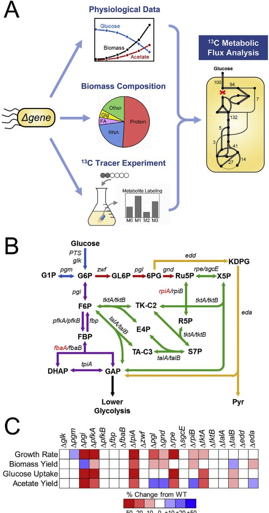
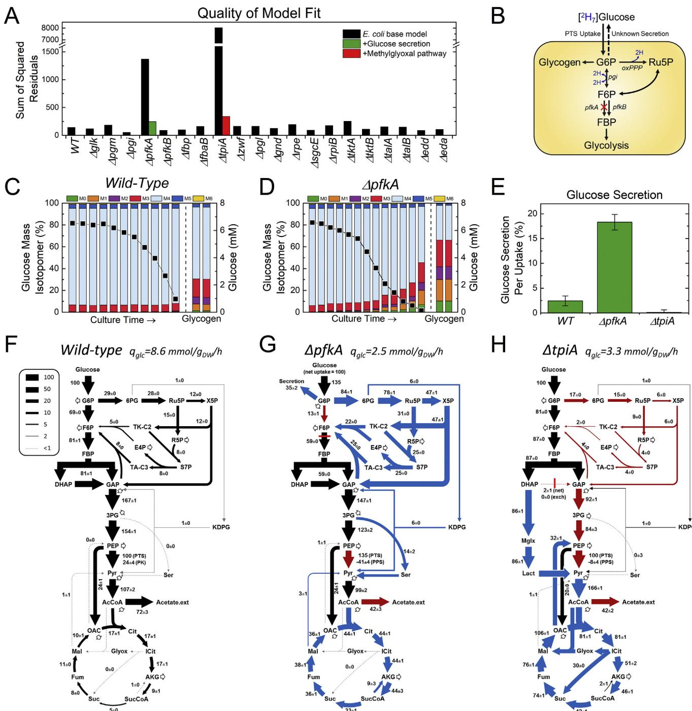
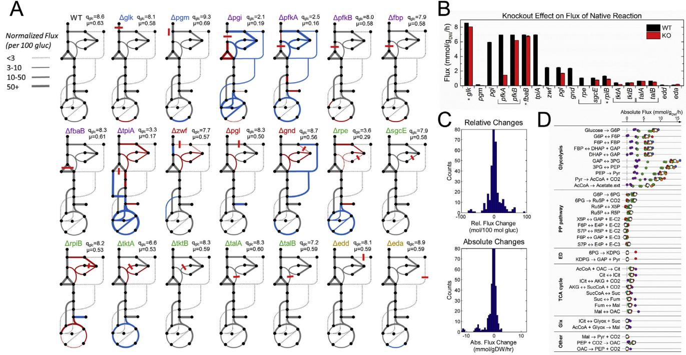
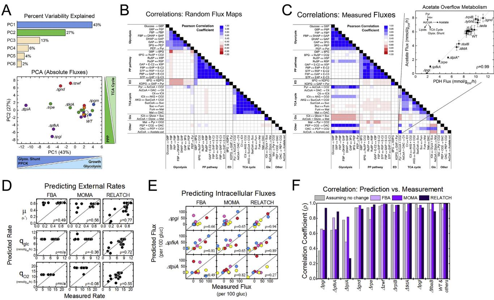

# Metabolic Engineering

journal homepage: [www.elsevier.com/locate/meteng](https://www.elsevier.com/locate/meteng)

# Metabolic flux responses to deletion of 20 core enzymes reveal flexibility and limits of E. coli metabolism

#### Christopher P. Long[1](#page-0-0) , Maciek R. Antoniewicz[*](#page-0-1)

Department of Chemical and Biomolecular Engineering, Metabolic Engineering and Systems Biology Laboratory, University of Delaware, Newark, DE, 19716, USA

| ARTICLE INFO                                                                                              | ABSTRACT                                                                                                                                                                                                                                                                                                                                                                                                                                                                                                                                                                                                                                                                                                                                                                                                                                                                                                                                                                                                                                                                                                                                                                     |
|-----------------------------------------------------------------------------------------------------------|------------------------------------------------------------------------------------------------------------------------------------------------------------------------------------------------------------------------------------------------------------------------------------------------------------------------------------------------------------------------------------------------------------------------------------------------------------------------------------------------------------------------------------------------------------------------------------------------------------------------------------------------------------------------------------------------------------------------------------------------------------------------------------------------------------------------------------------------------------------------------------------------------------------------------------------------------------------------------------------------------------------------------------------------------------------------------------------------------------------------------------------------------------------------------|
| Keywords: Escherichia coli Gene knockouts Genotype-to-phenotype Metabolism Systems biology | Despite remarkable progress in mapping biochemistry and gene-protein-reaction relationships, quantitative systems-level understanding of microbial metabolism remains a persistent challenge. Here, 13C-metabolic flux analysis was applied to interrogate metabolic responses to 20 genetic perturbations in all viable Escherichia coli single gene knockouts in upper central metabolic pathways. Strains with severe growth defects displayed highly altered intracellular flux patterns and were the most difficult to predict using current constraint-based modeling approaches. In the ΔpfkA strain, an unexpected glucose-secretion phenotype was identified. The broad range of flux rewiring responses that were quantified suggest that some compensating pathways are more flexible than others, resulting in a more robust physiology. The fact that only 2 out of 20 strains displayed an increased net pathway-flux capacity points to a fundamental rate limitation of E. coli core metabolism. In cataloguing the various cellular responses, our results provide a critical resource for kinetic model development and efforts |

focused on genotype-to-phenotype predictions.

# 1. Introduction

Quantitative and predictive understanding of cell metabolism is a fundamental objective in cell biology and bioengineering. Since the mapping of most major metabolic enzymes and associated genes over the past century, focus has shifted to studying the systems-level properties of metabolism, including kinetics and regulation. A commonly applied and fruitful approach to generating systems information is to study perturbation responses, such as to environmental or genetic changes [(Long and Antoniewicz, 2014a)](#page-8-0). Knockouts of genes encoding metabolic enzymes and regulators [(Haverkorn van Rijsewijk et al.,](#page-8-1) [2011)](#page-8-1) have been used to study regulatory responses, kinetics (e.g, identify potential rate limiting steps [(Toya et al., 2010)](#page-8-2)), and even to identify novel reactions ([Nakahigashi et al., 2009](#page-8-3)). Beyond any single discovery or analysis, such data also inform the development of metabolic models, for which predicting the genotype-phenotype relationship is a fundamental objective ([Lewis et al., 2012](#page-8-4)). These models represent the expression of current systems-level understanding, and their utility is essential for the realization of rational, forward engineering of strains in biotechnology. Rigorous assessment of existing models such as the constraint based reconstruction and analysis (COBRA) models, and development of next-generation models such as ensemble kinetic approaches [(Khodayari and Maranas, 2016)](#page-8-5), have been limited by available experimental measurements [(Long and Antoniewicz, 2014a](#page-8-0)).

In the model Gram-negative microbe Escherichia coli, gene perturbation studies have been significantly enabled by the Keio knockout strain collection [(Baba et al., 2006](#page-8-6)). In published fluxomic studies, however, incomplete coverage in genes and differences in experimental conditions across studies have limited the generalized interpretation of results ([Long and Antoniewicz, 2014a)](#page-8-0). Furthermore, recent advances in 13C-metabolic flux analysis (13C-MFA) methodology have significantly improved the precision and identifiability of fluxes ([Antoniewicz, 2015](#page-7-0); [Crown et al., 2016](#page-8-7); [Long et al., 2016a](#page-8-8)). In this study, 20 gene knockout strains, which comprehensively span the upper portion of central carbon metabolism, were characterized under identical growth conditions. The chosen condition of aerobic batch growth on glucose minimal medium complements a previous study which reported robust metabolic responses to 14 knockouts under chemostat substrate-limited conditions [(Ishii et al., 2007)](#page-8-9), is relevant to many biotechnological applications, and offers novel insights into intracellular kinetic limitations as external limits to growth are removed. The results will provide a basis for better understanding metabolic limitations to growth, and enable the application of next-generation modeling to this important regime.

<https://doi.org/10.1016/j.ymben.2019.08.003>

Received 7 May 2019; Received in revised form 3 August 2019; Accepted 3 August 2019 Available online 04 August 2019

* Corresponding author. Department of Chemical and Biomolecular Engineering University of Delaware 150 Academy, St Newark, DE, 19716, USA. E-mail address: [mranton@udel.edu](mailto:mranton@udel.edu) (M.R. Antoniewicz).

1 Current address: Ginkgo Bioworks, 27 Drydock Avenue, 8th Floor Boston, MA 02210.

1096-7176/ © 2019 International Metabolic Engineering Society. Published by Elsevier Inc. All rights reserved.

### 2. Materials and methods

### 2.1. Experimental design

This study was conducted to quantify precise metabolic fluxes for 21 E. coli strains, i.e. wild-type E. coli and 20 knockout strains. Key physiological characteristics of all strains such as growth rate, acetate production rate, biomass yield and glucose uptake rate, and metabolic fluxes were determined based on two tracer experiments using current best practices in 13C metabolic flux analysis ([Antoniewicz, 2015](#page-7-0); [Long](#page-8-10) [and Antoniewicz, submitted)](#page-8-10), and the optimal tracers [1,2–13C]glucose and [1,6–13C]glucose ([Crown et al., 2016](#page-8-7)).

#### 2.2. Materials

Chemicals and M9 minimal medium were purchased from Sigma-Aldrich (St. Louis, MO). Isotopic tracers were purchased from Cambridge Isotope Laboratories (Tewksbury, MA): [1,6–13C]glucose (99.2% 13C), and [1,2–13C]glucose (99.7%). The isotopic purity and enrichment of all tracers were validated by GC-MS analysis. All solutions were sterilized by filtration.

#### 2.3. Strains and culture conditions

All E. coli strains used in this study were obtained from the Keio collection (GE Healthcare Dharmacon), which were generated by onestep inactivation of all non-essential genes in E. coli K-12 BW25113 ([Baba et al., 2006](#page-8-6)). The specific strains used in this study are listed in Table S1, and were verified using PCR amplification of the knockout gene region. For 13C-tracer experiments, strains were cultured aerobically in glucose M9 minimal medium at 37 °C in mini-bioreactors with 10 mL working volume [(Long et al., 2016b)](#page-8-11). Pre-cultures were grown overnight and then used to inoculate the experimental culture at an OD600 of 0.01, in which 2 g/L of a specific glucose tracer was present. For each strain, two parallel labeling experiments were performed with [1,6–13C]glucose and [1,2–13C]glucose. Cells were harvested for GC-MS analysis at mid-exponential growth when OD600 was approximately 0.7. For the glucose secretion experiments, experimental cultures were inoculated as above, with 6 mM of either [2 H7]glucose (i.e., d7-glucose) or [1,2–13C]glucose. The experiment continued until glucose was entirely depleted.

#### 2.4. Analytical methods

Cell growth was monitored by measuring the optical density at 600 nm (OD600) using a spectrophotometer (Eppendorf BioPhotometer). The OD600 values were converted to cell dry weight concentrations using a previously determined OD600-dry cell weight relationship for E. coli (1.0 OD600 = 0.32 gDW/L) ([Long et al., 2016b](#page-8-11)). After centrifugation, the supernatant was separated from the cell pellet. The cell pellets were washed with glucose-free M9 medium prior to subsequent analysis. Glucose concentrations in the media were determined using YSI 2700 biochemistry analyzer (YSI, Yellow Springs, OH). Acetate concentrations were determined using an Agilent 1200 Series HPLC [(Gonzalez et al., 2017](#page-8-12)). Growth rate was calculated based on linear regression of the natural logarithm of OD600 versus time.

### 2.5. Gas chromatography-mass spectrometry

GC-MS analysis was performed on an Agilent 7890B GC system equipped with a DB-5MS capillary column (30 m, 0.25 mm i.d., 0.25 μm-phase thickness; Agilent J&W Scientific), connected to an Agilent 5977A Mass Spectrometer operating under ionization by electron impact (EI) at 70 eV. Helium flow was maintained at 1 mL/min. The source temperature was maintained at 230 °C, the MS quad temperature at 150 °C, the interface temperature at 280 °C, and the inlet temperature at 250 °C. GC-MS analysis of tert-butyldimethylsilyl (TBDMS) derivatized proteinogenic amino acids was performed as described [(Long and Antoniewicz, 2014b)](#page-8-13). Labeling of glucose (derived from glycogen) and ribose (from RNA) were determined as described ([McConnell and Antoniewicz, 2016](#page-8-14)). For the additional labeling measurement with ΔtpiA, the intracellular metabolite glycerol-3-phosphate was derivatized as described [(Ahn et al., 2016](#page-7-1)). The labeling of medium glucose in the glucose excretion experiments was determined as described [(Antoniewicz et al., 2011](#page-7-2)). In all cases, mass isotopomer distributions were obtained by integration ([Antoniewicz et al., 2007a](#page-7-3)) and corrected for natural isotope abundances [(Fernandez et al., 1996)](#page-8-15).

# 2.6. Metabolic network model and 13C-metabolic flux analysis

The metabolic network model used for 13C-MFA is provided in Table S2. The model was previously validated using 14 parallel labeling experiments [(Crown et al., 2015](#page-8-16)), and includes all major metabolic pathways of central carbon metabolism, lumped amino acid biosynthesis reactions, a transhydrogenase reaction, and a lumped biomass formation reaction. The coefficients in the biomass formation reaction were determined for each strain based on the measured biomass compositions ([Long et al., 2016b](#page-8-11)), as previously described ([Antoniewicz](#page-8-17) [et al., 2007c)](#page-8-17). Reversible reactions were modeled as separate forward and backward fluxes. Net and exchange fluxes were determined as follows: vnet = vf-vb; vexch = min(vf, vb).

Modifications to the model were made for two cases. For ΔpfkA, secretion of G6P was added. For ΔtpiA, the methylglyoxal pathway was added. To resolve the methylglyoxal pathway flux, an additional tracer experiment was performed using 50% [1–13C]glucose and 50% [4,5,6–13C]glucose and the labeling of intracellular glycerol-3-phosphate (which is produced from DHAP) was measured and used in flux estimation, described in more detail in a separate publication (Long and Antoniewicz, submitted). 13C-MFA calculations were performed using the Metran software [(Yoo et al., 2004](#page-8-18)), which is based on the elementary metabolite units (EMU) framework [(Antoniewicz et al., 2007b](#page-7-4)). Fluxes were estimated by minimizing the variance-weighted sum of squared residuals (SSR) between the measured and model predicted mass isotopomer distributions and acetate yield using non-linear leastsquares regression. For integrated analysis of parallel labeling experiments, the data sets were fitted simultaneously to a single flux model ([Antoniewicz, 2015](#page-7-0); [Leighty and Antoniewicz, 2013](#page-8-19)).

To describe fractional labeling of biomass amino acids G-value parameters were included in 13C-MFA. As described previously ([Antoniewicz et al., 2007c](#page-8-17)), the G-value represents the fraction of a metabolite pool that is produced during the labeling experiment, while 1-G represents the fraction that is naturally labeled (e.g., from inoculum). By default, one G-value parameter was included for each measured amino acid in each data set.

#### 2.7. Quantification of glucose secretion

To independently quantify the glucose secretion flux in ΔpfkA, ΔtpiA and WT strains, two additional experiments were performed for each strain with [2 H7]glucose (d7-glucose) and [1,2–13C]glucose. The glucose in the medium was sampled throughout the course of the batch culture and both the concentration and isotopic labeling of glucose in the medium were measured. Biomass samples were also collected at multiple time points from OD600~0.7 to the end of the experiment at glucose depletion (OD600~2) and analyzed for glycogen labeling (as a proxy for the labeling of intracellular glucose-6-phosphate). In all cases the glycogen labeling was found to not change significantly in time. The amount of glucose secretion was quantified by fitting the time-course data of glucose labeling and concentration to a model (see "Calculation of glucose secretion", below).

#### 2.8. Constraint-based reconstruction and analysis (COBRA) modeling

Flux balance analysis (FBA), minimization of metabolic adjustment (MOMA), and the relative change (RELATCH) algorithms were implemented through the COBRA Toolbox 2.0 in Matlab 2012b using the E. coli iAF1260 genome scale model (specifically "Ec_iAF1260_flux1.xml") [(Becker et al., 2007)](#page-8-20). CPLEX from Tomlab (<http://tomopt.com>) was used for the LP and QP solvers. RELATCH was downloaded from the Reed Laboratory website [(http://reedlab.che.](http://reedlab.che.wisc.edu/codes.php) [wisc.edu/codes.php)](http://reedlab.che.wisc.edu/codes.php). For FBA calculations, the upper bounds for glucose and oxygen uptake rates were set at wild-type values of 8.5 mmol/ gdw/hr and 12 mmol/gdw/hr respectively and growth rate was optimized. For MOMA, the reference state was generated using the measured (from 13C-MFA) wild-type fluxes as follows. Forty reactions were mapped from the network model applied here for 13C-MFA to the iAF1260 model, spanning glucose uptake, central carbon metabolic pathways, and acetate secretion. In iAF1260, the upper and lower allowable bounds for each reaction was set to the values obtained for the 95% confidence intervals from 13C-MFA. FBA with growth optimization was then run to obtain the 'reference' state fluxes. Good agreement with measured growth rate (0.60 h−1 ), acetate yield (0.66 mol/mol) and biomass yield (0.39 g/g) were observed. For RELATCH, the same 40 fluxes and standard errors were inputted, as well as gene expression data previously reported for the wild-type. All bounds for substrate uptake and central carbon reactions were lifted for the calculation of knockout phenotypes using MOMA and RELATCH. For the assessment of correlations between measured and estimated normalized intracellular fluxes [(Fig. 4](#page-7-5)E–F, S6), the following specific fluxes were used (reaction names correspond to iAF1260 designation and numbers correspond to network model in Table S2): PGI (v2), PYK (v9), GND (v11), EDD (v19), PDH (v21), CS (v22), SUCOAS (v28), ICL (v32), PPC (v36), PCK (v37), and EX_ac(e) (v70).

#### 2.9. Physiological measurements

The physiological characteristics (i.e. growth rate, biomass yield and acetate yield) reported in this study were all obtained from the parallel labeling experiments described in this work. The values were generally in excellent agreement with the values reported previously obtained using unlabeled glucose ([Long et al., 2016b)](#page-8-11) (see Supplemental Fig. S2 for comparison). The only significant difference was a slightly higher acetate yield for ΔrpiB. The biomass yields, which were obtained from 13C-MFA, were used for the calculation of glucose uptake rates. These values agreed well with the previously reported, directly measured values, assuming a constant dry weight to OD600 conversion of 0.32 g/L/OD600 for all strains.

#### 2.10. Calculation of glucose secretion

The following equations were derived and used to quantify glucose secretion rate. Let c(t) [mM] be the concentration glucose in the medium, X(t) be the labeling of medium glucose, Xglg be the labeling of intracellular G6P (i.e., glucose moiety of glycogen), v1 be the rate of cellular glucose uptake (e.g., mM/h), and v2 be the rate of glucose secretion (e.g., mM/h). Then, the following two differential equations describe the time evolution of glucose concentration and isotopic labeling of glucose in the medium.

$$\frac{dc}{dt} = \nu_2 - \nu_1\tag{1}$$

$$\frac{d(c^*X)}{dt} = \nu_2 \mathbf{^*X_{\delta^\#\mathbb{B}}} - \nu_1 \mathbf{^*X} \tag{2}$$

After substitution, we obtain the following expression:

$$\frac{dX}{dt} = \frac{\nu_2}{c} \mathbf{*} (\mathbf{X}_{\mathbb{R}^{\|\xi\|}} - X) \tag{3}$$

Dividing (Eq. [(1)](#page-2-0)) by (Eq. [(3))](#page-2-1) yields:

$$\frac{dc}{dX} = \left(\frac{\nu_2 - \nu_1}{\nu_2}\right) \mathbf{\dot{s}} \left(\frac{c}{X_{\text{lg}} - X}\right) \tag{4}$$

After integration, we obtain the following relationship:

$$\ln\left(\frac{\mathbf{X}_{\#\|\mathbf{g}\|} - \mathbf{X}}{\mathbf{X}_{\#\|\mathbf{g}\|} - \mathbf{X}_{t=0}}\right) = \alpha^* \ln\left(\frac{\mathbf{c}}{\mathbf{c}_{t=0}}\right)$$
 where

$$\mathbf{u} = \mathbf{v}_2 / (\mathbf{v}_1 \cdot \mathbf{v}_2) \tag{5}$$

Equation [(5)](#page-2-2) and least-squares linear regression were used to estimate the parameter α (see Supplemental Fig. S3), from which then the relative glucose secretion rate was calculated:

$$\mathbf{v}_2/\mathbf{v}_1 = \mathbf{a}/(\mathbf{1}\cdot\mathbf{a})\tag{\text{Eq. 6}}$$

# 2.11. Random flux maps

One hundred random flux maps were generated to capture a wide range of flux scenarios, with glycolysis flux ranging from 10 to 100 (normalized to glucose uptake of 100 mols per unit of time), oxPPP flux ranging from 0 to 80, ED flux ranging from 0 to 80, TCA cycle ranging from 16 to 180, glyoxylate shunt ranging from 0 to 30, acetate secretion ranging from 0 to 70, and growth rate ranging from 0.01 to 0.80 h−1 . The following procedure was followed to generate the random flux maps. First, we identified three key branch points in E. coli metabolism (as shown in Fig. S4), and for each of the branch points a random split ratio was assigned. Second, random values were assigned for the exchange fluxes of reversible reactions. Third, a random glucose uptake rate was assigned and intracellular fluxes were re-scaled to this glucose uptake rate. Lastly, we confirmed that all irreversible reactions carried a positive flux.

# 2.12. Statistical analysis

Flux estimation was repeated 10 times starting with random initial values for all fluxes to find a global solution. At convergence, accurate 95% confidence intervals were computed for all estimated fluxes by evaluating the sensitivity of the minimized SSR to flux variations. Precision of estimated fluxes was determined as follows ([Antoniewicz](#page-7-6) [et al., 2006)](#page-7-6): flux precision (stdev) = [(flux upper bound 95%) – (flux lower bound 95%)]/4. To determine the goodness-of-fit, 13C-MFA fitting results were subjected to a χ2 -statistical test at 95% confidence level ([Antoniewicz et al., 2006)](#page-7-6). All statistical analyses were performed using the software MATLAB.

# 3. Results and discussion

### 3.1. Detailed characterization of the metabolic phenotype

For each of the 21 studied E. coli strains [(Fig. 1](#page-3-0)A), a detailed description of carbon metabolism was acquired through three complementary analyses. First, direct measurements of cell density, substrates, and products during batch culture (aerobic, glucose minimal medium) allowed for the quantification of growth, uptake, and secretion rates. Second, the biomass composition of each strain was quantified, which was described in previous publications [(Long and](#page-8-13) [Antoniewicz, 2014b;](#page-8-13) [Long et al., 2016b](#page-8-11)). These measurements provide important constraints for 13C-MFA by quantifying the amounts of each precursor and co-factor utilized in biomass formation (e.g., ribose phosphates for RNA synthesis, or acetyl-CoA for fatty acids). Accuracy of flux estimates in secondary metabolism (i.e., biosynthetic pathways) is being increasingly recognized as important for developing large-scale

Fig. 1. Characterization of 20 E. coli knockouts of upper central carbon metabolism enzymes. (A) The methods applied include 1) Physiological data from aerobic batch growth on glucose minimal medium, 2) The measured biomass composition of each strain, and 3) The metabolite isotopic labeling resulting from parallel 13C isotopic tracer experiments using [1,2–13C]glucose and [1,6–13C]glucose. Together, these measurements are used to precisely estimate fluxes via 13C metabolic flux analysis (13C-MFA). (B) The scope of this study includes twenty single gene knockout strains from the Keio collection spanning the pathways of upper central carbon metabolism. These include glk (glucokinase) and pgm (to glycogen production) (blue), the upper portion of the glycolysis (EMP) pathway (purple), the oxidative (red) and non-oxidative (green) pentose phosphate pathway, and the ED pathway (orange). The genes denoted in red were excluded because of unavailability (fbaA is unconditionally essential and its knockout is not in the Keio collection; rpiA was previously determined to be essential in these conditions) (C) Physiological changes in knockout strains are summarized, expressed as percentage change from the wild-type. Biomass yields were estimated by 13C-MFA and used to calculate glucose uptake rates. (For interpretation of the references to color in this figure legend, the reader is referred to the Web version of this article.)

models ([Khodayari and Maranas, 2016;](#page-8-5) [McCloskey et al., 2016](#page-8-21)). Third, 13C tracer experiments were performed with a parallel experimental design, employing [1,2–13C] and [1,6–13C]glucose, previously identified as optimal tracers for precise flux measurements ([Crown et al.,](#page-8-7) [2016)](#page-8-7). The resulting labeling of proteinogenic amino acids and the sugar moieties of RNA (ribose) and glycogen (glucose) [(Long et al.,](#page-8-8) [2016a)](#page-8-8) were fit to a comprehensive network model of E. coli metabolism, subject to the measured external fluxes and biomass compositions, to obtain the global metabolic phenotype.

The scope of this study includes the knockouts of twenty enzymes spanning the upper part of central carbon metabolism ([Fig. 1](#page-3-0)B), defined here as including glucose kinase (glk), phosphoglucomutase (pgm, the first step in glycogen biosynthesis), the first half of glycolysis (i.e., EMP pathway), the oxidative (oxPPP) and non-oxidative pentose phosphate pathways (noxPPP), and the ED pathway. The effects of knocking out these genes on the growth rate, biomass yield, glucose uptake rate, and acetate yield are shown in [Fig. 1C](#page-3-0) (absolute values in Fig. S1, and growth rate reproducibility in Fig. S2). The most severe growth defects were observed in Δpgi, ΔpfkA, ΔtpiA, and Δrpe. Interestingly, Δpgm grew 10% faster than the wild-type, likely reflecting the cost that wild-type E. coli incurs to sacrifice growth for glycogen storage, hedging against future scarcity or stress. Variations in biomass yield of up to 0.1 g/g from the wild-type (0.4 gDW/ggluc) were observed, with a low of 0.3 g/g (ΔtpiA), and a high of 0.5 g/g (Δpgi). Corresponding to the growth rates and biomass yields, the glucose uptake rates also varied widely. The acetate secretion phenotype ranged from no acetate produced (Δpgi) to nearly 1 mol per mol glucose (ΔrpiB), showing both significant increases and decreases from the wild-type's 0.7 mol/mol acetate yield. These phenotypic differences reflect large metabolic perturbations in these knockouts during batch growth. The physiological characteristics measured in this study from the tracer experiments were generally in excellent agreement with the values reported previously obtained from unlabeled glucose experiments (see Supplemental Fig. S2 for comparison). The only significant difference was a slightly higher acetate yield for ΔrpiB.

# 3.2. Identification of novel reactions active in knockout strains

Precise intracellular fluxes were determined for each strain by fitting isotopic labeling data and product yields to a previously validated model of E. coli metabolism. Statistically acceptable fits were obtained for 19 of the 21 strains [(Fig. 2A](#page-4-0)). The two exceptions were ΔpfkA and ΔtpiA, for which the sum of squared residuals was significantly outside the acceptable range. Such poor model fits in 13C-MFA often indicate an incomplete metabolic network model. Indeed, for ΔtpiA the methylglyoxal pathway has been previously reported to carry significant flux ([Fong et al., 2006](#page-8-22)). Although tightly repressed in the wild-type due to the toxicity of the intermediate metabolite methylglyoxal, the methylglyoxal pathway relieves the dead-end at DHAP caused by the tpiA knockout. Addition of the methylglyoxal pathway to the model resulted in an acceptable fit for ΔtpiA, as described in detail in (Long and Antoniewicz, submitted). To resolve the unacceptable fit for ΔpfkA, a wide range of alternative metabolic pathways and reactions was evaluated. The only change to the model that resulted in an acceptable fit of the data was the introduction of an outflux of glucose 6-phoshate (G6P). After validating that the ΔpfkA strain did not accumulate additional carbohydrates internally, we hypothesized that ΔpfkA may secrete glucose into the medium. This was verified with a targeted follow-up tracer experiment ([Fig. 2](#page-4-0)B–E), in which deuterated d7-glucose was introduced as the substrate. Exchange of hydrogens in the PPP and PGI reactions resulted in intracellular G6P labeling that was distinct from extracellular glucose, and was measurable via glycogen. In [Fig. 2C](#page-4-0)–D, the time-course of extracellular glucose labeling in the batch culture is compared to intracellular glycogen labeling (a proxy for G6P labeling). During the course of the tracer experiment, glucose labeling in the medium increasingly resembled the labeling of G6P, clear evidence of

Fig. 2. Model validation and 13C-metabolic flux analysis identify a novel glucose secretion phenotype in E. coli. (A) Acceptable fits (SSR less than ~250) were obtained for all but two strains: ΔpfkA and ΔtpiA. Acceptable fits for these were acquired by adding glucose secretion, and methylglyoxal pathway, respectively, to the models. (B) To confirm the glucose secretion phenotype, a tracer experiment using [2 H7]glucose was implemented. Deuterated hydrogens are lost in the oxPPP and PGI reactions, resulting in an intracellular G6P labeling pattern (measured by glycogen) distinct from the extracellular glucose (here the m/z 370 fragment of glucose was measured, which contains the first five C-atoms of glucose and four deuterated H-atoms). (C) For the wild-type, extracellular glucose labeling (left, bars) does not change appreciably during batch culture as concentration (squares) diminishes. Glycogen labeling is compared on the right. (D) In ΔpfkA, the extracellular glucose labeling changes significantly, and trends toward the intracellular glycogen labeling, reflecting secretion. (E) The secretion was quantified using a differentialequation based model, showing that 18% of glucose taken up is secreted in ΔpfkA. (F) Intracellular flux maps of the wild-type, ΔpfkA (G), and ΔtpiA (H). Fluxes are normalized to 100 units of glucose uptake, and the absolute uptake rates are noted. Red hash marks indicate the reaction affected by knockout, and red and blue colors reflect relative flux changes of greater than 30% compared to the wild-type. (For interpretation of the references to color in this figure legend, the reader is referred to the Web version of this article.)

glucose secretion by ΔpfkA. Using the labeling time course data and a dynamic model (see methods section for details), the glucose secretion rate was determined to be 18% of the uptake rate ([Fig. 2](#page-4-0)E). These results were also replicated independently using [1,2–13C]glucose as tracer (Supplemental Fig. S3), thus excluding any 2 H-specific kinetic isotope effect. No evidence of glucose secretion was found for wild-type E. coli and ΔtpiA ([Fig. 2](#page-4-0)E and Fig. S3). These results support and extend recent reports that a ΔpfkA strain, modified to prevent glucose consumption, secreted glucose into the medium when grown on xylose ([Xia et al., 2015)](#page-8-23). Mechanistic investigations further concluded that several phosphatases are involved in dephosphorylating G6P, allowing for the diffusion of free glucose out of the cell by a yet unknown mechanism [(Xia et al., 2015](#page-8-23)). Two other recent studies by [Hollinshead](#page-8-24) [et al. (2016)](#page-8-24) and [Diaz et al. (2019)](#page-8-25) provide additional insights into the metabolic phenotype of ΔpfkA strain. Specifically, the authors demonstrated that in ΔpfkA strain intracellular G6P accumulates to high levels, which provides the necessary driving force for a phosphatase to produce glucose from G6P ([Diaz et al., 2019;](#page-8-25) [Hollinshead et al., 2016](#page-8-24)).

The intracellular fluxes of wild-type E. coli, ΔpfkA and ΔtpiA are shown in [Fig. 2](#page-4-0)F–H. The wild-type flux distribution ([Fig. 2F](#page-4-0)) is in good agreement with previous reports [(Crown et al., 2015)](#page-8-16), and large flux changes in ΔpfkA ([Fig. 2](#page-4-0)G) and ΔtpiA [(Fig. 2H](#page-4-0)) are apparent (changes greater than 30% from wild-type are highlighted), including the unique reactions identified for these strains. The PFK I (pfkA) and TpiA (tpiA) enzymes carry high flux in the wild-type, and their loss results in large reductions in growth rate ([Fig. 1](#page-3-0)C) and glucose uptake rate ([Figs. 1C](#page-3-0) and [Fig. 2](#page-4-0)F–H). In addition to the glucose secretion phenotype, in ΔpfkA there is increased relative utilization of the oxPPP, ED pathway, serine metabolism to pyruvate, and the TCA cycle, while the PGI reaction and acetate production fluxes are decreased. The co-occurrence of the unique phosphatase and serine conversion to pyruvate (not observed in any other strain) activities may indicate a common regulatory mechanism. The ΔtpiA fluxes are quite different, as the methylglyoxal pathway carries a large flux (86 per 100 mols of glucose uptake) from DHAP to pyruvate, and the TCA cycle, glyoxylate shunt, and PPCK reaction (OAC to PEP) are highly elevated. The oxPPP, lower glycolysis, and acetate production fluxes are decreased. These significant differences demonstrate that there is no common 'slow growth' metabolic phenotype, but that these strains encounter unique limitations and challenges.

#### 3.3. Carbon metabolism rewiring in 20 knockout strains

The normalized (per 100 mols of glucose per unit of time) distributions of fluxes through the central carbon metabolic pathways are summarized for all strains in [Fig. 3](#page-6-0)A. As might be expected, the strains with severe growth defects (i.e., Δpgi, ΔpfkA, ΔtpiA, Δrpe) also had highly altered intracellular flux distributions. However, there were also several strains with large flux changes despite much smaller external physiological effects, particularly Δzwf, Δgnd, ΔrpiB, and ΔtktA. This indicates that some compensating pathways are more flexible than others, resulting in a more robust physiology. Other knockout strains had flux distributions close to the wild-type. These include Δpgm, as well as knockouts of enzymes that carry minimal flux in the wild-type such as glk (most glucose is transported and phosphorylated via PTS), the ED pathway genes edd and eda, and the gluconeogenic fbp. Additionally, minimal changes were observed in knockouts of minor isozymes pfkB, fbaB, sgcE, tktB, and talA. The normalized fluxes are also represented in Fig. S3, focusing on the pathway utilization through three key branch points in metabolism.

The local effects of enzyme loss on the directly involved reactions can also be evaluated in absolute flux units (mmol/gDW/h, [Fig. 3B](#page-6-0)). In the cases where a single gene is responsible for the flux, complete elimination of flux was observed in most cases (e.g., Δpgm, Δpgi, ΔtpiA, Δzwf, and Δgnd). A notable exception was Δpgl, where a significant 6 phosphogluconolactonase flux was maintained in the knockout strain. This reaction has been shown to proceed spontaneously in vivo [(Kupor](#page-8-26) [and Fraenkel, 1969;](#page-8-26) [Thomason et al., 2004)](#page-8-27), and a significant oxPPP flux has also been measured in E. coli strain BL21, which is lacking the pgl gene ([Long et al., 2017b](#page-8-28); [Waegeman et al., 2011)](#page-8-29). In the cases where multiple enzymes are known to catalyze the same reactions (i.e., isozymes), it is apparent in some cases that one isozyme is dominant. For example, the PTS system (glucose uptake) is more utilized than glk; pfkA is preferred over pfkB, fbaA over fbaB, rpiA over rpiB, rpe over sgcE, and tktA over tktB.

The nature of flux rewiring can also be assessed more globally, for example to determine whether compensatory flux increases are common (i.e., flexible redistribution) or if rate limitations occur ([Fig. 3](#page-6-0)C–D). When changes in fluxes from the wild-type are expressed in relative flux units (per 100 mols of glucose per unit of time), a symmetrical, unimodal distribution of flux changes is observed, suggesting that many fluxes are both increased and decreased in the knockout strains (as in [Fig. 3](#page-6-0)A). However, when expressed in absolute units (mmol/gDW/h), the pattern of flux changes is highly skewed towards negative flux changes, i.e., most gene perturbations result in lower absolute rates in the knockout strains and very few result in higher absolute fluxes. These changes are expanded upon in Fig. S4, which shows for example that the elevated normalized fluxes through the oxPPP and TCA cycle in Δpgi and ΔpfkA do not represent increases in absolute terms. Instead, as the rates of glucose uptake decrease in these strains, similar absolute rates of flux through these pathways play relatively larger roles. This lack of expansion of absolute flux capacity indicates a rate limitation in these slow growing strains. Limitations can also occur in cofactor metabolism, which is affected directly by carbon pathway usage (Fig. S5). For example, it has been shown that reversal of the pyridine nucleotide cofactor transhydrogenase is at least partially rate-limiting in Δpgi [(Long et al., 2018)](#page-8-30).

The distributions of absolute fluxes throughout central carbon metabolism across strains is visualized in [Fig. 3](#page-6-0)D. The rates of glycolysis varied most widely, with several glycolysis knockouts and Δrpe much slower than the wild-type and other strains. There were less drastic changes (in absolute flux values) elsewhere in metabolism, as these fluxes are much smaller in magnitude in the wild-type. Notably, only Δgnd had a significantly increased absolute ED pathway flux, and only ΔtpiA had significantly elevated absolute TCA, glyoxylate shunt, and PPCK fluxes. In all other strains these pathways were not significantly increased relative to the wild-type, in contrast to previous interpretations of 'latent pathway activation' (for example in Δpgi [(Long et al.,](#page-8-30) [2018)](#page-8-30)) based on relative flux changes ([Fischer and Sauer, 2003;](#page-8-31) [Hua](#page-8-32) [et al., 2003)](#page-8-32). Notably, the higher variability pathways (e.g., glycolysis) have been shown to be the most highly regulated at the metabolite level, while the pentose phosphate pathway and TCA cycle are comparatively less regulated ([Reznik et al., 2017](#page-8-33)). This may help to explain the lack of absolute flux increases in these pathways in most strains, and why the oxPPP is not able to sufficiently compensate for the decreased glycolysis flux in Δpgi and ΔpfkA.

# 3.4. Multivariate analysis and model prediction assessment

To gain additional insights into the underlying drivers of the observed metabolic rewiring, multivariate statistical analyses were applied. Principal component analysis (PCA) [(Fig. 4A](#page-7-5)) shows that the highly dimensional flux data across the 21 strains can be largely explained by a few key principal components (70% of variance explained by first two, 83% by first three). PC1 shows that absolute glycolytic flux and growth rate are coupled, and inversely relate to glyoxylate shunt and PPCK flux rates. PC2 captures an inverse relationship between pentose phosphate pathway and TCA cycle fluxes. The distribution of strains across these two principal components is reflective of the degree of perturbation from the wild-type, and of the highly-perturbed strains there is clustering of knockouts by pathway perturbation (e.g., Δzwf and Δgnd; ΔpfkA and Δpgi). Pairwise correlations between fluxes were also examined ([Fig. 4B](#page-7-5)–C), with 100 random flux maps generated to control for trivial, stoichiometry-driven relationships [(Fig. 4](#page-7-5)B). There were interesting differences between the random and measured flux correlations. The random fluxes showed a highly negative relationship between the fluxes at the branch point of glycolysis and the oxPPP (as well as the ED pathway), whereas no such relationships were observed in the measured flux patterns. This could indicate that this split is regulated, or is kinetically limited (i.e., reduced glycolytic flux did not result in

Fig. 3. Global analysis of intracellular fluxes in wild-type E. coli and 20 knockout strains. (A) Fluxes for all strains are normalized to 100 units of glucose uptake. The red hash marks denote the reaction affected by the knockout, and the line thickness corresponds to flux value according the legend (upper, left). Colored reactions indicate changes of greater than 30% from the wild-type (blue increased, red decreased). (B) The absolute flux for each reaction directly affected by a knockout, in both the wild-type and corresponding mutant strain. For example, the PGI flux is 6 mmol/gDW/h in the wild-type, but 0 in Δpgi. Brackets indicate isozymes corresponding to the same reaction, while asterisks indicate the presence of an isozyme outside the scope of this study. (C) The intracellular flux changes are distributed in a symmetrical way in relative (per 100 glucose) terms, reflecting both flux increases and decreases. In absolute terms the changes are highly skewed to the negative, indicating that most fluxes are maintained or decreased in knockouts, and very few are increased. (D) Absolute fluxes in central carbon metabolism, including the wild-type (white), and mutants in glk and pgm (blue), glycolysis (purple), oxPPP (red), noxPPP (green), and the ED pathway (orange). (For interpretation of the references to color in this figure legend, the reader is referred to the Web version of this article.)

increased absolute oxPPP flux in Δpgi or ΔpfkA). Additionally, the PPC (PEP to OAC) flux correlated strongly with glycolysis. This flux replenishes the TCA cycle to allow for supply of precursors for biomass synthesis, and its correlation reflects a strong driving force to maintain a relatively constant biomass yield. The strongest non-trivial flux correlation was between the PDH flux (pyruvate to AcCoA) and acetate secretion (ρ = 0.99). Above a PDH flux of 2 mmol/gDW/h, the acetate secretion rate increased linearly by 0.85 mmol/gDW/h per flux unit of PDH reaction. Below a PDH flux of 2 mmol/gDW/h, no acetate secretion was observed. This result provides support for the hypothesis of acetate overflow metabolism that could be caused by limitations in the electron transport chain capacity [(Majewski and Domach, 1990)](#page-8-34).

Finally, the measured flux changes were compared to predictions from three commonly used constraint-based reconstruction and analysis (COBRA) models (see Supplemental Methods for details). These models consider the genome scale stoichiometry (here, the E. coli iAF1260 genome scale model [(Feist et al., 2007)](#page-8-35)), and represent increasing levels of complexity from FBA to MOMA to RELATCH; i.e. in FBA the assumption is that growth rate is maximized, while MOMA minimizes the sum of squares difference from the wild-type to the newly constrained knockout network, and RELATCH accounts for wild-type gene expression to further constrain pathway capacities. Of these methods, only RELATCH can account for the respective contributions of isozymes. The comparison of model predictions to measurements are summarized in [Fig. 4](#page-7-5)D–F. FBA and MOMA performed relatively poorly at predicting extracellular rates [(Fig. 4](#page-7-5)D), in many cases predicting minimal or no phenotypic impact. While RELATCH performed better, it still lacked broad accuracy. For the intracellular flux distributions (expressed as normalized fluxes), the most severely rewired strains were also the most difficult to predict [(Fig. 4E](#page-7-5)). For Δpgi and ΔpfkA, fluxes were most accurately predicted with RELATCH, however ΔtpiA was poorly predicted with this method. For many strains, the accuracy of COBRA predictions was only slightly better than the trivial hypothesis that no fluxes change.

# 4. Conclusions

In this study, we have leveraged the Keio collection and recent advances in 13C-MFA to comprehensively interrogate system-level responses to genetic perturbations in the upper pathways of central carbon metabolism. In contrast to previous studies of substrate limited growth in chemostats, the substrate rich conditions presented here revealed and allowed for the quantification of rate limitations in central carbon metabolism. In some cases, remarkable robustness and flexibility of E. coli metabolism was observed, as in the redistribution of oxPPP flux in Δzwf and Δgnd without significantly reduced glucose uptake. In other cases, however, loss of certain enzymes created massive bottlenecks as flux was redirected (Δpgi, ΔpfkA), reactions had to be reversed (Δrpe), or new pathways had to be activated (ΔtpiA, ΔpfkA). In cataloguing these various responses, these results provide a valuable resource for strain engineering and metabolic modeling. For example, the rarity of absolute flux increases in these strains suggests that metabolism is perhaps more kinetically controlled than currently appreciated. As such, we observed that the stoichiometry-based COBRA models struggled to predict absolute rates. Other recent studies have also highlighted limited performance of stoichiometry-based approaches in making quantitative predictions in metabolic engineering for strain design [(Khodayari et al., 2014)](#page-8-36). Importantly, it was demonstrated that by including a kinetic model of metabolism the predictions could be dramatically improved to the point that quantitative

Fig. 4. Multivariate analysis and model assessment of metabolic fluxes for 20 knockout strains. (A) PCA was performed on all measured absolute fluxes. A large amount (70%) of the variance was captured by the first two principal components that capture pathway fluxes shown by the axis labels. (B-C) Nontrivial correlations between fluxes were identified by comparing those from randomly generated flux maps (B) to those of the measured fluxes (C) (Pearson correlation coefficient represented by color). The pyruvate dehydrogenase (PDH) and acetate secretion fluxes were highly correlated (ρ = 0.99), consistent with the acetate overflow model. (D-F) Measured flux values were compared to predictions from common COBRA models FBA, MOMA and RELATCH. (D) External rates of growth, glucose uptake (estimated by 13C-MFA), and oxygen uptake (estimated by 13C-MFA) were compared to predictions, with quality of agreement scored by Pearson correlation coefficients. (E) Predictions and measured values of eleven key normalized intracellular fluxes are compared for the three most perturbed strains. The fluxes correspond to intracellular pathways as follows: glycolysis (light blue), oxPPP and ED pathways (red), TCA cycle and glyoxylate shunt (yellow), acetate and ana/cataplerotic reactions (pink). (F) The correlations of these fluxes are shown for all strains. The gray bars reflect the correlation between the knockout and wildtype fluxes. (For interpretation of the references to color in this figure legend, the reader is referred to the Web version of this article.)

predictions were possible [(Foster et al., 2019)](#page-8-37). The development of increasingly sophisticated COBRA models, such as the 'ME' models ([Lerman et al., 2012](#page-8-38)) which account for macromolecular constraints, and next-generation genome-scale ensemble kinetic models [(Khodayari](#page-8-5) [and Maranas, 2016](#page-8-5)) thus offer promising pathways to better accuracy and predictability. In addition, future models should also consider including global and local transcriptional regulation as potential mechanisms to explain the rewiring of fluxes in the metabolic gene deletion strains.

Finally, 13C-MFA has again been demonstrated to be a useful tool in biological discovery. Here, glucose secretion in ΔpfkA was identified and confirmed, building upon previous observations which have already shown potential for biotechnological application [(Diaz et al.,](#page-8-25) [2019;](#page-8-25) [Xia et al., 2015](#page-8-23)). Recently, targeted 13C tracer studies have also confirmed the in vivo reversibility of Enzyme I of the PTS system [(Long](#page-8-39) [et al., 2017a)](#page-8-39). These examples highlight that methods designed to improve precision in 13C-flux analysis, e.g., optimized tracer selection and parallel labeling experiments, also provide more resolving power to identify non-conventional pathway usage, even in the extensively studied E. coli. If needed, the measured mass isotopomer data presented here can be re-analyzed under different network model assumptions in future work. Moreover, widening the scope of the available flux data to knockouts of other metabolic pathways and complementing fluxomic data with metabolomic, transcriptomic and proteomic data, as well as incorporating insights from adaptively evolved knockout strains [(Long](#page-8-40) [and Antoniewicz, 2018)](#page-8-40), will further strengthen these efforts.

# Acknowledgments

This work was supported by NSF MCB-1616332 grant.

# Appendix A. Supplementary data

Supplementary data to this article can be found online at [https://](https://doi.org/10.1016/j.ymben.2019.08.003) [doi.org/10.1016/j.ymben.2019.08.003](https://doi.org/10.1016/j.ymben.2019.08.003).

# References

- [Ahn, W.S., Crown, S.B., Antoniewicz, M.R., 2016. Evidence for transketolase-like TKTL1](http://refhub.elsevier.com/S1096-7176(19)30205-8/sref1) fl[ux in CHO cells based on parallel labeling experiments and (13)C-metabolic](http://refhub.elsevier.com/S1096-7176(19)30205-8/sref1) flux [analysis. Metab. Eng. 37, 72](http://refhub.elsevier.com/S1096-7176(19)30205-8/sref1)–78.
- [Antoniewicz, M.R., 2015. Parallel labeling experiments for pathway elucidation and 13C](http://refhub.elsevier.com/S1096-7176(19)30205-8/sref2) metabolic fl[ux analysis. Curr. Opin. Biotechnol. 36, 91](http://refhub.elsevier.com/S1096-7176(19)30205-8/sref2)–97.
- [Antoniewicz, M.R., Kelleher, J.K., Stephanopoulos, G., 2006. Determination of con](http://refhub.elsevier.com/S1096-7176(19)30205-8/sref3)fidence intervals of metabolic fl[uxes estimated from stable isotope measurements. Metab.](http://refhub.elsevier.com/S1096-7176(19)30205-8/sref3) [Eng. 8, 324](http://refhub.elsevier.com/S1096-7176(19)30205-8/sref3)–337.
- [Antoniewicz, M.R., Kelleher, J.K., Stephanopoulos, G., 2007a. Accurate assessment of](http://refhub.elsevier.com/S1096-7176(19)30205-8/sref4) [amino acid mass isotopomer distributions for metabolic](http://refhub.elsevier.com/S1096-7176(19)30205-8/sref4) flux analysis. Anal. Chem. [79, 7554](http://refhub.elsevier.com/S1096-7176(19)30205-8/sref4)–7559.
- [Antoniewicz, M.R., Kelleher, J.K., Stephanopoulos, G., 2007b. Elementary metabolite](http://refhub.elsevier.com/S1096-7176(19)30205-8/sref5) [units (EMU): a novel framework for modeling isotopic distributions. Metab. Eng. 9,](http://refhub.elsevier.com/S1096-7176(19)30205-8/sref5) 68–[86](http://refhub.elsevier.com/S1096-7176(19)30205-8/sref5).
- [Antoniewicz, M.R., Kelleher, J.K., Stephanopoulos, G., 2011. Measuring deuterium en](http://refhub.elsevier.com/S1096-7176(19)30205-8/sref6)[richment of glucose hydrogen atoms by gas chromatography/mass spectrometry.](http://refhub.elsevier.com/S1096-7176(19)30205-8/sref6)

[Anal. Chem. 83, 3211](http://refhub.elsevier.com/S1096-7176(19)30205-8/sref6)–3216.

- Antoniewicz, M.R., Kraynie, D.F., Laff[end, L.A., Gonzalez-Lergier, J., Kelleher, J.K.,](http://refhub.elsevier.com/S1096-7176(19)30205-8/sref7) Stephanopoulos, G., 2007c. Metabolic fl[ux analysis in a nonstationary system: fed](http://refhub.elsevier.com/S1096-7176(19)30205-8/sref7)[batch fermentation of a high yielding strain of E. coli producing 1,3-propanediol.](http://refhub.elsevier.com/S1096-7176(19)30205-8/sref7) [Metab. Eng. 9, 277](http://refhub.elsevier.com/S1096-7176(19)30205-8/sref7)–292.
- [Baba, T., Ara, T., Hasegawa, M., Takai, Y., Okumura, Y., Baba, M., Datsenko, K.A.,](http://refhub.elsevier.com/S1096-7176(19)30205-8/sref8) [Tomita, M., Wanner, B.L., Mori, H., 2006. Construction of Escherichia coli K-12 in](http://refhub.elsevier.com/S1096-7176(19)30205-8/sref8)[frame, single-gene knockout mutants: the Keio collection. Mol. Syst. Biol. 2 2006](http://refhub.elsevier.com/S1096-7176(19)30205-8/sref8) [0008.](http://refhub.elsevier.com/S1096-7176(19)30205-8/sref8)
- [Becker, S.A., Feist, A.M., Mo, M.L., Hannum, G., Palsson, B.O., Herrgard, M.J., 2007.](http://refhub.elsevier.com/S1096-7176(19)30205-8/sref9) [Quantitative prediction of cellular metabolism with constraint-based models: the](http://refhub.elsevier.com/S1096-7176(19)30205-8/sref9) [COBRA Toolbox. Nat. Protoc. 2, 727](http://refhub.elsevier.com/S1096-7176(19)30205-8/sref9)–738.
- [Crown, S.B., Long, C.P., Antoniewicz, M.R., 2015. Integrated 13C-metabolic](http://refhub.elsevier.com/S1096-7176(19)30205-8/sref10) flux analysis [of 14 parallel labeling experiments in Escherichia coli. Metab. Eng. 28, 151](http://refhub.elsevier.com/S1096-7176(19)30205-8/sref10)–158.
- [Crown, S.B., Long, C.P., Antoniewicz, M.R., 2016. Optimal tracers for parallel labeling](http://refhub.elsevier.com/S1096-7176(19)30205-8/sref11) experiments and 13C metabolic fl[ux analysis: a new precision and synergy scoring](http://refhub.elsevier.com/S1096-7176(19)30205-8/sref11) [system. Metab. Eng. 38, 10](http://refhub.elsevier.com/S1096-7176(19)30205-8/sref11)–18.
- [Diaz, C.A.C., Bennett, R.K., Papoutsakis, E.T., Antoniewicz, M.R., 2019. Deletion of four](http://refhub.elsevier.com/S1096-7176(19)30205-8/sref12) [genes in Escherichia coli enables preferential consumption of xylose and secretion of](http://refhub.elsevier.com/S1096-7176(19)30205-8/sref12) [glucose. Metab. Eng. 52, 168](http://refhub.elsevier.com/S1096-7176(19)30205-8/sref12)–177.
- [Feist, A.M., Henry, C.S., Reed, J.L., Krummenacker, M., Joyce, A.R., Karp, P.D., Broadbelt,](http://refhub.elsevier.com/S1096-7176(19)30205-8/sref13) [L.J., Hatzimanikatis, V., Palsson, B.O., 2007. A genome-scale metabolic reconstruc](http://refhub.elsevier.com/S1096-7176(19)30205-8/sref13)[tion for Escherichia coli K-12 MG1655 that accounts for 1260 ORFs and thermo](http://refhub.elsevier.com/S1096-7176(19)30205-8/sref13)[dynamic information. Mol. Syst. Biol. 3, 121.](http://refhub.elsevier.com/S1096-7176(19)30205-8/sref13)
- [Fernandez, C.A., Des Rosiers, C., Previs, S.F., David, F., Brunengraber, H., 1996.](http://refhub.elsevier.com/S1096-7176(19)30205-8/sref14) [Correction of 13C mass isotopomer distributions for natural stable isotope abun](http://refhub.elsevier.com/S1096-7176(19)30205-8/sref14)[dance. J. Mass Spectrom. 31, 255](http://refhub.elsevier.com/S1096-7176(19)30205-8/sref14)–262.
- Fischer, E., Sauer, U., 2003. Metabolic flux profi[ling of Escherichia coli mutants in central](http://refhub.elsevier.com/S1096-7176(19)30205-8/sref15) [carbon metabolism using GC-MS. Eur. J. Biochem. 270, 880](http://refhub.elsevier.com/S1096-7176(19)30205-8/sref15)–891.
- [Fong, S.S., Nanchen, A., Palsson, B.O., Sauer, U., 2006. Latent pathway activation and](http://refhub.elsevier.com/S1096-7176(19)30205-8/sref16) [increased pathway capacity enable Escherichia coli adaptation to loss of key meta](http://refhub.elsevier.com/S1096-7176(19)30205-8/sref16)[bolic enzymes. J. Biol. Chem. 281, 8024](http://refhub.elsevier.com/S1096-7176(19)30205-8/sref16)–8033.
- [Foster, C.J., Gopalakrishnan, S., Antoniewicz, M.R., Maranas, C.D., 2019. From E. coli](http://refhub.elsevier.com/S1096-7176(19)30205-8/sref17) [mutant 13C labeling data to a core kinetic model: a kinetic model parameterization](http://refhub.elsevier.com/S1096-7176(19)30205-8/sref17) [pipeline. PLoS Comput. Biol.](http://refhub.elsevier.com/S1096-7176(19)30205-8/sref17)
- [Gonzalez, J.E., Long, C.P., Antoniewicz, M.R., 2017. Comprehensive analysis of glucose](http://refhub.elsevier.com/S1096-7176(19)30205-8/sref18) [and xylose metabolism in Escherichia coli under aerobic and anaerobic conditions by](http://refhub.elsevier.com/S1096-7176(19)30205-8/sref18) 13C metabolic fl[ux analysis. Metab. Eng. 39, 9](http://refhub.elsevier.com/S1096-7176(19)30205-8/sref18)–18.
- [Haverkorn van Rijsewijk, B.R., Nanchen, A., Nallet, S., Kleijn, R.J., Sauer, U., 2011. Large](http://refhub.elsevier.com/S1096-7176(19)30205-8/sref19)scale 13C-fl[ux analysis reveals distinct transcriptional control of respiratory and](http://refhub.elsevier.com/S1096-7176(19)30205-8/sref19) [fermentative metabolism in Escherichia coli. Mol. Syst. Biol. 7, 477](http://refhub.elsevier.com/S1096-7176(19)30205-8/sref19).
- [Hollinshead, W.D., Rodriguez, S., Martin, H.G., Wang, G., Baidoo, E.E., Sale, K.L.,](http://refhub.elsevier.com/S1096-7176(19)30205-8/sref20) [Keasling, J.D., Mukhopadhyay, A., Tang, Y.J., 2016. Examining Escherichia coli](http://refhub.elsevier.com/S1096-7176(19)30205-8/sref20) [glycolytic pathways, catabolite repression, and metabolite channeling using Deltapfk](http://refhub.elsevier.com/S1096-7176(19)30205-8/sref20) [mutants. Biotechnol. Biofuels 9, 212](http://refhub.elsevier.com/S1096-7176(19)30205-8/sref20).
- [Hua, Q., Yang, C., Baba, T., Mori, H., Shimizu, K., 2003. Responses of the central meta](http://refhub.elsevier.com/S1096-7176(19)30205-8/sref21)[bolism in Escherichia coli to phosphoglucose isomerase and glucose-6-phosphate](http://refhub.elsevier.com/S1096-7176(19)30205-8/sref21) [dehydrogenase knockouts. J. Bacteriol. 185, 7053](http://refhub.elsevier.com/S1096-7176(19)30205-8/sref21)–7067.
- [Ishii, N., Nakahigashi, K., Baba, T., Robert, M., Soga, T., Kanai, A., Hirasawa, T., Naba, M.,](http://refhub.elsevier.com/S1096-7176(19)30205-8/sref22) [Hirai, K., Hoque, A., Ho, P.Y., Kakazu, Y., Sugawara, K., Igarashi, S., Harada, S.,](http://refhub.elsevier.com/S1096-7176(19)30205-8/sref22) [Masuda, T., Sugiyama, N., Togashi, T., Hasegawa, M., Takai, Y., Yugi, K., Arakawa,](http://refhub.elsevier.com/S1096-7176(19)30205-8/sref22) K., [Iwata, N., Toya, Y., Nakayama, Y., Nishioka, T., Shimizu, K., Mori, H., Tomita, M.,](http://refhub.elsevier.com/S1096-7176(19)30205-8/sref22) [2007. Multiple high-throughput analyses monitor the response of E. coli to pertur](http://refhub.elsevier.com/S1096-7176(19)30205-8/sref22)[bations. Science 316, 593](http://refhub.elsevier.com/S1096-7176(19)30205-8/sref22)–597.
- [Khodayari, A., Chowdhury, A., Maranas, C.D., 2014. Succinate overproduction: a case](http://refhub.elsevier.com/S1096-7176(19)30205-8/sref23) [study of computational strain design using a comprehensive Escherichia coli kinetic](http://refhub.elsevier.com/S1096-7176(19)30205-8/sref23) [model. Frontiers in bioengineering and biotechnology 2, 76.](http://refhub.elsevier.com/S1096-7176(19)30205-8/sref23)
- [Khodayari, A., Maranas, C.D., 2016. A genome-scale Escherichia coli kinetic metabolic](http://refhub.elsevier.com/S1096-7176(19)30205-8/sref24) model k-ecoli457 satisfying fl[ux data for multiple mutant strains. Nat. Commun. 7,](http://refhub.elsevier.com/S1096-7176(19)30205-8/sref24) [13806.](http://refhub.elsevier.com/S1096-7176(19)30205-8/sref24)
- [Kupor, S.R., Fraenkel, D.G., 1969. 6-phosphogluconolactonase mutants of Escherichia coli](http://refhub.elsevier.com/S1096-7176(19)30205-8/sref25) [and a maltose blue gene. J. Bacteriol. 100, 1296](http://refhub.elsevier.com/S1096-7176(19)30205-8/sref25)–1301.
- [Leighty, R.W., Antoniewicz, M.R., 2013. COMPLETE-MFA: complementary parallel la](http://refhub.elsevier.com/S1096-7176(19)30205-8/sref26)[beling experiments technique for metabolic](http://refhub.elsevier.com/S1096-7176(19)30205-8/sref26) flux analysis. Metab. Eng. 20, 49–55.
- [Lerman, J.A., Hyduke, D.R., Latif, H., Portnoy, V.A., Lewis, N.E., Orth, J.D., Schrimpe-](http://refhub.elsevier.com/S1096-7176(19)30205-8/sref27)

[Rutledge, A.C., Smith, R.D., Adkins, J.N., Zengler, K., Palsson, B.O., 2012. In silico](http://refhub.elsevier.com/S1096-7176(19)30205-8/sref27) [method for modelling metabolism and gene product expression at genome scale. Nat.](http://refhub.elsevier.com/S1096-7176(19)30205-8/sref27) [Commun. 3, 929](http://refhub.elsevier.com/S1096-7176(19)30205-8/sref27).

- [Lewis, N.E., Nagarajan, H., Palsson, B.O., 2012. Constraining the metabolic genotype](http://refhub.elsevier.com/S1096-7176(19)30205-8/sref28)[phenotype relationship using a phylogeny of in silico methods. Nat. Rev. Microbiol.](http://refhub.elsevier.com/S1096-7176(19)30205-8/sref28) [10, 291](http://refhub.elsevier.com/S1096-7176(19)30205-8/sref28)–305.
- [Long, C.P., Antoniewicz, M.R., 2014a. Metabolic](http://refhub.elsevier.com/S1096-7176(19)30205-8/sref29) flux analysis of Escherichia coli [knockouts: lessons from the Keio collection and future outlook. Curr. Opin.](http://refhub.elsevier.com/S1096-7176(19)30205-8/sref29) [Biotechnol. 28, 127](http://refhub.elsevier.com/S1096-7176(19)30205-8/sref29)–133.
- [Long, C.P., Antoniewicz, M.R., 2014b. Quantifying biomass composition by gas chro](http://refhub.elsevier.com/S1096-7176(19)30205-8/sref30)[matography/mass spectrometry. Anal. Chem. 86, 9423](http://refhub.elsevier.com/S1096-7176(19)30205-8/sref30)–9427.
- [Long, C.P., Antoniewicz, M.R., 2018. How adaptive evolution reshapes metabolism to](http://refhub.elsevier.com/S1096-7176(19)30205-8/sref31) improve fi[tness: recent advances and future outlook. Curr Opin Chem Eng 22,](http://refhub.elsevier.com/S1096-7176(19)30205-8/sref31) 209–[215](http://refhub.elsevier.com/S1096-7176(19)30205-8/sref31).
- Long, C. P., Antoniewicz, M. R., submitted. High-resolution 13C metabolic flux analysis. Nat. Protoc..
- [Long, C.P., Au, J., Gonzalez, J.E., Antoniewicz, M.R., 2016a. 13C metabolic](http://refhub.elsevier.com/S1096-7176(19)30205-8/sref33) flux analysis [of microbial and mammalian systems is enhanced with GC-MS measurements of](http://refhub.elsevier.com/S1096-7176(19)30205-8/sref33) [glycogen and RNA labeling. Metab. Eng. 38, 65](http://refhub.elsevier.com/S1096-7176(19)30205-8/sref33)–72.
- [Long, C.P., Au, J., Sandoval, N.R., Gebreselassie, N.A., Antoniewicz, M.R., 2017a. Enzyme](http://refhub.elsevier.com/S1096-7176(19)30205-8/sref34) I facilitates reverse fl[ux from pyruvate to phosphoenolpyruvate in Escherichia coli.](http://refhub.elsevier.com/S1096-7176(19)30205-8/sref34) [Nat. Commun. 8, 14316](http://refhub.elsevier.com/S1096-7176(19)30205-8/sref34).
- [Long, C.P., Gonzalez, J.E., Feist, A.M., Palsson, B.O., Antoniewicz, M.R., 2017b. Fast](http://refhub.elsevier.com/S1096-7176(19)30205-8/sref35) [growth phenotype of E. coli K-12 from adaptive laboratory evolution does not require](http://refhub.elsevier.com/S1096-7176(19)30205-8/sref35) intracellular fl[ux rewiring. Metab. Eng. 44, 100](http://refhub.elsevier.com/S1096-7176(19)30205-8/sref35)–107.
- [Long, C.P., Gonzalez, J.E., Feist, A.M., Palsson, B.O., Antoniewicz, M.R., 2018. Dissecting](http://refhub.elsevier.com/S1096-7176(19)30205-8/sref36) [the genetic and metabolic mechanisms of adaptation to the knockout of a major](http://refhub.elsevier.com/S1096-7176(19)30205-8/sref36) [metabolic enzyme in Escherichia coli. Proc. Natl. Acad. Sci. U. S. A. 115, 222](http://refhub.elsevier.com/S1096-7176(19)30205-8/sref36)–227.
- [Long, C.P., Gonzalez, J.E., Sandoval, N.R., Antoniewicz, M.R., 2016b. Characterization of](http://refhub.elsevier.com/S1096-7176(19)30205-8/sref37) [physiological responses to 22 gene knockouts in Escherichia coli central carbon](http://refhub.elsevier.com/S1096-7176(19)30205-8/sref37) [metabolism. Metab. Eng. 37, 102](http://refhub.elsevier.com/S1096-7176(19)30205-8/sref37)–113.
- [Majewski, R.A., Domach, M.M., 1990. Simple constrained-optimization view of acetate](http://refhub.elsevier.com/S1096-7176(19)30205-8/sref38) overfl[ow in E. coli. Biotechnol. Bioeng. 35, 732](http://refhub.elsevier.com/S1096-7176(19)30205-8/sref38)–738.
- McCloskey, [D., Young, J.D., Xu, S., Palsson, B.O., Feist, A.M., 2016. Modeling method for](http://refhub.elsevier.com/S1096-7176(19)30205-8/sref39) [increased precision and scope of directly measurable](http://refhub.elsevier.com/S1096-7176(19)30205-8/sref39) fluxes at a genome-scale. Anal. [Chem. 88, 3844](http://refhub.elsevier.com/S1096-7176(19)30205-8/sref39)–3852.
- [McConnell, B.O., Antoniewicz, M.R., 2016. Measuring the composition and stable-isotope](http://refhub.elsevier.com/S1096-7176(19)30205-8/sref40) [labeling of algal biomass carbohydrates via gas chromatography/mass spectrometry.](http://refhub.elsevier.com/S1096-7176(19)30205-8/sref40) [Anal. Chem. 88, 4624](http://refhub.elsevier.com/S1096-7176(19)30205-8/sref40)–4628.
- [Nakahigashi, K., Toya, Y., Ishii, N., Soga, T., Hasegawa, M., Watanabe, H., Takai, Y.,](http://refhub.elsevier.com/S1096-7176(19)30205-8/sref41) [Honma, M., Mori, H., Tomita, M., 2009. Systematic phenome analysis of Escherichia](http://refhub.elsevier.com/S1096-7176(19)30205-8/sref41) [coli multiple-knockout mutants reveals hidden reactions in central carbon metabo](http://refhub.elsevier.com/S1096-7176(19)30205-8/sref41)[lism. Mol. Syst. Biol. 5, 306.](http://refhub.elsevier.com/S1096-7176(19)30205-8/sref41)
- [Reznik, E., Christodoulou, D., Goldford, J.E., Briars, E., Sauer, U., Segre, D., Noor, E.,](http://refhub.elsevier.com/S1096-7176(19)30205-8/sref42) [2017. Genome-scale Architecture of small molecule regulatory networks and the](http://refhub.elsevier.com/S1096-7176(19)30205-8/sref42) fundamental trade-off [between regulation and enzymatic activity. Cell Rep. 20,](http://refhub.elsevier.com/S1096-7176(19)30205-8/sref42) 2666–[2677](http://refhub.elsevier.com/S1096-7176(19)30205-8/sref42).
- [Thomason, L.C., Court, D.L., Datta, A.R., Khanna, R., Rosner, J.L., 2004. Identi](http://refhub.elsevier.com/S1096-7176(19)30205-8/sref43)fication of [the Escherichia coli K-12 ybhE gene as pgl, encoding 6-phosphogluconolactonase. J.](http://refhub.elsevier.com/S1096-7176(19)30205-8/sref43) [Bacteriol. 186, 8248](http://refhub.elsevier.com/S1096-7176(19)30205-8/sref43)–8253.
- [Toya, Y., Ishii, N., Nakahigashi, K., Hirasawa, T., Soga, T., Tomita, M., Shimizu, K., 2010.](http://refhub.elsevier.com/S1096-7176(19)30205-8/sref44) 13C-metabolic fl[ux analysis for batch culture of Escherichia coli and its Pyk and Pgi](http://refhub.elsevier.com/S1096-7176(19)30205-8/sref44) [gene knockout mutants based on mass isotopomer distribution of intracellular me](http://refhub.elsevier.com/S1096-7176(19)30205-8/sref44)[tabolites. Biotechnol. Prog. 26, 975](http://refhub.elsevier.com/S1096-7176(19)30205-8/sref44)–992.
- [Waegeman, H., Beauprez, J., Moens, H., Maertens, J., De Mey, M., Foulquie-Moreno,](http://refhub.elsevier.com/S1096-7176(19)30205-8/sref45) [M.R., Heijnen, J.J., Charlier, D., Soetaert, W., 2011. E](http://refhub.elsevier.com/S1096-7176(19)30205-8/sref45)ffect of iclR and arcA knockouts on biomass formation and metabolic fl[uxes in Escherichia coli K12 and its implica](http://refhub.elsevier.com/S1096-7176(19)30205-8/sref45)[tions on understanding the metabolism of Escherichia coli BL21 (DE3). BMC](http://refhub.elsevier.com/S1096-7176(19)30205-8/sref45) [Microbiol. 11, 70.](http://refhub.elsevier.com/S1096-7176(19)30205-8/sref45)
- [Xia, T., Han, Q., Costanzo, W.V., Zhu, Y., Urbauer, J.L., Eiteman, M.A., 2015.](http://refhub.elsevier.com/S1096-7176(19)30205-8/sref46) [Accumulation of d-glucose from pentoses by metabolically engineered Escherichia](http://refhub.elsevier.com/S1096-7176(19)30205-8/sref46) [coli. Appl. Environ. Microbiol. 81, 3387](http://refhub.elsevier.com/S1096-7176(19)30205-8/sref46)–3394.
- [Yoo, H., Stephanopoulos, G., Kelleher, J.K., 2004. Quantifying carbon sources for de novo](http://refhub.elsevier.com/S1096-7176(19)30205-8/sref47) [lipogenesis in wild-type and IRS-1 knockout brown adipocytes. J. Lipid Res. 45,](http://refhub.elsevier.com/S1096-7176(19)30205-8/sref47) 1324–[1332](http://refhub.elsevier.com/S1096-7176(19)30205-8/sref47).