# Growth Rate of Escherichia coli

ALLEN G. MARR

Department of Microbiology, University of California, Davis, California 95616

| INTRODUCTION                                                |     |
|-------------------------------------------------------------|-----|
| FUELING REACTIONS                                           | 316 |
|                                                             | 316 |
| ATP and Growth                                              | 316 |
| Growth on Acetate                                           | 317 |
| Other Carbon Sources                                        | 318 |
| Monomers Limit Growth                                       | 318 |
| PROTEIN-SYNTHESIZING SYSTEM 319                             |     |
| The                                                         |     |
| Conjecture319 The Model319                               |     |
| Up. 321 The Parameters 320                            |     |
| Steady States of Growth                                     |     |
| Rate.327 Maximal Growth Rate23                           |     |
|  324 Nutritional Shift                             |     |
| Nutritional Shift Down326                                   |     |
| growth.327 327 Low Growth                          |     |
| of rRNA Overproduction                                   |     |
| Rate of peptide chain                                       |     |
| Very low growth                                             |     |
| rate328 Control Stringent Response versus Growth Rate | 328 |
| 329 OPTIMALITY                                           |     |
| Mutants.39 Burden.329 CELL.  Fitter             |     |
| Protein                                                     |     |
| GROWTH OF THE                                         |     |
| COMMENTARY CONCLUSIONS AND                               |     |
| - REFERENCES                                             | 330 |
|                                                          | 331 |
|                                                             |     |

# INTRODUCTION

For the past century microbiologists such as Duclaux (20), Henrici (39), and Hinshelwood (40) have shared the intuition that growth of cultures of bacteria obeys certain rules that remained to be discovered. Monod (70) gave experimental support to that intuition by measuring the rate of growth and the yield of cells of cultures in media with crop-limiting concentrations of a single carbon source; both rate and yield depended upon the substance which served as the carbon source. Further support came from the seminal experiment of Schaechter et al. (86), who found a systematic change in size and composition of cells of Salmonella typhimurium when the growth rate varied by nutrition. The size and concentration of RNA increased with the growth rate; different media which gave the same growth rate resulted in cells of the same size and composition.

Despite these and other important discoveries supporting the view that the rate of growth of bacteria can be understood (i.e., predicted), that goal has not yet been attained. The purpose of this review is to attempt to account for the rate of growth of Escherichia coli, and in particular for the variation in rate of growth with nutrition.

# FUELING REACTIONS

It is commonplace to assert that all of metabolism is interrelated, with a great deal of feedback, and that no one reaction is the pacesetter. Growth is the consequence of interplay between two domains-fueling reactions and mac-

316

romolecular synthesis-either of which could control the rate of growth.

E. coli grows in mineral salts media with any one of numerous organic compounds as a carbon source, providing, through fueling reactions, precursor metabolites, reducing power, and energy as ATP or its equivalent (44). For a given strain growing aerobically at a particular temperature, the specific growth rate and yield depend upon the carbon source. The nature of this dependence has been strangely elusive, although it is strongly suspected that the yield of ATP controls the growth yield and that, if so, the rate of production of ATP must control the rate of growth. The origin of that belief may be the experiment of Bauchop and Elsden (4), who found a constant yield of 10.5 g of cells of lactic acid bacteria per mol of ATP. The idea that bacteria are efficient in the use of ATP has a powerful appeal.

# ATP and Growth

For E. coli the discrepancy between the yield of cells and ATP was first noted by Gunsalus and Shuster (34), who attempted to tally the ATP required for the biosynthesis of the constituents of the cell; the yield of cells was substantially lower than predicted from the computations. More recently, Stouthammer (89) found that the ATP required for biosynthesis is far less than the likely yield of ATP in metabolism.

Andersen and von Meyenberg (1) made the striking discovery that although the growth rate and yield in batch cultures of E. coli varied with the carbon source, the specific rate of respiration was uncorrelated with the rate of growth;

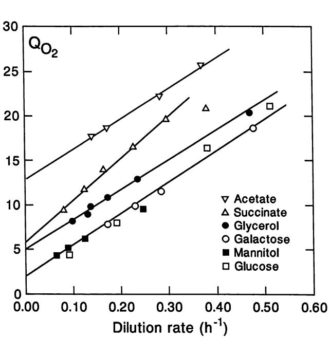

FIG. 1. Rate of respiration of various carbon sources in millimoles of 02 per gram (dry weight) per hour (QO2) by E. coli as a function of the specific growth rate (dilution rate) in chemostatic cultures limited by the carbon source. The data have been taken from reference 38 with permission.

in fact, to a first approximation, respiration was constant at about 20 mmol of 02 h-' g (dry weight) of bacteria-1. They further found that the yield was positively correlated with growth rate. The variation in growth yield beyond that which could be attributed to the variation with carbon source in the amount of ATP needed for biosynthesis was attributed to a variable efficiency of ATP synthesis in respiration.

The measurement of maintenance energy or maintenance respiration is based on the idea that as the growth rate is decreased in, say, a continuous culture limited by the carbon source, the rate of metabolism of that carbon source approaches a positive limit, which is interpreted as the metabolism required to provide energy for needs not kinetically related to growth.

Hempfling and Mainzer (38) measured the yield and specific rate of respiration of cultures of E. coli growing in chemostats at various rates limited by each of several carbon sources. From a conventional analysis of the data, they found that the apparent specific rate of maintenance respiration varied nearly 25-fold with the carbon source.

Figure 1 shows these results, with the specific rate of respiration plotted as a function of the specific rate of dilution. In this analysis the intercept and slope can be formally interpreted as the specific rate of maintenance respiration and the yield with respect to respiration, respectively. The intercepts differ for each carbon source, ranging from 0.57 (glucose) to 12.5 (acetate). It is highly unlikely that the energy requirement for functions unrelated to the rate of growth (i.e., maintenance) or the yield of ATP varies this much with the carbon source. Rather, it seems necessary to question whether something other than ATP limits the yield.

Although it is true that the metabolism of E. coli is highly regulated, it is not necessarily the case that its metabolism is optimal in all environments. Let us consider the possibility that 1 or more of the 12 precursor metabolites (44) is formed

at a limiting rate. The rate of formation of the limiting precursor metabolite would control the rate of growth and the yield. The precursor metabolites produced in excess would be respired, contributing to an excess of ATP.

#### Growth on Acetate

It is informative to apply this idea to growth with acetate as the carbon source. With acetate as the carbon source, the key anapleurotic reaction is the glyoxylate shunt, catalyzed by isocitrate lyase and malate synthase (reviewed in references 41, 42, and 73). Isocitrate is the branch point between the glyoxylate shunt and the tricarboxylic acid cycle. The affinity of isocitrate lyase for isocitrate is lower than that of isocitrate dehydrogenase. The flux through the lyase depends critically upon the concentration of isocitrate, which is increased over the concentration during growth on glucose by a combination of an increase in the activity of citrate synthase and inactivation by phosphorylation of most of the isocitrate dehydrogenase. Strains with null mutations in aceK, the structural gene for the isocitrate dehydrogenase kinase/phosphatase, cannot grow on acetate because of an excess of active isocitrate dehydrogenase (61).

The total flux through isocitrate, r, is the sum of the fluxes through the lyase, rL, and the dehydrogenase, rD. If both rates are hyperbolic,

$$r = \frac{\mathbf{V}_L \mathbf{S}}{\mathbf{K}_L + \mathbf{S}} + \frac{\mathbf{V}_D \mathbf{S}}{\mathbf{K}_D + \mathbf{S}} \tag{1}$$

in which S is the concentration of isocitrate and Vi and Ki are the maximum velocity and half-saturation parameters of the respective enzymes. The value of S for given r may be computed from the quadratic equation with coefficients

$$\begin{array}{c} (r - V_L - V_D)S^2 + (rK_L + rK_D - V_LK_D - V_DK_L)S \\ + rK_LK_D = 0 \end{array}$$

Equation 1 was used to compute growth on acetate assuming that the rate of growth is proportional to rL and that the rate of respiration is proportional to r. The solid line in Fig. 2 was computed by using VL = 4,830 puM s-1, KL = 600 p.M, VD = 1,330 ,uM s-1, and KD = 8 ,uM, values reported by LaPorte et al. (62) for exponential growth on acetate. Experimentally (93), rL = 517 pFM s-1 for a specific growth rate of 0.28 h-i; therefore, the specific growth rate was computed as 1.53 x 10-4rL. Also experimentally (93), the rate of respiration was 3,050 ,umol of 02 S-1 for r = 1,830 ,uM s-1; assuming 422 g (dry weight) liter of bacteria-' (see the next section), one finds that QO (millimoles of 02 per hour per gram [dry weight]) = 0.2Br. Actually, the coefficient 0.22, which gave a somewhat better fit, was used.

In short, the data of Hempfling and Mainzer (38) depicted in Fig. 2 are predicted from the parameters of acetate metabolism. The result may be interpreted as follows. As the dilution rate (and thus the concentration of acetate) is lowered, the intracellular concentration of isocitrate decreases and a larger proportion of isocitrate is metabolized to 2-oxoglutarate. Therefore, less of the acetate is used for biosynthesis and more is respired. Certainly, the apparent intercept of the data points on the ordinate cannot be interpreted as maintenance respiration. This analysis calls into question the validity of the conventional method of estimating maintenance (67, 82); the method rests on the assumption that with severe restriction of the carbon source the rate of growth is energy limited. One can say that the estimate from the analysis of growth on glucose in Fig. 1 is the upper bound of maintenance respiration.

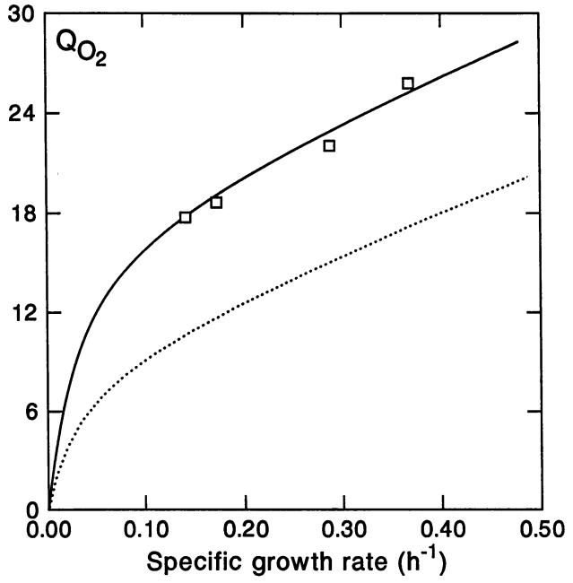

FIG. 2. Simulation of the rate of respiration of acetate by E. coli as a function of acetate-limited specific growth rate. Symbols (O) show the same data indicated by V in Fig. 1. The solid line is a simulation based on parameters given in the text. The dotted line is the predicted consequence of reducing the activity of isocitrate dehydrogenase.

It is customary to attribute the lower growth rate and yield for acetate compared with, say, glucose as a carbon source to the larger amount of ATP (per gram-atom of C) needed for biosynthesis (see reference 1). With acetate the flux through 2-oxoglutarate is far in excess of the requirement for biosynthesis of glutamate; the excess has been interpreted as that needed for respiratory synthesis of ATP. Andersen and von Meyenberg (1) have pointed out that the amount of ATP required for biosynthesis with acetate is considerably smaller than that produced by respiration if the respiratory yield of ATP is normal.

The experimental results depicted in Fig. 2 are incompatible with an ATP limit to biosynthesis. As the growth rate is reduced, the rate of respiration relative to biosynthesis increases. To maintain the hypothesis of limiting ATP, one is forced to assume that the efficiency of respiratory synthesis of ATP decreases both with the rate of respiration and with the carbon source. Neither of these assumptions is likely to be correct. It seems to me more reasonable that E. coli is suboptimal in its regulation of isocitrate dehydrogenase; i.e., the flux to 2-oxoglutarate is excessive in supplying not only glutamate but also ATP, and the surplus is wasted. The dotted line in Fig. 2 is a simulation with VD reduced from 1,330 to 665 ,uM s-1, corresponding to an increase from 80 to 90% inhibition of isocitrate dehydrogenase. If, in fact, respiration is excessive with acetate as the carbon source, further inhibition of the dehydrogenase should increase the yield of cells and the growth rate on limiting acetate. Recently, Ikeda and LaPorte (43) have found that such increased inhibition of isocitrate dehydrogenase does not reduce the growth rate of E. coli in acetate batch culture.

MICROBIOL. REV.

#### Other Carbon Sources

Holms (41) has noted that all gluconeogenic substrates support lower growth rates than do hexoses and glycerol. In terms of excess respiration in Fig. 1, the order is acetate > succinate > glycerol. If one or more reactions of gluconeogenesis are rate limiting, this condition should be reflected in the concentration of intermediates, and it is. Lowry et al. (63) found that the concentration of fructose 1,6-bisphosphate was much lower and the concentration of phosphoenolpyruvate much higher in cells of E. coli growing on acetate or succinate than in cells growing on glucose. This suggests that the formation of triose phosphates from either acetate or succinate is rate limiting, possibly a consequence of a lower concentration of reduced pyridine nucleotide than with glucose.

Although glycerol bypasses that bottleneck and in most strains of E. coli permits a growth rate almost equal to that for glucose, the concentration of glucose 6-phosphate is considerably lower than with glucose as the carbon source (63). This suggests a second bottleneck at fructose bisphosphate phosphatase, for which glucose 6-phosphate is a moderate inhibitor (26). Since the metabolism of fructose, unlike that of glucose, also requires the phosphatase to form glucose 6-phosphate, the rate of formation of glucose 6-phosphate might limit the rate of growth on fructose, which is lower than on glucose (41).

Since the enzymes of E. coli engaged in gluconeogenesis from phosphoenolpyruvate are constitutive and are the same enzymes used in glycolysis, it seems improbable, perhaps impossible, that the flux in both directions is optimally regulated. For example, if fructose bisphosphatase is negatively regulated by glucose 6-phosphate, a high concentration of glucose 6-phosphate would reduce cycling between fructose 6-phosphate and fructose 1,6-bisphosphate when glucose is the carbon source. However, with a gluconeogenic carbon source (or fructose) the regulation by glucose 6-phosphate limits the rate of glucose 6-phosphate formation.

### Monomers Limit Growth

It seems likely that the precursor metabolites glucose 1-phosphate, glucose 6-phosphate, fructose 6-phosphate, ribose 5-phosphate, and erythrose 4-phosphate are present at lower concentrations and that the monomers derived from these metabolites, especially the aromatic amino acids and histidine, are also present at lower concentration during growth on gluconeogenic carbon sources than on glucose. Unfortunately, few measurements have been made of the amino acid pools at different steady states of growth. Maal0e (65) reported the concentration of four amino acids with glucose, glycerol, or succinate as the carbon source. The concentrations of all four were highest with glucose as the carbon source. The concentration of tryptophan decreased most markedly with glycerol; the concentrations of lysine and tryptophan were low with succinate.

It is unlikely that the rate of growth is determined by the concentration or rate of formation of ATP. The concentration of ATP as well as of other nucleotide triphosphates is, at best, a weak function of the growth rate (5, 27, 63). The energy charge for growing cells is constant at about 0.8 (13, 63); this constant level could result from a closely regulated balance between the rates of production and use of ATP or, more likely, from the fact that energy in the form of ATP or its equivalent is in surplus, at least aerobically (91).

It is reasonable to conjecture that the kinetic connection

between fueling reactions and macromolecular synthesis is the concentration of precursor metabolites and monomers derived from these metabolites and that the concentrations of these monomers are sensed by and control the machinery of macromolecular synthesis, as was recently suggested by Jensen and Pedersen (46). For the macronutrients carbon, nitrogen, and sulfur, the controlling monomers are quite possibly amino acids.

In a carbon-limited chemostat or a batch culture with certain single carbon sources, the rate of entry (or initial metabolism) of the carbon source may control the rate of growth. However, knowledge of this fact does not answer the fundamental question of what determines the growth rate. In such cases the metabolic flux is fixed, but it is the apportionment of that flux first to monomers and then to macromolecules that determines the growth rate. If that apportionment were always optimal, yields would be invariant or would vary by some simple rule of stoichiometry. Since this is not the case, we may question the notion that metabolism of E. coli is optimized for sustained exponential growth, i.e., that the apportionment is such that the growth rate is the maximum possible for the flux. I shall later give further consideration to the idea of metabolic optimality.

# PROTEIN-SYNTHESIZING SYSTEM

For many years the dominant view in the field of bacterial growth physiology was that chain elongation rates of macromolecules are independent of nutritionally controlled growth rates and that the pools of monomers, if produced by metabolism, are held essentially constant by feedback inhibition (8, 44, 65, 66). This view, which is mildly paradoxical, almost forces the conclusion that the machinery of macromolecular synthesis such as ribosomes and RNA polymerase sets the rate of growth. Koch and Deppe (57) found that at very low growth rates, ribosomes, although functional, were functioning much below capacity; however, this finding merely led to a qualification of the dogma for low growth rates. Recently, Jensen and Pedersen (46) have proposed an opposite view, i.e., that the pools of monomers control the rate of synthesis of macromolecules, and have explored some of the consequences of this view. I will explore this idea further.

## The Conjecture

In developing a model for control of the synthesis of the protein-synthesizing system, I have made the conventional assumption that synthesis of the system, typified by ribosomes, is regulated by reactions of translating ribosomes (11, 16, 37, 79). More specifically, I have assumed that all or some of the aminoacyl-tRNAs compete at the A site with uncharged tRNAs: success for aminoacyl-tRNA adds an amino acid to the growing peptide chain; success for uncharged tRNA inhibits the transcription of rrn operons. Thus, the heart of the regulation is the ratio of charged to uncharged tRNAs. Although the model may be construed more generally, I have assumed that the regulatory signal is guanosine tetraphosphate (ppGpp).

The important parameters and variables used in the model are listed, along with brief descriptions, in Table 1.

## The Model

The state of an A site can be denoted in terms of simple competitive inhibition; thus, the fraction combined with aminoacyl-tRNA ternary complex is given by

TABLE 1. Symbols for important parameters and variables of the model

| Description                                      | Symbol | Value, source, or unit |
|--------------------------------------------------|--------|------------------------------|
| Parameters                                       |        |                              |
| Concentration of rrn genes                       | [rrn]  | 0.025 ,uM                    |
| Maximum rate of rrn transcription                | krrn   | 1.5 s-1                      |
| Dissociation constant for ppGpp                  | Kg     | 40 ,uM                       |
| Cooperativity of ppGpp binding                   | h      | 2                            |
| Molar ratio of tRNA to rRNA                      | CtRNA  | 0.25                         |
| Maximum rate of ppGpp formation                  | k,     | 1 s                          |
| First-order rate constant for ppGpp breakdown | k2     | 0.035 s                      |
| Dissociation constant for aminoacyl-tRNA         | Kc     | 2.75 ,uM                     |
| Dissociation constant for uncharged tRNA         | Ku     | 10 ,uM                       |
| Maximum rate of peptide synthesis                | kp     | 21 s-i                       |
| Variables                                        |        |                              |
| Protein expressed as amino acid                  | P      | Eqn 10                       |
| Actual rate of peptide synthesis                 | rp     | Eqn 4                        |
| Specific growth rate                             | k      |                              |
| Ribosomes                                        | R      | p.M                          |
| Aminoacyl-tRNA                                   | C      | ,uM                          |
| Uncharged tRNA                                   | U      | ,uM                          |
| Guanosine tetraphosphate                         | G      | JIM                          |
| Amino acid                                       | A      | p.M                          |
| Ratio of ribosomal to total protein              | OL     |                              |

$$\frac{\mathbf{C}}{\mathbf{K_C}} / \left( 1 + \frac{\boldsymbol{\nu}}{\mathbf{K_U}} + \frac{\mathbf{C}}{\mathbf{K_C}} \right)$$

where C and U are the concentrations of aminoacyl-tRNA and uncharged tRNA, respectively, and Kc and Ku are the respective dissociation constants. The three terms in the denominator represent the proportions of the A site free, combined with uncharged tRNA, and combined with aminoacyl-tRNA. The rate of change of protein is given by its rate of synthesis minus the dilution by growth:

$$\frac{dP}{dt} = k_P R \left[ \frac{C}{K_C} / \left( 1 + \frac{U}{K_U} + \frac{C}{K_C} \right) \right] - kP \tag{2}$$

where P is the concentration of protein, k is the specific growth rate, R is the ribosome concentration, and kp is the maximal rate of peptide chain elongation. Equation 2 assumes that the concentration of mRNA is not rate limiting (74) and that all or a constant fraction of ribosomes are engaged in translation.

I assume that the autoregulation of the synthesis of ribosomes is a kinetic consequence of the reaction of uncharged tRNA with the A site. In particular, I assume that such adducts form ppGpp (reviewed in references 12 and 46).

The rate of change in concentration of ppGpp is given by its rate of synthesis minus its rate of breakdown and dilution by growth:

$$\frac{dG}{dt} = k_1 \mathcal{R} \left[ \frac{U}{K_U} / \left( 1 + \frac{U}{K_U} + \frac{C}{K_C} \right) \right] - k_2 G \tag{3}$$

where G is the concentration of ppGpp and k1 and k2 are rate constants.

I assume that the rate of transcription, rrrn, of rrn genes is controlled by the concentration of ppGpp, specifically that the rate is given by a Hill equation of the form

$$\sigma_{mn} = \frac{k_{mn} K_g^{\;\;h}}{K_g^{\;\;h} + G^h} \tag{4}$$

where krrn is the maximal rate of transcription of an rrn gene, Kg is the dissociation constant for G, and h is the cooperativity.

The rate of change of concentration of ribosomes is given by the rate of synthesis minus the rate of dilution by growth:

$$\frac{dR}{dt} = r_{rm} \,\, [rm] - kR \,\, \tag{5}$$

where R is the concentration of ribosomes and [rrn] is concentration of rrn genes. Equation 5 assumes implic that each rrn transcript results in a ribosome. This assui tion is reasonable for cultures in the steady state at modei to high growth rate but is not valid at low growth rate (31, or following nutritional shifts (69), conditions that will discussed later. the itly mprate 75) be

In the steady state of growth, the rate of change extrinsic variables is zero; thus, in the steady state, eq tions 2, 3, and 5 become, respectively of

$$kP = k_P R \left[ \frac{C}{K_C} \Big/ \left( 1 + \frac{U}{K_U} + \frac{C}{K_C} \right) \right] \tag{6}$$

$$G = \frac{k_1}{k_2} \Re \left[ \frac{U}{K_U} \left/ \left( 1 + \frac{U}{K_U} + \frac{C}{K_C} \right) \right] \right. \tag{7}$$

and

$$
\lambda \mathbb{R} = r_{rm} \text{[rrn]} \tag{8}
$$

#### The Parameters

The worth of the above equations is the extent to wi they account for measurements. I have used the data Bremer and Dennis (8) for E. coli B/r in five differ nutritional steady states of growth at 37°C. In the calci tions which follow, rates are per second and intracelli concentrations are micromolar. Expressing variables as c centration rather than molecules per cell or millimoles gram is critical to the calculations which follow. To comp the concentration, I assume that cells from a culture wil doubling time of 40 min have a mean fluid volume of I which is equivalent to assuming that the dry weight per l volume of cells is 422 g liter-'. Since the buoyant densit cells is 1.09 (58, 59), this assumption corresponds to [(1 (1,000) - 422]1/422, or approximately 1.6 ml of H20 g ( weight)-1, which is close to the experimental value (88)

In the steady state the number of transcripts per rrn g per second can be computed from the ribosome concen tion, by using equation 8, as kRI[rrn]. Now, the concen tion of each of the seven rrn genes can be computed frorn map position and the cell division parameters C, D, anc which are, respectively, the time for replication of DNA, time from termination of DNA replication to division, the time from birth to division. The computed numbei genes per cell for each rrn operon increases with growth i to various degrees. The number, computed from map p tions (24) and values of C and D (8), summed, and expres as micromolar, is shown in Fig. 3. Over much of the rang specific growth rates the concentration is nearly constE but it rises as the growth rate is reduced. The line is empirical equation, y = 0.027 + 0.008(0.0075 + x2). For. 0, y = 0.132, which corresponds to about 16 rrn gene coj itra-Iits i g, the and r of rate osi- ;sed e of ant, , an x = pies

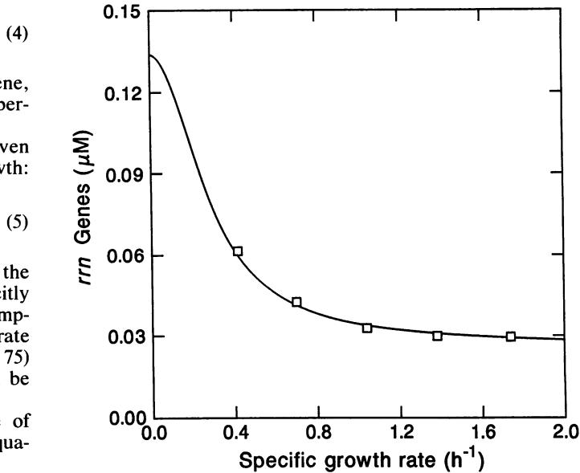

FIG. 3. Concentration of rrn genes of E. coli as a function of (6) specific growth rate. The symbols (O) are values computed as explained in the text. The solid line is given by the empirical equation y = 0.027 + 0.008(0.0075 + x2).

per cell or just over two copies of each gene. The values of the parameters C and D are sufficiently uncertain-especially at low growth rates-that it is plausible that the (8) concentration of the genes is independent of growth rate. Unless stated otherwise, the concentration of rrn genes is assumed to be constant at 0.027 p.M.

iich The rate of initiation of transcription of rrn genes as a of function of the concentration of ppGpp is given by equation rent 4, the parameters of which were estimated by fitting to rates ula- of transcription calculated from experimental values of riboular some concentration (equation 8) and experimental values of ,nar G (Fig. 4). The line was computed from equation 4, assuming onr that krrn = 1.5 s-1, Kg = 40 ,uM, and h = 2. A cooperativity pe of h = 2 was determined by inspection of plots of allosteric th e kinetics for various values of h. The values of krrn and Kg 1 fla were estimated by trial and error. If one assumes that [rrn] is .t not constant but is given by the equation in the previous unof paragraph and that Kg = 33, the fit to a plot of rr,, versus G y0o) is even better.

.d09 The concentration of tRNA is a critical variable. A plot of dry concentration of total tRNA versus ribosomes is shown in Fig. 5. The line assumes proportionality according to the Itene equation I la-

$$T = \mathcal{C}_{\mathsf{tRNA}} \mathcal{R} \tag{9}$$

where CtRNA is the molar ratio of tRNA to ribosomes; for total tRNA this ratio is 9.52. The concentration of a particular tRNA may not be in accord with equation 9 because of the variation in gene dose or rate of transcription with growth rate. However, if one assumes that all tRNAs are kinetically equivalent, equation 9 should serve as a reasonable estimate. For the calculations which follow, I have focused on a single hypothetical major tRNA and taken CtRNA = 0.25, a value in the midrange of the major tRNAs.

Total protein concentration, P, including the protein in ribosomes, varies little with growth rate but is an important

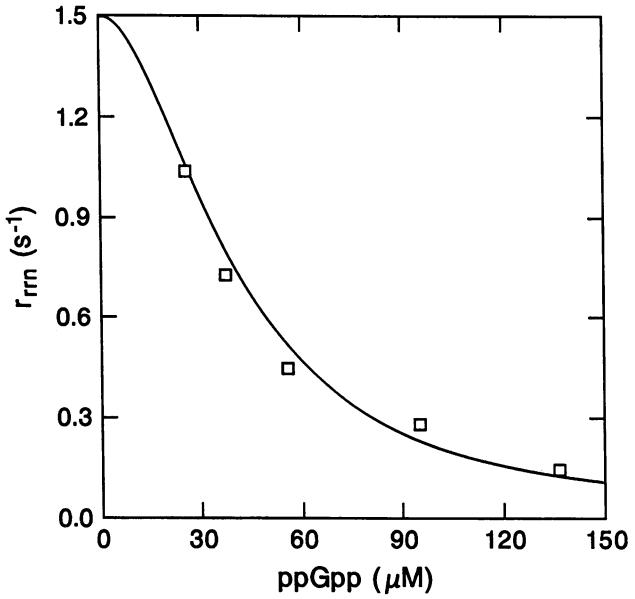

FIG. 4. Rate of transcription of rrn genes of E. coli as a function of the concentration of guanosine tetraphosphate (ppGpp). Coordinates of the symbols (O) are values computed from the data set in reference 8 with permission.

variable in my subsequent calculations. The line in Fig. 6 is given by

$$P = 3.0 \times 10^6 - 1.6 \times 10^4 \text{ } \text{R} \tag{10}$$

with P expressed as molar total amino acid. The limited data from reference 8 fit equation 10 poorly, but the more extensive data of reference 45 fit well. Equation 10 is consistent with the fact that the buoyant density of E. coli cells is independent of growth rate (58, 59). At high growth rates the concentration of ribosomes increases, and, if the

FIG. 5. Concentration of total tRNA as a function of the concentration of ribosomes. Coordinates of the symbols (O) are values computed from the data set in reference 8 with permission.

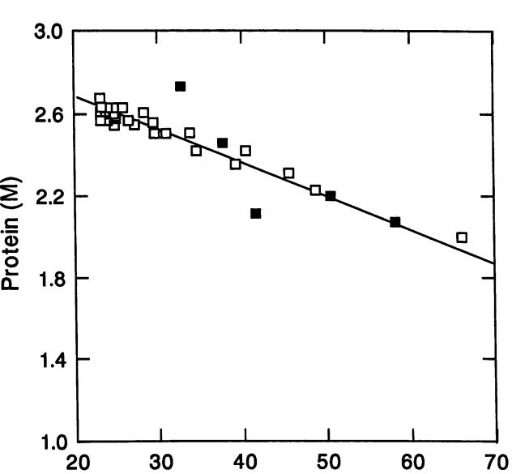

.5_ 0

GROWTH OF E. COLI 321

FIG. 6. Concentration of protein (molar concentration of amino acid) as a function of the concentration of ribosomes. The solid line is computed from equation 10. Coordinates of the solid symbols (-) are values computed from the data in reference 8 with permission. Coordinates of the open symbols (O) are computed from the data in reference 45.

Ribosomes (MM)

buoyant density is to remain constant, the concentration of protein must decrease proportionately. Taking the number of nucleoside phosphates is a ribosome as 4,655 with an average residue weight of 364 (as the potassium salt) and assuming an average residue weight of amino acids of 108, one has (364/108) x 4,655 = 1.57 x l0o,.

Estimation of the parameters in equation 7 is necessary before steady states of growth can be calculated. The value of k2 of 0.035 s-1 is based on an estimated half-life of 20 s for ppGpp (12). The value of k1 can be guessed to be near 1 s-' on two grounds. First, the maximal rate of formation of ppGpp is about 1/20 the normal rate of polypeptide chain growth (about 20 s-1). Second, the concentration of ppGpp reaches about 1,000 ,uM during the stringent response (12), when C goes to zero and U = T; thus, if R = 35 ,uM, then k, = 1. The values of KC and KU are unknown and are difficult to estimate beyond the good assumption that KC < Ku. Subsequently, we shall find that for CtRNA = 0.25, values of KC = 2.75 ,uM and Ku = 10 puM give a good fit to calculations of R and G at various growth rates. These values are consistent with the observed effect of the ratio of charged to uncharged tRNATrp on the rate of formation of ppGpp (84).

#### Steady States of Growth

The relationships and parameters above are sufficient to permit the computation of the values of variables such as R, G, C, and U in the steady state at any given specific growth rate. Since an algebraic solution is tedious, I chose numerical solutions, namely, finding values of variables which satisfy the equations. One can begin by substituting U = T - C and an arbitrary value of R (R1) in equation 6 and solving it for C:

TABLE 2. Computation of variables for steady states of growtha

| k          | R        | C          | U          | G          | A          | rp         | ar           |
|------------|----------|------------|------------|------------|------------|------------|--------------|
|            |          |            |            |            |            |            |              |
| 0.1 0.2 | 29 27 | 0.6 1.4 | 6.5 5.4 | 283 203 | 1.4 3.3 | 2.5 5.3 | 0.08 0.08 |
| 0.3        | 28       | 2.3        | 4.7        | 162        | 5.2        | 7.6        | 0.08         |
| 0.5        | 31       | 4.2        | 3.7        | 115        | 8.8        | 11.0       | 0.09         |
| 0.7        | 36       | 6.0        | 3.0        | 88         | 11.9       | 13.2       | 0.11         |
| 0.9        | 41       | 7.7        | 2.4        | 69         | 14.7       | 14.5       | 0.13         |
| 1.1        | 45       | 9.3        | 2.0        | 56         | 17.4       | 15.5       | 0.15         |
| 1.3        | 49       | 10.7       | 1.6        | 45         | 20.3       | 16.2       | 0.16         |
| 1.5        | 53       | 12.1       | 1.3        | 36         | 24.0       | 16.7       | 0.18         |
| 1.7        | 57       | 13.3       | 1.0        | 28         | 29.5       | 17.1       | 0.20         |
| 1.9        | 61       | 14.5       | 0.7        | 20         | 41.3       | 17.5       | 0.22         |
| 2.0        | 63       | 15.1       | 0.6        | 16         | 57.9       | 17.6       | 0.23         |
| 2.13       | 65       | 15.9       | 0.3        | 0          | 1,000      | 17.8       | 0.24         |

a Specific growth rate, k, is expressed in reciprocal hours. Dimensions of other variables and values of parameters are given in Table 1. For the computation of A, the additional parameters were KA = 20 ,uM, KU2 = 0.4 AM, and Qmax = 40 R.

$$C = kP \frac{1 + \frac{T}{K_U}}{\frac{k_p R}{K_C} - kP \left(\frac{1}{K_C} - \frac{1}{K_U}\right)}$$

The values of C and U thus obtained are substituted into equation 7 to give a value for G. This value is substituted into equation 8 to give another value for R (R2). A fixed fraction of (R1 - R2) is added to R1, and the cycle is repeated until the difference is less than, say, 0.1 ,uM. The values of variables which result from these calculations at various specific growth rates are shown in Table 2.

The values of R and G were plotted as functions of specific growth rate and compared with experimental values. The solid line in Fig. 7 shows the computed concentration of ribosomes (R), which is in reasonable agreement with the data of Bremer and Dennis (8) shown as boxes. At low growth rates the computed concentration of ribosomes begins to rise; this is an indication that equation 4 is not precise at low growth rates. The intersection with the vertical line is the computed value for the maximal specific growth rate, the last row in Table 2. If one assumes that [rrn] is not constant but is the function of growth rate shown in Fig. 3, the fit to the data is even better, but at lower growth rates the computed concentration of ribosomes rises even more than in Fig. 7. The line in Fig. 8 shows the computed concentration of ppGpp (G); again, the computations agree with the data (8).

Gausing (29, 30) has made extensive measurement of ribosomes, expressed as a fraction, a,r, of total protein at different growth rates; ar was computed from values of R and P, assuming 7,336 amino acid residues per ribosome (8). Computed values of ax are shown as the line in Fig. 9; the symbols are values of ar from reference 30 with the specific growth rate at 37°C computed as 1.8 log, 2 times doublings per hour at 30°C. The computation and the data are in fair agreement.

As ar increases, the subset of proteins that are not part of the protein-synthesizing system decreases. Assuming that approximately half of the proteins of the protein-synthesizing system are ribosomal proteins, the subset should be approximated by 1 - 2ar, the line in Fig. 10. Now, members of this subset of proteins would be expected to be, and are,

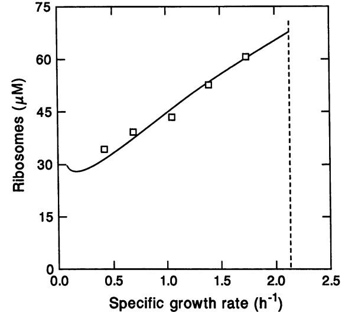

FIG. 7. Concentration of ribosomes as a function of the specific growth rate of E. coli. Coordinates of the symbols (l) are values computed from the data set in reference 8 with permission. The solid line is the computed solution of equations 6, 7, and 8. The broken vertical line marks the computed maximal specific growth rate.

under diverse modes of control with respect to growth rate (81). If the growth rate is increased by a change from minimal to rich medium, the proteins responsible for monomer biosynthesis are repressed, offsetting a portion of the increase in xr- This tradeoff, together with a number of assumptions, led Maal0e to propose that the protein-synthesizing system was under passive control (64). One can ask how a constitutive gene (i.e., a gene not subject to any

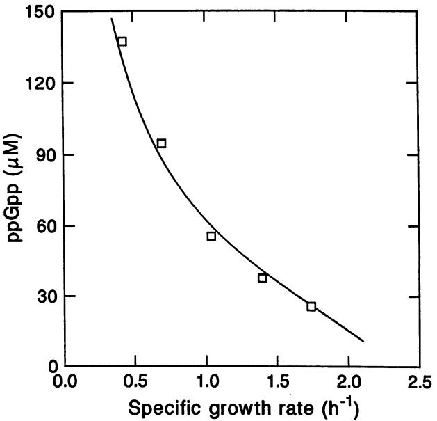

FIG. 8. Concentration of guanosine tetraphosphate (ppGpp) as a function of the specific growth rate of E. coli. Coordinates of the symbols (LI) are values computed from the data set in reference 8 with permission. The solid line is the computed solution of equations 6, 7, and 8.

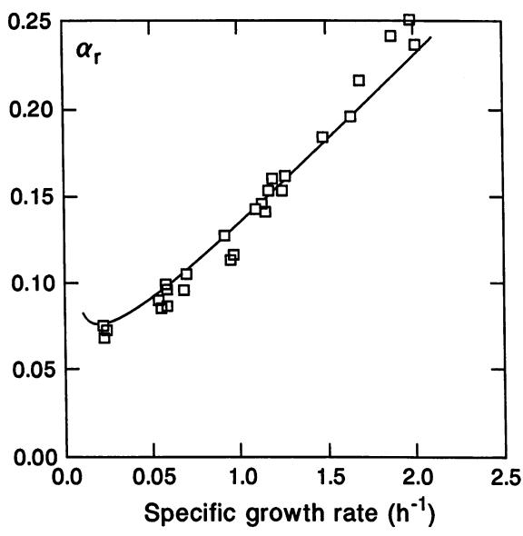

FIG. 9. Ribosc function of the sp symbols (l) are c

particular regul; _..,&L_+ llrl ation) would be expressed as a function of upon Qmax. -4 -1 ZnA\AN 4-L - 2+t vt_A growth rate. wanner et al. (94) measurea the expression ot lacZ under control of the Ll promoter. Their results are shown as the symbols in Fig. 10 and are in fair agreement with the prediction of 1 - 2ar; however, expression under control of the UV5 promoter is independent of growth rate. Passive control is a deceptively simple term for the outcome of complex controls.

In the steady state (or pseudo-steady state), the rate of use

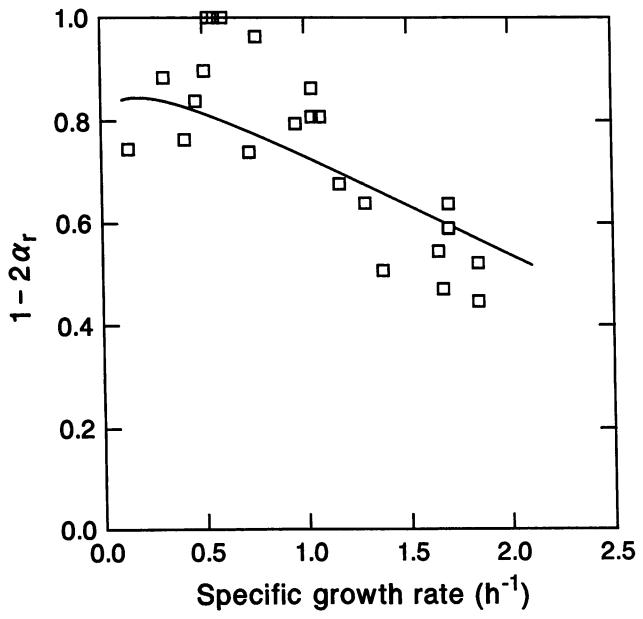

FIG. 10. Nonribosomal protein as a function of the specific growth rate of E. coli. Coordinates of the symbols (l) are taken from reference 94 with permission.

of aminoacyl-tRNA in protein synthesis must equal the rate of charging tRNA; thus,

$$kP = Q_{\text{max}} \frac{A}{K_A + A} \frac{U}{K_{U2} + U} \tag{11}$$

where A is the concentration of the amino acid, KA and KU2 are the dissociation constants for amino acid and uncharged tRNA, and Qmax is the product of the concentration and turnover number of the aminoacyl-tRNA synthetase. Substituting in equation 11 for the product kP from equation 6 and denoting kp(CIKc)I[l + (UIKu) + (CIKc)] as rp, one obtains

$$A = \frac{K_A R r_P}{\frac{Q_{\text{max}} \, U}{K_{U2} + U} - R r_P} \tag{12}$$

I I took KA= 20 ,M and KU2 = 0.4pM (values for 0.05 1.0 1.5 2.0 2.5 tryptophan-tRNA synthetase) and assumed that Qmax = Specific growth rate (1) 40R, i.e., that the amount of aminoacyl-tRNA synthetase is proportional to that of ribosomes, a rough approximation mal protein as a fraction (a,) of total protein as a (72). Substitution of these values into equation 12 gives the ?ecific growth rate of E. coli. Coordinates of the concentrations of amino acid (A) shown in Table 2, a nearly ,omputed from data in reference 30. linear function over most of the range of specific growth rate, the slope of which is determined by the value of KA. As the specific growth rate approaches its maximal value, the concentration rises rapidly in a fashion strongly dependent

### Maximal Growth Rate

One can define the maximal specific growth rate as the rate attained if G = 0 and, thus, from equation 4, rrrn = krrn, and if the corresponding concentration of ribosomes were maximally active. Substitution of this value for rrrn into equation 5 gives Rmax = krrn [rrnllkmax. At the maximal growth rate, rp approaches the limit kp. From equation 6 we have the inequality, kmax < Rmax kp/P. Substituting for Rmax from the preceding equation gives the inequality

$$k_{\text{max}} < (k_{rrn} k_P [rm] / P)^{1/2} \tag{13}$$

which sets an upper bound on kmax. The idea that the specific growth rate is the square root of the product of two pseudofirst-order rate constants was initially proposed by Koch (see reference 54 for a discussion).

The method of calculation of kmax depends upon specifying the concentration of amino acid, A, and the ribosome concentration, R, and solving equation 11 for U. This gives the quadratic equation

$$aU^2 + bU + C + 0$$

$$a = Q_{\text{max}} \left(\frac{1}{K_C} + \frac{1}{K_U}\right) \frac{A}{K_A + A} + \frac{k_P R}{K_C}$$

$$b = Q_{\text{max}} \left(1 + \frac{T}{K_C}\right) \frac{A}{K_A + A} + k_P R \frac{K_{U2} - T}{K_C} \qquad (14)$$

$$K_{\text{max}}$$

$$c = k_P RT \frac{K_{\nu 2}}{K_C}$$

which is useful if the concentration of amino acid is known. Once again, I have used successive approximations of the value of kmax beginning with the estimate from inequality 13 until equations 6 and 11 are satisfied. The result of the calculation is the last row in Table 2. For the parameters used previously and for A = 1,000,uM, the value of kmax is 2.13 h-1, which corresponds to a doubling time of 19.5 min. This is the value plotted in Fig. 7. At the maximal growth rate the value of Rmax is 65.1 ,M and the mean rate of transcription of an rrn operon, rrrn, is 1.43 s-1

A brief note on the physiological state corresponding to kmax is warranted. The concentrations of charged and uncharged tRNA are set by the necessity that the rate of charging tRNA must equal the rate of discharging by protein synthesis. Since U > 0, then G > 0, but the value of G is small enough not to affect the calculated value of kmax. Over most of the range of growth rate, U>> Ku2; thus, the rate of formation of aminoacyl-tRNA is almost independent of U and is dependent on A, KA, and Qmax (equation 11). As k approaches kmax, the value of U is of the same order as KU2.

If A is fixed as in the calculations above, Qmax becomes one determinant of the maximal growth rate. Qmax was set equal to 40R. That means that the product of the molar ratio of the particular synthetase to ribosomes (about 0.1) and the turnover number divided by the mole fraction of the particular tRNA (0.25/9.52) equals 40. This corresponds to a turnover number of 10.5 s-1, a reasonable value.

One might ask what change(s) would substantially increase kmax. An increase in the maximal rate of charging tRNA, Qmax would increase kmax, but only marginally. An increase in the rate constant for peptide chain growth, kp, would increase growth rate, but the difficulty and cost of this change in accuracy of translation is unknown. The easiest answer is an increase in the concentration of rrn genes, [rrn]. Anderson and Roth (2) have found just such an increase in strains of S. typhimurium propagated for many generations in rich medium. The increase in the number of rrn genes results from tandem duplication of rrn operons. Such rrn duplications are selected in rich medium but not in minimal medium. However, Ellwood and Nomura (23) found that a strain of E. coli with a deletion of rrnE grew at the same rate as the wild type in both rich medium (k = 1.66 h-1) and glucose minimal medium (k = 0.92 h-1). From my calculations, a specific growth rate of only 1.66 h-' does not require full expression of six rrn genes.

#### Nutritional Shift Up

Now, let us turn from steady states to the dynamics resulting from the supplementation of a culture in minimal medium with a mixture of amino acids and other nutrients. This shift up can be simulated by assuming that the intracellular concentration of an amino acid(s) increases instantaneously to a constant value. If tRNA charging is fast compared with other reactions, the concentrations of charged and uncharged tRNA can be computed as in the steady state from equation 14. The differential equations 2, 3, and 5 are solved numerically by differential approximation for short intervals (1 s). All other variables and parameters are as in the preceding calculations of steady states.

Since growth is not balanced following the shift, computing the specific growth rate is not straightforward. It has been reported that buoyant density increases slightly after shift up (95), but this increase can be attributed to an increase in external osmolarity (59). I made the assumption that buoyant density was constant and used the relationship in equation 10 in the following form:

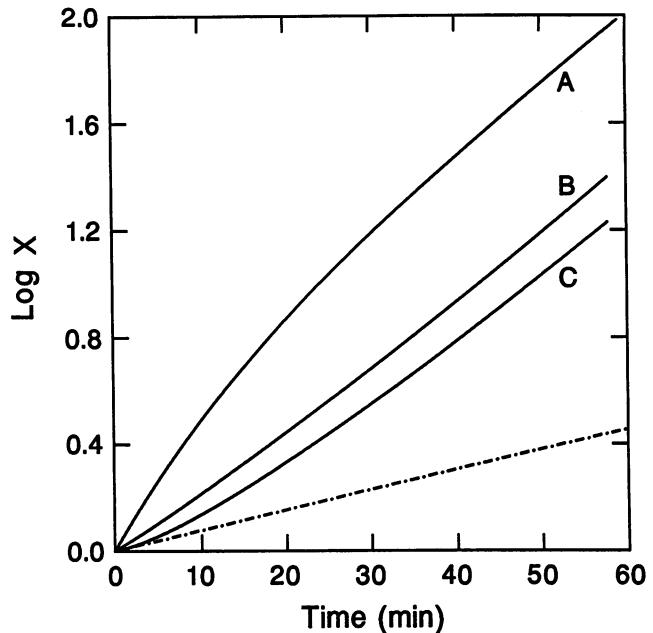

FIG. 11. Amounts of ribosomes (A), dry weight (B), and protein (C) relative to the amount at zero time after a shift from k = 0.45 h-' up to k = 1.54 h-1. The broken line depicts the amounts of each if the specific growth rate remained at k = 0.45 h-1.

$$k = \frac{\Delta P + 16,000 \Delta R}{3.0 \times 10^6}$$

where AP and AR are the fluxes of protein and ribosomes, respectively. Thus, the specific growth rate refers to the increase in volume and dry weight.

In Fig. 11 the lines are the calculated amounts of ribosomes (A), dry weight (B), and protein (C) following an abrupt increase in the concentrations of amino acid from 8 to 25 ,uM, corresponding to a change in specific growth rate of 0.45 to 1.54 h-1. The broken line is the preshift rate. The simulation agrees with the major trends of the shift up (10, 48, 49); the rate of increase, in decreasing order, is ribosomes (RNA), dry weight, and protein. The simulation forecasts a convex curve for ribosomes. Some experimental data give convex plots (48); other data give linear plots (10, 66). As Bremer and Dennis (9) point out, the linearity with time of the logarithm of RNA accumulation implies complex kinetics: the specific rate of rRNA synthesis must have a rapid initial increase followed by a slower increase at a declining rate. The convex result of the simulation is consistent with a rapid increase to a constant specific rate. The differences in observed kinetics of RNA accumulation may reflect real differences in the proportion of rRNA "captured" into ribosomes (see below).

The solid line in Fig. 12 is the computed concentration of ribosomes after the same shift as shown in Fig. 11. The broken lower and upper horizontal lines denote the concentration in the steady states, before and after the shift, respectively. The solid line in Fig. 13 is the calculated concentration of guanosine tetraphosphate following the shift; the concentration decreases quite rapidly to a value lower than the definitive concentration, the horizontal line at 35 ,uM.

Koch and Deppe (57) have measured the rates of synthesis

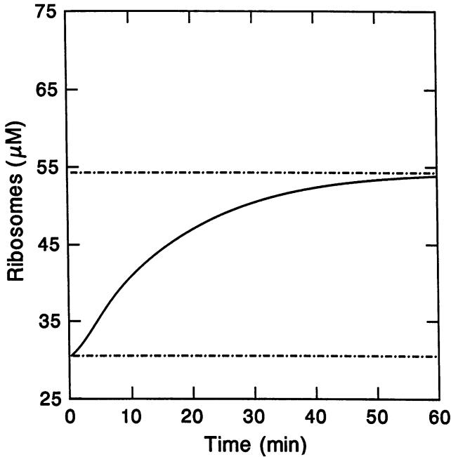

FIG. 12. Concentration of ribosomes after the shift up depicted in Fig. 11. The lower horizontal line marks the initial steady state, and the upper horizontal line marks the final steady state.

by E. coli of stable RNA and of protein following a profound shift from a glucose-limited chemostat at very low dilution rate to rich medium. The solid line in Fig. 14 shows the predicted rate of synthesis of rRNA; the initial and final steady-state rates are the broken lower and upper horizontal lines, respectively. The data points are in good agreement with the prediction. The solid line in Fig. 15 is the predicted

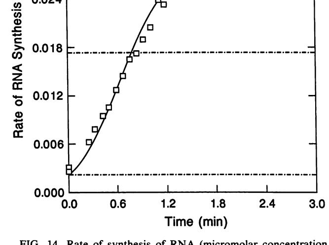

FIG. 14. Rate of synthesis of RNA (micromolar concentration per second) after a shift from k = 0.28 h-1 up to k = 1.28 h-1. The solid line was computed as described in the text. The lower horizontal line marks the initial steady state, and the upper horizontal line marks the final steady state. Coordinates of the symbols (O) are data taken from reference 57 with permission.

rate of synthesis of protein; again, the two horizontal lines are the initial and final steady-state rates. The experimental points are scaled vertically such that the final steady-state rates coincide. Although the model predicts the main fea-

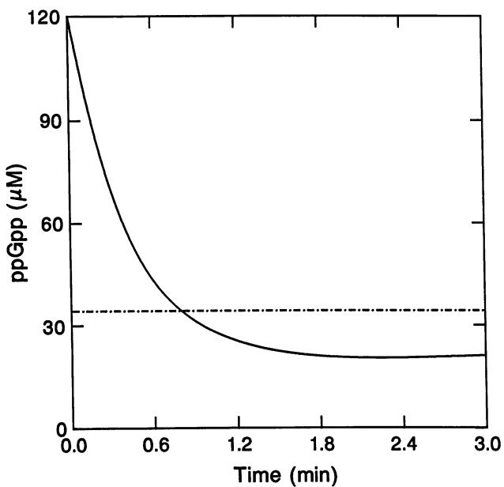

FIG. 13. Concentration of guanosine tetraphosphate (ppGpp) after the shift up depicted in Fig. 11. The horizontal line marks the final steady state.

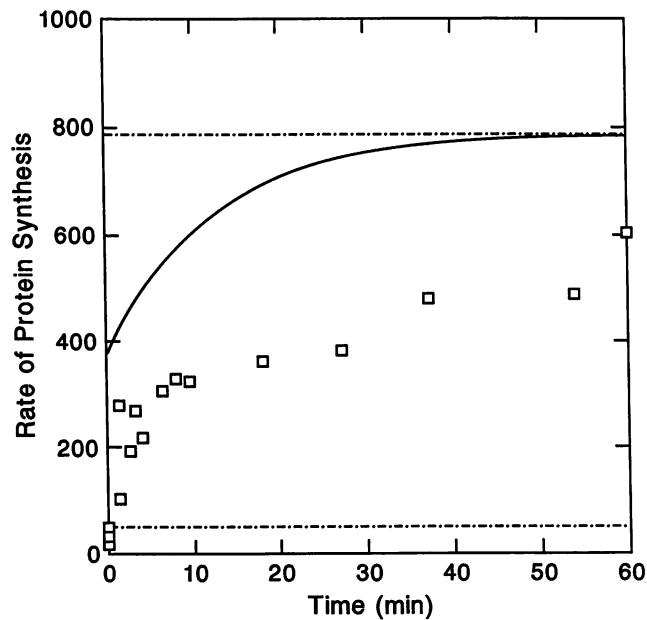

FIG. 15. Rate of synthesis of protein (micromolar concentration of amino acid per second) after a shift from k = 0.1 h-1 up to k = 1.28 h-1. The solid line was computed as described in the text. The lower horizontal line marks the initial steady state, and the upper horizontal line marks the final steady state. Coordinates of the symbols (O) are data taken from reference 57 with permission.

tures of the shift, particularly the immediate large increase in rate, it is clear that the new steady state is reached more slowly than predicted. Now, the prediction assumes that all rRNA produced is assembled into functional ribosomes. Although this assumption may be valid for most conditions of growth, it may not be true if the rate of synthesis of rRNA substantially exceeds the rate of synthesis of r-proteins (see the following section).

The simulated shift up is remarkably stable. The postshift-up oscillations in the rate of synthesis of rRNA, with a maximum at 5 min and a minimum at 8 min (32), are not predicted by the model. For shifts up to submaximal growth rate, the model does predict a simple overshoot in rRNA synthesis, as in Fig. 13, but with a gradual decline to the steady-state rate.

#### Nutritional Shift Down

An immediate shift down implies a discrete reduction in the rates of fueling reactions such as that resulting from the addition of a-methyl glucoside to a culture growing in glucose minimal medium (35, 69). One cannot assume a discrete change in the concentration of amino acid(s); therefore, the immediate shift down cannot be simulated in the same manner as the shift up in the previous section. Rather, the concentration of amino acid(s) is computed from the rates of synthesis and of consumption. This is also necessary for treatment of certain shifts up such as the glucose supplementation of a culture growing in acetate minimal medium.

In the simulation of the immediate shift down, I assumed that the rate of synthesis of an amino acid follows simple noncompetitive Hill kinetics from a precursor at concentration S. The rate of change in the concentration of amino acid, A, is given by its rate of formation minus its rate of consumption:

$$\frac{dA}{dt} = \frac{V_S S K_I^{h_I}}{\left(K_S + S\right) \left(K_I^{h_I} + A^{h_I}\right)} - f_{A^{h_P}} R \tag{15}$$

where h, is the Hill coefficient, K, is the dissociation constant for feedback inhibition by the amino acid, Vs and Ks are the kinetic parameters for the conversion of precursor to amino acid, fA is the mole fraction of the amino acid in protein, and rp and R are values at any time, t, after the shift. I assume that at the moment of shift the value of S changes instantaneously to a new constant value. Equation 15 simplistically simulates a metabolic branch in which a monomer for biosynthesis is produced from a precursor metabolite.

In the calculations which follow, I have taken fA = 0.01 (approximate mole fraction of tryptophan), K, = 10 ,uM, and h, = 2 (values for tryptophan biosynthesis). Vs was assumed to be 25 ,uM s- , a value sufficient to give a specific growth rate of about 0.9 h-1, the maximal growth rate without supplementation. Ks was arbitrarily assumed to be 500 ,uM. Metabolic flux is expressed in terms of either the concentration of amino acid in the steady state or the equivalent specific growth rate.

The solid line in Fig. 16 is the computed concentration of amino acid after a shift from 13 ,uM (k = 0.78 h-1) to 5 ,uM (k = 0.29 h-1) amino acid. The concentration declines rapidly from the initial steady state (upper horizontal line) to well below the definitive concentration of the new steady state (lower horizontal line). The new steady state is reached slowly after growth sufficient to dilute the concentration of ribosomes.

Figure 17 shows the calculated amounts of protein (upper

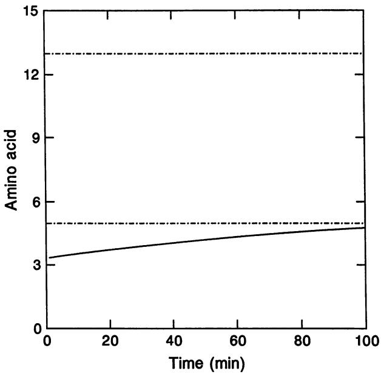

FIG. 16. Amino acid pool (solid line) after an immediate shift from k = 0.78 h-1 down to k = 0.29 h-1. The upper and lower horizontal broken lines are, respectively, the initial and final steadystate values.

solid line) and RNA (lower solid line) in the same shift down. The broken line is the preshift rate. The datum points are taken from reference 69. The simulation is quite consistent with the data. The rate of protein synthesis is constant at the new

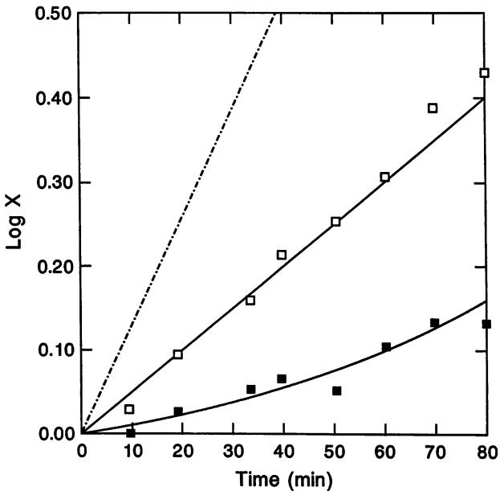

FIG. 17. Amounts of protein (O) and RNA (U) relative to the amount at zero time after the immediate shift down shown in Fig. 16. The solid lines were computed as described in the text. The broken line depicts the preshift rate. The coordinates of the symbols are data taken from reference 69 with permission.

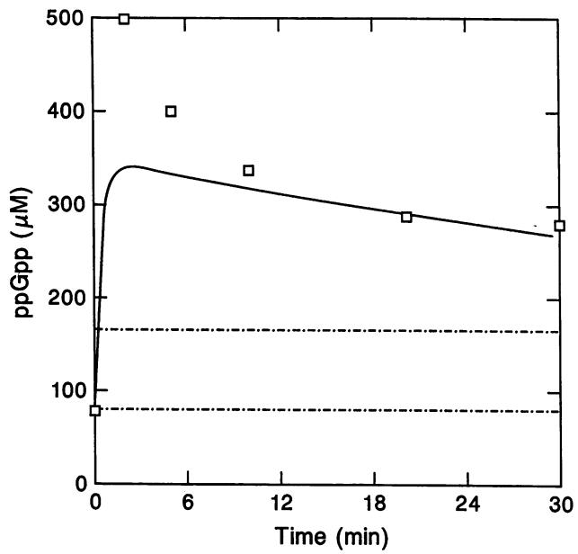

FIG. 18. Concentration of guanosine tetraphosphate (ppGpp) after the immediate shift down shown in Fig. 16. The solid line was computed as described in the text. The lower horizontal line marks the initial steady state, and the upper horizontal line marks the final steady state. Coordinates of the symbols (C1) are computed from the data in reference 69 with permission.

definitive rate almost immediately after the shift, while the production of RNA is much lower than the new definitive rate.

The solid line in Fig. 18 is the computed concentration of guanosine tetraphosphate, which rises rapidly from its preshift concentration (lower horizontal line) to about 350 ,uM and thereafter slowly declines toward the new steady-state value (upper horizontal line). The simulation is in agreement with experimental data (69), with the exception of the initial spike. This discrepancy may reflect an inadequacy in the model, or the spike may result from a physiological effect of a-methyl glucoside other than its competition with transport of glucose.

I have not attempted to apply the model to physiologically more complex shifts down such as from rich to minimal medium. Treating such shifts would require incorporation of equations describing the kinetics of derepression (6). Painter (78) has developed a simple model for the growth of S. typhimurium which defines three categories of proteins: biosynthetic enzymes, the protein-synthesizing system, and others assumed to be constant. Differential rates of synthesis of each of the first two categories were deduced for steady states in glucose minimal medium (biosynthetic enzymes limiting) and rich medium (protein synthesis limiting). Shifts up and down were assumed to give constant differential rates during the transition. This model accounted for the rate of change in protein synthesis following a shift up and predicted rather well the result of the classic double-shift experiment of Maal0e and Kjeldgaard (66).

## Low Growth Rate

My model for control of the protein-synthesizing system accounts for steady-state growth at moderate to high rates and for at least the main features of nutritional transitions. It does not account satisfactorily for the concentration of ribosomes dr the peptide chain growth rate at low growth rates or for protein synthesis after a nutritional shift up.

Overproduction of rRNA. Equation 5 is based on the assumption that all of the rRNA produced is assembled into ribosomes. At moderate growth rates this assumption is close to the truth, but at low growth rates a substantial pprtion of the rRNA made by E. coli is unstable (75). Glausing (31) found that at moderate to high growth rates about 90% of rRNA transcripts accumulated, but at low growth rates the fraction accumulating diminished with the growth rate; at k = 0.07 h-', only 30% of the rRNA accumulated. Instability of rRNA at low growth rates may account for the increase in the proportion of tRNA to ribosomes (75).

Yamagishi and Nomura (96) increased the rate of synthesis of rRNA more than twofold by induction of rrnB genes on a plasmid under control of the APL promoter and found that much of the rRNA produced did not accumulate. The limiting factor seemed to be the inability of E. coli to increase the rate of synthesis of r-proteins in proportion to the increase in the rate of synthesis of rRNA. Many of the ribosomes formed under these conditions sedimented irregularly in a sucrose gradient, suggesting that assembly was incomplete (96).

Control of the synthesis of r-proteins is complex but consists mainly of autogenous repression of translation of r-protein mRNA (reviewed in reference 47). The dynamic range of this control is limited (19) in comparison with that of rRNA. It is possible that at low growth rates the dynamic range is exceeded and that the rate of production of r-protein decreases more than that of rRNA; in short rRNA is overproduced, leading to turnover of rRNA and, perhaps, faulty assembly of some of the ribosomes.

There are many ways in which this general notion of rRNA overproduction could be formulated. One way is to assume that the probability that rRNA will be assembled into a ribosome is some function of the specific rate of translation, rp, such as the expression rpl(krp + rp), in which the parameter krp is the value of rp at which one-half of the rRNA transcripts become stable ribosomes. Modifying equation 8 accordingly gives

$$kR = r_{rm}[rrn] \frac{r_p}{k_{r_p} + r_P} \tag{16}$$

Substituting transcripts for ribosomes in equation 9 gives

$$T = C_{\rm tRNA} R \frac{k_{r_p} + r_P}{r_P} \tag{17}$$

The steady state of growth was computed by using equations 16 and 17 with kr = 2.5 s-1; other nonstandard parameters were Kg = 33 P.uv, and [rrn], the function of growth rate shown in Fig. 3. The computed tRNA as weight fraction of total RNA is shown as the line in Fig. 19; the symbols are data from reference 45. This simple (and probably incorrect) formulation for the stability of rRNA is, however, sufficient to account for the experimental data.

The overproduction of rRNA relative to r-proteins can have serious adverse consequences (90) because of the imperfect cooperativity of assembly of ribosomal subunits (96). In effect, the r-proteins become distributed over the excess rRNA, leading to fewer complete subunits than could be made from the parts.

Rate of peptide chain growth. The model assumes the convenient fiction that all ribosomes are active in translation

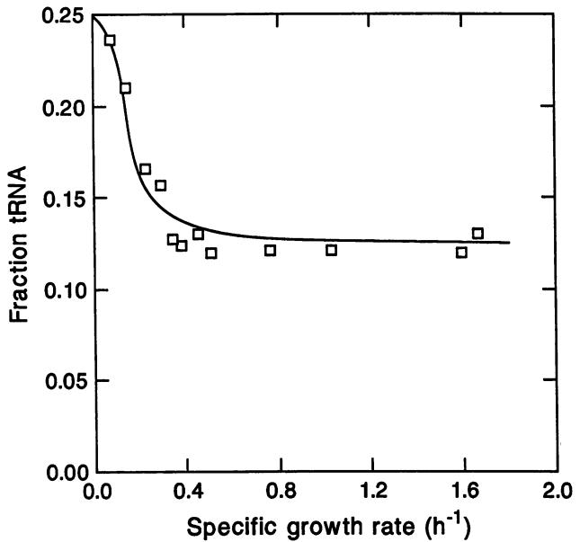

FIG. 19. Simulation of the fraction of tRNA as a function of growth rate. The solid line was computed from equation 17. Coordinates of the symbols (l) are computed from the data in reference 45 with permission.

at a rate of rp amino acids per second. The consequences of this assumption differ only slightly from reality if a large and constant fraction of ribosomes are translating, a condition which obtains at moderate and high growth rate (25). At such growth rates, an increase (or decrease) in the growth rate results in a proportional increase (or decrease) in the concentration of ribosomes. At low growth rates, say, k < 0.5 h-1, the concentration of ribosomes is disproportionally high. The rate of synthesis of protein could be modulated by either (i) reduction of the rate of initiation of translation or (ii) reduction of rp, or (iii) both. Alternative (i) is the conventional wisdom of growth physiology (44, 65, 66). Alternative (ii) is assumed by the model, and that assumption can be evaluated by comparing the values of rp with experimental measurements.

Estimates of the rate of peptide chain growth in cells growing at different rates have been made by analyzing the kinetics of induction of ,B-galactosidase (15, 18), by measuring the time required for complete transfer of a brief pulselabel into finished protein (80), and by measuring the fraction of ribosomes in the act of translation (25). Induction of ,-galactosidase appears unambiguous: one adds inducer and periodically measures the amount of the enzyme; the time required for the first molecule of induced enzyme to be formed is estimated by extrapolation of the amount of enzyme to an intersection with the basal level of enzyme. Despite its apparent simplicity, this method not only involves a number of assumptions but also suffers the considerable uncertainty of nonlinear extrapolation (discussed in reference 18).

In Fig. 20 1 have compared the value of rp computed from the model with data from each of the three methods. The computation agrees reasonably well with the data. One can say that rp declines with growth rate; one cannot say that alternative (iii) is excluded. It seems reasonable for the initiation of translation to decrease as the growth rate

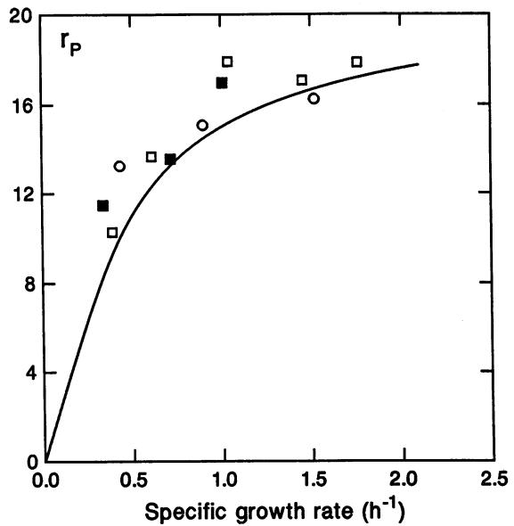

FIG. 20. Rate of polypeptide chain synthesis (rp) as a function of specific growth rate. The solid line is computed from the model with standard parameters. The symbols are sets of experimental data. The open squares are computed from data in reference 25 with a scaling of 0.85. The solid squares are data from reference 80. The circles are data from reference 18. Data are used with permission.

approaches zero (33); such control would prevent drainage of pools of monomers and precursor metabolites. Forchhammer and Lindahl (25) did not find a decrease in polysomes and an increase in ribosome subunits or monosomes as the growth rate was reduced to 0.38 h-', but Harvey's careful experiments with several strains of E. coli show a linear relationship between the fraction of ribosomes engaged in protein synthesis (in polysomes or with peptides subject to release by puromycin) and the growth rate (36). Gold (33) has suggested that initiation of translation is controlled by C1 metabolism-by methionine and the formylation of methionyl-tRNA.

Very low growth rate. Carbon sources such as glycolate and D-alanine support growth in batch culture at about 0.2 h-1 at 37°C. To obtain still lower growth rates, one must use chemostats, which pose problems of attaining a steady state; these problems become increasingly serious as the growth rate is reduced. The problems include wall growth, concentrations of cells in foam, and slow mixing, producing heterogeneities in time and space (52). Still lower growth rates may be attained in fed-batch cultures or recycling fermentors (reviewed in reference 14), but it is by no means clear that steady states are attained. Koch and Coffman (51) have evidence that in cultures of E. coli growing at low rates, the capacity of cells to synthesize ,-galactosidase oscillates. Starvation for nutrient triggers a response leading to the synthesis of a set of new proteins and a new physiological state (reviewed in reference 68). It seems possible that even in a constant environment supporting a very low growth rate, the physiological state of cells is metastable.

# Stringent Response versus Growth Rate Control

Although my model for control and activity of the proteinsynthesizing system of E. coli can be construed more generally, I assumed in particular that guanosine tetraphosphate

is produced by the function of RelA. The stringent response has been distinguished from growth rate control because relA mutants, which continue synthesis of rRNA in the absence of an amino acid, nevertheless control the synthesis of rRNA by growth rate and upon nutrient starvation (reviewed in reference 12). Whether growth rate control is mediated by guanosine tetraphosphate is still under debate. The issue was confounded by the fact that the rate of synthesis of rRNA can be considerably greater than the rate of accumulation (see above). The rate of synthesis of rRNA correlates well with the concentration of guanosine tetraphosphate in both wild-type and relA strains (69, 85). Thus, the wild type has two mechanisms for synthesis of guanosine tetraphosphate, one dependent on RelA and the other not. It seems likely that the RelA mechanism predominates. Finally, strains deleted for both relA and spoT do not contain guanosine tetraphosphate but have some degree of growth rate control (28), possibly indicating further redundancy in control of rRNA synthesis.

If a relA mutant is deprived of an amino acid, the concentration of guanosine tetraphosphate falls rapidly (6), just the opposite of the situation for the wild type. Inhibitors of protein synthesis also decrease the concentration of guanosine tetraphosphate, but starvation for a carbon source increases it (reviewed in reference 12). This curious behavior suggests the possibility that the concentrations of uncharged tRNAs, all but one or a few of which decline upon starvation for a single amino acid, control the synthesis of guanosine tetraphosphate by the mechanism still operative in relA mutants. (Alternatively, but less likely, aminoacyl-tRNAs could stimulate hydrolysis.) Although the second mechanism of synthesis of guanosine tetraphosphate is usually thought to be independent of ribosomes, I am tempted to speculate further that the E site of the ribosome, which binds uncharged tRNA codon specifically and at high affinity (83), is the sensor.

## OPTIMALITY

Discovery of a myriad of mechanisms of regulation in E. coli, in particular the regulation at moderate to high growth rates of the protein-synthesizing system, together with a sense of the natural history of this organism, has led to a prevailing view that it is optimal. This view has been advanced especially by the Copenhagen school (44, 64, 66); it is appealing and pervasive. In specific form, this idea means that the distribution of protein is optimal in the sense that the growth rate in a given environment is maximal (22); making more of any protein at the expense of others would lower the growth rate. In this section I will examine the hypothesis of optimality and conclude that the distribution of protein is, in general, not optimal.

#### Fitter Mutants

If a population of E. coli is propagated in a fixed environment, it evolves. Mutants with a higher growth rate, called fitter mutants, arise and displace the parental genotype. This fact was discovered by Atwood et al. (3), who observed that a minority subpopulation of a marker mutant increased, then decreased, and then increased again. They correctly interpreted the decrease to mean that fitter mutants arose in the majority, nonmarker population and outgrew the original genotype, including its marker. Successive fitter mutations cause periodic selection against a minority marker. Periodic selection is commonly observed, but the genotypes of fitter

mutants have not often been determined (reviewed in reference 21).

Novick and Horiuchi (76) selected fitter mutants of E. coli in lactose-limited chemostats. The first mutants expressed the lac operon constitutively; subsequent mutants hyperexpressed the lac operon as a consequence of duplications of lac. Sonti and Roth (87) have found that duplications are selected for by growth of S. typhimurium with malate or with limiting concentrations of arabinose or sorbitol as the carbon source. All isolates carried a large duplication from 45 to 80 min on the chromosome, a segment containing the genes for the transport systems for each of these compounds. It appears that increased gene dose for transport proteins is the basis of faster growth of both organisms. The distributions of proteins in parental genotypes were not optimal in the strict sense used by Ehrenberg and Kurland (22), because diversion of more protein to transport systems, made possible by mutation, increased the growth rate.

The hypothesis of optimality predicts a class of fitter mutants which are silent (e.g., deletes) for the expression of genes not needed in a given environment. Such mutants have not been found by direct selection. Auxotrophic mutants do outgrow isogenic prototrophs in chemostats (reviewed in reference 21), but missense and nonsense mutations are equivalent; the mysterious advantage of the auxotroph cannot be attributed to synthesis of less of a protein.

#### Protein Burden

Protein burden refers to a diversion of a portion of the total protein to proteins which are neither useful nor harmful in the given environment. Clearly, the diversion of a large portion of total protein by expression of highly active genes on a multicopy plasmid will lower the growth rate, perhaps by diverse mechanisms (7), but the question of optimal distribution of protein is tested by a small diversion. On the basis of the hypothesis of an optimal distribution (within the limits of the genotype), a protein burden should reduce the growth rate at least in proportion to the fraction of total protein diverted. The measurement of protein burden has proved to be surprisingly difficult (reviewed in reference 50). In most of these experiments, E. coli, growing in chemostats, has been burdened by expression of the lac operon. Full expression of a single copy of lac amounts to about 3% of the total protein and would be expected to reduce the growth rate by at least this amount in an environment in which lac expression confers no advantage or disadvantage. The first such experiment showed that lac expression resulted in a competitive disadvantage of about 5% per doubling time (77), a result in accord with the hypothesis. However, expression of a functional (but not necessarily functioning) lactose permease (LacY) produces a competitive disadvantage of about 5% per doubling time (50). In an elegant experiment with a lacY mutant, Koch (50) found that constitutive production of,-galactosidase caused a competitive disadvantage of only 0.15%+ 0.22% per doubling time, not significantly different from zero. This result contradicts the hypothesis of optimal distribution of protein.

Koch (52) assumed that E. coli was optimally adapted but recognized that protein resources were not distributed such as to maximize the growth rate under all conditions. In particular, he noted that the protein-synthesizing system was in excess in cells growing at low rates and interpreted this to mean that the potential for faster growth in a better environment at the expense of slower growth in a marginal environment was adaptive. This idea can be cast in more general form: adaptation means not only a high growth rate in a given environment but also an ability to cope with an environmental change. As we shall see, the latter can compromise the former.

If E. coli is grown in glucose minimal medium supplemented with tryptophan, expression of the trp operon is strongly repressed (reviewed in reference 97). If tryptophan is not present in the medium, the concentration of tryptophan is set largely by its feedback inhibition of anthranilate synthase; this concentration derepresses trp such that the enzymes of tryptophan biosynthesis are present in about twice the concentration required to provide the flux of tryptophan. Mutants with a 10-fold reduction in the affinity of anthranilate synthase for tryptophan sustain the same flux with half the concentration of enzymes (6). On the basis of the hypothesis of optimal distribution of protein, such mutants, spared the burden of half of the tryptophan biosynthetic enzymes, should grow faster; in fact, they grow at the same rate as the wild type. An advantage of wild-type feedback inhibition is demonstrated by the consequence of an abrupt withdrawal of tryptophan from the environment. The expression of the trp operon is smoothly modulated in the wild type but oscillates in the mutant (6). Thus, economy of protein is compromised by feedback inhibition in return for stability. Finally, insofar as the rate of growth is determined by the biosynthesis of monomers such as tryptophan, a modest reduction in the concentration of the biosynthetic enzyme will have little effect on the growth rate. This could explain the lack of effect of a modest protein burden.

# GROWTH OF THE CELL

If the preceding analysis is correct, for a cell in a population in a steady state the rates of synthesis of protein and stable RNA should be proportional to the amounts of each contained by that cell; i.e., the mass of that cell should grow exponentially. Furthermore, since the buoyant density is constant during the cell cycle (58), the volume must also grow exponentially or nearly so. But what couples the increase in volume with the synthesis of protein and RNA? The first stage is probably an increase in turgor pressure resulting mainly from counterions of the ribosomes and proteins. From the composition of amino acids (71) and the concentrations of protein (equation 10) and ribosomes (Fig. 7) of E. coli growing at k = 0.9 h-', one can compute a net acidity of 130 meq liter-'. If the counterion is a monovalent cation, the cytosol on this basis alone is 0.13 osmolal, which is close to the estimated osmolality (56). At higher growth rates the higher concentration of ribosomes would tend to increase turgor, which would be offset by an increase in volume of the growing cell and a reduction in the concentration of protein.

Koch (53, 55, 56) has proposed that turgor pressure is the driving force for expansion of volume: turgor causes a pattern of stress on the bonds of peptidoglycan; that stress reduces the activation energy for hydrolysis of peptidoglycan; and hydrolysis relieves the stress, decreases the turgor, and increases the volume of the cell. For gram-positive bacilli, new wall is assumed to be formed stress free on the inner face of the existing wall, which is many layers thick, and hydrolysis to relieve stress occurs on the outer face (55). For E. coli, it is likely that new strands of peptidoglycan are inserted into a stress-bearing fabric and that hydrolysis to relieve stress can occur only after new bonds have been formed (56).

The kinetics of peptidoglycan synthesis during the cell

cycle of E. coli are in accord with synthesis on demand to maintain a constant turgor pressure (reviewed in reference 17). It seems reasonable to conclude that the synthesis of protein and RNA and the accumulation of counterions tend to increase turgor but that turgor is maintained because of a corresponding synthesis of wall and expansion of cell volume. Presumably the capacity for synthesis of peptidoglycan is in excess. Such also seems to be the case for the synthesis of phospholipids (reviewed in reference 92). Inner and outer membranes are synthesized coordinately with the expansion of the wall.

# CONCLUSIONS AND COMMENTARY

Despite the considerable body of evidence to the contrary, it is nonetheless generally assumed that the flux of ATP determines the growth rate and that the yield of ATP determines the yield of bacteria. Contravening experimental evidence must meet cognitive dissonance. This analysis and review supports the conjecture that the rate of growth of E. coli is set by the flux of a precursor metabolite and of the monomers derived from it rather than by the flux of ATP or, with the possible exception of the maximal growth rate, the rate of protein synthesis. The conjecture can be tested critically by measurement of fluxes and concentrations of metabolites in various steady states of growth. Of particular importance is the measurement of precursor metabolites, amino acids, and aminoacyl-tRNAs.

The physiology of E. coli at low growth rates (i.e., experiencing incipient starvation) is clearly different from that at moderate to high growth rates. Although one can account for the rate of protein synthesis only in terms of the rate of peptide elongation, it seems likely that initiation of translation is modulated to prevent the depletion of pools of amino acids and aminoacyl-tRNA. Modulation of initiation might be one of a set of controls which confer resistance to starvation. The physiology of E. coli at low growth rates or starved for nutrients deserves more attention.

Genetic and physiological analysis of fitter mutants is a potentially powerful approach to understanding what sets the rate of growth. Unfortunately, most of the experiments have been made with chemostats, in which growth rate is controlled by a low concentration and consequent low flux of one nutrient. The fact that most fitter mutants selected in chemostats have an altered transport system for the limiting nutrient (21) is to be expected and is not particularly interesting. Selection in batch culture should yield other types. If the propagation in batch culture is such as to maintain a population density low enough that the environment is not significantly altered, selection should be exclusively for a higher growth rate. The genetics and physiology of the mutants should reveal the rate-limiting step(s) in the parent. Fitter mutants selected in minimal medium might be expected to have higher fluxes and concentrations of one or more precursor metabolites. Fitter mutants selected in media giving the highest growth rates might carry duplications of rrn. To the extent that protein burden lowers growth rate, one would expect selection of deletions or other mutations that silence genes which are insignificant in the selection environment or that reduce feedback inhibition. The extent to which fitter mutations compromise growth rate or survival in environments other than that used for selection should be revealing. Finally, mutants selected by long propagation in a constant environment might have lost the function of genes important to adaptation to new environments.

The model developed in this paper accounts for modula-

tion of the protein-synthesizing system by means of negative feedback from hungry ribosomes. The protein-synthesizing system is an important but not singular example of synthesis on demand that is also characteristic of peptidoglycan, phospholipids, and even DNA. Unfortunately, in no case is the mechanism of such modulation well understood.

## REFERENCES

- 1. Andersen, K. B., and K. von Meyenberg. 1980. Are growth rates of Escherichia coli limited by respiration? J. Bacteriol. 144:114- 123.
- 2. Anderson, P., and J. Roth. 1981. Spontaneous tandem duplications in Salmonella typhimurium arise by unequal recombination between rRNA (rrn) cistrons. Proc. Natl. Acad. Sci. USA 78:3113-3117.
- 3. Atwood, K. C., L. K. Schneider, and F. J. Ryan. 1951. Periodic selection in Escherichia coli. Proc. Natl. Acad. Sci. USA 37:146-155.
- 4. Bauchop, T., and S. R. Elsden. 1960. The growth of microorganisms in relation to their energy supply. J. Gen. Microbiol. 23:457-469.
- 5. Beck, C., J. Ingraham, 0. Maal0e, and J. Neuhardt. 1973. Relationship between the concentration of nucleoside triphosphates and the rate of synthesis of RNA. J. Mol. Biol. 78:117- 121.
- 6. Bliss, R. D., P. R. Painter, and A. G. Marr. 1982. Role of feedback inhibition in stabilizing the classical operon. J. Theor. Biol. 97:177-193.
- 7. Bogosian, G., B. N. Violand, P. E. Jung, and J. F. Kane. 1990. Effect of protein overexpression on mistranslation in Escherichia coli, p. 546-558. In W. E. Hill, A. Dahlberg, R. A. Garrett, P. B. Moore, D. Schlessinger, and J. R. Warner (ed.), The ribosome: structure, function, and evolution. American Society for Microbiology, Washington, D.C.
- 8. Bremer, H., and P. P. Dennis. 1987. Modulation of chemical composition and other parameters of the cell by growth rate, p. 1527-1542. In F.-C. Neidhardt, J. L. Ingraham, K. B. Low, B. Magasanik, M. Schaechter, and H. E. Umbarger (ed.), Escherichia coli and Salmonella typhimurium: cellular and molecular biology. American Society for Microbiology, Washington, D.C.
- 9. Bremer, H., and P. P. Dennis. 1975. Transition period following a nutritional shift-up in the bacterium Escherichia coli B/r: stable RNA and protein synthesis. J. Theor. Biol. 52:365-382.
- 10. Brunschede, H., T. L. Dove, and H. Bremer. 1977. Establishment of exponential growth after a nutritional shift-up in Escherichia coli B/r: accumulation of deoxyribonucleic acid, ribonucleic acid, and protein. J. Bacteriol. 129:1020-1033.
- 11. Cashel, M., and J. Gallant. 1968. Control of RNA synthesis in Escherichia coli. I. Amino acid dependence on the synthesis of substrates of RNA polymerase. J. Mol. Biol. 34:317-330.
- 12. Cashel, M., and K. E. Rudd. 1987. The stringent response, p. 1410-1438. In F. C. Neidhardt, J. L. Ingraham, K. B. Low, B. Magasanik, M. Schaechter, and H. E. Umbarger (ed.), Escherichia coli and Salmonella typhimurium: cellular and molecular biology. American Society for Microbiology, Washington, D.C.
- 13. Chapman, A. G., L. Fall, and D. E. Atkinson. 1971. Adenylate energy charge in Escherichia coli during growth and starvation. J. Bacteriol. 108:1072-1086.
- 14. Chesbro, W. 1988. The domains of slow bacterial growth. Can. J. Microbiol. 34:427-435.
- 15. Coffman, R. L., T. E. Norris, and A. L. Koch. 1971. Chain elongation rate of messenger and polypeptides in slowly growing Escherichia coli. J. Mol. Biol. 60:1-19.
- 16. Cole, J. R., C. L. OLsson, J. W. B. Hershey, M. Grunberg-Manago, and M. Nomura. 1987. Feedback regulation of rRNA synthesis in Escherichia coli. Requirement for initiation factor IF2. J. Mol. Biol. 198:383-392.
- 17. Cooper, S. 1990. The Escherichia coli cell cycle. Res. Microbiol. 141:17-29.
- 18. Dalbow, D. G., and R. Young. 1975. Synthesis time of P-galactosidase in Escherichia coli B/r as a function of growth rate. Biochem. J. 150:13-20.
- 19. Dennis, P. 1974. Synthesis of individual ribosomal proteins in Escherichia coli B/r. J. Mol. Biol. 89:223-232.
- 20. Duclaux, E. 1898-1901. Traite de microbiologie. Masson, Paris.
- 21. Dykhuizen, D. E., and D. L. Hartl. 1983. Selection in chemostats. Microbiol. Rev. 47:150-168.
- 22. Ehrenberg, M., and C. G. Kurland. 1984. Costs of accuracy determined by a maximal growth rate constraint. Q. Rev. Biophys. 17:45-82.
- 23. Ellwood, M., and M. Nomura. 1980. Deletion of a ribosomal ribonucleic acid operon in Escherichia coli. J. Bacteriol. 143: 1077-1080.
- 24. Ellwood, M., and M. Nomura. 1982. Chromosomal locations of the genes for rRNA in Escherichia coli K-12. J. Bacteriol. 149:458-468.
- 25. Forchhammer, J., and L. Lindahl. 1971. Growth rate of polypeptide chains as a function of the cell growth rate in a mutant of Escherichia coli 15. J. Mol. Biol. 55:563-568.
- 26. Fraenkel, D. G. 1968. The accumulation of glucose-6-phosphate from glucose and its effect in an Escherichia coli mutant lacking phosphoglucoisomerase and glucose-6-phosphate dehydrogenase. J. Biol. Chem. 243:6451-6457.
- 27. Franzen, J. S., and S. B. Binkley. 1961. Comparison of acid soluble nucleotides in Escherichia coli at different growth rates. J. Biol. Chem. 236:515-519.
- 28. Gaal, T., and R. L. Gourse. 1990. Guanosine 3'-diphosphate 5'-diphosphate is not required for growth rate-dependent control of rRNA synthesis in Escherichia coli. Proc. Natl. Acad. Sci. USA 87:5533-5537.
- 29. Gausing, K. 1974. Ribosomal protein in E. coli: rate of synthesis and pool size at different growth rates. Mol. Gen. Genet. 129:61-75.
- 30. Gausing, K. 1976. Synthesis of rRNA and r-protein mRNA in E. coli at different growth rates, p. 292-303. In N. 0. Kjeldgaard and 0. Maal0e (ed.), Control of ribosome synthesis. Alfred Benzon Symposium IX. Munksgaard, Copenhagen.
- 31. Gausing, K. 1977. Regulation of ribosome production in Escherichia coli: synthesis and stability of ribosomal RNA and of ribosomal protein messenger RNA at different growth rates. J. Mol. Biol. 115:335-354.
- 32. Gausing, K. 1980. Regulation of ribosome biosynthesis in E. coli, p. 693-718. In G. Chambliss, G. R. Craven, J. Davies, K. Davis, L. Kahan, and M. Nomura (ed.), Ribosomes: structure, function, and genetics. University Park Press, Baltimore.
- 33. Gold, L. 1988. Posttranscriptional regulatory mechanisms in Escherichia coli. Annu. Rev. Biochem. 57:199-233.
- 34. Gunsalus, I. C., and C. W. Shuster. 1961. Energy yielding metabolism in bacteria, p. 1-58. In I. C. Gunsalus and R. Y. Stanier (ed.), The bacteria, vol. 2. Academic Press, Inc., New York.
- 35. Hansen, M. T., M. L. Pato, S. Molin, and K. von Meyenberg. 1975. Simple downshift and resulting lack of correlation between ppGpp pool size and ribonucleic acid accumulation. J. Bacteriol. 122:585-591.
- 36. Harvey, R. 1973. Fraction of ribosomes synthesizing protein as a function of specific growth rate. J. Bacteriol. 114:287-293.
- 37. Hazeltine, W. A., and R. Block. 1973. Synthesis of guanosine tetra- and pentaphosphate requires the presence of codonspecific, uncharged transfer ribonucleic acid in the acceptor site of ribosomes. Proc. Natl. Acad. Sci. USA 70:1564-1568.
- 38. Hempfling, W. P., and S. E. Mainzer. 1975. Effect of varying the carbon source on yield and maintenance characteristics of Escherichia coli in continuous culture. J. Bacteriol. 123:1076- 1087.
- 39. Henrici, A. T. 1928. Morphologic variation and rate of growth of bacteria. Microbiology monographs. Bailliere, Tindall, and Cox, London.
- 40. Hinshelwood, C. N. 1946. The chemical kinetics of the bacterial cell. Clarendon Press, Oxford.
- 41. Holms, W. H. 1986. The central metabolic pathways of Escherichia coli: relationship between flux and control at a branch point, efficiency of conversion to biomass, and excretion of acetate. Curr. Top. Cell. Regul. 28:69-106.
- 42. Holms, W. H. 1987. Control of flux through the citric acid cycle

MICROBIOL. REV.

and the glyoxylate bypass in Escherichia coli. Biochem. Soc. Symp. 54:17-31.

- 43. Ikeda, T., and D. C. LaPorte. 1991. Isocitrate dehydrogenase kinase/phosphatase: aceK alleles that express kinase but not phosphatase activity. J. Bacteriol. 173:1801-1806.
- 44. Ingraham, J. L., 0. Maal0e, and F. C. Neidhardt. 1983. Growth of the bacterial cell. Sinauer Associates, Inc., Sunderland, Mass.
- 45. Jacobsen, H. 1974. Ph.D. thesis. Copenhagen University, Copenhagen, Denmark.
- 46. Jensen, K. F., and S. Pedersen. 1990. Metabolic growth rate control in Escherichia coli may be a consequence of subsaturation of the macromolecular biosynthetic apparatus with substrates and catalytic components. Microbiol. Rev. 54:89-100.
- 47. Jinks-Robertson, S., and M. Nomura. 1987. Ribosomes and tRNA, p. 1358-1385. In F. C. Neidhardt, J. L. Ingraham, K. B. Low, B. Magasanik, M. Schaechter, and H. E. Umbarger (ed.), Escherichia coli and Salmonella typhimurium: cellular and molecular biology. American Society for Microbiology, Washington, D.C.
- 48. Kjeldgaard, N. 0. 1961. The kinetics of ribonucleic acid and protein formation in Salmonella typhimurium during transition between different states of balanced growth. Biochim. Biophys. Acta 49:64-76.
- 49. Kjeldgaard, N. O., 0. Maal0e, and M. Schaechter. 1958. Transition between different physiological states during balanced growth of Salmonella typhimurium. J. Gen. Microbiol. 19:607- 616.
- 50. Koch, A. 1983. The protein burden of lac operon products. J. Mol. Evol. 19:455-462.
- 51. Koch, A., and R. Coffman. 1970. Diffusion, permeation, or enzyme limitation: a probe for the kinetics of enzyme induction. Biotech. Bioeng. 12:651-677.
- 52. Koch, A. L. 1971. The adaptive responses of Escherichia coli to feast and famine existence. Adv. Microb. Physiol. 6:147-217.
- 53. Koch, A. L. 1983. The surface stress theory of microbial morphogenesis. Adv. Microbiol. Physiol. 24:301-366.
- 54. Koch, A. L. 1988. Why can't a cell grow infinitely fast? Can. J. Microbiol. 34:421-426.
- 55. Koch, A. L. 1988. Biophysics of bacterial walls viewed as stress-bearing fabric. Microbiol. Rev. 52:337-353.
- 56. Koch, A. L. 1990. Surface stress theory for the case of Escherichia coli: the paradoxes of gram negative growth. Res. Microbiol. 141:119-130.
- 57. Koch, A. L., and C. S. Deppe. 1971. In vivo assay of protein synthesizing capacity of Escherichia coli from slowly growing chemostat cultures. J. Mol. Biol. 55:549-562.
- 58. Kubitschek, H. 1983. Buoyant density constancy during the cell cycle of Escherichia coli. J. Bacteriol. 155:1027-1032.
- 59. Kubitschek, H. 1984. Independence of buoyant density and growth rate in Escherichia coli. J. Bacteriol. 158:296-299.
- 60. Lagosky, P. A., and F. N. Chang. 1980. The influence of amino acid starvation on guanosine-5'-diphosphate 3'-diphosphate basal level synthesis in Escherichia coli. J. Bacteriol. 144:499- 508.
- 61. LaPorte, D. C., P. Thorsness, and D. E. Koshland. 1985. Compensatory phosphorylation of isocitrate dehydrogenase. A mechanism of adaptation to the intracellular environment. J. Biol. Chem. 260:10563-10568.
- 62. LaPorte, D. C., K. Walsh, and D. E. Koshland. 1984. Ultrasensitivity and subsensitivity to metabolic control. J. Biol. Chem. 259:14068-14075.
- 63. Lowry, 0. H., J. Carter, J. B. Wood, and L. Glaser. 1971. The effect of carbon and nitrogen sources on the level of metabolic intermediates in Escherichia coli. J. Biol. Chem. 246:6511-6521.
- 64. Maal0e, 0. 1969. An analysis of bacterial growth. Dev. Biol. Suppl. 3:33-58.
- 65. Maal0e, 0. 1979. Regulation of protein synthesizing machinery-ribosomes, tRNA, factors, and so on, p. 487-542. In R. F. Goldberger (ed.), Biological regulation and development. Plenum Publishing Corp., New York.
- 66. Maal0e, O., and N. 0. Kjeldgaard. 1966. Control of macromolecular synthesis: a study of DNA, RNA, and protein synthesis

in bacteria. Benjamin, New York.

- 67. Marr, A. G., E. H. Nilson, and D. J. Clark. 1963. The maintenance requirement of Escherichia coli. Ann. N.Y. Acad. Sci. 102:536-548.
- 68. Matin, A., E. A. Auger, P. H. Blum, and J. E. Schultz. 1989. Genetic basis of starvation survival in nondifferentiating bacteria. Annu. Rev. Microbiol. 43:293-316.
- 69. Molin, S., K. von Meyenberg, 0. Maal0e, M. T. Hansen, and M. L. Pato. 1977. Control of ribosome synthesis in Escherichia coli: analysis of an energy source shift-down. J. Bacteriol. 131:7-17.
- 70. Monod, J. 1942. Recherches sur la croissance des culture bacteriennes. Hermann et Cie, Paris.
- 71. Neidhardt, F. C. 1987. Chemical composition of Escherichia coli, p. 3-6. In F. C. Neidhardt, J. L. Ingraham, K. B. Low, B. Magasanik, M. Schaechter, and H. E. Umbarger (ed.), Escherichia coli and Salmonella typhimurium: cellular and molecular biology. American Society for Microbiology, Washington, D.C.
- 72. Neidhardt, F. C., P. L. Bloch, S. Pedersen, and S. Reeh. 1977. Chemical measurement of steady-state levels of ten aminoacyltransfer ribonucleic acid synthetases in Escherichia coli. J. Bacteriol. 129:378-387.
- 73. Nimmo, H. G. 1987. The tricarboxylic acid cycle and anapleurotic reactions, p. 156-169. In F. C. Neidhardt, J. L. Ingraham, K. B. Low, B. Magasanik, M. Schaechter, and H. E. Umbarger (ed.), Escherichia coli and Salmonella typhimurium: cellular and molecular biology. American Society for Microbiology, Washington, D.C.
- 74. Nomura, M., D. M. Bedwell, M. Yamagishi, J. R. Cole, and J. M. Kolb. 1986. RNA polymerase and regulation of RNA synthesis in Escherichia coli: RNA polymerase concentration, stringent control, and ribosome feedback regulation, p. 137-149. In W. S. Reznikoff, C. A. Gross, R. R. Burgess, M. T. Record, Jr., J. E. Dahlberg, and M. P. Wickens (ed.), RNA polymerase and the regulation of transcription. Elsevier Science Publishing, Inc., New York.
- 75. Norris, T. E., and A. Koch. 1972. Effect of growth rate on the relative rates of synthesis of messenger, ribosomal, and transfer RNA in Escherichia coli. J. Mol. Biol. 64:633-659.
- 76. Novick, A., and T. Horiuchi. 1961. Hyper-production of ,-galactosidase by Escherichia coli bacteria. Cold Spring Harbor Symp. Quant. Biol. 26:239-245.
- 77. Novick, A., and M. Weiner. 1957. Enzyme induction as an all-or-none phenomenon. Proc. Natl. Acad. Sci. USA 43:553- 566.
- 78. Painter, P. R. 1976. A model for the control of batch culture growth rate of enteric bacteria. J. Theor. Biol. 56:477-489.
- 79. Pedersen, F. S., E. Lund, and N. 0. Kjeldgaard. 1973. Codon specific tRNA dependent in vitro synthesis of ppGpp and pppGpp. Nature (London) New Biol. 243:13-15.
- 80. Pedersen, S. 1984. Escherichia coli ribosomes translate in vivo with variable rate. EMBO J. 3:2895-2898.
- 81. Pedersen, S., P. L. Bloch, S. Reeh, and F. C. Neidhardt. 1978. Patterns of protein synthesis in E. coli: a catalog of the amount of 140 individual proteins at different growth rates. Cell 14:179- 190.
- 82. Pirt, S. J. 1965. The maintenance energy of bacteria in growing cultures. Proc. R. Soc. London Ser. B 163:224-231.
- 83. Reinberger, H. J., H. Sternbach, and K. H. Nierhaus. 1986. Codon-anticodon interaction at the ribosomal E-site. J. Biol. Chem. 261:9140-9143.
- 84. Rojiana, M. V., H. Jakubowski, and E. Goldman. 1989. Effect of variation of charged and uncharged tRNATrP levels on ppGpp synthesis in Escherichia coli. J. Bacteriol. 171:6493-6502.
- 85. Ryals, J., R. Little, and H. Bremer. 1982. Control of rRNA and tRNA synthesis in Escherichia coli by guanosine tetraphosphate. J. Bacteriol. 151:1261-1268.
- 86. Schaechter, M., 0. Maal0e, and N. 0. Kjeldgaard. 1958. Dependency on medium and temperature on cell size and chemical composition during balanced growth of Salmonella typhimurium. J. Gen. Microbiol. 19:592-606.
- 87. Sonti, R. V., and J. R. Roth. 1989. Role of gene duplications in adaptation of Salmonella typhimurium to growth on limiting

carbon sources. Genetics 123:19-28.

- 88. Stock, J. B., B. Rauch, and S. Roseman. 1977. Periplasmic space in Salmonella typhimurium and Escherichia coli. J. Biol. Chem. 252:7850-7861.
- 89. Stouthammer, A. H. 1979. A search for correlation between theoretical and experimental growth yields. Int. Rev. Biochem. 21:1-47.
- 90. Tai, P.-C., and J. L. Ingraham. 1971. A ribosome-like particle accumulated at low temperature by a cold-sensitive mutant of Salmonella typhimurium. Biochim. Biophys. Acta 232:151-166.
- 91. Tempest, D. W., and 0. M. Neijssel. 1987. Growth yield and energy distribution, p. 797-806. In F. C. Neidhardt, J. L. Ingraham, K. B. Low, B. Magasanik, M. Schaechter, and H. E. Umbarger (ed.), Escherichia coli and Salmonella typhimurium: cellular and molecular biology. American Society for Microbiology, Washington, D.C.
- 92. Vanden Boom, T., and J. E. Cronan, Jr. 1989. Genetics and regulation of bacterial lipid metabolism. Annu. Rev. Microbiol. 43:317-343.
- 93. Walsh, K., and D. E. Koshland. 1985. Branch point control by the phosphorylation state of isocitrate dehydrogenase. J. Biol. Chem. 260:8430-8437.
- 94. Wanner, B. L., R. Kodaira, and F. C. Neidhardt. 1977. Physiological regulation of a decontrolled lac operon. J. Bacteriol. 130:212-222.
- 95. Woldringh, C. L., J. S. Binnerts, and A. Mans. 1981. Variation in Escherichia coli buoyant density measured in Percoll gradients. J. Bacteriol. 148:58-63.
- 96. Yamagishi, M., and M. Nomura. 1988. Effects of induction of rRNA overproduction on ribosomal protein synthesis and ribosome subunit assembly in Escherichia coli. J. Bacteriol. 170: 5042-5050.
- 97. Yanofsky, C., and I. P. Crawford. 1987. The tryptophan operon, p. 1453-1472. In F. C. Neidhardt, J. L. Ingraham, K. B. Low, B. Magasanik, M. Schaechter, and H. E. Umbarger (ed.), Escherichia coli and Salmonella typhimurium: cellular and molecular biology. American Society for Microbiology, Washington, D.C.