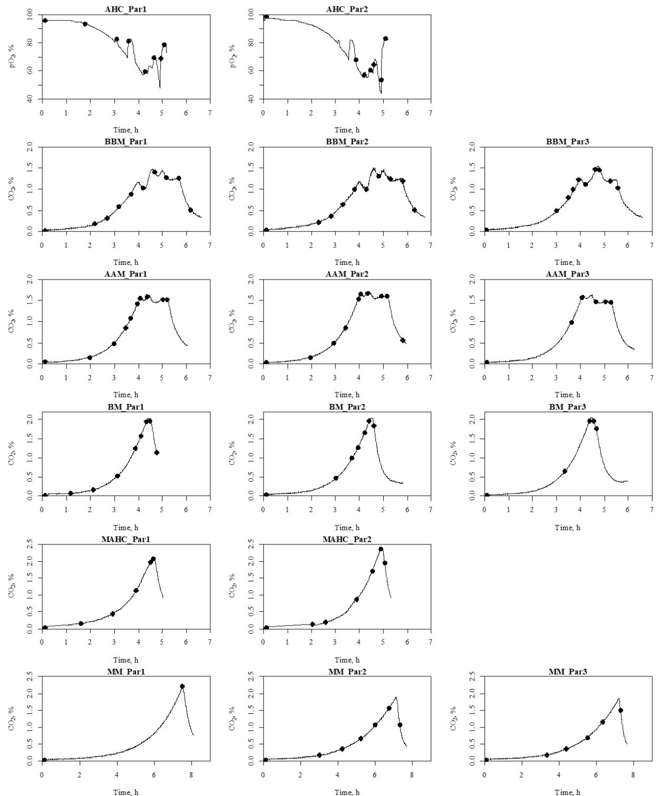
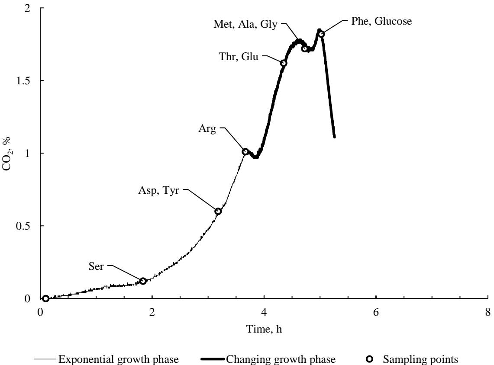
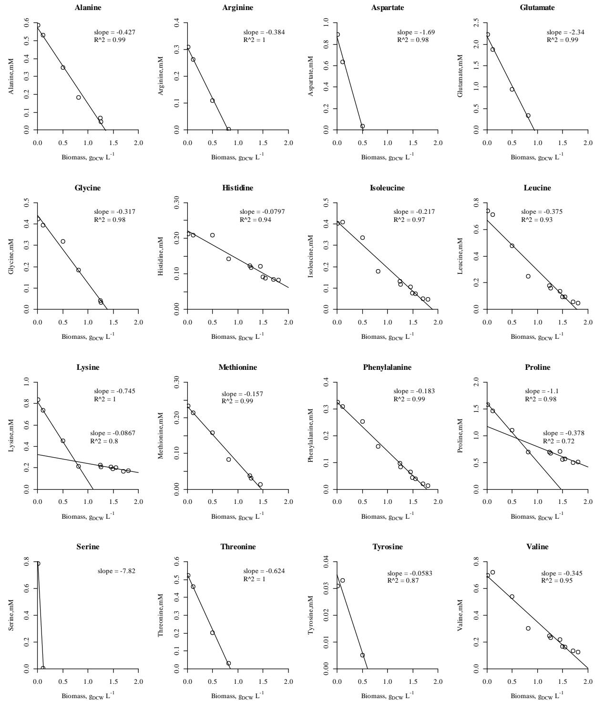
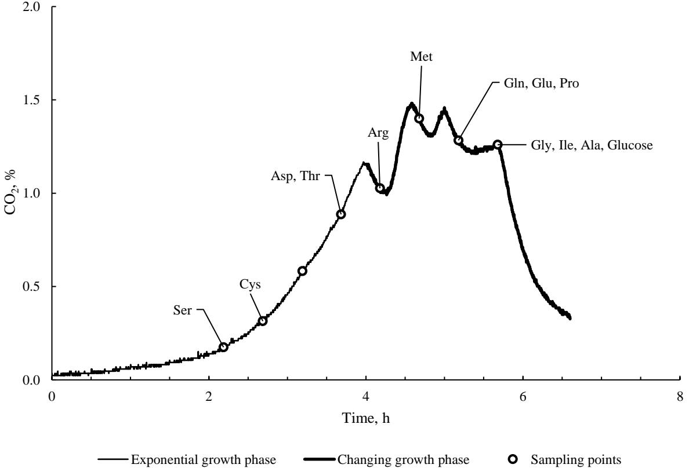
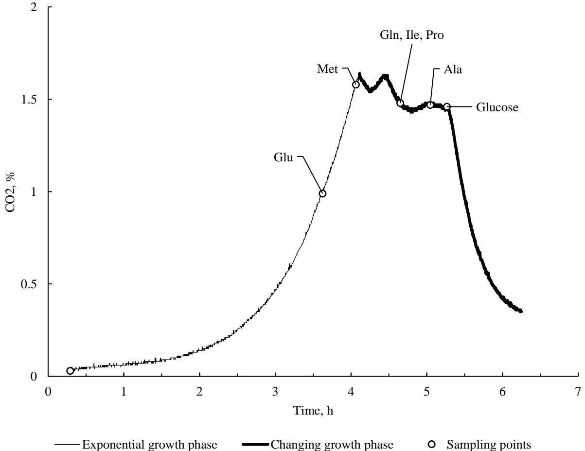
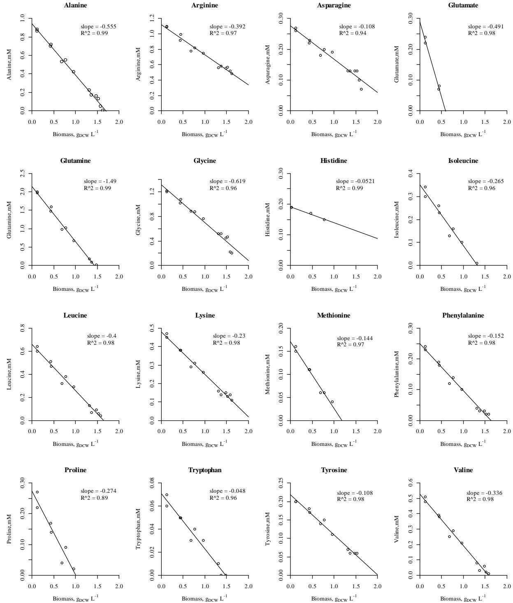
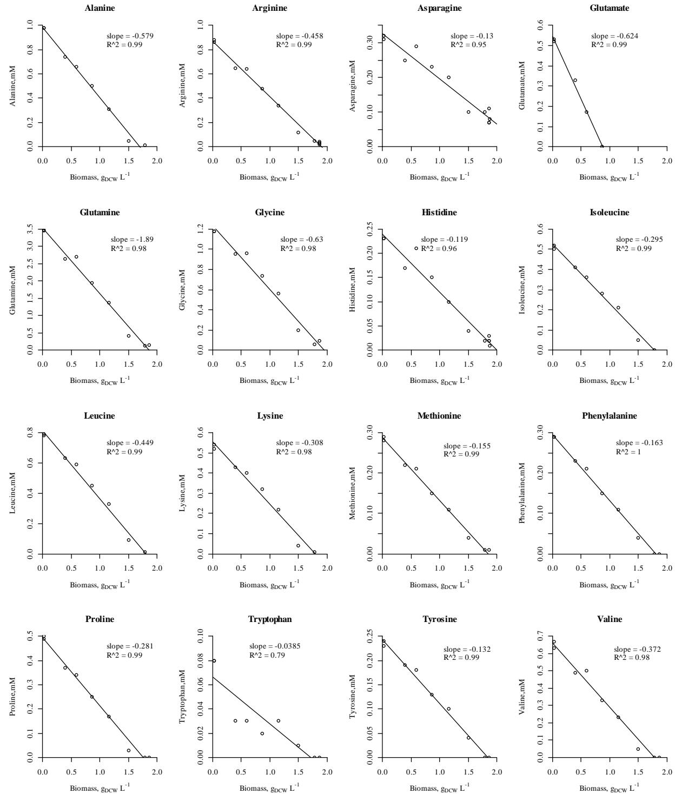
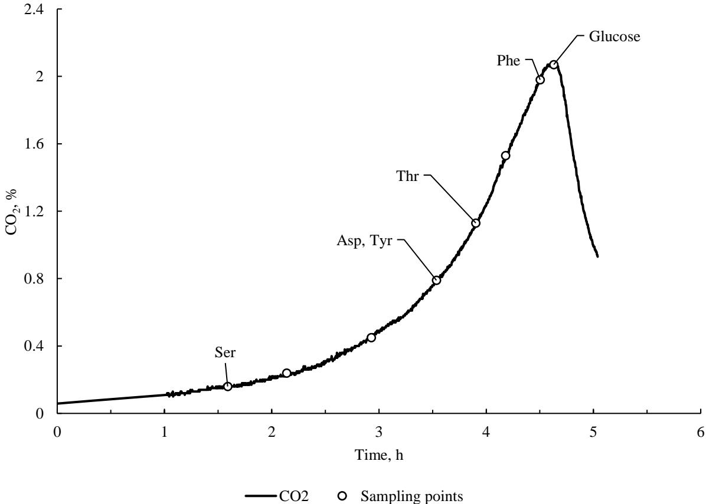

## **Supplementary Material**

## **Avoiding amino acid depletion in complex media results in improved**  *Escherichia coli* **BW25113 growth**

## Microbiology

Andres Maser1,2,*, Karl Peebo1,2 and Ranno Nahku2

1Tallinn University of Technology, Department of Chemistry and Biotechnology, Akadeemia tee 15, 12618 Tallinn, Estonia

2Center of Food and Fermentation Technologies, Akadeemia tee 15a, 12618 Tallinn, Estonia

*Corresponding author: e-mail – andres@tftak.eu

**Fig. S1.** Measured carbon dioxide (CO2) or oxygen partial pressure (pO2) profiles of all experiments and their replicates that were used for calculations: AHC – acid-hydrolysed medium, BBM – biomass based medium, AAM – arginine addition medium, BM – balanced medium, MAHC – modified acid-hydrolysed medium, MM – minimal medium. Black dots represent timepoints when samples were taken.

**Fig. S2.** *Escherichia coli* BW25113 turbidity measurement (black line), produced CO2 measured in the exhaust gas (grey line), and biomass (grey dots) in nutrient-rich media. CO2 can be used to follow batch growth as the profile aligns with turbidity and biomass

**Fig. S3.** Carbon dioxide (CO2) percentage in the exhaust gas in the acid-hydrolysed casein medium. The empty circles are sampling points. The three-letter amino acid codes indicate the points, where an amino acid was not detected in the fermentation broth. Amino acid depletion occurred sometime between two sampling points. The shift around 3.5th hour in the CO2 profile was caused by arginine depletion

**Fig. S4.** Scatterplots of all measured amino acid values (mM) versus biomass (gDCW L -1 ) in the acid-hydrolysed casein medium experiments. Linear regression indicated that for 12 amino acids consumption per biomass was constant (slope value indicates the amino acid consumption per biomass (mmol gDCW -1 )). Lysine and proline showed a two-phase consumption profile

**Fig. S5.** Carbon dioxide (CO2) percentage in the exhaust gas in the biomass-based medium experiment. Empty circles indicate sampling points, and the three-letter amino acid code shows the point where an amino acid was not detected in the fermentation broth. Amino acid depletion occurred sometime between two sampling points. The first CO2 shift was caused by arginine depletion, while methionine depletion caused the second shift

**Fig. S6.** Scatterplots of all measured amino acid values (mM) versus biomass (gDCW L -1 ) in the biomass-based medium experiments. Linear regression indicated that for 16 amino acids consumption per biomass (slope value) was constant. 4 amino acids (alanine, asparagine, glutamate, and glycine) behaved differently. Alanine, asparagine, and glycine consumption increased at higher biomass values and was probably connected to the depletion of arginine, methionine, and threonine

**Fig. S7.** Carbon dioxide (CO2) percentage in the exhaust gas in the arginine addition medium experiment. Empty circles are sampling points, and the three-letter amino acid code indicates the point where an amino acid was not detected in the fermentation broth. Amino acid depletion occurred sometime between two sampling points. Glutamate depletion did not cause shifts in CO2, while methionine exhaustion was responsible for the first shift

**Fig. S8.** Scatterplots of all measured amino acid values (mM) versus biomass (gDCW L -1 ) in the arginine addition medium experiments. Linear regression showed that for all 16 amino acids consumption per biomass (slope value) was constant

**Fig. S9.** Scatterplots of all measured amino acid values (mM) versus biomass (gDCW L -1 ) in the balanced medium experiments. Linear regression shows that for all 16 amino acids consumption per biomass (slope value) was constant.

**Fig. S10.** Carbon dioxide (CO2) percentage in the exhaust gas in the improved acid-hydrolysed casein medium experiment. Empty circles are sampling points, and the three-letter amino acid code indicates the point where an amino acid was not detected in the fermentation broth. Amino acid depletion occurred sometime between two sampling points. Aspartate, serine, threonine, and tyrosine depletion had no observable effect on CO2 production and growth

**Table S1.** The balanced medium composition was calculated based on amino acid consumption data from two additional experiments. The average consumption in these experiments was multiplied by the carbon amount in the substrates to find average carbon mole consumption. New medium composition was calculated by multiplying average consumption with 1.8 to equalize carbon content in minimal and balanced medium. This coefficient is the quotient of the minimal medium carbon content (24.5 mM * 6 = 147 mM) and the C-mole sum (81.7 mM) of average carbon consumption

| Substrate       | Experiment 1, -1 mmol gDCW | Experiment 2, -1 mmol gDCW | Average, -1 mmol gDCW | Carbons | C-mole, -1 mmol gDCW | New medium composition, mM |
|-----------------|----------------------------------|----------------------------------|-----------------------------|---------|----------------------------|-------------------------------|
| L-alanine       | 0.61                             | 0.58                             | 0.59                        | 3       | 1.78                       | 1.07                          |
| L-arginine      | 0.48                             | 0.51                             | 0.50                        | 6       | 2.97                       | 0.89                          |
| L-asparagine    | 0.16                             | 0.17                             | 0.16                        | 4       | 0.66                       | 0.30                          |
| L-aspartate     |                                  |                                  |                             | 4       |                            |                               |
| L-cysteine      |                                  |                                  |                             | 3       |                            |                               |
| L-glutamine     | 1.81                             | 1.94                             | 1.87                        | 5       | 9.35                       | 3.37                          |
| L-glutamate     | 0.29                             | 0.32                             | 0.30                        | 5       | 1.51                       | 0.55                          |
| Glycine         | 0.69                             | 0.64                             | 0.66                        | 2       | 1.33                       | 1.20                          |
| L-histidine     | 0.10                             | 0.11                             | 0.11                        | 6       | 0.64                       | 0.19                          |
| L-isoleucine    | 0.31                             | 0.31                             | 0.31                        | 6       | 1.86                       | 0.56                          |
| L-leucine       | 0.45                             | 0.44                             | 0.45                        | 6       | 2.68                       | 0.80                          |
| L-lysine        | 0.30                             | 0.30                             | 0.30                        | 6       | 1.82                       | 0.54                          |
| L-methionine    | 0.17                             | 0.17                             | 0.17                        | 5       | 0.85                       | 0.31                          |
| L-phenylalanine | 0.18                             | 0.17                             | 0.18                        | 9       | 1.58                       | 0.32                          |
| L-proline       | 0.31                             | 0.30                             | 0.30                        | 5       | 1.51                       | 0.54                          |
| L-serine        |                                  |                                  |                             | 3       |                            |                               |
| L-threonine     |                                  |                                  |                             | 4       |                            |                               |
| L-tryptophan    | 0.06                             | 0.05                             | 0.05                        | 11      | 0.60                       | 0.10                          |
| L-tyrosine      | 0.15                             | 0.15                             | 0.15                        | 9       | 1.33                       | 0.27                          |
| L-valine        | 0.40                             | 0.41                             | 0.40                        | 5       | 2.02                       | 0.73                          |
| D-glucose       | 8.51                             | 7.88                             | 8.20                        | 6       | 49.18                      | 14.76                         |

| Substrate       | Acid hydrolysed casein medium | Biomass-based medium | Arginine addition medium | Balanced medium | Improved acid hydrolysed casein medium |
|-----------------|-------------------------------------|-------------------------|-----------------------------|--------------------|----------------------------------------------|
|                 | mM                                  | mM                      | mM                          | mM                 | mM                                           |
| L-alanine       | 0.56 ± 0.07                         | 1.01 ± 0.07             | 1.02 ± 0.06                 | 0.97 ± 0.02        | 0.76 ± 0.05                                  |
| L-arginine      | 0.29 ± 0.05                         | 0.52 ± 0.04             | 1.29 ± 0.04                 | 0.84 ± 0.06        | 1.02 ± 0.03                                  |
| L-asparagine    | -                                   | 0.40 ± 0.03             | 0.41 ± 0.01                 | 0.30 ± 0.03        | -                                            |
| L-aspartate     | 0.87 ± 0.11                         | 1.03 ± 0.06             | -                           | -                  | 0.87 ± 0.09                                  |
| L-cysteine      | -                                   | 0.08 ± 0.03             | -                           | -                  | -                                            |
| L-glutamine     | -                                   | 2.20 ± 0.16             | 2.47 ± 0.05                 | 3.26 ± 0.34        | -                                            |
| L-glutamate     | 2.14 ± 0.28                         | 0.32 ± 0.03             | 0.31 ± 0.01                 | 0.51 ± 0.02        | 3.44 ± 0.29                                  |
| Glycine         | 0.43 ± 0.05                         | 1.40 ± 0.07             | 1.45 ± 0.04                 | 1.15 ± 0.06        | 0.99 ± 0.02                                  |
| L-histidine     | 0.21 ± 0.03                         | 0.16 ± 0.01             | 0.18 ± 0.01              | 0.21 ± 0.04        | 0.21 ± 0.01                                  |
| L-isoleucine    | 0.37 ± 0.05                         | 0.40 ± 0.02             | 0.41 ± 0.03                 | 0.51 ± 0.01        | 0.4 ± 0.02                                   |
| L-leucine       | 0.7 ± 0.1                           | 0.76 ± 0.04             | 0.79 ± 0.02                 | 0.76 ± 0.04        | 0.74 ± 0.03                                  |
| L-lysine        | 0.8 ± 0.1                           | 0.54 ± 0.02             | 0.56 ± 0.02                 | 0.52 ± 0.02        | 0.81 ± 0.06                                  |
| L-methionine    | 0.22 ± 0.03                         | 0.17 ± 0.02             | 0.20 ± 0.02                 | 0.28 ± 0.01        | 0.36 ± 0.02                                  |
| L-phenylalanine | 0.31 ± 0.05                         | 0.30 ± 0.02             | 0.31 ± 0.02                 | 0.30 ± 0.01        | 0.33 ± 0.01                                  |
| L-proline       | 1.53 ± 0.2                          | 0.36 ± 0.02             | 0.37 ± 0.02                 | 0.50 ± 0.01        | 1.57 ± 0.05                                  |
| L-serine        | 0.68 ± 0.09                         | 0.45 ± 0.03             | -                           | -                  | 0.79 ± 0.04                                  |
| L-threonine     | 0.51 ± 0.08                         | 0.47 ± 0.03             | -                           | -                  | 0.53 ± 0.02                                  |
| L-tryptophan    | -                                   | 0.08 ± 0.01             | 0.09 ± 0.01                 | 0.09 ± 0.01        | -                                            |
| L-tyrosine      | 0.03 ± 0.01                         | 0.27 ± 0.04             | 0.26 ± 0.02                 | 0.23 ± 0.02        | 0.03 ± 0                                     |
| L-valine        | 0.67 ± 0.09                         | 0.59 ± 0.05             | 0.62 ± 0.03                 | 0.66 ± 0.03        | 0.7 ± 0.03                                   |
| D-glucose       | 14.33 ± 0.45                        | 14.58 ± 0.48            | 14.78 ± 0.42                | 14.05 ± 0.39       | 14.83 ± 0.08                                 |

**Table S2.** Growth medium composition based on free amino acid and carbohydrates analysis results

**Table S3.** Amino acid and glucose utilisation on carbon mole basis in different media at the glucose depletion point

| Carbon utilisation                        | Initial substrate content, C-mole L-1 | Initial substrate left when glucose was depleted, C-mole L-1 | C-moles left, % |
|-------------------------------------------|------------------------------------------|--------------------------------------------------------------------|-----------------|
| Acid-hydrolysed casein medium          | 138.1                                    | 5.4                                                                | 3.9%            |
| Biomass-based medium                      | 140.9                                    | 3.2                                                                | 2.3%            |
| Arginine addition medium                  | 142.0                                    | 5.3                                                                | 3.7%            |
| Balanced medium                           | 139.5                                    | 1.1                                                                | 0.8%            |
| Improved acid-hydrolysed casein medium | 156.1                                    | 6.6                                                                | 4.2%            |

**Table S4.** Carbon consumption per biomass in different media. The values shown consider all consumed carbon and formed biomass at the point when glucose was depleted. In biomass-based and arginine addition medium, carbon consumption per biomass was higher than in the rest. In these experiments, multiple apparent growth stops were identified that caused higher carbon consumption, and therefore lowered biomass yield. In minimal medium carbon consumption was 75.58 C-mole gDCW -1

| Substrate       | Acid hydrolysed casein medium, -1 C-mole gDCW | Biomass-based medium, -1 C-mole gDCW | Arginine addition medium, -1 C-mole gDCW | Balanced medium, -1 C-mole gDCW | Improved acid hydrolysed casein medium, -1 C-mole gDCW |
|-----------------|-----------------------------------------------------------|-----------------------------------------------|------------------------------------------------------|------------------------------------------|--------------------------------------------------------------------|
| D-glucose       | 50.21                                                     | 53.98                                         | 56.39                                                | 45.58                                    | 46.42                                                              |
| L-alanine       | 0.95*                                                     | 1.87                                          | 1.93*                                                | 1.56                                     | 1.25                                                               |
| L-arginine      | 0.99*                                                     | 1.91*                                         | 3.17                                                 | 2.60                                     | 2.76                                                               |
| L-asparagine    | -                                                         | 0.74                                          | 0.88                                                 | 0.49                                     | -                                                                  |
| L-aspartate     | 1.99*                                                     | 2.54*                                         | -                                                    | -                                        | a 1.90                                                          |
| L-cysteine      | -                                                         | 0.14*                                         | -                                                    | -                                        | -                                                                  |
| L-glutamine     | -                                                         | 6.78*                                         | 7.80*                                                | 8.69                                     | -                                                                  |
| L-glutamate     | 6.12*                                                     | 0.99*                                         | 0.95*                                                | 1.31*                                    | 9.29                                                               |
| Glycine         | 0.49*                                                     | 1.73                                          | 1.81                                                 | 1.22                                     | 1.03                                                               |
| L-histidine     | 0.45                                                      | 0.44                                          | 0.59                                                 | 0.63                                     | 0.47                                                               |
| L-isoleucine    | 1.13                                                      | 1.47                                          | 1.55*                                                | 1.64                                     | 1.27                                                               |
| L-leucine       | 2.26                                                      | 2.44                                          | 2.72                                                 | 2.46                                     | 2.35                                                               |
| L-lysine        | 2.16                                                      | 1.46                                          | 1.64                                                 | 1.66                                     | 2.22                                                               |
| L-methionine    | 0.63*                                                     | 0.54*                                         | 0.62*                                                | 0.76                                     | 0.86                                                               |
| L-phenylalanine | 1.53                                                      | 1.35                                          | 1.55                                                 | 1.45                                     | 1.56*                                                              |
| L-proline       | 2.93                                                      | 1.10*                                         | 1.17*                                                | 1.34                                     | 2.66                                                               |
| L-serine        | 1.16*                                                     | 0.84*                                         | -                                                    | -                                        | 1.29*                                                              |
| L-threonine     | 1.16*                                                     | 1.17*                                         | -                                                    | -                                        | 1.15*                                                              |
| L-tryptophan    | -                                                         | 0.51                                          | 0.56                                                 | 0.52                                     | -                                                                  |
| L-tyrosine      | 0.12*                                                     | 1.24                                          | 1.30                                                 | 1.10                                     | 0.15*                                                              |
| L-valine        | 1.55                                                      | 1.76                                          | 1.87                                                 | 1.79                                     | 1.69                                                               |
| Total           | 75.86                                                     | 85.00                                         | 86.52                                                | 74.80                                    | 78.31                                                              |

*these amino acids were depleted before glucose. As the carbon yield was calculated based on final biomass then the actual consumption per biomass was higher