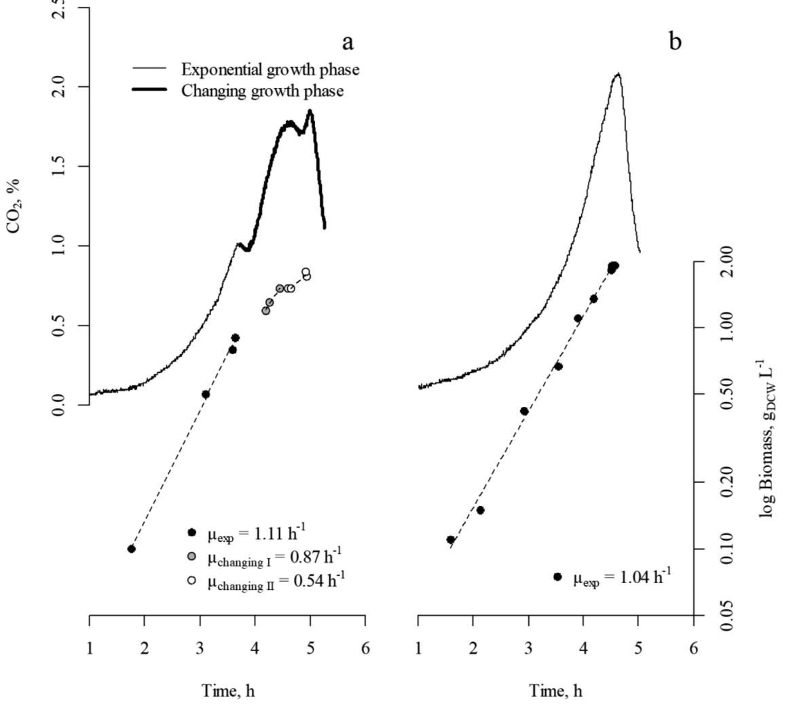
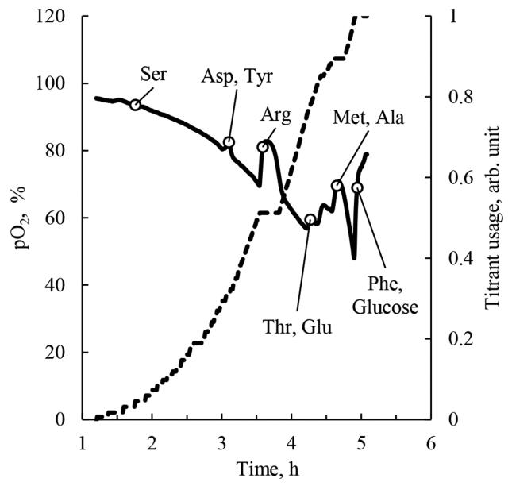
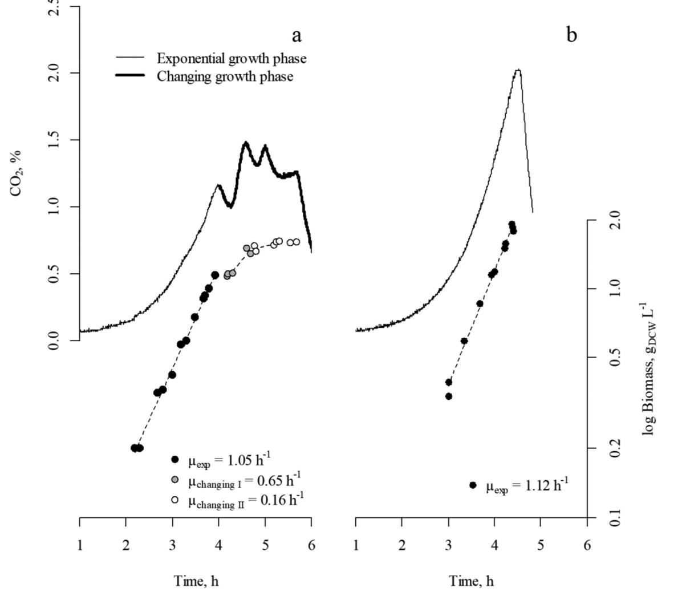
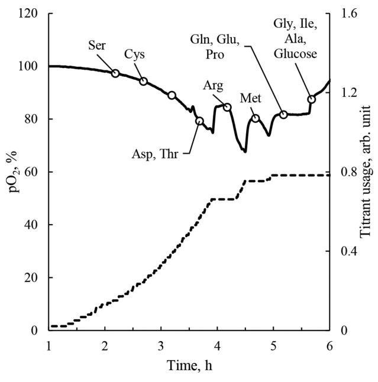
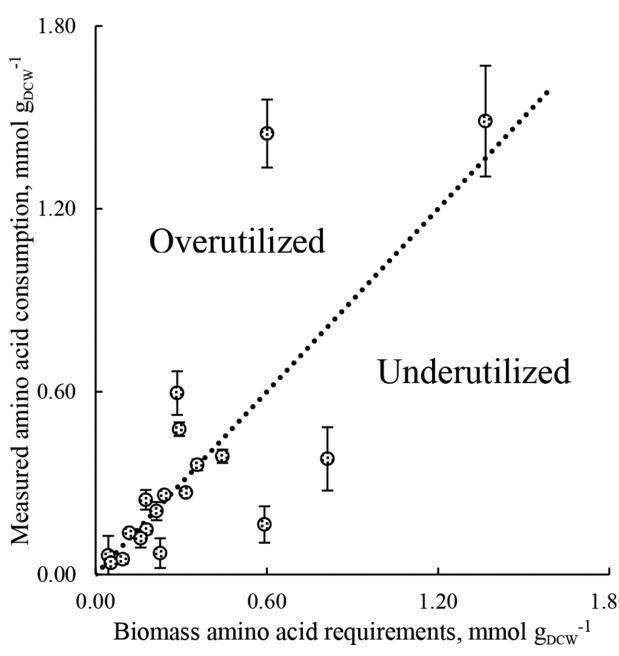
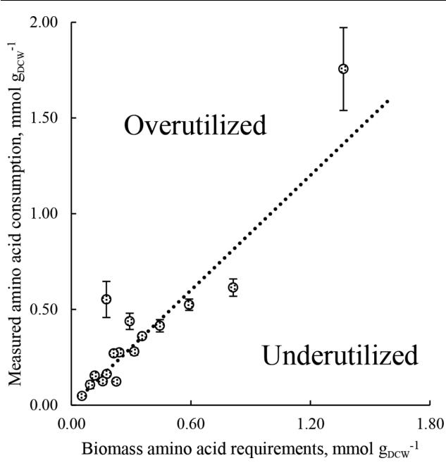

# Avoiding amino acid depletion in a complex medium results in improved Escherichia coli BW25113 growth

Andres Maser,1,2, * Karl Peebo1,2 and Ranno Nahku2

#### Abstract

We studied *Escherichia coli* BW25113 growth in a complex medium with emphasis on amino acid consumption. The aim was to profile amino acid utilization in acid-hydrolysed casein and a defined nutrient-rich medium and based on these measurements modify the medium for better growth performance. Amino acid depletions in both media caused apparent biomass growth stops that prolonged growth duration. Obtained amino acid consumption values enabled a new defined medium to be formulated, where no growth stops were observed, the specific growth rate was constant, and the provided substrates were fully utilized. Similarly, we modified the acid-hydrolysed casein medium by adding pure amino acids that removed the apparent biomass growth stops. Key to our results was the combination of growth medium analysis and process monitoring data, specifically oxygen partial pressure and produced carbon dioxide that were used to track growth changes. Our findings showed the deficiencies of the nutrient-rich medium and how rational medium design, based on consumption values, removed these shortcomings. The resulting balanced medium gives a high specific growth rate and is suitable for studying *E. coli* physiology at fast growth.

# INTRODUCTION

A complex medium is widely used in microbiology both in the laboratory scale and in industrial applications to enhance and promote microbial growth [[1, 2](#page-8-0)]. Being cheaper than pure compounds and the relative ease of preparing complex medium are the reasons why a nutrient-rich medium is so often used. The simplest recipe for lysogeny broth (LB) has three ingredients, while minimal medium for Escherichia coli consists of M9 salts, a carbon source and the trace element solution. Additionally, the same complex medium can be used for many species as LB is suitable for Bacillus subtilis, Escherichia coli, Salmonella typhimurium to name a few. However, a significant drawback of a nutrientrich medium is that the molecular composition is not precisely defined. Such media often consist of complex components like yeast extract that can vary from batch to batch [[3\]](#page-8-0). Furthermore, biomass growth in a rich medium is not constant and different growth phases are often observed [4–[6](#page-8-0)]. In LB or a medium with acid-hydrolysed casein, the specific growth rate () decreases over the course of the experiment [7–[10\]](#page-8-0). A change in indicates changes in transcriptome [\[11, 12](#page-8-0)], proteome [13–[15\]](#page-8-0) and metabolism [[16](#page-8-0)– [18\]](#page-8-0). These changes complicate metabolism studies with a complex medium and highlight the need of a more defined medium composition and better growth description [[19,](#page-8-0) [20\]](#page-8-0), especially in the case of batch experiments. For accurate E. coli physiology studies, a medium with defined composition like the EZ-rich defined medium [[21\]](#page-8-0) is more suitable because in this medium substrate utilization rates can be measured.

A carbon source is the principal component in the microbial medium serving as the source of energy and necessary building blocks for biomass synthesis. E. coli can grow on multiple carbon sources from different sugars to single amino acids. It is estimated that for E. coli there are 180 growth-supporting carbon sources [[22](#page-8-0)]. From single carbon sources, glucose is one of the best substrates supporting the fast growth of micro-organisms [\[23\]](#page-8-0). Supplementation of additional growth factors such as peptides, nucleotides, amino acids, vitamins and fatty acids yields better growth performance [[1\]](#page-8-0). Good sources for these compounds are yeast extract, tryptone and acid-hydrolysed casein, but due to their complexity (a mixture of peptides, nucleotides, amino acids and vitamins), it is difficult to determine exactly which molecules promote growth [[3](#page-8-0)]. From the additional growth factors, amino acids are of value for E. coli as protein makes up 55–65 % [[24, 25](#page-8-0)] of dry cellular weight. Amino acids are not only supporting growth factors,

*Correspondence: Andres Maser, [andres@tftak.eu](mailto:andres@tftak.eu)

Received 28 July 2018; Accepted 19 October 2018; Published 9 November 2018

Author affiliations: 1 Department of Chemistry and Biotechnology, Tallinn University of Technology, Akadeemia tee 15, 12618 Tallinn, Estonia; 2 Center of Food and Fermentation Technologies, Akadeemia tee 15a, 12618 Tallinn, Estonia.

Keywords: Defined rich medium; medium optimization; amino acids; *Escherichia coli*; balanced growth.

Abbreviations: CO2 , carbon dioxide; gDCW , gram of dry cell weight; LB, lysogeny broth; pO2, oxygen partial pressure; µ, specific growth rate.

Ten supplementary figures and four supplementary tables are available with the online version of this article.

but they can also be used as single carbon sources [\[26, 27\]](#page-9-0). Peebo and colleagues [\[15](#page-8-0)] studied E. coli growth with glucose and amino acids on the proteome level and saw that amino acid metabolism and transport carried a significant metabolic cost for the cells. Addition of amino acids reduced the cost and resulted in an increased µ. Thus, for E. coli amino acid supplementation increases µ, but the optimal combination remains elusive. An ideal situation, regarding yield and growth, would be when supplemented amino acids are not degraded but used proportionally for protein and nucleotide synthesis. Several studies have focused on E. coli amino acid consumption [\[7, 20\]](#page-8-0), but with emphasis on describing the pattern of amino acid utilization without clear recommendations or examples of how to improve or balance growth.

In this work, we tested several feed compositions with the aim to find an optimal growth medium that promotes continuous fast growth of E. coli with complete utilization of substrates. Process monitoring data and extracellular metabolite analysis allowed us to identify amino acid shortages that were removed by modifying growth medium composition. This approach enabled us to formulate a defined medium with constant growth and complete utilization of substrates.

# METHODS

## Strain

E. coli strain K-12 BW25113 [\[28\]](#page-9-0) was used in all experiments.

# Media

In batch experiments the following base medium was used (g l1 ): FeSO4 .7H2O 0.005, MnSO4 .H2O 0.002, CaCl2 . 2H2O 0.005, ZnSO4 .7H2O 0.002, CoSO4 .7H2O 0.0006, CuSO4 .5H2O 0.0005, (NH4 )6Mo7O24.4H2O 0.0026, MgSO4 .7H2O 0.5, NH4Cl 3.5, a-(D)-glucose.H2O 2.97, K2HPO4 2 and 200 µl l1 foam removing agent Antifoam C (Sigma-Aldrich) that contains 30 % active silicone.

Amino acids were supplemented accordingly: (1) acidhydrolysed casein medium – 2.97 g l1 of acid-hydrolysed casein (Lab M,); (2) biomass-based medium (20 amino acids) – chemically defined medium based on [[15](#page-8-0)]. The amino acid concentrations were chosen to match biomass composition [\[29\]](#page-9-0) of 1.8 grams of dry cell weight per litre (gDCW l 1 ). L-aspartate, L-glutamine and glycine concentrations were increased to provide precursors for nucleotide synthesis; (3) arginine addition medium (16 amino acids) – follows biomass-based medium composition with the removal of L-aspartate, L-cysteine, L-serine and L-threonine. L-arginine concentration was increased 2.5 times; (4) balanced medium (16 amino acids) – amino acid amounts are based on consumption per biomass (Table S1, available with the online version of this article); (5) modified acidhydrolysed casein medium – based on the acid-hydrolysed casein medium, where additional amino acids were added (g l1 ): L-alanine 0.017; L-arginine 0.129; L-glutamate 0.187; glycine 0.039; and L-methionine 0.018. Measured medium values are given in Table S2. In the minimal medium experiment, the glucose concentration was 4.5 g l 1 . All components were from Serva Electrophoresis and Sigma-Aldrich.

Minerals and glucose were weighed on the Mettler Toledo AL104 analytical scale and dissolved in deionized water. Solutions were autoclaved at 121 C for 3 min. Amino acids were weighed on the Mettler Toledo XP205 analytical scale, dissolved in deionized water and filtered using Millipore

Table 1. *E. coli* BW25113 growth characteristics in the media used in this work

In acid-hydrolysed casein, biomass-based and arginine addition medium overall growth and the division into two different phases (exponential growth phase and changing growth phase) is given. Yield calculation is shown in C-mole terms and considers carbon coming from both glucose and amino acids.

| Growth medium                   | 1 Final biomass, gDCW l | µ, h1     | Yield, C-mole | Acetate, mmol gDCW1 |
|---------------------------------|----------------------------|-----------|------------------|---------------------|
| Acid-hydrolysed casein medium   | 1.75±0.08                  | 0.75±0.14 | 0.54±0.01        | 5.03±0.27           |
| Exponential growth phase        | 0.85±0.06                  | 1.11±0.12 | 0.41±0.03        | 5.86±0.87           |
| Changing growth phase*          | 0.9±0.02                   | 0.46±0.03 | 0.61±0.06        | 2.19±0.14           |
| Biomass-based medium            | 1.62±0.03                  | 0.86±0.01 | 0.47±0.01        | 5.77±1.26           |
| Exponential growth phase        | 1.14±0.02                  | 1.05±0.04 | 0.53±0.02        | 6.90±1.25           |
| Changing growth phase*          | 0.47±0.02                  | 0.21±0.04 | 0.38±0.02        | 4.13±1.46           |
| Arginine addition medium        | 1.58±0.07                  | 0.98±0.01 | 0.46±0.01        | 6.77±0.35           |
| Exponential growth phase        | 1.33±0.05                  | 1.10±0.03 | 0.51±0.02        | 6.82±0.35           |
| Changing growth phase*          | 0.25±0.03                  | 0.14±0.01 | 0.29±0.03        | 3.84±0.97           |
| Balanced medium                 | 1.85±0.07                  | 1.12±0.03 | 0.53±0.01        | 6.55±0.1            |
| Minimal medium                  | 1.90±0.03                  | 0.64±0.01 | 0.53±0.02        | 3.65±0.06           |
| Modified acid-hydrolysed medium | 1.91±0.01                  | 1.04±0.1  | 0.54±0.001       | 6.18±0.04           |

*Average values over the period

Steritop filtering unit. All ingredients were mixed under aseptic conditions.

# Inoculum preparation

Single stock aliquot kept at 80 C was dissolved in 10 ml of buffered (pH 7) minimal medium and incubated overnight at 37 C. Before inoculation culture was centrifuged at 11 500 r.p.m. for 5 min, the supernatant was removed and the pellet resuspended in 10 ml of sterile 0.85 % NaCl.

# Fermentation system

The fermentation system consisted of 1.25 l Biobundle bioreactor (Applikon Biotechnology) controlled by an ez-Control controller (Applikon Biotechnology) and a cultivation control program 'BioXpert Pharma 3.80M XP' (Applikon Biotechnology). The system was equipped with pH, oxygen partial pressure (pO2 ), and temperature sensors (Applikon). Carbon dioxide (CO2 ) was measured with an on-line infrared sensor (BlueSens) connected to the exhaust gas line. pH was maintained with titrating 2M NaOH. Fermentation conditions were as follows: 37 C, pH 7, agitation speed of 800 r.p.m. and compressed air flow rate of 150 ml min1 . All experiments were started by inoculating preculture into pre-heated media (pH 7), and were performed in duplicate (acid-hydrolysed and modified acid-hydrolysed medium) or triplicate (biomass-based, arginine addition, balanced and minimal medium). CO2 or pO2 profiles of all experiments and corresponding replicates are given is Fig. S1.

# Sampling

Samples for organic and amino acid analysis were collected as follows: 1.5 ml of fermentation broth was collected and centrifuged (14 000 r.p.m., 1 min), the supernatant was collected and re-centrifuged (14 000 r.p.m., 5 min), the supernatant was collected and kept at 20 C before analysis. Sampling was performed at various time points with special attention paid to periods when changes in pO2 were observed.

# Assessing growth phases and µ calculations

In one of the preliminary experiments, a turbidity meter was used, where it was detected that produced CO2 , turbidity and biomass increased correspondingly (Fig. S2). As turbidity was not measured in the experiments reported here, then CO2 and measured optical density (OD600nm) were used to divide batch growth into different phases. Biomass values were calculated based on OD600nm measurements and constant 0.32 was used to convert OD600nm values to grams of dry cellular weight (gDCW l 1 ). Specific growth rate (µ) was calculated by plotting biomass values against time and finding an exponential trendline in MS Excel (in this formula a is an equation constant specific to each dataset):

$$\mathbf{\color{red}{Biomass}} = \mathbf{a} \ast \mathbf{e}^{\ast \text{time}}$$

The coefficient of determination in µ calculations was in most cases greater than 0.99. For µchanging II in the acidhydrolysed casein medium it was 0.87. µchanging I and µchanging II in the biomass-based medium were calculated with two points; therefore, the coefficient of determination is not reported. Also, for the changing growth phase µ calculations, biomass values from replicates were combined, and therefore no standard error is given. µ values for the changing growth phases reported in [Table 1](#page-1-0) show the average specific growth rate from the time the first apparent growth stop occurred until glucose was depleted.

# High-performance liquid chromatography for organic acids and glucose analysis

High-performance liquid chromatography (Waters) was used to analyse acetate and glucose in the culture medium. The machine was equipped with a BioRad HPX-87H column (Hercules) and isocratic elution at a flow rate of 0.6 ml min1 with 0.0044 M H2SO4 at 35 C was used. For detection and quantification, a refractive index detector (Waters) was used. The quantification limit for glucose and acetate was 0.1 mM with a relative standard deviation of measurement repeatability below 7 %. Data analysis was performed with Empower software (Waters).

# Ultra performance liquid chromatography for amino acid analysis

Amino acid concentrations were measured using AccQ.Fluor reagent (6-aminoquinolyl-N-hydroxysuccinimidyl carbamate) kit (Waters). Overall, 70 µl AccQ.Fluor borate buffer and 20 µl AccQ.Fluor reagent were added to the 10 µl sample and incubated for 10 min at 55 C. Derivatized samples were analysed with ultra performance liquid chromatography (Waters). The machine was equipped with an Acquity UPLC BEH C18 1.7 µm (Waters) reverse phase column and an Acquity UPLC PDA (Waters) detector. The mobile phase consisted of AccQ.Taq solvent A2 and solvent B2. The quantification limit for amino acids was 0.003 mM with a relative standard deviation of measurement repeatability below 7 %. Empower software (Waters) was used for data analysis.

# RESULTS

# Apparent growth stops observed in Escherichia coli growth on acid-hydrolysed casein

We carried out batch fermentations with E. coli in multiple defined rich media with the aim to characterize amino acid consumption patterns and biomass growth. We started with the acid-hydrolysed casein medium because it is widely used and contains mainly free amino acids. Commonly, it is thought that µ slows down in rich media at higher cell densities and we also saw this [(Fig. 1a](#page-3-0), [Table 1)](#page-1-0). However, with our experimental setup we were able to monitor cellular growth in more detail. Measured fermentation parameters CO2 , pO2 , titrant usage and biomass [(Fig. 1a](#page-3-0), [Fig. 2](#page-4-0)) allowed us to divide bacterial growth into two different phases – an exponential growth phase with µ=1.11±0.12 h1 and a changing growth phase with apparent growth stops. In this second phase, two µ values were

Fig. 1. CO2 percentage in the exhaust gas (line) and biomass values (circles) in acid-hydrolysed casein (a) and modified acid-hydrolysed casein (b) medium experiments. Biomass values shown in the graph are from two replicate experiments. CO2 and biomass formation in (a) were divided in two: exponential growth phase (thin line and black circles) and changing growth phase (thick line; grey and white filled circles). In the changing growth phase, two µ values were calculated that coincided with increases in CO2. In the modified acid-hydrolysed casein medium, biomass (black circles) growth was exponential until glucose depletion. The steep drop in the CO2 graphs is caused by glucose depletion.

found: µchanging I=0.87 h1 and µchanging II=0.54 h1 . We also calculated µaverage=0.46±0.03 h1 ([Table 1](#page-1-0)) that represents µ for the whole changing growth phase. Besides the differences in µ, biomass yield per consumed carbon and acetate production were also different between the two growth phases [(Table 1](#page-1-0)).

To determine whether growth medium composition caused the apparent growth stops, we performed amino and organic acid analysis for the samples taken during growth. We observed that various amino acids were depleted [(Figs 2](#page-4-0) and S3). While serine, aspartate and tyrosine depletion had no considerable effect on growth, arginine depletion caused an apparent growth stop. At this point oxygen consumption and acetate production decreased, indicated by an increase in pO2 and a stop in titrant usage.

In addition to single amino acid depletion points, the measured data allowed us to calculate total substrate consumption. At the glucose exhaustion point, 96.1 % of carbon supplied in the medium was consumed (Table S3). Amino acid uptake per biomass revealed that for multiple amino acids consumption was constant (Fig. S4). Only lysine and proline utilization split into two phases, where at higher biomass values the uptake decreased.

Fig. 2. Oxygen partial pressure (pO2) profile (thick line) and titrant consumption (dashed line) in the acid-hydrolysed casein medium experiment. Empty circles indicate sampling points, and the three-letter amino acid code represents the points, where an amino acid was not detected in the fermentation broth. Exact amino acid depletion occurred sometime between two sampling points. The upward shift in pO2 and titration stop around the 3.5th hour was caused by arginine depletion. Serine, aspartate and tyrosine depletion caused minor shifts in pO2 but not in titrant consumption.

#### Apparent growth stops are caused by amino acid depletions

In acid-hydrolysed casein the extent of the hydrolysis is unknown, and peptides may be present that complicate detailed amino acid consumption analysis. To avoid this complication and to characterize amino acid consumption of E. coli in more depth, we chose to study growth on a defined rich medium. As amino acid synthesis is a resourceconsuming process, then one could assume that when free amino acids are available, cells will consume as much as is required to build up cellular biomass. Therefore, we based our defined medium on the biomass amino acid requirements (see Methods). As in the acid-hydrolysed medium, cells grown on this new medium had a two-phase growth ([Fig. 3a)](#page-5-0): (1) an exponential growth phase with µ=1.05 ±0.04 h1 and (2) a changing growth phase with apparent growth stops. Three µ values ([Fig. 3a](#page-5-0), [Table 1](#page-1-0)) to describe growth in the second phase were found: µchanging I=0.65 h1 , µchanging II=0.16 h1 and µaverage=0.21±0.04 h1 . Like in the acid-hydrolysed casein medium, the two growth phases differed by µ, biomass yield per substrate and acetate production [(Table 1](#page-1-0)).

In the exponential growth phase serine, cysteine, aspartate and threonine were depleted (Fig. S5), but no measurable effect on µ and CO2 production was observed. As in the acid-hydrolysed casein medium, the end of the exponential growth phase was the result of arginine depletion that caused an apparent growth stop ([Fig. 4)](#page-6-0). The second large shift in pO2 co-occurred with methionine depletion. In later growth stages, multiple amino acids were depleted that induced another shift in pO2 and CO2 [(Figs 4](#page-6-0) and S5). The steep drop in CO2 production indicates the point of glucose exhaustion ([Fig. 3a](#page-5-0)). At that point, most of the amino acids supplied in the medium were consumed, except a small amount of asparagine, histidine, leucine, lysine, phenylalanine, tryptophan, tyrosine and valine that make only 2.4 % of the total carbon supplied (Table S3). For 16 amino acids, the consumption per biomass was constant (Fig. S6), but not for alanine, asparagine, glutamate and glycine. These amino acids were utilized more at higher biomass density. This result differs from the acid-hydrolysed casein medium, where the consumption of two amino acids decreased. The increased uptake occurred after arginine, methionine and threonine were depleted. We compared amino acid consumption with E. coli biomass requirements [(Fig. 5](#page-7-0)) and saw that aspartate, arginine, cysteine, threonine and serine were consumed more than needed for biomass synthesis, while asparagine, alanine and glycine were underutilized. The rest were used according to presumed biomass requirements.

#### Arginine addition removed the first apparent growth stop

We identified that in both the acid-hydrolysed casein and biomass-based medium an apparent growth stop occurred just after arginine depletion and amino acids depleted before arginine had minimal influence on . To eliminate this apparent growth stop, we created a new medium with increased arginine amount (see Methods). Additionally, we removed serine, cysteine, aspartate and threonine from the medium as almost no changes in the CO2 profile were observed when these amino acids were depleted (Fig. S5). In this new medium, we still saw two growth phases (Fig. S7), but the duration of the exponential growth phase was extended and the phase with apparent growth stops reduced [(Table 1](#page-1-0)). Most importantly, by increasing arginine concentration in the medium, we removed the first apparent growth stop evidenced in the CO2 profile (Fig. S7). The removal of aspartate, cysteine, threonine and serine did not influence µ as in the biomass-based medium it was 1.05 ±0.04 h1 and in the arginine addition medium it was 1.10 ±0.03 h1 .

In the exponential growth phase, glutamate depletion occurred before the first shift in CO2 without influencing µ and methionine exhaustion caused the first drop in CO2 (Fig. S7). We observed that amino acid consumption per biomass was constant (Fig. S8), which was different from the acid-hydrolysed casein and biomassbased medium.

Fig. 3. CO2 percentage in the exhaust gas (line) and biomass values (circles) in biomass-based (a) and balanced (b) medium experiments. Biomass values shown in this graph are from all three replicate experiments. CO2 and biomass formation in (a) were divided in two: exponential growth phase (thin line and black circles) and changing growth phase (thick line; grey and white filled circles). In the changing growth phase, two µ values were calculated that coincided with increases in CO2. In the balanced medium, biomass (black circles) growth was exponential until glucose depletion. The steep drop in the CO2 graphs is caused by glucose depletion.

### In a medium based on consumption values all apparent growth stops were removed

Arginine supplementation removed only the first shift in CO2, but other shifts remained (Fig. S7). Instead of increasing amino acid amounts one at a time, we composed a medium based on amino acid uptake per biomass (Table S1). In this medium, we observed only exponential growth with µ=1.12±0.03 h1 (Fig. 3b). Moreover, growth in this balanced medium resembled growth in minimal medium (Fig. S1) with no shifts in CO2 and equal biomass yield [(Table 1](#page-1-0), Table S4).

Amino acid analysis revealed two valuable results. First, almost complete exhaustion of substrates occurred as only 0.8 % of the total carbon supplied in the medium was left (Table S3). Second, amino acid consumption per biomass was constant (Fig. S9) and matched the predicted consumption values the balanced medium was based on (Table S1). Only glutamate consumption was underestimated. Comparison of amino acid consumption to biomass requirements [(Fig. 6](#page-7-0)) showed that arginine, glutamate and glutamine usage was higher and glycine usage lower than the presumed need for biomass synthesis.

### Modifying medium composition improved growth on acid-hydrolysed casein

Supplying amino acids for the whole growth period based on amino acid consumption rates allowed us to create a nutrient-rich defined medium with no apparent growth stops. Next, we applied the same principles for the acid-

Fig. 4. Oxygen pO2 profile (thick line) and titrant consumption (dashed line) in the biomass-based medium experiment. Empty circles indicate sampling points, and the three-letter amino acid code represents the points, where an amino acid was not detected in the fermentation broth. Exact amino acid depletion occurred sometime between two sampling points. Amino acid analysis of the samples taken before and after the shifts showed that arginine and methionine depletion caused shifts in pO2 and titrate usage around the 3.75th hour and 4.5th hour, respectively.

hydrolysed casein medium. We used the amino acid consumption data from the first set of experiments with acidhydrolysed casein, and modified the medium composition by adding alanine, arginine, glutamate, glycine and methionine. These amino acids were exhausted in samples collected near the apparent growth stops in the acid-hydrolysed casein medium (Fig. S3). Threonine and phenylalanine concentration was not changed.

Growth of E. coli in this modified acid-hydrolysed casein medium was improved compared to the simple acid-hydrolysed casein medium: no shifts in CO2 were observed ([Fig. 1b)](#page-3-0), final biomass concentration was higher, and growth duration shorter [(Table 1](#page-1-0)). While aspartate, serine, threonine and tyrosine were depleted before the exhaustion of glucose (Fig. S10), no shifts in CO2 were detected. The modified acidhydrolysed casein medium was comparable to the balanced medium with no changes in CO2 and constant exponential growth with µ=1.04±0.1 [(Table 1](#page-1-0)). Total carbon usage between these two media differed, as at the glucose exhaustion point 4.2 % of the supplied total carbon was left (Table S3).

#### Different medium composition yielded similar specific growth rates

We developed two different medium recipes that had no shifts in the CO2 profile [(Fig. 1b](#page-3-0), [Fig. 3b](#page-5-0)). The balanced medium was entirely synthetic and defined, and the other was a modified complex medium based on acid-hydrolysed casein. The amino acid composition of these media was different (Table S2), but the growth characteristics ([Table 1)](#page-1-0) and carbon consumption were comparable (Table S4). The most significant difference was in glutamine and glutamate consumption. When both amino acids were present, E. coli preferred glutamine to glutamate, but when glutamine was removed, glutamate uptake increased to an equal level. We observed similar behaviour in the biomass-based medium where alanine and glycine utilization increased in the middle of the batch experiments after aspartate, cysteine, serine and threonine had been depleted (Fig. S6). In biomass-based and arginine addition medium total carbon consumption was higher than in other media (Table S4), and the reason for this was the lower biomass yield during the changing growth phase [(Table 1](#page-1-0)).

# DISCUSSION

Studying microbial physiology in a nutrient-rich medium is complicated due to the changing metabolic state of cells [[4\]](#page-8-0). During growth different medium components are exhausted [\[7, 20\]](#page-8-0) and identifying the exact causes is difficult. In this work, we studied E. coli BW25113 growth in various nutrient-rich media, where we observed apparent growth stops [(Fig. 1a,](#page-3-0) [Fig. 3a](#page-5-0)). We attributed these stops to the sequential exhaustion of several amino acids ([Fig. 2](#page-4-0), Fig. 4). Amino acid starvation is mediated through stringent response [[30,](#page-9-0) [31\]](#page-9-0), where nutritional stress caused by amino acid depletion results in downregulation of ribosomal and transfer RNA and upregulation of amino acid biosynthesis genes. We identified that arginine depletion induced the first apparent growth stop in both defined and non-defined medium [(Fig. 2](#page-4-0), Fig. 4). Zaslaver and others [\[32\]](#page-9-0) observed similar results when they switched cells from one growth medium (all amino acids present) to another (all amino acids except arginine). They saw that the unbranched amino acid synthesis pathways followed a hierarchical order. It took approximately 20 min to see expression changes in argininosuccinate lyase, the last enzyme in the arginine biosynthesis pathway, and 60 min to reach maximum expression. Not only amino acid exhaustion but also glucose depletion when co-metabolized with other substrates has been shown to cause changes in µ of E. coli [[33](#page-9-0)]. The amino acid depletions did not only cause the apparent growth stops, but also decreased biomass yield per consumed carbon ([Table 1](#page-1-0)). In defined nutrient-rich media (biomassbased and arginine addition medium) carbon yield in the changing growth phase was lower than in the exponential growth phase ([Table 1](#page-1-0)) that was also evidenced in total carbon consumption (Table S4). To remove the apparent growth stops, we aimed to modify the nutrient-rich medium for E. coli.

Identifying that the apparent growth stops were caused by amino acid depletion was made possible by real-time monitoring of process parameters (CO2 , pO2 and titrant consumption). These measurements allowed precise sampling

Fig. 5. Measured amino acid consumption compared to the amino acid requirements in the biomass-based medium experiments. Sampling points, where aspartate and threonine were still present, were used for calculations. Serine (consumption was >2 mmol gDCW1 and is not shown in the figure), cysteine, aspartate, threonine and arginine were consumed more than the presumed need for protein and nucleotide synthesis, while asparagine, alanine and glycine were underutilized.

around shift-points and in this way connect the changes to amino acid exhaustion. The changing pO2 profiles have been reported with other E. coli strains growing in nutrientrich LB medium [\[5, 8](#page-8-0)], suggesting that substrate depletion is common to multiple types of nutrient-rich media, and pO2 and online CO2 are good indicators to use for tracking and diagnosing the causes.

Substrates in natural habitats are scarce and diverse, and to survive microbial cells need to be able to adjust their metabolism for various nutrient sources. In laboratory cultivations, nutrient sources can be kept constant, and therefore substrate consumption information enables more rational medium design. In experiments with the acid-hydrolysed and biomass-based medium, the measured amino acid consumption patterns were similar to previous studies [[7, 20,](#page-9-0) [34\]](#page-9-0), where aspartate, cysteine, serine and threonine are the first amino acids that are exhausted. Our interest was to calculate amino acid consumption per biomass and compare this to biomass amino acid requirements (Fig. 5 and Fig. 6). This pointed to over- and underutilization of several amino acids. The overutilized amino acids are good chemoattractants [\[34\]](#page-9-0) and their high uptake has been associated with energy production or synthesis of other amino acids [\[7\]](#page-8-0). Interestingly, the uptake of underutilized amino acids increased after arginine, methionine and threonine were depleted (Fig. S6). This two-phase consumption demonstrates the challenges of deciphering amino acid utilization in complex mixtures. First, amino acids are metabolically close to each other (glutamine and glutamate, asparagine and aspartate, serine and cysteine, glycine and threonine, etc.) and second, they have shared transportation systems [\[26, 27\]](#page-9-0). These can be the reasons why the exhaustion of aspartate, cysteine, serine, threonine or glutamate did not cause apparent growth stops like the ones observed with arginine and methionine. Other amino acids that have been shown to cause apparent growth stops in E. coli are branched-chain amino acids [[35](#page-9-0)], but these were not depleted in our experiments.

The amino acid consumption data allowed us to formulate a new growth medium with constant µ [(Table 1)](#page-1-0) and stable amino acid consumption throughout biomass growth (Fig. S9). µ in this medium was higher than on minimal medium, 1.12 vs. 0.64 h1 , but lower than in LB medium, 1.66 h1 [\[36](#page-9-0)]. The balanced medium lacks nucleotides and vitamins that are present in LB medium and could contribute to the higher µ. The same optimization principle, where specific amino acids need to be present for the whole growth period, was successfully used with the acid-hydrolysed medium [(Fig. 1b](#page-3-0)). We also showed that several amino acids can be removed from the medium (Table S2) without influencing µ [(Table 1](#page-1-0)). However, we did not test if additional amino acids can be omitted, but the difference in the defined

Fig. 6. Measured amino acid consumption compared to the biomass amino acid requirements in the balanced medium experiments. Arginine, glutamate and glutamine were consumed more and glycine less than the presumed need for protein and nucleotide synthesis. Glu* – points where glutamate was still present in the medium were used for calculation. This figure was made with MS Office Excel.

balanced medium and the modified acid-hydrolysed medium suggest that glutamine in the balanced medium could be replaced with glutamate (Table S4). In addition to the observed continuous growth, complete substrate utilization was expected. The 0.8 % of carbon left after glucose depletion (Table S3) in the balanced medium was close to the objective.

Results from these experiments have two possible applications: (1) defined bacterial growth medium and (2) basis for industrial process optimization by eliminating amino acid depletions. First, the balanced medium we developed for E. coli can be used in molecular biology as a fast, reproducible growth medium for physiology studies or as a recovery medium like super optimal broth. We showed that several amino acid depletions caused apparent growth stops and lowered biomass yield of E. coli. Supplementation of these amino acids eliminated these stops and resulted in faster growth and an improved biomass yield [(Table 1)](#page-1-0). These findings can potentially improve industrial processes by shortening process duration and thus increasing volumetric productivity [1]. Another aspect to consider is the cost associated with waste disposal because it amounts from 1 up to 20 % of the total operating costs [[37](#page-9-0)] and is higher in lowvalue end-product processes. Waste stream from improved medium process has lower biological oxygen demand and is a step closer to a lean manufacturing process. As our example with acid-hydrolysed casein shows, the possibility to improve commercial extracts is there, but the applicability depends on the costs and nature of the manufacturing process.

#### Funding information

This research was funded by Enterprise Estonia project EU29994 and EU48667.

#### Conflicts of interest

The authors declare that there is no conflicts of interest.

#### Ethical statement

This article does not contain any studies with human participants or animals performed by any of the authors.

#### References

- 1. Zhang J, Greasham R. Chemically defined media for commercial fermentations. *Appl Microbiol Biotechnol* 1999;51:407–421.
- 2. Stanbury P, Whitaker A, Hall S. Media for industrial fermentations. *Principles of Fermentation Technology*, *3rd* ed Butterworth-Heinemann; 2016. pp. 213–272.
- 3. Zhang J, Reddy J, Buckland B, Greasham R. Toward consistent and productive complex media for industrial fermentations: studies on yeast extract for a recombinant yeast fermentation process. *Biotechnol Bioeng* 2003;82:640–652.
- 4. Blom EJ, Ridder AN, Lulko AT, Roerdink JB, Kuipers OP. Timeresolved transcriptomics and bioinformatic analyses reveal intrinsic stress responses during batch culture of *Bacillus subtilis*. *PLoS One* 2011;6:e27160.
- 5. Li Z, Nimtz M, Rinas U. The metabolic potential of *Escherichia coli* BL21 in defined and rich medium. *Microb Cell Fact* 2014;13:45.
- 6. Egli T. Microbial growth and physiology: a call for better craftsmanship. *Front Microbiol* 2015;6:287.
- 7. Gschaedler A, Boudrant J. Amino acid utilization during batch and continuous cultures of *Escherichia coli* on a semi-synthetic medium. *J Biotechnol* 1994;37:235–251.
- 8. Berney M, Weilenmann HU, Ihssen J, Bassin C, Egli T. Specific growth rate determines the sensitivity of *Escherichia coli* to thermal, UVA, and solar disinfection. *Appl Environ Microbiol* 2006;72: 2586–2593.
- 9. Baev MV, Baev D, Radek AJ, Campbell JW. Growth of *Escherichia coli* MG1655 on LB medium: determining metabolic strategy with transcriptional microarrays. *Appl Microbiol Biotechnol* 2006;71: 323–328.
- 10. Sezonov G, Joseleau-Petit D, D'Ari R. *Escherichia coli* physiology in Luria-Bertani broth. *J Bacteriol* 2007;189:8746–8749.
- 11. Nahku R, Valgepea K, Lahtvee PJ, Erm S, Abner K et al. Specific growth rate dependent transcriptome profiling of *Escherichia coli* K12 MG1655 in accelerostat cultures. *J Biotechnol* 2010;145:60– 65.
- 12. Matsumoto Y, Murakami Y, Tsuru S, Ying BW, Yomo T. Growth rate-coordinated transcriptome reorganization in bacteria. *BMC Genomics* 2013;14:808.
- 13. Valgepea K, Adamberg K, Nahku R, Lahtvee PJ, Arike L et al. Systems biology approach reveals that overflow metabolism of acetate in *Escherichia coli* is triggered by carbon catabolite repression of acetyl-CoA synthetase. *BMC Syst Biol* 2010;4:166.
- 14. Schmidt A, Kochanowski K, Vedelaar S, Ahrne E, Volkmer B et al. The quantitative and condition-dependent *Escherichia coli* proteome. *Nat Biotechnol* 2016;34:104–110.
- 15. Peebo K, Valgepea K, Maser A, Nahku R, Adamberg K et al. Proteome reallocation in *Escherichia coli* with increasing specific growth rate. *Mol Biosyst* 2015;11:1184–1193.
- 16. Paalme T, Elken R, Kahru A, Vanatalu K, Vilu R. The growth rate control in *Escherichia coli* at near to maximum growth rates: the A-stat approach. *Antonie van Leeuwenhoek* 1997;71:217–230.
- 17. Kayser A, Weber J, Hecht V, Rinas U. Metabolic flux analysis of *Escherichia coli* in glucose-limited continuous culture. I. Growthrate-dependent metabolic efficiency at steady state. *Microbiology* 2005;151:693–706.
- 18. Ishii N, Nakahigashi K, Baba T, Robert M, Soga T et al. Multiple high-throughput analyses monitor the response of *E. coli* to perturbations. *Science* 2007;316:593–597.
- 19. Apples NFC. oranges and unknown fruit. *Nat Rev Microbiol* 2006;4: 876.
- 20. Selvarasu S, Ow DS, Lee SY, Lee MM, Oh SK et al. Characterizing *Escherichia coli* DH5alpha growth and metabolism in a complex medium using genome-scale flux analysis. *Biotechnol Bioeng* 2009;102:923–934.
- 21. Neidhardt FC, Bloch PL, Smith DF. Culture medium for enterobacteria. *J Bacteriol* 1974;119:736–747.
- 22. Orth JD, Conrad TM, Na J, Lerman JA, Nam H et al. A comprehensive genome-scale reconstruction of *Escherichia coli* metabolism-2011. *Mol Syst Biol* 2011;7:535.
- 23. Adadi R, Volkmer B, Milo R, Heinemann M, Shlomi T. Prediction of microbial growth rate versus biomass yield by a metabolic network with kinetic parameters. *PLoS Comput Biol* 2012;8:e1002575.
- 24. Neidhardt FC, Umbarger H. Chemical composition of *Escherichia coli*. In: Neidhardt FC, Curtiss III R, Ingraham JL, ECC Lin, Low KB *et al.* (editors). *Escherichia coli and Salmonella: Cellular and Molecular Biology*, 2nd ed. Washington, DC: American Society for Microbiology; 1996. pp. 13–16.
- 25. Taymaz-Nikerel H, Borujeni AE, Verheijen PJ, Heijnen JJ, van Gulik WM. Genome-derived minimal metabolic models for *Escherichia coli* MG1655 with estimated in vivo respiratory ATP stoichiometry. *Biotechnol Bioeng* 2010;107:369–381.
- 26. McFall E, Newman EB. Amino acids as carbon sources. In: Neidhardt FC, Curtiss III R, Ingraham JL, ECC Lin, Low KB *et al.* (editors). *Escherichia coli and Salmonella: Cellular and Molecular*

*Biology*, 2nd ed. Washington, DC: American Society for Microbiology; 1996. pp. 358–379.

- 27. Burkovski A, Kramer R. € Bacterial amino acid transport proteins: occurrence, functions, and significance for biotechnological applications. *Appl Microbiol Biotechnol* 2002;58:265–274.
- 28. Datsenko KA, Wanner BL. One-step inactivation of chromosomal genes in *Escherichia coli* K-12 using PCR products. *Proc Natl Acad Sci USA* 2000;97:6640–6645.
- 29. Valgepea K, Adamberg K, Vilu R. Decrease of energy spilling in *Escherichia coli* continuous cultures with rising specific growth rate and carbon wasting. *BMC Syst Biol* 2011;5:106.
- 30. Dennis PP, Ehrenberg M, Bremer H. Control of rRNA synthesis in *Escherichia coli*: a systems biology approach. *Microbiol Mol Biol Rev* 2004;68:639–668.
- 31. Traxler MF, Summers SM, Nguyen HT, Zacharia VM, Hightower GA et al. The global, ppGpp-mediated stringent response to amino acid starvation in *Escherichia coli*. *Mol Microbiol* 2008;68:1128–1148.
- 32. Zaslaver A, Mayo AE, Rosenberg R, Bashkin P, Sberro H et al. Just-in-time transcription program in metabolic pathways. *Nat Genet* 2004;36:486–491.
- 33. Erickson DW, Schink SJ, Patsalo V, Williamson JR, Gerland U et al. A global resource allocation strategy governs growth transition kinetics of *Escherichia coli*. *Nature* 2017;551:119–123.
- 34. Yang Y, M Pollard A, Höfler C, Poschet G, Wirtz M et al. Relation between chemotaxis and consumption of amino acids in bacteria. *Mol Microbiol* 2015;96:1272–1282.
- 35. Majumder A, Fang M, Tsai KJ, Ueguchi C, Mizuno T et al. LeuO expression in response to starvation for branched-chain amino acids. *J Biol Chem* 2001;276:19046–19051.
- 36. Varik V, Oliveira SR, Hauryliuk V, Tenson T. Composition of the outgrowth medium modulates wake-up kinetics and ampicillin sensitivity of stringent and relaxed *Escherichia coli*. *Sci Rep* 2016; 6:22308.
- 37. Harrison RG, Todd PW, Rudge SR, Petrides DP. Bioprocess desing and economics. *Bioseparation Science and Engineering*, *2*nd ed Oxford University Press; 2015. pp. 441–510.

Edited by: L. Horsfall and G. H. Thomas

#### Five reasons to publish your next article with a Microbiology Society journal

- 1. The Microbiology Society is a not-for-profit organization.
- 2. We offer fast and rigorous peer review average time to first decision is 4–6 weeks.
- 3. Our journals have a global readership with subscriptions held in research institutions around the world.
- 4. 80% of our authors rate our submission process as 'excellent' or 'very good'.
- 5. Your article will be published on an interactive journal platform with advanced metrics.

#### Find out more and submit your article at [microbiologyresearch.org.](http://www.microbiologyresearch.org)