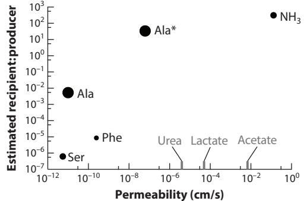

# *Annual Review of Microbiology* Are Bacteria Leaky? Mechanisms of Metabolite Externalization in Bacterial Cross-Feeding

# James B. McKinlay

Department of Biology, Indiana University, Bloomington, Indiana, USA; email: [jmckinla@iu.edu](mailto:jmckinla@iu.edu)

Annu. Rev. Microbiol. 2023. 77:277–97

The *Annual Review of Microbiology* is online at micro.annualreviews.org

[https://doi.org/10.1146/annurev-micro-032521-](https://doi.org/10.1146/annurev-micro-032521-023815) [023815](https://doi.org/10.1146/annurev-micro-032521-023815)

Copyright © 2023 by the author(s). All rights reserved

# **Keywords**

cross-feeding, efflux, leaky, microbial interactions, microbial ecology, microbial metabolism

# **Abstract**

The metabolism of a bacterial cell stretches beyond its boundaries, often connecting with the metabolism of other cells to form extended metabolic networks that stretch across communities, and even the globe. Among the least intuitive metabolic connections are those involving cross-feeding of canonically intracellular metabolites. How and why are these intracellular metabolites externalized? Are bacteria simply leaky? Here I consider what it means for a bacterium to be leaky, and I review mechanisms of metabolite externalization from the context of cross-feeding. Despite common claims, diffusion of most intracellular metabolites across a membrane is unlikely. Instead, passive and active transporters are likely involved, possibly purging excess metabolites as part of homeostasis. Re-acquisition of metabolites by a producer limits the opportunities for cross-feeding. However, a competitive recipient can stimulate metabolite externalization and initiate a positive-feedback loop of reciprocal cross-feeding.

#### **Contents**

| 1. INTRODUCTION 278                                                          |  |
|------------------------------------------------------------------------------|--|
| 2. DEFINITIONS 279                                                           |  |
| 2.1. When Is Metabolite Externalization Considered to Be Cross-Feeding?. 279 |  |
| 2.2. What Does It Mean for a Bacterial Cell to Be Leaky? 279                 |  |
| 3. PERMEABILITY CONSTRAINTS OF THE CELL ENVELOPE 280                         |  |
| 3.1. The Outer Membrane 280                                                  |  |
| 3.2. Peptidoglycan 280                                                       |  |
| 3.3. The Cytoplasmic Membrane. 281                                           |  |
| 4. HOW ARE COMMUNALLY VALUABLE METABOLITES                                   |  |
| EXTERNALIZED? 282                                                            |  |
| 4.1. Cell Envelope Metabolism 282                                            |  |
| 4.2. Diffusion Across a Membrane 283                                         |  |
| 4.3. Mechanosensitive Channels and Facilitated Diffusion 285                 |  |
| 4.4. Cell Lysis 285                                                          |  |
| 4.5. Active Externalization 286                                              |  |
| 5. PHYSIOLOGICAL EXPLANATIONS FOR METABOLITE EXCRETION 286                   |  |
| 5.1. Relief Valves 287                                                       |  |
| 5.2. Moonlighting Metabolites? 288                                           |  |
| 5.3. Partner-Stimulated Metabolite Efflux 288                                |  |
| 6. CONCLUDING REMARKS 289                                                    |  |

# **1. INTRODUCTION**

Most ecosystems are rich with microbial diversity, encompassing countless relationships ranging from antagonistic secretion of toxins to cooperative cross-feeding. Microbial cross-feeding is both common and important. Cross-feeding reactions form networks that influence agriculture, human health, and the Earth's climate([40,](#page-15-0) [85)](#page-17-0). Cross-feeding can also stabilize synthetic microbial communities to carry out tasks that benefit society, like bioremediation and biofuel production ([10](#page-14-0), [150](#page-20-0)).

Release of metabolites from a cell is a prerequisite for cross-feeding [(101](#page-18-0)). Cross-fed nutrients can be metabolic waste, such as fermentation products. In this case, it is expected that cells would have mechanisms to efficiently rid themselves of waste. Herein, I address metabolites that are canonically considered to serve intracellular roles, such as biosynthetic precursors. These metabolites are communally valuable, benefiting any cell that can acquire them, including a producing cell. Thus, one might expect cells to maximally retain these metabolites. There has been much attention to how and why externalization of such metabolites can lead to beneficial cross-feeding ([19](#page-14-0), [33,](#page-15-0) [91](#page-17-0), [101](#page-18-0)). If conditions permit, metabolite externalization can lead to reciprocation from a neighbor, thereby leading to mutually beneficial fitness gains. But how and why are communally valuable metabolites released in the first place?

Here I review the molecular mechanisms and physiological reasons for why intracellular metabolites are externalized in quantities that can support a recipient population. I focus on bacteria, but much herein could apply to archaea, eukaryotic microbes, and some host-microbe interactions([15)](#page-14-0). In focusing on movement of metabolites across the cell envelope, I do not cover metabolites generated outside of the cell, such as through polymer-degrading enzymes, though such activities can lead to cross-feeding [(40](#page-15-0)). I also exclude quorum-sensing signals, siderophores,

*278 McKinlay*

**Cross-feeding:** the transfer of nutrients between cells **Metabolite:** a substrate or product of a metabolic reaction

**Communally valuable metabolite:** a compound that benefits most or all organisms that can acquire it, including the producing organism

extracellular vesicles, biofilm matrix components, and other molecules that are primarily associated with extracellular roles, though they can also serve as cross-fed nutrients in some cases [(9,](#page-14-0) [58](#page-16-0), [129](#page-19-0)). In addressing leakiness, I also exclude contact-dependent cross-feeding, including nanowires, and controversial nanotubes, which are reviewed elsewhere [(33, 40](#page-15-0), [101](#page-18-0)). Some values and references used herein were found using BioNumbers [(88](#page-17-0)) and Metacyc([17](#page-14-0)).

#### **2. DEFINITIONS**

# **2.1. When Is Metabolite Externalization Considered to Be Cross-Feeding?**

As elaborated previously([40](#page-15-0)), cross-feeding occurs when: (*a*) a metabolite is externalized by a producer and consumed by a recipient, (*b*) the metabolite is assimilated or participates in energy transformation, (*c*) the fitness of the recipient and/or producer is altered by the metabolite transfer, and (*d*) metabolite transfer occurs between genotypically or phenotypically distinct (sub)populations. These criteria exclude other relationships involving metabolite externalization such as predation, detoxification, and cell-cell communication, like quorum-sensing, though common mechanisms of metabolite externalization can be involved.

# **2.2. What Does It Mean for a Bacterial Cell to Be Leaky?**

Cross-feeding of communally valuable metabolites has been observed in numerous natural and laboratory settings. In some cases, *Escherichia coli* amino acid auxotrophs, incapable of synthesizing an essential amino acid, supported one another without the need to engineer amino acid overproduction or excretion [(25,](#page-15-0) [87,](#page-17-0) [143](#page-19-0)). Such observations have led to impressions that bacterial cells are highly permeable, and that compounds like amino acids naturally leak from bacterial cells. Herein, I address whether these assumptions are accurate. But first, I address the term leakiness, which means different things to different groups and thus requires clarification, and arguably restraint.

Morris et al. [(92](#page-17-0)) used the term leakiness to mean any biological mechanism that generates a resource that can be used by multiple community members, making that resource a public good. By this broad definition, metabolite externalization could include passive excretion, active secretion, activities of extracellular enzymes or factors (e.g., siderophores), and extracellular influences of intracellular enzymes (e.g., an intracellular detoxification activity that benefits neighboring cells)([92](#page-17-0)). Gude et al. [(48)](#page-16-0) further expanded on this broad definition of leakiness to include cell lysis. The use of leakiness in these cases is more abstract than physical, encompassing of loss of intracellular resources but also resources that might otherwise have been gained from the external environment.

Such broad definitions of leakiness can lead to confusion or misinterpretation when applied to cell architecture. From a literal definition that involves accidental loss, leakiness implies a passive loss of material due to a defect in the cell envelope of an otherwise functional cell([70](#page-16-0), [134)](#page-19-0). For example, one explanation for the bacterial externalization of amino acids was termed the "leak hypothesis" and involves a "physical alteration of the membrane"([70](#page-16-0), p. 81). I propose the following definitions to distinguish mechanisms by which metabolites are externalized. Many of these definitions are well-accepted, though sometimes misused.

- Efflux: Active externalization (e.g., coupled to ATP hydrolysis or the proton-motive force), often via efflux pumps. The term is somewhat analogous to secretion but more commonly applies to compounds that are toxic when accumulated inside the focal organism, whereas secretion applies to compounds or proteins that have extracellular roles.
- Excretion: Passive externalization of molecules, often involving facilitated diffusion via a transporter (permease or channel). Depending on the nature of the molecule, diffusion

**Recipient:** cell or (sub)population that consumes a metabolite externalized by a producer cell or (sub)population

**Cell envelope:** all the combined membrane and peptidoglycan layers that separate the cytoplasm and the environment

**Producer:** cell or (sub)population that produces a metabolite that can be used by a recipient cell or (sub)population

**Facilitated diffusion:** passive diffusion across a membrane mediated by a channel or permease

# **Permease:**

transmembrane protein with high substrate specificity that allows molecules to passively cross a membrane down a concentration gradient

#### **Channel:**

transmembrane protein with low substrate specificity that allows molecules to cross a membrane down a concentration gradient

**Porin:** an outer membrane channel across a membrane could occur. Excretion often rids the cell of waste, thus distinguishing excretion from leakiness, which implies accidental loss.

- Export: The delivery of proteins to the cytoplasmic membrane or the periplasm. The term could also describe the delivery of metabolites to the periplasm for gram-negative bacteria. However, this would be functionally equivalent to secretion for gram-positive bacteria. I thus refrain from using this term herein to avoid confusion.
- Externalization: Any mechanism (passive, active, lysis, etc.) by which metabolites are moved from inside the cell to the external environment.
- Leakiness: Passive externalization of metabolites as a result of a cellular defect (e.g., in a membrane or transporters) that leads to a fitness disadvantage under some conditions but not necessarily in the context of cross-feeding (e.g., leakiness could stimulate beneficial reciprocation from a partner). Compounds with high membrane permeability, such as NH4 +/NH3, could be considered to leak from a cell. See distinctions from excretion above.
- Lysis: A loss of cell envelope integrity accompanying cell death that nonspecifically releases intracellular metabolites to the environment.
- Secretion: Active externalization (e.g., coupled to ATP hydrolysis or the proton-motive force) of protein or metabolites. Secretion requires an active transporter. See distinctions from efflux above.

#### **3. PERMEABILITY CONSTRAINTS OF THE CELL ENVELOPE**

To reach the external environment, metabolites must cross multiple cell envelope layers, each with its own physical and chemical properties. In gram-positive bacteria, the cell envelope is composed of a cytoplasmic membrane connected to a thick outer layer of peptidoglycan. In gram-negative bacteria, the cell envelope is composed of a cytoplasmic membrane surrounded by a thin layer of peptidoglycan connected to an outer membrane (**[Figure 1](#page-4-0)**). Here I address the permeability constraints of each layer.

#### **3.1. The Outer Membrane**

The outer membrane is relatively porous to small molecules, to the extent that the periplasmic space between the two membranes rapidly equilibrates with the external pH([142)](#page-19-0). Porin channels facilitate the diffusion of molecules across the outer membrane. Most porins have relatively low substrate specificity([96)](#page-17-0), accommodating diverse hydrophilic molecules up to ∼0.58–2.0 nm([8,](#page-14-0) [97](#page-17-0)). Negative charges of the outer leaflet lipopolysaccharide and the gel-like nature of the phospholipid inner leaflet were thought to otherwise form a considerable barrier to most molecules ([96](#page-17-0)). However, recent evidence suggests that many molecules can cross the outer membrane without porins; a *Pseudomonas aeruginosa* mutant lacking all 40 porins displayed wild-type growth traits on some, but not all, nutrients([134)](#page-19-0). Some di- and tricarboxylate nutrients could not be used by the mutant, suggesting that nutrient diffusion was not due to a membrane defect created by the absence of porins([134)](#page-19-0). The findings are surprising, as many of the nutrients examined have low permeability coefficients (see Section 4.2).

# **3.2. Peptidoglycan**

Internal to the outer membrane in gram-negative bacteria, and forming the outer-most layer of gram-positive bacteria, is a single cage-like molecule encompassing the whole cell: peptidoglycan ([137)](#page-19-0). Peptidoglycan has gaps that can change size with the turgor pressure inside the cell ([137)](#page-19-0). For gram-negative *E. coli*, these gaps range from 2.0 nm to 3.4 nm in diameter [(29](#page-15-0), [49)](#page-16-0),

*280 McKinlay*

#### **Figure 1**

Metabolite externalization examples in a gram-negative bacterium. The outer membrane and peptidoglycan are relatively porous due to porins (❶) and gaps in peptidoglycan (●2 ) (see Section 3). Metabolic reactions within the envelope and turnover of envelope macromolecules (❸) can contribute to external communally valuable metabolites (Section 4.1). While some metabolites like NH3 can easily diffuse across a membrane (❹), most intracellular metabolites have permeability coefficients that largely prevent diffusion across a membrane (Section 4.2). Metabolites can cross the cytoplasmic membrane via passive diffusion if facilitated by nonspecific mechanosensitive channels (❺) during hypoosmotic stress, or via specific permeases (❻) (Section 4.3). Loss of membrane integrity or lysis (●7 ) during cell death can lead to metabolite externalization (Section 4.4). Metabolites are also actively secreted or effluxed (❽) either to the periplasm or to the external environment when coupled with TolC (Section 4.5). Active efflux can involve ATP hydrolysis, H+ antiport, or antiport of different amino acids. Metabolite externalization can be beneficial for multiple reasons, including maintaining homeostatic metabolite levels (Section 5.1); moonlighting (●9 ), where metabolites play extracellular roles that differ from their better-known intracellular roles (Section 5.2); and effecting beneficial reciprocation from a cross-feeding partner (Section 5.3). Abbreviations: AA, amino acid; FA, fatty acid; M, metabolite; PG, peptidoglycan; pep, peptides.

accommodating molecules of 20 kDa on average [(29)](#page-15-0), but can also allow for the transit of proteins over 100 kDa in some cases([136)](#page-19-0). For gram-positive *Bacillus subtilis*, the average peptidoglycan pore size is 2.4 nm, accommodating molecules as large as 24 kDa([29)](#page-15-0). Thus, neither peptidoglycan nor the outer membrane should be considered to be a significant barrier to the externalization of hydrophilic molecules.

# **3.3. The Cytoplasmic Membrane**

The cytoplasmic membrane is the barrier at which the passage of most molecules in and out of a cell is primarily controlled. This membrane maintains a cytoplasmic environment that is markedly different from the external environment. Cytoplasmic reactions maintain most metabolites in charged forms that limit passive loss across the hydrophobic interior of the cytoplasmic membrane([3)](#page-14-0). Intracellular concentrations of molecules can thus be orders of magnitude higher than extracellular levels. Many *E. coli* nucleotide triphosphates, cofactors, and glycolytic metabolites are in the low-millimolar range and free amino acids are in the sub- to low-millimolar range, with glutamate reaching a range of tens of millimolar units([7)](#page-14-0). Under osmotic stress, some intracellular metabolites act as compatible solutes and accumulate to molar concentrations [(145](#page-19-0)). Thus, intracellular metabolites are thermodynamically poised for externalization, but the cytoplasmic membrane serves as a formidable and functional barrier. Should a metabolite escape the cytoplasm, the chances of loss to the environment increase greatly, as peptidoglycan and the outer

membrane are comparatively porous. However, as noted throughout this review, active uptake systems can efficiently recapture externalized metabolites and limit the possibilities for cross-feeding and exploitation.

# **4. HOW ARE COMMUNALLY VALUABLE METABOLITES EXTERNALIZED?**

Diverse intracellular metabolites are externalized. Advances in metabolite detection sensitivity, namely by mass spectrometry, have revealed micromolar levels of central metabolites and amino acids in the supernatants of bacteria and yeast([100, 107](#page-18-0)). About 0.3% of the total carbon consumed was accounted for in external central metabolites and amino acids, using a targeted metabolomics approach that might have overlooked other metabolites([100](#page-18-0)). At face value, these levels might seem insufficient to sustain another population if spent supernatant were provided as the sole carbon source to a recipient population. However, cross-feeding in coculture should be viewed more like a continuous or fed-batch system. Externalized metabolites are transiently available, often reacquired by the producing cell or its clones, thus leading to a low steady state external concentration in monoculture. In coculture, consumption of externalized metabolites by a recipient population can sustain or even stimulate further release by a producer([39](#page-15-0), [74](#page-17-0), [84](#page-17-0)) (see Section 5.3). Below, I review how and possible reasons why costly intracellular metabolites are externalized.

#### **4.1. Cell Envelope Metabolism**

Some metabolic reactions take place beyond the cytoplasmic membrane, but within the cell envelope, making the associated metabolites susceptible to loss.While anaerobic respiration in the cell envelope, like denitrification([45](#page-15-0)), can lead to cross-feeding of electron acceptors, I limit discussion to cell envelope biosynthesis and remodeling.

One source of metabolites in the cell envelope is peptidoglycan. As a bacterium grows, peptidoglycan is cleaved to allow new monomers to be incorporated and for circumferential expansion if the peptidoglycan is thick, as it is in gram-positive bacteria([54](#page-16-0), [61)](#page-16-0). This remodeling can effect turnover of *>*50% of peptidoglycan material in a single cell division cycle for both gram-negative and gram-positive bacteria([61)](#page-16-0). However, loss of material is minimized via transporters that recapture degraded peptidoglycan([61](#page-16-0)). In growing *E. coli* cultures, ∼6–8% of peptidoglycan amino acids were estimated to be lost as short peptides([43)](#page-15-0).

Loss of single amino acids from peptidoglycan is also expected. For each new peptide crosslink that is formed, a d-alanine is released([61](#page-16-0)). Again, much d-alanine is reacquired. In growing *B. subtilis* cultures, extracellular d-alanine could barely be detected, but deletion of a d-alanine permease resulted in external accumulation to 0.1 mM, enough to support a d-alanine auxotroph via cross-feeding on agar plates [(125](#page-19-0)). Diverse bacteria release d-alanine and other d-amino acids upon entering stationary phase, accumulating to low millimolar levels([72](#page-17-0)). The release of these d-amino acids is likely associated with peptidoglycan remodeling, but they could also play a role in intercellular signaling [(18](#page-14-0)). Such conditional dependence for metabolite release might be less likely to lead to cross-feeding, though alternating rounds of metabolite release by two populations can lead to coexistence under certain conditions [(124](#page-19-0)).

One can also expect turnover of cell envelope proteins [(90)](#page-17-0) and lipids([79](#page-17-0), [121](#page-18-0)). Again, most of the material is actively recovered. For example, fatty acids released by lipases at the outer membrane of *E. coli* are shuttled to the cytoplasm, likely as part of an important signaling process for regulating lipopolysaccharide biosynthesis([82)](#page-17-0).

Contributions of cell envelope turnover to cross-feeding have received little attention. Nevertheless, the fact that a single permease loss-of-function mutation supported cross-feeding([125)](#page-19-0)

#### *282 McKinlay*

suggests that cross-feeding linked to cell envelope metabolism could evolve if conditions are favorable over exploitation.

#### **4.2. Diffusion Across a Membrane**

Diffusion of intracellular metabolites across a membrane closely fits the literal definition of leakiness.Molecules that are uncharged, or in equilibrium with an uncharged molecule, are particularly susceptible to diffusion across a membrane [(4](#page-14-0)). Metabolic networks might have even evolved to favor metabolites that have a low ability to diffuse across or disrupt membranes [(4)](#page-14-0).

A communally valuable metabolite that is susceptible to diffusion across a membrane is ammonium (NH4 +). Nearly all macromolecular nitrogen in a cell is in the form of amino groups. While the amino donor for macromolecular synthesis is typically an amino acid, some bacteria must first generate free NH4 + from nitrogen sources like nitrate, during assimilatory nitrate reduction, or N2 gas, during N2 fixation. NH4 + membrane permeability coefficients range from 10−1 to 10−3 cm/s, similar or greater than those of water, depending on the liposome preparation([122,](#page-19-0) [140](#page-19-0)). *E. coli* can also rely on diffusion of NH4 + into the cytoplasm to support maximum growth rates when environmental NH4 + concentrations exceed 20–50 µM([65](#page-16-0)). The high permeability of NH4 + is due in part to its equilibrium with NH3. At a pH of 7, about 0.6% of the molecules will be NH3. Even at this small percentage, several studies found that deleting NH4 +/NH3 AmtB transporters in N2-fixing bacteria led to micromolar levels of extracellular NH4 + ([5,](#page-14-0) [84](#page-17-0), [146,](#page-19-0) [149](#page-20-0)). These observations indicate that NH4 + recapture is important for limiting NH4 + loss via diffusion.

For most other polar and charged metabolites, diffusion across a membrane is not expected to occur at rates that could support another population, unless the producer-to-recipient population ratio is very large. For example, amino acids can cross lipid membranes in a manner that is independent of pH but is dependent on the hydrophobicity of the side chain [(21,](#page-14-0) [68](#page-16-0)). Such observations are cited as evidence that cross-feeding of amino acids is due to membrane diffusion or leakage. However, amino acid permeability coefficients [10−13–10−10 cm/s([20](#page-14-0), [21](#page-14-0))] are much lower than those of protons [10−7–10−3 cm/s([14](#page-14-0), [27](#page-15-0), [94](#page-17-0))], for which membrane permeability must be low enough to maintain an electrochemical gradient. Unlike NH4 +/NH3 and organic acids, the proportion of amino acids that are uncharged is 106 to 108 times lower than that of charged forms under physiological conditions([20](#page-14-0)).

Using published permeability coefficients and biosynthetic requirements for specific compounds, I estimated what recipient-to-producer ratios would result if cross-feeding occurred only via diffusion across a membrane. Taking serine and phenylalanine, which are similarly represented in *E. coli* protein([59](#page-16-0)) but differ in permeability([20)](#page-14-0), I estimated recipient-to-producer ratios would be ∼6 × 10−7 for serine cross-feeding and ∼9 × 10−6 for phenylalanine cross-feeding, assuming an equal recipient and producer doubling time of 1 h. These ratios are far from those observed in amino acid cross-feeding cocultures [(25](#page-15-0), [87](#page-17-0), [102](#page-18-0), [143](#page-19-0)). In contrast, NH4 + cross-feeding via diffusion of NH3 across a membrane is estimated to support 300 recipients per producer cell. This value exceeds those observed in *Rhodopseudomonas palustris*–*E. coli* cocultures based on NH4 + cross-feeding, which gave ∼0.01–0.1 recipient-to-producer ratios [(39](#page-15-0)). This discrepancy suggests that my estimates are liberal, likely because they do not account for metabolite reacquisition; indeed, *R. palustris* and *E. coli* compete for extracellular NH4 + in coculture [(84](#page-17-0)). Thus, these liberal estimates strongly suggest that cross-feeding of amino acids and other polar, charged metabolites via diffusion across a membrane is unlikely.

Given the above, past observations of significant passive uptake and efflux of amino acids deserves more scrutiny. For example, vesicles derived from *Lactococcus lactis* membranes exhibited

significant loss of amino acids in a manner that correlated with side chain hydrophobicity, suggesting diffusion across a membrane([32](#page-15-0), [68)](#page-16-0). However, one cannot discount a possible contribution of the supplemented asolectin lipids that made up the majority of the liposome, and which exhibited permeability to leucine when bacterial membrane was excluded([32)](#page-15-0). More puzzling are *L. lactis* strains that cannot synthesize proline, but that could maintain high growth rates when proline was provided at concentrations greater than 5 mM, with kinetics suggesting uptake by passive diffusion across the membrane([127](#page-19-0)).

One of the most unusual findings where amino acid diffusion was implicated concerns *Zymomonas mobilis* that was engineered to produce alanine [(119](#page-18-0)). The strain had cytoplasmic alanine concentrations of 280 mM. I calculate that this high concentration would have had a strong influence on membrane diffusion rates, increased over those of serine by a factor of more than 7,000, with the potential to support ∼5 × 10−3 recipients per producer (**Figure 2**). However, the measured excretion rate was even higher [(119](#page-18-0)), potentially capable of supporting ∼30 recipients per producer. By my calculations, the membrane would have to be more permeable to alanine than to hydrophobic amino acids like phenylalanine to sustain the observed excretion rate by diffusion across a membrane alone (**Figure 2**). Unfortunately, I found no work following up on this intriguing study.

In considering the role of diffusion across a membrane, it was apparent that most available coefficients were determined for compounds that one might expect to diffuse across membranes, such as organic acids [(140](#page-19-0)), with only a handful of amino acids represented [(20, 21)](#page-14-0). As the

#### **Figure 2**

Estimated recipient-to-producer ratios from metabolite diffusion across a membrane. Based on equations from Reference [89,](#page-17-0) and the assumptions that (*a*) producer diffusion rate equals recipient uptake rate, since uptake will likely involve active transport, (*b*) the producer does not reacquire lost metabolite, and (*c*) producer and recipient growth rates are equal, ensuring coexistence. Thus, one can apply the following three equations. (*a*) Metabolite released per generation (µmol/ producer cell) = permeability (cm/s) × internal concentration (µmol/cm3 ) × surface area (cm2 /cell) × doubling time (s). (*b*) Metabolite required per recipient cell generated (µmol/cell) = recipient requirement (µmol/g) × recipient weight (g/cell). (*c*) Ratio (recipient:producer) = metabolite released by producer (µmol/producer) ÷ metabolite required (µmol/recipient). Symbol size roughly scales with log10 intracellular concentration. Permeability coefficients are from studies using liposomes [(20](#page-14-0), [140)](#page-19-0); alanine permeability (1.0 × 10−11 cm/s) assumes a value between those of serine and phenylalanine([68](#page-16-0)); asterisks signify that alanine permeability (6.3 × 10−8 cm/s) was estimated to achieve a predicted recipient-to-producer ratio of 34, derived from the measured specific alanine efflux rate of 100 µmol/min/g dry cell([119)](#page-18-0). Intracellular concentrations were based on those reported for *Escherichia coli* or other bacteria([7,](#page-14-0) [65,](#page-16-0) [119, 120](#page-18-0)); NH3 concentration was assumed to be 0.6% of the NH4 + concentration([65](#page-16-0), [120](#page-18-0)); alanine concentrations were based on an engineered *Zymomonas mobilis* value([119](#page-18-0)). Recipient amino acid and NH4 + requirements are based on reported values for *E. coli* ([59)](#page-16-0) and a conversion factor of 4.7 × 10−13 g/cell([123](#page-19-0)). *E. coli* surface area was assumed to be 4.42 × 10−8 cm2 [(110)](#page-18-0).

*284 McKinlay*

catalog of externalized metabolites involved in cross-feeding expands, it would be useful to have accompanying permeability coefficients to address the likelihood of diffusion across a membrane in contributing to their externalization.

#### **4.3. Mechanosensitive Channels and Facilitated Diffusion**

Bacteria can also externalize metabolites via passive diffusion through low-specificity transporters like mechanosensitive channels or permeases with higher substrate specificity. Mechanosensitive channels respond to hypoosmotic shock, a sudden shift to low extracellular osmolarity. The shock causes the cell to swell, and the resulting membrane expansion pulls mechanosensitive channels open, creating a maximum pore size of ∼2.8 nm([24](#page-15-0), [141](#page-19-0)), rivaling or exceeding pore sizes of outer membrane porins and peptidoglycan gaps. The result is a passive and relatively indiscriminate release of metabolites until osmotic pressure is relieved.

At least one mechanosensitive channel has been implicated in amino acid excretion. *Corynebacterium glutamicum* MscCG is responsible for the glutamate excretion that was previously attributed to membrane defects in response to biotin limitation or treatment with penicillin or Tween [(6,](#page-14-0) [70](#page-16-0)). MscCG might have broad substrate specificity, as it also allowed for the passage of aspartate in patch clamp assays and of phenylalanine when expressed in phenylalanine-producing *E. coli* ([51](#page-16-0)). Thus far, mechanosensitive channels have not been implicated in cross-feeding and are perhaps unlikely to do so, as consistent repeat exposures to hypoosmotic stress would be required. However, there is still much to be learned about diverse mechanosensitive channels in bacteria, as some might respond to other stimuli([24](#page-15-0)).

Transporters with more stringent substrate specificity that operate by facilitated diffusion (no energy coupling) could also allow for metabolite efflux if intracellular concentrations are high enough. Such a reversible facilitator from *Streptomyces davawensis* led to enhanced riboflavin production when expressed in riboflavin-producing *B. subtilis* [(53)](#page-16-0). Similar transporters were speculated to be involved in vitamin cross-feeding in low-complexity microbial communities derived from environmental samples [(116](#page-18-0)).

#### **4.4. Cell Lysis**

, .•·�-

Cell lysis is often considered as a cross-feeding mechanism. As hypothesized by Gude et al.([48](#page-16-0)), a sustained frequency of lysis—mediated by cell-cell killing, programmed lysis, prophage induction, or phage—could potentially support cross-feeding. Experiments that introduced phage to bacteria that were already engaged in mutualistic cross-feeding revealed the potential for phagemediated cross-feeding, due in part to nutrients in cell debris([36)](#page-15-0). Shou et al. [(124)](#page-19-0) demonstrated that oscillatory cycles of lysis by two yeast strains led to stable cross-feeding. Cross-feeding via lysis in evolved *E. coli* populations has also been demonstrated; however in this case, lysis of one subpopulation primarily contributed to survival of another during stationary phase, rather than necessarily contributing to population growth([118)](#page-18-0).

There are few other concrete examples of lysis-mediated cross-feeding. Several studies concluded that lysis was not a major contributor to metabolite externalization. Micromolar levels of central metabolites measured outside the cell were deduced to be independent of cell lysis or harvesting procedures [(100](#page-18-0)). Cross-feeding trends for vitamin B12 from *Mesorhizobium loti* to algae better fit computational model predictions that did not involve cell lysis [(46](#page-15-0)). *M. loti* was also unable to support a vitamin B1 auxotroph, again suggesting secretion of B12 rather than lysis [(63)](#page-16-0). In another study, amino acid excretion by *E. coli* mutants that lacked core metabolic genes was not associated with an increase in cell lysis, according to fluorescent live/dead stains [(102](#page-18-0)). In another study, investigators visually tracked individual cells that required cross-feeding for cell elongation,

and there was no mention of observed cell lysis([25)](#page-15-0), indicating that actively growing auxotrophic cells supported one another. Thus, while there are examples of lysis supporting cross-feeding, there are clearly other primary mechanisms involved in other cases where actively growing cells externalize communally valuable metabolites.

# **4.5. Active Externalization**

Metabolite externalization can also involve active secretion or efflux. In some cases, externalization of one amino acid facilitates uptake of another via an antiport mechanism. For example, a lysine uptake system in *C. glutamicum* is powered by alanine, isoleucine, or valine externalization [(11,](#page-14-0) [13](#page-14-0)). *P. aeruginosa* uses an arginine-ornithine antiporter when catabolizing arginine([80)](#page-17-0), and some lactic acid bacteria externalize alanine to take up aspartate [(1](#page-14-0)). Thus, it is conceivable that such mechanisms could lead to cross-feeding of the outgoing amino acid.

In other cases, metabolite secretion or efflux appears to be the sole purpose of the transporter. Originally discovered to mediate lysine efflux in *C. glutamicum* [(138](#page-19-0)), H+-driven LysE superfamily transporters have since been implicated in the efflux of homoserine and threonine by RhtB and RhtC [(148](#page-20-0)); lysine by LysO([105)](#page-18-0); arginine by ArgO([93](#page-17-0)); and leucine, methionine, histidine, and perhaps other amino acids by LeuE [(71](#page-16-0)). Amino acid transporters belonging to other families include (*a*) *C. glutamicum* transporters BrnFE, involved in the efflux of branched-chain amino acids([64)](#page-16-0) and methionine([133)](#page-19-0), and ThrE, involved in threonine and serine efflux([126)](#page-19-0), and (*b*) *E. coli* transporters AlaE, involved in alanine efflux([56](#page-16-0), [66)](#page-16-0), and YgaZH, involved in branchedchain amino acids efflux [(103](#page-18-0), [104](#page-18-0)). It has also been argued that ATP-binding cassette (ABC) transporters could run in reverse, even at physiological concentrations observed for some amino acids([57)](#page-16-0).

Metabolites efflux can also occur via efflux pumps, often called multidrug efflux pumps. This latter label is somewhat misleading, as some efflux pumps act on a fairly limited range of substrates [(132](#page-19-0)), and many can act, perhaps even preferentially, on common intracellular metabolites ([131)](#page-19-0). Indeed, several efflux systems for intracellular metabolites belong to multidrug efflux pump families([13,](#page-14-0) [62,](#page-16-0) [81,](#page-17-0) [131)](#page-19-0). For example, in *E. coli* flavins are effluxed by the proton-driven multiantimicrobial extrusion family transporter YeeO [(83)](#page-17-0), aromatic amino acids are effluxed by the drug-metabolite transporter YddG [(31)](#page-15-0), and cysteine efflux involves the major facilitator superfamily (MFS) H+-antiporter Bcr, also known to provide resistance to some antibiotics([147)](#page-19-0). Resistance–nodulation–cell division (RND) superfamily transporters are involved in fatty acid efflux in *E. coli* ([75](#page-17-0)) and *Pseudomonas fluorescens* ([2](#page-14-0)). Other *E. coli* MFS proteins have been implicated in the efflux of arabinose (YdeA)([67](#page-16-0)), inosine (YicM)([47)](#page-15-0), and sugars (SetA) [(77](#page-17-0)). Protein involved in efflux of the folate intermediate *p*-aminobenzoic acid also provided resistance to sulfonamide antibiotics([28](#page-15-0)). Given that some efflux pumps have broad substrate specificities, redundancy in transporter function might hinder the discovery of other metabolite efflux pumps. Mutants that lack all efflux pumps and allow for single transporters to be introduced offer a practical approach to address the roles of single efflux pumps in metabolite efflux([132)](#page-19-0).

#### **5. PHYSIOLOGICAL EXPLANATIONS FOR METABOLITE EXCRETION**

Why are intracellular metabolites externalized? As noted elsewhere, cross-feeding itself could select for metabolite externalization if the cost is outweighed by benefits from a reciprocating partner([19](#page-14-0), [33,](#page-15-0) [91](#page-17-0), [101](#page-18-0)). However, metabolite externalization might have physiological roles that are independent of cross-feeding. Thus, normal physiological processes might set the stage for cross-feeding relationships to develop.

# **5.1. Relief Valves**

Not only are communally valuable metabolites of value to microbial communities, but many are of value to human society. As a result,many metabolite efflux discoveries were motivated by metabolic engineering studies that addressed efflux of a valuable compound as a rate-limiting step [(13,](#page-14-0) [62, 68,](#page-16-0) [70,](#page-16-0) [81](#page-17-0)). A common strategy to identify a rate-limiting transporter is to select for mutants that are resistant to toxic levels of the desired compound or a toxic analog([31, 47](#page-15-0), [56, 64, 66](#page-16-0), [71,](#page-16-0) [93](#page-17-0), [103](#page-18-0)– [105](#page-18-0), [114](#page-18-0), [126, 130, 133, 135, 138](#page-19-0), [148](#page-20-0)). The repeated success of this approach suggested that there might be physiological roles for the efflux of intracellular metabolites. Perhaps the most commonly notion is that of a metabolic relief valve; when metabolite concentrations exceed homeostatic levels, dedicated transporters efflux those metabolites. Several groups have hypothesized that such homeostatic efflux could lead to cross-feeding([15,](#page-14-0) [48](#page-16-0), [78)](#page-17-0). While one should be careful not to mistake repetition of an idea for evidence of an idea, there is additional basis for the relief valve theory, as described below.

**5.1.1. Inherent metabolite efflux.** Most of the above transporters were discovered when prohibitively high metabolite levels were provided, which would negate the need for cross-feeding of that metabolite. These efflux pumps thus might be most important when common metabolites are excessive, such as amino acids released when peptides are the sole carbon source([70](#page-16-0)). However, metabolite efflux could also occur as a homeostatic process outside of such stressful conditions. It has been argued that some metabolites must be maintained at high levels to support the simultaneous and optimal flux through multiple pathways([15](#page-14-0), [48](#page-16-0)). Indeed, intracellular metabolite levels often saturate the enzymes that use them [(7)](#page-14-0). If saturating metabolite levels are combined with gene expression noise [(34)](#page-15-0) that could translate to metabolic noise([15,](#page-14-0) [48](#page-16-0), [78)](#page-17-0), then metabolite levels could fluctuate to reach toxic concentrations [(44,](#page-15-0) [67](#page-16-0), [115](#page-18-0)) or otherwise interfere with other enzymes([23](#page-15-0), [60,](#page-16-0) [95](#page-17-0)). Maintaining ratios of metabolites can also be important([93)](#page-17-0). Under conditions of excessive metabolite concentrations or adverse ratios, a bacterium could respond either by degrading and later resynthesizing metabolites (recycling) or by secreting them.

Secreting excess metabolites might seem costly. However, efflux proteins are often regulated [(22](#page-15-0), [56, 64](#page-16-0), [71,](#page-16-0) [93](#page-17-0), [103, 104,](#page-18-0) [130, 133](#page-19-0), [135](#page-19-0)), which could reduce some of the cost. More generally, bacteria often carry out diverse processes that carry seemingly unnecessary costs but are likely part of evolutionary trade-offs that are ultimately important for survival([86](#page-17-0)). Some have suggested that *E. coli* lacks degradation pathways for several costly amino acids because efflux is a more beneficial strategy than metabolite recycling [(15](#page-14-0), [48](#page-16-0)). Some of the amino acids in question were also associated with more coculture growth in a combinatorial *E. coli* cross-feeding study([87](#page-17-0)). Indeed, amino acid uptake appears to be an important factor in limiting external availability of amino acids that escape the cell. *E. coli* mutants that were defective in proline catabolism and uptake [(113](#page-18-0)) or in lysine uptake [(50](#page-16-0)) showed high extracellular levels of the respective amino acid*.* Perhaps the opportunity for metabolite reacquisition also minimizes the cost of efflux. In many environments, neighbors will likely be clones and thus limit the risk of benefitting a competitor.

As noted above, many metabolite efflux proteins fall within drug efflux families. Many drug efflux proteins are chromosomally conserved, suggesting that they predominantly play a homeostatic role in metabolite efflux, with protection against toxic compounds perhaps as a beneficial side effect [(131](#page-19-0)). In support of this notion, TolC, an outer membrane protein that is required for the function of multiple inner membrane drug-efflux proteins, is required for normal growth trends in otherwise favorable growth conditions [(52,](#page-16-0) [117)](#page-18-0). TolC could additionally, or instead, be important to rid the cell of toxic products from promiscuous enzyme activities or spontaneous metabolite damage([23,](#page-15-0) [60,](#page-16-0) [95)](#page-17-0). Aromatic amino acids like tryptophan and related intermediates

*www.annualreviews.org • How Bacteria Externalize Metabolites 287*

are prone to damage [(60)](#page-16-0), and some were shown to induce a stress response pathway that activates when TolC is deleted [(22)](#page-15-0).

**5.1.2. Environmental factors influencing metabolite efflux.** A relief valve function could also be influenced by external factors. Abundant carbon was presumed to trigger overflow metabolism in diverse microbes, resulting in externalization of central metabolites and some amino acids to micromolar levels([41](#page-15-0), [100, 107)](#page-18-0). Growth rate can also influence metabolite externalization. Relatively fast-growing, but not slow-growing, *E. coli* externalized micromolar amounts cAMP, an intracellular signaling molecule that stimulates the expression of alternative carbon catabolism pathways upon glucose starvation([76)](#page-17-0).

Transitions in environmental conditions could also trigger metabolite efflux. Fatty acids were secreted in response to temperature perturbations, via an RND-type efflux pump in *P. fluorescens* ([2](#page-14-0)). Nutrient shifts in fed-batch reactors also affected metabolite externalization by *E. coli* [(16)](#page-14-0). As nutrients are depleted, bacterial cells must prepare for starvation, which can include macromolecule turnover. A ribonucleoside H+-antiporter was speculated to protect *E. coli* from toxic accumulation of nucleosides released as RNA is degraded in stationary phase [(47)](#page-15-0). Similar externalization of valine and uracil upon stationary phase was speculated to be associated with protein and RNA degradation([100)](#page-18-0).

Multicellular aggregates of bacteria, called biofilms, can create environmental gradients that can influence metabolite externalization, and in some cases lead to cross-feeding [(35)](#page-15-0). In one example, *E. coli* subpopulations in anoxic zones of colonies secreted alanine that was then consumed by separate subpopulations in oxic zones([30)](#page-15-0). Alanine secretion was mediated by the efflux protein AlaE, noted above([30](#page-15-0)).

# **5.2. Moonlighting Metabolites?**

Some metabolites might play extracellular roles beyond their appreciated intracellular roles. ATP, well-known as an intracellular energy carrier, is externalized by diverse bacteria [(128](#page-19-0)) and might suppress immune responses to promote a healthy microbiome([106, 112)](#page-18-0). Other metabolites with extracellular roles include polyamines and guanidine [(131](#page-19-0)). Riboflavin is externalized by some bacteria to participate in extracellular respiration via what was originally annotated as a multidrug efflux transporter [(69)](#page-16-0). Pterins have several known cytoplasmic roles [(37](#page-15-0)), but *>*95% of the pterin pool can be extracellular for *E. coli* and *P. aeruginosa* ([111)](#page-18-0). A key regulatory protein of *Agrobacterium tumefaciens* biofilm formation that binds pterins is thought to reside in the periplasm, also suggesting an intercellular signaling role for pterins [(37)](#page-15-0).

In addition to being a proteinaceous amino acid, cysteine can also participate in redox reactions within the cell envelope. *E. coli* has multiple proteins that can efflux cysteine([26, 38](#page-15-0), [144, 147](#page-19-0)). One cysteine efflux protein, YdeD [(26)](#page-15-0), is thought to transport cysteine to combat reactive oxygen in the periplasm([99)](#page-18-0). A similar role has also been identified for the ABC transporter CydDC([109)](#page-18-0), which might transport cysteine to the periplasm to counter reactive nitric oxide [(55)](#page-16-0) and to contribute to periplasmic protein complex assembly via disulfide bond reduction [(108](#page-18-0)). The resulting oxidized cystine is then taken up by a high-affinity ABC transporter, where it can be reduced in the cytoplasm to continue the cycle [(98](#page-18-0)). This reacquisition likely cuts down on possibilities for cysteine/cystine cross-feeding, but given the relative permeability of the outer membrane, one can presume that cysteine and cystine are at least transiently available to community members.

#### **5.3. Partner-Stimulated Metabolite Efflux**

The above examples could make it seem like most metabolites are available for cross-feeding at any time. However, metabolite externalization is often conditional. For example, in comparative

*288 McKinlay*

studies, different microbes externalized different metabolites [(41](#page-15-0), [100)](#page-18-0), and *E. coli* auxotrophs differed in which auxotrophs they could support [(87](#page-17-0), [143)](#page-19-0). Still, it is perhaps surprising that most cross-feeding studies involve relatively few metabolites. It is possible that some cross-feeding reactions are overlooked. Most cross-feeding studies employ auxotrophs that require a single metabolite. Thus, the metabolite that rescues the auxotroph will have the most control over population outcomes while additional cross-fed nutrients might go unnoticed. As examples, unexpected purine cross-feeding was revealed in *R. palustris*–*E. coli* cocultures that were engineered for NH4 + cross-feeding([73](#page-17-0)), and unexpected alanine cross-feeding was found in a methanogen-sulfate reducer coculture that was based on H2 cross-feeding([139)](#page-19-0). Cross-feeding of amino acids beyond that required to satisfy an auxotroph was speculated in another study([41](#page-15-0)), and unknown forms of reciprocation that benefitted the producer were also observed [(42](#page-15-0)).

Detection of externalized metabolites and/or efflux proteins also does not necessarily equate to cross-feeding opportunities. As noted above, regulation of efflux proteins and reacquisition of externalized metabolites are common and limit metabolite availability. My group has shown that when a producer can reacquire an externalized metabolite, cross-feeding will occur only if the recipient has the competitive edge for acquiring that metabolite [(84)](#page-17-0). When a recipient is competitive for a metabolite, the resulting pull on the metabolite pool can stimulate the producer to make more. For example, an *R. palustris* mutant that was impaired in NH4 + uptake due to the deletion of NH4 + AmtB transporters supported more *E. coli* growth than would have been predicted from *R. palustris* monoculture NH4 + levels([84](#page-17-0)). The *R. palustris 1*AmtB mutant also showed greater nitrogenase activity in coculture, suggesting that the consumption of NH4 + by *E. coli* stimulated *R. palustris* to make more NH4 +, perhaps as a nitrogen starvation response([84](#page-17-0)).

Acquisition of NH4 + by *E. coli* was even sufficient to establish cross-feeding with wild-type *R. palustris*, for which NH4 + excretion is below the limit of detection [(39)](#page-15-0).*E. coli* acquired mutations that enhanced nitrogen scavenging, likely making *E. coli* competitive for NH4 + and creating a positive-feedback loop of reciprocation, without requiring that *R. palustris* evolve enhanced NH4 + excretion([39](#page-15-0)). Thus, the ability of a recipient to access a transiently available metabolite can be sufficient to stimulate further release of that metabolite over other metabolites that the recipient might be less competitive in acquiring.

Partner-stimulated cross-feeding was also observed in cocultures of *M. loti* and algal vitamin B12 auxotrophs [(12,](#page-14-0) [46](#page-15-0)). *M. loti* produced tenfold more B12 when cocultured with algae, compared to when it was grown in monoculture([46](#page-15-0)). Enhanced B12 excretion by *M. loti* was probably not stimulated by depletion of available B12, because both intracellular *M. loti* levels and supernatant levels of B12 were higher in coculture than in monoculture([46)](#page-15-0). Intriguingly, *M. loti*, while capable of B12 secretion, did not take up B12 when supplied in the growth medium [(12)](#page-14-0). These observations might hint at more sophisticated mechanisms by which algal recipients stimulate *M. loti* B12 excretion.

# **6. CONCLUDING REMARKS**

Are bacteria leaky? Taking a literal interpretation of the word leaky, which implies metabolite loss due to a defect in the cell envelope, I conclude that bacteria are not leaky in most cases involving charged and polar metabolites. Highly permeable metabolites like NH4 +/NH3 are an exception and could be considered to leak from a cell. In most cases, communally valuable metabolites are likely externalized via facilitated and active transporters for a purpose, such as maintaining homeostatic metabolite levels or to carry out roles that differ from those in the cytoplasm. This externalization sets the stage for cross-feeding when neighboring cells can competitively acquire externalized metabolites, potentially stimulating further release by the producer, and/or reciprocation by the recipient. However, leakiness due to cellular defects should not be excluded as a possible mechanism for cross-feeding. If sheltered from exploitation, the reciprocal benefits of

cross-feeding could outweigh the disadvantages of a nonlethal cell envelope defect, and the defect could become fixed in a producer population.

#### **SUMMARY POINTS**

- 1. The term leaky is vaguely applied in the literature on cross-feeding. I propose that the term be used literally, implying loss of material due to a cell envelope defect.
- 2. Externalization of communally valuable metabolites can involve numerous mechanisms, but externalization of charged and polar molecules, like amino acids, by growing cells will more likely involve facilitated or active transporters rather than diffusion across a membrane.
- 3. Intracellular metabolites might be commonly released to maintain homeostatic levels stemming from noisy regulation of high intracellular levels that guarantee enzyme saturation.
- 4. Active uptake and regulation of efflux proteins are common and likely limit metabolite externalization by potential producer populations.
- 5. Acquisition of transiently available metabolites by competitive recipients can stimulate further metabolite externalization by a producer, creating a feedback loop of reciprocation.

# **FUTURE ISSUES**

- 1. Are there natural examples where cell envelope metabolism leads to cross-feeding?
- 2. To what extent can the benefits of cross-feeding select for cell envelope defects, or leakiness, that would otherwise be detrimental?
- 3. Why are different metabolites externalized by different bacteria or strains, despite similar growth conditions?
- 4. Is redundancy, or overlapping substrate specificity, for some efflux pumps hindering discovery of other metabolite externalization systems?
- 5. To what extent are additional layers of cross-feeding overlooked and to what extent do different layers of cross-feeding influence producer and recipient fitness?
- 6. Permeability coefficients are unavailable for many communally valuable metabolites involved in cross-feeding.

# **DISCLOSURE STATEMENT**

The author is not aware of any affiliations, memberships, funding, or financial holdings that might be perceived as affecting the objectivity of this review.

#### **ACKNOWLEDGMENTS**

The review topic was originally inspired from a conversation with W. Harcombe. I am grateful to my lab members and colleagues for helpful discussions, especially Y.-C. Chuang, who found and discussed literature with me that I would have otherwise overlooked. Many exemplary works were

#### *290 McKinlay*

not included due to space limitation. The author is supported by National Science Foundation CAREER award MCB-1749489 and the U.S. Army Research Office grant W911NF-14-1-0411.

# **LITERATURE CITED**

- 1. Abe K, Ohnishi F, Yagi K, Nakajima T, Higuchi T, et al. 2002. Plasmid-encoded asp operon confers a proton motive metabolic cycle catalyzed by an aspartate-alanine exchange reaction. *J. Bacteriol.* 184:2906–13
- 2. Adebusuyi AA, Foght JM. 2011. An alternative physiological role for the EmhABC efflux pump in *Pseudomonas fluorescens* cLP6a. *BMC Microbiol*. 11:252
- 3. Bar-Even A, Flamholz A, Noor E, Milo R. 2012. Rethinking glycolysis: on the biochemical logic of metabolic pathways. *Nat. Chem. Biol.* 8:509–17
- 4. Bar-Even A, Noor E, Flamholz A, Buescher JM,Milo R. 2011. Hydrophobicity and charge shape cellular metabolite concentrations. *PLOS Comput. Biol.* 7:e1002166
- 5. Barney BM, Eberhart LJ, Ohlert JM, Knutson CM, Plunkett MH. 2015. Gene deletions resulting in increased nitrogen release by *Azotobacter vinelandii*: application of a novel nitrogen biosensor.*Appl. Environ. Microbiol.* 81:4316–28
- 6. Becker M, Börngen K, Nomura T, Battle AR, Marin K, et al. 2013. Glutamate efflux mediated by *Corynebacterium glutamicum* MscCG, *Escherichia coli* MscS, and their derivatives. *Biochim. Biophys. Acta Biomembr.* 1828:1230–40
- 7. Bennett BD, Kimball EH, Gao M, Osterhout R, Van Dien SJ, Rabinowitz JD. 2009. Absolute metabolite concentrations and implied enzyme active site occupancy in *Escherichia coli*. *Nat. Chem. Biol.* 5:593–99
- 8. Benz R, Schmid A, Hancock RE. 1985. Ion selectivity of gram-negative bacterial porins. *J. Bacteriol.* 162:722–27
- 9. Biller SJ, Schubotz F, Roggensack SE, Thompson AW, Summons RE, Chisholm SW. 2014. Bacterial vesicles in marine ecosystems. *Science* 343:183–86
- 10. Borchert E, Hammerschmidt K, Hentschel U, Deines P. 2021. Enhancing microbial pollutant degradation by integrating eco-evolutionary principles with environmental biotechnology. *Trends Microbiol*. 29:908–18
- 11. Bröer S, Krämer R. 1990. Lysine uptake and exchange in *Corynebacterium glutamicum*. *J. Bacteriol.* 172:7241–48
- 12. Bunbury F, Deery E, Sayer AP, Bhardwaj V, Harrison EL, et al. 2022. Exploring the onset of B12-based mutualisms using a recently evolved *Chlamydomonas* auxotroph and B12-producing bacteria. *Environ. Microbiol.* 24:3134–47
- 13. Burkovski A, Krämer R. 2002. Bacterial amino acid transport proteins: occurrence, functions, and significance for biotechnological applications. *Appl. Microbiol. Biotechnol.* 58:265–74
- 14. Cafiso DS, Hubbell WL. 1983. Electrogenic H+/OH− movement across phospholipid vesicles measured by spin-labeled hydrophobic ions. *Biophys. J.* 44:49–57
- 15. Campbell K, Herrera-Dominguez L, Coreia-Melo C, Zelezniak A, Ralser M. 2018. Biochemical principles enabling metabolic cooperativity and phenotypic heterogeneity at the single cell level. *Curr. Opin. Syst. Biol.* 8:97–108
- 16. Carneiro S, Villas-Boas SG, Ferreira EC, Rocha I. 2011. Metabolic footprint analysis of recombinant *Escherichia coli* strains during fed-batch fermentations. *Mol. Biosyst.* 7:899–910
- 17. Caspi R, Billington R, Keseler IM, Kothari A, Krummenacker M, et al. 2020. The MetaCyc database of metabolic pathways and enzymes—a 2019 update. *Nucleic Acids Res.* 48:D445–53
- 18. Cava F, Lam H, de Pedro MA, Waldor MK. 2011. Emerging knowledge of regulatory roles of D-amino acids in bacteria. *Cell Mol. Life Sci.* 68:817–31
- 19. Chacón JM, Hammarlund SP, Martinson JNV, Smith LB, Harcombe WR. 2021. The ecology and evolution of model microbial mutualisms. *Annu. Rev. Ecol. Evol. Syst.* 52:363–84
- 20. Chakrabarti AC. 1994. Permeability of membranes to amino acids and modified amino acids: mechanisms involved in translocation. *Amino Acids* 6:213–29
- 21. Chakrabarti AC,Deamer DW. 1992. Permeability of lipid bilayers to amino acids and phosphate.*Biochim. Biophys. Acta Biomembr.* 1111:171–77

*www.annualreviews.org • How Bacteria Externalize Metabolites 291*

- 22. Chubiz LM, Rao CV. 2010. Aromatic acid metabolites of *Escherichia coli* K-12 can induce the *marRAB* operon. *J. Bacteriol.* 192:4786–89
- 23. Copley SD. 2017. Shining a light on enzyme promiscuity. *Curr. Opin. Struct. Biol.* 47:167–75
- 24. Cox CD, Bavi N, Martinac B. 2018. Bacterial mechanosensors. *Annu. Rev. Physiol.* 80:71–93
- 25. Dal Co A, van Vliet S, Kiviet DJ, Schlegel S, Ackermann M. 2020. Short-range interactions govern the dynamics and functions of microbial communities. *Nat. Ecol. Evol.* 4:366–75. Erratum. 2021. *Nat. Ecol. Evol.* 5:701
- 26. Daßler T, Maier T, Winterhalter C, Böck A. 2000. Identification of a major facilitator protein from *Escherichia coli* involved in efflux of metabolites of the cysteine pathway. *Mol. Microbiol.* 36:1101–12
- 27. Deamer DW, Bramhall J. 1986. Permeability of lipid bilayers to water and ionic solutes. *Chem. Phys. Lipids* 40:167–88
- 28. Delmar JA, Yu EW. 2016. The AbgT family: a novel class of antimetabolite transporters. *Protein Sci*. 25:322–37
- 29. Demchick P, Koch AL. 1996. The permeability of the wall fabric of *Escherichia coli* and *Bacillus subtilis*. *J. Bacteriol.* 178:768–73
- 30. Díaz-Pascual F, Lempp M, Nosho K, Jeckel H, Jo JK, et al. 2021. Spatial alanine metabolism determines local growth dynamics of *Escherichia coli* colonies. *eLife* 10:e70794
- 31. Doroshenko V, Airich L, Vitushkina M, Kolokolova A, Livshits V, Mashko S. 2007. YddG from *Escherichia coli* promotes export of aromatic amino acids. *FEMS Microbiol. Lett.* 275:312–18
- 32. Driessen AJ, Hellingwerf KJ, Konings WN. 1987. Mechanism of energy coupling to entry and exit of neutral and branched chain amino acids in membrane vesicles of *Streptococcus cremoris*. *J. Biol. Chem.* 262:12438–43
- 33. D'Souza G, Shitut S, Preussger D, Yousif G, Waschina S, Kost C. 2018. Ecology and evolution of metabolic cross-feeding interactions in bacteria. *Nat. Prod. Rep.* 35:455–88
- 34. Elowitz MB, Levine AJ, Siggia ED, Swain PS. 2002. Stochastic gene expression in a single cell. *Science* 297:1183–86
- 35. Evans CR, Kempes CP, Price-Whelan A, Dietrich LEP. 2020. Metabolic heterogeneity and crossfeeding in bacterial multicellular systems. *Trends Microbiol*. 28:732–43
- 36. Fazzino L, Anisman J, Chacon JM, Heineman RH, Harcombe WR. 2020. Lytic bacteriophage have diverse indirect effects in a synthetic cross-feeding community. *ISME J*. 14:123–34
- 37. Feirer N, Fuqua C. 2017. Pterin function in bacteria. *Pteridines* 28:23–36
- 38. Franke I, Resch A, Daßler T, Maier T, Böck A. 2003. YfiK from *Escherichia coli* promotes export of O-acetylserine and cysteine. *J. Bacteriol.* 185:1161–66
- 39. Fritts RK, Bird JT, Behringer MG, Lipzen A,Martin J, et al. 2020. Enhanced nutrient uptake is sufficient to drive emergent cross-feeding between bacteria in a synthetic community. *ISME J*. 14:2816–28
- 40. Fritts RK, McCully AL, McKinlay JB. 2021. Extracellular metabolism sets the table for microbial crossfeeding. *Microbiol. Mol. Biol. Rev.* 85:e00135-20
- 41. Giri S, Oña L, Waschina S, Shitut S, Yousif G, et al. 2021. Metabolic dissimilarity determines the establishment of cross-feeding interactions in bacteria. *Curr. Biol.* 31:5547–57.e6
- 42. Giri S, Yousif G, Shitut S, Oña L, Kost C. 2022. Prevalent emergence of reciprocity among cross-feeding bacteria. *ISME Commun*. 2:71
- 43. Goodell EW, Schwarz U. 1985. Release of cell wall peptides into culture medium by exponentially growing *Escherichia coli*. *J. Bacteriol.* 162:391–97
- 44. Gordon GC, McKinlay JB. 2014. Calvin cycle mutants of photoheterotrophic purple nonsulfur bacteria fail to grow due to an electron imbalance rather than toxic metabolite accumulation. *J. Bacteriol.* 196:1231–37
- 45. Gowda K, Ping D, Mani M, Kuehn S. 2022. Genomic structure predicts metabolite dynamics in microbial communities. *Cell* 185:530–46.e25
- 46. Grant MAA, Kazamia E, Cicuta P, Smith AG. 2014. Direct exchange of vitamin B12 is demonstrated by modelling the growth dynamics of algal–bacterial cocultures. *ISME J*. 8:1418–27
- 47. Gronskiy SV, Zakataeva NP, Vitushkina MV, Ptitsyn LR, Altman IB, et al. 2005. The *yicM* (*nepI*) gene of *Escherichia coli* encodes a major facilitator superfamily protein involved in efflux of purine ribonucleosides. *FEMS Microbiol. Lett.* 250:39–47

*292 McKinlay*

- 48. Gude S, Pherribo GJ, Taga ME. 2020. Emergence of metabolite provisioning as a by-product of evolved biological functions. *mSystems* 5:e00259-20
- 49. Gumbart JC, Beeby M, Jensen GJ, Roux B. 2014. *Escherichia coli* peptidoglycan structure and mechanics as predicted by atomic-scale simulations. *PLOS Comput. Biol.* 10:e1003475
- 50. Halsall DM. 1975. Overproduction of lysine by mutant strains of *Escherichia coli* with defective lysine transport systems. *Biochem. Genet.* 13:109–24
- 51. Hashimoto K, Murata J, Konishi T, Yabe I, Nakamatsu T, Kawasaki H. 2012. Glutamate is excreted across the cytoplasmic membrane through the NCgl1221 channel of *Corynebacterium glutamicum* by passive diffusion. *Biosci. Biotechnol. Biochem.* 76:1422–24
- 52. Helling RB, Janes BK, Kimball H, Tran T, Bundesmann M, et al. 2002. Toxic waste disposal in *Escherichia coli*. *J. Bacteriol.* 184:3699–703
- 53. Hemberger S, Pedrolli DB, Stolz J, Vogl C, Lehmann M, Mack M. 2011. RibM from *Streptomyces davawensis* is a riboflavin/roseoflavin transporter and may be useful for the optimization of riboflavin production strains. *BMC Biotechnol*. 11:119
- 54. Holtje JV. 1998. Growth of the stress-bearing and shape-maintaining murein sacculus of *Escherichia coli*. *Microbiol. Mol. Biol. Rev.* 62:181–203
- 55. Holyoake LV, Hunt S, Sanguinetti G, Cook GM, Howard MJ, et al. 2016. CydDC-mediated reductant export in *Escherichia coli* controls the transcriptional wiring of energy metabolism and combats nitrosative stress. *Biochem. J.* 473:693–701
- 56. Hori H, Yoneyama H, Tobe R, Ando T, Isogai E, Katsumata R. 2011. Inducible L-alanine exporter encoded by the novel gene *ygaW* (*alaE*) in *Escherichia coli*. *Appl. Environ. Microbiol.* 77:4027–34
- 57. Hosie AH, Poole PS. 2001. Bacterial ABC transporters of amino acids. *Res. Microbiol.* 152:259–70
- 58. Huang JJ, Han J-I, Zhang L-H, Leadbetter JR. 2003. Utilization of acyl-homoserine lactone quorum signals for growth by a soil Pseudomonad and *Pseudomonas aeruginosa* PAO1. *Appl. Environ. Microbiol.* 69:5941–49
- 59. Ingraham JL,Maalie O,Neidhardt FC. 1983.*Growth of the Bacterial Cell*. Sunderland,MA: Sinauer Assoc.
- 60. Jeffryes JG, Lerma-Ortiz C, Liu F, Golubev A, Niehaus TD, et al. 2022. Chemical-damage MINE: a database of curated and predicted spontaneous metabolic reactions. *Metab. Eng.* 69:302–12
- 61. Johnson JW, Fisher JF, Mobashery S. 2013. Bacterial cell-wall recycling. *Ann. N.Y. Acad. Sci.* 1277:54–75
- 62. Jones CM, Hernandez Lozada NJ, Pfleger BF. 2015. Efflux systems in bacteria and their metabolic engineering applications. *Appl. Microbiol. Biotechnol.* 99:9381–93
- 63. Kazamia E, Czesnick H, Nguyen TT, Croft MT, Sherwood E, et al. 2012. Mutualistic interactions between vitamin B12-dependent algae and heterotrophic bacteria exhibit regulation. *Environ. Microbiol.* 14:1466–76
- 64. Kennerknecht N, Sahm H, Yen MR, Pátek M, Saier MH Jr., Eggeling L. 2002. Export of l-isoleucine from *Corynebacterium glutamicum*: a two-gene-encoded member of a new translocator family. *J. Bacteriol.* 184:3947–56
- 65. Kim M, Zhang Z, Okano H, Yan D, Groisman A, Hwa T. 2012. Need-based activation of ammonium uptake in *Escherichia coli*. *Mol. Syst. Biol.* 8:616
- 66. Kim S, Ihara K, Katsube S, Hori H, Ando T, et al. 2015. Characterization of the l-alanine exporter AlaE of *Escherichia coli* and its potential role in protecting cells from a toxic-level accumulation of l-alanine and its derivatives. *MicrobiologyOpen* 4:632–43
- 67. Koita K, Rao CV. 2012. Identification and analysis of the putative pentose sugar efflux transporters in *Escherichia coli*. *PLOS ONE* 7:e43700
- 68. Konings WN, Poolman B, Driessen AJM. 1992. Can the excretion of metabolites by bacteria be manipulated? *FEMS Microbiol. Rev.* 8:93–108
- 69. Kotloski NJ, Gralnick JA. 2013. Flavin electron shuttles dominate extracellular electron transfer by *Shewanella oneidensis*. *mBio* 4:e00553-12
- 70. Krämer R. 1994. Secretion of amino acids by bacteria: physiology and mechanism. *FEMS Microbiol. Rev.* 13:75–94
- 71. Kutukova EA, Livshits VA, Altman IP, Ptitsyn LR, Zyiatdinov MH, et al. 2005. The *yeaS* (*leuE*) gene of *Escherichia coli* encodes an exporter of leucine, and the Lrp protein regulates its expression. *FEBS Lett*. 579:4629–34

*www.annualreviews.org • How Bacteria Externalize Metabolites 293*

- 72. Lam H, Oh DC, Cava F, Takacs CN, Clardy J, et al. 2009. D-amino acids govern stationary phase cell wall remodeling in bacteria. *Science* 325:1552–55
- 73. LaSarre B, Deutschbauer AM, Love CE, McKinlay JB. 2020. Covert cross-feeding revealed by genomewide analysis of fitness determinants in a synthetic bacterial mutualism. *Appl. Environ. Microbiol.* 86:e00543-20
- 74. LaSarre B, McCully AL, Lennon JT, McKinlay JB. 2017. Microbial mutualism dynamics governed by dose-dependent toxicity of cross-fed nutrients. *ISME J*. 11:337–48
- 75. Lennen RM, Politz MG, Kruziki MA, Pfleger BF. 2013. Identification of transport proteins involved in free fatty acid efflux in *Escherichia coli*. *J. Bacteriol.* 195:135–44
- 76. Lin H, Hoffmann F, Rozkov A, Enfors SO, Rinas U, Neubauer P. 2004. Change of extracellular cAMP concentration is a sensitive reporter for bacterial fitness in high-cell-density cultures of *Escherichia coli*. *Biotechnol. Bioeng.* 87:602–13
- 77. Liu JY, Miller PF,Willard J, Olson ER. 1999. Functional and biochemical characterization of *Escherichia coli* sugar efflux transporters. *J. Biol. Chem.* 274:22977–84
- 78. Lopez JG,Wingreen NS. 2022. Noisy metabolism can promote microbial cross-feeding.*eLife* 11:e70694
- 79. Lundstedt E, Kahne D, Ruiz N. 2021. Assembly and maintenance of lipids at the bacterial outer membrane. *Chem. Rev.* 121:5098–123
- 80. Lüthi E, Baur H, Gamper M, Brunner F, Villeval D, et al. 1990. The *arc* operon for anaerobic arginine catabolism in *Pseudomonas aeruginosa* contains an additional gene, *arcD*, encoding a membrane protein. *Gene* 87:37–43
- 81. Marin K, Krämer R. 2007. Amino acid transport systems in biotechnologically relevant bacteria. In *Amino Acid Biosynthesis—Pathways, Regulation and Metabolic Engineering*, ed. VF Wendisch, pp. 290–327. Berlin: Springer-Verlag
- 82. May KL, Silhavy TJ. 2018. The *Escherichia coli* phospholipase PldA regulates outer membrane homeostasis via lipid signaling. *mBio* 9:e00379-18
- 83. McAnulty MJ, Wood TK. 2014. YeeO from *Escherichia coli* exports flavins. *Bioengineered* 5:386–92
- 84. McCully AL, LaSarre B, McKinlay JB. 2017. Recipient-biased competition for an intracellularly generated cross-fed nutrient is required for coexistence of microbial mutualists. *mBio* 8:e01620-17
- 85. McInerney MJ, Sieber JR, Gunsalus RP. 2009. Syntrophy in anaerobic global carbon cycles. *Curr. Opin. Biotechnol.* 20:623–32
- 86. McKinlay JB, Cook GM, Hards K. 2020. Microbial energy management—a product of three broad tradeoffs. *Adv. Microb. Physiol.* 77:139–85
- 87. Mee MT, Collins JJ, Church GM, Wang HH. 2014. Syntrophic exchange in synthetic microbial communities. *PNAS* 111:E2149–56
- 88. Milo R, Jorgensen P, Moran U, Weber G, Springer M. 2010. BioNumbers–the database of key numbers in molecular and cell biology. *Nucleic Acids Res*. 38:D750–53
- 89. Milo R, Phillips R. 2015. *Cell Biology By the Numbers*. New York: Garland Science
- 90. Miot M, Betton JM. 2004. Protein quality control in the bacterial periplasm. *Microb. Cell Fact.* 3:4
- 91. Momeni B, Chen C-C, Hillesland KL, Waite A, Shou W. 2011. Using artificial systems to explore the ecology and evolution of symbioses. *Cell Mol. Life Sci.* 68:1353–68
- 92. Morris JJ, Lenski RE, Zinser ER. 2012. The Black Queen Hypothesis: evolution of dependencies through adaptive gene loss. *mBio* 3:e00036-12
- 93. Nandineni MR, Gowrishankar J. 2004. Evidence for an arginine exporter encoded by *yggA* (*argO*) that is regulated by the LysR-type transcriptional regulator ArgP in *Escherichia coli*. *J. Bacteriol.* 186:3539–46
- 94. Nichols JW, Deamer DW. 1980. Net proton-hydroxyl permeability of large unilamellar liposomes measured by an acid-base titration technique. *PNAS* 77:2038–42
- 95. Niehaus TD, Hillmann KB. 2020. Enzyme promiscuity, metabolite damage, and metabolite damage control systems of the tricarboxylic acid cycle. *FEBS J*. 287:1343–58
- 96. Nikaido H. 2003. Molecular basis of bacterial outer membrane permeability revisited. *Microbiol. Mol. Biol. Rev.* 67:593–656
- 97. Nikaido H, Rosenberg EY. 1981. Effect on solute size on diffusion rates through the transmembrane pores of the outer membrane of *Escherichia coli*. *J. Gen. Physiol.* 77:121–35

*294 McKinlay*

- 98. Ohtsu I, Kawano Y, Suzuki M, Morigasaki S, Saiki K, et al. 2015. Uptake of L-cystine via an ABC transporter contributes defense of oxidative stress in the L-cystine export-dependent manner in *Escherichia coli*. *PLOS ONE* 10:e0120619
- 99. Ohtsu I, Wiriyathanawudhiwong N, Morigasaki S, Nakatani T, Kadokura H, Takagi H. 2010. The L-cysteine/L-cystine shuttle system provides reducing equivalents to the periplasm in *Escherichia coli*. *J. Biol. Chem.* 285:17479–87
- 100. Paczia N, Nilgen A, Lehmann T, Gätgens J, Wiechert W, Noack S. 2012. Extensive exometabolome analysis reveals extended overflow metabolism in various microorganisms. *Microb. Cell Fact.* 11:122
- 101. Pande S, Kost C. 2017. Bacterial unculturability and the formation of intercellular metabolic networks. *Trends Microbiol*. 25:349–61
- 102. Pande S, Merker H, Bohl K, Reichelt M, Schuster S, et al. 2013. Fitness and stability of obligate crossfeeding interactions that emerge upon gene loss in bacteria. *ISME J*. 8:953–62
- 103. Park JH, Lee KH, Kim TY, Lee SY. 2007. Metabolic engineering of *Escherichia coli* for the production of L-valine based on transcriptome analysis and in silico gene knockout simulation. *PNAS* 104:7797–802
- 104. Park JH, Oh JE, Lee KH, Kim JY, Lee SY. 2012. Rational design of *Escherichia coli* for L-isoleucine production. *ACS Synth. Biol.* 1:532–40
- 105. Pathania A, Sardesai AA. 2015. Distinct paths for basic amino acid export in *Escherichia coli*: YbjE (LysO) mediates export of L-lysine. *J. Bacteriol.* 197:2036–47
- 106. Perruzza L, Gargari G, Proietti M, Fosso B, D'Erchia AM, et al. 2017. T follicular helper cells promote a beneficial gut ecosystem for host metabolic homeostasis by sensing microbiota-derived extracellular ATP. *Cell Rep*. 18:2566–75
- 107. Pinu FR, Granucci N, Daniell J, Han TL, Carneiro S, et al. 2018. Metabolite secretion in microorganisms: the theory of metabolic overflow put to the test. *Metabolomics* 14:43
- 108. Pittman MS, Corker H, Wu G, Binet MB, Moir AJ, Poole RK. 2002. Cysteine is exported from the *Escherichia coli* cytoplasm by CydDC, an ATP-binding cassette-type transporter required for cytochrome assembly. *J. Biol. Chem.* 277:49841–49
- 109. Poole RK, Cozens AG, Shepherd M. 2019. The CydDC family of transporters.*Res.Microbiol.* 170:407–16
- 110. Prats R, de Pedro MA. 1989. Normal growth and division of *Escherichia coli* with a reduced amount of murein. *J. Bacteriol.* 171:3740–45
- 111. Pribat A, Blaby IK, Lara-Nunez A, Gregory JF 3rd, de Crecy-Lagard V, Hanson AD. 2010. FolX and FolM are essential for tetrahydromonapterin synthesis in *Escherichia coli* and *Pseudomonas aeruginosa*. *J. Bacteriol.* 192:475–82
- 112. Proietti M, Perruzza L, Scribano D, Pellegrini G, D'Antuono R, et al. 2019. ATP released by intestinal bacteria limits the generation of protective IgA against enteropathogens. *Nat. Commun.* 10:250
- 113. Rancourt DE, Stephenson JT, Vickell GA, Wood JM. 1984. Proline excretion by *Escherichia coli* K12. *Biotechnol. Bioeng.* 26:74–80
- 114. Reaves ML, Young BD, Hosios AM, Xu YF, Rabinowitz JD. 2013. Pyrimidine homeostasis is accomplished by directed overflow metabolism. *Nature* 500:237–41
- 115. Roe AJ, O'Byrne C, McLaggan D, Booth IR. 2002. Inhibition of *Escherichia coli* growth by acetic acid: a problem with methionine biosynthesis and homocysteine toxicity. *Microbiology* 148:2215–22
- 116. Romine MF, Rodionov DA, Maezato Y, Osterman AL, Nelson WC. 2017. Underlying mechanisms for syntrophic metabolism of essential enzyme cofactors in microbial communities. *ISME J*. 11:1434–46
- 117. Rosner JL, Martin RG. 2009. An excretory function for the *Escherichia coli* outer membrane pore TolC: upregulation of *marA* and *soxS* transcription and Rob activity due to metabolites accumulated in *tolC* mutants. *J. Bacteriol.* 191:5283–92
- 118. Rozen DE, Philippe N, Arjan de Visser J, Lenski RE, Schneider D. 2009. Death and cannibalism in a seasonal environment facilitate bacterial coexistence. *Ecol. Lett.* 12:34–44
- 119. Ruhrmann J, Sprenger GA, Kramer R. 1994. Mechanism of alanine excretion in recombinant strains of *Zymomonas mobilis*. *Biochim. Biophys. Acta Biomembr.* 1196:14–20
- 120. Russel JB, Strobel HJ. 1987. Concentration of ammonia across cell membranes of mixed rumen bacteria. *J. Dairy Sci.* 70:970–76
- 121. Saha S, Lach SR, Konovalova A. 2021. Homeostasis of the Gram-negative cell envelope. *Curr. Opin. Microbiol.* 61:99–106

*www.annualreviews.org • How Bacteria Externalize Metabolites 295*

- 122. Saparov SM, Liu K, Agre P, Pohl P. 2007. Fast and selective ammonia transport by aquaporin-8. *J. Biol. Chem.* 282:5296–301
- 123. Schaechter M, Maaloe O, Kjeldgaard NO. 1958. Dependency on medium and temperature of cell size and chemical composition during balanced grown of *Salmonella typhimurium*. *J. Gen. Microbiol.* 19:592– 606
- 124. Shou W, Ram S, Vilar JMG. 2007. Synthetic cooperation in engineered yeast populations. *PNAS* 104:1877–82
- 125. Sidiq KR, Chow MW, Zhao Z, Daniel RA. 2021. Alanine metabolism in *Bacillus subtilis*. *Mol. Microbiol.* 115:739–57
- 126. Simic P, Sahm H, Eggeling L. 2001. L-threonine export: use of peptides to identify a new translocator from *Corynebacterium glutamicum*. *J. Bacteriol.* 183:5317–24
- 127. Smid EJ, Konings WN. 1990. Relationship between utilization of proline and proline-containing peptides and growth of *Lactococcus lactis*. *J. Bacteriol.* 172:5286–92
- 128. Spari D, Beldi G. 2020. Extracellular ATP as an inter-kingdom signaling molecule: release mechanisms by bacteria and its implication on the host. *Int. J. Mol. Sci.* 21(15):5590
- 129. Stuart RK, Mayali X, Lee JZ, Everroad RC, Hwang M, et al. 2016. Cyanobacterial reuse of extracellular organic carbon in microbial mats. *ISME J*. 10:1240–51
- 130. Sun Y, Vanderpool CK. 2011. Regulation and function of *Escherichia coli* sugar efflux transporter A (SetA) during glucose-phosphate stress. *J. Bacteriol.* 193:143–53
- 131. Teelucksingh T, Thompson LK, Cox G. 2020. The evolutionary conservation of *Escherichia coli* drug efflux pumps supports physiological functions. *J. Bacteriol.* 202:e00367-20
- 132. Teelucksingh T, Thompson LK, Zhu S, Kuehfuss NM, Goetz JA, et al. 2022. A genetic platform to investigate the functions of bacterial drug efflux pumps. *Nat. Chem. Biol.* 18:1399–409
- 133. Trötschel C, Deutenberg D, Bathe B, Burkovski A, Krämer R. 2005. Characterization of methionine export in *Corynebacterium glutamicum*. *J. Bacteriol.* 187:3786–94
- 134. Ude J, Tripathi V, Buyck JM, Söderholm S, Cunrath O, et al. 2021. Outer membrane permeability: Antimicrobials and diverse nutrients bypass porins in *Pseudomonas aeruginosa*. *PNAS* 118(31):e2107644118
- 135. Van Dyk TK, Templeton LJ, Cantera KA, Sharpe PL, Sariaslani FS. 2004. Characterization of the *Escherichia coli* AaeAB efflux pump: a metabolic relief valve? *J. Bacteriol.* 186:7196–204
- 136. Vazquez-Laslop N, Lee H, Hu R, Neyfakh AA. 2001. Molecular sieve mechanism of selective release of cytoplasmic proteins by osmotically shocked *Escherichia coli*. *J. Bacteriol.* 183:2399–404
- 137. Vollmer W, Seligman SJ. 2010. Architecture of peptidoglycan: more data and more models. *Trends Microbiol*. 18:59–66
- 138. Vrljic M, Sahm H, Eggeling L. 1996. A new type of transporter with a new type of cellular function: L-lysine export from *Corynebacterium glutamicum*. *Mol. Microbiol.* 22:815–26
- 139. Walker CB, Redding-Johanson AM, Baidoo EE, Rajeev L, He Z, et al. 2012. Functional responses of methanogenic archaea to syntrophic growth. *ISME J*. 6:2045–55
- 140. Walter A, Gutknecht J. 1986. Permeability of small nonelectrolytes through lipid bilayer membranes. *J. Membr. Biol.* 90:207–17
- 141. Wang Y, Liu Y, Deberg HA, Nomura T, Hoffman MT, et al. 2014. Single molecule FRET reveals pore size and opening mechanism of a mechano-sensitive ion channel. *eLife* 3:e01834
- 142. Wilks JC, Slonczewski JL. 2007. pH of the cytoplasm and periplasm of *Escherichia coli*: rapid measurement by green fluorescent protein fluorimetry. *J. Bacteriol.* 189:5601–7
- 143. Wintermute EH, Silver PA. 2010. Emergent cooperation in microbial metabolism. *Mol. Syst. Biol.* 6:407
- 144. Wiriyathanawudhiwong N, Ohtsu I, Li ZD, Mori H, Takagi H. 2009. The outer membrane TolC is involved in cysteine tolerance and overproduction in *Escherichia coli*.*Appl. Microbiol. Biotechnol.* 81:903–13
- 145. Wood JM. 1999. Osmosensing by bacteria: signals and membrane-based sensors. *Microbiol. Mol. Biol. Rev.* 63:230–62
- 146. Yakunin AF, Hallenbeck PC. 2002. AmtB is necessary for NH4 +-induced nitrogenase switch-off and ADP-ribosylation in *Rhodobacter capsulatus*. *J. Bacteriol.* 184:4081–88
- 147. Yamada S, Awano N, Inubushi K, Maeda E, Nakamori S, et al. 2006. Effect of drug transporter genes on cysteine export and overproduction in *Escherichia coli*. *Appl. Environ. Microbiol.* 72:4735–42

*296 McKinlay*

- 148. Zakataeva NP, Aleshin VV, Tokmakova IL, Troshin PV, Livshits VA. 1999. The novel transmembrane *Escherichia coli* proteins involved in the amino acid efflux. *FEBS Lett*. 452:228–32
- 149. Zhang T, Yan Y, He S, Ping S, Alam KM, et al. 2012. Involvement of the ammonium transporter AmtB in nitrogenase regulation and ammonium excretion in *Pseudomonas stutzeri* A1501. *Res. Microbiol.* 163:332– 39
- 150. Zuroff TR, Curtis WR. 2012. Developing symbiotic consortia for lignocellulosic biofuel production. *Appl. Microbiol. Biotechnol.* 93:1423–35

, .•·�-