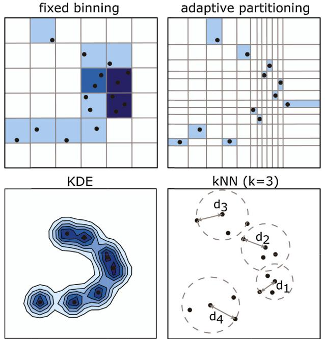
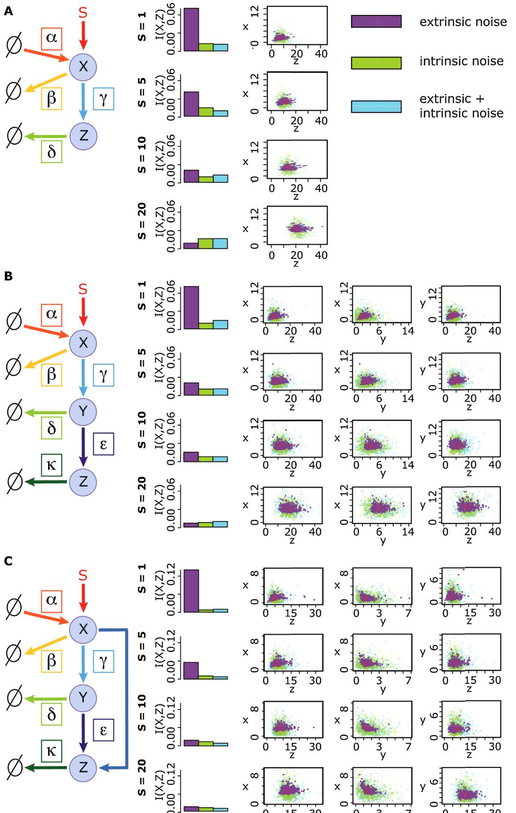
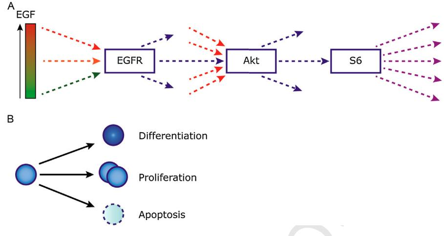
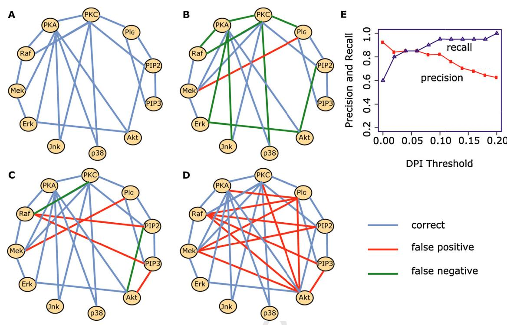
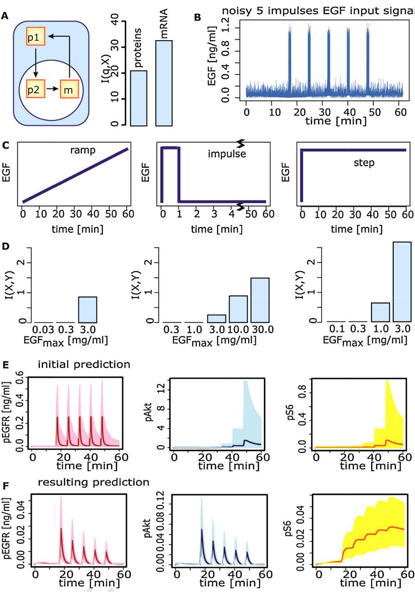

YSCDB16201–11

# **ARTICLE IN PRESS** G Model

Seminars in Cell & [Developmental](dx.doi.org/10.1016/j.semcdb.2014.06.011) Biology xxx (2014) xxx–xxx

Contents lists available at [ScienceDirect](http://www.sciencedirect.com/science/journal/10849521)

# Seminars in Cell & Developmental Biology

journal hom epage: [www.elsevier.com/locate/semcdb](http://www.elsevier.com/locate/semcdb)

## Review

1

6 7

12

#### Information theory and signal transduction systems: From molecular information processing to network inference 2 3

Siobhan S. Mc Mahon1, Aaron Sim1 **Q1** , Sarah Filippi, Robert Johnson, Juliane Liepe, Dominic Smith, Michael P.H. Stumpf ∗ 4 5

Centre for Integrative Systems Biology and Bioinformatics, Department of Life Sciences, Imperial College London, London SW7 2AZ, UK

#### a r t i c l e i n f o 8 17

Article history: 9 10

Available online xxx 11

Keywords: 13

- Signal processing 14
- Mutual information 15
- Noise 16

### a b s t r a c t

Sensing and responding to the environment are two essential functions that all biological organisms need to master for survival and successful reproduction. Developmental processes are marshalled by a diverse set of signalling and control systems, ranging from systems with simple chemical inputs and outputs to complex molecular and cellular networks with non-linear dynamics. Information theory provides a powerful and convenientframework in which such systems can be studied; butit also provides the means to reconstruct the structure and dynamics of molecular interaction networks underlying physiological and developmental processes. Here we supply a brief description of its basic concepts and introduce some usefultools for systems and developmental biologists. Along with a brief butthorough theoretical primer, we demonstrate the wide applicability and biological application-specific nuances by way of different illustrative vignettes. In particular, we focus on the characterisation of biological information processing efficiency, examining cell-fate decision making processes, gene regulatory network reconstruction, and efficient signal transduction experimental design.

© 2014 Published by Elsevier Ltd.

#### **Contents** 18

| 19 | 1. | Introduction                                                       | 00 |
|----|----|--------------------------------------------------------------------|----|
| 20 | 2. | A primer on information theory                                     | 00 |
| 21 |    | 2.1. Uncertainty and information                                | 00 |
| 22 |    | 2.2. Mutual information and conditional mutual information      | 00 |
| 23 |    | 2.3. Computing mutual information                               | 00 |
| 24 | 3. | Biological information processing                                  | 00 |
| 25 |    | 3.1. Quantifying molecular information transmission             | 00 |
| 26 |    | 3.2. Cell fate decision making processes                        | 00 |
| 27 |    | 3.3. The logic of sensing and responding                        | 00 |
| 28 | 4. | Information theoretical analysis of signal transduction systems    | 00 |
| 29 |    | 4.1. Network reconstruction                                     | 00 |
| 30 |    | 4.2. Experimental choice in signal transduction systems         | 00 |
| 31 | 5. | Conclusion                                                         | 00 |
| 32 |    | Appendix A. Molecular motif equations and simulation parameters | 00 |
| 33 |    | References                                                         | 00 |
|    |    |                                                                    |    |

**Q2** ∗ Corresponding author. Tel.: +44 2075945114.

E-mail address: [m.stumpf@imperial.ac.uk](mailto:m.stumpf@imperial.ac.uk) (M.P.H. Stumpf).

1 These authors contributed equally to this work.

[http://dx.doi.org/10.1016/j.semcdb.2014.06.011](dx.doi.org/10.1016/j.semcdb.2014.06.011) 1084-9521/© 2014 Published by Elsevier Ltd.

### 2 S.S. Mc Mahon et al. / Seminars in Cell & Developmental Biology xxx (2014) xxx–xxx

34

### **1. Introduction**

Biological organisms — from microbes to multi-cellular organisms, including humans — are driven to survive and reproduce. The ability to sense the presence of sustenance, reproductive opportunities, and imminent danger is, as such, the primary physiological requirement across all domains and stages of life. In particular, in the context of developmental biology, an organism has to identify, in addition to environmental signals, different tissue types, nutrient needs, co-factor requirements, developmental states, and other physiological cues [\[1,2\].](#page-9-0) As a result, a necessary feature of life is the complex biological machinery which has evolved to process such information, translating incoming messages from the environment into appropriate responses and behaviours [\[3\].](#page-9-0) From this perspective, evolutionary change is driven by fitness advantages conferred to an organism possessing more efficient information processing capabilities, which allow itto respond to vital but potentially noisy signals timely and appropriately. Our understanding of the molecular processes underlying biological information processing at molecular and cellular scales is closely coupled to our ability to quantify the efficiency of these signal transduction processes, and here we provide an overview of the relevant theoretical concepts and their scope for application in signal transduction and developmental biology.

Information theory (discussed in the next section)is the theoretical framework that provides the necessary mathematical tools for the analysis of biological information processing [\[4–6\].](#page-9-0) Originally formulated in an engineering context, its applications typically deal with making the transmission of information from sender to receiver more efficient across some communication channel (for instance, wires, fibre optic cables, electromagnetic waves, etc.).

In systems biology applications it is tempting to appropriate the engineering approach wholesale. However, the notion of a channel in biological signal transduction systems is less well defined, especially in developmental biology as we will argue below (see Section [3.2).](#page-5-0) Here it suffices to say that the inputs and outputs can be of a very different nature. For example, the concentration of epidermal growth factor (EGF) could be the input, while switching cells into a proliferative mode the intended output. More generally, the channel is the complex machinery that senses and transduces extracellular chemical concentrations, resulting in a transcriptional programme which determines the cell's fate. But whether cells proliferate or differentiate, for instance, depends not only on the presence of a single signal, but also the presence of other molecules and the temporal profile with which the stimulus is presented to the cells [\[7\].](#page-9-0) This introduces a level of nuance on biological information processing thatis typically absentfrom traditional engineering applications. 63 64 65 66 67 68 69 70 71 72 73 74 75 76 77 78 79 80

But information theory has much more to offer to systems and developmental biologists than an alternative, if descriptive, view of known biological processes. It provides some of the tools that can be employed in order to get more detailed insights into the information processing machineries [\[8–13\].](#page-9-0) Unlike conventional (or Pearson) correlation, information theoretic measures are sensitive to non-linear relationships between variables [\[14\].](#page-9-0) This can be used to reverse engineer the structure of signalling and regulatory networks that control, for example, developmental processes at the molecular and cellular levels [\[15–17\].](#page-9-0) More recently, in addition to network inference (or reconstruction) information theoretic approaches have also gained prominence in experimental design, where they allow us to improve our knowledge, e.g. about signal transduction networks, in a well defined iterative manner [\[18\].](#page-9-0) 81 82 83 84 85 86 87 88 89 90 91 92 93 94 95

Below we provide an overview of these different aspects of information theory in developmental systems biology. We start from a basic outline of information theoretic concepts (aimed 96 97 98

primarily at quantitative biologists) before introducing some key mathematical tools. We then discuss the practical uses that information theory can have in elucidating the mechanisms underlying biological systems by way of five illustrative vignettes. Methodologically these different topics are closely related; considering them together — here done for the first time, to the best of our

108

109

## knowledge — allows us to draw out some of the many facets that information theory has in a molecular and cellular context.

### **2. A primer on information theory**

### 2.1. Uncertainty and information

The first successful theory of information was developed by C.E. Shannon at Bell Laboratories in 1948 [\[19\].](#page-9-0) Despite the specific nature of his original motivation (maximising the capacity of communication channels), the theory itself is so general that it has since been applied, in its originalfrom,to a wide range of disciplines across science, engineering and economics [\[16,20–26\].](#page-9-0)

Shannon recognised that whatever information is, one should, at least in theory, be able to measure it. In signals sent over a communication channel one quantifiable feature is the noise, which is measured, say, in terms of the proportion of incorrectly interpreted messages. A less distorted signal carries, in the intuitive sense, more information; conversely, the noisier or more distorted signal is associated with a loss of information. This link between uncertainty and information is the key insight behind Shannon's definition.

Mathematically, one deals with uncertainty in physical quantities using random variables. A random variable X is a variable that adopts a range of values in some sample space ˝X with some probability distribution pX. Examples in biology range from discrete counts of physical entities (e.g. cell signalling molecules) to continuous attributes (e.g. temperature, pH levels), all of which, upon repeated measurements, exhibit some degree of randomness about a mean.

We begin by quantifying the information contained in a single realisation x of some random variable X. Shannon posited three natural conditions that any such measure of information I(x) must satisfy. First, the quantity of information in the measurement x depends solely on the probability pX(X), with small values pX(X) corresponding to large I(x). This is highly intuitive unlikely and surprising events carry more information than common occurrences. This condition strips away from the concept of information all colloquial associations to the inherent meaning and other semantic aspects of the message or signal. Second, information must be a continuous function of pX(X); it is only reasonable that a small change in pX(X) should effect a corresponding small change in I(x). Third, information obtained from independent realisations x1x2˝X should be additive in the sense that I(x1, x2) = I(x1) + I(x2). Up to a constant of proportionality, the unique measure that satisfies these three conditions is the (negative) logarithm, i.e. I(x) = − logpX(x). Now the very nature of random variables compels one to consider the space of all possible realisations in ˝X, via the expectation operator, rather than just a single measurement x. According to Shannon, therefore, information can be thought of as the expected (logarithmic) surprise from the measurement of a random variable. More formally, it is given by the entropy H(X), defined as the negative expectation of the logarithm of the probability distribution. For a continuous variable,

$$H(\mathbf{X}) = -\int_{\mathcal{Q}_{\mathbf{X}}} p_{\mathbf{X}}(\mathbf{x}) \log p_{\mathbf{X}}(\mathbf{x}) d\mathbf{x}.\tag{1}$$

#### S.S. Mc Mahon et al. / Seminars in Cell & Developmental Biology xxx (2014) xxx–xxx 3

#### 2.2. Mutual information and conditional mutual information 158

So far we have described information theory in the simple context of a single random variable. Almost all of biology, however, is the study of the relationships between variables — input/output, signal/response, co-regulating genes, competing species, etc. The most commonly-used toolto characterise these links, namely Pearson's correlationmeasure, unfortunately suffers froman inability to properly account for complex, yet frequently observed, non-linear associations. Information theory, however, has no such handicap and can be used to shed light on the overall dependency structures of such systems. 159 160 161 162 163 164 165 166 167 168

The first step in the multivariate extension of information theory is straightforward. The measure of information here is the joint entropy H(X,Y, . . .), defined in terms of the joint probability distribution p(X,Y,...). In the case of two variables, for example, 169 170 171 172

$$\mathfrak{g}_{W^3} \quad H(\mathsf{X}, Y) = -\int_{\mathcal{Q}_{\mathsf{X}}} \int_{\mathcal{Q}_Y} p_{\mathsf{X}, Y}(\mathsf{x}, y) \log p_{\mathsf{X}, Y}(\mathsf{x}, y) d\mathsf{x} d\mathsf{y}.\tag{2}$$

The information theoretic approach to quantifying dependencies, then, is to measure the departures from independence. Far from being a tautology, the avoidance of any explicit assumptions about the form of the dependencies (e.g. linear, sinusoidal, etc.) allows the approach to be completely general. Two random variables are independent if and only if their joint probability is the product of their marginals, i.e. 174 175 176 177 178 179 180

$$\mathbf{p}_{\mathsf{i}\mathsf{x}\mathsf{i}} \qquad \mathbf{p}\chi,\mathbf{y}\{\mathbf{x},\mathsf{y}\}\stackrel{\mathsf{int}}{=}\mathsf{p}\chi\{\mathbf{x}\}\mathbf{p}_{\mathsf{Y}}\{\mathbf{y}\} \quad \forall \mathsf{x}\in\mathfrak{Q}\mathbf{x}_{\mathsf{i}\mathsf{y}}\in\mathfrak{Q}\mathbf{y},\tag{3}$$

where pX (x) = ˝Y pX,Y (x, y) dy. 182

The mutual information I(X;Y) between two random variables X,Y is then defined as the difference between the joint entropy and the joint entropy under the assumption of independence of X and Y [\[27\].I](#page-9-0)t gives the extentto whichknowledge of one variableprovides information about the other. Explicitly, one writes 183 184 185 186 187

$$\begin{split} I(\mathbf{X};Y) &= \int_{\mathcal{Q}_{\mathbf{X}}} \int_{\mathcal{Q}_{Y}} p\mathbf{x}_{\mathbf{}}\mathbf{y}\{\mathbf{x},\mathbf{y}\} \log\left(\frac{p_{\mathbf{X},\mathbf{Y}}\langle\mathbf{x},\mathbf{y}\rangle}{p_{\mathbf{X}}\langle\mathbf{x}\rangle p_{\mathbf{Y}}\langle\mathbf{y}\rangle}\right) d\mathbf{x} \text{ d}\mathbf{y} \\ &= H(\mathbf{X}) + H(Y) - H(\mathbf{X},Y). \end{split} \tag{4}$$

It is easily shown that mutual information is non-negative, I(X;Y) ≥ 0, with equality only in the case of independence. The expression is also symmetric, I(X;Y) = I(Y;X), reflecting a nondirectional association with no claims of causality. In cases where the random variables representtime-series trajectories, i.e. X = X(t), in addition to the mutual information between the trajectories, one can also measure the rate at which information about one trajectory is gained from the other as the length of the trajectories are increased. The mutual information rate Irate(X ; Y) is defined as 189 190 191 192 193 194 195 196 197

$$I_{\text{tree}} \qquad I_{\text{rate}}(\mathcal{X}; Y) = \lim_{T \to \infty} \frac{d}{dT} I(\mathcal{X}(\mathbf{t}); Y(\mathbf{t})), \tag{5}$$

for trajectory length T. It has been shown that, for systems at stationarity, Irate(X ; Y) can be obtained via a transformation of the trajectories into Fourier space where the T→∞limitis well-defined in terms of the power spectrum [\[10\].](#page-9-0) 199 200 201 202

In complex and highly interconnected biological systems, the dependency structure is seldom a disjoint union of simple pairwise associations. An example could be instances where the non-independence between two variables is entirely attributed to physical interactions with one or several other common confounding variables; the apparent association between the two variables is incidental rather than biological (see Section [4.1](#page-6-0) for a concrete illustration in the context of gene regulatory networks). In information theory, one is able to uncover this additional structure using the conditional mutual information [\[28\].](#page-9-0) 203 204 205 206 207 208 209 210 211 212

For random variables X, Y, and Z, the conditional mutual information I(X;Y|Z) is the expectation of the mutual information I(X;Y), given the value of Z, with respect to the marginal distribution pZ, i.e.

$$\begin{aligned} \text{I}\{\mathbf{X}; \mathbf{Y}|\mathbf{Z}\} &= \text{E}_{\mathbb{Z}}\{\text{I}\{\mathbf{X}; \mathbf{Y}\}|\mathbf{Z}\} \\ &= \text{H}\{\mathbf{X}, \mathbf{Z}\} + \text{H}\{\mathbf{Y}, \mathbf{Z}\} - \text{H}\{\mathbf{X}, \mathbf{Y}, \mathbf{Z}\} - \text{H}\{\mathbf{Z}\}. \end{aligned} \tag{6}$$

In words, it measures the extent to which knowledge of Y can give additional information about X in light of prior knowledge of Z. As in the case of mutual information, it is non-negative and symmetric under the exchange of X and Y.

### 2.3. Computing mutual information

Despite its wide applicability and many favourable properties, it is well known that estimating mutual information is not straightforward [\[29\].](#page-9-0) There are, however, a few comforting exceptions. In the special case where the joint distribution pX,Y is Gaussian, there are exact, analytic expressions for mutual information in terms of the determinants of the correlation matrix R (17), i.e.

$$I(X;Y) = \frac{1}{2} \log \left( \frac{|R_{\text{XY}}||R_{\text{YY}}|}{|R|} \right) \,. \tag{7}$$

Similarly, for the mutual information rate one can obtain the exact expression in terms of the power spectra [\[10\].](#page-9-0) Less trivially, if the probability distributions in the integrand in (4) are not Gaussians but are known in closed-form, estimating mutual information becomes an exercise in numerical integration, an example of which is given in Section [4.2.](#page-6-0) In this illustrative application, a modelled relationship between the two variables allows for the joint and conditional distributions, pX,Y and pX|Y respectively, to be estimated via Monte Carlo sampling of the known marginal distribution pY (see Section [4.2](#page-6-0) and, for full details, [\[18\]).](#page-9-0) Despite the distributions being non-Gaussian, the analytic expressions in (7) can still provide the lower bounds of the mutual information and mutual information rates where appropriate Gaussian models are chosen as approximations [\[30\].](#page-9-0)

In studies of biological systems, and data exploration tasks in particular, one is almost never in possession of any prior knowledge of the probability distributions in (4); mutual information will therefore need to be estimated entirely from data. For discrete variables, not knowing the joint probability mass function is not considered pathological as the probabilities are easily and optimally obtained via maximum likelihood estimation [\[31\].](#page-9-0) Biological variables are, however, typically continuous and the challenge is to estimate the distribution functions in (4) from a finite, and often very small, number of empirical point measurements [\[32\].](#page-9-0) There have been numerous attempts at constructing better estimators, all of which differ in varying extents with regard to their inherent bias, unwanted tuning parameters, and computation complexity in higher dimensions, and hence the efficiency of each estimator is context dependent. A summary of several methods is illustrated in [Fig.](#page-3-0) 1 and a more thorough review can be found in [\[14,33\].](#page-9-0)

Perhaps the simplest approach is to discretise the distribution using standard, fixed-width, histograms [\[35\],](#page-9-0) where the probability mass in each (possibly multi-dimensional) bin is directly proportional to its data occupancy. Although consistent, this systematically overestimates the mutual information and is highly sensitive to the number of bins and, by implication, the number of data points [\[36\].](#page-9-0) This estimator can be improved upon by dropping the restriction on fixed histogram widths. This is known as adaptive partitioning, of which there are several variants. One method involves an iterative,tree-like, equal partitioning ofthe data, which terminates when the support of each bin is sufficiently uniform (as determined via a -2 test statistic) [\[37\].](#page-9-0) A more recent attempt

217

## **ARTICLE IN PRESS** G Model

4 S.S. Mc Mahon et al. / Seminars in Cell & Developmental Biology xxx (2014) xxx–xxx

Please cite this article in press as: Mc Mahon SS, et al. Information theory and signal transduction systems: From molecular information

processing to network inference. Semin Cell Dev Biol (2014), [http://dx.doi.org/10.1016/j.semcdb.2014.06.011](dx.doi.org/10.1016/j.semcdb.2014.06.011)

**Fig. 1.** Mutual information estimators. Illustration of the application of four commonly used mutual information estimators on non-linear, two-dimensional, toy datasets. From the top-left, the estimators used are: fixed-width binning, adaptive partitioning, kernel density estimator (KDE), and k-nearest neighbours (kNN) estimator. The first three estimate the global probability distribution. The kNN estimator, with k = 3 in this case, estimates the entropy terms in [(4)](#page-2-0) directly from the statistics ofthe distances di to the third-nearest neighbour of each point. By estimating the probability distribution of the distance di between the sample points to their kth nearest neighbour, one obtains estimates for the probability mass surrounding the sample points. Given sufficient data, this leads to local estimates of the probability distribution. Since the entropy H is simply the expected negative log-density, an estimate for the mutual information follows naturally [\[34\].](#page-9-0)

seeks to achieve an approximately uniform data occupancy across the bins [\[33\].](#page-9-0) In both instances, one aims to maximise the effective sample size of the available data sets by varying the width of each partition using local rather than global properties of the data.

Another approach, as adopted in Section 3.1, employs kernel density estimation. This generalises the naive estimator by replacing rectangular bins with a kernel function so as to render the estimator independent from the choice of origin or bin positioning [\[14,38\].](#page-9-0) For example, in the case of a Gaussian kernel, a onedimensional distribution pX(X) is approximated from a data set {xi} N i=1, assuming a given bandwidth h, as 276 277 278 279 280 281 282

$$p_{\mathbf{x}\geq 0} \quad \overset{\bigwedge}{p_X^{\wedge}} \langle \mathbf{x} \rangle = \frac{1}{N\hbar\sqrt{2\pi}} \sum_{i=1}^{N} e^{-(\mathbf{x}-\mathbf{x}_i)^2/2\hbar^2}. \tag{8}$$

The choice of smoothing parameter is crucial and can be made via a canonical rule-of-thumb [\[39\]](#page-9-0) or by employing more statistically sophisticated methods like the smoothed bootstrap and other plug-in techniques [\[40\].](#page-9-0) 284 285 286

So far we have described plug-in methods of approximating mutual information based on consistent, global, density estimates. Instead, one can determine mutual information by direct computationofthe entropy terms in[(4).](#page-2-0) The best knowninstance is,perhaps, the k-nearest neighbour estimator. This provides entropy values from the statistics of the distances to the kth-nearest neighbour of every sample in the data set [\[34\].](#page-9-0) Here the dependence on the density is local and implicit (with an assumption of a uniformity surrounding each kth-nearest neighbour ball), one consequence being that there is no guarantee that the estimated mutual information value is positive. 287 288 289 290 291 292 293 294 295 296 297 298

### **3. Biological information processing**

The conceptually simple foundations ofinformationtheory belie the true wealth of its possible applications. We attempt to remedy this, starting, in this section, with a few illustrative examples pertaining to biological information processing. These illustrations are 'conventional' in the sense that inputs, outputs, and channels are all biological objects from which measurements are extracted.

### 3.1. Quantifying molecular information transmission

Our first illustration is an instance of how to increase our understanding of biochemical processes within cells by quantifying the information processing efficiency of the associated molecular reactions. Specifically, we would like to gauge the relative impact of different types of noise in relation to the distortion of information between two molecular species in a signalling reaction. There are two sources of noise which account for the loss of fidelity in the information transfer, namely the extrinsic noise, representing cellto-cell variability in cellular or environmental quantities such as protein degradation rates or temperature, and the intrinsic noise, reflecting the inherent stochastic or probabilistic nature of chemical reactions and transport processes at the molecular level [\[41\].](#page-9-0) In the simplest of setups, one could consider a signal transduction system where the input and output signals are counts of identical molecules and the noisy transmission channel the physical transport of the molecules from one location in a cell to another, such as the shuttling of Hes1 protein from the cytoplasm to the nucleus in embryogenesis [\[42,43\].](#page-9-0) In more complete and complicated scenarios, there is one or several molecular species representing the input and another the output; the channel itself may be a tangled combination of transport processes, linear, branching and loop reactions [\[44\].](#page-9-0)

Here we illustrate the potential of mutual information for characterising the effects of noise in signalling pathways by estimating its value between molecular species at opposite ends of three, increasingly complex,molecular signallingmotifs, under the effects of differenttypes of noise [\[45\].](#page-9-0) Details ofthe motifs are summarised in [Fig.](#page-4-0) 2. The first motif we consider represents a basic input-output transcription regulation system with just two molecular species, for instance,the transcription factor and its regulating gene with no additional interactions. Next, we introduce an additional species,to create a motif made up of a chain of elements with linear dependencies, which in a biological context could correspond to functionally critical linkers between protein domains [\[46\].](#page-9-0) The final motif represents a three-species system with a single, non-linear, feed forward loop (FFL) reaction, composed of two genes, one of which regulates the other, and both jointly modulating the transcription of a target gene [\[47\].](#page-9-0) Here the focus is on the, so-called, coherent type-1 FFL which has been shown to be the most common type of coherent structure in both E. coli and S. cerevisiae [\[48\].](#page-10-0) Note that there are eight different structural types of FFL based on different combinations of activation and repression, each categorised into coherent and incoherent based on whether the sign of the direct and indirect regulation path are, respectively, the same or opposite.

Using a stochastic differential equation (SDE) model, extrinsic noise is introduced via random Gaussian perturbations of the system parameters, while the intrinsic noise level is varied by tuning the size of the Brownian motion steps in the Euler–Maruyama approximation of the SDE (which corresponds to the size of the system). There are three scenarios: intrinsic-only, extrinsic-only, and both noise sources present. As shown in [Fig.](#page-4-0) 2, we observe that mutual information I(X;Z) is highest for the cases with extrinsiconly noise. Information transmission is most affected, therefore, by the presence of intrinsic noise and, counter-intuitively, the loss in fidelity is not sufficiently mitigated by increasing signal strengths.

299

306

S.S. Mc Mahon et al. / Seminars in Cell & Developmental Biology xxx (2014) xxx–xxx 5

**Fig. 2.** The figure above displays the distributions of species X, Y and Z in the simple input–output motif (A), the linear motif (B) and the feed forward loop motif (C), in the presence of extrinsic (purple) noise, intrinsic (green), and both types of noise (blue) — all with comparable output variances — as well as in the absence of noise (red cross). For simplicity all three motifs contain a single time-varying stimulus S(t) and molecules with fixed degradation rates. In each subplot (A–C) we show how the molecular species react to different input signals S = {1, 5, 10, 20}, increasing from top to bottom in each set of scatter plots respectively. The bar charts represent the trend in mutual information computed via KDE between molecular species X and Z for the simple, linear and feed forward loop in the presence of the above mentioned different input signals. The equations corresponding to each motif are detailed in [Appendix](#page-9-0) [A.](#page-9-0)

6 S.S. Mc Mahon et al. / Seminars in Cell & Developmental Biology xxx (2014) xxx–xxx

**Fig. 3.** (A) Signal transduction through the Akt pathway takes extra-cellular signals such as EGF, and transduces them into the cell's interior. In addition to the signal of interest (in a given context), the elements of the signalling pathway also are subject to interact with molecular signals emanating from other receptors or pathways, and in turn affect several other down-stream molecules. Furthermore, signal transmission is dependent on the input strength and low (green) and high (red) EGF concentrations will give rise to different cell-fates. But even once this is known, non-linearity in the dynamics of signal transduction networks may mean that we cannot necessarily predict responses to intermediate signals (orange). (B) Depending on the signals arriving in the cell/cell nucleus, a transcriptional response will result in different cell fate decisions: e.g. proliferation, differentiation, apoptosis or stasis.

Furthermore, although this conclusion about the relative impact of the different types of noise cannot be generalised to all signalling pathways, the observed pattern is surprisingly similar across the three otherwise non-trivially different systems. 362 363 364 365

The above analysis of different noise types can also be carried out for entire trajectories (including stationary states), inferred, for instance, from sets of longitudinal data. The linear noise approximation (LNA) [\[49–51\]](#page-10-0) is often used to investigate information transmission in systems responding to both instantaneous and time-varying input signals [\[9,10,49\].](#page-9-0) Through system-size expansion of the chemical Master equation, the LNA provides the first two moments of each species in the system, and their autocorrelations. This Gaussian approximation then allows one to make approximations based on [(7).](#page-2-0) 366 367 368 369 370 371 372 373 374 375

Some other recent examples of information theoretic signal transduction systems analysis (using Gaussian assumptions) use Langevin equations to explore the effect of noise intensity on stochastic resonance [\[52\]](#page-10-0) and the small noise approximation to find optimal information transmission in gene regulatory networks with particular application to Drosophila embryo development[\[11\].](#page-9-0) 376 377 378 379 380 381

#### 3.2. Cell fate decision making processes 382

394

The conceptual framework illustrated in the previous section can be applied to cell-fate decision making processes; in this case the extra-cellular signals, such as growth factors, hormones, etc. form the inputs, X, while the cell fates form the outputs, Y. Now, unlike before, the very nature of inputs and outputs differs quite considerably (see Fig. 3), and the "vocabulary" used at the inputs (here, continuous molecular abundances) and the outputs, (here, discrete cell-fates) will typically differ, i.e. the sample spaces ˝X and ˝Y are different. 383 384 385 386 387 388 389 390 391

The mutual information I(X;Y) for the example in Fig. 3 is then given by 392 393

$$\begin{split} I(\mathsf{X};Y) &= \int_{\mathcal{Q}_{\mathsf{X}}} \sum_{\mathsf{y} \in \mathcal{Q}_{\mathsf{Y}}} p_{\mathsf{X},Y}(\mathsf{x},\mathsf{y}) \log \left( \frac{p_{\mathsf{X},Y}(\mathsf{x},\mathsf{y})}{p_{\mathsf{X}}(\mathsf{x})p_{Y}(\mathsf{y})} \right) \mathrm{d}\mathsf{x} \\ &= \int_{\mathcal{Q}_{\mathsf{X}}} \sum_{\mathsf{y} \in \mathcal{Q}_{\mathsf{Y}}} p_{Y|\mathsf{X}}(\mathsf{y}|\mathsf{x}) p_{\mathsf{X}}(\mathsf{x}) \log \left( \frac{p_{Y|\mathsf{X}}(\mathsf{y}|\mathsf{x})}{p_{Y}(\mathsf{y})} \right) \mathrm{d}\mathsf{x}. \end{split}$$

Here the conditional probability pY|X(y|x) is a characteristic of the molecular pathway and pY(Y) is the distribution over cell-fates. In this way the mutual information measures the extent to which the uncertainty about cell-fate Y is reduced when the input signal (such as ambient EGF concentration) X is known [\[7\].](#page-9-0)

More informative here is the channel capacity C, with

$$\mathbf{C} = \max_{\mathbf{p}_{\mathcal{X}}} \int_{\partial \mathcal{X}} \sum_{\mathbf{y} \in \mathcal{Q}_{\mathcal{Y}}} p_{Y|\mathcal{X}}(\mathbf{y}|\mathbf{x}) p_{\mathcal{X}}(\mathbf{x}) \log \left( \frac{p_{Y|\mathcal{X}}(\mathbf{y}|\mathbf{x})}{p_{Y}(\mathbf{y})} \right) d\mathbf{x}.\tag{40}$$

Typically,for a multi-cellular organism pY is given by the physiological demands; for example, a haematopoietic stem cell will have to produce common lymphoid and myeloid progenitors in certain proportions within narrow ranges [\[53\].](#page-10-0) Then given the molecular processes, pY|X,the channel capacity is maximised by optimising pX, the distribution over inputs. This is a classical variational problem.

However, cell-fate is often subject to more than one input (i.e. X is really a vector of differentinputs) and a "parliament of pathways" decides upon the cell-fate. This makes the variational problem harder for the modeller, but gives evolution more scope for altering the different molecular processes that result in the mapping, pY|X. In fact, both pX, the distribution over inputs such as endocrinal and paracrinal signals, and pY|X, the molecular interaction network transducing and processing these extracellular signals, are more flexible and subjectto evolutionary "tinkering" with molecular processes.

Thismay seemlike adisjointbetweenthemathematical andbiological interpretations ofthe channel capacity. Butit merely reflects the differences between engineering and biological applications of information theory. For any given molecular network giving rise to pY|X, we can identify an "optimal" input distribution, pX, that maximises the channel capacity. In reality this may not be the distribution over physiological conditions, but allows us to assess how much information in principle can flow across a signalling/gene regulatory network underlying cell fate decision making.

### 3.3. The logic of sensing and responding

The signal processing capabilities of all biological entities are under evolutionary pressures due to their life-history, along with their environment and the closely-related constraints imposed by their physiological needs (such as availability offood, etc.).Acrucial

427

aspect, is the ability to translate the environmental states into the cells' vocabulary, by mapping them onto the corresponding physiological or response states, which in an information processing context correspond to different outputs. For example in E. coli, chemotaxis is guided by the flagella [\[54\];](#page-10-0) these can rotate in two ways, causing the bacterium to either swim in a straight line, or to tumble randomly. Thus there are two physiological states, and the process of switching between the two types of motion depends on the external nutrient availability, which is quasi-continuous. The ability of the cell to respond correctly to the environmental signals here directly affects the individual cell's reproductive success [\[55\].](#page-10-0) 432 433 434 435 436 437 438 439 440 441

The number of existing distinct states, onto which external signals are mapped, is a clear indicator of the complexity of the signal processing, and typically is highest in multi-cellular organisms. These in fact possess a range of post-translational modification scenarios, allowing cells to exhibit multiple stable states [\[56\],](#page-10-0) but also increasing their computational demands. Here, the spatial structure of the eukaryotic cell alone will frequently suffice to generate multi-stable behaviour [\[57\]](#page-10-0) (where each state can correspond to a separate physiological cell state); partitioning biochemical processes into separate compartments is, of course, widespread and may underly both physiological as well as developmental cell-fate decision making processes. 442 443 444 445 446 447 448 449 450 451 452 453 454

Current understanding of many cell differentiation processes suggests that to go from the original stem cell population to a set of fully differentiated cells, a series of intermediate steps has to be negotiated. This would allow the cell to break down this challenging computational problem — such as going from a haematopoietic stem cell to a fully differentiated plasma cell [\[58\]](#page-10-0) — into a sequence of much simpler, typically binary, decisions. A simple switch is easily generated at both the transcriptional and post-transcriptional levels [\[59\],](#page-10-0) and a sequence of such switches could facilitate the progression towards increased differentiation. 455 456 457 458 459 460 461 462 463 464

Depending on the cell type (or circumstances) such decisions can also affect the fitness of an organism, just like in bacteria. The overall importance of getting such decisions "right" is clearly greater in the less differentiated cells, than e.g. in fully differentiated cells. For this reason it will be interesting to see if the signal processing networks, or their ability to handle molecular noise, change along differentiation cascades. 465 466 467 468 469 470 471

#### **4. Information theoretical analysis of signal transduction systems** 472 473

In contrast to the preceding three examples where the focus is on measuring information, we now describe a slightly less conventional class of applications involving the reverse-engineering of signal transduction systems. We begin with an example in network inference and demonstrate the use of the conditional mutual information measure. The fifth and final example is an information theoretic approach to experimental design, where one or both entities in the mutual information measure are the parameters of a given biological model. 474 475 476 477 478 479 480 481 482

#### 4.1. Network reconstruction 483

The state of a cell is governed by the complex regulation of the expression of its genes. This regulation occurs at many levels, ranging from chromatin remodelling to posttranslational modifications [\[60\].](#page-10-0) In order better to understand gene regulation, a large and growing body of transcriptomic data can be used to infer interactions between genes, and has prompted the development of a number of gene regulatory network (GRN) reconstruction algorithms, including Graphical Gaussian models, Bayesian networks and relevance networks [\[61–64\].](#page-10-0) 484 485 486 487 488 489 490 491 492

A complete statistical description of a GRN is equivalent to a full specification of the joint probability distribution p(g1, ..., gN) for the set of N genes and their corresponding set of steady-state expression levels {gi} N i=1. This joint distribution can, in turn, be expressed in the canonical form

$$p(\mathbf{g}_1, \dots, \mathbf{g}_N) = \frac{1}{Z} \exp\left[ -\sum_{i}^{N} \phi_i(\mathbf{g}_i) - \sum_{i,j}^{N} \phi_{ij}(\mathbf{g}_i, \mathbf{g}_j) - \dotsb \right],\tag{9}$$

where Z is the normalisation factor and ϕ(gi), ϕ(gi, gj), ... the potential functions representing the (possibly zero) contributions of the respective indicated sets of co-regulating genes [\[65\].](#page-10-0) Although obtaining the precise definitions of these potentials represents a full characterisation ofthe pairwise and higher-order genetic interactions, the exercise typically involves computationally non-trivial constrained optimisation routines; furthermore, these definitions are not required if one is interested in discovering only the presence or absence of interactions. In this section, we describe the information theoretic approach to this relatively simpler task of uncovering the non-zero potentials for the overall inference of GRNs.

Information theoretic approaches to GRN reconstruction have two major strengths. The first is that mutual information is able to capture nonlinear associations between variables, a feature seen in expression data. Second, it has been demonstrated that the use of the data processing inequality (DPI), which states that for a noisy system X→Y→Z, knowledge of Z cannot give more information about X than Y can give about X [\[19,65\],](#page-9-0) in distinguishing two genes regulated by a third from a trio of co-regulating genes. In reconstructing simulated GRNs, the combined approach using mutual information and DPI outperforms Bayesian and relevance networks techniques in the precision and recall of direct regulatory links [\[65\].](#page-10-0)

It has been suggested that the performance can be further improved upon, with fewer false removals of network edges from trios of connectedgenes,by incorporating conditionalmutualinformation [\[65\].](#page-10-0) Employing an estimator for the conditional mutual information allows for indirect associations to be distinguished from direct ones via pairwise testing of all detected three-way associations. The improved performance of this full information theoretic approach can be demonstrated, for instance, via a reconstruction of a simulated GRN model based on the Raf pathway — a gold standard network model of eleven genes (see [Fig.](#page-7-0) 4) and comparing it with the latter's experimentally verified structure (network structure and simulated data taken from [\[61,63\].](#page-10-0) Building an undirected graphical model of the Raf pathway from a simulated set of nonlinear gene association data with moderate additive noise, the full approach incorporating conditional mutual information is shown to be superior to the "DPI-only" approach irrespective of the choice of DPI tolerance threshold [\[66\].](#page-10-0) The DPIonly method can only remove all false negatives (omitted true edges in the inferred network) at the expense of many false positives (incorrectly included edges). Of equal importance, the DPI is never able to remove all false negatives for this reconstruction without missing almost half of the true interactions.

Larger sets of gene expression data will enable increasingly accurate reconstructions of GRNs, including interactions regulated by the joint expression of two or more genes. This carries huge potential in understanding the role of transcriptional programmes in cell differentiation and in the molecular basis of cell phenotypes.

## 4.2. Experimental choice in signal transduction systems

Please cite this article in press as: Mc Mahon SS, et al. Information theory and signal transduction systems: From molecular information

processing to network inference. Semin Cell Dev Biol (2014), [http://dx.doi.org/10.1016/j.semcdb.2014.06.011](dx.doi.org/10.1016/j.semcdb.2014.06.011)

In addition to providing an ideal framework for the analysis of a given data set, as demonstrated in the previous example, information theory can also provide the ideal framework for the optimal collection of data. Building mechanistic models from experimental

498

499

493

> 548

8 S.S. Mc Mahon et al. / Seminars in Cell & Developmental Biology xxx (2014) xxx–xxx

**Fig. 4.** Reconstruction of the Raf signalling network. The undirected graphs here are inferred using the following information theoretic methods. (A) The conditional mutual information algorithm (66); (B–D) the algorithm using mutual information and DPI only at tolerance thresholds 0.05, 0 and 0.2 respectively. Blue edges indicate correct interactions. Green edges represent false negatives (edges falsely removed by the DPI) and red represent false positives (edges incorrectly included by the algorithm). (E) the precision and recall at various levels of tolerance threshold for the DPI-only method. The best precision-recall tradeoff for the DPI-only method was determined by observing the DPI tolerance threshold where these curves intersect.

measurements is central to systems biology. But not all experiments are equally useful: while some may allow for the constructed model to be calibrated to a high precision, others add little or no knowledge to what is already known from previously collected data. Choosing the optimal experiment is the goal of experimental design [\[67\].](#page-10-0) In this section we describe how information theory can be used to identify the experiment that removes the most uncertainty from a given model and, by implication, maximises our understanding of the underlying biological system [\[18\].](#page-9-0) 553 554 555 556 557 558 559 560 561

Mathematical models of developmental signalling systems typically depend on parameters whose values are not known to a high degree of certainty [\[68\].](#page-10-0) In the Bayesian framework, this initial uncertainty is represented by the prior distribution over the parameters. The expected data output from a well-designed experiment should allow one to infer the underlying model parameter with high confidence. More formally, given the prior and the corresponding output distribution, the optimal experiment is one with the maximum mutual information between the parameters and the measurable outputs. In addition, mutual information can also be used to determine the experiment that would provide the best prediction of the system behaviour under a separate set of experimental conditions that, for some reason, cannot be implemented. These two applications are illustrated in the following using examples of developmental signal transduction system experiments. Here we define the optimal experiment as the one that maximises the mutual information. However, itis possible to take into account the cost of an experiment or the complexity of an experimental setup. 562 563 564 565 566 567 568 569 570 571 572 573 574 575 576 577 578 579 580

The first example concerns the Hes1 transcription factor that plays a number of important roles, including in cell differentiation and segmentation of vertebrate embryos. Hes1 transcriptional regulation can be modelled by a system of ordinary differential equations involving three species (Hes1 mRNA, Hes1 nuclear protein, and Hes1 cytosolic protein) and four parameters. The shuttling 581 582 583 584 585 586

rate parameter — the rate by which Hes1 enters the nucleus — is of main interest as it was shown to be the most sensitive parameter with regards to obtaining the oscillatory behaviour of the Hes1 protein [\[43\].](#page-9-0) Whether western blot protein measurements (P) or real-time PCR mRNA measurements (m) provide more information about the shuttling rate parameter can be determined by comparing the mutual information measures I(P;) and I(m;). As shown in [Fig.](#page-8-0) 5A, I(P;)<I(m;), i.e. mRNA measurements are to be preferred over protein measurements for maximal identifiability of the shuttling rate parameter.

The second example is the phosphorylation of Akt and ribosomal binding protein S6 in response to an EGF signal. The pathway of interest, the schematic representation of which is shown in [Fig.](#page-5-0) 3, has been modelled using first-order mass action kinetics [\[7\].](#page-9-0) The aim is to predict the behaviour of the biological system under conditions where it is not possible to obtain experimental data. In this case the prediction target is the dynamics of the Akt system under multiple pulsed stimuli with EGF in the presence of background noise, as shown in [Fig.](#page-8-0) 5B; a difficult-to-measure experimental setup would be, say, one involving five pulses of intensity 1 ng/ml of length 60 s spaced by 400 s with additive background noise.

One starts with an initial parameter distribution from which a simulated baseline prediction of the time courses of phosphorylated EGF receptor (EGFR), phosphorylated Akt and phosphorylated S6 under the above experimental conditions are established (see [Fig.](#page-8-0) 5E). The different experiments are then ranked based on their predictive performances relative to this baseline. For this illustration, consider a set of, say, 12 different, and practically implementable, experimental conditions based on different possible input signal profiles and EGF concentrations (see [Fig.](#page-8-0) 5C). The input combination that produces the most reliable predictions can be determined by calculating the mutual information between each potential experimental inputs and the target, but unrealisable, fiveimpulse noisy stimulus input and comparing the values across the

587 588 589

**Fig. 5.** (A) Pathway of the Hes1 model (left) and mutual information between the shuttling rate and protein/mRNA measurements. (B) EGF input signal. The response of the Akt and S6 to this EGF signal was aimed to be predicted. (C) Available experiments of different EGF stimuli. (D) Mutual information between EGF stimulus and the predicted response of EGFR, Ak and S6. (E and F) Initial and final prediction results of phosphorylated EGFR, Akt and S6 time course. Dark lines indicate the means. Shaded areas indicate the confidence intervals. A detailed description of the Hes1 pathway and the EGF pathway including the ODEs and parameters can be found in (18).

12 candidates. Initial information about model parameters is incorporated by computing the mutual information based on the original distribution above. In this example, the step stimulus of intensity 3 ng/ml has the highest predictive power about the behaviour of the target stimulus pattern (Fig. 5D) and yields vastly improved predictive power compared to the initial prediction (Fig. 5F). 621 622 623 624 625 626

#### **5. Conclusion** 627

Ultimately we have seen that the uses of information theory are two-fold. First, we can employ information theoretical concepts to gain further insight into cellular signalling and regulatory processes. This is perhaps the more challenging application; largely because information is so completely separate from meaning and, in a biological context, such a distinction is often far from helpful 628 629 630 631 632 633

when we are trying to understand mechanisms and their underlying evolutionary rationale.

Nevertheless we have argued that the ability to quantify, in a rigorous manner, how faithfully signals are transduced along biomolecular pathways, does allow us to compare and contrast different molecular motifs. From such considerations we may be able to distill evolutionary or mechanistic rationales,for or against given choices of molecular interactions. This, we feel, is a useful direction for future research. Especially, for noisy dynamics [\[8,69,70\]](#page-9-0) the information processing aspects — as well as means for dealing with such noise [\[71\]](#page-10-0) — we feel that there are a host of important fundamental as well as applied outstanding problems.

The second facet of information theory that we considered here is much more pragmatic and straightforward: reverse engineering tasks will benefit from the flexibility that information theoretical

> 647 648

> 634

10 S.S. Mc Mahon et al. / Seminars in Cell & Developmental Biology xxx (2014) xxx–xxx

measures have, compared to the traditional statistical measures of covariance and correlation. While mutual information is perhaps of limited use (as are correlations), partial mutual information (like partial correlations) is a useful means for detecting candidate causal and direct interactions. The flexibility that information theoretical measures offers, comes, however, at the price of not being based on statistical principles that would, for example, allow testing for significance. The prevailing approach of thresholding mutual information or conditional mutual information, and scoring edges above a threshold, is clearly in urgent need of redressing; principally, unlike for partial correlation, we simply cannot judge whether a reported mutual information value is less than would be expected by chance. This in turn has already had some implications for interpreting relevance networks based on mutual information measures, granting the opportunity for further progress. 649 650 651 652 653 654 655 656 657 658 659 660 661 662 663

In summary the most immediate, or most immediately fruitful, uses of information theoretic approaches in cell and developmental biology are the disciplined and quantitative analysis of signal transduction or cell-fate decision-making processes, and the generation of candidate functional relationships among gene products. Combining both perspectives has the potential to bridge the gap between detailed mechanistic models (such as those described by differential equations or Markov processes) and the coarser network description. This is because measures such as the mutual information and conditional mutual information offer both a functional perspective as well as a measure of association that can also capture non-linear relationships and dependencies. Exploiting this dual-use has enormous potential. 664 665 666 667 668 669 670 671 672 673 674 675 676

#### **Appendix A. Molecular motif equations and simulation parameters** 677 678

In this section we provide the mathematical representations of the simple, linear and feed forward loop motifs analysed in [Fig.](#page-4-0) 2. The underlying ordinary differential equations of the motifs are 679 680 681

$$\begin{aligned} \text{\(\infty\)} \quad \text{Simple}: \begin{cases} \dot{\mathbf{x}} = \mathbf{S}(\mathbf{t}) + \boldsymbol{\alpha} - \beta \mathbf{x} \\ \dot{\mathbf{z}} = \mathbf{y}\boldsymbol{\alpha} - \delta \mathbf{z} \end{cases} \end{aligned}$$

Linear : ⎧ ⎨ ⎩ x˙ = S(t) + ˛ − ˇx y˙ = x − ıy z˙ = εy − z

$$\text{Feed-forward loop}: \begin{cases} \dot{\mathbf{x}} = \mathbf{S}(\mathbf{t}) + \alpha - \alpha \mathbf{x}\mathbf{y} - \boldsymbol{\chi}\mathbf{x} - \beta \mathbf{x} \\ \dot{\mathbf{y}} = \mathbf{y}\mathbf{x} - \varepsilon \mathbf{x}\mathbf{y} - \delta \mathbf{y} \\ \dot{\mathbf{z}} = \varepsilon \mathbf{x}\mathbf{y} - \kappa \mathbf{z} \end{cases} \text{ } \begin{cases} \dot{\mathbf{x}} = \mathbf{S}(\mathbf{t}) + \alpha \mathbf{x} - \beta \mathbf{y} \mathbf{x} \\ \dot{\mathbf{z}} = \varepsilon \mathbf{x}\mathbf{y} - \kappa \mathbf{z} \end{cases} \text{ } \ddot{\mathbf{y}} $$

The data was simulated at steady state using the parameters ˛= 10.0, ˇ = 1.0, = 5.0, ı = 1.0, ε = 3.0, = 1.0. 685 686

#### **References** 687

683

684

702 703

- [1] Wodarz A, Nusse R. Mechanisms of wnt signaling in development. Annu Rev Cell Dev Biol 1998;14(1):59–88. 688 689
- [2] Artavanis-Tsakonas S, Rand MD, Lake RJ. Notch signaling: cell fate control and signal integration in development. Science 1999;284(5415):770–6. 690 691 692
- [3] Lenski RE, Travisano M. Dynamics of adaptation and diversification: a 10,000 generation experiment with bacterial populations. Proc Natl Acad Sci U S A 1994;91(15):6808–14. 693
- [4] Brennan MD, Cheong R, Levchenko A. How information theory handles cell signaling and uncertainty. Science 2012;338(6105):334–5. 694 695 696 697
	- [5] Rhee A, Cheong R, Levchenko A. The application of information theory to biochemical signaling systems. Phys Biol 2012;9(4):045011.
- [6] Christian Waltermann EK. Information theory based approaches to cellular signalling. Biochim Biophy Acta 2011;1810:924–32. 698 699 700 701
	- [7] Fujita K, Toyoshima Y, Uda S, Ozaki Y, Kubota H, Kuroda S. Decoupling of receptor and downstream signals in the akt pathway by its low-pass filter
	- characteristics. Sci Signal 2010;3(132):ra56.
- [8] Bowsher CG, Swain PS. Identifying sources of variation and the flow of information in biochemical networks. Proc Natl Acad Sci U S A 2012;109(20): E1320–8.
- [9] Tostevin F, Ten Wolde PR. Mutual information between input and output trajectories of biochemical networks. Phys Rev Lett 2009;102(21):218101.
- [10] Tostevin F, Ten Wolde PR. Mutual information in time-varying biochemical systems. Phys Rev E 2010;81(6):061917.
- [11] Tkacik ˇ G, Walczak AM. Information transmission in genetic regulatory networks: a review. J Phys Condens Matter 2011;23(15):153102.
- [12] Tkacik ˇ G, Walczak AM, Bialek W. Optimizing information flow in small genetic networks. Phys Rev E 2009;80(3):031920.
- [13] Dubuis JO, Tkacik ˇ G, Wieschaus EF, Gregor T, Bialek W. Positional information, in bits. Proc Natl Acad Sci U S A 2013;110(41):16301–8.
- [14] Steuer R, Kurths J, Daub CO, Weise J, Selbig J. The mutual information: detecting and evaluating dependancies between variables. Bioinformatics 2002;18:S231–40.
- [15] Iglesias PA. Systems biology: the role of engineering in the reverse engineering of biological signaling. Cells 2013;2(2):393–413.
- [16] Basso K, Margolin AA, Stolovitzky G, Klein U, Dalla-Favera R, Califano A. Reverse engineering of regulatory networks in human b cells. Nat Genet 2005;37(4):382–90.
- [17] Ziv E, Nemenman I, Wiggins CH. Optimal signal processing in small stochastic biochemical networks. PLoS ONE 2007;2(10):e1077.
- [18] Liepe J, Filippi S,KomorowskiM, StumpfMPH.Maximizing the informationcontent of experiments in systems biology. PLoS Comput Biol 2000;9(1):e1002888.
- [19] Shannon C. A mathematical theory of communication. Bell Systems Tech J 1948:379–423.
- [20] Pereda E, Quiroga RQ, Bhattacharya J. Nonlinear multivariate analysis of neurophysiological signals. Prog Neurobiol 2005;77(1):1–37.
- [21] Tkacik ˇ G, Callan CG, Bialek W. Information flow and optimization in transcriptional regulation. Proc Natl Acad Sci U S A 2008;105(34):12265–70.
- [22] Peng H, Long F, Ding C. Feature selection based on mutual information criteria of max-dependency, max-relevance, and min-redundancy. IEEE Trans Pattern Anal Mach Intell 2005;27(8):1226–38.
- [23] Maasoumi E, Racine J. Entropy and predictability of stock market returns. J Econom 2002;107(1):291–312.
- [24] Maasoumi E. A compendium to information theory in economics and econometrics. Econom Rev 1993;12(2):137–81.
- [25] Bloch M, Barros J, Rodrigues MR, McLaughlin SW. Wireless information theoretic security. IEEE Trans Inform Theory 2008;54(6):2515–34.
- [26] Lin J. Divergence measures based on the Shannon entropy. IEEE Trans Inform Theory 1991;37(1):145–51.
- [27] MacKay DJ. Information theory, inference, and learning algorithms. Cambridge University Press; 2003.
- [28] Cover TM, Thomas JA. Elements ofinformation theory. JohnWiley & Sons; 2012. [29] Fernandes AD, Gloor GB. Mutual information is critically dependant on prior assumptions: would the correct estimate of mutual information please identify
- itself? Bioinform Discov Note 2010;26:1135–9. [30] Mitra PP, Stark JB. Nonlinear limits to the information capacity of optical fibre communications. Nature 2001;411(6841):1027.
- [31] Wilkinson DJ. Stochastic modelling for systems biology. Chapman & Hall; 2006.
- [32] Murphy KP. Machine learning: a probabilistic perspective. The MIT Press; 2012.
- [33] Cellucci CJ, Albano AM, Rapp PE. Statistical validation of mutual information calculations: comparison of alternative numerical algorithms. Phys Rev E 2005;71:066208.
- [34] Kraskov A, Stogbauer ¨ H, Grassberger P. Estimating mutual information. Phys Rev E 2004;69(6):066138.
- [35] Butte AJ, Kohane IS. Mutual information relevance networks: functional genomic clustering using pairwise entropy measurements. Pac Symp Biocomput 2000;5:418–29.
- [36] Herzel H, Schmitt AO, Ebeling W. Finite sample effects in sequence analysis. Choas Solitons Fractals 1994;4:97–113.
- [37] Fraser A, Swinney H. Independent coordinates for strange attractors from mutual information. Phys Rev A 1986;33:1134–40.
- [38] Moon Y-I, Rajagopalan B, Lall U. Estimation of mutual information using kernel
- density estimators. Phys Rev E 1995;52(3):2318.
- [39] Silverman BW. Density estimation for statistics and data analysis. Chapman & Hall; 1986.
- [40] Jones MC, Marron JS, Sheather SJ. A brief survey of bandwidth selection for density estimation. J Am Statist Assoc 1996;91(433):401–7.
- [41] Elowitz MB, Levine AJ, Siggia ED, Swain PS. Stochastic gene expression in a single cell. Science 2002;297(5584):1183–6.
- [42] SturrockM,HellanderA,Aldakheel S, PetzoldL,ChaplainMA. The role ofdimerisation and nuclear transport in the hes1 gene regulatory network. Bull Math Biol 2013:1–33.
- [43] Silk D, Kirk PDW, Barnes CP, Toni T, Rose A, Moon S, et al. Designing attractive models via automated identification of chaotic and oscillatory dynamical regimes. Nat Commun 2011;2:489.
- [44] Cheong R, Rhee A, Wang CJ, Nemenman I, Levchenko A. Information transduction capacity of noisy biochemical signaling networks. Science 2011;334:354–7.
- [45] McMahon SS, Stumpf MPH. Unpublished results.
- [46] Miller ML, Jensen LJ, Diella F, Jorgensen C, Tinti M, Li L, et al. Linear motif atlas for phosphorylation-dependent signaling. Sci Signal 2008;1(35):ra2.
- [47] Alon U. Network motifs: theory and experimental approaches. Nat Rev Genet 2007;8:450–61.

> 704

805 806

# **ARTICLE IN PRESS** G Model

### S.S. Mc Mahon et al. / Seminars in Cell & Developmental Biology xxx (2014) xxx–xxx 11

- [48] Mangan S, Alon U. Structure and function of the feed-forward loop network motif. Proc Natl Acad Sci U S A 2003;100(21):11980–5.
- [49] Van Kampen NG. Stochastic processes in physics and chemistry. North Holland: North-Holland Personal Library; 2007.
- [50] Komorowski M, Costa MJ, Rand DA, Stumpf MPH. Sensitivity, robustness, and identifiability in stochastic chemical kinetics models. Proc Natl Acad Sci U S A 2011;108(21):8645–50.
- [51] Wallace EWJ, Gillespie DT, Sanft KR, Petzold LR. Linear noise approximation is valid over limited times for any chemical system that is sufficiently large. IET Syst Biol 2012;6(4):102–15.
- [52] Munakata T,Kamiyabu M. Stochastic resonance in the Fitzhugh-Nagumo model from a dynamic mutual information point of view. Eur Phys J B: Condens Matter Complex Syst 2006;53(2):239–43.
- [53] Wang LD, Wagers AJ. Dynamic niches in the origination and differentiation of haematopoietic stem cells. Nat Rev Mol Cell Biol 2011;12(10):643–55. 802 803 804
	- [54] Berg HC. Chemotaxis in bacteria. Ann Rev Biophys Bioeng 1975;4(00):119–36. [55] Yuan J, Branch RW, Hosu BG, Berg HC. Adaptation at the output of the chemo-
- taxis signalling pathway. Nature 2012;484(7393):233–6. [56] Feliu E, Wiuf C. Enzyme-sharing as a cause of multi-stationarity in signalling systems. J R Soc Interface 2012;9(71):1224–32. 807 808 809
- [57] Harrington HA, Feliu E, Wiuf C, Stumpf MMP. Cellular compartments cause multistability in biochemical reaction networks and allow cells to process more information. Biophys J 2013;104:1824–31. 810 811
- [58] Chaidos A, Barnes CP, Cowan G, May PC, Melo V, Hatjiharissi E, et al. Clinical drug resistance linked to interconvertible phenotypic and functional states of tumor-propagating cells in multiple myeloma. Blood 2013;121(2):318–28. 812 813 814 815
- [59] Tyson JJ, Chen KC, Novak B. Sniffers, buzzers, toggles and blinkers: dynamics of regulatory and signaling pathways in the cell. Curr Opin Cell Biol 2003;15(2):221–31. 816 817
- [60] Latchman D. Gene control. New York: Garland Science; 2010.
- [61] Werhli A, Grzegorczyk M, Husmeier D. Comparative evaluation of reverse engineering gene regulatory networks with relevance networks, graphical Gaussian models and Bayesian networks. Bioinformatics 2006;22(20):2523–31.
- [62] Opgen-Rhein R, Strimmer K. From correlation to causation networks: a simple approximate learning algorithm and its application to high-dimensional plant gene expression data. BMC Syst Biol 2007;1(1):37.
- [63] Sachs K, Perez O, Pe'er D, Lauffenburger D, Nolan G. Causal proteinsignaling networks derived from multiparameter single-cell data. Science 2005;308(5721):523–9.
- [64] Thorne T, Stumpf MPH. Inference of temporally varying Bayesian networks. Bioinformatics 2012;28(24):3298–305.
- [65] Margolin A, Nemenman I, Basso K, Wiggins C, Stolovitzky G, Favera R, et al. ARACNE: an algorithm for the reconstruction of gene regulatory networks in a mammalian cellular context. BMC Bioinform 2006;7(Suppl. 1):S7.
- [66] Smith D, Filippi S, Stumpf MPH. Unpublished results. [67] Chaloner K, Verdinelli I. Bayesian experimental design: a review. Stat Sci 1995;10(3):273–304.
- [68] Stumpf MPH, Balding DJ, Girolami M. Handbook of statistical systems biology. Wiley; 2011.
- [69] Munsky B, Trinh B, Khammash M. Listening to the noise: random fluctuations reveal gene network parameters. Mol Syst Biol 2009;5(1).
- [70] Komorowski M, Miekisz J, Stumpf MPH. Decomposing noise in biochemical signaling systems highlights the role of protein degradation. Biophys J 2013;104(8):1783–93.
- [71] Toni T, Tidor B. Combined model of intrinsic and extrinsic variability for computational network design with application to synthetic biology. PLoS Comput Biol 2013;9(3):e1002960.

818