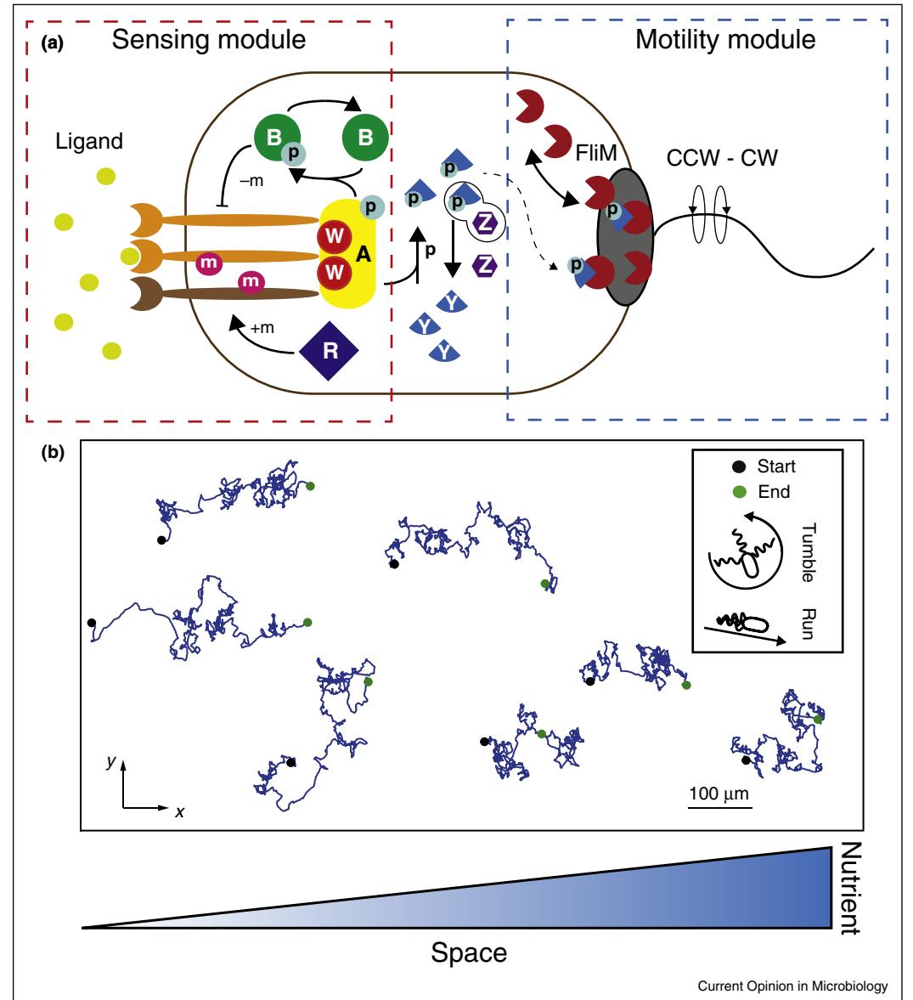
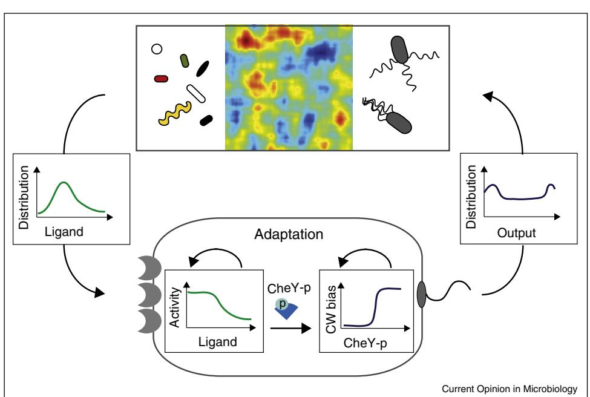
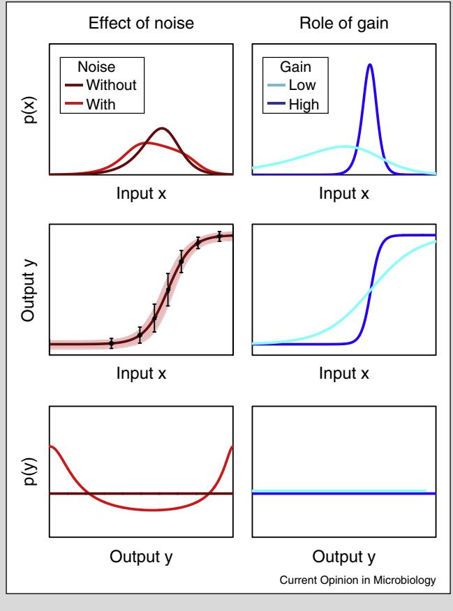

ScienceDirect

# Bacterial chemotaxis: information processing, thermodynamics, and behavior Gabriele Micali1,2 and Robert G Endres1,2

Escherichia coli has long been used as a model organism due to the extensive experimental characterization of its pathways and molecular components. Take chemotaxis as an example, which allows bacteria to sense and swim in response to chemicals, such as nutrients and toxins. Many of the pathway's remarkable sensing and signaling properties are now concisely summarized in terms of design (or engineering) principles. More recently, new approaches from information theory and stochastic thermodynamics have begun to address how pathways process environmental stimuli and what the limiting factors are. However, to fully capitalize on these theoretical advances, a closer connection with single-cell experiments will be required.

#### Addresses

1 Department of Life Sciences, Imperial College, London, United Kingdom

2 Centre for Integrative Systems Biology and Bioinformatics, Imperial College, London, United Kingdom

Corresponding author: Endres, Robert G ([r.endres@imperial.ac.uk)](mailto:r.endres@imperial.ac.uk)

Current Opinion in Microbiology 2016, 30:8–15

This review comes from a themed issue on Cell regulation

Edited by Brice Felden and Ute Ro¨ mling

### <http://dx.doi.org/10.1016/j.mib.2015.12.001>

1369-5274/# 2015 Elsevier Ltd. All rights reserved.

## Introduction

All living organisms from animals to unicellular bacteria live under constant evolutionary pressure. To stay ahead in the game of evolution, organisms need to process noisy information, allowing them to make survival decisions quickly. However, to process information and move organisms also require energy. Thus the final behavior of any organism has to be an outcome which produces strong advantages under likely occurring environments. Chemotaxis of Escherichia coli is particularly well understood in terms of its molecular components, allowing this bacterium to migrate towards food and away from toxins [\[1](#page-5-0)–5]. Indeed, an ever increasing amount of studies has highlighted several design principles, that is, engineering blue prints, ensuring exquisite sensitivity, efficiency, robustness, and wide dynamic range at all levels of the pathway.

This review focuses on recent findings in E. coli chemotaxis, in particular on how molecular mechanisms give rise to information processing, its associated thermodynamic cost, and the resulting swimming behavior. What new design principles will be discovered next?

## Classical view of Escherichia coli chemotaxis

E. coli is a Gram-negative bacterium inhabiting soil, as well as the animal and human gastrointestinal tracts. Inside the host, it contributes to the digestion of food and enhances resistance against pathogens [\[6](#page-5-0)]. This bacterium has a relatively simple chemotactic pathway [(Figure](#page-1-0) 1a). External stimuli are processed at the receptor level, where receptors sense and memorize chemical concentrations from the past by their adapted methylation level [(Figure](#page-1-0) 1a, see red box for 'sensing module'). The receptor-signaling activity can be monitored experimentally by tagging the CheY and CheZ proteins with a fluorescence-resonance-energy-transfer (FRET) reporter pair to follow their phosphorylation-dependent interaction. To swim cells are equipped with 5–8 flagellar rotary motors [(Figure](#page-1-0) 1a, blue box for 'motility module'), each of which rotates either clockwise (CW) or counterclockwise (CCW). Taking together these flagella determine cell movement, given either by a 'run' or a random reorientation in a 'tumble' [7–[9\]](#page-5-0). The phosphorylated protein CheY-p links sensing and motility [(Figure](#page-1-0) 1a). In absence of any chemical gradient Escherichia coli performs random walk, and in a gradient, it biases its movement by having longer runs in favorable directions ([Figure](#page-1-0) 1b).

Despite its simplicity, the chemotaxis pathway has astonishing properties. First, it is highly sensitive to detect small changes in chemical concentration. Indeed it works close to the physical limits of sensing [[10,11](#page-5-0)], with a sensitivity equivalent to detecting as few as three molecules in the volume of the cell [[12\]](#page-5-0). Second, E. coli's sensory system adapts to persistent stimulation [\[13](#page-5-0)] and hence measures relative changes in ligand concentration rather than absolute concentrations (Weber's law) [[14](#page-5-0)]. Precise adaptation and signal amplifications by cooperative receptors allow E. coli to perform chemotaxis over a wide range of concentrations [\[15](#page-5-0)–18]. Furthermore, precise adaptation has been explained by a robust mechanism called integral feedback control [[19\]](#page-5-0), but recent experiments on swimming bacteria also demonstrate the limits of precise adaptation [\[20](#page-5-0)–22]. The adaptation mechanism provides bacteria with many additional advantages, some of which are known from neuroscience. When adaptation is precise the temporal profile of the

Figure 1

(a) Overview of chemotaxis. The sensing module (red box) includes different types of chemoreceptors grouped into clusters, kinase CheA (A), and adapter protein CheW (W). CheR (R) and CheB (B) regulate the methylation level of the receptors and hence memory, providing adaptation to persistent stimulation. The underlying mechanism of precise adaptation is integral feedback control as only inactive receptors are methylated by CheR and only active receptors are demethylated by CheB-p [[19\]](#page-5-0). The motility module (blue box) contains flagellar motors, which either rotate clockwise (CW) or counterclockwise (CCW). The two modules are linked by CheY (Y), which is phosphorylated by receptor-activated CheA (i.e. CheA-p) and dephosphorylated by phosphatase CheZ (Z). Once phosphorylated by ChaA-p, CheY-p diffuses in the cytoplasm to bind the FliM molecules of the motors, promoting CW rotation. (b) Simulations of swimming bacteria in a linear gradient of nutrient using RapidCell [[47](#page-6-0)], showing biased random walk.

response is largely independent of the strength of the stimulus (fold-change detection) [[23,24](#page-6-0)], and in the sensitive regime receptors perform logarithmic sensing (Weber–Fechner law) [\[25\]](#page-6-0). Finally, the chemotaxis pathway is not only used to sense chemicals but also changes in temperature and pH [[26,27](#page-6-0)].

Despite these numerous findings, new directions of research have recently opened up in bacterial chemotaxis. Considering that the whole pathway is under evolutionary pressure, this renewed interest focuses on questions of optimality and trade offs in sensing and signaling. In the next sections we highlight recent findings about how the pathway processes information from the environment and the thermodynamic cost of performing chemotaxis.

### Information processing

During their lives, cells experience many different inputs from the environment, to which they have to respond reliably with an output that enhances their chances of survival (Figure 2). Hence, cell-internal input–output relationships are shaped by evolution to transmit external information from the receptors to downstream proteins, which finally determine cell behavior. This information is inevitably corrupted by cell-external (extrinsic) and internal (intrinsic) sources of noise, and thus the best quantity for measuring information processing is Shannon's mutual information. Indeed, mutual information is a measure of statistical dependence between two random variables and describes the reduction of uncertainty of one after a noisy measurement of the other (see [Box](#page-3-0) 1). But, have chemotactic cells evolved to maximize information transmission?

The debate has just started. The assumption of maximal information transmission allows the reconstruction of distributions of optimal input and output distributions when dose–response curves and noise are measured at the receptor (or motor) level [[28](#page-6-0)--]. However, the complexity of the bacteria's microenvironments makes these predictions hard to test as bacteria are normally investigated under laboratory condition, not in their natural environment. More importantly, maximal mutual information at the sensing module maximizes the drift velocity of chemotactic cells in a linear gradient, linking mutual information to the final output of chemotaxis [\[28](#page-6-0)--]. However, the ultra-steep dose–response curve of an individual motor [\[29,30](#page-6-0)--] might limit the transmitted information down to one bit of information (either CW or CCW rotation). To make things worse, the CheY-p concentration, which maximizes the drift, is in the saturated non sensitive tail of the motor dose–response curve [[31](#page-6-0)- ]. This implies nonoptimal information transmission. However, E. coli uses multiple flagellar rotary motors, which may increase information transmission at the very end of the pathway, for example, by averaging out single-motor switching noise. Furthermore, the swimming trajectory should be regarded asthe final output, constituting the spatial manifestation of all the information processed by the cell over some time.

Despite these advances in understanding, the dependence of signaling on memory and hence the cell's individual history make the calculation of the mutual information between trajectories of inputs and outputs difficult [[32\]](#page-6-0). Another trajectory-relevant technique isthe k-space spatial information, shown to increase with gradient steepness [\[33](#page-6-0)]. However, this spatial information is an image-analysis tool and not a quantification of information processing. Information processing also has its thermodynamic cost,

#### Figure 2

Bacterial chemotaxis under evolutionary pressure. Complex microenvironments (top) shape the ligand input distribution E. coli experiences (left). Different bacterial species are indicated by different shapes and colors (top left), inhomogeneous chemical environments by colored patches (top centre), and bacterial motility by flagellated rods (top right). This information is first processed by the receptors and finally by the motors (bottom). The final outcome (right) determinates the swimming behavior of the cell, and feeds back into the chemical environment and hence the inputs. Evolution has selected input–output relationships, which enhance the chance of the species' survival.

#### Box 1 Mutual information as a universal language of sensing and signaling.

Information theory was first developed by Shannon in 1948 to quantify communication through a noisy channel [\[58](#page-7-0)]. Shannon defined a channel as a transmitting device: a message from a transmitter (input) is first encoded, then sent, and finally decoded by the receiver (output). In such a channel all steps may suffer from noise. The key quantity of Shannon's theory is entropy (S), which measures the uncertainty of the outcomes of a random variable. Mutual information (I) is defined as the reduction of uncertainty of the input knowing the output, and it is measured in bits. For continuous variables in a single processing step (X ! Y), I is given by

$$d[\mathcal{X}, \mathcal{Y}] = \mathbf{S}(\mathcal{X}) - \mathbf{S}(\mathcal{X}|\mathcal{Y}) = \int_{-\mathcal{X}, \mathcal{Y}} \mathbf{d} \mathbf{x} \, \mathbf{d} \mathbf{y} \, \mathbf{p}(\mathbf{x}, \boldsymbol{\nu}) \log_2 \frac{\mathbf{p}(\mathbf{x}, \boldsymbol{\nu})}{\mathbf{p}(\mathbf{x}) \mathbf{p}(\boldsymbol{\nu})},$$

where S(X) is the Shannon entropy, that is, the total uncertainty, of the input X; S(XjY) is the conditional entropy measuring the reduction of uncertainty after measuring Y; p(x), p(y) and p(x,y) = p(yjx)p(x) are the probability distributions of input, output and joint probability, respectively. The conditional probability p(yjx) is also called an input–output relationship.

Mutual information is indeed a measure of statistical dependence between two random variables. It accounts not only for linear dependencies (which for instance can be measured by Pearson correlation) but also for nonlinear dependencies [\[59,60](#page-7-0)]. Mutual information is independent of the units of measurement and details of the channel. It is symmetric and non-negative, that is, is zero if and only if x and y are independent. Furthermore, information can only be lost by adding a processing step (X ! Y ! Z), never gained. However, measuring multiple inputs or outputs can in principle increase the mutual information.

Due to the above mentioned properties mutual information seems 'a' candidate to describe information processing between noisy environmental stimuli (input) and internal noisy protein levels (output) in biology. However, the most meaningful property of mutual information, which makes it 'the' candidate, is its relation to decision theory and statistical inference: For a given input distribution, one input–output relationship allows better inference than another if and only if it has higher mutual information. (See [[61](#page-7-0)] for a review of information theory in biology.)

For this reason, mutual information has recently been applied to experimentally measured dose–response curves of the receptor-signaling activity [\[62](#page-7-0)]. When maximized given experimental dose–response curves and noise, it predicts optimal input, p(x), and output, p(y), distributions. Input noise can produce a bimodal output distribution, for example, in motor bias (left column in figure). A strongly bimodal distribution indicates that only one bit is transmitted in the pathway. A steep dose–response curve leads to high sensitivity and amplification of signals, but inputs may saturate the response, reducing the mutual information. Low gain might reduce the output range and thus also reduce the mutual information (right column in figure). Assuming that evolution favors high information transmission, selected dose–response curves might result from a trade off between high and low gain.

which is conceptually difficult to understand as it relates to non-equilibrium physics.

## Thermodynamics of chemotaxis

Enhancing information gain about the environment is generally evolutionarily favorable for cells (if not why having a sensory system?). However, nature needs to account for the thermodynamic cost of operating the biochemical signaling pathway. As found in neural coding [\[34](#page-6-0)–36], evolution might search for an energy efficient way of transmitting information. Indeed, from the theoretical point of view, mutual information and energy dissipation of a system are fundamentally linked (see Box 2). Recent experiments at the nanometre scale demonstrate that computational devices must dissipate energy when performing the logically irreversible step of erasing information [\[37](#page-6-0)]. Hence, the thermodynamic cost of chemotaxis needs to be understood. Does energy dissipation set a limit on the information that a cell can gain about its environment?

The debate touches on two main aspects of chemotaxis: the fundamental limit of sensing and the precision of adaptation. The fundamental limit of sensing, for example, for inferring ligand concentration from inherently noisy measurements, is a theoretical upper bound on the accuracy a cell can reach [\[10,11\]](#page-5-0). For instance, in seminal work Berg and Purcell used an equilibrium receptor but time averaging by an unknown ad hoc mechanism [\[10](#page-5-0)]. Hence, whether a cell can reach this limit is a different question since cells need to store the information in downstream proteins and implement time averaging to reduce noise, processes which generally require consumption of fuel molecules such as ATP and SAM. Indeed, theory shows that energetic cost limits the accuracy ofsensing [[38,39](#page-6-0)--]. More specifically, there are three independent constraints to sensing, which cannot be

#### Box 2 Thermodynamics and information.

traded off among each other: receptors and their averaging time, the number of downstream proteins, and fuel consumption [\[39](#page-6-0)--]. The strategy of avoiding unfavorable bottle necks in the pathway, named optimal resource allocation,seemsto be adopted by E. coli [[39](#page-6-0)--]. However, these studies do not account for fluctuating environments, where the environment itself may provide work, enhancing information gain without internal fuel consumption [\[40](#page-6-0)- ]. In E. coli the cost of responding to a simple stepchange in external ligand concentration is only about 10% of the energy consumed for maintaining the dissipative steady state [\[41](#page-6-0)- ].

Why does nature adopt pathway architectures which lead to energy dissipation when there are potential pathways which do not consume fuel [[41](#page-6-0)- [,42](#page-6-0)--]? Indeed, there is a trade-off between energy consumption and fast, accurate adaptation [[42](#page-6-0)--[,43\]](#page-6-0). Energy consumption can also reduce the correlations between extrinsic and intrinsic noise, ultimately resulting in a higher accuracy of sensing by time averaging [[44](#page-6-0)- ]. Finally, negative feedback during adaptation does not only reduce the adaptation error but also variability in adaptation [[45](#page-6-0)--].

## Cell-to-cell variability and cell behavior

The search for general design principles is crucial for simplifying molecular complexity and hence for understanding biological systems. All previously discussed design principles describe single cells, for example, about how they deal with signaling noise. However, noise also leads to cell-to-cell variability, affecting populations of cells. For instance, there is large variation in adaptation times probably due to low copy numbers of CheR and CheB [\[46,47\]](#page-6-0). In addition, different adapted CheY-p levels have been observed in cells of the same population [\[48](#page-6-0)]. Hence, the tumble bias, which is determined by the CheY-p level, also differs from cell to cell. Furthermore,

The link between thermodynamics and information has a long history, which goes back to the famous thought experiment of Maxwell's demon. This fictitious demon can potentially produce order without doing any work, suggesting a violation of the second law of thermodynamics. However, to do so the demon has to measure and hence to acquire information about the environment. Performing a measurement moves the system out of equilibrium, and one needs to account for both the change in internal energy of the demon (DFH) and the change due to the measurement (DFmeas), a change in information related to Shannon entropy and mutual information). It is then possible to fulfill the second law of thermodynamics and link energy dissipation (Wdiss) with mutual information (I):

$$\mathcal{W}^{\text{fiss}} = \mathcal{T}\Delta\mathbf{S}^{\text{tot}} = \mathcal{W} - \Delta\mathcal{F}^{\mathbb{H}} - \Delta\mathcal{F}^{\text{meas}} = \mathcal{W} - \Delta\mathcal{F}^{\mathbb{H}} + k_{\mathcal{B}}\mathcal{T} \ge \mathbf{0}.$$

Moreover, information needs to be stored in 'memories'. Although it is possible to acquire information without energetic cost, the erasure of information (the demon is a finite being) must dissipate energy (Landauer's principle). (See [\[63\]](#page-7-0) for a review on thermodynamics of information.)

The generality of these arguments suggests that a measurement, and hence acquisition of information, is linked to energy dissipation independent of the underlying mechanism. In E. coli, for instance, information about the extracellular concentration of chemicals is 'stored' in the adapted methylation level of receptors. Once the external concentration changes, the receptor activity responds rapidly, enhancing its correlations with the environment. At the same time, the methylation level still contains the old information, that is, reflects the previous ligand concentration. Subsequently, during adaptation, the methylation level adjust and thus acquires new information while the activity returns to the adapted value, which is independent of the environment. Although E. coli even consumes energy at the adapted steady state, the response to an environmental change is also an out of equilibrium process [\[41](#page-6-0)- ].

cells vary in total number and spatial distribution of receptors [\[49\]](#page-6-0) and motors [\[50](#page-6-0)]. All this variability might be helpful under unpredictable changes of the environment, where having different phenotypes increases the chances of a species' survival [\[51](#page-6-0)- ]. By focusing on cell-tocell variability previously hidden principles might emerge.

How do E. coli cells tune the ultra-steep dose–response curves of the motor to their individual adapted CheY-p level? This question is of particular importance because these curves are even steeper than previously thought (Hill coefficient up to 20) [\[30](#page-6-0)--]. Recent experiments show that even mutants with non-adapting receptors can partially adapt by exchanging FliM molecules between the cytoplasm and the motor ([Figure](#page-1-0) 1a) [[52\]](#page-6-0). By changing the number of FliM in the motor cells adjust the sensitive regime of their motors to the cell-specific adapted CheY-p level [[52\]](#page-6-0). However, this adaptation mechanism is not regulated by CheY-p directly. A change in binding affinity between FliM and the motor substrate due to changes in the rotational motor bias seems to guide motor adaptation [\[53](#page-6-0)].

Finally, optical traps allow long-time measurements of individual cells in response to external changes in ligand concentration [[54](#page-6-0)]. This technique helped to better understand the large variation in number of motors in E. coli [\[55](#page-7-0)--].In fact, coupling between motorsrotating in the CW direction, for example, through their flagella, results in a tumble bias, which is robust against the number of motors, a design principle previously missed [7,55--,56,57].

## Conclusions

The results reported here have been possible due to new theoretical approaches, in particular in information theory and stochastic thermodynamics. Despite their long history, only recently have they been used in biology. However, most of the results obtained lead to predictions that necessarily need to be tested experimentally in the future. The focus will inevitably be on shifting from physics-type experiments to investigations of living cells. Another goal will be the characterization of trajectories of swimming bacteria, and hence of individual cell behavior. Commercially available high-resolution imaging is already a valuable tool to study variability among different cells. Moreover, optical tweezers allow for measurements on single cells, suitable for studying temporal variability in single cells over an extended period of time. Combining internal measurements of signaling in individual cells, for example, by single-cell FRET, with history-dependent cell trajectories of behavior will open new doors even in the best-known system of cell biology.

## Acknowledgments

We thank Nikola Ojkic and Chiu Fan Lee for crucial reading of the manuscript. This work was supported by European Research Council Starting-Grant N. 280492-PPHPI.

## References and recommended reading

Papers of particular interest, published within the period of review, have been highlighted as:

- of special interest
- -of outstanding interest
- 1. Parkinson JS, [Hazelbauer](http://refhub.elsevier.com/S1369-5274(15)00172-1/sbref0320) GL, Falke JJ: Signaling and sensory adaptation in Escherichia coli [chemoreceptors:](http://refhub.elsevier.com/S1369-5274(15)00172-1/sbref0320) 2015 update. Trends Microbiol 2015, 23[:257-266.](http://refhub.elsevier.com/S1369-5274(15)00172-1/sbref0320)
- 2. Tu Y: Quantitative modeling of bacterial [chemotaxis:](http://refhub.elsevier.com/S1369-5274(15)00172-1/sbref0325) signal [amplification](http://refhub.elsevier.com/S1369-5274(15)00172-1/sbref0325) and accurate adaptation. Annu Rev Biophys 2013, 42[:337-359.](http://refhub.elsevier.com/S1369-5274(15)00172-1/sbref0325)
- 3. Sourjik V, Wingreen NS: [Responding](http://refhub.elsevier.com/S1369-5274(15)00172-1/sbref0330) to chemical gradients: bacterial [chemotaxis](http://refhub.elsevier.com/S1369-5274(15)00172-1/sbref0330). Curr Opin Cell Biol 2012, 24:262-268.
- 4. Jones CW, Armitage JP: [Positioning](http://refhub.elsevier.com/S1369-5274(15)00172-1/sbref0335) of bacterial [chemoreceptors](http://refhub.elsevier.com/S1369-5274(15)00172-1/sbref0335). Trends Microbiol 2015, 23:247-256.
- 5. Bi S, Lai L: Bacterial [chemoreceptors](http://refhub.elsevier.com/S1369-5274(15)00172-1/sbref0340) and chemoeffectors. Cell Mol Life Sci 2014, 72[:691-708.](http://refhub.elsevier.com/S1369-5274(15)00172-1/sbref0340)
- 6. Nataro J, Cohen P, Mobley HWJ: [Colonization](http://refhub.elsevier.com/S1369-5274(15)00172-1/sbref0345) of Mucosal [Surfaces](http://refhub.elsevier.com/S1369-5274(15)00172-1/sbref0345). ASM Press; 2005.
- 7. Darnton NC, Turner L, [Rojevsky](http://refhub.elsevier.com/S1369-5274(15)00172-1/sbref0350) S, Berg HC: On torque and tumbling in swimming [Escherichia](http://refhub.elsevier.com/S1369-5274(15)00172-1/sbref0350) coli. J Bacteriol 2007, 189[:1756-1764.](http://refhub.elsevier.com/S1369-5274(15)00172-1/sbref0350)
- 8. Turner L, Ryu WS, Berg HC: Real-time imaging of [fluorescent](http://refhub.elsevier.com/S1369-5274(15)00172-1/sbref0355) flagellar filaments. J Bacteriol 2000, 182[:2793-2801.](http://refhub.elsevier.com/S1369-5274(15)00172-1/sbref0355)
- 9. Saragosti J, Calvez V, [Bournaveas](http://refhub.elsevier.com/S1369-5274(15)00172-1/sbref0360) N, Perthame B, Buguin A, Silberzan P: Directional persistence of [chemotactic](http://refhub.elsevier.com/S1369-5274(15)00172-1/sbref0360) bacteria in a traveling [concentration](http://refhub.elsevier.com/S1369-5274(15)00172-1/sbref0360) wave. Proc Natl Acad Sci U S A 2011, 108[:16235-16240.](http://refhub.elsevier.com/S1369-5274(15)00172-1/sbref0360)
- 10. Berg HC, Purcell EM: Physics of [chemoreception](http://refhub.elsevier.com/S1369-5274(15)00172-1/sbref0365). Biophys J 1977, 20[:193-219.](http://refhub.elsevier.com/S1369-5274(15)00172-1/sbref0365)
- 11. Endres RG, Wingreen NS: [Maximum](http://refhub.elsevier.com/S1369-5274(15)00172-1/sbref0370) likelihood and the single [receptor](http://refhub.elsevier.com/S1369-5274(15)00172-1/sbref0370). Phys Rev Lett 2009, 103:1-4.
- 12. Mao H, Cremer PS, Manson MD: A [sensitive,](http://refhub.elsevier.com/S1369-5274(15)00172-1/sbref0375) versatile [microfluidic](http://refhub.elsevier.com/S1369-5274(15)00172-1/sbref0375) assay for bacterial chemotaxis. Proc Natl Acad Sci U S A 2003, 100[:5449-5454.](http://refhub.elsevier.com/S1369-5274(15)00172-1/sbref0375)
- 13. Berg HC, Tedesco PM: Transient response to [chemotactic](http://refhub.elsevier.com/S1369-5274(15)00172-1/sbref0380) stimuli in [Escherichia](http://refhub.elsevier.com/S1369-5274(15)00172-1/sbref0380) coli. Proc Natl Acad Sci U S A 1975, 72[:3235-3239.](http://refhub.elsevier.com/S1369-5274(15)00172-1/sbref0380)
- 14. Mesibov R, Ordal GW, Adler J: The range of [attractant](http://refhub.elsevier.com/S1369-5274(15)00172-1/sbref0385) [concentrations](http://refhub.elsevier.com/S1369-5274(15)00172-1/sbref0385) for bacterial chemotaxis and the threshold and size of [response](http://refhub.elsevier.com/S1369-5274(15)00172-1/sbref0385) over this range. Weber law and related [phenomena](http://refhub.elsevier.com/S1369-5274(15)00172-1/sbref0385). J Gen Physiol 1973, 62:203-223.
- 15. Duke TAJ, Bray D: [Heightened](http://refhub.elsevier.com/S1369-5274(15)00172-1/sbref0390) sensitivity of a lattice of [membrane](http://refhub.elsevier.com/S1369-5274(15)00172-1/sbref0390) receptors. Proc Natl Acad Sci U S A 1999, 96: [10104-10108.](http://refhub.elsevier.com/S1369-5274(15)00172-1/sbref0390)
- 16. Sourjik V, Berg HC: Receptor [sensitivity](http://refhub.elsevier.com/S1369-5274(15)00172-1/sbref0395) in bacterial [chemotaxis](http://refhub.elsevier.com/S1369-5274(15)00172-1/sbref0395). Proc Natl Acad Sci U S A 2002, 99:123-127.
- 17. Keymer JE, Endres RG, Skoge M, Meir Y, [Wingreen](http://refhub.elsevier.com/S1369-5274(15)00172-1/sbref0400) NS: [Chemosensing](http://refhub.elsevier.com/S1369-5274(15)00172-1/sbref0400) in Escherichia coli: two regimes of two-state [receptors](http://refhub.elsevier.com/S1369-5274(15)00172-1/sbref0400). Proc Natl Acad Sci U S A 2006, 103[:1786-1791.](http://refhub.elsevier.com/S1369-5274(15)00172-1/sbref0400)
- 18. Endres RG, Wingreen NS: Precise [adaptation](http://refhub.elsevier.com/S1369-5274(15)00172-1/sbref0405) in bacterial chemotaxis through ''assistance [neighborhoods''](http://refhub.elsevier.com/S1369-5274(15)00172-1/sbref0405). Proc Natl Acad Sci U S A 2006, 103[:13040-13044.](http://refhub.elsevier.com/S1369-5274(15)00172-1/sbref0405)
- 19. Barkai N, Leibler S: Robustness in simple [biochemical](http://refhub.elsevier.com/S1369-5274(15)00172-1/sbref0410) networks to transfer and process [information](http://refhub.elsevier.com/S1369-5274(15)00172-1/sbref0410). Nature 1997, 387[:913-917.](http://refhub.elsevier.com/S1369-5274(15)00172-1/sbref0410)
- 20. Masson J-B, Voisinne G, Wong-Ng J, Celani A, [Vergassola](http://refhub.elsevier.com/S1369-5274(15)00172-1/sbref0415) M: Noninvasive inference of the molecular [chemotactic](http://refhub.elsevier.com/S1369-5274(15)00172-1/sbref0415) response using bacterial [trajectories](http://refhub.elsevier.com/S1369-5274(15)00172-1/sbref0415). Proc Natl Acad Sci U S A 2012, 109[:1802-1807.](http://refhub.elsevier.com/S1369-5274(15)00172-1/sbref0415)
- 21. Min TL, Mears PJ, Golding I, Chemla YR: [Chemotactic](http://refhub.elsevier.com/S1369-5274(15)00172-1/sbref0420) adaptation kinetics of individual [Escherichia](http://refhub.elsevier.com/S1369-5274(15)00172-1/sbref0420) coli cells. Proc Natl Acad Sci U S A 2012, 109[:9869-9874.](http://refhub.elsevier.com/S1369-5274(15)00172-1/sbref0420)
- 22. Neumann S, [Vladimirov](http://refhub.elsevier.com/S1369-5274(15)00172-1/sbref0425) N, Krembel AK, Wingreen NS, Sourjik V: [Imprecision](http://refhub.elsevier.com/S1369-5274(15)00172-1/sbref0425) of adaptation in Escherichia coli chemotaxis. PLoS One [2014,](http://refhub.elsevier.com/S1369-5274(15)00172-1/sbref0425) 9:1-6.
- 23. Shoval O, [Goentoro](http://refhub.elsevier.com/S1369-5274(15)00172-1/sbref0430) L, Hart Y, Mayo A, Sontag E, Alon U: Foldchange detection and scalar [symmetry](http://refhub.elsevier.com/S1369-5274(15)00172-1/sbref0430) of sensory input fields. Proc Natl Acad Sci U S A 2010, 107[:15995-16000.](http://refhub.elsevier.com/S1369-5274(15)00172-1/sbref0430)
- 24. Krembel AK, Neumann S, Sourjik V: Universal [response](http://refhub.elsevier.com/S1369-5274(15)00172-1/sbref0435)adaptation relation in bacterial [chemotaxis](http://refhub.elsevier.com/S1369-5274(15)00172-1/sbref0435). J Bacteriol 2015, 197[:307-313.](http://refhub.elsevier.com/S1369-5274(15)00172-1/sbref0435)
- 25. Kalinin YV, Jiang L, Tu Y, Wu M: [Logarithmic](http://refhub.elsevier.com/S1369-5274(15)00172-1/sbref0440) sensing in Escherichia coli bacterial [chemotaxis](http://refhub.elsevier.com/S1369-5274(15)00172-1/sbref0440). Biophys J 2009, 96:2439-2448.
- 26. Oleksiuk O, [Jakovljevic](http://refhub.elsevier.com/S1369-5274(15)00172-1/sbref0445) V, Vladimirov N, Carvalho R, Paster E, Ryu WS, Meir Y, [Wingreen](http://refhub.elsevier.com/S1369-5274(15)00172-1/sbref0445) NS, Kollmann M, Sourjik V: Thermal robustness of signaling in bacterial [chemotaxis](http://refhub.elsevier.com/S1369-5274(15)00172-1/sbref0445). Cell 2011, 145[:312-321.](http://refhub.elsevier.com/S1369-5274(15)00172-1/sbref0445)
- 27. Yang Y, Sourjik V: Opposite [responses](http://refhub.elsevier.com/S1369-5274(15)00172-1/sbref0450) by different [chemoreceptors](http://refhub.elsevier.com/S1369-5274(15)00172-1/sbref0450) set a tunable preference point in Escherichia coli pH taxis. Mol Microbiol 2012, 86[:1482-1489.](http://refhub.elsevier.com/S1369-5274(15)00172-1/sbref0450)
- 28. [Clausznitzer](http://refhub.elsevier.com/S1369-5274(15)00172-1/sbref0455) D, Micali G, Neumann S, Sourjik V, Endres RG:
- -- Predicting chemical [environments](http://refhub.elsevier.com/S1369-5274(15)00172-1/sbref0455) of bacteria from receptor signaling. PLoS Comput Biol 2014, 10[:e1003870.](http://refhub.elsevier.com/S1369-5274(15)00172-1/sbref0455)

By maximizing mutual information at the receptors and using in vivo FRET data, the distribution of ligand inputs and gradients are predicted. A potential new design principle is discovered: maximizing information transmission maximizes drift in a chemical gradient.

- 29. Cluzel P, Surette M, Leibler S: An [ultrasensitive](http://refhub.elsevier.com/S1369-5274(15)00172-1/sbref0460) bacterial motor revealed by [monitoring](http://refhub.elsevier.com/S1369-5274(15)00172-1/sbref0460) signaling proteins in single cells. Science 2000, 287[:1652-1655.](http://refhub.elsevier.com/S1369-5274(15)00172-1/sbref0460)
- 30. --Yuan J, Berg HC: [Ultrasensitivity](http://refhub.elsevier.com/S1369-5274(15)00172-1/sbref0465) of an adaptive bacterial motor. J Mol Biol 2013, 425[:1760-1764.](http://refhub.elsevier.com/S1369-5274(15)00172-1/sbref0465)

 Carefully conducted measurements of motor dose–response curves in intact cells demonstrate Hill coefficients up to 20 (previously measured to be 10).

- 31. Dufour YS, Fu X, [Hernandez-Nunez](http://refhub.elsevier.com/S1369-5274(15)00172-1/sbref0470) L, Emonet T: Limits of
- - feedback control in bacterial [chemotaxis](http://refhub.elsevier.com/S1369-5274(15)00172-1/sbref0470). PLoS Comput Biol 2014, 10[:e1003694.](http://refhub.elsevier.com/S1369-5274(15)00172-1/sbref0470)

This study presents an analytical expression of the drift velocity for cells swimming in exponential gradients. This expression, together with simulations, shows that the CheY-p concentration which maximizes drift sits in the tail of the motor dose–response curve. Furthermore, this model makes the interesting prediction that cells can be trapped in two distinct states, either in a low or high drift state.

- 32. Tostevin F, Ten Wolde PR: Mutual [information](http://refhub.elsevier.com/S1369-5274(15)00172-1/sbref0475) between input and output trajectories of [biochemical](http://refhub.elsevier.com/S1369-5274(15)00172-1/sbref0475) networks. Phys Rev Lett [2009,](http://refhub.elsevier.com/S1369-5274(15)00172-1/sbref0475) 102:1-4.
- 33. Hoh JH, Heinz WF, Werbin JL: Spatial [information](http://refhub.elsevier.com/S1369-5274(15)00172-1/sbref0480) analysis of [chemotactic](http://refhub.elsevier.com/S1369-5274(15)00172-1/sbref0480) trajectories. J Biol Phys 2012, 38:365-381.
- 34. Laughlin SB, [Steveninck](http://refhub.elsevier.com/S1369-5274(15)00172-1/sbref0485) RRDRVan, Anderson JC: The metabolic cost of neural [information](http://refhub.elsevier.com/S1369-5274(15)00172-1/sbref0485). Nat Neurosci 1998, 1:36-41.
- 35. Laughlin SB: A simple coding [procedure](http://refhub.elsevier.com/S1369-5274(15)00172-1/sbref0490) enhances a neuron's [information](http://refhub.elsevier.com/S1369-5274(15)00172-1/sbref0490) capacity. Z Naturforsch C 1981, 36:910-912.
- 36. Laughlin SB: Energy as a [constraint](http://refhub.elsevier.com/S1369-5274(15)00172-1/sbref0495) on the coding and processing of sensory [information](http://refhub.elsevier.com/S1369-5274(15)00172-1/sbref0495). Curr Opin Neurobiol 2001, 11[:475-480.](http://refhub.elsevier.com/S1369-5274(15)00172-1/sbref0495)
- 37. Be´rut A, Arakelyan A, Petrosyan A, Ciliberto S, [Dillenschneider](http://refhub.elsevier.com/S1369-5274(15)00172-1/sbref0500) R, Lutz E: [Experimental](http://refhub.elsevier.com/S1369-5274(15)00172-1/sbref0500) verification of Landauer's principle linking information and [thermodynamics](http://refhub.elsevier.com/S1369-5274(15)00172-1/sbref0500). Nature 2012, 483[:187-189.](http://refhub.elsevier.com/S1369-5274(15)00172-1/sbref0500)
- 38. Mehta P, Schwab DJ: Energetic costs of cellular [computation](http://refhub.elsevier.com/S1369-5274(15)00172-1/sbref0505). Proc Natl Acad Sci U S A 2012, 109[:17978-17982.](http://refhub.elsevier.com/S1369-5274(15)00172-1/sbref0505)
- 39. Govern CC, ten Wolde PR: Optimal resource [allocation](http://refhub.elsevier.com/S1369-5274(15)00172-1/sbref0510) in
- -- cellular sensing [systems](http://refhub.elsevier.com/S1369-5274(15)00172-1/sbref0510). Proc Natl Acad Sci U S A 2014, 111[:17486-17491.](http://refhub.elsevier.com/S1369-5274(15)00172-1/sbref0510)

This study shows that the accuracy of sensing a constant external concentration by a cell is limited by three independent sources: the number of receptors and their integration time, the number of readout proteins, and the energy consumption. To avoid wasting resources, Escherichia coli seems to adopt a strategy in which the three independent classes are equally limiting.

#### 40. - Barato AC, Hartich D, Seifert U: Efficiency of cellular [information](http://refhub.elsevier.com/S1369-5274(15)00172-1/sbref0515) [processing](http://refhub.elsevier.com/S1369-5274(15)00172-1/sbref0515). New J Phys 2014, 16:103024.

This study theoretically quantifies the energy consumption and the learning rate in simple models inspired by E. coli chemotaxis. In particular, the authors consider an external process which fluctuates between two different ligand concentrations, a simple model with receptor and internal proteins, and a more realistic model with adaptation. Learning rate is not bounded by energy consumption if the external process provide additional work.

- 41. - Sartori P, Granger L, Lee C, Horowitz J: [Thermodynamic](http://refhub.elsevier.com/S1369-5274(15)00172-1/sbref0520) costs of [information](http://refhub.elsevier.com/S1369-5274(15)00172-1/sbref0520) processing in sensory adaption. PLoS Comput Biol 2014, 10[:e1003974.](http://refhub.elsevier.com/S1369-5274(15)00172-1/sbref0520)
This study theoretically quantifies information gain and erasure during adaptation. The authors also compare an equilibrium model with the Escherichia coli out-of-equilibium pathway.

- 42. De Palo G, Endres RG: [Unraveling](http://refhub.elsevier.com/S1369-5274(15)00172-1/sbref0525) adaptation in eukaryotic
- -- [pathways:](http://refhub.elsevier.com/S1369-5274(15)00172-1/sbref0525) lessons from protocells. PLoS Comput Biol 2013, 9[:e1003300.](http://refhub.elsevier.com/S1369-5274(15)00172-1/sbref0525)

This study focuses on elucidating the benefits of energy consumption in adaptative signaling pathways. The authors compare dissipative adaptation pathways commonly used by cells with two types of equilibrium pathways. Although adaptation does not necessarily require energy consumption by the cell, it provides cells with the ability to adjust the response and adaptation times.

- 43. Lan G, Sartori P, [Neumann](http://refhub.elsevier.com/S1369-5274(15)00172-1/sbref0530) S, Sourjik V, Tu Y: The energy–speed– accuracy trade-off in sensory [adaptation](http://refhub.elsevier.com/S1369-5274(15)00172-1/sbref0530). Nat Phys 2012, 8[:422-428.](http://refhub.elsevier.com/S1369-5274(15)00172-1/sbref0530)
#### 44. - Govern CC, ten Wolde RP: Energy [dissipation](http://refhub.elsevier.com/S1369-5274(15)00172-1/sbref0535) and noise correlations in [biochemical](http://refhub.elsevier.com/S1369-5274(15)00172-1/sbref0535) sensing. Phys Rev Lett 2014, 113[:1-5.](http://refhub.elsevier.com/S1369-5274(15)00172-1/sbref0535)

This study focuses on the accuracy of sensing a constant external concentration by a system of receptors and readout proteins. By comparing an equilibrium with an out-of-equilibrium system, the authors show how non-equilibrium systems are required to decorrelate external and internal noise. This allows for reducing noise and increasing the accuracy of sensing.

- 45. Sartori P, Tu Y: Free energy cost of [reducing](http://refhub.elsevier.com/S1369-5274(15)00172-1/sbref0540) noise while
-- [maintaining](http://refhub.elsevier.com/S1369-5274(15)00172-1/sbref0540) a high sensitivity. Phys Rev Lett 2015, 118102:1-5. This study focuses on the role of energy dissipation during adaptation. Using a theoretical approach, the authors prove that energy dissipation is used to reduce both the imprecision of adaptation and the fluctuations around the average. This contributes to increasing the maximal response before reduction by adaptation.

- 46. Li M, Hazelbauer GL: Cellular [stoichiometry](http://refhub.elsevier.com/S1369-5274(15)00172-1/sbref0545) of the components of the [chemotaxis](http://refhub.elsevier.com/S1369-5274(15)00172-1/sbref0545) signaling complex. J Bacteriol 2004, 186[:3687-3694.](http://refhub.elsevier.com/S1369-5274(15)00172-1/sbref0545)
- 47. Vladimirov N, Løvdok L, Lebiedz D, Sourjik V: [Dependence](http://refhub.elsevier.com/S1369-5274(15)00172-1/sbref0550) of bacterial [chemotaxis](http://refhub.elsevier.com/S1369-5274(15)00172-1/sbref0550) on gradient shape and adaptation rate. PLoS Comput Biol 2008, 4[:e1000242.](http://refhub.elsevier.com/S1369-5274(15)00172-1/sbref0550)
- 48. Alon U, Surette MG, Barkai N, Leibler S: [Robustness](http://refhub.elsevier.com/S1369-5274(15)00172-1/sbref0555) in bacterial [chemotaxis](http://refhub.elsevier.com/S1369-5274(15)00172-1/sbref0555). Nature 1999, 397:168-171.
- 49. Thiem S, Sourjik V: Stochastic assembly of [chemoreceptor](http://refhub.elsevier.com/S1369-5274(15)00172-1/sbref0560) clusters in [Escherichia](http://refhub.elsevier.com/S1369-5274(15)00172-1/sbref0560) coli. Mol Microbiol 2008, 68:1228-1236.
- 50. [Cohen-ben-lulu](http://refhub.elsevier.com/S1369-5274(15)00172-1/sbref0565) GN, Francis NR, Shimoni E, Noy D, Davidov Y, Prasad K, Sagi Y, Cecchini G, [Johnstone](http://refhub.elsevier.com/S1369-5274(15)00172-1/sbref0565) RM, Eisenbach M: The [bacterial](http://refhub.elsevier.com/S1369-5274(15)00172-1/sbref0565) flagellar switch complex is getting more complex. EMBO J 2008, 27[:1134-1144.](http://refhub.elsevier.com/S1369-5274(15)00172-1/sbref0565)
- 51. - Frankel NW, Pontius W, Dufour YS, Long J, [Hernandez-Nunez](http://refhub.elsevier.com/S1369-5274(15)00172-1/sbref0570) L, Emonet T: Adaptability of [non-genetic](http://refhub.elsevier.com/S1369-5274(15)00172-1/sbref0570) diversity in bacterial [chemotaxis](http://refhub.elsevier.com/S1369-5274(15)00172-1/sbref0570). Elife 2014, 3:1-30.

This study focuses on cell-to-cell variability in a cell population. Simulations show that different amounts of chemotaxis proteins produce different behaviors, providing advantages for the whole population.

- 52. Yuan J, Branch RW, Hosu BG, Berg HC: [Adaptation](http://refhub.elsevier.com/S1369-5274(15)00172-1/sbref0575) at the output of the [chemotaxis](http://refhub.elsevier.com/S1369-5274(15)00172-1/sbref0575) signalling pathway. Nature 2012, 484[:233-236.](http://refhub.elsevier.com/S1369-5274(15)00172-1/sbref0575)
- 53. Lele PP, Branch RW, Nathan VSJ, Berg HC: [Mechanism](http://refhub.elsevier.com/S1369-5274(15)00172-1/sbref0580) for adaptive [remodeling](http://refhub.elsevier.com/S1369-5274(15)00172-1/sbref0580) of the bacterial flagellar switch. Proc Natl Acad Sci U S A 2012, 109[:20018-20022.](http://refhub.elsevier.com/S1369-5274(15)00172-1/sbref0580)
- 54. Min TL, Mears PJ, Chubiz LM, Rao CV, [Golding](http://refhub.elsevier.com/S1369-5274(15)00172-1/sbref0585) I, Chemla YR: Bacterial motility using optical [tweezers](http://refhub.elsevier.com/S1369-5274(15)00172-1/sbref0585). Nat Methods 2009, 6[:831-835.](http://refhub.elsevier.com/S1369-5274(15)00172-1/sbref0585)

- 55. -- Mears PJ, Koirala S, Rao CV, Golding I, Chemla YR: [Escherichia](http://refhub.elsevier.com/S1369-5274(15)00172-1/sbref0590) coli [swimming](http://refhub.elsevier.com/S1369-5274(15)00172-1/sbref0590) is robust against variations in flagellar number. Elife 2014, 2014[:1-18.](http://refhub.elsevier.com/S1369-5274(15)00172-1/sbref0590)
By using optical tweesers to trap single cells and simultaneously imaging their fluorescently labeled flagella for long times, the authors characterize the relationship between tumble bias and number of motors.

- 56. Sneddon MW, Pontius W, Emonet T: Stochastic [coordination](http://refhub.elsevier.com/S1369-5274(15)00172-1/sbref0595) of multiple actuators reduces latency and improves [chemotactic](http://refhub.elsevier.com/S1369-5274(15)00172-1/sbref0595) [response](http://refhub.elsevier.com/S1369-5274(15)00172-1/sbref0595) in bacteria. Proc Natl Acad Sci 2012, 109:805-810.
- 57. Hu B, Tu Y: [Coordinated](http://refhub.elsevier.com/S1369-5274(15)00172-1/sbref0600) switching of bacterial flagellar motors: evidence for direct motor–motor [coupling?](http://refhub.elsevier.com/S1369-5274(15)00172-1/sbref0600) Phys Rev Lett [2013,](http://refhub.elsevier.com/S1369-5274(15)00172-1/sbref0600) 110:1-5.
- 58. Shannon CE: A mathematical theory of [communication](http://refhub.elsevier.com/S1369-5274(15)00172-1/sbref0605). Bell Syst Tech J 1948, 27[:379-423.](http://refhub.elsevier.com/S1369-5274(15)00172-1/sbref0605)
- 59. Mahon SSM, Sim A, Filippi S, [Johnson](http://refhub.elsevier.com/S1369-5274(15)00172-1/sbref0610) R, Liepe J, Smith D, Stumpf MPH: Information theory and signal [transduction](http://refhub.elsevier.com/S1369-5274(15)00172-1/sbref0610) systems: from molecular [information](http://refhub.elsevier.com/S1369-5274(15)00172-1/sbref0610) processing to network [inference](http://refhub.elsevier.com/S1369-5274(15)00172-1/sbref0610). Semin Cell Dev Biol 2014, 35:1-11.
- 60. Kraskov A, Sto¨ gbauer H, [Grassberger](http://refhub.elsevier.com/S1369-5274(15)00172-1/sbref0615) P: Estimating mutual [information](http://refhub.elsevier.com/S1369-5274(15)00172-1/sbref0615). Phys Rev E - Stat Nonlinear Soft Matter Phys 2004, 69[:1-16.](http://refhub.elsevier.com/S1369-5274(15)00172-1/sbref0615)
- 61. Bowsher CG, Swain PS: [Environmental](http://refhub.elsevier.com/S1369-5274(15)00172-1/sbref0620) sensing, information transfer, and cellular [decision-making](http://refhub.elsevier.com/S1369-5274(15)00172-1/sbref0620). Curr Opin Biotechnol 2014, 28[:149-155.](http://refhub.elsevier.com/S1369-5274(15)00172-1/sbref0620)
- 62. Tkacik G, Callan CG, Bialek W: [Information](http://refhub.elsevier.com/S1369-5274(15)00172-1/sbref0625) flow and optimization in [transcriptional](http://refhub.elsevier.com/S1369-5274(15)00172-1/sbref0625) regulation. Proc Natl Acad Sci U S A 2008, 105[:12265-12270.](http://refhub.elsevier.com/S1369-5274(15)00172-1/sbref0625)
- 63. Parrondo JMR, Horowitz JM, Sagawa T: [Thermodynamics](http://refhub.elsevier.com/S1369-5274(15)00172-1/sbref0630) of [information](http://refhub.elsevier.com/S1369-5274(15)00172-1/sbref0630). Nat Phys 2015, 11:131-139.