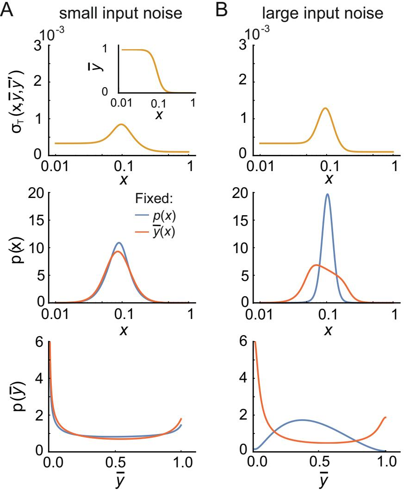
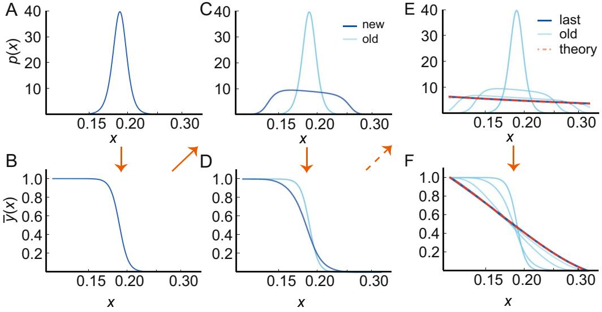
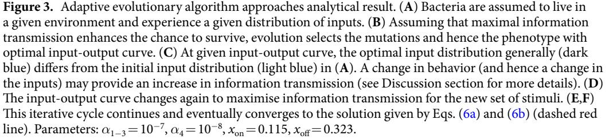
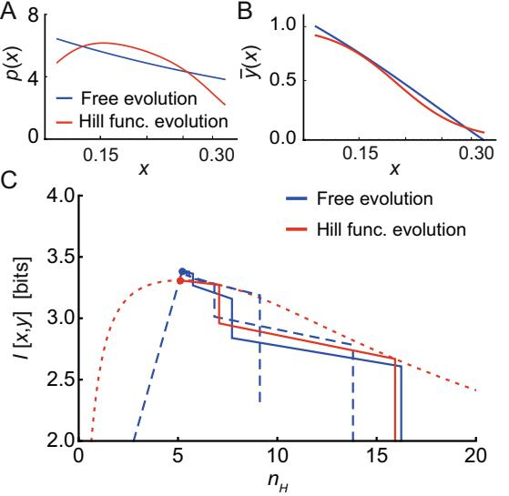
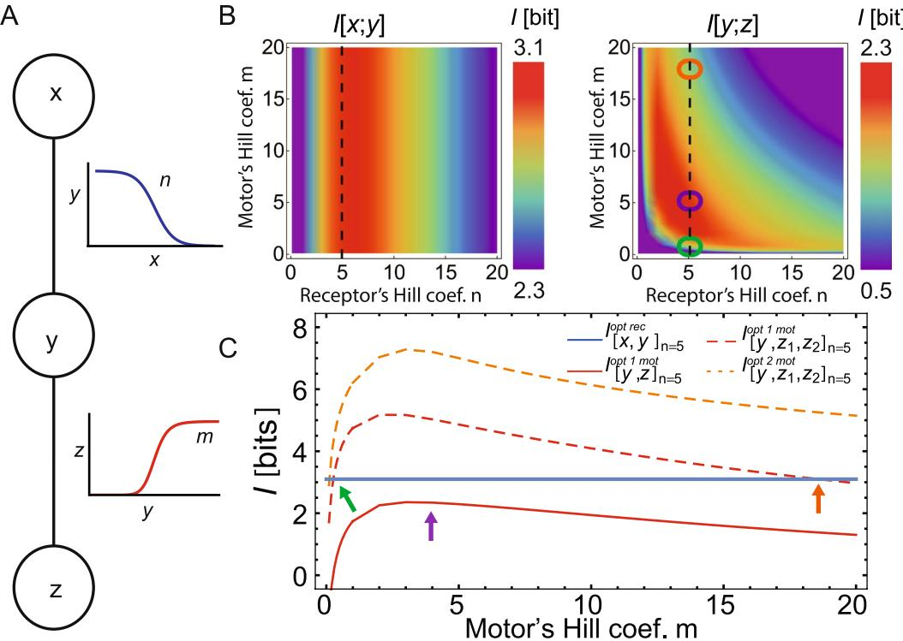

## **OPEN**

# **Maximal information transmission is compatible with ultrasensitive biological pathways**

**Gabriele Micali1,2,3,4 & RobertG. Endres 1,2***

**Cells are often considered input-output devices that maximize the transmission of information by converting extracellular stimuli (input) via signaling pathways (communication channel) to cell behavior (output). However, in biological systems outputs might feed back into inputs due to cell motility, and the biological channel can change by mutations during evolution. Here, we show that the conventional channel capacity obtained by optimizing the input distribution for a fxed channel may not refect the global optimum. In a new approach we analytically identify both input distributions and input-output curves that optimally transmit information, given constraints from noise and the dynamic range of the channel. We fnd a universal optimal input distribution only depending on the input noise, and we generalize our formalism to multiple outputs (or inputs). Applying our formalism to** *Escherichia coli* **chemotaxis, we fnd that its pathway is compatible with optimal information transmission despite the ultrasensitive rotary motors.**

Biological cells continuously process environmental cues, allowing them to make critical decisions quickly, e.g. whether to move or stay, whether to express a certain protein, or whether to divide[1](#page-10-0) . Tese decisions are generally made based on the level of one or more key proteins, which are the internal representation of the extracellular stimulus. Te higher the amount of environmental information encoded in the intracellular representation, the more reliable the response. In contrast, cell-external and internal noise may reduce the reliability. Hence, a biological system under evolutionary pressure is expected to evolve to optimally transmit information under biologically relevant constraints[2](#page-10-1) , at least when information is a limiting facto[r3](#page-10-2)[–5](#page-10-3) .

To formalize this optimization problem, cells can be considered input-output devices, where stimuli of extracellular concentrations are the input, receptors (or the entire pathway) are the communication channel, and the intracellular concentration of a key protein (or the fnal behavior of the cell) is the output. In contrast to engineered physical systems, the distinction between input, channel, and output is not always clear in biological systems with feedback. Take for instance *Escherichia coli* chemotaxis, a well-characterized pathway allowing bacteria to sense chemicals and to swim towards nutrients[6,](#page-10-4)[7](#page-10-5) . Te intracellular level of the phosphorylated protein (CheYp) represents the extracellular concentration of a chemical and regulates the motors (clockwise or counterclockwise rotation) and hence motility ('run' or 'tumble') (Fig. [1)](#page-1-0). Te swimming behavior clearly afects the input as cells change their location, making information fow a circular problem. Hence, the question emerges how to tackle such problems.

Shannon's mutual information is generally used to quantify information transmission, capturing the statistical (linear and nonlinear) dependencies between inputs and output[s8](#page-10-6) . Specifcally, the mutual information describes the ability on average to reconstruct the input distribution afer repeatedly measuring the output[8](#page-10-6)[,9](#page-10-7) . Ofen maximal mutual information is assumed, either to refect biological function or because the mutual information cannot be calculated otherwise[10,](#page-10-8)[11.](#page-10-9) How should mutual information be maximized? Maximizing with respect to the (generally unknown) distribution of inputs leads to the channel capacity. Such an approach was, e.g., used to study transcriptional regulation in the developing fruit-fy embry[o12,](#page-10-10)[13.](#page-10-11) While in this case, the mother organism may be able to tune its maternal factors to the optimal input distribution to match the 'expectation' of the embryo, the channel capacity may not generally be a valid approach. Alternatively, it is possible to assume a fxed input distribution and to maximize the mutual information with respect to the input-output curve[14](#page-10-12),[15](#page-10-13). Te underlying

1Department of Life Sciences, Imperial College, London, UK. 2Centre for Integrative Systems Biology and Bioinformatics, Imperial College, London, UK. 3Department of Environmental Microbiology, Eawag, Dübendorf, Switzerland. 4 Department of Environmental Systems Science, ETH Zürich, Zürich, Switzerland. *email: [r.endres@](mailto:r.endres@imperial.ac.uk) [imperial.ac.uk](mailto:r.endres@imperial.ac.uk)

**Figure 1.** Connection between environmental cues and chemotactic response. Chemotactic bacteria live in complex microenvironments in which input distributions of chemical concentrations are shaped by the swimming behavior (top lef), chemical sources and sinks (top middle), and competition with other bacteria (top right). Inputs are processed by the cell-internal chemotaxis pathway, which can be viewed as an inputoutput device (bottom). Specifcally, input-output curves are measured in experiments by dose-response curves with noise. Te resulting fnal behavior feeds back into the environment. Evolution is assumed to select the best input-output curves for maximizing ftness. Te chemotactic pathway is a two-component system, and for modeling purposes, is divided into two information-transmission channels: receptors sense external concentration of stimuli and their activity regulates the protein CheYp (receptor channel, bottom lef). CheYp is the internal representation of the external stimulus and regulates motor switching (clockwise or counterclockwise rotation) and thus bacterial motility (straight swimming via a 'run' or random reorientation via a 'tumble'; motility channel, bottom right). Note that there is additional adaptation both at the receptor[s75](#page-12-0) and the motors[52](#page-11-8).

idea is that the input-output curve is adjusted by evolution to match the distribution of inputs. Tis approach might apply to organisms confned to certain environments, e.g. bacteria living in specifc niche[s15.](#page-10-13) In addition to these two optimization procedures (and some attempts to combine them for specifc types of input-output curve[s16–](#page-10-14)[18](#page-10-15)), the Fisher information from estimation theory may also be used to predict the input distributio[n19,](#page-10-16)[20.](#page-11-0) Hence, due to multiple available approaches there is considerable uncertainty to what optimization procedure to use.

Even the principle of maximal information transmission may be questioned. Recently, maximizing information transmission at the *E. coli* receptors led to maximal drif of cells swimming up a chemical gradient and hence optimal chemotactic behavio[r15.](#page-10-13) Although a reasonable result, there are two potential problems when considering the whole pathway: Firstly, the dose-response curves of the motors are measured to have Hill coefcients up to 2[021](#page-11-1). Hence, such switch-like motors may only transmit about one bit of information, distinguishing only low and high levels of CheYp. Secondly, the CheYp level, which maximizes the drif is not in the sensitive region of the moto[r22–](#page-11-2)[24.](#page-11-3) Both issues may lead one to suggest that high information transmission at the receptors is wasted downstream at the motors, and that an entirely diferent principle may guide cell behavior[25](#page-11-4),[26](#page-11-5).

Here, we address two key questions: (1) How should the mutual information be calculated in a biological context, and (2) does the bacterial chemotaxis pathway maximize information transmission? Specifcally, we reconcile the various optimization procedures, leading to a new way of maximizing the mutual information, particularly useful for biological systems. Assuming general external and internal noise, and a fxed range of sensitivity (as any biological or physical system is necessarily limited), we analytically derive both the optimal input distribution *and* input-output curve. Unlike previous approache[s16](#page-10-14)[–18,](#page-10-15) this general solution does not assume specifc input-output curves, such as Hill functions. Surprisingly, we fnd an universal optimal input distribution, only dependent on the input noise. Furthermore, numerically and with the help of simulations, we were able to extend our formalism to multiple outputs (or inputs), greatly extending the applicability of our formalism to biological systems. As an illustrative example, we focus on the *E. coli* chemotaxis pathway using previously estimated noise and measured dose-response curves at the receptors and the motors. By deriving analytical results for multiple output motors, we show that although the optimal response is not a Hill function, the measured Hill coefcients naturally emerge from our optimal prediction. Overall our results confrm the idea of maximal information transmission in *E. coli* chemotaxis, and prove that maximal information transmission at the receptors is critical for the whole pathway despite the ultrasteep motor dose-response curves.

#### **Results**

**Maximizing mutual information: comparison of diferent approaches.** Information transmission between an input, *X*, and an output, *Y*, is ofen quantifed by the mutual information, which is a measure of statistical dependency and refects the average ability for inferring the input afer measurements of the output ([8](#page-10-6)[–11](#page-10-9)[,27](#page-11-6)[–29](#page-11-7) for extended reviews). For continuous random variables, *X* and *Y*, the mutual information is defned by

$$\mathcal{Z}[X,Y] := \int \text{d}y \, \text{d}x \, p(\mathbf{y}|\mathbf{x})p(\mathbf{x}) \text{log}_2 \left[ \frac{p(\mathbf{y}|\mathbf{x})}{p(\mathbf{y})} \right]. \tag{1}$$

where *p*(*y*|*x*) is the conditional probability of observing *Y*=*y* at given *X*=*x*, encoding the input-output curve and noise. Quantities *p*(*x*) and *p*(*y*) represent the input and output distributions, respectively, which are mathematically connected by the conservation of probability *p*(*x*)d*x*=*p*(*y*)d*y*, valid in the small-noise limit. Considering small Gaussian noise with conditional probability, *p*( ) *y x*| = exp[− − ( ) *y y* /(2 ) *σ π* ]/ 2 *σ* 2 T 2 T 2 , with mean *y* (*x*) and standard deviation *σ*T(*x*), Eq. [(1)](#page-2-0) becomes

$$\mathcal{Z}[X,Y] = -\int_{x_{\rm on}}^{x_{\rm off}} \text{d}x \, p(\mathbf{x}) \, \log_2 \left[ \frac{\sqrt{2\pi e}}{\overline{\mathbf{y}}'(\mathbf{x})} p(\mathbf{x}) \right],\tag{2}$$

where *x*on and *x*of set the sensitive region, i.e. the dynamic range of input[s14](#page-10-12)[,15](#page-10-13) (similar equations appear in[12,](#page-10-10)[13,](#page-10-11)[20](#page-11-0)). In addition to *p*(*x*), Eq. ([2)](#page-2-1) depends on the gain *y* ′(*x*), i.e. the frst derivative of the input-output curve *y* (*x*), and total noise *σ*T*(x*).

To understand if biological systems maximize information fow, we need to maximise the mutual information and derive general principles or compare with data. To maximise the mutual information, the channel capacity is ofen considered, i.e. the mutual information maximized with respect to the input distributio[n12](#page-10-10)[,13.](#page-10-11) Alternatively, the mutual information can be maximized with respect to the input-output curve assuming a fxed input distributio[n14](#page-10-12)[,15.](#page-10-13) Te former method is an attempt to deal with the ofen unknown input distribution, while the latter is based on the idea that the biological channel can be modifed by evolution. Additionally, the two approaches were combined for specifc input-output Hill and Hill-like function[s16](#page-10-14)[–18.](#page-10-15) However, is there a general way to unify the diferent methods, without making assumptions about functional form of the input-output functions?

Formally, we maximize the mutual information, Eq. [(2](#page-2-1)), with respect to *p*(*x*) and *y x*) by writing

$$\max_{\mathfrak{p}(\mathbf{x})} \mathcal{Z}[X, Y] \to \frac{\partial \mathcal{L}}{\partial \mathfrak{p}} = 0,\tag{3}$$

$$\max_{\mathsf{T}(\mathsf{x})} \mathcal{Z}[\mathsf{X}, \mathsf{Y}] \quad \to \ \frac{\partial \mathcal{L}}{\partial \mathsf{\overline{y}}} - \frac{\mathsf{d}}{\mathsf{dx}} \frac{\partial \mathcal{L}}{\partial \mathsf{\overline{y}}'} = \mathsf{0},\tag{4}$$

where the right-hand side of Eqs. [(3)](#page-2-2) and ([4](#page-2-3)) are Euler-Lagrange equations from calculus of variations with Lagrangian ′ = *π σ* ′ ( , *x p*, , *y y* ) l *p p* og *e* 2 *y* 2 T , i.e. the integrand of Eq. [(2)](#page-2-1). Equation [(3)](#page-2-2) represents the channel capacity applied to a Gaussian channel (i.e. Gaussian conditional probability *p*(*y*|*x*), se[e12](#page-10-10)[,13](#page-10-11) for examples in gene regulation). In contrast, Eq. ([4)](#page-2-3) is used to obtain the optimal input-output curve for a given input distribution (see[14,](#page-10-12)[15](#page-10-13) for examples in sensory systems). For completeness, we provide the solutions of the individual maximizations of Eqs. ([3](#page-2-2)) and ([4)](#page-2-3) in SI Text Sec. 1.1–1.2, with a discussion of the sensitive region in Sec. 1.8.

When the noise is uniform (*σT* constant) Eqs ([3](#page-2-2)) and ([4)](#page-2-3) coincide. Specifcally, = ∂ ∂ 0 *y* in Eq. ([4)](#page-2-3) so that *y* is a cyclic variable. As a result, = ∂ ∂ ′ 0 *x p y* d d so that *p*/*y* ′=const and hence is conserved (not in time but in input space), following the Emmy Noether theorem. In this case, maximizing the mutual information leads to a simple matching relationship (*y* ′∝*p*), so that the input-output curve is the cumulative integral of the input distribution (see *S1 text*, Sec. 1.1 and Fig. S1[)30.](#page-11-9) However, in general when both input and output noise matter the noise is a function of the input and input-output curve, given by *σ*T=*σ*T(*x*, *y* , *y* ′). Assuming independent cell-external and internal noise, we consider

$$
\sigma_{\rm T}(\mathbf{x}, \overline{\mathbf{y}}, \overline{\mathbf{y}}') = \sqrt{\sigma_{\rm x}^{2} \overline{\mathbf{y}}'^{2} + \sigma_{\rm y}^{2}},
\tag{5}
$$

which follows from error propagation. Specifcally, *σx* is the input noise depending on *x* only, amplifed by the gain *y* ′(*x*), and *σy* is the output noise depending on *y* (*x*) only. In case of negligible input (*σ*x≈ 0) or output (*σ*y≈0) noise, Eq. [(3)](#page-2-2) again converges to Eq. ([4)](#page-2-3) and the system can be solved for any input-output curve *y* (*x*) (see *S1 text*, Sec. 1.2–1.3). As a result, the predicted input and output distributions from the two optimization approaches become identical (Fig. [2A](#page-3-0)). However, in general the two equations difer and the resulting optimal input and output distributions are very diferent in the two approaches (Fig. [2B](#page-3-0)). In particular, the output distributions can be uni- or bimodal with details described in *SI Text*, Sec. 1.3.

It is worth noting that, in Bayesian statistics the Fisher information is linked to the channel capacit[y19](#page-10-16),[20.](#page-11-0) A key problem in Bayesian statistics is choosing a prior distribution for a given stochastic process (i.e. *p*(*y*|*x*)[)31.](#page-11-10) Te idea of having a prior which does not afect the posterior distribution (i.e. *p*(*x*|*y*)) is linked to maximal mutual information, given by the average Kullback-Leibler divergence between prior and posterior distributions. Tis prior distribution is called the reference prio[r19,](#page-10-16) given by *p*( ) *x x* ∝ ( ) with Fisher information ( ) *x d* = | ∫ *y p*( ) *y x* (∂ | log(*p y*( ) *x x* )/∂ ) 2 . As shown in ref. [20](#page-11-0). the Fisher information is the result of maximizing the equivalent of Eq. [(2](#page-2-1)) for a general (not necessarily Gaussian) conditional probability distribution (see *S1 Text*, Sec. 2.). Hence, the channel capacity and the approach based on the Fisher information are equivalent.

**Maximizing mutual information: a new approach.** Te diference between Eqs. [(3](#page-2-2)) and ([4](#page-2-3)) is that Eq. ([3](#page-2-2)) assumes a fxed input-output curve and a variable input distribution, while Eq. ([4](#page-2-3)) assumes a fxed input

**Figure 2.** Conventional ways of maximizing mutual information. Comparison of the channel capacity, i.e. solving the maximization problem Eq. [(3](#page-2-2)) for *p*(*x*) using a fxed *y* (*x*) and noise (red), and maximization with respect to input-output curve, i.e. solving the maximization problem Eq. ([4](#page-2-3)) for *y* (*x*) using a fxed *p*(*x*) and noise (blue). (For specifc examples of the solutions of Eqs [(3)](#page-2-2) and [(4)](#page-2-3) and a discussion of the bimodality of the output distribution, see *SI Text* Sec. 1). In both cases, the noise is provided as a function of the input distribution and input-output curve (top row), with the input-output curve *y* (*x*)=[1+(*x*/*kd*)*nH*]−1 assumed a Hill function for simplicity, with Hill coefcient *nH* and threshold *kd* (inset). (**A**) For small input noise, the two approaches converge, i.e. the red and the blue input (middle lef) and output (bottom lef) distributions match. (**B**) For large input noise, the two approaches predict diferent input (middle right) and output (bottom right) distributions. Using Eq. [(5](#page-2-4)) for the noise, the input noise is *σx* 2=*α*1*x*, while the output noise *σy* 2=*α*2*y* (1− *y* )+*α*3*y* +*α*4 has three diferent contributions with *y* the input-output curve. Te parameters are chosen to provide an overall similar level of noise, given by *α*1=10−8 , *α*2=2 · 10−6 , *α*3=10−7 , *α*4=10−8 (panel A) and *α*1=10−7 , *α*2=10−8 , *α*3=10−7 , *α*4=10−8 (panel B). For the red model, *nH*=5 and *kd*=0.1. For the blue model, the input distribution is fxed by normalizing the derivative of a Hill function with *nH*=5 and *kd*=0.1, with the input-output curve free to change according to the maximization. Te sensitive region is set by *xon*=0 and *xof*=+∞.

distribution and a variable input-output curve. Tere might be situations in which one approach is more appropriate than the other but in a general biological context the two are intrinsically connected (Fig. [1)](#page-1-0). From a mathematical point of view, Eqs [(3)](#page-2-2) and [(4)](#page-2-3) can be combined and solved together, i.e. [ , *x y*] maximized with respect to both *p*(*x*) and *y* (*x*). Similar numerical double optimizations are common in rate distortion theory using, e.g., the Blahut algorithm[4,](#page-10-17)[32.](#page-11-11)

In what follows, we provide the analytical solution for *p*(*x*) and *y* (*x*) by solving Eqs. ([3](#page-2-2)) and ([4](#page-2-3)) together. We assume a fxed dynamical range of inputs set by *x*on and *x*of (given by the receptor sensitivity), leading in return to a fxed dynamical range of outputs from *y*(*x*on)=1 to *y*(*x*of)=0. We consider Eq. ([2](#page-2-1)) with noise given by Eq. [(5](#page-2-4)). Afer a frst integration, we obtain the formal solution

$$p = \frac{\overline{\mathcal{T}}'}{\mathcal{Z}\sigma_{\mathcal{T}}},\tag{6a}$$

$$
\sigma_x^2 \overline{\mathbf{y}}^2 = \mathbf{Q} \sigma_y^2,\tag{6b}
$$

where *Z* and *Q* are two constants set by normalization and boundary conditions, respectively (see *Materials and Methods* and *S1 Text*, Sec. 1.7).

Equation [(6a)](#page-4-0) for the input distribution extends the matching relationship found in[30](#page-11-9) to nonuniform noise. In the latter case the optimal input distribution weighs certain inputs more than uncertain input[s13](#page-10-11)[,20](#page-11-0)[,33](#page-11-12). Equation ([6b)](#page-4-1) determines the input-output curve which maximizes the mutual information given the noise. A solution of the system of equations exists if the transmitted input noise can be expressed in terms of the output noise or vice versa (see *S1 Text*, Sec. 1.7). While such a solution may seem very specifc, it is certainly plausible, given enough time, that evolution eventually fnds it.

How may evolution fnd the solution? To mimic evolution, we envision an adaptive algorithm, allowing the pathway to iteratively reach optimal information transmission. Given an environment and hence a distribution of inputs, *p*1(*x*) (Fig. [3A)](#page-4-2), evolution selects the optimal internal input-output curve, *y*1(*x*) (Fig. [3B](#page-4-2)). However, the distribution of inputs is susceptible to changes, which might be caused by a change of the organism's behavior, even in the same environment. Te new input distribution, *p*2(*x*), may again lead to an increase in information transmission at fxed input-output curve, *y*1(*x*) (Fig. [3C](#page-4-2)). Subsequently, evolution will select a new input-output curve, *y*2(*x*), which enhances information transmission at a fxed input distribution, *p*2(*x*) (Fig. [3D)](#page-4-2). Tis cycle is repeated many times. If the optimal confguration is achievable and information transmission is a proxy for ftness, we expect that the solution of Eqs. ([6a](#page-4-0)) and [(6b](#page-4-1)) naturally emerges in the pathway. Tis is indeed the case for the examples studied here (see Fig. [3E,F)](#page-4-2).

**Information transmission at** *E. coli* **chemoreceptors.** To apply our new approach, we use the chemotaxis pathway of *E. coli* as an explicit example, since it is relatively simple and well characterized in its molecular component[s6](#page-10-4) . Briefy, chemoattractant (ligand) binding turns receptors of, inhibits the kinase CheA, and hence reduces the phospho-transfer from CheAp to CheY. Tis leads to 'runs' as only CheYp can bind the 6–8 motors to introduce 'tumbling'. Tere is also an adaptation mechanism, where addition of methyl groups to receptors compensates for increased attractant concentration by increasing the receptor activity and hence the CheYp level to induce cell tumbling. Removal of methyl group has the opposite efect[34](#page-11-13)[,35](#page-11-14). In order to study signaling in fxed adaptational states, the adaptation enzymes can be removed from the chromosome and the receptor expressed with specifc, genetically engineered, receptor modifcation levels to mimic receptor methylation (see *S1 Text*, Sec. 4.3[)34](#page-11-13)[,35.](#page-11-14)

**Figure 4.** Robustness of the adaptive algorithm. Comparison between our analytical result (blue lines) and the corresponding result when the input-output curve is constrained to a Hill function with adjustable Hill coefcient *nH* (red lines). (**A**,**B**) Input distributions (**A**) and the input-output curves (**B**). (**C**) Comparison between the adaptive algorithm for the unconstrained (blue lines) and Hill-function constrained (red solid line) optimizations. Te adaptive algorithm moves the input-output curves to the optimal value *nH*≈5, steadily increasing the mutual information. Te convergence towards the analytical solution is robust to diferent initial Hill coefcients (dashed blue lines). Te optimal Hill coefcient is compatible with the corresponding experimental curve from[35](#page-11-14) (see also Fig. S9). When constraining the input-output curve to a Hill function, the highest mutual information at a given Hill coefcient is shown by the red dashed line. Noise parameters: *α*1−3=10−4 , *α*4=10−5 , *x*on=0.115 and *x*of=0.323 (see *S1 Text*, Sec. 3 for details of the noise).

Specifcally, we consider the instantaneous information transmission between the chemoattractant methylaspartate (MeAsp) as the input and the response regulator CheYp as the output. Hence, we consider the information transmitted by the initial (fast) response for a given adaptational state (which only changes slowly). (At a later time this response is removed by adaptation and hence is transient only). Note, unlike ref[.36](#page-11-15) we do not assume small Gaussian inputs but natural stimuli drawn from broad, potentially asymmetric input distributions *p*(*x*). When the input distribution of cells simulated in gradients of diferent strength match the optimal information-theoretical input distribution for the same receptor modifcation levels, the drif velocity up the gradient is maximized and, hence, this leads to optimal chemotaxi[s15.](#page-10-13) As this matching of input distributions occurs anywhere in the gradient, these initial responses describe chemotaxis in the whole gradient, and so implicitly include adaptation. Indeed, the predicted distributions of inputs are scale invariant (when normalized by the adapted concentration) and reproduce Weber's law and logarithmic sensing[15](#page-10-13). Te latter can also be captured by the predictive mutual informatio[n37](#page-11-16).

Te functional form of the noise is assumed to be known and derived from microscopic theory as in[38](#page-11-17) (see *S1 Text*, Secs. 3 and 4.2 for noise estimation and sensitivity to noise parameters, respectively). In short, the input variance is considered to be proportional to the input strength, *σx* 2=*α*1*x*, with *x* in units of the ligand concentration the cell is adapted to. Furthermore, *α*1∝(*DNτ*)−1 is given by the Berg-and-Purcell limi[t39,](#page-11-18) where *D* is the difusion constant of the ligand molecules, *N* is the number of receptors acting cooperatively in a cluster, and *τ* is the averaging time, assuming a spherical cell[39](#page-11-18). Te output noise has three contributions: signaling noise, switching noise due to *on*/*of* changes of the receptor state, and a constant background noise, leading to *σy* 2= *α*2*y* (1− *y* )+*α*3*y* +*α*4 with phosphorylated *y* in units of the total CheY level, *YT*, an intrinsic dependence on the (unknown) input-output curve, and *α*2−4 additional parameters defned in *S1 Text*, Sec. 3. Note these efective noise terms are time-averaged due to their dependence on chemical reactions based on fnite rate constants[38.](#page-11-17) Despite *σy* 2 being specific, this noise should apply to many receptor-signaling pathways, including other two-component pathway[s40](#page-11-19).

Using this noise, the explicit solution of Eq. ([6b](#page-4-1)) is

$$\overline{\varphi}(\mathbf{x}) = \frac{\alpha_2 + \alpha_3 + \sqrt{\left(\alpha_2 + \alpha_3\right)^2 + 4\alpha_2\alpha_4} \sin\left[\sqrt{\alpha_2}\left(\mathbf{C} + 2\sqrt{\frac{\mathbf{Q}\mathbf{x}}{\alpha_1}}\right)\right]}{2\alpha_2},\tag{7}$$

where *C* and *Q* are constants set by imposing fxed boundary conditions, *y*(*x*of)=1 and *y*(*x*on)=0 (Fig. [4A](#page-5-0)). Note that *x* appears with the prefactor *Q*/*α*1. Tus, *α*1 is set by the boundary conditions and it can be seen as the units of *x*. We consider two special cases: by simplifying the output noise for *α*2=0, we obtain

$$
\nabla \mathbf{y}(\mathbf{x}) = \frac{\alpha_3^2 C^2 - 4\alpha_4}{4\alpha_3} + \alpha_3 C \sqrt{\frac{\mathbf{Qx}}{\alpha_1}} + \frac{\alpha_3 \mathbf{Qx}}{\alpha_1},\tag{8}
$$

where the solution is again independent of *α*1 afer imposing the boundary conditions. For *α*2,3=0, we obtain

$$\begin{split} \overline{\varphi}(\mathbf{x}) &= \, 2Q \sqrt{\frac{\alpha_4}{\alpha_1}} \sqrt{\mathbf{x}} + \mathbf{C}'' \\ &= \, -\frac{\sqrt{\mathbf{x}}}{\sqrt{\mathbf{x}_{\text{on}}} - \, -\sqrt{\mathbf{x}_{\text{off}}}} + \frac{\sqrt{\mathbf{x}_{\text{on}}}}{\sqrt{\mathbf{x}_{\text{on}}} - \, -\sqrt{\mathbf{x}_{\text{off}}}}, \end{split} \tag{9}$$

which does not depend on both *α*1 and *α*4 once *Q* and *C*′′ are set by the boundary conditions. Te optimal input distribution obtained by inserting Eq. [(6b)](#page-4-1) into Eq. ([6a)](#page-4-0) is = + *σ* − *p* ( ( *Z Q* 1 )/ ) *Q x* 1 . In particular, for our choice of external noise and fxed sensitivity range, the input distribution converges to = − − *p*( ) *x x* [2( ) *x x* ] 1 ~ / *x* on off 1 independently of *α*1−4 (see *S1 Text*, Sec. 1.4.6 and Fig. S3). Importantly, this is a general result for the Berg-and-Purcell input noise, and hence should be valid for many signaling pathways. Tis result was previously found numericall[y16,](#page-10-14) and such an input distribution of glutamine was suggested to optimize nitrogen sensing[33](#page-11-12).

Extracting the sensitive regime of *E. coli* receptors for a fxed modifcation level (resembles receptor methylation level, see *S1 Text*, Sec. 4.3)[35](#page-11-14),[41](#page-11-20), we test the convergence of the adaptive algorithm to the solution in Eq. [(7](#page-5-1)). Afer a few iterative cycles the system indeed converges (Fig. [4A](#page-5-0)), increasing the mutual information at each step (Fig. [4C](#page-5-0), blue line). Tis convergence to the analytical solution occurs when starting at diferent initial conditions, showing robustness of our algorithm. Note that in Fig. [4C](#page-5-0) the solution *y* (*x*) is ftted to Hill functions for convenience of presentation, allowing the mutual information to be plotted as a function of a single parameter (i.e. the Hill coefcient *n*). Te optimal curve selects a Hill coefcient compatible to the experimental measurements from FRET data, at least for larger receptor modifcation levels (Fig. S9)[35](#page-11-14). Applying the adaptive algorithm instead to Hill-function constrained input-output curves produces the same optimal Hill coefcient *n* albeit with a smaller mutual information (Fig. [4C,](#page-5-0) red solid line, with Fig. [4B](#page-5-0) comparing the corresponding optimal input distributions and optimal input-output curves). Note that for a fxed Hill equation the optimal mutual information is calculated directly using the input distribution from Eq. [(6a)](#page-4-0), resulting in

$$\mathcal{Z}[\mathbf{x}, \mathbf{y}] = \log_2 \left[ \frac{Z}{\sqrt{2\pi \mathbf{e}}} \right] \quad \text{with} \quad Z = \int_{x_{\text{on}}}^{x_{\text{off}}} d\mathbf{x} \, \frac{\overline{\mathbf{y}}'(\mathbf{x})}{\sigma_{\Gamma}(\mathbf{x})},\tag{10}$$

as shown in Fig. [4C](#page-5-0) (red dashed line).

However, unlike the *sine* function in Eq. ([7](#page-5-1)), experimental dose-response curves of CheYp are thought to be well approximated by Hill functions rather than Eq. [(7)](#page-5-1)[34](#page-11-13). Tere are several possible reasons for this discrepancy. For instance, in our model receptors are either fully sensitive or fully insensitive, and the solution given by Eq. [(7)](#page-5-1) is only valid in the sensitive region and constant otherwise. In reality, receptors have a smooth sensitivity curve spanning the ligand-dissociation constant of the *of* and *on* states (such as d*F*/dlog(*x*) in[41](#page-11-20), where *F* is the receptor free-energy diference between *on* and *of* states). Tis may lead to a smooth Hill-function-like response. One way of imposing smooth input-output curves is to introduce the additional constraint of zero frst derivatives at the boundary. In this case, however, we only obtain sigmoidal input-output curves without internal switching noise (*α*3=0) (see *S1 Text*, Sec. 1.4.4 and Fig. S3E). Moreover, very asymmetric (or even bimodal) input distributions might be uncommon in natural environments[15,](#page-10-13) potentially favoring log-normal input distributions and hence Hill-function-like response[s42.](#page-11-21) Finally, *E. coli* needs to account for many other constraints and the pathway performs other tasks at the same time, such as sensing temperature and p[H43–](#page-11-22)[45.](#page-11-23) Hence, the *E. coli* sensory system might be in a suboptimal confguration for transmitting information about chemicals in order to account for all the other tasks. In the *S1 Text*, Sec. 1.4.5 we also solve the inverse problem and derive the optimal noise, which leads to an exact Hill function (see Fig. S4). In this case, the predicted input and output noises are not independent anymore. In summary, the mismatch between the experimental Hill functions and the solution in Eq. [(7)](#page-5-1) is not an artifact of our assumptions on the sources of noise; it emerges when considering independent input and output noise, and when maximizing the mutual information with respect to both the input distribution and the input-output curve.

**Information transmission along the** *E. coli* **chemotaxis pathway.** Now that we understand the optimization of the mutual information better, we can tackle the second problem: Does the chemotaxis pathway maximise information transmission? Previous work suggests that the higher the information transmission at the receptors, the higher the drif velocity in the direction of the gradien[t15.](#page-10-13) Is this fnding compatible with the recent observation of the ultrasensitive response of the motor to changes in internal CheYp [21,](#page-11-1) or does such a steep response prevent the cell from high information transmission? To answer this question we extend our analysis to the whole chemotaxis pathway.

We consider a minimal model of two channels: a receptor channel for sensing by the chemoreceptors and a motor channel for the fagellar motors. For the receptor channel, the external chemical concentration *x* is the input and the internal CheYp concentration, *y*, is the output. For the motor channel, *y* is the input and the motor clockwise (CW) bias *z* (for tumble) is the output (Fig. [5A](#page-7-0)). To simplify the problem and to closely resemble the experimental dose-response curves, we now restrict the curves to Hill functions, with Hill coefcients *n* and *m* for receptors and motors, respectively. Te noise expressions for the receptor and motor channels are given by

**Figure 5.** Optimal information transmission in the *E. coli* chemotaxis pathway. (**A**) Minimal model of the *E. coli* chemotaxis pathway, using two concatenated channels. Te extracellular concentration of stimulus *x* is the input of the receptor channel and CheYp, *y*, concentration is the output. For the motor channel, CheYp is the input and the tumble bias *z* the output. Hill functions with adjustable Hill coefcients *n* and *m* represent the input-output curves of the receptor and motor channels, respectively. Te dissociation constants for the receptor and motor channels are *kd n*=0.189/(1*μ*M) and *kd m* =0.39 [*YT*], respectively. (**B**) Heat maps of the separately calculated mutual information of the receptor, [ , *x y*], (lef) and of the motor, *I*[*y*,*z*], (right) channels for a single motor as a function of Hill coefcients *n* and *m*. Vertical dashed lines correspond to maximal value of [ , *x y*] (circles corresponds to arrows in **C**). (**C**) Te mutual information as function of Hill coefcient *m* at *n*=5 (dashed black lines in panel B). While for a single motor the optimal mutual information of the receptor channel (*opt rec*, blue solid line) is higher than the optimal mutual information at the motor (*opt mot*, red solid line), increasing the number of motors (see legend) enhances the optimal mutual information of the motor channel (*opt 1 mot*, dashed red line, for two motors). Arrows point to the predicted *m* values. Te purple arrow indicates the optimal *m* value for a single motor (corresponding to purple circle in **B**), the green and orange arrows point to the optimal *m* values for two motors (corresponding to green and orange circles in **B**). Te mutual information is further increased when the optimal mutual information for two motors is calculated (*opt 2 mot*, orange dashed line, see *S1 Text*, Sec. 4). Parameters: *α*1−3=10−4 , *α*4=10−5 , *β*2=7 · 10−4 , *β*3=7 · 10−4 , and *β*4=1 · 10−4 .

*σ α* yT = + 1*xGy α α y y* (1 − +) *y* + *α* 2 2 3 4 and *σ σ* zT = + yT*G z z β β* (1 − + *z z* ) + *β* 2 2 2 3 4 , respectively, where *Gy* and *Gz* are the gains of the receptor and motor channels. Parameters *β*2−4 represent the noise of the motors and are kept generic due to lack of characterization, but may refect analogous biological processes including adaptation of the motor[s21](#page-11-1)[,46](#page-11-24)[,47](#page-11-25) (see *S1 Text*, Sec. 3 for further details and robustness of results to changes in *β* values). Due to the immense gain at the motor[s21](#page-11-1), we generally have higher noise at the motor then at the receptor (see *S1 Text* Sec. 4.5 for the discussion of the two limits). Here only *n* and *m* are considered adjustable parameters in our model.

Te data processing inequality, which characterizes the fow of information in a Markov chain, states that, at any additional processing step, information can only be lost, never gaine[d48.](#page-11-26) For instantaneous information transmission this means that the mutual information between the external concentration and the motor bias cannot be higher than the minimum of the mutual informations of the receptor and the motor channels, i.e. [ , *x z*] m ≤ in{ [*x y*, ], [ *y z* , ]}. A strategy to possibly increase the mutual information is then to maximise the limiting mutual information.

We start by considering a single motor, represented by a single output *z*. We calculate the maximal mutual information at the receptor (Fig. [5B,](#page-7-0) lef) and motor (Fig. [5B](#page-7-0), right) channels, dealing with the optimization of the two channels separately. Te mutual information at the motor, [ , *y z*], always limits the whole information transmission for any Hill coefcient *n* of the receptors and *m* of the motor. Hence, single-motor cells should optimize the motor rather than the receptor channel. Tis result is not unexpected for the chemotaxis pathways since the ultrasensitive motor enhances the downstream noise, which is generally larger than the upstream noise (here the total CheYp noise is the input noise for the motor channel). Te resulting optimal information transmission corresponds to relatively low *n* and *m* (≈6; red area in right panel of Fig. [5B)](#page-7-0). Experimentally, the Hill coefcient of the receptor channel agrees with our prediction, ranging from 6–12 in Tar-only cell[s35.](#page-11-14) In contrast, the ultrasteep motor response curve with *m*≈20 is in stark contradiction to our single-motor dose-response model. Hence, the single-motor model indicates higher information transmission at the receptors (see Figs. [5](#page-7-0), S6, S7, and *S1 Text*, Secs. 3 and 4.2 for dependence on noise). However, *E. coli* has multiple motors, which might efect information transmission.

We now extend our model to multiple (*K*) motors, allowing the cell to make multiple measurements of the internal CheYp concentration. Tere are now a single input, *y*, and multiple outputs *z*1, ..., *zK*, of the CW biases. Te chain rule for the mutual information allows us to calculate [ ; *y z* , ] ..*z* 1 *K* . In particular, for the extreme case of fully coupled motors the mutual information does not increase with the growing motor number, [ ; *y z* , ] ..*z y* = [ ; *z* ] 1 1 *K* . In contrast, for completely uncoupled motors (i.e. for motors which are simultaneously independent and conditionally independent given *y*) the mutual information increases with the number of motors, [ ; *y z* , ] ..*z K* = [ ; *y z* ] 1 1 *K* (see *S1 Text*, Sec. 4.5). Real motors show evidence of partial coupling[49](#page-11-27), and thus we assume conditional independent motors, i.e. *p*(*z*1, ..*zK*|*y*)=Π*i Kp*(*zi* |*y*). This means that all motors depend on the common *y* level but can independently select their CW bias. For two motors, the mutual information becomes [ ; *y z* , ] *z z* = + [ ; *y z* ] [ ; ] *y z*| = [ ; *z y*] ( − | *H z y H* ) ( + | *z z* ) 1 2 1 2 1 1 2 2 1 . For *K* motors this is generalized to

$$\mathcal{Z}[\mathbf{y}; z_1, \dots, z_K] = \mathcal{Z}[z_1; \mathbf{y}] - K\mathbf{H}(z_1|\mathbf{y}) + \sum_{l=2}^{K} H(z_l|z_{l-1}, \dots, z_1). \tag{11}$$

Using the small noise Gaussian approximation for *p*(*zi*|*y*), the conditional entropy is given by *H*( ) *z y*| = ∫ d ( *y p y*) 1 ·log *π σ y* ( 2 e ( ) *T* ), and *H*(*z*2|*z*1)≈0 (Fig. [5C,](#page-7-0) see also *S1 Text*, Sec. 4.5). Tus, Eq. [(11)](#page-8-0) becomes

$$\mathcal{L}[\mathbf{y}; z_1, \dots, z_K] = \mathcal{Z}[z_\mathbf{i}; \mathbf{y}] - K \int \mathbf{d}\mathbf{y} \,\, \mathbf{p}(\mathbf{y}) \text{log}\{\sqrt{2\pi \mathbf{e}} \,\sigma_\mathbf{I}(\mathbf{y})\}.\tag{12}$$

We numerically tested that the conditional independence of the motors holds for two motors, despite the fact that motors compete for the binding of internal CheY*p* molecules, which can introduce negative correlations (see *S1 Text*, Sec. 4.6 and Fig. S10). Terefore, [ ; *y z* , ] *z y* > [ ; *z* ] 1 2 1 , and more generally [ ; *y z*1 1 , ] ..*z y K K* > . [ ; *z z* , ] . −1 for *K* conditionally independent motor[s50](#page-11-28).

Hence, for conditionally independent motors, the mutual information at the motors will eventually overtake the mutual information at the receptors when the number of motors increases. Consequently, the mutual information at the receptors becomes the limiting factor for information transmission (Fig. [5C,](#page-7-0) se[e50](#page-11-28) for the case of Gaussian input distributions). In other words, for a small number of motors the cell has high information transmission at the receptors, which will be wasted at the motors (cf. red and blue solid lines). In contrast, for a large number of motors the information transmission at the motors exceeds the information transmission at the receptors without overall improvement. However, in the intermediate case both receptors and motors equally limit the transmission of information (cf. red dashed and blue solid lines in Fig. [5C](#page-7-0)). *E. coli* chemotaxis seems to avoid bottlenecks and to optimally allocate resources the latter case is the most advantageou[s51](#page-11-29). Hence, the ultrasteep Hill function of the motor (*m*≈20) can be explained by this matching of the information transmission at the receptors and motors (orange arrow in Fig. [5C](#page-7-0)). Note that in addition to the high Hill coefcient *m* of the motors there is also a corresponding low *m* solution (green arrow in Fig. [5C](#page-7-0)). However, the latter is not robust to changes in *m*, i.e. a small change in *m* can lead to a drastic reduction of information transmission, which can emerge from varying the number of FliM molecules of the motor[52](#page-11-8). In addition, note that the mutual information shown in Fig. [5C](#page-7-0) with a red dashed line is calculated assuming that the two motors are optimized separately. However, the mutual information is further increased by maximizing the two motors simultaneously (dashed orange line in Fig. [5C)](#page-7-0). Our overall result that a high mutual information can be achieved with a high Hill coefcient of the motors remains valid (see *S1 Text*, Sec. 4). In between *m*≈1 and ≈20, the information transmission of the motor is wasted as receptors are information-fow limiting. In conclusion, multiple ultrasensitive motors are only useful when motors are sufciently independent. Any residual coupling among motors may be the result of close motor proximity or mechanical coupling of the fagella.

#### **Discussion**

This study presents a new approach to maximise the mutual information, particularly suitable for evolving biological systems subject to random mutations and selection. Previously, the channel capacity, i.e. the mutual information maximized with respect to the input distribution was widely used for electronic and biological communication channel[s12](#page-10-10)[,13](#page-10-11)[,20](#page-11-0)[,33](#page-11-12). However, this method fails to capture possible changes of the internal input-output curve (e.g. by mutations). Furthermore, the mutual information maximized with respect to the input-output curve neglects the biological relevant feedback of the output on the input[14](#page-10-12),[15](#page-10-13). Here, we reconciled these two approaches by maximizing the mutual information with respect to both the input distribution and the input-output curve for Gaussian channels with small noise. Only when the total noise is uniform, or when the input or the output noise is negligible, the two approaches are identical. Unlike previous joint optimization[s16–](#page-10-14)[18,](#page-10-15) our input-output curves are not restricted to Hill or Hill-like functions. Our adaptive algorithm demonstrates how evolution might implement this iteratively.

Our analytical solution of the joint optimization provides a number of new insights into optimal information transmission. First, the optimal input distribution is universal, depending only on the input noise. For Berg-and-Purcell type input noise, we specifcally obtain − *p*( ) *x x* ~ 1 . Hence, organisms are optimized for environments in which low intensity stimuli occur with high frequency. Tis is sensible as their high frequency would compensate for their large relative noise levels. Second, the optimal input-output curve is invariant to up or down scaling of the input noise (parameter *α*1), which sets the units of the input. Hence, only the shape of the input noise (i.e. its functional dependence on input *x*) afects the input-output curve. Tird, our optimal input-output curve is rather linear (Figs. [3D](#page-4-2) and [4A](#page-5-0)). While this does not match the sigmoidal Hill functions as suggested by models of *E. coli* chemotaxi[s34](#page-11-13),[53](#page-11-30), a near linear input-output curve makes best use of a given dynamic range. Furthermore, enforcing either zero slope of the input-output curve at the boundaries of the sensitive region or Hill functions as input-output curves leads to assumptions on the noise which are hard to justify biologically. Hence, Hill functions are incompatible with independent input and output noise (see Supplementary Information Sec. 1.7 for details).

How can cells actively infuence and optimize their distribution of sensory input? Genetic changes in the downstream pathway and motor can clearly change chemotactic behavior and hence the experienced input stimuli. For instance, increases in the motor speed lead to larger changes in stimulus and hence broader distributions of inputs. Similarly, faster adaptation leads to narrower distributions. However, the notion that cells infuence their microenvironments is most supported by the important role of *niches* in stem cell diferentiation, cancer development, gut microbiota, and host-pathogen interactions[54](#page-11-31)[–58](#page-11-32). Once inside the gut, *E. coli* related pathogen *C. rodentium* in mice (and similarly EPEC/EHEC in humans) injects efector proteins into the epithelial host cells. In response, these cells secrete increased levels of oxygen, allowing in return the pathogen to perform aerobic metabolis[m59.](#page-11-33) Hence, its aerotaxis ability, inherited from *E. coli* based on Aer and Tsr receptors, experiences an increased frequency of oxygen stimuli, which the pathogen actively stimulated. If we take the assumption of maximal information transmission seriously, then cells do not only actively infuence but also optimize their environment.

To apply our information-theoretical approach, we analytically showed that the entire *E. coli* chemotaxis pathway can maximize the instantaneous mutual information between chemical concentration and motor bias despite the ultrasteep dose-response curve of the motors. Briefy, ultrasensitive motors do not restrict information transmission, since a collection of motors boosts information transmission, in addition to providing other chemotactic advantages in the soil or animal intestin[e60](#page-11-34). In particular, our model identifes the number of motors and their conditional independence as key quantities to transmit large amounts of information in peritrichous bacteria.

What is the additional information at the motors used for if the ultimate behavioral output is just binary runs and tumbles? We speculate that the tumble angle, torque, and flament handedness could be regulated[61](#page-11-35),[62](#page-11-36). Indeed, real-time imaging of *E.coli* with fuorescent fagella showed that the tumble angles increased with the number of clockwise-turning motors, allowing for diferential cell response[s61.](#page-11-35) Having non-identical motors with diferent Hill coefcients and thresholds may further increase the information transmission (e.g. as produced by diferent number of FliM in the motor ring)[16](#page-10-14) but this may not be feasible in the bacterial chemotaxis pathway, as the adapted activity set the operating point of the motors. For instance, diferent threshold values for the motor would lead to some motor always rotating clockwise and counter-clockwise. Our model also makes the prediction that chemotactic bacteria with a single motor should prefer a relatively low Hill coefcient at the motor or multiple response regulators feeding into a motor with a high Hill coefcient to highly transmit information. Tis prediction could be tested with the uni-fagellated bacterial species, such as *Rhodobacter sphaeroides*, *Pseudomonas aerugiuosa* or monotrichous marine bacteria[60](#page-11-34)[,63](#page-11-37). In support of our theory, *R. sphaeroides* is known to have multiple CheY'[s64,](#page-11-38)[65.](#page-11-39)

While applicable to many biological systems, our model makes a number of simplifcations (in addition to assumptions on noise and receptor sensitivity). Our results are based on the independent maximizations of the receptor and motor channels. However in *SI text*, Sec. 4.5, we discuss the general case, providing estimes of the mutual information [ ; *x z*], between ligand input and fnal motor output. Our analysis suggests, once again, that high Hill coefcient for multiple motors can support high information transmission. In particular, we analytically identify two expected limits, (i) when the receptor noise is much smaller than the motor noise, we obtain [ ; *x z*] [ ≈ *y z* ; ], and (ii) when the motor noise is smaller than the receptor noise, we have [ ; *x z*] [ ≈ *x y*; ]. Our analysis over the chemotactic pathway primarily focuses on the Hill coefcient. However, the dissociation constant *kd m* of the motor response is known to be larger than the adapted CheYp concentration. In *SI text*, Sec. 4.5.4, we explicitly study the role of the dissociation constant *kd m*, and found a relative weak dependence of the mutual information on it. We also found that afer fxing the Hill coefcient *m* and using the optimized output distribution of the receptor channel, the *kd m* that maximizes the mutual information at the motor matches the experimentally measured value (which is larger than the adapted CheYp level, see Fig. S8).

Another simplifcation is that our model deals with instantaneous information transmission, and hence does not explicitly include any history dependence[36,](#page-11-15)[37](#page-11-16)[,66](#page-11-40),[67](#page-12-1). Hence, our approach should be highly suitable for the slow genetic response in quorum sensing[68](#page-12-2),[69](#page-12-3). In this system, the input-output relation has been measured but input distributions were simply guessed, and not predicted. Another area of application is eukaryotic chemotaxis, where cells move slowly while actively shaping their chemical gradient by ligand secretion[70](#page-12-4) and degradation[71.](#page-12-5) In all these examples, the input distributions and cell behaviors need to match the input-output relations to allow for optimal information gathering. Nevertheless, our model is valid for information transmission by initial transient chemotactic responses, and as this applies anywhere in the gradient, our model describes chemotaxis even including adaptation[15](#page-10-13). We expect that our model even works in relatively steep gradients, where, in addition to adaptation, long-history efects are important, such as caused by receptor saturation and rotational difusion[24.](#page-11-3) Te main assumption i[n15](#page-10-13) is that gradients can be linearized over the range of input distributions. However, we do not assume small Gaussian-distributed inputs. A drawback of our model is that we neglect any cell-to-cell variability, which can be substantial[72](#page-12-6),[73](#page-12-7), so that in efect our theory focuses on a certain subpopulation of cells. Tis cell-to-cell variability may lead to advantages in terms of bet-hedging strategies not directly related to information processin[g74.](#page-12-8)

In conclusion, we provided a biologically inspired adaptive algorithm with analytical solution for complex problems in information transmission in sensory systems. Future studies may need to account for time-dependencies explicitly, including adaptation both at the receptors and motors. Tis may be achieved by considering trajectories of molecular concentrations and/or cell behavior, which may also help establish a link between chemotactic performance (e.g. drif velocity), information transmission, and energetic cost of chemotaxis. Tis link may show interesting tradeofs and new design principle[s29.](#page-11-7) A methodological contribution might be necessary as calculation of the mutual information based on trajectories are hampered by the high-dimensional phase space of all possible trajectories.

#### **Materials and Methods**

**Maximization of mutual information with respect to input distribution and input-output curve.** To maximize Eq. ([2)](#page-2-1) assuming the noise in Eq. [(5](#page-2-4)), we focus on the integrand ′ = *π σ* ′ ( , *x p*, , *y y* ) l *p p* og *e* 2 *y* 2 T and use the well-known Lagrange formalism from calculus of variations, where *x* is the independent variable while *p*=*p*(*x*), *y* =*y* (*x*) and *y* ′=*y* ′(*x*) are the dependent variables. Note that *p*′(*x*) is not appearing in the Lagrangian . To fnd the maximum of *I* with respect to *p* and *y* , we need to solve Eqs. [(3)](#page-2-2) and ([4)](#page-2-3) together.

Equation [(6a)](#page-4-0) is the solution of Eq. [(3)](#page-2-2), which can be rewritten through diferentiation as

$$\frac{p'}{p} = \frac{\overline{\mathcal{Y}}''}{\overline{\mathcal{Y}}'} - \frac{\sigma'_{\mathcal{T}}}{\sigma_{\mathcal{T}}}.\tag{13}$$

To derive Eq. ([6b](#page-4-1)), we evaluate the following derivatives

$$\frac{\partial \mathcal{Z}}{\partial \overline{\mathcal{Y}}} = \frac{\not p}{\sigma_{\text{T}}} \frac{\partial \sigma_{\text{T}}}{\partial \overline{\mathcal{Y}}},\tag{14}$$

$$\frac{\partial \mathcal{L}}{\partial \overline{\eta}^{\prime}} = \frac{p}{\sigma_{\text{T}}} \frac{\partial \sigma_{\text{T}}}{\partial \overline{\eta}^{\prime}} - \frac{p}{\overline{\eta}^{\prime}},\tag{15}$$

$$\frac{d}{d\mathbf{x}}\frac{\partial \mathcal{T}}{\partial \overline{\mathbf{y}}'} = -\frac{\mathbf{p}'}{\overline{\mathbf{y}}'} + \frac{\mathbf{p}\overline{\mathbf{y}}''}{\overline{\mathbf{y}}^2} - \frac{\mathbf{p}'}{\sigma_\mathbf{T}} \frac{\partial \sigma_\mathbf{T}}{\partial \overline{\mathbf{y}}'} + \frac{\mathbf{p}\sigma_\mathbf{T}'}{\sigma_\mathbf{T}^2} \frac{\partial \sigma_\mathbf{T}}{\partial \overline{\mathbf{y}}} + \frac{\mathbf{p}}{\sigma_\mathbf{T}} \frac{d}{d\mathbf{x}} \frac{\partial \sigma_\mathbf{T}}{\partial \overline{\mathbf{y}}'}.\tag{16}$$

Using Eqs [(13](#page-10-18))–([16)](#page-10-19), Eq. [(4)](#page-2-3) becomes

$$2\frac{\overline{\mathcal{Y}}''}{\overline{\mathcal{Y}}'} - 2\frac{\sigma'_{\text{T}}}{\sigma_{\text{T}}} + \frac{\frac{d}{d\mathbf{x}}\frac{\partial\sigma_{\text{T}}}{\partial\overline{\mathcal{Y}}'}}{\frac{\partial\sigma_{\text{T}}}{\partial\overline{\mathcal{Y}}'}} = -\frac{1}{\overline{\mathcal{Y}}'}\frac{\frac{\partial\sigma_{\text{T}}}{\partial\overline{\mathbf{x}}}}{\frac{\partial\sigma_{\text{T}}}{\partial\overline{\mathcal{Y}}'}}.\tag{17}$$

Now assuming independent cell-external and internal noises as in Eq. ([5)](#page-2-4), Eq. ([17](#page-10-20)) becomes Eq. ([6b)](#page-4-1).

Received: 24 September 2018; Accepted: 29 October 2019; Published: xx xx xxxx

#### **References**

- 1. Perkins, T. J. & Swain, P. S. Strategies for cellular decision-making. *Mol Syst Biol* **5**, 326–326 (2009).
- 2. Vergassola, M., Villermaux, E. & Shraiman, B. I. 'infotaxis' as a strategy for searching without gradients. *Nature* **445**, 406 (2007).
- 3. Lander, A. D. How cells know where they are. *Science* **339**, 923–927 (2013).
- 4. Taylor, S. F., Tishby, N. & Bialek, W. Information and ftness. *arXiv preprint* **0712.4382** (2007).
- 5. Rivoire, O. & Leibler, S. Te value of information for populations in varying environments. *J Stat Phys* **142**, 1124–1166 (2011).
- 6. Berg, H. C. Motile behavior of bacteria. *Phys Today* **53**, 24–29 (2000).
- 7. Endres, R. *Physical Principles in Sensing and Signaling: With an Introduction to Modeling in Biology* (Oxford University Press, 2013).
- 8. Shannon, C. E. A mathematical theory of communication. *Bell Syst Tech J* **27**, 379–423 (1948). 9. Bowsher, C. G. & Swain, P. S. Environmental sensing, information transfer, and cellular decision-making. *Curr Opin Biotech* **28**,
- 149–155 (2014).
- 10. Tkačik, G. & Walczak, A. M. Information transmission in genetic regulatory networks: a review. *Journal of Physics: Condensed Matter* **23**, 153102 (2011).
- 11. Tkačik, G. & Bialek, W. Information processing in living systems. *Annual Review of Condensed Matter Physics* **7**, 89–117 (2016).
- 12. Tkačik, G., Callan, C. G. Jr & Bialek, W. Information fow and optimization in transcriptional regulation. *Proc Natl Acad Sci USA* **105**, 12265–12270 (2008).
- 13. Tkačik, G., Callan, C. G. Jr & Bialek, W. Information capacity of genetic regulatory elements. *Phys Rev E* **78**, 011910 (2008).
- 14. Detwiler, P. B., Ramanathan, S., Sengupta, A. & Shraiman, B. I. Engineering aspects of enzymatic signal transduction: photoreceptors in the retina. *Biophys J* **79**, 2801–2817 (2000).
- 15. Clausznitzer, D., Micali, G., Neumann, S., Sourjik, V. & Endres, R. G. Predicting chemical environments of bacteria from receptor signaling. *PLoS Comput Biol* **10**, e1003870 (2014).
- 16. Tkačik, G., Walczak, A. M. & Bialek, W. Optimizing information fow in small genetic networks. *Physical Review E* **80**, 031920 (2009).
- 17. Walczak, A. M., Tkačik, G. & Bialek, W. Optimizing information fow in small genetic networks. ii. feed-forward interactions. *Physical Review E* **81**, 041905 (2010).
- 18. Tkačik, G., Walczak, A. M. & Bialek, W. Optimizing information fow in small genetic networks. iii. a self-interacting gene. *Physical Review E* **85**, 041903 (2012).
- 19. Bernardo, J. M. Reference posterior distributions for Bayesian inference. *J R Stat Soc Ser B Stat Methodol* **41**, 113–147 (1979).
- 20. Brunel, N. & Nadal, J. P. Mutual information, Fisher information, and population coding. *Neural Comput* **10**, 1731–1757 (1998).
- 21. Yuan, J. & Berg, H. C. Ultrasensitivity of an adaptive bacterial motor. *J Mol Biol* **425**, 1760–1764 (2013).
- 22. Dufour, Y. S., Fu, X., Hernandez-Nunez, L. & Emonet, T. Limits of feedback control in bacterial chemotaxis. *PLoS Comput Biol* **10**, e1003694 (2014).
- 23. Wong-Ng, J., Melbinger, A., Celani, A. & Vergassola, M. Te role of adaptation in bacterial speed races. *PLoS Comput Biol* **12**, e1004974 (2016).
- 24. Micali, G., Colin, R., Sourjik, V. & Endres, R. G. Drif and behavior of e. coli cells. *Biophysical Journal* **113**, 2321–2325 (2017).
- 25. Skoge, M., Meir, Y. & Wingreen, N. S. Dynamics of cooperativity in chemical sensing among cell-surface receptors. *Phys Rev Lett* **107**, 178101–178101 (2011).
- 26. Tomas, P. J. & Eckford, A. W. Capacity of a simple intercellular signal transduction channel. *IEEE Transactions on Information Teory* **62**, 7358–7382 (2016).
- 27. Levchenko, A. & Nemenman, I. Cellular noise and information transmission. *Curr Opin Biotechnol* **28**, 156–164 (2014).
- 28. Mc Mahon, S. S. *et al*. Information theory and signal transduction systems: From molecular information processing to network inference. *Semin Cell Dev Biol* **35C**, 98–108 (2014).
- 29. Micali, G. & Endres, R. G. Bacterial chemotaxis: information processing, thermodynamics, and behavior. *Curr Opin Microbiol* **30**, 8–15 (2016).
- 30. Laughlin, S. A simple coding procedure enhances a neuron's information capacity. *Z Naturforsch C* **36**, 910–912 (1981).
- 31. Jefreys, H. An invariant form for the prior probability in estimation problems. *P Roy Soc Lond A Mat* **186**, 453–461 (1946).
- 32. Blahut, R. Computation of channel capacity and rate-distortion functions. *IEEE transactions on Information Teory* **18**, 460–473 (1972).
- 33. Komorowski, M. *et al*. Analog nitrogen sensing in escherichia coli enables high fdelity information processing. *bioRxiv* 015792 (2015).
- 34. Keymer, J. E., Endres, R. G., Skoge, M., Meir, Y. & Wingreen, N. S. Chemosensing in *escherichia coli*: two regimes of two-state receptors. *Proc Natl Acad Sci USA* **103**, 1786–1791 (2006).
- 35. Endres, R. G. *et al*. Variable sizes of *Escherichia coli* chemoreceptor signaling teams. *Mol Syst Biol* **4**, 211 (2008).
- 36. Tostevin, F. & ten Wolde, P. R. Mutual information between input and output trajectories of biochemical networks. *Phys Rev Lett* **102**, 218101–218101 (2009).
- 37. Becker, N. B., Mugler, A. & ten Wolde, P. R. Optimal prediction by cellular signaling networks. *Phys Rev Lett* **115**, 258103 (2015).
- 38. Clausznitzer, D. & Endres, R. G. Noise characteristics of the Escherichia coli rotary motor. *BMC Syst Biol* **5**, 151–151 (2011).
	- 39. Berg, H. C. & Purcell, E. M. Physics of chemoreception. *Biophys J* **20**, 193–219 (1977).
- 40. Salazar, M. E. & Laub, M. T. Temporal and evolutionary dynamics of two-component signaling pathways. *Curr Opin Microbiol* **24**, 7–14 (2015).
- 41. Endres, R. G. & Wingreen, N. S. Precise adaptation in bacterial chemotaxis through "assistance neighborhoods". *Proc Natl Acad Sci USA* **103**, 13040–13044 (2006).
- 42. Frank, S. A. Input-output relations in biological systems: measurement, information and the Hill equation. *Biol Direct* **8**, 31–31 (2013).
- 43. Oleksiuk, O. *et al*. Termal robustness of signaling in bacterial chemotaxis. *Cell* **145**, 312–321 (2011).
- 44. Yang, Y. & Sourjik, V. Opposite responses by diferent chemoreceptors set a tunable preference point in Escherichia coli pH taxis. *Mol Microbiol* **86**, 1482–1489 (2012).
- 45. Hu, B. & Tu, Y. Behaviors and strategies of bacterial navigation in chemical and nonchemical gradients. *PLoS Comput Biol* **10**, e1003672 (2014).
- 46. Tu, Y. & Berg, H. C. Tandem adaptation with a common design in escherichia coli chemotaxis. *Journal of molecular biology* **423**, 782–788 (2012).
- 47. Zhang, C., He, R., Zhang, R. & Yuan, J. Motor adaptive remodeling speeds up bacterial chemotactic adaptation. *Biophys J* **114**, 1225–1231 (2018).
- 48. Cover, T. M. & Tomas, J. A. *Elements of Information Teory (Wiley Series in Telecommunications and Signal Processing)*, **99** edn (Wiley-Interscience, 1991).
- 49. Mears, P. J., Koirala, S., Rao, C. V., Golding, I. & Chemla, Y. R. *Escherichia coli* swimming is robust against variations in fagellar number. *eLife* **3**, e01916 (2014).
- 50. Cheong, R., Rhee, A., Wang, C. J., Nemenman, I. & Levchenko, A. Information transduction capacity of noisy biochemical signaling networks. *Science* **334**, 354–358 (2011).
- 51. Govern, C. C. & ten Wolde, P. R. Optimal resource allocation in cellular sensing systems. *Proc Natl Acad Sci USA* **111**, 17486–17491 (2014).
- 52. Yuan, J., Branch, R. W., Hosu, B. G. & Berg, H. C. Adaptation at the output of the chemotaxis signalling pathway. *Nature* **484**, 233–236 (2012).
- 53. Sourjik, V. & Berg, H. C. Binding of the *Escherichia coli* response regulator CheY to its target measured *in vivo* by fuorescence resonance energy transfer. *Proc Natl Acad Sci USA* **99**, 12669–12674 (2002).
- 54. Hawkins, E. D. *et al*. T-cell acute leukaemia exhibits dynamic interactions with bone marrow microenvironments. *Nature* **538**, 518 (2016).
- 55. Tanaka, M. *et al*. Identifcation of anti-cancer chemical compounds using xenopus embryos. *Cancer science* **107**, 803–811 (2016).
- 56. Cao, Z. *et al*. Angiocrine factors deployed by tumor vascular niche induce b cell lymphoma invasiveness and chemoresistance. *Cancer cell* **25**, 350–365 (2014).
- 57. Plaks, V., Kong, N. & Werb, Z. Te cancer stem cell niche: how essential is the niche in regulating stemness of tumor cells? *Cell stem cell* **16**, 225–238 (2015).
- 58. Messer, J. S., Liechty, E. R., Vogel, O. A. & Chang, E. B. Evolutionary and ecological forces that shape the bacterial communities of the human gut. *Mucosal immunology* **10**, 567 (2017).
- 59. Berger, C. N. *et al*. Citrobacter rodentium subverts atp fux and cholesterol homeostasis in intestinal epithelial cells *in vivo*. *Cell metabolism* **26**, 738–752 (2017).
- 60. Stocker, R. Reverse and fick: Hybrid locomotion in bacteria. *Proc Natl Acad Sci USA* **108**, 2635–2636 (2011).
- 61. Turner, L., Ryu, W. S. & Berg, H. C. Real-time imaging of fuorescent fagellar flaments. *Journal of bacteriology* **182**, 2793–2801 (2000).
- 62. Darnton, N. C., Turner, L., Rojevsky, S. & Berg, H. C. On torque and tumbling in swimming escherichia coli. *J Bacteriol* **189**, 1756–1764 (2007).
- 63. Sourjik, V. & Armitage, J. P. Spatial organization in bacterial chemotaxis. *EMBO J* **29**, 2724–2733 (2010).
- 64. Porter, S. L., Wadhams, G. H. & Armitage, J. P. *Rhodobacter sphaeroides*: complexity in chemotactic signalling. *Trends in Microbiology* **16**, 251–260 (2008).
- 65. Porter, S. L., Wadhams, G. H. & Armitage, J. P. Signal processing in complex chemotaxis pathways. *Nature Reviews Microbiology* **9**, 153–165 (2011).
- 66. Tu, Y., Shimizu, T. S. & Berg, H. C. Modeling the chemotactic response of *Escherichia coli* to time-varying stimuli. *Proc Natl Acad Sci USA* **105**, 14855–14860 (2008).
- 67. Shimizu, T. S., Tu, Y. & Berg, H. C. A modular gradient-sensing network for chemotaxis in *Escherichia coli* revealed by responses to time-varying stimuli. *Mol Syst Biol* **6**, 382 (2010).
- 68. Mehta, P., Goyal, S., Long, T., Bassler, B. L. & Wingreen, N. S. Information processing and signal integration in bacterial quorum sensing. *Mol Syst Biol* **5**, 325 (2009).
- 69. Taillefumier, T. & Wingreen, N. S. Optimal census by quorum sensing. *PLoS computational biology* **11**, e1004238 (2015).
- 70. De Palo, G., Yi, D. & Endres, R. G. A critical-like collective state leads to long-range cell communication in Dictyostelium discoideum aggregation. *PLoS Biol* **15**, e1002602 (2017).
- 71. Tweedy, L., Knecht, D. A., Mackay, G. M. & Insall, R. H. Self-generated chemoattractant gradients: attractant depletion extends the range and robustness of chemotaxis. *PLoS Biol* **14**, e1002404 (2016).
- 72. Colin, R., Rosazza, C., Vaknin, A. & Sourjik, V. Multiple sources of slow activity fuctuations in a bacterial chemosensory network. *eLife* **6**, e26796 (2017).
- 73. Keegstra, J. M. *et al*. Phenotypic diversity and temporal variability in a bacterial signaling network revealed by single-cell fret. *eLife* **6**, e27455 (2017).
- 74. Frankel, N. W. *et al*. Adaptability of non-genetic diversity in bacterial chemotaxis. *eLife* **3**, e03526 (2014).
- 75. Sourjik, V. & Berg, H. C. Receptor sensitivity in bacterial chemotaxis. *Proc Natl Acad Sci USA* **99**, 123–127 (2002).

#### **Acknowledgements**

We thank Chiu Fan Lee, Tomas Ouldridge, Michael Stumpf and Peter Swain for valuable comments on the manuscript, Judith Armitage for valuable discussions about *Rhodobactersphaeroides*, and Victor Sourjik for collaborating with us on related projects. Tis work was supported by European Research Council Starting-Grant N. 280492-PPHPI. Additional support came from the Biotechnological and Biological Sciences Research Council grant BB/G000131/1 (RGE) and the Swiss National Science Foundation grant nr. 31003A_169978 to Martin Ackermann (GM).

#### **Author contributions**

Both authors (G.M. and R.G.E.) designed the study. G.M. performed the research. Both analyzed results and data, and wrote the paper.

#### **Competing interests**

Te authors declare no competing interests.

### **Additional information**

**Supplementary information** is available for this paper at<https://doi.org/10.1038/s41598-019-53273-4>.

**Correspondence** and requests for materials should be addressed to R.G.E.

**Reprints and permissions information** is available at [www.nature.com/reprints.](http://www.nature.com/reprints)

**Publisher's note** Springer Nature remains neutral with regard to jurisdictional claims in published maps and institutional afliations.

**Open Access** This article is licensed under a Creative Commons Attribution 4.0 International License, which permits use, sharing, adaptation, distribution and reproduction in any medium or format, as long as you give appropriate credit to the original author(s) and the source, provide a link to the Creative Commons license, and indicate if changes were made. Te images or other third party material in this article are included in the article's Creative Commons license, unless indicated otherwise in a credit line to the material. If material is not included in the article's Creative Commons license and your intended use is not permitted by statutory regulation or exceeds the permitted use, you will need to obtain permission directly from the copyright holder. To view a copy of this license, visit [http://creativecommons.org/licenses/by/4.0/.](http://creativecommons.org/licenses/by/4.0/)

© Te Author(s) 2019