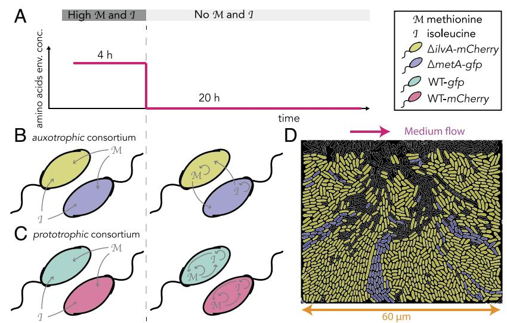
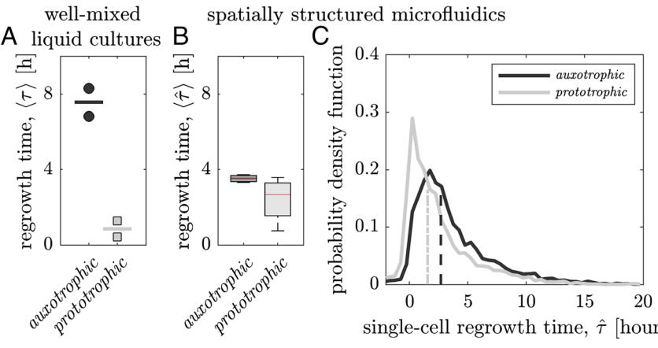
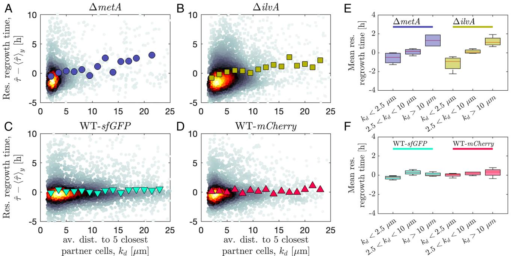
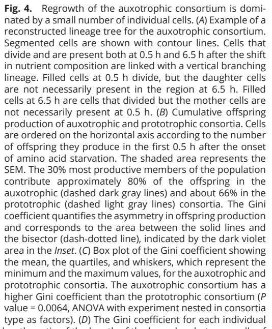

# **Minorities drive growth resumption in cross-feeding microbial communities**

Gabriele Micalia,b,1,2 [,](https://orcid.org/0000-0001-8463-362X) Alyson M. Hockenberrya,b [,](https://orcid.org/0000-0003-0828-1428) Alma Dal Coa,b,3,4, and Martin Ackermanna,b

Edited by Dianne Newman, California Institute of Technology, Pasadena, CA; received February 15, 2023; accepted September 26, 2023

**Microbial communities are fundamental to life on Earth. Different strains within these communities are often connected by a highly connected metabolic network, where the growth of one strain depends on the metabolic activities of other community members. While distributed metabolic functions allow microbes to reduce costs and optimize metabolic pathways, they make them metabolically dependent. Here, we hypothesize that such dependencies can be detrimental in situations where the external conditions change rapidly, as they often do in natural environments. After a shift in external conditions, microbes need to remodel their metabolism, but they can only resume growth once partners on which they depend have also adapted to the new conditions. It is currently not well understood how microbial communities resolve this dilemma and how metabolic interactions are reestablished after an environmental shift. To address this question, we investigated the dynamical responses to environmental perturbation by microbial consortia with distributed anabolic functions. By measuring the regrowth times at the single**-**cell level in spatially structured communities, we found that metabolic dependencies lead to a growth delay after an environmental shift. However, a minority of cells—those in the immediate neighborhood of their metabolic partners can regrow quickly and come to numerically dominate the community after the shift. The spatial arrangement of a microbial community is thus a key factor in determining the communities' ability to maintain metabolic interactions and growth in fluctuating conditions. Our results suggest that environmental fluctuations can limit the emergence of metabolic dependencies between microorganisms.**

distributed metabolic functions | minorities-driven dynamics | spatiotemporal scales in ecology | single-cell dynamics | cross-feeding microbial communities

Most microbes live in spatially structured communities, including the microbiomes in soils, on marine particles, and in associations with animals and plants (1–3). In these communities, metabolic pathways are often distributed across microbial species—both anabolic pathways for the production of cellular building blocks as well as catabolic pathways for the provisioning of energy and nutrients (4–10). Consequently, community members are connected through a dense metabolic network.

Metabolic specialization has been shown to evolve readily (8, 11–14). This specialization can resolve biochemical conflicts between metabolic reactions, allowing individual microbes to optimize pathway lengths and providing consortia of interacting microbes with faster growth or higher yields (15–23).

However, these interactions also make microbes dependent on their metabolic partners. If a microorganism is dependent on a metabolite that it cannot produce, this metabolite needs to be synthesized and leaked by another cell, and diffuse to and be taken up by the recipient (24, 25). In order to perform the anabolic and catabolic processes that are needed for growth under a specific set of conditions, microbes in spatially structured communities must be sufficiently close to the partners with which they interact (24, 25), and these partners must be in the right metabolic state. Specifically, microbial partners need to perform metabolic reactions that complete catabolic pathways and produce complementary anabolites.

Such dependencies can pose a dilemma in the fluctuating conditions to which free-living and host-associated microbial consortia are so often exposed (26–31). When the external conditions change, microbes need to remodel their metabolism, but they can only resume growth once their metabolic partners have also adapted to the new conditions. This dilemma is particularly pronounced if microbes depend on each other for this metabolic remodeling (23, 32, 33). Such a situation arises whenever microbes, after a shift in environmental conditions, require cellular resources from their partners to produce the enzymes needed to resume growth.

One important example is microbes that are connected through the exchange of amino acids, a type of metabolic interaction that is common in microbial communities (6, 7, 34, 35). A sudden reduction of free available amino acids in the environment forces

## **Significance**

In microbial communities, metabolic functions are distributed across interacting members, depending on the current environment. If the external environment changes, microbes remodel their metabolism. How are interactions consequentially adjusted? How is the growth of community members resumed after shifts in the external conditions? To understand this, we studied bacterial consortia with members coupled in their anabolic functions. We found that population growth was dominated by a minority of cells that rapidly established interactions in their microenvironment. Distributed functions can lead to population bottlenecks, constraining microbiomes' interactions evolution. Our findings are relevant to the evolution of metabolic interactions in the face of environmental fluctuations. Fluctuations can lead to growth delays among obligate crossfeeders potentially contributing to the maintenance of metabolic autonomy.

The authors declare no competing interest.

This article is a PNAS Direct Submission.

Copyright © 2023 the Author(s). Published by PNAS. This article is distributed under [Creative Commons](https://creativecommons.org/licenses/by-nc-nd/4.0/)  Attribution-NonCommercial-[NoDerivatives License 4.0](https://creativecommons.org/licenses/by-nc-nd/4.0/)  [(CC BY](https://creativecommons.org/licenses/by-nc-nd/4.0/)-NC-ND).

1 Present address: Istituto di Ricovero e Cura a Carattere Scientifico Humanitas Research Hospital, Rozzano 20089, Italy.

2 To whom correspondence may be addressed. Email: [gabriele.micali@humanitasresearch.it](mailto:gabriele.micali@humanitasresearch.it).

3 Present address: Department of Computational Biology, University of Lausanne, Lausanne 1015, Switzerland. 4

Deceased November 15, 2022.

This article contains supporting information online at [https://www.pnas.org/lookup/suppl/doi:10.1073/pnas.](https://www.pnas.org/lookup/suppl/doi:10.1073/pnas.2301398120/-/DCSupplemental) [2301398120/-/DCSupplemental](https://www.pnas.org/lookup/suppl/doi:10.1073/pnas.2301398120/-/DCSupplemental). Published October 30, 2023.

microorganisms to produce enzymatic pathways for amino acid biosynthesis. However, the production of these new enzymes also requires amino acids. In communities composed of auxotrophic strains, these pathways are distributed across different strains: The regrowth of a cell is coupled to the ability of a partner cell type to produce amino acids, and vice versa. It is currently not understood how obligate metabolic interactions, such as the exchange of amino acids between auxotrophic strains, are established after a shift in the external environment.

Here, we developed an experimental approach that allows analyzing how individual cells in metabolically connected communities respond to changes in the external conditions that require metabolic remodeling. We find that metabolic dependencies delay the growth resumption of microbial communities. Eventually, however, small groups of interacting cells are able to establish the exchange of cellular building blocks, and thereby found expanding clusters of interacting cells. As a consequence, the consortium that grows after an environmental shift is founded by a small minority of cells.

#### **Results**

We studied the growth resumption of individual cells after a change in nutrient availability in a consortium that requires the establishment of metabolic dependencies for cells to grow in the new condition. This consortium is composed of two auxotrophic mutants that each cannot synthesize a single amino acid (hereafter auxotrophic consortium): Δ*ilvA* cannot synthesize isoleucine, and Δ*metA* cannot synthesize methionine (Fig. 1). We used fluorescent reporters to distinguish the two strains: Δ*ilvA-mCherry* and Δ*metA-sfGFP* expressing red and green fluorescent proteins, respectively. We compared the growth resumption of the auxotrophic consortium with the prototrophic consortium composed of two wild-type *Escherichia coli* strains that differed only in their constitutively expressed fluorescent marker, either green (WT*sfGFP*) or red (WT-*mCherry*), (Fig. 1).

To understand the impact of the distribution of metabolic dependencies across bacterial types for communities in fluctuating environments, we exposed the consortia to a nutrient shift from a medium with high methionine and isoleucine concentrations to a medium without methionine and isoleucine (Fig. 1*A*). After such a shift, cells of both consortia need to synthesize methionine and isoleucine to resume growth (36). The key difference between the two consortia is that the strains in the prototrophic consortium can produce the enzymes for the synthesis of both methionine and isoleucine without the need for interaction with the other strain, whereas in the auxotrophic consortium, the synthesis of amino acids is distributed across the two different strains: Δ*ilvA* relies on Δ*metA* to receive isoleucine and Δ*metA* relies on Δ*ilvA* to receive methionine (Fig. 1 *B* and *C*).

In experiments in well-mixed liquid cultures, both consortia resumed growth after the removal of externally provided methionine and isoleucine, although with markedly different regrowth times (Fig. 2*A*). When the two strains of the consortia were inoculated at the same ratio, the auxotrophic consortium took approximately 7.5 h on average to resume growth while the prototrophic consortium took approximately 0.8 h. In addition, the time to growth resumption by the auxotrophic consortium depended on the relative proportion of the two strains present at inoculation, with regrowth times increasing if these proportions became more skewed (*SI [Appendix](http://www.pnas.org/lookup/doi/10.1073/pnas.2301398120#supplementary-materials)*, Fig. S1*C*). The delay in growth resumption of the auxotrophic consortium supports the intuition that distributed metabolic functions result in a delay after an environmental switch, a delay during which both cell types are limited by the metabolite they need from their partner.

In the presence of spatial structure, the regrowth dynamics of cells are expected to depend on how quickly these cells can establish the exchange of metabolites with a small number of neighboring cells in their immediate proximity, since in these systems metabolic interactions have been found to occur across short spatial scales (24). Here, we wanted to test whether the cellular neighborhood of a cell, and specifically the cell's proximity to its metabolic partner, influences regrowth dynamics. To this end, we used a combination of microfluidics experiments and automated image analysis to estimate the regrowth times of individual cells and relate it to their cellular environment. We used a microfluidic device that allowed imposing a rapid change of the medium supplied to cells (Fig. 1*D*) and performed high-resolution imaging over a long period of time (at least 24 h) of about a thousand cells growing in a monolayer (24). Segmentation and tracking of individual cells allowed us to measure the regrowth time at the single-cell level (*Materials and Methods* and *SI [Appendix](http://www.pnas.org/lookup/doi/10.1073/pnas.2301398120#supplementary-materials)*, Figs. S1*D* and S2).

On average, in the spatially structured microfluidic environments, the auxotrophic consortium resumed growth in about 3.5 h, significantly later than the prototrophic consortium (Fig. 2*B*). The distribution of regrowth times of individual cells shows a skewed

> **Fig. 1.** Schematic of the experimental approach: consortia characterized by the absence or the presence of distributed metabolic functions. Schematic of the two consortia: the auxotrophic and the prototrophic consortium. (*A*) The two consortia are exposed to high levels of the metabolites methionine (*M*) and isoleucine (*I*), which are then suddenly removed from the medium (*Left*). (*B*) The auxotrophic consortium is composed of two auxotrophic *E. coli* strains Δ*metA* (violet) and Δ*ilvA* (yellow) distinguished by fluorescent markers. The growth of the cells of the auxotrophic consortium after the removal of methionine and isoleucine depends on establishing the exchange of amino acids with the partner. (*C*) The prototrophic consortium is composed of two wild-type *E. coli* strains that differ only in their fluorescent marker, WT-*sfGFP* (green) and WT-*mCherry* (red). The cells in the prototrophic consortium can resume growth without sharing metabolites. (*D*) Segmented image of the auxotrophic consortia in the microfluidic device used to study growth resumption (contours are color coded accordingly to the strain identification based on fluorescent imaging; dark cells are not reliably identified, see *Materials and Methods*). The medium flows in the main channel from left to right (pink arrow), and cells are trapped within lateral chambers measuring 60 × 60 * 0.64 µm (orange arrow) forming a monolayer of cells.

**Fig. 2.** The prototrophic consortium resumes growth more rapidly than the auxotrophic consortium both in well-mixed liquid cultures and in spatially structured microfluidic experiments. (*A*) Regrowth times after removal of methionine and isoleucine from experiments in shaken liquid culture for two biological replicates for the auxotrophic (dark circles) and prototrophic (light squares) consortia. Black and gray lines show the mean of the two replicates for the auxotrophic and prototrophic consortia, respectively (one-way ANOVA *P* value = 0.016). Regrowth times are estimated from OD600 measurements where the two strains are inoculated at a ratio of 1:1 (see *Materials and Methods* and *[SI Appendix](http://www.pnas.org/lookup/doi/10.1073/pnas.2301398120#supplementary-materials)*, Fig. S1 for more details). (*B*) Regrowth times after removal of methionine and isoleucine from microfluidic experiments where cells grow in the presence of spatial structure, for the auxotrophic (dark gray) and prototrophic (light gray) consortia. Each of four replicated experiments comprised the analysis of five microfluidic chambers, with each chamber containing hundreds of cells. Box plots show the mean (red line),

the quartiles, and the whiskers that represent the minimum and maximum values per experiment for four independent replicates. The regrowth times of auxotrophic and prototrophic consortia are significantly different (*P* value = 0.005 from 3-way ANOVA with consortia type, experiment nested in consortia type, and fluorescent marker as factors). (*C*) Probability density functions of single-cell regrowth times for the auxotrophic (black line) and the prototrophic (gray line) consortia. Dashed and dot-dashed lines depict the median regrowth time for the auxotrophic and prototrophic consortia, respectively. Data were pooled across chambers and replicates (~6,600 individual cells). Only cells that regrew within 20 h after the switch are included in the analysis: auxotrophic—mean 3.44 h, SD 3.88 h, skewness 0.62; prototrophic—mean 2.18 h, SD 3.21 h, skewness 0.65. The regrowth time at the single-cell level in spatially structured microfluidic experiments (panels *B* and *C*) is defined as the difference between the time the cell needed to reach a 25% increase in the logarithmic length from the time of nutrient change and the time the cell would have needed to reach the same length if there had not been a change in elongation rate (*[SI Appendix](http://www.pnas.org/lookup/doi/10.1073/pnas.2301398120#supplementary-materials)*, Fig. S1*D*). Approximately 57% and 38% of the cells did not resume growth within 20 h after the removal of methionine and isoleucine in the medium in the auxotrophic and prototrophic consortium, respectively (*[SI Appendix](http://www.pnas.org/lookup/doi/10.1073/pnas.2301398120#supplementary-materials)*, Fig. S1*E*).

distribution toward long regrowth times for both the auxotrophic and prototrophic consortia (Fig. 2*C*). Approximately 19% of cells in the auxotrophic consortium resumed growth before the average regrowth time of the prototrophic consortium, suggesting that a fraction of the cells in the auxotrophic consortium resumes growth as fast as the cells in the prototrophic consortium. It is important to note that regrowth times in well-mixed liquid cultures and in spatially structured microfluidic systems cannot be directly compared. First, regrowth times in the two systems are defined in different ways: While the regrowth time in well-mixed liquid culture is based on the population average growth, the regrowth time in spatially structured microfluidic experiments is defined for each individual cell (*Materials and Methods* and *SI [Appendix](http://www.pnas.org/lookup/doi/10.1073/pnas.2301398120#supplementary-materials)*, Fig. S1). Second, the two types of systems do not only differ in the absence vs. presence of spatial structure but also in other aspects that are intrinsic to the different experimental set-ups, as for example the local cell density.

How can the fastest cells of the auxotrophic consortium have a regrowth time that is as short as the fastest cells of the prototrophic consortium? One possibility is that the regrowth times of cells in the auxotrophic consortium depended on the cellular microenvironment. Specifically, we hypothesized that the singlecell regrowth times in these consortia depended on the distance to cells of the other strain. To test our hypothesis, we focused on the residual regrowth times obtained by subtracting the overall trend in growth resumption across the entire chamber (*SI [Appendix](http://www.pnas.org/lookup/doi/10.1073/pnas.2301398120#supplementary-materials)*, [Fig.](http://www.pnas.org/lookup/doi/10.1073/pnas.2301398120#supplementary-materials) S2). This allowed us to remove differences in growth delays that are due to the distance of individual cells from the medium source (*SI [Appendix](http://www.pnas.org/lookup/doi/10.1073/pnas.2301398120#supplementary-materials)*, Fig. S3).

In support of our hypothesis, in the auxotrophic consortium, single-cell regrowth time depended on the distance from its cross-feeding partner (Fig. 3 *A* and *B*). Cells positioned within 2.5 µm from the five closest neighbors of the other strain had on average approximately 2 h shorter regrowth times than cells positioned at least 10 µm away (Fig. 3*E*). In contrast, the spatial arrangement did not impact the growth resumption of individual cells in the prototrophic consortium (Fig. 3 *C*, *D*, and *F*), as expected given that the strains in this consortium can resume growth autonomously.

Our results show that in the auxotrophic consortium, the closer a cell is to the other cell type, the earlier it resumes growth. Consequently, the spatial arrangement of cells of different types affects the distribution of single-cell regrowth times (*SI [Appendix](http://www.pnas.org/lookup/doi/10.1073/pnas.2301398120#supplementary-materials)*, Fig. S9). Regrowth times are a crucial determinant of long-term growth in fluctuating environments (37–43). Once cells resume growth, they grow exponentially. The combination of variability in growth resumption and exponential biomass production allows cells that resume growth rapidly to make a disproportionate contribution to the growing population (40). In spatially structured systems where the movement of cells is limited, the local spatial arrangement further influences the single-cell growth rate in consortia with distributed metabolic functions (24). For these reasons, we hypothesize that in the auxotrophic consortium a small proportion of cells, whose identity is determined by the spatial arrangement of the community, will give rise to the majority of new cells of the community after an environmental shift that renders cross-feeding essential for growth. In contrast, we expect that the prototrophic consortium will be founded by a larger proportion of cells and regardless of the local spatial arrangement of the two different strains.

To quantify the productivity in terms of offspring of each cell in the consortium, we reconstructed the lineage trees of each cell. Specifically, for each cell present in a 6-h window after the switch, we identified the time and location of each division event (see Fig. 4*A* for an example and *Materials and Methods* for details). We used the Gini coefficient to quantify the inequality in offspring production (Fig. 4 *B*, *Inset*). The Gini coefficient, introduced in economics to measure the inequality in workers' income (44), ranges from 0 to 1: In this case, its value is zero if each original cell produces the same number of offspring, while it takes the maximum value of 1 if all new offspring originate from a single cell. In our experiments, we observed that 30% of the most productive members of the population contributed about 80% and 66% of the total offspring in the auxotrophic and prototrophic consortia, respectively (Fig. 4*B*). The Gini coefficient was consistently larger for the auxotrophic than for

**Fig. 3.** Proximity to cells of the other strain reduces regrowth times in the auxotrophic but not in the prototrophic consortium. (*A*–*D*) Density plot of the singlecell residual regrowth times (obtained by subtracting the average regrowth time per experiment of cells positioned at the same distance from the main channel) as a function of the average distance to the center of mass of the 5 closest cells of the partner cell type in the consortium, for the Δ*metA* (*A*) and Δ*ilvA* (*B*) strains within the auxotrophic consortium, and for the WT-sf*GFP* (*C*) and the WT-*mCherry* (*D*) strains within the prototrophic consortium. Each point is an individual cell; the color intensity is plotted accordingly to the probability density estimation using a kernel smoothing function. Large symbols correspond to the binned arithmetic means with a bin size of 1.5 µm. (*E* and *F*) Box plot showing the mean, the quartiles, and whiskers of the mean residual regrowth times across the four biological replicates for cells with an average distance to the center of mass of the five closest cells of the other type within 2.5 µm, between 2.5 µm and 10 µm, and larger than 10 μm, for the auxotrophic (*E*) and prototrophic (*F*) consortium. The two consortia differ significantly in how regrowth times depend on the distance to the 5 closest partner cells (ANOVA with consortia type, fluorescent marker, distance, and experiment number nested in consortia type as factors, significant interaction between distance and consortia type, *P* value = 0.0072). The qualitative trends are not sensitive to the number of nearest partner cells analyzed (*SI Appendix*[, Figs. S5 and S6](http://www.pnas.org/lookup/doi/10.1073/pnas.2301398120#supplementary-materials)) and to the definition of single-cell regrowth time (*SI Appendix*[, Figs. S7 and S8](http://www.pnas.org/lookup/doi/10.1073/pnas.2301398120#supplementary-materials)).

the prototrophic consortium, showing that a minority of cells contributed the majority of offspring in the auxotrophic consortium (Fig. 4*C*).

What factors determine the degree of inequality in offspring production in these consortia? Given that regrowth times in the auxotrophic consortia depended on the proximity to the anabolic

microfluidic chamber as a function of the mixing of the two strains within the chamber (quantified as the ratio of the length of the boundary between cells of different strains and the total area occupied by cells; see *Materials and Methods*), for the auxotrophic (dark circles) and prototrophic (light squares) consortia. Solid and dashed lines are linear fits for the auxotrophic and prototrophic consortium, respectively. The Pearson correlation coefficients are ρ = –0.63 (*P* value = 0.003) and ρ = 0.09 (*P* value = 0.7) for the auxotrophic and prototrophic consortia, respectively.

partner, we hypothesized that a lower degree of spatial mixing would result in a higher inequality in offspring production, and hence a higher Gini coefficient. To test this hypothesis, we made use of the fact that the replicated consortia in different microfluidic chambers exhibited different degrees of spatial mixing. We plotted the Gini coefficient as a function of the level of mixing, quantified as the ratio between the length of the boundaries between cell types and the total surface occupied by cells. In the auxotrophic consortium, chambers in which the two types were less mixed showed higher Gini coefficients and hence more unequal contributions of cells to future generations (Fig. 4*D*). This indicates that in spatially structured communities, the spatial arrangement of the community influences the fraction of cells contributing to population growth.

Overall, the experiments and analysis presented here show that cells in the auxotrophic consortium have on average longer regrowth times when compared with the prototrophic consortium both in well-mixed liquid cultures and in spatially structured microfluidic environments. In spatially structured environments, the regrowth times of the cells in the auxotrophic consortium are influenced by the local spatial arrangement: The shorter the distance to partner cells, the shorter the regrowth time. As a consequence, the spatial arrangement of cells in the auxotrophic consortium determines the fraction of cells that contribute to the population regrowth.

#### **Discussion**

Here, we showed that metabolic dependencies can delay the growth resumption of microbial consortia after an environmental shift. We observed these growth delays in a situation where an environmental shift requires the emergence of metabolic complementation between two strains so that each strain depends on a cellular building block from its partner to resume growth. Analysis of the growth dynamics of individual cells in spatially structured environments showed that cells that were within a few micrometers from their partner resumed growth quicker than cells that were further away. As a consequence, environmental shifts induced population bottlenecks in spatially structured microbial consortia: A small number of cells contributed to most of the offspring population that emerged after an environmental shift. Since metabolic dependencies are common in microbial communities (4–10), we expect that such growth delays, and the resulting population bottlenecks, are a general phenomenon across different types of microbiomes.

The distance to cells of the other type is a crucial determinant of regrowth times in metabolically dependent consortia. A critical distance that cannot be exceeded for cells to grow efficiently emerges from the interplay between amino acid leakage, diffusion, and uptake (24). While previous work quantified this so-called interaction range between strains of an auxotrophic consortium under constant conditions (24), the current work focuses on the emergence of metabolic coupling after an environmental fluctuation. The environmental fluctuation requires cells to synthesize enzymes for amino acid production, which is expected to dynamically affect single-cell leakage. In addition, the uptake rate is also expected to change in response to the shift in the environmental condition. As a result, the interaction range is expected to dynamically change in the course of the environmental fluctuation. Gaining a deeper understanding of how the interplay between leakage and uptake modulates the interaction range over time will greatly enhance our ability to predict the response of complex microbial communities to fluctuating environments.

The focus on environmental fluctuations, which are ubiquitous in natural situations (26–31), highlights the importance of the spatial organization at the microscale. How can microorganisms stay close to a partner on which they metabolically depend? Cellular growth in spatially structured systems inherently leads to cell clusters, moving more and more cells away from the partner whose metabolites they need (24, 45) This effect is exacerbated in the face of environmental fluctuations, where periods of metabolic independence, and hence cellular unmixing, are followed by periods where different strains are metabolically dependent and thus need to be close to each other. In addition, physical disturbances can rearrange cells in space and further separate mutualistic partners. How are obligate metabolic dependencies maintained in such situations? One possibility is that cells engaged in obligate cross-feeding interactions have evolved mechanisms to stay physically attached to their partner cell types, either through direct cell–cell adhesion (46, 47) or by means of an extracellular matrix (48).

Our results add an ecological dimension to the role of cell-to-cell variation in fluctuating environments. A wealth of studies has analyzed phenotypic variation in growth resumption and growth rates in clonal populations (37, 38, 40, 41, 49–51). Such variation can emerge from stochastic cellular processes that produce phenotypic differences between genetically identical cells (52–58). Cells that grow slowly or transiently cease growth are phenotypically tolerant to a range of stressors including antibiotics (39, 59–63). Phenotypic variation in regrowth times and growth rates can therefore allow populations to persist periods of exposure to potentially lethal stressors (37, 40, 59, 64). A high level of cell-to-cell variation can mitigate a fundamental trade-off between growth and survival in fluctuating environments: Population growth after an environmental shift is mostly driven by the minority of cells that resume growth most rapidly, while persistence in the face of external stressors depends on a minority that resumes growth most slowly (40).

While cell-to-cell variation in growth resumption has so far mainly been studied in clonal populations (37, 38, 40, 41, 49–51), we expect that it might be even more pronounced in spatially structured microbial communities. Physiological adaptation to environmental shifts is often limited by the time needed to express new enzymatic pathways, and by the cellular resources required to synthesize these enzymes (65–67). If some of these resources originate in another cell type that is also undergoing physiological adaptation, this is expected to increase regrowth times. This expectation is supported by the results presented in Fig. 2. However, regrowth times in microbial communities are not increased for all cells equally. Rather, as shown in Fig. 3, these times strongly depend on the cellular neighborhood of each individual cell. This factor will increase variation in growth resumption in metabolically connected communities.

The magnitude of the variation in growth resumption and of the resulting population bottleneck in microbial communities is therefore not an intrinsic property of community members—it rather is an emergent property of the community that depends on the metabolic interactions and on the community's spatial organization at the microscale. This is expected to lead to pronounced history dependence of community processes in varying environments: How quickly metabolic activities of community members, and hence functions at the level of the community, are resumed after environmental shifts depending on the spatial distribution of different species in the community. The spatial distribution in turn depends on the nutrients on which community members grew in the past. Given that many microbial communities perform important ecosystem functions under fluctuating environments (30, 68–70), understanding such history-dependence in distributed metabolic functions is an important goal.

We expect the population bottlenecks that result from variation in offspring production and ultimately from differences in regrowth times to be relevant in spatially structured natural ecosystems. Bottlenecks reduce the genetic variability within each strain, thereby reducing the effective population size and promoting genetic drift (40, 71, 72). Our work suggests that in these communities, the spatial arrangement affects the bottleneck size and thus the effective population size. In other words, the effective population size often used in theoretical studies to predict the evolution of bacterial communities (73, 74) is a function of the interactions among community members, their spatial arrangement, and the time course of the environmental conditions.

The minority-driven regrowth we observed has potentially important consequences for the evolution of metabolic interactions in microbial communities. Mutants that are metabolically dependent on other species can naturally arise through loss of metabolic functions (7, 15, 21, 75). The important question then is whether, and under what conditions, such mutants can spread.

Our results indicate that the spread of mutants with metabolic dependencies also depends on fluctuations in the external environment. Under constant environmental conditions, one expects that microbes can be selected for taking up metabolites from other organisms rather than producing them themselves (15). This view is supported by studies on natural microbial communities (reviewed in ref. 34) and by experimental (e.g., ref. 21) and computational (76) work. Our results suggest that environmental fluctuations can change this outcome. As reported above, metabolic dependencies can lead to long growth delays after environmental shifts, given the time needed to reestablish metabolic exchange with other organisms in the same microenvironment. Given the exponential nature of microbial growth, growth delays have a strong negative impact on an organism's the long-term growth rate (40). Ever-changing environments might therefore limit the extent to which metabolic functions become, in the course of evolution, distributed across different species. This hypothesis can be tested by comparing metabolic dependencies in microbial communities across different magnitudes of environmental fluctuations and by competition experiments between prototrophs and auxotrophs in constant and fluctuating conditions.

### **Materials and Methods**

**Media and Growth Conditions.** Experiments were performed using M9 medium composed of M9 salts (47.76 mM Na2HPO4, 22.04 mM KH2PO4, 8.56 mM NaCl, and 18.69 mM NH4Cl premixed) supplemented with 1 mM MgSO4, 0.1 mN CaCl2, 0.2% glucose (all from Sigma-Aldrich), and 0.01% Tween-20 (added to facilitate loading). We refer to this medium in the main text as a medium with no methionine and isoleucine. The medium with high methionine and isoleucine concentrations is the M9 medium with no methionine and isoleucine described above supplemented with 300 µM isoleucine and 300 µM methionine.

**Strains.** The prototrophic consortium is composed of *E. coli* MG1655 strains TB204 and TB205 from (77). We performed a single gene knock-out on the TB204 and TB205 strains to construct Δ*metA*-sf*GFP* (MG1655 *metA*::frt, PR-*sfGFP*) and Δ*ilvA*-*mCherry* (MG1655 *ilvA*::frt, PR- *mCherry*), respectively. The auxotrophic strains were constructed by transferring the Δ*ilvA* or Δ*metA* kanamycin cassette from the KEIO collection (78) into TB204 and TB205 from the lab strain collection (77) using lambda Red-mediated recombination (79), following the protocol described in ref. 24. The kanamycin cassette including the homologous flanking regions was amplified using primers *ilvA*-L (ATCGTGAACGTCAGGTCTCC), *ilvA*-R (TCTGGAAGATTTTGCCGAAC), *metA*-L (CGTGAGCGGCGAATACTAAT), and *metA*-R (AAACTTCCCCACTGTGAACG). The kanamycin cassette was transferred into a fresh strain of TB204 and TB205 using electroporation. Upon successful transduction, the phenotypes of the strains were confirmed (no growth when cultured alone in the medium with no methionine and isoleucine, both in liquid culture and on selective plating) and the kanamycin cassettes removed from the genome using the FLP-recombinase from plasmid pCP20 (79). We confirmed the ability of our two auxotrophic strains to grow together in the medium with no methionine and isoleucine in liquid culture.

**Liquid Culture Experiments.** Cells from the frozen stock were first grown on LB plates to select individual colonies. Cells picked from an individual colony were grown overnight in a 5-mL M9 medium with methionine and isoleucine at 37 °C in a shaker incubator. The next morning, the optical density at 600 nm (*OD600*) was measured and the culture was diluted to *OD600* = 0.01 in 3 mL fresh M9 medium with methionine and isoleucine. Once the liquid culture reached *OD600 ~* 0.15, cells were washed twice in the medium with no methionine and isoleucine. Strains were then inoculated to form consortia in 96-well plates containing 200 µL of the medium with no methionine and isoleucine to a total *OD600* = 0.0015; unless reported otherwise, strains were inoculated at a 1:1 ratio. Population growth was followed using a Synergy Microplate Spectrometer with readings of *OD600* taken every 3 min while maintaining continuous linear shaking and 37 °C. To estimate the regrowth time, data were first smoothed using the "smooth" MATLAB function with the "rlowess" method and a moving 12 min average (*[SI Appendix](http://www.pnas.org/lookup/doi/10.1073/pnas.2301398120#supplementary-materials)*, Fig. S1*A*). The growth rate was calculated as 1∕OD600ΔOD600 ∕Δt on the smoothed OD curve and then smoothed again using the same method. The maximum growth rate was averaged by considering a 10% window around the maximum value (*[SI Appendix](http://www.pnas.org/lookup/doi/10.1073/pnas.2301398120#supplementary-materials)*, Fig. S1*B*). Population regrowth time was calculated as the intersection between the regression line at the point of maximum growth rate and the line *y* = log(inoculation density) of a consortium minus the regrowth time of the mock switched consortium, in which the same consortium is washed and resuspended in M9 medium containing methionine and isoleucine (*SI Appendix*, Fig. S1*A* [and Table S1)](http://www.pnas.org/lookup/doi/10.1073/pnas.2301398120#supplementary-materials).

**Microfluidic Fabrication.** Microfluidic devices consisted of chambers of 60 × 60 μm and 0.64 μm height connected along one side to a feeding main channel of 22 μm height and 100 μm width. They differed from those used by Dal Co et al. (24) only in the chamber height, which is lower in our case to avoid cell washout. Masks were obtained from micro resist technology GmbH (Berlin, Germany). Polydimethylsiloxane (PDMS) chip fabrication was performed following the protocol described in ref. 24.

**Microfluidic Experiments.** Monocultures of the different strains were started from a single colony taken from an LB-agar plate and grown at 37 °C in a shaker incubator for approximately 5 to 6 h in the medium with high methionine and isoleucine. Pairs of strains were mixed 1:1 from the liquid culture to form the consortia and concentrated approximately 100 times by centrifugation (3,000 *g* for 5 min) to facilitate loading into the microfluidic device. Cells were loaded into the chip through the outlet using a pipette. Chip was bonded to the glass slip no longer than 3 d before the loading. Media were flown using a syringe pump (NE-300, NewEra Pump Systems) with a 50-mL syringe containing the medium with high levels of isoleucine and methionine. The syringe was connected to the device via a 20-G syringe needle (0.9 mm × 70 mm) inserted into Microbore tubing (Saint-Gobain Tygon™ Non-DEHP Microbore Tubing ID 0.76, OD 2.29, Thickness 0.76 mm, Fisher Scientific). A narrower PolyTetraFluoroEthylene tubing (PTFE Tube 0.3 mm ID × 0.8 mm OD 39172900, Adtech) is inserted at the other end and directly connected to the inlet holes of the PDMS chip. Before flowing the media, cells were pushed into the lateral chambers with the help of small air bubbles flowing through the main channel. Once cells had entered the chambers (normally about 30 to 50 cells in more than 10 chambers), fresh medium was pumped through the main channel from the inlet. Cells were grown in the microfluidic device overnight (approximately 14 h) in the medium with high methionine and isoleucine. At the start of the experiment, cells were imaged for approximately 4 h in the medium with high methionine and isoleucine; then, the switch was made to the medium with no amino acids. Medium switches were performed by disconnecting the smaller tubing from the syringe and reconnecting it to the large tubing of a second syringe containing the new medium. Cells were imaged for an additional 20 h. All experiments were run at a flow rate of 0.4 mL/h. This flow rate is high enough that amino acids synthesized by cells do not accumulate in the main channel and are not exchanged among chambers via the channel. No growth was observed under no-amino acid conditions in chambers hosting only one of the two auxotrophic strains.

**Image Acquisition Pipeline.** Time-lapse microscopy was performed using fully automated Olympus IX81 inverted microscopes (Olympus, Tokyo, Japan). Images were obtained using a 100× NA1.3 oil objective (Olympus) with 1.6× manual auxiliary magnification and an ORCA-flash 4.0 v2 scientific Complementary Metal–Oxide–Semiconductor (sCMOS) camera (Hamamatsu, Japan). Fluorescent imaging was performed using an X-Cite120 120 W high-pressure metal halide arc lamp (Lumen Dynamics, Mississauga, Canada) and Chroma 49000 series fluorescent filter sets (N49002 for GFP and N49008 for RFP, Chroma, Bellows Falls, Vermont). The focus was maintained using the Olympus Z-drift compensation system and the entire setup was controlled with Olympus CellSens software. The sample was maintained at 37 °C with a microscope incubator (Life Imaging Services, Basel, Switzerland). Five positions corresponding to five different chambers were imaged on the same microfluidic device. Phase-contrast images were acquired every minute for 9 min; then, phase-contrast and fluorescence images were taken at minute 10. This 10-min cycle was repeated 144 times during each experiment, generating a total of 1,440 phase-contrast images and 144 fluorescent images in both the red and green channels ([Movies S1–S3)](http://www.pnas.org/lookup/doi/10.1073/pnas.2301398120#supplementary-materials).

**Image Analysis.** All image analysis was performed using MATLAB (version 2017b and newer), Vanellus software (DJ Kiviet, [http://kiviet.com/research/vanellus.php)](http://kiviet.com/research/vanellus.php), and Ilastik-1.3.3post2-OSX ([https://www.ilastik.org/)](https://www.ilastik.org/). Images were registered in two folders, the first containing the 1,440 phase-contrast images and the second containing the 144 frames of phase-contrast, green and red channels. The segmentation and tracking algorithms worked on the first folder, while the second folder was used to assign the strain identity of the cells. Vanellus was used to manually select the region of interest, encompassing one entire lateral chamber except for approximately 10 to 15 µm closest to the main channel. Segmentation was performed using the Ilastik machine-learning algorithm "pixel classification". The classifier was trained independently for each chamber on a few frames (minimum of 5 frames across the 24 h of the experiment). Ilastik produced a pixel probability score image where a pixel fully identified as background scored 0 and a pixel identified as part of a cell scored 1. The probability score image was analyzed by Ilastik pixel classification a second time (trained on one set of images). After two rounds of Ilastik segmentation, the pixel probability score image was imported into MATLAB for thresholding and filtering (threshold probability 0.6, min cell area 0.41 µm2 ), and a final segmented image was stored. The tracking was performed in MATLAB using the Vanellus function "VTrackingsFlow1". Cell length was smoothed using the smooth function with the rlowess option in MATLAB. The window assigned for smoothing varied according to the number of frames a cell was tracked: 20 for cells tracked for less than 30 frames, 25 for cells tracked for less than 100 frames, and 30 otherwise. Finally, additional filters were applied to reduce potential errors in segmentation and tracking. Cells were excluded if they had a nonunique color or no-color assignment, were recorded for less than 9 min, or touched the border of the region of interest. Cells with Δlog l |

excessive length change ( | | |

*>* 6 h−1) within one frame were considered

| | Δt | | to result from an error in tracking or missing of a division event and were recorded as two (or more) different cells. An example of a segmented and tracked movie is shown in [Movie S4](http://www.pnas.org/lookup/doi/10.1073/pnas.2301398120#supplementary-materials). An example trajectory of recorded cell length over time and the smoothed curve is shown in *[SI Appendix](http://www.pnas.org/lookup/doi/10.1073/pnas.2301398120#supplementary-materials)*, Fig. S1*D*.

| |

**Estimation of Regrowth Times from Single-Cell Data.** In contrast to the well-mixed liquid cultures, in spatially structured microfluidic experiments, the regrowth times can be calculated for each single cell. At the single-cell level, the response to environmental fluctuations involves different timescales, and it is not possible to estimate when a single lineage reaches balanced exponential growth (80). For this reason, we need a definition that does not rely on balanced exponential growth and thus differs from the definition in well-mixed average regrowth times (see also ref. 81 where a similar definition is used).

The regrowth times that appear in Fig. 2 are defined per lineage, *i*, as *̂𝜏*i = *𝜏*i −*̂*t i f (*[SI Appendix](http://www.pnas.org/lookup/doi/10.1073/pnas.2301398120#supplementary-materials)*, Fig. S1*D*). *𝜏*i = t i f − t 0 is the time at which cell *i* exited lag, t i f , minus the time at which the new medium reaches the microfluidic device, *t*0, estimated to be 40 min postswitch for all experiments. t i f was defined as the time that a cell *i* with length l i t 0 at time t 0 need to reach length l i t i f , which was determined according to the equation 0.25 = log2(l i t i f ∕l i t 0 ), and corresponds to an approximately 19% increase in length (*[SI Appendix](http://www.pnas.org/lookup/doi/10.1073/pnas.2301398120#supplementary-materials)*, Fig. S1*D*). *̂*t i f is defined by *̂*t i f : = 0.25∕*̂𝛼*i − t 0 and corresponds to the time the cell *i* would need to reach a 19% length increase if growing exponentially with the preswitch growth rate *̂𝛼*i .

The definition requires for each cell, *i*, present 10 min after the change in medium composition reliable segmentation and tracking, and when possible, the lineage tree reconstruction by tracking the daughter cells. If cell *i* divided before reaching a 19% increase in length, then the lengths of the daughter cells were added to reconstruct the trajectory and calculate the time at which the cell exited lag. If it was only possible to identify one daughter cell, then the length of the single daughter was multiplied by 2, assuming perfectly symmetrical division, in order to obtain the length trajectory and calculate the time at which the cell exited lag. If a cell had no recorded daughters or did not reach the required change in length by the end of the experiment, then the cell was discarded from the analysis.

Note that the term *̂*t i f is introduced for two reasons. First, if the regrowth time were solely based on *τ i* cells that do not reduce the growth rate upon amino acid starvation would have a nonzero regrowth time. Second, we notice that not all cells within a microfluidic chamber reduce growth at the same time. Removing the regrowth due to preswitch growth is a way to mitigate this effect (*[SI Appendix](http://www.pnas.org/lookup/doi/10.1073/pnas.2301398120#supplementary-materials)*, Fig. S2 shows the loss of correlation between regrowth time and preswitch growth rate).

To correct for global gradients in nutrient concentrations within the microfluidic chambers with distance from the main channel, we estimated the average regrowth time of cells as a function of the distance to the main channel, ⟨ *̂𝜏*⟩ y (*SI Appendix*[, Figs. S3–S6)](http://www.pnas.org/lookup/doi/10.1073/pnas.2301398120#supplementary-materials). This allowed us to calculate the residual regrowth time *𝜏*̃i = ̃*𝜏*i − ⟨ *̂𝜏*⟩ y . The residual regrowth times appear in Fig. 3*D*. In order to estimate the fold change in the number of nongrowing cells (*[SI Appendix](http://www.pnas.org/lookup/doi/10.1073/pnas.2301398120#supplementary-materials)*, [Fig. S1](http://www.pnas.org/lookup/doi/10.1073/pnas.2301398120#supplementary-materials)*E*), we calculated the average single-cell elongation rate by smoothing the instantaneous elongation rate (( *𝜇*(t) = Δlog2l(t)∕Δt ) ) of each cell recorded at a specific time *t*. The elongation rate was averaged to reduce noise using the smooth function in MATLAB with a span of 100 min and method rlowess. A threshold of 0.1 *h*–1 was used to identify nongrowing cells. We then estimated the fold change in the number of nongrowing cells between **–**0.5 h and 18.5 h from the switch in nutrient composition (( ( ng−0.5 − ng18.5 ) ∕ng−0.5)).

Note that given the definition of single-cell regrowth time, *̂𝜏*i = *𝜏*i −*̂*t i f , the correlation between regrowth time and distance to the partner cells could in principle be due both to *𝜏*i and *̂*t i f . To exclude that the observed trends come from preswitch growth behavior, we show that the preswitch growth rate, rescaled for the average growth rate at a defined distance to the main channel, does not correlate with the average distance to the partner cell type (*[SI Appendix](http://www.pnas.org/lookup/doi/10.1073/pnas.2301398120#supplementary-materials)*, Fig. S7). In addition, the presented results remain valid if we define the regrowth time as *τ i* (*[SI Appendix](http://www.pnas.org/lookup/doi/10.1073/pnas.2301398120#supplementary-materials)*, Fig. S8).

**Lineage Tree Generation and Calculation of the Gini Coefficient.** The generation of lineage trees relies on tracking and cells can be missed by either mis-tracking events or because the cells are pushed out of the chamber. Furthermore, the number of division events depends on the distance to the main channel due to the formation of a global gradient across the entire chamber. To reduce these effects, we focus on part of the chamber, neglecting the 30 µm furthest from the main channel. In addition, we focus on the first 6.5 h after the switch in nutrient composition. We define two time points for the following analysis: The final time point, *t* f , and the initial time point, *t* 0 , are taken as 6.5 h and 0.5 h after the switch, respectively. Nondividing cells were recorded as those cells tracked with no division events between *t* 0 and *t* f . Note that this differs from the definition of nongrowing cells on the basis of cell growth rates described above for the full experimental period. Tracking of division events and mother–daughter relationships were performed using VTree class in Vanellus. In addition, for each cell, an algorithm was used to confirm that the mother and daughter cells carried the same fluorescent marker and that the end of the cell cycle of the mother corresponded to a frame before the birth of the two daughter cells. The lineage trees were reconstructed starting from *t* f and following division events backward in time for as long as possible. Cells tracked until t 0 i + 30 min were included in the analysis. Additionally, lineage trees were filtered according to the following constraints: each cell in the lineage tree if dividing had to have a single parent and no more than one sibling, and each cell cycle had to last at least 30 min. Lineage trees meeting these criteria and those with no detected division events were included in the analysis. The Gini coefficient was calculated by calculating the area below the Lorentz curve, corresponding to the gray area in Fig. 4 *C*, *Inset*.

**Data, Materials, and Software Availability.** Raw data and codes to analyze the data and to generate the figures are available at <https://doi.org/10.25678/0008TQ> (82).

**ACKNOWLEDGMENTS.** We deeply emphasize the fundamental contribution of A.D.C. to this work. A.D.C., who was not only an inspiring and passionate scientist but also a great friend, unexpectedly passed away during the final steps of the writing of the manuscript. We thank the current and past members of the Microbial Systems Ecology group and, in particular, Susan Schlegel, Simon van Vliet, Glen D'Souza, and Stefany Moreno-Gamez for discussions

- 1. L. Hall-Stoodley, J. W. Costerton, P. Stoodley, Bacterial biofilms: From the Natural environment to infectious diseases. *Nat. Rev. Microbiol.* 2, 95–108 (2004).
- 2. R. Kolter, E. P. Greenberg, The superficial life of microbes. *Nature* 441, 300–302 (2006).
- 3. H. C. Flemming, S. Wuertz, Bacteria and archaea on Earth and their abundance in biofilms. *Nat. Rev. Microbiol.* 17, 247–260 (2019).
- 4. B. Schink, Synergistic interactions in the microbial world. *Antonie Van Leeuwenhoek* 81, 257–261 (2002).
- 5. A. Zelezniak *et al.*, Metabolic dependencies drive species co-occurrence in diverse microbial communities. *Proc. Natl. Acad. Sci. U.S.A.* 112, E7156 (2015).
- 6. M. T. Mee, J. J. Collins, G. M. Church, H. H. Wang, Syntrophic exchange in synthetic microbial communities. *Proc. Natl. Acad. Sci. U.S.A.* 111, 2149–2156 (2014).
- 7. G. D'Souza *et al.*, Less is more: Selective advantages can explain the prevalent loss of biosynthetic genes in bacteria. *Evolution (N Y).* 68, 2559–2570 (2014).
- 8. G. D'Souza *et al.*, Ecology and evolution of metabolic cross-feeding interactions in bacteria. *Nat. Prod. Rep.* 35, 455–488 (2018).
- 9. S. Estrela, C. H. Trisos, S. P. Brown, From metabolism to ecology: Cross-feeding interactions shape the balance between polymicrobial conflict and mutualism. *Am. Nat.* 180, 566–576 (2012).
- 10. E. C. Seth, M. E. Taga, Nutrient cross-feeding in the microbial world. *Front. Microbiol.* 5, 1–6 (2014).
- 11. T. Pfeiffer, S. Bonhoeffer, Evolution of cross-feeding in microbial populations. *Am. Nat.* 163, E126–E135 (2004).
- 12. R. B. Helling, C. N. Vargas, J. Adams, Evolution of Escherichia coli during growth in a constant environment. *Genetics* 116, 349–358 (1987).
- 13. D. E. Rozen, D. Schneider, R. E. Lenski, Long-term experimental evolution in Escherichia coli. XIII. Phylogenetic history of a balanced polymorphism. *J. Mol. Evol.* 61, 171–180 (2005).
- 14. S. Pande, C. Kost, Bacterial unculturability and the formation of intercellular metabolic networks. *Trends Microbiol.* 25, 349–361 (2017).
- 15. J. J. Morris, R. E. Lenski, E. R. Zinser, The black queen hypothesis: Evolution of dependencies through adaptive gene loss. *mBio* 3, 1–7 (2012).
- 16. D. R. Johnson, F. Goldschmidt, E. E. Lilja, M. Ackermann, Metabolic specialization and the assembly of microbial communities. *ISME J.* 6, 1985–1991 (2012).
- 17. R. Tsoi *et al.*, Metabolic division of labor in microbial systems. *Proc. Natl. Acad. Sci. U.S.A.* 115, 2526–2531 (2018).
- 18. Z. Zhang, D. Claessen, D. E. Rozen, Understanding microbial divisions of labor. *Front. Microbiol.* 7, 1–8 (2016).
- 19. S. A. West, G. A. Cooper, Division of labour in microorganisms: An evolutionary perspective. *Nat. Rev. Microbiol.* 14, 716–723 (2016).
- 20. S. Pande *et al.*, Fitness and stability of obligate cross-feeding interactions that emerge upon gene loss in bacteria. *ISME J.* 8, 953–962 (2014).
- 21. G. D'Souza, C. Kost, Experimental evolution of metabolic dependency in bacteria. *PLoS Genet.* 12, e1006364 (2016).
- 22. D. Preussger, S. Giri, L. K. Muhsal, L. Oña, C. Kost, Reciprocal fitness feedbacks promote the evolution of mutualistic cooperation. *Curr. Biol.* 30, 3580–3590.e7 (2020).
- 23. D. Reyes-González *et al.*, Dynamic proteome allocation regulates the profile of interaction of auxotrophic bacterial consortia. *R Soc. Open Sci.* 9, 212008 (2022).
- 24. A. Dal Co, S. van Vliet, D. J. Kiviet, S. Schlegel, M. Ackermann, Short-range interactions govern the dynamics and functions of microbial communities. *Nat. Ecol. Evol.* 4, 366–375 (2020).
- 25. S. Gupta *et al.*, Investigating the dynamics of microbial consortia in spatially structured environments. *Nat. Commun.* 11, 2418 (2020).
- 26. N. Blackburn, T. Fenchel, J. Mitchell, Microscale nutrient patches in planktonic habitats shown by chemotactic bacteria. *Behav. Neural. Biol.* 57, 29 (1992).
- 27. S. A. Placella, E. L. Brodie, M. K. Firestone, Rainfall-induced carbon dioxide pulses result from sequential resuscitation of phylogenetically clustered microbial groups. *Proc. Natl. Acad. Sci. U.S.A.* 109, 10931–10936 (2012).
- 28. Y. Kuzyakov, E. Blagodatskaya, Microbial hotspots and hot moments in soil: Concept & review. *Soil. Biol. Biochem.* 83, 184–199 (2015).
- 29. R. N. Carmody *et al.*, Diet dominates host genotype in shaping the murine gut microbiota. *Cell Host. Microbe.* 17, 72–84 (2015).
- 30. J. Nguyen, J. Lara-Gutiérrez, R. Stocker, Environmental fluctuations and their effects on microbial communities, populations and individuals. *FEMS Microbiol. Rev.* 45, fuaa068 (2021).
- 31. J. R. Taylor, R. Stocker, Trade-offs of chemotactic foraging in turbulent water. *Science* 338, 675–679 (2012). 32. T. A. Hoek *et al.*, Resource availability modulates the cooperative and competitive nature of a
- microbial cross-feeding mutualism. *PLoS Biol.* 14, e1002540 (2016). 33. S. P. Hammarlund, J. M. Chacón, W. R. Harcombe, A shared limiting resource leads to competitive
- exclusion in a cross-feeding system. *Environ. Microbiol.* 21, 759–771 (2019).
- 34. K. Zengler, L. S. Zaramela, The social network of microorganisms How auxotrophies shape complex communities. *Nat. Rev. Microbiol.* 16, 383–390 (2018). 35. J. S. L. Yu *et al.*, Microbial communities form rich extracellular metabolomes that foster metabolic
- interactions and promote drug tolerance. *Nat. Microbiol.* 7, 542–545 (2022).

and advice on experimental techniques and data analysis. We further thank Jasmin Annaheim for help in the validation of the image analysis pipeline. This work was supported by grant Nos. 51NF40_180575, 31003A-169978, and 310030-188642 from National Centres of Competence in Research Microbiomes and the Swiss National Science Foundation to M.A.

Author affiliations: a Department of Environmental Systems Science, ETH Zürich, Zurich 8092, Switzerland; and b Department of Environmental Microbiology, Eawag, Dübendorf 8600, Switzerland

Author contributions: G.M., A.M.H., A.D.C., and M.A. designed research; G.M. performed research; G.M. analyzed data; A.M.H. help to perform the genetic mutants DmetA and DilvA; and G.M., A.M.H., A.D.C., and M.A. wrote the paper.

- 36. M. F. Traxler *et al.*, The global, ppGpp-mediated stringent response to amino acid starvation in Escherichia coli. *Mol. Microbiol.* 68, 1128–1148 (2008).
- 37. O. Fridman, A. Goldberg, I. Ronin, N. Shoresh, N. Q. Balaban, Optimization of lag time underlies antibiotic tolerance in evolved bacterial populations. *Nature* 513, 418–421 (2014).
- 38. C. Vulin, N. Leimer, M. Huemer, M. Ackermann, A. S. Zinkernagel, Prolonged bacterial lag time results in small colony variants that represent a sub-population of persisters. *Nat. Commun.* 9, 4074 (2018).
- 39. J. Liu, O. Gefen, I. Ronin, M. Bar-Meir, N. Q. Balaban, Effect of tolerance on the evolution of antibiotic resistance under drug combinations. *Science* 367, 200–204 (2020).
- 40. S. Moreno-Gámez *et al.*, Wide lag time distributions break a trade-off between reproduction and survival in bacteria. *Proc. Natl. Acad. Sci. U.S.A.* 117, 18729–18736 (2020).
- 41. T. Julou, L. Zweifel, D. Blank, A. Fiori, E. van Nimwegen, Subpopulations of sensorless bacteria drive fitness in fluctuating environments. *PLoS Biol.* 18, 1–25 (2020).
- 42. M. Manhart, E. I. Shakhnovich, Growth tradeoffs produce complex microbial communities on a single limiting resource. *Nat. Commun.* 9, 3214 (2018).
- 43. N. Geisel, J. M. G. Vilar, J. M. Rubi, Optimal resting-growth strategies of microbial populations in fluctuating environments. *PLoS One.* 6, e18622 (2011).
- 44. J. Morgan, The anatomy of income distribution. *Rev. Econ. Stat.* 44, 270 (1962).
- 45. S. Mitri, J. B. Xavier, K. R. Foster, Social evolution in multispecies biofilms. *Proc. Natl. Acad. Sci. U.S.A.* 108, 10839–10846 (2011).
- 46. G. G. D'Souza, V. R. Povolo, J. M. Keegstra, R. Stocker, M. Ackermann, Nutrient complexity triggers transitions between solitary and colonial growth in bacterial populations. *ISME J.* 15, 2614–2626 (2021).
- 47. G. D'Souza *et al.*, Cell aggregation is associated with enzyme secretion strategies in marine polysaccharide-degrading bacteria. *ISME J.* 17, 703–711 (2023).
- 48. C. D. Nadell, K. Drescher, K. R. Foster, Spatial structure, cooperation and competition in biofilms. *Nat. Rev. Microbiol.* 14, 589–600 (2016).
- 49. F. Schreiber *et al.*, Phenotypic heterogeneity driven by nutrient limitation promotes growth in fluctuating environments. *Nat. Microbiol.* 1, 16055 (2016).
- 50. O. Kotte, B. Volkmer, J. L. Radzikowski, M. Heinemann, Phenotypic bistability in Escherichia coli's central carbon metabolism. *Mol. Syst. Biol.* 10, 736 (2014).
- 51. G. Lambert, E. Kussell, Memory and fitness optimization of bacteria under fluctuating environments. *PLoS Genet.* 10, e1004556 (2014).
- 52. M. B. Elowitz, A. J. Levine, E. D. Siggia, P. S. Swain, Stochastic gene expression in a single cell. *Science* 297, 1183 (2002).
- 53. W. J. Blake *et al.*, Phenotypic consequences of promoter-mediated transcriptional noise. *Mol. Cell.* 24, 853–865 (2006).
- 54. G. M. Süel, R. P. Kulkarni, J. Dworkin, J. Garcia-Ojalvo, M. B. Elowitz, Tunability and noise
- dependence in differentiation dynamics. *Science* 315, 1716–1719 (2007).
- 55. D. Huh, J. Paulsson, Non-genetic heterogeneity from stochastic partitioning at cell division. *Nat. Genet.* 43, 95–100 (2011).
- 56. W. K. Smits, O. P. Kuipers, J. W. Veening, Phenotypic variation in bacteria: The role of feedback regulation. *Nat. Rev. Microbiol.* 4, 259–271 (2006).
- 57. J. W. Veening, W. K. Smits, O. P. Kuipers, Bistability, epigenetics, and bet-hedging in bacteria. *Annu. Rev. Microbiol.* 62, 193–210 (2008).
- 58. M. Ackermann, A functional perspective on phenotypic heterogeneity in microorganisms. *Nat. Rev. Microbiol.* 13, 497–508 (2015).
- 59. N. Q. Balaban, J. Merrin, R. Chait, L. Kowalik, S. Leibler, Bacterial persistence as a phenotypic switch. *Science* 305, 1622–1625 (2004).
- 60. B. E. Tuomanen, R. Cozens, W. Tosch, O. Zak, A. Tomasz, The rate of killing of Escherichia coli by beta-lactam antibiotics is strictly proportional to the rate of bacterial growth. *J. Gen. Microbiol.* 132, 1297–1298 (1986).
- 61. B. W. Kwan, J. A. Valenta, M. J. Benedik, T. K. Wood, Arrested protein synthesis increases persisterlike cell formation. *Antimicrob. Agents Chemother.* 57, 1468–1473 (2013).
- 62. M. H. Pontes, E. A. Groisman, Slow growth determines nonheritable antibiotic resistance in Salmonella enterica. *Sci. Signal.* 12, eaax3938 (2019).
- 63. I. Keren, N. Kaldalu, A. Spoering, Y. Wang, K. Lewis, Persister cells and tolerance to antimicrobials. *FEMS Microbiol. Lett.* 230, 13–8 (2004).
- 64. M. Arnoldini *et al.*, Bistable expression of virulence genes in salmonella leads to the formation of an antibiotic-tolerant subpopulation. *PLoS Biol.* 12, e1001928 (2014).
- 65. J. Monod, The growth of bacterial cultures. *Ann. Rev. Microbiol.* 3, 371–394 (1949).
- 66. R. Y. Stainer, Enzymatic adaptation in bacteria. *Annu. Rev. Microbiol.* 5, 35–56 (1951).
- 67. F. Jacob, J. Monod, Genetic regulatory mechanisms in the synthesis of proteins. *J. Mol. Biol.* 3, 318–356 (1961).
- 68. E. Bestion *et al.*, Phytoplankton biodiversity is more important for ecosystem functioning in highly variable thermal environments. *Proc. Natl. Acad. Sci. U.S.A.* 118, e2019591118 (2021).
- 69. S. Mukherjee, B. L. Bassler, Bacterial quorum sensing in complex and dynamically changing environments. *Nat. Rev. Microbiol.* 17, 371–382 (2019).
- 70. K. Ekschmitt, B. S. Griffiths, Soil biodiversity and its implications for ecosystem functioning in a heterogeneous and variable environment. *Appl. Soil. Ecol.* 10, 201–215 (1998).
- 71. M. Kimura, T. Ohta, The average number of generations until fixation of a mutant gene in a finite population. *Genetics* 61, 763–771 (1968).
- 72. B. Eldon, J. Wakeley, Coalescent processes when the distribution of offspring number among individuals is highly skewed. *Genetics* 172, 2621–2633 (2006).
- 73. B. Charlesworth, Fundamental concepts in genetics: Effective population size and patterns of molecular evolution and variation. *Nat. Rev. Genet.* 10, 195–205 (2009).
- 74. L. M. Bobay, H. Ochman, Factors driving effective population size and pan-genome evolution in bacteria. *BMC Evol. Biol.* 18, 153 (2018).
- 75. S. Pande, F. Kaftan, S. Lang, S. Germerodt, C. Kost, Privatization of cooperative benefits stabilizes mutualistic cross-feeding interactions in spatially structured environments. *ISME J.* 10, 1413–1423 (2016).
- 76. S. Germerodt *et al.*, Pervasive selection for cooperative cross-feeding in bacterial communities. *PLoS Comput. Biol.* 12, 1–21 (2016).
- 77. K. Tomasek, T. Bergmiller, C. C. Guet, Lack of cations in flow cytometry buffers affect fluorescence signals by reducing membrane stability and viability of Escherichia coli strains. *J. Biotechnol.* 268, 40–52 (2018).
- 78. T. Baba *et al.*, Construction of Escherichia coli K-12 in-frame, single-gene knockout mutants: The Keio collection. *Mol. Syst. Biol.* 2, 2006.0008 (2006).
- 79. K. A. Datsenko, B. L. Wanner, One-step inactivation of chromosomal genes in Escherichia coli K-12 using PCR products. *Proc. Natl. Acad. Sci. U.S.A.* 97, 6640–6645 (2000).
- 80. M. Panlilio *et al.*, Threshold accumulation of a constitutive protein explains E. coli cell-division behavior in nutrient upshifts. *Proc. Natl. Acad. Sci. U.S.A.* 118, e2016391118 (2021).
- 81. A. Dal Co, M. Ackermann, S. van Vliet, Metabolic activity affects the response of single cells to a nutrient switch in structured populations. *J. R. Soc. Interface.* 16, 20190182 (2019).
- 82. G. Micali, A. M. Hockenberry, A. Dal Co, M. Ackermann, Data for: Minorities drive growth resumption in cross-feeding microbial communities. ERIC/Open. [https://doi.org/10.25678/0008TQ.](https://doi.org/10.25678/0008TQ) Deposited 14 October 2023.