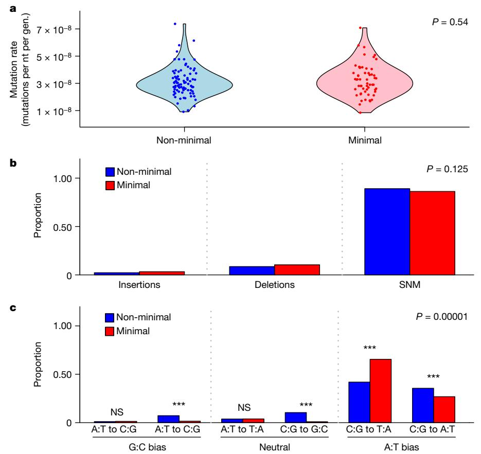
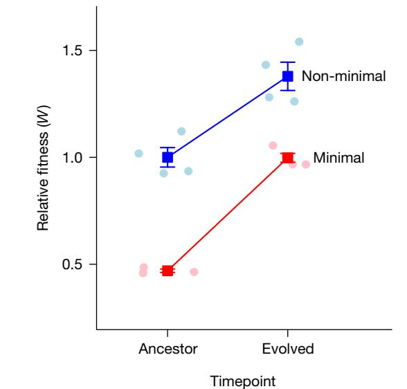
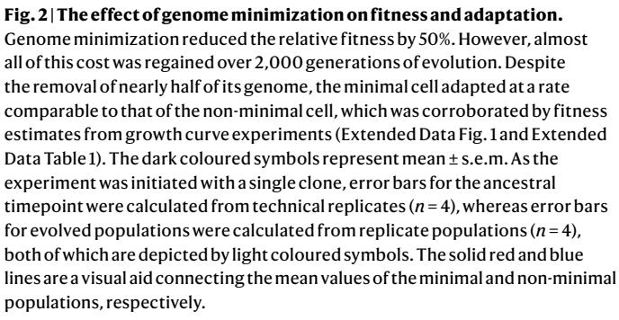
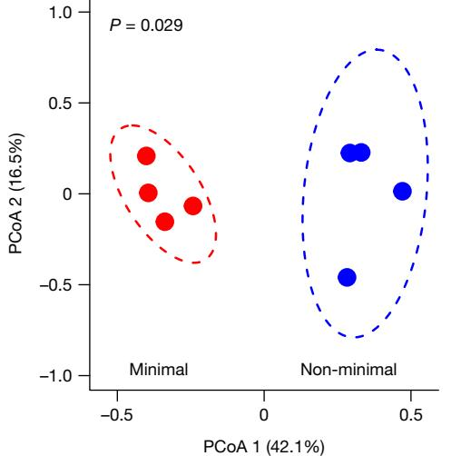
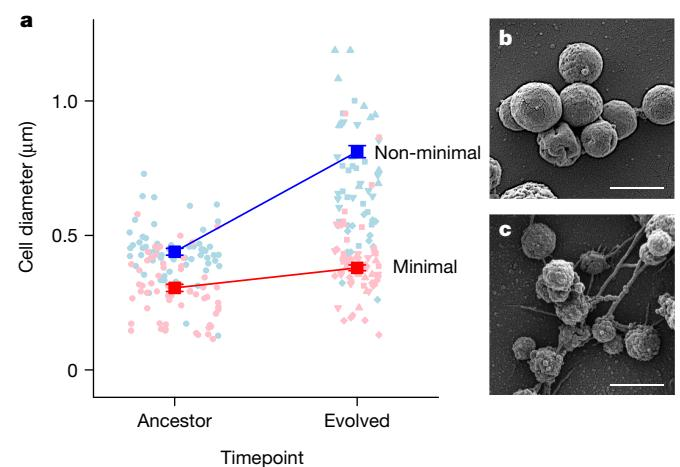
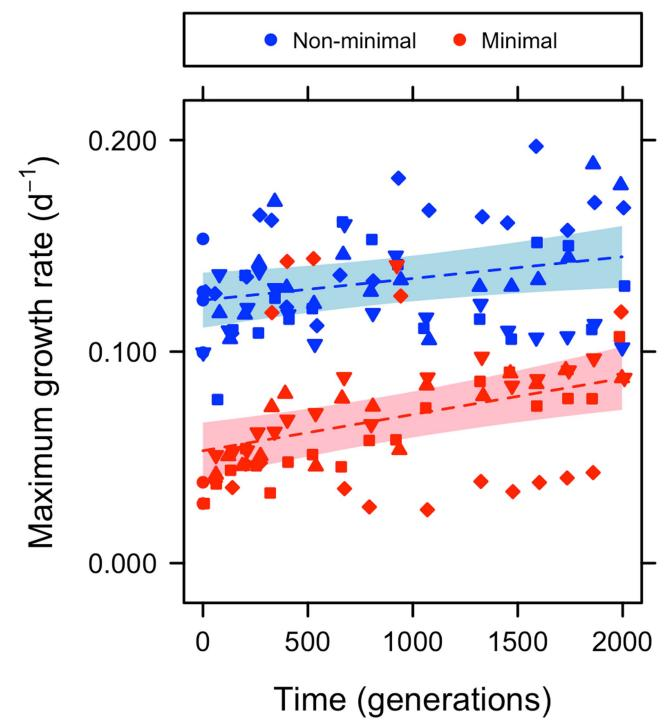
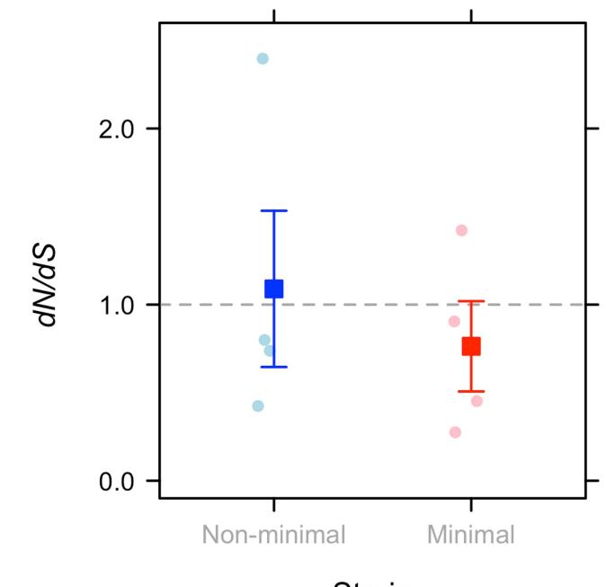
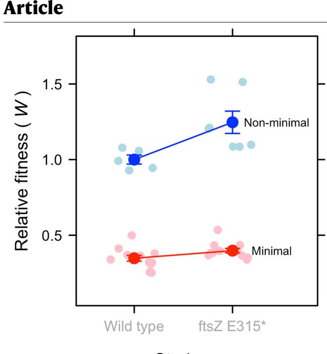
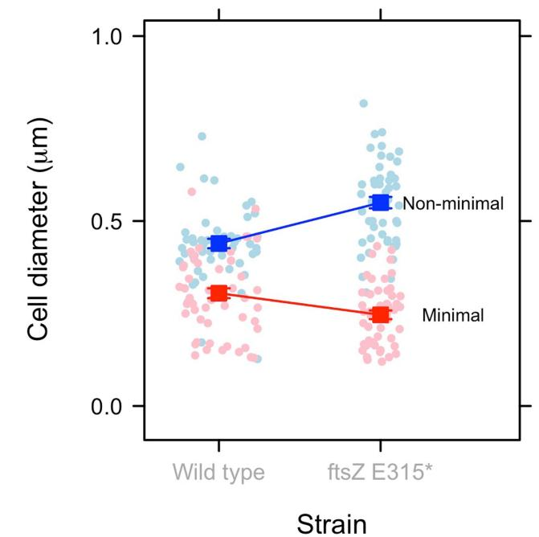

# **Article Evolution of a minimal cell**

<https://doi.org/10.1038/s41586-023-06288-x>

Received: 15 September 2021

Accepted: 6 June 2023

Published online: 5 July 2023

#### Open access

 [C](http://crossmark.crossref.org/dialog/?doi=10.1038/s41586-023-06288-x&domain=pdf)heck for updates

**R. Z. Moger-Reischer1 , J. I. Glass2 , K. S. Wise2 , L. Sun2,3, D. M. C. Bittencourt2,4, B. K. Lehmkuhl1 , D. R. Schoolmaster Jr5 , M. Lynch6 & J. T. Lennon1** ✉

Possessing only essential genes, a minimal cell can reveal mechanisms and processes that are critical for the persistence and stability of lif[e1](#page-4-0),[2](#page-4-1) . Here we report on how an engineered minimal cel[l3](#page-4-2)[,4](#page-4-3) contends with the forces of evolution compared with the *Mycoplasma mycoides* non-minimal cell from which it was synthetically derived. Mutation rates were the highest among all reported bacteria, but were not afected by genome minimization. Genome streamlining was costly, leading to a decrease in ftness of greater than 50%, but this defcit was regained during 2,000 generations of evolution. Despite selection acting on distinct genetic targets, increases in the maximum growth rate of the synthetic cells were comparable. Moreover, when performance was assessed by relative ftness, the minimal cell evolved 39% faster than the non-minimal cell. The only apparent constraint involved the evolution of cell size. The size of the non-minimal cell increased by 80%, whereas the minimal cell remained the same. This pattern refected epistatic efects of mutations in *ftsZ*, which encodes a tubulin-homologue protein that regulates cell division and morpholog[y5,](#page-4-4)[6](#page-4-5) . Our fndings demonstrate that natural selection can rapidly increase the ftness of one of the simplest autonomously growing organisms. Understanding how species with small genomes overcome evolutionary challenges provides critical insights into the persistence of host-associated endosymbionts, the stability of streamlined chassis for biotechnology and the targeted refnement of synthetically engineered cells[2](#page-4-1)[,7–](#page-4-6)[9](#page-4-7) .

The complexity of a genome is reflected by the number of genes that it contains, a quantity that varies by orders of magnitude across the tree of life. Whereas some obligately endosymbiotic bacteria have fewer than 200 protein-coding genes, many plant and animal genomes contain more than 20,000 gene[s10](#page-4-8)[–12.](#page-4-9) In principle, the simplest organism is one that possesses only the minimum number of genes for survival and reproduction in a given environment. Any mutation in such an organism could lethally disrupt one or more cellular functions, placing constraints on evolution, as revealed by the fact that essential proteins change more slowly than those encoded by dispensable gene[s13,](#page-4-10)[14.](#page-4-11) Furthermore, organisms with streamlined genomes have fewer targets on which positive selection can act, therefore limiting opportunities for adaptation.

The cell is the simplest independent functional unit of life. However, even unicellular model organisms that are touted for their tractability are complex, possessing thousands of genes and proteins, many of which remain uncharacterized even after decades of in-depth investigation. The quest for the simplest organism has been aided by advances in synthetic biology, which involves the redesign or novel construction of biological parts and modules[2](#page-4-1),[15](#page-4-12). Synthetic biology provides a platform for developing powerful simplest-case models through streamlining, whereby non-essential sequences are removed from an organism's genom[e1](#page-4-0)[–3,](#page-4-2)[8](#page-4-13)[,16](#page-4-14). Guided by such strategies, a minimal cell was constructed with a genome containing only the smallest set of genes required for autonomous cellular life[3](#page-4-2)[,4](#page-4-3) . Although these efforts succeeded in experimentally identifying the genetic requirements for basic cellular processes, such as metabolism and cell division, it remains unclear how a minimal cell will respond to the forces of evolution. On one hand, evolution of a minimal cell could be constrained by the limited raw materials with which natural selection can operate. On the other hand, synthetic streamlining may result in a highly disrupted genome, altering protein interactions and expanding the opportunity for adaption to a new cellular environment.

To gain insights into the dynamics and outcomes of evolution in a minimal cell, we conducted experiments with strains of *M. mycoides*[3](#page-4-2)[,4](#page-4-3) , which are bacteria belonging to the Mollicutes. The minimal cell ( JCVI-syn3B) has a synthetically constructed genome containing a subset of genes found in a corresponding non-minimal strain ( JCVI-syn1.0). By reducing the chromosome from 901 to 493 genes, JCVI-syn3B has the smallest genome of any organism that can be grown in pure laboratory culture[3](#page-4-2),[4](#page-4-3) . With these two strains, we first investigated whether genome streamlining—which included the removal of two DNA-replication genes, eight DNA repair genes and other genes of unknown function altered the rate and spectrum of new mutations in the minimal cell relative to the non-minimal organism under conditions of relaxed selection. Second, with knowledge of the mutational input, we evaluated whether genome minimization altered the rate and mechanisms of evolution in response to natural selection, as measured using whole-genome sequencing, estimates of population fitness and phenotypic changes in cell size.

1 Department of Biology, Indiana University, Bloomington, IN, USA. 2 J. Craig Venter Institute, La Jolla, CA, USA. 3 Novartis Gene Therapy, San Diego, CA, USA. 4 Embrapa Genetic Resources and Biotechnology, National Institute of Science and Technology in Synthetic Biology, Brasília, Brazil. 5 US Geological Survey, Wetland and Aquatic Research Center, Lafayette, LA, USA. 6 Arizona State University, Tempe, AZ, USA. ✉e-mail: [lennonj@indiana.edu](mailto:lennonj@indiana.edu)

**Fig. 1 | The mutation rate and spectrum of the minimal and non-minimal cell. a**–**c**, The mutation rate (per nucleotide (nt) per generation (gen.)) and spectrum of the minimal and non-minimal cell were estimated from mutation-accumulation experiments. **a**, Although synthetic *M. mycoides* has the highest recorded mutation rate (base substitutions and indels), it was not affected by genome minimization. The dark coloured circles represent non-minimal (*n* = 85) and minimal (*n* = 57) clones that were sequenced at the end of the experiment. The light coloured areas represent kernel densities of

the data. **b**, The proportions of insertions, deletions and SNMs were also the same for the minimal and non-minimal cells. **c**, Among SNMs, which accounted for 88% of all mutations, the minimal cell exhibited a stronger A:T bias in its mutation spectrum compared with the non-minimal cell, particularly in the C:G to T:A category. Two-sided *χ*2 analysis was used for hypothesis testing; ****P* = 2.5 × 10−6 (A:T to G:C), ****P* = 1.5 × 10−11 (C:G to G:C), ****P* = 1.6 × 10−20 (C:G to T:A), ****P* = 0.0003 (C:G to A:T); NS, not significant.

### **Highest recorded mutation rate**

Through serial bottlenecking under relaxed selection, we conducted mutation accumulation experiments with populations of *M. mycoides* (Methods). The number of mutations per nucleotide per generation for the non-minimal cell (3.13 ± 0.12 × 10−8, mean ± s.e.m.) was indistinguishable from that of the minimal cell (3.25 ± 0.16 × 10−8) (*t*140 = 0.43, *P* = 0.667; Fig. [1a)](#page-1-0). These mutation rates, which are the highest recorded for any cellular organism, are consistent with other reports in which organisms with smaller genomes have higher mutation rates[17](#page-4-15)[–20.](#page-4-16) Notably, the mutation rate was not affected by genome minimization that included the elimination of genes involved in replication fidelity (Fig. [1a](#page-1-0)). Perhaps this is due to the fact that *M. mycoides* already has an elevated mutation rate. To evaluate the generality of our findings, the effect of genome minimization should be investigated in a microorganism with a lower intrinsic mutation rate. In any case, our data are consistent with predictions from the drift-barrier hypothesis. This theory posits that mutation rates evolve downwards until the selective advantage of another incremental decrease in the mutation rate is small enough to be effectively neutral and outweighed by genetic drift[19](#page-4-17),[20.](#page-4-16) In other words, populations with a lower effective population size (*N*e) experience stronger drift and, therefore, evolve higher mutation rate[s19.](#page-4-17) Notably, wild-type *M. mycoides* is an obligate pathogen and has genomic features (small genome size and low GC content) consistent with it having a low *N*e [17](#page-4-15)[,18](#page-4-18),[21](#page-4-19),[22](#page-4-20). Note that mutation-accumulation studies are typically designed to estimate the rate and spectrum of viable mutations. By eliminating redundancy, genome streamlining could alter the contribution of strongly deleterious or lethal mutations that would not be captured in our study.

### **Minimization and mutational spectrum**

Although the mutation rate was robust to genome streamlining, the types of mutations that arise in a population can still influence evolution. Overall, the composition of mutation types (insertions, deletions and single-nucleotide mutations (SNMs)) was not affected by genome minimization (*χ*2 2 = 4.16, *P* = 0.125; Fig. [1b](#page-1-0)). However, the composition of SNMs, which constituted the largest category of mutations (88%), differed between the minimal and non-minimal cells (Monte Carlo *χ*2  = 69.9, *P* = 1.0 × 10−4). For both cell types, mutations from a G or C nucleotide to an A or T nucleotide occurred at a higher rate compared with mutations in the opposite direction, that is, from A or T to G or C (Fig. [1c;](#page-1-0) non-minimal cell, *χ*2 1 = 3736, *P* < 2.2 × 10−16; minimal cell, *χ*2 1 = 1444, *P* < 2.2 × 10−16). The magnitude of this A:T bias was affected by genome streamlining (*χ*2 1 = 21.8, *P* = 3.08 × 10−6; Fig. [1c)](#page-1-0) leading to a 30-fold bias in the non-minimal cells and a 100-fold bias in the minimal cells. The discrepancy is probably due to the deletion of *ung*, a gene of which the protein product excises misincorporated uracil that can

otherwise cause C-to-T mutations[23](#page-4-21). Its removal from the minimal cell's genome should elevate A:T mutational bias relative to the non-minimal cell as observed.

## **Recovery of fitness in a minimal cell**

With mutation rates of around 3 × 10−8 per nucleotide per generation and population sizes in excess of 107 individuals, a new mutation would hit every nucleotide in the genome more than 250 times during 2,000 generations of experimental evolution. Thus, neither cell type would be limited by the availability of genetic variation to fuel adaptation. Any differences in the ways the two strains adapt should be driven by alterations in genome content created by synthetic streamlining.

To study natural selection, we passaged replicate populations of *M. mycoides* for 2,000 generations (Methods), a period during which rapid adaptation is often observed[24](#page-5-0),[25.](#page-5-1) We then measured fitness, the contribution of a genotype's offspring to future generations, using two methods[26](#page-5-2). First, we quantified the maximum growth rate (*µ*max) of each replicate population every 65–130 generations (Methods). We documented that genome streamlining led to a 57% reduction in *µ*max, but that this measure of fitness subsequently increased linearly and at comparable rates for the minimal cell (1.71 × 10−5 ± 4.53 × 10−6 per day per generation) and non-minimal cell (1.03 × 10−5 ± 4.53 × 10−6 per day per generation) during the evolution experiment. Using the predicted values from a generalized linear mixed model, the *µ*max of the non-minimal and minimal cell increased by 17–68% over the course of the experiment (Extended Data Fig. 1 and Extended Data Table 1). Second, we measured relative fitness using head-to-head competition assays with the ancestral (generation 0) and most evolved (generation 2,000) populations (Methods). For the ancestral strains, we determined that genome minimization led to a 53% decrease in fitness (Fig. [2](#page-2-0)), on

**Fig. 3 | The non-minimal cell and minimal cell populations acquired adaptive mutations in different sets of shared genes.** Ordination from a principal coordinates analysis (PCoA) created by a gene-by-population matrix using the Bray–Curtis distance metric after 2,000 generations of evolution (Extended Data Tables 2–4). The dashed lines represent 95% confidence ellipses around replicate populations (*n* = 4 for each cell type) represented by dark coloured symbols.

par with estimates based on *µ*max. Despite this major initial cost, the minimal cell rapidly regained fitness. In fact, the competition-based estimates of fitness indicate that the minimal cell adapted 39% more rapidly than the non-minimal cell (*t* = −2.530, *P* = 0.032). With the power afforded by our experimental design, the average relative fitness of the evolved minimal cell (0.998) was statistically indistinguishable (*t* = −0.055, *P* = 0.957) from that of the ancestral non-minimal cell (1.00). Given this, we conclude that effectively all of the fitness lost to genome streamlining was recovered during 300 days of serial passaging (Fig. [2](#page-2-0) and Supplementary Fig. 1). Our findings suggest that a streamlined *M. mycoides* genome is not inherently crippled and can perform as well as the non-minimized cell after readaptation.

On the basis of the fitness dynamics, we conclude that adaptation was not constrained by genome minimization. This interpretation was bolstered by results from population genomic sequencing (Methods). The relative ratio of nonsynonymous to synonymous fixed SNMs (*d*N/*d*S) was similar between the two cell types (*t*6 = 0.81, *P* = 0.488; Extended Data Fig. 2), consistent with the interpretation that the rates of molecular evolution were comparable even though almost all of the genes in the minimal cell are critical for fitness[13,](#page-4-10)[14.](#page-4-11)

## **Divergent mechanisms of adaptation**

Using a combination of statistical simulation and reverse genetics, we identified mutations that probably contributed to the observed patterns of adaptation. First, we analysed the gene-by-population matrix for nonsynonymous mutations that arose in the shared set of essential genes during the natural selection experiment (Methods). The two cell types acquired mutations in different sets of essential genes (permutational multivariate analysis of variance (PERMANOVA), *F*7 = 4.12, *P* = 0.029; Fig. [3)](#page-2-1) suggesting that the populations evolved through divergent routes. To examine this hypothesis, we looked for genes that acquired a higher number of nonsynonymous, nonsense and small insertion–deletion (indel) mutations than expected under assumptions of neutrality (Methods). We identified 16 genes in the non-minimal genome and 14 in the minimal genome that were potential targets of positive selection (Extended Data Tables 2–4). Second, we used reverse genetics to experimentally verify that one of the common types of mutation observed in replicate populations of both strains was in fact beneficial (Extended Data Table 5). Using CRISPR editing, we recreated *ftsZ* C-terminal nonsense mutations by inserting an *ftsZ* E315* nonsense mutation into the ancestral genomes of the minimized and non-minimized strains (Methods). Head-to-head competition assays with the constructs revealed that this putatively adaptive mutation had a significant effect on *Mycoplasma* performance that was dependent on genome minimization (two-way analysis of variance (ANOVA), *F*1,32 = 7.45, *P* = 0.010). The mutation conferred a 25% fitness advantage in the non-minimal cell and a 14% advantage in the minimal cell (Extended Data Fig. 3).

Comparative analysis of the genes putatively under positive selection provided insights into the functional consequences of adaptation in the minimal cell. We hypothesized that mutations in genes related to membrane transport would be critical for adaptation because the minimal cell relies on the import and export of metabolites and other biomolecules for metabolism[4](#page-4-3),[27.](#page-5-3) However, mutations in membrane transport functions were enriched to a similar degree in both cell types (Fisher's exact test, *P* = 0.934). Instead, we detected a marginal signal of enrichment for mutations in biosynthetic genes for the minimal cell (Fisher's exact test, *P* = 0.090), including those involved in lipid metabolism. Specifically, *fakA* and *clsA* (Extended Data Table 3) are considered to be essential for synthesizing cardiolipin and other lipids from free fatty acids[4](#page-4-3) , which are important for the construction of cell membranes and the regulation of cell division. The gene *lgt* is also critical for membrane construction, encoding the protein that transfers diacylglyceryl moieties to anchor surface lipoproteins in the lipid bilayer[4](#page-4-3) . Thus, metabolic innovations involving lipid synthesis and distribution may be more important for the minimal cell than enhanced acquisition of metabolites that are already present in the growth medium.

To better understand the pattern of evolutionary divergence, we compared mutations that arose in essential and non-essential genes over 2,000 generations specifically within the non-minimal cell. After accounting for the relative numbers of essential and non-essential genes, there was no difference in the number of mutations observed between these two genomic partitions (*t*3 = 0.646, *P* = 0.565; Supplementary Table 1). Nor was there any measurable difference in *d*N/*d*S between essential and non-essential genes (*t*3 = 0.91, *P* = 0.423; Supplementary Fig. 2). Among the genes putatively under positive selection, there was no evidence for bias towards either essential or non-essential genes (*χ*2 1 = 0.377, *P* = 0.539; Extended Data Table 2). We identified 11 deletions in the non-minimal cell, ten of which were at non-essential loci (Supplementary Table 2). Most of these were small (1–3 bp) but three deletions were large (1,483, 1,495 and 7,047 bp). In summary, it appears that essential genes did not disproportionately contribute to the molecular of evolution of the non-minimal cell, although we cannot rule out that epistatic interactions between essential and non-essential genes contributed to new cell phenotypes.

#### **Constraints on the evolution of cell size**

The size of single-celled organisms is variable and often linked to fitness in complex way[s28](#page-5-4)–[30.](#page-5-5) In resource-rich environments, cell size tends to be positively correlated with growth rate, one of the most important components of fitness[24](#page-5-0),[29–](#page-5-6)[32.](#page-5-7) For example, in the first 2,000 generations of a classic long-term evolution experiment with *Escherichia coli*, cell volume and fitness concomitantly increased by 50% and 30%, respectively[24.](#page-5-0) Although an increase in size can accommodate more macromolecules needed for growth and division, it also decreases a cell's surface-to-volume ratio, which reduces the efficiency of substrate diffusion. Given these opposing pressures, we evaluated how cell size changed in replicate populations over the course of evolution. Using scanning electron microscopy, we showed that genome streamlining reduced the cell diameter by 31% from 439 ± 0.01 nm to

**Fig. 4 | The effect of genome minimization on the evolution of cell size. a**, Genome minimization was accompanied by a 31% decrease in cell size. Over 2,000 generations of evolution, the size of the non-minimal cells increased by 85% (*P* = 0.005), whereas the size of the minimal cells remained the same (*P* = 0.181). Owing to variation associated with replicate evolved populations, there was a marginal effect when directly comparing changes in the size of the minimal and non-minimal cells (*P* = 0.077; Supplementary Fig. 4). The dark coloured symbols represent the mean ± s.e.m. As the experiment was initiated with a single clone, error bars for the ancestral timepoint were calculated from samples of individuals (*n* = 62 and *n* = 75 for the non-minimal and minimal cell, respectively), whereas error bars at the evolved time point were calculated from individuals (*n* = 285 and *n* = 181 for the non-minimal and minimal cell, respectively) across replicate populations (*n* = 4). The light coloured circles represent randomly drawn data (*n* = 60) corresponding to the diameter of individual cells from the ancestral populations. The light coloured triangles (pointing up and down), diamonds and squares represent randomly drawn data (*n* = 60) corresponding to the diameter of individual cells from the four replicate evolved populations. The solid red and blue lines are a visual aid connecting the mean values of the minimal and non-minimal populations, respectively. **b**,**c**, Scanning electron micrographs obtained from evolved replicate populations of the non-minimal (**b**) and minimal (**c**) cells. Scale bars, 1 μm.

305 ± 0.01 nm in the ancestral cell types. After 2,000 generation of evolution, the size of the non-minimal cell increased by 85% to 811 ± 0.02 nm (*t* = 3.77, *P* = 0.005), which was accompanied by a tenfold increase in volume compared with its ancestor (Fig. [4](#page-3-0) and Extended Data Table 6). By contrast, the size of the minimal cell did not appreciably change (0.08 ± 0.05 nm) during evolution (*t* = 1.51, *P* = 0.181; Extended Data Fig. 4 and Supplementary Fig. 3).

While cell size is a complex multigenic trait, previous studies have attributed changes in morphology of the minimal cell to FtsZ[33](#page-5-8). This protein localizes to the midcell and determines the site of membrane constriction during cell division. Prevalent among diverse lineages of bacteria and archaea[5](#page-4-4),[6](#page-4-5) , *ftsZ* is nevertheless non-essential in *M. mycoides*. However, cells lacking *ftsZ* exhibit aberrant cell division and morpholog[y3](#page-4-2)[,4](#page-4-3)[,33,](#page-5-8)[34.](#page-5-9) Thus, along with 18 other non-essential genes, *ftsZ* was retained in JCVI-syn3B to aid in culture maintenance and stable growth[4,](#page-4-3)[33](#page-5-8). In our study, *ftsZ* was consistently mutated over 2,000 generations of evolution and was identified as a target of positive selection in both the minimal and non-minimal cells (Extended Data Table 4 and Extended Data Fig. 3). Introduction of an early termination codon, as was observed in multiple evolved populations, could eliminate the C-terminal region of the protein that is known to interact with membrane-associated products that recruit FtsZ[35.](#page-5-10) The early stop codon could also create a transcriptional polar effect[36](#page-5-11) that reduces expression of two adjacent downstream genes within a probable polycistronic operon—*MMSYN1_0521*, an orthologue of cell

division protein *sepF* and *MMSYN1_0520*, encoding aminopeptidase/ esterase/lipase, of the α/β hydrolase superfamily[37](#page-5-12). Irrespective of mechanism, we demonstrated that mutations in *ftsZ* had a non-additive effect that contributed to the evolutionary divergence of cell size. We documented that the *ftsZ* E315* nonsense mutation had a significant effect on *Mycoplasma* cell size that was dependent on genome minimization (two-way ANOVA, *F*1,241 = 37.9, *P* = 3.1 × 10−9). The mutation in the non-minimal cell led to a 25% increase in cell diameter (*P* = 2.0 × 10−7) and a corresponding twofold increase in cell volume. By contrast, the same *ftsZ* nonsense mutation in the minimal cell led to a 19% decrease in the cell diameter (*P* = 0.015; Extended Data Fig. 4), which reduced cell volume by half. Thus, the *ftsZ* E315* mutation recapitulated nearly 60% of the evolved divergence in cell size, indicating that FtsZ has a central role in the cell size of *M. mycoides*.

Although changes in *ftsZ* had opposing effects on the size of the minimal and non-minimal cell, mutations in this gene were beneficial for both strains (Extended Data Fig. 3 and Extended Data Table 4). One adaptive consideration is that the faster-growing non-minimal cell should experience bouts of feast-or-famine conditions. In a serial batch environment, repeated transitions between exponential and stationary growth phases has been shown to select for increased cell size[24,](#page-5-0)[28.](#page-5-4) The observed patterns may also reflect constraints imposed by genome streamlining on the ability of the minimal cell to evolve an adaptive increase in cell size[29](#page-5-6)[,30](#page-5-5),[38,](#page-5-13)[39.](#page-5-14) With more than 50% of its membrane-transport proteins removed, the minimal cell may have been unable to sequester the resources needed for constructing and maintaining a larger cell[3](#page-4-2),[30](#page-5-5),[39](#page-5-14) under the experimental conditions. Alternatively, cell size could evolve as a fitness-neutral byproduct of selection on other traits, such as DNA-replication rate[40.](#page-5-15) For example, the two strains could have evolved different size trajectories despite similar selection pressures, due to epistatic effects of genome minimization such as those demonstrated using the *ftsZE315** mutants (Extended Data Table 6 and Extended Data Fig. 4). In any case, our findings highlight that cell size—a fundamental feature of biological complexity in multicellular and single-celled organisms alike—evolves in a manner that is dependent on the genomic context.

#### **Outlook**

We uncovered genes, proteins and traits that are critical for evolutionary performance in the synthetically constructed *M. mycoides* JCVI-syn3B—a bacterium with the smallest genome of any organism grown in pure culture in the laboratory. In its ancestral state, this working approximation of a minimal cell had significantly reduced fitness. With less than 500 protein-coding genes, *M. mycoides* JCVI-syn3B had few redundancies when faced with an exceptionally high input of mutations. Despite these challenges, genome reduction did not alter cellular resources in any fundamental way that interfered with the ability to evolve increased fitness. Instead, natural selection during extended laboratory growth outweighed any deleterious effects of genome disruption and drift associated with synthetic streamlining that could have led populations of the minimal cell to extinction.

Our results demonstrate how synthetic biology and engineering can be informed by principles of evolutionary biology and population genetics. While it is now possible to build genomes with desired phenotypes, evolutionary processes represent a powerful but still underdeveloped approach for biological refinement. For example, rapid adaptation of the minimal cell involved selection on distinct targets, 25% of which encoded proteins of unknown function. Future studies combining evolution with a synthetic biology toolset have the potential to improve gene characterization and the mapping of regulatory networks, which may ultimately be used for optimizing stable living systems. Some degree of genome minimization will probably be a common path of development in biotechnology. It would be undesirable if such an approach compromised replication or repair fidelity, owing for example to unexpected cellular changes that might be mutagenic or otherwise interfere with damage maintenance. From an engineering perspective, more studies are needed to evaluate the minimization of other genomes in alternate chassis under different environmental conditions. Nevertheless, if we assume that our findings are somewhat general, it appears that cellular functions are robust to streamlining over time, which is desirable when using minimized cells for biotechnology and bioproduction.

Our findings shed new light on the phenomenon of genome streamlining, which is prevalent in nature, especially among microorganisms that coevolve with hosts in both pathogenic and mutualistic ways, but also among free-living bacteria that dominate the global oceans[7](#page-4-6)[,9,](#page-4-7)[41](#page-5-16). Both adaptive and neutral theories have been developed to explain why genomes become streamlined[42,](#page-5-17)[43](#page-5-18). Very few studies have mechanistically investigated how genome streamlining affects subsequent evolution, especially for microorganisms with different phylogenetic backgrounds living in environments with contrasting niches. Despite it reducing the sequence space of possible trajectories, we conclude that streamlining does not constrain fitness evolution and diversification of populations over time. Genome minimization may even create opportunities for evolutionary exploitation of essential genes, which are commonly observed to evolve more slowly[13](#page-4-10)[,44](#page-5-19).

#### **Online content**

Any methods, additional references, Nature Portfolio reporting summaries, source data, extended data, supplementary information, acknowledgements, peer review information; details of author contributions and competing interests; and statements of data and code availability are available at<https://doi.org/10.1038/s41586-023-06288-x>.

- 1. Lachance, J.-C., Rodrigue, S. & Palsson, B. O. Minimal cells, maximal knowledge. *eLife* **8**, e45379 (2019).
- 2. Glass, J. I., Merryman, C., Wise, K. S., Hutchison, C. A. & Smith, H. O. Minimal cells—real and imagined. *Cold Spring Harb. Perspect. Biol.* **9**, a023861 (2017).
- 3. Hutchison, C. A. et al. Design and synthesis of a minimal bacterial genome. *Science* **351**, aad6253 (2016).
- 4. Breuer, M. et al. Essential metabolism for a minimal cell. *eLife* **8**, e36842 (2019).
- 5. McQuillen, R. & Xiao, J. Insights into the structure, function, and dynamics of the bacterial cytokinetic FtsZ-ring. *Annu. Rev. Biophys.* **49**, 309–341 (2020).
- 6. Liao, Y., Ithurbide, S., Evenhuis, C., Löwe, J. & Duggin, I. G. Cell division in the archaeon *Haloferax volcanii* relies on two FtsZ proteins with distinct functions in division ring assembly and constriction. *Nat. Microbiol.* **6**, 594–605 (2021).
- 7. Moran, N. A. & Bennett, G. M. The tiniest tiny genomes. *Annu. Rev. Microbiol.* **68**, 195–215 (2014).
- 8. Leprince, A., van Passel, M. W. & dos Santos, V. A. M. Streamlining genomes: toward the generation of simplified and stabilized microbial systems. *Curr. Opin. Biotechnol.* **23**, 651–658 (2012).
- 9. Giovannoni, S. J. et al. Genome streamlining in a cosmopolitan oceanic bacterium. *Science* **309**, 1242–1245 (2005).
- 10. Lynch, M. *The Origins of Genome Architecture* (Sinauer Associates, 2007).
- 11. Nakabachi, A. et al. The 160-kilobase genome of the bacterial endosymbiont *Carsonella*. *Science* **314**, 267–267 (2006).
- 12. Meyer, A. et al. Giant lungfish genome elucidates the conquest of land by vertebrates. *Nature* **590**, 284–289 (2021).
- 13. Hahn, M. W. & Kern, A. D. Comparative genomics of centrality and essentiality in three eukaryotic protein-interaction networks. *Mol. Biol. Evol.* **22**, 803–806 (2005).
- 14. Graur, D. & Li, W.-H. *Fundamentals of Molecular Evolution* (Sinauer Associates, 2000).
- 15. Benner, S. A. & Sismour, A. M. Synthetic biology. *Nat. Rev. Genet.* **6**, 533–543 (2005).
- 16. Richardson, S. M. et al. Design of a synthetic yeast genome. *Science* **355**, 1040–1044 (2017).
- 17. Kuo, C.-H. & Ochman, H. Deletional bias across the three domains of life. *Genome Biol. Evol.* **1**, 145–152 (2009).
- 18. Long, H. et al. Evolutionary determinants of genome-wide nucleotide composition. *Nat. Ecol. Evol.* **2**, 237–240 (2018).
- 19. Lynch, M. et al. Genetic drift, selection and the evolution of the mutation rate. *Nat. Rev. Genet.* **17**, 704–714 (2016).
- 20. Sung, W., Ackerman, M. S., Miller, S. F., Doak, T. G. & Lynch, M. Drift-barrier hypothesis and mutation-rate evolution. *Proc. Natl Acad. Sci. USA* **109**, 18488–18492 (2012).
- 21. Hershberg, R. Mutation—the engine of evolution: studying mutation and its role in the evolution of bacteria. *Cold Spring Harb. Perspect. Biol.* **7**, a018077 (2015).
- 22. Moran, N. A., McLaughlin, H. J. & Sorek, R. The dynamics and time scale of ongoing genomic erosion in symbiotic bacteria. *Science* **323**, 379–382 (2009).
- 23. Lindahl, T., Ljungquist, S., Siegert, W., Nyberg, B. & Sperens, B. DNA *N*-glycosidases: properties of uracil-DNA glycosidase from *Escherichia coli*. *J. Biol. Chem.* **252**, 3286–3294 (1977).
- 24. Vasi, F., Travisano, M. & Lenski, R. E. Long-term experimental evolution in *Escherichia coli*. II. Changes in life-history traits during adaptation to a seasonal environment. *Am. Nat.* **144**, 432–456 (1994).
- 25. Gifford, D. R., Schoustra, S. E. & Kassen, R. The length of adaptive walks is insensitive to starting fitness in *Aspergillus nidulans*. *Evol. Int. J. Org. Evol.* **65**, 3070–3078 (2011).
- 26. Wiser, M. J. & Lenski, R. E. A comparison of methods to measure fitness in *Escherichia coli*. *PLoS ONE* **10**, e0126210 (2015).
- 27. Antczak, M., Michaelis, M. & Wass, M. N. Environmental conditions shape the nature of a minimal bacterial genome. *Nat. Commun.* **10**, 3100 (2019).
- 28. Gounand, I. et al. Size evolution in microorganisms masks trade-offs predicted by the growth rate hypothesis. *Proc. R. Soc. B* **283**, 20162272 (2016).
- 29. Mei, Z.-P., Finkel, Z. V. & Irwin, A. J. Light and nutrient availability affect the size-scaling of growth in phytoplankton. *J. Theor. Biol.* **259**, 582–588 (2009).
- 30. Chien, A.-C., Hill, N. S. & Levin, P. A. Cell size control in bacteria. *Curr. Biol.* **22**, R340–R349 (2012).
- 31. Mongold, J. A. & Lenski, R. E. Experimental rejection of a nonadaptive explanation for increased cell size in *Escherichia coli*. *J. Bacteriol.* **178**, 5333–5334 (1996).
- 32. Hill, N. S., Buske, P. J., Shi, Y. & Levin, P. A. A moonlighting enzyme links *Escherichia coli* cell size with central metabolism. *PLoS Genet.* **9**, e1003663 (2013).
- 33. Pelletier, J. F. et al. Genetic requirements for cell division in a genomically minimal cell. *Cell* **184**, 2430–2440 (2021).
- 34. Pelletier, J. F., Glass, J. I. & Strychalski, E. A. Cellular mechanics during division of a genomically minimal cell. *Trends Cell Biol.* **32**, 900–907 (2022).
- 35. Cohan, M. C., Eddelbuettel, A. M. P., Levin, P. A. & Pappu, R. V. Dissecting the functional contributions of the intrinsically disordered C-terminal tail of *Bacillus subtilis* FtsZ. *J. Mol. Biol.* **432**, 3205–3221 (2020).
- 36. Graffeuil, A., Uhlin, B. E. & Cisneros, D. A. Polar mutagenesis of bacterial transcriptional units using Cas12a. *Microb. Cell Fact.* **21**, 139 (2022).
- 37. Bianchi, D. M., Pelletier, J. F., Hutchison, C. A., Glass, J. I. & Luthey-Schulten, Z. Toward the complete functional characterization of a minimal bacterial proteome. *J. Phys. Chem. B* **126**, 6820–6834 (2022).
- 38. DeLong, J. P., Okie, J. G., Moses, M. E., Sibly, R. M. & Brown, J. H. Shifts in metabolic scaling, production, and efficiency across major evolutionary transitions of life. *Proc. Natl Acad. Sci. USA* **107**, 12941–12945 (2010).
- 39. Westfall, C. S. & Levin, P. A. Bacterial cell size: multifactorial and multifaceted. *Annu. Rev. Microbiol.* **71**, 499–517 (2017).
- 40. Amir, A. Is cell size a spandrel? *eLife* **6**, e22186 (2017).
- 41. Wolf, Y. I. & Koonin, E. V. Genome reduction as the dominant mode of evolution. *Bioessays* **35**, 829–837 (2013).
- 42. Lynch, M. Streamlining and simplification of microbial genome architecture. *Annu. Rev. Microbiol.* **60**, 327–349 (2006).
- 43. Giovannoni, S. J., Cameron Thrash, J. & Temperton, B. Implications of streamlining theory for microbial ecology. *ISME J.* **8**, 1553–1565 (2014).
- 44. Luo, H., Gao, F. & Lin, Y. Evolutionary conservation analysis between the essential and nonessential genes in bacterial genomes. *Sci Rep.* **5**, 13210 (2015).

**Publisher's note** Springer Nature remains neutral with regard to jurisdictional claims in published maps and institutional affiliations.

**Open Access** This article is licensed under a Creative Commons Attribution 4.0 International License, which permits use, sharing, adaptation, distribution and reproduction in any medium or format, as long as you give appropriate

credit to the original author(s) and the source, provide a link to the Creative Commons licence, and indicate if changes were made. The images or other third party material in this article are included in the article's Creative Commons licence, unless indicated otherwise in a credit line to the material. If material is not included in the article's Creative Commons licence and your intended use is not permitted by statutory regulation or exceeds the permitted use, you will need to obtain permission directly from the copyright holder. To view a copy of this licence, visit [http://creativecommons.org/licenses/by/4.0/.](http://creativecommons.org/licenses/by/4.0/)

© The Author(s) 2023, corrected publication 2023

# **Methods**

### **Strains and growth conditions**

We maintained synthetic *M. mycoides* JCVI-syn1.0 and synthetic *M. mycoides* JCVI-syn3B in SP4 medium with KnockOut Serum Replacement (Gibco) substituted for fetal bovine serum (Supplementary Table 3). Cultures of these non-motile bacteria were grown in a dark, static growth chamber at 37 °C. The non-minimal JCVI-syn1.0 strain has been described in detail previously[45](#page-8-0). The minimal JVCI-syn3B is identical to the strain synthesized in previous studies[3](#page-4-2) with the following exceptions: JVCI-syn3B possesses a second rRNA operon copy, lacks a gene (*MMSYN1_0531*) encoding an efflux protein, and has 19 genes that were added back into the minimal genome to render the cell easier to us[e4](#page-4-3)[,33](#page-5-8) (Supplementary Table 4). The strain also contains a landing pad system (*cre* recombinase and *loxP*) facilitating genetic manipulation. For competition experiments used to quantify relative fitness, we used a JCVI-syn1.0 strain that expresses mCherry, which enabled us to distinguish it in mixed culture from other strains using flow cytometry and also factor out any costs associated with production of the fluorescent protein (see below).

### **Mutation accumulation experiment**

**Overview.** Mutation accumulation (MA) experiments are designed to reduce the influence of natural selection through repeated bottlenecks of evolving populations[19](#page-4-17). When used with microbial populations, this is typically achieved by transferring single colonies, which have undergone single-cell bottlenecks. Before initiating MA experiments, we acclimatized JCVI-syn1.0 and JCVI-syn3B to laboratory conditions by maintaining populations in SP4 liquid medium. We took a clone of each acclimated strain to begin the MA experiment and propagated replicate lineages (*n* = 87 and *n* = 57 for JCVI-syn1.0 and JCVI-syn3B, respectively) for 20 to 36 weekly transfers.

**Number of generations.** To compare rates of mutation across replicates, we normalized all rates as per-generation values. To calculate the number of generations per transfer in the MA, we grew cells on SP4 agar for 1 week and diluted a sample of seventh day colonies into 1 ml of phosphate-buffered saline (pH 7.4). Cells were fixed with 20 μl of 25% glutaraldehyde and stained with 2× SYBR Green, and then counted with a NovoCyte flow cytometer (ACEA Biosciences). We used the dilutions to calculate the number of cells in the original colony, from which we inferred the number of generations (log2[*N*], where *N* is the number of cells in the undiluted colony) that must have occurred to reach a colony of that size[46,](#page-8-1) assuming each colony is formed by a single progenitor cell. As the growth rate and other fitness components can decrease during an MA experiment[47,](#page-8-2) we also measured the number of cells per colony during and at the end of the MA, averaging across timepoints to estimate the total number of generations. We then used the number of generations per transfer to estimate the effective population size (*N*e) using the harmonic mean metho[d47](#page-8-2). Specifically, *N*e was approximated as the harmonic mean of the series (20 , 21 , 22 , …, 2*f* ), where *f* is equal to the number of generations per transfer inferred from the previous step.

**Whole-genome sequencing and sequence analysis.** We performed DNA extractions from evolved MA cell lines using the DNeasy UltraClean Microbial Kit (Qiagen) according to the manufacturer's instructions, with the additional step of adding 50 μl of 50 mg ml−1 lysozyme to improve cell lysis. Genomic DNA was sequenced using Illumina MiSeq sequencing to a depth of at least 35× coverage. Library preparation and DNA sequencing were conducted by the Indiana University Bloomington Center for Genomics and Bioinformatics. Whole-genome sequencing reads were quality controlled using cutadapt[48](#page-8-3) to trim low-quality base pairs and remove residual adapter sequences. We used breseq with the default parameters[49](#page-8-4)[,50](#page-8-5) to call mutations using the trimmed reads. We only considered fixed mutations for the MA cell lines. We checked for mutations that had arisen in experimental ancestor strains before evolution. Ancestral mutations were removed from the analysis of all evolved MA lines derived from that strain using gdtool[s49](#page-8-4)[,50](#page-8-5). We used the sequencing data to check for contamination or cross-contamination in the evolved cell lines.

**Statistical analyses.** To compare the mutation rate and spectrum between strains, we used two-sample *t*-tests for numerical response variables and two-sample *χ*2 tests with continuity correction for comparing proportions. For comparing proportions to theoretical expectations within a strain, we used one-sample *χ*2 tests with continuity correction.

#### **Adaptive evolution**

**Overview.** In contrast to the mutation accumulation experiments, we conducted experiments that allowed bacteria to achieve large population sizes to increase the efficacy of natural selection. This involved serial passaging of cells in liquid cultures with limited bottlenecking at each transfer. For example, in our experiment, the minimum population size was 2× 107 –4 × 107 for both JCVI-syn1.0 and JCVI-syn3B. We passaged replicate 3 ml liquid cultures of each strain (*n* = 4 per strain) in 13 mm glass test tubes by 1% (v/v) serial transfer each day for 300 days in a dark, static incubator held at 37 °C. We calculated the number of generations per day as the log2 of the dilution factor, that is, log2[101], the number of binary fissions needed to regenerate the original population size after the 1% (v/v) transfer[51](#page-8-6). Thus, we estimate that the *M*. *mycoides* strains were maintained for 1,997 generations, which, based on other experiments, is long enough for the majority of adaptation to occu[r51,](#page-8-6)[52](#page-8-7).

**Measurements of fitness.** First, we measured fitness as *µ*max by conducting growth curves on cells that were isolated at different timepoints during the adaptive evolution experiment (Supplementary Fig. 5). Cryopreserved cells were thawed on ice before preculturing at 37 °C for 24–72 h in 3 ml of SP4 medium in a 13 mm test tube. Before initiating the experiment, we adjusted the start times of precultures to help ensure that cultures from different evolution timepoints were at the same stage of growth. Approximately 6 × 105 cells from turbid precultures were then inoculated into replicate wells of a 96-well plate containing 200 µl of SP4 medium. Separately, each population was incubated in a 96-well plate for 24 h in a BioTek Synergy H1 microplate reader that recorded the absorbance every 15 min at 415 nm. This wavelength is close to a spectral peak for phenol red, a pH indicator that is a component of SP4 medium (Supplementary Table 3). Previous studies have shown that phenol red can be used as proxy for metabolism and growth[53](#page-8-8) because bacteria like *M. mycoides* produce organic acids as a byproduct of carbohydrate metabolism[4](#page-4-3) (Supplementary Fig. 5). With the resulting data, we used maximum likelihood to estimate growth-curve parameters using a modified Gompertz equation[54](#page-8-9):

$$Y = \mathbf{b}_0 + \mathcal{A} \times \exp\left\{-\exp\left[\frac{\mu_{\text{max}} \times \mathbf{e}}{A}(L-t) + 1\right]\right\}$$

where *L* is the lag time (h), *A* is the carrying capacity or yield (optical density at 415 nm), *µ*max is the maximum growth rate (day−1) and *b*0 is the intercept (Supplementary Fig. 6 and Supplementary Table 5).

Second, we measured relative fitness by competing ancestral and evolved strains against a *M. mycoides* JCVI-syn1.0 reference strain labelled with mCherry (syn1.0::mCh)[26](#page-5-2). Cryopreserved cells were used to make precultures in a similar manner to those in the growth curve experiment. Each strain was grown in liquid medium to log phase, and then the labelled and unlabelled strains were simultaneously diluted into a mixed culture in fresh medium. We immediately sampled the axenic cultures or the mixed culture (*t*0), fixed the cells with 20 μl of cold 25% glutaraldehyde, incubated them at 4 °C for 20 min and then stained the samples with 2× SYBR Green. After 24 h of growth (*tf*), the mixed culture was sampled and processed again in an identical manner. For samples in the adaptive evolution experiment, we quantified the abundance of each strain using a an LSR II flow cytometer (BD Biosciences) at Indiana University's Flow Cytometry Core Facility. For measuring the relative fitness of engineered *ftsZ* mutants, we used the NovoCyte flow cytometer (ACEA Biosciences). While measurements were being made, we vortexed the samples every minute to prevent multiple cells from clumping together and being scored as single events. The purity was assessed during every run using negative controls and axenic controls. We detected 1,800–2,700 events per second and abundances on the order of 1 × 108 cells per ml. With the resulting data, we differentiated cells on the basis of the expression of mCherry. Using NovoExpress, FACSDiva and FCS Express software, we established gates on pure cultures of the non-mCherry-expressing experimental strains and the syn1.0::mCh reference strain (Supplementary Figs. 7 and 8). For the experimental strains, boundaries were established by gating axenic mCherry-negative cells that were positive for only SYBR Green fluorescence. For the reference strain, boundaries were established by gating axenic syn1.0::mCh cells that were positive for SYBR Green and mCherry (Supplementary Fig. 9). In the competition assays used to quantify relative fitness, we applied the axenically established gates to samples that contained a mixture of the reference strain and experimental strain. We obtained the proportion of false-negative mCherry cells by applying the mCherry-negative gate to axenic mCherry-expressing cells; this proportion was then used as a correction factor in mixed populations. Last, we calculated relative fitness as the change in the relative abundance of the strain of interest during the 24 h period of competitive growth versus syn1.0::mCh. Specifically, the relative fitness versus the mCherry reference strain *WC* is

$$\mathcal{W}_{\mathbb{C}} = \frac{\ln\left(\frac{N_{\mathbb{F}}}{N_{\mathbb{O}}}\right)}{\ln\left(\frac{N_{\mathbb{C}\mathbb{F}}}{N_{\mathbb{C}\mathbb{O}}}\right)}$$

where *N*0 represents the initial abundance of the experimental strain, *N*f the abundance of the experimental strain after 24 h, and *N*C0 and *N*Cf are initial and final abundances of the reference strain (syn1.0::mCh), respectively[26](#page-5-2). We normalized fitness values to be relative to the original *M. mycoides* JCVI-syn1.0 ancestor strain. In other words, we represent the fitness (*W*) as *W W C* JCVI−syn1.0 , where *W*JCVI -syn1.0 is the value of *WC* for *M. mycoides* JCVI-syn1.0.

**Whole-genome sequencing and sequence analysis.** DNA extraction, sequencing and bioinformatics were performed according to the same methods as for the mutation accumulation experiment with a few exceptions. Specifically, each replicate population was sequenced to a depth of at least 100× coverage, and polymorphic mutations were included in our analyses. As an indicator of selective pressure, we used the Jukes–Cantor method[55](#page-8-10) to compute the per-site *d*N/*d*S value on the basis of the number of nonsynonymous and synonymous SNMs within each of the evolved replicate populations normalized by the total nonsynonymous and synonymous target sizes. We counted the number of synonymous and nonsynonymous AT to CG, AT to GC, AT to TA, CG to GC, CG to TA and CG to AT sites using the gdtools module of breseq, which is a computational pipeline that identifies mutations from short-read DNA resequencing studies[50](#page-8-5). We next combined that information with the empirical mutation spectrum from the MA experiment to account for the differing probabilities of each of the six SNM types, and thereby calculate the total expected number of SNMs at nonsynonymous and synonymous sites[56.](#page-8-11) The observed numbers of synonymous and nonsynonymous substitutions were obtained directly from breseq outputs. Synonymous and nonsynonymous polymorphisms were included in the observed count with probability equal to their allele frequency in mapped reads. We added a pseudocount of 1 synonymous substitution for all calculations[57](#page-8-12) because two of the populations had 0 synonymous substitutions.

To identify mutations possibly contributing to adaptation, we looked for genes that had mutations across two or more replicate populations for each genotype. Mutations in the same gene, arising and increasing in frequency in independent lineages, suggests that that mutation's rise could be driven by positive selectio[n58.](#page-8-13) To test this hypothesis, we statistically assessed whether multiply-mutated genes (that is, genes mutated in >1 replicate evolved population) had acquired more mutations than would be expected by chance under the assumption that the mutations were neutral[58](#page-8-13). To do this, we recorded all of the polymorphic and fixed mutations that were called within genes. Synonymous mutations were excluded. We then used Pytho[n59](#page-8-14) to simulate the placement of these mutations at random across all genes. The probability of any given gene receiving any given mutation was relativized to the gene's length and GC content using the known mutation rates of G:C nucleotides and A:T nucleotides from the mutation-accumulation experiment. We repeated this random placement of mutations 100,000 times. In each simulation, we counted the number of mutations received by each gene, with each fixed mutation increasing the count by 1 and each polymorphism increasing the count by an amount equal to its allele frequency. For each multiply-mutated gene from the real adaptation experiment, we calculated the proportion of the 100,000 simulations in which the gene received at least as many mutations as were truly observed and called this proportion the *P* value. We then used the Benjamini–Hochberg method[60](#page-8-15)[,61](#page-8-16) to generate corrected *P* values (*P*adj) to account for multiple tests with the false-discovery rate set to be *α* = 0.05 (Extended Data Table 2). As a negative control, we repeated the simulations using only synonymous mutations. This process returned two false-positive significant genes, which was small compared with the 52 significant signatures detected among nonsynonymous mutations, although we also acknowledge that synonymous gene analysis had less power due to the smaller number of synonymous mutations.

**Generation of** *ftsZ* **E315* mutant cells.** This process required mutating the bacterial genomes while they were yeast centromeric plasmids (YCPs) followed by genome transplantation of the mutated genomes. The YCPs were mutated using rounds of CRISPR–Cas9 and yeast homologous recombination that is a modification of a method used previously to mutate *M. mycoides* strain[s62](#page-8-17).

In the first CRISPR–Cas9 step, the molecule to be mutated was cleaved and the donor DNA comprising sequences from the two flanking genes was recombined with the cut JCVI-syn1.0 or JCVI-syn3B YCP, removing parts of genes of the flanking genes and all of the target gene. The donor DNA had 40 bp overlaps to both genes flanking the target gene and had a 22 bp *Mycoplasma gallisepticum* 161 CRISPR– Cas9 target sequence with a protospacer adjacent motif (PAM) (5′-GTATAAATACATCCAGGAGTGG-3′) that had no homology elsewhere in JCVI-syn1.0 or JCVI-syn3B. The *M. gallisepticum* sequence put a new PAM in the genome that was used in the second round of CRISPR–Cas9.

The second round of CRISPR–CAS9 cut the JCVI-syn1.0 or JCVI-syn3B YCP at the new *M. gallisepticum* PAM. The cut YCP was then recircularized using a donor DNA containing the desired point mutation. The mutagenized regions of the YCPs were PCR amplified and the mutation was confirmed by Sanger sequencing. Correctly mutagenized JCVI-syn1.0 or JCVI-syn3B YCPs were then transplanted into *Mycoplasma capricolum* recipient cells as reported previously[3](#page-4-2),[59](#page-8-14),[60,](#page-8-15)[63](#page-8-18)[,64](#page-8-19). The mutagenized regions of the transplants were PCR-amplified and sequenced to confirm the presence of the desired mutations.

**Microscopy and image analysis.** Scanning electron microscopy (SEM) was used to compare changes in the cell size of evolved populations. All of the populations were grown in the same batch of medium and under identical conditions in a single incubator. The start times of cultures were adjusted so that they reached stationary phase at the same time.

We centrifuged stationary-phase cultures and resuspended the pellet in 1 ml of phosphate-buffered saline (pH 7.4). The resuspended cells were fixed by adding 20 μl of cold 25% glutaraldehyde and incubating at 4 °C for 20 min. For microscopy observation, fixed cells were concentrated 4× by centrifugation and resuspension. The centrifugation steps were performed at 25 °C for 4 min at 2,000*g*. SEM was performed at the Indiana University Bloomington Electron Microscopy Center. Fixed cells in PBS were pelleted and resuspended in 100 mM sodium cacodylate buffer (pH 7.2) with 2 mM calcium chloride and 2% sucrose. We coated 12-mm-diameter glass coverslips with 0.1% poly-l-lysine for 5 min, after which coverslips were washed with a few drops of double distilled water. Resuspended cells were added to the coverslip surface and allowed to adhere. After 5 min, the coverslips were washed twice with 100 mM sodium cacodylate buffer (pH 7.2) with 2  mM calcium chloride and 2% sucrose. Next, 300 µl of 2% osmium tetroxide in 100 mM sodium cacodylate buffer (pH 7.2) with 2% sucrose was added to the surface of the coverslips while on ice. After 30 min, the coverslips were washed with double-distilled water. The coverslips were placed into a CPD coverslip holder (Electron Microscopy Sciences, 70193-01). The samples were dehydrated in a graded ethanol series (30%, 50%, 70%, 90%, 95%) while on ice. At room temperature, the coverslips were rinsed three times with 100% ethanol. Each dehydration step lasted for 2 min. Critical-point drying was performed using the Tousimis Samdri 790 critical-point dryer. The dried coverslips were placed on aluminium SEM stubs and sputter-coated using the Safematic CCU-010 with SP-010 Sputter Head with 45 nm of gold/palladium (80%/20%), which is accurate in the Angstrom range. All of the samples were coated simultaneously to minimize variance among samples. We viewed the samples using the FEI Teneo scanning electron microscope at 2.0 kV, 25 pA probe current and 3.0 mm working distance. The T2 detector was used. We calibrated the measurements using line grating replicas (2,160 lines per mm) with 0.261 μm latex spheres (Electron Microscopy Sciences). We analysed the SEM image data using ImageJ[65](#page-8-20). We used the straight and measure features combined with image scale metadata to measure the vertical diameters of imaged cells that met the following criteria: cells must be round; cells must not have apparent holes or punctures; cells must be completely within the field of view; cells must have an unambiguous perimeter; there must be no suggestion that a cell is currently or has recently undergone binary fission; cells must be ≥0.1 μm across. Each image was processed counterclockwise starting from east. The samples were processed in a randomized order.

**Statistical analyses.** For the growth-curve experiments, we used a generalized linear mixed model to test for the fixed effects of time (generation) and cell type (minimal versus non-minimal) on growth curve parameters (*µ*max, lag time, yield) while fitting random intercepts for the replicate evolved populations (Supplementary Table 3). We used variance partition coefficients to estimate the contribution of the replicate populations (random effect) to the total variation explained in the models (Extended Data Fig. 1, Extended Data Table 1, Supplementary Figs. 1 and 2 and Supplementary Table 5). For the adaptative evolution experiment (Figs. [2](#page-2-0) and [4](#page-3-0)), we tested hypotheses using a general linear model (GLM) after subtracting observations of each replicate-evolved population (generation 2,000) from its corresponding ancestor (generation 0). With the intercept term excluded, the GLM tests whether the evolutionary trajectory for each group is different from zero. With the intercept term included, the GLM tests whether the evolutionary trajectories are different among groups. We also used two-way ANOVA with Tukey's honest significant difference test to test hypotheses about the effects of cell type (minimal versus non-minimal) and *ftsZ* E315* (wild type versus mutant) on relative fitness and cell size. When necessary, data were log10-transformed to meet statistical assumptions.

We compared the composition of genes acquiring mutations among the evolved replicate populations by first constructing a gene-by-population matrix. Here, each row represented an evolved population and each column represented a gene that had acquired at least one mutation among all of the populations. Each cell of the matrix was filled with the sum value of mutations occurring in that gene in that population, where fixed mutations were valued at 1 and polymorphisms were valued equal to the allele frequency. Only essential genes, shared between JCVI-syn1.0 and JCVI-syn3B, were considered. We used PERMANOVA on the Bray–Curtis distances generated from the gene-by-population matrix to test for the significance of cell type (minimal versus non-minimal) on the composition of mutations using the adonis function in the R package vegan[66](#page-8-21). For visualization, the Bray–Curtis distances were decomposed into two dimensions using principal coordinate analysis using the cmdscale function.

#### **Reporting summary**

Further information on research design is available in the Nature Portfolio Reporting Summary linked to this article.

#### **Data availability**

Data are available at GitHub ([https://github.com/LennonLab/Mini](https://github.com/LennonLab/MinimalCell)[malCell](https://github.com/LennonLab/MinimalCell)), Zenodo ([https://doi.org/10.5281/zenodo.7953578)](https://doi.org/10.5281/zenodo.7953578), Figshare (<https://doi.org/10.6084/m9.figshare.23119985>) and the NCBI Sequence Read Archive ([PRJNA743406](https://www.ncbi.nlm.nih.gov/sra/PRJNA743406)). Source data are provided with this paper.

#### **Code availability**

Computing code for reproduction is available at GitHub ([https://github.](https://github.com/LennonLab/MinimalCell) [com/LennonLab/MinimalCell](https://github.com/LennonLab/MinimalCell)) and Zenodo ([https://doi.org/10.5281/](https://doi.org/10.5281/zenodo.7953578) [zenodo.7953578](https://doi.org/10.5281/zenodo.7953578)).

- 45. Gibson, D. G. et al. Creation of a bacterial cell controlled by a chemically synthesized genome. *Science* **329**, 52–56 (2010).
- 46. Dillon, M. M., Sung, W., Sebra, R., Lynch, M. & Cooper, V. S. Genome-wide biases in the rate and molecular spectrum of spontaneous mutations in *Vibrio cholerae* and *Vibrio fischeri*. *Mol. Biol. Evol.* **34**, 93–109 (2017).
- 47. Behringer, M. G. & Hall, D. W. Genome-wide estimates of mutation rates and spectrum in *Schizosaccharomyces pombe* indicate CpG sites are highly mutagenic despite the absence of DNA methylation. *G3* **6**, 149–160 (2016).
- 48. Martin, M. Cutadapt removes adapter sequences from high-throughput sequencing reads. *EMBnet J.* **17**, 10–12 (2011).
- 49. Barrick, J. E. et al. Identifying structural variation in haploid microbial genomes from short-read resequencing data using breseq. *BMC Genom.* **15**, 1039 (2014).
- 50. Deatherage, D. E. & Barrick, J. E. Identification of mutations in laboratory-evolved microbes from next-generation sequencing data using breseq. *Methods Mol. Biol.* **1151**, 165–188 (2014).
- 51. Lenski, R. E. & Travisano, M. Dynamics of adaptation and diversification: a 10,000-generation experiment with bacterial populations. *Proc. Natl Acad. Sci. USA* **91**, 6808–6814 (1994).
- 52. Lang, Gregory, I., Botstein, D. & Desai, M. M. Genetic variation and the fate of beneficial mutations in asexual populations. *Genetics* **188**, 647–661 (2011).
- 53. Yus, E. et al. Determination of the gene regulatory network of a genome-reduced bacterium highlights alternative regulation independent of transcription factors. *Cell Syst.* **9**, 143–158 (2019).
- 54. Lennon, J. T., Khatana, S. A. M., Marston, M. F. & Martiny, J. B. H. Is there a cost of virus resistance in marine cyanobacteria? *ISME J.* **1**, 300–312 (2007).
- 55. Yang, Z. *Computational Molecular Evolution* (Oxford Univ. Press, 2006).
- 56. Ina, Y. New methods for estimating the numbers of synonymous and nonsynonymous substitutions. *J. Mol. Evol.* **40**, 190–226 (1995).
- 57. Shpak, M., Goldberg, M. M. & Cowperthwaite, M. C. Rapid and convergent evolution in the Glioblastoma multiforme genome. *Genomics* **105**, 159–167 (2015).
- 58. Johnson, M. S. et al. Phenotypic and molecular evolution across 10,000 generations in laboratory budding yeast populations. *eLife* **10**, e63910 (2021).
- 59. Van Rossum, G. & Drake, F. L. *Python 3 Reference Manual* (CreateSpace, 2009).
- 60. Benjamini, Y. & Hochberg, Y. Controlling the false discovery rate: a practical and powerful approach to multiple testing. *J. R. Stat. Soc. Ser. B* **57**, 289–300 (1995).
- 61. Benjamini, Y., Heller, R. & Yekutieli, D. Selective inference in complex research. *Philos. Trans. R. Soc. A* **367**, 4255–4271 (2009).
- 62. Kannan, K. et al. One step engineering of the small-subunit ribosomal RNA using CRISPR/ Cas9. *Sci. Rep.* **6**, 30714 (2016).
- 63. Lartigue, C. et al. Genome transplantation in bacteria: changing one species to another. *Science* **317**, 632–638 (2007).
- 64. Lartigue, C. et al. Creating bacterial strains from genomes that have been cloned and engineered in yeast. *Science* **325**, 1693–1696 (2009).
- 65. Schneider, C. A., Rasband, W. S. & Eliceiri, K. W. NIH Image to ImageJ: 25 years of image analysis. *Nat. Methods* **9**, 671–675 (2012).
- 66. Oksanen, J. et al. R package 'vegan': community ecology package; version 2.5.7 (2020).

**Acknowledgements** We thank B. Stein for assistance with scanning electron microscopy (NIH 1S10OD023501-01); J. French, E. Snider, K. McKenzie and D. Schwartz for assistance in the laboratory; and M. Hahn, M. Behringer, M. Muscarella and C. Hassel for discussions regarding data analysis. We acknowledge financial support from the US National Science Foundation (DEB-1442246, DEB 1934554 and DBI-2022049, to J.T.L.; and MCB-1840301, MCB-1818344, MCB-1840320 and MCB-2221237 to J.I.G., L.S., D.C.M.B. and K.S.W.), US Army Research Office Grant (W911NF-14-1-0411, to J.T.L. and M.L.; and W911NF2210014, to J.T.L.), the National Aeronautics and Space Administration (80NSSC20K0618, to J.T.L.), the National Institutes of Health (R35-GM122566-01 and 2017-202, to M.L.), and the Brazilian Agricultural Research Corporation (21195.002926/2019-98, to D.M.C.B.). Any use of trade, firm or product names is for descriptive purposes only and does not imply endorsement by the US Government.

**Author contributions** J.T.L. and R.Z.M.-R. conceived the study. J.T.L. supervised the project. J.T.L. and R.Z.M.-R. performed administrative tasks. R.Z.M.-R., J.T.L., M.L., J.I.G., K.S.W., B.K.L. and L.S. designed the methodology. R.Z.M.-R., B.K.L., L.S., D.M.C.B. and J.T.L. performed the experiments. J.T.L., R.Z.M.-R. and D.R.S. curated, analysed and visualized the data. J.T.L. and R.Z.M.-R. wrote the paper. All of the authors reviewed, edited and approved the final version of the manuscript.

**Competing interests** The authors declare no competing interests.

#### **Additional information**

**Supplementary information** The online version contains supplementary material available at [https://doi.org/10.1038/s41586-023-06288-x.](https://doi.org/10.1038/s41586-023-06288-x)

**Correspondence and requests for materials** should be addressed to J. T. Lennon. **Peer review information** *Nature* thanks Ilias Tagkopoulos and the other, anonymous, reviewer(s) for their contribution to the peer review of this work.

**Reprints and permissions information** is available at<http://www.nature.com/reprints>.

**Extended Data Fig. 1 | Trajectories of maximum growth rates (***µ***max) for the minimal cell and non-minimal cell.** Data (*n* = 141) were generated from growth-curve assays that were fit using a modified Gompertz equation (see Fig. S5) across 2000 generations of experimental evolution. With these estimates of *µ*max, we then fit a generalized linear mixed model (GLMM) where time (generation) and cell type (minimal cell vs. non-minimal cell) were treated as fixed effects and replicate evolved populations (n = 8) was treated as a random effect. Based on the intercepts from the GLMM, synthetic streamlining reduced *µ*max by 57% in the non-evolved ancestors. During subsequent evolution, *µ*max for both cell types increased at comparable rates over the course of the experiment (see Extended Data Table 1). In the figure, darkcoloured circles represent data from the ancestral populations, while triangles (up- and down-pointing), diamonds, and squares represent data from the replicate evolved populations. Dashed lines and light-coloured regions represent predicted values and 95% confidence intervals, respectively, for the fixed effects (generation and cell type). The conditional R2 , which accounts for variance explained by the fixed and random effects, was 0.68. The variance partition coefficient (VPC) of 0.127 indicates that an appreciable portion of the total explained variance in *µ*max was associated with the random effect of the replicate evolved populations (See Extended Data Table 1). Additional information, including model fits, parameters, summary statistics, and residual plots, can be found in the online Figshare repository.

**Extended Data Fig. 2 | Effect of genome streamlining on the ratio of nonsynonymous to synonymous substitutions.** In populations of *Mycoplasma mycoides* after 2000 generations of evolution, we used the normalized ratio of nonsynonymous to synonymous mutations (*dN*/*dS*) as an indicator of natural selection. Values of *dN*/*dS* > 1 are associated with positive selection, while values of *dN*/*dS* < 1 are associated with the dominance of negative selection and constraint on adaptation. The minimal and non-minimal cell exhibited comparable values of *dN*/*dS* (*t*6 = 0.81, *P* = 0.488). One of the replicate populations belonging to the non-minimal treatment had an elevated *dN*/*dS* (2.06) compared to other replicate populations (mean *dN*/*dS* = 0.45). When we removed this potential outlier, there was still no difference in *dN*/*dS* between the minimal and non-minimal cell (*t*5 = −0.25, *P* = 0.811). Dark-coloured symbols represent the mean ± SEM (*n* = 4). Light-coloured symbols represent individual values for each replicate population (*n* = 4). Hypotheses were evaluated with two-sided *t*-tests.

**Extended Data Fig. 3 | Fitness effects of an** *ftsZ* **mutation on populations of**  *Mycoplasma mycoides***.** We reengineered the nonsense mutation *ftsZ* E315* and quantified its effect on relative fitness in both the non-minimal and minimal cells using head-to-head competition assays. The *ftsZ* E315* nonsense mutation had a significant effect on *Mycoplasma* cell size that depended on cell type (two-way ANOVA, *F*1,32 = 7.45, *P* = 0.010). Compared to the wild type (non-evolved ancestor), the mutation increased relative fitness by 25% in the non-minimal cell and 14% in the minimal cell. Dark-coloured symbols represent the mean ± SEM. Light-coloured symbols represent values for each replicate population. Samples sizes are as follows: wild-type minimal cell, *n* = 12; *ftsZ* E315* minimal, *n* = 12; wild-type non-minimal cell, *n* = 5; *ftsZ* E315* non-minimal, *n* = 5.

**Extended Data Fig. 4 | Cell size of** *ftsZ* **mutants compared to wildtype (non-evolved) for the minimal cell and non-minimal cell.** Using scanning electron microscopy, the *ftsZ* E315* nonsense mutation had a significant effect on *Mycoplasma* cell size that depended on cell type (two-way ANOVA, *F*1,241 = 37.9, *P* < 0.0001). The mutation in the non-minimal cell caused a 25% increase in cell diameter (*P* < 0.0001) and a corresponding two-fold increase in cell volume. In contrast, the same *ftsZ* nonsense mutation in the minimal cell led to a 19% decrease in the cell diameter (*P* = 0.015). Dark-coloured symbols represent mean ± SEM. Light-coloured symbols represent randomly drawn data (*n* = 60) corresponding to the diameter of individual cells.

**Extended Data Table 1 | Parameters and summary statistics associated with fitness**

| Maximum growth rate (umax)     |                    |                |     |       |         |
|--------------------------------|--------------------|----------------|-----|-------|---------|
| Fixed effects                  |                    |                |     |       |         |
|                                | Estimate           | Standard error | વા  | t     | P-value |
| Intercept                      | 5.31E-02           | 6.65E-03       | 131 | 7.99  | <0.0001 |
| Generation                     | 1.71E-05           | 4.53E-06       | 131 | 3.71  | 0.0002  |
| Cell                           | 7.12E-02           | 9.30E-03       | 6   | 7.65  | 0.0003  |
| Generation * Cell              | -6.27E-06          | 6.27E-06       | 131 | -1.10 | 0.2741  |
| Random effects                 |                    |                |     |       |         |
|                                | Standard deviation |                |     |       |         |
| Intercept                      | 0.009              |                |     |       |         |
| Residual                       | 0.024              |                |     |       |         |
| Observations                   | 141                |                |     |       |         |
| Groups                         | 8                  |                |     |       |         |
| R2                             |                    |                |     |       |         |
| Marginal                       | 0.64               |                |     |       |         |
| Conditional                    | 0.68               |                |     |       |         |
| Variance partition coefficient |                    |                |     |       |         |
| VPC                            | 0.127              |                |     |       |         |

We used generalized linear mixed models (GLMM) to explain variation in maximum growth rate (*µ*max), which was estimated from growth curves for the non-minimal and minimal cells. The cell type ("Cell") and time ("Generation") were treated as fixed effects. We included random intercepts for the replicate populations.

**Extended Data Table 2 | Mutations only in non-minimal cell that that are putatively under positive selection**

| Non-minimal cell only |                                                  |                    |         |  |
|-----------------------|--------------------------------------------------|--------------------|---------|--|
| Gene                  | Annotation                                       | Category           | Padj    |  |
| lpdA                  | Dihydrolipoyl dehydrogenase                      | Central metabolism | <0.0001 |  |
| pyk                   | Pyruvate kinase                                  | Central metabolism | 0.016   |  |
| dnaA 1                | Chromosomal replication initiator protein        | DNA maintenance    | 0.0005  |  |
| ecfT                  | ECF transporter T component                      | Membrane transport | <0.0001 |  |
| Locus 0339*           | Na+ ABC transporter, ATP-binding compo- nent  | Membrane transport | 0.016   |  |
| Locus 0030            | Uncharacterized ABC transporter ATP-bind- ing | Membrane transport | 0.016   |  |
| rpoA                  | DNA-directed RNA polymerase, alpha subu- nit  | Transcription      | 0.0090  |  |
| Locus 0187*           | Transcriptional regulator, GntR family           | Transcription      | 0.0098  |  |
| tnpA 1*               | IS1296 transposase protein A                     | DNA maintenance    | 0.0015  |  |
| tnpB 1*               | IS1296 transposase protein B                     | DNA maintenance    | 0.0023  |  |
| Locus 0892*           | Putative membrane protein                        | N/A                | 0.016   |  |
| Locus 0898*           | Conserved hypothetical protein                   | N/A                | 0.029   |  |
| Locus 0471*           | Hypothetical protein                             | N/A                | 0.0003  |  |
| Locus 0751*           | Putative viral A-type inclusion protein          | N/A                | 0.016   |  |

Simulations were performed to find genes acquiring more mutations than expected to occur by chance during 2000 generations of experimental evolution. Such mutations are indicative of positive selection. *Padj* corresponds to significance following Benjamini-Hochberg correction to account for multiple comparisons. Genes are assigned to categories based on the secondary functional classifications[4](#page-4-3) . Note that "Central metabolism" corresponds to "Central carbon metabolism" in the original source[4](#page-4-3) . * = nonessential genes that are absent from the minimal cell, N/A = uncharacterized genes that did not fall into defined category.

**Extended Data Table 3 | Mutations only in minimal cell that are putatively under positive selection**

| INTIMIST CEN OILLy |                                           |                    |         |  |
|--------------------|-------------------------------------------|--------------------|---------|--|
| Gene               | Annotation                                | Category           | Padj    |  |
| atpD               | F0F1 ATP synthase subunit beta            | Central metabolism | <0.0001 |  |
| pyrG               | CTP synthase                              | Central metabolism | 0.0002  |  |
| dnaN               | DNA polymerase III subunit beta           | DNA maintenance    | <0.0001 |  |
| lgt                | Diacylglyceryl transferase                | Biosynthesis       | 0.0038  |  |
| clsA               | Cardiolipin synthase                      | Biosynthesis       | 0.015   |  |
| fakA               | Fatty acid kinase subunit A               | Biosynthesis       | 0.0025  |  |
| amiF               | Oligopeptide ABC transporter ATP-binding  | Membrane transport | 0.0036  |  |
| rpoC               | DNA-directed RNA polymerase, beta subunit | Transcription      | 0.0024  |  |
| rpsC               | 30S ribosomal protein S3                  | Translation        | 0.021   |  |
| Locus 0373         | Uncharacterized protein                   | N/A                | 0.015   |  |
| Locus 0691         | Uncharacterized protein                   | N/A                | 0.027   |  |
| Locus 0430         | Uncharacterized DNA-binding protein       | N/A                | 0.0012  |  |

Simulations were performed to find genes acquiring more mutations than expected to occur by chance during 2000 generations of experimental evolution. Such mutations are indicative of positive selection. *Padj* corresponds to significance following Benjamini-Hochberg correction to account for multiple comparisons. Genes are assigned to categories based on the secondary functional classifications[4](#page-4-3) . Note that "Central metabolism" corresponds to "Central carbon metabolism" in the original source[4](#page-4-3) .

**Extended Data Table 4 | Mutations found in both non-minimal and minimal cell that are putatively under positive selection**

| Minimal and non-minimal cell |                                           |                 |              |  |
|------------------------------|-------------------------------------------|-----------------|--------------|--|
| Gene                         | Annotation                                | Category        | Padi         |  |
| ftsZ †                       | Cell division protein FtsZ                | Cell growth     | non <0.0001  |  |
|                              |                                           |                 | min <0.0001  |  |
|                              | Tetracycline resistance ribosomal protec- | Drug resistance | non = 0.029  |  |
| tetM                         | tion                                      |                 | min = 0.0079 |  |

Simulations were performed to find genes acquiring more mutations than expected to occur by chance during 2000 generations of experimental evolution. Such mutations are indicative of positive selection. *Padj* corresponds to significance following Benjamini-Hochberg correction to account for multiple comparisons. Genes are assigned to categories based on the secondary functional classification[s4](#page-4-3) . In the *P*adj column, "non" refers to non-minimal cell and "min" refers to the minimal cell. † = nonessential genes that were retained in *M. mycoides* JCVI-syn3B to facilitate cultivation and robust growth.

## **Extended Data Table 5 |** *ftsZ* **mutations**

| Strain      | Replicate ID | Mutation            | Mutation effect | Mutant allele frequency |
|-------------|--------------|---------------------|--------------------|----------------------------|
| Non-minimal | MM 1         | Q349* (CAA-TAA)     | Nonsense           | 1                          |
| Non-minimal | MM 3         | Q346* (CAA-TAA)     | Nonsense           | 0.079                      |
| Non-minimal | MM 4         | △1 bp (597/1158 nt) | Frameshift         | 1                          |
| Non-minimal | MM 6         | G17C (GGT->TGT)     | Missense           | 1                          |
| Minimal     | MM 11        | +CT (1062/1158 nt)  | Frameshift         | 1                          |
| Minimal     | MM 11        | V190I (GTT->ATT)    | Missense           | 1                          |
| Minimal     | MM 13        | E315* (GAA-TAA)     | Nonsense           | 1                          |

Mutations observed in *ftsZ* during adaptive evolution across all replicate populations.

Diameter and volume measurements of *M. mycoides* ancestor, evolved, and *ftsZ* E315* cells observed *via* scanning electron microscopy. Values represent mean ± SEM.

Corresponding author(s): Jay T. Lennon

Last updated by author(s): May 26, 2023

# Reporting Summary

Nature Portfolio wishes to improve the reproducibility of the work that we publish. This form provides structure for consistency and transparency in reporting. For further information on Nature Portfolio policies, see our Editorial Policies and the Editorial Policy Checklist.

# Statistics

| For all statistical analyses, confirm that the following items are present in the figure legend, table legend, main text, or Methods section. |                                                                                                                                                                                                                                                               |  |  |  |
|-----------------------------------------------------------------------------------------------------------------------------------------------|---------------------------------------------------------------------------------------------------------------------------------------------------------------------------------------------------------------------------------------------------------------|--|--|--|
| n/a                                                                                                                                           | Confirmed                                                                                                                                                                                                                                                     |  |  |  |
|                                                                                                                                               | The exact sample size (n) for each experimental group/condition, given as a discrete number and unit of measurement                                                                                                                                           |  |  |  |
|                                                                                                                                               | A statement on whether measurements were taken from distinct samples or whether the same sample was measured repeatedly                                                                                                                                       |  |  |  |
|                                                                                                                                               | The statistical test(s) used AND whether they are one- or two-sided Only common tests should be described solely by name; describe more complex techniques in the Methods section.                                                                         |  |  |  |
|                                                                                                                                               | A description of all covariates tested                                                                                                                                                                                                                        |  |  |  |
|                                                                                                                                               | A description of any assumptions or corrections, such as tests of normality and adjustment for multiple comparisons                                                                                                                                           |  |  |  |
|                                                                                                                                               | A full description of the statistical parameters including central tendency (e.g. means) or other basic estimates (e.g. regression coefficient) AND variation (e.g. standard deviation) or associated estimates of uncertainty (e.g. confidence intervals) |  |  |  |
|                                                                                                                                               | For null hypothesis testing, the test statistic (e.g. F, t, r) with confidence intervals, effect sizes, degrees of freedom and P value noted Give P values as exact values whenever suitable.                                                              |  |  |  |
|                                                                                                                                               | For Bayesian analysis, information on the choice of priors and Markov chain Monte Carlo settings                                                                                                                                                              |  |  |  |
|                                                                                                                                               | For hierarchical and complex designs, identification of the appropriate level for tests and full reporting of outcomes                                                                                                                                        |  |  |  |
|                                                                                                                                               | Estimates of effect sizes (e.g. Cohen's d, Pearson's r), indicating how they were calculated                                                                                                                                                                  |  |  |  |
|                                                                                                                                               | Our web collection on statistics for biologists contains articles on many of the points above.                                                                                                                                                                |  |  |  |
|                                                                                                                                               |                                                                                                                                                                                                                                                               |  |  |  |

# Software and code

| Policy information about availability of computer code |                                                                                                                                                                                                                                                                                                                                                                                                       |  |  |  |  |  |
|--------------------------------------------------------|-------------------------------------------------------------------------------------------------------------------------------------------------------------------------------------------------------------------------------------------------------------------------------------------------------------------------------------------------------------------------------------------------------|--|--|--|--|--|
| Data collection                                        | Study uses a combination of custom and open-source code that is available via GitHub repository, that will also be archived via Zenodo upon publication.                                                                                                                                                                                                                                           |  |  |  |  |  |
|                                                        |                                                                                                                                                                                                                                                                                                                                                                                                       |  |  |  |  |  |
| Data analysis                                          | Analyses were performed using R (4.3.2), vegan (2.6-4), Python (3.10.2), cutadapt (3.4), breseq (0.32.0), ImageJ (1.53), all of which are open source software platforms. Code available at the following GitHub repository: https://github.com/LennonLab/MinimalCell. Flow cytometry analyses were performed using the following software: NovoExpress (1.6.0), FACSDiva (9), FCS Express (7). |  |  |  |  |  |

For manuscripts utilizing custom algorithms or software that are central to the research but not yet described in published literature, software must be made available to editors and reviewers. We strongly encourage code deposition in a community repository (e.g. GitHub). See the Nature Portfolio guidelines for submitting code & software for further information.

# Data

Policy information about availability of data

All manuscripts must include a data availability statement. This statement should provide the following information, where applicable:

- Accession codes, unique identifiers, or web links for publicly available datasets
- A description of any restrictions on data availability
- For clinical datasets or third party data, please ensure that the statement adheres to our policy

Data are available on GitHub (https://github.com/LennonLab/MinimalCell). Sequences have been have deposited to NCBI SRA as accession PRJNA743406.

# Field-specific reporting

Please select the one below that is the best fit for your research. If you are not sure, read the appropriate sections before making your selection.

Life sciences Behavioural & social sciences Ecological, evolutionary & environmental sciences

For a reference copy of the document with all sections, see nature.com/documents/nr-reporting-summary-flat.pdf

# Life sciences study design

All studies must disclose on these points even when the disclosure is negative.

| Sample size     | Sample size was determined from historical precedent in similar experiments while achieving a balance between statistical power and logistical feasibility. For the natural selection experiment, the sample size was based on the work of Lenski (2017, PLoS Genet. 13, 4, e1006668 DOI:10.1371/journal.pgen.1006668). The sample size of the mutation accumulation experiment was based on the work of Behringer & Hall (2016, G3 6, 1, 149-160 DOI:10.1534/g3.115.022129).                                                                                                                                                                                                             |
|-----------------|----------------------------------------------------------------------------------------------------------------------------------------------------------------------------------------------------------------------------------------------------------------------------------------------------------------------------------------------------------------------------------------------------------------------------------------------------------------------------------------------------------------------------------------------------------------------------------------------------------------------------------------------------------------------------------------------------|
| Data exclusions | Replicate populations or clones were excluded if a heuristic inspection of sequence data suggested that the population or clone from which the data were derived was cross contaminated with another experimental replicate population or clone, or was contaminated with a foreign organism. After inspection, 2 minimal cell natural selection populations, 2 non-minimal cell natural selection populations, 43 minimal cell mutation accumulation clones, and 11 non-minimal cell mutation accumulation clones were removed. When the type of contamination was cross contamination between two experimental replicates, the higher-numbered replicate was chosen to be discarded. |
| Replication     | Several types of observations were tested for the ability to be replicated. Microscopic analyses were replicated using scanning electron microscopy after an initial analysis with phase contrast microscopy. Measurements of evolved fitness were taken with both a competitive fitness metric and a growth rate-based metric. In the flow cytometry analyses, the robustness of the conclusions to alternative gating strategies was verified.                                                                                                                                                                                                                                          |
| Randomization   | Randomization of samples into experimental groups was not applicable to this study because replicate populations of all samples were allocated to all of the experimental groups in separate experiments.                                                                                                                                                                                                                                                                                                                                                                                                                                                                                       |
| Blinding        | To eliminate investigator bias in the mutation accumulation experiment, the colony to be chosen for each transfer was chosen ahead of time, before colonies became visible, by marking the Petri plate with permanent marker. When colonies grew visible, the colony closest to the mark was chosen for the transfer.                                                                                                                                                                                                                                                                                                                                                                        |

# Reporting for specific materials, systems and methods

We require information from authors about some types of materials, experimental systems and methods used in many studies. Here, indicate whether each material, system or method listed is relevant to your study. If you are not sure if a list item applies to your research, read the appropriate section before selecting a response.

MRI-based neuroimaging

## Materials & experimental systems

|     | Methods               |
|-----|-----------------------|
| n/a | Involved in the study |

ChIP-seq Flow cytometry

| n/a | Involved in the study         |  |
|-----|-------------------------------|--|
|     | Antibodies                    |  |
|     | Eukaryotic cell lines         |  |
|     | Palaeontology and archaeology |  |
|     | Animals and other organisms   |  |
|     | Human research participants   |  |
|     | Clinical data                 |  |
|     | Dual use research of concern  |  |

# Flow Cytometry

Plots

Confirm that:

The axis labels state the marker and fluorochrome used (e.g. CD4-FITC).

The axis scales are clearly visible. Include numbers along axes only for bottom left plot of group (a 'group' is an analysis of identical markers).

All plots are contour plots with outliers or pseudocolor plots.

A numerical value for number of cells or percentage (with statistics) is provided.

## Methodology

| na tu re po rtf ol io          |
|--------------------------------------------------|
| r ep or tin g su m m ary |

| Sample preparation        | Cells were fixed with 20 μL of 25% glutaraldehyde and stained with 2X SYBR Green.                                                                                                                                                                                                                                                                                                                                                                                                                                                                                                                                                                                                                                                                                                |
|---------------------------|----------------------------------------------------------------------------------------------------------------------------------------------------------------------------------------------------------------------------------------------------------------------------------------------------------------------------------------------------------------------------------------------------------------------------------------------------------------------------------------------------------------------------------------------------------------------------------------------------------------------------------------------------------------------------------------------------------------------------------------------------------------------------------|
| Instrument                | Novocyte flow cytometer (ACEA Biosciences), LSR II flow cytometer (BD Biosciences)                                                                                                                                                                                                                                                                                                                                                                                                                                                                                                                                                                                                                                                                                               |
| Software                  | NovoExpress, FACSDiva, FCS Express                                                                                                                                                                                                                                                                                                                                                                                                                                                                                                                                                                                                                                                                                                                                               |
| Cell population abundance | Abundances were determined using the NovoExpress software. Abundances were on the order of 1 x 10^8 cells/mL, with typically 1800 - 2700 events per second. Purity was determined through the use of negative controls and axenic controls.                                                                                                                                                                                                                                                                                                                                                                                                                                                                                                                                   |
| Gating strategy           | We used the following cutoffs for registering an event: 453 nm laser B530 (Alias: SYBR Green-H) > 3000 and side scatter (Alias: SSC-H) > 300. Next, boundaries for an mCherry "negative" cell were established by gating axenic mCherry negative populations. Boundaries for an mCherry "positive" cell were established by gating axenic mCherry positive populations. We then used these gates to call each cell "positive" or "negative" in mixed populations. We also obtained the proportion of false negative mCherry cells by using axenic mCherry positive populations; this proportion was then used as a correction factor in mixed populations. We verified the robustness of the conclusions to different gating strategies by redrawing the gates at |

Tick this box to confirm that a figure exemplifying the gating strategy is provided in the Supplementary Information.

least once per experiment.