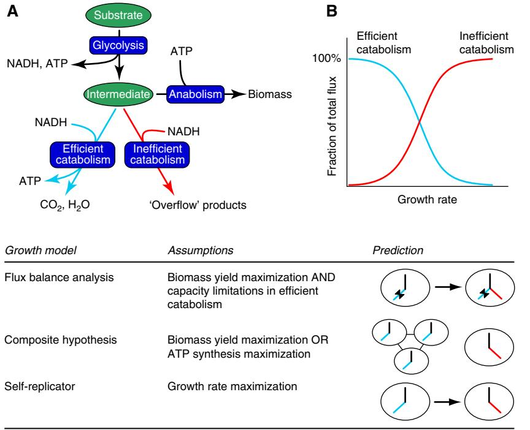
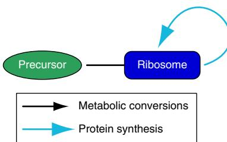
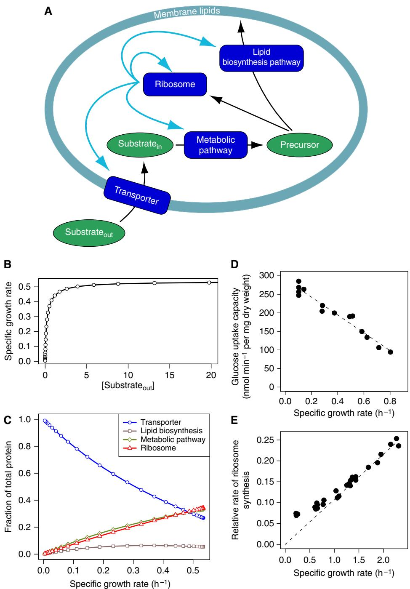
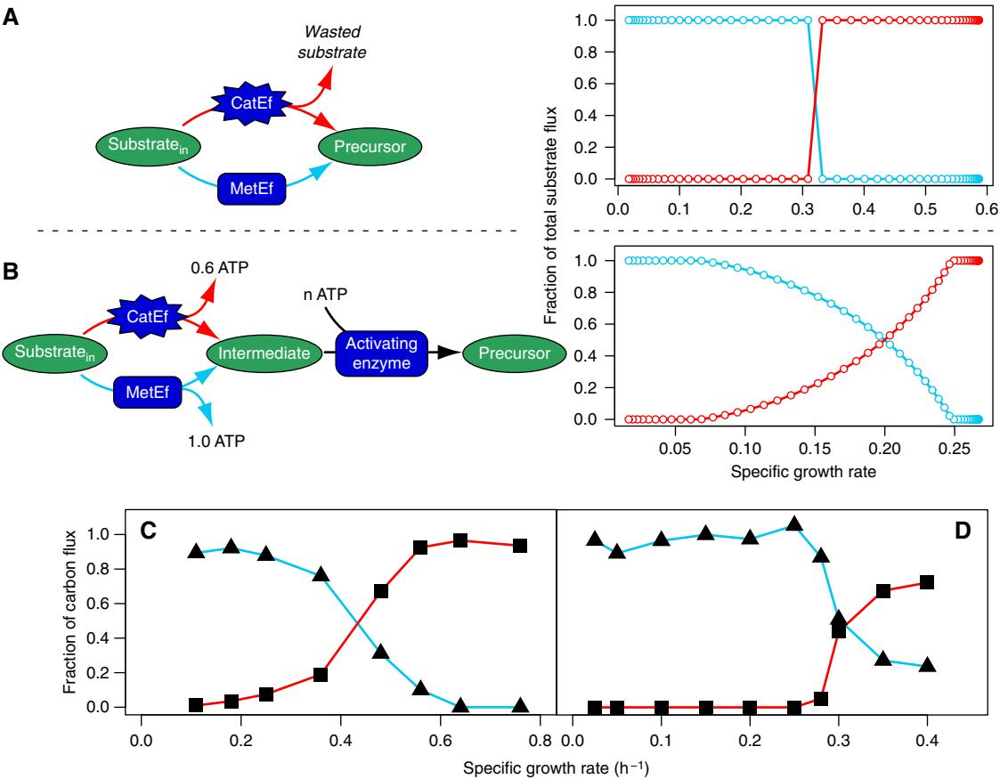
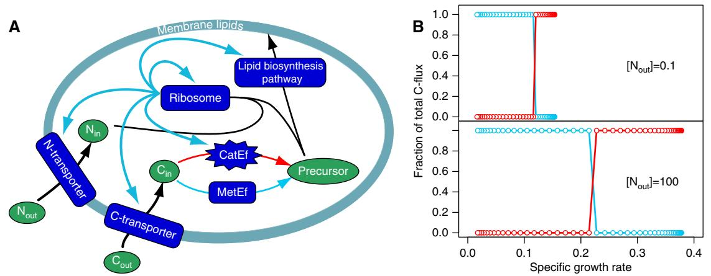

# PERSPECTIVE

# Shifts in growth strategies reflect tradeoffs in cellular economics

Douwe Molenaar1,3,4,5,*, Rogier van Berlo2,4, Dick de Ridder2,4 and Bas Teusink1,3,4,5

- 1 Centre for Integrative Bioinformatics (IBIVU), Vrije Universiteit Amsterdam,
- Amsterdam, The Netherlands, 2 Information and Communication Theory Group, Faculty of Electrical Engineering, Mathematics and Computer Science, Delft University
- of Technology, Delft, The Netherlands, 3 Top Institute Food and Nutrition, Wageningen, The Netherlands, 4 Kluyver Centre for Genomics of Industrial Fermentation, Delft,
- 
- The Netherlands and 5 Netherlands Consortium for Systems Biology, Amsterdam, The Netherlands * Corresponding author. Centre for Integrative Bioinformatics (IBIVU),
- Vrije Universiteit Amsterdam, De Boelelaan 1085, Amsterdam 1081 HV, The Netherlands. Tel.: þ 31 205 987738; Fax: þ 31 205 987229; E-mail: douwe.molenaar@falw.vu.nl

Received 23.4.09; accepted 5.10.09

The growth rate-dependent regulation of cell size, ribosomal content, and metabolic efficiency follows a common pattern in unicellular organisms: with increasing growth rates, cell size and ribosomal content increase and a shift to energetically inefficient metabolism takes place. The latter two phenomena are also observed in fast growing tumour cells and cell lines. These patterns suggest a fundamental principle of design. In biology such designs can often be understood as the result of the optimization of fitness. Here we show that in basic models of self-replicating systems these patterns are the consequence of maximizing the growth rate. Whereas most models of cellular growth consider a part of physiology, for instance only metabolism, the approach presented here integrates several subsystems to a complete self-replicating system. Such models can yield fundamentally different optimal strategies. In particular, it is shown how the shift in metabolic efficiency originates from a tradeoff between investments in enzyme synthesis and metabolic yields for alternative catabolic pathways. The models elucidate how the optimization of growth by natural selection shapes growth strategies.

Molecular Systems Biology 5: 323; published online 3

November 2009; doi:10.1038/msb.2009.82

Subject Categories: metabolic and regulatory networks; cellular metabolism

Keywords: growth; metabolic efficiency; overflow metabolism; ribosome content; Warburg effect

This is an open-access article distributed under the terms of the Creative Commons Attribution Licence, which permits distribution and reproduction in any medium, provided the original author and source are credited. Creation of derivative worksispermitted but the resultingworkmay be distributed only under the same orsimilarlicence to thisone.Thislicence doesnot permit commercial exploitation without specific permission.

# Introduction

Growth is a fundamental property of life and, as we will reason below, a property that is highly optimized in unicellular organisms. Given this goal and given the knowledge of physical and chemical limitations of living matter, it should be possible to understand the design of certain growth strategies in terms of growth rate maximization. Indeed, the idea that maximization of growth is a design objective has been successfully applied to predict experimentally observed metabolic strategies from metabolic models. Nevertheless, as we will see, there are limitations to these approaches since they fail to predict a number of commonly observed metabolic strategies, or they do so only under specific assumptions. We believe the cause for this failure to be the fact that these models consider only a subsystem, namely metabolism, and ignore important aspects such as costs related to synthesis of proteins and structural components. In this paper we will elaborate the hypothesis that growth strategies are the result of tradeoffs in the economy of the cell, in which growth rate maximization of the entire system is the objective, and where the only limitations are those set by the laws of physics and chemistry.

# Growth and fitness in unicellular organisms

In contrast to the situation for multicellular organisms, growth of biomass and reproduction are tightly coupled processes in unicellular organisms, since every cell division yields a new individual. This also applies to cells originating from multicellular organisms that have compromised growth control mechanisms, like tumour cells and cell lines. The rate of growth is an important factor in the long-term reproductive success of such cells. Mutants, which are able to regulate their cellular composition and metabolism in response to environmental conditions in a way that increases their growth rate under the given conditions, will outnumber their siblings. This is clearly the case under conditions of constant nutrient supply, but numerical dominance also provides an important fitness advantage under fluctuating nutrient supply, because it improves the odds for the mutant genotype to survive starvation and colonize new resources.

Clearly, an organism cannot be optimally adapted to all possible environmental conditions. This is the reason why mutants with higher growth rates than the parental strain can be obtained in the laboratory using a chemostat or by repeated dilution in batch cultures (Helling et al, 1987; Mikkola and Kurland, 1992; Vasi et al, 1994; Ibarra et al, 2002; Dekel and Alon, 2005). However, the fact that these mutants are obtained within a few hundred to thousand generations, a brief period on an evolutionary scale, demonstrates that the selective pressure on growth rate is high under these circumstances.

Consequently, growth rate maximization forms a rational basis for explaining growth strategies used by unicellular organisms. Certainly, objectives other than maximizing growth rate exist, such as being able to survive periods of starvation. However, strategies that increase the growth rate and those that improve the survival of starvation periods may develop relatively independently. For example, sporulation in the stationary phase of a culture may only have a minor effect on the growth rate of that same culture during the exponential phase. Some burden on growth probably exists because sporulation genes have to be replicated, and some sensory proteins have to be expressed. But these will have at most a quantitative effect and not a qualitative effect on the general types of growth strategies that are the focus of this paper.

#### Current growth models and their limitations

The idea that the growth rate, or objectives related to growth rate, may be maximized has been successfully applied in theoretical models of microbial growth to predict experimentally observed growth strategies related to gene expression (Dekel and Alon, 2005) and global metabolic phenomena (Pfeiffer et al, 2001; Kauffman et al, 2003). The latter are the subject of this section. A well-known modelling framework that has gained quite some momentum comprises the so-called genome-scale models of metabolic networks (Price et al, 2004). These metabolic models are constructed using genomic and biochemical knowledge of a particular organism. Within this framework, flux balance analysis (FBA) has become a popular tool to predict optimal global metabolic flux distributions (Kauffman et al, 2003). Successes of the FBA approach were, for example, the demonstration that flux profiles in Escherichia coli growing on acetate or succinate are optimal for growth rate, and the prediction of flux profiles in E. coli adapting in an evolutionary experiment to growth on glycerol (Edwards et al, 2001; Ibarra et al, 2002). Despite the successes, these models fail to explain a class of phenomena known as overflow metabolism (Neijssel and Tempest, 1976) from first principles, that is, without imposing multiple measured fluxes as constraints on the models.

Overflow metabolism is manifested as the use of inefficient metabolic routes and apparent spilling of energy resources, and is generally observed in unicellular organisms growing at high substrate availability. Well-known examples are the Crabtree effect observed in Saccharomyces cerevisiae (van Dijken et al, 1993), a bacterial counterpart, sometimes called the bacterial Crabtree effect, observed for example in E. coli (Vemuri et al, 2006) and the Warburg effect observed in many types of tumour cells and cell lines (McKeehan, 1982; Hsu and Sabatini, 2008). Under fully aerobic conditions these cells divert a considerable part of the available glucose to incompletely oxidized end products such as ethanol, acetate or lactate. What is most surprising about this phenomenon is that the energy-spilling catabolic pathways are used despite the fact that these cells possess energy-efficient catabolic pathways, which they can use to fully oxidize glucose to carbon dioxide and water. In fact, microorganisms use energyefficient pathways when growing at low concentrations of

glucose and only use energy-spilling pathways at high glucose concentrations (Figure 1A and B). S. cerevisiae and E. coli fully oxidize glucose at low concentrations and shift to overflow metabolism at high glucose concentrations. Similar observations were made in other organisms. Many lactic acid bacteria use the so-called mixed-acid fermentation at low substrate concentrations and lactic acid fermentation at high substrate concentrations, despite the fact that mixed-acid fermentation yields more metabolic energy (Thomas et al, 1979; Teusink et al, 2006). Bacillus subtilis uses full respiratory catabolism at low glucose concentrations, but shifts to partially fermentative metabolism at high glucose concentrations, producing lactate, acetate and ethanol (Sonenshein, 2007).

Why these organisms do not use energy-efficient catabolism at high substrate concentrations as well? If biomass formation from glucose were optimized, the catabolic pathway yielding most ATP should in general be preferred at any substrate concentration, as is predicted by FBA. One explanation used in a number of FBA models is that capacity constraints in the energetically more efficient pathways prevent the cells from behaving optimally. The term 'overflow metabolism' in fact expresses this view. Only when using measured fluxes like maximal oxygen uptake rates or other pathway capacities as auxiliary constraints, do FBA models predict the use of inefficient routes (Varma and Palsson, 1994; Famili et al, 2003; Oliveira et al, 2005; Vemuri et al, 2007; Figure 1, lower panel). This approach is unsatisfying, because the auxiliary constraints are no more than fitting parameters (Schuster et al, 2008), and it leaves us with a 'just so' answer to the question why these organisms do not increase the capacity of the efficient routes by synthesizing more of the enzymes that constitute these routes. Contradictory to the argument for a limited capacity, there are indications that E. coli, B. subtilis and S. cerevisiae actively suppress energy-efficient catabolism: all three organisms have been observed to downregulate the oxidative capacity at high glucose concentrations (DeRisi et al, 1997; Regenberg et al, 2006; Vemuri et al, 2006; Sonenshein, 2007; Westergaard et al, 2007). Also, mutants exist that display reduced Crabtree effect and concomitantly reduced growth rate as compared with the wild type (Diderich et al, 2001; Westergaard et al, 2007). These data strongly suggest that limiting the synthesis of the respiratory pathway at high glucose concentrations, and hence switching to inefficient catabolism, provides a fitness advantage.

Pfeiffer et al (2001) proposed a hypothesis that roots on one hand in the thermodynamics of ATP-generating pathways and on the other in the effects of spatial structure. For brevity, we call this the 'Composite hypothesis' in this paper (Figure 1). First, applying the principles of irreversible thermodynamics, it was shown that maximal ATP production rates are attained in such pathways at intermediate yields of ATP (Waddell et al, 1999). Hence, assuming that the growth rate increases with the ATP production rate, it was concluded that maximal growth rates are achieved at intermediate ATP yields, and that this provides an explanation for the existence of energy-spilling metabolic strategies. However, this argument would exclude the existence of energy-efficient strategies altogether. To explain why energy-efficient strategies do exist, the authors showed that these could be the result of natural selection in a structured environment where cells are relatively immobile,

Figure 1 A general trend in the use of alternative metabolic pathways and a comparison with the predictions of different models. (A) A schematic representation of the metabolism of a cell that has a metabolically or energetically efficient and an inefficient pathway to regenerate NAD. A small fraction of the intermediate metabolite is used in anabolism for biomass synthesis. (B) Use of efficient and inefficient pathways at different growth rates (or, equivalently, at different substrate concentrations) as a fraction of the total flux, which equals the flux through glycolysis, in this case. The gradually increased use of inefficient pathways is a generally observed phenomenon. The lower panel shows how different types of growth models try to explain the use of these alternative pathways. Predictions from FBA are the following: as growth rate increases (indicated by the arrow), the flux through the efficient pathway hits its maximal limit (indicated by the butterfly symbol) and the surplus of substrate flows through the inefficient pathway. In what we call here the 'Composite hypothesis', the efficient pathway is active when cells cooperate in a structured environment (left) and the inefficient pathway is active when in free-living cells the ATP production rate, as a proxy for the growth rate, is maximized (right). The self-replicator model predicts a shift from efficient to inefficient use of substrate as the growth rate increases, only as a result of growth rate maximization. The self-replicator model is explained in this paper. For the other models we also refer to reviews of FBA (Kauffman et al, 2003) and the Composite hypothesis (Pfeiffer and Schuster, 2005).

for example, an agar plate, say, or soil. In such environments cells with different metabolic strategies hardly compete for the same resource, because they form relatively isolated colonies of genetically identical individuals. Under these conditions, selection on maximal biomass yield instead of growth rate will take place, because more biomass implies more individuals. According to this theory, a population using the energyefficient strategy is only stable against the invasion of fast growing, energy-inefficient mutants in a structured environment. Consequently, in suspension cultures the energy efficient strategy should disappear. This is a weak spot in the theory, because there are no experimental indications for a strict association between the use of energy-efficient strategies and propagation in structured environments. The organisms mentioned above have been propagated for decades in the laboratory in well-stirred suspensions, and yet they still use energy-efficient catabolism at low substrate concentrations.

An alternative explanation for the existence of energyefficient metabolism was formulated by MacLean and Gudelj (2006). Their hypothesis stated that at high culture densities energy-spilling individuals inhibit their own growth because they poison themselves with the acids and alcohols that are waste products from such metabolism. In a medium with high concentrations of waste products, energy-efficient individuals then have a growth advantage because their intracellular concentrations of these waste products are lower. Consequently, at alternating low and high culture densities, like in batch cultures, individuals using the energy-efficient strategy could coexist with those using the energy-spilling strategy. The authors were able to obtain experimental evidence for this hypothesis using mutants of yeast. Yet, both this hypothesis and the 'structured environment' hypothesis referred to above are not in agreement with the observation that even after prolonged cultivation in the chemostat, at low substrate concentrations an yeast cell, which is capable of both types of metabolism, continues to use the energy-efficient variant (Wu et al, 2006).

Finally, a hypothesis often encountered in the literature considers the production of overflow metabolites as a chemical warfare strategy, since the acids and alcohols produced will inhibit the growth of organisms that are less resistant to these products (Pisˇkur et al, 2006). The implicit assumption in this hypothesis, contrary to the opinion advocated by this paper, is that for growth it would always be optimal to use an energy-efficient pathway, but that some energy is sacrificed by all individuals of the population to kill competitors. The consequence, however, of this individual sacrifice for the benefit of the population would be that 'cheater' mutants that exclusively use the energy-efficient route invade the population. These mutants would grow faster

and take advantage of the warfare carried out by others. When the need for chemical warfare disappears, as in single-species laboratory populations, the energy-efficient cheater mutants should even completely take over the population. However, there are no indications that such metabolic deserters exist in laboratory microbial populations.

So, after careful inspection of the theoretical explanations in relation to the experimental evidence, we concluded that there is to date no satisfying explanation, let alone a unifying one, which explains both overflow metabolism during substrate excess and efficient metabolism during substrate limitation. The reason, we believe, is that current models only look at a subsystem of the cell.

#### Metabolic models ignore specific protein costs and benefits

Purely metabolic explanations for the occurrence of metabolic strategies, like the FBA approach or the Composite hypothesis discussed above, ignore the aspects of physiology that are likely important for the choice of metabolic strategy. One of these is the cost and benefits of synthesizing specific proteins expressed in terms of their effects on growth rate. Although some FBA models take into account the burden of synthesis of a fixed amount of protein on metabolic energy and carbon and nitrogen supply, the costs and benefits of specific proteins, and also their effects on the remaining capacity of the ribosomes, cytosolic space, and so on are ignored (Beg et al, 2007). The significance of the costs and benefits of synthesis of specific proteins was experimentally demonstrated by showing that tuning of the expression of even a single transcriptional unit can have an effect on growth and fitness, and that the optimal state is a balance between the costs of protein synthesis and the benefits of the enzymatic activities (Dekel and Alon, 2005).

Since a metabolic strategy usually requires tuned expression of a set of enzymes, a significant effect on growth rate of the synthesis of the enzymes for the alternative pathways may be expected. These costs introduce additional tradeoffs between the alternative metabolic pathways. For example, although mixed-acid fermentation in Lactococcus lactis yields additional ATP in comparison with lactic acid fermentation, the mixedacid fermentation pathway requires, in addition to glycolytic enzymes, synthesis of at least five enzymes, whereas lactic acid fermentation requires only lactate dehydrogenase (Thomas et al, 1979). So, to attain the same ATP synthesis rate it is likely that more protein has to be synthesized for the mixedacid fermentation pathway than for the lactic acid fermentation pathway. The same is true for ethanol fermentation in S. cerevisiae. Although it generates more metabolic energy, respiration requires synthesis of citric acid cycle and electron transfer chain enzymes, as well as additional mitochondrial machinery, whereas ethanol fermentation is accomplished with only two additional cytosolic enzymes. The existence of such tradeoffs is a potential source for the generation of shifts in metabolic strategies or growth strategies in general under different environmental conditions (Pfeiffer and Bonhoeffer, 2004; Gudelj et al, 2007). We will work out this idea in the next section.

The fact that current growth models consider only part of the cellular design, is also the reason why they do not apply the growth rate of the modelled system as the maximization objective (Figure 1, lower panel). Instead, proxies for growth rate are used. In FBA (see Edwards et al, 2001; Schuster et al, 2008) a flux ratio like biomass yield on substrate is maximized, and a measured flux like substrate uptake rate is imposed as a constraint to be able to derive a corresponding maximal growth rate. In the composite hypothesis, ATP production rates are maximized (Pfeiffer et al, 2001). However, in self-replicating systems growth rate is a highly complex function of the composition of the cell and the properties of its components. To avoid making such simplifying assumptions, we model a complete self-replicating system. From this model, growth rate emerges as a system property. The simplest self replicating system, or self-replicator as we will call it, consists of one catalyst, a kind of ribosome, synthesizing itself from a precursor (Figure 2 and see Lincoln and Joyce, 2009, for a real-life example of such a self-replicator). At constant concentration of metabolite, a pool of such ribosomes would grow exponentially. The specific growth rate, m, that is, the rate at which the pool grows relative to its size, would be constant and equal to the specific catalytic rate at which the ribosome operates at the given metabolite concentration. For a ribosome with Michaelis–Menten-type kinetics using a substrate with concentration S, m¼kcatS/(KM þ S). In a situation in which different ribosomes would compete, the ones with highest growth rate would win. The growth rate could be increased by increasing kcat and decreasing KM. There are, however, limitations to changes that can be made to these parameters. For example, the kcat/KM ratio is bound by the diffusion rates of enzyme and substrate (Berg et al, 2002). Growth rates are constrained by this limit and by other physical laws. This illustrates a general principle that applies to any self replicating system, no matter how simple or complex: the optimization of such a system cannot go beyond the limits imposed by physical and biochemical laws. At the same time, natural selection pushes life toward these limits. These first principles are the universal limits to growth and the basic reason why cells cannot grow infinitely fast (Ehrenberg and Kurland, 1984; Koch, 1988).

In this paper we will not consider the optimization of individual enzymes as we focus on optimization of

Figure 2 The simplest self-replicator. It consists of a 'ribosome' that reproduces by converting a precursor to copies of itself. The types of arrows are also used in the other figures to indicate general metabolic conversions and protein synthesis in particular. Conceptually, however, there is no difference between these types of reactions.

self-replicating systems consisting of sets of enzymes that are already (nearly) optimal, and, therefore, would hardly change as a result of natural selection. Rather, we investigate what the optimal ratio of synthesis of each of the enzymes, including the ribosome, should be to maximize the growth rate of the entire self-replicating system.

Imagine a cell as depicted in Figure 3A: it contains four proteins with enzymatic activity and a structural component in the form of a lipid membrane that demarcates the intracellular volume. One of these enzymes is a ribosome that synthesizes all the enzymes, including itself. The ensemble of reactions constitutes a self-replicator. We assume a steady state in the system, called 'balanced growth' (Ingraham et al, 1983). Under balanced growth, each component of the self-replicating system grows at the same rate. Experimentally, this situation occurs at constant or slowly changing substrate concentrations during exponential growth. Let us assume that this hypothetical cell can regulate the relative size of the four protein pools by adjusting the proportion of ribosomes that are engaged in the synthesis of each protein. The optimal relative size of the protein pools will affect the growth rate of the cell. The relative proportions of protein pools leading to highest growth rate will in turn depend on the concentration of substrate in the growth medium. Selecting the relative proportions of proteins produced at different concentrations of substrate can, in this model, be seen as a form of adjustment to the environmental conditions, which mimics gene regulation in real cells. Since optimal growth rate will increase monotonously with the substrate concentration, such regulation will be manifested as a growth rate-dependent regulation of the relative proportions of protein pools.

To substantiate these ideas, we constructed a mathematical model of the cell as shown in Figure 3A and performed numerical simulations. The Supplementary information contains a description of the model and model simulations. The equations of the model give rise to a nonlinear optimization problem. The adjustable parameters in this mathematical model are the gene regulation parameters, that is, the proportions of ribosomes engaged in the synthesis of each of the four proteins, as well as a cell shape factor representing the volume-to-surface ratio of the cell. The only constraints on the system are: (1) a minimal lipid-to-transporter protein ratio required for membrane integrity and (2) a total concentration of intracellular protein not exceeding a certain maximum. When optimizing gene regulation and cell shape for growth rate in this simulated cell at different substrate concentrations, optimal growth rate is a hyperbolic function of the substrate concentration (Figure 3B), which follows closely, but not exactly, the empirical relation proposed by Monod (1949). The substrate concentration at which half maximal specific growth rate is attained (KS¼0.34) is lower than the Michaelis constant (KM¼1.0) of the transporter; the reason being that the proportion of transporter increases with decreasing substrate concentration, an observation backed up by experiments (Teixeira de Mattos and Neijssel, 1997; Brown et al, 1998). Also, optimal cell shape, or volume-to-surface ratio parameter, increases with increasing substrate concentration to accommodate the decreasing proportion of the transporter (not shown). This would correspond to a larger cell at high substrate concentrations or a smaller cell at low substrate concentrations. Observations show that under conditions of poor nutrient supply, microorganisms indeed tend to be smaller (Schaechter et al, 1958; Fantes and Nurse, 1977) and have a smaller volume-to-surface ratio (Koch, 1985). The model shows that at decreasing nutrient concentrations it is optimal to increase the proportion of transporters. An explanation for this behaviour is that this ensures a relatively high level of all intracellular metabolite concentrations (Figure 3A, Substratein and Precursor) and concomitantly high specific activity and efficient use of all intracellular enzymes. The model also predicts that mutations leading to an increase of the catalytic constant of the transporter (kcat) would lead to increase in growth rate and increase in the optimal volume-tosurface ratio, equivalent to an increase in cell size (not shown). In agreement with this prediction, a parallel increase of growth rates and cell sizes was observed in a laboratory evolution experiment using E. coli (Lenski and Travisano, 1994; Mongold and Lenski, 1996).

Notice also that the fraction of proteins represented by the ribosomal pool increases almost proportionately with growth rate. This relation between ribosomal content and growth rate has been predicted before and has been observed in several organisms, among which E. coli (Gausing, 1977; Ingraham et al, 1983; Figure 3E) and tumour cells (Ruggero and Pandolfi, 2003). It is likely not to be an exclusive property of the ribosomal machinery. In our model, the proportion of protein devoted to the metabolic pathway also increases with the growth rate. Pioneering proteome studies showed that in E. coli the concentration of a considerable number of proteins increases with growth rate (Pedersen et al, 1978). Similarly, the expression of a large part of yeast genes is highly correlated with growth rate under various medium conditions (Brauer et al, 2008). From these results we concluded that our basic model of bacterial growth reproduces the global patterns of regulation of macromolecular composition observed in real microorganisms.

#### Metabolic strategies resulting from growth rate optimization

We will now, by extending this basic model, show that it is possible to explain a number of phenomena observed in biology that are related to shifts in metabolism. We first show how the shift between metabolically or energy-efficient and inefficient metabolism can be explained (Figure 1).

## Use of alternative pathways at different substrate concentrations

We reasoned that a shift in metabolic strategy might be the result of a tradeoff between the metabolic or energetic efficiency of pathways and the costs invested in synthesizing enzymes for the pathways. The alternative pathways were mimicked in the self-replicator model by giving the cell a choice between a metabolically efficient pathway (MetEf), which generates one Precursor molecule from each Substratein molecule, and a catalytically efficient but metabolically inefficient pathway (CatEf), which generates only 0.8 Precursor molecule from each Substratein molecule, but has a

Figure 3 Optimal regulation of a basic self-replicator, consisting of four enzymes and a membrane. The cell (A) consists of a pool of ribosomes that catalyze protein synthesis, including their own; a substrate transporter protein pool; a metabolic enzyme pool and a pool of enzymes that synthesize the lipid component of the membrane. The membrane consists of transporter protein and lipid. The cell accumulates a substrate from the environment and converts it into a metabolite that is used for protein synthesis and lipid synthesis. It can regulate the relative proportion of each of the protein pools by adjusting the amount of ribosomes that is engaged in the synthesis of each of the four proteins. (B, C) The results of numerical optimizations are shown. The individual protein pool fractions relative to total protein and the volume/surface ratio (cell shape parameter in the model description in the Supplementary information) were optimized (C) so as to maximize the growth rate (B) at different extracellular substrate concentrations. The points indicate the results of numerical simulations. (D) The experimental results of glucose uptake capacity in Klebsiella pneumoniae at different growth rates (Teixeira de Mattos and Neijssel, 1997). (E) The relative rate of synthesis of ribosomal protein to that of total protein (Gausing, 1977) in E. coli at different growth rates. Under balanced growth these relative rates directly translate into relative amounts of protein.

much higher catalytic constant, kcat (Figure 4A). This cell shifts from the metabolically efficient to the catalytically efficient pathway when going from low to high substrate concentrations. The shift is discontinuous, that is, it is a switch and there is no substrate concentration at which a mixture of both pathways leads to a growth rate higher than that of one of

Figure 4 Prediction of switching or shifting of optimal metabolic strategies. (A) The two alternative metabolically efficient (MetEf) and catalytically efficient (CatEf) pathways that replace the 'Metabolic pathway' in Figure 3A. The CatEf pathway is metabolically inefficient because it not only generates less Precursor per Substrate molecule, but also requires less protein (or equivalently, has higher kcat) than the MetEf pathway to generate a similar flux of Precursor. The graph on the right shows the optimal relative flux through each of these pathways as a function of the extracellular substrate concentration. (B) A different configuration of metabolism, namely one in which an energy intermediate (ATP) is produced with different efficiencies in the alternative pathways. The ATP is used to activate an intermediate to a precursor. Also here the CatEf pathway has a higher kcat than the MetEf pathway. In contrast to the configuration in panel A, a mixed strategy is optimal at a range of substrate concentrations in this configuration (see the text for an explanation). (C, D) Experimental data of shifts in metabolism of L. lactis (Thomas et al, 1979) (C) and S. cerevisiae (van Hoek et al, 1998) (D). L. lactis shifts from the metabolically efficient mixed-acid fermentation at low growth rates to lactic acid fermentation at high growth rates, whereas S. cerevisiae shifts from respiratory metabolism to partial ethanol fermentation.

the pathways alone. The reason for a difference in growth rate between the two strategies at low substrate concentrations lies partly in the investment made to gather the substrate. At low extracellular substrate concentrations, intracellular substrate is 'expensive' since a great deal of resources (transporter þ lipid) is spent on gathering it. With decreasing substrate concentrations there will be a point at which channelling such a substrate through a catalytically efficient but resourcewasting pathway does not pay off anymore in terms of growth rate. The sensitivity analysis under 'Description of the growth models' in the Supplementary information demonstrates the large effect of transporter kinetics on metabolic shift.

Wild-type strains of E. coli, B. subtilis, L. lactis (Figure 4C) and S. cerevisiae (Figure 4D) display a gradual shift instead of a switch from one to other type of metabolism. Of course, this could be a manifestation of non-optimality of the wild-type strains with respect to regulation of metabolic strategies, but the question is also whether there are reaction schemes imaginable in which a mixture of two metabolic strategies is optimal. Such a configuration is shown in Figure 4B. The main difference from the model of Figure 4A is that the pathways here have multiple functions: the alternative metabolic pathways deliver both ATP and the intermediate for the synthesis of precursor, and the precursor-generating pathway regenerates ADP for the metabolic pathways and precursor for synthesis of biomass. Optimal ATP and precursor fluxes can be obtained by mixing both the pathways.

Although both examples of alternative metabolic pathways are not very realistic, they serve to make one important point. Regardless of the details of the model, a general tendency exists to shift from metabolically to catalytically efficient metabolism with increasing substrate concentrations, which is the result of optimizing the cellular economy for growth rate. This, to our knowledge (and discussed above), is the first explanation for overflow metabolism that is truly based on first principles. A modification of FBA was proposed, which also predicts such a shift of metabolic efficiency, but it assumes that all enzymes always operate at Vmax and does not take into account the fact that ribosomal content changes dramatically with growth rate (Beg et al, 2007; Vazquez et al, 2008).

Furthermore, it uses an artificial maximal capacity constraint on substrate uptake, hence ignoring the possibility of variable investments made in substrate transport systems.

The three alternative models shown in Figure 1 generate testable and mutually exclusive predictions. FBA, with the optimality criterion based on biomass yield, predicts that in an adaptive evolution experiment at high substrate concentrations, unicellular organisms with inefficient metabolism should be displaced by mutants that are able to relieve the alleged limitations in efficient metabolism. This prediction differs from the other two models. On the other hand, the Composite hypothesis predicts that at low substrate concentrations in an unstructured environment, organisms with inefficient metabolism should win over those with efficient metabolism. The predictions by both models contrast with the predictions from the self-replicator model, namely that the optimal metabolic strategy of an adaptive evolution experiment is not fixed, but depends on the growth rate or substrate concentration.

The principles explained above apply not only to microorganisms, but also offer a teleological explanation for the Warburg effect observed in tumour cells, cell lines and other fast growing cells of higher eukaryotes. Warburg (1956) observed that tumour cells often display what is called aerobic glycolysis, that is, they ferment glucose to lactate, even in the presence of oxygen. Healthy cells generally use metabolically efficient oxidative metabolism, even at the relatively high glucose concentrations maintained in a body, because fitness of the whole body is the objective. However, a correlation between fast cellular growth and glycolytic capacity has been observed repeatedly, both in healthy and tumour cells (Wang et al, 1976; Fantin et al, 2006). We speculate that fermentative metabolism may be a mechanism to promote fast growth of healthy cells of higher eukaryotes, and that mutation and selection pressure on growth rate causes the preferential appearance of tumour cells and cell lines that display this type of metabolism. The other clear sign of selection on high growth rate in tumour cells is the fact that they often possess mutations that lead to increased synthesis of ribosomes and other components of the protein biosynthesis machinery (Ruggero and Pandolfi, 2003).

#### Effect of other limiting substrates or recombinant protein expression on overflow metabolism

It has been noticed that growth at fixed growth rates in the chemostat overflow metabolism is induced by limitations on substrates other than the carbon substrate (Neijssel and Tempest, 1975; Emmerling et al, 2002), as well as by recombinant protein expression (Sande´n et al, 2003). Klebsiella aerogenes growing at a specific rate of 0.17 h-1 on excess glucose, but limited by sulphate or ammonia, excretes considerable amounts of pyruvate, a-ketoglutarate and acetate (Neijssel and Tempest, 1975). Similarly, E. coli growing at a specific rate of 0.09 h-1 on excess glucose, but limited by ammonia, excretes acetate and pyruvate (Emmerling et al, 2002). At the same growth rates these organisms use glucose efficiently when growing under glucose limitation and ammonia excess. The effect of the concentration of a second substrate on metabolic shift was investigated using selfreplicator models. Figure 5B shows that the growth rate at which the model organism switches from the metabolically efficient strategy to the inefficient strategy shifts to lower values under limitations of a second substrate. The extracellular substrate concentration at which this happens is almost the same in both cases, but since maximal growth rate decreases, an apparent shift in strategy results when looking at a fixed growth rate. For example, at a growth rate of 0.2 the model organism uses efficient metabolism under excess N, but inefficient metabolism under limiting N (Figure 5).

An apparent shift to inefficient metabolism is also observed when expressing recombinant protein in E. coli (Sande´n et al, 2003). This effect could also be simulated when introducing in the model a fixed level of expression of a 'dummy' protein, that is, a protein that has no other function than occupying a volume and a fraction of the ribosome's capacity (not shown). Again, when looking at fixed growth rate and at low substrate concentration where usually efficient metabolism is used, the expression of dummy protein leads to an apparent shift to inefficient metabolism. The consequence for recombinant protein production processes is that although from a viewpoint of cost-efficiency it may be desirable to have a culture using a metabolically efficient metabolism, the stability of such a process may be undermined by the occurrence of fast growing mutants that use an inefficient metabolism.

#### Conclusion and outlook

We have studied the consequences of the general idea that unicellular organisms are self-replicating systems designed to grow as fast as possible. The rigorous application of this idea leads to the conclusion that not a single subsystem, but the cell in its entirety as a self-replicating system, is optimized. Hence, a more complete understanding of the effect of natural selection on the emergent behaviour of cells should come from models, which include all the cellular components necessary to describe a self-replicating system. As was shown here, even basic self-replicators demonstrate rich behaviour, originating from the tradeoffs between alternative growth strategies. The effects of these tradeoffs are deduced here from first principles, that is, physical and (bio)chemical laws, and limitations. Hence, these models provide a general explanation for growth strategies commonly observed in unicellular organisms or even tumour cells and cell lines. They also show that the feasibility and stability of biotechnological processes that make use of cell cultures may be limited by these basic regulation patterns, and the occurrence of fast growing mutants.

Can explanations for the behaviour of growing cells be this simple? Yes and no. The examples we have shown here are just illustrations of a principle and by no means represent simulations of real organisms. To quote (Neidhardt, 1999), we believe these initial models to be 'crude, inaccurate and a complete failure at some tasks'. Nevertheless, they are capable of explaining trends and yield a new perspective on cellular behaviour as being the result of economic principles. Furthermore, the modelling framework allows easy extension

Figure 5 The effect of limitation by a second substrate on metabolic switching. (A) A second substrate, N, is introduced in the model that has to be taken up by a separate transporter and combined by the ribosome in a bimolecular reaction with the Precursor during the synthesis of protein. (B) The result from numerical simulations at low and high availability of N is shown. The switch from metabolically efficient to catalytically efficient C-metabolism takes place at lower growth rates under N-limitation.

with additional cellular components and knowledge of physical and biochemical limitations, to obtain models that more realistically simulate and predict aspects of cellular growth.

#### Supplementary information

Supplementary information is available at the Molecular Systems Biology website (www.nature.com/msb).

#### Acknowledgements

This project was conducted within the research programs of the Kluyver Centre for Genomics of Industrial Fermentation and the Netherlands Consortium for Systems Biology, which are part of the Netherlands Genomics Initiative/Netherlands Organization for Scientific Research.

# Conflict of interest

The authors declare that they have no conflict of interest.

# References

- Beg QK, Vazquez A, Ernst J, de Menezes MA, Bar-Joseph Z, Baraba´si AL, Oltvai ZN (2007) Intracellular crowding defines the mode and sequence of substrate uptake by Escherichia coli and constrains its metabolic activity. Proc Natl Acad Sci USA 104: 12663–12668
- Berg JM, Tymoczko JL, Stryer L, Clarke ND (2002) Biochemistry, 5th edn. New York, NY, USA: WH Freeman and Company
- Brauer MJ, Huttenhower C, Airoldi EM, Rosenstein R, Matese JC, Gresham D, Boer VM, Troyanskaya OG, Botstein D (2008) Coordination of growth rate, cell cycle, stress response, and metabolic activity in yeast. Mol Biol Cell 19: 352–367
- Brown CJ, Todd KM, Rosenzweig RF (1998) Multiple duplications of yeast hexose transport genes in response to selection in a glucoselimited environment. Mol Biol Evol 15: 931–942
- Dekel E, Alon U (2005) Optimality and evolutionary tuning of the expression level of a protein. Nature 436: 588–592
- DeRisi JL, Iyer VR, Brown PO (1997) Exploring the metabolic and genetic control of gene expression on a genomic scale. Science 278: 680–686
- Diderich JA, Raamsdonk LM, Kruckeberg AL, Berden JA, van Dam K (2001) Physiological properties of Saccharomyces cerevisiae from which hexokinase II has been deleted. Appl Environ Microbiol 67: 1587–1593
- Edwards JS, Ibarra RU, Palsson BO (2001) In silico predictions of Escherichia coli metabolic capabilities are consistent with experimental data. Nat Biotechnol 19: 125–130
- Ehrenberg M, Kurland CG (1984) Costs of accuracy determined by a maximal growth rate constraint. Q Rev Biophys 17: 45–82
- Emmerling M, Dauner M, Ponti A, Fiaux J, Hochuli M, Szyperski T, Wu¨thrich K, Bailey JE, Sauer U (2002) Metabolic flux responses to pyruvate kinase knockout in Escherichia coli. J Bacteriol 184: 152–164
- Famili I, Fo¨rster J, Nielsen J, Palsson BO (2003) Saccharomyces cerevisiae phenotypes can be predicted by using constraint-based analysis of a genome-scale reconstructed metabolic network. Proc Natl Acad Sci USA 100: 13134–13139
- Fantes P, Nurse P (1977) Control of cell size at division in fission yeast by a growth-modulated size control over nuclear division. Exp Cell Res 107: 377–386
- Fantin VR, St-Pierre J, Leder P (2006) Attenuation of LDH-A expression uncovers a link between glycolysis, mitochondrial physiology, and tumor maintenance. Cancer Cell 9: 425–434
- Gausing K (1977) Regulation of ribosome production in Escherichia coli: synthesis and stability of ribosomal RNA and of ribosomal protein messenger RNA at different growth rates. J Mol Biol 115: 335–345
- Gudelj I, Beardmore RE, Arkin SS, MacLean RC (2007) Constraints on microbial metabolism drive evolutionary diversification in homogeneous environments. J Evol Biol 20: 1882–1889
- Helling RB, Vargas CN, Adams J (1987) Evolution of Escherichia coli
- during growth in a constant environment. Genetics 116: 349–358 Hsu PP, Sabatini DM (2008) Cancer cell metabolism: Warburg and beyond. Cell 134: 703–707
- Ibarra RU, Edwards JS, Palsson BO (2002) Escherichia coli K-12 undergoes adaptive evolution to achieve in silico predicted optimal growth. Nature 420: 186–189
- Ingraham JL, Maaløe O, Neidhardt FC (1983) Growth of the Bacterial Cell. Sunderland, MA, USA: Sinauer Associates Inc.
- Kauffman KJ, Prakash P, Edwards JS (2003) Advances in flux balance analysis. Curr Opin Biotechnol 14: 491–496
- Koch AL (1985) The macroeconomics of bacterial growth. In Bacteria in their Natural Environments, Fletcher M, Floodgate GD (eds), Chapter 1, pp 1–42. London, UK: Academic Press
- Koch AL (1988) Why can't a cell grow infinitely fast? Can J Microbiol 34: 421–426
- Lenski RE, Travisano M (1994) Dynamics of adaptation and diversification: a 10,000-generation experiment with bacterial populations. Proc Natl Acad Sci USA 91: 6808–6814
- Lincoln TA, Joyce GF (2009) Self-sustained replication of an RNA enzyme. Science 323: 1229–1232
- MacLean RC, Gudelj I (2006) Resource competition and social conflict in experimental populations of yeast. Nature 441: 498–501
- McKeehan WL (1982) Glycolysis, glutaminolysis and cell proliferation. Cell Biol Int Rep 6: 635–650
- Mikkola R, Kurland CG (1992) Selection of laboratory wild-type phenotype from natural isolates of Escherichia coli in chemostats. Mol Biol Evol 9: 394–402
- Mongold JA, Lenski RE (1996) Experimental rejection of a nonadaptive explanation for increased cell size in Escherichia coli. J Bacteriol 178: 5333–5334
- Monod J (1949) The growth of bacterial cultures. Annu Rev Microbiol 3: 371–394
- Neidhardt FC (1999) Bacterial growth: constant obsession with dN/dt. J Bacteriol 181: 7405–7408
- Neijssel OM, Tempest DW (1975) The regulation of carbohydrate metabolism in Klebsiella aerogenes NCTC 418 organisms, growing in chemostat culture. Arch Microbiol 106: 251–258
- Neijssel OM, Tempest DW (1976) The role of energy-spilling reactions in the growth of Klebsiella aerogenes NCTC 418 in aerobic chemostat culture. Arch Microbiol 110: 305–311
- Oliveira AP, Nielsen J, Fo¨rster J (2005) Modeling Lactococcus lactis using a genome-scale flux model. BMC Microbiol 5: 39
- Pedersen S, Bloch PL, Reeh S, Neidhardt FC (1978) Patterns of protein synthesis in E. coli: a catalog of the amount of 140 individual proteins at different growth rates. Cell 14: 179–190
- Pfeiffer T, Schuster S, Bonhoeffer S (2001) Cooperation and competition in the evolution of ATP-producing pathways. Science 292: 504–507
- Pfeiffer T, Bonhoeffer S (2004) Evolution of cross-feeding in microbial populations. Am Nat 163: E126–E135
- Pfeiffer T, Schuster S (2005) Game-theoretical approaches to studying the evolution of biochemical systems. Trends Biochem Sci 30: 20–25
- Pisˇkur J, Rozpe¸dowska E, Polakova S, Merico A, Compagno C (2006) How did Saccharomyces evolve to become a good brewer? Trends Genet 22: 183–186
- Price ND, Reed JL, Palsson B (2004) Genome-scale models of microbial cells: evaluating the consequences of constraints. Nat Rev Microbiol 2: 886–897
- Regenberg B, Grotkjær T, Winther O, Fausbøll A, Kesson M, Bro C, Hansen LK, Brunak S, Nielsen J (2006) Growth-rate regulated genes have profound impact on interpretation of transcriptome profiling in Saccharomyces cerevisiae. Genome Biol 7: R107
- Ruggero D, Pandolfi PP (2003) Does the ribosome translate cancer? Nat Rev Cancer 3: 179–192
- Sande´n AM, Prytz I, Tubulekas I, Fo¨rberg C, Le H, Hektor A, Neubauer P, Pragai Z, Harwood C, Ward A, Picon A, Teixeira de Mattos J, Postma P, Farewell A, Nystro¨m T, Reeh S, Pedersen S, Larsson G (2003) Limiting factors in Escherichia coli fed-batch production of recombinant proteins. Biotechnol Bioeng 81: 158–166
- Schaechter M, Maaløe O, Kjeldgaard NO (1958) Dependency on medium and temperature of cell size and chemical composition

during balanced grown of Salmonella typhimurium. J Gen Microbiol 19: 592–606

- Schuster S, Pfeiffer T, Fell DA (2008) Is maximization of molar yield in metabolic networks favoured by evolution? J Theor Biol 252: 497–504
- Sonenshein AL (2007) Control of key metabolic intersections in Bacillus subtilis. Nat Rev Microbiol 5: 917–927
- Teixeira de Mattos MJ, Neijssel OM (1997) Bioenergetic consequences of microbial adaptation to low-nutrient environments. J Biotechnol 59: 117–126
- Teusink B, Wiersma A, Molenaar D, Francke C, de Vos WM, Siezen RJ, Smid EJ (2006) Analysis of growth of Lactobacillus plantarum WCFS1 on a complex medium using a genome-scale metabolic model. J Biol Chem 281: 40041–40048
- Thomas TD, Ellwood DC, Longyear VM (1979) Change from homo- to heterolactic fermentation by Streptococcus lactis resulting from glucose limitation in anaerobic chemostat cultures. J Bacteriol 138: 109–117
- van Dijken JP, Weusthuis RA, Pronk JT (1993) Kinetics of growth and sugar consumption in yeasts. Antonie van Leeuwenhoek 63: 343–352
- van Hoek P, van Dijken JP, Pronk JT (1998) Effect of specific growth rate on fermentative capacity of baker's yeast. Appl Environ Microbiol 64: 4226–4233
- Varma A, Palsson BO (1994) Stoichiometric flux balance models quantitatively predict growth and metabolic by-product secretion in wild-type Escherichia coli W3110. Appl Environ Microbiol 60: 3724–3731
- Vasi F, Travisano M, Lenski RE (1994) Long-term experimental evolution in Escherichia coli. II. Changes in life-history traits during adaptation to a seasonal environment. Am Nat 144: 432–456
- Vazquez A, Beg QK, de Menezes MA, Ernst J, Bar-Joseph Z, Baraba´si AL, Boros LG, Oltvai ZN (2008) Impact of the solvent capacity constraint on E. coli metabolism. BMC Syst Biol 2: 7
- Vemuri GN, Altman E, Sangurdekar DP, Khodursky AB, Eiteman MA (2006) Overflow metabolism in Escherichia coli during steady-state growth: transcriptional regulation and effect of the redox ratio. Appl Environ Microbiol 72: 3653–3661
- Vemuri GN, Eiteman MA, McEwen JE, Olsson L, Nielsen J (2007) Increasing NADH oxidation reduces overflow metabolism in Saccharomyces cerevisiae. Proc Natl Acad Sci USA 104: 2402–2407
- Waddell TG, Repovic P, Mele´ndez-Hevia E, Heinrich R, Montero F (1999) Optimization of glycolysis: new discussions. Biochem Educ 27: 12–13
- Wang T, Marquardt C, Foker J (1976) Aerobic glycolysis during lymphocyte proliferation. Nature 261: 702–705
- Warburg O (1956) On the origin of cancer cells. Science 123: 309–314
- Westergaard SL, Oliveira AP, Bro C, Olsson L, Nielsen J (2007) A systems biology approach to study glucose repression in the yeast Saccharomyces cerevisiae. Biotechnol Bioeng 96: 134–145
- Wu L, Mashego MR, Proell AM, Vinke JL, Ras C, van Dam J, van Winden WA, van Gulik WM, Heijnen JJ (2006) In vivo kinetics of primary metabolism in Saccharomyces cerevisiae studied through prolonged chemostat cultivation. Metab Eng 8: 160–171

Molecular Systems Biology is an open-access journal published by European Molecular Biology Organization and Nature Publishing Group.

This article is licensed under a Creative Commons Attribution-Noncommercial-Share Alike 3.0 Licence.