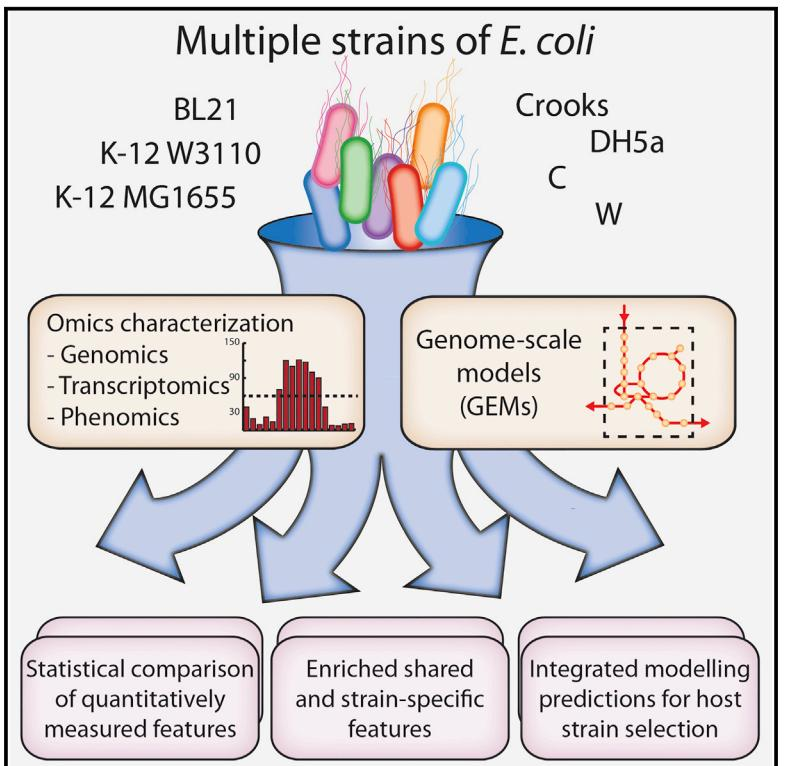
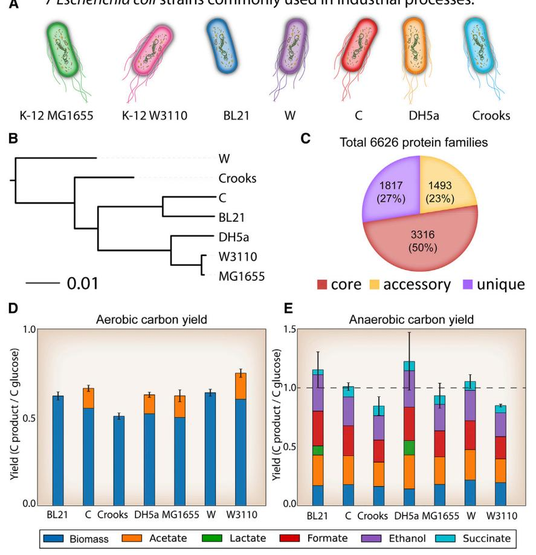
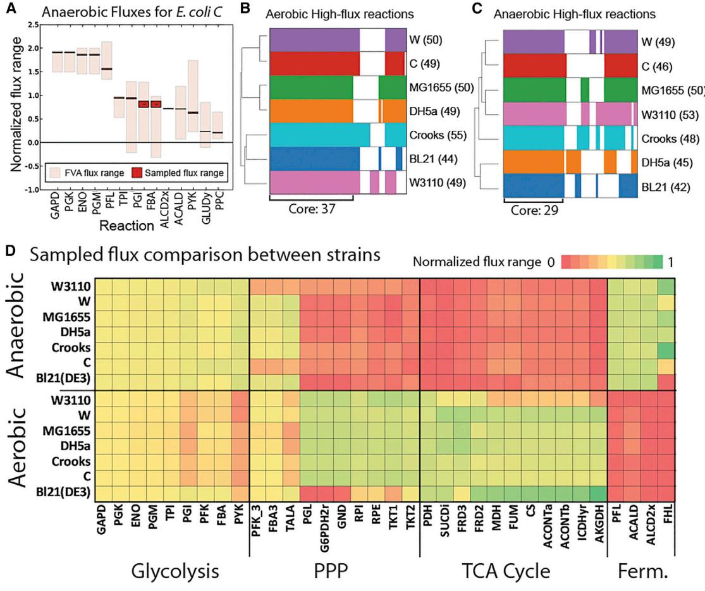
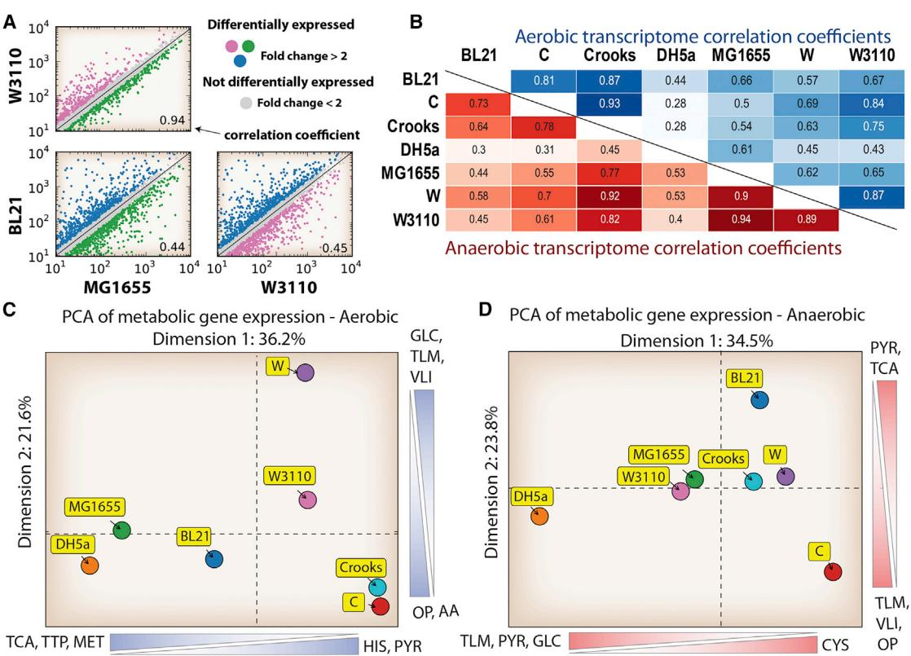
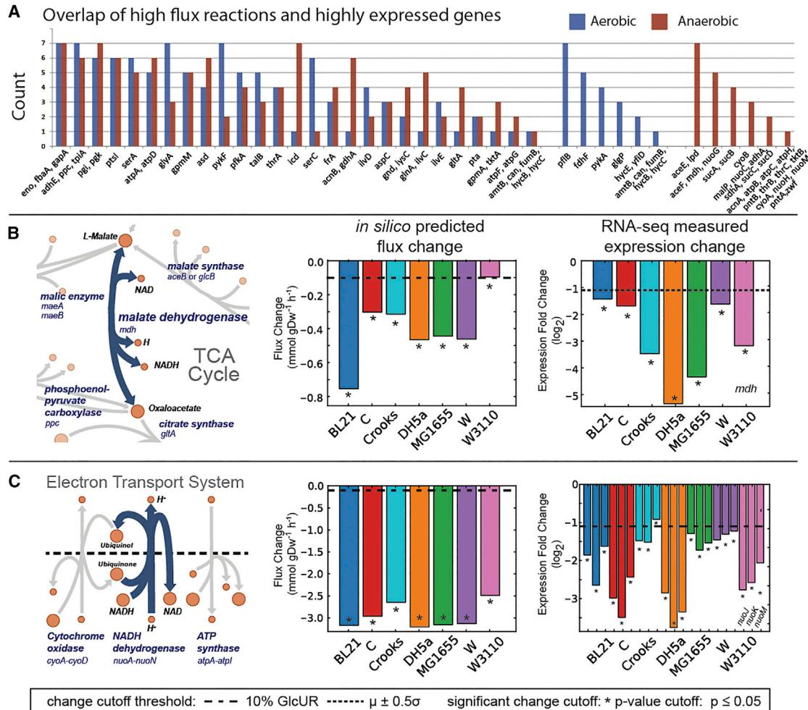
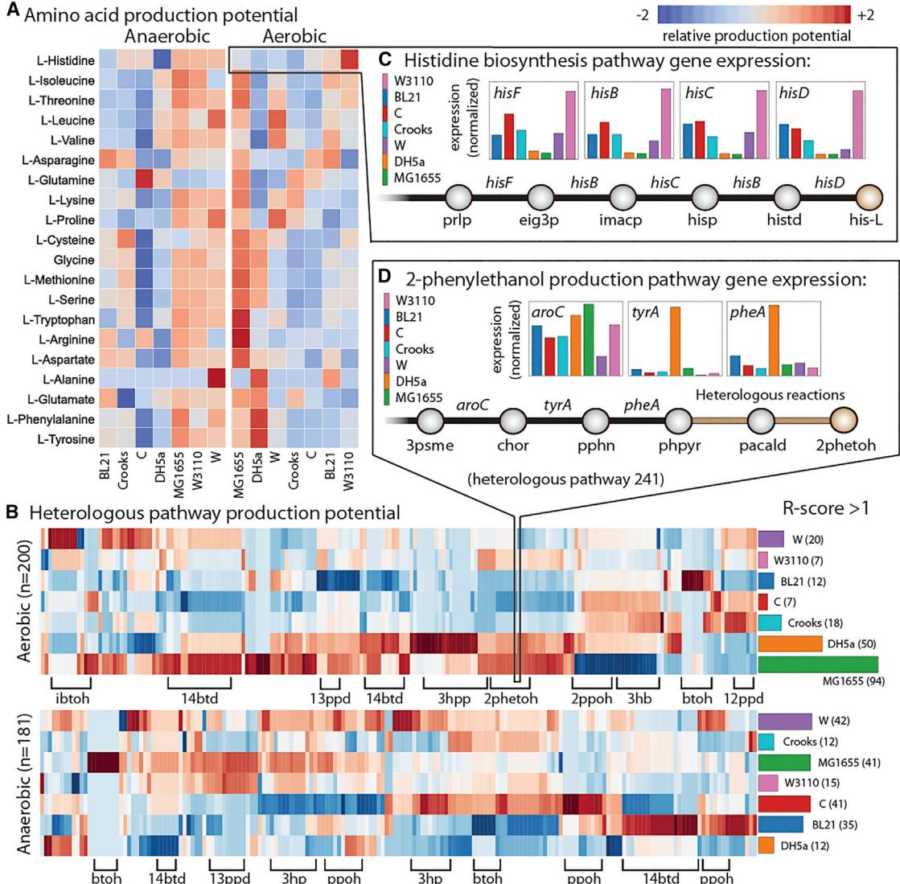

# Multi-omics Quantification of Species Variation of Escherichia coli Links Molecular Features with Strain Phenotypes

# Graphical Abstract

# Highlights

- d Strain-specific differences are quantified in seven widely used strains of E. coli
- d Metabolic physiology, gene expression, and calculated fluxes vary between the strains
- d Multi-omics data link strain-specific phenotypes to molecular features
- d Integrated modeling reveals certain strains better suited to produce given compounds

# Authors

Jonathan M. Monk, Anna Koza, Miguel A. Campodonico, ..., Bernhard O. Palsson, Markus J. Herrga˚rd, Adam M. Feist

Correspondence [afeist@ucsd.edu](mailto:afeist@ucsd.�edu)

# In Brief

Strain-specific differences are quantified using multi-omics approaches in seven widely used strains of E. coli to demonstrate the impact on cell physiology, synthetic biology, metabolic engineering, and process design. Integrated modeling reveals that certain strains are better suited to produce a given compound.

- Data Resources GSE78756

# Multi-omics Quantification of Species Variation of Escherichia coli Links Molecular Features with Strain Phenotypes

Jonathan M. Monk,1 Anna Koza,2 Miguel A. Campodonico,3,4 Daniel Machado,2,5 Jose Miguel Seoane,2 Bernhard O. Palsson,2,3 Markus J. Herrga˚rd,2 and Adam M. Feist2,3,6, *

1Department of NanoEngineering, University of California, San Diego, 9500 Gilman Drive, La Jolla, CA 92093, USA 2The Novo Nordisk Foundation Center for Biosustainability, Technical University of Denmark, 2970 Hørsholm, Denmark 3Department of Bioengineering, University of California, San Diego, 9500 Gilman Drive, La Jolla, CA 92093-0412, USA

4Centre for Biotechnology and Bioengineering, CeBiB, University of Chile, Beauchef 850, Santiago, Chile

5Present address: Centre of Biological Engineering, University of Minho, 4710 Braga, Portugal

6Lead Contact

*Correspondence: [afeist@ucsd.edu](mailto:afeist@ucsd.edu)

<http://dx.doi.org/10.1016/j.cels.2016.08.013>

# SUMMARY

Escherichia coli strains are widely used in academic research and biotechnology. New technologies for quantifying strain-specific differences and their underlying contributing factors promise greater understanding of how these differences significantly impact physiology, synthetic biology, metabolic engineering, and process design. Here, we quantified strain-specific differences in seven widely used strains of E. coli (BL21, C, Crooks, DH5a, K-12 MG1655, K-12 W3110, and W) using genomics, phenomics, transcriptomics, and genome-scale modeling. Metabolic physiology and gene expression varied widely with downstream implications for productivity, product yield, and titer. These differences could be linked to differential regulatory structure. Analyzing high-flux reactions and expression of encoding genes resulted in a correlated and quantitative link between these sets, with strain-specific caveats. Integrated modeling revealed that certain strains are better suited to produce given compounds or express desired constructs considering native expression states of pathways that enable high-production phenotypes. This study yields a framework for quantitatively comparing strains in a species with implications for strain selection.

# INTRODUCTION

*Escherichia coli* are widely used as a model prokaryote for physiology studies. Some strains are important pathogens and others are key host strains for metabolic engineering and synthetic biology. This diversity in lifestyle and application reflects the high level of genetic diversity within the species. Thanks to the genomics revolution in microbiology that has enabled sequencing of diverse strains for any species, it is now known that the genomes of different strains of *E. coli* range in size from 4.5 to over 5.5 Mbp, and the species has a pan-genome composed of more than 15,000 unique proteins ([Lukjancenko](#page-13-0) [et al., 2010; Gordienko et al., 2013](#page-13-0)). Part of this large pangenome consists of unique metabolic capabilities that have been shown to have important implications for infectious disease studies and pathogenic niches ([Monk et al., 2013; Baumler et al.,](#page-13-0) [2011; Vieira et al., 2011)](#page-13-0). This metabolic diversity is likely to be equally impactful on synthetic biology applications [(Lee and](#page-12-0) [Kim, 2015)](#page-12-0). The massive genomic diversity of the *E. coli* species provides a deep pool of strains to use for basic research and for metabolic engineering and synthetic biology applications. It also raises an important question: what range of phenotypic behaviors exist and how can these be leveraged to further exploit *E. coli* as a model organism and host strain?

A review of industrial biotechnology publications and patents that use *E. coli* as a host strain yielded seven representative *E. coli* strains that are used often and are good candidates for detailed study: the K-12 strains MG1655, W3110, and DH5a, as well as strains BL21, C, Crooks, and W [(Figure 1A](#page-2-0)). These strains all have genetic tools available—a required factor when choosing a strain for metabolic engineering. The selection of both closely related strains (K-12 strains) and more distantly related strains also allowed an examination of whether close genetic relatedness is a useful predictor of physiological relatedness and production potential. The existing body of work evaluating different *E. coli* strains in metabolic engineering and synthetic biology [(Archer et al., 2011; Arifin et al., 2014; Yoon](#page-11-0) [et al., 2012; Vijayendran et al., 2007; Marisch et al., 2013; Chae](#page-11-0) [et al., 2010](#page-11-0)) demonstrated a need for the comprehensive analysis of strain-specific differences. Despite significant success in engineering *E. coli* for industrial production of chemicals and proteins [(Lee et al., 2012b; Kim et al., 2015)](#page-12-0), there is no unified fundamental basis for selection of one strain over another for a given metabolic engineering project or expression of a given construct. Previous studies have shown that the choice of host strain for production of a given compound has a significant impact on results [(Na et al., 2013; Kim et al., 2014)](#page-13-0) and up until now represented a major brute force screening effort. Thus, an important question remains to be addressed: what strain of *E. coli* is best suited for production of a desired product?

Here, a comprehensive comparison incorporating transcriptomics, genomics, and phenomics with genome-scale modeling

Figure 1. Genetic and Physiological Differences between Seven Strains of E. coli

(A) The seven industrially relevant *E. coli* strains selected for this study. This panel establishes the color scheme that will be used to represent strainspecific data on these strains throughout the rest of the manuscript, as well as the motility characteristics of each strain (i.e. BL21 is non-motile). (B) A phylogenetic tree based on full-genome DNA alignment of the seven strains.

(C) Total protein families in the strains examined. Core genes (red) are those that were present in all seven strains, genes present in two to six strains are labeled accessory (yellow), and unique genes are only present in a single strain (purple).

(D and E) Physiological behavior and comparison of the different strain's carbon yield in aerobic and anaerobic growth conditions. Yields are calculated in terms of glucose uptake rates. Carbon dioxide was not measured. Overall, the by-product profiles differed across the strains and some anaerobic yields are not fully captured in the by-products measured. This is likely due to CO2 evolution from formate dehydrogenase.

sequencing was performed to establish the genetic parts list for this strain [(STAR](#page-15-0) [Methods](#page-15-0)). The *E. coli* C draft genome was predicted to be 4.54 Mbp in size and has 4,424 open reading frames.

The whole-genome sequences of the seven strains were then used to classify the strains based on their genetic content. First, a classical multilocus sequence typing (MLST) scheme [(Jaureguy et al.,](#page-12-0)

of seven common *E. coli* production strains is presented and a mechanistic basis for the selection of a given *E. coli* strain for production of a particular compound is established. The data and models are further used to develop a general strategy for synthetic biology host strain selection that can be applied to any production organism with sufficient genetic diversity. The work presented here establishes a workflow (Figure S1) and represents a resource for similar efforts with other organisms and/or additional omics data types.

# RESULTS

# Whole-Genome Sequencing and Comparative Analysis

Seven strains of *E. coli* were sequenced to comprehensively compare and examine their strain-specific genetic differences (accession numbers and identified differences are available in Table S1;Data S1).Accurate genome sequences were determined to be essential due to recent studies that demonstrate several differences between the reference sequence of *E. coli* K-12 MG1655 and the stock strains of laboratory*E. coli* available from culture collections [(Freddolino et al., 2012](#page-11-0)). These differences were shown to have substantial physiological effects that could confound experimental results and have downstream impacts on bioprocess design [(Nahku et al., 2011](#page-13-0)). One of the widely used *E. coli* strains, C, had no public genome sequence available, thus whole-genome [2008)](#page-12-0) was used to assign the *E. coli* strains to phylogroups (Figure S2). All strains were assigned to group A except for *E. coli* W that was assigned to group B1. All seven strains are generally regarded as safe and non-pathogenic. A full genome alignment and comparison of conserved proteins was also performed ([STAR](#page-15-0) [Methods](#page-15-0)). A total of 6,626 unique protein-coding sequences were discovered across all seven genomes. Of these, 3,316 genes were shared between all seven strains, forming a ''core'' genome. Of the non-core genes, 1,493 were present in two to six of the strains and 1,817 of the genes were unique to a single strain alone (Figure 1C; Data S1). A full-genome DNA alignment showed that the *E. coli* K-12 strains, MG1655, W3110, and DH5a were all part of the same clade. *E. coli* BL21 and C were also part of a similar clade, and *E. coli* Crooks and W strains were separate from the others with *E. coli* W being the most distantly related strain (Figure 1B). A full analysis of amino acid differences in shared coding sequences between *E. coli* K-12 MG1655 and each of the other strains was performed (Data S1). Such differences may have effects on protein activities including catalytic activity, protein folding, and translation efficiency.

# Phenotypic Characterization of Host Strains Highlights Physiological Differences

To assess growth dynamics and by-product secretion rates, phenotypic characterizations were performed in aerobic and Table 1. Growth, Uptake, and Production Rates of Seven E. coli Strains in Aerobic and Anaerobic Batch Culture

| Specific Rate (mmol gDW–1 h–1)                                              |           | Strain       |              |              |              |              |              |              |
|--------------------------------------------------------------------------------|-----------|--------------|--------------|--------------|--------------|--------------|--------------|--------------|
|                                                                                | Condition | BL21         | C            | Crooks       | DH5a         | MG1655       | W            | W3110        |
| mmax (h–1)                                                                     | Aerobic   | 0.76 ± 0.02  | 0.83 ± 0.02  | 0.96 ± 0.02  | 0.77 ± 0.01  | 0.73 ± 0.01  | 0.97 ± 0.02  | 0.61 ± 0.01  |
|                                                                                | Anaerobic | 0.29 ± 0.05  | 0.61 ± 0.02  | 0.77 ± 0.04  | 0.18 ± 0.02  | 0.46 ± 0.02  | 0.90 ± 0.06  | 0.52 ± 0.00  |
| Glucose                                                                        | Aerobic   | 8.01 ± 0.27  | 9.86 ± 0.09  | 12.47 ± 0.53 | 9.67 ± 0.35  | 9.53 ± 0.27  | 9.90 ± 0.1   | 6.65 ± 0.08  |
|                                                                                | Anaerobic | 11.32 ± 0.51 | 22.20 ± 0.75 | 30.88 ± 2.19 | 8.48 ± 1.72  | 16.69 ± 0.24 | 27.21 ± 1.39 | 17.49 ± 0.45 |
| Acetate                                                                        | Aerobic   | 0.00 ± 0.00  | 3.35 ± 0.06  | 0.00 ± 0.00  | 3.12 ± 0.13  | 3.49 ± 0.50  | 0.00 ± 0.00  | 2.95 ± 0.12  |
|                                                                                | Anaerobic | 8.83 ± 0.91  | 16.33 ± 0.38 | 19.09 ± 1.27 | 7.34 ± 0.37  | 11.71 ± 1.14 | 21.06 ± 0.75 | 10.59 ± 0.12 |
| Formate                                                                        | Aerobic   | 0.00 ± 0.00  | 0.00 ± 0.00  | 0.00 ± 0.00  | 0.00 ± 0.21  | 0.00 ± 0.00  | 0.00 ± 0.00  | 0.00 ± 0.00  |
|                                                                                | Anaerobic | 20.06 ± 0.89 | 33.85 ± 0.71 | 34.82 ± 2.45 | 14.51 ± 2.59 | 22.17 ± 1.69 | 40.03 ± 1.05 | 19.86 ± 0.18 |
| Ethanol                                                                        | Aerobic   | 0.00 ± 0.00  | 0.00 ± 0.00  | 0.00 ± 0.00  | 0.00 ± 0.00  | 0.00 ± 0.00  | 0.00 ± 0.00  | 0.00 ± 0.00  |
|                                                                                | Anaerobic | 10.51 ± 1.27 | 16.33 ± 0.38 | 19.09 ± 1.27 | 7.85 ± 0.87  | 11.22 ± 0.60 | 16.32 ± 2.98 | 7.85 ± 0.87  |
| Lactate                                                                        | Aerobic   | 0.00 ± 0.00  | 0.00 ± 0.00  | 0.00 ± 0.00  | 0.19 ± 0.06  | 0.00 ± 0.00  | 0.00 ± 0.00  | 0.00 ± 0.00  |
|                                                                                | Anaerobic | 1.75 ± 0.53  | 0.00 ± 0.00  | 0.00 ± 0.00  | 2.05 ± 0.14  | 0.00 ± 0.00  | 21.06 ± 0.75 | 0.00 ± 0.00  |
| Succinate                                                                      | Aerobic   | 0.00 ± 0.00  | 0.00 ± 0.00  | 0.00 ± 0.00  | 0.00 ± 0.00  | 0.00 ± 0.00  | 0.00 ± 0.00  | 0.00 ± 0.00  |
|                                                                                | Anaerobic | 0.71 ± 0.2   | 2.90 ± 0.05  | 3.82 ± 0.27  | 1.00 ± 0.30  | 1.86 ± 0.40  | 3.08 ± 0.03  | 1.61 ± 0.07  |
| Means ± SD are shown (n = 3). Means were compared by Tukey-Kramer HSD (a0.05). |           |              |              |              |              |              |              |              |

anaerobic M9 minimal media [(STAR Methods)](#page-15-0). Major differences were observed between the strains during exponential growth phase. Aerobically, the growth rates ranged from 0.61 h–1 (W3110) to 0.97 h–1 (W), with a mean growth rate of 0.80 ± 0.12 h–1, see Table 1. Anaerobically, DH5a grew slowest (0.18 h–1) and W grew fastest (0.90 h–1), with a mean growth rate of 0.53 ± 0.25 h–1. These differences are stark given that the strains share more than 95% of genes in central metabolism at greater than 95% amino acid identity [(STAR Methods](#page-15-0)) indicating vastly different utilization of similar central metabolic genetic content. It is also worth highlighting that some strains, such as W, could grow nearly as fast anaerobically as they did aerobically through a major increase (2.73) in glucose uptake rate.

While the overall biomass and by-product yields between strains were similar, the strains exhibited different organic acid secretion profiles. In aerobic conditions, four of the strains, C, DH5a, MG1655, and W3110 exhibited acetate overflow metabolism in this well-aerated experiment ([Figure 1](#page-2-0)D), in agreement with past studies ([Archer et al., 2011; Marisch et al., 2013](#page-11-0)). Anaerobically, all strains exhibited common mixed acid fermentation with production of acetate, formate, ethanol, and succinate. Only two strains, the slowest growers, BL21(DE3) and DH5a, produced lactate anaerobically ([Figure 1E](#page-2-0)). This physiological characterization clearly shows that strains differ in their propensity to make certain molecules, e.g., lactate, an industrially relevant, biologically produced chemical, when growing in their wild-type state ([Jang et al., 2012)](#page-12-0). The rate of substrate consumption in the different strains (Table 1, Figure S3) also exhibited significant variation (a 1.9- and 3.6-fold difference aerobically and anaerobically, respectively), a fact that has important implications for productivity and bioprocessing costs.

# Strain-Specific Genome-Scale Models of Metabolism Reveal Differences in Metabolic Capabilities

The large physiological differences across the selected *E. coli* strains motivated the construction of seven strain-specific genome-scale models (GEMs) (Data S1 and S2) that were used to integrate, model, and contextualize the measured physiological data. The models were first validated by demonstrating that they could recapitulate a functional flux state by setting the measured physiological data (i.e., inputs and outputs – glucose uptake rate, growth rate, and by-product production rates; see Figure S9). All models passed this test, indicating consistency between the models and physiological data. Next, each model's metabolic content was compared to classify reactions as part of ''core'' or ''pan'' metabolic capabilities. The core content (reactions present in all seven strains) consisted of 1,265 genes, catalyzing 2,315 reactions that utilize 1,776 different metabolites. The total content, present in at least one strain, but not shared among all, consisted of 2,526 reactions—indicating that 211 reactions were variably present in different strains. The average model had 2,425 ± 17 reactions. In a recent study of 55 strains of *E. coli* ([Monk et al., 2013](#page-13-0)) including pathogens and environmental isolates, the average model had 2,337 ± 52 reactions, indicating that there was more diverse metabolic content among the 55 strains than exists between the seven industrially useful strains examined here. However, several of the differences between the seven strains are present in subsystems important for metabolic engineering, including the pentose phosphate pathway and amino acid biosynthesis. For this reason, strainspecific GEMs of metabolism were used to examine maximum theoretical yield of growth precursors and industrial chemicals to explore the functional differences and metabolic capabilities of each strain.

# Strain-Specific Metabolic Models Highlight Differences in Theoretical Yields of Industrially Relevant Compounds

The theoretical yields of industrially relevant native and nonnative compounds were examined by utilizing strain-specific models. A total of 245 heterologous pathways for the production of non-native compounds ([Campodonico et al., 2014)](#page-11-0) were integrated with each strain-specific model to compare theoretical yields. The yields were calculated using glucose as the sole carbon source in both aerobic and anaerobic conditions (Data S4). Overall, the majority of the maximum theoretical yields were similar across strains. However, several differences were identified between the seven strains. For example, the model of *E. coli* BL21 is unable to produce acrylic acid from heterologous pathways 23 and 24 (Data S4, Heterologous aerobic and anaerobic tabs) because it lacks N-acetylglucosamine kinase. Likewise, DH5a cannot make 3-hydroxypentanoic acid via a predicted heterologous route (pathway 223) due to the lack of homocysteine S-methyltransferase encoded for by *mmuM* [(Song et al., 2015](#page-13-0)). A histogram of differential yield by pathway in each strain is given in Figure S4.

All seven strains have theoretical yields greater than 95% of the highest yield predicted for any of the strains in most of the 245 pathways. However, 582 (17%) of the 3,340 combinations of seven strains, 245 pathways, and two conditions have theoretical yields less than 95% of the highest yield predicted for any strain in a pathway. Strain W was alone or tied for the highest predicted yield in the most aerobic (218) and anaerobic (194) pathways; BL21 (76 and 41) and C (92 and 40) equaled the highest yield in the fewest pathways. A histogram of the 341 combinations of strain and condition that have predicted yields of 45%–95% of the highest yield in the 245 pathways is given in Figure S4 and Data S4; another 240 combinations are predicted to yield no product. Strain BL21 had minor reductions in production yields of all compounds in aerobic conditions due to the lack of 6-phosphogluconolactonase (PGL) reaction activity ([Meier](#page-13-0) [et al., 2012](#page-13-0)) in the oxidative pentose phosphate pathway (PPP), encoded by the gene *pgl*. This requires an alternate pathway for production of ribulose-5-phosphate that does not generate NADPH, one of the primary purposes of the oxidative PPP [(Fan et al., 2014](#page-11-0)) (Figure S5).

Analysis using strain-specific models revealed several increased maximum theoretical yield advantages. *E. coli* Crooks and W had a 4%–12% greater yield of 2-oxobutanoate on five of the different heterologous pathways in anaerobic conditions because of an alternate isoleucine biosynthesis pathway [(STAR Methods)](#page-15-0). Furthermore, models of BL21 and Crooks had 21% higher yield of 1,4-butanediol in anaerobic conditions for two of the heterologous pathways (i.e., pathways 176 and 177) due to the ornithine aminotransferase reaction ([STAR](#page-15-0) [Methods)](#page-15-0). These differences in maximum theoretical yields demonstrate that major differences in strain behavior exist based solely on internal reaction content and the unique metabolic network structure of each strain. Next, to gain a deeper understanding of strain specific behavior, the measured physiological data were integrated with each strain-specific model.

# Integration of Phenomics with Strain-Specific Models Classifies Shared and Strain-Specific High-Flux Pathways

The analysis of theoretical yields presented above represents the maximum (i.e., ideal) capabilities of each strain. In vivo wild-type strain-specific behavior can be analyzed by integrating the measured strain-specific physiological data with its corresponding model. The constraint-based modeling techniques of flux variability analysis (FVA) [(Mahadevan and Schilling, 2003](#page-13-0)) and Monte Carlo Markov Chain (MCMC) sampling [(Schellenberger](#page-13-0) [and Palsson, 2009](#page-13-0)) were performed to determine minimum, maximum, and likely flux through each reaction in each strain based on the imposed physiological constraints (for example, *E. coli* C, [Figures 2](#page-5-0)A and S9). The resulting probable flux distributions were used to classify reactions that must carry high flux [(STAR Methods](#page-15-0)) to achieve the measured physiological secretion and growth rates and were compared in both aerobic [(Fig](#page-5-0)[ure 2](#page-5-0)B) and anaerobic ([Figure 2](#page-5-0)C) conditions.

High-flux reactions were compared across the different strains [(Figure 2D](#page-5-0)). Aerobically, there were 62 reactions classified as high flux in at least one strain. Of these, 37 were shared among all seven strains. Most of the shared reactions were involved in glycolysis, the TCA cycle, and the PPP (Data S5). In addition, reactions involved in glutamate metabolism were classified as high flux across all seven strains. The remaining 25 reactions were classified as high flux in at least one strain but not shared by all. Some of these differences were obvious on a genetic level—for instance, five reactions in the oxidative PPP were classified as high flux in all strains except BL21, because, as discussed above, BL21 lacks the *pgl* gene, disabling flux through the oxidative PPP in this strain. Other differences in high-flux reactions were related to differences in physiological behavior. For example, acetaldehyde dehydrogenase was only a high-flux reaction in two strains (DH5a and MG1655—two of the strains that exhibited acetate overflow metabolism). Acetate secretion negatively correlated with flux through TCA cycle reactions, including citrate synthase (CS), aconitase (ACONTa/b), and isocitrate dehydrogenase (ICDHyr) (Data S5). Under anaerobic conditions, there were a total of 64 high-flux reactions classified in at least one strain. Of these, 29 reactions shared high flux across all seven strains. These included predominantly glycolysis reactions and pentose phosphate pathway reactions as well as pyruvate formate lyase (PFL).

# Transcriptome Analysis Classifies Shared and Strain-Specific Gene Expression Profiles

To delve deeper into strain-specific behavior and the observed genetic and physiological differences, RNA sequencing (RNAseq) was used to collect genome-wide transcriptomic profiles of each strain at exponential phase in aerobic and anaerobic conditions (Data S6). Pairwise differential expression was compared between each of the seven strains and correlation coefficients were calculated to quantify the level of similarity between full expression profiles of shared genes for the different strains ([Figures 3](#page-6-0)A and 3B). A principal component analysis (PCA) was also performed that focused on metabolic genes [(Fig](#page-6-0)[ures 3C](#page-6-0) and 3D). The analysis highlights major differences in expression states. For example, BL21 displayed significantly different expression profiles in anaerobic conditions due to high expression of TCA cycle genes. This difference is most likely due to a nonsense mutation in the gene encoding the global oxygen-responsive transcriptional regulator FNR ([Pinske et al.,](#page-13-0) [2011)](#page-13-0) making this strain's gene expression behave more similarly to an aerobic state. Further differences and methods are discussed in the [STAR Methods:](#page-15-0) transcriptome analysis classifies shared and strain-specific gene expression profiles.

As with reaction flux, gene expression values were analyzed for each growth condition and classified into highly expressed gene sets [(STAR Methods](#page-15-0)). This analysis identified a group of

#### Figure 2. Computationally Determined High-Flux Reactions from Physiological Data

(A) Each strain-specific model was constrained using measured physiological data. Flux variability analysis and sampling were performed on each constrained model. All fluxes were normalized to glucose uptake rate and sorted by mean sampled flux value. All graphs for each strain and each growth condition are available in Figure S7. The absolute values of normalized flux values were log transformed. High-flux reactions were determined to be those reactions with sampled-flux values greater than 1.5 SDs above the mean of all sampled flux values.

(B and C) High-flux reactions for each strain were clustered and plotted. The counts of high-flux reactions for each strain are indicated next to the strain name in parentheses. Shared (core) and unique high-flux reactions for each strain are shown for aerobic and anaerobic conditions.

(D) Sampled flux values were compared between the strains in aerobic and anaerobic conditions to highlight condition- and strain-specific behavior. Reaction abbreviations are given in Data S3.

genes that were highly expressed species-wide. In aerobic conditions, 199 metabolic genes were classified as highly expressed in at least one of the seven strains (Figure S6; Data S5), but only 16 of these genes were significantly highly expressed across all strains. Three of these were involved in glycolysis: enolase (*eno*), fructose-bisphosphate aldolase (*fbaA)*, and glyceraldehyde-3-phosphate dehydrogenase (*gapA*). In anaerobic conditions, 174 metabolic genes were classified as highly expressed in at least one of the strains, and 23 of the genes were highly expressed in all seven strains including *eno* and *fbaA* as well as acetaldehyde dehydrogenase (*adhE*) and methionine adenosyltransferase (*metK)*.

# Transcription Factors Involved in Differential Regulation Illuminate Distinct Regulatory Strategies

The major differences observed in transcription profiles demonstrate unique regulatory mechanisms between strains. Knowledge of transcriptional control is directly applicable to bioprocessing and synthetic biology applications for tuning gene expression levels. Most transcription factors (TFs) have been characterized in *E. coli* K-12 MG1655, thus gene expression profiles between this strain and the other six were compared in both aerobic and anaerobic conditions. An enrichment analysis of TFs known to regulate gene expression was performed [(STAR](#page-15-0) [Methods](#page-15-0)). There are 196 TFs with known regulons available in Regulon DB ([Huerta et al., 1998](#page-12-0)). For each strain, an average of 28 ± 3 TFs were enriched for differential control of expressed genes in aerobic conditions and 29 ± 6 TFs were enriched in anaerobic conditions (Data S6). An informative example is that of the galactitol regulon, which includes *gatYZABCD* and is negatively repressed by the *gatR* TF [(Nobelmann and Lengeler,](#page-13-0) [1995)](#page-13-0). The *gatR* TF is highly enriched for differential expression in all of the strains except W3110. In W3110 (and MG1655, the reference for this analysis), the *gatR* gene is inactivated by an

## Figure 3. Gene Expression Analysis

(A) Example of a comparison of the transcript levels between strains W3110, MG1655, and BL21, as well as their correlation coefficient. Strains MG1655 and W3110 have a 0.94 correlation coefficient for expression of shared genes. In contrast, strain BL21 shows divergent gene expression compared to strains MG1655 and W3110 with a much lower correlation coefficient of 0.44 and 0.45, respectively.

(B) The pairwise correlation coefficients for each strain in both aerobic (top, green) and anaerobic (bottom, red) conditions.

(C and D) PCA plot of expression values for shared metabolic gene expression between strains (C) aerobically and (D) anaerobically. Scale bars represent metabolic subsystems that majorly contribute to the given dimension. Abbreviations: TCA, citric acid cycle; APM, arginine and proline metabolism; GLC, glycolysis/gluconeogenesis, MET, methionine metabolism; HIS, histidine metabolism; OP, oxidative phosphorylation; TLM, threonine and lysine metabolism; VLI, valine; leucine and isoleucine metabolism; PYR, pyruvate metabolism; TTP, tryptophan; tyrosine and phenylalanine metabolism; AA, aspartate and alanine metabolism.

IS3E insertion leading to constitutive expression of these genes [(Nobelmann and Lengeler, 1996)](#page-13-0). This aberrant regulation leads to expression and translation of *gat* genes that are ultimately responsible for nearly 1% of the wild-type *E. coli* K-12 MG1655 proteome ([Li et al., 2014](#page-12-0)). In the other strains, *gat* gene expression is low, in part due to repression by *gatR*.

Other TFs that were significantly enriched for differential expression include, in aerobic conditions: *arcA* (anoxic redox control), *cra* (the catabolite repressor activator), and *gadE* (glutamic acid decarboxylase involved in maintenance of pH homeostasis), and anaerobically: *fnr* (mediates aerobic to anaerobic transistion), IHF (integration host factor, responsible for maintaining DNA architecture), and *purR* (controls purine nucleotide biosynthesis). Transcription factors known to control genes in a shift from aerobic to anaerobic states were also examined (Table S2). Examining TF enrichment between strains identifies unique, strain-specific control mechanisms for different genes, even those that are conserved between strains. Further analysis will aid in determining differential regulatory mechanisms between strains of *E. coli* with the ultimate goal of manipulating gene expression to enhance metabolic engineering strategies as well as combating additional pathogenic members of the species.

# Intersection of High-Flux Pathways with Highly Expressed Genes

A quantified correlation between high-flux reactions and gene expression is key to understanding overall cell physiology and is of great interest to industrial biotechnology as overexpression of genes desired to carry high flux is a widely adopted approach to increase production of a target molecule ([Lee et al., 2012a)](#page-12-0). In this study, 50% ± 8% of model-determined high-flux reactions also had encoding genes that were highly expressed. This overlap occurred significantly more often than random (empirical p value <0.001, permutation test, [STAR Methods,](#page-15-0) Figure S7). Several genes, such as *eno*, *fbaA*, and *gapA*, were consistently high flux and highly expressed in all seven strains ([Figure 4](#page-7-0)A; Data S7). Other gene/reaction pairs were less conserved, including those involved in amino acid metabolism such as *ilvD*, *serC*, *and aspC,* perhaps indicating large differences in amino acid use and biosynthesis between each of the strains. While a correlation between high-flux reactions and gene

# Figure 4. A Comparison of High-Flux Reactions and Highly Expressed Metabolic Genes

(A) The occurrence of a given gene and the reaction it catalyzes falling in the intersection of both high-flux and highly expressed sets for the seven strains examined. Several pathways are enriched in this intersection set (e.g., lower glycolysis). Genes were grouped if they had identical counts under aerobic and anaerobic conditions. There were several genes that were in this intersection exclusively for aerobic or anaerobic conditions (right side of graph). (B and C) The measured physiological data were integrated with genome-scale models to predict changes in gene expression during a shift from aerobic to anaerobic conditions. Shown are two examples for (B) malate dehydrogenase (MDH) and (C) the Electron Transport System. A map is shown of the predicted reaction and its neighbors (left) along with the prediction of the intracellular flux change between aerobic and anaerobic conditions (middle). The actual measured fold change in expression is graphed (right) for comparison with model-predicted flux changes (dashed lines indicate a threshold for minimum magnitude, and * indicates significance for the predicted and measured changes). The example for prediction of *mdh* (B) demonstrates that the model correctly predicts a change in expression; all seven models predicted a change in MDH flux that exceeded the minimum threshold and the measured expression change of *mdh* in each strain was large and significant. The *nuo* genes (C) that catalyze the NADH dehydrogenase reaction also demonstrate good model-based prediction of expression change.

expression is observed, it is unsurprising that several genes/ reactions do not correlate as it has been demonstrated that gene expression can be a poor indicator of enzymatic activity ([Machado and Herrga˚rd, 2014)](#page-13-0).

Prior to determining which strain might be best suited to produce a given target compound, an analysis was performed to answer the question of whether GEMs can be used to a priori predict changes in gene expression from one state to another. Using physiological data in aerobic and anaerobic conditions, fluxes were predicted for a shift from aerobic to anaerobic conditions. Overlap between model-predicted changes in reaction fluxes and experimentally observed changes in gene expression were analyzed. On average, the metabolic models correctly predicted major changes in expression during a shift from aerobic to anaerobic conditions for 82% ± 8% of the major reaction flux changes (30 ± 12 genes per strain, see Tables S3 and S4; Data S7). The results of this analysis indicated a level of predictability suitable for de novo strain-specific prediction in production strains (examples are given in Figures 4B and 4C).

# Model-Driven Analysis of Production Potential

An analysis was performed to determine the strain best suited for the production of a given compound as well as expression of a given construct from the set of *E. coli* strains examined in this study. A common metabolic engineering approach is to increase expression of the genes in a pathway of interest that lead to a product [(Lee et al., 2007, 2012a; Huo et al., 2011](#page-12-0)). Based on this approach, it was reasoned that strains with natively high expression in a pathway of interest are likely better poised to produce a given product, as they would require fewer interventions to achieve a production goal. Therefore, genome-scale modeling was integrated with expression data to determine strains that are inherently best poised for production of a given product. Strainspecific models were used to predict the optimal flux distribution for production of two different sets of compounds in aerobic and anaerobic conditions: (1) all 20 amino acids using native *E. coli* pathways and (2) 20 non-native compounds using 245 heterologous pathways ([Campodonico et al., 2014](#page-11-0)) (Data S8). Combining predicted fluxes with gene expression values allowed for the generation of a relative production potential score (''R score,'' [STAR Methods](#page-15-0)) that gauges a strain's suitability for producing a given compound (e.g., [Figures 5](#page-9-0)C and 5D).

An integrated analysis using transcriptomic data and genomescale modeling revealed that each of the seven strains may be preferentially suited for production of different target metabolites. Strains that most often had an R score >1 for amino acid production were MG1655 and DH5a for aerobic conditions (12/ 20 and 5/20, respectively) and MG1655 and W for anaerobic conditions (7/20 and 3/20, respectively). The targeted product also highlighted strain-specific differences. For example, in aerobic amino acid over-production [(Figure 5A](#page-9-0)), it was found that *E. coli* W was predicted to be better at production of pyruvatederived amino acids leucine and valine due to a more than 2-fold greater expression of *leuC*, *leuD*, and *ilvE* compared to the other six strains. Variations in production potential were also prevalent across the 245 heterologous pathways examined (corresponding to one of 20 different industrial compounds, some targeted products originated from multiple native precursors in the cell). Similarly, R scores >1 were distributed across all seven strains examined. K-12 MG1655 had the highest number of R scores >1 for 94 pathways aerobically, and W and C had 42 and 41 under anaerobic conditions, respectively [(Figure 5B](#page-9-0)).

Grouping the 20 different targeted heterologous products leads to a further characterization based on which strains were best suited for production of a particular class of compound. For example, strain W was best suited for production of 5/20 compounds (2-methyl-1-butanol, 1-butanol, 3-methyl-1 butanol, 2-keto-isovaleric acid, and 2,3-butanediol) independent of the heterologous pathway used (Table S5). In contrast, the best production strain for 1,4-butanediol varied based on the heterologous pathway used. For example, strain K-12 MG1655 had high expression of 2-oxogluterate dehydrogenase encoding genes *sucA*, *sucB*, *and lpd* (2-fold greater than expression for strains C, Crooks, DHa, and W3110) that produce succinyl-CoA, a branch point for several of the pathways leading to 1,4 butanediol production. However, other heterologous pathways leading to production of 1,4-butanediol start from 4-aminobutanal and DH5a was predicted to be best suited for these pathways.

Extending the model-driven analysis to selection of host strains (i.e., chassis) for synthetic biology applications revealed strain preferences based on amino acid requirements of a given construct. Coding sequences of synthetic biology constructs were obtained from the Registry of Standard Biological Parts [(http://parts.igem.org/Registry_API)](http://parts.igem.org/Registry_API) and their amino acid composition was calculated. Further, the overall amino acid makeup of the *E. coli* proteome is stable ([Li et al., 2014](#page-12-0)) and this trend holds true for amino acid frequencies across bacteria [(Gilis et al., 2001; Hormoz, 2013; Latif et al., 2015)](#page-12-0). Thus, constructs with amino acid compositions that are significantly over-represented may require higher demand for a given amino acid if the goal is to significantly produce the construct as a large part of the host strain's proteome. Analyzing this concept, the R-score analysis for amino acid production capability was applied to each construct by comparing the overlap of a strain's highly expressed amino acid biosynthetic pathways (found to be one to four amino acid pathways per strain based on the R score) with those overrepresented in each construct. This approach led to a prediction of which strains may be best at expressing a certain synthetic biology construct considering both construct required and total amino acid pathways enriched in a strain (Figure S8). Under aerobic conditions, strain DH5a was predicted to be the best producer for the most constructs (568/3,983 or 14% of constructs) due to its inherent high expression of the biosynthetic pathways for tyrosine (Y) and phenylalanine (F) (amino acids that are often small fractions of the proteome) followed by BL21 (473/3,983 or 12% constructs) for similar reasons. This result aligns well with the fact that DH5a is often preferred and used in cloning applications [(Taylor et al., 1993; Song](#page-14-0) [et al., 2015)](#page-14-0), and BL21 is popular for expression of recombinant proteins [(Robichon et al., 2011; Marisch et al., 2013](#page-13-0)).

In summary, this approach emphasized the importance of strain-specific advantages in terms of network structure and native expression states that should be considered when choosing a host strain or chassis. Full results are provided in Data S8 and S9.

### DISCUSSION

This study establishes a workflow to quantitatively compare strains in a species. This workflow was used to guide selection of the best host for applied biotechnology and, in general, presents a multi-omic resource for the important bacterial species *E. coli*. The omics data generated here address a gap in *E. coli* knowledge for comparing strains of this well-known species and its strain-specific information for seven industrially important strains grown in two well-defined conditions. This unified multi-omics dataset was integrated with GEMs to characterize strain-specific and species-wide properties of *E. coli* by comparing metabolic fluxes, gene expression, and differential regulation across the strains. New, quantified relationships between these datasets were drawn, along with an evaluation of the production potential of the strains based on maximum theoretical production yields and strain-specific native expression states. The compendium of data, GEMs, and production pathway analyses presented here provide the basis for analyzing the overall diversity and production capabilities of the seven *E. coli* strains studied and could further be leveraged for additional applications such as antimicrobial strategies in healthcare. Key findings are available in Table S6.

A number of important strain-specific and species-wide properties for *E. coli* were identified. The K-12 strains are genetically

## Figure 5. Strain-Specific Production Potential

The product potential for targeted metabolites was evaluated based on native gene expression for high-yield pathways of interest measured using RNA-seq and genome-scale modeling (see main text and [STAR Methods)](#page-15-0).

(A) A heatmap displaying the relative production potentials for all 20 amino acids (left axis) for each strain (bottom axis) in aerobic and anaerobic conditions. Red indicates the highest potential and blue the lowest (see legend).

(B) A heatmap of the relative production potential for 245 and 200 viable heterologous pathways in aerobic (top) and anaerobic (bottom) conditions, respectively. Heterologous pathways are clustered (columns) based on the target product (there can be many compounds for a given compound) and some of the most abundant are labeled on the bottom axis. The right axis shows a plot of the number of instances where each strain has an R score (relative production potential score, see [STAR Methods](#page-15-0)) >1.

(C) Example demonstrating the production potential for histidine biosynthesis. Shown are the final five reaction steps and relative expression levels of their catalyzing genes for each strain. Strain W3110 (pink) has greater gene expression of these *his* operon genes, making it particularly well suited to produce histidine. (D) A similar example demonstrating production potential for heterologous production of 2-phenylethanol. Here, the last three steps (before the heterologous pathway) are shown with their relative native expression levels. This heterologous pathway branches from phenylpyruvate (phpyr), an intermediate of tyrosine biosynthesis. DH5a has high native expression of these three steps along with others in the pathway. All metabolite abbreviations are listed in Data S3. The scores for each product and contributing expression values and flux profiles are available in Data S8.

very similar considering the overall genetic diversity of the seven strains, yet their expression profiles under aerobic conditions showed significant variability [(Figure 3)](#page-6-0). Previous studies have shown that W3110 has an amber mutation (stop codon) at position 33 in *rpoS*, which is not found in MG1655 ([Vijayendran et al.,](#page-14-0) [2007)](#page-14-0). This mutation has been shown to reduce RpoS activity [(Subbarayan and Sarkar, 2004](#page-14-0)). RpoS is one of the primary global regulators of *E. coli's* complex regulatory network. Thus, a small change can have a large effect on cellular expression patterns. This highlights the need to better understand and elucidate transcription factor network architecture in even closely related strains of *E. coli*; the data presented here enable such a study.

The phenotypic differences observed between the strains, despite the fact that they have largely similar genomes and metabolic reaction networks compared to other sequenced *E. coli* strains [(Monk et al., 2013; Baumler et al., 2011; Vieira et al.,](#page-13-0) [2011)](#page-13-0), were among the most striking results from this study. The glucose uptake rates measured for the different strains were observed to vary more than 3-fold in anaerobic conditions. If the measured wild-type uptake rates can be even partially conserved when generating a bioprocessing strain, selection on this criterion alone could have major implications for strain productivity and bioprocess titers ([Arifin et al., 2014](#page-11-0)). Also, there are a number of cases where some strains have additional or are lacking certain metabolic enzymes. The maximum theoretical production analysis presented here (Figure S4) demonstrates that these details are crucial to consider when selecting strains for a metabolic engineering project. Further, the pan-genome of this set is relatively small compared to all *E. coli* strains, which have been sequenced thus far ([Gordienko et al., 2013)](#page-12-0), implying that other strains may have pathways and enzymes available to mine for production purposes. Another key result was the identification of a 50% ± 8% overlap of high-flux reactions with highly expressed genes that is in line with other studies ([Holm et al.,](#page-12-0) [2010; Ishii et al., 2007](#page-12-0)). This significant overlap defines an expected outcome for such datasets. Failure modes may be unnecessarily expressed for a given bioprocess and are therefore targets for expression reduction.

Maximum theoretical production and the native expression state of the cell are important considerations when choosing a strain. The case studies presented here show that specific strains have unique flux and gene expression patterns that, in turn, may affect the production capacity of a compound or construct. The native expression of genes within a pathway of interest is not the only factor influencing the generation of a successful production strain. For example, *E. coli* strain DH5a is often used in cloning applications due to an *endA1* mutation that inactivates an intracellular endonuclease ([Taylor et al.,](#page-14-0) [1993)](#page-14-0) and BL21 is well established in recombinant protein production due to a lack of the Lon and OmpT proteases ([Ratelade](#page-13-0) [et al., 2009](#page-13-0)). Thus, aspects such as transformation efficiency [(Liu et al., 2014)](#page-13-0), phage resistance ([Furukawa and Mizushima,](#page-12-0) [1982)](#page-12-0), product tolerance ([Lennen and Herrga˚rd, 2014)](#page-12-0), and other traits must also be considered. Furthermore, maximizing theoretical yield does not necessarily lead to increases in titer or productivity. However, the workflow presented here, combining GEMs and omics data, could result in significant time and cost savings by reducing the number of genetic modifications necessary to develop high-level production strains or find a host to produce a construct of interest in a sufficiently high amount.

The new multi-omics dataset provided in this study was generated using consistent and defined conditions for multiple strains of a species. Combined with the integrated analysis performed here, it will be of great use for industrial, basic biology, and human health applications. For example, these data and the R-score method could be applied to examine the production of reactive oxygen species across different strains to determine the impact on antimicrobial treatment [(Brynildsen et al., 2013;](#page-11-0) [Adolfsen and Brynildsen, 2015](#page-11-0)). This unified and normalized dataset allows one to quantitatively compare strains and represents a comprehensive compendium of unique strain characteristics. The generation of similar datasets integrated with genome-scale modeling will enable rational strain-selection and design for metabolic engineering and synthetic biology projects in other common production host organisms.

# STAR+METHODS

Detailed methods are provided in the online version of this paper and include the following:

- d [KEY RESOURCES TABLE](#page-15-0)
- d [CONTACT FOR REAGENT AND RESOURCE SHARING](#page-15-0)
- d [EXPERIMENTAL MODEL AND SUBJECT DETAILS](#page-15-0)
	- B Background of the Seven *E. coli* Strains
	- B *E. coli* K-12 MG1655 and W3110
	- B *E. coli* DH5a
	- B *E. coli* BL21
	- B *E. coli* C
	- B *E. coli* Crooks
	- B *E. coli* W
- d [METHOD DETAILS](#page-18-0)
	- B Bacterial Strains, Media, and Growth Conditions
	- B Genomic DNA Extraction and DNA Sequencing
	- B Total RNA Extraction and mRNA Enrichment
	- B cDNA Library Preparation, RNA Sequencing and Assessment
	- B Transcriptome Analysis
	- B In-silico Modeling Growth Conditions
	- B Markov Chain Monte Carlo Sampling Procedure
	- B Yield Analysis for Production of Native and Heterologous Metabolites
	- B Classification of High-Flux Reactions and Highly Expressed Genes and Correlation Coefficients
	- B Scoring Scheme to Compare Model-Predicted Flux Changes with Gene Expression Shifts
	- B Analysis of Major and Minor Isozyme Transcript Ratios
	- B Transcription Factor Enrichment Analysis
	- B Comparison of Core Metabolic Reaction Content
	- B Heterologous and Native Pathway Scoring
	- B Synthetic Biology Construct Production Potentials

# d [QUANTIFICATION AND STATISTICAL ANALYSIS](#page-22-0)

- B Whole-Genome Sequencing to Generate Strain-Specific Templates for Comparative Analysis
- B Phenotypic Characterization of Platform Strains Highlights Physiological Differences
- B Strain-Specific Genome-Scale Models of Metabolism Illuminate Differences in Metabolic Capabilities
- B Analysis of Native Metabolite Production Capacity
- B Integration of Phenomics with Strain Specific Models Classifies Shared and Strain-Specific High-Flux Pathways
- B Transcriptome Analysis Classifies Shared and Strain-Specific Gene Expression Profiles
- B Analysis of Major Isozymes in High-Flux Pathways of *E. coli* Central Metabolism
- B Intersection of High-Flux Pathways with Highly Expressed Genes
- B Integration of Phenome Data with Models to Analyze Production Yields of Native and Heterologous Production Pathways
- d [DATA AND SOFTWARE AVAILABILITY](#page-26-0)
	- B Data Resources
- d [ADDITIONAL RESOURCES](#page-1-0)

#### SUPPLEMENTAL INFORMATION

Supplemental Information includes nine figures, seven tables, and nine data files and can be found with this article online at [http://dx.doi.org/10.1016/j.](http://dx.doi.org/10.1016/j.cels.2016.08.013) [cels.2016.08.013.](http://dx.doi.org/10.1016/j.cels.2016.08.013)

#### AUTHOR CONTRIBUTIONS

Conceptualization, J.M.M. and A.M.F.; Methodology, J.M.M., A.K., M.A.C., M.J.H., and A.M.F.; Investigation, J.M.M., A.K., M.C., D.M., J.M.S., B.O.P., and A.M.F.; Writing, J.M.M., A.K., A.M.F., M.J.H., and B.O.P.; Funding Acquisition, A.M.F., M.J.H., and B.O.P.; Resources, M.J.H., A.M.F., and B.O.P.; Supervision, M.J.H., B.O.P., and A.M.F.

#### ACKNOWLEDGMENTS

The work was funded by grant NNF16CC0021858 from the Novo Nordisk Foundation and by grant 1R01GM057089 from the NIH/NIGMS.

Received: November 19, 2015 Revised: March 25, 2016 Accepted: August 19, 2016 Published: September 22, 2016

# REFERENCES

[Abramsky, T., and Shemin, D. (1965). The formation of isoleucine from beta](http://refhub.elsevier.com/S2405-4712(16)30290-3/sref1)[methylaspartic acid in Escherichia coli W. J. Biol. Chem.](http://refhub.elsevier.com/S2405-4712(16)30290-3/sref1) *240*, 2971–2975.

[Abramsky, T., Rowland, L.P., and Shemin, D. (1962). The formation of isoleu](http://refhub.elsevier.com/S2405-4712(16)30290-3/sref2)[cine from beta-methylaspartic acid in Escherichia coli W. J. Biol. Chem.](http://refhub.elsevier.com/S2405-4712(16)30290-3/sref2) *237*, [PC265–PC266](http://refhub.elsevier.com/S2405-4712(16)30290-3/sref2).

[Adolfsen, K.J., and Brynildsen, M.P. (2015). Futile cycling increases sensitivity](http://refhub.elsevier.com/S2405-4712(16)30290-3/sref3) [toward oxidative stress in Escherichia coli. Metab. Eng.](http://refhub.elsevier.com/S2405-4712(16)30290-3/sref3) *29*, 26–35.

[Alikhan, N.F., Petty, N.K., Ben Zakour, N.L., and Beatson, S.A. (2011). BLAST](http://refhub.elsevier.com/S2405-4712(16)30290-3/sref4) [Ring Image Generator (BRIG): simple prokaryote genome comparisons. BMC](http://refhub.elsevier.com/S2405-4712(16)30290-3/sref4) [Genomics.](http://refhub.elsevier.com/S2405-4712(16)30290-3/sref4) *12*, 402.

[Alterthum, F., and Ingram, L.O. (1989). Efficient ethanol production from](http://refhub.elsevier.com/S2405-4712(16)30290-3/sref5) [glucose, lactose, and xylose by recombinant Escherichia coli. Appl. Environ.](http://refhub.elsevier.com/S2405-4712(16)30290-3/sref5) Microbiol. *55*[, 1943–1948.](http://refhub.elsevier.com/S2405-4712(16)30290-3/sref5)

[Archer, C.T., Kim, J.F., Jeong, H., Park, J.H., Vickers, C.E., Lee, S.Y., and](http://refhub.elsevier.com/S2405-4712(16)30290-3/sref6) [Nielsen, L.K. (2011). The genome sequence of E. coli W (ATCC 9637):](http://refhub.elsevier.com/S2405-4712(16)30290-3/sref6) [Comparative genome analysis and an improved genome-scale reconstruction](http://refhub.elsevier.com/S2405-4712(16)30290-3/sref6) [of E. coli. BMC Genomics](http://refhub.elsevier.com/S2405-4712(16)30290-3/sref6) *12*, 9.

[Arifin, Y., Archer, C., Lim, S., Quek, L.E., Sugiarto, H., Marcellin, E., Vickers,](http://refhub.elsevier.com/S2405-4712(16)30290-3/sref7) C.E., Kro¨ [mer, J.O., and Nielsen, L.K. (2014). Escherichia coli W shows fast,](http://refhub.elsevier.com/S2405-4712(16)30290-3/sref7) [highly oxidative sucrose metabolism and low acetate formation. Appl.](http://refhub.elsevier.com/S2405-4712(16)30290-3/sref7) [Microbiol. Biotechnol.](http://refhub.elsevier.com/S2405-4712(16)30290-3/sref7) *98*, 9033–9044.

[Atlas, R. (2010). Handbook of Microbiological Media (CRC Press)](http://refhub.elsevier.com/S2405-4712(16)30290-3/sref8).

[Bachmann, B.J. (1972). Pedigrees of some mutant strains of Escherichia coli](http://refhub.elsevier.com/S2405-4712(16)30290-3/sref9) [K-12. Bacteriol. Rev.](http://refhub.elsevier.com/S2405-4712(16)30290-3/sref9) *36*, 525–557.

[Bachmann, B. (1996). Derivations and Genotypes of Some Mutant Derivatives](http://refhub.elsevier.com/S2405-4712(16)30290-3/sref10) [of Escherichia Coli K-12 in Escherichia Coli and Salmonella Typhimurium](http://refhub.elsevier.com/S2405-4712(16)30290-3/sref10) [Cellular and Molecular Biology (ASM Press)](http://refhub.elsevier.com/S2405-4712(16)30290-3/sref10).

[Baumler, D.J., Peplinski, R.G., Reed, J.L., Glasner, J.D., and Perna, N.T.](http://refhub.elsevier.com/S2405-4712(16)30290-3/sref11) [(2011). The evolution of metabolic networks of E. coli. BMC Syst. Biol.](http://refhub.elsevier.com/S2405-4712(16)30290-3/sref11) *5*, 182. [Bertani, G. (1951). Studies on lysogenesis. I. The mode of phage liberation by](http://refhub.elsevier.com/S2405-4712(16)30290-3/sref12) [lysogenic Escherichia coli. J. Bacteriol.](http://refhub.elsevier.com/S2405-4712(16)30290-3/sref12) *62*, 293–300.

[Bertani, G., and Weigle, J.J. (1953). Host controlled variation in bacterial vi](http://refhub.elsevier.com/S2405-4712(16)30290-3/sref13)[ruses. J. Bacteriol.](http://refhub.elsevier.com/S2405-4712(16)30290-3/sref13) *65*, 113–121.

[Blattner, F.R., Plunkett, G., 3rd, Bloch, C.A., Perna, N.T., Burland, V., Riley, M.,](http://refhub.elsevier.com/S2405-4712(16)30290-3/sref14) [Collado-Vides, J., Glasner, J.D., Rode, C.K., Mayhew, G.F., et al. (1997). The](http://refhub.elsevier.com/S2405-4712(16)30290-3/sref14) [complete genome sequence of Escherichia coli K-12. Science](http://refhub.elsevier.com/S2405-4712(16)30290-3/sref14) *277*, 1453– [1462](http://refhub.elsevier.com/S2405-4712(16)30290-3/sref14).

[Blount, Z.D., Borland, C.Z., and Lenski, R.E. (2008). Historical contingency and](http://refhub.elsevier.com/S2405-4712(16)30290-3/sref15) [the evolution of a key innovation in an experimental population of Escherichia](http://refhub.elsevier.com/S2405-4712(16)30290-3/sref15) [coli. Proc. Natl. Acad. Sci. USA](http://refhub.elsevier.com/S2405-4712(16)30290-3/sref15) *105*, 7899–7906.

[Bruschi, M., Boyes, S.J., Sugiarto, H., Nielsen, L.K., and Vickers, C.E. (2012). A](http://refhub.elsevier.com/S2405-4712(16)30290-3/sref16) [transferable sucrose utilization approach for non-sucrose-utilizing Escherichia](http://refhub.elsevier.com/S2405-4712(16)30290-3/sref16) [coli strains. Biotechnol. Adv.](http://refhub.elsevier.com/S2405-4712(16)30290-3/sref16) *30*, 1001–1010.

[Brynildsen, M.P., Winkler, J.A., Spina, C.S., MacDonald, I.C., and Collins, J.J.](http://refhub.elsevier.com/S2405-4712(16)30290-3/sref17) [(2013). Potentiating antibacterial activity by predictably enhancing endoge](http://refhub.elsevier.com/S2405-4712(16)30290-3/sref17)[nous microbial ROS production. Nat. Biotechnol.](http://refhub.elsevier.com/S2405-4712(16)30290-3/sref17) *31*, 160–165.

[Campodonico, M.A., Andrews, B.A., Asenjo, J.A., Palsson, B.O., and Feist,](http://refhub.elsevier.com/S2405-4712(16)30290-3/sref18) [A.M. (2014). Generation of an atlas for commodity chemical production](http://refhub.elsevier.com/S2405-4712(16)30290-3/sref18) [in Escherichia coli and a novel pathway prediction algorithm, GEM-Path.](http://refhub.elsevier.com/S2405-4712(16)30290-3/sref18) [Metab. Eng.](http://refhub.elsevier.com/S2405-4712(16)30290-3/sref18) *25*, 140–158.

[Chae, H.S., Kim, K.H., Kim, S.C., and Lee, P.C. (2010). Strain-dependent](http://refhub.elsevier.com/S2405-4712(16)30290-3/sref19) [carotenoid productions in metabolically engineered Escherichia coli. Appl.](http://refhub.elsevier.com/S2405-4712(16)30290-3/sref19) [Biochem. Biotechnol.](http://refhub.elsevier.com/S2405-4712(16)30290-3/sref19) *162*, 2333–2344.

[Covert, M.W., Knight, E.M., Reed, J.L., Herrgard, M.J., and Palsson, B.O.](http://refhub.elsevier.com/S2405-4712(16)30290-3/sref20) [(2004). Integrating high-throughput and computational data elucidates bacte](http://refhub.elsevier.com/S2405-4712(16)30290-3/sref20)[rial networks. Nature](http://refhub.elsevier.com/S2405-4712(16)30290-3/sref20) *429*, 92–96.

[Daegelen, P., Studier, F.W., Lenski, R.E., Cure, S., and Kim, J.F. (2009).](http://refhub.elsevier.com/S2405-4712(16)30290-3/sref21) [Tracing ancestors and relatives of Escherichia coli B, and the derivation of](http://refhub.elsevier.com/S2405-4712(16)30290-3/sref21) [B strains REL606 and BL21(DE3). J. Mol. Biol.](http://refhub.elsevier.com/S2405-4712(16)30290-3/sref21) *394*, 634–643.

[Darling, A.E., Mau, B., and Perna, N.T. (2010). ProgressiveMauve: multiple](http://refhub.elsevier.com/S2405-4712(16)30290-3/sref22) [genome alignment with gene gain, loss and rearrangement. PLoS One](http://refhub.elsevier.com/S2405-4712(16)30290-3/sref22) *5*, [e11147.](http://refhub.elsevier.com/S2405-4712(16)30290-3/sref22)

[Dı´az, E. (2004). Bacterial degradation of aromatic pollutants: A paradigm of](http://refhub.elsevier.com/S2405-4712(16)30290-3/sref23) [metabolic versatility. Int. Microbiol.](http://refhub.elsevier.com/S2405-4712(16)30290-3/sref23) *7*, 173–180.

[Dobrindt, U., Agerer, F., Michaelis, K., Janka, A., Buchrieser, C., Samuelson,](http://refhub.elsevier.com/S2405-4712(16)30290-3/sref24) [M., Svanborg, C., Gottschalk, G., Karch, H., and Hacker, J. (2003). Analysis](http://refhub.elsevier.com/S2405-4712(16)30290-3/sref24) [of genome plasticity in pathogenic and commensal Escherichia coli isolates](http://refhub.elsevier.com/S2405-4712(16)30290-3/sref24) [by use of DNA arrays. J. Bacteriol.](http://refhub.elsevier.com/S2405-4712(16)30290-3/sref24) *185*, 1831–1840.

[Duriez, P., Clermont, O., Bonacorsi, S., Bingen, E., Chaventre´](http://refhub.elsevier.com/S2405-4712(16)30290-3/sref25) , A., Elion, J., [Picard, B., and Denamur, E. (2001). Commensal Escherichia coli isolates are](http://refhub.elsevier.com/S2405-4712(16)30290-3/sref25) [phylogenetically distributed among geographically distinct human popula](http://refhub.elsevier.com/S2405-4712(16)30290-3/sref25)[tions. Microbiology](http://refhub.elsevier.com/S2405-4712(16)30290-3/sref25) *147*, 1671–1676.

[Durinck, S., Moreau, Y., Kasprzyk, A., Davis, S., De Moor, B., Brazma, A., and](http://refhub.elsevier.com/S2405-4712(16)30290-3/sref26) [Huber, W. (2005). BioMart and Bioconductor: A powerful link between biolog](http://refhub.elsevier.com/S2405-4712(16)30290-3/sref26)[ical databases and microarray data analysis. Bioinformatics](http://refhub.elsevier.com/S2405-4712(16)30290-3/sref26) *21*, 3439–3440.

[Ebrahim, A., Lerman, J.A., Palsson, B.O., and Hyduke, D.R. (2013). COBRApy:](http://refhub.elsevier.com/S2405-4712(16)30290-3/sref27) [COnstraints-Based Reconstruction and Analysis for Python. BMC Syst. Biol.](http://refhub.elsevier.com/S2405-4712(16)30290-3/sref27) *7*[, 74](http://refhub.elsevier.com/S2405-4712(16)30290-3/sref27).

[Esselen, W.B., and Fuller, J.E. (1939). The oxidation of ascorbic acid as influ](http://refhub.elsevier.com/S2405-4712(16)30290-3/sref28)[enced by intestinal bacteria. J. Bacteriol.](http://refhub.elsevier.com/S2405-4712(16)30290-3/sref28) *37*, 501–521.

[Fan, F., and Macnab, R.M. (1996). Enzymatic characterization of FliI. An](http://refhub.elsevier.com/S2405-4712(16)30290-3/sref29) [ATPase involved in flagellar assembly in Salmonella typhimurium. J. Biol.](http://refhub.elsevier.com/S2405-4712(16)30290-3/sref29) Chem. *271*[, 31981–31988.](http://refhub.elsevier.com/S2405-4712(16)30290-3/sref29)

[Fan, J., Ye, J., Kamphorst, J.J., Shlomi, T., Thompson, C.B., and Rabinowitz,](http://refhub.elsevier.com/S2405-4712(16)30290-3/sref30) [J.D. (2014). Quantitative flux analysis reveals folate-dependent NADPH pro](http://refhub.elsevier.com/S2405-4712(16)30290-3/sref30)[duction. Nature](http://refhub.elsevier.com/S2405-4712(16)30290-3/sref30) *510*, 298–302.

[Feist, A.M., and Palsson, B.O. (2010). The biomass objective function. Curr.](http://refhub.elsevier.com/S2405-4712(16)30290-3/sref31) [Opin. Microbiol.](http://refhub.elsevier.com/S2405-4712(16)30290-3/sref31) *13*, 344–349.

[Freddolino, P.L., Amini, S., and Tavazoie, S. (2012). Newly identified genetic](http://refhub.elsevier.com/S2405-4712(16)30290-3/sref32) [variations in common Escherichia coli MG1655 stock cultures. J. Bacteriol.](http://refhub.elsevier.com/S2405-4712(16)30290-3/sref32) *194*[, 303–306.](http://refhub.elsevier.com/S2405-4712(16)30290-3/sref32)

[Furukawa, H., and Mizushima, S. (1982). Roles of cell surface components of](http://refhub.elsevier.com/S2405-4712(16)30290-3/sref33) [Escherichia coli K-12 in bacteriophage T4 infection: Interaction of tail core with](http://refhub.elsevier.com/S2405-4712(16)30290-3/sref33) [phospholipids. J. Bacteriol.](http://refhub.elsevier.com/S2405-4712(16)30290-3/sref33) *150*, 916–924.

[Gilis, D., Massar, S., Cerf, N.J., and Rooman, M. (2001). Optimality of the ge](http://refhub.elsevier.com/S2405-4712(16)30290-3/sref34)[netic code with respect to protein stability and amino-acid frequencies.](http://refhub.elsevier.com/S2405-4712(16)30290-3/sref34) Genome Biol. *2*[, RESEARCH0049](http://refhub.elsevier.com/S2405-4712(16)30290-3/sref34).

[Gordienko, E.N., Kazanov, M.D., and Gelfand, M.S. (2013). Evolution of](http://refhub.elsevier.com/S2405-4712(16)30290-3/sref35) [pan-genomes of Escherichia coli, Shigella spp., and Salmonella enterica.](http://refhub.elsevier.com/S2405-4712(16)30290-3/sref35) J. Bacteriol. *195*[, 2786–2792](http://refhub.elsevier.com/S2405-4712(16)30290-3/sref35).

[Gordon, D.M., Clermont, O., Tolley, H., and Denamur, E. (2008). Assigning](http://refhub.elsevier.com/S2405-4712(16)30290-3/sref36) [Escherichia coli strains to phylogenetic groups: Multi-locus sequence typing](http://refhub.elsevier.com/S2405-4712(16)30290-3/sref36) [versus the PCR triplex method. Environ. Microbiol.](http://refhub.elsevier.com/S2405-4712(16)30290-3/sref36) *10*, 2484–2496.

[Gray, C.H., and Tatum, E.L. (1944). X-ray induced growth factor requirements](http://refhub.elsevier.com/S2405-4712(16)30290-3/sref37) [in bacteria. Proc. Natl. Acad. Sci. USA](http://refhub.elsevier.com/S2405-4712(16)30290-3/sref37) *30*, 404–410.

[Gunsalus, I., and Hand, D. (1941). The use of bacteria in the chemical determi](http://refhub.elsevier.com/S2405-4712(16)30290-3/sref38)[nation of total vitamin C. J. Biol. Chem.](http://refhub.elsevier.com/S2405-4712(16)30290-3/sref38) *141*, 853–858.

[Gunsalus, C.F., and Tonzetich, J. (1952). Transaminases for pyridoxamine and](http://refhub.elsevier.com/S2405-4712(16)30290-3/sref39) [purines. Nature](http://refhub.elsevier.com/S2405-4712(16)30290-3/sref39) *170*, 162.

[Gutknecht, R., Beutler, R., Garcia-Alles, L.F., Baumann, U., and Erni, B. (2001).](http://refhub.elsevier.com/S2405-4712(16)30290-3/sref40) [The dihydroxyacetone kinase of Escherichia coli utilizes a phosphoprotein](http://refhub.elsevier.com/S2405-4712(16)30290-3/sref40) [instead of ATP as phosphoryl donor. EMBO J.](http://refhub.elsevier.com/S2405-4712(16)30290-3/sref40) *20*, 2480–2486.

[Guyer, M.S., Reed, R.R., Steitz, J.A., and Low, K.B. (1981). Identification of](http://refhub.elsevier.com/S2405-4712(16)30290-3/sref41) [a sex-factor-affinity site in E. coli as gamma delta. Cold Spring Harb. Symp.](http://refhub.elsevier.com/S2405-4712(16)30290-3/sref41) [Quant. Biol.](http://refhub.elsevier.com/S2405-4712(16)30290-3/sref41) *45*, 135–140.

[Hansen, K.D., Brenner, S.E., and Dudoit, S. (2010). Biases in Illumina transcrip](http://refhub.elsevier.com/S2405-4712(16)30290-3/sref42)[tome sequencing caused by random hexamer priming. Nucleic Acids Res.](http://refhub.elsevier.com/S2405-4712(16)30290-3/sref42) *38*, [e131](http://refhub.elsevier.com/S2405-4712(16)30290-3/sref42).

[Hayashi, K., Morooka, N., Yamamoto, Y., Fujita, K., Isono, K., Choi, S.,](http://refhub.elsevier.com/S2405-4712(16)30290-3/sref43) [Ohtsubo, E., Baba, T., Wanner, B.L., Mori, H., and Horiuchi, T. (2006). Highly](http://refhub.elsevier.com/S2405-4712(16)30290-3/sref43) [accurate genome sequences of Escherichia coli K-12 strains MG1655 and](http://refhub.elsevier.com/S2405-4712(16)30290-3/sref43) [W3110. Mol Syst Biol.](http://refhub.elsevier.com/S2405-4712(16)30290-3/sref43) *2*.

[Holm, A.K., Blank, L.M., Oldiges, M., Schmid, A., Solem, C., Jensen, P.R., and](http://refhub.elsevier.com/S2405-4712(16)30290-3/sref44) [Vemuri, G.N. (2010). Metabolic and transcriptional response to cofactor](http://refhub.elsevier.com/S2405-4712(16)30290-3/sref44) [perturbations in Escherichia coli. J. Biol. Chem.](http://refhub.elsevier.com/S2405-4712(16)30290-3/sref44) *285*, 17498–17506.

[Hormoz, S. (2013). Amino acid composition of proteins reduces deleterious](http://refhub.elsevier.com/S2405-4712(16)30290-3/sref45) [impact of mutations. Sci. Rep.](http://refhub.elsevier.com/S2405-4712(16)30290-3/sref45) *3*, 2919.

[Huerta, A.M., Salgado, H., Thieffry, D., and Collado-Vides, J. (1998).](http://refhub.elsevier.com/S2405-4712(16)30290-3/sref46) [RegulonDB: A database on transcriptional regulation in Escherichia coli.](http://refhub.elsevier.com/S2405-4712(16)30290-3/sref46) [Nucleic Acids Res.](http://refhub.elsevier.com/S2405-4712(16)30290-3/sref46) *26*, 55–59.

Hungate, R.E. Chapter IV a roll tube method for cultivation of strict anaerobes. (1969). Methods in Microbiology. *3*, Part B: 117–132.

[Huo, Y.X., Cho, K.M., Rivera, J.G., Monte, E., Shen, C.R., Yan, Y., and Liao,](http://refhub.elsevier.com/S2405-4712(16)30290-3/sref48) [J.C. (2011). Conversion of proteins into biofuels by engineering nitrogen flux.](http://refhub.elsevier.com/S2405-4712(16)30290-3/sref48) [Nat. Biotechnol.](http://refhub.elsevier.com/S2405-4712(16)30290-3/sref48) *29*, 346–351.

[Ishii, N., Nakahigashi, K., Baba, T., Robert, M., Soga, T., Kanai, A., Hirasawa,](http://refhub.elsevier.com/S2405-4712(16)30290-3/sref49) [T., Naba, M., Hirai, K., Hoque, A., et al. (2007). Multiple high-throughput ana](http://refhub.elsevier.com/S2405-4712(16)30290-3/sref49)[lyses monitor the response of E. coli to perturbations. Science](http://refhub.elsevier.com/S2405-4712(16)30290-3/sref49) *316*, 593–597.

[Jang, Y.S., Kim, B., Shin, J.H., Choi, Y.J., Choi, S., Song, C.W., Lee, J., Park,](http://refhub.elsevier.com/S2405-4712(16)30290-3/sref50) [H.G., and Lee, S.Y. (2012). Bio-based production of C2-C6 platform chemi](http://refhub.elsevier.com/S2405-4712(16)30290-3/sref50)[cals. Biotechnol. Bioeng.](http://refhub.elsevier.com/S2405-4712(16)30290-3/sref50) *109*, 2437–2459.

[Jantama, K., Haupt, M.J., Svoronos, S.A., Zhang, X., Moore, J.C.,](http://refhub.elsevier.com/S2405-4712(16)30290-3/sref51) [Shanmugam, K.T., and Ingram, L.O. (2008). Combining metabolic engineering](http://refhub.elsevier.com/S2405-4712(16)30290-3/sref51) [and metabolic evolution to develop nonrecombinant strains of Escherichia coli](http://refhub.elsevier.com/S2405-4712(16)30290-3/sref51) [C that produce succinate and malate. Biotechnol. Bioeng.](http://refhub.elsevier.com/S2405-4712(16)30290-3/sref51) *99*, 1140–1153.

[Jaureguy, F., Landraud, L., Passet, V., Diancourt, L., Frapy, E., Guigon, G.,](http://refhub.elsevier.com/S2405-4712(16)30290-3/sref52) [Carbonnelle, E., Lortholary, O., Clermont, O., Denamur, E., et al. (2008).](http://refhub.elsevier.com/S2405-4712(16)30290-3/sref52) [Phylogenetic and genomic diversity of human bacteremic Escherichia coli](http://refhub.elsevier.com/S2405-4712(16)30290-3/sref52) [strains. BMC Genomics](http://refhub.elsevier.com/S2405-4712(16)30290-3/sref52) *9*, 560.

[Jeong, H., Barbe, V., Lee, C.H., Vallenet, D., Yu, D.S., Choi, S.H., Couloux, A.,](http://refhub.elsevier.com/S2405-4712(16)30290-3/sref53) [Lee, S.W., Yoon, S.H., Cattolico, L., et al. (2009). Genome sequences of](http://refhub.elsevier.com/S2405-4712(16)30290-3/sref53) [Escherichia coli B strains REL606 and BL21(DE3). J Mol Biol.](http://refhub.elsevier.com/S2405-4712(16)30290-3/sref53) *394*, 644–652.

Jnes, E., Oliphant, E., and Peterson, P.E.A. 2001. SciPy: Open Source Scientific Tools for Python [Online]. Available: <http://www.scipy.org/> [Accessed 2015-04-26].

[Jolley, K.A., Chan, M.S., and Maiden, M.C. (2004). mlstdbNet - distributed](http://refhub.elsevier.com/S2405-4712(16)30290-3/sref55) [multi-locus sequence typing (MLST) databases. BMC Bioinformatics](http://refhub.elsevier.com/S2405-4712(16)30290-3/sref55) *5*, 86.

[Jung, S.C., Smith, C.L., Lee, K.S., Hong, M.E., Kweon, D.H., Stephanopoulos,](http://refhub.elsevier.com/S2405-4712(16)30290-3/sref56) [G., and Jin, Y.S. (2010). Restoration of growth phenotypes of Escherichia coli](http://refhub.elsevier.com/S2405-4712(16)30290-3/sref56) [DH5alpha in minimal media through reversal of a point mutation in purB. Appl.](http://refhub.elsevier.com/S2405-4712(16)30290-3/sref56) [Environ. Microbiol.](http://refhub.elsevier.com/S2405-4712(16)30290-3/sref56) *76*, 6307–6309.

Keseler, I.M., Bonavides-Martı´nez, [C., Collado-Vides, J., Gama-Castro, S.,](http://refhub.elsevier.com/S2405-4712(16)30290-3/sref57) [Gunsalus, R.P., Johnson, D.A., Krummenacker, M., Nolan, L.M., Paley, S.,](http://refhub.elsevier.com/S2405-4712(16)30290-3/sref57) [Paulsen, I.T., et al. (2009). EcoCyc: A comprehensive view of Escherichia](http://refhub.elsevier.com/S2405-4712(16)30290-3/sref57) [coli biology. Nucleic Acids Res.](http://refhub.elsevier.com/S2405-4712(16)30290-3/sref57) *37*, D464–D470.

[Kim, K.H. (1963). Isolation and properties of a putrescine-degrading mutant of](http://refhub.elsevier.com/S2405-4712(16)30290-3/sref58) [Escherichia coli. J. Bacteriol.](http://refhub.elsevier.com/S2405-4712(16)30290-3/sref58) *86*, 320–323.

[Kim, K.H. (1964). Purification and properties of a diamine alpha-ketoglutarate](http://refhub.elsevier.com/S2405-4712(16)30290-3/sref59) [transaminase from Escherichia coli. J. Biol. Chem.](http://refhub.elsevier.com/S2405-4712(16)30290-3/sref59) *239*, 783–786.

[Kim, K.H., and Tchen, T.T. (1962). Putrescine–alpha-ketoglutarate trans-ami](http://refhub.elsevier.com/S2405-4712(16)30290-3/sref60)[nase in E. coli. Biochem. Biophys. Res. Commun.](http://refhub.elsevier.com/S2405-4712(16)30290-3/sref60) *9*, 99–102.

[Kim, B., Park, H., Na, D., and Lee, S.Y. (2014). Metabolic engineering of](http://refhub.elsevier.com/S2405-4712(16)30290-3/sref61) [Escherichia coli for the production of phenol from glucose. Biotechnol. J.](http://refhub.elsevier.com/S2405-4712(16)30290-3/sref61) *9*, [621–629.](http://refhub.elsevier.com/S2405-4712(16)30290-3/sref61)

[Kim, B., Kim, W.J., Kim, D.I., and Lee, S.Y. (2015). Applications of genome](http://refhub.elsevier.com/S2405-4712(16)30290-3/sref62)[scale metabolic network model in metabolic engineering. J. Ind. Microbiol.](http://refhub.elsevier.com/S2405-4712(16)30290-3/sref62) [Biotechnol.](http://refhub.elsevier.com/S2405-4712(16)30290-3/sref62) *42*, 339–348.

[Kleman, G.L., and Strohl, W.R. (1994). Acetate metabolism by Escherichia coli](http://refhub.elsevier.com/S2405-4712(16)30290-3/sref63) [in high-cell-density fermentation. Appl. Environ. Microbiol.](http://refhub.elsevier.com/S2405-4712(16)30290-3/sref63) *60*, 3952–3958.

[Kohara, Y., Akiyama, K., and Isono, K. (1987). The physical map of the whole E.](http://refhub.elsevier.com/S2405-4712(16)30290-3/sref64) [coli chromosome: Application of a new strategy for rapid analysis and sorting](http://refhub.elsevier.com/S2405-4712(16)30290-3/sref64) [of a large genomic library. Cell](http://refhub.elsevier.com/S2405-4712(16)30290-3/sref64) *50*, 495–508.

[Kumar, V.S., and Maranas, C.D. (2009). GrowMatch: An automated method](http://refhub.elsevier.com/S2405-4712(16)30290-3/sref65) [for reconciling in silico/in vivo growth predictions. PLoS Comput. Biol.](http://refhub.elsevier.com/S2405-4712(16)30290-3/sref65) *5*, [e1000308.](http://refhub.elsevier.com/S2405-4712(16)30290-3/sref65)

[Langmead, B., and Salzberg, S.L. (2012). Fast gapped-read alignment with](http://refhub.elsevier.com/S2405-4712(16)30290-3/sref66) [Bowtie 2. Nat Methods](http://refhub.elsevier.com/S2405-4712(16)30290-3/sref66) *9*, 357–359.

[Latif, H., Szubin, R., Tan, J., Brunk, E., Lechner, A., Zengler, K., and Palsson,](http://refhub.elsevier.com/S2405-4712(16)30290-3/sref67) [B.O. (2015). A streamlined ribosome profiling protocol for the characterization](http://refhub.elsevier.com/S2405-4712(16)30290-3/sref67) [of microorganisms. Biotechniques](http://refhub.elsevier.com/S2405-4712(16)30290-3/sref67) *58*, 329–332.

[Lederberg, E.M., and Lederberg, J. (1953). Genetic studies of lysogenicity in](http://refhub.elsevier.com/S2405-4712(16)30290-3/sref68) [Escherichia coli. Genetics](http://refhub.elsevier.com/S2405-4712(16)30290-3/sref68) *38*, 51–64.

[Lee, S.Y., and Kim, H.U. (2015). Systems strategies for developing industrial](http://refhub.elsevier.com/S2405-4712(16)30290-3/sref69) [microbial strains. Nat. Biotechnol.](http://refhub.elsevier.com/S2405-4712(16)30290-3/sref69) *33*, 1061–1072.

[Lee, S.Y., Lee, D.Y., and Kim, T.Y. (2005). Systems biotechnology for strain](http://refhub.elsevier.com/S2405-4712(16)30290-3/sref70) [improvement. Trends Biotechnol.](http://refhub.elsevier.com/S2405-4712(16)30290-3/sref70) *23*, 349–358.

[Lee, K.H., Park, J.H., Kim, T.Y., Kim, H.U., and Lee, S.Y. (2007). Systems meta](http://refhub.elsevier.com/S2405-4712(16)30290-3/sref71)[bolic engineering of Escherichia coli for L-threonine production. Mol. Syst.](http://refhub.elsevier.com/S2405-4712(16)30290-3/sref71) Biol. *3*[, 149](http://refhub.elsevier.com/S2405-4712(16)30290-3/sref71).

[Lee, J.W., Na, D., Park, J.M., Lee, J., Choi, S., and Lee, S.Y. (2012a). Systems](http://refhub.elsevier.com/S2405-4712(16)30290-3/sref72) [metabolic engineering of microorganisms for natural and non-natural chemi](http://refhub.elsevier.com/S2405-4712(16)30290-3/sref72)[cals. Nat. Chem. Biol.](http://refhub.elsevier.com/S2405-4712(16)30290-3/sref72) *8*, 536–546.

[Lee, S.Y., Mattanovich, D., and Villaverde, A. (2012b). Systems metabolic](http://refhub.elsevier.com/S2405-4712(16)30290-3/sref73) [engineering, industrial biotechnology and microbial cell factories. Microb.](http://refhub.elsevier.com/S2405-4712(16)30290-3/sref73) [Cell Fact.](http://refhub.elsevier.com/S2405-4712(16)30290-3/sref73) *11*, 156.

[Lennen, R.M., and Herrga˚rd, M.J. (2014). Combinatorial strategies for](http://refhub.elsevier.com/S2405-4712(16)30290-3/sref74) [improving multiple-stress resistance in industrially relevant Escherichia coli](http://refhub.elsevier.com/S2405-4712(16)30290-3/sref74) [strains. Appl. Environ. Microbiol.](http://refhub.elsevier.com/S2405-4712(16)30290-3/sref74) *80*, 6223–6242.

[Lenski, R.E., Rose, M.R., Simpson, S.C., and Tadler, S.C. (1991). Long-term](http://refhub.elsevier.com/S2405-4712(16)30290-3/sref75) [experimental evolution in Escherichia coli. I. Adaptation and divergence during](http://refhub.elsevier.com/S2405-4712(16)30290-3/sref75) [2,000 generations. Am. Nat.](http://refhub.elsevier.com/S2405-4712(16)30290-3/sref75) *138*, 1315–1341.

[Li, G.W., Burkhardt, D., Gross, C., and Weissman, J.S. (2014). Quantifying](http://refhub.elsevier.com/S2405-4712(16)30290-3/sref76) [absolute protein synthesis rates reveals principles underlying allocation of](http://refhub.elsevier.com/S2405-4712(16)30290-3/sref76) [cellular resources. Cell](http://refhub.elsevier.com/S2405-4712(16)30290-3/sref76) *157*, 624–635.

[Li, H., Handsaker, B., Wysoker, A., Fennell, T., Ruan, J., Homer, N., Marth, G.,](http://refhub.elsevier.com/S2405-4712(16)30290-3/sref77) [and Durbin, R.; 1000 Genome Project Data Processing Subgroup (2009). The](http://refhub.elsevier.com/S2405-4712(16)30290-3/sref77) [sequence alignment/map format and SAMtools. Bioinformatics](http://refhub.elsevier.com/S2405-4712(16)30290-3/sref77) *25*, 2078– [2079](http://refhub.elsevier.com/S2405-4712(16)30290-3/sref77).

[Liu, X., Liu, L., Wang, Y., Wang, X., Ma, Y., and Li, Y. (2014). The study on the](http://refhub.elsevier.com/S2405-4712(16)30290-3/sref78) [factors affecting transformation efficiency of E. coli competent cells. Pak. J.](http://refhub.elsevier.com/S2405-4712(16)30290-3/sref78) Pharm. Sci. *27* [(3, Suppl), 679–684.](http://refhub.elsevier.com/S2405-4712(16)30290-3/sref78)

[Lukjancenko, O., Wassenaar, T.M., and Ussery, D.W. (2010). Comparison of](http://refhub.elsevier.com/S2405-4712(16)30290-3/sref79) [61 sequenced Escherichia coli genomes. Microb. Ecol.](http://refhub.elsevier.com/S2405-4712(16)30290-3/sref79) *60*, 708–720.

[Luli, G.W., and Strohl, W.R. (1990). Comparison of growth, acetate production,](http://refhub.elsevier.com/S2405-4712(16)30290-3/sref80) [and acetate inhibition of Escherichia coli strains in batch and fed-batch fer](http://refhub.elsevier.com/S2405-4712(16)30290-3/sref80)[mentations. Appl. Environ. Microbiol.](http://refhub.elsevier.com/S2405-4712(16)30290-3/sref80) *56*, 1004–1011.

Luria, S.E., and Delbru¨ [ck, M. (1943). Mutations of bacteria from virus sensitivity](http://refhub.elsevier.com/S2405-4712(16)30290-3/sref81) [to virus resistance. Genetics](http://refhub.elsevier.com/S2405-4712(16)30290-3/sref81) *28*, 491–511.

[Machado, D., and Herrga˚rd, M. (2014). Systematic evaluation of methods for](http://refhub.elsevier.com/S2405-4712(16)30290-3/sref82) [integration of transcriptomic data into constraint-based models of meta](http://refhub.elsevier.com/S2405-4712(16)30290-3/sref82)[bolism. PLoS Comput. Biol.](http://refhub.elsevier.com/S2405-4712(16)30290-3/sref82) *10*, e1003580.

[Mahadevan, R., and Schilling, C.H. (2003). The effects of alternate optimal](http://refhub.elsevier.com/S2405-4712(16)30290-3/sref83) [solutions in constraint-based genome-scale metabolic models. Metab. Eng.](http://refhub.elsevier.com/S2405-4712(16)30290-3/sref83) *5*[, 264–276](http://refhub.elsevier.com/S2405-4712(16)30290-3/sref83).

[Mahalik, S., Sharma, A.K., and Mukherjee, K.J. (2014). Genome engineering](http://refhub.elsevier.com/S2405-4712(16)30290-3/sref84) [for improved recombinant protein expression in Escherichia coli. Microb.](http://refhub.elsevier.com/S2405-4712(16)30290-3/sref84) [Cell Fact.](http://refhub.elsevier.com/S2405-4712(16)30290-3/sref84) *13*, 177.

[Marisch, K., Bayer, K., Scharl, T., Mairhofer, J., Krempl, P.M., Hummel, K.,](http://refhub.elsevier.com/S2405-4712(16)30290-3/sref85) [Razzazi-Fazeli, E., and Striedner, G. (2013). A comparative analysis of indus](http://refhub.elsevier.com/S2405-4712(16)30290-3/sref85)[trial Escherichia coli K-12 and B strains in high-glucose batch cultivations on](http://refhub.elsevier.com/S2405-4712(16)30290-3/sref85) [process-, transcriptome- and proteome level. PLoS ONE](http://refhub.elsevier.com/S2405-4712(16)30290-3/sref85) *8*, e70516.

Mckinney, W. (2011). pandas: A Foundational Python Library for Data Analysis and Statistics. PyHPC2011. [http://www.dlr.de/sc/Portaldata/15/Resources/](http://www.dlr.de/sc/Portaldata/15/Resources/dokumente/pyhpc2011/submissions/pyhpc2011_submission_9.pdf) [dokumente/pyhpc2011/submissions/pyhpc2011_submission_9.pdf](http://www.dlr.de/sc/Portaldata/15/Resources/dokumente/pyhpc2011/submissions/pyhpc2011_submission_9.pdf).

[Megchelenbrink, W., Huynen, M., and Marchiori, E. (2014). optGpSampler: An](http://refhub.elsevier.com/S2405-4712(16)30290-3/sref87) [improved tool for uniformly sampling the solution-space of genome-scale](http://refhub.elsevier.com/S2405-4712(16)30290-3/sref87) [metabolic networks. PLoS ONE](http://refhub.elsevier.com/S2405-4712(16)30290-3/sref87) *9*, e86587.

[Meier, S., Jensen, P.R., and Duus, J.O. (2012). Direct observation of metabolic](http://refhub.elsevier.com/S2405-4712(16)30290-3/sref88) [differences in living Escherichia coli strains K-12 and BL21. ChemBioChem](http://refhub.elsevier.com/S2405-4712(16)30290-3/sref88) *13*, [308–310](http://refhub.elsevier.com/S2405-4712(16)30290-3/sref88).

[Miller, J. (1972). Experiments in Molecular Genetics (Cold Spring Harbor](http://refhub.elsevier.com/S2405-4712(16)30290-3/sref89) [Laboratory Press)](http://refhub.elsevier.com/S2405-4712(16)30290-3/sref89).

[Monk, J.M., Charusanti, P., Aziz, R.K., Lerman, J.A., Premyodhin, N., Orth,](http://refhub.elsevier.com/S2405-4712(16)30290-3/sref90) [J.D., Feist, A.M., and Palsson, B.O. (2013). Genome-scale metabolic recon](http://refhub.elsevier.com/S2405-4712(16)30290-3/sref90)[structions of multiple Escherichia coli strains highlight strain-specific adapta](http://refhub.elsevier.com/S2405-4712(16)30290-3/sref90)[tions to nutritional environments. Proc. Natl. Acad. Sci. USA](http://refhub.elsevier.com/S2405-4712(16)30290-3/sref90) *110*, 20338– [20343](http://refhub.elsevier.com/S2405-4712(16)30290-3/sref90).

[Na, D., Yoo, S.M., Chung, H., Park, H., Park, J.H., and Lee, S.Y. (2013).](http://refhub.elsevier.com/S2405-4712(16)30290-3/sref91) [Metabolic engineering of Escherichia coli using synthetic small regulatory](http://refhub.elsevier.com/S2405-4712(16)30290-3/sref91) [RNAs. Nat. Biotechnol.](http://refhub.elsevier.com/S2405-4712(16)30290-3/sref91) *31*, 170–174.

[Nahku, R., Peebo, K., Valgepea, K., Barrick, J.E., Adamberg, K., and Vilu, R.](http://refhub.elsevier.com/S2405-4712(16)30290-3/sref92) [(2011). Stock culture heterogeneity rather than new mutational variation com](http://refhub.elsevier.com/S2405-4712(16)30290-3/sref92)[plicates short-term cell physiology studies of Escherichia coli K-12 MG1655 in](http://refhub.elsevier.com/S2405-4712(16)30290-3/sref92) [continuous culture. Microbiology](http://refhub.elsevier.com/S2405-4712(16)30290-3/sref92) *157*, 2604–2610.

[Nakahigashi, K., Toya, Y., Ishii, N., Soga, T., Hasegawa, M., Watanabe, H.,](http://refhub.elsevier.com/S2405-4712(16)30290-3/sref93) [Takai, Y., Honma, M., Mori, H., and Tomita, M. (2009). Systematic phenome](http://refhub.elsevier.com/S2405-4712(16)30290-3/sref93) [analysis of Escherichia coli multiple-knockout mutants reveals hidden reac](http://refhub.elsevier.com/S2405-4712(16)30290-3/sref93)[tions in central carbon metabolism. Mol. Syst. Biol.](http://refhub.elsevier.com/S2405-4712(16)30290-3/sref93) *5*, 306.

[Nobelmann, B., and Lengeler, J.W. (1995). Sequence of the gat operon for ga](http://refhub.elsevier.com/S2405-4712(16)30290-3/sref94)[lactitol utilization from a wild-type strain EC3132 of Escherichia coli. Biochim.](http://refhub.elsevier.com/S2405-4712(16)30290-3/sref94) [Biophys. Acta](http://refhub.elsevier.com/S2405-4712(16)30290-3/sref94) *1262*, 69–72.

[Nobelmann, B., and Lengeler, J.W. (1996). Molecular analysis of the gat genes](http://refhub.elsevier.com/S2405-4712(16)30290-3/sref95) [from Escherichia coli and of their roles in galactitol transport and metabolism.](http://refhub.elsevier.com/S2405-4712(16)30290-3/sref95) J. Bacteriol. *178*[, 6790–6795.](http://refhub.elsevier.com/S2405-4712(16)30290-3/sref95)

[Noronha, S.B., Yeh, H.J., Spande, T.F., and Shiloach, J. (2000). Investigation](http://refhub.elsevier.com/S2405-4712(16)30290-3/sref96) [of the TCA cycle and the glyoxylate shunt in Escherichia coli BL21 and](http://refhub.elsevier.com/S2405-4712(16)30290-3/sref96) [JM109 using (13)C-NMR/MS. Biotechnol. Bioeng.](http://refhub.elsevier.com/S2405-4712(16)30290-3/sref96) *68*, 316–327.

[O'Kennedy, R.D., Baldwin, C., and Keshavarz-Moore, E. (2000). Effects of](http://refhub.elsevier.com/S2405-4712(16)30290-3/sref97) [growth medium selection on plasmid DNA production and initial processing](http://refhub.elsevier.com/S2405-4712(16)30290-3/sref97) [steps. J. Biotechnol.](http://refhub.elsevier.com/S2405-4712(16)30290-3/sref97) *76*, 175–183.

[Ohta, K., Beall, D.S., Mejia, J.P., Shanmugam, K.T., and Ingram, L.O. (1991).](http://refhub.elsevier.com/S2405-4712(16)30290-3/sref98) [Genetic improvement of Escherichia coli for ethanol production: Chromosomal](http://refhub.elsevier.com/S2405-4712(16)30290-3/sref98) [integration of Zymomonas mobilis genes encoding pyruvate decarboxylase](http://refhub.elsevier.com/S2405-4712(16)30290-3/sref98) [and alcohol dehydrogenase II. Appl. Environ. Microbiol.](http://refhub.elsevier.com/S2405-4712(16)30290-3/sref98) *57*, 893–900.

Orth, J., Fleming, R., and Palsson, B.O. (2010a). Reconstruction and use of microbial metabolic networks: The core Escherichia coli metabolic model as an educational guide. EcoSal Plus, Published online September 4, 2010. [http://](http://dx.doi.org/10.1128/ecosalplus.10.2.1) [dx.doi.org/10.1128/ecosalplus.10.2.1](http://dx.doi.org/10.1128/ecosalplus.10.2.1).

[Orth, J.D., Thiele, I., and Palsson, B.O. (2010b). What is flux balance analysis?](http://refhub.elsevier.com/S2405-4712(16)30290-3/sref100) [Nat. Biotechnol.](http://refhub.elsevier.com/S2405-4712(16)30290-3/sref100) *28*, 245–248.

[Orth, J.D., Conrad, T.M., Na, J., Lerman, J.A., Nam, H., Feist, A.M., and](http://refhub.elsevier.com/S2405-4712(16)30290-3/sref101) [Palsson, B.O. (2011). A comprehensive genome-scale reconstruction of](http://refhub.elsevier.com/S2405-4712(16)30290-3/sref101) [Escherichia coli metabolism–2011. Mol. Syst. Biol.](http://refhub.elsevier.com/S2405-4712(16)30290-3/sref101) *7*, 535.

[Phillips, A.T., Nuss, J.I., Moosic, J., and Foshay, C. (1972). Alternate pathway](http://refhub.elsevier.com/S2405-4712(16)30290-3/sref102) [for isoleucine biosynthesis in Escherichia coli. J. Bacteriol.](http://refhub.elsevier.com/S2405-4712(16)30290-3/sref102) *109*, 714–719.

[Phue, J.N., Noronha, S.B., Hattacharyya, R., Wolfe, A.J., and Shiloach, J.](http://refhub.elsevier.com/S2405-4712(16)30290-3/sref103) [(2005). Glucose metabolism at high density growth of E. coli B and E. coli K:](http://refhub.elsevier.com/S2405-4712(16)30290-3/sref103) [Differences in metabolic pathways are responsible for efficient glucose utiliza](http://refhub.elsevier.com/S2405-4712(16)30290-3/sref103)[tion in E. coli B as determined by microarrays and Northern blot analyses.](http://refhub.elsevier.com/S2405-4712(16)30290-3/sref103) [Biotechnol. Bioeng.](http://refhub.elsevier.com/S2405-4712(16)30290-3/sref103) *90*, 805–820.

Pinske, C., Bo¨ nn, M., Kru¨ [ger, S., Lindenstrauss, U., and Sawers, R.G. (2011).](http://refhub.elsevier.com/S2405-4712(16)30290-3/sref104) [Metabolic deficiences revealed in the biotechnologically important model bac](http://refhub.elsevier.com/S2405-4712(16)30290-3/sref104)[terium Escherichia coli BL21(DE3). PLoS ONE](http://refhub.elsevier.com/S2405-4712(16)30290-3/sref104) *6*, e22830.

[Ratelade, J., Miot, M.C., Johnson, E., Betton, J.M., Mazodier, P., and](http://refhub.elsevier.com/S2405-4712(16)30290-3/sref105) [Benaroudj, N. (2009). Production of recombinant proteins in the lon-deficient](http://refhub.elsevier.com/S2405-4712(16)30290-3/sref105) [BL21(DE3) strain of Escherichia coli in the absence of the DnaK chaperone.](http://refhub.elsevier.com/S2405-4712(16)30290-3/sref105) [Appl. Environ. Microbiol.](http://refhub.elsevier.com/S2405-4712(16)30290-3/sref105) *75*, 3803–3807.

[Robichon, C., Luo, J., Causey, T.B., Benner, J.S., and Samuelson, J.C. (2011).](http://refhub.elsevier.com/S2405-4712(16)30290-3/sref106) [Engineering Escherichia coli BL21(DE3) derivative strains to minimize E. coli](http://refhub.elsevier.com/S2405-4712(16)30290-3/sref106) [protein contamination after purification by immobilized metal affinity chroma](http://refhub.elsevier.com/S2405-4712(16)30290-3/sref106)[tography. Appl. Environ. Microbiol.](http://refhub.elsevier.com/S2405-4712(16)30290-3/sref106) *77*, 4634–4646.

[Robinson, M.D., McCarthy, D.J., and Smyth, G.K. (2010). edgeR: A](http://refhub.elsevier.com/S2405-4712(16)30290-3/sref107) [Bioconductor package for differential expression analysis of digital gene](http://refhub.elsevier.com/S2405-4712(16)30290-3/sref107) [expression data. Bioinformatics](http://refhub.elsevier.com/S2405-4712(16)30290-3/sref107) *26*, 139–140.

[Schellenberger, J., and Palsson, B.O. (2009). Use of randomized sampling for](http://refhub.elsevier.com/S2405-4712(16)30290-3/sref108) [analysis of metabolic networks. J. Biol. Chem.](http://refhub.elsevier.com/S2405-4712(16)30290-3/sref108) *284*, 5457–5461.

[Shiloach, J., Bauer, S., de Groot, N., and Lapidot, Y. (1975). The influence of](http://refhub.elsevier.com/S2405-4712(16)30290-3/sref109) [the peptide chain length on the activity of peptidyl-tRNA hydrolase from E.](http://refhub.elsevier.com/S2405-4712(16)30290-3/sref109) [coli. Nucleic Acids Res.](http://refhub.elsevier.com/S2405-4712(16)30290-3/sref109) *2*, 1941–1950.

[Shiloach, J., Kaufman, J., Guillard, A.S., and Fass, R. (1996). Effect of glucose](http://refhub.elsevier.com/S2405-4712(16)30290-3/sref110) [supply strategy on acetate accumulation, growth, and recombinant protein](http://refhub.elsevier.com/S2405-4712(16)30290-3/sref110) [production by Escherichia coli BL21 (lambdaDE3) and Escherichia coli](http://refhub.elsevier.com/S2405-4712(16)30290-3/sref110) [JM109. Biotechnol. Bioeng.](http://refhub.elsevier.com/S2405-4712(16)30290-3/sref110) *49*, 421–428.

[Sobotkova, L., Stepanek, V., Plhackova, A., and Kyslik, P. (1996).](http://refhub.elsevier.com/S2405-4712(16)30290-3/sref111) [Development of a high-expression system for penicillin G acylase based on](http://refhub.elsevier.com/S2405-4712(16)30290-3/sref111) [the recombinant Escherichia coli strain RE3 (pKA18). Enzyme Microb.](http://refhub.elsevier.com/S2405-4712(16)30290-3/sref111) Technol. *19*[, 389–397.](http://refhub.elsevier.com/S2405-4712(16)30290-3/sref111)

[Song, Y., Lee, B.R., Cho, S., Cho, Y.B., Kim, S.W., Kang, T.J., Kim, S.C., and](http://refhub.elsevier.com/S2405-4712(16)30290-3/sref112) [Cho, B.K. (2015). Determination of single nucleotide variants in Escherichia coli](http://refhub.elsevier.com/S2405-4712(16)30290-3/sref112) DH5a [by using short-read sequencing. FEMS Microbiol. Lett.](http://refhub.elsevier.com/S2405-4712(16)30290-3/sref112) *362*, 362.

[Sprenger, G.A. (1995). Genetics of pentose-phosphate pathway enzymes of](http://refhub.elsevier.com/S2405-4712(16)30290-3/sref113) [Escherichia coli K-12. Arch. Microbiol.](http://refhub.elsevier.com/S2405-4712(16)30290-3/sref113) *164*, 324–330.

[Studier, F.W., and Moffatt, B.A. (1986). Use of bacteriophage T7 RNA polymer](http://refhub.elsevier.com/S2405-4712(16)30290-3/sref114)[ase to direct selective high-level expression of cloned genes. J. Mol. Biol.](http://refhub.elsevier.com/S2405-4712(16)30290-3/sref114) *189*, [113–130](http://refhub.elsevier.com/S2405-4712(16)30290-3/sref114).

[Studier, F.W., Daegelen, P., Lenski, R.E., Maslov, S., and Kim, J.F. (2009).](http://refhub.elsevier.com/S2405-4712(16)30290-3/sref115) [Understanding the differences between genome sequences of Escherichia](http://refhub.elsevier.com/S2405-4712(16)30290-3/sref115) [coli B strains REL606 and BL21(DE3) and comparison of the E. coli B and](http://refhub.elsevier.com/S2405-4712(16)30290-3/sref115) [K-12 genomes. J. Mol. Biol.](http://refhub.elsevier.com/S2405-4712(16)30290-3/sref115) *394*, 653–680.

[Subbarayan, P.R., and Sarkar, M. (2004). A comparative study of variation in](http://refhub.elsevier.com/S2405-4712(16)30290-3/sref116) [codon 33 of the rpoS gene in Escherichia coli K12 stocks: Implications for](http://refhub.elsevier.com/S2405-4712(16)30290-3/sref116) [the synthesis of sigma(s). Mol. Genet. Genomics](http://refhub.elsevier.com/S2405-4712(16)30290-3/sref116) *270*, 533–538.

[Tatum, E.L. (1959). A case history in biological research. Science](http://refhub.elsevier.com/S2405-4712(16)30290-3/sref117) *129*, 1711– [1715.](http://refhub.elsevier.com/S2405-4712(16)30290-3/sref117)

[Tatusova, T., Ciufo, S., Fedorov, B., O'Neill, K., and Tolstoy, I. (2014). RefSeq](http://refhub.elsevier.com/S2405-4712(16)30290-3/sref118) [microbial genomes database: New representation and annotation strategy.](http://refhub.elsevier.com/S2405-4712(16)30290-3/sref118) [Nucleic Acids Res.](http://refhub.elsevier.com/S2405-4712(16)30290-3/sref118) *42*, D553–D559.

[Taylor, R.G., Walker, D.C., and McInnes, R.R. (1993). E. coli host strains signif](http://refhub.elsevier.com/S2405-4712(16)30290-3/sref119)[icantly affect the quality of small scale plasmid DNA preparations used for](http://refhub.elsevier.com/S2405-4712(16)30290-3/sref119) [sequencing. Nucleic Acids Res.](http://refhub.elsevier.com/S2405-4712(16)30290-3/sref119) *21*, 1677–1678.

[Uchino, Y., and Ken-Ichiro, S. (2011). A simple preparation of liquid media for](http://refhub.elsevier.com/S2405-4712(16)30290-3/sref120) [the cultivation of strict anaerobes. J Phylogenetics Evol Biol.](http://refhub.elsevier.com/S2405-4712(16)30290-3/sref120)

Uhle´ n, M., Fagerberg, L., Hallstro¨ [m, B.M., Lindskog, C., Oksvold, P.,](http://refhub.elsevier.com/S2405-4712(16)30290-3/sref121) [Mardinoglu, A., Sivertsson, A˚](http://refhub.elsevier.com/S2405-4712(16)30290-3/sref121) ., Kampf, C., Sjo¨ stedt, E., Asplund, A., et al. [(2015). Proteomics. Tissue-based map of the human proteome. Science](http://refhub.elsevier.com/S2405-4712(16)30290-3/sref121) *347*[, 1260419.](http://refhub.elsevier.com/S2405-4712(16)30290-3/sref121)

[Va¨remo, L., Nielsen, J., and Nookaew, I. (2013). Enriching the gene set analysis](http://refhub.elsevier.com/S2405-4712(16)30290-3/sref122) [of genome-wide data by incorporating directionality of gene expression](http://refhub.elsevier.com/S2405-4712(16)30290-3/sref122) [and combining statistical hypotheses and methods. Nucleic Acids Res.](http://refhub.elsevier.com/S2405-4712(16)30290-3/sref122) *41*, [4378–4391](http://refhub.elsevier.com/S2405-4712(16)30290-3/sref122).

[Vieira, G., Sabarly, V., Bourguignon, P.Y., Durot, M., Le Fe`](http://refhub.elsevier.com/S2405-4712(16)30290-3/sref123) vre, F., Mornico, D., [Vallenet, D., Bouvet, O., Denamur, E., Schachter, V., and Me´](http://refhub.elsevier.com/S2405-4712(16)30290-3/sref123) digue, C. (2011). [Core and panmetabolism in Escherichia coli. J. Bacteriol.](http://refhub.elsevier.com/S2405-4712(16)30290-3/sref123) *193*, 1461–1472.

[Vijayendran, C., Polen, T., Wendisch, V.F., Friehs, K., Niehaus, K., and](http://refhub.elsevier.com/S2405-4712(16)30290-3/sref124) [Flaschel, E. (2007). The plasticity of global proteome and genome expression](http://refhub.elsevier.com/S2405-4712(16)30290-3/sref124) [analyzed in closely related W3110 and MG1655 strains of a well-studied model](http://refhub.elsevier.com/S2405-4712(16)30290-3/sref124) [organism, Escherichia coli-K12. J. Biotechnol.](http://refhub.elsevier.com/S2405-4712(16)30290-3/sref124) *128*, 747–761.

[Waegeman, H., Beauprez, J., Moens, H., Maertens, J., De Mey, M., Foulquie´-](http://refhub.elsevier.com/S2405-4712(16)30290-3/sref125) [Moreno, M.R., Heijnen, J.J., Charlier, D., and Soetaert, W. (2011). Effect of iclR](http://refhub.elsevier.com/S2405-4712(16)30290-3/sref125) [and arcA knockouts on biomass formation and metabolic fluxes in Escherichia](http://refhub.elsevier.com/S2405-4712(16)30290-3/sref125) [coli K12 and its implications on understanding the metabolism of Escherichia](http://refhub.elsevier.com/S2405-4712(16)30290-3/sref125) [coli BL21 (DE3). BMC Microbiol.](http://refhub.elsevier.com/S2405-4712(16)30290-3/sref125) *11*, 70.

[Waksman, S. (1945). Microbial Antagonisms and Antibiotic Substances (The](http://refhub.elsevier.com/S2405-4712(16)30290-3/sref126) [Commonwealth Fund)](http://refhub.elsevier.com/S2405-4712(16)30290-3/sref126).

[Wiman, M., Bertani, G., Kelly, B., and Sasaki, I. (1970). Genetic map of](http://refhub.elsevier.com/S2405-4712(16)30290-3/sref127) [Escherichia coli strain C. Mol. Gen. Genet.](http://refhub.elsevier.com/S2405-4712(16)30290-3/sref127) *107*, 1–31.

[Yoon, S.H., Han, M.J., Jeong, H., Lee, C.H., Xia, X.X., Lee, D.H., Shim, J.H.,](http://refhub.elsevier.com/S2405-4712(16)30290-3/sref128) [Lee, S.Y., Oh, T.K., and Kim, J.F. (2012). Comparative multi-omics systems](http://refhub.elsevier.com/S2405-4712(16)30290-3/sref128) [analysis of Escherichia coli strains B and K-12. Genome Biol.](http://refhub.elsevier.com/S2405-4712(16)30290-3/sref128) *13*, R37.

[Yura, T., Mori, H., Nagai, H., Nagata, T., Ishihama, A., Fujita, N., Isono, K.,](http://refhub.elsevier.com/S2405-4712(16)30290-3/sref129) [Mizobuchi, K., and Nakata, A. (1992). Systematic sequencing of the](http://refhub.elsevier.com/S2405-4712(16)30290-3/sref129) [Escherichia coli genome: Analysis of the 0-2.4 min region. Nucleic Acids](http://refhub.elsevier.com/S2405-4712(16)30290-3/sref129) Res. *20*[, 3305–3308](http://refhub.elsevier.com/S2405-4712(16)30290-3/sref129).

[Zhang, X., Jantama, K., Moore, J.C., Jarboe, L.R., Shanmugam, K.T., and](http://refhub.elsevier.com/S2405-4712(16)30290-3/sref130) [Ingram, L.O. (2009a). Metabolic evolution of energy-conserving pathways for](http://refhub.elsevier.com/S2405-4712(16)30290-3/sref130) [succinate production in Escherichia coli. Proc. Natl. Acad. Sci. USA](http://refhub.elsevier.com/S2405-4712(16)30290-3/sref130) *106*, [20180–20185](http://refhub.elsevier.com/S2405-4712(16)30290-3/sref130).

[Zhang, X., Jantama, K., Shanmugam, K.T., and Ingram, L.O. (2009b).](http://refhub.elsevier.com/S2405-4712(16)30290-3/sref131) [Reengineering Escherichia coli for succinate production in mineral salts](http://refhub.elsevier.com/S2405-4712(16)30290-3/sref131) [medium. Appl. Environ. Microbiol.](http://refhub.elsevier.com/S2405-4712(16)30290-3/sref131) *75*, 7807–7813.

[Zhu, J., and Shimizu, K. (2004). The effect of pfl gene knockout on the meta](http://refhub.elsevier.com/S2405-4712(16)30290-3/sref132)[bolism for optically pure D-lactate production by Escherichia coli. Appl.](http://refhub.elsevier.com/S2405-4712(16)30290-3/sref132) [Microbiol. Biotechnol.](http://refhub.elsevier.com/S2405-4712(16)30290-3/sref132) *64*, 367–375.

# STAR+METHODS

# KEY RESOURCES TABLE

| REAGENT or RESOURCE                                                                                                                                                                 | SOURCE                      | IDENTIFIER                                                |  |  |
|-------------------------------------------------------------------------------------------------------------------------------------------------------------------------------------|-----------------------------|-----------------------------------------------------------|--|--|
| Chemicals, Peptides, and Recombinant Proteins                                                                                                                                       |                             |                                                           |  |  |
| M9 minimal medium containing Na2HPO4 3 7H2O (6.8 g), KH2PO4 (3 g), NaCl (0.5 g), NH4Cl (1 g), MgSO4 (2 mmol), CaCl2 (0.1 mmol), trace elements, Wolf's vitamin solution | Miller, 1972                | N/A                                                       |  |  |
| Deposited Data                                                                                                                                                                      |                             |                                                           |  |  |
| Raw and analyzed RNA-seq expression data                                                                                                                                            | This paper                  | GEO: GSE78756                                             |  |  |
| E. coli C genome sequence                                                                                                                                                           | This paper                  | Bioproject: PRJNA314810                                   |  |  |
| Genome-scale models of Metabolism                                                                                                                                                   | This paper                  | http://bigg.ucsd.edu                                      |  |  |
| Experimental Models: Organisms/Strains                                                                                                                                              |                             |                                                           |  |  |
| E.coli C                                                                                                                                                                            | DSMZ                        | DSMZ 4860                                                 |  |  |
| E. coli W                                                                                                                                                                           | DSMZ                        | DSMZ 1116                                                 |  |  |
| E. coli DH5a                                                                                                                                                                        | DSMZ                        | DSMZ 6897                                                 |  |  |
| E. coli W3110                                                                                                                                                                       | DSMZ                        | DSMZ 5911                                                 |  |  |
| E. coli Crooks                                                                                                                                                                      | DSMZ                        | DSMZ 1576                                                 |  |  |
| E. coli BL21 (DE3)                                                                                                                                                                  | Agilent                     | Competent BL21(DE3)                                       |  |  |
| E. coli K-12 MG1655                                                                                                                                                                 | ATCC                        | ATCC 700926                                               |  |  |
| Sequence-Based Reagents                                                                                                                                                             |                             |                                                           |  |  |
| QIAamp DNA Mini Kit                                                                                                                                                                 | QIAGEN                      | N/A                                                       |  |  |
| TruSeq DNA Sample Preparation Kit                                                                                                                                                   | Illumina                    | N/A                                                       |  |  |
| Covaris AFA System                                                                                                                                                                  | Covaris E220                | N/A                                                       |  |  |
| MinElute Gel Extraction Kit                                                                                                                                                         | QIAGEN                      | N/A                                                       |  |  |
| Software and Algorithms                                                                                                                                                             |                             |                                                           |  |  |
| EdgeR                                                                                                                                                                               | Robinson et al., 2010       | https://www.bioconductor.org                              |  |  |
| CQN: Expression normalization                                                                                                                                                       | Hansen et al., 2010         | https://www.bioconductor.org                              |  |  |
| Bowtie2                                                                                                                                                                             | Langmead and Salzberg, 2012 | http://bowtie-bio.sourceforge.net/bowtie2/index. shtml |  |  |
| Samtools                                                                                                                                                                            | Li et al., 2009             | http://samtools.sourceforge.net/                          |  |  |
| Mauve v2.3.1                                                                                                                                                                        | Darling et al., 2010        | http://darlinglab.org/mauve/mauve.html                    |  |  |
| BRIG v0.95                                                                                                                                                                          | Alikhan et al., 2011        | https://sourceforge.net/projects/brig/                    |  |  |
| COBRApy                                                                                                                                                                             | Ebrahim et al., 2013        | https://github.com/opencobra/cobrapy                      |  |  |

# CONTACT FOR REAGENT AND RESOURCE SHARING

Adam Feist: [afeist@ucsd.edu](mailto:afeist@ucsd.edu)

# EXPERIMENTAL MODEL AND SUBJECT DETAILS

# Background of the Seven E. coli Strains

The most widely used laboratory strains of *E. coli* are derived from K-12 and B strains, the result of pioneering work using K-12 for biochemical genetics [(Gray and Tatum, 1944](#page-12-0)) and B for studying virulent bacteriophages [(Luria and Delbru¨](#page-13-0) ck, 1943). The first wholegenome sequence of a K-12 strain, MG1655, was reported in 1997 [(Blattner et al., 1997)](#page-11-0) and its sequence has been compared in detail with that of K-12 strain W3110 ([Hayashi et al., 2006)](#page-12-0). Genome sequences of B strains have only recently been determined and show that B has 99% identical genome to K-12 strains over 92% of the genome [(Jeong et al., 2009)](#page-12-0). Of the two sequenced B strains: REL606 is a strain used for long-term evolution experiments in the laboratory [(Blount et al., 2008; Lenski et al., 1991)](#page-11-0) and BL21 (DE3) is a strain widely used for production of recombinant proteins under control of T7 RNA polymerase [(Studier and Mof](#page-13-0)[fatt, 1986)](#page-13-0).

These strains are being utilized industrially for efforts spanning development of new molecular biology techniques to applied recombinant protein and small molecule production at large scale. Industrially relevant *E. coli* is broadly used as an expression system for small molecule ([Lee et al., 2012b; Kim et al., 2015](#page-12-0)) and recombinant protein production [(Mahalik et al., 2014)](#page-13-0).

Previous work has been performed to evaluate different *E. coli* strains, but a comprehensive analysis is lacking. Archer et al. [(Archer](#page-11-0) [et al., 2011](#page-11-0)) performed a detailed characterization of *E. coli* W and found that its genome encoded a large number of carbon source utilization genes enabling highly oxidative growth with low acetate formation on substrates such as sucrose ([Arifin et al., 2014](#page-11-0)), important as a renewable feedstock from sugarcane. Further, Yoon et al. compared *E. coli* B to K-12 strains ([Yoon et al., 2012)](#page-14-0) and found widely different cellular responses to environmental changes. Vijayendran et al. compared the two closely related K-12 strains MG1655 and W3110 ([Vijayendran et al., 2007)](#page-14-0) and discovered that even these strains with 99% similar genome content had several differentially expressed genes indicating different regulatory control strategies. Other studies also exist ([Baumler et al., 2011; Marisch](#page-11-0) [et al., 2013; Vieira et al., 2011](#page-11-0)) and this body of work demonstrates that there is a large need for a comprehensive and systematic analysis of several *E. coli* strains under defined experimental conditions that incorporates key genetic, phenotypic, and transcriptomic measurements.

# E. coli K-12 MG1655 and W3110

All groups had chosen *E. coli* K-12 for whole-genome sequencing because more was known about it than any organism. The ancestral strain had been isolated from the stool of a convalescent diphtheria patient in 1922 and given the designation 'K-120 when deposited in a strain collection at Stanford in 1925 [(Bachmann, 1996](#page-11-0)). In the early 1940s, EL Tatum, who was then at Stanford, acquired *E. coli* K-12. Because it was prototrophic, easy to grow in a defined medium, and had a short generation time, he used it in his seminal studies of biochemical genetics [(Tatum, 1959)](#page-14-0). In 1946, J Lederberg and EL Tatum demonstrated sexual recombination in *E. coli* K-12, a property requiring the F 'fertility factor', which was later found to be rare among *E. coli* isolates from nature. Mating occurred between different K-12 derivatives because particular descendants had lost the F factor, which otherwise leads to incompatibility. In 1950, E Lederberg reported that the original Lederberg and Tatum K-12 strain was lysogenic for phage l. Derivatives that had lost phage l acted as sensitive hosts for phage l released from lysogenic *E. coli* K-12 ([Lederberg and Lederberg, 1953)](#page-12-0). Shortly thereafter, phage P1 [(Bertani, 1951)](#page-11-0) was shown to carry out generalized transduction in *E. coli*. Largely because of these early studies, *E. coli* K-12 became the primary source of basic information on innumerable biochemical and molecular processes over the past 60 years. Owing to its widespread use, a huge number of *E. coli* K-12 derivatives now exist ([Bachmann, 1996](#page-11-0)). In an effort to get away from the early heavily mutagenized Stanford strains, *E. coli* K-12 W3110 was extensively used as an ancestral stock [(Bach](#page-11-0)[mann, 1972](#page-11-0)). The first physical map of the whole *E. coli* chromosome was created using a W3110 genomic library [(Kohara et al.,](#page-12-0) [1987)](#page-12-0). Subsequently, groups in Japan chose W3110 for whole-genome sequencing ([Yura et al., 1992](#page-14-0)), while the Blattner group chose MG1655 ([Guyer et al., 1981](#page-12-0)), which is more closely related to ancestral *E. coli* K-12 (EMG2 or WG1), except for loss of the F5 factor and l prophage.

# E. coli DH5a

*E. coli* DH5a is a K-12 derivative that was developed and described for the first time in 1985 by Doug Hanahan. DH5a is broadly used as a cloning vector with multiple mutations that enable high-efficiency transformations, increased genetic stability and reduced nuclease activity ([Taylor et al., 1993)](#page-14-0). lacZ Delta M15 mutation: Allows for blue-white screening for recombinant cells; endA1 mutation allows for lower endonuclease degradation which ensures higher plasmid transfer rates and recA1 mutation reduces homologous recombination for a more stable insert. Together with *E. coli* JM109, DH5a are currently being used for the production of pDNA vaccines mainly because these strains are *endA* and *recA* negative ([O'Kennedy et al., 2000)](#page-13-0), however, these two *E. coli* K strains are sensitive to growth conditions such as high glucose concentration ([Phue et al., 2005)](#page-13-0). Also, this strain is mentioned in the DuPont 1,3-PDO patent. During the completion of this work, a new sequence for DH5a was released [(Song et al., 2015](#page-13-0)). Much of the work in this manuscript related to DH5a is based on an assembled draft genome for DH5a that was completed prior to this publication.

# E. coli BL21

Daegelen et al. [(Daegelen et al., 2009](#page-11-0)) traced the lineage of BL21 and B strains generally back to Felix d'Herelle, the earliest serious phage worker, who apparently obtained it from the Collection of the Institut Pasteur (CIP) around 1917. *E. coli* BL21 (DE3) is wellknown for its low acetate yield ([Shiloach et al., 1996)](#page-13-0). It was shown that the low acetate production in BL21 is caused by the activation of the glyoxylate pathway ([Noronha et al., 2000)](#page-13-0), which is normally not active under glucose excess in *E. coli* strains. Additionally, it was shown that acetate assimilation pathways are more active in BL21 compared to K12 ([Phue et al., 2005](#page-13-0)). [Waegeman et al. (2011)](#page-14-0) showed that the glyoxylate pathway can be activated under such glucose abundant conditions in *E. coli* K12 MG1655 by switchingoff the aceBAK repressor IclR ([Waegeman et al., 2011)](#page-14-0). The deletion of iclR reduced the acetate formation by 50%. When arcA, encoding for the global regulator ArcA that represses transcription of TCA genes, was additionally deleted, the acetate yield was even further decreased to a comparable value of *E. coli* BL21 (DE3). Furthermore, [Waegeman et al., (2011)](#page-14-0) showed that there was no significant difference in the biomass yield, acetate yields, CO2 yields between the wild-type *E. coli* BL21 (DE3) and the double-knockout *E. coli* BL21 (DE3) DarcADiclR. Both strains consumed glucose and acetate at high glucose concentrations, phenomena never observed in K-12 strains. This proves that arcA and iclR have poor activity in the wild-type BL21 strain. *E. coli* BL21 is often used for recombinant protein production [(Yoon et al., 2012](#page-14-0)) including recently as part of the Human Protein Atlas project (Uhle´ [n et al., 2015](#page-14-0)).

#### E. coli C

Prior to this work, *E. coli* C did not have a publically available genome sequence. It is not clear how many metabolic engineering groups actually have used this strain. *E. coli* C was originally termed NCTC 122 at the National Collection of Type Cultures, London where its entry states that it was deposited by the Lister Institute, London in 1920 as ''Escherichia coli'' ([Bertani and Weigle, 1953](#page-11-0)). Hueppe was the original strain reference along with Bacterium acidi-lactici. This likely comes from the fact that the strain was originally isolated by Ferdinand Hueppe from soured cow's milk and described in his 1884 publication in German. The C strain was used extensively by Bertani and collaborators in studies of phage P2 and by many others as a strain lacking a Type I restriction-modification system ([Wiman et al., 1970](#page-14-0)) Further, *E. coli* C was one of the first strains shown to be able to recombine (acting as a recipient) with K-12.

It has atypical cell form and distribution of nuclear material. It is a very good host for bacteriophages *P2*, l, and f*X174*, and has a particularly broad sensitivity spectrum to bacteriophages. In respect to phenomena of host-controlled variation, it has apparently no DNA-modifying or restricting system, and is therefore widely used as the reference indicator in such studies. Strain C has been used extensively as the standard host for phage P2. Furthermore, recently, *E. coli* C was used together with K-12 and B strains as hosts for stable and efficient sucrose utilization after genetic modifications. In particular, sucrose utilization was achieved using chromosomal integration of *scs* genes based on a cassette from *E. coli* W making it able to grow very fast on sucrose. Engineered B and C strains grew as fast on glucose and sucrose as the respective wild-types did on glucose. In contrast, the engineered K-12 strain grew slower on glucose as well as sucrose; the reasons for this are unclear and under further investigation [(Bruschi et al., 2012](#page-11-0))

In this study we used the *E. coli* C strain, Sinshelmer C (DSMZ 4860, ATCC 13706, NCIB 10544), which is described on the DSMZ (German Collection of Microorganisms and Cell cultures) website as a strain that does not possess a restriction/modification system and is no longer recommended as a host of phage PhiX174.

### E. coli Crooks

*E. coli* Crooks (ATCC 8739) known also Crookes strain and Gunsalus strain, has been isolated from human feces and provided by Dr. Esselen to Dr. Gunsalus [(Gunsalus and Hand, 1941; Esselen and Fuller, 1939](#page-12-0)). Esselen showed that only two strains of *E. coli* (Crooks and E.coli A1) were able to reduce dehydroascorbic acid to ascorbic acid, while the other bacteria studied did not appear to possess this ability. Two years later, Gunsalus described Crooks as the only strain that proved consistently active in reducing dehydroascorbic acid when compared with other human intestinal isolates. Gunsalus' wife referred to the role of *E. coli* strains B and Crooks's transaminases in formation of pyridoxamine and purines [(Gunsalus and Tonzetich, 1952](#page-12-0)). Lonnie Ingram's Lab provided genomic sequence (GenBank:CP000946) and designated Crooks (ATCC 8739) as a C strain [(Jantama et al., 2008](#page-12-0)). Recent publications have clarified the misnaming ([Zhang et al., 2009a, 2009b](#page-14-0)). More recent work reported new derivatives of *E. coli* Crooks engineered for succinate production using a unique combination of gene deletions (without the use of foreign genes) coupled with growth based selection in minimal salts media and batch fermentations ([Jantama et al., 2008](#page-12-0)). The best biocatalyst, Crooks KJ073 (DldhA::FRT DadhE::FRT D(focA-pflB)::FRT DackA::FRT DmgsA DpoxB), produced 1.2 mole of succinic acid per mole of metabolized glucose but also accumulated large amounts of acetate, malate, and pyruvate as side products. By identifying the source of these side products, new strains, Crooks KJ134, have been developed. This allowed for the production of succinate at near theoretical yields during simple batch fermentations without complex nutrients (1.71 mol of succinate per mol of glucose) in simple batch fermentations ([Jantama et al., 2008)](#page-12-0). This represents an important step toward the development of bio-based succinic acid as a platform chemical for renewable products.

# E. coli W

*E. coli* W (ATCC 9637) is a soil-born, fast-growing strain that can utilize sucrose as a carbon source [(Archer et al., 2011](#page-11-0)). Its genome is the largest when compared to K-12, B and Crooks [(Archer et al., 2011](#page-11-0)). The strain was termed 'Waksman's strain' or 'W strain' because it showed the highest sensitivity to streptomycin compared to other isolated *E. coli* strains in Selman A. Waksman's collection at Rutgers University ([Waksman, 1945)](#page-14-0). The W strain was further used to develop biochemically deficient mutant library using penicillin-selection technique. One of these mutants, vitamin B-12 auxotroph 113-3 (ATCC 11105), is well known as a production strain for penicillin Gacyclase (PGA) ([Sobotkova et al., 1996)](#page-13-0) and for studies of aromatic compound degradation in bacteria [(Dı´az,](#page-11-0) [2004](#page-11-0)). The popular ethanol-producing strain KO11 [(Ohta et al., 1991](#page-13-0)) is a W strain rather than a B strain as previously thought. The W strain has several properties that make it a preferred strain for industrial applications. It produces low amounts of acetate even without tight sugar control, and can be grown to high cell density during fed-batch culture with relative ease. It also has good tolerance for environmental stresses such as high ethanol concentrations, acidic conditions, high temperatures, and osmotic stress [(Alterthum and Ingram, 1989](#page-11-0)). It is a very fast growing strain; its superior growth rate on LB medium compared to classical K-12-derived strains has led to it being developed as a lab cloning strain [(Shiloach et al., 1975)](#page-13-0). Furthermore, *E. coli* W grows as fast on sucrose as it does on glucose [(Archer et al., 2011)](#page-11-0). The first publication on an *E. coli* W-specific genome-scale reconstruction ([Archer et al., 2011](#page-11-0)) was recently released, making W extremely attractive as a production strain.

One of the major drawbacks during recombinant bioprocessing is that *E. coli* produces acetate as a by-product under aerobic, glucose abundant conditions as a result of overflow metabolism ([Kleman and Strohl, 1994)](#page-12-0). Even low concentrations (above 2.4 g.L1 ) of acetate retard growth and inhibit protein formation, resulting in lower yields and longer cultivation times. Overflow metabolism is observed in all *E. coli* strains but the extent of acetate formation can differ greatly between the various strains [(Luli and](#page-13-0) [Strohl, 1990)](#page-13-0).

#### METHOD DETAILS

#### Bacterial Strains, Media, and Growth Conditions

*Escherichia coli* strains *E.coli* C (DSMZ 4860), *E. coli* Crooks (DSMZ 1576), *E. coli* DH5a (DSMZ 6897) *E. coli* W (DSMZ 1116), *E. coli* W3110 (DSMZ 5911) were obtained from DSMZ-German Collection of Microorganism and Cell Cultures; *E. coli* BL21 (DE3) was purchased as competent cells from Agilent (Agilent Technologies), *E. coli* K-12 MG1655 (ATCC 700926). All strains were cultured in M9 minimal medium [(Miller, 1972](#page-13-0)) containing Na2HPO4 3 7H2O (6.8 g), KH2PO4 (3 g), NaCl (0.5 g), NH4Cl (1 g), MgSO4 (2 mmol), CaCl2 (0.1 mmol), trace elements, Wolf's vitamin solution [(Atlas, 2010)](#page-11-0) and glucose (2 g L1 ).

Anoxic M9 minimal media with glucose was obtained as described in [Hungate (1969)](#page-12-0), [Uchino and Ken-Ichiro (2011)](#page-14-0) and DSMZ Special instructions Cultivation of anaerobes with modifications. Briefly, culture vessels, tips, syringes, needles rubber stoppers etc. were purged with oxygen free nitrogen when required, autoclaved, and left in the anaerobic chamber for 24 hr prior media preparation to replace any remaining oxygen with a mix of oxygen free gases (H2, N2) where oxygen free nitrogen contains less than 5 ppm of oxygen. M9 salt stock solution was diluted with pre-boiled and cooled ultra-pure water. 4 nM NaOH was used to adjust the pH of the solution to neutral (pH 6.9 to 7.1). Salt solution (250 ml) was dispensed into 500 ml bottles and flushed with oxygen free nitrogen (15 min per 100 ml of media). Immediately after bottles were tightly closed with butyl rubber septa secured in place by plastic screw hole caps. Salt solution was further purged with oxygen free nitrogen to replace any remaining oxygen from the head space of the bottle (30 min per 500 ml bottle). Additional needle was used to remove the gas from the bottle during the second purging step. The second needle was removed first, while 1st needle was keept in place for additional two minutes to maintain 0.5 atmospheric overpressure. After autoclaving, sterile and anoxic supplement solutions (MgSO4, CaCl2 trace elements, Wolf's vitamin solution and glucose) were injected into the medium. Heat-sensitive materials (e.g., Wolf's vitamin solution and glucose) were first flashed with oxygen free nitrogen and then subjected to filter sterilization. Resazurin (0.5 g L-1) a blue dye was added to an aliquot of the freshly prepared anoxic M9 minimal media with glucose to monitor the redox potential of the media. Resazurin was not used in the main culturing media to rule out any influence of the dye on the transcriptomic profiles of tested strains. Sterile and oxygen free M9 minimal media with glucose was dispensed to 300 ml oxygen free and sterile vessels. Bottles were than closed tightly with robber stoppers and secured with aluminum center tear-off caps. For all operations after autoclaving, aseptic and anaerobic handling was performed in anaerobic chamber (e.g., mixing of the M9 minimal media solutions, final pH adjustment (pH 6.9 to 7.1) culture inoculation, optical density (OD600) measurements, harvesting for HPLC and transcriptomics).

Aerobic and anaerobic overnight cultures from single colonies of *each of seven E. coli* strains were diluted to a starting optical density (OD600) of 0.05 and were grown at 37C Aerobic cultures were grown in 250 ml flasks in a shaking incubator at 250 rpm while anaerobic cultures were grown in 300 ml oxygen free vessels containing 50 ml anoxic glucose M9 minimal media. Cultures were grown on the portable shaker, which was placed in the anaerobic chamber. An aliquote of the glucose-M9 minimal media was used to check the concentration of glucose on HPLC just before and after inoculation. The same procedure was applied for every new batch of the media.Growth rates and analytical measurements.

Bacterial growth and cell numbers were determined by OD600 measurements using an Evolution 220 UV-Visible spectrophotometer (Thermo Fisher Scientific) with 10 mm optical-path cuvettes. Growth curves of the seven strains were performed in glucose-M9 minimal media in triplicate. For growth curves, the starter overnight cultures from single colonies from frozen stock collection of each of the seven *E. coli* strains were diluted to a starting optical density (OD600) of 0.05. For aerobic and anaerobic culturing, triplicate cultures were grown in 250 ml flasks or 300 ml oxygen-free sealed bottles containing 50 ml glucose-M9 minimal media in a shaking incubator or portable shaker in the anaerobic chamber at 37C, respectively. These initial flasks were then grown up to late-exponential phase and passed a total of 2 times, also in late exponential phase, before conducting the growth curve experiment to ensure the strains were physiologically adapted to the media conditions. The initial OD600 for each flask was approximately 0.05. Samples were taken in regular 1 hr intervals and OD600 was measured as three independent replicates. Handling of anaerobic cultures was performed in anaerobic chamber. The concentration of glucose and organic acids (acetate, formate, lactate, succinate, ethanol) were determined by high-performance liquid chromatography (HPLC), using Ultimate 3000 pump, (Dionex) fitted with an Animex HPX- 87 H column (300 3 7.8 mm) (BioRad) eluted isocratically with 5 mM H2SO4 at 30C and a flow rate of 0.6 ml.min1 . The compounds were detected using UV/VIS (Dionex UVD170U/340U) and refractive index (Shodex RI-101, Japan) detectors. Ethanol production rates had to be estimated for 4 of the 7 strains (C, Crooks, W, W3110) using the measured acetate production rate as a proxy as there was a complication measuring ethanol in some of the samples for these strains (likely due to evaporation). This assumption was justified given that the accurate measurements for ethanol in the 3 other strains resulted in approximately equal acetate and ethanol production rates.

#### Genomic DNA Extraction and DNA Sequencing

Genomic DNA was extracted from 5 ml of overnight cultures of seven *E. coli* strains using QIAamp DNA Mini Kit (QIAGEN). The genomic libraries were generated using the TruSeq DNA Sample Preparation Kit (Illumina). Briefly, 1 mg of bacterial genomic DNA was fragmented for 40 s using Crimp Cap microTUBE and Covaris AFA System (Covaris E220). The ends of fragmented DNA were repaired by T4 DNA polymerase, Klenow DNA polymerase, and T4 polynucleotide kinase. The Klenow exo minus enzyme was then used to add an 'A' base to the 30 end of the DNA fragments. After the ligation of the adapters to the ends of the DNA fragments, samples were subjected to 2% 1 3 TAE agarose gel electrophoresis. DNA fragments ranging from 300 - 400 bp were recovered from the gel and purified using the MinElute Gel Extraction Kit (QIAGEN). Finally, the adaptor-modified DNA fragments were enriched by PCR and normalized to the final concentration of 10 nM. The libraries were sequenced using the Illumina MiSeq platform with a paired-end protocol and read lengths of 150 nt. Differences between reference sequences and those determined were analyzed with breseq. Genome alignments were performed with the MAUVE suite v2.3.1 [(Darling et al., 2010](#page-11-0)). Genome ring images were generated with BRIG v0.95 [(Alikhan et al., 2011](#page-11-0))

#### Total RNA Extraction and mRNA Enrichment

Cells were harvested from aerobic and anaerobic cultures of seven *E. coli* strains grown to an OD600 of 0.6 (exponential phase). Cultures were divided into 10 ml aliquots and were immediately mixed with 0.2 volumes of ice-cold STOP solution (95% ethanol, 5% phenol (pH 4.7)). After 10 min incubation on ice, samples were spun down for 10 min at 4C and 7000 3 g in a centrifuge. Pellets from one aliquot were gently resuspended in RNAProtect (QIAGEN) to further stabilize the RNA. Remaining samples were mixed with RNAlater (QIAGEN) and placed at 80C for archival storage. Total RNA was extracted using RNeasy Mini kit (QIAGEN) and on column DNase treatment following the manufacturers' instructions. The 23S and 16S rRNAs were removed by subtractive hybridization using the MICROBExpress kit (Ambion) with modifications. Compared with the standard protocol, 50% more capture oligonucleotides and magnetic beads were used. 5S rRNAs (120 nt in length) were removed during the total RNA extraction on column. Specifically, ribosomal depletion on total RNA isolated from the *E. coli* BL21 (DE3) was performed using RiboZero (Gram Negative Bacteria) kit (Epicenter). RNA samples were stored at 80C.

### cDNA Library Preparation, RNA Sequencing and Assessment

The sequencing libraries were constructed using the TruSeq RNA Sample Preparation kit (Illumina). Each library was prepared with RNA isolated from seven *E. coli* cultures grown in triplicate to an exponential phase under aerobic and anaerobic conditions. RT-PCR was performed with SuperScript II One-step RT-PCR reagents (Invitrogen). The libraries were sequenced using the Illumina HiSeq2000 platform with a paired-end protocol and read lengths of 50 nt. The final concentration of DNA and RNA was measured using a Qubit 2.0 Fluorometer (Invitrogen). The integrity of total RNA, DNA contamination, removal of rRNAs and cDNA library validation were assessed with Agilent 2100 Bioanalyzer (Agilent Technologies).

### Transcriptome Analysis

Gene expression data (3 biological replicates per strain) were analyzed in the statistical software program R [(https://www.r-project.](https://www.r-project.org/) [org/](https://www.r-project.org/)) using the *EdgeR* package ([Robinson et al., 2010](#page-13-0)). Data were normalized using the CQN package, which accounts for both gene length and GC content effects [(Hansen et al., 2010](#page-12-0)). Differentially expressed genes were determined by comparing expression values under anaerobic and aerobic conditions. Those genes with adjusted p values less than 0.01 (i.e., false discovery rate less than 1%) were identified as significantly differentially expressed genes. Finally, gene annotations were automatically made using the biomaRt package [(Durinck et al., 2005)](#page-11-0) together with the annotation files available at the Ensembl database ([http://useast.ensembl.org/index.](http://useast.ensembl.org/index.html) [html](http://useast.ensembl.org/index.html)) and gene set enrichment analysis (GSEA) was performed using the piano package ([Va¨remo et al., 2013)](#page-14-0). All R packages used in this study are available in Bioconductor [(https://www.bioconductor.org/)](https://www.bioconductor.org/).

#### In-silico Modeling Growth Conditions

Each model was exported as an SBML file and used to perform simulations and constraint-based analyses using COBRApy ([Ebrahim](#page-11-0) [et al., 2013)](#page-11-0) and GUROBI linear programming solver. The constraint-based model consists of an S matrix with rows representing the number of distinct metabolites (in all three compartments) and columns representing the number of reactions including exchange and biomass reactions. Each of the reactions has an upper and lower bound on the flux it can carry. Reversible reactions have an upper bound of 1000 mmol gDW1 h1 and a lower bound of 1000 mmol gDW1 h1 , making them practically unconstrained, while irreversible reactions have a lower bound of zero.

By default, the core biomass reaction is set as the objective to be maximized. Certain reactions are by default constrained to carry zero flux to avoid unrealistic behaviors. These reactions are CAT, DHPTDNR, DHPTDNRN, FHL (formate hydrogen lyase), SPODM, SPODMpp, SUCASPtpp, SUCFUMtpp, SUCMALtpp, and SUCTARTtpp. CAT, SPODM, and SPODMpp are hydrogen peroxide producing and consuming reactions that can carry flux in unrealistic energy generating loops. DHPTDNR and DHPTDNRN form a closed loop that can carry an arbitrarily high flux. The succinate antiporters SUCASPtpp, SUCFUMtpp, SUCMALtpp, and SUCTARTtpp can form unrealistic flux loops with other transporters for aspartate, fumarate, malate, and tartrate. The genes encoding FHL are known to be active under anaerobic conditions, this reaction is constrained to zero in aerobic conditions to avoid unrealistic aerobic hydrogen production. The non-growth associated maintenance (NGAM) constraint is imposed by a lower bound of 3.15 mmol gDW1 h1 on the reaction ATPM. The exchange reactions that allow for extracellular metabolites to pass in and out of the system are defined such that a positive flux indicates flow out. All exchange reactions have a lower bound of zero except for glucose (10 mmol gDW1 h1 ), the vitamin B12 precursor cob(I)alamin (0.01 mmol gDW1 h1 ), and oxygen and all inorganic ions required by the biomass reaction (1000 mmol gDW1 h1 ). The default lower bound on glucose uptake is based on typical glucose uptake rates. Because only a very small amount of B12 is required for growth, the lower bound on cob(I)alamin uptake is arbitrary and never actually constraining in practice. All models also includes drain reactions for six cytoplasmic metabolites without known consuming reactions that must be drained from the system to allow simulation of steady-state cell growth. These metabolites are *p*-cresol, 50 -deoxyribose, aminoacetaldehyde, s-adenosyl-4-methylthio-2-oxobutanoate, (2r,4 s)-2-methyl-2,3,3,4-tetrahydroxytetrahydrofuran, and oxamate.

#### Markov Chain Monte Carlo Sampling Procedure

The distribution of feasible fluxes for each reaction in the models used here were determined using Markov chain Monte Carlo (MCMC) sampling ([Schellenberger and Palsson, 2009)](#page-13-0). We used optGpSampler ([Megchelenbrink et al., 2014)](#page-13-0) to uniformly sample the constrained solution space for each model in both aerobic and anaerobic conditions. The models were first constrained using the measured physiological uptake rates by adjusting glucose uptake rate, maximum growth rate and by-product secretion rates for acetate, succinate, lactate, formate, and ethanol. Using these constraints, FVA was performed to constrain each reaction to its minimum and maximum possible fluxes. To model more realistic growth conditions, sub-optimal growth was modeled. Specifically, the biomass objective function, a proxy for growth rate [(Feist and Palsson, 2010](#page-11-0)), was provided a lower bound of 90% of the optimal growth rate as computed by flux balance analysis ([Orth et al., 2010b](#page-13-0)). Thus, the sampled flux distributions represented sub-optimal flux-distributions, but still simulated fluxes relevant to cell growth and maintenance. MCMC sampling was then used to obtain thousands of feasible flux distributions (referred to here as ''points'') using the artificially centered hit-and-run algorithm [(Meg](#page-13-0)[chelenbrink et al., 2014](#page-13-0)). For each reaction, a distribution of feasible steady-state flux values was acquired from the uniformly sampled points, subject to the network topology and model constraints. Some reactions were disabled to prevent unrealistic flux distributions. The reactions F6PA and DHAPT are known to be utilized during growth on glycerol but are not active in growth on glucose [(Gutknecht et al., 2001)](#page-12-0). In sampling results these two reactions split flux away from upper glycolysis, thus they were constrained to carry zero flux in all conditions. All sampling was performed with a step size of 100 for 10,000 points.

#### Yield Analysis for Production of Native and Heterologous Metabolites

The maximum theoretical yield for native compounds was calculated by creating demand reactions for each metabolite in the model and optimizing for flux through the demand reaction while maintaining 10% of the maximum flux through the biomass objective function calculated using FBA. Yields for the heterologous pathways were calculated in a similar manner after adding the required heterologous pathways from Campodonico et al. [(Campodonico et al., 2014](#page-11-0)). All maximum theoretical yields were calculated using the standard *E. coli* uptake rates documented previously [(Orth et al., 2011)](#page-13-0). Anaerobic conditions were simulated by setting the maximum oxygen uptake rate to 0.

### Classification of High-Flux Reactions and Highly Expressed Genes and Correlation Coefficients

Reactions were classified as high flux (HFR) if their mean sampled distribution value was greater than 1.5 times the SD over the mean of the absolute value of all mean sampled flux values:

$$\mathsf{HFR} = \mathsf{\mu} + \mathsf{1.5} \ast \mathsf{or}!,$$

Genes were classified as highly expressed (HEG) if their expression count value (determined post normalization by CQN was greater than 0.5 times the SD above the mean expression value for all metabolic genes:

$$\mathsf{HCEG} = \mu + \mathsf{O.S.} \ast \sigma \square$$

Metabolic genes are defined as those that are accounted for in the metabolic model. The Pearson correlation coefficient was calculated between measured physiological data and both gene expression and reaction fluxes for each of the seven strains. Correlations were calculated using python pandas [(Mckinney, 2011](#page-13-0))

#### Scoring Scheme to Compare Model-Predicted Flux Changes with Gene Expression Shifts

A scoring scheme was developed to compare flux and expression shift changes. The scheme awarded model predictions of flux shifts that aligned with changes in gene expression (predicted flux increase, gene expression of encoding genes increased) and penalized predictions that were opposite in direction of gene expression. Reactions were classified as increasing or decreasing in a shift from aerobic conditions of the overlap if their absolute flux change was greater than 10% of the glucose uptake rate and sampled distributions had minimal overlap. Changes in gene expression were classified as significant if their log2-fold change was greater than half of the SD of the mean expression changes and the their false discovery rate was less than 0.00001.

With this shift set the corresponding catalyzing genes were analyzed to determine if those were indeed the ones that changed significantly. A scoring scheme was developed to evaluate how well model predictions aligned with shifts in gene expression. The scheme awarded model predictions of flux shifts that aligned with changes in gene expression (predicted flux increase, gene expression of encoding genes increased) and penalized predictions that were opposite in direction of gene expression. Overall, this analysis led to the conclusion that the models could accurately predict major changes in gene expression.

#### Analysis of Major and Minor Isozyme Transcript Ratios

In order to evaluate the correlation between high flux reaction and highly expressed genes, it was first necessary to understand isozyme behavior for targeted reactions as many of them have multiple catalytic isozymes in the *E. coli* GEM of metabolism. This is because the reconstruction process is intended to be comprehensive and therefore lists all possible genes that can catalyze a reaction. For high-flux reactions known to be catalyzed by more than one gene (isozymes) an analysis of the expression level for each catalyzing gene was performed to determine if any one gene was expressed significantly higher across all conditions analyzed, or uniquely to aerobic versus anaerobic conditions. For cases where there was a clear minor isozyme lowly expressed, it was necessary to remove them from the analysis of high flux versus highly expressed reactions. Isozymes identified this way were compared to a literature search of enzyme efficiencies that was performed to define major and minor isozymes [(Nakahigashi et al., 2009, Kumar and](#page-13-0) [Maranas, 2009, Covert et al., 2004](#page-13-0)). Since all of the targeted reactions are well studied and the accepted major or minor roles of most isozymes are known ([Sprenger, 1995, Keseler et al., 2009](#page-13-0)), all minor isozymes were removed from the comparison of high-flux reactions to highly expressed genes. Gene expression transcripts were compared between major and minor isozymes. For the most part, genes classified as major isozymes were expressed at least 2-fold greater than their counterpart minor isozymes in all 7 examined *E. coli* strains (Table S3).

#### Transcription Factor Enrichment Analysis

Transcription factors and the genes they are known to regulate were downloaded from regulon dB [(Huerta et al., 1998)](#page-12-0) on 8/10/2014. This list was used to perform hypergeometric enrichment analysis on the differentially expressed genes determined from RNaseq analyses. All differential expression analyses were compared to *E. coli* K-12 MG1655 as a reference. Homologous genes between the two strains that were significantly differentially expressed (p < 0.05, log2FC < > 2) where then used for hypergeometric enrichment. The enrichment scores represent whether a significant number of differentially expressed genes are known to be regulated by a given transcription factor. The scipy ([Jnes et al., 2001)](#page-12-0) stats package hypergeom was used to calculate hypergeometric enrichment values.

#### Comparison of Core Metabolic Reaction Content

The genes and reactions involved in ''core'' metabolism were defined as those present in the core metabolic model [(Orth et al.,](#page-13-0) [2010a](#page-13-0)). These include 56 genes, 96 reactions and 72 metabolites involved in subsystems such as glycolysis/gluconeogenesis, pentose phosphate pathway and the TCA cycle.

#### Heterologous and Native Pathway Scoring

Heterologous pathways were added to each strain-specific model individually. Each model was optimized for a 'demand' reaction that consumes the target metabolite (or exchange reactions for native compounds, e.g., amino acids). The standard uptakes rates were used for these simulations (not strain specific rates). Flux variability analysis was run to determine minimum and maximum fluxes for all reactions when optimizing for the production of a given compound, then the models were sampled as described above. The sampled flux distributions were used to determine active pathways used for production of a given target compound.

The flux through the network was traced backward from a target metabolite recursively by searching for all reactions that could produce a given compound, then following those reactions backward to their substrates if they met a flux cutoff of > 0.53 max production. Currency metabolites (e.g., atp, nadh, h2o) were filtered from this analysis. The pathways were traced back until they hit reactions classified in the subsystem of 'glycolysis/gluconeogenesis' or until their flux split such that the flux through the reaction was < 0.53 max production. This analysis resulted in reactions that were required to carry high-flux for max production of the target compound.

$$\mathsf{P-score} = \sum_{i=1}^{\rho} \mathsf{log}(|\mathcal{W}| \ast \mathsf{Z} i)$$

p = pathway length, j*V*j = absolute reaction flux, *Z* = reaction catalyzing gene z-score, log of negative numbers were set to 0

$$\mathsf{R-score} = \frac{\mathsf{P} - \mathsf{score} - \mu}{\sigma}$$

s = P-score SD, m = P-score mean, for a given pathway.

Next, we multiplied the flux of each reaction by the measured gene expression z-score determined for the gene that codes the gene product involved in that reaction's catalysis (for isozymes the highest expressed gene's expression was used and for catalytic-complexes, the average of gene expression values was used). We log transformed and summed up the result of this reaction flux combined with gene expression to establish a final score for each strain's estimated production capacity for a given compound.

To determine outliers in this scoring scheme (strains that would be particularly good or bad at a given compound's production) we calculated the number of SDs away from the mean a given score was. All those strains that had a score > 1 SD away from the mean production score were predicted to be particularly well suited for production of the target product compared to other strains.

# Synthetic Biology Construct Production Potentials

All synthetic biology constructs were downloaded from the Registry of Standard Biological Parts ([http://parts.igem.org/](http://parts.igem.org/Registry_API) [Registry_API](http://parts.igem.org/Registry_API)). Nucleic acid sequences were filtered for coding regions, yielding 3,982 constructs that were then translated to determine amino acid composition. The average abundance of protein in *E. coli* was taken from two ribosomal profiling datasets [(Li et al.,](#page-12-0) [2014, Latif et al., 2015)](#page-12-0) for *E. coli* growing in different medias. The amino acid composition of each *E. coli* protein was calculated and multiplied by its abundance to approximate the mean [(Li et al., 2014)](#page-12-0) abundance of each amino acid in *E. coli* (Data S9). Synthetic biology constructs that had amino acid abundances greater than 10 SDs above the mean amino acid abundance in *E. coli* were considered to be in demand for production of that given construct. The average construct required 4 amino acids in abundancies greater than the mean with proline (P), tryptophan (W), histidine (H), cysteine (C) and Tryptophan (Y) most often required in greater amounts. Next, R-scores from the amino acid production potential analysis were used to determine each strain's production affinity for amino acid production. R-scores for each strain's amino acid production potential were averaged. Amino acid production R-scores greater than 0.5 SDs above the mean were considered highly produced. A sensitivity analysis on this cutoff was performed with cutoffs ranging from 0.25-1s > m examined. These different cutoffs did not change the overall results of this analysis. The overlap between demanded amino acids for each construct and amino acids highly produced by each strain were determined to predict which strain might be best suited for production of a given construct. In aerobic conditions it was found that DH5a was often the best producer while in anaerobic conditions Crooks was often best (see main text).

#### QUANTIFICATION AND STATISTICAL ANALYSIS

#### Whole-Genome Sequencing to Generate Strain-Specific Templates for Comparative Analysis

Significant differences were identified when comparing whole genome sequencing results to reference sequences from NCBI ([Ta](#page-14-0)[tusova et al., 2014](#page-14-0)) (Data S1). A total of approximately 54 discrepancies between the publically available reference sequences and re-sequencing results were identified for six strains with sequences available (see Table S1). These differences included 46 SNPs (one of these was a 2 bp substitution included in this category for simplicity), 4 insertions, and 4 small deletions (< 10 bp). BL21 had the fewest differences (excluding DH5a which had no changes from the 2015 sequence annotation) between the reference sequences and the re-sequencing results with only 2 differences including a 6bp insertion and one SNP leading to a synonymous mutation in the gene encoding *ptsI* – part of the PTS phsophotransferase system. Strain Crooks had the most differences. Further, there may indeed be even more differences in the actual genomes given that some genes were excluded in the analysis as they were associated to phages and may stem from mutation calls based on repeated sequences.

Genomic differences identified in the strains examined could have significant implications on strain functionality. One of the likely consequential SNP differences was found in *E. coli* Crooks where a C/T mutation led to a nonsense mutation at the 8th amino acid residue for the gene encoding FliI converting the tryptophan in that position into a premature stop codon. The *fliI* gene encodes a protein needed for flagellar assembly. It is a cytoplasmic component of the flagellar export apparatus serving as the ATPase of the apparatus to provide energy for translocation of export substrates across the cytoplasmic membrane [(Fan and Macnab,](#page-11-0) [1996)](#page-11-0). This mutation likely abolishes the function of the *E. coli* Crooks flagellum. *E. coli* W showed a mutation in the pyruvate formate lyase encoding gene *pflA* where a G/A mutation converted the arginine at position 40 to a cysteine. Mutations in *pflA* have been shown to alter fermentation by-product production profiles and affect redox balance in the cell ([Zhu and Shimizu, 2004](#page-14-0)). Furthermore, a 3 bp short deletion was found in the coding region of the *oppA* gene of Crooks. The OppABCDE regulon is an ABC transporter with function of transporting small oligopeptides. It is expected to confer fitness under laboratory conditions as mutations of this operon are often found for strains that are frequently grown in medium containing an abundance of small peptides ([Freddolino et al., 2012)](#page-11-0). Table S1 lists further mutations identified which can be examined on a case by case basis for mutations of interest.

The full genome alignment and comparison of conserved proteins demonstrated that a total of 6,626 unique protein coding sequences were present across all seven genomes. Of these, 3,316 genes were found to be shared between all seven strains, forming a core genome. Of the unique genes, 1,493 were present in 2-6 of the strains and finally, 1,817 of the genes were unique to a single strain alone (Figure S2B). These genes were primarily genes with unknown function (29%) as well as mobile element (10%) and phage genes (9%) (Data S1). *E. coli* W had the most unique genes, a total of 589, while *E. coli* K-12 MG1655 and W3110 had the fewest number of unique genes, 68 and 36 respectively. These two strains are also the most closely related, sharing a total of 4,184 genes out of 4,318 (96%) and 4,263 (98% of ORFs), respectively.

The full and accurate genome sequences of the seven strains were then classified based on genetic content. First, a classical MLST scheme was used to assign *E. coli* to phylogroups based on the sequence of housekeeping genes. *E. coli* strains can be divided into five different ECOR phylogroups (A, B1, B2, D and E) based on the sequences of housekeeping genes [(Gordon et al.,](#page-12-0) [2008)](#page-12-0). Commensal strains are found primarily in group A or group B1 ([Duriez et al., 2001)](#page-11-0), while pathogenic strains are generally found in Group B2, D and E ([Lee et al., 2005, Dobrindt et al., 2003)](#page-12-0). A phylogenetic tree was constructed by sequence concatenation of seven housekeeping genes (*dinB, icdA, pabB, polB, putP, trpA* and *trpB*) [(Jolley et al., 2004)](#page-12-0) (Figure S2A). Using this approach, all of the strains were assigned to the A group except for *E. coli* W that was assigned to group B1, agreeing with previous work [(Archer](#page-11-0) [et al., 2011)](#page-11-0).

#### Phenotypic Characterization of Platform Strains Highlights Physiological Differences

A phenotypic characterization in two different modes of bioprocessing, aerobic and anaerobic, was performed to understand each strain's growth dynamics and propensity to produce by-products at different rates. Physiological data, including growth rates, glucose uptake rates and organic acid secretion rates were measured in biological triplicate for each of the seven strains grown in glucose M9 minimal media. It should be noted that the use of vitamins in the media will affect growth rates, particularly for DH5a which is known to have a thiamine deficiency leading to inferior growth phenotypes in minimal media ([Jung et al., 2010)](#page-12-0).

Major differences were observed between the strains during exponential growth phase. Aerobically, the growth rates ranged from 0.61 h1 (*E. coli* W3110) to 0.96 h1 (*E. coli* W and Crooks), with a mean growth rate of 0.80 ± 0.12 h1 , see [Table 1](#page-3-0). Anaerobically, *E. coli* DH5a grew slowest (0.18 h1 ) and *E. coli* W grew fastest (0.90 h1 ), with a mean growth rate of 0.53+/0.25 h1 . These measured rates align well with previous data for those strains that have been measured previously; DH5a: ([Jung et al., 2010](#page-12-0)), W: ([Arifin et al., 2014](#page-11-0)).

One interesting feature is the likely existence of coupled H2 and CO2 production in some of the strains grown anaerobically (Crooks, MG1655 and W3110). Neither H2 nor CO2 were directly measured, but the carbon yield indicated another product from these strains. This possibility is further corroborated by the fact that the expression of the formate hydrogen lyase (hydrogenase 4 complex) encoding genes (*hycA-I)* in these strains are expressed at a level greater than the mean gene expression value of all genes in anaerobic conditions (Data S6).

#### Strain-Specific Genome-Scale Models of Metabolism Illuminate Differences in Metabolic Capabilities

The genome scale model of *E. coli* K-12 MG1655 ([Orth et al., 2011)](#page-13-0) and genome scale models of 55 other *E. coli* strains [(Monk et al.,](#page-13-0) [2013](#page-13-0)) were used as starting points to generate seven strain specific models for the platform strains. Several of the metabolic reaction differences occurred in important metabolic subsystems including the pentose phosphate pathway and amino acid biosynthesis. For this reason, the models were used to examine maximum theoretical yield of growth precursors and industrial chemicals to explore the functional differences and metabolic capabilities of each strain.

### Analysis of Native Metabolite Production Capacity

The yields of industrially relevant compounds that can be produced natively by *E. coli* were calculated by optimizing production of all natively secreted *E. coli* metabolites while requiring that each model maintain a minimal growth rate. Overall biomass yield was consistent across all seven strains except for in *E. coli* BL21. This deficiency also affects maximum theoretical production of many compounds. This strain exhibits a reduced overall 1% decrease in aerobic growth yield due lack of the 6-phosphogluconolactonase (PGL) reaction activity in the oxidative pentose phosphate pathway, encoded by the gene *pgl* (*ybhE*). This requires an alternate pathway for production of ribulose-5-phosphate that does not generate NADPH, one of the primary purposes of the oxidative PPP ([Fan et al., 2014)](#page-11-0). BL21 has been shown experimentally to lack PGL activity [(Meier et al., 2012](#page-13-0)) BL21 has 17 deletions, ranging from 247-17,247 bp that were caused by UV treatments in its lineage, most of them within large, phage-associated mobile elements. The lack of *pgl* due to a spontaneous deletion acquired in an ancestor along with loss of type I restriction-modification [(Studier et al.,](#page-13-0) [2009](#page-13-0)). This 18,055-bp deletion eliminates 16 genes from galM to ybhJ, including 4 genes of galactose metabolism and the pgl gene. The growth defect affects the yields of all industrial products in aerobic conditions.

Yields of individual compounds native to the strains were compared to reveal strain-specific theoretical maximum production advantages. Two strains, W and Crooks, exhibited higher yields of the amino acid isoleucine as they possess an alternate isoleucine biosynthesis pathway compared to the others. The traditional route for isoleucine biosynthesis derives from 2-oxobutanoate via L-threonine. However these two strains have the glutamate mutase and B-methylaspartate aminotransferase reactions that allows 2-oxobutanoate to be generated from L-glutamate (Figure S5) [(Abramsky et al., 1962; Abramsky and Shemin, 1965; Phillips et al.,](#page-11-0) [1972](#page-11-0)). The yield of isoleucine in the models of W and Crooks are 6% greater in aerobic conditions and 20% greater in anaerobic conditions compared to the models of the other strains that lack this alternative pathway. Furthermore, simulations using Crooks and BL21 exhibited higher yields for L-arginine. This is due to the ornithine aminotransferase reaction that converts alpha-ketoglutarate and ornithine into L-glutamate and L-glutamate 5-semialdehyde. The enzyme was first characterized in *E. coli* B ([Kim and Tchen,](#page-12-0) [1962; Kim, 1963, 1964)](#page-12-0). This provides these strains a 3% and 12% greater yield in aerobic and anaerobic conditions, respectively, compared to strains without this reaction. In addition to these yield increases, other strain-specific models displayed decreased yields relative to the majority of strain models. This included the model of *E. coli* BL21 which had 70% lower D- alanine yields relative to other strains due to missing N-acetylglucosamine kinase activity encoded by the *nagK* gene. Also, *E. coli* Crooks had 90% lower yield of L-idonate due to missing the *idn* operon. Thus, there are clear strain-specific considerations which need to be understood in terms of a theoretical ceiling for production given a strain's native content. Full details of the analysis are provided in Data S4.

Strain-specific differences in production were underscored when examining production of heterologous products. A total of 240 heterologous pathways leading to the production of 24 industrially relevant chemicals were added individually to each of the seven strain-specific models to compare their maximum theoretical yields between the strains. Several differences in yield existed as well as some heterologous pathways that were infeasible due to lack native metabolite that connected the heterolous pathway to the rest of the metabolic network. For example, the model of *E. coli* BL21 is unable to produce acrylic acid from a targeted heterologous pathway (i.e., pathway 23) because it lacks N-acetlyglucosamine kinase – meaning that it can't make N-Acetyl-D-glucosamine 6-phosphate from N-acetyl D-glucosamine (acgam) which connected to N-acetyl D-galactosamine, and the rest of the heterologous pathway producing acrylic acid. Also, DH5a cannot make 3-hydroxypentanoic acid acid via a predicted heterologous route (i.e., pathway 223) due to lack of homocysteine S-methyltransferase.

#### Integration of Phenomics with Strain Specific Models Classifies Shared and Strain-Specific High-Flux Pathways

A more accurate picture of in vivo strain-specific behavior is possible by integrating the measured strain-specific physiological data into the corresponding model. It was verified that the measured growth rates could be recapitulated when the update and production rates were set in the model. Next, flux variability analysis (FVA) [(Mahadevan and Schilling, 2003](#page-13-0)) was performed to determine the minimum and maximum possible flux that each reaction could carry based on the imposed physiological constraints. Further, to determine the most likely flux distribution, Monte Carlo Markov Chain (MCMC) sampling ([Schellenberger and Palsson, 2009)](#page-13-0) was utilized (example for *E. coli* C, [Figure 2](#page-5-0)A). The resulting probable flux distribution was used to classify reactions that must carry high flux (defined as greater than the mean sampled flux plus 1.5 SDs of all sampled fluxes) to achieve the measured physiological secretion and growth rates, and were compared in both aerobic [(Figure 2](#page-5-0)B) and anaerobic [(Figure 2C](#page-5-0)) conditions.

A correlation analysis was performed to determine how internal sampled flux states correlated with physiological data, and to demonstrate that correlations in reaction flux recapitulate the physiological data. Fumarate reductase and malate dehydrogenase are high flux in all strains except BL21 and DH5a likely due to the fact that these strains are the only two out of seven that secrete lactate anaerobically. Anaerobically, five separate fermentation byproducts were secreted. Lactate secretion showed positive correlation with flux through glutamate dehydrogenase (GLUDy) and negative correlation with lactate dehydrogenase (LDH_D). Acetate correlated with flux through enolase (ENO) in anaerobic conditions (Data S5).

#### Transcriptome Analysis Classifies Shared and Strain-Specific Gene Expression Profiles

Pairwise differential expression was compared between each of the seven strains (Data S5). Correlation coefficients were calculated to quantify the level similarity between expression profiles for different strains ([Figures 3A](#page-6-0) and 3B). For example, in anaerobic conditions, *E. coli* K-12 MG1655 and W3110 had gene expression with a correlation coefficient of 0.94. This is intuitive given their highly similar genetic content; however, the gene expression correlation coefficient between these two strains was lower in aerobic conditions at only 0.65 indicating different regulatory control. In contrast to the two K-12 strains, the gene expression of strain BL21 was compared to MG1655 and W3110 was 0.44 and 0.45, respectively. Overall, the correlation coefficients ranged from a low of 0.28 between DH5a and Crooks in aerobic conditions to a high of 0.94 between the K-12 strains MG1655 and W3110 in anaerobic conditions. These correlations clearly indicate that some strains have gene expression profiles that are significantly different from each other, while others have profiles that are largely similar. To visualize the similarities and differences in gene expression profiles, a PCA analysis was performed. Aerobic expression versus anaerobic expression profiles were easily distinguished and the overall correlation values are recapitulated in the PCA analysis. This high level of differential expression led to an analysis of transcription factors to compare regulatory mechanisms between each strain.

Aerobic expression profiles of Crooks and C strains were similar to each other due to enrichments in the COG categories: glyoxylate bypass, phenylalanine/tyrosine biosynthesis, methionine biosysnthesis, and pyrimidine biosynthesis. The strains MG1655 and DH5a were similar to each other due to enrichments in the COG categories: TCA cycle, amino acid transport and conversion and energy production and conversion genes.

Similar to aerobic conditions, the *eno gene* encoding the enolase reaction was highly expressed in all seven strains, as was the acetaldehyde dehydrogenase encoded by *adhE* and fructose bisphospate aldolase encoding gene *fbaA*. The 8 other genes that were highly expressed in aerobic conditions were not highly expressed in anaerobic conditions. Instead, the *metK* gene, involved in methionine metabolism and encoding methionine adenosyltransferase is highly expressed in all strains. As was adenylosuccinate synthase encoding gene *purA* (involved in purine and pyrimidine biosynthesis).

A correlation analysis was performed to link by-product secretion rates to individual gene expression (Data S5), analogous to what was performed for reaction fluxes. In aerobic conditions, acetate secretion correlated with expression of genes *aceA* and *aceB* with a pearson coefficient of 0.72 and 0.71, respectively. In anaerobic conditions, 28 genes had Pearson correlation coefficients with absolute values > 0.9 for several different by-product secretion rates. Interestingly, *icd* expression negatively correlated with succinate production, and *glpK* expression positively correlated with acetate production. Other similar examples can be found in Data S5.

# Analysis of Major Isozymes in High-Flux Pathways of E. coli Central Metabolism

In order to understand the major phenotypic differences between strains, an analysis of internal genetic redundancy from isozymes in metabolism and their expression differences was necessary. By design, metabolic network reconstructions are comprehensive and contain all known enzymatic transformations in a given organism [(Orth et al., 2011](#page-13-0)). As such, even reactions catalyzed by low efficiency enzymes are incorporated into a metabolic network reconstruction. Often, several of these enzymes are isozymes, meaning that different genes encode proteins that catalyze the same reaction. However, as not all isozymes catalyze a given reaction at the same rate, it is necessary to classify isozymes as either major isozymes or minor isozymes. The major isozyme will be primarily active in the cell, while minor isozymes may be transcriptionally repressed. To account for major and minor isozymes, all of the high-flux reactions in the models that could be catalyzed by different genes were examined. A literature search of enzyme efficiencies was performed to define major and minor isozymes [(Nakahigashi et al., 2009, Kumar and Maranas, 2009, Covert et al., 2004)](#page-13-0). Then, gene expression transcripts were compared between major and minor isozymes. For the most part, genes classified as major isozymes were expressed at least 2-fold greater than their counterpart minor isozymes (Table S3). In some cases, such as for the reaction acetaldehyde dehydrogenase, the major isozyme encoded for by *adhE*, was expressed more than 800-fold greater in all 7 strains in both aerobic and anaerobic conditions than the minor isozyme encoded by *mhpF*. In other cases, such as for the reaction alanine racemase (ALAR), the major isozyme encoded for by *alr*, was expressed at similar levels to the minor isozyme encoded for by *dadX* in all seven strains in both aerobic and anaerobic conditions. However, this reaction does not carry a high amount of flux and is never a high-flux reaction in aerobic or anaerobic conditions. Some of the isozymes annotated are particular to a given condition, meaning the minor and major category is only apparent in a given condition (i.e., either aerobic versus anaerobic). For instance, the phosphofructokinase reaction catalyzed by *pfkA* is expressed 4-fold greater on average in all seven strains in aerobic conditions than the minor isozyme, *pfkB*; however, the two isozymes are expressed at similar levels in anaerobic conditions. Finally, some of the isozymes exhibited strain specific expression patterns. Acetolactate synthase, catalyzed by the major enzyme encoded for by *ilvB* was expressed at over 100-fold greater in *E. coli* DH5a in anaerobic conditions compared to the other six strains. The minor isozymes were annotated as such and accounted for in the analyses that follow. This classification provides insight into transcriptional regulatory strategies that are shared or unique across strains of *E. coli*.

#### Intersection of High-Flux Pathways with Highly Expressed Genes

Overlapping sets of high-flux or highly expressed genes were compared between the seven strains to understand shared behavior. High flux reactions were found to have encoding genes that were also highly expressed in most cases. To compare this alignment between model-based flux predictions and measured gene expression, an analysis of the overlap of high-flux reactions with highly expressed genes was performed. For all high flux reactions, primary isozymes were distinguished from secondary isozymes. Overall, the high-flux reaction and highly expressed gene overlap was marked by a statistically significant amount (empirical p value < 0.001), denoted by the intersection of the Venn diagram in Figure S7. Largely, these overlapping sets were composed of reactions involved in glycolysis, the pentose phosphate pathway, amino acid metabolism, the TCA cycle (for aerobic conditions) and fermentative pathways (for anaerobic conditions) ([Figure 4](#page-7-0)A). However, there were also discrepancies, for example, model-predicted high-flux reactions that had low gene expression values (left side of Venn diagram), or, oppositely, highly expressed genes that catalyze reactions not expected to be high-flux (right side of Venn diagram).

These discrepancies represent model failure modes. Model-predicted anaerobic high flux reactions that had catalyzing genes that were lowly expressed (left side of venn diagram) in all 7 strains consisted of *fre* encoding FAD reductase, *mdh* encoding malate dehydrogenase (MDH), *rpiA* encoding ribulose-5-phospate isomerase and *serB* encoding phospho-serine phosphatase. Aerobically: *can* encoding carbonic anhydrase, *folD, frdBCD, fre, fumB, metL, rpe, rpiA, sdhBCD, serB* (Data S7). In most cases, the genes which catalyzed high flux reactions were still expressed greater than the mean for 13 ± 3 of the cases in any given strain (on average, 33 ± 7 cases per strain). This represents a limitation of using a specific threshold to set high-expression criteria. Other failure modes may represent model errors including *serB* encoding phospho-serine phosphatase (abbreviation: PSP_L). Most discrepancies between high flux and highly expressed genes are likely due to the many layers between transcription, translation, modification, and ultimately, catalytic capability of each specific enzyme.

Highly expressed metabolic genes that were not high-flux in all 7 strains in anaerobic conditions included *aceE, cfa, copA, cysK, gltB, lpxC, metK, purA, serS.* Some are easily explained, for example *serS* encodes the seryl tRNA synthase. This gene is highly expressed, but the M model has no requirement for tRNAs, thus its reaction in the model carries no flux. This failure mode represents a scope gap. The highly expressed metabolic genes that were not high-flux in all 7 strains in aerobic conditions were*: gltB* and *pflB*. The *gltB* gene encodes glutamate synthase, *pflB* encoding pyruvate formate lyase. Pyruvate formate lyase is correctly predicted to be high-flux in anaerobic conditions, thus the gene's high expression may be an adaptation in anticipation for a shift to anaerobic conditions.

A look at specific pathways reveals species-wide generalities and strain-specific behavior. This correlation exists for some gene/ reaction pairs but not all. Several of the genes and their catalyzing reaction were only in the intersection exclusively under aerobic or anaerobic conditions (e.g., *pflB* and *lpd*). This analysis of high-flux reactions and high expressed genes form sets of shared behavior that can be considered when designing strains for bioproduction.

Prior to determining which strain might be best suited to produce a given target compound, an analysis was performed to answer the question – can GEMs be used to a priori predict changes in gene expression from one state to another? A detailed look into the in silico predicted and measured shifts for each strain demonstrated that indeed the models were predictive in determining required expression changes from one state to another. The expected outcome was that expression of biosynthetic and energy generation pathways would decrease in flux for this shift because the growth rate under anaerobic conditions is decreased. This was indeed the case.

Furthermore, the models correctly predicted increases in flux. For example, increased flux through the formate-hydrogen lyase reaction (FHL) reaction was corroborated with expression data that showed increased expression of the hydrogenase 3 complex encoding genes (*hycBCDEFG + fdhF*). Also, in most strains, a model-predicted increase in flux through acetate kinase (*ackA*), pyruvate formate lyase (*pflB*), phosphoglycerate mutase (*gpmM*), and acetaldehyde dehydrogenase (*adhE*) were all corroborated by an increase in gene expression of the genes encoding these enzymes.

# Integration of Phenome Data with Models to Analyze Production Yields of Native and Heterologous Production Pathways

Using strain specific models of metabolism and strain specific gene expression data enabled creation of a scoring scheme that can be used to evaluate whether a strain is best suited to produce a given compound. The 245 heterologous pathways discussed above were added to each strain specific model. MCMC sampling was used to predict the high flux pathways required to be active in order to produce a given compound at maximum yield. These pathways, their reactions and catalyzing genes were then compared to the strain specific gene expression data in both aerobic and anaerobic conditions. A score for each strain's was assigned indicating its suitability for producing a given compound. The score was based on the overlap of highly expressed genes and reactions that were model-predicted to be high-flux for maximum production of a given compound. While there are many ways to evaluate a strain's suitability for any given bioprocess, this scoring scheme is based on the principle that having high gene expression for a production pathway of interest will enable more rapid generation of a production strain, as the strain is 'poised' for high flux in that pathway.

There were several noteworthy examples where strain-specific production differences were observed. Strain DH5a was predicted to be best at production of the aromatic amino acids tryptophan, phenylalanine, and tyrosine due to high expression of *aroG* encoding 3-deoxy-D-arabino-heptulosonate 7-phosphate synthetase (the first step in the conversion of erythrose-4-phosphate and phosphoenolpyruvate to chorismate), as well as downstream genes including *tyrA* and *pheA*. *E. coli* K-12 MG1655 was predicted to be the best producer of oxaloacetate/aspartate and alpha-ketoglutarate derived amino acids (lysine, asparagine, methionine, threonine, isoleucine) due to higher expression of *ppc* encoding phosphoenolpyruvate carboxylase that leads flux into the TCA cycle. Anaerobically, strain W was expected to be the best producer of alanine due to high anaerobic expression of *alaC* encoding L-alanine transaminase. Strain W was best suited for aerobic production of isobutanol in 85% of the heterologous pathways because these pathways branch from endogenous 3-methyl-2-oxobutanoate (3mob) and 2-dehydropantoate (2dhp). Strain W had the highest expression of genes *ilvN*, *ilvC*, *ilvD* encoding acetolactate synthase, ketol-acid reductoisomerase and dihydroxy-acid dehydratase, respectively, which convert pyruvate to 3mob that can then be siphoned to production of isobutanol.

# DATA AND SOFTWARE AVAILABILITY

# Data Resources

Raw and analyzed RNA-seq expression data have been deposited in GEO under ID codes GEO: GSE78756. The *E. coli C* genome sequence has been deposited with Bioproject under the ID code PRJNA314810.

# ADDITIONAL RESOURCES

To view the genome-scale models of Metabolism, go to <http://bigg.ucsd.edu>.