**Mathematical Biology: I. An Introduction, Third Edition**

*J.D. Murray*

**Springer**

# Interdisciplinary Applied Mathematics

# Volume 17

*Editors* **S.S. Antman J.E. Marsden L. Sirovich S. Wiggins**

*Geophysics and Planetary Sciences*

*Mathematical Biology* **L. Glass**, J.D. Murray

*Mechanics and Materials* **R.V. Kohn**

*Systems and Control* **S.S. Sastry**, P.S. Krishnaprasad

Problems in engineering, computational science, and the physical and biological sciences are using increasingly sophisticated mathematical techniques. Thus, the bridge between the mathematical sciences and other disciplines is heavily traveled. The correspondingly increased dialog between the disciplines has led to the establishment of the series: *Interdisciplinary Applied Mathematics*.

The purpose of this series is to meet the current and future needs for the interaction between various science and technology areas on the one hand and mathematics on the other. This is done, firstly, by encouraging the ways that mathematics may be applied in traditional areas, as well as point towards new and innovative areas of applications; and secondly, by encouraging other scientific disciplines to engage in a dialog with mathematicians outlining their problems to both access new methods and suggest innovative developments within mathematics itself.

The series will consist of monographs and high-level texts from researchers working on the interplay between mathematics and other fields of science and technology.

# Interdisciplinary Applied Mathematics

Volumes published are listed at the end of the book.

# **Springer**

- *New York Berlin Heidelberg Barcelona Hong Kong London Milan Paris Singapore Tokyo*
J.D. Murray

# Mathematical Biology I. An Introduction

Third Edition

With 189 Illustrations

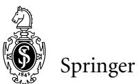

J.D. Murray, FRS Emeritus Professor University of Oxford *and* University of Washington Box 352420 Department of Applied Mathematics Seattle, WA 98195-2420 USA

*Editors* S.S. Antman J.E. Marsden Department of Mathematics *and* Control and Dynamical Systems Institute for Physical Science Mail Code 107-81 University of Maryland Pasadena, CA 91125 College Park, MD 20742 USA USA marsden@cds.caltech.edu ssa@math.umd.edu

L. Sirovich S. Wiggins Division of Applied Mathematics Control and Dynamical Systems Brown University Mail Code 107-81 USA Pasadena, CA 91125 chico@camelot.mssm.edu USA

and Technology California Institute of Technology

Providence, RI 02912 California Institute of Technology

*Cover illustration*: c 2001 Superstock.

Mathematics Subject Classification (2000): 92B05, 92-01, 92C05, 92D30, 34Cxx

Library of Congress Cataloging-in-Publication Data Murray, J.D. (James Dickson) Mathematical biology. I. An introduction / J.D. Murray.—3rd ed. p. cm.—(Interdisciplinary applied mathematics) Rev. ed. of: Mathematical biology. 2nd ed. c1993. Includes bibliographical references (p. ). ISBN 0-387-95223-3 (alk. paper) 1. Biology—Mathematical models. I. Murray, J.D. (James Dickson) Mathematical biology. II. Title. III. Series. QH323.5 .M88 2001 570- .1- 5118—dc21 2001020448

Printed on acid-free paper.

c 2002 J.D. Murray, c 1989, 1993 Springer-Verlag Berlin Heidelberg.

All rights reserved. This work may not be translated or copied in whole or in part without the written permission of the publisher (Springer-Verlag New York, Inc., 175 Fifth Avenue, New York, NY 10010, USA) and of the copyright holder, except for brief excerpts in connection with reviews or scholarly analysis. Use in connection with any form of information storage and retrieval, electronic adaptation, computer software, or by similar or dissimilar methodology now known or hereafter developed is forbidden.

The use in this publication of trade names, trademarks, service marks, and similar terms, even if they are not identified as such, is not to be taken as an expression of opinion as to whether or not they are subject to propriety rights.

Production managed by Jenny Wolkowicki; manufacturing supervised by Jerome Basma. Typeset pages prepared using the author's LATEX files by Integre Technical Publishing Company, Inc., Albuquerque, NM. Printed and bound by Maple-Vail Book Manufacturing Group, York, PA. Printed in the United States of America.

987654321

ISBN 0-387-95223-3 SPIN 10750592

Springer-Verlag New York Berlin Heidelberg *A member of BertelsmannSpringer Science+Business Media GmbH* *To my wife Sheila, whom I married more than forty years ago and lived happily ever after, and to our children Mark and Sarah*

... *que se el fuera de su consejo al tiempo de la ´ general criacion del mundo, i de lo que en ´ el se ´ encierra, i se halla ra con ´ el, se huvieran ´* producido *i formado algunas cosas mejor que fueran hechas, i otras ni se hicieran, u se enmendaran i corrigieran.*

> —Alphonso X (Alphonso the Wise), 1221–1284 King of Castile and Leon (attributed)

*If the Lord Almighty had consulted me before embarking on creation I should have recommended something simpler.*

# **Preface to the Third Edition**

In the thirteen years since the first edition of this book appeared the growth of mathematical biology and the diversity of applications has been astonishing. Its establishment as a distinct discipline is no longer in question. One pragmatic indication is the increasing number of advertised positions in academia, medicine and industry around the world; another is the burgeoning membership of societies. People working in the field now number in the thousands. Mathematical modelling is being applied in every major discipline in the biomedical sciences. A very different application, and surprisingly successful, is in psychology such as modelling various human interactions, escalation to date rape and predicting divorce.

The field has become so large that, inevitably, specialised areas have developed which are, in effect, separate disciplines such as biofluid mechanics, theoretical ecology and so on. It is relevant therefore to ask why I felt there was a case for a new edition of a book called simply *Mathematical Biology*. It is unrealistic to think that a single book could cover even a significant part of each subdiscipline and this new edition certainly does not even try to do this. I feel, however, that there is still justification for a book which can demonstrate to the uninitiated some of the exciting problems that arise in biology and give some indication of the wide spectrum of topics that modelling can address.

In many areas the basics are more or less unchanged but the developments during the past thirteen years have made it impossible to give as comprehensive a picture of the current approaches in and the state of the field as was possible in the late 1980s. Even then important areas were not included such as stochastic modelling, biofluid mechanics and others. Accordingly in this new edition only some of the basic modelling concepts are discussed—such as in ecology and to a lesser extent epidemiology—but references are provided for further reading. In other areas recent advances are discussed together with some new applications of modelling such as in marital interaction (Volume I), growth of cancer tumours (Volume II), temperature-dependent sex determination (Volume I) and wolf territoriality (Volume II). There have been many new and fascinating developments that I would have liked to include but practical space limitations made it impossible and necessitated difficult choices. I have tried to give some idea of the diversity of new developments but the choice is inevitably prejudiced.

As to general approach, if anything it is even more practical in that more emphasis is given to the close connection many of the models have with experiment, clinical data and in estimating real parameter values. In several of the chapters it is not yet possible to relate the mathematical models to specific experiments or even biological entities. Nevertheless such an approach has spawned numerous experiments based as much on the modelling approach as on the actual mechanism studied. Some of the more mathematical parts in which the biological connection was less immediate have been excised while others that have been kept have a mathematical and technical pedagogical aim but all within the context of their application to biomedical problems. I feel even more strongly about the philosophy of mathematical modelling espoused in the original preface as regards what constitutes good mathematical biology. One of the most exciting aspects regarding the new chapters has been their genuine interdisciplinary collaborative character. Mathematical or theoretical biology is unquestionably an interdisciplinary science *par excellence*.

The unifying aim of theoretical modelling and experimental investigation in the biomedical sciences is the elucidation of the underlying biological processes that result in a particular observed phenomenon, whether it is pattern formation in development, the dynamics of interacting populations in epidemiology, neuronal connectivity and information processing, the growth of tumours, marital interaction and so on. I must stress, however, that mathematical descriptions of biological phenomena are not biological explanations. The principal use of any theory is in its predictions and, even though different models might be able to create similar spatiotemporal behaviours, they are mainly distinguished by the different experiments they suggest and, of course, how closely they relate to the real biology. There are numerous examples in the book.

Why use mathematics to study something as intrinsically complicated and ill understood as development, angiogenesis, wound healing, interacting population dynamics, regulatory networks, marital interaction and so on? We suggest that mathematics, rather theoretical modelling, must be used if we ever hope to genuinely and realistically convert an understanding of the underlying mechanisms into a predictive science. Mathematics is required to bridge the gap between the level on which most of our knowledge is accumulating (in developmental biology it is cellular and below) and the macroscopic level of the patterns we see. In wound healing and scar formation, for example, a mathematical approach lets us explore the logic of the repair process. Even if the mechanisms were well understood (and they certainly are far from it at this stage) mathematics would be required to explore the consequences of manipulating the various parameters associated with any particular scenario. In the case of such things as wound healing and cancer growth—and now in angiogensesis with its relation to possible cancer therapy the number of options that are fast becoming available to wound and cancer managers will become overwhelming unless we can find a way to simulate particular treatment protocols before applying them in practice. The latter has been already of use in understanding the efficacy of various treatment scenarios with brain tumours (glioblastomas) and new two step regimes for skin cancer.

The aim in all these applications is not to derive a mathematical model that takes into account every single process because, even if this were possible, the resulting model would yield little or no insight on the crucial interactions within the system. Rather the goal is to develop models which capture the essence of various interactions allowing their outcome to be more fully understood. As more data emerge from the biological system, the models become more sophisticated and the mathematics increasingly challenging.

In development (by way of example) it is true that we are a long way from being able to reliably simulate actual biological development, in spite of the plethora of models and theory that abound. Key processes are generally still poorly understood. Despite these limitations, I feel that exploring the logic of pattern formation is worthwhile, or rather essential, even in our present state of knowledge. It allows us to take a hypothetical mechanism and examine its consequences in the form of a mathematical model, make predictions and suggest experiments that would verify or invalidate the model; even the latter casts light on the biology. The very process of constructing a mathematical model can be useful in its own right. Not only must we commit to a particular mechanism, but we are also forced to consider what is truly essential to the process, the central players (variables) and mechanisms by which they evolve. We are thus involved in constructing frameworks on which we can hang our understanding. The model equations, the mathematical analysis and the numerical simulations that follow serve to reveal quantitatively as well as qualitatively the consequences of that logical structure.

This new edition is published in two volumes. Volume I is an introduction to the field; the mathematics mainly involves ordinary differential equations but with some basic partial differential equation models and is suitable for undergraduate and graduate courses at different levels. Volume II requires more knowledge of partial differential equations and is more suitable for graduate courses and reference.

I would like to acknowledge the encouragement and generosity of the many people who have written to me (including a prison inmate in New England) since the appearance of the first edition of this book, many of whom took the trouble to send me details of errors, misprints, suggestions for extending some of the models, suggesting collaborations and so on. Their input has resulted in many successful interdisciplinary research projects several of which are discussed in this new edition. I would like to thank my colleagues Mark Kot and Hong Qian, many of my former students, in particular Patricia Burgess, Julian Cook, Trace Jackson, Mark Lewis, Philip Maini, Patrick ´ Nelson, Jonathan Sherratt, Kristin Swanson and Rebecca Tyson for their advice or careful reading of parts of the manuscript. I would also like to thank my former secretary Erik Hinkle for the care, thoughtfulness and dedication with which he put much of the manuscript into LATEX and his general help in tracking down numerous obscure references and material.

I am very grateful to Professor John Gottman of the Psychology Department at the University of Washington, a world leader in the clinical study of marital and family interactions, with whom I have had the good fortune to collaborate for nearly ten years. Without his infectious enthusiasm, strong belief in the use of mathematical modelling, perseverance in the face of my initial scepticism and his practical insight into human interactions I would never have become involved in developing with him a general theory of marital interaction. I would also like to acknowledge my debt to Professor Ellworth C. Alvord, Jr., Head of Neuropathology in the University of Washington with whom I have collaborated for the past seven years on the modelling of the growth and control of brain tumours. As to my general, and I hope practical, approach to modelling I am most indebted to Professor George F. Carrier who had the major influence on me when I went to Harvard on first coming to the U.S.A. in 1956. His astonishing insight and ability to extract the key elements from a complex problem and incorporate them into a realistic

and informative model is a talent I have tried to acquire throughout my career. Finally, although it is not possible to thank by name all of my past students, postdoctorals, numerous collaborators and colleagues around the world who have encouraged me in this field, I am certainly very much in their debt.

Looking back on my involvement with mathematics and the biomedical sciences over the past nearly thirty years my major regret is that I did not start working in the field years earlier.

Bainbridge Island, Washington *J.D. Murray* January 2002

# **Preface to the First Edition**

Mathematics has always benefited from its involvement with developing sciences. Each successive interaction revitalises and enhances the field. Biomedical science is clearly the premier science of the foreseeable future. For the continuing health of their subject, mathematicians must become involved with biology. With the example of how mathematics has benefited from and influenced physics, it is clear that if mathematicians do not become involved in the biosciences they will simply not be a part of what are likely to be the most important and exciting scientific discoveries of all time.

Mathematical biology is a fast-growing, well-recognised, albeit not clearly defined, subject and is, to my mind, the most exciting modern application of mathematics. The increasing use of mathematics in biology is inevitable as biology becomes more quantitative. The complexity of the biological sciences makes interdisciplinary involvement essential. For the mathematician, biology opens up new and exciting branches, while for the biologist, mathematical modelling offers another research tool commensurate with a new powerful laboratory technique but *only* if used appropriately and its limitations recognised. However, the use of esoteric mathematics arrogantly applied to biological problems by mathematicians who know little about the real biology, together with unsubstantiated claims as to how important such theories are, do little to promote the interdisciplinary involvement which is so essential.

Mathematical biology research, to be useful and interesting, must be relevant *biologically*. The best models show how a process works and then predict what may follow. If these are not already obvious to the biologists *and* the predictions turn out to be right, then you will have the biologists' attention. Suggestions as to what the governing mechanisms are may evolve from this. *Genuine* interdisciplinary research and the use of models can produce exciting results, many of which are described in this book.

No previous knowledge of biology is assumed of the reader. With each topic discussed I give a brief description of the biological background sufficient to understand the models studied. Although stochastic models are important, to keep the book within reasonable bounds, I deal exclusively with deterministic models. The book provides a toolkit of modelling techniques with numerous examples drawn from population ecology, reaction kinetics, biological oscillators, developmental biology, evolution, epidemiology and other areas.

The emphasis throughout the book is on the practical application of mathematical models in helping to unravel the underlying mechanisms involved in the biological processes. The book also illustrates some of the pitfalls of indiscriminate, naive or uninformed use of models. I hope the reader will acquire a practical and realistic view of biological modelling and the mathematical techniques needed to get approximate quantitative solutions and will thereby realise the importance of relating the models and results to the real biological problems under study. If the use of a model stimulates experiments—even if the model is subsequently shown to be wrong—then it has been successful. Models can provide biological insight and be very useful in summarising, interpreting and interpolating real data. I hope the reader will also learn that (certainly at this stage) there is usually no 'right' model: producing similar temporal or spatial patterns to those experimentally observed is only a first step and does not imply the model mechanism is the one which applies. Mathematical descriptions are *not* explanations. Mathematics can never provide the complete solution to a biological problem on its own. Modern biology is certainly not at the stage where it is appropriate for mathematicians to try to construct comprehensive theories. A close collaboration with biologists is needed for realism, stimulation and help in modifying the model mechanisms to reflect the biology more accurately.

Although this book is titled *mathematical biology* it is not, and could not be, a definitive all-encompassing text. The immense breadth of the field necessitates a restricted choice of topics. Some of the models have been deliberately kept simple for pedagogical purposes. The exclusion of a particular topic—population genetics, for example—in no way reflects my view as to its importance. However, I hope the range of topics discussed will show how exciting intercollaborative research can be and how significant a role mathematics can play. The main purpose of the book is to present some of the basic and, to a large extent, generally accepted theoretical frameworks for a variety of biological models. The material presented does not purport to be the latest developments in the various fields, many of which are constantly expanding. The already lengthy list of references is by no means exhaustive and I apologise for the exclusion of many that should be included in a definitive list.

With the specimen models discussed and the philosophy which pervades the book, the reader should be in a position to tackle the modelling of genuinely practical problems with realism. From a *mathematical* point of view, the art of good modelling relies on: (i) a sound understanding and appreciation of the biological problem; (ii) a realistic mathematical representation of the important biological phenomena; (iii) finding useful solutions, preferably quantitative; and what is crucially important; (iv) a biological interpretation of the mathematical results in terms of insights and predictions. The mathematics is dictated by the biology and not vice versa. Sometimes the mathematics can be very simple. Useful mathematical biology research is not judged by mathematical standards but by different and no less demanding ones.

The book is suitable for physical science courses at various levels. The level of mathematics needed in collaborative biomedical research varies from the very simple to the sophisticated. Selected chapters have been used for applied mathematics courses in the University of Oxford at the final-year undergraduate and first-year graduate levels. In the U.S.A. the material has also been used for courses for students from the second-year undergraduate level through graduate level. It is also accessible to the more theoretically oriented bioscientists who have some knowledge of calculus and differential equations.

I would like to express my gratitude to the many colleagues around the world who have, over the past few years, commented on various chapters of the manuscript, made valuable suggestions and kindly provided me with photographs. I would particularly like to thank Drs. Philip Maini, David Lane, and Diana Woodward and my present graduate students who read various drafts with such care, specifically Daniel Bentil, Meghan Burke, David Crawford, Michael Jenkins, Mark Lewis, Gwen Littlewort, Mary Myerscough, Katherine Rogers and Louisa Shaw.

Oxford, UK *J.D. Murray* January 1989

*This page intentionally left blank*

*This page intentionally left blank*

# **Table of Contents**

#### **CONTENTS, VOLUME I**

| Preface<br>to<br>the<br>Third<br>Edition |                                                                   |                                                                                     |          |  |  |
|------------------------------------------|-------------------------------------------------------------------|-------------------------------------------------------------------------------------|----------|--|--|
|                                          | Preface<br>to                                                     | the<br>First<br>Edition                                                             | xi       |  |  |
| 1.                                       |                                                                   | Continuous<br>Population<br>Models<br>for<br>Single<br>Species                      | 1        |  |  |
|                                          | 1.1                                                               | Continuous<br>Growth<br>Models                                                      | 1        |  |  |
|                                          | 1.2                                                               | Insect<br>Outbreak<br>Model:<br>Spruce<br>Budworm                                   | 7        |  |  |
|                                          | 1.3                                                               | Delay<br>Models                                                                     | 13       |  |  |
|                                          | 1.4                                                               | Linear<br>Analysis<br>of<br>Delay<br>Population<br>Models:<br>Periodic<br>Solutions | 17       |  |  |
|                                          | 1.5                                                               | Delay<br>Models<br>in<br>Physiology:<br>Periodic<br>Dynamic<br>Diseases             | 21       |  |  |
|                                          | 1.6                                                               | Harvesting<br>a<br>Single<br>Natural<br>Population                                  | 30       |  |  |
|                                          | 1.7                                                               | Population<br>Model<br>with<br>Age<br>Distribution                                  | 36       |  |  |
|                                          | Exercises                                                         |                                                                                     | 40       |  |  |
| 2.                                       | Discrete<br>Population<br>Models<br>for<br>a<br>Single<br>Species |                                                                                     |          |  |  |
|                                          | 2.1                                                               | Introduction:<br>Simple<br>Models                                                   | 44       |  |  |
|                                          | 2.2                                                               | Cobwebbing:<br>A<br>Graphical<br>Procedure<br>of<br>Solution                        | 49       |  |  |
|                                          | 2.3                                                               | Discrete<br>Logistic-Type<br>Model:<br>Chaos                                        | 53       |  |  |
|                                          | 2.4                                                               | Stability,<br>Periodic<br>Solutions<br>and<br>Bifurcations                          | 59       |  |  |
|                                          | 2.5                                                               | Discrete<br>Delay<br>Models                                                         | 62       |  |  |
|                                          | 2.6                                                               | Fishery<br>Management<br>Model                                                      | 67       |  |  |
|                                          | 2.7                                                               | Ecological<br>Implications<br>and<br>Caveats                                        | 69       |  |  |
|                                          | 2.8                                                               | Tumour<br>Cell<br>Growth                                                            | 72       |  |  |
|                                          | Exercises                                                         |                                                                                     | 75       |  |  |
| 3.                                       | Models<br>for<br>Interacting<br>Populations                       |                                                                                     |          |  |  |
|                                          | 3.1                                                               | Predator–Prey<br>Models:<br>Lotka–Volterra<br>Systems                               | 79<br>79 |  |  |
|                                          | 3.2                                                               | Complexity<br>and<br>Stability                                                      | 83       |  |  |
|                                          | 3.3                                                               | Realistic<br>Predator–Prey<br>Models                                                | 86       |  |  |
|                                          | 3.4                                                               | Analysis<br>of<br>a<br>Predator–Prey<br>Model<br>with<br>Limit<br>Cycle             |          |  |  |
|                                          |                                                                   | Periodic<br>Behaviour:<br>Parameter<br>Domains<br>of<br>Stability                   | 88       |  |  |
|                                          | 3.5                                                               | Competition<br>Models:<br>Competitive<br>Exclusion<br>Principle                     | 94       |  |  |

|                               | 3.6                                                                                    | Mutualism<br>or<br>Symbiosis                                                         | 99         |  |  |  |  |
|-------------------------------|----------------------------------------------------------------------------------------|--------------------------------------------------------------------------------------|------------|--|--|--|--|
|                               | 3.7                                                                                    | General<br>Models<br>and<br>Cautionary<br>Remarks                                    | 101        |  |  |  |  |
| 3.8<br>Threshold<br>Phenomena |                                                                                        |                                                                                      |            |  |  |  |  |
|                               | 3.9                                                                                    | Discrete<br>Growth<br>Models<br>for<br>Interacting<br>Populations                    | 105<br>109 |  |  |  |  |
|                               | 3.10                                                                                   | Predator–Prey<br>Models:<br>Detailed<br>Analysis                                     | 110        |  |  |  |  |
|                               | Exercises                                                                              |                                                                                      | 115        |  |  |  |  |
| 4.                            |                                                                                        | Temperature-Dependent<br>Sex<br>Determination<br>(TSD)                               | 119        |  |  |  |  |
|                               | 4.1                                                                                    | Biological<br>Introduction<br>and<br>Historical<br>Asides<br>on<br>the<br>Crocodilia | 119        |  |  |  |  |
|                               | 4.2                                                                                    | Nesting<br>Assumptions<br>and<br>Simple<br>Population<br>Model                       | 124        |  |  |  |  |
|                               | 4.3                                                                                    | Age-Structured<br>Population<br>Model<br>for<br>Crocodilia                           | 130        |  |  |  |  |
|                               | 4.4                                                                                    | Density-Dependent<br>Age-Structured<br>Model<br>Equations                            | 133        |  |  |  |  |
|                               | 4.5                                                                                    | Stability<br>of<br>the<br>Female<br>Population<br>in<br>Wet<br>Marsh<br>Region<br>I  | 135        |  |  |  |  |
|                               | 4.6                                                                                    | Sex<br>Ratio<br>and<br>Survivorship                                                  | 137        |  |  |  |  |
|                               | 4.7                                                                                    | Temperature-Dependent<br>Sex<br>Determination<br>(TSD)<br>Versus                     |            |  |  |  |  |
|                               |                                                                                        | Genetic<br>Sex<br>Determination<br>(GSD)                                             | 139        |  |  |  |  |
|                               | 4.8                                                                                    | Related<br>Aspects<br>on<br>Sex<br>Determination                                     | 142        |  |  |  |  |
|                               | Exercise                                                                               |                                                                                      | 144        |  |  |  |  |
| 5.                            | Modelling<br>the<br>Dynamics<br>of<br>Marital<br>Interaction:<br>Divorce<br>Prediction |                                                                                      |            |  |  |  |  |
|                               | and                                                                                    | Marriage<br>Repair                                                                   | 146        |  |  |  |  |
|                               | 5.1                                                                                    | Psychological<br>Background<br>and<br>Data:                                          |            |  |  |  |  |
|                               |                                                                                        | Gottman<br>and<br>Levenson<br>Methodology                                            | 147        |  |  |  |  |
|                               | 5.2                                                                                    | Marital<br>Typology<br>and<br>Modelling<br>Motivation                                | 150        |  |  |  |  |
|                               | 5.3                                                                                    | Modelling<br>Strategy<br>and<br>the<br>Model<br>Equations                            | 153        |  |  |  |  |
|                               | 5.4                                                                                    | Steady<br>States<br>and<br>Stability                                                 | 156        |  |  |  |  |
|                               | 5.5                                                                                    | Practical<br>Results<br>from<br>the<br>Model                                         | 164        |  |  |  |  |
|                               | 5.6                                                                                    | Benefits,<br>Implications<br>and<br>Marriage<br>Repair<br>Scenarios                  | 170        |  |  |  |  |
| 6.                            | Reaction                                                                               | Kinetics                                                                             | 175        |  |  |  |  |
|                               | 6.1                                                                                    | Enzyme<br>Kinetics:<br>Basic<br>Enzyme<br>Reaction                                   | 175        |  |  |  |  |
|                               | 6.2                                                                                    | Transient<br>Time<br>Estimates<br>and<br>Nondimensionalisation                       | 178        |  |  |  |  |
|                               | 6.3                                                                                    | Michaelis–Menten<br>Quasi-Steady<br>State<br>Analysis                                | 181        |  |  |  |  |
|                               | 6.4                                                                                    | Suicide<br>Substrate<br>Kinetics                                                     | 188        |  |  |  |  |
|                               | 6.5                                                                                    | Cooperative<br>Phenomena                                                             | 197        |  |  |  |  |
|                               | 6.6                                                                                    | Autocatalysis,<br>Activation<br>and<br>Inhibition                                    | 201        |  |  |  |  |
|                               | 6.7                                                                                    | Multiple<br>Steady<br>States,<br>Mushrooms<br>and<br>Isolas                          | 208        |  |  |  |  |
|                               | Exercises                                                                              |                                                                                      | 215        |  |  |  |  |
| 7.                            | Biological<br>Oscillators<br>and<br>Switches<br>218                                    |                                                                                      |            |  |  |  |  |
|                               | 7.1                                                                                    | Motivation,<br>Brief<br>History<br>and<br>Background                                 | 218        |  |  |  |  |
|                               | 7.2                                                                                    | Feedback<br>Control<br>Mechanisms                                                    | 221        |  |  |  |  |
|                               | 7.3                                                                                    | Oscillators<br>and<br>Switches<br>with<br>Two<br>or<br>More<br>Species:              |            |  |  |  |  |
|                               |                                                                                        | General<br>Qualitative<br>Results                                                    | 226        |  |  |  |  |
|                               | 7.4                                                                                    | Simple<br>Two-Species<br>Oscillators:<br>Parameter<br>Domain                         |            |  |  |  |  |
|                               |                                                                                        | Determination<br>for<br>Oscillations                                                 | 234        |  |  |  |  |

|                          | 7.5                                                                          | Hodgkin–Huxley<br>Theory<br>of<br>Nerve<br>Membranes:                               |     |  |  |  |  |
|--------------------------|------------------------------------------------------------------------------|-------------------------------------------------------------------------------------|-----|--|--|--|--|
| FitzHugh–Nagumo<br>Model |                                                                              |                                                                                     |     |  |  |  |  |
|                          | 7.6<br>Modelling<br>the<br>Control<br>of<br>Testosterone<br>Secretion<br>and |                                                                                     |     |  |  |  |  |
|                          | Chemical<br>Castration                                                       |                                                                                     |     |  |  |  |  |
|                          | Exercises                                                                    |                                                                                     | 253 |  |  |  |  |
| 8.                       | BZ                                                                           | Oscillating<br>Reactions                                                            | 257 |  |  |  |  |
|                          | 8.1                                                                          | Belousov<br>Reaction<br>and<br>the<br>Field–Kor¨<br>os–Noyes<br>¨<br>(FKN)<br>Model | 257 |  |  |  |  |
|                          | 8.2                                                                          | Linear<br>Stability<br>Analysis<br>of<br>the<br>FKN<br>Model<br>and<br>Existence    |     |  |  |  |  |
|                          |                                                                              | of<br>Limit<br>Cycle<br>Solutions                                                   | 261 |  |  |  |  |
|                          | 8.3                                                                          | Nonlocal<br>Stability<br>of<br>the<br>FKN<br>Model                                  | 265 |  |  |  |  |
|                          | 8.4                                                                          | Relaxation<br>Oscillators:<br>Approximation<br>for<br>the                           |     |  |  |  |  |
|                          |                                                                              | Belousov–Zhabotinskii<br>Reaction                                                   | 268 |  |  |  |  |
|                          | 8.5                                                                          | Analysis<br>of<br>a<br>Relaxation<br>Model<br>for<br>Limit<br>Cycle<br>Oscillations |     |  |  |  |  |
|                          |                                                                              | in<br>the<br>Belousov–Zhabotinskii<br>Reaction                                      | 271 |  |  |  |  |
|                          | Exercises                                                                    |                                                                                     | 277 |  |  |  |  |
| 9.                       | Perturbed                                                                    | and<br>Coupled<br>Oscillators<br>and<br>Black<br>Holes                              | 278 |  |  |  |  |
|                          | 9.1                                                                          | Phase<br>Resetting<br>in<br>Oscillators                                             | 278 |  |  |  |  |
|                          | 9.2                                                                          | Phase<br>Resetting<br>Curves                                                        | 282 |  |  |  |  |
|                          | 9.3                                                                          | Black<br>Holes                                                                      | 286 |  |  |  |  |
|                          | 9.4                                                                          | Black<br>Holes<br>in<br>Real<br>Biological<br>Oscillators                           | 288 |  |  |  |  |
|                          | 9.5                                                                          | Coupled<br>Oscillators:<br>Motivation<br>and<br>Model<br>System                     | 293 |  |  |  |  |
|                          | 9.6                                                                          | Phase<br>Locking<br>of<br>Oscillations:<br>Synchronisation<br>in<br>Fireflies       | 295 |  |  |  |  |
|                          | 9.7                                                                          | Singular<br>Perturbation<br>Analysis:<br>Preliminary<br>Transformation              | 299 |  |  |  |  |
|                          | 9.8                                                                          | Singular<br>Perturbation<br>Analysis:<br>Transformed<br>System                      | 302 |  |  |  |  |
|                          | 9.9                                                                          | Singular<br>Perturbation<br>Analysis:<br>Two-Time<br>Expansion                      | 305 |  |  |  |  |
|                          | 9.10                                                                         | Analysis<br>of<br>the<br>Phase<br>Shift<br>Equation<br>and<br>Application           |     |  |  |  |  |
|                          |                                                                              | to<br>Coupled<br>Belousov–Zhabotinskii<br>Reactions                                 | 310 |  |  |  |  |
|                          | Exercises                                                                    |                                                                                     | 313 |  |  |  |  |
| 10.                      | Dynamics                                                                     | of<br>Infectious<br>Diseases                                                        | 315 |  |  |  |  |
|                          | 10.1                                                                         | Historical<br>Aside<br>on<br>Epidemics                                              | 315 |  |  |  |  |
|                          | 10.2                                                                         | Simple<br>Epidemic<br>Models<br>and<br>Practical<br>Applications                    | 319 |  |  |  |  |
|                          | 10.3                                                                         | Modelling<br>Venereal<br>Diseases                                                   | 327 |  |  |  |  |
|                          | 10.4                                                                         | Multi-Group<br>Model<br>for<br>Gonorrhea<br>and<br>Its<br>Control                   | 331 |  |  |  |  |
|                          | 10.5                                                                         | AIDS:<br>Modelling<br>the<br>Transmission<br>Dynamics<br>of<br>the<br>Human         |     |  |  |  |  |
|                          |                                                                              | Immunodeficiency<br>Virus<br>(HIV)                                                  | 333 |  |  |  |  |
|                          | 10.6                                                                         | HIV:<br>Modelling<br>Combination<br>Drug<br>Therapy                                 | 341 |  |  |  |  |
|                          | 10.7                                                                         | Delay<br>Model<br>for<br>HIV<br>Infection<br>with<br>Drug<br>Therapy                | 350 |  |  |  |  |
|                          | 10.8                                                                         | Modelling<br>the<br>Population<br>Dynamics<br>of<br>Acquired<br>Immunity<br>to      |     |  |  |  |  |
|                          |                                                                              | Parasite<br>Infection                                                               | 351 |  |  |  |  |
|                          | 10.9                                                                         | Age-Dependent<br>Epidemic<br>Model<br>and<br>Threshold<br>Criterion                 | 361 |  |  |  |  |
|                          | 10.10                                                                        | Simple<br>Drug<br>Use<br>Epidemic<br>Model<br>and<br>Threshold<br>Analysis          | 365 |  |  |  |  |
|                          | 10.11                                                                        | Bovine<br>Tuberculosis<br>Infection<br>in<br>Badgers<br>and<br>Cattle               | 369 |  |  |  |  |

|     | 10.12                                                                  | Modelling<br>Control<br>Strategies<br>for<br>Bovine<br>Tuberculosis                 |     |  |  |  |
|-----|------------------------------------------------------------------------|-------------------------------------------------------------------------------------|-----|--|--|--|
|     |                                                                        | in<br>Badgers<br>and<br>Cattle                                                      | 379 |  |  |  |
|     | Exercises                                                              |                                                                                     | 393 |  |  |  |
| 11. | Reaction<br>Diffusion,<br>Chemotaxis,<br>and<br>Nonlocal<br>Mechanisms |                                                                                     |     |  |  |  |
|     | 11.1                                                                   | Simple<br>Random<br>Walk<br>and<br>Derivation<br>of<br>the<br>Diffusion<br>Equation | 395 |  |  |  |
|     | 11.2                                                                   | Reaction<br>Diffusion<br>Equations                                                  | 399 |  |  |  |
|     | 11.3                                                                   | Models<br>for<br>Animal<br>Dispersal                                                | 402 |  |  |  |
|     | 11.4                                                                   | Chemotaxis                                                                          | 405 |  |  |  |
|     | 11.5                                                                   | Nonlocal<br>Effects<br>and<br>Long<br>Range<br>Diffusion                            | 408 |  |  |  |
|     | 11.6                                                                   | Cell<br>Potential<br>and<br>Energy<br>Approach<br>to<br>Diffusion                   |     |  |  |  |
|     |                                                                        | and<br>Long<br>Range<br>Effects                                                     | 413 |  |  |  |
|     | Exercises                                                              |                                                                                     | 416 |  |  |  |
| 12. |                                                                        | Oscillator-Generated<br>Wave<br>Phenomena                                           | 418 |  |  |  |
|     | 12.1                                                                   | Belousov–Zhabotinskii<br>Reaction<br>Kinematic<br>Waves                             | 418 |  |  |  |
|     | 12.2                                                                   | Central<br>Pattern<br>Generator:<br>Experimental<br>Facts<br>in<br>the<br>Swimming  |     |  |  |  |
|     |                                                                        | of<br>Fish                                                                          | 422 |  |  |  |
|     | 12.3                                                                   | Mathematical<br>Model<br>for<br>the<br>Central<br>Pattern<br>Generator              | 424 |  |  |  |
|     | 12.4                                                                   | Analysis<br>of<br>the<br>Phase<br>Coupled<br>Model<br>System                        | 431 |  |  |  |
|     | Exercises                                                              |                                                                                     | 436 |  |  |  |
| 13. | Biological                                                             | Waves:<br>Single-Species<br>Models                                                  | 437 |  |  |  |
|     | 13.1                                                                   | Background<br>and<br>the<br>Travelling<br>Waveform                                  | 437 |  |  |  |
|     | 13.2                                                                   | Fisher–Kolmogoroff<br>Equation<br>and<br>Propagating<br>Wave<br>Solutions           | 439 |  |  |  |
|     | 13.3                                                                   | Asymptotic<br>Solution<br>and<br>Stability<br>of<br>Wavefront<br>Solutions          |     |  |  |  |
|     |                                                                        | of<br>the<br>Fisher–Kolmogoroff<br>Equation                                         | 444 |  |  |  |
|     | 13.4                                                                   | Density-Dependent<br>Diffusion-Reaction<br>Diffusion<br>Models                      |     |  |  |  |
|     |                                                                        | and<br>Some<br>Exact<br>Solutions                                                   | 449 |  |  |  |
|     | 13.5                                                                   | Waves<br>in<br>Models<br>with<br>Multi-Steady<br>State<br>Kinetics:                 |     |  |  |  |
|     |                                                                        | Spread<br>and<br>Control<br>of<br>an<br>Insect<br>Population                        | 460 |  |  |  |
|     | 13.6                                                                   | Calcium<br>Waves<br>on<br>Amphibian<br>Eggs:<br>Activation<br>Waves                 |     |  |  |  |
|     |                                                                        | on<br>Medaka<br>Eggs                                                                | 467 |  |  |  |
|     | 13.7                                                                   | Invasion<br>Wavespeeds<br>with<br>Dispersive<br>Variability                         | 471 |  |  |  |
|     | 13.8                                                                   | Species<br>Invasion<br>and<br>Range<br>Expansion                                    | 478 |  |  |  |
|     | Exercises                                                              |                                                                                     | 482 |  |  |  |
| 14. | Use                                                                    | and<br>Abuse<br>of<br>Fractals                                                      | 484 |  |  |  |
|     | 14.1                                                                   | Fractals:<br>Basic<br>Concepts<br>and<br>Biological<br>Relevance                    | 484 |  |  |  |
|     | 14.2                                                                   | Examples<br>of<br>Fractals<br>and<br>Their<br>Generation                            | 487 |  |  |  |
|     | 14.3                                                                   | Fractal<br>Dimension:<br>Concepts<br>and<br>Methods<br>of<br>Calculation            | 490 |  |  |  |
|     | 14.4                                                                   | Fractals<br>or<br>Space-Filling?                                                    | 496 |  |  |  |
|     |                                                                        |                                                                                     |     |  |  |  |
|     | Appendices                                                             |                                                                                     | 501 |  |  |  |
|     |                                                                        |                                                                                     |     |  |  |  |

| B.    | Routh-Hurwitz<br>Conditions,<br>Jury<br>Conditions,<br>Descartes'     |                                                    |     |  |  |  |
|-------|-----------------------------------------------------------------------|----------------------------------------------------|-----|--|--|--|
|       | Rule<br>of<br>Signs,<br>and<br>Exact<br>Solutions<br>of<br>a<br>Cubic |                                                    |     |  |  |  |
|       | B.1                                                                   | Polynomials<br>and<br>Conditions                   | 507 |  |  |  |
|       | B.2                                                                   | Descartes'<br>Rule<br>of<br>Signs                  | 509 |  |  |  |
|       | B.3                                                                   | Roots<br>of<br>a<br>General<br>Cubic<br>Polynomial | 510 |  |  |  |
|       | Bibliography                                                          |                                                    | 513 |  |  |  |
| Index |                                                                       |                                                    | 537 |  |  |  |

### **CONTENTS, VOLUME II**

### **J.D. Murray:** *Mathematical Biology, II: Spatial Models and Biomedical Applications*

### **Preface to the Third Edition**

### **Preface to the First Edition**

### **1. Multi-Species Waves and Practical Applications**

- 1.1 Intuitive Expectations
- 1.2 Waves of Pursuit and Evasion in Predator–Prey Systems
- 1.3 Competition Model for the Spatial Spread of the Grey Squirrel in Britain
- 1.4 Spread of Genetically Engineered Organisms
- 1.5 Travelling Fronts in the Belousov–Zhabotinskii Reaction
- 1.6 Waves in Excitable Media
- 1.7 Travelling Wave Trains in Reaction Diffusion Systems with Oscillatory Kinetics
- 1.8 Spiral Waves
- 1.9 Spiral Wave Solutions of λ-ω Reaction Diffusion Systems

# **2. Spatial Pattern Formation with Reaction Diffusion Systems**

- 2.1 Role of Pattern in Biology
- 2.2 Reaction Diffusion (Turing) Mechanisms
- 2.3 General Conditions for Diffusion-Driven Instability: Linear Stability Analysis and Evolution of Spatial Pattern
- 2.4 Detailed Analysis of Pattern Initiation in a Reaction Diffusion Mechanism
- 2.5 Dispersion Relation, Turing Space, Scale and Geometry Effects in Pattern Formation Models
- 2.6 Mode Selection and the Dispersion Relation
- 2.7 Pattern Generation with Single-Species Models: Spatial Heterogeneity with the Spruce Budworm Model
- 2.8 Spatial Patterns in Scalar Population Interaction Diffusion Equations with Convection: Ecological Control Strategies

- 2.9 Nonexistence of Spatial Patterns in Reaction Diffusion Systems: General and Particular Results
#### **3. Animal Coat Patterns and Other Practical Applications of Reaction Diffusion Mechanisms**

- 3.1 Mammalian Coat Patterns—'How the Leopard Got Its Spots'
- 3.2 Teratologies: Examples of Animal Coat Pattern Abnormalities
- 3.3 A Pattern Formation Mechanism for Butterfly Wing Patterns
- 3.4 Modelling Hair Patterns in a Whorl in *Acetabularia*

#### **4. Pattern Formation on Growing Domains: Alligators and Snakes**

- 4.1 Stripe Pattern Formation in the Alligator: Experiments
- 4.2 Modelling Concepts: Determining the Time of Stripe Formation
- 4.3 Stripes and Shadow Stripes on the Alligator
- 4.4 Spatial Patterning of Teeth Primordia in the Alligator: Background and Relevance
- 4.5 Biology of Tooth Initiation
- 4.6 Modelling Tooth Primordium Initiation: Background
- 4.7 Model Mechanism for Alligator Teeth Patterning
- 4.8 Results and Comparison with Experimental Data
- 4.9 Prediction Experiments
- 4.10 Concluding Remarks on Alligator Tooth Spatial Patterning
- 4.11 Pigmentation Pattern Formation on Snakes
- 4.12 Cell-Chemotaxis Model Mechanism
- 4.13 Simple and Complex Snake Pattern Elements
- 4.14 Propagating Pattern Generation with the Cell-Chemotaxis System

### **5. Bacterial Patterns and Chemotaxis**

- 5.1 Background and Experimental Results
- 5.2 Model Mechanism for *E. coli* in the Semi-Solid Experiments
- 5.3 Liquid Phase Model: Intuitive Analysis of Pattern Formation
- 5.4 Interpretation of the Analytical Results and Numerical Solutions
- 5.5 Semi-Solid Phase Model Mechanism for *S. typhimurium*
- 5.6 Linear Analysis of the Basic Semi-Solid Model
- 5.7 Brief Outline and Results of the Nonlinear Analysis
- 5.8 Simulation Results, Parameter Spaces, Basic Patterns
- 5.9 Numerical Results with Initial Conditions from the Experiments
- 5.10 Swarm Ring Patterns with the Semi-Solid Phase Model Mechanism
- 5.11 Branching Patterns in *Bacillus subtilis*

# **6. Mechanical Theory for Generating Pattern and Form in Development**

- 6.1 Introduction, Motivation and Background Biology
- 6.2 Mechanical Model for Mesenchymal Morphogenesis
- 6.3 Linear Analysis, Dispersion Relation and Pattern Formation Potential
- 6.4 Simple Mechanical Models Which Generate Spatial Patterns with Complex Dispersion Relations
- 6.5 Periodic Patterns of Feather Germs
- 6.6 Cartilage Condensation in Limb Morphogenesis and Morphogenetic Rules
- 6.7 Embryonic Fingerprint Formation
- 6.8 Mechanochemical Model for the Epidermis
- 6.9 Formation of Microvilli
- 6.10 Complex Pattern Formation and Tissue Interaction Models

### **7. Evolution, Morphogenetic Laws, Developmental Constraints and Teratologies**

- 7.1 Evolution and Morphogenesis
- 7.2 Evolution and Morphogenetic Rules in Cartilage Formation in the Vertebrate Limb
- 7.3 Teratologies (Monsters)
- 7.4 Developmental Constraints, Morphogenetic Rules and the Consequences for Evolution

### **8. A Mechanical Theory of Vascular Network Formation**

- 8.1 Biological Background and Motivation
- 8.2 Cell–Extracellular Matrix Interactions for Vasculogenesis
- 8.3 Parameter Values
- 8.4 Analysis of the Model Equations
- 8.5 Network Patterns: Numerical Simulations and Conclusions

# **9. Epidermal Wound Healing**

- 9.1 Brief History of Wound Healing
- 9.2 Biological Background: Epidermal Wounds
- 9.3 Model for Epidermal Wound Healing
- 9.4 Nondimensional Form, Linear Stability and Parameter Values
- 9.5 Numerical Solution for the Epidermal Wound Repair Model
- 9.6 Travelling Wave Solutions for the Epidermal Model
- 9.7 Clinical Implications of the Epidermal Wound Model
- 9.8 Mechanisms of Epidermal Repair in Embryos
- 9.9 Actin Alignment in Embryonic Wounds: A Mechanical Model
- 9.10 Mechanical Model with Stress Alignment of the Actin Filaments in Two Dimensions

# **10. Dermal Wound Healing**

- 10.1 Background and Motivation—General and Biological
- 10.2 Logic of Wound Healing and Initial Models
- 10.3 Brief Review of Subsequent Developments
- 10.4 Model for Fibroblast-Driven Wound Healing: Residual Strain and Tissue Remodelling
- 10.5 Solutions of the Model Equation Solutions and Comparison with Experiment
- 10.6 Wound Healing Model of Cook (1995)
- 10.7 Matrix Secretion and Degradation
- 10.8 Cell Movement in an Oriented Environment
- 10.9 Model System for Dermal Wound Healing with Tissue Structure
- 10.10 One-Dimensional Model for the Structure of Pathological Scars
- 10.11 Open Problems in Wound Healing
- 10.12 Concluding Remarks on Wound Healing

### **11. Growth and Control of Brain Tumours**

- 11.1 Medical Background
- 11.2 Basic Mathematical Model of Glioma Growth and Invasion
- 11.3 Tumour Spread *In Vitro*: Parameter Estimation
- 11.4 Tumour Invasion in the Rat Brain
- 11.5 Tumour Invasion in the Human Brain
- 11.6 Modelling Treatment Scenarios: General Comments
- 11.7 Modelling Tumour Resection (Removal) in Homogeneous Tissue
- 11.8 Analytical Solution for Tumour Recurrence After Resection
- 11.9 Modelling Surgical Resection with Brain Tissue Heterogeneity
- 11.10 Modelling the Effect of Chemotherapy on Tumour Growth
- 11.11 Modeling Tumour Polyclonality and Cell Mutation

### **12. Neural Models of Pattern Formation**

- 12.1 Spatial Patterning in Neural Firing with a Simple Activation–Inhibition Model
- 12.2 A Mechanism for Stripe Formation in the Visual Cortex
- 12.3 A Model for the Brain Mechanism Underlying Visual Hallucination Patterns
- 12.4 Neural Activity Model for Shell Patterns
- 12.5 Shamanism and Rock Art

### **13. Geographic Spread and Control of Epidemics**

- 13.1 Simple Model for the Spatial Spread of an Epidemic
- 13.2 Spread of the Black Death in Europe 1347–1350
- 13.3 Brief History of Rabies: Facts and Myths
- 13.4 The Spatial Spread of Rabies Among Foxes I: Background and Simple Model
- 13.5 Spatial Spread of Rabies Among Foxes II: Three-Species (*SIR*) Model
- 13.6 Control Strategy Based on Wave Propagation into a Non-epidemic Region: Estimate of Width of a Rabies Barrier
- 13.7 Analytic Approximation for the Width of the Rabies Control Break
- 13.8 Two-Dimensional Epizootic Fronts and Effects of Variable Fox Densitics: Quantitative Predictions for a Rabies Outbreak in England
- 13.9 Effect of Fox Immunity on Spatial Spread of Rabies

#### **14. Wolf Territoriality, Wolf–Deer Interaction and Survival**

- 14.1 Introduction and Wolf Ecology
- 14.2 Models for Wolf Pack Territory Formation: Single Pack—Home Range Model
- 14.3 Multi-Wolf Pack Territorial Model
- 14.4 Wolf–Deer Predator–Prey Model
- 14.5 Concluding Remarks on Wolf Territoriality and Deer Survival
- 14.6 Coyote Home Range Patterns
- 14.7 Chippewa and Sioux Intertribal Conflict c1750–1850

#### **Appendix**

#### **A. General Results for the Laplacian Operator in Bounded Domains**

#### **Bibliography**

**Index**

*This page intentionally left blank*

# **1. Continuous Population Models for Single Species**

The increasing study of realistic and practically useful mathematical models in population biology, whether we are dealing with a human population with or without its age distribution, population of an endangered species, bacterial or viral growth and so on, is a reflection of their use in helping to understand the dynamic processes involved and in making practical predictions. The study of population change has a very long history: in 1202 an exercise in an arithmetic book written by Leonardo of Pisa involved building a mathematical model for a growing rabbit population; we discuss it later in Chapter 2. Ecology, basically the study of the interrelationship between species and their environment, in such areas as predator–prey and competition interactions, renewable resource management, evolution of pesticide resistant strains, ecological and genetically engineered control of pests, multi-species societies, plant–herbivore systems and so on is now an enormous field. The continually expanding list of applications is extensive as are the number of books on various aspects1 of the field. There are also highly practical applications of single-species models in the biomedical sciences; in Section 1.5 we discuss two examples of these which arise in physiology. Here, and in the following three chapters, we consider some deterministic models by way of an introduction to the field. The excellent books by Hastings (1997) and Kot (2001) are specifically on ecological modelling. Elementary introductions are also given in the textbooks by Edelstein-Keshet (1988) and Hoppensteadt and Peskin (1992).

#### **1.1 Continuous Growth Models**

Single-species models are of relevance to laboratory studies in particular but, in the real world, can reflect a telescoping of effects which influence the population dynamics. Let *N*(*t*) be the population of the species at time *t*, then the rate of change

$$\frac{dN}{dt} = \text{births} - \text{deaths} + \text{migration},\tag{1.1}$$

<sup>1</sup>Kingsland (1995) gives a fascinating historical and highly readable account of some of the major ideas introduced in the 20th century and of some of the scientists involved together with vignettes on how their egos, often inflated, affected the progress of the field.

**Table 1.1.**

| Date                         | Mid<br>17th<br>Century | Early<br>19th<br>Century | 1918–1927 | 1960 | 1974 | 1987 | 2000 | 2050 | 2100 |
|------------------------------|------------------------|--------------------------|-----------|------|------|------|------|------|------|
| Population<br>in<br>billions | 0.5                    | 1                        | 2         | 3    | 4    | 5    | 6.3  | 10   | 11.2 |

is a *conservation equation* for the population. The form of the various terms on the righthand side of (1.1) necessitates modelling the situation with which we are concerned. The simplest model has no migration and the birth and death terms are proportional to *N*. That is,

$$\frac{dN}{dt} = bN - dN \quad \Rightarrow \quad N(t) = N_0 e^{(b-d)t},$$

where *b*, *d* are positive constants and the initial population *N*(0) = *N*0. Thus if *b* > *d* the population grows exponentially while if *b* < *d* it dies out. This approach, due to Malthus2 in 1798, is fairly unrealistic. However, if we consider the past and predicted growth estimates for the total world population from the 17th to 21st centuries it is perhaps less unrealistic, as seen in Table 1.1 (United Nations median projections for the 21st century). Since 1900 it has grown exponentially.

Notwithstanding such growth, many demographers now fret about whether or not there will be enough people in the future! In 1975 about 18% of the world population lived in countries where the fertility rate was at or below replacement level (approximately 2.1 children per woman) while in 1997 it was 44% with 67% predicted (United Nations) by 2015. Later in Chapter 4 we discuss in detail how to calculate a survival reproductive level. In 1970 there were 10 countries below replacement fertility levels while by 1995 there were 51 and by 2015 it is estimated that 88 of the approximately 180 countries in the world will join the group with less than replacement fertility. To mark the 20th anniversary of the World Health Organisation their report (1992) on human reproduction gave some interesting estimates for the world, such as 100 million acts of sexual intercourse every day which resulted in 910,000 conceptions and 356,000 cases of sexually transmitted diseases. They estimate that 300 million couples do not want any more children but lack family planning services. Of the 910,000 conceptions every day about half are unplanned. There are 150,000 abortions every day, a third in unsafe conditions resulting in 500 deaths.

One of the reasons for this digression is to highlight the problems of modelling such population problems. It is difficult to make long term, or even relatively short term, predictions unless we know sufficient facts to incorporate in the model to make it a reliable predictor although general trends can in themselves be useful even if ultimately

<sup>2</sup>Malthus' essay, first published anonymously, was immensely influential (on Charles Darwin, for example, who first read it in 1838), but also roused much wrath in various quarters for much of the following century. He said in effect that unbounded population growth would be controlled by war, pestilence or famine. After the carnage of the First World War his predictions were again brought to the fore and widely discussed. Malthus, who married at 38, spent much of his life as an English country parson who, by all accounts, was a happy family man who thoroughly enjoyed life.

quantitatively wrong. There is no doubt, however, that, in spite of widespread available contraception, sterilisation being the most commonly used method (female sterilisation accounting for 26% of the total with male sterilisation accounting for 10%), enforced size of families, local famines, new diseases, increasing nonreplacement fertility rates and so on, the world population continues to increase alarmingly.

In the long run of course there must be some adjustment to such exponential growth. Verhulst (1838, 1845) proposed that a self-limiting process should operate when a population becomes too large. He suggested

$$\frac{dN}{dt} = rN(1 - N/K),\tag{1.2}$$

where *r* and *K* are positive constants. This he called *logistic growth* in a population. In this model the per capita birth rate is *r*(1 − *N*/*K*); that is, it is dependent on *N*. The constant *K* is the *carrying capacity* of the environment, which is usually determined by the available sustaining resources.

There are two *steady states* or *equilibrium states* for (1.2), namely, *N* = 0 and *N* = *K*, that is, where *d N*/*dt* = 0. *N* = 0 is unstable since linearization about it (that is, *N*2 is neglected compared with *N*) gives *d N*/*dt* ≈ *r N*, and so *N* grows exponentially from any small initial value. The other equilibrium *N* = *K* is stable: linearization about it (that is, (*N* − *K*)2 is neglected compared with | *N* − *K* |) gives *d*(*N* − *K*)/*dt* ≈ −*r*(*N* − *K*) and so *N* → *K* as *t* → ∞. The carrying capacity *K* determines the size of the stable steady state population while *r* is a measure of the rate at which it is reached; that is, it is a measure of the dynamics: we could incorporate it in the time by a transformation from *t* to *rt*. Thus 1/*r* is a representative *timescale* of the response of the model to any change in the population.

If *N*(0) = *N*0 the solution of (1.2) is

$$N(t) = \frac{N_0 K e^{rt}}{\left[K + N_0 \left(e^{rt} - 1\right)\right]} \quad \to \text{ } K \quad \text{as} \quad t \to \infty,\tag{1.3}$$

and is illustrated in Figure 1.1. From (1.2), if *N*0 < *K*, *N*(*t*) simply increases monotonically to *K* while if *N*0 > *K* it decreases monotonically to *K*. In the former case there is a qualitative difference depending on whether *N*0 > *K*/2 or *N*0 < *K*/2; with *N*0 < *K*/2 the form has a typical sigmoid character, which is commonly observed.

In the case where *N*0 > *K* this would imply that the per capita birth rate is negative! Of course all it is really saying is that in (1.1) the births plus immigration are less than the deaths plus emigration. The point about (1.2) is that it is more like a metaphor for a class of population models with density-dependent regulatory mechanisms—a kind of compensating effect of overcrowding—and must not be taken too literally as the equation governing the population dynamics. In spite of its limitations, from time to time, it has been rediscovered and widely hyped as some universal law of population growth.3 One example is in the 1925 book by the biologist Pearl (1925). Kingsland (1995) describes the episode in fascinating detail: Pearl toured the country pushing his

<sup>3</sup>As late as 1985 I heard it put forward, with missionary zeal, as a universal law by Dr. Jonas Salk (of polio vaccine renown) in a major lecture he gave at the University of Utah.

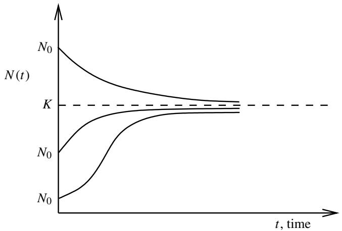

**Figure 1.1.** Logistic population growth. Note the qualitative difference for the two cases *N*0 < *K*/2 and *K* > *N*0 > *K*/2.

theory. He certainly confirmed Charles Darwin's maxim: 'Great is the power of steady misinterpretation.' The main point about the logistic form is that it is a particularly convenient form to take when seeking qualitative dynamic behaviour in populations in which *N* = 0 is an unstable steady state and *N*(*t*) tends to a finite positive stable steady state. The logistic form will occur in a variety of different contexts throughout the book primarily because of its algebraic simplicity and because it provides a preliminary qualitative idea of what can occur with more realistic forms.

It is instructive to try to understand why the logistic form was accepted since it highlights an important point in modelling in the biomedical sciences. The logistic growth form in (1.3) has three parameters, *N*0, *K* and *r* with which to assign to compare with actual data. These were used by Pearl (1925) to fit the census population data for various countries including the United States, Sweden and France for various periods. Figure 1.2 shows the results for France and the U.S. If we look at the U.S. data there is a good fit for the population roughly from 1790 until about 1910; here the lower part of the curve is fitted. However, the rest of the curve is nowhere near the actual population data. The same holds for France but the data were fitted to the upper part of the curve but even there the subsequent population growth prediction is wrong. The main point is not that the predictions are so inaccurate but rather that curve fitting only part of the data, and particularly the part which does not cover the major part of the growth curve makes comparison with data and future predictions extremely unreliable. Of course, we could produce an algebraic expression with a few more parameters (and derive some differential equation for which it is the solution) and do a better job but then all we would be doing would be curve fitting without increasing our understanding of the actual *mechanism* governing the phenomenon. The motivation for modelling such as we discuss in this book is to further our understanding of the underlying processes since it is only in this way that we can make justifiable predictions.

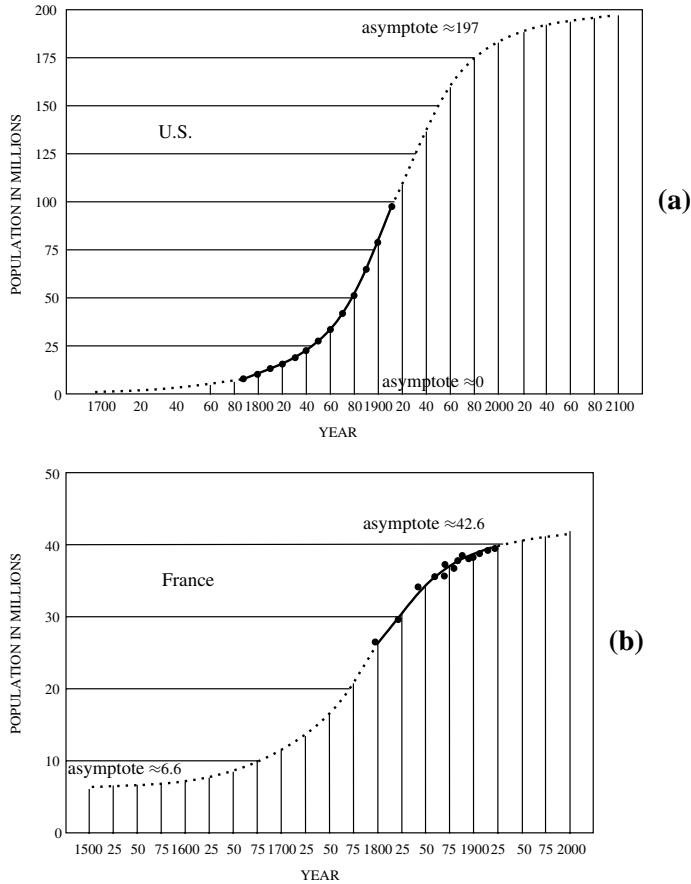

**Figure 1.2.** Logistic population growth (1.3) used to fit the census data for the population of (**a**) the U.S. and (**b**) France. The data determine the parameters only over a small part of the growth curve. (Redrawn from Pearl 1925)

In general if we consider a population to be governed by

$$\frac{dN}{dt} = f(N),\tag{1.4}$$

where typically *f* (*N*) is a *nonlinear* function of *N* then the equilibrium solutions *N*∗ are solutions of *f* (*N*) = 0 and are linearly stable to small perturbations if *f* (*N*∗) < 0, and unstable if *f* (*N*∗) > 0. This is clear from linearising about *N*∗ by writing

$$n(t) \approx N(t) - N^*, \quad |n(t)| \ll 1$$

and (1.4) becomes

$$\frac{dN}{dt} = f(N^* + n) \approx f(N^*) + nf'(N^*) + \dotsb,$$

which to first order in *n*(*t*) gives

$$\frac{dN}{dt} \approx n f'(N^*) \quad \Rightarrow \quad n(t) \propto \exp\left[f'\left(N^*\right)t\right].\tag{1.5}$$

So *n* grows or decays accordingly as *f* (*N*∗) > 0 or *f* (*N*∗) < 0. The timescale of the response of the population to a disturbance is of the order of 1/| *f* (*N*∗)|; it is the time to change the initial disturbance by a factor *e*.

There may be several equilibrium, or steady state, populations *N*∗ which are solutions of *f* (*N*) = 0: it depends on the system *f* (*N*) models. Graphically plotting *f* (*N*) against *N* immediately gives the equilibria as the points where it crosses the *N*-axis. The gradient *f* (*N*∗) at each steady state then determines its *linear* stability. Such steady states may, however, be unstable to finite disturbances. Suppose, for example, that *f* (*N*) is as illustrated in Figure 1.3. The gradients *f* (*N*∗) at *N* = 0, *N*2 are positive so these equilibria are unstable while those at *N* = *N*1, *N*3 are stable to small perturbations: the arrows symbolically indicate stability or instability. If, for example, we now perturb the population from its equilibrium *N*1 so that *N* is in the range *N*2 < *N* < *N*3 then *N* → *N*3 rather than returning to *N*1. A similar perturbation from *N*3 to a value in the range 0 < *N* < *N*2 would result in *N*(*t*) → *N*1. Qualitatively there is a threshold perturbation below which the steady states are always stable, and this threshold depends on the full nonlinear form of *f* (*N*). For *N*1, for example, the necessary threshold perturbation is *N*2 − *N*1.

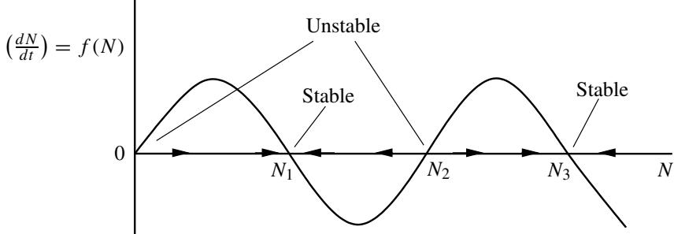

**Figure 1.3.** Population dynamics model *d N*/*dt* = *f* (*n*) with several steady states. The gradient *f* (*N*) at the steady state, that is, where *f* (*N*) = 0, determines the linear stability.

#### **1.2 Insect Outbreak Model: Spruce Budworm**

A practical model which exhibits two positive linearly stable steady state populations is that for the spruce budworm which can, with ferocious efficiency, defoliate the balsam fir; it is a major problem in Canada. Ludwig et al. (1978) considered the budworm population dynamics to be modelled by the equation

$$\frac{dN}{dt} = r_B N \left(1 - \frac{N}{K_B}\right) - p(N).$$

Here *rB* is the linear birth rate of the budworm and *KB* is the carrying capacity which is related to the density of foliage (food) available on the trees. The *p*(*N*)-term represents predation, generally by birds: its qualitative form is important and is illustrated in Figure 1.4. Predation usually saturates for large enough *N*. There is an approximate threshold value *Nc*, below which the predation is small, while above it the predation is close to its saturation value: such a functional form is like a switch with *Nc* being the critical switch value. For small population densities *N*, the birds tend to seek food elsewhere and so the predation term *p*(*N*) drops more rapidly, as *N* → 0, than a linear rate proportional to *N*. To be specific we take the form for *p*(*N*) suggested by Ludwig et al. (1978), namely, *B N*2/(*A*2 + *N*2) where *A* and *B* are positive constants, and the dynamics of *N*(*t*) is then governed by

$$\frac{dN}{dt} = r_B N \left(1 - \frac{N}{K_B}\right) - \frac{BN^2}{A^2 + N^2}.\tag{1.6}$$

This equation has four parameters, *rB*, *KB*, *B* and *A*, with *A* and *KB* having the same dimensions as *N*,*rB* has dimension (time)−1 and *B* has the dimensions of *N*(time)−1. *A* is a measure of the threshold where the predation is 'switched on,' that is, *Nc* in Figure 1.4. If *A* is small the 'threshold' is small, but the effect is just as dramatic.

Before analysing the model it is essential, or rather obligatory, to express it in *nondimensional* terms. This has several advantages. For example, the units used in the analysis are then unimportant and the adjectives small and large have a definite relative meaning. It also always reduces the number of relevant parameters to dimensionless groupings which determine the dynamics. A pedagogical article with several practical examples by Segel (1972) discusses the necessity and advantages for nondimensionali-

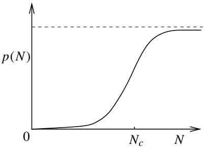

**Figure 1.4.** Typical functional form of the predation in the spruce budworm model; note the sigmoid character. The population value *Nc* is an approximate threshold value. For *N* < *Nc* predation is small, while for *N* > *Nc*, it is 'switched on.'

sation and scaling in general. Here we introduce nondimensional quantities by writing

$$u = \frac{N}{A}, \quad r = \frac{Ar_B}{B}, \quad q = \frac{K_B}{A}, \quad \tau = \frac{Bt}{A} \tag{1.7}$$

which on substituting into (1.6) becomes

$$\frac{du}{d\tau} = ru\left(1 - \frac{u}{q}\right) - \frac{u^2}{1 + u^2} = f(u; r, q),\tag{1.8}$$

where *f* is defined by this equation. Note that it has only two parameters*r* and *q*, which are pure numbers, as also are *u* and τ of course. Now, for example, if *u* 1 it means simply that *N A*. In real terms it means that predation is negligible in this population range. In any model there are usually several different nondimensionalisations possible and this model is no different. For example, we could write *u* = *N*/*KB*,τ = *t*/*rB* and so on to get a different form to (1.8) for the dimensionless equation. The dimensionless groupings to choose depend on the aspects you want to investigate. The reasons for the particular form (1.7) become clear below.

The steady states are solutions of

$$f(u;r,q) = 0 \quad \Rightarrow \quad ru\left(1 - \frac{u}{q}\right) - \frac{u^2}{1 + u^2} = 0. \tag{1.9}$$

Clearly *u* = 0 is one solution with other solutions, if they exist, satisfying

$$r\left(1-\frac{u}{q}\right)=\frac{u}{1+u^2}.\tag{1.10}$$

Although we know the analytical solutions of a cubic (Appendix B), they are often clumsy to use because of their algebraic complexity; this is one of these cases. It is convenient here to determine the existence of solutions of (1.10) graphically as shown in Figure 1.5(a). We have plotted the straight line, the left of (1.10), and the function on the right of (1.10); the intersections give the solutions. The actual expressions are not important here. What is important, however, is the existence of one, three, or again, one solution as *r* increases for a fixed *q*, as in Figure 1.5(a), or as also happens for a fixed *r* and a varying *q*. When *r* is in the appropriate range, which depends on *q*, there are three equilibria with a typical corresponding *f* (*u*;*r*, *q*) as shown in Figure 1.5(b). The nondimensional groupings which leave the two parameters appearing only in the straight line part of Figure 1.5 are particularly helpful and was the motivation for the nondimensionalisation introduced in (1.7). By inspection *u* = 0, *u* = *u*2 are linearly unstable, since ∂ *f*/∂*u* > 0 at *u* = 0, *u*2, while *u*1 and *u*3 are stable steady states, since at these ∂ *f*/∂*u* < 0. There is a domain in the *r*, *q* parameter space where three roots of (1.10) exist. This is shown in Figure 1.6; the analytical derivation of the boundary curves is left as an exercise (Exercise 1).

This model exhibits a *hysteresis effect*. Suppose we have a fixed *q*, say, and *r* increases from zero along the path *ABCD* in Figure 1.6. Then, referring also to Figure 1.5(a), we see that if *u*1 = 0 at *r* = 0 the *u*1-equilibrium simply increases monoton-

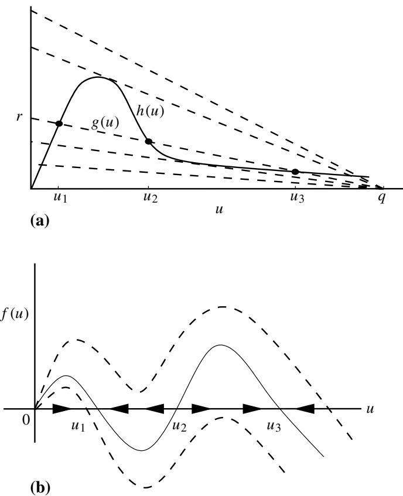

**Figure 1.5.** Equilibrium states for the spruce budworm population model (1.8). The positive equilibria are given by the intersections of the straight line *r*(1 − *u*/*q*) and *u*/(1 + *u*2). With the middle straight line in (**a**) there are 3 steady states with *f* (*u*;*r*, *q*) typically as in (**b**).

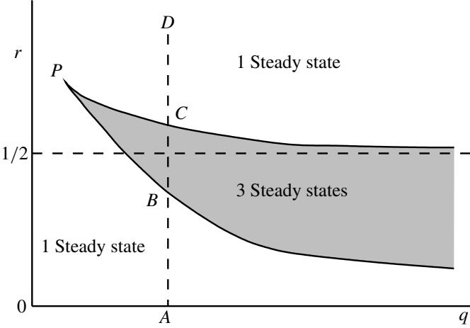

**Figure 1.6.** Parameter domain for the number of positive steady states for the budworm model (1.8). The boundary curves are given parametrically (see Exercise 1) by *r*(*a*) = 2*a*3/(*a*2 + 1)2, *q*(*a*) = 2*a*3/(*a*2 − 1) for *a* ≥ √3, the value giving the cusp point *P*.

ically with *r* until *C* in Figure 1.6 is reached. For a larger *r* this steady state disappears and the equilibrium value jumps to *u*3. If we now reduce *r* again the equilibrium state is the *u*3 one and it remains so until *r* reaches the lower critical value, where there is again only one steady state, at which point there is a jump from the *u*3 to the *u*1 state. In other words as *r* increases along *ABCD* there is a discontinuous jump up at *C* while as *r* decreases from *D* to *A* there is a discontinuous jump down at *B*. This is an example of a *cusp catastrophe* which is illustrated schematically in Figure 1.7 where the letters *A*, *B*,*C* and *D* correspond to those in Figure 1.6. Note that Figure 1.6 is the projection of the surface onto the *r*, *q* plane with the shaded region corresponding to the fold.

The parameters from field observation are such that there are three possible steady states for the population. The smaller steady state *u*1 is the *refuge* equilibrium while *u*3 is the *outbreak* equilibrium. From a pest control point of view, what should be done to try to keep the population at a refuge state rather than allow it to reach an outbreak situation? Here we must relate the real parameters to the dimensionless ones, using (1.7). For example, if the foliage were sprayed to discourage the budworm this would reduce *q* since *KB*, the carrying capacity in the absence of predators, would be reduced. If the reduction were large enough this could force the dynamics to have only one equilibrium: that is, the effective *r* and *q* do not lie in the shaded domain of Figure 1.6. Alternatively we could try to reduce the reproduction rate *rB* or increase the threshold number of predators, since both reduce *r* which would be effective if it is below the critical value for *u*3 to exist. Although these give preliminary qualitative ideas for control, it is not easy to determine the optimal strategy, particularly since spatial effects such as

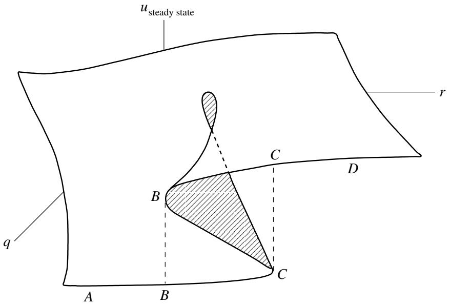

**Figure 1.7.** Cusp catastrophe for the equilibrium states in the (*u*steadystate, *r*, *q*) parameter space. As *r* increases from *A*, the path is *ABCCD* while as *r* decreases from *D*, the path is *DC BB A*. The projection of this surface onto the *r*, *q* plane is given in Figure 1.5. Three equilibria exist where the fold is.

budworm dispersal must be taken into effect; we shall discuss this aspect in detail in Chapter 2, Volume II.

It is appropriate here to mention briefly the timescale with which this model is concerned. An outbreak of budworm during which balsam fir trees are denuded of foliage is about four years. The trees then die and birch trees take over. Eventually, in the competition for nutrient, the fir trees will drive out the birch trees again. The timescale for fir reforestation is of the order of 50 to 100 years. A full model would incorporate the tree dynamics as well; see Ludwig et al. (1978). So, the model we have analysed here is only for the short timescale, namely, that related to a budworm outbreak.

Hassell et al. (1999) have considered the original highly complex (more than 80 variables and parameters) multi-species interaction model involving large and small larvae, fecundity, foliage mortality with and without the budworm, and other players in the interaction. They show, using gross, but reasonably justifiable assumptions, that the model can be simplified without losing the basic budworm–forest interaction. They obtain several simplifications using asymptotic limits, eventually reducing the system to three difference (as opposed to differential) equations for larvae, foliage and area fraction of old trees. Analysis showed that the mechanism for oscillations could be captured with only two equations. A more in depth analysis than we have done here, but very much less than that by Hassell et al. (1999), is given in the very practical book on modelling by Fowler (1997).

#### *Catastrophes in Perception*

Although the following does not strictly belong in a chapter on population dynamics, it seemed appropriate to include it in the section where we discuss hysteresis and catastrophic change.

There is a series of now classic figures developed by Fisher (1967) which demonstrate sudden changes in visual perception. Here we describe one of these picture series and show that it is another example of a cusp catastrophe; it also exhibits an initial perceptual hysteresis. We also present the results of an experiment carried out by the author which confirms the hypothesis. The specific example we describe has been studied in more depth by Zeeman (1982) and more generally by Stewart and Peregoy (1983).

The mind can be triggered, or moved in a major new thought or behavioural direction, by a vast variety of cues in ways we cannot yet hope to describe in any biological detail. A step in this direction, however, is to be able to describe the phenomenon and demonstrate its existence via example. Such sudden changes in perception and behaviour are quite common in psychology and therapy.4

The series of pictures, numbered 1 to 8 are shown in Figure 1.8.

<sup>4</sup>An interesting example of a major change in a patient undergoing psychoanalysis treated by the French psychoanalyst Marie Claire Boons is described by Zeeman (1982). The case involved a frigid woman whom she had been treating for two years without much success. 'One day the patient reported dreaming of a frozen rabbit in her arms, which woke and said hello. The patient's words were "un lapin congele," meaning a frozen ´ rabbit, to which the psychoanalyst slowly replied "la pin con gele?" This is a somewhat elaborate pun. The ´ word "pin" is the French slang for penis, the female "la" makes it into the clitoris, "con" is the French slang for the female genitals, and "gele" means both frozen and rigid. The surprising result was that the patient did ´ not respond for 20 minutes and the next day came back cured. Apparently that evening she had experienced her first orgasm ever with her husband.'

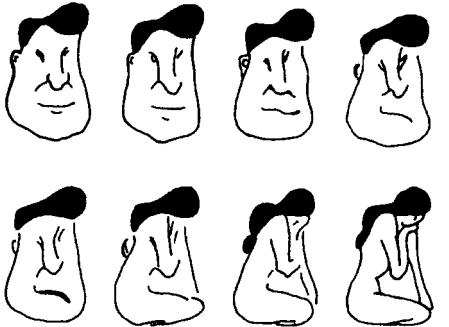

**Figure 1.8.** Series of pictures exhibiting abrupt (catastrophic) visual change during the variation from a man's face to a sitting woman. (After Fisher 1967)

The picture numbered 1 in the figure is clearly a man's face while picture 8 is clearly a sitting woman. An experiment which demonstrates the sudden jump from seeing the face of a man to the picture of the woman is described by Zeeman (1982). The author carried out a similar experiment with a group of 57 students, none of whom had seen the series before nor knew of such an example of sudden change in visual perception. The experiment consisted of showing the series three times starting with the man's face, picture 1, going up to the woman, picture 8, then reversing the sequence down to 1 and again in ascending order; that is, the figures were shown in the order 1234567876543212345678. The students were told to write down the numbers where they noticed a major change in their perception; the results are presented in Table 1.2.

The predictions were that during the first run through the series, that is, from 1 to 8, the perception of most of the audience would be locked into the figure of the face until it became obvious that the picture was in fact a woman at which stage there would be sudden jump in perception. As the pictures were shown in the reverse order the audience was now aware of the two possibilities and so could make a more balanced judgement as to what a specific picture represented. The perception change would therefore more likely occur nearer the middle, around 5 and 4. During the final run through the series the change would again occur near the middle.

The results of Table 1.2 are shown schematically in Figure 1.9 where the vertical axis is perception, *p*, and the horizontal axis, the stimulus, the picture number. The

| Sequence<br>Direction |   |   |   | Picture | Sequence |    |    |    | Mean | Sequence<br>Direction |
|-----------------------|---|---|---|---------|----------|----|----|----|------|-----------------------|
| →                     | 1 | 2 | 3 | 4       | 5        | 6  | 7  | 8  |      |                       |
| number<br>switching   | 0 | 0 | 0 | 0       | 5        | 8  | 25 | 19 | 7.0  |                       |
|                       | 1 | 2 | 3 | 4       | 5        | 6  | 7  | 8  |      | ←                     |
| number<br>switching   | 0 | 1 | 1 | 17      | 29       | 6  | 3  | —  | 4.8  |                       |
| →                     | 1 | 2 | 3 | 4       | 5        | 6  | 7  | 8  |      |                       |
| number<br>switching   | — | 0 | 3 | 19      | 19       | 12 | 3  | 1  | 4.9  |                       |

**Table 1.2.** Numbers for the perceptual catastrophe experiment involving 57 undergraduates, none of whom had seen the series nor had heard of the phenomenon before.

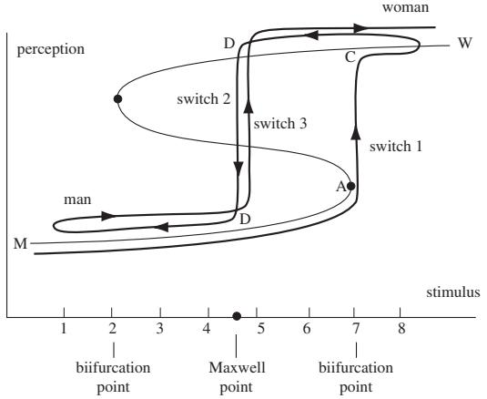

**Figure 1.9.** Schematic representation of the visual catastrophe based on the data in Table 1.2 on three runs (1234567876543212345678) through the series of pictures in Figure 1.8. The stimulus switches occurred at points denoted by 1, 2 and 3 in that order.

graph of perception versus stimulus is multi-valued in a traditional cusp catastrophe way. Here, over part of the range there are two possible perceptions, a face or a woman. The relation with the example of the budworm population problem is clear. On the first run through the switch was delayed until around picture 7 while on the run through the down sequence it occurred mainly at 5 and again around 5 on the final run through the pictures. There is, however, a fundamental difference between the phenomenon here and the budworm. In the latter there is a definite and reproducible hysteresis while in the former this hysteresis effect occurs only once after which the dynamics is single valued for each stimulus.

If we had started with picture 8 and again run the series three times the results would be similar except that the jump would have occurred first around 2, as in the figure, with the second and third switch again around 5. The phenomenon of catastrophic change in behavior and perception is widespread and an understanding of the underlying dynamics would clearly be of great help. Several other qualitative examples in psychology are described by Zeeman (1977).

### **1.3 Delay Models**

One of the deficiencies of single population models like (1.4) is that the birth rate is considered to act instantaneously whereas there may be a time delay to take account of the time to reach maturity, the finite gestation period and so on. We can incorporate such delays by considering delay differential equation models of the form

$$\frac{dN(t)}{dt} = f\left(N(t), N(t-T)\right),\tag{1.11}$$

where *T* > 0, the delay, is a parameter. One such model, which has been used, is an extension of the logistic growth model (1.2), namely, the differential delay equation

$$\frac{dN}{dt} = rN(t)\left[1 - \frac{N(t-T)}{K}\right],\tag{1.12}$$

where *r*, *K* and *T* are positive constants. This says that the regulatory effect depends on the population at an earlier time, *t* − *T* , rather than that at *t*. This equation is itself a model for a delay effect which should really be an average over past populations and which results in an integrodifferential equation. Thus a more accurate model than (1.12) is, for example, the convolution type

$$\frac{dN}{dt} = rN(t)\left[1 - \frac{1}{K} \int_{-\infty}^{t} w(t-s)N(s) \, ds\right],\tag{1.13}$$

where w(*t*) is a weighting factor which says how much emphasis should be given to the size of the population at earlier times to determine the present effect on resource availability. Practically w(*t*) will tend to zero for large negative and positive *t* and will probably have a maximum at some representative time *T* . Typically w(*t*) is as illustrated in Figure 1.10. If w(*t*) is sharper, in the sense that the region around *T* is narrower or larger, then in the limit we can think of w(*t*) as approximating the Dirac function δ(*t* − *T* ), where

$$\int_{-\infty}^{\infty} \delta(t - T) f(t) \, dt = f(T).$$

Equation (1.13) in this case then reduces to (1.12)

$$\int_{-\infty}^{t} \delta(t - T - s) N(s) \, ds = N(t - T).$$

The character of the solutions of (1.12), and the type of boundary conditions required are quite different from those of (1.2). Even with the seemingly innocuous equation (1.12) the solutions in general have to be found numerically. Note that to compute the solution for *t* > 0 we require *N*(*t*) for *all* −*T* ≤ *t* ≤ 0 . We can however get some qualitative impression of the kind of solutions of (1.12) which are possible, by the following heuristic reasoning.

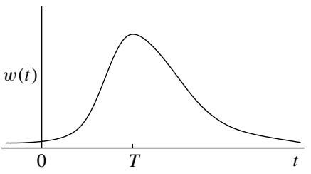

**Figure 1.10.** Typical weighting function w(*t*) for an integrated delay effect on growth limitation for the delay model represented by (1.13).

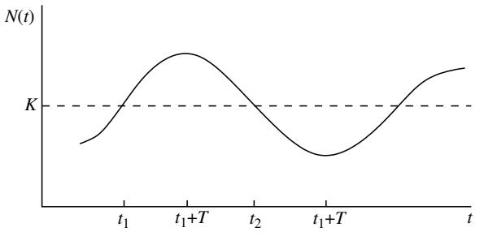

**Figure 1.11.** Schematic periodic solution of the delay equation population model (1.12).

Refer now to Figure 1.11 and suppose that for some *t* = *t*1, *N*(*t*1) = *K* and that for some time *t* < *t*1, *N*(*t* − *T* ) < *K*. Then from the governing equation (1.12), since 1 − *N*(*t* − *T* )/*K* > 0, *d N*(*t*)/*dt* > 0 and so *N*(*t*) at *t*1 is still increasing. When *t* = *t*1 + *T* , *N*(*t* − *T* ) = *N*(*t*1) = *K* and so *d N*/*dt* = 0. For *t*1 + *T* < *t* < *t*2, *N*(*t* − *T* ) > *K* and so *d N*/*dt* < 0 and *N*(*t*) decreases until *t* = *t*2 + *T* since then *d N*/*dt* = 0 again because *N*(*t*2 + *T* − *T* ) = *N*(*t*2) = *K*. There is therefore the possibility of oscillatory behaviour. For example, with the simple linear delay equation

$$\frac{dN}{dt} = -\frac{\pi}{2T}N(t - T) \quad \Rightarrow \quad N(t) = A\cos\frac{\pi t}{2T},$$

where *A* is a constant. This solution, which can be easily verified, is periodic in time.

In fact the solutions of (1.12) can exhibit *stable limit cycle* periodic solutions for a large range of values of the product *rT* of the birth rate *r* and the delay *T* . If *tp* is the period then *N*(*t*+*tp*) = *N*(*t*) for all *t*. The point about *stable* limit cycle solutions is that if a perturbation is imposed the solution returns to the original periodic solution as *t* → ∞, although possibly with a *phase shift*. The periodic behaviour is also independent of any initial data.

From Figure 1.11 and the heuristic argument above, the period of the limit cycle periodic solutions might be expected to be of the order of 4*T* . From numerical calculations this is the case for a large range of *rT* , which, incidentally, is a dimensionless grouping. The reason we take this grouping is because (1.12) in dimensionless form becomes

$$\frac{dN^*}{dt^*} = N^*(t^*) \left[ 1 - N^* \left( t^* - T^* \right) \right], \quad \text{where} \quad N^* = \frac{N}{K}, \; t^* = rt, \; T^* = rT.$$

What does vary with *rT* , however, is the amplitude of the oscillation. For example, for *rT* = 1.6, the period *tp* ≈ 4.03*T* and *N*max/*N*min ≈ 2.56; *rT* = 2.1,*tp* ≈ 4.54, *N*max/*N*min ≈ 42.3; *rT* = 2.5,*tp* ≈ 5.36*T*, *N*max/*N*min ≈ 2930. For large values of *rT* , however, the period changes considerably.

This simple delay model has been used for several different practical situations. For example, it has been applied by May (1975) to Nicholson's (1957) careful experimental data for the Australian sheep-blowfly (*Lucila cuprina*), a pest of considerable importance in Australian sheep farming. Over a period of nearly two years Nicholson observed the population of flies which were maintained under carefully regulated temperature and food control. He observed a regular basic periodic oscillation of about 35 to 40 days. Applying (1.12) to the experimental arrangement, *K* is set by the food level available. *T* , the delay, is approximately the time for a larva to mature into an adult. Then the only unknown parameter is *r*, the intrinsic rate of population increase. Figure 1.12 illustrates the comparison with the data for *rT* = 2.1 for which the period is about 4.54*T* . If we take the observed period as 40 days this gives a delay of about 9 days; the actual delay is closer to 11 days. The model implies that if *K* is doubled nothing changes from a time periodic point of view since it can be scaled out by writing *N*/*K* for *N*; this lack of change with *K* is what was observed.

It is encouraging that such a simple model as (1.12) should give such reasonable results. This is some justification for using delay models to study the dynamics of single populations which exhibit periodic behaviour. It is important, however, not to be too easily convinced as to the validity or reasonableness of a model simply because some solutions agree even quantitatively well with the data; this is a phenomenon, or rather a pitfall, we encounter repeatedly later in the book particularly when we discuss models for generating biological pattern and form in Chapter 2 to Chapter 6, Volume II. From the experimental data reproduced in Figure 1.12 we see a persistent 'second burst' feature that the solutions of (1.12) do not mimic. Also the difference between the calculated delay of 9 days and the actual 11 days is really too large. Gurney et al. (1980) investigated this problem with a more elaborate delay model which agrees even better with the data, including the two bursts of reproductive activity observed; see also the book by Nisbet and Gurney (1982) where this problem is discussed fully as a case study.

Another example of the application of this model (1.12) to extant data is given by May (1981) who considers the lemming population in the Churchill area of Canada. There is approximately a 4-year period where, in this case the gestation time is *T* = 0.72 year. The vole population in the Scottish Highlands, investigated by Stirzaker (1975) using a delay equation model, also undergoes a cycle of just under 4 years, which is again approximately 4*T* where here the gestation time is *T* = 0.75 year. In this model the effect of predation is incorporated into the single equation for the vole population.

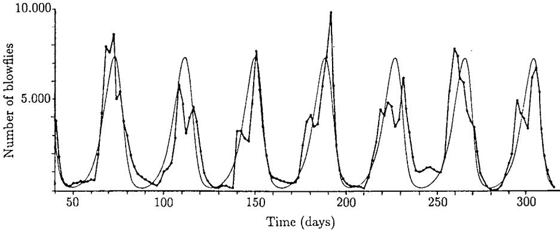

**Figure 1.12.** Comparison of Nicholson's (1957) experimental data for the population of the Australian sheepblowfly and the model solution from (1.12) with *rT* = 2.1. (From May 1975).

The article by Myers and Krebs (1974) discusses population cycles in rodents in general: they usually have 3 to 4 year cycles.

Not all periodic population behaviour can be treated quite so easily. One such example which is particularly dramatic is the 13- and 17-year cycle exhibited by a species of locusts; that is, their emergences are synchronized to 13 or 17 years.

It should perhaps be mentioned here that single (nondelay) differential equation models for population growth without delay, that is, like *d N*/*dt* = *f* (*N*), *cannot* exhibit limit cycle behaviour. We can see this immediately as follows. Suppose this equation has a periodic solution with period *T* ; that is, *N*(*t* + *T* ) = *N*(*t*). Multiply the equation by *d N*/*dt* and integrate from *t* to *t* + *T* to get

$$\begin{aligned} \int_{t}^{t+T} \left(\frac{dN}{dt}\right)^2 dt &= \int_{t}^{t+T} f(N) \frac{dN}{dt} \, dt\\ &= \int_{N(t)}^{N(t+T)} f(N) \, dN\\ &= 0 \end{aligned}$$

since *N*(*t* + *T* ) = *N*(*t*). But the left-hand integral is positive since (*d N*/*dt*)2 cannot be identically zero, so we have a contradiction. So, the single scalar equation *d N*/*dt* = *f* (*N*) cannot have periodic solutions.

#### **1.4 Linear Analysis of Delay Population Models: Periodic Solutions**

We saw in the last section how the delay differential equation model (1.12) was capable of generating limit cycle periodic solutions. One indication of their existence is if the steady state is unstable by growing oscillations, although this is certainly not conclusive. We consider here the linearisation of (1.12) about the equilibrium states *N* = 0 and *N* = *K*. Small perturbations from *N* = 0 satisfy *d N*/*dt* ≈ *r N*, which shows that *N* = 0 is unstable with exponential growth. We thus need only consider perturbations about the steady state *N* = *K*.

It is again expedient to nondimensionalise the model equation (1.12) by writing

$$N^*(t) = \frac{N(t)}{K}, \quad t^* = rt, \quad T^* = rT,\tag{1.14}$$

where the asterisk denotes dimensionless quantities. Then (1.12) becomes, on dropping the asterisks for notational simplicity, but keeping in mind that we are now dealing with nondimensional quantities,

$$\frac{dN(t)}{dt} = N(t)\left[1 - N(t - T)\right].\tag{1.15}$$

Linearising about the steady state, *N* = 1, by writing

$$N(t) = 1 + n(t) \quad \Rightarrow \quad \frac{dn(t)}{dt} \approx -n(t - T). \tag{1.16}$$

We look for solutions for *n*(*t*) in the form

$$m(t) = ce^{\lambda t} \quad \Rightarrow \quad \lambda = -e^{-\lambda T},\tag{1.17}$$

from (1.16), where *c* is a constant and the eigenvalues λ are solutions of the second of (1.17), a transcendental equation in which *T* > 0.

It is not easy to find the analytical solutions of (1.17). However, all we really want to know from a stability point of view is whether there are any solutions with Re λ > 0 which from the first of (1.17) implies instability since in this case *n*(*t*) grows exponentially with time.

Set λ = µ + *i*ω. There is a real number µ0 such that all solutions λ of the second of (1.17) satisfy Re λ<µ0. To see this take the modulus to get | λ | = *e*−µ*T* and so, if | λ |→∞ then *e*−µ*T* → ∞ which requires µ → −∞. Thus there must be a number µ0 that bounds Re λ from above. If we introduce *z* = 1/λ and w(*z*) = 1 + *ze*−*T*/*z* then w(*z*) has an essential singularity at *z* = 0. So by Picard's theorem, in the neighbourhood of *z* = 0,w(*z*) = 0 has infinitely many complex roots. Thus there are infinitely many roots λ.

We now take the real and imaginary parts of the transcendental equation in (1.17), namely,

$$
\mu = -e^{-\mu T} \cos \alpha T, \quad \omega = e^{-\mu T} \sin \alpha T,\tag{1.18}
$$

and determine the range of *T* such that µ < 0. That is, we want to find the conditions such that the upper limit µ0 on µ is negative. Let us first dispense with the simple case where λ is real; that is, ω = 0. From (1.18), ω = 0 satisfies the second equation and the first becomes µ = −*e*−µ*T* . This has no positive roots µ > 0 since *e*−µ*T* > 0 for all µ*T* or as can be seen on sketching each side of the equation as a function of µ and noting that they can only intersect with *T* > 0 if µ < 0.

Consider now ω = 0. From (1.18) if ω is a solution then so is −ω, so we can consider ω > 0 without any loss of generality. From the first of (1.18), µ < 0 requires ω*T* < π/2 since −*e*−µ*T* < 0 for all µ*T* . In principle (1.18) defines µ(*T* ),ω(*T* ). We are interested in the value of *T* when µ(*T* ) first crosses from µ < 0 to µ > 0. As *T* increases from zero µ = 0 first when ω*T* = π/2. From (1.18) we see that if µ = 0 the second equation gives as the only relevant solution ω = 1 occurring at *T* = π/2. Since this is the first zero of µ as *T* increases, this gives the bifurcating value *T* = *Tc* = π/2. Another way of deriving this is to show, from (1.18), that the gradient of µ(*T* )at µ = 0, namely, (∂µ/∂*T* )*T*=π/2 > 0. Anticipating the result of the following analysis that ω < 1 for *T* > π/2, note in passing that (∂ω/∂*T* )*T*=π/2 < 0. So we have

$$0 < T < \frac{\pi}{2} \tag{1.19}$$

as the condition on *T* for stability.

Returning now to dimensional quantities we thus have that the steady state *N*(*t*) = *K* is stable if 0 < *rT* < π/2 and unstable for *rT* > π/2. In the latter case we expect the solution to exhibit stable limit cycle behaviour. The critical value *rT* = π/2 is the bifurcation value, that is, the value of the parameter, *rT* here, where the character of the solutions of (1.12) changes abruptly, or bifurcates, from a stable steady state to a timevarying solution. The effect of delay in models is usually to increase the potential for instability. Here as *T* is increased beyond the bifurcation value *Tc* = π/2*r*, the steady state becomes unstable.

Near the bifurcation value we can get a first estimate of the period of the bifurcating oscillatory solution as follows. Consider the dimensionless form (1.15) and let

$$T = T_c + \varepsilon = \frac{\pi}{2} + \varepsilon, \quad 0 < \varepsilon \ll 1. \tag{1.20}$$

The solution λ = µ + *i*ω, of (1.18), with the largest Re λ when *T* = π/2 is µ = 0, ω = 1. For ε small we expect µ and ω to differ from µ = 0 and ω = 1 also by small quantities so let

$$
\mu = \delta, \quad \omega = 1 + \sigma, \quad 0 < \delta \ll 1, \quad |\sigma| \ll 1,\tag{1.21}
$$

where δ and σ are to be determined. Substituting these into the second of (1.18) and expanding for small δ, σ and ε gives

$$1 + \sigma = \exp\left[-\delta\left(\frac{\pi}{2} + \varepsilon\right)\right] \sin\left[(1+\sigma)\left(\frac{\pi}{2} + \varepsilon\right)\right] \Rightarrow \quad \sigma \approx -\frac{\pi\delta}{2}$$

to first order, while the first of (1.18) gives

$$\delta = -\exp\left[-\delta\left(\frac{\pi}{2} + \varepsilon\right)\right] \cos\left[\left(1 + \sigma\right)\left(\frac{\pi}{2} + \varepsilon\right)\right] \quad \Rightarrow \quad \delta \approx \varepsilon + \frac{\pi\sigma}{2}.$$

Thus on solving these simultaneously

$$\delta \approx \frac{\varepsilon}{1 + \frac{\pi^2}{4}}, \quad \sigma \approx -\frac{\varepsilon \pi}{2\left(1 + \frac{\pi^2}{4}\right)},\tag{1.22}$$

and hence, near the bifurcation, the first of (1.17) with (1.16) gives

$$\begin{split} N(t) &= 1 + \text{Re}\left\{ c \exp\left[ \delta t + i(1 + \sigma)t \right] \right\} \\ &\approx 1 + \text{Re}\left\{ c \exp\left[ \frac{\varepsilon t}{1 + \frac{\pi^2}{4}} \right] \exp\left[ it \left\{ 1 - \frac{\varepsilon \pi}{2(1 + \frac{\pi^2}{4})} \right\} \right] \right\}. \end{split} \tag{1.23}$$

This shows that the instability is by growing oscillations with period

$$\frac{2\pi}{1-\frac{e\pi}{2(1+\frac{\pi^2}{4})}} \approx 2\pi$$

to *O*(1) for small ε. In *dimensional* terms this is 2π/*r* and, since to *O*(1), *rT* = π/2, the period of oscillation is then 4*T* as we expected from the intuitive arguments above. From the numerical results for limit cycles quoted above the solution with *rT* = 1.6 had period 4.03*T* . With *rT* = π/2 + ε = 1.6, this gives ε ≈ 0.029 so the dimensional period to *O*(ε) is obtained from the last equation as

$$\frac{2T}{\pi} \frac{2\pi}{1 - \frac{\varepsilon\pi}{2\left(1 + \frac{\pi^2}{4}\right)}} \approx 4.05T, 4$$

which compares well with the numerical computed value of 4.03*T* . When *rT* = 2.1 this gives ε ≈ 0.53 and corresponding period 5.26*T* which is to be compared with the computed period of 4.54*T* . This ε is too large for the above first order analysis to hold (ε2 is not negligible compared with ε); a more accurate result would be obtained if the analysis were carried out to second order.

The natural appearance of a 'slow time' ε*t* in *N*(*t*) in (1.23) suggests that a full nonlinear solution near the bifurcation value *rT* = π/2 is amenable to a *two-time asymptotic procedure* to obtain the (uniformly valid in time) solution. This can in fact be done; see, for example, Murray's (1984) book on asymptotic methods for a pedagogical description of such techniques and how to use them.

The subject of delay or functional differential equations is now rather large. An introductory mathematical book on the subject is Driver's (1977). The book by Mac-Donald (1979) is solely concerned with time lags in biological models. Although the qualitative properties of such delay equation models for population growth dynamics and nonlinear analytical solutions near bifurcation can often be determined, in general numerical methods have to be used to get useful quantitative results.

A very useful technique for determining the necessary conditions for stability of the solutions of linear delay equations is given by van den Driessche and Zou (1998) and which we now give: it is a Liapunov function technique (for example, Jordan and Smith 1999) which gives an estimate for the stability parameter space. Equation (1.16) above is a special case of the general equation

$$\frac{d\mathbf{y}}{dt} = a\mathbf{y}(t) + b\mathbf{y}(t-\tau), \ t > 0,\tag{1.24}$$

where τ is the delay and *a* and *b* are constant parameters. We could, of course, carry out an equivalent analysis as we did on (1.16) and get the necessary and sufficient conditions for stability and thereby determine the parameter space where the steady state is stable. If *ys* is a steady state *L*[*y*(*t*)] is a Liapunov function if *L*[*y*(*t*)] > 0 for all *y*(*t*) = *ys*, *L*[*y*(*t*)] = 0 for *y*(*t*) = *ys* (that is, *L* positive definite) and *d L*[*y*(*t*)]/*dt* < 0 for all *y*(*t*) = *ys*. If such a function can be found then *ys* is globally asymptotically stable and no closed solution orbits are possible. Such a Liapunov function can be found for (1.24); it is given by

$$L[\mathbf{y}(t)] = \mathbf{y}^2(t) + |\boldsymbol{b}| \int_{t-\tau}^{t} \mathbf{y}^2(s) \, ds,\tag{1.25}$$

where *y*(*t*) is a solution of (1.24).

We have to show that it is indeed a Liapunov function. Certainly *L* > 0 for all *y* = 0 and *L* = 0 when *y*(*t*) = *ys* = 0. Furthermore

$$\begin{split} \frac{dL}{dt} &= 2\mathbf{y}(t)\frac{d\mathbf{y}}{dt} + \left| b \left\| \mathbf{y}^2(t) - \mathbf{y}^2(t-\tau) \right\| \\ &= 2a\mathbf{y}^2(t) + 2\left| b \left\| \mathbf{y}(t)\mathbf{y}(t-\tau) + \left| b \left\| \mathbf{y}^2(t) - \mathbf{y}^2(t-\tau) \right\| \right. \right. \end{split} \tag{1.26} \\ &\le 2a\mathbf{y}^2(t) + \left| b \left\| \left\| \mathbf{y}^2(t) + \mathbf{y}^2(t-\tau) \right\| + \left| b \left\| \left\| \mathbf{y}^2(t) - \mathbf{y}^2(t-\tau) \right\| \right. \right. \end{split} \tag{1.26} \\ &= 2(a+\left| b\right|)\mathbf{y}^2(t) \\ &\le 0, \text{ for } a < -\left| b \right\|. \end{split} \tag{1.26} $$

So, *L*[*y*(*t*)] satisfies all the conditions of a Liapunov function and so the steady state *ys* = 0 is globally stable for all *a* < −| *b* | which gives the parameter space where *y* = 0 is stable—and not just linearly stable. If a full stability analysis is carried out as we did for (1.16) the stability domain is actually larger but not markedly so; they are both, however, of the same broad general shape.

#### **1.5 Delay Models in Physiology: Periodic Dynamic Diseases**

There are many acute physiological diseases where the initial symptoms are manifested by an alteration or irregularity in a control system which is normally periodic, or by the onset of an oscillation in a hitherto nonoscillatory process. Such physiological periodic diseases have been termed dynamical diseases by Glass and Mackey (1979) who have made a particular study of several important physiological examples. The symposium proceedings of a meeting specifically devoted to temporal disorders in human oscillatory systems edited by Rensing et al. (1987) is particularly apposite to the material and modelling in this section, as is the nontechnical intuitive book by Glass and Mackey (1988) (which has many applications) and that edited by Othmer et al. (1993). Other examples are discussed by Mackey and Milton (1990) and Milton and Mackey (1989). Here we discuss two specific examples which have been modelled, analysed and related to experimental observations by Mackey and Glass (1977). The review article on dynamic diseases by Mackey and Milton (1988) is of direct relevance to the material discussed here; it also describes some examples drawn from neurophysiology. The book by Keener and Sneyd (1998) has other examples. Although the second model we consider is concerned with populations of cells, the first does not relate to any population species but rather to the concentration of a gas. It does, however, fit naturally here since it is a scalar delay differential equation model the analysis for which is directly applicable to the second problem. It is also interesting in its own right.

#### *Cheyne–Stokes Respiration*

The first example, Cheyne–Stokes respiration, is a human respiratory ailment manifested by an alteration in the regular breathing pattern. Here the amplitude of the breathing pattern, directly related to the breath volume—the ventilation *V*—regularly waxes and wanes with each period separated by periods of apnea, that is where the volume per

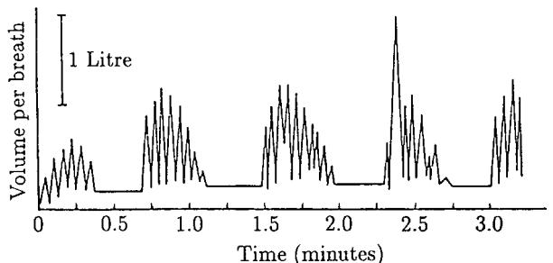

**Figure 1.13.** A spirogram of the breathing pattern of a 29-year-old man with Cheyne–Stokes respiration. The typical waxing and waning of the volume of breath is interspersed with periods of low ventilation levels; this is apneic breathing. (Redrawn with permission from Mackey and Glass 1977)

breath is exceedingly low. Figure 1.13 is typical of spirograms of those suffering from Cheyne–Stokes respiration.

We first need a few physiological facts for our model. The level of arterial carbon dioxide (CO2), *c*(*t*) say, is monitored by receptors which in turn determine the level of ventilation. It is believed that these CO2-sensitive receptors are situated in the brainstem so there is an inherent time lag, *T* say, in the overall control system for breathing levels. It is known that the ventilation response curve to CO2 is sigmoidal in form. We assume the dependence of the ventilation *V* on *c* to be adequately described by what is called a Hill function, of the form

$$V = V_{\text{max}} \frac{c^m (t - T)}{a^m + c^m (t - T)},\tag{1.27}$$

where *V*max is the maximum ventilation possible and the parameter *a* and the Hill coefficient *m* are positive constants which are determined from experimental data. (We discuss the biological relevance of Hill functions and how they arise later in Chapter 6.) We assume the removal of CO2 from the blood is proportional to the product of the ventilation and the level of CO2 in the blood.

Let *p* be the constant production rate of CO2 in the body. The dynamics of the CO2 level is then modelled by

$$\frac{dc(t)}{dt} = p - bVc(t) = p - bV_{\text{max}}c(t)\frac{c^m(t-T)}{a^m + c^m(t-T)},\tag{1.28}$$

where *b* is a positive parameter which is also determined from experimental data. The delay time *T* is the time between the oxygenation of the blood in the lungs and monitoring by the chemoreceptors in the brainstem. This first order differential-delay model exhibits, as we shall see, the qualitative features of both normal and abnormal breathing.

As a first step in analysing (1.28) we introduce the nondimensional quantities

$$\alpha = \frac{c}{a}, \quad t^* = \frac{pt}{a}, \quad T^* = \frac{pt}{a}, \quad \alpha = \frac{abV_{\text{max}}}{p}, \quad V^* = \frac{V}{V_{\text{max}}} \tag{1.29}$$

and the model equation becomes

$$\mathbf{x}'(t) = \mathbf{l} - a\mathbf{x}(t)\frac{\mathbf{x}^m(t-T)}{1+\mathbf{x}^m(t-T)} = \mathbf{l} - a\mathbf{x}V\left(\mathbf{x}(t-T)\right),\tag{1.30}$$

where for notational simplicity we have omitted the asterisks on *t* and *T* .

As before we get an indication of the dynamic behaviour of solutions by investigating the linear stability of the steady state *x*0 given from (1.30) by

$$1 = \alpha \frac{\mathbf{x}_0^{m+1}}{1 + \mathbf{x}_0^m} = \alpha \mathbf{x}_0 V \,(\mathbf{x}_0) = \alpha \mathbf{x}_0 V_0,\tag{1.31}$$

where *V*0, defined by the last equation, is the dimensionless steady state ventilation. A simple plot of 1/α*x*0 and *V*(*x*0) as functions of *x*0 shows there is a unique positive steady state. If we now consider small perturbations about the steady state *x*0 we write *u* = *x* − *x*0 and consider | *u* | small. Substituting into (1.30) and retaining only linear terms we get, using (1.31),

$$
\mu' = -\alpha V_0 \mu - \alpha \ge V_0' \mu(t - T),
\tag{1.32}
$$

where *V* 0 = *dV*(*x*0)/*dx*0 is positive. As in the last section we look for solutions in the form

$$
\mu(t) \propto e^{\lambda t} \quad \Rightarrow \quad \lambda = -\alpha V_0 - \alpha \ge V_0' e^{-\lambda T}. \tag{1.33}
$$

If the solution λ with the largest real part is negative, then the steady state is stable. Since here we are concerned with the oscillatory nature of the disease we are interested in parameter ranges where the steady state is unstable and, in particular, unstable by growing oscillations in anticipation of limit cycle behaviour. So, as before, we must determine the bifurcation values of the parameters such that Re λ = 0.

Set λ = µ + *i*ω. In the same way as in the last section it is easy to show that a real number µ0 exists such that for all solutions λ of (1.33), Re λ<µ0 and also that no real positive solution exists. For notational simplicity let us write the transcendental equation (1.33) as

$$
\lambda = -A - Be^{-\lambda T}, \quad A = \alpha V_0 > 0, \quad B = \alpha \ge V_0' > 0. \tag{1.34}
$$

Equating real and imaginary parts gives

$$
\mu = -A - Be^{-\mu T} \cos \alpha T, \quad \alpha = Be^{-\mu T} \sin \alpha T. \tag{1.35}
$$

Simultaneous solutions of these give µ and ω in terms of *A*, *B* and *T* : we cannot determine them explicitly of course as we saw in Section 1.4. The bifurcation we are interested in is when µ = 0 so we consider the parameter ranges which admit such a solution. With µ = 0 the last equations give, with *s* = ω*T* ,

$$\text{cost}\,\text{s} = -\frac{AT}{\text{s}}, \quad \Rightarrow \quad \frac{\pi}{2} < \text{s}_{\text{l}} < \pi \tag{1.36}$$

for all finite *AT* > 0 where *s*1 is a solution. We can see that such a solution *s*1 exists on sketching cot*s* and −*AT*/*s* as functions of *s*. There are of course other solutions *sm* of this equation in the ranges [(2*m* + 1)π/2,(*m* + 1)π] for *m* = 1, 2,... but we need only consider the smallest positive solution *s*1 since that gives the bifurcation for the smallest critical *T* > 0. We now have to determine the parameter ranges so that with µ = 0 and *s*1 substituted back into (1.35) a solution exists. That is, what are the restrictions on *A*, *B* and *T* so that

$$0 = -A - B\cos s_{\parallel}, \quad s_{\parallel} = BT\sin s_{\parallel}$$

are consistent? These imply

$$BT = \left[ (AT)^2 + s_1^2 \right]^{1/2}.\tag{1.37}$$

If *B*, *A* and *T* , which determine *s*1, are such that the last equality cannot hold then no solution with µ = 0 exists.

Since *A* and *B* are positive, the solution is stable in the limiting case *T* = 0 since then Re λ = µ = −*A* − *B* < 0. Now consider (1.35) and increase *T* from *T* = 0. From the last equation and (1.36) a solution with µ = 0 cannot exist if

$$\begin{aligned} BT &< \left[ (AT)^2 + s_1^2 \right]^{1/2} \\ s_1 \cot s_1 &= -AT, \quad \frac{\pi}{2} < s_1 < \pi \end{aligned} \tag{1.38}$$

and, from continuity arguments from *T* = 0 we must have µ < 0. So the bifurcation condition which just gives µ = 0 is (1.37). Or, put in another way, if (1.38) holds, the steady state solution of (1.30) is linearly, and in fact globally, stable. In terms of the original dimensionless variables from (1.34) the conditions are thus

$$\begin{aligned} \alpha x_0 V_0' T &< \left[ (\alpha V_0 T)^2 + s_1^2 \right]^{1/2}, \\ s_1 \cot s_1 &= -\alpha V_0 T. \end{aligned} \tag{1.39}$$

If we now have *A* and *B* fixed, a bifurcation value *Tc* is given by the first of (1.38) with an equality sign in the inequality.

Actual parameter values for normal humans have been obtained by Mackey and Glass (1977). The concentration of gas in blood is measured in terms of the partial pressure it sustains and so it is measured in mmHg (that is, in torr). Relevant to the dimensional system (1.28), they estimated

$$\begin{aligned} c_0 &= 40 \text{ mmHg} & p &= 6 \text{ mmHg/min}, \quad V_0 = 7 \text{ litre/min}, \\ V_0' &= 4 \text{ litre/min mmHg}, \quad T = 0.25 \text{ min}. \end{aligned} \tag{1.40}$$

From (1.31), which defines the dimensionless steady state, we have α*V*0 = 1/*x*0. So, with (1.39) in mind, we have, using (1.40) and the nondimensionalisation (1.29),

$$
\alpha V_0 T = \frac{T}{x_0} = \frac{p T_{\text{dimensional}}}{c_0} = 0.0375.
$$

The solution of the second of (1.39) with such a small right-hand side is *s*1 ≈ π/2 and so *s*1 α*V*0*T* which means that the inequality for stability from the first of (1.39) is approximately, but quite accurately,

$$V_0' < \frac{\pi}{2\alpha x_0 T}.\tag{1.41}$$

So, if the gradient of the ventilation at the steady state becomes too large the steady state becomes unstable and limit cycle periodic behaviour ensues. With the values in (1.40) the critical dimensional *V* 0 = 7.44 litre/min mmHg. The gradient increases with the Hill coefficient *m* in (1.27). Other parameters can of course also initiate periodic behaviour; all we require is that (1.41) is violated.

In dimensional terms we can determine values for *m* and *a* in the expression (1.27) for the ventilation, which result in instability by using (1.41) with (1.29) and *V*0 from (1.31). Figures 1.14(a) and (b) show the dimensional results of numerical simulations of (1.28) with two values for *V* 0.

Note that the period of oscillation in both solutions in Figure 1.14 is about 1 minute, which is 4*T* where *T* = 0.25 min is the estimate for delay given in (1.40). This is as we would now expect from the analysis in the last section. A perturbation analysis in the vicinity of the bifurcation state in a similar way to that given in the last section shows

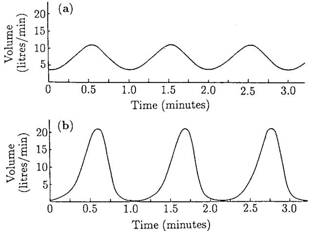

**Figure 1.14.** (**a**) The solution behaviour of the model equation (1.30) presented in dimensional terms for *V* 0 = 7.7 litre/min mmHg. (**b**) The solution behaviour for *V* 0 = 10.01 litre/min mmHg. Note the pronounced apneic regions, that is where the ventilation is very low: this should be compared with the spirogram in Figure 1.10. (Redrawn from Glass and Mackey 1979).

that the period of the growing unstable solution is approximately 4*T* . This is left as an exercise (Exercise 6).

In fact, the experimentally observed period is of the order of two to three times the estimated delay time. The model here for carbon dioxide in the blood is a simple one and to make detailed quantitative comparison with the actual process that takes place is not really justified. It does, however, clearly show how a delay model can arise in a genuine physiological context and produce oscillatory behaviour such as is observed in Cheyne–Stokes respiration.

The problem of periodic breathing that we have just discussed has also been studied in some detail by Fowler and Kalamangalam (2000; see other references there). They put forward a very different explanation for the disease. They suggest that the dynamics of the system are determined by the interaction between the carbon dioxide in the different compartments of the body and that, in fact, the production is more or less irrelevant. They show that the respiratory system is subject to an oscillatory instability when, as with patients with heart failure, the cardiac output is severely reduced. They further show that the cycle time is approximately twice the brain arterial delay and show that this is consistent with recent observational studies on patients with cardiac problems. They go further and include variable cardiac response to blood gas levels, which in turn introduces variable delays, and show that this has a stabilising effect. An important aspect of their work is the extensive discussion they give of the physiological implications of parameter variation in their model.

There are many fascinating and challenging modelling problems associated with breathing; see, for example, the book of articles edited by Benchetrit et al. (1987). Also, periodic breathing is not restricted to pathologies of the heart and brain. See also the book by Hoppensteadt and Peskin (1992) for other physiological examples.

#### *Regulation of Haematopoiesis*

The second example we consider briefly has certain similarities to the last and so we do not go through the analysis in as much detail. It is concerned with the regulation of haematopoiesis, the formation of blood cell elements in the body. For example, white and red blood cells, platelets and so on are produced in the bone marrow from where they enter the blood stream. When the level of oxygen in the blood decreases this leads to a release of a substance which in turn causes an increase in the release of the blood elements from the marrow. There is thus a feedback from the blood to the bone marrow. Abnormalities in the feedback system are considered major suspects in causing periodic haematological diseases in general and this one is no exception. Further details of the process and the model we discuss are given in Mackey and Glass (1977) and Glass and Mackey (1979).

Let *c*(*t*) be the concentration of cells (the population species) in the circulating blood; the units of *c* are, say, cells/mm3. We assume that the cells are lost at a rate proportional to their concentration, that is, like *gc*, where the parameter *g* has dimensions (day)−1. After the reduction in cells in the blood stream there is about a 6-day delay before the marrow releases further cells to replenish the deficiency. We thus assume that the flux λ of cells into the blood stream depends on the cell concentration at an earlier time, namely, *c*(*t* − *T* ), where *T* is the delay. Such assumptions suggest a model equation of the form

$$\frac{dc(t)}{dt} = \lambda(c(t-T)) - gc(t). \tag{1.42}$$

Mackey and Glass (1977) proposed two possible forms for the function λ(*c*(*t* − *T* )). The one we consider gives

$$\frac{dc}{dt} = \frac{\lambda a^m c(t - T)}{a^m + c^m(t - T)} - gc,\tag{1.43}$$

where λ, *a*, *m*, *g* and *T* are positive constants. This equation can be analysed in the same way as (1.28) above (Exercise 5). The procedure is to nondimensionalise it, look for the steady state, investigate the linear stability and determine the conditions for instability.

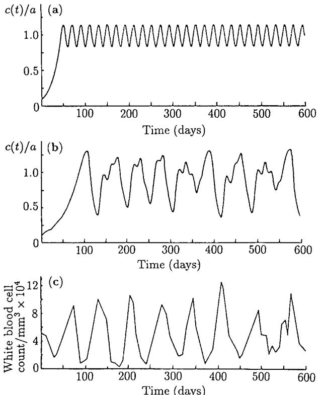

**Figure 1.15.** (**a**) Numerical solution of (1.43), the model for haematopoiesis (regulation of blood cells) with parameter values *g* = 0.1 day−1, λ = 0.2 day−1, *m* = 10, and delay *T* = 6 days. The low amplitude oscillation has a period of about 20 days. (**b**) The numerical simulation with parameter values as in (**a**) except for an increase in the delay to *T* = 20 days. Note the aperiodic behaviour of the solution. (**c**) Circulating blood count of a 12-year-old girl suffering from chronic leukaemia. The rough period of the oscillation is about 72 days. (Redrawn from Mackey and Glass 1977).

Near the bifurcation values of the parameters which initiate an oscillatory growing solution a perturbation analysis provides an estimate for the period of the ensuing limit cycle behaviour. Figures 1.15(a) and (b) show the numerical simulation of (1.43) for two values of the delay time *T* and parameters in the range for which the steady state is unstable.

One manifestation of leukaemia is the periodic oscillations observed in, for example, the white cell count. Figure 1.15(c) is an example from a 12-year-old patient with chronic myelogenous leukaemia. Although the overall character is quasi-periodic, it is in fact aperiodic. Note the comparison between Figures 1.15(b) and (c).

The qualitative change in the solution behaviour as the delay is increased is indicative of what is now referred to as *chaos*. We discuss this concept in more detail in the following chapter. Basically chaos is when the solution pattern is not repetitive in any regular way. A working definition of chaos is aperiodic behaviour in a deterministic system which depends intimately on the initial conditions: very small changes in the initial conditions can give rise to major differences in the solution at later times. An indication of periodic behaviour and of the onset of chaos can be obtained from the plot of *c*(*t* − *T* ) against *c*(*t*) for various values of the parameters. Figure 1.16 shows a series of bifurcating periodic solutions of (1.43) as the parameter *m* increases.

The behaviour in Figure 1.16(a), where the phase plane trajectory is a simple closed curve, implies the solution is a simple periodic solution. For example, if we start at *P* say, the solution trajectory moves round the curve and eventually returns to *P* after a finite time. In other words if *c*(*t*) = *c*1 at time *t*1, *c*(*t*) is again equal to *c*1 when time *t* increases by the period: Figure 1.15(a) is a typical solution *c*(*t*) as a function of time in this situation. If we now look at Figure 1.16(b) it looks a bit like a double loop trajectory of the kind in (a); you have to go round twice to return to where you started. A typical solution here is like that shown in Figure 1.17(a).

The solutions *c*(*t*)implied by Figure 1.16 illustrate a common and important feature of many model systems, namely, different periodic solution behaviour as a parameter passes through specific bifurcation values; here it is the Hill coefficient *m* in (1.43).

Referring now to Figure 1.17(b), if you start at *P* the solution first decreases with time and then increases as you move along the trajectory of the first, inner, loop. Now when *c*(*t*) reaches *Q*, instead of going round the same loop past *P* again it moves onto the outer loop through *R*. It eventually goes through *P* again after the second circuit. As before the solution is still periodic of course, but its appearance is like a mixture of two solutions of the type in Figure 1.15(a) but with different periods and amplitudes. As *m* increases, the phase plane trajectories become progressively more complex suggesting quite complex solution behaviour for *c*(*t*). For the case in Figure 1.16(e) the solution undergoes very many loops before it *possibly* returns to its starting point. In fact it never does! The solutions in such cases are *not* periodic although they have a quasi-periodic appearance. This is an example of *chaotic* behaviour.

Figure 1.15(b) is a solution of (1.43) which exhibits this chaotic behaviour while Figure 1.15(c) shows the dynamic behaviour of the white cell count in the circulating blood of a leukaemia patient. Although Figures 1.15(b) and (c) exhibit similar aperiodic behaviour, it is dangerous to presume that this model is therefore the one governing white cell behaviour in leukaemia patients. However, what this modelling exercise has demonstrated, among other things, is that delay can play a significant role in physiologi-

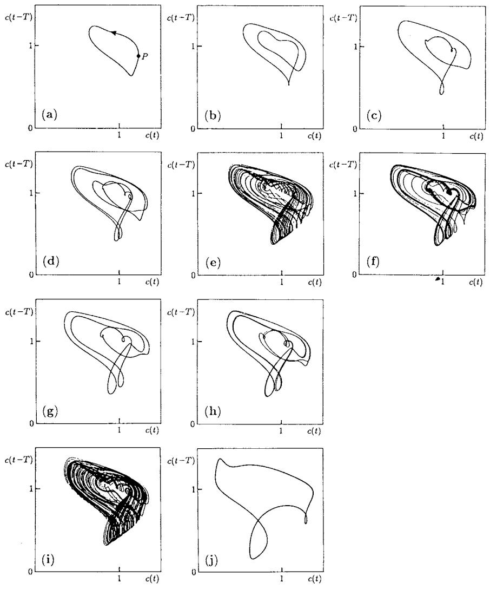

**Figure 1.16.** Numerical solutions of bifurcating periodic solutions of the model for haematopoiesis given by (1.43) with γ = *a* = 1, λ = 2, *T* = 2, and a range of *m* from *m* = 7 to *m* = 20. Note the progression from a simple periodic solution, as indicated by (**a**), to the complex chaotic behaviour indicated by (**e**). For larger *m*, regular periodic solutions again emerge prior to another chaotic range as in (**i**). See text for a detailed explanation. (Reproduced with permission from Mackey and Milton 1988)

cal pattern disruption. In turn this suggests that a deficiency in bone marrow cell production could account for the erratic behaviour in the white cell count. So although such a model can highlight important questions for a medical physiologist to ask, for it to be of practical use it is essential that close interdisciplinary collaboration is maintained so that realism is retained in making suggestions and drawing conclusions, however plausible they may be.

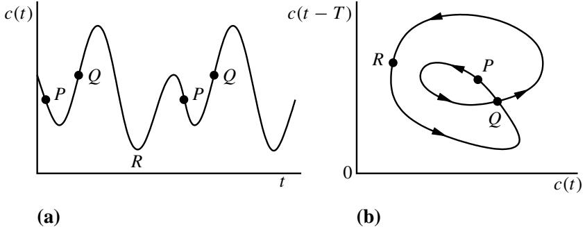

**Figure 1.17.** (**a**) Qualitative solution for *c*(*t*) when the parameters in the differential delay equation (1.28) have a phase plane trajectory as in (**b**), namely, the case in Figure 1.13(b).

The numerical simulations of this differential delay model (1.43), which is clearly illustrative of a whole class, indicates a cascading sequence of bifurcating periodic solutions which become chaotic. The sequence then passes through a coherent periodic stage and again becomes chaotic and so on as a parameter in the model itself passes through successive bifurcating values. As we said, this behaviour arises in a different context in the following chapter on discrete models where it is discussed in some detail: periodic doubling can be shown analytically. This phenomenon of cascading period doubling leading to chaos with chaotic regimes separated by coherent period doubling is often a *fractal* structure. We discuss such a fractal in the next chapter and fractals in other contexts later in Chapter 14. The existence of this kind of sequential bifurcating behaviour in such model equations is of considerable potential importance in its biomedical implications: see, for example, the book edited by Othmer et al. (1993), most chapters of which deal with real medical and physiological examples of oscillatory phenomena.

#### **1.6 Harvesting a Single Natural Population**

It is clearly necessary to develop an ecologically acceptable strategy for harvesting any renewable resource be it animals, fish, plants, or whatever. We also usually want the maximum *sustainable* yield with the minimum effort. The inclusion of economic factors in population models of renewable resources is increasing and these introduce important constraints: see, for example, the seminal books by Clark (1976b, 1985, 1990). The book by Kot (2001) has a chapter on harvest models and optimal control theory. The review article by Plant and Mangel (1987) is concerned with insect pest management. The model we describe here is a simple logistic one with the inclusion of a harvesting contribution: it was discussed by Beddington and May (1977). Although it is a particularly simple one it brings out several interesting and important points which more sophisticated models must also take into account. Rotenberg (1987) also considered the logistic model with harvesting, with a view to making the model more quantitative. He also examined the effects of certain stochastic parameters on possible population extinction.

Most species have a growth rate, depending on the population, which more or less maintains a constant population equal to the environment's carrying capacity *K*. That is, the growth and death rates are about equal. Harvesting the species affects the mortality rate and, if it is not excessive, the population adjusts and settles down to a new equilibrium state *Nh* < *K*. The modelling problem is how to maximise the sustained yield by determining the population growth dynamics so as to fix the harvesting rate which keeps the population at its *maximum growth rate*.

We discuss here a basic model which consists of the logistic population model (1.2) in which the mortality rate is enhanced, as a result of harvesting, by a term linearly proportional to *N*; namely,

$$\frac{dN}{dt} = rN\left(1 - \frac{N}{K}\right) - EN = f(N). \tag{1.44}$$

Here *r*, *K* and *E* are positive constants and *E N* is the harvesting yield per unit time with *E* a measure of the effort expended. *K* and *r* are the natural carrying capacity and the linear per capita growth rate respectively. The new nonzero steady state from (1.44) is

$$N_h(E) = K\left(1 - \frac{E}{r}\right) > 0 \quad \text{if} \quad E < r \tag{1.45}$$

which gives a yield

$$Y(E) = EN_h(E) = EK\left(1 - \frac{E}{r}\right). \tag{1.46}$$

Clearly if the harvesting effort is sufficiently large so that it is greater than the linear growth rate when the population is low, the species will die out. That is, if *E* > *r* the only realistic steady state is *N* = 0. If *E* < *r* (which was possibly not the case, for example, with whaling in the early 1970's) the maximum sustained yield and the new harvesting steady state are, from (1.46) and (1.45),

$$Y_M = Y(E)|_{E=r/2} = \frac{rK}{4}, \quad N_h|_{Y_M} = \frac{K}{2}.\tag{1.47}$$

Does an analysis of the dynamic behavior tell us anything different from the naive, and often used, steady state analysis just given here?

Figure 1.18 illustrates the growth rate *f* (*N*) in (1.44) as a function of *N* for various efforts *E*. Linearising (1.44) about *Nh*(*E*) gives

$$\frac{d\left(N - N_h\right)}{dt} \approx f'\left(N_h(E)\right)\left(N - N_h\right) = \left(E - r\right)\left(N - N_h\right),\tag{1.48}$$

which shows linear stability if *E* < *r*: arrows indicate stability or instability in Figure 1.18.

We can consider the dynamic aspects of the process by determining the time scale of the recovery after harvesting. If *E* = 0 then, from (1.44), the recovery time *T* =

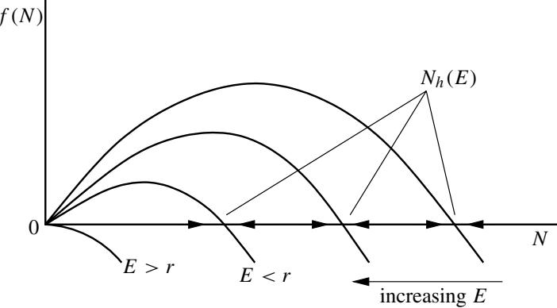

**Figure 1.18.** Growth function *f* (*N*) for the logistic model with harvesting according to (1.44). Note how the positive steady state decreases with increasing *E*, eventually tending to zero as *E* → *r*.

*O*(1/*r*), namely, the timescale of the reproductive growth. This is the order of magnitude of the recovery time of *N* to its carrying capacity *K* after a small perturbation from *K* since, for *N*(*t*) − *K* small and *Nh*(0) = *K*, (1.48) shows

$$\frac{d(N-K)}{dt} \approx -r(N-K) \quad \Rightarrow \quad N(t) - K \propto e^{-rt}.$$

If *E* = 0, with 0 < *E* < *r*, then the recovery time in a harvesting situation, from (1.48), is

$$T_R(E) = O\left(\frac{1}{r - E}\right).$$

and so

$$\frac{T_R(E)}{T_R(0)} = O\left(\frac{1}{1 - \frac{E}{r}}\right). \tag{1.49}$$

Thus for a fixed *r*, a larger *E* increases the recovery time since *TR*(*E*)/*TR*(0) increases with *E*. When *E* = *r*/2, the value giving the maximum sustained yield *YM* , *TR*(*E*) = *O*(2*TR*(0)).

The usual definition of a recovery time is the time to decrease a perturbation from equilibrium by a factor *e*. Then, on a linear basis,

$$T_R(0) = \frac{1}{r}, \quad T_R(E) = \frac{1}{r - E} \quad \Rightarrow \quad T_R\left(E = \frac{r}{2}\right) = 2T_R(0). \tag{1.50}$$

Since it is the yield *Y* that is recorded, if we solve (1.46) for *E* in terms of *Y* we have

$$\frac{T_R(Y)}{T_R(0)} = \frac{2}{1 \pm \left[1 - \frac{Y}{Y_M}\right]^{1/2}}\tag{1.51}$$

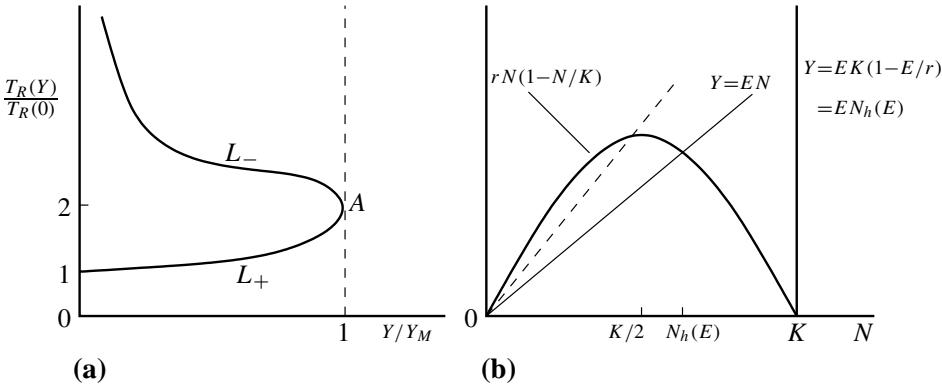

**Figure 1.19.** (**a**) Ratio of the recovery times as a function of the yield for the logistic growth model, with yield proportional to the population: equation (1.44). (**b**) Graphical method for determining the steady state yield *Y* for the harvested logistic model (1.44).

which is sketched in Figure 1.19(a) where *L*+ and *L*− denote the positive and negative roots of (1.51). It is clearly advantageous to stay on the *L*+ branch and potentially disastrous to get onto the *L*− one. Let us now see what determines the branch.

Suppose we start harvesting with a small effort *E*; then, as is clear from Figure 1.19(b), the equilibrium population *Nh*(*E*) is close to *K* and *Nh*(*E*) > *K*/2, the equilibrium population for the maximum yield *YM* . The recovery time ratio *TR*(*E*)/ *TR*(0) from (1.50) is then approximately 1. So increasing *E*, and hence the yield, we are on branch *L*+. As *E* increases further, *Nh*(*E*) decreases towards *K*/2, the value for the maximum sustained yield *YM* and we reach the point *A* in Figure 1.19(a) when *Nh*(*E*) = *K*/2. As *E* is increased further, *Nh*(*E*) < *K*/2 and the recovery time is further increased but with a decreasing yield; we are now on the *L*− branch.

We can now see what an optimal harvesting strategy could be, at least from this deterministic point of view. An effort *E* should be made which keeps the equilibrium population density *Nh*(*E*) > *K*/2, but as close as possible to *K*/2, the value for the maximum sustained yield. The closer to *K*/2, however, the more delicate the situation becomes since we might inadvertently move onto branch *L*− in Figure 1.19(a). At this stage, when *Nh*(*E*) is close to *K*/2, a stochastic analysis should be carried out; this was done by Beddington and May (1977). Stochastic elements of course reduce the predictability of the catch. In fact, with this model, they decrease the average yield for a given effort.

Before leaving this model, we can see how it is difficult to use models such as these for determining a maximum yield in practice. Often a maximum yield is only found in practice when attempts have been made to obtain an even greater yield. If the model here were valid such a scenario could be catastrophic, since if one moves onto the upper branch the reduction in effort might not be sufficient to move onto the bottom curve. So even without a stochastic analysis we can see how random variations could play havoc with the concept of a maximum sustainable yield.

As an alternative harvesting resource strategy suppose we harvest with a constant yield *Y*0 as our goal, a model studied by Brauer and Sanchez (1975). The model equation

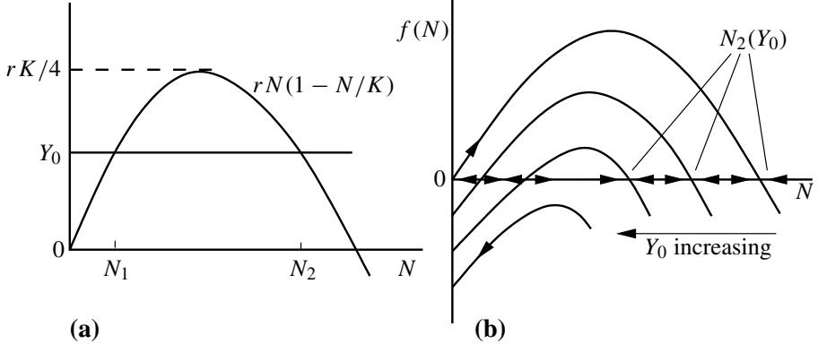

**Figure 1.20.** (**a**) Equilibrium states for the logistic growth harvested with a constant yield *Y*0: equation (1.52). (**b**) Growth rate *f* (*N*) in (1.52) as the yield *Y*0 increases.

is then

$$\frac{dN}{dt} = rN\left(1 - \frac{N}{K}\right) - Y_0 = f(N; r, K, Y_0). \tag{1.52}$$

Figure 1.20(a) shows the graphical way of determining the steady states as *Y*0 varies. It is trivial to find the equilibria analytically of course, but often the behavioural traits as a parameter varies are more obvious from a figure, such as here. If 0 < *Y*0 < *r K*/4 = *YM* , the maximum sustainable yield here, there are two positive steady states *N*1(*Y*0), *N*2(*Y*0) > *N*1(*Y*0) which from Figure 1.20(b) are respectively unstable and stable. As *Y*0 → *r K*/4, the maximum sustainable yield of the previous model is even more sensitive to fluctuations since if a perturbation from *N*2 takes *N* to a value *N* < *N*1 the mechanism then drives *N* to zero; see Figure 1.20(b). Not only that, *N* → 0 in a *finite* time since for small enough *N*, (1.52) becomes *d N*/*dt* ≈ −*Y*0 and so for any starting *N*0 at *t*0, *N*(*t*) ≈ *N*0 − *Y*0(*t* − *t*0) and *N*(*t*) = 0 when *t* = *t*0 + *N*0/*Y*0.

For easy comparison with the constant effort model we evaluate the equivalent recovery time ratio *TR*(*Y*0)/*TR*(0). The recovery time *TR*(*Y*0) is only relevant to the stable equilibrium *N*2(*Y*0) which from (1.52) is

$$N_2(Y_0) = \frac{K}{2} \left\{ 1 + \left[ 1 - \frac{4Y_0}{Kr} \right]^{1/2} \right\}, \quad Y_0 < rK/4.$$

The linearised form of (1.52) is then

$$\frac{d(N - N_2(Y_0))}{dt} \approx (N - N_2) \left[ \frac{\partial f}{\partial N} \right]_{N_2(Y_0)} = -(N - N_2) \, r \left[ 1 - \frac{4Y_0}{Kr} \right]^{1/2} \dots$$

Thus

$$\frac{T_R(Y_0)}{T_R(0)} = \frac{1}{\left(1 - \frac{Y_0}{Y_M}\right)^{1/2}}, \quad Y_M = \frac{rK}{4} \tag{1.53}$$

which shows that *TR*(*Y*0)/*TR*(0) → ∞ as *Y*0 → *YM* . This model is thus a much more sensitive one and, as a harvesting strategy, is not really adequate.

One conclusion from this modelling exercise is that a constant effort rather than a constant yield harvesting strategy is less potentially catastrophic. It also calls into question, even with this simple model, the fishing laws, for example, which regulate catches. A more realistic model, on the lines described here, should take into account the economic costs of harvesting and other factors. This implies a feedback mechanism which can be a stabilising factor; see Clark (1976b, 1985, 1990). With the unpredictability of the real world it is probably essential to include feedback. Nevertheless such simple models can pose highly relevant ecological and long term financial questions which have to be considered in any more realistic and more sophisticated model.

The problems of sustainable harvesting of renewable resources are crucially important, whether it is in fisheries, forestry management or any other renewable resource which depends on the maintenance of a reproductive surplus in a population. In the above very simple example we saw how it is possible to move onto a catastrophic path if we do not have sufficient information such as knowing, a priori, what the maximum sustainable yield can be. The basic concept of a sustainable resource depends on a reproductive surplus being maintained under a variety of circumstances many of which are difficult to quantify. With the difficulty of obtaining accurate data it makes it even more difficult to produce a workable model system on which to base decisions. Ludwig and his colleagues (Ludwig 1993, 1994, 1995, 1996a, 1996b, Ludwig et al. 1993, 1997 and other references given in these) persuasively argue the case for a more sophisticated and realistic modelling in which stochastic elements play a crucial role. Numerous real case studies are discussed which highlight potentially serious problems with overly simple models. They demonstrate the importance of assessing the possibility of population extinction because of, among other things, uncertainty about crucial parameters, small stochastic elements and the effect of rare catastrophes. For anyone seriously considering working in the ecological field of harvesting of renewable resources these papers should be required reading. The book by Getz and Haight (1989) gives a good survey of the field of population harvesting and resource management in diverse areas. It discusses numerous mathematical models and applications to specific case studies for which field data are available. The book edited by Levin (1994, Parts V and VI)) contains articles which are also particularly relevant. The book by Hilborn and Mangel (1997) is also relevant: it confronts models with data and discusses numerous practical case studies which require a probabilistic approach. They provide the necessary statistics and probability background necessary for the study of the various models. The 1990's have witnessed several population collapses of what were hitherto thought of as sustainable resources, such as cod in the north Atlantic and what looks like being another with salmon in the north east Pacific coast to mention but two. Sadly even when the scientific knowledge is available as to a future catastrophe, politics and short term economics prevent its implementation.

### **1.7 Population Model with Age Distribution**

For some populations, one of the deficiencies of the above ordinary differential equation models is that they do not take into account any age structure which, in many situations, can influence population size and growth in a major way. Although most natural populations have some structure, such as age, stage or whatever, it is not always of primary importance but, when it is, we must know how to incorporate it in a model. So, we consider here a first extension to include age dependence in the birth and death rates.

One way of incorporating structure in a population is by Leslie matrices after Leslie5 (1945). For example, these can incorporate different age classes, such as juvenile and adult, and quantify movement from one to the other. The Leslie matrix model then relates the adult and juvenile population at a later time in terms of those at the earlier time: the terms in the matrix incorporate, for example, the data on births and survival. The books by Charlesworth (1980), Metz and Diekmann (1986) and Kot (2001) give a good survey as well as the wide spectrum of applicability of age-structured models.

Let *n*(*t*, *a*) be the population density at time *t* in the age range *a* to *a* +*da*. Let *b*(*a*) and µ(*a*) be the birth and death rates which are functions of age *a*: for man, for example, they qualitatively look like the curves in Figure 1.21. For example, in a small increment of time *dt* the number of the population of age *a* that dies is µ(*a*)*n*(*t*, *a*) *dt*. The birth rate only contributes to *n*(*t*, 0); there can be no births of age *a* > 0. The conservation law for the population now says that

$$d n(t, a) = \frac{\partial n}{\partial t} dt + \frac{\partial n}{\partial a} da = -\mu(a) n(t, a) \, dt.$$

The (∂*n*/∂*a*) *da* term is the contribution to the change in *n*(*t*, *a*) from individuals getting older. Dividing this equation by *dt* and noting that *da*/*dt* = 1 since *a* is chronological

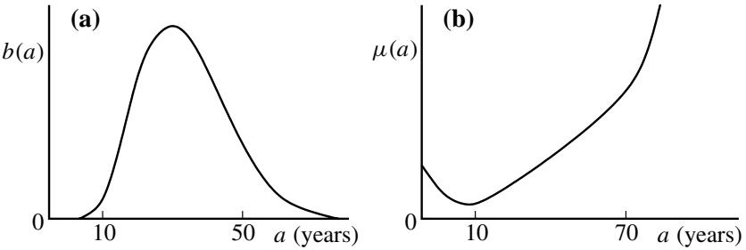

**Figure 1.21.** Qualitative birth (**a**) and death (**b**) rates for man as functions of age in years.

<sup>5</sup>Patrick Leslie was a mathematician who worked with the founding father of animal ecology, Charles Elton, in his Bureau of Animal Population in Oxford in the mid-1930's. In spite of the increasing use of mathematical modelling, Elton never really embraced such interdisciplinary research and was on occasion outspokenly critical. I met Elton once at a Fellows' garden party in Corpus Christi College, Oxford, in the 1970's. When I expressed an interest in animal ecology and mentioned his seminal work on the data from the Hudson Bay Company (see Chapter 2) he started to talk enthusiastically about oscillatory behaviour in populations. When I said I was a mathematician working in biology there was a notable cooling of his enthusiasm and he said, 'Oh, you're one of them' and added, 'I thought you were somebody else.'

age, *n*(*t*, *a*) satisfies the linear partial differential equation

$$\frac{\partial n}{\partial t} + \frac{\partial n}{\partial a} = -\mu(a)n,\tag{1.54}$$

which holds for *t* > 0 and *a* > 0. For example, if µ = 0, it reduces to a conservation equation which says that the time rate of change of the population at time *t* and age *a*, ∂*n*/∂*t*, simply changes by the rate at which the population gets older, namely, ∂*n*/∂*a*.

Equation (1.54) is a first order partial differential equation which requires a condition on *n*(*t*, *a*) in *t* and in *a*. The initial condition

$$m(0, a) = f(a),\tag{1.55}$$

says that the population at time *t* = 0 has a given age distribution *f* (*a*). The other boundary condition on *a* comes from the birth rate and is

$$n(t,0) = \int_0^\infty b(a)n(t,a) \, da,\tag{1.56}$$

where, for mathematical simplicity, we have taken the upper limit of ∞ for the age; *b*(*a*) of course will tend to zero for large *a*, as in Figure 1.21(a), for example, and so we could replace ∞ by *am* say, where *b*(*a*) = 0 for *a* > *am*. Note that the birth rate *b*(*a*) only appears in the integral equation expression (1.56) and not in the differential equation. Equation (1.54) is often referred to in the ecological literature as the *Von Foerster equation*; the equation arises in a variety of different disciplines and theoretical biology areas, such as cell proliferation models, for example, where cell age is important. The main question we wish to answer with the model here is how the birth and death rates *b*(*a*) and µ(*a*) affect the growth of the population after a long time.

One way to solve (1.54) is by characteristics (see, for example, the book by Kevorkian, 2000) which are given by

$$\frac{da}{dt} = 1 \quad \text{on which} \quad \frac{dn}{dt} = -\mu n. \tag{1.57}$$

These are the straight lines

$$a = \begin{cases} t + a_0, & a > t \\ t - t_0, & a < t \end{cases} \tag{1.58}$$

as shown in Figure 1.22. Here *a*0,*t*0 are respectively the initial age of an individual at time *t* = 0 in the original population and the time of birth of an individual. The second of (1.57), which holds along each characteristic, has a different solution accordingly as *a* > *t* and *a* < *t*, that is, one form for the population that was present at *t* = 0, namely, *a* > *t*, and the other for those born after *t* = 0, that is, *a* < *t*. On integrating the second of (1.57), using *da*/*dt* = 1 and (1.58), the solutions are

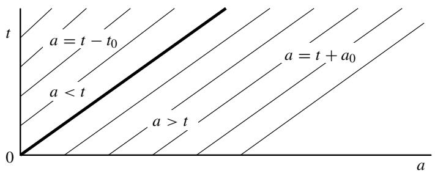

**Figure 1.22.** Characteristics for the Von Foerster equation (1.54).

$$n(t,a) = n(0,a_0) \exp\left[-\int_{a_0}^{a} \mu(s) \, ds\right], \quad a > t, b$$

where *n*(0, *a*0) = *n*(0, *a* − *t*) = *f* (*a* − *t*) from (1.55), and so

$$m(t, a) = f(a - t) \exp\left[-\int_{a - t}^{a} \mu(s) \, ds\right], \quad a > t. \tag{1.59}$$

For *a* < *t*,

$$n(t, a) = n(t_0, 0) \exp\left[ -\int_0^a \mu(s) \, ds \right],$$

and so, since *n*(*t*0, 0) = *n*(*t* − *a*, 0)

$$n(t,a) = n(t-a,0)\exp\left[-\int_0^a \mu(s) \, ds\right], \quad a < t. \tag{1.60}$$

In the last equation *n*(*t* − *a*, 0) is determined by solving the integral equation (1.56), using (1.59) and (1.60) to get

$$\begin{split} n(t,0) &= \int_0^t b(a)n(t-a,0) \exp\left[-\int_0^a \mu(s) \, ds\right] \, da \\ &+ \int_t^\infty b(a)f(a-t) \exp\left[-\int_{a-t}^a \mu(s) \, ds\right] \, da. \end{split} \tag{1.61}$$

Although this is a linear equation it is not easy to solve; it can be done by iteration however.

We are mainly interested in the long time behaviour of the population and in particular whether it will increase or decline. If *t* is large so that for practical purposes *t* > *a* for all *a* then *f* (*a* − *t*) = 0 and all we require in (1.61) is the first integral term on the right-hand side. The solution is then approximated by *n*(*t*, *a*) in (1.60), although it does not satisfy the boundary condition on *a* in (1.56). It is still not trivial to solve so let us return to the original partial differential equation (1.54) and see if other solution forms are possible.

We can look for a *similarity solution* (see, for example, Kevorkian 2000) of (1.54) in the form

$$n(t, a) = e^{\gamma t} r(a). \tag{1.62}$$

That is, the age distribution is simply changed by a factor which either grows or decays with time according to whether γ > 0 or γ < 0. Substitution of (1.62) into (1.54) gives

$$\frac{dr}{da} = -\left[\mu(a) + \lambda\right]r$$

and so

$$r(a) = r(0) \exp\left[ -\gamma a - \int_0^a \mu(s) \, ds \right]. \tag{1.63}$$

With this *r*(*a*) in (1.62) the resulting *n*(*t*, *a*) when inserted into the boundary condition (1.56), gives

$$e^{\gamma^{\prime}l}r(0) = \int_0^\infty b(a)e^{\gamma^{\prime}l}r(0)\exp\left[-\gamma a - \int_0^a \mu(\mathbf{s})\,d\mathbf{s}\right]da$$

and hence, on cancelling *e*γ *t r*(0),

$$1 = \int_0^\infty b(a) \exp\left[-\gamma a - \int_0^a \mu(\mathbf{s}) \, ds\right] da = \phi(\boldsymbol{\gamma}),\tag{1.64}$$

which defines φ(γ). This equation determines a unique γ,γ0 say, since φ(γ) is a monotonic decreasing function of γ . The sign of γ is determined by the size of φ(0); see Figure 1.23. That is, γ0 is determined solely by the birth, *b*(*a*), and death, µ(*a*), rates. The critical threshold *S* for population growth is thus

$$S = \phi(0) = \int_0^\infty b(a) \exp\left[-\int_0^a \mu(\mathbf{s}) \, d\mathbf{s}\right] \, da,\tag{1.65}$$

where *S* > 1 implies growth and *S* < 1 implies decay. In (1.65) we can think of exp [− *a* 0 µ(*s*) *ds*] almost like the probability that an individual survives to age *a*, only the integral over all *a* is not 1.

The solution (1.62) with (1.63) cannot satisfy the initial condition (1.55). The question arises as to whether it approximates the solution of (1.54)–(1.56), the original problem, after a long time. If *t* is large so that for all practical purposes *n*(*t*, 0) in (1.61) requires only the first integral on the right-hand side, then

$$n(t,0) \approx \int_0^t b(a)n(t-a,0) \exp\left[-\int_0^a \mu(s) \, ds\right] da, \quad t \to \infty. \tag{1.66}$$

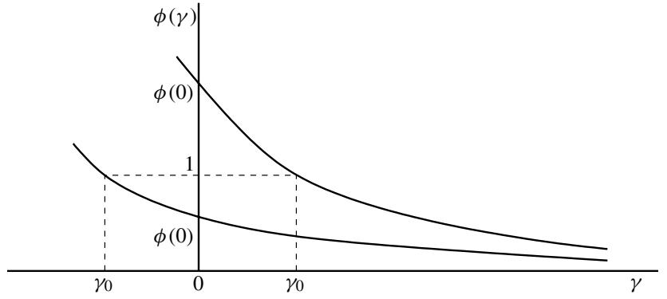

**Figure 1.23.** The growth factor γ0 is determined by the intersection of φ(γ) = 1: γ0 > 0 if φ(0) > 1, γ0 < 0 if φ(0) < 1.

If we now look for a solution of this equation in the similarity form (1.62), substitution of it into (1.66) then gives (1.64) again as the equation for γ . We thus conjecture that the solution (1.62) with *r*(*a*) from (1.63) and γ from (1.64) is the solution for large time *t* of equation (1.54), with initial and boundary conditions (1.55) and (1.56). It is of course undetermined to the extent of a constant *r*(0) but, since our main question is one of growth or decay, it is not important to know *r*(0) since it does not affect either. The important parameter is the threshold parameter *S* in (1.65) from which long time effects of alterations in the birth and death rates can be assessed.

#### **Exercises**

- **1** A model for the spruce budworm population *u*(*t*) is governed by

$$\frac{du}{dt} = ru\left(1 - \frac{u}{q}\right) - \frac{u^2}{1 + u^2},$$

where *r* and *q* are positive dimensionless parameters. The nonzero steady states are thus given by the intersection of the two curves

$$U(\mu) = r \left( 1 - \frac{\mu}{q} \right), \quad V(\mu) = \frac{\mu}{1 + \mu^2}.$$

Show, using the conditions for a double root, that the curve in *r*, *q* space which divides it into regions where there are 1 or 3 positive steady states is given parametrically by

$$r = \frac{2a^3}{(1+a^2)^2}, \quad q = \frac{2a^3}{a^2-1}.$$

Show that the two curves meet at a cusp, that is, where *dr*/*da* = *dq*/*da* = 0, at *a* = √3. Sketch the curves in *r*, *q* space noting the limiting behaviour of *r*(*a*) and *q*(*a*) as *a* → ∞ and *a* → 1.

- **2** In Section 1.3 we showed that it was not possible to have a limit cycle (periodic) solution for a simple first order (nondelay) equation

$$\frac{dN}{dt} = f(N).$$

A seeming counterexample is *N*(*t*) = 2 + sin *t* (and any number of similar forms). Determine the *f* (*N*) for which this is a solution of the differential equation and explain why it is not a counterexample.

- **3** If the per capita birth rate of a population is given by *r*[1 − *a*(*N* − *b*)2] where *r*, *a* and *b* are positive parameters, write down a population model equation of the form *d N*/*dt* = *f* (*N*). Nondimensionalise the equation so that the dynamics depend on a single dimensionless parameter *k* = *b*(*a*/*r*)1/2. If *u* is your nondimensional population, sketch *f* (*u*) for *k* > 1 and *k* < 1 and discuss how the qualitative behaviour of the solution changes with *k* and the initial condition.
- **4** The predation *P*(*N*) on a population *N*(*t*) is very fast and a model for the prey *N*(*t*) satisfies

$$\frac{dN}{dt} = RN\left(1 - \frac{N}{K}\right) - P\left\{1 - \exp\left[-\frac{N^2}{\varepsilon A^2}\right]\right\}, \quad 0 < \varepsilon \ll 1, \varepsilon$$

where *R*, *K*, *P* and *A* are positive constants. By an appropriate nondimensionalisation show that the equation is equivalent to

$$\frac{du}{d\tau} = ru\left(1 - \frac{u}{q}\right) - \left(1 - \exp\left[-\frac{u^2}{\varepsilon}\right]\right),$$

where *r* and *q* are positive parameters. Demonstrate that there are three possible nonzero steady states if *r* and *q* lie in a domain in *r*, *q* space given approximately by *rq* > 4. Could this model exhibit hysteresis?

- **5** A continuous time model for the baleen whale (a slightly more complicated model of which the International Whaling Commission used) is the delay equation

$$\frac{dN}{dt} = -\mu N(t) + \mu N(t - T)[1 + q\{1 - \{N(t - T)/K\}^{\mathbb{Z}}\}].$$

Here µ(> 0) is a measure of the mortality, *q*(> 0) is the maximum increase in fecundity the population is capable of, *K* is the unharvested carrying capacity, *T* is the time to sexual maturity and *z* > 0 is a measure of the intensity of the densitydependent response as the population drops.

Determine the steady state populations. Show that the equation governing small perturbations *n*(*t*) about the positive equilibrium is

$$\frac{dn(t)}{dt} \approx -\mu n(t) - \mu (qz - 1)n(t - T),$$

and hence that the stability of the equilibrium is determined by Re λ where

$$
\lambda = -\mu - \mu(qz - 1)e^{-\lambda T}.
$$

Deduce that the steady state is stable (by considering the limiting case Re λ = 0) if

$$
\mu T < \mu T_c = \frac{\pi - \cos^{-1}\frac{1}{b}}{(b^2 - 1)^{1/2}}, \quad b = qz - 1 > 1
$$

and stable for all *T* if *b* < 1.

For *T* = *Tc* + ε, 0 < ε 1 show that to *O*(1) the period of the growing oscillation is 2π/[µ(*b*2 − 1)1/2], *b* > 1.

- **6** The concentration of carbon dioxide in the blood is believed to control breathing levels through a delay feedback mechanism. A simple delay model for the concentration in dimensionless form is

$$\frac{d\mathbf{x}(t)}{dt} = 1 - a\mathbf{x}\,V(\mathbf{x}(t-T)), \quad V(\mathbf{x}) = \frac{\mathbf{x}^m}{1+\mathbf{x}^m},$$

where *a* and *m* are positive constants and *T* is the delay. For given *a* and *m* a critical delay *Tc* exists such that for *T* > *Tc* the steady state solution becomes linearly unstable. For *T* = *Tc* + ε, where 0 < ε 1, carry out a perturbation analysis and show that the period of the exponentially growing solution is approximately 4*Tc*.

- **7** A model for the concentration *c*(*t*) of arterial carbon dioxide, which controls the production of certain blood elements, is given by

$$\frac{dc(t)}{dt} = p - V(c(t - T))c(t) = p - \frac{bV_{\text{max}}c(t)c^m(t - T)}{a^m + c^m(t - T)},$$

where *p*, *b*, *a*, *T* and *V*max are positive constants. (This model is briefly discussed in Section 1.5.) Nondimensionalise the equation and examine the linear stability of the steady state. Obtain a relation between the parameters such that the steady state is stable and hence establish the existence of a bifurcation value *Tc* for the delay. Obtain an estimate for the period of the periodic solution which bifurcates off the steady state when *T* = *Tc* + ε for small ε.

- **8** A similarity solution of the form *n*(*t*, *a*) = *e*γ *t r*(*a*) of the age distribution model equation

$$\frac{\partial n}{\partial t} + \frac{\partial n}{\partial a} = -\mu(a)n$$

satisfies the age boundary equation

$$n(t,0) = \int_0^\infty b(a)n(t,a) \, da$$

$$\int_0^\infty b(a) \exp\left[-\gamma a - \int_0^a \mu(\mathbf{s}) \, ds\right] da = 1.$$

Show that if the birth rate *b*(*a*) is essentially zero except over a very narrow range about *a*0 > 0 the population will die out whatever the mortality rate µ(*a*). If there is a high, linear in age, mortality rate, say what you can about the birth rate if the population is not to die out.

# **2. Discrete Population Models for a Single Species**

#### **2.1 Introduction: Simple Models**

Differential equation models, whether ordinary, delay, partial or stochastic, imply a continuous overlap of generations. Many species have no overlap whatsoever between successive generations and so population growth is in discrete steps. For primitive organisms these can be quite short in which case a continuous (in time) model may be a reasonable approximation. However, depending on the species the step lengths can vary widely. A year is common. With fruit fly emergence from pupae it is a day, for cells it can be a number of hours while for bacteria and viruses it can be considerably less. In the models we discuss in this chapter and later in Chapter 5 we have scaled the time-step to be 1. Models must thus relate the population at time *t* + 1, denoted by *Nt*+1, in terms of the population *Nt* at time *t*. This leads us to study difference equations, or discrete models, of the form

$$N_{l+1} = N_l F(N_l) = f(N_l),\tag{2.1}$$

where *f* (*Nt*) is in general a nonlinear function of *Nt* . The first form is often used to emphasise the existence of a zero steady state. Such equations are usually impossible to solve analytically but again we can extract a considerable amount of information about the population dynamics without an analytical solution. The mathematics of difference equations is now being studied in depth and applied in diverse fields: it is a fascinating subject having given rise to some totally unexpected phenomena some of which we discuss later. Difference equation models are also proving of use in a surprisingly wide spectrum of biomedical areas such as cancer growth (see, for example, the article by Cross and Cotton 1994), aging (see, for example, the article by Lipsitz and Goldberger 1992), cell proliferation (see, for example, the article by Hall and Levinson 1990) and genetics (see, for example, the chapter on inheritance in the book by Hoppensteadtand Peskin 1992 and the book by Roughgarden 1996.) It has recently been shown to be of astonishing use in dynamic modelling of marital interaction and divorce prediction; we discuss this application in Chapter 5. The largest use to date is probably in ecology; the book by Hassell (1978) gives numerous examples, see also the more recent excellent book by Kot (2001).

From a practical point of view, if we know the form of *f* (*Nt*) it is a straightforward matter to evaluate *Nt*+1 and subsequent generations by simply using (2.1) recursively. Of course, whatever the form of *f* (*Nt*), we are only interested in nonnegative populations.

The skill in modelling a specific population's growth dynamics lies in determining the appropriate form of *f* (*Nt*) to reflect known observations or facts about the species in question. To do this with any confidence we must understand the major effects on the solutions of changes in the form of *f* (*Nt*) and its parameters, and also what solutions of (2.1) look like for a few specimen examples of practical interest. The mathematical problem is a mapping one, namely, that of finding the orbits, or trajectories, of nonlinear maps given a starting value *N*0 > 0. It should be noted here that there is no simple connection between difference equation models and what might appear to be the continuous differential equation analogue, even though a finite difference approximation results in a discrete equation. This becomes clear below.

Suppose the function *F*(*Nt*) = *r* > 0; that is, the population one step later is simply proportional to the current population. Then from (2.1),

$$N_{l+1} = rN_l \quad \Rightarrow \quad N_l = r^l N_0. \tag{2.2}$$

So the population grows or decays geometrically according to whether *r* > 1 or *r* < 1 respectively; here *r* is the net reproductive rate. This particularly simple model is not very realistic for most populations nor for long times but, even so, it has been used with some justification for the early stages of growth of certain bacteria. It is the discrete version of Malthus' model in Chapter 1. A slight modification to bring in crowding effects could be

$$N_{l+1} = rN_S, \quad N_S = N_l^{1-b}, \quad b \text{ constant},$$

where *NS* is the population that survives to breed. There must be restrictions on *b* of course, so that *NS* ≤ *Nt* otherwise those surviving to breed would be more than the population of which they form a part.

#### *Fibonacci Sequence*

Leonardo of Pisa, who was only given the nickname Fibonacci in the 18th century, in his arithmetic book of 1202 set a modelling exercise involving an hypothetical growing rabbit population. It consists of starting at the beginning of the breeding season with a pair of immature rabbits, male and female, which after one reproductive season produce two pairs of male and female immature rabbits after which the parents then stop reproducing. Their offspring pairs then do exactly the same and so on. The question is to determine the number of pairs of rabbits at each reproductive period. If we denote the number of pairs of (male and female) rabbits by *Nt* then normalising the reproductive period to 1 we have at the *t*th reproductive stage

$$N_{t+1} = N_t + N_{t-1}, \quad t = 2, 3, \dots \quad \dots \tag{2.3}$$

This gives, with *N*0 = 1, what is known as the Fibonacci sequence, namely

$$1, 1, 2, 3, 5, 8, 13, \ldots \ldots$$

Each term in the sequence is simply the sum of the previous two. Equation (2.3) is a linear difference equation which we can solve by looking for solutions in the form

$$N_I \propto \lambda^I$$

which on substituting into (2.3) gives the equation for the λ as solutions of

$$
\lambda^2 - \lambda - 1 \quad \Rightarrow \quad \lambda_{1,2} = \frac{1}{2} \left( 1 \pm \sqrt{5} \right) \dots
$$

So, with *N*0 = 1, *N*1 = 1 the solution of (2.3) is

$$\begin{aligned} N_l &= \frac{1}{2} \left( 1 + \frac{1}{\sqrt{5}} \right) \lambda_1^l + \frac{1}{2} \left( 1 - \frac{1}{\sqrt{5}} \right) \lambda_2^l \\ \lambda_1 &= \frac{1}{2} \left( 1 + \sqrt{5} \right), \quad \lambda_2 = \frac{1}{2} \left( 1 - \sqrt{5} \right). \end{aligned} \tag{2.4}$$

For large *t*, since λ1 > λ2,

$$N_{\mathbf{l}} \approx \frac{1}{2} \left( \mathbf{l} + \frac{1}{\sqrt{5}} \right) \lambda_{\mathbf{l}}^{\mathbf{l}}.$$

Equation (2.3) is a renewal equation. We can intuitively see age structure in this model by considering age to reproduction and that after it there is no reproduction. This approach gives rise to renewal matrices and Leslie matrices which include age structure (see, for example, the book edited by Caswell 1989).

If we take the ratio of successive Fibonacci numbers we have, for *t* large, *Nt* /*Nt*+1 ≈ ( √5 − 1)/2. This is the so-called golden mean or golden number. In classical paintings, for example, it is the number to strive for in the ratio of say, sky to land in a landscape.

This sequence and the limiting number above occur in a surprising number of places. Pine cones, sunflower heads, daisy florets, angles between successive branching in many plants and many more. On a sunflower head, it is possible to see sets of intertwined spirals emanating from the centre (you can see them on pine cones starting at the base). It turns out that the number of spirals varies but are always a number in the Fibonacci sequence.

Figure 2.1 illustrates two examples of these naturally occurring intertwined logarithmic spirals. For example, in Figure 2.1(b) each scale belongs to both a clockwise and anticlockwise spiral: a careful counting gives 8 clockwise spirals and 13 anticlockwise ones, which are consecutive numbers in the Fibonacci series. On the daisy head there are 21 clockwise and 34 anticlockwise spirals, again consecutive numbers in the Fibonacci series.

In the case of branching in phyllotaxis, if you project the branching of many plants and trees onto the plane the angle between successive branches is essentially constant, close to 137.5◦. To relate this to the Fibonacci series, if we multiply 360◦ by the limiting number of the ratio of Fibonacci numbers above, ( √5 − 1)/2, we get 222.5◦. Since this is more than 180◦ we should subtract 222.5◦ from 360◦ which gives 137.5◦, which is known as the *Fibonacci angle*.


(**a**)


(**b**)

**Figure 2.1.** Examples of sets of intertwining spirals which occur on (**a**) the floret of a daisy, and (**b**) the pattern of scales on a pine cone. Each element is part of a clockwise and anticlockwise spiral. (Photographs by Dr. Scott Camazine and reproduced with permission)

There have been several attempts at modelling the patterning process in plant morphology to generate the Fibonacci angle between successive branches and the Fibonacci sequence for the number of spirals on sunflower heads, pine cones, and so on but to date the problem is still unsolved. The attempts range from manipulating a reaction diffusion mechanism (for example, Thornley 1976) to looking at algebraic relations between permutations of the first *n* natural numbers with each number corresponding to the initiation order of a given leaf (Kunz and Rothen 1992) to experiments involving magnetic droplets in a magnetic field (Douady and Couder 1992). Later in the book we discuss in considerable detail various possible mechanisms for generating spatial patterns, including reaction diffusion systems. I firmly believe that the process here is mechanistic and *not* genetic. The work of Douady and Couder (1992, 1993a, 1993b), although of a physical rather than a biological nature, lends support to this belief.

The work of Douady and Couder (1992) is clever and particularly interesting and illuminating even though it is a physical as opposed to a biological process involved. They considered the sequential appearance of the primordia in branching phyllotaxis to form at the growing apex and at equal time intervals to move out onto a circle around the growing tip. They considered these primordia to repel each other as they move out, consequently maximising the distance between them. In this way they self-organise themselves highly efficiently in a regular spatial pattern. If this is the case, they argued, then an experiment which mimics this scenario should give a distribution of elements, the angle between which should be the Fibonacci angle. They took a circular dish of 8 cm diameter, filled it with silicone oil and put it in a vertical magnetic field with the field increasing towards the dish perimeter. Then, at equal intervals, they dropped small amounts of a ferromagnetic fluid onto the centre of the dish onto a small truncated cone (to simulate the plant apex). The drops were then polarised by the magnetic field. Because of the polarisation the drops formed small magnetic dipoles which repelled each other and, because of the gradient in the magnetic field, moved outwards towards the perimeter and ended up being regularly distributed. Because of the interaction with the previous drops, new drops fell from the cone in the direction of minimum energy. To prevent accumulation of drops at the periphery, they ultimately fell into a ditch there. The time between the drops of magnetic fluid affected the spirals generated and the final angle between the drops when they reached the perimeter: in a surprising number of runs the angle was essentially the Fibonacci angle and the number of spirals a number in the Fibonacci series. They then confirmed the results with computer simulations.

Generally, because of crowding and self-regulation, we expect *f* (*Nt*) in (2.1) to have some maximum, at *Nm* say, as a function of *Nt* with *f* decreasing for *Nt* > *Nm*; Figure 2.2 illustrates a typical form. A variety of *f* (*Nt*) has been used in practical situations such as those described above: see, for example, the book by Kot (2001) for some specific practical forms in ecology. One such model, sometimes referred to as the

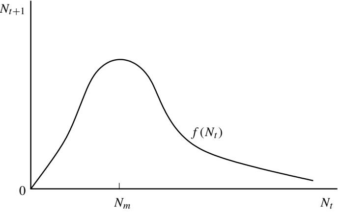

**Figure 2.2.** Typical growth form in the model *Nt*+1 = *f* (*Nt*).

Verhulst process, is

$$N_{l+1} = rN_l \left(1 - \frac{N_l}{K}\right), \quad r > 0, \quad K > 0,\tag{2.5}$$

which might appear to be a kind of discrete analogue of the continuous logistic growth model but is not all: the steady state is *not N* = *K*. As we shall show, however, the solutions and their dependence on the parameter *r* are very different. An obvious drawback of this specific model is that if *Nt* > *K* then *Nt*+1 < 0. A more appropriate way of deriving it (see also the legend in Figure 2.11) from the continuous Verhulst equation is to replace the derivative *d N*/*dt* with a difference form with time step 1 to obtain

$$N(t+1) - N(t) = rN(t)\left[1 - \frac{N(t)}{K}\right] \Rightarrow \ N(t+1) = \left[1 + r - \frac{r}{K}N(t)\right]. \quad (2.6)$$

Now rescaling with *N*(*t*) = ((1 + *r*)/*r*)*K x*(*t*) and setting 1 + *r* = *r* the last equation becomes the same form as (2.2), namely,

$$\mathbf{x}(t+1) = r'\mathbf{x}(t)[1-\mathbf{x}(t)].\tag{2.7}$$

A more realistic model should be such that for large *Nt* there should be a reduction in the growth rate but *Nt*+1 should remain nonnegative; the qualitative form for *f* (*Nt*) in Figure 2.2 is an example. One such frequently used model, known as the Ricker curve, after Ricker (1954), is

$$N_{l+1} = N_l \exp\left[r\left(1 - \frac{N_l}{K}\right)\right], \quad r > 0, \quad K > 0\tag{2.8}$$

which we can think of as a modification of (2.2) where there is a mortality factor exp (−*r Nt* /*K*) which is more severe the larger *Nt* . Here *Nt* > 0 for all *t* if *N*0 > 0.

Since *t* increases by discrete steps there is, in a sense, an inherent *delay* in the population to register change. Thus there is a certain heuristic basis for relating these difference equations to delay differential equations discussed in Chapter 1, which, depending on the length of the delay, could have oscillatory solutions. Since we scaled the time-step to be 1 in the general form (2.1) we should expect the other parameters to be the controlling factors as to whether or not solutions are periodic. With (2.5) and (2.8) the determining parameter is *r*, since K can be scaled out by writing *Nt* for *Nt* /*K*.

#### **2.2 Cobwebbing: A Graphical Procedure of Solution**

We can elicit a considerable amount of information about the population growth behaviour by simple graphical means. Consider (2.1) with *f* as in Figure 2.2. The steady states are solutions *N*∗ of

$$N^* = f(N^*) = N^* F(N^*) \quad \Rightarrow \quad N^* = 0 \quad \text{or} \quad F(N^*) = 1. \tag{2.9}$$

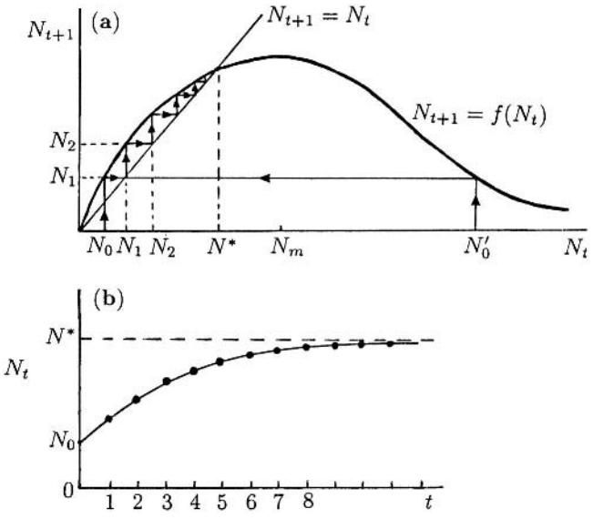

**Figure 2.3.** (**a**) Graphical determination of the steady state and demonstration of how *Nt* approaches it. (**b**) Time evolution of the population growth using (**a**). We use a continuous curve joining up the populations at different time-steps for visual clarity; strictly the population changes abruptly at each time-step.

Generally, we use only the first form in (2.9); the second is mainly used to emphasise the fact that *N*∗ = 0 is always a steady state. Graphically the steady states are intersections of the curve *Nt*+1 = *f* (*Nt*) and the straight line *Nt*+1 = *Nt* as shown in Figure 2.3(a) for a case where the maximum of the curve *Nt*+1 = *f* (*Nt*), at *Nm* say, has *Nm* > *N*∗. The dynamic evolution of the solution *Nt* of (2.1) can be obtained graphically as follows. Suppose we start at *N*0 in Figure 2.3(a). Then *N*1 is given by simply moving along the *Nt*+1 axis until we intersect with the curve *Nt*+1 = *f* (*Nt*), which gives *N*1 = *f* (*N*0). The line *Nt*+1 = *Nt* is now used to start again with *N*1 in place of *N*0. We then get *N*2 by proceeding as before and then *N*3, *N*4 and so on: the arrows show the path sequence. The path is simply a series of reflections in the line *Nt*+1 = *Nt* . We see that *Nt* → *N*∗ as *t* → ∞ and it does so monotonically as illustrated in Figure 2.3(b). If we started at *N* 0 > *N*∗ in Figure 2.3(a), again *Nt* → *N*∗ and monotonically after the first step. If we start close enough to the steady state *N*∗ the approach to it is monotonic as long as the curve *Nt*+1 = *f* (*Nt*) crosses *Nt*+1 = *Nt* appropriately; here that means

$$0 < \left[\frac{df(N_l)}{dN_l}\right]_{N_l = N^*} = f'(N^*) < 1. \tag{2.10}$$

The value *f* (*N*∗), where the prime denotes the derivative with respect to *Nt* , is an important parameter as we shall show; it is the *eigenvalue* of the system at the steady state *N*∗. Since any small perturbation about *N*∗ simply decays to zero, *N*∗ is a linearly stable equilibrium state.

Suppose now *f* (*Nt*) is such that the equilibrium *N*∗ > *Nm* as in Figure 2.4. The dynamic behaviour of the population depends critically on the geometry of the intersection of the curves at *N*∗ as seen from the inset enlargements in Figures 2.4(a), (b) and (c): these respectively have −1 < *f* - (*N*∗) < 0, *f* - (*N*∗) = −1 and *f* - (*N*∗) < −1. The solution *Nt* is oscillatory in the vicinity of *N*∗. If the oscillations decrease in amplitude and *Nt* → *N*∗ then *N*∗ is stable as in Figure 2.4(a), while it is unstable if the oscillations grow as in Figure 2.4(c). The case Figure 2.4(b) exhibits oscillations which are periodic and suggest that periodic solutions to the equation *Nt*+1 = *f* (*Nt*) are possible. The steady state is strictly unstable if a small perturbation from *N*∗ does not tend to zero. The population's dynamic behaviour for each of the three cases in Figure 2.4 is illustrated in Figure 2.5.

The parameter λ = *f* - (*N*∗), the eigenvalue of the equilibrium *N*∗ of *Nt*+1 = *f* (*Nt*), is crucial in determining the local behaviour about the steady state. The cases in which the behaviour is clear and decisive are when 0 <λ< 1 as in Figure 2.3(a) and −1 <λ< 0 and λ < −1 as in Figures 2.4(b) and (c) respectively. The equilibrium is stable if −1 <λ< 1 and is said to be an *attracting equilibrium.* The critical *bifurcation* values λ = ±1 are where the solution *Nt* changes its behavioural character. The case λ = 1 is where the curve *Nt*+1 = *f* (*Nt*) is tangent to *Nt*+1 = *Nt* at the steady state since *f* - (*N*∗) = 1, and is called a *tangent bifurcation* for obvious reasons. The case

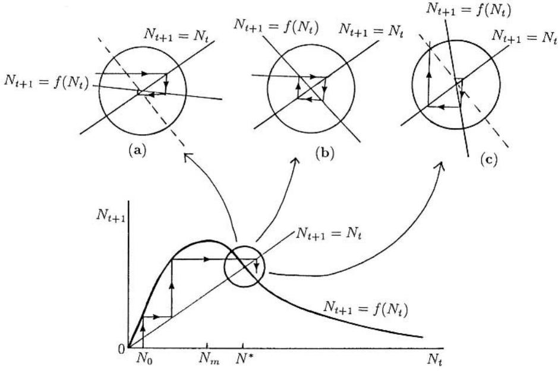

**Figure 2.4.** Local behaviour of *Nt* near a steady state where *f* - (*N*∗) < 0. The enlargements show the cases where (**a**) −1 < *f* - (*N*∗) < 0, *N*∗ is stable with decreasing oscillations for any small perturbation from the steady state. (**b**) *f* - (*N*∗) = −1, *N*∗ is neutrally stable. (**c**) *f* - (*N*∗) < −1, *N*∗ is unstable with growing oscillations.

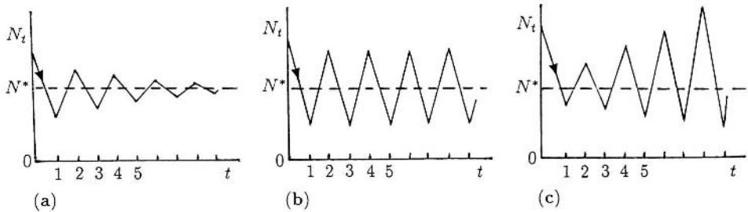

**Figure 2.5.** Local behaviour of small perturbations about the equilibrium population *N*∗ with (**a**), (**b**), and (**c**) corresponding to the situations illustrated in Figures 2.3 (a), (b) and (c) respectively: (**a**) is the stable case and (**c**) the unstable case.

λ = −1 for reasons that will become clear used to be called a *pitchfork* bifurcation but is now referred to as a *period-doubling bifurcation*.

The reason for the colourful description 'cobwebbing'for this graphical procedure is obvious from Figures 2.3, 2.4 and 2.6. It is an exceedingly useful procedure for suggesting the dynamic behaviour of the population *Nt* for single equations of the type (2.1). Although we have mainly concentrated on the local behaviour near an equilibrium it also gives the quantitative global behaviour. If the steady state is unstable, it can presage the peculiar behaviour that solutions of such equations can exhibit. As an example suppose λ = *f* - (*N*∗) < −1; that is, the local behaviour near the unstable *N*∗ is as in Figure 2.4(c). If we now cobweb such a case we have a situation such as shown in Figure 2.6. The solution trajectory cannot tend to *N*∗. On the other hand, the population must be bounded by *N*max in Figure 2.6(a) since there is no way we can generate a larger *Nt* although we could start with one. Thus the solution is globally bounded but does not tend to a steady state. In fact it seems to wander about in a seemingly random

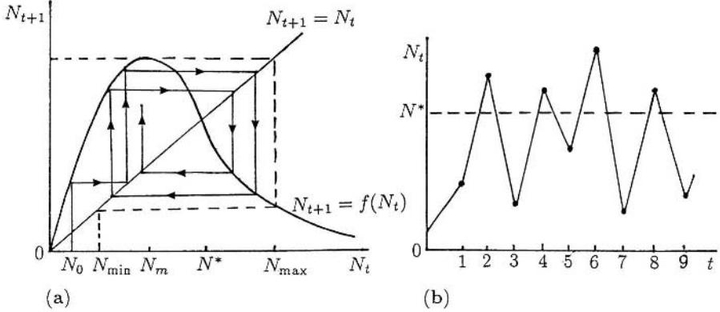

**Figure 2.6.** (**a**) Cobweb for *Nt*+1 = *f* (*Nt*) where the eigenvalue λ = *f* - (*N*∗) < −1. (**b**) The corresponding population behaviour as a function of time.

way if we look at it as a function of time in Figure 2.6(b). Solutions which do this are called *chaotic*.

With the different kinds of solutions of models like (2.1), as indicated by the cobweb procedure and the sensitivity hinted at by the special critical values of the eigenvalue λ, we must now investigate such equations analytically. The results suggested by the graphical approach can be very helpful in the analysis.

#### **2.3 Discrete Logistic-Type Model: Chaos**

As a concrete example consider the nonlinear logistic-type model

$$u_{l+1} = r u_l (1 - u_l), \quad r > 0,\tag{2.11}$$

where we assume 0 < *u*0 < 1 and we are interested in solutions *ut* ≥ 0. From the relation to the continuous differential equation logistic model the '*r*' here is strictly '1 + *r*'. The steady states and corresponding eigenvalues λ are

$$\begin{aligned} \mu^* &= 0, \quad \lambda = f'(0) = r, \\ \mu^* &= \frac{r-1}{r}, \quad \lambda = f'(\mu^*) = 2 - r. \end{aligned} \tag{2.12}$$

As *r* increases from zero but with 0 < *r* < 1 the only realistic, that is, nonnegative, equilibrium is *u*∗ = 0 which is stable since 0 <λ< 1. It is also clear from a cobwebbing of (2.11) with 0 < *r* < 1 or analytically from equation (2.11) on noting that *u*1 < *u*0 < 1 and *ut*+1 < *ut* for all *t*, which implies that *ut* → 0 as *t* → ∞.

The first bifurcation comes when *r* = 1 since *u*∗ = 0 becomes unstable since its eigenvalue λ > 1 for *r* > 1, while the positive steady state *u*∗ = (*r* − 1)/*r* > 0, for which −1 <λ< 1 for 1 < *r* < 3, is stable for this range of *r*. The second bifurcation is at *r* = 3 where λ = −1. Here *f* - (*u*∗) = −1, and so, locally near *u*∗, we have the situation in Figure 2.4(b) which exhibits a periodic solution.

To see what is happening when *r* passes through the bifurcation value *r* = 3, let us first introduce the following notation for the iterative procedure,

$$\begin{cases} u_1 = f(u_0) \\ u_2 = f(f(u_0)) = f^2(u_0) \\ \vdots \\ u_l = f^l(u_0) \end{cases} \tag{2.13}$$

With the example (2.11) the first iteration is simply the equation (2.11) while the second iterate is

$$u_{l+2} = f^2(u_l) = r[ru_l(1-u_l)][1-ru_l(1-u_l)].\tag{2.14}$$

Figure 2.7(a) illustrates the effect on the first iteration as *r* varies; the eigenvalue λ = *f* - (*u*∗) decreases as *r* increases and λ = −1 when *r* = 3. We now look at the

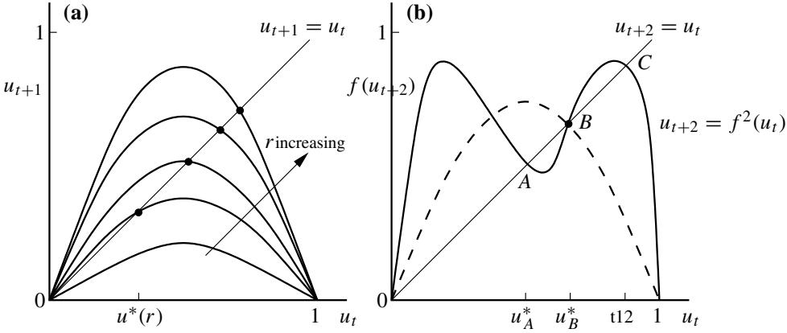

**Figure 2.7.** (**a**) First iteration as a function of *r* for *ut*+1 = *rut*(1−*ut*): *u*∗ = (*r* −1)/*r*, λ = *f* - (*u*∗) = 2−*r*. (**b**) Sketch of the second iteration *ut*+2 = *f* 2(*ut*) as a function of *ut* for *r* = 3 + ε where 0 < ε 1. The dashed line reproduces the first iteration curve of *ut*+1 as a function of *ut* ; it passes through *B*, the unstable steady state. The curve is symmetric about *ut* = 1/2.

second iteration (2.14) and ask if it has any equilibria, that is, where *ut*+2 = *ut* = *u*∗ 2. A little algebra shows that *u*∗ 2 satisfies

$$u_2^*[r u_2^* - (r - 1)][r^2 u_2^{*^2} - r(r + 1)u_2^* + (r + 1)] = 0\tag{2.15}$$

which has solutions

$$\begin{aligned} u_2^* &= 0 \quad \text{or} \quad u_2^* = \frac{r-1}{r} > 0 \quad \text{if} \quad r > 1, \\ u_2^* &= \frac{(r+1) \pm \mathbb{E}[(r+1)(r-3)]^{1/2}}{2r} > 0 \quad \text{if} \quad r > 3. \end{aligned} \tag{2.16}$$

We thus see that there are 2 more real steady states of *ut*+2 = *f* 2(*ut*) with *f* (*ut*) from (2.11) if *r* > 3. This corresponds to the situation in Figure 2.7(b) where *A*, *B* and *C* are the positive equilibria *u*∗ 2, with *B* equal to (*r* − 1)/*r*, lying between the two new solutions for *u*∗ 2 in (2.16) which appear when *r* > 3.

We can think of (2.14) as a first iteration in a model where the iterative time step is 2. The eigenvalues λ of the equilibria can be calculated at the points *A*, *B* and *C*. Clearly λ*B* = *f* - (*u*∗ *B*) > 1 from Figure 2.7(b) where *u*∗ *B* denotes *u*∗ 2 at *B* and similarly for *A* and *C*. For *r* just greater than 3, −1 < λ*A* < 1 and −1 < λ*C* < 1 as can be seen visually or, from (2.14), by evaluating ∂ *f* 2(*ut*)/∂*ut* at *u*∗ *A*and *u*∗ *C* given by the last two solutions in (2.16). Thus the steady states, *u*∗ *A* and *u*∗ *C*, of the second iteration (2.14) are stable. What this means is that there is a stable equilibrium of the second iteration (2.14) and this means that there exists a stable *periodic solution* of period 2 of equation (2.11). In other words if we start at *A*, for example, we come back to it after 2 iterations, that is *u*∗ *A*+2 = *f* 2(*u*∗ *A*) but *u*∗ *A*+1 = *f* (*u*∗ *A*) = *u*∗ *A*. In fact *u*∗ *A*+1 = *u*∗ *C* and *u*∗ *C*+1 = *u*∗ *A*.

As *r* continues to increase, the eigenvalues λ at *A* and *C* in Figure 2.7(b) pass through λ = −1 and so these 2-period solutions become unstable. At this stage we look at the 4th iterate and we find, as might now be expected, that *ut*+4 as a function of *ut* will have four humps as compared with two in Figure 2.7(b) and a 4-cycle periodic solution appears. Thus as *r* passes through a series of bifurcation values the character of the solution *ut* passes through a series of bifurcations, here in period doublingof the periodic solutions. The bifurcation situation is illustrated in Figure 2.8(a). These bifurcations when λ = −1 were originally called *pitchfork bifurcations* for obvious reasons from the picture they generate in Figure 2.8(a). However, since it is only a pitchfork from the point of view of two-cycles it is now called a period-doubling bifurcation. For example, if 3 < *r* < *r*4, where *r*4 is the bifurcation value to a 4-period solution, then the periodic solution is between the two *u*∗ in Figure 2.8(a) which are the intersections of the vertical line through the *r* value and the curve of equilibrium states. Figure 2.8(b) is an example of a 4-cycle periodic solution, that is, *r*4 < *r* < *r*8 with the actual *ut* values again given by the 4 intersections of the curve of equilibrium states with the vertical line through that value of *r*.

As *r* increases through successive bifurcations, every even *p*-periodic solution branches into a 2*p*-periodic solution and this happens when *r* is such that the eigenvalue of the *p*-periodic solution passes through −1. The distance between bifurcations in *r*-space gets smaller and smaller: this is heuristically plausible since higher order iterates imply more humps (compare with Figure 2.7(b)) all of which are fitted into the same interval (0, 1). There is thus a hierarchy of solutions of period 2*n* for every *n*, and associated with each, is a parameter interval in which it is stable. There is a limiting value *rc* at which instability sets in for all periodic solutions of period 2*n*. For *r* > *rc* all the original 2*n*-cycles are unstable. The behaviour is quite complex. For *r* > *rc* odd cycles begin to appear and a simple 3-cycle eventually appears when *r* ≈ 3.828 and locally attracting cycles with periods *k*, 2*k*, 4*k*,... appear but where now *k* is *odd*. Another stable 4-cycle, for example, shows up when *r* ≈ 3.96.

This critical parameter value *rc* in our model (2.11) is when odd period solutions are just possible. When the third iterate has 3 steady states which are tangent to the line

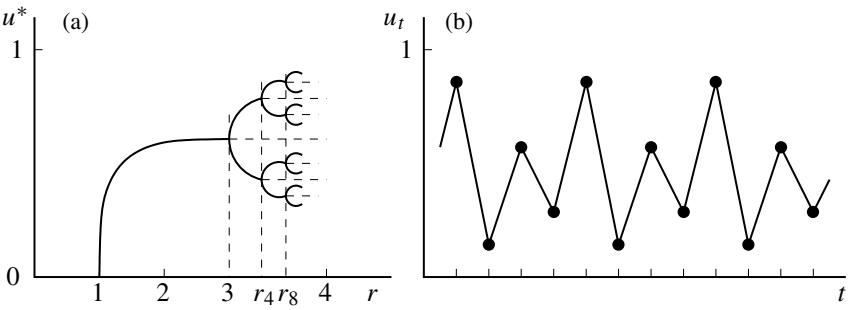

**Figure 2.8.** (**a**) Stable solutions (schematic) for the logistic model (2.11) as *r* passes through bifurcation values. At each bifurcation, the previous state becomes unstable and is represented by the dashed lines. The sequence of stable solutions has periods 2, 22, 23,... . (**b**) An example (schematic) of a 4-cycle periodic solution where *r*4 < *r* < *r*8 where *r*4 and *r*8 are the bifurcation values for 4-period and 8-period solutions respectively.

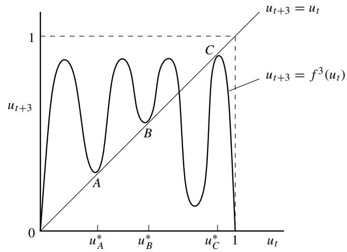

**Figure 2.9.** Schematic third iterate *ut*+3 = *f* 3(*ut*) for (2.11) at *r* = *rc*, the parameter value where the three steady states *A*, *B* and *C* all have eigenvalue λ = 1. The curve is symmetric about *ut* = 1/2.

*ut*+3 = *ut* , that is, the eigenvalue λ = 1 at these steady states of *ut*+3 = *f* 3(*ut*), we have a 3-cycle. This situation is shown schematically in Figure 2.9. For the model (2.11) the critical *r* ≈ 3.828.

Sarkovskii (1964) published an important paper on one-dimensional maps, which has dramatic practical consequences, and is directly related to the situation in Figure 2.9. He proved, among other things, that if a solution of *odd* (≥ 3) period exists for a value *r*3 then aperiodic or *chaotic solutions* exist for*r* > *r*3. Such solutions simply oscillate in an apparently random manner. The bifurcation here, at *r*3, is called a *tangent bifurcation*: the name is suggestive of the situation illustrated in Figure 2.9. Figure 2.10 illustrates some solutions for the model equation (2.4) for various *r*, including chaotic examples in Figures 2.10(d) and (f). Note the behaviour in Figure 2.10(f), for example: there is population explosion, crashback and slow recovery.

Sarkovskii's theorem was further extended by Stefan(1977). Li and Yorke's (1975) result, namely, that if a period 3 solution exists then solutions of period *n* exist for all *n* ≥ 1, is a special case of Sarkovskii's theorem.

Although we have concentrated here on the logistic model (2.11) this kind of behaviour is typical of difference equation models with the dynamics like (2.1) and schematically illustrated in Figure 2.2; that is, they all exhibit bifurcations to higher periodic solutions eventually leading to chaos.

Figures 2.10(d)–(f) illustrate an interesting aspect of the paths to chaos. As *r* increases from its value giving the aperiodic solution in Figure 2.10(d) we again get periodic solutions, as in Figure 2.10(e). For larger *r*, aperiodic solutions again appear as in Figure 2.10(f). So as *r* increases beyond where chaos first appears there are windows of parameter values where the solution behaviour is periodic. There are thus parameter windows of periodicity interlaced with windows of aperiodicity. Figure 2.11 shows a typical figure obtained when the iterative map is run after a long time, the order of sev-

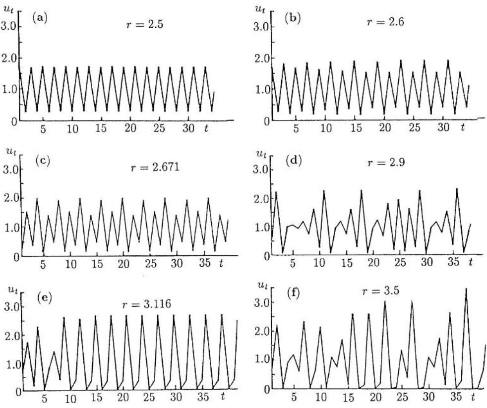

**Figure 2.10.** Solutions *ut* of the model system *ut*+1 = *ut* exp [*r*(1 − *ut*)] for various *r*. Here the first bifurcation to periodicity occurs at *r* = 2. The larger the parameter *r*, the larger the amplitude of the oscillatory solution. (**a**), (**b**), and (**c**) exhibit 2-, 4- and 8-cycle periodic solutions, (**d**) and (**f**) chaotic behaviour and (**e**) a 3-cycle solution.

eral thousand iterations, and then run for many more iterations during which the values *ut* were plotted.

Refer now to Figure 2.11 and consider the effect on the solutions of increasing *r*. For *r*2 < *r* < *r*4 the solution *ut* simply oscillates between the two points, *A* and *B*, for example, which are the intersections of a vertical line through the *r*-value. For *r*4 < *r* < *r*8, *ut* exhibits a 4-period solution with the values again given by the intersection of the curves with the vertical line through the *r*-value as shown. For values of *rc* < *r* < *r p* the solutions are chaotic. For a small window of *r*-values greater than *r p* the solutions again exhibit regular periodic solutions after which they are again aperiodic. The sequence of aperiodicity–periodicity–aperiodicity is repeated. If we now look at the inset which is an enlargement of the small rectangle, we see the same sequence of bifurcations repeated in a fractal sense. A brief introduction to fractals is given in Chapter 14, and a short discussion of them in a biological context in Chapter 3, Section 3.9. The elegant book by Peitgen and Richter (1986) shows a colourful selection of spec-

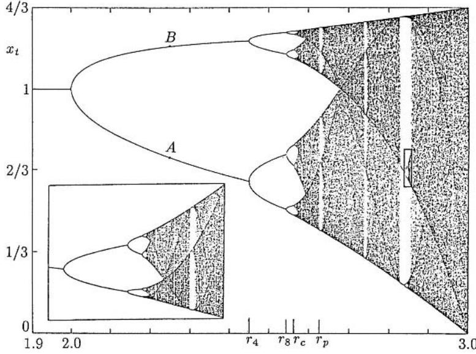

**Figure 2.11.** Long time asymptotic iterates for the discrete equation *xt*+1 = *xt* + *r xt*(1 − *xt*) for 1.9 < *r* < 3. By a suitable rescaling, (*ut* = [*r*/(*r* + 1)]*xt* , '*r*' = 1 + *r*), this can be written in the form (2.11). These are typical of discrete models which exhibit period doubling and eventually chaos and the subsequent path through chaos. Another example is that used in Figure 2.10; see text for a detailed explanation. The enlargement of the small window (with a greater magnification in the *r*-direction than in the *xt* direction) shows the fractal nature of the bifurcation sequences. (Reproduced with permission from Peitgen and Richter 1986; some labelling has been added)

tacular figures and fractal sequences which can arise from discrete models, particularly with two-dimensional models: we discuss a practical application in Chapter 5.

There is increasing interest and a large amount of research going on in chaotic behaviour related to what we have been discussing, much of it prompted by new and potential applications in a variety of different fields. In the popular press it is now referred to as *chaos theory* or the new(!) *nonlinear theory*. (There is nothing like a really immediately recognisable name to get the public's attention; catastrophe theory and fractal theory are others.) The interest is not restricted to discrete models of course: it was first demonstrated by a system of ordinary differential equations—the Lorenz system (Lorenz 1963: see Sparrow 1982, 1986 for a review). This research into chaos has produced many interesting and unexpected results associated with models such as we have been discussing here, namely, those which exhibit periodic doubling. For example, if *r*2,*r*4,...*r*2*n*,... is the sequence of period doubling bifurcation values, Feigenbaum (1978) proved that

$$\lim_{n \to \infty} \frac{r_{2(n+1)} - r_{2n}}{r_{2(n+2)} - r_{2(n+1)}} = \delta = 4.66920\dots\dots$$

He showed that δ is a universal constant; that is, it is the value for the equivalent ratio for general iterative maps of the form *ut*+1 = *f* (*ut*), where *f* (*ut*) has a maximum similar to that in Figure 2.2, and which exhibit period doubling.

A useful, practical and quick way to show the existence of chaos has been given by Li et al. (1982). They proved that if, for some *ut* and any *f* (*ut*), an *odd* integer *n* exists such that

$$f''(u_l; r) < u_l < f(u_l; r)$$

then an *odd* periodic solution exists, which thus implies chaos. For example, with

$$u_{l+1} = f(u_l; r) = u_l \exp\left[r(1 - u_l)\right],$$

if *r* = 3.0 and *u*0 = 0.1, a computation of the first few terms shows

$$
\mu_7 = f^\S(\mu_2) < \mu_2 < f(\mu_2) = \mu_3,
$$

that is, *n* = 5 in the above inequality requirement. Hence this *f* (*ut*;*r*) with *r* = 3 is chaotic.

#### **2.4 Stability, Periodic Solutions and Bifurcations**

All relevant population models involve at least one parameter, *r* say. From the above discussion, as this parameter varies the solutions of the general model equation

$$u_{l+1} = f(u_l; r),\tag{2.17}$$

will usually undergo bifurcations at specific values of *r*. Such bifurcations can be to periodic solutions with successively higher periods ultimately generating chaotic solutionsfor *r* greater than some finite critical *rc*. From the graphical analysis such bifurcations occur when the appropriate eigenvalues λ pass through λ = 1 or λ = −1. Here we discuss some analytical results associated with these bifurcations. For algebraic simplicity we shall often omit the *r* in *f* (*ut*;*r*) (unless we want to emphasise a point) by writing *f* (*ut*) but the dependence on a parameter will always be understood. The functions *f* we have in mind are qualitatively similar to that illustrated in Figure 2.2.

The equilibrium points or fixed points of (2.17) are solutions of

$$
\mu^* = f(\mu^*; r) \quad \Rightarrow \quad \mu^*(r). \tag{2.18}
$$

To investigate the linear stability of *u*∗ we write, in the usual way,

$$u_l = u^* + v_l, \quad |v_l| \ll 1. \tag{2.19}$$

Substituting this into (2.17) and expanding for small v*t* , using a Taylor expansion, we get

$$\begin{aligned} u^* + v_{l+1} &= f(u^* + v_l) \\ &= f(u^*) + v_l f'(u^*) + O(v_l^2), \, |v_l| \ll 1. \end{aligned}$$

Since *u*∗ = *f* (*u*∗) the linear (in v*t*) equation which determines the linear stability of *u*∗ is then

$$v_{l+1} = v_l f'(\mu^*) = \lambda v_l, \quad \lambda = f'(\mu^*),$$

where λ is the eigenvalue of the first iterate (2.17) at the fixed point *u*∗. The solution is

$$v_l = \lambda^l v_0 \to \begin{cases} 0 \\ \pm \infty \end{cases} \quad \text{as} \quad t \to \infty \quad \text{if} \quad |\lambda| \begin{cases} < 1 \\ > 1 \end{cases}.$$

Thus

$$
\mu^* \quad \text{is} \quad \begin{cases}
\text{stable} \\
\text{unstable}
\end{cases} \quad \text{if} \quad \begin{cases}
-1 < f'(\mu^*) < 1 \\
|f'(\mu^*)| > 1
\end{cases} . \tag{2.20}
$$

If *u*∗ is stable, any small perturbation from this equilibrium decays to zero, monotonically if 0 < *f* - (*u*∗) < 1, or with decreasing oscillations if −1 < *f* - (*u*∗) < 0. On the other hand, if *u*∗ is unstable any perturbation grows monotonically if *f* - (*u*∗) > 1, or by growing oscillations if *f* - (*u*∗) < −1. This is all as we deduced before by graphical arguments.

As an example, the rescaled model (2.8) is

$$u_{l+1} = u_l \exp\left[r(1-u_l)\right], \quad r > 0. \tag{2.21}$$

Here the steady states are

$$
\mu^* = 0 \quad \text{or} \quad 1 = \exp\left[r(1 - \mu^*)\right] \quad \Rightarrow \quad \mu^* = 1. \tag{2.22}
$$

Thus the corresponding eigenvalues are

$$
\lambda_{\mu^* = 0} = f'(0) = e^r > 1 \quad \text{for} \quad r > 0,
$$

so *u*∗ = 0 is unstable (monotonically), and

$$
\lambda_{u^*=1} = f'(1) = 1 - r.\tag{2.23}
$$

Hence *u*∗ = 1 is stable for 0 < *r* < 2 with oscillatory return to equilibrium if 1 < *r* < 2. It is unstable by growing oscillations for*r* > 2. Thus*r* = 2 is the first bifurcation value. On the basis of the above we expect a periodic solution to be the bifurcation from *u*∗ = 1 as *r* passes through the bifurcation value *r* = 2. For | 1 − *ut* | small (2.21) becomes

$$
\mu_{l+1} \approx \mu_l [1 + r(1 - \mu_l)],
$$

which is exactly the form simulated in Figure 2.11. If we write it in the form

$$U_{l+1} = (1+r)U_l[1-U_l], \quad \text{where} \quad U_l = \frac{ru_l}{1+r},$$

we get the same as the logistic model (2.11) with *r* + 1 in place of *r*. There we saw that a stable periodic solution with period 2 appeared at the first bifurcation. With example (2.21) the next bifurcation, to a 4-periodic solution, occurs at *r* = *r*4 ≈ 2.45 and a 6-periodic one at *r* = *r*6 ≈ 2.54 with aperiodic or chaotic behaviour for *r* > *rc* ≈ 2.57. The successive bifurcation values of *r* for period doubling again become progressively closer. The sensitivity of the solutions to small variations in *r* > 2 is quite severe in this model: it is in most of them in fact, at least for the equivalent of *r* beyond the first few bifurcation values.

After *t* iterations of *u*0, *ut* = *f t* (*u*0), using the notation defined in (2.13). A *trajectory* or *orbit* generated by *u*0 is the set of points {*u*0, *u*1, *u*2,...} where

$$u_{l+1} = f(u_l) = f^{l+1}(u_0), \quad i = 0, 1, 2, \dots, l$$

We say that a point is periodic of period *m* or *m*-periodic if

$$\begin{aligned} f^m(u_0; r) &= u_0 \\ f^i(u_0; r) &\neq u_0 \quad \text{for} \quad i = 1, 2, \dots, m - 1 \end{aligned} \tag{2.24}$$

and that *u*0, a fixed point of the mapping *f m* in (2.24), is a *period-m fixed point* of the mapping *f* in (2.17). The points *u*0, *u*1,... , *um*−1 form an *m*-cycle.

For the stability of a fixed point (solution) we require the eigenvalue; for the equilibrium state *u*∗ it was simply *f* - (*u*∗). We now extend this definition to an *m*-cycle of points *u*0, *u*1,... , *um*−1. For convenience, introduce

$$F(u;r) = f^m(u;r), \quad G(u;r) = f^{m-1}(u;r).$$

Then the eigenvalue λ*m* of the *m*-cycle is defined as

$$\lambda_m = \left. \frac{\partial f^m(u; r)}{\partial u} \right|_{u = u_l} \quad i = 0 \text{ or } 1 \text{ or } 2 \text{ or } \dots \text{ or } -1,\tag{2.25}$$

$$\begin{aligned} &= F'(u_l; r) \\ &= f'(G(u_l; r))G'(u_l; r) \\ &= f'(u_{l-1}; r)G'(u_l; r) \\ &= f'(u_{l-1}; r) \left[ \frac{\partial f^{m-1}(u_l; r)}{\partial u} \right]_{u = u_l} \end{aligned}$$

and so

$$
\lambda_m = \prod_{l=0}^{m-1} f'(u_l; r), \tag{2.26}
$$

which shows that the form (2.25) is independent of *i*.

In summary then, a bifurcation occurs at a parameter value *r*0 if there is a qualitative change in the dynamics of the solution for*r* < *r*0 and *r* > *r*0. From the above discussion we now expect it to be from one periodic solution to another with a different period. Also when the sequence of even periods bifurcates to an odd-period solution the Sarkovskii (1964) theorem says that cycles of every integer period exist, which implies chaos. Bifurcations with λ = −1 are the period-doubling bifurcations while those with λ = 1 are the tangent bifurcations.

Using one of the several computer packages currently available which carry out algebraic manipulations, it is easy to calculate the eigenvalues λ for each iterate and hence generate the sequence of bifurcation values *r* using (2.25) or (2.26). There are systematic analytic ways of doing this which are basically extensions of the above; see, for example, Gumowski and Mira (1980). There are also several approximate methods such as that by Hoppensteadt and Hyman (1977). Since we are mentioning books here, that by Strogatz (1994) is an excellent introductory text. You get some idea of the early interest in chaosfrom the collection of reprints, put together by Cvitanovic (1984), of some of ´ the frequently quoted papers, and the book of survey articles edited by Holden (1986); in chemistry, the book by Scott (1991) is a good starting point. Chaos can also be used to mask secret messages by superimposing on the message a chaotic mask, the chaos model being available only to the sender and the recipient, who, on receiving the message unmasks the chaos element. Strogatz (1994) discusses this in more detail. These illustrate only very few of the diverse areas in which chaos has been found and studied.

#### **2.5 Discrete Delay Models**

All of the discrete models we have so far discussed are based on the assumption that each member of the species at time *t* contributes to the population at time *t* + 1: this is implied by the general form (2.1), or (2.17) in a scaled version. This is of course the case with most insects but is not so with many other animals where, for example, there is a substantial maturation time to sexual maturity. Thus the population's dynamic model in such cases must include a delay effect: it is, in a sense, like incorporating an age structure. If this delay, to maturity say, is *T* time-steps, then we are led to study difference delay models of the form

$$u_{l+1} = f(u_l, u_{l-T}).\tag{2.27}$$

In the model for baleen whales, which we discuss below, the delay *T* is of the order of several years.

To illustrate the problems associated with the linear stability analysis of such models and to acquire a knowledge of what to expect from delay equations we consider the following simple model, which, even so, is of practical interest.

$$u_{l+1} = u_l \exp\left[r(1 - u_{l-1})\right], \quad r > 0. \tag{2.28}$$

This is a delay version of (2.21). The equilibrium states are again *u*∗ = 0 and *u*∗ = 1. The steady state *u*∗ = 0 is unstable almost by inspection; a linearisation about *u*∗ = 0 immediately shows it.

We linearise about *u*∗ = 1 by setting, in the usual way,

$$u_t = 1 + v_t, \quad |v_t| \ll 1$$

and (2.28) then gives

$$(1+v_{l+1} = (1+v_l) \exp\left[-rv_{l-1}\right] \approx (1+v_l)(1-rv_{l-1})^2$$

and so

$$v_{l+1} - v_l + r v_{l-1} = 0.\tag{2.29}$$

We look for solutions of this difference equation in the form

$$v_l = z^l \quad \Rightarrow \quad z^2 - z + r = 0$$

which gives two values for *z*, *z*1 and *z*2, where

$$z_1, z_2 = \frac{1}{2} [1 \pm (1 - 4r)^{1/2}], \quad r < \frac{1}{4}, \quad z_1, z_2 = \rho e^{\pm l\theta}, \quad r > \frac{1}{4} \tag{2.30}$$

with

$$
\rho = r^{1/2}, \quad \theta = \tan^{-1}(4r - 1)^{1/2}, \quad r > \frac{1}{4}.
$$

The solution of (2.29), for which the *characteristic equation* is the quadratic in *z*, is then

$$v_l = Az_1^l + Bz_2^l,\tag{2.31}$$

where *A* and *B* are arbitrary constants.

If 0 < *r* < 1/4, *z*1 and *z*2 are real, 0 < *z*1 < 1, 0 < *z*2 < 1 and so from (2.31), v*t* → 0 as *t* → ∞ and hence *u*∗ = 1 is a linearly stable equilibrium state. Furthermore the return to this equilibrium after a small perturbation is monotonic.

If *r* > 1/4, *z*1 and *z*2 are complex with *z*2 = *z*1, the complex conjugate of *z*1. Also *z*1*z*2 = |*z*1 | 2 = ρ2 = *r*. Thus for 1/4 < *r* < 1, |*z*1 ||*z*2 | < 1. In this case the solution is

$$v_l = Az_1^l + B\overline{z}_1^l$$

and, since it is real, we must have *B* = *A* and so, with (2.30), the real solution

$$v_l = 2|A|\rho^l \cos(t\theta + \jmath), \quad \wp = \arg A, \quad \theta = \tan^{-1}(4r - 1)^{1/2}.\tag{2.32}$$

As *r* → 1, θ → tan−1 √3 = π/3.

As*r* passes through the critical*rc* = 1, |*z*1 | > 1 and so v*t* grows unboundedly with *t* → ∞ and *u*∗ is then unstable. Since θ ≈ π/3 for*r* ≈ 1 and v*t* ≈ 2| *A* | cos(*t*π/3+γ), which has a period of 6, we expect the solution of (2.28), at least for *r* just greater than

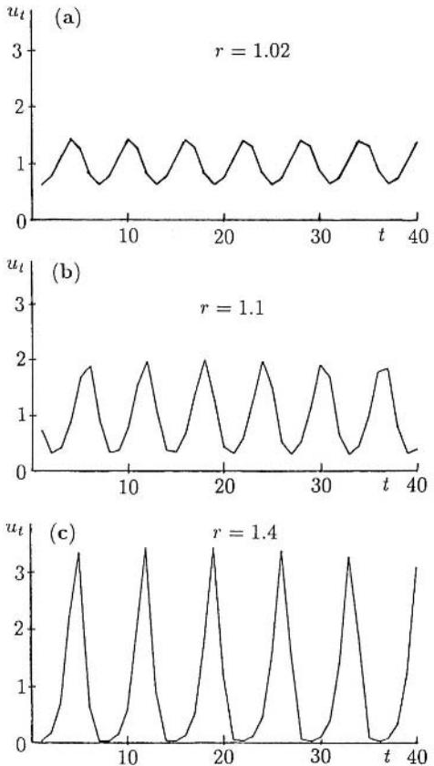

**Figure 2.12.** Solutions of the delay difference equation (2.28), *ut*+1 = *ut* exp[*r*(1 − *ut*−1)] for three values of *r* > *rc* = 1. (**a**) *r* = 1.02. This shows the 6-period solution which bifurcates off the steady state at *r* = *rc*. (**b**) *r* = 1.1. Here, elements of a 6-cycle still exist but these are lost in (**c**), where *r* = 1.4.

*rc*(= 1), to exhibit a 6-cycle periodic solution. Figure 2.12 illustrates the computed solution for three values of *r* > 1. In Figure 2.12(b) there are still elements of a 6 cycle, but they are irregular. In Figure 2.12(c) the element of 6-periodicity is lost and the solution becomes more spikelike, often an early indication of chaos.

In the last chapter we saw how delay had a destabilising effect and it increased with increasing delay. It has a similar destabilising effect in discrete models as is clear from comparing the *r*-values in Figures 2.10 and 2.12. In the former, the critical *rc* = 2 and the solution bifurcates to a 2-period solution, whereas in the latter delay case the critical *rc* = 1 and bifurcation is to a 6-period solution. Again, the longer the delay the greater the destabilising effect. This is certainly another reason why the modelling and analysis in the following example gave cause for concern. Higher period solutions are often characterised by large population swings and if the crash-back to low population levels from a previous very high one is sufficiently severe, extinctionis a distinct possibility. Section 2.7 briefly discusses a possible path to extinction.

To conclude this section we briefly describe a practical model used by the International Whaling Commission (IWC) for the baleen whale. The aim of the IWC is to manage the whale population for a sustained yield, prevent extinction, and so on. The commercial and cultural pressures on the IWC are considerable. To carry out its charter requirements in a realistic way it must understand the dynamics of whale population growth and its ecology.

A model for the now protected baleen whale which the IWC used is based on the discrete-delay model for the population *Nt* of sexually mature whales at time *t*,

$$N_{l+1} = (1 - \mu)N_l + R(N_{l-T}).\tag{2.33}$$

Here (1 − µ)*Nt* , with 0 <µ< 1, is the surviving fraction of whales that contribute to the population a year later and *R*(*Nt*−*T* ) is the number which augments the adult population from births *T* years earlier. The delay *T* is the time to sexual maturity and is of the order of 5–10 years. This model assumes that the sex ratio is 1 and the mortality is the same for each sex. The crux of the model is the form of the recruitment term *R*(*Nt*−*T* ) which in the IWC model (see, for example, IWC 1979) is

$$R(N) = \frac{1}{2}(1 - \mu)^T N \left\{ P + Q \left[ 1 - \left(\frac{N}{K}\right)^{\varepsilon} \right] \right\}.\tag{2.34}$$

Here *K* is the unharvested equilibrium density, *P* is the per capita fecundity of females at *N* = *K* with *Q* the maximum increase in the fecundity possible as the population density falls to low levels, and *z* is a measure of the severity with which this density is registered. Finally 1 − µ is the probability that a newborn whale survives each year and so (1 − µ)*T* is the fraction that survives to adulthood after the required *T* years: the 1/2 is because half the whales are females and so the fecundity of the females has to be multiplied by *N*/2. This specific model has been studied in detail by Clark (1976a). Further models in fisheries management generally, are discussed by Getz and Haight (1989).

The parameters µ, *T* and *P* in (2.33) and (2.34) are not independent. The equilibrium state is

$$N^* = N_{l+1} = N_l = N_{l-T} = K \quad \Rightarrow \quad \mu = \frac{1}{2}(1-\mu)^T P = h \tag{2.35}$$

which, as well as defining *h*, relates the fecundity *P* to the mortality µ and the delay *T* . Independent measurement of these gives a rough consistency check. If we now rescale the model with *ut* = *Nt* /*K*, (2.33), with (2.34), becomes

$$u_{l+1} = (1 - \mu)u_l + hu_{l-T}[1 + q(1 - u_{l-T}^\sharp)],\tag{2.36}$$

where *h* is defined in (2.35) and *q* = *Q*/*P*. Linearising about the steady state *u*∗ = 1 by writing *ut* = 1 + v*t* the equation for the perturbation is

$$v_{l+1} = (1 - \mu)v_l + h(1 - qz)v_{l-T}.\tag{2.37}$$

On setting v*t* ∝ *st* ,

$$\mathbf{s}^{T+1} - (1 - \mu)\mathbf{s}^{T} + h(qz - 1) = \mathbf{0},\tag{2.38}$$

which is the characteristic equation. The steady state becomes unstable when |*s* | > 1. Here there are 4 parameters µ, *T* , *h*, and *qz* and the analysis centres around a study of the roots of (2.38); see the paper by Clark (1976b). Although they are complicated, we can determine the conditions on the parameters such that |*s* | < 1 by using the Jury conditions (see Appendix B). The Jury conditions are inequalities that the coefficients of a real polynomial must satisfy for the roots to have modulus less than 1. For polynomials of order greater than about 4, the conditions are prohibitively unwieldy. When |*s* | > 1, as is now to be expected, solutions of (2.33) exhibit bifurcations to periodic solutions with progressively higher periods ultimately leading to chaos; the response parameter *z* is critical.

#### *Chaos and Data*

Chaos is not really a particularly good name for the seemingly random chaotic behaviour exhibited by the solutions of deterministic equations such as we have been discussing. When we look at complex experimental data and seek to model it with a simple model we are implying that the underlying mechanism is actually quite simple. So, when confronting real data it is important to know whether or not the random nature is truly stochastic or chaotic in the deterministic sense here. Not surprisingly this turns out to be a difficult and controversial problem. Although we may have some biological insight as to what the mechanism might be governing the process and generating the data it is unlikely we shall know it with sufficient certainty to be able to write down an exact model for the mechanism. There are several methods which have been developed to try to determine whether or not the data are stochastic or deterministically chaotic but none is foolproof.

To appreciate the difficulty suppose we have data points, *Nt* say, which measure some population at discrete times, *t*. If we plot *Nt* against *Nt*+1 and we obtain a relatively smooth curve, say, one qualitatively like that in Figure 2.2, then it would be reasonable to suggest a deterministic model for the generating mechanism, namely, a model such as we have discussed here which can give rise to deterministic chaos. In other words, we are finding a qualitative form for the *f* (*Nt*) in (2.1). However, if it does not give any sort of reasonable curve we cannot deduce that the underlying mechanism is not deterministic. For example, in this section we saw that delay can be involved quite naturally in a renewal process. In that case perhaps we could do a three-dimensional plot with *Nt*−1 and *Nt* against *Nt*+1. If a relatively smooth surface results then it could be a deterministic mechanism. Once again if it still gives a random number of points in this space it again does not necessarily point to a nondeterministic model since the relationship between *Nt* and *Nt*+1, or indeed *Nt*−1 or any other population value at earlier times might simply be a more complex discrete model or involve more than one delay. The choices are almost unlimited when seeking to determine the relationship from data.

A sound knowledge of the biology can, of course, considerably reduce the number of possibilities. So, one approach is, for example, to try to determine a plausible model a priori and, if it seems that only *Nt* and *Nt*+1 say, are involved at any time-step then the data can sometimes be used to determine the quantitative details of the functional relationship between the *Nt* and *Nt*+1. A surprisingly successful example of this arose in the unlikely area of marital interaction and divorce prediction which we discuss in Chapter 5; see Cook et al. (1995) and the book by Gottman et al. (2002) on a general theory of marriage. Here discrete coupled equations constitute the preliminary model.

A totally different example of how chaotic solutions of discrete equations can give insight into a biological process is given by Cross and Cotton (1994). We discuss the problem and their model and analysis below in Section 2.8.

### **2.6 Fishery Management Model**

Discrete models have been used in fishery management for some considerable time. They have often proven to be useful in evaluating various harvesting strategies with a view to optimising the economic yield and to maintaining it. However, the comments made at the end of Section 1.6 in Chapter 1 should very much be kept in mind. Just a few of the relevant books on management strategies are those by Clark (1976b, 1985, 1990), Goh (1982), Getz and Haight (1989), Hilborn and Mangel (1997), the series of papers edited by Cohen (1987) and appropriate sections in the collection of articles edited by Levin (1994). The following model is applicable, in principle, to any renewable resource which is harvested; the detailed analysis applies to any population whose dynamics can be described by a discrete model.

Suppose that the population density is governed by *Nt*+1 = *f* (*Nt*) in the absence of harvesting. If we let *ht* be the harvest taken from the population at time *t*, which generates the next population at *t* + 1, then a model for the population dynamics is

$$N_{l+1} = f(N_l) - h_l. \tag{2.39}$$

The questions we address here are: (i) What is the maximum sustained biological yield? (Compare with Section 1.5 in Chapter 1.) (ii) What is the maximum economic yield?

In equilibrium, *Nt* = *N*∗ = *Nt*+1, *ht* = *h*∗ where, from (2.39),

$$h^* = f(N^*) - N^*.\tag{2.40}$$

The maximum sustained steady state yield *YM* is when *N*∗ = *NM* where

$$\frac{\partial h^*}{\partial N^*} = 0 \quad \Rightarrow \quad f'(N^*) = 1 \quad \text{and} \quad Y_M = f(N_M) - N_M. \tag{2.41}$$

The only situation of interest of course is when *YM* ≥ 0.

A management strategy could be simply to maintain the population so as to get the maximum yield *YM* . Since it is hard to know what the actual fish population is, this can be difficult to accomplish. What is known is the actual yield and how much effort has gone into getting it. So it is better to formulate the optimization problem in terms of yield and effort.

Let us suppose that a unit effort to catch fish results in a harvest *cN* from a population *N*. The constant *c* is the 'catchability' parameter which is independent of the population density *N*. Then the effort to reduce *N* by 1 unit is 1/*cN* and *f* (*N*) by 1 unit is 1/(*cf* (*N*)). Thus the effort *EM* to provide for a yield

$$Y_M = f(N_M) - N_M \quad \text{is} \quad E_M = \sum_{N_l = N_M}^{f(N_M)} (cN_l)^{-1}.$$

Now if *cN* is large compared with 1 unit, we can approximate the summation in the last equation by an integral and so

$$E_M \approx \frac{1}{c} \int_{N_M}^{f(N_M)} N^{-1} dN = \frac{1}{c} \ln \left\{ \frac{f(N_M)}{N_M} \right\}. \tag{2.42}$$

The two equations (2.41) and (2.42) give the relation between *EM* and *YM* parametrically in *NM* .

As an example suppose the unharvested dynamics is governed by *Nt*+1 = *f* (*Nt*) = *bNt*/(*a* + *Nt*) with 0 < *a* < *b*; then

$$N_M: \quad 1 = f'(N_M) = \frac{ab}{(a+N_M)^2} \quad \Rightarrow \quad N_M = a^{1/2}(b^{1/2} - a^{1/2}).$$

Substituting this into (2.41) and (2.42) gives

$$Y_M = \frac{bN_M}{(a+N_M)} - N_M, \quad E_M = \frac{1}{c} \ln \left\{ \frac{b}{(a+N_M)} \right\}. \tag{2.43}$$

In this example we can get an explicit relation between *YM* and *EM* , on eliminating *NM* , as

$$Y_M = [b \exp\left(-cE_M\right) - a][\exp\left(cE_M\right) - 1].\tag{2.44}$$

Figure 2.13(a) illustrates the *YM* −*EM* relation. Using this, a crucial aspect of a management strategy is to note that if an increase in effort reduces the yield, then the maximum

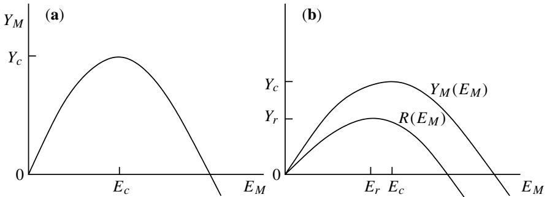

**Figure 2.13.** (**a**) The yield–effort relation (schematic) for the maximum sustained yield with the model dynamics *Nt*+1 = *bNt* /(*a* + *Nt*), 0 < *a* < *b*. (**b**) The maximum revenue *R* as a function of the effort *E* as compared with the *YM* − *EM* curve.

sustained yield is exceeded, and the effort has to be reduced so that the population can recover. The effort can subsequently be retuned to try to achieve *Yc* with *Ec* in Figure 2.13(a), both of which can be calculated from (2.44). This analysis is for the maximum sustained biological yield. The maximum economic yield must include the price for the harvest and the cost of the effort. As a first model we can incorporate these in the expression for the economic return *R* = *pYM* − *k EM* where *p* is the price per unit yield and *k* is the cost per unit effort. Using (2.43) for *YM* (*NM* ) and *EM* (*NM* ) we thus have *R*(*NM* ) which we must now maximise. We thus get a curve for the maximum revenue *R* as a function of the effort *E*; it is illustrated in Figure 2.13(b).

Such 'model' results must not be taken too seriously unless backed up by experimental observation. They can, however, give some important qualitative pointers. Our analysis here has been based on the fact that the harvested population has a steady state. Fish, in particular, have a high per capita growth rate which, in the detailed models we have analysed, is related to the parameter *r*. We would expect, therefore, that the fish population would exhibit periodic fluctuations and this is known to be the case. It is possible that the growth rate is sufficiently high that the behaviour may, in some cases, be in the chaotic regime. Since harvesting is, in a sense, an effective lowering of the reproduction rate it is feasible that it could have a stabilising effect, for example, from the chaotic to the periodic or even to a steady state situation.

#### **2.7 Ecological Implications and Caveats**

A major reason for modelling the dynamics of a population is to understand the principle controlling features and to be able to predict the likely pattern of development consequent upon a change of environmental parameters. In making the model we may have, to varying degrees, a biological knowledge of the species and observational data with which to compare the results of the analysis of the model. It may be helpful to summarise what we can learn about a population's dynamics from the type of models we have considered and to point out a few of their difficulties and limitations.

When a plausible model for a population's growth dynamics has been arrived at, the global dynamics can be determined. Using graphical methods the changes in the solutions as a major environment parameter varies can also be seen. From Figure 2.4, for example, we see that if we start with a low population, it simply grows for a while, then it can appear to oscillate quasi-regularly and then settle down to a constant state, or exhibit periodic behaviour or just oscillate in a seemingly random way with large populations at one stage and crash to very low densities in the following time-step. Whatever the model, as long as it has a general form such as in Figure 2.6 the population density is always bounded.

This seemingly random dynamics poses serious problems from a modelling point of view. Are the data obtained which exhibit this kind of behaviour generated by a deterministic model or by a stochastic situation? It is thus a problem to decide which is appropriate and it may not actually be one we can resolve in a specific situation. What modelling can do, however, is to point to how sensitive the population dynamics can be to changes in environmental parameters, the estimation of which is often difficult and usually important.

The type of dynamics exhibited with *f* (*Nt*) such as in Figure 2.6, shows that the population is always bounded after a long time by some maximum *N*max and minimum *N*min: the first few iterations can lie below *N*min if *N*0 is sufficiently small. With Figure 2.6 in mind the maximum *N*max is given by the first iteration of the value where *Nt*+1 = *f* (*Nt*) has a maximum, *Nm* say. That is,

$$\frac{df}{dN_l} = 0 \quad \Rightarrow \quad N_m, \quad N_{\text{max}} = f(N_m).$$

The minimum *N*min is then the first iterative of *N*max, namely,

$$N_{\min} = f(N_{\max}) = f(f(N_m)) = f^2(N_m). \tag{2.45}$$

These ultimately limiting population sizes are easy to work out for a given model. For example, with

$$\begin{aligned} N_{l+1} &= f(N_l) = N_l \exp\left[r\left(1 - \frac{N_l}{K}\right)\right], \quad f'(N_l) = 0 \quad \Rightarrow \quad N_m = \frac{K}{r} \\ N_{\text{max}} &= f(N_m) = \frac{K}{r} e^{r^{-1}}, \\ N_{\text{min}} &= f(f(N_m)) = \frac{K}{r} \exp\left[2r - 1 - e^{r^{-1}}\right]. \end{aligned} \tag{2.46}$$

With a steeply decreasing behaviour of the dynamics curve *Nt*+1 = *f* (*Nt*) for *Nt* > *Nm*, the possibility of a dramatic drop in the population to low values close to *N*min brings up the question of *extinction* of a species. If the population drops to a value *Nt* < 1 the species is clearly extinct. In fact extinction is almost inevitable if *Nt* drops to low values. At this stage a stochastic model is required. However an estimate of when the population drops to 1 or less, and hence extinction, can be obtained from the evaluation of *N*min for a given model. The condition is, using (2.45),

$$N_{\rm min} = f^2(N_m) \le 1, \quad \left. \frac{df}{dN} \right|_{N=N_m} = 0. \tag{2.47}$$

With the example in (2.46) this condition is

$$\frac{K}{r}\exp\left[2r - 1 - e^{r-1}\right] \le 1.$$

So if *r* = 3.5 say, and if *K* < 1600 approximately, the population will eventually become extinct.

An important phenomenon is indicated by the analysis of this model (2.46); the larger the reproduction parameter *r* the smaller is *N*min and the more likelihood of a population crash which will make the species extinct. Note also that it will usually be the case that the population size immediately before the catastrophic drop is large. With the above example if *r* = 3.5 it is almost 3500, from (2.46). An interesting and potentially practical application of the concept of extinctionis that of introducing sterile species of a pest to try to control the numbers; see Exercise 6 below. The high cost of such a procedure, however, is often prohibitive.

An important group of models not specifically discussed up to now but which come into the general class (2.1) is those which exhibit the *Allee effect*. Biological populations which show this effect decrease in size if the population falls below a certain threshold level *Nc* say. A typical density-dependent population model which illustrates this is shown in Figure 2.14. If we start with a population, *N*0 say, such that *f* 2(*N*0) < *Nc* then *Nt* → 0. Such models usually arise as a result of predation. The continuous time model for the budworm equation (1.6) in Chapter 1, has such a behaviour. The region *Nt* < *Nc* is sometimes called the *predation pit*. Here *Nt* = 0, *Nc*, *N*∗ are all steady states with *Nt* = 0 stable, *Nc* unstable and *N*∗ stable or unstable depending on *f* - (*N*∗) in the usual way. With this type of dynamics, extinction is inevitable if *Nt* < *Nc*, irrespective of how large *Nc* may be. Models which show an Allee effect display an even richer spectrum of behaviour than those we considered above, namely, all of the exotic oscillatory behaviour plus the possibility of extinction if any iterate *f m*(*Nt*) < *Nc* for some *m*.

The implications from nonlinear discrete models such as we have considered in this chapter rely crucially on the biological parameters obtained from an analysis of observational data. Southwood (1981) discussed, among other things, these population parameters and presented hard facts about several species. Hassell et al. (1976) have analysed a large number of species life data and fitted them to the model *Nt*+1 = *f* (*Nt*) = *r Nt* /(1 + *aNt*)*b* with *r*, *a* and *b* positive parameters; see also the book by Kot (2001). With *b* > 1 this *f* (*Nt*) has one hump like those in Figure 2.2. For example, the Colorado beetle is well within the stable periodic regime while Nicholson's (1954) blowflies could be in the chaotic regime.

Finally, it should be emphasised here that the richness of solution behaviour is a result of the nonlinearity of these models. It is also interesting that many of the qualita-


**Figure 2.14.** A population model which exhibits the Allee effect, whereby if the population *Nt* < *Nc* at any time *t* then *Nt* → 0, that is, extinction.

tive features can be found by remarkably elementary methods even though they present some sophisticated and challenging mathematical problems.

#### **2.8 Tumour Cell Growth**

Cross and Cotton (1994) discuss a problem in pathology, in which the data are given for a population, denoted by *Nt* , consisting of tumour cells. In their analysis they chose the simple logistic form given by (2.5) with *K* = 1, namely,

$$N_{l+1} = rN_l(1 - N_l),\tag{2.48}$$

where *r* reflects the growth rate of the tumour cells. The normalisation of *Nt* to 1 means that *Nt* is the fraction of the total population of cells that can be sustained in the cell culture container. We know from the analysis in Sections 2.2 through 2.4 that for *r* < 3 the population *Nt* simply increases until it reaches its steady state (*r* − 1)/*r*, which it does relatively quickly if *N*0 is not too small: for example, if *N*0 = 0.001 and *r* = 2 the population roughly doubles with each time-step. For*r* > 3 periodic solutions appear, eventually giving rise to chaos for *r* > *rc*. With *r* in the chaotic regime the population of cells at any time, *t*, would depend critically on the initial conditions. Figure 2.15 illustrates typical population growth for different values of *r*. In Figure 2.15(b) *Nt* approaches a periodic solution but in the early stages also exhibits a quasi-sigmoidal growth curve. In Figure 2.15(c) the solution is chaotic.

Suppose multi-clonality is included in the model with the various cell clones having different initial populations. Let us further suppose that their growth rates are different but all with an *r* > *rc* and so they all exhibit chaotic behaviour. A major pathological interest is in the total size of the tumour, that is, the total number of cells. Cross and Cotton (1994) considered first 5 clones and summed their populations to obtain the total population. A typical result is illustrated in Figure 2.16(a). We begin to see the beginning of a smoothing of the chaotic behaviour and the tentative appearance of the sigmoidlike character of the population in Figure 2.15(a). When they included 200 clones the smoothing effect was much more pronounced as illustrated in Figure 2.16(b). Multi-clonality is common in tumour growth and data exhibit growth patterns such as in Figure 2.16(b). With this simple example it is clear that multi-clonality could obscure an underlying deterministic chaos. There are gross assumptions in this model such as assuming that the growth parameter *r* is constant for each clone for all time. Modelling how cell division varies with time is an interesting problem in its own right because of the transition from discrete division to essential continuous division for an initial group of new cells. It was discussed by Murray and Frenzen (1986). A varying growth parameter in the multi-clone situation suggests that an age-structured model might be more appropriate. It would be interesting to investigate the growth characteristics of a multi-clone system with age structure with each clone in the chaotic growth regime and how variable growth rates and age structure could manifest themselves in experimental observations.

Many biological processes are chaotic, or if not strictly chaotic in the sense here, at the least stochastic, but nevertheless when seen in neurology, pathology and physiology,

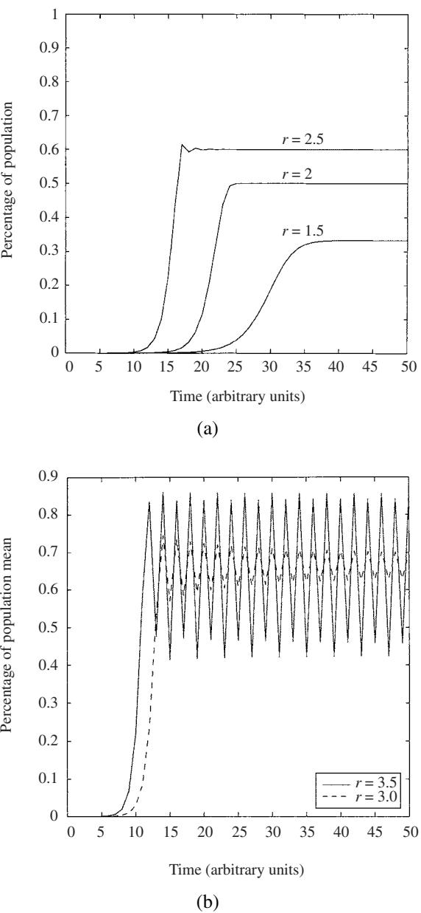

**Figure 2.15.** Starting with the same initial populations the graphs display typical cell growth curves sigmoidal growth curves for various *r*: (**a**) 0 < *r* < 3, (**b**) 3 < *r* < *rc*. For *r* > *rc* we get typical chaotic behaviour (see also Figure 2.16). Initial value: *N*0 = 10−6.

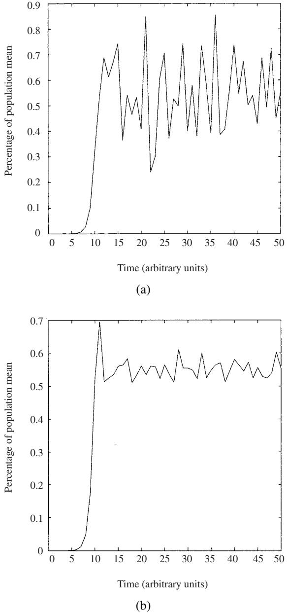

**Figure 2.16.** Total mean population fraction *Nt* with (**a**) 5 clones and (**b**) 200 clones; *r* = 3.98 (> *rc*). The chaotic smoothing is greater the larger the number of clones, each of which individually exhibits deterministic chaos. The initial conditions were *N*0 = 10−6 times a random number. (These curves are equivalent to those in Cross and Cotton 1994.)

for example, seem to exhibit considerable order. A recent review of the possible connection with epilepsy is given by Iasemidis and Sackellares (1996). Among other things, one reason they feel it is of relevance is that in many chaotic sytems there are sharply intermittent transitions between regions of chaos—highly disordered states—and highly ordered regions; Figure 2.11 is a typical example. They hypothesize that epilepsy may be an example of chaos and the careful analysis of electroencephalograms with this in mind has provided some new insights into the whole epileptogenetic process. They feel it could have possible use in both the diagnosis and treatment of epilepsy.

An interesting study (Larter et al. 1999) on the role of chaos in brain activity also suggests that chaos is the norm but during an epileptic seizure the activity becomes abnormally regular. In epileptic fits called partial seizures (patients with these are least responsive to medication) only part of the brain starts to exhibit regularity and this spreads and the seizure spreads accordingly. They studied a thousand interconnecting neurons and subjected the equation system to perturbations to try to understand how communication takes place. Among other things they were interested in what affects the rate of transfer from regular behaviour in one region to a neighbouring chaotic region. Their aim also is to apply the results in treating patients who suffer from partial seizures.

In the case of wave activity in the heart (see Chapter 1, Volume II) it is quite the opposite. If regular activity becomes chaotic, a disorder called cardiac fibrillation, it is fatal unless the heart can be shocked back into regularity: the usual method is by a massive electric shock.

Another example, mentioned by Cross and Cotton (1994), is that the growth of human hair is normally asynchronous but there are circumstances when it is synchronised by various (usually disease) stimuli. A common example is during pregnancy and delivery when all the hairs are synchronised in the telogen stage, that is, the resting stage in the cell cycle, the consequence of which is temporary baldness; the condition is called telogen effluvium (Benedict et al. 1991). From the graphs in Figure 2.16 there is increasing order with the number of clones which suggests there is a mechanism for 'antichaos,' a word that is increasingly appearing in the literature. It has similarities to synchronisation which occurs in a variety of biological situations. One example is with certain cells in culture which initially had different cell cycles but can be induced, with an appropriate stimulus, to become synchronised. Another is the synchronisation of fireflies which we discuss later in Chapter 9 where we discuss biological oscillators. A very different type of antichaos has been found by Benchetrit et al. (1987) and Demongeot et al. (1987 and 1996) in the analysis of chaotic breathing patterns. The latter used the concepts of the new field of variability theory, developed by Aubin (1991), and showed how a certain coherent order could be extracted from underlying chaos (in the sense of this chapter). An interesting approach to the concept of attractors and confiners was developed by Demongeot and Jacob (1989) and Cosnard and Demongeot (1985).

### **Exercises**

- **1** All the following discrete time population models are of the form *Nt*+1 = *f* (*Nt*) and have been taken from the ecological literature and all have been used in modelling real situations. Determine the nonnegative steady states, discuss their linear stabil-
ity and find the first bifurcation values of the parameters, which are all taken to be positive.

$$\begin{aligned} \text{(i)} \quad &N_{l+1} = N_l \left[ 1 + r \left( 1 - \frac{N_l}{K} \right) \right], \\ \text{(ii)} \quad &N_{l+1} = r N_l^{1-b}, \quad \text{if} \quad N_l > K, \\ &= r N_l, \quad \text{if} \quad N_l < K, \\ \text{(iii)} \quad &N_{l+1} = \frac{r N_l}{(1 + a N_l)^b}, \\ \text{(iv)} \quad &N_{l+1} = \frac{r N_l}{1 + \left( \frac{N_l}{K} \right)^b}. \end{aligned}$$

- **2** Construct cobweb maps for:

$$\begin{aligned} \text{(i)} \quad &N_{l+1} = \frac{(1+r)N_l}{1+rN_l},\\ \text{(ii)} \quad &N_{l+1} = \frac{rN_l}{(1+aN_l)^b}, \quad a>0, \quad b>0, \quad r>0. \end{aligned}$$

and discuss the global qualitative behaviour of the solutions. Determine, where possible, the maximum and minimum *Nt* , and the minimum for (ii) when *b* 1.

- **3** Verify that an exact solution exists for the logistic difference equation

$$u_{l+1} = r u_l (1 - u_l), \quad r > 0$$

in the form *ut* = *A* sin2 α*t* by determining values for *r*, *A* and α. Is the solution (i) periodic? (ii) oscillatory? Describe it! If*r* > 4 discuss possible solution implications.

- **4** The population dynamics of a species is governed by the discrete model

$$N_{l+1} = f(N_l) = N_l \exp\left[r\left(1 - \frac{N_l}{K}\right)\right],$$

where *r* and *K* are positive constants. Determine the steady states and their corresponding eigenvalues. Show that a period-doubling bifurcation occurs at *r* = 2. Briefly describe qualitatively the dynamic behaviour of the population for*r* = 2+ε, where 0 < ε 1. In the case *r* > 1 sketch *Nt*+1 = *f* (*Nt*) and show graphically or otherwise that, for *t* large, the maximum population is given by *Nm* = *f* (*K*/*r*) and the minimum possible population by *Nm* = *f* ( *f* (*K*/*r*)). Since a species becomes extinct if *Nt* ≤ 1 for any *t* > 1, show that irrespective of the size of *r* > 1 the species could become extinct if the carrying capacity *K* < *r* exp [1 + *er*−1 − 2*r*].

- **5** The population of a certain species subjected to a specific kind of predation is modelled by the difference equation

$$
\mu_{l+1} = a \frac{\mu_l^2}{b^2 + \mu_l^2}, \quad a > 0.
$$

Determine the equilibria and show that if *a*2 > 4*b*2 it is possible for the population to be driven to extinction if it becomes less than a critical size which you should find.

- **6** It has been suggested that a means of controlling insect numbers is to introduce and maintain a number of sterile insects in the population. One such model for the resulting population dynamics is

$$N_{l+1} = \frac{RN_l^2}{(R-1)\frac{N_l^2}{M} + N_l + S},$$

where *R* > 1 and *M* > 0 are constant parameters, and *S* is the constant sterile insect population.

Determine the steady states and discuss their linear stability, noting whether any type of bifurcation is possible. Find the critical value *Sc* of the sterile population in terms of *R* and *M* so that if *S* > *Sc* the insect population is eradicated. Construct a cobweb map and draw a graph of *S* against the steady state population density, and hence determine the possible solution behaviour if 0 < *S* < *Sc*.

- **7** A discrete model for a population *Nt* consists of

$$N_{l+1} = \frac{rN_l}{1 + bN_l^2} = f(N_l),$$

where *t* is the discrete time and *r* and *b* are positive parameters. What do *r* and *b* represent in this model? Show, with the help of a cobweb, that after a long time the population *Nt* is bounded by

$$N_{\min} = \frac{2r^2}{(4+r^2)\sqrt{b}} \le N_l \le \frac{r}{2\sqrt{b}}.$$

Prove that, for any *r*, the population will become extinct if *b* > 4.

Determine the steady states and their eigenvalues and hence show that *r* = 1 is a bifurcation value. Show that, for any finite *r*, oscillatory solutions for *Nt* are not possible.

Consider a delay version of the model given by

$$N_{l+1} = \frac{rN_l}{1 + bN_{l-1}^2} = f(N_l), \quad r > 1.$$

Investigate the linear stability about the positive steady state *N*∗ by setting *Nt* = *N*∗ + *nt* . Show that *nt* satisfies

$$n_{l+1} - n_l + \mathcal{Z}(r-1)r^{-1}n_{l-1} = 0.1$$

Hence show that *r* = 2 is a bifurcation value and that as *r* → 2 the steady state bifurcates to a periodic solution of period 6.

- **8** A basic delay model used by the International Whaling Commission (IWC) for monitoring whale populations is

$$u_{t+1} = su_t + R(u_{t-T}), \quad 0 < s < 0,$$

where *T* ≥ 1 is an integer.

- **(i)** If *u*∗ is a positive equilibrium show that a sufficient condition for linear stability is | *R*- (*u*∗)| < 1 − *s*. [Hint: Use Rouche's theorem on the resulting character- ´ istic polynomial for small perturbations about *u*∗.]
- **(ii)** If *R*(*u*) = (1 − *s*)*u*[1 + *q*(1 − *u*)], *q* > 0 and the delay *T* = 1, show that the equilibrium state is stable for all 0 < *q* < 2. [With this model, *T* is the time from birth to sexual maturity, *s* is a survival parameter and *R*(*ut*−*T* ) the recruitment to the adult population from those born *T* years ago.]
- **9** Consider the effect of regularly harvesting the population of a species for which the model equation is

$$u_{l+1} = \frac{bu_l^2}{1+u_l^2} - Eu_l = f(u_l; E), \quad b > 2, \quad E > 0, 1$$

where *E* is a measure of the effort expended in obtaining the harvest, *Eut* . [This model with *E* = 0 is a special case of that in Exercise 5.] Determine the steady states and hence show that if the effort *E* > *Em* = (*b* − 2)/2, no harvest is obtained. If *E* < *Em* show, by cobwebbing *ut*+1 = *f* (*ut*; *E*) or otherwise, that the model is realistic only if the population *ut* always lies between two positive values which you should determine analytically.

With *E* < *Em* evaluate the eigenvalue of the largest positive steady state. Demonstrate that a tangent bifurcation exists as *E* → *Em*.

# **3. Models for Interacting Populations**

When species interact the population dynamics of each species is affected. In general there is a whole web of interacting species, sometimes called a trophic web, which makes for structurally complex communities. We consider here systems involving 2 or more species, concentrating particularly on two-species systems. The book by Kot (2001) discusses such models (including age-structured interacting population systems) with numerous recent practical examples. There are three main types of interaction. (i) If the growth rate of one population is decreased and the other increased the populations are in a *predator–prey* situation. (ii) If the growth rate of each population is decreased then it is competition. (iii) If each population's growth rate is enhanced then it is called *mutualism* or *symbiosis*.

*All* of the mathematical techniques and analytical methods in this chapter are directly applicable to Chapter 6 on reaction kinetics, where similar equations arise; there the 'species' are chemical concentrations.

#### **3.1 Predator–Prey Models: Lotka–Volterra Systems**

Volterra (1926) first proposed a simple model for the predation of one species by another to explain the oscillatory levels of certain fish catches in the Adriatic. If *N*(*t*) is the prey population and *P*(*t*) that of the predator at time *t* then Volterra's model is

$$\frac{dN}{dt} = N(a - bP),\tag{3.1}$$

$$\frac{dP}{dt} = P(cN - d),\tag{3.2}$$

where *a*, *b*, *c* and *d* are positive constants.

The assumptions in the model are: (i) The prey in the absence of any predation grows unboundedly in a Malthusian way; this is the *aN* term in (3.1). (ii) The effect of the predation is to reduce the prey's per capita growth rate by a term proportional to the prey and predator populations; this is the −*bNP* term. (iii) In the absence of any prey for sustenance the predator's death rate results in exponential decay, that is, the −*d P* term in (3.2). (iv) The prey's contribution to the predators' growth rate is *cNP*; that is, it is proportional to the available prey as well as to the size of the predator population. The *N P* terms can be thought of as representing the conversion of energy from one source

to another: *bNP* is taken from the prey and *cNP* accrues to the predators. We shall see that this model has serious drawbacks. Nevertheless it has been of considerable value in posing highly relevant questions and is a jumping-off place for more realistic models; this is the main motivation for studying it here.

The model (3.1) and (3.2) is known as the *Lotka–Volterra model* since the same equations were also derived by Lotka (1920; see also 1925) from a hypothetical chemical reaction which he said could exhibit periodic behaviour in the chemical concentrations. With this motivation the dependent variables represent chemical concentrations; we touch on this again in Chapter 6.

As a first step in analysing the Lotka–Volterra model we nondimensionalise the system by writing

$$u(\tau) = \frac{cN(t)}{d}, \quad v(\tau) = \frac{bP(t)}{a}, \quad \tau = at, \quad a = d/a,\tag{3.3}$$

and it becomes

$$\frac{du}{d\tau} = \mu(1 - v), \quad \frac{dv}{d\tau} = av(u - 1). \tag{3.4}$$

In the *u*,v phase plane (a brief summary of basic phase plane methods is given in Appendix A) these give

$$\frac{dv}{du} = \alpha \frac{v(u-1)}{u(1-v)},\tag{3.5}$$

which has singular points at *u* = v = 0 and *u* = v = 1. We can integrate (3.5) exactly to get the phase trajectories

$$
\alpha u + v - \ln u^{\alpha} v = H,\tag{3.6}
$$

where *H* > *H*min is a constant: *H*min = 1 + α is the minimum of *H* over all (*u*,v) and it occurs at *u* = v = 1. For a given *H* > 1 + α, the trajectories (3.6) in the phase plane are closed as illustrated in Figure 3.1.

A closed trajectory in the *u*,v plane implies periodic solutions in τ for *u* and v in (3.4). The initial conditions, *u*(0) and v(0), determine the constant *H* in (3.6) and hence the phase trajectory in Figure 3.1. Typical periodic solutions *u*(τ) and v(τ) are illustrated in Figure 3.2. From (3.4) we can see immediately that *u* has a turning point when v = 1 and v has one when *u* = 1.

A major inadequacy of the Lotka–Volterra model is clear from Figure 3.1—the solutions are not structurally stable. Suppose, for example, *u*(0) and v(0) are such that *u* and v for τ > 0 are on the trajectory *H*4 which passes close to the *u* and v axes. Then any small perturbation will move the solution onto another trajectory which does not lie *everywhere* close to the original one *H*4. Thus a small perturbation can have a very marked effect, at the very least on the amplitude of the oscillation. This is a problem with any system which has a first integral, like (3.6), which is a closed trajectory in the phase plane. They are called *conservative systems*; here (3.6) is the associated 'conservation


**Figure 3.1.** Closed (*u*,v) phase plane trajectories, from (3.6) with various *H*, for the Lotka–Volterra system (3.4): *H*1 = 2.1, *H*2 = 2.4, *H*3 = 3.0, *H*4 = 4. The arrows denote the direction of change with increasing time τ .

law.' They are usually of little use as models for real interacting populations (see one interesting and amusing attempt to do so below). However, the method of analysis of the steady states is typical.

Returning to the form (3.4), a linearisation about the singular points determines the type of singularity and the stability of the steady states. A similar linear stability analysis has to be carried out on equivalent systems with any number of equations. We first consider the steady state (*u*,v) = (0, 0). Let *x* and *y* be small perturbations about (0, 0). If we keep only linear terms, (3.4) becomes

$$
\begin{pmatrix}
\frac{d\boldsymbol{x}}{d\tau} \\
\frac{d\boldsymbol{y}}{d\tau}
\end{pmatrix} \approx \begin{pmatrix}
1 & 0 \\
0 & -\alpha
\end{pmatrix} \begin{pmatrix}
\boldsymbol{x} \\
\boldsymbol{y}
\end{pmatrix} = A \begin{pmatrix}
\boldsymbol{x} \\
\boldsymbol{y}
\end{pmatrix}.\tag{3.7}
$$

The solution is of the form

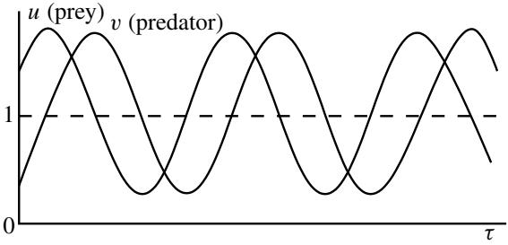

**Figure 3.2.** Periodic solutions for the prey *u*(τ) and the predator v(τ) for the Lotka–Volterra system (3.4) with α = 1 and initial conditions *u*(0) = 1.25, v(0) = 0.66.

$$
\begin{pmatrix} \mathbf{x}(\mathbf{r}) \\ \mathbf{y}(\mathbf{r}) \end{pmatrix} = \mathbf{B}e^{\lambda \mathbf{r}},
$$

where **B** is an arbitrary constant column vector and the eigenvalues λ are given by the characteristic polynomial of the matrix *A* and thus are solutions of

$$|A - \lambda I| = \begin{vmatrix} 1 - \lambda & 0 \\ 0 & -\alpha - \lambda \end{vmatrix} = 0 \quad \Rightarrow \quad \lambda_1 = 1, \quad \lambda_2 = -\alpha.$$

Since at least one eigenvalue, λ1 > 0, *x*(τ) and *y*(τ) grow exponentially and so *u* = 0 = v is linearly unstable. Since λ1 > 0 and λ2 < 0 this is a *saddle point* singularity (see Appendix A).

Linearising about the steady state *u* = v = 1 by setting *u* = 1 + *x*, v = 1 + *y* with | *x* | and | *y* | small, (3.4) becomes

$$
\begin{pmatrix}
\frac{d\mathbf{x}}{d\tau} \\
\frac{d\mathbf{y}}{d\tau}
\end{pmatrix} = A \begin{pmatrix} \mathbf{x} \\ \mathbf{y} \end{pmatrix}, \quad A = \begin{pmatrix} 0 & -1 \\ \alpha & 0 \end{pmatrix} \tag{3.8}
$$

with eigenvalues λ given by

$$
\begin{vmatrix}
-\lambda & -1 \\
\alpha & -\lambda
\end{vmatrix} = 0 \quad \Rightarrow \quad \lambda_1, \lambda_2 = \pm i\sqrt{\alpha}.\tag{3.9}
$$

Thus *u* = v = 1 is a *centre* singularity since the eigenvalues are purely imaginary. Since Re λ = 0 the steady state is *neutrally stable*. The solution of (3.8) is of the form

$$
\begin{pmatrix} \mathbf{x}(\mathbf{r}) \\ \mathbf{y}(\mathbf{r}) \end{pmatrix} = \mathbf{l}e^{i\sqrt{\alpha}\mathbf{r}} + \mathbf{m}e^{-i\sqrt{\alpha}\mathbf{r}},
$$

where **l** and **m** are eigenvectors. So, the solutions in the neighbourhood of the singular point *u* = v = 1 are periodic in τ with period 2π/√α. In dimensional terms from (3.3) this period is *T* = 2π(*a*/*d*)1/2; that is, the period is proportional to the square root of the ratio of the linear growth rate, *a*, of the prey to the death rate, *d*, of the predators. Even though we are only dealing with small perturbations about the steady state *u* = v = 1 we see how the period depends on the intrinsic growth and death rates. For example, an increase in the growth rate of the prey will increase the period; a decrease in the predator death rate does the same thing. Is this what you would expect intuitively?

In this ecological context the matrix *A* in the linear equations (3.7) and (3.8) is called the *community matrix*, and its eigenvalues λ determine the stability of the steady states. If Re λ > 0 then the steady state is unstable while if both Re λ < 0 it is stable. The critical case Re λ = 0 is termed *neutral* stability.

There have been many attempts to apply the Lotka–Volterra model to real-world oscillatory phenomena. In view of the system's structural instability, they must essentially all fail to be of quantitative practical use. As we mentioned, however, they can be important as vehicles for suggesting relevant questions that should be asked. One particularly interesting example was the attempt to apply the model to the extensive data on the Canadian lynx–snowshoe hare interaction in the fur catch records of the Hudson Bay Company from about 1845 until the 1930's. We assume that the numbers reflect a fixed proportion of the total population of these animals. Although this assumption is of questionable accuracy, as indicated by what follows, the data nevertheless represent one of the very few long term records available. Figure 3.3 reproduces this data. Williamson's (1996) book is a good source of population data which exhibit periodic or quasi-periodic behaviour.

Figure 3.3 shows reasonable periodic fluctuations and Figure 3.3(c) a more or less closed curve in the phase plane as we now expect from a time-periodic behaviour in the variables. Leigh (1968) used the standard Lotka–Volterra model to try to explain the data. Gilpin (1973) did the same with a modified Lotka–Volterra system. Let us examine the results given in Figure 3.3 a little more carefully. First note that the *direction* of the time arrows in Figure 3.3(c) is clockwise in contrast to that in Figure 3.1. This is reflected in the time curves in Figures 3.3(a) and (b) where the lynx oscillation, the predator's, precedes the hare's. The opposite is the case in the predator–prey situation illustrated in Figure 3.2. Figure 3.3 implies that the hares are eating the lynx! This poses a severe interpretation problem! Gilpin (1973) suggested that perhaps the hares could kill the lynx if they carried a disease which they passed on to the lynx. He incorporated an epidemic effect into his model and the numerical results then looked like those in Figure 3.3(c); this seemed to provide the explanation for the hare "eating" the lynx. A good try, but no such disease is known. Gilpin (1973) also offered what is perhaps the right explanation, namely, that the fur trappers are the 'disease.' In years of low population densities they probably did something else and only felt it worthwhile to return to the trap lines when the hares were again sufficiently numerous. Since lynx were more profitable to trap than hare they would probably have devoted more time to the lynx than the hare. This would result in the phenomenon illustrated by Figures 3.3(b) and (c). Schaffer (1984) has suggested that the lynx–hare data could be evidence of a strange attractor (that is, they exhibit chaotic behaviour) in Nature. The moral of the story is that it is not enough simply to produce a model which exhibits oscillations but rather to provide a proper explanation of the phenomenon which can stand up to ecological and biological scrutiny.

### **3.2 Complexity and Stability**

To get some indication of the effect of complexity on stability we briefly consider the generalised Lotka–Volterra predator–prey system where there are *k* prey species and *k* predators, which prey on all the prey species but with different severity. Then in place of (3.1) and (3.2) we have

$$\begin{aligned} \frac{dN_l}{dt} &= N_l \left[ a_l - \sum_{j=1}^k b_{lj} P_j \right] \\\\ \frac{dP_l}{dt} &= P_l \left[ \sum_{j=1}^k c_{lj} N_j - d_l \right], \end{aligned} \tag{3.10}$$

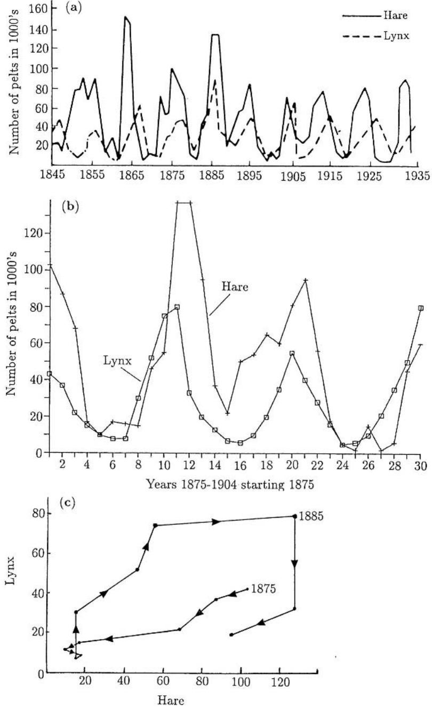

**Figure 3.3.** (**a**) Fluctuations in the number of pelts sold by the Hudson Bay Company. (Redrawn from Odum 1953) (**b**) Detail of the 30-year period starting in 1875, based on the data from Elton and Nicholson (1942). (**c**) Phase plane plot of the data represented in (**b**). (After Gilpin 1973)

where all of the *ai* , *bi j* , *ci j* and *di* are positive constants. The trivial steady state is *Ni* = *Pi* = 0 for all *i*, and the community matrix is the diagonal matrix

$$A = \begin{pmatrix} a_1 & & 0 \\ & \ddots & \\ 0 & & a_k \\ \hline \\ & 0 & -d_1 & 0 \\ & 0 & & \ddots \\ & & & 0 & -d_k \end{pmatrix}.$$

The 2*k* eigenvalues are thus

$$
\lambda_l = a_l \succ 0, \quad \lambda_{k+l} = -d_l \prec 0, \quad l = 1, \dots, k
$$

so this steady state is unstable since all λ*i* > 0,*i* = 1,... , *k*.

The nontrivial steady state is the column vector solution **N**∗, **P**∗ where

$$\sum_{j=1}^{k} b_{lj} P_j^* = a_l, \quad \sum_{j=1}^{k} c_{lj} N_j^* = d_l, \quad i = 1, \dots, k$$

or, in vector notation, with **N**∗, **P**∗, **a**, and **d** column vectors,

$$B\mathbf{P}^* = \mathbf{a}, \quad C\mathbf{N}^* = \mathbf{d},\tag{3.11}$$

where *B* and *C* are the *k* × *k* matrices [*bi j*] and [*ci j*] respectively.

Equations (3.10) can be written as

$$
\frac{d\mathbf{N}}{dt} = \mathbf{N}^T \cdot [\mathbf{a} - B\mathbf{P}], \quad \frac{d\mathbf{P}}{dt} = \mathbf{P}^T \cdot [C\mathbf{N} - \mathbf{d}],
$$

where the superscript *T* denotes the transpose. So, on linearising about (**N**∗, **P**∗) in (3.11) by setting

$$\mathbf{N} = \mathbf{N}^* + \mathbf{u}, \quad \mathbf{P} = \mathbf{P}^* + \mathbf{v},$$

where | **u** |, | **v** | are small compared with | **N**∗ | and | **P**∗ |, we get

$$\frac{d\mathbf{u}}{dt} \approx -\mathbf{N}^{*T} \cdot B\mathbf{v}, \quad \frac{d\mathbf{v}}{dt} \approx \mathbf{P}^{*T} \cdot C\mathbf{u}.$$

Then

$$
\begin{pmatrix}
\frac{d\mathbf{u}}{dt} \\
\frac{d\mathbf{v}}{dt}
\end{pmatrix} \approx A \begin{pmatrix}
\mathbf{u} \\
\mathbf{v}
\end{pmatrix}, \quad A = \begin{pmatrix}
0 & -\mathbf{N}^{*T} \cdot \mathbf{B} \\
\mathbf{P}^{*T} \cdot \mathbf{C}
\end{pmatrix}, \tag{3.12}
$$

where here the community matrix *A* is a 2*k* × 2*k* block matrix with null diagonal blocks. Since the eigenvalues λ*i*,*i* = 1,... , 2*k* are solutions of | *A* − λ*I* | = 0 the sum of the roots λ*i* satisfies

$$\sum_{l=1}^{2k} \lambda_l = \text{tr}A = 0,\tag{3.13}$$

where tr*A* is the trace of *A*. Since the elements of *A* are real, the eigenvalues, if complex, occur as complex conjugates. Thus from (3.13) there are two cases: all the eigenvalues are purely imaginary or they are not. If all Re λ*i* = 0 then the steady state (**N**∗, **P**∗) is neutrally stable as in the 2-species case. However if there are λ*i* such that Re λ*i* = 0 then, since they occur as complex conjugates, (3.13) implies that at least one exists with Re λ > 0 and hence (**N**∗, **P**∗) is unstable.

We see from this analysis that complexity in the population interaction web introduces the possibility of instability. If a model by chance resulted in only imaginary eigenvalues (and hence perturbations from the steady state are periodic in time) only a small change in one of the parameters in the community matrix would result in at least one eigenvalue with Re λ = 0 and hence an unstable steady state. This of course only holds for community matrices such as in (3.12). Even so, we get indications of the fairly general and important result that *complexity* usually *results in instability rather than stability.*

#### **3.3 Realistic Predator–Prey Models**

The Lotka–Volterra model, unrealistic though it is, does suggest that simple predator– prey interactions can result in periodic behaviour of the populations. Reasoning heuristically this is not unexpected since if a prey population increases, it encourages growth of its predator. More predators however consume more prey the population of which starts to decline. With less food around the predator population declines and when it is low enough, this allows the prey population to increase and the whole cycle starts over again. Depending on the detailed system such oscillations can grow or decay or go into a stable *limit cycle* oscillation or even exhibit chaotic behaviour, although in the latter case there must be at least 3 interacting species, or the model has to have some delay terms.

A limit cycle solution is a closed trajectory in the predator–prey space which is not a member of a continuous family of closed trajectories such as the solutions of the Lotka–Volterra model illustrated in Figure 3.1. A stable limit cycle trajectory is such that any small perturbation from the trajectory decays to zero. A schematic example of a limit cycle trajectory in a two-species predator(*P*)–prey(*N*) interaction is illustrated in Figure 3.4. Conditions for the existence of such a solution are given in Appendix A.

One of the unrealistic assumptions in the Lotka–Volterra models, (3.1) and (3.2), and generally (3.10), is that the prey growth is unbounded in the absence of predation. In the form we have written the model (3.1) and (3.2) the bracketed terms on the right are the density-dependent per capita growth rates. To be more realistic these growth

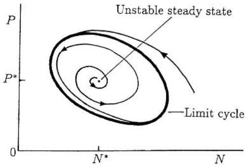

**Figure 3.4.** Typical closed predator–prey trajectory which implies a limit cycle periodic oscillation. Any perturbation from the limit cycle tends to zero asymptotically with time.

rates should depend on both the prey and predator densities as in

$$\frac{dN}{dt} = NF(N, P), \quad \frac{dP}{dt} = PG(N, P), \tag{3.14}$$

where the forms of *F* and *G* depend on the interaction, the species and so on.

As a reasonable first step we might expect the prey to satisfy a logistic growth, say, in the absence of any predators, that is, like (1.2) in Chapter 1, or have some similar growth dynamics which has some maximum carrying capacity. So, for example, a more realistic prey population equation might take the form

$$\frac{dN}{dt} = NF(N, P), \quad F(N, P) = r\left(1 - \frac{N}{K}\right) - PR(N), \tag{3.15}$$

where *R*(*N*) is one of the predation terms discussed below and illustrated in Figure 3.5 and *K* is the constant carrying capacity for the prey when *P* ≡ 0.

The predation term, which is the functional response of the predator to change in the prey density, generally shows some saturation effect. Instead of a predator response of *bNP*, as in the Lotka–Volterra model (3.1), we take *PNR*(*N*) where *N R*(*N*) saturates for *N* large. Some examples are

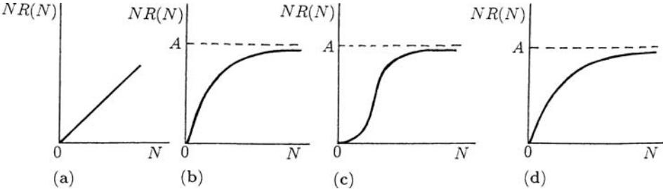

**Figure 3.5.** Examples of predator response *N R*(*N*) to prey density *N*. (**a**) *R*(*N*) = *A*, the unsaturated Lotka– Volterra type. (**b**) *R*(*N*) = *A*/(*N* + *B*). (**c**) *R*(*N*) = *AN*/(*N*2 + *B*2). (**d**) *R*(*N*) = *A*(1 − *e*−*aN* )/*N*.

$$R(N) = \frac{A}{N + B}, \quad R(N) = \frac{AN}{N^2 + B^2}, \qquad R(N) = \frac{A[1 - e^{-aN}]}{N}, \tag{3.16}$$

where *A*, *B* and *a* are positive constants; these are illustrated in Figures 3.5(b) to (d). The second of (3.16), illustrated in Figure 3.5(c), is similar to that used in the budworm model in equation (1.6) in Chapter 1. It is also typical of aphid (*Aphidicus zbeckistanicus*) predation. The examples in Figures 3.5(b) and (c) are approximately linear in *N* for low densities. The saturation for large *N* is a reflection of the limited predator capability, or perseverance, when the prey is abundant.

The predator population equation, the second of (3.14), should also be made more realistic than simply having *G* = −*d* + *cN* as in the Lotka–Volterra model (3.2). Possible forms are

$$G(N, P) = k \left( 1 - \frac{hP}{N} \right), \quad G(N, P) = -d + eR(N), \tag{3.17}$$

where *k*, *h*, *d* and *e* are positive constants and *R*(*N*) is as in (3.16). The first of (3.17) says that the carrying capacity for the predator is directly proportional to the prey density.

The models given by (3.14)–(3.17) are only examples of the many that have been proposed and studied. They are all more realistic than the classical Lotka–Volterra model. Other examples are discussed, for example, in the book by Nisbet and Gurney (1982) and that edited by Levin (1994), to mention but two.

### **3.4 Analysis of a Predator–Prey Model with Limit Cycle Periodic Behaviour: Parameter Domains of Stability**

As an example of how we analyze such realistic 2-species models we consider one of them in detail, namely,

$$\begin{split} \frac{dN}{dt} &= N\left[r\left(1 - \frac{N}{K}\right) - \frac{kP}{N+D}\right],\\ \frac{dP}{dt} &= P\left[s\left(1 - \frac{hP}{N}\right)\right], \end{split} \tag{3.18}$$

where *r*, *K*, *k*, *D*, *s* and *h* are positive constants, 6 in all. It is, as always, extremely useful to write the system in nondimensional form. Although there is no unique way of doing this it is often a good idea to relate the variables to some key relevant parameter. Here, for example, we express *N* and *P* as fractions of the predator-free carrying capacity *K*. Let us write

$$\begin{aligned} u(\tau) &= \frac{N(t)}{K}, \quad v(\tau) = \frac{hP(t)}{K}, \quad \tau = rt, \\\ a &= \frac{k}{hr}, \quad b = \frac{s}{r}, \quad d = \frac{D}{K} \end{aligned} \tag{3.19}$$

and (3.18) become

$$\begin{aligned} \frac{du}{d\tau} &= u - (1 - u) - \frac{auv}{u + d} = f(u, v), \\ \frac{dv}{d\tau} &= bv \left(1 - \frac{v}{u}\right) = g(u, v), \end{aligned} \tag{3.20}$$

which have only 3 dimensionless parameters *a*, *b* and *d*. Nondimensionalisation reduces the number of parameters by grouping them in a meaningful way. Dimensionless groupings generally give relative measures of the effect of dimensional parameters. For example, *b* is the ratio of the linear growth rate of the predator to that of the prey and so *b* > 1 and *b* < 1 have definite ecological meanings; with the latter the prey reproduce faster than the predator.

The equilibrium or steady state populations *u*∗,v∗ are solutions of *du*/*d*τ = 0, *d*v/*d*τ = 0; namely,

$$f(u^*, v^*) = 0, \quad g(u^*, v^*) = 0$$

which, from the last equations, are

$$u^*(1-u^*) - \frac{au^*v^*}{u^*+d} = 0, \quad bv^*\left(1-\frac{v^*}{u^*}\right) = 0. \tag{3.21}$$

We are only concerned here with positive solutions, namely, the positive solutions of

$$v^* = u^*, \quad u^{*2} + (a+d-1)u^* - d = 0,$$

of which the only positive one is

$$u^* = \frac{(1 - a - d) + \{(1 - a - d)^2 + 4d\}^{1/2}}{2}, \quad v^* = u^*. \tag{3.22}$$

We are interested in the stability of the steady states, which are the singular points in the phase plane of (3.20). A linear stability analysis about the steady states is equivalent to the phase plane analysis. For the linear analysis write

$$\mathbf{x}(\tau) = \boldsymbol{\upmu}(\tau) - \boldsymbol{\upmu}^*, \quad \mathbf{y}(\tau) = \boldsymbol{\upnu}(\tau) - \boldsymbol{\upnu}^* \tag{3.23}$$

which on substituting into (3.20), linearising with | *x* | and | *y* | small, and using (3.21), gives

$$\begin{aligned} \begin{pmatrix} \frac{dx}{d\tau} \\ \frac{dy}{d\tau} \end{pmatrix} &= A \begin{pmatrix} \times \\ \mathbf{y} \end{pmatrix}, \\ A = \begin{pmatrix} \frac{\partial f}{\partial u} & \frac{\partial f}{\partial v} \\ \frac{\partial g}{\partial u} & \frac{\partial g}{\partial v} \end{pmatrix}_{u^*, v^*} &= \begin{pmatrix} u^* \left[ \frac{au^*}{(u^*+d)^2} - 1 \right] & \frac{-au^*}{u^*+d} \\ b & -b \end{pmatrix}. \end{aligned} \tag{3.24}$$

*A*, the community matrix, has eigenvalues λ given by

$$\left| \left| A - \lambda I \right| \right| = 0 \quad \Rightarrow \quad \lambda^2 - (\text{tr} A)\lambda + \text{det } A = 0. \tag{3.25}$$

For stability we require Re λ < 0 and so the necessary and sufficient conditions for linear stability are, from the last equation,

$$\begin{aligned} \text{tr}A &< 0 \quad \Rightarrow \quad u^* \left[ \frac{au^*}{(u^*+d)^2} - 1 \right] < b, \\ \text{det}A &> 0 \quad \Rightarrow \quad 1 + \frac{a}{u^*+d} - \frac{au^*}{(u^*+d)^2} > 0. \end{aligned} \tag{3.26}$$

Substituting for *u*∗ from (3.22) gives the stability conditions in terms of the parameters *a*, *b* and *d*, and hence in terms of the original parameters *r*, *K*, *k*, *D*, *s* and *h* in (3.18).

In general there is a domain in the *a*, *b*, *d* space such that, if the parameters lie within it, (*u*∗,v∗) is stable, that is, Re λ < 0, and if they lie outside it the steady state is unstable. The latter requires at least one of (3.26) to be violated. With (3.22) for *u*∗ and using the first of (3.21) and v∗ = *u*∗,

$$\begin{aligned} \det A &= \left[ 1 + \frac{a}{u^* + d} - \frac{au^*}{(u^* + d)^2} \right] bu^* \\ &= \left[ 1 + \frac{ad}{(u^* + d)^2} \right] bu^* \\ &> 0 \end{aligned} \tag{3.27}$$

for all *a* > 0, *b* > 0, *d* > 0 and so the second of (3.26) is always satisfied. The instability domain is thus determined solely by the first inequality of (3.26), namely, tr *A* < 0 which, with (3.22) for *u*∗ and again using (3.21), becomes

$$b \geqslant \left[ a - \{ (1 - a - d)^2 + 4d \}^{1/2} \right] \frac{\left[ 1 + a + d - \{ (1 - a - d)^2 + 4d \}^{1/2} \right]}{2a}. \tag{3.28}$$

This defines a three-dimensional surface in (*a*, *b*, *d*) parameter space.

We are only concerned with *a*, *b*, and *d* positive. The second square bracket in (3.28) is a monotonic decreasing function of *d* and always positive. The first square bracket is a monotonic decreasing function of *d* with a maximum at *d* = 0. Thus, from (3.28),

$$b_{d=0} \begin{cases} > 2a - 1 \\ > 1/a \end{cases} \quad \text{if} \quad \begin{cases} 0 < a \le 1 \\ 1 \le a \end{cases}$$

and so for 0 < *a* < 1/2 and all *d* > 0 the stability condition (3.28) is satisfied with any *b* > 0. That is, the steady state *u*∗,v∗ is linearly stable for all 0 < *a* < 1/2, *b* > 0, *d* > 0. On the other hand if *a* > 1/2 there is a domain in the (*a*, *b*, *d*) space with *b* > 0 and *d* > 0 where (3.28) is not satisfied and so the first of (3.26) is violated and hence one of the eigenvalues λ in (3.25) has Re λ > 0. This in turn implies the steady state *u*∗,v∗ is unstable to small perturbations. The boundary surface is given by (3.28) and it crosses the *b* = 0 plane at *d* = *dm*(*a*) given by the positive solution of

$$a = \left\{(1 - a - d_m)2 + 4d_m\right\}^{1/2} \quad \Rightarrow \quad d_m(a) = d_{b=0} = (a^2 + 4a)^{1/2} - (1 + a).$$

Thus *dm*(*a*) is a monotonic increasing function of *a* bounded above by *d* = 1. Note also that *d* < *a* for all *a* > 1/2. Figure 3.6 illustrates the stability/instability domains in the (*a*, *b*, *d*) space.

When Re λ < 0 the steady state is stable and either both λ's are real in (3.25), in which case the singular point *u*∗,v∗ in (3.21) is a stable node in the *u*,v phase plane of (3.20), or the λ's are complex and the singular point is a stable spiral. When the parameters result in Re λ > 0 the singular point is either an unstable node or spiral. In this case we must determine whether or not there is a confined set, or bounding domain, in the (*u*,v) phase plane so as to use the Poincare–Bendixson theorem for the ´ existence of a limit cycle oscillation; see Appendix A. In other words we must find a simple closed boundary curve in the positive quadrant of the (*u*,v) plane such that on it the phase trajectories always point into the enclosed domain. That is, if **n** denotes the outward normal to this boundary, we require

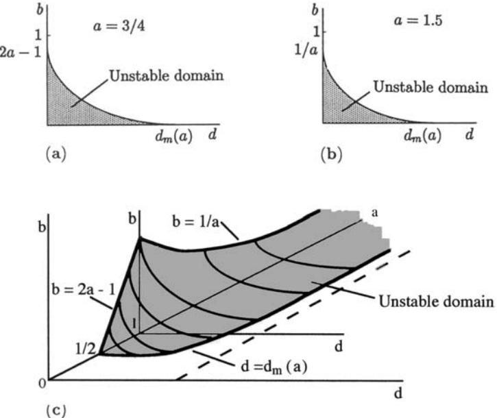

**Figure 3.6.** Parameter domains (schematic) of stability of the positive steady state for the predator–prey model (3.20). For *a* < 1/2 and all parameter values *b* > 0, *d* > 0, stability is obtained. For a fixed *a* > 1/2, the domain of instability is finite as in (**a**) and (**b**). The three-dimensional bifurcation surface between stability and instability is sketched in (**c**) with *dm*(*a*) = (*a*2 + 4*a*)1/2 − (1 + *a*). When parameter values are in the unstable domain, limit cycle oscillations occur in the populations.

$$\mathbf{n} \cdot \left(\frac{du}{d\tau}, \frac{dv}{d\tau}\right) < 0$$

for all points on the boundary. If this inequality holds at a point on the boundary it means that the 'velocity' vector (*du*/*d*τ, *d*v/*d*τ) points inwards. Intuitively this means that no solution trajectory can leave the domain if once inside, since, if it did reach the boundary, its 'velocity' points inwards and so the trajectory moves back into the domain.

To find a confined set it is essential and always informative to draw the null clines of the system, that is, the curves in the phase plane where *du*/*d*τ = 0 and *d*v/*d*τ = 0. From (3.20) these are the curves *f* (*u*,v) = 0 and *g*(*u*,v) = 0 which are illustrated in Figure 3.7. The sign of the vector components of ( *f* (*u*,v), *g*(*u*,v)) indicate the direction of the vector (*du*/*d*τ, *d*v/*d*τ) and hence the direction of the (*u*,v) trajectory. So if *f* > 0 in a domain, *du*/*d*τ > 0 and *u* is thus increasing there. On *DE*, *E A*, *AB* and *BC*, the trajectories clearly point inwards because of the signs of *f* (*u*,v) and *g*(*u*,v) on them. It can be shown simply but tediously that a line *DC* exists such that on it **n** · (*du*/*d*τ, *d*v/*d*τ) < 0; that is, **n** · ( *f* (*u*,v), *g*(*u*,v)) < 0 where **n** is the unit vector perpendicular to *DC*.

We now have a confined set appropriate for the Poincare–Bendixson theorem to ´ apply when (*u*∗,v∗) is unstable. Hence the solution trajectory tends to a *limit cycle* when the parameters *a*, *b* and *d* lie in the unstable domain in Figure 3.6(c). Basically the Poincare–Bendixson theorem says that since any trajectory coming out of the un- ´ stable steady state (*u*∗,v∗) cannot cross the confining boundary *ABCDE A*, it must evolve into a closed limit cycle trajectory qualitatively similar to that illustrated in Figure 3.4. With our model (3.20), Figure 3.8(a) illustrates such a closed trajectory with Figure 3.8(b) showing the temporal variation of the populations with time. With the specific parameter values used in Figure 3.8 the steady state is an unstable node in the phase plane; that is, both eigenvalues are real and positive. Any perturbation from the limit cycle decays quickly.

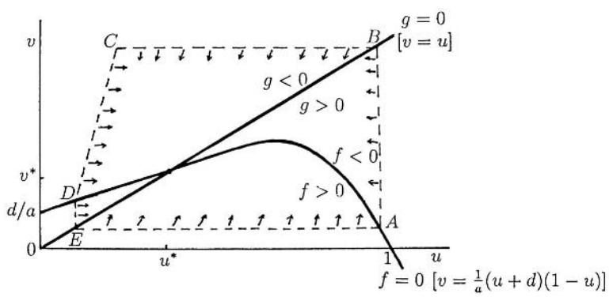

**Figure 3.7.** Null clines *f* (*u*,v) = 0, *g*(*u*,v) = 0 for the system (3.20); note the signs of *f* and *g* on either side of their null clines. *ABCDEA* is the boundary of the confined set about (*u*∗, v∗) on which the trajectories all point inwards; that is, **n** · (*du*/*d*τ , *d*v/*d*τ) < 0 where **n** is the unit outward normal on the boundary *ABCDEA*.

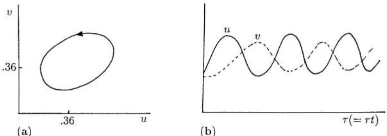

**Figure 3.8.** (**a**) Typical phase trajectory limit cycle solution for the predator–prey system (3.20). (**b**) Corresponding periodic behaviour of the prey (*u*) and predator (v) populations. Parameter values: *a* = 1, *b* = 5, *d* = 0.2, which give the steady state as *u*∗ = v∗ = 0.36. Relations (3.19) relate the dimensionless to the dimensional parameters.

This model system, like most which admit limit cycle behaviour, exhibits bifurcation properties as the parameters vary, although not with the complexity shown by discrete models as we see in Chapters 2 and 5, nor with delay models such as in Chapter 1. We can see this immediately from Figure 3.6. To be specific, consider a fixed *a* > 1/2 so that a finite domain of instability exists, as illustrated in Figure 3.9, and let us choose a fixed 0 < *d* < *dm* corresponding to the line *DEF*. Suppose *b* is initially at the value *D* and is then continuously decreased. On crossing the bifurcation line at *E*, the steady state becomes unstable and a periodic limit cycle solution appears; that is, the uniform steady state bifurcates to an oscillatory solution. A similar situation occurs along any parameter variation from the stable to the unstable domains in Figure 3.6(c).

The fact that a dimensionless variable passes through a bifurcation value provides useful practical information on equivalent effects of dimensional parameters. For example, from (3.19), *b* = *s*/*r*, the ratio of the linear growth rates of the predator and prey. If the steady state is stable, then as the predators' growth rate *s* decreases there is more likelihood of periodic behaviour since *b* decreases and, if it decreases enough, we move into the instability regime. On the other hand if *r* decreases, *b* increases and so probably reduces the possibility of oscillatory behaviour. In this latter case it is not so clear-cut since, from (3.19), reducing *r* also increases *a*, which from Figure 3.6(c) tends to increase the possibility of periodic behaviour. The dimensional bifurcation space is 6-dimensional which is difficult to express graphically; the nondimensionalisation reduces it to a simple 3-dimensional space with (3.19) giving clear equivalent effects of

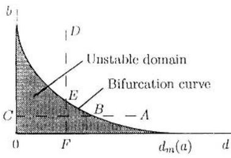

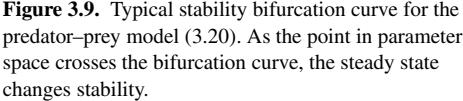

different dimensional parameter changes. For example, doubling the carrying capacity *K* is exactly equivalent to halving the predator response parameter *D*. The dimensionless parameters are the important bifurcation ones to determine.

#### **3.5 Competition Models: Principle of Competitive Exclusion**

Here two or more species compete for the same limited food source or in some way inhibit each other's growth. For example, competition may be for territory which is directly related to food resources. Some interesting phenomena have been found from the study of practical competition models; see, for example, Hsu et al. (1979). Here we discuss a very simple competition model which demonstrates a fairly general principle which is observed to hold in Nature, namely, that when two species compete for the same limited resources one of the species usually becomes extinct.

Consider the basic 2-species Lotka–Volterra competition model with each species *N*1 and *N*2 having logistic growth in the absence of the other. Inclusion of logistic growth in the Lotka–Volterra systems makes them much more realistic, but to highlight the principle we consider the simpler model which nevertheless reflects many of the properties of more complicated models, particularly as regards stability. We thus consider

$$\frac{dN_1}{dt} = r_1 N_1 \left[ 1 - \frac{N_1}{K_1} - b_{12} \frac{N_2}{K_1} \right],\tag{3.29}$$

$$\frac{dN_2}{dt} = r_2 N_2 \left[ 1 - \frac{N_2}{K_2} - b_{21} \frac{N_1}{K_2} \right],\tag{3.30}$$

where *r*1, *K*1, *r*2, *K*2, *b*12 and *b*21 are all positive constants and, as before, the *r*'s are the linear birth rates and the *K*'s are the carrying capacities. The *b*12 and *b*21 measure the competitive effect of *N*2 on *N*1 and *N*1 on *N*2 respectively: they are generally not equal. Note that the competition model (3.29) and (3.30) is not a conservative system like its Lotka–Volterra predator–prey counterpart.

If we nondimensionalise this model by writing

$$\begin{aligned} u_1 &= \frac{N_1}{K_1}, \quad u_2 = \frac{N_2}{K_2}, \quad \tau = r_1 t, \quad \rho = \frac{r_2}{r_1}, \\\ a_{12} &= b_{12} \frac{K_2}{K_1}, \quad a_{21} = b_{21} \frac{K_1}{K_2} \end{aligned} \tag{3.31}$$

(3.29) and (3.30) become

$$\begin{aligned} \frac{du_1}{d\tau} &= u_1(1 - u_1 - a_{12}u_2) = f_1(u_1, u_2), \\ \frac{du_2}{d\tau} &= \rho u_2(1 - u_2 - a_{21}u_1) = f_2(u_1, u_2). \end{aligned} \tag{3.32}$$

The steady states, and phase plane singularities, *u*∗ 1, *u*∗ 2, are solutions of *f*1(*u*1, *u*2) = *f*2(*u*1, *u*2) = 0 which, from (3.32), are

$$\begin{aligned} \mu_1^* = 0, \mu_2^* = 0; \quad \mu_1^* = 1, \mu_2^* = 0; \quad \mu_1^* = 0, \mu_2^* = 1;\\ \mu_1^* = \frac{1 - a_{12}}{1 - a_{12} a_{21}}, \mu_2^* = \frac{1 - a_{21}}{1 - a_{12} a_{21}}. \end{aligned} \tag{3.33}$$

The last of these is only of relevance if *u*∗ 1 ≥ 0 and *u*∗ 2 ≥ 0 are finite, in which case *a*12*a*21 = 1. The four possibilities are seen immediately on drawing the null clines *f*1 = 0 and *f*2 = 0 in the *u*1, *u*2 phase plane as shown in Figure 3.10. The crucial part of the null clines are, from (3.32), the straight lines

$$1 - \mu_1 - a_{12}\mu_2 = 0, \quad 1 - \mu_2 - a_{21}\mu_1 = 0.$$

The first of these together with the *u*2-axis is *f*1 = 0, while the second, together with the *u*1-axis is *f*2 = 0.

The stability of the steady states is again determined by the community matrix which, for (3.32), is

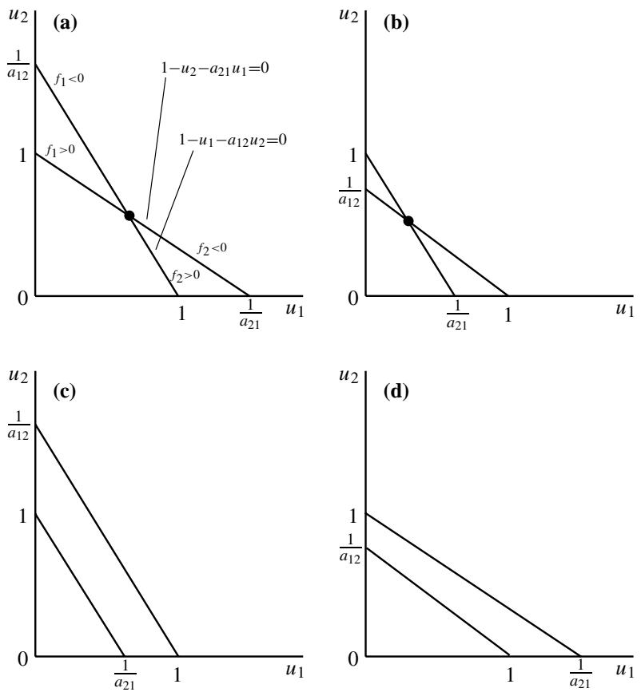

**Figure 3.10.** The null clines for the competition model (3.32). *f*1 = 0 is *u*1 = 0 and 1 − *u*1 − *a*12*u*2 = 0 with *f*2 = 0 being *u*2 = 0 and 1 − *u*2 − *a*21*u*1 = 0. The intersection of the two solid lines gives the positive steady state if it exists as in (**a**) and (**b**): the relative sizes of *a*12 and *a*21 as compared with 1 for it to exist are obvious from (**a**) to (**d**).

#### 96 3. Models for Interacting Populations

$$\begin{split} A &= \begin{pmatrix} \frac{\partial f_1}{\partial u_1} & \frac{\partial f_1}{\partial u_2} \\ \frac{\partial f_2}{\partial u_1} & \frac{\partial f_2}{\partial u_2} \end{pmatrix}_{u_1^*, u_2^*} \\ &= \begin{pmatrix} 1 - 2u_1 - a_{12}u_2 & -a_{12}u_1 \\ -\rho a_{21}u_2 & \rho(1 - 2u_2 - a_{21}u_1) \end{pmatrix}_{u_1^*, u_2^*} .\end{split} \tag{3.34}$$

The first steady state in (3.33), that is, (0, 0), is unstable since the eigenvalues λ of its community matrix, given from (3.34) by

$$\left| \left| A - \lambda I \right| \right| = \begin{vmatrix} 1 - \lambda & 0 \\ 0 & \rho - \lambda \end{vmatrix} = 0 \quad \Rightarrow \quad \lambda_1 = 1, \lambda_2 = \rho, \rho$$

are positive. For the second of (3.33), namely, (1, 0), (3.34) gives

$$\left| \begin{array}{c} |A - \lambda I| \end{array} \right| = \begin{vmatrix} -1 - \lambda & -a_{12} \\ 0 & \rho(1 - a_{21}) - \lambda \end{vmatrix} = 0 \quad \Rightarrow \quad \begin{array}{c} \lambda_1 = -1, \\ \lambda_2 = \rho(1 - a_{21}) \end{array}$$

and so

$$
\mu_1^* = 1,\\
\mu_2^* = 0 \quad \text{is} \quad \begin{cases} \text{stable} \\ \text{unstable} \end{cases} \quad \text{if} \quad \begin{cases} a_{21} > 1 \\ a_{21} < 1 \end{cases}. \tag{3.35}
$$

Similarly, for the third steady state, (0, 1), the eigenvalues are λ = −ρ,λ2 = (1 − *a*12) and so

$$
\mu_1^* = 0, \mu_2^* = 1 \quad \text{is} \quad \begin{cases} \text{stable} \\ \text{unstable} \end{cases} \quad \text{if} \quad \begin{cases} a_{12} > 1 \\ a_{12} < 1 \end{cases} . \tag{3.36}
$$

Finally for the last steady state in (3.33), when it exists in the positive quadrant, the matrix *A* from (3.34) is

$$A = \left(1 - a_{12}a_{21}\right)^{-1} \begin{pmatrix} a_{12} - 1 & a_{12}(a_{12} - 1) \\ \rho a_{21}(a_{21} - 1) & \rho(a_{21} - 1) \end{pmatrix}$$

which has eigenvalues

$$\begin{split} \lambda_1, \lambda_2 &= \left[ 2(1 - a_{12}a_{21}) \right]^{-1} \Big[ (a_{12} - 1) + \rho(a_{21} - 1) \\ &\pm \left\{ \left[ (a_{12} - 1) + \rho(a_{21} - 1) \right]^2 - 4\rho(1 - a_{12}a_{21})(a_{12} - 1)(a_{21} - 1) \right\}^{1/2} \Big]. \end{split} \tag{3.37}$$

The sign of λ, or Re λ if complex, and hence the stability of the steady state, depends on the size of ρ, *a*12 and *a*21. There are several cases we have to consider, all of which have ecological implications which we come to below.

Before discussing the various cases note that there is a confined set on the boundary of which the vector of the derivatives, (*du*1/*d*τ, *du*2/*d*τ), points along it or inwards: here it is a rectangular box in the (*u*1, *u*2) plane. From (3.32) this condition holds on the *u*1- and *u*2-axes. Outer edges of the rectangle are, for example, the lines *u*1 = *U*1 where 1 − *U*1 − *a*12*u*2 < 0 and *u*2 = *U*2 where 1 − *U*2 − *a*21*u*1 < 0. Any *U*1 > 1, *U*2 > 1 suffice. So the system is always globally stable.

The various cases are: (i) *a*12 < 1, *a*21 < 1, (ii) *a*12 > 1, *a*21 > 1, (iii) *a*12 < 1, *a*21 > 1, (iv) *a*12 > 1, *a*21 < 1. All of these are analyzed in a similar way. Figures 3.10(a) to (d) and Figures 3.11(a) to (d) relate to these cases (i) to (iv) respectively. By way of example, we consider just one of them, namely, (ii). The analysis of the other cases is left as an exercise. The results are encapsulated in Figure 3.11. The arrows in-

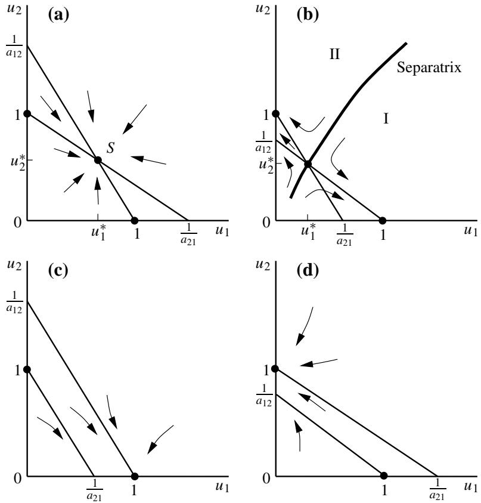

**Figure 3.11.** Schematic phase trajectories near the steady states for the dynamic behaviour of competing populations satisfying the model (3.32) for the various cases. (**a**) *a*12 < 1, *a*21 < 1. Only the positive steady state *S* is stable and all trajectories tend to it. (**b**) *a*12 > 1, *a*21 > 1. Here, (1, 0) and (0, 1) are stable steady states, each of which has a domain of attraction separated by a separatrix which passes through (*u*∗ 1, *u*∗ 2). (**c**) *a*12 < 1, *a*21 > 1. Only one stable steady state exists, *u*∗ 1 = 1, *u*∗ 2 = 0 with the whole positive quadrant its domain of attraction. (**d**) *a*12 > 1, *a*21 < 1. The only stable steady state is *u*∗ 1 = 0, *u*∗ 2 = 1 with the positive quadrant as its domain of attraction. Cases (**b**) to (**d**) illustrate the competitive exclusion principle whereby 2 species competing for the same limited resource cannot in general coexist.

dicate the direction of the phase trajectories. The qualitative behaviour of the phase trajectories is given by the signs of *du*1/*d*τ , namely, *f*1(*u*1, *u*2), and *du*2/*d*τ which is *f*2(*u*1, *u*2), on either side of the null clines.

*Case a*12 > 1, *a*21 > 1. This corresponds to Figure 3.10(b). From (3.35) and (3.36), (1, 0) and (0, 1) are stable. Since 1 − *a*12*a*21 < 0, (*u*∗ 1, *u*∗ 2), the fourth steady state in (3.33), lies in the positive quadrant and from (3.37) its eigenvalues are such that λ2 < 0 < λ1 and so it is unstable to small perturbations: it is a saddle point. In this case, then, the phase trajectories can tend to either one of the two steady states, as illustrated in Figure 3.11(b). Each steady state has a *domain of attraction*. There is a line, a *separatrix*, which divides the positive quadrant into 2 nonoverlapping regions I and II as in Figure 3.11(b). The separatrix passes through the steady state (*u*∗ 1, *u*∗ 2): it is one of the saddle point trajectories in fact.

Now consider some of the ecological implications of these results. In case (i) where *a*12 < 1 and *a*21 < 1 there is a stable steady state where both species can exist as in Figure 3.10(a). In terms of the original parameters from (3.31) this corresponds to *b*12*K*2/*K*1 < 1 and *b*21*K*1/*K*2 < 1. For example, if *K*1 and *K*2 are approximately the same and the interspecific competition, as measured by *b*12 and *b*21, is not too strong, these conditions say that the two species simply adjust to a lower population size than if there were no competition. In other words, the competition is not aggressive. On the other hand if the *b*12 and *b*21 are about the same and the *K*1 and *K*2 are different, it is not easy to tell what will happen until we form and compare the *dimensionless* groupings *a*12 and *a*21.

In case (ii), where *a*12 > 1 and *a*21 > 1, if the *K*'s are about equal, then the *b*12 and *b*21 are not small. The analysis then says that the competition is such that all three nontrivial steady states can exist, but, from (3.35) to (3.37), only (1, 0) and (0, 1) are stable, as in Figure 3.11(b). It can be a delicate matter which ultimately wins out. It depends crucially on the starting advantage each species has. If the initial conditions lie in domain I then eventually species 2 will die out, *u*2 → 0 and *u*1 → 1; that is, *N*1 → *K*1 the carrying capacity of the environment for *N*1. Thus competition here has eliminated *N*2. On the other hand if *N*2 has an initial size advantage so that *u*1 and *u*2 start in region II then *u*1 → 0 and *u*2 → 1 in which case the *N*1-species becomes extinct and *N*2 → *K*2, its environmental carrying capacity. We expect extinction of one species even if the initial populations are close to the separatrix and in fact if they lie on it, since the ever present random fluctuations will inevitably cause one of *ui* , *i* = 1, 2 to tend to zero.

Cases (iii) and (iv) in which the *inter*specific competition of one species is much stronger than the other, or the carrying capacities are sufficiently different so that *a*12 = *b*12*K*2/*K*1 < 1 and *a*21 = *b*21*K*1/*K*2 > 1 or alternatively *a*12 > 1 and *a*21 < 1, are quite definite in the ultimate result. In case (iii), as in Figure 3.11(c), the stronger dimensionless interspecific competition of the *u*1-species dominates and the other species, *u*2, dies out. In case (iv) it is the other way round and species *u*1 becomes extinct.

Although all cases do not result in species elimination, those in (iii) and (iv) always do and in (ii) it is inevitable due to natural fluctuations in the population levels. This work led to the *principle of competitive exclusion* which was mentioned above. Note that the conditions for this to hold depend on the dimension*less* parameter groupings *a*12 and *a*21: the growth rate ratio parameter ρ does not affect the gross stability results, just the dynamics of the system. Since *a*12 = *b*12*K*2/*K*1, *a*21 = *b*21*K*1/*K*2 the conditions for competitive exclusion depend critically on the interplay between competition and the carrying capacities as well as the initial conditions in case (ii).

Suppose, for example, we have 2 species comprised of large animals and small animals, with both competing for the same grass in a fixed area. Suppose also that they are equally competitive with *b*12 = *b*21. With *N*1 the large animals and *N*2 the small, *K*1 < *K*2 and so *a*12 = *b*12*K*2/*K*1 < *b*21*K*2/*K*1 = *a*21. As an example if *b*12 = 1 = *b*21, *a*12 < 1 and *a*21 > 1 then in this case *N*1 → 0 and *N*2 → *K*2; that is, the large animals become extinct.

The situation in which *a*12 = 1 = *a*21 is special and, with the usual stochastic variability in nature, is unlikely in the real world to hold exactly. In this case the competitive exclusion of one or the other of the species also occurs.

The importance of species competition in Nature is obvious. We have discussed only one particularly simple model but again the method of analysis is quite general. A review and introductory article by Pianka (1981) deals with some practical aspects of competition as does the book of lectures by Waltman (1984). A slightly simpler competition model (see Exercise 2) was applied by Flores (1998) to the extinction of Neanderthal man by Early Modern man. Flores' model is based on a slightly different mortality rate of the two species and he shows that coexistence is not possible. He estimates the relevant parameter from independent sources and his extinction period is in line with the accepted palaeontological data of 5000 to 10,000 years. In Chapters 1 and 14, Volume II we discuss some practical cases of spatial competition associated with squirrels, wolf–deer survival and the release of genetically engineered organisms.

### **3.6 Mutualism or Symbiosis**

There are many examples where the interaction of two or more species is to the advantage of all. Mutualism or symbiosis often plays the crucial role in promoting and even maintaining such species: plant and seed dispersal is one example. Even if survival is not at stake the mutual advantage of mutualism or symbiosis can be very important. As a topic of theoretical ecology, even for two species, this area has not been as widely studied as the others even though its importance is comparable to that of predator–prey and competition interactions. This is in part due to the fact that simple models in the Lotka–Volterra vein give silly results. The simplest mutualism model equivalent to the classical Lotka–Volterra predator–prey one is

$$\frac{dN_1}{dt} = r_1 N_1 + a_1 N_1 N_2, \quad \frac{dN_2}{dt} = r_2 N_2 + a_2 N_2 N_1,$$

where *r*1, *r*2, *a*1 and *a*2 are all positive constants. Since *d N*1/*dt* > 0 and *d N*2/*dt* > 0, *N*1 and *N*2 simply grow unboundedly in, as May (1981) so aptly put it, 'an orgy of mutual benefaction.'

Realistic models must at least show a mutual benefit to both species, or as many as are involved, and have some positive steady state or limit cycle type oscillation. Some models which do this are described by Whittaker (1975). A practical example is discussed by May (1975).

As a first step in producing a reasonable 2-species model we incorporate limited carrying capacities for both species and consider

$$\begin{split} \frac{dN_1}{dt} &= r_1 N_1 \left( 1 - \frac{N_1}{K_1} + b_{12} \frac{N_2}{K_1} \right) \\ \frac{dN_2}{dt} &= r_2 N_2 \left( 1 - \frac{N_2}{K_2} + b_{21} \frac{N_1}{K_2} \right), \end{split} \tag{3.38}$$

where *r*1, *r*2, *K*1, *K*2, *b*12 and *b*21 are all positive constants. If we use the same nondimensionalisation as in the competition model (the signs preceding the *b*'s are negative there), namely, (3.31), we get

$$\begin{aligned} \frac{du_1}{d\tau} &= u_1(1 - u_1 - a_{12}u_2) = f_1(u_1, u_2), \\ \frac{du_2}{d\tau} &= \rho u_2(1 - u_2 - a_{21}u_1) = f_2(u_1, u_2), \end{aligned} \tag{3.39}$$

where

$$\begin{aligned} u_1 &= \frac{N_1}{K_1}, \quad u_2 = \frac{N_2}{K_2}, \quad \tau = r_1 t, \quad \rho = \frac{r_2}{r_1}, \\\ a_{12} &= b_{12} \frac{K_2}{K_1}, \quad a_{21} = b_{21} \frac{K_1}{K_2}. \end{aligned} \tag{3.40}$$

Analysing the model in the usual way we start with the steady states (*u*∗ 1, *u*∗ 2) which from (3.39) are

$$(0,0), \quad (1,0), \quad (0,1),$$

$$\left(\frac{1+a_{12}}{\delta}, \frac{1+a_{21}}{\delta}\right), \quad \text{positive if} \quad \delta = 1 - a_{12}a_{21} > 0. \tag{3.41}$$

After calculating the community matrix for (3.39) and evaluating the eigenvalues λ for each of (3.41) it is straightforward to show that (0, 0), (1, 0) and (0, 1) are all unstable: (0, 0) is an unstable node and (1, 0) and (0, 1) are saddle point equilibria. If 1−*a*12*a*21 < 0 there are only three steady states, the first three in (3.41), and so the populations become unbounded. We see this by drawing the null clines in the phase plane for (3.39), namely, *f*1 = 0, *f*2 = 0, and noting that the phase trajectories move off to infinity in a domain in which *u*1 → ∞ and *u*2 → ∞ as in Figure 3.12(a).

When 1 − *a*12*a*21 > 0, the fourth steady state in (3.41) exists in the positive quadrant. Evaluation of the eigenvalues of the community matrix shows it to be a stable equilibrium: it is a node singularity in the phase plane. This case is illustrated in Figure 3.12(b). Here all the trajectories in the positive quadrant tend to *u*∗ 1 > 1 and *u*∗ 2 > 1; that is, *N*1 > *K*1 and *N*2 > *K*2 and so each species has increased its steady state population from its maximum value in isolation.

This model has certain drawbacks. One is the sensitivity between unbounded growth and a finite positive steady state. It depends on the inequality *a*12*a*21 < 1, which from

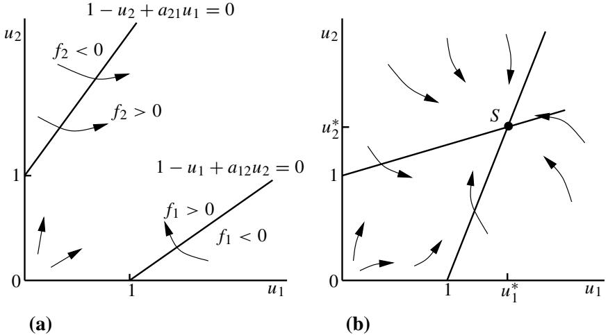

**Figure 3.12.** Phase trajectories for the mutualism model for two species with limited carrying capacities given by the dimensionless system (3.39). (**a**) *a*12*a*21 > 1: unbounded growth occurs with *u*1 → ∞ and *u*2 → ∞ in the domain bounded by the null clines—the solid lines. (**b**) *a*12*a*21 < 1: all trajectories tend to a positive steady state *S* with *u*∗ 1 > 1, *u*∗ 2 > 1 which shows the initial benefit that accrues since the carrying capacity for each species is greater than if no interaction were present.

(3.40) in terms of the original parameters in (3.38) is *b*12*b*21 < 1: the *b*'s are dimensionless. So if symbiosis of either species is too large, this last condition is violated and both populations grow unboundedly.

#### **3.7 General Models and Some General and Cautionary Remarks**

All of the models we have discussed in this chapter result in systems of nonlinear differential equations of the form

$$\frac{dN_l}{dt} = N_l F_l(N_1, N_2, \dots, N_n), \quad i = 1, 2, \dots, \tag{3.42}$$

which emphasises the fact that the vector of populations **N** has **N** = 0 as a steady state. The two-species version is sometimes referred to as the Kolmogorov model or as the *Kolmogorov equations*.

Although we have mainly considered 2-species interactions in this chapter, in nature, and in the sea in particular, there are many species or *trophic levels* where energy, in the form of food, flows from one species to another. That is, there is a flow from one trophic level to another. The mass of the total number of individuals in a species is often referred to as its *biomass*, here the population times the unit mass. The ultimate source of energy is the sun, and in the sea, for example, the trophic web runs through plankton, fish, sharks up to whales and finally man, with the myriad of species in between. The species on one trophic level may predate several species below it. In general, models involve interaction between several species.

Multi-species models are of the form

$$\frac{d\mathbf{u}}{dt} = \mathbf{f}(\mathbf{u}) \qquad \text{or} \quad \frac{d u_l}{dt} = f_l(u_1, \dots, u_n), \quad i = 1, \dots, n,\tag{3.43}$$

where **u**(*t*) is the *n*-dimensional vector of population densities and **f**(**u**) describes the nonlinear interaction between the species. The function **f**(**u**) involves parameters which characterise the various growth and interaction features of the system under investigation, with *fi*(*u*1,... , *un*) specifying the overall rate of growth for the *i*th species. The stability of the steady states is determined in exactly the same way as before by linearising about the steady states **u**∗, where **f**(**u**∗) = 0 and examining the eigenvalues λ of the community or stability matrix

$$A = (a_{lj}) = \left(\frac{\partial f_l}{\partial u_j}\right)_{\mathbf{u} = \mathbf{u}^*}.\tag{3.44}$$

The necessary and sufficient conditions for the eigenvalues λ, solutions of polynomial | *A* − λ*I* | = 0, to have Re λ > 0 are given by the Routh–Hurwitz conditions which are listed in Appendix B.

If a steady state is unstable then the solution **u** may grow unboundedly or evolve into another steady state or into a stable oscillatory pattern like a limit cycle. For 2 species models the theory of such equations is essentially complete: they are phase plane systems and a brief review of their analysis is given in Appendix A. For three or more interacting species considerably less general theory exists. Some results, at least for solutions near the steady state when it becomes unstable, can often be found using *Hopf bifurcation theory*; see, for example, the book by Strogatz (1994) for a good pedagogical discussion of Hopf bifurcation. At its simplest this theory says that if a parameter of the system, *p* say, has a critical value *pc* such that for *p* < *pc* the eigenvalue with the largest Re λ < 0, and for *p* = *pc* Re λ = 0, Im λ = 0 and for *p* > *pc* Re λ > 0, Im λ = 0 then for *p* − *pc* > 0 and small, the solution **u** will exhibit small amplitude limit cycle behaviour around **u**∗. Smith (1993) has developed a new approach to the study of 3 (and higher) competitive or cooperative species. His approach lets you apply the Poincare–Bendixson theorem to three-species systems by relating the flows to ´ topologically equivalent flows in two dimensions.

The community matrix *A*, defined by (3.44), which is so crucial in determining the linear stability of the steady states, has direct biological significance. The elements *ai j* measure the effect of the *j*-species on the *i*-species near equilibrium. For example, if *Ui* is the perturbation from the steady state *u*∗ *i* , the equation for *Ui* is

$$\frac{dU_l}{dt} = \sum_{j=1}^{n} a_{lj} U_j \tag{3.45}$$

and so *ai jUj* is the effect of the species *Uj* on the growth of *Ui* . If *ai j* > 0 then *Uj* directly enhances *Ui*'s growth while if *ai j* < 0 it diminishes it. If *ai j* > 0 and *a ji* > 0 then *Ui* and *Uj* enhance each other's growth and so they are in a symbiotic interaction. If *ai j* < 0 and *a ji* < 0 then they are in competition. May (1975) gives a survey of some generalised models and, in his discussion on stability versus complexity, gives some results for stability based on properties of the community matrix.

There has been a considerable amount of study of systems where the community matrix has diagonal symmetry or antisymmetry or has other rather special properties, where general results can be given about the eigenvalues and hence the stability of the steady states. This has had very limited practical value since models of real situations do not have such simple properties. The stochastic element in assessing parameters mitigates against even approximations by such models. However, just as the classical Lotka–Volterra system is not relevant to the real world, these special models have often made people ask the right questions. Even so, a preoccupation with such models or their generalizations must be avoided if the basic aim is to understand the real world.

An important class of models which we have not discussed is interaction models with delay. If the species exhibit different or distributed delays, such models open up a veritable Pandora's box of solution behaviour which to a large extent is still relatively unexplored.

If we consider three or more species, aperiodic behaviour can arise. Lorenz (1963) first demonstrated this with the model system

$$\frac{du}{dt} = a(v - u), \quad \frac{dv}{dt} = -uw + bu - v, \quad \frac{dw}{dt} = \mu v - cw, \quad \frac{d\tau}{dt} = \mu v - \nu \tau \frac{d}{dt}$$

where *a*, *b* and *c* are positive parameters. (The equations arose in a fluid flow model.) As the parameters are varied the solutions exhibit period doubling and eventually chaos or aperiodicity. Many authors have considered such systems. For example, Rossler ¨ (1976a,b, 1979, 1983), Sparrow (1982, 1986) and Strogatz (1994) have made a particular study of such systems and discovered several other basic examples which show similar properties; see also the book edited by Holden (1986). It would be surprising if certain population interaction models of three or more species did not display similar properties. Competition models of three or more species produce some unexpected results.

Evidence for chaos (even complex oscillations) in wild populations is difficult to find as well as difficult to verify unequivocably. It has been suggested therefore that evolution tends to preserve populations from such chaotic behaviour. Possible chaotic population dynamics which results from natural selection has been investigated in an interesting article by Ferriere and Gatto (1993). From their results they hypothesize that ` evolution might support considerably more chaotic population dynamics than believed up to now. Controversially they suggest that chaos is possibly optimal in population dynamics. They suggest, in fact, that chaos could be an optimal behaviour for various biological systems. This conclusion is in line with the views expressed by Schaffer and Kot (1986) with regard to epidemics.

Notwithstanding the above, evolutionary development of complex population interactions seems to have generally produced reasonably stable systems. From our study of interaction models up to now we know that a system can be driven unstable if certain parameters are changed appropriately, that is, pass through bifurcation values. It should therefore be a matter of considerable scientific study before any system is altered by external manipulation. The use of models to study the effect of artificially interfering in such trophic webs is essential and can be extremely illuminating. Had this been done it

is likely that the following catastrophe would have been avoided. Although the use of realistic dynamic models cannot give the complete answer, in the form of predictions which might result from introducing another species or eradicating one in the chain, they can certainly point to various danger signs that must be seriously considered. By the same arguments it is essential that not too much credence be put on models since the interactions can often be extremely complicated and the modeller might simply not construct a sufficiently good model. To conclude this section we describe a major ecological catastrophe which came from one such attempt to manipulate a complex trophic web in East Africa.

#### *Lake Victoria and the Nile Perch Catastrophe 1960*

In 1960, the Nile perch (*Latis niloticus*) was introduced into Lake Victoria, the largest lake in East Africa. The lake is bordered by Kenya, Tanzania and Uganda and it was used to support hundreds of small fishing communities along the shore. It was thought that the introduction of this large carnivorous species, which can weigh up to 100 Kg or more, would provide a high-yielding and valuable source of protein. Its introduction was supported at the time by the United Nations Food and Agriculture Organisation. There were dissenting views from some scientists but these were ignored.

The presence of the large carnivorous perch over the past 35 years has essentially wiped out the several hundred smaller cichlid fish in the lake; many of these provided the main basis of the fishing communities' economy on the lake's shore. Markets were flooded with perch. It was estimated that in 1984 the overall productivity of the lake was reduced by about 80% of its pre-1960 level.

Within the lake, the unplanned introduction of such a major, new and unsuitable species was a mistake of horrifying dimensions and caused an ecological disaster. There are, however, other knock-on effects outside the lake over and above the economic catastrophe which engulfed the shore communities: these effects should certainly have been anticipated. For example, the large perch are oily and cannot be dried in the sun but have to be preserved by smoking. This resulted in major felling of valuable trees to provide fuel.

Even more serious is the fact that many of the cichlid species, which have all but disappeared and which used to flourish in the lake, helped to control the level of a particular snail which lives in and around the lake.

These freshwater snails, which live in many of the major reservoirs of large dams, are an essential link in the cycle of the parasitic disease called schistosomiasis (also known as bilharzia), a disease which is considered to rank second only to malaria in importance. It is a disease which is not attacked by the body's immune system and is invariably fatal to humans if not treated. Since the best mathematical biology is usually carried out within a truly interdisciplinary environment, it is often the case that in trying to make a model certain questions and answers are elicited from the ecologists, which in turn initiate other related questions not directly connected with the model. These knockon effects would have been important examples. In spite of the disaster caused by this introduction of an unsuitable species into such a delicate and complex trophic web there were (in 1987) plans to introduce Nile perch into other large lakes in the region, such as Lake Malawi.

Schistosomiasis1 is a particularly nasty disease which affects more than 200 million people in 74 countries. In Egypt, for example, it is linked to cancer and is the primary cause of death among men between 20 and 44 years old. The snails shed parasites, called (schistosome) cercariae, into the water: a single snail releases cercariae at a rate of up to 3000 a day. These penetrate the human skin (when wading or swimming in infected waters), migrate to the lung, liver, the bladder and elsewhere. After about five weeks the worms mate and lay eggs at a rate of about 300 a day, about half of which are eventually excreted. Those not secreted tend to lodge mainly in the liver. The eggs cause the damage since they are recognised as a foreign invader and the immune system forms scar tissue in a capsule which contains the egg. Chronic infection causes more capsules and scar tissue leading to high blood pressure. The body tries to cope by making new fragile and leaky blood vessels; eventually the patients in effect bleed to death. The excreted eggs, on reaching the freshwater, hatch to become miracadia which then pass into the snail and undergo asexual reproduction to produce cercariae thereby completing the cycle. One of the interesting ideas to treat the disease is to try to get the immune system to attack the eggs without forming these capsules.

Lately (1990's) yet another catastrophe struck Lake Victoria in which water hyacinths (*Eichorria crassipes*) are ringing the lake with a wide thick mat which is destroying fish breeding grounds, clogging hydroelectric plants and more. About 80% of Uganda's coastline is now infected. Although it is partially controlled in its native Brazil with a predator (a rust fungus) there is some hesitancy in using an introduced predator. However, this and chemical herbicides are being seriously mooted.

### **3.8 Threshold Phenomena**

With the exception of the Lotka–Volterra predator–prey model, the 2-species models, which we have considered or referred to in this chapter, have either had stable steady states where small perturbations die out, or unstable steady states where perturbations from them grow unboundedly or result in limit cycle periodic solutions. There is an interesting group of models which have a nonzero stable state such that if the perturbation from it is sufficiently large or of the right kind, the population densities undergo

<sup>1</sup>An interesting speculation arose from a dinner discussion in Corpus Christi College, Oxford one evening concerning this disease, which I was working on at the time. Others in the discussion included an ancient historian and an archaeologist who asked me to describe some of the symptoms of schistosomiasis. I briefly described them and how it manifested itself. When a male has the disease from early childhood he begins to pass blood in his urine around the age of 11 or so, roughly the time that girls start to menstruate in warm climates. Infected males (and females) eventually die (if untreated) in their twenties or thirties. The ancient historian then noted that in ancient Egypt it was believed that both males and females had 'periods,' starting about the same age. Schistosomiasis was endemic in ancient Egypt (and is still highly prevalent today the Aswan Dam made the problem worse!). He went on to add that if a boy did not 'menstruate' he was clearly singled out by the gods and was destined to become a priest. The archaeologist then pointed out that it was interesting that most of the Egyptian mummies were of young people and that the mummies of older people were primarily priests. One can speculate that the reason the priests as young boys did not develop the disease is that they had some natural immunity and offers an explanation as to why priests frequently lived considerably longer than the average life span in ancient Egypt. A touch fanciful perhaps but it is not totally outside the possibility of reality and gives justification for a truly interdisciplinary society!

large variations before returning to the steady state. Such models are said to exhibit a threshold effect. We study one such group of models here.

Consider the model predator–prey system

$$\frac{dN}{dt} = N[F(N) - P] = f(N, P),\tag{3.46}$$

$$\frac{dP}{dt} = P[N - G(P)] = g(N, P),\tag{3.47}$$

where for convenience all the parameters have been incorporated in the *F* and *G* by a suitable rescaling: the *F*(*N*) and *G*(*P*) are qualitatively as illustrated in Figure 3.13. The specific form of *F*(*N*) demonstrates the *Allee effect* which means that the per capita growth rate of the prey initially increases with prey density but reaches a maximum at some *Nm* and then decreases for larger prey densities.

The steady states *N*∗, *P*∗ from (3.46) and (3.47) are *N*∗ = 0 = *P*∗ and the nonnegative solutions of

$$P^* = F(N^*), \quad N^* = G(P^*). \tag{3.48}$$

As usual, it is again helpful to draw the null clines *f* = 0, *g* = 0 which are sketched in Figure 3.14. Depending on the various parameters in *F*(*N*) and *G*(*P*), the steady state can be typically at *S* or at *S* . To be specific we consider the case where *N*∗ > *Nm*; that is, the steady state is at *S* in Figure 3.14.

From (3.46) and (3.47) the community matrix *A* for the zero steady state *N*∗ = 0, *P*∗ = 0 is

$$A = \begin{pmatrix} \frac{\partial f}{\partial N} & \frac{\partial f}{\partial P} \\ \frac{\partial g}{\partial N} & \frac{\partial g}{\partial P} \end{pmatrix}_{N=0=P} = \begin{pmatrix} F(0) & 0 \\ 0 & -G(0) \end{pmatrix}.$$

The eigenvalues are λ = *F*(0) > 0 and λ = −*G*(0) < 0. So, with the *F*(*N*) and *G*(*N*) in Figure 3.13, (0, 0) is unstable: it is a saddle point singularity in the (*N*, *P*) phase plane.

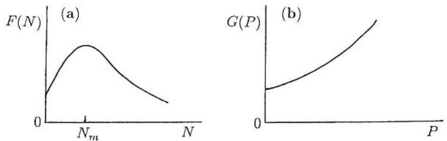

**Figure 3.13.** (**a**) Qualitative form of the prey's per capita growth rate *F*(*N*) in (3.46) which exhibits the Allee effect. (**b**) Predators' per capita mortality rate.

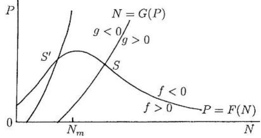

**Figure 3.14.** Null clines *N* = 0, *P* = 0, *N* = *G*(*P*), *P* = *F*(*N*) for the predator–prey system (3.46) and (3.47): *f* = *N*[*F*(*N*) − *P*], *g* = *P*[*N* − *G*(*P*)]. *S* and *S* are possible stable steady states.

For the positive steady state (*N*∗, *P*∗) the community matrix is, from (3.46)–(3.48),

$$A = \begin{pmatrix} N^* F'(N^*) & -N^* \\ P^* & -P^* G'(P^*) \end{pmatrix},$$

where the prime denotes differentiation and, from Figure 3.14, *G* (*P*∗) > 0 and *F* (*N*∗) < 0 when (*N*∗, *P*∗) is at *S* and *G* (*P*∗) > 0 and *F* (*N*∗) > 0 when at *S* . The eigenvalues λ are solutions of

$$
\lambda |A - \lambda I| = 0 \quad \Rightarrow \quad \lambda^2 - (\text{tr}A)\lambda + \text{det}A = 0,\tag{3.49}
$$

where

$$\begin{aligned} \text{tr}\,A &= N^* F'(N^*) - P^* G'(P^*)\\ \det A &= N^* P^* [1 - F'(N^*) G'(P^*)]. \end{aligned} \tag{3.50}$$

When the steady state is at *S* in Figure 3.14, tr*A* < 0 and det*A* > 0 and so it is stable to small perturbations for all *F*(*N*) and *G*(*P*) since Re λ < 0 from (3.49). If the steady state is at *S* , tr*A* and det*A* can be positive or negative since now *F* (*N*∗) > 0. Thus *S* may be stable or unstable depending on the particular *F*(*N*) and *G*(*P*). If it is unstable then a limit cycle solution results since there is a confined set for the system; refer to Section 3.4 for a worked example of a qualitatively similar problem and Figure 3.8 which illustrates such a solution behaviour.

The case of interest here is when the steady state is at *S* and is thus always stable. Suppose we perturb the system to the point *X* in the phase plane as in Figure 3.15(a). Since here *f* < 0 and *g* < 0, equations (3.46) and (3.47) imply that *d N*/*dt* < 0 and *d P*/*dt* < 0 and so the trajectory starts to move qualitatively as on the trajectory shown in Figure 3.15(a): it *eventually* returns to *S* but only after a large excursion in the phase plane. The path is qualitatively indicated by the signs of *f* and *g* and hence of *d N*/*dt* and *d P*/*dt*. If the perturbation takes (*N*, *P*) to *Y* then a similar behaviour occurs. If, however, the perturbation is to *Z* then the perturbation remains close to *S*. Figures 3.15(b) and (c) illustrate a typical temporal behaviour of *N* and *P*.

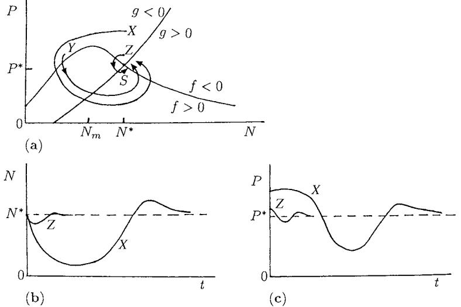

**Figure 3.15.** (**a**) Null clines for the predator–prey threshold model (3.46) and (3.47). The steady state *S* is always stable. A perturbation to *X* results in a large excursion in phase space before returning to *S*. A perturbation to *Z* is under the threshold and hence returns to *S* without a large excursion. (**b**) and (**c**) Schematic time evolution of the solutions illustrating the effect of a perturbation to *X* and to *Z* as in (**a**).

There is clearly a rough threshold perturbation below which the perturbation always remains close to the steady state and above which it does not, even though the solution ultimately returns to the steady state. The threshold perturbation is more a threshold curve or rather domain and is such that if the perturbation results in the trajectory getting past the maximum *Nm* in Figure 3.15(a) then the trajectories are typically like those from *X* and *Y* . If the trajectory crosses *f* = 0 at *N* > *Nm* then no large perturbation occurs. The reason that such a threshold property exists is a consequence of the form of the null cline *f* = 0 which has a maximum as shown; in this case this is a consequence of the Allee effect in the dynamics of the model (3.46). With the problems we have discussed earlier in this chapter it might appear from looking at the temporal behaviour of the population that we were dealing with an unstable situation. The necessity for a careful drawing of the null clines is clear. The definition of a threshold at this stage is rather imprecise. We show later in Chapter 1, Volume II that if one of the species is allowed to disperse spatially, for example, by diffusion, then threshold travelling waves are possible. These have important biological consequences. In this context the concept of a threshold can be made precise. This threshold behaviour arises in an important way later in the book in biochemical contexts which are formally similar since the equations for reaction kinetics are mathematically of the same type as those for the dynamics of interacting populations such as we have discussed here.

A final remark on the problem of modelling interacting populations is that there can be no 'correct' model for a given situation since many models can give qualitatively similar behaviour. Getting the right qualitative characteristics is only the first step and must not be considered justification for a model. This important caveat for all models will be repeated with regularity throughout the book. What helps to make a model a good one is the plausibility of the growth dynamics based on observation, real facts and whether or not a reasonable assessment of the various parameters is possible and, finally, whether predictions based on the model are borne out by subsequent experiment and observation.

### **3.9 Discrete Growth Models for Interacting Populations**

We now consider two interacting species, each with nonoverlapping generations, which affect each other's population dynamics. As in the continuous growth models, there are the same main types of interaction, namely, predator–prey, competition and mutualism. In a predator–prey situation the growth rate of one is enhanced at the expense of the other whereas in competition the growth rates of both are decreased while in mutualism they are both increased. These topics have been widely studied but nowhere near to the same extent as for continuous models for which, in the case of two species, there is a complete mathematical treatment of the equations. The book by Hassel (1978) deals with predator–prey models. Beddington et al. (1975) present some results on the dynamic complexity of coupled predator–prey systems. The book by Gumowski and Mira (1980) is more mathematical, dealing generally with the mathematics of coupled systems but also including some interesting numerically computed results; see also the introductory article by Lauwerier (1986). The review article by May (1986) is apposite to the material here and that in the previous chapters, the central issue of which is how populations regulate. He also discusses, for example, the problems associated with unpredictable environmental factors superimposed on deterministic models and various practical aspects of resource management. In view of the complexity of solution behaviour with single-species discrete models it is not surprising that even more complex behaviour is possible with coupled discrete systems. Even though we expect complex behaviour it is hard not to be overwhelmed by the astonishing solution diversity when we see the baroque patterns that can be generated as has been so beautifully demonstrated by Peitgen and Richter (1986). Their book is devoted in large part to the numerically generated solutions of discrete systems. They show, in striking colour, a wide spectrum of patterns which can arise, for example, with a system of only two coupled equations; the dynamics need not be very complicated. They also show, among other things, how the solutions relate to fractal generation (see, for example, Mandelbrot 1982), Julia sets, Hubbard trees and other exotica. Most of the text is a technical but easily readable discussion of the main topics of current interest in dynamical systems. In Chapter 14 we give a brief introduction to fractals.

Here we are concerned with predator–prey models. An important aspect of evolution by natural selection is the favouring of efficient predators and cleverly elusive prey. Within the general class, we have in mind primarily insect predator–prey systems, since as well as the availability of a substantial body of experimental data, insects often have life cycles which can be modelled by two-species discrete models.

We consider the interaction for the prey (*N*) and the predator (*P*) to be governed by the discrete time (*t*) system of coupled equations

$$N_{l+1} = rN_l f(N_l, P_l),\tag{3.51}$$

$$P_{l+1} = N_l g(N_l, P_l),\tag{3.52}$$

where *r* > 0 is the net linear rate of increase of the prey and *f* and *g* are functions which relate the predator-influenced reproductive efficiency of the prey and the searching efficiency of the predator respectively. The techniques we discuss are, of course, applicable to other population interactions. The theory discussed in the following chapter is different in that the interaction is overlapping. The techniques for it have similarities but with some fundamental differences. The crucial difference, however, is that the 'species' in Chapter 5 are marital states.

#### **3.10 Predator–Prey Models: Detailed Analysis**

We first consider a simple model in which predators simply search over a constant area and have unlimited capacity for consuming the prey. This is reflected in the system

$$\begin{aligned} N_{l+1} &= rN_l \exp\left[-aP_l\right], \\ P_{l+1} &= N_l \{1 - \exp\left[-aP_l\right]\}. \end{aligned} \tag{3.53}$$

Perhaps it should be mentioned here that it is always informative to try and get an intuitive impression of how the interaction affects each species by looking at the qualitative behaviour indicated by the equations. With this system, for example, try and decide what the outcome of the stability analysis will be. In general if the result is not what you anticipated such a preliminary qualitative impression can often help in modifying the model to make it more realistic.

The equilibrium values *N*∗, *P*∗ of (3.53) are given by

$$\begin{aligned} N^* &= 0, \quad P^* = 0\\ \text{or} \quad 1 &= r \exp\left[-aP^*\right], \quad P^* = N^*(1 - \exp\left[-aP^*\right]) \end{aligned}$$

and so positive steady state populations are

$$P^* = \frac{1}{a} \ln r, \quad N^* = \frac{r}{a(r-1)} \ln r, \quad r > 1. \tag{3.54}$$

The linear stability of the equilibria can be determined in the usual way by writing

$$N_l = N^* + n_l, \quad P_l = P^* + p_l, \quad \left| \frac{n_l}{N^*} \right| \ll 1, \quad \left| \frac{p_l}{P^*} \right| \ll 1,\tag{3.55}$$

substituting into (3.53) and retaining only linear terms. For the steady state (0, 0) the analysis is particularly simple since

$$n_{t+1} = rn_t, \quad p_{t+1} = 0,$$

and so it is stable for *r* < 1 since *Nt* → 0 as *t* → ∞ and unstable for *r* > 1, that is, the range of *r* when the positive steady state (3.54) exists. For this positive steady state we have the linear system of equations

$$n_{l+1} = n_l - N^* a p_l, \quad p_{l+1} = n_l \left( 1 - \frac{1}{r} \right) + \frac{N^* a}{r} p_l,\tag{3.56}$$

where we have used the relation 1 = *r* exp [−*a P*∗] which defines *P*∗.

A straightforward way to solve (3.56) is to iterate the first equation and then use the second to get a single equation for *nt* . That is,

$$\begin{aligned} n_{l+2} &= n_{l+1} - N^* a p_{l+1} \\ &= n_{l+1} - N^* a \left[ n_l \left( 1 - \frac{1}{r} \right) + \frac{N^* a}{r} p_l \right] \\ &= n_{l+1} - N^* a \left[ n_l \left( 1 - \frac{1}{r} \right) + \frac{1}{r} (n_l - n_{l+1}) \right] \end{aligned}$$

and so

$$m_{l+2} - \left(1 + \frac{N^*a}{r}\right)n_{l+1} + N^*an_l = 0.\tag{3.57}$$

We now look for solutions in the form

$$m_l = Ax^l \quad \Rightarrow \quad x^2 - \left(1 + \frac{N^*a}{r}\right)x + N^*a = 0.1$$

With *N*∗ from (3.54) the characteristic polynomial is thus

$$\left\{\mathbf{x}\right\}^2 - \left\{1 + \frac{1}{r-1}\ln r\right\}\mathbf{x} + \frac{r}{r-1}\ln r = 0, \quad r > 1\tag{3.58}$$

of which the two solutions *x*1 and *x*2 are

$$\langle x_1, x_2 = \frac{1}{2} \left\{ \left[ 1 + \frac{\ln r}{r - 1} \right] \pm \left\{ \left[ 1 + \frac{\ln r}{r - 1} \right]^2 - 4 \frac{r \ln r}{r - 1} \right\}^{1/2} \right\}. \tag{3.59}$$

Thus

$$m_l = A_1 \mathbf{x}^l + A_2 \mathbf{x}^l,\tag{3.60}$$

where *A*1, *A*2 are arbitrary constants. With this, or by a similar analysis, we then get *pt* as

$$p_l = B_1 \mathbf{x}^t + B_2 \mathbf{x}^t,\tag{3.61}$$

where *B*1 and *B*2 are arbitrary constants.

A more elegant, and easy to generalise, way to find *x*1 and *x*2 is to write the linear perturbation system (3.56) in matrix form

$$A\begin{pmatrix} n_{l+1} \\ p_{l+1} \end{pmatrix} = A\begin{pmatrix} n_l \\ p_l \end{pmatrix}, \quad A = \begin{pmatrix} 1 & -N^*a \\ 1 - \frac{1}{r} & \frac{N^*a}{r} \end{pmatrix} \tag{3.62}$$

and look for solutions in the form

$$
\binom{n_I}{p_I} = B \begin{pmatrix} 1 \\ 1 \end{pmatrix} x^I,
$$

where *B* is an arbitrary constant 2 × 2 matrix. Substituting this into (3.62) gives

$$B\begin{pmatrix} \boldsymbol{\chi}^{\iota+1} \\ \boldsymbol{\chi}^{\iota+1} \end{pmatrix} = AB \begin{pmatrix} \boldsymbol{\chi}^{\iota} \\ \boldsymbol{\chi}^{\iota} \end{pmatrix} \quad \Rightarrow \quad \times B \begin{pmatrix} \boldsymbol{\chi}^{\iota} \\ \boldsymbol{\chi}^{\iota} \end{pmatrix} = AB \begin{pmatrix} \boldsymbol{\chi}^{\iota} \\ \boldsymbol{\chi}^{\iota} \end{pmatrix}$$

which has a nontrivial solution *B xt xt* - if

$$\begin{array}{rcl} \left| \left| A - xI \right| \right| = 0 & \Rightarrow & \left| \begin{matrix} 1 - x & -N^*a \\ 1 - \frac{1}{r} & \frac{N^*a}{r} - x \end{matrix} \right| = 0 \end{array}$$

which again gives the quadratic characteristics equation (3.58). The solutions *x*1 and *x*2 are simply the eigenvalues of the matrix *A* in (3.62). This matrix approach is the discrete equation analogue of the one we used for the continuous interacting population models. The generalization to higher-order discrete model systems is clear.

The stability of the steady state (*N*∗, *P*∗) is determined by the magnitude of | *x*1 | and | *x*2 |. If either of | *x*1 | > 1 or | *x*2 | > 1 then *nt* and *pt* become unbounded as *t* → ∞ and hence (*N*∗, *P*∗) is unstable since perturbations from it grow with time. A little algebra shows that in (3.59),

$$
\left[1 + \frac{\ln r}{r - 1}\right]^2 - \frac{4r \ln r}{r - 1} < 0 \quad \text{for} \quad r > 1
$$

and so the roots *x*1 and *x*2 are complex conjugates. The product of the roots, from (3.58), or (3.59), is

$$\left| \left| x_1 x_2 \right| \right|^2 = (r \ln r) / (r - 1) > 1, \text{ for all } r > 1,\\
= \succ \left| x_1 \right| > 1.$$

(An easy way to see that (*r* ln *r*)/(*r* − 1) > 1 for all *r* > 1 is to consider the graphs of ln *r* and (*r* −1)/*r* for *r* > 1 and note that *d*(ln *r*)/*dr* > *d*[(*r* −1)/*r*]/*dr* for all *r* > 1.) Thus the solutions (*nt*, *pt*) from (3.60) and (3.61) become unbounded as *t* → ∞ and so the positive equilibrium (*N*∗, *P*∗) in (3.54) is unstable, and by growing oscillations since *x*1 and *x*2 are complex. Numerical solutions of the system (3.53) indicate that the system is unstable to finite perturbations as well: the solutions grow unboundedly. Thus this simple model is just too simple for any practical applications except possibly under contrived laboratory conditions and then only for a limited time.

#### *Density-Dependent Predator–Prey Model*

Let us reexamine the underlying assumptions in the simple initial model (3.53). The form of the equations implies that the number of encounters a predator has with a prey increases unboundedly with the prey density: this seems rather unrealistic. It is more likely that there is a limit to the predators' appetite. Another way of looking at this equation as it stands, and which is formally the same, is that if there were no predators *Pt* = 0 and then *Nt* would grow unboundedly, if *r* > 1, and become extinct if 0 < *r* < 1: it is the simple Malthusian model (2.2). It is reasonable to modify the *Nt* equation (3.53) to incorporate some saturation of the prey population or, in terms of predator encounters, a prey-limiting model. We thus take as a more realistic model

$$\begin{split} N_{t+1} &= N_t \exp\left[r\left(1 - \frac{N_t}{K}\right) - aP_l\right], \\ P_{t+1} &= N_t \{1 - \exp\left[-aP_l\right] \}. \end{split} \tag{3.63}$$

Now with *Pt* = 0 this reduces to the single-species model (2.8) in Section 2.1. There is a stable positive equilibrium *N*∗ = *K* for 0 < *r* < 2 and oscillatory and periodic solutions for *r* > 2. We can reasonably expect a similar bifurcation behaviour here, although probably not with a first bifurcation at *r* = 2 and certainly not the same values for *r* with higher bifurcations. This model has been studied in detail by Beddington et al. (1975).

The nontrivial steady states of (3.63) are solutions of

$$1 = \exp\left[r\left(1 - \frac{N^*}{K}\right) - aP^*\right], \quad P^* = N^*(1 - \exp\left[-aP^*\right]).\tag{3.64}$$

The first of these gives

$$P^* = \frac{r}{a} \left( 1 - \frac{N^*}{K} \right) \tag{3.65}$$

which on substituting into the second gives *N*∗ as solutions of the transcendental equation

$$\frac{r\left(1-\frac{N^*}{K}\right)}{aN^*} = 1 - \exp\left[-r\left(1-\frac{N^*}{K}\right)\right].\tag{3.66}$$

Clearly *N*∗ = *K*, *P*∗ = 0 is a solution. If we plot the left- and right-hand sides of (3.66) against *N*∗ as in Figure 3.16 we see there is another equilibrium 0 < *N*∗ *E* < *K*, the other intersection of the curves: it depends on *r*, *a* and *K*. With *N*∗ *E* determined, (3.65) then gives *P*∗ *E*.

The linear stability of this equilibrium can be treated in exactly the same way as before with the eigenvalues *x* again being given by the eigenvalues of the matrix of the linearised system. It has to be done numerically. It can be shown that for some *r* > 0 the equilibrium is stable and that it bifurcates for larger *r*. Beddington et al.

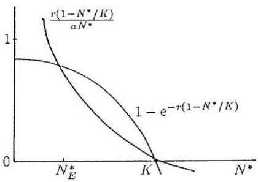

**Figure 3.16.** Graphical solution for the positive equilibrium *N*∗ *E* of the model system (3.63).

(1975) determine the stability boundaries in the *r*, *N*∗ *E* /*K* parameter space where there is a bifurcation from stability to instability and where the solutions exhibit periodic and ultimately chaotic behaviour. The stability analysis of realistic two-species models often has to be carried out numerically. For three-species and higher, the Jury conditions (see Appendix B) can be used to determine the conditions which the coefficients must satisfy so that the linear solutions *x* satisfy | *x* | < 1. For higher-order systems, however, they are of little use except within a numerical scheme.

#### *Biological Pest Control: General Remarks*

The use of natural predators for pest control is to inhibit any large pest increase by a corresponding increase in the predator population. The aim is to keep both populations at acceptably low levels. The aim is *not* to eradicate the pest, only to control its population. Although many model systems of real predators and real pests are reasonably robust from a stability point of view, some can be extremely sensitive. This is why the analysis of realistic models is so important. When the parameters for a model are taken from observations it is fortunate that many result in either steady state equilibria or simple periodic behaviour: chaotic behaviour is much less common. Thus effective parameter manipulation is more predictable in a substantial number of practical situations.

There are many notable successes of biological pest control particularly with longstanding crops such as fruit and forest crops and so on, where there is a continuous predator–prey interaction. With the major ecological changes caused by harvesting in perennial crops it has been less successful. The successes have mainly been of the predator–prey variety where the predator is a parasite. This can be extremely important in many human diseases. Kot (2001) gives a full discussion of the dynamics of harvesting models, including the important aspect of optimal control.

In the models we have analysed we have concentrated particularly on the model building aspects, the study of stability in relation to parameter ranges and the existence of either steady states or periodic behaviour. What we have not discussed is the influence of initial conditions. Although not generally the case, they can be important. One such example is the control of the red spider mite which is a glass-house tomato plant pest where the initial predator–prey ratio is crucial. We should expect initial data to be important particularly in those cases where the oscillations show outbreak, crashback and slow recovery. The crashback to low levels may bring the species close enough to extinction to actually cause it. There are several books on biological pest control; see, for example, DeBach (1974) and Huffaker (1971).

A moderately new and, in effect, virgin territory is the study of coupled systems where the time-steps for the predator and prey are not equal. This clearly occurs in the real world. With the wealth of interesting and unexpected behaviour displayed by the models in this chapter and Chapter 2, it would be surprising if different time-step models did not produce equally unexpected solution behaviour.

### **Exercises**

- **1** In the competition model for two species with populations *N*1 and *N*2

$$\begin{aligned} \frac{dN_1}{dt} &= r_1 N_1 \left( 1 - \frac{N_1}{K_1} - b_{12} \frac{N_2}{K_1} \right), \\\frac{dN_2}{dt} &= r_2 N_2 \left( 1 - b_{21} \frac{N_1}{K_2} \right), \end{aligned}$$

where only one species, *N*1, has limited carrying capacity. Nondimensionalise the system and determine the steady states. Investigate their stability and sketch the phase plane trajectories. Show that irrespective of the size of the parameters the principle of competitive exclusion holds. Briefly describe under what ecological circumstances the species *N*2 becomes extinct.

- **2** Flores (1998) proposed the following model for competition between Neanderthal man (N) and Early Modern man (E).

$$\frac{dN}{dt} = N\left[A - D(N+E) - B\right], \quad \frac{dE}{dt} = E\left[A - D(N+E) - sB\right],$$

where *A*, *B*, *D* are positive constants and *s* < 1 is a measure of the difference in mortality of the two species. Nondimensionalise the system and describe the meaning of any dimensionless parameters. Show that the populations *N* and *C* are related by

$$N(t) \propto C(T) \exp[-B(1-s)t].$$

Hence give the order of magnitude of the time for Neanderthal extinction.

If the lifetime of an individual is roughly 30 to 40 years and the time to extinction is (from the palaeontological data) 5000 to 10,000 years, determine the range of the mortality difference parameter *s*. [An independent estimate (Flores 1998) is of *s* = 0.995.]

Construct a competition model for this situation using the model system in Section 3.5 with equal carrying capacities and linear birth rates in the absence of competition but with slightly different competition efficiencies. Determine the conditions under which Neanderthal man will become extinct and the conditions under which the two species could coexist.

- **3** Determine the kind of interactive behaviour between two species with populations *N*1 and *N*2 that is implied by the model

$$\begin{aligned} \frac{dN_1}{dt} &= r_1 N_1 \left[ 1 - \frac{N_1}{K_1 + b_{12} N_2} \right], \\ \frac{dN_2}{dt} &= r_2 N_2 \left[ 1 - \frac{N_2}{K_2 + b_{21} N_1} \right]. \end{aligned}$$

Draw the null clines and determine the steady states and their stability. Briefly describe the ecological implications of the results of the analysis.

- **4** A predator–prey model for herbivore(*H*)–plankton(*P*) interaction is

$$\frac{dP}{dt} = rP\left[ (K - P) - \frac{BH}{C + P} \right], \quad \frac{dH}{dt} = DH \left[ \frac{P}{C + P} - AH \right],$$

where *r*, *K*, *A*, *B*,*C* and *H* are positive constants. Briefly explain the ecological assumptions in the model. Nondimensionalise the system so that it can be written in the form

$$\frac{dp}{d\tau} = p\left[ (k-p) - \frac{h}{1+p} \right], \quad \frac{dh}{d\tau} = dh \left[ \frac{p}{1+p} - ah \right].$$

Sketch the null clines and note any qualitative changes as the parameter *k* varies. Hence, or otherwise, demonstrate that a positive steady state (*p*0, *h*0) exists for all *a* > 0, *k* > 0.

By considering the community matrix determine the signs of the partial derivatives of the right-hand sides of the equation system evaluated at (*p*0, *h*0) for this steady state to be stable. By noting the signs of *dp*/*d*τ and *dh*/*d*τ relative to the null clines in the *p*, *h* phase plane, show that (i) for *k* < 1 the positive steady state is stable and (ii) that for *k* > 1, and small enough *a*, the positive steady state may be stable or unstable. Hence show that in the *a*, *k* parameter plane a necessary condition for a periodic solution to exist is that *a*, *k* lie in the domain bounded by *a* = 0 and *a* = 4(*k* −1)/(*k* +1)3. Hence show that if *a* < 4/27 there is a window of values of *k* where periodic solutions are possible. Under what conditions can the system exhibit a threshold phenomenon?

#### **5** The interaction between two populations with densities *N*1 and *N*2 is modelled by

$$\begin{aligned} \frac{dN_1}{dt} &= rN_1 \left(1 - \frac{N_1}{K}\right) - aN_1N_2(1 - \exp\left[-bN_1\right]),\\ \frac{dN_2}{dt} &= -dN_2 + N_2e(1 - \exp\left[-bN_1\right]), \end{aligned}$$

where *a*, *b*, *d*, *e*, *r* and *K* are positive constants. What type of interaction exists between *N*1 and *N*2? What do the various terms imply ecologically?

Nondimensionalise the system by writing

$$u = \frac{N_1}{K}, \quad v = \frac{aN_2}{r}, \quad \tau = rt, \quad \alpha = \frac{e}{r}, \quad \delta = \frac{d}{r}, \quad \beta = bK.$$

Determine the nonnegative equilibria and note any parameter restrictions. Discuss the linear stability of the equilibria. Show that a nonzero *N*2-population can exist if β>β*c* = − ln (1 − δ/α). Briefly describe the bifurcation behaviour as β increases with 0 < δ/α < 1.

- **6** The sterile insect release method (SIRM) for pest control releases a number of sterile insects into a population. If a population *n* of sterile insects is maintained in a population, a possible simple model for the population of fertile insects *N*(*t*) is

$$\frac{dN}{dt} = \left[\frac{aN}{N+n} - b\right]N - kN(N+n),$$

where *a* > *b* > 0 and *k* > 0 are constant parameters. Briefly discuss the assumptions which lie behind the model.

Determine the critical number of sterile insects *nc* which would eradicate the pests and show that this is less than a quarter of the environmental carrying capacity.

Suppose that a single release of sterile insects is made and that the sterile insects have the same death rate as fertile insects. Write down the appropriate model system for *N*(*t*) and *n*(*t*) and show that it is not possible to eradicate the insect pests with a single release of sterile insects.

If a fraction γ of the insects born are sterile, a suggested model is

$$\frac{dN}{dt} = \left[\frac{aN}{N+n} - b\right]N - kN(N+n), \quad \frac{dn}{dt} = \gamma N - bn.$$

Determine the condition on γ for eradication of the pest and briefly discuss the realism of the result.

- **7** A general form for models for insect predator(*P*)–prey(*N*), or insect parasitism is

$$N_{l+1} = rN_l f(N_l, P_l), \quad P_{l+1} = N_l [1 - f(N_l, P_l)],$$

where *f* is a nonlinear function which incorporates assumptions about predator searching, and *r* > 0 is the rate of increase of prey population. The scaling is such that 0 < *f* < 1. Here *f* is an increasing function as *Nt* increases, and a decreasing function as *Pt* increases. Does this model make sense ecologically?

Show that a positive equilibrium state (*N*∗, *P*∗) can exist and give any conditions on *r* required. Show that the linear stability of the steady state is ensured if the roots of

$$\left[\mathbf{x}^2 - \left[1 + rN^* \frac{\partial f}{\partial N_I} - N^* \frac{\partial f}{\partial P_I}\right] \mathbf{x} - rN^* \frac{\partial f}{\partial P_I} = 0\right]$$

have magnitudes less than 1, where ∂ *f*/∂*Nt* and ∂ *f*/∂ *Pt* are evaluated at (*N*∗, *P*∗), and hence determine the conditions for linear stability.

- **8** A model for the regulation of a host population by a microparasite population *ut* which was proposed and studied by May (1985) is, in dimensionless form,

$$1 - I_l = \exp\left[-I_l u_l\right], \quad u_{l+1} = \lambda u_l (1 - I_l),$$

where λ > 0 and *It* denotes the fraction of the host population which has been infected by the time the epidemic has run its course. The assumption in this specific form is that the parasite epidemic has spread through each generation before the next population change. [This is why the host population equation does *not* involve *It*+1.] Determine the steady states and note any restrictions on λ for a positive steady state to exist for both the host and microparasite populations. Investigate the linear stability of the positive steady state. Show that it is *always* unstable and that the instability arises via a pitchfork bifurcation.

[May (1985) studies this model in depth and shows that the positive steady state and *all* periodic solutions are unstable; that is, the model only exhibits chaotic behaviour without going through the usual period doubling. He also discusses the epidemiological implications of such a simple, yet surprising, system.]

# **4. Temperature-Dependent Sex Determination (TSD): Crocodilian Survivorship**

#### **4.1 Biological Introduction and Historical Asides on the Crocodilia**

It is a fascinating subject why some species become extinct and others do not. Why, for example, have the three families of crocodilia (alligators, crocodiles and gavials) not become extinct during the past 100 million or so years? They have survived essentially unchanged for around 63 million years after the dinosaurs became extinct and clearly have great survival powers. As pointed out by Benton (1997), however, those that have survived are only a small group of around the 150 fossil genera of crocodilians that have been documented. Crocodiles and alligators were around in the later part of the Cretaceous (63 to 135 million years ago). As several have noted, such as Benton (1997), they were very much more widespread than they are now, with fossils found as far north as Sweden and Canada. Colbert and Morales (1991) point out that the late Cretaceous was the peak of their evolution with the largest genus being the *Deinosuchus* with the most impressive jaws of any reptiles of the period: one fossil had a skull 6 feet in length which suggests it must have had a total length of 40 to 50 feet—certainly a predator to take notice of. Carroll (1988) suggests that the decline of the genera was probably due to climatic deterioration from around the beginning of the Caenozoic (63 million years ago) era. In spite of the massive extinctions, the families that have survived are rightly viewed as living fossils. Meyer (1984) gives a general overview of them while Pooley and Gans (1976) focus on the Nile crocodile and describe, among other things, its unique biology and social behaviour which have contributed so much to its long survival.

Over the millennia the crocodilia have been vilified like no other animal and the wildest stories associated with them abound. The description of Leviathan in the Old Testament (Job 41:1–34) is just a start. It is clearly the prototype dragon. It was regularly used to scare children in the 19th century and no doubt earlier. One example is in the *Sunday School Advocate* (Volume XVII, January 22, 1888) where it is described as

'This hideous monster... . it is an ugly creature—a huge river dragon ... '

The article concludes:

'But though this scaly monster does not haunt the rivers of the North, yet there is another great dragon ever prowling... . It is more terrible than the alligator... . The name of this monster is Sin!'

Unbridled prejudiced dislike of crocodiles, however, was also expressed surprisingly by some serious scientists. A well-known naturalist, Edward Topsell, in his 1607 (London) bestiary, *Historie of Foure-footed Beastes* wrote:

'The nature of the beast is to be fearful, ravening, malitious and treacherous. The tayle of the Crocodile is his strongest part, and they never kill any beast or man, but first of all they strike him downe and astonish him with their tailles. The males of this kind do love their females above all measure, yea even to jealousie. And it is no wonder if they made much of one another, for beside themselves they have few friends in the world.'

Perhaps the most shameful, however, is the description of crocodiles by the influential Swedish naturalist Carl von Linne, better known as Linnaeus. In 1766 in a section ´ on Reptiles-Crocodiles he wrote:

'These foul and loathsome animals are distinguished by a heart with a single ventricle and a single auricle, doubtful lungs and a double penis. Most are abhorrent because of their cold body, pale colour, cartilagenous skeleton, filthy skin, fierce aspect, calculating eye, offensive smell, harsh voice, squalid habits and terrible venom; and so their creator has not exerted his powers to make many of them.'

Modesty was not one of Linnaeus' traits. Describing himself, appropriately in the elevated third person, he wrote:

'God has suffered him to peep into his secret cabinet.

God has permitted him to see more of his created work than any mortal before him.

God has bestowed upon him the greatest insight into nature-study, greater than anyone has gained ...

None before him has so totally reformed a whole science and made a new epoch.

None before him has arranged all the products of nature with such lucidity.'

A crucial difference between the crocodilia and most other species is that their sex is determined by the incubation temperature of the egg during gestation, basically females at low temperatures and males at high temperatures. It is interesting to speculate whether this could be a possible explanation, or at least a significant contributory factor, for their incredible survivorship, and if so, how. In this chapter we discuss models to investigate this hypothesis. We first give some biological background and introduce terms used in their study. We shall frequently use the word crocodile or alligator to represent the crocodilia in general and the exact name, such as *Alligator mississippiensis* or *A. mississippiensis* when we mean the specific reptile. An excellent and comprehensive review of the reproductive biology of the crocodilians is given by Ferguson (1985).

In genetic sex determination (GSD), such as for mammals and birds, sex is fixed at conception. Environmental sex determination (ESD) is when sex is determined by environmental factors and occurs in other vertebrates and some invertebrates (see, for example, Charnov and Bull 1977, Deeming and Ferguson 1988, 1989a,b). Temperaturedependent sex determination (TSD) is often observed in reptiles. Other than crocodiles, alligators and the rest of the crocodilia, several reptiles, such as some lizards and certain turtles, the temperature of egg incubation is the major factor determining sex. Gutzke and Crews (1988), for example, specifically studied the leopard gecko (*Eublepharis macularius*) which has a similar pattern to the crocodilia but with a lower temperature range from 26 to 32◦ C. With turtles it is the high temperature that gives only females, except for the snapping turtle which is like the crocodile.

The temperatures that produce all male or all female hatchlings vary little between the different species of crocodilia. Females are produced at one or both extremes of the range of viable incubation temperatures, and the intermediate temperatures produce males. For example, in *Alligator mississippiensis* artificial incubation of eggs at low temperatures, 30◦ C and below, produces females; 33◦ C produces all males; while high temperatures, 35◦ C, give 90% female hatchlings (but these are usually not viable). Ferguson and Joanen (1983) incubated 500 alligator eggs and found that all the young are male if the eggs are incubated in the range 32.5–33◦ C. Temperatures in between, that is, 32◦ C and from 33.5–34.5◦ C produce both sexes. Reproductive fitness of males and females are strongly influenced in different ways by environment. Sex starts to be determined quite early in gestation, by about the twelfth day into gestation, but is not irrevocably fixed until as late as 32 to 35 days. For *Alligator mississippiensis* the gestation is around 65 days for males and up to 75 days for females. Exact data can be found in the review by Ferguson (1985).

A key question is why has TSD evolved? It has been postulated that TSD is the ancestral form and GSD evolved from it. Deeming and Ferguson (1988, 1989a,b) have proposed an explanation of the mechanism of temperature-dependent sex determination in crocodilians. Their hypothesis is that the temperatures producing males are those that are best for the expression of the gene for the male-determining factor. In a warm nest eggs develop faster (see, for example, the graphs in Section 4.2 below and Murray et al. 1990) than in a colder one and this means the young hatch more quickly. The adults are also bigger when developed in a higher temperature; this turns out to be crucial in determining the stripe pattern in alligators (Chapter 4, Volume II). One possible explanation in the case of the crocodile is that it is better for the male to be big to fight off competitors whereas for the turtle it is better for the female to be big so that she can lay more eggs. The latter, however, could just as well apply to the crocodile. In this chapter we offer a different possible explanation, which we believe could be a significant factor in their long survival.

Observations of TSD in the natural habitat of *A. mississippiensis* in Louisiana, U.S.A., indicate there are basically three different types of nest site: wet marsh, dry marsh and levee (elevated firm ground). Broadly, levee nests are hot (34◦ C and hatch approximately 100% males while in the wet marsh, nests are cool (30◦ C) and hatch approximately 100% females. There are also temperature variations within the nest but we do not include this aspect in our models, although they could be incorporated in a more sophisticated version. Dry marsh nests have an intermediate temperature profile, the hot (34◦ C) top centre hatching males, and the cold (30◦ C) peripheries and base, hatching females (Ferguson and Joanen 1982, 1983). Since so few viable reproductive female alligators are hatched at temperatures higher than 34◦ C we do not include this cohort in our modelling. Those that are incubated at these temperatures have very low relative fitness.

The female alligator (and crocodile) does not choose the sex of her offspring *per se*. However, she tries to take temperature into account when selecting her nest site since she requires a good thermal environment for herself for the three-month period she stays by the nest until the eggs are ready to hatch and she opens the nest. The female alligators take great care in selecting their nest sites, nuzzling the ground with their snouts, which contain very sensitive temperature sensors, to get it right. Good sites are frequently reused. Although the precise factors for nest site selection are not known we shall assume that a limited number of nest sites provides a density-dependent mechanism for population regulation. In particular, a limited number of marsh nest sites will prevent a totally female population from occurring although female alligators and crocodiles tend to seek a temperature environment that is as close as possible to that of their own incubation (Pooley 1977) and so the preferred habitat of females is marsh. Joanen (1969) gives some field data for the relative size of these different nest site areas; we give these at the appropriate place in the modelling below when we estimate parameter values.

The situation with alligators is not quite so simple as perhaps implied above. In fact since alligators grow faster at higher temperatures it is best for a female to be incubated near the upper end of the viable female temperature scale, which is around 32◦ C. It is also best for the male around this temperature, its approximate lower limit. In fact relative fitness, essentially survival times fertility, as compared with others of the same sex is highest for both males and females in the middle range of temperatures, around 32◦ C. In the models we develop here we focus on the principal feature of TSD, namely, the effect of temperature on sex determination. Aspects such as relative fitness could be built into a more complex model as well as other features of crocodilian development.

It is likely that skewed sex ratios, specifically spanandrous ones, that is, ratios other than 1 : 1 and biased in favour of females, occur in species which exhibit ESD as a consequence of skewed environmental types. So, natural selection favours ESD when the reproductive fitness of an individual (male or female) is strongly influenced by the environment (Charnov and Bull 1977). However, the heavily biased sex ratio, as high as 10:1 in favour of females in crocodilians (Ferguson and Joanen 1982, 1983, Smith and Webb 1985, Webb and Smith 1987), is difficult to account for in terms of traditional sex ratio theory (Deeming and Ferguson 1988, 1989b, Nichols and Chabreck 1980, Phelps 1992, Webb and Smith 1984). Webb and Smith (1984) say that from a sex ratio point of view crocodilians could be equally well if not better adapted with GSD. However, one of the selective advantages of TSD is the association of maximum potential for adult growth with sex. Male alligators and crocodiles control harems of females; large males control bigger harems, mate more often and for a longer season (Deeming and Ferguson 1989b). However, as first pointed out by Fisher (1958, 1930), under natural selection females nesting at higher temperatures and producing all male offspring would have an advantage until a 1:1 equilibrium sex ratio, the 'optimal' sex ratio as suggested by Fisher, is reached and then the two sexes would be produced in equal numbers. Selective advantages for TSD in alligators and crocodiles is possibly explained in terms of survival of the species rather than fitness of the individual which is a fundamentally different approach to that of the selfish gene.

Temperature, of course, controls more than just the sex of embryos: it affects growth and development from embryo to adulthood as mentioned above, influences pigmentation pattern, and the adult's ability to regulate its own body temperature (Deeming and Ferguson 1988, 1989b, Lang 1987, Murray et al. 1990, Webb et al. 1987). We discuss some of the implications of pigment patterning in *A. mississippiensis* in Chapter 4, Volume II. The association of TSD with potential population growth we believe can not only protect populations from environmental catastrophe but also enable them to exploit changing habitats by adjusting the metabolic requirements, growth rates and maximum size of their offspring to prevailing conditions. Deeming and Ferguson (1988, 1989a,b) postulated that this occurs by a setting of the embryonic hypothalamus. It is interesting, and perhaps highly significant, that the reptiles (crocodiles, turtles, a few lizards and others) with TSD have persisted with virtually the same morphologies for many million years of evolution (Deeming and Ferguson 1989b).They seem optimally adapted for survival not only in their present environment but also capable of survival with the changing climatic changes since the beginning of the Caenozoic era. They have other impressive and unusual characteristics (see, for example, the book of articles edited by Gans et al. 1985) which have no doubt also contributed to their survival.

Here we mainly focus on the link between temperature-dependent sex determination, sex ratio and survivorship in crocodile populations. We first describe a simple density-dependent model involving only time to highlight the ideas and motivate the more complex density-dependent age-structured model for the population dynamics of crocodilians based on the fact that sex is determined by temperature of egg incubation. In the age-structured case we follow the model of Woodward and Murray (1993). Our modelling reflects the stability of crocodilian populations in the wild, and this stability suggests selective advantages for environmental sex determination over genetic sex determination that can not be explained in terms of traditional sex ratio theory.

That population growth may be controlled by life history data was first realised by Sadler in 1830 (see Cole 1954). However it was the age-dependent linear models originally devised by Lotka (1907a,b, 1913), Sharpe and Lotka (1911), McKendrick (1926) and von Foerster (1959) that provided methods for investigating the relationships between life history parameters and population dynamics. Nichols et al. (1976) used discrete linear models to numerically simulate commercially harvested alligator populations as did Smith and Webb (1985; see also Webb and Smith 1987 and other references there) for crocodile populations in the wild. These linear models lack densitydependent mechanisms, so the population either grows or decays exponentially in a Malthusian way as we saw in Chapters 1 and 2. Nonlinearities in the birth and death processes provide a mechanism by which the population might stabilize to a nonzero equilibrium (see Gurtin and MacCamy 1974, Hoppensteadt 1975, Webb 1985). Our nonlinear age-structured model is based on life history data from studies of alligator and crocodile populations in the wild (Dietz and Hines 1980, Goodwin and Marion 1978, Joanen 1969, Joanen and McNease 1971, Metzen 1977, Nichols et al. 1976, Smith and Webb 1985, Webb and Smith 1987). We first describe the basic assumptions and a time-dependent model which demonstrates the key ideas. Even it, when compared to an equivalent GSD model, indicates some of the benefits of TSD for the crocodilia.

### **4.2 Basic Nesting Assumptions and Simple Population Model**

Here we describe a basic three-region model for the populations of males and females which depends only on time. We incorporate some crucial spatial elements in the model based on the observations of Ferguson and Joanen (1982, 1983). We assume that there are 3 distinct nesting regions:

- **I** wet marsh, producing all female hatchlings because of low incubation temperatures in these nest sites,
- **II** dry marsh, producing 50% male and 50% female hatchlings,
- **III** dry levees, producing all male hatchlings because of higher incubation temperatures.

Figure 4.1 schematically illustrates what we have in mind for these three regions.

We further assume that there is a limited number of nest sites near the water which prevents a totally female population: typical figures for percentages of the total nest sites in each of these regions are given by Joanen (1969) as 79.7% for region I, 13.6% for region II and 6.7% for region III.

The population at time, *t*, is divided into four classes, *f*1(*t*) and *f*2(*t*) denoting females themselves incubated in regions I and II respectively and *m*2(*t*) and *m*3(*t*) denoting males incubated in II and III.

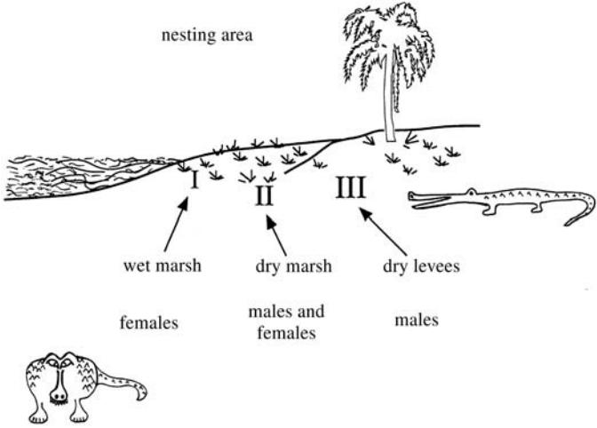

**Figure 4.1.** The three basic nesting regions, representing the environmental influence. I: The wet marsh with low temperatures giving all female hatchlings, II: the dry marsh in which half of the hatchlings are females and half males and III: the dry levees where all hatchlings are males.

- I. Wet marsh all female hatchlings: *f*1(*t*)
- II. Dry marsh 50% female, 50% male hatchlings: *f*2(*t*), *m*2(*t*)
- III. Dry levees all male hatchlings: *m*3(*t*) Total female population = *f* (*t*) = *f*1(*t*) + *f*2(*t*), Total male population = *m*(*t*) = *m*2(*t*) + *m*3(*t*). (4.1)

An idealised spatial distribution of the sex ratio of males to the total population in the three-region scenario in Figure 4.1 is shown in Figure 4.2(a).

Only a fraction of females can incubate their eggs in the wet marsh region (I). Let *k*1 denote the carrying capacity of region I. This fraction, *F* say, must be a function of *k*1 and the female population *f*1 and it must satisfy certain criteria. If there are only a few females *f*1, *F* ≈ 1 since essentially all of them can nest in region I while for a very

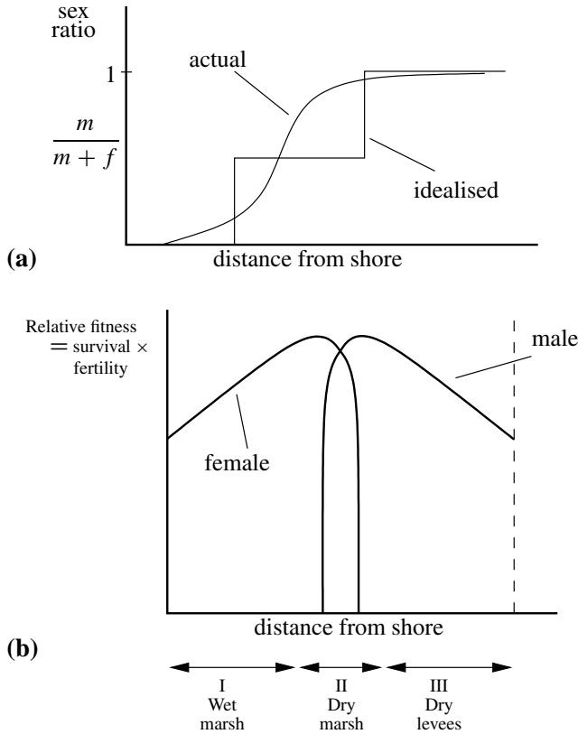

**Figure 4.2.** (**a**) Idealised sex ratio of total number of males, *m*, to the total population of males plus females, *m* + *f* for a three-region situation schematically shown in Figure 4.1. The continuous curve is more realistic. (**b**) Schematic curves for relative fitness (survival times fertility) as compared with others of the same sex. Note that it is highest for both males and females in the middle range of temperatures, around 32◦ C.

large number of females *f*1, *F* ≈ 0 since in this situation most of them have to move away from the wet marsh region I. As an approximation to this function, the fraction

$$F = \frac{k_1}{k_1 + f_1} \tag{4.2}$$

satisfies the following,

$$F = \frac{k_{\text{l}}}{k_{\text{l}} + f_{\text{l}}} \to 0 \quad \text{as} \quad f_{\text{l}} \to \infty, \quad F = \frac{k_{\text{l}}}{k_{\text{l}} + f_{\text{l}}} \to 1 \quad \text{as} \quad f_{\text{l}} \to 0,$$

as required. It is, of course, just an approximation to the actual fraction function. Strictly *F*( *f*1, *k*1) is zero until *f*1 reaches the carrying capacity *k*1 of region I after which the extra females have to move away from the wet marsh region. The fraction (4.2) is clearly not the best approximation we could choose (for example, if the total *f*1 = *k*1, the carrying capacity, *F* = 0.5 whereas it should still be zero). We use this form, (4.2), for algebraic simplicity; it broadly has the required qualtitative behaviour. We use the same fraction approximation in the other regions and also in the age-dependent analysis below.

If *b* is the effective birth rate, that is, it includes clutch size, *C*, and the high mortality of hatchlings and egg predation, in other words survival, *S*, then, in a simple population model such as we discussed in Chapter 1, we have a dynamic equation for the population in region I (all females)

$$\frac{df_1}{dt} = b \left[ \frac{k_1}{k_1 + f_1} \right] f_1 - df_1. \tag{4.3}$$

Here we have taken the death rate as proportional to the population with *d* a parameter. If *f*1 is large the maximum reproduction is then proportional to *k*1 which accounts for its role as a measure of habitat capacity. The birth rate, *b*, is a function of the total male population, *m*, and is reasonably taken as

$$b = b(m) = \frac{b_0 m}{(c+m)} \to \,\, b_0,\quad\text{for small }c,\tag{4.4}$$

where *c* is a constant which, from field data, is indeed very small. With *c* small, equation (4.3) is uncoupled from the other equations in the model system below.

If we now consider region II where both females and males are produced, the fraction of females which have to move from the wet marsh region I to the dry marsh region II is simply

$$1 - \frac{k_1}{k_1 + f_1} = \frac{f_1}{k_1 + f_1}.\tag{4.5}$$

So, the total number of females who want to nest in region II is the number who like this temperature plus those that had to move from region I:

$$\frac{f_1^2}{k_1 + f_1} + f_2.$$

There is also a limited number of nest sites in region II and only a fraction of females can incubate in II, which is (cf. (4.2)):

$$\frac{k_2}{k_2 + \frac{f_1^2}{k_1 + f_1} + f_2},$$

where, in the same way as we saw for (4.2), *k*2 relates to the maximum number of hatchlings possible in the dry marsh region II. For algebraic simplicity we approximate this fraction by

$$\frac{k_2}{k_2 + f_1 + f_2},$$

which has roughly the same qualitative behaviour. Compared with other assumptions and approximations this approximation is minor. It can, of course, easily be included in a numerical simulation of the equations: this was done and the resulting solutions were in general qualitative agreement. Thus the equations for the females and males in region II are:

$$\begin{array}{l}\text{number of females} \\ \text{who want to} \\ \text{incubate eggs in II} \end{array}$$

$$\begin{aligned} \frac{df_2}{dt} &= \frac{b_0}{2} \left[ \frac{f_1^2}{k_1 + f_1} + f_2 \right] \left[ \frac{k_2}{k_2 + f_1 + f_2} \right] - df_2 \\\\ \frac{dm_2}{dt} &= \frac{b_0}{2} \left[ \frac{f_1^2}{k_1 + f_1} + f_2 \right] \left[ \frac{k_2}{k_2 + f_1 + f_2} \right] - dm_2 \\\\ &\vdots \\ \text{fraction of} \end{aligned} \tag{4.6}$$

fraction of females able to nest in region II

The factor 1/2 is because half the hatchlings are male and half are female.

Finally in region III, the dry levees, the number of females forced to move from region II to III to nest is

$$
\left[\frac{f_1^2}{k_1 + f_1} + f_2\right] \left[\frac{\frac{f_1^2}{k_1 + f_1} + f_2}{k_2 + \frac{f_1^2}{k_1 + f_1} + f_2}\right]
$$

and the fraction able to incubate eggs in region III is

$$\frac{k_3}{k_3 + \frac{f_1^2}{k_1 + f_1} + f_2},$$

where *k*3 is a direct measure of the carrying capacity of III. For the same algebraic reasons as above we approximate these expressions for the two fractions respectively by

$$
\left[\frac{f_1^2}{k_1 + f_1} + f_2\right] \left[\frac{f_1 + f_2}{k_2 + f_1 + f_2}\right] \quad \text{and} \quad \frac{k_3}{k_3 + f_1 + f_2}.
$$

The remaining females cannot nest in any suitable site. So, with these expressions the equation for males in region III (in our model there are only males here) is

$$\frac{dm_3}{dt} = b_0 \left[ \frac{k_3}{k_3 + f_1 + f_2} \right] \left[ \frac{f_1^2}{k_1 + f_1} + f_2 \right] \left[ \frac{f_1 + f_2}{k_2 + f_1 + f_2} \right] - dm_3. \tag{4.7}$$

The system of equations (4.3), (4.6) and (4.7) constitute the model for the populations in the various regions and from which we can obtain the sex ratio of the total population.

The steady state populations are given by setting the right-hand sides of (4.3), (4.6) and (4.7) equal to zero and solving the algebraic equations. Zero for all the groups is of course one solution and it is easy to see from linearising the model equations that it is always unstable (recall the analyses in Chapters 1 and 3). A little algebra gives the positive steady states, denoted by asterisks, as

$$\begin{aligned} f_1^* &= \left(\frac{b_0}{d} - 1\right) k_1, \quad m_2^* = f_2^* = \frac{1}{2} \left[ -A + (A^2 + C)^{1/2} \right], \\\ m_3^* &= \frac{2k_3 f_2^* (f_1^* + f_2^*)}{k_2 (k_3 + f_1^* + f_2^*)}, \quad A = f_1^* - k_2 \left(\frac{b_0}{2d} - 1\right), \quad C = \frac{2k_2 f_1^{*2}}{k_1}. \end{aligned} \tag{4.8}$$

Since, from field studies, *b*0/*d*, the effective births over the lifetime of an alligator, or other crocodilia, is of the order of 100 to 300, we can approximate these steady states by

$$f_1^* \approx \frac{b_0 k_1}{d}, \quad m_2^* = f_2^* \approx \frac{b_0}{d} F_2(k_1, k_2), \quad m_3^* \approx \frac{b_0}{d} F_3(k_1, k_2, k_3), \tag{4.9}$$

where *F*2(*k*1, *k*2) and *F*3(*k*1, *k*2, *k*3) are obtained from (4.8).

We are particularly interested in the sex ratio, *R*. This is given by (4.9) for large *b*0/*d* as

$$R = \frac{m_2^* + m_3^*}{f_1^* + f_2^* + m_2^* + m_3^*} \approx \frac{F_2(k_1, k_2) + F_3(k_1, k_2, k_3)}{k_1 + 2F_2(k_1, k_2) + F_3(k_1, k_2, k_3)} = \phi(k_1, k_2, k_3),\tag{4.10}$$

where φ is defined by (4.10). In this asymptotic case the sex ratio is independent of *b*0/*d*, and so the parameters, *ki* with *i* = 1, 2 and 3, that is, those parameters proportional to the carrying capacities in the various regions I–III, are the key parameters. The environment is clearly seen to have a crucial influence on the sex ratio. With the estimates for the percentage carrying capacity in the three regions given by Joanen (1969) above, namely, 79.7 : 13.6 : 6.7, the sex ratio of males to the total population is given by (4.10) as approximately 0.13 which means there are roughly 7 to 8 females to 1 male. Although we do not do it here, it is possible to carry out a stability analysis of these steady states with the methods we described earlier in the book but it is algebraically complex. Interestingly, such an analysis shows that there can be no periodic solutions: the positive steady state is always stable. Using the equations we can also investigate the effect of some catastrophe which greatly reduced the populations and obtain estimates for the recovery time to their steady states: this has to be done numerically except for small perturbations about the steady states where linear theory could apply. If the equations are to be studied in depth numerically then more appropriate fractional functions could be used but the general results would not be qualitatively different.

It is intuitively clear how the crocodilia, because of TSD, can recover from a catastrophic reduction in their population. Following a major reduction, all the female crocodiles will be able to build their nests in region I and hence produce only females; this then allows the remaining males to have larger harems. The skewed sex ratio in the crocodilia thus maintains a large breeding population which provides the mechanism for rapid repopulation after a disaster. What is certainly not in doubt is that TSD has been a very effective reproductive mechanism in view of the remarkable survivorship of the crocodilia.

Catastrophes, natural or otherwise, raise the question of extinction. If we consider extinction this would certainly happen if we have, from (4.3), *b* < *d*. With *b* = *b*0*m*/(*c* + *m*) this implies that *m* < *cd*/(*b*0 − *d*) = *O*(1/*b*0) for *c* small and *b*0 large, which implies that essentially all the males have to be eliminated. The natural habitat of males is in the water where it is virtually impossible to kill them all which, in turn, implies the almost impossibility of extinction except through the elimination of all the nest sites, that is, by completely destroying their habitat. With the increasing encroachment of their habitat by human population pressures it is certainly possible that alligators could disappear at least from the southern U.S. Figure 4.3(b) shows the approximate area in the U.S. where they are currently found.

The survival of alligators in the U.S. could depend on alligator farms which are already on the increase in these states. These, however, must be commercially viable and so the sale of alligator skins for shoes, belts, or whatever products appeal to consumers, is perhaps to be encouraged. Conservation takes on a different hue in these circumstances. Bustard (1984) discusses one such conservation strategy for the captive breeding of the gharial (*Gavialis gangeticus*) in India. After an extensive survey of the situation in India he made a strong case for captive breeding programmes. He also discussed the crocodile situation in Australia. It is clear we have to redefine what we mean by 'conservation' and survival of a species if it means only managed survival. It is a subject which already gives rise to heated discussion—and not only between conservationists and evolutionary biologists.

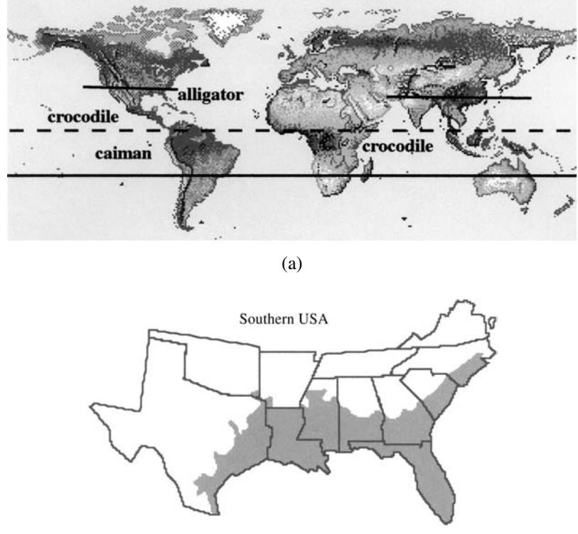

(b)

**Figure 4.3.** (**a**) Approximate areas around the equator where crocodilia are found. (**b**) Approximate region in the U.S. where alligators are currently found.

### **4.3 Age-Structured Population Model for the Crocodilia**

The problem with population models which involve only time is that if age, *a*, plays an important role in survival or reproduction, it should be taken into account. In the case of the crocodilia it is important since both reproductive maturity and death rates vary significantly with age; Figure 4.4 shows typical averaged forms of the death rate, *d*(*a*), and the birth rate, *b*(*a*) taken from the literature (Smith and Webb 1985, Webb and Smith 1987). Since we are ultimately interested in survivorship we must develop an age-structured model using the ideas in Sections 4.1 and 4.2. We introduced agestructure in population models in Chapter 1 and developed the techniques necessary to investigate the solutions. It would be helpful for the reader to briefly review that section prior to continuing with what follows.

We consider the nesting region to be divided into the three regions I, II and III as in Section 4.2 and analogously denote the four population classes by *f*1(*a*,*t*) and *f*2(*a*,*t*) denoting females themselves incubated in regions I and II, and *m*2(*a*,*t*), and *m*3(*a*,*t*) denoting males incubated in regions II and III where *a* refers to age, and *aM* is the maximum attainable age; they can live a long time, of the order of 70 years. So, for

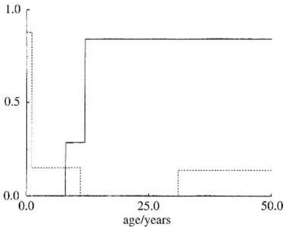

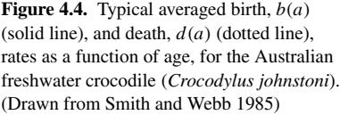

example, *f*1(*a*,*t*) denotes the population density at time *t* in the age range *a* to *a* + *da*. We get the total time-dependent population, *F*1(*t*), by integrating over all ages from *a* = 0 to *a* = *aM* ,

$$F_{\mathbb{I}}(t) = \int_0^{a_M} f_{\mathbb{I}}(a, t) \, da.$$

We assume, as we tacitly did above, that the population is 'closed,' that is, it changes in size only through the processes of birth and death. The extensive radiotelemetric studies of Joanen and McNease (1970, 1972) show this is a biologically reasonable assumption if we consider fairly large home ranges. The death rate, *d*(*a*), and birth rate, *b*(*a*), are assumed to be only functions of age and typically as illustrated in Figure 4.4. Since differential sexual mortality is unknown we assume it is independent of sex. The birth processes are more complicated to describe as we shall show.

Just as described above, we consider sex is allocated to newborn alligators according to the availability of male and female producing nest sites. We further assume that all female alligators themselves incubated in wet marsh areas prefer to nest in region I since they seek a temperature environment that is as close as possible to that of their own incubation. Also, because of the limited number of nest sites in region I, only a fraction of females are able to incubate their eggs in wet marsh areas. Following (4.2) (and for similar algebraic reasons) we take that fraction to be *k*1/(*k*1 + *Q*1), where *k*1 is the maximum number of nests that can be built in the wet marsh. *Q*1(*t*) denotes the total number of sexually mature (reproducing) females themselves incubated in region I; that is,

$$Q_1(t) = \int_0^{a_M} q_1(a) f_1(a, t) \, da. \tag{4.11}$$

Here *q*1(*a*) is a weight function which reflects the effect of age: for example, older females cease to be reproductive. *Q*1(*t*) is a weighted average with respect to age of the age density distribution of females in region I. The fraction of females who stay in the wet marsh has the same properties as in Section 4.2. For the reasons given there we take the approximate fraction with the properties

$$\frac{k_{\rm l}}{k_{\rm l} + \mathcal{Q}_{\rm l}} \to 1 \quad \text{as} \quad \mathcal{Q}_{\rm l} \to 0, \quad \frac{k_{\rm l}}{k_{\rm l} + \mathcal{Q}_{\rm l}} \to 0 \quad \text{as} \quad \mathcal{Q}_{\rm l} \to \infty,$$

which again is as we want, namely, when *Q*1 is small nearly all the females themselves incubated in region I can nest there and when *Q*1 is large the vast majority have to move away from the wet marsh and nest elsewhere in regions II or III. As we pointed out above this fraction is an approximation to a more complicated but more accurate form for the fraction of females that can nest in region I. The arguments for using the approximate forms for the various fractions used in the age-independent model carry over to those used here and below.

Eggs incubated in region I produce all female, *f*1, hatchlings because of low incubation temperatures. The density-dependent age-specific *maternity function b*11(*a*, *Q*1(*t*)), where *b*11 is the average number of offspring (per unit time) successfully hatched from eggs laid in region I by a female of age *a* who was herself incubated in region I, is given by

$$b_{11}(a, \mathcal{Q}_1(t)) = C S b(a) \frac{k_{\rm l}}{k_{\rm l} + \mathcal{Q}_{\rm l}},\tag{4.12}$$

where *C* is the clutch size, *S* is the survival rate of eggs and hatchlings and *b*(*a*) is the age-dependent birth rate. The clutch size may be anything up to 70 eggs with an average around 40, but their survival is extremely small; there are many predators for the eggs as well as the hatchlings.

We assume that those females who cannot build nests in region I move to region II. Female alligators themselves incubated in dry marsh areas prefer to construct nests in region II. However in region II there is also a limited number of nest sites so that only a fraction *k*2/(*k*2 + [*Q*1(*t*) + *Q*2(*t*)]), is successful. Here *k*2 is the maximum number of nests that can be built in the dry marsh, and *Q*2(*t*) is the total number of sexually mature females themselves incubated in region II. As before we consider eggs incubated in region II produce 50% female, *f*2, and 50% male, *m*2, hatchlings. For *i* = 1, 2, the density-dependent age-specific maternity functions *bi*2(*a*, *Q*1(*t*), *Q*2(*t*)) are the average number of offspring (per unit time) successfully hatched from eggs laid in region II by a female of age *a* who was herself incubated in region *i*, so

$$\begin{split} b_{12}(a,\mathcal{Q}_1(t),\mathcal{Q}_2(t)) &= CSb(a) \left[ \frac{k_2}{k_2 + \mathcal{Q}_1(t) + \mathcal{Q}_2(t)} \right] \left[ \frac{\mathcal{Q}_1(t)}{k_1 + \mathcal{Q}_1(t)} \right], \\ b_{22}(a,\mathcal{Q}_1(t),\mathcal{Q}_2(t)) &= CSb(a) \left[ \frac{k_2}{k_2 + \mathcal{Q}_1(t) + \mathcal{Q}_2(t)} \right]. \end{split} \tag{4.13}$$

The remaining females are forced to move to region III where the approximate fraction able to incubate eggs is *k*3/(*k*3 + [*Q*1(*t*) + *Q*2(*t*)]) where *k*3, as before, relates to the maximum number of nests that can be built in the levees. Eggs incubated in region III produce all male, *m*3, hatchlings because of higher incubation temperatures. For *i* = 1, 2, the density-dependent age-specific maternity function *bi*3(*a*, *Q*1(*t*), *Q*2(*t*)) is the average number of offspring (per unit time) successfully hatched from eggs laid in region III by a female of age *a* who was herself incubated in region *i*, *i* = 1, 2,

$$\begin{split} b_{13}(a,\underbrace{Q_{1}(t)}_{},\underbrace{Q_{2}(t)}_{}) &= CSb(a) \left[ \frac{k_{3}}{k_{3} + Q_{1}(t) + Q_{2}(t)} \right] \left[ \frac{\mathcal{Q}_{1}(t) + \mathcal{Q}_{2}(t)}{k_{2} + \mathcal{Q}_{1}(t) + \mathcal{Q}_{2}(t)} \right] \\ &\times \left[ \frac{\mathcal{Q}_{1}(t)}{k_{1} + \mathcal{Q}_{1}(t)} \right], \\ b_{23}(a,\left.\mathcal{Q}_{1}(t),\left.\mathcal{Q}_{2}(t)\right) &= CSb(a) \left[ \frac{k_{3}}{k_{3} + \mathcal{Q}_{1}(t) + \mathcal{Q}_{2}(t)} \right] \left[ \frac{\mathcal{Q}_{1}(t) + \mathcal{Q}_{2}(t)}{k_{2} + \mathcal{Q}_{1}(t) + \mathcal{Q}_{2}(t)} \right]. \end{split} \tag{4.14}$$

Indications from available data suggest that even though there are fewer males than females in alligator and crocodile populations, the male population size is rarely if ever a limiting factor in reproduction (Webb and Smith 1987, Nichols et al. 1976). For this reason the maternity functions (4.14) depend only on *f*1, and *f*2 (via *Q*1(*t*), and *Q*2(*t*)) and the model is said to be *female dominant* (Keyfitz 1968, Sowunmi 1976).

The life history data given by the clutch size, *C*, the egg and hatchling survival, *S*, the death rate *d*(*a*), the reproduction rate *b*(*a*) and the carrying capacity parameters *k*1, *k*2, *k*3, contain a great deal of information about the potentialities of the population and its relationship to the environment (Cole 1954, Stearns 1976). The clutch size, *C*, ranges from 1 to 68 for *A. mississippiensis* (Ferguson 1985). There are five primary classes of survivorship: (i) egg survivorship (to hatchling), (ii) hatchling survivorship (to one year of age), (iii) juvenile survivorship (to maturity), (iv) middle age survivorship (to a decline in reproductive output) and (v) old age survivorship (through senescence). Egg and hatchling survivorship is extremely low due to predation, flooding, cannibalism, desiccation and freeze mortalities, as well as eggs cracking during laying and the failure of the nest to open. Juveniles are also at risk, mainly due to predation, but middle age survivorship is high (crocodilia have almost 100% survivorship during their middle years), declining again in old age. Averaging over each of these classes gives the agespecific death rate, *d*(*a*). Typically the reproduction rate, *b*(*a*), is constant in middle age, and zero for both immature and senescent crocodilia. It is obtained by averaging estimates of the age at which females begin breeding (approximately 9 to 12 years old), the proportion of females capable of breeding that do breed each year (between 33 and 84%), and the age at which females cease breeding. Typical averaged forms of *d*(*a*) and *b*(*a*) from Smith and Webb (1985) are shown in Figure 4.4. As before *k*1, *k*2, *k*3 are proportional to the size of the wet marsh, dry marsh and levees carrying capacities respectively.

#### **4.4 Density-Dependent Age-Structured Model Equations**

We can now write down the model equations for the several populations *f*1(*a*,*t*), *f*2(*a*,*t*), *m*2(*a*,*t*) and *m*3(*a*,*t*) respectively females themselves incubated in regions I and II and males incubated in regions II and III as described above.

Here *a* refers to age, and *aM* is the maximum attainable age. We now write down the conservation equations as we did in Chapter 1, Section 1.7 remembering that *a* is

chronological age and *t* is time. The equations are

$$\frac{\partial}{\partial t} f_l(a, t) + \frac{\partial}{\partial a} f_l(a, t) = -d(a) f_l(a, t), \quad \text{for } i = 1, 2 \tag{4.15}$$

$$\frac{\partial}{\partial t}m_l(a,t) + \frac{\partial}{\partial a}m_l(a,t) = -d(a)m_l(a,t), \quad \text{for } i = 2,3,\tag{4.16}$$

where *d*(*a*) is the age-specific *death rate* and typically as in Figure 4.4. As above we assume a female alligator seeks a nesting region which provides her with a temperature as close as possible to that at which she was incubated. Then the birth processes by which individuals are introduced into the population are the usual *renewal*-type equations. Hatchlings are born at age *a* = 0 and so

$$\begin{split} f_1(0,t) &= \int_0^{a_M} f_1(a,t) b_{11}(a, \mathcal{Q}_1(t)) \, da, \\ f_2(0,t) &= \frac{1}{2} \int_0^{a_M} f_1(a,t) b_{12}(a, \mathcal{Q}_1(t), \mathcal{Q}_2(t)) \, da \\ &+ \frac{1}{2} \int_0^{a_M} f_2(a,t) b_{22}(a, \mathcal{Q}_1(t), \mathcal{Q}_2(t)) \, da, \\ m_2(0,t) &= \frac{1}{2} \int_0^{a_M} f_1(a,t) b_{12}(a, \mathcal{Q}_1(t), \mathcal{Q}_2(t)) \, da \\ &+ \frac{1}{2} \int_0^{a_M} f_2(a,t) b_{22}(a, \mathcal{Q}_1(t), \mathcal{Q}_2(t)) \, da, \\ m_3(0,t) &= \int_0^{a_M} f_1(a,t) b_{13}(a, \mathcal{Q}_1(t), \mathcal{Q}_2(t)) \, da \\ &+ \int_0^{a_M} f_2(a,t) b_{23}(a, \mathcal{Q}_1(t), \mathcal{Q}_2(t)) \, da, \end{split} \tag{4.17}$$

where from (4.11) and the equivalent for *Q*2(*t*)

$$Q_1(t) = \int_0^{a_M} q_1(a) f_1(a, t) da, \quad Q_2(t) = \int_0^{a_M} q_2(a) f_2(a, t) da. \tag{4.18}$$

For *i* = 1, 2, *j* = 1, 3, the density-dependent age-specific *maternity functions bi j*(*a*, *Q*1(*t*), *Q*2(*t*)) are given in (4.12) through (4.14) which are the average number of offspring (per unit time) successfully hatched from eggs laid in region *j* by a female of age *a* who was herself incubated in region *i*. We assume that density-dependent constraints act on births in the form of a limited number of nest sites. Remember that the 'sizes' *Q*1(*t*) and *Q*2(*t*) are weighted averages, with respect to age, of the age-density distributions of the females in regions I and II respectively.

To complete the model equation formulation we finally must assume some known initial age-structure of the populations,

$$f_l(a,0) = \phi_l(a), \quad i = 1,2,\qquad m_l(a,0) = \phi_l(a), \quad i = 2,3. \tag{4.19}$$

Biologically, of course, φ*i*(*a*), *d*(*a*) and *bi j*(*a*, *Q*1(*t*), *Q*2(*t*)) are all nonnegative.

#### *Birth and Death Data*

We use the (smoothed) data from Smith and Webb (1985) to construct the reproduction, *b*(*a*), death, *d*(*a*), rates and the initial population φ(*a*); see Figure 4.4.

The effective birth rate is *CSb*(*a*) where *C* = 13.2 is average clutch size, *S* = 0.295×0.12 is survival rate of eggs and hatchlings, and the age-structured reproduction function and age-structured death function are given by

$$b(a) = \begin{cases} 0.000 & 0 < a \le 8 \\ 0.286 & 8 < a < 12 \\ 0.844 & 12 \le a < a_M \end{cases} \qquad d(a) = \begin{cases} 0.151 & 1 < a < 11 \\ 0.000 & 11 \le a < 31 \\ 0.139 & 31 \le a < a_M \end{cases} . \tag{4.20}$$

To be specific we assume that the initial population, φ(*a*), has a simple exponential dependence on age, *a*,

$$\phi(a) = c_1 + (c_2 - c_1)e^{-c_3a}, \quad \text{where} \quad \begin{cases} c_1 = 3.376, \\ c_2 = 135.970, \\ c_3 = 0.155, \end{cases} \tag{4.21}$$

where the *ci* were determined from a nonlinear least squares regression fit to the initial (smoothed) data of Smith and Webb (1985).

It is not possible to solve the above model system of equations analytically as we were able to do in Chapter 1, Section 1.7, but we can solve them numerically if the initial age distribution of the population is given and the pertinent life history parameters, *C*, *S*, *d*(*a*), *b*(*a*), *k*1, *k*2, *k*3 are constant (with respect to time). In this way we can compute the future populations. Intuitively with fixed life history features there must ultimately be a stable age distribution and hence a fixed sex ratio (Cole 1954).

#### **4.5 Stability of the Female Population in the Wet Marsh Region I**

The females in region I can be considered as a single isolated species since the birth and death processes depend only on age, *a*, and the size of the sexually mature female population in region I, *Q*1(*t*). For a species to survive it must possess reproductive capacities sufficient to replace the existing generation by the time it has disappeared. We define the *net reproductive rate*, *R*1, to be the expected number of female offspring born to an individual female during her lifetime when the population size is *Q*1(*t*). The number of female offspring born to a female between age *a* and *a* + *da* is *b*11(*a*, *Q*1(*t*))*da*, so if we sum over *a*, we have

> net reproductive expected number of female offspring born rate in region I to an individual female during her lifetime

$$\mathcal{R}_{\mathbb{I}}[\mathcal{Q}_{\mathbb{I}}(t)] = \int_0^{a_M} b_{\mathbb{II}}(a, \mathcal{Q}_{\mathbb{I}}(t)) \pi(a) \, da,$$

(4.22)

where π(*a*) is the probability that an individual will survive to age *a*; that is,

$$
\pi(a) = e^{-\int_0^a d(s) \, ds}. \tag{4.23}
$$

The female population in region I will either be increasing or decreasing, or it will remain constant, depending on whether *R*1 > 1, *R*1 < 1 or *R*1 = 1. As long ago as 1760, Euler investigated the mortality and survivorship of humans, in effect using the idea of a net reproductive rate (see the translation of his article in Euler 1970 (1760)). So, for there to be a stable age distribution it is necessary and sufficient that *R*1(*Q*∗ 1) = 1 has a nonzero solution, *Q*∗ 1; that is, *for each female member throughout her life, the expected number of female births is* 1. Gurtin and MacCamy (1974), Sowunmi (1976) and Webb (1985) point out that in classical (linear) theory *R*1 is independent of *Q*1. It would be fortuitous if this were to be the case; however, in most problems of interest here there is at least one value of *Q*∗ 1 for which *R*1(*Q*∗ 1) = 1 as we see in Figure 4.5. This figure shows, for several clutch sizes and survival rates, the numerical simulations for the net reproductive rate as a function of the number of sexually mature females in region I as a function of the number of mature females in region I relative to the available nesting space in region I, namely, *Q*1/*k*1.

We have assumed throughout that the environment is stable (that is, *k*1, *k*2 and *k*3 are constants) whereas, in reality, annual recruitment (and the sex ratio of recruits) is subject to extreme environmental variation (Webb and Smith 1984, 1987). However Gurney and Nisbet (1980a) showed that in age- and density-dependent populations, environmental fluctuations are not significant if the members of the population have a long reproductively active stage, with or without an immature phase and a period of senescence. This agrees with the observation of Deeming and Ferguson (1989b) that only if the skew is consistently toward males for at least the entire reproductive life span of a whole generation, does a species run into serious problems.

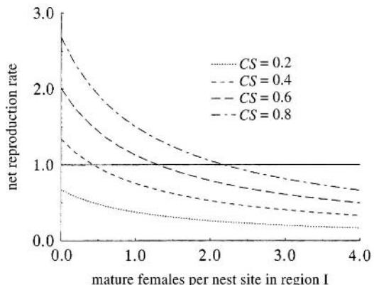

**Figure 4.5.** Numerically calculated net reproduction rate, *R*1, as a function of the number of sexually mature females in region I relative to the space, *k*1, available for nesting in region I, *Q*1/*k*1. This graph shows that provided the number of eggs producing surviving hatchlings, that is, the product *C S* with *C* and *S* the clutch size and survival respectively, is sufficiently large there is a value *Q*∗ 1 for which the *R*1(*Q*∗ 1) = 1; that is, a stable age distribution exists. A biologically realistic value of the parameter *C S* is approximately 0.5. (From Woodward and Murray 1993)

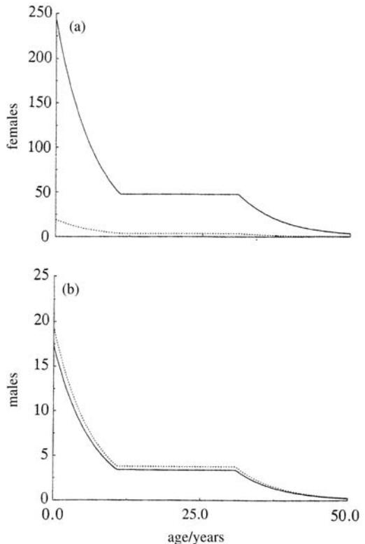

**Figure 4.6.** Numerical solution of the three-region model showing the equilibrium age distributions of (**a**) females incubated in regions I (solid line) and II (dotted line), and (**b**) males incubated in regions II (solid line) and III (dotted line). The sex ratio at the steady state is (*m*2 +*m*3)/( *f*1 + *f*2) = 0.122 or, in other words, 12.2% of the population are males. (From Woodward and Murray 1993)

A stable solution of the equations for the female population in region I inevitably gives a stable solution of both the male and female populations in regions II and III. The three-region density-dependent age-structured model was solved numerically (Woodward and Murray 1993) by replacing the derivatives by finite differences and the integrals by quadrature formulae (Kostova 1990). Figure 4.6 shows the female and male stable age distributions, *f*1, *f*2 = *m*2, and *m*3 in the case *k*1 : *k*2 : *k*3 = 79.7 : 13.6 : 6.7 (Joanen 1969). The population is flat for 11 < *a* < 31 because we assumed 100% survivorship during the middle years. At equilibrium, the sex ratio, (*m*2 + *m*3)/( *f*1 + *f*2), expressed as percentage of the population that is male, is 12.2%, roughly one male to every eight females.

### **4.6 Sex Ratio and Survivorship**

In view of the analytical complexity of the full model we simplify by assuming that *f*2 = 0, which is biologically fairly realistic since, compared to the number of females nesting in region I, only a small fraction of females nest in region II (Joanen 1969); see also Figure 4.6. We now use this simpler model to investigate the effects of the life history phenomena on sex ratio.

The model system we consider in this situation consists of two populations *f*1(*a*,*t*): namely, females incubated in region I and *m*3(*a*,*t*), males incubated in region III. We have no region II, in effect, in this scenario. The equations, boundary and initial conditions are, from (4.15) through (4.17) and (4.19),

$$\begin{aligned} \frac{\partial}{\partial t} f_1(a, t) + \frac{\partial}{\partial a} f_1(a, t) &= -d(a) f_1(a, t), \\ \frac{\partial}{\partial t} m_3(a, t) + \frac{\partial}{\partial a} m_3(a, t) &= -d(a) m_3(a, t), \end{aligned} \tag{4.24}$$

with

$$\begin{aligned} f_1(0, t) &= \int_0^{a_M} f_1(a, t) b_{11}(a, \mathcal{Q}_1(t)) \, da, \\ m_{\Im}(0, t) &= \int_0^{a_M} f_1(a, t) b_{1\Im}(a, \mathcal{Q}_1(t), \mathcal{Q}_2(t)) \, da \end{aligned} \tag{4.25}$$

with initial conditions

$$f_{\mathbb{I}}(a,0) = \phi_{\mathbb{I}}(a), \qquad m_{\mathbb{S}}(a,0) = \phi_{\mathbb{S}}(a). \tag{4.26}$$

The equation for *f*1(*a*,*t*) in (4.24) with the boundary and initial conditions in (4.25) and (4.26) is the same as the population equation in Chapter 1, equations (1.54) to (1.56). We could not write down an analytical solution exactly (we ended up with an integral equation), but we were able to carry out some relevant similarity analysis. Here we solve the equation numerically.

Since the death rate is assumed independent of sex, the sex ratio does not depend on age and, at equilibrium, the sex ratio of the population density equals the primary (at hatching) sex ratio. Defining the *net reproductive rate*, *R*3, to be the expected number of male offspring born to an individual female during her lifetime when the population size is *Q*1(*t*), we have

> net reproductive expected number of male offspring born rate in region III to an individual female during her lifetime (4.27)

$$R_{\mathfrak{J}}[\mathcal{Q}_1(t)] = \int_0^{a_M} b_{1\mathfrak{J}}(a, \mathcal{Q}_1(t)) \pi(a) \, da,$$

where the maternity function *b*13(*a*, *Q*1(*t*)) is given by (4.14) with *Q*2 ≡ 0, and *k*2 ≡ 0, and π(*a*) given by (4.23), namely,

$$b_{13}(a, \mathcal{Q}_1(t)) = C S b(a) \left[ \frac{k_3}{k_3 + \mathcal{Q}_1(t)} \right] \left[ \frac{\mathcal{Q}_1(t)}{k_2 + \mathcal{Q}_1(t)} \right] \left[ \frac{\mathcal{Q}_1(t)}{k_1 + \mathcal{Q}_1(t)} \right].$$

At equilibrium, *Q*1(*t*) ≡ *Q*∗ 1, and the ratio of the expected number of male offspring to the expected number of female offspring is given by

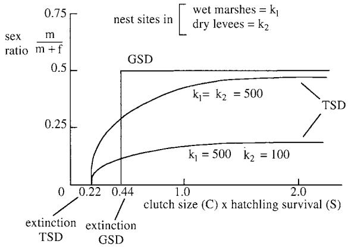

**Figure 4.7.** Numerically calculated sex ratio for the two-region model as a function of clutch size, *C*, and hatchling and egg survival, *S*, for various carrying capacities: (i) *k*1 = 500, *k*3 = 100, and (ii) *k*1 = *k*3 = 500. Here *k*1 and *k*3 are directly related to the maximum number of nests that can be constructed in the wet marsh and the levees, respectively. The minimum value of *C S* for a nonzero stable age distribution of the TSD model is 0.22 which is half that for the minimum necessary for the existence of a nonzero equilibrium in the GSD model, which is 0.44. (Redrawn from Woodward and Murray 1993 who give the accurate quantitative forms plus another case in which the carrying capacities *k*1 = 500, *k*3 = ∞)

$$\frac{R_3(\mathcal{Q}_{\mathbb{I}}^*)}{R_1(\mathcal{Q}_{\mathbb{I}}^*)} = \int_0^{a_M} b_{13}(a, \mathcal{Q}_{\mathbb{I}}^*) \pi(a) \, da,\tag{4.28}$$

since from Figure 4.5, *R*1(*Q*∗ 1) = 1. Hence, for a stable age distribution, it is necessary that *the expected number of male births equals the neonatal male/female sex ratio* (Sowunmi 1976).

For a given reproduction rate, *b*(*a*), and a given death rate, *d*(*a*), the sex ratio will be skewed depending on the number of eggs producing surviving hatchlings, *C S*, and on *k*1 and *k*3. Numerical simulations of the two-region model illustrate this result and are represented in Figure 4.7. There is a range of values of *C S*, *m* < *C S* < *M*, for which the TSD model has a nonzero stable age distribution, but the only equilibrium of the corresponding GSD model is the zero solution as we show in Section 4.7 below.

### **4.7 Temperature-Dependent Sex Determination (TSD) Versus Genetic Sex Determination (GSD)**

At the most basic level the easiest way to compare the two methods of sex determination is to consider a two-region model without age-dependence. We showed in the last section how the sex ratio and survival depended on the product of the clutch size and hatchling survival. To get some idea of how these play a role in genetic sex determination and for ease of comparison we consider here a particularly simple model in which the populations depend only on time. As in the previous section we again consider only a two-region model, region I where only females are incubated and a region III where only males are incubated. This is a simplified version of the model in Section 4.2 and is the age-independent equivalent of the model in Section 4.4.

With these assumptions the birth rate, *b*, and death rate, *d*, are constant parameters. Let the clutch size, *C*, and the survival, *S*, be as before. The female and male populations are denoted by *f*1(*t*) and *m*3(*t*) respectively.

The equation for the female population is then (cf. (4.3))

$$\frac{df_{\rm l}}{dt} = CSb \left[ \frac{k_{\rm l}}{k_{\rm l} + f_{\rm l}} \right] f_{\rm l} - df_{\rm l} \tag{4.29}$$

but where here we have included *C S* explicitly in the birth rate for ease of comparison with the previous section. The equation for the male population is (4.7) but with *f*2 = *k*2 = 0, namely,

$$\frac{dm_3}{dt} = CSb \left[ \frac{k_3}{k_3 + f_1} \right] \left[ \frac{f_1^2}{k_1 + f_1} \right] - dm_3 \tag{4.30}$$

with initial conditions *f*1(0) = *f*0 and *m*3(0) = *m*0.

The steady state populations are

$$f_{\parallel}^{*} = k_{\parallel} \left( \frac{CSb}{d} - 1 \right), \quad m_{\S}^{*} = \frac{CSb}{d} \left( \frac{k_{\S}}{k_{\S} + f_{\parallel}^{*}} \right) \left( \frac{f_{\parallel}^{*2}}{k_{\I} + f_{\parallel}^{*}} \right) \tag{4.31}$$

which are nonnegative if *CSb* > *d*. The sex ratio, male to female offspring, is given by

$$R = \frac{m_3^*}{f_1^*} = \frac{k_3(CSb - d)}{k_3d + k_1(CS - d)}.\tag{4.32}$$

If we now suppose that the crocodile sex was genetically determined there is no region variation in sex but there is the equivalent limitation of nest sites; here *k*1 + *k*3 is the available carrying capacity. The corresponding equations for females *f* (*t*) and males *m*(*t*) are then

$$\begin{aligned} \frac{df_1}{dt} &= \frac{CSb}{2} \left[ \frac{k_1 + k_3}{k_1 + k_3 + f_1} \right] f_1 - df_1\\ \frac{dm_3}{dt} &= \frac{CSb}{2} \left[ \frac{k_1 + k_3}{k_1 + k_3 + f_1} \right] f_1 - dm_3 \end{aligned} \tag{4.33}$$

with initial conditions *f*1(0) = *f*0, *m*3(0) = *m*0 and where again we have included *C S* explicitly in the birth rate. There is symmetry between males and females in this case, with half the births being female and the other half male. The steady state populations are given by

$$m_3^* = f_1^* = (k_1 + k_3) \left(\frac{CSb}{2d} - 1\right),\tag{4.34}$$

which are nonnegative only if *CSb* > 2*d*. The sex ratio of males to females is always 1 : 1.

Even with the steady state solutions (4.31) and (4.34) we can see the advantages of TSD over GSD for the crocodilia. From (4.31), that is, with TSD, a positive steady state exists if *CSb*/*d* > 1 whereas for GSD it requires *CSb*/*d* > 2. To be more specific, from Figure 4.7 we see that in the age-dependent situation the sex ratio under TSD tends to zero when *C S* = *m* = 0.22, that is, the value when the species becomes extinct. To relate that to the analysis here means we have *CSb*/*d* = 1 corresponding to *C S* = 0.22 and so the critical *C S* for GSD is simply *C S* = *M* = 0.44; this is the value we used in Figure 4.7 for comparison. With GSD there is extinction therefore for *C S* < *M* = 0.44.

The minimum value of *C S*, namely, *M*, for a nonzero equilibrium solution of the GSD model is approximately twice the minimum, *m*, necessary for the existence of a nonzero stable age distribution of the TSD model. In this range, the smaller the value of *C S*, the larger the skew in favour of females. Outside this range, both the TSD and GSD model have nonzero stable age distributions. For large values of *C S*, the sex ratio of the TSD model tends to *k*1 : *k*3, whereas for the GSD model it is 1 : 1. These comparisons of theoretical and empirical population phenomena suggest that survival of the species is much more important than an optimal sex ratio.

The modelling and analysis in this chapter on an age-structured model for crocodilia populations are based on parameter values obtained as far as possible from field data. The model demonstrates a selective evolutionary advantage for temperature-dependent sex determination in crocodilian populations even though the probability that any one female will successfully reproduce herself is low. In this case, it is the population as a whole that is benefited, not a particular individual as in traditional sex ratio theory.

Animals whose sex is determined genetically maintain a 1 : 1 sex ratio. So, if a species exhibits GSD it is necessary for each female to produce two (one male, one female) net offspring for the population density to be stable and survive. Actually the figure is closer to 2.1 offspring per female. However, if a species exhibits temperaturedependent sex determination, or more generally environmental sex determination, ESD, it is likely that a skewed sex ratio will occur as a consequence of skewed environmental types. If the sex ratio is spanandrous (biased in favour of females), as is the case for the crocodilia, a stable population density can be maintained with fewer net offspring. In the wild, each female alligator or crocodile will lay approximately 600 to 800 eggs per lifetime but, on average, less than two of these (as few as 1.1 in a population that has a sex ratio of 10 : 1 in favour of females) will survive to successfully reproduce themselves. Thus, as a result of evolving TSD, alligator and crocodile populations are extremely stable despite the high mortality of eggs, hatchlings and immatures.

In addition to the advantage of producing more females than males, the crocodilia have evolved life history tactics (namely, early maturity, many small young, reduced parental care and multiple broods) that minimize the probability of leaving no young at all (Stearns 1976). Temperature-dependent sex determination may also be important in enabling populations to survive environmental changes and catastrophes as mentioned above. Not only is a rapid expansion of the population associated with the production of large numbers of females but also different incubation temperatures produce a population adapted to a range of environments after they hatch, independent of sex (Deeming and Ferguson 1989b). Another plus is that male- and female-producing nests are located near the natural habitat of the adults.

#### **4.8 Related Aspects on Sex Determination**

An interesting and fundamental question not addressed in the models in this chapter, is how a single temperature can operate to give hatchlings of both sexes such as in region II, or more specifically at an incubation temperature of around 32◦ C. There clearly cannot be a simple switch that is the trigger for determining sex. There has been considerable interest in the molecular mechanism of TSD (Deeming and Ferguson 1988, 1989a, Johnston et al. 1995) and it is on it that temperature almost certainly operates. Also, in the wild the temperature of eggs in the nest fluctuates over a 24-hour period and even during the breeding season. Changes in the average incubation affect the ability of a member of the species to develop as a male or female. This is also a feature for many turtles. Georges (1989) suggested that, in the natural nests of fresh water turtles with TSD, it is perhaps the duration of time during incubation, or proportion of development at given temperatures which are crucial. Georges (1989) put forward an interesting basic model (see the exercise) to explore this idea. Georges et al. (1994), using this model, present experimental data (in a controlled experimental situation) on the marine turtle (*Caretta caretta*) that it could indeed be the proportion of development at a temperature rather than the daily duration of exposure that is the determining factor in sex selection. The work of Rhen and Lang (1995) on the snapping turtle is particularly relevant.

In the case of *A. mississippiensis* Deeming and Ferguson (1988, 1989b) hypothesised that the effect of temperature appears to be cumulative rather than at a particular developmental stage. They suggested that the development of the testes depends on the production of some male determining factor (MDF) during a critical period of development. There could be an optimal temperature to produce this factor, such as 33◦ C, but that it can also be produced at lower temperatures on either side of the optimal temperatures for a male, namely, around 32◦ C. If the threshold of MDF in the embryo does not reach the threshold level for a male it develops as a female. This hypothesis would explain why some temperatures can produce either males or females.

An interesting application (Ferguson, personal communication 1993) of their hypothesis is based on the belief that the basic molecular mechanism of sex determination in alligators is the same as for chickens even though they have GSD. The prediction is that it should be possible to manipulate the sex of birds by environmental manipulation, such as temperature pulses, early in incubation. He found that a specific temperature pulse early on did indeed affect sex determination: 10% of the chickens had a reversal in their sex.

It seems to be generally accepted that the default body plan in mammals, including humans, is female. A fetus becomes male if it is exposed to sufficient testosterone at an appropriate time or times in development. The gene which triggers the production of testosterone comes from the Y chromosome, which is inherited from the father. Women usually have two X chromosomes; the fetus inherits the X chromosomes from the mother. In the U.S. about 2% of men and 1% of women are attracted to their own sex. Recent interesting research by McFadden and Pasanen (1998) suggests that lesbianism could be a result of a female's fetus being subjected to male hormones at specific times in development and hence acquire characteristics more associated with males. They based their tentative conclusions on the study of what are called clickevoked otoacoustic emissions (CEOAES) which are noises the ear makes in response to clicks: these emissions seem to be related to cochlear amplification which is how very low sounds can be heard. The experiments consisted of examining the strength of CEOAES of 237 people, homosexual, bisexual and heterosexual men and women. They found that homosexual and bisexual women had more malelike responses than heterosexuals. Of course there are many caveats and questions concerning the tentative conclusions. One is where the testosterone comes from. Women produce testosterone as well as men (who also produce small amounts of estrogen) but at a greatly reduced level. It is possible that a surge in the mother's testosterone at a crucial period in development could account for the results of McFadden and Pasanen (1998).

Hormone levels have an effect on the human sex ratio; see for example, James (1996, 1999) who suggests that parental hormone levels at the time of conception play a role in the sex of the offspring. James (2000) presents further data to support the influence of hormones on sex determination. Among other things James (2000) cites the fact that schizophrenic woman have significantly more daughters while epileptics have significantly more male siblings. Steroid hormones affect neurotransmitters in the brain so he suggests that these abnormal sex ratios support the hypothesis that hormone levels at conception in part control the sex of the offspring. Poisons also possibly affect sex ratios and certainly fertility. James (1995) implicates dioxin in reduced levels of testosterone in workers exposed to the poison. This affects fertility as do sodium borates (Whorton et al. 1994).

As we have seen, the sex ratio plays a crucial role in alligator population dynamics and survival. In an interesting article Johnson (1994) puts forward a simple, but, as he shows, a highly informative model to investigate the effect of male to female sex ratio on the per capita growth rate in a population (not involving temperature in a TSD way). He suggests that the model could be useful in investigating how the sex ratio could be exploited by a population to ensure survival. The paper is a nice example of how a simple model based on some basic biological hypotheses can give rise to some interesting implications and pose some highly relevant questions. Since female age has an important effect on the per capita birth rate it would be interesting to put age distribution into Johnson's (1994) model. Although the world average human male to female sex ratio has been fairly constant (slightly more female to male births) there is increasingly convincing evidence of some shift in the sex ratio in humans; see, for example, Alpert (1998) who asks where all the boys have gone. This is very different to the situation which still exists in rural China where the ratio of boys to girls is very much higher than the world norm due to external interference before and after birth.

Johnston et al. (1995) review the various molecular mechanisms which have been proposed and suggest what is required to get a fuller understanding. They make the case for also considering a possible female determining factor (FDF) and its accumulation and how either a MDF or FDF may be temperature-dependent. There is a temperaturesensitive period (TSP) in the development of sex. They hypothesise that if a threshold level of FDF to result in a female is not reached by the beginning of the TSP then the embryo has the potential to develop into a male. If it has reached the threshold for a female by the start of the TSP then it will develop into a female whatever the subsequent temperature of incubation. From their experiments Johnston et al. (1995) suggest that a particular type of protein—an SRY-type protein—could play a role in male sex determination.

Various experiments have been carried out on alligator embryos (Lang and Andrews 1994) to investigate the effect of moving the egg from one temperature to another, both single-shift and double-shift experiments. The results are consistent with the hypothesis that temperature controls the production of some sex-determining factors whether MDF, FDF, hormones or whatever. If these are produced at a sufficient rate over a long enough time they result in what is referred to as a sex determination cascade (Wibbels et al. 1991). Wibbels et al. (1994) describe a mechanistic approach to sex determination but 'mechanistic' in a different sense to what we understand by a mechanism used in this book.

The phenomenon of TSD is still far from understood. The above discussion of the possible molecular mechanism involved in sex determination and the results of incubation at different temperatures during gestation seems ripe for further modelling which could highlight implications of various scenarios and suggest further enlightening experiments.

There are many aspects of modelling TSD that have not been discussed in this chapter and several alternative and modified versions that would be interesting to study. An age-independent model with delay representing the time to maturity would be of interest to see how the results from it compared with the age-dependent model. It would certainly be much easier to study various scenarios of control and so on with such a model since it would be possible to carry out some preliminary analysis. A comparison of models would be informative, even with only two regions. As we learn more about TSD (not only with regard to the crocodilia), development and temperature, the effect of environmental fluctuations and so on, the more closely models will be able to reflect the biology and ecology of these remarkable creatures and give pointers as to their future survival.

#### **Exercise**

- **1** Certain turtles have temperature-dependent sex determination with females incubated at high temperatures and males at low temperatures. Since the temperature fluctuates during the day an egg spends only a fraction of its time in a high temperature. Assume that a threshold temperature *T*0 exists below which no development takes place and that the development rate is approximated by

$$\frac{dS}{dt} = k \left(T - T_0\right),$$

where *k* is a positive constant. Suppose that the temperature varies daily according to

$$T = R\cos t + M, \quad 0 \le R < M,$$

where *R* is the amplitude and *M* is the mean with *M* > *T*0. Here *t* = 2π corresponds to 24 hours. The condition on *M*, *R* and *T*0 is that the nest temperature is always greater than or equal to the threshold temperature.

Suppose that females are produced if more than half of embryonic development occurs above an effective nest temperature *T*1. Show that *T*1 is given by

$$T_{\rm l} = R \cos t_{\rm l} + M, \quad t_{\rm l} = \frac{\pi}{2} - \frac{R}{M - T_0} \sin t_{\rm l}.$$

Show graphically how to determine *t*1 and discuss how *T*0 varies with the ratio of the daily temperature amplitude, *R*, to the difference between the mean temperature, *M*, and the threshold *T*0. What are the implications for the sex ratio outcome as the parameters vary?

# **5. Modelling the Dynamics of Marital Interaction: Divorce Prediction and Marriage Repair**

This chapter introduces a new use of mathematical modelling and a new approach to the modelling of social interaction using difference equation models such as we discussed in Chapter 3. These equations express, in mathematical form, a proposed mechanism of change of marital interaction over time. The modelling is designed to suggest a precise mechanism of change. In much of this book the aim of the methodology is quantitative. That is, on the basis of our psychological understanding we write down, in mathematical form, the causes of change in the dependent variables. In the field of family psychology, however, statistical analysis is the usual analytical approach and, furthermore, generally based on linear models. In recent years it has become increasingly clear that most systems are highly nonlinear. The new approach to studying marital interaction with mathematical models was initiated by J. M. Gottman, based on his extensive studies of family interaction, and J.D. Murray (see the book by Gottman et al. 2002 for considerably more psychological detail and several case studies which have used the modelling technique and philosophy described in this chapter). The material we discuss here is based in large part on the paper by Cook et al. (1995).

The motivation for including this chapter is in part because it is a novel application of mathematical modelling. It is, however, pertinent to ask why we choose to study marriage rather than some other psychological phenomenon. The case is very convincingly made by Gottman (1998) who gives, among other things, some of the basic facts about modern marriage, such as the escalating divorce rate in developed countries. For example, from 50 to 67% of first marriages in the U.S.A. end in divorce in a 40-year period with second marriages roughly 10% higher. Intervention therapy has not been uniformly successful so any theory of marriage, such as we discuss in this chapter, which might shed light on marital interaction, divorce prediction and possible therapies is certainly worth pursuing. It should be kept in mind that the use of mathematical modelling in marital interaction is very much in the early stages of development. The purpose of this chapter is to introduce the new approach and to show how such models can actually be used both predictively and therapeutically.

In modelling marital interaction we confronted a dilemma. We could not come up with any theory we knew of to write down the time-varying equations of change in marital interaction. We did not have, for example, the equivalent of the Law of Mass Action or the usual type of qualitative behaviour observed in population interactions to provide a basis for constructing the model equations. So, instead, we developed an approach that uses both the data and difference equations to generate the interaction terms. The expressions were then used with the data to 'test' these qualitative forms. The basic difference with this approach was that we needed to use the modelling approaches to generate the equations themselves. So here, the objectives of the mathematical modelling were to generate theory: this is fundamentally different from the usual mode of model building in biology.

We believed that the 'test' of these qualitative forms of change should not be an automatic process, such as a statistical *t*-test. Instead, we suggest that the data be used to guide the scientific intuition so that equations of change are theoretically meaningful. It is this use of mathematical modelling, namely, generating a theory of change in marriages, that we explore in this chapter. In an area where it is difficult a priori to use quantitative theory for describing the processes of interaction, a qualitative mathematical modelling approach, whose purpose is the generation of mathematical theory we believe is useful, valuable and possibly quite general. There are two main reasons for pursuing the approach here. First it provides a new language for thinking about marital interaction and change over time; and second, once interactive equations are compiled for a couple, we can simulate their behaviour in circumstances other than those that generated the data. We can then do precise experiments to test whether these simulations are valid. In this manner, theory is built and tested through the modelling.

In the best tradition of realistic mathematical modelling, we must have reliable and scientifically sound information on the problem we are studying. Here we began with a phenomenon, reported by Gottman and Levenson (1992), that one variable descriptive of specific interaction patterns of the balance between negativity and positivity was predictive of marital dissolution. We set out to try to generate theory that might explain this phenomenon. It is perhaps appropriate here for the reader to realise that with the use of mathematical modelling in an area customarily considered less 'scientific' than the traditional sciences many of the terms used cannot be so easily quantified in terms of some unit. Accordingly, the ultimate aim of the modelling is qualitative but nevertheless definite.1

### **5.1 Psychological Background and Data: Gottman and Levenson Methodology**

Gottman and Levenson (1992) used a methodology for obtaining synchronized physiological, behavioural, and self-report data in a sample of 73 couples who were followed longitudinally between 1983 and 1987. They used an observational coding system of

<sup>1</sup>Among most people, particularly biophysical scientists, there is considerable skepticism expressed when it is proposed to try to use mathematical modelling in the psychological arena. Even when such an endeavour has been shown to be extremely useful as, for example, in the case of Zeeman (1977) in his seminal work on anorexia, the prejudice remains. Initially the research here was no exception. Interestingly, during the original discussions and meetings, without exception all of the mathematicians involved were initially skeptical (as was I). Also, without exception everyone involved became totally convinced in a very short time as to its relevance and practical use. Perhaps no one likes to believe that their emotions and reactions can be so starkly predicted with such simple mathematical models.

interactive behaviour called the Rapid Couples Interaction Scoring System (RCISS; Krokoff et al. (1989), which we describe below in the subsection on *Observational Coding*, in which couples were divided into two groups, called *regulated* and *nonregulated*. The scoring took place during a videotaped interactive discussion between the couple and detailed aspects of their emotions were coded. The regulated and nonregulated classification was based on a graphical method originally proposed by Gottman (1979) in a predecessor of the RCISS.2 On each conversational turn the total number of positive RCISS speaker codes (where the spouse says something positive) minus the total number of negative speaker codes was computed for each spouse. Then the cumulative total of these points was plotted for each spouse. The slopes of these plots, which were thought to provide a stable estimate of the difference between positive and negative codes over time, were determined using linear regression analysis. If both husband and wife graphs had a positive slope, they were called 'regulated'; if not, they were called 'nonregulated.' This classification is the *Gottman–Levenson variable*. All couples, even happily married ones, have some amount of negative interaction; similarly, all couples, even unhappily married ones, have some degree of positive interaction. Computing the graph's slope was guided by a balance theory of marriage, namely, that those processes most important in predicting marriage dissolution would involve a balance, or a regulation, of positive and negative interaction. Thus, the terms *regulated* and *nonregulated* have a very precise meaning here.

Regulated couples were defined as those for whom both husband and wife speaker slopes were significantly positive; *nonregulated* couples had at least one of the speaker slopes that was not significantly positive. By definition, regulated couples were those who showed, more or less consistently, that they displayed more positive than negative RCISS codes. Classifying couples in the current sample in this manner produced two groups consisting of 42 regulated couples and 31 nonregulated couples.3 Figure 5.1 illustrates typical data from a low risk and high risk (for dissolution) couple.

In 1987, four years after the initial assessment, the original participants were recontacted and at least one spouse (70 husbands and 72 wives) from 73 of the original 79 couples (92.4%) agreed to participate in the follow-up. Marital status information was obtained. During these four years 49.3% of the couples considered dissolving their marriage and 24.7% separated for an average of 8.1 months. Of the 73 couples 12.5% actually divorced. As pointed out by Gottman and Levenson (1992), a major reason for the low annual rate of divorce over the short four-year period points to the difficulty in predicting marital dissolution over such short periods. Formal dissolution of an unsatisfactory marriage can take many more years. The results also highlight the problem of the small size of the sample. Longer term longitudinal studies clearly show much higher divorce rates. Among the interesting results reported by Gottman and Levenson (1992) was how the follow-up data related to the regulated (low risk for dissolution) and nonregulated (high risk) couples. Cook et al. (1995) summarise their results which show that approximately (i) 32% of the low risk couples considered dissolution as compared

<sup>2</sup>These codes were derived by reviewing the research literature for all types of interaction correlated with marital satisfaction. Behaviours such as criticism and defensiveness were related to marital misery, whereas behaviours such as humour and affection were related to marital happiness. In this manner behaviours were identified as either 'negative' or 'positive.'

<sup>3</sup>We model the unaccumulated data later in the chapter.

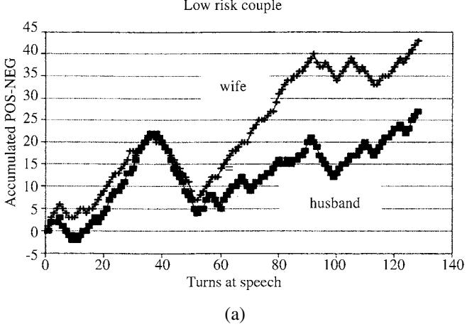

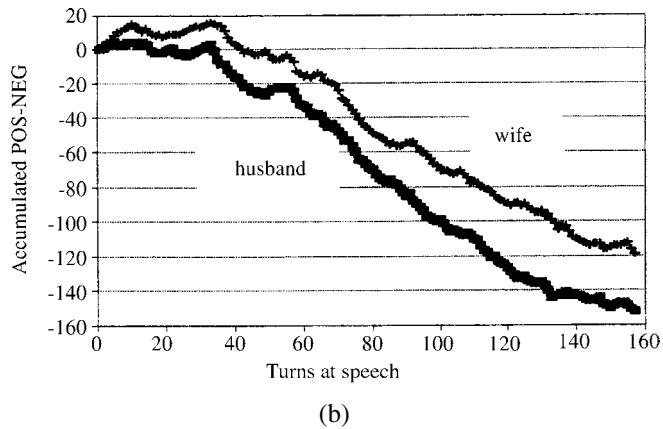

**Figure 5.1.** Cumulative RCISS speaker point graphs for a regulated (low risk) and a nonregulated (high risk) couple. Pos–Neg = Positive–Negative. (From Gottman and Levenson 1992. Copyright 1992 by the American Psychological Association and reproduced with permission.)

with 70% of the high risk couples, (ii) 17% of the low risk as compared with 37% of the high risk couples separated in the four-year period, and (iii) 7% of the low risk and 19% of the high risk couples actually divorced. More extensive studies are reported in the book by Gottman et al. (2002).

#### *Observational Coding*

The couple was asked to choose a problem area to discuss in a 15-minute session; details of the exchange were tracked by video cameras. The problem area could be sex, money, in-laws, in effect any area they had a persistent problem with. The videotapes of the problem area interaction were coded using the following two observational coding systems. The RCISS provided the means for classifying couples into the regulated and nonregulated marital types, as well as providing base rates of specific positive and negative speaker and listener codes. Other marital codes were also used to give validity measures of the RCISS scoring. For the purposes of the modelling in this chapter we do not require these. They are discussed by Gottman and Levenson (1992); see also Cook et al. (1995) and Gottman et al. (2002). Figure 5.1 shows typical RCISS results for a low risk and a high risk couple.

One of the first things to disappear when a marriage is ailing is *positive affect*, particularly humor and smiling. In this chapter, the parameters of our equations, which we derive below, were also correlated with the amount of laughter (assessed with the RCISS), and the amount of smiling measured by coding facial expressions with Ekman and Friesen's (1978) Facial Action Coding System. Only what are called Duchenne smiles (which include both *zygomaticus*, which is the muscle from the zygomatic bone to the angle of the mouth, and contraction of the *orbicularis oculi*, which are the muscles around the eyes), were measured, since these have been found to be related to genuine felt positive affect.

### **5.2 Marital Typology and Modelling Motivation**

Gottman (1994) proposed and validated a typology of three types of longitudinally stable marriages and those couples heading for dissolution. There were three groups of stable couples: Validators, Volatiles, and Avoiders, who could be distinguished on problem-solving behaviour, specific affects, and on one variable designed to provide an index of the amount and timing of persuasion attempts.

There were two groups of unstable couples: Hostile and Hostile-detached, who could be distinguished from one another on problem-solving behaviour and on specific negative and positive affects; the hostile-detached group was significantly more negative (more defensive and contemptuous) than the hostile group and they were more detached listeners. Gottman (1993) reported that there was a rough constant that was invariant across each of the three types of stable couples. This constant, the ratio of positive to negative RCISS speaker codes during conflict resolution, was about 5, and it was not significantly different across the three types of stable marriages. Perhaps each adaptation to achieve a stable marriage represents a similar kind of adaptation, for each stable couple type, although the marriages were quite different. The volatile couples reach the ratio of 5 by mixing a lot of positive affect with a lot of negative affect. The validators mix a moderate amount of positive affect with a moderate amount of negative affect. The avoiders mix a small amount of positive affect with a small amount of negative affect. Each do so in a way that achieves roughly the same balance between positive and negative. We can speculate that each type of marriage has its risks, benefits and costs. It is possible to speculate about these risks, costs and benefits based on what we know about each type of marriage. The volatile marriage tends to be quite romantic and passionate, but has the risk of dissolving to endless bickering. The validating marriage (which is the current model used in marital therapy) is calmer and intimate; these couples appear to place a high degree of value on companionate marriage and shared experiences, not on individuality. The risk may be that romance will disappear over time, and the couple will become merely close friends. Couples in the avoiding marriage avoid the pain of confrontation and conflict, but they risk emotional distance and loneliness. Gottman (1994) also found that the three types of stable marriages differed in the amount and timing of persuasion attempts. Volatile couples engaged in high levels of persuasion and did so at the very outset of the discussion. Validators engaged in less persuasion than volatile couples and waited to begin their persuasion attempts until after the first third of the interaction. Conflict-avoiding couples hardly ever attempted to persuade one another. We wondered whether these five types of marriage could be discriminated using the parameters and functions derived from the mathematical modelling.

The goal of the mathematical modelling was to dismantle the RCISS point graphs of (unaccumulated) positive minus negative behaviours at each turn into components that had theoretical meaning; recall that Figure 5.1 is a graph of the *cumulated* data. This is an attempt at understanding the ability of these data to predict marital dissolution via the interactional dynamics. We begin with the Gottman–Levenson dependent variable and dismantle it into components that represent: (i) a function of interpersonal influence from spouse to spouse, and (ii) terms containing parameters related to an individual's own dynamics. This dismantling of RCISS scores into *influenced* and *uninfluenced* behaviour represents our theory of how the dependent variable may be decomposed into components that suggest a *mechanism* for the successful prediction of marital stability or dissolution. The qualitative portion of our equations lies in writing down the mathematical form of the influence functions.

An influence function is used to describe the couple's interaction. The mathematical form is represented graphically with the horizontal axis as the range of values of the dependent variable (positive minus negative at a turn of speech) for one spouse and the vertical axis the average value of the dependent variable for the other spouse's immediately following behaviour, averaged across turns at speech. This suggested that a discrete model is possibly more appropriate than a continuous one although recent work shows a continuous model is equally appropriate (K.-K. Tung, personal communication 2000). To illustrate the selection of an analytical form for the influence function, we can begin with the simple assumption that there is a threshold before a positive value has an effect in a positive direction and another threshold before a negative value has an effect in a negative direction. A more reactive spouse has a lower threshold of response. The parameters of these influence functions (for example, the point at which the spouse's negativity starts having an effect) might vary as a function of culture, marital satisfaction, the level of stress the spouses were under at the time, their individual temperaments and so forth. These latter ideas can be used at a later time to improve the model's generality and predictive ability. We then assume that the amount of influence will remain constant across the remainder of the ranges of the variable. This is, of course, only one kind of influence function that we could have proposed. For example, we could have proposed that the more negative the dependent variable, the more negative the influence, and the more positive the dependent variable the more positive the influence. Two options are depicted in Figure 5.2; Figure 5.2(a) shows an influence function that remains constant once there is an effect (either positive or negative), and Figure 5.2(b) shows an influence function in which the more positive the previous behaviour, the more positive the effect on the spouse, and the more negative the behaviour the more negative the effect on the spouse.

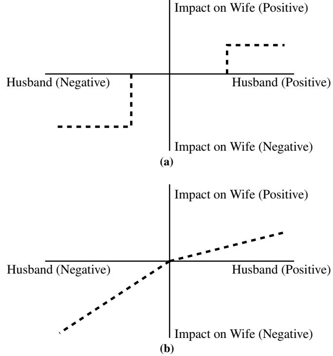

**Figure 5.2.** Two possible functional forms for the influence functions: For the influence function of the husband on the wife, the horizontal axis is the husband's previous RCISS score, *Ht* , the vertical axis is the influenced component, *IH W* (*Ht*+1), of the wife's following score, *Wt*+1. The wife's influence on the husband, *IW H* (*Wt*+1), could be graphed in a similar way. In (**a**) there is no influence unless the partner's previous score lies outside some range. Outside that range the influence takes either a fixed positive value or a fixed negative value. In (**b**) influence increases linearly with the value of the previous score, but negative scores can have either a stronger or less strong influence than positive scores. In both graphs, a score of zero has zero influence on the partner's next score (one of the assumptions of the model).

We begin with a sequence of RCISS scores *Wt* , *Ht* , *Wt*+1, *Ht*+1,... . In the process of modelling, two parameters are obtained for each spouse. One parameter is their emotional inertia (positive or negative), which is their tendency of remaining in the same state for a period of time, and their natural uninfluenced steady state, which is their average level of positive minus negative scores when their spouse's score was zero, that is, equally positive and negative.4 For purposes of estimation we assumed that zero scores had no influence on the partner's subsequent score. Having estimated these parameters

<sup>4</sup>This uninfluenced steady state need not be viewed as an individual variable, such as the person's mood or temperament. It could be thought of as the cumulative effect of both the marriage up to the time of observation as well as any propensities this individual has to act positively or negatively at this time. So, if a second interaction is observed (particularly following an intervention) it might be of some interest to attempt to predict changes in this parameter over time. It might be of some interest to determine the stability of a person's uninfluenced steady state across other relationships, for example, comparing marital, parent–child or friendship interactions.

from a subset of the data, we then subtracted the uninfluenced effects from the entire time series to reveal the influence function, which summarises the partner's influence. What emerges from our modelling is the influenced steady state (or states) of the interaction. In our marital interaction context this means a sequence of two scores (one for each partner) that would be repeated ad infinitum if the theoretical model exactly described the time series; if such a steady state (or states) is stable, then sequences of scores will approach the point over time. We thought it might be interesting to examine whether the influenced steady state was more positive than the uninfluenced steady state—that is, did the marital interaction pull the individual in a more positive or a more negative direction?

#### **5.3 Modelling Strategy and the Model Equations**

The modelling strategy follows the philosophy espoused in this book, in that we start by constructing fairly simple nonlinear models for what are clearly complex processes, namely, those involved in human relations. Usually the strategy of model construction is first to propose the simplest reasonable equations that encapsulate the key elements of the underlying biology. Subsequently, the models and their qualitative solutions are extended and amended by other factors and further information. So, here we also begin with as simple a model as is reasonable for marital interaction as reflected in the data from the laboratory experiments. We expect to extend the model equations by suggesting later that some of the parameters may not actually be fixed constants but may vary with other variables in the experiments.

We want the model to reproduce the sequence of RCISS speaker scores. We use a deterministic model, regarding any score as being determined only by the two most recent scores. In this way, we use a discrete model to describe the individual's level of positivity in each turn at speech. That is, we seek to understand interactions as if individual behaviour were based purely on predefined reactions to (and interpretations of) recent actions (one's own and one's partner's). This scenario may not be true in the main, but it may be true enough that the results of the model would then suggest underlying patterns that affect the way any particular couple interacts when trying to resolve conflict.5

We denote by *Wt* and *Ht* the husband's and wife's scores respectively at turn *t*, and assume that each person's score is determined solely by their own and their partner's previous score. The sequence of scores is then given by an alternating pair of coupled difference equations:

$$\begin{aligned} W_{l+1} &= f(W_l, H_l), \\ H_{l+1} &= g(W_{l+1}, H_l), \end{aligned} \tag{5.1}$$

<sup>5</sup>The form of the model is in marked contrast to game theory models, in which there is a presumed matrix of rewards and costs, and a goal of optimizing some value. We posit no explicit optimization or individual goal. Each individual simply has a natural state of positivity or negativity and an inertia (related to how quickly displacements from the natural state are damped out), on top of which the partner's influences and random factors act. We do not introduce any concept of a 'strategy.'

where the functions *f* and *g* have to be determined. The asymmetry in the indices is due to the fact that we are assuming, without loss of generality, that the wife speaks first. We therefore label the turns of speech *W*1, *H*1, *W*2, *H*2,... . To select a reasonable *f* and *g* we make some simplifying assumptions. First we assume that the past two scores contribute separately and that the effects can be added together. Hence, a person's score is regarded as the sum of two components, one of which depends on their previous score only and the other on the score of their partner's last turn of speech. We term these the *uninfluenced* and the *influenced* components, respectively.

Consider the uninfluenced component of behaviour first. This is the behaviour one would exhibit if not influenced by one's partner. It could primarily be a function of the individual rather than the couple, or, it could be a cumulative effect of previous interactions, or both. It seems reasonable to assume that some people would tend to be more negative when left to themselves while others would naturally be more positive in the same situation. This baseline temperament we term the individual's *uninfluenced steady state*. We suppose that each individual would eventually approach that steady state after some time regardless of how happy or how sad they were made by a previous interaction. The simplest way to model the sequence of uninfluenced scores is to assume that uninfluenced behaviour can be modeled by a simple linear equation:

$$P_{l+1} = r_l P_l + a_l,\tag{5.2}$$

where *Pt* is the score at turn *t*, *ri* determines the rate at which the individual returns to the uninfluenced steady state and *ai* is a constant. This equation can be solved by simply iterating. If *P*0 is the starting state at *t* = 0, we have

$$\begin{aligned} P_1 &= r_l P_0 + a \\ P_2 &= r_l P_1 + a = r_l [r_l P_0 + a] + a = r_l^2 P_0 + a(1 + r_l) \\ &\vdots \\ P_l &= r_l^l P_0 + a(1 + r_l + \dots + r_l^{l-1}) \\ &= r_l^l P_0 + \frac{a(1 - r_l^l)}{1 - r_l} .\end{aligned} \tag{5.3}$$

The parameter *ri* from now on will be referred to as the *inertia*. The uninfluenced steady state is given by setting *Pt*+1 = *Pt* = *P* and solving to get *P* = *ai*(1−*ri*) which is, of course, the limiting solution in (5.3) but only if *ri* is less than one. The behaviour depends crucially on the value of *ri* . If |*ri* | < 1, then the system will tend toward the steady state regardless of the initial conditions, while if |*ri* | > 1 the steady state is unstable.

Clearly the natural state needs to be stable so we are only interested in the case in which |*ri* | < 1. The magnitude of *ri* determines how quickly the uninfluenced state is reached from some other state, or how easily a person changes their frame of mind, hence the use of the word *inertia*. The larger *ri* is, the slower the convergence back to the steady state after a perturbation.

To select the form of the influenced component of behaviour, various approaches can be taken. The influence function is a plot of one person's behaviour at turn *t* on the horizontal axis, and the subsequent turn *t* + 1 behaviour of the spouse on the vertical axis. Averages are plotted across the whole interaction. The first approach is to write down a theoretical form for these influence functions (recall Figure 5.2). For example, we can posit a two-slope function of two straight lines going through the origin, with two different slopes, one for the positive range and one for the negative range. Another possible function is a sigmoidal, or *S*-shaped, figure which we can approximate by piecewise constant line segments. With this function, again around zero on the horizontal axis there is no influence, and there is an influence only after one passes some threshold in positivity after which the influence is positive and constant throughout the positive ranges. Similarly, on passing a threshold in negativity, the influence is negative and then constant throughout the negative range. Of course, other forms of the influence function are also reasonable; for example, one could combine the two functions and have a threshold and two slopes. We simply assume there are slopes for negative and positive influences only once the thresholds are exceeded. In line with the philosophy in this book, it is best to start with as simple a form as is reasonable which implies fewer parameters to estimate. The model can be made more complex later, once this complexity is shown to be necessary. In this chapter we discuss both the two-slope and the sigmoidal functions.

An alternative approach to the selection of influence functions is to make no attempt to predetermine the form of the function; Cook et al. (1995) in effect followed this approach. We expected the influence functions to vary from person to person and decided that one of the aims of the model building was to *uncover* the shape of the influence function from the data. In the first study we proceeded entirely empirically and used the data to reveal the influence functions. We summarised the results using a two-slope form of the influence function. This means that the goal of our mathematical modelling at this point is to generate theory. We denote the influence functions by *IAB*(*At*), the influence of person *A*'s state at turn *t* on person *B*'s state. With these assumptions the model is:

$$W_{l+1} = I_{HW}(H_l) + r_l W_l + a,\tag{5.4}$$

$$H_{l+1} = I_{WH}(W_{l+1}) + r_2 H_l + b.\tag{5.5}$$

Again, the asymmetry in the indices is due to the fact that we are assuming that the wife speaks first. The key problem now is the estimation of the four parameters,*r*1, *a*, *r*2, and *b*, and the empirical determination of the two unknown influence functions.

#### *Estimation of Parameters and the Influence Functions*

To isolate and estimate the uninfluenced behaviour we look only at pairs of scores for one person for which the intervening score of their partner was zero (about 15% of the data). For example, consider the procedure for determining the wife's parameters. We look at the subset of points (*Wt*+1, *Wt*) where *Ht* = 0 and so, by assumption, *IH W* = 0 and equation (5.4) becomes a linear (uncoupled) equation like (5.2). We then carry out a least squares fit to determine the parameters*r*1 and *a*1. We do the same for the husband's set of scores when *Wt* = 0 and determine *r*2 and *a*2 in exactly the same way.6 We can now calculate the uninfluenced steady states and inertia of each partner.

Once we have estimated the uninfluenced component of the scores we can subtract it from the scores at turn *t* + 1 to find the observed influenced component. That is, we compute *IH W* (*Ht*) = *Wt*+1 − *rt Wt* − *a*1 for each *Ht* . For each value of the husband's score during the conversation there is likely to be a range of observed values of the influence component due to noise in the data. To convert these into estimates for the influence function *IH W* (*Ht*) we simply average the observations for each of the husband's scores, *Ht* . We then do the same for the husband's influence function *IW H* (*Wt*) as a function of the wife's score *Wt* . In this way the raw influence data and the averaged influence function can be plotted for each member of each couple.

To validate the estimation process, we then form a reconstructed conversation from the model equations. We simply start by taking both people to be at their uninfluenced state (non-integer values are allowed in this reconstruction) and then iterate forwards for the approximately 80 turns of speech typically observed in 15 minutes. This is done by computing the components separately and then summing to generate the next score. The uninfluenced component is derived from linear equations like (5.2). The influenced behaviour is computed by simply rounding the partner's last score to the nearest integer and reading off the influence from that person's average influence function referred to above. The reconstructed conversation therefore lacks any randomness; we do not pretend that this 'expected' conversation would ever be observed in practice. Rather, it represents an underlying trend.

#### **5.4 Steady States and Stability**

For each couple we plot the model's null clines in the (*Wt* ,*Ht*) phase plane. Here, a point in the plane is the pair of numbers representing the husband's and the wife's scores for a particular interaction (a two-turn unit). As time progresses, this point moves, and traces out a trajectory in phase space. We are interested in the stability of the steady states, the points where the null clines intersect. These steady states are clearly very important since they provide crucial information on the state of the marriage, and on guiding potential repair therapy. Since the null clines are obtained from the data we determine the steady states by looking for the intersections of the null clines in the usual way. Here, however, we have coupled discrete equations and so must consider what we mean by a null cline for such equations. Recall what a null cline is from Chapter 3. They are curves in the phase plane where values stay the same over time. A person's null cline is a function of their partner's last score and gives the value of their own score when this is unchanged over one iteration, in other words when *Wt*+1 = *Wt* and *Ht*+1 = *Ht* . As we saw in Chapter 3, plotting null clines provides a simple graphical means of determining

<sup>6</sup>If these zero influence points were rare, it would be hard to obtain accurate estimates for the model parameters since the confidence intervals around these parameters would be large. While it seems like a strong assumption, the assumption that zero scores have zero influence is arbitrary. We could assume nonzero influences, make these additional parameters, and estimate these parameters as well. In fact, an asymmetry in these parameters would be theoretically interesting in characterizing a couple's interaction. In the interest of parsimony, we took these parameters to be zero.

steady states. From (5.4) and (5.5) the null clines *NH W* and *NW H* are given respectively by

$$N_{HW}:\ W(H_l) = \frac{I_{HW}(H_l) + a}{(1 - r_l)}, \quad N_{WH}: H(W_l) = \frac{I_{WH}(W_l) + b}{(1 - r_l)}.\tag{5.6}$$

These equations are simply the influence functions respectively translated by the constants *a* and *b* and scaled by the constants 1 − *r*1 and 1 − *r*2. Steady states are then given by the intersections of the null clines, since, by definition, if the (*Wt*, *Ht*) started at such a point then it would stay there. The concept is exactly the same as for differential equations. Also, just as for these, the stability of the steady states provides crucial information. Since we have not specified the functional form of the influence functions analytically, we proceed qualitatively.

However, it is instructive to discuss what would happen if we settled on a functional form for the influence functions. For example, suppose we consider *IH W* (*Ht*) to be similar to the piecewise linear sigmoidal form illustrated in the upper figure in Figure 5.2 with a similar form for *IW H* (*Ht*). This assumption is reasonable since it presumes two thresholds of influence and that the influence is bounded in both negative and positive ranges. The pair of equations (5.6) can easily be solved graphically by simply plotting the influence functions and translating and stretching them according to (5.6). The steady states are given in the usual way by the points of intersections of the null clines.

These steady states, the intersection points, are where both the wife's and the husband's scores remain constant on consecutive turns of speech. These points we call the *influenced steady states*. If a couple were to reach one of these states during a conversation, whether or not they remain there with each partner scoring the same on each of their future turns of speech depends on the stability of the steady states. Although there may be several influenced steady states (depending on the influence functions and the uninfluenced parameters), to date we have usually found only one. Figure 5.3 is a possible null cline scenario in which there are 5 possible steady, influenced, states. With the typical form in the upper figure in Figure 5.2, the null clines, denoted by *NH W* and *NW H* , are illustrated in Figure 5.3.

We analyse the stability of the steady states below. We are familiar with the concept of stability and instability from the models we have discussed in earlier chapters. The concepts are exactly the same here except that we are dealing with RCISS scores. If a theoretical conversation were continued for some time, then pairs of scores would approach a stable steady state and move away from an unstable one. Although it is theoretically possible to have periodic behaviour we do not discuss this possibility here. Each stable steady state has a *basin of attraction*.

Let us now examine the stability of the steady states of *WS*, *HS* of (5.4) and (5.5). In the usual way we set

$$\begin{aligned} W_l &= W_\mathcal{S} + w_l \\ H_l &= H_\mathcal{S} + h_l, \end{aligned} \tag{5.7}$$

where | w*t* | and | *ht* | are small. Substituting these into (5.4) and (5.5), expanding in a Taylor series and keeping only linear terms, we get:

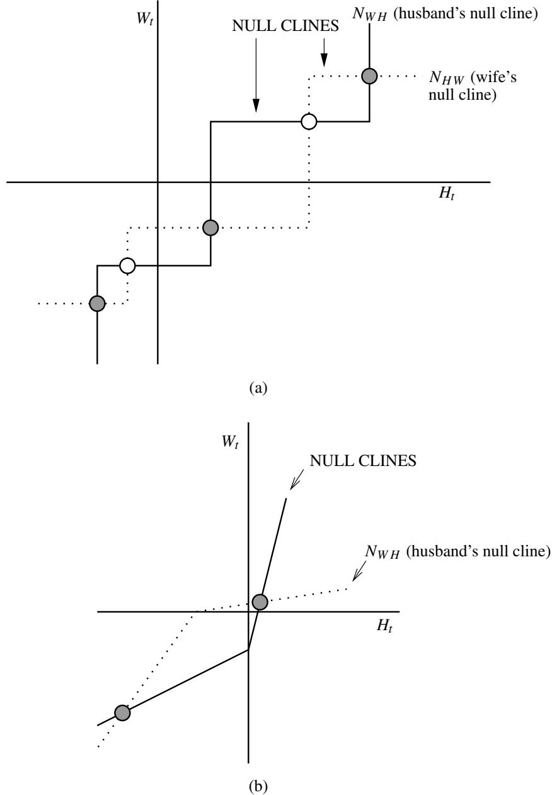

**Figure 5.3.** The null clines determine the steady states for typical piecewise linear forms of the influence functions as in Figure 5.2(a). The null clines have the same general shape as the influence function but are translated and stretched (see (5.6)). When the null clines are plotted against their respective axes, the steady states of the system are the points of intersection. In (**a**) the intersection of the two null clines shows that 5 steady states are possible with this form of the influence function; note that the influence functions of the wife and husband are plotted in mirror-image relationship. The stability of these is crucial. In (**b**) there are only 2 possible steady states (both of them cannot be stable). In (**a**) the stable steady states (filled circles) alternate with unstable steady states as we show in the text. Depending on the form of the interaction functions there are other possibilities.

$$\begin{split} W_{l+1} &= W_S + w_{l+1} = I_{HW}(H_S + h_l) + r_1(W_S + w_l) + a \\ &\approx I_{HW}(H_S) + h_l I_{HW}'(H_S) + r_1(W_S + w_l) + a, \end{split} \tag{5.8}$$

where *I*- *H W* (*HS*) is *d IH W* (*Ht*)/*d Ht* evaluated at the steady state *HS* and similarly for *I*- *W H* (*WS*). But *IH W* (*HS*) + *r*1*WS* + *a* = *WS* by definition of the steady state *WS*, so, the last equation simplifies to

$$w_{l+1} = r_l w_l + I_{HW}'(H_\mathbb{S}) h_l. \tag{5.9}$$

Similarly, with the husband's equation (5.5), we get

$$h_{l+1} = r_2 h_l + I_{WH}'(W_S) w_{l+1},\tag{5.10}$$

which on substituting for w*t*+1 gives, together with (5.9), the following system of linear difference equations,

$$
\begin{bmatrix} w_{l+1} \\\\ h_{l+1} \end{bmatrix} = \begin{bmatrix} r_1 & I_{HW}'(H_S) \\\\ r_1 I_{WH}'(W_S) & r_2 + I_{WH}'(W_S) I_{HW}'(H_S) \end{bmatrix} \begin{bmatrix} w_l \\\\ h_l \end{bmatrix} = M \begin{bmatrix} w_l \\\\ h_l \end{bmatrix}, \quad (5.11)
$$

where *M*, defined by (5.11), is the stability matrix.

In the usual way we look for solutions of (5.11) in the form

$$\begin{Bmatrix} w_l \\ \\ h_l \end{Bmatrix} \propto \lambda^l \tag{5.12}$$

and determine the λ. Since the system is second-order, there are in general two λ's. Stability is then obtained if the magnitude of both λ's (which can be positive or negative) is less than 1, since then the perturbation solutions of the form (5.12) decay as*t* increases and eventually tend to zero.

Substituting (5.12) into (5.11) requires the λ to be solutions of the determinant

$$\begin{array}{cc} r_1 - \lambda & I_{HW}'(H_S) \\\\ r_1 I_{WH}'(W_S) & r_2 + I_{WH}'(W_S) I_{HW}'(H_S) - \lambda \end{array} = 0,\tag{5.13}$$

that is

$$
\lambda^2 - (r_1 + r_2 + I_{WH}' I_{HW}')\lambda + r_1 r_2 = 0
$$

and so the λ's are

$$\lambda_1, \lambda_2 = \frac{1}{2} \left[ (r_1 + r_2 + I_{WH}' I_{HW}') \pm \left\{ (r_1 + r_2 + I_{WH}' I_{HW}')^2 - 4r_1 r_2 \right\}^{1/2} \right]. \tag{5.14}$$

The solutions for the perturbations w*t* and *ht* are then given by

$$
\begin{bmatrix} w_l \\\\ h_l \end{bmatrix} = \mathbf{A}\lambda_1^l + \mathbf{B}\lambda_2^l,\tag{5.15}
$$

where **A**, **B** are constant column matrices. If | λ1 | > 1 or | λ2 | > 1, then w*t* and *ht* will grow with each increase in *t* and the steady state is linearly unstable. Stability therefore requires

$$-1 < \lambda_1 < 1 \quad \text{and} \quad -1 < \lambda_2 < 1,\tag{5.16}$$

in which case w*t* and *ht* tend to zero as *t* increases.

We now substitute the expressions for λ1 and λ2 from (5.14) into (5.16) to obtain the conditions on *r*1, *r*2, *I*- *H W* (*HS*) and *I*- *W H* (*WS*) for stability of the steady state *WS*, *HS*. Although we can do this for general *r*1 and *r*2, there is little point since we know that 0 ≤ *r*1 < 1 and 0 ≤ *r*2 < 1. If either were greater than 1 there would be no uninfluenced steady state, since from (5.3), it (the *Pt*) would get infinitely large for *t* large. So with these practical restrictions, dictated by the model (and actually confirmed by the data), we need consider only nonnegative *r*1 < 1 and *r*2 < 1.

The stability condition is then given by requiring the square bracket in (5.14) to be less than 2. A little algebra shows that we must have at the steady state *WS*, *HS*,

$$I_{WH}^{'}(W_S)I_{HW}^{'}(H_S) < (1 - r_1)(1 - r_2),\tag{5.17}$$

where *I*- *W H* (*WS*) = *d IW H* (*Wt*)/*dWt* evaluated at the steady state *WS*, *HS* and similarly for *I*- *H W* (*HS*). So, if we want to assess the stability of a steady state, we have to evaluate the derivatives of the influence functions and use (5.17).

In general, we can say that steep influence functions and high inertia, the *r*-parameters, are destabilizing for a steady state. Recall that high inertia means *r* close to 1. For example, if each influence function has a slope greater than one then the steady state would be unstable irrespective of inertia values. This agrees with our intuitive expectations if we interpret instability as the amplification of small perturbations. Influence is a measure of the effect that one partner has on the other and is so large that changes in influence will result in amplification, or mutual instability. On the other hand, even couples with relatively flat (low derivative) influence functions can have unstable steady states if either of the partners' inertia is high (close to 1).

Condition (5.17) can be interpreted graphically. The null clines could intersect either as shown in Figure 5.4(a) or (b). From (5.4) and (5.5), the equations for the null clines are (5.6); namely,

$$N_{HW}:\quad W = \frac{I_{HW}(H) + a}{(1 - r_1)},\quad N_{WH}:\quad H = \frac{I_{WH}(W) + b}{(1 - r_2)},\tag{5.18}$$

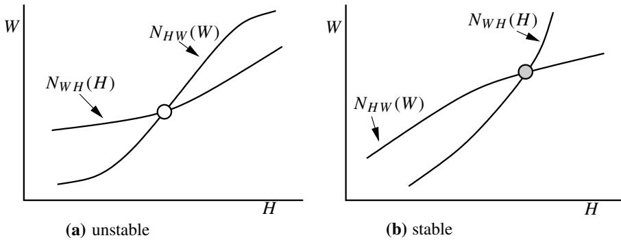

**Figure 5.4.** Null clines and the stability of steady states for the marriage model. Steady states correspond to points at which the null clines intersect. The stability of a steady state can be determined graphically (see text for details): when the null clines intersect as is shown in (**a**), the steady state is unstable; when they intersect as is shown in (**b**), the steady state is stable. *H* = Husband; *W* = Wife.

where *NH W* is the wife's null cline and *NW H* is the husband's. If we now take the derivatives of these, respectively, with respect to *H* and *W*, we get

$$\left\lfloor \frac{dW}{dH} \right\rfloor \text{ On wife's} \qquad \left\lfloor \frac{I_{HW}'(H)}{1 - r_1} , \quad \left\lfloor \frac{dH}{dW} \right\rfloor \text{ On husband's} \qquad \equiv \frac{I_{WH}'(W)}{1 - r_2}.$$

So, the stability condition (5.17) becomes simply

$$
\left[\frac{dH}{dW}\right] \text{ On husband's} \qquad \times \left[\frac{dW}{dH}\right] \text{ On wife's} \qquad < 1
$$

$$
\begin{array}{ll}
\text{null-cline,} & N_{WH}, \\
\text{at } W_{\mathcal{S}}, \; H_{\mathcal{S}} & \text{at } W_{\mathcal{S}}, \; H_{\mathcal{S}}
\end{array}
\qquad < 1
$$

as the conditions on the gradients at a steady state. With the axes chosen, namely, *W* the vertical axis and *H* the horizontal one, the last expression guaranteeing stability can be written as

$$
\mathbb{E}\left[\frac{dW}{dH}\right] \begin{array}{c} \text{On wife's} \\ \text{null-cline, } N_{HW}, \\ \text{at } W_S, H_S \end{array} < \begin{bmatrix} \text{dW} \\ \text{on husband's} \\ \text{null-cline, } N_{WH}, \\ \text{at } W_S, H_S \end{bmatrix} \text{s}
$$

So, all we need to do is evaluate the gradients and stability or instability is immediately obtained at each steady state. Let us now consider some examples using the null clines and steady states in Figures 5.4(a) and 5.4(b).

Consider first the positive steady state in Figure 5.4(a). By inspection, the gradient on the wife's null cline is greater than that on the husband's null cline. So the condition (5.19) is not satisfied and thus the positive steady state is unstable. If we now look at Figure 5.4(b) we see that condition (5.19) is satisfied so the steady state is stable.

Now consider Figure 5.3. At the open circle steady states the gradients are infinite so the stability criterion (5.19) is violated, so these are unstable steady states. On the other hand, the filled circles have zero gradients and (5.19) is satisfied so they are stable. As we now should expect, the steady states alternate in stability and instability. In conclusion then, under these conditions on the inertia parameter (0 ≤ *r*1 < 1, 0 ≤ *r*2 < 1) we can graphically determine not only the location of the steady states but also their stability. A simple corollary to this null cline intersection stability condition is that the stable and unstable steady states must alternate; that is, any two stable steady states are separated by an unstable one and vice versa. If we assume that the influence functions are monotonic increasing functions then the steady states can be ordered. By this we mean that the steady state values, *WS* and *HS*, will both increase as we move from one steady state to the next. If we assume, as is reasonable, that influence functions saturate, then the highest and lowest steady state are clearly stable (they must intersect as in Figure 5.4(b) (see also Figure 5.5): there must be an odd number of steady states that alternate between stable and unstable, with the first and last being stable. In all of the above, by stability we mean linear stability since it is clear that we can perturb a stable steady state so that it will fall in the basin of attraction of another stable steady state.

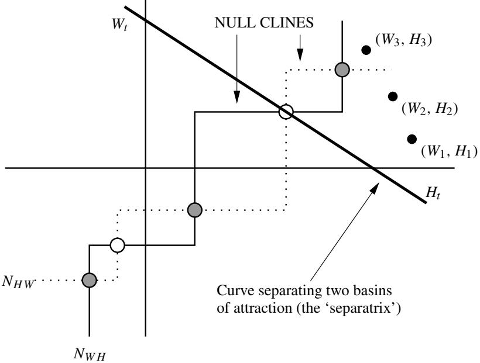

**Figure 5.5.** Null clines and a typical sequence of theoretical RCISS scores in the case of three steady states. The solid null cline is the husband's influence on the wife, while the dotted null cline is the wife's influence on the husband. Two stable steady states (large filled circles) are separated by an unstable steady state (large open circle). A possible sequence of scores is shown approaching the positive steady state (small filled circles). Each point corresponds to a consecutive pair of scores (*Wt*, *Ht*). Both stable steady states have a basin of attraction consisting of points starting from which a sequence of theoretical RCISS scores will approach the steady state in question. The separatrix curve delineating the basins of attraction is shown as a dotted line. Pairs of scores gradually approach one of the positive stable states; the long term behaviour of the sequence is therefore dependent upon the basin of attraction in which the initial pair of scores lies.

To determine the basins of attraction of each stable steady state we have to determine the separatrices. This, as in most differential equation systems, has to be done numerically. However, at least in the neighbourhood of each stable steady state we can get some idea of the strength of attraction. With differential equations, one way to measure the strength of attraction of a steady state is to construct an energy type of function, such as a Liapunov function. This is not always easy. For difference equation systems, such as we have in the marriage interaction model here, there is, as far as we know, no such equivalent. However, in the neighbourhood of a stable steady state, essentially in the linear neighbourhood, we can give a parameter which provides at least some comparative basis for the strength of the stable steady state attractor.

The linear perturbation solutions w*t* and *ht* about a steady state are given by (5.15). For stable steady states, | λ1 | < 1 and | λ2 | < 1. To be specific suppose | λ2 | < | λ1 |. As *t* increases the term involving λ*t* 1 eventually dominates the solution. The closer | λ1 | is to 1, the *slower* the perturbations about the steady state die out and hence the *weaker* is the attraction of the steady state. So, a measure, albeit a linear measure, of the strength, *S*, of an attracting stable steady state is given by

$$S = \text{maximum}(|\lambda_1| \text{ and } |\lambda_2|).$$

The closer *S* is to unity, the *weaker* is the attractor, or alternatively the closer *S* is to zero the stronger the attractor. This result may have considerable importance. For example, one effect of marital therapy may be to strengthen the positive attractor and weaken the negative attractor; we discuss the application of the theory to marital therapy below.

An example of a hypothetical sequence of scores is shown in Figure 5.5 approaching the more positive steady state. This *theoretical conversation* would be constructed by simply iterating equations (5.4) and (5.5) from some initial pair of scores. The potential existence of multiple stable steady states each with its own basin of attraction has practical implications. The model suggests that the final outcome (positive or negative trend) of a conversation could depend critically on the opening scores of each partner. Where one begins in the phase space is determined by the couple's actual initial conditions, in other words which basin of attraction you start in. We have generally found that the end points can depend critically on starting values.7

An observed or a 'reconstructed' conversation can be represented in the phase plane as a series of connected points. In addressing the issue of stability of the steady states, we are asking whether the mathematical equations imply that the reconstructed series will approach a given steady state. Analytically, we ask the question of where a steady state will move once it is slightly perturbed from its position. Of course the theoretical behaviour of the model in response to perturbations of the steady states is only possible once we have a functional form for the influence functions. For example, as we have

<sup>7</sup>Notwithstanding what has been termed the *punctuation fallacy*, in which where one starts in an interaction is quite arbitrary, we have found in practice that the couple's starting values of the interaction appear to be very important in determining the couple's eventual trajectory. We have considered modifying the influence functions to include a *repair component*, whose existence would be capable of moving a couple from a negative to a positive steady state. If there were a repair component operating, the cumulative graph could look like a check mark, starting downward and then changing direction. Unfortunately, this occurred in our data for only 4% of the cases. Perhaps effective marital therapy might add such a repair component to the influence functions. This is discussed in detail by Gottman et al. (2002).

noted, for the sigmoidal influence function, we can have 1, 3 or 5 steady states (see Figure 5.3). With the latter, from the null cline plot (see Figure 5.3) we can see that there are 3 stable and 2 unstable states.

What does it mean practically for there to be multiple steady states? These are all possible states for a particular couple. Even if we only observe the couple near one of them in our study, all are possible for this couple, given the equations. Each stable steady state will have a *basin of attraction.* This is the set of starting points from which a reconstructed time series will approach the steady state in question. If there is a single steady state, then its basin of attraction is the whole plane—that is, no matter what the initial scores were, the sequence would approach this one steady state. We have found this tendency toward a single steady state to be the usual situation in our data. If, on the other hand, there are two stable steady states (and, necessarily, one unstable one) the plane will be divided into two regions, the basins of attraction (see Figure 5.5). If the scores start in the first stable steady state's basin of attraction, then, in time, the sequence of scores will approach that steady state. The same goes for the second steady state and its basin of attraction. This situation is depicted in Figure 5.5. The couple begins at the point (*W*1, *H*1) in phase space, next moves to the point (*W*2, *H*2), and next moves to the point (*W*3, *H*3), and so on, heading for the large black dot that represents the stable steady state intersection of the two null clines. The eventual trend that the conversation follows can be highly dependent on the initial conditions. Thus, high inertia, high influence couples (who are more likely to have multiple steady states) could potentially exhibit a positive conversation on one day and yet not be able to resolve conflict on another. The only difference could be the way the conversation began (their initial RCISS scores). The influence functions and uninfluenced parameters would be identical on each day. This discussion makes concrete the general systems theory notion of *first-order* (or more superficial, surface structure) change and *second-order* (or more meaningful, deeper structure) change (Watzlawick et al. 1967). In our model, firstorder change means that the steady states may change but not the influence functions; second-order change would imply a change in the influence functions as well.

### **5.5 Practical Results from the Model**

#### *Influence Functions*

Note that influence functions are arbitrarily attributed to the influencer, although we recognize that the influenced spouse will also play a part in determining the influence. As a rough approximation to the shape of the influence functions, obtained from the data by least squares, we used the two-slope function and computed the slope of the influence function separately for negative and positive value of the partner's behaviour. The horizontal axis represented the range of positivity or negativity in each group. Only data close to the natural steady state for each group could be trusted to avoid infrequent numbers of instances of RCISS values within a group. This means that we get more reliable information for regulated couples in the positive ranges and for nonregulated couples in the negative ranges of the horizontal axis. Figure 5.6 is a summary of the empirically obtained functions for five groups of couples, the three stable marriages

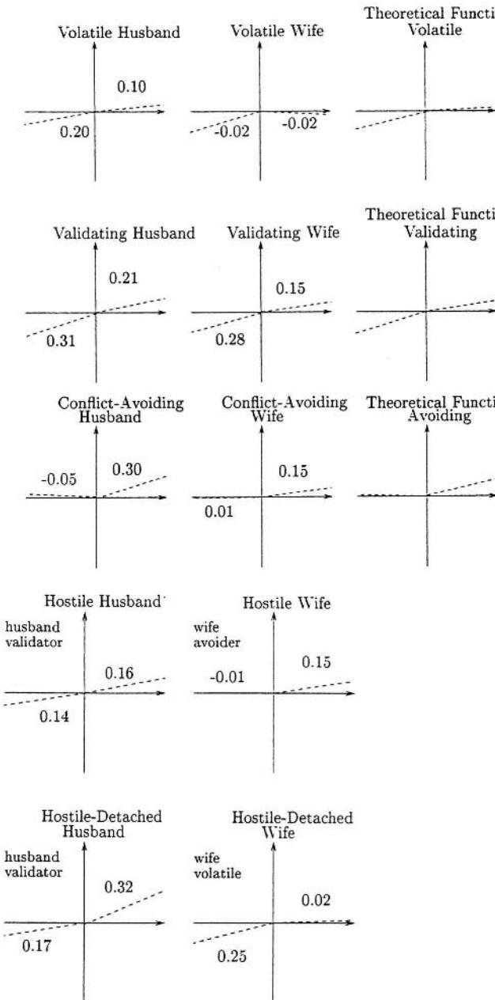

**Figure 5.6.** Empirically obtained influence functions using a two-slope bilinear functional form for the influence function. The top three marriage types all fall into the category of low risk marriages and it is possible to determine a theoretical influence function for each type of marriage. The bottom two belong to the high risk category of marriages: note the mismatch in slopes. For example, in the Hostile-Detached graphs the husband has an influence function characteristic of validator husbands while the wife has an influence function characteristic of avoiding wives. Because of this mismatch it is not possible to determine theoretical influence functions for these marriage types. (From Cook et al. 1995)

(Volatile, Validating and Avoiding), and for the two unstable marriages (Hostile and Hostile-Detached). For heuristic purposes we used the two-slope model of the influence function. We now discuss this figure. The top three graphs represent the influence functions for the three regulated marriages. The Validators have an influence function that creates an influence toward negativity in a spouse if the partner's behaviour is negative, and an influence toward positivity if the partner's behaviour is positive. Volatile and Conflict-Avoider influence functions appear to be, respectively, one half of the validators, with volatiles having the right half of the curve with a slope close to zero, and the Conflict-Avoiders having the left half with a slope near zero. This observation of matching functions is summarised in the third column, labelled *theoretical influence function.* Now examine the influence functions for the Hostile and the Hostile-Detached couples. It looks as if these data would support a mismatch hypothesis. Hostile couples appear to have mixed a Validator husband influence function with a Conflict-Avoider wife influence function, and Hostile-Detached couples appear to have mixed a Validator husband influence function with a Volatile wife influence function.

From examining the data, we can propose that validating couples were able to influence their spouses with both positive or negative behaviour; positive behaviour had a positive sloping influence while negative behaviour also had a positive sloping influence. This means that the negative horizontal axis values had a negative influence while the positive horizontal axis values had a positive influence. For validators, across the whole range of RCISS point values, the slope of the influence function was a constant, upwardly sloping straight line. The data might have been generated by the process that in validating low risk marriages there is a uniform slope of the influence function across both positive and negative values: Overall negative behaviour has a negative influence, while positive behaviour has a positive influence in low risk marriages. Here we see that a full range of emotional balance is possible in the interaction. However, avoiders and volatile couples were nearly opposite in the shape of their influence functions. Avoiders influenced one another only with positivity (the slope was flat in the negative RCISS point ranges), while volatile couples influenced one another primarily with negativity (the slope was flat in the positive RCISS point ranges). The influence function of the avoiding couple is nearly the reverse of that of the volatile couple.

#### *Mismatch Theory: The Possibility that Unstable Marriages Are the Results of Failed Attempts at Creating a Pure Type*

The shape of the influence curves leads us to propose that the data on marital stability and instability can be organized by the rather simple hypothesis that Hostile and Hostile-detached couples are simply failures to create a stable adaptation to marriage that is either Volatile, Validating, or Avoiding. In other words, the hypothesis is that the longitudinal marital stability results are an artifact of the prior inability of the couple to accommodate to one another and have one of the three types of marriage. For example, in the unstable marriage, a person who is more suited to a Volatile or a Conflict-Avoiding marriage may have married one who wishes a validating marriage. Their influence functions are simply mismatched.

These mismatch results are reminiscent of a well-known empirical observation in the area of marital interaction which is called the 'demand–withdraw' pattern. In this pattern one person wishes to pursue the issue and engage in conflict while the other attempts to withdraw and avoid the conflict. Gottman et al. (2002) suggest that the demand–withdraw pattern is an epiphenomenon of a mismatch between influence functions and that the underlying dynamic is that the two partners prefer different styles of persuasion. The person who feels more comfortable with Avoider influence patterns that only use positivity to influence will be uncomfortable with either Validator or Volatile patterns in which negativity is used to influence. Usually it is the wife who is the demander and the husband who is the withdrawer. These general results are consistent with the findings on criticism being higher in wives and stonewalling being higher in husbands.

Unfortunately, it is easier to propose this hypothesis than it is to test it. The problem in testing this hypothesis is that the marital interaction is a means for classifying couples. The result of this classification process is that the marriage is described as volatile, validating, or avoiding, rather than describing each person's style or preferences. What is needed to test this hypothesis is an independent method for classifying each person's conflict resolution style. To begin to test this hypothesis, we computed the difference between husbands and wives on the RCISS positive and negative speaker codes. If the mismatch hypothesis were true, we would expect that the results of an analysis of variance between the groups would show greater discrepancies between husbands and wives for the hostile and hostile-detached group than for the three stable groups. This was indeed the case as found by Cook et al. (1995) who pooled the stable groups into one group and the unstable groups into another. Thus, it could be the case that the unstable groups are examples of discrepancies in interactional style between husbands and wives that are reflective of their differences in preferred type of marital adaptation. Or these differences may have emerged over time as a function of dissatisfaction.

This analysis is incomplete without a discussion of the other parameters of our model for these five groups of couples, namely, inertia and influenced and uninfluenced steady states. We should note that we present no statistical tests here. Our purpose is the qualitative description of the data for generating theory. By *theory* we mean a suggested mechanism for the Gottman–Levenson prediction of marital instability.

#### *Steady States and Inertia*

Table 5.1 summarises the mean steady states and inertias for the types of couples. Let us begin by examining the inertia parameter. Nonregulated couples have higher mean emotional inertia than regulated (low risk) couples; the differences are greater for wives than for husbands (a fourfold difference, 0.29 versus 0.07, respectively). Wives in nonregulated (high risk) marriages have greater emotional inertia than husbands, but this is not the case in regulated marriages. Both the influenced and uninfluenced steady states are more negative in nonregulated compared to regulated marriages, and this is especially true for wives (although we should reiterate that the influenced steady state is an attribute of the couple, not the individual). The three stable (Low Risk) types of couples also differed from each other. Volatile couples had the highest steady states, followed by Validators and then Avoiders. Also, the effect of influence in nonregulated marriages is to make the steady state more negative, while, in general, the reverse is true in regulated marriages. Perhaps it is the case that volatile couples need to have a very high steady state to offset the fact that they influence one another primarily in the negative range of their interaction. The behaviour of the wives was quite different from that of

|                         |         | Husband's<br>Steady<br>State |       | Wife's<br>Steady<br>State |         |       |
|-------------------------|---------|------------------------------|-------|---------------------------|---------|-------|
| Group                   | Inertia | Uninfl.                      | Infl. | Inertia                   | Uninfl. | Infl. |
| Low<br>Risk<br>Couples  |         |                              |       |                           |         |       |
| Volatile                | .33     | .68                          | .75   | .20                       | .68     | .61   |
| Validating              | .37     | .38                          | .56   | .14                       | .52     | .59   |
| Avoiding                | .18     | .26                          | .53   | .25                       | .46     | .60   |
| AVERAGE                 | .29     | .44                          | .61   | .20                       | .55     | .60   |
| High<br>Risk<br>Couples |         |                              |       |                           |         |       |
| Hostile                 | .32     | .10                          | .03   | .51                       | −.64    | −.45  |
| Host-Det.               | .40     | −.42                         | −.50  | .46                       | −.24    | −.62  |
| AVERAGE                 | .36     | −.16                         | −.24  | .49                       | −.44    | −.54  |

**Table 5.1.** Parameter estimates in the mathematical modelling of the RCISS unaccumulated point graphs.

Host-Det. = Hostile-Detached Couples

Uninfl. = Uninfluenced

Infl. = Influenced

the husbands. Wives in regulated marriages had a steady state that was equal to or more positive than their husbands. However, wives in hostile marriages had a steady state that was more negative than their husbands, while the reverse was true in hostile-detached marriages. The steady states of wives in nonregulated marriages were negative, and more negative than the steady states of wives in regulated marriages. Wives in hostile marriages had a more negative steady state than wives in hostile-detached marriages.

#### *Parameters and Divorce Prediction*

For predicting marital dissolution, these results, when used in conjunction with the results in Gottman and Levenson (1992) suggest that: (i) the regulated–nonregulated classification (which was the Gottman–Levenson predictor of marital dissolution) is related to the wife's emotional inertia, and to both the husband and wife's uninfluenced steady states; and, (ii) both the husbands' and wives' steady states are significantly predictive of divorce. We (Gottman et al. 2002) have recently extended our analysis to study the marital interactions of newlyweds and found that couples who eventually divorced in the first few months of marriage initially had more negative uninfluenced husband and wife steady states, more negative influenced husband steady state and lower negative threshold in the influence function.

We can get some idea of how a parameter variation could have catastrophic consequences. Let us consider, by way of example, influence functions similar to those in Figure 5.2(a) with multiple steady states. Let us suppose that the marriage has multiple possible stable steady states and it is at the stable positive steady state in Figure 5.5. If the null clines become displaced as shown in Figure 5.7 the sequential pathway of any

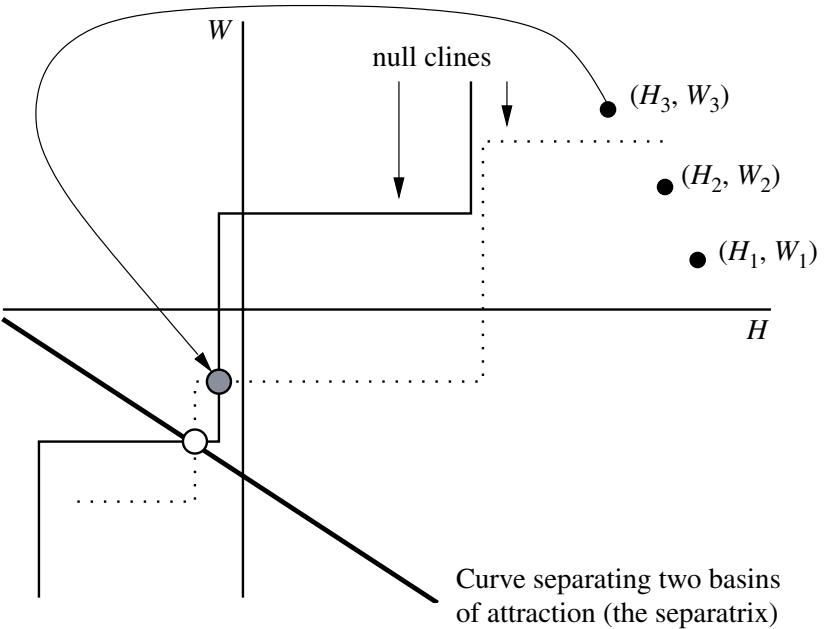

**Figure 5.7.** A change in one or both of the null clines can affect both the number and stability of the steady states. If the null cline situation changes in Figure 5.3(a) to that shown here the stable positive steady state disappears and the solution pathway moves into the basin of attraction of the negative steady state.

conversation which starts above the separatrix will move into the basin of attraction of the negative steady state, a recipe for divorce. Even with the simpler bilinear form of the interaction functions the same situation can occur. There is a direct relation between the parameters and the number of steady states so some aspects of marital therapy can be focused in restoring the existence of a positive steady state.

For future research, we would like to know to what extent uninfluenced steady states are independent of partner or independent of conversation—that is, to what extent are they intrinsic to the individual, and to what extent do they describe a cumulative quality of the relationship?

*Emotional Inertia.* This is clearly an important parameter in marital interaction. When another coding system (called the MICS system) is used (it measures criticism, withdrawal (of attention), defensiveness and contempt) with the data from Gottman and Levenson (1992), the husband's inertia was related to his criticism in the interaction while the wife's inertia was related to his withdrawal and to her own contempt. For the RCISS codes, the husband's inertia was related to their contempt and the wife's inertia was related to all the subscales of the RCISS.

*Steady States.* For the MICS coding, the husbands' steady state variable was related to their criticism, contempt, and withdrawal and to the wives' criticism and withdrawal. For this MICS coding, the wives' steady state variable was related to all the variables for both spouses. For the RCISS coding, the husbands' steady state was related to all of their behaviour and to all of the wives' behaviour except for criticism; the wives' steady state was related to all the husbands' codes except for criticism and to all the wives' codes.

*Positive Affect.* Cook et al. (1995) also observed the following relationships. Wives with more emotional inertia made fewer Duchenne smiles than wives with less emotional inertia. Husband and wife steady states were related to fewer Duchenne smiles, but only for wives. On the RCISS scores, husbands with higher steady states laughed more, while wives laughed more when either the husband's or the wife's steady state was higher.

#### **5.6 Benefits, Implications and Marriage Repair Scenarios**

The purpose of the dynamic mathematical modelling proposed in this chapter was to generate theory that might explain the ability of the RCISS point graphs to predict the longitudinal course of marriages. We found that the uninfluenced steady state, when group averaged, was enough to accomplish this task. This alone is an interesting result. Subsequent attempts at theory construction may profit from making this parameter a function of other dynamic (time-varying) variables in the experiment such as indices of physiological activity. Perhaps the uninfluenced steady state represents a cumulative summary of the marriage and reflects what each individual brings to each marital conflict discussion. It might be useful to study what other variables (for example, stress, coping, power differences) are related to this index.

Gottman (1994), on the basis of the interactive behaviour on the RCISS scoring of the initial interview of the couple as reported in Gottman and Levenson (1992), described three distinct types of couples who were more likely to have stable marriages and two groups of couples who were more likely to have unstable marriages. In this chapter we examined the influence functions for these five groups of couples and suggested that the influence functions might provide insight into the classification. Validating couples seemed to have a pattern of linear influence over the whole range of their interaction; when they were more negative than positive they had a negative impact on their partner's subsequent behaviour, and, conversely, when they were more positive than negative they had a positive impact on their partner's behaviour. Conflict-avoiding couples, on the other hand, resembled validating couples, but only in the positive ranges of their behaviour. In the negative ranges they had nearly no influence on their spouses. Volatile couples resembled couples headed for marital dissolution in that they had no influence in the positive ranges of their partner's behaviour. They differed from this group of couples only in having a more positive uninfluenced steady state.

These results provide insight into the potential costs and benefits of each type of stable marriage. The volatile marriage is clearly a 'high risk' style. Without the high level of positivity, volatile couples may drift to the interactive style of a couple headed for dissolution. The ability to influence one another only in the negative ranges of their behaviour may suggest a high level of emphasis on change, influence, and conflict in this type of marriage. However, the conflict-avoiding style seems particularly designed for stability without change and conflict. The validating style seems to combine elements of both styles, with an ability to influence one another across the entire range of interactive behaviour. On the other hand, the marriages headed for dissolution had influence functions that were mismatched. In the hostile marriage the husband, as with a validating husband, influenced his wife in both the positive and the negative ranges but she, as with a conflict-avoider, only influenced him by being positive. If we can generalize from validator and avoiding marriages, the wife is likely to seem quite aloof and detached to the husband, while he is likely to seem quite negative and excessively conflictual to her. In the hostile-detached marriage we see another kind of mismatch. The husband, again as with a validating husband, influenced his wife in both the positive and the negative ranges but she, as with a wife in a volatile marriage, only influenced him by being negative. If we can generalize from validator and volatile marriages, he is likely to seem quite aloof and detached to her, while she is likely to seem quite negative and excessively conflictual to him. These two kinds of mismatches are likely to represent the probable mismatches that might survive courtship; we do not find a volatile style and a conflict-avoiding style within a couple in our data; perhaps they are just too different for the relationship to survive, even temporarily. These results suggest evidence for a mismatch of influence styles in the marriage being predictive of marital instability. This is an interesting result in the light of the general failure or weak predictability of mismatches in personality or areas of agreement in predicting dissolution (Fowers and Olson 1986; Bentler and Newcomb 1978); it suggests that a study of process may be more profitable in understanding the marriage than a study of individual characteristics.

What have we gained from our mathematical modelling approach? As soon as we write down the deterministic model we already gain a great deal. Instead of empirical curves that predict marital stability or dissolution, we now have a set of concepts that could potentially explain the prediction. We have parameters of uninfluenced steady state, influenced steady state, emotional inertia and the influence functions. We gain a language, and one that is precise and mathematical for talking about the point graphs. Marriages that last have more positive uninfluenced steady states. Furthermore, interaction usually moves the uninfluenced steady states more positive, except for the case of the volatile marriage, in which the only way anyone influences anyone else is by being negative—in that case a great deal of positivity is needed to offset this type of influence function. Marriages that last have less emotional inertia, they are more flexible, less predictable, and the people in them are more easily moved by their partners. Depending on the type of marriage the couple has, the nature of their influence on one another is given by the shape of the influence functions. We hypothesize that couples headed for divorce have not yet worked out a common influence pattern, and that most of their arguments are about differences in how to argue, about differences in how to express emotion, and about differences in issues concerning closeness and distance; all these are entailed by mismatches in influence functions (see Gottman 1994). Of course, we have no way of knowing from our data whether the mismatches in influence functions were there at the start of the marriage, or emerged over time. We are currently studying these processes among newlyweds as they make the transition to parenthood.

As a new methodology for examining an experimental effect and building theory, we suggest that the use of these model equations is a method that can help a researcher get at the mechanism for an observed effect, as opposed to using a statistical model. A statistical model tells us whether variables are related but it does not propose a mechanism for understanding this relationship. For example, we may find that socioeconomic status is related to divorce prediction, but we will have no insight from this fact as to

how this effect may operate as a mechanism to explain marital dissolution. The difference equation model approach here is able to suggest a theoretical and mathematical language for such a theory of mechanism. The mathematical model differs fundamentally from a statistical model in presenting an equation linking a particular husband and wife over time, instead of a representation of husbands and wives, aggregated across couples as well as time.

The use of the sigmoidal influence function is a next step in developing the model. To accomplish this next step we need to use an observational system that provides much more data than the RCISS. Gottman (1994) found that the Specific Affect Coding System (SPAFF) is highly correlated with the RCISS speaker slopes, and the advantages of the SPAFF are that the couple's interaction can be coded online in real time, without a transcript, and the data are summarised second-by-second instead of at each turn of speech; thus the SPAFF will make it possible to obtain much more data for each couple. With the sigmoidal influence function, there is the possibility of 5 steady states (five intersection points for the null clines), 3 of which are stable. The possible existence of more than one stable steady state for a given couple can be inferred from their data once we have written down the model. This means that we can describe the couple's behaviour even in conditions in which they have not been observed in our study. So, the model can be used to create simulations of that couple's interaction that go beyond our data.

By varying parameters slightly we can even make predictions of what will happen to this couple if we could change specific aspects of their interaction, which is a sort of quantitative thought experiment of what is possible for this particular couple. We are currently using this approach in a series of specific intervention experiments designed to change a couple's second interaction about a particular issue. The model can be derived from the couple's first interaction in the laboratory, and the intervention designed to change a model parameter (whether it does or not could be assessed). Coupled with an experimental approach, we can test whether the mechanism for change described by the model is accurate by seeing if the model's predictions of what would happen when a model parameter changed is accurate. In this way the model can be tested and expanded by an interplay of modelling and experimentation.

The qualitative assumptions that form the underpinnings of this effort are also laid bare by the process. For example, the choice of the shape of the influence functions can be modified with considerable effect on the model. Following our qualitative approach, subsequent correlational data can quantitatively test the theory. This can proceed in two ways: the influence functions can be specified in functional (mathematical or graphical) form; and the equations themselves can be made progressively more complex, as needed. To date our empirical fitting of this has suggested that the sigmoidal form would best fit the data.

One simple way we suggest changing the equations is to assume that the parameters are not fixed constants, but instead are functions of other more fundamental theoretical variables. In the Gottman–Levenson paradigm there are two central classes of variables we wish to consider. The first class of variables indexes the couple's physiology, and the second class of variables indexes the couple's perception of the interaction derived from our video recall procedure. We expect that physiological measures that are indicative of diffuse physiological arousal (Gottman 1990) will relate to less ability to process information, less ability to listen, and greater reliance on behaviours that are more established in the repertoire in upsetting situations (for example, fight or flight). Hence, it seems reasonable to predict that measures indicative of more diffuse physiological arousal may predict more emotional inertia. Similarly, we expect that a negative perception of the interaction would go along with feeling flooded by the negative affect (see Gottman 1993) and negative attributions (see Fincham et al. 1990) of one's partner. Hence, it seems reasonable to predict that variables related to the video recall rating dial would predict the uninfluenced steady state. If someone has an interaction with their spouse that one rates negatively, the next interaction may be characterized by a slightly less positive uninfluenced steady state. The uninfluenced steady state, to some extent, may index the cumulative effects of the marital balance of positivity over negativity, integrated over time. There is also the possibility that the uninfluenced steady state might best be understood by an integration of personality traits with marital interaction patterns.

It is interesting to note that the model is, in some ways, rather grim. Depending on the parameters, the initial conditions determine the eventual slope of the cumulative RCISS curves. Unfortunately, this is essentially true of most of our data. However, another way the model can be developed further is to note that a number of couples began their interaction by starting negatively but then changed the nature of their interaction to a positively sloping cumulative RCISS point graph; their cumulative graph looked somewhat like a check mark. This was quite rare (characterizing only 4% of the sample), but it did characterize about 14% of the couples for at least part of their interaction. This more optimistic type of curve suggests adding to the model the possibility of repair of the interaction once it has passed some threshold of negativity. This addition could be incorporated by changing the influence function so that its basic sigmoidal shape had the possibility of a repair jolt (or perhaps 'repair nudge' would be closer to the data) in the negative parts of the horizontal axis of Figure 5.2. The size of the repair jolts would add two other parameters to the model, each of which would have to be estimated from the data. The jolt would, however, have to be quite sizable to bring the couple far enough away from the zero stable steady state and toward the more positive stable steady state, that is, move from one basin of attraction to another. We might also then inquire as to what the correlates are of these repair jolts. This process would suggest some strength in the marriage that could be explored further; Gottman et al. (2002) discuss this in detail.

Finally, the potential precision of the equations suggests experiments in which only one parameter is altered and the effect of the experiment is assessed, thus refining the equation and potentially revealing the structure of the interaction itself. Here is how this would work. After a baseline marital interaction, a standard report based on the observational data would be used to compute the parameters of the model and the influence function. Then, an experiment could be done that changes one variable presumed to be related to the model parameters. For example, we would have participants either relax and lower their heart rates, or bicycle until their heart rates increased to 125 beats per minute; then they would have a second interaction, and the model parameters would be recomputed. Order could be counterbalanced. The experiment could reveal the functional relationship between heart rate and the inertia parameter. What is perhaps even more exciting is that the modelling process leads us naturally to design experiments. We think that this is so because we are modelling the mechanism. We are building a

theory and the theory naturally suggests experiments. Hopefully the experiments will help build the theory. So the process involves both the mathematics and the laboratory, and that is a new approach in the field of family psychology.

We plan to build this model in subsequent studies by continuous coding that would provide more reliable data for each individual couple, and more of them. This would also make it possible to move perhaps from difference to differential equations. The time delay (we used a delay of one time unit in this model) would then become a parameter for each couple; time delays, as we know, in differential equations are capable of generating periodic solutions of considerable complexity. The experiments we are conducting make simulations and subsequent tests of the model possible. What would happen, for example, if we successfully lowered only the couple's heart rate, and thus lowered their emotional inertia? Would other parameters of the model change? Would the influence functions change shape? Another development we plan is to study the newlywed couple's transition to parenthood, and the effects of the marital conflict on the developing family. When the baby is three-months old we will attempt to model triadic interaction with three equations, perhaps estimating key parameters from the dyadic marital interaction. A system of three nonlinear equations is capable of modelling many complex patterns, including chaos.

The mathematical approach to such basic psychological problems and human relations that we have discussed in this chapter is completely new and very much in the developmental stage. Some of the extensions just mentioned are discussed more fully together with other applications in the field of marital interaction in the book by Gottman et al. (2002). Perhaps the most encouraging aspect of this whole theoretical approach is that key elements of it have already been incoroporated in some clinical marital therapies with highly encouraging results (Dr. John M. Gottman, personal communication 2000).

# **6. Reaction Kinetics**

### **6.1 Enzyme Kinetics: Basic Enzyme Reaction**

Biochemical reactions are continually taking place in all living organisms and most of them involve proteins called *enzymes*, which act as remarkably efficient catalysts. Enzymes react selectively on definite compounds called *substrates*. For example, haemoglobin in red blood cells is an enzyme and oxygen, with which it combines, is a substrate. Enzymes are important in regulating biological processes, for example, as activators or inhibitors in a reaction. To understand their role we have to study enzyme kinetics which is mainly the study of rates of reactions, the temporal behaviour of the various reactants and the conditions which influence them. Introductions with a mathematical bent are given in the books by Rubinow (1975), Murray (1977) and the one edited by Segel (1980). Biochemically oriented books, such as Laidler and Bunting (1977) and Roberts (1977), go into the subject in more depth.

The complexity of biological and biochemical processes is such that the development of a simplifying model is often essential in trying to understand the phenomenon under consideration. For such models we should use reaction mechanisms which are plausible biochemically. Frequently the first model to be studied may itself be a model of a more realistic, but still too complicated, biochemical model. Models of models are often first steps since it is a qualitative understanding that we want initially. In this chapter we discuss some model reaction mechanisms, which mirror a large number of real reactions, and some general types of reaction phenomena and their corresponding mathematical realisations; a knowledge of these is essential when constructing models to reflect specific known biochemical properties of a mechanism.

#### *Basic Enzyme Reaction*

One of the most basic enzymatic reactions, first proposed by Michaelis and Menten (1913), involves a substrate *S* reacting with an enzyme *E* to form a complex *SE* which in turn is converted into a product *P* and the enzyme. We represent this schematically by

$$S + E \underset{k_{-1}}{\overset{k_1}{\rightleftharpoons}} SE \overset{k_2}{\rightarrow} P + E. \tag{6.1}$$

Here *k*1, *k*−1 and *k*2 are constant parameters associated with the rates of reaction; they are defined below. The double arrow symbol indicates that the reaction is reversible while the single arrow → indicates that the reaction can go only one way. The overall mechanism is a conversion of the substrate *S*, via the enzyme catalyst *E*, into a product *P*. In detail it says that one molecule of *S* combines with one molecule of *E* to form one of *SE*, which eventually produces one molecule of *P* and one molecule of *E* again.

The *Law of Mass Action* says that the rate of a reaction is proportional to the product of the concentrations of the reactants. We denote the concentrations of the reactants in (6.1) by lowercase letters

$$s = \text{[S]}, \quad e = \text{[E]}, \quad c = \text{[SE]}, \quad p = \text{[P]}, \tag{6.2}$$

where [ ] traditionally denotes concentration. Then the Law of Mass Action applied to (6.1) leads to one equation for each reactant and hence the system of nonlinear reaction equations

$$\begin{aligned} \frac{ds}{dt} &= -k_1 e s + k_{-1} c, \quad \frac{de}{dt} = -k_1 e s + (k_{-1} + k_2) c\\ \frac{dc}{dt} &= k_1 e s - (k_{-1} + k_2) c, \quad \frac{dp}{dt} = k_2 c. \end{aligned} \tag{6.3}$$

The *k*'s, called *rate constants*, are constants of proportionality in the application of the Law of Mass Action. For example, the first equation for *s* is simply the statement that the rate of change of the concentration [*S*] is made up of a loss rate proportional to [*S*][*E*] and a gain rate proportional to [*SE*].

To complete the mathematical formulation we require initial conditions which we take here as those at the start of the process which converts *S* to *P*, so

$$s(0) = s_0, \quad e(0) = e_0, \quad c(0) = 0, \quad p(0) = 0. \tag{6.4}$$

The solutions of (6.3) with (6.4) then give the concentrations, and hence the rates of the reactions, as functions of time. Of course in any reaction kinetics problem we are only concerned with nonnegative concentrations.

The last equation in (6.3) is uncoupled from the first three; it gives the product

$$p(t) = k_2 \int_0^t c(t') \, dt',\tag{6.5}$$

once *c*(*t*) has been determined, so we need only be concerned (analytically) with the first three equations in (6.3).

In the mechanism (6.1) the enzyme *E* is a catalyst, which only facilitates the reaction, so its total concentration, free plus combined, is a constant. This conservation law for the enzyme also comes immediately from (6.3) on adding the 2nd and 3rd equations, those for the free (*e*) and combined (*c*) enzyme concentrations respectively, to get

$$\frac{de}{dt} + \frac{dc}{dt} = 0 \quad \Rightarrow \quad e(t) + c(t) = e_0 \tag{6.6}$$

on using the initial conditions (6.4). With this, the system of ordinary differential equations reduces to only two, for *s* and *c*, namely,

$$\begin{aligned} \frac{ds}{dt} &= -k_1 e_0 s + (k_1 s + k_{-1}) c, \\ \frac{dc}{dt} &= k_1 e_0 s - (k_1 s + k_{-1} + k_2) c, \end{aligned} \tag{6.7}$$

with initial conditions

$$\mathbf{s}(0) = \mathbf{s}_0, \quad \mathbf{c}(0) = \mathbf{0}. \tag{6.8}$$

The usual approach to these equations is to assume that the initial stage of the complex, *c*, formation is very fast after which it is essentially at equilibrium, that is, *dc*/*dt* ≈ 0 in which case from the second of (6.7) we get *c* in terms of *s*,

$$c(t) = \frac{e_0 s(t)}{s(t) + K_m}, \quad K_m = \frac{k_{-1} + k_2}{k_1} \tag{6.9}$$

which on substituting into the first of (6.7) gives

$$\frac{ds}{dt} = -\frac{k_2 e_0 s}{s + K_m},\tag{6.10}$$

where *Km* is called the *Michaelis constant*. Since the enzyme is traditionally considered to be present in small amounts compared with the substrate the assumption is that the substrate concentration effectively does not change during this initial transient stage. In this case the (approximate) dynamics is governed by (6.10) with the initial condition *s* = *s*0. This is known as the pseudo- or quasi-steady state approximation. Solving (6.10) with the initial condition on *s*(*t*) we obtain an implicit solution; namely,

$$s(t) + K_m \ln s(t) = s_0 + K_m \ln s_0. \tag{6.11}$$

If we now substitute this into (6.9) we get an expression for the complex *c*(*t*). But this does not satisfy the initial condition on *c*(*t*) in (6.8). However, perhaps it is a reasonable approximation for most of the time; this is the belief in the usual application of this approach. In fact for many experimental situations it is sufficient, but crucially not always. There are in fact two timescales involved in this system: one is the initial transient timescale near *t* = 0 and the other is the longer timescale when the substrate changes significantly during which the enzyme complex is reasonably approximated by (6.9) with *s*(*t*) from (6.11). This basic reasoning raises several important questions such as (i) how fast is the initial transient; (ii) for what range of the parameters is the approximation (6.9) and (6.11) a sufficiently good one; (iii) if the enzyme concentration is not small compared with the substrate concentration, how do we deal with it?

Other questions arise, and are also dealt with, later. As a first step we must clearly nondimensionalise the system. There are several ways this can be done, of course. A key

dimensionless quantity is the time since the basic assumptions above depend on how short the transient period is. The standard way of doing the quasi-steady state analysis is to introduce dimensionless quantitites

$$\begin{aligned} \tau &= k_1 e \alpha t, \quad u(\tau) = \frac{s(t)}{s_0}, \quad v(\tau) = \frac{c(t)}{e_0}, \\\lambda &= \frac{k_2}{k_1 s_0}, \quad K = \frac{k_{-1} + k_2}{k_1 s_0} = \frac{K_m}{s_0}, \quad \varepsilon = \frac{e_0}{s_0} \end{aligned} \tag{6.12}$$

which is a reasonable nondimensionalisation if ε 1. Substituting these into (6.7) together with (6.8) gives the dimensionless system for the traditional quasi-steady state approximation

$$\begin{split} \frac{du}{d\tau} &= -u + (u + K - \lambda)v, \quad \varepsilon \frac{dv}{d\tau} = u - (u + K)v\\ u(0) &= 1, \quad v(0) = 0. \end{split} \tag{6.13}$$

Note that *K* − λ > 0 from (6.12). With the solutions *u*(τ), v(τ) we then immediately get *e* and *p* from (6.6) and (6.5) respectively.

From the original reaction (6.1), which converts *S* into a product *P*, we clearly have the final steady state *u* = 0 and v = 0; that is, both the substrate and the substrate– enzyme complex concentrations are zero. We are interested here in the time evolution of the reaction so we need the solutions of the nonlinear system (6.13), which we cannot solve analytically in a simple closed form. However, we can see what *u*(τ) and v(τ) look like qualitatively. Near τ = 0, *du*/*d*τ < 0 so *u* decreases from *u* = 1 and since there *d*v/*d*τ > 0,v increases from v = 0 and continues to do so until v = *u*/(*u* + *K*), where *d*v/*d*τ = 0 at which point, from the first of (6.13), *u* is still decreasing. After v has reached a maximum it then decreases ultimately to zero as does *u*, which does so monotonically for all *t*. The dimensional enzyme concentration *e*(*t*) first decreases from *e*0 and then increases again to *e*0 as *t* → ∞. Typical solutions are illustrated in Figure 6.1 below. Quite often a qualitative feel for the solution behaviour can be obtained from just looking at the equations; it is always profitable to try.

#### **6.2 Transient Time Estimates and Nondimensionalisation**

It is widespread in biology that the remarkable catalytic effectiveness of enzymes is reflected in the small concentrations needed in their reactions as compared with the concentrations of the substrates involved. In the Michaelis–Menten model in dimensionless form (6.13) this means ε = *e*0/*s*0 1. However, as mentioned above, it is not always the case that *e*0/*s*0 1. Segel (1988) and Segel and Slemrod (1989) extended the traditional analysis with a new nondimensionalisation which includes this case but which also covers the situation where *e*0/*s*0 = *O*(1). It is their analysis which we now describe.

We first need estimates for the two timescales, the fast transient, *tc*, and the longer, or slow, time, *ts*, during which *s*(*t*) changes significantly. During the initial transient the complex *c*(*t*) increases rapidly while *s*(*t*) does not change appreciably so an estimate of this fast timescale is obtained from the second of (6.7) with *s*(*t*) = *s*0, that is,

$$\frac{dc}{dt} = k_1 e_0 \mathbf{s}_0 - k_1 (\mathbf{s}_0 + K_m)c.\tag{6.14}$$

The solution involves an exponential, the timescale of which is

$$t_c = \frac{1}{k_1(\text{s}_0 + K_m)}.\tag{6.15}$$

To estimate the long timescale, *ts*, in which *s*(*t*) changes significantly we take the maximum change possible in the substrate, namely, *s*0, divided by the size of the maximum rate of change of *s*(*t*) given by setting *s* = *s*0 in (6.10). So,

$$t_s \approx \frac{s_0}{\left| \frac{ds}{dt} \right|_{\text{max}}} \approx \frac{s_0 + K_m}{k_2 s_0}.\tag{6.16}$$

One assumption on which the quasi-steady state approximation is valid is that the fast initial transient time is much smaller than the long timescale when *s*(*t*) changes noticeably which means that necessarily *tc ts*. With the expressions (6.15) and (6.16), this requires the parameters to satisfy

$$\frac{k_2 e_0}{k_1 (\text{s}_0 + K_m)^2} \ll 1. \tag{6.17}$$

Another requirement of the quasi-steady state approximation is that the initial condition for *s*(*t*) can be taken as the first of (6.8). This means that the substrate depletion *s*(*t*) during the fast transient is only a small fraction of *s*0; that is, | *s*/*s*0 | 1. An overestimate of *s*(*t*) is given by the maximum rate of depletion possible from the first of (6.7), which is *k*1*e*0*s*0 multiplied by *tc*. So, dividing this by *s*0 gives the following requirement on the parameters,

$$
\varepsilon = \frac{e_0}{s_0 + K_m} \ll 1.\tag{6.18}
$$

But condition (6.17), with *Km* from (6.9), can be written as

$$\frac{e_0}{s_0 + K_m} \cdot \frac{1}{1 + (k_{-1}/k_2) + (s_0 k_1/k_2)} \ll 1\tag{6.19}$$

so the condition in (6.18) is more restrictive than (6.19) which is therefore the condition that guarantees the quasi-steady state approximation. With this condition we see that even if *e*0/*s*0 = *O*(1), condition (6.19) can still be satisfied if *Km* is large as is actually the case in many reactions.

Since the nondimensionalisation depends crucially on the timescale we are focusing on, we have two timescales, *tc* and *ts*, from which we can choose. Which we use depends on where we want the solution: with *tc* we are looking at the region near *t* = 0 while with *ts* we are interested in the long timescale during which *s*(*t*) changes significantly. A problem which involves two such timescales is generally a *singular pertubation* problem for which there are standard techniques (see, for example, the small book by Murray 1984). We carry out, in detail, the singular pertubation analysis for such a problem in the following section.

If we use the fast transient timescale *tc* from (6.15) we introduce the following nondimensional variables and parameters,

$$\begin{aligned} u(\tau) &= \frac{s(t)}{s_0}, \quad v(\tau) = \frac{(s_0 + K_m)c(t)}{e_0 s_0}, \quad \tau = \frac{t}{t_c} = k_1(s_0 + K_m)t, \\\ K_m &= \frac{k_{-1} + k_2}{k_1}, \quad \rho = \frac{k_{-1}}{k_2}, \quad \sigma = \frac{s_0}{K_m}, \quad \varepsilon = \frac{e_0}{s_0 + K_m} \end{aligned} \tag{6.20}$$

which on substituting into (6.7) and (6.8) give

$$\begin{aligned} \frac{du}{d\tau} &= \varepsilon \left[ -u + \frac{\sigma}{1+\sigma} uv + \frac{\rho}{(1+\sigma)(1+\rho)} v \right] \\ \frac{dv}{d\tau} &= u - \frac{\sigma}{1+\sigma} uv - \frac{v}{1+\sigma} \\ u(0) &= 1, \quad v(0) = 0. \end{aligned} \tag{6.21}$$

With the long or slow timescale, *ts*, we nondimensionalise the time by writing

$$T = (1+\rho)t/t_s = \frac{(1+\rho)k_2e_0}{s_0+K_m}t = \varepsilon(1+\rho)k_2t. \tag{6.22}$$

The reason for the scale factor (1 + ρ) is simply for algebraic simplicity. With the dimensionless forms in (6.20) but with the dimensionless time *T* from the last equation, the model equations (6.7) become

$$\begin{aligned} \frac{du}{dT} &= -(1+\sigma)u + \sigma uv + \frac{\rho}{1+\rho}v, \\ \varepsilon \frac{dv}{dT} &= (1+\sigma)u - \sigma uv - v. \end{aligned} \tag{6.23}$$

We should keep in mind that the system we are investigating is (6.7). The three equation systems (6.13), (6.21) and (6.23) are exactly the same; they only differ in the way we nondimensionalised them, important though that is. They both have the small parameter, ε, but it appears in the equations in a different place. Where a small parameter appears determines the analytical procedure we use. We discuss a specific example in the next section and introduce asymptotic, or singular perturbation, techniques. These very powerful techniques provide a uniformly valid approximate solution for all time which is a remarkably good approximation to the exact solution of the system.

Before leaving the topic of nondimensionalisation it is relevant to ask what we must do if the enzyme is in excess such that ε in (6.20) is not small. This occurs in various enzyme reactions but also arises in a quite different situation involving T-cell proliferation in response to an antigen. This was studied by De Boer and Perelson (1994). Here the 'substrate' is a replicating cell, the 'enzyme' the site on the antigen-presenting cell and the 'complex' is the bound T-cell and antigen-presenting cell. The kinetics is represented by

$$E + S \overset{k_1}{\underset{k_{-1}}{\rightleftharpoons}} C \overset{k_2}{\rightarrow} E + 2S.$$

Borghans et al. (1996) investigated this reaction system in which the enzyme is in excess and extended the above analysis to obtain a uniformly valid asymptotic solution. They did this by replacing the substrate, *s*-equation in (6.7) by the equation for the total substrate,

$$
\bar{s}(t) = s(t) + c(t)
$$

which is given by adding the first and third equations in (6.3). The system they studied is this equation for *s*¯(*t*) and the third of (6.3) written in terms of *c* and *s*¯, together with the boundary conditions. It is

$$\frac{d\bar{s}}{dt} = -k_2 c, \quad \frac{dc}{dt} = k_1 \left[ (e_0 - c)(\bar{s} - c) - K_m c \right], \quad \bar{s}(0) = s_0, \quad c(0) = 0.$$

The analysis is a little more involved but the concepts are similar. They derive conditions for an equivalent quasi-steady state approximation and discuss several examples including a general class of predator–prey models.

#### **6.3 Michaelis–Menten Quasi-Steady State Analysis**

Here we carry out a singular perturbation analysis on one of the above possible dimensionless equation systems. The technique can be used on any of them but to be specific we carry out the detailed pedagogical analysis on (6.13) to explain the background reasoning for the technique and show how to use it. We thereby obtain a very accurate approximate, or rather asymptotic, solution to (6.13) for 0 < ε 1. Before doing this we should reiterate that the specific nondimensionalisation (6.12) is only one of several we could choose. In the following section we analyse a system, a somewhat more complex one, which arises in a class of practical enzyme reactions using the more general formulation, since there, *e*0/*s*0 is not small but *Km* is sufficiently large that ε as defined in (6.20) is small. Another practical reaction in which it is the large Michaelis constant *Km* which makes 0 < ε 1 was studied by Frenzen and Maini (1988), who used the same type of analysis we discuss in the case study in Section 6.4.

Let us consider then the system (6.13). Suppose we simply look for a regular Taylor expansion solution to *u* and v in the form

$$u(\tau;\varepsilon) = \sum_{n=0} \varepsilon^n u_n(\tau), \quad v(\tau;\varepsilon) = \sum_{n=0} \varepsilon^n v_n(\tau), \tag{6.24}$$

which, on substituting into (6.13) and equating powers of ε, gives a sequence of differential equations for the *un*(τ) and v*n*(τ). In other words we assume that *u*(τ ; ε) and v(τ ; ε) are analytic functions of ε as ε → 0. The *O*(1) equations are

$$\frac{du_0}{d\tau} = -u_0 + (u_0 + K - \lambda)v_0, \quad 0 = u_0 - (u_0 + K)v_0,\tag{6.25}$$

$$u_0(0) = 1, \quad v_0(0) = 0.$$

We can already see a difficulty with this approach since the second equation is simply algebraic and does not satisfy the initial condition; in fact if *u*0 = 1, v0 = 1/(1 + *K*) = 0. If we solve (6.25)

$$u_0 = \frac{u_0}{u_0 + K} \quad \Rightarrow \quad \frac{du_0}{d\tau} = -u_0 + (u_0 + K - \lambda)\frac{u_0}{u_0 + K} = -\lambda\frac{u_0}{u_0 + K}$$

and so

$$
\mu_0(\mathfrak{r}) + K \ln \mu_0(\mathfrak{r}) = A - \lambda \mathfrak{r},
$$

which is the same as (6.11). If we require *u*0(0) = 1 then *A* = 1. Thus we have a solution *u*0(τ), given implicitly, and the corresponding v0(τ),

$$u_0(\tau) + K \ln u_0(\tau) = 1 - \lambda \tau, \quad v_0(\tau) = \frac{u_0(\tau)}{u_0(\tau) + K},\tag{6.26}$$

which is the same as the solution (6.9). However, this solution is not a uniformly valid approximate solution for all τ ≥ 0 since v0(0) = 0. This is not surprising since (6.25) involves only one derivative; it was obtained on setting ε = 0 in (6.13). The system of equations (6.25) has only one constant of integration from the *u*-equation so it is not surprising that we cannot satisfy initial conditions on *both u*0 and v0.

The fact that a small parameter 0 < ε 1 multiplies a derivative in (6.13) indicates that it is a *singular perturbation* problem. One class of such problems is immediately recognised if, on setting ε = 0, the order of the system of differential equations is reduced; such a reduced system cannot in general satisfy all the initial conditions. Singular perturbation techniques are very important and powerful methods for determining asymptotic solutions of such systems of equations for small ε. Asymptotic solutions are usually remarkably accurate approximations to the exact solutions. A practical and elementary discussion of some of the key techniques is given in Murray's (1984) book on asymptotic analysis. In the following, the philosophy and actual technique of the singular perturbation method is described in detail and the asymptotic solution to (6.13) for 0 < ε 1 derived. The main reason for doing this is to indicate when we can neglect the ε-terms in practical situations.

Since the solution (6.26), specifically v0(τ), does not satisfy the initial conditions (and inclusion of higher-order terms in ε cannot remedy the problem) we must conclude that at least one of the solutions *u*(τ ; ε) and v(τ ; ε) is *not* an analytic function of ε as ε → 0. By assuming ε*d*v/*d*τ is *O*(*e*) to get (6.25) we tacitly assumed v(τ ; ε) to be analytic; (6.24) also requires analyticity of course. Since the initial condition v(0) = 0 could not be satisfied because we neglected ε*d*v/*d*τ we must therefore retain this term in our analysis, at least near τ = 0. So, a more appropriate timescale *near* τ = 0 is σ = τ/ε rather than τ ; this makes ε*d*v/*d*τ = *d*v/*d*σ. The effect of the transformation σ = τ/ε is to magnify the neighbourhood of τ = 0 and let us look at this region more closely since, for a fixed 0 < τ 1, we have σ 1 as ε → 0. That is, a very small neighbourhood near τ = 0 corresponds to a very large domain in σ. We now use this to analyse (6.13) near τ = 0, after which we shall get the solution away from τ = 0 and finally show how to get a uniformly valid solution for all τ ≥ 0.

With the transformations

$$
\sigma = \frac{\mathfrak{r}}{\mathfrak{s}}, \quad u(\mathfrak{r}; \mathfrak{s}) = U(\sigma; \mathfrak{s}), \quad v(\mathfrak{r}; \mathfrak{s}) = V(\sigma; \mathfrak{s}) \tag{6.27}
$$

the equations in (6.13) become

$$\frac{dU}{d\sigma} = -\varepsilon U + \varepsilon (U + K - \lambda) V, \quad \frac{dV}{d\sigma} = U - (U + K)V,\tag{6.28}$$

$$U(0) = 1, \quad V(0) = 0.$$

If we now set ε = 0 to get the *O*(1) system in a regular perturbation solution

$$U(\sigma;\varepsilon) = \sum_{n=0} \varepsilon^n U_n(\sigma), \quad V(\sigma;\varepsilon) = \sum_{n=0} \varepsilon^n V_n(\sigma), \tag{6.29}$$

we get

$$\begin{aligned} \frac{dU_0}{d\sigma} &= 0, & \frac{dV_0}{d\sigma} &= U_0 - (U_0 + K)V_0, \\ U_0(0) &= 1, & V_0(0) &= 0 \end{aligned} \tag{6.30}$$

which is *not* of lower order than the original system (6.28). The solution of (6.30) is

$$U_0(\sigma) = 1, \quad V_0(\sigma) = \frac{1}{1+K} (1 - \exp\left[-(1+K)\sigma\right]).\tag{6.31}$$

The last solution cannot be expected to hold for all τ ≥ 0, since if it did it would mean that *d*v/*d*σ = ε*d*v/*d*τ is *O*(1) for all τ . The part of the solution given by (6.31) is the *singular* or *inner* solution for *u* and v and is valid for 0 ≤ τ 1, while (6.26) is the *nonsingular* or *outer* solution valid for all τ not in the immediate neighbourhood of τ = 0. If we now let ε → 0 we have for a fixed 0 < τ 1, however small, σ → ∞. Thus in the limit of ε → 0 we expect the solution (6.26) as τ → 0 to be equal to the solution (6.31) as σ → ∞; that is, the singular solution as σ → ∞ matches the nonsingular solution as τ → 0. This is the essence of *matching* in singular perturbation theory. From (6.31) and (6.26) we see in fact that

$$\lim_{\sigma \to \infty} [U_0(\sigma), V_0(\sigma)] = \left[1, \frac{1}{1+K}\right] = \lim_{\tau \to 0} [\mu_0(\tau), \upsilon_0(\tau)].$$

Figure 6.1 illustrates the solution *u*(τ) and v(τ), together with the dimensionless enzyme concentration *e*/*e*0 given by the dimensionless form of (6.6); namely, *e*/*e*0 =

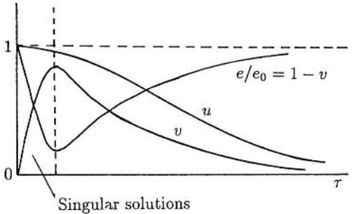

**Figure 6.1.** Schematic behaviour of the solutions of (6.13) for the dimensionless substrate (*u*), substrate–enzyme complex (v) and free enzyme (*e*/*e*0 = 1 − v) concentrations as functions of the time τ .

1 − v(τ). The thin *O*(ε) layer near τ = 0 is sometimes called the *boundary layer* and is the τ -domain where there are very rapid changes in the solution. Here, from (6.31),

$$\left. \frac{dV}{d\tau} \right|_{\tau=0} \sim \left. \varepsilon^{-1} \frac{dV_0}{d\sigma} \right|_{\sigma=0} = \left. \varepsilon^{-1} \gg 1. \right.$$

Of course from the original system (6.13) we can see this from the second equation and the boundary conditions.

To proceed in a systematic singular perturbation way, we first look for the outer solution of the full system (6.13) in the form of a regular series expansion (6.24). The sequence of equations is then

$$O(1): \quad \frac{du_0}{d\tau} = -u_0 + (u_0 + K - \lambda)v_0, \quad 0 = u_0 - (u_0 + K)v_0,$$

$$\begin{split} \frac{du_1}{d\tau} &= u_1(v_0 - 1) + (u_0 + K - \lambda)v_1, \\ \frac{dv_0}{d\tau} &= u_1(1 - v_0) - (u_0 + K)v_1, \end{split} \tag{6.32}$$

which are valid for τ > 0. The solutions involve undetermined constants of integration, one at each order, which have to be determined by matching these solutions as τ → 0 with the singular solutions as σ → ∞.

The sequence of equations for the singular part of the solution, valid for 0 ≤ τ 1, is given on substituting (6.29) into (6.28) and equating powers of ε; namely,

$$O(1):\quad \frac{dU_0}{d\sigma} = 0 \quad \frac{dV_0}{d\sigma} = U_0 - (U_0 + K)V_0,$$

$$\begin{split} \frac{dU_1}{d\sigma} &= -U_0 + (V_0 + K - \lambda)V_0, \\ \frac{dV_1}{d\sigma} &= (1 - V_0)U_1 - (V_0 + K)V_1, \end{split} \tag{6.33}$$

and so on. The solutions of these must satisfy the initial conditions at σ = 0; that is, τ = 0,

$$\begin{aligned} 1 &= U(0; \varepsilon) = \sum_{n=0} \varepsilon^n U_n(0) \quad \Rightarrow \quad U_0(0) = 1, \quad U_{n \ge 1}(0) = 0, \\ 0 &= V(0; \varepsilon) = \sum_{n=0} \varepsilon^n V_n(0) \quad \Rightarrow \quad V_{n \ge 0}(0) = 0. \end{aligned} \tag{6.34}$$

In this case the singular solutions of (6.33) are determined completely. This is not generally the case in singular perturbation problems (see, for example, Murray 1984). Matching of the inner and outer solutions requires choosing the undetermined constants of integration in the solutions of (6.32) so that to all orders of ε,

$$\lim_{\sigma \to \infty} [U(\sigma; \varepsilon), V(\sigma; \varepsilon)] = \lim_{\tau \to 0} [u(\tau; \varepsilon), v(\tau; \varepsilon)].\tag{6.35}$$

Formally from (6.32), but as we had before,

$$
\mu_0(\tau) + K \ln \mu_0(\tau) = A - \lambda \tau, \quad \nu_0(\tau) = \frac{\mu_0(\tau)}{\mu_0(\tau) + K},
$$

where *A* is the constant of integration we must determine by matching. The solution of the first of (6.33) with (6.34) has, of course, been given before in (6.31). We get it now by applying the limiting process (6.35) to (6.31) and the last equations

$$\begin{aligned} \lim_{\sigma \to \infty} V_0(\sigma) &= \frac{1}{1+K} = \lim_{\tau \to 0} v_0(\tau), \\ \Rightarrow \quad v_0(0) &= \frac{1}{1+K} = \frac{u_0(0)}{u_0(0) + K} \\ \Rightarrow \quad u_0(0) &= 1 \quad \Rightarrow \quad A = 1. \end{aligned}$$

We thus get the uniformly valid asymptotic solution for 0 < ε 1 to *O*(1), derived heuristically before and given by (6.26) for τ > 0 and (6.31) for 0 < τ 1, although the singular part of the solution is more naturally expressed in terms of 0 ≤ τ/ε < ∞.

We can now proceed to calculate *U*1(σ) and *V*1(σ) from (6.33) and *u*1(τ) and v1(τ) from (6.32) and so on to any order in ε; the solutions become progressively more complicated even though all the equations are linear. In this way we get a uniformly valid asymptotic solution for 0 < ε 1 for all τ ≥ 0 of the nonlinear kinetics represented by (6.13). In summary, to *O*(1) for small ε,

$$\begin{aligned} u(\mathbf{r};\varepsilon) &= u_0(\mathbf{r}) + O(\varepsilon), \quad u_0(\mathbf{r}) + K \ln u_0(\mathbf{r}) = 1 - \lambda \mathbf{r}, \\ v(\mathbf{r};\varepsilon) &= V_0(\sigma) + O(\varepsilon), \quad V_0(\sigma) = \frac{1}{1+K} \left( 1 - \exp\left[ -(1+K)\frac{\mathbf{r}}{\varepsilon} \right] \right), \\ & & \qquad 0 < \mathbf{r} \ll 1; \\ & & \qquad \mu_0(\mathbf{r}) \end{aligned} \tag{6.36}$$

$$=v_0(\tau) + O(\varepsilon), \quad v_0(\tau) = \frac{\mu_0(\tau)}{\mu_0(\tau) + K}, \quad 0 < \varepsilon \ll \tau.$$

Since in most biological applications 0 < ε 1, we need only evaluate the *O*(1) terms: the *O*(ε) terms' contributions are negligible.

To complete the analysis of the original kinetics problem (6.3) with (6.4), if we write the dimensionless product and free enzyme concentrations as

$$z(\tau) = \frac{p(t)}{s_0}, \quad w(\tau) = \frac{e(t)}{e_0}.$$

then, using (6.36) for *u* and v, (6.5) and (6.6) give

$$z(\tau) = \lambda \int_0^{\tau} v(\tau') \, d\tau', \quad w(\tau) = 1 - v(\tau).$$

The rapid change in the substrate–enzyme complex v(τ ; ε) takes place in dimensionless times τ = *O*(ε) which is very small. The equivalent dimensional time *t* is also very short, *O*(1/*k*1*s*0) in fact, and for many experimental situations is not measurable. Thus in many experiments the singular solution for *u*(τ) and v(τ) is never observed. The relevant solution is then the *O*(1) outer solution *u*0(τ), v0(τ) in (6.26), obtained from the kinetics system (6.13) on setting ε = 0 and satisfying only the initial condition on *u*(τ), the substrate concentration. In other words we say that the reaction for the complex v(τ) is essentially in a steady state, or mathematically that ε*d*v/*d*τ ≈ 0. That is, the v-reaction is so fast it is more or less in equilibrium at all times. This is the usual Michaelis and Menten's *pseudo-* or *quasi-steady state hypothesis*.

The form of (6.13) is generally like

$$\frac{du}{d\tau} = f(u, v), \quad \frac{dv}{d\tau} = \varepsilon^{-1} g(u, v), \quad 0 < \varepsilon \ll 1,\tag{6.37}$$

which immediately shows that *d*v/*d*τ 1 if *g*(*u*,v) is not approximately equal to zero. So the v-reaction is very fast compared with the *u*-reaction. The v-reaction reaches a quasi-steady state very quickly, which means that for times τ = *O*(1) it is essentially at equilibrium and the model mechanism is then approximated by

$$\frac{du}{d\tau} = f(u, v), \quad g(u, v) = 0, \quad u(0) = 1. \tag{6.38}$$

If we solve the algebraic equation *g*(*u*,v) = 0 to get v = *h*(*u*) then

$$\frac{du}{d\tau} = f(u, h(u)),\tag{6.39}$$

which is the rate or *uptake* equation for the substrate concentration. Much modelling of biological processes hinges on qualitative assumptions for the uptake function *f* (*u*, *h*(*u*)).

What is of interest biologically is the *rate of reaction*, or the rate of uptake; that is, *du*/*d*τ when *u*(τ) has been found. It is usually determined experimentally by measuring the dimensional substrate concentration *s*(*t*) at various times, then extrapolating back to *t* = 0, and the magnitude *r* of the initial rate [*ds*/*dt*]*t*=0 calculated. Since the time measurements are almost always for τ ε, that is, *t* 1/*k*1*s*0, which is usually of the order of seconds, the equivalent analytical rate is given by the *nonsingular* or *outer solution*. Thus, from the first of (6.36) the *O*(1) solution with 0 < ε 1 for the rate *r*, *r*0 say, is

$$r_0 = \left[\frac{d\mu_0(\tau)}{d\tau}\right]_{\tau=0} = \lambda \frac{\mu_0(0)}{\mu_0(0) + K_m} = \frac{\lambda}{1+K}.\tag{6.40}$$

In dimensional terms, using (6.12), the *O*(1) rate of reaction *R*0 is

$$R_0 = \frac{k_2 e_0 s_0}{s_0 + K_m} = \frac{Q s_0}{s_0 + K_m}, \quad K_m = \frac{k_{-1} + k_2}{k_1}, \quad Q = [R_0]_{\text{max}} = k_2 e_0,\tag{6.41}$$

where *Q* is the maximum velocity, or rate, of the reaction and *Km* is the *Michaelis constant* of (6.9). This rate, based on the pseudo-steady state hypothesis, is what is usually wanted from a biological point of view. From (6.13), the exact initial rate for the substrate is [*du*/*d*τ ]τ=0 = −1 while for the complex it is [*d*v/*d*τ ]τ=0 = 1/ε.

When the uptake of a substrate, or whatever, is described as a Michaelis–Menten uptake, what is understood is a rate of reaction like (6.41) and which is illustrated in Figure 6.2. The rate of reaction, which in fact varies with time, is the magnitude of *ds*/*dt* from the outer solution *du*0/*d*τ and written in dimensional form. Thus the (Michaelis– Menten) uptake of *S* is governed by the equation

$$\frac{ds}{dt} = -\frac{\mathcal{Q}s}{K_m + s}.\tag{6.42}$$

This is simply the dimensional form of (6.39) (and the same as (6.10)) on carrying out the algebra for *f* (*u*,v), *g*(*u*,v) in (6.38), with (6.13) defining them. For *s Km* the uptake is linear in *s*; the right-hand side of (6.42) is approximately −*Qs*/*Km*. The maximum rate *Q* = *k*2*e*0, from (6.41), depends on the rate constant *k*2 of the product reaction *SE* → *P* + *E*; this is called the *rate limiting* step in the reaction mechanism (6.1).

Useful and important as the quasi-steady state hypothesis is, something is lost by assuming ε*d*v/*dt* is negligible in (6.13) and by applying experimental results to a theory which cannot satisfy all the initial conditions. What can be determined, using experi-

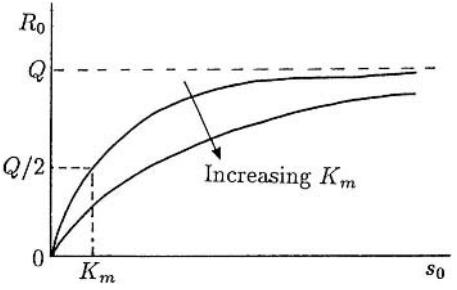

**Figure 6.2.** Michaelis–Menten rate of uptake *R*0 = *Qs*0/(*Km* + *s*0) as a function of the substrate concentration *s*0: *Q* is the maximum rate and *Km* is the Michaelis constant.

mental results with a Michaelis–Menten theory, is a curve such as in Figure 6.2, which gives values for the maximum rate *Q* and the Michaelis constant *Km*. This does not determine all three rate constants *k*1, *k*−1 and *k*2, only *k*2 and a relationship between them all. To determine all of them, measurements for τ = *O*(ε) would be required. Usually, however, the rate of uptake from the quasi-steady state hypothesis, that is, a Michaelis–Menten theory, is all that is required.

#### **6.4 Suicide Substrate Kinetics**

An enzyme system of considerable experimental interest (see, for example, Seiler et al. 1978, Walsh 1984) is the mechanism-based inhibitor, or suicide substrate system, represented by Walsh et al. (1978),

$$\begin{array}{c} E + S \stackrel{k_1}{\underset{k_{-1}}{\rightleftharpoons}} X \stackrel{k_2}{\rightarrow} Y \stackrel{k_3}{\rightarrow} E + P, \\\\ \bigcup_{E_l} \\ E_l \end{array} \tag{6.43}$$

where *E*, *S* and *P* denote enzyme, substrate and product, respectively, *X* and *Y* enzyme– substrate intermediates, *Ei* inactivated enzyme, and the *k*'s are positive rate constants. In this system, *Y* can follow one of two pathways, namely, to *E* + *P* with rate *k*3 or to *Ei* with rate *k*4. The ratio of these rates, *k*3/*k*4, is called the *partition ratio* and is denoted by *r*. Both of these pathways are considered to be irreversible over the timescale of the reaction (Waley 1980). *S* is known as a *suicide substrate* because it binds to the active site of an enzyme—like a substrate—but the enzyme converts it into an inhibitor which irreversibly inactivates the enzyme. Thus, the enzyme 'commits suicide.'

Suicide substrates are important because they provide a way to target a specific enzyme for inactivation. They are especially useful in drug administration, since they are not harmful in their common form and only the designated enzyme can convert them to their inhibitor form. For example, suicide substrates have been investigated for use in the treatment of depression (monoamine oxidase inhibitors, Seiler et al. 1978), epilepsy (brain GABA transaminase inhibitors, Walsh 1984), and some tumors (ornithine decarboxylase inhibitors, Seiler et al. 1978).

Suicide substrate kinetics have been considered by Waley (1980) and by Tatsunami et al. (1981), who were interested in the factor which determined whether the substrate was exhausted before all the enzyme was inactivated. Waley suggested it was *r*µ, where µ is the ratio of the initial concentration of enzyme to that of substrate, namely, *e*0/*s*0, our ε in (6.12). Tatsunami et al. (1981), on the other hand, found the determining factor to be (1+*r*)µ. When (1+*r*)µ > 1 the substrate is exhausted, while for (1+*r*)µ < 1, all the enzyme is inactivated. When (1 + *r*)µ = 1, both occur. An in depth analysis using singular perturbation analysis is given by Burke et al. (1990). It is their analysis we follow below. The interest is when *e*0/*s*0 is not small, which was in effect assumed since both Waley (1980) and Tatsunami et al. (1981) used a quasi-steady state approximation. From our experience above, the validity decreases for increasing values of *e*0/*s*0. Duggleby (1986) pointed out that in fact *e*0/*s*0 is not small. So, we must use a singular perturbation technique but in this case we must use an equivalent nondimensionalisation to (6.20) rather than (6.12), since here it is *e*0/(*s*0 + *Km*) which is small, while *e*0/*s*0 is *O*(1).

The rate equations obtained from (6.43) using the Law of Mass Action are:

$$\frac{d[S]}{dt} = -k_{\text{I}}[E][S] + k_{-\text{I}}[X] \tag{6.44}$$

$$\frac{d[E]}{dt} = -k_1[E][S] + k_{-1}[X] + k_3[Y] \tag{6.45}$$

$$\frac{d[X]}{dt} = k_1[E][S] - k_{-1}[X] - k_2[X] \tag{6.46}$$

$$\frac{d[Y]}{dt} = k_2[X] - k_3[Y] - k_4[Y] \tag{6.47}$$

$$\frac{d[E_l]}{dt} = k_4[Y] \tag{6.48}$$

$$\frac{d[P]}{dt} = k_3[Y],\tag{6.49}$$

where, as before, [ ] denotes concentration, and *t* time. Typical experimental initial conditions which complete the mathematical formulation are

$$\begin{aligned} E(0) &= e_0, & S(0) &= s_0, \\ X(0) &= Y(0) = E_l(0) = P(0) = 0. \end{aligned} \tag{6.50}$$

Again, (6.49) is uncoupled and [*P*] can be evaluated by integration after [*Y* ] has been found.

The order of the system can be further reduced using conservation of enzyme, since adding (6.45)–(6.48) gives

$$\frac{d}{dt}\left\{ [E] + [X] + [Y] + [E_l] \right\} = 0\tag{6.51}$$

$$\Rightarrow [E] + [X] + [Y] + [E_l] = e_0. \tag{6.52}$$

Using (6.52) to eliminate [*E*], we obtain the reduced system

$$\frac{d[S]}{dt} = -k_1 \left( e_0 - [X] - [Y] - [E_l] \right) [S] + k_{-1} [X] \tag{6.53}$$

$$\frac{d[X]}{dt} = k_{\perp} \left( e_{0} - [X] - [Y] - [E_{l}] \right) [S] - (k_{-1} + k_{2})[X] \tag{6.54}$$

$$\frac{d[Y]}{dt} = k_2[X] - (k_3 + k_4)[Y] \tag{6.55}$$

$$\frac{d[E_l]}{dt} = k_4[Y].\tag{6.56}$$

#### *Nondimensional Form*

There are several ways to nondimensionalise the system. Since *e*0/*s*0 = *O*(1), we follow the appropriate procedure in Section 6.2, equivalent to (6.20) for the outer region and (6.22) for the inner region.

We nondimensionalise the variables by setting

$$\begin{aligned} [\mathcal{S}] &= s_0 s, \quad [X] = \frac{e_0 s_0}{s_0 + K_m} x, \\ [Y] &= e_0 y, \quad [E_l] = e_0 e_l, \end{aligned} \tag{6.57}$$

where

$$K_m = \frac{k_{-1} + k_2}{k_1}.\tag{6.58}$$

The fast-transient timescale is (cf. (6.20)) taken as

$$
\pi = t/t_c = tk_1(\mathbf{s}_0 + K_m) \tag{6.59}
$$

and the quasi-steady state timescale as

$$T = (1 + \rho)t/t_s = t\varepsilon (k_{-1} + k_2)(1 + \rho) \tag{6.60}$$

with ρ as in (6.66) below and

$$
\varepsilon = \frac{e_0}{e_0 + K_m}.\tag{6.61}
$$

Using the scalings in (6.57) with τ as the timescale, equations (6.53) to (6.56) for the fast-transient phase are

$$\frac{ds}{d\tau} = \varepsilon \left[ -s + \frac{\sigma}{1+\sigma} sx + sy + se_l + \frac{\rho}{(1+\rho)(1+\sigma)} x \right] \tag{6.62}$$

$$\frac{d\mathbf{x}}{d\tau} = \mathbf{s} - \left(\frac{\sigma}{1+\sigma}\right) \mathbf{s}\mathbf{x} - \mathbf{s}\mathbf{y} - \mathbf{s}\mathbf{e}_l - \frac{\mathbf{x}}{1+\sigma} \tag{6.63}$$

$$\frac{d\mathbf{y}}{d\tau} = \left(\frac{\sigma}{(1+\sigma)^2(1+\rho)}\right)\mathbf{x} - \left(\frac{\psi}{(1+\sigma)}\right)\mathbf{y} \tag{6.64}$$

$$\frac{de_l}{d\tau} = \left(\frac{\phi}{1+\sigma}\right)\mathbf{y},\tag{6.65}$$

where

$$
\sigma = \frac{s_0}{K_m}, \quad \rho = \frac{k_{-1}}{k_2}, \quad \psi = \frac{k_3 + k_4}{k_{-1} + k_2}, \quad \phi = \frac{k_4}{k_{-1} + k_2}.\tag{6.66}
$$

The initial conditions (6.50) become, on using (6.57),

$$\mathbf{x}(0) = 1, \quad \mathbf{x}(0) = 0, \quad \mathbf{y}(0) = 0, \quad e_l(0) = 0. \tag{6.67}$$

Equations (6.62)–(6.65) are the equivalent of (6.21); they give the singular or inner solution.

With *T* as the timescale, the rate equations for the nonsingular, or outer, quasisteady state phase are

$$\frac{ds}{dT} = -s\left[ (\sigma + 1) - \sigma x - (\sigma + 1)y - (\sigma + 1)e_l \right] + \frac{\rho}{1 + \rho} x \tag{6.68}$$

$$s\frac{d\mathbf{x}}{dT} = s\left[ (\sigma + \mathbf{l}) - \sigma \mathbf{x} - (\sigma + \mathbf{l})\mathbf{y} - (\sigma + \mathbf{l})e_l \right] - \mathbf{x} \tag{6.69}$$

$$
\varepsilon \frac{d\mathbf{y}}{dT} = \left(\frac{\sigma}{(1+\sigma)(1+\rho)}\right)\mathbf{x} - \psi \mathbf{y} \tag{6.70}
$$

$$
\varepsilon \frac{de_l}{dT} = \phi \mathbf{y},
\tag{6.71}
$$

where ε, σ, ρ, ψ and φ are given by (6.66). These are the equivalent here of (6.23).

#### **Asymptotic Technique and Solutions**

We now exploit the fact that 0 < ε 1 for ε in (6.61) and solve for the equations by the singular perturbation technique discussed in detail in the last section. There are some significant differences in the analysis, however, other than just being more complicated algebraically.

#### *Inner or Singular Solutions*

We begin with the fast-transient phase equations, (6.62)–(6.65), with initial conditions (6.67), and because ε is small we look for a Taylor series solution in the form

$$s(\mathbf{r}) = s^{(0)}(\mathbf{r}) + \varepsilon s^{(1)}(\mathbf{r}) + \varepsilon^2 s^{(2)}(\mathbf{r}) + \dots \tag{6.72}$$

for each of the variables*s*, *x*, *y* and *ei* . Substituting these into (6.62)–(6.65) and equating like powers of ε, we find

$$\frac{d\mathbf{s}^{(0)}}{d\tau} = 0 \quad , \quad \frac{d\mathbf{y}^{(0)}}{d\tau} = -\frac{\boldsymbol{\psi}}{1+\sigma} \mathbf{y}^{(0)},\tag{6.73}$$

which with (6.67) give as the unique solutions *s*(0) (τ) ≡ 1, *y*(0) (τ) ≡ 0. In the same way, (6.65) yields, to *O*(1),

$$\frac{d e_l^{(0)}}{d\tau} = -\frac{\phi}{1+\sigma} \mathbf{y}^{(0)} = 0 \tag{6.74}$$

which implies that *e* (0) *i* (τ) ≡ 0 since *ei*(0) = 0. Finally, substituting the series solutions into (6.65), we obtain

$$\frac{d\boldsymbol{x}^{(0)}}{d\tau} = \boldsymbol{s}^{(0)} - \boldsymbol{s}^{(0)}\boldsymbol{y}^{(0)} - \boldsymbol{s}^{(0)}\boldsymbol{e}_{l}^{(0)} - \frac{\boldsymbol{x}^{(0)}}{1+\sigma} - \frac{\sigma\boldsymbol{s}^{(0)}\boldsymbol{x}^{(0)}}{1+\sigma}.\tag{6.75}$$

With the above solutions for *s*(0) , *y*(0) and *e* (0) *i* , this becomes

$$\frac{d\mathbf{x}^{(0)}}{d\tau} = 1 - \mathbf{x}^{(0)} \tag{6.76}$$

which, with *x*(0) = 0, gives *x*(0) (τ) = 1 − *e*−τ .

To obtain nonzero solutions for *y* and *ei* , we need to determine at least the *O*(ε) terms, *y*(1) (τ) and *e* (1) *i* (τ). This involves matching the coefficients of *O*(ε) terms.

Note that, from (6.61), with (6.66),

$$\varepsilon = \frac{e_0}{s_0(1 + K_m/s_0)} = \frac{e_0}{s_0} \frac{\sigma}{1 + \sigma} \tag{6.77}$$

which implies that

$$
\sigma = \left(\frac{s_0}{e_0}\right)\varepsilon + O(\varepsilon^2). \tag{6.78}
$$

Since *s*0/*e*0 = *O*(1), this implies that σ = *O*(ε). Here we introduce a *similarity variable* for σ,

$$
\sigma = \varepsilon p,\tag{6.79}
$$

where *p* is a constant of *O*(1). We show the ε factor explicitly so that we can match it with the *O*(ε) terms. Substituting (6.79) for σ in (6.64), we equate terms of *O*(ε):

$$\frac{d\mathbf{y}^{(1)}}{d\tau} = \frac{p}{(1+\rho)}\mathbf{x}^{(0)} - \boldsymbol{\psi}\mathbf{y}^{(1)}.\tag{6.80}$$

Since we already know *x*(0) (τ) = 1−*e*−τ , we can solve this linear equation for *y*(1) (τ):

$$\mathbf{y}^{(\mathrm{l})}(\mathbf{r}) = \frac{p}{\psi(\mathrm{l} + \rho)} \left( \frac{1 - e^{-\psi \mathrm{r}}}{\psi} + \frac{e^{-\psi \mathrm{r}} - e^{-\mathbf{r}}}{\psi - 1} \right). \tag{6.81}$$

Now, matching coefficients in (6.65) to *O*(ε) gives an equation for *dei* /*d*τ in terms of *y*(1) . A little algebra gives the solution as

$$e_l^{(1)}(\tau) = \frac{\phi p}{(1+\rho)} \left( \frac{\tau}{\psi} + \frac{e^{-\tau} - 1}{\psi - 1} + \frac{1 - e^{-\psi \tau}}{\psi^2 (\psi - 1)} \right). \tag{6.82}$$

In obtaining *e* (1) *i* (τ), we assumed φ = *O*(1). If it were the case that φ = *O*(ε), we would have used another similarity variable, *q* = εφ, and found that *e* (1) *i* (τ), but that *e* (2) *i* (τ) gives the same result as *e* (1) *i* (τ) above.

In a similar manner, we can find the coefficients of higher-order terms in the series. For example, the *O*(ε) terms of (6.62) give

$$s^{(1)}(\mathbf{r}) = -\frac{\mathbf{r}}{1+\rho} + \frac{\rho}{1+\rho}(e^{-\mathbf{r}}-1). \tag{6.83}$$

All of these solutions satisfy the initial conditions, (6.67).

#### *Outer or Quasi-Steady State Solutions*

We now proceed to look for solutions in the long timescale which gives the quasi-steady state approximation. We then want to match the two time period solutions. Recall that these long timescale solutions will not in general satisfy the initial conditions. Undetermined constants of integration are evaluated by matching the solution domains as we did in Section 6.3.

Here we look for solutions to (6.68)–(6.71) in the form

$$\mathbf{s}(T) = \mathbf{s}_{(0)}(T) + \varepsilon \mathbf{s}_{(1)}(T) + \varepsilon^2 \mathbf{s}_{(2)}(T) + \dots \tag{6.84}$$

for each of the variables *s*, *x*, *y* and *ei* . Substituting these into (6.68)–(6.71), we again equate coefficients of powers of ε. Here, however, we must solve for the undetermined constants of integration, which we do by the method of matched asymptotic expansions; that is, the inner solution as τ → ∞ must match the outer solution as *T* → 0.

Taking the *O*(1) terms, we get, remembering that σ = ε*p* = *O*(ε) from (6.79),

$$0 = s_{(0)} - s_{(0)}y_{(0)} - x_{(0)} - s_{(0)}e_{i(0)}\tag{6.85}$$

from (6.69), and, assuming ψ = *O*(1), *y*(0) = 0 from (6.71). Together, these give

$$x_{(0)} = s_{(0)} \left(1 - e_{l(0)}\right). \tag{6.86}$$

Similarly, we obtain

$$\mathbf{y}_{(1)} = \frac{p}{\psi (1+\rho)} \mathbf{x}_{(0)}.\tag{6.87}$$

To equate coefficients further, we need to determine the order of magnitude of each of the terms. Experimentally, we know that there are two fundamentally different outcomes: either all of the substrate is exhausted, or all of the enzyme is inactivated. These correspond to φ = *O*(1) with ψ = *O*(1), and ψ = *O*(1) with φ = *O*(ε) (refer to (6.66) for the parameter relations). We must therefore solve the equations for each of these sets of constraints.

$$\text{Case 1} \qquad \rho = O(1), \quad \psi = O(1), \quad \phi = O(1).$$

This is the case when all of the rate constants are of the same order of magnitude. By assuming φ = *O*(1), (6.68) with (6.79), (6.84) and (6.86) give

$$\frac{ds_{(0)}}{dT} = -\frac{1}{1+\rho}s_{(0)}(1-e_{l(0)}).\tag{6.88}$$

From (6.69), with (6.79), (6.84), (6.86) and (6.87), we get

$$\frac{de_{l(0)}}{dT} = \frac{\phi \rho}{\psi(1+\rho)} s_{(0)} (1 - e_{l(0)}).\tag{6.89}$$

The last two equations give, on dividing and integrating,

$$e_{l(0)}(T) = \frac{1}{\beta} \left( B - s_{(0)}(T) \right),\tag{6.90}$$

where *B* is a constant of integration and

$$
\beta = \frac{\psi}{\phi \rho}.\tag{6.91}
$$

We determine *B* by using the *matching condition* discussed in detail in Section 6.3 (or for more detail, see Murray 1984). This is the condition that *s*(0)(*T* ), *x*(0)(*T* ), *y*(0)(*T* ) and *ei*(0)(*T* ) as *T* → 0 must match with the values, respectively, of *s*(0) (τ), *x*(0) (τ), *y*(0) (τ) and *e* (0) *i* (τ) as τ → ∞. We know that *s*(0) (τ) ≡ 1, *x*(0) (τ) = 1−*e*−τ , *y*(0) (τ) ≡ 0, *e* (0) *i* (τ) ≡ 0 so the conditions on the *O*(1) outer solution are

$$\mathbf{x}_{(0)}(T) \to 1, \quad \mathbf{x}_{(0)}(T) \to 1, \quad \mathbf{y}_{(0)}(T) \to 0 \quad \text{and} \quad e_{l(0)}(T) \to 0 \text{ as } T \to 0. \quad (6.92)$$

With these we see that *B* = 1 in (6.90) which then, on substituting into (6.88), gives

$$\frac{ds_{(0)}}{dT} = -\frac{(\beta - 1)}{\beta(1 + \rho)} s_{(0)} \left[ 1 - \frac{s_{(0)}}{1 - \beta} \right]$$

which on integrating and using the condition as *T* → 0 from (6.92) gives *s*(0)(*T* ) and *ei*(0)(*T* ) as

$$\begin{aligned} s_{(0)}(T) &= \frac{1 - \beta}{1 - \beta e^{T[1 - (1/\beta)]/(1 + \rho)}}, \\ e_{l(0)}(T) &= \frac{1 - s_{(0)}(T)}{\beta}. \end{aligned} \tag{6.93}$$

**Case 2** ρ = *O*(1), ψ = *O*(1), φ = *O*(ε)

Assuming φ = *O*(ε) gives

$$s_{(0)}(T) = e^{-T/(1+\rho)}, \quad e_{l(0)} = 0, \quad \varepsilon e_{l(1)}(T) = \frac{1 - e^{-T/(1+\rho)}}{\beta},\tag{6.94}$$

where again we have matched with the inner solutions.

In both the inner and outer solutions, we could continue to solve for terms of higherorder of ε in the series, (6.72) and (6.84). The solutions would become progressively more complicated, but in each case the equations are linear. For most practical purposes the first nonzero terms are sufficiently accurate.

#### *Uniformly Valid Solution for All Time*

Now that we have solutions for the fast transient and the quasi-steady state time periods, we can obtain *composite solutions* that are valid for all time *t* ≥ 0 by a simple method detailed, for example, in Kevorkian and Cole (1996). We add the first term of the inner solutions to the corresponding term of the outer solutions and subtract their common part—the limit of the inner solution as time (τ) goes to infinity, which is the same as the limit of the outer solutions as time (*T* ) tends toward zero. For example, the inner solution for *s* is *s*(0) (τ) = 1. The outer solution for Case 2 is *s*(0)(*T* ) = exp (−*T*/(1 + ρ)). The limits described above are both 1, so the composite solution is:

$$s_{\rm comp}^0 = 1 + e^{-T/(1+\rho)} - 1 = e^{-t/t_\delta} = e^{-\varepsilon(k_{-1} + k_2)t} \tag{6.95}$$

on using (6.60).

Doing the same for the other solutions, we obtain two sets of composite solutions, one for Case 1 and one for Case 2, which are valid for all time.

Case 1:

$$\begin{split} s_{\text{comp}}^{0}(t) &= \frac{1-\beta}{1-\beta e^{t(1-1/\beta)/t_{\text{f}}}}, \quad e_{i\text{comp}}^{0}(t) = \frac{1-s_{\text{comp}}^{0}}{\beta}, \\\ x_{\text{comp}}^{0}(t) &= s_{\text{comp}}^{0}\left(1-e_{i\text{comp}}^{0}\right) - e^{-t/t_{\text{f}}}, \quad y_{\text{comp}}^{0}(t) = 0, \\\ \varepsilon \mathbf{y}_{\text{comp}}^{1}(t) &= \frac{\sigma}{\psi(1+\rho)} \left(\frac{e^{-\psi t/t_{\text{f}}} - \psi e^{-t/t_{\text{f}}}}{\psi - 1} + s_{\text{comp}}^{0}\left(1 - e_{\text{comp}}^{0}\right)\right). \end{split} \tag{6.96}$$

Case 2:

$$\begin{aligned} s_{\text{comp}}^0(t) &= e^{-t/t_s}, \quad e_{l\,\text{comp}}^0(t) = 0, \quad \varepsilon e_{l\,\text{comp}}^1(t) = \frac{1 - s_{\text{comp}}^0}{\beta}, \\\ x_{\text{comp}}^0(t) &= s_{\text{comp}}^0 - e^{-t/t_c}, \quad y_{\text{comp}}^0(t) = 0, \\\ \varepsilon \mathbf{y}_{\text{comp}}^1(t) &= \frac{\sigma}{\psi(1+\rho)} \left( \frac{e^{-\psi t/t_c} - \psi e^{-t/t_c}}{\psi - 1} + s_{\text{comp}}^0 \right), \end{aligned} \tag{6.97}$$

where β = ψ/φ*p* and σ, ρ and ψ are as in (6.66).

Note that the important parameter distinguishing Cases 1 and 2 is β. When β < 1, Case 1 holds, and when β > 1, Case 2 holds. This β is, in fact, the same parameter that Tatsunami et al. (1981) called (1 + *r*)µ. The above expressions show that for β < 1, *ei* → 1 as *T* → ∞ (to first-order in ε), while for β > 1, *s* → 0 as *T* → ∞ (to firstorder in ε). These directly relate to the amount of inactivated enzyme as we discussed at the beginning of this section.

#### *Numerical Solutions and Comparison with Analytic Solutions*

Now that we have approximate asymptotic solutions to our nondimensionalised systems, we compare them to the numerical solutions obtained by Burke et al. (1990) to highlight their accuracy.

They solved the dimensional system, (6.53)–(6.56), numerically. Since the numerical analysis was carried out on the dimensional system, the nondimensional concentrations were multiplied by their scale factors before plotting for ease of comparison. The first two terms of the composite solutions are compared to the numerical solutions in Figure 6.3. These graphs illustrate that the composite solutions are far more accurate than previous solutions in the inner domain.

Figure 6.4 shows the numerical solutions compared to the composite solutions for intermediate concentrations *X* and *Y* . The first term of the Case 2 composite solution as previously given was used for each of *X* and *Y* . These intermediate results are more ac-

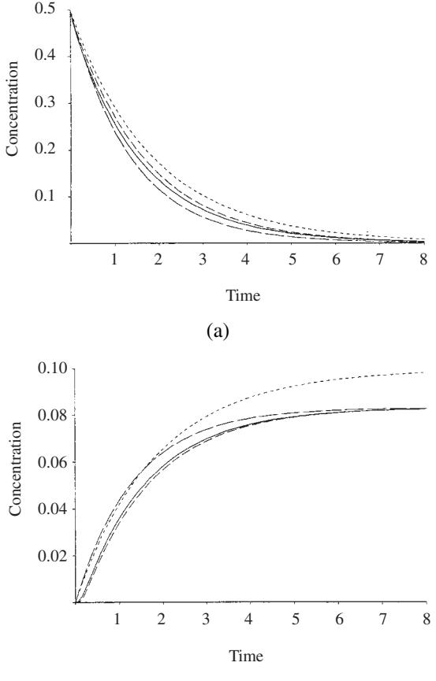

(b)

**Figure 6.3.** First two terms of the Case 2 composite series solutions (– – –) compared to numerical solutions (——) and previous approximations: Waley (1985) (- - -) and Tatsunami et al. (1981) (— — —). (**a**) Substrate concentration; (**b**) inactive enzyme concentration. Parameters: *k*1 = 2, *k*−1 = 4, *k*2 = 12, *k*3 = 10, *k*4 = 2, *e*0 = 0.5, *s*0 = 0.5. These give ε = 5.88 × 10−2, ρ = 0.333, β = 5.647. (From Burke et al. 1990)

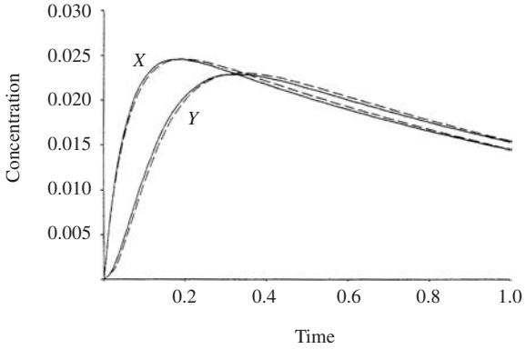

**Figure 6.4.** Case 2 composite (– – –) solutions compared to numerical solutions (——) for *X* and *Y* , the intermediate concentrations. Parameters are the same as in Figure 6.3. (From Burke et al. 1990)

curate than any quasi-steady state method achieves, since the method here incorporates the variation of the intermediate time derivatives prior to the quasi-steady state.

The above results show that the analytical solutions are a very good approximation of the kinetics of the suicide substrate system represented by (6.43). It does not appear much more complex than the basic enzyme reaction (6.1) but, as we have seen, the analysis is much more involved. The method developed here is particularly useful in estimating the intermediate (*X* and *Y* ) concentrations which no previous analysis had been able to do. Perhaps the most important result of the method described here is that the solutions are obtained analytically in terms of the kinetic parameters. These solutions may be used to estimate the parameters by the methods described by Waley (1985) and Duggleby (1986). Such analytical solutions are especially important when the equations are stiff, that is, when small parameters multiply derivatives in the differential equation system, when numerical solutions can be delicate to compute accurately.

### **6.5 Cooperative Phenomena**

In the model mechanism (6.1) one enzyme molecule combines with one substrate molecule; that is, the enzyme has one binding site. There are many enzymes which have more than one binding site for substrate molecules. For example, haemoglobin (Hb), the oxygen-carrying protein in red blood cells, has 4 binding sites for oxygen (O2) molecules. A reaction between an enzyme and a substrate is described as *cooperative* if a single enzyme molecule, after binding a substrate molecule at one site can then bind another substrate molecule at another site. Such phenomena are common.

Another important cooperative behaviour is when an enzyme with several binding sites is such that the binding of one substrate molecule at one site can affect the activity of binding other substrate molecules at another site. This indirect interaction between distinct and specific binding sites is called *allostery*, or an *allosteric effect*, and an enzyme exhibiting it, an allosteric enzyme. If a substrate that binds at one site increases the binding activity at another site then the substrate is an *activator*; if it decreases the activity it is an *inhibitor*. The detailed mathematical analysis for the kinetics of such allosteric reactions is given briefly in the book by Murray (1977) and in more detail in the one by Rubinow (1975). The latter book also gives a graph-theoretic approach to enzyme kinetics.

As an example of a cooperative phenomenon we consider the case where an enzyme has 2 binding sites and calculate an equivalent quasi-steady state approximation and the substrate uptake function. A model for this consists of an enzyme molecule *E* which binds a substrate molecule *S* to form a single bound substrate–enzyme complex *C*1. This complex *C*1 not only breaks down to form a product *P* and the enzyme *E* again; it can also combine with another substrate molecule to form a dual bound substrate– enzyme complex *C*2. This *C*2 complex breaks down to form the product *P* and the single bound complex *C*1. A reaction mechanism for this model is then

$$\begin{aligned} S + E & \overset{k_1}{\underset{k_{-1}}{\rightleftharpoons}} C_1 \xrightarrow{k_2} E + P, \\ S + C_1 & \overset{k_3}{\underset{k_{-3}}{\rightleftharpoons}} C_2 \xrightarrow{k_4} C_1 + P, \end{aligned} \tag{6.98}$$

where the *k*'s are the rate constants as indicated.

With lowercase letters denoting concentrations, the mass action law applied to (6.98) gives

$$\begin{aligned} \frac{ds}{dt} &= -k_1 s e + (k_{-1} - k_3 s) c_1 + k_{-3} c_2, \\ \frac{dc_1}{dt} &= k_1 s e - (k_{-1} + k_2 + k_3 s) c_1 + (k_{-3} + k_4) c_2, \\ \frac{dc_2}{dt} &= k_3 s c_1 - (k_{-3} + k_4) c_2, \\ \frac{de}{dt} &= -k_1 s e + (k_{-1} + k_2) c_1, \\ \frac{dp}{dt} &= k_2 c_1 + k_4 c_2. \end{aligned} \tag{6.99}$$

Appropriate initial conditions are

$$s(0) = s_0, \quad e(0) = e_0, \quad c_1(0) = c_2(0) = p(0) = 0. \tag{6.100}$$

The conservation of the enzyme is obtained by adding the 2nd, 3rd and 4th equations in (6.99) and using the initial conditions; it is

$$\frac{dc_1}{dt} + \frac{dc_2}{dt} + \frac{de}{dt} = 0 \quad \Rightarrow \quad e + c_1 + c_2 = e_0. \tag{6.101}$$

The equation for the product *p*(*t*) is again uncoupled and given, by integration, once *c*1 and *c*2 have been found. Thus, using (6.101), the resulting system we have to solve is

$$\begin{aligned} \frac{ds}{dt} &= -k_1 e_0 s + (k_{-1} + k_1 s - k_3 s)c_1 + (k_1 s + k_{-3})c_2, \\ \frac{dc_1}{dt} &= k_1 e_0 s - (k_{-1} + k_2 + k_1 s + k_3 s)c_1 + (k_{-3} + k_4 - k_1 s)c_2, \\ \frac{dc_2}{dt} &= k_3 s c_1 - (k_{-3} + k_4)c_2, \end{aligned} \tag{6.102}$$

with initial conditions (6.100).

As always, we nondimensionalise the system. As we saw above, there are several ways we can do this. If *e*0/*s*0 1, we write

$$\begin{aligned} \tau &= k_1 e_0 t, \quad u = \frac{s}{s_0}, \quad v_1 = \frac{c_1}{e_0}, \quad v_2 = \frac{c_2}{e_0},\\ a_1 &= \frac{k_{-1}}{k_1 s_0}, \quad a_2 = \frac{k_2}{k_1 s_0}, \quad a_3 = \frac{k_3}{k_1}, \quad a_4 = \frac{k_{-3}}{k_1 s_0},\\ a_5 &= \frac{k_4}{k_1 s_0}, \quad e = \frac{e_0}{s_0}, \end{aligned} \tag{6.103}$$

and (6.102) becomes

$$\frac{du}{d\tau} = -u + (u - a_3 u + a_1)v_1 + (a_4 + u)v_2 = f(u, v_1, v_2),\tag{6.104}$$

$$\varepsilon \frac{d\upsilon_1}{d\tau} = u - (u + a_3 u + a_1 + a_2)\upsilon_1 + (a_4 + a_5 - u)\upsilon_2 = g_1(u, \upsilon_1, \upsilon_2), \quad (6.105)$$

$$
\varepsilon \frac{d\upsilon_2}{d\tau} = a_3 \mu \upsilon_1 - (a_4 + a_5)\upsilon_2 = g_2(\mu, \upsilon_1, \upsilon_2),
\tag{6.106}
$$

which, with the initial conditions

$$u(0) = 1, \quad v_1(0) = v_2(0) = 0,\tag{6.107}$$

represents a well-posed mathematical problem.

This problem, just as the Michaelis–Menten one (6.13) analyzed in Section 6.5, is a singular perturbation one for 0 < ε 1. The complete inner and outer solution can be found in a comparable way using the method set out there so we leave it as an exercise. What is of interest here, however, is the form of the uptake function for the substrate concentration *u*, for times τ ε, that is, for times in the experimentally measurable regime. So, we only need the outer, or nonsingular, solution which is given to *O*(1) for 0 < ε 1 by (6.104)–(6.107) on setting the ε-terms to zero. This gives

$$\frac{d\mu}{d\tau} = f(\mu, v_1, v_2), \quad \text{g}_{\text{l}}(\mu, v_1, v_2) = 0, \quad \text{g}_2(\mu, v_1, v_2) = 0.$$

The last two equations are algebraic, which on solving for v1 and v2 give

$$v_2 = \frac{a_3 \mu v_1}{a_4 + a_5}, \quad v_1 = \frac{u}{a_1 + a_2 + u + a_3 \mu^2 (a_4 + a_5)^{-1}}.$$

Substituting these into *f* (*u*,v1(*u*),v2(*u*)) we get the uptake equation, or rate equation, for *u* as

$$\begin{split} \frac{du}{d\tau} &= f(u, v_1(u), v_2(u)) \\ &= -u \frac{a_2 + a_3 a_5 u (a_4 + a_5)^{-1}}{a_1 + a_2 + u + a_3 u^2 (a_4 + a_5)^{-1}} \\ &= -r(u) < 0. \end{split} \tag{6.108}$$

The dimensionless velocity of the reaction is thus *r*(*u*). In dimensional terms, using (6.103), the Michaelis–Menten velocity of the reaction for 0 < *e*0/*s*0 1, denoted by *R*0(*s*0) say, is, from (6.108),

$$\begin{aligned} R_0(s_0) &= \left| \frac{ds}{dt} \right|_{t=0} = e_0 s_0 \frac{k_2 K_m' + k_4 s_0}{K_m K_m' + K_m' s_0 + s_0^2} \\\ K_m &= \frac{k_2 + k_{-1}}{k_1}, \quad K_m' = \frac{k_4 + k_{-3}}{k_3}, \end{aligned} \tag{6.109}$$

where *Km* and *K*- *m* are the Michaelis constants for the mechanism (6.98), equivalent to the Michaelis constant in (6.41).

The rate of the reaction *R*0(*s*0) is illustrated in Figure 6.5. If some of the parameters are zero there is a point of inflexion: for example, if *k*2 = 0 it is clear from (6.109) since then for *s*0 small, *R*0 ∝ *s*2 0 . A good example of such a cooperative behaviour is the binding of oxygen by haemoglobin; the experimental measurements give an uptake curve very like the lower curve in Figure 6.5. Myoglobin (Mb), a protein in abundance in red muscle fibres, on the other hand has only one oxygen binding site and its uptake is of the Michaelis–Menten form also shown in Figure 6.5 for comparison.

When a cooperative phenomenon in an enzymatic reaction is suspected, a *Hill plot* is often made. The underlying assumption is that the reaction velocity or uptake function is of the form

$$R_0(S_0) = \frac{\mathcal{Q}s_0^n}{K_m + s_0^n},\tag{6.110}$$

where *n* > 0 is not usually an integer; this is often called a Hill equation. Solving the

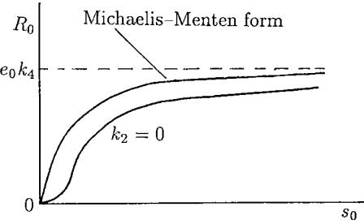

**Figure 6.5.** Rate of reaction, or substrate uptake, as a function of substrate concentration *s*0 for the cooperative reaction (6.98). Note the inflexion in the cooperative uptake curve when *k*2 = 0.

last equation for *sn* 0 we have

$$s_0^n = \frac{R_0 K_m}{\mathcal{Q} - R_0} \quad \Rightarrow \quad n \ln s_0 = \ln K_m + \ln \frac{R_0}{\mathcal{Q} - R_0}.$$

A Hill plot is the graph of ln [*R*0/(*Q* − *R*0)] against ln *s*0, the slope of which gives *n*, and is a constant if the Hill equation is a valid description for the uptake kinetics. If *n* < 1, *n* = 1 or *n* > 1 we say that there is negative, zero or positive cooperativity respectively. Although the Hill equation may be a reasonable quantitative form to describe a reaction's velocity in a Michaelis–Menten sense, the detailed reactions which give rise to it are not too realistic: essentially it is (6.1) but now instead of *E* + *S* we require *E* + *nS* combining to form the complex in one step. This is somewhat unlikely if *n* is not an integer although it could be a stoichiometric form. If *n* is an integer and *n* ≥ 2, the reaction is then trimolecular or higher. Such reactions do not occur except possibly through what is in effect a telescoping together of several reactions, because intermediary reactions are very fast.

Even with such drawbacks as regards the implied reaction mechanisms, empirical rate forms like the Hill equation are extremely useful in modelling. After all, what we want from a model is some understanding of the underlying dynamics and mechanisms governing the phenomena. A very positive first step is to find a biologically reasonable model which qualitatively describes the behaviour. Detailed refinements or amendments come later.

#### **6.6 Autocatalysis, Activation and Inhibition**

Many biological systems have feedback controls built into them. These are very important and we must know how to model them. In the next chapter on biological oscillators, we shall describe one area where they are essential. A review of theoretical models and the dynamics of metabolic feedback control systems is given by Tyson and Othmer (1978). Here we describe some of the more important types of feedback control. Basically feedback is when the product of one step in a reaction sequence has an effect on other reaction steps in the sequence. The effect is generally nonlinear and may be to activate or inhibit these reactions. The next chapter gives some specific examples with actual reaction mechanisms.

*Autocatalysis* is the process whereby a chemical is involved in its own production. A very simple pedagogical example is

$$A + X \underset{k_{-1}}{\overset{k_1}{\rightleftharpoons}} 2X,\tag{6.111}$$

where a molecule of *X* combines with one of *A* to form two molecules of *X*. If *A* is maintained at a constant concentration *a*, the Law of Mass Action applied to this reaction gives the rate of reaction as

$$\frac{d\mathbf{x}}{dt} = k_1 a \mathbf{x} - k_{-1} \mathbf{x}^2 \quad \Rightarrow \quad \mathbf{x}(t) \rightarrow \mathbf{x}_{\mathcal{S}} = \frac{k_1 a}{k_{-1}},\tag{6.112}$$

where *x* = [*X*] and *xS* is the final nonzero steady state as *t* → ∞. The zero steady state is unstable by inspection. This autocatalytic reaction exhibits a strong feedback with the 'product' inhibiting the reaction rate. It is obvious that some back reaction (*k*−1 = 0) is necessary. This is the chemical equivalent of logistic growth discussed in Chapter 1.

Suppose, instead of (6.111), the reaction system is

$$A + X \underset{k_{-1}}{\overset{k_1}{\rightleftharpoons}} 2X, \quad B + X \overset{k_2}{\rightarrow} \mathcal{C}. \tag{6.113}$$

That is, *X* is used up in the production of *C*. This mechanism exhibits a simple bifurcation as we show. If *B*, as well as *A*, are maintained at constant concentrations, *a* and *b*, then

$$\frac{d\mathbf{x}}{dt} = k_1 a \mathbf{x} - k_{-1} \mathbf{x}^2 - k_2 b \mathbf{x} = (k_1 a - k_2 b)\mathbf{x} - k_{-1} \mathbf{x}^2. \tag{6.114}$$

Here *k*1*a* is the unit production rate of *x* and *k*2*b* the unit loss rate. From (6.114) we see that if *k*1*a* > *k*2*b* the steady state *x* = 0 is unstable and *x*(*t*) → *xS* = (*k*1*a* − *k*2*b*)/*k*−1 > 0 as *t* → ∞, which is stable. On the other hand if *k*1*a* < *k*2*b* then *x* = 0 is stable, which is not surprising since the inequality implies that the loss rate is greater than the production rate. In this case mathematically there is still, of course, another steady state but it is negative (so unrealistic) and unstable. The simple bifurcation exhibited by this reaction is summarised in Figure 6.6 where the steady states *xS* are given in terms of the parameter *k*1*a* − *k*2*b*. The bifurcation is at *k*1*a* − *k*2*b* = 0 where the stability changes from one steady state to another.

Anticipating the next chapter on biological oscillators, the classical Lotka (1920) reaction mechanism which he proposed as a hypothetical model oscillator is another example of autocatalysis. It is

$$A + X \stackrel{k_1}{\rightarrow} 2X, \quad X + Y \stackrel{k_2}{\rightarrow} 2Y, \quad Y \stackrel{k_3}{\rightarrow} B,\tag{6.115}$$

where *A* is maintained at a constant concentration *a*. The first two reactions are autocatalytic. The Law of Mass Action gives

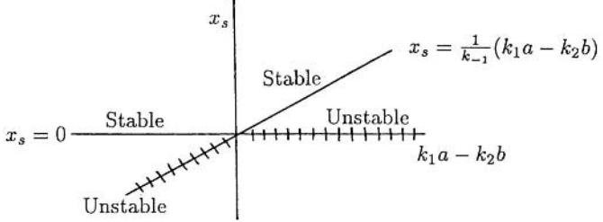

**Figure 6.6.** Stability of the steady states *xS* of the reaction system (6.113) and (6.114). As the parameter *k*1*a* − *k*2*b*, the difference between the production and loss rates, changes sign, so does the stability, namely, from *xS* = 0 to *xS* = 0.

$$
\frac{d\mathbf{x}}{dt} = k_1 a \mathbf{x} - k_2 \mathbf{x} \mathbf{y}, \quad \frac{d\mathbf{y}}{dt} = k_2 \mathbf{x} \mathbf{y} - k_3 \mathbf{y},
$$

which, with the nondimensional variables

$$u = \frac{k_2 x}{k_3}, \quad v = \frac{k_2 y}{k_1 a}, \quad \tau = k_1 a t, \quad \alpha = k_3 / k_1 a,$$

become

$$\frac{du}{d\tau} = u(1-v), \quad \frac{dv}{d\tau} = \alpha v(u-1).$$

These are the Lotka–Volterra equations (3.4) discussed in detail in Section 3.1 in Chapter 3; the solutions *u* and v are periodic in time but, as we saw, are structurally unstable.

In almost all biological processes we do not know the detailed biochemical reactions that are taking place. However, we often do know the qualitative effect of varying a known reactant or of changing the operating conditions in one way or another. So, in modelling such biological processes it is usually much more productive and illuminating to incorporate such known qualitative behaviour in a model mechanism. It is such model mechanisms which have proved so useful in interpreting and unravelling the basic underlying processes involved, and in making useful predictions in a remarkably wide spectrum of biomedical problems. Since we know how to represent a reaction sequence as a differential equation system we can now construct models which incorporate the various qualitative behaviours directly into the differential equations for the concentrations. It is then the differential equation system which constitutes the model.

Suppose we have a differential equation system, the model for which can be reduced, through asymptotic procedures such as we discussed above, to two key elements which are governed by the dimensionless mechanism

$$\begin{aligned} \frac{du}{d\tau} &= \frac{a}{b+v} - cu = f(u,v), \\ \frac{dv}{d\tau} &= du - ev = g(u,v), \end{aligned} \tag{6.116}$$

where *a*, *b*, *c*, *d* and *e* are positive constants. The biological interpretation of this model is that *u* activates v, through the term *du*, and both *u* and v are degraded linearly proportional to their concentrations; these are the −*cu* and −*e*v terms. This linear degradation is referred to as *first-order kinetics* removal. The term *a*/(*b* + v) shows a negative feedback by v on the production of *u*, since an increase in v decreases the production of *u*, and hence indirectly a reduction in itself. The larger v, the smaller is the *u*-production. This is an example of *feedback inhibition*.

We can easily show that there is a stable positive steady state for the mechanism (6.116). The relevant steady state (*u*0,v0) is the positive solution of

$$f(\mu_0, \upsilon_0) = g(\mu_0, \upsilon_0) = 0$$

$$\Rightarrow \quad \upsilon_0 = \frac{du_0}{e}, \quad \mu_0^2 + \frac{ebu_0}{d} - \frac{ae}{cd} = 0.$$

The differential equation system (6.116) is exactly the same type that we analysed in detail in Chapter 3. The linear stability then is determined by the eigenvalues λ of the linearised Jacobian or *reaction matrix* or stability matrix (equivalent to the community matrix in Chapter 3), and are given by

$$
\left| \begin{array}{c} \frac{\partial f}{\partial u} - \lambda \\ \frac{\partial g}{\partial u} \end{array} \begin{array}{c} \frac{\partial f}{\partial v} \\ \frac{\partial g}{\partial v} - \lambda \end{array} \right|_{u_0, v_0} = \left| \begin{array}{c} -c - \lambda \\ d \end{array} \begin{array}{c} -c \frac{\mu_0}{v_0 + b} \\ -e - \lambda \end{array} \right| = 0.
$$

Thus

$$
\lambda^2 + (c+e)\lambda + \left[ce + \frac{cdu_0}{b+v_0}\right] = 0 \quad \Rightarrow \quad Re\lambda < 0,
$$

and so (*u*0,v0) is linearly stable. It is also a globally attracting steady state: it is straightforward to construct a rectangular confined set in the (*u*,v) plane on the boundary of which the vector (*du*/*dt*, *d*v/*dt*) points inwards.

Several specific model systems have been proposed as the mechanisms governing certain basic biological phenomena such as oscillatory behaviour, pattern formation in developing embryos, mammalian coat patterns and so on. We study some of these in detail in subsequent chapters. Here we briefly look at two.

The Thomas (1975) mechanism, is based on a specific reaction involving the substrates oxygen and uric acid which react in the presence of the enzyme uricase. The dimensionless form of the empirical rate equations for the oxygen (v) and the uric acid (*u*) can be written as

$$\begin{aligned} \frac{du}{dt} &= a - u - \rho R(u, v) = f(u, v), \\ \frac{dv}{dt} &= \alpha (b - v) - \rho R(u, v) = g(u, v), \\ R(u, v) &= \frac{uv}{1 + u + Ku^2}, \end{aligned} \tag{6.117}$$

where *a*, *b*, α, ρ and *K* are positive constants. Basically *u* and v are supplied at constant rates *a* and α*b*, degrade linearly proportional to their concentrations and both are used up in the reaction at a rate ρ*R*(*u*,v). The form of *R*(*u*,v) exhibits *substrate inhibition*. For a given v, *R*(*u*,v) is *O*(*u*v) for *u* small and is thus linear in *u*, while for *u* large it is *O*(v/*K u*). So, for *u* small *R* increases with *u*, but for *u* large it decreases with *u*. This is what is meant by substrate inhibition. The parameter *K* is a measure of the severity of the inhibition. From Figure 6.7, giving *R*(*u*,v) as a function of *u*, we see that the uptake rate is like a Michaelis–Menten form for small *u*, reaches a maximum at *u* = 1/ √*K* and then decreases with increasing *u*. The value of the concentration for the maximum *R*(*u*,v), and the actual maximum rate, decreases with increasing inhibition, that is, as *K* increases.

It is always informative to draw the null clines for the reaction kinetics in the (*u*,v) phase plane in the same way as for the interacting population models in Chapter 3. Here

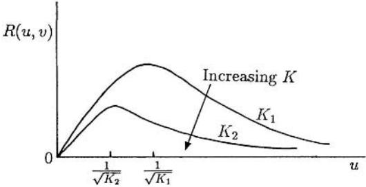

**Figure 6.7.** Reaction rate *R*(*u*,v) in (6.117) for a fixed v. The reduction in *R* as *u* increases for *u* > 1/ √*K* is a typical example of substrate (*u*) inhibition: the larger the *K* the greater the inhibition.

the null clines for (6.117) are

$$\begin{aligned} f(u,v) &= 0 \quad \Rightarrow \quad v = (a-u)\frac{1+u+Ku^2}{\rho u}, \\ g(u,v) &= 0 \quad \Rightarrow \quad v = \alpha b \frac{1+u+Ku^2}{\rho u + \alpha(1+u+Ku^2)}, \end{aligned}$$

which are sketched in Figure 6.8. Depending on the parameters there can be one or three positive steady states. Although these null clines are for a specific substrate–inhibition mechanism they are fairly typical of general substrate–inhibition models, the *f* = 0 null cline in particular; see also Figure 6.9.

The question of the stability of the steady states will be discussed in detail and in some generality in the next chapter. At this stage, however, we can get an intuitive indication of the stability from looking at the null clines in the (*u*,v) phase plane. Consider the situation in Figure 6.8 when there are three steady states at *P*1, *P*2 and *P*3 and, to be specific, look at *P*1(*u*1,v1) first. Now let us move along a line, v = v1 say, through *P*1 and note the signs of *f* (*u*,v1) as we cross the *f* = 0 null cline. Let us stay in the neighbourhood of *P*1. On the left of the *f* = 0 null cline, *f* > 0 and on the right *f* < 0.

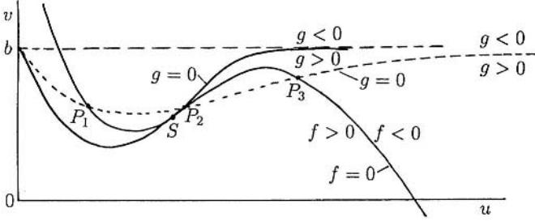

**Figure 6.8.** Schematic null clines for the substrate–inhibition kinetics (6.117). There may be one, *S*, or three, *P*1, *P*2, *P*3 (dashed *g* = 0 curve) steady states where *f* = 0 and *g* = 0 intersect. Note the signs of *f* and *g* on either side of their null clines.

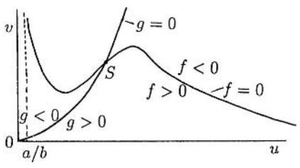

**Figure 6.9.** Typical null clines for the activator–inhibitor model (6.118).

So with v = v1, a constant, ∂ *f*/∂*u* < 0 at *P*1. If we now consider the kinetics equation for *u* with v = v1, namely, *du*/*dt* = *f* (*u*,v1), we see that locally ∂ *f*/∂*u* < 0 at *P*1 and so, from our discussion in Section 1.1 in Chapter 1, if this were an uncoupled scalar equation for *u* it would mean that *P*1 is a linearly stable steady state. But of course from (6.117) the *u*-equation is not uncoupled and maybe the coupling has a destabilising affect.

Let us still consider *P*1 and use the same kind of argument to move across the *g* = 0 null cline along a line, *u* = *u*1 say, through *P*1. We now see that ∂*g*/∂v < 0 so locally *d*v/*dt* = *g*(*u*1,v) with ∂*g*/∂v < 0 at *P*1 and by the same argument about scalar equations this would reinforce our intuition that *P*1 is linearly stable. So intuitively from both these analyses we would expect *P*1 to be linearly stable. These kinds of arguments are developed rigorously in the next chapter where we show that our intuition is indeed correct. In a similar way we can intuitively deduce that *P*3 is also stable. If we apply the above sign arguments to *P*2 with v = v2 at *P*2 we see, from Figure 6.8, that ∂ *f* (*u*,v2)/∂*u* > 0 so we expect *P*2 to be unstable. When there is a single steady state at *S*, the situation needs a careful analysis (see Chapter 7).

Without carrying out any analysis, it is clear that there must be certain parameter ranges where there is a single steady state and where there are three steady states. An informative analysis therefore is to determine the parameter domains for each situation. Although this is simple in principle—you determine the positive steady states from the simultaneous algebraic equations *f* (*u*,v) = *g*(*u*,v) = 0—it is usually hard algebraically and has to be carried out numerically. Such analyses produce some interesting results which we discuss in more detail in Section 6.7.

Another model mechanism, algebraically simpler than the Thomas system (6.117), is the hypothetical but biologically plausible reaction scheme

$$\begin{aligned} \frac{du}{dt} &= a - bu + \frac{u^2}{v(1 + Ku^2)} = f(u, v), \\ \frac{dv}{dt} &= u^2 - v = g(u, v), \end{aligned} \tag{6.118}$$

where *a*, *b* and *K* are constants. This is an *activator* (*u*)–*inhibitor* (v) *system* and is a dimensionless version of the kinetics of a model proposed by Gierer and Meinhardt (1972). It has been used in a variety of modelling situations which we point out in subsequent chapters. Here there is an autocatalytic production of the activator *u* via the *u*2/[v(1 + *K u*2)] term, but which saturates to 1/(*K*v) for *u* large. The inhibitor v is activated by *u* according to the second equation, but it inhibits its activator production since *u*2/v(1 + *K u*2) decreases as v increases. The null clines *f* = 0 and *g* = 0 from (6.118) are illustrated in Figure 6.9. Note the qualitative similarity between the null clines in Figures 6.8 and 6.9, particularly in the vicinity of the steady state and for large *u*; we consider the implications of this later. In the next chapter we introduce other reaction systems while in Chapter 8 we discuss in detail a specific system which is of considerable experimental importance and biological relevance.

For a general system

$$\frac{du}{dt} = f(u, v), \quad \frac{dv}{dt} = g(u, v), \tag{6.119}$$

*u* is an activator of v if ∂*g*/∂*u* > 0 while v is an inhibitor of *u* if ∂ *f*/∂v < 0. Depending on the detailed kinetics a reactant may be an activator, for example, only for a range of concentrations or parameters. There are thus many possibilities of bifurcation phenomena which have biologically important implications as we see later in the book.

With the mathematical parallel between interacting populations and reaction kinetics model systems, we also expect to observe threshold phenomena such as we discussed in Section 3.8 in Chapter 3. This is indeed the case and the model system (6.117) exhibits a similar threshold behaviour if the parameters are such that the steady state is at *S*, or at *S* , as in Figure 6.10. The analysis in Section 3.8 is directly applicable here.

We can now start to build model reactions to incorporate a variety of reaction kinetics behaviour such as autocatalysis, activation and inhibition and so on, since we know qualitatively what is required. As an example suppose we have cells which react to the local concentration level of a chemical *S* by activating a gene so that the cells produce a product *G*. Suppose that the product is autocatalytically produced in a saturable way and that it degrades linearly with its concentration, that is, according to first-order kinetics. With lowercase letters for the concentrations, a rate equation for the product *g* which qualitatively incorporates all of these requirements is, for example,

$$\frac{d\mathbf{g}}{dt} = k_1 \mathbf{s} + \frac{k_2 \mathbf{g}^2}{k_3 + \mathbf{g}^2} - k_4 \mathbf{g} = f(\mathbf{g}),\tag{6.120}$$

where the *k*'s are positive constants. This model has some useful biological switch properties which we consider and use later in Chapter 3, Volume II when we discuss models for generating biological spatial patterns.

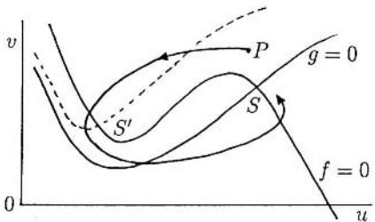

**Figure 6.10.** Reaction kinetics null clines which illustrate a threshold behaviour. With a perturbation to *P*, the solution embarks on a large excursion in the phase space before returning to the stable steady state *S*. A similar threshold behaviour is possible if the null clines intersect at the steady state *S* .

It is now clear that the study of the reaction kinetics of *n* reactions results in an *n*th order system of first-order differential equations of the form

$$\frac{du_l}{dt} = f_l(u_1, \dots, u_n), \quad i = 1, \dots, n. \tag{6.121}$$

This is formally the same type of general system which arose in interacting population models, specifically equations (3.43) in Chapter 3. There we were only concerned with nonnegative solutions and so also here, since *u*(*t*) is a vector of concentrations. All of the methods for analysing stability of the steady states, that is, solutions of *f* (*u*1,... , *un*) = 0, are applicable. Thus all of the conditions for limit cycles, threshold phenomena and so on also hold here.

The interaction details between reactants and those for interacting populations are of course quite different both in form and motivation. In biological systems there is generally more complexity as regards the necessary order of the differential equation model. As we have seen, however, this is often compensated by the presence of enzyme catalysts and thus a biological justification for reducing the order considerably. For example, a system which results in the dimensionless equations

$$\begin{aligned} \frac{du_l}{dt} &= f_l(u_1, \dots, u_n), \quad i = 1, 2\\ \varepsilon_l \frac{du_l}{dt} &= f_l(u_1, \dots, u_n), \quad i = 3, \dots, n\\ 0 &< \varepsilon_l \ll 1, \quad i = 3, \dots, n \end{aligned} \tag{6.122}$$

reduces, for almost all practical purposes, to a second-order system

$$\frac{du_i}{dt} = f_l(u_1, u_2, u_3(u_1, u_2), \dots, u_n(u_1, u_2)), \quad i = 1, 2$$

for small enough εs. Here *fi*(*u*1,... , *un*) = 0 for *i* = 3,... , *n* are algebraic equations which are solved to give *un*≥3 as functions of *u*1 and *u*2. It is this general extension of the quasi-steady state approximation to higher-order systems which justifies the extensive study of two-reactant kinetics models. Mathematically the last equation is the *O*(1) asymptotic system, as ε*i* → 0 for all *i*, for the nonsingular solution of (6.122). Biologically this is all we generally require since it is the relatively long time behaviour of mechanisms which usually dominates biological development.

#### **6.7 Multiple Steady States, Mushrooms and Isolas**

We saw in Figure 6.8 that it is possible to have multiple positive steady states. The transition from a situation with one steady state to three occurs when some parameter in the model passes through a bifurcation value. Figure 6.11 illustrates typical scenarios where this occurs. For example, referring to Figure 6.9 and the kinetics in (6.118) the steady state would behave qualitatively like that in Figure 6.11 (a) with the inhibition parameter *K* playing the role of *p*.


**Figure 6.11.** (**a**) Typical variation of the steady state *us* as a function of a parameter *p* in the kinetics for a fixed value *k*1 of another kinetics parameter *k*. (**b**) As the parameter *k* passes through a bifurcation value *kc*, multiple steady states are possible when *p*1 < *p* < *p*2. The steady state that lies on the branch *DC* is unstable.

Now suppose that as a parameter, *k* say, varies the *us* versus *p* curve changes in such a way that for a range of *k* the qualitative form of the curve is as in Figure 6.11 (b). For a fixed *k* and *p*1 < *p* < *p*2 there are three steady states, one on each branch *BC*, *C D* and *DE*. This is equivalent to the three steady state situation in Figure 6.8. From the discussion in the last section we expect the steady states lying on the *C D* branch to be linearly unstable; this is proved in the next chapter.

The form of the (*us*, *p*) graph in Figure 6.11 (b) suggests the possibility of hysteresis (recall Section 1.1) as *p* varies. Assume, as is the case, that a steady state lying on the branches *ABC* and *DEF* is stable. Now suppose we slowly increase the parameter *p* from a value *p* < *p*1 to a value *p* > *p*2. Until *p* reaches *p*2, *us* simply increases and is given by the appropriate value on the branch *ABC*. When *p* passes through *p*2, *us* changes abruptly, moving onto the branch *E F*; with increasing *p* it is given by the appropriate value on this branch. Now suppose we slowly decrease *p*. In this situation *us* stays on the lower branch *FED* until *p* reaches *p*1 since solutions on this branch are stable. Now the abrupt change takes place at *p*1 where *us* jumps up onto the upper *B A* branch. This is a typical hysteresis loop. For increasing *p*, the path is along *ABCEF*, while the path through decreasing values of *p* is *FEDBA*.

#### *Mushrooms*

Instead of the (*us*, *p*) variation in Figure 6.11 (a) another common form simply has *us* increasing with increasing *p* as in Figure 6.12 (a): the transition to three steady states is then as illustrated. It is not hard to imagine that even more complicated behaviour is possible with the simple curve in Figure 6.12 (a) evolving to form the mushroomlike shape in Figure 6.12 (b) with two regions in *p*-space where there are multi-steady states.

The mushroomlike (*us*, *p*) relationship in Figure 6.12 (b) has two distinct *p*-ranges where there are three steady states. Here the steady states lying on the branches *C D* and *G H* are unstable. There are two hysteresis loops equivalent to Figure 6.11 (b), namely, *BCED* and *IHFG*.

#### *Isolas*

The situation shown in Figure 6.12 (c), namely, that of a separate breakaway region, is an obvious extension from Figure 6.12 (b). Such a solution behaviour is called an isola.

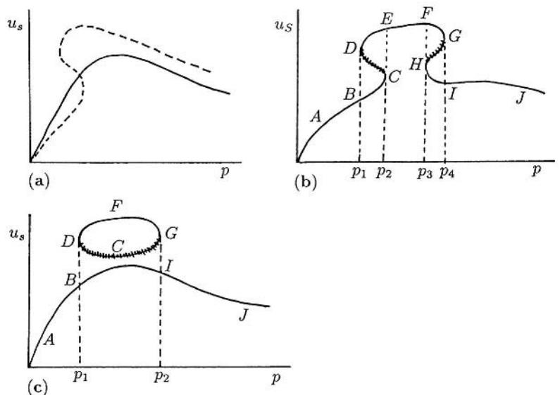

**Figure 6.12.** (**a**) Another typical example of a steady state dependence on a parameter with transition to multiple steady states; compare with Figure 6.11 (a). (**b**) Typical mushroom dependence of the steady state as a function of a parameter *p*. (**c**) This shows an example of an isola: it can be a natural evolution from the form in (**b**).

Now we expect the solutions lying on the branch *DCG* to be unstable. The physical situation represented by this situation is rather different from that which obtains with a mushroom. First there is no hysteresis in the usual way since *us* simply stays on the branch *ABI J* as the parameter *p* increases from a value *p* < *p*1 to a value *p* > *p*2: it stays on this branch on the return sweep through the multi-steady state region *p*1 < *p* < *p*2. *Isolas* are isolated closed curves of solution branches and can only arise as solutions of nonlinear equations.

Referring still to Figure 6.12 (c), if *us* lies on the branch *B I* it is only possible to move onto the other stable branch *DFG* if *us* is given a finite perturbation so that *u* moves into the domain of attraction of the stable steady state on the *DFG* branch. The various possible scenarios are now clear.

It is possible to predict quite complex solution behaviour by simply manipulating the curves, in effect as we have just done. The appearance of multi-steady states is not difficult to imagine with the right kinetics. Dellwo et al. (1982) present a general theory which describes analytically the structure of a class of isolas, namely, those which tend to a point as some parameter tends to a critical value. The question immediately arises as to whether isolas, for example, can exist in the real world. Isolas have been found in a variety of genuine practical situations including chemical reactions; an early review is given by Uppal et al. (1976) with other references in the paper by Gray and Scott (1986).

A simple model kinetics system has been proposed by Gray and Scott (1983, 1986) which exhibits, among other things, multi-steady states with mushrooms and isolas: it

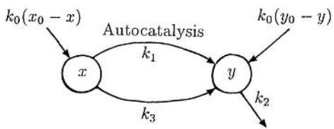

**Figure 6.13.** Model autocatalytic mechanism which exhibits multi-steady states with mushrooms and isolas. The system is a continuously stirred flow tank reactor (CSTR) mechanism with *Y* being produced autocatalytically and by a simple uncatalysed process. *X* and *Y* are fed into the process and *Y* degrades with first-order kinetics. The mechanism is described by the differential equation system (6.123). The lowercase letters *x* and *y* denote the concentrations of *X* and *Y* .

involves autocatalysis in a continuously stirred tank reactor (CSTR). It consists of the following hypothetical reactions involving two reactants *X* and *Y* with concentrations *x* and *y* respectively. The specific mechanism is represented schematically in Figure 6.13.

The process in the figure involves the trimolecular autocatalytic step *X* +2*Y* → 3*Y* and the specific equation system which describes the process is

$$\begin{aligned} \frac{dx}{dt} &= k_0(\mathbf{x}_0 - \mathbf{x}) - k_1 \mathbf{x} \mathbf{y}^2 - k_3 \mathbf{x}, \\ \frac{dy}{dt} &= k_0(\mathbf{y}_0 - \mathbf{y}) + k_1 \mathbf{x} \mathbf{y}^2 + k_3 \mathbf{x} - k_2 \mathbf{y}, \end{aligned} \tag{6.123}$$

where the *k*'s are the positive rate constants. An appropriate nondimensionalisation is

$$\begin{aligned} u &= \frac{\chi}{\chi_0}, \quad v = \frac{\chi}{\chi_0}, \quad t^* = tk_1 \mathbf{x}_0^2, \quad c = \frac{\chi_0}{\chi_0}, \\\ a &= \frac{k_0}{k_1 \mathbf{x}_0^2}, \quad b = \frac{k_3}{k_1 \mathbf{x}_0^2}, \quad d = \frac{k_2}{k_1 \mathbf{x}_0^2}, \end{aligned} \tag{6.124}$$

with which (6.123) become, on omitting the asterisk for notational simplicity, the dimensionless system

$$\begin{aligned} \frac{du}{dt} &= a(1-u) - uv^2 - bu = f(u,v), \\ \frac{dv}{dt} &= a(c-v) + uv^2 + bu - dv = g(u,v), \end{aligned} \tag{6.125}$$

which now involve four dimensionless parameters *a*, *b*, *c* and *d*.

Here we are only interested in the steady states *us* and v*s* which are solutions of *f* (*u*,v) = *g*(*u*,v) = 0. A little algebra shows that

$$u_s(1+c-u_s)^2 = a\left(1+\frac{d}{a}\right)^2(1-u_s) - bu_s\frac{(a+d)^2}{a^2},\tag{6.126}$$

which is a cubic, namely,

$$u_s^3 - 2(1+c)u_s^2 + \left[ (1+c)^2 + \frac{(a+d)^2}{a} + b\frac{(a+d)^2}{a^2} \right] u_s - \frac{(a+d)^2}{a} = 0. \tag{6.127}$$

Since there are three changes in sign in the cubic there is thus, using Descartes' rule of signs (see Appendix B), the possibility of three positive solutions. Certain analytical solutions for these can be found asymptotically for large and small values of the parameters. The full picture, however, has to be obtained numerically as was done by Gray and Scott (1986). Typical results are illustrated schematically in Figure 6.14. A good review of this reaction and its complex behaviour together with analytical and numerical results is given by Gray (1988).

It is, of course, always possible to construct more and more complex solution behaviours mathematically and to postulate hypothetical reactions which exhibit them. So, the key question at this stage is to ask whether there are any real reaction processes which exhibit these interesting phenomena, such as mushrooms and isolas. The inorganic iodate–arsenous acid reaction under appropriate conditions has been shown experimentally to have the required kinetics. This has been convincingly demonstrated by Ganapathisubramanian and Showalter (1984) whose model and experimental results are described below. Although this is not an enzymatic or biological reaction it nevertheless shows that real reaction mechanisms, which have mushroom and isola solution behaviour, exist. With the richness and complexity of biological processes it would be unbelievable if such reaction systems did not exist within the biomedical sciences. So, it is with this conviction in mind that we describe here the elements of this inorganic reaction and present the relevant experimental results.

#### *Iodate–Arsenous Acid Reaction: Bistability, Mushrooms, Isolas*

The iodate–arsenous acid reaction in a continuous flow stirred tank reactor can be described by two composite reactions, namely,

$$\rm{IO}_3^- + \rm{5I}^- + 6\rm{H}^+ \to \rm{3I}_2 + \rm{3H}_2\rm{O},\tag{6.128}$$

$$\text{H}_2 + \text{H}_3\text{AsO}_3 + \text{H}_2\text{O} \rightarrow 2\text{I}^- + \text{H}_3\text{AsO}_4 + 2\text{H}^+.\tag{6.129}$$

The net reaction, given by the (6.128) + 3 × (6.129) , is

$$\rm{IO}_3^- + \rm{3H}_3AsO_3 \to I^- + \rm{3H}_3AsO_4.\tag{6.130}$$

The rate of the reaction (6.128) is slow compared with (6.129) and so it is the rate limiting step in the overall process (6.129). If we denote this rate for (6.128) by *R*, an empirical form has been determined experimentally as

$$R = -\frac{d[\text{IO}_3^-]}{dt} = (k_1 + k_2[\text{I}^-])[\text{I}^-][\text{H}^+]^2[\text{IO}_3^-].\tag{6.131}$$

A simple model reaction mechanism, which quantitatively describes the iodate–arsenous acid reaction in a continuous flow stirred tank reactor, consists of rate equations for the

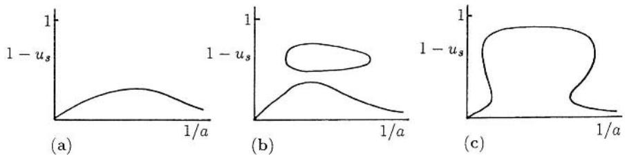

**Figure 6.14.** The steady states *us* of (6.125) as a function of the parameter *a* for various values of *b*, *c* and *d*. For a fixed *c*, less than a critical value, and an increasing *d* from *d* = 0, the progression of steady state behaviours is from the mushroom situation (**c**), through the isola region (**b**), to the single steady state situation (**a**).

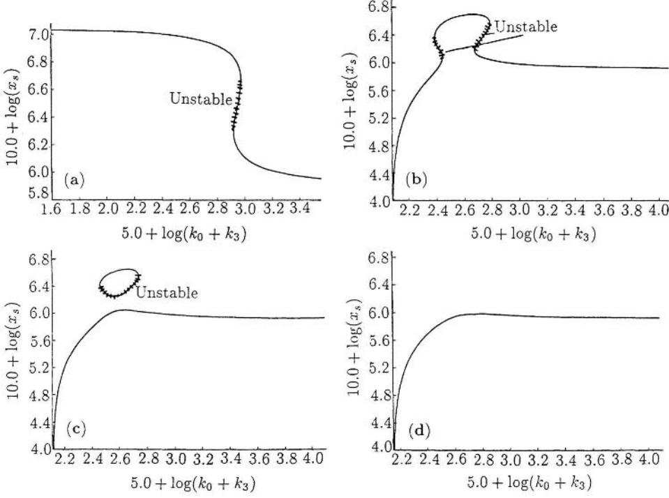

**Figure 6.15.** Computed steady state iodide concentration *Xs* from (6.135) as a function of *k*0 + *k*3. The continuous lines represent stable solution branches and the dashed lines unstable branches. Parameter values: *k*1 = 4.5 × 103*M*−3*s*−1, *k*2 = 4.5 × 108*M*−4*s*−1, *Y*0 = 1.01 × 10−3*M*, *X*0 = 8.40 × 10−5*M*, [H+] = 7.59 × 10−3*M*; (**a**) *k*3 = 0, (**b**) *k*3 = 1.20 × 10−3*s*−1. (**c**) *k*3 = 1.30 × 10−3*s*−1, (**d**) *k*3 = 1.42 × 10−3*s*−1. Compare (**a**) to (**d**) respectively with the schematic forms in Figure 6.11 (b) and Figures 6.12 (b), (c) and (a). (Redrawn from Ganapathisubramanian and Showalter 1984)

iodide, I−, and iodate, IO− 3 , in (6.130), with appropriate flow terms and decay terms, given by

$$\frac{d[\text{I}^-]}{dt} = R + k0[\text{I}^-]\text{lo} - (k0 + k\text{\textdegree{}})[\text{I}^-],\tag{6.132}$$

$$\frac{d[\text{IO}_3^-]}{dt} = -R + k_0[\text{IO}_3^-]_0 - (k_0 + k_3)[\text{IO}_3^-],\tag{6.133}$$

where *k*0 and *k*3 are positive constants, [I −]0 and [IO− 3 ]0 are the concentrations in the inflow and *R* is given by (6.131).

If we now write

$$\begin{aligned} X &= [\text{I}^-], \quad Y = [\text{IO}_3^-], \quad X_0 = [\text{I}^-]_0, \\ Y_0 &= [\text{IO}_3^-]_0, \quad k_1^* = k_1 [\text{H}^+]^2, \quad k_2^* = k_2 [\text{H}^+]^2, \end{aligned} \tag{6.134}$$

the steady states *Xs* and *Ys* are given by the solutions of

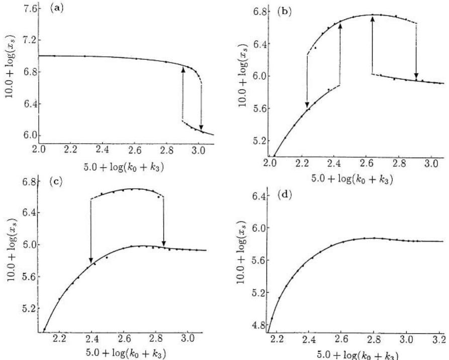

**Figure 6.16.** Experimentally determined steady state iodide concentrations for the iodate–arsenous acid reaction as a function of *k*0 + *k*3 for different values of *k*3. Parameter values: *X*0 = 1.01 × 10−3*M*, *Y*0 = 8.40×10−5*M* with the flow of [H3AsO3]0 = 4.99×10−3*M*; (**a**) *k*3 = 0, (**b**) *k*3 = 1.17×10−3*s*−1, (**c**) *k*3 = 9.71×10−4*s*−1, (**d**) *k*3 = 1.37×10−3*s*−1. Compare with Figures 6.15 (a), (b), (c) and (d) respectively. (Redrawn from Ganapathisubramanian and Showalter 1984)

$$\begin{aligned} 0 &= R + k_0 X_0 - (k_0 + k_3)X, \quad 0 = -R + k_0 Y_0 - (k_0 + k_3)Y, \\ R &= (k_1^* + k_2^* X)XY. \end{aligned}$$

These give the cubic polynomial for *Xs*

$$\begin{aligned} &k_2^*(k_0 + k_3)X_s^3 + [k_1^*(k_0 + k_3) - k_2^*k_0(X_0 + Y_0)]X_s^2 \\ &+ [(k_0 + k_3)^2 - k_1^*k_0(X_0 + Y_0)]X_s - k_0(k_0 + k_3)X_0 = 0. \end{aligned} \tag{6.135}$$

Values for *k*1 and *k*2 have been determined experimentally and *X*0 and *Y*0 and [H+] can be imposed, and so, from (6.134), *k*∗ 1 and *k*∗ 2 can be determined. Figure 6.15 shows the positive steady state iodide concentration *Xs* calculated numerically from the cubic equation (6.135) as a function of *k*0 + *k*3 for different values of *k*3.

When the above iodate–arsenous acid reaction model is compared with the full reaction system, good quantitative results are obtained. Figure 6.15 shows that mushroom and isola multi-steady state behaviour is possible. The final step in demonstrating the existence of this type of behaviour is experimental confirmation. This has also been done by Ganapathisubramanian and Showalter (1984), whose results are reproduced in Figure 6.16. Note the comparison between these experimental results and those obtained with the model mechanism for this iodate–arsenous acid reaction. The results in Figure 6.16 clearly show the various hysteresis behaviours suggested by Figures 6.11 and 6.12.

### **Exercises**

- **1** An allosteric enzyme *E* reacts with a substrate *S* to produce a product *P* according to the mechanism

$$\begin{aligned} S + E &\overset{k_1}{\underset{k_{-1}}{\rightleftharpoons}} C_1 \xrightarrow{k_2} E + P, \\ S + C_1 &\overset{k_3}{\underset{k_{-3}}{\rightleftharpoons}} C_2 \xrightarrow{k_4} C_1 + P, \end{aligned}$$

where the *k*'s are rate constants and *C*1 and *C*2 enzyme–substrate complexes. With lowercase letters denoting concentrations, and initial conditions *s*(0) = *s*0, *e*(0) = *e*0, *c*1(0) = *c*2(0) = *p*(0) = 0, write down the differential equation model based on the Law of Mass Action. If

$$
\varepsilon = \frac{e_0}{s_0} \ll 1, \quad \tau = k_1 e_0 t, \quad u = \frac{s}{s_0}, \quad v_l = \frac{c_l}{e_0}
$$

show that the nondimensional reaction mechanism reduces to

$$\frac{du}{d\tau} = f(u, v_1, v_2), \quad \varepsilon \frac{dv_l}{d\tau} = g_l(u, v_1, v_2), \quad i = 1, 2.$$

Determine *f* , *g*1 and *g*2 and hence show that for τ ε the uptake of *u* is governed by

$$\frac{du}{d\tau} = -r(u) = -\mu \frac{A + Bu}{C + \mu + Du^2},$$

where *A*, *B*, *C* and *D* are positive parameters.

When *k*2 = 0 sketch the uptake rate *r*(*u*) as a function of *u* and compare it with the Michaelis–Menten uptake.

- **2** Two dimensionless activator–inhibitor mechanisms have reaction kinetics described by

$$\begin{aligned} \text{(i)} \quad \frac{du}{dt} &= a - bu + \frac{u^2}{v}, \quad \frac{dv}{dt} = u^2 - v, \\\text{(ii)} \quad \frac{du}{dt} &= a - u + u^2 v, \quad \frac{dv}{dt} = b - u^2 v, \end{aligned}$$

where *a* and *b* are positive constants. Which is the activator and which the inhibitor in each of (i) and (ii)? What phenomena are indicated by the nonlinear terms? Sketch the null clines. Is it possible to have positive multi-steady states with these kinetics? What can you say if substrate inhibition is included in (i); that is, *u*2/v is replaced by *u*2/[v(1 + *K u*2)].

- **3** A gene product with concentration *g* is produced by a chemical *S*, is autocatalysed and degrades linearly according to the kinetics equation

$$\frac{d\mathbf{g}}{dt} = \mathbf{s} + k_1 \frac{\mathbf{g}^2}{1 + \mathbf{g}^2} - k_2 \mathbf{g} = f(\mathbf{g}; \mathbf{s}),$$

where *k*1 and *k*2 are positive constants and *s* = [*S*] is a given concentration. First show that if *s* = 0 there are two positive steady states if *k*1 > 2*k*2, and determine their stability. Sketch the reaction rate *dg*/*dt* as a function of *g* for *s* = 0 (that is, *f* (*g*; 0)). By considering *f* (*g*;*s*) for *s* > 0 show that a critical value *sc* exists such that the steady state switches to a higher value for all *s* > *sc*. Thus demonstrate that, if *g*(0) = 0 and *s* increases from *s* = 0 to a sufficiently large value and then decreases to zero again, a biochemical switch has been achieved from *g* = 0 to *g* = *g*2 > 0, which you should find.

- **4** Consider the reaction system whereby two reactants *X* and *Y* degrade linearly and *X* activates *Y* and *Y* activates *X* according to

$$\begin{aligned} \frac{dx}{dt} &= k_1 \frac{\mathbf{y}^2}{K + \mathbf{y}^2} - k_2 \mathbf{x}, \\ \frac{dx}{dt} &= h_1 \frac{\mathbf{x}^2}{H + \mathbf{x}^2} - h_2 \mathbf{y}, \end{aligned}$$

where *x* = [*X*], *y* = [*Y* ], and *k*1, *k*2, *h*1, *h*2, *K* and *H* are positive constants. Nondimensionalise the system to reduce the relevant number of parameters. Show (i) graphically and (ii) analytically that there can be two or zero positive steady states. [Hint for (ii): use Descartes' Rule of Signs (see Appendix B).]

- **5** If the reaction kinetics **f**(**u**) in a general mechanism

$$\frac{d\mathbf{u}}{dt} = \mathbf{f}(\mathbf{u})$$

is a gradient system, that is,

$$\mathbf{f}(\mathbf{u}) = \nabla_{\mathbf{u}} F(\mathbf{u}),$$

which is guaranteed if curl **f**(**u**) = 0, show that the solution **u** cannot exhibit limit cycle behaviour. [Hint: Use an energy method; that is, first multiply the system by *d***u**/*dt*.]

# **7. Biological Oscillators and Switches**

### **7.1 Motivation, Brief History and Background**

Although living biological systems are immensely complex, they are at the same time highly ordered and compactly put together in a remarkably efficient way. Such systems concisely store the information and means of generating the mechanisms required for repetitive cellular reproduction, organisation, control and so on. To see how efficient they can be you need only compare the information storage efficiency per weight of the most advanced computer chip with, say, the ribonucleic acid molecule (mRNA) or a host of others: we are talking here of factors of the order of billions. This chapter, and the next two, are mainly concerned with oscillatory processes. In the biomedical sciences these are common, appear in widely varying contexts and can have periods from a few seconds to hours to days and even weeks. We consider some in detail in this chapter, but mention here a few others from the large number of areas of current research involving biological oscillators.

The periodic pacemaker in the heart is, of course, an important example, which is touched on in Chapter 9. The book by Keener and Sneyd (1998) dicsusses this aspect at length: it is an excellent introduction to mathematical models in physiology in general, covering a wide spectrum of topics. The approximately 24-hour periodic emergence of fruit flies from their pupae might appear to be governed by the external daily rhythm, but this is not the case; see the elegant books by Winfree (1987, 2000) for a detailed exposition of biological clocks and biological time in general. We briefly discuss this fruit fly phenomenon in Chapter 9. There is the now classical work of Hodgkin and Huxley (1952) on nerve action potentials, which are the electrical impulses which propagate along a nerve fibre. This is now a highly developed mathematical biology area (see, for example, the review article by Rinzel 1981 and the book by Keener and Sneyd 1998). Under certain circumstances such nerve fibres exhibit regular periodic firing. The propagation of impulses in neurons normally relies on a threshold stimulus being applied, and is an important practical example of an excitable medium. We discuss a major model for the regular periodic firing behaviour and threshold behaviour in Section 7.5 below and its application to the wave phenomena in Chapter 1, Volume II.

Breathing is a prime example of another physiological oscillator, here the period is of the order of a second. There are many others, such as certain neural activity in the brain, where the cycles have very small periods. A different kind of oscillator is that observed in the glycolytic pathway. Glycolysis is the process that breaks down glucose to provide the energy for cellular metabolism; oscillations with periods of several minutes are observed in the concentrations of certain chemicals in the process. The book on biochemical oscillations and cellular rhythms by Goldbeter (1996) gives a thorough and extensive discussion of this as well as other phenomena; he also discusses the molecular basis for chaotic behaviour. Blood testosterone levels in man are often observed to oscillate with periods of the order of 2–3 hours. In Section 7.6 we discuss the modelling of this physiological process and relate it to the practice of chemical castration for a variety of reasons, one of which is to control the growth of prostate tumours. This model is also related to recent work on a male contraceptive pill.

At certain stages in the life cycle of the cellular slime mould, *Dictyostelium discoideum*, the cells emit the chemical cyclic-AMP periodically, with a period of a few minutes. This important topic has been extensively studied theoretically and experimentally; see, for example, the relevant chapter on the periodic aspects in Segel (1984), the models proposed by Martiel and Goldbeter (1987), Monk and Othmer (1989) and the book by Goldbeter (1996). Othmer and Schaap (1999) give an extensive review which covers the major aspects of this important area of signal transduction and the properties of this slime mould in general. Wave phenomena associated with this slime mould are also rich in structure as we shall show in Chapter 1, Volume II; the review by Othmer and Schaap (1999) particularly deals with such spatial wave phenomena. The process of regular cell division in *Dictyostelium*, where the period is measured in hours, indicates a governing biological oscillator of some kind.

All of the above examples are different to the biological clocks associated with circadian or daily rhythms, which are associated with external periodicities, in that they are more reasonably described as autonomous oscillators. Limit cycle oscillators, of the kind we consider here, must of course be open systems from thermodynamic arguments, but they are *not* periodic by virtue of some external periodic forcing function.

Since the subject of biological oscillators is now so large, it is quite impossible to give a remotely comprehensive coverage of the field here. Instead we concentrate on a few general results and some useful simple models which highlight different concepts; we analyse these in detail. We also discuss some of the areas and mechanisms of practical importance and current interest. A knowledge of these is essential in extending the mathematical modelling ideas to other situations. We have already seen periodic behaviour in population models such as discussed in Chapters 1–3, and, from Chapter 6, that it is possible in enzyme kinetics reactions. Other well-known examples, not yet mentioned, are the more or less periodic outbreaks of a large number of common diseases; we shall briefly touch on these in Chapter 10 and give references there.

The history of oscillating reactions really dates from Lotka (1910) who put forward a theoretical reaction which exhibits damped oscillations. Later Lotka (1920, 1925) proposed the reaction mechanism which now carries the Lotka–Volterra label and which we discussed in its ecological context in Chapter 3 and briefly in its chemical context in the last chapter. Experimentally oscillations were found by Bray (1921) in the hydrogen peroxide–iodate ion reaction where temporal oscillations were observed in the concentrations of iodine and rate of oxygen evolution. He specifically referred to Lotka's early paper. This interesting and important work was dismissed and widely disbelieved since, among other criticisms, it was mistakenly thought that it violated the second law of thermodynamics. It doesn't of course since the oscillations eventually die out, but they only do so slowly.

The next major discovery of an oscillating reaction was made by Belousov (1951, 1959), the study of which was continued by Zhabotinskii (1964) and is now known as the Belousov–Zhabotinskii reaction. This important paradigm reaction is the subject matter of Chapter 8. There are now many reactions which are known to admit periodic behaviour; the book of articles edited by Field and Burger (1985) describes some of the detailed research in the area, in particular that associated with the Belousov– Zhabotinskii reaction. Other areas are treated in the books by Goldbeter (1996) and Keener and Sneyd (1998).

In the rest of this section we comment generally about differential equation systems for oscillators and in the following section we describe some special control mechanisms, models which have proved particularly useful for demonstrating typical and unusual behaviour of oscillators. They are reasonable starting points for modelling real and specific biological phenomena associated with periodic behaviour. Some of the remarks are extensions or generalisations of what we did for two-species systems in Chapters 3 and 6.

The models for oscillators which we are concerned with here, with the exception of that in Section 7.6, all give rise to systems of ordinary differential equations (of the type (3.43) studied in Chapter 3) for the concentration vector **u**(*t*); namely,

$$\frac{d\mathbf{u}}{dt} = \mathbf{f}(\mathbf{u}),\tag{7.1}$$

where **f** describes the nonlinear reaction kinetics, or underlying biological oscillator mechanism. The mathematical literature on nonlinear oscillations is large and daunting, but much of it is not of relevance to real biological modelling. Even though quite old, a good practical review from a mathematical biology point of view, is given by Howard (1979). Mostly we are interested here in periodic solutions of (7.1) such that

$$\mathbf{u}(t+T) = \mathbf{u}(t),\tag{7.2}$$

where *T* > 0 is the period. In the phase space of concentrations this solution trajectory is a simple closed orbit, γ say. If **u**0(*t*) is a limit cycle solution then it is asymptotically stable (globally) if any perturbation from **u**0, or γ , eventually tends to zero as *t* → ∞.

It is always the case with realistic, qualitative as well as quantitative, biological models that the differential equations involve parameters, generically denoted by λ, say. The behaviour of the solutions **u**(*t*; λ) varies with the values or ranges of the parameters as we saw, for example, in Chapter 3. Generally steady state solutions of (7.1), that is, solutions of **f**(**u**) = 0, are stable to small perturbations if λ is in a certain range, and become unstable when λ passes through a critical value λ*c*, a *bifurcation point*. When the model involves only two dependent variables the analysis of (7.1) can be carried out completely in the phase plane (see Appendix A) as we saw in Chapters 3 and 6. For higher-order systems the theory is certainly not complete and each case usually has to be studied individually. A major exception is provided by the *Hopf bifurcation theorem*, the results for which strictly hold only near the bifurcation values. A basic, useful and easily applied result of the Hopf theorem is the following.

Let us suppose that **u** = 0 is a steady state of (7.1) and that a linearization about it gives a simple complex conjugate pair of eigenvalues α(λ) = Re α ± *i* Im α. Now suppose this pair of eigenvalues has the largest real part of all the eigenvalues and is such that in a small neighbourhood of a bifurcation value λ*c*, (i) Re α < 0 if λ<λ*c*, (ii) Re α = 0 and Im α = 0 if λ = λ*c* and (iii) Re α > 0 if λ>λ*c*. Then, in a small neighbourhood of λ*c*, λ>λ*c* the steady state is unstable by growing oscillations and, at least, a small amplitude *limit cycle periodic solution* exists about **u** = 0. Furthermore the period of this limit cycle solution is given by 2π/*T*0 where *T*0 = Im [α(λ*c*)]. The value λ*c* is a *Hopf bifurcation* value. The theorem says nothing about the stability of such limit cycle solutions although in practice with real biological systems they usually are when numerically simulated.

### **7.2 Feedback Control Mechanisms**

It is well documented that in a large number of cell cultures some of the enzymes involved show periodic increases in their activity during division, and these reflect periodic changes in the rate of enzyme synthesis; Goldbeter (1996) has some examples of this. The article by Tyson (1979, see also 1983) lists several specific cases where this happens. Regulatory mechanisms require some kind of feedback control. In a classic paper, mainly on regulatory mechanisms in cellular physiology, Monod and Jacob (1961) proposed several models which were capable of self-regulation and control and which are known to exist in bacteria. One of these models suggests that certain metabolites repress the enzymes which are essential for their own synthesis. This is done by inhibiting the transcription of the molecule DNA to messenger RNA (mRNA), which is the template which makes the enzyme. Goodwin (1965) proposed a simple model for this process which is schematically shown in Figure 7.1 in the form analysed in detail by Hastings et al. (1977).

A generalisation of Goodwin's (1965) model which also reflects a version of the process in Figure 7.1 is

$$\begin{aligned} \frac{dM}{dt} &= \frac{V}{D + P^m} - aM, \\ \frac{dE}{dt} &= bM - cE, \\ \frac{dP}{dt} &= dE - eP, \end{aligned} \tag{7.3}$$

where *M*, *E* and *P* represent respectively the concentrations of the mRNA, the enzyme and the product of the reaction of the enzyme and a substrate, assumed to be available at a constant level. All of *V*, *K*, *m* (the Hill coefficient) and *a*, *b*, *c*, *d* and *e* are constant positive parameters. Since DNA is externally supplied in this process we do not need an equation for its concentration. With the experience gained from Chapter 6 we interpret this model (7.3) as follows. The creation of *M* is inhibited by the product *P* and is degraded according to first-order kinetics, while *E* and *P* are created and degraded by first-order kinetics. Clearly more sophisticated kinetics could reasonably be used with

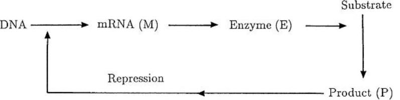

**Figure 7.1.** Schematic control system for the production of an enzyme (*E*) according to the model system (7.3). Here, the enzyme combines with the substrate to produce a product (*P*) which represses the transcription of DNA to mRNA (*M*), the template for making the enzyme.

the methods described in Chapter 6. By considering the stability of the steady state, Griffith (1968) showed that oscillations are not possible unless the Hill coefficient *m* in the first of (7.3) is sufficiently large (see Exercise 4), roughly greater than 8—an unnaturally high value. For *m* in this range the system does exhibit limit cycle oscillations.

A more biologically relevant modification is to replace the *P*-equation in (7.3) by

$$\frac{dP}{dt} = dE - \frac{eP}{k+P}.$$

That is, degradation of the product saturates for large *P* according to Michaelis–Menten kinetics. With this in place of the linear form, limit cycle oscillations can occur for low values of the Hill coefficient *m*, even as low as *m* = 2.

The concept of a sequence of linked reactions is a useful one and various modifications have been suggested. In one, which has been widely used and studied, the number of reactions has been increased generally to *n* and the feedback function made more more general and hence widely applicable. In a suitable nondimensional form the system is

$$\begin{aligned} \frac{du_1}{dt} &= f(u_n) - k_1 u_1, \\ \frac{du_r}{dt} &= u_{r-1} - k_r u_r, \quad r = 2, 3, \dots, n, \end{aligned} \tag{7.4}$$

where the *kr* > 0 and *f* (*u*), which is always positive, is the nonlinear feedback function. If *f* (*u*) is an increasing function of *u*, *f* (*u*) > 0, (7.4) represents a *positive feedback* loop, while if *f* (*u*) is a monotonic decreasing function of *u*, *f* (*u*) < 0, the system represents a *negative feedback* loop or *feedback inhibition*. Positive feedback loops are not common metabolic control mechanisms, whereas negative ones are; see, for example, Tyson and Othmer (1978) and Goldbeter (1996). Yagil and Yagil (1971) suggested specific forms for *f* (*u*) for several biochemical situations.

Steady state solutions of (7.4) are given by

$$\begin{aligned} f(u_n) &= k_1 k_2 \dots k_n u_n, \\ u_{n-1} &= k_n u_n \dots \quad , \quad u_1 = k_2 k_3 \dots k_n u_n \end{aligned} \tag{7.5}$$

the first of which is most easily solved graphically by plotting *f* (*u*) and noting the intersections with the straight line *k*1*k*2 ... *knu*. With positive feedback functions *f* (*u*), multiple steady states are possible whereas with feedback inhibition there is always a unique steady state (see Exercise 3).

Although with higher-dimensional equation systems there is no equivalent of the Poincare–Bendixson theorem for the two-dimensional phase plane (see Appendix A), ´ realistic systems must have some enclosing domain with boundary *B*, that is, a confined set, such that

$$\mathbf{n} \cdot \frac{d\mathbf{u}}{dt} < 0 \quad \text{for} \quad \mathbf{u} \text{ on } B,\tag{7.6}$$

where **n** is the outward unit normal to *B*.

In the case of the more important negative feedback systems of the type (7.4), the determination of such a domain is quite simple. As we noted, we are, of course, only interested in nonnegative values for **u**. Consider first the two-species case of (7.4), namely,

$$\frac{du_1}{dt} = f(u_2) - k_1 u_1, \quad \frac{du_2}{dt} = u_1 - k_2 u_2,$$

where *f* (*u*2) > 0 and *f* (*u*2) < 0. Consider first the rectangular domain bounded by *u*1 = 0, *u*2 = 0, *u*1 = *U*1 and *u*2 = *U*2, where *U*1 and *U*2 are to be determined. On the boundaries

$$\begin{aligned} \mu_1 &= 0, \quad \mathbf{n} \cdot \frac{d\mathbf{u}}{dt} = -\frac{du_1}{dt} = -f(u_2) < 0 \quad \text{for all} \quad u_2 \ge 0, \\\mu_2 &= 0, \quad \mathbf{n} \cdot \frac{d\mathbf{u}}{dt} = -\frac{du_2}{dt} = -u_1 < 0 \quad \text{for} \quad u_1 > 0, \\\mu_1 &= U_1, \quad \mathbf{n} \cdot \frac{d\mathbf{u}}{dt} = f(u_2) - k_1 U_1 < 0 \end{aligned}$$
 
$$\text{if } U_1 > \frac{f(u_2)}{k_1} \quad \text{for all} \quad 0 \le u_2 \le U_2 \quad \Rightarrow \quad U_1 > \frac{f(0)}{k_1}$$
 
$$\begin{aligned} u_2 &= U_2, \quad \mathbf{n} \cdot \frac{d\mathbf{u}}{dt} = u_1 - k_2 U_2 < 0 \\ \text{if } U_2 &> \frac{u_1}{k_2} \quad \text{for all} \quad 0 < u_1 \le U_1. \end{aligned} \tag{7.7}$$

If we now choose *U*1 and *U*2 to satisfy the inequalities

$$U_1 > \frac{f(0)}{k_1}, \quad U_2 > \frac{U_1}{k_2} \tag{7.8}$$

then (7.7) shows that there is a confined set *B* on which (7.6) is satisfied. We can always find such *U*1 and *U*2 when *f* (*u*) is a monotonic decreasing function of *u*. Note that the positive steady state, given by the unique solution of

$$
\mu_1 = k_2 \mu_2, \quad f(\mu_2) = k_1 k_2 \mu_2.
$$

always lies inside the domain *B* defined by (7.7) and (7.8), and, since *f* (*u*) < 0, it is always linearly stable, since the eigenvalues of the stability (or community) matrix are both negative. Thus the two-species model cannot admit limit cycle oscillations.

It is now clear how to generalise the method to determine a domain boundary *B* on which (7.6) is satisfied for an *n*-species negative feedback loop. The appropriate confined set is given by the box bounded by the planes *ur* = 0, *r* = 1, 2,... , *n* and *ur* = *Ur*, *r* = 1, 2,... , *n*, where any *Ur*, *r* = 1,... , *n* satisfying

$$U_1 > \frac{f(0)}{k_1}, \quad U_2 > \frac{U_1}{k_2}, \dots, \quad U_n > \frac{U_1}{k_1 k_2 \dots k_n} \tag{7.9}$$

will suffice. As in the two-species case the steady state always lies inside such a boundary *B*.

Whether or not such systems with *n* ≥ 3 admit periodic solutions is more difficult to determine than in the two-species case (see Exercise 4). As the order of the system goes up the possibility of periodic solutions increases. If we consider the oscillator (7.3) or, in its dimensionless form (7.4) for *u*1, *u*2, *u*3 with *f* (*u*3) = 1/(1 + *u*3), it can be shown that the steady state is always stable (Exercise 4). If we have *f* (*u*3) = 1/(1+*um* 3 ) then (Exercise 4), using the Routh–Hurwitz conditions on the cubic for the eigenvalues of the stability matrix, the steady state is only unstable if *m* > 8, which, as we have mentioned, is an unrealistically high value for the implied cooperativity. As the number of reactions, *n*, goes up, Tyson and Othmer (1978) have shown that the steady state goes unstable if the cooperativity *m* and the length of the feedback loop *n* are such that *m* > *m*0(*n*) = sec*n*(π/*n*). When *n* = 3 this gives *m* = 8 as above: some values for higher *n* are *n* = 4, *m* = 4; *n* = 10, *m* = 1.65 and *n* → ∞, *m* → 1.

By linearising (7.4) about the steady state (7.5), conditions on the function and parameters can be found such that limit cycle periodic solutions exist: MacDonald (1977), for example, used bifurcation theory while Rapp (1976) developed a numerical search procedure for the full nonlinear system and gave quantitative estimates for the period of oscillation.

We can get some analytical approximations for the period of the solutions, when they exist, using a method suggested by Tyson (1979). First we use a result pointed out by Hunding (1974), namely, that most of the kinetics parameters *k*1, *k*2,... , *kn* must be approximately equal or oscillatory solutions will not be possible for low values of *m*. To see this, first note that each *kr* is associated with the inverse of the dimensionless half-life time of *ur*. Suppose, for example, that one of the constants, say *ks*, is much larger than all the others, and choose a time *t*1 such that *t*1 1/*ks* and *t*1 1/*kr* for all *r* = *s*. As the system evolves over a time interval 0 ≤ *t* ≤ *t*1, since *krt*1 1 for all *r* = *s*, from (7.4) *us*−1 does not change much in this time interval. So, the solution of the ordinary differential equation for *us*(*t*) from (7.4) with *us*−1 constant, is

$$u_s(t) \approx u_s(0) \exp\left[-k_s t\right] + \frac{u_{s-1}}{k_s} \{1 - \exp\left[-k_s t\right]\}, \quad 0 \le t \le t_1.$$

But, since *kst*1 1, the last equation gives *us*(*t*) ≈ *us*−1/*ks* which means that the *s*th species is essentially at its pseudo-steady state (since *dus*/*dt* = *us*−1 − *ksus* ≈ 0) over the time interval that all the other species change appreciably. This says that the *s*th species is effectively not involved in the feedback loop process and so the order of the loop is reduced by one to *n* − 1.

Now let *K* be the smallest of all the kinetics parameters and denote the half-life of *uK* by *H*; this is the longest half-life of all the species. Using the above result, the effective length of the feedback loop is equal to the number *N* of species whose halflives are all roughly the same as *H* or, what is the same thing, have rate constants *k* ≈ *K*. All the other reactions take place on a faster timescale and so are not involved in the reaction scheme.

Suppose now we have a periodic solution and consider one complete oscillation in which each of the species undergoes an increase, then a decrease, to complete the cycle. Start off with *u*1 which first increases, then *u*2, then *u*3 and so on to *uN* . Then *u*1 decreases, then *u*2 and so on until *uN* decreases. There is thus a total of 2*N* steps involved in the oscillation with each increase and decrease taking approximately the same characteristic time 1/*K*. So, the approximate period *T* of the oscillation is *T* ≈ 2*N*/*K*. A more quantitative result for the period has been given by Rapp (1976) who showed that the frequency is given by

$$
\Omega = K \tan\left(\frac{\pi}{N}\right) \quad \Rightarrow \quad T = \frac{2\pi}{\Omega},
$$

which reduces to *T* ≈ 2*N*/*K* for large *N*.

The dynamic behaviour of the above feedback control circuits, and generalisations of them, in biochemical pathways have been treated in depth by Tyson and Othmer (1978), and from a more mathematical point of view by Hastings et al. (1977). The latter prove useful results for the existence of periodic solutions for systems with more general reactions than the first-order kinetics feedback loops we have just considered.

It is encouraging from a practical point of view that it is very often the case that if (i) a steady state becomes unstable by growing oscillations at some bifurcation value of a parameter, and (ii) there is a confined set enclosing the steady state, then a limit cycle oscillation solution exists. Of course in any specific example it has to be demonstrated, and if possible proved, that this is indeed the case. But, as this can often be difficult to do, it is better to try predicting from experience and heuristic reasoning and then simulate the system numerically rather than wait for a mathematical proof which may not be forthcoming. An unstable steady state with its own confined set (7.6), although necessary, are not sufficient conditions for an oscillatory solution of (7.1) to exist. One particularly useful aspect of the rigorous mathematical treatment of Hastings et al. (1977) is that it gives some general results which can be used on more realistic feedback circuits which better mimic real biochemical feedback control mechanisms.

Tyson (1983) proposed a negative feedback model similar to the above to explain periodic enzyme synthesis. He gives an explanation as to why the period of synthesis is close to the cell cycle time when cells undergo division.

# **7.3 Oscillators and Switches Involving Two or More Species: General Qualitative Results**

We have already seen in Chapter 3 that two-species models of interacting populations can exhibit limit cycle periodic oscillations. Here we derive some general results as regards the qualitative character of the reaction kinetics which may exhibit such periodic solutions.

Let the two species *u* and v satisfy reaction kinetics given by

$$\frac{du}{dt} = f(u, v), \frac{dv}{dt} = g(u, v), \tag{7.10}$$

where, of course, *f* and *g* are nonlinear. Steady state solutions (*u*0,v0) of (7.10) are given by

$$f(u_0, v_0) = \mathbf{g}(u_0, v_0) = 0,\tag{7.11}$$

of which only the positive solutions are of interest. Linearising about (*u*0,v0) we have, in the usual way (see Chapter 3),

$$\begin{pmatrix} \frac{d(u-u_0)}{dt} \\\\ \frac{d(v-v_0)}{dt} \end{pmatrix} = A \begin{pmatrix} u-u_0 \\ v-v_0 \end{pmatrix}, \quad A = \begin{pmatrix} f_u & f_v \\ g_u & g_v \end{pmatrix}_{u_0,v_0}.\tag{7.12}$$

The linear stability of (*u*0,v0) is determined by the eigenvalues λ of the stability matrix *A*, given by

$$\begin{split} \left| \left| A - \lambda I \right| \right| &= 0 \quad \Rightarrow \quad \lambda^2 - (\text{tr} A)\lambda + \left| A \right| = 0. \\ \Rightarrow \quad \lambda &= \frac{1}{2} \left\{ \text{tr} A \pm \left[ \left( \text{tr} A \right)^2 - 4 \left| A \right| \right]^{1/2} \right\}. \end{split} \tag{7.13}$$

Necessary and sufficient conditions for stability are

$$\text{tr}A = f_{\mu} + g_{v} < 0, \quad |A| = f_{\mu}g_{v} - f_{v}g_{\mu} > 0,\tag{7.14}$$

where here, and in what follows unless stated otherwise, the derivatives are evaluated at the steady state (*u*0,v0).

Near the steady state *S*(*u*0,v0) in the (*u*,v) phase plane the null clines *f* (*u*,v) = 0 and *g*(*u*,v) = 0 locally can intersect in different ways, for example, as illustrated in Figure 7.2. Note that Figure 7.2(b) is effectively equivalent to Figure 7.2(a): it is simply Figure 7.2(a) rotated. Figure 7.2(c) is qualitatively different from the others.

Let us assume that the kinetics *f* (*u*,v) and *g*(*u*,v) are such that (7.10) has a confined set in the positive quadrant. Then, by the Poincare–Bendixson theorem, limit cy- ´ cle solutions exist if (*u*0,v0) is an unstable spiral or node, but not if it is a saddle point

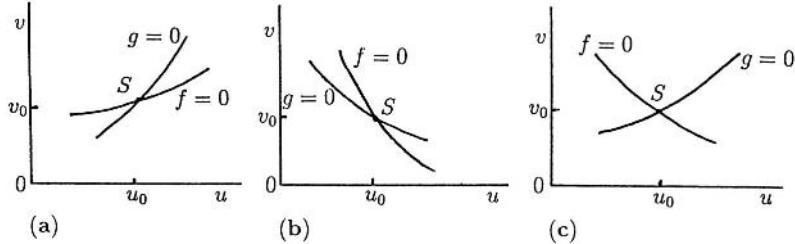

**Figure 7.2.** Local behaviour of the reaction null clines *f* = 0, *g* = 0 at a steady state *S*(*u*0, v0).

(see Appendix A). For an unstable node or spiral to occur, we require

$$\text{tr}A > 0, \quad |A| > 0, \quad \text{(tr}A)^2 \begin{cases} > \\ < \end{cases} \\ 4|A| \quad \Rightarrow \quad \text{unstable} \begin{cases} \text{node} \\ \text{spiral} \end{cases}. \tag{7.15}$$

Consider now Figure 7.2(a). At the steady state (*u*0,v0) on each of *f* = 0 and *g* = 0 the gradient *d*v/*du* > 0 with *d*v/*du*]*g*=0 > *d*v/*du*] *f* =0, so

$$
\left. \frac{dv}{du} \right|_{\mathcal{S}=0} = -\frac{g_u}{g_v} > \left. \frac{dv}{du} \right|_{f=0} = -\frac{f_u}{f_v} > 0
$$

$$
\Rightarrow |A| = f_u g_v - f_v g_u > 0,
$$

provided *f*v and *g*v have the same sign. Since *d*v/*du* > 0 it also means that at *S*, *fu* and *f*v have different signs, as do *gu* and *g*v. Now from (7.13), tr*A* > 0 requires at least that *fu* and *g*v are of opposite sign or are both positive. So, the matrix *A* (the stability matrix or community matrix in interaction population terms) in (7.12) has terms with the following possible signs for the elements,

$$A = \begin{pmatrix} + & - \\ + & - \end{pmatrix} \quad \text{or} \quad \begin{pmatrix} - & + \\ - & + \end{pmatrix} \tag{7.16}$$

with each of which it is possible to have tr *A* > 0. We have already shown that | *A* | > 0. To proceed further we need to know individually the signs of *fu*, *f*v, *gu* and *g*v at the steady state. With Figure 7.2(a) there are 4 possibilities as illustrated in Figure 7.3. These imply that the elements in the matrix *A* in (7.12) have the following signs,

$$A = \begin{pmatrix} - & + \\ + & - \end{pmatrix} \quad \text{or} \quad \begin{pmatrix} - & + \\ - & + \end{pmatrix} \quad \text{or} \quad \begin{pmatrix} + & - \\ + & - \end{pmatrix} \quad \text{or} \quad \begin{pmatrix} - & + \\ - & + \end{pmatrix} . \tag{7.17}$$

$$\text{(a)} \qquad \text{(b)} \qquad \text{(c)} \qquad \text{(d)}$$

For example, to get the sign of *fu* at *S* in Figure 7.3(a) we simply note that as we move along a line parallel to the *u*-axis through *S*, *f* decreases since *f* > 0 on the lower *u*-side and *f* < 0 on the higher *u*-side. If we now compare these forms with those in (7.16) we see that the only possible forms in (7.17) are (b) and (c). With (d), | *A* | < 0

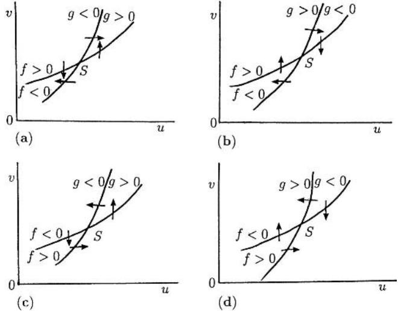

**Figure 7.3.** The various possible signs of the kinetics functions *f* (*u*,v) and *g*(*u*,v) on either side of their null clines for the case illustrated in Figure 7.2(a). The arrows indicate, qualitatively, directions of typical trajectories in the neighbourhood of the steady state *S*.

which makes *S* a saddle point (which is unstable, of course) and so there can be no limit cycle solution enclosing *S* (see Appendix A).

For any given kinetics functions it is easy to determine from the null clines the qualitative behaviour in the neighbourhood of a steady state, and hence the signs in the matrix *A* in (7.12). If the null clines look locally like those in Figures 7.2(b) and (c) similar results can easily be obtained for the allowable type of kinetics which can admit periodic solutions for (7.10).

Let us now consider two typical examples which illustrate the qualitative approach we have just described. Let us suppose a parameter λ of the kinetics is such that the null clines for (7.10) look like those in Figure 7.4 for different ranges of the parameter λ. (This is in fact the null cline situation for the real biological oscillator, Thomas 1975, briefly discussed in Chapter 6, Section 6.7.) To be specific we choose specific signs for *f* and *g* on either side of the null clines as indicated (these are in accord with the practical Thomas 1975 kinetics situation). Note that there is a confined set on the boundary of which the vector (*du*/*dt*, *d*v/*dt*) points into the set: one such set is specifically indicated by *ABCDA* in Figure 7.4(a).

Let us now consider each case in Figure 7.4 in turn. Figure 7.4(a) is equivalent to that in Figure 7.2(c). Here, in the neighbourhood of *S*,

$$\begin{aligned} \left. \frac{dv}{du} \right|_{f=0} &= -\frac{f_u}{f_v} < 0, \quad f_u < 0, \quad f_v < 0, \\\left. \frac{dv}{du} \right|_{g=0} &= -\frac{g_u}{g_v} > 0, \quad g_u > 0, \quad g_v < 0. \end{aligned}$$

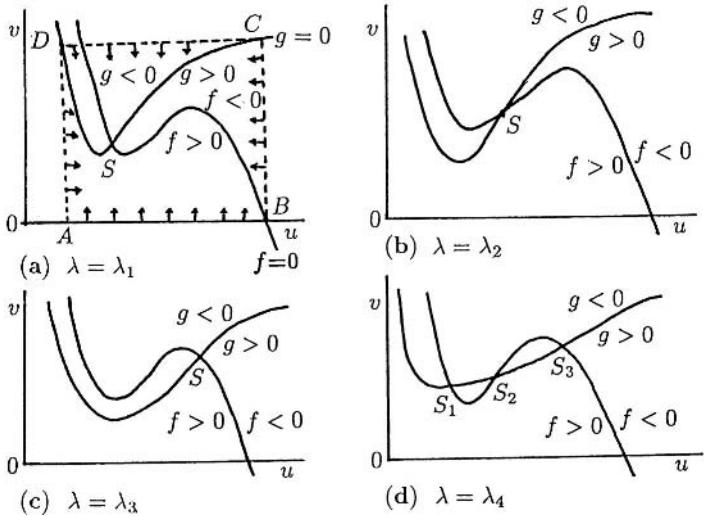

**Figure 7.4.** Qualitative form of the null clines for a specimen kinetics in (7.10) as a parameter λ varies: λ1 = λ2 = λ3 = λ4. With the signs of *f* and *g* as indicated, there is a confined set for (7.10): it is, for example, the rectangular box *ABCDA* as indicated in (**a**).

So, the stability matrix *A* in (7.12) has the signs

$$A = \begin{pmatrix} - & - \\ + & - \end{pmatrix} \quad \Rightarrow \quad \text{tr}A < 0, \quad |A| > 0$$

which does not correspond to any of the forms in (7.16); from (7.13), Re λ < 0 and so the steady state in Figure 7.4(a) is always stable and periodic solutions are not possible for (7.10) in this situation. This case, however, is exactly the same as that in Figure 7.4(c) and so the same conclusion also holds for it. By a similar analysis we get for Figure 7.4(b)

$$A = \begin{pmatrix} + & - \\ + & - \end{pmatrix}$$

which is the same as (c) in (7.17), and is one of the possible forms for (7.10) to admit periodic solutions.

If we now consider the multi-steady state situation in Figure 7.4(d), we have already dealt with *S*1 and *S*3, which are the same as in Figures 7.4(a) and (c)—they are always *linearly* stable. For the steady state *S*2 we have

$$\begin{aligned} &f_{\mu} > 0, \quad f_{v} < 0, \quad g_{u} > 0, \quad g_{v} < 0\\ &0 < \left. \frac{dv}{du} \right|_{g=0} < \left. \frac{dv}{du} \right|_{f=0} \quad \Rightarrow \quad 0 < -\frac{g_{u}}{g_{v}} < -\frac{f_{u}}{f_{v}}\\ &\Rightarrow |A| = f_{\mu}g_{v} - f_{v}g_{u} < 0, \end{aligned}$$

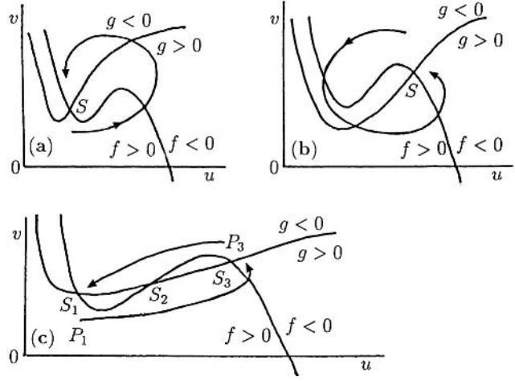

**Figure 7.5.** Threshold phenomena for various kinetics for (7.10). In (**c**) a suitable perturbation from one linearly stable steady state can effect a permanent change to the other stable steady state.

which, from (7.15), shows that the steady state is a saddle point, and although it means *S*2 is unstable, it is the type of singularity which does not admit periodic solutions for (7.10) according to the Poincare–Bendixson theorem (Appendix A). ´

This last case, Figure 7.4(d), is of considerable general importance. Recall the threshold phenomenon described in the last chapter in Section 6.7. There we saw that in a situation similar to that in Figures 7.4(a) and (c) that, although the steady state is linearly stable, if a perturbation is sufficiently large the values of *u* and v can undergo large perturbations before returning to the steady state (refer to Figure 6.10). This phenomenon is illustrated in Figures 7.5(a) and (b).

Now consider Figure 7.4(d). *S*1 and *S*3 are respectively equivalent to the *S* in Figures 7.5(a) and (b). We now see, in Figure 7.5(c), that if we perturb (*u*,v) from say, *S*1 to *P*1, the solution trajectory will be qualitatively as shown. Now, instead of returning to *S*1 the solution moves to *S*3, the second stable steady state. In this way a *switch* has been effected from *S*1 to *S*3. In a similar way a switch can be effected from *S*3 to *S*1 by, for example, a perturbation from the steady state *S*3 to *P*3. It is possible that a parameter in the kinetics function *g*, say, can be varied in such a way that the null cline is translated vertically as the parameter is, for example, increased. In this case it is possible for the system to exhibit *hysteresis* such as we discussed in detail in Chapter 1, Section 1.2 and Chapter 6, Section 6.7. If the reaction kinetics give rise to mushrooms and isolas, even more baroque dynamic, threshold and limit cycle behaviour is possible. Biological switches, not only those exhibiting hysteresis and more exotic behaviour, are of considerable importance in biology. We discuss one important example below in Section 7.5. We also see a specific example of its practical importance in the wave phenomenon observed in certain eggs after fertilization, a process and mechanism for which is discussed in detail in Chapter 13, Section 13.6 below and Chapter 6, Volume II, Section 6.8.

It is clear from the above that the qualitative behaviour of the solutions can often be deduced from a gross geometric study of the null clines and the global phase plane behaviour of trajectories. We can carry this approach much further, as has been done, for example by Rinzel (1986), to predict even more complex solution behaviour of such differential equation systems. Here I only want to give a flavour of what can be found.

Let us suppose we have a general system governed by

$$\frac{d\mathbf{u}}{dt} = \mathbf{f}(\mathbf{u}, \alpha), \quad \frac{d\alpha}{dt} = \varepsilon \mathbf{g}(\mathbf{u}, \alpha), \tag{7.18}$$

where 0 < ε 1, **u** is a vector of concentrations and α is a parameter, which is itself governed by an equation, but which changes only slowly. The *fast* subsystem of (7.18) is the *O*(1) system, as ε → 0, in which α is simply a constant parameter, since *d*α/*dt* ≈ 0. The *slow* dynamics governs the change in α with time. We analyse some specific systems like this in the following chapter, when we discuss relaxation oscillators.

Suppose a uniform steady state **u**0 depends on α as indicated schematically in Figure 7.6(a). That is, there is a region α1 <α<α2 where three possible steady states **u**0 exist; recall also the discussion in Section 6.7 in the last chapter. To be more specific let us suppose that α varies periodically in such a way that in each cycle it sweeps back and forth through the window which gives three solutions for **u**0, the one on the dashed line in Figure 7.6(a) being unstable as to be expected. At the start suppose α = α1 and **u**0 is at *A* in Figure 7.6(a). Now as α increases, **u**0 slowly varies until α passes through α2. At α2, **u**0 jumps discontinuously from *B* to *C*, after which it again varies slowly with α. On the return α-trip, **u**0 remains on the lower branch of the *S*-curve until it reaches *D*, where it jumps up to *A* again. The limit cycle behaviour of this system is illustrated schematically in Figure 7.6(b). The rapidly varying region is where **u** drops from *B* to *C* and increases from *D* to *A*. This is a typical *relaxation oscillator* behaviour; see Chapter 8, Section 8.4 below.

The fast dynamics subsystem in (7.18) may, of course, have as its steady state a periodic solution, say, **u**per. Now the parameter α affects an oscillatory solution. A relevant bifurcation diagram is then one which shows, for example, a transition from one oscillation to another. Figure 7.7(a) illustrates such a possibility. The branch *AB* represents, say, a small amplitude stable limit cycle oscillation around **u**0 for a given α.

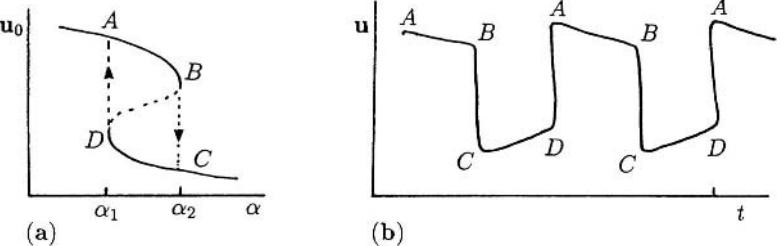

**Figure 7.6.** (**a**) Schematic steady state **u**0 dependence on the parameter α: steady states on the dashed line are unstable. (**b**) Typical limit cycle behavior of **u** if α slowly varies in a periodic way. The oscillation is described as a *relaxation oscillator*: that is, there are slowly varying sections of the solution interspersed with rapidly varying regions.

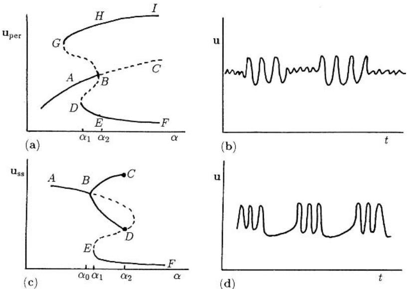

**Figure 7.7.** (**a**) Schematic bifurcation for periodic solutions of the fast dynamics subsystem of (7.18) as α varies periodically. The dashed lines are unstable branches. (**b**) Typical periodic behaviour as α slowly varies in a periodic way back and forth through the (α1, α2) window, for the bifurcation picture in (**a**). (**c**) Another example of a periodic solution bifurcation diagram for the subsystem of (7.18) as α varies. (**d**) Qualitative periodic solution behaviour as α varies periodically through α1 and α2 in (**c**). These are examples of 'periodic bursting.'

Solutions on the branch *BC* are unstable. Now as α increases there is a slow variation in the solution until it passes through α2 at *B*, after which the periodic solution undergoes a bifurcation to a larger amplitude oscillation with bounds for **u** on the curves *E F* and *H I*. The transition from one solution type to another is fast, as in the relaxation oscillator situation in Figure 7.6. Now let α decrease. The bifurcation to the *AB* branch now occurs at *D*, where α = α1. So, as α varies periodically such that it includes a window with α<α1 and α>α2, the solution behaviour will be qualitatively like that shown in Figure 7.7(b).

Figure 7.7(c) shows another possible example. The line *AB* represents a nonoscillatory solution which bifurcates for α = α0 to a periodic solution at *B*. These branches terminate at *D* and *C*, where α = α2. The branch *E F* is again a uniform stable steady state. Suppose we now consider α to vary periodically between α>α2 and α0 <α<α1. To be specific, let us start at *F* in Figure 7.7(c). As α decreases we move along the branch *F E*; that is, the uniform steady state **u***ss* varies slowly. At *E*, where α = α1, the uniform steady state bifurcates to a periodic solution on the branches *B D* and *BC*. Now as α increases the periodic solution remains on these branches until α reaches α2 again, after which the solution jumps down again to the homogeneous steady state branch *E F*. A typical time behaviour for the solution is illustrated in Figure 7.7(d). Both this behaviour and that in Figure 7.7(b) are described as 'periodic bursting.' Keener and Sneyd (1998) devote a chapter to this phenomenon and describe some specific models of biological examples where it occurs.

The complexity of solution behaviour of such systems (7.18) can be spectacular. The specific behaviour just described in Figures 7.6 and 7.7 has been found in models for real biological systems; an example of the former is in the following chapter, while qualitatively similar curves to those in Figure 7.7 have been found by Rinzel (1985). The system studied by Rinzel (1985) is specifically related to the model described below in Section 7.5 on neural periodic behaviour. The model system given by (6.125) in Section 6.7 in the last chapter, and the iodate–arsenous model reaction scheme (6.132) and (6.133), exhibit comparable solution behaviour but with the potential for even more complex dynamic phenomena. Othmer and Schaap (1999) discuss the kinetics (firmly based on the biology) associated with cyclic-AMP emission by cells of the slime mould *Dictyostelium discoideum*; see also the article by Dallon and Othmer (1997) who put forward a discrete cell model for its adaptive signalling. This slime mould exhibits some remarkable complex dynamics. Decroly and Goldbeter (1987) considered a model 3-variable system associated with cyclic-AMP emission by the cells of *Dictyostelium discoideum* as a vehicle to demonstrate the transition from simple to complex oscillatory behaviour. As well as obtaining increasingly complex patterns of bursting they showed period doubling leading to chaos; see also Goldbeter (1996).

Figure 7.7 shows some of the complex effects which appear when oscillators interact or when reaction schemes have fast and slow subschemes. This is mathematically a very interesting and challenging field and one of continuing research. We consider in some detail some important aspects of oscillator interaction in Chapter 9. In Chapter 12 we discuss another important and quite different aspect of interacting oscillations.

#### *Canards*

A canard is the word associated with oscillatory systems which undergo sudden major changes in the amplitude and period of the oscillatory solution as some parameter passes through a narrow range of values. Canards were first discussed in association with the van der Pol equation by Benoit et al. (1981) and have been studied since in a variety of applications. Canard systems give rise to interesting and sometimes baroque dynamical behaviour. The discovery of canards in relatively simple chemical reaction systems stems from the second half of the 1980's; one is the two-variable Oregonator (Brøns and Bar-Eli 1991), a system we discuss in some detail in Chapter 8.

Canards were found by Gasp ´ ar and Showalter (1990) in the oscillatory iodate– ´ sulphite–ferrocyanide reaction, known as the EOB reaction which was discovered by Edblom and Epstein (1986). The analysis of these sytems can be quite complicated and analytically interesting since, among other things, they usually involve the interplay of fast and slow dynamics and hence singular perturbation theory is generally appropriate. The EOB reaction can be described by a ten-variable empirical-rate-law model system which like the Belousov–Zhabotinsky reaction (see Chapter 8) can be reduced (Gasp ´ ar´ and Showalter 1990) in this case to a four-variable system which retains the essential experimental features of the full system. This four-variable system is given by

$$A + Y \overset{k_1}{\underset{k_{-1}}{\rightleftharpoons}} X, \quad X \overset{k_2}{\rightarrow} Y, \quad 2Y \overset{k_3}{\rightarrow} Z, \quad Z + X \overset{k_4}{\rightarrow} 3Y, \quad Z \overset{k_5}{\rightarrow},$$

where *A* = *SO*2− 3 , *X* = *HSO*− 3 , *Y* = *H*+ and *Z* = *I*2. Gasp ´ ar and Showalter (1990) ´ used a singular perturbation approach which eliminated the *A* and *Z* variables and obtained the minimal set of equations

$$\begin{aligned} \frac{dX}{dt} &= k_1 A_s Y - (k_{-1} + k_2 + k_4 Z_s + k_0)X, \\ \frac{dY}{dt} &= -k_1 A_s Y + (k_{-1} + k_2 + 3k_4 Z_s)X - 2k_3 Y^2 + k_0 (Y_0 - Y), \end{aligned}$$

where *As* and *Zs* are functions of *X* and *Y* given by

$$A_s = \frac{k_{-1}X + k_0 A_0}{k_1 Y + k_0}, \quad Z_s = \frac{k_3 Y^2}{k_1 X + k_5 + k_0}.$$

and *k*0, *A*0 and *Y*0 are constants associated with the experimental parameters. Peng et al. (1991) analyse this system and other practical model chemical systems which display canards.

### **7.4 Simple Two-Species Oscillators: Parameter Domain Determination for Oscillations**

If we restrict our reaction system to only two species it was shown by Hanusse (1972) that limit cycle solutions can only exist if there are trimolecular reactions. These would be biochemically unrealistic if they were the only reactions involved, but as we have shown in Chapter 6 such two-reactant models can arise naturally from a higher-order system if typical enzyme reactions, for example, are part of the mechanism being considered. So, it is reasonable to consider trimolecular two-species models and not just for algebraic and mathematical convenience in demonstrating principles and techniques. Schnackenberg (1979) considered the class of two-species 'simplest,' but chemically plausible, trimolecular reactions which will admit periodic solutions. The simplest such reaction mechanism is

$$X \underset{k=1}{\overset{k_1}{\rightleftharpoons}} A, \quad B \overset{k_2}{\leftrightarrow} Y, \quad 2X + Y \overset{k_3}{\rightarrow} 3X,\tag{7.19}$$

which, using the Law of Mass Action, results in the nondimensional equations for *u* and v, the dimensionless concentrations of *X* and *Y* , given by

$$\frac{du}{dt} = a - u + u^2 v = f(u, v), \quad \frac{dv}{dt} = b - u^2 v = g(u, v), \tag{7.20}$$

where *a* and *b* are positive constants. Typical null clines are illustrated in Figure 7.8. In the vicinity of the steady state *S* these are equivalent to the situation in Figure 7.2(b). With (7.20) it is easy to construct a confined set on the boundary of which the vector (*du*/*dt*, *d*v/*dt*) points inwards or along it; the quadrilateral in Figure 7.8 is one example. Hence, because of the Poincare–Bendixson theorem, the existence of a peri- ´

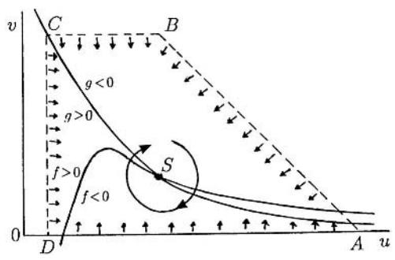

**Figure 7.8.** Typical null clines *f* = 0 and *g* = 0 for the 'simplest' oscillator (7.20) for *a* > 0 and *b* > 0. The quadrilateral *ABCDA* is a boundary of a confined set enclosing the steady state *S*.

odic solution is assured if, for (7.20), the stability matrix *A* for the steady state satisfies (7.15).

#### *Determination of Parameter Space for Oscillations*

For any model involving parameters it is always useful to know the ranges of parameter values where oscillatory solutions are possible and where they are not. For all but the simplest kinetics this has to be done numerically, but the principles involved are the same for them all. Here we carry out the detailed analysis for the simple model reaction (7.20) to illustrate the general principles: the model involves only two parameters *a* and *b* and we can calculate the (*a*, *b*) parameter space analytically. The requisite space is the range of the parameters *a* and *b* which make the steady state an unstable node or spiral: that is, the parameter range where, from (7.15), tr*A* > 0 and | *A* | > 0. Later we shall develop a more powerful and general parametric method which can be applied to less simple kinetics.

The steady state (*u*0,v0) for (7.20) is given by

$$\begin{aligned} f(u_0, v_0) &= a - u_0 + u_0^2 v_0 = 0, \quad g(u_0, v_0) = b - u_0^2 v_0 = 0, \\ \Rightarrow u_0 &= b + a, \quad v_0 = \frac{b}{(a+b)^2}, \quad \text{with} \quad b > 0, \ a + b > 0. \end{aligned} \tag{7.21}$$

Substituting these into the stability matrix *A* in (7.12), we get

$$\begin{aligned} \text{tr}A &= f_u + g_v = (-1 + 2u_0 v_0) + (-u_0^2) = \frac{b-a}{a+b} - (a+b)^2, \\ |A| &= f_u g_v - f_v g_u = (a+b)^2 > 0 \quad \text{for all} \quad a, b. \end{aligned} \tag{7.22}$$

The domain in (*a*, *b*) space where (*u*0,v0) is an unstable node or spiral is, from (7.15), where tr*A* > 0 and so the domain boundary is

$$\text{tr}A = 0 \quad \Rightarrow \quad b - a = (a + b)^3. \tag{7.23}$$

Even with this very simple model, determination of the boundary involves the solution of a cubic, not admittedly a major problem, but a slightly tedious one. Care has

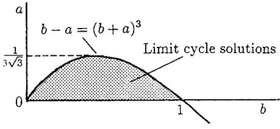

**Figure 7.9.** Parameter space where limit cycle periodic solutions of (7.20) exist for *a* > 0 and *b* > 0. The boundary curve is given by (7.23), although it was in fact calculated using the more easily applied parametric form (7.27).

to be taken since the solution, say, of *b* in terms of *a*, involves three branches. Figure 7.9 gives the parameter domain where oscillations are possible for *b* > 0. There is another more powerful way (Murray 1982) of determining the boundary, namely, parametrically, which is much easier and which also avoids the multiple branch problem. Furthermore, it is a method which has wider applicability, can be used with more complicated systems and provides the numerical procedure for the determination of the parameter domain for systems where it is not feasible to do it analytically. We again use the simple model system (7.20) to illustrate the method; see the exercises for other examples.

Let us consider the steady state *u*0 as a parameter and determine *b* and *a* in terms of *u*0. From (7.21),

$$v_0 = \frac{\mu_0 - a}{\mu_0^2}, \quad b = \mu_0^2 v_0 = \mu_0 - a,\tag{7.24}$$

and

$$A = \begin{pmatrix} f_u & f_v \\ g_u & g_v \end{pmatrix} = \begin{pmatrix} -1 + 2u_0 v_0 & u_0^2 \\ -2u_0 v_0 & -u_0^2 \end{pmatrix} = \begin{pmatrix} 1 - \frac{2a}{\mu_0} & u_0^2 \\ -2 + \frac{2a}{\mu_0} & -u_0^2 \end{pmatrix}.$$

Since | *A* | = *u*2 0 > 0 the required necessary condition for oscillations from (7.15) is tr*A* > 0; that is,

$$f_{\mu} + g_{v} > 0 \quad \Rightarrow \quad 1 - \frac{2a}{\mu_{0}} - \mu_{0}^{2} > 0 \quad \Rightarrow \quad a < \frac{\mu_{0}(1 - \mu_{0}^{2})}{2}.\tag{7.25}$$

We also have from (7.24)

$$b = \mu_0 - a > \frac{\mu_0 (1 + \mu_0^2)}{2}.\tag{7.26}$$

The last two inequalities define, parametrically in *u*0, the boundary curve where tr*A* = 0. Since the parameter *u*0 is the steady state, the only parameter range of interest is *u*0 ≥ 0. Thus, one of the boundary curves in (*a*, *b*) space, which defines the domain where the necessary condition for oscillations is satisfied (in this example it is only tr*A* > 0), is defined by

$$a = \frac{\mu_0 (1 - \mu_0^2)}{2}, \quad b = \frac{\mu_0 (1 + \mu_0^2)}{2}, \quad \text{for all} \quad \mu_0 > 0. \tag{7.27}$$

Sufficient conditions for an oscillatory solution are given by (7.15) together with the existence of a confined set. Since a confined set has been obtained for this mechanism (see Figure 7.8) the conditions (7.25) and (7.26) are sufficient. Figure 7.9 was calculated using (7.27) and shows the space given by (7.23). The mechanism (7.20) will exhibit a limit cycle oscillation for any parameter values which lie in the shaded region; for all other values in the positive quadrant the steady state is stable.

This pedagogically very useful model (7.20) is a particularly simple one for which to determine the parameter space for periodic solutions. This is because the requirement | *A* | > 0 was automatically satisfied for all values of the parameter and the necessary and sufficient condition for existence boiled down to finding the domain where tr*A* was positive. Generally, once a confined set has been found (which in itself can often put constraints on the parameters), the parameter space for periodic solutions is determined by the *two* boundary curves in parameter space defined by tr*A* = 0, | *A* | = 0.

Although we envisage the biochemical mechanism (7.20) to have *a* > 0 the mathematical problem need not have such a restriction as long as *u*0 and v0 are nonnegative.

To show how the parametric procedure works in general, let us allow *a* to be positive or negative. Now the necessary and sufficient conditions are satisfied if tr*A* > 0, namely, (7.25) with (7.26), and | *A* | > 0. Since | *A* | = *u*2 0 > 0, the condition | *A* | > 0 is automatically satisfied. With the requirement *u*0 ≥ 0 this gives the curve in (*a*, *b*) space as

$$b + a > 0 \quad \Rightarrow \quad a > -u_0, \quad b > u_0,\tag{7.28}$$

as a particularly simple parametric representation. Thus the two sets of inequalities are bounded in parameter space by the curves

$$\begin{cases} a = \frac{\mu_0 (1 - \mu_0^2)}{2}, & b = \frac{\mu_0 (1 + \mu_0^2)}{2}, \\ a = -\mu_0 & b = \mu_0 \end{cases} \quad \text{for all} \quad \mu_0 \ge 0. \tag{7.29}$$

Figure 7.10 gives the general parameter space defined by (7.29). The inequality (7.28)

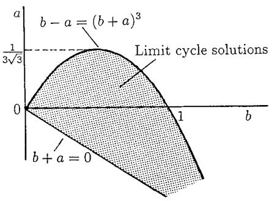

**Figure 7.10.** Parameter space in which solutions (*u*,v) of (7.20) are periodic limit cycles. Note that *a* < 0 is possible, although it is not of biochemical interest.

is satisfied by values (*a*, *b*) which lie above the straight line given by (7.29) while the inequality (7.26) is satisfied for values lying below the curve given by (7.29). Together they define a closed domain.

#### λ − ω *Systems*

These are particularly simple systems of equations which have exact limit cycle solutions, and which have been widely used in prototype studies of reaction diffusion systems. The equations can be written in the form

$$\begin{aligned} \frac{du}{dt} &= \lambda(r)u - \omega(r)v, \quad \frac{dv}{dt} = \omega(r)u + \lambda(r)v, \\ r &= (u^2 + v^2)^{1/2}, \end{aligned} \tag{7.30}$$

where λ is a positive function of *r* for 0 ≤ *r* ≤ *r*0 and negative for *r* > *r*0, and so λ(*r*0) = 0, and ω(*r*) is a positive function of *r*. It does not seem possible to derive such equations from any sequence of reasonable biochemical reactions. However, their advantage primarily lies in the fact that explicit analytic results can be derived when they are used as the kinetics in the study of wave phenomena in reaction diffusion models. Such analytical solutions can often provide indications of what to look for in more realistic systems. So although their use is in an area discussed later, it is appropriate to introduce them here simply as examples of nontrivial mathematical oscillators.

If we express the variables (*u*,v) in the complex form *c* = *u* + *i*v, equations (7.30) become the complex equation

$$\frac{dc}{dt} = [\lambda(|c|) + i\omega(|c|)]c, \quad c = u + iv. \tag{7.31}$$

From this, or by multiplying the first of (7.30) by *u* and adding it to v times the second, we see that a limit cycle solution is a circle in the (*u*,v) plane or complex *c*-plane since

$$\frac{d|c|}{dt} = \lambda(|c|)|c| \quad \Rightarrow \quad |c| = r_0,\tag{7.32}$$

because λ(| *c* |) is positive if 0 ≤ | *c* | < *r*0 and negative if | *c* | > *r*0.

An alternative way to write (7.31) in the complex plane is to set

$$c = r e^{i\theta} \quad \Rightarrow \quad \frac{dr}{dt} = r\lambda(r), \quad \frac{d\theta}{dt} = \omega(r) \tag{7.33}$$

for which the limit cycle solution is

$$r = r_0, \quad \theta(t) = \omega(r_0)t + \theta_0,\tag{7.34}$$

where θ0 is a constant.

# **7.5 Hodgkin–Huxley Theory of Nerve Membranes: FitzHugh–Nagumo Model**

Neural communication is clearly a very important field. We make no attempt here to give other than a basic introduction to it and discuss one of the key mathematical models which has been studied extensively. Rinzel (1981) gives a short review of models in neurobiology; see also Keener and Sneyd (1998).

Electric signalling or firing by individual nerve cells or neurons is particularly common. The seminal and now classical work by Hodgkin and Huxley (1952) on this aspect of nerve membranes was on the nerve axon of the giant squid. (They were awarded a Nobel prize for their work.) Basically the axon is a long cylindrical tube which extends from each neuron and electrical signals propagate along its outer membrane, about 50 to 70 Angstr ˚ oms thick. The electrical pulses arise because the membrane is preferentially ¨ permeable to various chemical ions with the permeabilities affected by the currents and potentials present. The key elements in the system are potassium (K+) ions and sodium (Na+) ions. In the rest state there is a transmembrane potential difference of about −70 millivolts (mV) due to the higher concentration of K+ ions within the axon as compared with the surrounding medium. The deviation in the potential across the membrane, measured from the rest state, is a primary observable in experiments. The membrane permeability properties change when subjected to a stimulating electrical current *I*: they also depend on the potential. Such a current can be generated, for example, by a local depolarisation relative to the rest state.

In this section we are concerned with the *space-clamped* dynamics of the system; that is, we consider the spatially homogeneous dynamics of the membrane. With a real axon the space-clamped state can be obtained experimentally by having a wire down the middle of the axon maintained at a fixed potential difference to the outside. Later, in Chapter 1, Volume II, we shall discuss the important spatial propagation of action potential impulses along the nerve axon; we shall refer back to the model we discuss here. We derive here the Hodgkin–Huxley (1952) model and the reduced analytically tractable FitzHugh–Nagumo mathematical model (FitzHugh 1961, Nagumo et al. 1962) which captures the key phenomena. The analysis of the various mathematical models has indicated phenomena which have motivated considerable experimental work. The theory of neuron firing and propagation of nerve action potentials is one of the major successes of real mathematical biology.

#### *Basic Mathematical Model*

Let us take the positive direction for the membrane current, denoted by *I*, to be outwards from the axon. The current *I*(*t*) is made up of the current due to the individual ions which pass through the membrane and the contribution from the time variation in the transmembrane potential, that is, the membrane capacitance contribution. Thus we have

$$I(t) = C\frac{dv}{dt} + I_l,\tag{7.35}$$

where *C* is the capacitance and *Ii* is the current contribution from the ion movement across the membrane. Based on experimental observation Hodgkin and Huxley (1952) took

$$\begin{split} I_l &= I_{Na} + I_K + I_L, \\ &= \mathcal{g}_{Na} m^3 h (V - V_{Na}) + \mathcal{g}_K n^4 (V - V_K) + \mathcal{g}_L (V - V_L), \end{split} \tag{7.36}$$

where *V* is the potential and *INa*, *IK* and *IL* are respectively the sodium, potassium and 'leakage' currents; *IL* is the contribution from all the other ions which contribute to the current. The *g*'s are constant conductances with, for example, *gNam*3*h* the sodium conductance, and *VNa*, *VK* and *VL* are constant equilibrium potentials. The *m*, *n* and *h* are variables, bounded by 0 and 1, which are determined by the differential equations

$$\begin{aligned} \frac{dm}{dt} &= \alpha_m(V)(1-m) - \beta_m(V)m, \\ \frac{dn}{dt} &= \alpha_h(V)(1-n) - \beta_h(V)n, \\ \frac{dh}{dt} &= \alpha_h(V)(1-h) - \beta_h(V)h, \end{aligned} \tag{7.37}$$

where the α and β are given functions of *V* (again empirically determined by fitting the results to the data); see, for example, Keener and Sneyd (1998). α*n* and α*m* are qualitatively like (1+tanh *V*)/2 while α*h*(*V*) is qualitatively like (1−tanh *V*)/2, which is a 'turn-off' switch if *V* is moderately large. Hodgkin and Huxley (1952) fitted the data with exponential forms.

If an applied current *Ia*(*t*) is imposed the governing equation using (7.35) becomes

$$C\frac{dV}{dt} = -\mathbf{g}_{Na}m^3h(V - V_{Na}) - \mathbf{g}_Kn^4(V - V_K) - \mathbf{g}_L(V - V_L) + I_a. \tag{7.38}$$

The system (7.38) with (7.37) constitute the 4-variable model which was solved numerically by Hodgkin and Huxley (1952).

If *Ia* = 0, the rest state of the model (7.37) and (7.38) is linearly stable but is excitable in the sense discussed in Chapter 6. That is, if the perturbation from the steady state is sufficiently large there is a large excursion of the variables in their phase space before returning to the steady state. If *Ia* = 0 there is a range of values where regular repetitive firing occurs; that is, the mechanism displays limit cycle characteristics. Both types of phenomena have been observed experimentally. Because of the complexity of the equation system various simpler mathematical models, which capture the key features of the full system, have been proposed, the best known and particularly useful one of which is the FitzHugh–Nagumo model (FitzHugh 1961, Nagumo et al. 1962), which we now derive.

The timescales for *m*, *n* and *h* in (7.37) are not all of the same order. The timescale for *m* is much faster than the others, so it is reasonable to assume it is sufficiently fast that it relaxes immediately to its value determined by setting *dm*/*dt* = 0 in (7.37). If we also set *h* = *h*0, a constant, the system still retains many of the features experi-

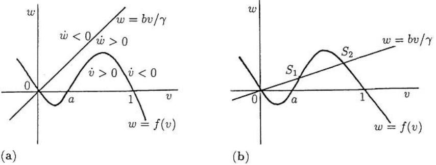

**Figure 7.11.** Phase plane for the model system (7.39) with *Ia* = 0. As the parameters vary there can be (**a**) one stable, but excitable state or, (**b**) three possible steady states, one unstable, namely, *S*1, and two stable, but excitable, namely, (0, 0) and *S*2.

mentally observed. The resulting 2-variable model in *V* and *n* can then be qualitatively approximated by the dimensionless system

$$\begin{aligned} \frac{dv}{dt} &= f(v) - w + I_a, & \frac{dw}{dt} &= bv - \chi w, \\ f(v) &= v(a - v)(v - 1), \end{aligned} \tag{7.39}$$

where 0 < *a* < 1 and *b* and γ are positive constants. Here v is like the membrane potential *V*, and w plays the role of all three variables *m*, *n* and *h* in (7.37).

With *Ia* = 0, or just a constant, the system (7.39) is simply a 2-variable phase plane system, the null clines for which are illustrated in Figure 7.11. Note how the

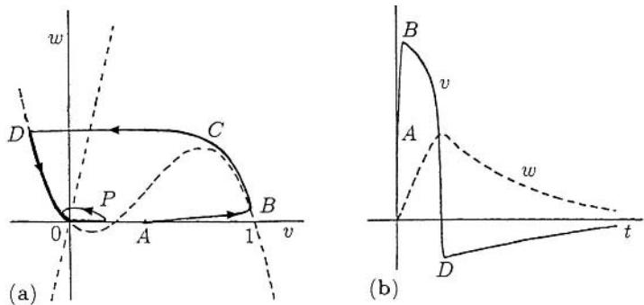

**Figure 7.12.** (**a**) The phase portrait for (7.39) with *Ia* = 0, *a* = 0.25, *b* = γ = 2 × 10−3 which exhibits the threshold behaviour. With a perturbation from the steady state v = w = 0 to a point, *P* say, where w = 0, v < *a*, the trajectory simply returns to the origin with v and w remaining small. A perturbation to *A* initiates a large excursion along *ABCD* and then back to (0, 0), effectively along the null cline since *b* and γ are small. (**b**) The time variation of v and w corresponding to the excitable trajectory *ABCD*0 in (**a**). (Redrawn from Rinzel 1981)

phase portrait varies with different values of the parameters *a*, *b* and γ . There can, for example, be 1 or 3 steady states as shown in Figures 7.11(a) and (b) respectively. The situation corresponds to that illustrated in Figure 7.5, except that here it is possible for v to be negative—it is an electric potential. The excitability characteristic, a key feature in the Hodgkin–Huxley system, is now quite evident. That is, a perturbation, for example, from 0 to a point on the v-axis with v > *a*, undergoes a large phase trajectory excursion before returning to 0. Figure 7.12 shows a specific example.

#### *Periodic Neuron Firing*

With *Ia* = 0 the possible phase portraits, as illustrated in Figure 7.11, show there can be no periodic solutions (see Section 7.3). Suppose now that there is an applied current *Ia*. The corresponding null clines for (7.39) are illustrated in Figures 7.13(a) to (c) for several *Ia* > 0. The effect on the null clines is simply to move the v null cline, with *Ia* = 0, up the w-axis. With parameter values such that the null clines are as in Figure 7.13(a) we can see that by varying only *Ia* there is a window of applied currents (*I*1, *I*2) where the steady state can be unstable and limit cycle oscillations possible, that is, a null cline situation like that in Figure 7.13(b). The algebra to determine the various parameter ranges for *a*, *b*, γ and *Ia* for each of these various possibilities to hold is straightforward. It is just an exercise in elementary analytical geometry, and is left as an exercise (Exercise 7). With the situation exhibited in Figure 7.13(d) limit cycle solutions are not possible. On the other hand this form can exhibit switch properties.

The FitzHugh–Nagumo model (7.39) is a *model* of the Hodgkin–Huxley *model*. So, a further simplification of the mechanism (7.39) is not unreasonable if it simplifies the analysis or makes the various solution possibilities simpler to see. Of course such a simplification must retain the major elements of the original, so care must be exercised.

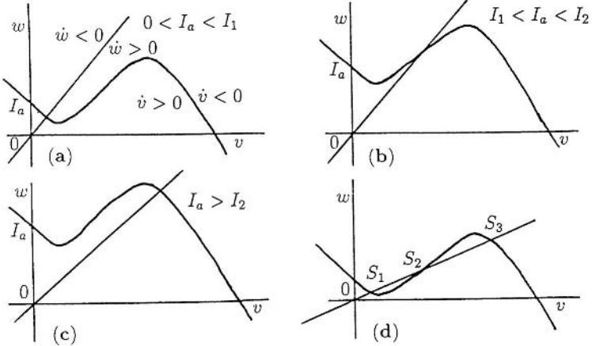

**Figure 7.13.** Null clines for the FitzHugh–Nagumo model (7.39) with different applied currents *Ia* . Cases (**a**), where *Ia* < *I*1, and (**c**), where *Ia* > *I*2, have linearly stable, but excitable, steady states, while in (**b**), where *I*1 < *Ia* < *I*2, the steady state can be unstable and limit cycle periodic solutions are possible. With the configuration (**d**), the steady states *S*1, *S*3 are stable with *S*2 unstable. Here a perturbation from either *S*1 or *S*3 can effect a switch to the other.

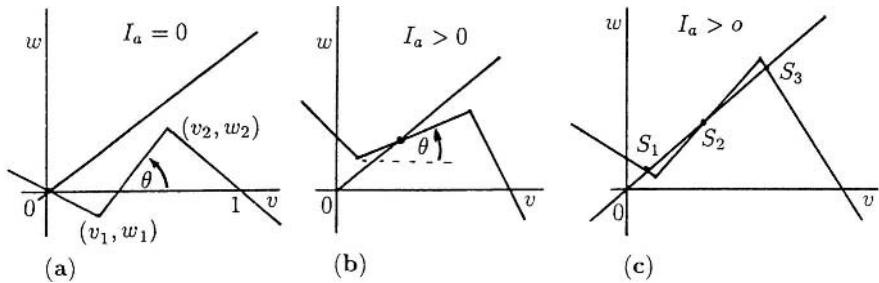

**Figure 7.14.** (**a**) Phase plane null clines for a piecewise linear approximation to the v null cline in the FitzHugh–Nagumo model (7.30) with *Ia* = 0, where (v1, w1) and (v2, w2) are given by (7.40). (**b**) The geometric conditions for possible periodic solutions, which require *Ia* > 0, are shown in terms of the angle θ = tan−1[(w2 − w1)/(v2 − v1)]. (**c**) Geometric conditions for multiple roots and threshold switch possibilities from one steady state *S*1 to *S*3 and vice versa.

From Figure 7.11 we can reasonably approximate the v null cline by a piecewise linear approximation as in Figure 7.14, which in Figure 7.14(a) has zeros at v = 0, *a*, 1. The positions of the minimum and maximum, (v1,w1) and (v2,w2) are obtained from (7.39) as

$$\begin{aligned} v_2, v_1 &= \frac{1}{3} \left[ a + 1 \pm \left\{ (a+1)^2 - 3a \right\}^{1/2} \right], \\ w_i &= -v_i (a - v_i)(1 - v_i) + I_a, \quad i = 1, 2. \end{aligned} \tag{7.40}$$

The line from (v1,w1) to (v2,w2) passes through v = *a* if *a* = 1/2. The acute angle θ the null cline makes with the v-axis in Figure 7.14 is given by

$$\theta = \tan^{-1} \left[ \frac{w_2 - w_1}{v_2 - v_1} \right]. \tag{7.41}$$

We can now write down very simply a necessary condition for limit cycle oscillations for the piecewise model, that is, conditions for the null clines to be as in Figure 7.14(b). The gradient of the v null cline at the steady state must be less than the gradient, *b*/γ , of the w null cline; that is,

$$
\tan \theta = \frac{w_2 - w_1}{v_2 - v_1} < \frac{b}{\nu}. \tag{7.42}
$$

Sufficient conditions for a limit cycle solution to exist are obtained by applying the results of Section 7.3 and demonstrating that a confined set exists. Analytical expressions for the limits on the applied current *Ia* for limit cycles can also be found (Exercise 7).

A major property of this model for the space-clamped axon membrane is that it can generate regular beating of a limit cycle nature when the applied current *Ia* is in an appropriate range *I*1 < *Ia* < *I*2. The bifurcation to a limit cycle solution when *Ia* increases past *I*1 is essentially a Hopf bifurcation and so the period of the limit cycle is given by an application of the Hopf bifurcation theorem. This model with periodic beating solutions will be referred to again in Chapter 9 when we consider the effect of perturbations on the oscillations. All of the solution behaviour found with the model (7.39) have also been found in the full Hodgkin–Huxley model, numerically of course. The various solution properties have also been demonstrated experimentally.

Some neuron cells fire with periodic bursts of oscillatory activity like that illustrated in Figures 7.7(b) and (d). We would expect such behaviour if we considered coupled neuronal cells which independently undergo continuous firing. By modifying the above model to incorporate other ions, such as a calcium (Ca++) current, periodic bursting is obtained; see Plant (1978, 1981). There are now several neural phenomena where periodic bursts of firing are observed experimentally. With the knowledge we now have of the qualitative nature of the terms and solution behaviour in the above models and some of their possible modifications, we can now build these into other models to reflect various observations which indicate similar phenomena. The field of neural signalling, both temporal and spatial, is a fascinating and important one which will be an area of active research for many years.

### **7.6 Modelling the Control of Testosterone Secretion and Chemical Castration**

The hormone testosterone, although present in very small quantities in the blood, is an extremely important hormone; any regular imbalance can cause dramatic changes. In man, the blood levels of testosterone can fluctuate periodically with periods of the order of two to three hours. In this section we discuss the physiology of testosterone production and construct and analyse a model, rather different from those we have so far discussed in this chapter, to try and explain the periodic levels of testosterone observed. Although the phenomenon is interesting in its own right, another reason for discussing it is to demonstrate the procedure used to analyse this type of model. Perhaps most important, however, is to try and understand the mechanism of production with a view to aiding current research in controlling testosterone production in its use in (chemical) male contraception and prostate cancer control.

Before describing the important physiological elements in the process of testosterone production, there are some interesting effects and ideas associated with this important hormone. Men have a testosterone level of between 10 to 35 nanomoles per litre of blood, with women having between 0.7 to 2.7 nanomoles per litre. Reduced levels of testosterone, or rather the level of a sex hormone binding globulin (SHBG) directly related to free testosterone, are often accompanied by personality changes—the individual tends to become less forceful and commanding. On the other hand increased levels of testosterone induce the converse. Although the actual differences in testosterone levels are minute, the effects can be major.

In men the high level of testosterone primarily comes from the testes, which produces about 90%, with the rest from other parts of the endocrine system, which is why women also produce it. The drug Goserelin, for example, which was introduced to treat cancer of the prostate, can achieve chemical castration within a few weeks after the start of treatment. The patient's testosterone level is reduced to what would be achieved by removal of the testes. The body does not seem to adjust to the drug and so effective castration continues only as long as the treatment is maintained. How the drug works in blocking the production of testosterone is pointed out below when we discuss the physiological production process. Enthusiasm for sex, or sex drive, depends on many factors and not only the level of testosterone, which certainly plays a very significant role. If we consider the problem of an excessive sex drive, it is not uncommon for men sentenced for rape to ask to be treated with drugs to induce castration. There are now several drugs which effect castration: the already mentioned Goserelin, such as Lupron and Depo-provera which is more long lasting. The use of drugs to suppress the production of testosterone has been used in Europe for more than 10 years. In fact it is often a condition of release for convicted sex offenders. In Europe Depo-provera has reduced the recidivism rate of child molesters to 2% whereas in the U.S., where drugs are not generally used it is of the order of 50%. The role of testosterone-reducing drugs, or generally chemical castration, is a controversial area of treatment for sex offenders.

The full physiological process is not yet fully understood although there is general agreement on certain key elements. The following shows how a first model had to be modified to incorporate key physiological facts and points the way to more recent and complex models. We first derive a model for testosterone (T) production in the male suggested by Smith (1980); it is based on accepted basic experimental facts. We then discuss a modification which results in a delay model which incorporates more realistic physiology associated with the spatial separation of the various control regions. A more complicated delay model which is consistent with a wider range of experiments was proposed by Cartwright and Husain (1986): it incorporates more of the physiological process. We discuss it very briefly below.

Let us now consider the basic physiology. The secretion of testosterone from the gonads is stimulated by a pituitary hormone called the luteinising hormone (LH). The secretion of LH from the pituitary gland is stimulated by the luteinising hormone releasing hormone (LHRH). This LHRH is normally secreted by the hypothalmus (part of the third ventricle in the brain) and carried to the pituitary gland by the blood. Testosterone is believed to have a feedback effect on the secretion of LH and LHRH. Based on these, Smith (1980) proposed a simple negative feedback compartment model, such as we discussed in Section 7.2, involving the three hormones T, LH and LHRH and represented schematically in Figure 7.15.

Denote the concentrations of the LHRH, LH and T respectively by *R*(*t*), *L*(*t*) and *T* (*t*). At the simplest modelling level we consider each of the hormones to be cleared from the bloodstream according to first-order kinetics with LH and T produced by their precursors according to first-order kinetics. There is a nonlinear negative feedback by *T* (*t*) on *R*(*t*). The governing system reflecting this scheme is essentially the model feedback system (7.3), which here is written as

$$\begin{aligned} \frac{dR}{dt} &= f(T) - b_1 R, \\ \frac{dL}{dt} &= \mathbf{g}_1 R - b_2 L, \\ \frac{dT}{dt} &= \mathbf{g}_2 L - b_3 T, \end{aligned} \tag{7.43}$$

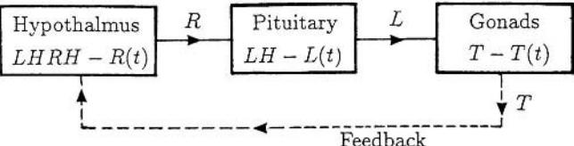

**Figure 7.15.** Compartment model for the control of testosterone production in the male. The hypothalmus secretes luteinising hormone release hormone (LHRH), denoted by *R*(*t*), which controls the release of luteinising hormone (LH), denoted by *L*(*t*), by the pituitary which controls the production of testosterone, *T* (*t*), by the gonads. The dashed line denotes the feedback control to the hypothalmus from the testes.

where *b*1, *b*2, *b*3, *g*1 and *g*2 are positive parameters and the negative feedback function *f* (*T* ) is a positive monotonic decreasing function of *T* . At this stage we do not need a specific form for *f* (*T* ) although we might reasonably take it to be typically of the form *A*/(*K* + *T m*) as in the prototype feedback model (7.3).

As we mentioned, the blood level of testosterone in men oscillates in time. Experiments in which the natural state is disturbed have also been carried out; see the brief surveys given by Smith (1980) and Cartwright and Husain (1986). Our interest here is mainly related to the observed periodic fluctuations.

From the analysis in Section 7.2, or simply by inspection, we know that a positive steady state *R*0, *L*0 and *T*0 exists for the model (7.43). With the specific form (7.3) for *f* (*T* ) oscillations exist for a Hill coefficient *m* ≥ 8 (Exercise 4), which we noted before is an unrealistically high figure. We can modify the specific form of *f* (*T* ) so that periodic solutions exist but this is essentially the same as choosing the form in (7.3) with *m* ≥ 8. We assume therefore that the feedback function *f* (*T* ) is such that the steady state is always stable. Thus we must modify the model to include more of the physiology. If we consider the actual process that is taking place there must be a delay between production of the hormone at one level and its effect on the production of the hormone it stimulates, simply because of their spatial separation and the fact that the hormones are transported by circulating blood. Accordingly W. R. Smith and J. D. Murray in the early 1980's suggested a simple delay model based on the modification to the system (7.3) with *m* = 1, similar to the delay control model suggested by Murray (1977), in which the production of testosterone is delayed. Although it is reasonable to consider a delay in each hormone's production they incorporated them all in the *T* equation so as to be able to investigate the system analytically and hence get an intuitive feel for the effect of delay on the system. They took, in place of (7.43),

$$\begin{aligned} \frac{dR}{dt} &= f(T) - b_1 R, \\ \frac{dL}{dt} &= \mathbf{g}_1 R - b_2 L, \\ \frac{dT}{dt} &= \mathbf{g}_2 L(t - \tau) - b_3 T, \end{aligned} \tag{7.44}$$

where τ is a delay associated with the blood circulation time in the body. The steady state is again (*R*0, *L*0, *T*0) determined by

$$L_0 = \frac{b_3 T_0}{\mathfrak{g}_2}, \quad R_0 = \frac{b_3 b_2 T_0}{\mathfrak{g}_1 \mathfrak{g}_2}, \quad f(T_0) - \frac{b_1 b_2 b_3 T_0}{\mathfrak{g}_1 \mathfrak{g}_2} = 0,\tag{7.45}$$

which always exists if *f* (0) > 0 and *f* (*T* ) is a monotonic decreasing function. If we now investigate the stability of the steady state by writing

$$\mathbf{x} = R - R_0, \quad \mathbf{y} = L - L_0, \quad \mathbf{z} = T - T_0 \tag{7.46}$$

the linearised system from (7.44) is

$$\begin{aligned} \frac{dx}{dt} &= f'(T_0)z - b_1 x, \\ \frac{dy}{dt} &= g_1 x - b_2 y, \\ \frac{dz}{dt} &= g_2 \mathbf{y}(t - \tau) - b_3 z. \end{aligned} \tag{7.47}$$

Now look for solutions in the form

$$
\begin{pmatrix} x \\ y \\ z \end{pmatrix} = \mathbf{A} \exp\left[\lambda t\right], \tag{7.48}
$$

where **A** is a constant vector. On substitution into (7.47) we have

$$\begin{aligned} \lambda^3 + a\lambda^2 + b\lambda + c + de^{-\lambda \tau} &= 0, \\ a &= b_1 + b_2 + b_3, \quad b = b_1 b_2 + b_2 b_3 + b_3 b_1, \\ c &= b_1 b_2 b_3, \quad d = -f'(T_0) \mathbf{g}_1 \mathbf{g}_2 > 0. \end{aligned} \tag{7.49}$$

We now want to determine the conditions for the steady state to be linearly unstable; that is, we require the conditions on *a*, *b*, *c*, *d* and τ such that there are solutions of (7.49) with Re λ > 0.

We know that with τ = 0 the steady state (*R*0, *L*0, *T*0) is stable; that is, if τ = 0 in (7.49), Re λ < 0. Using the Routh–Hurwitz conditions on the cubic in λ given by (7.49) with τ = 0 this means that *a*, *b*, *c* and *d* necessarily satisfy

$$a > 0, \quad c + d > 0, \quad ab - c - d > 0. \tag{7.50}$$

We know that delay can be destabilising so we now try to determine the critical delay τ*c* > 0, in terms of *a*, *b*, *c* and *d* so that a solution with Re λ > 0 exists for τ>τ*c*. We determine the conditions by considering (7.49) as a complex variable mapping problem.

From the analysis on transcendental equations in Chapter 1 we know that all solutions of (7.49) have Re λ bounded above. The critical τ*c* is that value of τ such that

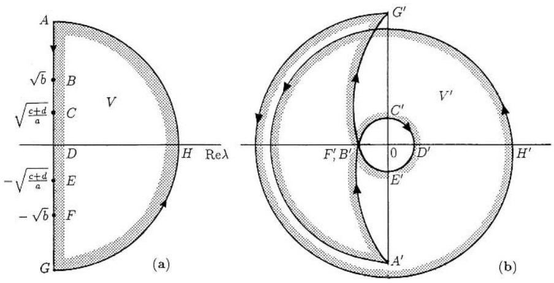

**Figure 7.16.** (**a**) λ-plane. (**b**) w-plane.

Re λ = 0, that is, the bifurcation between stability and instability in the solutions (7.48). Consider the transformation from the λ-plane to the w-plane defined by

$$w = \lambda^3 + a\lambda^2 + b\lambda + c + de^{-\lambda r}, \quad \tau > 0. \tag{7.51}$$

Setting λ = µ + *i*ν this gives

$$\begin{split} w &= \left[ \mu^3 - 3\mu\nu^2 + a(\mu^2 - \nu^2) + b\mu + c + de^{-\mu\tau}\cos\nu\tau \right] \\ &+ i\left[ -\nu^3 + 3\mu^2\nu + 2a\mu\nu + b\nu - de^{-\mu\tau}\sin\nu\tau \right]. \end{split} \tag{7.52}$$

We wish to find the conditions on *a*, *b*, *c*, *d* and τ such that w = 0 has solutions µ > 0; the bifurcation state is µ = 0.

Consider the contour in the λ-plane consisting of the imaginary axis and a semicircle of infinite radius as shown schematically in Figure 7.16(a). Without any delay τ = 0 and we know that in this case Re λ < 0 so w as a function of λ in (7.51) does not pass through the origin in the w-plane; that is, the map in the w-plane of *AGH A* in Figure 7.16(a) does not pass through w = 0. Consider first τ = 0 and the mapping (7.52). *AG* in Figure 7.16(a), and on which µ = 0, is mapped by

$$w = [(c - a\nu^2) + d] + i[b\nu - \nu^3] \tag{7.53}$$

onto *A G* in Figure 7.16(b) with *D* (= *c* + *d* + *i*0) in the w-plane corresponding to *D*(= 0+*i*0) in the λ-plane. The domain *V* is mapped into *V* ; the hatches in Figure 7.16 point into the respective domains. The points *A*, *B*, *C*, *D*, *E*, *F* and *G* in Figure 7.16(a) are mapped onto their primed equivalents as

$$\begin{array}{llll} A & (\infty e^{i\pi/2}) & A' & (\infty e^{3i\pi/2})\\ B & (\sqrt{b}e^{i\pi/2}) & B' & ((ab-c-d)e^{i\pi})\\ C & \left(\left[\frac{c+d}{a}\right]^{1/2}e^{i\pi/2}\right) & C' & \left(\left[\frac{c+d}{a}\right]^{1/2}\left(b-\frac{c+d}{a}\right)e^{i\pi/2}\right) \\\\ D & (0) & D' & (c+d) \\ E & \left(\left[\frac{c+d}{a}\right]^{1/2}e^{-i\pi/2}\right) & E' & \left(\left[\frac{c+d}{a}\right]^{1/2}\left(b-\frac{c+d}{a}\right)e^{-i\pi/2}\right) \\\\ F & (\sqrt{b}e^{-i\pi/2}) & F' & ((ab-c-d)e^{-i\pi}) \\ G & (\infty e^{-i\pi/2}) & G' & (\infty e^{-3i\pi/2}). \end{array} \tag{7.54}$$

As the semi-circle *GHA* is traversed λ moves from ∞*e*−*i*π/2 to ∞*ei*π/2 and so w(∼ λ3) moves from ∞*e*−3*i*π/2, namely, *G* , to ∞, namely, *H* , and then to ∞*e*3*i*π/2, that is, *A* , all as shown in Figure 7.16(b).

Now consider the mapping in the form (7.52) with τ > 0. The line *AG* in Figure 7.16(a) has µ = 0 as before, so it now maps onto

$$w = [(c - a\nu^2) + d\cos\nu\tau] + i[b\nu - \nu^3 - d\sin\nu\tau].\tag{7.55}$$

The effect of the trigonometric terms is simply to add oscillations to the line *A B C D E F G* as shown schematically in Figure 7.17(a) which is now the map of

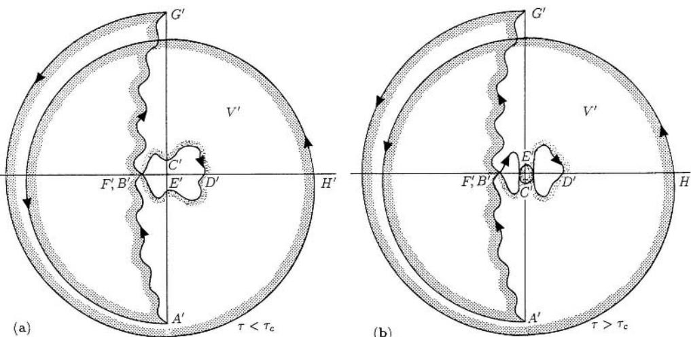

**Figure 7.17.** Map in the w-plane of the contour in Figure 7.16(a) in the λ-plane under the transformation (7.55): (**a**) τ<τ*c*; (**b**) τ>τ*c*. In the latter case, the map encloses the origin.

*ABCDEFGH A* under (7.55). Now let τ increase. As soon as the transformed curve passes through the origin in the w-plane this gives the critical τ*c*. For τ>τ*c*, the mapping is schematically as shown in Figure 7.17(b) and the origin in the w-plane is now enclosed in *V* , that is, the transformation of *V* under (7.55).

If we now traverse the boundary of *V* and compute the change in arg w we immediately get the number of roots of w(λ) defined by (7.51). It helps to refer to both Figures 7.17(a) and (b). Let us start at *A* where arg w = 3π/2. On reaching *B* , arg w = π and so on, giving

$$\begin{array}{ccccccccc} \text{Point} & A' & B' & C' & D' & E' & F' & G' & A' \text{ (via } H' \text{)}\\\\ \text{arg } w & \frac{3\pi}{2} & \pi & \frac{3\pi}{2} & 2\pi & \frac{5\pi}{2} & 3\pi & \frac{5\pi}{2} & \frac{5\pi}{2} + 3\pi \left(= \frac{11\pi}{2}\right) \text{.} \end{array}$$

Thus the change in arg w is 4π which implies two roots with Re λ > 0 in the domain *V*; the roots are complex conjugates.

Let us now obtain expressions for the critical τ*c* such that the curve *A B C D E F G H A* just passes through the origin in the w-plane. The bifurcation value we are interested in for Re λ is of course µ = 0 so we require the value of τ such that w = 0 in (7.55), namely,

$$c - a\nu^2 + d\cos\nu\tau = 0, \quad b\nu - \nu^3 - d\sin\nu\tau = 0,\tag{7.56}$$

from which we get

$$\cot \upsilon \tau = \frac{a\upsilon^2 - c}{\upsilon(b - \upsilon^2)} \quad \Rightarrow \quad \upsilon = \upsilon(\tau). \tag{7.57}$$

If we plot each side of (7.57) as a function of ν, as shown schematically in Figure 7.18 where for illustration we have taken √*b* < π/τ , we see that there is always a solution,


**Figure 7.18.** Schematic graphical solution ν of (7.57) in the case where √*b* < π/τ .

given by the intersection of the curves, such that

$$0 < \nu(\tau) < \frac{\pi}{\tau}, \quad 0 < \nu(\tau) < \sqrt{b}. \tag{7.58}$$

Furthermore, the solution ν(τ) as a function of τ satisfies

$$
\nu(\mathfrak{r}_{\mathbb{I}}) < \nu(\mathfrak{r}_{\mathbb{Z}}) \quad \text{if} \quad \mathfrak{r}_{\mathbb{I}} > \mathfrak{r}_{\mathbb{Z}}.
$$

If √*b* > π/τ then (7.58) still holds but another solution exists with π/τ < ν(τ) < √*b*.

Consider now the solution ν(τ) which satisfies (7.58). A solution of the simultaneous equations (7.56) must satisfy (7.57) and one of (7.56), which to be specific we take here to be the second. With ν(τ) the solution of (7.57) satisfying (7.58), the second of (7.56) gives

$$d = \frac{[b - \nu^2(\tau)]\nu(\tau)}{\sin(\nu(\tau)\tau)}.\tag{7.59}$$

If τ is such that this equation cannot be satisfied with the corresponding ν(τ) then no solution can exist with Re λ > 0. We can not get an analytical solution of (7.57) for ν(τ) but an indication of how the solution behaves is easily obtained for τ large and small. For the case in (7.58), we have from (7.57),

$$\nu(\tau) = \sqrt{b} - (ab - c)\frac{\tau}{2\sqrt{b}} + O(\tau^2) \quad \text{for} \quad 0 < \tau \ll 1 \tag{7.60}$$

and the second of (7.56) becomes

$$\begin{aligned} b\nu(\mathfrak{r}) - \nu^3(\mathfrak{r}) - d \sin[\nu(\mathfrak{r})\mathfrak{r}] &\approx (ab - c)\mathfrak{r}\sqrt{b} - d\mathfrak{r}\sqrt{b} + \cdots \\ &= \mathfrak{r}(ab - c - d)\sqrt{b} + O(\mathfrak{r}^2) \\ &> 0 \end{aligned}$$

from conditions (7.50). Thus for small enough τ no solution exists with Re λ > 0. Now let τ increase until a solution to (7.59) can be satisfied: this determines the critical τ*c* as the solution (7.58) of (7.57) which also satisfies (7.59). The procedure is to obtain ν(τ) from (7.57) and then the value τ*c* which satisfies (7.59).

Now suppose τ 1. From (7.57) we get

$$\nu(\mathfrak{r}) \sim \frac{\pi}{\mathfrak{r}} - \frac{\pi b}{c\mathfrak{r}^2} + O\left(\frac{1}{\mathfrak{r}^3}\right) \quad \text{for} \quad \mathfrak{r} \gg 1,$$

and now the second of (7.56) gives

$$\begin{aligned} b\nu - \nu^3 - d \sin[\nu(\tau)\tau] &\sim \frac{b\pi}{\tau} - \frac{bd\pi}{c\tau} + O\left(\frac{1}{\tau^2}\right), \\ &< 0 \quad \text{if} \quad d > c. \end{aligned}$$

Thus there is a range of τ>τ*c* > 0 such that a solution λ exists with Re λ > 0 if *d* > *c*.

An approximate range for ν(τ) can be found by noting that with ν < √*b* < π/τ , the specific case we are considering and which is sketched in Figure 7.18,

$$\mathbf{g}(\nu) = c - a\nu^2 + d\cos\nu\pi$$

is monotonic decreasing in 0 ≤ ντ < π. Furthermore,

$$\lg\left(\left[\frac{c+d}{a}\right]^{1/2}\right) = -d + d\cos\left(\pi\left[\frac{c+d}{a}\right]^{1/2}\right) < 0, \quad \lg(0) = c+d > 0$$

which implies that

$$0 < \nu < \left[\frac{c+d}{a}\right]^{1/2} < \sqrt{b} < \frac{\pi}{\pi}.$$

We have thus demonstrated that there is a critical delay τ*c* such that the steady state (*R*0, *L*0, *T*0) is linearly unstable by growing oscillations. Since the model system (7.44) has a confined set we might thus expect limit cycle periodic solutions to be generated; this is indeed what happens when the parameters are chosen so that the steady state is linearly unstable.

The model proposed by Cartwright and Husain (1986) is based on further experimental results and includes further delays in the production of each of *R*, *L* and *T* . They also incorporate feedback by *L H* as well as *T* . Their model is necessarily more complex. Analytical results such as we have derived above, even if possible, would necessarily be much more complicated. Numerical simulations of their model system with reasonable parameter values show stable periodic solutions in all of *R*, *L* and *T* . They also carry out mathematical 'experiments' which mimic certain laboratory experiments, with encouraging results.

#### *Chemical Castration*

Returning to the effect of drugs, such as Lupron, mentioned above, they effect chemical castration by blocking the production of the hormone *L H* produced by the pituitary. That is, in the model system (7.44), *g*1 = 0. In this case, the governing equation for *L*(*t*), that is, the concentration of *L H*, is uncoupled from the other equations and *L* → 0 with time, which in turn implies from the *T* -equation in (7.44) that *T* → 0 with time, which is the equivalent of castration. This castration procedure could be used to replace the widely used surgical methods currently used by veterinarians on farm and domestic animals. Such a vaccine has been developed by Carelli et al. (1982).

More recent work related to chemical castration by Ferro and Stimson (1996) and Ferro et al. (1995) is based on gonadotrophin releasing hormone (GnRH) in the form of a GnRH-releasing vaccine which blocks the production of the leutinising hormone LH; it has a possible application to human sex-hormone-dependent disorders. It is also a potential treatment for oestrogen-dependent breast cancer (Ferro and Stimson 1998).

Before leaving the subject of interfering with testosterone production, it is relevant to mention that there has been much research trying to develop a contraceptive 'pill' for men. One avenue was to use artificial hormones to try and fool the body's system into shutting down the production of testosterone. In the past, for example, overloading the body with testosterone shut down the pituitary gland's production of LH. The pituitary gland also produces another hormone (not included in our simple model), the follicle-stimulating hormone, FSH, which promotes sperm formation by inducing them to multiply. LH also helps this process. If there is no LH and low levels of testosterone in the testes no sperm are produced. The problem is that if there is a high level of testosterone in the blood there are some unpleasant side effects such as irritability, acne and weight gain. Recently Anderson et al. (1997) developed a combination of an artificial form of progesterone (a major ingredient in the female contraceptive pill) and a slow-release testosterone pill which has less serious side effects. The testosterone pill is placed under the skin and provides a sufficient supply of testosterone for the body's needs for some months without requiring the testes to produce testosterone. Apparently men involved in the clinical trials have greatly enjoyed participating.

Another approach is being developed (Ferro and Stimson 1998) which is totally different, namely, to eliminate FSH entirely. It is a vaccine which produces antibodies which attach to FSH and makes it inactive. This has not yet reached human trials—only in rats—but if it works it will require about one treatment a year. In spite of the obvious benefits and the potentially enormous profits for companies which develop such male contraceptive procedures1 few have so far become involved, in part, apparently, because of fear of litigation in the U.S.A.

### **Exercises**

- **1** The 'Brusselator' reaction mechanism proposed by Prigogene and Lefever (1968) is

$$A \xrightarrow{k_1} X, \quad B + X \xrightarrow{k_2} Y + D, \quad 2X \xrightarrow{k_3} 3X, \quad X \xrightarrow{k_4} E,$$

where the *k*s are the rate constants, and the reactant concentrations of *A* and *B* are kept constant. Write down the governing differential equation system for the concentrations of *X* and *Y* and nondimensionalise the equations so that they become

$$\frac{du}{d\tau} = 1 - (b+1)u + au^2v, \quad \frac{dv}{d\tau} = bu - au^2v, \dots$$

where *u* and v correspond to *X* and *Y* , τ = *k*4*t*, *a* = *k*3(*k*1*A*)2/*k*3 4 and *b* = *k*2*B*/*k*4. Determine the positive steady state and show that there is a bifurcation value *b* = *bc* = 1 + *a* at which the steady state becomes unstable in a Hopf bifurcation way. Hence show that in the vicinity of *b* = *bc* there is a limit cycle periodic solution with period 2π/√*a*.

- **2** In the reaction mechanism *d***u**/*dt* = **f**(**u**)the kinetics**f** is curl free, that is, curl**uf**(**u**) = 0. This implies that **f** can be written in terms of a gradient of a potential *F*(**u**); that
<sup>1</sup>The World Health Organisation reported in 1994 that in 70% of couples it is the women who are responsible for contraception.

is,

$$\operatorname{curl}_{\mathbf{u}} \mathbf{f}(\mathbf{u}) = 0 \quad \Rightarrow \quad \mathbf{f}(\mathbf{u}) = \nabla_{\mathbf{u}} F(\mathbf{u}) .$$

The model system becomes

$$\frac{d\mathbf{u}}{dt} = \mathbf{f}(\mathbf{u}) = \nabla_{\mathbf{u}} F(\mathbf{u}),$$

which is called a gradient system. By supposing that **u**(*t*) is a periodic solution with period *T* , show, by considering

$$\int_{t}^{t+T} \left(\frac{d\mathbf{u}}{dt}\right)^2 ds,$$

that a gradient system cannot have periodic solutions.

- **3** In the feedback control system governed by

$$\begin{aligned} \frac{du_1}{dt} &= f(u_n) - k_1 u_1, \\ \frac{du_r}{dt} &= u_{r-1} - k_r u_r, \quad r = 2, 3, \dots, n \end{aligned}$$

the feedback function is given by

$$f(\mathbf{i}) \quad f(\boldsymbol{\mu}) = \frac{a + \boldsymbol{\mu}^m}{1 + \boldsymbol{\mu}^m}, \quad \text{(ii)} \quad f(\boldsymbol{\mu}) = \frac{1}{1 + \boldsymbol{\mu}^m},$$

where *a* and *m* are positive constants. Determine which of these represents a positive feedback control and which a negative feedback control. Determine the steady states and hence show that with positive feedback multi-steady states are possible while if *f* (*u*) represents negative feedback there is only a unique steady state.

- **4** Consider the negative feedback mechanism

$$\begin{aligned} \frac{du_1}{dt} &= \frac{1}{1 + u_3^m} - k_1 u_1, \\ \frac{du_i}{dt} &= u_{i-1} - k_i u_i, \quad i = 2, 3. \end{aligned}$$

- **(i)** For the case *m* = 1, show that a confined set *B* is given by a rectangular box whose sides are bounded by the *ui* = 0, *i* = 1, 2, 3 axes and *Ui* , *i* = 1, 2, 3, where

$$\frac{1}{1+U_3} < k_1 U_1 < k_1 k_2 U_2 < k_1 k_2 k_3 U_3,$$

and hence determine *Ui* , *i* = 1, 2, 3. For the case *m* = 1 show that *U*3 is given by the appropriate solution of the equation

$$U_3^{m+1} + U_3 - \frac{1}{k_1 k_2 k_3} = 0.1$$

- **(ii)** Prove, using the Routh–Hurwitz conditions (see Appendix B), that the model with *m* = 1 cannot have limit cycle periodic solutions.
- **(iii)** Prove that limit cycle solutions are possible if *m* > 8. [At one stage in the analysis for this case you will need to use the general inequality

$$\frac{k_1 + k_2 + k_3}{3} \ge \left[\frac{k_1 + k_2 + k_3}{3}\right]^{1/2} \ge (k_1 k_2 k_3)^{1/3}. \text{J}$$

- **5** Sketch the null clines for the system (Exercise 1):

$$\frac{du}{d\tau} = 1 - (b+1)u + au^2v = f(u,v), \quad \frac{dv}{d\tau} = bu - au^2v = g(u,v).$$

Note the signs of *f* and *g* in the (*u*,v) phase plane and find a confined set (not a trivial exercise) enclosing the steady state. Determine the (*a*, *b*) parameter domain where the system has periodic solutions.

- **6** Consider the dimensionless activator (*u*)–inhibitor (v) system represented by

$$\frac{du}{dt} = a - bu + \frac{u^2}{v} = f(u, v), \quad \frac{dv}{dt} = u^2 - v = g(u, v), \dots$$

where *a*, *b*(> 0) are parameters. Sketch the null clines, append the signs of *f* and *g*, and examine the signs in the stability matrix for the steady state. Is there a confined set? Show that the (*a*, *b*) parameter space in which *u* and v may exhibit periodic behaviour is bounded by the curve

$$b = \frac{2}{1 - a} - 1,$$

and hence sketch the domain in which the system could have periodic solutions.

Consider the modified system in which there is inhibition by *u*. In this case *u*2/v is replaced by *u*2/[v(1 + *K u*2)] in the *u* equation, where *K*(> 0) is the inhibition parameter. Sketch the null clines. Show that the boundary curve in (*a*, *b*) space for the domain in which periodic solutions may exist is given parametrically by

$$\begin{aligned} b &= \frac{2}{\mu_0 (1 + K \mu_0^2)^2} - 1, \\ a &= \frac{2}{(1 + K \mu_0^2)^2} - \mu_0 - \frac{1}{(1 + K \mu_0^2)}, \\ b &\ge 0 \end{aligned}$$

and sketch the domain. Indicate how the domain for periodic solutions changes as the inhibition parameter *K* varies.

- **7** The two-variable FitzHugh–Nagumo model for space-clamped nerve axon firing with an external applied current *Ia* is

$$\frac{dv}{dt} = v(a-v)(v-1) - w + I_a, \quad \frac{dw}{dt} = bv - \chi w, \quad \frac{1}{2}$$

where 0 < *a* < 1 and *b*, γ and *Ia* are positive constants. Here v is directly related to the transmembrane potential and w is the variable which represents the effects of the various chemical ion-generated potentials.

Determine the local maximum and minimum for the v null cline in terms of *a* and *Ia* and hence give the corresponding piecewise linear approximate form.

Show that there is a confined set for the model system. Using the piecewise linear model, determine the conditions on the parameters such that the positive steady state is stable but excitable. Find the conditions on the parameters, and the relevant window (*I*1, *I*2) of applied currents, for the positive steady state to be linearly unstable and hence for a limit cycle solution to exist. For a fixed set of parameters *a*, *b* and γ , find the period of the small amplitude limit cycle when *Ia* is just greater than the bifurcation value *I*1. [Use the Hopf bifurcation result near bifurcation.]

- **8** Consider a simplified model for the control of testosterone secretion given by

$$\begin{aligned} \frac{dR}{dt} &= f(T) - b_1 R, \\ \frac{dT}{dt} &= b_2 R(t - \tau) - b_3 T, \end{aligned}$$

where *R* denotes the luteinising hormone releasing hormone (*LHRH*), *T* denotes the hormone testosterone and *f* (*T* ) is a positive monotonic decreasing function of *T* . The delay τ is associated with the blood circulation time in the body and *b*1, *b*2 and *b*3 are positive constants. When τ = 0, show that the steady state is stable. Using the method in Section 7.6 investigate the possibility of periodic solution behaviour when τ > 0.

# **8. BZ Oscillating Reactions**

### **8.1 Belousov Reaction and the Field–Kor¨ os–Noyes (FKN) Model ¨**

The reaction known as the Belousov–Zhabotinskii reaction is an important oscillating reaction discovered by the Russian Boris Belousov (1951), a biochemist, and is described in an unpublished paper, which was contemptuously rejected by a journal editor; at the time the accepted dogma was that oscillating reactions were simply not possible. A translation of the original article is given in the book edited by Field and Burger (1985). Eventually Belousov (1959) published a brief note in the obscure proceedings of a Russian medical meeting. Basically he found oscillations in the ratio of concentrations of the catalyst; in Belousov's reaction it was cerium in the oxidation of citric acid by bromate. The oscillation manifested itself via a colour change as the cerium changed from *Ce*3+ to *Ce*4+ although it is more dramatic with an iron ion, ferroin where the colour is brick red when in the *Fe*2*e* state and bright blue in the *Fe*3*e* state. The study of this reaction was continued by Zhabotinskii (1964) and is now known as the Belousov–Zhabotinskii reaction or simply the BZ reaction. When the details of this important reaction and some of its dramatic oscillatory and wavelike properties finally reached the West in the 1970's it provoked widespread interest and research. Belousov's seminal work was finally, but posthumously, recognised in 1980 by his being awarded the Lenin Prize. Winfree (1984) gives a brief interesting description of the history of the Belousov–Zhabotinskii reaction. When the reactants can also diffuse a diverse menagerie of complex patterns can be formed and it is the latter which has sustained the continuing widespread interest among both biological and physical scientists. It provided an enormous incentive to those who were interested in the fundamental question of spatiotemporal self-organisation with all the implications for the generation of biological pattern and form. We discuss such aspects in considerable detail in later chapters.

Before discussing the reaction in detail it is highly pertinent to mention its analogy with real biological oscillators, not at the molecular level, of course, but in the similarity it has with an increasing number of real biological cyclical behaviour. Approximate equations for the BZ reaction are identical to those that have arisen in a realistic model for the periodic signalling exhibited by cells during the self-organisation of the slime mould *Dictyostelium discoideum* (see, for example, the book by Goldbeter 1996). There is, of course, no analogy at the molecular level but nevertheless a knowledge of the behaviour from similar equations can still be very useful. Winfree (1987) also used it in a highly original and elegant way in modelling three-dimensional activity in the ventricle of the heart. The analogy has also been applied by Tyson (1991) in his investigations into the molecular biology of the cell cycle. This reaction is certainly not just some academic curiosity.

There are now many such chemical reactions which can exhibit periodic behaviour and the term BZ reaction now refers to a general class of such reactions, essentially where an organic substance is oxidised by bromate ions facilitated by a metal ion in an acid medium. Typical metal ions are cerium and ferroin. Although it is a chemical rather than a biological oscillator the BZ reaction is now considered the prototype oscillator. The detailed reactions involved are more or less understood, as are many, but certainly not all, of the complex spatial phenomena it can exhibit: we shall describe some of the wavelike properties in Chapter 1, Volume II. The book of articles edited by Field and Burger (1985) is a good and varied introduction to the BZ reaction. It also has several articles on chemical oscillators and wave phenomena. The book by Winfree (2000), among other things, also discusses some of the reaction's properties, both temporal and spatial. The article by Tyson (1994) is a succinct and more recent summary of the phenomena exhibited by the BZ kinetics, both temporal and spatial. In this chapter we consider the reaction in some detail not only because of its seminal importance in the field, but also because it illustrates techniques of analysis which have wide applicability. References to the more detailed kinetics are given at the appropriate places. Almost all the phenomena theoretically exhibited by reaction and reaction diffusion mechanisms have been found in this real and practical reaction—but many of these only *after* the mathematics predicted them.

The BZ reaction (the general class of them) is probably the most widely studied oscillating reaction both theoretically and experimentally. Here we briefly describe the key steps in the reaction and develop the Field–Kor¨ os–Noyes (Field and Noyes 1974) ¨ model system which quantitatively mimics the actual chemical reactions (Field et al. 1972). The models for the BZ reaction are prototypes to study since the theoretical developments can be tested against experiments. The experience gained from this is directly transferable to biochemical oscillators as mentioned above. The literature on the subject is now large. A succinct review of the detailed reaction and its properties is given by Tyson (1994).

In the original Belousov (1951) reaction, the basic mechanism consists of the oxidation of malonic acid, in an acid medium, by bromate ions, BrO3 −, and catalyzed by cerium, which has two states Ce3+ and C*e*4+. Sustained periodic oscillations are observed in the cerium ions. With other metal ion catalysts and appropriate dyes, for example, iron Fe2+ and Fe3+ and phenanthroline, the regular periodic colour change is visually dramatic, oscillating as mentioned between red and blue. It is not only the catalyst ion concentrations which vary with time, of course, other reactants also vary. Figure 8.1 illustrates the temporal variations in the bromide ion concentration [Br−] and the cerium ion concentration ratio [Ce4+]/[Ce3+] measured by Field et al. (1972), who studied the mechanism in depth; see Tyson (1994) for more references and technical details.

Basically the reaction can be separated into two parts, say I and II, and the concentration [Br−] determines which is dominant at any time. When [Br−] is high, near *A* in Figure 8.1, I is dominant and during this stage Br− is consumed; that is, we move along

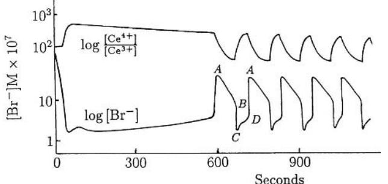

**Figure 8.1.** Experimentally measured periodic limit cycle type of temporal variation in the concentrations in the ratio of the cerium metal ion concentration [Ce4+]/[Ce3+] and the bromide ion concentration [Br−] in the Belousov–Zhabotinskii reaction. (Redrawn from Field et al. 1972)

*AB*, and the cerium ion is mainly in the Ce3+ state. As [Br−] decreases further it passes through a critical value, *B*, and then drops quickly to a low level, that is, *C* in Figure 8.1. At this stage process II takes over from I. During II the Ce3+ changes to Ce4+. However, in the II-process Ce4+ reacts to produce Br− again while it reverts to the Ce3+ state. Now [Br−] increases, that is, along *CDA*, and, when its value is sufficiently high, process I again becomes dominant. The whole sequence is continually repeated and hence produces the observed oscillations. This qualitative description is not, of course, sufficient to show that the reaction will actually oscillate. The two pathways, I and II, could simply reach some steady state of coexistence. In fact for certain parameter ranges this is exactly what can happen. The parameter range required for oscillatory behaviour is derived in detail below and depends on a careful analysis of the kinetics equations.

The rapid variation along *BC* and *D A* is typical of a *relaxation* oscillator, which is just an oscillator in which parts of the limit cycle are traversed quickly. This behaviour suggests a particular asymptotic technique which often allows us to get analytical results for the period in terms of the parameters; we discuss this later in Section 8.4.

Although there are many reactions involved they can be rationally reduced to 5 key reactions, with known values for the rate constants, which capture the basic elements of the mechanism. These five reactions can then be represented by a 3-chemical system in which the overall rate constants can be assigned with reasonable confidence. This model is known as the Field–Kor¨ os–Noyes or FKN model and is the specific model proposed ¨ by Field and Noyes (1974) based on the Field–Kor¨ os–Noyes (1972) mechanism. We ¨ give this simpler model system and derive the 3-species model. A complete derivation from the chemistry together with estimates for the various rate constants are given by Tyson (1994).

The key chemical elements in the 5-reaction FKN model are

$$\begin{aligned} X &= \text{HBrO}_2, & Y &= \text{Br}^-, \quad Z = \text{Ce}^{4+}, \\ A &= \text{BrO}_3^-, & P &= \text{HOBr}, \end{aligned} \tag{8.1}$$

and the model reactions can be approximated by the sequence

$$\begin{aligned} A + Y &\stackrel{k_1}{\rightarrow} X + P, \quad X + Y \stackrel{k_2}{\rightarrow} 2P\\ A + X &\stackrel{k_3}{\rightarrow} 2X + 2Z, \quad 2X \stackrel{k_4}{\rightarrow} A + P \quad Z \stackrel{k_5}{\rightarrow} fY, \end{aligned} \tag{8.2}$$

where the rate constants *k*1,... , *k*5 are known and *f* is a stoichiometric factor, usually taken to be 0.5. The first two reactions are roughly equivalent to the process I, described above, while the last three relate approximately to process II. The form used by Field and Noyes (1974) is actually slightly different in that the last reaction is *B* + *Z* → *f Y* + *Q* where *B* represents organic acids and *Q* is *C O*2. [*B*] is a constant and can be incorporated into the rate constant in the model equation system. It is reasonable to take the concentration [*A*] of the bromate ion to be constant; the concentration [*P*] is not of interest here. So, using the Law of Mass Action on (8.2), we get the following third-order system of kinetics equations for the concentrations, denoted by lowercase letters:

$$\begin{aligned} \frac{dx}{dt} &= k_1 a \mathbf{y} - k_2 \mathbf{x} \mathbf{y} + k_3 a \mathbf{x} - k_4 \mathbf{x}^2, \\ \frac{dy}{dt} &= -k_1 a \mathbf{y} - k_2 \mathbf{x} \mathbf{y} + f k_5 \mathbf{z}, \\ \frac{dz}{dt} &= 2k_3 a \mathbf{x} - k_5 \mathbf{z}. \end{aligned} \tag{8.3}$$

This oscillator system is sometimes referred to as the 'Oregonator' since it exhibits limit cycle oscillations and the research by Field et al. (1972) was done at the University of Oregon.

Oscillatory behaviour of (8.3) depends critically on the parameters involved. For example, if *k*5 = 0, the bromide ion (Br−) concentration *y* decays to zero according to the second equation, so no oscillations can occur. On the other hand if *f* = 0.5 and *k*5 is very large, the last reaction in (8.2) is very fast and the third and fifth reactions in (8.2) effectively collapse into the single reaction

$$A + X \xrightarrow{k_3} 2X + Y.$$

The system then reduces to a two-species mechanism, which is bimolecular, and so cannot oscillate (Hanusse 1972). There is clearly a domain in the ( *f*, *k*5) plane where periodic behaviour is not possible.

The only sensible way to analyse the system (8.3) is in a dimensionless form. There are usually several ways to nondimensionalise the equations; see, for example, Murray (1977) and Tyson (1982, 1985), both of whom give a fuller description of the chemistry and justification for the model. Here we give only the more recent one suggested by Tyson (1985) which incorporates the estimated values of the rate constants in the above model (8.3). Often different nondimensionalisations highlight different features of the oscillator. Following Tyson (1985), introduce

$$x^* = \frac{x}{x_0}, \quad y^* = \frac{y}{y_0}, \quad z^* = \frac{z}{z_0}, \quad t^* = \frac{t}{t_0}$$

$$\begin{aligned} x_0 &= \frac{k_3 a}{k_4} \approx 1.2 \times 10^{-7} M, \quad y_0 = \frac{k_3 a}{k_2} \approx 6 \times 10^{-7} M, \\\ z_0 &= \frac{2(k_3 a)^2}{k_4 k_5} \approx 5 \times 10^{-3} M, \quad t_0 = \frac{1}{k_5} \approx 50 s, \\\ \varepsilon &= \frac{k_5}{k_3 a} \approx 5 \times 10^{-5}, \quad \delta = \frac{k_4 k_5}{k_2 k_3 a} \approx 2 \times 10^{-4}, \\\ q &= \frac{k_1 k_4}{k_2 k_3} \approx 8 \times 10^{-4}, \quad (f \approx 0.5) \end{aligned} \tag{8.4}$$

which we substitute into (8.3). Field and Noyes (1974) suggested the value for *f* , based on experiment. As said before, since the model telescopes a number of reactions the parameters cannot be given unequivocally; the values are 'best' estimates. For our purposes here we need only the fact that ε, δ and *q* are small. With (8.4) we get the following dimensionless system, where for algebraic convenience we have omitted the asterisks,

$$\begin{aligned} s\frac{d\mathbf{x}}{dt} &= q\mathbf{y} - \mathbf{x}\mathbf{y} + \mathbf{x}(1-\mathbf{x}),\\ \delta\frac{d\mathbf{y}}{dt} &= -q\mathbf{y} - \mathbf{x}\mathbf{y} + 2fz,\\ \frac{dz}{dt} &= \mathbf{x} - z. \end{aligned} \tag{8.5}$$

In vector form with **r** = (*x*, *y*,*z*)*T* we can write this as

$$\frac{d\mathbf{r}}{dt} = \mathbf{F}(\mathbf{r}; \varepsilon, \delta, q, f) = \begin{pmatrix} \varepsilon^{-1}(q\mathbf{y} - \mathbf{x}\mathbf{y} + \mathbf{x} - \mathbf{x}^2) \\\\ \delta^{-1}(-q\mathbf{y} - \mathbf{x}\mathbf{y} + 2fz) \\\\ x - z \end{pmatrix}. \tag{8.6}$$

### **8.2 Linear Stability Analysis of the FKN Model and Existence of Limit Cycle Solutions**

Even though the system (8.5) is third-order, the linear stability analysis procedure is standard and described in detail in Chapter 3; namely, first find the positive steady state or states, determine the eigenvalues of the linear stability matrix and look for a confined set, which is a finite closed surface *S* enclosing the steady state such that any solution at time *t*0 which lies inside *S* always remains there for all *t* > *t*0. This was done by Murray (1974) for the original, but only slightly different, FKN equation system; it is his type of analysis we apply here to (8.6).

The nonnegative steady states (*xs*, *ys*,*zs*) of (8.5) are given by setting the left-hand sides to zero and solving the resulting system of algebraic equations, to get

$$\begin{aligned} \mathbf{x}(0,0,0) &\quad \text{or} \quad \mathbf{z}_s = \mathbf{x}_s, \quad \mathbf{y}_s = \frac{2f\mathbf{x}_s}{q + \mathbf{x}_s},\\ \mathbf{x}_s &= \frac{1}{2} \left\{ \left(1 - 2f - q\right) + \left[\left(1 - 2f - q\right)^2 + 4q(1 + 2f)\right]^{1/2} \right\}. \end{aligned} \tag{8.7}$$

The other nonzero steady state is negative.

Linearising about (0, 0, 0) we obtain the stability matrix *A* with eigenvalues λ given by

$$|A - \lambda I| = \begin{vmatrix} \varepsilon^{-1} - \lambda & q\varepsilon^{-1} & 0\\ 0 & -q\delta^{-1} - \lambda & 2f\delta^{-1} \\\\ 1 & 0 & -1 - \lambda \end{vmatrix} = 0$$

$$\Rightarrow \lambda^3 + \lambda^2 (1 + q\delta^{-1} - \varepsilon^{-1}) - \lambda [\varepsilon^{-1}(1 + q\delta^{-1}) - q\delta^{-1}] - \frac{q(1 + 2f)}{\varepsilon\delta} = 0.$$

If we simply sketch the left-hand side of this cubic as a function of λ for λ ≥ 0 we see that there is at least one positive root. Alternatively note that the product of the three roots is *q*(1+2 *f* )/εδ > 0, which implies the same thing. Thus the steady state (0, 0, 0) is always linearly unstable.

If we now linearise (8.5) about the positive steady state (*xs*, *ys*,*zs*) in (8.7) the eigenvalues λ of its stability matrix are given, after a little algebra, by

$$|A - \lambda I| = \begin{vmatrix} 1 - 2\mathbf{x}_s - \mathbf{y}_s \\\\ \frac{\varepsilon}{\varepsilon} \\\\ \frac{-\mathbf{y}_s}{\delta} \\\\ 1 \\\\ \delta + A\lambda^2 + B\lambda + C = 0, \end{vmatrix} \qquad \begin{array}{c} q - \mathbf{x}_s \\\\ \frac{\varepsilon}{\delta} \\\\ 0 \\\\ -1 - \lambda \end{array} \qquad \begin{array}{c} 0 \\\\ \frac{2f}{\delta} \\\\ 0 \\\\ -1 - \lambda \end{array} \qquad \begin{array}{c} 0 \\\\ \frac{2f}{\delta} \\\\ \delta \\\\ \delta + C = 0, \end{array} \tag{8.8}$$

where, on using the quadratic for *xs*, the simultaneous equations for *xs*, *ys* from (8.6) and some tedious but elementary algebra, we get

$$\begin{aligned} A &= 1 + \frac{q + \mathbf{x}_s}{\delta} + \frac{E}{\varepsilon}, \\ E &= 2\mathbf{x}_s + \mathbf{y}_s - 1 = \frac{\mathbf{x}_s^2 + q(\mathbf{x}_s + 2f)}{q + \mathbf{x}_s} > 0, \\ B &= \frac{q + \mathbf{x}_s}{\delta} + \frac{E}{\varepsilon} + \frac{(q + \mathbf{x}_s)E + \mathbf{y}_s(q - \mathbf{x}_s)}{\varepsilon\delta}, \\ C &= \frac{(q + \mathbf{x}_s)E - 2f(q - \mathbf{x}_s) + \mathbf{y}_s(q - \mathbf{x}_s)}{\varepsilon\delta} \\ &= \frac{\mathbf{x}_s^2 + q(2f + 1)}{\varepsilon\delta} > 0. \end{aligned} \tag{8.9}$$

Note that *A* > 0, since *E* > 0, and that *C* > 0, on using the expression for *xs* from (8.7);

*B* can be positive or negative. It follows from Descartes' rule of signs (see Appendix B) that at least one eigenvalue λ in (8.8) is real and negative. The remaining necessary and sufficient condition for all of the solutions λ to have negative real parts is, from the Routh–Hurwitz conditions (see Appendix B), *AB* − *C* > 0. Substituting for *A*, *B* and *C* from (8.9) gives a quadratic in 1/δ for the left-hand side and hence the condition for stability of the positive steady state in (8.7). This is given by

$$\begin{aligned} AB - C &= \phi(\delta, f, \varepsilon) = \frac{N\delta^2 + M\delta + L}{\delta^2} > 0, \\ L &= (q + x_\delta) \left\{ (q + x_\delta) + \frac{x_\delta(1 - q - 4f) + 2q(1 + 3f)}{\varepsilon} \right\}, \\ N &= [x_s^2 + q(x_s + 2f)] \frac{1 + E/\varepsilon}{\varepsilon(q + x_\delta)} > 0 \end{aligned} \tag{8.10}$$

with *M* also determined as a function of *xs*, *f* , *q* and ε; we do not require it in the subsequent analysis and so do not give it here. With *xs* from (8.7), *L*, *M* and *N* are functions of *f* , *q* and ε. Thus for the steady state to be linearly unstable, δ, *f* and ε must lie in a domain in (δ, *f*,ε) space where φ(δ, *f*,ε) < 0. The boundary or bifurcation surface in (δ, *f*,ε) space is given by φ(δ, *f*,ε) = 0.

We can get an indication of the eigenvalue behaviour asymptotically for large positive and negative *B*. If *B* 1 the asymptotic solutions of (8.8) are given by

$$
\lambda \sim -\frac{C}{B}, \quad -\frac{A}{2} \pm i\sqrt{B}, \tag{8.11}
$$

while if *B* < 0 and | *B* | 1,

$$
\lambda \sim \frac{C}{\lfloor |B| \rfloor}, \quad \pm \sqrt{|B|}. \tag{8.12}
$$

So, for large positive *B* condition (8.10) is satisfied and from (8.11), Re λ < 0 and the steady state is linearly stable, while if *B* is large and negative, it is unstable.

When the parameters are such that *B* = *C*/*A*, the bifurcation situation, we can solve for the roots λ in (8.8), namely,

$$
\lambda = -A, \ \pm i\sqrt{B}, \quad \text{when} \quad B = \frac{C}{A}. \tag{8.13}
$$

If *B* = (*C*/*A*) − ω, 0 < ω - 1, it can be seen by looking for asymptotic solutions to (8.8) in the form λ = ±*i*(*C*/*A*)1/2 + *O*(ω) that the *O*(ω) term has a positive real part. Thus, near the bifurcation surface in the unstable region, the steady state is unstable by growing oscillations. The conditions of the Hopf bifurcation theorem (see, for example, Strogatz 1994) are satisfied and so in the vicinity of the surface φ(δ, *f*,ε) = 0 the system exhibits a small amplitude limit cycle solution with period

$$T = \frac{2\pi}{\left(\frac{C}{A}\right)^{1/2}}.\tag{8.14}$$

With the parameter values obtained from experiment, and given in (8.4), the amplitudes of the oscillations in fact are not small, so the last expression is of pedagogical rather than practical use. However, the bifurcation surface φ(δ, *f*,ε) = 0 given by (8.10) is of practical use and this we must discuss further.

The surface φ(δ, *f*,ε) = 0, namely, *N*δ2 + *M*δ + *L* = 0 in (8.10), where *N* > 0, is quadratic in δ. So, for the steady state to be unstable, that is, δ, *f* and ε make φ < 0, δ must be such that

$$0 < \delta < \frac{1}{2N} \left\{-M + \left[M^2 - 4LN\right]^{1/2}\right\}.\tag{8.15}$$

But there is a nonzero range of positive δ only if the right-hand side of this inequality is positive, which requires, with *L* from (8.10),

$$L = (q + \mathbf{x}_s) \left\{ (q + \mathbf{x}_s) + \frac{\mathbf{x}_s(1 - q - 4f) + 2q(1 + 3f)}{\varepsilon} \right\} < 0.1$$

With *xs* from (8.7) this gives an algebraic equation relating *f* , *q* and ε. From (8.4) ε is small, so to first-order the last inequality gives the numerator in the ε−1 term equal to zero, which reduces to

$$\begin{aligned} &(1 - 4f - q)\{(1 - 2f - q) + [(1 - 2f - q)^2 + 4q(1 + 2f)]^{1/2}\} \\ &+ 4q(1 + 3f) < 0, \end{aligned} \tag{8.16}$$

which (with an equals sign in place of <) defines the critical *f* , *fc*, for a given *q*. In fact there are two critical *f* 's, namely, 1 *fc* and 2 *fc* and *f* must lie between them:

$$\,_1f_c < f < \,_2f_c \cdot $$

With *q* = 8 × 10−4 we can determine accurate values for 1 *fc* and 2 *fc* by exploiting the fact that 0 < *q* - 1. The critical *fc* are given by (8.16) on replacing the inequality sign with an equals sign. Suppose first that (1 − 2 *f* − *q*) > 0; that is, 2 *f* < 1 to *O*(1). Then on letting *q* → 0,

$$(1 - 4f)(1 - 2f) \approx 0 \quad \Rightarrow \quad \,_1f_c \approx \frac{1}{4}.$$

With (1 − 2 *f* − *q*) < 0, that is, 2 *f* > 1 to *O*(1), the limiting situation *q* → 0 has to be done carefully; this gives 2 *fc*. To *O*(*q*), (8.16), again with an equals sign, now becomes

$$\begin{aligned} &(1-4f)\left\{-(2f+q-1)+(2f+q-1)\left[1+\frac{2q(1+2f)}{(2f+q-1)^2}\right]\right\} \\ &+4q(1+3f)\approx 0, \end{aligned}$$

which reduces to

$$4f^2 - 4f - 1 \approx 0 \quad \Rightarrow \quad \,_2f_c \approx \frac{1+\sqrt{2}}{2}.$$

So, for small *q*, the range of *f* for which the positive steady state in (8.7) is linearly unstable is

$$\frac{1}{4} \approx \,_1f_c < f < \,_2f_c \approx \frac{1+\sqrt{2}}{2}.\tag{8.17}$$

Finally the stability bifurcation curve of δ against *f* for each ε is given by (8.15), namely,

$$\delta = \frac{1}{2N} \left\{-M + [M^2 - 4LN]^{1/2}\right\}.\tag{8.18}$$

with 1 *fc* < *f* < 2 *fc*, where the critical *fc* are obtained from (8.16), and *L*, *M* and *N* are defined by (8.10), with (8.9), in terms of *f* , *q* and ε.

### **8.3 Nonlocal Stability of the FKN Model**

We showed in the last section that for each ε, if δ and *f* lie in the appropriate domain, the positive steady state is linearly unstable, and indeed by growing oscillations if (δ, *f* ) are close to the bifurcation curve. Wherever(δ, *f* ) lies in the unstable domain, we must now consider global stability. Even though we do not have the equivalent of the Poincare–´ Bendixson theorem here since we are dealing with a third-order system, the existence of a periodic solution with finite amplitudes requires the system to have a confined set, *S* say. That is, with **n** the unit outward normal to *S*, we must have

$$\mathbf{n} \cdot \frac{d\mathbf{r}}{dt} < 0, \quad \mathbf{r} \text{ on } \mathcal{S}, \tag{8.19}$$

where *d***r**/*dt* is given by (8.6).

Although the existence of a confined set and a single unstable steady state (by growing oscillations) is not sufficient to prove the existence of a periodic limit cycle, they give sufficient encouragement to pursue the analysis further. With three equations it is possible to have chaotic solutions, such as we found with discrete models in Chapter 2. Chaotic behaviour in this sense has been found in the BZ reaction (see, for example, Scott 1991). (The now classical Lorenz (1963) model is a 3-equation system and it exhibits chaos; it models a fluid dynamics situation.) Hastings and Murray (1975) gave a rigourous proof, together with a procedure which determines the general trajectory path over a cycle, showing that the FKN model system (8.5) possesses at least one limit cycle periodic solution. The procedure they developed has wider applications to a fairly broad class of feedback control systems as has been demonstrated by Hastings et al. (1977).

Let us look for the simplest surface *S*, namely, a rectangular box defined by the faces

$$\mathbf{x} = \mathbf{x}_1, \; \mathbf{x} = \mathbf{x}_2; \quad \mathbf{y} = \mathbf{y}_1, \; \mathbf{y} = \mathbf{y}_2; \quad z = z_1, \; z = z_2$$

enclosing the steady state (*xs*, *ys*,*zs*) in (8.7) . Let us first determine the planes *x* = *x*1 and *x* = *x*2 where 0 < *x*1 < *xs* < *x*2. Let **i**, **j** and **k** be the unit normals in the positive *x*, *y* and *z* directions. On *x* = *x*1, **n** = −**i** and (8.19) requires

$$\left. -\mathbf{i} \cdot \frac{d\mathbf{r}}{dt} \right|_{\mathbf{x} = \mathbf{x}_1} = -\frac{d\mathbf{x}}{dt} \bigg|_{\mathbf{x} = \mathbf{x}_1} < 0 \quad \Rightarrow \quad q\mathbf{y} - \mathbf{x}\mathbf{y} + \mathbf{x} - \mathbf{x}^2 \bigg|_{\mathbf{x} = \mathbf{x}_1} > 0.$$

Since, from (8.4), 0 < *q* - 1, and assuming *x*1 = *O*(*q*), the last inequality requires *x*1 to satisfy

$$\chi(q - x_1) + x_1 - x_1^2 \approx \chi(q - x_1) + x_1 > 0 \quad \text{for all} \quad y_1 \le y \le y_2.$$

So, at the least, a natural boundary for *x* < *xs* is *x*1 = *q*, which we choose as a first approximation. Then on *x* = *x*1 = *q*,

$$\left. -\mathbf{i} \cdot \frac{d\mathbf{r}}{dt} \right|_{\mathbf{x} = \mathbf{x}_1 = q} = -\frac{q(1-q)}{\varepsilon} < 0 \quad \text{if} \quad q < 1.$$

On *x* = *x*2, **n** = **i** and (8.19) now requires

$$\left[\mathbf{i}\cdot\frac{d\mathbf{r}}{dt}\right]_{\mathbf{x}=\mathbf{x}_2} = \frac{d\mathbf{x}}{dt}\bigg|_{\mathbf{x}=\mathbf{x}_2} < 0 \quad \Rightarrow \quad \left[\mathbf{y}(q-\mathbf{x}) + \mathbf{x} - \mathbf{x}^2\right]_{\mathbf{x}=\mathbf{x}_2} < 0.$$

If we choose *x*2 = 1, we get

$$\left[\mathbf{i} \cdot \frac{d\mathbf{r}}{dt}\right]_{\mathbf{x}=\mathbf{x}_2} = \varepsilon^{-1} \mathbf{y}(q-1) < 0 \quad \text{if} \quad q < 1, \quad \text{for all} \quad \mathbf{y} > 0.$$

With *xs* as given by (8.7) a little algebra shows that

$$q = \mathbf{x}_{\mathsf{I}} < \mathbf{x}_{\mathsf{S}} < \mathbf{l} \quad \text{if} \quad q < \mathbf{l}.$$

With typical values for the parameters these conditions are satisfied.

Consider now the planes *z* = *z*1 and *z* = *z*2, where *z*1 < *zs* < *z*2. On *z* = *z*1, **n** = −**k** and (8.19) requires

$$\left. -\mathbf{k} \cdot \frac{d\mathbf{r}}{dt} \right|_{z=z_1} = \left. -\frac{dz}{dt} \right|_{z=z_1} = \left. -(x-z) \right|_{z=z_1} < 0$$

and since, on the boundary *S*, *x* ≥ *x*1 we have a natural lower boundary for *z* of *z* = *z*1 = *q*. Strictly *z*1 should be just less than *q* since *x*1 = *q*. Now on *z* = *z*2, **n** = **k** and we require

$$\left. \mathbf{k} \cdot \frac{d\mathbf{r}}{dt} \right|_{z=z_2} < 0 \quad \Rightarrow \quad (x-z)\mathbf{l}_{z=z_2} < 0.1$$

Since *x* ≤ 1, an upper boundary for *z* is *z* = *z*2 = 1; again we should have *z*2 just greater than 1.

Finally let us consider the planes *y* = *y*1 and *y* = *y*2 where *y*1 < *ys* < *y*2. On *y* = *y*1, **n** = −**j** and (8.19) requires

$$\left[-\mathbf{j}\cdot\frac{d\mathbf{r}}{dt}\right]_{\mathbf{y}=\mathbf{y}_1} = \left[\mathbf{y}(q+x) - 2fz\right]_{\mathbf{y}=\mathbf{y}_1} < 0$$

and so we must have

$$\text{If } \text{y1} < \frac{2fz}{q+x} \quad \text{for all} \quad q \le x \le 1 \quad \text{and} \quad q \le z \le 1.$$

So,

$$y_1 < \frac{2fg}{q+1} = \frac{2fz_{\text{minimum}}}{1+x_{\text{maximum}}}.$$

Thus, an appropriate lower boundary for *y* is

$$\mathbf{y}_1 = \frac{2fq}{q+1}.$$

When *y* = *y*2, **n** = **j** and we need

$$\left. \mathbf{j} \cdot \frac{d\mathbf{r}}{dt} \right|_{\mathbf{y} = \mathbf{y}_2} < 0 \quad \Rightarrow \quad 2fz - \mathbf{y}(q + \mathbf{x})\mathbf{l}|_{\mathbf{y} = \mathbf{y}_2} < 0$$

which implies

$$
\delta y_2 > \frac{2fz}{q+x} \quad \text{for all} \quad q \le x \le 1 \quad \text{and} \quad q \le z \le 1
$$

and so we can take

$$y_2 = \frac{2f z_{\text{maximum}}}{q + x_{\text{minimum}}} = \frac{f}{q}.$$

Again using (8.4), for typical values of *q* and *f* , *y*1 < *ys* < *y*2.

Finally we have (8.19) satisfied on the surface *S* of the rectangular box given by

$$\mathbf{x} = q, \ x = 1; \quad \mathbf{y} = \frac{2fg}{q+1}, \ \mathbf{y} = \frac{f}{q}; \quad z = q, \ z = 1 \tag{8.20}$$

within which the steady state (8.7) lies if *f* and *q* satisfy certain inequalities, which are indeed satisfied by the parameter values in the Belousov–Zhabotinskii reaction.


**Figure 8.2.** Comparison of the observed oscillations in the BZ reaction with the numerically computed solution of the limit cycle solution of the model FKN system (8.5) with *f* = 0.3, δ = 1/3, *q* = 5 × 10−3, ε = 0.01. (Redrawn from Tyson 1977)

This bounding surface could be refined to give more accurate bounds on any solutions of (8.5). Since the ultimate limit cycle solutions have to be found numerically, or asymptotically as in the following section, all that is needed is a demonstration that such a confined set exists.

Figure 8.2 shows the numerical solution of the system (8.5) as compared with the observed oscillations.

### **8.4 Relaxation Oscillators: Approximation for the Belousov–Zhabotinskii Reaction**

If we look again at Figure 8.1 we see that certain parts of the cycle are covered very quickly. This is particularly evident in the trace of the Br− ion where it suddenly rises along *D A* and drops as quickly along *BC*. As we mentioned above when parts of a limit cycle are traversed quickly in comparison with other parts it is often referred to as a relaxation oscillator. What this means from a modelling point of view is that a small parameter must be present in the differential equation system in a crucial place to cause this rapid variation in the solution.

To be specific, and to show how we can exploit such behaviour, consider first the simple relaxation oscillator

$$
\varepsilon \frac{d\mathbf{x}}{dt} = \mathbf{y} - f(\mathbf{x}), \quad \frac{d\mathbf{y}}{dt} = -\mathbf{x}, \quad \mathbf{0} < \varepsilon \ll \mathbf{1}, \tag{8.21}
$$

where *f* (*x*) is a continuous function such that, say, *f* (*x*) → ±∞ as *x* → ±∞. The classic example, where *f* (*x*) = (1/3)*x*3 − *x*, is known as the *Van der Pol oscillator*.

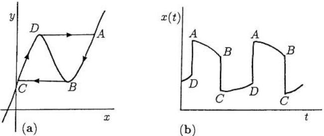

**Figure 8.3.** (**a**) Typical limit cycle phase trajectory *ABCDA* for a relaxation oscillator. The two horizontal parts of the trajectory are traversed very quickly. (**b**) The solution *x*(*t*) corresponding to the limit cycle trajectory in (**a**).

System (8.21) is a typical singular perturbation problem (see, for example, the book by Murray 1984) since ε multiplies one of the derivatives. Figure 8.3(a) illustrates a typical limit cycle phase plane trajectory for (8.21), with Figure 8.3(b) the corresponding solution *x*(*t*).

From the first of (8.21), except where *y* ≈ *f* (*x*), *x* changes rapidly by *O*(1/ε). So, referring now to Figure 8.3(a), along *D A* and *BC*, *x*(*t*) changes quickly. Along these parts of the trajectory the appropriate independent variable is τ = *t*/ε rather than *t*. With this transformation the second of (8.21) becomes, as ε → 0,

$$\frac{d\mathbf{y}}{d\mathbf{r}} = -\varepsilon \mathbf{x} \quad \Rightarrow \quad \mathbf{y} \approx \text{constant},$$

as it is on *D A* and *BC* in Figure 8.3(a). From (8.21), along the null cline *y* = *f* (*x*) between *AB* and *C D* the second equation becomes

$$f'(\mathbf{x})\frac{d\mathbf{x}}{dt} \approx -\mathbf{x} \tag{8.22}$$

which can be integrated to give *x* implicitly as a function of *t*. If *f* (*x*) is the Van der Pol cubic above, or can be reasonably approximated by a piecewise linear function, then we can integrate this equation exactly. We can then estimate (which we do in detail below) the period *T* of the oscillation since the major contribution comes from the time it takes to traverse the branches *AB* and *C D*: the time to move across *D A* and *BC* is small, *o*(1). It can be shown that if *T* is the limit cycle period calculated in this manner from (8.22), then the asymptotic limit cycle period of (8.21) has a correction of *O*(ε2/3). For our purposes all we need is the *O*(1) approximation for *T* .

By way of example, suppose *f* (*x*) = (1/3)*x*3 − *x*, that is, (8.21) is the simple Van der Pol oscillator, and let us calculate the *O*(1) period *T* . The null cline *y* = *f* (*x*) here and the limit cycle relaxation trajectory are very similar in shape to those illustrated in Figure 8.3 except that the origin has been moved to a point halfway down *DB* in Figure 8.3(a) and to a point in Figure 8.3(b) such that the solution is symmetrical about the *x* = 0 axis. From the above analysis, on integrating from the equivalent of *A* to *B*

in Figure 8.3(a) and from the equivalent of *C* to *D*, as ε → 0 the period *T* to *O*(1) is given by (8.22), with *f* (*x*) = (1/3)*x*3 − *x*. A little algebra gives *A* as (2, 2/3) and *B* as (1, −2/3). Because of the symmetry, and to be specific if we take *t* = 0 at *A*, the *O*(1) period *T* is given by

$$\int_{2}^{1} \left(x - \frac{1}{x}\right) dx = -\int_{0}^{T/2} dt \quad \Rightarrow \quad T = 3 - 2\ln 2. \tag{8.23}$$

Note that even if we cannot integrate *f* (*x*)/*x* simply, to get the period, we can still determine the maxima and minima of the limit cycle variables simply from the algebra of the null clines *y* = *f* (*x*). These correspond to *A* and *C* for *x*(*t*) and *D* or *A* and *B* or *C* for *y*(*t*).

On comparing the bromide ion concentration [Br−] as a function of time in Figure 8.1 and the limit cycle time-dependent solution sketched in Figure 8.3(b) it is reasonable to look for a relaxation oscillator type of approximation for the BZ oscillator. This has been done by Tyson (1976, 1977) whose analysis we effectively follow in the next section.

Let us again consider the FKN mechanism in the dimensionless form (8.5); namely,

$$\begin{aligned} \varepsilon \frac{d\mathbf{x}}{dt} &= q\mathbf{y} - \mathbf{x}\mathbf{y} + \mathbf{x}(\mathbf{l} - \mathbf{x}),\\ \delta \frac{d\mathbf{y}}{dt} &= -q\mathbf{y} - \mathbf{x}\mathbf{y} + 2fz,\\ \frac{dz}{dt} &= \mathbf{x} - z,\end{aligned} \tag{8.24}$$

with the dimensionless parameters given by (8.4). Note that ε δ, in which case we can reduce the order of the system (8.24) by setting ε *dx*/*dt* ≈ 0. This gives

$$0 = q\mathbf{y} - \mathbf{x}\mathbf{y} + \mathbf{x}(\mathbf{l} - \mathbf{x}) \Rightarrow \mathbf{x} = \mathbf{x}(\mathbf{y}) = \frac{1}{2} \left\{ (\mathbf{l} - \mathbf{y}) + \left[ (\mathbf{l} - \mathbf{y})^2 + 4q\mathbf{y} \right]^{1/2} \right\}. \tag{8.25}$$

With this (8.24) reduces to the second-order differential equation system in *y* and *z*:

$$\begin{aligned} \delta \frac{dy}{dt} &= 2fz - \mathbf{y}[\mathbf{x}(\mathbf{y}) + q], \\ \frac{dz}{dt} &= \mathbf{x}(\mathbf{y}) - z, \end{aligned} \tag{8.26}$$

which of course can now be analyzed completely in the (*y*,*z*) phase plane. We can, in the usual way, determine the steady state, analyze the linear stability, show there is a confined set and hence determine the conditions on the parameters for a limit cycle solution to exist.

### **8.5 Analysis of a Relaxation Model for Limit Cycle Oscillations in the Belousov–Zhabotinskii Reaction**

Here we exploit the relaxation oscillator aspects of (8.26) and hence determine the approximate period of the limit cycle, the maxima and minima of the dependent variables and then compare the results with the experimental observations of the oscillating reaction. To do this we first give approximations for *x*(*y*) using the fact that 0 < *q* - 1 from (8.4), and then sketch the null clines.

From (8.25), with *q* -1, the *z*-null cline from (8.26) is

$$z = x(\mathbf{y}) \approx \begin{cases} 1 - \mathbf{y} \\ \frac{q\mathbf{y}}{\mathbf{y} - 1} \end{cases} \quad \text{for} \quad \begin{cases} q \ll 1 - \mathbf{y} \le 1 \\ q \ll \mathbf{y} - 1 \end{cases} . \tag{8.27}$$

The *y*-null cline, from (8.26), is

$$z = \frac{\mathbf{y}[\mathbf{x}(\mathbf{y}) + q]}{2} \approx \begin{cases} \frac{\mathbf{y}(1-\mathbf{y})}{2f} \\ \frac{\mathbf{y}\left[\frac{q\mathbf{y}}{\mathbf{y}-1} + q\right]}{2f} & \text{for} \quad \begin{cases} q \ll 1 - \mathbf{y} \ll 1 \\ q \ll \mathbf{y} - 1 \\ \mathbf{y} \gg 1 \end{cases} . \tag{8.28}$$

The *z*-null cline is a monotonically decreasing function of *y*; it is sketched in Figure 8.4. The *y*-null cline, also shown in Figure 8.4 for various ranges of *f* , has a local maximum, *z*max (= *zD* = *z A* in Figure 8.4(a))

$$z_{\text{max}} = \frac{1}{8f} \quad \text{at} \quad \text{y}_{\text{max}} = \frac{1}{2}, \tag{8.29}$$

obtained from the first of (8.28). From the second of (8.28), *z* has a local minimum, *z*min (= *zB* = *zC* in Figure 8.4(a)) at

$$\begin{split} \frac{dz}{dy} &= \left\{ \frac{q}{2f(\mathbf{y} - \mathbf{I})^2} \right\} \{ 2\mathbf{y}^2 - 4\mathbf{y} + 1 \} = 0\\ \Rightarrow \mathbf{y}_{\text{min}} &= \frac{2 + \sqrt{2}}{2},\\ \Rightarrow z_{\text{min}} &= \frac{q(1 + \sqrt{2})^2}{2f} = \frac{q(3 + 2\sqrt{2})}{2f}. \end{split} \tag{8.30}$$

The values of *z* and *y* at the relevant points *A*, *B*, *C* and *D* are obtained from (8.27) and (8.28), with *zD*(= *z A*) and *yD* given by (8.29) and *zB*(= *zC*) and *yB* from (8.30). For *yC*, we have from the first of (8.28), with *q* -1 and *zC* = *z*min from (8.30),

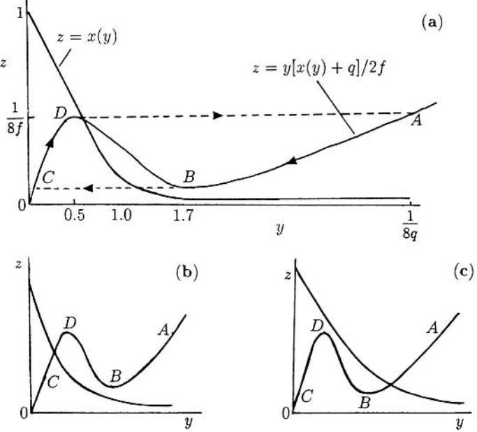

**Figure 8.4.** Schematic null clines for the reduced BZ model system (8.26) using the asymptotic forms for 0 < *q* - 1 from (8.27) and (8.28). The points *B* and *C* correspond to *z*min given by (8.30) and the points *D* and *A* to *z*max in (8.29). The asymptotic expressions for *A*, *B*, *C* and *D* are gathered together in (8.31) below. Note how the position of the steady state changes with *f* : (**a**) 1/4 < *f* < (1 + √ 2)/2; (**b**) *f* < 1/4; (**c**) (1 + √ 2)/2 < *f* .

$$\begin{split} z_C &= \frac{yc(1-yc)}{2f} \quad \Rightarrow \quad y_C = \frac{1-[1-8fzc]^{1/2}}{2} \\ &\approx \frac{1-[1-4q(3+2\sqrt{2})]^{1/2}}{2} \\ &\approx q(3+2\sqrt{2}). \end{split}$$

For *yA*, we have, from the second of (8.27) for *y* large, *z* ∼ *qy*/*f* , and *z A* = *z*max from (8.29),

$$\frac{1}{8f} = z_A \approx \frac{qy_A}{f} \quad \Rightarrow \quad y_A \approx \frac{1}{8q} \gg 1.$$

Gathering together these results, and those from (8.29) and (8.30), we have, for the points *ABCD* in Figure 8.4(a),

$$\begin{split} \mathbf{y}_A &\approx \frac{1}{8q}, \; z_A = \frac{1}{8f}; \quad \mathbf{y}_B \approx \frac{2+\sqrt{2}}{2}, \; z_B \approx \frac{q(3+2\sqrt{2})}{2f};\\ \mathbf{y}_C &\approx q(3+2\sqrt{2}), \; z_C \approx \frac{q(3+2\sqrt{2})}{2f}; \quad \mathbf{y}_D \approx \frac{1}{2}, \; z_D \approx \frac{1}{8f}. \end{split} \tag{8.31}$$

Figures 8.4(a) to (c) illustrate the various null cline possibilities for the reduced BZ model (8.26). From (8.27), (8.28) and (8.31) we can get the *f* -ranges where each holds. Figure 8.4(b) is when the local maximum at *zD* lies to the right of the steady state. This requires that on the *z*-null cline, given by (8.27),

$$\|z\|_{\mathbf{y}=\mathbf{y}_D} < z_D \quad \Rightarrow \quad \mathbf{x}(\mathbf{y}_D) \approx 1 - \mathbf{y}_D < z_D \quad \Rightarrow \quad f < \frac{1}{4},\tag{8.32}$$

on using (8.31). Figure 8.4(a) holds when *z* on the *z*-null cline is such that

*z*]*y*=*yD* > *zD* and *z*]*y*=*yB* < *zB*,

which gives

$$\mathbf{x}(\mathbf{y}_D) \approx 1 - \mathbf{y}_D > \frac{1}{8f} \quad \text{and} \quad \mathbf{x}(\mathbf{y}_B) \approx \frac{q \mathbf{y}_B}{\mathbf{y}_B - 1} < \frac{q(3 + 2\sqrt{2})}{2f},$$

which reduces to

$$\frac{1}{4} < f < \frac{1+\sqrt{2}}{2}.\tag{8.33}$$

Finally Figure 8.4(c) holds when, on the *z*-null cline,

$$\|z\|_{\text{y}=\text{y}_B} > z_B \quad \Rightarrow \quad f > \frac{1+\sqrt{2}}{2}. \tag{8.34}$$

We know from Chapter 7 that Figure 8.4(a) is a case in which a limit cycle oscillation is possible. So, with *f* in the range (8.33) and the steady state unstable, the reduced BZ model system (8.26) will exhibit limit cycle solutions. Now comparing Figure 8.4(a) with the relaxation limit cycle oscillator in Figure 8.3(a) gives the *O*(1) period of the oscillatory solution of (8.26) for 0 < δ -1 as

$$T \approx \int_{AB} dt + \int_{CD} dt = \left(\int_{\varepsilon_A}^{\varepsilon_B} + \int_{\varepsilon_C}^{\varepsilon_D}\right) \left(\frac{dz}{dt}\right)^{-1} dz \tag{8.35}$$

with *dz*/*dt* given by (8.26). So,

$$T_{AB} = \int_{\mathbb{Z}_A}^{\mathbb{Z}_B} [\chi(\mathbf{y}) - z]^{-1} dz. \tag{8.36}$$

To get an exact evaluation to *O*(1) for *q* - 1, it is convenient to change the variable to *y*, with *z* as a function of *y* given by the second of (8.28), since *AB* is part of the *y*-null cline. It is a tedious integration. All we want here is a reasonable approximation to the period. So, using the expressions for *q* - 1 in (8.27), we have, along most of *AB*,

$$
\mathbf{x}(\mathbf{y}) \approx \frac{q\mathbf{y}}{\mathbf{y} - 1} \sim q,
$$

and so, using (8.31),

$$\begin{split} T_{AB} = \int_{z_A}^{z_B} (q - z)^{-1} dz &= \ln \left[ \frac{z_A - q}{z_B - q} \right] \\ &\sim \ln \left\{ \frac{\left[ \begin{matrix} 1 \\ \overline{8f} \end{matrix} \right]}{\left[ \frac{q(3 + 2\sqrt{2})}{2f} - q \right]} \right\} \\ &\sim -\ln[4(3 - 2f + 2\sqrt{2})q], \quad q \ll 1. \end{split} \tag{8.37}$$

This, in fact, is an upper bound for *TAB* since on *AB*, *x*(*y*) ≈ *qy*/(*y* − 1), which asymptotes to *q* only for *y* 1. On *AB*, *x*(*y*) goes from

$$\chi(\mathbf{y}_A) = \frac{q\left[\frac{1}{8q}\right]}{\left[\frac{1}{8q} - 1\right]} \sim q + O(q^2), \quad q \ll 1,$$

to

$$\alpha(\mathbf{y}_B) = \frac{q\left[\frac{2+\sqrt{2}}{2}\right]}{\left[\frac{2+\sqrt{2}}{2}-1\right]} = q(1+\sqrt{2}).$$

Returning to the integral in (8.36) we have *TAB* bounded above by (8.37) and below by the expression there with *q*(1 + √ 2) replacing *q*. That is,

$$
\ln\left[4(3 - 2f + 2\sqrt{2})q\right] < T_{AB} < -\ln\left[4(3 - 2f + 2\sqrt{2})(1 + \sqrt{2})q\right].\tag{8.38}
$$

Let us now evaluate the *TC D* contribution to the period in (8.35), namely,

$$T_{CD} = \int_{zc}^{zD} \left[ \mathbf{x}(\mathbf{y}) - z \right]^{-1} dz.$$

It is also convenient here to change to *y* as the integration variable. Between *C* and *D* in Figure 8.4(a) and on *C D*

$$\mathbf{x}(\mathbf{y}) \approx \mathbf{1} - \mathbf{y}, \quad \mathbf{z} \approx \frac{\mathbf{y}(1 - \mathbf{y})}{2f} \quad \Rightarrow \quad dz = \left[\frac{1 - 2\mathbf{y}}{2f}\right] d\mathbf{y}$$

so the last integral gives, after some further tedious algebra,

$$\begin{split} T_{CD} &\approx \int_{\text{yc}}^{\text{y}} \frac{\left[\frac{1-2\text{y}}{2f}\right]}{\left[(1-\text{y})-\frac{\text{y}(1-\text{y})}{2f}\right]} d\mathbf{y} \\ &= -\left[\frac{4f-1}{2f-1}\right] \ln\left[2^{1/(4f-1)}\frac{4f-1}{4f}\right]. \end{split} \tag{8.39}$$

The period to *O*(1) for *q* - 1 is then given as a function of *f* and *q* by *TAB* + *TC D*, using (8.38) and (8.39). The dimensional period is given by multiplying *T* by *t*0 from (8.4).

To complete the analysis of the relaxation oscillator we have to integrate the approximate equations on the branches *AB* and *C D*. We have effectively already done this when we evaluated *TAB* and *TC D*. Let us take *t* = *tA* = 0 and hence *z*(0) = *z A* for algebraic convenience. Then on *AB*, with *x*(*y*) ∼ *q* for *y* large from (8.27), (8.26) gives

$$\frac{dz}{dt} \approx q - z \quad \Rightarrow \quad z(t) = z_A e^{-t} + q(1 - e^{-t}), \tag{8.40}$$

and so there is an exponential decay in time from *z A* to *zB* = *O*(*q*) for times of *O*(1).

On *C D*, *x*(*y*) ≈ 1 − *y* and *z* ≈ *y*(1 − *y*)/(2 *f* ) so the second of (8.26) on changing to the variable *y*, gives

$$
\left[\frac{1-2\mathbf{y}}{2f}\right]\frac{d\mathbf{y}}{dt} \approx (1-\mathbf{y}) - \frac{\mathbf{y}(1-\mathbf{y})}{2f}
$$

which integrates to give *y* implicitly as a function of *t* from

$$\ln\left[\frac{1-\text{y}}{(2f-\text{y})^{4f-1}}\right] = K + (2f-1)t,\tag{8.41}$$

where *K* is an integration constant. Since the time to traverse the horizontal part of the trajectory, namely, *BC*, is negligible, we can determine *K* by taking *y*(*tC*) = *yC*, where *t* = *tC* ≈ *tB*, with *tB* given by (8.40) on setting *z* = *zB*; that is,

$$t_B = \ln\left[\frac{z_A(1-q)}{z_B - q}\right].\tag{8.42}$$

From (8.41) and the last equation we thus have

$$K = \ln\left[\frac{1 - \chi_{\mathcal{C}}}{(2f - \chi_{\mathcal{C}})^{4f - 1}}\right] - (2f - 1)t_B. \tag{8.43}$$

Now with *y*(*t*) given implicitly by (8.41), we get *z* from *z* ∼ *y*(1 − *y*)/(2 *f* ). Finally the time to traverse *D A* is also negligible. We thus have analytical expressions for the dependent variables in the relaxation oscillator as functions of time for 0 < *q* -1.

Let us now return to the actual BZ reaction and recall from (8.1) that *z* and *y* are the dimensionless variables associated with the catalyst form Ce4+ and bromide ion Br− respectively. Referring to Figure 8.4(a) and starting at *A*, say, the limit cycle oscillation trajectory then goes through *BCD* to *A* again. This trajectory corresponds to the experimentally obtained cycle illustrated in Figure 8.1 with corresponding letters. The [Br−] decreases exponentially to *B*, then there is a rapid drop to the value at *C*. The value at *B* is the threshold Br− concentration described in Section 8.1 where process II takes over from process I. There is then an increase in times *O*(1) from *C* to *D*, given

|                            | Calculated<br>Values                                 | Experimental<br>Values     |
|----------------------------|------------------------------------------------------|----------------------------|
| Period                     | 183–228<br>s                                         | 110<br>s                   |
| [Br−]B<br>[Br−]crit<br>=   | 10−5 [BrO3<br>−]<br>1.7<br>×                         | 10−5 [BrO3<br>−]<br>2<br>× |
| [Br−]C<br>[Br−]jumpup<br>= | [Br−]crit<br>0.3                                     | [Br−]crit<br>0.3           |
| [Br−]A<br>[Br−]max<br>=    | 10−3 [BrO3<br>−]<br>[Br−]crit<br>1.6<br>×<br>=<br>90 | [Br−]crit<br>3             |

**Table 8.1.** Comparison of values obtained from the relaxation oscillator approximation (8.26) for the BZ reaction with observed values. (From Field et al. 1972)

by (8.42) with (8.43), followed by a rapid increase in [Br−] to its value at *A* again. Thus the relaxation oscillator approximation (8.26) mimics the real experimental oscillator of Figure 8.1. To go further we must compare actual measurable quantities.

The experimentally suggested value for *f* from Field and Noyes (1974) is *f* = 0.5. Taking the limit *f* → 0.5 in (8.39), by setting *f* = 0.5 + ω and then letting ω → 0, *TC D* = 2 ln (2) − 1. Because of the smallness of *q* the major part of the period comes from *TAB*. Now take the values in (8.4), which also gives *y*0 used in the nondimensionalisation of the bromide ion concentration *y*, and substitute them into the limiting values for *y*0 *y*(=[Br−]) from (8.31), and in the expressions for the *TAB* bounds and *TC D* from (8.38) and (8.39); Table 8.1 lists the values obtained. The table also gives the experimentally observed values of Field et al. (1972). Considering the complexity of the reaction and the number of approximations used in reducing the mechanism to manageable proportions and finally to the relaxation oscillator model, the results are very good.

When the parameter *f* is in the ranges which give null clines typically as in Figures 8.4(b) and (c), oscillations are not possible for the mechanism (8.26) as we saw in Chapter 7, Section 7.3. However the mechanism in these cases can exhibit threshold behaviour; compare with Figures 7.5(a) and (b). Further, if reversibility is allowed in the basic FKN model mechanism (8.2) it is possible to have three positive steady states of which two are stable, as in Figure 7.4(d). This corresponds to the biological switch behaviour also discussed in Chapter 7, Section 7.3 and schematically illustrated in Figure 7.5(c). Numerical studies of the reversible model also indicate bursting behaviour and chaos. Various plausible models for the Belousov–Zhabotinskii reaction have predicted a variety of unexpected phenomena which should be experimentally exhibited by the real reaction, and many have now been confirmed; see, for example, Tyson (1985), Field and Burger (1985) and Scott (1991). Barkley et al. (1987) demonstrated the existence of quite complex behaviour including periodic bursting, hysteresis and periodicchaotic sequences. Gyorgyi and Field (1991) presented some models for the BZ reaction ¨ which demonstrate deterministic chaos.

Here we have considered only homogeneous or well-stirred systems. When we investigate, in later chapters, coupled biological oscillators and unstirred systems, where diffusion effects must be included, a new and astonishing range of phenomena appear. Once again the Belousov–Zhabotinskii reaction is the key reaction used in experiments to verify the theoretical results.

### **Exercises**

- **1** Another scaling (Murray 1977) of the FKN model results in the third-order system

$$
\delta \frac{d\mathbf{x}}{dt} = \mathbf{y} - \mathbf{x}\mathbf{y} + \mathbf{x}(\mathbf{l} - q\mathbf{x}), \quad \frac{d\mathbf{y}}{dt} = -\mathbf{y} - \mathbf{x}\mathbf{y} + 2fz, \quad \frac{dz}{dt} = \delta(\mathbf{x} - z),
$$

where ε and *q* are small. Determine the steady states, discuss their linear stability and show that a confined set for the positive steady state is

$$1 < x < \frac{1}{q}, \quad \frac{2fq}{1+q} < y < \frac{f}{q}, \quad 1 < z < \frac{1}{q}.$$

- **2** With the system in Exercise 1, derive the relevant reduced second-order system on the basis that 0 < ε - 1. Sketch the null clines in the phase plane, exploiting the fact that 0 < *q* - 1, and hence determine the necessary conditions on *f* for a limit cycle solution to exist.
- **3** A relaxation oscillator is given by

$$x\frac{d\mathbf{x}}{dt} = f(\mathbf{x}) - \mathbf{y}, \quad \frac{d\mathbf{y}}{dt} = \mathbf{x}, \quad f(\mathbf{x}) = \mathbf{x} - \frac{1}{3}\mathbf{x}^3, \dots$$

where 0 < ε - 1. Sketch the limit cycle trajectory in the *y*, *x* phase plane, noting the direction of motion. Determine the period *T* to *O*(1) as ε → 0.

Approximate the function *f* (*x*) by a piecewise linear function, and sketch the corresponding phase plane limit cycle. Integrate the equations using the piecewise linear approximation. Hence, sketch the solution *x* as a function of *t*. Also evaluate the *O*(1) period and compare the result with that in the first part of the question.

- **4** A possible relaxation oscillator model for the FKN mechanism is governed by the dimensionless system

$$
\varepsilon \frac{d\mathbf{x}}{dt} = \frac{2fz(q-\mathbf{x})}{\mathbf{x}+q} + \mathbf{x}(1-\mathbf{x}), \quad \frac{d\mathbf{z}}{dt} = \mathbf{x} - \mathbf{z},
$$

where 0 < ε - 1, 0 < *q* - 1 and *f* = *O*(1). Using the results in Exercise 2, when a limit cycle solution is possible, sketch the relaxation oscillator trajectory, determine the maximum and minimum values for *x* and *z*, and obtain expressions for the *O*(1) estimate for the limit cycle period.

# **9. Perturbed and Coupled Oscillators and Black Holes**

#### **9.1 Phase Resetting in Oscillators**

With the plethora of known biological oscillators, and their generally accepted importance, it is natural to ask what effects external perturbations can have on the subsequent oscillations. In his pioneering work on circadian rhythms in the 1960's, A.T. Winfree asked this basic and deceptively simple question in a biological context in connection with his experimental work on the periodic emergence of the fruit fly, *Drosophila melanogaster*, from their pupae. Since then a series of spectacular discoveries of hitherto unknown properties of perturbed oscillators, spatially coupled oscillators, oscillators coupled to diffusion processes and so on (see, for example, Chapter 12 and Chapter 1, Volume II), have been made as a result of this simple yet profound question. Winfree has developed a new conceptual geometric theory of biological time, which poses many challenging and interesting mathematical problems. Winfree's (2000) seminal book, which has a full bibliography, discusses the area in detail. He also gives numerous important examples of biological situations where a knowledge of such effects is crucial to understanding certain phenomena which are observed.

The periodic pacemaker in the heart is an important oscillator and one which is being widely studied, in particular the effects of imposed perturbations. For example, Jalife and Antzelevitch (1979), whose results we discuss in Section 9.4, deal with pacemaker activity in cardiac tissue; Krinsky (1978) discusses cardiac wave arrhythmias; Winfree (1983a,b) discusses, among other things, the topological aspects of sudden cardiac death. There is also interesting work on the sophisticated neural control of synchrony of breathing to stride in runners and horses (see, for example, Hoppensteadt 1985 and the references there).

We saw in Section 7.5 above that under certain conditions nerve cells can exhibit regular periodic firing. In view of the crucial importance of neuronal signalling it is clearly of considerable interest to study the effect of external stimuli on such oscillations. The work of Best (1979) is of particular relevance to this and the following three sections. He subjected one of the accepted models for the propagation of nerve action potentials, namely, the FitzHugh–Nagumo model (see Section 7.5, equations (7.39)), to periodic impulses and demonstrated some of the important phenomena we discuss in this chapter.

As we shall show in Chapter 1, Volume II, the spatial propagation of impulses in neurons normally relies on a threshold stimulus being applied, and is an important practical example of an excitable medium. The heart pacemaker problem and some kinds of cardiac failure are probably related to wave phenomena associated with perturbed oscillators; see, for example, the general scientific article by Winfree (1983b). This area has been studied over a period of some years, specifically in relation to heart failure and is one of the motivations for the material described in this section. The results and conclusions in this section, however, are quite general and are, in effect, model-independent, even though we use specific models for pedagogical reasons.

By way of introduction we briefly describe some of the experimental observations made on the approximately 24-hour rhythmic emergence of fruit flies from their pupae. During the pupal stage of the flies' development, a metamorphosis takes place which culminates in the emergence of an adult fruit fly. If metamorphosing pupae are simply left alone in a typical diurnal cycle of light and dark the flies emerge in quanta over a period of about 6 to 8 hours roughly every 24 hours. If such pupae are now placed in complete darkness the flies continue to emerge in almost exactly the same way; Figure 9.1 illustrates the aggregated results of numerous experiments.

If the pupae, in the dark environment, are now subjected to a brief pulse of light, the timing, or *phase*, of the periodic emergence of the flies is shifted. In other words there is a *phase shift* in the underlying biological clock. The phase shift depends both on the timing *T* of the light pulse and its duration or rather the number *D* in ergs/cm2 transmitted by the light. We are interested in the emergence time *TE* after the pulse of light; *TE* depends on *T* and *D*. If the dose *D* = 0 is given at *T* then clearly the phase shift is zero; *TE* = 24 − *T* hours. Winfree (1975) gives the results of numerous experiments in which *T* and *D* are varied and *TE* recorded. The important point to note at this stage about these experiments is that there is a critical dose *D*∗ which, if administered at a specific time *T* ∗, results in no further periodic emergences but rather a

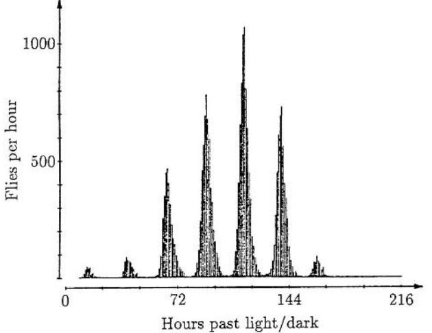

**Figure 9.1.** Fruit fly pupae were placed in a completely dark environment. Fly emergence (eclosion) takes place approximately every 24 hours over a period of about 7 hours until all the pupae have matured. Here we are concerned with the periodic peak timing, not the number emerging at each peak. (Redrawn from Winfree 1980 with permission)

continuous emergence. In other words the periodic behaviour has been destroyed. What is also surprising from the data is just how small the dose was which caused this; see Winfree (1975). Basically these experimental results suggest that there is a critical phase and stimulus which destroy the basic underlying periodic behaviour or biological clock. This has important implications for oscillators in general.

This section and the following three are principally concerned with biological oscillators, the effect of stimulus and timing on the periodic behaviour and the experimental evidence and implications. With the fruit fly experiments there is a singularity (or singularities) in the stimulus-timing-response space of the oscillator at which point the oscillator simply quits or does unpredictable things. Away from this singularity the subsequent behaviour is more or less predictable. Later, in Section 9.4, we describe other stimulus experiments, namely, on cardiac tissue, which exhibit similar phase singularity behaviour.

Prior to doing the analysis, which is very easy for the illustrative example we consider, it is helpful to consider the simple pendulum to demonstrate the phenomena of *phase resetting* and *stimulus-timing-phase singularity* that we have just described. Suppose a pendulum is swinging with period ω, and suppose we measure zero phase or time *t* = 0 from the time the pendulum bob is at *S*, its highest point, at the right, say. Then every time *t* = *n*ω for all integers *n*, the bob is again at *S*. If, during the regular oscillation, we give an impulse to the bob, we can clearly upset the regular periodic swinging. After such an impulse or stimulus, eventually the pendulum again exhibits simple harmonic motion, but now the bob does not arrive at *S* every *t* = *n*ω but at some other time *t* = *ts* + *n*ω, where *ts* is some constant. In other words the phase has been reset. If we now give a stimulus to the bob when it is exactly at the bottom of its swing we can, if the stimulus is just right, stop the pendulum altogether. That is, if we give a stimulus of the right size at the right phase or time we can stop the oscillation completely; this is the singular point in the stimulus-phase-response space we referred to above in the fruit fly experiments.

Suppose that an oscillator is described by some vector state variable **u** which satisfies the differential equation system

$$\frac{d\mathbf{u}}{dt} = \mathbf{f}(\mathbf{u}, \lambda),\tag{9.1}$$

where **f** is the nonlinear rate function and λ denotes the parameters of the oscillator. For visual clarity and algebraic simplicity, suppose (9.1) describes a limit cycle oscillator involving only 2 species, *x* and *y*. Then typically the limit cycle trajectory is a simple plane closed curve, γ say, in the two-dimensional species plane as in Figure 9.2(a). By a suitable change of variable we can transform this limit cycle into one in which the closed trajectory is a circle and the state of the oscillator is essentially described by an angle θ, the 'phase,' with its origin at some arbitrary point on the circle. The limit cycle is traversed with speed v = *d*θ/*dt*. In one complete traversal of the orbit, θ increases by 2π.

A simple example of such a limit cycle system is

$$\frac{dr}{dt} = R(r), \quad \frac{d\theta}{dt} = \Phi(r), \tag{9.2}$$

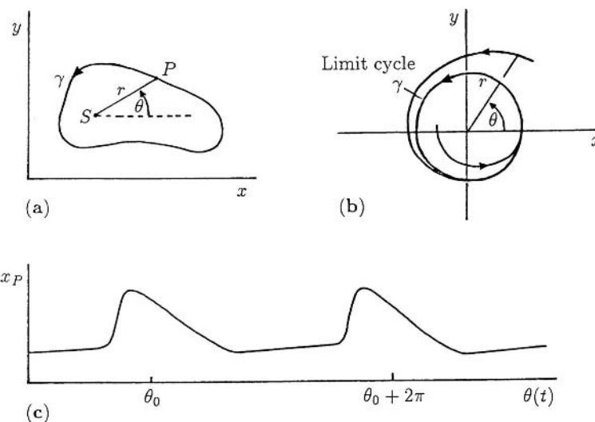

**Figure 9.2.** (**a**) A typical limit cycle solution trajectory γ in the phase plane. (**b**) Typical solutions to the system (9.2) with conditions (9.3). With any initial conditions, the solution evolves to the limit cycle given by *r* = 1, *d*θ/*dt* = 1. (**c**) Typical time periodic behaviour of the point *P* in (**a**): note that the velocity of the point *P* is in general not constant as is the case in (**b**).

where

$$R(r) \begin{cases} > 0 \\ < 0 \end{cases} \text{ for } \quad \begin{cases} 0 < r < r_0 \\ r > r_0 \end{cases}, \quad R(r_0) = 0, \quad \Phi(r_0) = 1. \tag{9.3}$$

These conditions imply that (9.2) has a unique attracting limit cycle *r* = *r*0, *d*θ/*dt* = 1. (A particularly simple case, mentioned before in Chapter 3, has *R*(*r*) = *r*(1 − *r*), Φ(*r*) = 1, for which the solution can be given trivially.) If we normalise the circle with respect to *r*0 we can then take the limit cycle to be *r* = 1.

Figure 9.2(b) illustrates a typical phase plane limit cycle solution. Figure 9.2(c) shows, for example, how the point *xP* = *xS* + cos θ(*t*), where *xS* is the steady state in Figure 9.2(a), might vary as a function of *t*, with equivalent values of θ marked at two points.

The fact that limit cycle solutions can be visualised as motion around a circle has been developed in an intuitive way by Winfree (2000) under the general topic of ring dynamics. The topological aspects are interesting and produce some unexpected results and new concepts. Here we consider only the basic elements of the subject but they are sufficient to demonstrate certain important concepts.

With the modelling of physiological oscillators in mind we envisage some event, a heart beat, for example, to occur at some specific value of the phase, which we can normalise to θ = 0. The pacemaker goes through a repeating cycle during which it fires at this specific phase (that is, time), then is refractory for part of the cycle, after which it again fires, and so on. With the ring or circle concept for an oscillator, we can think of the pacemaker as a point moving round a ring at a constant velocity with firing occurring every time the point passes through the position on the circle with phase θ = 0. Although from a time point of view, *t* increases linearly, at specific times (multiples of the period) the pacemaker fires. To appreciate the basic concept of phase resetting of an oscillator by a stimulus we take, as an illustrative example, the simplest nontrivial limit cycle oscillator system

$$\frac{dr}{dt} = r(1 - r), \quad \frac{d\theta}{dt} = 1,\tag{9.4}$$

for which the phase θ(*t*) = θ0 +*t*, modulo 2π; see Figure 9.2(b). With it we discuss the two basic types of phase resetting, namely, Type 1 and Type 0.

#### **9.2 Phase Resetting Curves**

#### *Type 1 Phase Resetting Curves*

Suppose we first perturb only the phase so that the governing equation becomes

$$r = 1, \quad \frac{d\theta}{dt} = 1 + v(\theta, I), \tag{9.5}$$

where v(θ, *I*) represents the imposed velocity change, that is, the stimulus, on the angular velocity *d*θ/*dt*. *I* is a parameter which represents the magnitude of the impulse imposed on the oscillator. Again for pedagogical reasons let us take a simple, but nontrivial, v which depends on θ and *I*, and which was used by Winfree (1980), namely,

$$\frac{d\theta}{dt} = 1 + I\cos 2\theta,\tag{9.6}$$

where *I* may be positive or negative. If the stimulus *I* is imposed at *t* = 0 and maintained for a time *T* then integrating (9.6) gives the new phase φ in terms of the old phase θ when the stimulus was started. From (9.6),

$$\int_{\theta}^{\phi} (1 + I \cos 2s)^{-1} ds = \int_{0}^{T} dt = T,\tag{9.7}$$

which integrates to give

$$\begin{aligned} |I| < 1: \quad \tan \phi &= A \tan (TB + \tan^{-1}(A^{-1} \tan \theta)), \\ I &= 1: \quad \tan \phi = 2T + \tan \theta \\\ I &= -1: \quad \tan \phi = \frac{\tan \theta}{1 - 2T \tan \theta} \\\ |I| > 1: \quad \tan \phi &= A \frac{|K| + 1}{|K| - 1} \quad \text{if} \quad |\tan \phi| > A \\\ &\quad \tan \phi = A \frac{|K| - 1}{|K| + 1} \quad \text{if} \quad |\tan \phi| < A \\\ K &= \left[ \frac{A + \tan \theta}{A - \tan \theta} \right] \exp(2TB), \end{aligned} \tag{9.8}$$

where

$$A = \left[\frac{|1 + I|}{|1 - I|}\right]^{1/2}, \quad B = \left[|1 - I^2|\right]^{1/2}.\tag{9.9}$$

These give, explicitly, the new phase φ as a function of the old phase θ and the strength *I* and duration *T* of the stimulus. So, applying a stimulus causes a *phase shift* in the oscillator; in other words it *resets* the phase. For *t* > *T* the oscillator simply reverts to *d*θ/*dt* = 1 but now there is a phase shift. This means that the oscillator will fire at different times but at the same value of the phase that it did before; the subsequent period, of course, is also the same as it was before the stimulus. That is, the periodic 'wave' form such as in Figure 9.2(c) will simply be moved along a bit.

We are interested in the *phase resetting curve* of φ as a function of θ for various stimulus magnitudes, which depend on *I* and its duration *T* . An important point with stimuli like that in (9.5) is that *d*φ/*d*θ > 0 for all *I*, *T* and θ. This says that a later new phase φ results if the impulse is applied at a later old phase. This is seen immediately with the v in (9.6) by differentiating (9.8) with respect to θ and noting that it gives an expression for *d*φ/*d*θ which is strictly positive. If we now plot the new phase φ against the old phase θ when the impulse was applied, we obtain the phase resetting curve, which is typically as shown in Figure 9.3. Note that whatever the stimulus *I*, the values of the new phase φ cover the complete phase cycle, here 0 to 2π. In other words any new phase 0 < φ ≤ 2π can be obtained by a suitable choice of an old phase 0 < θ ≤ 2π and the stimulus *I*. For a given *I* and *T* the new phase φ is uniquely determined by the old phase θ. This is known as a *Type 1* phase resetting curve and it is characterised by the fact that *d*φ/*d*θ > 0 for all 0 < θ ≤ 2π: the average gradient over a cycle is 1—hence the name. Although in Figure 9.3 there is an advance for *I* in 0 <θ<π, another oscillator could well display a delay. The main point is that *d*φ/*d*θ > 0 in Type 1 resetting.

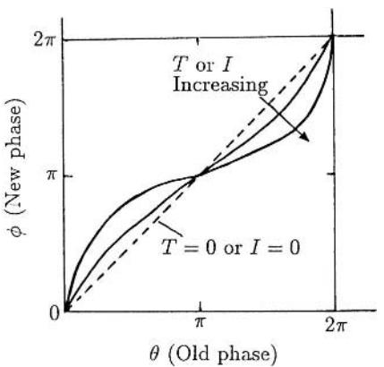

**Figure 9.3.** Typical Type 1 phase resetting curves, giving the new phase in terms of the old phase for the phase velocity stimulus given by (9.6) for *I* ≥ 0 and *T* ≥ 0. This case shows a phase advance for an impulse in 0 <θ<π and a delay for π<θ< 2π.

If *I* is sufficiently strong, | *I* | > 1 in fact, the phase velocity *d*θ/*dt* = 1 + v(θ, *I*) can become negative for some phases: in the case of (9.6) this is for θ satisfying 1 + *I* cos 2πθ < 0. This means that during the time of stimulation there is a phase attractor and a phase repellor, where *d*θ/*dt* = 0 and where *d*[*d*θ/*dt*]/*d*θ is negative and positive respectively (recall the stability analysis of single population models in Chapter 1). The stimulus is not sustained for all time, so the oscillator resumes its periodic cycle after the stimulus is removed—but of course with a different phase as determined by (9.8).

#### *Type 0 Phase Resetting Curves*

Consider the same limit cycle (9.4) but now let us subject it to a stimulus *I* which moves the solution off the limit cycle *r* = 1. To be specific, let us take *I* as an impulse parallel to the *y*-axis as shown in Figure 9.4. The analysis goes through with any perturbation but the algebra is more complicated and simply tends to obscure the main point. Let us decide on the notation that *I* > 0 is the situation illustrated in Figure 9.4; that is, with 0 < θ < π/2 the new phase φ is less than the old phase θ and the new position in general has *r* = ρ = 1. We now want the new phase φ in terms of the old phase θ and the stimulus *I*. From the figure

$$
\rho \cos \phi = \cos \theta, \quad \rho \sin \phi + I = \sin \theta \tag{9.10}
$$

which, on eliminating ρ gives φ = φ(θ, *I*) implicitly; this is a three-dimensional surface in (φ,θ, *I*) space. As we shall see, it is the projection of this surface onto the (*I*,θ) plane which is of particular interest. Before considering this, however, let us construct phase resetting curves equivalent to those in Figure 9.3, namely, the new phase φ as a function of the old phase θ for various stimuli *I*: these are the projections of the surface φ = φ(θ, *I*) onto the (φ,θ) plane for various *I*.

From (9.10),

$$
\tan \phi = \tan \theta - \frac{I}{\cos \theta},
\tag{9.11}
$$

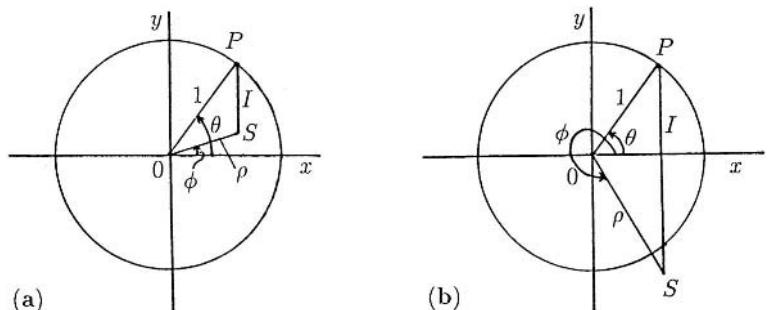

**Figure 9.4.** The impulse *I* takes the point *P* (*r* = 1, old phase = θ) instantaneously to *S* (*r* = ρ, new phase = φ). (**a**) 0 < *I* < 1. (**b**) *I* > 1.

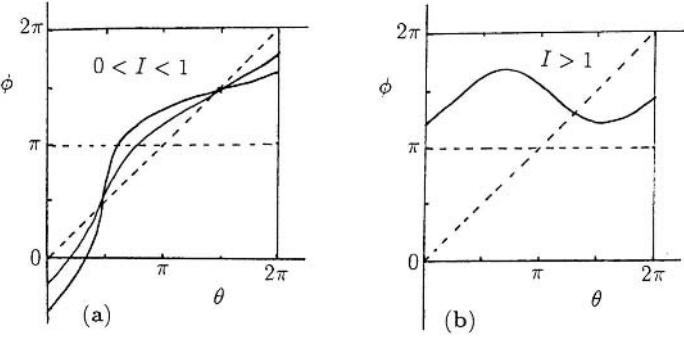

**Figure 9.5.** (**a**) Phase resetting curves from (9.11) for 0 < *I* < 1. From (9.12) note that *d*φ/*d*θ > 0 for all such *I*. (**b**) Phase resetting curves from (9.11) for *I* > 1. Here for a range of θ, *d*φ/*d*θ < 0 and not all new phases φ can be obtained.

which gives φ in terms of θ for a given *I*. Let us suppose first that 0 < *I* < 1. Then it is clear qualitatively from Figure 9.4 that for 0 < θ < π/2 and 3π/2 <θ< 2π , φ<θ, while for π/2 <θ< 3π/2, φ>θ. Thus the qualitative phase resetting curve φ against θ is as shown in Figure 9.5(a): it crosses the zero stimulus diagonal at θ = π/2, 3π/2. The quantitative details are not important here. From (9.11), differentiating with respect to θ gives

$$\begin{split} (1 + \tan^2 \phi) \frac{d\phi}{d\theta} &= 1 + \tan^2 \theta - \frac{I \sin \theta}{\cos^2 \theta} \\ &= \frac{1 - I \sin \theta}{\cos^2 \theta} \\ &> 0 \quad \text{for all } 0 < \theta < 2\pi, \text{ if } |I| < 1. \end{split} \tag{9.12}$$
 
$$\begin{cases} > 0 &\quad \text{for} \quad \theta \text{ such that } \sin \theta > \frac{1}{I}. \end{cases}$$

So, on the phase resetting curves, if 0 < *I* < 1, *d*φ/*d*θ > 0 for all θ as illustrated in Figure 9.5(a). Comparing these with the curves in Figure 9.3, they are all topologically equivalent, so Figure 9.5(a) is a Type 1 phase resetting curve. The same remarks hold if −1 < *I* < 0.

Let us now consider *I* > 1. From (9.12) there is a range of θ where *d*φ/*d*θ < 0. Refer now to Figure 9.4(b) and let *P* move round the circle. We see that *S* never moves into the upper half-plane. That is, as θ varies over the complete period of 2π , at the very least φ never takes on any phase in the range (0,π); in fact, the exact range can easily be calculated from (9.11) or (9.12). The phase resetting curve in this case is qualitatively as shown in Figure 9.5(b). This curve is not topologically equivalent to those in Figure 9.5(a). All phase resetting curves with *I* > 1 are topologically different from Type 1 resetting curves. Phase resetting curves like those in Figure 9.5(b), namely, curves in which as the old phase θ takes on all phase values in (0, 2π) the new phase φ only takes on a *subset* of the full cycle range, are called *Type 0* resetting curves. Note that on such curves the gradient *d*φ/*d*θ < 0 for some range of θ: the average gradient

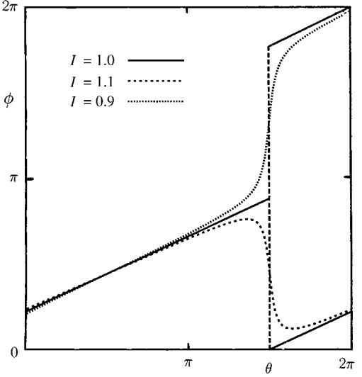

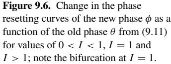

on this curve is 0, which accounts for the name for this type of resetting curve. Note also that Type 0 resetting curves cannot be obtained from only a *phase* stimulus. The same type of resetting curves, namely, Type 0, is obtained for stimuli *I* < −1.

Another way of clearly demonstrating the bifurcation from a *Type 0* resetting curve to a *Type 1* as *I* passes through *I* = 1 is obtained by plotting the new phase φ against the old phase θ from (9.11). An example of this is shown in Figure 9.6 for representative values of 0 < *I* < 1, *I* = 1 and *I* > 1.

Resetting one's biological clock as quickly as possible is what everyone wants to do when suffering from jet lag. What Winfree has unequivocably shown is that circadian rhythms are highly sensitive to light. He has introduced a whole new approach to the area of internal clocks. With respect to resetting the biological clock, humans are essentially no different from fruitflies and a human's clock can be reset with the right light stimulus given at the right time. From Winfree's (1975) article it is possible to determine when to administer a strong dose of sunlight to yourself to reset your biological clock after a flight across several time zones.1 Winfree (1982, 2000) discusses human body clocks and the timing of sleep and suggests that their understanding could have practical medical and psychiatric implications.

#### **9.3 Black Holes**

From the analysis in the last section we see that as the stimulus *I* is increased from 0 there is a distinct bifurcation in phase resetting type as *I* passes through *I* = 1. That

<sup>1</sup>For example, going from Seattle to London, there is an eight-hour difference. A good 15-minute dose of strong sunlight into your eyes around 1 PM should reset your clock. The only problem is getting a dose of sunlight in England. Going the other way you need to have the strong sunlight around 5 PM in Seattle, where, of course, there's the same problem as in England.

is, there is a *singularity* in phase resetting for *I* = 1. To see clearly what is going on physically we must consider the projection of the φ = φ(θ, *I*) surface, given by (9.11), onto the (*I*,θ) plane for various φ. That is, we construct curves

$$I = \sin\theta - \cos\theta\tan\phi\tag{9.13}$$

for various φ in the range 0 ≤ φ ≤ 2π. Although this is an exercise in elementary curve drawing, using simple calculus, it has to be done with considerable care. The results are schematically shown in Figure 9.7. Let us first consider the old phase range 0 ≤ θ ≤ π and suppose, for the moment, φ = π/2, 3π/2. Irrespective of the value of φ, all curves pass through the point *I* = 1, θ = π/2, since there, cos θ tan φ = 0 and *I* = sin π/2 = 1 for all φ. All the curves with π/2 >φ> 0, 2π>φ> 3π/2 intersect the θ = 0 axis at *I* = − tan φ. For π/2 <φ< 3π/2 a little calculus on (9.13) gives the curves shown. The special values φ = π/2, 3π/2 give the vertical singularity line through θ = π/2, as can be seen by taking the singular limit φ → π/2, or by simply observing the behaviour of the constant φ phase curves as φ approaches π/2. Having dealt with the θ-range (0,π) the (π, 2π) range is treated similarly and the overall picture obtained is shown in Figure 9.7. The important thing to note is that there

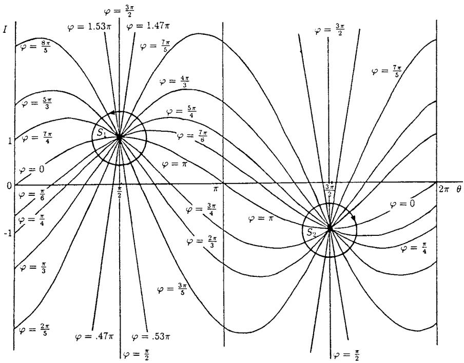

**Figure 9.7.** Projections of the new phase (φ)-old phase (θ)-stimulus (*I*) surface, given by (9.13), onto the (*I*, θ) plane for various φ in the period cycle range 0 ≤ φ ≤ 2π. Note that *S*1 and *S*2 are singularities into each of which goes a complete selection of phases φ, 0 ≤ φ ≤ 2π; in one case they are traversed counterclockwise, that is, for *S*1, and in the other, namely, *S*2, clockwise.

are two singular points *S*1 and *S*2 into each of which goes a constant phase curve of every phase in (0, 2π); in the one case curves of increasing φ are arranged clockwise and in the other counterclockwise.

Let us now consider the implications of this important Figure 9.7. Suppose we have such an oscillator and we give it a stimulus *I* at a given phase θ. As long as | *I* | < 1 we can simply read off the new phase given *I* and the old phase θ, and what is more, the result is unique. For all | *I* | > 1, given the old phase θ, once again the new phase is determined uniquely. In this situation, however, we can get the same new phase φ for a given *I* for *two* different old phases θ. In the former we have, referring to Figure 9.5, a Type 1 phase resetting while in the latter it is a Type 0 phase resetting.

Now suppose we take the particular stimulus *I* = 1 and impose it on the oscillator at phase θ = π/2; the resulting point in Figure 9.7 is the singular point *S*1, which has no one specific phase φ associated with it, but rather the whole range 0 ≤ φ ≤ 2π. In other words the effect of this particular stimulus at this specific phase gives an *indeterminate* result. These singular points *S*1 and *S*2 are *black holes* in the stimulus-phase space, and are points where the outcome of a stimulus is unknown. If *I* is not exactly equal to 1, but close to it, the result is clearly a delicate matter, since all phases φ pass through the singularity. From a practical point of view the result of such a stimulus on a biological oscillator is unpredictable. Mathematically, however, if the exact stimulus *I* = 1 is imposed at exactly θ = π/2 there is no resultant new phase φ. This is what happens in the simple pendulum situation when exactly the right impulse is given when the pendulum is just passing through the vertical position. In practice to stop a real pendulum dead is clearly quite difficult, and even if we could get quite close to the mathematically calculated conditions, the resulting phase outcome would be far from obvious.

It is clear that the above concepts, due to Winfree (1970; see also 2000), are applicable to any endogenous oscillator, and so the results and implications are quite general. A key feature then of biological oscillators which can exhibit Type 1 and Type 0 phase resetting is that there are impulses and phases in their old phase-stimulus space which correspond to black holes. Perhaps the most important application of this is that there is thus, for such oscillators, a stimulus, which, if applied at a specific phase, will annihilate the oscillation completely. The continuity argument for the existence of black holes is that if, as the stimulus is continuously increased, a transition from Type 1 to Type 0 resetting occurs at a specific value, then a black hole exists at the transition values of phase and stimulus.

Let us now consider some of the experimental evidence of black holes and annihilation in real oscillators.

#### **9.4 Black Holes in Real Biological Oscillators**

There are now several well-documented experimental cases of Type 0 phase resetting and of annihilation of the basic oscillation by appropriate stimuli at the right phase—all as predicted above. Other than the cases we discuss in this section, there is, for example, the Type 0 phase response curve measured in *Hydra attenuata* by Taddei-Ferretti and Cordella (1976); the work of Pinsker (1977) on the bursting neurons of *Aplysia* perturbed by synaptic input—again a Type 0 case; and the work of Guttman et al. (1980) which displays annihilation in the squid axon membrane neuron oscillator. Before describing in detail an experimental case, we give Best's (1979) direct verification of the existence of black holes in the Hodgkin–Huxley model discussed in Chapter 7, Section 7.5, which models the oscillations in the space-clamped membrane of the squid giant axon.

The Hodgkin and Huxley (1952) model for the space-clamped neuronal firing of the squid axon given by the equation system (7.37) and (7.38) exhibits limit cycle oscillations. We showed in Section 7.5 that the FitzHugh–Nagumo model of this model had limit cycle periodic behaviour. Best (1979) numerically investigated the full Hodgkin– Huxley model (7.37) and (7.38) with an applied current in the range where limit cycle oscillations occurred. He then perturbed the oscillator by subjecting it to voltage changes (these are the stimuli), with a view to experimental implementation of his results. He found, as anticipated, Type 1 and Type 0 phase resetting curves; Figure 9.8 shows one example of each.

The existence of a black hole, or null space was indicated in Best's (1979) simulations by a transition from a Type 1 to Type 0 resetting curve as he increased the voltage stimulus. This is as we might expect from Figure 9.8, where Figures 9.8(a) and (b) are topologically different and hence are separated by some bifurcation state. Because of the approximations inherent in any numerical simulation it is not possible to determine a single singular point as in Figure 9.7. Instead there is a region around the singularity, the black holes or null space, where, after a suitable perturbation in an appropriate range of old phase, the new phase is indeterminate. Figure 9.9 illustrates the results found by Best (1979). Except for the shaded regions there is a unique reset phase φ, for a given old phase θ, and stimulus *I*; note, however, that there is an (*I*,θ) subspace where it is possible to have the same φ for two θs and a single *I*. Note also that the new phase

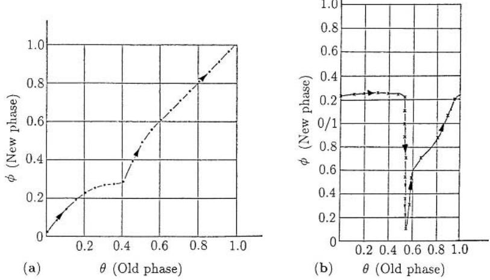

**Figure 9.8.** (**a**) Type 1 phase resetting curve obtained for the Hodgkin and Huxley (1952) model when the endogenous oscillator was subjected to voltage perturbations of 2 mV. The period of the cycle has been normalised to 1. The average slope across the graph is 1. (**b**) Type 0 phase resetting curve with voltage perturbations of 60 mV; here the average gradient is zero. (Redrawn from Best 1979)

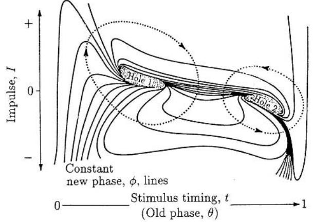

**Figure 9.9.** Black holes or null space (after Winfree 1982) found by Best (1979) for the Hodgkin–Huxley (1952) model (equations (7.37) and (7.38)) for repetitive firing of the space-clamped giant axon of the squid. A voltage stimulus and phase which gives a point in the shaded black hole regions produces unpredictable phase resetting values. A complete path around either of the dashed curves gives a full range of phases.

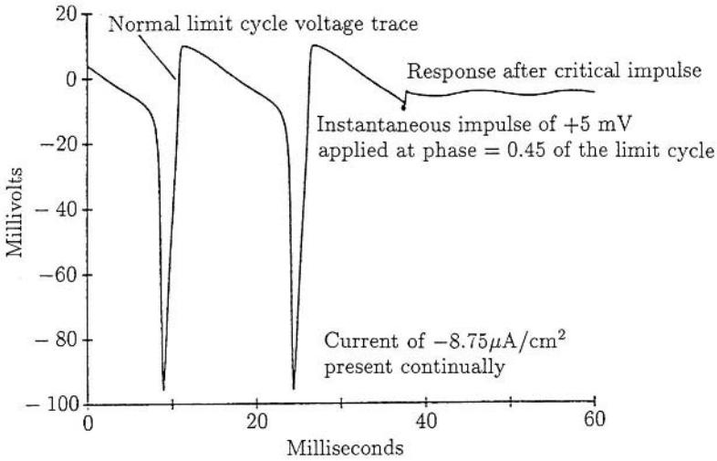

**Figure 9.10.** Voltage oscillations in the Hodgkin–Huxley model system (7.37) and (7.38) and the response when subjected to a critical stimulus (here 5 mV) at 0.45 through the phase, normalised to 1. (After Best 1979). The same applied current was used as in Figures 9.8 and 9.9.

values vary through a complete cycle in a clockwise way around Hole 1 and in a counterclockwise way around Hole 2 as indicated in the figure. A key feature to remember about stimulus–old phase contour maps like Figure 9.9 is the convergence of contour lines to a black hole, one for positive stimuli and one for negative stimuli.

Another crucial property of black holes is that if the endogenous oscillator is subjected to a critical stimulus at the appropriate phase the oscillation simply disappears. Best (1979) demonstrated this with the Hodgkin–Huxley model system; the result is shown in Figure 9.10. Note the annihilation of the endogenous oscillation. Guttman et al. (1980) showed experimentally that repetitive firing in space-clamped axons immersed in a weak calcium solution was stopped by a stimulus of the right size applied at a specific time in the cycle.

Jalife and Antzelevitch (1979) carried out similar work on the regular periodic beating of cardiac pacemaker cells, which is, of course, directly related to the cardiac pacemaker. They used tissue from the hearts of dogs, cats and calves and subjected the basic oscillation to electrical stimuli. They obtained from their experiments phase resetting curves which exhibited Type 1 and Type 0 resetting curves; Figure 9.11 shows some of their results.

From the resetting curves in Figure 9.11 we would expect there to be a transition value or values for stimulus duration, which destroys the oscillation, namely, in the null space or black hole of the endogenous cardiac oscillator. This is indeed what was found, as shown in Figure 9.12(a). Figure 9.12(b) shows the resetting curve with the stimulus close to the transition value, intermediate between the values in Figures 9.11(a) and (b). Figure 9.12(c) shows stimulus destruction of the regular oscillation in heart fibres from a dog.

A.T. Winfree for some years has been investigating the possible causes of sudden cardiac death and their connections with pacemaker oscillator topology, both temporal

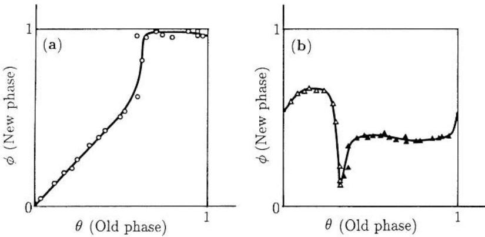

**Figure 9.11.** Phase resetting curves, normalised and in the notation used above, obtained by Jalife and Antzelevitch (1979) by applying brief current stimuli to pacemaker cells which spontaneously fire periodically. (**a**) Type 1 resetting, obtained when the stimulus duration was sufficiently short, here 10 msec. (**b**) Type 0 resetting with a stimulus time of 50 msec. (Photographs courtesy of J. Jalife and reproduced with permission)


**Figure 9.12.** Experimental results obtained by Jalife and Antzelevitch (1979): (**a**) The microelectrode traces of the transmembrane potentials of oscillating cardiac tissue (taken from a kitten) when subjected to a depolarising current stimulus of 50 msec duration at successively later times in the cycle. When the time of stimulus was applied at 130 msec through the cycle, as in trace 3, the oscillation was completely suppressed. (**b**) Resetting curve for an intermediate stimulus duration of 30 msec, that is, between those in Figures 9.11(a) and (b): here the periodic activity of the pacemaker can be destroyed as shown in the third trace in (**a**). (**c**) Oscillation annihilation by a stimulus in heart tissue of the dog. The small extra current stimulus lasts for 200 msec and is applied at progressively later stages in the cycle in 1, 2, 3, 4. In 1 the next firing is slightly delayed, while in 4 it is advanced. (Photographs courtesy of J. Jalife and reproduced with permission)

and spatial. Although the contraction of the heart involves a pacemaker, departures from the norm frequently involve the appearance of circulating contraction waves rather than the interruption of the firing mechanism. In the case of fibrillation, when the arrhythmias make the heart look a bit like a handful of squirming worms, it may be that a thorough understanding of the appearance of singular points or black holes could help to shed some light on this problem. The *Scientific American* article by Winfree (1983b) is specifically concerned with the topology of sudden cardiac failure. In Chapter 1, Volume II we discuss spiral rotating waves which have a direct bearing on such heart problems. The mathematical problems associated with coupled and spatially distributed oscillators which are subjected to spatially heterogeneous applied stimuli are clearly challenging and fascinating, and of considerable biological importance.

### **9.5 Coupled Oscillators: Motivation and Model System**

The appearance of biological oscillators and periodic processes in ecology, epidemiology, developmental biology and so on is an accepted fact. It is inevitable that in a large number of situations oscillators are coupled in some way to obtain the required output. We have just seen how important it is to have some understanding of the effects of perturbations on oscillators. So, here we consider some of the effects of oscillator coupling and describe one of the key analytical techniques used to study such problems. Coupled limit cycle oscillators have been widely studied mathematically for many years and the analytical problems are far from trivial. Not surprisingly the range of phenomena which they can corporately exhibit is very much larger than any single oscillator is capable of (see, for example, Winfree 2000). The subject is currently one of increasing research effort, not only in biology but also under the general heading of nonlinear dynamics. Many of the processes which have been observed are still only partially understood. In the rest of this chapter we shall mainly be concerned with synchronisation processes and when they break down. These synchronisation phenomena may be phase locking, frequency coordination and so on, and they all arise from the interactive coupling of limit cycle oscillators. Here we restrict our study to the coupling of two oscillators and consider only weak coupling; we essentially follow the analysis of Neu (1979). Later in Chapter 12 we consider an important phenomenon associated with a chain of coupled oscillators when we model the neural arrangement in certain swimming vertebrates.

Before considering the mathematical problem it is relevant to describe briefly one of the experimental motivations for the specific model system we study. Marek and Stuchl (1975) investigated the effect of coupling two Belousov–Zhabotinskii reaction systems with different parameters, and hence different periodic oscillations. They did this by having each reaction in a separate stirred tank reactor and coupled them via an exchange of material between them through a common perforated wall. They observed that if the autonomous oscillators had almost the same frequency then the phase difference tended to a constant value as time went on: this is known as *phase locking*. However, if the difference in the autonomous frequencies was too large then phase locking did not persist but instead the coupled system had long intervals of slow variation in the phase difference separated by rapid fluctuations over very short intervals. The analysis we now give will explain these phenomena.

In our analytical study of coupled limit cycle oscillators, it is not necessary to know in detail the specific system they model. However, in view of the above experiments, we have the Belousov reaction system in mind. Suppose that the limit cycle oscillators are identical and that each, on its own, is governed by the equations

$$\frac{d\mathbf{x}_l}{dt} = F(\mathbf{x}_l, \mathbf{y}_l), \quad \frac{d\mathbf{y}_l}{dt} = G(\mathbf{x}_l, \mathbf{y}_l), \quad i = 1, 2,\tag{9.14}$$

where the nonlinear functions *F* and *G* represent the dynamics of the oscillator. (They could be, for example, the functions on the right-hand side of (8.27), one of the tworeactant models for the Belousov reaction discussed in Sections 8.4 and 8.5, or the interactive dynamics in a predator–prey model such as the one given by (3.18) in Chapter 3, Section 3.3.) We assume that the solutions of (9.14) exhibit a stable limit cycle behaviour with period *T* given by

$$\mathbf{x}_{l} = X(t + \psi_{l}), \quad \mathbf{y}_{l} = Y(t + \psi_{l}), \quad i = 1, 2,\tag{9.15}$$

where here the ψ*i* are arbitrary constants. So

$$X(t + \psi_l + T) = X(t + \psi_l), \quad Y(t + \psi_l + T) = Y(t + \psi_l), \quad i = 1, 2.1$$

So as to formulate the weak coupling in a convenient (as we shall see) yet still general way we consider the nondimensional model system

$$\begin{aligned} \frac{dx_1}{dt} &= F(\mathbf{x}_1, \mathbf{y}_1) + \varepsilon \{ k(\mathbf{x}_2 - \mathbf{x}_1) + \lambda f(\mathbf{x}_1, \mathbf{y}_1) \}, \\ \frac{dy_1}{dt} &= G(\mathbf{x}_1, \mathbf{y}_1) + \varepsilon \{ k(\mathbf{y}_2 - \mathbf{y}_1) + \lambda g(\mathbf{x}_1, \mathbf{y}_1) \}, \\ \frac{dx_2}{dt} &= F(\mathbf{x}_2, \mathbf{y}_2) + \varepsilon k(\mathbf{x}_1 - \mathbf{x}_2), \\ \frac{dy_2}{dt} &= G(\mathbf{x}_2, \mathbf{y}_2) + \varepsilon k(\mathbf{y}_1 - \mathbf{y}_2), \end{aligned} \tag{9.16}$$

where 0 < ε - 1 and *k* > 0 is a coupling constant. When ε = 0 the oscillators are uncoupled and these equations reduce to (9.14). The generality in the form (9.16) comes from the λ-terms. If ε = 0 and λ = 0 the two oscillators are identical with uncoupled solutions like (9.15). If ε = 0 and λ = 0, two different oscillators are coupled, with the ελ-terms in the first two equations of (9.16) simply part of the isolated limit cycle oscillator given by these two equations. The specific coupling we have chosen, represented by the *k*-terms, is proportional to the differences *x*1 − *x*2 and *y*1 − *y*2. In the case of Marek and Stuchl's (1975) experiments, this reflects the fact that there is a mass transfer. In the case of interacting populations it can be thought of as a mass transfer of species, a kind of diffusion flux approximation. In fact, when considering interhabitat influence on the population dynamics, it is often incorporated in this way: it takes gross spatial effects into account without diffusion terms as such, which of course would make the models partial differential equation systems; these we consider later.

### **9.6 Phase Locking of Oscillations: Synchronisation in Fireflies**

When biological oscillators are coupled they can give rise to an astonishingly rich array of phenomena such as rhythm splitting, phase locking and entrainment and so on. The mathematics of coupled oscillators is challenging and can be highly complex and involved. There is a vast literature on the subject ranging from the very abstract to the very practical, such as synchrony in running and human sleep–wake cycles (Strogatz 1986). The beautiful (both scientifically and visually) book on biological clocks by Winfree (1987) discusses biological clocks in a wide variety of fields with an emphasis on circadian rhythms and phase resetting; see also the book *When Time Breaks Down* (Winfree 1987) which deals primarily with cardiac rhythms. The introductory book by Glass and Mackey (1988) has many examples of rhythmic phenomena associated with biological clocks; the applications are mainly in physiology. The nontechnical *Scientific American* article by Strogatz and Stewart (1993) describes a variety of interesting synchronisation phenomena which includes a remarkable photograph of fireflies flashing in synchrony; this is a topic we discuss below.

An interesting, practical example, where the mathematics and the biology are intimately related, was studied by Glass and his colleagues (Guevara et al. 1981, Guevara and Glass 1982, Keener and Glass 1984). The model is closely related to the one we discuss below but theirs gives rise to a nonlinear difference equation of the type we discussed in Chapter 2. They denote by φ*i* the phase just before a delta function stimulus is given to the system; that is, φ*i* is the old phase. Then the new phase, here denoted by φ*i*+1 in a discrete model, is given by

$$
\phi_{l+1} = \lg(\phi_l) + 2\pi \,\mathfrak{r}\,(mod \, 2\pi),
$$

where *g* is a function of φ*i* , a function that was subsequently determined by experiment on a specific system, and τ is the normalised stimulus period relative to the cycle length. Stable steady states of this equation correspond to phase locking; the preliminary analysis is like that in Chapter 2. Guevera and Glass (1982) used this equation to study the entrainment of the basic equation (9.4) above subjected to a periodic delta function stimulus. For a range of parameters they also found chaotic behaviour. Even such simple looking equations can give rise, as we have seen, to a plethora of complex and unexpected solutions. What is particularly interesting about this work is that subsequent to the analysis Guevara et al. (1981) actually measured resetting curves experimentally in a preparation of spontaneously beating embryonic heart cells. Over a wide range of amplitudes and frequencies they were able to predict the rhythms observed, including phase locked and chaotic rhythms. This is an excellent example of how the mathematical modelling and analysis helped to further our understanding of an important and complex biological phenomenon.

There seems no end to the modelling challenges associated with coupled oscillators in the biomedical sciences. Here we only touch on the subject. Below we discuss in a little more detail a particularly well-known biological example. In Sections 9.7 to 9.9 we discuss the weak coupling of two oscillators which we analyse using singular perturbation techniques. Another example, involving many oscillators, is discussed later in Chapter 12.

A striking and well-known visual example of coupled biological oscillators is the phase-locking synchrony of the periodic flashing of light by large groups of stationary fireflies (*Pteroptyx malaccae*). It is the males that flash to attract the females who fly around looking for males with a particularly attractive flash. Many experimental studies have quantified the ability of the individual firefly (and other insects) to vary the periodicity of the light flashes. The *Scientific American* article by Buck and Buck (1976) is a very nice introduction to the subject of firefly synchrony. Buck (1988) reviews the biological literature on the synchronous rhythmic flashing of these fireflies. Early work by Hanson (1978) showed that an individual firefly could change the phase of its light-emitting oscillator, which is controlled by an endogenous neural pacemaker, and synchronise, or entrain, to a flashing light as long as its period was in the neighbourhood of the firefly's natural period of about 0.9 second. If the period of the artificial light stimulus was too far away from the natural period no entrainment was possible. Some fireflies are better at entrainment than others; *Pteroptyx malaccae* seem to be the masters, being able to change their frequency by almost 15%. There have been several mathematical models of synchronous fireflies notably by Rinzel and Ermentrout (1983), Ermentrout (1991) and Mirollo and Strogatz (1990). Here we discuss only the simple, but effective, model of Rinzel and Ermentrout (1983).

As in Section 9.1 let us denote the phase of the firefly's oscillator at time *t* by θ(*t*) and let its natural frequency be ω. That is, in the absence of any external stimulus, the phase satisfies

$$\frac{d\theta}{dt} = \omega.\tag{9.17}$$

To be specific, we assume the oscillator fires, and the light flashes, at θ = 0. Let us denote the external phase by θ*e*(*t*), which has a frequency ω*e* and so satisfies

$$\frac{d\theta_{\epsilon}}{dt} = \omega_{\epsilon}.\tag{9.18}$$

The firefly tries to synchronise its frequency to that of the external stimulus, speeding up if it is too slow and slowing down if it is too fast. A simple model which does this is

$$\frac{d\theta}{dt} = \omega + I\sin\left(\theta_{\theta} - \theta\right),\tag{9.19}$$

where the parameter *I* > 0. The size of the stimulus, *I*, is a measure of how effective the firefly is at changing its frequency. If θ*e* is ahead of θ (0 < ω*e* − ω < π) then θ>ω ˙ and the firefly tries to speed up its phase. If θ<ω ˙ the firefly tries to slow down. This form (9.19) is a special case of the equation for phase resetting, equation (9.5). A similar type of assumption, based on a function of θ − θ*e*(*t*) but in a more complex situation, is used below in Chapter 12, Section 12.3.

When our interest is in determining when synchrony will occur it is informative, as we show below and particularly in Chapter 12, Section 12.3, to consider the equation for the difference, φ, in phases; that is, φ = θ − θ*e*. From (9.18) and (9.19) we have

$$\frac{d\phi}{dt} = \frac{d\theta_\epsilon}{dt} - \frac{d\theta}{dt} = \omega_\epsilon - \omega - I\sin\phi, \quad \phi(t) = \theta_\epsilon(t) - \theta(t). \tag{9.20}$$

If we introduce new variables

$$
\pi = It, \quad \delta = \frac{(\omega_\ell - \omega)}{I} \tag{9.21}
$$

the equation for φ becomes

$$
\phi' = \frac{d\phi}{d\tau} = \delta - \sin\phi.\tag{9.22}
$$

The dimensionless parameter δ has a definite physical interpretation: it is a measure of the difference between the external frequency and the natural one to the strength of the stimulus, *I*. As we saw in Sections 9.2 and 9.3, the size of *I* is critical.

We are interested in the steady state solutions of (9.22) and their stability. If we have a stable steady state solution, φ*s* > 0 say, this means, from (9.20), that the external stimulus phase, θ*e*, is always ahead of the firefly phase, θ, by a constant amount. The firefly's oscillator is therefore *phase locked* to the stimulus but it flashes just after it. If δ = 0, φ = 0 is a solution of (9.22) and in this case, if φ = 0 is stable, the oscillators flash with zero phase difference and so are in unison. The question of entrainment hinges on the steady states of (9.22) and their stability.

In Chapter 1 we saw that all we had to do was, in effect, graph the right-hand side of (9.22), read off the steady states and note whether the gradient was positive or negative. Figure 9.13 illustrates the main solution possibilities for δ ≥ 0.

The stability of the steady states is determined by the gradient at the steady state stable if the gradient is negative and unstable if the gradient is positive. With this model there is only one stable steady state, when the firefly and stimulus are phase locked, if −1 <δ< 1. The situation −1 <δ< 0 is similar to that in Figure 9.13 but with δ < 0.

In Figure 9.13(b), the stable steady state is 0 < φ1 < π and so the firefly must increase its frequency to phase lock. If δ>δ*c* = 1, as in Figure 9.13(c), it simply cannot keep up and the phase difference φ simply increases until the cycle starts over again when φ reaches 2π. This latter case is *phase drift*. Since φ > 0 in Figure 9.13(c) and is not constant, this implies that the phase drift increases but at a nonuniform rate. This is in keeping with the experimental results of Hanson (1978).

We can make several predictions with this model, the nonuniform phase drift if δ > 1 is just one. The key prediction is that phase locking by the stimulus is possible if the external frequency, ω*e* satisfies

$$
\omega - I \le \omega_{\ell} \le \omega + I \tag{9.23}
$$

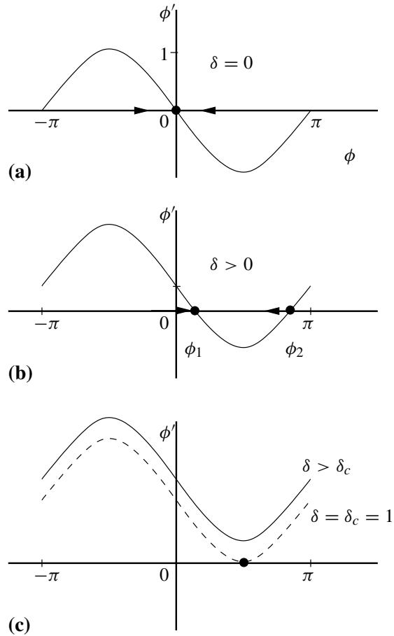

**Figure 9.13.** Steady state solutions of the phase difference equation (9.22) for various δ. If δ<δ*c*(= 1) two solutions exist, while if δ>δ*c* no steady state solutions exist.

which gives the range of the stimulus frequency for entrainment. Just as above, the stimulus intensity *I* is important. If we know, from experiment, the range of stimulus frequency, we can calculate *I* and then predict the phase locked phase difference from (9.20) and (9.22) as

$$
\phi_s = \theta_\ell - \theta_s = \sin^{-1}\left[\frac{\omega_\ell - \omega}{I}\right], \quad -\frac{\pi}{2} \le \phi_s \le \frac{\pi}{2}.\tag{9.24}
$$

When −1 ≤ δ ≤ 1, the dimensional period, *T* , of the phase locked firefly oscillator is obtained from (9.22) as the time for φ to change by 2π; namely,

$$T = \frac{1}{I} \int d\tau = \frac{1}{I} \int_0^{2\pi} \frac{d\phi}{d\phi/d\tau} = \frac{1}{I} \int_0^{2\pi} \frac{d\phi}{\delta - \sin\phi}$$

which gives the entrained period as

$$T = \frac{2\pi}{I(\delta^2 - 1)^{1/2}} = \frac{2\pi}{\left[ (\omega_\ell - \omega)^2 - I^2 \right]^{1/2}}.\tag{9.25}$$

As δ → ±1, the period becomes infinitely large; in other words there is no entrainment as, of course, is indicated in Figure 9.13(c). We can now see how fireflies can synchronise their periodic pulsing of light: as one firefly, for example, with a stronger *I*, entrains another, the group stimulus with a single frequency grows until all are entrained. A stronger *I* implies a smaller δ and hence a small difference in frequency between the 'pacemaker' and those with frequencies near it. If the whole group now flashes with the same frequency it must be somewhat difficult for a circling female to light on the leader!

The firefly *Pteroptyx malaccae* is not the only species of firefly, but it seems to be the most flexible in being able to phase lock onto an external stimulus. Now that we have seen how a simple model can capture some of the experimental results, we should examine models which reflect more of the biology. The assumption that adaptation is governed by a sine function as in (9.19) is too simple. In Chapter 12 we again use such an assumption when dealing with *N* oscillators. A more appropriate influence equation would be, in place of (9.19),

$$\frac{d\phi}{dt} = \omega + h(\phi),\tag{9.26}$$

where *h*(φ) is a periodic function of its argument but not necessarily symmetric. A more sophisticated model which incorporates more of the adaptive features of the firefly *Pteroptyx malaccae* and which uses a more general influence function, as in the last equation, is given by Ermentrout (1991). He also numerically simulates how a group of fireflies approach synchrony in a firefly tree. The above model shows synchrony but, except for δ = 0, with a permanent phase lag. This is a drawback as a model for a firefly tree where there is synchrony with almost no phase lag. This aspect is also discussed, and a possible mechanism for effecting this, by Ermentrout (1991).

#### **9.7 Singular Perturbation Analysis: Preliminary Transformation**

Equations (9.16) in general are hard to analyse. Even numerically it is not easy to see how the solution behaviour depends on the various parameters, particularly in the nonidentical autonomous oscillator case. Since in many situations of interest the coupling is weak, and as we anticipate this to be the case in many biological applications, we exploit the fact that 0 < ε - 1 and use singular perturbation theory (see, for example, Murray 1984 for a short pedagogical discussion of the basic techniques).

Each oscillator has its own limit cycle solution which can be represented by a closed trajectory γ in the *x* − *y* phase plane. We can introduce a new coordinate system using this curve as the basis of the local coordinate system. We can characterise the periodic limit cycle by a *phase* θ which goes from 0 to *T* as we make a complete circuit round γ and any perturbation from it by the perpendicular distance *A* measured from γ ; on γ , *A* = 0. It turns out to be particularly convenient algebraically to use this characterisation in our coupled oscillator analysis. So in place of (9.15) as our autonomous limit cycle solutions we have

$$\mathbf{x}_{l} = X(\theta_{l}), \quad \mathbf{y}_{l} = Y(\theta_{l}), \quad l = 1, 2, \tag{9.27}$$

where *X*(θ*i*) and *Y* (θ*i*) are *T* -periodic functions of θ*i* . Note that θ*i* and *t* are related by *d*θ*i* /*dt* = 1.

The idea of representing the solution of a phase plane system, which admits a periodic limit cycle solution, in terms of the phase and a perturbation perpendicular to the limit cycle can be illustrated by the following example, which, although admittedly contrived, is still instructive.

Consider the differential equation system

$$\frac{d\mathbf{x}_{\mathbf{l}}}{dt} = \mathbf{x}_{\mathbf{l}}(1 - r) - a\mathbf{y}_{\mathbf{l}}, \quad \frac{d\mathbf{y}_{\mathbf{l}}}{dt} = \mathbf{y}_{\mathbf{l}}(1 - r) + a\mathbf{x}_{\mathbf{l}}, \quad r = (\mathbf{x}_{\mathbf{l}}^2 + \mathbf{y}_{\mathbf{l}}^2)^{1/2}, \quad (9.28)$$

where ω is a positive constant. A phase plane analysis (see Appendix A) shows that (0, 0) is the only singular point and it is an unstable spiral, spiralling anticlockwise. A confined set can be found (just take *r* large and note that on this large circle the vector of the trajectories (*dx*1/*dt*, *dy*1/*dt*) points inwards), so by the Poincare–Bendixson ´ theorem a limit cycle periodic solution exists and is represented by a closed orbit γ , in the (*x*1, *y*1) plane. If we now change to polar coordinates (*r*,θ) with

$$\mathbf{x}_{\parallel} = r \cos \theta, \quad \mathbf{y}_{\parallel} = r \sin \theta \tag{9.29}$$

the system (9.28) becomes

$$\frac{dr}{dt} = r(1 - r), \quad \frac{d\theta}{dt} = \omega. \tag{9.30}$$

The limit cycle, the trajectory γ , is then seen to be *r* = 1. The solution is illustrated in Figure 9.14(a). The limit cycle is asymptotically stable since from (9.30) any

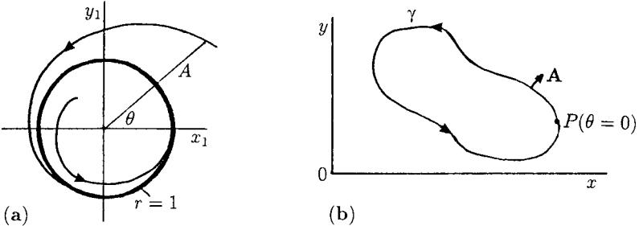

**Figure 9.14.** (**a**) The phase plane solution of the differential equation system (9.30) the asymptotically stable limit cycle is *r* = 1 with the phase θ = ω*t*, on taking θ = 0 at *t* = 0. (**b**) Schematic example illustrating the local limit cycle coordinates. The point *P* has phase θ = 0 and the phase increases by 2π on returning to *P* after moving round γ once.

perturbation from *r* = 1 will die out with *r* simply winding back onto *r* = 1, in an anticlockwise way because *d*θ/*dt* > 0. In this example if the perturbation from the limit cycle is to a point *r* < 1 then, from (9.30), *r* increases while if the perturbation is to a point *r* > 1, *r* decreases as it tends to the orbit *r* = 1. In this case *r* = 1 is the equivalent of the orbit γ and *A*, the perpendicular distance from it is simply *r* − 1. The differential equation system in terms of *A*(= *r* − 1) and θ is, from (9.30),

$$\frac{dA}{dt} = -A(\mathbf{l} + A), \quad \frac{d\theta}{dt} = \omega. \tag{9.31}$$

We can, of course, integrate (9.30) exactly to get

$$r(t) = \frac{r_0 e^t}{(1 - r_0) + r_0 e^t}, \quad \theta(t) = \omega t + \theta_0,\tag{9.32}$$

where *r*(0) = *r*0, θ(0) = θ0 and from (9.29),

$$x_{\!\!\!-1}(t) = r(t)\cos\theta(t), \quad \text{y}_{\!\!\!-1}(t) = r(t)\sin\theta(t). \tag{9.33}$$

As *t* → ∞, *r*(*t*) → 1 (so *A*(*t*) → 0) and *x*1 → cos θ, *y*1 → sin θ, which are the equivalent of the *X*(θ) and *Y* (θ) in (9.27): they are 2π−periodic functions of θ. Here the rate of traversing γ (that is, *r* = 1) is *d*θ/*dt* = ω from (9.31). Figure 9.14(b) schematically illustrates the general situation. There θ = 0 is taken to be at some point *P* and the phase increases by 2π as the orbit γ is traversed once in an anticlockwise sense.

If we now consider our two oscillators, each with its autonomous closed limit cycle orbit γ*i* , *i* = 1, 2, the effect of coupling will be to alter the orbits and phase of each. We can characterise the effect in local coordinate terms by a phase θ*i* which parametrizes points on γ*i* and a perturbation *Ai* perpendicular to the original limit cycle orbit. Recall that for the coupled oscillator system (9.16) we are interested in weak coupling and so 0 < ε 1. With ε = 0 each oscillator has its limit cycle solution which in terms of the phase we can write as in (9.27); namely,

$$\mathbf{x}_{l} = X(\theta_{l}), \quad \mathbf{y}_{l} = Y(\theta_{l}), \quad l = 1, 2. \tag{9.34}$$

$$
\theta_l = t + \psi_l \quad \Rightarrow \quad \frac{d\theta_l}{dt} = 1. \tag{9.35}
$$

We expect that the effect of the *O*(ε) coupling is to cause the orbits γ*i* , given by (9.27), to be displaced by *O*(ε). We can thus see that an appropriate change of variables is from (*xi*, *yi*) for *i* = 1, 2 to the local variables *Ai* and the new phase θ*i* for *i* = 1, 2, where *Ai* is the distance perpendicular to the orbit γ*i* .

To motivate the specific variable transformation we shall use, refer now to Figure 9.15. In the absence of coupling, the trajectory γ is traversed with velocity (*dx*/*dt*, *dy*/*dt*) parallel to γ . In terms of the phase θ, which increases monotonically as the orbit is traversed, the velocity from (9.34) and (9.35) is equal to (*X* (θ), *Y* (θ)) where primes denote differentiation with respect to θ. This velocity vector is perturbed, due to

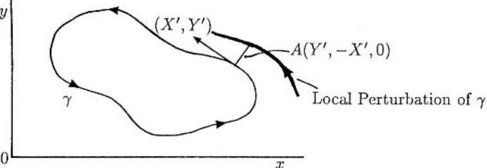

**Figure 9.15.** Schematic visualization of the effect of coupling on the limit cycle orbit γ . The perpendicular displacement **A** of the velocity vector is given by the appropriate vector product; namely, *A*(*X* , *Y* , 0) × (0, 0, 1), that is, *A*(*Y* , −*X* , 0).

the coupling, and the orbit γ will be displaced. This displacement can be described at each point by the perpendicular distance it is displaced, denoted by the vector **A** in the figure. Since **A** is the vector product of the velocity (*X* (θ), *Y* (θ), 0) and the unit vector perpendicular to the (*x*, *y*) plane, that is, (0, 0, 1), this gives

$$\mathbf{A} = A(X'(\theta), Y'(\theta), 0) \times (0, 0, 1) = (AY'(\theta), -AX'(\theta), 0). \tag{9.36}$$

Now consider the system (9.16) with 0 < ε 1 with our assumption that the autonomous orbits are perturbed *O*(ε). An appropriate change of variable from (*xi*, *yi*) to (*Ai*,θ*i*) is then, using (9.34) and (9.36),

$$\varepsilon_{l} = X(\theta_{l}) + \varepsilon A_{l} Y'(\theta_{l}), \quad \text{y}_{l} = Y(\theta_{l}) - \varepsilon A_{l} X'(\theta_{l}), \quad i = 1, 2. \tag{9.37}$$

Here we have used ε*A* in place of *A* to emphasise the fact that since ε is small in our analysis, so is the orbit perturbation.

#### **9.8 Singular Perturbation Analysis: Transformed System**

Let us now use the change of variable (9.37) in the coupled system (9.16) with 0 < ε 1. That is, we use (9.37) in the right-hand sides and expand in a Taylor series in ε: the algebra is complicated and tedious, but the concise, interesting and important end result is worth it, not just for the results we exhibit in this chapter but also for two other dramatic phenomena we shall discuss in Chapters 12 and 13. We carry out enough of the algebra to show how to get the equations (9.16) in terms of the variables θ*i* and *Ai* ; however, use of separate pen and paper is recommended for those who want to follow the details of the algebra. (Those readers who wish to skip this algebra can proceed to equations (9.45) although later reference will be made to some of the definitions included here.)

In the following, the argument of the various functions, mainly *X* and *Y* , is θ1 unless otherwise stated or included for emphasis. The first of (9.16), using (9.37), becomes

$$\begin{split} \frac{dx_1}{dt} &= X'\frac{d\theta_1}{dt} + \varepsilon Y'\frac{dA_1}{dt} + \varepsilon A_1 Y''\frac{d\theta_1}{dt} \\ &= F(X,Y) + \varepsilon A_1 [Y'F_X(X,Y) - X'F_Y(X,Y)] + \varepsilon k [X(\theta_2) - X(\theta_1)] \\ &+ \varepsilon \lambda f(X,Y) + \varepsilon^2 k [A_2 Y'(\theta_2) - A_1 Y'(\theta_1)] \\ &+ \varepsilon^2 \lambda A_1 [Y'f_X(X,Y) - X'f_Y(X,Y)] + O(\varepsilon^3), \end{split} \tag{9.38}$$

while the second becomes

$$\begin{split} \frac{d\mathbf{y}_1}{dt} &= Y'\frac{d\theta_1}{dt} - \varepsilon X'\frac{dA_1}{dt} - \varepsilon A_1 X'' \frac{d\theta_1}{dt} \\ &= G(X, Y) + \varepsilon A_1 [Y'G_X(X, Y) - X'G_Y(X, Y)] + \varepsilon k [Y(\theta_2) - Y(\theta_1)] \\ &+ \varepsilon \lambda g(X, Y) + \varepsilon^2 k [A_1 X'(\theta_1) - A_2 X'(\theta_2)] \\ &+ \varepsilon^2 \lambda A_1 [Y'g_X(X, Y) - X'g_Y(X, Y)] + O(\varepsilon^3). \end{split} \tag{9.39}$$

When ε = 0 we have from (9.14) and (9.34),

$$X'(\theta_\mathbb{I}) = F(X, Y), \quad Y'(\theta_\mathbb{I}) = G(X, Y). \tag{9.40}$$

Now multiply (9.38) by *X* (θ1) and add to it *Y* (θ1) times (9.39) to get

$$\begin{split}(X^{'2}+Y^{'2})\frac{d\theta_{1}}{dt}+\varepsilon A_{1}(X^{'}Y^{'}-Y^{'}X^{''})\frac{d\theta_{1}}{dt} \\ = &[X^{'}F(X,Y)+Y^{'}G(X,Y)]+\varepsilon A_{1}[X^{'}Y^{'}[F_{X}(X,Y)-G_{Y}(X,Y)]] \\ -\quad-X^{'2}F_{Y}(X,Y)+Y^{'2}G_{X}(X,Y))+\varepsilon k \{X^{'}[X(\theta_{2})-X(\theta_{1})] \\ +\quad+Y^{'}[Y(\theta_{2})-Y(\theta_{1})]\}+\varepsilon^{2}kA_{2}[Y^{'}(\theta_{2})X^{'}(\theta_{1}) \\ -\quad-X^{'}(\theta_{2})Y^{'}(\theta_{1})]+\varepsilon k \{X^{'}f(X,Y)+Y^{'}g(X,Y)\} \\ +\quad+\varepsilon^{2}\lambda A_{1}\{X^{'}Y^{'}[f_{X}(X,Y)-g_{Y}(X,Y)]-X^{'2}f_{Y}(X,Y) \\ +\quad+Y^{'2}g_{X}(X,Y)\}+O(\varepsilon^{3}). \end{split}$$

From (9.40), *X F*(*X*, *Y* ) = *X*2 and *Y G*(*X*, *Y* ) = *Y* 2 so the last equation becomes

$$R^2(1+\varepsilon \varGamma A_1)\frac{d\theta_1}{dt} = R^2 + \varepsilon[R^2\varOmega A_1 + R^2kr + R^2kV + R^2\vargamma\lambda] + O(\varepsilon^2),$$

where *R*2 = *X*2 + *Y* 2 = 0 and

$$\begin{aligned} \label{eq:1} \quad & \tilde{R}^2 \Gamma = X'Y'' - Y'X'', \\ \quad & \tilde{R}^2 \gamma = X'f(X,Y) + Y'g(X,Y), \quad \tilde{R}^2 r = -XX' - YY', \\ \tilde{R}^2 \mathcal{Q} &= X'Y'[F_X(X,Y) - G_Y(X,Y)] - X'^2F_Y(X,Y) + Y'^2G_X(X,Y), \\ \quad & \tilde{R}^2 V = X'(\theta_1)X(\theta_2) + Y'(\theta_1)Y(\theta_2). \end{aligned} \tag{9.41}$$

If we now divide both sides by *R*2(1+εΓ *A*1) and expand the right-hand side as a series for 0 < ε 1, we get

$$\frac{d\theta_1}{dt} = 1 + \varepsilon [\{\mathcal{Q}(\theta_1) - \Gamma(\theta_1)\} A_1 + \lambda \gamma(\theta_1) + kr(\theta_1) + kV(\theta_1, \theta_2)] + O(\varepsilon^2). \tag{9.42}$$

In a similar way we get the equation for *A*1 by multiplying (9.38) by *Y* (θ1) and subtracting from it, *X* (θ1) times (9.39). Using (9.40) and (9.42) for *d*θ1/*dt*, remembering that ε 1, we get

$$\frac{dA_1}{dt} = \Phi(\theta_1)A_1 + kU(\theta_1, \theta_2) + \lambda\phi(\theta_1) + \varepsilon\Psi(\mathbf{A}, \theta) + O(\varepsilon^2),\tag{9.43}$$

where

$$R^2 U(\theta_1, \theta_2) = X(\theta_2) Y'(\theta_1) - Y(\theta_2) X'(\theta_1) \tag{9.44}$$

and Φ, φ and Ψ are all determined: **A** and θ are the vectors (*A*1, *A*2) and (θ1,θ2). The only functions whose exact form we require are *U*(θ1,θ2) and *V*(θ1,θ2), given by (9.44) and (9.41) respectively.

If we now do the same with the 3rd and 4th equations of (9.16) we find that the effect of the transformation to the (*Ai*,θ*i*) dependent variables is to replace the model coupled oscillator system (9.16) by

$$\begin{split} \frac{dA_1}{dt} &= \Phi(\theta_1)A_1 + kU(\theta_1, \theta_2) + \lambda\phi(\theta_1) + \varepsilon\Psi_1(\mathbf{A}, \theta) + O(\varepsilon^2), \\\\ \frac{d\theta_1}{dt} &= 1 + \varepsilon[\{\varOmega(\theta_1) - \varGamma(\theta_1)\}A_1 + \lambda\vargamma(\theta_1) + kr(\theta_1) + kV(\theta_1, \theta_2)] + O(\varepsilon^2) \\\\ \frac{dA_2}{dt} &= \Phi(\theta_2)A_2 + kU(\theta_2, \theta_1) + \varepsilon\varPsi_2(\mathbf{A}, \theta) + O(\varepsilon^2) \\\\ \frac{d\theta_2}{dt} &= 1 + \varepsilon[\{\varOmega(\theta_2) - \varGamma(\theta_2)\}A_2 + kr(\theta_2) + kV(\theta_2, \theta_1)] + O(\varepsilon^2). \end{split} \tag{9.46}$$

The functions *V* and *U*, given by (9.41) and (9.44), will be referred to later. The exact forms of the functions Φ, φ, Γ , γ , Ω, Ψ1, Ψ2 and *r* are not essential for the following analysis, but what is important is that all of them are *T* -periodic in θ1 and θ2 and that Φ satisfies the relation

$$\int_{0}^{T} \Phi(\sigma) \, d\sigma < 0. \tag{9.47}$$

This last relation comes from the fact that the original limit cycle solutions of the uncoupled oscillators are stable; we digress briefly to prove this.

#### *Limit Cycle Stability Condition for the Uncoupled Oscillators*

The oscillators are uncoupled when *k* and λ are zero. We want to keep ε = 0 since we are going to study the perturbed limit cycle oscillator using the transformation (9.37). In terms of the variables *A* and θ the governing system from (9.45) and (9.46), with *k* = λ = 0 is then

$$\frac{dA}{dt} = \Phi(\theta)A + O(\varepsilon), \quad \frac{d\theta}{dt} = \mathbf{l} + O(\varepsilon), \tag{9.48}$$

where Φ is a *T* -periodic function of θ. For times *O*(1) the second equation gives θ ≈ *t* and the first becomes

$$\frac{dA}{dt} = \Phi(t)A + O(\varepsilon),$$

which on integrating from *t* to *t* + *T* gives

$$\begin{split} \frac{A(t+T)}{A(t)} &= \left[1 + O(\varepsilon)\right] \exp\left[\int_{I}^{t+T} \Phi(\sigma) \, d\sigma\right] \\ &= \left[1 + O(\varepsilon)\right] \exp\left[\int_{0}^{T} \Phi(\sigma) \, d\sigma\right], \end{split} \tag{9.49}$$

where the limits of integration have been changed because Φ is a *T* -periodic function. The unperturbed limit cycle is *A* ≡ 0, θ = *t* + ψ. So, the limit cycle is stable if all the solutions of (9.48) have *A*(*t*) → 0 as *t* → ∞. From (9.49) we see that if

$$\int_{0}^{T} \Phi(\sigma) \, d\sigma < 0$$

then *A*(*t* + *T* ) < *A*(*t*) for all *t* and so *A*(*t*) → 0 as *t* → ∞.

#### **9.9 Singular Perturbation Analysis: Two-Time Expansion**

The *O*(ε) terms in the equations (9.45) and (9.46) will have an effect after a long time, *O*(1/ε) in fact. This suggests looking for an asymptotic solution as ε → 0 for the *Ai* and θ*i* in (9.45) and (9.46) in the following form,

$$A_l \sim \, ^0A_l + \varepsilon ^1A_l, \quad \theta_l \sim \, ^0\theta_l + \varepsilon ^1\theta_l,\tag{9.50}$$

where the *A*s and θs are functions of the time *t*, the fast time, and τ = ε*t*, the long or slow time. In other words only after times τ = *O*(1), that is, *t* = *O*(1/ε), do the ε-effects show. (See, for example, Murray 1984 for an elementary exposition to this two-time expansion procedure.) Now all time derivatives

$$\frac{d}{dt} = \frac{\partial}{\partial t} + \left(\frac{d\tau}{dt}\right) \frac{\partial}{\partial \tau} = \frac{\partial}{\partial t} + \varepsilon \frac{\partial}{\partial t},\tag{9.51}$$

and the system of equations, (9.45) and (9.46), becomes a partial differential equation system.

The algebra in the rest of this section is also rather involved. The end result, namely, equation (9.69) is required in the following Section 9.10, where an important result for coupled oscillators is derived.

If we now substitute (9.50) with (9.51) into (9.45) and (9.46) and equate powers of ε we get the following hierarchy of equations.

$$\begin{aligned} \left(\partial_{\!\!\!0} \mathbf{1}\right) : \quad \frac{\partial \ ^0 A_1}{\partial t} - \Phi (\,^0 \theta_1) \,^0 A_1 &= kU(\,^0 \theta_1, \,^0 \theta_2) + \lambda \Phi (\,^0 \theta_1), \\ \frac{\partial \ ^0 \theta_1}{\partial t} &= 1, \\ \frac{\partial \ ^0 \theta_2}{\partial t} - \Phi (\,^0 \theta_2) \,^0 A_2 &= kU(\,^0 \theta_2, \,^0 \theta_1), \\ \frac{\partial \ ^0 \theta_2}{\partial t} &= 1. \end{aligned} \tag{9.52}$$

*O*(ε) : ∂1 *A*1 ∂*t* − Φ( 0θ1) 1*A*1 = {Φ ( 0θ1) 0*A*1 + *k* ∂*U* ∂θ1 ( 0θ1, 0θ2) + λφ ( 0θ1)} 1θ1 + *k* ∂*U* ∂θ2 ( 0θ1, 0θ2) 1θ2 + Ψ1( 0**A**, 0 θ) − ∂ 0*A*1 ∂τ , ∂1θ1 ∂*t* = [Ω( 0θ1) − Γ ( 0θ1)] 0*A*1 + λγ( 0θ1) + *kr*( 0θ1) + *kV*( 0θ1, 0θ2) − ∂ 0θ1 ∂τ , ∂1 *A*2 ∂*t* − Φ( 0θ2) 1*A*2 = {Φ ( 0θ2) 0*A*2 + *k* ∂*U* ∂θ2 ( 0θ2, 0θ1)} 1θ2 + *k* ∂*U* ∂θ1 ( 0θ2, 0θ1) 1θ1 + Ψ2( 0**A**, 0 θ) − ∂ 0*A*2 ∂τ , ∂1θ2 ∂*t* = [Ω( 0θ2) − Γ ( 0θ2)] 0*A*2 + *kr*( 0θ2) + *kV*( 0θ2, 0θ1) − ∂ 0θ2 ∂τ . (9.53)

If we integrate the 2nd and 4th of (9.52) we get

$$\,^0\theta_l = t + \psi_l(\mathbf{r}), \quad i = 1, 2,\tag{9.54}$$

where, at this stage the ψ*i*(*t*) are arbitrary functions of τ . If we now substitute these into the 1st and 3rd equations of (9.52) we get

$$\begin{aligned} \frac{\partial \ ^0 A_1}{\partial t} - \Phi(t + \psi_1) \ ^0 A_1 &= kU(t + \psi_1, t + \psi_2) + \lambda \phi(t + \psi_1), \\ \frac{\partial \ ^0 A_2}{\partial t} - \Phi(t + \psi_2) \ ^0 A_2 &= kU(t + \psi_2, t + \psi_1). \end{aligned} \tag{9.55}$$

To get the required solutions let us digress again, and consider the less cluttered equations:

$$\begin{aligned} \frac{dx}{ds} - \Phi(\mathbf{s})\mathbf{x} &= f(\mathbf{s}),\\ \frac{dy}{ds} - \Phi(\mathbf{s})\mathbf{y} &= U(\mathbf{s}, \mathbf{s} + \chi), \end{aligned} \tag{9.56}$$

where χ ≡ ψ2 − ψ1. Remember that the functions Φ, φ and *U* are all *T* -periodic. The complementary or homogeneous solution of each is

$$\exp\left[v(s)\right], \quad v(s) = \int_0^s \Phi(\sigma) \, d\sigma.$$

From (9.47) we have v(*s*) < 0, which is necessary for the stability of the uncoupled limit cycle oscillators. So, the complementary solutions will decay, eventually, to zero. We can now show that each of (9.56) has a unique *T* -periodic solution. To do this consider, say, the first of (9.56). The exact solution is

$$\mathbf{x}(\mathbf{s}) = \mathbf{x}(0)\exp\left[\int_0^s \Phi(\sigma) \, d\sigma\right] + \int_0^s \exp\left[\int_\alpha^s \Phi(\sigma) \, d\sigma\right] \phi(\alpha) \, d\alpha. \tag{9.57}$$

The equation for *x* is unchanged if we replace *s* by *s* + *T* . Since the above solution for *x*(*s*) is periodic

$$\chi(0) = \chi(T) = \chi(0)\exp\left[\int_0^T \Phi(\sigma) \, d\sigma\right] + \int_0^T \exp\left[\int_\alpha^T \Phi(\sigma) \, d\sigma\right] \phi(\alpha) \, d\alpha, 1$$

which is an equation for the inital value *x*(0), substitution of which into (9.57) gives the unique *T* -periodic solution of the first of (9.56). Similarly the second of (9.56) has a unique *T* -periodic solution. Denote these periodic solutions by

$$\mathbf{x} = p(\mathbf{s}), \quad \mathbf{y} = \rho(\mathbf{s}, \boldsymbol{\chi}).\tag{9.58}$$

In terms of these solutions (9.58) the general solutions of (9.55) are

$$\begin{aligned} \,^0A_1 &= k\rho(t+\psi_1,\chi) + \lambda p(t+\psi_1) + h_1(\tau)\exp\left[\upsilon(t+\psi_1)\right], \\ \,^0A_2 &= k\rho(t+\psi_2,-\chi) + h_2(\tau)\exp\left[\upsilon(t+\psi_2)\right], \end{aligned} \tag{9.59}$$

where the *h*1 and *h*2 are arbitrary functions of τ . If we now substitute these into the θ-equations in (9.53) we get

$$\begin{split} \frac{\partial^{1}\theta_{1}}{\partial t} &= \{k\rho(t+\psi_{1},\chi) + \lambda\rho(t+\psi_{1})\} \{\mathcal{Q}(t+\psi_{1}) - \varGamma(t+\psi_{1})\} + \lambda\varvarphi(t+\psi_{1}) \\ &+ kr(t+\psi_{1}) + kV(t+\psi_{1},t+\psi_{2}) - \frac{d\psi_{1}}{d\tau} \\ &+ h_{1}(\tau)\exp\big[v(t+\psi_{1})\big] \{\mathcal{Q}(t+\psi_{1}) - \varGamma(t+\psi_{1})\}, \\ \frac{\partial^{1}\theta_{2}}{\partial t} &= k\rho(t+\psi_{2},-\chi) \{\mathcal{Q}(t+\psi_{2}) - \varGamma(t+\psi_{2})\} \\ &+ kr(t+\psi_{2}) + kV(t+\psi_{2},t+\psi_{1}) \\ &- \frac{d\psi_{2}}{d\tau} + h_{2}(\tau)\exp\big[v(t+\psi_{2})\big] \{\mathcal{Q}(t+\psi_{2}) - \varGamma(t+\psi_{2})\}. \end{split} \tag{9.60}$$

If *f* (*t*) is a *T* -periodic function we can write

$$f(t) = \mu + \omega(t), \quad \mu = \frac{1}{T} \int_0^T f(\mathbf{s}) \, d\mathbf{s}, \tag{9.61}$$

where ω(*t*) is *T* -periodic and has zero mean. If we now use this fact in (9.60) we get

$$\begin{aligned} \frac{\partial^1 \theta_1}{\partial t} &= \mu_1(\chi) + \omega_1(t, \tau), \\ \frac{\partial^1 \theta_2}{\partial t} &= \mu_2(\chi) + \omega_2(t, \tau), \end{aligned} \tag{9.62}$$

where

$$\begin{aligned} \mu_1 &= H(\chi) + \lambda \beta - \frac{d\psi_1}{d\tau}, \\ \mu_2 &= H(-\chi) - \frac{d\psi_2}{d\tau}, \end{aligned} \tag{9.63}$$

with

$$\begin{aligned} \beta &= \frac{1}{T} \int_0^T \{p(s)[\varOmega(s) - \varGamma(s)] + \varchi(s)\} \, ds, \\\ H(\chi) &= \frac{1}{T} \int_0^T \{k\rho(s, \varchi)[\varOmega(s) - \varGamma(s)] + kr(s) + kV(s, s + \varchi)\} \, ds. \end{aligned} \tag{9.64}$$

The functions ω1(*t*,τ) and ω2(*t*,τ) are made up of exponentially decaying terms and periodic terms of zero mean, so on integrating (9.62) we get

$$\begin{aligned} \,^1\theta_1 &= \mu_1(\chi)t + W_1(t,\tau), \\ \,^1\theta_2 &= \mu_2(\chi)t + W_2(t,\tau), \end{aligned} \tag{9.65}$$

where *W*1 and *W*2 are bounded functions. If we now substitute these solutions into the third of (9.53) and use (9.54) and (9.57), the equation for 1*A*2 becomes

$$\begin{aligned} \frac{\partial^1 A_2}{\partial t} - \Phi(t + \psi_2)^1 A_2 &= \{S_1(t, \tau)\mu_1 + S_2(t, \tau)\mu_2\} t + B(t, \tau), \\ S_1 &= k \frac{\partial U}{\partial \theta_1} (t + \psi_2, t + \psi_1), \\ S_2 &= k \frac{\partial U}{\partial \theta_2} (t + \psi_2, t + \psi_1) + k\rho (t + \psi_2, -\chi) \Phi'(t + \psi_2), \end{aligned} \tag{9.66}$$

where *B*(*t*,τ) is another function which consists of an exponentially decaying term and a *T* -periodic part.

In the usual asymptotic singular perturbation way we now require the *O*(ε) part of the amplitude, that is, 1*A*2, and its time derivative ∂1*A*2/∂*t*, to be bounded for all time—this ensures that the series solution (9.50) is uniformly valid for all time. From (9.66) this requires that

$$\{\mathcal{S}_1(t,\tau)\mu_1 + \mathcal{S}_2(t,\tau)\mu_2\}t$$

must be bounded for all time. However, since *S*1 and *S*2 are *T* -periodic functions (and so cannot tend to zero as *t* → ∞) the only way we can get boundedness is if

$$S_1(t, \tau)\mu_1 + S_2(t, \tau)\mu_2 \equiv 0.\tag{9.67}$$

In general *S*1 and *S*2 are two different periodic functions, so the only way to ensure (9.67) is if µ1 and µ2 are both zero. That is, from (9.63), we require

$$
\mu_1 = H(\chi) + \lambda \beta - \frac{d\psi_1}{d\tau} = 0, \quad \mu_2 = H(-\chi) - \frac{d\psi_2}{d\tau} = 0
$$

and so

$$\frac{d\psi_1}{d\tau} = H(\chi) + \lambda\beta, \quad \frac{d\psi_2}{d\tau} = H(-\chi). \tag{9.68}$$

Recalling that χ = ψ2 − ψ1, if we subtract the last two equations we get the following single equation for χ,

$$\begin{split} \frac{d\chi}{d\tau} &= P(\chi) - \lambda \beta, \\ \text{where} \quad P(\chi) &= H(-\chi) - H(\chi), \quad \chi = \psi_2 - \psi_1. \end{split} \tag{9.69}$$

The dependent variable χ is the phase shift due to the coupling: the ordinary differential equation (9.69) governs the time evolution of this phase shift. The derivation of this equation is the main purpose of the singular perturbation analysis in Sections 9.8 and 9.9. It is also the equation which we shall use to advantage not only here but also in Chapter 12.

### **9.10 Analysis of the Phase Shift Equation and Application to Coupled Belousov–Zhabotinskii Reactions**

The functions *H*(χ) and *H*(−χ) are *T* -periodic functions from their definition (9.64). So, *P*(χ) in the phase shift equation (9.69) is also a *T* -periodic function. If χ = 0, *P*(0) = *H*(0) − *H*(0) = 0. From the form of *H*(χ) in (9.64) its derivative at χ = 0 is

$$H'(0) = \frac{1}{T} \int_0^T k \left\{ \frac{\partial \rho}{\partial \chi}(s, 0) [\mathcal{Q}(s) - \varGamma(s)] + \frac{\partial V}{\partial \theta_2}(s, s) \right\} ds. \tag{9.70}$$

The function ρ(*s*,χ) is the *T* -periodic solution of the second of (9.56); namely,

$$\frac{\partial \rho}{\partial \mathbf{s}} - \Phi(\mathbf{s})\rho = U(\mathbf{s}, \mathbf{s} + \chi),$$

which on differentiating with respect to χ and setting χ = 0 gives

$$\frac{\partial}{\partial s} \left\{ \left[ \frac{\partial \rho}{\partial \chi} \right]_{(s,0)} \right\} - \Phi(s) \left[ \frac{\partial \rho}{\partial \chi} \right]_{(s,0)} = \left[ \frac{\partial U}{\partial \theta_2} \right]_{(s,s)}.$$

From the definition of *U* in (9.44) we see that [∂*U*/∂θ2](*s*,*s*) = 0 and so the only periodic solution of the last equation is [∂ρ/∂χ](*s*,0) = 0. Using (9.41) which gives the definition of *V*, we get [∂*V*/∂θ2](*s*,*s*) = 1. With these values (9.70) gives

$$H'(0) = \frac{1}{T} \int_0^T k \, ds = k.$$

So *P* (0) = −*H* (0) − *H* (0) = −2*k*. Figure 9.16(a) illustrates a typical *P*(χ).

Let us now consider the time evolution equation (9.69) for the phase shift χ = ψ2−ψ1. *Phase locking* is when the phase difference is constant for all time, that is, when χ = χ0 is constant. Phase locked solutions are given by (9.69) on setting *d*χ/*d*τ = 0, namely, solutions χ0 of

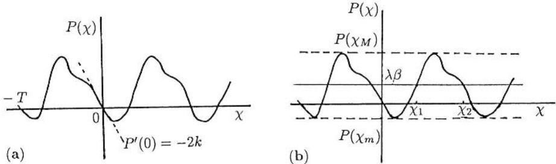

**Figure 9.16.** (**a**) Schematic form of the *T* -periodic function *P*(χ) in the phase shift equation (9.69). (**b**) Determination of steady state solutions χ0 from the intersection of *P*(χ) = λβ.

$$P(\chi) - \lambda \beta = 0.\tag{9.71}$$

The linear stability of χ0 is given by linearising (9.69) about it, which gives

$$\frac{d(\chi - \chi_0)}{d\tau} \approx P_\prime(\chi_0)(\chi - \chi_0),$$

and so

$$\chi_0 \quad \text{is} \quad \begin{cases} \text{stable} \\ \text{unstable} \end{cases} \quad \text{if} \quad P'(\chi_0) \begin{cases} < 0 \\ > 0 \end{cases} \quad . \tag{9.72}$$

For example, if the coupled oscillators are identical, λ = 0 from (9.16), and from Figure 9.16(a) χ = 0 is a solution of *P*(χ) = 0 and its derivative *P* (0) < 0. So χ = 0 is stable. This means that coupling *synchronizes* identical oscillators.

Suppose now that the coupled oscillators are not identical; that is, λ = 0 and ε = 0 in (9.16). In this case steady states χ0 of (9.71) will depend on whether the horizontal line λβ intersects the curve of *P*(χ) in Figure 9.16(a). So there are at least two steady state solutions in 0 ≤ χ0 ≤ *T* if

$$\min P(\chi) = P(\chi_m) < \lambda \beta < P(\chi_M) = \max P(\chi). \tag{9.73}$$

Referring to Figure 9.16(b), we see that two typical solutions, χ1 and χ2, are respectively unstable and stable from (9.72), since by inspection *P* (χ1) > 0 and *P* (χ2) < 0. In this situation the coupled oscillator system will evolve to stable limit cycle oscillations with a *constant phase shift* χ2 between the two oscillators after a long time, by which we mean τ large, which in turn means ε*t* large. Whether or not there are more than two steady state solutions for the phase shift χ depends on the form of *P*(χ); the example in Figure 9.16 is illustrative of the simplest situation.

As long as λβ lies between the maximum and minimum of *P*(χ), that is, (9.73) is satisfied, the steady state solutions χ0, of (9.71) depend continuously on λβ. This is clear from Figure 9.16(b) if the line *P* = λβ is moved continuously between the upper and lower bounds *P*(χ*m*) and *P*(χ*M* ). For example, as λβ increases the stable steady state phase shift between the oscillators decreases.

Suppose now that λβ is such that the two solutions coalesce, either at *P*(χ*m*) or *P*(χ*M* ), and we ask what happens when λβ is such that these solutions no longer exist. To examine this situation let us be specific and consider the case where λβ is slightly less than the critical value, (λβ)*c* = *P*(χ*m*). With λβ just less than *P*(χ*m*) there is no intersection of *P*(χ) and the line λβ. Let

$$
\lambda \beta = (\lambda \beta)_c - \delta^2 = P(\chi_m) - \delta^2, \quad 0 < \delta^2 \ll 1. \tag{9.74}
$$

Now write the phase difference equation (9.69) in the form

$$\begin{split} \frac{d\chi}{d\tau} &= \{P(\chi) - P(\chi_m)\} + \{P(\chi_m) - \lambda\beta\} \\ &= \{P(\chi) - P(\chi_m)\} + \delta^2. \end{split} \tag{9.75}$$

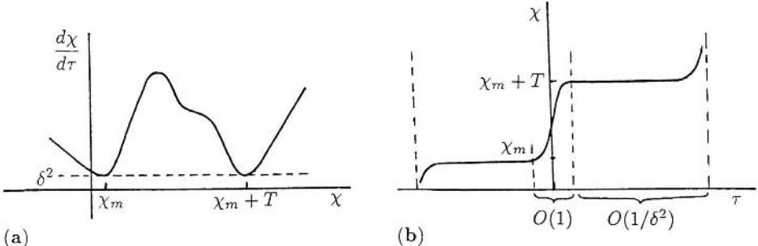

**Figure 9.17.** (**a**) Situation for the χ-equation (9.75) where there is no steady state solution; here 0 < δ2 1. (**b**) Schematic solution, during which there are long periods of very little change in χ interspersed with rapid variations.

Figure 9.17(a) illustrates *d*χ/*d*τ as a function of χ for δ2 > 0. This is the same curve as in Figure 9.16(a) simply moved up a distance −*P*(χ*m*) + δ2, which in our situation is sufficient to make (9.75) have no steady state solutions for χ; that is, the curve of *d*χ/*d*τ as a function of χ does not cross the *d*χ/*d*τ = 0 axis.

The solution problem posed by (9.75) is another *singular perturbation* one when 0 < δ 1 and can be dealt with by standard singular perturbation techniques (see Murray 1984). However it is not necessary to carry out the asymptotic analysis to see what is going on with the solutions. First note that when δ = 0 (that is, λβ = *P*(χ*m*)) there are solutions χ = χ*m* + *nT* for *n* = 0, 1, 2,... since *P*(χ) is a *T* -periodic function. To be specific, let us start with χ ≈ χ*m* in Figure 9.17(a). From (9.75) and from the graph in Figure 9.17, *d*χ/*d*τ = *O*(δ2) > 0 which implies that χ ≈ χ*m* + δ2τ and so for times τ = *O*(1), χ does not vary much from χ*m*. However, for all τ > 0, *d*χ/*d*τ > 0 and so χ slowly increases. For τ sufficiently large so that χ starts to diverge significantly from χ*m*, *P*(χ) − *P*(χ*m*) is no longer approximately zero, in which case *d*χ/*d*τ is *O*(1) and χ changes measurably in times τ = *O*(1) and χ → χ*m* + *T* . When χ is close to χ*m* + *T* , once again *P*(χ) − *P*(χ*m*) ≈ 0 and *d*χ/*d*τ = *O*(δ2) again. The qualitative picture is now clear. The solution stays in the vicinity of the solutions χ = χ*m* +*nT* for a long time τ = *O*(1/δ2), then changes in times τ = *O*(1) to the next solution (with δ = 0), where again it stays for a long time. This process repeats itself in a quasi-periodic but quite different way from the *T* -periodic limit cycle behaviour we got before. The solution is illustrated in Figure 9.17(b). The rapidly changing regions are the singular regions while the roughly constant regions are the nonsingular parts of the solutions. This behaviour is known as *rhythm splitting*. So, as λβ → (λβ)*c* = *P*(χ*m*) the solution for χ *bifurcates* from phase synchronization to rhythm splitting.

Now that we know the qualitative behaviour of χ = ψ2 − ψ1 we can determine ψ1 and ψ2 from (9.68); namely,

$$\frac{d\psi_1}{d\tau} = H(\chi) + \lambda\beta, \quad \frac{d\psi_2}{d\tau} = H(-\chi). \tag{9.76}$$

The solutions *xi* and *yi* are then given by

$$\mathbf{x}_{l} = X(t + \psi_{l}(\mathbf{r})), \quad \mathbf{y}_{l} = Y(t + \psi_{l}(\mathbf{r})), \quad i = 1, 2. \tag{9.77}$$

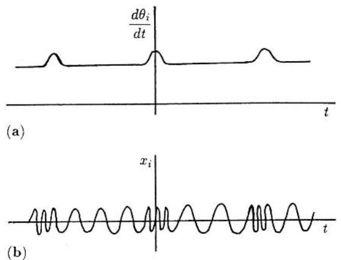

**Figure 9.18.** (**a**) The frequency *d*θ/*dt* of one of the oscillators when λβ is slightly less than the minimum *P*(χ*m*) and rhythm splitting occurs. (**b**) The time variation in *xi* when phase locking just bifurcates to rhythm splitting.

The frequency of the oscillations is given to *O*(ε) by

$$\frac{d\theta_l}{dt} = 1 + \varepsilon \frac{d\psi_l}{d\tau} = \begin{cases} 1 + \varepsilon [H(\chi) + \lambda \beta], & i = 1 \\ 1 + \varepsilon H(-\chi), & i = 2 \end{cases}.\tag{9.78}$$

Figure 9.18(a) illustrates the rhythm splitting solution. The small bumps are the rapid variations in χ in times *O*(1) while the long flat regions correspond to the slowly varying solutions where the phase difference ψ2 − ψ1(= χ) is approximately constant. Figure 9.18(b) illustrates a typical solution *xi* as a function of *t* corresponding to this rhythm splitting. Note the sudden change in frequency which occurs when the phase difference χ goes through its region of rapid change from one solution χ*m* to the next χ*m* + *T* .

This bifurcation phenomenon exhibited by coupled oscillators, where there is an abrupt change from phase locking to rhythm splitting, is exactly what was demonstrated experimentally by Marek and Stuchl (1975), as described in Section 9.5. That is, they first observed *phase locking*. Then when the parameters were changed so that the autonomous limit cycle frequencies were sufficiently different they observed that the phase difference was slowly varying for long periods of time but punctuated by short periods of rapid fluctuations. This is the *rhythm splitting* phenomenon we have discussed above.

### **Exercises**

- **1** Consider the limit cycle oscillator

$$\frac{dr}{dt} = r(1 - r), \quad \frac{d\theta}{dt} = 1$$

to be perturbed by an impulse *I* parallel to the *x*-axis (refer to Figure 9.4). Determine the resulting phase resetting curves and discuss the possible existence of black holes.

- **2** Discuss the bifurcation situation for coupled oscillators, using equation (9.73) for the phase difference χ, when the interaction parameters λβ are just greater than *P*(χ*M* ), the maximum *P*(χ) in Figure 9.16(a). Sketch the equivalent functions to those illustrated in Figures 9.17 and 9.18 and discuss the practical implications.
# **10. Dynamics of Infectious Diseases: Epidemic Models and AIDS**

#### **10.1 Historical Aside on Epidemics**

The history of epidemics is an ever fascinating area; the 14th century Black Death is just the most famous epidemic historically (see Chapter 13, Volume II, which deals with the spatial spread of epidemics, for a brief history of it). In Europe, which had a population of around 85 million at the time, about a third of the population died.

One epidemic which has exercised classical scholars for a very long time is the Plague of Athens (430–428 BC) described in great detail by Thucydides including the symptoms and disease progression. He also gave some exact figures such as that 1050 of 4000 soldiers on an expedition died of the disease. The disease described so minutely by Thucydides, even to the fact that dogs who ate the dead bodies also suffered, has been the source of numerous articles over some hundreds of years with cases being made (with great conviction and defended vehemently) for an incredible range of diseases such as bubonic plague, measles, Malta fever, smallpox, scarlet fever, typhus, typhoid fever and many others. The symptoms described by Thucydides are (i) heat in the head, (ii) inflammation of the eyes, (iii) suffusion with blood of the tongue and throat, (iv) foetid breath, (v) hoarseness with violent coughing, (vi) vomiting of bile, (vii) retching and convulsions, (viii) pustular and ulcerating eruptions of the skin, (ix) total body hyperaesthesia and restlessness, (x) irresistible desire for water to assuage thirst and immersion therein to alleviate body heat, (xi) terminal exhaustion apparently produced by diarrhoea, (xii) loss of toes, fingers and genitalia, (xiii) destruction of eyes and, (xiv) if recovery occurs, amnesia, the latter no doubt a blessing. Based on the symptoms none of the above suggestions seems to fit the Athens disease. Whatever it was it was certainly very nasty. An interesting review article on the Athens plague is given by Poole and Holladay (1979). They conclude that it has either become extinct or has been modified over the millennia. Since then other articles have appeared with yet other possiblities.

One of the interesting aspects of Thucydides' account is that there is no mention of person-to-person contagion which we now accept so freely with diseases. It was only in the 19th century that it was beginning to be discussed. Evil exhalations from the earth, aerial miasmata and so on were generally accepted. The latter explanation for some diseases, or rather illnesses, is not as ridiculous as it might at first appear when you think of the number of people, with the same epidemiclike medical problems, who live on contaminated ground or in regions where the water is iodine-deficient resulting in goitres to mention just two examples. Many South-East Asians can be forgiven for believing that the smog and smoke belching from the forest fires in Indonesia are responsible for the large upsurge of dengue fever, carried by the mosquito, *Aedes aegypti*. This is a man-made mosquito in effect since it breeds in urban areas in water gathering in plastic, rubber and metallic containers that litter many poor urban areas.

The study of epidemics with its long history has come up with an astonishing number and variety of models and explanations for the spread and cause of epidemic outbreaks. Even today they are often attributed to evil spirits or displeased gods. For example, AIDS (autoimmune deficiency syndrome), the dominant epidemic of the past 20 years and the major one since the 19181 influenza pandemic have been ascribed by many as a punishment sent by God. Hippocrates (459–377 BC), in his essay on 'Airs, Waters and Localities' wrote that one's temperament, personal habits and environment were important factors—not unreasonable even today, particularly so in view of the comments in the last paragraph. Somewhat less relevant, but not without its moments of humour, is Alexander Howe's (1865) book in which he sets out his 'Laws of Pestilence' in 31 propositions of which the following, proposition 2, is typical: 'The length of the interval between successive periodic visitations corresponds with the period of a single revolution of the lunar node, and a double revolution of the lunar apse time.'

The first major epidemic in the U.S.A. was the Yellow Fever epidemic in Philadelphia in 1793 in which about 5000 people died out of a population of around 50,000, although estimates suggest that about 20,000 fled the city; see the interesting *Scientific American* article by Foster et al. (1998) and the book by Powell (1993). The epidemic story here is a saga of wild, as well as sensible, theories as to cause and treatment, petty jealousies with disastrous consequencies, genuine humanity and fomented controversies. A leading physician was the strongest advocate of bleeding as the appropriate treatment while others recommended cleanliness, rest, Peruvian bark and wine. This epidemic had a major impact on the subsequent life and politics of the country.

The landmark book by McNeill (1989) is a fascinating story of the relation between disease and people. More recently there have been several books which try to explain various aspects of diseases from the triumphs of medicine (Oldstone 1998) to the socioeconomic (Watts 1998). The latter is written from a very anti-European, westernimperial-colonialists-are-responsible-for-it-all, viewpoint. Europeans are blamed for most of the world's problems with infectious diseases. Leaving aside some of his wilder assertions,2 the polemics and the emotional outbursts, he has diligently researched historical data and unearthed some dreadful examples of how diseases have been spread by the stupidity of certain colonial western nations with horrifying consequences. Watts'

<sup>1</sup>The influenza epidemic in 1918–1919 is the most deadly pandemic (that is, a world epidemic) per unit time in recorded history and somewhat surprisingly has been to a large extent ignored in historical studies until relatively recently. The Black Death palls in comparison with its severity. The original estimate of the number that died is continually being upgraded. A meeting on the epidemic in 1998 concluded that as many as 100 million people died. Coming towards the end of World War I some people at the time thought it was perhaps germ warfare. If a similar virulent influenza struck in the U.S.A. now, on the order of 1.5 million would die, although current medical treatments could possibly reduce that figure if vaccine could be produced quickly enough. It is about 20 years since the last flu epidemic and many epidemioloigists feel the next is overdue in the cycle of such outbreaks.

<sup>2</sup>For example, Watts asserts that syphilis in the 17th to 19th centuries was a consequence of the Christians' opposition to masturbation.

book is an important contribution to the history and current global relevance of infectious diseases.

Since the end of World War II, public health strategy has focused on the elimination and control of organisms which cause disease. The advent of new antibiotics changed the whole ethos of disease control. Just over 20 years ago, in 1978, the United Nations signed the 'Health for All, 2000' accord which set the ambitious goal of the eradication of disease by the year 2000. AIDS at the time had not yet been discovered, or perhaps recognised is a better word, and in the year before, the last known case of smallpox had been treated. There was certainly cause for optimism albeit short lived. Scientists thought that microbes were biologically stationary targets and hence would not mutate in resistance to drugs and other biological influences.

This comforting image of unchanging microbes started to change shortly after this time with the emergence of microbes that could swim in a pool of bleach, grow on a bar of soap, and ignore doses of penicillin logarithmically larger than those effective in the 1950's (Garrett 1996). The practical reality of bacterial mutation is dramatically seen in New York City with tuberculosis. Control of the W-strain of the disease, which first appeared in the city in 1992, is resistant to every available drug and kills over half its victims, has already cost more than \$1 billion. It was only 20 years ago that it was predicted that tuberculosis would be eradicated in the world by 2000.

Another aspect in the current spread of disease is with the modern era of transportation allowing more than a million people a day to cross international borders, the threat of a major outbreak of exotic diseases is very real. The population explosion, especially in underdeveloped countries, is another factor in the microbes' favour. These played key roles in the proliferation of HIV (human immunodeficiency virus) in the 1980's. Recently the World Health Organization (WHO) estimated that over 30 million people worldwide are currently infected with HIV. Information on global and countryspecific disease statistics can be found on the Web pages of places such as the WHO (www.who.org) and the Centers for Disease Control (CDC: www.cdc.gov) in Atlanta.

Diseases (including such as heart disease and cancer) cause orders of magnitude more deaths in the world than anything else, even wars and famines. The appearance of new diseases, and resurgence of old ones, makes the case for interdisciplinary involvement ever more pressing. Modelling can play an increasingly significant role. Historians can also play a role. Like the plague of Athens much has been written about the 'sweating sickness' of the late 15th and first half of the 16th centuries in England.3 The symptoms of the progression of the disease are, among others, high temperatures, body filling with fluid, particularly the lungs, the apparently well-being of a person in the morning and death the same day or within a day or two. The symptoms are so similar to those of the hanta virus in the 1993 outbreak in the Southwest U.S.A. that there is a plausible case they are the same disease but which has been dormant for several hundred years. There is some justification in believing that some of the new diseases are in fact reappearances of old ones.

<sup>3</sup>Henry VIII of England succeeded to the throne because his older brother died of the sweating sickness, and changed the course of history. Henry, for example, dissolved the monasteries, helped usher in the Reformation and developed the British Navy as a professional service which was the basis for the later development of the British Empire.

There are four main disease-causing microrganisms: viruses, bacteria, parasites and fungi. In this chapter, we describe some models for the population dynamics of disease agents and later (in Chapter 13, Volume II) the spatiotemporal spread of infections. Such models have been commonly used to model the spread of viral, bacterial and parasitic infections but considerably less so with fungal infections. We shall discuss several models and then try to exploit the models in the control, or ideally the eradication, of the disease or infection we are considering. The practical use of such models must rely heavily on the realism put into the models. As usual, this does not mean the inclusion of all possible effects, but rather the incorporation in the model mechanisms, in as simple a way as possible, of what appear to be the major components. Like most models they generally go through several versions before qualitative phenomena can be explained or predicted with any degree of confidence. Great care must be exercised before practical use is made of any epidemic models. However, even simple models should, and frequently do, pose important questions with regard to the underlying process and possible means of control of the disease or epidemic. One such case study, which went through various hypothetical scenarios, is the model proposed by Capasso and Paveri-Fontana (1979) for the 1973 cholera epidemic in the port city of Bari in southern Italy.4

An interesting early mathematical model, involving a nonlinear ordinary differential equation, by Bernoulli (1760), considered the effect of cow-pox inoculation on the spread of smallpox. The article has some interesting data on child mortality at the time. It is probably the first time that a mathematical model was used to assess the practical advantages of a vaccination control programme. Thucydides mentions immunity in connection with the Athens plague and there is evidence of an even more ancient Chinese custom where children were made to inhale powders made from the crusts of skin lesions of people recovering from smallpox.

Models can also be extremely useful in giving reasoned estimates for the level of vaccination for the control of directly transmitted infectious diseases. We discuss one case study later in the chapter when modelling bovine tuberculosis; see, for example, Anderson and May (1982, 1985, 1991), and Herbert et al. (1994). The recent paper by Schuette and Hethcote (1999) discusses vaccination protocols in connection with chickenpox and shingles and highlights certain dangers of extensive vaccination. Among other things, they evaluate with their models the effects of different vaccination programmes. The classical theoretical papers on epidemic models by Kermack and McKendrick (1927, 1932, 1933) have had a major influence in the development of mathematical models and are still relevant in a suprising number of epidemic situations; we

<sup>4</sup>In the epidemic, cases of cholera were most common in the poorer areas near the port. At the time raw sewage from the hospital that treated the cholera patients went directly into the sea. One suggestion was that the bacteria infected local people bathing in the area. On investigation this did not seem to be borne out. Another thought was that the water in the stand pipes, commonly in use in these districts, was contaminated. Again this was found not to be the case. Yet another thought was that the cholera entered the mussel population which was caught in the shore areas near the port and which was sold and eaten at the local stalls and shops by the local inhabitants as a delicacy, thus passing it on to humans. However, after a few hours away from direct bacterial contact mussels actually kill the cholera bacteria so this was also discarded since several hours elapsed between catching and selling. The solution was finally found to be indeed in the infected sea water. The stall holders kept a bucket of (contaminated) sea water with which they regularly doused the displayed mussels to make them look fresh and succulent. It was the bacteria in the 'fresh' sea water sprayed on the shells which caused the cholera infection.

describe some of these in this chapter. The modelling literature is now extensive and growing very quickly. Although now quite old, a good introduction to the variety of problems and models for the spread and control of infectious diseases is the book by Bailey (1975). The article by Hethcote (1994) reviews three basic epidemiological models. The book by Diekmann and Heesterbeek (2000) is a good introduction to the field. For example, they discuss how to use biological assumptions in constructing models and present applications; they cover both deterministic and stochastic modelling. Other sources are to be found in the above references and in the papers referred to in the rest of this chapter. Particularly useful sources for the latest information on specific diseases, either globally or for a specific country, are the WHO (http://www.who.org/) and the CDC (http://www.cdc.gov/); their search and information features are very efficient.

In this chapter we discuss several quite different models for very different diseases which incorporate some general aspects of epidemiological modelling of disease transmission, time evolution of epidemics, acquired resistance to infection, vaccination strategies and so on. The use of mathematical modelling in immunology and virology is also growing very quickly. We discuss in some detail models for the dynamics of HIV infections and relate them to patient data. We also discuss a bacterial infection and one involving parasites. In Chapter 13, Volume II we consider the geographic spread of infectious diseases and describe in detail a practical model for the spatial spread of rabies, a possible means of its control and the effect of including immunity. The modelling of infectious diseases involves the concepts of population dynamics which we have dicussed in earlier chapters. Although the detailed forms of the equations are different the essential elements and analysis are very similar.

At the basic level we consider two types of models. In one the total population is taken to be approximately constant with, for example, the population divided into susceptible, infected and immune groups: other groupings are also possible, depending on the disease. We first discuss models in this category. In the other, the population size is affected by the disease via the birth rate, mortality and so on. Host–parasite interacting populations often come into this category. We only discuss deterministic models which are deficient in certain situations—eradication of a disease is one, since here the probability that the last few infected individuals will infect another susceptible is not deterministic. Nevertheless it is perhaps surprising how useful, and quantitatively predictive, deterministic models can often be; the examples below are only a very few examples where this has proven to be the case.

#### **10.2 Simple Epidemic Models and Practical Applications**

In the classical (but still highly relevant) models we consider here the total population is taken to be constant. If a small group of infected individuals is introduced into a large population, a basic problem is to describe the spread of the infection within the population as a function of time. Of course this depends on a variety of circumstances, including the actual disease involved, but as a first attempt at modelling directly transmitted diseases we make some not unreasonable general assumptions.

Consider a disease which, after recovery, confers immunity which, if lethal, includes deaths: dead individuals are still counted. Suppose the disease is such that the population can be divided into three distinct classes: the susceptibles, *S*, who can catch the disease; the infectives, *I*, who have the disease and can transmit it; and the removed class, *R*, namely, those who have either had the disease, or are recovered, immune or isolated until recovered. The progress of individuals is schematically represented by

$$
\mathcal{S} \longrightarrow I \longrightarrow \mathcal{R}.
$$

Such models are often called *SIR* models. The number of classes depends on the disease. *SI* models, for example, have only susceptible and infected classes while *SEIR* models have a suceptible class, *S*, a class in which the disease is latent, *E*, an infectious class, *I*, and a recovered or dead class, *R*.

The assumptions made about the transmission of the infection and incubation period are crucial in any model; these are reflected in the terms in the equations and the parameters. With *S*(*t*), *I*(*t*) and *R*(*t*) as the number of individuals in each class we assume here that: (i) The gain in the infective class is at a rate proportional to the number of infectives and susceptibles, that is, *rSI*, where *r* > 0 is a constant parameter. The susceptibles are lost at the same rate. (ii) The rate of removal of infectives to the removed class is proportional to the number of infectives, that is, *aI* where *a* > 0 is a constant; 1/*a* is a measure of the time spent in the infectious state. (iii) The incubation period is short enough to be negligible; that is, a susceptible who contracts the disease is infective right away.

We now consider the various classes as uniformly mixed; that is, every pair of individuals has equal probability of coming into contact with one another. This is a major assumption and in many situations does not hold as in most sexually transmitted diseases (STD's). The model mechanism based on the above assumptions is then

$$\frac{dS}{dt} = -rSI,\tag{10.1}$$

$$\frac{dI}{dt} = rSI - aI,\tag{10.2}$$

$$\frac{dR}{dt} = aI,\tag{10.3}$$

where *r* > 0 is the infection rate and *a* > 0 the removal rate of infectives. This is the classic Kermack–McKendrick (1927) model. We are, of course, only interested in nonnegative solutions for *S*, *I* and *R*. This is a basic model but, even so, we can make some highly relevant general comments about epidemics and, in fact, adequately describe some specific epidemics with such a model.

The constant population size is built into the system (10.1)–(10.3) since, on adding the equations,

$$\frac{dS}{dt} + \frac{dI}{dt} + \frac{dR}{dt} = 0 \quad \Rightarrow \quad S(t) + I(t) + R(t) = N,\tag{10.4}$$

where *N* is the total size of the population. Thus, *S*, *I* and *R* are all bounded above by *N*. The mathematical formulation of the epidemic problem is completed given initial conditions such as

$$S(0) = S_0 > 0, \quad I(0) = I_0 > 0, \quad R(0) = 0. \tag{10.5}$$

A key question in any epidemic situation is, given *r*, *a*, *S*0 and the initial number of infectives *I*0, whether the infection will spread or not, and if it does how it develops with time, and crucially when it will start to decline. From (10.2),

$$
\left[\frac{dI}{dt}\right]_{t=0} = I_0(rS_0 - a) \quad \begin{cases} > 0 \\ < 0 \end{cases} \text{ if} \quad S_0 \quad \begin{cases} > \rho \\ < \rho \end{cases}, \quad \rho = \frac{a}{r}. \tag{10.6}
$$

Since, from (10.1), *d S*/*dt* ≤ 0, *S* ≤ *S*0 we have, if *S*0 < *a*/*r*,

$$\frac{dI}{dt} = I(rS - a) \le 0 \quad \text{for all} \quad t \ge 0,\tag{10.7}$$

in which case *I*0 > *I*(*t*) → 0 as *t* → ∞ and so the infection dies out; that is, no epidemic can occur. On the other hand if *S*0 > *a*/*r* then *I*(*t*) initially increases and we have an epidemic. The term 'epidemic' means that *I*(*t*) > *I*0 for some *t* > 0; see Figure 10.1. We thus have a *threshold phenomenon*. If *S*0 > *Sc* = *a*/*r* there is an epidemic while if *S*0 < *Sc* there is not. The critical parameter ρ = *a*/*r* is sometimes called the *relative removal rate* and its reciprocal σ(= *r*/*a*) the infection's *contact rate*.

We write

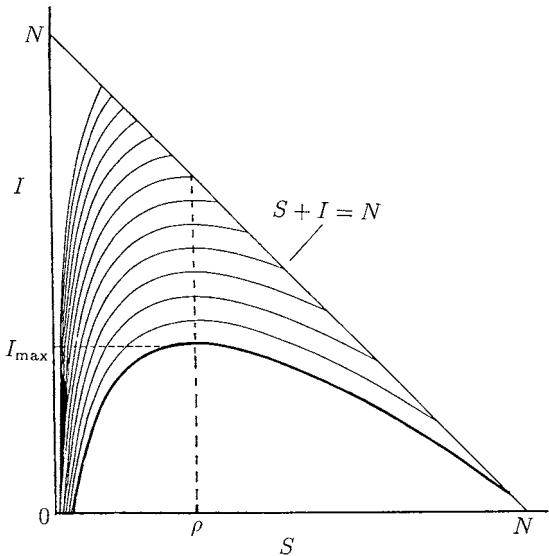

**Figure 10.1.** Phase trajectories in the susceptibles (*S*)-infectives (*I*) phase plane for the *SIR* model epidemic system (10.1)–(10.3). The curves are determined by the initial conditions *I*(0) = *I*0 and *S*(0) = *S*0. With *R*(0) = 0, all trajectories start on the line *S* + *I* = *N* and remain within the triangle since 0 < *S* + *I* < *N* for all time. An epidemic situation formally exists if *I*(*t*) > *I*0 for any time *t* > 0; this always occurs if *S*0 > ρ(= *a*/*r*) and *I*0 > 0.

$$R_0 = \frac{rS_0}{a},$$

where *R*0 is the basic *reproduction rate* of the infection, that is, the number of secondary infections produced by one primary infection in a wholly susceptible population. Here 1/*a* is the average infectious period. If more than one secondary infection is produced from one primary infection, that is, *R*0 > 1, clearly an epidemic ensues. The whole question of thresholds in epidemics is obviously important. The definition and derivation or computation of the basic reproduction rate is crucial and can be quite complicated. One such example is if the population is heterogeneous (Diekman et al. 1990).

The basic reproduction rate is a crucial parameter grouping for dealing with an epidemic or simply a disease which is currently under control with vaccination, for example. Although the following arguments are based on *R*0 they are quite general. Clearly one way to reduce the reproduction rate is to reduce the number of suceptibles, *S*0. Vaccination is the common method of doing this and it has been successful in eradicating smallpox. In the U.S.A. it reduced the incidence of measles from 894,134 reported cases in 1941 to 135 in 1997 and for polio from 21,269 in 1952 to the last indigenously acquired case of wild-virus polio reported in 1979 (the Western hempisphere was officially certified polio-free in 1994) with similar reductions in other childhood diseases. Mass vaccination is the cheapest and most effective means of disease control. However, although vaccines are generally extremely safe, no medicine is totally riskfree, however small the risk may be. (There have, however, been a few cases of instant death from diptheria and tetanus vaccines and there is currently much controversy about the vaccine for Anthrax for the military.) As people in the West forget the ravages of polio, measles, diptheria, rubella and so on, many will become less keen to have their children vaccinated because of the risk even if very small. Vaccination not only provides protection for the individual it also provides it for the community at large since it keeps the effective reproduction rate below the level which would allow an epidemic to start. This is the so-called 'herd immunity.' The point is that once the threshold herd immunity level of *R*0 has been reached and memory of former diseases fades there is the possibility that people will not have their children vaccinated but have a free ride instead; the unvaccinated have effectively the same immunity. In this situation the best, but unethical, strategy for parents is to urge all other parents to have their children vaccinated but free ride with their own. The important point to keep in mind, however, is that an epidemic can start and rise very quickly if the reproduction rate increases beyond the critical value for an epidemic so in the end free-riding is not without its own risks. (This happened with the Conquistadors in Mexico.)

We can derive some other useful analytical results from this simple model. From (10.1) and (10.2)

$$\frac{dI}{dS} = -\frac{(rS - a)I}{rSI} = -1 + \frac{\rho}{S}, \quad \rho = \frac{a}{r}, \quad (I \neq 0).$$

The singularities all lie on the *I* = 0 axis. Integrating the last equation gives the (*I*, *S*) phase plane trajectories as

$$I + S - \rho \ln S = \text{constant} = I_0 + S_0 - \rho \ln S_0,\tag{10.8}$$

where we have used the initial conditions (10.5). The phase trajectories are sketched in Figure 10.1. Note that with (10.5), all initial values *S*0 and *I*0 satisfy *I*0 + *S*0 = *N* since *R*(0) = 0 and so for *t* > 0, 0 ≤ *S* + *I* < *N*.

If an epidemic exists we would like to know how severe it will be. From (10.7) the maximum *I*, *I*max , occurs at *S* = ρ where *d I* /*dt* = 0. From (10.8), with *S* = ρ,

$$\begin{split} I_{\text{max}} &= \rho \ln \rho - \rho + I_0 + S_0 - \rho \ln S_0 \\ &= I_0 + (S_0 - \rho) + \rho \ln \left(\frac{\rho}{S_0}\right) \\ &= N - \rho + \rho \ln \left(\frac{\rho}{S_0}\right). \end{split} \tag{10.9}$$

For any initial values *I*0 and *S*0 > ρ, the phase trajectory starts with *S* > ρ and we see that *I* increases from *I*0 and hence an epidemic ensues. It may not necessarily be a severe epidemic as is the case if *I*0 is close to *I*max. It is also clear from Figure 10.1 that if *S*0 < ρ then *I* decreases from *I*0 and no epidemic occurs.

Since the axis *I* = 0 is a line of singularities, on all trajectories *I* → 0 as *t* → ∞. From (10.1), *S* decreases since *d S*/*dt* < 0 for *S* = 0, *I* = 0. From (10.1) and (10.3),

$$\begin{split} \frac{dS}{dR} &= -\frac{S}{\rho} \\ \Rightarrow \quad S = S_0 e^{-R/\rho} \ge S_0 e^{-N/\rho} > 0 \\ \Rightarrow \quad 0 < S(\infty) \le N. \end{split} \tag{10.10}$$

In fact from Figure 10.1, 0 < *S*(∞)<ρ. Since *I*(∞) = 0, (10.4) implies that *R*(∞) = *N* − *S*(∞). Thus, from (10.10),

$$S(\infty) = S_0 \exp\left[-\frac{R(\infty)}{\rho}\right] = S_0 \exp\left[-\frac{N - S(\infty)}{\rho}\right]$$

and so *S*(∞) is the positive root 0 < *z* < ρ of the transcendental equation

$$\mathrm{S_0} \exp\left[-\frac{N-z}{\rho}\right] = z. \tag{10.11}$$

We then get the total number of susceptibles who catch the disease in the course of the epidemic as

$$I_{\text{total}} = I_0 + S_0 - S(\infty),\tag{10.12}$$

where *S*(∞) is the positive solution *z* of (10.11). An important implication of this analysis, namely, that *I*(*t*) → 0 and *S*(*t*) → *S*(∞) > 0, is that the disease dies out from a lack of infectives and *not* from a lack of susceptibles.

The threshold result for an epidemic is directly related to the relative removal rate, ρ: if *S*0 > ρ an epidemic ensues whereas it does not if *S*0 < ρ. For a given disease, the relative removal rate varies with the community and hence determines whether an epidemic may occur in one community and not in another. The number of susceptibles *S*0 also plays a major role, of course. For example, if the density of susceptibles is high and the removal rate, *a*, of infectives is low (through ignorance, lack of medical care, inadequate isolation and so on) then an epidemic is likely to occur. Expression (10.9) gives the maximum number of infectives while (10.12) gives the total number who get the infection in terms of ρ(= *a*/*r*), *I*0, *S*0 and *N*.

In most epidemics it is difficult to determine how many new infectives there are each day since only those that are removed, for medical aid or whatever, can be counted. Public Health records generally give the number of infectives per day, week or month. So, to apply the model to actual epidemic situations, in general we need to know the number removed per unit time, namely, *d R*/*dt*, as a function of time.

From (10.10), (10.4) and (10.3) we get an equation for *R* alone; namely,

$$\frac{dR}{dt} = aI = a(N - R - S) = a\left(N - R - S_0 e^{-R/\rho}\right), \quad R(0) = 0,\qquad(10.13)$$

which can only be solved analytically in a parametric way: the solution in this form however is not particularly convenient. Of course, if we know *a*, *r*, *S*0 and *N* it is a simple matter to compute the solution numerically. Usually we do not know all the parameters and so we have to carry out a best fit procedure assuming, of course, the epidemic is reasonably described by such a model. In practice, however, it is often the case that if the epidemic is not large, *R*/ρ is small—at least *R*/ρ < 1. Following Kermack and McKendrick (1927) we can then approximate (10.13) by

$$\frac{dR}{dt} = a \left[ N - S_0 + \left( \frac{S_0}{\rho} - 1 \right) R - \frac{S_0 R^2}{2 \rho^2} \right].$$

Factoring the right-hand side quadratic in *R*, we can integrate this equation to get, after some elementary but tedious algebra, the solution

$$\begin{split} R(t) &= \frac{r^2}{S_0} \left[ \left( \frac{S_0}{\rho} - 1 \right) + \alpha \tanh \left( \frac{aat}{2} - \phi \right) \right] \\ &\alpha = \left[ \left( \frac{S_0}{\rho} - 1 \right)^2 + \frac{2S_0(N - S_0)}{\rho^2} \right]^{1/2}, \quad \phi = \frac{\tanh^{-1} \left( \frac{S_0}{\rho} - 1 \right)}{\alpha} . \end{split} \tag{10.14}$$

The removal rate is then given by

$$\frac{dR}{dt} = \frac{a\alpha^2 \rho^2}{2S_0} \operatorname{sech}^2 \left(\frac{aat}{2} - \phi\right),\tag{10.15}$$

which involves only 3 parameters, namely, *a*α2ρ2/(2*S*0), α*a* and φ. With epidemics which are not large, it is this function of time which we should fit to the public health records. On the other hand, if the disease is such that we know the actual number of the removed class then it is *R*(*t*) in (10.14) we should use. If *R*/ρ is not small, however, we must use the differential equation (10.13) to determine *R*(*t*).

We now apply the model to two very different epidemic situations.

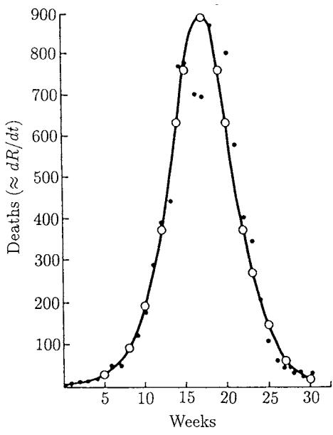

**Figure 10.2.** Bombay plague epidemic of 1905–1906. Comparison between the data (•) and theory (◦) from the (small) epidemic model and where the number of deaths is approximately *d R*/*dt* given by (10.16). (After Kermack and McKendrick 1927)

#### *Bombay Plague Epidemic 1905–1906*

This plague epidemic lasted for almost a year. Since most of the victims who got the disease died, the number removed per week, that is, *d R*/*dt*, was approximately equal to the number of deaths per week. On the basis that the epidemic was not severe (relative to the population size), Kermack and McKendrick (1927) compared the actual data with (10.15) and determined the best fit for the three parameters which resulted in

$$\frac{dR}{dt} = 890 \operatorname{sech}^2(0.2t - 3.4). \tag{10.16}$$

This is illustrated in Figure 10.2 together with the actual epidemic data.

#### *Influenza Epidemic in an English Boarding School 1978*

In 1978 in the British medical journal, *The Lancet*, there was a report with detailed statistics of a flu epidemic in a boys' boarding school with a total of 763 boys. Of these 512 were confined to bed during the epidemic, which lasted from 22nd January to 4th February 1978. It seems that one infected boy initiated the epidemic. This situation has many of the requirements assumed in the above model derivation. Here, however, the epidemic was severe and the full system has to be used. Also, when a boy was infected he was put to bed and so we have *I*(*t*) directly from the data. Since in this case we have no analytical solution for comparison with the data, a best fit numerical technique was used directly on the equations (10.1)–(10.3) for comparison of the data. Figure 10.3 illustrates the resulting time evolution for the infectives, *I*(*t*), together with the epidemic statistics. The *R*-equation (10.3) is uncoupled; the solution for *R*(*t*) is simply proportional to the area under the *I*(*t*) curve.

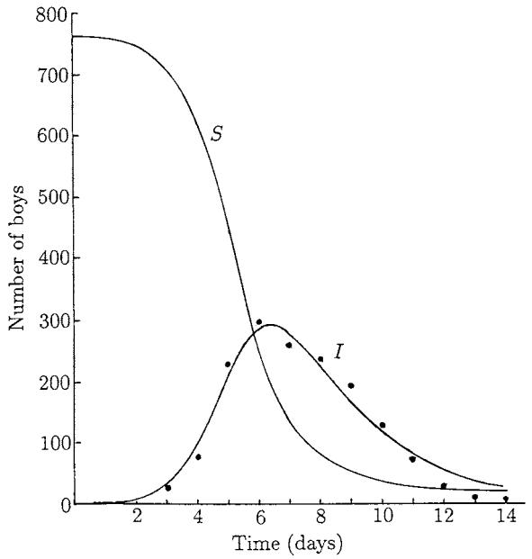

**Figure 10.3.** Influenza epidemic data (•) for a boys' boarding school as reported in the British medical journal, *The Lancet*, 4th March 1978. The continuous curves for the infectives (*I*) and susceptibles (*S*) were obtained from a best fit numerical solution of the *SIR* system (10.1)–(10.3): parameter values *N* = 763, *S*0 = 762, *I* = 1, ρ = 202, *r* = 2.18 × 10−3/day. The conditions for an epidemic to occur, namely, *S*0 > ρ, are clearly satisfied and the epidemic is severe since *R*/ρ is not small.

#### *Plague in Eyam, England 1665–1666*

There was an outbreak of plague in the village of Eyam in England from 1665 to 1666. In this remarkable altruistic incident, the village sealed itself off when plague was discovered, so as to prevent it spreading to the neighbouring villages, and it was successful. By the end of the epidemic only 83 of the original population of 350 survived. Raggett (1982) applied the *SIR* model (10.1)–(10.3) to this outbreak. Here, *S*(∞) = 83 out of an initial *S*0 = 350. This is another example, like the school flu epidemic, where the epidemic was severe. Raggett (1982) shows how to determine the parameters from the available data and knowledge of the etiology of the disease. He reiterates the view that although the initial form was probably bubonic plague, the pneumonic form most likely became prevalent; the latter form can be transmitted from the cough of a victim (see Chapter 13, Volume II for a brief description of the plague and its history). The comparison between the solutions from the deterministic model and the Eyam data is very good. The comparison is much better than that obtained from the corresponding stochastic model, which Raggett (1982) also considered. We discuss a model for the spatial spread of plague in Chapter 13, Volume II.

If a disease is *not* of short duration then (10.1), the equation for the susceptibles, should include birth and death terms. Mortality due to natural causes should also be included in equation (10.2) for the infectives and in (10.3) for the removed class. The resulting models can be analysed in a similar way to that used here and in Chapter 3 on interacting populations: they are still systems of ordinary differential equations. It is not surprising, therefore, that oscillatory behaviour in disease epidemics is common; these are often referred to as epidemic waves. Here they are *temporal* waves. *Spatial* epidemic waves appear as an epidemic spreads geographically. The latter are also common and we consider them in detail in Chapter 13, Volume II.

Many diseases have a latent or incubation period when a susceptible has become infected but is not yet infectious. Measles, for example, has an 8- to 13-day latent period. The incubation time for AIDS, on the other hand, is anything from a few months to years after the patient has been shown to have antibodies to the human immunodeficiency virus (HIV). We can, for example, incorporate this as a delay effect, or by introducing a new class, *E*(*t*) say, in which the susceptible remains for a given length of time before moving into the infective class. Such models give rise to integral equation formulations and they can exhibit oscillatory behaviour as might be expected from the inclusion of delays. Some of these are described by Hoppensteadt (1975, see also 1982). Nonlinear oscillations in such models have been studied by Hethcote et al. (1981); see also Hethcote (1994). Alternative approaches recently used in modelling AIDS are discussed below. Finally age, *a*, is often a crucial factor in disease susceptibility and infectiousness. The models then become partial differential equations with independent variables (*t*, *a*); we consider one such model later in this chapter.

There are many modifications and extensions which can and often must be incorporated in epidemic models; these depend critically on the disease and location. In the following sections we discuss a few more general models to illustrate different but important points. The books and references already cited describe numerous models and go into them in considerable detail.

#### **10.3 Modelling Venereal Diseases**

The incidence of sexually transmitted diseases (STDs), such as gonorrhea (*Neisseria gonorrhoeae*), chlamydia, syphilis and, of course, AIDS, is a major health problem in both developed and developing countries. In the U.S.A., for example, as reported by the Centers for Disease Control (www.cdc.gov), in 1996 there were over 300,000 cases of gonorrhea reported and over 11,000 cases of syphilis and nearly 500,000 cases of chlamydia. Whereas the rate has been decreasing for gonorrhea and syphilis it is growing for chlamydia. We give some of the numbers for HIV incidence in the AIDS sections below.

STDs have certain characteristics which are different from other infections, such as measles or rubella (German measles). One difference is that they are mainly restricted to the sexually active community so the assumption of uniform mixing in the whole population is not really justified. Another is that often the carrier is asymptomatic (that is, the carrier shows no overt symptoms) until quite late on in the development of the infection. A third crucial difference is that STDs induce little or no acquired immunity following an infection. Equally important in virus infections is the lack of present knowledge of some of the parameters which characterise the transmission dynamics.

Although gonorrhea, syphilis and AIDS are well known, with the latter growing alarmingly, one of the STDs which has far outstripped gonorrhea is the less well-known *Chlamydia trachomatis*, which in 1996 struck more than gonorrhea and syphilis put together and is on the increase. It can produce sterility in women without their ever showing any overt symptoms. Diagnostic techniques are now sufficiently refined to make diagnosis more accurate and less expensive and could account in part for the increase in reported cases.5 The asymptomatic character of this disease among women is serious. Untreated, it causes pelvic inflammatory disorders (PID) which are often accompanied by chronic pain, fever and sterility. With pregnancy, PID, among other complications, can often cause premature delivery and ectopic pregnancies (that is, the fertilised egg is implanted outside the womb) which are life threatening. Untreated gonorrhea, for example, can also cause blindness, PID, heart failure and ultimately death. STDs are a major cause of sterility in women. The consequences of untreated STDs in general are very unpleasant. The vertical transmission of STDs from mother to newborn children is another of the threats and tragedies of many STDs. Another problem is the appearance of new strains: in connection with AIDS, HIV-1 is the common virus but a relatively new one, HIV-2 has now been found. With gonorrhea the relatively new strain, *Neisseria gonorrhoeae*, which was discovered in the 1970's proved resistant to penicillin.

In this section we present a simple classical epidemic model which incorporates some of the basic elements in the heterosexual spread of venereal diseases. We have in mind such diseases as gonorrhea; AIDS we discuss separately later in the chapter. The monograph by Hethcote and Yorke (1984) is still a good survey of models used for the spread and control of gonorrhea. They show how models and data can be used to advantage; the conclusions they arrived at are specifically aimed at public health workers.

For the model here we assume there is uniformly promiscuous behaviour in the population we are considering. As a simplification we consider only heterosexual encounters. The population consists of two interacting classes, males and females, and infection is passed from a member of one class to the other. It is a criss-cross type of disease in which each class is the disease host for the other. In all of the models we have assumed homogeneous mixing between certain population subgroups. Dietz and Hadeler (1988), for example, considered epidemic models for STDs in which there is heterogeneous mixing. More complex models can include the pairing of two susceptibles, which confers temporary immunity, several subgroups and so on. We discuss a multi-group example later in this section.

Criss-cross infection is similar in many ways to what goes on in malaria6 and bilharzia, for example, where two criss-cross infections occur. In bilharzia it is between

<sup>5</sup>One U.S. Public Health official when asked some years ago about the high incidence of chlamydia and what doctors were doing about it, is said to have remarked 'Doing about it? Most of them can't even spell it.'

<sup>6</sup>A very interesting, exciting and potentially important new and cheap treatment for malaria, which kills around 2.7 million people a year, has been discovered by Dr. Henry Lai, and his colleagues in Bioengineering in the University of Washington. They found that the malarial parasite *Plasmodium falciparum* (the deadliest of the four malarial parasites) can lose vigour and die when subjected to small oscillating magnetic fields (of the order of the earth's field). They suggest it may be due to the movement caused in the very small iron particles inside the parasite which damages the parasites by disrupting their feeding process which involves the haemoglobin in the red blood cells of the host. They found that exposed samples of the parasite ended up with 33–70% fewer parasites as compared to unexposed samples.

humans and a particular type of snail. Bilharzia, or schistosomiasis, has been endemic in Africa for a very long time. (See footnote 1 in Chapter 3.) We discuss in detail later in this chapter a more complex practical example of a criss-cross infection between badgers and cattle, namely, bovine tuberculosis.

Since the incubation period for venereal diseases is usually quite short—in gonorrhea, for example, it is three to seven days—when compared to the infectious period, we use an extension of the simple epidemic model in Section 10.2. We divide the promiscuous male population into susceptibles, *S*, infectives, *I*, and a removed class, *R*; the similar female groups we denote by *S*∗, *I* ∗ and *R*∗. If we do not include any transition from the removed class to the susceptible group, the infection dynamics is schematically

$$\mathop{s^*}\mathop{\smile}^{I}_{I^*} \xrightarrow{I \longrightarrow R^*} \tag{10.17}$$

Here *I* ∗ infects *S* and *I* infects *S*∗.

As we noted above, the contraction of gonorrhea does not confer immunity and so an individual removed for treatment becomes susceptible again after recovery. In this case a better dynamics flow diagram for gonorrhea is

$$\begin{array}{l} s \stackrel{\textstyle S \longrightarrow^{I} \longrightarrow^{R}}{\longrightarrow^{I^{*}}} \text{
$$\!\!\!R$$
}\\ s \stackrel{\textstyle S \longrightarrow^{I^{*}} \longrightarrow^{R^{*}}}{\longrightarrow^{I^{*}}} \text{
$$\!\!\!\!R$$
} \end{array} \tag{10.18}$$

An even simpler version involving only susceptibles and infectives is

$$\widehat{\widetilde{\mathcal{S}^*}\!\!\!\!\!\!\!\!\!\!\!\/)_*}_{\widehat{\mathcal{S}^*}\!\!\!\!\!\!\/)_*}\tag{10.19}$$

which, by way of illustration, we now analyse. It is a criss-cross *SI* model.

We take the total number of males and females to be constant and equal to *N* and *N*∗ respectively. Then, for (10.19),

$$S(t) + I(t) = N, \quad S^*(t) + I^*(t) = N^*. \tag{10.20}$$

As before we now take the rate of decrease of male susceptibles to be proportional to the male susceptibles times the infectious female population with a similar form for the female rate. We assume that once infectives have recovered they rejoin the susceptible class. A model for (10.19) is then (10.20) together with

$$\begin{aligned} \frac{d\mathcal{S}}{dt} &= -rSI^* + aI, & \frac{d\mathcal{S}^*}{dt} &= -r^*S^*I + a^*I^*\\ \frac{dI}{dt} &= rSI^* - aI, & \frac{dI^*}{dt} &= r^*S^*I - a^*I^*, \end{aligned} \tag{10.21}$$

where *r*, *a*, *r* ∗ and *a*∗ are positive parameters. We are interested in the progress of the

disease given initial conditions

$$S(0) = S_0, \quad I(0) = I_0, \quad S^*(0) = S_0^*, \quad I^*(0) = I_0^*. \tag{10.22}$$

Although (10.21) is a 4th-order system, with (10.20) it reduces to a 2nd-order system in either *S* and *S*∗ or *I* and *I* ∗. In the latter case we get

$$\frac{dI}{dt} = rI^*(N - I) - aI, \quad \frac{dI^*}{dt} = r^*I(N^* - I^*) - a^*I^*,\tag{10.23}$$

which can be analysed in the (*I*, *I* ∗) phase plane in the standard way (cf. Chapter 3). The equilibrium points, that is, the steady states of (10.23), are *I* = 0 = *I* ∗ and

$$I_s = \frac{NN^* - \rho\rho^*}{\rho + N^*}, \quad I_s^* = \frac{NN^* - \rho\rho^*}{\rho^* + N}, \quad \rho = \frac{a}{r}, \quad \rho^* = \frac{a^*}{r^*}.\tag{10.24}$$

Thus nonzero positive steady state levels of the infective populations exist only if *N N*∗/ρρ∗ > 1: this is the *threshold condition* somewhat analogous to that found in Section 10.2.

With the experience gained from Chapter 3, we now expect that, if the positive steady state exists then the zero steady state is unstable. This is indeed the case. The eigenvalues λ for the linearisation of (10.23) about *I* = 0 = *I* ∗ are given by

$$\begin{vmatrix} -a - \lambda & rN \\ r^*N^* & -a^* - \lambda \end{vmatrix} = 0$$
 
$$\Rightarrow \quad 2\lambda = -(a+a^*) \pm \left[ (a+a^*)^2 + 4aa^* \left( \frac{NN^*}{\rho \rho^*} - 1 \right) \right]^{1/2}$$

.

So, if the threshold condition *N N*∗/ρρ∗ > 1 holds, λ1 < 0 < λ2 and the origin is a saddle point in the (*I*, *I* ∗) phase plane. If the threshold condition is not satisfied, that is, (0 <)*N N*∗/ρρ∗ < 1, then the origin is stable since both λ < 0. In this case positive *Is* and *I* ∗ *s* do not exist.

If *Is* and *I* ∗ *s* exist, meaning in the context here that they are positive, then linearising (10.23) about it, the eigenvalues λ satisfy

$$
\begin{vmatrix}
-a - rI_s^* - \lambda & rN - rI \\
r^*N^* - r^*I^* & -a^* - r^*I_s - \lambda
\end{vmatrix} = 0;
$$

that is,

$$\begin{aligned} \lambda^2 + \lambda [a + a^* + rI_s^* + r^*I_s] + [a^*rI_s^* + ar^*I_s + rr^*(I^*N + IN^*) \\ + aa^* - rr^*NN^*] = 0, \end{aligned}$$

the solutions of which have Re λ < 0 and so the positive steady state (*Is*, *I* ∗ *s* ) in (10.24) is stable.

The threshold condition for a nonzero steady state infected population is *N N*∗/ρρ∗ = (*r N*/*a*)(*r* ∗*N*∗/*a*∗) > 1. We can interpret each term as follows. If every male is susceptible then *r N*/*a* is the average number of males contacted by a female infective during her infectious period; a reciprocal interpretation holds for*r* ∗*N*∗/*a*∗. These quantities, *r N*/*a* and *r* ∗*N*∗/*a*∗, are the maximal male and female *contact rates* respectively.

Although parameter values for contacts during an infectious stage are notoriously unreliable from individual questionnaires, what is abundantly clear from the statistics since 1950 is that an epidemic has occurred in a large number of countries and so *N N*∗/ρρ∗ > 1. From data given by a male and a female infective, in the U.S.A. in 1973, regarding the number of contacts during a period of their infectious state, figures of maximal contact rates of *N*/ρ ≈ 0.98 and *N*∗/ρ∗ ≈ 1.15 were calculated for the male and female respectively which give *N N*∗/ρρ∗ ≈ 1.127.

#### **10.4 Multi-Group Model for Gonorrhea and Its Control**

Although the *SI* model in the last section is a particularly simple one, it is not too unrealistic. In the case of gonorrheal infections, however, it neglects many relevant factors. For example, as already mentioned a large proportion of females, although infected and infectious, show no obvious symptoms; that is, they form an asymptomatic group. There are, in fact, various population subgroups. For example, we could reasonably have susceptible, symptomatic, treated infective and untreated infective groups. Lajmanovich and Yorke (1976) proposed and analysed an 8-group model for gonococcal infections consisting of sexually (i) very active and (ii) active females (males) who are asymptomatic when infectious and (iii) very active and (iv) active females (males) who are symptomatic when infectious.

If the total populations of active male and female are *N* and *N*∗, assumed constant, we can normalise the various group populations as fractions of *N* and *N*∗. Denote the groups of women with indices 1, 3, 5, 7 and the men with indices 2, 4, 6, 8. Then if *Ni* , *i* = 1, 2,... , 8 denote the *normalised* populations

$$N_1 + N_3 + N_5 + N_7 = 1, \quad N_2 + N_4 + N_6 + N_8 = 1. \tag{10.25}$$

Since neither immunity nor resistance is acquired in gonococcal infections we consider only two classes, susceptibles and infectives. If *Ii*(*t*), *i* = 1, 2,... , 8 denote the fractions infectious at any time *t*, the fractional numbers of susceptibles at that time are then 1 − *Ii*(*t*), *i* = 1, 2,... , 8.

We again assume homogeneous mixing. For each group let *Di* be the mean length of time (in months) of the infection in group *i*. Then, there is a 1/*Di* chance of an infective recovering each month. This implies that the removal rate per month is *Ii* /*Di* .

Let *Li j* be the number of effective contacts per month of an infective in group *j* with an individual in group *i*. Since the model here considers only heterosexual (as opposed to homosexual) contacts we have

$$L_{ij} = 0 \quad \text{if } i+j \text{ even.}$$

The matrix [*Li j*] is called the *contact matrix*. Although there are seasonable variations in the *Li j* we take them to be constant here. Then the average number of susceptibles infected per unit time (month) in group *i* by group *j* is *Li j*(1 − *Ii*). Thus the model differential equation system is

$$\underbrace{\frac{d(N_l I_l)}{dt}}_{\begin{subarray}{c}\text{rate of new}\\ \text{infectives}\end{subarray}} = \underbrace{\sum_{j=1}^{8} L_{ij}(1 - I_l)N_j I_j}_{\begin{subarray}{c}\text{rate of new}\\ \text{infectives (incidence)}\end{subarray}} - \underbrace{\underbrace{\frac{N_l I_l}{D_l}}_{\begin{subarray}{c}\text{recovery rate}\\ \text{of infectious}\end{subarray}}} (10.26)$$

with given initial conditions *Ii*(0) = *Ii*0.

By considering the linearisation about the nonzero steady state the effect of varying the parameters can be assessed and hence the effects of various control strategies. This model is analysed in detail by Lajmanovich and Yorke (1976).

Major aims in control include of course the reduction in incidence and an increase in detection, each of which affects the long term progress of the spread of the disease. So, screening, detection and treatment of infectives is the major first step in control. The paper by Hethcote et al. (1982) compares various control methods for gonorrhea; it also has references to other models which have been proposed.

As an example, suppose *C* is a parameter proportional to the number of women screened and *C Ri* is the rate at which infected women are detected in group *i*. Let *E Pi* be the general supplementary detection rate where *E* is a measure of the effort put in and *Pi* is the population of a group *i*: *E* depends on the control strategy. Then, in place of (10.26) we have the control model

$$\frac{d(N_l I_l)}{dt} = \sum_{j=1}^{8} L_{lj} (1 - I_l) N_j I_j - \frac{N_l I_l}{D_l} - C R_l - E P_l. \tag{10.27}$$

Different control methods imply different *Ri* and *Pi* .

Suppose there is general screening of women (the major control procedure in the U.S.A.). On the basis that the number of infected women detected is directly proportional to the number infected and the supplementary programme is general screening of the women population, we have

$$P_l = R_l = I_l N_l, \quad i = 1, 3, 5, 7; \qquad P_l = R_l = 0, \quad i = 2, 4, 6, 8.$$

If the programme is for men, the odd and even number range is interchanged.

These and other control procedures are discussed in the paper by Hethcote et al. (1982); see also Hethcote and Yorke (1984). They also discuss the important problem of parameter estimation and finally carry out a comparison of various control strategies. The cost and social range of screening are not negligible factors in the practical implementation of such programmes. The political and sociological considerations can also be rather sensitive.

It should be emphasised again, that venereal disease models, which are to be used in control programmes, must have a realistic validation, which can only come from a comparison of their solutions and predictions with actual data. This should, of course, apply to all disease control models.

### **10.5 AIDS: Modelling the Transmission Dynamics of the Human Immunodeficiency Virus (HIV)**

#### *Some Background, Myths, Statistics and Polemics*

One aspect of the AIDS (autoimmune deficiency syndrome) epidemic is the myth of denial, a not uncommon phenomenon with certain diseases where, for example, there is a perceived social stigma or a strong economic element; the brief highly pertinent article by Weiss (1996) discusses some recent examples of this regarding AIDS and suggests some of the modern reasons for it. He also quotes some astonishing statements such as one by a British Government Home Office minister who said that HIV could not possibly be transmitted in prisons because drugs and sex were not permitted. Another is by a medical journalist writing in the respected British newspaper *The Independent* who said 'The government has wasted *£*150 million of our taxpayers' money anathematizing the innocent pleasures of casual heterosexual intercourse.' The belief that HIV does not cause AIDS is subscribed to in the book by the scientist Duesberg (1996) of the University of California at Berkeley. Among other things, he says that AIDS is not only not contagious but that it is caused by drugs taken for the express purpose of blocking HIV. Lauritsen (1993) attributes AIDS to the medical-industrial complex whose aim is profiteering and genocide: he claims that the medicine AZT, used in the treatment of HIV, actually causes AIDS! The problem of how so much AZT could have got into sub-Saharan Africa, the major problem area, is not discussed. A recent book on the origin of the disease by Hooper (1999) makes the controversial case for AIDS being caused by an experimental oral vaccine for polio which was given to around a million people in Rwanda, Burundi and the Congo from 1957 to 1960. This area is the epicentre of the African epidemic. He argues that the vaccine might have been made with chimpanzee tissue which was contaminated with an ancestor of the virus. This has subsequently been denied by doctors involved in the programme. His argument is carefully researched but the evidence is still circumstantial.

The major horror of the AIDS epidemic is in Africa where around 70% of the total AIDS deaths in the world have occurred and, as recently stated (July, 1999) by Dr. Peter Piot, head of the United Nations AIDS (UNAIDS) programmes, half of all newborn babies in Africa are HIV positive. The regular early ludicrous denials in the 1980's of its existence by some African leaders ('There is no AIDS in my country.') and others in positions of responsibility, however, began to change in the mid-1990's. In sub-Saharan Africa up to 1998 HIV has infected 34 million people and killed 11.5 million since 1981 and approximately 1.8 million in 1998 alone. In 1999 an estimated 5.6 million adults and children became infected with the virus with a worldwide total estimated at 50 million infected since 1981 of which 16 million have died; around 2.6 million died in 1999 alone, the highest number of any year. In Zimbabwe, Malawi and Botswana perhaps the countries worst afflicted with HIV infection, it is a human and economic catastrophe: in Zimbabwe at least 20% are HIV positive while in Botswana it is more than 35%. Its extremely rapid growth in South Africa (where as many as 20% of the population is HIV positive) is alarming.7 Life expectancy which increased dramatically

<sup>7</sup>In the case of South Africa it was certainly not helped by the Health Minister saying (in the National Assembly in the week of 16th November 1999) that AZT may be too dangerous to use. (Perhaps it has to be

in South Africa in the 1990's is now plummeting. Malthus (see Chapter 1) may well be right about his disease prognosis and population control. A broad picture of the world scene and several important aspects of the disease is given in the special report on AIDS in *Scientific American* (1998) by various authors dealing with such issues as prevention, ethical dilemmas, children with HIV, drug resistance, vaccines and others.

AIDS, unlike its early image as a homosexual disease, is now very much a heterosexual disease. In a UNAIDS report for World AIDS Day, 1st December 1999, it says that of the 22.3 million adults in sub-Saharan Africa with HIV, 55% of them are women. In South and Southeast Asia it is estimated that 30% are women and in North America 20%. In Africa it is mainly transmitted by heterosex whereas in the U.S. it is mainly homosexual transmission.

The most important aspect of defense against infectious diseases is unquestionably surveillance which characterises the pattern of each disease. Although there are social problems associated with gathering data on the number of people who have the HIV, it is unlikely that the epidemic will be contained if this information is not made available.8 Widespread surveillance of human tuberculosis (*Mycobacterium tuberculosis*) in the 1950's essentially eradicated the disease in many developed countries. However, new human strains are now appearing including in the developed world: it is already a significant problem in New York. Tuberculosis is still a major killer in the world; between 1990 and 1999 approximately 30 million people have died (Cosivi et al. 1998) from the disease.

The lack of knowledge about HIV creates enormous difficulties in designing effective control programmes, not to mention those for health care facilities. Education programmes as to how it can spread are the minimum requirement. Those that have been pursued have had some success but even their continuing use and new ones have often been blocked by the religious establishments (and not just the loony right). Without a knowledge of the reservoir of the disease, it is extremely difficult to evaluate effective prevention and control strategies. According to a depressing UNAIDS Report (Global HIV/AIDS Epidemic December 1997) there are an estimated 16,000 new cases a day and that around 27 million people are HIV positive but do not know it. AIDS is just one disease where surveillance has been disastrously inadequate. Another in which the lack of surveillance is going to cause serious problems in the very near future is the misuse of antibiotics which is giving rise to resistant strains of bacteria.

accepted that a drug to treat a fatal disease is more toxic than drinking herbal tea.) If that was not enough, in April 2000 President Thabo Mbeki astonishingly and depressingly said that he wished to discuss HIV and AIDS specifically with those scientists who say there is no connection; he simply refused to accept the connection between HIV and AIDS.

<sup>8</sup>In a class on modelling epidemics I once had the students construct a model for the spread of an hypothetical disease which was based, in fact, on the spread of HIV but which I took pains to hide. After they produced a reasonable first model I then asked the class to discuss strategies for its control. Without exception everybody in the class agreed that the only way was to have universal surveillance with everyone being tested for the virus. I then took their model and at each step I related it directly to the present AIDS epidemic. The reaction in the class was what I had expected (but not the intensity of feeling): the class immediately launched into a very heated discussion among the civil libertarians, the politicians, the humanists, the religious group taking the moral high ground and the pragmatists. (I kept out of the discussion and was only the moderator.) In the end the students were unified only in believing that I had deliberately conned them into saying that clearly everybody should be tested for HIV positivity—they were absolutely right, of course; it was my intention.

Other than the new strains of HIV there is an increasing number of new or newly identified diseases or old agents in new locations, such as Vibrio cholera 0139 (new agent 1992) which is a variant of cholera, Hepatitis E virus (new 1990), Hemorrhagic fever (1991) in Venezuela, Hantavirus (1993) in Southwest U.S.A., Anthrax (1993) in the Carribean, Lasa fever (1992) in West Africa and numerous others. The book by Garrett (1994) specifically deals with newly emerging diseases which he refers to as 'the coming plague.' In spite of the appearance of other new diseases, recurrence of old ones and the other major killing diseases, AIDS is arguably the major epidemic of the 20th century and perhaps of all time. Its progression has exceeded the gloomy view expressed in the first edition of this book in 1989 and now in the year 2000 can only give pessimists cause for optimism.

#### *Human Immunodeficiency Virus (HIV)—Background*

The human immunodeficiency virus, HIV, leads to acquired immune deficiency syndrome, AIDS. HIV is a retrovirus and like most of the viruses in this family of viruses, the *Retroviridae*, only replicates in dividing cells. HIV has some unfortunate unique properties even within this retrovirus family such as using the mRNA processing of the cell it invades to synthesise its own viral RNA. Although studies (Ho et al. 1995) have shown the dynamics of viral replication is very high *in vivo* the immune system can counteract this replication from 5 to 10 years or more depending on the initial infection. Cases of haemophiliacs who have been given contaminated blood have succumbed in a matter of months.

Infection by the virus HIV-1, the most common variety, has many highly complex characteristics, most of which are still not understood. The fact that the disease progression can last more than 10 years from the first day of infection is just one of them. Another is that while most viral infections can be eliminated by an immune response, HIV is only briefly controlled by it. HIV primarily infects a class of white blood cells or lymphocytes, called CD4 T-cells, but also infects other cells such as dendritic cells. The virus has a high affinity for a receptor present on the cell surface of each of these cells which guides the virus to their location *in vivo*. When the CD4 T-cell count, normally around 1000/µL, decreases to 200/µL or below, a patient is characterized as having AIDS. There are very specific clearly defined clinical categories (Morb Mort Week Report 42 (No. RR-17), Table 308-1 and Table 308-2, December 18, 1992) which are used to diagnose the AIDS; the CD4 T-cell count is not the only factor. The categories are regularly updated. These are used by the Centers for Disease Control for surveillance purposes. For example, if a patient with the virus has a CD4 T-cell count greater than 500/µL but has, or has had one of a variety of diseases then a formal diagnosis is made and registered. The reason for the fall in the T-cell count is unknown. T-cells are normally replenished very quickly in the body, so the infection may affect the source of new T-cells or the life span of preexisting ones. Although HIV can kill cells that it infects, only a small fraction of CD4 T-cells are infected at any given time. Because of the central role of CD4 T-cells in immune regulation, their depletion has widespread deleterious effects on the functioning of the immune system as a whole and this is what leads to AIDS.

Since the mid-1980's, numerous models, deterministic and stochastic, have been developed to describe the immune system and its interaction with HIV. It is a highly controversial area. Stochastic models aim to account for the early events in the disease when there are few infected cells and a small number of viruses. Nowak et al. (1996; see earlier references there) look at the effects of variability among viral strains but this and earlier work has been commented on critically by Stilianakis et al. (1994) and Wein et al. (1998).

Most models have been deterministic such as those by McLean and Nowak (1992), Perelson et al. (1993), Essunger and Perelson (1994), Frost and McLean (1994), Stilianakis et al. (1994), Kirschner and Webb (1997) and Wein et al. (1998). Deterministic models, which attempt to reflect the dynamic changes in mean cell numbers, are more applicable to later stages of the process when the population is large. These models typically consider the dynamics of the CD4 cells, latently infected cells and virus populations as well as the effects of drug therapy.

Because of the ethics, among other things, of doing experiments on humans, fundamental information has been lacking about the dynamics of HIV infection. For example, since the disease takes an average of 10 years to develop it was widely thought that the components of the disease process would also be slow. A combination of mathematical modelling and experiment has shown this is not the case by showing that there are a number of different timescales in HIV infection, from minutes to hours and days to months. The current understanding of the rapidity of HIV infection has totally changed the manner in which HIV is treated in patients and has had a major impact in extending peoples' lives; see the review paper by Perelson and Nelson (1999).

Figure 10.4 shows a typical course of HIV infection. Immediately after infection the amount of virus detected in the blood, *V*, increases rapidly. After a few weeks to months the symptoms disappear and the virus concentration falls to a lower level. An immune response to the virus occurs and antibodies against the virus can be detected in the blood. A test, now highly refined, to detect these antibodies determines if a person has been exposed to HIV. If the antibodies are detected, a person is said to be HIVpositive.

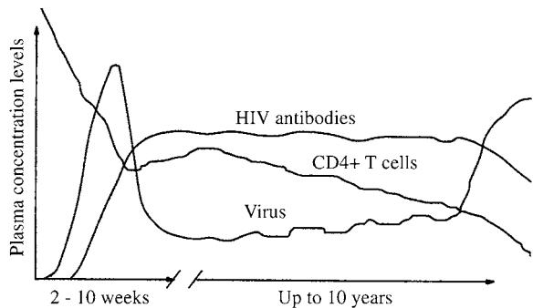

**Figure 10.4.** Schematic time course of a typical HIV infection in an infected adult. The viral concentration, the level of antibodies and the CD4 T-cells are sketched as a function of time. The early peak corresponds to the primary infection which leads to a period of latency. Note the typical gradual decline in the level of CD4 T-cells over the years. Eventually the symptoms of full-blown AIDS start to appear. (From Perelson and Nelson 1999 and reproduced with permission)

The level the virus falls to after the initial infection has been called the *set-point*. The viral concentration then seems to remain at a quasi-steady state level during which the concentration of CD4 T-cells measured in blood slowly declines. This period in which the virus concentration stays relatively constant but in which the T-cell count slowly falls is typically a period in which the infected person has no disease symptoms.

A key question then is what is going on during this asymptomatic period. Many believed that the virus was simply quiescent or latent during this period, as seen in other viral diseases, such as herpes. One method of determining whether or not the virus is active is to perturb the host–virus system during the asymptomatic period. In the mid-1990's work started on new antiretroviral drugs, the protease inhibitors. With their introduction it became possible to perturb the host–virus system during the asymptomatic period. In 1994, David Ho (Aaron Diamond AIDS Research Center) ran an experiment which examined the response of 20 patients infected with HIV to the protease inhibitor, ritonavir. The results were dramatic. Figure 10.5 shows the amount of virus measured in blood plasma fell rapidly once the drug was given. Alan Perelson (Los Alamos National Laboratory) and his colleagues then developed a model system which was applied to the patient data and estimations of crucial parameters were obtained. The work is reported in Ho et al. (1995).

Before discussing a model which includes protease inhibitor treatment, we first describe an early model by Anderson et al. (1986) for pedagogical reasons since it is a common way of constructing an epidemic model using a flow chart. It is much less specific and less directly related to current HIV thinking than the one we discuss below in relation to the data and qualitative behaviour of the virus as shown in Figures 10.4 and 10.5. A nice review of the state of AIDS modelling at the time is given by Isham (1988).

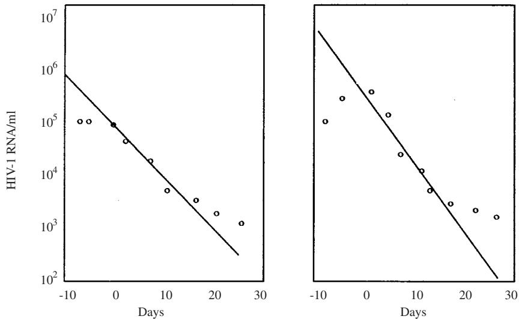

**Figure 10.5.** After treatment started at *t* = 0 with a protease inhibitor the plasma viral load declined rapidly. The data are from 2 of the 20 patients studied in Ho et al. (1995): all 20 patients exhibited similar rapid declines. (Reproduced with permission)

#### *Basic Epidemic Model for HIV Infection in a Homosexual Population*

Here we are interested in the development of an AIDS epidemic in a homosexual population. Let us assume there is a constant immigration rate *B* of susceptible males into a population of size *N*(*t*). Let *X*(*t*), *Y* (*t*), *A*(*t*) and *Z*(*t*) denote respectively the number of susceptibles, infectious males, AIDS patients and the number of HIV-positive or seropositive men who are noninfectious. We assume susceptibles die naturally at a rate µ; if there were no AIDS, the steady state population would then be *N*∗ = *B*/µ. We assume AIDS patients die at a rate *d*: 1/*d* is of the order of months to years, more often the latter. Figure 10.6 is a flow diagram of the disease on which we base our model.

As in previous models we consider uniform mixing. A reasonable first model system, based on the flow diagram in Figure 10.6, is then

$$\frac{dX}{dt} = B - \mu X - \lambda cX, \quad \lambda = \frac{\beta Y}{N},\tag{10.28}$$

$$\frac{dY}{dt} = \lambda cX - (v + \mu)Y,\tag{10.29}$$

$$\frac{dA}{dt} = pvY - (d + \mu)A,\tag{10.30}$$

$$\frac{dZ}{dt} = (1 - p)vY - \mu Z,\tag{10.31}$$

$$N(t) = X(t) + Y(t) + Z(t) + A(t). \tag{10.32}$$

Here *B* is the recruitment rate of susceptibles, µ is the natural (non-AIDS-related) death rate, λ is the probability of acquiring infection from a randomly chosen partner (λ =

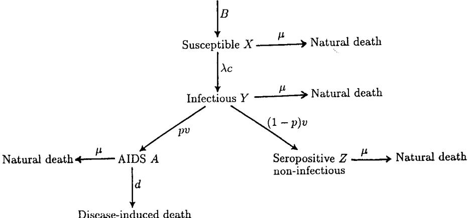

**Figure 10.6.** The flow diagram of the disease as modelled by the system (10.28)–(10.32). *B* represents the recruitment of susceptibles into the homosexual community. The rate of transferral from the susceptible to the infectious class is λ*c*, where λ is the probability of acquiring infection from a randomly chosen partner and *c* is the number of sexual partners. A proportion of the infectious class is assumed to become noninfectious with the rest developing AIDS. Natural (non-AIDS induced) death is also included in the model. Parameters are defined in the text.

β*Y*/*N*, where β is the transmission probability), *c* is the number of sexual partners, *d* is the AIDS-related death rate, *p* is the proportion of HIV-positives who are infectious and v is the rate of conversion from infection to AIDS here taken to be constant. 1/v, equal to *D* say, is then the average incubation time of the disease. (Actually λ here is more appropriately β*Y*/(*X* + *Y* + *Z*) but *A* is considered small in comparison with *N*.) Note that in this model the total population *N*(*t*) is not constant, as was the case in the epidemic models in Section 10.2. If we add equations (10.28)–(10.32) we get

$$\frac{dN}{dt} = B - \mu N - dA.\tag{10.33}$$

An epidemic ensues if the basic reproductive rate *R*0 > 1: that is, the number of secondary infections which arise from a primary infection is greater than 1. In (10.32) if, at *t* = 0, an infected individual is introduced into an otherwise infection-free population of susceptibles, we have initially *X* ≈ *N* and so near *t* = 0,

$$\frac{dY}{dt} \approx (\beta c - v - \mu)Y \approx v(R_0 - 1)Y\tag{10.34}$$

since the average incubation time, 1/v, from infection to development of the disease, is very much shorter than the average life expectancy, 1/µ, of a susceptible; that is, v µ. Thus the approximate threshold condition for an epidemic to start is, from the last equation,

$$R_0 \approx \frac{\beta c}{v} > 1.\tag{10.35}$$

Here the basic reproductive rate *R*0 is given in terms of the number of sexual partners *c*, the transmission probability β and the average incubation time of the disease 1/v.

When an epidemic starts, the system (10.28)–(10.32) evolves to a steady state given by

$$\begin{aligned} X^* &= \frac{(v+\mu)N^*}{c\beta}, \quad Y^* = \frac{(d+\mu)(B-\mu N^*)}{pvd} \\ Z^* &= \frac{(1-p)(d+\mu)(B-\mu N^*)}{pd\mu}, \quad A^* = \frac{B-\mu N^*}{d}, \\ N^* &= \frac{B\beta[\mu(v+d+\mu)+vd(1-p)]}{[v+\mu][b(d+\mu)-pv]}.\end{aligned} \tag{10.36}$$

If we linearise about this steady state it can be shown that (*X*, *Y*, *Z*, *A*) tends to (*X*∗, *Y* ∗, *Z*∗, *A*∗) in a damped oscillatory manner with a period of oscillation given in terms of the model parameters; the method to obtain this is exactly the same as described in Chapter 3 but the algebra is messy. With typical values for the parameters at the time (Anderson et al. 1986) the period of epidemic outbreaks was of the order of 30 to 40 years. It is unrealistic to think that the parameters characterising social behaviour associated with the disease would remain unchanged over that time span. The life expectancy of people with HIV has dramatically increased since then, due mainly of course, to new medicines such as AZT and protease inhibitors.

We can get some interesting information from an analysis of the system during the early stages of an epidemic. Here the population consists of almost all susceptibles and so *X* ≈ *N* and the equation for the growth of the infectious, that is, HIV-positive, *Y* -class is approximated by (10.34), the solution of which is

$$Y(t) = Y(0) \ e^{v(R_0 - 1)t} = Y(0) \ e^{rt},\tag{10.37}$$

where *R*0 is the basic reproductive rate, 1/v is the average infectious period and *Y* (0) is the initial number of infectious people introduced into the susceptible population. The intrinsic growth rate, *r* = v(*R*0 − 1), is positive only if an epidemic exists (*R*0 > 1). From (10.37) we can obtain the doubling time for the epidemic, that is, the time *td* when *Y* (*td* ) = 2*Y* (0), as

$$t_d = r^{-1} \ln 2 = \frac{\ln 2}{v(R_0 - 1)}.\tag{10.38}$$

We thus see that the larger the basic reproductive rate *R*0 the shorter the doubling time.

If we substitute (10.37) into equation (10.30) for the AIDS patients, we get

$$\frac{dA}{dt} = p v Y(0) \, e^{rt} - (d + \mu) A.$$

Early on in the epidemic there are no AIDS patients, that is, *A*(0) = 0, and so the solution is given by

$$A(t) = pvY(0)\frac{e^{rt} - e^{-(d+\mu)t}}{r+d+\mu}.$$

Estimates for the parameter *r* were calculated by Anderson and May (1986) from data from 6875 homosexual and bisexual men who attended a clinic in San Francisco over the period 1978 to 1985: the average value is 0.88 yr−1. Crude estimates (Anderson and May 1986, Anderson et al. 1986) for the other parameter values are *R*0 = 3 to 4, *d* + µ ≈ *d* = 1 − 1.33 yr−1, *p* = 10 to 30% (this is certainly very much higher), v ≈ 0.22 yr−1, *c* = 2 to 6 partners per month. With these estimates we then get an approximate doubling time for the HIV-positive class as roughly 9 months.

Numerical simulations of the model system of equations (10.28)–(10.31) give a clear picture of the epidemic development after the introduction of HIV into a susceptible homosexual population. Figure 10.7 shows one such simulation: the model predicts that HIV incidence reaches a maximum around 12 to 15 years after the introduction of the virus into the population. It should be kept in mind that this is an early (and now more a pedagogical) model. It is interesting to compare these predictions of the mid-1980's with the situation in 2000.

In spite of the simplicity of the models, the results were in line with observation in homosexual communities. More realistic, and not always more complex models, have

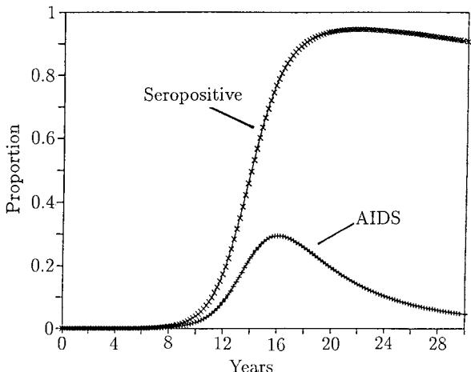

**Figure 10.7.** Numerical solution of the model system (10.28)–(10.31) with initial conditions *A*(0) = *Z*(0) = 0, *S*(0) + *Y* (0) = *N*(0) = 100,000. Parameter values: *B* = 13333.3 yr−1, v = 0.2 yr−1, µ = (1/32) yr−1, *d* = 1 yr−1, *p* = 0.3, the basic reproductive rate of the epidemic *R*0 ≈ β*c*/v = 5.15. The graphs give the proportion of those HIV-positive (seropositive) and the proportion who develop AIDS. (After Anderson et al. 1986)

been proposed such as those discussed below. A review of some of the current mathematical models for the transmission dynamics of HIV infection and AIDS is given by Perelson and Nelson (1999). With the accumulation of more data and information of the epidemic, even more sophisticated models will no doubt be required in the normal progression of realistic modelling. A practical use of good models at any stage is that, among other things, it poses questions which can guide data collection and focus on what useful information can be obtained from sparse or less than complete data. Estimates of epidemic severity doubling time, and so on, are in themselves of considerable interest and use. The model here is for a homosexual population. Now that the epidemic is very much heterosexual other models are required. The approach described here is a reasonable starting point. The models we now discuss take a very different approach to HIV infection in that we deal with the actual viral population and not human populations. As such they can be more closely tied to *in vivo* data.

### **10.6 HIV: Modelling Combination Drug Therapy**

This section is in part based on the work of Nelson (1998). We start with the simple, but experimentally based model, proposed by Perelson et al. (1996). We then develop a more complex nonlinear model which includes treatment for HIV infection with a protease inhibitor and a reverse transcription inhibitor such as AZT.

The Ho et al. (1995) model was a simple linear first-order equation which accounted for viral production and viral decline; namely,

$$\frac{dV}{dt} = P - cV,\tag{10.39}$$

where *P* represented a source of viral peptides and *c* was the viral clearance rate. While many factors play a role in the clearance of viral peptides such as immune cells, fluid flow and absorption into other cells, *c* did not distinguish between them. After introduction of the protease inhibitor (the specific type of drug used on the patients) it was assumed that the drug would be completely effective, or in other words, the drug would block all viral production after being introduced. Hence *P* = 0, and we are left with the simple equation

$$\frac{dV}{dt} = -cV \Rightarrow V(t) = V_0 e^{-ct},\tag{10.40}$$

where *V*0 is measured as the mean viral concentration in the plasma before treatment. Plotting ln *V* against *t* and using linear regression to determine the slope (see Figure 10.5) gave an estimate for *c* and hence for the half-life of the virus in the plasma; namely, *t*1/2 = ln 2/*c*. The mean for the half-life was *t*1/2 = 2.1 ± 0.4 days; see Ho et al. (1995) for the complete data. The experimentalists then assumed that the patients were in a quasi-steady state before treatment: that is, the levels of viral load measured in the plasma remained fairly constant. With this assumption, and knowing the value for *c* and the initial viral concentration, *V*0, they were able to compute the viral production before therapy by solving *P* = *cV*. While these results were minimal estimates, based on the assumption of a perfect drug (with no delays), they still provided an estimate of over 1 billion viral particles being produced daily. This important result was contrary to the belief that the viral dynamics during this latent period was close to dormant.9 It is an excellent example where even simple, mathematically trivial, models can be of immense help in extracting crucial information from patient data. Another example which changed the way patients with liver disease were assessed for (toxic) medication levels is given in Connor et al. (1982a,b).10

Due to these results of Ho et al. (1995) many more models have been developed to study the HIV; see Perelson and Nelson (1999) for a comprehensive review. In the rest of this section we examine several models, in particular one which looks at combination drug therapy and briefly discuss another which includes a delay.

Protease inhibitors are drugs which target the protease enzymes in the cell and cause newly produced viruses to be noninfectious. To date there is no single drug (nor even a combination of them) which completely kills the HIV infection because of the ability of the virus to mutate into a drug resistant form. It takes time, however, for a

<sup>9</sup>This result, based on an incredibly simple mathematical model, did much to boost the usefulness of mathematical models in the medical community, a consequence of which is that many more laboratories are now looking for theoreticians to help in the modelling process.

<sup>10</sup>The model consisted of a two-compartment model which results in a pair of coupled linear ordinary differential equations which can be solved simply analytically with patient-based initial conditions. I set it as a modelling exercise for first-year mathematics students in Oxford but the question was not well described so it was not clear exactly what was required. One of the college tutors, dealing with the difficulties his students were having in understanding what was both going on and required, said I must have done it deliberately to simulate what it was like talking to doctors.

new form to evolve. The idea behind combination drug treatment is when the virus is presented with two quite different antiviral drugs the time it takes for a mutiple-drug resistant strain to emerge is much longer than if the virus had to contend with only one toxic drug. This is also discussed in the paper by Perelson and Nelson (1999). The use of multiple drug treatments, such as protease inhibitors together with AZT, has already had a major effect (in the devloped world) in significantly slowing down the progression from HIV infection to full-blown AIDS. It has not, however, effected a cure for the disease. Already there is reemergence of drug-resistant strains of HIV in homosexuals in San Francisco who have been taking the combination drug cocktail.

We consider each drug to be less then perfect, which thus allows for viral mutation to a resistant form if administered independently. Let *n p* be a measure of the effectiveness of a protease inhibitor or combination of protease inhibitors in blocking production of infectious virions so this will affect the viral dynamics directly and the T-cells indirectly. Other commonly used drugs are reverse transcriptase inhibitors, of which AZT is perhaps the best known. After the development of the protease inhibitors, a combination, or cocktail, therapy which included multiple drugs was prescribed. For instance, patients would take a combination of three drugs made of up of a protease inhibitor and two reverse transcriptase inhibitors. This combination was dramatic initially in reducing the number of viral peptides detectable in the patient and it was thought that this might be the cure for the AIDS virus. Unfortunately, with a virus as complex as the HIV it was only a matter of time before the emergence of resistant viruses. While the combination treatment is still showing promise for prolonging the lives of infected patients, it is too early (2001) to say whether or not the virus is even permanently controlled, far less cured.

We develop a four-species model which includes an equation for uninfected T-cells, *T* , productively infected T-cells, *T* ∗ (not all infected T-cells produce the virus), infectious viruses, *VI* and noninfectious viruses, *VN I* . The model consists of the following equations which we motivate in turn below.

$$\begin{split} \frac{dT}{dt} &= s + pT(1 - \frac{T}{T_{\text{max}}}) - d_{T}T - kV_{I}T, \\ \frac{dT^{\star}}{dt} &= (1 - n_{rl})kV_{I}T - \delta T^{\star}, \\ \frac{dV_{I}}{dt} &= (1 - n_{p})N\,\delta T^{\star} - cV_{I}, \\ \frac{dV_{NI}}{dt} &= n_{p}N\,\delta T^{\star} - cV_{NI}. \end{split} \tag{10.41}$$

In the T-cell equation we consider the cells to be destroyed proportional to the number of infected viruses and cells with clearance parameter *k*. In the absence of infection there is a nonzero steady state, *Ts*1, so we have a quadratic polynomial in *T* for the uninfected T-cell dynamics: *s*, *p*, *T*max, *dT* and *k* are positive constants. The specific form of the T-cell kinetics, namely, with a logistic form plus another source (*s*) and a clearance term (−*dT T* ), is because of the form of T-cell recovery after therapy as indicated by patient data. With the reverse transcriptase (RT) drug like AZT, the RT-inhibitor acts on the source term for productively infected T-cells with 0 ≤ *nrt* ≤ 1 the measure of its efficacy; if *nrt* = 1 it is completely effective and prevents all production of infected T-cells while if *nrt* = 0 it implies no RT-inhibitor is given. In the *T* ∗ equation the effect of the RT-inhibitor is to reduce the production of the infected cells. These cells also have a natural death with a rate parameter, δ. The protease inhibitor acts on the source of the virus and so appears in the *VI* equation with *n p* a measure of its efficacy. The specific appearance in the equations for the effects of the drugs is due to the cellular mechanisms of each drug and the stage at which they aim to target during infection. When a drug is completely effective we set *n p* = 1 or *nrt* = 1. In the infected virus *VI* equation there is a factor *N* which is the bursting parameter for the viral production after lysis (essentially the breaking up, or death, of the cell due to its penetration by the infected virus and subsequent generation of a large number of viruses); it is of the order of 480 virions/cell (a virion is a complete virus with all its coating, proteins and so on). The infected viruses are considered to die naturally at a rate *c*. Finally the noninfectious viruses are produced with a rate dependent on the protease drug and we assume they die off at the same rate as the infected ones. This model lets us explore the effect of the drugs on the HIV by varying, in particular, the parameters *nrt* and *n p*. For example, if *n p* = 0 we are using only the reverse transcriptase, or RT-inhibitors. We now analyse this system in several ways and compare the results with patient data.

Some idea of the values of the dependent variables are (from Ho et al. 1995): *T* ∼ 180 cells/mm3, *T* ∗ ∼ 2% T-cells, *VI* ∼ 134×103 virions/ml, *VN I* = 0 virions/ml. Available parameter estimates are: the viral activity rate *k* ∼ 3.43×10−5 virions/ml (Ho et al. 1995), death rate of infected cells δ ∼ 0.5/day (Perelson et al. 1996), viral production by the bursting cell *N* ∼ 480 virions/cell (Perelson et al. 1996), clearance rate of the virus *c* ∼ 3/day (Perelson et al. 1996), T-cell source *s* = 0 − 10 cells/mm3/day (Kirschner and Webb 1996) and death rate of targeted cells *dT* ∼ 0.03/day (McLean and Mitchie 1995).

#### *T-Cell Recovery*

Some models have assumed that the T-cells do not change dynamically during the first weeks of treatment and hence set *T* = constant = *T*0. However, after antiretroviral therapy is initiated some recovery of T-cells is observed and patient data presented by Ho et al. (1995) suggest that over a period of weeks the recovery of T-cells can be described by either a linear or exponential function of time, with no statistically significant difference between the two functions over that time period. After therapy is initiated *VI*(*t*) falls rapidly. For a perfect protease inhibitor, namely, *n p* = 1, the solution of the fourth equation of (10.41) is *VI*(*t*) = *V*0*e*−*ct* and so after a few days (depending on *c* of course) the term −*kVI T* could be negligibly small in the equation for T-cells. T-cell replacement can be due to the source *s*, which incorporates the generation of new cells in the thymus, their export into the blood and the transport of already created T-cells in tissues to the blood, or to proliferation of cells. It was previously thought that the adult thymus no longer produced T-cells but with the significant advances in the study of HIV dynamics some believe this to be incorrect. If the source *s* is the major mechanism of T-cell replacement, we can then approximate the T-cell dynamics by

$$\frac{dT}{dt} = \mathbf{s} - d_T T \quad \text{or} \quad T(t) = T_0 + at, t$$

where *a* is a rate constant.

If we now consider the effect of only protease inhibitor drugs, that is, *nrt* = 0, which relates directly to the patient data of Ho et al. (1995), and further assume the above linear T-cell growth in line with the patient data, (10.41) become

$$\begin{aligned} \frac{dT^\star}{dt} &= kV_I(T_0 + at) - \delta T^\star, \\ \frac{dV_I}{dt} &= (1 - n_p)N\,\delta T^\star - c\,V_I, \\ \frac{dV_{NI}}{dt} &= n_p N\,\delta T^\star - c\,V_{NI}, \end{aligned} \tag{10.42}$$

which is a nonautonomous system but which can be trivially made into one. To do it we simply replace the *T*0 + *at* in the first equation by *T* and add to the sytem the differential equation *dT*/*dt* = *a* with initial condition *T* (0) = *T*0. Typical solutions of this system are shown in Figure 10.8 with the estimated parameter values given in the legend. In Figure 10.9 we show how the solutions compare with specific patient data. The comparison is quantitatively very good.

We now consider the full nonlinear model given by (10.41), which, as is easily shown, has two steady states one of which is the noninfected steady state (*Ts*1, 0, 0, 0) with preinfected T-cells; we are only interested in *Ts*1 ≥ 0 of course. A little algebra shows that this uninfected state is

$$T_{s1} = \frac{T_{\text{max}}}{2p} \left[ (p - d_T) + \sqrt{(p - d_T)^2 + \frac{4sp}{T_{\text{max}}}} \right]. \tag{10.43}$$

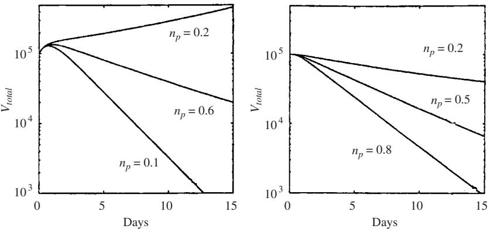

**Figure 10.8.** Solutions for the total virus population, *VI* + *VN I* , of the system (10.42) which assumes linear T-cell growth *T* (*t*) = *T*0 + *at* and monotherapy with a protease inhibitor; that is, there is no AZT-like drug so *nrt* = 0. Note the change in viral output as a function of the level of drug effectiveness. (**a**) The viral decay assuming a pretreatment steady state value with *c* = *NkT*0 and varying *n p*. (**b**) Viral decay after treatment without a pretreatment value for *c*: the critical efficacy here is *nc* = 0.33. Parameter values: *N* = 480, *k* = 3.43 × 10−5/day, δ = 0.43/day, *T*0 = 180, *a* = 1 cells/day, *c* = 2/day. (From Nelson 1998)


**Figure 10.9.** Solutions for the total virus population, *V* = *VI* + *VN I* , plotted in terms of the RNA, of the system (10.42), which assumes constant T-cell growth and monotherapy with a protease inhibitor and their comparison with three patient data of Ho et al. (1995). These are typical of the other patients. The parameters for each patient were obtained from a best fit using figures equivalent to those in Figure 10.5. Parameter values: δ = 0.5/day then, patient 104: *T*0 = 2 mm−3, α = 1.5, *V*(0) = 52 × 103, *c* = 3.7/day, total viral production rate: *P* = 2.9 × 109/day; patient 105: *T*0 = 11 mm−3, α = 10.18, *V*(0) = 643 × 103, *c* = 2.1/day, total viral production rate: *P* = 32.1 × 109/day; patient 107: *T*0 = 412 mm−3, α = 2.64, *V*(0) = 77 × 103, *c* = 3.1/day, total viral production rate = 3.0 × 109/day. (From Perelson and Nelson 1999 and reproduced with permission)

We are interested in the stability of this steady state if perturbed with the introduction of HIV. We examine the stability in the usual way, exactly as we did, for example, in Chapter 3 by looking at the eigenvalues of the perturbed linear system. After somewhat more algebra we find the eigenvalues are

$$
\lambda_1 = p \left( 1 - \frac{2T_{s1}}{T_{\text{max}}} \right) - d_T, \quad \lambda_4 = -c,
$$

$$
\lambda_{2,3} = -\frac{c+\delta}{2} \pm \frac{1}{2} \sqrt{(c+\delta)^2 - 4c\delta + 4\delta NkT_{s1}(1-n_c)}\tag{10.44}
$$

$$
n_c = 1 - (1 - n_{rl})(1 - n_p),
$$

where *nc* represents the effectiveness of the combination treatment. For stability we require the eigenvalues to be negative; they are all real here. The only non obvious negative eigenvalues are λ1, which requires *Ts*1 > (1/2*p*)(*p* − *dT* )*T*max, a condition that is obviously satisfied from (10.43), and λ2. The eigenvalue λ2 < 0 is satisfied if

$$
\lambda_2 = -\frac{c+\delta}{2} + \frac{1}{2}\sqrt{(c+\delta)^2 - 4c\delta + 4\delta N k T_{s1} (1 - n_c)} < 0;
$$

that is,

$$c + \delta > \sqrt{(c + \delta)^2 - 4c\delta + 4\delta NkT_{s1}(1 - n_c)}.$$

So, the uninfected steady state is stable if

$$n_c = 1 - (1 - n_p)(1 - n_{rl}) < \frac{c}{NkT_{s1}} \Rightarrow n_c > 1 - \frac{c}{NkT_{s1}}.\tag{10.45}$$

This means that if the drug treatment is strong enough the virus will be eliminated. (Actually, the virus is never eliminated but it does fall below detectable levels.) We can estimate the required effectiveness of treatment from this condition. Under the assumption of a pretreatment steady state, with *T* = *T*0, the second and third of (10.41) imply *c* = *NkT*0. By way of example, if we set *nrt* = 0, the stability condition (10.45) then becomes

$$n_p > 1 - \frac{T_0}{T_{s1}}.$$

Healthy individuals have T-cell counts of about 1000/mm3 so we can assume *Ts*1 = 1000. Hence for a patient with a pretreatment T-cell count of say, *T*0 = 200, we find *n p* needs to be greater than 0.8. For a less advanced patient with a T-cell count of *T*0 = 500, *n p* need only be greater than 0.5. Thus, this analysis supports the notion that patients should be started on antiretroviral drug therapy as early as possible (Perelson and Nelson 1999). On the other hand if we have both drugs administered the condition is then

$$(1 - n_p)(1 - n_{rl}) < 1 - \frac{T_0}{T_{s1}}$$

and with *T*0 = 200 we need only have, for example, an efficacy of 0.55 for each of *n p* and *nrt* .

The second steady state, the infected steady state, is obtained, after some algebra, from (10.41) as

$$\begin{aligned} T_{s2} &= \frac{c}{Nkn_c}, \quad \bar{V}_I = \frac{s}{kT_{s2}} + \frac{1}{k} \left[ p \left( 1 - \frac{T_{s2}}{T_{\text{max}}} \right) - d_T \right], \\ \bar{T}^\star &= \frac{c\bar{V}_I}{\delta N (1 - n_p)}, \quad \bar{V}_{NI} = \frac{n_p \bar{V}_I}{1 - n_p}, \end{aligned}$$

where overbars denote steady state quantities and as before *nc* = (1 − *nrt*)(1 − *n p*). In the absence of treatment, *nc* = 1 but here we are concerned with studying the effects of less than perfect drugs so 0 < *nc* < 1.

This steady state is relevant only if *V*¯*I* > 0; that is,

$$
\frac{s}{T_{s2}} + p - d_T - p \frac{T_{s2}}{T_{\text{max}}} > 0. \tag{10.46}
$$

If the inequality (10.46) is replaced by an equality and the equation *V*¯*I* = 0 solved for *Ts*2, we obtain an expression identical to the expression for *Ts*1. Thus, at *V*¯*I* = 0 the uninfected and infected steady states merge. Further, as *Ts*2 decreases the left-hand side of (10.46) increases. So, for *V*¯*I* > 0, an infected steady state exists, 0 < *Ts*2 < *Ts*1, which of course makes biological sense since in the infected steady state the system should have fewer T-cells than in the uninfected state.

Substituting the expression for *Ts*2 into the steady state equation for *VI* gives a necessary condition for the infected steady state to exist; namely,

$$\bar{V}_I = \frac{sN(1 - n_c)}{c} + \frac{1}{k} \left[ p \left( 1 - \frac{c}{NkT_{\text{max}}(1 - n_c)} \right) - d_T \right] > 0. \tag{10.47}$$

If we look at a limiting case where *s* = 0, from (10.47), certainly if

$$Nk < \frac{c}{T_{\text{max}}(1 - n_c)} \Rightarrow V_I < 0.$$

Let us now consider the stability of this infected steady state by calculating the eigenvalues. The Jacobian matrix, evaluated at the infected steady state, is

$$
\begin{pmatrix}
p(1 - \frac{2\bar{T}}{T_{\text{max}}}) - d_T - k\bar{V}_I & 0 & -k\bar{T} & 0\\ (1 - n_{\text{rel}})k\bar{V}_I & -\delta & (1 - n_{\text{rel}})k\bar{T} & 0\\ 0 & \delta N(1 - n_P) & -c & 0\\ 0 & \delta N n_p & 0 & -c\end{pmatrix},
$$

where *T*¯ = *Ts*2.

The characteristic equation immediately gives one eigenvalue as λ4 = −*c* < 0. The other three eigenvalues, λ, are determined by solving the cubic

$$\begin{cases} p\left(1 - 2\frac{\bar{T}}{T_{\text{max}}}\right) - d_T - k\bar{V}_I - \lambda \left[ (c + \lambda)(\delta + \lambda) - k\bar{T}\delta N(1 - n_c) \right] \\ - k\bar{V}_I k\bar{T}\delta N(1 - n_c) = 0 \end{cases}$$

which, using the steady state value for *T*¯, simplifies to

$$\left[p\left(1-\frac{2\bar{T}}{T_{\text{max}}}\right)-d_T-k\bar{V}_I-\lambda\right]\left[\lambda^2+(\delta+c)\lambda\right]-kc\delta\bar{V}_I=0;$$

that is,

$$
\lambda^3 + A\lambda^2 + B\lambda + C = 0,
$$

where

$$\begin{aligned} A &= \delta + c + \frac{2p\bar{T}}{T_{\text{max}}} - (p - d_T) + k\bar{V}_I, \\ B &= (\delta + c) \left[ \frac{2p\bar{T}}{T_{\text{max}}} - (p - d_T) + k\bar{V}_I \right], \quad C = c\delta k\bar{V}_I. \end{aligned}$$

We do not need the actual expressions for the eigenvalues, only the sign of their real part. The Routh–Hurwitz conditions (see Appendix B) state that, if *A* > 0, *C* > 0 and *AB* − *C* > 0 then the eigenvalues have negative real parts. By inspection, *C* > 0. At steady state,

$$s + (p - d_T)\bar{T} - \frac{p\bar{T}^2}{T_{\text{max}}} = k\bar{V}_I\bar{T}_{..}$$

Since *s* > 0,

$$(p - d_T)\bar{T} - \frac{p\bar{T}^2}{T_{\text{max}}} < k\bar{V}_I\bar{T}$$

or

$$p - d_T < \frac{p\bar{T}}{T_{\text{max}}} + k\bar{V}_I,$$

from which it follows that *A* > 0. The remaining condition necessary for stability of the infected steady state is *AB* − *C* > 0. Let us write *A* = (δ + *c* + *B*1) with *B*1 defined by the expression for A and note that *B* can then be written as *B* = (δ + *c*)*B*1. Exploiting this form and noting that *B*1 contains the term *kV*¯*I* , it can then be simply shown that *AB* = *B*1(δ + *c*)2 + *B*2 1 (δ + *c*)>δ*ckV*¯*I* = *C*. Hence the infected steady state, if it exists, is stable.

As noted above if the infected steady state exists, *Ts*2 < *Ts*1, which we can rewrite as

$$c < NkT_{s1}(1 - n_c).$$

To summarise, if *c* > *NkTs*1(1 − *nc*) then the only nonnegative steady state is the uninfected steady state and it is stable. Conversely, if *c* < *NkTs*1(1 − *nc*) then the uninfected state is unstable and the infected state exists and is stable. This is equivalent to saying that there is a transcritical bifurcation when *c* = *NkTs*1(1 − *nc*). We can express these conditions in a different way in terms of the model parameters. The critical treatment efficacies, for example, are related to the model parameters by

$$\left[ (1 - n_p)(1 - n_{rl}) \right]_{\text{critical}} = \frac{c}{2skN} \left[ \sqrt{(p - d_T)^2 + \frac{4sp}{T_{\text{max}}}} - (p - d_T) \right]. \tag{10.48}$$

### **10.7 Delay Model for HIV Infection with Drug Therapy**

We now touch on some recent work in which a discrete delay is added to the model to account for the time lag between the time a cell becomes infected and the time at which the infected cell starts producing virus. Work in this area has shown that including a delay of this form affects the estimated values derived from kinetic experiments for the half-life of productively infected cells and viruses. Here we only give a very brief description of the current work with delay models.

#### *Time Lags in the HIV Infection Process*

The virus life cycle plays a major role in disease progression during HIV infection. The binding of a viral particle to a receptor on the CD4 T-cell, or other targeted cell, begins a chain of events that can eventually lead to the CD4 T-cell becoming productively infected, that is, producing new viruses. Most previous models consider this process to occur instantaneously. In other words, it is assumed that as soon as virus contacts a targeted cell the cell begins producing viruses. However, biologically there is a measurable time delay between initial viral entry into a cell and subsequent viral production. Recently there have been models which examine this effect and they have shown that this delay needs to be taken into account to determine accurately the half-life of a free virus from drug perturbation experiments. If the drug is assumed to be completely efficacious, the delay does not affect the estimated rate of decay of viral producing T-cells (Herz et al. 1996, Mittler et al. 1998, 1999). If the assumption of the drug being completely effective is not assumed (to date no drug is 100% effective) the introduction of the delay then affects the estimated value for the infected T-cell loss rate (Nelson 1998, Nelson et al. 2000).

Such a delay model, based on the one in the last section, is given and discussed in detail by Nelson et al. (2000). In it we incorporate the intracellular delay by considering the generation of virus-producing cells at time *t* to be due to the infection of targeted cells at time *t* − τ , where the delay, τ , is taken to be a constant. Of course in reality the delay is a distributed function (refer to Chapter 1). We also assume uninfected T-cells remain constant; that is, *T* = *T*0. Model equations describing this scenario are (compare with (10.41))

$$\begin{aligned} \frac{dT^\star}{dt} &= kT_0 V_I (t - \tau) - \delta T^\star, \\ \frac{dV_I}{dt} &= (1 - n_p) N \delta T^\star - cV_I, \\ \frac{dV_{NI}}{dt} &= n_p N \delta T^\star - cV_{NI}, \end{aligned} \tag{10.49}$$

where the term *VI*(*t*−τ) allows for the time delay between contact and viral production. The average life span of a virus is 1/δ. With delay we are saying that the average life span of a cell from time of infection to death is τ +(1/δ). We do not have a precise value for τ but estimates of 1 to 1.5 days (Perelson et al. 1996, Mittler et al. 1998, 1999). So, to a first approximation, T-cells infected with HIV-1 might live on average 2 to 3 days rather an average of 1 to 2 days. The rate constant for infection, *k*, is assumed constant because the drug we are modelling, namely, a protease inhibitor, does not affect *k*. If a reverse transcriptase inhibitor were being used then the appropriate model would have *k* in the *dT* /*dt* equation replaced by [1−*nrt*(*t* −τ)]*k*(*t* −τ). Here the *VN I* equation is uncoupled from the *T* ∗ and *VI* equations and so can be solved independently once the solution for the first two equations is known. Analysis of a more general form of this delay model, which included uninfected T-cells and nonlinearities are given in Nelson (1998). The method of analysis is similar to that discussed in detail in Chapter 7.

This model has been used, among other things, to analyze the change in parameters associated with the decay rate seen in data from patients undergoing antiviral treatment. It has also helped in getting better estimates for crucial parameters from patient data. The main conclusions from the analysis of the model, with experimentally estimated parameters, is that when the drug efficacy is less than 100%—the case *in vivo* at present—the rate of decline of the virus concentration in the plasma primarily depends on the efficacy of the therapy, the death rate of the virus producing cells and the length of the delay. These are all to be expected. The main point of the model and its analysis is that the results quantify these effects in terms of the measurable (and experimentally changeable) parameters.

### **10.8 Modelling the Population Dynamics of Acquired Immunity to Parasite Infection**

Gastrointestinal nematode parasite infections in man are of immense medical importance throughout the developing world. An estimated 800 to 1000 million people are infected with *Ascaris lumbricoides*, 700 to 900 million with the hookworms *Ancyclostoma duodenale* and *Nector americanus* and 500 million with the whipworm *Trichuris trichiura* (Walsh and Warren 1979). To design optimal control policies, we must have an understanding of the factors which regulate parasite abundance and influence the size and stability of helminth populations. So, in this section we present a model for the immunological response by the host against gastrointestinal parasites which was proposed and studied by Berding et al. (1986). We show that such relatively simple modelling can have highly significant implications for real world control programmes.

Parasites invoke extremely complex immunological responses from their mammalian hosts. We still do not know exactly how these come about but current experimental research provides some important pointers which form the basis for the mathematical model. Also the modelling in this section demonstrates how to determine some of the parameter estimates from a combination of theory and experiment which would be difficult to obtain from experiment alone.

Let us first summarise the relevant biological facts starting with a brief review of key experiments. Laboratory experiments in which mice are repeatedly exposed to parasite infection at constant rates can provide a suitable test for mathematical models of helminth population dynamics. Experiments relevant for our model (Slater and Keymer 1986) involve two groups of 120 mice, which are fed on artificial diets containing either 2% ('low protein') or 8% ('high protein') weight for weight protein. Both groups were subdivided into 4 groups of 30 mice, which we denote by (*a*), (*b*), (*c*) and (*d*), which were subjected to repeated infection with larvae of the nematode *Heligmosoides polygyrus*. The subgroups were infected at different rates: group (*a*) with 5 larvae/mouse/two weeks, group (*b*) with 10 larvae/mouse/two weeks, group (*c*) with 20 larvae/mouse/two weeks and group (*d*) with 40 larvae/mouse/two weeks. So, we have a total of 8 subgroups of 30 mice differing either in their infection rates or in the protein diets they were fed on. It is known that protein deprivation impairs the function of the immune system so this scheme lets us compare parasite population dynamics, under various infectious conditions, in the presence and the absence of an acquired immune response.

The most important experimental observations were the temporal changes in the mean worm burden, *M*, namely, the total number of adult worms divided by the total number of hosts. Every two weeks throughout the experiment a sample of 5 mice from each group was examined for the presence of adult parasites. The number of parasites present in each mouse was determined by postmortem examination of the small intestine. The main experimental results are shown in Figure 10.10 which displays the mean

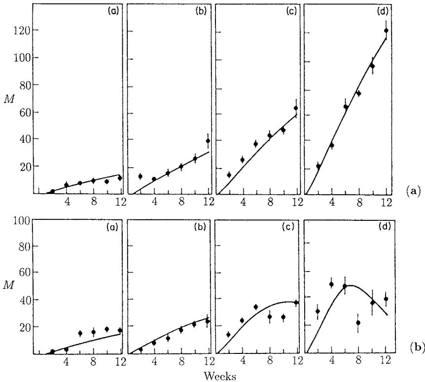

**Figure 10.10.** Change in mean adult worm burden, *M*, in mice hosts fed on a protein diet for a repeated infection over a 12-week period: (**a**) low protein diet; (**b**) high protein diet. The infection rates are (*a*) 5, (*b*) 10, (*c*) 20, (*d*) 40 larvae/mouse/2 weeks. The periods are the experimental points from Slater and Keymer (1986). The continuous lines are solutions of the mathematical model; how these were obtained is described in the text in the subsection on the population dynamics model and analysis. (From Berding et al. 1986)

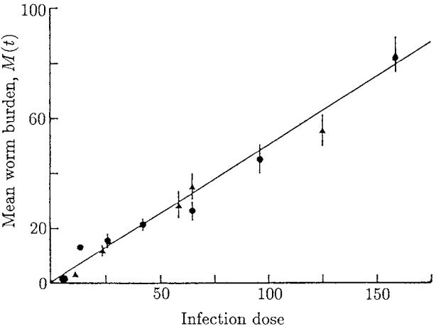

**Figure 10.11.** These experimental results show the worm survival after a single infection of larvae. There is a linear relationship between larval dose and adult worm burden; these results are after 14 days from the infection. The circles represent mice fed on a low protein diet and the triangles are for mice fed on a high protein diet. The solid line is a best fit linear description of the data; the gradient is 0.64, from which we deduce that 64% of the larvae survive. (From Berding et al. 1986)

worm burden as a function of time for the low and the high protein groups, respectively. The letters (a), (b), (c) and (d) refer to infection rates of 5, 10, 20 and 40 larvae per two weeks.

Other experiments were carried out to quantify parasite establishment and survival in primary infection. Here only a single dose of larvae was given unlike the repeated infection in Figure 10.10. The results shown in Figure 10.11 give the mean worm burden as a function of the infection dose. From this figure we estimate that approximately 64% of the infective larvae survive to become adult worms.

The survival of adult worms in a single infection is summarised in Figure 10.12: it again shows the mean worm burden as a function of time. In this situation the worm population remains free from effects of the host's immune system: we use this figure to estimate the natural death rate of the adult worms.

So as to be able to construct a realistic model, let us summarise these and related experimental observations.

- **(A1)** Infective parasite larvae, after ingestion by the host, develop into tissue dwelling larvae which become adult worms found within the lumen of the alimentary canal. This invokes a distinct immunological response from the host. Typically, the tissue dwelling larvae are in the most immunogenic stage in the parasite life cycle. We thus assume that the immune system is triggered according to the larval burden experienced by the host.
- **(A2)** Many experiments point to the presence of delay, that is, memory, effects in immune response. Some of these effects can be accounted for by including delay in the models.

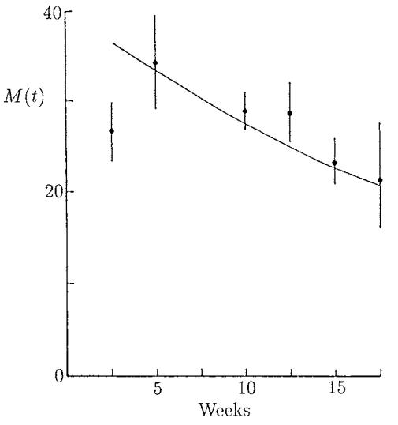

**Figure 10.12.** Survival of adult worms which follows a single infection of 50 larvae/mouse on day zero. The results are for mice fed on a low protein diet. The continuous line is a best fit for an exponential survival model with a constant death rate δ = 5.6 × 10−3 day−1: that is, we assume the worms die proportional to their mean population (see equation (10.53) below). (From Berding et al. 1986)

- **(B1)** The experimental results shown in Figure 10.10 suggest, importantly, that the strength of the immune response is very much dependent on the nutritional status of the host. We interpret the differences in the dynamics of infection in mice feeding on low and high protein diets, that is, Figures 10.10(a) and (b) respectively, as a consequence of a relationship between the nutritional status and immunological competence.
- **(B2)** The similarity between Figures 10.10(a) (a),(b) and Figures 10.10(b) (a),(b) and the differences between Figures 10.10(a) (c),(d) on the one hand and Figures 10.10 (b),(c),(d) on the other, clearly indicate a threshold behaviour of the immune system. Biologically this means that the full activation of the immune system requires a certain threshold of exposure to parasite infection.
- **(B3)** Available evidence on the effectiveness of the immune response, which we define here as the per capita rate of limitation in parasite establishment and survival, in relation to its stimulus, that is, increased exposure to infection, suggests the following scenario. After an initial increase, the activity of the immune response to the parasites saturates at a maximum level. Further stimulation does not seem to increase the subsequent effectiveness of acquired immunity. So, we assume here that the activity of immune response saturates at a defined maximum level.
- **(C)** The immunological response may act against several stages in the parasite life cycle. In some strains of mice it directly kills tissue-dwelling larvae. However, in others the immune response is not capable of preventing larval development. In these, larvae subjected to immunological attack emerge as stunted adults, with a correspondingly high mortality rate. So, to reflect these experimental findings we model immunological competence by an increased mortality rate of the adult parasite.

Let us now construct the model on the basis of these assumptions, all firmly based on experimental observations, in the following three main steps.

- **(i)** We introduce a variable, *E*, for the immune system, which takes into account assumptions (A1) and (A2), by

$$E = \int_{t-T}^{t} L(t') \, dt',\tag{10.50}$$

where *L*(*t*) denotes the mean number of tissue-dwelling larvae in a host at time *t* with *T* the time-span over which the immune system retains memory of past infections. So, *E* is a measure of the number of larvae in the host during the time interval (*t* − *T*,*t*). Note that with the form (10.50) different situations (for example, a small infection persistent for a long time and a large infection persistent for a short time) can lead to the same values of *E*.

- **(ii)** To account in a simple way for the biological facts in (B1) through (B3) we introduce an expression to describe the immune system's activity; namely,

$$I \equiv I_{\alpha\beta}(E) = \frac{\alpha E^2}{\beta + E^2},\tag{10.51}$$

where *E* is the input variable (10.50), α is the maximum functional activity of the host's immune response and β provides a measure of the sensitivity of the immune system. (Recall the predation response in the budworm model dynamics in Chapter 1.) According to (B1), α also reflects the nutritional status of the host being considered; we can think of α as a monotonic increasing function of the nutritional status. β also may be host specific since it seems likely that β also has a direct biological interpretation in genetic terms since different strains of mice differ in their immune response against parasitic infections.

- **(iii)** Finally we have to incorporate (10.50) with (10.51) into a dynamical model for the complete host–parasite community. According to assumption (C), and independent of the specific dynamical situation under consideration, the activity of the host's immune system simply leads to an increase in the mortality of the adult parasites. This requires an additional loss term in the dynamical equations for the mean worm burden, *M*(*t*), of the form −*I M*(*t*) < 0, where *I*, the strength of immunological response, plays the role of a death rate for parasites; it depends on the level of infection.
#### *Population Dynamics Model and Analysis*

From the above, mice fed on low protein diets appear to have little or no immune response; we refer to these as the low protein diet group (LPG) and investigate the dynamics of their mean worm burden by a simple immigration–death model. On the other hand, hosts feeding on a high protein diet are expected to show an immune response.

#### *Low Protein Model*

Let us start by considering the parasite dynamics of the LPG. The parasites, harboured by a host population of constant size, are subdivided into two categories: larvae in the wall of the small intestine, and adult worms in the gut lumen. We model the dynamics of the mean number of larvae, *L*, per host by

$$\frac{dL}{dt} = \lambda_i - \mu DL, \quad i = 1, 2, 3, 4,\tag{10.52}$$

where λ*i* , *i* = 1, 2, 3, 4, refer to the experimentally controlled infection rates, for example, 5, 10, 20 and 40 larvae per mouse per 2 weeks as in the experiments recorded in Figure 10.10. Here 1/*D* = *CL* denotes the proportion of larvae developing into adult worms after a developmental time delay *tL* , here denoted by 1/µ. For the parasite *Heligmosoides polygyrus*, *tL* = 1/µ ≈ 8 days and from Figure 10.11 we estimate *CL* = 0.64. We can now evaluate the net loss rate of the larval population per host as µ*D* ≈ 0.195 day−1 which implies (i) an effective life span of a larval worm of 1/(µ*D*) ≈ 5.12 days, and (ii) the natural larval mortality rate µ0 = µ(*D* − 1) ≈ 0.07 day−1.

We model the dynamics of the mean adult worm burden, *M*, by

$$\frac{dM}{dt} = \mu L - \delta M,\tag{10.53}$$


**Figure 10.13.** Mean worm burden *M*(*t*) for mice on the low protein diet (LPD) obtained from the analytical solution (10.54) of the model (10.52) and (10.53). The curves correspond to the different larvae infection rates λ*i* , *i* = 1, 2, 3, 4: (*a*) 5, (*b*) 10, (*c*) 20, (*d*) 40 larvae per mouse per 2 weeks. Parameter values: µ = 0.125 day−1, *D* = 1.56, δ = 5.6 × 10−3 day−1. These curves correspond to those superimposed on Figure 10.10(a).

where δ denotes the natural death rate of the adult worms in the absence of competitive or immunological constraints. We estimate δ = 5.6×10−3 day−1 from the experimental results of a single infection shown in Figure 10.12, which implies an adult worm life span of approximately 25 weeks.

Solutions of the linear equations (10.52) and (10.53), with the initial conditions *L*(0) = *M*(0) = 0, are simply

$$\begin{split} L(t) &= \frac{\lambda_l}{\mu D} (1 - e^{-\mu Dt}) \\ M(t) &= \frac{\lambda_l}{D} \left\{ \delta^{-1} (1 - e^{-\delta t}) \\ &\quad + (\mu D - \delta)^{-1} (e^{-\mu Dt} - e^{-\delta t}) \right\}, \quad i = 1, 2, 3, 4. \end{split} \tag{10.54}$$

Figure 10.13 plots *M*(*t*) for *i* = 1, 2, 3, 4 for the first 12 weeks using the above estimates for the parameter values. These are the curves which are superimposed on the experimental results in Figure 10.10(a); there is very good quantitative agreement.

#### *High Protein Model*

With this diet the host's immune system comes into play and so we have to incorporate its action into the dynamical equation (10.53) for the worm burden. In line with the observation (iii) above, this equation now takes the form

$$\frac{dM}{dt} = \mu L - (\delta + I)M,\tag{10.55}$$

$$I = \frac{\alpha E^2}{\beta + E^2}, \quad E = \int_{t-T}^t L(t') \, dt',\tag{10.56}$$

where *I* is the cumulative effect of increased mortality of the worms by the immune response.

The larvae equation is still taken to be (10.52) since we assume the immune response does not principally alter the larvae dynamics. The infection pattern in the laboratory situation is then given by (10.54) as

$$L(t) = \begin{cases} 0, & t < 0\\ \frac{\lambda_l}{\mu D} (1 - e^{-\mu Dt}), & t > 0 \end{cases},\tag{10.57}$$

where λ*i* , *i* = 1, 2, 3, 4 are the different larval infection rates. This generates the immune system input function *E* given by (10.56); integration gives

$$E(t) = \begin{cases} \frac{\lambda_l}{\mu D} \left\{ t - \frac{1}{\mu D} (1 - e^{-\mu \cdot Dt}) \right\}, & 0 < t < T\\ \frac{\lambda_l}{\mu D} \left\{ T - \frac{1}{\mu D} e^{-\mu \cdot Dt} (1 - e^{\mu \cdot Dt}) \right\}, & t > T \end{cases} \tag{10.58}$$

which, as *t* → ∞, asymptotes to the constant λ*i T*/µ*D*.

The high protein model consists of (10.52) and (10.55) and to solve it we must first obtain estimates for the immune system parameters *T* , α and β, respectively the memory time from past infections, the maximum mortality contribution from the immune system and the worm burden at which the immune response is switched on. Accurate estimates of immunological memory time *T* are not available. Some data (Rubin et al. 1971) indicate that some mice retain active immunity against *Heligmosoides polygyrus* for at least 30 weeks after infection. On the basis of this we assume *T* is at least larger than the experimental duration time of 12 weeks of experiments; see Figure 10.10.

Consider now the parameter α, which characterises maximum functional activity of the host immune response and also reflects the nutritional status of the host. We can estimate it from the asymptotic steady state value *M*(∞) = *M*∞ of the worm burden. Let us consider the highest infection rate λ4, then from (10.58) in the limit *t* → ∞, we have

$$E = \frac{\lambda_4 T}{\mu D},$$

which on substituting into (10.56) gives

$$I \approx \alpha \quad \text{for} \quad T \gg \frac{\mu D \sqrt{\beta}}{\lambda_4}. \tag{10.59}$$

The experimentally observed saturation, as described in (B3), ensures the validity of this assumption on *T* . We can use (10.59) with (10.55) at the steady state to determine α, to get

$$
\alpha M_{\infty} = \mu L(\infty) - \delta M_{\infty} \quad \Rightarrow \quad \alpha = \frac{\lambda_4}{DM_{\infty}} - \delta. \tag{10.60}
$$

Since, within the experimental observation time, the system does not reach its final steady state, we use (10.60) to predict *M*∞ as a *function of* α, namely,

$$M_{\infty} = \frac{\lambda_4}{D(\alpha + \delta)}.\tag{10.61}$$

Finally we use the experimental data given in Figures 10.10(b)(d), which correspond to the highest rate of infection, to determine the sensitivity of the immune system as measured by β. Note there that the mean adult worm burden rises to a maximum value *M*∗ at a time *t*∗ and then declines under the influence of host immunity, despite continual reinfection, to settle at the asymptotic steady state value *M*∞. For the maximum point (*M*∗,*t*∗), *M*∗ = *M*(*t*∗), equations (10.55) and (10.56) give

$$0 = \mu L - \delta M^* - \frac{\alpha E^2 M^*}{\beta + E^2}.\tag{10.62}$$

Since, in the laboratory situation, *t*∗ satisfies

$$\frac{1}{\mu D} \ll t^* < T,\tag{10.63}$$

we use the first of (10.58) to get *E* and then solve (10.62) for β to get

$$\beta = \frac{E^2(\alpha M^* - \mu L + \delta M^*)}{\mu L - \delta M^*},\tag{10.64}$$

where *L*(*t*) and *E*(*t*) are their values at *t* = *t*∗; as before *M*∗ = *M*(*t*∗). We estimate the values for *M*∗(≈ 50 worms) and *t*∗(≈ 7 weeks) from the experimental data in Figures 10.10(b)(d) and in turn use (10.64) in subsequent calculations to determine the sensitivity β, which is measured in worm2day2, as a function of α. So, we have used the experimental data and the fact that the laboratory situation is in the regime *t* < *T* to determine the respective parameters α and β by using (10.60) and (10.64).

We can now analyze the complete nonlinear immigration–death model

$$\begin{aligned} \frac{dL}{dt} &= \lambda_i - \mu DL, \quad i = 1, 2, 3, 4, \\\frac{dM}{dt} &= \mu L - (\delta + I)M, \end{aligned} \tag{10.65}$$

where the acquired immune response function *I* is given in terms of *E* and *L* by (10.56). Numerical integration of (10.65) gives the solution for the mean adult worm burden as a function of time; the results are plotted in Figure 10.14 for the first 12 weeks. The different curves again represent the different infection rates.

Here we have chosen α equal to 0.5 day−1, which implies β ≈ 6.1 × 106 worms2 day2 (the units are dictated by the form of the immune function *I* in (10.56)). With these, the solutions give a very satisfactory fit to the experimental data in Figure 10.10. Since α is related to *M*∞ by (10.61), we thus predict that a continuation of the present experimental setting eventually leads to an asymptotic steady state of *M*∞ = 4 worms. If we restrict ourselves to the same genetic type of hosts and the same dietary conditions, the model can also be used to investigate more realistic situations such as when the hosts are subjected to natural infection. We briefly discuss this below.

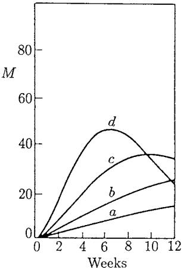

**Figure 10.14.** The time evolution in the mean worm burden, *M*(*t*), in mice hosts fed on a high protein diet for a 12-week period of repeated infection, obtained from a numerical integration of equations (10.65), which govern the population dynamics in the presence of host immune response. These curves are the ones used to compare with the experimental data in Figure 10.10(b). Parameter values: µ = 0.125 day−1, *D* = 1.56, and δ = 5.6 × 10−3 day−1 as in Figure 10.13, and α = 0.5 (which imply β = 0.1 × 106) for the maximum functional activity of the immune system.

For even more general applications of (10.65), such as to arbitrary nutritional conditions or different strains of mice, further experiments are necessary to clarify: (i) the detailed functional dependence of the maximum functional activity, α, on the nutritional status of the hosts, (ii) the specific relationship of the sensitivity, β, to various strains of mice and (iii) the size of the memory time, *T* . With these the system (10.75) can be used to predict the time-evolution and the final steady state of the mean worm burden dependence on the nutritional status and the genetic properties of the hosts being considered.

Among the goals of any mathematical modelling in epidemiology are: (i) to provide a proper mechanistic description of the field situation and (ii) to provide a sound basis for making practical predictions. Usually, however, a major difficulty is the practical estimation of the many parameters which are involved in the models. Controlled laboratory experiments, which study particular aspects of the complete dynamics, while keeping all other parts of the system under experimental control, have proved very useful in this respect. The experiments described here have specifically highlighted the role of the immune response. As a result we have been able to develop and exploit a simple but realistic mathematical model, which admits a full *quantitative* description of the population dynamics in the presence of host immune response.

At this point a few cautionary remarks should be made. First, the model as it stands does not, nor was it intended to, give a full picture of the underlying delicate biochemical and biocellular processes. It does, however, provide a quantitative picture of the macroscopic features of immune response: the per capita rate of limitation in parasite survival can be related quantitatively to the antigenic stimulus (that is, the exposure to infection). Second, the choice of the input function *E* for the immune system in (10.50) and in particular (10.51) is, of course, not unique; it seems, however, a very plausible one in view of the biological observations listed. In fact the qualitative features of the experimental data are reproduced even with a linear function *I*(*E*) in place of the immune activity function in (10.56). However, numerical simulations show that this latter model assumption gives a more satisfactory, *simultaneous* fit of the four graphs corresponding to the four different infection rates, (Figures 10.10(b) (a) to (d)), than a linear version of (10.51). In summary then, the model is supported by the following facts: (i) it is in keeping with the biological observations, (ii) it provides a quantitative fit for the experimental data used to test it and (iii) the parameters introduced are biologically meaningful and can be estimated.

The importance of an acquired immune response in human infection with several species of helminth parasites has also been shown, for example, in the immunological and epidemiological studies of Butterworth et al. (1985). They describe the immune response of 'resistant' and 'susceptible' Kenyan school-children to infection with the blood fluke *Schistosoma mansoni*. The role of human immunity in controlling other worm infections is similarly well established. There is an urgent need for fieldwork studies: basic mathematical models of the type described and used here can be of enormous help in their design and interpretation. In addition, extension of the modelling technique to the 'real world' can provide a cheap and effective way of testing the efficiency of various parasite control programmes, without resort to lengthy and expensive field trials. Further modelling on the lines described in this section have been carried out by Berding et al. (1987) for further laboratory studies in which there is a genetically heterogeneous host population and in which there is natural transmission of the parasite. As before the mice populations had different protein diets. They also discuss the significance of the results from a real world medical viewpoint.

A direct practical (and commercial) application of the concepts and modelling techniques in this section was given by Parry et al. (1992). They applied it to coccidial infection in chickens with emphasis on vaccinating the chickens by delivering oocysts (early stage coccidia) in their feed: this induced an immune response at a much lower level of parasite burden.

What is already abundantly clear is that in real world practical terms, the nutritional status of the host is an important factor in the population dynamics of parasite infections, and must not be ignored in the design of optimal health control policies.

### **10.9 Age-Dependent Epidemic Model and Threshold Criterion**

In many diseases the chronological age of the individual is an important factor in assessing their vulnerability and infectiousness. For example, the interesting data quoted by Bernoulli (1760) on the incidence and severity of smallpox with age is a vivid illustration: vulnerability and mortality go down markedly with age. A variety of agedependent models was discussed, for example, in the book by Hoppensteadt (1975). Dietz (1982), for instance, proposed such a model for river blindness (onchocersiasis) and used it to compare various possible control strategies.

Age may also be interpreted as the time from entry into a particular population class such as the susceptibles, infectives or the removed group in a basic *SIR* model. The two interpretations of age are often the same. With the specific case we analyse in the following section, on a drug use epidemic model, age within a class, the users, is the relevant interpretation. Another more relevant and practical example involving bovine tuberculosis is discussed in detail in Section 10.11.

Consider the population we are interested in can reasonably be divided into susceptibles, *S*(*t*), and infectives, *I*(*a*,*t*), where *a* is the age from exposure to the disease so we are considering an *SI* age-dependent model. The number of susceptibles decreases through exposure to the disease. The removal rate of susceptibles is taken to be

$$\frac{dS}{dt} = -\left[\int_0^\tau r(a')I(a',t)da'\right]S, \quad S(0) = S_0. \tag{10.66}$$

That is, the removal due to infectives is weighted with an age-dependent function *r*(*a*) which is a measure of the infectiousness of the infectives. Since the infective is only infectious for a limited time, τ , this is the upper limit in the integral.

To get the equation for the infective population *I*(*a*,*t*) we use a conservation approach. In a time there is an advance in chronological age and in infective class age from (*t*, *a*) to (*t* + , *a* + ). Conservation then says that the change in the number of infectives in a time must be balanced by the number removed. We thus have, in time ,

$$I(a+\Delta, t+\Delta) - I(a,t) = -\lambda(a)I(a,t)\,\Delta,$$

where λ(*a*) is the age-dependent removal factor. In the limit as → 0 we then get, on expanding in a Taylor series, the partial differential equation

$$\frac{\partial I}{\partial t} + \frac{\partial I}{\partial a} = -\lambda(a)I. \tag{10.67}$$

At time *t* = 0 there is some given age-distributed class of infectives *I*0(*a*). At *a* = 0 there is recruitment from the susceptible class into the infectives. Since all new infectives come from the susceptibles, the 'birth rate' *I*(0,*t*) is equal to −*d S*/*dt*. Thus the boundary conditions for (10.67) are

$$I(a,0) = I_0(a), \quad I(0,t) = -\frac{dS}{dt}, \quad t > 0. \tag{10.68}$$

The integrodifferential equation model now consists of (10.66)–(10.68), where *I*0(*a*) and *S*0 are given. We assume the functions *r*(*a*) and λ(*a*) are known, at least qualitatively, for the disease and in control procedures can be manipulated as is often the case.

An infection will not spread if the number of susceptibles expected to be infected by each infective drops below one. If the number exceeds one then the infection will spread and we have an epidemic. The number γ of initial susceptibles expected to be infected by each infective is

$$\gamma = S_0 \int_0^r r(a) \exp\left[-\int_0^a \lambda(a') \, da'\right] \, da. \tag{10.69}$$

As in (10.66), *r*(*a*) here is the infective capability of an infective. It is weighted with an exponential function which is the probability of an initial infective surviving to age *a*: λ(*a*) is the same as in (10.67). The threshold value for an epidemic is γ = 1 above which the infection spreads. We now show how the severity of the epidemic, as measured by the ratio *S*(∞)/*S*0, depends on γ . Clearly from (10.66) since *d S*/*dt* ≤ 0, *S*(*t*) → *S*(∞), where 0 ≤ *S*(∞) ≤ *S*0.

We solve the mathematical problem (10.66)–(10.68) using the method of characteristics. (A similar procedure was used in Chapter 1, in the single population growth model with age distribution.) The characteristics of (10.67) are the straight lines.

$$\begin{split} \frac{dt}{da} = 1 &\quad \Rightarrow \quad a = t + a_0, \quad a > t \\ &= t - t_0, \quad a < t, \end{split} \tag{10.70}$$

where *a*0 and *t*0 are respectively the age of an individual at time *t* = 0 in the given original population and the time of birth of an infective; see Figure 10.15.

The characteristic form of (10.67) is

$$\frac{dI}{da} = -\lambda(a)I \quad \text{on} \quad \frac{dt}{da} = 1,$$

and so, with Figure 10.15 in mind, integrating these equations we get

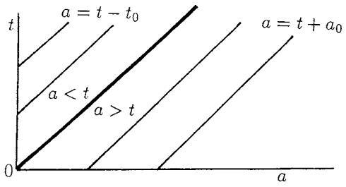

**Figure 10.15.** Characteristics for the infectives equation (10.67). On *t* = 0, *I*(*a*, 0) = *I*0(*a*), which is given, and on *a* = 0, *I*(0, *t*) = −*d S*/*dt*, *t* > 0.

$$\begin{aligned} I(a,t) &= I_0(a_0) \exp\left[ -\int_{a_0}^a \lambda(a') \, da' \right], \quad a > t\\ &= I(0, a_0) \exp\left[ -\int_0^a \lambda(a') \, da' \right], \quad a < t. \end{aligned}$$

Thus, from (10.70),

$$\begin{split} I(a,t) &= I_0(a-t) \exp\left[ -\int_{a-t}^{a} \lambda(a') \, da' \right], \quad a > t\\ &= I(0, a-t) \exp\left[ -\int_{0}^{a} \lambda(a') \, da' \right], \quad a < t. \end{split} \tag{10.71}$$

From (10.66) the solution S(t) is

$$S(t) = S_0 \exp\left[-\int_0^t \left\{\int_0^\tau r(a)I(a,t')da\right\}dt'\right].\tag{10.72}$$

Using (10.71) for *I*(*a*,*t*), in the ranges *a* < *t* and *a* > *t*,

$$\begin{split} \int_{0}^{t} r(a)I(a,r')da &= \int_{0}^{t} r(a)I(0,t'-a) \exp\left[-\int_{0}^{a} \lambda(a') \, da'\right] da\\ &+ \int_{t}^{t} r(a)I_{0}(a-t') \exp\left[-\int_{a-t'}^{a} \lambda(a') \, da'\right] da. \end{split} \tag{10.73}$$

Since the time of infectiousness is τ , the last integral vanishes if *t* > τ ; we can think of it in terms of *r*(*a*) = 0 if *a* > τ . For *S*(*t*) in (10.72) we have, using (10.68) and (10.73),

$$\begin{split} \int_{0}^{t} \int_{0}^{\tau} r(a)I(a,t') \, da \, dt' \\ &= -\int_{0}^{t} \int_{0}^{t'} r(a) \exp\left[-\int_{0}^{a} \lambda(a') \, da'\right] \frac{dS(t'-a)}{dt'} \, da \, dt' \\ &\quad + \int_{0}^{t} \int_{t'}^{\tau} r(a)I_{0}(a-t') \exp\left[-\int_{a-t'}^{a} \lambda(a') da'\right] \, da \, dt'. \end{split}$$

Interchanging the order of integration in the first integral on the right-hand side we get

364 10. Dynamics of Infectious Diseases

$$\begin{split} \int_{0}^{t} \int_{0}^{t} r(a)I(a,t')da \,dt' \\ = -\int_{0}^{t} r(a) \exp\left[-\int_{0}^{a} \lambda(a')da'\right] (S(t-a) - S_0) \,dt + m(t), \end{split} \tag{10.74}$$

where

$$m(t) = \int_{0}^{t} \int_{t'}^{t} r(a)I_0(a - t') \exp\left[-\int_{a - t'}^{a} \lambda(a') da'\right] da \, dt'. \tag{10.75}$$

Substituting (10.74) into (10.72) we then get

$$S(t) = S_0 \exp\left\{-m(t) + \int_0^t r(a) \exp\left[-\int_0^a \lambda(a') da'\right] (S(t-a) - S_0) da\right\}. \tag{10.76}$$

If we now let *t* → ∞, remembering that *r*(*a*) = 0 for *a* > τ , we get, using γ defined in (10.69),

$$F = e^{-m(\infty) + \chi(F - 1)}, \quad F = \frac{S(\infty)}{S_0}. \tag{10.77}$$

We are interested in the severity of the epidemic as measured by *F*, that is, the fraction of the susceptible population that survives the epidemic, and how it varies with γ . For given *r*(*a*), *I*0(*a*) and λ(*a*), (10.75) gives *m*(*t*) and hence *m*(∞). If 0 < *m*(∞) = ε 1, Figure 10.16 shows how *F* varies with γ . For each value of γ there are two roots for *F* but, since *S*(∞) ≤ *S*0, only the root *F* = *S*(∞)/*S*0 ≤ 1 is relevant. Note how the severity of the epidemic is small for ε small as long as γ < 1 but it increases dramatically; that is, *S*(∞)/*S*0 decreases (from *S*(∞)/*S*0 ≈ 1) quickly for γ > 1. For example, if 0 < ε 1 and γ ≈ 1.85, *S*(∞)/*S*0 ≈ 0.25.

Suppose a single infective is introduced into a susceptible population of size *S*0. We can approximate this by writing *I*0(*a*) = δ(*a*), the Dirac delta function, then

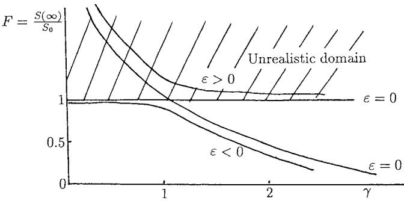

**Figure 10.16.** Dependence of the epidemic severity *F* = *S*(∞)/*S*0, that is, the fraction of the susceptible population who survive the epidemic, on the threshold parameter γ from (10.77), namely, *F* = exp [−ε + γ(*F* − 1)]. The only realistic values, of course, are *F* = *S*(∞)/*S*0 ≤ 1.

$$\int_0^\varepsilon I_0(a) \, da = 1.$$

In this case, from (10.75),

$$\begin{split} m(t) &= \int_{0}^{t} \int_{l'}^{\tau} r(a)I_{0}(a - t') \exp\left[-\int_{a - t'}^{a} \lambda(a') da'\right] da \, dt' \\ &= \int_{0}^{t} \int_{l'}^{\tau} r(a)\delta(a - t') \exp\left[-\int_{a - t'}^{a} \lambda(a') da'\right] da \, dt' \\ &= \int_{0}^{\infty} r(t') \exp\left[-\int_{0}^{t'} \lambda(a') da'\right] dt' \\ &= \frac{\mathcal{V}}{S_{0}} \end{split}$$

from (10.69). Thus (10.77) becomes

$$F = \exp\left[\mathcal{Y}\left(F - 1 - \frac{1}{S_0}\right)\right], \quad F = \frac{S(\infty)}{S_0}.\tag{10.78}$$

Since 1/*S*0 1 in general the solutions for *F* in terms of γ are typically as given in Figure 10.16. Thus γ > 1 need *not* be large for a severe epidemic to occur. Therefore, it is the estimation of the parameter γ in (10.69) that is critical in the epidemiology of age-dependent models. This we do in the following section for a very simple and primitive model of drug use.

#### **10.10 Simple Drug Use Epidemic Model and Threshold Analysis**

The spread of the use of self-administered drugs, therapeutic and illicit, is in some cases a result of the enthusiastic proselytising by a user in the initial stages of use. We describe here a simple illustrative model discussed by Hoppensteadt and Murray (1981) for the etiology of such a drug and show how to determine the threshold parameter γ . This entails the evaluation of the infectiousness which we relate to the response of the user to the drug. The novel feature of the epidemic model studied here is the inclusion of the user's personal response to the drug. The model is a pedagogical one: we do not have a specific drug in mind.

Suppose the drug is introduced into the blood stream in dosages *d*(*t*) and let it be removed at a rate proportional to *c*(*t*), the drug concentration in the blood; that is, a first-order kinetics removal. The governing equation for the blood concentration *c*(*t*) is then

$$\frac{dc}{dt} = d(t) - kc, \quad c(0) = 0,\tag{10.79}$$

where *k* > 0 is constant and *t* = 0 is the time the individual is first recruited as a user. In drug abuse, the dosage *d*(*t*) tends to be oscillatory or approximately periodic with a

progressively decreasing period. The solution of (10.79) is

$$c(t) = e^{-kt} \int_0^t e^{kt'} d(t') \, dt'. \tag{10.80}$$

For many drugs the body has specific sites and it is the binding of these sites which evokes a response in the user. Denote the number of free sites, that is, active or unbound, by *A*(*t*), the number of bound, that is, inactive, sites by *B*(*t*) and the total number by *N*. We assume that no new sites are being created so *A*(*t*) + *B*(*t*) = *N*. We take as a site binding model the very simple system

$$\begin{aligned} \varepsilon \frac{dA}{dt} &= \alpha B - \beta cA, \quad A(0) = N, \\ \varepsilon \frac{dB}{dt} &= \beta cA - \alpha B, \quad B(0) = 0, \end{aligned} \tag{10.81}$$

where α, β and ε are positive constants: the inclusion of ε here is for later algebraic convenience when we take it to be small. We are thus assuming that the rate of binding of active sites is proportional to the amount of the drug *c*(*t*) in the body and the number of active sites available: that is, β*cA*/ε. There is also a replenishment of the active sites proportional to the number of bound sites: that is, α*B*/ε. With *A* + *B* = *N* the equation for *B* is then given by the second of (10.81).

Suppose now that the reaction, *r*(*t*), to the drug is proportional to the blood concentration and the number of free sites. We thus take it to be

$$r(t) = Rc(t)A(t),\tag{10.82}$$

where *R* > 0 is a measure of the individual's response to the drug.

If the rate of binding is very fast, that is, α and β are *O*(1) and 0 < ε 1 in (10.81), the number of free and bound receptors reaches equilibrium very quickly. Then, using *A* + *B* = *N*,

$$B = \frac{\beta cA}{\alpha} \quad \Rightarrow \quad A = \frac{\alpha N}{\alpha + \beta c}, \quad B = \frac{\beta Nc}{\alpha + \beta c}, \tag{10.83}$$

and the individual's response is

$$r = \frac{R\alpha Nc}{\alpha + \beta c},\tag{10.84}$$

which is a Michaelis–Menten (cf. Chapter 6, Section 6.2) type of response which saturates to *r*max = *R*α*N*/β for large blood concentration levels *c*. Note that with *B* as in (10.83) the response *r* = *R*α*B*/β; that is, the response is proportional to the number of bound sites.

If ε in (10.81) is *O*(1) we can incorporate it into the α and β; this is equivalent to setting ε = 1. Now with *B* = *N* − *A* the equation for *A*(*t*) from (10.81), with ε = 1, is

$$\frac{dA}{dt} = \alpha N - A(\alpha + \beta c), \quad A(0) = N$$

which has solution

$$\begin{split} A(t) &= N \exp\left[ -\int_{0}^{t} \{\alpha + \beta c(t')\} \, dt' \right] \\ &+ \alpha N \int_{0}^{t} \exp\left[ -\int_{t'}^{t} \{\alpha + \beta c(\tau)\} \, d\tau \right] \, dt', \end{split} \tag{10.85}$$

with *c*(*t*) from (10.80).

If *d*(*t*) is known we can carry out the integrations explicitly to get *c*(*t*) and *A*(*t*): it is algebraically rather complicated for even a simple periodic *d*(*t*). Since the algebraic details in such a case initially tend to obscure the key elements we consider here the special case *d*(*t*) = *d*, a constant, and assume that the recovery rate of active sites from their bound state is very small: that is, α ≈ 0. Then, from (10.80) giving *c*(*t*) and the last equation giving *A*(*t*), we have

$$\begin{aligned} c(t) &= \frac{d}{k}(1 - e^{-kt}),\\ A(t) &= N \exp\left[ -\frac{\beta d}{k} \left\{ t + \frac{1}{k}(e^{-kt} - 1) \right\} \right] \end{aligned} \tag{10.86}$$

and the response *r*(*t*) from (10.82) is

$$r(t) = RcA = \frac{RNd}{k}(1 - e^{-kt})\exp\left[-\frac{\beta d}{k}\left\{t + \frac{1}{k}(e^{-kt} - 1)\right\}\right].\tag{10.87}$$

Figure 10.17 illustrates the form of *c*(*t*) and *r*(*t*) from (10.86) and (10.87).

It is interesting to note that even with this very simple illustrative model, the response of an individual does not just increase with dosage: after an initial stage of increasing response it actually decreases with time.

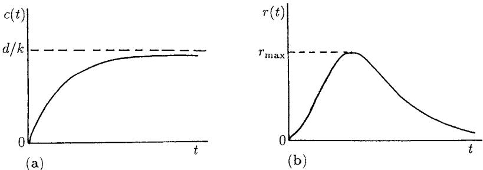

**Figure 10.17.** (**a**) The blood concentration *c*(*t*) of the drug: from (10.86) it saturates to *d*/*k* after a long time. (**b**) The body's response to the drug from (10.87). Note the initial increase before it tails off with continuous drug use.

Now consider the possibility of an epidemic of drug use appearing in a population *S*0 of nonusers after the introduction of a single user. We assume 1/*S*0 1, as is reasonable, and so *F* = *S*(∞)/*S*0 is given by the solution *F* < 1 in Figure 10.16 for the appropriate γ , which we now evaluate.

Here age is measured from the first time of using the drug. There is no time limit for infectiousness so in the definition (10.69) for γ we set τ = ∞. From Figure 10.17(b) the response *r*(*t*) → 0 as *t* → ∞; that is, the infectiousness, or proselytising fervour, becomes less effective with time. For simplicity we assume the probability factor in (10.69) has λ constant and so

$$
\gamma = S_0 \int_0^\infty r(t) e^{-\lambda t} \, dt. \tag{10.88}
$$

We can now evaluate γ for various limiting situations in terms of the parameters α, β, γ and *k* in the user model (10.79)–(10.82).

In the case *d*(*t*) = *d*, a constant, we get Table 10.1 after some elementary algebra. It gives the user's response *r*(*t*) and the corresponding epidemiological threshold parameter γ . For example, in the case 0 < ε 1, (10.84) holds if α β, *r*(*t*) ≈ *RN*α/β, a constant, and (10.88) gives γ ≈ *S*0*RN*α/(λβ). On the other hand if 0 < ε 1 and β α then, from (10.83), *r*(*t*) = *RNc*(*t*) and, with *c*(*t*) from (10.86), γ is given, from (10.88), by

$$\gamma = S_0 \int_0^\infty \frac{RN \, d(1 - e^{-kt})}{k} e^{-\lambda t} \, dt = \frac{S_0 RN \, d}{\lambda(\lambda + k)}.$$

A similar type of asymptotic approach results in the other forms in Table 10.1.

In the case of most self-administered drugs 0 < ε 1; that is, the response is very fast. The possibility of an epidemic depends on the relative magnitude of the various parameters in a simple way. This case is covered by (i)–(iv) in Table 10.1. For example if the rate of freeing of bound sites is much slower than the binding rate, β α (case (ii)) then, since most sites will be bound, the user's reaction is small. This reduces the user's 'infectiousness' and hence the epidemic risk.

If we increase the cure rate, that is, increase λ, there is a reduction in γ . Decreasing the individual's response, such as by education or chemotherapy, also reduces γ and

**Table 10.1.** The case *d*(*t*) = *d*, a constant. Here *r*(*t*) is a measure of the drug user's response and γ is the epidemic infectious (or recruitment) rate. (Table from Hoppensteadt and Murray 1981)

| Case  |                            | r(t)                       | γ/S0             |
|-------|----------------------------|----------------------------|------------------|
| (i)   | ε<br>1, α<br>β             | R Nα/β                     | R Nα/λβ          |
| (ii)  | ε<br>1, β  α               | RNc(t)                     | RN d/[λ(λ + k)]  |
| (iii) | ε<br>1, k  1               | RN d/k                     | RN d/kλ          |
| (iv)  | ε<br>1, k<br>1, α/β d<br>1 | RN dt/[1+(β dt/α)]∼ R Nα/β | R Nα/βλ          |
| (v)   | ε = 1, k<br>1              | N dRt exp[−2 dβt]          | RN d/(2 dβ + λ)2 |
| (vi)  | ε = 1, k  1                | R d exp[−dβt/k]/k          | RN d/kλ          |

hence reduces the possibility of a severe epidemic. The results are in line with a heuristic common sense approach.

If we define the critical population *Sc* by

$$S_c = \left\{ \int_0^\infty r(a) \exp\left[ -\int_0^a \lambda(a') \, da' \right] \, da \right\}^{-1},\tag{10.89}$$

then if *S*0 > *Sc*, which implies γ > 1, an epidemic occurs, whereas if *S*0 < *Sc* it does not. The sensitivity of *Sc* to the parameters can only really be determined if *r* and γ are known with some confidence.

The type of drug use models we have described and analysed here, but without age dependence, have been very useful in their application to certain aspects of chronic alcohol misuse and even in trying to come up with a better breathalyser. Ethanol metabolism, associated with alcohol eradication in the body, is very different in normal subjects as compared to alcoholics. Smith et al. (1993) used such a model for the study of ethanol metabolism to try to understand the difference between normal users and abusers of alcohol and compared the results and predictions with subject data. An even simpler model, essentially *dc*/*dt* = *d*(*t*) − *k* where *c*(*t*) is the blood alcohol level, *d*(*t*) is the alcohol intake and *k* is the metabolic decay rate, was used by Lubkin et al. (1996) in a study to try and determine whether it was possible to have a more sophisticated model for alcohol breath exhalation which would make roadside breathalysers more accurate: basically the answer was 'no.'11

#### **10.11 Bovine Tuberculosis Infection in Badgers and Cattle**

Bovine tuberculosis infection is an insidious disease, which often does not become apparent until it has reached an advanced stage in cattle, badgers and also swine. Investigations carried out suggest that in the southwest of England, for example, badgers constitute a significant reservoir of the bovine Tb, *Mycobacterium bovis* (*M. bovis*) and that badgers, because of their population density, could be a major factor in its spread. Conditions in these affected areas, and as mentioned, the social organisation of badgers, not only favour the transmission of the disease from one infected badger group to another but also from badgers to cattle and vice versa.

Within specific regions in England and Wales, badger habitats are usually intimately intermeshed with intensively used cattle pastures (Neal 1986, MAFF Report 1987; see also 1994). Field studies conducted over a period of about 10 years in such regions confirm that the foraging activities of badgers on cattle pasture with their pre-

<sup>11</sup>When Washington State Trooper Sgt. Rod Gullberg, a co-author on the paper, first phoned me to see if he could come and talk about the problem, he volunteered to come to the campus. I naively said, 'Yes, of course, but the parking problem on the campus is absolutely horrendous' to which he calmly replied 'I don't think I'll have a problem.' He arrived in his enormous police car and parked it right in front of the main entrance to the building beside what I had always taken to be the equivalent of about 10 solid yellow lines with your car and you being whisked off in a matter of seconds. He then came into the building, in uniform, bristling with all the police accoutrements of baton, gun and so on, and asked, 'Where can I find Professor Murray?' He was followed upstairs with intense curiosity. People felt I must have another very different secret life.

ferred food items (earthworms, insects and fruits), which are exploited alternatively because they show marked seasonal fluctuations, cause a high frequency of urination and defecation as a direct consequence of their eating habits (MAFF Report 1987). Therefore, diseased badgers tend to contaminate the environment heavily with bacilli, through their feeding habits and suppurating bite wounds, for prolonged periods. Even though a majority of bacilli may be killed early by exposure to direct sunlight, some do survive in the microhabitat for periods of several weeks depending on the prevailing climatic conditions. Studies by MacDonald (1984) indicate that in the wild, the risk of infection depends partly on the viability of the bacilli. In bronchial pus, these survive in appreciable numbers for up to four weeks in winter and one week in summer, in urine for seven days and three days respectively, and in cattle dung for five months and two months respectively. In general, warm, dark, moist locations appear optimal for bacterial survival on the soil surface (MacDonald 1984).

Cattle are most likely to become infected in several ways: they might inhale bacilli during an encounter with badgers with severe pulmonary and kidney lesions or they might graze or sniff at grass contaminated with infectious badger products (sputum, pus from lungs and bite wounds, faeces and urine). Thus a criss-cross infection may arise when cattle come into contact with the bacilli either directly from the environment or indirectly from infectious badgers. Certain farm practices, namely, allowing badgers access to cattle sheds, salt licks and water troughs could also contribute to disease transmission. There is therefore a significant probability for badger-to-cattle and cattle-to-badger disease transmission.

In this section we describe a criss-cross epidemic model for bovine tuberculosis infection between badgers and cattle that Dr. D.E. Bentil and I developed in the mid-1990's and deduce some analytical results. The main objective is to use these results in the following section to study the dynamics of immunization programmes and suggest how certain practical control measures could be adopted with the ultimate aim of minimizing the spread of infection from badgers to cattle and vice versa, should an epidemic occur.

#### *Criss-Cross Model System for Bovine Tb*

When dealing with two populations—here badgers and cattle—we require an epidemic system for each population and then couple the systems through infection of susceptible cattle by infected badgers and susceptible badgers via infected cattle. With an *SEIR* model such as discussed in detail by Bentil and Murray (1993) this would result in a model with 8 coupled partial differential equations if we include age structure as we should. In principle models should be developed from the simple to the complex. Here we have to choose between considering only time-dependent populations, without age structure, or consider fewer subpopulations and include age structure. Here we adopt the latter strategy and consider two subpopulations in each of the badgers and the cattle, that is, an *SI*-type age-structured criss-cross epidemic model to study the disease transmission dynamics between them. So, we consider a model involving two distinct populations (badgers and cattle) and an infection which is communicated between them. We investigate a simple, age-structured, criss-cross model which describes the rate at which cub and adult badgers and cattle go through two different—susceptible and infectious—states. Here, one of the basic assumptions is that badgers endure a prolonged illness once infected: for example, 12 naturally infected badgers held in captivity survived for between 165 and 1305 days (MacDonald 1984). It is during this prolonged illness that it is assumed they contaminate cattle pasture with bacilli. The mortality due to *M. bovis* infection in both badgers and cattle is low (Cheeseman et al. 1988) so it is not unreasonable to assume that disease-induced death is negligible as compared with normal death. We also assume constant death rates for both badgers and cattle. Other forms of death rates could be used but at this stage add unnecessarily to the complexity of the analysis. It is useful and important to get in the first instance some general guidelines. The contraction of *M. bovis* infection does not confer immunity so we assume that infected badgers either die or recover temporarily and become susceptible again. We assume a similar disease transmission dynamics for cattle. The flow diagram of the disease transmission dynamics in terms of the two distinct interacting populations, namely, badgers and cattle, is schematically shown in Figure 10.18.

We take the total number of cub and adult badgers and cattle at risk of infection to be constant and equal to *N* and *N*˜ respectively. We have also assumed that infected cattle recover at a rate *r*˜ which is proportional to *W*˜ , the infected cattle, and infected badgers recover at a rate *r* proportional to *W*, the infected badger population. Cattle appear to develop symptoms much more readily so we assume *r*˜ *r*. Cattle are newly infected at rates β˜ 1, β˜ 2 which are proportional to the product of the number of susceptible cattle, *U*˜ , and the sum of infectious cattle, *W*˜ , and badgers, *W*. Similarly, newly infected badgers occur at rates β1, β2 which are proportional to the product of the number of susceptible badgers, *U*, and the sum of infected cattle and badgers, namely, *W*˜ and *W*. The parameters β1, β2 and β˜ 1, β˜ 2 are the disease transmission coefficients for badgers and cattle respectively.

Figure 10.18 is certainly basic and contains many simplifying assumptions. With these caveats we write the model system as

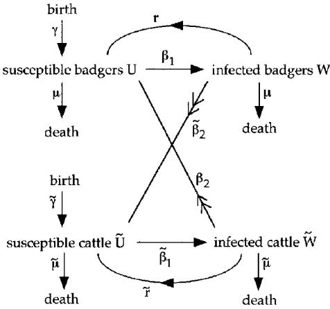

**Figure 10.18.** Diagrammatic flow chart of a criss-cross model for an infection between badgers and cattle. Each class is a disease host for the other. Here we have divided the badger population into susceptibles, *U*, and infectious, *W*. The cattle population is treated similarly with the susceptible and infectious cattle population denoted by *U*˜ and *W*˜ . The contraction of *M. bovis* infection does not confer immunity and so an infected animal becomes susceptible again after recovery.

$$\begin{aligned} \frac{\partial U}{\partial t} + \frac{\partial U}{\partial a} &= -\lambda_1 U + rW - \mu U, \\ \frac{\partial W}{\partial t} + \frac{\partial W}{\partial a} &= \lambda_1 U - rW - \mu W, \\ \frac{\partial \tilde{U}}{\partial t} + \frac{\partial \tilde{U}}{\partial a} &= -\tilde{\lambda}_1 \tilde{U} + \tilde{r} \tilde{W} - \tilde{\mu} \tilde{U}, \\ \frac{\partial \tilde{W}}{\partial t} + \frac{\partial \tilde{W}}{\partial a} &= \tilde{\lambda}_1 \tilde{U} - \tilde{r} \tilde{W} - \tilde{\mu} \tilde{W}, \end{aligned} \tag{10.90}$$

where the force of infection for the respective populations is given by

$$
\lambda(B) \qquad \lambda_1(t) = \beta_1 \int_0^\infty W(t, a) \, da + \beta_2 \int_0^\infty \tilde{W}(t, a) \, da,\tag{10.91}
$$

$$
\tilde{\lambda}(C) \qquad \tilde{\lambda}_1(t) = \tilde{\beta}_1 \int_0^\infty \tilde{W}(t, a) \, da + \tilde{\beta}_2 \int_0^\infty W(t, a) \, da \tag{10.92}
$$

which are partial contributions from both badgers (*B*) and cattle (*C*). The initial age distribution of the respective classes at *t* = 0 is given by

$$\begin{aligned} U(0, a) &= U_0(a), \quad \tilde{U}(0, a) = \tilde{U}_0(a), \\ W(0, a) &= W_0(a), \; \tilde{W}(0, a) = \tilde{W}_0(a), \end{aligned} \tag{10.93}$$

and the renewal (boundary) conditions

$$\begin{aligned} N(t,0) &= \mathcal{V} \int_0^\infty N(t,a) \, da = \mathcal{V} N(t), \; t > 0, \\\ \tilde{N}(t,0) &= \mathcal{V} \int_0^\infty \tilde{N}(t,a) \, da = \tilde{\mathcal{V}} N(t), \; t > 0. \end{aligned} \tag{10.94}$$

The absence of a birth term in the model equations is because the only input into the host population is into the class of age zero and so appears as a boundary condition. If we hold to the assumption that all newborn badgers and cattle are susceptible in constant populations where the birth rates, γ , γ˜ are set equal to the death rates, µ, µ˜, for badgers and cattle respectively, then the boundary conditions in (10.94) for the various groups are

$$\begin{aligned} U(t,0) &= N(t,0) = \mathcal{V}N(t), \; W(t,0) = 0, \\ \tilde{U}(t,0) &= \tilde{N}(t,0) = \tilde{\mathcal{V}}\tilde{N}(t), \; \tilde{W}(t,0) = 0. \end{aligned} \tag{10.95}$$

Here, for example, γ *N*(*t*) is the number of births of badgers at age 0 for all *t*, and *N*(*t*) is the total badger population. At any time *t*, the age distribution of both badgers and cattle can be expressed as

$$\begin{split} N(t,a) &= \mathcal{V}N(t) \exp\left(-\int_{0}^{a} \mu(s) \, ds\right) = \mathcal{V}N(t)m(a), \\ \tilde{N}(t,a) &= \tilde{\mathcal{V}}\tilde{N}(t) \exp\left(-\int_{0}^{a} \tilde{\mu}(s) \, ds\right) = \tilde{\mathcal{V}}\tilde{N}(t)\tilde{m}(a), \end{split} \tag{10.96}$$

which define the survival probability *m*(*a*) and *m*˜(*a*) functions. For example, *m*(*a*) is the probability that a badger will live to age *a*.

We now rescale the problem to make the system nondimensional. This introduces dimensionless groupings which highlight certain ecological facts. We first factor out the death rate in the model system (10.90) by making the substitutions

$$\begin{aligned} u(t,a) &= \frac{U(t,a)}{N(t,a)}, \; w(t,a) = \frac{W(t,a)}{N(t,a)},\\ \tilde{u}(t,a) &= \frac{\tilde{U}(t,a)}{\tilde{N}(t,a)}, \; \tilde{w}(t,a) = \frac{\tilde{W}(t,a)}{\tilde{N}(t,a)}.\end{aligned} \tag{10.97}$$

If we choose reference scales for *u*(*t*, *a*), w(*t*, *a*), *u*˜(*t*, *a*), w(˜ *t*, *a*), *a* and *t* and scale these variables by the maximum values they can realistically obtain (the maximum value for *u*(*a*) occurs at *u*(0)) and we scale the time and chronological age by setting *r* = *rt*, α = *ra* we obtain the nondimensional system

$$\begin{aligned} \frac{\partial u}{\partial \tau} + \frac{\partial u}{\partial \alpha} &= -\frac{1}{r} \lambda_1 u + w, \\ \frac{\partial w}{\partial \tau} + \frac{\partial w}{\partial \alpha} &= \frac{1}{r} \lambda_1 u - w, \\ \frac{\partial \tilde{u}}{\partial \tau} + \frac{\partial \tilde{u}}{\partial \alpha} &= -\frac{1}{\tilde{r}} \tilde{\lambda}_1 \tilde{u} + \tilde{w}, \\ \frac{\partial \tilde{w}}{\partial \tau} + \frac{\partial \tilde{w}}{\partial \alpha} &= \frac{1}{\tilde{r}} \tilde{\lambda}_1 \tilde{u} - \tilde{w}. \end{aligned} \tag{10.98}$$

The boundary conditions become

$$u(\tau,0) = 1, \; w(\tau,0) = 0, \; \tilde{u}(\tau,0) = 1, \; \tilde{w}(\tau,0) = 0,\tag{10.99}$$

and initial conditions are given by

$$\begin{aligned} u(0, \alpha) &= u_0(\alpha), \ w(0, \alpha) = w_0(\alpha), \\ \tilde{u}(0, \alpha) &= \tilde{u}_0(\alpha), \ \tilde{w}(0, \alpha) = \tilde{w}_0(\alpha). \end{aligned} \tag{10.100}$$

The force of infection for the respective populations is given by

$$\begin{split} (B) \quad \lambda_{\mathrm{l}}(\tau) &= \frac{\beta_{1}}{r} \int_{0}^{\infty} w(\tau, \alpha) N(\tau, \alpha) \, d\alpha + \frac{\beta_{2}}{\tilde{r}} \int_{0}^{\infty} \tilde{w}(r, \alpha) \tilde{N}(\tau, \alpha) \, d\alpha, \\ (C) \quad \tilde{\lambda}_{\mathrm{l}}(\tau) &= \frac{\tilde{\beta}_{1}}{\tilde{r}} \int_{0}^{\infty} \tilde{w}(\tau, \alpha) \tilde{N}(\tau, \alpha) \, d\alpha + \frac{\tilde{\beta}_{2}}{r} \int_{0}^{\infty} w(\tau, \alpha) N(\tau, \alpha) \, d\alpha. \end{split} \tag{10.101}$$

The force of infection determines whether or not an epidemic will occur. We saw in the simple models we discussed in earlier sections that there are threshold conditions which must be obtained if the number of infected animals is going to increase. So, the evaluation of the λ's is an essential part of the study of the spread of a disease. In its simplest form if the force of infection is greater than 1 it means that more than one susceptible will be infected by one infective. In the case of the *SEIR* age-dependent model discussed by Bentil and Murray (1993) the conditions for an epidemic were reduced to determining whether or not a function of λ, obtained from the expression for the force of infection analogous to (10.101) had a solution λ > 1. With this, threshold values of parameters and populations for an epidemic to ensue were obtained.

The mathematical problem posed by (10.98)–(10.101) is not easy to solve in general. At an equilibrium state, however, we can obtain solutions relatively easily. After a long time we assume an equilibrium is reached, that is, where all ∂/∂τ terms are set equal to zero and the various classes are only functions of age *a*. The λ's in (10.101) are constants since the integrals do not involve τ (τ → ∞ at equilibrium). The equations in (10.98) are then a set of 4 linear ordinary differential equations uncoupled into two pairs, one for *u*(α) and w(α) and the other set for *u*˜(α) and w(α) ˜ . The respective fractions of infective and susceptible badgers and cattle at equilibrium are easily derived. For example, with the first two equations in (10.98), on adding and using the boundary conditions *u*(0) = 1,w(0) = 0, we get a linear first-order equation in *u*(α) which is trivially solved. With these solutions we then have, after some elementary algebra, the equilibrium forces of infection, denoted by λ2 and λ˜ 2 (we use the subscript 2 to distinguish them from the time-dependent forces of infection) as

$$\begin{split}(B) \qquad \lambda_{2} &= \frac{\beta_{1}\lambda_{2}\gamma N}{r(\lambda_{2}+r)} \int_{0}^{\infty} m(a) \left[1 - \exp\left(-\frac{\lambda_{2}}{r} - 1\right)\alpha\right] da \\ &+ \frac{\beta_{2}\tilde{\lambda}_{2}\tilde{\gamma}\tilde{N}}{\tilde{r}(\tilde{\lambda}_{2}+\tilde{r})} \int_{0}^{\infty} \tilde{m}(a) \left[1 - \exp\left(-\frac{\tilde{\lambda}_{2}}{\tilde{r}} - 1\right)\alpha\right] da, \\ (C) \qquad \tilde{\lambda}_{2} &= \frac{\tilde{\rho}_{1}\tilde{\lambda}_{2}\tilde{\gamma}\tilde{N}}{\tilde{r}(\tilde{\lambda}_{2}+\tilde{r})} \int_{0}^{\infty} \tilde{m}(a) \left[1 - \exp\left(-\frac{\tilde{\lambda}_{2}}{\tilde{r}} - 1\right)\alpha\right] da \\ &+ \frac{\tilde{\rho}_{2}\lambda_{2}\gamma N}{r(\lambda_{2}+r)} \int_{0}^{\infty} m(a) \left[1 - \exp\left(-\frac{\lambda_{2}}{r} - 1\right)\alpha\right] da, \end{split} \tag{10.102}$$

where *m*(α) and *m*˜(α), the survival probabilities, are defined by (10.96). We can go no further with the analysis until we specifiy these functions. If we assume the death rate µ(*a*) is a constant, then *m*(α) = *e*−µ*a* and *m*˜(α) = *e*− ˜µ*a* and we can then easily evaluate the integrals in (10.102). We then get coupled transcendental equations to determine the forces of infection in the badgers and the cattle. In general these have to be solved numerically for given parameter values.

By way of illustration let us assume that the contributions from within the respective animal populations are negligible and only a cross-type of infection prevails; that is, β1 = 0 = β˜ 1 and the death rates are constant. In this situation, after some algebra, we get

$$\begin{split}(B) \qquad \lambda_{2} &= \frac{\beta_{2}\tilde{\lambda}_{2}\tilde{\nu}\tilde{N}}{\tilde{\lambda}_{2} + \tilde{r}} \left[ \frac{1}{\tilde{\mu}} (1 - e^{-\tilde{\mu}L}) - \frac{1}{\tilde{\lambda}_{2} + \tilde{r} + \tilde{\mu}} (1 - e^{-(\tilde{\lambda} + \tilde{r} + \tilde{\mu})L}) \right], \\ (C) \qquad \tilde{\lambda}_{2} &= \frac{\tilde{\beta}_{2}\lambda_{2}\mathcal{Y}\mathcal{N}}{\lambda_{2} + r} \left[ \frac{1}{\mu} (1 - e^{-\mu L}) - \frac{1}{\lambda_{2} + r + \mu} (1 - e^{-(\lambda_{2} + r + \mu)L}) \right], \end{split} \tag{10.103}$$

where *L* is the life expectancy and (*B*) and (*C*) refer to badgers and cattle respectively. In both cases as *L* → 0, λ2 → 0 and λ˜ 2 → 0 as they should.

For large *L*, from (10.103) we have for the badgers and cattle respectively

$$\frac{\lambda_2}{\tilde{\lambda}_2} = \frac{\beta_2 \tilde{\nu} \tilde{N}}{\tilde{\mu}(\tilde{\lambda}_2 + \tilde{r} + \tilde{\mu})}, \quad \frac{\tilde{\lambda}_2}{\lambda_2} = \frac{\tilde{\beta}_2 \nu \, N}{\mu(\lambda + r + \mu)}, \tag{10.104}$$

and the following inverse proportionality relation is obtained

$$1 = \frac{\beta_2 \tilde{\beta}_2 \gamma \tilde{\nu} N \tilde{N}}{\mu \tilde{\mu} (\lambda_2 + r + \mu)(\tilde{\lambda}_2 + \tilde{r} + \tilde{\mu})} \tag{10.105}$$

or

$$\frac{\beta_2 \nu N}{\mu(\lambda_2 + r + \mu)} = \left[ \frac{\tilde{\beta}_2 \tilde{\nu} \tilde{N}}{\tilde{\mu}(\tilde{\lambda}_2 + \tilde{r} + \tilde{\mu})} \right]^{-1}. \tag{10.106}$$

These are closely related to the conditions we found for epidemics to exist in the discussion on venereal disease models in Section 10.3. To interpret the results we must now determine parameter estimates.

#### *Parameter Estimation*

We know some of the key parameters that influence the demography of badgers and cattle in the absence of *M. bovis* infection; see, for example, Anderson and Trewhella (1985) and Brown et al. (1994). However, it is extremely difficult to get convincing field data for criss-cross disease spread between badgers and cattle: those available are somewhat inconsistent and address specific epidemiological parameters while other relevant parameters are chosen arbitrarily. This lack of adequate information and inconsistent data estimates make it difficult to obtain reliable disease transmission rates from the expressions in (10.102). From a modelling point of view, the choice of parameter values is a crucial factor in determining the level of prevalence of the disease. We therefore used numerical techniques, and particularly the Logical Parameter Search (LPS) Method developed by Bentil and Murray (1993) to generate appropriate parameter values to mimic the observed trend when no field data were available. The LPS method is an online search procedure that scans given parameter ranges and generates parameter sets that satisfy some given logical conditions. To apply it to this criss-cross model, for example, we partly used field data obtained from the literature (see Table 10.2) to set up realistic parameter ranges. The procedure then scanned consecutively the various parameter

**Table 10.2.** Parameter values used for the basic criss-cross model of bovine tuberculosis between badgers and cattle. LPS estimates were found as described in the text. (From Anderson and Trewhella 1985, BTEC 1987)

| Parameter                               | Symbol  | Value            | LPS Estimates   |
|-----------------------------------------|---------|------------------|-----------------|
| Total population (Cattle)               | N˜      | —                | 10 cattle km−2  |
| Total population (Badgers)              | N       | 2–5 badgers km−2 | 3 badgers km−2  |
| Death rate (Cattle)                     | µ˜      | —                | 0.25 year−1     |
| Death rate (Badgers)                    | µ       | 0.25 year−1      | 0.125 year−1    |
| Birth rate (Cattle)                     | γ˜      | —                | 0.05 year−1     |
| Birth rate (Badgers)                    | γ       | 0.125 year−1     | 0.02 year−1     |
| Average removal rate (Cattle)           | r˜1     | —                | 2 year−1        |
| Avererage removal rate (Badgers)        | r1      | 2 year−1         | 1 year−1        |
| Disease transm. coef. (Cattle–cattle)   | β˜<br>1 | —                | 2.0 km2 year−1  |
| Disease transm. coef. (Cattle–badgers)  | β˜<br>2 | —                | 1.0 km2 year−1  |
| Disease transm. coef. (Badgers–badgers) | β1      | 1.54 km2 year−1  | 1.54 km2 year−1 |
| Disease transm. coef. (Badgers–cattle)  | β2      | —                | 3.5 km2 year−1  |
| Average life expectancy (Cattle)        | L˜      | —                | 10 years        |
| Average life expectancy (Badgers)       | L       | 3.5–5.5 years    | 10 years        |

ranges for suitable parameter sets, which satisfied some given logical conditions (for example, criteria for disease prevalence that was obtained from the model analysis). We cross-checked the generated parameter sets with the threshold conditions (that is, the

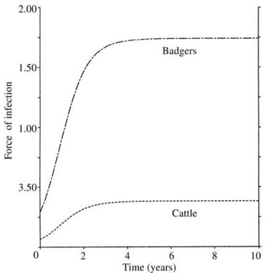

**Figure 10.19.** Graphical representation of the force of infection corresponding to the disease transmission dynamics for badgers and cattle. Here, a primary assumption is that most of the badger groups sleep in communal huddles in the setts with the environmental conditions that greatly enhance the spread of Tb among them, which in part accounts for an increasingly higher force of infection for badgers; it stabilises after some time.

disease incidence increases after the introduction of an infected group) to make sure that all other requirements, namely, conditions for disease incidence and prevalence had been satisfied. The model equations (10.90) were solved by finite difference schemes with parameter values as in Table 10.2. The initial conditions were set by solving the ordinary differential equations obtained by dropping the time derivatives from which we obtained stable age distributions determined by the age-specific birth and death rates and perturbing the whole system by shifting 10% of susceptible badgers and 5% of susceptible cattle into the infective classes.

#### *Numerical Results and Predicitions*

The time-dependent forces of infection in the badger and cattle populations are given by (10.101) which can be evaluated only by solving the full system. This was done with the parameter values given in Table 10.2 and the results are shown in Figure 10.19. As we saw earlier, we could evaluate the integrals and obtain algebraic relations, namely, (10.104)–(10.106), between the two forces of infection for the equilibrium state where life expectancy, *L*, is long, the death rate a constant (giving an exponential survival probability) and a criss-cross type of infection is the main route by which infection may occur. These imply that the ratio of the force of infection of badgers to cattle is inversely proportional to the ratio of the force of infection of cattle to badgers. The implication here is that if the spread of bovine tuberculosis remains unchecked it may be possible to predict the dynamics of disease spread within badgers for different age groups by studying that for cattle alone (and vice versa).

The model predictions, as illustrated in Figure 10.20 indicate that the number of susceptible badgers and cattle declines while there is a gradual increase in the number of infected badgers and cattle, and much more so within badger populations. This suggests that should a criss-cross type of infection occur the impact of the disease could be felt much more within badger populations. This confirms our assumption that badgers endure a prolonged illness once infected and that it is during this prolonged period of illness that they contaminate cattle pasture with bacilli.

The basic age-structured criss-cross model we have discussed here is based on the assumption of horizontal transmission by bite wounding, aerosol infection, infection contracted through grazing on pastures and so on. Vertical transmission (mother to cub) may be important but we did not take this into account. Broadly speaking, cattle cannot be regarded as a reliable sentinel for the prevalence of infection in badgers everywhere because of the variation in the degree of contact. The proposed models therefore reflect the epidemiology of the disease in areas with good habitats where both species coexist.

As we have mentioned, it is difficult to establish the actual force of infection especially within various badger groups where, for instance, age is determined by weight, size and dental structure as opposed to precise observed trends in cattle. In any event, with the implementation of the LPS method, we were able to make various predictions using the model equations. We speculate that cattle are more or less kept under more hygienic conditions in farms and thus the tendency of high levels of infection is markedly reduced. There is no oscillatory trend in disease incidence between the two distinct groups but, among badgers, some observations indicate a possible cyclic trend in disease incidence (see Cheeseman et al. 1989 and Bentil and Murray 1993). This


**Figure 10.20.** Numerical solution of the criss-cross model showing patterns for susceptible and infectious badgers and susceptible and infectious cattle with respect to age and time (horizontal axis) after an initial infection. The vertical axis denotes the corresponding fractions of the various subpopulations. For the chosen parameter values (using LPS estimates in Table 10.2) the number of infectious badgers (b) increases to about 60% while the number of infectious cattle (d) increases to about 30% before stabilizing.

may seem to be the case from our model predictions and makes the study of a possible (hypothetical) criss-cross type of infection all the more relevant.

Results of this study indicate that it is possible to estimate the age-specific equilibrium values of the force of infection knowing which survival functions to use. A constant death rate for badgers and cattle gives, for example, an inverse proportionality relationship which makes it easier to predict the disease transmission dynamics within different age groups. It may be possible to analyse the model behaviour for a step function death rate but the results will be much more difficult to obtain, other than numerically.

A major motivation for the comparative study of an age-structured model for this recurrent disease is the evaluation of control measures for the eradication of the disease as pointed out, for example, by Dietz and Schenzle (1985), Anderson and May (1985) and Murray et al. (1986). The main objective of the above modelling is to use the results to study the dynamics of immunization programmes and suggest how certain control measures could be adopted with the ultimate objective of minimizing the spread of infection from badgers to cattle and vice versa, should an epidemic occur. We discuss this in the following section.

# **10.12 Modelling Control Strategies for Bovine Tuberculosis in Badgers and Cattle**

Bentil and Murray (1993) developed and analysed models for the dynamics of bovine tuberculosis (*Mycobacterium bovis*) infection in the wild badger population. Because of the possibility (I believe, high probability) of badgers being the reservoir for the disease in cattle in the southwest of England in the last section we proposed and analysed a simple criss-cross model. As pointed out, the eradication of the disease when there is a feral infected animal population, such as in the southwest of England and in New Zealand, has not yet been successful in spite of the implementation of an intensive national tuberculosis eradication campaign. The eradication, or rather acceptable control, of bovine tuberculosis by testing and slaughtering programmes has been successful in many countries, as we have said, but total elimination has not been achieved. In the U.S.A., all cattle are systematically tested and those reactors are slaughtered. As a result, reactor rate was reduced from about 5% to 0.03% (USDA Report 1982a,b).

Badgers occupy a variety of habitats, especially woodland areas interspersed with arable and pasture land (Clements et al. 1978, Kruuk 1988). Such habitats are usually intimately intermeshed with intensively used cattle pastures which makes the likelihood for badger-to-cattle and cattle-to badger disease transmission all the more possible. The analysis of the model in the last section for the dynamics of a hypothetical criss-cross infection provides some guidelines concerning the likely impact of the disease between the two distinct populations. Results from that criss-cross model suggest that it may be possible to predict the disease transmission dynamics for one group, namely, cattle, if we know that for badgers and vice versa.

In Britain, for example, programmes for the control of bovine tuberculosis in areas of frequent herd infection have been centred on the reduction of badger density by removal of entire groups of badgers (usually by gassing, which particularly incenses the English) where one or more individuals were thought to be infected. The MAFF control policy (MAFF report 1987) assumed, wrongly as it turned out, that a single intensive intervention to remove all infected groups of animals would suffice to eliminate infection from contaminated areas for long periods of time. As mentioned above the MAFF (1994) control was more selective and probably no more effective. In this section we discuss a new approach that Dr. D.E. Bentil and I developed in the mid-1990's. We model the dynamics of specific immunization programmes and suggest how certain control measures could be adopted with the ultimate objective of minimizing the spread of infection from badgers to cattle and vice versa should an infection occur. We compare several vaccination strategies and deduce a cost benefit criteria for them. The model is in effect a spatial one in that we present a discrete approach to the study of the problem. The discrete approach uses a cellular automaton model which could easily be understood by nonspecialists. We shall also show how a characteristic empirical response to the vaccination policies could be achieved.

#### *Criss-Cross Model with Immunization*

Based on the age-dependent criss-cross model in the last section we examine two aspects of the impact of immunization which we expect will reduce the net rate of disease transmission between the two populations by decreasing the per capita force of infection. In particular we consider the following aspects of immunization:

- **(i)** its effect on the steady state or equilibrium conditions, that is, the state towards which a population may converge in the long term under the influence of an immunization programme;
- **(ii)** its effect in the short term on the temporal dynamics of the infection within the various groupings as they move to a new steady state following the initiation of an immunization programme.

Suppose the age-specific rates of immunization are *c*(*a*) and *c*˜(*a*) for badger and cattle populations respectively. This introduces a further removal term in the crisscross model for the susceptible population dynamics. We modify the model (10.90) for badger–cattle disease transmission dynamics to read

$$\begin{aligned} \frac{\partial U}{\partial t} + \frac{\partial U}{\partial a} &= -[\lambda_1 + c(a)]U + rW - \mu U, \\ \frac{\partial W}{\partial t} + \frac{\partial W}{\partial a} &= \lambda_1 U - rW - \mu W, \\ \frac{\partial Z}{\partial t} + \frac{\partial Z}{\partial a} &= c(a)U - \mu Z, \\ \frac{\partial \tilde{U}}{\partial t} + \frac{\partial \tilde{U}}{\partial a} &= -[\bar{\lambda}_1 + \tilde{c}(a)]\bar{U} + \tilde{r}\bar{W} - \tilde{\mu}\bar{U}, \\ \frac{\partial \tilde{W}}{\partial t} + \frac{\partial \tilde{W}}{\partial a} &= \bar{\lambda}_1 \tilde{U} - \tilde{r}\tilde{W} - \tilde{\mu}\tilde{W}, \\ \frac{\partial \tilde{Z}}{\partial t} + \frac{\partial \tilde{Z}}{\partial a} &= \tilde{c}(a)\bar{U} - \tilde{\mu}\tilde{Z}, \end{aligned} \tag{10.107}$$

where we have introduced another subpopulation in both the badgers and cattle, namely, the immune classes *Z* and *Z*˜ respectively. As before *U* and *W* are respectively the susceptible and infectious badgers with similar definitions for *U*˜ and *W*˜ . The force of infection for the respective populations are again given by (10.91) and (10.92). The initial age distribution of the respective classes is given by (10.93) but with the addition of initial conditions for the immune classes, so

$$\begin{aligned} U(0, a) &= U_0(a), \quad \tilde{U}(0, a) = \tilde{U}_0(a), \\ W(0, a) &= W_0(a), \quad \tilde{W}(0, a) = \tilde{W}_0(a), \\ Z(0, a) &= Z_0(a), \quad \tilde{Z}(0, a) = \tilde{Z}_0(a), \end{aligned} \tag{10.108}$$

and represent the preimmunization equilibrium distributions. The renewal (boundary) conditions for the various groups are given by (10.95) with the addition of those for the immune classes, namely,

$$\begin{aligned} U(t,0) &= N(t,0) = \boldsymbol{\upchi} \, N(t), & W(t,0) &= Z(t,0) = 0, \\ \tilde{U}(t,0) &= \tilde{N}(t,0) = \tilde{\boldsymbol{\upchi}} \, \tilde{N}(t), & \tilde{W}(t,0) &= \tilde{Z}(t,0) = 0, \end{aligned} \tag{10.109}$$

where again γ *N*(*t*) is the number of births of badgers at age 0 for all *t*, with the birth rate γ assumed constant and *N*(*t*) the total badger population. So, at any time *t*, the age distribution of both badgers and cattle is again given by (10.96).

We again rescale the problem in the same way as we did in the last section by writing

$$\begin{aligned} u(t,a) &= \frac{U(t,a)}{N(t,a)}, \; w(t,a) = \frac{W(t,a)}{N(t,a)}, \; z(t,a) = \frac{Z(t,a)}{N(t,a)},\\ \tilde{u}(t,a) &= \frac{\tilde{U}(t,a)}{\tilde{N}(t,a)}, \; \tilde{w}(t,a) = \frac{\tilde{W}(t,a)}{\tilde{N}(t,a)}, \; \tilde{z}(t,a) = \frac{\tilde{Z}(t,a)}{\tilde{N}(t,a)},\end{aligned} \tag{10.110}$$

and again rescaling the time and chronological age by setting τ = *rt*, α = *ra* (badgers) α = ˜*ra* (cattle) we get the nondimensional system

$$\begin{aligned} \frac{\partial u}{\partial \tau} + \frac{\partial u}{\partial \alpha} &= -\frac{1}{r}(\lambda_1 + c)u + w, \\ \frac{\partial w}{\partial \tau} + \frac{\partial w}{\partial \alpha} &= \frac{1}{r}\lambda_1 u - w, \\ \frac{\partial z}{\partial \tau} + \frac{\partial z}{\partial \alpha} &= \frac{1}{r}cu, \\ \frac{\partial \tilde{u}}{\partial \tau} + \frac{\partial \tilde{u}}{\partial \alpha} &= -\frac{1}{\bar{r}}\bar{\lambda}_1 \bar{u} + \bar{w}, \\ \frac{\partial \tilde{w}}{\partial \tau} + \frac{\partial \tilde{w}}{\partial \alpha} &= \frac{1}{\bar{r}}(\bar{\lambda}_1 + \bar{c})\bar{u} - \bar{w}, \\ \frac{\partial \tilde{z}}{\partial \tau} + \frac{\partial \tilde{z}}{\partial \alpha} &= \frac{1}{\bar{r}}\bar{c}. \end{aligned} \tag{10.111}$$

Now let vaccination be given so that fractions *f* , ˜*f* , *g*, *g*˜ of susceptible badgers and cattle become immune at ages *T*1 and *T*2 > *T*1, say. Then the conditions at ages *T*1 and *T*2 depicting the relationship at the points of discontinuity of *u* and *u*˜ take the form

$$\begin{aligned} u(T_1 + 0) &= (1 - f)u(T_1 - 0); & u(T_2 + 0) &= (1 - g)u(T_2 - 0), \\ \tilde{u}(T_1 + 0) &= (1 - \tilde{f})\tilde{u}(T_1 - 0); & \tilde{u}(T_2 + 0) &= (1 - \tilde{g})\tilde{u}(T_2 - 0). \end{aligned} \tag{10.112}$$

In such circumstances we can deduce the susceptible populations consecutively for the specified 'immunization age intervals' (see, for example, Hethcote 1983) to get the susceptible fractions (in nondimensional terms) for the badger and cattle populations at equilibrium in the age intervals [0, *T*1), [*T*1, *T*2), [*T*2,∞). To do this we need the equilibrium solutions.

The initial values *u*(0,α) = *u*(α), *u*˜(0,α) = ˜*u*(α) represent the preimmunization fractional equilibrium distributions given by the time-independent solutions of the set of ordinary differential equations given by (10.112) excluding the immunization terms and with all (∂/∂*t*)-terms set equal to zero. These are routinely found to be

$$\begin{split} u(\alpha) &= \frac{1}{\lambda_2 + r} \left[ r + \lambda_2 \exp\left( -\frac{\lambda_2}{r} - 1 \right) \alpha \right], \\ \tilde{u}(\alpha) &= \frac{1}{\tilde{\lambda}_2 + \tilde{r}} \left[ \tilde{r} + \tilde{\lambda}_2 \exp\left( -\frac{\tilde{\lambda}_2}{\tilde{r}} - 1 \right) \alpha \right], \end{split} \tag{10.113}$$

where the forces of infection λ2 and λ˜ 2 are those for the equilibrium state and given, respectively, by

$$\begin{split} (B) \qquad \lambda_2 &= \frac{\beta_1}{r} \int_0^\infty w(\alpha) N(\alpha) \, d\alpha + \frac{\beta_1}{\tilde{r}} \int_0^\infty \tilde{w}(\alpha) \tilde{N}(\alpha) \, d\alpha, \\ (C) \qquad \ddot{\tilde{\lambda}}_2 &= \frac{\tilde{\beta}_1}{\tilde{r}} \int_0^\infty \tilde{w}(\alpha) \tilde{N}(\alpha) \, d\alpha + \frac{\tilde{\beta}_2}{r} \int_0^\infty w(\alpha) N(\alpha) \, d\alpha. \end{split} \tag{10.114}$$

Using these solutions (10.113) we get, from (10.112),

$$u(\alpha) = \begin{cases} \frac{1}{\lambda_2 + r} [r + \lambda_2 \exp(-\frac{\lambda_2}{r} - 1)\alpha], & 0 \le \alpha < rT_1; \\\\ \frac{(1 - f)}{\lambda_2 + r} [r + \lambda_2 \exp(-\frac{\lambda_2}{r} - 1)\alpha], & rT_1 \le \alpha < rT_2; \\\\ \frac{(1 - f)(1 - g)}{\lambda_2 + r} [r + \lambda_2 \exp(-\frac{\lambda_2}{r} - 1)\alpha], & rT_2 \le \alpha, \end{cases} \tag{10.115}$$

with a similar relation for susceptible cattle when *f* , *g*, *r*, λ are replaced by ˜*f* , *g*˜, *r*˜ and λ˜ in (10.115).

At equilibrium the basic reproductive rate ρ0 is related to the total susceptible fraction, *ue*, by

$$
\rho_0 u_\epsilon = 1.\tag{10.116}
$$

In this context, the equilibrium disease incidence can then be determined from the relation

$$
\rho_0 \int_0^\infty u(a) N(a) \, da = 1,\tag{10.117}
$$

with a similar relation holding for the cattle population. For example, if we assume a constant death rate, µ, as we did in the previous section, we have

$$\frac{\rho_0 \nu}{r^2} \int_0^\infty u(\alpha) e^{-(\mu/r)\alpha} \, d\alpha = 1 \tag{10.118}$$

which on integrating, using (10.115), gives

$$\begin{split} \frac{\rho_{0}\chi}{\lambda_{2}+r} & \left\{ \frac{r}{\mu} [1 - f e^{-\mu T_{1}} - (1 - f)g e^{-\mu T_{2}}] \\ &+ \frac{\lambda_{2}}{\lambda_{2} + r + \mu} [1 - f e^{-(\lambda_{2} + r + \mu)T_{1}} - (1 - f)g e^{-(\lambda_{2} + r + \mu)T_{2}}] \right\} = 1. \end{split} \tag{10.119}$$

Suppose that vaccination takes place only at one age, *T*1 say; then *g* = 0 and we get, from the last equation

$$\frac{\rho_0 \nu}{\lambda_2 + r} \left\{ \frac{r}{\mu} [1 - f e^{-\mu T_1}] + \frac{\lambda_2}{\lambda_2 + r + \mu} [1 - f e^{-(\lambda_2 + r + \mu)T_1}] \right\} = 1. \tag{10.120}$$

The disease incidence in cattle satisfies the relation

$$\frac{\tilde{\rho}_0 \tilde{\nu}}{\tilde{\lambda}_2 + \tilde{r}} \left\{ \frac{\tilde{r}}{\tilde{\mu}} [1 - \tilde{f} e^{-\tilde{\mu} T_1}] + \frac{\tilde{\lambda}_2}{\tilde{\lambda}_2 + \tilde{r} + \tilde{\mu}} [1 - \tilde{f} e^{-(\tilde{\lambda}_2 + \tilde{r} + \tilde{\mu}) T_1}] \right\} = 1. \tag{10.121}$$

From the last two equations, λ2 and λ˜ 2 corresponding to the equilibrium forces of infection within badgers and cattle after the initiation of an immunization programme can be determined by estimating ρ0, and ρ˜0 from prevaccination epidemiological data and using (10.120) and (10.121) to calculate λ2 and λ˜ 2 in terms of *f* and *T*1, which characterise the immunization programme. The effective reproductive rate, ρ, (that is, the generation of secondary cases where a proportion is immune) under the mass action assumption of disease spread and transmission, ρ is related to ρ0 by

$$
\rho = \rho_0 u_\ell = \rho_0 (1 - f), \tag{10.122}
$$

where *ue* is the fraction of susceptibles and *f* is the proportion that is temporarily immune.

To be able to eradicate the disease by adopting an appropriate vaccination or treatment coverage, it is necessary to create a level of herd immunity such that the effective reproductive rate, ρ, is reduced to a value less than unity. Herd immunity means that the fraction of the population that is susceptible is sufficiently small that an outbreak would not result if one animal suddenly became infective or if an imported infective were introduced into the environment. It can also be considered as an indirect protection of unvaccinated susceptibles by high levels of vaccination amongst the remaining segments of the population. This protection is a consequence of the reduction in disease transmission brought about by the removal of vaccinated animals from the susceptible class. It is through the effects of herd immunity that it is possible to eradicate a disease without vaccinating every single susceptible (Fox et al. 1971). Formally, the critical level of vaccination coverage corresponds to the limit λ2 → 0, λ˜ 2 → 0 in (10.120) and (10.121). In this way, each primary case will generate less than one secondary case as is evident from the ensuing relation

$$
\rho_0 \| 1 - f \exp(-\mu T_\text{l}) \| \le 1. \tag{10.123}
$$

This means, therefore, that we require the immune proportion of badgers and cattle to exceed a critical value

$$f_c = \left(1 - \frac{1}{\rho_0}\right) \exp\left(\frac{T_1}{L}\right); \quad \tilde{f}_c = \left(1 - \frac{1}{\tilde{\rho}_0}\right) \exp\left(\frac{T_1}{L}\right). \tag{10.124}$$

| Demographic                              | Epidemiological                          | Operational            | Technical<br>(Efficacy) |
|------------------------------------------|------------------------------------------|------------------------|-------------------------|
| Population Growth<br>(birth/death rates) | Prevalence level in<br>initial situation | Population coverage    | Clinical                |
|                                          | Implementation intensity                 | Effective contact rate | Waning                  |
|                                          |                                          | Eligibility criteria   |                         |

**Table 10.3.**

So, a proportion greater than *fc* of each new cohort of cub (calves) at or near birth, or at age *T*1 should be immunized. If vaccination is given to very young cubs (calves) only, then *T*1 ≈ 0 and ρ0(1 − *f* ) ≤ 1. Eradication is easier if animals are vaccinated at the earliest feasible age, *T*1, and essentially impossible if at a later stage.

Case notification records show that generally, there has been a very low level of *M. bovis* infection over several decades (MAFF report 1987, 1994, Cheeseman et al. 1988, 1989). An important question concerns the level of coverage that should be aimed at to eradicate an infection should it occur. In the attempt to choose or adopt an effective strategy for the eradication of the disease, we should note that control measures differ in their effectiveness according to different situations. In Table 10.3 we list some aspects which exert different influences on the relative effectiveness of adopted measures.

#### *Control Programme and Its Implementation*

We make the following clinical assumptions.

- **(i)** The development of *M. bovis* in infected badgers and cattle is purely an endogenous process.
- **(ii)** The protective efficacy of vaccines is assumed to wane at a constant rate of 5% per annum and gives 66% protection (Waaler et al. 1969). This means that a vaccination coverage of about 95% amounts to transferring 66% of the noninfected group into a vaccine-protected group.

Studies by Stuart et al. (1988) on the development of diagnostic tests for, and vaccination against, tuberculosis in badgers suggest that badgers mount a weak antibody response to conventional antigens when compared with laboratory rabbits. However, it was found that cell-mediated immunity seems to be enhanced by vaccination and leads to prolonged survival of badgers and delayed excretion of tubercle bacilli.

As a means of reducing the force of infection and hence the number of infectives, in our approach we adopt chemotherapy in the form of oral vaccination to control *M. bovis* infection within badgers and suggest vaccination as a method to fight the disease in cattle. A combination of both strategies where vaccines are administered in mixed food items as well as actual vaccination of groups of animals may be helpful, although this will only really be effective for cattle since badgers, unlike cattle, are not confined to specific areas and sometimes move about randomly within, and sometimes away from, their neighbourhoods (see, for example, Rogers et al. 1998).

We divide the population into two, that is, cubs (calves) and adults. Considering badgers, for example, the fraction of cubs becoming immune at age *T*1 (1 year) is *f* and the fraction of adults becoming immune at age *T*2 (5 years) is *g*. If ρ0*ue* ≤ 1, then the disease will eventually die out and herd immunity achieved. From a practical point of view, we may conclude that a policy of 66% vaccination at age one will reduce the yearly incidence of *M. bovis* infection for approximately five years. Thereafter the yearly incidence will be higher if we adopt a no-vaccination policy at all. It is reasonable to suggest a two-66% vaccination policy: one at the beginning, or more precisely, a year after birth and the other after 5 years. This double campaign could reduce *M. bovis* infection for about nine years before any possible epidemic ensues.

An alternate, and we believe better, method is a modification of a vaccination policy which was proposed by Frerichs and Prawda (1975) and adopted for the control of rabies in Colombia. We call it the Preferred Vaccination Policy (PVP). Here, assuming there is a potential outbreak within neighbouring regions, each targeted subregion should be ranked according to the potential contribution it would make to the incidence of *M. bovis* infection. From case notification records, the risk, *Ri*,*t* , of badger/cattle contributing to new infection cases is calculated for each subregion within the specified area as

$$R_{l,l} = C_l U_{l,l} + \frac{1}{5} \sum_{j=1}^{5} C_{l(j)} U_{l(j),l},\tag{10.125}$$

where

- *Ri*,*t* is the index for *M. bovis* risk for subregion *i* at time *t*. It is calculated from case notification records;
- *Ci* is the proportion of badger/cattle in subregion *i* relative to that of neighbouring subregions;
- *Ui*,*t* is the number of susceptible badger/cattle in subregion *i* at time *t*;
- *i*(*j*) is a subscript denoting neighbouring subregions *j*, *j* = 1, 5 surrounding *i*.

Since there is the possibility for infection from neighbouring subregions, an assumption is made that the sum of the values *Ci*(*j*)*Ui*(*j*),*t* in each of the five neighbouring subregions or social groups is equally as important to the subsequent generation of *M. bovis* infection as the value of *CiUi*,*t* in subregion *i* itself. All values of *Ri*,*t* are ranked from highest to lowest. This control policy continuously employs vaccinating teams who are sent to the highest ranked subregion and they remain there until the required proportion of susceptibles is vaccinated. Thereafter, they are sent to the next highest ranked subregion at different time periods and information updated as they visit various subregions.

#### *Cellular Automaton Model for Practical Implementation*

We present a discrete approach to the implementation of the PVP using cellular automaton models. Such models have the advantage of providing a visual representation of the main qualitative features of the processes and the results of simulations for various parameter sets. The cellular automaton models are as follows. First, we model the

disease incidence and spread within badger and cattle populations (Rule A) and second, we consider a situation where a proportion becomes immune due to the introduction of a vaccination policy, namely, the Preferred Vaccination Policy (PVP) (Rule B).

The first model consists of a rectilinear grid of cells which represent the contagion of the disease between badgers and cattle (Rule A below). The model includes parameters *Dc* and *Db* for the duration of disease in cattle and badgers respectively. We consider v as a status variable which increases by one unit for each time-step until a maximum of *D* steps is reached after which v reverts to 0, that is, the animal becomes susceptible again. Here, we have assumed that there is no immune class. The status of the animal changes with time depending on the status of the animal itself and the status of its four contiguous neighbouring cells in accordance with a set of rules for simulating the contagion of the disease within badger populations. The rules are:

#### *Rule A*

An animal can become infected if it is in a susceptible state and if it comes into contact with an infected animal; that is, at least one of its four neighbours is infected. When contact occurs, the probability of a susceptible individual becoming infected depends on the parameters *Pcc*, *Pcb*, *Pbb* and *Pbc*. These are the probabilities of disease transmission per unit time from infected cow to susceptible cow, from infected cow to susceptible badger, from infected badger to susceptible badger, and from infected badger to susceptible cow respectively. At each time-step, each cell in the array is evaluated. If the cell contains an infected animal, we determine whether each of its four neighbours is in a susceptible state. If a neighbour is susceptible or exposed and has little or no resistance to infection, it becomes infected with probability *p*. Once infected the animal remains infective for a specified number of time-steps after which time it dies or becomes susceptible again.

The second model simulates the disease incidence and prevalence in which an immune class has been introduced (Rule B below). An immune class is introduced by sending vaccination teams to highest ranked subregions. This is the Preferred Vaccination Programme (PVP).

#### *Rule B*

Using a sparsely populated rectilinear grid, we consider an extension of Rule A to include an immune state for the status variable v. After remaining infected for *D* time units, an animal may become immune in a subregion with a certain probability. An animal in the immune state remains immune for a specified number of time-steps and dies.

#### *Results and Control Implementation*

A direct vaccination coverage to specific age groups is difficult in the case of badgers so oral vaccination could be administered by way of sprinkling food mixed with vaccine. (This method is remarkably efficient in dispensing vaccine to foxes in the case of rabies.) Vaccination is assumed to be given randomly to all badgers while with cattle those in the same age group or those found by a serological test to be susceptible could be vaccinated. The proposed strategy for vaccination should be one year after birth and four years afterwards.

To obtain some measure for the cost, *C*, of such a programme we exploit (10.120) and (10.121) to propose a cost–benefit criterion. One measure of the effort for a particular strategy to be implemented is

$$C = f e^{-\mu T_1} [1 + e^{-(\lambda_2 + r)T_1}] + g e^{-\mu T_2} [1 + e^{-(\lambda_2 + r)T_2}],\tag{10.126}$$

and similarly for the cattle population

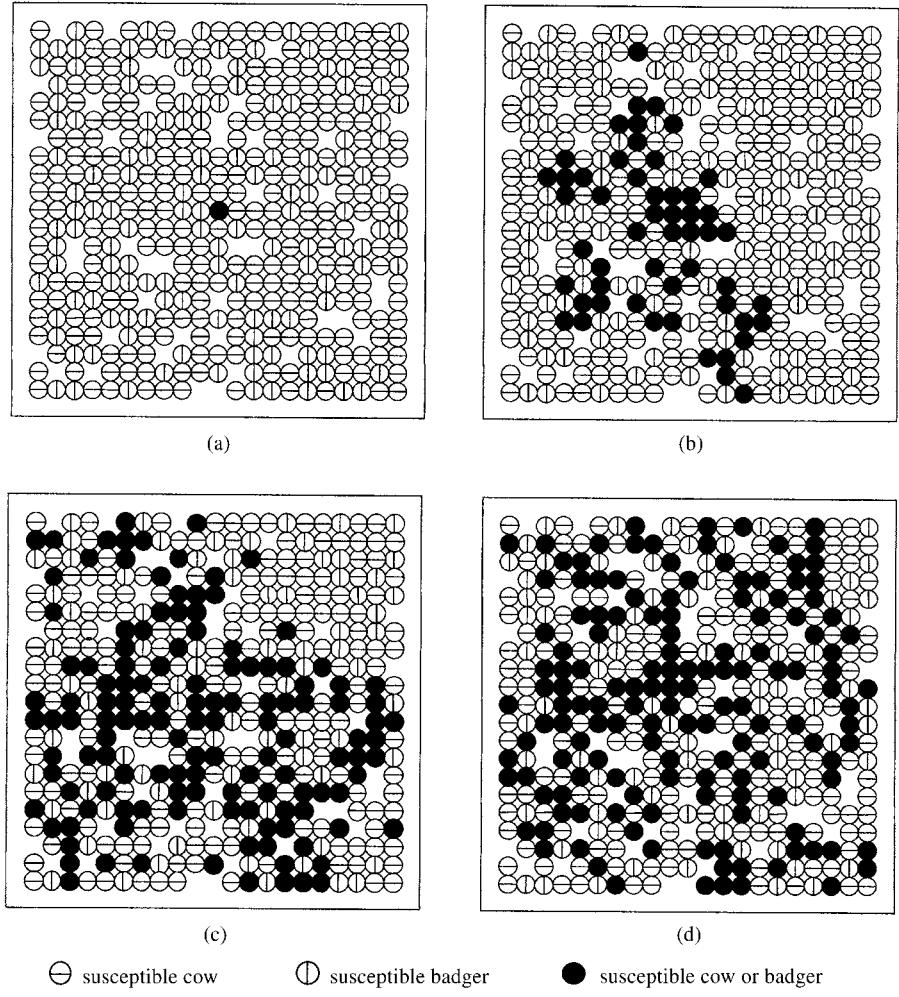

**Figure 10.21.** Cellular automaton simulation for disease spread between badgers and cattle. We consider a sparsely populated region (white regions imply uninhabited regions). Parameter values: normalised badger density = 0.60, cattle density = 0.40, duration of disease = 3 months. Transmission probabilities: infected cow to susceptible cow = 0.25, infected cow to susceptible badger = 0.1, infected badger to susceptible cow = 0.75. No development of immunity. (**a**) One infected badger introduced in the sett at *t* = 0. (**b**), (**c**) and (**d**) depict patterns of infection at *t* = 20 months, *t* = 40 months, *t* = 60 months. Initial condition: one infected badger was introduced at the centre of the array.


**Figure 10.22.** Empirical response to a vaccination policy. In comparison with the spread of infection between badgers and cattle (Figure 10.21), with the conferment of immunity due to the introduction of the PVP, the simulations suggest a possible reduction in disease incidence and prevalence. Parameter values: badger density = 0.60, cattle density = 0.40, duration of disease = 3 months. Transmission probabilities: infected cow to susceptible cow = 0.25, infected cow to susceptible badger = 0.1, infected badger to susceptible cow = 0.75. Immunity is 6 months. (**a**) One infected badger introduced in the sett at *t* = 0. (**b**), (**c**) and (**d**) depict patterns of infection at *t* = 20 months, *t* = 40 months, *t* = 60 months. Initial condition: one infected badger was introduced at the centre of the array.

$$\tilde{C} = \tilde{f}e^{-\tilde{\mu}T_1} \left[ 1 + e^{-(\tilde{\lambda}_2 + \tilde{r})T_1} \right] + \tilde{g}e^{-\tilde{\mu}T_2} [1 + e^{-(\tilde{\lambda}_2 + \tilde{r})T_2}],\tag{10.127}$$

where in each case we consider the force of infection in cattle, say, has an influence on the disease transmission dynamics of badgers and vice versa. Even though the Preferred Vaccination Policy could cost more than the other vaccination policies, the cumulative number of mean infected cattle over a 10-year planning period would be reduced to a significantly lower level. The indicator for the programme's success should therefore not be cost-per-badger or cattle vaccinated but cost-per-infected badger or cattle prevented from becoming infected.

The cellular automaton models provide a visual representation of the main qualitative features of disease prevalence in badgers and cattle and the impact of a Preferred Vaccination Policy. Figure 10.21 shows a cellular automaton model for a typical criss-cross infection involving two distinct populations, that is, cattle and badgers. Figure 10.22 shows the characteristic empirical response to the described PVP for sparsely populated unit cells of badgers and cattle and an infection between them.

We are interested in the long term effect on the disease prevalence as a consequence of implementing a vaccination policy. So, by way of example, we used similar cellular automaton models to study the disease prevalence in badgers for the following control policies: (i) no vaccination, (ii) approximately 66% initial vaccination, and (iii) 66% initial + 66% revaccination (after five years). The vaccination was assumed to be administered by sprinkling food mixed with vaccines. Figure 10.23 compares results of the possible control experiments with that for the Preferred Vaccination Policy over a 10-year period.

As mentioned at the beginning of this section the MAFF control policy in Britain assumed that such a single and intensive intervention to remove all infected groups of animals would suffice to eliminate infection from contaminated areas for long periods of time (MAFF Report 1987). The MAFF (1994) report resulted in a more selective culling: badgers in Britain are now legally protected. The USDA eradication policy attempted to liquidate all infected animals in the herd with indemnities paid, as available, to help compensate owners for their losses, or hold herds under quarantine and tested

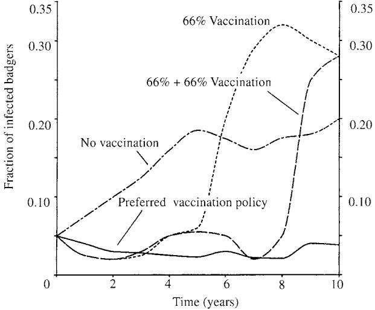

**Figure 10.23.** Computer simulation of possible scenarios for fractions of infected badgers over a 10-year period under various control strategies. The graphs show an empirical response to the control strategies described above namely: (i) no vaccination, (ii) 66% vaccination, (iii) two 66% vaccination campaigns, one at the beginning and the other after 5 years, (iv) PVP. It is evident that the fraction of infected badgers will be much lower for the PVP, giving an indication that the disease prevalence will be minimal in cattle too.

until all evidence of infection was eliminated (USDA Report 1982a,b) may not be the only approaches to take, from our model predictions. We note that chemotherapy in the form of oral vaccination (sprinkling of food mixed with vaccine) could be an effective way of controlling the spread of the disease in badgers as opposed to gassing, trapping and killing, since badgers, unlike cattle, are not confined to specific regions and move about randomly within and sometimes away from their setts. Again as already mentioned such a procedure has been very successful in the control of fox rabies in parts of Europe. We have also shown that eradication of the disease is easier if animals are vaccinated at the earliest feasible year (one year) rather than wait until there is an infection, in which case it would be almost impossible to eradicate the disease.

Early mass vaccination programmes predict a reduction of the effective reproduction rate of infection within communities, and hence raise the average age at infection amongst those animals which experience the disease. If, however, the force of infection changes with age, the tendency of mass immunization to increase the average age at infection may mean that the rate of exposure of susceptibles to infection in older classes may well differ from the rates acting in the age classes in which the susceptibles would have typically acquired infection prior to immunization. The potential consequence of such a change is to reduce the predicted level of vaccination coverage required to eradicate the infection below a certain level.

It seems that of the three vaccination strategies considered, leaving aside the cost– benefit criteria, the Preferred Vaccination Policy which targets highest ranked 'infectious' regions and vaccinates susceptibles is the best of the control programmes for bovine tuberculosis infection between badgers and cattle if an epidemic occurs. It should be noted, however, that the models we have discussed in this section and the previous one are still fairly basic. Not only that, we have not taken into account the spatial movement of the badgers. Relevant data on badger movement is given by Rogers et al. (1998) for 36 social groups in Gloucestershire in England over a period of 18 years. They show that the movement of badgers within groups varies and with this variation there is a variation in the incidence of bovine tuberculosis. The spatial aspects of disease spread are extremely important. We discuss an example of this later in Chapter 13, Volume II when we discuss the spatial spread of a rabies epidemic.

An interesting and very different new approach to the control of bovine tuberculosis is given by Kao et al. (1997). They develop a herd-based model which involves 'test and slaughter' combined with herd isolation and vaccination and they apply it to the situation in New Zealand. The model system consists of ordinary differential equations, relating movement from one state to another (such as from latent to infected) and an integral equation which gives the number of infected herds.

The question as to what is the best strategy for control is highly complex and clearly species-(and geographically) dependent. In the HIV modelling above we could incorporate two drugs into the models and thereby compare the efficacies of the different treatments. In the case of badgers and Tb, vaccination is now the preferred method of control in England. Rabies, the vector for which is the red fox (*Vulpes vulpes*) in the present epidemic in western Europe and, as mentioned, is controlled by vaccination, does not (yet) exist in Britain where domestic animals are not vaccinated for the disease. (Fox hunting in England is an amazingly inefficient way of keeping down the fox population.) It would be interesting to construct a model which included various methods of control and to compare the consequences of vaccination, culling, contraception and so on. From the point of culling a new selective culling was introduced in 1994 (MAFF Report 1994): without more knowledge which could come from further studies and realistic modelling it simply fuels the controversy. Hancox (1995) presents the various arguments in the debate. He concludes that there may be cattle reservoirs of bovine TB and so it is the cattle who are continually infecting the badger, a much more appealing scenario for the British with their sentimental view of badgers and who view the slaughtering of badgers with much indignation. The vaccination scenario we discuss in this section does not distinguish which of the badgers or cattle is the reservoir.

#### *BSE (Bovine Spongiform Encephalopathy) and Creutzfeldt–Jacob (CJ) Disease*

Although we do not do any modelling it is important to briefly mention bovine spongiform encephalopathy (BSE), or 'mad cow' disease. It was first diagnosed in England in 1986 and by the summer of 1997 there were around 167,000 cases confirmed with undoubtedly many more undetected.12 The epidemic was severe in both size and in particular the human consequences since it is has given rise to the emergence of a new human disease, namely, a variant of Creutzfeldt–Jacob (CJ) disease.

CJ disease is a particularly horrifying neurodegenerative disease that affects the brain and is always fatal. It is caused by prions, which are very small particles—badly folded proteins—that are particularly tenacious; they cannot be broken down nor killed easily. Unlike viruses they contain no genetic material and so provoke no immune response. These prions accumulate in the brain and make spongelike holes. Prior to death the victims suffer from insomnia, depression, anxiety, memory loss, loss of bodily function control, coordination and blindness. Since prions are only in infected tissue they can easily be missed in an autopsy, which is why CJ is difficult to detect. It is becoming clear that BSE in the cattle was a result of contaminated feed associated with the equivalent disease in sheep and is directly the cause of variant CJ in humans. BSE comes under the category of a *transmissable spongiform encephalopathy* or TSE.

By the end of 2000 only 87 cases in Britain have been found since 1994. Compared with malaria or HIV it is negligible. There are several rather frightening reasons for the panic, particularly in France, because of the chilling list of facts about BSE and how easily it is passed from one infected animal to another. The pathogen is very tenacious and is resistant to heat, boiling, alcohol, ionizing radiation and so on. Surgical instruments which were in contact with the infected tissue can remain contaminated even after normal sterilisation. The pathogen can survive being buried for years, could end up in landfills and possibly passed on to grazing animals. BSE can be passed on by a cow ingesting as little as a few grammes of infected tissue. An animal can harbour the disease wihout showing any symptoms but it can pass it on to another animal. With the variant CJ disease it may be possible for one human, who has it but shows no symp-

<sup>12</sup>The story of how the U.K. government dealt with the problem is an example of astonishing incompetence if not irresponsibility. As of 2000 the question of the export of British beef—now reputed to be free of BSE was a matter of litigation between France on one side and Britain and the European Union on the other. The French felt that the evidence that the British beef was now safe was not unequivocal. As of the end of 2000 an epidemic in France, and other European countries, is causing serious concern and not just in view of the connection to Creutzfeldt–Jacob disease.

toms, to pass it on to another.13 The disease, in many ways is like being bitten by a dog that was possibly rabid but without the benefit of any subsequent vaccine, with a gestation period that could last for years with the knowledge that the disease can be passed (possibly trivially) on to others without any knowledge of having done so.

Another concern about infected animals is that most of a slaughtered animal is used for purposes other than beef for human consumption. It is frequently used in cosmetics, pet chow, beauty preparations and so on; the choreographer, George Balanchine, who died of CJ disease is believed to have contracted it from using a bovine glandular product to preserve youthful looks. The first French case was of a bodybuilder who used a muscle-boosting preparation. One of these currently (2000) available, according to Dr. Michael Hansen of the U.S. Consumers' Union, contains dried bovine brain, spleen, pituitary glands and eye tissue. Another possibility of contracting the disease comes from vaccines which are cultivated in bovine serum as was the case in Britain until 1993; the vaccines were only withdrawn from use in November 2000.

Since it is unknown how easy or difficult it is to contract CJ in humans, how long the gestation period is and so on, it is very difficult at this stage to come up with a model that has any credence as regards prediction. Nevertheless it is important to try and get some idea of the progress of both BSE in cattle and CJ disease in humans. Estimates range from several hundred thousand to (according to Dominique Gillot, the French Minister of Health) several dozen: the latter is clearly ridiculous. The increase in CJ disease in Britain is becoming alarming. Although the numbers are still small, it is the rate of increase that is crucial as we know from the material in this chapter. For example, 14 people died in 1999 and 14 contracted it in the first six and a half months of 2000 by when a total of 74 had died. By the end of 2000, a further 13 had died. The long incubation period of the human form of the disease and the fact that it is probable that several million people were exposed to contaminated beef in the 1980's imply that over the next 25 to 35 years several hundred thousand people could die of CJ disease.

Some modelling has been carried out by Donnelly et al. (1997), who set the demographic scene and discussed control strategies while Ferguson et al. (1997) presented and analysed an age-structured model for the transmission dynamics: unfortunately these have had to be based on the very limited available data about the etiology of the disease. The model includes infection obtained from feed, the primary source of BSE in cattle, as well as from direct horizontal and maternal transmission. They estimate parameters from the data and use back-calculation to reconstruct the past temporal pattern infection. Such back-calculation was used by Murray et al. (1986) in their study of the spatial spread of rabies. A review of this back-calculation methodology associated with parameter estimation in HIV-infection rates has been given by Bacchetti et al. (1993). Ferguson et al. (1997) carried out a sensitivity analysis of the parameters, gave estimates and predictions and discussed some of the implications. As mentioned, with the large number of unknowns any model predictions must be treated with considerable reserve.

In the case of any disease, the ultimate aim of epidemiologists is to eradicate it, or in other words make the virus, bacterium or whatever, become extinct. On the other

<sup>13</sup>Long before the BSE epidemic and the variant CJ disease, corneal transplantation was implicated in one case of human-to-human transmission of Creutzfeldt–Jacob disease (Duffy et al. 1974).

hand ecologists view extinction of a species, decline of their habitat, in fact generally a decline in biodiversity as a disaster. Although epidemiologists and ecologists have opposite goals the mathematical model equations share similar forms and analytical analyses. The paper by Earn et al. (1998) reviews some of the differences and similarities between these two important fields and discusses some of the recent work on their spatial aspects, chaotic behaviour and synchrony.

#### **Exercises**

- **1** Consider the dynamics of a directly transmitted viral microparasite to be modelled by the system

$$\frac{dX}{dt} = bN - \beta XY - bX, \quad \frac{dY}{dt} = \beta XY - (b+r)Y, \quad \frac{dZ}{dt} = rY - bZ, \quad \frac{dY}{dt} = \beta X$$

where *b*, β and *r* are positive constants and *X*, *Y* and *Z* are the number of susceptibles, infectives and immune populations respectively. Here the population is kept constant by births and deaths (with a contribution from each class) balancing. Show that there is a threshold population size, *Nc*, such that if *N* < *Nc* = (*b* + *r*)/β the parasite cannot maintain itself in the population and both the infectives and the immune class eventually die out. The quantity β*N*/(*b* + *r*) is the *basic reproductive rate* of the infection.

- **2** Consider an epidemic outbreak of a lethal disease in which the infectious period and the incubation period of the disease are different. Denote the number of susceptibles by *S*(*t*), those incubating the disease by *E*(*t*), the population who are infectious by *I*(*t*) and those that have died by *R*(*t*). During the epidemic assume the population is constant, equal to *N*. If a susceptible can be infected by someone who is incubating the disease but less easily than by an infected person, justify the following *SEIR* model,

$$\begin{aligned} \frac{dS}{dt} &= -\frac{\beta S}{N}(I + rE), \quad \frac{dE}{dt} = \frac{\beta S}{N}(I + rE) - bE, \\\frac{dI}{dt} &= bE - cI, \quad \frac{dR}{dt} = cI, \end{aligned}$$

where β,*r*, *b* and *c* are positive constants. What does each of these parameters measure?

Suppose that in the early stages of the epidemic only a few (relative to the total population) individuals, *E*0, become infected all at the same time and so are incubating the disease: they do not become infectious for a time of the order of 1/*b*. Is this a reasonable presumption? During this time *S*(*t*) ≈ *N*. Use this to solve for *E*(*t*) as a function of *t*.

With the full system examine the stability of the disease-free steady state and hence determine the conditions for it to be unstable. Hence deduce that the basic reproductive rate *R*0 = (β/*bc*)(*b* + *cr*).

- **3** In a criss-cross venereal infection model, with the removed class permanently immune, the infection dynamics is represented by

$$\stackrel{s}{\underset{s'}{\rightleftharpoons}} \stackrel{I \longrightarrow R}{\underset{I' \longrightarrow R'}{\rightleftharpoons}} $$

with the usual notation for the susceptibles, infectives and the removed class. Briefly describe the assumptions made for its model system to be

.

$$\begin{aligned} \frac{dS}{dt} &= -rSI', \quad \frac{dS'}{dt} = -r'S'I, \\ \frac{dI}{dt} &= rSI' - aI, \quad \frac{dI'}{dt} = r'S'I - a'I', \\ \frac{dR}{dt} &= aI, \quad \frac{dR'}{dt} = a'I', \end{aligned}$$

where the parameters are all positive. The initial values for *S*, *I*, *R*, *S*- , *I* and *R* are *S*0, *I*0, 0 and *S*- 0, *I*- 0, 0 respectively.

Show that the female and male populations are constant. Hence show that *S*(*t*) = *S*0 exp [−*r R*- /*a*- ]; deduce that *S*(∞) > 0 and *I*(∞) = 0 with similar results for *S* and *I*- . Obtain the transcendental equations which determine *S*(∞) and *S*- (∞).

Show that the threshold condition for an epidemic to occur is at least one of

$$\frac{S_0 I_0'}{I_0} > \frac{a}{r}, \quad \frac{S_0' I_0}{I_0'} > \frac{a'}{r'}.$$

What single condition would ensure an epidemic?

- **4** Consider a population of haemophiliacs who were given infected blood and so were all infected with HIV at the same time *t* = 0. Denote by *y*(*t*) the fraction of the population who have AIDS at time *t*, and by *x*(*t*) the fraction who are HIV-positive but do not yet have AIDS. Let v(*t*) be the rate of conversion from infection to AIDS. Show that a simple model for the dynamics with relevant initial conditions is then

$$\begin{array}{ll} \frac{dx}{dt} = -v(t)x, & \frac{dy}{dt} = v(t)x, \\ x(0) = 1, & y(0) = 0. \end{array}$$

Assume that the patient's immune system is progressively impaired from the time of infection and so v(*t*) is an increasing function of time. Examine the system when v(*t*) varies: (i) linearly with time and sketch the rate of change in the population who develop AIDS and (ii) faster than linearly.

[Peterman et al. (1985) present data on 194 cases of blood transfusionassociated AIDS. With v(*t*) = *at* the solution of the model system with *a* = 0.237*yr*−1 applied to these data gives the rate of increase, *dy*/*dt*, in AIDS patients which compares very well (depressingly so) with the data.]

- **5** For the drug use epidemic model in Section 10.9 show that the values given for the threshold parameter γ/*S*0 in cases (iii) and (iv) in Table 10.1 are as given.
# **11. Reaction Diffusion, Chemotaxis, and Nonlocal Mechanisms**

### **11.1 Simple Random Walk and Derivation of the Diffusion Equation**

In an assemblage of particles, for example, cells, bacteria, chemicals, animals and so on, each particle usually moves around in a random way. The particles spread out as a result of this irregular individual particle's motion. When this microscopic irregular movement results in some macroscopic or gross regular motion of the group we can think of it as a *diffusion* process. Of course there may be interaction between particles, for example, or the environment may give some bias in which case the gross movement is not simple diffusion. To get the macroscopic behaviour from a knowledge of the individual microscopic behaviour is much too hard so we derive a continuum model equation for the global behaviour in terms of a particle density or concentration. It is instructive to start with a random process which we look at probabilistically in an elementary way, and then derive a deterministic model.

For simplicity we consider initially only one-dimensional motion and the simplest random walk process. The generalisation to higher dimensions is then intuitively clear from the one-dimensional equation.

Suppose a particle moves randomly backward and forward along a line in fixed steps *x* that are taken in a fixed time *t*. If the motion is unbiased then it is equally probable that the particle takes a step to the right or left. After time *N t* the particle can be anywhere from −*N x* to *N x* if we take the starting point of the particle as the origin. The spatial distribution is clearly not going to be uniform if we release a group of particles about *x* = 0 since the probability of a particle reaching *x* = *N x* after *N* steps is very small compared with that for *x* nearer *x* = 0.

We want the probability *p*(*m*, *n*) that a particle reaches a point *m* space steps to the right (that is, to *x* = *m x*) after *n* time-steps (that is, after a time *n t*). Let us suppose that to reach *m x* it has moved *a* steps to the right and *b* to the left. Then

$$m = a - b, \quad a + b = n \quad \Rightarrow \quad a = \frac{n+m}{2}, \quad b = n - a.$$

The number of possible paths that a particle can reach this point *x* = *m x* is

396 11. Reaction Diffusion, Chemotaxis, Nonlocal Mechanisms

$$\frac{n!}{a!b!} = \frac{n!}{a!(n-a)!}C_a^n,$$

where *Cn a* is the binomial coefficient defined, for example, by

$$(\mathbf{x} + \mathbf{y})^n = \sum_{a=0}^n C_a^n \mathbf{x}^{n-a} \mathbf{y}^a.$$

The total number of possible *n*-step paths is 2*n* and so the probability *p*(*m*, *n*) (the favorable possibilities/total possibilities) is

$$p(m,n) = \frac{1}{2^n} \frac{n!}{a!(n-a)!}, \quad a = \frac{n+m}{2},\tag{11.1}$$

*n* + *m* is even.

Note that

$$\sum_{m=-n}^{n} p(m,n) = 1,$$

as it must since the sum of all probabilities must equal 1. It is clear mathematically since

$$\sum_{m=-n}^{n} p(m,n) = \sum_{a=0}^{n} C_a^n \left(\frac{1}{2}\right)^{n-a} \left(\frac{1}{2}\right)^a = \left(\frac{1}{2} + \frac{1}{2}\right)^n = 1,$$

*p*(*m*, *n*) is the *binomial distribution*.

If we now let *n* be large so that *n* ± *m* are also large we have, asymptotically,

$$n! \sim (2\pi n)^{1/2} n^n e^{-n}, \quad n \gg 1,\tag{11.2}$$

which is Stirling's formula. This is derived by noting that

$$n! = \Gamma(n+1) = \int_0^\infty e^{-t}t^n \, dt,$$

where is the gamma function, and using Laplace's method for the asymptotic approximation for such integrals for *n* large (see, for example, Murray's 1984 elementary book *Asymptotic Analysis*). Using (11.2) in (11.1) we get, after a little algebra, the *normal* or *Gaussian probability distribution*

$$p(m,n) \sim \left(\frac{2}{\pi n}\right)^{1/2} e^{-m^2/(2n)}, \quad m \gg 1, \quad n \gg 1. \tag{11.3}$$

*m* and *n* need not be very large for (11.3) to be an accurate approximation to (11.1). For example, with *n* = 8 and *m* = 6, (11.3) is within 5% of the exact value from (11.1); with *n* = 10 and *m* = 4 it is accurate to within 1%. In fact for all practical purposes we can use (11.3) for *n* > 6. Asymptotic approximations can often be remarkably accurate over a wider range than might be imagined.

Now set

$$m\,\Delta x = x, \quad n\,\Delta t = t,$$

where *x* and *t* are the continuous space and time variables. If we anticipate letting *m* → ∞, *n* → ∞, *x* → 0, *t* → 0 so that *x* and *t* are finite, then it is not appropriate to have *p*(*m*, *n*) as the quantity of interest since this probability must tend to zero: the number of points on the line tends to ∞ as *x* → 0. The relevant dependent variable is more appropriately *u* = *p*/(2 *x*): 2*u x* is the probability of finding a particle in the interval (*x*, *x* + *x*) at time *t*. From (11.3) with *m* = *x*/*x*, *n* = *t*/*t*,

$$\frac{p\left(\frac{\chi}{\Delta\chi}, \frac{t}{\Delta t}\right)}{2\Delta\chi} \sim \left\{\frac{\Delta t}{2\pi t \left(\Delta\chi\right)^2}\right\}^{1/2} \exp\left\{-\frac{\chi^2}{2t} \frac{\Delta t}{(\Delta\chi)^2}\right\} \dots$$

If we assume

$$\begin{array}{ll} \lim_{\Delta x \to 0} \frac{\left(\Delta x\right)^2}{2\Delta t} = D \neq 0\\ \Delta t \to 0 \end{array}$$

the last equation gives

$$u(\mathbf{x},t) = \lim_{\substack{\Delta\mathbf{x} \to 0 \\ \Delta t \to 0}} \frac{p\left(\frac{\mathbf{x}}{\Delta\mathbf{x}}, \frac{t}{\Delta t}\right)}{2\Delta x} = \left(\frac{1}{4\pi Dt}\right)^{1/2} e^{-\mathbf{x}^2/(4Dt)}.\tag{11.4}$$

*D* is the *diffusion coefficient* or *diffusivity* of the particles; note that it has dimensions (length)2/(time). It is a measure of how efficiently the particles disperse from a high to a low density. For example, in blood, haemoglobin molecules have a diffusion coefficient of the order of 10−7 cm2 sec−1 while that for oxygen in blood is of the order of 10−5 cm2 sec−1.

Let us now relate this result to the classical approach to diffusion, namely, *Fickian diffusion*. This says that the flux, *J* , of material, which can be cells, amount of chemical, number of animals and so on, is proportional to the gradient of the concentration of the material. That is, in one dimension

$$J \propto -\frac{\partial c}{\partial x} \quad \Rightarrow \quad J = -D\frac{\partial c}{\partial x},\tag{11.5}$$

where *c*(*x*,*t*) is the concentration of the species and *D* is its diffusivity. The minus sign simply indicates that diffusion transports matter from a high to a low concentration.

We now write a general conservation equation which says that the rate of change of the amount of material in a region is equal to the rate of flow across the boundary plus any that is created within the boundary. If the region is *x*0 < *x* < *x*1 and no material is created,

$$\frac{\partial}{\partial t} \int_{\mathbf{x}_{0}}^{\mathbf{x}_{1}} c(\mathbf{x}, t) \, d\mathbf{x} = J(\mathbf{x}_{0}, t) - J(\mathbf{x}_{1}, t). \tag{11.6}$$

If we take *x*1 = *x*0 + *x*, take the limit as *x* → 0 and use (11.5) we get the *classical diffusion equation* in one dimension, namely,

$$\frac{\partial c}{\partial t} = -\frac{\partial J}{\partial x} = \frac{\partial (D \frac{\partial c}{\partial x})}{\partial x},\tag{11.7}$$

which, if *D* is constant, becomes

$$\frac{\partial c}{\partial t} = D \frac{\partial^2 c}{\partial x^2}. \tag{11.8}$$

If we release an amount *Q* of particles per unit area at *x* = 0 at *t* = 0, that is,

$$c(\mathbf{x},0) = \mathcal{Q}\delta(\mathbf{x}),\tag{11.9}$$

where δ(*x*) is the Dirac delta function, then the solution of (11.8) is (see, for example, Crank's 1975 book)

$$c(\mathbf{x}, t) = \frac{\mathcal{Q}}{2(\pi D T)^{1/2}} e^{-\mathbf{x}^2/(4Dt)}, \quad t > 0 \tag{11.10}$$

which, with *Q* = 1, is the same result as (11.4), obtained from a random walk approach when the step and time sizes are small compared with *x* and *t*. Figure 11.1 qualitatively illustrates the concentration *c*(*x*,*t*) from (11.10) as a function of *x* for various times.

This way of relating the diffusion equation to the random walk approach essentially uses circumstantial evidence. We now derive it by extending the random walk approach and start with *p*(*x*,*t*), from (11.4), as the probability that a particle released at *x* = 0 at

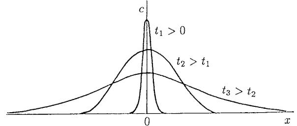

**Figure 11.1.** Schematic particle concentration distribution arising from *Q* particles released at *x* = 0 at *t* = 0 and diffusing according to the diffusion equation (11.8).

*t* = 0 reaches *x* in time *t*. At time *t* − *t* the particle was at *x* − *x* or *x* + *x*. Thus, if α and β are the probabilities that a particle will move to the right or left

$$p(\mathbf{x}, t) = \alpha p(\mathbf{x} - \Delta \mathbf{x}, t - \Delta t) + \beta p(\mathbf{x} + \Delta \mathbf{x}, t - \Delta t), \quad \mathbf{a} + \beta = \mathbf{l}. \tag{11.11}$$

If there is no bias in the random walk, that is, it is isotropic, α = 1/2 = β. Expanding the right-hand side of (11.11) in a Taylor series we get

$$\frac{\partial p}{\partial t} = \left[\frac{(\Delta x)^2}{2\,\Delta t}\right] \frac{\partial^2 p}{\partial x^2} + \left(\frac{\Delta t}{2}\right) \frac{\partial^2 p}{\partial t^2} + \dotsb \dotsb$$

If we now let *x* → 0 and *t* → 0 such that, as before

$$\lim_{\substack{\Delta x \to 0 \\ \Delta t \to 0}} \frac{(\Delta x)^2}{2\Delta t} = D$$

we get

$$\frac{\partial p}{\partial t} = D \frac{\partial^2 p}{\partial x^2}.$$

If the total number of released particles is *Q*, then the concentration of particles *c*(*x*,*t*) = *Qp*(*x*,*t*) and the last equation becomes (11.8).

The random walk derivation is still not completely satisfactory since it relies on *x* and *t* tending to zero in a rather specific way so that *D* exists. A better and more sophisticated way is to derive it from the Fokker–Planck equations using a probability density function with a Markov process; that is, a process at time *t* depending only on the state at time *t* − *t*; in other words a one-generation time-dependency. See, for example, Skellam (1973) or the excellent book by Okubo (1980). The latter gives some justification to the limiting process used above. The review article by Okubo (1986) also discusses the derivation of various diffusion equations.

#### **11.2 Reaction Diffusion Equations**

Consider now diffusion in three space dimensions. Let *S* be an arbitrary surface enclosing a volume *V*. The general conservation equation says that the rate of change of the amount of material in *V* is equal to the rate of flow of material across *S* into *V* plus the material created in *V*. Thus

$$\frac{\partial}{\partial t} \int_{V} c(\mathbf{x}, t) \, dv = -\int_{S} \mathbf{J} \cdot \mathbf{ds} + \int_{V} f \, dv,\tag{11.12}$$

where **J** is the flux of material and *f* , which represents the source of material, may be a function of *c*, **x** and *t*. Applying the divergence theorem to the surface integral and

assuming *c*(**x**,*t*) is continuous, the last equation becomes

$$\int_{V} \left[ \frac{\partial c}{\partial t} + \nabla \cdot \mathbf{J} - f(c, \mathbf{x}, t) \right] dv = 0. \tag{11.13}$$

Since the volume *V* is arbitrary the integrand must be zero and so the *conservation equation* for *c* is

$$\frac{\partial c}{\partial t} + \nabla \cdot \mathbf{J} = f(c, \mathbf{x}, t). \tag{11.14}$$

This equation holds for a general flux transport **J**, whether by diffusion or some other process.

If classical diffusion is the process then the generalisation of (11.5), for example, is

$$\mathbf{J} = -D\nabla c \tag{11.15}$$

and (11.14) becomes

$$\frac{\partial c}{\partial t} = f + \nabla \cdot (D \nabla c),\tag{11.16}$$

where *D* may be a function of **x** and *c* and *f* a function of *c*, **x** and *t*. Situations where *D* is space-dependent are arising in more and more modelling situations of biomedical importance from diffusion of genetically engineered organisms in heterogeneous environments to the effect of white and grey matter in the growth and spread of brain tumours.

The source term *f* in an ecological context, for example, could represent the birth– death process and *c* the population density, *n*. With logistic population growth *f* = *rn*(1 − *n*/*K*), where *r* is the linear reproduction rate and *K* the carrying capacity of the environment. The resulting equation with *D* constant is

$$\frac{\partial n}{\partial t} = rn\left(1 - \frac{n}{K}\right) + D\nabla^2 n,\tag{11.17}$$

now known as the *Fisher–Kolmogoroff equation* after Fisher (1937) who proposed the one-dimensional version as a model for the spread of an advantageous gene in a population and Kolmogoroff et al. (1937) who studied the equation in depth and obtained some of the basic analytical results. This is an equation we study in detail later in Chapter 13.

If we further generalise (11.16) to the situation in which there are, for example, several interacting species or chemicals we then have a vector *ui*(**x**,*t*), *i* = 1,... , *m* of densities or concentrations each diffusing with its own diffusion coefficient *Di* and interacting according to the vector source term **f**. Then (11.16) becomes

$$\frac{\partial \mathbf{u}}{\partial t} = \mathbf{f} + \nabla \cdot (D \nabla \mathbf{u}),\tag{11.18}$$

where now *D* is a matrix of the diffusivities which, if there is no cross diffusion among the species, is simply a diagonal matrix. In (11.18) ∇**u** is a tensor so ∇ · *D*∇**u** is a vector. Cross-diffusion does not arise often in genuinely practical models: one example where it will be described is in Chapter 1, Volume II, Section 1.2. Cross-diffusion systems can pose interesting mathematical problems particularly regarding their well-posedness. Equation (11.18) is referred to as a *reaction diffusion* system. Such a mechanism was proposed as a model for the chemical basis of morphogenesis by Turing (1952) in one of the most important papers in theoretical biology this century. Such systems have been widely studied since about 1970. We shall mainly be concerned with reaction diffusion systems when *D* is diagonal and constant and **f** is a function only of **u**. Further generalisation can include, in the case of population models, for example, integral terms in **f** which reflect the population history. In some cancer models involving mutating cancer cells—the situation which obtains with brain (glioblastoma) tumours and others—there are cross-diffusion terms and unequal diagonal terms in the diffusion matrix. The mathematical generalisations seem endless. For most practical models of real world situations it is premature, to say the least, to spend too much time on sophisticated generalisations1 before the simpler versions have been shown to be inadequate when compared with experiment or observation.

It is appropriate to mention briefly, at this stage, an important area in physiology associated with reaction diffusion equations which we do not discuss further in this book, namely, facilitated diffusion. The accepted models closely mimic the experimental situations and involve biochemical reaction kinetics, such as oxygen combined reversibly with haemoglobin and myoglobin; the latter is crucially important in muscle. Myoglobin is less efficient than haemoglobin as a facilitator. The subject has been studied in depth experimentally by Wittenberg (see 1970 for a review) and Wittenberg et al. (1975) and their colleagues and in the case of proton facilitation by proteins by Gros et al. (1976, 1984). Without facilitated diffusion muscle tissue, for example, could not survive as heuristically shown theoretically by Wyman (1966). This is an area which is essentially understood as a consequence of the intimate union of mathematical models with experiment. The theory of oxygen facilitation was given by Wyman (1966), Murray (1971, 1974) and, in the case of carbon monoxide by Murray and Wyman (1971). For facilitation to be effective there must be a zone of reaction equilibrium within the tissue which implies that nonequilibrium boundary layers exist near the surface (Murray 1971, Mitchell and Murray 1973, Rubinow and Dembo 1977). The conditions for existence of the equilibrium zone provide an explanation of why haemoglobin is a better facilitator of oxygen than myoglobin and why carbon monoxide is not facilitated by myoglobin. The whole phenomenon of facilitated diffusion also plays a crucial role in carbon monoxide poisoning and the difficulties of getting rid of the carbon monoxide (Britton and Murray 1977).

The theory of proton facilitation is a much more complex phenomena since Gros et al. (1976, 1984; see these papers for earlier references) showed experimentally that it involves rotational diffusion by a form of haemoglobin and other proteins: the proton causes the haemoglobin molecule to rotate thereby increasing the overall diffusion across tissue containing haemoglobin molecules. A mathematical theory of rotational diffusion, which is very much more complicated, has been given by Murray and Smith (1986).

<sup>1</sup>As de Tocqueville remarked, there is no point in generalising since God knows all the special cases.

#### **11.3 Models for Animal Dispersal**

Diffusion models form a reasonable basis for studying insect and animal dispersal and invasion; this and other aspects of animal population models are discussed in detail, for example, by Okubo (1980, 1986), Shigesada (1980) and Lewis (1997). Dispersal of interacting species is discussed by Shigesada et al. (1979) and of competing species by Shigesada and Roughgarden (1982). Kareiva (1983) has shown that many species appear to disperse according to a reaction diffusion model with a constant diffusion coefficient. He gives actual values for the diffusion coefficients which he obtained from experiments on a variety of insect species. Kot et al. (1996) studied dispersal of organisms in general and importantly incorporated real data (see also Kot 2001). A common feature of insect populations is their discrete time population growth. As would be expected intuitively this can have a major effect on their spatial dispersal. The model equations involve the coupling of discrete time with continuous space, a topic investigated by Kot (1992) and Neubert et al. (1995). The book of articles edited by Tilman and Kareiva (1998) is a useful sourcebook for the role of space in this general area. The articles address, for example, the question of persistence of endangered species, biodiversity, disease dynamics, multi-species competition and so on. The books by Renshaw (1991) and Williamson (1996) are other very good texts for the study of species invasion phenomena: these books have numerous examples. The excellent, more mathematical and modelling oriented, book by Shigesada and Kawasaki (1997) discusses biological invasions of mammals, birds, insects and plants in various forms, of which diffusion is just one mechanism. For anyone seriously interested in modelling these phenomena these books are required reading.

One extension of the classical diffusion model which is of particular relevance to insect dispersal is when there is an increase in diffusion due to population pressure. One such model has the diffusion coefficient, or rather the flux **J**, depending on the population density *n* such that *D* increases with *n*; that is,

$$\mathbf{J} = -D(n)\nabla n, \quad \frac{dD}{dn} > 0. \tag{11.19}$$

A typical form for *D*(*n*) is *D*0(*n*/*n*0)*m*, where *m* > 0 and *D*0 and *n*0 are positive constants. The dispersal equation for *n* without any growth term is then

$$\frac{\partial n}{\partial t} = D_0 \nabla \cdot \left[ \left( \frac{n}{n_0} \right)^m \nabla n \right].$$

In one dimension

$$\frac{\partial n}{\partial t} = D_0 \frac{\partial}{\partial x} \left[ \left( \frac{n}{n_0} \right)^m \frac{\partial n}{\partial x} \right],\tag{11.20}$$

which has an exact analytical solution of the form

$$n(\mathbf{x}, t) = \frac{n_0}{\lambda(t)} \left[ 1 - \left\{ \frac{\mathbf{x}}{r_0 \lambda(t)} \right\}^2 \right]^{1/m}, \qquad |\mathbf{x}| \le r_0 \lambda(t) \tag{11.21}$$

$$= 0,$$

$$|\mathbf{x}| > r_0 \lambda(t),$$

where

$$\begin{split} \lambda(t) &= \left(\frac{t}{t_0}\right)^{1/(2+m)}, \quad r_0 = \frac{\mathcal{Q}\Gamma(\frac{1}{m} + \frac{3}{2})}{\{\pi^{1/2}n_0\Gamma(\frac{1}{m}+1)\}},\\ t_0 &= \frac{r_0^2m}{2D_0(m+2)}, \end{split} \tag{11.22}$$

where is the gamma function and *Q* is the initial number of insects released at the origin. It is straightforward to check that (11.21) is a solution of (11.20) for all *r*0. The evaluation of *r*0 comes from requiring the integral of *n* over all *x* to be equal to *Q*. (In another context (11.20) is known as the *porous media equation*.) The population is identically zero for *x* > *r*0λ(*t*). This solution is fundamentally different from that when *m* = 0, namely, (11.10). The difference is due to the fact that *D*(0) = 0. The solution represents a kind of wave with the front at *x* = *x f* = *r*0λ(*t*). The derivative of *n* is discontinuous here. The wave 'front,' which we define here as the point where *n* = 0, propagates with a speed *dx f* /*dt* = *r*0*d*λ/*dt*, which, from (11.22), decreases with time for all *m*. The solution for *n* is illustrated schematically in Figure 11.2. The dispersal patterns for grasshoppers exhibit a similar behaviour to this model (Aikman and Hewitt 1972). Without any source term the population *n*, from (11.21), tends to zero as *t* → ∞. Shigesada (1980) proposed such a model for animal dispersal in which she took the linear diffusion dependence *D*(*n*) ∝ *n*; see also Shigesada and Kawasaki (1997).

The equivalent plane radially symmetric problem with *Q* insects released at *r* = 0 at *t* = 0 satisfies the equation

$$\frac{\partial n}{\partial t} = \left(\frac{D_0}{r}\right) \frac{\partial}{\partial r} \left[r \left(\frac{n}{n_0}\right)^m \frac{\partial n}{\partial r}\right] \tag{11.23}$$

with solution

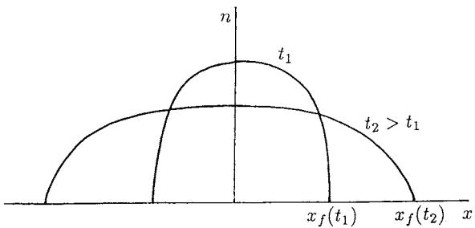

**Figure 11.2.** Schematic solution, from (11.21), of equation (11.20) as a function of *x* at different times *t*. Note the discontinuous derivative at the wavefront *x f* (*t*) = *r*0λ(*t*).

$$\begin{split} n(r,t) &= \frac{n_0}{\lambda^2(t)} \left[ 1 - \left\{ \frac{r}{r_0 \lambda(t)} \right\}^2 \right]^{1/m}, \quad r \le r_0 \lambda(t) \\ &= 0, \\ \lambda(t) &= \left( \frac{t}{t_0} \right)^{1/2(m+1)}, \quad t_0 = \frac{r_0^2 m}{4D_0(m+1)}, \\ r_0^2 &= \frac{\mathcal{Q}}{\pi n_0} \left( 1 + \frac{1}{m} \right). \end{split} \tag{11.24}$$

As *m* → 0, that is, *D*(*n*) → *D*0, the solutions (11.21) and (11.24) tend to the usual constant diffusion solutions: (11.10), for example, in the case of (11.21). To show this involves some algebra and use of the exponential definition exp[*s*] = lim*m*→0(1 + *ms*)1/*m*.

Insects at low population densities frequently tend to aggregate. One model (in one dimension) which reflects this has the flux

$$J = Un - D(n)\frac{\partial n}{\partial x},$$

where *U* is a transport velocity. For example, if the centre of attraction is the origin and the velocity of attraction is constant, Shigesada et al. (1979) take *U* = −*U*0sgn(*x*) and the resulting dispersal equation becomes

$$\frac{\partial n}{\partial t} = U_0 \frac{\partial}{\partial x} [n \text{sgn}(\mathbf{x})] + D_0 \frac{\partial}{\partial x} \left[ \left( \frac{n}{n_0} \right)^m \frac{\partial n}{\partial x} \right],\tag{11.25}$$

which is not trivial to solve. We can, however, get some idea of the solution behaviour for parts of the domain.

Suppose *Q* is again the initial flux of insects released at *x* = 0. We expect that gradients in *n* near *x* = 0 for *t* ≈ 0 are large and so, in this region, the convection term is small compared with the diffusion term, in which case the solution is approximately given by (11.21). On the other hand after a long time we expect the population to reach some steady, spatially inhomogeneous state where convection and diffusion effects balance. Then the solution is approximated by (11.25) with ∂*n*/∂*t* = 0. Integrating this steady state equation twice using the conditions *n* → 0, ∂*n*/∂*x* → 0 as | *x* |→∞ we get the steady state spatial distribution

$$\begin{split} \lim_{t \to \infty} n(\mathbf{x}, t) \to n(\mathbf{x}) &= n_0 \left( 1 - \frac{mU_0 |\mathbf{x}|}{D_0} \right)^{1/m}, \quad |\mathbf{x}| \le \frac{D_0}{mU_0} \\ &= 0, \quad \qquad \qquad |\mathbf{x}| > \frac{D_0}{mU_0}. \end{split} \tag{11.26}$$

The derivation of this is left as an exercise. The solution (11.26) shows that the dispersal is *finite* in *x*. The form obtained when *m* = 1/2 is similar to the population distribution observed by Okubo and Chiang (1974) for a special type of mosquito swarm (see

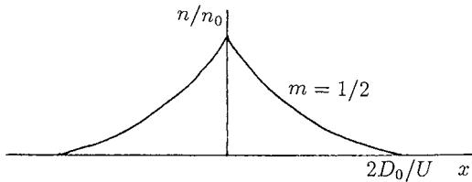

**Figure 11.3.** Schematic form of the steady state insect population distribution from (11.26), for insects which tend to aggregate at low densities according to (11.25).

Okubo 1980, Fig. 9.6). Figure 11.3 schematically illustrates the steady state insect population.

Insect dispersal is a very important subject which is still not well understood. The above model is a simple one but even so it gives some pointers as to possible insect dispersal behaviour. If there is a population growth/death term we simply include it on the right-hand side of (11.25) (Exercises 3 and 4). In these the insect population dies out as expected, since there is no birth, only death, but what is interesting is that the insects move only a finite distance from the origin.

The use of diffusion models for animal and insect dispersal is increasing and has been applied to a variety of practical situations; the books by Okubo (1980) and Shigesada and Kawasaki (1997) give numerous examples. The review by Okubo (1986) discusses various models and specifically addresses animal grouping, insect swarms and flocking. Mogilner and Edelstein-Keshet (1999) discuss models for swarming based on nonlocal interactions. Their models incorporate long range attraction and repulsion. They show that the swarm has a constant interior density and sharp edges (in other words it looks like a swarm) if the density-dependence in the repulsion term is of a higher order than in the attraction term. Chapter 14, Volume II is specifically concerned with wolf dispersal and territory formation as well as wolf–deer (the wolves' principal prey) survival. There, among other things, we consider a more realistic form of the term for the centre's attraction (which for the wolves is the summer den) which does not give rise to a gradient discontinuity as in Figure 11.3.

### **11.4 Chemotaxis**

A large number of insects and animals (including humans) rely on an acute sense of smell for conveying information between members of the species. Chemicals which are involved in this process are called *pheromones*. For example, the female silk moth *Bombyx mori* exudes a pheromone, called bombykol, as a sex attractant for the male, which has a remarkably efficient antenna filter to measure the bombykol concentration, and it moves in the direction of increasing concentration. The modelling problem here is a fascinating and formidable one involving fluid mechanics and filtration theory on quite different scales at the same time (Murray 1977). The acute sense of smell of many deep sea fish is particularly important for communication and predation. Other than for territorial demarcation one of the simplest and important exploitations of pheromone release is the directed movement it can generate in a population. Here we model this

chemically directed movement, which is called *chemotaxis*, which, unlike diffusion, directs the motion *up* a concentration gradient.

It is not only in animal and insect ecology that chemotaxis is important. It can be equally crucial in biological processes where there are numerous examples. For example, when a bacterial infection invades the body it may be attacked by movement of cells towards the source as a result of chemotaxis. Convincing evidence suggests that leukocyte cells in the blood move towards a region of bacterial inflammation, to counter it, by moving up a chemical gradient caused by the infection (see, for example, Lauffenburger and Keller 1979, Tranquillo and Lauffenburger 1986, 1988 and Alt and Lauffenburger 1987). We discuss bacterial chemotaxis and some of its remarkable consequences in some detail in Chapter 5, Volume II.

A widely studied chemotactic phenomenon is that exhibited by the slime mould *Dictyostelium discoideum* where single-cell amoebae move towards regions of relatively high concentrations of a chemical called cyclic-AMP which is produced by the amoebae themselves. Interesting wavelike movement and spatial patterning are observed experimentally; see Chapter 1, Volume II. A discussion of the phenomenon and some of the early mathematical models which have been proposed together with some analysis are given, for example, in the book by Segel (1984). The kinetics involved have been modelled by several authors. As more was found out about the biological system the models necessarily changed. More complex and more biologically realistic models have been proposed by Martiel and Goldbeter (1987), Goldbeter (1996) and Monk and Othmer (1989). These new models all exhibit oscillatory behaviour. Spiro et al. (1997) presented a model of excitation and adaptation in bacterial chemotaxis in wider biological contexts. They incorporated detailed biochemical data into their model which they then used to shed light on the actual experimental process.

Most mathematical models for spatial patterning in *Dictyostelium discoideum* are based on continuum models for the chemoattractants and the cells. Dallon and Othmer (1997) developed an interesting new model in which the cells are considered as discrete entities with the chemoattractant concentrations continuous. The results agree well with many of the extant experimental results. With their model they were able to investigate the effects of different cell movement rules on aggregation patterns and wave motion, including the origin of the ubiquitous spiral waves. We discuss wave propagation, including spiral waves, in some detail in Chapter 13, and Chapter 1, Volume II. Chemotaxis is being found to be important in an increasing range of situations. The model equations are extremely rich in unexpected phenomena several of which we describe later in this volume and in Volume II.

Let us suppose that the presence of a gradient in an attractant, *a*(**x**,*t*), gives rise to a movement, of the cells say, up the gradient. The flux of cells will increase with the number of cells, *n*(**x**,*t*), present. Thus we may reasonably take as the chemotactic flux

$$\mathbf{J} = n\chi(a)\nabla a,\tag{11.27}$$

where χ(*a*) is a function of the attractant concentration. In the general conservation equation for *n*(**x**,*t*), namely,

$$\frac{\partial n}{\partial t} + \nabla \cdot \mathbf{J} = f(n),$$

where *f* (*n*) represents the growth term for the cells, the flux

$$\mathbf{J} = \mathbf{J}_{\text{diffusion}} + \mathbf{J}_{\text{chematrix}},$$

where the diffusion contribution is from (11.15) with the chemotaxis flux from (11.27). Thus a basic *reaction-diffusion-chemotaxis equation* is

$$\frac{\partial n}{\partial t} = f(n) - \nabla \cdot n\chi(a)\nabla a + \nabla \cdot D\nabla n,\tag{11.28}$$

where *D* is the diffusion coefficient of the cells.

Since the attractant *a*(**x**,*t*) is a chemical it also diffuses and is produced, by the amoebae, for example, so we need a further equation for *a*(**x**,*t*). Typically

$$\frac{\partial a}{\partial t} = g(a, n) + \nabla \cdot D_a \nabla a,\tag{11.29}$$

where *Da* is the diffusion coefficient of *a* and *g*(*a*, *n*) is the kinetics/source term, which may depend on *n* and *a*. Normally we would expect *Da* > *D*. If several species or cell types all respond to the attractant the governing equation for the species vector is an obvious generalisation of (11.28) to a vector form with χ(*a*) probably different for each species. In Chapter 5, Volume II we shall show how crucial are the forms of *f* (*n*), *g*(*a*, *n*) and χ(*a*) in determining the specific patterns that are formed.

In the seminal model of Keller and Segel (1971) for slime mould, *g*(*a*, *n*) = *hn* − *ka*, where *h*, *k* are positive constants. Here *hn* represents the spontaneous production of the attractant and is proportional to the number of amoebae *n*, while −*ka* represents decay of attractant activity; that is, there is an exponential decay if the attractant is not produced by the cells.

One simple version of the model has *f* (*n*) = 0; that is, the amoebae production rate is negligible. This is the case during the pattern formation phase in the mould's life cycle. The chemotactic term χ(*a*) is taken to be a positive constant χ0. The form of this term has to be determined from experiment; see Chapter 5, Volume II. With constant diffusion coefficients, together with the above linear form for *g*(*a*, *n*), the model in one space dimension becomes the nonlinear system

$$\begin{split} \frac{\partial n}{\partial t} &= D \frac{\partial^2 n}{\partial x^2} - \chi_0 \frac{\partial}{\partial x} \left( n \frac{\partial a}{\partial x} \right), \\ \frac{\partial a}{\partial t} &= hn - ka + D_a \frac{\partial^2 a}{\partial x^2}, \end{split} \tag{11.30}$$

which we study in Chapter 1, Volume II. There we consider *n* to be a bacterial population and *a* the food which it consumes.

Other forms have been proposed for the chemotactic factor χ(*a*). For example,

$$\chi(a) = \frac{\chi_0}{a}, \quad \chi(a) = \frac{\chi_0 K}{(K+a)^2}, \quad \chi_0 > 0, \quad K > 0 \tag{11.31}$$

which are known respectively as the log law and receptor law. In these, as *a* decreases the chemotactic effect increases. In Chapter 5, Volume II we discuss the specific bacteria *Salmonella* and *E. coli* and give the forms for experimentally derived *f* (*n*), *g*(*a*, *n*) and χ(*a*) and so on in (11.28) and (11.29).

There are various ways to define a practical measurable *chemotaxis index, I*, which reflects the strength of the chemoattractant. Let us look at one example, and to be specific consider the planar movement of a cell, say, towards a source of chemoattractant at position *xs*. Suppose the cell starts at *xA* and the source is distance *D*1 away. In the absence of chemotaxis the cell's movement is purely random and the mean distance, *D*2 say, that the cell moves in a given time *T* in the direction of *xs* is zero. In the presence of chemotaxis the random movement is modified so that there is a general tendency for the cell to move towards the chemoattractant source and over the same time *T* , *D*2 > 0. We can define the index *I* = *D*2/*D*1: the larger *I* the stronger the chemotaxis. Tranquillo and Lauffenburger (1988) have analysed the detailed chemosensory movement of leukocyte cells with a view to determining its chemotaxis parameters. Woodward et al. (1995), Tyson (1996), Murray et al. (1998) and Tyson et al. (1998, 1999) give values, obtained from experiment, for the chemotaxis parameters for *Salmonella* and *E. coli*.

The movement of certain cells can be influenced by the presence of applied electric fields and the cells tend to move in a direction parallel to the applied field. This is called *galvanotaxis*. The strength of galvanotaxis can be defined in a similar way to chemotaxis. If *V* is an electric potential the galvanotaxis flux **J** of cells can reasonably be taken as proportional to *nG*(*V*)∇*V* where *G* may be a function of the applied voltage *V*.

Before leaving this topic, note the difference in sign in (11.28) and (11.30) in the diffusion and chemotaxis terms. Each has a Laplacian contribution. Whereas diffusion is generally a stabilising force, chemotaxis is generally *de*stabilising, like a kind of negative diffusion. At this stage, therefore, it is reasonable to suppose that the balance between stabilising and destabilising forces in the model system (11.30) could result in some steady state spatial patterns in *n* and *a*, or in some unsteady wavelike spatially heterogeneous structure. That is, nonuniform spatial patterns in the cell density appear; see Chapters 1 and Chapter 5 in Volume II. On the other hand if the chemotactic effect is sufficiently strong there could be a possibility of solution blow-up. This in fact can happen: see, for example, the paper by Jager and Luckhaus (1992), and other references ¨ given there, on explosion of solutions of model equations with chemotaxis.

#### **11.5 Nonlocal Effects and Long Range Diffusion**

The classical approach to diffusion, which we have used above, is strictly only applicable to dilute systems, that is, where the concentrations *c*, or densities *n*, are small. Its applicability in practice is much wider than this of course, and use of the Fickian form (11.15) for the diffusional flux, namely, **J** = −*D*∇*c*, or **J** = −*D*(*n*)∇*c* from (11.19) in which the diffusion is dependent on *n*, is sufficient for many, if not most, practical modelling purposes. What these forms in effect imply, is that diffusion is a *local* or *short range* effect. We can see this if we consider the Laplacian operator ∇2*n* in the simple diffusion equation ∂*n*/∂*t* = *D*∇2*n*. The Laplacian averages the neighbouring densities and formally (see, for example, Hopf 1948, Morse and Feshbach 1953)

$$
\nabla^2 n \propto \frac{\langle n(\mathbf{x}, t) \rangle - n(\mathbf{x}, t)}{R^2}, \quad \text{as} \quad R \to 0, \tag{11.32}
$$

where *n* is the average density in a sphere of radius *R* about **x**; that is,

$$n_{av} = \langle n(\mathbf{x}, t) \rangle \equiv \left[ \frac{3}{4\pi R^3} \right] \int_{V} n(\mathbf{x} + \mathbf{r}, t) \, \mathbf{dr},\tag{11.33}$$

where *V* is the sphere of radius *R*. This interpretation of the Laplacian was first suggested by James Clerk Maxwell in 1871 (see Maxwell 1952, which is a compilation of some of his papers).

Because the radius *R* → 0 we can expand *n*(**x** + **r**,*t*) in a Taylor series about **x** for small **r**, namely,

$$n(\mathbf{x} + \mathbf{r}, t) = n(\mathbf{x}, t) + (\mathbf{r} \cdot \nabla)n + \frac{1}{2}(\mathbf{r} \cdot \nabla)^2 n + \cdots$$

and substitute it into the integral in (11.33) for *na*v to get

$$n_{av} = \left[\frac{3}{4\pi R^3}\right] \int_V \left[ n(\mathbf{x}, t) + (\mathbf{r} \cdot \nabla)n + \frac{1}{2} (\mathbf{r} \cdot \nabla)^2 n + \dotsb \right] d\mathbf{r} \dots$$

Because of the symmetry the second integral is zero. If we neglect all terms *O*(*r* 3) and higher in the integrand, integration gives

$$\begin{split} n_{dv} &= \left(\frac{3}{4\pi R^3}\right) \left[ n(\mathbf{x}, t) \int_V \mathbf{dr} + \nabla^2 n(\mathbf{x}, t) \int_V \frac{r^2}{2} \,\mathbf{dr} \right] \\ &= n(\mathbf{x}, t) + \frac{3}{10} R^2 \nabla^2 n(\mathbf{x}, t) .\end{split} \tag{11.34}$$

If we now substitute this into the expression (11.32) we see that the proportionality factor is 10/3.

In many biological areas, such as embryological development, the densities of cells involved are not small and a local or short range diffusive flux proportional to the gradient is not sufficiently accurate. When we discuss the mechanical theory of biological pattern formation in Chapter 6, Volume II we shall show how, in certain circumstances, it is intuitively reasonable, perhaps necessary, to include long range effects.

Instead of simply taking **J** ∝ ∇*n* we now consider

$$\mathbf{J} = \underset{r \in N(\mathbf{x})}{G} \, [\nabla n(\mathbf{x} + \mathbf{r}, t)],\tag{11.35}$$

where *N*(**x**) is some neighbourhood of the point **x** over which effects are noticed at **x**, and *G* is some functional of the gradient. From symmetry arguments and assumptions of isotropy in the medium we are modelling, be it concentration or density, it can be shown that the first correction to the simple linear ∇*n* for the flux **J** is a ∇(∇2*n*) term. The resulting form for the flux in (11.35) is then

$$\mathbf{J} = -D_1 \nabla n + \nabla D_2 (\nabla^2 n),\tag{11.36}$$

where *D*1 > 0 and *D*2 are constants. *D*2 is a measure of the long range effects and in general is smaller in magnitude than *D*1. This approach is due to Othmer (1969), who goes into the formulation, derivation and form of the general functional *G* in detail. We give different motivations for the long range *D*2-term below and in Section 11.6.

If we now take the flux **J** as given by (11.36) and use it in the conservation equation ((11.14) with *f* ≡ 0) we get

$$\frac{\partial n}{\partial t} = -\nabla \cdot \mathbf{J} = \nabla \cdot D_1 \nabla n - \nabla \cdot \nabla (D_2 \nabla^2 n). \tag{11.37}$$

In this form, using (11.32), we can see that whereas the first term represents an average of nearest neighbours, the second—the *biharmonic term*—is a contribution from the *average of nearest averages*.

The biharmonic term is stabilising if *D*2 > 0, or destabilising if *D*2 < 0. We can see this if we look for solutions of (11.37) in the form

$$m(\mathbf{x}, t) \propto \exp[\sigma t + i \mathbf{k} \cdot \mathbf{x}], \quad k = |\mathbf{k}| \tag{11.38}$$

which represents a wavelike solution with wave vector **k** (and so has a wavelength 2π/*k*) and σ is to be determined. Since (11.37) is a linear equation we can use this last solution to obtain the solution to the general initial value problem using an appropriate Fourier series or integral technique. Substitution of (11.38) into equation (11.37) gives what is called the *dispersion relation* for σ in terms of the wavenumber **k** as

$$
\sigma = -D_1 k^2 - D_2 k^4. \tag{11.39}
$$

The growth or decay of the solution is determined by exp[σ*t*] in (11.38). Dispersion relations are very important in many different contexts. We discuss some of these in detail in Chapter 2, Volume II in particular. With σ as a function of *k*, the solution (11.38) shows the time behaviour of each wave, that is, for each *k*. In fact on substituting (11.39) into the solution (11.38) we see that

$$m(\mathbf{x}, t) \propto \exp[- (D_1 k^2 + D_2 k^4)t + i \mathbf{k} \cdot \mathbf{x}],$$

so, for large enough wavenumbers *k*, *k*2 > *D*1/| *D*2 | in fact, we always have

$$m(x,t) \to \begin{cases} 0 \\ \infty \end{cases} \quad \text{as} \quad t \to \infty \quad \text{if} \quad D_2 \begin{cases} > 0 \\ <0 \end{cases}.\tag{11.40}$$

In classical Fickian diffusion *D*2 ≡ 0 and *n* → 0 as *t* → ∞ for all *k*. From (11.40) we see that if *D*2 > 0 the biharmonic contribution (that is, the long range diffusion effect) to the diffusion process is stabilising, while it is destabilising if *D*2 < 0.

Another important concept and approach to modelling long range effects uses an integral equation formulation. (This approach provides a useful unifying concept we shall come back to later in Volume II when we consider a specific class of models for the generation of steady state spatial patterns; see Chapter 12, Volume II.) Here the rate of change of *n* at position *x* at time *t* depends on the influence of neighbouring *n* at all other positions *x* . Such a model, in one space dimension, for example, is represented mathematically by

$$\frac{\partial n}{\partial t} = f(n) + \int_{-\infty}^{\infty} w(\mathbf{x} - \mathbf{x}') n(\mathbf{x}', t) \, d\mathbf{x}',\tag{11.41}$$

where w(*x* − *x* ) is the *kernel function* which quantifies the effect the neighbouring *n*(*x* ,*t*) has on *n*(*x*,*t*). The form here assumes that the influence depends only on the distance from *x* to *x* . The function *f* (*n*) is the usual source or kinetics term—the same as we included in the reaction diffusion mechanisms (11.17) and (11.18); in the case of the application to neuronal cells, it is referred to as the firing rate as we discuss below and later in this volume. We assume, reasonably, that the influence of neighbours tends to zero for | *x* − *x* | large and that this influence is spatially symmetric; that is,

$$w \to 0 \quad \text{as} \quad |\mathbf{x} - \mathbf{x}'| \to \infty, \quad w(\mathbf{x} - \mathbf{x}') = w(\mathbf{x}' - \mathbf{x}).\tag{11.42}$$

Such a model (11.41) directly incorporates long range effects through the kernel: if w tends to zero quickly, for example, like exp[−(*x* − *x* )2/*s*] where 0 < *s* 1, then the long range effects are weak, whereas if *s*  1 they are strong.

To determine the spatiotemporal properties of the solutions of (11.41) the kernel w has to be specified. This involves modelling the specific biological phenomenon under consideration. Suppose we have neural cells which are cells which can fire spontaneously; here *n* represents the cells' firing rate. Then *f* (*n*) represents the autonomous spatially independent firing rate, and, in the absence of any neighbouring cells' influence, the firing rate simply evolves to a stable steady state, determined by the zeros of *f* (*n*). The mathematics is exactly the same as we discussed in Chapter 1. For example, if *f* (*n*) is as in Figure 11.4(a) the rate evolves to the single steady state firing rate *n*1. If *f* (*n*) is as in Figure 11.4(b) then there is a threshold firing rate above which *n* goes to a nonzero steady state and below which it goes to extinction.

If we now incorporate spatial effects we must include the influence of neighbouring cells; that is, we must prescribe the kernel function w. Suppose we assume that the cells are subjected to both excitatory and inhibitory inputs from neighbouring cells, with the strongest excitatory signals coming from the cells themselves. That is, if a cell is in a

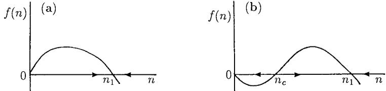

**Figure 11.4.** (**a**) Typical firing rate function *f* (*n*) with a single nonzero steady state: *n* → *n*1 in the absence of spatial effects. (**b**) A typical multi-steady state firing function. If *n* < *nc*, a critical firing rate, then *n* → 0, that is, extinction. If *n* > *nc* then *n* → *n*1.

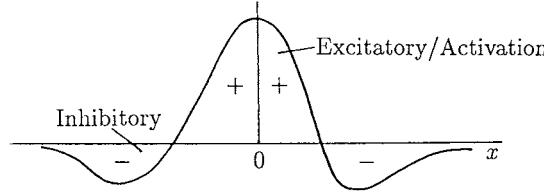

**Figure 11.5.** Typical excitatory–inhibitory kernel w for spatial influence of neighbours in the model (11.41).

high firing state *n* tends to increase; it is like autocatalysis. A kernel which incorporates such behaviour is illustrated in Figure 11.5.

We can relate this integral equation approach to the long range diffusion approximation which gave (11.37). Let

$$\mathbf{y} = \mathbf{x} - \mathbf{x}' \quad \Rightarrow \quad \int_{-\infty}^{\infty} w(\mathbf{x} - \mathbf{x}') n(\mathbf{x}', t) \, d\mathbf{x}' = \int_{-\infty}^{\infty} w(\mathbf{y}) n(\mathbf{x} - \mathbf{y}, t) \, d\mathbf{y}.$$

If we now expand *n*(*x* − *y*) about *x* as a Taylor series, as we did for the integral in (11.33),

$$\begin{split} \int_{-\infty}^{\infty} w(\mathbf{x} - \mathbf{x}') n(\mathbf{x}', t) \, d\mathbf{x}' &= \int_{-\infty}^{\infty} w(\mathbf{y}) \left[ n(\mathbf{x}, t) - \mathbf{y} \frac{\partial n(\mathbf{x}, t)}{\partial \mathbf{x}} + \frac{\mathbf{y}^2}{2} \frac{\partial^2 n(\mathbf{x}, t)}{\partial \mathbf{x}^2} \right. \\ &\quad - \frac{\mathbf{y}^3}{3!} \frac{\partial^3 n(\mathbf{x}, t)}{\partial \mathbf{x}^3} + \frac{\mathbf{y}^4}{4!} \frac{\partial^4 n(\mathbf{x}, t)}{\partial \mathbf{x}^4} - \dotsb \end{split} \tag{11.43}$$

Because of the assumed symmetry of the kernel w(*y*),

$$\int_{-\infty}^{\infty} y^{2m+1} w(\mathbf{y}) \, d\mathbf{y} = 0, \quad m = 0, 1, 2, \dots \quad \text{and} \quad \text{(11.44)}$$

If we now define the *moments* w*m* of the kernel w(*y*) by

$$w_{2m} = \frac{1}{(2m)!} \int_{-\infty}^{\infty} y^{2m} w(\mathbf{y}) \, d\mathbf{y}, \quad m = 0, 1, 2, \dots \tag{11.45}$$

equation (11.41) becomes

$$\frac{\partial n}{\partial t} = f(n) + w_0 n + w_2 \frac{\partial^2 n}{\partial x^2} + w_4 \frac{\partial^4 n}{\partial x^4} + \dotsb \,. \tag{11.46}$$

Higher moments of typical kernels get progressively smaller; this is intuitively clear from (11.45). If we truncate the series in (11.46) at the 4th moment we get an approximate model equation with a biharmonic ∂4*n*/∂*x*4 contribution comparable to that in (11.37).

The solution behaviour of (11.41) depends crucially on the signs of the kernel moments and hence on the detailed form of the kernel, one typical form of which is shown qualitatively in Figure 11.5. For example, if w2 < 0 the 'short range diffusion' term is destabilising, and if w4 < 0 the 'long range diffusion' is stabilising (cf.(11.39)).

This integral equation approach is in many ways a much more satisfactory way to incorporate long range effects since it reflects, in a more descriptive way, what is going on biologically. As we have said above we shall discuss such models in depth in Chapter 12, Volume II which is about neural models which generate spatial patterns.

### **11.6 Cell Potential and Energy Approach to Diffusion and Long Range Effects**

We now discuss an alternative approach to motivate the higher-order, long range diffusion terms. To be specific, in the following we have cell population densities in mind and for pedagogical reasons give the derivation of the classical (Fickian) diffusion before considering the more general case. The treatment here follows that given by Cohen and Murray (1981).

In general phenomenological terms if there is a gradient in a potential µ it can drive a flux **J** which, classically, is proportional to ∇µ. We can, still in classical terms, think of the potential as the work done in changing the state by a small amount or, in other words, the variational derivative of an energy. Let *n*(**x**,*t*) be the cell density. We associate with a spatial distribution of cells, an energy density *e*(*n*), that is, an internal energy per unit volume of an evolving spatial pattern so that the total energy *E*[*n*] in a volume *V* is given by

$$E[n] = \int_{V} e(n) \,\mathrm{d}x.\tag{11.47}$$

The change in energy δ*E*, that is, the work done in changing states by an amount δ*n*, is the variational derivative δ*E*/δ*n*, which defines a potential µ(*n*). So

$$
\mu(n) = \frac{\delta E}{\delta n} = e'(n). \tag{11.48}
$$

The gradient of the potential µ produces a flux **J**; that is, the flux **J** is proportional to ∇µ and so

$$\mathbf{J} = -D\nabla\mu(n),\tag{11.49}$$

where *D* is the proportionality parameter, which in this derivation may depend on **x**, *t* and *n*. The continuity equation for *n* becomes

$$\frac{\partial n}{\partial t} = -\nabla \cdot \mathbf{J} = \nabla \cdot [D\nabla \mu(n)] = \nabla \cdot [De''(n)\nabla n] \tag{11.50}$$

on using (11.48) for µ(*n*), and so

$$\frac{\partial n}{\partial t} = \nabla \cdot [D^*(n)\nabla n],\tag{11.51}$$

where

$$D^*(n) = D e''(n). \tag{11.52}$$

In the simple classical diffusion situation with constant diffusion, the internal energy density is the usual quadratic with *e*(*n*) = *n*2/2. With this, µ(*n*) = *n* and (11.51) becomes the usual diffusion equation ∂*n*/∂*t* = *D*∇2*n*, with *D*∗ = *D*, the constant diffusion coefficient. If *D* is a function of **x**, *t* and *n*, the derivation is the same and the resulting conservation equation for *n* is then

$$\frac{\partial n}{\partial t} = \nabla \cdot [D^*(\mathbf{x}, t, n)\nabla n]. \tag{11.53}$$

Here *n* can be a vector of cell species.

This derivation assumes that the energy density *e*(*n*) depends only on the density *n*. If the cells are sensitive to the environment other than in their immediate neighbourhood, it is reasonable to suppose that the energy required to maintain a spatial heterogeneity depends on neighbouring gradients in the cell density. It is the spatial heterogeneity which is ultimately of importance in biological pattern formation.

We take a more realistic energy functional, which is chosen so as to be invariant under reflections (*xi* → −*xi*) and rotations (*xi* → *x j*), as

$$E[n] = \int_{V} [e(n) + k_1 \nabla^2 n + k_2 (\nabla n)^2 + \dotsb] \, \mathbf{dx},\tag{11.54}$$

where the *k*s may be functions of *n*. Using Green's theorem

$$\int_{V} k_{1} \nabla^{2} n \, \mathbf{dx} + \int_{V} \nabla k_{1} \cdot \nabla n \, \mathbf{dx} = \int_{S} k_{1} \frac{\partial n}{\partial N} \, \mathbf{ds},$$

where **N** is the outward pointing normal to the surface *S* which encloses *V* and where we let *k*1 depend on *n* so that ∇*k*1 = *k* 1(*n*)∇*n*. From the last equation

$$\int_{V} k_{1} \nabla^{2} n \, \mathbf{dx} = -\int_{V} k_{1}'(n) (\nabla n)^{2} \, \mathbf{dx} + \int_{S} k_{1} \frac{\partial n}{\partial N} \, \mathbf{ds}.\tag{11.55}$$

We are not concerned with effects at the external boundary, so we can choose the bounding surface *S* such that ∂*n*/∂*N* = 0 on *S*, that is, zero flux at the boundary. So (11.54) for the energy functional in a spatially heterogeneous situation becomes

$$E[n] = \int_{V} \left[ e(n) + \frac{k}{2} (\nabla n)^2 + \dotsb \right] d\mathbf{x},$$

$$\frac{k}{2} = -k_1'(n) + k_2.\tag{11.56}$$

Here *e*(*n*) is the energy density in a spatially homogeneous situation with the other terms representing the energy density (or 'gradient' density) which depends on the neighbouring spatial density variations.

We now carry out exactly the same steps that we took in going from (11.48) to (11.53). The potential µ is obtained from the energy functional (11.56) as

$$
\mu = \mu(n, \nabla n) = \frac{\delta E[n]}{\delta n} = -k\nabla^2 n + e'(n), \tag{11.57}
$$

using the calculus of variations to evaluate δ*E*[*n*]/δ*n* and where we have taken *k* to be a constant. The flux **J** is now given by

$$\mathbf{J} = -D^* \nabla \mu(n, \nabla n).$$

The generalised diffusion equation is then

$$\begin{split} \frac{\partial n}{\partial t} &= -\nabla \cdot \mathbf{J} = \nabla \cdot (D^* \nabla \mu), \\ &= D^* \nabla^2 [-\nabla^2 n + e'(n)], \\ &= -k D^* \nabla^4 n + D^* \nabla \cdot [e''(n) \nabla n]. \end{split} \tag{11.58}$$

Here we have taken *D*∗, as well as *k*, to be constant.

A basic assumption about *e*(*n*) is that it can involve only even powers of *n* since the energy density cannot depend on the sign of *n*. The Landau–Ginzburg free energy form (see, for example, Cahn and Hilliard 1958, 1959, Cahn 1959 and Huberman 1976) has

$$e(n) = \frac{an^2}{2} + \frac{bn^4}{4},$$

which on substituting into (11.58) gives

$$\frac{\partial n}{\partial t} = -D^*k\nabla^4n + D^*a\nabla^2n + D^*b\nabla^2n^3.$$

If we now write

$$D_1 = D^*a, \quad D_2 = D^*k, \quad D_3 = D^*b,$$

the generalised diffusion equation (11.58) becomes

$$\frac{\partial n}{\partial t} = D_1 \nabla^2 n - D_2 \nabla^4 n + D_3 \nabla^2 n^3. \tag{11.59}$$

Note the appearance of the extra nonlinear term involving *D*3. If the energy *e*(*n*) only involves the usual quadratic in *n*2, *b* = 0 and (11.59) is exactly the same as (11.37) in Section 11.4. If we now include a reaction or dynamics term *f* (*n*) in (11.59) we get the generalised reaction diffusion equation equivalent to (11.14). With the one space dimensional scalar version of (11.59) and a logistic growth form for *f* (*n*), Cohen and Murray (1981) have shown that the equation can exhibit steady state spatially inhomogeneous solutions. Lara-Ochoa (1984) analysed their model in a two-dimensional setting and showed that it reflects certain morphogenetic aspects of multicellular systems formed by motile cells.

#### **Exercises**

- **1** Let *p*(*x*,*t*) be the probability that an organism initially at *x* = 0 is at *x* after a time *t*. In a random walk there is a slight bias to the right; that is, the probabilities of moving to the right and left, α and β, are such that α−β = ε > 0, where 0 < ε 1. Show that the diffusion equation for the concentration *c*(*x*,*t*) = *Qp*(*x*,*t*), where *Q* particles are released at the origin at *t* = 0, is

$$
\frac{\partial c}{\partial t} + V \frac{\partial c}{\partial x} = D \frac{\partial^2 c}{\partial x^2},
$$

where *V* and *D* are constants which you should define.

- **2** In a one-dimensional domain suppose insects are attracted to the origin *x* = 0 and are convected there by a constant velocity *V*. If the population pressure is approximated by a density-dependent diffusion coefficient *D*(*n*) = *D*0(*n*/*n*0)*m*, where *n* is the population density and *D*0, *n*0 and *m* are positive constants, show that the model equation for dispersal, in the absence of any population growth, is

$$\frac{\partial n}{\partial t} = -\frac{\partial J}{\partial \mathbf{x}} = \frac{\partial}{\partial \mathbf{x}} [V \text{sgn}(\mathbf{x}) n] + D_0 \frac{\partial}{\partial \mathbf{x}} \left[ \left( \frac{n}{n_0} \right)^m \frac{\partial n}{\partial \mathbf{x}} \right].$$

Show that if *n* → 0, ∂*n*/∂*x* → 0 as | *x* |→∞ a spatially inhomogeneous steady state population density exists and can be represented by

$$n(\mathbf{x}) = n_0 \left(1 - \frac{mV|\mathbf{x}|}{D_0}\right)^{1/m}, \quad \text{if} \quad |\mathbf{x}| \le \frac{D_0}{mV}$$

$$= 0, \qquad \qquad \qquad \qquad \qquad \text{if} \quad |\mathbf{x}| > \frac{D_0}{mV}.$$

- **3** The larvae of the parasitic worm (*Trichostrongylus retortaeformis*) hatch from eggs in sheep and rabbit excreta. The larvae disperse randomly on the grass and are consequently eaten by sheep and rabbits. In the intestines the cycle starts again. Consider the one-dimensional problem in which the larvae disperse with constant diffusion and have a mortality proportional to the population. Show that *n* satisfies

$$\frac{\partial n}{\partial t} = D \frac{\partial^2 n}{\partial x^2} - \mu n, \quad D > 0, \quad \mu > 0,$$

where *n* is the larvae population. Find the population distribution at any *x* and *t* arising from *N*0 larvae being released at *x* = 0 at *t* = 0. Show that as *t* → ∞ the population dies out.

If the larvae lay eggs at a rate proportional to the population of the larvae, that is,

$$\frac{\partial E}{\partial t} = \lambda n, \quad \lambda > 0,$$

where *E*(*x*,*t*) is the egg population density, show that in the limit as *t* → ∞ a nonzero spatial distribution of eggs persists. [The result for *E*(*x*,*t*) is an integral from which the asymptotic approximation can be found using Laplace's method (see, for example, Murray's 1984 *Asymptotic Analysis*): the result gives *E*(*x*,*t*) ∼ *O*(exp[−(µ/*D*)1/2| *x* |]) as *t* → ∞.]

- **4** Consider the density-dependent diffusion model for insect dispersal which includes a linear death process which results in the following equation for the population *n*(*x*,*t*),

$$\frac{\partial n}{\partial t} = D_0 \frac{\partial}{\partial x} \left[ \left( \frac{n}{n_0} \right)^m \frac{\partial n}{\partial x} \right] - \mu n, \quad D_0 > 0, \quad \mu > 0.$$

If *Q* insects are released at *x* = 0 at *t* = 0, that is, *n*(*x*, 0) = *Q*δ(*x*), show, using appropriate transformations in *n* and *t*, that the equation can be reduced to an equivalent equation with µ = 0. Hence show that the population wavefront reaches a finite distance *x*max from *x* = 0 as *t* → ∞, where

$$x_{\max} = \frac{r_0}{(\mu m \tau_0)^{1/(m+2)}},$$

where

$$r_0 = \frac{\mathcal{Q}\Gamma(\frac{1}{m} + \frac{3}{2})}{\pi^{1/2}n_0\Gamma(\frac{1}{m} + 1)}, \quad \tau_0 = \frac{r_0^2m}{2D_0(m+2)},$$

where is the Gamma function.

# **12. Oscillator-Generated Wave Phenomena and Central Pattern Generators**

In Chapter 11 we saw how diffusion, chemotaxis and convection mechanisms could generate spatial patterns; in Volume II we discuss mechanisms of biological pattern formation extensively. In Chapter 13, and Chapter 1 and Chapter 13, Volume II we show how diffusion effects, for example, can also generate travelling waves, which have been used to model the spread of pest outbreaks, travelling waves of chemical concentration, colonization of space by a population, spatial spread of epidemics and so on. The existence of such travelling waves is usually a consequence of the coupling of various effects such as diffusion or chemotaxis or convection. There are, however, other wave phenomena of a quite different kind, called *kinematic waves*, which exhibit wavelike spatial patterns, which depend on the coupling of biological oscillators whose properties relating to phase or period vary spatially. The two phenomena described in this chapter are striking, and the models we discuss are based on the experiments or biological phenomena which so dramatically exhibit them. The first involves the Belousov–Zhabotinskii reaction and the second, which is specifically associated with the swimming of, for example, lamprey and dogfish, illustrates the very important concept of a *central pattern generator*. The results we derive here apply to spatially distributed oscillators in general.

### **12.1 Kinematic Waves in the Belousov–Zhabotinskii Reaction**

When the reactants in the oscillating Belousov reaction involve an iron catalyst (with Fe2+ going to Fe3+ and vice versa) the oscillations are dramatically illustrated with an appropriate dye which reflects the state of the catalyst: the colour change is from red (or rather a reddish orange) to blue. When the reactants are left unstirred in a vertical cylindrical tube horizontal bands of blue and red form. These bands usually start to appear at the bottom of the cylinder and move slowly upwards with successive bands moving progressively more slowly. Eventually the cylinder is filled by these bands but with a nonuniform density, the closer to the bottom the denser the wave packing. Diffusion plays a negligible role in the formation and propagation of these bands, unlike the waves we discuss later. Beck and Varadi (1972) provided a kinematical explanation ´ for these spatial patterns of bands. The analysis explaining them, which we give here, is that of Kopell and Howard (1973). Although the analysis was originally given for the bands observed in the Belousov reaction, and the experimental results shown in Figure 12.1(b) are also for this reaction, the phenomenon and analysis apply equally to any biological oscillator under similar circumstances. The important point to note is that spatial patterns can be obtained without diffusion, convection or chemotaxis playing any role.

Consider each position in the vertical cylinder to be an independent oscillator with period *T* , which may be a function of position. If these independent oscillators are out of phase or have different frequencies then spatial patterns will appear simply as a consequence of the spatial variation in the phase or frequency. (A simple but illustrative physical demonstration of the phenomenon is given by a row of simple pendula all hanging from the same horizontal rod but with a very slight gradient in their lengths. The slight gradient in their lengths gives a slight gradient in their periods. If they are all set swinging at the same time, then after a very short time it looks as if there is a wave propagating along the line of pendula, the wavelength of which gets smaller and smaller with time.)

Returning to the Belousov oscillator, the cause of a gradient in phase or frequency can be due to a concentration gradient in one of the chemicals, or a temperature variation. The experiments (see Figure 12.1(b)) carried out by Kopell and Howard (1973) used the former while Thoenes (1973) used the latter. The vertical chemical concentration gradient was in sulphuric acid. This resulted in a monotonic gradient in the period of oscillation and horizontal bands appeared quite quickly, moved slowly upwards and after a few minutes filled the cylinder. It is clear that if a barrier, impermeable to any of the chemicals, were put in the cylinder it would neither affect the pseudowave propagation nor the density of bands: spatial transport processes are simply not involved in the generation of this spatial pattern. These 'waves' are indeed only pseudowaves since nothing is actually being transported.

Let *z* be the spatial coordinate measured vertically from the bottom of the cylinder, taken to be *z* = 0, and the cylinder height to be normalised so that the top is *z* = 1. Because of the initial concentration gradient there is a gradient in the oscillator period. At position *z* let the period of oscillation be *T* (*z*) defined for all 0 ≤ *z* ≤ 1. We characterise the state of the oscillator by a 2π-periodic function of its phase denoted by φ(*z*,*t*). In the Belousov reaction, for example, the front of the wave, defined as the point where φ has a specific value, can be distinguished by the sharp blue front. Let the initial distribution of the phases be φ0(*z*). We can then represent the phase φ(*z*,*t*) by

$$
\phi(z,t) = \psi(z,t) + \phi_0(z), \psi(z,0) = 0,\tag{12.1}
$$

where ψ(*z*,*t*) is a function which increases by 2π if the time *t* increases by the periodic time *T* (*z*); that is,

$$
\phi(z, t + T(z)) = 2\pi + \psi(z, t) + \phi_0(z).
$$

Let us now take some reference phase point say, φ = 0. Define *t*∗(*z*) as the time at position *z* at which the phase is zero; that is, it satisfies

$$0 = \phi(z, t^*(z)) = \psi(z, t^*(z)) + \phi_0(z). \tag{12.2}$$

Then, for any integer *n* and time *t* = *t*∗(*z*) + *nT* (*z*) we have

$$\begin{split} \phi(z, t^* + nT) &= \psi(z, t^* + nT) + \phi_0(z) \\ &= 2n\pi + \psi(z, t^*) + \phi_0(z) \\ &= 2n\pi, \end{split} \tag{12.3}$$

using (12.1) and (12.2). So, in the (*z*,*t*) plane the point (*z*,*t*) which corresponds to the phase 2*n*π moves on the curve given by

$$t = t^*(z) + nT(z). \tag{12.4}$$

We can continue the analysis with complete generality but it is just as instructive and easier to see what is going on if we are more specific and choose *T* (*z*) to be, say, a smooth monotonic increasing function of *z* in 0 ≤ *z* ≤ 1. Also for simplicity, let us take the initial distribution of phases to be a constant, which we can take to be zero; that is, φ0(*z*) = 0. This means that at *t* = 0 all the oscillators are in phase. From the definition of *t*∗(*z*) in (12.2) this means that *t*∗(*z*) = 0.

If we now define

$$t_n(z) = nT(z) \tag{12.5}$$

then (12.3) gives

$$
\phi(z, t_n(z)) = 2n\pi. \tag{12.6}
$$

This means that *tn*(*z*) is the time at which the *n*th wavefront passes the point *z* in the cylinder. The velocity v*n*(*z*) of this *n*th wavefront is given by the rate of change of the position of the front. That is, using the last two equations,

$$v_n(z) = \left[\frac{dz}{dt}\right]_{\phi=2n\pi} = \left[\frac{dt_n(z)}{dz}\right]^{-1} = \frac{1}{nT'(z)}.\tag{12.7}$$

With *T* (*z*) a monotonic increasing function of *z*, *T* (*z*) > 0 and so the *n*th wavefront, the leading edge say, starts at *z* = 0 at time *t* = *nT* (0) and, from (12.7), propagates up the cylinder at 1/*n* times the velocity of the first wave. This *n*th wave reaches *z* = 1, the top of the cylinder, at time *t* = *nT* (1). Since the *T* (*z*) we have taken here is a monotonic increasing function of *z* there will be more and more waves in 0 ≤ *z* ≤ 1 as time goes on, since, with the velocity decreasing proportionally to 1/*n* from (12.7), more waves enter at *z* = 0 than leave *z* = 1 in the same time interval.

Let us consider a specific example and take φ0(*z*) = 0 and *T* (*z*) = 1 + *z*. So the phase 2*n*π moves, in the (*z*,*t*) plane, on the lines *t* = *n*(1 + *z*), and the phase φ(*z*,*t*) = 2π*t*/*T* (*z*) = 2π*t*/(1 + *z*). From (12.7) the velocity of the *n*th wave is v*n* = 1/*n*. The space-time picture of the wavefronts, given by φ = 2*n*π, is illustrated in Figure 12.1(a). From the figure we see that at time *t* = 1 the wave φ = 2π enters the cylinder at *z* = 0 and moves up with a velocity v1 = 1. At *t* = 2 the wave with phase 4π enters the cylinder at *z* = 0: it moves with velocity v2 = 1/2. At *t* = 3 the wave with φ = 6π moves with velocity v3 = 1/3 and so on. The first wave takes a time *t* = 1 to traverse the cylinder, the second takes a time *t* = 2 and so on. It is clear that as time goes on

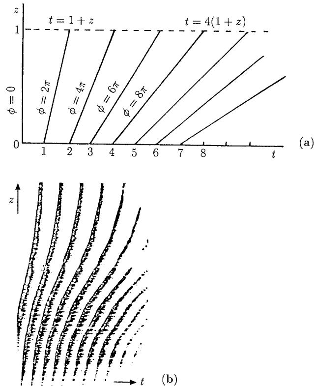

**Figure 12.1.** (**a**) Wavefronts for the period distribution *T* (*z*) = 1+*z* and initial phase distribution φ0(*z*) = 0. Note how many waves there are for different *t*'s: for *t* = 1.5 there is 1 wave in the cylinder, while for *t* = 7.5 there are 4 waves. (**b**) The experimental space–time situation equivalent to the theoretical results in (**a**). The experiments were carried out for a Belousov reaction with an initial sulphuric acid gradient in the cylinder. The total time in the figure is approximately 7 minutes and the vertical height about 20 cm; the figure is a sketch from a negative. (After Kopell and Howard 1973)

more and more waves are in 0 ≤ *z* ≤ 1. This is clear from Figure 12.1(a) and the experimental counterpart given in Figure 12.1(b): for example, at *t* = 3.5 there are two waves while at *t* = 7.5 there are 4. From the figure, it is also clear that as time increases the waves are progressively more tightly packed nearer the bottom, *z* = 0.

Suppose the initial phases φ0(*z*) = 0; then, *t*∗(*z*) = 0 and from (12.4), *T* (*z*) = [*t* − *t*∗(*z*)]/*n*. So, asymptotically for large time *t*, *T* (*z*) ∼ *t*/*n*, and the above analysis for the illustrative example in which φ0(*z*) = 0 still applies asymptotically in time. Since it is unlikely that the experimental arrangement which gave rise to Figure 12.1(b) had a strictly linear *T* (*z*), such as used in the analysis for Figure 12.1(a), the experimental results illustrate this asymptotic result quite dramatically.

The biological implications of the above analysis are of considerable importance. Since biological oscillators and biological clocks are common, a time-varying spatial pattern may be a consequence of a spatial variation in the oscillator parameters and not, as might be supposed, a consequence of some reaction diffusion situation or other such pattern formation mechanism such as we shall consider in detail in later chapters.

In this section the wave pattern is a continuously changing one. In the following sections we investigate the possibility of a more coherent wave pattern generator of considerable importance.

### **12.2 Central Pattern Generator: Experimental Facts in the Swimming of Fish**

A fish propels itself through water by a sequence of travelling waves which progress down the fish's body from head to tail and its speed is a function of the wave frequency. It is the network of neurons arrayed down the back that controls the muscle movements which generate the actual waves and coordinate them to produce the right effect. It is a widely held lay belief that in mammals the generator, or rather the controlling nerve centre for the rhythmic control of these waves, is the brain. However, in many animals swimming occurs *after* the spinal cord has been severed from the brain—the technical term is spinal transection. In the case of the dogfish, for example, the phenomenon has been known since the end of the 19th century. The swimming movement observed in such situations shows the proper intersegmental muscle coordination.

The basis for the required rhythmic behaviour and its intersegmental coordination is a central network of neurons in the spinal cord. It is known that there are neural networks which can generate temporal sequences of signals, which here produce the required cyclic patterns of muscle activity. Such networks are called *central pattern generators* and by definition require no external input control for them to produce the required rhythmic output. It is obvious how important it is to understand such neural control of locomotion. However to do so requires modelling realism and, at the very least, detailed information from experiments. The recent book on neural control of rhythmic movements, edited by Cohen et al. (1988), is specifically about the subject matter of this section and the theory and modelling chapters by Kopell (1988) and Rand et al. (1988) are particularly relevant.

In the case of higher vertebrates there are possibly millions of neurons involved. So it is clear that experimentation and its associated modelling should at least start with as small a spinal cord as possible but one which still exhibits this posttransection activity. Such neural activity, which produces essentially normal swimming, is called 'fictive swimming' or 'fictive locomotion.' This description also includes the situation where, even when the muscles which produce the actual locomotion are removed, the neural output from the spinal cord is the same as that of an intact swimming fish.

Grillner (1974), Grillner and Kashin (1976) and Grillner and Wallen (1982) present ´ good experimental data on the dogfish. Kopell (1988) uses this work as a case study for the theory described in detail in her paper. The lamprey, which is rather a primitive vertebrate, was the animal used in a series of interesting and illuminating experiments by Cohen and Wallen (1980) (see also Cohen and Harris-Warrick 1984 and references ´ given there). They studied a specific species of the lamprey which varies from about 13–30 cm in length and has a spinal cord about 0.3 mm thick and 1.5 mm wide. Its

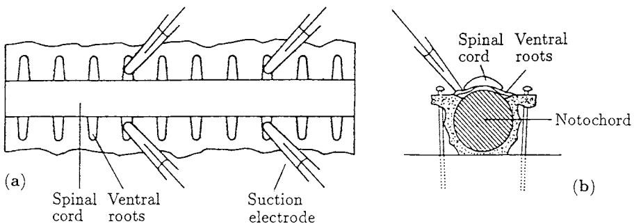

**Figure 12.2.** (**a**) Schematic diagram of the exposed lamprey spinal cord and the experimental arrangement. The preparation was pinned through membrane tissue as shown in the schematic cross-section in (**b**). There are ventral roots (*V R*) at each segment and the electrical activity of these was measured by the electrodes. (From Cohen and Wallen 1980) ´

advantages (or disadvantages from the lamprey's point of view) are that it has relatively few cells, but still has the necessary basic vertebrate organisation, and it exhibits fictive swimming behaviour. In the experiments of Cohen and Wallen (1980) and Cohen and ´ Harris-Warrick (1984), dissected lengths of spinal cord from about 25–50 segments were used: the lamprey has about 100. The animal was decapitated and the spinal cord exposed but with most of the musculature intact. Motoneuron activity was monitored with electrodes placed on two opposing ventral roots of a single segment; Figure 12.2 shows schematically the experimental setup of the spinal cord.

In these experiments the cord was placed in a saline solution and the fictive swimming, that is, the periodic rhythmic activity, was induced chemically (by L-DOPA or by the amino acid D-glutamate); the fictive swimming can go on for hours. The ventral root (*V R*) recordings from the electrodes showed alternating bursts of impulses between the left and right *VR* of a single segment. That is, the periodic bursts on either side of a segment are 180◦ out of phase. Figure 12.3 illustrates the *VR* activity obtained from the left and right sides of the ventral roots from two different segment levels in the cord. An

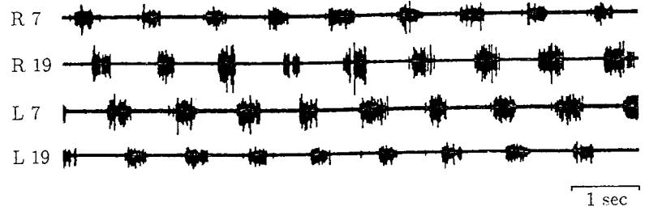

**Figure 12.3.** Bursting activity recorded from the left (*L*) and right (*R*) sides of the ventral roots (*V R*) at segments 7 and 19 as measured from the head-end of the specimen, which consisted of 27 segments. (From Cohen and Wallen 1980) The time between bursts is approximately 1 sec. Note the approximately constant ´ phase lag as you go from segment 7 to 19.

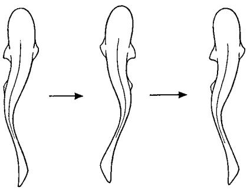

**Figure 12.4.** Typical swimming pattern illustrating a propagating wave generated by a ventral root output such as illustrated in Figure 12.3.

important point to note, and which we use in the model, is that the left and right *VR* of a segment are like individual oscillators which are phase locked 180◦ out of phase. This *intra*segmental coupling is very stable.

The results in Figure 12.3 are from an isolated piece of spinal cord consisting of 27 segments and with the numbering starting from the head side; the recordings were taken at segments 7 and 19. The period of the bursts of activity was about 1 per second. Another point to note is the nearly constant phase lag between the two segments: the lag between the right *VR* of segment 7 and segment 19 is to a first approximation the same as between the left *VR* of segments 7 and 19. In Section 12.4 we incorporate this type of behaviour in one of the specific cases in the model developed below. A piece of spinal cord of only about 10 segments can produce a stable neural fictive swimming output.

This periodic activity of the isolated lamprey spinal cord, which is directly related to the undulatory wavelike movements of the swimming fish, schematically shown in Figure 12.4, is the phenomenon controlled by the central pattern generator, which we now wish to model. Various models can be suggested for the generation of these patterns; see, for example, Kopell (1988). In the following Sections 12.3 and 12.4 we describe in detail a model proposed by Cohen et al. (1982); it has been used with considerable success to explain certain experimental results associated with selective surgical lesions in the spinal cord (Cohen and Harris-Warrick 1984).

### **12.3 Mathematical Model for the Central Pattern Generator**

The basic characteristics of the phenomenon, as exemplified by the experiments and indicated in particular by Figure 12.3, are that the left and right *VR* of a segment are phase locked oscillators and that there is approximately a constant phase lag from the head to tail of the spinal cord. The key assumptions in the model are: (i) Each segment in the back has associated with it a pair of neuronal oscillators each of which exhibits, in isolation, a stable limit cycle periodic oscillation. The amplitude of the oscillation depends only on internal parameters, and is not usually affected by external factors such as drugs or electrical stimulations. (ii) Each of the oscillators is coupled to its nearest neighbour but with the possibility of long range coupling; there is experimental evidence for the latter in Buchanan and Cohen (1982).

We saw in Chapter 7 on biological oscillators that many biochemical reaction systems can exhibit stable limit cycle periodic oscillations. It is such a biological oscillator, or one coupled to some neuronal electrical property, which we envisage to be the driving force in each of the oscillators associated with the spinal segments. It is not necessary to know the actual details of the biological oscillator for our model here—we do not know what it is in fact. As a preliminary to studying the intersegmental linking of the oscillators we first consider a single oscillator to set up the mathematical treatment and notation and introduce the analytical procedure we use.

#### *Single Oscillator and Oscillator Pair*

Denote the vector of limit cycle variables of relevance by the vector

$$\mathbf{x}(t) = (\mathbf{x}_1(t), \mathbf{x}_2(t), \dots, \mathbf{x}_n(t)). \tag{12.8}$$

Again we do not know what quantity it is that oscillates, only that something does which gives rise to the periodic *VR* neuronal activity which is observed experimentally. For example, **x**(*t*) could include the level of the neurotransmitter substance and the periodically varying electric potential. We denote the vector differential equation governing the limit cycles by

$$\frac{d\mathbf{x}}{dt} = \mathbf{f}(\mathbf{x}),\tag{12.9}$$

where *t* denotes time. Just as we do not need to know the specific biological oscillator involved, we do not require the detailed functional form of the function **f**(**x**). Let us consider the limit cycle to be the closed orbit γ in the phase space. Using this curve as the local coordinate system we can think of the periodic limit cycle as having a *phase* θ which goes from 0 to 2π as we make a complete circuit round the closed orbit γ . Assume that at some point *P* on the closed curve the bursting, which is observed experimentally by the electrodes, occurs at the phase θ = 0. Starting at *P*, the phase increases from 0 and reaches 2π when we get back to *P*, where bursting again occurs. Let us further assume that the coordinate system for the limit cycle is chosen so that the speed of the solution round γ , as measured now by *d*θ/*dt*, is constant.

The above idea of representing a limit cycle in terms of the phase can be illustrated by the following, admittedly contrived, simple pedagogical example. Consider the differential equation system given by

$$\begin{split} \frac{d\mathbf{x}_1}{dt} &= \mathbf{x}_1 (1 - \rho) - a\mathbf{x}_2, \quad \frac{d\mathbf{x}_2}{dt} = \mathbf{x}_2 (1 - \rho) + a\mathbf{x}_1, \\ \rho &= (\mathbf{x}_1^2 + \mathbf{x}_2^2)^{1/2}, \end{split} \tag{12.10}$$

where ω is a positive constant. Although the solution of this system can be obtained trivially, as we see below, a formal phase plane analysis (see Appendix A) of (12.10) shows that (0, 0) is the only singular point and it is an unstable spiral, spiralling anticlockwise. A confined set can be found (just take ρ large), so by the Poincare–Bendixson theorem ´ a limit cycle periodic solution exists and is represented by a closed orbit in the (*x*1, *x*2)

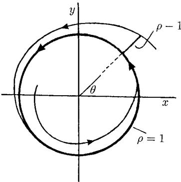

**Figure 12.5.** The phase plane solution of the differential equation system (12.12). The asymptotically stable limit cycle is ρ = 1 and the phase θ = ω*t*.

plane. If we now change to polar coordinates ρ and θ in the phase plane with

$$\mathbf{x}_1 = \rho \cos \theta, \quad \mathbf{x}_2 = \rho \sin \theta \tag{12.11}$$

the system (12.10) becomes

$$\frac{d\rho}{dt} = \rho(1-\rho), \quad \frac{d\theta}{dt} = \omega,\tag{12.12}$$

and the limit cycle is then seen to be ρ = 1. The solution is illustrated in Figure 12.5. The limit cycle is asymptotically stable since any perturbation from ρ = 1 will die out by ρ simply winding back onto ρ = 1 and in an anti-clockwise way because *d*θ/*dt* > 0. If the perturbation from the circle is to a point ρ < 1 then, from (12.12), ρ increases, while if the perturbation is to a point ρ > 1, ρ decreases as it tends to the orbit ρ = 1. In this case ρ = 1 is the equivalent of the orbit γ and θ is the phase, which runs from θ = 0 to 2π as a circuit is completed.

Returning to the model system (12.9), we take θ to be one of the *n* variables: its value is always modulo 2π; that is, any value θ = θ+2*m*π for all integers *m*. Let us now consider the remaining *n* − 1 variables, denoted by **r**, to be perturbations perpendicular to the limit cycle orbit γ , where we have taken local coordinates such that the actual orbit γ in an undisturbed state is **r** = 0. (With the above example in Figure 12.5, this would be equivalent to changing the variables from (ρ,θ) to (*r*,θ) where *r* = 1 − ρ: the limit cycle orbit γ , ρ = 1, becomes *r* = 0. Now *r* = 0 represents a perturbation from γ .) Figure 12.6 is an example of this system in the case *n* = 3.

With the coordinate transformation and parametrisation above, the system (12.9) can be written as

$$\frac{d\mathbf{r}}{dt} = \mathbf{f}_{\mathrm{l}}(\mathbf{r}, \theta), \tag{12.13}$$

$$\frac{d\theta}{dt} = \omega + f_2(\mathbf{r}, \theta),\tag{12.14}$$

where **f**1(0,θ) = 0 = *f*2(0,θ) and the period of the oscillator is *T* = 2π/ω. The functions **f**1 and *f*2 are periodic in θ with period 2π by virtue of the coordinate system


**Figure 12.6.** An example of a phase space for the system (12.9) for *n* = 3. Here *r* has two components *r*1 and *r*2 with the phase θ being the third component.

we have set up for the limit cycle behaviour of (12.9). If there is no external excitation the limit cycle is simply

$$\mathbf{r} = 0, \quad \frac{d\theta}{dt} = \omega \quad \Rightarrow \quad \theta(t) = \theta(0) + \omega t. \tag{12.15}$$

At each segment there are two coupled oscillators such as we have just described. They are linked in such a way that if there are no intersegmental influences the outputs from the right and left oscillator, denoted by **x***R*(*t*) and **x***L* (*t*) respectively, simply oscillate 180◦ out of phase. Each oscillator is of the form (12.9); that is,

$$\frac{d\mathbf{x}_R}{dt} = \mathbf{f}_R(\mathbf{x}_R, \mathbf{x}_L), \quad \frac{d\mathbf{x}_L}{dt} = \mathbf{f}_L(\mathbf{x}_L, \mathbf{x}_R). \tag{12.16}$$

Associated with each of the oscillators is a phase θ*R* and θ*L* and a vector **r***R* and **r***L* which is the deviation from each oscillator in isolation caused by the intrasegmental coupling. That is, if there were no coupling the equations in (12.16) would be uncoupled, *d*θ*R*/*dt* and *d*θ*L* /*dt* would each be equal to ω and *rR*,*rL* both equal to zero.

From the experimental observations described in Section 12.2 the pair of segmental oscillators is 180◦ out of phase so we assume in the model that

$$
\theta_L(t) = \theta_R(t) + \pi. \tag{12.17}
$$

Later we include some weak intersegmental coupling so this relationship will only be a first-order approximation. With such a phase relationship the outputs **x***R* and **x***L* are also 180◦ out of phase which implies

$$\mathbf{x}_L(t) = \mathbf{x}_R(t + T/2),\tag{12.18}$$

where *T* is the common period, which gives a relationship between **x***R* and **x***L* . This means that the pair of equations (12.16) can be reduced to a single equation for either the left or right oscillator. The point is that with this assumed intrasegmental coupling we end up again with the reduced system (12.13) and (12.14).

With the single oscillator, as the phase θ increases, the output levels of the variables **x**(*t*) vary periodically, typically as illustrated schematically in Figure 12.7. Let us suppose that bursting starts when some output *x*(*t*) reaches a threshold value and remains

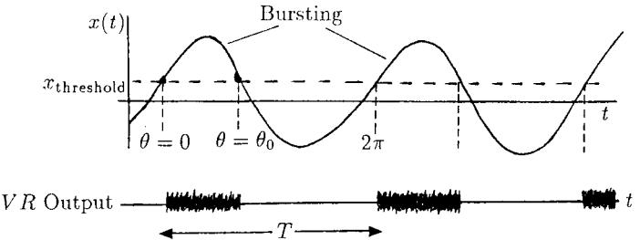

**Figure 12.7.** Schematic periodic output *x*(*t*) from a single oscillator. When the output level is above a threshold it triggers the *VR* bursting.

on as long as *x*(*t*) is above this threshold value. We can take the value of the phase where this threshold for *x*(*t*) occurs to be θ = 0: we can set the origin of the phase where we like. Because of the periodic rise and fall of the variable *x*(*t*) its value will eventually pass through the critical threshold value again and the bursting will be shut off. (We shall see in Chapter 13 and Chapter 1, Volume II that such threshold phenomena occur in other wave situations.)

Experimentally bursting is observed for only about 0.4 of the period, which in our scaling is 2π × 0.4. If we let θ0 be the phase at which bursting ceases, the bursting based on this then occurs as illustrated in Figure 12.7 for θ + 2*m*π, 0 <θ<θ0 for all *m* = 0, 1, 2,... .

#### *Sequence of Coupled Oscillators*

We now need to look at the effect on each of the segmental oscillators if they are coupled. So, we now consider the series of segmental oscillators (at each stage there is a pair but as we showed above the analysis requires a study of only one) which consists of *N* equations of the form (12.9), a typical one of which we write as

$$\frac{d\mathbf{x}_j}{dt} = \mathbf{f}_j(\mathbf{x}_j) + \mathbf{g}_j(\mathbf{x}_1, \dots, \mathbf{x}_N, \mathbf{c}), \quad j = 1, \dots, N,\tag{12.19}$$

where **g** represents the coupling effect of the other *N* − 1 oscillators and **c** is a vector of coupling parameters. If **c** = 0 the oscillators are uncoupled; that is, **g** *j*(**x**1,... , **x***N* , 0) = 0 and the *N* oscillators then simply have their own periodic limit cycle γ *j* .

The general mathematical problem (12.19) is essentially intractable without some simplifying assumptions or specialisations. The problem of determining the interaction properties of coupled oscillators has been widely studied for many years. Hard quantitative results are not trivial to get and most studies have been on a limited number of oscillators, like two, or when the coupling between the oscillators is weak. The mathematics used covers a wide spectrum, with singular perturbation techniques being among the most powerful and helpful. We discussed some properties of coupled oscillator systems in Chapter 9, Sections 9.5 and 9.10. With the above system, some useful and experimentally pertinent results can be obtained if we consider the coupling effects to be weak, that is, if we assume | **c** | 1 and | **g** ||**f** |, and then use perturbation methods. The implications, or rather assumptions, of this are that the limit cycles γ *j*, *j* = 1, 2,... , *N* of the isolated oscillators will only be slightly perturbed by the coupling effects (recall Section 9.5). So, it is still appropriate to use the oscillator equation form (12.13) and (12.14) involving the phase θ and deviations **r** *j* from the limit cycle γ*j* , but now we have to include an extra small coupling term in the equation. (In fact we shall make even further simplifying assumptions based on what has been observed experimentally, but it is instructive to proceed a little further with the current line since it is the basis for a rigourous justification of the assumptions we make later.) The set of *N* equations we have to study is then

$$\begin{aligned} \frac{d\mathbf{r}_j}{dt} &= \mathbf{f}_{j1}(\mathbf{r}_j, \theta_j) + \mathbf{g}_{j1}(\mathbf{r}_1, \dots, \mathbf{r}_N, \theta_1, \dots, \theta_N, \mathbf{c}),\\ \frac{d\theta_j}{dt} &= \alpha_j + f_{j2}(\mathbf{r}_j, \theta_j) + g_{j2}(\mathbf{r}_1, \dots, \mathbf{r}_N, \theta_1, \dots, \theta_N, \mathbf{c}), \quad j = 1, 2, \dots, N. \end{aligned} \tag{12.20}$$

Experimentally it has been observed that the individual oscillators when uncoupled, by severing and thus isolating them from their neighbours, have different frequencies ω*j* and hence different periods *Tj* = 2π/ω*j* . A crucially important point to keep in mind is that when the segmental oscillators are coupled they still perform limit cycle oscillations. So, even when coupled we can still characterise them in terms of their phase θ *j* . Since fictive swimming is a reflection of phase coupling we need only consider a *phase coupling model* for the system (12.19). So, instead of studying the system (12.19) perturbed about **r** *j* = 0 we can consider a system of phase coupled equations of the form

$$\frac{d\theta_j}{dt} = \omega_j + h_j(\theta_1, \dots, \theta_N, \mathbf{c}), \quad j = 1, \dots, N,\tag{12.21}$$

where *h j* includes the (weak) coupling effect of all the other oscillators. Equations (12.21) do not involve the amplitudes of the oscillators. The problem of weak coupling in a population of oscillators has been studied in some depth, for example, by Neu (1979, 1980), Rand and Holmes (1980), Ermentrout (1981) and in the book by Guckenheimer and Holmes (1983). Carrying out a perturbation of (12.19) about **r** *j* = 0 eventually results in a phase coupled system of equations (12.21) (see Chapter 9). So, there is a mathematical, as well as biological, justification for considering the simpler model (12.21).

Since we assume small perturbations from the individual limit cycle oscillators to come from the coupling, it is reasonable to consider a linear coupling model where the effect of the *j*th oscillator on the *i*th one is simply proportional to **x** *j* . In this situation the coupled oscillator system is of the form (12.9) perturbed by linear terms; namely,

$$\frac{d\mathbf{x}_l}{dt} = \mathbf{f}_l(\mathbf{x}_l) + \sum_{\substack{j=1\\j\neq l}}^N \mathbf{A}_{lj}\mathbf{x}_j,\tag{12.22}$$

where **A***i j* are matrices of the coupling coefficients.

Equations (12.22) include both the phases and amplitudes. We argued above that we need only consider a phase coupled model so even (12.22) is more complicated than we need consider. It was shown in Chapter 9, Section 9.9 (see also Neu 1979, 1980 and Rand and Holmes 1980) that, in the case of weak coupling, (12.22) leads to a *phase* coupled system of differential equations of the form

$$\frac{d\theta_l}{dt} = \omega_l + \sum_{j=1}^{N} a_{lj} h(\theta_j - \theta_l), \quad i = 1, \ldots, N,\tag{12.23}$$

where *h* is a periodic function of its argument. We can argue heuristically, however, to justify the model system (12.23). Since we suggested that we need only consider a phase model, a linear coupling would reasonably involve a coupling term which was a function of the phase differences of the oscillator and all the others in the system. The periodic nature of the function *h* is suggested by the fact that we would also reasonably expect the phase difference between any two oscillators to be periodic. There is, as well, experimental evidence to support such a conjecture from Buchanan and Cohen (1982), who found that the slowly varying intrasegmental potentials of the motoneurons are quasi-sinusoidal. As the specific model to study therefore we take the simple periodic function *h*(φ) = sin φ in (12.23). For a discussion of a more general *h* in the case of coupled oscillators, see Kopell (1988).

The phase coupled model we analyse in detail is the set of *N* phase equations

$$\frac{d\theta_l}{dt} = \omega_l + \sum_{\substack{j=1 \\ j \neq l}}^N a_{lj} \sin(\theta_j - \theta_l), \quad i = 1, \dots, N. \tag{12.24}$$

The *ai j*s are a measure of the effect of the *j*th oscillator on the *i*th one with the effect being *excitatory*, meaning θ *j* tends to pull θ*i* towards its value if *ai j* is *positive*, while it is *inhibitory* if *ai j* is *negative*. In the inhibitory case θ *j* tends to increase the difference

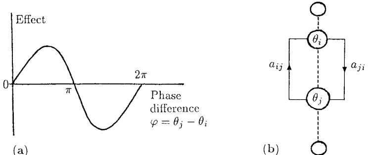

**Figure 12.8.** (**a**) Measure of the effect on the *i*th oscillator of the *j*th oscillator for a sinusoidal form for the interaction function *h*(φ) of the phase difference. (**b**) Schematic representation of the coupling of the *i*th and *j*th oscillators according to (12.24).

between it and θ*i* . With the specific interaction function sin φ we choose for *h* in (12.23) the maximum excitatory effect of the *j*th oscillator on the *i*th one is when they are π/2 out of phase; the maximum inhibitory effect is when they are −π/2 out of phase with no effect when they are in phase. Figure 12.8 schematically illustrates the model and the sinusoidal coupling effect.

We wish to retain in our model the periodic character of the oscillators when they are coupled. More particularly we want *d*θ*i* /*dt* always to be a positive and monotonic increasing function of *t*, so that movement on the limit cycle γ*i* is always in one direction, or in other words so that the output has a regular up and down character as in Figure 12.8(a). We assume therefore that the magnitudes of ω*i* and *ai j* are such that the phase θ*i*(*t*) behaves in this way. We now wish to analyse the model system (12.24) and see whether or not it is a reasonable model when the solutions are compared with experimental results.

#### **12.4 Analysis of the Phase Coupled Model System**

We have to decide what kind of coupling we wish to include in the model system (12.24). Here we analyse the simplest, namely, when each oscillator is only coupled to its nearest neighbours. In this case (12.24) becomes the coupled system of *N* equations

$$\begin{aligned} \frac{d\theta_1}{dt} &= \omega_1 + a_{12}\sin(\theta_2 - \theta_1) \\ \frac{d\theta_2}{dt} &= \omega_2 + a_{21}\sin(\theta_1 - \theta_2) + a_{23}\sin(\theta_3 - \theta_2) \\ &\vdots \\ \frac{d\theta_j}{dt} &= \omega_j + a_{j, j-1}\sin(\theta_{j-1} - \theta_j) + a_{j, j+1}\sin(\theta_{j+1} - \theta_j) \\ &\vdots \\ \frac{d\theta_N}{dt} &= \omega_N + a_{N, N-1}\sin(\theta_{N-1} - \theta_N). \end{aligned} \tag{12.25}$$

The form of the right-hand sides suggests that we introduce

$$
\phi_j = \theta_j - \theta_{j+1}, \quad \Omega_j = a\nu_j - a\nu_{j+1} \tag{12.26}
$$

and rewrite the system (12.25) in terms of the φ's, the phase differences, and the 's, the frequency differences, by subtracting the θ-equations pairwise to get the *N* − 1 equations

$$\begin{aligned} \frac{d\phi_1}{dt} &= \Omega_1 - (a_{12} + a_{21})\sin\phi_1 + a_{23}\sin\phi_2\\ \frac{d\phi_2}{dt} &= \Omega_2 + a_{21}\sin\phi_1 - (a_{23} + a_{32})\sin\phi_2 + a_{34}\sin\phi_3\\ &\vdots\\ \frac{d\phi_j}{dt} &= \Omega_j + a_{j, j-1}\sin\phi_{j-1}\\ &- (a_{j, j+1} + a_{j+1, j})\sin\phi_j + a_{j+1, j+2}\sin\phi_{j+1}\\ &\vdots\\ \frac{d\phi_{N-1}}{dt} &= \Omega_{N-1} + a_{N-1, N-2}\sin\phi_{N-2}\\ &- (a_{N-1, N} + a_{N, N-1})\sin\phi_{N-1}. \end{aligned} \tag{12.27}$$

Since we are looking for some regular periodic pattern which we associate with fictive swimming, we can make some assumptions about the coupling coefficients *ai j* . (We are also trying to get the simplest reasonable model to mimic the experimental phenomenon.) Let us assume that all the upward (in number, that is—in our model this is in the head-to-tail direction) coupling coefficients *a j*,*j*+1 = *au* and all the downwards coefficients *a j*,*j*−1 = *ad* . The system (12.27) in vector form is then

$$\frac{d\phi}{dt} = \boldsymbol{\Omega} + \mathbf{B} \mathbf{S},\tag{12.28}$$

where the vectors

$$\boldsymbol{\phi} = \begin{pmatrix} \phi_1 \\ \vdots \\ \phi_{N-1} \end{pmatrix}, \quad \mathbf{S} = \begin{pmatrix} \sin \phi_1 \\ \vdots \\ \sin \phi_{N-1} \end{pmatrix}, \quad \boldsymbol{\Omega} = \begin{pmatrix} \boldsymbol{\Omega}_1 \\ \vdots \\ \boldsymbol{\Omega}_{N-1} \end{pmatrix} \tag{12.29}$$

and **B** is the (*N* − 1) × (*N* − 1) matrix

$$\mathbf{B} = \begin{pmatrix} -(a_d + a_{\iota}) & a_{\iota} & \cdot & \cdot \\ a_d & -(a_d + a_{\iota}) & a_{\iota} & \cdot \\ \cdot & \cdot & \cdot & \cdot \\ \cdot & \cdot & \cdot & \cdot \\ \cdot & \cdot & a_d & -(a_d + a_{\iota}) \end{pmatrix} . \tag{12.30}$$

For the application of the model to the fictive swimming of the lamprey, we are interested in *phase locked* solutions of (12.28). That is, the coupling must be such that all the oscillators have the same period. This is the same as saying that the phase differences φ*j* between the oscillators is always constant for all *j* = 1, 2,... , *N* − 1. This in turn means that *d*φ*j* /*dt* = 0 and so we are looking for equilibrium solutions of (12.28), that is, the solutions of

$$0 = \Omega + \mathbf{B} \mathbf{S} \quad \Rightarrow \quad \mathbf{S} = -\mathbf{B}^{-1} \Omega. \tag{12.31}$$

Since **S** involves only sin φ*j* , *j* = 1, 2,... , *N*−1, solutions exist only if all the elements of **B**−1 lie between ±1.

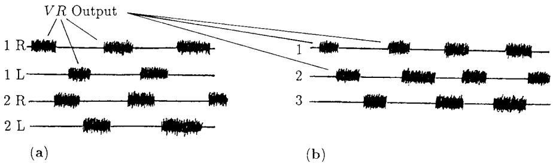

**Figure 12.9.** (**a**) Ventral root output from a phase locked 2-oscillator model. (**b**) Ventral root output from a phase locked solution of a 3-oscillator system: note that the phase difference between the 1st and 2nd root is not necessarily the same as between the 2nd and 3rd.

#### *Two-Oscillator System*

Here we have only a single equation for the phase difference φ = θ1 − θ2; namely,

$$\frac{d\phi}{dt} = \Omega - (a_d + a_\mu)\sin\phi.\tag{12.32}$$

This has phase locked solutions, where *d*φ/*dt* = 0, if and only if

$$|\mathfrak{Q}| \le |a_d + a_\mathfrak{u}|.\tag{12.33}$$

If we denote the solutions by φ*S* then if

$$\begin{aligned} |\Omega| &= |a_d + a_\mu| \quad \text{then} \quad \phi_\mathcal{S} = \pi/2 \quad \text{or} \quad 3\pi/2, \\ |\Omega| &< |a_d + a_\mu| \quad \text{then} \quad |\phi_\mathcal{S}| < \pi/2 \quad \text{or} \quad \pi/2 < |\phi_\mathcal{S}| \le \pi. \end{aligned} \tag{12.34}$$

We can determine the stability of these steady state solutions by linearising about them in the usual way (as in Chapter 1, Section 1.1). If we denote perturbations about φ*S* by ψ, the linear stability equation from (12.32) is

$$\frac{d\psi}{dt} \approx -[(a_d + a_u)\cos\phi_S]\psi.$$

The first two possible solutions in (12.34) are neutrally stable, because cos φ*S* = 0, while one of the second set is stable and the other unstable. So, as the coupling strength | *ad* + *au* | *decreases* relative to the frequency difference | |, | |/| *ad* + *au* | increases and the stable steady state, as well as the unstable one, tends to the neutrally stable one as | *ad* + *au* |→| | after which no solution exists. Thus as the coupling strength | *ad* + *au* | becomes weaker relative to the *detuning* | | = ω1 − ω2 a bifurcation takes place where the stable phase locked solution ceases to exist. The stable steady state when it exists, is the phase locked solution we are interested in. From the discussion above in Section 12.2, a model with two oscillators has two pairs of ventral roots and, with the threshold bursting implied by Figure 12.7 and phase difference at each *VR* pair, the bursting output is as illustrated in Figure 12.9(a).

#### *Three-Oscillator System*

The steady states for this system are, from (12.31),

$$
\begin{pmatrix}
\sin\phi_1\\\sin\phi_2
\end{pmatrix} = \frac{1}{a_d^2 + a_d a_u + a_u^2} \begin{pmatrix}
a_d + a_u & a_u\\a_d & a_d + a_u
\end{pmatrix} \begin{pmatrix}
\Omega_1\\\Omega_2
\end{pmatrix}.\tag{12.35}
$$

For algebraic simplicity let us take the coupling coefficients *ad* = *au* = *a*, in which case the last equation gives

$$
\sin \phi_1 = (\mathfrak{Q}\mathfrak{Q}_1 + \mathfrak{Q}_2)/\mathfrak{B}a, \quad \sin \phi_2 = (\mathfrak{Q}_1 + \mathfrak{Q}\mathfrak{Q}_2)/\mathfrak{B}a. \tag{12.36}
$$

Thus a phase locked solution (φ1,φ2) exists if and only if

$$\max\{\left|\mathcal{D}\Omega_{1} + \Omega_{2}\left|/\mathfrak{A}a, \left|\Omega_{1} + \mathfrak{D}\Omega_{2}\right|/\mathfrak{A}a\right| < 1.\tag{12.37}$$

In this 3-oscillator case the phase differences φ1 and φ2 are unequal in general, and a typical *VR* output from it is schematically illustrated in Figure 12.9(b).

As the number of oscillators increases the algebraic complexity quickly gets out of hand but it is clear how to set up the algebraic problem to be solved, that is, how to get the set of conditions that must hold between the coupling coefficients and the detuning parameters for a phase locked solution to exist.

#### *Constant Phase Lag System of N-Oscillators*

To keep the generality in a multi-oscillator model such as we did with the last two systems is perhaps unnecessarily cumbersome. What we wish to show is that such coupled oscillators can give a stable phase locked system, such as required by a central pattern generator to produce the required *VR* output necessary for fictive swimming. So, here we consider a system where there is a constant phase lag between neighbouring segments; that is, we assume that the phase difference φ*j* = θ *j* − θ *j*+1 = δ, a positive constant. This situation is of particular relevance to the experimental facts related to Figure 12.3. Such a line of oscillators is characteristic of a uniform travelling wave. Although the analysis here can be done with any periodic *h* in (12.23) (see Exercise 2), we continue to use the example *h*(φ) = sin φ for consistency. If we set = sin δ > 0 the system of equations for the steady states becomes, from (12.31) with (12.29) and (12.30),

$$\begin{aligned} \Omega_1 + \left[ -(a_d + a_\mu) + a_\mu \right] \Delta &= 0 \quad \Rightarrow \quad \Omega_1 = a_d \,\Delta \\ &\vdots \\ \Omega_j + \left[ a_d - (a_d + a_\mu) + a_\mu \right] \Delta &= 0 \quad \Rightarrow \quad \Omega_j = 0, \; j = 2, \ldots, N - 2 \quad (12.38) \\ &\vdots \\ \Omega_{N-1} + \left[ a_d - (a_d + a_\mu) \right] \Delta &= 0 \quad \Rightarrow \quad \Omega_{N-1} = a_\mu \,\Delta . \end{aligned} \quad (12.39)$$

In terms of the original frequencies, since *j* = ω*j* − ω*j*+1, this gives

$$\begin{aligned} \omega_j &= \omega \quad \text{for all} \quad j = 2, \dots, N - 1 \\ \omega_\ell &= \omega + a\ell \sin \delta > \omega \\ \omega_N &= \omega - a_\ell \sin \delta < \omega . \end{aligned} \tag{12.39}$$

What this solution means is that all the oscillators except the first, the rostral or head oscillator, and the last, the caudal or tail oscillator, have the natural frequency of each segmental oscillator in isolation. The head oscillator is tuned up, that is, to a higher frequency, while the tail one is tuned down. This assumes that the coupling coefficients *ad* and *au* in (12.39) are positive; that is, the coupling is excitatory. The resulting wave which results from this is one which travels from head to tail. Another solution to this constant phase lag problem is when the head oscillator is tuned down and the tail one tuned up. This results in the wave propagating from tail to head; that is, the lamprey swims backwards, which in fact it can do.

We finally have to consider the stability of this constant phase lag solution. We do this in the usual way by linearising about φ*j* = δ by writing

$$\phi_j = \delta + \psi_j, \quad j = 1, \dots, N,\tag{12.40}$$

where || ψ || 1. Substituting this into the time-dependent equation (12.28) and linearising gives

$$\frac{d\psi}{dt} = \mathbf{B}\psi \cos \delta,\tag{12.41}$$

where the matrix *B* is given by (12.30), depends only on the coupling coefficients *ad* and *au* and is a tridiagonal (*N* − 1) × (*N* − 1) matrix. If we now look for solutions of (12.41) in the form

$$
\psi(t) = e^{\lambda t} \psi_0 \tag{12.42}
$$

the eigenvalues λ are solutions of

$$|\mathbf{B}\cos\delta - \lambda\mathbf{I}| = 0,\tag{12.43}$$

where *I* is the unit (*N* − 1) × (*N* − 1) matrix. From experimental observation phase lags between segments are quite small and 0 < cos δ < 1. Under these circumstances it can be shown, for example, by using the Routh–Hurwitz conditions on the polynomial in λ, that Re λ < 0. So from (12.42) ψ(*t*) → 0 as *t* → ∞ which means that the phase locked constant phase difference solution above is stable to linear perturbations.

There are of course two solutions for the phase difference equation sin φ*j* = sin δ, which gives 2*N*−1 − 2 other phase locked solutions. However, it can be shown, from a study of the eigenvalue matrix, that all of them are linearly unstable; that is, there exists at least one eigenvalue λ in (12.42) with Re λ > 0. We conclude therefore, that the solution (12.39) is the relevant one when there is a constant phase difference between

neighbouring segmental oscillators, and hence is the one which gives rise to a stable wave which propagates down (or up) the spinal chord.

Perhaps it should be pointed out here that, as far as the lamprey is concerned, isolated parts of the cord can 'swim' forward and backward, so we have to postulate that something automatically tunes the two end segments. Another problem with this simple model is that it does not seem able to account for the experimental fact that the phase lag appears to be constant even with changes in the swimming speed. This is a serious point since the phase lag determines the wavelength and hence the shape of the swimming fish. There are, however, other possible ways of coupling which can be considered (see, for example, Cohen et al. 1982).

One purpose of these Sections 12.2 to 12.4 has been to show how such a relatively simple model can be the pattern generator for the wave propagation in experimentally observed fictive swimming. A major point to note is that various simple intersegmental coupling of oscillators can generate stable travelling waves. Particularly striking is the fact that even the simple model we analysed is sufficient to generate the required coordination of phase coupling for both forward and backward swimming—only the head and tail oscillators had to be retuned. Cohen et al. (1982) discuss in more detail the comparison with the experimental observations on lamprey. Although there are still problems, the results are encouraging. All of this does not imply that such a model mechanism is *the* central pattern generator, only that it is a possible candidate.

### **Exercises**

- **1** Consider a 4-oscillator system in which the coupling coefficients *ad* = *au* = *a* and each oscillator frequency differs from its predecessor by a small amount ε; that is, ω*j* = ω*j*−1 − ε. First look for steady state phase locked solutions for φ*j* = θ *j* − θ *j*−1, *j* = 1, 2, 3 from (12.29). Show that solutions exist for φ*j* , *j* = 1, 2, 3 only if ε ≤ *a*/2. Generalise the result to *N* oscillators to show that solutions exist only if ε ≤ 8*a*/*N*2.
- **2** Consider an *N*-oscillator system in which there is only nearest neighbour coupling between which there is a constant phase lag δ. Start with equation (12.23) with a general interaction function *h*(δ) and derive the equivalent of (12.38) for the steady state frequency differences. Hence determine the frequency of the first and last oscillator in terms of *h*(δ).

# **13. Biological Waves: Single-Species Models**

#### **13.1 Background and the Travelling Waveform**

There is a vast number of phenomena in biology in which a key element or precursor to a developmental process seems to be the appearance of a travelling wave of chemical concentration, mechanical deformation, electrical signal and so on. Looking at almost any film of a developing embryo it is hard not to be struck by the number of wavelike events that appear after fertilisation. Mechanical waves are perhaps the most obvious. There are, for example, both chemical and mechanical waves which propagate on the surface of many vertebrate eggs. In the case of the egg of the fish *Medaka* a calcium (Ca++) wave sweeps over the surface; it emanates from the point of sperm entry: we briefly discuss this problem in Section 13.6 below. Chemical concentration waves such as those found with the Belousov–Zhabotinskii reaction are visually dramatic examples (see Chapter 1, Volume II). From the analysis on insect dispersal in Section 11.3 in Chapter 11 we can also expect wave phenomena in that area, and in interacting population models where spatial effects are important. Another example, related to interacting populations, is the progressing wave of an epidemic, of which the rabies epizootic currently spreading across Europe is a dramatic and disturbing example; we study a model for this in some detail in Chapter 13. The movement of microorganisms moving into a food source, chemotactically directed, is another. The slime mould *Dictyostelium discoideum* is a particularly widely studied example of chemotaxis; we discuss this phenomenon later (see the photograph in Figure 1.1, Volume II which shows associated waves).

The book by Winfree (2000) is replete with wave phenomena in biology. The introductory text on mathematical models in molecular and cellular biology edited by Segel (1980) also deals with some aspects of wave motion. Although not so application oriented, there are several books on reaction diffusion equations such as by Fife (1979), Britton (1986) and Grindrod (1996) which are all relevant. Zeeman (1977) considers wave phenomena in development and other biological areas from a catastrophe theory standpoint.

The point to be emphasised is the widespread existence of wave phenomena in the biomedical sciences which necessitates a study of travelling waves in depth and of the modelling and analysis involved. This chapter and Chapter 1, Volume II (with many other examples throughout Volume II) deal with various aspects of wave behaviour where diffusion plays a crucial role. The waves studied here are quite different from those discussed in Chapter 12. The mathematical literature on them is now vast, so the number of topics and the depth of the discussions have to be severely limited. Among other things, we shall cover what is now accepted as part of the basic theory in the field and describe two practical problems, one associated with insect dispersal and control and the other related to calcium waves on amphibian eggs.

In developing living systems there is almost continual interchange of information at both the inter- and intra-cellular level. Such communication is necessary for the sequential development and generation of the required pattern and form in, for example, embryogenesis. Propagating waveforms of varying biochemical concentrations are one means of transmitting such biochemical information. In the developing embryo, diffusion coefficients of biological chemicals can be very small: values of the order of 10−9 to 10−11 cm2 sec−1 are fairly common. Such small diffusion coefficients imply that to cover macroscopic distances of the order of several millimetres requires a very long time if diffusion is the principal process involved. Estimation of diffusion coefficients for insect dispersal in interacting populations is now studied with care and sophistication (see, for example, Kareiva 1983 and Tilman and Kareiva 1998): not surprisingly the values are larger and species-dependent.

With a standard diffusion equation in one space dimension, which from Section 11.1 is typically of the form

$$\frac{\partial \mu}{\partial t} = D \frac{\partial^2 \mu}{\partial x^2},\tag{13.1}$$

for a chemical of concentration *u*, the time to convey information in the form of a changed concentration over a distance *L* is *O*(*L*2/*D*). You get this order estimate from the equation using dimensional arguments, similarity solutions or more obviously from the classical solution given by equation (11.10) in Chapter 11. So, if *L* is of the order of 1 mm, typical times with the above diffusion coefficients are *O*(107 to 109 sec), which is excessively long for most processes in the early stages of embryonic development. Simple diffusion therefore is unlikely to be the main vehicle for transmitting information over significant distances. A possible exception is the generation of butterfly wing patterns, which takes place during the pupal stage and involves several days (for example, Murray 1981 and Nijhout 1991).

In contrast to simple diffusion we shall show that when reaction kinetics and diffusion are coupled, travelling waves of chemical concentration exist and can effect a biochemical change very much faster than straight diffusional processes governed by equations like (13.1). This coupling gives rise to reaction diffusion equations which (cf. Section 11.1, equation (11.16)) in a simple one-dimensional scalar case can look like

$$\frac{\partial u}{\partial t} = f(u) + D \frac{\partial^2 u}{\partial x^2},\tag{13.2}$$

where *u* is the concentration, *f* (*u*) represents the kinetics and *D* is the diffusion coefficient, here taken to be constant.

We must first decide what we mean by a travelling wave. We saw in Chapter 11 that the solutions (11.21) and (11.24) described a kind of wave, where the shape and speed of propagation of the front continually changed. Customarily a travelling wave is taken to be a wave which travels *without change of shape*, and this will be our understanding here. So, if a solution *u*(*x*,*t*) represents a travelling wave, the *shape* of the solution will be the same for all time and the speed of propagation of this shape is a constant, which we denote by *c*. If we look at this wave in a travelling frame moving at speed *c* it will appear stationary. A mathematical way of saying this is that if the solution

$$
\mu(\mathbf{x}, t) = \mu(\mathbf{x} - ct) = \mu(z), \quad z = \mathbf{x} - ct \tag{13.3}
$$

then *u*(*x*,*t*) is a travelling wave, and it moves at constant speed *c* in the positive *x*direction. Clearly if *x*−*ct* is constant, so is *u*. It also means the coordinate system moves with speed *c*. A wave which moves in the negative *x*-direction is of the form *u*(*x* + *ct*). The wavespeed *c* generally has to be determined. The dependent variable *z* is sometimes called the *wave variable*. When we look for travelling wave solutions of an equation or system of equations in *x* and *t* in the form (13.3), we have ∂*u*/∂*t* = −*cdu*/*dz* and ∂*u*/∂*x* = *du*/*dz*. So *partial* differential equations in *x* and *t* become *ordinary* differential equations in *z*. To be physically realistic *u*(*z*) has to be bounded for all *z* and nonnegative with the quantities with which we are concerned, such as chemicals, populations, bacteria and cells.

It is part of the classical theory of linear parabolic equations, such as (13.1), that there are no physically realistic travelling wave solutions. Suppose we look for solutions in the form (13.3); then (13.1) becomes

$$D\frac{d^2u}{dz^2} + c\frac{du}{dz} = 0 \quad \Rightarrow \quad u(z) = A + Be^{-cz/D},$$

where *A* and *B* are integration constants. Since *u* has to be bounded for all *z*, *B* must be zero since the exponential becomes unbounded as *z* → −∞. *u*(*z*) = *A*, a constant, is not a wave solution. In marked contrast the parabolic reaction diffusion equation (13.2) can exhibit travelling wave solutions, depending on the form of the reaction/interaction term *f* (*u*). This solution behaviour was a major factor in starting the whole mathematical field of reaction diffusion theory.

Although most realistic models of biological interest involve more than one dimension and more than one dependent variable, whether concentration or population, there are several multi-species systems which reasonably reduce to a one-dimensional singlespecies mechanism which captures key features. This chapter therefore is not simply a pedagogical mathematical exposition of some common techniques and basic theory. We discuss two very practical problems, one in ecology and the other in developmental biology: both belong to important areas where modelling has played a significant role.

### **13.2 Fisher–Kolmogoroff Equation and Propagating Wave Solutions**

The classic simplest case of a nonlinear reaction diffusion equation (13.2) is

$$\frac{\partial \mu}{\partial t} = ku(1-\mu) + D \frac{\partial^2 \mu}{\partial x^2},\tag{13.4}$$

where *k* and *D* are positive parameters. It was suggested by Fisher (1937) as a deterministic version of a stochastic model for the spatial spread of a favoured gene in a population. It is also the natural extension of the logistic growth population model discussed in Chapter 11 when the population disperses via linear diffusion. This equation and its travelling wave solutions have been widely studied, as has been the more general form with an appropriate class of functions *f* (*u*) replacing *ku*(1 − *u*). The seminal and now classical paper is that by Kolmogoroff et al. (1937). The books by Fife (1979), Britton (1986) and Grindrod (1996) mentioned above give a full discussion of this equation and an extensive bibliography. We discuss this model equation in the following section in some detail, not because in itself it has such wide applicability but because it is the prototype equation which admits travelling wavefront solutions. It is also a convenient equation from which to develop many of the standard techniques for analysing singlespecies models with diffusive dispersal.

Although (13.4) is now referred to as the Fisher–Kolmogoroff equation, the discovery, investigation and analysis of travelling waves in chemical reactions was first reported by Luther (1906). This rediscovered paper has been translated by Arnold et al. (1987). Luther's paper was first presented at a conference; the discussion at the end of his presentation (and it is included in the Arnold et al. 1988 translation) is very interesting. There, Luther states that the wavespeed is a simple consequence of the differential equations. Showalter and Tyson (1987) put Luther's (1906) remarkable discovery and analysis of chemical waves in a modern context. Luther obtained the wavespeed in terms of parameters associated with the reactions he was studying. The analytical form is the same as that found by Kolmogoroff et al. (1937) and Fisher (1937) for (13.4).

Let us now consider (13.4). It is convenient at the outset to rescale (13.4) by writing

$$
\pi^* = kt, \quad \pi^* = \pi \left(\frac{k}{D}\right)^{1/2} \tag{13.5}
$$

and, omitting the asterisks for notational simplicity, (13.4) becomes

$$\frac{\partial \mu}{\partial t} = \mu(1 - \mu) + \frac{\partial^2 \mu}{\partial x^2}. \tag{13.6}$$

In the spatially homogeneous situation the steady states are *u* = 0 and *u* = 1, which are respectively unstable and stable. This suggests that we should look for travelling wavefront solutions to (13.6) for which 0 ≤ *u* ≤ 1; negative *u* has no physical meaning with what we have in mind for such models.

If a travelling wave solution exists it can be written in the form (13.3), say

$$u(x,t) = U(z), \quad z = x - ct,\tag{13.7}$$

where *c* is the wavespeed. We use *U*(*z*) rather than *u*(*z*) to avoid any nomenclature confusion. Since (13.6) is invariant if *x* → −*x*, *c* may be negative or positive. To be specific we assume *c* ≥ 0. Substituting this travelling waveform into (13.6), *U*(*z*) satisfies

$$U'' + cU' + U(1 - U) = 0,\tag{13.8}$$

where primes denote differentiation with respect to *z*. A typical wave*front* solution is where *U* at one end, say, as *z* → −∞, is at one steady state and as *z* → ∞ it is at the other. So here we have an eigenvalue problem to determine the value, or values, of *c* such that a nonnegative solution *U* of (13.8) exists which satisfies

$$\lim_{z \to \infty} U(z) = 0, \quad \lim_{z \to -\infty} U(z) = 1. \tag{13.9}$$

At this stage we do not address the problem of how such a travelling wave solution might evolve from the partial differential equation (13.6) with given initial conditions *u*(*x*, 0); we come back to this point later.

We study (13.8) for *U* in the (*U*, *V* ) phase plane where

$$U' = V, \quad V' = -cV - U(1 - U), \tag{13.10}$$

which gives the phase plane trajectories as solutions of

$$\frac{dV}{dU} = \frac{-cV - U(1 - U)}{V}.\tag{13.11}$$

This has two singular points for (*U*, *V* ), namely, (0, 0) and (1, 0): these are the steady states of course. A linear stability analysis (see Appendix A) shows that the eigenvalues λ for the singular points are

- (0, 0) : λ± = 1 2 −*c* ± (*c*2 − 4) 1/2 ⇒ stable node if *c*2 > 4 stable spiral if *c*2 < 4 (1, 0) : λ± = 1 2 −*c* ± (*c*2 + 4) 1/2 ⇒ saddle point. (13.12)
Figure 13.1(a) illustrates the phase plane trajectories.

If *c* ≥ *c*min = 2 we see from (13.12) that the origin is a stable node, the case when *c* = *c*min giving a degenerate node. If *c*2 < 4 it is a stable spiral; that is, in the vicinity

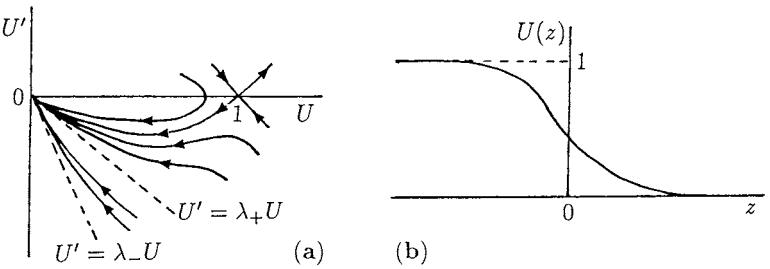

**Figure 13.1. (a)** Phase plane trajectories for equation (13.8) for the travelling wavefront solution: here *c*2 > 4. **(b)** Travelling wavefront solution for the Fisher–Kolmogoroff equation (13.6): the wave velocity *c* ≥ 2.

of the origin *U* oscillates. By continuity arguments, or simply by heuristic reasoning from the phase plane sketch of the trajectories in Figure 13.1(a), there is a trajectory from (1, 0) to (0, 0) lying entirely in the quadrant *U* ≥ 0, *U* ≤ 0 with 0 ≤ *U* ≤ 1 for *all* wavespeeds *c* ≥ *c*min = 2. In terms of the original dimensional equation (13.4), the range of wavespeeds satisfies

$$c \ge c_{\min} = \Im(kD)^{1/2}.\tag{13.13}$$

Figure 13.1(b) is a sketch of a typical travelling wave solution. There are travelling wave solutions for *c* < 2 but they are physically unrealistic since *U* < 0, for some *z*, because in this case *U* spirals around the origin. In these, *U* → 0 at the leading edge with decreasing oscillations about *U* = 0.

A key question at this stage is what kind of initial conditions *u*(*x*, 0) for the original Fisher–Kolmogoroff equation (13.6) will evolve to a travelling wave solution and, if such a solution exists, what is its wavespeed *c*. This problem and its generalisations have been widely studied analytically; see the references in the books cited above in Section 13.1. Kolmogoroff et al. (1937) proved that if *u*(*x*, 0) has compact support, that is,

$$
\mu(\mathbf{x},0) = \mu_0(\mathbf{x}) \ge 0, \quad \mu_0(\mathbf{x}) = \begin{cases} 1 & \text{if } \mathbf{x} \le \mathbf{x}_{\parallel} \\ 0 & \text{if } \mathbf{x} \ge \mathbf{x}_2 \end{cases}, \tag{13.14}
$$

where *x*1 < *x*2 and *u*0(*x*) is continuous in *x*1 < *x* < *x*2, then the solution *u*(*x*,*t*) of (13.6) evolves to a travelling wavefront solution *U*(*z*) with *z* = *x*−2*t*. That is, it evolves to the wave solution with *minimum* speed *c*min = 2. For initial data other than (13.14) the solution depends critically on the behaviour of *u*(*x*, 0) as *x* → ±∞.

The dependence of the wavespeed *c* on the initial conditions at infinity can be seen easily from the following simple analysis suggested by Mollison (1977). Consider first the leading edge of the evolving wave where, since *u* is small, we can neglect *u*2 in comparison with *u*. Equation (13.6) is linearised to

$$\frac{\partial \mu}{\partial t} = \mu + \frac{\partial^2 \mu}{\partial x^2}. \tag{13.15}$$

Consider now

$$
\mu(\mathbf{x},0) \sim A e^{-a\chi} \quad \text{as} \quad \mathbf{x} \to \infty,\tag{13.16}
$$

where *a* > 0 and *A* > 0 is arbitrary, and look for travelling wave solutions of (13.15) in the form

$$u(\mathbf{x},t) = Ae^{-a(\mathbf{x}-ct)}.\tag{13.17}$$

We think of (13.17) as the leading edge form of the wavefront solution of the nonlinear equation. Substitution of the last expression into the linear equation (13.15) gives the *dispersion relation*, that is, a relationship between *c* and *a*,

$$ca = 1 + a^2 \quad \Rightarrow \quad c = a + \frac{1}{a}.\tag{13.18}$$

If we now plot this dispersion relation for *c* as a function of *a*, we see that *c*min = 2 the value at *a* = 1. For all other values of *a*(> 0) the wavespeed *c* > 2.

Now consider min[*e*−*ax* , *e*−*x* ] for *x* large and positive (since we are only dealing with the range where *u*2 *u*). If

$$a < 1 \quad \Rightarrow \quad e^{-a\chi} > e^{-\chi},$$

and so the velocity of propagation with asymptotic initial condition behaviour like (13.16) will depend on the *leading edge* of the wave, and the wavespeed *c* is given by (13.18). On the other hand, if *a* > 1 then *e*−*ax* is bounded above by *e*−*x* and the front with wavespeed *c* = 2. We are thus saying that if the initial conditions satisfy (13.16), then the asymptotic wavespeed of the travelling wave solution of (13.6) is

$$c = a + \frac{1}{a}, \quad 0 < a \le 1, \quad c = 2, \quad a \ge 1. \tag{13.19}$$

The first of these has been proved by McKean (1975), the second by Larson (1978) and both verified numerically by Manoranjan and Mitchell (1983).

The Fisher–Kolmogoroff equation is invariant under a change of sign of *x*, as mentioned before, so there is a wave solution of the form *u*(*x*,*t*) = *U*(*x* +*ct*), *c* > 0, where now *U*(−∞) = 0, *U*(∞) = 1. So if we start with (13.6) for −∞ < *x* < ∞ and an initial condition *u*(*x*, 0) which is zero outside a finite domain, such as illustrated in Figure 13.2, the solution *u*(*x*,*t*) will evolve into two travelling wavefronts, one moving left and the other to the right, both with speed *c* = 2. Note that if *u*(*x*, 0) < 1 the *u*(1 − *u*) term causes the solution to grow until *u* = 1. Clearly *u*(*x*,*t*) → 1 as *t* → ∞ for all *x*.

The axisymmetric form of the Fisher–Kolmogoroff equation, namely,

$$\frac{\partial u}{\partial t} = \frac{\partial^2 u}{\partial r^2} + \frac{1}{r} \frac{\partial u}{\partial r} + u(1 - u) \tag{13.20}$$

does not possess travelling wavefront solutions in which a wave spreads out with constant speed, because of the 1/*r* term; the equation does not become an ordinary differential equation in the variable *z* = *r* − *ct*. Intuitively we can see what happens given

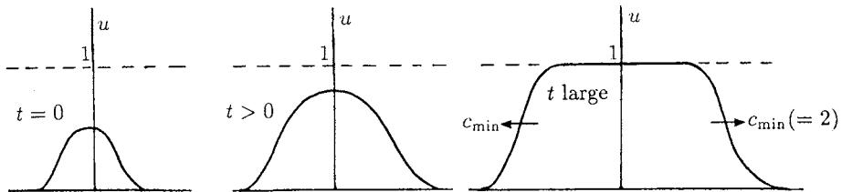

**Figure 13.2.** Schematic time development of a wavefront solution of the Fisher–Kolmogoroff equation on the infinite line.

*u*(*r*, 0) qualitatively like the *u* in the first figure of Figure 13.2. The *u* will grow because of the *u*(1 − *u*) term since *u* < 1. At the same time diffusion will cause a wavelike dispersal outwards. On the 'wave' ∂*u*/∂*r* < 0 so it effectively reduces the value of the right-hand side in (13.20). This is equivalent to reducing the diffusion by an apparent convection or alternatively to reducing the source term *u*(1 − *u*). The effect is to reduce the velocity of the outgoing wave. For large *r* the (1/*r*)∂*u*/∂*r* term becomes negligible so the solution will tend asymptotically to a travelling wavefront solution with speed *c* = 2 as in the one-dimensional case. So, we can think of the axisymmetric wavelike solutions as having a 'wavespeed' *c*(*r*), a function of*r*, where, for*r* bounded away from *r* = 0, it increases monotonically with *c*(*r*) ∼ 2 for *r* large.

Equation (13.4) has been the basis for a variety of models for spatial spread. Aoki (1987), for example, discussed gene-culture waves of advance. Ammerman and Cavali-Sforza (1971, 1983), in an interesting direct application of the model, applied it to the spread of early farming in Europe.

### **13.3 Asymptotic Solution and Stability of Wavefront Solutions of the Fisher–Kolmogoroff Equation**

Travelling wavefront solutions *U*(*z*) for equation (13.6) satisfy (13.8); namely,

$$U'' + cU' + U(1 - U) = 0,\tag{13.21}$$

and monotonic solutions exist, with *U*(−∞) = 1 and *U*(∞) = 0, for all wavespeeds *c* > 2. The phase plane trajectories are solutions of (13.11); that is,

$$\frac{dV}{dU} = \frac{-cV - U(1 - U)}{V}.\tag{13.22}$$

No analytical solutions of these equations for general *c* have been found although there is an exact solution for a particular *c*(> 2), as we show below in Section 13.4. There is, however, a small parameter in the equations, namely, ε = 1/*c*2 ≤ 0.25, which suggests we look for asymptotic solutions for 0 < ε 1 (see, for example, the book by Murray 1984 for a simple description of these asymptotic techniques and that by Kevorkian and Cole 1996 for a more comprehensive study of such techniques). Canosa (1973) obtained such asymptotic solutions to (13.21).

Since the wave solutions are invariant to any shift in the origin of the coordinate system (the equation is unchanged if *z* → *z* + constant) let us take *z* = 0 to be the point where *U* = 1/2. We now use a standard singular perturbation technique. The procedure is to introduce a change of variable in the vicinity of the front, which here is at *z* = 0, in such a way that we can find the solution as a Taylor expansion in the small parameter ε. We can do this with the transformation

$$U(z) = g(\xi), \quad \xi = \frac{z}{c} = \varepsilon^{1/2} z. \tag{13.23}$$

The actual transformation in many cases is found by trial and error until the resulting transformed equation gives a consistent perturbation solution satisfying the boundary conditions. With (13.23), (13.21), together with the boundary conditions on *U*, becomes

$$\begin{aligned} \varepsilon \frac{d^2 g}{d\xi^2} + \frac{dg}{d\xi} + g(1 - g) &= 0\\ g(-\infty) = 1, \quad g(\infty) = 0, \quad 0 < \varepsilon \le \frac{1}{c_{\text{min}}^2} = 0.25, \end{aligned} \tag{13.24}$$

and we further require *g*(0) = 1/2.

The equation for *g* as it stands looks like the standard singular perturbation problem since ε multiplies the highest derivative; that is, setting ε = 0 reduces the order of the equation and usually causes difficulties with the boundary conditions. With this equation, and in fact frequently with such singular perturbation analysis of shockwaves and wavefronts, the reduced equation alone gives a uniformly valid first-order approximation: the reason for this is the form of the nonlinear term *g*(1 − *g*) which is zero at both boundaries.

Now look for solutions of (13.24) as a regular perturbation series in ε; that is, let

$$\lg(\xi;\varepsilon) = \lg(\xi) + \varepsilon \lg(\xi) + \cdots \quad \text{.} \tag{13.25}$$

The boundary conditions at ±∞ and the choice of *U*(0) = 1/2, which requires *g*(0; ε) = 1/2 for all ε, gives from (13.25) the conditions on the *gi*(ξ) for *i* = 0, 1, 2,... as

$$\begin{aligned} \text{g}_0(-\infty) &= 1, \quad \text{g}_0(\infty) = 0, \quad \text{g}_0(0) = \frac{1}{2}, \\\text{g}_l(\pm\infty) &= 0, \quad \text{g}_l(0) = 0 \quad \text{for} \quad l = 1, 2, \dots \end{aligned} \tag{13.26}$$

On substituting (13.25) into (13.24) and equating powers of ε we get

$$\begin{split} O(\mathbf{l}): \quad \frac{d\mathbf{g}_0}{d\xi} = -\mathbf{g}_0(\mathbf{l} - \mathbf{g}_0) \quad \Rightarrow \quad \mathbf{g}_0(\xi) = \frac{1}{1 + \varepsilon\xi}, \\ O(\varepsilon): \quad \frac{d\mathbf{g}_1}{d\xi} + (\mathbf{l} - 2\mathbf{g}_0)\mathbf{g}_1 = -\frac{d^2\mathbf{g}_0}{d\xi^2}, \end{split} \tag{13.27}$$

and so on, for higher orders in ε. The constant of integration in the *g*0-equation was chosen so that *g*0(0) = 1/2 as required by (13.26). Using the first of (13.27), the *g*1 equation becomes

$$\frac{d\mathbf{g}_1}{d\xi} - \left(\frac{\mathbf{g}_0''}{\mathbf{g}_0'}\right)\mathbf{g}_1 = -\mathbf{g}_0'',$$

which on integration and using the conditions (13.26) gives

$$g_1 = -g_0' \ln[4|\,g_0'|\,] = \varepsilon^{\xi} \frac{1}{(1+\varepsilon^{\xi})^2} \ln\left[\frac{4\varepsilon^{\xi}}{(1+\varepsilon^{\xi})^2}\right].\tag{13.28}$$

In terms of the original variables *U* and *z* from (13.23) the uniformly valid asymptotic solution for all *z* is given by (13.25)–(13.28) as

$$\begin{split} U(z;\varepsilon) &= (1+e^{z/c})^{-1} + \frac{1}{c^2} e^{z/c} (1+e^{z/c})^{-2} \ln\left[\frac{4e^{z/c}}{(1+e^{z/c})^2}\right] \\ &\quad + O\left(\frac{1}{c^4}\right), \quad c \ge c_{\text{min}} = 2. \end{split} \tag{13.29}$$

This asymptotic solution is least accurate for *c* = 2. However, when this solution is compared with the computed wavefront solution of equation (13.6), the one with speed *c* = 2, the *first* term alone, that is, the *O*(1) term (1+*ez*/*c*)−1, is everywhere within a few percent of it. It is an encouraging fact that asymptotic solutions with 'small' parameters, even of the order of that used here, frequently give remarkably accurate solutions.

Let us now use the asymptotic solution (13.29) to investigate the relationship between the steepness or slope of the wavefront solution and its speed of propagation. Since the gradient of the wavefront is everywhere negative a measure of the steepness, *s* say, of the wave is the magnitude of the maximum of the gradient *U* (*z*), that is, the point where *U* = 0, namely, the point of inflexion of the wavefront solution. From (13.23) and (13.25), that is, where

$$
\lg_0''(\xi) + \varepsilon \lg_1''(\xi) + O(\varepsilon^2) = 0,
$$

which, from (13.27) and (13.28), gives ξ = 0; that is, *z* = 0. The gradient at *z* = 0, using (13.29), gives

$$-U'(0) = s = \frac{1}{4c} + O\left(\frac{1}{c^5}\right),\tag{13.30}$$

which, we must remember, only holds for *c* ≥ 2. This result implies that the faster the wave moves, that is, the larger the *c*, the *less steep* is the wavefront. Although the width of the wave is strictly from −∞ to ∞, a practical measure of the width, *L* say, is the inverse of the steepness; that is, *L* = 1/*s* = 4*c* from (13.30). Figure 13.3 illustrates this effect.

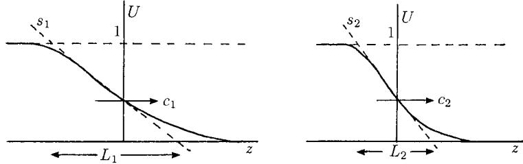

**Figure 13.3.** Steepness *s*(= | *U* (0)|) and a practical measure of the width *L*(= 1/*s*) for wavefront solutions of the Fisher–Kolmogoroff equation (13.6) for two wavespeeds, *c*2 and *c*1 > *c*2 ≥ 2. The flatter the wave the faster it moves.

The results in this section can be generalised to single-species population models where logistic growth is replaced by an appropriate *f* (*u*), so that (13.6) becomes

$$\frac{\partial \mu}{\partial t} = f(\mu) + \frac{\partial^2 \mu}{\partial x^2},\tag{13.31}$$

where *f* (*u*) has only two zeros, say *u*1 and *u*2 > *u*1. If *f* (*u*1) > 0 and *f* (*u*2) < 0 then by a similar analysis to the above, wavefront solutions evolve with *u* going monotonically from *u*1 to *u*2 with wavespeeds

$$c \ge c_{\min} = \Im [f'(u_1)]^{1/2}.\tag{13.32}$$

These results are as expected, with (13.32) obtained by linearising *f* (*u*) about the leading edge where *u* ≈ *u*1 and comparing the resulting equation with (13.15).

#### *Stability of Travelling Wave Solutions*

The stability of solutions of biological models is important and is often another reliability test of model mechanisms. The travelling wavefront solutions of the Fisher– Kolmogoroff equation present a pedagogical case study of stability.

We saw above that the speed of propagation of the wavefront solutions (see (13.19) with (13.16)) depends sensitively on the explicit behaviour of the initial conditions *u*(*x*, 0) as | *x* |→∞. This implies that the wavefront solutions are unstable to perturbations in the far field. On the other hand if *u*(*x*, 0) has compact support, that is, the kind of initial conditions (13.14) used by Kolmogoroff et al. (1937), then the ultimate wave does not depend on the detailed form of *u*(*x*, 0). Unless the numerical analysis is carefully performed, with a priori knowledge of the wavespeed expected, the evolving wave has speed *c* = 2. Random effects introduced by the numerical scheme are restricted to the *finite* domain. Any practical model deals, of course, with a finite domain. So it is of importance to consider the stability of the wave solutions to perturbations which are zero outside a finite domain, which includes the wavefront. We show, following Canosa (1973), that the solutions are stable to such finite perturbations, if they are perturbations in the moving frame of the wave.

Let *u*(*x*,*t*) = *u*(*z*,*t*), where *z* = *x* − *ct*; that is, we take *z* and *t* as the independent variables in place of *x* and *t*. Equation (13.6) becomes for *u*(*z*,*t*)

$$u_l = u(1 - u) + cu_\sharp + u_{\sharp\sharp},\tag{13.33}$$

where subscripts now denote partial derivatives. We are concerned with *c* ≥ *c*min = 2 and we denote the wavefront solution *U*(*z*), namely, the solution of (13.21), by *uc*(*z*); it satisfies the right-hand side of (13.33) set equal to zero. Now consider a small perturbation on *uc*(*z*) of the form

$$u(z,t) = u_c(z) + \alpha v(z,t), \quad 0 < \omega \ll 1. \tag{13.34}$$

Substituting this into (13.33) and keeping only the first-order terms in ω we get the equation governing v(*z*,*t*) as

$$v_1 = [1 - 2u_c(z)]v + cv_\sharp + v_{\sharp \sharp}.\tag{13.35}$$

The solution *uc*(*z*) is stable to perturbations v(*z*,*t*) if

$$\lim_{t \to \infty} v(z, t) = 0 \quad \text{or} \quad \lim_{t \to \infty} v(z, t) = \frac{d u_c(z)}{d z}.$$

The fact that *uc*(*z*) is stable if the second of these holds is because v(*z*,*t*) then represents a small translation of the wave along the *x*-axis since

$$
\mu_c(z + \delta z) \approx \mu_c(z) + \delta z \frac{d\mu_c(z)}{dz}.
$$

Now look for solutions to the linear equation (13.35) by setting

$$w(z,t) = g(z)e^{-\lambda t},\tag{13.36}$$

which on substituting into (13.35) gives, on cancelling the exponentials,

$$
\log'' + c\mathbf{g}' + [\lambda + 1 - 2\mu_c(\mathbf{z})]\mathbf{g} = 0.\tag{13.37}
$$

Note that if λ = 0, *g*(*z*) = *duc*(*z*)/*dz* is a solution of this equation, which as we showed, implies that the travelling wave solution is invariant under translation along the *z*-axis.

Now use the fact that v(*z*,*t*) is nonzero only in a finite domain, which from (13.36) means that boundary conditions *g*(±*L*) = 0 for some *L* are appropriate for *g* in (13.37). If we introduce *h*(*z*) by

$$g(z) = h(z)e^{-cz/2},$$

the eigenvalue problem, to determine the possible λ, becomes

$$h'' + \left[\lambda - \left\{2u_c(z) + \frac{c^2}{4} - 1\right\}\right]h = 0, \quad h(\pm L) = 0\tag{13.38}$$

in which

$$2\mu_c(z) + \frac{c^2}{4} - 1 \ge 2\mu_c(z) > 0$$

since *c* ≥ 2 and *uc*(*z*) > 0 in the finite domain −*L* ≤ *z* ≤ *L*. Standard theory (for example, Titchmarsh 1946, Chapter 11) now gives the result that all eigenvalues λ of (13.38) are real and positive. So, from (13.36), v(*z*,*t*) tends to zero as *t* → ∞. Thus the travelling wave solutions *uc*(*z*) are stable to all small finite domain perturbations of the type v(*z*,*t*) in (13.34). In fact such perturbations are not completely general since they are perturbations in the moving frame. The general problem has been studied, for example, by Larson (1978) and others; the analysis is somewhat more complex. The fact that the waves are stable to finite domain perturbations makes it clear why typical numerical simulations of the Fisher–Kolmogoroff equation result in stable wavefront solutions with speed *c* = 2.

### **13.4 Density-Dependent Diffusion-Reaction Diffusion Models and Some Exact Solutions**

We saw in Section 11.3 in Chapter 11 that in certain insect dispersal models the diffusion coefficient *D* depended on the population *u*. There we did not include any growth dynamics. If we wish to consider longer timescales then we should include such growth terms in the model. A natural extension to incorporate density-dependent diffusion is thus, in the one-dimensional situation, to consider equations of the form

$$\frac{\partial \mu}{\partial t} = f(\mu) + \frac{\partial}{\partial x} \left[ D(\mu) \frac{\partial \mu}{\partial x} \right], \tag{13.39}$$

where typically *D*(*u*) = *D*0*um*, with *D*0 and *m* positive constants. Here we consider functions *f* (*u*) which have two zeros, one at *u* = 0 and the other at *u* = 1. Equations in which *f* ≡ 0 have been studied much more widely than those with nonzero *f* ; see, for example, Chapter 11. To be even more specific we consider *f* (*u*) = *ku p*(1 − *uq* ), where *p* and *q* are positive constants. By a suitable rescaling of *t* and *x* we can absorb the parameters *k* and *D*0 and the equations we thus consider in this section are then of the general form

$$\frac{\partial \mu}{\partial t} = \mu^p (1 - \mu^q) + \frac{\partial}{\partial x} \left[ \mu^m \frac{\partial \mu}{\partial x} \right],\tag{13.40}$$

where *p*, *q* and *m* are positive parameters. If we write out the diffusion term in full we get

$$\frac{\partial \mu}{\partial t} = \mu^p (1 - \mu^q) + m\mu^{m-1} \left( \frac{\partial \mu}{\partial x} \right)^2 + \mu^m \frac{\partial^2 \mu}{\partial x^2}$$

which shows that the nonlinear diffusion can be thought of as contributing an equivalent *convection* with 'velocity' −*mum*−1∂*u*/∂*x*.

It might be argued that the forms in (13.40) are rather special. However with the considerable latitude to choose *p*, *q* and *m* such forms can qualitatively mimic more complicated forms for which only numerical solutions are possible. The usefulness of analytical solutions, of course, is the ease with which we can see how solutions depend analytically on the parameters. In this way we can then infer the qualitative behaviour of the solutions of more complicated but more realistic model equations. There are, however, often hidden serious pitfalls, one of which is important and which we point out below.

To relate the exact solutions, which we derive, to the above results for the Fisher– Kolmogoroff equation we consider first *m* = 0 and *p* = 1 and (13.40) becomes

$$\frac{\partial \mu}{\partial t} = \mu(1 - \mu^q) + \frac{\partial^2 \mu}{\partial x^2}, \quad q > 0. \tag{13.41}$$

Since *u* = 0 and *u* = 1 are the uniform steady states, we look for travelling wave solutions in the form

$$u(\mathbf{x}, t) = U(z), \quad z = \mathbf{x} - ct, \quad U(-\infty) = 1, \quad U(\infty) = 0,\tag{13.42}$$

where *c* > 0 is the wavespeed we must determine. The ordinary differential equation for *u*(*z*) is

$$L(U) = U'' + cU' + U(1 - U^q) = 0,\tag{13.43}$$

which defines the operator *L*. This equation can of course be studied in the (*U* , *U*) phase plane. With the form of the first term in the asymptotic wavefront solution to the Fisher–Kolmogoroff equation given by (13.29) let us optimistically look for solutions of (13.43) in the form

$$U(z) = \frac{1}{(1 + ae^{bz})^s},\tag{13.44}$$

where *a*, *b* and *s* are positive constants which have to be found. This form automatically satisfies the boundary conditions at *z* = ±∞ in (13.42). Because of the translational invariance of the equation we can say at this stage that *a* is arbitrary: it can be incorporated into the exponential as a translation *b*−1 ln *a* in *z*. It is, however, useful to leave it in as a way of keeping track of the algebraic manipulation. Another reason for keeping it in is that if *b* and *s* can be found so that (13.44) is an exact solution of (13.43) then they cannot depend on *a*.

Substitution of (13.44) into (13.43) gives, after some trivial but tedious algebra,

$$\begin{split} L(U) &= \frac{1}{(1 + a e^{b \varepsilon})^{s + 2}} \left\{ \left[ s(s+1)b^2 - sb(b+c) + 1 \right] a^2 e^{2b \varepsilon} \\ &+ \left[ 2 - s b(b+c) \right] a e^{b \varepsilon} + 1 - \left[ 1 + a e^{b \varepsilon} \right]^{2 - sq} \right\}, \end{split} \tag{13.45}$$

so that *L*(*U*) = 0 for all *z*; the coefficients of *e*0, *ebz* and *e*2*bz* within the curly brackets must all be identically zero. This implies that

$$2 - sq = 0, \text{l or } 2 \quad \Rightarrow \quad s = \frac{2}{q}, \frac{1}{q} \quad \text{or} \quad sq = 0.1$$

Clearly *sq* = 0 is not possible since *s* and *q* are positive constants. Consider the other two possibilities.

With *s* = 1/*q* the coefficients of the exponentials from (13.45) give

$$\begin{cases} e^{bz}: \quad 2 - sb(b+c)^{-1} = 0 & \Rightarrow \quad sb(b+c) = 1\\ e^{2bz}: \quad s(s+1)b^2 - sb(b+c) + 1 = 0 \end{cases} \quad \Rightarrow \quad s(s+1)b^2 = 0$$

since *s* > 0. This case is therefore also not a possibility since necessarily *b* > 0.

Finally if *s* = 2/*q* the coefficients of *ebz* and *e*2*bz* are

$$e^{bz}: \quad sb(b+c) = 2; \quad e^{2bz}: \quad s(s+1)b^2 - sb(b+c) + 1 \quad \Rightarrow \quad s(s+1)b^2 = 1$$

which together give *b* and *c* as

$$s = \frac{2}{q}, \quad b = \frac{1}{[s(s+1)]^{1/2}}, \quad c = \frac{2}{sb} - b^*$$

which then determine *s*, *b* and a *unique* wavespeed *c* in terms of *q* as

$$s = \frac{2}{q}, \quad b = \frac{q}{[2(q+2)]^{1/2}}, \quad c = \frac{q+4}{[2(q+2)]^{1/2}}.\tag{13.46}$$

From these we see that the wavespeed *c* increases with *q*(> 0). A measure of the steepness, *S*, given by the magnitude of the gradient at the point of inflexion, is easily found from (13.44). The point of inflexion, *zi* , is given by *zi* = −*b*−1 ln(*as*) and hence the gradient at *zi* gives the steepness, *S*, as

$$S = \frac{b}{(1 + \frac{1}{s})^{s+1}} = \frac{\frac{1}{2}q}{(1 + \frac{q}{2})^{3/2 + 2/q}}.$$

So, with increasing *q* the wavespeed *c* increases and the steepness decreases, as was the case with the Fisher–Kolmogoroff wavefront solutions.

When *q* = 1, equation (13.41) becomes the Fisher–Kolmogoroff equation (13.6) and from (13.46)

$$s = 2, \quad b = \frac{1}{\sqrt{6}}, \quad c = \frac{5}{\sqrt{6}}.$$

We then get an exact analytical travelling wave solution from (13.44). The arbitrary √ constant *a* can be chosen so that *z* = 0 corresponds to *U* = 1/2, in which case *a* = 2 − 1 and the solution is

$$U(z) = \frac{1}{\left[1 + (\sqrt{2} - 1)e^{z/\sqrt{6}}\right]^2}.\tag{13.47}$$

This solution has a wavespeed *c* = 5/ √ 6 and on comparison with the asymptotic solution (13.29) to *O*(1) it is much steeper.

This example highlights one of the serious problems with such exact solutions which we alluded to above: namely, they often do not determine all possible solutions and indeed, may not even give the most relevant one, as is the case here. This is not because the wavespeed is not 2, in fact *c* = 5/ √6 ≈ 2.04, but rather that the quantitative waveform is so different. To analyse this general form (13.43) properly, a careful phase plane analysis has to be carried out.

Another class of exact solutions can be found for (13.40) with *m* = 0, *p* = *q* + 1 with *q* > 0, which gives the equation as

$$\frac{\partial \mu}{\partial t} = \mu^{q+1}(1 - \mu^q) + \frac{\partial^2 \mu}{\partial x^2}. \tag{13.48}$$

Substituting *U*(*z*) from (13.44) into the travelling waveform of the last equation and proceeding exactly as before we find a travelling wavefront solution exists, with a unique wavespeed, given by

$$U(z) = \frac{1}{(1 + ae^{bz})^s}, \quad s = \frac{1}{q}, \quad b = \frac{q}{(q+1)^{1/2}}, \quad c = \frac{1}{(q+1)^{1/2}}.\tag{13.49}$$

A more interesting and useful exact solution has been found for the case *p* = *q* = 1, *m* = 1 with which (13.40) becomes

$$\frac{\partial \mu}{\partial t} = \mu(1 - \mu) + \frac{\partial}{\partial x} \left[ \mu \frac{\partial \mu}{\partial x} \right],\tag{13.50}$$

a nontrivial example of density-dependent diffusion with logistic population growth. Physically this model implies that the population disperses to regions of lower density more rapidly as the population gets more crowded. The solution, derived below, was found independently by Aronson (1980) and Newman (1980). Newman (1983) studied more general forms and carried the work further.

Let us look for the usual travelling wave solutions of (13.50) with *u*(*x*,*t*) = *U*(*z*), *z* = *x* − *ct*, and so we consider

$$(UU')' + cU' + U(1 - U) = 0,$$

for which the phase plane system is

$$U'=V, \quad UV'=-cV-V^2-U(1-U). \tag{13.51}$$

We are interested in wavefront solutions for which *U*(−∞) = 1 and *U*(∞) = 0: we anticipate *U* < 0. There is a singularity at *U* = 0 in the second equation. We remove this singularity by defining a new variable ζ as

$$U\frac{d}{dz} = \frac{d}{d\xi} \quad \Rightarrow \quad \frac{dU}{d\xi} = UV, \quad \frac{dV}{d\xi} = -cV - V^2 - U(1 - U), \tag{13.52}$$

which is not singular. The critical points in the (*U*, *V* ) phase plane are

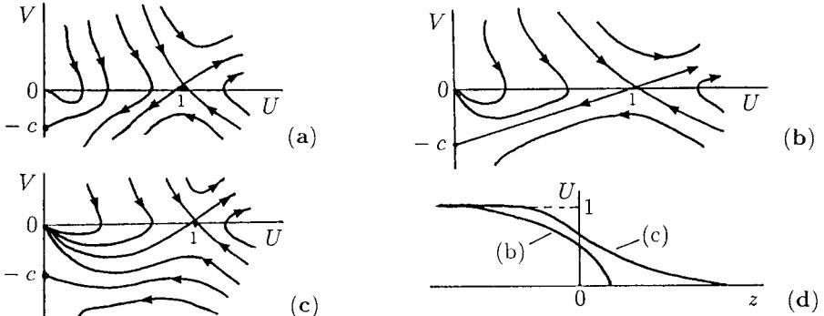

**Figure 13.4.** Qualitative phase plane trajectories for the travelling wave equations (13.52) for various *c*. (After Aronson 1980) In **(a)** no trajectory is possible from (1, 0) to *U* = 0 at a finite *V*. In **(b)** and **(c)** travelling wave solutions from *U* = 1 to *U* = 0 are possible but with different characteristics: the travelling wave solutions in **(d)** illustrate these differences. Importantly the solution corresponding to **(b)** has a discontinuous derivative at the leading edge.

$$(U, V) = (0, 0), \quad (1, 0), \quad (0, -c).$$

A linear analysis about (1, 0) and (0, −*c*) shows them to be saddle points while (0, 0) is like a stable nonlinear node—nonlinear because of the *U V* in the *U*-equation in (13.52). Figure 13.4 illustrates the phase trajectories for (13.52) for various *c*. From Section 11.2 we can expect the possibility of a wave with a discontinuous tangent at a specific point *zc*, the one where *U* ≡ 0 for *z* ≥ *zc*. This corresponds to a phase trajectory which goes from (1, 0) to a point on the *U* = 0 axis at some finite nonzero negative *V*. Referring now to Figure 13.4(a), if 0 < *c* < *c*min there is no trajectory possible from (1, 0) to *U* = 0 except unrealistically for infinite *V*. As *c* increases there is a bifurcation value *c*min for which there is a unique trajectory from (1, 0) to (0, −*c*min) as shown in Figure 13.4(b). This means that at the wavefront *zc*, where *U* = 0, there is a discontinuity in the derivative from *V* = *U* = −*c*min to *U* = 0 and *U* = 0 for all *z* > *zc*; see Figure 13.4(d). As *c* increases beyond *c*min a trajectory always exists from (1, 0) to (0, 0) but now the wave solution has *U* → 0 and *U* → 0 as *z* → ∞; this type of wave is also illustrated in Figure 13.4(d).

As regards the exact solution, the trajectory connecting (1, 0) to (0, −*c*) in Figure 13.4(b) is in fact a straight line *V* = −*c*min(1 − *U*) if *c*min is appropriately chosen. In other words this is a solution of the phase plane equation which, from (13.51), is

$$\frac{dV}{dU} = \frac{-cV - V^2 - U(1 - U)}{UV}.$$

Substitution of *V* = −*c*min(1 − *U*) in this equation, with *c* = *c*min, shows that *c*min = 1/ √ 2. If we now return to the first of the phase equations in (13.51), namely, *U* = *V* and use the phase trajectory solution *V* = −(1 − *U*)/√ 2 we get

$$U' = -\frac{1 - U}{\sqrt{2}},$$

which, on using *U*(−∞) = 1, gives

$$\begin{split} U(z) &= 1 - \exp\left[\frac{z - z_c}{\sqrt{2}}\right] \quad z < z_c\\ &= 0 \quad \qquad \qquad z > z_c, \end{split} \tag{13.53}$$

where *zc* is the front of the wave: it can be arbitrarily chosen in the same way as the *a* in the solutions (13.44). This is the solution sketched in Figure 13.4(d).

This analysis, showing the existence of the travelling waves, can be extended to more general cases in which the diffusion coefficient is *um*, for *m* = 1, or even more general *D*(*u*) in (13.40) if it satisfies certain criteria.

It is perhaps appropriate to state briefly here the travelling wave results we have derived for the Fisher–Kolmogoroff equation and its generalisations to a general *f* (*u*) normalised such that *f* (0) = 0 = *f* (1), *f* (0) > 0 and *f* (1) < 0. In dimensionless terms we have shown that there is a travelling wavefront solution with 0 < *u* < 1 which can evolve, with appropriate initial conditions, from (13.31). Importantly these solutions have speeds *c* ≥ *c*min = 2[ *f* (0)] 1/2 with the usual computed form having speed *c*min. For the Fisher–Kolmogoroff equation (13.4) this dimensional wavespeed, *c*∗ say, using the nondimensionalisation (13.5), is *c*∗ = 2[*k D*] 1/2; here *k* is a measure of the linear growth rate or of the linear kinetics. If we consider not untypical biological values for *D* of 10−9–10−11 cm2 sec−1 and *k* is *O*(1 sec−1) say, the speed of propagation is then *O*(2 × 10−4.5–10−5.5 cm sec−1). With this, the time it takes to cover a distance of the order of 1 mm is *O*(5 × 102.5–103.5 sec) which is *very* much shorter than the pure diffusional time of *O*(107–109 sec). It is the combination of reaction and diffusion which greatly enhances the efficiency of information transferral via travelling waves of concentration changes. This reaction diffusion interaction, as we shall see in Volume II, totally changes our concept of the role of diffusion in a large number of important biological situations.

Before leaving this section let us go back to something we mentioned earlier in the section when we noted that nonlinear diffusion could be thought of as equivalent to a nonlinear convection effect: the equation following (13.40) demonstrates this. If the convection arises as a natural extension of a conservation law we get, instead, equations such as

$$\frac{\partial \mu}{\partial t} + \frac{\partial h(\mu)}{\partial x} = f(\mu) + \frac{\partial^2 \mu}{\partial x^2},\tag{13.54}$$

where *h*(*u*) is a given function of *u*. Here the left-hand side is in standard 'conservation' form: that is, it is in the form of a divergence, namely, (∂/∂*t*,∂/∂*x*). (*u*, *h*(*u*)), the convective 'velocity' is *h* (*u*). Such equations arise in a variety of contexts, for example, in ion-exchange columns and chromatography; see Goldstein and Murray (1959). They have also been studied by Murray (1968, 1970a,b, 1973), where other practical applications of such equations are given, together with analytical techniques for solving them. The book by Kevorkian (2000) is an excellent very practical book on partial differential equations.

The effect of nonlinear convection in reaction diffusion equations can have dramatic consequences for the solutions. This is to be expected since we have another major transport process, namely, convection, which depends nonlinearly on *u*. This process may or may not enhance the diffusional transport. If the diffusion process is negligible compared with the convection effects the solutions can exhibit shock-like solutions (see Murray 1968, 1970a,b, 1973).

Although the analysis is harder than for the Fisher–Kolmogoroff equation, we can determine conditions for the existence of wavefront solutions. For example, consider the simple, but nontrivial, case where *h* (*u*) = *ku* with *k* a positive or negative constant and *f* (*u*) logistic. Equation (13.54) is then

$$\frac{\partial \mu}{\partial t} + ku \frac{\partial \mu}{\partial x} = u(1 - u) + \frac{\partial^2 \mu}{\partial x^2}. \tag{13.55}$$

With *k* = 0 this reduces to equation (13.6) the wavefront solutions of which we just discussed in detail.

Suppose *k* = 0 and we look for travelling wave solutions to (13.55) in the form (13.7); namely,

$$u(\mathbf{x}, t) = U(\mathbf{z}), \quad \mathbf{z} = \mathbf{x} - ct,\tag{13.56}$$

where, as usual, the wavespeed *c* has to be found. Substituting into (13.55) gives

$$U'' + (c - kU)U' + U(1 - U) = 0\tag{13.57}$$

for which appropriate boundary conditions are given by (13.9); namely,

$$\lim_{z \to \infty} U(z) = 0, \quad \lim_{z \to -\infty} U(z) = 1. \tag{13.58}$$

Equations (13.57) and (13.58) define the eigenvalue problem for the wavespeed *c*(*k*).

From (13.57), with *V* = *U* , the phase plane trajectories are solutions of

$$\frac{dV}{dU} = \frac{-(c - kU)V - U(1 - U)}{V}.\tag{13.59}$$

Singular points of the last equation are (0, 0) and (1, 0). We require conditions on *c* = *c*(*k*) such that a monotonic solution exists in which 0 ≤ *U* ≤ 1 and *U* (*z*) ≤ 0; that is, we require a phase trajectory lying in the quadrant *U* ≥ 0, *V* ≤ 0 which joins the singular points. A standard linear phase plane analysis about the singular points shows that *c* ≥ 2, which guarantees that (0, 0) is a stable node and (1, 0) a saddle point. The specific equation (13.55) and the travelling waveform (13.59) were studied analytically and numerically by the author and R.J. Gibbs (see Murray 1977). It can be shown (see below) that a travelling wave solution exists for all *c* ≥ *c*(*k*) where

$$c(k) = \begin{cases} 2 \\ \frac{k}{2} + \frac{2}{k} \end{cases} \quad \text{if} \quad \begin{cases} 2 > k > -\infty \\ 2 \le k < \infty \end{cases} . \tag{13.60}$$

We thus see that here *c* = 2 is a lower bound for only a limited range of *k*, a more accurate bound being given by the last equation. We present the main elements of the analysis below.

The expression *c* = *c*(*k*) in the last equation gives the wavespeed in terms of a key parameter, *k*, in the model. It is another example of a *dispersion relation*, here associated with wave phenomena. The general concept of dispersion relations are of considerable importance and real practical use and is a subject we shall be very much involved with later in Volume II, particularly in Chapters 2 to 6, 8 and 12.

*Brief Derivation of the Wavespeed Dispersion Relation*

Linearising (13.59) about (0, 0) gives

$$\frac{dV}{dU} = \frac{-cV - U}{V}$$

with eigenvalues

$$e_{\pm} = \frac{-c \pm (c^2 - 4)^{1/2}}{2}.\tag{13.61}$$

Since we require *U* ≥ 0 these must be real and so we must have *c* ≥ 2. Thus 0 > *e*+ > *e*− and so (0, 0) is a stable node and, for large *z*,

$$
\begin{pmatrix} V \\ U \end{pmatrix} \quad \rightarrow \quad a\begin{pmatrix} e_+ \\ 1 \end{pmatrix} \exp[e_+ z] + b \begin{pmatrix} e_- \\ 1 \end{pmatrix} \exp[e_- z],
$$

where *a* and *b* are constants. This implies that

$$\frac{dV}{dU} \quad \rightarrow \quad \begin{cases} e_+ \\ e_- \end{cases} \quad \text{as} \quad z \rightarrow \infty \quad \text{if} \quad \begin{cases} a \neq 0 \\ a = 0 \end{cases} . \tag{13.62}$$

An exact solution of (13.59) is

$$V = -\frac{k}{2}U(\mathbf{l} - U) \quad \text{if} \quad c = \frac{k}{2} + \frac{2}{k}.\tag{13.63}$$

With this expression for *c*,

$$(c^2 - 4)^{1/2} = \begin{cases} \frac{k}{2} - \frac{2}{k} & \text{if } \quad \begin{cases} k \ge 2\\ \frac{k}{k} - \frac{2}{2} \end{cases} \end{cases}$$

and so from (13.61)

$$e_+ = \begin{cases} -\frac{2}{k} \\ -\frac{k}{2} \end{cases} \quad \text{if} \quad \begin{cases} k \ge 2 \\ k < 2 \end{cases}, \quad e_- = \begin{cases} -\frac{k}{2} \\ -\frac{2}{k} \end{cases} \quad \text{if} \quad \begin{cases} k \ge 2 \\ k < 2 \end{cases}.$$

But, from (13.63)

$$
\left. \frac{dV}{dU} \right|_{U=0} = -\frac{k}{2} = \begin{cases} e_- & \text{for} \\ e_+ & \text{for} \end{cases} \begin{cases} k \ge 2 \\ k < 2 \end{cases}.
$$

So, from (13.62), for *k* ≥ 2 we see that *V*(*U*) satisfies *dV*/*dU* → *e*− as *z* → ∞. This gives the second result in (13.60), namely, that the wavespeed

$$c = \frac{k}{2} + \frac{2}{k} \quad \text{for} \quad k \ge 2. \tag{13.64}$$

Now consider *k* < 2 and *z* → −∞. Linearising about (1, 0) gives the eigenvalues *E*± as

$$E_{\pm} = \frac{-(c-k) \pm \left\{(c-k)^2 + 4\right\}^{1/2}}{2} \tag{13.65}$$

so *E*+ > 0 > *E*− and (1, 0) is a saddle point. As *z* → −∞, *U* → 1 − *O*(exp[*E*+*z*]) from which we see that

$$\frac{dV}{dU} \quad \to \quad E_+(c,k) \quad \text{as} \quad z \to -\infty.$$

With *c* ≥ 2 we see from (13.65) that

$$\frac{dE_+(k)}{dk} = \left[\left(c - k\right)^2 + 4\right]^{-1/2} E_+ > 0\tag{13.66}$$

and so, for *U* sufficiently close to *U* = 1, *dV*/*dU* increases with increasing *k*. Thus, for *U* close enough to *U* = 1, the phase plane trajectory *V*(*U*, *c*, *k*) satisfies

$$V(U, c=2, k) < V(U, c=2, k=2) \quad \text{for} \quad k < 2. \tag{13.67}$$

Now let us suppose that a number *d* exists, where 0 < *d* < 1, such that

$$\begin{aligned} V(d, c = 2, k = 2) &= V(d, c = 2, k), \\ V(U, c = 2, k = 2) &< V(U, c = 2, k) \quad \text{for} \quad d < U < 1. \end{aligned}$$

This implies that

$$\frac{dV(d, c=2, k=2)}{dU} \le \frac{dV(d, c=2, k)}{dU}.\tag{13.68}$$

But, from (13.59),

$$\frac{dV(d,c=2,k)}{dU} = -2 + kd - \frac{d(1-d)}{V(d,c=2,k)}$$

which, with (13.68), implies

$$-2 + 2d - \frac{d(1-d)}{V(d, c=2, k=2)} \le -2 + kd - \frac{d(1-d)}{V(d, c=2, k)}$$

which, together with the first of (13.67), in turn implies

$$2d \le kd \quad \Rightarrow \quad 2 \le k.$$

But this contradicts *k* < 2, so supposition (13.67) is not possible and so implies that the wavespeed *c* ≥ 2 for all *k* < 2. This together with (13.64) is the result in (13.60).

We have only given the essentials here; to prove the result more rigourously we have to examine the possible trajectories more carefully to show that everything is consistent, such as the trajectories not cutting the *U*-axis for *U* ∈ (0, 1); this can all be done. The result (13.60) is related to the analysis in Section 13.2, where we showed how the wavespeed could depend on either the wavefront or the wave tail.

When *k* = 0 we can cast (13.55) in a different form which highlights the nonlinear convective contribution as opposed to the diffusion contribution to the wave solutions. Suppose *k* > 0 and set

$$\begin{aligned} \varepsilon &= \frac{1}{k^2}, \quad \mathbf{y} = \frac{\mathbf{x}}{k} = \varepsilon^{1/2} \mathbf{x} \quad (k > 0) \\ &\Rightarrow \qquad u_I + uu_\mathbf{y} = u(1 - u) + \varepsilon u_{\mathbf{y}\mathbf{y}}. \end{aligned} \tag{13.69}$$

If *k* < 0 we take

$$\begin{aligned} \varepsilon &= \frac{1}{k^2}, \quad \mathbf{y} = \frac{\mathbf{x}}{k} = \varepsilon^{1/2} \mathbf{x} \quad (k < 0) \\ &\Rightarrow \qquad u_t + \mu u_\mathbf{y} = u(1 - \mu) + \varepsilon u_\mathbf{y}. \end{aligned} \tag{13.70}$$

We now consider travelling wave solutions as ε → 0.

With *u*(*x*,*t*) a solution of (13.55), *u*(*ky*,*t*) is a solution of (13.69). So with *U*(*x* − *ct*) a solution of (13.59) satisfying *U*(−∞) = 1, *U*(∞) = 0, *U*(*ky* −*ct*) is a solution of (13.69) and the wavespeed λ = *c*/*k* = *c*ε1/2. So, using the wavespeed estimates from (13.60), equation (13.69) has travelling wave solutions for all

$$
\lambda \ge \lambda(\varepsilon) = \frac{c(k)}{k} = c(\varepsilon^{-1/2})\varepsilon^{1/2}.
$$

and so

$$
\lambda(\varepsilon) = \begin{cases} 2\varepsilon^{1/2} & \\ \frac{1}{2} + 2\varepsilon & \end{cases} \quad \text{if} \quad \begin{cases} \varepsilon > \frac{1}{4} \\ \frac{1}{4} \ge \varepsilon > 0 \end{cases} \quad \text{-} $$

Now let ε → 0 in (13.69) to get

$$
\mu_1 + \mu \mu_\circ = \mu(1-\mu).
$$

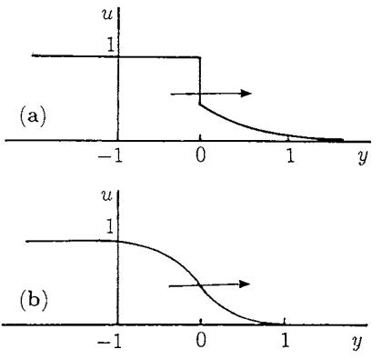

**Figure 13.5.** Travelling wave solutions computed from (13.69). Each has wavespeed λ = 0.74 but with different ε; **(a)** ε = 0, **(b)** ε = 0.12. The origin is where *u* = 0.5.

Solutions of this equation can be discontinuous (these are the weak, that is, shock, solutions discussed in detail by Murray 1970a). For ε small the wave steepens into a shocklike solution. On the other hand, for (13.70) with the same boundary conditions discontinuous solutions do not occur (see Murray 1970a). Figure 13.5 gives numerically computed travelling wave solutions for (13.69) for a given wavespeed and two different values for ε; note the discontinuous solution in Figure 13.5(b). Figure 13.6 shows computed wave solutions for (13.70) for small ε. Note that here the wave steepens but does not display discontinuities like that in Figure 13.5(b).

To conclude this section we should note the results of Satsuma (1987) on exact solutions of scalar density-dependent reaction diffusion equations. The method he develops is novel and is potentially of wider applicability. The work on the existence and stability of monotone wave solutions of such equations by Hosono (1986) is also of particular relevance to the material in this section.

A point about the material in this discussion of nonlinear convection reaction diffusion equations is that it shows how much more varied the solutions of such equations can be.

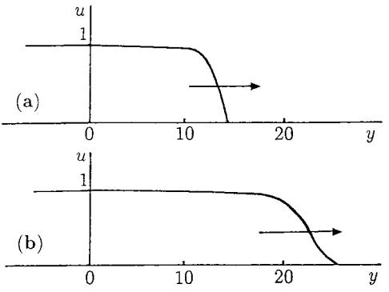

**Figure 13.6.** Travelling wave solutions, computed from (13.70), with minimum speed *c* = *k*/2 + 2/*k*, ε = 1/*k*2, for two different values of ε: **(a)** ε = 10−4, wavespeed *c* ≈ 2.2; **(b)** ε = 10−1, wavespeed *c* ≈ 50. The origin is where *u* = 1 − 10−6.

### **13.5 Waves in Models with Multi-Steady State Kinetics: Spread and Control of an Insect Population**

Kinetics such as the uptake function in an enzyme reaction system (Chapter 6), or the population growth–interaction function *f* (*u*) such as we introduced in Chapter 1, can often have more than two steady states. That is, *f* (*u*) in (13.31) can have three or more positive zeros. The wave phenomena associated with such *f* (*u*) is quite different from that in the previous sections. A practical example is the growth function for the behaviour of the spruce budworm, the spatially uniform situation of which was discussed in detail in Chapter 1, Section 1.2. The specific dimensionless *f* (*u*) in that model is

$$f(u) = ru\left(1 - \frac{u}{q}\right) - \frac{u^2}{1 + u^2},\tag{13.71}$$

where *r* and *q* are dimensionless parameters involving real field parameters (see equation (1.17)). For a range of the positive parameters *r* and *q*, *f* (*u*) is as in Figure 1.5, which is reproduced in Figure 13.7(a) for convenience. Recall the dependence of the number and size of the steady states on *r* and *q*; a typical curve is shown again in Figure 13.7(b) for convenience. In the absence of diffusion, that is, the spatially uniform situation, there can be three positive steady states: two linearly stable ones, *u*1 and *u*3, and one unstable one, *u*2. The steady state *u* = 0 is also unstable.

We saw in Section 1.2 that the lower steady state *u*1 corresponds to a *refuge* for the budworm while *u*3 corresponds to an *outbreak*. The questions we consider here are (i) how does an infestation or outbreak propagate when we include spatial dispersal of the budworm, and (ii) can we use the results of the analysis to say anything about a control strategy to prevent an outbreak from spreading. To address both of these questions, we consider the budworm to disperse by linear diffusion and investigate the travelling wave possibilities. Although the practical problem is clearly two-dimensional we discuss here the one-dimensional case since, even with that, we can still offer reasonable answers to the questions, and at the very least pose those that the two-dimensional model must address. In fact there are intrinsically no new conceptual difficulties with the two-space dimensional model. The model we consider then is, from (13.31),

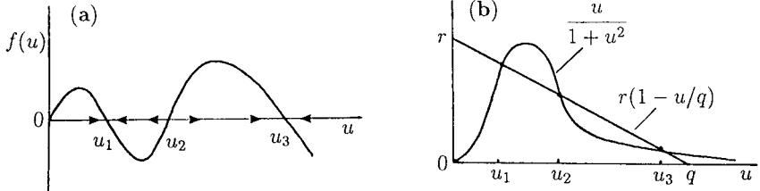

**Figure 13.7. (a)** Growth–interaction kinetics for the spruce budworm population *u*: *u*1 corresponds to a refuge and *u*3 corresponds to an infestation outbreak. **(b)** Schematic dependence of the steady states in **(a)** on the parameters *r* and *q* in (13.71).

$$\frac{\partial u}{\partial t} = f(u) + \frac{\partial^2 u}{\partial x^2},\tag{13.72}$$

with *f* (*u*) typically as in Figure 13.7(a).

Let us look for travelling wave solutions in the usual way. Set

$$u(\mathbf{x}, t) = U(\mathbf{z}), \quad \mathbf{z} = \mathbf{x} - ct \quad \Rightarrow \quad U'' + cU' + f(U) = 0,\tag{13.73}$$

the phase plane system for which is

$$U' = V, \quad V' = -cV - f(U) \quad \Rightarrow \quad \frac{dV}{dU} = -\frac{cV + f(U)}{V},\tag{13.74}$$

which has four singular points

$$(0,0), \quad (\mu_1, 0), \quad (\mu_2, 0), \quad (\mu_3, 0). \tag{13.75}$$

We want to solve the eigenvalue problem for *c*, such that travelling waves, of the kind we seek, exist. As a first step we determine the type of singularities given by (13.75).

Linearising (13.74) about the singular points *U* = 0 and *U* = *ui* , *i* = 1, 2, 3 we get

$$\frac{dV}{d(U - u_l)} = -\frac{cV + f'(u_l)(U - u_l)}{V}, \quad i = 1, 2, 3 \quad \text{and} \quad u_l = 0 \qquad (13.76)$$

which, using standard linear phase plane analysis, gives the following singular point classification,

$$\begin{aligned} &(0,0) \colon \quad f'(0) > 0 \quad \Rightarrow \quad \text{stable} \begin{cases} \text{spiral} \\ \text{node} \end{cases} \quad \text{if} \quad c^2 \begin{cases} < \\ > 4f'(0), \quad c > 0 \end{cases} \\ &(u_2, 0) \colon \quad f'(u_2) > 0 \quad \Rightarrow \quad \text{stable} \begin{cases} \text{spiral} \\ \text{node} \end{cases} \quad \text{if} \quad c^2 \begin{cases} < \\ > 4f'(u_2), \quad c > 0 \end{cases} \\ &(u_i, 0) \colon \quad f'(u_i) < 0 \quad \Rightarrow \quad \text{saddle point for all } c, \quad i = 1, 3. \end{aligned} \tag{13.77}$$

If *c* < 0 then (0, 0) and (*u*2, 0) become unstable—the type of singularity is the same. There are clearly several possible phase plane trajectories depending on the size of *f* (*ui*) where *ui* has *i* = 1, 2, 3 plus *ui* = 0. Rather than give a complete catalogue of all the possibilities we analyse just two to show how the others can be studied.

The existence of the various travelling wave possibilities for various ranges of *c* can become quite an involved book-keeping process. This particular type of equation has been rigourously studied by Fife and McLeod (1977). The approach we use here is intuitive and does not actually prove the existence of the waves we are interested in, but it certainly gives a very strong indication that they exist. The procedure then is in line with the philosophy adopted throughout this book.

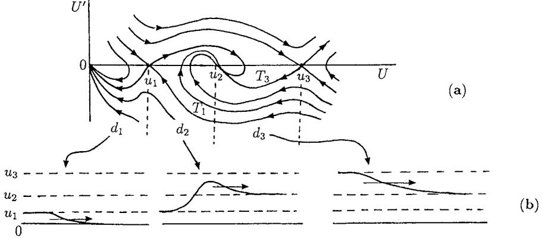

**Figure 13.8. (a)** Possible phase plane portrait when *c* > 0 is in an appropriate range relative to *f* (*u*) evaluated at the singular points. **(b)** Possible wavefront solutions if we restrict the domains in the phase portrait as indicated by *d*1, *d*2 and *d*3.

Let us suppose that *c*2 > 4max[ *f* (0), *f* (*u*2)] in which case (0, 0) and (*u*2, 0) are stable nodes. A possible phase portrait is illustrated in Figure 13.8(a), which gives possible singular point connections. If we divide the phase plane into the domains shown, for example, *d*1 includes the node at the origin and the saddle point at (*u*1, 0), and if we compare this with Figure 13.1(b) they are similar. So, it is reasonable to suppose that a similar wave solution can exist, namely, one from *U*(−∞) = *u*1 to *U*(∞) = 0 and that it exists for all wavespeeds *c* ≥ 2[ *f* (0)] 1/2. This situation is sketched in Figure 13.8(b). In a similar way other domains admit the other travelling wave solutions shown in Figure 13.8(b).

As *c* varies other possible singular point connections appear. In particular let us focus on the points (*u*1, 0) and (*u*3, 0), both of which are saddle points. The eigenvalues λ1,λ2 are found from (13.76) as

$$\lambda_1, \lambda_2 = \frac{-c \pm \{c^2 - 4f'(u_l)\}^{1/2}}{2}, \quad i = 1, 3,\tag{13.78}$$

where *f* (*ui*) < 0. The corresponding eigenvectors **e***i*1 and **e***i*2 are

$$\mathbf{e}_{l1} = \begin{pmatrix} 1 \\ \lambda_{l1} \end{pmatrix}, \quad \mathbf{e}_{l2} = \begin{pmatrix} 1 \\ \lambda_{l2} \end{pmatrix}, \quad i = 1, 3 \tag{13.79}$$

which vary as *c* varies. A little algebra shows that as *c* increases the eigenvectors tend to move towards the *U*-axis. As *c* varies the phase trajectory picture varies; in particular the trajectories marked *T*1 and *T*3 in Figure 13.8(a) change. By continuity arguments it is clearly possible, if *f* (*u*1) and *f* (*u*3) are in an appropriate range, that as *c* varies there is a unique value for *c*, *c*∗ say, such that the *T*1 trajectory joins up with the *T*3 trajectory. In this way we then have a phase path connecting the two singular points (*u*1, 0) and

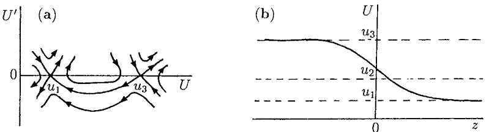

**Figure 13.9. (a)** Schematic phase plane portrait for a wave connecting the steady states *u*3 and *u*1. **(b)** Typical wavefront solution from *u*3 to *u*1. The unique speed of the wave and its direction of propagation are determined by *f* (*u*) in (13.72).

(*u*3, 0) as illustrated in Figure 13.9(a), with the corresponding wave solution sketched in Figure 13.9(b): this wave moves with a unique speed *c*∗ which depends on the nonlinear interaction term *f* (*u*). The solution *U*(*z*) in this case has

$$U(-\\\\\infty) = \mu_3, \quad U(\infty) = \mu_1.$$

It is this situation we now consider with the budworm problem in mind.

Suppose we start with *u* = *u*1 for all *x*; that is, the budworm population is in a stable refuge state. Now suppose there is a local increase of population to *u*3 in some finite domain; that is, there is a local outbreak of the pest. To investigate the possibility of the outbreak spreading it is easier to ask the algebraically simpler problem, does the travelling wavefront solution in Figure 13.9(b) exist which joins a region where *u* = *u*1 to one where *u* = *u*3, and if so, what is its speed and direction of propagation. From the above discussion we expect such a wave exists. If *c* > 0 the wave moves into the *u*1-region and the outbreak spreads; if *c* < 0 it not only does not spread, it is reduced.

The *sign* of *c*, and hence the direction of the wave, can easily be found by multiplying the *U*-equation in (13.73) by *U* and integrating from −∞ to ∞. This gives

$$\int_{-\infty}^{\infty} \left[ U'U'' + cU'^2 + U'f(U) \right] dz = 0.$$

Since *U* (±∞) = 0, *U*(−∞) = *u*3 and *U*(∞) = *u*1, this integrates to give

$$c\int_{-\infty}^{\infty} \left[U'\right]^2 dz = -\int_{-\infty}^{\infty} f(U)U' dz = -\int_{u_3}^{u_1} f(U) \, dU$$

and so, since the multiple of *c* is always positive,

$$c \stackrel{\gtrless}{\underset{<}{\geq}} 0 \quad \text{if} \quad \int_{u_1}^{u_3} f(u) \, du \stackrel{\gtrless}{\underset{<}{\geq}} 0. \tag{13.80}$$

So, the sign of *c* is determined solely by the integral of the interaction function *f* (*u*). From Figure 13.10, the sign of the integral is thus given simply by comparing the areas *A*1 and *A*3. If *A*3 > *A*1 the wave has *c* > 0 and the outbreak spreads into the refuge

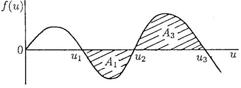

**Figure 13.10.** If *A*1 > *A*3 the wave velocity *c* is negative and the outbreak, where *u* = *u*3, is reduced. If *A*1 < *A*3 the outbreak spreads into the refuge region where *u* = *u*1.

area. In this case we say that *u*3 is dominant; that is, as *t* → ∞, *u* → *u*3 everywhere. On the other hand if *A*3 < *A*1, *c* < 0 and *u*1 is dominant and *u* → *u*1 as *t* → ∞; that is, the outbreak is eliminated.

From the point of view of infestation control, if an insect outbreak occurs and is spreading, we want to know how to alter the local conditions so that the infestation or outbreak wave is either contained or reversed. From the above, we must thus locally change the budworm growth dynamics so that effectively the new areas *A*1 and *A*3 in Figure 13.10 satisfy *A*1 > *A*3. We can achieve this is if the zeros *u*2 and *u*3 of *f* (*u*), that is, the two largest steady states, are closer together. From Figure 13.7(b) we see that this can be effected by reducing the dimensionless parameter *q* in (13.71). The nondimensionalisation used in the budworm model (see Section 1.2 in Chapter 1) relates *q* to the basic budworm carrying capacity *KB* of the environment. So a practical reduction in *q* could be made by, for example, spraying a strip to reduce the carrying capacity of the tree foliage. In this way an infestation 'break' would be created, that is, one in which *u*1 is dominant, and hence the wavespeed *c* in the above analysis is no longer positive. A practical question, of course, is how wide such a 'break' must be to stop the outbreak getting through. This problem needs careful modelling consideration since there is a long leading edge, because of the parabolic (diffusion-like) character of the equations, albeit with 0 < *u* 1. A closely related concept will be discussed in detail in Chapter 13, Volume II when the problem of containing the spread of rabies is considered. The methodology described there is directly applicable to the 'break' problem here for containing the spread of the budworm infestation.

#### *Exact Solution for the Wavespeed for an Excitable Kinetics Model: Calcium-Stimulated-Calcium-Release Mechanism*

In Chapter 6 we briefly described possible kinetics, namely, equation (6.120), which models a biochemical switch. With such a mechanism, a sufficiently large perturbation from one steady state can move the system to another steady state. An important example which arises experimentally is known as the calcium-stimulated-calciumrelease mechanism. This is a process whereby calcium, Ca++, if perturbed above a given threshold concentration, causes the further release, or dumping, of the sequestered calcium; that is, the system moves to another steady state. This happens, for example, from calcium sites on the membrane enclosing certain fertilised amphibian eggs (the next section deals with one such real example). As well as releasing calcium, such a membrane also resequesters it. If we denote the concentration of Ca++ by *u*, we can model the kinetics by the rate law

$$\frac{d\mu}{dt} = A(\mu) - r(\mu) + L,\tag{13.81}$$

where *L* represents a small leakage, *A*(*u*) is the autocatalytic release of calcium and *r*(*u*) its resequestration. We assume that calcium resequestration is governed by firstorder kinetics, and the autocatalytic calcium production saturates for high Ca++. With these assumptions, we arrive at the reaction kinetics model equation with typical forms which have been used for *A*(*u*) and *r*(*u*) (for example, Odell et al. 1981, Murray and Oster 1984, Cheer et al. 1987, Lane et al. 1987). The specific form of the last equation, effectively the same as (6.120), becomes

$$\frac{du}{dt} = L + \frac{k_1 u^2}{k_2 + u^2} - k_3 u = f(u),\tag{13.82}$$

where the *k*'s and *L* are positive parameters. If the *k*'s are in a certain relation to each other (see Exercise 3 at the end of Chapter 6) this *f* (*u*) can have three positive steady states for *L* sufficiently small. The form of *f* (*u*) in this excitable kinetics situation is illustrated in Figure 13.11(a). Although there are two kinds of excitable processes exhibited by this mechanism, they are closely related. We briefly consider each in turn.

If *L* = 0 there are three steady states, two stable and one unstable. If *L* is increased from zero there are first three positive steady states *ui*(*L*), *i* = 1, 2, 3 with *u*1 and *u*3 linearly stable and *u*2 unstable. As *L* increases above a certain threshold value *Lc*, *u*1 and *u*2 first coalesce and then disappear. So if initially *u* = *u*1, a pulse of *L* sufficiently large can result in the steady state shifting to *u*3, the larger of the two stable steady states, where it will remain. Although qualitatively it is clear that this happens, the quantitative analysis of such a switch is not simple and has been treated by Kath and Murray (1986) in connection with a model mechanism for generating butterfly wing patterns, a topic we consider in Chapter 3, Volume II.

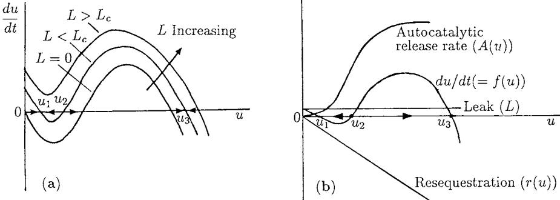

**Figure 13.11. (a)** Excitable kinetics example. For 0 < *L* < *Lc* there are three positive steady states *ui* , *i* = 1, 2, 3, of (13.82) with two of these coalescing when *L* = *Lc*. Suppose initially *u* = *u*1, with *L* < *Lc*. If we now increase *L* beyond the threshold, only the largest steady state exists. So, as *L* is again reduced to its original values, *u* → *u*3, where it remains. A switch from *u*1 to *u*3 has been effected. **(b)** The schematic form of each of the terms in the kinetics in (13.81) and (13.82). When added together they give the growth kinetics form in **(a)**.

The second type of excitability has *L* fixed and the kinetics *f* (*u*) as in the curve marked *du*/*dt*(= *f* (*u*)) in Figure 13.11(b). The directions of the arrows there indicate how *u* will change if a perturbation with a given concentration is introduced. For all 0 < *u* < *u*2, *u* → *u*1, while for all *u* > *u*2, *u* → *u*3. The concentration *u*2 is thus a threshold concentration. Whereas in the above threshold situation *L* was the bifurcation parameter, here it is in the imposed perturbation as it relates to *u*2.

The complexity of this calcium-stimulated calcium-release process in reality is such that the model kinetics in (13.81) and its quantitative form in (13.82) can only be a plausible caricature. It is reasonable, therefore, to make a further simplifying caricature of it, as long as it preserves the qualitative dynamic behaviour for *u* and the requisite number of zeros: that is, *f* (*u*) is like the curve in Figure 13.11(b). We do this by replacing *f* (*u*) with a cubic with three positive zeros, namely,

$$f(\mu) = A(\mu - \mu_1)(\mu_2 - \mu)(\mu - \mu_3),$$

where *A* is a positive constant and *u*1 < *u*2 < *u*3. This is qualitatively like the curve in Figure 13.11(a) where 0 < *L* < *Lc*.

Let us now consider the reaction diffusion equation with such reaction kinetics, namely,

$$\frac{\partial \mu}{\partial t} = A(\mu - \mu_1)(\mu_2 - \mu)(\mu - \mu_3) + D \frac{\partial^2 \mu}{\partial x^2},\tag{13.83}$$

where we have not renormalised the equation so as to highlight the role of *A* and the diffusion *D*. This equation is very similar to (13.72), the one we have just studied in detail for wavefront solutions. We can assume then that (13.83) has wavefront solutions of the form

$$u(\mathbf{x},t) = U(\mathbf{z}), \quad \mathbf{z} = \mathbf{x} - ct, \quad U(-\infty) = \mu_3, \quad U(\infty) = \mu_1,\tag{13.84}$$

which on substituting into (13.83) gives

$$L(U) = DU'' + cU' + A(U - \mu_1)(\mu_2 - U)(U - \mu_3) = 0. \tag{13.85}$$

With the experience gained from the exact solutions above and the form of the asymptotic solution obtained for the Fisher–Kolmogoroff equation waves, we might optimistically expect the wavefront solution of (13.85) to have an exponential behaviour. Rather than start with some explicit form of the solution, let us rather start with a differential equation which might reasonably determine it, but which is simpler than (13.85). The procedure, then, is to suppose *U* satisfies a simpler equation (with exponential solutions of the kind we now expect) but which can be made to satisfy (13.85) for various values of the parameters. It is in effect seeking solutions of a differential equation with a simpler differential equation that we can solve.

Let us try making *U* satisfy

$$U' = a(U - \mu_1)(U - \mu_3),\tag{13.86}$$

the solutions (see (13.88) below) of which tend exponentially to *u*1 and *u*3 as *z* → ∞, which is the appropriate kind of behaviour we want. Substituting this equation into (13.85) we get

$$\begin{aligned} L(U) &= (U - u_1)(U - u_3)Da^2(2U - u_1 - u_3) + ca - A(U - u_2) \\ &= (U - u_1)(U - u_3) \left\{ (2Da^2 - A)U - \left[Da^2(u_1 + u_3) - ca - Au_2 \right] \right\}, \end{aligned}$$

and so for *L*(*U*) to be zero we must have

$$2Da^2 - A = 0, \quad Da^2(u_1 + u_3) - ca - Au_2 = 0,$$

which determine *a* and the unique wavespeed *c* as

$$a = \left(\frac{A}{2D}\right)^{1/2}, \quad c = \left(\frac{AD}{2}\right)^{1/2} (u_1 - 2u_2 + u_3). \tag{13.87}$$

So, by using the differential equation (13.86) we have shown that its solutions can satisfy the full equation if *a* and *c* are as given by (13.87). The actual solution *U* is then obtained by solving (13.86); it is

$$U(z) = \frac{\mu_3 + K u_1 \exp\left[a(\mu_3 - \mu_1)z\right]}{1 + K \exp\left[a(\mu_3 - \mu_1)z\right]},\tag{13.88}$$

where *K* is an arbitrary constant which simply lets us set the origin in the *z*-plane in the now usual way. This solution has

$$U(-\\\\\infty) = \mu_{\mathfrak{J}} \quad \text{and} \quad U(\infty) = \mu_{\mathbb{L}}.$$

The sign of *c*, from (13.87), is determined by the relative sizes of the *ui* , *i* = 1, 2, 3; if *u*2 is greater than the average of *u*1 and *u*3, *c* < 0 and positive otherwise. This, of course, is the same result we would get if we used the integral result from (13.80) with the cubic for *f* (*U*) from (13.83).

Equation (13.83) and certain extensions of it have been studied by McKean (1970). It arose there in the context of a simple model for the propagation of a nerve action potential, a topic we touch on in Chapter 1, Volume II. Equation (13.83) is sometimes referred to as the reduced *Nagumo equation*, which is related to the FitzHugh–Nagumo model for nerve action potentials discussed in Section 7.5.

### **13.6 Calcium Waves on Amphibian Eggs: Activation Waves on** *Medaka* **Eggs**

The cortex of an amphibian egg is a kind of membrane shell enclosing the egg. Just after fertilisation, and before the first cleavage of the egg, several chemical waves of calcium, Ca++, sweep over the cortex. The top of the egg, near where the waves start, is the *ani-* *mal pole*, and is effectively determined by the sperm entry point, while the bottom is the *vegetal pole*. The wave emanates from the sperm entry point. Each wave is a precursor of some major event in development and each is followed by a mechanical event. Such waves of Ca++ are called *activation waves*. Figure 13.12(a) illustrates the progression of such a calcium wave over the egg of the teleost fish *Medaka*. The figure was obtained from the experimental data of Gilkey et al. (1978). The model we describe in this section is a simplified mechanism for the chemical wave, and comes from the papers on cortical waves in vertebrate eggs by Cheer et al. (1987) and Lane et al. (1987). They model both the mechanical and mechanochemical waves observed in amphibian eggs but with different model assumptions. Lane et al. (1987) also present some analytical results based on a piecewise linear approach and these compare well with the numerical simulations of the full nonlinear system. The mechanochemical process is described in detail in the papers and the model constructed on the basis of the biological facts. The results of their analysis are compared with experimental observations on the egg of the fish *Medaka* and other vertebrate eggs. Cheer et al. (1987) conclude with relevant statements about what must be occurring in the biological process and on the nature of the actual cortex. The paper by Lane et al. (1987) highlights the key elements in the process and displays the analytical dependence of the various phenomena on the model parameters. The mechanical surface waves which accompany the calcium waves are shown in Figure 13.12(d). We consider this problem again in Chapter 6, Volume II where we consider mechanochemical models.

Here we construct a simple model for the Ca++ based on the fact that the calcium kinetics is excitable; we use the calcium-stimulated-calcium-release mechanism described in the last section. We assume that the Ca++ diffuses on the cortex (surface) of the egg. We thus have a reaction diffusion model where both the reaction and diffusion take place on a spherical surface. Since the Ca++ wavefront is actually a ring propagating over the surface, its mathematical description will involve only one independent variable θ, the polar angle measured from the top of the sphere, so 0 ≤ θ ≤ π. The kinetics involve the release of calcium from sites on the surface via the calciumstimulated-calcium-release mechanism. The small leakage here is due to a small amount of Ca++ diffusing into the interior of the egg. So, there is a threshold value for the calcium which triggers a dumping of the calcium from the surface sites. The phenomenological model which captures the excitable kinetics and some of the known facts about the process is given by (13.82). We again take the simpler cubic kinetics caricature used in (13.83) and thus arrive at the model reaction diffusion system

$$\begin{split} \frac{\partial u}{\partial t} &= f(u) + D \left( \frac{1}{R} \right)^2 \left[ \frac{\partial^2 u}{\partial \theta^2} + \cot \theta \frac{\partial u}{\partial \theta} \right], \\ f(u) &= A(u - u_1)(u_2 - u)(u - u_3), \end{split} \tag{13.89}$$

where *A* is a positive parameter and *R* is the radius of the egg: *R* is simply a parameter in this model.

Refer now to the middle curve in Figure 13.11(a), that is, like the *f* (*u*)-curve in Figure 13.11(b). Suppose the calcium concentration on the surface of the egg is uni-

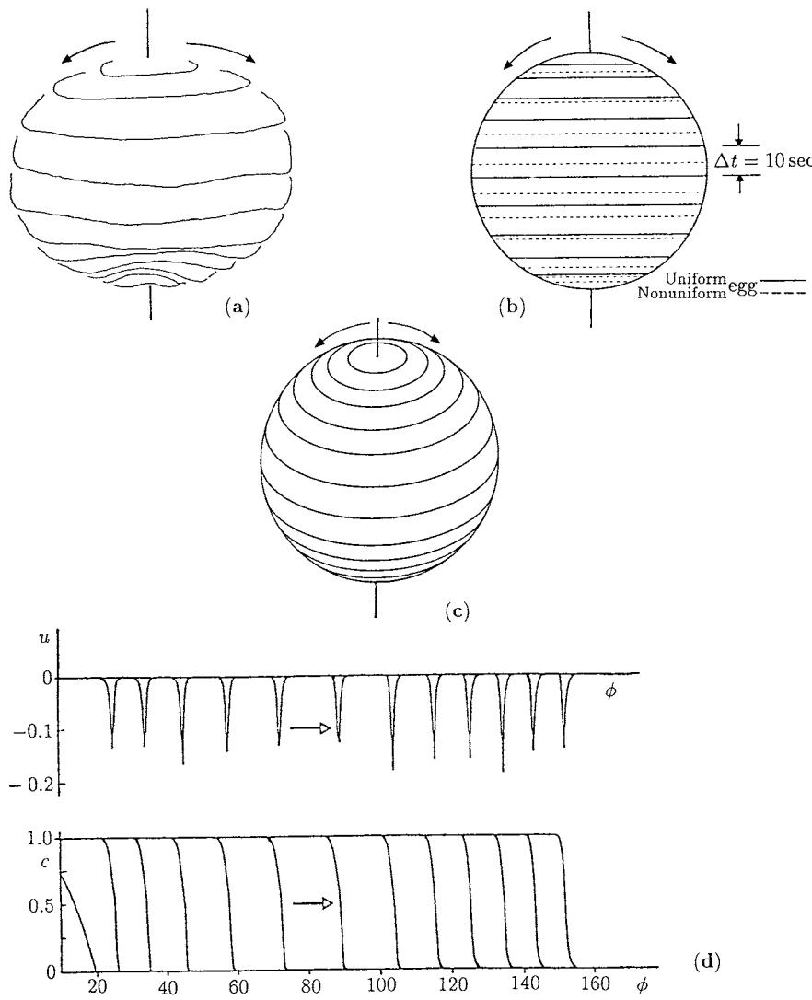

**Figure 13.12. (a)** Wavefront propagation of the Ca++ wave which passes over the surface of the egg, from the sperm entry point near the top (animal pole) to the bottom (vegetal pole), of the fish *Medaka* prior to cleavage. The wavefronts are 10 sec apart. Note how the wave slows down in the lower hemisphere—the fronts are closer together. (After Cheer et al. 1987, from the experimental data of Gilkey et al. 1978) **(b)** Computed Ca++ wavefront solutions from the reaction diffusion model with uniform surface properties compared with the computed solutions with nonuniform properties. (After Cheer et al. 1987) **(c)** Computed Ca++ wavefront solutions. (From Lane et al. 1987) Here the wave accelerates in the upper hemisphere and slows down in the lower hemisphere because of the variation in a parameter in the calcium kinetics. The lines represent wavefronts at equal time intervals. **(d)** The Ca++ wave and mechanical deformation wave which accompanies it. (From Lane et al. 1987) Here *u*(θ), where θ is the polar angle measured from the sperm entry point *(SEP)*, is the dimensionless mechanical deformation of the egg surface from its rest state *u* = 0. The spike-like waves are surface contraction waves.

formly at the lower steady state *u*1. If it is subjected to a perturbation larger than the threshold value *u*2, *u* will tend towards the higher steady state *u*3. If the perturbation is to a value less than *u*2, *u* will return to *u*1. There is thus a *firing threshold*, above which *u* → *u*3.

Consider now the possible wave solutions of (13.89). If the cot θ term were not in this equation we know that it would have wavefront solutions of the type equivalent to (13.84), that is, of the form

$$u(\theta, t) = U(z), \quad z = R\theta - ct, \quad U(-\infty) = u_3, \quad U(\infty) = u_1. \tag{13.90}$$

Of course with our spherical egg problem, if time *t* starts at *t* = 0, *z* here cannot tend to −∞. Not only that, the cot θ-term is in the equation. However, to get some feel for what happens to waves, like those found in the last section, when the mechanism operates on the surface of a sphere, we can intuitively argue in the following way.

At each *fixed* θ let us suppose there is a wavefront solution of the form

$$u(\theta, t) = U(z), \quad z = R\theta - ct. \tag{13.91}$$

Substituting this into (13.89) we get

$$DU^{\prime\prime} + \left[c + \frac{D}{R}\cot\theta\right]U^{\prime} + A(U - u_1)(u_2 - U)(U - u_3) = 0.\tag{13.92}$$

Since we are considering θ fixed here, this equation is exactly the same as (13.85) with [*c* + (*D*/*R*) cot θ] in place of the *c* there. We can therefore plausibly argue that a quantitative expression for the wavespeed *c* on the egg surface is given by (13.87) with [*c* + (*D*/*R*) cot θ] in place of *c*. So, we expect wavefrontlike solutions of (13.89) to propagate over the surface of the egg with speeds

$$c = \left(\frac{AD}{2}\right)^{1/2} (\mu_1 - 2\mu_2 + \mu_3) - \frac{D}{R} \cot \theta. \tag{13.93}$$

What (13.93) implies is that as the wave moves over the surface of the egg from the animal pole, where θ = 0, to the vegetal pole, where θ = π, the wavespeed varies. Since cot θ > 0 for 0 < θ < π/2, the wave moves more slowly in the upper hemisphere, while for π/2 <θ<π, cot θ < 0, which means that the wave speeds are higher in the lower hemisphere. We can get this qualitative result from the reaction diffusion equation (13.89) by similar arguments to those used in Section 13.2 for axisymmetric wavelike solutions of the Fisher–Kolmogoroff equation. Compare the diffusion terms in (13.89) with that in the one-dimensional version of the model in (13.83), for which the wavespeed is given by (13.87), or (13.93) without the cot θ term. If we think of a wave moving into a *u* = *u*1 domain from the higher *u*3 domain then ∂*u*/∂θ < 0. In the animal hemisphere cot θ > 0, so the term cot θ∂*u*/∂θ < 0 implies an effective reduction in the diffusional process, which is a critical factor in propagating the wave. So, the wave is slowed down in the upper hemisphere of the egg. By the same token, cot θ∂*u*/∂θ > 0 in the lower hemisphere, and so the wave speeds up there. This is intuitively clear if we think of the upper hemisphere as where the wavefront has to continually expand its perimeter with the converse in the lower hemisphere.

The wavespeed given by (13.93) implies that, for surface waves on spheres, it is probably not possible to have travelling wave solutions (13.89), with *c* > 0, for all θ: it clearly depends on the parameters which would have to be delicately spatially dependent.

In line with good mathematical biology practice let us now go back to the real biology. What we have shown is that a simplified model for the calcium-stimulatedcalcium-release mechanism gives travelling calcium wavefrontlike solutions over the surface of the egg. Comparing the various times involved with the experiments, estimates for the relevant parameters can be determined. There is, however, a serious qualitative difference between the front behaviour in the real egg and the model egg. In the former the wave slows down in the vegetal hemisphere whereas in the model it speeds up. One important prediction or conclusion we can draw from this (Cheer et al. 1987) is that the nonuniformity in the cortex properties are such that they overcome the natural speeding up tendencies for propagating waves on the surface. If we look at the wavespeed given by (13.93) it means that *AD* and the *ui* , *i* = 1, 2, 3 must vary with θ. This formula for the speed will also hold if the parameters are slowly varying over the surface of the sphere. So, it is analytically possible to determine qualitative behaviour in the model properties to effect the correct wave propagation properties on the egg, and hence deduce possible parameter variations in the egg cortex properties. Figure 13.12(b) illustrates some numerical results given by Cheer et al. (1987) using the above model with nonuniform parameter properties. The reader is referred to that paper for a detailed discussion of the biology, the full model and the biological conclusions drawn from the analysis. In Chapter 6, Volume II we introduce and discuss in detail the new mechanochemical approach to biological pattern formation of which this section and the papers by Cheer et al. (1987) and Lane et al. (1987) are examples.

#### **13.7 Invasion Wavespeeds with Dispersive Variability**

Colonisation of new territory by insects, seeds, animals, disease and so on is of major ecological and epidemiological importance. At least some understanding of the processes involved are necessary in designing, for example, biocontrol programmes. The paper by Kot et al. (1996) is particularly relevant to this question; see other references there. Although we restrict our discussion to continuous models, discrete growth and dispersal models are also important. Models such as we have discussed in this chapter have been widely used to obtain estimates of invasion speeds; see, for example, the excellent book by Shigesada and Kawasaki (1997) which is particularly relevant since it is primarily concerned with invasion questions. Among other things they also consider heterogeneous environments, where, for example, the diffusion coefficient is space-dependent.

Simple scalar equation continuous models have certain limitations in the real world, one of which is that every member of the population does not necessarily disperse the same way: there is always some variability. In this section we discuss a seminal contribution to this subject by Cook (Julian Cook, personal communication 1994) who revisited the classic Fisher–Kolmogoroff model and investigated the basic question as to what effect individual variability in diffusion might have on the invasion wavespeed. The importance of looking at such variability with the Fisher–Kolmogoroff model is now obvious, but was completely missed by all those who had worked on this scalar equation over the past several decades until Cook considered it. It is part of his work that we discuss in this section. The effect of variability on invasion speeds is quite unexpected, as we shall see, and intuitively not at all obvious.

We start with the basic one-dimensional Fisher–Kolmogoroff equation in which a population grows in a logistic way and disperses in a homogeneous environment with constant diffusion coefficient *D*, intrinsic linear growth rate *r* and carrying capacity *K*. From the analysis in Section 13.2 the wavespeed, that is, speed of invasion, is given by 2√ *r D*, the minimum speed in (13.13). We consider the population to be divided into dispersers and nondispersers with the subpopulations interbreeding fully and with all newborns having the same, fixed, probability of being a disperser. The model is not strictly a single-species model but it belongs in this chapter because of its intimate connection with the classical Fisher–Kolmogoroff model.

Let us first divide the population into dispersers, denoted by *A* and the nondispersers by *B*. With the one Fisher–Kolmogoroff equation in space dimension in mind we take the model system to be

$$\begin{aligned} \frac{\partial A}{\partial t} &= D \frac{\partial^2 A}{\partial x^2} + r_1 (A+B) [1 - (A+B)/K], \\ \frac{\partial B}{\partial t} &= r_2 (A+B) [1 - (A+B)/K], \end{aligned} \tag{13.94}$$

where *A* refers to the dispersing subpopulation and *B* to the nondispersing population. Here *D* is the diffusion coefficient of the dispersing subpopulation which is strictly different to the average dispersal rate for the entire population. As before *K* is the carrying capacity of the environment and the *r*s are the intrinsic rate of growth (per head of the *total* population). The probability of a newborn being a disperser is *p* = *r* 1/(*r* 1 + *r* 2). With this form if *r*2 = 0, the whole population disperses and the system becomes the standard Fisher–Kolmogoroff equation.

As Cook (Julian Cook, personal communication 1994) points out, this model is for dispersive variability with individuals being either dispersers or nondisperers with the former having a constant diffusion coefficient and the latter having a zero diffusion coefficient. Although the model system is based on logistic growth, as with the modified Fisher–Kolmogoroff equation the analysis can be carried through with more general growth functions; this affects the invasion speed in a similar way but does not affect the general principles.

As a first step in the analysis we nondimensionalise the system by setting

$$\mu = \frac{A}{K}, v = \frac{B}{K}, T = Rt, X = (\frac{R}{D})^{1/2} \text{x}, \quad \text{where } R = r_1 + r_2. \tag{13.95}$$

Here *R* is the overall population intrinsic rate of growth. With the probability, *p*, that an individual is a disperser defined by

$$p = \frac{r_1}{r_1 + r_2} \tag{13.96}$$

the system becomes

$$\begin{split} \frac{\partial u}{\partial T} &= \frac{\partial^2 u}{\partial X^2} + p(u+v)[1 - (u+v)],\\ \frac{\partial v}{\partial T} &= (1-p)(u+v)[1 - (u+v)]. \end{split} \tag{13.97}$$

Now look for travelling wave solutions in the usual way by setting

$$u = U(X - CT), \\ v = V(X - CT), \\ Z = X - CT, \tag{13.98}$$

where *C* is the speed of the wave; with *C* positive the wave moves in the direction of increasing *X*. Substituting (13.98) into (13.97) we get the following system of ordinary differential equations in *Z*,

$$-CU_Z = U_{ZZ} + p(U+V)[1 - (U+V)],\tag{13.99}$$

$$-CV_Z = (1 - p)(U + V)[1 - (U + V)].\tag{13.100}$$

We now look for travelling wave solutions that have *U* + *V* = 1 as *Z* → −∞ and *U* = *V* = 0 as *Z* → ∞. Setting *W* = *UZ* (13.99) and (13.100) become a system of first-order equations in *U*, *V* and *W*. In the usual way we require the derivatives of *U* and *V* to be zero as *Z* → ±∞. So in the (*U*, *V*, *W*) phase space a travelling wave solution must correspond to a trajectory that connects two steady states, that is, a heteroclinic orbit, specifically one that connects (0, 0, 0) and a nonzero equilibrium point (*U*0, 1−*U*0, 0): with our nondimensionalisation, the nonzero *V*0 = 1−*U*0. We now have to determine *U*0. We should reiterate that we are only interested in nonnegative solutions for *U* and *V* so the solutions must lie in the positive quadrant of any twodimensional projection *Z* = constant.

Near the zero steady state (0, 0, 0) we can obtain the solution behaviour by considering the linearised system just as we did for the two-variable Fisher–Kolmogoroff travelling wave. To ensure that the solutions do not go negative as they approach the origin we require the eigenvalues of the linearised system about (0, 0, 0) to be real. We also require that the *U*- and *V*-components of the corresponding eigenvectors must have the same sign since the heteroclinic orbit we are interested in has the same direction as an eigenvector as it tends to (0, 0, 0). So, we now have to analyse the linearised system about (0, 0, 0) and obtain the conditions that ensure these two restrictions are satisfied.

With *W* = *UZ* , (13.99) and (13.100) linearised about (0, 0, 0), which corresponds to the front of the wave and where crowding effects on reproduction are negligible, become

$$
\frac{d}{dZ} \begin{bmatrix} U \\ V \\ W \end{bmatrix} = \begin{bmatrix} 0 & 0 & 1 \\ -(1-p)/C & -(1-p)/C & 0 \\ -p & -p & -C \end{bmatrix} \begin{bmatrix} U \\ V \\ W \end{bmatrix} . \tag{13.101}
$$

Denoting the matrix by *M* the eigenvalues, λ*i* , are the solutions of | *M* − λ*I* | = 0, that is, the solutions of the cubic

$$
\lambda [C\lambda^2 + (C^2 + 1 - p)\lambda + C] = 0
$$

which reduces to

$$
\lambda = \lambda_0 = 0,\\
 C\lambda^2 + (C^2 + 1 - p)\lambda + C = 0. \tag{13.102}
$$

The solution of the quadratic equation gives the eigenvalues λ(*c*). The variation of λ as a function of *C* is the all-important *dispersion relation*. These λ are, of course, what we get if we simply look for solutions to (13.101) in the usual form for linear systems, namely,

$$
\begin{bmatrix} U \\ V \\ W \end{bmatrix} \propto e^{\lambda Z}. \tag{13.103}
$$

For our purposes it is more convenient to write (13.102) as a quadratic in *C* and use *C*(λ) to plot the dispersion relation. Doing this

$$
\lambda C^2 + (1 + \lambda^2)C + (1 - p)\lambda = 0\tag{13.104}
$$

which gives

$$C = \frac{1}{2\lambda} \left[ -(1+\lambda^2) \pm \sqrt{(1+\lambda^2)^2 - 4(1-p)\lambda^2} \right]. \tag{13.105}$$

Figure 13.13 shows schematically the dispersion relation, *C*(λ), as a function of λ; it has several branches.

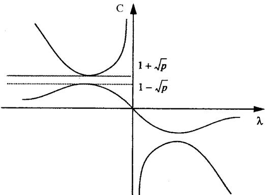

**Figure 13.13.** The dispersion relation giving the wavespeed *C* as a function of the eigenvalues λ for the linearised variable dispersal model (13.99) and (13.100). Note the two regions where, for each λ, it is potentially possible to have two positive wavespeeds.

To determine the maxima and minima of the two roots of (13.105) as functions of λ it is easier to use (13.104), differentiate with respect to λ and set *dC*/*d*λ = 0 which gives

$$\mathcal{C}^2 + 2\lambda \mathcal{C} + 1 - p = 0.\tag{13.106}$$

If we now combine (13.104) and (13.106), maxima and minima occur at λ = ±1. Referring to the figure and considering the (relevant) negative eigenvalues which give positive wavespeeds we see that two ranges of possible values for *C* exist, specifically,

$$10 \le C \le 1 - \sqrt{p} = C_1 \quad \text{and} \quad C_2 = 1 + \sqrt{p} \le C \le \infty \tag{13.107}$$

which define *C*1 and *C*2. Comparing this with the equivalent analysis of the Fisher– Kolmogoroff equation the first range does not appear. We now have to determine which range is the relevant one for our purposes.

To go further we have to look at the actual solutions, or rather how they behave near the zero steady state to make sure *U* and *V* behave as they should, in other words remain positive away from the (zero) steady state. We do this by examining the eigenvectors for the solutions in each of the two possible ranges for the wavespeed *C* given in (13.107).

Consider first the lower range for *C*, that is, the first of (13.107), and look first at the asymptotic form of λ for *C* 1. From (13.102) the eigenvalues λ*i* are given by

$$
\lambda_l = \frac{1}{2C} \left[ -(C^2 + 1 - p) \pm \sqrt{(C^2 + 1 - p)^2 - 4C^2} \right],
$$

which, on expanding for small *C*, gives

$$
\lambda_1 = -\frac{C}{1-p} + O(C^3), \quad \lambda_2 = -\frac{1-p}{C} + \frac{pC}{1-p} + O(C^3). \tag{13.108}
$$

We now have to solve for the leading terms of the components of the corresponding eigenvectors using (refer to (13.101))

$$
\begin{bmatrix}
\lambda_l & 0 & -1 \\
(1-p)/C & [(1-p)/C] + \lambda_l & 0 \\
p & p & c + \lambda_l
\end{bmatrix}
\begin{bmatrix}
e_1 \\ e_2 \\ e_3
\end{bmatrix} = 
\begin{bmatrix}
0 \\ 0 \\ 0
\end{bmatrix}.
\tag{13.109}
$$

We substitute in turn for the three eigenvalues, λ = 0 (which is not an admissible solution, of course) and the other two from (13.108). A little algebra shows that with all three eigenvalues *e*1 and *e*2 have opposite signs. For example, suppose we solve for the eigenvector associated with λ2; we find that

$$(1-p)e_1 + \left[\frac{pC^2}{1-p} + O(C^4)\right]e_2 = 0$$

so *e*1 and *e*2 must have opposite signs (since *p* ≤ 1).

What this implies is that small *C*, in this lower range, (0, 1− √*p*), results in *U* and *V* approaching the steady state along eigenvectors that have opposite signs and so this does not consitute a realistic (nonnegative) solution for both *U* and *V*. Hence we can conclude that for very small *C* there are no eigenvectors that correspond to meaningful travelling wave solutions. But, as *C* increases through the range (0,*C*1) in (13.107), the eigenvalues and the eigenvectors change continuously. For a realistic solution, one of the first two components of an eigenvector would have to pass through zero. But we can see that there are no nontrivial solutions to (13.109) with either *e*1 = 0 or *e*2 = 0. So, from continuity arguments we can say that there is no ecologically realistic travelling wave solution for wavespeeds, *C*, in the lower range (0,*C*1).

It is pedagogically useful to carry out a similar analysis for *C* in the higher range (1 + √*p*,∞) in (13.107). Here we expand the eigenvalues for large *C*, and get

$$
\lambda_1 = -\frac{1}{C} + O\left(\frac{1}{C^3}\right), \quad \lambda_2 = -C + \frac{p}{C} + O\left(\frac{1}{C^3}\right). \tag{13.110}
$$

In this case, going through a similar argument, both corresponding eigenvectors have *U*and *V*-components with matching signs. (Remember that the eigenvector corresponding to λ0 = 0 is not admissible.) We can therefore conclude that it is only for wavespeeds, *C*, in the higher range of *C*-values that admissible solution trajectories exist. The major consequence of this is that the wavespeed *C*2 = 1 + √*p* is the lower bound on the wavespeed for realistic solutions; this corresponds to the minimum wavespeed, namely, 2 √*RD* in dimensional terms, for the Fisher–Kolmogoroff equation (13.13) in the standard analysis. We come back to this below and discuss its importance and relevance to species invasion.

#### *Relative Sizes of Subpopulations*

Travelling waves are in effect population growth waves so, even though it is the dispersers that are responsible for the wave propagation, at any position on it there is growth of the nondispersers as well as the dispersers according to (13.94). We can determine the relative size of the dispersing and nondispersing subpopulations along the travelling wave solution by exploiting the form of the equations. The 3-variable system (13.99) and (13.100) with *W* = *UZ* can be decoupled as a consequence of the particular form of the nonlinear terms. If we write

$$Q = U + V, \quad U_Z = P,\tag{13.111}$$

that is, *Q* is the total population, the system becomes

$$\begin{aligned} U_{\mathbb{Z}} &= P, \quad P_{\mathbb{Z}} = -CP - p\mathcal{Q}(1 - \mathcal{Q}), \\ \mathcal{Q}_{\mathbb{Z}} &= P - (1 - p)\mathcal{Q}(1 - \mathcal{Q})/\mathbb{C}, \end{aligned} \tag{13.112}$$

so we can analyse the *P* − *Q* plane as we have just done above except that, here, the eigenvector arguments are based on *Q* being positive while *P* is negative at (0, 0). Using this formulation we can decide the issue by determining which of the equilibria (*U*, *P*, *Q*) = (*U*0, 0, 1) is the source for the heteroclinic orbit that terminates at (0, 0, 0).

The actual shape of the projection of the trajectory we want onto the *P* − *Q* plane is given by the solution of

$$\frac{dP}{d\,Q} = \frac{-CP - p\,\mathcal{Q}(1 - \mathcal{Q})}{P - (1 - p)\,\mathcal{Q}(1 - \mathcal{Q})/C}.\tag{13.113}$$

The change in *U* over this trajectory, that is, moving 'back' up the trajectory, must be

$$U_0 = \int_0^1 \frac{dU}{d\mathcal{Q}} d\mathcal{Q} = \int_0^1 \frac{P d\mathcal{Q}}{P - (1 - p)\mathcal{Q}(1 - \mathcal{Q})/C}.\tag{13.114}$$

The upper limit on the integral, *Q* = 1, is because *Q* is the total (normalised) population. To evaluate the integral we note that

$$\frac{dP}{d\,Q} = \frac{-CP - p\,Q(1 - \mathcal{Q})}{P - (1 - p)\,Q(1 - \mathcal{Q})/C} = \frac{pC}{1 - p} - \left(\frac{C}{1 - p}\right)\frac{P}{P - (1 - p)\,Q(1 - \mathcal{Q})/C} \tag{13.115}$$

which can be rewritten as

$$\frac{P}{P - (1 - p)\mathcal{Q}(1 - \mathcal{Q})/C} = p - \frac{(1 - p)}{C}\frac{dP}{d\mathcal{Q}}.\tag{13.116}$$

Using this we can now evaluate the integral for *U*0 as

$$U_0 = \int_0^1 \left( p - \frac{(1-p)}{C} \frac{dP}{d\,Q} \right) d\,Q = p. \tag{13.117}$$

So, what this says is that for any wavespeed, *C*, the value of *U* at *Z* = −∞ must be *p* with *U*(∞) = 0. In other words, far behind the wavefront the proportion of dispersers is *p*; this is as we would have expected intuitively.

We can go further since, using the last equation with *Q* as the upper limit on the integral,

$$dU(Q) = \int_0^{\mathcal{Q}} \frac{dU}{d\mathcal{Q}} d\mathcal{Q} = p\mathcal{Q} - (1 - p)\frac{P}{C} \tag{13.118}$$

which says that for any value of the total population, *Q*, the fraction of dispersers is

$$\frac{U}{\mathcal{Q}} = p - \left(\frac{1-p}{\mathcal{C}}\right)\frac{P}{\mathcal{Q}},\tag{13.119}$$

where *P*, recall, is the gradient of dispersers *UZ* . Since *P* is negative the fraction of dispersers is therefore higher than *p* at all points except at the limits where *P* = 0. The proportion of dispersers is higher as we approach the front of the wave (as *P* becomes more negative), again as we would expect.

We can exploit the decoupled system further to look at the gradient of trajectories as they approach (0, 0, 0). Based on (13.113), and using l'Hopital's rule, we can generate ˆ a quadratic for *d P*/*d Q* at *Q* = 0 (where *P* = 0 also), namely,

$$\left(\frac{dP}{d\,\,Q}\right)^2 + [C - (1 - p)/C]\frac{dP}{d\,\,Q} + p = 0.\tag{13.120}$$

Since we must have (*d P*/*d Q*) < 0 this requires

$$C > \sqrt{1 - p}.\tag{13.121}$$

But this is true for all *C* in the upper range, namely, (*C*2,∞), and none in the lower range (0,*C*1). So, the above result for admissibility of the wavespeeds *C* is confirmed.

Cook (Julian Cook, personal communication 1994) solved (13.97) numerically and found that the solutions converged rapidly to a travelling wave solution with a wavespeed very close to the predicted minimum speed. For example, if fraction of dispersing population *p* = 1.0, 0.5, 0.1, 0.05, 0.01 the theoretical minimum wavespeeds are respectively 1+√*p* = 2.00, 1.70, 1.33, 1.22, 1.10 and the corresponding numerical wavespeeds are 2.01, 1.77, 1.34, 1.22, 1.10.

#### **13.8 Species Invasion and Range Expansion**

The spatial spread of species is extremely important ecologically. The classic book by Elton (1958) lists numerous examples and there are many others documented since then. The killer bee invasion from Brazil up into the southwest of the U.S.A. is a relatively recent dramatic one with the spread of the American bull frog in the south of Vancouver Island an even more recent one. The seminal paper by Skellam (1951) essentially initiated the theoretical approach. He used what is in effect the linearised form of the Fisher–Kolmogoroff equation (13.4) which involves diffusion and Malthusian growth, that is, exponential, growth. Among other things he was particularly interested in modelling the range expansion of the muskrat and found that the wavespeed of the invasion was approximately 2√ *r D*, where *r* and *D* are the usual growth rate and diffusion parameters. He further showed that the range expanded linearly with time; see the analysis below where we derive this result. Shigesada and Kawasaki (1997), in their book, discuss a variety of specific invasions such as mammals, plants, insects, epidemics and so on. They present some of the major models that have been proposed for such invasions with the model mechanisms determined by a variety of factors related to the species' actual movement and interaction. They study invasions, many of the travelling wave type, in both homogeneous and heterogeneous spatial environments and for several different species interactions such as predator–prey and competition.

Basically when the scale of the individual's movement is small compared with the scale of the observations a continuum model is a reasonable one with which to start. A very good example where the model and data have been well combined is with the reinvasion along the Californian coast by the California sea otter (*Enhydra lutris*). Lubina and Levin (1988) used the Fisher–Komogoroff equation (13.4) with the extant data. The otter population was in serious decline through overhunting and was thought to be almost extinct in the early 1900's. It was protected by international treaty in 1911 but was thought to be already extinct. A small number (about 50) was found in 1914 near Big Sur and since that time the population has increased along with their territory both north and south of Big Sur. One of the interesting aspects of this reinvasion, fully documented by Lubina and Levin (1988), is that it is essentially a one-dimensional phenomenon. They were able to estimate the parameters in (13.4) and show that the basic velocity of the travelling wave, given by 2(*r D*)1/2, where *r* and *D* are again the linear growth rate and diffusion coefficient, gave excellent results. With a constant velocity the growth of the range is linear with time as they demonstrate is indeed essentially the case from the reinvasion data gathered over a period roughly from 1938 until 1984. This is in line with the results obtained by Skellam (1951) for the muskrat spread. For the northern invasion they obtained a value *D* = 13.5 km2/yr and for the southern invasion *D* = 54.7 km2/yr with estimated population growth *r* = 0.056/yr which resulted in wavespeeds of 1.74 km/yr and 3.4 km/yr for the north and south respectively. These values compare with the observed values of 1.4 km/yr and 3.1 km/yr between 1938 and 1972 and for the southern rate of 3.8 km/yr for the period 1973 to 1980. They argue persuasively that the difference between the north and south invasion speeds is not convection in the equation but rather habitat-changes in the parameters.

Let us now return to the results derived in the last section for the variable dispersion model and consider them in the light of species territorial invasion. We have shown that for the system (13.97) to have ecologically realistic, that is, nonnegative, travelling wave solutions of the form given in (13.98) the wavespeed, *C*, must satisfy

$$C \ge C_2 = 1 + \sqrt{p},\tag{13.122}$$

where *p*, given by (13.96), is the probability of a newborn individual being a disperser. In dimensional terms we then have

$$c \ge c_2 = \sqrt{RD}(1 + \sqrt{p}),\tag{13.123}$$

where *c* is the dimensional speed of the travelling wave, *D* is the diffusion rate of the dispersing subpopulation and *R* is the intrinsic rate of growth. Figure 13.14 gives the minimum wavespeeds as a function of the probability of an individual being a disperser and compares them with the classical Fisher–Kolmogoroff result.

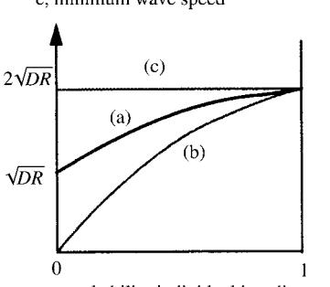

**Figure 13.14.** Minimum dimensional speed *c* of a travelling wave solution of (13.97) as a function of the probability, *p*, that an individual is a disperser in a population of dispersers and nondispersers. **(a)** Minimum wavespeed for a fixed dispersal coefficient and fixed total rate of growth from (13.123); note the finite speed as *p* → 0. **(b)** The minimum wavespeed which is predicted if the mean dispersal rate is used with the Fisher–Kolmogoroff result. **(c)** The standard Fisher–Kolmogoroff wavespeed if the total population disperses with the same dispersal coefficient.

Of course we have not proved that this travelling wave solution results from some initial conditions such as was done by Kolmogoroff et al. (1937) for the Fisher–Kolmogoroff equation. But, I would be astonished if a solution with a minimum wavespeed (13.123) did not result from convergence from reasonable initial conditions as it does for the Fisher–Kolmogoroff equation.

Let us now consider two special cases, namely, *p* = 1 and *p* 1.

- **(i)** *p* = 1. Here all individuals disperse with the same diffusion coefficient and the system reduces to the Fisher–Kolmogoroff equation with the usual lower bound of *c*2 = 2 √*DR* for the wavespeed; this is the same as obtained from (13.123) as *p* → 1.
- **(ii)** *p* 1. In this situation very few individuals disperse. If we let *p* decrease but keep √ *D* fixed the lower bound for the wavespeed from (13.123) is then *c*2 ∼ *RD*[1 + 0(*p*1/2)]. This is exactly half the lower bound for the case in which all individuals disperse at this fixed rate, *D*. This is an initially counterintuitive result (see also Figure 13.14), namely, that wavespeeds for populations with only a very few dispersive individuals are not greatly different—a factor of two at most—from those in which all individuals disperse at the same rate. Natural environmental factors could easily have this effect.

The initial intuitive result is that if there are very few dispersers in a population the invasion would be very small and in the limit zero. Of course when the number of dispersers becomes very low the continuous diffusion assumptions are no longer valid and stochastic effects would become dominant. Nevertheless even before we get to this situation the wavespeed is still not close to zero.

Perhaps the main point of the Cook model and its analysis is that only a few dispersers can drive the invasion with a speed not very different to that if the whole population were dispersers. This clearly has important ecological implications. As pointed out in the last section, waves of invasion are in effect waves of reproduction since as soon as the population is greater than zero the reproductive terms in the model come into play and these produce dispersers as well as nondispersers. We can think of fast disperers as seeding the reproduction of the immobile nondisperers; in other words they are the driving force in the reproduction wave.

Cook (Julian Cook, personal communication 1994) investigated several other aspects and modifications of his model, such as examining the consequences on the invasion wave as a result of dispersal rate variance, an Allee effect in the population growth (which means there is a minimum viable population; recall the discussion in Chapter 1) and the effect of having both populations disperse but at different rates. He also carried out extensive numerical simulations to confirm the analytical results and applied the basic conept to other equations which model movement using some correlated random walks and showed that his main result for the wavespeed is not confined to classical diffusion models.

The work of Lewis and Schmitz (1996) is directly related to that by Cook (Julian Cook, personal communication 1994). They also consider biological invasion of an organism with separate mobile and stationary states (they include the possibility of switching between states) for both dispersal and reproduction. They show that rapid invasion can occur even when transfer rates are infinitesimally small.

The paper by Shigesada et al. (1995) is particularly relevant to the question of variable dispersion and invasion of species (see also the book by Shigesada and Kawasaki 1997). They considered the range expansion of several species such as the English sparrow, the European starling in the U.S. and the rice water weevil in Japan. To study range expansion one of the models they used is the scalar linearised form of the Fisher– Kolmogoroff equation in two space dimensions, which is the one proposed by Skellam (1951) in his classic work on dispersal. So, they considered the growth to be Malthusian, that is, exponential. They started with the dimensional equation in the following form,

$$
\frac{\partial \mu}{\partial t} = \nabla^2 \mu + \varepsilon \mu,\tag{13.124}
$$

where *u* is the local population density and the space is radially symmetric. The solution with a δ-function initial condition *u*(*r*, 0) = *N*0δ(*r*), representing a local introduction of the species at the origin, is given by

$$u(r,t) = \frac{N_0}{4\pi Dt} \exp\left(\varepsilon t - \frac{r^2}{4Dt}\right). \tag{13.125}$$

From the point of view of the spatial spread of the species in practice, the range of expansion is effected by the invasion of a few individuals. So, as suggested by Shigesada et al. (1995), there could be a minimum density below which the population cannot be detected in practice. This suggests there is a de facto waiting period before a newly introduced species starts to expand its habitat range. If this detectable population density is denoted by *u*∗ then the area where *u*(*r*,*t*) > *n*∗ is defined as the range. From the solution, (13.125), the population density *u* near the origin for small *t* very quickly drops below the threshold *u*∗. However, because of the exponential growth term in (13.124), which gives the ε*t* in the solution, *u* starts to increase and eventually passes through the threshold *u*∗. The lag period or establishment phase is the time between when the population is introduced and its size passes through the threshold level. We can now use the solution (13.125) to determine how the range increases with time by setting *u* = *u*∗ and *r* = *r* ∗ to obtain

$$r^* = 2t \left[ \varepsilon D + \frac{D}{t} \ln \left( \frac{4 \pi D t u^*}{N_0} \right) \right]^{1/2}. \tag{13.126}$$

If we introduce dimensionless quantities by setting

$$\mathcal{R}^* = \left(\frac{\varepsilon}{D}\right)^{1/2} r^*, \quad T = \varepsilon t, \quad \nu = \frac{\varepsilon N_0}{D n^*},\tag{13.127}$$

we get the dimensionless *R*∗ − *T* range–time relation

$$\mathcal{R}^* = 2T \left[ 1 + \frac{1}{T} \ln \frac{\mathcal{V}}{4 \pi T} \right]^{1/2},\tag{13.128}$$

which depends only on the dimensionless parameter γ . When (1/*T* )ln(γ/4π*T* ) 1 the range expands linearly with time according to *R*∗ ≈ 2*T* .

Shigesada et al. (1995) go on to develop a model of species invasion and range expansion with scattered colonies which are initiated by long range dispersers. Such models are in effect invasion models with variable diffusion. Importantly they relate their analytical results to real data and obtain a good correlation.

The idea of using a threshold and radially symmetric linear diffusion reaction to give rise to an invading front was used by Murray (1981) in a completely different biological application, namely, the development of eyespots on butterfly wings. He also applied the model to other, nonradially symmetric situations. This application is described in detail in Chapter 3, Volume II.

#### **Exercises**

- **1** Consider the dimensionless reaction diffusion equation

$$
\mu_1 = \mu^2 (1 - \mu) + \mu_{\infty}.
$$

Obtain the ordinary differential equation for the travelling wave solution with *u*(*x*,*t*) = *U*(*z*), *z* = *x* − *ct*, where *c* is the wavespeed. Assume a nonnegative monotone solution for *U*(*z*) exists with *U*(−∞) = 1, *U*(∞) = 0 for a wavespeed such that 0 < 1/*c* = ε1/2 where ε is sufficiently small to justify seeking asymptotic solutions for 0 < ε 1. With ξ = ε1/2*z*, *U*(*z*) = *g*(ξ) show that the *O*(1) asymptotic solution such that *g*(0) = 1/2 is given explicitly by

$$\xi = -2 + \frac{1}{g(\xi)} + \ln\left[\frac{1 - g(\xi)}{g(\xi)}\right], \quad \xi = \frac{x - ct}{c}.$$

Derive the (*V*, *U*) phase plane equation for travelling wave solutions where *V* = *U* and where the prime denotes differentiation with respect to *z*. By setting φ = *V*/ε1/2 in the equation obtain the asymptotic solution, up to *O*(ε), for φ as a function of *U* as a Taylor series in ε. Hence show that the slope of the wave where *U* = 1/2 is given to *O*(ε) by −((1/8*c*) + (1/25*c*3)).

- **2** Show that an exact travelling wave solution exists for the scalar reaction diffusion equation

$$\frac{\partial \mu}{\partial t} = \mu^{q+1} (1 - \mu^q) + \frac{\partial^2 \mu}{\partial x^2},$$

where *q* > 0, by looking for solutions in the form

$$u(\mathbf{x}, t) = U(z) = \frac{1}{(1 + de^{bz})^s}, \quad z = \mathbf{x} - ct, \mathbf{x}$$

where *c* is the wavespeed and *b* and *s* are positive constants. Determine the unique values for *c*, *b* and *s* in terms of *q*. Choose a value for *d* such that the magnitude of the wave's gradient is at its maximum at *z* = 0.

- **3** An invasion model with variable subpopulation dispersal is given in dimensionless form by

$$\begin{aligned} \frac{\partial u}{\partial T} &= \frac{\partial^2 u}{\partial X^2} + p(u+v)[1 - (u+v)],\\ \frac{\partial v}{\partial T} &= (1-p)(u+v)[1 - (u+v)], \end{aligned}$$

where *u* and v represent the dispersers and nondispersers respectively and *p* is the probability that a newborn individual is a disperser. Look for travelling wave solutions with *Z* = *X*−*CT* and derive the travelling wave system of ordinary differential equations. Introduce

$$\varepsilon = 1/\mathcal{C}^2, \mathbf{s} = \mathbf{Z}/\mathcal{C}, \boldsymbol{\mu}(\mathbf{Z}) = \mathbf{g}(\mathbf{s}), \boldsymbol{\upsilon}(\mathbf{Z}) = h(\mathbf{s})$$

and then show that the travelling wave system becomes

$$\begin{aligned} \varepsilon \mathfrak{g}_{ss} + \mathfrak{g}_s + p(\mathfrak{g} + h)[1 - (\mathfrak{g} + h)] &= 0, \\ h_s + (1 - p)(\mathfrak{g} + h)[1 - (\mathfrak{g} + h)] &= 0. \end{aligned}$$

Although *C*min = 1 + √*p*, with *p* ≤ 1 the parameter ε is not small if *p* is near 1, consider ε small and look for a regular perturbation solution to this system in the form

$$\mathbf{g} = \mathbf{g}_0 + \varepsilon \mathbf{g}_1 + \dotsb, \quad h = h_0 + \varepsilon h_1 + \dotsb \dots$$

Justify using the boundary conditions

$$(\mathbf{g}_0 + h_0) \mid_{-\infty} = 1, \quad (\mathbf{g}_0 + h_0) \mid_{\infty} = 0, \quad (\mathbf{g}_0 + h_0) \mid_0 = 1/2,$$

$$\mathbf{g}_l \mid_{\pm \infty} = h_l \mid_{\pm \infty} = 0, \quad i > 0.$$

Derive the system of equations for *g*0 and *h*0. By setting *y*0 = *g*0 + *h*0, which corresponds to the total population to *O*(1), obtain an equation for *y*0 and give the conditions it must satisfy at ±∞ and *s* = 0 and hence determine the solution *y*0(*s*). Show that

$$\frac{d}{ds}[(1-p)\mathbf{g}_0 - ph_0] = 0$$

and use it together with the definition of *y*0 to solve for *g*0. Hence determine the travelling wave solution for *u*(*Z*;*C*) and v(*Z*;*C*) to *O*(1) for large *C*2.

Construct a model with a more general nonlinear reproduction kinetics and investigate whether or not you can carry out a similar analysis.

# **14. Use and Abuse of Fractals**

#### **14.1 Fractals: Basic Concepts and Biological Relevance**

The problem with a good name for a new (or resurrected) field, particularly one such as fractal theory which can be visually dramatic and practised without much background and sophistication, is that uninformed proselytising and inappropriate use can raise unrealistic expectations as to its relevance and applicability. Catastrophe theory is another example: its overzealous mathematical practitioners did considerable harm to the cause of interdisciplinary science. Although chaos and fractal theory have been proposed by some as biological panaceas fortunately there are enough realists to counter this view and generally keep them in perspective.

A particular and widespread misconception about fractal theory arises because it can create objects which look remarkably like many natural structures such as trees, weeds, flowers, butterfly wing patterns and so on, and this is often taken to be a biological explanation of how these structures and patterns are formed. Although fractal-like patterns may be reasonable graphical representations of such natural shapes they say essentially nothing about the biological processes and mechanisms which are involved in their development. Considerably more is required of a model. Notwithstanding this criticism, fractal ideas can, and have been, very helpful.

One of the applications of fractal theory is directly related to the measurement of biological structures at different magnifications; it is one that we discuss in this brief introduction to fractal theory. We can think of fractals in a simplistic, but still useful, way as geometric figures which repeat themselves at progressively smaller scales or exhibit progressively more complex structure when observed at larger and larger magnifications. With a fractal there is often self-symmetry, or approximate self-symmetry. That is, if we magnify a small part of the overall pattern it more or less displays some aspects of the whole pattern. There are now many books on the subject; these often include discussions of chaos, a closely related subject. The comprehensive book by Peitgen et al. (1992) is full of relevant matter and historical detail (but with no practical biological examples); the mathematical level is reasonably elementary but still nontrivial. The book by Liebovitch (1998) gives a very simplified, elementary and clear exposition specifically oriented towards the life sciences; there are many examples discussed in detail. The book by Strogatz (1994) is more mathematical but it has some more applications to biology; it primarily deals with chaos. The book by Bassingthwaighte et al. (1994) is specifically devoted to physiological problems; it also gives basic background material on fractals (and chaos). The book by Falconer (1990) is a clear introduction to the theory and applications of fractals generally. The visually beautiful book by Kaandorp (1994) exploits new computer techniques to simulate fractal modelling (in both two and three dimensions) in a wide variety of biological growth situations, such as coral colonies. His approach is different from that in which the possible mechanism is the starting point. He introduces elements in his models to simulate slow changes in environmental conditions and so on. This approach coupled to a mechanistic one could produce some interesting new biological insights: in Kaandorp et al. (1996), for example, he suggests

The labelling as fractal of a spectrum of growth phenomena which can be phenomenologically described by some kind of power law over a long time is highly controversial—witness the article in *Science* by Avnir et al. (1998) and the subsequent fairly aggressive letters in the following issues. The hypotheses which have been proposed as a result of applying (rightly or wrongly) fractal theory to natural phenomena in many ways emphasises the necessity of studying and, hopefully, determining the actual mechanisms involved in a growth process and reflects a major view espoused throughout this book, namely, that phenomenological descriptions are not explanations even though they can be helpful in limiting what is and what is not possible in the developmental process.

how to include the effect of nutrient diffusion and flow on coral morphology.

To motivate the study of fractals let us consider a real biological problem (in fact a class of them) and show why we need fractal theory to deal with it. In the following sections we discuss some simple examples of fractals and how to generate them to highlight some of their essential properties to get the basic ideas of what a fractal and a fractal dimension are. In Section 14.3 we return to the biological problem we started with and show how to use these concepts practically. We shall also briefly raise some caveats about fractals and biology in general. This very brief introduction should be sufficient to follow or appreciate most of the applications of fractal ideas and concepts to real biological problems—and hopefully be able to distinguish between the relevant and the irrelevant of which there are many.

#### **Biological Examples**

*Analysis of Retinal Cell Branching and Coverage.* The morphoglogy and branching characteristics of neuronal cells have been widely studied with a view to understanding shape morphogenesis, territorial coverage, classification and so on. Such studies frequently involve a detailed analysis of different cell types and various methods have been developed to address specific metric questions. For example, are specific types of ganglion cells scale invariant? In other words are they fractal? Famiglietti (1992) investigated the similarities and differences in directionally selective retinal ganglion cells of the rabbit and proposed a fractal approach and carried out such an analysis. Freed and Sterling (1988) studied alpha ganglion cells of the cat retina; Figure 14.1(a) is a typical example of the type of cellular structure which has to be examined. Tauchi and Masland (1984) and Tauchi et al. (1992) studied the shape and arrangement of specific neuronal cells in the rabbit retina; Figure 14.1(b) is a typical example of the structure of such cells. Montague and Friedlander (1991) studied the morphogenesis and spatial

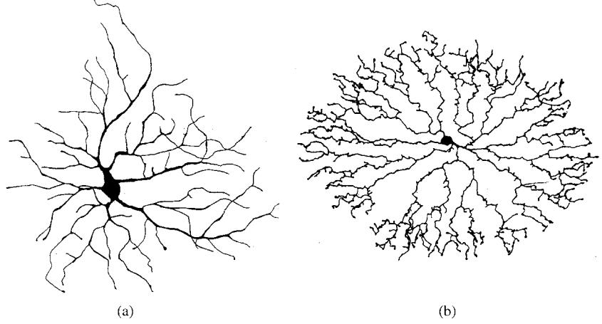

**Figure 14.1.** (**a**) Typical alpha retinal ganglion cell of the cat: scale bar is 50 µ*m*. (After Freed and Sterling 1988) (**b**) A typical amacrine cell from the central region of the rabbit retina: scale bar is 100 µ*m*. (After Tauchi and Masland 1984) Note the different branching structure between (**a**) and (**b**).

coverage of isolated retinal ganglion cells using cat retinal cells. They were faced with qualitatively similar structures to those in Figure 14.1.

*Surface and Volume Measurements of Subcellular Membrane Systems at Different Magnifications.* Surface and volume measurements of specific membranes have frequently resulted in widely different values. Such discrepancies in the case of the rat hepatocyte, for example, were discussed by Paumgartner et al. (1981) who reviewed the widely different published values for the surface density of reticulum per unit volume of cytoplasm and the surface density of inner and outer mitochondrial membranes per unit volume of mitochondrion. The values could differ by more than a factor of three. Although there are various possible explanations, Paumgartner et al. (1981) concentrated on the effect of different magnifications, or scales, at which the measurements were carried out. To see how such discrepancies can arise we have to appreciate the basic concepts of fractal topology and look at some simple examples of fractal-type structures and how to generate them.

*Pulmonary Blood Flow.* Pulmonary blood flow is an important field and has been the focus of a major long term study by Robertson, Glenny and their colleagues. Glenny and Robertson (1990; see also their general review article, 1991a, on applying fractal analysis to physiology) studied the heterogeneity of pulmonary blood flow using an analytic fractal procedure which they compared with the traditional gravity model. Importantly they compared their data with their fractal model and obtained a very good fit. Glenny and Robertson (1991b) compared two branching fractal models, one in which the branching ratio (that is, the fraction γ and 1 − γ of blood going from the parent to two daughters was fixed and in the other where it could vary about a mean of 0.5) and found that both compared very well with the data. They clearly demonstrated that, not only does gravitation play a secondary role in producing heterogeneity, but that fractal models provide a quantitative mechanism for describing structure and function of the pulmonary vascular tree. Glenny and Robertson (1995) simulated a threedimensional branching model for pulmonary perfusion. Spatial and temporal heterogeneous pulmonary perfusion is physiologically also important and has been investigated by Glenny et al. (1995, 1997). With the plethora of articles on the fractal character of a wide spectrum of phenomena in Nature, many with scant connection to reality far less experiments, the importance, both pedagogically and scientifically, of the Glenny– Robertson work on blood perfusion is that their modelling is firmly rooted in reality and this, plus the fact that it is so closely tied to their experimental work, makes their physiological conclusions seminal.

Fractal analysis has been applied successfully to a wide variety of natural phenomena and, not withstanding the above criticism, it has proved to be a useful tool. Cross (1994), after a brief pedagogical exposition of fractals, reviews the use of fractal geometry in quantitative microscopy. He discusses how it is used in microcomputerbased image analysis systems and he describes a variety of applications such as certain bacterial patterns, lung alveoli, tumour edges and others. He also makes a case for its development in other areas such as screening for carcinoma of the uterine cervix. Part of the problem with the latter is the difficulty in quantifying the difference between normal and abnormal cells. There is no doubt that fractal analysis can be an important tool in this general area although in many instances, it has been overdone and inappropriately applied. Panico and Sterling (1995) make a convincing case against the use of fractal geometry for retinal neurons (see also Murray 1995); we briefly discuss this in Section 14.4.

#### **14.2 Examples of Fractals and Their Generation**

We start by considering a specific fractal called the von Koch curve first described in 1906. As is often the case, this fractal is recursively generated. We start with a line *L*0 and replace the inner third of it with two equal line segments to form *L*1 as in Figure 14.2. Then, with each straight line segment in *L*1 do the same again to get *L*2, then *L*3 and so on. The limiting curve *Ln* as *n* → ∞ is the fractal known as the von Koch curve. Such recursive procedures can generate curves and structures with some interesting properties. Denoting the lengths of *L*1, *L*2,... by *s*0,*s*1,... we see that *s*1 = (4/3)*s*0,*s*2 = (4/3)2*s*0,...,*sn* = (4/3)*ns*0,... . That is, the length of each *L* increases at each iteration of the rule and the length *sn* → ∞ as *n* → ∞; in other words, the limiting curve is of infinite length. Not only that, there is an infinite distance between any two points on the von Koch curve. From a practical point of view, and in anticipation of biological applications, such a limit is unobtainable. However, what is relevant is that the length of the curves depends on the scale we are able to measure them. We discuss this in more detail below.

There is an obvious self-symmetry between subunits at one generating stage and the whole structure at a previous one, or even just a part of it. This is clear if we isolate some specimen sections and compare them with earlier *Ln* as shown in Figure 14.2. So, the von Koch curve, *K*, is self-similar and it has structure at however small a scale we look at it. The self-similarity of subunits of the pattern at ever smaller scales is a particularly common property of certain fractals. In fact, a figure which exhibits this

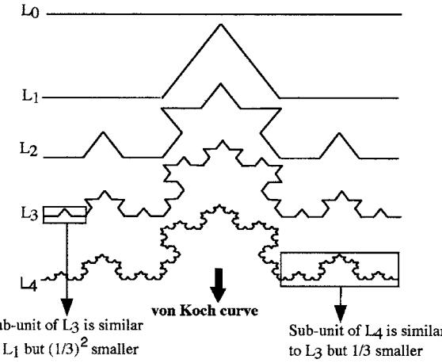

**Figure 14.2.** Construction of the von Koch curve. Here we divide the initial line *L*0 into three equal segments and replace the middle one with two equal lines as in *L*1. We then take each of the segments in *L*1 and replace the middle third with two equal lines to get *L*2. Doing this an infinite number of times results in the von Koch curve. The length, *s*, of each line, *L*, is 4/3 longer than the previous one from which it was derived.

self-similarity at ever smaller scales is a fractal although all fractals do not necessarily have this property; see Figure 14.3.

Let the unit of scale at any generation stage *n* be µ*n*. Then, if we take the length of the line *L*0 to be unity then µ0 = 1,µ1 = 1/3,µ2 = (1/3)2,...,µ*n* = (1/3)*n* and so on. We can relate the unit of scale, µ, and the magnification, *M* say, in a simple way. If we consider the structural subunit enclosed in the box in *L*4 and magnify it by 3 we get *L*3, while if we magnify the structural unit in the box in *L*3 by 32 we get *L*1: scale µ and the magnification *M* are related by µ ∝ λ/*M* where λ is related to the resolvable scale unit at magnification unity. By this we mean that if we are looking at a magnified micrograph it is the unit in the image plane reflecting the test system under investigation at the smallest magnification. The von Koch fractal curve involves the magnification, *M*, which, from a biological application point of view, is not possible; we come back to this point below since it relates to how we calculate the 'dimension' of a fractal.

Another classical self-similar fractal is the Sierpinski triangle first described in 1916. Here you start with an isosceles triangle and repeatedly remove similar triangles a quarter of the area. The initial stages are shown in Figure 14.3. As before we can calculate the unit of scale (an area here) at any stage. This fractal, as with the von Koch

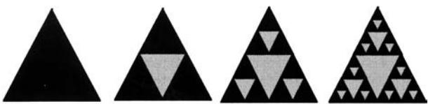

**Figure 14.3.** Sierpinski triangle fractal. The construction algorithm is to start with a triangle, remove the small inner triangle as in the second figure of four equal triangles and continue in this way with each remaining black triangle but, on a successively reduced scale.

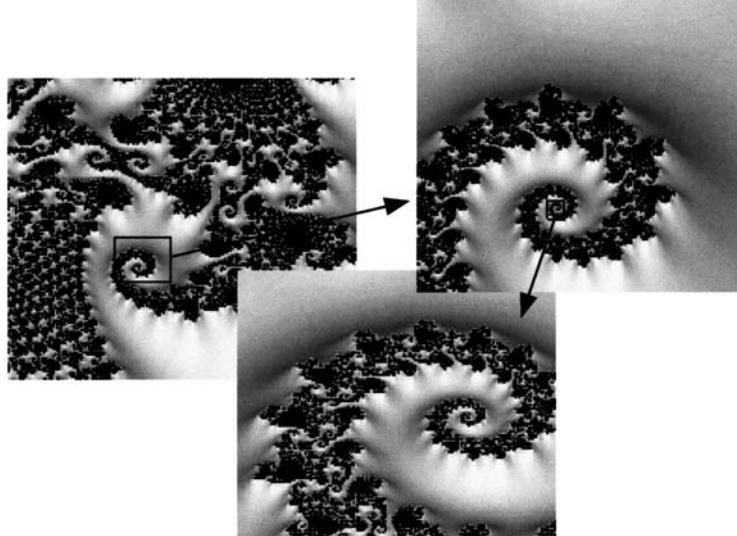

**Figure 14.4.** Example of a Julia set which exhibits fractal properties. The fractal generator is nonlinear. Note the similarity of the two successively enlarged parts. It is also possible to see in the third figure how the whole process continues, although without exact self-symmetry.

curve, can also be used to generate a variety of other fractal curves by using variations in the rules (see, for example, Peitgen et al. 1992). The existence of self-similar structure at any scale, however small, is clear.

We can now see how to construct self-similar fractals of whatever complexity you want. Self-similar fractals, however, are only one small class of fractal shapes. They involve linear scaling laws, which we discuss in more detail below. We can now see how one could, with a little ingenuity, devise specific fractal generators to produce a vast variety of shapes which can be tuned to look like all kinds of growing things such as trees, weeds, starfish, flowers, ferns, snowflakes, cauliflowers and ganglion cells. If we have nonlinearity in the fractal generators as well, the complex figures we can generate are unlimited. One example of such nonlinear fractals is Julia sets, after Gaston Julia, who published his highly original and seminal study in 1918 when he was 25 years old. They are just one class of nonlinear fractals but possibly the best known since the resulting patterns can be very subtle and beautiful and the dramatic evolution of them can be easily displayed on a very basic personal computer with simple programmes. These sets involve transformations in the complex plane; see, for example, the discussion and numerous examples in the book by Peitgen et al. (1992).

The Julia sets, which are nonlinear and hence not self-similar, are based on iterations of polynomials like *z*2 +*k*, *z*2 +*z* +*k*, *z*3 +*k* and so on, where *z* and *k* are complex numbers: you can think of a complex number, *z*, as a pair of real numbers which determine a point in the plane. The generation algorithm involves repeated applications of the polynomial transformation. That is, you start with a given *z* and then evaluate the effect of the polynomial transformation. For example, start with the point *z*0 and evaluate the point, *z*1 = *z*2 0 + *k*, then *z*2 = *z*2 1 + *k* and so on. The sequence of points is a Julia set; Figure 14.4 is one computer-generated example. The study of these is interesting but it should be kept in mind that their connection with real biological applications is still moot. Later we briefly discuss the relevance of fractals to biological situations in general.

At this stage we should reiterate the comment about realism concerning many of these complex figures and algorithmic generation processes which are able to produce structures so visually reminiscent of those found in Nature. For example, different generating rules, whether or not they are closely related, can produce the general visual shape of two different species of trees. Although this is interesting it says very little about the actual biological pattern formation mechanisms which generate the structure and, without considerably more biological input, as explanations of how the tree grows and is formed is possibly of little more value than an artist's impression. I do not mean to imply that fractals are of little use in biology, only that invoking fractal theory in the study of genuine biological situations has to be done with considerable care and, above all, biological realism.

### **14.3 Fractal Dimension: Concepts and Methods of Calculation**

The dimension of traditional geometric shapes is very clear. A line is one-dimensional, a figure in the plane is two-dimensional and what constitutes a three-dimensional shape is obvious. The dimension is the minimum number of coordinates needed to specify a point on the figure. For example, on a given curve we can specify any point by a single coordinate, namely, the arc length from a given point on the curve and so it is a one-dimensional figure. A point on a plane needs two coordinates so it is twodimensional and so on. Do the von Koch fractal, the Sierpinski triangle and the ganglion cells in Figure 14.1 have a dimension? Certainly the first two do not conform with our normal concept of dimension and so we have to extend our ideas as to what we mean by 'dimension' and specifically by the 'fractal dimension.'

The von Koch curve is a fractal which has the unusual property that there is an infinite distance between any two points on the curve. The curves which generate the von Koch curve are also clearly fractal since any small subunit is just a reduced version of part or the whole of one of the curves above it. What is the dimension of the curve? Since it is a curve it might be thought that it is one-dimensional. However, since the distance between any two points on the curve is infinite we cannot get from one point on the curve to another by specifying the distance since all points are infinitely far away from each other. It is clearly not two-dimensional since it does not have any 'area' so perhaps it has a dimension between 1 and 2, but how do we define it and calculate it?

Although this might seem like academic sophistry it has a genuine practical relevance to the problem studied by Paumgartner et al. (1981) mentioned in Section 14.1. Let us consider a curve such as in Figure 14.5(a) and suppose it represents part of the boundary of some biological membrane of which we want to know the length. If we measure the curve with a ruler that has a scale, *r*1 say, as in Figure 14.5(b) we cannot detect the various indentations between the end points of the ruler. We get the

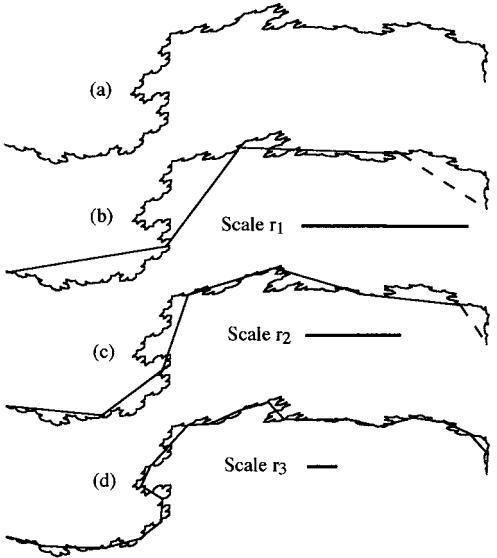

**Figure 14.5.** The effect on the measured 'length' of the curve in (**a**) as we vary the scale on which we measure it. The 'length' of the curve measured with a large unit of scale, *r* (that is, small magnification) as in (**b**), is smaller than the 'length' measured with the scales in (**c**), which in turn is smaller than that with the scale in (**d**).

length as the number of units needed to cover the curve. If we use a smaller scale, as in Figure 14.5(c), we get a different answer since we can now account for some of the finer indentations. So, as we reduce the scale, or in other words, as we increase the magnification, we get an increasing value for the 'length'. We would really like to be able to use a scale that is smaller than any of the small indentations in the curve so that we could get an accurate value for the length. But suppose the magnification required for such a scale cannot be achieved; how do we determine the true length? To get some idea of how to do this we consider in more detail fractal-generating scaling laws.

#### *Dimension of a Self-Similar Fractal and Scaling Laws*

Consider a square of side S. If we scale down each side by a scale factor *r* = 1/2 then we need 4(= 22) of the smaller boxes to fill the original square. If we scaled-down by a factor *r* = 1/3 we need 32 of the scaled-down squares to fill the original square. Generally if we scale down by a factor, *r*, we need (1/*r*)2 reduced squares to fill the original square. If we do the same with a cube then, with a scale factor *r*, the number of cubes needed to fill the original box is (1/*r*)3. The power of 1/*r* is directly related to the geometric dimension of the original figure, 2 for the square and 3 for the cube. If*r* is the scale factor and *m*(*r*), which is a function of *r*, denotes the number of scaled-down pieces (similar to the original figure) which are needed to fill the original figure then for the square and the cube *m* = (1/*r*)*D*, where *D* is the dimension, 2 for the square and 3 for the cube. This suggests a reasonable definition of the dimension, *D*, of a self-similar fractal, such as we derived above is given by

$$m = \left(\frac{1}{r}\right)^D \implies D = \frac{\ln m(r)}{\ln(1/r)}\tag{14.1}$$

on taking the logarithm of both sides. Strictly the fractal dimension, *D*fractal, is given by the limit of this expression as the scale factor *r* → ∞; that is, the actual unit of length scale tends to zero, and so

$$D_{\text{fractal}} = \lim_{r \to \infty} \frac{\ln m(r)}{\ln(1/r)}.\tag{14.2}$$

In the case of the von Koch curve the successive generations of the curves *Lk* , for any *k*, with length *sk* , are made up of four equal pieces each of which is similar to the previous curve *Lk* − 1, with length *sk* − 1, but scaled down by a factor of three. So, here the number of copies *m* = 4 and the scale factor *r* = 1/3. With the fractal definition of *D* in (14.2) we get the fractal dimension of the von Koch curve to be *D* = ln 4/ ln 3 = 1.262, which is indeed between 1 and 2.

Let us now consider a general scaling law and some quantity, *Q* say, which depends on the scale, *r*, at which we measure it. As an example, and to be specific, if we refer to Figure 14.5 we can see that the finer the scale the more detail can be accounted for and, as a consequence, the measured length increases the finer the scale, *r*, that is, the larger the magnification, we use. So, *Q*(*r*) is a function of r and if we think of the length of the curve in Figure 14.5, *Q* = *N*(*r*)*r*, where *N*(*r*) is the number of scale units needed to cover the curve at scale *r*.

If a figure is self-similar we can say something about the behaviour of *N*(*r*) as a function of*r*. Recall the discussion above with the square and cube and their subdivision into smaller squares and cubes. With the square when the scale factor was *r* = 1/2 we needed *N*(*r*) = (1/*r*)2 of the smaller units to fill the original square. With the cube it was *N*(*r*) = (1/*r*)3 of the smaller subunits. The powers of 1/*r* directly relate to the dimension of the quantity considered. So, in general for a self-similar scale law we have

$$N(r) = \frac{C}{r^D},\tag{14.3}$$

where *C* is some constant and *D* is the dimension which characterises the quantity, *Q*. In the square and cube examples if we start with a known area and volume, *C* is that area and volume respectively. When dealing with a quantity we do not know, *C* is unknown a priori. With the expression for *N*(*r*) in (14.3) we have

$$\mathcal{Q}(r) = N(r)r = \frac{C}{r^{D-1}}.\tag{14.4}$$

Taking the logarithm of both sides gives

$$
\ln Q(r) = -(D-1)\ln r + \ln C. \tag{14.5}
$$

From a practical point of view, we plot ln *Q*(*r*) against ln *r* for various*r* and the gradient then determines the fractal dimension *D*.

The definition of the dimension in (14.4) is consistent with that given in (14.1). To see this, replace *Q*(*r*) in (14.5) with the expression from (14.4) to get

$$
\ln N(r)r = -D\ln r + \ln r + \ln C
$$

$$
\Rightarrow D = \frac{\ln N(r)}{\ln(1/r)} + \frac{\ln C}{\ln(1/r)} \approx \frac{\ln N(r)}{\ln(1/r)} \quad \text{for } r \text{ small.} \tag{14.6}
$$

This is the same as the definition of the dimension *D* defined in (14.1) since *N*(*r*) = *m*(*r*). We should remember that it is magnification, *M*, which is used in experimental measurements rather than the unit of scale, *r*. There is a direct proportionality between *M* and *r*, namely, *M* = µ/*r* where µ is some proportionality factor which can be calculated. In terms of the magnification, *M*, the dimension *D* is then given by (14.5) which becomes

$$\ln \mathcal{Q}(M) = -(D-1)\ln(1/M) + \ln[\mu^{-(D-1)}C].\tag{14.7}$$

The last term in (14.7) is simply a constant and not important at this stage; we briefly talk about it later. If the quantity *Q* is fractal then the expression in (14.6) is a straight line in the log–log graph. Use of experimental measurements at different scales can suggest whether or not a biological quantity is fractal—or approximately so. A specific experimental example is the electron micrograph measurements by Paumgartner et al. (1981) of the inner and outer mitochondrial membranes and endoplasmic reticulum briefly mentioned above. Here *Q* represents length and surface measurements. They plotted the logarithm of the various measurements, *Q*, against the logarithm of 1/*M*, where *M* is the magnification; the results shown in Figure 14.6 are based on those presented in their paper.

Referring to the data points on Figure 14.6, for magnifications greater than 130,000 we see that in that region the fractal density *D* = 1. In other words there is no finer structure beyond this magnification and so we are seeing the whole structure with no 'hidden' complexities. We know that in a strictly, or theoretical, fractal situation such as with the von Koch curve, the limiting length is infinitely large. In any biological situation it is not possible to continually increase the magnification indefinitely. In fact there is a definite limit to the scale, *r*, at which stage the dimension becomes the usual topological dimension. In Figure 14.6 the dimension is *D* = 1 for magnifications larger than 130,000 which determines (approximately) the physical limit.

It is appropriate at this stage to ask what the use is in showing that something is fractal. In many situations the answer is that it is of little use. In others, however, it can be informative. Let us suppose that we can only measure *Q*, which in Figure 14.6 are lengths and surfaces, for only a small range of different scales and not as far as the limiting one, *rlimit* , which corresponds to a 130,000 magnification beyond which the structure has an integer dimension. Let us further suppose that the measurements

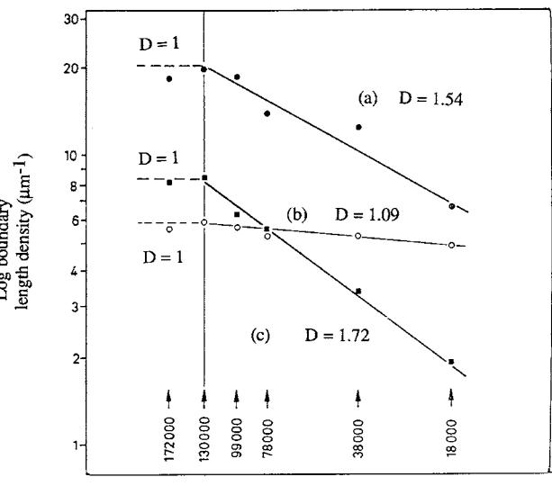

**Figure 14.6.** Boundary and surface measurements of specific liver cell membranes of the rat as a function of the magnification *M*: (**a**) inner mitochondrial membrane, (**b**) outer mitochondrial membrane and (**c**) endoplasmic reticulum. Note the straight line nature of the curve for magnifications in the range ×18,000 < *M* < ×130,000. (Redrawn from Paumgartner et al. 1981) The straight line portion implies an approximate fractal behaviour with the fractal dimension, *D*, determined from fitting (14.7) to the data points. Note that for magnifications greater than 130,000 the graphs imply *D* = 1.

are sufficient to demonstrate fractal behaviour and an approximate fractal dimension *D*. Then from (14.4) the ratio of the measures of *Q* at scale *r* and at scale *rlimit* is given by

$$\frac{\mathcal{Q}(r_{limit})}{\mathcal{Q}(r)} = \left(\frac{r}{r_{limit}}\right)^{D-1} \Rightarrow \mathcal{Q}(r_{limit}) = \left(\frac{r}{r_{limit}}\right)^{D-1} \mathcal{Q}(r) = K_c \mathcal{Q}(r), \quad (14.8)$$

where *Kc* is the correction factor to the measurement at scale *r*. This presumes a knowledge of the physical limiting scale *r* limit. One of the practical uses of finding fractal behaviour, such as in this biological example, is that it clearly shows how important the scale can be in measuring the specific quantities and that conclusions based on observations at larger scales can be inaccurate.

Another important potential use for more accurate spatial measurement, specifically surface area, is associated with quantifying diffusion fluxes of chemicals through such a membrane surface. The amount of a chemical which diffuses through a surface is directly proportional to the surface area. So, if a surface is fractal, or quasi-fractal, we can obtain a more accurate approximation to that flux if we know the fractal dimension. Of course, the fractal 'indentations' must not be so fine that the random walk approximation to diffusion is no longer valid but in practice this is generally not the case.

#### *Non Self-Similar Fractals and the Box-Counting Dimension*

If a fractal is not self-similar we have to generalise our concept of a fractal dimension. We also have to have some method for calculating it in any experimental situation. An example of a fractal which is not self-similar is shown in Figure 14.3. One method which is widely used is called box counting and which we now describe. There are others some of which are discussed in the books cited above. Basically all the methods rely on measurements of some quantity at different scales, *r*, or magnifications, *M*, in the above notation. Effectively the measurement at a given scale ignores irregularities at a smaller scale.

The box method involves covering the object of measurement with regular square boxes (circles or spheres are also used) of size *r*; refer to Figure 14.7. If the measurements are in the plane then squares are used while cubes are used if the body measurements are three-dimensional. In Figure 14.7(a) let us suppose the original smooth curve has length *L*. Then the number of boxes *N*(*r*) is related to the size of the box used which depends on the unit of scale *r*; here *N*(*r*) ∝ *L*/*r*. If it is a region, with area *A*, as in Figure 14.7(c), then the number of boxes *N*(*r*) ∝ *A*/*r* 2. In the case of a power law (14.3), *N*(*r*) ∝ *L*/*r D* and the fractal box dimension is, from (14.6), then given as

$$D = \lim_{r \to 0} \frac{\ln N(r)}{\ln(1/r)} \tag{14.9}$$

as long as the limit exists.

If we now return to the cellular structures in Figure 14.1 we can calculate the box dimension by covering the cell with a network of square boxes of given size (scale) which specifies *r*, and simply counting them to get *N*(*r*). Then, progressively decrease

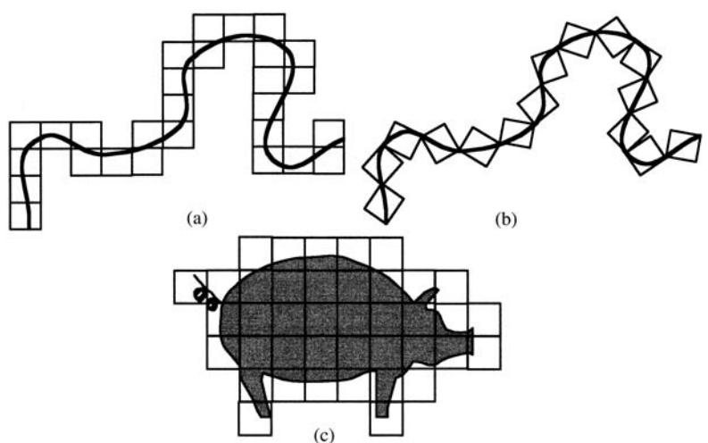

**Figure 14.7.** Box-covering methods for a line as in (**a**) and (**b**) or an area as in (**c**). A part of the curve or area must lie in each box. In the case of the line in (**a**) it is possible to have a different box covering as shown in (**b**). In the limit of very small scale boxes the number needed to cover the line is approximately the same.

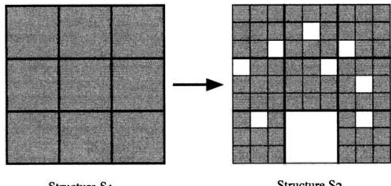

**Figure 14.8.** Example of a nonself-similar fractal; see the text for a description of the generator.

the box size and plot ln *N*(*r*) against ln(1/*r*) for a range of *r* which gives a straight line from which we can determine the gradient and hence *D*.

One problem with the box dimension is that it is not always easy to find the minimal cover; the situations reproduced in Figures 14.7(a) and 14.7(b) highlight this. The method in Figure 14.7(a) is actually better than that in Figure 14.7(b). There are other more complex and more accurate methods for calculating the fractal dimension, one of the best of which is the Hausdorff dimension which uses sets of shapes with different sizes. Although mathematically it gives a more accurate value for the dimension it is very much harder to calculate. A simple illustrative example of a nonself-similar fractal is shown in Figure 14.8. The generating rule consists of starting with a square divided into nine equal small squares. Then choose one at random and remove it from the figure to get the set *S*1. The remaining eight squares are then divided into nine equal smaller squares and again one of the smaller squares in each box is selected at random and discarded to obtain *S*2. The procedure is then repeated. This is a fractal structure with qualitatively similar structures at each scale reduction and there is a kind of power scale law in operation in that the individual surviving boxes certainly obey one. How do we calculate the box dimension of this fractal structure? If we take the length of the side of the original square to be unity then *S*1 consists of *N* = 8 equal squares of side 1/3; that is, the scale *r* = 1/3. The set *S*2 consists of *N* = 82 squares with scale *r* = (1/3)2. At the *n*th generation we have a structure *Sn* with *N* = 8*n* squares with side of length *r* = (1/3)*n*. From (14.9) we thus have the box dimension given by

$$D = \lim_{n \to \infty} \frac{\ln 8^n}{\ln 3^n} = \frac{\ln 8}{\ln 3} = \frac{3 \ln 2}{\ln 3} = 1.893... $$

It is left as an exercise to calculate the box dimension of the nonself-similar fractal obtained if a similar procedure to that used in Figure 14.8 is used with the Sierpinski triangle in Figure 14.4.

### **14.4 Fractals or Space-Filling?**

Let us now consider a biological situation involving cells such as that shown in Figure 14.1, or the volume occupied by the alveolar sacs in the lung organism or the typical


(a) Summer (b) Winter

**Figure 14.9.** Ivy-covered wall in winter and summer. Is the branch structure in (**a**) fractal or is it space-filling to optimise the leaf coverage (**b**) in the summer?

ivy covering of a wall as in Figure 14.9. Ideally, in the case of the lung, a major purpose is to maximise the exchange of oxygen in the blood in the minimum amount of space. In the case of the ivy the branches grow, it seems, so that they cover the available wall space in the most efficient space-filling way for the leaves to maximise the absorption of sunlight and relevant gases to maximise the growth in the growth season. Such branching structures are widespread in Nature; see, for example, the many fractal-like forms in Nature, reproduced in almost all books on fractals. In the case of the neuronal cells in Figure 14.1 are they space-filling or are they fractal?

In the latter part of the 19th century and the beginning of the 20th there was considerable interest in space-filling curves. What we mean by that is for any patch in a given area there is a curve which touches each point of that patch. We come back to the biological relevance shortly. To see how to construct such a curve we consider the classical space-filling curve first described by Hilbert in 1891. Figure 14.10 shows the initial construction stages. Let us suppose the size of the line segments of the three-sided figure in *S*0 to be length 1. Then in the intermediate stage we have four such three-sided figures with segment lengths of 1/2. We then join the four copies of *S*0 with three lines to get *S*1. The procedure is repeated to get *S*2 using similar rotations and again joining up the various quadrant curves with three other lines. So, *S*2 has 16 copies of *S*0 made up of line segments of length 1/4. At stage *Sn* we have 4*n* copies of *S*0 made up of line segments of length 1/2*n*.

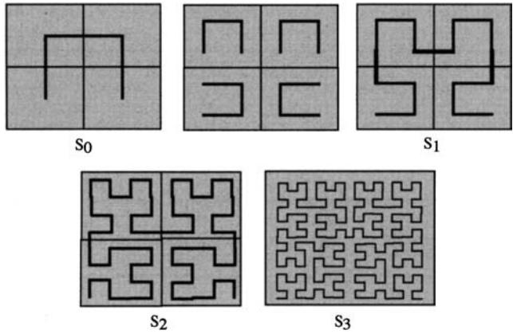

**Figure 14.10.** The stepwise generation of the space-filling Hilbert curve. We start with the space and curve *S*0, for the intermediate step in the second square and then join the four sets of lines to get *S*1, then *S*2, *S*3 and so on. In the limit the curve passes through each point in the square.

The theory of space-filling curves gets quite technical mathematically but from a biological viewpoint we do not need it. Suppose we have an organism which wants to maximise its coverage of a given area or volume. One way to do this would be to have a branching structure which obeyed local developmental branching rules to try and fill all the available space. The evolution of the curve in Figure 14.10 is one possible rule. In fact is the regularity of such a branching pattern any better than a random opportunistic branching which has a normal topological dimension and is not fractal, not selfsimilar nor has any other of the elegant geometric properties associated with fractals? The branching pattern, fractal or otherwise, stops when the interbranch distance is at a specific scale associated with the specific organism. This would result in a fairly even mesh within which there is no further structure. In fact it would be counterproductive to try to create a finer structure than was necessary. By a careful analysis of retinal neurons and vessels Panico and Sterling (1995) showed that neuronal and vascular patterns showed no more self-similarity than the non-fractal controls they used. They concluded that these biological patterns were not fractal but rather space-filling.

Although experiments might give rise to something that appears to be fractal, or have a noninteger dimension, boundaries generally play a role in such measurements and affect the subsequent log–log graphs. Whether or not something is fractal from experimental measurements it must be clearly demonstrated that such boundary effects can be ignored.

#### *Caveat*

It has frequently been suggested that if some pattern is fractal then we can infer something about the mechanism which generates it. The case most frequently cited is when the pattern generated looks qualitatively similar to that in Figure 14.11 which is a typical pattern generated by diffusion limited aggregation. Diffusion limited aggregation (DLA) is a diffusion process whereby particles exhibit a random walk behaviour and

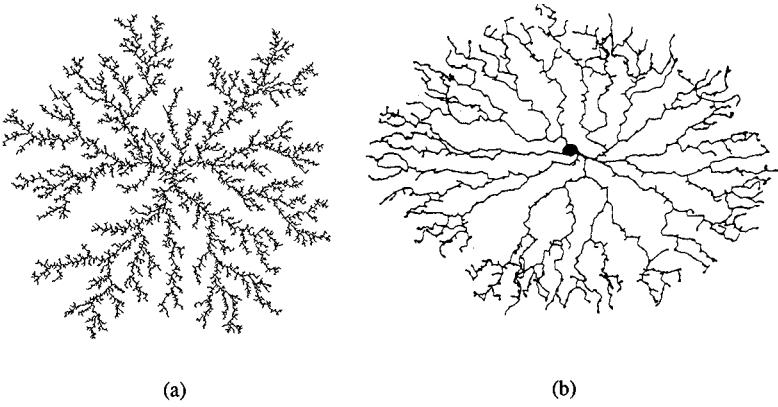

**Figure 14.11.** (**a**) Typical pattern generated by diffusion limited aggregation. (From Bassingthwaighte et al. 1994 and reproduced with permission) (**b**) A typical amacrine cell from the central region of the rabbit retina: scale bar is 100 µ*m* (from Figure 14.1). (After Tauchi and Masland 1984) It is premature to draw any conclusions as to the mechanism which forms (**b**) solely by visual comparison between it and the pattern in (**a**).

when a particle comes into contact with another particle it sticks to it and can no longer move. The process is usually started with a seed of stationary particles onto which released particles eventually diffuse. In this way a spatial pattern is dynamically formed which is fractal in character. In this DLA example we can compute the fractal dimension theoretically; it is 1.7. We can, of course, also use the box dimension method, for example, to compute it from the figure. Now compare the pattern in Figure 14.11 and the cell patterns in Figure 14.1. It has often been suggested, for example, by Caserta et al. (1990) and Schierwagen (1990), that the shape of neuronal cells may be determined by a diffusion limited aggregative process. This is an unjustified conclusion to draw from mere visual similarity.

Any model mechanism, such as diffusion limited aggregation, must be judged against other biological spatial patterning generators by the experiments each of them suggests. It is only by these that they can be differentiated. In the light of the easy generation of hypothetical ferns, cauliflowers, trees and so on, it is easy to forget the main purpose of studying pattern formation in biology, namely, to try and discover the underlying biological processes which produce the spatial patterns.

*This page intentionally left blank*

# **Appendix A. Phase Plane Analysis**

We discuss here, only very briefly, general autonomous second-order ordinary differential equations of the form

$$\frac{d\mathbf{x}}{dt} = f(\mathbf{x}, \mathbf{y}), \quad \frac{d\mathbf{y}}{dt} = \mathbf{g}(\mathbf{x}, \mathbf{y}).\tag{A.1}$$

We present the basic results which are required in the main text. There are many books which discuss phase plane analysis in varying depth, such as Jordan and Smith (1999) and Guckenheimer and Holmes (1983). A good, short and practical exposition of the qualitative theory of ordinary differential equation systems, including phase plane techniques, is given by Odell (1980). *Phase curves* or *phase trajectories* of (A.1) are solutions of

$$\frac{d\mathbf{x}}{d\mathbf{y}} = \frac{f(\mathbf{x}, \mathbf{y})}{g(\mathbf{x}, \mathbf{y})}.\tag{A.2}$$

Through any point (*x*0, *y*0) there is a unique curve except at *singular points* (*xs*, *ys*) where

$$f(\mathbf{x}_s, \mathbf{y}_s) = \mathbf{g}(\mathbf{x}_s, \mathbf{y}_s) = \mathbf{0}.$$

Let *x* → *x* −*xs*, *y* → *y*−*ys*; then, (0, 0) is a singular point of the transformed equation. Thus, without loss of generality we now consider (A.2) to have a singular point at the origin; that is,

$$f(\mathbf{x}, \mathbf{y}) = \mathbf{g}(\mathbf{x}, \mathbf{y}) = \mathbf{0} \quad \Rightarrow \quad \mathbf{x} = \mathbf{0}, \mathbf{y} = \mathbf{0}.\tag{A.3}$$

If *f* and *g* are analytic near (0, 0) we can expand *f* and *g* in a Taylor series and, retaining only the linear terms, we get

$$\frac{d\mathbf{x}}{d\mathbf{y}} = \frac{a\mathbf{x} + b\mathbf{y}}{c\mathbf{x} + d\mathbf{y}}, \quad A = \begin{pmatrix} a & b \\ c & d \end{pmatrix} = \begin{pmatrix} f_{\mathbf{x}} & f_{\mathbf{y}} \\ g_{\mathbf{x}} & g_{\mathbf{y}} \end{pmatrix}_{(0,0)}\tag{A.4}$$

which defines the matrix *A* and the constants *a*, *b*, *c* and *d*. The linear form is equivalent to the system

$$\frac{d\mathbf{x}}{dt} = a\mathbf{x} + b\mathbf{y}, \quad \frac{d\mathbf{y}}{dt} = c\mathbf{x} + d\mathbf{y}.\tag{A.5}$$

Solutions of (A.5) give the parametric forms of the phase curves; *t* is the parametric parameter.

Let λ1 and λ2 be the eigenvalues of *A* defined in (A.4); that is,

$$\begin{vmatrix} a - \lambda & b \\ c & d - \lambda \end{vmatrix} = 0 \quad \Rightarrow \quad \lambda_1, \lambda_2 = \frac{1}{2}(a + d \pm \left[ (a + d)^2 - 4 \det A \right]^{1/2}). \tag{A.6}$$

Solutions of (A.5) are then

$$
\begin{pmatrix} \mathbf{x} \\ \mathbf{y} \end{pmatrix} = c_1 \mathbf{v}_1 \exp[\lambda_1 t] + c_2 \mathbf{v}_2 \exp[\lambda_2 t], \tag{A.7}
$$

where *c*1 and *c*2 are arbitrary constants and **v**1, **v**2 are the eigenvectors of *A* corresponding to λ1 and λ2 respectively; they are given by

$$\mathbf{v}_{l} = (1 + p_{l}^{2})^{-1/2} \begin{pmatrix} 1 \\ p_{l} \end{pmatrix}, \quad p_{l} = \frac{\lambda_{l} - a}{b}, \quad b \neq 0, \quad i = 1, 2. \tag{A.8}$$

Elimination of *t* in (A.7) gives the phase curves in the (*x*, *y*) plane.

The form (A.7) is for distinct eigenvalues. If the eigenvalues are equal the solutions are proportional to (*c*1 + *c*2*t*) exp[λ*t*].

*Catalogue of (Linear) Singularities in the Phase Plane*

- **(i)** λ1, λ2 real and distinct:
	- **(a)** λ1 and λ2 have the same sign. Typical eigenvectors **v**1 and **v**2 are illustrated in Figure A.1(a). Suppose λ2 < λ1 < 0. Then, from (A.7), for example, for *c*2 = 0, *c*1 = 0,

$$
\begin{pmatrix} x \\ y \end{pmatrix} = c_1 \mathbf{v}_1 \exp[\lambda_1 t],
$$

so the solution in the phase plane simply moves along **v**1 towards the origin as *t* → ∞ in the direction shown in Figure A.1(a) — along *P O* if *c*1 > 0 and along *QO* if *c*1 < 0.

From (A.7) every solution tends to (0, 0) as *t* → ∞ since, with λ2 < λ1 < 0, exp[λ2*t*] = *o*(exp[λ1*t*]) as *t* → ∞ and so

$$
\binom{\chi}{\chi} \sim c_1 \mathbf{v}_1 \exp[\lambda_1 t] \quad \text{as} \quad t \to \infty.
$$

Thus, close enough to the origin all solutions tend to zero along **v**1 as shown in Figure A.1(a). This is called a *node* (Type I) singularity. With λ1 ≤ λ2 < 0 it is a stable node since all trajectories tend to (0, 0) as *t* → ∞. If λ1 > λ2 > 0 it is an unstable node; here (*x*, *y*) → (0, 0) as *t* → −∞.

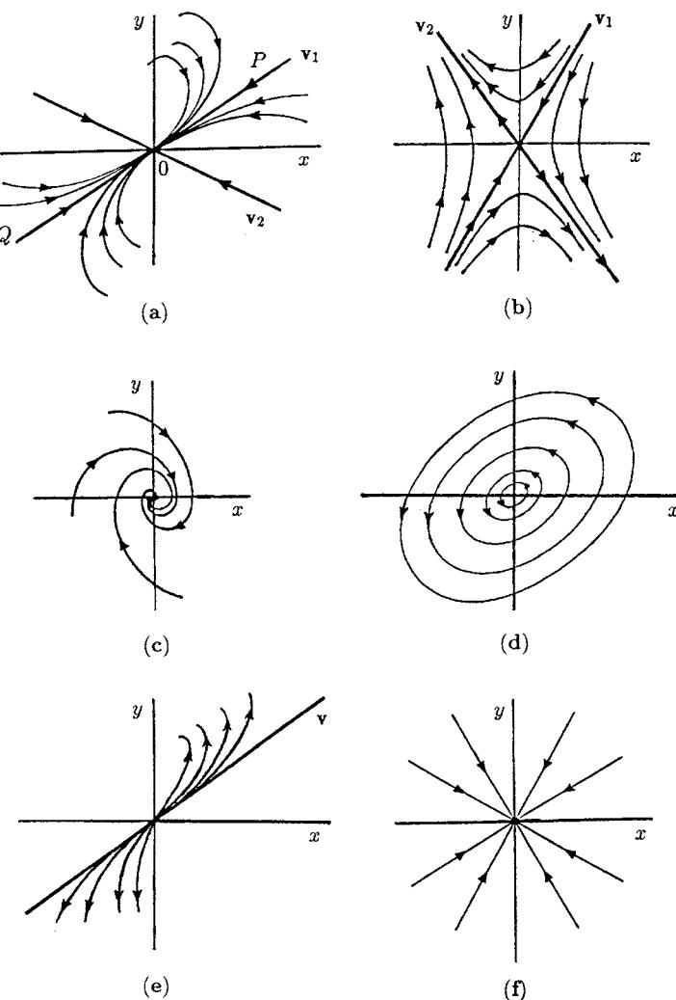

**Figure A.1.** Typical examples of the basic linear singularities of the phase plane solutions of (A.4). (**a**) Node (Type I): these can be stable (as shown) or unstable. (**b**) Saddle point: these are always unstable. (**c**) Spiral: these can be stable or unstable. (**d**) Centre: this is neutrally stable. (**e**) Node (Type II): these can be stable or unstable. (**f**) Star: these can be stable or unstable.

- **(b)** λ1 and λ2 have different signs. Suppose, for example, λ1 < 0 < λ2 then **v**1 exp[λ1*t*]v1 → 0 along **v**1 as *t* → ∞ while **v**2 exp[λ2*t*] → 0 along **v**2 as *t* → −∞.
There are thus different directions on **v**1 and **v**2: the solutions near (0, 0) are as shown in Figure A.1(b). This is a *saddle point* singularity. It is always *unstable*: except strictly along **v**1 any small perturbation from (0, 0) grows exponentially.

- **(ii)** λ1,λ2 complex: λ1,λ2 = α ± *i*β,β = 0. Solutions (A.7) here involve exp[α*t*] exp[±*i*β*t*] which implies an oscillatory approach to (0, 0).
	- **(a)** α = 0. Here we have a *spiral*, which is stable if α < 0 and unstable if α > 0; Figure A.1(c) illustrates a spiral singularity.
	- **(b)** α = 0. In this case the phase curves are ellipses. This singularity is called a *centre* and is illustrated in Figure A.1(d). Centres are not stable in the usual sense; a small perturbation from one phase curve does not die out in the sense of returning to the original unperturbed curve. The perturbation simply gives another solution. In the case of centre singularities, determined by the linear approximation to *f* (*x*, *y*) and *g*(*x*, *y*), we must look at the higher-order (than linear) terms to determine whether or not it is really a spiral and hence whether it is stable or unstable.

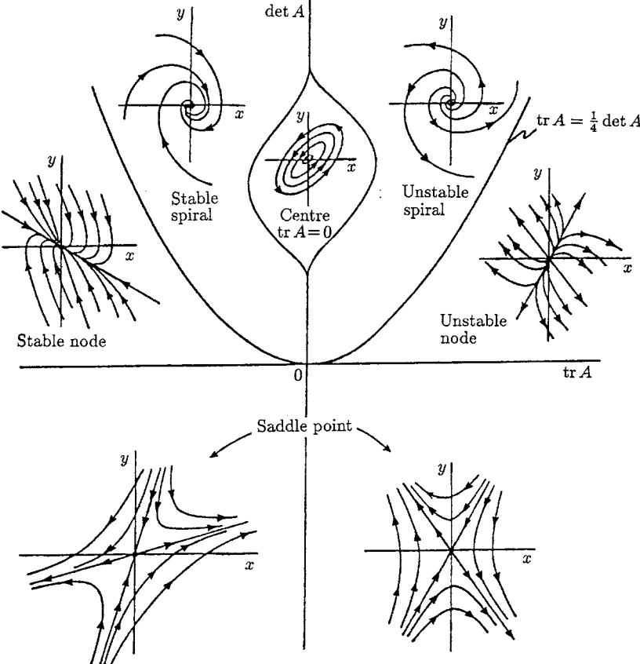

**Figure A.2.** Summary diagram showing how tr *A* and det *A*, where *A* is the linearisation matrix given by (A.4), determine the type of phase plane singularity for (A.1). Here det *A* = *fx gy* − *fy gx* , tr *A* = *fx* + *gy* , where the partial derivatives are evaluated at the singularities, the solutions of *f* (*x*, *y*) = *g*(*x*, *y*) = 0.

- **(iii)** λ1 = λ2 = λ. Here the eigenvalues are *not* distinct.
	- **(a)** In general, solutions now involve terms like *t* exp[λ*t*] and there is only one eigenvector **v** along which the solutions tend to (0, 0). The *t* in *t* exp[λ*t*] modifies the solution away from (0, 0). It is called a *node* (Type II) singularity, an illustration of which is given in Figure A.1(e).
	- **(b)** If the solutions do not contain the *t* exp[λ*t*] term we have a *star* singularity, which may be stable or unstable, depending on the sign of λ. Trajectories in the vicinity of a star singularity are shown in Figure A.1(f).

The singularity depends on *a*, *b*, *c* and *d* in the matrix *A* in (A.4). Figure A.2 summarises the results in terms of the trace and determinant of *A*.

If the system (A.1) possesses a confined set (that is, a domain on the boundary ∂*B* of which the vector (*dx*/*dt*, *dy*/*dt*) points into the domain) enclosing a single singular point which is an unstable spiral or node then any phase trajectory cannot tend to the singularity with time, nor can it leave the confined set. The *Poincare–Bendixson theorem ´* says that as *t* → ∞ the trajectory will tend to a limit cycle solution. This is the simplest application of the theorem. If the sole singularity is a saddle point a limit cycle cannot exist; see, for example, Jordan and Smith (1999) for a proof of the theorem, its general application and some practical illustrations.

*This page intentionally left blank*

# **Appendix B. Routh–Hurwitz Conditions, Jury Conditions, Descartes' Rule of Signs and Exact Solutions of a Cubic**

### **Appendix B.1 Characteristic Polynomials, Routh–Hurwitz Conditions and Jury Conditions**

Linear stability of the systems of ordinary differential equations such as arise in interacting population models and reaction kinetics systems (cf. Chapters 3 and 6) is determined by the roots of a polynomial. The stability analysis we are concerned with involves linear systems of the vector form

$$\frac{d\mathbf{x}}{dt} = A\mathbf{x},\tag{\mathbf{B.l}}$$

where *A* is the matrix of the linearised nonlinear interaction/reaction terms: it is the Jacobian matrix about the steady state—the community matrix in ecological terms. Solutions are obtained by setting

$$\mathbf{x} = \mathbf{x}_0 e^{\lambda t},\tag{\mathbf{B}.2}$$

in (B.1) where **x**0 is a constant vector and the eigenvalues λ are the roots of the *characteristic polynomial*

$$\left| \left| A - \lambda I \right| \right| = 0,\tag{\mathbb{B}.3}$$

where *I* is the identity matrix. The solution **x** = 0 is stable if all the roots λ of the characteristic polynomial lie in the left-hand complex plane; that is, Re λ < 0 for all roots λ. If this holds then **x** → 0 exponentially as *t* → ∞ and hence **x** = 0 is stable to small (linear) perturbations.

If the system is of *n*th order, the characteristic polynomial can be taken in the general form

$$P(\lambda) = \lambda^n + a_1 \lambda^{n-1} + \dots + a_n = 0,\tag{B.4}$$

where the coefficients *ai* , *i* = 0, 1,... , *n* are all real. We tacitly assume *an* = 0 since otherwise λ = 0 is a solution, and the polynomial is then of order *n* − 1 with the equivalent *an* = 0. We require conditions on the *ai* , *i* = 0, 1,... , *n* such that the zeros of *P*(λ) have Re λ < 0. The necessary and sufficient conditions for this to hold are the *Routh–Hurwitz conditions*. There are various equivalent forms of these, one of which is, together with *an* > 0,

$$\begin{aligned} D_1 &= a_1 > 0, \quad D_2 = \begin{vmatrix} a_1 & a_3 \\ 1 & a_2 \end{vmatrix} > 0, \quad D_3 = \begin{vmatrix} a_1 & a_3 & a_5 \\ 1 & a_2 & a_4 \\ 0 & a_1 & a_3 \end{vmatrix} > 0, \\\ D_k &= \begin{vmatrix} a_1 & a_3 & \cdot & \cdot & \cdot & \cdot \\ 1 & a_2 & a_4 & \cdot & \cdot & \cdot \\ 0 & a_1 & a_3 & \cdot & \cdot & \cdot \\ 0 & 1 & a_2 & \cdot & \cdot & \cdot \\ \cdot & \cdot & \cdot & \cdot & \cdot & \cdot \\ 0 & 0 & \cdot & \cdot & \cdot & a_k \end{vmatrix} > 0, \quad k = 1, 2, \dots, n. \end{aligned} \tag{B.5}$$

These conditions are derived, using complex variable methods, in standard texts on the theory of dynamical systems (see, for example, Willems 1970). As an example, for the cubic equation

$$
\lambda^3 + a_1 \lambda^2 + a_2 \lambda + a_3 = 0
$$

the conditions for Re λ < 0 are

$$a_1 > 0, \quad a_3 > 0; \quad a_1 a_2 - a_3 > 0.$$

Frankly it is hard to imagine anyone actually using the conditions for polynomials of order five or more.

Although (B.5) are the necessary and sufficient conditions we need, the usual algebraic relations between the roots and the polynomial coefficients can often be very useful. If λ1,... ,λ*n* are the distinct nonzero roots of (B.4) these are

$$\sum_{l=1}^{n} \lambda_l = -a_1, \quad \sum_{\substack{l,j\\l \neq j}}^{n} \lambda_l \lambda_j = a_2, \dots \quad \lambda_1 \lambda_2 \dots \lambda_n = (-1)^n a_n. \tag{B.6}$$

Lewis (1977) gives several useful ways of deriving qualitative results using the Routh–Hurwitz conditions together with network concepts directly on the matrices.

In the case of systems of discrete models for interacting populations (cf. Chapter 3), and with single population models with delay (cf. Chapter 2), stability is again determined by the roots of a characteristic polynomial (cf. Section 3.10 in Chapter 3). The linearised systems again give rise to matrix forms like (B.3) and hence polynomials like (B.4). With delay equations, with a delay of *n* time-steps say, we have to solve linear difference equations typically of the form

$$\mu_{l+1} = b_1 \mu_l + \dots + b_n \mu_{l-n}$$

((2.37) in Chapter 2 is an example). We solve this by setting *ut* ∝ λ*t* which again results in a polynomial in λ. Linear stability here however is determined by the magnitude of λ: stability requires | λ | < 1 since in this case *ut* → 0 as *t* → ∞. So, for the linear stability analysis of discrete systems we require conditions on the coefficients of the characteristic polynomial so that the solutions λ have magnitude less than 1. The *Jury conditions* are the conditions for this to be the case.

The Jury conditions are given, for example, in the book by Lewis (1977), who describes and illustrates several useful, analytical and numerical techniques concerning the size and signs of the roots of polynomials. For the polynomial *P*(*l*) in (B.4), let

$$\begin{aligned} b_n &= 1 - a_n^2, \quad b_{n-1} = a_1 - a_n a_{n-1}, \dots, \quad b_{n-j} = a_j - a_n a_{n-j}, \dots, \\ b_1 &= a_{n-1} - a_n a_1; \\ c_n &= b_n^2 - b_1^2, \quad c_{n-1} = b_n b_{n-1} - b_1 b_2, \dots, \\ c_{n-j} &= b_n b_{n-j} - b_1 b_{j+1}, \dots, \quad c_2 = b_n b_2 - b_1 b_{n-1}; \\ d_n &= c_n^2 - c_2^2, \dots, \quad d_{n-j} = c_n c_{n-j} - c_2 c_{j+2}, \dots, \quad d_3 = c_n c_3 - c_2 c_{n-1}; \end{aligned}$$

and so on until we are left with only three elements of the type

$$s_n = r_n^2 - r_{n-3}^2, \quad s_{n-1} = r_n r_{n-1} - r_{n-3} r_{n-2}, \quad s_{n-2} = r_n r_{n-2} - r_{n-3} r_{n-1}.$$

The Jury conditions (necessary and sufficient) which ensure that the roots of the polynomial *P*(λ) in (B.4) all have magnitudes less than 1 are:

$$\begin{aligned} &P(1) > 0, \quad (-1)_n P(-1) > 0, \\ &|\; |a_n| > 1, \quad |b_n| > |\; b_1 \; | , \\ &|\; |c_n| > |c_2|, \quad |\; d_n| > |\; d_3| , \dots \; \quad |\; s_n \; | \; s_{n-2} \; | .\end{aligned} \tag{B.7}$$

### **Appendix B.2 Descartes' Rule of Signs**

Consider the polynomial (B.4), and, as before, we take without loss of generality *an* > 0. Let *N* be the number of sign changes in the sequence of coefficients {*an*, *an*−1,... , *a*0}, ignoring any which are zero. Descartes' Rule of Signs says that there are at most *N* roots of (B.4), which are real and positive, and further, that there are *N*, *N* − 2 or *N* − 4,... real positive roots. By setting ω = −λ and again applying the rule, information is obtained about the possible real negative roots. Together these often give invaluable information on the sign of all the roots, which from a stability point of view is usually all we require.

As an example consider

$$a\lambda^3 + a_2\lambda^2 - a_1\lambda + a_0 = 0, \quad a_l > 0 \quad \text{for all} \quad l = 0, 1, 2. \tag{B.8}$$

There are two sign changes in the sequence of coefficients, and so there are either two or zero real positive roots. If we now set λ = −ω, the equation becomes

$$
\omega^3 - a_2 \omega^2 - a_1 \omega - a_0 = 0,
$$

which has one change of sign in the sequence, and so there is at most one real positive root ω. This means there is exactly one negative root λ of (B.8).

### **Appendix B.3 Roots of a General Cubic Polynomial**

Sometimes it is helpful to have the actual roots of the characteristic polynomial, however complicated they may be. Although it is possible to find these for polynomials higher than order three, the complexity is usually not worth the effort. The roots of a cubic are probably the most complicated that we would ever wish to have; simple derivations of these have been given by Miura (1980) and Namias (1985). Table B.1 gives the explicit forms of the roots of a cubic.

| 3<br>2<br>0,<br>λ<br>A<br>λ<br>B<br>λ<br>C<br>+<br>+<br>+<br>= | 2<br>3<br>3<br>b,<br>b,<br>A<br>B<br>β<br>a,<br>α<br>a<br>≡<br>≡<br>≡<br>−                                                                               | 3<br>2<br>3<br>b<br>C<br>+<br>a<br>a<br>≡<br>−                                                                              |
|----------------------------------------------------------------|----------------------------------------------------------------------------------------------------------------------------------------------------------|-----------------------------------------------------------------------------------------------------------------------------|
| 0<br>β<br>0<br>><br>α<br>=                                     | λ1<br>a<br>=<br>−                                                                                                                                        |                                                                                                                             |
|                                                                | 1<br>/<br>2<br>(<br>3<br>)<br>λ2<br>α<br>a<br>=<br>−                                                                                                     |                                                                                                                             |
|                                                                | 1<br>/<br>2<br>λ3<br>(<br>3<br>)<br>α<br>a<br>=<br>−<br>−                                                                                                |                                                                                                                             |
| 3<br>/<br>2<br>2<br> <br>β<br> <br>≤<br>α                      | 1<br>/<br>2<br>2<br>i<br>λ1<br>φ<br>α<br>s<br>n<br>a<br>=<br>−                                                                                           | −1<br>3<br>/<br>2]<br>(<br>1<br>/<br>3<br>)<br>i<br>{<br>/<br>2<br>}<br>φ<br>β<br>[<br>s<br>n<br>α<br>=                     |
|                                                                | 1<br>/<br>2<br>λ2<br>2<br>i<br>(<br>/<br>3<br>φ<br>)<br>+<br>s<br>n<br>π<br>α<br>a<br>=<br>−<br>−                                                        | /<br>6<br>φ<br>/<br>6<br>≤<br>≤<br>π<br>π<br>−                                                                              |
|                                                                | 1<br>/<br>2<br>2<br>i<br>(<br>/<br>3<br>)<br>λ3<br>φ<br>α<br>s<br>n<br>π<br>a<br>=<br>−<br>−                                                             |                                                                                                                             |
| 3<br>/<br>2<br>β<br>2<br>><br>α                                | 1<br>/<br>2<br>2<br>h<br>ψ<br>λ1<br>α<br>c<br>o<br>s<br>a<br>=<br>−<br>−                                                                                 | −1<br>3<br>/<br>2]<br>ψ<br>(<br>1<br>/<br>3<br>)<br>h<br>{<br> <br>β<br> <br>/<br>[<br>2<br>}<br>c<br>o<br>s<br>α<br>=      |
|                                                                | 1<br>/<br>2<br>1<br>/<br>2<br>h<br>(<br>3<br>)<br>i<br>h<br>λ2<br>ψ<br>i<br>ψ<br>+<br>α<br>c<br>o<br>s<br>a<br>α<br>s<br>n<br>=<br>−<br>−                |                                                                                                                             |
| 3<br>/<br>2<br>β<br>2<br><<br>α<br>−                           | 1<br>/<br>2<br>λ1<br>2<br>h<br>ψ<br>c<br>o<br>s<br>α<br>a<br>=<br>−<br>−                                                                                 |                                                                                                                             |
|                                                                | 1<br>/<br>2<br>1<br>/<br>2<br>h<br>ψ<br>(<br>3<br>)<br>i<br>h<br>ψ<br>λ2<br>i<br>+<br>α<br>c<br>o<br>s<br>a<br>α<br>s<br>n<br>=<br>−<br>−                |                                                                                                                             |
|                                                                | 1<br>/<br>2<br>1<br>/<br>2<br>h<br>i<br>h<br>λ3<br>ψ<br>i<br>(<br>3<br>)<br>ψ<br>c<br>o<br>s<br>s<br>n<br>α<br>a<br>α<br>=<br>−<br>−<br>−                |                                                                                                                             |
| 0<br>β<br>∞<br>∞<br>α<br><<br><<br>=<br>−                      | 1<br>/<br>3<br>β<br>λ1<br>a<br>=<br>−<br>−                                                                                                               |                                                                                                                             |
|                                                                | 1<br>/<br>3/<br>2<br>/<br>3/<br>β<br>2<br>3<br>β<br>4<br>λ2<br>i<br>+<br>a<br>=<br>−                                                                     |                                                                                                                             |
|                                                                | 1<br>/<br>3/<br>2<br>/<br>3/<br>λ3<br>β<br>2<br>3<br>i<br>β<br>4<br>a<br>=<br>−<br>−                                                                     |                                                                                                                             |
| 0<br>β<br><<br>∞<br><<br><<br>∞<br>α<br>−                      | 1<br>/<br>2<br>λ1<br>2<br>(<br>)<br>i<br>h<br>θ<br>s<br>n<br>α<br>a<br>=<br>−<br>−<br>−                                                                  | −1<br>3<br>/<br>2]<br>θ<br>(<br>1<br>/<br>3<br>)<br>i<br>h<br>{<br>β<br>/<br>[<br>2<br>(<br>)<br>}<br>s<br>n<br>α<br>=<br>− |
|                                                                | 1<br>/<br>2<br>1<br>/<br>2<br>(<br>)<br>i<br>h<br>θ<br>i<br>(<br>3<br>)<br>h<br>θ<br>λ2<br>+<br>α<br>s<br>n<br>a<br>α<br>c<br>o<br>s<br>=<br>−<br>−<br>− |                                                                                                                             |
|                                                                | 1<br>/<br>2<br>1<br>/<br>2<br>(<br>)<br>i<br>h<br>(<br>3<br>)<br>h<br>λ3<br>θ<br>i<br>θ<br>α<br>s<br>n<br>a<br>α<br>c<br>o<br>s<br>=<br>−<br>−<br>−<br>− |                                                                                                                             |

**Table B.1.** Explicit roots of the cubic polynomial *p*(λ) = λ3 + *A*λ2 + *B*λ + *C*, with *A*, *B* and *C* real.

*This page intentionally left blank*

# **Bibliography**

- [1] AIDS. Defeating AIDS: What will it take? *Sci. Amer.*, 279:61–87, July 1998.
- [2] D. Aikman and G. Hewitt. An experimental investigation of the rate and form of dispersal in grasshoppers. *J. Appl. Ecol.*, 9:807–817, 1972.
- [3] M. Alpert. Where have all the boys gone? *Sci. Amer.*, 279:22–23, 1998.
- [4] W. Alt and D.A. Lauffenburger. Transient behavior of a chemotaxis system modelling certain types of tissue inflamation. *J. Math. Biol.*, 24:691–722, 1987.
- [5] A.J. Ammerman and L.L. Cavalli-Sforza. Measuring the rate of spread of early farming. *Man*, 6:674–688, 1971.
- [6] A.J. Ammerman and L.L. Cavalli-Sforza. *The Neolithic Transition and the Genetics of Populations in Europe*. Princeton University Press, NJ, Princeton, 1983.
- [7] R.A. Anderson, E.M. Wallace, N.P. Groome, A.J. Bellis, and F.C. Wu. Physiological relationships between inhibin B, follicle stimulating hormone secretion and spermatogenesis in normal men and response to gonadotrophin suppression by exogenous testosterone. *Human Reproduction*, 12:746– 751, 1997.
- [8] R.M. Anderson. The epidemiology of HIV infection: variable incubation plus infectious periods and heterogeneity in sexual activity. *J. Roy. Stat. Soc. (A)*, 151:66–93, 1988.
- [9] R.M. Anderson and R.M. May. Directly transmitted infectious diseases: control by vaccination. *Science*, 215:1053–1060, 1982.
- [10] R.M. Anderson and R.M. May. Vaccination and herd immunity to infectious diseases. *Nature*, 318:323–329, 1985.
- [11] R.M. Anderson and R.M. May. The invasion, persistence and spread of infectious diseases within animal and plant communities. *Phil. Trans. Roy. Soc. Lond. B*, 314:533–570, 1986.
- [12] R.M. Anderson and R.M. May, editors. *Infectious Diseases of Humans: Dynamics and Control*. Oxford University Press, Oxford, 1991.
- [13] R.M. Anderson, G.F. Medley, R.M. May, and A.M. Johnson. A preliminary study of the transmission dynamics of the human immunodeficiency virus (HIV), the causitive agent of AIDS. *IMA J. Maths. Appl. in Medicine and. Biol.*, 3:229–263, 1986.
- [14] R.M. Anderson and W. Trewhella. Population dynamics of the badger (Meles meles) and the epidemiologyof bovine tuberculosis (Mycobacterium bovis). *Phil. Trans. R. Soc. Lond. B*, 310:327–381, 1985.
- [15] K. Aoki. Gene-culture waves of advance. *J. Math. Biol.*, 25:453–464, 1987.
- [16] R. Arnold, K. Showalter, and J.J. Tyson. Propagation of chemical reactions in space. *J. Chem. Educ.*, 64:740–742, 1987. Translation of: Luther, R.-L.: Rauemliche Fortpflanzung Chemischer Reaktionen. In: Z. fur Elektrochemie und angew. physikalische Chemie. vol. 1232, pp. 506-600, 1906. ¨
- [17] D.G. Aronson. Density-dependent interaction-diffusion systems. In W.E. Stewart, W.H. Ray, and C.C. Conley, editors, *Dynamics and Modelling of Reactive Systems*, pages 161–176. Academic Press, New York, 1980.
- [18] J.-P. Aubin. *Viability Theory*. Birkhauser, Boston-Basel-Berlin, 1991. ¨
- [19] D. Avnir, O. Biham, D. Lidar, and O. Malcai. Is the geometry of nature fractal? *Science*, 279:39–40, 1998.
- [20] P. Bacchetti, M.R. Segal, and N.P. Jewell. Backcalculation of HIV infection rates. *Statist. Sci.*, 8:82–101, 1993.
- [21] P.F. Baconnier, G. Benchetrit, P. Pachot, and J. Demongeot. Entrainment of the respiratory rhythm: a new approach. *J. theor. Biol.*, 164:149–162, 1993.
- [22] N.T.J. Bailey. *The Mathematical Theory of Infectious Diseases*. Griffin, London, second edition, 1975.
- [23] D. Barkley, J. Ringland, and J.S. Turner. Observations of a torus in a model for the Belousov-Zhabotinskii reaction. *J. Chem. Phys.*, 87:3812–3820, 1987.
- [24] J.B. Bassingthwaighte, L.S. Liebovitch, and B.J. West. *Fractal Physiology*. Oxford University Press, New York, 1994.
- [25] M.T. Beck and Z.B. Varadi. One, two and three-dimensiona ´ l spatially periodic chemical reactions. *Nature*, 235:15–16, 1972.
- [26] J.R. Beddington, C.A. Free, and J.H. Lawton. Dynamic complexity in predator-prey models framed in difference equations. *Nature*, 255:58–60, 1975.
- [27] J.R. Beddington and R.M. May. Harvesting natural populations in a randomly fluctuating environment. *Science*, 197:463–465, 1977.
- [28] B.P. Belousov. An oscillating reaction and its mechanism. In *Sborn. referat. radiat. med. (Collection of abstracts on radiation medicine)*, page 145. Medgiz, Moscow, 1959.
- [29] B.P. Belousov. A periodic reaction and its mechanism. In R.J. Field and M. Burger, editors, *Oscillations and Travelling Waves in Chemical Systems, 1951, (from his archives (in Russian))*, pages 605–613. John Wiley, New York, 1985.
- [30] G. Benchetrit, P. Baconnier, and J. Demongeot. *Concepts and Formalizations in the Control of Breathing*. Manchester University Press, Manchester, 1987.
- [31] L.M. Benedict, E. Abell, and B. Jegasothy. Telogen effluvium associated with eosinophilia-myalgia syndrome. *A. American Acad. Dermatol.*, 25:112–114, 1991.
- [32] E. Benoit, J.L. Callot, F. Diener, and M. Diener. Chasse au canard. *Collectanea Mathematica*, 32:37– 119, 1981.
- [33] D.E. Bentil and J.D. Murray. Pattern selection in biological pattern formation mechanisms. *Appl. Maths. Letters*, 4:1–5, 1991.
- [34] D.E. Bentil and J.D. Murray. Modelling bovine tuberculosis in badgers. *J. Animal Ecol.*, 62:239–250, 1993.
- [35] P.M. Bentler and M.D. Newcomb. Longitudinal study of marriage success and failure. *J. Consulting and Clinical Psychol.*, 46:1053–1070, 1978.
- [36] M.J. Benton. *Vertebrate Palaeontology*. Chapman and Hall, London, 1997.
- [37] C. Berding. On the heterogeneity of reaction-diffusion generated patterns. *Bull. Math. Biol.*, 49:233– 252, 1987.
- [38] C. Berding, A.E. Keymer, J.D. Murray, and A.F.G. Slater. The population dynamics of acquired immunity to helminth infections. *J. theor. Biol.*, 122:459–471, 1986.
- [39] C. Berding, A.E. Keymer, J.D. Murray, and A.F.G. Slater. The population dynamics of acquired immunity to helminth infections: experimental and natural infections. *J. theor. Biol.*, 126:167–182, 1987.
- [40] D. Bernoulli. Essai d'une nouvelle analyse de la mortalite caus ´ ee par la petite v ´ erole, et des avantages ´ de l'inoculation pour la prevenir. ´ *Histoire de l'Acad. Roy. Sci. (Paris) avec Mem. des Math. et Phys. ´ and Mem. ´* , pages 1–45, 1760.
- [41] E.N. Best. Null space in the Hodgkin-Huxley equations: a critical test. *Biophys. J*, 27:87–104, 1979.
- [42] J.A.M. Borghans, R.J. DeBoer, and L.A. Segel. Extending the quasi-steady state approximation by changing variables. *Bull. Math. Biol.*, 58:43–63, 1996.
- [43] F. Brauer and D.A. Sanchez. Constant rate population harvesting: equilibrium and stability. *Theor. Population Biol.*, 8:12–30, 1975.
- [44] W.C. Bray. A periodic reaction in homogeneous solution and its relation to catalysis. *J. Amer. Chem. Soc.*, 43:1262–1267, 1921.
- [45] N.F. Britton. *Reaction-Diffusion Equations and their Applications to Biology*. Academic Press, New York, 1986.
- [46] N.F. Britton and J.D. Murray. The effect of carbon monoxide on haem-facilitated oxygen diffusion. *Biophys. Chem.*, 7:159–167, 1977.
- [47] M. Brøns and K. Bar-Eli. Canard explosion and excitation in a model of the Belousov-Zhabotinsky reaction. *J. Physical Chem.*, 95:8706–8713, 1991.
- [48] J.A. Brown, S. Harris, and P.C.L. White. Persistence of *mycobacterium bovis* in cattle. *Trends Microbiol.*, 2:43–46–8713, 1994.
- [49] BTEC. The Australian brucellosis and tuberculosis eradication campaign. Technical Report 97, AGPS, Canberra, 1987.
- [50] J.T. Buchanan and A.H. Cohen. Activities of identified interneurons, motorneurons, and muscle fibers during fictive swimming in the lamprey and effects of reticulospinal and dorsal cell stimulation. *J. of Neurophys.*, 47:948–960, 1982.
- [51] J. Buck. Synchronous rhythmic flashing of fireflies. II [published erratum appears in Q. Rev. Biol. 1989 Jun;64(2):146]. *Q. Rev. Biol.*, 63(3):265–289, 1988.
- [52] J. Buck and E. Buck. Synchronous fireflies. *Sci. Amer.*, 234(5):74–79,82–85, 1976.
- [53] M.A. Burke, P.K. Maini, and J.D. Murray. On the kinetics of suicide substrates. *Biophys. Chem.*, 37:81–90, 1990. Jeffries Wyman Anniversary Volume.
- [54] H.R. Bustard. Breeding the gharial (*Gavialis gangeticus*): captive breeding a key conservation strategy for endangered crocodiles. In *The Structure, Development and Evolution of Reptiles*, volume 52 of *Symp. Zool. Soc. Lond.*, pages 385–406, London, 1984. Academic Press.
- [55] A.E. Butterworth, M. Kapron, J.S. Cordingley, P.R. Dalton, D.W. Dunne, H.C. Kariuki, G. Kimani, D. Koech, M. Mugambi, J.H. Ouma, M.A. Prentice, B.A. Richardson, T.K. Arap Siongok, R.F. Sturrock, and D.W. Taylor. Immunity after treatment of human schistomiasis mansoni. II. Identification of resistant individuals and analysis of their immune responses. *Trans. Roy. Soc. Trop. Med. Hyg.*, 79:393–408, 1985.
- [56] J.W. Cahn. Free energy of a non-uniform system. II. Thermodynamic basis. *J. Chem. Phys.*, 30:1121– 1124, 1959.
- [57] J.W. Cahn and J.E. Hilliard. Free energy of a non-uniform system. I. Interfacial free energy. *J. Chem. Phys.*, 28:258–267, 1958.
- [58] J.W. Cahn and J.E. Hilliard. Free energy of a non-uniform system. III. Nucleation in a two-component incompressible fluid. *J. Chem. Phys.*, 31:688–699, 1959.
- [59] J. Canosa. On a nonlinear diffusion equation describing population growth. *IBM J. Res. and Dev.*, 17:307–313, 1973.
- [60] V. Capasso and S.L. Paveri-Fontana. A mathematical model for the 1973 cholera epidemic in the European Mediterranean region. *Rev. Epidem. et Sant ´ e Publ. ´* , 27:121–132, 1979.
- [61] C. Carelli, F. Audibert, J. Gaillard, and L. Chedid. Immunological castration of male mice by a totally synthetic vaccine administered in saline. *Proc. Nat. Acad. Sci. U.S.A.*, 79:5392–5395, 1982.
- [62] R.L. Carroll. *Vertebrate Palaeontology and Evolution*. Freeman, New York, 1988.
- [63] M. Cartwright and M.A. Husain. A model for the control of testosterone secretion. *J. theor. Biol.*, 123:239–250, 1986.
- [64] F. Caserta, H.E. Stanley, W.D. Eldred, G. Daccord, R.E. Hausman, and J. Nittman. Physical mechanism underlying neurite outgrowth: a quantitative analysis of neuronal shape. *Phys. Rev. Lett.*, 64:95–98, 1990.
- [65] H. Caswell, editor. *Matrix Population Models: Construction, Analysis, and Interpretation*. Sinauer Associates, Sunderland, MA, 1989.
- [66] B. Charlesworth. *Evolution in Age-structured Populations*. Cambridge University Press, Cambridge, 1980.
- [67] E.L. Charnov and J. Bull. When is sex environmentally determined? *Nature*, 266:828–830, 1977.
- [68] A. Cheer, R. Nuccitelli, G.F. Oster, and J.-P. Vincent. Cortical activity in vertebrate eggs I: The activation waves. *J. theor. Biol.*, 124:377–404, 1987.
- [69] C.L. Cheeseman, Wilesmith J.W., and F.A. Stuart. Tuberculosis: the disease and its epidemiology in the badger, a review. *Epid. Inf.*, 103:113–125, 1989.
- [70] C.L. Cheeseman, Wilesmith J.W., F.A. Stuart, and P.J. Mallinson. Dynamics of tuberculosis in a naturally infected badger population. *Mammal Review*, 18:61–72, 1988.
- [71] C.W. Clark. *Mathematical Bioeconomics, the optimal control of renewable resources*. John Wiley, New York, 1976a.
- [72] C.W. Clark. A delayed-recruitment model of population dynamics with an application to baleen whale populations. *J. Math. Biol.*, 3:381–391, 1976b.
- [73] C.W. Clark. *Bioeconomics Modeling and Fishery Management*. Wiley Interscience, New York, 1985.
- [74] C.W. Clark. *Mathematical Bioeconomics*. John Wiley, New York, 1990.
- [75] E.D. Clements, E.G. Neal, and D.W. Yalden. The national badger sett survey. *Mammal Review*, 18:1–9, 1988.
- [76] A.H. Cohen and R.M. Harris-Warrick. Strychnine eliminates alternating motor output during fictive locomotion in lamprey. *Brain Res.*, 293:164–167, 1984.
- [77] A.H. Cohen, P.J. Holmes, and R.R. Rand. The nature of coupling between segmental oscillators and the lamprey spinal generator for locomotion: a mathematical model. *J. Math. Biol.*, 13:345–369, 1982.
- [78] A.H. Cohen, S. Rossignol, and S. Grillner, editors. *Neural Control of Rhythmic Movements in Vertebrates*. John Wiley, New York, 1988.
- [79] A.H. Cohen and P. Wallen. The neuronal correlate of locomotion in fish. ´ *Exp. Brain Res.*, 41:11–18, 1980.
- [80] D.S. Cohen and J.D. Murray. A generalized diffusion model for growth and dispersal in a population. *J. Math. Biol.*, 12:237–249, 1981.
- [81] J.E.R. Cohen and J.D. Murray. On nonlinear convection dispersal effects in an interacting population model. *SIAM J. Appl. Math.*, 43:66–78, 1983.
- [82] Y. Cohen, editor. *Applications of Control Theory in Ecology*, volume 73 of *Lect. Notes in Biomathematics*. Springer-Verlag, Berlin-Heidelberg-New York, 1987.
- [83] E.H. Colbert and M. Morales. *Evolution of the Vertebrates: A History of Backboned Animals through Time*. Wiley and Liss, New York, 1991.
- [84] L.C. Cole. The population consequences of life history phenomena. *Q. Rev. Biol.*, 29:103–137, 1954.
- [85] H. Connor, H.F. Woods, J.G.G. Ledingham, and J.D. Murray. A model of L+ lactate metabolism in normal man. *Annals of Nutrition and Metabolism*, 26:254–263, 1982a.
- [86] H. Connor, H.F. Woods, J.D. Murray, and J.G.G. Ledingham. Utilisation of L+ lactate in patients with liver disease. *Annals of Nutrition and Metabolism*, 26:308–314, 1982b.
- [87] J. Cook, R.C. Tyson, J. White, R. Rushe, J. Gottman, and J.D. Murray. Mathematics of marital conflict: qualitative dynamic mathematical modeling of marital interaction. *J. Family Psychology*, 9:110–130, 1995.
- [88] O. Cosivi, J.M. Grange, C.J. Daborn, et al. Zoonotic tuberculosis due to *Mycobacterium bovis* in developing countries. *Emerging Infectious Diseases*, 4:59–69, 1998.
- [89] M. Cosnard and J. Demongeot. Attracteurs: une approche deterministe. ´ *C. R. Acad. Sci.*, 300:551– 556, 1985.
- [90] J. Crank. *The Mathematics of Diffusion*. Clarendon Press, Oxford, 1975.
- [91] S.S. Cross. The application of fractal geometric analysis to microscopic images. *Micron*, 1:101–113, 1994.
- [92] S.S. Cross and D.W.K. Cotton. Chaos and antichaos in pathology. *Human Pathol.*, 25:630–637, 1994.
- [93] P. Cvitanovic.´ *Universality in Chaos*. Adam Hilger, Bristol, 1984.
- [94] C.J. Daborn and J.M. Grange. HIV/AIDS and its implications for the control of animal tuberculosis. *Brit. Vet. J.*, 149:405–417, 1993.
- [95] J.C. Dallon and H.G. Othmer. A discrete cell model with adaptive signalling for aggregation of *Dictyostelium discoideum*. *Phil. Trans. R. Soc. Lond. B*, 352:391–417, 1997.
- [96] P. DeBach. *Biological Control by Natural Enemies*. Cambridge University Press, Cambridge, 1974.
- [97] R.J. DeBoer and A.S. Perelson. T-cell repertoires and competitive exclusion. *J. theor. Biol.*, 169:375– 390, 1994.
- [98] O. Decroly and A. Goldbeter. From simple to complex oscillatory behaviour: analysis of bursting in a multiply regulated biochemical system. *J. theor. Biol.*, 124:219–250, 1987.
- [99] D.C. Deeming and M.W.J. Ferguson. Environmental regulation of sex determination in reptiles. *Phil. Trans. R. Soc. Lond. B*, 322:19–39, 1988.
- [100] D.C. Deeming and M.W.J. Ferguson. The mechanism of temperature dependent sex determination in crocodilians: a hypothesis. *Am. Zool.*, 29:973–985, 1989a.
- [101] D.C. Deeming and M.W.J. Ferguson. In the heat of the nest. *New Scientist*, 25:33–38, 1989b.
- [102] D. Dellwo, H.B. Keller, B.J. Matkowsky, and E.L. Reiss. On the birth of isolas. *SIAM J. Appl. Math.*, 42:956–963, 1982.
- [103] J. Demongeot and C. Jacob. Confineurs: une approche stochastique. *C.R. Acad. Sci.*, 56:206–210, 1989.
- [104] J. Demongeot, P.M. Kulesa, and J.D. Murray. Compact set valued flows: Applications in biological modelling. *Acta Biotheoretica*, 44:349–358, 1996.
- [105] J. Demongeot, P. Pachot, P. Baconnier, G. Benchetrit, S. Muzzin, and T. Pham Dinh. Entrainment of the respiratory rhythm: concepts and techniques of analysis. In G. Benchetrit, P. Baconnier, and J. Demongeot, editors, *Concepts and Formalizations in the Control of Breathing*, pages 217–232. Manchester University Press, Manchester, 1987.
- [106] O. Diekman, J.A.P. Heesterbeek, and J.A.J. Metz. On the definition and the computation of the basic reproduction ratio *R*0 in models for infectious diseases in heterogeneous populations. *J. Math. Biol.*, 28:365–382, 1990.
- [107] O. Diekmann and J.A.P. Heesterbeek. *Mathematical Epidemiology of Infectious Diseases: Model Building, Analysis and Interpretation*. John Wiley, New York, 2000.
- [108] D.C. Dietz and T.C. Hines. Alligator nesting in North Central Florida. *Copeia*, 2:249–258, 1980.
- [109] K. Dietz. The population dynamics of onchocersiasis. In R.M. Anderson, editor, *Population Dynamics of Infectious Diseases*, pages 209–241. Chapman and Hall, London, 1982.
- [110] K. Dietz and K.P. Hadeler. Epidemiological models for sexually transmitted diseases. *J. Math. Biol.*, 26:1–25, 1988.
- [111] K. Dietz and D. Schenzle. Mathematical models for infectious disease statistics. In *A Celebration of Statistics: The ISI (International Statistics Institute) Centenary Volume*, pages 167–204. Springer-Verlag, New York, 1985.
- [112] C.A. Donnelly, N.M. Ferguson, A.C. Ghani, M.E.J. Woolhouse, C. J. Watt, and R.M. Anderson. The epidemiology of BSE in cattle herds in great britain. I Epidemiological processes, demography of cattle and approaches to control and culling. *Phil. Trans. R. Soc. Lond. B*, 352:781–801, 1997.
- [113] S. Douady and Y. Couder. Phyllotaxis as a physical self-organised growth process. *Phys. Rev. Letters*, 68:2098–2101, 1992.
- [114] S. Douady and Y. Couder. La physique des spirales veg´ etales. ´ *La Recherche*, 24(250):26–35, 1993a.
- [115] S. Douady and Y. Couder. Phyllotaxis as a self-organised growth process. In J.M. Garcia-Ruiz et al., editors, *Growth Patterns in Physical Sciences and Biology*. Plenum Press, New York, 1993b.
- [116] R.D. Driver. *Ordinary and Delay Differential Equations*. Springer-Verlag, Berlin-Heidelberg-New York, 1977.
- [117] P. Duesberg. *Inventing the AIDS Virus*. Regnery Press, Washington D.C. Lanham MD, 1996.
- [118] P. Duffy, J. Wolf, et al. Possible person-to-person transmission of Creitzfeldt-Jakob disease. *N. Engl. J. Med.*, 290:692–693, 1974.
- [119] R.G. Duggleby. Progress curves of reactions catalyzed by unstable enzymes. A theoretical approach. *J. theor. Biol.*, 123:67–80, 1986.
- [120] D.J.D. Earn, P. Rohani, and B.T. GRenfell. Persistence, chaos and synchrony in ecology and epidemiology. *Proc. R. Soc. Lond. B*, 265:7–10, 1998.
- [121] E.C. Edblom and I.R. Epstein. A new iodate oscillator and Landolt reaction with ferrocyanide in a CSTR. *J. Amer. Chem. Soc.*, 108:2826–2830, 1986.
- [122] L. Edelstein-Keshet. *Mathematical Models in Biology*. Random House, New York, 1988.
- [123] P. Ekman and W.V. Friesen. *Facial Action Coding System*. Consulting Psychologist Press, Palo Alto, CA, 1978.
- [124] C.S. Elton. *The Ecology of Invasions by Animals and Plants*. Methuen, London, 1958.
- [125] C.S. Elton and M. Nicholson. The ten-year cycle in numbers of lynx in Canada. *J. Anim. Ecol.*, 191:215–244, 1942.
- [126] G.B. Ermentrout. n:m phase-locking of weakly coupled oscillators. *J. Math. Biol.*, 12:327–342, 1981.
- [127] G.B. Ermentrout. An adaptive model for synchrony in the firefly *pteroptyx malaccae*. *J. Math. Biol.*, 29:571–585, 1991.
- [128] P. Essunger and A.S. Perelson. Modeling HIV infection of CD4+ T-cell subpopulations. *J. theor. Biol.*, 170:367–391, 1994.
- [129] L. Euler. A general investigation into the mortality and multiplication of the human species. *Theor. Popl. Biol.*, 1:307–314, 1970. (Reprinted from: Euler, Leonhard. "Recherches gen´ erales sur la mor- ´ talite et la multiplication du genre humain," ´ *Histoire de l' Academie Royale des Sciences et Belles- ´ Lettres*, annee 1760, pp. 144-164, Berlin, 1767.). ´
- [130] K.J. Falconer. *Fractal Geometry. Mathematical foundations and Applications*. John Wiley and sons, Ithaca, New York, 1990.
- [131] E.V. Famiglietti. New metrics for analysis of dendritic branching patterns. Demonstrating similarities in ON and ON-OFF directionally selective retinal gangliion cells. *J. Compar. Neurol*, 324:295–321, 1992.
- [132] M.J. Feigenbaum. Quantitative universality for a class of nonlinear transformations. *J. Stat. Phys.*, 19:25–52, 1978.
- [133] M.W.J. Ferguson. Reproductive biology and embryology of the crocodilians. In C. Gans, F. Billet, and P. Maderson, editors, *Biology of the Reptilia*, volume 14A, pages 329–491. John Wiley and Sons, New York, 1985.
- [134] M.W.J. Ferguson and T. Joanen. Temperature of egg-incubation determines sex in *Alligator mississippiensis*. *Nature*, 296:850–853, 1982.
- [135] M.W.J. Ferguson and T. Joanen. Temperature-dependent sex determination in *Alligator mississippiensis*. *J. Zool. Lond.*, 200:143–177, 1983.
- [136] N.M. Ferguson, C.A. Donnelly, M.E.J. Woolhouse, and R.M. Anderson. The epidemiology of BSE in cattle herds in great britain. II model construction and anlysis of transmission dynamics. *Phil. Trans. R. Soc. Lond. B*, 352:803–838, 1997.
- [137] R. Ferriere and M. Gatto. Chaotic population dynamics can result from natural selection. ` *Proc. R. Soc. Lond. B*, 251:33–38, 1993.
- [138] V.A. Ferro, J.E. O'Grady, J. Notman, and W.H. Stimson. Development of a GnRH-neutralising vaccine for use in hormone dependent disorders. *Therapeutic Immunol.*, 2:147–157, 1995.
- [139] V.A. Ferro and W.H. Stimson. Effects of adjuvant, dose and carrier pre-sensitization on the efficacy of a GnRH analogue. *Drug Design and Discovery*, 14:179–195, 1996.
- [140] V.A. Ferro and W.H. Stimson. Fertility disrupting potential of synthetic peptides derived from the beta subunit of follicles stimulating hormone. *Amer. J. Reprod. Immunol.*, 40:187–197, 1998.
- [141] R.J. Field and M. Burger, editors. *Oscillations and Travelling Waves in Chemical Systems*. John Wiley, New York, 1985.
- [142] R.J. Field, E. Kor¨ os, and R.M. Noyes. Oscillations in chemical systems, Part 2. Thorough analysis of ¨ temporal oscillations in the bromate-cerium-malonic acid system. *J. Am. Chem. Soc.*, 94:8649–8664, 1972.
- [143] R.J. Field and R.M. Noyes. Oscillations in chemical systems, IV. limit cycle behaviour in a model of a real chemical reaction. *J. Chem. Phys.*, 60:1877–1884, 1974.
- [144] P.C. Fife. Mathematical aspects of reacting and diffusing systems. In *Lect. Notes in Biomathematics*, volume 28. Springer-Verlag, Berlin-Heidelberg-New York, 1979.
- [145] P.C. Fife and J.B. McLeod. The approach of solutions of nonlinear diffusion equations to travelling wave solutions. *Archiv. Rat. Mech. Anal.*, 65:335–361, 1977.
- [146] F.D. Fincham, T.N. Bradbury, and C.K. Scott. Cognition in marriage. In F.D. Fincham and T.N. Bradbury, editors, *The Psychology of Marriage*, pages 118–149. Guildford, New York, 1990.
- [147] G.H. Fisher. Preparation of ambiguous stimulus material. *Perception and Psychophysics*, 2:421–422, 1967.
- [148] R.A. Fisher. The wave of advance of advantageous genes. *Ann. Eugenics*, 7:353–369, 1937.
- [149] R.A. Fisher. *The Genetical Theory of Natural Selection*. Dover, New York, 1958. (Reprint of 1930 edition).
- [150] R. FitzHugh. Impulses and physiological states in theoretical models of nerve membrane. *Biophys. J.*, 1:445–466, 1961.
- [151] J.C. Flores. A mathematical model for neanderthal extinction. *J. theor. Biol.*, 191:295–298, 1998.
- [152] K.R. Foster, M.E. Jenkins, and A. C. Toogood. The Philadelphia Yellow Fever Epidemic of 1793. *Sci. Amer.*, pages 88–93, August 1998.
- [153] B.J. Fowers and D.H. Olson. Predicting marital success with prepare: a predictive validity study. *J. Marital and Family Therapy*, 12:403–413, 1986.
- [154] A.C. Fowler. *Mathematical Models in the Applied Sciences*. Cambridge University Press, Cambridge, 1997.
- [155] A.C. Fowler and G.P. Kalamangalam. The role of the central chemoreceptor in causing periodic breathing. *IMA J. Math. Appl. Medic. and Biol.*, 17:147–167, 2000.
- [156] J.P. Fox, I. Elveback, W. Scott, L. Gatewood, and E. Ackerman. Herd immunity: basic concept and relevance to public health immunization practice. *Am. J. of Epidemiology*, 94:179–189, 1971.
- [157] M.A. Freed and P. Sterling. The ON-alpha ganglion cell of the cat retina and its presynaptic cell types. *J. Neurosci.*, 8:2303–2320, 1988.
- [158] C.L. Frenzen and P.K. Maini. Enzyme kinetics for a two-step enzymatic reaction with comparable initial enzyme-substrate ratios. *J. Math. Biol.*, 26:689–703, 1988.
- [159] R.R. Frerichs and J. Prawda. A computer simulation model for the control of rabies in an urban area of Colombia. *Management Science*, 22:411–421, 1975.
- [160] S.D.W. Frost and A.R. McLean. Germinal center destruction as a major pathway of HIV pathogenesis. *J. AIDS*, 7:236–244, 1994.
- [161] N. Ganapathisubramanian and K. Showalter. Bistability, mushrooms and isolas. *J. Chem. Phys.*, 80:4177–4184, 1984.
- [162] C. Gans, F. Billet, and P.F.A. Maderson, editors. *Biology of the Reptilia*, volume Volume 14A, Development. John Wiley and Sons, New York, 1985.
- [163] L. Garrett. *The Coming Plague: Newly Emerging Diseases in a World Out of Balance*. Penquin, U.S.A., New York, 1994.
- [164] L. Garrett. The return of infectious disease. *Foreign Affairs*, 75:66–79, 1996.
- [165] V. Gasp ´ ar and K. Showalter. A simple model for the oscillatory iodate oxidation of sulfite ferro- ´ cyanide. *J. Physical Chem.*, 94:4973–4979, 1990.
- [166] A. Georges. Female turtles from hot nests: is it duration of incubation or proportion of development at high temperatures that matters? *Oecologia*, 81:323–328, 1989.
- [167] A. Georges, C. Limpus, and R. Stoutjesdijk. Hatchling sex in the marine turtle *Caretta caretta* is determined by proportion of development at a temperature, not daily duration of exposure. *J. Exp. Zool.*, 270:432–444, 1994.
- [168] W.M. Getz and R.G. Haight. *Population Harvesting Demographic Models of Fish, Forest, and Animal Resources*. Princeton University Press, NJ, Princeton, NJ, 1989.
- [169] A. Gierer and H. Meinhardt. A theory of biological pattern formation. *Kybernetik*, 12:30–39, 1972.
- [170] J.C. Gilkey, L.F. Jaffe, E.B. Ridgeway, and G.T. Reynolds. A free calcium wave traverses the activating egg of *Oryzias latipes*. *J. Cell. Biol.*, 76:448–466, 1978.
- [171] M.E. Gilpin. Do hares eat lynx? *Amer. Nat.*, 107:727–730, 1973.
- [172] L. Glass and M.C. Mackey. Pathological conditions resulting from instabilities in physiological control systems. *Ann. N. Y. Acad. Sci.*, 316:214–235, 1979.
- [173] L. Glass and M.C. Mackey. *From Clocks to Chaos: The Rhythms of Life*. Princeton University Press, NJ, Princeton, 1988.
- [174] R.W. Glenny, S. McKinney, and H.T. Robertson. Spatial pattern of pulmonary blood flow distribution is stable over days. *J. Appl. Physiol.*, 82:902–907, 1997.
- [175] R.W. Glenny, N.L. Polissar, S. McKinney, and H.T. Robertson. Temporal heterogeneity of regional pulmonary perfusion is spatially clustered. *J. Appl. Physiol.*, 79:986–1001, 1995.
- [176] R.W. Glenny and H.T. Robertson. Fractal properties of pulmonary blood flow: characterization of spatial heterogeneity. *J. Appl. Physiol.*, 69:532–545, 1990.
- [177] R.W. Glenny and H.T. Robertson. Applications of fractal analysis to physiology. *J. Appl. Physiol.*, 70:2351–2367, 1991.
- [178] R.W. Glenny and H.T. Robertson. Fractal modeling of pulmonary blood flow heterogeneity. *J. Appl. Physiol.*, 70:1024–1030, 1991.
- [179] R.W. Glenny and H.T. Robertson. A computer simulation of pulmonary perfusion in three dimensions. *J. Appl. Physiol.*, 79:357–369, 1995.
- [180] B.-S. Goh. *Management and Analysis of Biological Populations*. Elsevier Sci. Pub., Amsterdam, 1982.
- [181] A. Goldbeter. Models for oscillations and excitability in biochemical systems. In L.A. Segel, editor, *Mathematical Models in Molecular and Cellular Biology*, pages 248–291. Cambridge University Press, Cambridge, 1980.
- [182] A. Goldbeter. *Biochemical Oscillations and Cellular Rhythms. The molecular bases of periodic and chaotic behaviour*. Cambridge University Press, Cambridge, 1996.
- [183] S. Goldstein and J.D. Murray. On the mathematics of exchange processes in fixed columns. III. The solution for general entry conditions, and a method of obtaining asymptotic expressions. IV. Limiting values, and correction terms, for the kinetic-theory solution with general entry conditions. V. The equilibrium-theory and perturbation solutions, and their connection with kinetic-theory solutions, for general entry conditions. *Proc. R. Soc. Lond. A*, 257:334–375, 1959.
- [184] B.C. Goodwin. Oscillatory behaviour in enzymatic control processes. *Adv. in Enzyme Regulation*, 3:425–438, 1965.
- [185] T.M. Goodwin and W.R. Marion. Aspects of the nesting ecology of American alligators (*Alligator mississippiensis*) in North Central Florida. *Herpetologica*, 34:43–47, 1978.
- [186] J.M. Gottman. *Marital Interaction: Experimental Investigations*. Academic Press, New York, 1979.
- [187] J.M. Gottman. How marriages change. In G.R. Patterson, editor, *Advances in Family Research. Depression and Aggression in Family Interaction*, pages 75–101. Lawrence Erlbaum, Hillsdale, NJ, 1990.
- [188] J.M. Gottman. The roles of conflict engagement, escalation, or avoidance in marital interaction: A longitudinal view of five types of couples. *J. Consulting and Clinical Psychol.*, 61:6–15, 1993.
- [189] J.M. Gottman. *What Predicts Divorce?* Lawrence Erlbaum, Hillsdale, NJ, 1994.
- [190] J.M. Gottman. Psychology and the study of marital processes. *Annu. Rev. Psychol.*, 49:169–197, 1998.
- [191] J.M. Gottman and R.W. Levenson. Marital processes predictive of later dissolution: behavior, psychology, and health. *J. Personality and Social Psychol.*, 63:221–233, 1992.
- [192] J.M. Gottman, J.D. Murray, C. Swanson, R.C. Tyson, and K.R. Swanson. *The Mathematics of Marriage: Dynamic Nonlinear Models*. MIT Press, Cambridge, MA, 2002.
- [193] J.M. Gottman, C.B. Swanson, and J.D. Murray. The mathematics of marital conflict: dynamic mathematical nonlinear modeling of newlywed marital interaction. *J. Family Psychol.*, 13:1–17, 1999.
- [194] P. Gray. Instabilities and oscillations in chemical reactions in closed and open systems. *Proc. R. Soc. Lond. A*, 415:1–34, 1988.
- [195] P. Gray and S.K. Scott. Autocatalytic reactions in the isothermal continuous stirred tank reactor. *Chem. Eng. Sci.*, 38:29–43, 1983.
- [196] P. Gray and S.K. Scott. A new model for oscillatory behaviour in closed systems: the autocatalator. *Ber. Bunsenges. Phys. Chem.*, 90:985–996, 1986.
- [197] J.S. Griffith. Mathematics of cellular control processes. I. Negative feedback to one gene. II. Positive feedback to one gene. *J. theor. Biol.*, 20:202–216, 1968.
- [198] S. Grillner. On the generation of locomotion in the spinal dogfish. *Exp. Brain Res.*, 20:459–470, 1974.
- [199] S. Grillner and S. Kashin. On the generation and performance of swimming fish. In R.M. Herman, S. Grillner, P.S.G. Stein, and D.G. Stuart, editors, *Neural Control of Locomotion*, pages 181–202. Plenum, New York, 1976.
- [200] S. Grillner and P. Wallen. On the peripheral control mechanisms acting on the central pattern gener- ´ ators for swimming in dogfish. *J. Exp. Biol.*, 98:1–22, 1982.
- [201] P. Grindrod. *The Theory and Applications of Reaction-Diffusion Equations Patterns and Waves*. Oxford University Press, New York, 1996.
- [202] G. Gros, D. Lavalette, W. Moll, H. Gros, B. Amand, and F. Pichon. Evidence of rotational contribution to protein-facilitated proton transport. *Proc. Natl. Acad. Sci. U.S.A.*, 81:1710–1714, 1984.
- [203] G. Gros, W. Moll, H. Hoppe, and H. Gros. Proton transport by phosphase diffusion a mechnism of facilitated CO2 transfer. *J. Gen. Physiol.*, 67:773–790, 1976.
- [204] J. Guckenheimer and P.J. Holmes. *Nonlinear Oscillations, Dynamical Systems and Bifurcations of Vector Fields*. Springer-Verlag, Berlin-Heidelberg-New York, 1983.
- [205] M.R. Guevara and L. Glass. Phase-locking, period-doubling bifurcations and chaos in a mathematical of a periodically driven biological oscillator: A theory for the entrainment of biological oscillators and the generation of cardiac dysrhythmias. *J. Math. Biol.*, 14:1–23, 1982.
- [206] M.R. Guevara, L. Glass, and A. Shrier. Phase-locking, period-doubling bifurcations and irregular dynamics in periodically stimulated cardiac cells. *Science*, 214:1350–1353, 1981.
- [207] I. Gumowski and C. Mira. *Dynamique Chaotique*. Collection Nabla. Cepadue, Toulouse, 1980.
- [208] G.H. Gunaratne, Q. Ouyang, and H.L. Swinney. Pattern formation in the presence of symmetries. *Phys. Rev. E*, 50:2802–2820, 1994.
- [209] W.S.C. Gurney, S.P. Blythe, and R.M. Nisbet. Nicholson's blowflies revisited. *Nature*, 287:17–21, 1980.
- [210] W.S.C. Gurney and R.M. Nisbet. Age- and density-dependent population dynamics in static and variable environments. *Theor. Popul. Biol.*, 17:321–344, 1980.
- [211] M.E. Gurtin and R.C. MacCamy. Non-linear age-dependent population dynamics. *Arch. Rat. Mech. Anal.*, 54:281–300, 1974.
- [212] R. Guttman, S. Lewis, and J. Rinzel. Control of repetitive firing in squid axon membrane as a model for a neurone oscillator. *J. Physiol. (Lond.)*, 305:377–95, 1980.
- [213] W.H.N. Gutzke and D. Crews. Embryonic temperature determines adult sexuality in a reptile. *Nature*, 332:832–834, 1988.
- [214] L. Gyorgyi and R.J. Field. Simple models of deterministic chaos in the Belousov-Zhabotinsky reac- ¨ tion. *J. Chem. Phys.*, 95:6594–6602, 1991.
- [215] P.A. Hall and D.A. Levinson. Assessment of cell proliferation in histological material. *J. Clin. Pathology*, 43:184–192, 1990.
- [216] M. Hancox. The great badgers and bovine TB debate. *Biologist*, 42:159–161, 1995.
- [217] F.E. Hanson. Comparative studies of firefly pacemakers. *Federation Proceedings*, 37(8):2158–2164, 1978.
- [218] P. Hanusse. De l'existence d'un cycle limit dans l' ´ evolution des syst ´ emes chimique ouverts (on the ` existence of a limit cycle in the evolution of open chemical systems). *Comptes Rendus, Acad. Sci. Paris, (C)*, 274:1245–1247, 1972.
- [219] D.C. Hassell, D.J. Allwright, and A.C. Fowler. A mathematical analysis of Jones' site model for spruce budworm infestations. *J. Math. Biol.*, 38:377–421, 1999.
- [220] M.P. Hassell. *The Dynamics of Arthropod Predator-Prey Systems*. Princeton University Press, NJ, Princeton, 1978.
- [221] M.P. Hassell, R.M. May, and J. Lawton. Pattern of dynamic behaviour in single species populations. *J. Anim. Ecol.*, 45:471–486, 1976.
- [222] A. Hastings. *Population Biology (1st edition 1997)*. New York, Springer-Verlag, 2000.
- [223] S.P. Hastings and J.D. Murray. The existence of oscillatory solutions in the Field-Noyes model for the Belousov-Zhabotinskii reaction. *SIAM J. Appl. Math.*, 28:678–688, 1975.
- [224] S.P. Hastings, J.J. Tyson, and D. Webster. Existence of periodic solutions for negative feedback control systems. *J. Differential Eqns.*, 25:39–64, 1977.
- [225] W.J. Herbert, P.C. Wilkinson, and D.I. Stott. *Life, Death and the Immune System*. W.H. Freeman, New York, 1994.
- [226] V.M. Herz, S. Bonhoeffer, R.M. Anderson, R.M. May, and M.A. Nowak. Viral dynamics in vivo: Limitations on estimations on intracellular delay and virus decay. *Proc. Nat. Acad. Sci. USA*, 93:7247– 7251, 1996.
- [227] H.W. Hethcote. Measles and rubella in the united states, qualitative analysis of communicable disease models. *Am. J. Epidemiology*, 117:2–13, 1983.
- [228] H.W. Hethcote. Three basic epidemiological models. In S.A. Levin, editor, *Lect. Notes in Biomathematics*, volume 100, pages 119–144. Springer-Verlag, Heidelberg, 1994.
- [229] H.W. Hethcote, H.W. Stech, and P. van den Driessche. Nonlinear oscillations in epidemic models. *SIAM J. Appl. Math.*, 40:1–9, 1981.
- [230] H.W. Hethcote and J.A. Yorke. Gonorrhea transmission dynamics and control. In *Lect. Notes in Biomathematics*, volume 56. Springer-Verlag, Heidelberg, 1984.
- [231] H.W. Hethcote, J.A. Yorke, and A. Nold. Gonorrhea modelling: a comparison of control methods. *Math. Biosci.*, 58:93–109, 1982.
- [232] R. Hilborn and M Mangel. *The Ecological Detective. Confronting models with data*. Princeton University Press, NJ, Princeton, NJ, 1997.
- [233] D.D. Ho, A.U. Neumann, A.S. Perelson, W. Chen, J.M. Leonard, and M. Markowitz. Rapid turnover of plasma virions and CD4 lymphocytes in HIV-1 infection. *Nature*, 373:123–126, 1995.
- [234] A.L. Hodgkin and A.F. Huxley. A quantitative description of membrane current and its application to conduction and excitation in nerve. *J. Physiol. (Lond.)*, 117:500–544, 1952.
- [235] A.V. Holden, editor. *Chaos*. Manchester University Press, Manchester, 1986.
- [236] E. Hooper. *The River: A Journey Back to the Source of HIV and AIDS*. Little Brown and Co., Waltham, MA, U.S.A., 1999.
- [237] L. Hopf. *Introduction to Differential Equations of Physics*. Dover, New York, 1948.
- [238] F.C. Hoppensteadt. *Mathematical Theories of Populations: Demographics, Genetics and Epidemics*, volume 20 of *CBMS Lectures*. SIAM Publications, Philadelphia, 1975.
- [239] F.C. Hoppensteadt. *Mathematical Methods in Population Biology*. Cambridge University Press, Cambridge, 1982.
- [240] F.C. Hoppensteadt. *An Introduction to the Mathematics of Neurons*. Cambridge University Press, Cambridge, 1985.
- [241] F.C. Hoppensteadt and J.M. Hyman. Periodic solutions to a discrete logistic equation. *SIAM J. Appl. Math.*, 32:985–992, 1977.
- [242] F.C. Hoppensteadt and J.D. Murray. Threshold analysis of a drug use epidemic model. *Math. Biosci.*, 53:79–87, 1981.
- [243] F.C. Hoppensteadt and C.S. Peskin. *Mathematics in Medicine and the Life Sciences*. Springer-Verlag, Berlin-Heidelberg-New York, 1992.
- [244] Y. Hosono. Travelling wave solutions for some density dependent diffusion equations. *Japan J. Appl. Math.*, 3:163–196, 1986.
- [245] Y. Hosono. Travelling wave for some biological systems with density dependent diffusion. *Japan J. Appl. Math.*, 4:297–359, 1987.
- [246] L.N. Howard. Nonlinear oscillations. *Amer. Math. Soc. Lect. Notes in Appl. Math.*, 17:1–67, 1979.
- [247] L.N. Howard and N. Kopell. Slowly varying waves and shock structures in reaction-diffusion equations. *Studies in Appl. Math.*, 56:95–145, 1977.
- [248] A.H. Howe. *A Theoretical Inquiry into the Physical Cause of Epidemic Diseases*. J. Churchill and Son, London, 1865.
- [249] S-B. Hsu, S.P. Hubbell, and P. Waltman. A contribution to the theory of competing predators. *Ecological Monographs*, 48:337–349, 1979.
- [250] B.A. Huberman. Striations in chemical reactions. *J. Chem. Phys.*, 65:2013–2019, 1976.
- [251] C.B. Huffaker, editor. *Biological Control*. Plenum Press, New York, 1971.
- [252] A. Hunding. Limit-cycles in enzyme systems with nonlinear feedback. *Biophys. Struct. Mech.*, 1:47– 54, 1974.
- [253] L.D. Iasemidis and J.C. Sackellares. Chaos theory and epilepsy. *The Neuroscientist*, 2:118–126, 1996.
- [254] V. Isham. Mathematical modelling of the transmission dynamics of HIV infection and AIDS: a review. *J. Roy. Stat. Soc. A*, 151:5–30, 1988.
- [255] IWC. Report no. 29. Technical report, International Whaling Commission, Cambridge, 1979.
- [256] W. Jager and S. Luckhaus. On explosion of solutions to a system of partial differential equations ¨ modelling chemotaxis. *Trans. Amer. Math. Soc.*, 329:819–824, 1992.
- [257] J. Jalife and C. Antzelevitch. Phase resetting and annihilation of pacemaker activity in cardiac tissue. *Science*, 206:695–697, 1979.
- [258] W.H. James. Re: Total serum testosterone and gonadotrophins in workers exposed to dioxin. *Am. J. Epidemiol.*, 141:476–477, 1995.
- [259] W.H. James. Evidence that mammalian sex ratios at birth are partially controlled by parental hormone levels at the time of conception. *J. theor. Biol.*, 180:271–286, 1996.
- [260] W.H. James. Further evidence relating offspring sex ratios to parental hormone levels around the time of conception. *J. theor. Biol.*, 197:261–263, 1999.
- [261] W.H. James. The hypothesized hormonal control of offspring sex ratio: evidence from families ascertained by schizophrenia and epilepsy. *J. theor. Biol.*, 206:445–447, 2000.
- [262] T. Joanen. Nesting ecology of alligators in Louisiana. *Proc. Ann. Conf. S.E. Assoc. Game and Fish Comm.*, 23:141–151, 1969.
- [263] T. Joanen and L. McNease. A telemetric study of nesting female alligators on Rockefeller Refuge, Louisiana. *Proc. Ann. Conf. S.E. Assoc. Game and Fish Comm.*, 24:175–193, 1970.
- [264] T. Joanen and L. McNease. Notes on the reproductive biology and captive propagation of the American alligator. *Proc. Ann. Conf. S.E. Assoc. Game and Fish Comm.*, 25:407–414, 1971.
- [265] T. Joanen and L. McNease. A telemetric study of adult male alligators on Rockefeller Refuge, Louisiana. *Proc. Ann. Conf. S.E. Assoc. Game and Fish Comm.*, 26:252–275, 1972.
- [266] S.D. Johnson. Sex ratio and population stability. *Oikos*, 69:172–176, 1994.
- [267] C.M. Johnston, M. Barnett, and P.T. Sharpe. The molecular biology of temperature-dependent sex determination. *Phil. Trans. R. Soc. Lond. B*, 350:297–304, 1995.
- [268] D.W. Jordan and P. Smith. *Nonlinear Ordinary Differential Equations*. Oxford University Press, Oxford, third edition, 1999.
- [269] J.A. Kaandorp, editor. *Fractal Modelling. Growth and Form in Biology*. Springer-Verlag, Heidelberg, 1994.
- [270] J.K. Kaandorp, C.P. Lowe, D. Frenkel, and P.M.A. Sloot. Effect of nutrient diffusion and flow on coral morphology. *Physical Rev. Lett.*, 77:2328–2331, 1996.
- [271] R.R. Kao, M.G. Roberts, and T.J. Ryan. A model of bovine tuberculosis control in domesticated cattle herds. *Proc. R. Soc. Lond. B*, 264:1069–1076, 1997.
- [272] P.M. Kareiva. Local movement in herbivorous insects: applying a passive diffusion model to markrecapture field experiments. *Oecologia (Berlin)*, 57:322–327, 1983.
- [273] W.L. Kath and J.D. Murray. Analysis of a model biological switch. *SIAM J. Appl. Math.*, 45:943–955, 1986.
- [274] M.J. Keeling and C.A. Gilligan. Bubonic plague: a metapopulation model of a zoonosis. *Proc. R. Soc. B*, 267:2219–2230, 2000.
- [275] J. Keener and L. Glass. Global bifurcations of a periodically forced nonlinear oscillator. *J. Math. Biol.*, 21:175–190, 1984.
- [276] J. Keener and J. Sneyd. *Mathematical Physiology*. Springer, New York, 1998.
- [277] E.F. Keller and L.A. Segel. Initiation of slime mold aggregation viewed as an instability. *J. theor. Biol.*, 26:399–415, 1970.
- [278] E.F. Keller and L.A. Segel. Travelling bands of chemotactic bacteria: a theoretical analysis. *J. theor. Biol.*, 30:235–248, 1971.
- [279] W.O. Kermack and A.G. McKendrick. Contributions to the mathematical theory of epidemics. *Proc. R. Soc. Lond. A*, 115:700–721, 1927.
- [280] W.O. Kermack and A.G. McKendrick. Contributions to the mathematical theory of epidemics. *Proc. R. Soc. Lond. A*, 138:55–83, 1932.
- [281] W.O. Kermack and A.G. McKendrick. Contributions to the mathematical theory of epidemics. *Proc. R. Soc. Lond. A*, 141:94–122, 1933.
- [282] J. Kevorkian. *Partial Differential Equations: Analytical Solution Techniques (2nd edition)*. Springer-Verlag, New York, 2000.
- [283] J. Kevorkian and J.D. Cole. *Multiple Scale and Singular Perturbation Methods*. Springer-Verlag, New York, 1996.
- [284] N. Keyfitz. *Introduction to the Mathematics of Population*. Addison-Wesley, Reading, MA, 1968.
- [285] S. Kingsland. *Modeling Nature: episodes in the History of Population Ecology*. University of Chicago Press, Chicago, 1995.
- [286] D.E. Kirschner and G.F. Webb. Understanding drug resistance for monotherapy treatment of HIV infection. *Bull. Math. Biol.*, 59:763–785, 1997.
- [287] A. Kolmogoroff, I. Petrovsky, and N. Piscounoff. Etude de l' ´ equation de la diffusion avec croissance ´ de la quantite de mati ´ ere et son application ` a un probl ` eme biologique. ` *Moscow University, Bull. Math.*, 1:1–25, 1937.
- [288] N. Kopell. Toward a theory of modelling central pattern generators. In A.H. Cohen, S. Rossignol, and S. Grillner, editors, *Neural Control of Rhythmic Movements in Vertebrates*, pages 369–414. John Wiley, New York, 1988.
- [289] N. Kopell and L.N. Howard. Horizontal bands in the Belousov reaction. *Science*, 180:1171–1173, 1973.
- [290] T.V. Kostova. Numerical solutions to equations modelling nonlinearly interacting age-dependent populations. *Comput. Math. appl.*, 19(8):95–103, 1990.
- [291] M. Kot. Discrete-time travelling waves: ecological examples. *J. Math. Biol.*, 30:413–436, 1992.
- [292] M. Kot. *Elements of Mathematical Ecology*. Cambridge University Press, Cambridge, UK, 2001.
- [293] M. Kot, M. Lewis, and P. van den Driessche. Dispersal data and the spread of invading organisms. *Ecology*, 77:2027–2042, 1996.
- [294] V.I. Krinsky. Mathematical models of cardiac arrhythmias (spiral waves). *Pharmac. Ther. (B)*, 3:539– 555, 1978.
- [295] L.J. Krokoff, J.M. Gottman, and S.D. Haas. Validation of rapid couples interaction scoring system. *Behavioral Assessment*, 11:65–79, 1989.
- [296] H. Kruuk. Spatial organization and territorial behaviour of the european badger *Meles meles*. *J. Zool. Lond.*, 184:1–19, 1978.
- [297] M. Kunz and F. Rothen. Phyllotaxis or the properties of spiral lattices. III. An algebraic model of morphogenesis. *J. Phys. Inst. France*, 2:2131–2172, 1992.
- [298] K.J. Laidler and P.S. Bunting. *The Chemical Kinetics of Enzyme Action*. Clarendon Press, Oxford, 1977.
- [299] A. Lajmanovich and J.A. Yorke. A deterministic model for gonorrhea in a nonhomogeneous population. *Math. Biosci.*, 28:221–236, 1976.
- [300] D.C. Lane, J.D. Murray, and V.S. Manoranjan. Analysis of wave phenomena in a morphogenetic mechanochemical model and an application to post-fertilisation waves on eggs. *IMA J. Math. Applied in Medic. and. Biol.*, 4:309–331, 1987.
- [301] J.W. Lang. Crocodilian thermal selection. In G.J.W. Webb, S.C. Manolis, and P.J. Whitehead, editors, *Wildlife Management: Crocodiles and Alligators*, pages 301–317. Surrey Beatty, Sydney, 1987.
- [302] J.W. Lang and H.V. Andrews. Temperature-dependent sex determination in crocodilians. *J. Exp. Biol.*, 270:28–44, 1994.
- [303] F. Lara-Ochoa. A generalized reaction diffusion model for spatial structure formed by mobile cells. *Biosystems*, 17:35–50, 1984.
- [304] D.A. Larson. Transient bounds and time asymptotic behaviour of solutions of nonlinear equations of Fisher type. *SIAM J. Appl. Math.*, 34:93–103, 1978.
- [305] R. Larter, B. Speelman, and R.M. Worth. A coupled ordinary differential equation lattice model for the simulation of epileptic seizures. *Chaos*, 9:795–804, 1999.
- [306] D.A. Lauffenburger and K.H. Keller. Effects of leukocyte random motility and chemotaxis in tissue inflammatory response. *J. theor. Biol.*, 81:475–503, 1979.
- [307] J. Lauritsen. *The AIDS War: propaganda and genocide from the medical-industrial complex*. Asklepios, New York, 1993.
- [308] H.A. Lauwerier. Two-dimensional iterative maps. In A.V. Holden, editor, *Chaos*, pages 58–95. Manchester University Press, Manchester, 1986.
- [309] E. Leigh. The ecological role of Volterra's equations. In M. Gerstenhaber, editor, *Some mathematical problems in biology*, pages 1–64. Amer. Math. Soc., Providence, 1968.
- [310] P.H. Leslie. On the use of matrices in certain population mathematics. *Biometrika*, 33:183–212, 1945.
- [311] P.H. Leslie. Some further notes on the use of matrices in population mathematics. *Biometrika*, 35:213–245, 1945.
- [312] S.A. Levin, editor. *Frontiers in Mathematical Biology*, volume 100 of *Lect. Notes in Biomathematics*. Springer-Verlag, Berlin-Heidelberg-New York, 1994.
- [313] E.R. Lewis. *Network Models in Population Biology*. Springer-Verlag, Berlin-Heidelberg-New York, 1977.
- [314] M.A. Lewis. Variability, patchiness, and jump dispersal in the spread of an invading population. In D. Tilman and P. Kareiva, editors, *Spatial Ecology. The Role of Space in Population Dynamics and Interspecific Interactions*, pages 46–69. Princeton University Press, NJ, Princeton, NJ, 1997.
- [315] M.A. Lewis and G. Schmitz. Biological invasion of an organism with separate mobile and stationary states: modeling and anlaysis. *Forma*, 11:1–25, 1996.
- [316] T.-Y. Li, M. Misiurewicz, G. Pianigiani, and J.A. Yorke. Odd chaos. *Phys. Letters (A)*, 87:271–273, 1982.
- [317] T.-Y. Li and J.A. Yorke. Period three implies chaos. *Amer. Math. Monthly*, 82:985–992, 1975.
- [318] L.S. Liebovitch. *Fractals and Chaos Simplified for the Life Sciences*. Oxford University Press, Oxford, 1998.
- [319] L.A. Lipsitz and A.L. Goldberger. Loss of 'complexity' and aging. Potential applications of fractals and chaos theory to senescence. *JAMA*, 267:1806–1809, 1992.
- [320] E.N. Lorenz. Deterministic nonperiodic flow. *J. Atmos. Sci.*, 20:131–141, 1963.
- [321] A.J. Lotka. Studies on the mode of growth of material aggregates. *Am. J. Sci.*, 24:199–216, 1907a.
- [322] A.J. Lotka. Relation between birth and death rates. *Science*, 26:21–22, 1907b.
- [323] A.J. Lotka. Contribution to the theory of periodic reactions. *J. Phys. Chem.*, 14:271–274, 1910.
- [324] A.J. Lotka. Vital statistics a natural population norm. *J. Wash. Ac. Sci.*, 3:289–293, 1913.
- [325] A.J. Lotka. Undamped oscillations derived from the law of mass action. *J. Amer. Chem. Soc.*, 42:1595–1599, 1920.
- [326] A.J. Lotka. *Elements of Physical Biology*. Williams and Wilkins, Baltimore, 1925.
- [327] J.A. Lubina and S.A. Levin. The spread of a reinvading species: range expansion in the California sea otter. *Amer. Naturalist*, 131:526–543, 1988.
- [328] S.R. Lubkin, R.G. Gullberg, B.K. Logan, P.K. Maini, and J.D. Murray. Simple vs. sophisticated models for breath alcohol exhilation profiles. *Alcohol and Alcohohlism*, 31:61–67, 1996.
- [329] D. Ludwig. Forest management strategies that account for short-term and long-term consequences. *Can. J. Forest Res.*, 23:563, 1993.
- [330] D. Ludwig. Missed opportunities in natural resource management. *Natural Resource Modeling*, 8(2):111–117, 1994.
- [331] D. Ludwig. Uncertainty and fisheries management. In *Frontiers in Mathematical Biology*, volume 100 of *Lect. Notes in Biomathematics*, pages 516–528. Springer-Verlag, Berlin-Heidelberg-New York, 1994.
- [332] D. Ludwig. A theory of sustainable harvesting. *SIAM J. Appl. Math.*, 55(2):564–575, 1995.
- [333] D. Ludwig. Uncertainty and the determination of extinction probabilities. *Ecological Applications*, 6(4):1067–1076, 1996a.
- [334] D. Ludwig. The distribution of population survival times. *Amer. Naturalist*, 147(4):506–526, 1996b.
- [335] D. Ludwig, R. Hillborn, and C.J. Walters. Uncertainty, resource exploitation and conservation: lessons from history. *Science*, 260:17,36, 1993.
- [336] D. Ludwig, D.D. Jones, and C.S. Holling. Qualitative analysis of insect outbreak systems: the spruce budworm and forest. *J. Anim. Ecol.*, 47:315–332, 1978.
- [337] D. Ludwig, B. Walker, and C.S. Holling. Sustainability, stability and resilience. *Conservation Ecol.[online]*, 1(7), 1997. URL: http://www.consecol.org/vol1/iss1/art7.
- [338] R.-L. Luther. Rauemliche Fortpflanzung Chemischer Reaktionen. *Z. fur Elektrochemie und angew. ¨ physikalische Chemie.*, 12(32):506–600, 1906. English translation: Arnold, R. and Showalter, K. and Tyson, J.J. In: Propagation of chemical reactions in space, J. Chem. Educ. 64:740-742, 1987.
- [339] D.W. MacDonald. Badgers and bovine tuberculosis case not proven. *New Scientist*, 104:17–20, 1984.
- [340] N. MacDonald. Bifurcation theory applied to a simple model of a biochemical oscillator. *J. theor. Biol.*, 65:727–734, 1977.
- [341] N. MacDonald. Time lags in biological models. In *Lecture Notes in Biomathematics*, volume 28. Springer-Verlag, Berlin-Heidelberg-New York, 1979.
- [342] M.C. Mackey and L. Glass. Oscillations and chaos in physiological control systems. *Science*, 197:287–289, 1977.
- [343] M.C. Mackey and J.G. Milton. Dynamical diseases. *Ann. N. Y. Acad. Sci.*, 504:16–32, 1988.
- [344] M.C. Mackey and J.G. Milton. Feedback delays and the origins of blood cell dynamics. Comments on modern biology. Part C. *Comments on Theor. Biol.*, 1:299–327, 1990.
- [345] MAFF. Bovine TB in badgers 1972-85. Scientific report, Ministry of Agric. Fish. and Food (London), 1987.
- [346] MAFF. Bovine TB in badgers. Scientific report, Ministry of Agric. Fish. and Food (London), 1994.
- [347] T.R. Malthus. *An essay on the Principal of Population*. Penguin Books, 1970. Originally published in 1798.
- [348] B.B. Mandelbrot. *The Fractal Geometry of Nature*. Freeman, San Francisco, 1982.
- [349] V.S. Manoranjan and A.R. Mitchell. A numerical study of the Belousov-Zhabotinskii reaction using Galerkin finite element methods. *J. Math. Biol.*, 16:251–260, 1983.
- [350] M. Marek and I. Stuchl. Synchronization in two interacting oscillatory systems. *Biophys. Chem.*, 4:241–248, 1975.
- [351] J.-L. Martiel and A. Goldbeter. A model based on receptor desensitization for cyclic-AMP signalling in *Dictyostelium* cells. *Biophys. J.*, 52:807–828, 1987.
- [352] J.Clerk Maxwell. *Scientific Papers*. Dover, New York, 1952.
- [353] R.M. May. *Stability and Complexity in Model Ecosystems*. Princeton Univ. Press, Princeton, second edition, 1975.
- [354] R.M. May. *Theoretical Ecology. Principles and Applications*. Blackwell Scientific Publications, Oxford, second edition, 1981.
- [355] R.M. May. Regulation of population with nonoverlapping generations by microparasites: a purely chaotic system. *Amer. Nat.*, 125:573–584, 1985.
- [356] R.M. May. When two and two do not make four: nonlinear phenomena in ecology. *Proc. R. Soc. Lond. B*, 228:241–266, 1986.
- [357] D. McFadden and E.G. Pasanen. Comparison of the auditory systems of heterosexuals and homosexuals: click-evoked otoacoustic emissions. *Proc. Natl. Acad. Sci. USA*, 95:2709–2713, 1998.
- [358] H.P. McKean. Nagumo's equation. *Adv. in Math.*, 4:209–223, 1970.
- [359] H.P. McKean. Application of Brownian motion to the equation of Kolmogorov-Petrovskii-Piskunov. *Comm. Pure Appl. Math.*, 28:323–331, 1975.
- [360] A.G. McKendrick. Application of mathematics to medical problems. *Proc. Ed. Math. Soc.*, 44:98– 130, 1926.
- [361] A.R. McLean and C.R. Mitchie. In vivo estimates of division and death rate of human lymphocytes. *Proc. Nat. Acad. Sci. U.S.A.*, 92:3707–3711, 1995.
- [362] A.R. McLean and M.A. Nowak. Models of interactions between HIV and other pathogens. *J. theor. Biol.*, 155:69–86, 1992.
- [363] M. McNeill. *Plagues and People*. Anchor Books, New York, 1989.
- [364] J.A.J. Metz and O. Diekmann. The dynamics of physiologically structured populations. In *Lect. Notes in Biomathematics*, volume 68. Springer-Verlag, Berlin-Heidelberg-New York, 1986.
- [365] W.D. Metzen. Nesting ecology of alligators on the Okefenokee National Wildlife Refuge. *Proc. Ann. Conf. S.E. Assoc. Fish and Wildl. Agencies*, 31:29–32, 1977.
- [366] E.R. Meyer. Crocodilians as Living Fossils. In N. Eldridge and M. Stanley, editors, *Living Fossils*, pages 105–131. Springer-Verlag, New York, 1984.
- [367] L. Michaelis and M.I. Menten. Die Kinetik der Invertinwirkung. *Biochem. Z.*, 49:333–369, 1913.
- [368] J.G. Milton and M.C. Mackey. Periodic haematological diseases: Mystical entities or dynamical disorders? *J. Roy. Coll. of Physicians*, 23:236–241, 1989.
- [369] R.E. Mirollo and S.H. Strogatz. Synchronization of pulse-coupled biological oscillators. *SIAM J. Appl. Math.*, 50:1645–1662, 1990.
- [370] P.J. Mitchell and J.D. Murray. Facilitated diffusion: the problem of boundary conditions. *Biophysik*, 9:177–190, 1973.
- [371] J.E. Mittler, M. Markowitz, D.D. Ho, and A.S. Perelson. Refined estimates for HIV-1 clearance rate and intracellular delay. *AIDS*, 13:1415–1417, 1999.
- [372] J.E. Mittler, B. Sulzer, A.U. Neumann, and A.S. Perelson. Influence of delayed virus production on viral dynamics in HIV-1 infected patients. *Math. Biosci.*, 152:143–163, 1998.
- [373] R.M. Miura. Explicit roots of the cubic polynomial and applications. *Appl. Math. Notes*, 4:22–40, 1980.
- [374] P. Moccarelli, P. Brambilla, P.M. Gerthoux, D.G. Patterson, and L.L. Needham. Change in sex ratio with exposure to dioxin. *Lancet*, 348:409, 1996.
- [375] G. Moda, C.J. Daborn, J.M. Grange, and O. Cosivi. The zoonic importance of *Mycobacterium bovis*. *Tubercle Lung Disease*, 77:103–108, 1996.
- [376] A. Mogilner and L. Edelstein-Keshet. A non-local model for a swarm. *J. Math. Biol.*, 38:534–570, 1999.
- [377] D. Mollison. Spatial contact models for ecological and epidemic spread. *J. Roy. Stat. Soc. (B)*, 39:283–326, 1977.
- [378] D. Mollison. Dependence of epidemic and population velocities on basic parameters. *Math. Biosci.*, 107:255–287, 1991.
- [379] A. Monk and H.G. Othmer. Cyclic AMP oscillations in suspensions of *Dictyostelium discoideum*. *Phil. Trans. R. Soc. Lond. B*, 323:185–224, 1989.
- [380] J. Monod and F. Jacob. General conclusions: teleonomic mechanisms in cellular metabolism, growth and differentiation. In *Cold Spring Harbor Symposium on Quant. Biol.*, volume 26, pages 389–401, 1961.
- [381] P.R. Montague and M.J. Friedlander. Morphogenesis and territorial coverage by isolated mammalian retinal ganglion cells. *J. Neurosci.*, 11:1440–1457, 1991.
- [382] P. Morse and H. Feshbach. *Methods of Theoretical Physics*, volume 1. McGraw Hill, New York, 1953.
- [383] J.D. Murray. Singular perturbations of a class of nonlinear hyperbolic and parabolic equations. *J. Maths. and Physics*, 47:111–133, 1968.
- [384] J.D. Murray. Perturbation effects on the decay of discontinuous solutions of nonlinear first order wave equations. *SIAM J. Appl. Math.*, 19:273–298, 1970a.
- [385] J.D. Murray. On the Gunn effect and other physical examples of perturbed conservation equations. *J. Fluid Mech.*, 44:315–346, 1970b.
- [386] J.D. Murray. On the molecular mechanism of facilitated oxygen diffusion by haemoglobin and myoglobin. *Proc. R. Soc. Lond. B*, 178:95–110, 1971.
- [387] J.D. Murray. On Burgers' model equations for turbulence. *J. Fluid Mech*, 59:263–279, 1973.
- [388] J.D. Murray. On a model for the temporal oscillations in the Belousov-Zhabotinskii reaction. *J. Chem. Phys.*, 61:3610–3613, 1974a.
- [389] J.D. Murray. On the role of myoglobin in muscle respiration. *J. theor. Biol.*, 47:115–126, 1974b.
- [390] J.D. Murray. Non-existence of wave solutions for a class of reaction diffusion equations given by the volterra interacting-population equations with diffusion. *J. theor. Biol.*, 52:459–469, 1975.
- [391] J.D. Murray. *Nonlinear Differential Equation Models in Biology*. Clarendon Press, Oxford, 1977.
- [392] J.D. Murray. On pattern formation mechanisms for Lepidopteran wing patterns and mammalian coat markings. *Phil. Trans. R. Soc. Lond. B*, 295:473–496, 1981.
- [393] J.D. Murray. Parameter space for Turing instability in reaction diffusion mechanisms: a comparison of models. *J. theor. Biol.*, 98:143–163, 1982.
- [394] J.D. Murray. *Asymptotic Analysis*. Springer-Verlag, Berlin-Heidelberg-New York, second edition, 1984.
- [395] J.D. Murray. Use and abuse of fractal theory in neuroscience. *J. Comp. Neurol.*, 361:369–371, 1995.
- [396] J.D. Murray, J.. Cook, S.R. Lubkin, and R.C. Tyson. Spatial pattern formation in biology: I. dermal wound healing II. bacterial patterns. *J. Franklin Inst.*, 335:303–332, 1998.
- [397] J.D. Murray, D.C. Deeming, and M.W.J. Ferguson. Size-dependent pigmentation-pattern formation in embryos of *Alligator mississippiensis*: time of initiation of pattern generation mechanism. *Proc. R. Soc. Lond. B*, 239:279–293, 1990.
- [398] J.D. Murray and C.L. Frenzen. A cell justification for Gompertz' equation. *SIAM J. Appl. Math.*, 46:614–629, 1986.
- [399] J.D. Murray, E.A. Stanley, and D.L. Brown. On the spatial spread of rabies among foxes. *Proc. R. Soc. Lond. B*, 229:111–150, 1986.
- [400] J.D. Murray and G.F. Oster. Cell traction models for generating pattern and form in morphogenesis. *J. Math. Biol.*, 19:265–279, 1984.
- [401] J.D. Murray and D.A. Smith. Theory of the rotational contribution to facilitated diffusion. *J. theor. Biol.*, 118:231–246, 1986.
- [402] J.D. Murray and J. Wyman. Facilitated diffusion: the case of carbon monoxide. *J. Biol. Chem.*, 246:5903–5906, 1971.
- [403] J.H. Myers and C.J. Krebs. Population cycles in rodents. *Sci. Amer.*, pages 38–46, June 1974.
- [404] J.S. Nagumo, S. Arimoto, and S. Yoshizawa. An active pulse transmission line simulating nerve axon. *Proc. IRE*, 50:2061–2071, 1962.
- [405] V. Namias. Simple derivation of the roots of a cubic equation. *Am. J. Phys.*, 53:775, 1985.
- [406] E.G. Neal. *The Natural History of Badgers*. Croom Helm, Beckenham, UK, 1986.
- [407] P.W. Nelson. *Mathematical Models in Immunology and HIV Pathogenesis*. PhD thesis, Department of Applied Mathematics, University of Washington, Seattle, WA, 1998.
- [408] P.W. Nelson, A.S. Perelson, and J.D. Murray. Delay model for the dynamics if HIV infection. *Math. Biosci.*, 163:201–215, 2000.
- [409] J.C. Neu. Coupled chemical oscillators. *SIAM J. Appl. Math.*, 37:307–315, 1979.
- [410] J.C. Neu. Large populations of coupled chemical oscillators. *SIAM J. Appl. Math.*, 38:305–316, 1980.
- [411] M.G. Neubert, M. Kot, and M.A. Lewis. Dispersal and pattern formation in a discrete-time predatorprey model. *Theor. Popul. Biol.*, 48:7–43, 1995.
- [412] W.I. Newman. Some exact solutions to a nonlinear diffusion problem in population genetics and combustion. *J. theor. Biol.*, 85:325–334, 1980.
- [413] W.I. Newman. The long-time behaviour of solutions to a nonlinear diffusion problem in population genetics and combustion. *J. theor. Biol.*, 104:473–484, 1983.
- [414] J.D. Nichols and R.H. Chabreck. On the variability of alligator sex ratios. *American Nature*, 116:125– 137, 1980.
- [415] J.D. Nichols, L. Viehman, R.H. Chabreck, and B. Fenderson. Simulation of a commercially harvested alligator population in Louisiana. *La. Agr. Exp. Sta. Bull.*, 691:1–59, 1976.
- [416] A.J. Nicholson. An outline of the dynamics of animal population. *Australian J. Zool.*, 2:9–65, 1954.
- [417] A.J. Nicholson. The self adjustment of populations to change. In *Cold Spring Harbor Symposium on Quant. Biol.*, volume 22, pages 153–173, 1957.
- [418] H.F. Nijhout. *The Development and Evolution of Butterfly Wing Patterns*. Smithsonian Institution Press, Washington, D.C., 1991.
- [419] R.M. Nisbet and W.S.C. Gurney. *Modelling Fluctuating Populations*. John Wiley, New York, 1982.
- [420] M.A. Nowak, R.M. Anderson, M.R. Boerllist, S. Bonhoeffer, R.M. May, and A.J. McMichael. HIV-1 evolution and disease progression. *Science*, 274:1008–1010, 1996.
- [421] G. Odell, G.F. Oster, B. Burnside, and P. Alberch. The mechanical basis for morphogenesis. *Dev. Biol.*, 85:446–462, 1981.
- [422] G.M. Odell. Qualitative theory of systems of ordinary differential equations, including phase plane analysis and the use of the Hopf bifurcation theorem. In L.A. Segel, editor, *Mathematical Models in Molecular and Cellular Biology*, pages 649–727. Cambridge University Press, Cambridge, 1980.
- [423] E.P. Odum. *Fundamentals of Ecology*. Saunders, Philadelphia, 1953.
- [424] A. Okubo. *Diffusion and Ecological Problems: Mathematical Models*. Springer-Verlag, Berlin-Heidelberg-New York, 1980.
- [425] A. Okubo. Dynamical aspects of animal grouping: swarms, schools, flocks and herds. *Adv. Biophys.*, 22:1–94, 1986.
- [426] A. Okubo and H.C. Chiang. An analysis of the kinematics of swarming of *Anarete pritchardi* Kim (Diptera: Cecideomyiidae). *Res. Popul. Ecol.*, 16:1–42, 1974.
- [427] M. Oldstone. *Viruses, Plagues, and History*. Oxford University Press, New York, 1998.
- [428] G.F. Oster. Lectures in population dynamics. In R.C. Di Prima, editor, *Modern Modelling of Continuum Phenomena*, volume 16 of *Lectures in Appl. Math.*, pages 149–190. Amer. Math. Soc., 1977.
- [429] H. Othmer. *Interactions of reaction and diffusion in open systems*. PhD thesis, Chem. Eng. Dept. and Univ. Minnesota, 1969.
- [430] H.G. Othmer, P.K. Maini, and J.D. Murray, editors. *Mathematical Models for Biological Pattern Formation*. Plenum Press, New York, 1993.
- [431] H.G. Othmer and P. Schaap. Oscillatory cAMP signalling in the development of *Dictyostelium discoideum*. *Comments Theor. Biol.*, 5:175–282, 1999.
- [432] J. Panico and P. Sterling. Retinal neurons and vessels are not fractal but space-filling. *J. Compar. Neurology*, 361:479–490, 1995.
- [433] S. Parry, M.E.J. Barratt, S. Jones, S. McKee, and J.D. Murray. Modelling coccidial infection in chickens: emphasis on vaccination by in-feed delivery of oocysts. *J.theor. Biol.*, 157:407–425, 1992.
- [434] D. Paumgartner, G. Losa, and E.R. Weibel. Resolution effect on the stereological estimation of surface and volume and its interpretation in terms of fractal dimension. *J. Microscopy*, 121:51–63, 1981.
- [435] R. Pearl. *The Biology of Population Growth*. Alfred A. Knopf, New York, 1925.
- [436] H.-O. Peitgen, H. Jurgens, and D. Saupe. ¨ *Chaos and Fractals*. Springer Verlag, New York, 1992.
- [437] H.-O. Peitgen and P.H. Richter. *The Beauty of Fractals: Images of Complex Dynamical Systems*. Springer Verlag, Berlin-Heidelberg-New York, 1986.
- [438] B.B. Peng, V. Gasp ´ ar, and K. Showalter. False bifurcations in chemical systems: canards. ´ *Phil. Trans. R. Soc. Lond. A*, 337:275–289, 1991.
- [439] A.S. Perelson, D.E. Kirschner, and R. De Boer. Dynamics of HIV infection of CD4+ T cells. *Math. Biosci.*, 114:81–125, 1993.
- [440] A.S. Perelson and P.W. Nelson. Mathematical models of HIV-1 dynamics *in vivo*. *SIAM Rev.*, 41:3– 44, 1999.
- [441] A.S. Perelson, A.U. Neumann, M. Markowitz, J.M. Leonard, and D.D. Ho. HIV-1 dynamics *in vivo*: Virion clearance rate, infected life-span, and viral generation time. *Science*, 271:1582–1586, 1996.
- [442] T.A. Peterman, D.P. Drotman, and J.W. Curran. Epidemiology of the acquired immunodeficiency syndrome (AIDS). *Epidemiology Reviews*, 7:7–21, 1985.
- [443] F. Phelps. Optimal sex ratio as a function of egg incubation temperature in the crocodilians. *Bull. Math. Biol.*, 54:123–148, 1992.
- [444] E.R. Pianka. Competition and niche theory. In R.M. May, editor, *Theoretical Ecology: Principles and Applications*, pages 167–196. Blackwells Scientific, Oxford, 1981.
- [445] H.M. Pinsker. *Aplysia* bursting neurons as endogenous oscillators. I. Phase response curves for pulsed inhibitory synaptic input. II. Synchronization and entrainment by pulsed inhibitory synaptic input. *J. Neurophysiol.*, 40:527–556, 1977.
- [446] R.E. Plant. The effects of calcium++ on bursting neurons. *Biophys. J.*, 21:217–237, 1978.
- [447] R.E. Plant. Bifurcation and resonance in a model for bursting nerve cells. *J. Math. Biol.*, 11:15–32, 1981.
- [448] R.E. Plant and M. Mangel. Modelling and simulation in agricultural pest management. *SIAM. Rev.*, 29:235–361, 1987.
- [449] J.C.F. Poole and A.J. Holladay. Thucydides and the Plague of Athens. *Classical Quarterly*, 29:282– 300, 1979.
- [450] A.C. Pooley. Nest opening response of the Nile crocodile, *Crocodylus niloticus*. *J. Zool. Lond.*, 182:17–26, 1977.
- [451] A.C. Pooley and C. Gans. The Nile Crocodile. *Sci. Amer.*, 234:114–124, 1976.
- [452] J.H. Powell. *Bring Out Your Dead: The Great Plague of Yellow Fever in Philadelphia in 1793*. University of Pennsylvania Press, Philadelphia, 1993.
- [453] I. Prigogene and R. Lefever. Symmetry breaking instabilities in dissipative systems. II. *J. Chem. Phys.*, 48:1665–1700, 1968.
- [454] G.F. Raggett. Modelling the Eyam plague. *Bull. Inst. Math. and its Applic.*, 18:221–226, 1982.
- [455] R.H. Rand, A.H. Cohen, and P.J. Holmes. Systems of coupled oscillators as models of CPG's. In A.H. Cohen, S. Rossignol, and S. Grillner, editors, *Neural Control of Rhythmic Movements in Vertebrates*, pages 333–368. John Wiley, New York, 1988.
- [456] R.H. Rand and P.J. Holmes. Bifurcation of periodic motions in two weakly coupled van der Pol oscillators. *Int. J. Nonlinear Mech.*, 15:387–399, 1980.
- [457] P.E. Rapp. Analysis of biochemical phase shift oscillators by a harmonic balancing technique. *J. Math. Biol.*, 3:203–224, 1976.
- [458] E. Renshaw. *Modelling Biological Populations in Space and Time*. Cambridge University Press, Cambridge, 1991.
- [459] L. Rensing, U. an der Heiden, and M.C. Mackey, editors. *Temporal Disorder in Human Oscillatory Systems*. Springer-Verlag, Berlin-Heidelberg-New York, 1987.
- [460] T. Rhen and J.W. Lang. Phenotypic plasticity for growth in the common snapping turtle: effects of incubation temperature, clutch and their interaction. *American Naturalist*, 146:727–747, 1995.
- [461] W.E. Ricker. Stock and recruitment. *J. Fisheries Res. Board of Canada*, 11:559–623, 1954.
- [462] J. Rinzel. Models in neurobiology. In R.H. Enns, B.L. Jones, R.M. Miura, and S.S. Rangnekar, editors, *Nonlinear Phenomena in Physics and Biology*, pages 345–367. Plenum Press, New York, 1981.
- [463] J. Rinzel. On different mechanisms for membrane potential bursting. In *Proc. Sympos. on Nonlinear Oscillations in Biology and Chemistry, Salt Lake City 1985*, volume 66 of *Lect. Notes in Biomathematics*, pages 19–33, Berlin-Heidelberg-New York, 1986. Springer-Verlag.
- [464] J. Rinzel and G.B. Ermentrout. Beyond a pacemaker's entrainment limit: phase walkthrough. *Am. J. Physiol.*, 246:R102–106, 1983.
- [465] G.B. Risse. A long pull, a strong pull and all together San Francisco and bubonic plague 1907- 1908. *Bull.Hist. Med.*, 66:260–286, 1992.
- [466] D.V. Roberts. *Enzyme Kinetics*. Cambridge University Press, Cambridge, 1977.
- [467] L.M. Rogers, R. Delahay, C.L. Cheeseman, S. Langton, G.C. Smith, and R.S. Clifton-Hadley. Movement of badgers *Meles meles* in a high-density population: individual, population and disease effects. *Proc. R. Soc. Lond. B*, 265:1269–1276, 1998.
- [468] Rossler, O.E. Chaotic behaviour in simple reaction systems. ¨ *Z. Naturfosch. (A)*, 31:259–264, 1976.
- [469] Rossler, O.E. Chemical turbulence: chaos in a simple reaction-diffusion system. ¨ *Z. Naturfosch. (A)*, 31:1168–1172, 1976.
- [470] Rossler, O.E. An equation for hyperchaos. ¨ *Phys. Lett. (A)*, 57:155–157, 1979.
- [471] Rossler, O.E. The chaotic hyerarchy. ¨ *Z. Naturfosch. (A)*, 38:788–801, 1983.
- [472] M. Rotenberg. Effect of certain stochastic parameters on extinction and harvested populations. *J. theor. Biol.*, 124:455–472, 1987.
- [473] J. Roughgarden. *Theory of Population Genetics and Evolutionary Ecology*. Prentice-Hall, Englewood Cliffs, NJ, 1996.
- [474] R. Rubin, D.C. Leuker, J.O. Flom, and S. Andersen. Immunity against *Nematospiroides dubius* in CFW Swiss Webster mice protected by subcutaneous larval vaccination. *J. Parasitol.*, 57:815–817, 1971.
- [475] S.I. Rubinow. *Introduction to Mathematical Biology*. John Wiley, New York, 1975.
- [476] S.I. Rubinow and M. Dembo. The facilitated diffusion of oxygen by haemoglobin and myoglobin. *Biophys. J.*, 18:29–41, 1977.
- [477] M.T. Sadler. *The law of population a treatise, in six books: in disproof of the superfecundity of human beings, and developing the real principle of their increase*. J. Murray, London, 1830. In Cole. *Q. Rev. Biol.* **29**:103-137, 1954.
- [478] A.N. Sarkovskii. Coexistence of cycles of a continuous map of a line into itself (in Russian). *Ukr. Mat. Z.*, 16:61–71, 1964.
- [479] J. Satsuma. Explicit solutions of nonlinear equations with density dependent diffusion. *J. Phys. Soc. Japan*, 56:1947–1950, 1987.
- [480] W.M. Schaffer. Stretching and folding in lynx fur returns: evidence for a strange attractor in nature? *Amer. Nat.*, 24:798–820, 1984.
- [481] W.M. Schaffer and M Kot. Chaos in ecological systems: the coals that Newcastle forgot. *Trend Ecol. Evol.*, 1:58–63, 1986.
- [482] A.K. Schierwagen. Scale-invariant diffusive growth: a dissipative principle relating neuronal form to function. In J.M. Smith and G. Vida, editors, *Organisational Constraints in the Dynamics of Evolution*, pages 167–189. Manchester University Press, Manchester, 1990.
- [483] J. Schnackenberg. Simple chemical reaction systems with limit cycle behaviour. *J. theor. Biol.*, 81:389–400, 1979.
- [484] M.C. Schuette and H.W. Hethcote. Modelling the effects of varicella vaccination programs on the incidence of chickenpox and shingles. *Bull. Math. Biol.*, 61:1031–1064, 1999.
- [485] S.K. Scott. *Chemical Chaos*. Oxford University Press, Oxford, 1991.
- [486] L.A. Segel. Simplification and scaling. *SIAM. Rev.*, 14:547–571, 1972.
- [487] L.A. Segel, editor. *Mathematical Models in Molecular and Cellular Biology*. Cambridge University Press, Cambridge, 1980.
- [488] L.A. Segel. *Modelling Dynamic Phenomena in Molecular and Cellular Biology*. Cambridge University Press, Cambridge, 1984.
- [489] L.A. Segel. On the validity of the steady state assumption of enzyme kinetics. *Bull. Math. Biol.*, 50:579–593, 1988.
- [490] L.A. Segel and S.A. Levin. Application of nonlinear stability theory to the study of the effects of diffusion on predator prey interactions. In R.A. Piccirelli, editor, *Amer. Inst. Phys. Conf. Proc.: Topics in Statistical Mechanics and Biophysics*, volume 27, pages 123–152, 1976.
- [491] L.A. Segel and M. Slemrod. The quasi-steady state assumption: a case study in perturbation. *SIAM. Rev.*, 31:446–477, 1989.
- [492] N. Seiler, M.J. Jung, and J. Koch-Weser. *Enzyme-activated Irreversible Inhibitors*. Elsevier/North-Holland, Oxford, 1978.
- [493] F.R. Sharpe and A.J. Lotka. A problem in age distribution. *Philos. Mag.*, 21:435–438, 1911.
- [494] N. Shigesada. Spatial distribution of dispersing animals. *J. Math. Biol.*, 9:85–96, 1980.
- [495] N. Shigesada and K. Kawasaki. *Biological Invasions: Theory and Practice*. Oxford University Press, Oxford, 1997.
- [496] N. Shigesada, K. Kawasaki, and Y. Takeda. Modeling stratified diffusion in biological invasions. *Amer. Naturalist*, 146:229–251, 1995.
- [497] N. Shigesada, K. Kawasaki, and E. Teramoto. Spatial segregation of interacting species. *J. theor. Biol.*, 79:83–99, 1979.
- [498] N. Shigesada and J. Roughgarden. The role of rapid dispersal in the population dynamics of competition. *Theor. Popul. Biol.*, 21:353–372, 1982.
- [499] K. Showalter and J.J. Tyson. Luther's 1906 discovery and analysis of chemical waves. *J. Chem. Educ.*, 64:742–744, 1987.
- [500] J.G. Skellam. Random dispersal in theoretical populations. *Biometrika*, 38:196–218, 1951.
- [501] J.G. Skellam. The formulation and interpretation of mathematical models of diffusional processes in population biology. In M.S. Bartlett and R.W. Hiorns, editors, *The Mathematical Theory of the Dynamics of Biological Populations*, pages 63–85. Academic Press, New York, 1973.
- [502] A.F.G. Slater and A.E. Keymer. Heligmosomides polygyrus (Nematoda): the influence of dietary protein on the dynamics of repeated infection. *Proc. R. Soc. Lond. B*, 229:69–83, 1986.
- [503] A.M.A. Smith and G.J.W. Webb. *Crocodylus johnstoni* in the McKinlay river area, N.T. VII. A population simulation model. *Aust. Wild. Res.*, 12:541–554, 1985.
- [504] G.D. Smith, L.J. Shaw, P.K. Maini, R.J. Ward, P.J. Peters, and J.D. Murray. Mathemical modelling of ethanol metabolism in normal subjects and chronic alcohol misusers. *Alcohol and Alcoholism*, 28:25–32, 1993.
- [505] H.L. Smith. *Monotone Dynamical Systems; An Introduction to the Theory of Competitive and Cooperative Systems*. Mathematical Surveys and Monogrpahs 41. American Mathematical Society, Providence, 1993.
- [506] W.R. Smith. Hypothalmic regulation of pituitary secretion of luteinizing hormone. II. Feedback control of gonadotropin secretion. *Bull. Math. Biol.*, 42:57–78, 1980.
- [507] T.R.E. Southwood. Bionomic strategies and population parameters. In R.M. May, editor, *Theoretical Ecology. Principles and Applications*, pages 30–52. Blackwell Scientific, Oxford, second edition, 1981.
- [508] C.O.A. Sowunmi. Female dominant age-dependent deterministic population dynamics. *J. Math. Biol.*, 3:1–4, 1976.
- [509] C. Sparrow. The Lorenz equations: Bifurcations, chaos and strange attractors. In *Appl. Math. Sci.*, volume 41. Springer-Verlag, Berlin-Heidelberg-New York, 1982.
- [510] C. Sparrow. The Lorenz equations. In A.V. Holden, editor, *Chaos*. Manchester University Press, Manchester, 1986.
- [511] P.A. Spiro, J.S. Parkinson, and H.G. Othmer. A model of excitation and adaptation in bacterial chemotaxis. *Proc. Natl. Acad. Sci. USA*, 94:7263–7268, 1997.
- [512] S.C. Stearns. Life history tactics: a review of the ideas. *Q. Rev. Biol.*, 51:3–47, 1976.
- [513] P. Stefan. A theorem of Sarkovskii on the existence of periodic orbits of continuous endomorphisms of the real line. *Comm. Math. Phys.*, 54:237–248, 1977.
- [514] I.N. Steward and P.L. Peregoy. Catastrophe theory modelling in perception. *Psychological Bull.*, 94:336–362, 1988.
- [515] N.I. Stilianakis, C.A.B. Boucher, M.D. DeJong, R. VanLeeuwen, R. Schuurman, and R.J. DeBoer. Clinical data sets on human immunodeficiency virus type 1 reverse transcriptase resistant mutants explained by a mathematical model. *J. Virol.*, 71:161–168, 1997.
- [516] N.I. Stilianakis, D. Schenzle, and K. Dietz. On the antigeneic diversity threshold model for AIDS. *Math. Biosci.*, 121:235–247, 1994.
- [517] D. Stirzaker. On a population model. *Math. Biosc.*, 23:329–336, 1975.
- [518] S.H. Strogatz. The mathematical structure of the human sleep-wake cycle. In *Lect. Notes in Biomathematics*, volume 69. Springer-Verlag, Berlin-Heidelberg-New York, 1986.
- [519] S.H. Strogatz. *Nonlinear Dynamics and Chaos: with Applications in Physics, Biology, Chemistry, and Engineering*. Addison-Wesley Publishing, Reading, MA, 1994.
- [520] S.H. Strogatz and I. Stewart. Coupled oscillators and biological synchronization. *Sci. Amer.*, 269:102– 109, 1993.
- [521] F.A. Stuart, K.H. Mahmood, J.L. Stanford, and D.G. Pritchard. Development of diagnostic test for, and vaccination against, tuberculosis in badgers. *Mammal Review*, 18:74–75, 1988.
- [522] C. Taddei-Ferretti and L. Cordella. Modulation of *Hydra attenuata* rhythmic activity: phase response curve. *J. Exp. Biol.*, 65:737–751, 1976.
- [523] S. Tatsunami, N. Yago, and M. Hosoe. Kinetics of suicide substrates. Steady-state treatments and computer-aided exact solutions. *Biochim. Biophys. Acta.*, 662:226–235, 1981.
- [524] M. Tauchi and R.H. Masland. The shape and arrangement of the cholinergic neurons in the rabbit retina. *Proc. R. Soc. Lond. B*, 223:101–119, 1984.
- [525] M. Tauchi, K. Morigawa, and Y. Fukuda. Morphological comparisons between outer and inner ramifying aplha cells of the albino rat retina. *Exp. Brain Res.*, 88:67–77, 1992.
- [526] D. Thoenes. 'Spatial oscillations' in the Zhabotinskii reaction. *Nature (Phys.Sci.)*, 243:18–20, 1973.
- [527] D. Thomas. Artificial enzyme membranes, transport, memory, and oscillatory phenomena. In D. Thomas and J.-P. Kernevez, editors, *Analysis and Control of Immobilized Enzyme Systems*, pages 115–150. Springer-Verlag, Berlin-Heidelberg-New York, 1975.
- [528] J.H.M. Thornley. *Mathematical Models in Plant Morphology*. Academic Press, New York, 1976.
- [529] D. Tilman and P. Kareiva, editors. *Spatial Ecology, The Role of Space in Population Dynamics and Interspecific Interactions*. Princeton University Press, NJ, Princeton, 1998.
- [530] E.C. Titchmarsh. *Eigenfunctions Expansions Associated with Second-Order Differential Equations*. Clarendon Press, Oxford, 1964.
- [531] R.T. Tranquillo and D.A. Lauffenburger. Consequences of chemosensory phenomena for leukocyte chemotactic orientation. *Cell Biophys.*, 8:1–46, 1986.
- [532] R.T. Tranquillo and D.A. Lauffenburger. Analysis of leukocyte chemosensory movement. *Adv. Biosci.*, 66:29–38, 1988.
- [533] A.M. Turing. The chemical basis of morphogenesis. *Phil. Trans. R. Soc. Lond. B*, 237:37–72, 1952.
- [534] J.J. Tyson. *The Belousov-Zhabotinskii Reaction*, volume 10 of *Lect. Notes in Biomathematics*. Springer-Verlag, Berlin-Heidelberg-New York, 1976.
- [535] J.J. Tyson. Analytical representation of oscillations, excitability and travelling waves in a realistic model of the Belousov- Zhabotinskii reaction. *J. Chem. Phys.*, 66:905–915, 1977.
- [536] J.J. Tyson. Periodic enzyme synthesis: reconsideration of the theory of oscillatory repression. *J. theor. Biol.*, 80:27–38, 1979.
- [537] J.J. Tyson. Scaling and reducing the Field-Kor¨ os-Noyes mechanism of the Belousov-Zhabotinskii ¨ reaction. *J. Phys. Chem.*, 86:3006–3012, 1982.
- [538] J.J. Tyson. Periodic enzyme synthesis and oscillatory suppression: why is the period of oscillation close to the cell cycle time? *J. theor. Biol.*, 103:313–328, 1983.
- [539] J.J. Tyson. A quantitative account of oscillations, bistability, and travelling waves in the Belousov-Zhabotinskii reaction. In R.J. Field and M. Burger, editors, *Oscillations and Travelling Waves in Chemical Systems*, pages 92–144. John Wiley, New York, 1985.
- [540] J.J. Tyson. Modeling the cell division cycle : cdc2 and cyclin interactions. *Proc. Natl. Acad. Sci. USA*, 88:7238–7232, 1991.
- [541] J.J. Tyson. What everyone should know about the Belousov-Zhabotinsky reaction. In *Frontiers in Mathematical Biology*, volume 100 of *Lect. Notes in Biomathematics*, pages 569–587. Springer-Verlag, Berlin-Heidelberg-New York, 1994.
- [542] J.J. Tyson and H.G. Othmer. The dynamics of feedback control circuits in biochemical pathways. *Prog. Theor. Biol.*, 5:1–62, 1978.
- [543] R.C. Tyson. *Pattern formation by* E. coli  *mathematical and numerical investigation of a biological phenomenon*. PhD thesis, Department of Applied Mathematics, University of Washington, Seattle, WA, 1996.
- [544] R.C. Tyson, S.R. Lubkin, and J.D. Murray. A minimal mechanism for bacterial pattern formation. *Proc. R. Soc. Lond. B*, 266:299–304, 1998.
- [545] R.C. Tyson, S.R. Lubkin, and J.D. Murray. Model and analysis of chemotactic bacterial patterns in liquid medium. *J. Math. Biol.*, 38:359–375, 1999.
- [546] A. Uppal, W.H. Ray, and A.B. Poore. The classification of the dynamic behaviour of continuous stirred tank reactors - influence of reactor residence time. *Chem. Eng. Sci.*, 31:205–214, 1976.
- [547] USDA. Bovine Tuberculosis: Still a Threat for US Cattle Herds. Scientific report, US Dept. Agriculture, Washington, 1982a.
- [548] USDA. Bovine Tuberculosis Eradication: Uniform Methods and Rules. Scientific report, US Dept. Agriculture, Washington, 1982b.
- [549] P. van den Driessche and X. Zou. Global attractivity in delay Hopfield neural network models. *SIAM J. Appl. Math.*, 58:1878–1890, 1998.
- [550] P.-F. Verhulst. Notice sur la loi que la population suit dans son accroissement. *Corr. Math. et Phys.*, 10:113–121, 1838.
- [551] P.-F. Verhulst. Recherche mathemathiques sur le loi d'accroissement de la population. ´ *Nouveau Memoires de l'Acad ´ emie Royale des Sciences et Belles Lettres de Bruxelles ´* , 18:3–38, 1845.
- [552] J.L. Vincent and J.M. Skowronski, editors. *Renewable Resource Management*, volume 40 of *Lect. Notes in Biomathematics*. Springer-Verlag, Berlin-Heidelberg-New York, 1981.
- [553] V. Volterra. Variazionie fluttuazioni del numero d'individui in specie animali conviventi. *Mem. Acad. Lincei.*, 2:31–113, 1926. Variations and fluctuations of a number of individuals in animal species living together. Translation by R.N. Chapman. In: Animal Ecology. pp. 409-448. McGraw Hill, New York, 1931.
- [554] H. von Foerster. Some remarks on changing populations. In F. Stohlman, editor, *The Kinetics of Cellular Proliferation*, pages 382–407. Grune and Stratton, New York, 1959.
- [555] H.T. Waaler and M.A. Piot. The use of an epidemiological model for estimating the effectiveness of tuberculosis control measures. *Bull. WHO*, 41:75–93, 1969.
- [556] S.G. Waley. Kinetics of suicide substrates. *Biochem. J.*, 185:771–773, 1980.
- [557] S.G. Waley. Kinetics of suicide substrates. Practical procedures for determining parameters. *Biochem. J.*, 227:843–849, 1985.
- [558] C.T. Walsh. Suicide substrates, mechanism-based enzyme inactivators: recent developments. *Annu. Rev. Biochem.*, 53:493–535, 1984.
- [559] C.T. Walsh, T. Cromartie, P. Marcotte, and R. Spencer. Suicide substrates for flavoprotein enzymes. *Methods Enzymol.*, 53:437–448, 1978.
- [560] J.A. Walsh and K.S. Warren. Disease control in developing countries. *New Eng. J. Med.*, 301:967– 974, 1979.
- [561] P. Waltman. Competition models in population biology. In *CMBS Lectures*, volume 45. SIAM Publications, Philadelphia, 1984.
- [562] S. Watts. *Epidemics and History: Disease, Power, and Imperialism*. Yale University Press, New Haven, 1998.
- [563] P. Watzlawick, J.H. Beavin, and D.D. Jackson. *Pragmatics of Human Communication*. Norton, New York, 1967.
- [564] G. Webb, A.M. Beal, S.C. Manolis, and K.E. Dempsy. The effects of incubation temperature on sex determination and embryonic development rate in *Crocodylus johnstoni* and *C. porosus*. In G.J.W. Webb, S.C. Manolis, and P.J. Whitehead, editors, *Wildlife Management: Crocodiles and Alligators*, pages 507–531. Surrey Beatty, Sydney, 1987.
- [565] G.F. Webb. *Theory of nonlinear age-dependent population dynamics*. Marcel Dekker, New York, 1985.
- [566] G.J.W. Webb and A.M.A. Smith. Sex ratio and survivorship in the Australian freshwater crocodile *Crocodylus johnstoni*. *Symp. Zool. Soc. Lond.*, 52:319–355, 1984.
- [567] G.J.W. Webb and A.M.A. Smith. Life history parameters, population dynamics, and the management of crocodilians. In G.J.W. Webb, S.C. Manolis, and P.J. Whitehead, editors, *Wildlife Management: Crocodiles and Alligators*, pages 199–210. Surrey Beatty, Sydney, 1987.
- [568] L.M. Wein, R.M. D'Amato, and A.S. Perelson. Mathematical considerations of antiretroviral therapy aimed at HIV-1 eradication or maintenance of low viral loads. *J. theor. Biol.*, 192:81–98, 1998.
- [569] R. Weiss. AIDS and the myths of denial. *Science and Public Affairs (Royal Soc. (Lond.) and The British Association)*, pages 40–44, 1996. October.
- [570] R.H. Whittaker. *Communities and Ecosystems*. Macmillan, New York, second edition, 1975.
- [571] M.D. Whorton, J.L. Haas, L. Trent, and O. Wong. Reproductive effects of sodium borates on male employees: birth rate assessment. *Occ. Environ. Med.*, 51:761–767, 1994.
- [572] T. Wibbels, J.J. Bull, and D. Crews. Chronology and morphology of temperature-dependent sex determination. *J. Exp. Zool.*, 260:371–381, 1991.
- [573] T. Wibbels, J.J. Bull, and D. Crews. Temperature-dependent sex determination: a mechanistic approach. *J. Exp. Zool.*, 270:71–78, 1994.
- [574] J.L. Willems. *Stability Theory of Dynamical Systems*. John Wiley and Sons, New York, 1970.
- [575] M.H. Williamson. *Biological Invasions*. Chapman and Hall, London, 1996.
- [576] A.T. Winfree. An integrated view of the resetting of a circadian clock. *J. theor. Biol.*, 28:327–374, 1970.
- [577] A.T. Winfree. Resetting biological clocks. *Physics Today*, 28:34–39, 1975.
- [578] A.T. Winfree. *The Geometry of Biological Time*. Springer-Verlag, Berlin-Heidelberg-New York, 1st edition, 1980.
- [579] A.T. Winfree. Human body clocks and the timing of sleep. *Nature*, 297:23–27, 1982.
- [580] A.T. Winfree. The rotor in reaction-diffusion problems and in sudden cardiac death. In M. Cosnard and J. Demongeot, editors, *Lect. Notes in Biomathematics (Luminy Symposium on Oscillations, 1981)*, volume 49, pages 201–207, Berlin-Heidelberg-New York, 1983. Springer-Verlag.
- [581] A.T. Winfree. Sudden cardiac death: a problem in topology. *Sci. Amer.*, 248(5):144–161, 1983.
- [582] A.T. Winfree. The prehistory of the Belousov-Zhabotinskii oscillator. *J. Chem. Educ.*, 61:661–663, 1984.
- [583] A.T. Winfree. *The Timing of Biological Clocks*. Scientific American Books, Inc., New York, 1987.
- [584] A.T. Winfree. *The Geometry of Biological Time*. Springer-Verlag, Berlin-Heidelberg-New York, 2nd edition, 2000.
- [585] B.A. Wittenberg, J.B. Wittenberg, and P.R.B. Caldwell. Role of myoglobin in the oxygen supply to red skeletal muscle. *J. Biol. Chem.*, 250:9038–9043, 1975.
- [586] J.B. Wittenberg. Myoglobin-facilitated oxygen diffusion: role of myoglobin in oxygen entry into muscle. *Physiol. Rev.*, 50:559–636, 1970.
- [587] A. Woodward, T. Hines, C. Abercrombie, and C. Hope. Spacing patterns in alligator nests. *J. Herpetol.*, 18:8–12, 1984.
- [588] D.E. Woodward and J.D. Murray. On the effect of temperature-dependent sex determination on sex ratio and survivorship in crocodilians. *Proc. R. Soc. Lond. B*, 252:149–155, 1993.
- [589] D.E. Woodward, R.C. Tyson, J.D. Murray, E.O. Budrene, and H. Berg. Spatio-temporal patterns generated by *Salmonella typhimurium*. *Biophysical J.*, 68:2181–2189, 1995.
- [590] J. Wyman. Facilitated diffusion and the possible role of myoglobin as transport mechanism. *J. Biol. Chem.*, 241:115–121, 1966.
- [591] G. Yagil and E. Yagil. On the relation between effector concentration and the rate of induced enzyme synthesis. *Biophys. J.*, 11:11–27, 1971.
- [592] E.C. Zeeman. *Catastrophe Theory. Selected Papers 1972-77*. Addison-Wesley, Reading, MA, 1977.
- [593] E.C. Zeeman. Sudden changes in perception. In J. Petitot-Cocorda, editor, *Logos et Theories des ´ Catastrophe*, pages 298–309, Geneva, 1982. Patino. Proc. Colloq., Cerisy-la Salle. ´
- [594] A.M. Zhabotinskii. Periodic processes of the oxidation of malonic acid in solution (Study of the kinetics of Belousov's reaction). *Biofizika*, 9:306–311, 1964.

*This page intentionally left blank*

# **Index**

Activation, 201 waves, 467 Activator, 175, 197, 206 Activator–inhibitor kinetics, 206 mechanism, 206, 216, 255 parameter space for periodic solutions, 255 Age dependent model epidemic, 361 population, 36 similarity solution, 39, 40 threshold, 39 Age-structured model alligator, 123 Aging, 44 AIDS (acquired immune deficiency syndrome), 316, 327 AZT, 333 clinical categories, 335 haemophiliacs, 394 homosexual epidemic model, 338 myths, 333 periodic outbreak, 339 protease inhibitor, 342 Scientific American Special Report, 334 statistics, 333 UNAIDS report 1997, 334 AIDS (autoimmune deficiency syndrome), 333 Aikman, D., 403 Allee effect, 71, 106, 108 *Alligator mississippiensis* (see Alligators) Alligators carrying capacity, 129 clutch size, 139 egg incubation temperature, 121 environmental fluctuations, 136 extinction, 129 hatchling survival, 139 Louisiana, 121 maternity function, 132

nesting regions, 121, 124 net reproductive rate, 135, 138 relative fitness, 122, 125 sex, 120 sex ratio, 125, 138, 139 stable age distributions, 137 survivorship, 133, 138 three-region model, 124 U.S. distribution, 130 Allosteric effect, 197 enzyme, 215 Alpert, M., 143 Alt, W., 406 Ammerman, A.J., 444 Amphibian eggs, 464 calcium waves, 467 Anderson, R.A., 253 Anderson, R.M., 318, 337, 340 Andrews, H.V., 144 Animal dispersal model, 402 Animal pole, 468 Anorexia, 147 Antichaos, 75 Antzelevitch, C., 278, 291, 292 Aoki, K., 444 Aperiodic solutions (discrete models), 56 Aphid (*Aphidicus zbeckistanicus*), 88 *Aplysia*, 288 Arnold, R., 440 Aronson, D.G., 452, 453 Aubin, J.-P., 75 Avnir, D., 485 AZT, 333 Bacchetti, P., 392 Backcalculation, 392 Bacterial inflammation, 406 Baders

MAFF report, 369

Badgers criss-cross model, 370 spatial spread, 390 Tb parameters, 375 tuberculosis, 369 control programme cost, 387 Bailey, N.J.H., 319 Baleen whale model, 41 Bar-Eli, K., 233 Barkley, D., 276 Bassingthwaighte, J.B., 484, 499 Beck, M.T., 418 Beddington, J.R., 30, 33, 109, 113, 114 Behaviour (marital interaction) influenced, 151 uninfluenced, 151 Belousov, B.P., 220, 257 Belousov–Zhabotinskii (BZ) reaction, 257 analytical approximation for period of oscillation, 275 basic mechanism, 258 bursting, 276 chaotic behaviour, 276 coupled systems, 294 determinsitic chaos, 276 Field–Kor¨ os–Noyes model, 257 ¨ hysteresis, 276 kinematic waves, 418, 450 oscillations, 220 periodic-chaotic sequences, 276 relaxation oscillator, 268 Benchetrit, G., 26, 75 Benedict, L.M., 75 Benoit, E., 233 Bentil, D.E., 370, 374, 375, 377, 379 Benton, M.J., 119 Berding, C., 351–354, 360 Bernoulli, D., 318, 361 Best, E.N., 278, 289–291 Bifurcating periodic solution, 28 Bifurcation period-doubling, 52, 55 pitchfork, 52 tangent, 51, 56 Bilharzia (schistosomiasis), 104, 329 Binomial distribution, 396 Biochemical reactions, 175 Biological clock, 219 fruit fly, 279 Biological oscillator, 218, 226 black holes, 288 breathing, 218 emergence of fruit flies, 218 emission of cAMP (*Dictyostelium* cells), 219 general results, 226

λ − ω system, 238 Lotka, 203 neural activity, 218 parameter domain determination, 234, 235 two-species models, 234 Biological pest control, 114 Biological switch, 207, 216, 218, 226, 230, 276 general results, 226 Biological time geometric theory, 278 Biomass, 101 Bistability, 212 Black holes (in oscillators), 278, 314 cardiac oscillations, 291 real biological oscillator, 288 singularity, 286, 289 Bombykol, 405 *Bombyx mori* (silk moth), 405 Boons, M.C., 11 Borghans, J.A.M., 181 Bovine spongiform encephalopathy (BSE), 391 Bovine tuberculosis, 369 cellular automaton control model, 385 control programme, 384 control strategies, 379 criss-cross model, 370 critical value for herd immunity, 383 eradication campaign, 379 herd immunity, 383 immunization model, 379 mortality, 371 preferred vaccination policy, 385 risk factor, 385 spatial spread, 390 Brauer, F., 33 Bray, W.C., 219 Breathing, 278 synchrony, 278 Britton, N.F., 401, 437 Brøns, M., 233 Brown, J.A., 375 Brusselator (reaction diffusion), 253 BSE, 391 human Creutzfeldt–Jacob disease, 391 Bubonic plague, 326 Buchanan, J.T., 424, 430 Buck, E., 296 Buck, J., 296 Budworm (spruce) model, 7, 40 outbreak spread, 464 travelling waves, 460 Bull, J., 121, 122 Bunting, P.S., 175 Burger, M., 220, 257, 276

Burke, M.A., 188, 196, 197 Bursting (periodic), 232 Belousov–Zhabotinskii reaction, 276 Bustard, H.R., 129 Butterworth, A.E., 360 Cahn, J.W., 415 Calcium-stimulated-calcium-release mechansim, 464 Calcium waves on amphibian eggs, 467 California sea otter reinvasion, 478 Camazine, S., 47 cAMP signal transduction, 219 Canard, 233 Cancer, 44 breast, 252 prostrate, 219, 244 Canosa, J., 444, 447 Capasso, V., 318 Carbon monoxide poisoning, 401 Cardiac arrhythmias, 278, 293 black holes, 293 death, 278, 291 failure, 293 oscillator, 291 pacemaker cells (periodic beating), 291 Cardiac fibrillation, 75 Carelli, V., 252 Carroll, R.H., 119 Cartwright, M., 245, 246, 252 Caserta, F., 499 Castration, 252 chemical, 245, 252 Depo-provera, 245 drug induced, 245 Lupron, 245 Caswell, H., 46 Catastrophe cusp, 10 Nile perch (Lake Victoria), 104 in perception, 11 Cattle, criss-cross model, 370 Cavali-Sforza, L.L., 444 Cell energy approach to diffusion, 413 energy density concept, 414 potential, 413 Central pattern generator, 418, 422 Chabreck, R.H., 122 Chaos, 28, 58, 59, 62, 233 Belousov–Zhabotinskii (BZ) reaction, 276 brain activity, 75 data, 66 determinstic chaos in BZ reaction, 276

epilepsy, 75 theory, 58 Chaotic mask, 62 solutions, 56, 59 Characteristic polynomial, 507 Charlesworth, B., 36 Charnov, E.L., 121, 122 Cheer, A., 465, 468, 469, 471 Chemoreceptors, 22 Chemotaxis, 395, 405 blow-up, 408 equations, 407 flux, 406 index, 408 induced movement (cells), 406 log law, 408 reaction-diffusion system, 407 receptor law, 408 Cheyne–Stokes disease, 21 Cheyne–Stokes respiration delay model, 21 periodic oscillations, 26 Chiang, H.C., 404 Chlamydia (venereal disease), 327 Cholera epidemic, 318 Clark, C.W., 30, 35, 65, 67 Clerk Maxwell, James, 409 Cobwebbing (discrete models), 52 Coding Cumulative RCISS, 149 Facial Action System, 150 MICS, 169 RCISS, 148 SPAFF, 172 Cohen, A.H., 422–424, 430, 436 Cohen, D.S., 413, 416 Cohen, Y., 67 Colbert, E.H., 119 Cole, J.D., 444 Cole, L.C., 133 Community matrix (population), 82 Competition, 79 models, 94 population, 79 spatial, 99 Confined set, 92 Conservative system (population), 80 Contraception, male, 244 Contraction waves, 469 Control, 114 Control system (biological), 221 Convection, 449 nonlinear, 454 Cook, J., 67, 146, 471, 478, 480

Cooperativity (reaction kinetics), 197, 224 Cordella, L., 288 Cosivi, O., 334 Cosnard, M., 75 Cotton, D.W.K., 44, 67, 72, 75 Couder, Y., 48 Couple (married) avoiders, 150 conflict–avoiding, 151 hostile, 150 hostile-detached, 150 influenced steady state, 157 newlywed, 174 null cline, 156 parenthood, 174 regulated, 148 stability, 156 stable, 150 steady state, 156 unregulated, 148 unstable, 150 validators, 150 volatiles, 150 Coupled oscillators, 278 model system, 293 Crank, J., 398 Creutzfeldt–Jacob (CJ) disease, 391 Crews, D., 121 Criss-cross disease, 328 epidemic threshold, 330 SI (epidemic) model, 329 Crocodiles birth rate, 135 death rate, 135 life history tactics, 141 population stability, 123 world distribution, 130 Cross, S.S., 44, 67, 72, 75, 487 Cusp catastrophe in perception, 11 Cvitanovic, P., 62 ´ Dallon, R., 233, 406 De Boer, R.J., 180 DeBach, P., 115 Decroly, O., 233 Deeming, C., 121, 122, 142 Delay models physiological diseases, 21 testosterone control, 245 Delay population model, 13 critical delay, 19 linear analysis, 17 periodic solution, 15, 17, 19

Dembo, M., 401 Demongeot, J., 75 Descartes' rule of signs, 509 *Dictyostelium discoideum*, 406, 437 cell division, 219 kinetics models, 406 periodic emission, of cAMP, 219, 233 wave phenomena, 219 Diekmann, O., 36, 319, 322 Dietz, D.C., 123 Dietz, K., 328, 361, 378 Diffusion, 395 cell potential, 413 density dependent diffusion model for insect dispersal, 417 energy approach, 413 facilitated, 401 Fickian, 397, 408 flux, 397 local, 408 long range, 408 rotational, 401 short range, 408 variable, 471 Diffusion coefficient, 397 biochemicals, 438 haemoglobin, 397 insect dispersal, 438 oxygen (in blood), 397 Diffusion equation density dependent diffusion, 402 random walk derivation, 395 scalar, 416, 438 Diffusion limited aggregation, 498 Dioxin, 143 Discrete delay (population) models, 62 characteristic equation, 63, 66 crash-back, 70 extinction, 71 Discrete population models aperiodic solutions, 56 chaotic solutions, 53, 59 cobweb solution procedure, 49 critical bifurcation parameter, 51 density-dependent predator–prey, 113 eigenvalue, 50 extinction, 71 graphical solution procedure, 49 harvesting, 78 *m*-periodic solutions, 61 maximum population, 70 minimum population, 70 odd periodic solutions, 56 orbit, 61 oscillations, 51

parasite epidemic, 118 period-doubling bifurcation, 52 periodic doubling, 55 periodic solutions, 54, 59 predator–prey, 109 single species, 44 stability, 59 stability analysis, 62 tangent bifurcation, 51, 56 trajectory, 61 Disease criss-cross, 328 incubation period, 327 new, 335 Dispersion relation, 442, 456 long range diffusion, 410 Dispersive variability, 471 Distribution, bionomial, 396 DLA (diffusion limited aggregation), 498 DNA (deoxyribonucleic acid), 221 Dogfish, 422 Domain of attraction, 97 Donnelly, C.A., 392 Douady, S., 48 Driver, R.D., 20 *Drosophila melanogaster*, 278. *See also* fruit fly Drug epidemic critical population, 369 epidemic infectiousness, 368 epidemic model, 366 response, 366, 367 Duesberg, P., 333 Duffy, P., 392 Dynamic diseases (physiological), 21 Earn, D.J.D., 393 Ecological Allee effect, 71 caveats (modelling), 69 extinction, 64, 70, 71 predation pit, 71 sterile insect control, 77 Ecological invasion with few disperers, 480 Edblom, E.C., 233 Edelstein-Keshet, L., 1, 405 Ekman, P., 150 Electric potential, 425 Elton, C.S., 36, 84, 478 Embryonic heart cells, 295 Emotional inertia, 169 Environmental sex determination (ESD), 120 Enzyme, 175 basic reaction, 175 conservation, 176 kinetics, 175

substrate complex, 175 substrate reaction, 175 suicide, 188 EOB reaction, 233 Epidemic age dependent model, 361 age dependent threshold, 362 basic AIDS model, 338 Bombay plague, 325 contact rate, 321 drug infectiousness, 368 drug use, 365 drug user's response, 368 history, 315 influenza, 326 modelling goals, 360 models, 319 oscillatory behaviour, 327 plague, 326 relative removal rate, 321 reproduction rate, 322 SEIR model, 393 severity, 323 survival, 364 threshold, 321, 361 threshold analysis, 365 Epilepsy, 75 Epileptic seizure, 75 Epstein, I.R., 233 Ermentrout, G.B., 296, 299, 429 Essunger, P., 336 Euler, L., 136 Exact solutions, 449 cubic polynomial, 507 Excitable kinetics caricature, 466 model, 465 wave, 464 Falconer, K.J., 485 Famiglietti, E.V., 485 Feedback control, 201, 221, 254 inhibition, 203, 222 negative, 222, 254 positive, 222, 254 Feedback mechanisms, 35, 201, 221, 222 conditions for limit cycle solutions, 224 confined set, 223 frequency of oscillation, 225 testosterone control, 245 Feigenbaum, M.J., 58 Female determining factor (FDF), 143 Ferguson, M.W.J., 121, 122, 124, 133, 142 Ferguson, N.M., 392

Ferriere, R., 103 ` Ferro, V.A., 252, 253 Fertility, poisons, 143 Feshbach, H., 408 Fibonacci, 45 angle, 46 sequence, 45 Fibrillation (cardiac), 293 spiral waves, 293 Fictive swimming, 422 Field, R.J., 220, 257–261, 276 Field–Kor¨ os–Noyes (FKN) model for the BZ ¨ reaction, 258, 259 comparison with experiment, 268 confined set, 265 limit cycle solution, 261 linear stability analysis, 261 nondimensionalisation, 260 nonlocal stability, 265 periodic oscillations, 263 relaxation model for limit cycle, 271 reversibility, 276 Fife, P.C., 437, 461 Fincham, F.D., 173 Firing threshold, 470 Fisher, G.H., 11 Fisher, R.A., 122, 400, 440 Fisher–Kolmogoroff equation, 400, 439 asymptotic solution, 444 axisymmetric, 443 exact solution, 444, 446 initial conditions, 442 wave solution, 440 Fishery management economic return, 69 model (discrete), 67 optimisation problem, 67 stabilising effect, 69 strategy, 67 Fitzhugh, R., 239 FitzHugh–Nagumo model, 239, 240, 242, 278, 289 conditions for limit cycles, 243 piecewise linear model, 243 space clamped model, 256 Flores, J.C., 99, 115 Fossils, living, 119 Foster, K.R., 316 Fowler, A.C., 11, 26 Fox, J.P., 383 Fractal dimension, 490 Hausdorf, 496 practical determination, 492 von Koch curve, 492

Fractals, 484 abuse, 484 biological examples, 485 box counting, 495 definition, 492 dimension calculation, 490 examples, 487 generation, 487 microscopy, 487 pulmonary blood flow, 486 nonlinear, 489 non self-similar, 495 pulmonary vascular tree, 486 scaling laws, 491 self-similar, 489, 491 Sierpinski, 488 space filling, 496 von Koch curve, 487 Freed, M.A., 485, 486 Frenzen, C.L., 72, 181 Frerichs, R.R., 385 Friedlander, M.J., 485 Friesen, W,V., 150 Frost, S.D.W., 336 Fruit fly (*Drosophila melanogaster*), 278 biological clock, 279 emergence (eclosion), 279 Gasp ´ ar, V., 233 ´ Galvanotaxis, 408 flux, 408 Ganapathisubramanian, N., 212–215 Gans, C., 119, 123 Garrett, L., 317, 335 Gaston, J., 489 Gatto, M., 103 Gaussian (normal) probability distribution, 396 Genetic sex determination (GSD), 120 Genetics, 44 Georges, A., 142 Getz, W.M., 35, 65, 67 Gibbs, R.J., 455 Gierer, A., 206 Gilkey, J.C., 468, 469 Gilpin, M.E., 83, 84 Glass, L., 21, 22, 24, 26, 27, 295 Glenny, R.W., 486 Glycolysis, 218 Goh, B.-S., 67 Goldberger, A.L., 44 Goldbeter, A., 219, 233, 257, 406 Golden mean, 46 Goldstein, S., 454

Gonorrhea, 327 control, 331 multi-group model, 331 Goodwin, B.C., 221 Goodwin, T.M., 123 Goselerin (drug), 244 Gottman, J.M., 67, 146–150, 173, 174 Gottman–Levenson variable, 148 Grasshopper dispersal, 403 Gray, P., 210, 212 Griffith, J.S., 222 Grillner, S., 422 Grindrod, P., 437 Gros, G., 401 Growth rate effect of sex ratio, 143 Guckenheimer, J., 429, 501 Guevara, M.R., 295 Gumowski, I., 62 Gurney, W.S.C., 16, 88, 136 Gurtin, M.E., 123 Guttman, R., 288, 291 Gutzke, W.H.N., 121 Gyorgyi, L., 276 ¨ Hadeler, K.P., 328 Haematopoiesis, 26 Haemoglobin, 175, 197, 401 Haight, R.G., 35, 65, 67 Hall, P.A., 44 Hancox, M., 391 Hanson, F.E., 296, 297 Hanusse, S.P., 234, 260 Harris-Warrick, R.M., 422 Harvesting strategy, 33 Hassell, D.C., 11 Hassell, M.P., 44, 71, 109 Hastings, A., 1 Hastings, S.P., 265 Heesterbeek, J.A.P., 319 *Heligmosoides polygyrus*, 352 Herd immunity, 322 Herz, V.M., 350 Hethcote, H.W., 327, 328, 332, 381 Hewitt, G., 403 Hilbert, H., 497 Hilborn, R., 35, 67 Hill coefficient, 22, 222 equation, 201 function, 22 plot, 201 Hilliard, J.E., 415 Hines, T.C., 123 Hippocrates, 316

HIV (human immunodeficiency virus) biological background, 335 cocktail drug therapy, 343 critical drug efficacies, 349 delay model, 350 delay model with therapy, 350 doubling time, 340 drug therapy, 341 infection time course, 336 new cases, 334 parameter estimates, 344 reverse transcriptase inhibitors, 343 T-cell recovery, 344 T-cells, 335 therapy, 347 time lag model, 350 transmission dynamics, 333 viral production, 342 Ho, D.D., 335, 337, 341, 344 Hodgkin, A.L., 218, 239, 240, 289, 290 Hodgkin–Huxley FitzHugh–Nagumo model, 239, 242 perturbed oscillations, 289 piecewise linear model, 243 space-clamped dynamics, 239 system excitability, 240 theory of nerve membranes, 239 Holden, A.V., 62, 103 Holladay, A.J., 315 Holmes, P.J., 429, 501 Hookworm, 351 Hooper, E., 333 Hopf bifurcation theorem, 220 limit cycles, 220 Hopf, L., 408 Hoppensteadt, F.C., 1, 26, 44, 62, 123, 278, 327, 361, 365 Hormone, 244 Hosono, Y., 459 Howard, L.N., 220, 418, 419, 421 Howe, A.H., 316 Hsu, S.-B., 94 Huberman, B.A., 415 Hudson Bay Company, 36 Huffaker, A.F., 115 Hunding, A., 224 Husain, M.A., 245, 246, 252 Huxley, A.F., 218, 239, 240, 289, 290 *Hydra attenuata*, 288 Hyman, J.M., 62 Hypothalamus, 245 Hysteresis, 8, 209 in perception, 11

Iasemidis, L.D., 75 Inertia parameter, 154, 167 Infectious diseases, control, 318 Influence function, 151, 155 Inhibition, 201 Inhibitor, 175, 198, 206 Insect aggregation, 405 control, 114, 460 density dependent diffusion dispersal model, 402, 416 dispersal model, 402 infestation break, 464 outbreak, 7 population spread, 460 refuge, 460 swarm, 405 Insect dispersal variable diffusion, 471 Interacting populations characteristic polynomial (discrete model), 30 community matrix, 82 competition, 79, 402 complexity and stability, 83 continuous models, 79 density-dependent predator–prey (discrete), 113 discrete growth models, 109 Lotka–Volterra, 79 lynx-snowshoe hare, 83 mutualism, 79 predator–prey, 79 Interaction family, 146 social, 146 International Whaling Commission (IWC), 41 Invasion establishment phase, 481 lag period, 481 Iodate–arsenous acid reaction, 212 Isham, V., 337 Isolas, 208–210, 212 Jager, W., 408 ¨ Jacob, C., 75 Jacob, F., 221 Jalife, J., 278, 291, 292 James, W.H., 143 Joanen, T, 121, 122–124, 129 Johnson, S.D., 143 Johnston, C.M., 142, 143 Jordan, D.W., 20, 505 Julia sets, 489 Jury conditions, 507

Kaandorp, J.A., 485 Kalamangalam, G.P., 26 Kao, R.R., 390 Kareiva, P., 402, 438 Kashin, S., 422 Kath, W.L., 465 Kawasaki, K., 402, 403, 405, 471, 478 Keener, J.P., 21, 218, 232, 239, 295 Keller, E.V., 407 Keller, K.H., 406 Kermack, W.O., 318, 320, 325 Kernel biharmonic contribution, 412 excitatory-inhibitory, 411, 412 moments, 412 Kevorkian, J., 37, 39, 444, 454 Keyfitz, N., 133 Keymer, A.E., 352 Kinematic waves, 418 Kinetics, 175 Kingsland, S.E., 1, 3 Kirschner, D.E., 336, 344 Kolmogorov equations, 101 Kolmogorov, A., 101, 400, 440, 442 Kopell, N., 418, 419, 421, 422, 424, 430 Kor¨ os, E., 259 ¨ Kostova, T.V., 137 Kot, M., 1, 30, 36, 44, 48, 71, 79, 103, 114, 402, 471 Krebs, C.J., 17 Krinsky (Krinskii), V.I., 278 Krokoff, L.J., 148 Kunz, M., 47 Lai, H., 328 Laidler, K.J., 175 Lajmanovich, A., 331 Lake Victoria Nile perch catastrophe, 104 λ − ω systems, 238 complex form, 238 oscillator, 238 Lamprey, 418, 422 Lane, D.C., 465, 468, 469, 471 Lang, J.W., 123, 142, 144 Lara-Ochoa, F., 416 Larson, D.A., 443, 448 Larter, R., 75 *Latis niloticus* (Nile perch), 104 Lauffenburger, D.A., 406, 408 Lauritsen, J., 333 Lauwerier, H.A., 109 Law of Mass Action, 176 Lefever, R., 253 Leigh, E., 83

Lemming, 16 Leonardo of Pisa, 45 Lesbianism, 143 Leslie matrix, 36, 46 Leslie, P.H., 36 Leukaemia, 28 Leukocyte cells, 406 Levenson, R.W., 147, 149 Levin, S.A., 35, 67, 88, 478 Levinson, D.A., 44 Lewis, E.R., 508, 509 Lewis, M.A., 402, 480 LH (luteinising hormone), 245 LHRH (luteinising hormone releasing hormone), 245 Li, T.-Y., 56, 59 Liapunov function delay equation, 20 Limit cycle, 15 analysis of BZ relaxation oscillation model, 220 conditions for FKN model (BZ reaction), 261 coupled, 293 feedback control mechanisms, 224 FitzHugh–Nagumo model, 240 λ − ω system, 238 period (delay model), 20 phase locking, 293, 424 predator–prey model, 93 simple example, 280 'simplest' kinetics, 234 tri-molecular reaction, 234 Linnaeus, 120 Lipsitz, L.A., 44 Logical parameter search (LPS), 375 Logistic discrete model, 49, 76 growth, 3 Long range (lateral) diffusion, 408 integral formulation, 410 kernel function, 411 Lorenz equations, 103 Lorenz, E.N., 58, 103, 265 Lotka reaction mechanism, 203 Lotka, A.J., 79, 80, 123, 203 Lotka–Volterra, 79 competition model, 94 multi-species model, 83 predator–prey model, 79 Lubina, J.A., 478 Lubkin, S.R., 369 *Lucila cuprina* (sheep-blowfly), 15, 16 Luckhaus, S., 408 Ludwig, D., 7, 35 Luteinizing hormone (LH), 245

Luteinizing hormone releasing hormone (LHRH), 245 Luther, R.-L., 440 Lynx-snowshoe hare interaction, 83 *m*-periodic solutions, discrete population models, 61 MacCamy, R.C., 123 Macdonald, D., 370 MacDonald, N., 20, 224 Mackey, M.C., 21, 22, 24, 26, 27, 295 Maini P.K., 181 Malaria, 328 Male determining factor (MFD), 142 Malthus, T.R., 2 Mandelbrot, B.B., 109 Mangel, M., 30, 35, 67 Manoranjan, V.S., 443 Marek, M., 293, 294, 313 Marion, W.R., 123 Marital dissolution, 147 inertia, 167 steady states, 167 Marital classification, 167 Marital dissolution, 168 mechanism, 172 Marital interaction, 44 basin of attraction, 157 emotional inertia, 169 influence components, 154 influence function, 151 stability condition, 160 uninfluenced steady state, 154 Marital interaction model inertia, 154 intervention effects, 172 practical benefits, 170 predictions, 172 test, 172 Marital modelling strategy, 153 Marital therapy, 163 Marital topology, 150 Marriage, 44 Avoiding, 166 classification, 167 hostile, 166 Hostile-detached, 166 physiological arousal, 172 postive effect, 150 repair, 170, 173 stable, 164 unstable, 166 Validating, 166 Volatile, 166

Marriage model, equations, 155 Martiel, J.-L., 219, 406 Masland, R.H., 485, 499 Maternity function, 132 Maximum economic yield (harvesting), 67 growth rate, 31 sustainable yield, 30, 64 May, R.M., 15, 16, 30, 33, 99, 100, 102, 109, 118, 318, 340 McFadden, D., 142 McKean, H.P., 443, 467 McKendrick, A.G., 123, 318, 320, 325 McLean, A.R., 336, 344 McLeod, J.B., 461 McNease, L., 123 Measles, 327 Measurements at different magnification, 486 *Medaka*, 437, 467, 468 eggs, 467 Meinhardt, H., 206 Menten, M.I., 175 Metabolic control mechanism, 222 Metabolic feedback, 201 Metz, J.A.J., 36 Metzen, W.D., 123 Meyer, E.R., 119 MFD (male determining factor), 142 Michaelis constant, 177, 187 Michaelis, L., 175 Michaelis–Menten reaction, 175 uptake, 186, 187 Milton, J.G., 21, 28 Mira, C., 62, 109 Mirollo, R.E., 296 Mitchell, A.R., 443 Mitchell, P.J., 401 Mitchie, C.A., 344 Mittler, J.E., 350 Miura, R.M., 511 Mogilner, A., 405 Mollison, D., 442 Monk, A., 219, 406 Monod, J., 221 Montague, P., 485 Morales, M., 119 Morphogenesis, chemical theory, 401 Morse, P., 408 Mosquito swarm, 404 Motoneuron, 423 mRNA (messenger ribonucleic acid), 218, 221 Murray, J.D., 20, 72, 121, 123, 136, 137, 146, 175, 180, 182, 185, 198, 236, 246, 260, 261, 265, 269, 277, 365, 378, 392, 396, 401, 405, 408,

413, 416, 417, 438, 444, 454, 455, 459, 465, 482 Mushroom (reaction kinetics), 208–210, 212 Muskrat, 478 Mutualism, 79, 99 Myers, J.H., 17 Myoglobin, 401 Nagumo equation, 467 Nagumo, J.S., 239, 240 Namias, V., 511 Natural selection, chaos, 103 Neal, E.G., 369 Neanderthal extinction, 115 Negative feedback loop (biological control), 222 Nelson, P.W., 336, 341, 350 Nerve action potential, 218, 467 Neu, J., 293, 429, 430 Neubert, M.G., 402 Neural activity oscillation, 218 bursting activity, 423 Hodgkin–Huxley theory, 239 signalling, 244 Neural model Hodgkin–Huxley (nerve membrane), 239 Neuron, 239, 289, 422 periodic firing, 242 Neurotransmitter, 425 Newman, W.I., 452 Nichols, J.D., 122, 123 Nicholson, A.J., 15, 16, 71, 84 Nijhout, H.F., 438 Nile perch (*Latis niloticus*), 104 Nisbet, R.M., 16, 88, 136 Nondimensionalisation, 7 Nonlinear maps, 45 Nonlocal effects, 408 Normal (Gaussian) probability distribution, 396 Notochord, 423 Nowak, M.A., 336 Noyes, R.M., 258, 259, 261, 276 Obervational coding (marital interaction), 149 Odell, G.M., 465, 501 Odum, E.P., 84 Oestrogen breast cancer, 252 Okubo, A., 399, 402, 404, 405 Oldstone, M., 316 Onchocersiasis (river blindness), 361 Oregonator (BZ) model (oscillating reaction), 260 Oscillation, 275 Oscillator

```
annihilation, 292
```
biological, 218, 226 black holes, 278, 293 BZ (Belousov–Zhabotinskii) model, 260 chemical (BZ reaction), 258 coupled, 278, 293 determination of parameter space, 235 detuning, 433 independent, 419 λ − ω system, 238 neural, 424 Oregonator, 260 perturbed, 278, 282 phase-coupled, 430, 431 relaxation, 231 simple example, 282 stability, 435 two-species models, 234 weak coupling, 427 Oster, G.F., 465 Othmer, H.G., 21, 30, 201, 219, 222, 224, 225, 233, 406, 410 Pacemaker, periodic (heart), 278 Panico, J., 487 Parameter space linear stability, 90 parametric method, 235 two-species oscillations, 235, 236 Parasite blood fluke, 360 experimental observations, 353 immunological response, 360 infection coccidia, 361 Parasite (helminth) acquired immunity, 351 experiments, 353 *Heligmosoides polygyrus*, 352 immune threshold, 354 immunological response, 353, 354 infection model, 351 population dynamics, 351 survival, 354 *Trichostrongylus retortaeformis*, 416 Parasite model goals, 360 high protein diet, 357 low protein diet, 356 Parry, S., 361 Pasanen, E.G., 142 Paumgartner, D., 486, 494 Paveri-Fontana, S.L., 318 Pearl, R., 3, 4 Peitgen, H.-O., 57, 58, 109, 484, 489 Peng, B.B., 234

Perception, cusp catastrophe, 11 Peregoy, P.L., 11 Perelson, A.S., 180, 336, 337, 341 Period doubling, 30, 55, 103 Periodic bursting, 232 cell division, 219, 221 changes in enzyme synthesis, 221 chaotic sequences, 276 emergence (eclosion) of fruit flies, 218 emission of cyclic AMP (*Dictyostelium*), 219 neuron firing, 240 pacemaker, 278 pacemaker cells, 291 solutions of feedback control mechanisms, 224 testosterone (hormone) level, 244 Peskin, C.S., 1, 26, 44 Pest control, 114 Peterman, T.A., 394 Phase, 279, 418 critical, 279 indeterminate, 288 lag, 423 locked, 424 locking, 293, 295, 424, 434 resetting (in oscillators), 280, 282 resetting curves, 282 shift, 15, 279, 283 Phase plane singularities, 502 Phase resetting in oscillators, 280 black hole (singularity), 286 Type 0 curves, 284 Type 1 curves, 282 Pheromone, 405 Phyllotaxis, 46 Physiological diseases, 21 Cheyne–Stokes respiration, 21 regulation of haematopoiesis, 26 Pianka, E.R., 99 PID (pelvic inflammatory disorders), 328 Piot, P., 333 Pitchfork bifurcation, 52 Plague of Athens, 315 Bombay epidemic, 325 bubonic, 326 pneumonic, 326 Plant, R.E., 30, 244 Poisoning, carbon monoxide, 401 Poole, J.C.F., 315 Pooley, A.C., 119, 122 Population birth rate, 3 carrying capacity, 3 competition models, 94

Population (*continued*) crash-back, 70 extinction, 71 France, 5 harvesting, 30 hysteresis, 8 lemming, 16 logistic growth, 3 maximum growth rate, 31 predation, 7 predation threshold, 7 recovery, time, 31 self-regulation, 48 sigmoid growth, 3 U.S., 5 vole, 16 world, 2 Population biology, 1 Population model age structured, 36 cautionary remarks, 101 conservation equation, 2 continuous interacting species, 79 continuous single species, 1 delay, 13 discrete (interacting species), 109 discrete (single species), 44 general, 101 harvesting, 30 insect outbreak, 7 Kolmogorov, 101 Leslie matrices, 36 mutualism, 99 renewable resources, 1 symbiosis, 99 Porous media equation, 403 Positive feedback loop (biological control), 222 Post-fertilisation (egg) waves, 469 Powell, J.H., 316 Prawda, J., 385 Predator-prey convective model, 482 density-dependent (discrete) model, 113 discrete growth model, 109 interacting populations, 109 parameter domain of stability, 89 realistic models, 86 Prigogene, I., 253 Principle of Competitive Exclusion, 94 Prions, 391 Prostrate, 219 Protease inhibitor, HIV, 342 Pseudo-steady state hypothesis, 186 Pulmonary blood flow, 486

Raggett, G.F., 326 Rand, R.H., 422, 429 Random walk (diffusion), 395 biased, 399, 416 Range exapnsion, 478 Rapp, P.E., 224, 225 Rate constants, 176 RCISS (marital), 148 scores, 152 Reaction Belousov–Zhabotinskii (BZ) reaction, 257, 271 bistability, 212 hydrogen peroxide–iodate ion, 219 hysteresis (steady), 208 iodate–arsenous acid, 212 isolas, 212 kinetics, 175 Lotka, 203 matrix (stability), 204 mushroom (steady state), 212 rate, 186 rate constant, 176 rate limiting step, 187 uptake (velocity), 186, 200 Reaction diffusion chemotaxis equation, 407 system, 407 Reaction diffusion equations, 411 density-dependent diffusion, 449 exact solution, 449 excitable kinetics, 466 nonlinear convection, 454 scalar, 438 Reaction diffusion mechanism chemotaxis, 407 Reaction kinetics, 175, 176 activation, 201 activator–inhibitor, 206 autocatalysis, 201 bistability, 212 Brusselator, 253 complex solution behaviour, 231 cooperative phenomena, 197, 224 fast dynamics, 231 first order, 203 gradient system, 217, 254 hysteresis (steady state), 209 inhibition, 201 iodate–arsenous acid, 212 isolas, 209, 210 λ − ω model, 238 Lotka, 203 model autocatalysis, 211 multiple steady state, 208 mushrooms (steady state), 208, 210

necessary and sufficient conditions for stability, 226 null clines–steady state local behaviour, 226 periodic bursting, 232 rate limiting step, 187 'simplest' (limit cycle), 234 slow dynamics, 232 stability, 205, 226 threshold behaviour, 208 tri-molecular (limit cycle), 234 Red spider mite, 114 Regulation of haematopoiesis, 26 delay model, 26 oscillations, 28 Relaxation oscillator, 231, 268, 276 Belousov–Zhabotinskii (BZ) reaction, 259, 271 model for FKN mechanism, 276 period, 269 period of Field- Kor¨ os-Noyes (FKN) model for ¨ BZ reaction, 276 Renewal equation, 46 Renewal matrices, 46 Renshaw, E., 402 Rensing, L., 21 Retinal ganglion cell, 485 Rhen, T., 142 Richter, P.H., 57, 58, 109 Ricker curve, 49 Rinzel, J., 218, 231, 233, 239, 241, 296 River blindness (onchocersiasis), 361 Roberts, D.V., 175 Robertson, H.T., 486 Rogers, L.M., 384, 390 Rossler, O.E., 103 ¨ Rotenberg, M., 30 Rothen, F., 47 Roughgarden, J., 44, 402 Routh–Hurwitz conditions, 507 Rubella, 327 Rubin, R., 358 Rubinow, S.I., 175, 198, 401 Sackellares, J.C., 75 Sadler, M.T., 123 Salk, J., 3 Sanchez, D.A., 33 Sarkovskii, A.N., 56 Satsuma, J., 459 Schaap, P., 219, 233 Schaffer, W.M., 83, 103 Schenzle, D., 378 Schierwagen, A.K., 499 Schistosomiasis (Bilharzia), 104, 329 Schmitz, G., 480 Schnakenberg, J., 234

Scott, S.K., 62, 210, 212, 265, 276 Segel, L.A., 7, 175, 178, 219, 406, 407, 437 Self-organisation, spatio-temporal, 257 Sex attractant, 405 Sex determination, TSD versus GSD, 139 Sex ratio, skewed, 122 Sharpe, F.R., 123 SHBG (sex hormone binding globulin), 244 Sheep-blowfly (*Lucila cuprina*), 15, 16 Shigesada, N., 402–405, 471, 478, 481 Shock solution, 455, 459 Showalter, K., 212–215, 233, 440 SI model age dependent, 361 criss-cross disease model, 329 Sierpinski fractal, 488 Silk moth (*Bombyx mori*), 405 SIR (epidemic) models, 320 SIRM (Sterile Insect Release Method) pest control method, 117 Skellam, J.G., 399, 478 Slater, A.F.G., 352 Slemrod, M., 178 Smallpox, 318 Smith, A.M.A., 122, 123 Smith, D.A., 401 Smith, G.D., 369 Smith, H.L., 102 Smith, P., 20, 505 Smith, W.R., 245, 246 Sneyd, J., 21, 218, 232, 239 Southwood, T.R.E., 71 Sowunmi, C.O.A., 133, 139 Space filling, 496 curve, 497 Sparrow, C., 58, 103 Species invasion, 478 driving force, 480 Sperm entry point, 468 Spinal cord, 422 transection, 422 Spiro, P.A., 406 Squid (giant), 239, 289 Stability necessary and sufficient conditions, 91 parameter domain, 91, 92 travelling wave, 447 STD (sexually transmitted disease), 327 contact rate, 331 Stearns, S.C., 133, 141 Stefan, P., 56 Sterling, P., 485–487 Stewart, I.N., 11, 295 Stimson, W.H., 252, 253

Stimulus-timing-phase singularity, 280 Stirzaker, D., 16 Strogatz, S.H., 62, 102, 103, 263, 295, 296, 484 Stuart, F.A., 384 Stuchl, I., 293, 294, 313 Substrate, 175 suicide, 188 inhibition, 204, 216 Suicide substrates, 188 Survival reproductive level, 2 Swimming pattern, 424 Switch biological, 226, 230 hysteresis, 230 Symbiosis, 79, 99 Synchronisation in fruit flies, 295 T-cell recovery (HIV), 344 Taddei-Ferretti, C., 288 Tangent bifurcation, 51, 56 Tatsnami, S., 196 Tauchi, M., 485, 499 Temperature dependent sex determination (TSD) molecular mechanism, 142 TSD, 121 Temperature sensitive period (TSP), 143 Testosterone, 143 conditions for stability of model's steady state, 246 control model, 244, 246 Thoenes, D., 419 Thomas kinetics, 228 mechanism, 204 Thomas, D., 204, 206, 228 Thornley, J.H.M., 47 Threshold age structured population, 36 FitzHugh–Nagumo (piecewise linear) model, 243 phenomena, 105, 207 phenomenon (epidemic), 321 reaction kinetics, 208, 230 Thucydides, 315 Tilman, D., 402, 438 Titchmarsh, E.C., 448 Topsell, E., 120 Tranquillo, R.T., 406, 408 Travelling wave, 437 form, 439 general results, 454 stability, 447 *Trichostrongylus retortaeformis* (parasite worm), 416 dispersal model, 416

Trophic levels, 101 Trophic web, 79 TSD (temperature dependent sex determination), 121 age-structured model, 130 lizards, 123 molecular mechanism, 142 turtles, 123, 142 TSE, 391 Tuberculosis badgers and cattle, 369 criss-cross infection, 370 human, 317, 334 Tung, K.-K., 151 Turing, A.M., 401 Turtle, snapping, 142 Turtles, TSD, 142 Tyson, J.J., 201, 221, 222, 224, 225, 258–260, 268, 270, 276, 440 Tyson, R., 408 Uppal, A., 210 Vaccination, 318, 322 free ride, 322 herd immunity, 322 van den Driessche, P., 20 Van der Pol equation, 269 Varadi, Z.B., 418 ´ Vegetal pole, 468 Venereal diseases, 327 chlamydia, 327 contact matrix, 331 control model, 332 gonorrhea, 327 syphilis, 327 Ventral root, 423 Verhulst process, 49 Verhulst, P.F., 3 Volterra, V., 79 Von Foerster equation, 37 similarity solution, 39 von Foerster, H., 123 von Koch curve, 487 construction, 488 Waaler, H.T., 384 Waley, S.G., 196 Wallen. P., 422, 423 ´ Walsh, J.A., 351 Waltman, P., 99 Warren, K.S., 351 Watts, S., 316 Watzlawick, P., 164

Wave activation, 468 calcium, 437 stimulated calcium release mechanism, 464 exact solution, 464 exact solution with excitable kinetics, 464 front, 419 gene-culture, 444 kinematic, 418 multi-steady state kinetics, 460 propagating, 439 pseudo, 419 speed, 439 speed dispersion relation, 456 spread of farming, 444 steepness, 446, 451 travelling, 437 variable, 439 Wave solution, exact, 452 Wave speed few dispersers, 480 Wavefront solution, 440 asymptotic form, 445 excitable kinetics, 466 Fisher–Kolmogoroff equation, 441 stability, 444 Wavespeed variable diffusion, 471

Weak solution, 459 Webb, G.F., 336, 344 Webb, G.J.W., 122, 123 Weiss, R., 333 Whale, baleen model, 41 Whipworm, 351 Whittaker, R.H., 100 WHO (World Health Organisation), 317 Whorton, 143 Wibbels, T., 144 Willems, J.L., 508 Williamson, M.H., 83, 402 Winfree, A.T., 218, 257, 258, 278, 279, 281, 282, 286, 288, 291, 293, 295 Wittenberg, B.A., 401 Wittenberg, J.B., 401 Woodward, D.E., 123, 136, 137, 408 World Health Organisation (WHO), 317 Wyman, J., 401 Yagil, E., 222 Yagil, G., 222 Yellow fever epidemic, 316 Yorke, J.A., 56, 328, 331, 332 Zeeman, E.C., 11, 13, 147, 437

Zhabotinskii, A.M., 220, 257 Zou, X., 20