# Ba
terial gene regulation in diauxi and nondiauxi growth

Atul Narang

Department of Chemi
al Engineering, University of Florida, Gainesvil le, FL 32611-6005.

Sergei S. Pilyugin

Department of Mathemati
s, University of Florida, Gainesvil le, FL 32611-8105.

#### Abstra
t

When ba
teria are grown in a bat
h ulture ontaining a mixture of two growthlimiting substrates, they exhibit a ri
h spe
trum of substrate onsumption patterns in
luding diauxi growth, simultaneous onsumption, and bistable growth. In previous work, we showed that a minimal model a

ounting only for enzyme indu
tion and dilution aptures all the substrate onsumption patterns (Narang, Biote
h. Bioeng., 59, 116, 1998; Narang, J. Theoret. Biol., a

epted, 2006). In this work, we onstru
t the bifur
ation diagram of the minimal model, whi
h shows the substrate onsumption pattern at any given set of parameter values. The bifur
ation diagram explains several general properties of mixed-substrate growth. (1) In almost all the ases of diauxi growth, the preferred substrate is the one that, by itself, supports a higher spe
i growth rate. In the literature, this property is often attributed to the optimality of regulatory me
hanisms. Here, we show that the minimal model, whi
h ontains no regulation, displays the property under fairly general onditions. This suggests that the higher growth rate of the preferred substrate is an intrinsi property of the indu
tion and dilution kineti
s. (2) The model explains the phenotypes of various mutants ontaining lesions in the regions en
oding for the operator, repressor, and peripheral enzymes. A parti
ularly striking phenotype is the reversal of the diauxie in whi
h the wild-type and mutant strains onsume the very same two substrates in opposite order. This phenotype is di
ult to explain in terms of mole
ular me
hanisms, su
h as indu
er ex
lusion or CAP a
tivation, but it turns out to be a natural onsequen
e of the model. We show furthermore that the model is robust. The key property of the model, namely, the ompetitive dynami
s of the enzymes, is preserved even if the model is modied to a

ount for various regulatory me
hanisms. Finally, the model has important impli
ations for the problem of size regulation in development. It suggests that protein dilution is one me
hanism for oupling patterning and growth.

Key words: Mathemati
al model, gene regulation, mixed substrate growth, substitutable substrates, la operon, Lotka-Volterra model.

# 1 Introdu
tion

When mi
robial ells are grown in a bat
h ulture ontaining a mixture of two arbon sour
es, they often exhibit diauxi growth [(Monod,](#page-46-0) [1947)](#page-46-0). This phenomenon is hara
terized by the appearan
e of two exponential growth phases separated by a lag phase alled diauxi lag. The most well-known example of the diauxie is the growth of Es
heri
hia oli on a mixture of glu
ose and la
tose. Early studies by Monod showed that in this ase, the two exponential growth phases ree
t the sequential onsumption of glu
ose and la
tose [(Monod,](#page-46-1) [1942)](#page-46-1). Moreover, only glu
ose is onsumed in the rst exponential growth phase be
ause the synthesis of the peripheral enzymes for la
tose is somehow abolished in the presen
e of glu
ose. These enzymes in lude la
tose permease (whi
h atalyzes the transport of la
tose into the ell), β -gala
tosidase (whi
h hydrolyzes the intra
ellular la
tose into produ
ts that feed into the gly
olyti pathway) and la
tose transa
etylase (whi
h is believed to metabolize toxi thiogala
tosides transported by la
tose permease). During the period of preferential growth on glu
ose, the peripheral enzymes for la
 tose are diluted to very small levels. The diauxi lag ree
ts the time required to build up these enzymes to su
iently high levels. After the diauxi lag, one observes the se
ond exponential phase orresponding to onsumption of la
tose.

It turns out that the peripheral enzymes for la
tose are synthesized only if la
tose is present in the environment. The me
hanism for the synthesis or indu
tion of these enzymes in the presen
e of la
tose and absen
e of glu
ose was dis
overed by Monod and oworkers (Ja
ob and [Monod](#page-45-0), [1961)](#page-45-0). It was shown that the genes orresponding to these enzymes are ontiguous on the DNA and trans
ribed in tandem, an arrangement referred to as the la operon (Fig. 1a). In the absen
e of la
tose, the la operon is not trans
ribed be
ause a mole
ule alled the la repressor is bound to a spe
i site on the la operon alled the operator (Fig. 1b, bottom). This prevents RNA polymerase from atta
hing to the operon and initiating trans
ription. In the presen
e of la
tose, trans
ription of la is triggered be
ause allola
tose, a produ
t of β -gala
tosidase, binds to the repressor, and renders it in
apable of binding to the operator (Fig. 1b,

Email address: narang
he.ufl.edu (Atul Narang).

URL: http://narang.
he.ufl.edu (Atul Narang).

1 Corresponding author. Tel: + 1-352-392-0028; fax: + 1-352-392-9513

middle). 2

The o

urren
e of the glu
ose-la
tose diauxie suggests that trans
ription of la is somehow repressed in the presen
e of glu
ose. Two mole
ular me
hanisms have been proposed to explain this repression.

- (1) Indu
er ex
lusion [(Postma](#page-47-0) et al., [1993)](#page-47-0): In the presen
e of glu
ose, enzyme IIAglc , a peripheral enzyme for glu
ose, is dephosphorylated. The dephosphorylated IIAglc inhibits la
tose uptake by binding to la
tose permease. This redu
es the intra
ellular on
entration of allola
tose, and hen
e, the trans
ription rate of the la operon. Geneti eviden
e suggests that phosphorylated IIAglc a
tivates the en-
zyme, adenylate y
lase, whi
h atalyzes the synthesis of y
li AMP (
AMP). Sin
e the total on
entration of IIAglc remains onstant on the rapid time s
ale of its dephosphorylation, exposure of the ells to glu ose auses a de
rease in the level of phosphorylated IIAglc , and hen
e, AMP. This redu
tion of the AMP level forms the basis of yet another me
hanism of la repression.

- (2) AMP a
tivation [(Ptashne](#page-47-1) and Gann, [2002,](#page-47-1) Chap. 1): It has been observed that RNA polymerase is not re
ruited to the la operon unless a protein alled atabolite a
tivator protein (CAP) or AMP re
eptor protein (CRP) is bound to a spe
i site on the la operon (denoted CAP site in Fig. 1). Furthermore, CAP, by itself, has a low anity for the CAP site, but when bound to AMP, its anity for the CAP site in
reases dramati
ally. The inhibition of la trans
ription by glu
ose is then explained as follows.
In the presen
e of la
tose alone (i.e., no glu
ose), the AMP level is high. Hen
e, CAP be
omes AMP-bound, atta
hes to the CAP site, and promotes trans
ription by re
ruiting RNA polymerase (Fig. 1b, middle). When glu
ose is added to the ulture, the AMP level de
reases by the me
hanism des
ribed above. Consequently, CAP, being AMP-free, fails to bind to the CAP site, and la trans
ription is abolished (Fig. 1b, top).

We show below that neither one of these two me
hanisms an fully explain the glu
ose-mediated repression of la trans
ription.

The following three observations ontradi
t the AMP a
tivation model.

- (1) The intra
ellular AMP levels during the rst exponential growth phase (∼2.5 µM) are omparable, if not higher, than those observed during the se
ond exponential growth phase (∼1.252 µM) (Fig. 2a). It follows that the repression of la trans
ription in the presen
e of glu
ose
2 A similar me
hanism serves to indu
e the genes for glu
ose transport [(Plumbridge](#page-47-2), [2003,](#page-47-2) Fig. 4).

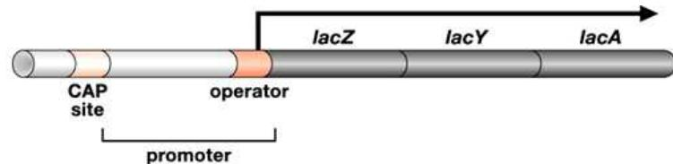

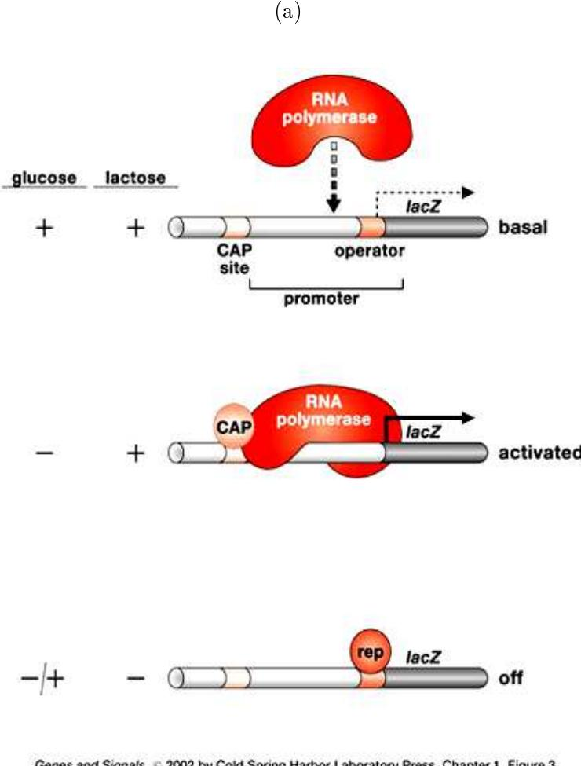

(b)

Figure 1. Mole
ular me
hanism for indu
tion and repression of the la operon in E. oli [(Ptashne](#page-47-1) and Gann, [2002](#page-47-1)): (a) Stru
ture of the la operon. The la
Z, la
Y, and la
A genes ode for β-gala
tosidase, la
tose permease, and la
tose transa
etylase, respe
tively. The operator, promoter, and CAP site denote the DNA sequen
es whi
h bind the repressor, RNA polymerase, and CAPAMP, respe
tively. (b) The states of the la operon in the presen
e of glu
ose or/and la
tose. The repressor and CAPAMP omplex are denoted rep and CAP, respe
tively.

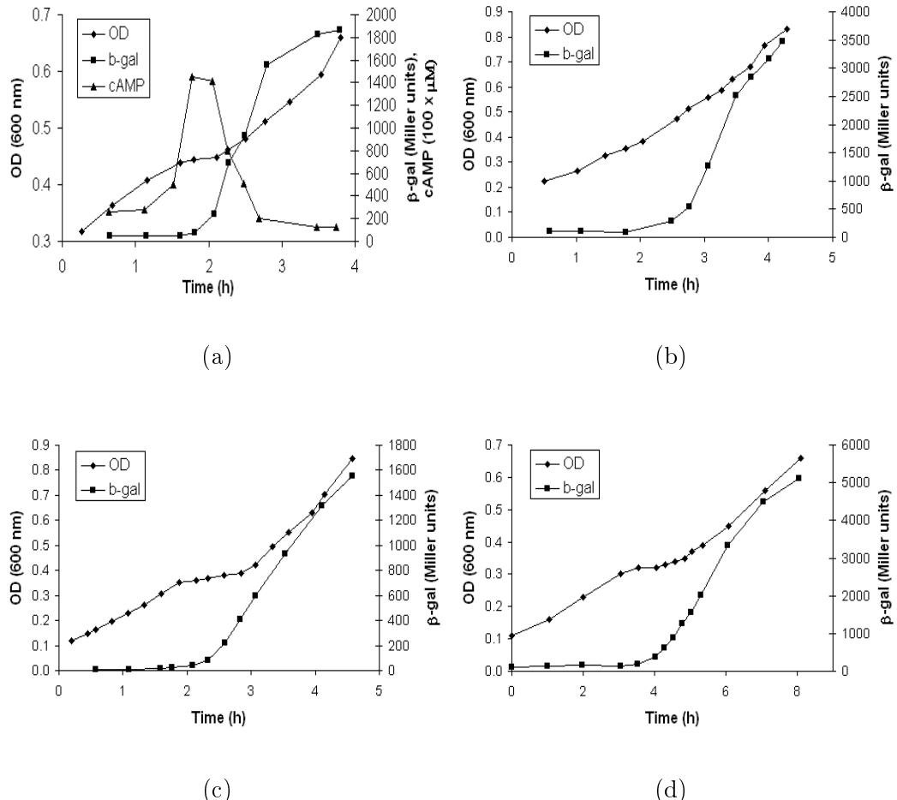

Figure 2. Repression of la trans
ription in the presen
e of glu
ose is not due to redu
ed AMP levels [(Inada](#page-45-1) et al., [1996;](#page-45-1) [Kimata](#page-45-2) et al., [1997)](#page-45-2). OD denotes opti
al density, and Miller units are a measure of β-gala
tosidase a
tivity. (a) Growth of the wild-type strain, E. oli W3110, on glu
ose + la
tose. The intra
ellular AMP levels are omparable during the two exponential growth phases. (b) Growth of E. oli W3110 on glu
ose + la
tose in the presen
e of 5 mM AMP. Despite the high AMP on
entration, β-gala
tosidase synthesis is repressed during the rst exponential growth phase. (
, d) Growth of E. oli △ya rp∗ and PR166 on glu
ose + la
tose. The la trans
ription rate in these strains is independent of the AMP level, but β-gala
tosidase synthesis is repressed during the rst exponential growth phase.

is not due to lower AMP levels. 3

- (2) When the ulture is exposed to large on
entrations (5 mM) of exogenous AMP, the diauxi lag vanishes, but the la operon still fails to be trans
ribed during the rst exponential growth phase (Fig. 2b).
3 Ex
ess AMP fails to relieve the repression of trans
ription during growth of E. oli on other pairs of substrates, su
h as glu
ose + melibiose [(Okada](#page-46-2) et al., [1981,](#page-46-2) Fig. 4) and glu
ose + gala
tose (see Fig. 9a of this work).

The disappearan
e of the diauxi lag implies that an elevated level of intra
ellular AMP does stimulate the la trans
ription rate. However, it fails to relieve the repression of la trans
ription in the presen
e of glu
ose.

- (3) Diauxi growth persists in ells whi
h trans
ribe the la operon at a rate that is independent of AMP levels. This has been demonstrated with two types of ells (Fig. 2
,d). In E. oli △ya rp∗ mutants, rp, the gene oding for CAP, is mutated su
h that CAP binds to the CAP site even in the absen
e of AMP. In E. oli PR166, the la promoter is mutated su
h that RNA polymerase binds to the promoter even if there is no CAP- AMP at the CAP site. In both ases, trans
ription of la is independent of AMP levels. Yet, β -gala
tosidase synthesis is still repressed during the rst exponential growth phase.
These results show that higher AMP levels do stimulate the la trans
ription rate. Indeed, the 5-fold in
rease in AMP levels at the end of the rst exponential growth phase in Fig. 2a is hara
teristi of ells exposed to low on
entrations (0.3 mM) of glu
ose [(Notley-M
Robb](#page-46-3) et al., [1997)](#page-46-3), and it is likely that this serves to redu
e the length of the diauxi lag. However, la trans
ription is repressed in the presen
e of glu
ose even if the ability of AMP to inuen
e la trans
ription is abolished.

The persisten
e of the glu
ose-la
tose diauxie in AMP-independent ells has led to the hypothesis that indu
er ex
lusion alone is responsible for inhibiting la trans
ription [(Inada](#page-45-1) et al., [1996](#page-45-1); [Kimata](#page-45-2) et al., [1997)](#page-45-2). However, indu
er ex
lusion exerts a relatively mild ee
t on la
tose uptake. In E. oli ML30, the a
tivity of la
tose permease is inhibited no more than ∼40% at saturating on
entrations of glu
ose (Cohn and [Horibata,](#page-44-0) [1959,](#page-44-0) Table 2). This partial inhibition by indu
er ex
lusion annot explain the almost omplete inhibition of la trans
ription.

Thus, despite several de
ades of resear
h, no mole
ular me
hanism has been found to fully explain the glu
ose-la
tose diauxie in E. oli.

In the meantime, mi
robial physiologists have a

umulated a vast body of work showing that diauxi growth is ubiquitous. It has been observed in diverse mi robial spe
ies on many pairs of substitutable substrates (i.e., substrates that satisfy the same nutrient requirements) in
luding pairs of arbon sour
es [(Egli](#page-44-1), [1995](#page-44-1); Harder and [Dijkhuizen,](#page-45-3) [1982;](#page-45-3) [Kovarova-Kovar](#page-45-4) and Egli, [1998](#page-45-4)), nitrogen sour
es (Neidhardt and [Magasanik,](#page-46-4) [1957)](#page-46-4), phosphorus sour
es [(Daughton](#page-44-2) et al., [1979](#page-44-2)), and ele
tron a

eptors [(Liu](#page-46-5) et al., [1998)](#page-46-5). These studies show that there is no orrelation between the hemi
al identity of a ompound and its ability to a
t as the preferred substrate. For instan
e, during growth on a mixture of glu
ose and an organi a
id, enteri ba
teria, su
h as E. oli, prefer glu ose, whereas soil ba
teria, su
h as Pseudomonas and Arthroba
ter, prefer the

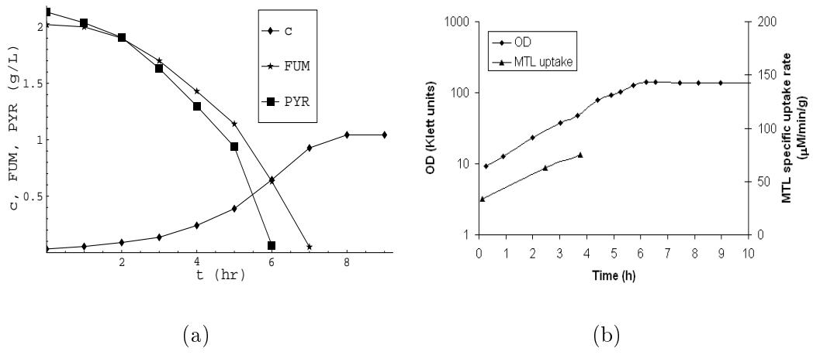

Figure 3. Simultaneous onsumption of substrates in bat
h ultures: (a) Simultaneous onsumption of fumarate (FUM) and pyruvate (PYR) during bat
h growth of E. oli K12 (c denotes the ell density in gms dry weight per liter). The single-substrate maximum spe
i growth rates on fumarate and pyruvate are 0.41 h−1 and 0.28 h−1 , respe
tively. This growth pattern is observed with several pairs of organi a
ids [(Narang](#page-46-6) et al., [1997b](#page-46-6)). (b) Simultaneous onsumption of glu
ose and mannitol (MTL) during bat
h growth of E. oli strain 158 [(Lengeler](#page-46-7) and Lin, [1972](#page-46-7)). There is signi
ant uptake of mannitol during the rst 4 hours even though the ells are pre
ultured on glu
ose.

organi a
id (Harder and [Dijkhuizen,](#page-45-5) [1976,](#page-45-5) [1982)](#page-45-3). However, there is a orrelation between the maximum spe
i growth rate on a ompound and its ability to a
t as a preferred substrate.

In most ases, although not invariably, the presen
e of a substrate permitting a higher growth rate prevents the utilization of a se
ond, `poorer', substrate in bat
h ulture (Harder and [Dijkhuizen](#page-45-3), [1982,](#page-45-3) p. 461).

This remarkable orrelation, whi
h is reminis
ent of anthropomorphi hoi
e, is often rationalized by appealing to teleologi
al (design-oriented) arguments. Harder & Dijkhuizen assert, for instan
e, that onsumption of la
tose is abolished in the presen
e of glu
ose be
ause this prevents unne
essary synthesis of ataboli enzymes in ells that already have available a arbon and energy sour
e that allows fast growth (Harder and [Dijkhuizen](#page-45-3), [1982,](#page-45-3) p. 463). However, there is no me
hanisti explanation for this orrelation.

Although the diauxie dominates the literature on mixed-substrate growth, there is ample eviden
e of nondiauxi growth. In E. oli K12, several pairs of organi a
ids are onsumed simultaneously [(Narang](#page-46-6) et al., [1997b)](#page-46-6), one example of whi
h is shown in Fig. 3a. The maximum spe
i growth rates on these organi a
ids are in the range 0.280.44 h−1 , whi
h are low ompared to the largest maximum spe
i growth rate sustained in a minimal (syntheti
) medium (0.74 h−1 on glu
ose). Similar behavior has been observed in other spe
ies, leading Egli to on
lude that

Espe
ially ombinations of substrates that support medium or low maximum spe
i growth rates are utilized simultaneously [(Egli,](#page-44-1) [1995,](#page-44-1) p. 325).

However, a loser look at data suggests that low or medium growth rates are not ne
essary for simultaneous onsumption. This is evident from Monod's early studies with the soalled A-sugars, namely, glu
ose, fru
tose, mannitol, mannose, and su
rose [(Monod](#page-46-1), [1942,](#page-46-1) [1947)](#page-46-0). 4 He found that in E. oli and B. subtilis, these sugars supported omparable maximum spe
i growth rates, but there was no diauxi lag during growth on a mixture of glu
ose and any one of the other A-sugars. Subsequent studies have onrmed that in some of these ases, both the substrates are onsumed simultaneously (Fig. 3b). Now, in all the ases of simultaneous onsumption des
ribed above, the single-substrate growth rates were omparable. Thus, it is on
eivable that simultaneous onsumption o

urs whenever the ratio of the singlesubstrate growth rates is lose to 1. It turns out that this ondition may be ne
essary, but it is ertainly not su
ient. Although the growth rates of Propioniba
terium shermanii on glu
ose and la
tate are identi
al (0.141 and 0.142 h−1 , respe
tively), la
tate is onsumed preferentially [(Lee](#page-45-6) et al., [1974)](#page-45-6). Similarly, the growth rates of E. oli ML308 on glu
ose and fru
tose are omparable (0.91 and 0.73 h−1 , respe
tively), but glu
ose is onsumed preferentially (Clark and [Holms](#page-44-3), [1976](#page-44-3)). 5 Thus, urrent eviden
e suggests that the existen
e of omparable single-substrate growth rates is, perhaps, ne
essary, but not su
ient, for simultaneous onsumption. It seems desirable to understand the me
hanisti basis of this observation.

In addition to simultaneous substrate utilization, there is some eviden
e that the substrate utilization pattern an depend on the history of the pre
ulture. Hamilton & Dawes were among the rst to observe su
h behavior during the growth of Pseudomonas aeruginosa on a mixture of itrate and glu ose [(Hamilton](#page-45-7) and Dawes, [1959](#page-45-7), [1960,](#page-45-8) [1961](#page-45-9)). Cells pre
ultured on itrate showed diauxi growth with itrate as the preferred substrate, whereas ells pre
ultured on glu
ose onsumed both itrate and glu
ose. We observed a similar substrate onsumption pattern during growth of E. oli K12 on glu
ose and pyruvate [(Narang](#page-46-6) et al., [1997b](#page-46-6)). An entirely dierent pre
ulture-dependent pattern was obtained during the growth of a pseudomonad on glu
ose and phenol [(Panikov](#page-47-3), [1995,](#page-47-3) Chap. 3, p. 181). When the ells were pre
ultured on

4 It was found later that all the A-sugars are transported by the phosphotransferase system (PTS) [(Roseman](#page-47-4) and Meadow, [1990](#page-47-4)).

5 The absen
e of the diauxi lag, observed in Monod's earlier studies with glu
osefru
tose mixtures, is due to rapid de novo synthesis of the PTS enzymes for fru
 tose (Clark and [Holms,](#page-44-3) [1976](#page-44-3), Figs. 45). Thus, preferential onsumption without a lag does not imply the existen
e of new mole
ular me
hanisms it an be a onsequen
e of rapid indu
tion kineti
s.

glu
ose, there was preferential onsumption of glu
ose. Immediately after the exhaustion of phenol, when the ells were fully adapted to phenol, the medium was supplemented with additional glu
ose and phenol. On
e again, there was diauxi growth, but phenol, rather than glu
ose, was the preferred substrate. In earlier work, we have argued that pre
ulture-dependent growth patterns may be quite ommon the la
k of su
h data ree
ts the fa
t that the ee
t of pre
ulturing was not investigated in most studies [(Narang](#page-46-6) et al., [1997b)](#page-46-6). In order to fa
ilitate their identi
ation, it seems appropriate to determine the feasible pre
ulture-dependent growth patterns.

The goal of this work is to seek me
hanisti answers for the following questions

- (1) In diauxi growth, why is the maximum spe
i growth rate on the preferred substrate higher than that on the less preferred substrate?
- (2) Under what onditions are the substrates onsumed simultaneously?
- (3) What types of pre
ulture-dependent growth patterns are feasible?

There are numerous me
hanisti models of mixed-substrate growth. Many of them are based on detailed me
hanisms uniquely asso
iated with the glu
osela
tose diauxie in E. oli [(Kremling](#page-45-10) et al., [2001](#page-45-10); [Santillán](#page-47-5) and Ma
key, [2004](#page-47-5); van Dedem and [Moo-Young](#page-47-6), [1973;](#page-47-6) [Wong](#page-47-7) et al., [1997)](#page-47-7). These models annot address the above questions, whi
h are on
erned with the general properties of mixed-substrate growth. Thus, one led to onsider the more general models a

ounting for only those pro
esses that are ommon to most systems of mixed-substrate growth [(Brandt](#page-44-4) et al., [2004;](#page-44-4) [Narang](#page-46-8) et al., [1997a](#page-46-8); [Narang](#page-46-9), [1998a](#page-46-9); Thattai and [Shraiman](#page-47-8), [2003](#page-47-8)). Re
ently, we have shown that these general models are similar inasmu
h as the enzymes follow ompetitive dynami
s in all the ases [(Narang,](#page-46-10) [2006)](#page-46-10). However, the model in Brandt et al annot apture nondiauxi growth, and the model in Thattai & Shraiman treats the spe
i growth rate as a xed (
onstant) parameter, an assumption that is not appropriate for des
ribing the growth of bat
h ultures.

In this work, we address the questions posed above by appealing to the minimal model in [Narang](#page-46-9) [(1998a)](#page-46-9). This model a

ounts for only enzyme indu
tion and dilution, the two pro
esses that o

ur in almost all systems of mixed-substrate growth. Yet, it aptures all the bat
h growth patterns des
ribed above, and its extension to ontinuous ultures predi
ts all the steady states observed in hemostats [(Narang](#page-46-11), [1998b)](#page-46-11). Here, we show that the minimal model also provides me
hanisti explanations for the foregoing questions. Spe
i
ally, we nd that

- (1) If the indu
tion kineti
s are hyperboli
, the maximum spe
i growth rate on the preferred substrate is always higher than that on the less preferred substrate. The manifestation of this orrelation in a minimal model ontaining no regulation suggests that its existen
e is not due
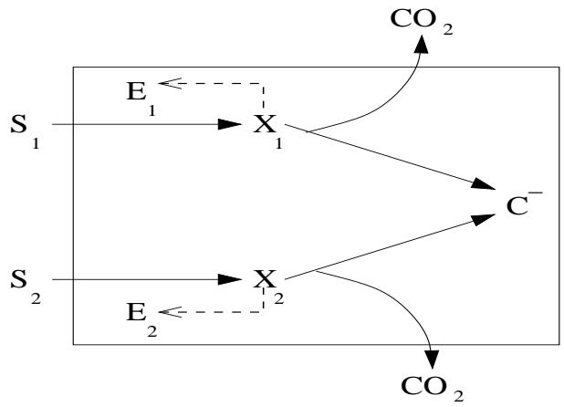

Figure 4. Kineti s
heme of the minimal model [(Narang,](#page-46-9) [1998a](#page-46-9)).

to goal-oriented regulatory me
hanisms, an assumption that lies at the heart of models based on optimality prin
iples [(Mahadevan](#page-46-12) et al., [2002](#page-46-12); [Kompala](#page-45-11) et al., [1986](#page-45-11); [Ramakrishna](#page-47-9) et al., [1996)](#page-47-9). It is an intrinsi property resulting from the kineti
s of enzyme indu
tion and dilution. We also nd that the orrelation an be violated when the indu
tion kineti
s are sigmoidal, and that the dynami
s of these oending ases are onsistent with the data in the literature.

- (2) The existen
e of omparable single-substrate growth rates is not su ient for simultaneous onsumption. This agrees with the data des
ribed above. However, we nd that this ondition is not ne
essary either. This is be
ause the o

urren
e of simultaneous onsumption depends not only on the relative growth rates, but also on the saturation onstants for indu
tion. If these saturation onstants are small, there is simultaneous onsumption, regardless of the relative growth rates.
We show, furthermore, that the lassi
ation of the substrate onsumption patterns predi
ted by the model explains the phenotypes of several mutants. The most striking phenotype is the reversal of the diauxie, wherein both the wild-type and the mutant strains display diauxi growth, but onsume the substrates in opposite order. This phenotype annot be explained in terms of the standard mole
ular me
hanisms, but turns out to be a natural onsequen
e of the minimal model.

# 2 The model

Fig. 4 shows the kineti s
heme of the minimal model. Here, Si denotes the i th exogenous substrate, Ei denotes the transport enzyme for Si , Xi denotes internalized Si , and C − denotes al l intra
ellular omponents ex
ept Ei and Xi (thus, it in
ludes pre
ursors, free amino a
ids, and ma
romole
ules).

In this work, attention will be onned to growth in bat
h ultures. We assume that

- (1) The on
entrations of the intra
ellular omponents, denoted ei , xi , and c −, are based on the dry weight of the ells (g per g dry weight of ells, i.e., g gdw−1 ). The on
entrations of the exogenous substrate and ells, denoted si and c, are based on the volume of the rea
tor (g/L and gdw/L, respe
tively). The rates of all the pro
esses are based on the dry weight of the ells (g gdw−1 h−1 ). We shall use the term spe
i rate to emphasize this point.
The hoi
e of these units implies that if the on
entration of any intra ellular omponent, Z , is z g gdw−1 , then the evolution of z in bat
h ultures is given by

$$\frac{dz}{dt} = r_z^+ - r_z^- - \left(\frac{1}{c}\frac{dc}{dt}\right)z$$

where r + z and r − z denote the spe
i rates of synthesis and degradation of Z in g gdw−1 h−1 .

- (2) The transport and peripheral atabolism of Si is atalyzed by the lumped system of peripheral enzymes, Ei . The spe
i uptake rate of Si , denoted rs,i, follows the modied Mi
haelis-Menten kineti
s, rs,i ≡ Vs,ieisi/(Ks,i+ si).
- (3) Part of the internalized substrate, denoted Xi , is onverted to C −. The remainder is oxidized to CO2 in order to generate energy.
	- (a) The onversion of Xi to C − and CO2 follows rst-order kineti
	s, i.e., rx,i ≡ kx,ixi .
	- (b) The fra
	tion of Xi onverted to C − is a onstant (parameter), denoted Yi . Thus, the spe
	i rate of synthesis of C − from Xi is Yirx,i. 6
- (4) The internalized substrate also indu
es the synthesis of Ei .
	- (a) The spe
	i synthesis rate of Ei follows Hill kineti
	s, i.e., re,i ≡ Ve,ix ni i /(K ni e,i + x ni i ), where ni = 1 or 2. Kineti analysis of the data shows that enzyme indu
	tion an be hyperboli (ni = 1) or sigmoidal (ni = 2) [(Yagil](#page-47-10) and Yagil, [1971)](#page-47-10).

By appealing to a mole
ular model of indu
tion, we an express ni , Ve,i, and Ke,i in terms of the parameters asso
iated with repressoroperator and repressor-indu
er binding. It is shown in Appendix A that the Yagil & Yagil model of indu
tion implies that ni is the number of indu
er mole
ules that bind to 1 repressor mole
ule. Fur-

6 The soalled onservative substrates, su
h as nitrogen and phosphorus sour
es, are ompletely assimilated (as opposed to arbon sour
es, whi
h are partially oxidized to generate energy). During growth on mixtures of su
h substrates, Yi = 1 for both the substrates.

thermore, if the enzyme is indu
ible,

$$V_{e,i} = \nu_{e,i} o_{t,i},\ K_{e,i}^{n_i} = \frac{K_{x,i}}{K_{o,i}} r_{t,i},\tag{1}$$

where νe,i is the enzyme synthesis rate per unit mass of operator; ot,i, rt,i are the total on
entrations of the operator and repressor (g gdw−1 ), respe
tively; and Kx,i, Ko,i are the disso
iation onstants for repressor-indu
er and repressor-operator binding, respe
tively.

- (b) The synthesis of the enzymes o

urs at the expense of the biosyntheti onstituents, C −.
- (
) Enzyme degradation is negligibly small.

Given these assumptions, the mass balan
es yield the equations

$$\frac{ds_i}{dt} = -r_{s,i}c, \ r_{s,i} \equiv V_{s,i}e_i \frac{s_i}{K_{s,i} + s_i},\tag{2}$$

$$\frac{dx_i}{dt} = r_{s,i} - r_{x,i} - \left(\frac{1}{c}\frac{dc}{dt}\right)x_i, r_{x,i} \equiv k_{x,i}x_i,\tag{3}$$

$$\frac{de_i}{dt} = r_{e,i} - \left(\frac{1}{c}\frac{dc}{dt}\right)e_i, \; r_{e,i} \equiv V_{e,i}\frac{x^{n_i}}{K_{e,i}^{n_i} + x^{n_i}},\tag{4}$$

$$\frac{dc^{-}}{dt} = \left(Y_1 r_{x,1} + Y_2 r_{x,2}\right) - \left(r_{e,1} + r_{e,2}\right) - \left(\frac{1}{c}\frac{dc}{dt}\right)c^{-}.\tag{5}$$

It is shown in Appendix B that sin
e x1 + x2 + e1 + e2 + c − = 1, Eqs. (3)(5) impli
itly dene the spe
i growth rate, denoted rg , and the evolution of the ell density via the relations

$$\frac{dc}{dt} = r_g c, \ r_g \equiv \sum_{i=1}^{2} r_{s,i} - \sum_{i=1}^{2} (1 - Y_i) r_{x,i} \tag{6}$$

Furthermore, sin
e xi is small, it attains quasisteady state on a time s
ale of se
onds, thus resulting in the simplied equations

$$\frac{ds_i}{dt} = -r_{s,i}c,\tag{7}$$

$$x_i \approx \frac{V_{s,i}e_i s_i / (K_{s,i} + s_i)}{k_{x,i}},\tag{8}$$

$$\frac{de_i}{dt} = r_{e,i} - r_g e_i, \; r_{e,i} \approx V_{e,i} \frac{[e_i s_i/(K_{s,i} + s_i)]^{n_i}}{\bar{K}_{e,i}^{n_i} + [e_i s_i/(K_{s,i} + s_i)]^{n_i}}, \; \bar{K}_{e,i} \equiv K_{e,i} \frac{k_{x,i}}{V_{s,i}}, \quad (9)$$

$$\frac{dc}{dt} = r_g c, \ r_g \approx Y_1 r_{s,1} + Y_2 r_{s,2},\tag{10}$$

$$c^- = 1 - x_1 - x_2 - e_1 - e_2,\tag{11}$$

where (8) is obtained from the quasisteady state relation, i.e., 0 ≈ rs,i − rx,i.

We are parti
ularly interested in the dynami
s of the peripheral enzymes during the rst exponential growth phase, sin
e it is these nite-time dynami
s that determine the substrate utilization pattern. If the peripheral enzymes for one of the substrates vanish during this period, there is diauxi growth; if the peripheral enzymes for both substrates persist, there is simultaneous substrate utilization.

It turns out that the motion of the enzymes during the rst exponential growth phase is governed by only two equations. To see this, observe that during the rst exponential growth phase, both substrates are in ex
ess, i.e., si ≫ Ks,i. Hen
e, even though the exogenous substrate on
entrations are de
reasing, the transport enzymes see a quasi
onstant environment (si/(Ks,i + si) ≈1), and approa
h the quasisteady state levels orresponding to exponential (balan
ed) growth. This motion is approximated by the equations

$$\frac{de_1}{dt} = V_{e,1}\frac{e_1^{n_1}}{\bar{K}_{e,1}^{n_1} + e_1^{n_1}} - \left(Y_1V_{s,1}e_1 + Y_2V_{s,2}e_2\right)e_1,\tag{12}$$

$$\frac{de_2}{dt} = V_{e,2} \frac{e_2^{n_2}}{\bar{K}_{e,2}^{n_2} + e_2^{n_2}} - \left(Y_1 V_{s,1} e_1 + Y_2 V_{s,2} e_2\right) e_2,\tag{13}$$

obtained from (9) by repla
ing si/(Ks,i + si) with 1. We shall refer to these as the redu
ed equations. It should be emphasized that the steady states of the redu
ed equations are quasisteady states of the full system of equations (see [Narang](#page-46-8) et al., [1997a](#page-46-8) for a rigorous derivation of the redu
ed equations).

The redu
ed equations are formally similar to the equations of the standard Lotka-Volterra model for two ompeting spe
ies, namely,

$$\frac{dN_1}{dt} = r_1 N_1 (1 - a_{11} N_1 - a_{12} N_2),\tag{14}$$

$$\frac{dN_2}{dt} = r_2 N_2 (1 - a_{21} N_1 - a_{22} N_2),\tag{15}$$

where Ni is the population density of the i th spe
ies, ri is the (unrestri
ted) spe
i growth rate of the i th spe
ies in the absen
e of any ompetition, and ai1, ai2 are parameters that quantify the redu
tion of the unrestri
ted spe i growth rate due to intra- and inter-spe
i ompetition [(Murray,](#page-46-13) [1989)](#page-46-13). Thus, enzyme indu
tion is the orrelate of unrestri
ted growth, and the two dilution terms are the orrelates of intra- and inter-spe
i ompetition. In what follows, we shall onstantly appeal to this dynami
al analogy.

The dynami
s of the standard Lotka-Volterra model are well understood. Indeed, the bifur
ation diagram of the model is ompletely determined by the two dimensionless parameters, b21 ≡ a21/a11 and b12 ≡ a12/a22 (Fig. 5). These parameters hara
terize the extent to whi
h ea
h spe
ies inhibits the other spe
ies relative to the extent to whi
h it inhibits itself. Both spe
ies oexist pre
isely when they inhibit themselves more than they inhibit the other

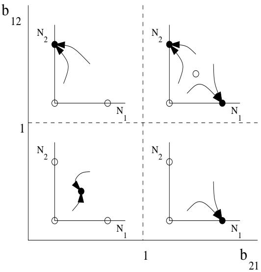

Figure 5. Classi
ation of the global dynami
s for the standard Lotka-Volterra model. The full and open ir
les show stable and unstable steady states, respe
 tively.

spe
ies, i.e., b21, b12 < 1. Under all other onditions, oexisten
e is impossible. If the intera
tion between the spe
ies is asymmetri (b21 < 1, b12 > 1 or b21 > 1, b12 < 1), one of them is rendered extin
t (spe
ies 1 and 2, respe
tively). If both spe
ies inhibit the other spe
ies more than they inhibit themselves, i.e. b21, b12 > 1, the out
ome depends on the initial population densities.

Given the formal similarity of the redu
ed equations to the Lotka-Volterra model, we expe
t them to display extin
tion and oexisten
e dynami
s. Importantly, these dynami
s have simple biologi
al interpretations. Extin
tion of one of the enzymes orresponds to diauxi growth, and oexisten
e of both enzymes orresponds to simultaneous onsumption. It is therefore lear that the bifur
ation diagram for the redu
ed equations is a useful analyti
al tool. It furnishes a lassi
ation of the substrate onsumption patterns, whi
h an then be used to systemati
ally address the questions posed in the Introdu
tion. Our rst goal is to onstru
t this bifur
ation diagram.

To minimize the number of parameters in the bifur
ation diagram, we res
ale the redu
ed equations by dening the dimensionless variables

$$\epsilon_i \equiv \frac{e_i}{\sqrt{V_{e,i}/(Y_i V_{s,i})}}, \ \tau \equiv t\sqrt{V_{e,1}Y_1V_{s,1}} \ .$$

The hoi
e of the referen
e variables in this s
aling is suggested by the following fa
t: q Ve,i/(YiVs,i) and q Ve,iYiVs,i are upper bounds for the enzyme level and maximum spe
i growth rate attained during single-substrate exponential growth on saturating on
entrations of Si . Indeed, under these onditions, the mass balan
e for Ei be
omes

$$0 = V_{e,i}\frac{e_i^{n_i}}{\bar{K}_{e,i}^{n_i} + e_i^{n_i}} - Y_i V_{s,i} e_i^2.$$

Hen
e, ei < q Ve,i/(YiVs,i), and the maximum spe
i growth rate on Si , denoted r max g,i , satises the relation

$$r_{g,i}^{\max} \approx Y_i V_{s,i} e_i < Y_i V_{s,i} \sqrt{\frac{V_{e,i}}{Y_i V_{s,i}}} = \sqrt{Y_i V_{s,i} V_{e,i}}.$$

The above s
aling yields the dimensionless redu
ed equations

$$\frac{d\epsilon_1}{d\tau} = \frac{\epsilon_1^{n_1}}{\kappa_1^{n_1} + \epsilon_1^{n_1}} - \left(\epsilon_1 + \alpha \epsilon_2\right)\epsilon_1,\tag{16}$$

$$\frac{d\epsilon_2}{d\tau} = \alpha \frac{\epsilon_2^{n_2}}{\kappa_2^{n_2} + \epsilon_2^{n_2}} - \left(\epsilon_1 + \alpha \epsilon_2\right) \epsilon_2,\tag{17}$$

with dimensionless parameters

$$\kappa_i \equiv \frac{\bar{K}_{e,i}}{\sqrt{V_{e,i}/(Y_i V_{s,i})}} = K_{e,i} k_{x,i} \sqrt{\frac{Y_i}{V_{s,i} V_{e,i}}} = \frac{K_{x,i} r_{t,i} k_{x,i}}{K_{o,i}} \sqrt{\frac{Y_i}{V_{s,i} V_{e,i}}},\tag{18}$$

$$\alpha \equiv \frac{\sqrt{V_{e,2} Y_2 V_{s,2}}}{\sqrt{V_{e,1} Y_1 V_{s,1}}}.\tag{19}$$

These dimensionless parameters have simple biologi
al interpretations. We an view κi as a dimensionless saturation onstant for indu
tion, and α as a measure of the maximum spe
i growth rate on S2 relative to that on S1.

#### 3 Results

We wish to onstru
t the bifur
ation diagram for Eqs. (16)(17). Sin
e limit y les are impossible in Lotka-Volterra models for ompeting spe
ies [(Hirs
h](#page-45-12) and Smale, [1974](#page-45-12)), it su
es to determine the steady states and their stability.

Eqs. (16)(17) admit at most four types of steady states: The trivial steady state (ǫ1 = ǫ2 = 0), the semitrivial steady states (ǫ1 > 0, ǫ2 = 0 and ǫ1 = 0, ǫ2 > 0), and the nontrivial steady state, ǫ1, ǫ2 > 0. We denote these steady states by E00 , E10 , E01 , and E11 , respe
tively.

We shall onsider two ases: n1 = n2 = 1 and n1 = 2, n2 = 1. The se
ond ase will serve to show the qualitative hanges engendered by sigmoidal indu
tion kineti
s.

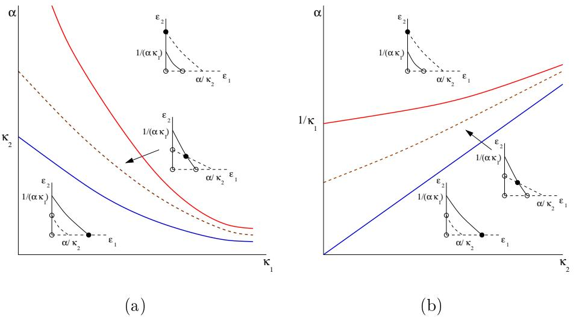

Figure 6. Bifur
ation diagrams for the ase n1 = n2 = 1 at (a) xed κ2 > 0 and (b) xed κ1 > 0. In the phase portraits, the null
lines for ǫ1 and ǫ2 are represented by full and dashed lines, respe
tively; stable and unstable steady states are represented by full and open ir
les, respe
tively. The graphs of α∗, α ∗ , and αg are represented by blue, red, and dashed brown urves.

$$3.1 \quad Case \; 1 \; (n_1 = n_2 = 1)$$

In this ase, the s
aled equations are

$$\begin{aligned} \frac{d\epsilon_1}{dt} &= \frac{\epsilon_1}{\kappa_1 + \epsilon_1} - \left(\epsilon_1 + \alpha \epsilon_2\right)\epsilon_1, \\\frac{d\epsilon_2}{dt} &= \alpha \frac{\epsilon_2}{\kappa_2 + \epsilon_2} - \left(\epsilon_1 + \alpha \epsilon_2\right)\epsilon_2. \end{aligned}$$

The bifur
ation diagrams for these equations are shown in Fig. 6. They were inferred from the following fa
ts derived in Appendix C.

- (1) The trivial steady, E00, always exists (for all α, κ1, κ2 > 0), but it is always unstable (as a node).
- (2) The semitrivial steady state, E10 , always exists. It is (uniquely) given by

$$
\epsilon_1 = \frac{-\kappa_1 + \sqrt{\kappa_1^2 + 4}}{2}, \; \epsilon_2 = 0,
$$

and is stable (as a node) pre
isely if ǫ1|E10 ex
eeds α/κ2, the ǫ1-inter
ept of the nontrivial null
line for ǫ2 . 7 That is

$$\left. \epsilon_1 \right|_{E_{10}} > \frac{\alpha}{\kappa_2} \Leftrightarrow \alpha < \alpha_*(\kappa_1, \kappa_2) \equiv \frac{\kappa_2 \left( -\kappa_1 + \sqrt{\kappa_1^2 + 4} \right)}{2}. \tag{20}$$

- (3) The steady state, E01 , always exists. It is given by

$$
\epsilon_1 = 0, \; \epsilon_2 = \frac{-\kappa_2 + \sqrt{\kappa_2^2 + 4}}{2},
$$

and it is stable (as a node) pre
isely if ǫ2|E01 ex
eeds 1/(ακ1), the ǫ2 inter
ept of the nontrivial null
line for ǫ1 , i.e.,

$$\left. \epsilon_2 \right|_{E_{01}} > \frac{1}{\alpha \kappa_1} \Leftrightarrow \alpha > \alpha^*(\kappa_1, \kappa_2) \equiv \frac{2}{\kappa_1 \left( -\kappa_2 + \sqrt{\kappa_2^2 + 4} \right)}. \tag{21}$$

- (4) The surfa
e of α∗(κ1, κ2) lies below the surfa
e of α ∗ (κ1, κ2), i.e.,

$$
\alpha_* (\kappa_1, \kappa_2) < \alpha^* (\kappa_1, \kappa_2) \tag{22}
$$

for all κ1, κ2 > 0. The notation was hosen to ree
t this fa
t: The fun
 tions, α∗(κ1, κ2) and α ∗ (κ1, κ2), represent the lower and upper surfa
es of the bifur
ation diagram.

- (5) The steady state, E11 , exists if and only if both E10 and E01 are unstable, i.e.,

$$
\alpha_*(\kappa_1, \kappa_2) < \alpha < \alpha^*(\kappa_1, \kappa_2). \tag{23}
$$

It is unique and stable whenever it exists.

The bifur
ation diagrams imply the following lassi
ation of the substrate utilization patterns.

- (1) If α < α∗(κ1, κ2), only E10 is stable, whi
h orresponds to preferential onsumption of S1.
- (2) If α∗(κ1, κ2) < α < α∗ (κ1, κ2), only E11 is stable, and there is simultaneous onsumption of S1 and S2 .
- (3) If α > α∗ (κ1, κ2), only E01 is stable, whi
h orresponds to preferential onsumption of S2.

Thus, the surfa
es of α∗(κ1, κ2) and α ∗ (κ1, κ2) delineate the boundaries of the substrate onsumption patterns. 8

7 The null
lines for ǫi refer to the lo
us of points on the ǫ1ǫ2-plane at whi
h dǫi/dt = 0. In the ase of the redu
ed equations, the null
lines for ǫi onsist of two urves. One of these urves is the trivial null
line, ǫi = 0; the other urve is alled the nontrivial null
line.

8 An analogous lassi
ation is also obtained when the model is extended to ontinuous ultures [(Narang,](#page-46-11) [1998b](#page-46-11), Fig. 10). However, the ontrol parameters onsist of

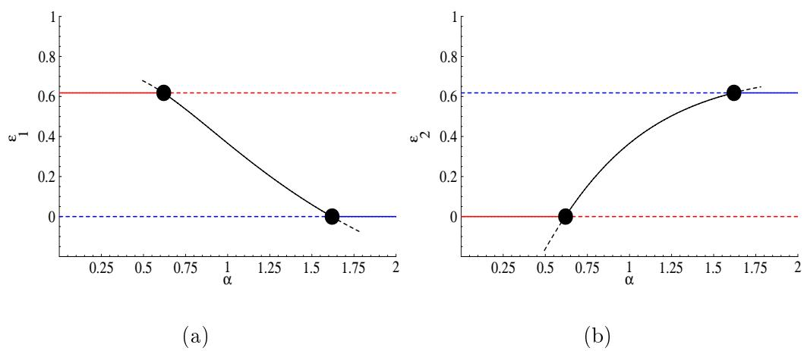

Figure 7. The bifur
ation diagram obtained when α is in
reased at κ1 = κ2 = 1. The red, blue, and bla
k urves represent the lo
us of E10 , E01 , and E11 , respe
tively. The urves are full (resp., dashed) if the steady state is stable (resp., unstable). The bifur
ation points at α = α∗(1, 1) = 0.62 and α = α ∗ (1, 1) = 1.62 are represented by full ir
les.

If the point, (κ1, κ2, α), rosses either one of these boundaries, there is an abrupt transition in the substrate onsumption pattern due to trans
riti
al bifur
ations. This be
omes evident if α is in
reased at any xed κ1, κ2 > 0 (Fig. 7). At α = α∗(κ1, κ2), the substrate onsumption pattern swit
hes from preferential onsumption of S1 to simultaneous onsumption of S1 and S2 through a trans
riti
al bifur
ation in whi
h E10 (red urve) yields its stability to E11 (bla
k urve). As α is in
reased further, there is another transition at α = α ∗ (κ1, κ2) wherein simultaneous onsumption swit
hes to preferential onsumption of S2 via a trans
riti
al bifur
ation involving the transfer of stability from E11 (bla
k urve) to E01 (blue urve).

We gain intuitive insight into the bifur
ation diagram by onsidering two limiting ases. Fig. 6 shows that if κ1 or κ2 are large, the urves for α∗ and α ∗ onverge, and simultaneous onsumption is virtually impossible. In ontrast, if both κ1 and κ2 are small, there is simultaneous onsumption for almost all α. To understand these limiting ases, observe that when κ1, κ2 are large, Eqs. (16)(17) are approximated by the equations

$$\begin{aligned} \frac{d\epsilon_1}{dt} &\approx \frac{1}{\kappa_1} \epsilon_1 \left(1 - \kappa_1 \epsilon_1 - \alpha \kappa_1 \epsilon_2\right) \epsilon_1, \\\frac{d\epsilon_2}{dt} &\approx \frac{\alpha}{\kappa_2} \epsilon_2 \left(1 - \frac{\kappa_2}{\alpha} \epsilon_1 - \kappa_2 \epsilon_2\right) \epsilon_2, \end{aligned}$$

the dilution rate and feed on
entrations (rather than the physiologi
al parameters, α, κ1 , and κ2).

whi
h are formally identi
al to the standard Lotka-Volterra model with a11 = κ1 , a12 = ακ1 , a21 = κ2/α, and a22 = κ2. However, there is an important dieren
e. The parameters, b21 ≡ a21/a11, b12 ≡ a12/a22 , are not independent sin
e b21 = κ2/(ακ1) = 1/b12 . But if b12 and b21 are restri
ted to the urve b21b12 = 1, Fig. 5 implies that oexisten
e (i.e., simultaneous onsumption) is impossible: E1 be
omes extin
t if b21 < 1, and E2 be
omes extin
t if b21 > 1. On the other hand, if κ1, κ2 are small, the enzyme synthesis rate is essentially onstant (quasionstitutive). The enzymes therefore resist extin
tion, and oexist for almost all α.

# 3.1.1 Dependen
e of substrate onsumption pattern on genotype

In the experimental literature, the inuen
e of the physiologi
al parameters is often studied by altering the geneti make-up (genotype) of the ells, and observing the resultant hange in the substrate onsumption pattern (phenotype) of the ells. We show below that the bifur
ation diagrams are onsistent with the phenotypi hanges observed in response to various genotypi alterations.

Before doing so, however, it is useful to note that in all the experiments des
ribed below, the phenotype of the wild-type strain is preferential onsumption of a substrate (glu
ose, in most ases). Sin
e Eqs. (16) and (17) are formally the same, there is no loss of generality in assuming that the preferred substrate is S2 , and the parameters, κ1, κ2, α, for the wild-type strain lie in the region, α > α∗ (above the red urve in Fig. 6).

We begin by onsidering the ases in whi
h the geneti perturbation transforms the substrate onsumption pattern from preferential to simultaneous onsumption.

In wild-type E. oli, trans
ription of la is abolished in the presen
e of glu
ose. However, mutants with lesions in the la operator synthesize β -gala
tosidase even in the presen
e of glu
ose (Ja
ob and [Monod,](#page-45-0) [1961)](#page-45-0). Thus, the mutation transforms the substrate onsumption pattern from preferential onsumption of glu
ose to simultaneous onsumption of glu
ose and la
tose. The very same phenotypi hange is also observed in mutants with a defe
tive la
I, the gene en
oding the la repressor (Ja
ob and [Monod](#page-45-0), [1961](#page-45-0)). To explain these phenotypi hanges in terms of the model, observe that mutations in the la operator or la
I impair the la repressor-operator binding, i.e., they in
rease the disso
iation onstant, Ko,1. It follows from Eqs. (18)(19) that κ1 de
reases at xed κ2 and α. Inspe
tion of Fig. 6a shows that su
h a hange an shift the substrate onsumption pattern from preferential onsumption of S2 to simultaneous onsumption.

If la
Y, the gene en
oding la
tose permease, is overexpressed in E. oli PR166, synthesis of β -gala
tosidase persists in the presen
e of glu
ose (Fig. 8a). Now,

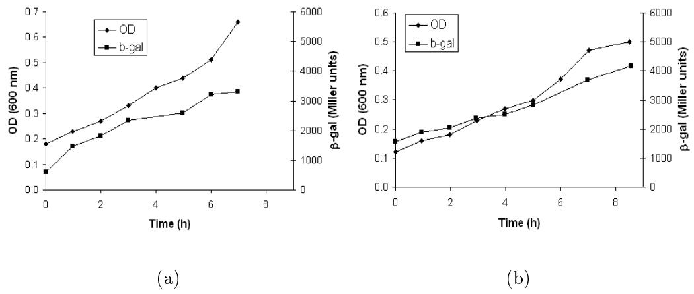

Figure 8. In E. oli PR166, synthesis of β-gala
tosidase persists in the presen
e of glu
ose if (a) la
Y is overexpressed or (b) rr, the gene for enzyme IIAgl , is deleted [(Kimata](#page-45-2) et al., [1997)](#page-45-2). The mutant ells in (b) grow on glu
ose despite the absen
e of IIAgl be
ause of slow uptake of glu
ose by the PTS enzymes for mannose.

in the model, overexpression of la
Y orresponds to higher Ve,1. It follows from Eqs. (18)(19) that κ1, α de
rease at xed κ2 , and Fig. 6a implies that the observed phenotype is indeed feasible.

In E. oli PR166, β -gala
tosidase is synthesized despite the presen
e of glu ose if rr, the gene for enzyme IIAgl , is deleted (Fig. 8a). Similarly, in the wild-type strain, E. oli K12 W3110, glu
ose is onsumed before gala
tose. However, mutants with lesions in a gene en
oding a transport enzyme for glu ose onsume the two substrates simultaneously [(Kamogawa](#page-45-13) and Kurahashi, [1967](#page-45-13)). In these ases, the ee
t of the mutation is to de
rease Vs,2, so that κ2 and α de
rease at xed κ1 . It follows from Fig. 6b that su
h a hange ould lead to simultaneous onsumption of the substrates.

Now, all the mutant phenotypes dis
ussed above an be explained just as well by alternative hypotheses appealing only to the mole
ular me
hanisms. Indeed, the rst ase is obviously due to impaired repressor-operator binding, and one an argue that the remaining two ases are due to diminished indu
er ex
lusion. However, the next two examples, whi
h involve the reversal of the diauxie, are di
ult to explain from the mole
ular point of view.

Fig. 9a shows that in E. oli Hfr3000, glu
ose is onsumed before gala
tose. However, the mutant strain MM6, whi
h ontains a lesion in the PTS enzyme I [(Tanaka](#page-47-11) et al., [1967)](#page-47-11), onsumes gala
tose before glu
ose (Fig. 9b). Likewise, E. oli strain 159 onsumes mannitol before sorbitol (Fig. 9
), but the orresponding mutant strain 157, whi
h ontains a lesion in the PTS enzyme IImtl , onsumes sorbitol before mannitol (Fig. 9d). These phenotypi hanges fall within the s
ope of the minimal model. In both mutants, the

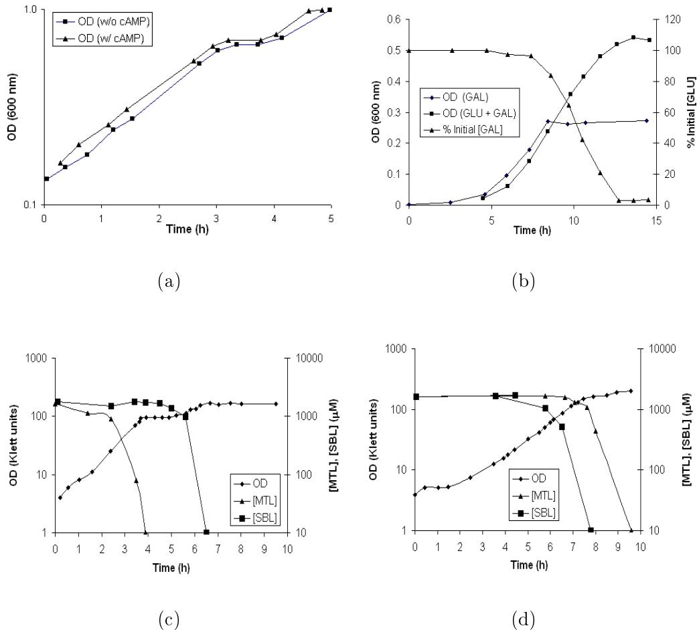

Figure 9. Reversal of the diauxie in mutants of E. oli : Upper panel: (a) In strain Hfr3000, glu
ose is onsumed before gala
tose [(Joseph](#page-45-14) et al., [1981)](#page-45-14). The opti
al density (OD) shows a pronoun
ed diauxi lag, regardless of the presen
e of AMP in the ulture. (b) In the orresponding PTS-de
ient strain, gala
tose is onsumed before glu
ose [(Asensio](#page-44-5) et al., [1963](#page-44-5)). Note that the evolution of the OD during the rst 8 h is the same during growth on gala
tose [OD (GAL)℄ and glu
ose + gala
tose [OD (GLU+GAL)℄. Furthermore, there is no onsumption of glu
ose during this period. Lower panel: (
) In strain 159, mannitol (MTL) is onsumed before sorbitol (SBL). (d) In the orresponding enzyme IImtl-de
ient strain, sorbitol is onsumed before mannitol [(Lengeler](#page-46-7) and Lin, [1972](#page-46-7)).

transport enzyme for the preferred substrate is impaired, i.e., Vs,2 de
reases, so that κ1 remains un
hanged, but κ2 in
reases and α de
reases. If the hanges in κ2 and α are su
iently large, Fig. 6b implies that the substrate onsumption pattern will shift from preferential onsumption of S2 to preferential onsumption of S1.

It should be emphasized that the reversal of the diauxie is a natural onsequen
e of the minimal model. This is be
ause ea
h enzyme inhibits the other enzyme due to dilution by growth, i.e., the inhibition is mutual or ompetitive. Consequently, suppressing the uptake (and hen
e, the growth) on one of the substrates automati
ally tilts the balan
e of power in favor of the other substrate. In ontrast, the reversal of the diauxie is di
ult to explain in terms of mole
ular me
hanisms alone. This is be
ause in all the mole
ular me
hanisms, the inhibition is unilateral rather than mutual. In E. oli, for instan
e, there are numerous me
hanisms that allow PTS sugars, su
h as glu
ose and mannitol, to inhibit the synthesis of the enzymes for non-PTS substrates. But there is no me
hanism for non-PTS substrates to inhibit the synthesis of PTS enzymes. This di
ulty did not es
ape the attention of Asensio et al, who observed the reversal of the glu
ose-gala
tose diauxie (Fig. 9, top panel). Fa
ed with the reversal of the diauxie, they were ompelled to on
lude that the diauxie is, at least in part, due to ompetitive ee
ts at the permease level.

#### 3.1.2 Dependen
e of substrate onsumption pattern on relative growth rates

In order to onsider the relationship between the substrate onsumption pattern and the ratio of the single-substrate maximum spe
i growth rates, dene

$$\rho \equiv \frac{r_{g,2}^{\text{max}}}{r_{g,1}^{\text{max}}},$$

where r max g,i denotes maximum spe
i growth rate during single-substrate growth on saturating on
entrations of Si . Now, the model implies that

$$\begin{aligned} r_{g,1}^{\max} &= Y_1 V_{s,1} \ e_1 |_{E_{10}} = \sqrt{V_{e,1} Y_1 V_{s,1}} \ \epsilon_1 |_{E_{10}}, \\ r_{g,2}^{\max} &= Y_2 V_{s,2} \ e_2 |_{E_{01}} = \sqrt{V_{e,2} Y_2 V_{s,2}} \ \epsilon_2 |_{E_{01}}, \end{aligned}$$

so that

$$\rho = \alpha \frac{\epsilon_2|_{E_{01}}}{\epsilon_1|_{E_{10}}} = \frac{\alpha}{\alpha_g(\kappa_1, \kappa_2)}, \ \alpha_g(\kappa_1, \kappa_2) \equiv \frac{\epsilon_1|_{E_{10}}}{\epsilon_2|_{E_{01}}} = \frac{-\kappa_1 + \sqrt{\kappa_1^2 + 4}}{-\kappa_2 + \sqrt{\kappa_2^2 + 4}}.$$

It follows that

- (1) The surfa
e of αg(κ1, κ2) separates the parameter spa
e into two distin
t regions: Above the surfa
e, ρ > 1, i.e., r max g,2 > rmax g,1 , and below the surfa
e, ρ < 1, i.e., r max g,2 < rmax g,1 .
- (2) The surfa
e of αg(κ1, κ2) lies between the surfa
es of α∗(κ1, κ2) and α ∗ (κ1, κ2), i.e.,

$$
\alpha_*(\kappa_1, \kappa_2) < \alpha_g(\kappa_1, \kappa_2) < \alpha^*(\kappa_1, \kappa_2) \tag{24}
$$

for all κ1, κ2 > 0 (see Appendix C). Thus, the graph of αg , denoted by the dashed brown line in Fig. 6, lies between the graphs of α∗ (blue urve) and α ∗ (red urve).

Given these results, we an re
ast the lassi
ation of the substrate onsumption patterns in terms of ρ. To this end, dene

$$\begin{aligned} \rho_*(\kappa_2) &\equiv \frac{\alpha_*(\kappa_1, \kappa_2)}{\alpha_g(\kappa_1, \kappa_2)} = \kappa_2 \frac{-\kappa_2 + \sqrt{\kappa_2^2 + 4}}{2}, \\\rho^*(\kappa_1) &\equiv \frac{\alpha^*(\kappa_1, \kappa_2)}{\alpha_g(\kappa_1, \kappa_2)} = \frac{1}{\kappa_1} \frac{2}{-\kappa_1 + \sqrt{\kappa_1^2 + 4}}. \end{aligned}$$

Then, there is preferential onsumption of S1 (resp., S2) pre
isely when ρ < ρ∗(κ2) (resp., ρ > ρ∗ (κ1)), and simultaneous onsumption if and only if ρ∗(κ2) < ρ < ρ∗ (κ1). Thus, ρ∗ and ρ ∗ dene the limits of ρ at whi
h there is simultaneous onsumption. It turns out that ρ∗(κ2) in
reases from 0 to 1 as κ2 goes from 0 to ∞, and ρ ∗ (κ1) de
reases from ∞ to 0 as κ1 goes from 0 to ∞ (Fig. 10). We are now ready to dis
uss the relationship between the substrate onsumption patterns and the ratio of the single-substrate maximum spe
i growth rates.

The Harder & Dijkhuizen orrelation states that when growth is diauxi
, the preferred substrate is the one that, by itself, supports a higher maximum spe
i growth rate (p. 7). The model predi
tions are onsistent with this orrelation. This is already evident from Fig. 6: α < αg , i.e., ρ < 1 in the region, α < α∗ , orresponding to preferential onsumption of S1, and α > αg , i.e., ρ > 1 in the region α > α∗ orresponding to preferential onsumption of S2 . The same property is also manifested in Fig. 10, e.g., in the region, ρ < ρ∗(κ2), orresponding to preferential onsumption of S1, ρ < 1 be
ause the graph of ρ∗(κ2) is always below 1. The manifestation of the Harder-Dijkhuizen orrelation in this minimal model suggests that is an intrinsi property of the indu
 tion and dilution kineti
s. It an be explained without invoking goal-oriented regulatory me
hanisms, whi
h form the basis of models based on optimality prin
iples [(Kompala](#page-45-11) et al., [1986](#page-45-11); [Mahadevan](#page-46-12) et al., [2002](#page-46-12); [Ramakrishna](#page-47-9) et al., [1996](#page-47-9)).

Current experimental eviden
e suggests that the existen
e of omparable singlesubstrate maximum spe
i growth rates is, perhaps, ne
essary but not su ient for simultaneous onsumption (p. 8). However, Fig. 10 shows that this ondition (ρ ≈ 1) is neither ne
essary nor su
ient for simultaneous onsumption. It is not ne
essary be
ause when κ1, κ2 ≪ 1, there is simultaneous onsumption for almost all ρ. It is not su
ient for simultaneous onsumption be
ause when κ1, κ2 ≫ 1, simultaneous onsumption is virtually impossible it annot be obtained unless ρ lies in a vanishingly small neighborhood of 1. These results an be understood in terms of the limiting ases dis
ussed above. If κ1, κ2 are small, the enzymes are quasionstitutive, and they resist extin
tion, regardless of the maximum spe
i growth rates. As κ1 and κ2 in rease, the enzymes be
ome progressively more vulnerable to extin
tion, and in the limit of large κ1, κ2, they annot oexist.

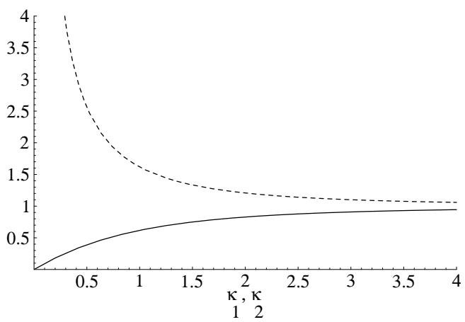

Figure 10. Classi
ation of substrate onsumption patterns in terms of ρ, the ratio of the single-substrate maximum spe
i growth rates. The full and dashed lines show the graphs of ρ∗(κ2) and ρ ∗ (κ1), respe
tively.

We note nally that unlike the standard Lotka-Volterra model for ompeting spe
ies, there are no parameter values that yield bistable enzyme dynami
s (
ompare Figs. 5 and 6). We show below that bistability be
omes feasible when the indu
tion kineti
s are sigmoidal.

$$3. \mathcal{Z} \quad Case \; \mathcal{Z} \; (n_1 = 2, \; n_2 = 1)$$

In this ase, the s
aled equations are

$$\begin{aligned} \frac{d\epsilon_1}{dt} &= \frac{\epsilon_1^2}{\kappa_1^2 + \epsilon_1^2} - \left(\epsilon_1 + \alpha \epsilon_2\right)\epsilon_1\\ \frac{d\epsilon_2}{dt} &= \alpha \frac{\epsilon_2}{\kappa_2 + \epsilon_2} - \left(\epsilon_1 + \alpha \epsilon_2\right)\epsilon_2 \end{aligned}$$

The key results, whi
h are shown in detail in Appendix D, are as follows

- (1) The trivial steady, E00 , always exists, regardless of the parameter values. It is always unstable.
- (2) The semitrivial steady state, E10 , exists if and only if κ1 < 1, in whi
h ase it is unique, and given by

$$
\epsilon_1 = \sqrt{1 - \kappa_1^2}, \; \epsilon_2 = 0.
$$

It is stable (as a node) if and only if ǫ1|E10 ex
eeds the ǫ1-inter
ept of the nontrivial null
line for ǫ2, i.e.,

$$
\left|\epsilon_1\right|_{E_{10}} > \frac{\alpha}{\kappa_2} \Leftrightarrow \alpha < \kappa_2 \sqrt{1 - \kappa_1^2} \equiv \alpha_*(\kappa_1, \kappa_2). \tag{25}
$$

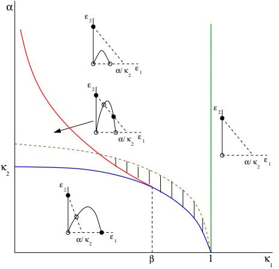

Figure 11. The bifur
ation diagram for the ase n1 = 2, n2 = 1 at any xed κ2 > 0. In the phase portraits, the null
lines for ǫ1 and ǫ2 are represented by full and dashed lines, respe
tively; stable and unstable steady states are represented by full and open ir
les, respe
tively. The graphs of α∗, α ∗ , κ1 = 1, and αg are represented by blue, red, green, and dashed brown urves, respe
tively. In the hat
hed region, S2 is the preferred substrate for all pre
ulturing onditions, even though it supports a maximum spe
i growth rate lower than that on S1 .

- (3) The semitrivial steady state, E01 , always exists, and is given by

$$
\epsilon_1 = 0, \ \epsilon_2 = \frac{-\kappa_2 + \sqrt{\kappa_2^2 + 4}}{2}. \tag{26}
$$

It is always stable (as a node).

- (4) Nontrivial steady states exist only if κ1 < 1. Under these onditions, there are at most two nontrivial steady states. There is a unique nontrivial steady state if and only if

$$0 < \alpha < \alpha_*(\kappa_1, \kappa_2),$$

and it is unstable whenever it exists. There are two nontrivial steady states if and only if

$$0 < \kappa_1 < \beta \equiv \sqrt{\frac{2 + \kappa_2^2}{2(1 + \kappa_2^2)}}, \ \alpha_*(\kappa_1, \kappa_2) < \alpha < \alpha^*(\kappa_1, \kappa_2),$$

where α ∗ (κ1, κ2) is the value of α at whi
h the nontrivial null
lines for ǫ1 and ǫ2 tou
h. One of these steady states is stable and the other is unstable.

- (5) The surfa
e of α∗(κ1, κ2) lies below the surfa
e of α ∗ (κ1, κ2) for all 0 < κ1 < β and κ2 > 0.
The bifur
ation diagram shown in Fig. 11 implies the following lassi
ation of the substrate utilization patterns.

Figure 12. The bifur
ation diagram obtained when α is in
reased at κ1 = 0.5 and κ2 = 1. The red and blue urves show the semitrivial steady states, E10 , E01 , respe
tively. The green and bla
k urves show the two nontrivial states (E11). The urves are full (resp., dashed) if the orresponding steady state is stable (resp., full). The bifur
ation points are represented by full ir
les.

- (1) If α < α∗, E10 and E01 are stable, i.e., there is preferential onsumption of S1 or S2 , depending on the initial onditions.
- (2) If 0 < κ1 < β and α∗ < α < α∗ , E01 and E11 are stable, i.e., there is preferential onsumption of S2 or simultaneous onsumption of S1 and S2, depending on the initial onditions.
- (3) If β < κ1 < 1, α > α∗ or κ1 > 1, there is preferential onsumption of S2 , regardless of the initial onditions.

The surfa
es of α∗ and α ∗ dene the lo
us of trans
riti
al and fold (saddlenode) bifur
ations, respe
tively (Fig. 12). If α is in
reased at any xed 0 < κ1 < β and κ2 > 0, the substrate onsumption pattern hanges at α = α∗ from bistable dynami
s involving preferential onsumption of S1 or S2 to bistable dynami
s involving preferential onsumption of S2 or simultaneous onsumption. This transition o

urs via a trans
riti
al bifur
ation. At α = α ∗ , the substrate onsumption pattern swit
hes to preferential onsumption of S2 via a fold bifur
ation.

Comparison of Fig. 11 with Fig. 6 shows that ertain features are preserved. Spe
i
ally, preferential onsumption of S1 is feasible only at low α, and simultaneous onsumption o

urs only if α has intermediate values and κ1, κ2 are not too large. However, a unique property emerges in Fig. 11, namely, bistability. This is due to the sigmoidal indu
tion kineti
s for E1, whi
h ensure that preferential onsumption of S2 is feasible at all parameter values.

It is also worth examining the relationship between the lassi
ation predi
ted by the model and the empiri
al lassi
ation based on the single-substrate maximum spe
i growth rates. In this ase

$$\rho = \alpha \frac{\epsilon_2 \big|_{E_{01}}}{\epsilon_1 \big|_{E_{10}}} = \frac{\alpha}{\alpha_g(\kappa_1, \kappa_2)}, \ \alpha_g \equiv \frac{2\sqrt{1 - \kappa_1^2}}{-\kappa_2 + \sqrt{\kappa_2^2 + 4}}.$$

Now, αg > α∗ be
ause −κ2 + q κ 2 2 + 4 < 2/κ2 (see Appendix C). Furthermore, αg is zero at κ1 = 1. Thus, the graph of αg lies above the graph of α∗ (dashed brown line in Fig. 11). This implies that a substrate an be onsumed preferentially even if it supports a lower maximum spe
i growth rate. Indeed, if the parameters lie in the region, α < αg , then S2 supports a lower maximum spe
i growth rate than S1, and yet, ells pre
ultured on S2 onsume this substrate preferentially. If the parameter values lie in the hat
hed region of Fig. 11, S2 is the preferred substrate, regardless of the manner in whi
h the ells are pre
ultured.

#### 3.2.1 Eviden
e of bistable substrate onsumption patterns

The bistable dynami
s predi
ted by Fig. 11 have been observed in experiments.

The bistable dynami
s in the region, α∗ < α < α∗ , orrespond to preferential onsumption of S2 if the pre
ulture is grown on S2, and simultaneous onsumption if the pre
ulture is grown on S1. Two examples of this substrate onsumption pattern were des
ribed in the Introdu
tion, namely, growth of P. aeruginosa on glu
ose plus itrate [(Hamilton](#page-45-7) and Dawes, [1959](#page-45-7), [1960](#page-45-8), [1961)](#page-45-9) and growth of E. oli K12 on a mixture of glu
ose and pyruvate [(Narang](#page-46-6) et al., [1997b)](#page-46-6). Fig. 13 shows another example of this substrate onsumption pattern. When Strepto
o

us mutans GS5 is grown on a mixture of glu
ose and la
tose, glu
ose-pre
ultured ells onsume glu
ose before la
tose (Fig. 13a), whereas la
tose-pre
ultured ells onsume both glu
ose and la
tose (Fig. 13b).

The bistable dynami
s in the region, α < α∗, orrespond to preferential onsumption of S1 if the pre
ulture is grown on S1, and preferential onsumption of S2 if the pre
ulture is grown on S2 . Furthermore, the maximum spe i growth on S2 is lower than that on S1. There is eviden
e suggesting the existen
e of this substrate onsumption pattern. Tsu
hiya and oworkers studied the growth of Salmonel la typhimurium on a mixture of glu
ose and melibiose [(Kuroda](#page-45-15) et al., [1992](#page-45-15); [Okada](#page-46-2) et al., [1981](#page-46-2)). They found that the wildtype strain LT2 onsumed glu
ose before melibiose. However, the PTS enzyme I mutant, SB1476, yielded the bistable substrate onsumption pattern orresponding to the region, α < α∗ . Cells pre
ultured on glu
ose onsumed glu
ose preferentially (Fig. 13
), and ells pre
ultured on melibiose onsumed melibiose preferentially (Fig. 13d). Moreover, the maximum spe
i growth rate on glu
ose (0.24 h−1 ) is signi
antly lower than that on melibiose (0.41 h−1 ). It should be noted that these experiments were done in the presen
e of 5 mM

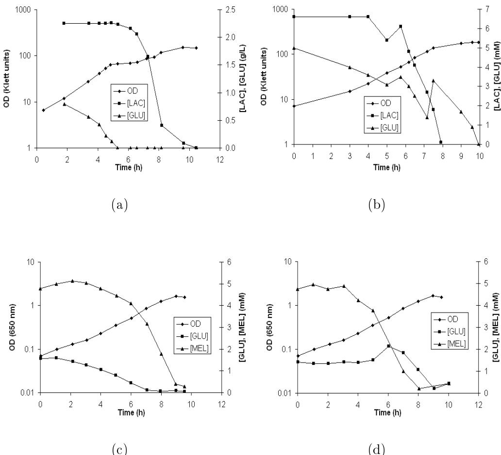

Figure 13. Bistability in mixed-substrate growth: Upper panel: Growth of Strepto
o

us mutans GS5 on a mixture of la
tose (LAC) and glu
ose (GLU) [(Liberman](#page-46-14) and Bleiweis, [1984)](#page-46-14). (a) Glu
ose is onsumed preferentially if the ells are pre
ultured on glu
ose. (b) Glu
ose and la
tose are onsumed simultaneously if the ells are pre
ultured on la
tose. Lower panel: Growth of Salmonel la typhimurium SB1476 on a mixture on a mixture of glu
ose (GLU) and melibiose (MEL) [(Kuroda](#page-45-15) et al., [1992)](#page-45-15). (
) Glu
ose-pre
ultured ells onsume glu
ose before melibiose. (d) Melibiose-pre
ultured ells onsume melibiose before glu
ose. In (b) and (d), the on
entration of glu
ose in
reases at t ≈ 8 and t ≈ 6 h, respe
tively. It is believed that is due to expulsion of the glu
ose produ
ed from intra
ellular hydrolysis of la
tose and melibiose, respe
tively.

AMP in the ulture. However, at least in the ase of glu
ose-pre
ultured ells, the same phenotype was observed even in the absen
e of AMP.

#### 4 Dis
ussion

We have shown that a minimal model a

ounting for only enzyme indu
tion and dilution aptures and explains all the substrate onsumption patterns observed in the experimental literature. In what follows, we dis
uss the robustness of the model, and its impli
ations for the problem of size regulation in development.

#### 4.1 Robustness of the model

Given the simpli
ity of the model, it is ne
essary ask whether the properties of the model will be preserved if additional metaboli details and regulatory me
hanisms are in
orporated in the model. Now, the dening property of the minimal model is that the enzymes follow ompetitive dynami
s. We show below that this property is not a onsequen
e of the parti
ular kineti
s assumed in the model. It is the out
ome of two very general hara
teristi
s possessed by most systems of mixed-substrate growth.

To see this, it is useful to onsider the generalized Lotka-Volterra model for ompeting spe
ies [(Hirs
h](#page-45-12) and Smale, [1974,](#page-45-12) Chap. 12). This model postulates that the ompetitive intera
tions between two spe
ies are aptured by the relations

$$\frac{dN_i}{dt} = f_i(N_1, N_2), \ f_1(0, N_2) = f_2(N_1, 0) = 0 \text{ and } \ \frac{\partial f_1}{\partial N_2}, \frac{\partial f_2}{\partial N_1} < 0.$$

In other words, the essen
e of ompetitive intera
tions an be distilled into two properties:

- (a) The growth of a spe
ies is impossible in the absen
e of that spe
ies (dNi/dt = 0 whenever Ni = 0).
- (b) Ea
h spe
ies inhibits the growth of the other spe
ies (∂f1/∂N2, ∂f2/∂N1) < 0.

These properties, by themselves, imply the existen
e of all the dynami
s asso iated with ompetitive intera
tions, namely, the absen
e of limit y
les, and the existen
e of extin
tion and oexisten
e steady states.

Now, properties (a) and (b) will be manifested in most systems of mixedsubstrate growth. Indeed, the evolution of the enzymes during the rst exponential growth phase an be des
ribed by the relations

$$\frac{de_i}{dt} = g_i(e_1, e_2) \equiv r_{e,i}(e_1, e_2) - r_g(e_1, e_2)e_i.$$

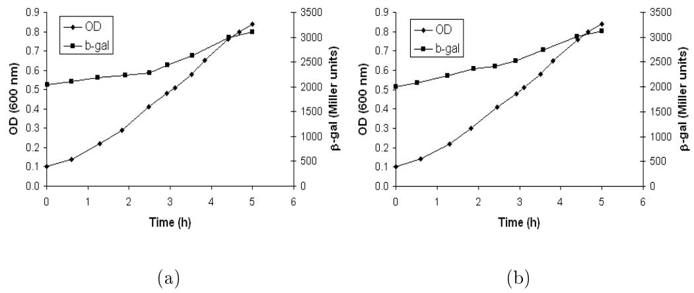

Figure 14. Disappearan
e of the diauxie when the enzymes are not ne
essary for their own synthesis [(Inada](#page-45-1) et al., [1996](#page-45-1)). Synthesis of β-gala
tosidase persists in the presen
e of glu
ose if (a) la
I is mutated so that la trans
ription be
omes onstitutive or (b) IPTG is present in the medium. In the rst ase, la trans
ription is onstitutive, i.e., it persists even in the absen
e of the indu
er. In the se
ond ase, la trans
ription is no longer dependent on the existen
e of the permease.

If we assume that

- (1) ea
h enzyme is ne
essary for its own synthesis, i.e., re,i = 0 whenever ei = 0,
- (2) ea
h enzyme has either no ee
t or inhibits the synthesis of the other enzyme, i.e., ∂re,1/∂e2 , ∂re,2/∂e1 ≤ 0,
- (3) the spe
i growth rate is an in
reasing fun
tion of e1 and e2, i.e., ∂rg/∂e1 , ∂rg/∂e2 > 0,

then the enzymes satisfy both the hypotheses of the generalized model for ompeting spe
ies: (a) There is no enzyme synthesis in the absen
e of the enzyme (dei/dt = 0 whenever ei = 0), and (b) ea
h enzyme inhibits the synthesis of the other enzyme (∂g1/∂e2 , ∂g2/∂e1 < 0). Consequently, they will display extin
tion and oexisten
e dynami
s.

It remains to onsider the generality of assumptions 13.

Assumption 1 will be satised whenever the substrates are transported by unique indu
ible enzymes. In these ases, the enzymes are required for the existen
e of the indu
er (ei = 0 ⇒ xi = 0), and the indu
ers are ne
essary for the synthesis of the enzymes (xi = 0 ⇒ re,i = 0); hen
e, ei = 0 ⇒ re,i = 0. One an imagine two ases in whi
h assumption 1 is violated. First, if an enzyme is onstitutive, it is synthesized even in the absen
e of the indu
er (xi = 0 ; re,i = 0). Se
ond, in the presen
e of a gratuitous indu
er, su
h as IPTG, whi
h an enter the ell even in the absen
e of la
tose permease, the enzyme is not required for the existen
e of the indu
er (ei = 0 ; xi = 0). In both ases, the extin
tion steady state eases to exist, and the substrates will be onsumed simultaneously. This is onsistent with experiments (Fig. 14).

Assumption 2 will be satised provided the enzymes do not a
tivate ea
h other. But all the known regulatory me
hanisms invariably entail dire
t or indire
t inhibition of one of the enzymes by the other enzyme. This in
ludes indu
er ex
lusion (dephosphorylated enzyme IIglc inhibits la permease), and AMP a
tivation (dephosphorylation of IIglc auses a redu
tion of AMP levels, whi
h in turn inhibits la trans
ription).

Assumption 3 will be satised if the yield of biomass on a substrate during single-substrate growth does not hange markedly during mixed-substrate growth. In the model, the yields were assumed to be onstant. This is ertainly true for onservative substrates sin
e Y[i](#page-44-6) = [1](#page-44-6). It is also observed to hold in many mixtures of arbon sour
es (Egli et al., 1982; [Narang](#page-46-6) et al., [1997b)](#page-46-6). However, it is on
eivable that there are systems in whi
h the yields vary with the enzyme levels. In su
h ases, the spe
i growth rate will have the form, rg(e1, e2) = Y1(e1, e2)Vs,ie1 + Y2(e1, e2)Vs,2e2 . At present, the data is not su ient for determining the extent to whi
h the yields with the enzyme levels.

It is therefore lear that in
lusion of various regulatory me
hanisms will enhan
e the mutual inhibition due from dilution. However, the qualitative behavior will be preserved, sin
e the enzymes will still follow Lotka-Volterra dynami
s. Thus, the key property of the model, namely, ompetitive dynami
s of the enzymes, is quite robust insofar as the perturbations with respe
t to regulatory me
hanisms are on
erned.

The notion that diauxi growth is the out
ome of ompetitive intera
tions between the enzymes is not new. It an be found in the earliest papers on diauxi growth. In 1947, Monod noted that [(Monod](#page-46-0), [1947,](#page-46-0) p. 254)

it appears that the me
hanisms involved in diauxi inhibition have the hara
ter of ompetitive intera
tions between dierent spe
i enzyme-forming systems.

He observed, furthermore, that the [(Monod](#page-46-0), [1947,](#page-46-0) p. 259).

existen
e of ompetitive intera
tions in the synthesis of dierent spe
i enzymes appears to be a fa
t of fundamental signi
an
e in enzymati adaptation, and one for whi
h any on
eption of the phenomenon should be able to a

ount.

However, these on
lusions were based on the kineti
s of the enzyme levels during diauxi growth, and had no me
hanisti basis.

The above argument, rst made in [Narang](#page-46-9) [(1998a)](#page-46-9), shows the me
hanisti

basis of the ompetitive intera
tions in a mathemati
ally pre
ise fashion.

# 4.2 Impli
ation of the model for development

Diauxi growth has played a riti
al role in shaping models of patterning in development. The rst link between geneti
s and development was established in the late 40's by appealing to the following argument [(Gilbert,](#page-44-7) [2002](#page-44-7)). During diauxi growth, ells possessing identi
al genes synthesize dierent proteins at distin
t times (namely, the rst and se
ond exponential growth phases). By analogy, patterning in dierentiation ould be viewed as the synthesis of dierent proteins at distin
t times and lo
ations [(Monod,](#page-46-0) [1947;](#page-46-0) [Spiegelman](#page-47-12), [1948](#page-47-12)). From this standpoint, diauxi growth and developmental patterning an be viewed as temporal and spatiotemporal dierentiation, respe
tively.

The subsequent dis
overy of the mole
ular me
hanisms involved in developmental patterning have onrmed the above hypothesis. It has been found that developmental patterns are generated by me
hanisms similar in prin
iple, but more omplex in detail, than those involved diauxi growth [(Ptashne](#page-47-1) and Gann, [2002](#page-47-1), Chap. 3).

Despite remarkable su

esses in developmental patterning, there are outstanding questions about size regulation, i.e., the me
hanisms by whi
h patterning is oupled to growth (Day and [Lawren
e](#page-44-8), [2000;](#page-44-8) Hafen and [Sto
ker](#page-44-9), [2003](#page-44-9); Serrano and O['Farrell,](#page-47-13) [1997](#page-47-13)). Examples of su
h questions in
lude: What determines the size of organs and organisms, i.e., why does their growth ease at a ertain time? And why is development s
ale-invariant, i.e., why is the size of the organs is proportional to the size of the organism?

The model presented here may be relevant to the problem of size regulation. It shows that the temporal dierentiation in the diauxie is oupled to growth, and this oupling is mediated by the pro
ess of enzyme dilution. Inasmu
h as the diauxie is a paradigm of the me
hanisms ontrolling ellular dierentiation, a similar me
hanism may lie at the heart of the oupling between developmental patterning and growth. Based on the minimal model, one an spe
ulate, for instan
e, that organ growth eases at a ertain time be
ause growth-promoting enzymes are driven to extin
tion at su
iently high growth rates.

The model also has impli
ations for the problem of s
ale invarian
e. In many mathemati
al models of development, pattern formation o

urs when a homogeneous steady state of a rea
tion-diusion system

$$\frac{\partial c}{\partial t} = D\nabla^2 c - r(c, p) \tag{27}$$

be
omes unstable due to the onset of a Turing instability [(Murray,](#page-46-13) [1989)](#page-46-13). Here, c(x, t) denotes the ve
tor of morphogen on
entrations, D is the matrix of diusivities, and r(c, p) is the rea
tion rate ve
tor expressed as a fun
 tion of c and a ve
tor of parameters, p. In general, the patterns predi
ted by these models are not s
ale-invariant. However, this problem an be resolved if the system is fed more information about its size (say, L). For instan
e, perfe
t s
ale invarian
e is obtained if the diusivities or rate onstants are proportional to [L](#page-47-14) 2 , and plausible me
hanisms for su
h a dependen
e have been proposed (Othmer and Pate, [1980](#page-47-14); [Ishihara](#page-45-16) and Kaneko, [2006](#page-45-16)).

In growing systems, however, information regarding the growth rate is onstantly fed to the me
hanism driving pattern formation. Indeed, in the presen
e of growth, Eq. (27) be
omes

$$\frac{\partial c}{\partial t} + v.\nabla c = D\nabla^2 c - r(c, p) - c\nabla \cdot v \tag{28}$$

where v(x, t) is the velo
ity ve
tor eld, v · ∇c is the a

umulation of the morphogens due to onve
tion, ∇ · v is the spe
i growth rate, and c∇ · v is the dilution of the morphogens due to growth. Crampin et al have shown that these equations exhibit a ertain degree of s
ale invarian
e as the system grows, the number of pattern elements remains the same despite a doubling of the system size [(Crampin](#page-44-10) et al., [1999](#page-44-10), [2002)](#page-44-11). Further analysis of this lass of equations oers the promise of deeper insights into the oupling between patterning and growth.

### 5 Con
lusions

- (1) We showed that a minimal model a

ounting for enzyme indu
tion and dilution, but not AMP a
tivation and indu
er ex
lusion, aptures and explains all the observed substrate onsumption patterns, in
luding diauxi growth, simultaneous onsumption, and bistable growth. This suggests that the dynami
s hara
teristi of mixed-substrate growth are already inherent in the minimal stru
ture asso
iated with indu
tion and dilution. We nd that many of the mole
ular me
hanisms, su
h as indu
er ex
lusion, serve to amplify these inherent dynami
s.
- (2) We onstru
ted bifur
ation diagrams showing the parameter values at whi
h the various substrate onsumption patterns will be observed. The bifur
ation diagrams explain the phenotypi responses to various geneti perturbations, in
luding lesions in the genes for the repressor, operator, and the transport enzymes. Importantly, they provide a simple explanation for the reversal of the diauxie, a phenomenon whi
h is quite di
ult to explain in terms of mole
ular me
hanisms. The bifur
ation diagrams also provide deep insights into the me
hanisms underlying the empiri-

ally observed orrelations between the substrate onsumption patterns and the single-substrate growth rates. We found that

- (a) When the indu
tion kineti
s are hyperboli
, the preferred substrate is always the one that that supports a higher growth rate. This orrelation is, therefore, unlikely to be the out
ome of optimal design. It is a natural onsequen
e of the fa
t that the enzymati dynami
s are governed by the rates of indu
tion and dilution. If indu
tion is sigmoidal, it is possible for the preferred substrate to support a lower growth rate than the less preferred substrate. We
presented experimental data illustrating this ase.

- (b) The existen
e of omparable growth rates is neither ne
essary nor su
ient for simultaneous onsumption. When the saturation onstants are small, simultaneous onsumption o

urs regardless of the maximum spe
i growth rates, sin
e indu
tion is quasionstitutive. If the saturation onstants are large, simultaneous onsumption is impossible even if the growth rates are omparable.
- (3) The key property of the model, namely, ompetitive dynami
s of the enzymes, is quite robust with respe
t to stru
tural perturbations.
- (4) The model may have impli
ations for the problem of size regulation in development, sin
e it provides a me
hanism for oupling dierentiation and growth, namely, protein dilution.

# A
knowledgements

This resear
h was supported in part with funds from the National S
ien
e Foundation under ontra
t NSF DMS-0517954.

# A Interpretation of ni, Ve,i, and Ke,i in terms of mole
ular intera
 tions

To express ni , Ve,i, and K[e,i](#page-47-10) in terms of mole
ular parameters, we appeal to the Yagil & Yagil model (Yagil and Yagil, [1971)](#page-47-10). For notational larity, we shall ignore the subs
ript i for the substrate; thus, the operator, indu
er, and repressor will be denoted by O, X , and R, respe
tively. Furthermore, their on
entrations will be denoted [O], [X], and [R], respe
tively.

The Yagil & Yagil model views indu
tion as the out
ome of a ompetition for the repressor between the operator and the indu
er. Indu
tion o

urs when the indu
er mole
ules sequester the repressors away from the operator. The ompetitive intera
tions are represented by two binding equilibria

$$R + O \rightleftharpoons R \cdot O, \ K_o \equiv \frac{[R][O]}{[R \cdot O]},\tag{A.1}$$

$$R + nX \rightleftharpoons R \cdot X_n \ K_x \equiv \frac{[R][X]}{[R \cdot X_n]},\tag{A.2}$$

where n denotes the number of indu
er mole
ules that bind to 1 mole
ule of repressor; [R · O], [R · Xn] denote the on
entrations of the omplexes, R · O, R · Xn, respe
tively; and Ko, Kx denote the disso
iation onstants for the two equilibria.

It is assumed that

- (1) Enzyme synthesis is limited by the trans
ription rate, i.e., translation is not limiting. Thus, the spe
i enzyme synthesis rate is proportional to the spe
i trans
ription rate. Furthermore, the spe
i trans
ription rate is proportional to the on
entration of the free operator, i.e.,

$$r_e = \nu[O],\tag{A.3}$$

where ν denotes the enzyme synthesis rate per unit mass of operator.

- (2) The total on
entrations of O and R, denoted [O]t and [R]t , respe
tively, are onserved, i.e.,

$$[O]_t = [O] + [R \cdot O],\tag{A.4}$$

$$[R]_t = [R] + [R \cdot O] + [R \cdot X_n].\tag{A.5}$$

These two relations, together with Eqs. (A.1)(A.2), onstitute 4 equations in 4 unknowns, namely, [O], [R], [R·O℄, and [R · Xn]. In prin
iple, these equations an be solved for [O], and substituted in (A.3) to obtain re. However, sin
e the solution is umbersome, it is onvenient to make the following additional assumption.

- (3) The repressor is bound primarily to the indu
er (rather than the operator), i.e.,

$$[R \cdot O] \ll [R \cdot X_n].$$

This assumption is valid under most onditions be
ause the operator on
entration (∼2 per ell) is signi
antly smaller than the indu
er on entration.

These assumptions yield

$$r_e = \nu[O] = V_e \frac{K_x + [X]^n}{K_x(1 + [R]_t/K_o) + [X]^n},$$

where Ve ≡ ν[Ot ].

In the ase of onstitutive enzymes, the repressor has a weak anity for the

operator, i.e., Ko ≫ [R]t , so that

re ≈ Ve

regardless of the indu
er on
entration.

In the ase of indu
ible enzymes, the repressor has a high anity for the operator, i.e., Ko ≪ [R]t , so that

$$r_e \approx V_e \frac{K_x + [X]^n}{K_x [R]_t / K_o + [X]^n}.$$

This is a monotoni
ally in
reasing fun
tion of [X] with a small nonzero inter ept. Negle
ting this small basal enzyme synthesis rate yields 9

$$r_e \approx V_e \frac{[X]^n}{K_e^n + [X]^n}, \ K_e^n \equiv \frac{K_x}{K_o} [R]_{t^*}$$

#### B Derivation of the equations

Equations (35) impli
itly dene the spe
i growth rate and the evolution of the ell density. To see this, observe that sin
e all the intra
ellular on entrations are expressed as mass fra
tions (g/gdw), their sum equals 1, i.e., x1 + x2 + e1 + e2 + c − = 1. Hen
e, addition of equations (35) yields

$$0 = \sum_{i=1}^{2} r_{s,i} - \sum_{i=1}^{2} (1 - Y_i)r_{x,i} - \frac{1}{c}\frac{dc}{dt}$$

whi
h an be rewritten in the more familiar form

$$\frac{dc}{dt} = r_g c, \ r_g \equiv \sum_{i=1}^{2} r_{s,i} - \sum_{i=1}^{2} (1 - Y_i) r_{x,i}$$

where rg denotes the spe
i growth rate.

We an simplify the model by observing that xi ∼ 10−3 g/gdw (Chung and [Stephanopoulos](#page-44-12), [1996](#page-44-12)) and rs,i, rx,i ∼ 1 g gdw−1 h−1 . Thus, xi attains quasisteady state on a time s
ale of 10−3 h. Moreover, the dilution term rgxi ∼ 10−4 g gdw−1 h−1 is negligibly small ompared to rs,i, rx,i. Hen
e, within a few se
onds, (3) be omes, 0 ≈ rs,i − rx,i, whi
h implies that rg ≈ P i Yirs,i, i.e., Yi is essentially

9 Re
ent eviden
e suggests that in the ase of the la operon, the ooperativity does not arise from the binding of two indu
er mole
ules to a single repressor mole
ule. Instead, it might be due to the ooperative binding of a single repressor mole
ule to two operators [(Oehler](#page-46-15) et al., [2006](#page-46-15)).

the yield of biomass on Si . Thus, we arrive at the equations

$$\begin{aligned} \frac{dc}{dt} &= (Y_1 r_{s,1} + Y_2 r_{s,2})c, \\ \frac{ds_i}{dt} &= -r_{s,i}c \\ \frac{de_i}{dt} &= r_{e,i} - (Y_1 r_{s,1} + Y_2 r_{s,2})e_i, \\ x_i &\approx \frac{V_{s,i} e_i s_i / (K_{s,i} + s_i)}{k_{x,i}} \\ c^- &= 1 - x_1 - x_2 - e_1 - e_2 \end{aligned}$$

where xi is obtained by solving the quasisteady state relation, rx,i ≈ rs,i.

# C Stability analysis of ase 1 (n1 = n2 = 1)

In this ase, the steady states satisfy the equations

$$\begin{aligned} 0 &= \left(\frac{1}{\kappa_1 + \epsilon_1} - \epsilon_1 - \alpha \epsilon_2\right) \epsilon_1, \\ 0 &= \left(\alpha \frac{1}{\kappa_2 + \epsilon_2} - \epsilon_1 - \alpha \epsilon_2\right) \epsilon_2. \end{aligned}$$

and the Ja
obian at any (ǫ1, ǫ2) is

$$J(\epsilon_1, \epsilon_2) = \begin{bmatrix} \frac{\kappa_1}{(\kappa_1 + \epsilon_1)^2} - 2\epsilon_1 - \alpha \epsilon_2 & -\alpha \epsilon_1 \\ \epsilon - \epsilon_2 & \frac{\alpha \kappa_2}{(\kappa_2 + \epsilon_2)^2} - \epsilon_1 - 2\alpha \epsilon_2 \end{bmatrix}.$$

# C.1 Trivial steady state

It is evident that E00 exists, regardless of the parameter values. It is always an unstable node sin
e

$$J(E_{00}) = \begin{bmatrix} \frac{1}{\kappa_1} & 0\\ 0 & \frac{1}{\kappa_2} \end{bmatrix}$$

whi
h implies that both eigenvalues, 1/κ1 and 1/κ2, are positive.

#### C.2 Semitrivial steady states

The semitrivial steady state, E10 , always exists. It is unique and given by

$$
\epsilon_1 = \frac{-\kappa_1 + \sqrt{\kappa_1^2 + 4}}{2}, \; \epsilon_2 = 0.
$$

Sin
e 1/(κ1 + ǫ1) = ǫ1 at E10 , the Ja
obian at this steady state is

$$
\begin{bmatrix}
\frac{\kappa_1 \epsilon_1}{\kappa_1 + \epsilon_1} - 2\epsilon_1 & -\alpha \epsilon_1 \\
0 & \frac{\alpha}{\kappa_2} - \epsilon_1
\end{bmatrix},
$$

and the eigenvalues are

$$
\lambda_1 = \frac{\kappa_1 \epsilon_1}{\kappa_1 + \epsilon_1} - 2\epsilon_1 = -\epsilon_1 \frac{\kappa_1 + 2\epsilon_1}{\kappa_1 + \epsilon_1} < 0, \ \lambda_2 = \frac{\alpha}{\kappa_2} - \epsilon_1.
$$

Hen
e, E10 is stable (as a node) if and only if

$$
\lambda_2 = \frac{\alpha}{\kappa_2} - \epsilon_1 < 0 \iff \alpha < \kappa_2 \left. \epsilon_1 \right|_{E_{10}} \Leftrightarrow \frac{\kappa_2}{\alpha} - \kappa_1 > \frac{\alpha}{\kappa_2}. \tag{C.1}
$$

A similar analysis of the semitrivial steady state, E01 , shows that it always exists. It is unique and given by

$$
\epsilon_1 = 0, \ \epsilon_2 = \frac{-\kappa_2 + \sqrt{\kappa_2^2 + 4}}{2}.
$$

It is stable (as a node) if and only if

$$
\alpha > \frac{1}{\kappa_1 \left. \epsilon_2 \right|_{E_{01}}} \Leftrightarrow \alpha(\alpha \kappa_1 - \kappa_2) > \frac{1}{\kappa_1}.\tag{C.2}
$$

# C.3 Nontrivial steady state(s)

The nontrivial steady state(s), E11 , satisfy the equations

$$0 = \frac{1}{\kappa_1 + \epsilon_1} - \epsilon_1 - \alpha \epsilon_2,\tag{C.3}$$

$$0 = \alpha \frac{1}{\kappa_2 + \epsilon_2} - \epsilon_1 - \alpha \epsilon_2. \tag{C.4}$$

Eliminating ǫ2 from these equations yields the equation

$$\frac{1}{\kappa_1 + \epsilon_1} = (1 + \alpha^2)\epsilon_1 + \alpha(\alpha\kappa_1 - \kappa_2),$$

whi
h has at most 1 positive root, and it exists if and only if

$$
\alpha(\alpha \kappa_1 - \kappa_2) < \frac{1}{\kappa_1} \Leftrightarrow \ E_{01} \text{ is unstable.}
$$

On the other hand, eliminating ǫ1 from (C.3C.4) yields the equation

$$\frac{\alpha}{\kappa_2 + \epsilon_2} = (\frac{1}{\alpha} + \alpha)\epsilon_2 + \frac{\kappa_2}{\alpha} - \kappa_1$$

whi
h has at most 1 positive root, and it exists if and only if

$$
\frac{\kappa_2}{\alpha} - \kappa_1 < \frac{\alpha}{\kappa_2} \iff E_{10} \text{ is unstable.}
$$

Thus, E11 exists if and only if both E10 and E01 are unstable. Furthermore, it is unique whenever it exists, and is given by

$$\begin{aligned} \epsilon_1 &= \frac{(\alpha \kappa_2 - \kappa_1) - 2\alpha^2 \kappa_1 + \sqrt{(\alpha \kappa_2 - \kappa_1)^2 + 4\left[(1 + \alpha^2) + \alpha \kappa_2\right]}}{2(1 + \alpha^2)}, \\\epsilon_2 &= \frac{-\alpha(\alpha \kappa_2 - \kappa_1) - 2\kappa_2 + \sqrt{(\alpha \kappa_2 - \kappa_1)^2 + 4\left[(1 + \alpha^2) + \alpha \kappa_2\right]}}{2(1 + \alpha^2)}. \end{aligned}$$

It turns out that E11 is stable whenever it exists sin
e (C.3C.4) imply that

$$J_{11} = \frac{\kappa_1}{(\kappa_1 + \epsilon_1)^2} - 2\epsilon_1 - \alpha \epsilon_2 = -\frac{\epsilon_1}{\kappa_1 + \epsilon_1} \left(\kappa_1 + 2\epsilon_1 + \alpha \epsilon_2\right) < 0$$

and

$$J_{22} = \frac{\alpha \kappa_2}{(\kappa_2 + \epsilon_2)^2} - \epsilon_1 - 2\alpha \epsilon_2 = -\frac{\epsilon_2}{\kappa_2 + \epsilon_2} \left(\alpha \kappa_2 + \epsilon_1 + 2\alpha \epsilon_2\right) < 0$$

so that tr J(E11) < 0 and

$$\det J(E_{11}) = \left(\kappa_1 + \alpha \kappa_2\right)\epsilon_1 + \alpha \left(\kappa_1 + \alpha \kappa_2\right)\epsilon_2 + 4\alpha \epsilon_1 \epsilon_2 + 2\alpha^2 \epsilon_2^2 > 0.$$

Hen
e, the eigenvalues of J(E11) have negative real parts.

We on
lude that E11 exists if and only if

$$\text{Both } E_{10} \text{ and } E_{01} \text{ are unstable} \\
\Leftrightarrow \\
\frac{1}{\kappa_1 \left. \epsilon_2 \right|_{E_{01}}} < \alpha < \kappa_2 \left. \epsilon_1 \right|_{E_{10}}.\tag{C.5}$$

Furthermore, it is unique and stable whenever it exists.

#### C.4 Disposition of the surfa
es of α∗, α ∗ , and αg

The surfa
e of αg lies between the surfa
es of α∗(κ1, κ2) and α ∗ (κ1, κ2), i.e.,

$$
\alpha_* (\kappa_1, \kappa_2) < \alpha_g (\kappa_1, \kappa_2) < \alpha^* (\kappa_1, \kappa_2) \tag{C.6}
$$

for all κ1, κ2 > 0. To see this, observe that

$$1\left(\frac{1}{x} + \frac{x}{2}\right)^2 > 1 + \frac{x^2}{4} \Rightarrow \frac{-x + \sqrt{x^2 + 4}}{2} < \frac{1}{x}$$

for all x > 0. Hen
e

$$\frac{-\kappa_1 + \sqrt{\kappa_1^2 + 4}}{2/\kappa_2} < \frac{-\kappa_1 + \sqrt{\kappa_1^2 + 4}}{-\kappa_2 + \sqrt{\kappa_2^2 + 4}} < \frac{2/\kappa_1}{-\kappa_2 + \sqrt{\kappa_2^2 + 4}}$$

for all κ1, κ2 > 0, and (C.6) follows immediately from the denitions of α∗ , α ∗ , and αg .

# D Stability analysis of ase 2 (n1 = 2, n2 = 1)

In this ase, the steady states satisfy the equations

$$\begin{aligned} 0 &= \left(\frac{\epsilon_1}{\kappa_1^2 + \epsilon_1^2} - \epsilon_1 - \alpha \epsilon_2\right) \epsilon_1, \\ 0 &= \left(\alpha \frac{1}{\kappa_2 + \epsilon_2} - \epsilon_1 - \alpha \epsilon_2\right) \epsilon_2. \end{aligned}$$

and the Ja
obian at any (ǫ1, ǫ2) is

$$J(\epsilon_1, \epsilon_2) = \begin{bmatrix} \frac{2\kappa_1^2 \epsilon_1}{(\kappa_1^2 + \epsilon_1^2)^2} - 2\epsilon_1 - \alpha \epsilon_2 & -\alpha \epsilon_1 \\ \epsilon & \frac{\alpha \kappa_2}{(\kappa_2 + \epsilon_2)^2} - \epsilon_1 - 2\alpha \epsilon_2 \end{bmatrix}.$$

In what follows, we study the onditions on the parameter values for the existen
e and stability of all four types of steady states.

# D.1 Trivial steady state

The trivial steady, E00 , always exists, regardless of the parameter values. The Ja
obian is singular at this steady state, but we an infer its stability from the dynami
s on the invariant lines, ǫ1 = 0 and ǫ2 = 0. Indeed, in the neighborhood of E00 ,

$$\left. \frac{d\epsilon_1}{dt} \right|_{\epsilon_2=0} \approx \epsilon_1^2 \left( \frac{1}{\kappa_1^2} - 1 \right), \left. \frac{d\epsilon_2}{dt} \right|_{\epsilon_1=0} \approx \frac{\alpha}{\kappa_2} \epsilon_2 > 0.1$$

Hen
e, E00 is a nonhyperboli saddle if κ1 < 1 and a nonhyperboli unstable node if κ1 > 1.

#### D.2 Semitrivial steady states

The semitrivial steady state, E10 , exists provided κ1 < 1, in whi
h ase it is unique, and given by

$$
\epsilon_1 = \sqrt{1 - \kappa_1^2}, \; \epsilon_2 = 0.
$$

Sin
e ǫ 2 1 + κ 2 e,1 = 1 at this steady state, the Ja
obian is

$$
\begin{bmatrix}
2\left(\kappa_1^2 - 1\right)\epsilon_1 & -\alpha\epsilon_1 \\
0 & \frac{\alpha}{\kappa_2} - \epsilon_1
\end{bmatrix},
$$

and the eigenvalues are

$$
\lambda_1 = 2\left(\kappa_1^2 - 1\right)\epsilon_1 < 0,\\
\lambda_2 = \frac{\alpha}{\kappa_2} - \epsilon_1.
$$

Hen
e, E10 is stable (as a node) if and only if

$$
\lambda_2 = \frac{\alpha}{\kappa_2} - \left. \epsilon_1 \right|_{E_{10}} < 0 \iff \alpha < \kappa_2 \sqrt{1 - \kappa_1^2}. \tag{D.1}
$$

Analysis of the steady state, E01, shows that this steady state always exists, and is given by

$$
\epsilon_1 = 0, \; \epsilon_2 = \frac{-\kappa_2 + \sqrt{\kappa_2^2 + 4}}{2}.
$$

The Ja
obian at this steady state is

$$
\begin{bmatrix}
-\alpha \epsilon_2 & 0 \\
-\epsilon_2 & \frac{\alpha \kappa_2 \epsilon_2}{\kappa_2 + \epsilon_2} - 2\alpha \epsilon_2
\end{bmatrix},
$$

and the eigenvalues are

$$
\lambda_1 = -\alpha \epsilon_2 < 0,\ \lambda_2 = -\alpha \epsilon_2 \frac{\kappa_2 + 2\epsilon_2}{\kappa_2 + \epsilon_2} < 0. \tag{D.2}
$$

We on
lude that E01 always exists and is stable (as a node).

#### D.3 Nontrivial steady state(s)

#### D.3.1 Existen
e

The nontrivial steady states satisfy the equations

$$0 = \frac{\epsilon_1}{\kappa_1^2 + \epsilon_1^2} - \epsilon_1 - \alpha \epsilon_2,\tag{D.3}$$

$$0 = \alpha \frac{1}{\kappa_2 + \epsilon_2} - \epsilon_1 - \alpha \epsilon_2. \tag{D.4}$$

If κ1 > 0, there are no nontrivial steady states, sin
e (D.3) annot be satised for any ǫ1, ǫ2 > 0. Indeed,

$$
\kappa_1 > 1 \Rightarrow \frac{\epsilon_1}{\kappa_1^2 + \epsilon_1^2} - \epsilon_1 - \alpha \epsilon_2 = \epsilon_1 \left(\frac{1}{\kappa_1^2 + \epsilon_1^2} - 1\right) - \alpha \epsilon_2 < 0
$$

for all ǫ1, ǫ2 > 0. Hen
eforth, we shall assume that 0 < κ1 < 1 and κ2 > 0.

We begin by introdu
ing a hange of oordinates that redu
es the problem to the existen
e of roots on a nite interval. Letting ǫ2 = νǫ1 , we rewrite the above system as

$$\begin{aligned} \frac{1}{\kappa_1^2 + \epsilon_1^2} &= 1 + \alpha \nu, \\\frac{\alpha}{\kappa_2 + \nu \epsilon_1} &= \epsilon_1 (1 + \alpha \nu). \end{aligned}$$

Solving the rst equation for ǫ1 , and rewriting the se
ond equation, we obtain

$$
\epsilon_1 = \sqrt{\frac{1}{1 + \alpha \nu} - \kappa_1^2},
$$

$$
\frac{\alpha}{1 + \nu \alpha} = \nu \epsilon_1^2 + \kappa_2 \epsilon_1.
$$

Hen
e, we obtain the following equation for ν :

$$\frac{\alpha}{1+\nu\alpha} = \nu \left( \frac{1}{1+\alpha\nu} - \kappa_1^2 \right) + \kappa_2 \sqrt{\frac{1}{1+\alpha\nu} - \kappa_1^2}.$$

Multiplying through by (1 + αν), we obtain

$$
\alpha = \nu \left[ 1 - \kappa_1^2 (1 + \alpha \nu) \right] + \kappa_2 \sqrt{(1 + \alpha \nu) \left[ 1 - \kappa_1^2 (1 + \alpha \nu) \right]}.
$$

Finally, we let

$$z = \kappa_1^2 (1 + \alpha \nu), \quad \nu = \frac{1}{\alpha} \left( \frac{z}{\kappa_1^2} - 1 \right),$$

and rewrite the above equation as

$$1 = \frac{1}{\alpha^2 \kappa_1^2} (z - \kappa_1^2)(1 - z) + \frac{\kappa_2}{\alpha \kappa_1} \sqrt{z(1 - z)} = f(z, \alpha). \tag{D.5}$$

Observe that z uniquely determines ν , and hen
e both ǫ1 and ǫ2 . To ensure that both ǫi > 0, z must belong to the interval (κ 2 1 , 1). Thus, the problem is redu
ed to the existen
e of roots of (D.5) on the nite interval (κ 2 1 , 1).

Several properties of f are immediate:

$$f(1, \alpha) = 0 < 1, \quad f(\kappa_1^2, \alpha) = \frac{\kappa_2 \sqrt{1 - \kappa_1^2}}{\alpha},$$

and

$$f_{zz}(z,\alpha) = -\frac{2}{\alpha^2 \kappa_1^2} - \frac{\kappa_2 \left[4z(1-z) + (1-2z)^2\right]}{4\alpha \kappa_1 \left[z(1-z)\right]^{3/2}} < 0, \quad \forall \ 0 < z < 1, \ \alpha$$

so that f(z, α) is stri
tly on
ave down in z for ea
h α > 0 and for all κ 2 1 < z < 1. In parti
ular, this implies that (D.5) has a unique root z ∈ [κ 2 1 , 1] if f(κ 2 1 , α) > 1, and at most two roots if f(κ 2 1 , α) ≤ 1. Furthermore, we observe that fz(z, α) → −∞ as z → 1,

$$f_z(\kappa_1^2, \alpha) = \frac{2(1 - \kappa_1^2)^{3/2} + \alpha \kappa_2 (1 - 2\kappa_1^2)}{2\alpha^2 \kappa_1^2 \sqrt{1 - \kappa_1^2}},$$

and

$$f_z(\kappa_1^2, \alpha_*) = \frac{2(1 - \kappa_1^2) + \kappa_2^2(1 - 2\kappa_1^2)}{2\kappa_1^2\kappa_2^2(1 - \kappa_1^2)}.$$

Hen
e, fz(κ 2 1 , α∗) > 0 if and only if 2(1 − κ 2 1 ) + κ 2 2 (1 − 2κ 2 1 ) > 0, i.e.,

$$\kappa_1 < \beta \equiv \sqrt{\frac{1 + \kappa_2^2}{2(1 + \kappa_2^2)}}.$$

Finally, we observe that f(z, α) de
reases in α for ea
h xed z, and f(z, α) → 0 as α → +∞.

We on
lude that there are two s
enarios

- (1) If κ1 < β , then there exists α ∗ > α∗ su
h that (D.5) has only one root in (κ 2 1 , 1) for all α < α∗ , two distin
t roots in (κ 2 1 , 1) for all α∗ < α < α∗ , and no roots for α > α∗ . When α = α∗ , (D.5) has two roots: z = κ 2 1 and another root in (κ 2 1 , 1). ∗ 2
- When α = α , (D.5) admits a double root in (κ 1 , 1). (2) If κ1 ≥ β , then (D.5) admits only one root in (κ 2 1 , 1) for all α < α∗ , and no roots for α > α∗ . A single root z = κ 2 1 o

urs if and only if α = α∗ .

Thus, we obtain the bifur
ation diagram shown in Figure 11.

#### D.3.2 Computation of α ∗ (κ1, κ2)

We have shown above that α ∗ exists for all κ1 < β . Here, we present an algorithm for omputing α ∗ , whi
h rests upon the fa
t that the nontrivial null
lines for ǫ1 and ǫ2 tou
h at α = α ∗ .

Eliminating ǫ2 from (D.3D.4) yields the quarti polynomial

$$\begin{split} \epsilon_1^4 \cdot \left(1 + \alpha^2\right) - \epsilon_2^3 \cdot \alpha \kappa_2 + \epsilon_1^2 \cdot \left[2\alpha^2 \kappa_1^2 - \left(1 - \kappa_1^2\right)\right] \\ + \epsilon_1 \cdot \alpha \kappa_1^2 + \alpha^2 \kappa_1^4 &= 0. \end{split} \tag{D.6}$$

This equation has two equal real roots if and only if the dis
riminant is zero [(Di
kson](#page-44-13), [1914,](#page-44-13) p. 41), i.e.,

$$\Delta \equiv \frac{\alpha^2}{\left(1 + \alpha^2\right)^6} \left[ c_0 \left(\alpha^2\right)^3 + c_1 \left(\alpha^2\right)^2 + c_2 \left(\alpha^2\right) + c_3 \right] = 0 \qquad \text{(D.7)}$$

where

$$\begin{aligned} c_0 &= \kappa_1^6 \left( 4 + \kappa_2^2 \right)^2 > 0, \\ c_1 &= \frac{\kappa_1^6}{4} \left[ 8\kappa_1^4 \left( \kappa_2^2 - 4 \right) - \left( \kappa_2^2 + 2 \right) \left( \kappa_2^2 + 4 \right)^2 - 4\kappa_1^2 \left( \kappa_2^2 + 4 \right) \left( \kappa_2^2 + 8 \right) \right], \\ c_2 &= \frac{\kappa_1^4}{16} \left[ 16\kappa_1^8 + 32\kappa_1^6 \left( \kappa_2^2 - 6 \right) + \left( \kappa_2^2 + 4 \right)^2 - 4\kappa_1^2 \left( \kappa_2^2 + 4 \right) \left( 5\kappa_2^2 + 12 \right) \right] \\ &\qquad 8\kappa_1^4 \left( \kappa_2^4 - 11\kappa_2^2 - 44 \right) \right] \\ c_3 &= \frac{\kappa_1^4}{4} \left( 1 - \kappa_1^2 \right)^3 \left[ 4 \left( 1 - \kappa_1^2 \right) + \kappa_2^2 \right] > 0. \end{aligned}$$

For every κ1, κ2 > 0, equation (D.7) has three nonzero roots. One of these roots is negative sin
e c0 and c3 are positive. Computations show that the the remaining two roots are also positive. However, the null
lines tou
h in the rst quadrant, ǫ1, ǫ2 > 0, only if κ1 < β , and α is the largest positive root. Thus, α ∗ (κ1, κ2) is the largest of the three roots of (D.7).

# D.3.3 Stability

The stability of the steady states follows from the geometry of the nontrivial null
lines for ǫ1 and ǫ2 . Indeed, it is known from the theory of the generalized Lotka-Volterra model for ompeting spe
ies that a nontrivial steady state is stable if and only if in the neighborhood of the nontrivial steady state, the nontrivial null
lines for both ǫ1 and ǫ2 have negative slopes, but the slope of the nontrivial null
line for ǫ2 is more negative (i.e., higher in absolute value) than the slope of the nontrivial null
line for ǫ1 [(Hirs
h](#page-45-12) and Smale, [1974](#page-45-12), Chap. 12).

# Referen
es

- Asensio, C., Avigad, G., Hore
ker, B. L., De 1963. Preferential gala
tose utilization in a mutant strain of E. oli. Ar
h Bio
hem Biophys 103, 299 309.
- Brandt, B. W., Kelpin, F. D. L., van Leuwen, I. M. M., Kooijman, S. A. L. M., 2004. Modelling mi
robial adaptation to hanging availability of substrates. Water Resear
h 38, 10041013.
- Chung, J. D., Stephanopoulos, G., 1996. On physiologi
al multipli
ity and population heterogeneity of biologi
al systems. Chem. Eng. S
. 51, 1509 1521.
- Clark, B., Holms, W. H., 1976. Control of the sequential utilization of glu
ose and fru
tose by Es
heri
hia oli . J. Gen. Mi
robiol. 95, 191201.
- Cohn, M., Horibata, K., 1959. Inhibition by glu
ose of the indu
ed synthesis of the β -gala
toside-enzyme system of Es
heri
hia oli. Analysis of maintenan
e. J. Ba
teriol. 78, 601612.
- Crampin, E. J., Ganey, E. A., Maini, P. K., 1999. Rea
tion and diusion on growing domains: S
enarios for robust pattern formation. Bull. Math. Biol. 61, 10931120.
- Crampin, E. J., Ha
kborn, W. W., Maini, P. K., Jul 2002. Pattern formation in rea
tion-diusion models with nonuniform domain growth. Bull Math Biol 64 (4), 747769.
- Daughton, C. G., Cook, A. M., Alexander, M., Mar 1979. Phosphate and soil binding: fa
tors limiting ba
terial degradation of ioni phosphorus ontaining pesti
ide metabolites. Appl Environ Mi
robiol 37 (3), 605609.
- Day, S. J., Lawren
e, P. A., Jul 2000. Measuring dimensions: the regulation of size and shape. Development 127 (14), 29772987.
- Di
kson, L. E., 1914. Elementary Theory of Equations, rst edition Edition. Elementary Theory of Equations.
- Egli, T., 1995. The e
ologi
al and physiologi
al signi
an
e of the growth of heterotrophi mi
roorganisms with mixtures of substrates. Adv. Mi
robiol. E
ol. 14, 305386.
- Egli, T., Käppeli, O., Fie
hter, A., 1982. Regulatory exibility of methylotrophi yeasts in hemostat ulture: Simultaneous assimilation of glu
ose and methanol at a xed dilution rate. Ar
h. Mi
robiol. 131, 17.
- Gilbert, S. F., 2002. Enzymati adaptation and the entran
e of mole
ular biology into embryology. In: Sarkar, S. (Ed.), The Biology and History of Mole
ular Biology: New Perspe
tives. Boston Studies in the Philosophy of S
ien
e. Springer.
- Hafen, E., Sto
ker, H., De 2003. How are the sizes of ells, organs, and bodies

ontrolled? PLoS Biol 1 (3), E86.

- Hamilton, W. A., Dawes, E. A., 1959. A diauxi ee
t with Pseudomonas aeruginosa. Bio
hem. J. 71, 25P26P.
- Hamilton, W. A., Dawes, E. A., 1960. The nature of the diauxi ee
t with glu
ose and organi a
ids in Pseudomonas aeruginosa. Bio
hem. J. 76, 70P.
- Hamilton, W. A., Dawes, E. A., 1961. Further observations on the nature of the diauxi ee
t with Pseudomonas aeruginosa. Bio
hem. J. 79, 25P.
- Harder, W., Dijkhuizen, L., 1976. Mixed substrate utilization. In: Dean, A. C. R., Ellwood, D. C., Evans, C. G. T., Melling, J. (Eds.), Continuous Culture 6: Appli
ations and New Fields. Ellis Horwood, Chi
hester, Ch. 23, pp. 297314.
- Harder, W., Dijkhuizen, L., 1982. Strategies of mixed substrate utilization in mi
roorganisms. Philos. Trans. R. So
. London B 297, 459480.
- Hirs
h, M. W., Smale, S., 1974. Dierential Equations, Dynami
al Systems, and Linear Algebra. A
ademi Press, New York, Ch. 12.
- Inada, T., Kimata, K., Aiba, H., 1996. Me
hanism responsible for the glu
osela
tose diauxie in Es
heri
hia oli : Challenge to the AMP model. Genes Cells 1, 293301.
- Ishihara, S., Kaneko, K., Feb 2006. Turing pattern with proportion preservation. J Theor Biol 238 (3), 683693.
- Ja
ob, F., Monod, J., 1961. Geneti regulatory me
hanisms in the synthesis of proteins. J. Mol. Biol. 3, 318356.
- Joseph, E., Dan
hin, A., Ullmann, A., Apr 1981. Regulation of gala
 tose operon expression: glu
ose ee
ts and role of y
li adenosine 3',5' monophosphate. J Ba
teriol 146 (1), 149154.
- Kamogawa, A., Kurahashi, K., Feb 1967. Inhibitory ee
t of glu
ose on the growth of a mutant strain of Es
heri
hia oli defe
tive in glu
ose transport system. J Bio
hem (Tokyo) 61 (2), 220230.
- Kimata, K., Takahashi, H., Inada, T., Postma, P., Aiba, H., 1997. AMP re
eptor proteinAMP plays a ru
ial role in glu
ose-la
tose diauxie by a
tivating the major glu
ose transporter gene in Es
heri
hi oli. Pro
. Nat. A
ad. S
i. USA 94, 1291412919.
- Kompala, D. S., Ramkrishna, D., Jansen, N. B., Tsao, G. T., 1986. Investigation of ba
terial growth on mixed substrates: Experimental evaluation of yberneti models. Biote
hnol. Bioeng. 28, 10441055.
- Kovarova-Kovar, K., Egli, T., 1998. Growth kineti
s of suspended mi
robial ells: From single-substrateontrolled growth to mixed-substrate kineti
s. Mi
robiol. Mol. Biol. Rev. 62, 646666.
- Kremling, A., Bettenbro
k, K., Laube, B., Jahreis, K., Lengeler, J. W., Gilles, E. D., O
t 2001. The organization of metaboli rea
tion networks. III. Appli ation for diauxi growth on glu
ose and la
tose. Metab Eng 3 (4), 362379.
- Kuroda, M., Osaki, N., Tsuda, M., Tsu
hiya, T., Jun 1992. Preferential utilization of glu
ose over melibiose, and vi
e versa, in a PTS mutant of Salmonel la typhimurium. Chem Pharm Bull (Tokyo) 40 (6), 16371640.
- Lee, I. H., Fredri
kson, A. G., Tsu
hiya, H. M., 1974. Diauxi growth of Pro-

pioniba
terium shermanii. Appl. Mi
robiol. 28, 831835.

- Lengeler, J., Lin, E. C., Nov 1972. Reversal of the mannitol-sorbitol diauxie in Es
heri
hia oli. J Ba
teriol 112 (2), 840848.
- Liberman, E. S., Bleiweis, A. S., Feb 1984. Role of the phosphoenolpyruvatedependent glu
ose phosphotransferase system of Strepto
o

us mutans GS5 in the regulation of la
tose uptake. Infe
t Immun 43 (2), 536542.
- Liu, P. H., Svoronos, S. A., Koopman, B., De 1998. Experimental and modeling study of diauxi lag of Pseudomonas denitri
ans swit
hing from oxi to anoxi onditions. Biote
hnol Bioeng 60 (6), 649655.
- Mahadevan, R., Edwards, J. S., Doyle, F. J., Sep 2002. Dynami ux balan
e analysis of diauxi growth in Es
heri
hia oli. Biophys J 83 (3), 13311340.
- Monod, J., 1942. Re
her
hes sur la roissan
e des ultures ba
tériennes [Studies on the growth of ba
terial ultures℄. A
tualités S
ientique et Industrielles 911, 1215.
- Monod, J., 1947. The phenomenon of enzymati adaptation and its bearings on problems of geneti
s and ellular dierentiation. Growth 11, 223289.
- Murray, J. D., 1989. Mathemati
al Biology. Biomathemati
s Texts. Springer-Verlag, New York.
- Narang, A., 1998a. The dynami
al analogy between mi
robial growth on mixtures of substrates and population growth of ompeting spe
ies. Biote
hnol. Bioeng. 59, 116121.
- Narang, A., 1998b. The steady states of mi
robial growth on mixtures of substitutable substrates in a hemostat. J. Theor. Biol. 190, 241261.
- Narang, A., 2006. Comparitive analysis of some models of gene regulation in mixed-substrate mi
robial growth, J. Theor. Biol., in press, doi:10.1016.jtbi.2006.03.017.
- Narang, A., Konopka, A., Ramkrishna, D., 1997a. The dynami
s of mi
robial growth on mixtures of substrates in bat
h rea
tors. J. Theor. Biol. 184, 301317.
- Narang, A., Konopka, A., Ramkrishna, D., 1997b. New patterns of mixed substrate growth in bat
h ultures of Es
heri
hia oli K12. Biote
hnol. Bioeng. 55, 747757.
- Neidhardt, F. C., Magasanik, B., Feb 1957. Reversal of the glu
ose inhibition of histidase biosynthesis in Aeroba
ter aerogenes. J Ba
teriol 73 (2), 253 259.
- Notley-M
Robb, L., Death, A., Feren
i, T., Jun 1997. The relationship between external glu
ose on
entration and AMP levels inside Es
heri
hia oli: impli
ations for models of phosphotransferase-mediated regulation of adenylate y
lase. Mi
robiology 143 ( Pt 6), 19091918.
- Oehler, S., Alberti, S., Müller-Hill, B., 2006. Indu
tion of the la promoter in the absen
e of DNA loops and the stoi
hiometry of indu
tion. Nu
lei A
ids Res 34 (2), 606612.
- Okada, T., Ueyama, K., Niiya, S., Kanazawa, H., Futai, M., Tsu
hiya, T., Jun 1981. Role of indu
er ex
lusion in preferential utilization of glu
ose over melibiose in diauxi growth of Es
heri
hia oli. J Ba
teriol 146 (3),

10301037.

- Othmer, H. G., Pate, E., Jul 1980. S
ale-invarian
e in rea
tion-diusion models of spatial pattern formation. Pro Natl A
ad S
i U S A 77 (7), 41804184.
- Panikov, N. S., 1995. Mi
robial Growth Kineti
s. Chapman & Hall, London, Ch. 3, p. 181.
- Plumbridge, J., 2003. Regulation of gene expression in the PTS in Es
heri
hia oli : The role and intera
tions of Ml
. Curr. Opin. Mi
robiol. 5, 187193.
- Postma, P. W., Lengeler, J. W., Ja
obson, G. R., Sep 1993. Phosphoenolpyruvate:
arbohydrate phosphotransferase systems of ba
teria. Mi
robiol Rev 57 (3), 543594.
- Ptashne, M., Gann, A., 2002. Genes & Signals. Cold Spring Harbor Laboratory Press, Cold Spring Harbor, New York.
- Ramakrishna, R., Ramkrishna, D., Konopka, A., 1996. Cyberneti modeling of growth in mixed, substitutable substrate environments: Preferential and simultaneous utilization. Biote
hnol. Bioeng. 52, 141151.
- Roseman, S., Meadow, N. D., Feb 1990. Signal transdu
tion by the ba
terial phosphotransferase system. Diauxie and the rr gene (J. Monod revisited). J Biol Chem 265 (6), 29932996.
- Santillán, M., Ma
key, M. C., Mar 2004. Inuen
e of atabolite repression and indu
er ex
lusion on the bistable behavior of the la operon. Biophys J 86 (3), 12821292.
- Serrano, N., O'Farrell, P. H., Mar 1997. Limb morphogenesis: onne
tions between patterning and growth. Curr Biol 7 (3), R186R195.
- Spiegelman, S., 1948. Dierentiation as the ontrolled produ
tion of unique enzymati patterns. In: Danielli, J. F., Brown, R. (Eds.), Growth in relation to dierentiation and morphogenesis. No. II in Symposium of the So
iety for Experimental Biology. A
ademi Press, pp. 286325.
- Tanaka, S., Fraenkel, D. G., Lin, E. C., Apr 1967. The enzymati lesion of strain MM-6, a pleiotropi arbohydrate-negative mutant of Es
heri
hia oli. Bio
hem Biophys Res Commun 27 (1), 6367.
- Thattai, M., Shraiman, B. I., Aug 2003. Metaboli swit
hing in the sugar phosphotransferase system of Es
heri
hia oli. Biophys J 85 (2), 744754.
- van Dedem, G., Moo-Young, M., 1973. Cell growth and extra
ellular enzyme synthesis in fermentations. Biote
hnol. Bioeng. 15, 419439.
- Wong, P., Gladney, S., Keasling, J. D., 1997. Mathemati
al model of the la operon: indu
er ex
lusion, atabolite repression, and diauxi growth on glu ose and la
tose. Biote
hnol Prog 13 (2), 132143.
- Yagil, G., Yagil, E., 1971. On the relation between ee
tor on
entration and the rate of indu
ed enzyme synthesis. Biophys. J. 11, 1117.