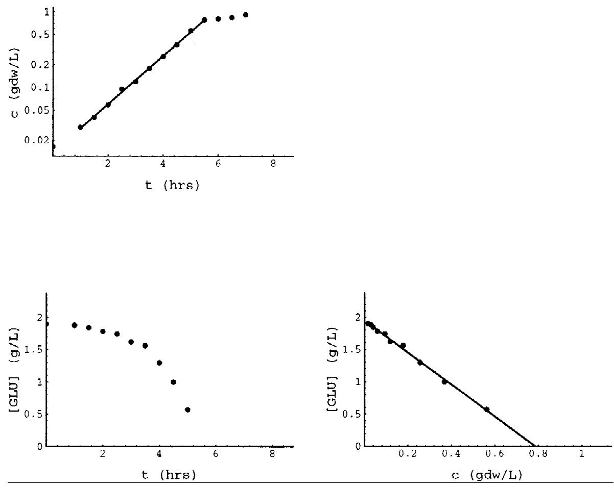
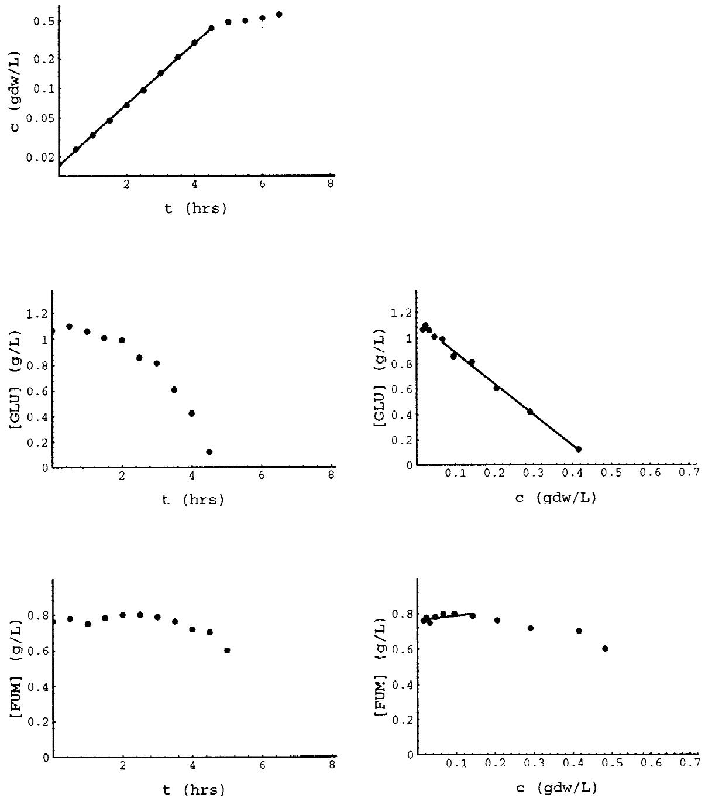
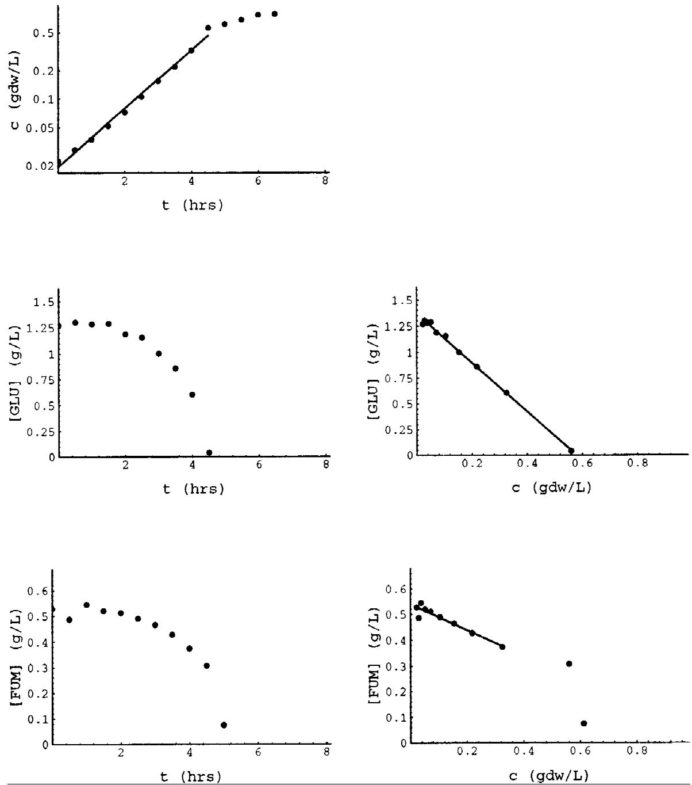
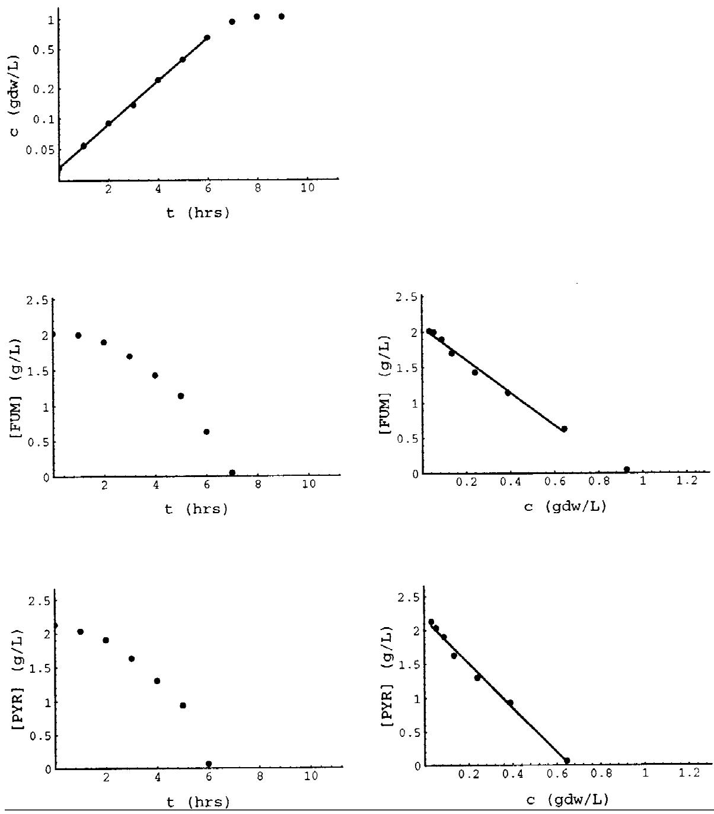
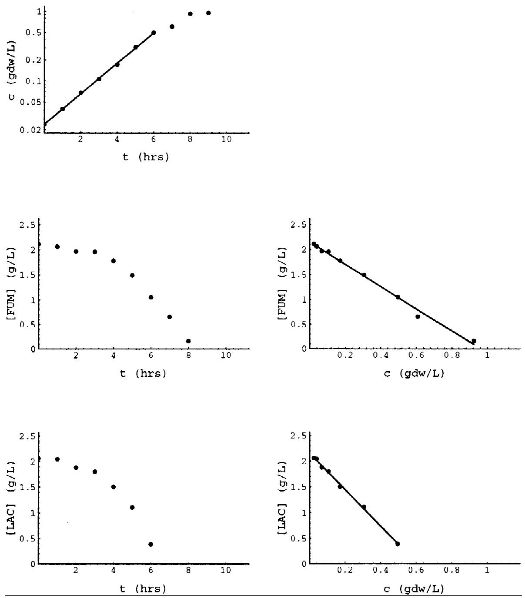
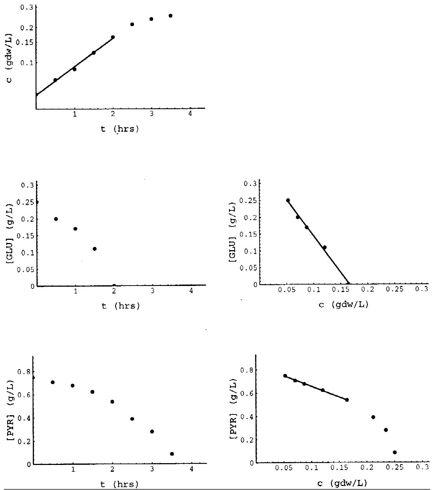

#### **New Patterns of Mixed-Substrate Utilization During Batch Growth of Escherichia coliK12**

#### **Atul Narang,1 * Allan Konopka,2 D. Ramkrishna1**

1School of Chemical Engineering, Purdue University, West Lafayette, IN 47907; telephone: 317-494-4066; fax: 317-494-0805; e-mail: ramkrish@ecn.purdue.edu 2Department of Biological Sciences, Purdue University, West Lafayette, IN 47907

Received 14 October 1996; accepted 17 January 1997

**Abstract:** Microbial growth on mixtures of substrates is of considerable engineering and biological interest. Most of the work until now has dealt with microbial growth on binary mixtures of sugars or polyols. In these cases, it is often found that no matter how the inoculum is precultured, only one of the two substrates is consumed in the first growth phase, leading to the diauxic growth pattern. The goal of the experiments reported here is to investigate growth on mixtures containing at least one organic acid. These experiments show that the substrate utilization patterns in such mixtures are qualitatively different from the diauxic growth pattern. For instance, during growth of Escherichia coli K12 on certain binary mixtures of organic acids, the two substrates are utilized simultaneously, and the mixed-substrate maximum specific growth rate exceeds the single-substrate maximum specific growth rate on either one of the two constituent substrates. Furthermore, the very same mixed-substrate maximum specific growth and substrate uptake rates are observed no matter how the inoculum is precultured. On the other hand, in a mixture of glucose and pyruvate, the maximum specific growth rate seems to depend on the preculturing conditions, thus suggesting the existence of multiple physiological quasi-steady states. © 1997 John Wiley & Sons, Inc. Biotechnol Bioeng**55:** 747–757, 1997.

**Keywords:** microbial growth; substrate mixtures; multiple physiological quasi-steady states; Escherichia coli

# **INTRODUCTION**

This work is concerned with bacterial growth of pure cultures on binary mixtures of *substitutable* substrates, that is to say, substrates satisfying identical growth requirements (Baltzis and Fredrickson). The biological significance of this problem is well known. Discovery of the regulatory mechanisms operating in such systems clarified the nature of information feedback from the gene products back to the genes themselves. However, this problem is equally important from a practical standpoint. Industrial processes generally use complex media containing several sources of the

* *Present address:* Amoco Research Center, MS H-7, 150 West Warrenville Road, Naperville, IL 60563

*Correspondence to:* D. Ramkrishna

essential nutrients. Therefore, for the judicious design of industrial bioreactors, it is necessary to understand growth in mixtures of substrates. Binary mixtures, the object of this study, provide a reasonable point of departure toward this ultimate goal.

There already exists a vast body of work relating to growth of pure cultures on mixtures of sugars and polyols. The most systematic and comprehensive study was done by Monod (1942, 1947). It involved determination of the growth curves for *Escherichia coli, Salmonella typhimurium* and *Bacillus subtilis* on various binary mixtures of sugars and polyols. Based on the form of these growth curves, Monod classified his data into two categories:

- 1. *Diauxic Growth:* The two substrates were consumed sequentially resulting in two exponential growth phases separated by an intermediate lag phase. The specific growth rate during any given exponential growth phase was identical to the maximum specific growth rate on the substrate being consumed during that phase.
- 2. *Normal Growth:* The two substrates were consumed simultaneously, resulting in two exponential growth phases without an intermediate lag phase. The value of the maximum specific growth rate during the first growth phase was between the maximum specific growth rates on the constituent substrates.

The goal of the experiments reported here is to study the substrate utilization patterns during growth on binary mixtures of carbon and energy sources containing at least one organic acid. The results obtained show that the substrate utilization patterns in such mixtures are often qualitatively different from the diauxic and normal growth patterns observed in mixtures of sugars and polyols.

The model system considered in this work consists of a batch culture of *E. coli* K12 growing in a synthetic medium containing a mixture of two carbon and energy sources. However, some of the phenomena observed in this model system are known to be manifested in other microbial species and mixtures of substitutable substrates (Egli, 1995). The diauxic and simultaneous growth patterns are now known to be ubiquitous (Egli, 1995; Harder and Dijkhuizen, 1976, 1982).

#### **MATERIALS AND METHODS**

All the experiments were done with *E. coli* K12 BW8697. This strain was kindly provided by Professor B. W. Wanner in the Department of Biological Sciences, Purdue University.

#### **Medium**

The experimental cultures and the inocula were grown in a synthetic medium (Hegewald and Knorre, 1978). The composition of the alkali salts solution was as follows: KH2PO4 (2.27 g/L), Na2HPO4 z 12H2O (5.54 g/L), NaCl (5.00 g/L), NH4Cl (0.54 g/L), Na2SO4 (1.07 g/L). The heavy metal salts solution contained MgCl2 z 2H2O (2.00 g/L), FeCl2 (0.27 g/L), and MnCl2 (0.20 g/L). After sterilizing the alkali and the heavy metal salts solutions separately, they were mixed in the ratio 90:1 by volume, and stored in the refrigerator at 5°C.

#### **Carbon and Energy Sources**

The only sugar used in the experiments was glucose. The various organic acids used in the experiments were, in fact, sodium or potassium salts of these acids. Each of the carbon and energy sources was sterilized by autoclaving as a 100 g/L solution, and then added to the synthetic medium. The initial substrate concentrations for the experiments shown here were in the range 0.25–2 g/L. These concentrations yielded the maximum specific growth rate, since experiments done with higher initial substrate concentrations caused no change in the specific growth rate.

## **Preculturing**

Seventy-five mL precultures were grown in 200 mL Ehrlenmeyer flasks. The flasks were agitated at 200 rpm, and the temperature was maintained at 37°C.

The preculture for the single-substrate experiments was grown in the synthetic medium with an initial substrate concentration identical to that used subsequently in the experiment. In the mixed-substrate experiments, however, the initial substrate concentrations were different from those envisaged in the subsequent fermenter experiment. This was done in order to determine the effect of preculturing conditions. The particular conditions of preculture are specified in each of the data plots. In all the experiments, the inoculation was done with exponentially growing cells, and samples were withdrawn at least 2–3 hours after inoculation.

## **Fermentor Experiments**

The fermentor experiments were done in a 1.5 L New Brunswick fermentor maintained at a temperature of 37°C. Air was sparged in at a flow rate of approximately 1.0 L/min, and the culture was agitated at 700 pm.

In the mixed-substrate experiments with pairs of organic acids, the pH increased rapidly towards the end of the experiment, leading eventually to cell lysis. In these experiments, a pH of 7.2 was maintained by introducing 3.5 N HCl at a rate modulated by a pH controller (Model 5997-20, Horizon Ecology Company). In the remaining experiments, pH control was not necessary. The pH was measured every hour, and found to be between 7.0 and 7.2 throughout the experiment.

## **Measurement of Dry Cell Mass**

Biomass concentrations were determined from optical density measurements at 540 nm (Coleman Model 55 spectrophotometer, Perkin-Elmer). The absorbance obtained was correlated with dry weight measurements (0.35 gdw per unit of optical density). Appropriate dilutions were done whenever the optical density exceeded 0.4, since this was found to be the limit below which the correlation between the absorbance and the dry cell weight was linear.

### **Measurement of Substrate Concentrations**

Substrate concentrations were measured by using HPLC or specific enzymatic assays. Detailed procedures for these measurements can be found in the references summarized in Table I.

#### **RESULTS AND DISCUSSION**

Table II classifies the substrates based on their point of entry into the central metabolic pathways. The two sub-

**Table I.** References for measurement of substrate concentrations.

| Substrate       | Method          | Reference                                |  |
|-----------------|-----------------|------------------------------------------|--|
| Glucose         | Enzymatic assay | Sigma Chemical, Procedure No. 510        |  |
| Fumarate        | Enzymatic assay | Boehringer-Mannheim, Catalog No. 139 068 |  |
| a-Ketoglutarate | Enzymatic assay | Bergmeyer, 1985                          |  |
| L-Lactate       | Enzymatic assay | Sigma Chemical, Procedure No. 735        |  |
| L-Malate        | Enzymatic assay | Boehringer-Mannheim, Catalog No. 139 068 |  |
| Pyruvate        | Enzymatic assay | Sigma Chemical, Procedure No. 726-UV     |  |
| Succinate       | HPLC            | Biorad Column HPX-87C                    |  |

**Table II.** Classification of the substrates.

| Tricarboxylic acid cycle | Glycolysis-TCA junction |
|--------------------------|-------------------------|
| Fumarate                 | Pyruvate                |
| L-Malate                 | L-Lactate               |
| Succinate                |                         |
| a-Ketoglutarate          |                         |
|                          |                         |

strates in the mixed-substrate experiments belonged to distinct columns of this table. Thus, the substrate pairs were of the type of glucose-pyruvate, glucose-fumarate, and pyruvate-fumarate.

#### **Single-Substrate Data**

The single-substrate data is summarized in Table III, and a typical case is shown in Figure 1. The maximum specific growth rate was determined from an exponential least squares fit of the growth curve. The yield was calculated from the slope of the linear least-square fitted substrate concentration (*s*) versus cell density (*c*) curve:

$$Y = \left(-\frac{ds}{dc}\right)^{-1}$$

The maximum specific substrate uptake rate was determined by dividing the maximum specific growth rate by the yield.

Table III shows that the yields on the organic acids are significantly lower than the yield on glucose. This correlation between the yield and the chemical identity of the substrate is universal. The yields on organic acids are lower than the yields on sugars in *all* microorganisms, such as *Pseudomonas oxalaticus* (Rutgers et al., 1989). *Aspergillus* (Tamiya, 1935), and various strains of *E. coli* (Anderson and von Meyenberg, 1980; Holms, 1986). This is partly explained by the fact that organic acids are more oxidized relative to biomass (Linton and Stephenson, 1978). A considerable fraction of the organic acid imported by the cell must therefore be oxidized to produce the energy required for reduction of the organic acid to biomass. This manifests itself as increased levels of ATP expenditure per gdw of biomass synthesized. However, this purely stoichiometric explanation does not lead to quantitative agreement with the data (Stouthamer, 1979). The cells appear to dissipate more energy than predicted by stoichiometric calculations. This discrepancy has been variously attributed to *energy-spilling* reactions, and to uncertainties regarding the expenditure of energy on transport and maintenance. Westerhoff and coworkers (1983) have argued that this seemingly wasteful expenditure of energy enables the cell to optimize its growth rate subject to the maximization of the so-called *thermodynamic efficiency.* Nevertheless, the question remains essentially unresolved.

Table III also shows that the maximum specific growth rate on glucose is much higher than the maximum specific growth rate on the organic acids. This is not true of all microorganisms. Although enteric bacteria grow faster on sugars (Anderson and von Meyenburg, 1980; Holms, 1986), pseudomonads grow faster on organic acids. We must therefore concede that the regulated activities of the enzymes uniquely associated with the metabolism of a given substrate have somehow evolved to be higher in certain organisms and lower in others.

## **Mixed-Substrate Data**

The mixed-substrate data obtained has been classified into three categories which form the basis of the mathematical model presented in Narang *et al.* (1996). Before describing the data, we give the basis for the classification.

During batch growth on a binary mixture of substrates, one of the substrates is generally exhausted before the other one. This results in the appearance of two exponential growth phases. The growth pattern is said to be *sequential* if only one of the substrates is consumed during the first growth phase, and *simultaneous* if both substrates are consumed during this growth phase (Harder and Dijkhuizen, 1976). As we show below, the growth pattern during the first growth phase may also depend on the preculturing conditions. Therefore, we classify our data into the following three categories:

- 1. Sequential growth pattern independent of preculturing.
- 2. Simultaneous growth pattern independent of preculturing.
- 3. Growth pattern dependent on preculturing.

Formal definitions of these categories are given below, together with selected examples in each category. Further details can be found in Narang (1994).

| Table III. |  |  | Summary of single-substrate data. |  |
|------------|--|--|-----------------------------------|--|
|------------|--|--|-----------------------------------|--|

| Substrate       | Maixmum specific growth rate [in h−1 ] | Yield of biomass [in gdw/g] | Maximum specific uptake rate [in g/(gdw-h)] |
|-----------------|-------------------------------------------------|-----------------------------------|---------------------------------------------------|
| Glucose         | 0.73                                            | 0.41                              | 1.78                                              |
| Fumarate        | 0.41                                            | 0.24                              | 1.71                                              |
| L-Lactate       | 0.29                                            | 0.13                              | 2.23                                              |
| Pyruvate        | 0.28                                            | 0.15                              | 1.87                                              |
| Succinate       | 0.44                                            | 0.21                              | 2.10                                              |
| a-Ketoglutarate | 0.30                                            | 0.17                              | 1.76                                              |

**Figure 1.** Growth of *E. coli* K12 on glucose.

## **Sequential Growth Pattern Independent of Preculturing**

This growth pattern is precisely the diauxie as Monod (1942) envisaged it. It is characterized by the following two properties:

- 1. Only one of the two substrates is consumed during the first growth phase.
- 2. The very same substrate is consumed during the first growth phase, no matter how the inoculum is precultured.

An example of the diauxic pattern is furnished by the growth of *E. coli* K12 on a mixture of glucose and fumarate. Figure 2 shows that when the inoculum is precultured on glucose, there is preferential utilization of glucose. No fumarate is consumed until almost complete exhaustion of glucose, and the maximum specific growth rate (0.72 h−1) is almost the same as that on glucose alone (0.73 h−1). Figure 3 suggests that preferential utilization of glucose persists when the inoculum is precultured on fumarate. The maximum specific growth rate (0.71 h−1) is once again almost the same as that on glucose alone. The slow consumption of fumarate during the consumption of glucose can be attributed to the fact that the levels of the enzymes associated with fumarate metabolism are initially high.

## **Simultaneous Growth Pattern Independent of Preculturing**

This growth pattern is characterized by the following properties:

- 1. Both substrates are consumed during the first growth phase.
- 2. The very same maximum specific growth rate is observed during the first growth phase, no matter how the inoculum is precultured.

Typical growth and substrate utilization curves are shown in Figures 4 and 5. The figures correspond to the case in which the inoculum was precultured on fumarate. The very same curves are obtained, however, even when the inoculum is precultured on pyruvate or lactate. It can be seen that both substrates are consumed. The mixed-substrate maximum specific growth rate is significantly higher than the singlesubstrate maximum specific growth rate on the constituent substrates. This is clearly different from the normal growth pattern observed by Monod in which the mixed-substrate

**Figure 2.** Growth of *E. coli* K12 on a mixture of glucose and fumarate when the preculture is grown on glucose.

maximum specific growth rate was between the maximum specific growth rates on the two constituent substrates (1942, p. 1).

Table IV summarizes the data for several examples of this growth pattern. The maximum specific uptake rate of the constituent substrates during mixed-substrate growth is *less* than their maximum specific uptake rates during singlesubstrate growth (Table III). The yields during mixedsubstrate growth are *additive.* This suggests that the partitioning of these substrates into biomass and energy is not significantly affected by the addition of another substrate to the medium.

In a recent review article, Egli (1995) has summarized all known cases of simultaneous utilization. Table II of this article shows that there are 39 documented cases of simultaneous utilization during batch growth under substrateexcess conditions. There appears to be a growing acceptance of the fact that the simultaneous growth pattern is not an exception, but a generic growth pattern. Egli notes that this growth pattern is generally found in mixtures of substrates that support medium or low maximum specific growth rates. This is consistent with our results, and can be partly explained as follows. The activity of the inducible enzymes catalyzing the uptake and catabolism of a substrate

**Figure 3.** Growth of *E. coli* K12 on a mixture of glucose and fumarate when the preculture is grown on fumarate.

depends on the relative rates of its formation by induction and its removal by dilution due to growth. If the growth rate supported by one of the substrates is large, it causes the enzyme of the other substrate to be diluted out at a rapid rate, eventually leading to the diauxie. It is only when the maximum specific growth rates supported by both substrates are small that the enzymes can ''survive.'' This explanation has also been quantified in a mathematical model (Narang et al., 1997).

# **Growth Pattern Dependent on Preculturing**

Growth of *E. coli* K12 on a mixture of glucose and pyruvate is an example of mixed-substrate growth in which the growth pattern during the first growth phase depends on the manner in which the inoculum is precultured.

Figure 6 shows the data obtained during growth on a mixture of glucose and pyruvate when the inoculum is grown on pyruvate. Both the substrates are consumed, and the mixed-substrate maximum specific growth rate (0.56 h−1) lies between the single-substrate maximum specific growth rates on glucose (0.73 h−1) and pyruvate (0.27 h−1). Similar results were obtained by Hegewald & Knorre (1978) during growth of *E. coli* ML 30 on the same mixture. Interestingly, if the preculture is grown on glucose, the mixed-substrate maximum specific growth rate reverts to the maximum specific growth rate on glucose. Figure 7

**Figure 4.** Growth of *E. coli* K12 on a mixture of fumarate and pyruvate when the preculture is grown on fumarate.

shows the data obtained in a sequence of three experiments with mixtures of glucose and pyruvate. Identical concentrations of glucose (1 g/L) and pyruvate (1 g/L) were used in all three experiments.

The first experiment was begun by inoculating the mixture of glucose and pyruvate with a preculture grown on pyruvate. The mixed-substrate maximum specific growth rate was 0.56 h−1 (see curve labeled ''Expt. 1''). As the cells approached stationary phase, a small sample was withdrawn to inoculate a shake flask containing glucose. Exponentially growing cells from this shake flask were used to inoculate the mixture of glucose and pyruvate in the second experiment. The mixed-substrate maximum specific growth rate in this experiment was found to be 0.73 h−1, which is the same as the maximum specific growth rate on glucose alone. As this second experiment approached stationary phase, a small sample was withdrawn to inoculate a shake flask containing pyruvate. Exponentially growing cells from this shake flask were used as the inoculum for the third experiment. The curve labeled ''Expt. 3'' shows that the mixed-substrate maximum specific growth rate was identical to that observed during the first experiment.

Since the very same concentrations of glucose and pyruvate were used in all three experiments, it follows that the

**Figure 5.** Growth of *E. coli* K12 on a mixture of fumarate and L-lactate when the preculture is grown on fumarate.

maximum specific growth rate is not uniquely determined by the composition of the medium. It can be changed at will by manipulating the preculturing conditions.

There is no systematic study in the literature on the effect of preculturing conditions on mixed-substrate growth. Hamilton & Dawes (1959, 1960, 1961) investigated the growth of *Pseudomonas aeruginosa* on a mixture of citrate and glucose. When the inoculum was grown on citrate, there was preferential utilization of citrate. However, when the inoculum was grown on glucose, both substrates were metabolized simultaneously, and the characteristic diauxic picture was not obtained. There is also compelling evidence for such preculture dependence which is based on experiments done with thiomethyl-b-D-galactoside (TMG), a gratuitous inducer for b-galactosidase synthesis. Cohn and co-workers (1956, 1959) studied the kinetics of b-galactosidase synthesis in an *E. coli* culture growing on succinate as the only carbon source. When TMG was added to this culture, synthesis of b-galactosidase rapidly reached a quasi-steady rate. If TMG and glucose were added *simultaneously* to the culture, glucose completely repressed synthesis of b-galactoside. However, if glucose was added 15 minutes *after* the

**Table IV.** Summary of mixed-substrate data for pairs of organic acids.

| Substrate pair |                 | Measured                                      | Maximum                                           | Maximum                                         | Calculated                               |
|----------------|-----------------|-----------------------------------------------|---------------------------------------------------|-------------------------------------------------|------------------------------------------|
| S 1         | S2              | maximum specific growth-ratea [in h−1 ] | specific uptake b [in g/(gdw-h)] rate of S1 | specific uptake rate of S2 [in g/(gdw-h)] | maximum specific growthc [in h−1 ] |
| Pyruvate       | Fumarate        | 0.50                                          | 1.64                                              | 1.14                                            | 0.52                                     |
| L-Lactate      | Fumarate        | 0.50                                          | 1.78                                              | 1.12                                            | 0.50                                     |
| Pyruvate       | Succinate       | 0.52                                          | 1.32                                              | 1.62                                            | 0.54                                     |
| L-Lactate      | Succinate       | 0.51                                          | —                                                 | —                                               | —                                        |
| Pyruvate       | a-Ketoglutarate | 0.45                                          | 1.49                                              | 1.07                                            | 0.41                                     |
| L-Lactate      | a-Ketoglutarate | 0.50                                          | 1.41                                              | 1.33                                            | 0.41                                     |

The maximum specific growth rate, *rg,* was determined from an exponential least squares fit of the growth curve. b

The maximum specific substrate uptake rates, *rs,i* were calculated from the formula:

$$r_{s,i} = r_{\mathcal{g}} \left(-\frac{ds_i}{dc}\right)$$

where *dsi /dc* is the slope of the linear least-square fitted substrate concentration (*si* ) versus cell density (*c*) curve. The ''—'' denotes the cases in which the substrate concentrations were not measured.

c The calculated maximum specific growth rate, *r*g* , was determined as follows:

$$r_{\rm g}^{\ast} = Y_I r_{\rm s,1} + Y_2 r_{\rm s,2}$$

where *Yi* denotes the single-substrate yield on *Si* .

a

addition of TMG, the repression was much less severe. Significant synthesis of b-galactosidase was maintained for as long as 133 generations.

The data shown in Figure 7 is similar to the quasi-steady state multiplicity described above. The maximum specific growth rate achieved when the cells have had no prior exposure to pyruvate is different from the maximum specific growth rate reached when the cell have been precultured on pyruvate. This observation has important implications for the point of view adopted in the formulation of the mathematical model in Narang et al. (1997). Consider the growth of a bacterial culture in a batch reactor. The state of the total system consisting of the biomass and the medium is constantly varying with time. But the state of the biomass, i.e., the physiological state of the system, approaches a quasisteady state called *balanced growth* within 2–3 doublings after inoculation. The data shown in Figure 7 may be viewed as evidence that the physiological state admits of (at least) two stable quasi-steady states, both of which are consistent with the same medium composition. Precisely which of these two stable quasi-steady states is reached in an experiment is determined by the conditions under which the inoculum is grown.

From a mathematical point of view, the assumption of multiplicity is less restrictive than that of uniqueness. In general, all we can conclude is that there is a well-defined relation or correspondence between the composition of the medium and the physiological states consistent with it. The assumption that the physiological state is a function of the medium composition, tacitly made in unstructured models such as Monod's model [m 4 *f*(*s*)], is an additional restriction that warrants experimental justification. Baltzis and Fredrickson (1988) observed the absence of any rigorous experimental tests for the assumption that ''the steady-state specific growth, nutrient uptake, and maintenance rates of a population of fixed genetic composition in an environment of fixed state depend only on the state of the environment and are independent of the path of change by which the steady-state is achieved.'' They mentioned, furthermore, that it ''would not be surprising if experimental testing showed this assumption to be not quite right; it would be very surprising and exceedingly interesting if such testing showed it to be very wrong.'' We have already discussed the work of Cohn and co-workers (1959) who showed that ''a given culture growing in a fixed medium can exist indefinitely in alternative steady states and that it can be shifted from one stable steady state to the other by transitory variations in the environment.'' Figure 7 represents one more example of quasi-steady state multiplicity in mixedsubstrate cultures. One cannot rule out the possibility that such multiplicity exists even in the case of single-substrate growth.

There is no correlation between the mixed-substrate and single-substrate maximum specific growth rates (cf., Ramkrishna et al., 1987). It is relevant to ask if there still exist any other correlations that are valid within the context of the augmented set of data available to us now. Given this data, we can make only two such generalizations:

- 1. The maximum specific uptake rates of the substrates during mixed-substrate growth are never more than the single-substrate maximum specific uptake rates.
- 2. The yields during mixed-substrate growth are additive.

Both these conclusions are based on the current status of the experimental data, and do not represent invariant laws of bacteria growth. No attempt is made to understand the additive nature of the yield during mixed-substrate growth, since this property is almost certainly linked to the energetics of bacterial growth, a feature that has not been included in the model yet. However, we do consider the first corre-

**Figure 6.** Growth of *E. coli* K12 on a mixture of glucose and pyruvate when the preculture is grown on pyruvate.

lation according to which the maximum specific uptake rate during single-substrate growth is an upper bound for the maximum specific uptake rate during mixed-substrate growth (Narang et al., 1997).

# **CONCLUSIONS**

Based on the discussion above, we may arrive at the following conclusions:

- 1. The substrate utilization pattern during mixed-substrate
growth is not always sequential. The substrates are often utilized simultaneously.

- 2. The substrate utilization pattern may depend on the conditions in which the inoculum is precultured.
- 3. The single-substrate maximum specific growth rates by themselves do not completely determine the substrate utilization pattern during mixed-substrate growth.
- 4. The maximum specific uptake rate of a given substrate during mixed-substrate growth is no more than the maximum specific uptake rates during the single-substrate growth.

**Figure 7.** Growth of *E. coli* K12 on a mixture of glucose and pyruvate. The exponential growth rate depends on the manner in which inoculum is precultured.

- 5. The yields during mixed-substrate growth seem to be approximately additive.
#### **References**

- Andersen, B., von Meyenburg, K. 1980. Are growth rates of bacteria in batch cultures limited by respiration? J. Bacteriol. **144**: 114–123.
- Baltzis, B. C., Fredrickson, A. G. 1988. Limitation of growth rate by two complementary nutrients: Some elementary but neglected considerations. Biotechnol. Bioeng. **31**: 75–86.
- Bergmeyer, H. U. (Ed.) (1985). Methods of enzymatic analysis, 3rd edition, vol. VII, pp. 20–24. VCH Verlagsgesellschaft mbH, D-6940 Weinheim, Germany.
- Cohn, M. (1956). On the inhibition by glucose of the induced synthesis of b-galactosidase in *Escherichia coli,* pp. 41–48. In Oliver H. Gaebler (ed.), *Enzymes: Units of biological structure and function.* Academic Press, New York.
- Cohn, M. Horibata, K. (1959). Inhibition by glucose of the induced synthesis of the b-galactoside-enzyme system of *Escherichia coli.* Analysis of maintenance. J. Bacteriol. **78**: 601–612.
- Egli, T. (1995). The ecological and physiological significance of the

growth of heterotrophic microorganisms with mixtures of substrates. Adv. Microbiol. Ecol. **14**: 305–386.

- Hamilton, W. A., Dawes, E. A. (1959). A diauxic effect with *Pseudomonas aeruginosa.* Biochem. J. **71**: 25P–26P.
- Hamilton, W. A., Dawes, E. A. (1960). The nature of the diauxic effect with glucose and organic acids in *Pseudomonas aeruginosa.* Biochem. J. **76**: 70P, 1960.
- Hamilton, W. A., Dawes, E. A. (1961). Further observations on the nature of the diauxic effect with *Pseudomonas aeruginosa.* Biochem. J. **79**: 25P.
- Harder, W., Dijkhuizen, L. (1976). Mixed substrate utilization, pp. 297–314. In A. C. R. Dean, D. C. Ellwood, C. G. T. Evans, and J. Melling (eds.), Continuous culture 6: Applications and new fields. Ellis Horwood, Chichester, UK.
- Harder, W., Dijkhuizen, L. (1982). Strategies of mixed substrate utilization in microorganisms. Philos. Trans. R. Soc. London B. **297**: 459–480.
- Hegewald, E., Knorre, W. A. (1978). Kinetics of growth and substrate consumption of *Escherichia coli* ML30 on two carbon sources. Z. Allg. Mikrobiol. **18**: 415–426.
- Holms, W. H. (1986). The central metabolic pathways of *Escherichia coli:* Relationship between flux and control at a branch point, efficiency of conversion to biomass, and excretion of acetate. Curr. Top. Cell. Regul. **28**: 69–105.
- Linton, J. D., Stephenson, R. J. (1978). A preliminary study of growth yields in relation to the carbon and energy content of various organic growth substrates. FEMS Microbiol. Lett. **3**: 95–98.
- Monod, J. (1942). Recherches sur la croissance des cultures bacte´riennes [Studies on the growth of bacterial cultures]. Actualite´s Scientifique et Industrielles **911**: 1–215.
- Monod, J. (1947). The phenomenon of enzymatic adaptation and its bearings on problems of genetics and cellular differentiation. Growth **11**: 223–289.
- Narang, A. (1994). The dynamics of microbial growth on mixtures of substrates. PhD thesis, Purdue University, West Lafayette, IN.
- Narang, A., Konopka, A., Ramkrishna, D. (1997). The dynamics of microbial growth on mixtures of substrates in batch reactors. J. Theor. Biol. **184**: 301–317.
- Ramkrishna, D., Kompala, D. S., Tsao, G. T. (1987). Are microbes optimal strategists? Biotechnol. Prog. **3**: 121–126.
- Rutgers, M., van der Gulden, H. M. L., van Dam, K. (1989). Thermodynamic efficiency of bacterial growth calculated from growth yield of *Pseudomonas oxalaticus* OX1 in the chemostat. Biochem. Biophys. Acta **973**: 302–307.
- Stouthamer, A. H. (1979). The search for correlation between theoretical and experimental growth yields. Intl. Rev. of Biochem. **21**: 1–47.
- Tamiya, H. (1935). Le bilan mate´riel et l'e´nerge´tique des synthe`ses biologiques. [The material and energy balances in biosynthesis]. Actualite´s Scientifique et Industrielles **214**: 1–43. English translation in Battley, E. H. (1987), Energetics of bacterial growth. Wiley, New York.
- Westerhoff, H. V., Hellingwerf, K. J. van Dam, K. (1983). Thermodynamic efficiency of microbial growth is low but optimal for maximal growth rate. Proc. Nat. Acad. Sci. USA **80**: 305–309.