# The Steady States of Microbial Growth on Mixtures of Substitutable Substrates in a Chemostat

A N*

*Amoco Research Center*, *MS H*-7, 150 *W*. *Warrenville Road*, *Naperville*, *IL* 60563, *U*.*S*.*A*.

(*Received on* 7 *January* 1997, *Accepted in revised form on* 18 *September* 1997)

Microbes growing on mixtures of substrates in a chemostat exhibit different substrate utilization patterns, depending on the dilution rate and feed concentrations. For instance, when supplied with high feed concentrations of a binary mixture, both substrates are consumed at low dilution rates, but only one of the substrates is consumed at high dilution rates. The goal of this work is to explain the onset of such transitions, which play a very significant role in ecology and bioengineering. In previous work, we formulated a mathematical model of mixed-substrate growth in batch cultures. We use the extension of this model to continuous cultures as the framework for understanding substrate utilization patterns in continuous cultures. Our explanation rests upon the existence of two special types of dilution rates predicted by the model. The first is the so-called *critical* dilution rate at which the growth rate becomes zero, leading to cell washout. The existence of the critical dilution rate obtains from the simplest models of microbial growth, and is rooted in the fact that growth is inherently autocatalytic. The second type of special dilution rate, a unique feature of our model, stems from the recognition that synthesis of the enzymes catalysing the uptake of substrates is also autocatalytic. Hence, associated with each substrate is a *transition* dilution rate at which the synthesis rate of the transport enzyme becomes zero. We show that: (1) the substrate utilization patterns in continuous cultures are completely determined by the relative magnitudes of the critical and transition dilution rates; and (2) the critical and transition dilution rates are in turn determined by the feed concentrations. This allows us to construct an *operating diagram*, which yields the substrate utilization pattern for any given dilution rate and feed concentrations. The theory explains most of the mixed-substrate phenomena summarized in a recent review article by Egli (1995, *Adv*. *Microbiol*. *Ecol*. 14, 305–386).

7 1998 Academic Press Limited

### 1. Introduction

Microbial growth in mixed-substrate environments is of considerable biological and engineering interest. The biological significance of this problem is well known. The study of mixed-substrate growth ultimately led to the mechanisms of gene expression (Jacob & Monod, 1961), which play a critical role in cellular differentiation (Ptashne, 1992). It is believed that the principles of cellular differentiation, together with the rules of pattern formation that specify the spatio-temporal distribution of regulatory proteins (such as inducers, activators, repressors, and corepressors) will be important in resolving the problems of developmental biology (Wolpert, 1969).

The phenomenon of mixed-substrate growth is equally important from an ecological standpoint (Egli, 1995). Consider, for instance, the global carbon cycle. It is estimated that autotrophic microorganisms assimilate about 500 billion kg of carbon dioxide per year. Almost all the biomass thus generated is remineralized via the detritus food chain. Heterotrophic microorganisms constitute an important link in this food chain. Clearly, microbial growth in natural mixed-substrate environments plays a crucial role in maintaining the global biogeochemical balance. Further impetus for understanding microbial * E-mail: anarang.amoco.com growth on mixtures of substrates stems from the

realization that microbes degrade several man-made xenobiotic chemicals. Leaking underground storage tanks containing gasoline and chlorinated solvents have contaminated numerous groundwater resources. The exorbitant costs of active remediation technologies (soil excavation or groundwater pumping followed by contaminant removal) have led to a growing interest in the kinetics of *in situ* microbial degradation.

The importance of mixed-substrate growth in industrial bioprocesses is a corollary of its ecological significance (Harder & Dijkhuizen, 1982). Activated sludge reactors and commercial fermenters can be viewed as man-made ecosystems designed to optimize a specific performance index (pollutant removal rate or product formation rate). The rational design of industrial bioprocesses is therefore intricately linked to a better understanding of mixed-substrate growth.

Early interest in mixed-substrate growth arose from the desire to understand the growth and substrate utilization patterns, i.e. the variation of macroscopic variables such as cell density and substrate concentrations. Subsequent studies in molecular biology have explained the molecular basis of these patterns. Yet, there does not exist a kinetic theory that relates the molecular mechanisms to the macroscopic phenomena that spurred their investigation in the first place. Such a theory could lead to a quantitative understanding of microbial ecology and facilitate the rational design of industrial bioreactors. More importantly, the theory could reveal essentially dynamical phenomena that are not so apparent from a molecular viewpoint.

In Nature and in commercial bioreactors, several microbial species grow on complex mixtures of substrates. Attention is confined here to a single microbial species whose growth is limited by any pair of *substitutable* or *homologous* substrates, i.e. substrates that satisfy identical nutrition requirements (Baltzis & Fredrickson, 1988). Examples of such mixtures include pairs of carbon and energy sources (glucose, fructose), nitrogen sources (ammonia, nitrate), or even electron acceptors (oxygen, nitrate) (Egli, 1995). In previous work, a model was formulated that captured the sequential and simultaneous substrate utilization patterns observed during batch growth on binary mixtures (Narang *et al*., 1997c). The model is extended here to growth on binary mixtures in continuous cultures. The goal is to capture and explain the experimentally observed variation of the steady-state substrate concentrations and cell density with respect to the operating parameters—the dilution rate and the substrate concentrations in the feed. For a given microbial species and substrate mixture, these are the only parameters the experimenter can manipulate.

Microbial growth is an immensely complex process involving numerous metabolic reactions and regulatory mechanisms. Hence, any model of microbial growth, be it mathematical or purely conceptual, entails some degree of abstraction. This work is based on the belief that the key physiological variables in mixed-substrate growth are the activities of the enzymes that catalyse the uptake and peripheral catabolism of the substrates. Such a choice is motivated partly by the stated goal of the model—to capture the substrate utilization patterns, and partly by the strong support it finds in the experimental literature (McClure, 1985).

The literature contains several unstructured models of mixed-substrate microbial growth (Lee *et al*., 1974; Gondo *et al*., 1978; Hegewald & Knorre, 1978; Toda & Yabe, 1979). These models usually assume that the specific growth rate on each substrate follows Monod kinetics, or some variant of it, and the interaction between the substrates is mutually inhibitory. Since unstructured models either lack physiological variables, or assume that such variables, if present, have no effect on the specific growth rate, they provide no insight into the physiological basis of growth (Fredrickson & Tsuchiya, 1977). We are aware of only two structured models of mixed-substrate growth (van Dedem & Moo-Young, 1973; Kompala *et al*., 1986). The first model, formulated exclusively for substrates that exhibit the sequential substrate utilization pattern in batch cultures, is overly restrictive. It assumes that the enzyme synthesis of the preferentially consumed substrate is fully constitutive, and hence, occurs at a constant rate. The second model, which pioneered the cybernetic approach, is based on the premise that the description of regulatory mechanisms can be replaced by optimality principles that microbes may be assumed to follow. The original cybernetic model proposed by Kompala *et al*. does not capture the simultaneous substrate utilization pattern (Narang, 1994; Narang *et al*., 1997b), and has recently been extended (Ramakrishna *et al*., 1996). The benefit of the cybernetic approach is a concise description of growth, but it is realized at the expense of information about regulatory mechanisms.

We begin by deriving the model equations in Section 2. In Section 3, we consider the special case of single-substrate growth. The investigation of mixed-substrate growth in Section 4 is divided into two subsections. In Section 4.1, we analyse mixedsubstrate systems that yield preferential utilization in substrate-excess batch cultures. The experimental literature on such systems is vast. We have therefore classified our analysis into three categories depending on the operating parameter(s) being varied in the experiments. Mixed-substrate systems that yield simultaneous utilization in substrate-excess batch cultures are considered in Section 4.2. In each of the foregoing sections, the relevant experimental data is reviewed before presenting the model simulations.

#### 2. The Model

The kinetic scheme is shown in Fig. 1. Here, *Si* denotes the *i* th substrate, *Ei* denotes the inducible enzyme or ''lumped'' system of inducible enzymes catalysing the uptake and peripheral catabolism of *Si* , *Xi* denotes the inducer for *Ei* , *P* denotes the ''lumped'' pool of biosynthetic precursors, and *C*− denotes all constituents of cell mass except *Ei* , *Xi* , and *P*. The total cell mass consisting of *Ei* , *Xi* , *P*, and *C*− is denoted by *C*. The concentrations of these entities are denoted by the lower-case letters *si* (g l−1), *ei* (g gdw−1), *xi* (g gdw−1), *p* (g gdw−1), *c*− (g gdw−1) and *c* (gdw l−1). Steady state and quasi-steady state concentrations are denoted by appending 0 and – above these letters (for instance, *x˜i* and *x¯i*). The yield of cell mass on *Si* , denoted *Yi* , is the fraction of the stream from *Xi* that is channeled into cell mass.

The following assumptions are made about the kinetics of the various processes.

(1) The specific rate of uptake of the *i* th substrate, denoted *rs*,*i* , satisfies the kinetic law:

$$r_{s,i} \equiv \mathcal{V}_{s,i} e_i \frac{s_i}{K_{s,i} + s_i}. \tag{1}$$

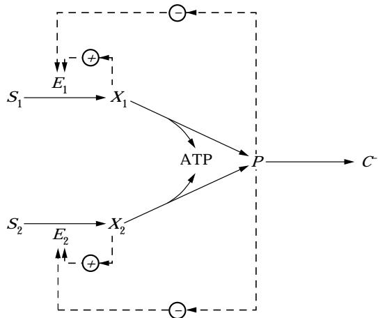

(2) The specific rate of breakdown of *Xi* into energy and the precursor pool *P*, denoted *rx*,*i* , is given by:

$$r_{\times,i} \equiv \mathcal{V}_{\times,i} \frac{\mathbf{x}_{\ell}}{K_{\times,i} + \mathbf{x}_{\ell}}. \tag{2}$$

(3) The yield, *Yi* , is a fixed ''stoichiometric'' coefficient that is identical to the yield observed during single-substrate growth. This implies that the yields are *additive*, i.e. the partitioning of a given substrate into biosynthetic and non-biosynthetic processes is unaffected by consumption of another substrate.

(4) Catabolism of the substrate for supplying the energy requirements of growth is the only significant non-biosynthetic process. That is, the rates of overflow metabolism, energy spillage, storage and maintenance are negligibly small.

(5) The specific rate of formation of *C*− is given by:

$$r_{\circ} \equiv V_{\circ} \frac{p}{K_{\circ} + p}. \tag{3}$$

(6) The specific rate of *induced* enzyme synthesis, denoted *re*,*i* , is hyperbolic with respect to *Xi* .

$$r_{\epsilon,i} \equiv V_{\epsilon,i} \frac{\mathbf{x}_i}{K_{\epsilon,i}(p) + \mathbf{x}_i} \tag{4}$$

where:

$$K_{\epsilon,i}(p) = K_{\epsilon,i}^0 \left[ 1 + \left( \frac{p}{K_{\text{inh},i}} \right)^n \right]. \tag{5}$$

The dependence of *Ke*,*i* on *p* is intended to reflect the effect of catabolite repression (Busby & Elbright, 1994).

(7) The specific rate of *constitutive* enzyme synthesis, denoted *re* *,*i* , is constant

$$r_{e,i}^{\ast} \equiv k_{e,i}^{\ast} \tag{6}$$

where *ke* *,*i* denotes the zeroth-order rate constant.

(8) The specific rate of degradation of the *i* th enzyme, denoted *rd*,*i* , follows first-order kinetics:

$$r_{4,i} \equiv k_{4,i} e_i. \tag{7}$$

A mass balance on the state variables yields:

$$\mathbf{\hat{D}}^{\text{net}} = \mathbf{\hat{D}}^{\text{net}} \tag{8}$$
 
$$\text{Fois. 1. Schmatic diagram of the model.}$$

$$\frac{\mathbf{d}\mathbf{x}_i}{\mathbf{d}t} = r_{\times i} - r_{\times i} - \left(D + \frac{1}{c}\frac{\mathbf{d}c}{\mathbf{d}t}\right)\mathbf{x}_i, \quad i = 1, 2 \qquad (9)$$

$$\frac{\mathbf{d}p}{\mathbf{d}t} = \sum_{j=1}^{2} \left( Y_j r_{\times j} - r_{e_j} - r_{e_j}^{\sf a} + r_{dj} \right) - r_p$$

$$- \left( D + \frac{1}{c} \frac{\mathbf{d}c}{\mathbf{d}t} \right) p \quad (10)$$

$$\frac{\mathbf{d}e_i}{\mathbf{d}t} = r_{e,i} + r_{e,i}^\bullet - r_{d,i} - \left(D + \frac{1}{c}\frac{\mathbf{d}c}{\mathbf{d}t}\right)e_i, \quad i = 1, 2 \quad (11)$$

$$\frac{\mathbf{d}c^{-}}{\mathbf{d}t} = r_{\rho} - \left(D + \frac{1}{c}\frac{\mathbf{d}c}{\mathbf{d}t}\right)c^{-}\tag{12}$$

where the last term in eqns (9–12) represents the dilution of *Xi* , *P*, *Ei* , and *C*−, respectively, by effluent flow and growth, *si*,*f* denotes the concentration of *Si* in the feed, and *D* denotes the dilution rate.

Equations (9–12) are linearly dependent. Since the total dry cell mass consists of *Xi* , *Ei* , *P*, and *C*−, we have the conservation relation S2 *j*=1(*xj*+*ej*)+ *p*+*c*− =1 g gdw−1. Hence, summing (9–12), we obtain:

$$D + \frac{1}{c} \frac{\mathbf{d}c}{\mathbf{d}t} = \sum_{j=1}^{z} r_{\times j} - r_{\times j} + Y_j r_{\times j} \tag{13}$$

and arrive at the equations:

$$\frac{\mathbf{ds}_{i}}{\mathbf{d}t} = -r_{s,i}c + D(\mathbf{s}_{i\uparrow} - \mathbf{s}_{i}) \tag{14}$$

$$\frac{\mathbf{d}\mathbf{x}_i}{\mathbf{d}t} = r_{s,i} - r_{\times,i} - \left(\sum_{j=1}^{2} r_{sj} - r_{\times,j} + Y_j r_{\times,j}\right) \mathbf{x}_i \tag{15}$$

$$\frac{\mathbf{d}p}{\mathbf{d}t} = \sum_{j=1}^{2} \left( Y_j r_{\times j} - r_{\circ j} - r_{\circ j}^{\bullet} + r_{\circ j} \right) - r_p$$
 
$$\mathbf{r} \cdot \mathbf{r} = \mathbf{r}$$

$$-\left(\sum_{\zeta=1}^{2} r_{\times j} - r_{\times j} + Y_{\prime} r_{\times j}\right)p \quad (16)$$

$$\frac{\mathbf{d}e_i}{\mathbf{d}t} = r_{e,i} + r_{e,i}^\# - r_{d,i} - \left(\sum_{j=1}^2 r_{sj} - r_{\times,j} + Y_j r_{\times,j}\right) e_i \quad (17)$$

$$\frac{\mathbf{d}c}{\mathbf{d}t} = \left(\sum_{\boldsymbol{\nu}=1}^{2} r_{\boldsymbol{\nu}\boldsymbol{\zeta}} - r_{\boldsymbol{\nu}\boldsymbol{\zeta}} + Y_{\boldsymbol{\beta}} r_{\boldsymbol{\kappa}\boldsymbol{\zeta}}\right) \mathbf{c} - D\mathbf{c}.\tag{18}$$

These equations differ in two ways from the equations in our previous work (Narang *et al*., 1997c). They account for precursor loss and regeneration due to enzyme synthesis and degradation, and they distinguish the specific rate of biosynthesis, the formation of *C*−, from the specific rate of growth, the formation of all constituents of cell mass. These modifications are necessary only to ensure the internal consistency of the model (Fredrickson, 1976), and do not, as we show below, alter the previous results.

Since the inducers and precursors are present in small concentrations, but participate in relatively fast processes, they rapidly achieve quasi-steady state. Thus, one obtains the quasi-steady state relations, *rx*,*i*2*rs*,*i* and *rp*2S2 *j*=1*Yjrx*,*j* . Substituting the kinetic expressions yields:

$$\frac{\mathbf{d}s_i}{\mathbf{d}t} = -\left(V_{s,i}e_i \frac{s_i}{K_{s,i} + s_i}\right)\mathbf{c} + D(\mathbf{s}_{i\uparrow} - \mathbf{s}_i) \qquad (19)$$

$$\frac{\mathrm{d}e_i}{\mathrm{d}t} = V_{e,i}\frac{\vec{X}_i}{K_{e,i}(\vec{p}) + \vec{x}_i} + k_{e,i}^{\mathrm{a}} - k_{d,i}e_i$$

$$-\left(\sum_{j=1}^2 Y_j V_{s,j} e_j \frac{s_j}{K_{s,j} + s_j}\right) e_i \tag{20}$$

$$\frac{\mathbf{d}c}{\mathbf{d}t} = \left(\sum_{j=1}^{2} Y_j V_{s,j} e_j \frac{\mathbf{s}_j}{K_{sj} + \mathbf{s}_j}\right) c - Dc \tag{21}$$

where *x¯i* and *p¯*, the quasi-steady state concentrations of *Xi* and *P*, respectively, are obtained by solving the quasi-steady state relations.

$$\bar{X}_i = K_{s,i} \frac{V_{s,i} e_i \frac{S_i}{K_{s,i} + s_i}}{V_{s,i} - V_{s,i} e_i \frac{S_i}{K_{s,i} + s_i}} \tag{22}$$

$$\bar{p} = K_{\circ} \frac{\Sigma_{j=1}^{2} Y_{j} V_{\circ j} e_{j} \frac{S_{j}}{K_{\circ j} + s_{j}}}{V_{\circ} - \Sigma_{j=1}^{2} Y_{j} V_{\circ j} e_{j} \frac{S_{j}}{K_{\circ j} + s_{j}}}. \tag{23}$$

The dynamics of (19–23) approximate the dynamics of (14–18) for all but a negligibly small initial interval of time. Insofar as we are interested in the asymptotic behavior (*t* : a), it suffices to consider the *reduced* equations (19–23). If *D*=0, the reduced equations become identical to the equations in our previous work on batch cultures (Narang *et al*., 1997c).

We wish to determine the variation of the steady states of the reduced equations with respect to the operating parameters, *D* and *si*,*f* . These steady states were determined with the parameter values shown in

| Parameter | Units        | Glucose (S1) | Fumarate (S2) | Pyruvate (S3) |
|-----------|--------------|--------------|---------------|---------------|
| Vs,i      | g (g-hr)−1   | 1605         | 865           | 660           |
| Ks,i      | g l−1        | 0.01         | 0.01          | 0.01          |
| Vx,i      | g (gdw-hr)−1 | 16.0         | 8.7           | 6.6           |
| Kx,i      | g gdw−1      | 10−4         | 10−4          | 10−4          |
| Yi        | gdw g−1      | 0.41         | 0.24          | 0.15          |
| Ve,i      | g (gdw-hr)−1 | 0.001        | 0.001         | 0.001         |
| K0 e,i | g gdw−1      | 10−6         | 10−6          | 10−6          |
| Kinh,i    | g gdw−1      | 0.027        | 0.007         | 0.004         |
| ni        |              | 3            | 3             | 2             |
| ke *,i | g (gdw-hr)−1 | 10−5         | 10−5          | 10−5          |
| kd,i      | hr−1         | 0.05         | 0.05          | 0.05          |

T 1 *Parameter values used in the model*

*Vg*=1.0 hr−1.

*Kg*=0.01 g gdw−1.

Table 1. All parameter values, except *ni* , *Vs*,*i* , and *K*0 *e*,*i* , are the same as those used in Narang *et al*. (1997b). The higher values of *ni* used in this work are based on recent experimental evidence indicating that at the lower dilution rates, catabolite repression is negligibly small (Lendenmann & Egli, 1995). The values of *Vs*,*i* and *K*0 *e*,*i* were adjusted accordingly to fit our mixed-substrate data for batch cultures (Narang *et al*., 1997a).

The numerical solutions of the reduced equations were computed with AUTO94 (Doedel *et al*., 1994). The stable and unstable solutions thus obtained are represented in the diagrams by full and broken lines, respectively (Figs 2, 4, 5, 7, 8, and 15). The bifurcation points, which for the purposes of this work can be viewed as the parameter values at which the stability of the steady-states changes, are denoted by open squares. All other diagrams were computed using *Mathematica* 2.1 (Wolfram, 1991).

In what follows, we shall constantly refer to the *autocatalytic kinetics of growth and inducible enzyme synthesis*. By this phrase, we mean that the rates of these processes are zero whenever the concentration of their products is zero. Thus, the growth rate is zero whenever *c*=0, and the inducible enzyme synthesis rate is zero whenever *ei*=0. As we show below, this property of growth and inducible enzyme synthesis ensures the existence of steady states with *c˜*=0 or/and *e˜i*=0.

#### 3. Single-substrate Growth

The variations of the substrate concentration and cell density during single-substrate growth are well-known (Herbert *et al*., 1956). Our goal in this section is to study the variation of the enzyme activity, and to define the critical dilution rate.

The variation of the enzyme activity during single-substrate growth has been summarized in several review articles (Dean, 1972; Harder & Dijkhuizen, 1982; Matin, 1978; Toda, 1981). The key features are as follows.

(1) The activities of the inducible enzymes involved in the peripheral catabolism of the substrates pass through a maximum at some intermediate dilution rate.

(2) If these enzymes are constitutive, their activities decrease monotonically with the dilution rate.

The equations describing single-substrate growth are obtained from (19–23) upon replacing S2 *j*=1*Vs*,*jejsj*/ (*Ks*,*j*+*sj*) by *Vs*,*ieisi*/(*Ks*,*i*+*si*). Figure 2 shows the variation of the steady states with respect to *D* for growth on *S*2. At each dilution rate, there are two steady states (labelled 1 and 2). For all *D*q0, *c˜* is zero along steady state 1, and non-zero along steady state 2 [Fig. 2(c)]. We refer to these as the *trivial* and *non*-*trivial* steady states, respectively. At low dilution rates, the non-trivial steady state is stable; at high dilution rates, the trivial steady state is stable. Washout occurs at *D*=0.42 hr−1 when the non-trivial steady state yields its stability to the trivial steady state. We denote this bifurcation point by *Dc*,2, the single-substrate *critical* dilution rate for *S*2. More generally, *Dc*,*i* may be defined as the dilution rate at which *c˜* becomes zero during single-substrate growth on *Si* . The critical dilution rate exists because growth, being an autocatalytic process, collapses at a sufficiently high dilution rate. Indeed, for a stable non-trivial steady state (*c˜*\$0) to exist, the growth rate must match the cell removal rate, *Dc˜*, without violating the constraint *si*Q*si*,*f* . At a sufficiently high dilution rate, *D*=*Dc*,*i* , this becomes impossible. The culture then shifts to the trivial steady state, *c˜*=0, whose very existence depends on the autocatalytic kinetics of growth.

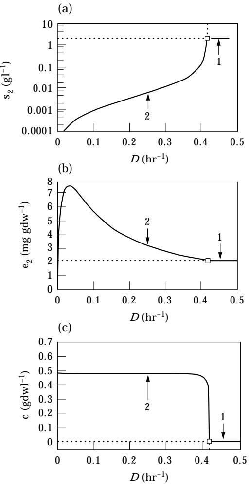

F. 2. The variation of the steady states with respect to the dilution rate during single-substrate growth on *S*2 at a fixed feed concentration (*s*2,*f*=2gl−1). Branches 1 and 2 denote the trivial (c˜ =0) and non-trivial (*c˜*\$0) steady states, respectively.

From the experimental point of view, the stable (and hence, observable) non-trivial steady states are of key interest. They occur in the region 0Q*D*Q*Dc*,*i* , and are given by:

$$\tilde{X}_i = K_{\times i} \frac{D}{Y_i V_{\times i} - D} \tag{24}$$

$$
\tilde{p} = K_s \frac{D}{V_s - D} \tag{25}
$$

$$\tilde{e}_{i} = \frac{1}{(D + k_{d\downarrow})} \left[ V_{\epsilon,i} \frac{\tilde{\chi}_{i}}{K_{\epsilon,i}(\tilde{p}) + \tilde{\chi}_{i}} + k_{\epsilon,i}^{\ast} \right] \qquad (26)$$

$$
\tilde{s}_i = K_{s,i} \frac{D}{Y_i V_{s,i} \tilde{e}_i - D} \tag{27}
$$

$$
\tilde{c} = Y_i (\mathbf{s}_{i,f} - \mathbf{\tilde{s}}_i). \tag{28}
$$

These relations follow directly from the following fact: If *c˜*\$0, then *YiVs*,*ie˜is˜i*/(*Ks*,*i*+*s˜i*)=*D*. Note that all variables, except the cell density, are independent of the feed concentration *si*,*f* . Experiments show that at a fixed dilution rate, *s˜i* does not change significantly when *si*,*f* is reduced from 100 mg l−1 to 1 mg l−1 (Senn *et al*., 1994).

Figure 2(b) shows that the enzyme activity passes through a maximum. Based on the model, the existence of the maximum can be explained as follows. Since *x˜i* and *p˜* are increasing functions of *D*, the steady state enzyme synthesis rate:

$$\mathcal{V}_{\boldsymbol{e},i} \frac{\tilde{\boldsymbol{x}}_{i}}{K_{\boldsymbol{e},i}(\tilde{p}) + \tilde{\boldsymbol{x}}_{i}} + k_{\boldsymbol{e},i}^{\ast}$$

passes through a maximum. This maximum is the result of two opposing effects: induction which stimulates the synthesis rate and dominates at low dilution rates, and catabolite repression which represses the synthesis rate and dominates at high dilution rates. At low dilution rates, if the dilution rate is increased slightly, the rates of both enzyme synthesis and enzyme dilution increase. However, since the enzyme synthesis rate increases more than the enzyme dilution rate, the net effect is a higher steady-state enzyme level. At high dilution rates, a slight increase in the dilution rate not only decreases the enzyme induction rate, but also increases the enzyme dilution rate. The simultaneous exertion of these two effects results in a lower steady-state enzyme level.

If the enzyme synthesis is purely constitutive (*Ve*,*i*=0), *e˜i* decreases monotonically with respect to the dilution rate:

$$
\tilde{e}_i = \frac{k_{\ast,i}^{\ast}}{(D + k_{\omega,i})}.\tag{29}
$$

In this case, an increase in the dilution rate has no effect on the enzyme synthesis rate, but increases the enzyme dilution rate. Note that (29) also describes *e˜i* as a function of *D* if the substrate in the feed does not induce synthesis of *Ei* . Egli and co-workers measured the activities of the enzymes associated with methanol catabolism in yeasts when the substrate in the feed was glucose. The activities of all the enzymes decreased monotonically as the dilution rate was increased (Egli *et al*., 1980; Fig. 1).

The single-substrate critical dilution rate, *Dc*,*i* , depends on the feed concentration. Indeed, by definition of the critical dilution rate, if *D*=*Dc*,*i* , then *c˜*=0; hence, it follows from (28) that *s˜i*=*si*,*f* . Letting

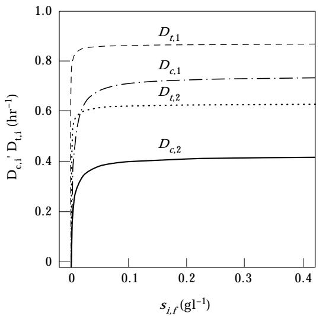

F. 3. The variation of the critical and transition dilution rates with respect to the feed concentrations.

$$D = D_{\circ, i}, \text{ și} = \text{s}_{i\circ} \text{ in (27), we \text{ obtain: } }$$

$$\frac{s_{if}}{K_{s,i} + s_{if}} = \frac{D_{c,i}}{Y_i V_{s,i}} \frac{D_{c,i} + k_{d,i}}{V_{c,i}}$$

$$\left[\frac{D_{c,i}}{Y_i V_{s,i} \frac{K_{c,i}}{K_{s,i}} - D_{c,i} \left(1 + \frac{K_{c,i}}{K_{s,i}}\right)^{-1}} \cdot (30)\right]$$

which implicitly defines the relation between *Dc*,*i* and *si*,*f* . Figure 3 shows the *Dc*,*i* vs. *si*,*f* curves for *S*1 and *S*2.* If the chemostat is operated at any point (*D*, *si*,*f* ) below this curve, the non-trivial steady state is stable; at any operating point on or above this curve, the trivial steady state is stable.

## 4. Mixed-substrate Growth

The experimental literature on mixed-substrate growth in continuous cultures is dominated by studies of substrate pairs leading to the sequential growth pattern in batch cultures. Most of the discussion below therefore centers around such mixtures.

## 4.1.

Based on the operating parameter being varied in the experiments, one can classify the data into three categories:

- (1) varying dilution rate, fixed feed concentrations;
- (2) fixed dilution rate, varying feed concentrations;

- (3) varying dilution rate and feed concentrations.
## 4.1.1. *Fixed feed concentrations*, *varying dilution rate*

These experiments have been performed with feed concentrations that are high in comparison with the saturation constants (*si*,*f*01gl−1, *Ks*,*i*010 mg l−1). The key observations are as follows.

(1) As the dilution rate is increased, the substrate utilization pattern undergoes a transition. At low dilution rates, both substrates are consumed simultaneously. At high dilution rates, only one of the substrates is consumed, this being the substrate that is preferentially utilized in a substrate-excess batch culture (Egli, 1995; Harder & Dijkhuizen, 1982).

(2) The dilution rate at which the foregoing transition occurs generally exceeds the critical dilution rate of the less preferred substrate (Brinkmann & Babel, 1992; Eggeling & Sahm, 1981; Egli *et al*., 1982b; Harte & Webb, 1967; Lendenmann *et al*., 1996; Silver & Mateles, 1969).

We show below that the model captures and explains these phenomena observed at high feed concentrations. At low feed concentrations, however, the model predicts qualitatively different behavior. For instance, if the feed concentration of the preferred substrate is reduced to values comparable with its saturation constant, *Ks*,*i* , there is no transition—both substrates are consumed until washout occurs. Although there is no continuous culture data at such low feed concentrations, a similar change in qualitative behavior has been observed in batch cultures.

(3) Mixtures of substrates that yield preferential utilization at high initial substrate concentrations (*si*,001gl−1) exhibit simultaneous utilization at low initial substrate concentrations (*si*,001 mg l−1) (Brooke & Atwood, 1983; Lendenmann, 1994; Loubie` re *et al*., 1992; Tyree *et al*., 1990; Wanner & Egli, 1990).

Figure 4 shows the steady states of growth on a mixture of *S*1 and *S*2 (*s*1,*f*=*s*2,*f*=2gl−1). At high dilution rates, there is preferential utilization of *S*1 (0.63 hr−1Q*D*Q0.74 hr−1); at low dilution rates (0Q*D*Q0.55 hr−1), there is simultaneous and almost complete consumption of both substrates [Fig. 4(a, c)]. As *D* increases above 0.55 hr−1, there is a sharp transition from the simultaneous to the preferential substrate utilization pattern: *s˜*2 increases and *e˜*2 decreases until at *D*=0.63 hr−1, *s˜*22*s*2,*f* and *e˜*220. The transition is particularly evident from the profile of the cell density

* The *Dt*,*i* vs. *si*,*f* curves will be discussed in the following section.

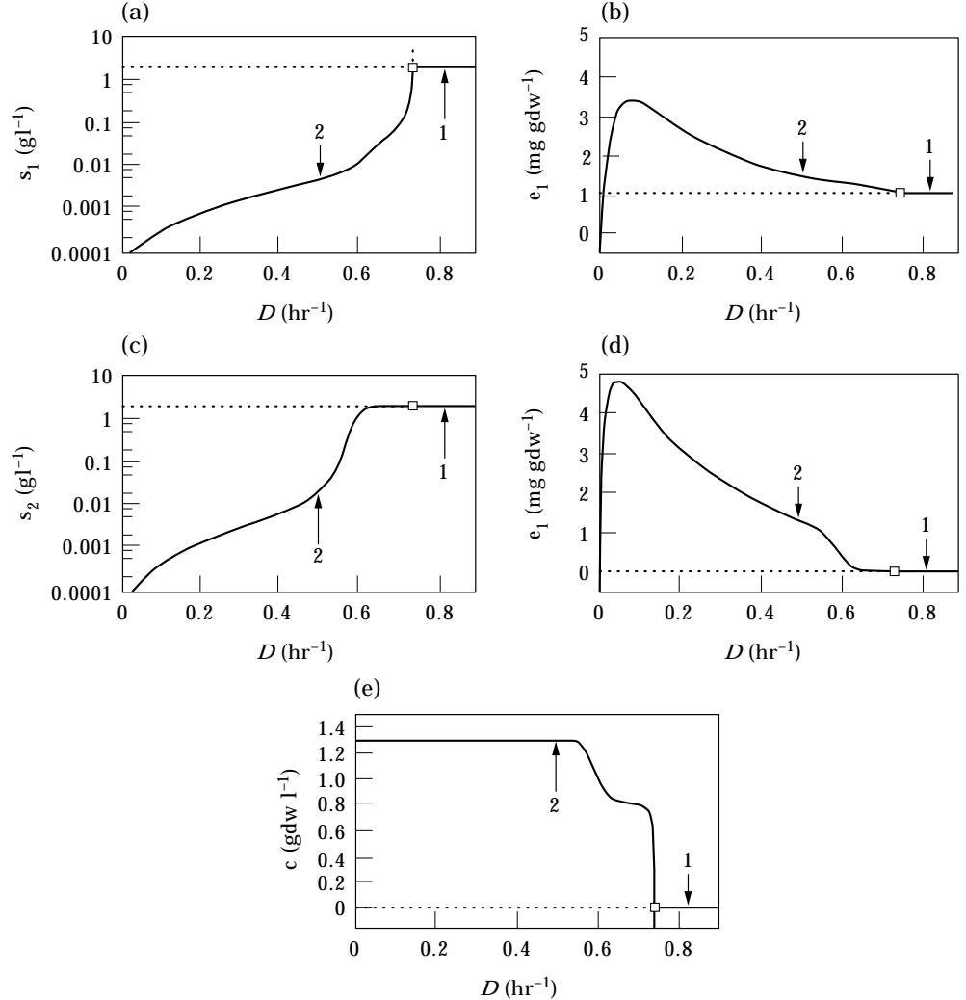

F. 4. The variation of the steady states with respect to the dilution rate during mixed-substrate growth on *S*1 and *S*2 at fixed feed concentrations (*s*1,*f*=*s*2,*f*=2gl−1). Branches 1 and 2 denote the trivial (*c˜*=0) and non-trivial (*c˜*\$0) steady states, respectively.

[Fig. 4(e)]. This curve is flat for 0Q*D*Q0.55 hr−1 (almost complete consumption of both *S*1 and *S*2), drops sharply in the range 0.55 hr−1Q*D*Q0.63 hr−1 (transition from simultaneous utilization of *S*1 and *S*2 to preferential utilization of *S*1), becomes flat again in the region 0.63 hr−1Q*D*Q0.74 hr−1 (preferential utilization of *S*1), and finally falls to zero at *D*=0.74 hr−1 (cell washout).

It is easier to explain the onset of the transition from simultaneous to preferential substrate utilization if we consider the *unperturbed* equations obtained by neglecting constitutive enzyme synthesis in the reduced equations (*ke* *,*i* =0). In this case, the transition is marked by a distinct bifurcation point at *D*=0.63 hr−1 (Fig. 5). Thus, to explain the transition, it suffices to rationalize the appearance of the bifurcation point. The unperturbed equations admit to six steady states (Table 2). Only three of these steady states (labelled 1, 2, and 3) are shown in Fig 5; the remaining three steady states are unstable for all *D*q0. The bifurcation at *D*=0.63 hr−1 occurs when steady state 3 (simultaneous utilization) yields its stability to steady state 2 (preferential utilization). We denote this bifurcation point by *Dt*,2, the *transition* dilution rate for *S*2. The transition dilution rate occurs because inducible enzyme synthesis, being an autocatalytic process, collapses at a sufficiently high dilution rate. Indeed, for a stable non-trivial enzyme level, *e˜*2\$0, to exist, the synthesis rate of *E*2 must match the dilution and degradation rates of *E*2, without violating the constraint *s˜*2Q*s*2,*f* . At a sufficiently high dilution rate, *D*=*Dt*,2, this becomes impossible. The culture then shifts to a steady state

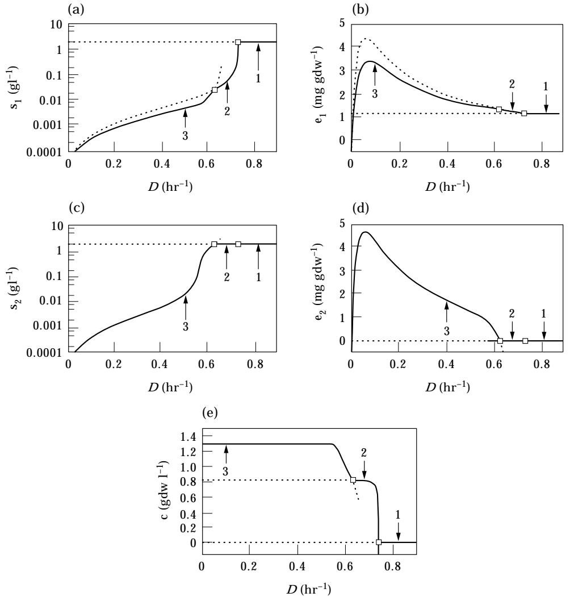

F. 5. The variation of the steady states with respect to the dilution rate during mixed-substrate growth on *S*1 and *S*2 at fixed feed concentrations (*s*1,*f*=*s*2,*f*=2gl−1). The constitutive enzyme synthesis rate, *ke* *,*i* , is assumed to be 0. For a description of the properties of branches 1–3, see Table 2.

with *e˜*2=0. Such a steady state exists only because inducible enzyme synthesis is autocatalytic.*

During single-substrate growth on *S*2, washout occurs at *D*=0.42 hr−1 (Fig. 2); however, during mixed-substrate growth on *S*1 and *S*2, consumption of *S*2 persists up to *D*=0.63 hr−1 [Fig. 4(c)]. In terms of the model, this phenomenon can be explained as follows. The dilution rate imposes a burden on both cell growth and inducible enzyme synthesis. Each of these processes is autocatalytic, and can collapse under this burden: *c˜*=0 when cell growth collapses, and *e˜i*=0 when enzyme synthesis collapses. During single-substrate growth on *S*2, cell growth collapses at *D*=*Dc*,2=0.42 hr−1. Since cell growth collapses whenever enzyme synthesis collapses, the critical dilution rate is smaller than the transition dilution rate, i.e. *e˜*2 is positive at *D*=*Dc*,2 [Fig. 2(b)]. During mixed-substrate growth, when *S*1 is added to the feed, the capacity for growth increases so that dilution rates of up to *Dc*,1=0.74 hr−1 can be sustained without washout. Thus, *S*2 is consumed up to *D*=*Dt*,2=0.63 hr−1, at which point the synthesis of *E*2 finally collapses. At all *D*e*Dt*,2, *e˜*2 is zero, and there is preferential utilization of *S*1 until cell washout occurs at *D*=*Dc*,1=0.74 hr−1.

* Constitutive enzyme synthesis prevents the sudden and complete collapse of enzyme synthesis. Instead of becoming zero at *D*=*Dt*,2, *e˜*2 tends asymptotically to zero [Fig. 4(d)]. This effect of constitutive enzyme synthesis on the transition dilution rate is not unlike the effect of wall growth on the critical dilution rate. Because of the growth of small colonies on the reactor wall, the cell density does not become zero at the critical dilution rate; instead, it tends asymptotically to zero (Herbert *et al*., 1956).

Stability of steady state Distinguishing property Physical significance Label in of steady state of steady state Fig. 5 0 Q*D*Q0.63 0.63 E*D*Q0.74 *D*e0.74 *c˜*\$0, *e˜*1\$0, *e˜*2\$0 *S*1 and *S*2 consumed 3 Stable Unstable Unstable *c˜*\$0, *e˜*1\$0, *e˜*2=0 Only *S*1 consumed 2 Unstable Stable Unstable *c˜*\$0, *e˜*1=0, *e˜*2\$0 Unstable Unstable Unstable *c˜*=0, *e˜*1\$0, *e˜*2=0 Washout 1 Unstable Unstable Stable *c˜*=0, *e˜*1=0, *e˜*2\$0 Unstable Unstable Unstable *c˜*=0, *e˜*1=0, *e˜*2=0 Unstable Unstable Unstable

T 2 *Distinguishing properties and stabilities of the steady states corresponding to the unperturbed equations*

More generally, one can define the transition dilution for any substrate *Si* , denoted *Dt*,*i* , as the dilution rate at which *e˜i*=0. It follows from (19) that at such a dilution rate, *s˜i*=*si*,*f* . The transition dilution rate for *Si* is related to the feed concentration. Indeed, it follows from (20–22) (with *ke* *,*i* =0) that:

$$\tilde{\varepsilon}_{i} = \frac{\frac{V_{e,i}}{D + k_{d,i}} - \left(\frac{K_{e,i}V_{\ge i}}{K_{\times,i}V_{\ge i}}\right) \left(\frac{\tilde{s}_{i}}{K_{\times,i} + \tilde{s}_{i}}\right)}{1 - \frac{K_{e,i}}{K_{\times,i}}}.\tag{31}$$

By definition of the transition dilution rate, if *D*=*Dt*,*i* , then *e˜i*=0 and *si*=*si*,*f* . Hence, letting *D*=*Dt*,*i* , *e˜i*=0, *s˜i*=*si*,*f* in (31), we obtain:

$$\frac{\mathbf{s}_{i,\boldsymbol{\ell}}}{\mathbf{K}_{\boldsymbol{s},\boldsymbol{i}} + \mathbf{s}_{i,\boldsymbol{\ell}}} = \frac{\mathbf{K}_{\boldsymbol{\epsilon},\boldsymbol{i}} \mathbf{V}_{\times,\boldsymbol{i}} (\mathbf{D}_{\boldsymbol{\iota},\boldsymbol{i}} + \mathbf{k}_{d,\boldsymbol{i}})}{\mathbf{K}_{\boldsymbol{\times},\boldsymbol{i}} \mathbf{V}_{\times,\boldsymbol{i}} \mathbf{V}_{\times,\boldsymbol{i}}} \tag{32}$$

which implicitly defines the relation between *Dt*,*i* and *si*,*f* . Figure 3 shows the transition dilution rates for *S*1 and *S*2. At any operating point (*D*, *si*,*f* ) below the curve, a steady state with non-zero *e˜i* is stable; at any operating point on or above the curve, a steady state with *e˜i*=0 is stable. That is:

$$D_{\epsilon,2} < D_{\ell,2} < D_{\epsilon,1} < D_{\ell,1}$$

at this feed composition, there is simultaneous utilization for 0Q*D*Q*Dt*,2 and preferential utilization of *S*1 for *Dt*,2E*D*Q*Dc*,1. Since *Dc*,*i* and *Dt*,*i* depend on *si*,*f* , this relation could change as the feed composition is varied. For instance, if *s*1,*f* were made sufficiently small, one could have the relation:

$$D_{\epsilon,1} < D_{\iota,1} < D_{\epsilon,2} < D_{\iota,2}$$

which corresponds to simultaneous utilization for 0Q*D*Q*Dt*,1 and preferential utilization of *S*2 for *Dt*,1E*D*Q*Dc*,2. Our next goal is to construct an *operating diagram* in which the (*s*1,*f* , *s*2,*f* ) plane is partitioned into regions with qualitatively different steady state profiles.

Evidently, preferential utilization occurs only if the critical dilution rate for one of the substrates exceeds the transition dilution rate for the other substrate, i.e. *Dc*,*i*q*Dt*,*j* , *i*\$*j*. Hence, the curves, *Dc*,1=*Dt*,2 and *Dc*,1=*Dt*,2, partition the (*s*1,*f* , *s*2,*f* ) space into three regions (Fig. 6). For any (*s*1,*f* , *s*2,*f* )in:

Region I (*Dc*,1q*Dt*,2) there is simultaneous utilization for 0Q*D*Q*Dt*,2 and preferential utilization of *S*1 for *Dt*,2E*D*Q*Dc*,1 (Fig. 5).

$$
\tilde{e}_{i} = \begin{cases}
\frac{V_{\epsilon,i}}{D + k_{\rm{sl}}} - \left(\frac{K_{\epsilon,i}V_{\times i}}{K_{\rm{sl}}V_{\times i}}\right) \Big/ \left(\frac{\tilde{s}_{i}}{K_{\rm{sl}} + \tilde{s}_{i}}\right) \\
\qquad \qquad \qquad 1 - \frac{K_{\epsilon,i}}{K_{\rm{sl}}} \\
\qquad \qquad 0 & \text{otherwise}
\end{cases}
\quad \text{if } \frac{s_{i\ell}}{K_{\rm{sl}} + s_{i\ell}} > \frac{K_{\epsilon,i}V_{\times i}(D + k_{\rm{sl}})}{K_{\rm{sl}}V_{\times i}V_{\times i}},
\tag{33}
$$

It is evident from Fig. 3 that *Dt*,*i*q*Dc*,*i* for all *si*,*f* . This relation is a manifestation of the fact during single-substrate growth, collapse of enzyme synthesis implies the collapse of cell growth.

In the discussion above, we considered a particular feed composition (*s*1,*f*=*s*2,*f*=2gl−1). It was shown that because of the relation:

Region II (*Dc*,2q*Dt*,1) there is simultaneous utilization for 0Q*D*Q*Dt*,1 and preferential utilization of *S*2 for *Dt*,1E*D*Q*Dc*,2 (Fig. 7).

Region III (*Dc*,1Q*Dt*,2, *Dc*,2Q*Dt*,1) there is simultaneous utilization over the entire range of dilution rates until washout occurs at the mixed-substrate critical dilution rate (Fig. 8). The mixed-substrate

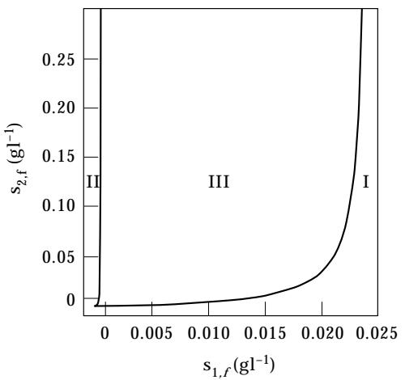

F. 6. The operating diagram for mixed-substrate growth on *S*1 and *S*2.

critical dilution rate, denoted *Dc* , is implicitly defined by the equation:

$$\sum_{i=1}^{2} Y_i V_{s,i} \tilde{e}_i (D_c, \mathbf{s}_{i,f}) \frac{\mathbf{s}_{i,f}}{\mathbf{K}_{s,i} + \mathbf{s}_{i,f}} = D_c \tag{34}$$

where *e˜i* is given by (33). It can be shown that *Dc*=*Dc*,1 in Region I, *Dc*=*Dc*,2 in Region II, and *Dc*qmax4*Dc*,1, *Dc*,25 in Region III.

It is important to note a limitation of the foregoing analysis. The approximation, *ke* *,*i* =0, which forms the basis of this analysis, is reasonable only if the constitutive enzyme synthesis rate is negligibly small compared with the inducible enzyme synthesis rate. When the feed concentrations are on the order of *Ks*,*i*

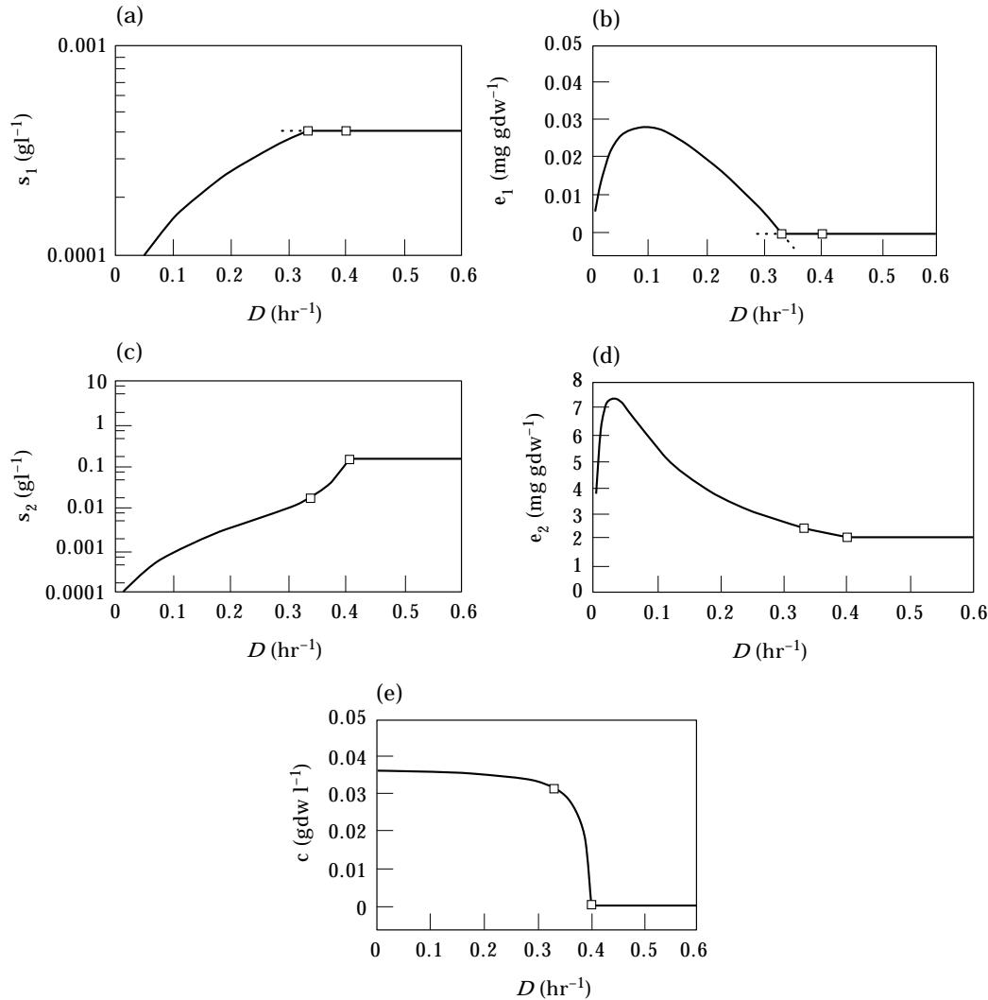

F. 7. The variation of the steady states with respect to the dilution rate during mixed-substrate growth on *S*1 and *S*2 at fixed feed concentrations (*s*1,*f*=0.0004 g l −1, *s*2,*f*=0.15 g l−1). The constitutive enzyme synthesis rate, *ke* *,*i* , is assumed to be 0.

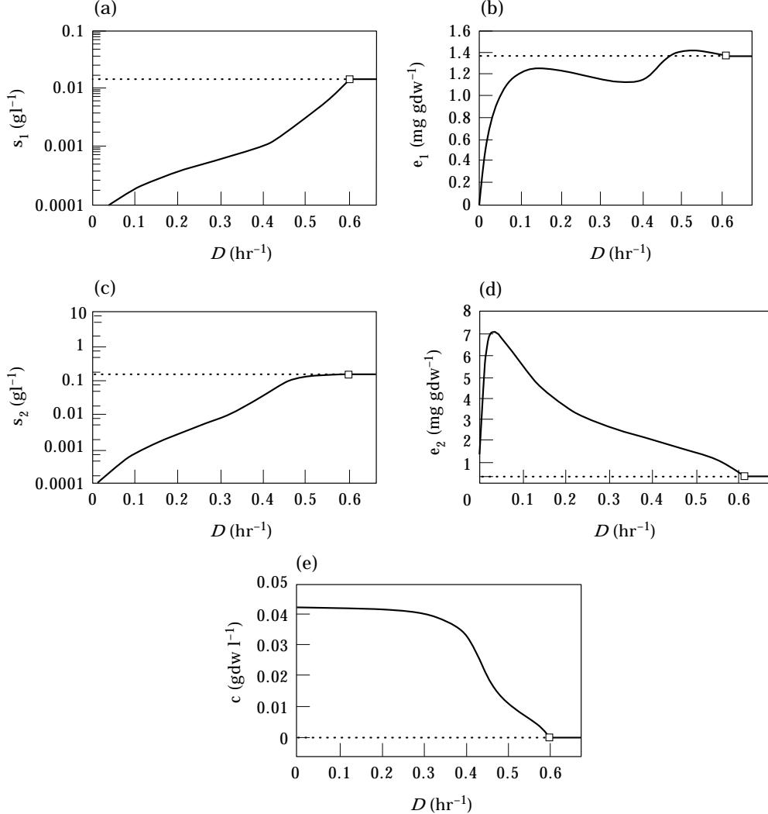

F. 8. The variation of the steady states with respect to the dilution rate during mixed-substrate growth on *S*1 and *S*2 at fixed feed concentrations (*s*1,*f*=0.015 g l−1, *s*2,*f*=0.15 g l−1). The constitutive enzyme synthesis rate, *ke* *,*i* , is assumed to be 0.

or higher, this is certainly true. At lower feed concentrations, the constitutive enzyme synthesis rate becomes comparable, or even larger, than the inducible enzyme synthesis rate, and the analysis is no longer tenable. Suppose, for instance, the feed concentrations lie in Region II of Fig. 6 where *s*1,*f*-*Ks*,1. If *ke* *,*i* =0, the analysis predicts preferential utilization of *S*2 for *D*e*Dt*,1=0.33 hr−1 (Fig. 7). However, numerical simulations with *ke* *,*i* \$0 show that *S*1 is utilized at all dilution rates until washout. This illustrates the fact that at very low feed concentrations, even small rates of constitutive enzyme synthesis cause significant consumption of the substrates. In such cases, theoretical predictions of preferential utilization that are based on the assumption, *ke* *,*i* =0, must be verified by numerical simulations.*

In continuous cultures, preferential and simultaneous substrate utilization patterns resulted from the collapse or survival of cell growth and enzyme synthesis under the burden of the dilution rate. In batch cultures, collapse of cell growth (washout) is impossible. Nevertheless, enzyme synthesis can still collapse under the burden of a high specific growth rate imposed by the addition of a ''rich'' substrate. The uptake of such a substrate could result in enzyme

* Here again, it is useful to recall the analogous effect of wall growth on the critical dilution rate. At very low feed concentrations, substrate consumption by the cells attached to the reactor wall becomes comparable to the substrate consumption by the cells in the bulk phase. Under these conditions, critical dilution rates calculated without accounting for wall growth are prone to significant error.

dilution rates so high that synthesis of the inducible enzyme associated with the ''poor'' substrate collapses. In this case, one would observe preferential utilization of the ''rich'' substrate. Now, it is possible to reduce the specific growth rate supported by a substrate by decreasing its concentration down to levels comparable to its saturation constant *Ks*,*i* . It follows that at sufficiently low initial concentrations of the ''rich'' substrate, both substrates should be utilized simultaneously. This switch from preferential to simultaneous substrate utilization is mirrored by the special case of the model for batch growth (*D*=0). Figure 9 shows the dynamics of the enzyme levels during the first experimental phase of batch growth when *S*1 is present at high initial concentrations (2 g l−1). The high growth rate supported by *S*1 annihilates the synthesis of *E*2. However, if this load is reduced by decreasing the initial concentration of *S*1 to 5 mg l−1, there is simultaneous consumption of both *S*1 and *S*2 (Fig. 10). Thus, the existence of the preferential and simultaneous substrate utilization patterns in batch and continuous cultures are consequences of the same phenomenon: the imposition of a load (through *D* in continuous cultures, and *si*,0 in batch cultures) on autocatalytic processes (cell growth and enzyme synthesis in continuous cultures, and only enzyme synthesis in batch cultures). When the load imposed is small, there is simultaneous utilization; when the load imposed is large, there is preferential utilization.

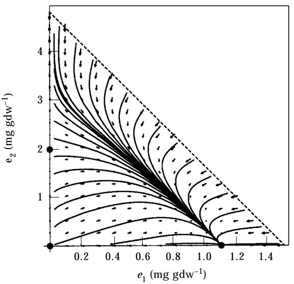

F. 9. The dynamics of the enzymes during the first exponential phase of batch growth on *S*1 and *S*2 at high initial substrate concentrations (*s*1,0=*s*2,0=2gl−1).

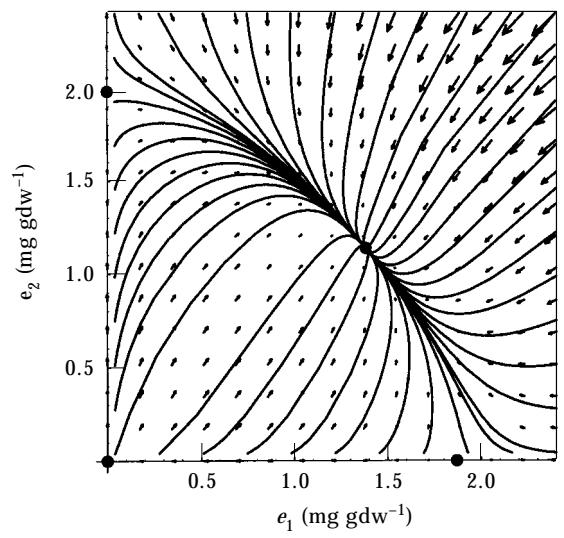

F. 10. The dynamics of the enzymes during the first exponential phase of batch growth on *S*1 and *S*2 at low initial concentration of *S*1 (*s*1,0=5 mg l−1, *s*2,0=2gl−1).

## 4.1.2. *Fixed dilution rate*, *varying feed concentrations*

Since there are two free parameters, *si*,*f* , *i*=1, 2, there is considerable latitude in the choice of the feed concentrations. In the experimental literature, the total concentration of the substrates in the feed, *st*,*f*0*s*1,*f*+*s*2,*f* , is held fixed, and the proportion of *S*1 in the feed:

$$
\sigma_1 \equiv \frac{S_{1f}}{S_{1f}}
$$

is varied. Thus, the steady states are determined at feed concentrations lying on a straight line that would intercept the *s*1,*f* and *s*2,*f* axes in Fig. 6 at (*st*,*f* , 0) and (0, *st*,*f* ), respectively. The variations of the critical and the transition dilution rates along the path, *s*1,*f*+*s*2,*f*=4gl−1, are shown in Fig. 11. It is clear from the figure that if the fixed dilution rate exceeds the maximum critical dilution rate for *S*2, *D*max *c*,2 =0.42 hr−1, cell washout occurs at sufficiently low s1 (see, for instance, figure 4 in Lendenmann *et al*., 1996). Most of the experiments in the literature have been done at dilution rates less than *D*max *c*,2 . At such dilution rates, the two substrates are simultaneously utilized, and the residual substrate concentrations satisfy the relation, *s˜isi*,*f* , for all s1.* Under these conditions, it is found that (Egli, 1995):

* Near the boundaries, s1=0 and s1=1, Fig. 11 implies preferential utilization of *S*2 (*D*q*Dt*,1) and *S*1 (*D*q*Dt*,2), respectively. At such low feed concentrations, however, constititutive enzyme synthesis is high enough to cause significant consumption of the substrate.

(1) the enzyme activity (*e˜i*) increases monotonically with s*i* until the maximum activity is reached, and is constant thereafter (Egli *et al*., 1982a).

(2) The residual substrate concentration (*s˜i*) also increases monotonically with s*i* . This implies, in particular, that the residual concentration during mixed-substrate growth (0Qs*i*Q1) is always less than the residual concentration during single-substrate growth on *Si* (s*i*=1) (Egli *et al*., 1983; Lendenmann *et al*., 1996).

The nature of this monotonic increase depends on the relative magnitudes of the fixed dilution rate and the maximum critical dilution rate of the substrate *D*max *c*,*i* . If *D* is significantly lower than *D*max *c*,*i* , *s˜i* increases linearly. For instance, during growth of *E*. *coli* on a mixture of glucose (*Dc*,glu=0.72 hr−1) and galactose (*Dc*,gal=0.66 hr−1) at a dilution rate of 0.3 hr−1, the concentrations of both substrates increase linearly (Lendenmann *et al*., 1996, figure 1).

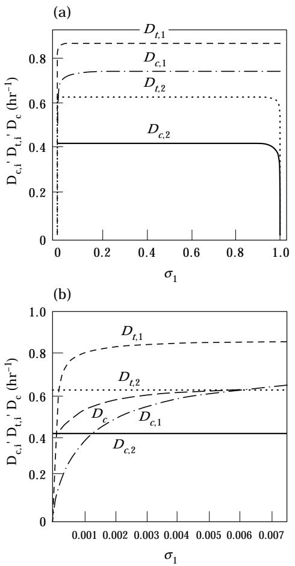

F. 11. The variation of the critical and transition dilution rates with respect to the feed composition s1 along the path *s*1,*f*+*s*2,*f*=4gl−1. The lower figure shows the variation near s1=0.

If *D* is close to *D*max *c*,*i s˜i* increases faster than exponentially. This is exemplified by the variation of the methanol concentration during growth of *Kloeckera sp*. 2201 on a mixture of glucose and methanol (*Dc*,met=0.20 hr−1) at a dilution rate of 0.14 hr−1 (Egli *et al*., 1983, figure 4).

We show below that in the case of the foregoing experiments, the model yields analytical expressions for the steady state concentrations. Thus, we are able to derive the conditions under which the various concentration profiles are obtained.

Under the special conditions of these experiments, there is a simple expression relating *s˜i* and *e˜i* . Indeed, since *s˜isi*,*f* , (19) and (21) imply that:

$$
\tilde{c} = Y_1 \mathbf{s}_{1f} + Y_2 \mathbf{s}_{2f} \tag{35}
$$

$$\left(V_{s,i}\tilde{e}_i \frac{\tilde{s}_i}{K_{s,i} + \tilde{s}_i} = \left(\frac{D}{Y_i}\right)\gamma_i, \quad \gamma_i \equiv \frac{Y_i s_{i,f}}{Y_1 s_{1,f} + Y_2 s_{2,f}} \tag{36}$$

According to (36), the specific uptake rate of *Si* increases linearly with g*i* .* It follows that whenever *e˜i* is constant, *s˜i*/(*Ks*,*i*+*s˜i*) increases linearly with g*i* . Conversely, if *e˜i* increases linearly with g*i* , *s˜i* is constant.

The enzyme activity is an increasing function of g*i* . Indeed, since the specific uptake rate increases linearly with g*i* , (22) implies that the inducer concentration, *x˜i* , increases hyperbolically with g*i* ; hence, it follows from (20) that *e˜i* is the following increasing function of g*i* :

$$
\tilde{e}_i = \frac{V_{e,i}}{D + k_{d,i}} \left[ \frac{\gamma_i}{K_{\forall i} + \{1 - K_{e,i}/K_{\forall i}\}\gamma_i} + \frac{k_{e,i}^{\star}}{V_{e,i}} \right]
$$

$$
\simeq \frac{V_{e,i}}{D + k_{d,i}} \left[ \frac{\gamma_i}{K_{\forall i} + \gamma_i} + \frac{k_{e,i}^{\star}}{V_{e,i}} \right],
$$

$$
K_{\forall i} \equiv \left( \frac{K_{e,i}}{K_{\forall i}} \right) \left( \frac{Y_i V_{\forall i}}{D} \right). \tag{37}
$$

The variation of *e˜i* with respect to g*i* can be decomposed into two regions. In the region g*i*-*K*g,*i*(*ke* *,*i*/*Ve*,*i*), constitutive enzyme synthesis dominates, so that *e˜i* is constant:

* In the experimental literature, the substrate concentrations and enzyme activities are plotted against s*i* . The model shows, however, that g*i* is the more ''natural'' parameter. These two parameters are related by the expression:

$$\gamma_i = \frac{Y_i \sigma_i}{Y_i (1 - \sigma_i) + Y_i \sigma_i}$$

which shows that g*i* is a monotonically increasing function of s*i* , and satisfies the relations g*i*(0)=0,g*i*(l)=1.

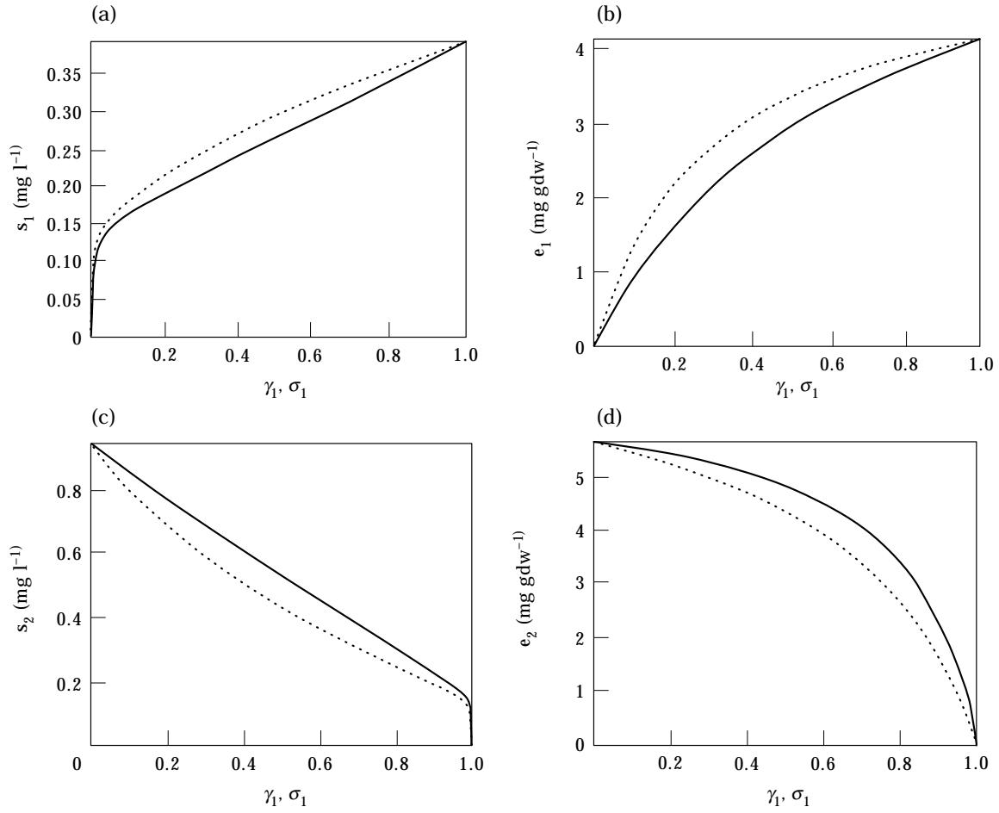

F. 12. The variation of the steady states with respect to feed composition at fixed dilution rate (*D*=0.1 hr−1) and total feed concentration (*st*,*f*=4gl−1). The full line shows the variation with g1, the dashed line the variation with s1.

$$
\tilde{e}_{\!\!\/} = \frac{k_{\!\!\/}^{\star}}{D + k_{\!\!\/}}.\tag{38}
$$

Outside this narrow region near g*i*=0, inducible enzyme synthesis dominates, so that *e˜i* increases hyperbolically:

$$e_i = \left(\frac{V_{\epsilon,i}}{D + k_{\prec i}}\right) \frac{\gamma_i}{K_{\gamma,i} + \gamma_i}.\tag{39}$$

Hence, at low dilution rates, *e˜i* tends gradually to a high maximum [Fig. 12(b, d)]; at high dilution rates, it tends sharply to a low maximum [Fig. 13(b, d)].

Having determined the variation of *e˜i* , the variation of *s˜i* follows immediately from (36):

$$\frac{\tilde{\xi}_{l}}{K_{\omega} + \tilde{s}} = \begin{cases} \left(\frac{D}{Y_{l}V_{\omega}}\right) \left(\frac{D + k_{d\bar{\iota}}}{k_{\bar{\iota}\bar{\iota}}^{\bullet}}\right) \gamma_{l} & \text{if } \gamma_{l} \ll K_{\bar{\iota}}(k_{\bar{\iota}\bar{\iota}}^{\bullet} / V_{\iota\bar{\iota}})\\\\ \left(\frac{D}{Y_{l}V_{\bar{\iota}\bar{\iota}}}\right) \left(\frac{D + k_{d\bar{\iota}}}{V_{\bar{\iota}\bar{\iota}}}\right) (\gamma_{l} + K_{\bar{\iota}\bar{\iota}}) & \text{otherwise.} \end{cases} \tag{40}$$

At small dilution rates, *s˜i*/(*Ks*,*i*+*s˜i*)2*s˜i*/*Ks*,*i* , so that:

$$
\tilde{g}_i = \begin{cases}
K_{\omega} \left( \frac{D}{Y_i V_{\omega}} \right) \left( \frac{D + k_{d\downarrow}}{k_{\circ \circ}^{\bullet}} \right) \eta_{\uparrow} & \text{if } \gamma_{\uparrow} \ll K_{\ne \cdot} (k_{\circ \circ}^{\bullet} / V_{\cdot \circ}) \\\\
K_{\omega} \left( \frac{D}{Y_i V_{\cdot \circ}} \right) \left( \frac{D + k_{d\downarrow}}{V_{\cdot \circ}} \right) (\gamma_{\uparrow} + K_{\ne \cdot}) & \text{otherwise.}
\end{cases}
\tag{41}
$$

The profile of *s˜i* , therefore, consists of two linear segments [Fig. 12(a, c)]: A sharp linear increase in the region, g*i*-*K*g,*i*(*ke* *,*i*/*Ve*,*i*), followed by a gradual linear increase outside it. The slope in the first region is *Ve*,*i*/*ke* *,*i* times the slope in the second region. Evidently, for very small values of *K*0 *e*,*i* , *K*g,*i*-1, and the region, g*i*-*K*g,*i*(*ke* *,*i*/*Ve*,*i*), becomes vanishingly small. In this case, the observable profile of *s˜i* reduces to a single linear segment [Fig. 14(a, c)]. At large dilution rates, *s˜i*/(*Ks*,*i*+*s˜i*)2*s˜i*/*Ks*,*i* for small g*i* . At large g*i* , this approximation is not valid. Hence:

$$
\tilde{y}_i = \begin{cases}
 K_{\boldsymbol{\omega}} \Big( \frac{D}{Y_i V_{\boldsymbol{\omega},i}} \Big) \Big( \frac{D + k_{d,i}}{k_{e,i}^{\bullet}} \Big) \gamma_i & \text{if } \gamma_i \ll K_{\boldsymbol{\gamma},i} (k_{e,i}^{\bullet} / V_{\boldsymbol{\epsilon},i}) \\\\
 K_{\boldsymbol{\omega},i} \Big[ \frac{D(D + k_{d,i})(\gamma_i + K_{\boldsymbol{\gamma},i})}{Y_i V_{\boldsymbol{\omega},i} V_{\boldsymbol{\epsilon},i}} \Big] \text{otherwise.} \\\\
 1 - \frac{D(D + k_{d,i})(\gamma_i + K_{\boldsymbol{\gamma},i})}{Y_i V_{\boldsymbol{\omega},i} V_{\boldsymbol{\epsilon},i}} \end{cases} (42)
$$

The profile of *s˜i* therefore consists of a sharp linear increase followed by a hyperbolic increase to relatively high levels of *s˜i* [Fig. 13(a,c)].

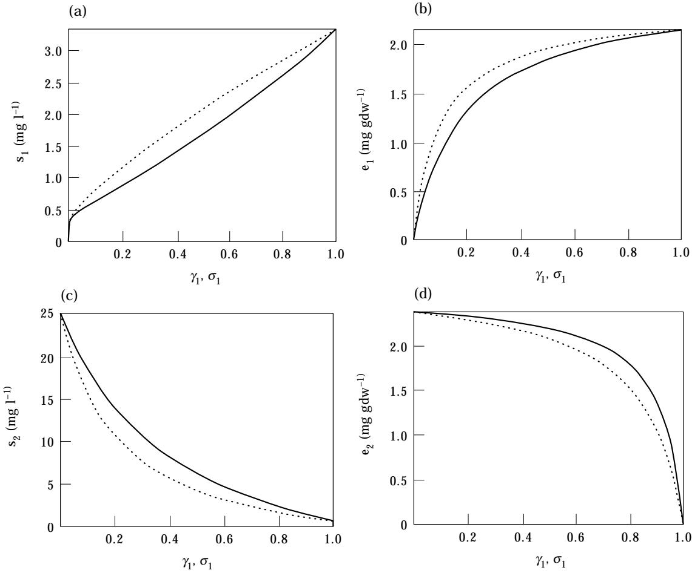

F. 13. The variation of the steady states with respect to feed composition at fixed dilution rate (*D*=0.35 hr−1) and total feed concentration (*st*,*f*=4gl−1). The full line shows the variation with g1, the dashed line the variation with s1.

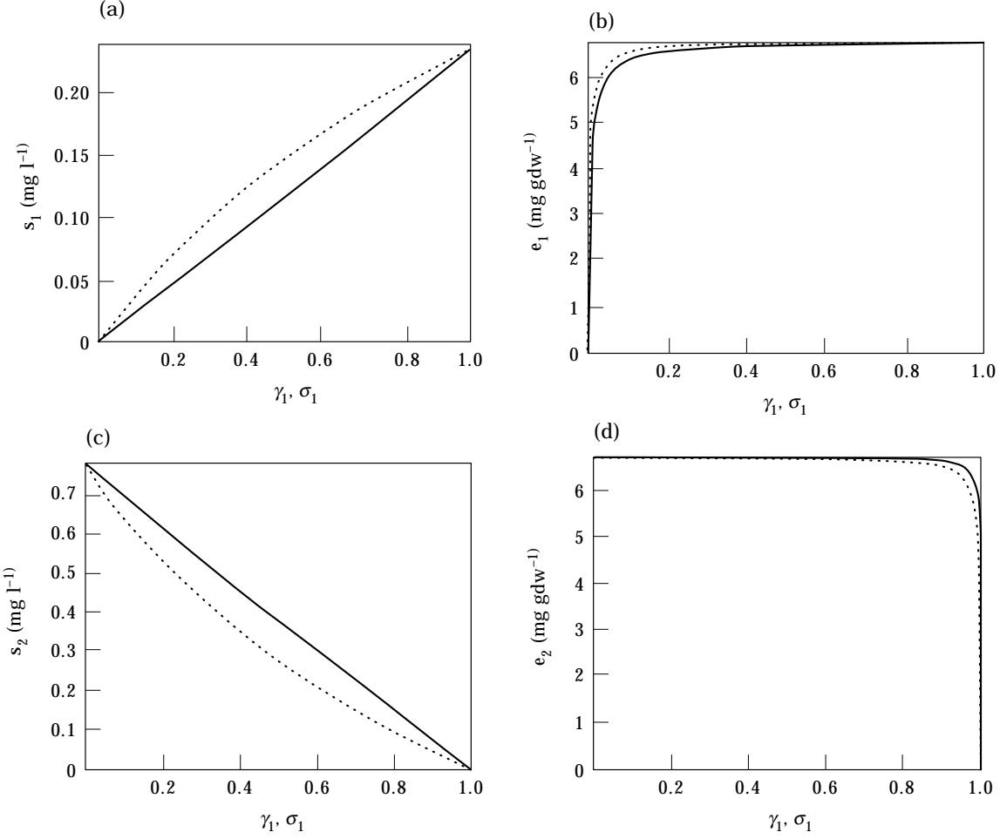

F. 14. The variation of the steady states with respect to feed composition at fixed dilution rate (*D*=0.1 hr−1) and total feed concentration (*st*,*f*=4gl−1) when the saturation constant for enzyme induction is small (*K*0 *e*,*i*=10−8 g gdw−1). The full line shows the variation with g1, the dashed line the variation with s1.

### 4.1.3. *Varying dilution rate and feed concentrations*

To the best of our knowledge, such an experimental study has been done for only one system—growth of *Hansenula polymorpha* on glucose and methanol, a mixture that yields preferential utilization of glucose in substrate-excess batch cultures (Egli *et al*., 1986). In the experiments, the total feed concentration of the substrates was fixed (*st*,*f*=5gl−1), and s1, the proportion of glucose in the feed, was varied. At each s1, the steady states were determined for several dilution rates up to washout. Since the feed concentration of glucose in the mixed-substrate experiments was always high (*s*1,*f*01gl−1), glucose was preferentially consumed at high dilution rates in all the mixed-substrate experiments. The salient features of the experimental data are as follows (Egli *et al*., 1986, figure 2):

(1) The residual concentration of glucose is independent of the feed composition at dilution rates higher than the transition dilution rate for methanol.*

(2) At any given dilution rate, the higher the proportion of glucose in the feed, the smaller the concentration of the residual methanol concentration.

(3) At any given dilution rate, the higher the proportion of glucose in the feed, the larger the cell density. This is because the yield on glucose is higher than the yield on methanol.

* This result is not surprising, since at these dilution rates, growth occurs essentially on glucose alone. Below the transition dilution rate for methanol, the theory predicts that the residual concentration of glucose changes according to (40). In the experiments, the glucose concentrations at such low dilution rates were found to be below the detection limit of 2 mg l−1 (Egli *et al*., 1986).

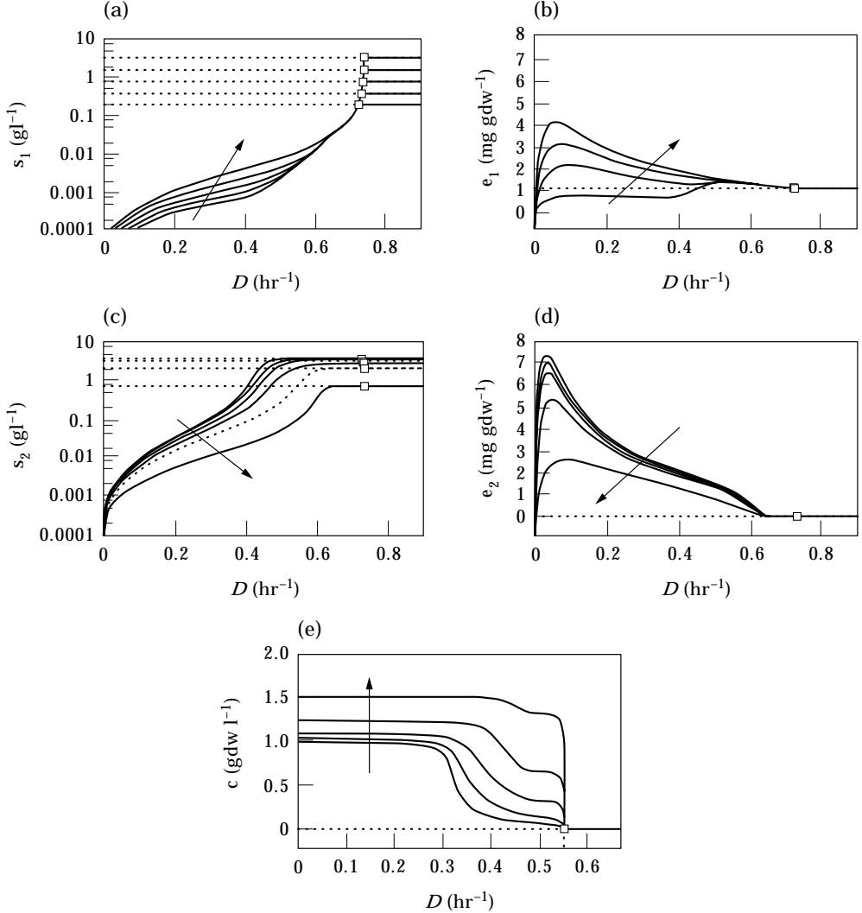

F. 15. The variation of the steady states as a function of the dilution rate at fixed total feed concentration (*st*,*f*=4gl−1) and varying feed compositions (s1=0.05, 0.1, 0.2, 0.4, 0.8). The arrows point in the direction of increasing s1.

Figure 15 shows the numerical simulations of growth on *S*1 (corresponds to glucose) and *S*2 (corresponds to methanol) for *st*,*f*=4gl−1 and s1=0.05, 0.1, 0.2, 0.4, 0.8. The profiles of the substrate concentrations and cell density show good agreement with the experimental data described above.

## 4.2. -

Even under substrate-excess conditions in batch cultures, the substrates are often utilized simultaneously (Egli, 1995; Narang *et al*., 1997a; Wanner & Egli, 1990). The substrates resulting in this growth pattern generally support low single-substrate growth rates (Egli, 1995). In continuous cultures, binary mixtures of such substrates are utilized simultaneously until washout occurs at the maximum specific growth rate observed in substratesufficient batch cultures (Brinkmann & Babel, 1992).

Figure 16 shows the operating diagram for mixed-substrate growth on *S*2 and *S*3. For the set of parameter values corresponding to *S*2 and *S*3, the curves, *Dc*,*i*=*Dt*,*j* , *i*\$*j*, are such that for most feed concentrations, *S*2 and *S*3 are simultaneously utilized at all dilution rates up to washout (Region III). Near the *s*2,*f* axis, there is a narrow region labelled I where *Dt*,3Q*Dc*,2. For any feed concentrations in this region, there is simultaneous utilization for 0Q*D*Q*Dt*,3, and preferential utilization of *S*2 for *Dt*,3E*D*Q*Dc*,2. Likewise, near the *s*2,*f* axis (Region II), *Dt*,2Q*Dc*,3, and there is preferential utilization of *S*3 for *Dt*,2E*D*Q*Dc*,3.

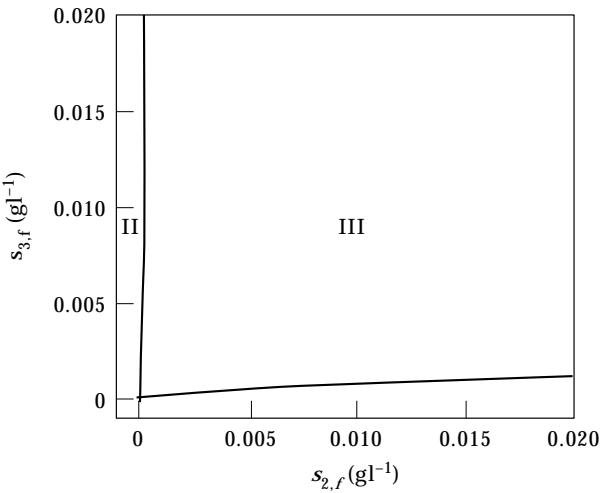

F. 16. The operating diagram for mixed-substrate growth on *S*2 and *S*3.

#### 5. Discussion

We have shown that the assumptions in Section 2 yield steady-state profiles that agree qualitatively with the experimental data. Here, we discuss the limitations of these assumptions, and the modifications required to alleviate them.

#### 5.1.

The model assumes that each substrate is transported or/and catabolized by a unique. inducible enzyme system (Fig. 1). While this is generally true of substrates such as sugars and polyols (Lin, 1987), certain alkanes and polyaromatic hydrocarbons share the same set of inducible enzymes (Gibson, 1984).

Enzyme systems with such broad specificity can be accommodated by modifying the expressions for the transport and enzyme induction rates. Suppose, for instance, *S*1 and *S*2 share the same enzymatic system *E*. Then the substrates compete for the active sites on *E* in accordance with the kinetic scheme (Bailey & Ollis, 1986, p. 119):

$$\begin{aligned} \textbf{Binding:} \quad & E + \textbf{S}_{l} \overset{k_{b,l}}{\underset{k_{-b,l}}{\rightleftharpoons}} E \cdot \textbf{S}_{l}, \quad & K_{b,i} \equiv k_{b,i}/k_{-b,i} \\ \textbf{Racation:} \quad & E \cdot \textbf{S}_{l} \overset{k_{r,l}}{\rightarrow} E + X_{l} \end{aligned}$$

which yields:

$$r_{s,i} = V_{s,i} e \frac{s_i}{1 + K_{\mathbb{A},1}s_1 + K_{\mathbb{A},2}s_2}, \quad V_{s,i} \equiv k_{r,i}K_{\mathbb{A},i}$$

Much less is known about enzyme induction in such systems. No attempt is therefore made to postulate expressions for the induction kinetics. It is conceivable, however, that both *X*1 and *X*2, or only one of them, induces *E*. The latter case, in which one of the substrates is gratuitously *cometabolized* in the presence of the inducing substrate, poses no difficulty. In the former case, it may be necessary to account for the differential effects of *X*1 and *X*2 on the induction rate.

#### 5.2.

Kinetic analysis of the data for the *lac* operon suggests that enzyme induction involves the binding of two inducer molecules to a repressor molecule. Furthermore, the binding of the first inducer molecule facilitates the binding of the second inducer molecule (Dunaway *et al*., 1980; O'Gorman *et al*., 1980). Thus, one obtains the following *cooperative* kinetics (Yagil & Yagil, 1971):

$$r_{r,i} = V_{e,i} \frac{1 + K_{1,i}\chi_i + K_{1,i}K_{2,i}\chi_i^2}{(1 + K_{3,i}R_i) + K_{1,i}\chi_i + K_{1,i}K_{2,i}\chi_i^2} \quad (43)$$

where *K*1,*i* and *K*2,*i* denote the equilibrium constants for binding of the first and second inducer molecules to the repressor, *K*3,*i* denotes the equilibrium constant for binding of the repressor to the operator, and *Ri* denotes the total concentration of the repressor.

The consequences of using (43) are discussed in Narang (1997). It is shown therein that if the induction kinetics are cooperative rather than hyperbolic, the model yields multiple stable steady states. Specifically, in the case of batch growth, one obtains, in addition to the sequential and simultaneous growth patterns, substrate utilization patterns that vary depending on the physiological state of the inoculum (Narang *et al*., 1997a).

### 5.3. -

Although the assumption of additive yields is valid for several substrate mixtures (Egli, 1995, p. 336), there are exceptional cases (Babel *et al*., 1993; Gommers *et al*., 1988). Furthermore, overflow metabolism, energy spillage, storage, and maintenance exist, and, under specific operating conditions, become significant relative to growth-related catabolism (Russell & Cook, 1995). Thus, we are led to consider the issue of the rates of non-biosynthetic processes.

Bioenergetic models have been developed that successfully address this question for single-substrate growth (Grosz & Stephanopoulos, 1990; Ko *et al*., 1993). The models show that non-biosynthetic rates can be predicted by accounting for the synthesis and utilization of energy (ATP) and redox (NADH). The key dynamic feature of the models is the autocatalytic nature of energy synthesis: since substrates are ''sparked'' with energy or redox before being catabolized, energy is required for its own synthesis. A detailed study of these dynamics can be found in Reich & Sel'kov (1981). Here, it suffices to note that the structure of bioenergetic models resembles the structure of our model, the only difference being that they do not account for enzyme dynamics. The addition of similar energetic structure to our model provides a natural point of departure for predicting non-biosynthetic rates in mixed-substrate systems.

#### 6. Conclusions

A simple model containing the transport or/and peripheral catabolic enzymes as the key physiological variables captures and explains most of the mixedsubstrate phenomena described in the literature (Egli, 1995). In particular, the model predicts:

(1) A dilution rate at which enzyme activity is maximal during single-substrate growth.

(2) A transition dilution rate at which the substrate utilization pattern switches from simultaneous to preferential substrate utilization.

(3) The ''enhanced growth rate'' effect, i.e. consumption of the less preferred substrate at dilution rates exceeding its critical (washout) dilution rate.

The predicted steady-state profiles of the substrate concentrations, enzyme activities, and cell density agree with the observed profiles under various operating conditions—varying dilution rate (fixed feed concentrations) and varying feed concentrations (fixed dilution rate).

The substrate utilization patterns vary depending on the feed concentrations and the dilution rates. The model yields an operating diagram with three distinct substrate utilization patterns:

(1) Preferential utilization of *S*1 at sufficiently high dilution rates.

(2) Preferential utilization of *S*2 at sufficiently high dilution rates.

(3) Simultaneous utilization of *S*1 and *S*2 for all dilution rates up to washout.

These patterns are determined by the extent to which the autocatalytic processes of growth and inducible enzyme synthesis can sustain the load imposed by the dilution rate. At sufficiently high dilution rates, both processes can collapse. Preferential utilization occurs when synthesis of one of the enzymes collapses; washout occurs if growth collapses.

#### REFERENCES

- B, W., B, U. & M¨ , R. H. (1993). The auxiliary substrate concept—an approach for overcoming limits of microbial performance. *Acta Biotechnol*. 13, 211–242.
B, J. E. & O, D. F. (1986). *Biochemical Engineering*

*Fundamentals*. 2nd Edn. New York: McGraw-Hill.

- B, B. C. & F, A. G. (1988). Limitation of growth rate by two complementary nutrients: Some elementary but neglected considerations. *Biotechnol*. *Bioeng*. 31, 75–86.
- B, U. & B, W. (1992). Simultaneous utilization of heterotrophic substrates by *Hansenula polymorpha* results in enhanced growth. *Adv*. *Microbiol*. *Biotechnol*. 37, 98–103.
- B, A. G. & A, M. M. (1983). Regulation of enzyme synthesis during growth of *Hyphomicrobium X* on mixtures of methylamine and ethanol. *J*. *Gen*. *Microbiol*. 13, 2399–2404.
- B, S. & E, R. H. (1994). Promoter structure, promoter recognition, and transcription activation in procaryotes. *Cell* 79, 743–746.
- D, A. C. R. (1972). Influence of environment on the control of enzyme synthesis. *J*. *Appl*. *Chem*. *Biotechnol*. 22, 245–259.
- D, E., W, X. & F, T. (1994). *Software for Continuation and Bifurcation Problems in Ordinary Differential Equations*. Pasadena, CA: California Institute of Technology.
- D, M., O, J. S., R, J. M., K, O. B., D, R. E. & M, K. S. (1980). Kinetic studies of inducer binding to *lac* repressor-operator complex. *J*. *Biol*. *Chem*. 255, 10107–10114.
- E, L. & S, H. (1981). Enhanced utilization of methanol during growth on mixed substrates: A continuous culture study with *Hansenula polymorpha*. *Arch*. *Microbiol*. 14, 305–386.
- E, T. (1995). The ecological and physiological significance of the growth of heterotrophic microorganisms with mixtures of substrates. *Adv*. *Microbiol*. *Ecol*. 14, 305–386.
- E, T., B, C. & H, G. (1986). Simultaneous utilization of methanol-glucose mixtures by *Hansenula polymorpha* in chemostat: Influence of dilution rate and mixture composition on utilization pattern. *Biotechnol*. *Bioeng*. 28, 1735–1741.
- E, T., K¨ , O. & F, A. (1982a). Regulatory flexibility of methylotrophic yeasts in chemostat culture: Simultaneous assimilation of glucose and methanol at a fixed dilution rate. *Arch*. *Microbiol*. 131, 1–7.
- E, T., K¨ , O. & F, A. (1982b). Mixed substrate growth of methylotrophic yeasts in chemostat culture: Influence of dilution rate on the utilization of a mixture of methanol and glucose. *Arch*. *Microbiol*. 131, 8–13.
- E, T., L, N. D. & Q, J. R. (1983). Regulation of enzyme synthesis and variation of residual methanol concentration during carbon-limited growth of *Kloeckera sp*. on mixtures of methanol and glucose. *J*. *Gen*. *Microbiol*. 129, 1269–1281.
- E, T., D, J. P., V, J. P., H, W. & F, A. (1980). Methanol metabolism in yeasts: Regulation of the synthesis of catabolic enzymes. *Arch*. *Microbiol*. 124, 115–121.
- F, A. G. (1976). Formulation of structured growth models. *Biotechnol*. *Bioeng*. 28, 1481–1486.
- F, A. G. & T, H. M. (1977). Microbial kinetics and dynamics. In: *Chemical Reactor Theory*: *A Review* (Lapidus, L. & Amundson, N. R., eds), chap. 7, pp. 405–483. Englewood Cliffs, NJ: Prentice-Hall.
- G, D. T., ed. (1984). *Microbial Degradation of Organic Compounds*. New York: Marcel-Dekker.
- G, P. J. F., S, B. J., D, J. P. & K, J. G. (1988). Biochemical limits to microbial growth yields: An analysis of mixed-substrate utilization. *Biotechnol*. *Bioeng*. 32, 86–94.
- G, S., V, K., V, W. R. & C- , A. (1978). Modeling the role of cyclic AMP in catabolite repression of inducible enzyme biosynthesis in microbial cells. *Biotechnol*. *Bioeng*. 20, 1797–1815.
- G, R. & S, G. (1990). Physiological, biochemical, and mathematical studies of micro-aerobic continuous ethanol fermentation by *Saccharomyces cerevisiae*. III: Mathematical model of cellular energetics and catabolism. *Biotechnol*. *Bioeng*. 36, 1030–1040.
- H, W. & D, L. (1982). Strategies of mixed substrate

utilization in microorganisms. *Philos*. *Trans*. *R*. *Soc*. *London B*, 297, 459–480.

- H, M. J. & W, F. C. (1967). Utilization of mixed sugars in continuous fermentation. II. *Biotechnol*. *Bioeng*. 9, 205–221.
- H, E. & K, W. A. (1978). Kinetics of growth and substrate consumption of *Escherichia coli* ML30 on two carbon sources. *Z*. *Allg*. *Mikrobiol*. 18, 415–426.
- H, D., E, R. & T, R. C. (1956). The continuous culture of bacteria: A theoretical and experimental study. *J*. *Gen*. *Microbiol*. 14, 601–622.
- J, F. & M, J. (1961). Genetic regulatory mechanisms in the synthesis of proteins. *J*. *Mol*. *Biol*. 3, 318–356.
- K, Y.-F., B, W. E. & W, W. A. (1993). An integrated metabolic modeling approach to describe the energy efficiency of *Escherichia coli* fermentations under oxygen-limited conditions: Cellular energetics, carbon flux, and acetate production. *Biotechnol*. *Bioeng*. 42, 843–853.
- K, D. S., R, D., J, N. B. & T, G. T. (1986). Investigation of bacterial growth on mixed substrates: Experimental evaluation of cybernetic models. *Biotechnol*. *Bioeng*. 28, 1044–1055.
- L, I. H., F, A. G. & T, H. M. (1974). Diauxic growth of *Propioni bacterium shermanii*. *Appl*. *Microbiol*. 28, 831–835.
- L, U. (1994). Growth Kinetics of *Escherichia coli* with Mixtures of Sugars. PhD thesis, Swiss Federal Institute of Technology Zu¨ rich, Switzerland.
- L, U. & E, T. (1995). Is *Escherichia coli* growing in glucose-limited chemostat culture able to utilize other sugars without lag? *Microbiology* 141, 71–78.
- L, U., S, M. & E, T. (1996). Kinetics of the simultaneous utilization of sugar mixtures by *Escherichia coli* in continuous culture. *Appl*. *Environ*. *Microbiol*. 62, 1493–1499.
- L, E. C. C. (1987). In: *Escherichia coli and Salmonella typhimurium*: *Cellular and Molecular Biology*. Vol. 1 (Neidhardt, F. C., Ingraham, J. L., Schechter, M., Brooks, K., Magasaik, B., Schaechter, M. & Umbarger, H. E., eds), Chapter 18, pp. 244–284. Washington DC: American Society for Microbiology.
- L` , P., G, E., P, V. & L, N. D. (1992). Kinetics and physiological implications of the growth behavior of *Eubacterium limosum* grown on glucose/methanol mixtures. *J*. *Gen*. *Microbiol*. 138, 979–985.
- MC, W. R. (1985). Mechanism and control of transcription initiation control in procaryotes. *Annu*. *Rev*. *Biochem*. 54, 171–204.
- M, A. (1978). Microbial regulatory mechanisms at low nutrient concentrations as studied in a chemostat. In: *Strategies of Microbial Life in Extreme Environments* (Shilo, M., ed.), pp. 323–339. Weinheim: Verlag Chemie.
- N, A. (1994). The dynamics of microbial growth on mixtures of substrates. PhD thesis, Purdue University.
- N, A. (1998). The dynamical analogy between microbial growth on mixtures of substrates and

population growth of competing species. *Biotechnol*. *Bioeng*. (in press).

- N, A., K, A. & R, D. (1997a). New patterns of mixed substrate growth in batch cultures of *Escherichia coli* K12. *Biotechnol*. *Bioeng*. 55, 747–757.
- N, A., K, A. & R, D. (1997b). Dynamic analysis of the cybernetic model for diauxic growth. *Chem*. *Eng*. *Sci*. 52, 2567–2578.
- N, A., K, A. & R, D. (1997c). The dynamics of microbial growth on mixtures of substrates in batch reactors. *J*. *theor*. *Biol*. 184, 301–317.
- O'G, R. B., R, J. M., K, O. B., D, R. E., I, K., R, A. D. & M, K. S. (1980). Equilibrium binding of inducer to *lac* repressor-operator DNA complex. *J*. *Biol*. *Chem*. 255, 10115–10119.
- P, M. (1992). *A Genetic Switch*: *Phage* l *and Higher Organisms*. 2nd Edn. Cambridge, MA: Cell Press & Blackwell Scientific Publications.
- R, R., K, A. E. & R, D. (1996). Cybernetic modeling of growth in mixed, substitutable substrate environments. *Biotechnol*. *Bioeng*. 52, 141–151.
- R, J. G. & S', E. E. (1981). *Energy Metabolism of the Cell*: *A Theoretical Treatise*. Chapter V, pp. 199–253. New York: Academic Press.
- R, J. B. & C, G. M. (1995). Energetics of bacterial growth: Balance of anabolic and catabolic reactions. *Microbiol*. *Rev*. 59, 48–62.
- S, H., L, U., S, M. & E, T. (1994). The growth of *Escherichia coli* in glucose-limited chemostat cultures: A reexamination of the kinetics. *Biochem*. *Biophys*. *Acta* 1201, 424–436.
- S, R. S. & M, R. I. (1969). Control of mixed-substrate utilization in continuous cultures of *Escherichia coli*. *J*. *Bacteriol*. 97, 535–543.
- T, K. (1981). Induction and repression of enzymes in microbial cultures. *J*. *Tech*. *Biotechnol*. 31, 775–790.
- T, K. & Y, I. (1979). Mathematical model of cell growth and phosphate biosynthesis in *Saccharomyces carlsbergensis* under phosphate limitation. *Biotechnol*. *Bioeng*. 21, 487–502.
- T, R. W., C, E. C. & G, J. L. (1990). The fermentative characteristics of *Lactobacillus xylosus* on glucose and xylose. *Biotechnol*. *Lett*. 12, 51–56.
- D, G. & M-Y, M. (1973). Cell growth and extracellular enzyme synthesis in fermentations. *Biotechnol*. *Bioeng*. 15, 419–439.
- W, U. & E, T. (1990). Dynamics of microbial growth and cell composition in batch culture. *FEMS Microbiol*. *Rev*. 75, 19–44.
- W, S. (1991). *Mathematica*: *A System for Doing Mathematics on the Computer*. Reading, MA: Addison-Wesley.
- W, L. (1969). Positional information and the spatial pattern of cellular differentiation. *J*. *theor*. *Biol*. 25, 1–47.
- Y, G. & Y, E. (1971). On the relation between effector concentration and the rate of induced enzyme synthesis. *Biochem*. *J*. 11, 11–17.