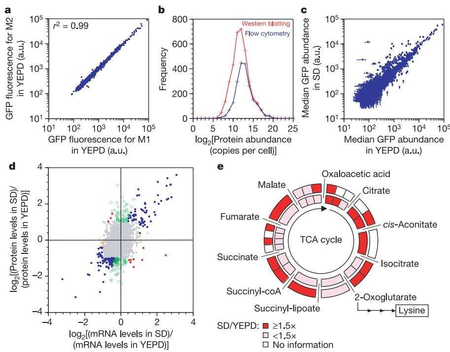
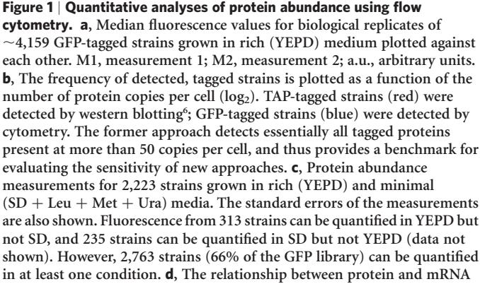
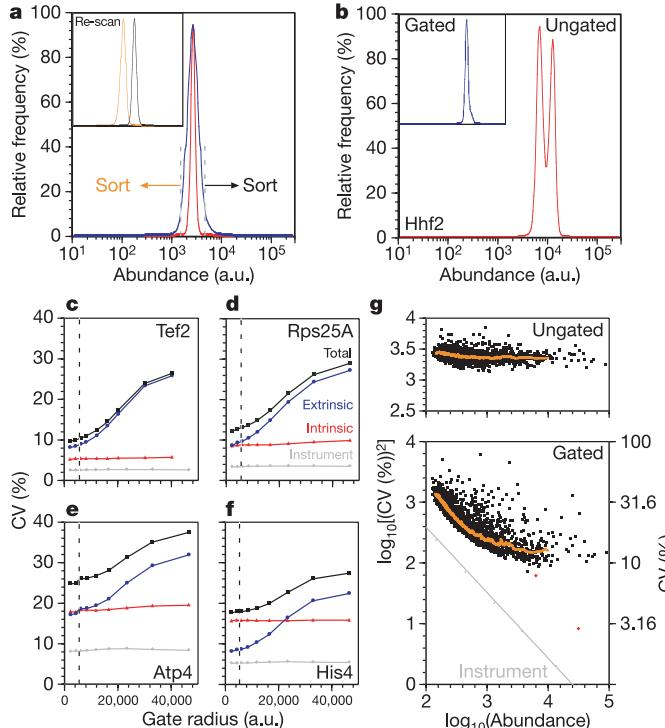
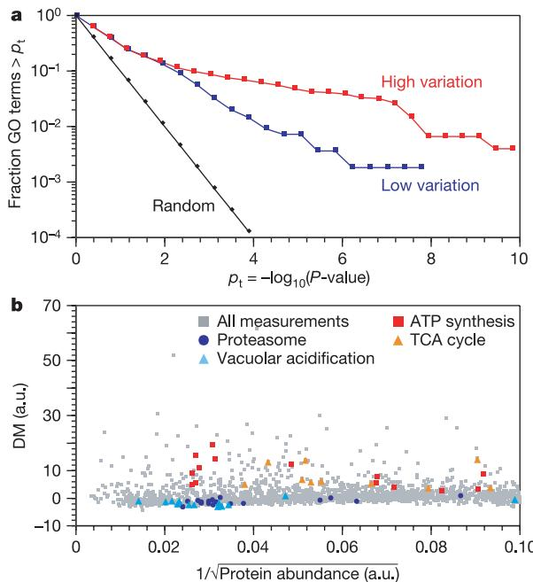
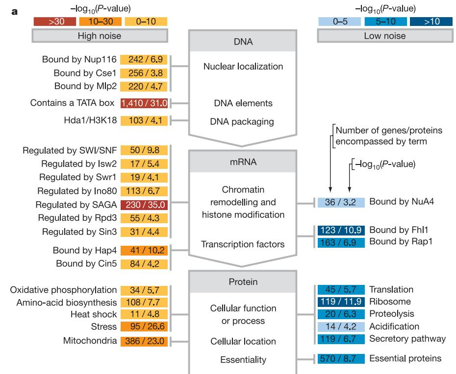

# ARTICLES

## Single-cell proteomic analysis of S. cerevisiae reveals the architecture of biological noise

John R. S. Newman1,2, Sina Ghaemmaghami1,2†, Jan Ihmels1,2, David K. Breslow1,2, Matthew Noble1 , Joseph L. DeRisi1,3 & Jonathan S. Weissman1,2

A major goal of biology is to provide a quantitative description of cellular behaviour. This task, however, has been hampered by the difficulty in measuring protein abundances and their variation. Here we present a strategy that pairs high-throughput flow cytometry and a library of GFP-tagged yeast strains to monitor rapidly and precisely protein levels at single-cell resolution. Bulk protein abundance measurements of .2,500 proteins in rich and minimal media provide a detailed view of the cellular response to these conditions, and capture many changes not observed by DNA microarray analyses. Our single-cell data argue that noise in protein expression is dominated by the stochastic production/ destruction of messenger RNAs. Beyond this global trend, there are dramatic protein-specific differences in noise that are strongly correlated with a protein's mode of transcription and its function. For example, proteins that respond to environmental changes are noisy whereas those involved in protein synthesis are quiet. Thus, these studies reveal a remarkable structure to biological noise and suggest that protein noise levels have been selected to reflect the costs and potential benefits of this variation.

Proteins carry out the actions necessary for cellular function. Correspondingly, changes in their concentrations can have direct phenotypic consequences. Several approaches have been used to identify proteins expressed in a diverse range of organisms and organelles1–4. In particular, studies on the budding yeast Saccharomyces cerevisiae have generated a nearly comprehensive list of proteins likely to be translated5–7 and their copy numbers at steady state in rich medium6 . However, much less quantitative information is available on how proteomes are remodelled in response to different environmental cues. Additionally, inferences about changes in protein levels based on DNA microarray measurements are limited by an imperfect understanding of the relationship between mRNA and protein levels6,8–10.

Notably, no widely used proteomics technique readily provides abundance measurements for single cells, although such information is critical for understanding fundamental biological questions. Indeed, it has long been appreciated that many cellular processes rely on small numbers of molecules and thus are subject to stochastic variation (noise)11. Such noise contributes to phenotypic variability and can either attenuate or augment a cell's ability to respond to its environment12–14. Even in the absence of noise, epigenetic imprints15 and a lack of synchronicity within a population can differentially impact transcription from genetically identical loci. Also, protein changes can occur in both graded and binary (switch-like) fashions in response to differing environmental conditions, but bulk measurements obscure such responses16–18. Thus, identifying single-cell variation is essential for understanding how cells exist as autonomously functioning dynamic systems19.

Pioneering studies have highlighted the potential of flow cytometry to quantify intracellular protein concentrations in individual cells20, and to measure different samples rapidly21. More recently, several elegant studies using the green fluorescent protein (GFP) and its derivatives have identified many factors that can contribute to noise15,22–25. However, the scope and nature of the central factors that give rise to and limit noise in vivo remain poorly understood (see ref. 26), in large part because existing studies have examined only a handful of genes.

Here we describe a novel, integrated strategy for large-scale, quantitative single-cell proteomics. Our approach uses highthroughput flow cytometry to make precise measurements on a collection of S. cerevisiae strains in which each protein is expressed as a carboxy-terminal GFP fusion from its endogenous promoter and natural chromosomal position3 . With this approach, it is now possible to monitor the internal state of the cell with unprecedented resolution. This allows us to follow protein changes in response to environmental perturbations and to uncover both the global and protein-specific biological structure of noise in budding yeast.

#### Measuring protein abundance by flow cytometry

To quantify the yeast proteome, we automated sample growth and handling, and also wrote custom software (HTS-Pro; see Supplementary Notes 1 and 2) to control the delivery of GFP-tagged cells to a flow cytometer via an autosampling device. With this approach, approximately seven samples can be measured per minute, counting .50,000 cells per sample, with cross-contamination of ,0.1%. Furthermore, we developed an integrated set of software tools that allows storage, manipulation and analysis of data (for example, to eliminate systematic sources of variation, and to extract information about cell size, shape and fluorescence; see Supplementary Notes 2).

We measured the fluorescence of 4,159 GFP-tagged yeast strains

1 Howard Hughes Medical Institute, 2 Department of Cellular and Molecular Pharmacology, and 3 Department of Biochemistry and Biophysics, University of California, San Francisco, and the California Institute for Quantitative Biomedical Research, 1700 4th Street, San Francisco, California 94107, USA. †Present address: Institute for Neurodegenerative Diseases, PO Box 0518, University of California, San Francisco, San Francisco, California 94143-0518, USA.

grown to mid-log phase in rich (YEPD) medium, starting from single colonies. These strains define the set that can be detected by fluorescence microscopy under normal laboratory growth conditions3 . The flow cytometry measurements show remarkable precision and sensitivity. The fluorescence is highly reproducible (coefficient of correlation, r 2 ¼ 0.99), even when strains are grown in medium prepared on different occasions and the measurements are separated by several weeks (Fig. 1a). The very low variability seen in full biological replicates probably results from instrument accuracy and from the minimal sample preparation required (that is, measurements are made on intact cells)27. The sensitivity of the approach permits us to distinguish .60% (.2,500) of the GFP-tagged strains from autofluorescence with .95% confidence (Supplementary Tables S1 and S3). After correcting for autofluorescence, the standard errors for the lowest GFP fluorescence intensities are still less than ^45% of the median values. For larger fluorescence intensities, the standard errors fall to about ^2.5% of the median values (see Supplementary Notes 2).

Comparison of the proteins we detect to quantitative measurements obtained under similar growth conditions using western blot analysis of a set of tandem affinity purification (TAP)-tagged strains6 reveals that cytometry detects nearly all proteins present at greater than ,8,000 tagged proteins per cell. This coverage drops to about 50% for proteins expressed at 2,000–4,000 copies per cell, and falls rapidly thereafter (Fig. 1b). However, we estimate that moderate improvements in fluorescent proteins28,29, coupled to lower autofluorescence and reduced instrument drift, would permit us to detect ,85% of the proteome (data not shown). Alternatively, microscopy can be used to quantify proteins with low abundances3,30 (Supplementary Fig. S6a; J.R.S.N. and J.S.W., unpublished observation).

Several lines of evidence argue that our measured fluorescence accurately reports on protein abundance. First, the fluorescence does not change substantially on the timescale required to harvest and measure cell fluorescence (Supplementary Fig. S5). Second, the fluorescence measurements are in excellent agreement (r 2 ¼ 0.997) with quantitative fluorescence microscopy (Supplementary Fig. S6a). Third, with the exception of proteins localized to the vacuole, cellular fluorescence is almost exclusively due to intact fusion proteins (rather than cleaved GFP), as confirmed by western blotting of .150 strains (Supplementary Fig. S7c). Fourth, there are no global problems with the folding and oxidation of GFP, as the fluorescence measured by cytometry is linearly proportional to abundances determined by western blotting using TAP-tagged strains (r 2 ¼ 0.80; Supplementary Fig. S7a). The degree of agreement between the two approaches is consistent with errors from duplicate western blotting measurements (r 2 ¼ 0.77; Supplementary Fig. S7b; see also ref. 30). Finally, we found no evidence that GFP interferes with the recognition and destruction of proteins by the ubiquitin–proteasome system, which

ratios larger than two (colours other than grey) for cells grown in SD and YEPD. Changes in mRNA levels are largely captured by changes in protein levels (blue). In 21 cases, mRNA levels change without a corresponding change in protein levels. For 10 of these cases, protein levels do not change (orange), whereas for the remaining 11 cases (red), the proteins change in a direction opposite to that observed for the mRNA (see the main text). In contrast, changes in protein levels are not always captured by changes in mRNA levels, and we observed 131 instances of this behaviour (green). mRNA ratios were measured using DNA microarrays. Ratios were grouped operationally by lines having slopes of þ3/1 3 (blue), 23/21 3 (red), þ 3/23 (green) and 1 3 /21 3 (orange). e, Schematic showing that 11 out of 14 tricarboxylic acid (TCA) cycle proteins quantified by cytometry show greater than 1.5-fold induction in SD compared to YEPD (red segments, outer circle), but only 4 out of 19 mRNAs quantified by microarray analysis show induction at a similar level (red segments, inner circle). Note that Aco1 is used twice in the TCA cycle.

is a major mechanism for protein turnover31 (Supplementary Fig. S8; D. Toczyski, personal communication). Although, for a subset of proteins, the presence of a GFP tag will alter abundances, the large majority of fusion proteins (.80% based on analysis of essential

Figure 2 | Single-cell variation, gating and global trends in noise. a, Two GFP-tagged strains with the same mean intensities show different degrees of variation. Rpl35A–GFP has a CVof 11.8 (red), whereas Nop8–GFP has a CV of 38.6 (blue). Cells from the same population with low or high intensities retain their original fluorescence intensities when sorted and re-measured (inset), indicating that variation is a reproducible cellular property. The scales of the main and inset plots are identical (omitted for clarity; true also for b). b, Cells expressing the cell-cycle-regulated histone subunit Hhf2 fused to GFP normally show two peaks (red) in asynchronous cultures grown to mid-log phase in YEPD. Gated cells show a single peak, and a lower total variation (inset, blue). The gated peak can be exactly superimposed on the left peak in the ungated population (not shown for clarity). c–f, Decomposition of total noise (black) into intrinsic (red) and extrinsic (blue) contributions using two-colour strains and different FSC and SSC gate radii. Intrinsic noise due to the instrument for the voltages used for each experiment is also shown (grey). The gate radius used for CV calculations reported in the paper (4,096 a.u.) is indicated by a vertical dotted line in each graph. For gated cells, extrinsic noise dominates the total noise of the abundant protein Tef2 (c; abundance ¼ 30,700). Intrinsic and extrinsic noise make equal contributions to the total noise of the ribosomal protein Rps25A (d; abundance ¼ 6,132). Intrinsic and extrinsic noise make equal contributions to the total noise of Atp4, but intrinsic noise is consistently high (e; abundance ¼ 1,276). For gated cells, the intrinsic noise of His4 dominates the total noise (f; abundance ¼ 2,090). g, Global noise trends are revealed by gating. There is little dependence of log10(CV2 ) on log10(abundance) for strains gated using a large radius (40,960 a.u.; top panel). In contrast, there is a striking reduction in log10(CV2 ) with increasing abundance when a radius chosen to minimize extrinsic noise is used (4,096 a.u.; bottom panel). The r 2 for the correlation between CV2 and 1/abundance is 0.64 (see Supplementary Notes 2). Uncorrelated stochastic processes are expected to show a slope of 21. This relationship is observed for proteins expressed at low and moderate levels. For highly expressed proteins, extrinsic noise dominates the measured variation, but this component can be eliminated using a two-colour strategy24 to reveal underlying noise consistent with stochastic processes (for example, for Rps25A–GFP and Tef2–GFP; red diamonds). A running median for each plot is also shown (orange). Instrument noise is shown in the bottom panel (grey line).

proteins3 ) remains functional. Notably, even when the GFP tag influences abundances, relative changes can still be determined accurately, provided that the tag perturbs protein levels by a constant amount across different conditions.

#### Protein and mRNA levels in rich and minimal media

Next, we explored the differences between steady-state protein levels for cells grown in rich (YEPD) and minimal (SD) media (Fig. 1c; Supplementary Table S1). Of the 2,223 proteins that can be detected in both conditions, 232 are expressed at higher levels in SD (.99% confidence), and 101 increase by at least twofold. Conversely, 684 proteins are expressed at higher levels in YEPD (.99% confidence), and 112 are induced by at least twofold. These changes provide a coherent description of how cells adapt to environments with abundant or modest levels of nutrients consistent with our understanding of this biological response10,32. For example, many proteins induced in rich medium are involved in cell growth and division (such as ribosomal proteins and cell wall biosynthesis enzymes). Conversely, many proteins induced in minimal medium are involved in the production of small molecules that cannot be taken up from the surrounding environment, such as amino acids and nucleotides.

To understand how protein and mRNA changes are related, and to identify potential examples of post-transcriptional regulation (PTR; that is, regulation at the level of translation or protein degradation), we extended our studies by using DNA microarrays to quantify fluctuations in mRNA levels between cells grown in YEPD versus SD (Supplementary Table S2). Overall, we find that mRNA changes are largely captured by changes in protein abundances (Fig. 1d). For example, focusing on genes for which mRNA levels change at least twofold, we find 151 instances where both mRNA and protein level changes occur in the same direction, and only 21 instances where mRNA levels change and protein levels remain static or change in the opposite direction (see Fig. 1d legend). In fact, further studies using quantitative polymerase chain reaction (qPCR) revealed that several of these discrepancies were due to errors in the microarray measurements (data not shown). It is important to note that, as mRNA measurements are made using untagged strains, these results also argue that the GFP tag does not significantly impair our ability to detect physiological responses.

In contrast, there are a significant number of cases (135, using a twofold threshold) where protein changes are not mirrored by mRNA changes (Fig. 1d). Many of these protein changes yield insights into coordinated cellular responses that occur when cells are grown to steady state in YEPD or SD. One qualitative illustration is provided by the induction of tricarboxylic acid (TCA) cycle enzymes in SD, probably to generate key intermediates involved in amino acid biosynthesis (such as 2-oxoglutarate for lysine biosynthesis). Here, 11 out of 14 measured proteins are coordinately upregulated .1.5-fold (outer circle in Fig. 1e), whereas only 4 out of 19 measured genes are coordinately upregulated to the same extent (inner circle in Fig. 1e). Additional qualitative examples are provided by proteins and genes involved in 20S and 35S ribosomal RNA processing (19/24 proteins are induced in YEPD versus 4/24 mRNAs, and 13/24 proteins are induced in YEPD versus 3/24 mRNAs, respectively; Supplementary Table S2).

More quantitatively, we sought to independently verify examples of PTR. Because rare examples of PTR can be masked by measurement inaccuracies, particularly when the total number of measurements is large, the ability to identify infrequent cases of PTR provides a critical test of the overall accuracy of an approach. For our studies, we chose ten cases where additional microarray measurements performed in triplicate confirmed that mRNA levels change discordantly from protein levels when cells are shifted from SD to YEPD. Next, we used western blotting to confirm the protein measurements made by cytometry, and qPCR to confirm the mRNA measurements made by microarrays. In all cases examined, we were able to corroborate the discordance between protein and mRNA changes (see Supplementary Notes 2; Supplementary Fig. S9). Further validation of two of our observations (involving Fet3 and Ftr1) is provided by a recent report showing that iron uptake by these proteins is controlled post-transcriptionally by regulated proteolysis33.

## Defining global trends in cellular noise

A central difference between this study and previous large-scale analyses of protein or mRNA abundances is that cytometry functions with single-cell resolution and thus can report on cell-to-cell variation. Indeed, we see large differences in coefficient of variation (CV; (standard deviation/mean) £ 100(%)) values for proteins expressed at similar levels (Fig. 2a). These differences are reproducible, as cells with low and high fluorescence intensities can be separated from a single population by sorting, and retain their original fluorescence levels when re-measured immediately (Fig. 2a, inset).

Extracting biological or functional meaning from single-cell data can be challenging. Specifically, there can be large global differences in protein levels between isogenic cells due to heterogeneity in cell size and cell cycle state that obscure protein-specific variation (data not shown and Fig. 2b, respectively)34,35. In principle, cytometry is well suited to reducing the contributions of these factors to protein variation as it can provide an approximate measure of cell size and granularity (using the forward (FSC) and side (SSC) scatter parameters, respectively). Nevertheless, the effectiveness and importance of correcting for such effects is unclear34,35. Therefore, we systematically explored the ability of gating to extract biological structure from global abundance heterogeneity by defining a circular gate centred about the FSC and SSC medians and varying its radius. Reducing the radius initially led to a steep decrease, and then a more moderate decline, in measured CV values (Fig. 2c–f; Supplementary Fig. S3a). For our studies, we used a radius that fell in the latter regime, chosen to achieve a substantial reduction in variation, while maintaining

Figure 3 | Biological structure of protein variation. a, Biological processes (represented by Gene Ontology (GO) terms) are strongly enriched for proteins with low or high variation (blue and red, respectively). The distribution of P-values obtained using randomized data is shown in black (see also Supplementary Notes 2). b, Specific biological processes have higher or lower variation than expected by chance. Two classes of proteins with low noise participate in protein destruction. Two classes of proteins with high noise are involved in energy production.

sufficient numbers of cells (that is, ,500, or 1% of all cells measured in a typical experiment) to reproducibly calculate CV values: 99% of the CV values from gated populations fall within ^20% of the average of repeated measurements, and this reproducibility is maintained with increasing CV magnitude (see Supplementary Notes 2; Supplementary Fig. S3d, e). Although, following gating, protein variation is typically well approximated by a normal distribution, a notable subset of tagged proteins shows distributions with significant tails, implying that our reported CV values sometimes underestimate the variation at the extremes of populations. Such deviations from normal distributions, which will be described in detail elsewhere, suggest that there may be multiple processes acting in concert to generate noise.

The critical role of gating in isolating cells with uniform properties is revealed by two observations. First, gating eliminates one of the two peaks normally observed for the GFP-tagged, cell-cycle-regulated, histone subunit Hhf2 (Fig. 2b, inset; see also Supplementary Notes 2). Second, gating leads to a dramatic reduction in noise due to global differences between cells, as revealed using a modification of the twocolour experiment described by Elowitz et al.24 that permits differentiation between correlated (extrinsic) noise arising from variation between cells, and uncorrelated (intrinsic) noise that arises from stochasticity in gene expression/protein production (see Supplementary Notes 2). Using four different double-tagged diploid yeast strains (that is, with one chromosomal locus of an open reading frame tagged with GFP, and the second with a red fluorescent protein variant (tdTomato29)), we found that whereas ungated populations are dominated by extrinsic noise, reduction of the FSC and SSC gate radii decreased the contribution of extrinsic noise either to levels comparable to intrinsic noise (Tef2, Atp4 and Rps25A), or, in one case (His4), to a level below that of intrinsic noise (Fig. 2c–f; see also Supplementary Notes 2). As expected, gating has a minimal effect on the levels of intrinsic noise.

These two-colour studies indicate that intrinsic noise makes a significant contribution to the total variation measured for gated strains. In turn, this predicts that our data should exhibit the characteristic inverse-proportional relationship between CV2 and protein abundance (ref. 36) associated with fluctuations due to uncorrelated stochastic processes, such as the production and destruction of protein or mRNA molecules. Indeed, a strong inverse proportionality is observed for gated (but not ungated) measurements, particularly for proteins of low and medium abundances (Fig. 2g). Notably, this is not due to the response of the cytometer, which we measured directly (see Supplementary Notes 2). In contrast, for abundant proteins we find that concentration-independent noise due to cellular heterogeneity dominates. When this extrinsic noise is excluded for two highly expressed proteins, Tef2 and Rps25A (studied using the two-colour approach described above), the intrinsic noise is found to be close to that predicted by extrapolation from the linear dependence of noise seen for lower abundance proteins (Fig. 2g).

## Biological structure in protein variation

Beyond these global relationships between noise and protein abundance, we observe substantial differences in variation on a proteinby-protein basis (for example, see Fig. 2g). To extract and interpret this information in a systematic manner, we calculated the distance of each CV to a running median of CV values (hereafter referred to as DM; Supplementary Table S1). DM values permit protein-specific noise levels to be compared independently of confounding influences due to protein abundance, noise from the instrument response, or intracellular differences in cells globally affecting protein production.

We looked for correlations between DM values and both known and potential factors that might influence noise, including those that act at multiple points during protein production, organization and destruction (Figs 3 and 4; see also Discussion and Supplementary Notes 2). We find that a number of factors shown or postulated to influence the noise levels of individual proteins have only mild statistical correlations with low or high variation. These include chromosomal proximity of genes22 (P < 0.21–3 £ 1023 ; see Supplementary Notes 2), mRNA half-life (P < 1023 ), and participation in protein–protein interactions37 (P < 0.5). Conversely, there is a dramatic enrichment of Gene Ontology (GO) terms38 in both quiet and noisy proteins (Fig. 3a; Supplementary Table S5).

One of the most prominent correlations we find involves modes of transcriptional regulation and noise. For example, the binding of the transcription factors Fhl1, Rap1 and Abf139 to promoter regions is associated with low noise of the proteins encoded by the resulting gene products. In sharp contrast, numerous factors that act on chromatin structure to reversibly convert inactive DNA to active DNA, including SAGA, SWI/SNF, Ino80, Isw2 and Swr1, regulate genes encoding proteins whose levels fluctuate considerably (P ¼ 10236, 1029.8, 1026.7, 1025.4 and 1024.1, respectively). As suggested by Blake et al.23 and Raser et al.35, high noise is likely to be due, at least in part, to the introduction of a slow step into the production of mRNA, making the process more prone to bursts. In this respect, it is interesting to note that both Rap1 and Abf1 have been shown to disrupt nucleosome structure, possibly obviating the influence of chromatin in augmenting uncorrelated stochastic noise40. Note, however, there are at least 80 proteins encoded by SAGA-dependent genes41 that have low noise (DM , 1), and this set is enriched for functional groups (for example, enzymes involved in glycolysis (P < 10210)). Conversely, there are at least 90 proteins

| Propertv             | Test                   | -log10(P-value) |
|----------------------|------------------------|-----------------|
| Gene proximity       | Dist. vs DM or CV      | 0.2-2.7         |
|                      |                        |                 |
| mRNA copy number     | mRNA per cell vs CV    | 109.0           |
| mRNA half-life       | mRNA t412 vs DM        | 3.0             |
| mRNA variation       | mRNA σ vs DM           | 67.0            |
|                      |                        |                 |
| CAI score            | CAI vs DM              | 3.0             |
| Ribosome density     | Ribos dens vs DM       | 6.5             |
| No. of proteins/mRNA | No. prot /mRNA vs DM   | 5.9             |
| Protein copy number  | Protein per cell vs CV | 321.0           |
| Protein interactions | No. PPI vs DM          | 0.5             |

Figure 4 | Overview of major factors contributing to biological noise. a, Proteins targeted by chromatin remodelling complexes exhibit large variation whereas proteins participating in translation exhibit low variation (see also Supplementary Notes 2, Supplementary Fig. S14, Supplementary Table S5 and Supplementary Table S6). b, mRNA or protein copy number and the variation in mRNA expression are very strongly correlated with CV and DM values, respectively. Other cellular properties previously postulated to influence noise22,37 are not. Abbreviations: Dist., distance; CV, coefficient of variation; t 1/2, half-life; *j*, standard deviation; DM, distance to median (see the main text for a definition); CAI, codon adaptation index; Ribos. dens., ribosome density; prot., protein; No., number; PPI, protein–protein interactions; vs, versus.

with high noise (DM . 1), including enzymes that participate in ATP synthesis (P < 1025 ), whose corresponding genes are not known to be targets of any of the chromatin remodelling/modifying complexes listed above. Therefore chromatin remodelling/modifying complexes are neither sufficient nor necessary to generate noise in vivo.

Proteins belonging to defined functional groups also are distinguished by their noise levels (Fig. 3b and Fig. 4). For example, the SAGA-dependent genes encoding proteins that respond to changes in the environment, such as those involved in stress-response, amino acid biosynthesis, and in heat shock (P < 10227, P < 1028 and P < 1025 , respectively), are correlated with high levels of noise. Conversely, proteins involved in translation initiation (P < 1025 ), translation/ribosomal proteins (P < 2 £ 1026 ) and protein degradation (P < 5 £ 1027 ) exhibit low variation. In addition to disruption of nucleosome structure (see above), the low noise in ribosomal proteins also might arise from tight coupling of ribosome number to growth status and cell size, and/or the rapid degradation of free ribosomal subunits (see ref. 42).

Finally, we find an unexpected relationship between noise and cellular location. Proteins localized to the Golgi (and, in particular, COPI vesicles) exhibit low variation (P < 1025 ). In contrast, high variation is correlated with localization to some membrane-bound organelles such as mitochondria (P < 10223) and peroxisomes (P < 1023 ) (Supplementary Table S5), raising the possibility that noise can be caused by unequal partitioning of low-copy number organelles during mitosis. Further evidence of this is provided by our observation that strains expressing GFP fused to an intact peroxisomal targeting sequence (GFP–PTS1) have higher noise than those expressing GFP fused to a reversed sequence comprising the same amino acids (GFP–pts1*), even when the proteins are expressed from identical promoters and loci (Supplementary Notes 2 and Supplementary Fig. S11a). Additionally, noise in peroxisomal proteins is specifically increased by disruption of correct peroxisome partitioning (by deletion of Inp143; Supplementary Fig. S11b). Thus, protein localization—independent of abundance or mode of transcription—is sufficient to influence single-cell variation.

#### Discussion

Here we present a new strategy for large-scale protein abundance measurements that is reproducible, sensitive, rapid and simple. The immediate value of our bulk protein measurements is demonstrated by their ability to characterize the response of cells grown in different environments and to provide a substantially richer view of cellular behaviours than could have been obtained from monitoring mRNA levels alone. The examples of post-transcriptional regulation identified here undoubtedly represent only a small fraction of the cases where mRNA and protein levels are discordant, as steady-state growth is likely to favour correlated transcription and translation. Indeed, we observe that under dynamic conditions, mRNA and protein levels are often markedly different (J.R.S.N., S.G. and J.S.W., unpublished data).

Perhaps the most fundamental advance reported here is the analysis of thousands of strains at single-cell resolution, permitting us to define the principal sources of protein noise. These studies reveal that the major factor governing protein variation is abundance. Moreover, the shape and magnitude of the global relationship between noise and abundance strongly argues that variation most likely originates from the stochastic production and destruction of mRNA molecules. Indeed, the magnitude of the variation observed here (CV ,30% for low–medium abundant proteins) is entirely consistent with that expected if protein variation results from Poisson noise owing to small mRNA numbers (1–2 per cell44) and is mitigated by a filtering effect that arises because proteins are typically far longer-lived than their messages45 (see Supplementary Notes 2).

Importantly, this concentration-dependent noise represents a

Beyond such global features of noise described above, our studies reveal a remarkable structure in protein-specific variation, and point to a central role for transcriptional regulation in determining this structure. Thus, noise, in addition to other considerations such as speed, frequency and amplitude, is a critical property that must be described when defining the response inherent to a given transcriptional mechanism.

In this context, it is revealing to look at the mechanisms of transcriptional regulation used by different functional classes of proteins. The use of a mode of transcription that helps minimize noise for polypeptides governing protein production and destruction (for example, potentially through the disruption of chromatin structure) may guarantee that downstream processes that must be effected accurately (for example, the cell cycle) are not burdened by imprecision36. In contrast, proteins that change abundance with changing environmental conditions are controlled preferentially by factors begetting large amounts of variation. This noise might be an acceptable by-product of the mode of transcription: a large dynamic range, achieved through the ability to undergo strong repression or activation, is obtained at the cost of large variation. In fact, genes with the largest dynamic ranges encode proteins with the greatest noise (P < 10267; Supplementary Fig. S15). However, a large dynamic range can be achieved without a concomitant increase in noise (for example, ribosomal proteins). This suggests an alternative explanation: for some proteins that permit cells to respond to environmental perturbations, excursions from the mean at the single-cell level might benefit populations. In the short term, such deviations might facilitate a cell's initial response to environmental variation. More generally, the capacity to vary might permit a population to sample multiple phenotypic states to maximize the chances of some, but not all, cells' survival in an adverse environment13.

In summary, we have outlined and validated an approach that makes the yeast proteome readily accessible to quantitative single-cell measurements. As new GFP libraries become available, it should be straightforward to extend our approach to other organisms. Additionally, we have provided the first overarching view of noise in S. cerevisiae. The establishment of a robust strategy to rapidly measure both intrinsic and extrinsic noise with high precision across many strains now puts us in an excellent position to broadly explore the biology of noise.

#### METHODS

Strains. Strain acquisition, construction, growth, handling and genotypes are described in Supplementary Information.

Flow cytometry. Cells were delivered to an analytical cytometer using an autosampler device (LSR-II and HTS, respectively; Becton Dickinson). The autosampler was controlled by custom software (HTS-Pro; see Supplementary Notes 1 and 2). GFP was excited at 488 nm, and fluorescence was collected through a 505-nm long-pass filter and either a HQ510/20£ or a HQ515/20£ band-pass filter (Chroma Technology Corp.). tdTomato29 was excited at 532 nm, and fluorescence was collected through a 585/42-nm band-pass filter.

Data analysis. Raw cytometry data were processed to eliminate systematic errors due to (1) uneven sample flow, (2) events at the bottom or top of the instrument's range, and (3) rare events unlikely to represent normal cellular properties (as judged either by size or fluorescence). Processed data were used for bulk fluorescence calculations. Calculated values were rejected if additional quality control thresholds were not met (for example, repeat measurements did not agree to within ^20%; see Supplementary Information). Single-cell variation was calculated for cells contained within a circle defined on the FSC/SSC plane having a radius of 4,096 arbitrary units (a.u.) and centred about the medians of these two parameters. Intrinsic and extrinsic noise values were calculated as described by Elowitz et al.24 using strains containing GFP- and tdTomato-tagged proteins.

Additional techniques. Additional experimental procedures are listed in Supplementary Information.

#### Received 6 December 2005; accepted 6 April 2006. Published online 14 May 2006.

- 1. Florens, L. et al. A proteomic view of the Plasmodium falciparum life cycle. Nature 419, 520–-526 (2002).
- 2. Kumar, A. et al. Subcellular localization of the yeast proteome. Genes Dev. 16, 707–-719 (2002).
- 3. Huh, W. K. et al. Global analysis of protein localization in budding yeast. Nature 425, 686–-691 (2003).
- 4. Andersen, J. S. et al. Nucleolar proteome dynamics. Nature 433, 77–-83 (2005).
- 5. Kellis, M., Patterson, N., Endrizzi, M., Birren, B. & Lander, E. S. Sequencing and comparison of yeast species to identify genes and regulatory elements. Nature 423, 241–-254 (2003).
- 6. Ghaemmaghami, S. et al. Global analysis of protein expression in yeast. Nature 425, 737–-741 (2003).
- 7. Wei, J. et al. Global proteome discovery using an online three-dimensional LC–-MS/MS. J. Proteome Res. 4, 801–-808 (2005).
- 8. Futcher, B., Latter, G. I., Monardo, P., McLaughlin, C. S. & Garrels, J. I. A sampling of the yeast proteome. Mol. Cell. Biol. 19, 7357–-7368 (1999).
- 9. Gygi, S. P., Rochon, Y., Franza, B. R. & Aebersold, R. Correlation between protein and mRNA abundance in yeast. Mol. Cell. Biol. 19, 1720–-1730 (1999).
- 10. Washburn, M. P. et al. Protein pathway and complex clustering of correlated mRNA and protein expression analyses in Saccharomyces cerevisiae. Proc. Natl Acad. Sci. USA 100, 3107–-3112 (2003).
- 11. Schro¨dinger, E. What is Life? The Physical Aspect of the Living Cell (Cambridge Univ. Press, Cambridge, UK, 1944).
- 12. Barkai, N. & Leibler, S. Circadian clocks limited by noise. Nature 403, 267–-268 (2000).
- 13. Balaban, N. Q., Merrin, J., Chait, R., Kowalik, L. & Leibler, S. Bacterial persistence as a phenotypic switch. Science 305, 1622–-1625 (2004).
- 14. Samoilov, M., Plyasunov, S. & Arkin, A. P. Stochastic amplification and signaling in enzymatic futile cycles through noise-induced bistability with oscillations. Proc. Natl Acad. Sci. USA 102, 2310–-2315 (2005).
- 15. Raser, J. M. & O'Shea, E. K. Noise in gene expression: origins, consequences, and control. Science 309, 2010–-2013 (2005).
- 16. Novick, A. & Weiner, M. Enzyme induction as an all-or-none phenomenon. Proc. Natl Acad. Sci. USA 43, 553–-566 (1957).
- 17. Ferrell, J. E. Jr & Machleder, E. M. The biochemical basis of an all-or-none cell fate switch in Xenopus oocytes. Science 280, 895–-898 (1998).
- 18. Biggar, S. R. & Crabtree, G. R. Cell signaling can direct either binary or graded transcriptional responses. EMBO J. 20, 3167–-3176 (2001).
- 19. Lahav, G. et al. Dynamics of the p53–-Mdm2 feedback loop in individual cells. Nature Genet. 36, 147–-150 (2004).
- 20. Eitzman, P. D., Hendrick, J. L. & Srienc, F. Quantitative immunofluorescence in single Saccharomyces cerevisiae cells. Cytometry 10, 475–-483 (1989).
- 21. Edwards, B. S., Kuckuck, F. & Sklar, L. A. Plug flow cytometry: an automated coupling device for rapid sequential flow cytometric sample analysis. Cytometry 37, 156–-159 (1999).
- 22. Becskei, A., Kaufmann, B. B. & van Oudenaarden, A. Contributions of low molecule number and chromosomal positioning to stochastic gene expression. Nature Genet. 37, 937–-944 (2005).
- 23. Blake, W. J., Kaern, M., Cantor, C. R. & Collins, J. J. Noise in eukaryotic gene expression. Nature 422, 633–-637 (2003).
- 24. Elowitz, M. B., Levine, A. J., Siggia, E. D. & Swain, P. S. Stochastic gene expression in a single cell. Science 297, 1183–-1186 (2002).
- 25. Ozbudak, E. M., Thattai, M., Kurtser, I., Grossman, A. D. & van Oudenaarden,

A. Regulation of noise in the expression of a single gene. Nature Genet. 31, 69–-73 (2002).

- 26. Paulsson, J. Prime movers of noisy gene expression. Nature Genet. 37, 925–-926 (2005).
- 27. Zaslaver, A. et al. Just-in-time transcription program in metabolic pathways. Nature Genet. 36, 486–-491 (2004).
- 28. Cormack, B. P., Valdivia, R. H. & Falkow, S. FACS-optimized mutants of the green fluorescent protein (GFP). Gene 173, 33–-38 (1996).
- 29. Shaner, N. C. et al. Improved monomeric red, orange and yellow fluorescent proteins derived from Discosoma sp. red fluorescent protein. Nature Biotechnol. 22, 1567–-1572 (2004).
- 30. Wu, J. Q. & Pollard, T. D. Counting cytokinesis proteins globally and locally in fission yeast. Science 310, 310–-314 (2005).
- 31. Hershko, A. & Ciechanover, A. The ubiquitin system. Annu. Rev. Biochem. 67, 425–-479 (1998).
- 32. Wodicka, L., Dong, H., Mittmann, M., Ho, M. H. & Lockhart, D. J. Genome-wide expression monitoring in Saccharomyces cerevisiae. Nature Biotechnol. 15, 1359–-1367 (1997).
- 33. Felice, M. R. et al. Post-transcriptional regulation of the yeast high affinity iron transport system. J. Biol. Chem. 280, 22181–-22190 (2005).
- 34. Colman-Lerner, A. et al. Regulated cell-to-cell variation in a cell-fate decision system. Nature 437, 699–-706 (2005).
- 35. Raser, J. M. & O'Shea, E. K. Control of stochasticity in eukaryotic gene expression. Science 304, 1811–-1814 (2004).
- 36. Paulsson, J. Summing up the noise in gene networks. Nature 427, 415–-418 (2004).
- 37. Fraser, H. B., Hirsh, A. E., Giaever, G., Kumm, J. & Eisen, M. B. Noise minimization in eukaryotic gene expression. PLoS Biol. 2, e137 (2004).
- 38. Ashburner, M. et al. Gene ontology: tool for the unification of biology. The Gene Ontology Consortium. Nature Genet. 25, 25–-29 (2000).
- 39. Harbison, C. T. et al. Transcriptional regulatory code of a eukaryotic genome. Nature 431, 99–-104 (2004).
- 40. Yu, L. & Morse, R. H. Chromatin opening and transactivator potentiation by RAP1 in Saccharomyces cerevisiae. Mol. Cell. Biol. 19, 5279–-5288 (1999).
- 41. Huisinga, K. L. & Pugh, B. F. A genome-wide housekeeping role for TFIID and a highly regulated stress-related role for SAGA in Saccharomyces cerevisiae. Mol. Cell 13, 573–-585 (2004).
- 42. Warner, J. R. Synthesis of ribosomes in Saccharomyces cerevisiae. Microbiol. Rev. 53, 256–-271 (1989).
- 43. Fagarasanu, M., Fagarasanu, A., Tam, Y. Y., Aitchison, J. D. & Rachubinski, R. A. Inp1p is a peroxisomal membrane protein required for peroxisome inheritance in Saccharomyces cerevisiae. J. Cell Biol. 169, 765–-775 (2005).
- 44. Holstege, F. C. et al. Dissecting the regulatory circuitry of a eukaryotic genome. Cell 95, 717–-728 (1998).
- 45. Wang, Y. et al. Precision and functional specificity in mRNA decay. Proc. Natl Acad. Sci. USA 99, 5860–-5865 (2002).

Supplementary Information is linked to the online version of the paper at www.nature.com/nature.

Acknowledgements The authors acknowledge M. Bigos, P. Dezain and S. Elmes for their help with cytometry; K. Uffenheimer and A. Carroll (A.C.) for assistance with automation; W. Wickner for an anti-GFP antibody; R. Tsien for a construct encoding tdTomato; A.C., W.-K. Huh, M. Jonikas, V. Zapeda and E. Griffis for experimental assistance; A. H. DePace for graphical assistance; S. Collins, V. Denic, H. El Samad, V. L. Newman, E. K. O'Shea and members of the Weissman laboratory for insightful comments; and the Hertz Foundation, the NIH, DARPA and HHMI for funding.

Author Information Reprints and permissions information is available at npg.nature.com/reprintsandpermissions. The authors declare no competing financial interests. Correspondence and requests for materials should be addressed to J.R.S.N. (jrsnewman@alum.mit.edu) or J.S.W. (weissman@cmp.ucsf.edu).