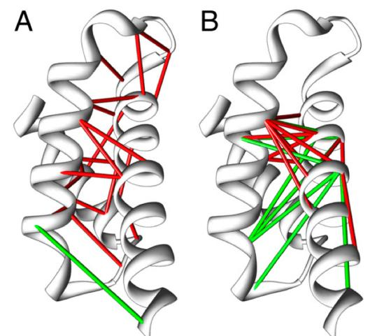
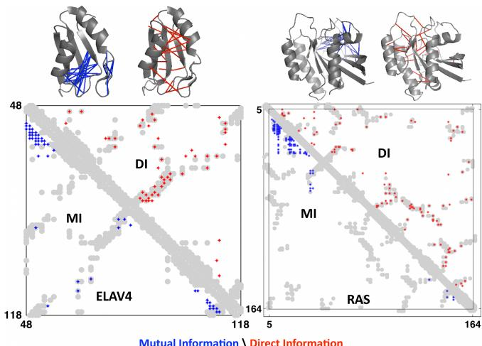
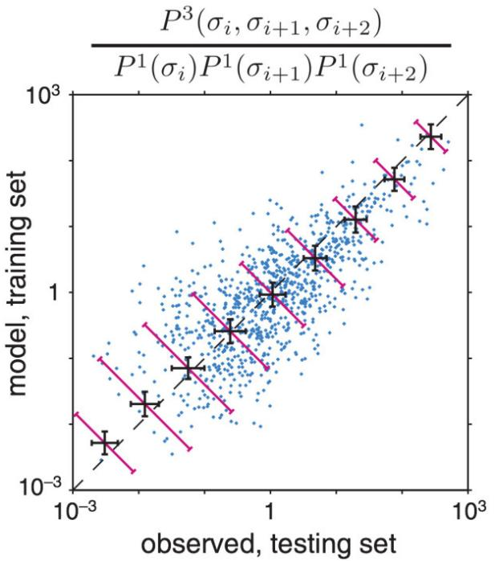
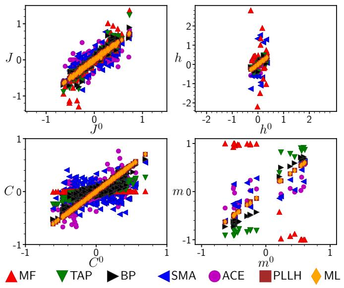
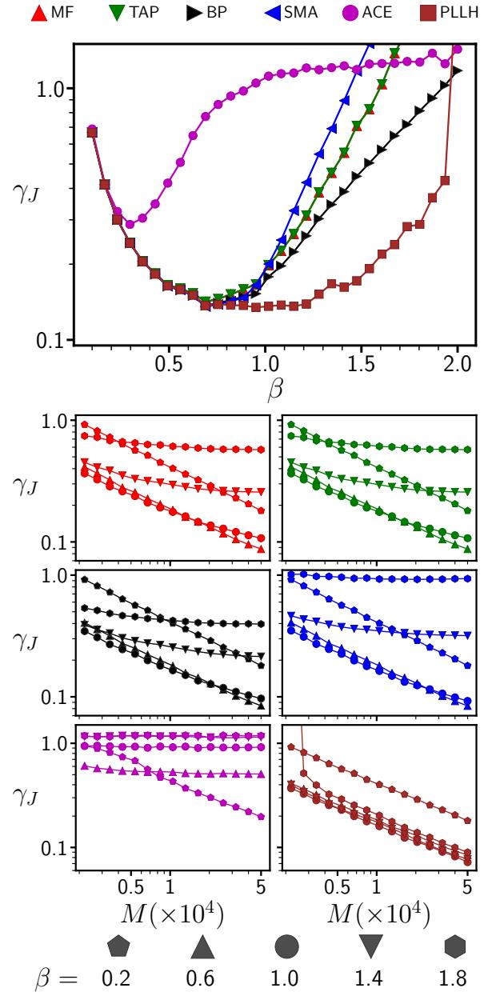
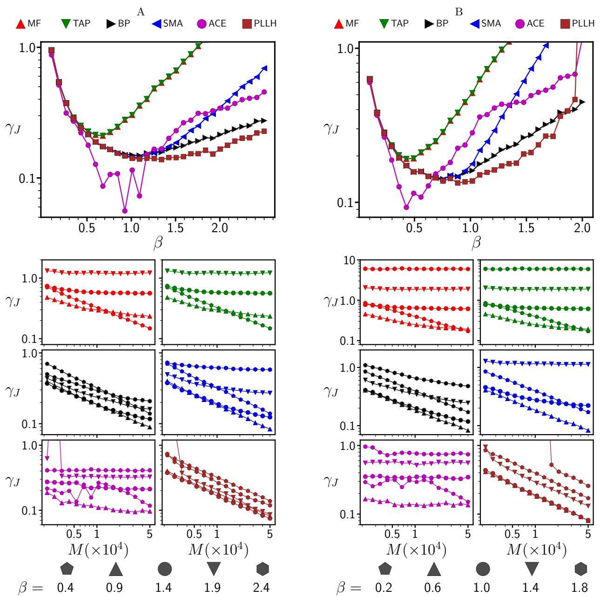
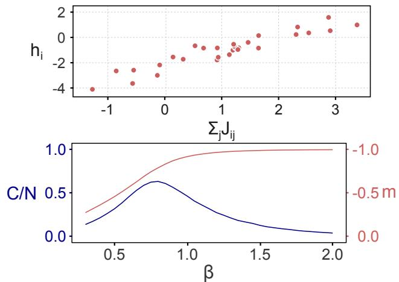
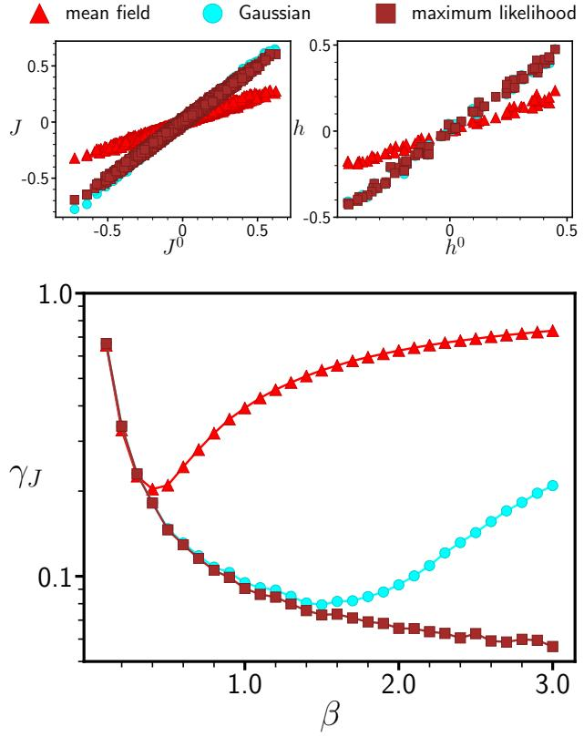

# Inverse statistical problems: from the inverse Ising problem to data science

H. Chau Nguyen

Max-Planck-Institut f¨ur Physik komplexer Systeme, N¨othnitzer Str. 38, D-01187 Dresden, Germany

Riccardo Zecchina

Bocconi University, via Roentgen 1, 20136 Milano, Italy and Politecnico di Torino, Corso Duca degli Abruzzi 24, 10129 Torino

Johannes Berg

Institute for Theoretical Physics, University of Cologne, Z¨ulpicher Straße 77, 50937 Cologne, Germany

Inverse problems in statistical physics are motivated by the challenges of 'big data' in different fields, in particular high-throughput experiments in biology. In inverse problems, the usual procedure of statistical physics needs to be reversed: Instead of calculating observables on the basis of model parameters, we seek to infer parameters of a model based on observations. In this review, we focus on the inverse Ising problem and closely related problems, namely how to infer the coupling strengths between spins given observed spin correlations, magnetisations, or other data. We review applications of the inverse Ising problem, including the reconstruction of neural connections, protein structure determination, and the inference of gene regulatory networks. For the inverse Ising problem in equilibrium, a number of controlled and uncontrolled approximate solutions have been developed in the statistical mechanics community. A particularly strong method, pseudolikelihood, stems from statistics. We also review the inverse Ising problem in the non-equilibrium case, where the model parameters must be reconstructed based on non-equilibrium statistics. a

### CONTENTS

| I. Introduction and applications              |    |  |  |  |
|-----------------------------------------------|----|--|--|--|
| A. Modelling neural firing patterns and the   |    |  |  |  |
| reconstruction of neural connections          | 4  |  |  |  |
| B. Reconstruction of gene regulatory networks | 5  |  |  |  |
| C. Protein structure determination            | 6  |  |  |  |
| D. Fitness landscape inference                | 8  |  |  |  |
| E. Combinatorial antibiotic treatment         | 9  |  |  |  |
| F. Interactions between species and between   |    |  |  |  |
| individuals                                   | 9  |  |  |  |
| G. Financial markets                          | 10 |  |  |  |
|                                               |    |  |  |  |
| II. Equilibrium reconstruction                | 10 |  |  |  |
| 1. Definition of the problem                  | 10 |  |  |  |
| A. Maximum likelihood                         | 11 |  |  |  |
| 1. Exact maximization of the likelihood       | 12 |  |  |  |
| 2. Uniqueness of the solution                 | 13 |  |  |  |
| 3. Maximum entropy modelling                  | 13 |  |  |  |
| 4. Information theoretic bounds on graphical  |    |  |  |  |
| model reconstruction                          | 15 |  |  |  |
| 5. Thermodynamics of the inverse Ising        |    |  |  |  |
| problem                                       | 15 |  |  |  |
| 6. Variational principles                     | 16 |  |  |  |
| 7. Mean-field theory                          | 17 |  |  |  |
| 8. The Onsager term and TAP                   |    |  |  |  |
| reconstruction                                | 18 |  |  |  |
|                                               |    |  |  |  |

|  |       | 9. Couplings without a loop: mapping to the |    |
|--|-------|---------------------------------------------|----|
|  |       | minimum spanning tree problem               | 18 |
|  |       | 10. The Bethe–Peierls ansatz                | 19 |
|  |       | 11. Belief propagation and susceptibility   |    |
|  |       | propagation                                 | 20 |
|  |       | 12. The independent-pair approximation and  |    |
|  |       | the Cocco–Monasson adaptive-cluster         |    |
|  |       | expansion                                   | 21 |
|  |       | 13. The Plefka expansion                    | 22 |
|  |       | 14. The Sessak–Monasson small-correlation   |    |
|  |       | expansion                                   | 23 |
|  |       | B. Logistic regression and pseudolikelihood | 24 |
|  |       | C. Comparison of the different approaches   | 26 |
|  |       | D. Reconstruction and non-ergodicity        | 29 |
|  |       | E. Parameter reconstruction and criticality | 31 |
|  |       | III. Non-equilibrium reconstruction         | 32 |
|  |       | A. Dynamics of the Ising model              | 32 |
|  |       | 1. Sequential Glauber dynamics              | 32 |
|  |       | 2. Parallel Glauber dynamics                | 33 |
|  |       | B. Reconstruction from time series data     | 33 |
|  |       | 1. Maximisation of the likelihood           | 33 |
|  |       | 2. Mean-field theory of the non-equilibrium |    |
|  |       | steady state                                | 34 |
|  |       | 3. The Gaussian approximation               | 35 |
|  |       | 4. Method comparison                        | 35 |
|  |       | C. Outlook: Reconstruction from the steady  |    |
|  | state |                                             | 35 |
|  |       | IV. Conclusions                             | 36 |
|  |       |                                             |    |
|  |       | Acknowledgements                            | 38 |
|  |       | References                                  | 39 |
|  |       |                                             |    |

a citation: Inverse statistical problems: from the inverse Ising problem to data science, H.C. Nguyen, R. Zecchina and J. Berg, Advances in Physics, 66 (3), 197-261 (2017)

### I. INTRODUCTION AND APPLICATIONS

The primary goal of statistical physics is to derive observable quantities from microscopic laws governing the constituents of a system. In the example of the Ising model, the starting point is a model describing interactions between elementary magnets (spins), the goal is to derive observables such as spin magnetisations and correlations.

In an inverse problem, the starting point is observations of some system whose microscopic parameters are unknown and to be discovered. In the inverse Ising problem, the interactions between spins are not known to us, but we want to learn them from measurements of magnetisations, correlations, or other observables. In general, the goal is to infer the parameters describing a system (for instance, its Hamiltonian) from extant data. To this end, the relationship between microscopic laws and observables needs to be inverted.

In the last two decades, inverse statistical problems have arisen in different contexts, sparking interest in the statistical physics community in taking the path from model parameters to observables in reverse. The areas where inverse statistical problems have arisen are characterized by (i) microscopic scales becoming experimentally accessible and (ii) sufficient data storage capabilities being available. In particular, the biological sciences have generated several inverse statistical problems, including the reconstruction of neural and gene regulatory networks and the determination of the three-dimensional structure of proteins. Technological progress is likely to to open up further fields of research to inverse statistical analysis, a development that is currently described by the label 'big data'.

In physics, inverse statistical problems also arise when we need to design a many-body system with particular desired properties. Examples are finding the potentials that result in a particular single-particle distribution [\[48,](#page-39-0) [122\]](#page-41-0), interaction parameters in a binary alloy that yield the observed correlations [\[142\]](#page-41-1), the potentials between atoms that lead to specific crystal lattices [\[253\]](#page-44-0), or the parameters of a Hamiltonian that lead to a particular density matrix [\[47\]](#page-39-1). In the context of soft matter, a question is how to design a many-body system that will self-assemble into a particular spatial configuration or has particular bulk properties [\[185,](#page-42-0) [227\]](#page-44-1). In biophysics, we may want to design a protein that folds into a specified three-dimensional shape [\[120\]](#page-41-2). For RNA, even molecules with more than one stable target structure are possible [\[78\]](#page-40-0). As a model of such design problems, [\[66,](#page-39-2) [136\]](#page-41-3) study how to find the parameters of Ising Hamiltonian with a prescribed ground state.

In all these examples, 'spin' variables describe microscopic degrees of freedom particular to a given system, for instance, the states of neurons in a neural network. The simplest description of these degrees of freedom in terms of random binary variables then leads to Isingtype spins. In the simplest non-trivial scenario, correlations between the 'spins' are generated by pairwise couplings between the spins, leading to an Ising model with unknown parameters (couplings between the spins and magnetic fields acting on the spins). In many cases of interest, the couplings between spins will not all be positive, as is the case in a model of a ferromagnet. Nor will they couplings conform to a regular lattice embedded in some finite-dimensional space.

For a concrete example, we look at a system of N binary variables (Ising spins) {si}, i = 1, . . . , N with si = ±1. These spins are coupled by pairwise couplings Jij and are subject to external magnetic fields hi .

$$P(\{s_i\}) = \frac{1}{Z} \exp\left[\sum_i h_i s_i + \sum_{i$$

is the Boltzmann equilibrium distribution P({si}) = e −H({si})/Z, where we have subsumed temperature into the couplings and fields. (We will discuss this choice in section [II 1)](#page-9-2). The Hamiltonian

$$H(\{s_i\}) = -\sum_i h_i s_i - \sum_{i$$

specifies the energy of the spin system as a function of the microscopic spin variables, local fields, and pairwise couplings. The inverse Ising problem is the determination of the couplings Jij and local fields hi , given a set of M observed spin configurations. Depending on the particular nature of the system at hand, the restriction to binary variables or pairwise interactions may need to be lifted, or the functional form of the Hamiltonian may be altogether different from the Ising Hamiltonian with pairwise interactions [(2)](#page-1-1). For non-equilibrium systems, the steady state is not even described by a Boltzmann distribution with a known Hamiltonian. However, the basic idea remains the same across different types of inverse statistical problems: even when the frequencies of spin configurations may be under-sampled, the data may be sufficient to infer at least some parameters of a model.

The distribution [(1)](#page-1-2) is well known not only as the equilibrium distribution of the Ising model. It is also the form of the distribution which maximizes the (Gibbs) entropy

$$S[P] = -\sum_{\{s_i\}} P(\{s_i\}) \ln P(\{s_i\}) \tag{3}$$

under the constraint that P({si}) is normalized and has particular first and second moments, that is, magnetisations and correlations. We will discuss in section [II A 3](#page-12-1) how this distribution emerges as the 'least biased distribution' of a binary random variable with prescribed first and second moments [\[107\]](#page-40-1). The practical problem is then

again an inverse one: to find the couplings Jij and local fields hi such that the first and second moments observed under the Boltzmann distribution [(1)](#page-1-2) match the mean values of si and sisj in data. In settings where third moments differ significantly from the prediction of [(1)](#page-1-2) based on the first two moments, one may need to construct the distribution of maximum entropy given the first three moments, leading to three-spin interactions in the exponent of [(1)](#page-1-2).

Determining the parameters of a distribution such as [(1)](#page-1-2) is always a many-body problem: changing a single coupling Jij generally affects correlations between many spin variables, and conversely a change in the correlation between two variables can change the values of many inferred couplings. The interplay between model parameters and observables is captured by a statistical mechanics of inverse problems, where the phase space consists of quantities normally considered as fixed model parameters (couplings, fields). The observables, such as spin correlations and magnetisations on the other hand, are taken to be fixed, as they are specified by empirical observations. Such a perspective is not new to statistical physics; the analysis of neural networks in the seventies and eighties of the last century led to a statistical mechanics of learning [\[72,](#page-39-3) [95,](#page-40-2) [238\]](#page-44-2), where the phase space is defined by the set of possible rules linking the input into a machine with an output. The set of all rules compatible with a given set of input/output relations then defines a statistical ensemble. In the inverse statistical problems, however, there are generally no explicit rules linking the input and output, but data with different types of correlations or other observations, which are to be accounted for in a statistical model.

Inverse statistical problems fall into the broader realm of statistical inference [\[31,](#page-38-1) [131\]](#page-41-4), which seeks to determine the properties of a probability distribution underlying some observed data. The problem of inferring the parameters of a distribution such as [(1)](#page-1-2) is known under different names in different communities; also emphasis and language differ subtly across communities.

- In statistics, an inverse problem is the inference of model parameters from data. In our case, the problem is the inference of the parameters of the Ising model from observed spin configurations. A particular subproblem is the inference of the graph formed by the non-zero couplings of the Ising model, termed graphical model selection or reconstruction. In the specific context of statistical models on graphs (graphical models), the term inference describes the calculation of the marginal distribution of one or several variables. (A marginal distribution describes the statistics of one or several particular variables in a many-variable distribution, for example, P(x1) = P x2,x3 P(x1, x2, x3).)
- In machine learning, a frequent task is to train an

artificial neural network with symmetric couplings such that magnetisations and correlations of the artificial neurons match the corresponding values in the data. This is a special case of what is called Boltzmann machine learning; the general case also considers so-called hidden units, whose values are unobserved [\[1\]](#page-38-2).

- In statistical physics, much effort has been directed towards estimating the parameters of the Ising model given observed values of the magnetisation and two-point correlations. As we will see in section [II A,](#page-10-0) this is a hard problem from an algorithmic point of view. Recently, threshold phenomena arising in inference problems have attracted much interest from the statistical physics community, due to the link between phase transitions and the boundaries separating different regimes of inference problems, for instance solvable and unsolvable problems, or easy and hard ones [\[144,](#page-41-5) [248\]](#page-44-3).
Common theme across different applications and communities is the inference of model parameters given observed data or desired properties. In this review we will focus on a prototype inverse statistical problem: the inverse Ising problem and its close relatives. Many of the approaches developed for this problem are also readily extended to more general scenarios. We will start with a discussion of applications of the inverse Ising problem and related approaches in biology, specifically the reconstruction of neural and genetic networks, the determination of three-dimensional protein structures, the inference of fitness landscapes, the bacterial responses to combinations of antibiotics, and flocking dynamics. We will find that these applications define two distinct settings of the inverse Ising problem; equilibrium and non-equilibrium. Part [II](#page-9-1) of this review treats the inverse Ising problem in an equilibrium setting, where the couplings between spins are symmetric. Detailed balance holds and results from equilibrium statistical physics can be used. This setting arises naturally within the context of maximum entropy models, which seek to describe the observed statistics of configurations with a simplified effective model capturing, for instance, collective effects. We introduce the basics of statistical inference and maximum entropy modelling, discuss the thermodynamics of the inverse Ising problem, and review different approaches to solve the inverse Ising problem, pointing out their connections and comparing the resulting parameter reconstructions. Part [III](#page-31-0) of this review considers asymmetric coupling matrices, where in the absence of detailed balance couplings can be reconstructed from time series, from data on perturbations of the system, or from detailed knowledge of the non-equilibrium steady state.

We now turn to applications of the inverse Ising problem, which mostly lie in the analysis of high-throughput data from biology. One aim of inverse statistical modelling is to find the parameters of a microscopic model to describe this data. A more ambitious aim is achieved when the parameters of the model are informative about the processes which produced the data, this is, when some of the mechanisms underlying the data can be inferred. The data is large-scale measurements of the degrees of freedom of some system. In the language of statistical physics these describe the micro-states of a system: states of neurons, particular sequences of DNA or proteins, or the concentration levels of RNA. We briefly introduce some of the experimental background of these measurements, so their potential and the limitations can be appreciated. The models are simple models of the microscopic degrees of freedom. In the spirit of statistical physics, these models are simple enough so the parameters can be computed given the data, yet sufficiently complex to reproduce some of the statistical interdependences of the observed microscopic degrees of freedom. The simplest case, consisting of binary degrees of freedom with unknown pairwise couplings between them, leads to the inverse Ising problem, although we will also discuss several extensions.

### A. Modelling neural firing patterns and the reconstruction of neural connections

Neurons can exchange information by generating discrete electrical pulses, termed spikes, that travel down nerve fibres. Neurons can emit these spikes at different rates, a neuron emitting spikes at a high rate is said to be 'active' or 'firing', a neuron emitting spikes at a low rate or not at all is said to be 'inactive' or 'silent'. The measurement of the activity of single neurons has a long history starting in 1953 with the development of microelectrodes for recording [\[68\]](#page-39-4). Multi-electrodes were developed, allowing to record multiple simultaneous neural signals independently over long time periods [\[163,](#page-42-1) [209\]](#page-43-0). Such data presents the intriguing possibility to see elementary brain function emerge from the interplay of a large number of neurons.

However, even when vast quantities of data are available, the different configurations of a system are still under-sampled in most cases. For instance, consider N neurons, each of which can be either active (firing) or inactive (silent). Given that the firing patterns of thousands of neurons can be recorded simultaneously [\[198\]](#page-43-1), the number of observations M will generally be far less than the total number of possible neural configurations, M 2 N . For this reason, a straightforward statistical description that seeks to determine directly the frequency with which each configuration appears will likely fail.

On the other hand, a feasible starting point is a simple distribution, whose parameters can to be determined from the data. For a set of N binary variables, this might be a distribution with pairwise interactions between the variables. In [\[196\]](#page-43-2), Bialek and collaborators applied such a statistical model to neural recordings. Dividing time into small intervals of duration ∆τ = 20 ms induces a binary representation of neural data, where each neuron i either spikes during a given interval (si = 1) or it does not (si = 0). The joint statistics observed in 40 neurons in the retina of a salamander was modelled by an Ising model [(1)](#page-1-2) with magnetic fields and pairwise symmetric couplings. Rather than describing the dynamics of neural spikes, this model describes the correlated firing of different neurons over the course of the experiment. The symmetric couplings Jij in [(1)](#page-1-2) describe statistical dependencies, not physical connections. The synaptic connections between neurons, on the other hand, are generally not symmetric.

In this context, the distribution [(1)](#page-1-2) can be viewed as the form of the maximum entropy distribution over neural states, given the observed one- and two-point correlations [\[196\]](#page-43-2). In [\[52,](#page-39-5) [204\]](#page-43-3), a good match was found between the statistics of three neurons predicted by [(1)](#page-1-2) and the firing patterns of the same neurons in the data. This means that the model with pairwise couplings provides a statistical description of the empirical data, one that can even be used to make predictions. Similar results were obtained also from cortical cells in cell cultures [\[217\]](#page-43-4).

The mapping from the neural data to a spin model rests on dividing time into discrete bins of duration ∆τ . A different choice of this interval would lead to different spin configurations; in particular changing ∆τ affects the magnetisation of all spins by altering the number of intervals in which a neuron fires. In [\[191\]](#page-43-5), Roudi, Nirenberg and Latham show that the pairwise model [(1)](#page-1-2) provides a good description of the underlying spin statistics (generated by neural spike trains), provided N ∆τ ν 1, where ν is the average firing rate of neurons. Increasing the bin size beyond this regime leads to an increase in bins where multiple neurons fire, as a result couplings beyond the pairwise couplings in [(1)](#page-1-2) can become important.

As a minimal model of neural correlations, the statistics [(1)](#page-1-2) has been extended in several ways. Tkaˇcik et al. [\[225\]](#page-43-6) and Granot-Atedgi et al. [\[88\]](#page-40-3) consider stimulusdependent magnetic fields, that is, fields which depend on the stimulus presented to the experimental subject at a particular time of the experiment. Ohiorhenuan et al. looks at stimulus-dependent couplings [\[164\]](#page-42-2). When the number of neurons increases to ∼ 100, limitations of the pairwise model [(1)](#page-1-2) become apparent, which has be addressed by adding additional terms coupling triplets, etc. of spins in the exponent of the Boltzmann measure [(1)](#page-1-2) [\[82\]](#page-40-4).

The statistics [(1)](#page-1-2) serves as a description of the empirical data: the couplings between spins in the Hamiltonian [(2)](#page-1-1) do not describe physical connections between the neurons. The determination of the network of neural connections from the observed neural activities is thus a different question. Simoncelli and collaborators [\[169,](#page-42-3) [179\]](#page-42-4) and Cocco, Leibler, and Monasson [\[52\]](#page-39-5) use an integrateand-fire model [\[40\]](#page-39-6) to infer how the neurons are interconnected on the basis of time series of spikes in all neurons. In such a model, the membrane potential of neuron i obeys the dynamics

$$C\frac{dV_i}{dt} = \sum_{j \neq i} J_{ij} \sum_l K(t - t_{jl}) + I_i - gV_i + \xi_i(t) \,, \quad (4)$$

where the first term on the right-hand side encodes the synaptic connections Jij and a memory kernel K; tjl specifies the time at which neuron j emitted its l th spike. The remaining terms describe a background current, voltage leakage, and white noise. Finding the synaptic connections Jij that best describe a large set of neural spike trains is a computational challenge; [\[52,](#page-39-5) [168\]](#page-42-5) develop an approximation based on maximum likelihood, see section [II A.](#page-10-0) A related approach based on point processes and generalized linear models (GLM) is presented in [\[229\]](#page-44-4). We will discuss this problem of inferring the network of connections the context of the non-equilibrium models in section [III.](#page-31-0)

Neural recordings give the firing patterns of several neurons over time. These neurons may have connections between them, but they also receive signals from neural cells whose activity is not recorded [\[133\]](#page-41-6). In [\[230\]](#page-44-5), the effect of connections between neurons is disentangled from correlations arising from shared non-stationary input. This raises the possibility that the correlations described by the pairwise model [(1)](#page-1-2) in [\[196\]](#page-43-2) and related works originate from a confounding factor (connections to a neuron other than those whose signal is measured), rather than from connections between recorded neurons [\[121\]](#page-41-7).

### B. Reconstruction of gene regulatory networks

The central dogma of molecular biology is this: Proteins are macromolecules consisting of long chains of amino acids. The particular sequence of a protein is encoded in DNA, a double-stranded helix of complementary nucleotides. Specific parts of DNA, the genes, are transcribed by polymerases, producing a single-stranded copy called m(essenger)RNAs, which are translated by ribosomes, usually multiple times, to produce proteins.

The process of producing protein molecules from the DNA template by transcription and translation is called gene expression. The expression of a gene is tightly controlled to ensure that the right amounts of proteins are produced at the right time. One important control mechanism is transcription factors, proteins which affect the expression of a gene (or several) by binding to DNA near the transcription start site of that gene. This part of DNA is called the regulatory region of a gene. A target gene of a transcription factor may in turn encode another transcription factor, leading to a cascade of regulatory events. To add further complications, the binding of multiple transcription factors in the regulatory region of a gene leads to combinatorial control exerted by several transcription factors on the expression of a gene [\[37\]](#page-38-3). Can the regulatory connections between genes be inferred from data on gene expression, that is, can we learn the identity of transcription factors and their targets?

Over the last decades, the simultaneous measurement of expression levels of all genes have become routine. At the centre of this development are two distinct technological advances to measure mRNA levels. The first is microarrays, consisting of thousands of short DNA sequences, called probes, grafted to the surface of a small chip. After converting the mRNA in a sample to DNA by reverse transcription, cleaving that DNA into short segments, and fluorescently labelling the resulting DNA segments, fluorescent DNA can bind to its complementary sequence on the chip. (Reverse transcription converts mRNA to DNA, a process which requires a so-called reverse transcriptase as an enzyme.) The amount of fluorescent DNA bound to a particular probe depends on the amount of mRNA originally present in the sample. The relative amount of mRNA from a particular gene can then be inferred from the fluorescence signal at the corresponding probes [\[98\]](#page-40-5). A limitation of microarrays is the large amount of mRNA required: The mRNA sample is taken from a population of cells. As a result, cell-to-cell fluctuations of mRNA concentrations are averaged over. To obtain time series, populations of cells synchronized to approximately the same stage in the cell cycle are used [\[84\]](#page-40-6).

The second way to measure gene expression levels is also based on reverse transcription of mRNA, followed by high-throughput sequencing of the resulting DNA segments. Then the relative mRNA levels follow directly from counts of sequence reads [\[237\]](#page-44-6). Recently, expression levels even in single cells have been measured in this way [\[242\]](#page-44-7). In combination with barcoding (adding short DNA markers to identify individual cells), 104 cells can have their expression profiled individually in a single sequencing run [\[134\]](#page-41-8). Such data may allow, for instance, the analysis of the response of target genes to fluctuations in the concentration of transcription factors. However, due to the destructive nature of single-cell sequencing, there may never be single-cell data that give time series of genome-wide expression levels.

Unfortunately, cellular concentrations of proteins are much harder to measure than mRNA levels. As a result, much of the literature focuses on mRNA levels, neglecting the regulation of translation. Advances in protein massspectrometry [\[178\]](#page-42-6) may lead to data on both mRNA and protein concentrations. This data would pose the additional challenge of inferring two separate levels of gene regulation: gene transcription from DNA to mRNA and translation from mRNA to proteins.

As in the case of neural data discussed in the preceding section, gene expression data presents two distinct challenges: (i) finding a statistical description of the data in terms of suitable observables and (ii) inferring the underlying regulatory connections. Both these problems have been addressed extensively in the machine learning and quantitative biology communities. Clustering of gene expression data to detect sets of genes with correlated expression levels has been used to detect regulatory relationships. A model-based approach to the reconstruction of regulatory connections is Boolean networks. Boolean networks assign binary states to each gene (gene expression on/off), and the state of a gene at a given time depends on the state of all genes at a previous time through a set of logical functions assigned to each gene. See [\[64\]](#page-39-7) for a review of clustering and Boolean network inference and [\[96\]](#page-40-7) for a review of Boolean network inference.

A statistical description that has also yielded insight into regulatory connections is Bayesian networks. A Bayesian network is a probabilistic model describing a set of random variables (expression levels) through conditional dependencies described by a directed acyclic graph. Learning both the structure of the graph and the statistical dependencies is a hard computational problem, but can capture strong signals in the data that are often associated with a regulatory connection. In principle, causal relationships (like the regulatory connections) can be inferred, in particular if the regulatory network contains no cycles. For reviews, see [\[79,](#page-40-8) [116\]](#page-40-9). Both Boolean or Bayesian networks have been applied to measurements of the response of expression levels to external perturbations of the regulatory network or of expression levels, see [\[103,](#page-40-10) [174\]](#page-42-7). A full review of these methods is beyond the scope of this article, instead we focus on approaches related to the inverse Ising problem.

For a statistical description of gene expression levels, [\[126\]](#page-41-9) applied a model with pairwise couplings

$$P(\{x_i\}) = \exp\left[\sum_{i \le j} J_{ij} x_i x_j + \sum_i h_i x_i\right] / Z \quad, \quad (5)$$

fitted to gene expression levels. The standard definition of expression levels {xi} is log2 -values of fluorescence signals with the mean value for each gene subtracted. Since [(5)](#page-5-1) is a multi-variate Gaussian distribution, the matrix of couplings Jij must be negative definite. These couplings can be inferred simply by inverting the matrix of variances and covariances of expression levels. In [\[126\]](#page-41-9), the resulting couplings Jij were then used to identify hub genes which regulate many targets. The same approach was used in [\[128\]](#page-41-10) to analyse the cellular signalling networks mediated by the phosphorylation of specific sites on different proteins. Again, the distribution [(5)](#page-5-1) can be viewed as a maximum entropy distribution for continuous variables with prescribed first and second moments. This approach is also linked to the concept of partial correlations in statistics [\[9,](#page-38-4) [119\]](#page-41-11).

Again the maximum-entropy distribution [(5)](#page-5-1) has symmetric couplings between expression levels, whereas the network of regulatory interactions is intrinsically asymmetric. One way to infer the regulatory connections is time series [\[205\]](#page-43-7). [\[12\]](#page-38-5) uses expression levels measured at different times to infer the regulatory connections, based on a minimal model of expression dynamics with asymmetric regulatory connections between pairs of genes. In this model, expression levels x t i at successive time intervals t obey

$$\text{sign}(x_i^{t+1}) = \begin{cases} 1 & \text{if } \sum_j J_{ij} x_j^t > \kappa \\ -1 & \text{if } \sum_j J_{ij} x_j^t < \kappa \end{cases},\tag{6}$$

where κ is a threshold. The regulatory connections Jij are taken to be discrete, with the values −1, 1, 0 denoting repression, activation and no regulation of gene i by the product of gene j. The matrix of connections is then inferred based on Bayes theorem (see section [II A)](#page-10-0) and an iterative algorithm for estimating marginal probabilities (message passing, see section [II A 11)](#page-19-0).

A second line of approach that can provide information on regulatory connections is perturbations [\[218\]](#page-43-8). An example is gene knockdowns, where the expression of one or more genes is reduced, by introducing small interfering RNA (siRNA) molecules into the cell [\[67\]](#page-39-8) or by other techniques. siRNA molecules can be introduced into cells from the outside; after various processing steps they lead to the cleavage of mRNA with a complementary sequence, which is then no longer available for translation. If that mRNA translates to a transcription factor, all targets of that transcription factor will be upregulated or downregulated (depending on whether the transcription factor acted as a repressor or an activator, respectively). Knowing the responses of gene expression levels to a sufficient number of such perturbations allows the inference of regulatory connections. [\[148\]](#page-41-12) considers a model of gene expression dynamics based on continuous variables xi evolving deterministically as ∂txi = ai tanh(P j Jijxj )−cixi . The first term describes how the expression level of gene j affects the rate of gene expression of gene i via the regulatory connection Jij , the second term describes mRNA degradation. The stationary points of this model shift in response to perturbations of expression levels of particular genes (for instance through knockdowns), and these changes depend on regulatory connections. In [\[148\]](#page-41-12), the regulatory connections are inferred from perturbation data, again using belief propagation.

### C. Protein structure determination

Tremendous efforts have been made to determine the three-dimensional structure of proteins. A linear amino acid chain folds into a convoluted shape, the folded protein, thus bringing amino acids into close physical proximity that are separated by a long distance along the linear sequence.

Due to the number of proteins (several thousand per organism) and the length of individual proteins (hundreds of amino acid residues), protein structure determination is a vast undertaking. However, the rewards are also substantial. The three-dimensional structure of a protein determines its physical and chemical properties, and how it interacts with other cellular components: broadly, the shape of a protein determines many aspects of its function. Protein structure determination relies on crystallizing proteins and analysing the X-ray diffraction pattern of the resulting solid. Given the experimental effort required, the determination of a protein's structure from its sequence alone has been a key challenge to computational biology for several decades [\[60,](#page-39-9) [65\]](#page-39-10). The computational approach models the forces between amino acids in order to find the low-energy structure a protein in solution will fold into. Depending on the level of detail, this approach requires extensive computational resources.

An attractive alternative enlists evolutionary information: Suppose that we have at our disposal amino acid sequences of a protein as it appears in different related species (so-called orthologs). While the sequences are not identical across species, they preserve to some degree the three-dimensional shape of the protein. Suppose a specific pair of amino acids that interact strongly with each other and bring together parts of the protein that are distal on the linear sequence. Replacing this pair with another, equally strongly interacting pair of amino acids would change the sequence, but leave the structure unchanged. For this reason, we expect sequence differences across species to reflect the structure of the protein. Specifically, we expect correlations of amino acids in positions that are proximal to each other in the threedimensional structure. In turn, the correlations observed between amino acids at different positions might allow to infer which pairs of amino acids are proximal to each other in three dimensions (the so-called contact map). The use of such genomic information has recently lead to predictions of the three-dimensional structure of many protein families inaccessible to other methods [\[167\]](#page-42-8), for a review see [\[51\]](#page-39-11).

Early work looked at the correlations as a measure of proximity [\[87,](#page-40-11) [92,](#page-40-12) [129,](#page-41-13) [207\]](#page-43-9). However correlations are transitive; if amino acids at sequence sites i and j are correlated due to proximity in the folded state, and j and k are correlated for some reason, i and k will also exhibit correlations, which need not stem from proximity. This problem is addressed by an inverse approach aimed at finding the set of pairwise couplings that lead to the observed correlations or sequences [\[39,](#page-39-12) [55,](#page-39-13) [58,](#page-39-14) [71,](#page-39-15) [99,](#page-40-13) [138,](#page-41-14) [154,](#page-42-9) [213,](#page-43-10) [239\]](#page-44-8). Since each sequence position can be taken up by one of 20

amino acids or a gap in the sequence alignment, there are 212 correlations at each pair of sequence positions. In [\[154,](#page-42-9) [239\]](#page-44-8) a statistical model with pairwise interactions is formulated, based on the Hamiltonian

$$H = -\sum_{i$$

This Hamiltonian depends on spin variables si , one for each sequence position i = 1, . . . , N. Each spin variable can take on one of 21 values, describing the 20 possible amino acids at that sequence position as well as the possibility of a gap (corresponding to an extra amino acid inserted in a particular position in the sequences of other organisms). Each pair of amino acids si , sj in sequence position i, j contributes Jij (si , sj ) to the energy. The inverse problem is to find the couplings Jij (A, B) for each pair of sequence positions i, j and pair of amino acids A, B, as well as field hi(A), such that the amino acid frequencies and correlations observed across

FIG. 1. Correlations and couplings in protein structure determination. Both figures show the threedimensional structure of a particular part (region 2) of the protein SigmaE of E. coli, as determined by X-ray diffraction. This protein, or rather a protein of similar sequence and presumably similar structure, occurs in many other bacterial species as well. In figure B, lines indicate pairs of sequence positions whose amino acids are highly correlated across different bacteria: for each pair of sequence positions at least 5 amino acids apart, the mutual information of pairwise frequency counts of amino acids was calculated, and the 20 most correlated pairs are shown here. Such pairs that also turn out to be close in the three-dimensional structure are shown in red, those whose distance exceeds 8 ◦ A are shown in green. We see about as many highly correlated sequence pairs that are proximal to one another as correlated pairs that are further apart. By contrast, in figure A, lines show sequence pairs that are strongly coupled in the Potts model [(7)](#page-6-0), whose model parameters are inferred from the correlations. The fraction of false contact predictions (green lines) is reduced considerably. The figures are taken from [\[154\]](#page-42-9).

FIG. 2. Protein contact maps predicted from evolutionary correlations. The two figures show contact maps for the ELAV4 protein (left) and the RAS protein (right). xand y-axes correspond to sequence positions along the linear chain of amino acids. Pairs of sequence positions whose amino acids are in close proximity in the folded protein are indicated in grey (experimental data). Pairs of sequence positions with highly correlated amino acids are shown in blue (mutual information, bottom triangle). Pairs of sequence positions with high direct information [(8)](#page-7-1) calculated from [(7)](#page-6-0) are shown in red. The coincidence of red and grey points shows excellent agreement between predictions from direct information with the experimentally determined structure of the protein. The figure is taken from [\[138\]](#page-41-14).

species are reproduced. The sequence positions with strong pairwise couplings are then predicted to be proximal in the protein structure. A simple measure of the coupling between sequence positions is the matrix norm (Frobenius norm) P si,sj (Jij (si , sj ))2 . The so-called direct information [\[239\]](#page-44-8) is an alternative measure based on information theory. A two-site model is defined with pij (si , sj ) = exp{Jij (si , sj )+hi(si)+hj (sj )}/Zij . Direct information is the mutual information between the twosite model and a model without correlations between the amino acids

$$DI_{ij} = \sum_{s_i, s_j} p_{ij}(s_i, s_j) \ln \left( \frac{p_{ij}(s_i, s_j)}{p_i(s_i)p_j(s_j)} \right) \,. \tag{8}$$

The Boltzmann distribution resulting from [(7)](#page-6-0) can be viewed as the maximum entropy distribution with oneand two-point correlations between amino acids in different sequence positions determined by the data. There is no reason to exclude higher order terms in the Hamiltonian [(7)](#page-6-0) describing interactions between triplets of sequence positions, although the introduction of such terms may lead to overfitting. Also, fitting the Boltzmann distribution [(7)](#page-6-0) to sequence data uses no prior information on protein structures; for this reason it is called an unsupervised method. Recently, neural network models trained on sequence data and protein structures (supervised learning) have been very successful in predicting new structures [\[109,](#page-40-14) [236\]](#page-44-9).

The maximum entropy approach to structure analysis is not limited to evolutionary data. In [\[252\]](#page-44-10) Zhang and Wolynes analyse chromosome conformation capture experiments and use the observed frequency of contacts between different parts of a chromosome in a maximum entropy approach to predict the structure and topology of the chromosomes.

### D. Fitness landscape inference

The concept of fitness lies at the core of evolutionary biology. Fitness quantifies the average reproductive success (number of offspring) of an organism with a particular genotype, i.e., a particular DNA sequence. The dependence of fitness on the genotype can be visualized as a fitness landscape in a high-dimensional space, where fitness specifies the height of the landscape. As the number of possible sequences grows exponentially with their length, the fitness landscape requires in principle an exponentially large number of parameters to specify, and in turn those parameters need an exponentially growing amount of data to infer.

A suitable model system for the inference of a fitness landscape is HIV proteins, due to the large number of sequences stored in clinical databases and the relative ease of generating mutants and measuring the resulting fitness. In a series of papers, Chakraborty and co-workers proposed a fitness model the so-called Gag protein family (group-specific antigen) of the HIV virus [\[59,](#page-39-16) [74,](#page-39-17) [135,](#page-41-15) [202\]](#page-43-11). The model is based on pairwise interactions between amino acids. Retaining only the information whether the amino acid at sequence position i was mutated (si = 1) with respect to a reference sequence or not (si = 0), Chakraborty and co-workers suggest a minimal model for the fitness landscape given by the Ising Hamiltonian [(2)](#page-1-1). Again, one can view the landscape [(2)](#page-1-1) as generating the maximum entropy distribution constrained by the observed one- and two-point correlations.

Adding a constant to [(2)](#page-1-1) in order to make fitness (expected number of offspring) non-negative does not alter the resulting statistics. The inverse problem is to infer the couplings Jij and fields hi from frequencies of amino acids and pairs of amino acids in particular sequence positions observed in HIV sequence data. Of course it is not clear from the outset that a model with only pairwise interactions can describe the empirical fitness landscape. As a test of this approach, [\[74\]](#page-39-17) compares the prediction of [(2)](#page-1-1) for specific mutants to the results of independent experimental measurements of fitness.

Statistical models of sequences described by pairwise interactions may be useful to model a wide range

FIG. 3. Three-point correlations in an amino acid sequences and their prediction from a model with pairwise interactions. Mora et al. look at the so-called D-region in the IgM protein (maximum length N = 8) [\[153\]](#page-42-10). The Dregion plays an important role in immune response. The frequencies at which given triplets of consecutive amino acids occur were compiled (x-axis, normalized with respect to the prediction of a model with independent sites). The results are compared to the prediction from a model with pairwise interactions like [(2)](#page-1-1) on the y-axis. The figure is taken from [\[153\]](#page-42-10).

of protein families with different functions [\[100\]](#page-40-15), and have been used in other contexts as well. Santolini, Mora, and Hakim model the statistics of sequences binding transcription factors using [(7)](#page-6-0), with each spin taking one of four states to characterize the nucleotides A, C, G, T [\[195\]](#page-43-12). A similar model is used in [\[153\]](#page-42-10) to model the sequence diversity of the so-called IgM protein, an antibody which plays a key role in the early immune response. The model with pairwise interactions predicts non-trivial three-point correlations which compare well with those found in the data, see figure [3.](#page-8-2)

### E. Combinatorial antibiotic treatment

Antibiotics are chemical compounds which kill specific bacteria or inhibit their growth [\[115,](#page-40-16) [234\]](#page-44-11). Mutations in the bacterial DNA can lead to resistance against a particular antibiotic, which is a major hazard to public health [\[127,](#page-41-16) [243\]](#page-44-12). One strategy to slow down or eliminate the emergence of resistance is to use a combination of antibiotics either simultaneously or in rotation [\[115,](#page-40-16) [234\]](#page-44-11). The key problem of this approach is to find combinations of compounds which are particularly effective against a particular strain of bacteria. Trying out all combinations experimentally is prohibitively expensive. Wood et al. use an inverse statistical approach to predict the effect of combinations of several antibiotics from data on the effect of pairs of antibiotics [\[244\]](#page-44-13) . The available antibiotics are labelled i = 1, . . . , N; in [\[244\]](#page-44-13) a distribution over continuous variables xi is constructed, such that hxii gives the bacterial growth rate when antibiotic i is administered, hxixj i gives the growth rate with both i and j are given, etc. for higher moments. Choosing this distribution to be a multi-variate Gaussian P({xi}) = exp hP i≤j Jijxixj + P i hixi i /Z results in simple relationships between the different moments, which lead to predictions of the response to drug combinations that are borne out well by experiment [\[244\]](#page-44-13).

### F. Interactions between species and between individuals

Species exist in various ecological relationships. For instance individuals of one species hunt and eat individuals of another species. Another example is microorganisms whose growth can be influenced, both positively and negatively, by the metabolic output of other microorganisms. Such relationships form a dense web of ecological interactions between species. Co-culturing and perturbation experiments (for instance species removal) lead to data which may allow the inference of these networks [\[73,](#page-39-18) [94\]](#page-40-17).

Interactions between organisms exist also at the level of individuals, for instance when birds form a flock, or fish form a school. This emergent collective behaviour is thought to have evolved to minimize the exposure of individuals to predators. In [\[28,](#page-38-6) [29\]](#page-38-7), a model with pairwise interactions between the velocities of birds in a flock is constructed. Individual birds labelled i = 1, . . . , N move with velocity ~vi in a direction specified by ~si = ~vi/|~vi |. The statistics of the these directions is modelled by a distribution

$$P(\{\vec{s}_i\}) = \exp\left[\sum_{i,j} J_{ij}\vec{s}_i \cdot \vec{s}_j\right] / Z \;,\tag{9}$$

where the couplings between the spins ~si need to be inferred from the experimentally observed correlations between normalized velocities. This model can be viewed as the maximum-entropy distribution constrained by pairwise correlations between normalized velocities. From the point of view of statistical physics it describes a disordered system of Heisenberg spins. As birds frequently change their neighbours in flight, the couplings are not constant in time and it makes sense to consider couplings

that depend on the distance between two individuals [\[29\]](#page-38-7). An alternative is to apply the maximum entropy principle to entire trajectories [\[46\]](#page-39-19).

# G. Financial markets

Market participants exchange commodities, shares in companies, currencies, or other goods and services, usually for money. The change in prices of such goods are often correlated, as the demand for different goods can be influenced by the same events. In [\[41,](#page-39-20) [42\]](#page-39-21), Bury uses a spin model with pairwise interactions to analyse stock market data. Shares in N different companies are described by binary spin variables, where spin si = 1 indicates 'bullish' conditions for shares in company i with prices going up at a particular time, and si = −1 implies 'bearish' conditions with decreasing prices. Couplings Jij describe how price changes in shares i affect changes in the price of j, or how prices are affected jointly by external events. Bury fit stock marked data to this spin model, and found clusters in the resulting matrix of couplings [\[41\]](#page-39-20). These clusters correspond to different industries whose companies are traded on the market. In [\[34\]](#page-38-8), a similar analysis finds that heavy tails in the distribution of inferred couplings are linked to such clusters. Slonim et al. identified clusters in stocks using an informationbased metric of stock prices [\[206\]](#page-43-13) .

# II. EQUILIBRIUM RECONSTRUCTION

The applications discussed above can be classified according to the symmetry of pairwise couplings: In network reconstruction, couplings between spins are generally asymmetric, in maximum entropy models they are symmetric. A stochastic dynamics based on symmetric couplings entails detailed balance, leading to a steady state described by the Boltzmann distribution [\[118\]](#page-41-17), whereas asymmetric couplings lead to a non-equilibrium steady state. This distinction shapes the structure of this review: In this section, we discuss the inverse Ising problem in equilibrium, in section [III](#page-31-0) we turn to nonequilibrium scenarios.

# 1. Definition of the problem

We consider the Ising model with N binary spin variables {si = ±1}, i = 1, . . . , N. Pairwise couplings (or coupling strengths) Jij encode pairwise interactions between the spin variables, and local magnetic fields hi act on individual spins. The energy of a spin configuration s ≡ {si} is specified by the Hamiltonian

$$H\mathbf{J}_{,\mathbf{h}}(\mathfrak{s}) = -\sum_{i$$

The equilibrium statistics of the Ising model is described by the Boltzmann distribution

$$p(\mathfrak{s}) = \frac{1}{Z}e^{-H_{\mathbf{J}, \mathbf{h}}(\mathfrak{s})},\tag{11}$$

where we have subsumed the temperature into couplings and fields such that kBT = 1: The statistics of spins under the Boltzmann distribution exp{−βH}/Z depends on couplings, magnetic fields, and temperature only through the products βJij and βhi . As a result, only the products βJij and βhi can be inferred and we set β to 1 without loss of generality. The energy specified by the Hamiltonian [(2)](#page-1-1) or its generalisation [(7)](#page-6-0) is thus a dimensionless quantity.

Z denotes the partition function

$$Z(\mathbf{J}, \mathbf{h}) = \sum_{\bullet} e^{-H\mathbf{J}_{\mathbf{J}, \mathbf{h}}(\mathbf{0})} \ . \tag{12}$$

In such a statistical description of the Ising model, each spin is represented by a random variable. Throughout, we denote a random spin variable by σ, and a particular realisation of that random variable by s. This distinction will become particularly useful in the context of non-equilibrium reconstruction in section [III.](#page-31-0) The expectation values of spin variables and their functions then are denoted

$$
\langle Q(\mathfrak{o})\rangle \equiv \sum_{\mathfrak{s}} p(\mathfrak{s}) Q(\mathfrak{s}) \;,\tag{13}
$$

where Q(s) is some function mapping a spin configuration to a number. Examples are the equilibrium magnetizations mi ≡ hσii = P s p(s)si or the pair correlations χij ≡ hσiσj i = P s p(s)(sisj ). In statistics, the latter observable is called the pair average. We are also interested in the connected correlation Cij = χij − mimj , which in statistics is known as the covariance.

The equilibrium statistics of the Ising problem [(11)](#page-9-3) is fully determined by the couplings between spins and the magnetic fields acting on the spins. Collectively, couplings and magnetic fields are the parameters of the Ising problem. The forward Ising problem is to compute statistical observables such as the magnetizations and correlations under the Boltzmann distribution [(11)](#page-9-3); the couplings and fields are taken as given. The inverse Ising problem works in the reverse direction: The couplings and fields are unknown and are to be determined from observations of the spins. The equilibrium inverse Ising problem is to infer these parameters from spin configurations sampled independently from the Boltzmann distribution. We denote such a data set of M samples by D = {s µ} for µ = 1, 2, . . . , M. (This usage of the term 'sample' appears to differ from how it is used in the statistical mechanics of disordered systems, where a sample often refers to a random choice of the model parameters, not spin configurations. However, it is in line with the inverse nature of the problem: From the point of view of the

statistical mechanics of disordered systems in an inverse statistical problem the 'phase space variables' are couplings and magnetic fields to be inferred, the 'quenched disorder' is spin configurations sampled from the Boltzmann distribution.)

Generally, neither the values of couplings nor the graph structure formed by non-zero couplings is known. Unlike in many instances of the forward problem, the couplings often do not conform to a regular, finite-dimensional lattice; there is no sense of spatial distance between spins. Instead, the couplings might be described by a fully connected graph, with all pairs of spins coupling to each other, generally all with different values of the Jij . Alternatively, most of the couplings might be zero, and the non-zero entries of the coupling matrix might define a structure that is (at least locally) treelike. The graph formed by the couplings might also be highly heterogeneous with few highly connected nodes with many nonzero couplings and many spins coupling only to a few other spins. These distinctions can affect how well specific inference methods perform, a point we will revisit in section [II C,](#page-25-0) which compares the quality of different methods in different situations.

### A. Maximum likelihood

The inverse Ising problem is a problem of statistical inference [\[31,](#page-38-1) [131\]](#page-41-4). At the heart of many methods to reconstruct the parameters of the Ising model is the maximum likelihood framework, which we discuss here.

Suppose a set of observations x 1 , x2 , . . . , xM drawn from a statistical model p(x 1 , x2 , . . . , xM|θ). In the case of the Ising model, each observation would be a spin configuration s. While the functional form of this model may be known a priori, the parameter θ is unknown to us and needs to be inferred from the observed data. Of course, with a finite amount of data, one cannot hope to determine the parameter θ exactly. The so-called maximum likelihood estimator

$$\theta^{\text{ML}} = \operatorname*{argmax}_{\theta} p(x_1, x_2, \dots, x_M | \theta) \tag{14}$$

has a number of attractive properties [\[57\]](#page-39-22): In the limit of a large number of samples, θ ML converges in probability to the value θ being estimated. This property is termed consistency. Also for large sample sizes, there is no consistent estimator with a smaller mean-squared error. For a finite number of samples, the maximum likelihood estimator may however be biased, that is, the mean of θ ML over many realisations of the samples does not equal θ (although the difference vanishes with the sample size). The term likelihood refers to p(x1, x2, . . . , xM|θ) viewed as a function of the parameter θ at constant values of the data x1, x2, . . . , xM. The same function at constant θ gives the probability of observing the data x1, x2, . . . , xM.

The maximum likelihood estimator [(14)](#page-10-1) can also be derived using Bayes theorem [\[31,](#page-38-1) [131\]](#page-41-4). In Bayesian inference, one introduces a probability distribution p(θ) over the unknown parameter θ. This prior distribution describes our knowledge prior to receiving the data. Upon accounting for additional information from the data, our knowledge is described by the posterior distribution given by Bayes theorem

$$\begin{split} p(\theta|x_1, x_2, \ldots, x_M) &= \frac{p(\theta, x_1, x_2, \ldots, x_M)}{p(x_1, x_2, \ldots, x_M)} \\ &= \frac{p(x_1, x_2, \ldots, x_M|\theta)p(\theta)}{p(x_1, x_2, \ldots, x_M)}. \end{split} \tag{15}$$

For the case where θ is a priori uniformly distributed (describing a scenario where we have no prior knowledge of the parameter value), the posterior probability distribution of the parameter conditioned on the observations p(θ|x1, x2, . . . , xM) is proportional to p(x1, x2, . . . , xM|θ)[\[162\]](#page-42-11). Then the parameter value maximizing the probability density p(θ|x1, x2, . . . , xM) is given by the maximum likelihood estimator [(14)](#page-10-1). Maximizing the logarithm of the likelihood function, termed the log-likelihood function, leads to the same parameter estimate, because the logarithm is a strictly monotonic function. As the likelihood scales exponentially with the number of samples, the the log-likelihood is more convenient to use. (This is simply the convenience of not having to deal with very small numbers: the logarithm is not linked to the quenched average considered in the statistical mechanics of disordered systems; there is no average involved and the likelihood depends on both the model parameters and the data.)

We now apply the principle of maximum likelihood to the inverse Ising problem. Assuming that the configurations in the dataset were sampled independently from the Boltzmann distribution [(1)](#page-1-2), the log-likelihood of the model parameters given the observed configurations D = {s µ} is derived easily.

$$\begin{split} L_{\mathrm{D}}(\mathbf{J}, \mathbf{h}) &= \frac{1}{M} \ln p(\mathrm{D}|\mathbf{J}, \mathbf{h}) \\ &= \sum_{i^{\mathrm{D}} + \sum_i h_i \left< \sigma_i \right>^{\mathrm{D}} - \ln Z(\mathbf{J}, \mathbf{h}), \end{split}$$

gives the log-likelihood per sample, a quantity of order zero in M since the likelihood scales exponentially with the number of samples. The sample averages of spin variables and their functions are defined by

$$
\langle Q \rangle^{\rm D} = \frac{1}{M} \sum_{\mu} Q(\mathbf{s}^{\mu}) \ . \tag{17}
$$

Beyond the parameters of the Ising model, the loglikelihood [(16)](#page-10-2) depends only on the correlations between pairs of spins observed in the data hσiσj i D and the magnetizations hσii D . To determine the maximum-likelihood estimates of the model parameters we thus only need the pair correlations and magnetizations observed in the sample (sample averages); at least in principle, further observables are superfluous. In the language of statistics, these sets of sample averages provide sufficient statistics to determine the model parameters.

The log-likelihood [(16)](#page-10-2) has a physical interpretation: The first two terms are the sample average of the (negative of the) energy, the second term adds the free energy. Thus the log-likelihood is the (negative of the) entropy of the Ising system, based on the sample estimate of the energy. We will further discuss this connection in section [II A 5.](#page-14-1)

A second interpretation of the log-likelihood is based on the difference between the Boltzmann distribution [(11)](#page-9-3) and the empirical distribution of the data in the sample D, denoted p D(s) ≡ 1 M P µ δsµ,s. The difference between two probability distributions p(s) and q(s) can be quantified by the Kullback–Leibler (KL) divergence

$$\text{KL}(p|q) = \sum_{\mathbf{s}} p(\mathbf{s}) \ln \frac{p(\mathbf{s})}{q(\mathbf{s})} \,, \tag{18}$$

which is non-negative and reaches zero only when the two distributions are identical [\[56\]](#page-39-23). The KL divergence between the empirical distribution and the Boltzmann distribution is

$$\begin{split} \text{KL}(p^{\text{D}}|p) &= \sum_{\bullet} p^{\text{D}}(\mathbf{s}) \ln \frac{p^{\text{D}}(\mathbf{s})}{p(\mathbf{s})} \\ &= -L_{\text{D}}(\mathbf{J}, \mathbf{h}) + \sum_{\bullet} p^{\text{D}}(\mathbf{s}) \ln p^{\text{D}}(\mathbf{s}). \end{split} \tag{19}$$

The second term (the negative empirical entropy) is independent of the model parameters; the best match between the Boltzmann distribution and the empirical distribution (minimal KL divergence) is thus achieved when the likelihood [(16)](#page-10-2) is maximal.

Above, we derived the principle of maximum likelihood [(14)](#page-10-1) from Bayes theorem under the assumption that the model parameter θ is sampled from a uniform prior distribution. Suppose we had the prior information that the parameter θ was taken from some non-uniform distribution, the posterior distribution would then acquire an additional dependence on the parameter. In the case of the inverse Ising problem, prior information might for example describe the sparsity of the coupling matrix, with a suitable prior pJ ∼ exp h −γ P i<j |Jij | i that assigns small probabilities to large entries in the coupling matrix. The resulting (log) posterior is

$$\ln p(\mathbf{J}, \mathbf{h} | \mathbf{D}) = ML_{\rm D}(\mathbf{J}, \mathbf{h}) - \gamma \sum_{i$$

up to terms that do not depend on the model parameters. The maximum of the posterior is now no longer achieved by maximizing the likelihood, but involves a second term that penalizes coupling matrices with large entries. Maximizing the posterior with respect to the parameters no longer makes the Boltzmann distribution as similar to the empirical distribution as possible, but strikes a balance between making these distributions similar while avoiding large values of the couplings. In the context of inference, the second term is called a regularisation term. Different regularisation terms have been used, including the absolute-value term in [(20)](#page-11-1) as well as a penalty on the square values of couplings P i<j J 2 ij (called `1- and `2-regularisers, respectively). One standard way to determine the value of the regularisation coefficient γ is to cross-validate with a part of the data that is initially withheld, that is to probe (as a function of γ) how well the model can predict aspects of the data not yet used to infer the model parameters [\[93\]](#page-40-18).

### 1. Exact maximization of the likelihood

The maximum likelihood estimate of couplings and magnetic fields

$$\{\mathbf{J}^{\text{ML}}, \mathbf{h}^{\text{ML}}\} = \operatorname*{argmax}_{\mathbf{L}} L_{\text{D}}(\mathbf{J}, \mathbf{h}) \tag{21}$$

has a simple interpretation. Since ln Z(J, h) serves as a generating function for expectation values under the Boltzmann distribution, we have

$$\frac{\partial L_{\rm D}}{\partial h_{i}}(\mathbf{J}, \hbar) = \left<\sigma_{i}\right>^{\rm D} - \left<\sigma_{i}\right>\tag{22}$$

$$\frac{\partial L_{\rm D}}{\partial J_{ij}}(\mathbf{J}, \hbar) = \left<\sigma_{i}\sigma_{j}\right>^{\rm D} - \left<\sigma_{i}\sigma_{j}\right>\ . $$

At the maximum of the log-likelihood these derivatives are zero; the maximum-likelihood estimate of the parameters is reached when the expectation values of pair correlations and magnetizations under the Boltzmann statistics match their sample averages

$$
\langle \sigma_i \rangle = \left\langle \sigma_i \right\rangle^{\mathrm{D}} \tag{23}
$$

$$
\langle \sigma_i \sigma_j \rangle = \left\langle \sigma_i \sigma_j \right\rangle^{\mathrm{D}} \ .
$$

The log-likelihood [(16)](#page-10-2) turns out to be a concave function of the model parameters, see [II A 2.](#page-12-0) Thus, in principle, it can be maximized by a convex optimization algorithm. One particular way to reach the maximum of the likelihood is a gradient-descent algorithm called Boltzmann machine learning [\[1\]](#page-38-2). At each step of the algorithm fields and couplings are updated according to

$$h_i^{n+1} = h_i^n + \eta \frac{\partial L_{\rm D}}{\partial h_i}(\mathbf{J}^n, \mathbf{h}^n) \tag{24}$$

$$J_{ij}^{n+1} = J_{ij}^n + \eta \frac{\partial L_{\rm D}}{\partial J_{ij}}(\mathbf{J}^n, \mathbf{h}^n) \ . \tag{25}$$

The parameter η is the learning rate of the algorithm, which has [(23)](#page-11-2) as its fixed point.

In order to calculate the expectation values hσii and hσiσj i on the left-hand side of these equations, one needs to perform thermal averages of the form [(13)](#page-9-4) over all 2N configurations, which is generally infeasible for all but the smallest system sizes. Analogously, when maximizing the log-likelihood [(16)](#page-10-2) directly, the partition function is the sum over 2N terms. Moreover, the expectation values or the partition function need to be evaluated many times during an iterative search for the solution of [(23)](#page-11-2) or the maximum of the likelihood. As a result, also numerical sampling techniques such as Monte Carlo sampling are cumbersome, but have been used for moderate system sizes [\[36\]](#page-38-9). Habeck proposes a Monte Carlo sampler that draws model parameters from the posterior distribution [\[91\]](#page-40-19). A recent algorithm uses information contained in the shape of the likelihood maximum to speed up the convergence [\[75\]](#page-39-24). An important development in machine learning has led to the so-called restricted Boltzmann machines, where couplings form a symmetric and bipartite graph. Variables fall into two classes, termed 'visible' and 'hidden', with couplings never linking variables of the same class. This allows fast learning algorithms [\[76\]](#page-39-25) at the expense of additional hidden variables.

We stress that the difficulty of maximizing the likelihood is associated with the restriction of our input to the first two moments (magnetisations and correlations) of the data. On the one hand, this restriction is natural, as the likelihood only depends on these two moments. On the other hand, computationally efficient methods have been developed that effectively use correlations in the data beyond the first two moments. An important example is pseudolikelihood, which we will discuss in section [II B.](#page-23-0) Other learning techniques that sidestep the computation of the partition function include score matching [\[101\]](#page-40-20) and minimum probability flow [\[208\]](#page-43-14). Also, when the number of samples is small (compared to the number of spins), the likelihood need no longer be the best quantity to optimize.

### 2. Uniqueness of the solution

We will show that the log-likelihood [(16)](#page-10-2) is a strictly concave function of the model parameters (couplings and magnetic fields). As the space of parameters is convex, the maximum of the log-likelihood is unique.

We use the shorthands λ = {J, h} and {Qk(s)} = {sisj , si} for the model parameters and the functions coupling to them and write the Boltzmann distribution as

$$p(\mathfrak{s}) = \frac{1}{Z(\lambda)} e^{\sum_{k} \lambda_k Q_k(\mathfrak{s})} \ . \tag{26}$$

For such a general class of exponential distributions [\[93\]](#page-40-18), the second derivatives of the log-likelihood LD with respect to a parameters obey

$$-\frac{\partial^2 L_{\rm D}}{\partial \lambda_i \partial \lambda_j}(\mathbf{A}) = \left< Q_i Q_j \right> - \left< Q_i \right> \left< Q_j \right> \ . \tag{27}$$

This matrix of second derivatives is non-negative (has no negative eigenvalues) since P ij (hQiQj i − hQii hQj i)xixj = D [ P k (xkQk − hxkQki)]2 E ≥ 0 for all xi . If no non-trivial linear combination of the observables Qk has vanishing fluctuations, the Hessian matrix is even positive-definite. For the inverse Ising problem, there are indeed no non-trivial linear combinations of the spin variables σi and pairs of spins variables σiσj that do not fluctuate under the Boltzmann measure, unless some of the couplings or fields are infinite. As a result, the maximum of the likelihood, if it exists, is unique. However, it can happen that the maximum lies at infinite values of some of the parameters (for instance when the samples contain only positive values of a particular spin, the maximum likelihood value of the corresponding magnetic field is infinite). These divergences can be avoided with the introduction of a regularisation term, see section [II A.](#page-10-0)

### 3. Maximum entropy modelling

The Boltzmann distribution in general and the Ising Hamiltonian [(2)](#page-1-1) in particular can be derived from information theory and the principle of maximum entropy. This principle has been invoked in neural modelling [\[196\]](#page-43-2), protein structure determination [\[239\]](#page-44-8), and DNA sequence analysis [\[153\]](#page-42-10). In this section, we discuss the statistical basis of Shannon's entropy, the principle of maximum entropy, and their application to inverse statistical modelling.

Consider M distinguishable balls, each to be placed in a box with R compartments. The number of ways of placing the balls such that nr balls are in the rth compartment (r ∈ 1, . . . , R) is

$$W = \frac{M!}{\prod_{r=1}^{R} n_r!} \tag{28}$$

with PR r=1 nr = M. For large M, we write nr = Mqr and exploit Stirling's formula nr! ≈ e nr n nr r , yielding the Gibbs entropy

$$
\ln W / M \approx -\sum_{r=1}^{R} q_r \ln q_r \; . \tag{29}
$$

This combinatorial result forms the basis of equilibrium statistical physics in the classic treatment due to Gibbs and can be found in standard textbooks. In the context of statistical physics, each of the R compartments corresponds to a microstate of a system, and each microstate

r is associated with energy Er. The M balls in the compartments describe a set of copies of the system, or a socalled ensemble of replicas. The replicas may exchange energy with each other, while the ensemble of replicas itself is isolated and has a fixed total energy ME (and possibly other conserved quantities). In this way, the replicas can be thought of as providing a heat-bath for each other. If we assume that each state of the ensemble of replicas with a given total energy is equally likely, the statistics of qr is dominated by a sharp maximum of P W as a function of the qr, subject to the constraint r qr = 1 and P r Erqr = E. Using Lagrange multipliers to maximize [(29)](#page-12-2) subject to these constraints yields the Boltzmann distribution [\[107\]](#page-40-1).

This seminal line of argument can also be used to derive Shannon's information entropy [(3)](#page-1-3). The argument is due to Wallis and is recounted in [\[108\]](#page-40-21). Suppose we want to find a probability distribution pr compatible with a certain constraint, for instance a specific expectation value P r prEr = E to within some small margin of error. Consider M independent casts of a fair die with R faces. We denote the number of times outcome r is realized in these throws as nr. The probability of a particular set {nr} is

$$\frac{M!}{\prod_{r=1}^{R} n_r!} \prod_{r=1}^{R} (1/R)^{n_r} \,. \tag{30}$$

In the limit of large M, the logarithm of this probability is −M P r qr ln qr − M ln R with qr = nr/M.

Each set of M casts defines one instance of the {nr}. In most instances, the constraint will not be realized. For those (potentially rare) instances obeying the constraint, we can ask what are the most likely values of nr, and correspondingly qr. Maximising the Shannon's information entropy − P r qr ln qr subject to the constraint and the normalisation P r qr = 1 gives the so-called maximumentropy estimate of pr. If the underlying set of probabilities (the die with R faces) differs from the uniform distribution, so outcome r occurs with probability q 0 r , it is not the entropy but the relative entropy − P r qr ln qr q 0 r that is to be maximised. Up to a sign, this is the Kullback-Leibler divergence [(18)](#page-11-3) between qr and q 0 r .

The maximum-entropy estimate can be used to approximate an unknown probability distribution qr that is under-sampled. Suppose data is sampled several times from some unknown probability distribution. With a sufficient number of samples M, the distribution qr can be easily determined from frequency counts qr = nr/M. Often this is not feasible; if qrM 1, nr fluctuates strongly from one set of samples to the next. This situation appears naturally when the number of possible outcomes R grows exponentially with the size of the system, see e.g. section [I A.](#page-3-0) Nevertheless the data may be sufficient to pin down one or several expectation values. The maximumentropy estimate has been proposed as the most unbiased

estimate of the unknown probability distribution compatible with the observed expectation values [\[108\]](#page-40-21). For a discussion of the different ways to justify the maximum entropy principle, and derivations based on robust estimates see [\[220\]](#page-43-15).

Many applications of the maximum- entropy estimate are in image analysis and spectral analysis [\[90\]](#page-40-22), for reviews in physics and biology see [\[14,](#page-38-10) [30,](#page-38-11) [151\]](#page-41-18), and for critical discussion see [\[5,](#page-38-12) [231\]](#page-44-14).

The connection between maximum entropy and the inverse Ising problem is simple: For a set of N binary variables, the distribution with given first and second moments maximizing the information entropy is the Boltzmann distribution [(1)](#page-1-2) with the Ising Hamiltonian [(2)](#page-1-1). We use Lagrange multipliers to maximize the information entropy [(3)](#page-1-3) subject to the normalization condition and the constraints on the first and second moments (magnetisations and pair correlations) of p(s) to be m and χ. Setting the derivatives of

$$\begin{aligned} \sum_{\mathfrak{s}} & -p(\mathfrak{s}) \ln p(\mathfrak{s}) + \eta [1 - \sum_{\mathfrak{s}} p(\mathfrak{s})] + \\ \sum_{i} h_{i} [m_{i} - \sum_{\mathfrak{s}} p(\mathfrak{s}) s_{i}] + \sum_{i$$

with respect to p(s) to zero yields the Ising model [(1)](#page-1-2). The Lagrange multipliers h and J need to be chosen to reproduce the first and second moments (magnetisations and correlations) of the data and can be interpreted as couplings between spins and magnetic fields.

While this principle appears to provide a statistical foundation to the model [(1)](#page-1-2), there is no a priori reason to disregard empirical data beyond the first two moments. Instead, the pairwise couplings result from the particular choice of making the probability distribution match the first two moments of the data. The reasons for this step may be different in different applications.

- Moments beyond the first and second may be poorly determined by the data. Conversely, with an increasing number of samples, the determination of higher order correlations and hence interactions between triplets of spin variables etc. becomes viable.
- The data may actually be generated by an equilibrium model with (at most) pairwise interactions between spin variables. This need not be obvious from observed correlations of any order, but can be tested by comparing three-point correlations predicted by a model with pairwise couplings to the corresponding correlations in the data. Examples are found in sequence analysis, where population dynamics leads to an equilibrium steady state [\[24,](#page-38-13) [200\]](#page-43-16) and the energy can often be approximated by pairwise couplings [\[153,](#page-42-10) [195\]](#page-43-12). For a review see [\[211\]](#page-43-17). Surprisingly, also in neural data

(not generated by an equilibrium model), threepoint correlations are predicted well by a model with pairwise interactions [\[222,](#page-43-18) [226\]](#page-44-15).

- A model of binary variables interacting via a highorder coupling terms Jijk...sisj sk . . . can sometimes be approximated surprisingly well by pairwise interactions. This seems to be the case when the couplings are dense, so that each variable appears in several coupling terms [\[143\]](#page-41-19).
- Often one seeks to describe a subset of n variables s1, s2, . . . , sn from a larger set of N variables, for instance when only the variables in the subset can be observed. The subset of variables is characterized by effective interactions which stem from interactions between variables in the subset, and from interactions with the other variables. If the subset is sufficiently small, the resulting statistics is often described by a model with pairwise couplings [\[191\]](#page-43-5).
- The true probability distribution underlying some data may be too complicated to calculate in practice. A more modest goal then is to describe the data using an effective statistical model such as [(1)](#page-1-2), which is tractable and allows the derivation of bounds on the entropy or the free energy. Examples are the description of neural data and gene expression data using the Ising model with symmetric couplings (see [I A](#page-3-0) and [I B)](#page-4-0).
- There are also useful models which are computationally tractable but do not maximize the entropy. An example is Gaussian models to generate artificial spike trains with prescribed pair correlations [\[3,](#page-38-14) [132\]](#page-41-20).

### 4. Information theoretic bounds on graphical model reconstruction

A particular facet of the inverse Ising problem is graphical model selection. Consider the Ising problem on a graph. A graph is a set of nodes and edges connecting these nodes, and nodes associated with spin variables. Couplings between node pairs connected by an edge are non-zero, couplings between unconnected node pairs are zero. The graphical model selection problem is to recover the underlying graph (and usually also the values of the couplings) from data sampled independently from the Boltzmann distribution. Given a particular number of samples, one can ask with which probability a given method can reconstruct the graph correctly (the reconstruction fluctuates between different realisations of the samples). Notably, there are also universal limits on graphical model selection that are independent of a particular method.

In [\[194\]](#page-43-19), Santhanam and Wainwright derive information-theoretic limits to graphical model selection. Key result is the dependence of the required number of samples on the smallest and on the largest coupling

$$\alpha = \min_{i$$

and on the maximum node connectivity (number of neighbours on the graph) d. Reconstruction of the graph, by any method, is impossible if fewer than

$$\max\left\{\frac{\ln N}{2\alpha \tanh \alpha}, \frac{e^{\beta d} \ln(Nd/4 - 1)}{4d\alpha e^{\alpha}}, \frac{d}{8} \ln\left(\frac{N}{8d}\right)\right\} \tag{33}$$

samples are available (the precise statement is of a probabilistic nature, see [\[194\]](#page-43-19)). If the maximum connectivity d grows with the system size, this result implies that at least c max{d 2 , α−2} ln N samples are required (with some constant c) [\[194\]](#page-43-19). The derivation of this and other results is based on Fano's inequality (Fano's lemma) [\[56\]](#page-39-23), which gives a lower bound for the probability of error of a classification function (such as the mapping from samples to the graph underlying these samples).

# 5. Thermodynamics of the inverse Ising problem

Calculations in statistical physics are greatly simplified by introducing thermodynamic potentials. In this section, we will discuss the method of thermodynamic potentials for the inverse Ising problem. It turns out that the maximum likelihood estimation of the fields and couplings is simply a transformation of the thermodynamic potentials.

Recall that the thermodynamic potential most useful for the forward problem, where couplings and magnetic fields are given, is the Helmholtz free energy F(J, h) = − lnZ(J, h). Derivatives of this free energy give the magnetizations, correlations, and other observables. The thermodynamic potential most useful for the inverse problem, where the pair correlations χ and magnetizations m are given, is the Legendre transform of the Helmholtz free energy with respect to both couplings and fields [\[53,](#page-39-26) [54,](#page-39-27) [201\]](#page-43-20)

$$S(\mathbf{x}, \mathbf{m}) = \min_{\mathbf{J}, \mathbf{h}} \left[ -\sum_{i} h_i m_i - \sum_{i$$

This thermodynamic potential is readily recognised as the entropy function; up to a sign, it gives the maximum likelihood [(16)](#page-10-2) of the model parameters. The transformation [(34)](#page-14-2) thus provides a link between the inference via maximum likelihood and the statistical physics of the Ising model as described by its Helmholtz free energy. The couplings and the fields are found by differentiation,

$$\begin{split} J_{ij} &= -\frac{\partial S}{\partial \chi_{ij}}(\boldsymbol{\chi}, \boldsymbol{\mathfrak{m}}) \\ h_i &= -\frac{\partial S}{\partial m_i}(\boldsymbol{\chi}, \boldsymbol{\mathfrak{m}}) \ , \end{split} \tag{35}$$

where the derivatives are evaluated at the sample correlations and magnetizations. These relationships follow from the inverse transformation of [(34)](#page-14-2)

$$F(\mathbf{J}, \mathbf{h}) = \min_{\mathbf{x}, \mathbf{m}} \left[ -\sum_{i} h_i m_i - \sum_{i$$

by setting derivatives of the term in square brackets with respect to χ and m to zero.

In practice, performing the Legendre transformation of both h and J is often not necessary; derivatives of the Helmholtz free energy F(J, h) with respect to J can also be generated by differentiating with respect to h, e.g.,

$$\frac{\partial F}{\partial J_{ij}}(\mathbf{J}, \mathbf{h}) = \frac{\partial^2 F}{\partial h_i \partial h_j}(\mathbf{J}, \mathbf{h}) - \frac{\partial F}{\partial h_i}(\mathbf{J}, \mathbf{h}) \frac{\partial F}{\partial h_j}(\mathbf{J}, \mathbf{h}). \tag{37}$$

The thermodynamics of the inverse problem can thus be reduced to a single Legendre transform of the Helmholtz free energy, yielding the Gibbs free energy

$$G(\mathbf{J}, \mathbf{m}) = \max_{\mathbf{h}} \left[ \sum_{i} h_i m_i + F(\mathbf{J}, \mathbf{h}) \right] \quad . \qquad (38)$$

The magnetic fields are given by the first derivative of the Gibbs free energy

$$h_i = \frac{\partial G}{\partial m_i}(\mathbf{J}, \mathbf{m})\,. \tag{39}$$

To infer the couplings, we consider the second derivatives of Gibbs potential, which give

$$\frac{\partial^2 G}{\partial m_j \partial m_i}(\mathbf{J}, \mathbf{m}) = (\mathbf{C}^{-1})_{ij} \; , \tag{40}$$

where C is the matrix of connected correlations Cij ≡ χij − mimj . [(40)](#page-15-1) follows from the inverse function theorem,

$$\left[\frac{\partial(h_1,\ldots,h_N)}{\partial(m_1,\ldots,m_N)}\right]_{ij} = \left[\left(\frac{\partial(m_1,\ldots,m_N)}{\partial(h_1,\ldots,h_N)}\right)^{-1}\right]_{ij} \tag{41}$$

and linear response theory

$$C_{ij} = \frac{\partial m_j}{\partial h_i}(\mathbf{J}, \mathbf{h}) = -\frac{\partial^2 F}{\partial h_i \partial h_j}(\mathbf{J}, \mathbf{h})\,,\qquad(42)$$

which links the susceptibility of the magnetization to a small change in the magnetic field with the connected correlation [\[210\]](#page-43-21).

The result [(40)](#page-15-1) turns out to be central to many methods for the inverse Ising problem. The left-hand side of this expression is a function of Jij . If the Gibbs free energy [(38)](#page-15-2) can be evaluated or approximated, [(40)](#page-15-1) can be solved to yield the couplings. Similarly [(39)](#page-15-3) with the estimated couplings and the sample magnetisations gives the magnetic fields, completing the reconstruction of the parameters of the Ising model.

### 6. Variational principles

For most systems, neither the free energy F(J, h) nor other thermodynamic potentials can be evaluated. However, there are many approximation schemes for F(J, h) [\[165\]](#page-42-12), which lead to approximations for the entropy and the Gibbs free energy. Direct approximation schemes for S(χ,m) and G(J,m) have also be formulated within the context of the inverse Ising problem. The key idea behind most of these approximations is the variational principle.

The variational principle for the free energy is

$$F(\mathbf{J}, \mathbf{h}) = \min_{q} \left\{ U[q] - S[q] \right\} \equiv \min_{q} F[q] \,, \tag{43}$$

where q denotes a probability distribution over spin configurations. U[q] ≡ hHi q and S[q] ≡ hln qi q and the minimisation is taken over all distributions q. This principle finds its origin in information theory. Take an arbitrary trial distribution q(s), the Kullback-Leibler divergence [(18)](#page-11-3) quantifies the difference between q and the Boltzmann distribution p is positive and vanishes if and only if q = p [\[56\]](#page-39-23). One then arrives directly at [(43)](#page-15-4) when rewriting KL(q|p) = U[q] − S[q] − F(J, h).

We will refer to F[q] ≡ U[q] − S[q] as the functional Helmholtz free energy, also called the non-equilibrium free energy in the context of non-equilibrium statistical physics [\[171\]](#page-42-13). Another term in use is 'Gibbs free energy' [\[165\]](#page-42-12), which we have reserved for the thermodynamic potential [(38)](#page-15-2).

So far, nothing has been gained as the minimum is over all possible distributions q, including the Boltzmann distribution itself. A practical approximation arises when a constraint is put on q, leading to a family of trial distributions q. Often the minimisation can then be carried out over that family, yielding an upper bound to the Helmholtz free energy [\[165\]](#page-42-12).

In the context of the inverse problem, it is useful to derive the variational principles for other thermodynamic potentials as well. Using the definition of Gibbs potential [(38)](#page-15-2) and the variational principle for the Helmholtz potential [(43)](#page-15-4) we obtain

$$G(\mathbf{J}, \mathbf{m}) = \max_{\mathbf{h}} \left\{ \sum_{i} h_i m_i + \min_q \left\{ U[q] - S[q] \right\} \right\}. \tag{44}$$

By means of Lagrange multipliers it is easy to show that this double extremum can be obtained by a single conditional minimisation,

$$G(\mathcal{J}, \mathfrak{m}) = \min_{q \in \mathcal{G}} \left\{ -\sum_{i_q - S[q] \right\},\tag{45}$$

where the set G denotes all distributions q with a given hσii q = mi [\[165\]](#page-42-12). We will refer to the functional G[q] = n − P i<j Jij hσiσj i q − S[q] o as the functional Gibbs free energy defined on G.

Similarly, the variational principle can be applied to the entropy function S(χ,m), leading once again to a close relationship between statistical modelling and thermodynamics. The entropy [(34)](#page-14-2) is found to be

$$S(\mathbf{x}, \mathfrak{m}) = \max_{q \in \mathcal{S}} \left\{ S[q] \right\} \; , \tag{46}$$

where S denotes distributions with hσii q = mi and hσiσj i q = χij . This is nothing but the maximum entropy principle [\[108\]](#page-40-21): the variational principle identifies the distribution with the maximum information entropy subject to the constraints on magnetisations and spin correlations, which are set equal to their sample averages (see the section on maximum entropy modelling above).

# 7. Mean-field theory

As a first demonstration of the variational principle, we derive the mean-field theory for the inverse Ising problem. The starting point is an ansatz for the Boltzmann distribution [(11)](#page-9-3) which factorises in the sites [\[165,](#page-42-12) [210,](#page-43-21) [216\]](#page-43-22)

$$p^{\rm MF}(\mathbf{s}) = \prod_{i} \frac{1 + \tilde{m}_i s_i}{2} \,, \tag{47}$$

thus making the different spin variables statistically independent of one another. The parameters ˜mi of this ansatz describe the spin magnetizations; each spin has a magnetisation resulting from the effective magnetic field acting on that spin. This effective field arises from its local magnetic field hi , as well as from couplings with other spin. The mean field giving its name to mean-field theory is the average over typical configurations of the effective field.

Using the mean-field ansatz, we now estimate the Gibbs free energy. Within the mean-field ansatz, the minimisation of the variational Gibbs potential [(45)](#page-16-1) is trivial: there is only a single mean-field distribution [(47)](#page-16-2) that satisfies the constraint G that spins have magnetisations m, namely m˜ = m. We can thus directly write down the mean-field Gibbs free energy

$$\begin{split} G^{\rm MF}(\mathbf{m}, \mathbf{J}) &= -\sum_{i$$

The equation for the couplings J follows from the second order derivative of G(m, J ), cf. equation [(40)](#page-15-1)

$$(\mathbf{C}^{-1})_{ij} = -J_{ij}^{\text{MF}}, (i \neq j) \; . \tag{49}$$

Similarly, the reconstruction of the magnetic field follows from the derivative of G(m, J ) with respect to mi , cf. equation [(39)](#page-15-3),

$$h_i^{\text{MF}} = -\sum_{j \neq i} J_{ij}^{\text{MF}} m_j + \text{artanh } m_i \; . \tag{50}$$

This result establishes a simple relationship between the observed connected correlations and the couplings between spins in terms of the inverse of the correlation matrix. The matrix inverse in [(49)](#page-16-3) is of course much simpler to compute than the maximum over the likelihood [(16)](#page-10-2) and takes only a polynomial number of steps: Gauß-Jordan elimination for inverting an N × N matrix requires O(N3 ) operations, compared to the exponentially large number of steps to compute a partition function or its derivatives.

The standard route to mean-field reconstruction proceeds somewhat differently, namely via the Helmholtz free energy rather than the Gibbs free energy. Early work to address the inverse Ising problem using the mean-field approximation was performed by Peterson and Anderson [\[177\]](#page-42-14). In [\[112\]](#page-40-23), Kappen and Rodr´ıguez construct the Helmholtz functional free energy F MF m˜ (J, h) given by [(43)](#page-15-4) under the mean-field ansatz [(47)](#page-16-2). F MF m˜ (J, h) is then minimised with respect to the parameters of the meanfield ansatz m˜ by setting its derivatives with respect to m˜ to zero. This yields equations which determine the values mMF i of the magnetization parameters that minimize the KL divergence between the mean-field ansatz and the Boltzmann distribution, namely the well-known self-consistent equations

$$m_i^{\rm MF} = \text{th}(h_i + \sum_{j \neq i} J_{ij} m_j^{\rm MF})\ . \tag{51}$$

Using mMF i as an approximation for the equilibrium magnetisations mi one can derive the so-called linearresponse approximation for the connected correlation function C MF−LR ij ≡ ∂mMF i ∂hj (h). Taking derivatives of the self-consistent equations [(51)](#page-16-4) with respect to local fields gives

$$\sum_{j} \left( \frac{\delta_{ij}}{1 - m_i^2} - J_{ij} \right) C_{jk}^{\text{MF}-\text{LR}} = \delta_{ik} \ , \tag{52}$$

where we have used the fact that diagonal terms of the coupling matrix are zero. Identifying the result for the connected correlations C MF−LR jk with the sample correlations Cjk leads to a system of linear equations to be solved for the couplings [\[112\]](#page-40-23). However, to obtain [(52)](#page-16-5), we have used that the diagonal elements Jii are zero. With these constraints, the system of equations [(52)](#page-16-5) becomes over-determined and in general there is no solution. Although different procedures have been suggested to overcome this problem [\[105,](#page-40-24) [112,](#page-40-23) [186\]](#page-42-15), there seems to be no canonical way out of this dilemma. The most common approach is to ignore the constraints on the diagonal elements altogether and invert equation [(52)](#page-16-5) to get

$$J_{ij}^{\text{MF-LR}} = \frac{\delta_{ij}}{1 - m_i^2} - (\mathbf{C}^{-1})_{ij} \ . \tag{53}$$

This result agrees with the reconstruction via the Gibbs free energy except for the non-zero diagonal couplings, which bear no physical meaning and are to be ignored. No diagonal couplings arise in the approach based on the Gibbs free energy since equation [(40)](#page-15-1) with j = i does not involve any unknown couplings Jij .

### 8. The Onsager term and TAP reconstruction

The variational estimate of the Gibbs free energy [(48)](#page-16-6) can be improved further. In 1977, Thouless, Anderson, and Palmer (TAP) advocated adding a term to the Gibbs free energy

$$G^{\rm TAP}(\mathbf{J}, \mathbf{m}) = G^{\rm MF}(\mathbf{J}, \mathbf{m}) - \frac{1}{2} \sum_{i$$

This term can be interpreted as describing the effect of fluctuations of a spin variable on the magnetisation of that spin via their impact on neighbouring spins [\[219\]](#page-43-23). It is called the Onsager term, which we will derive in section [II A 13](#page-21-0) in the context of a systematic expansion around the mean-field ansatz. For the forward problem, adding this term modifies the self-consistent equation [(51)](#page-16-4) to the so-called TAP equation

$$m_i^{\rm TAP} = \text{th}\left(h_i + \sum_{j \neq i} J_{ij} m_j^{\rm TAP} - m_i^{\rm TAP} \sum_j J_{ij}^2 (1 - (m_j^{\rm TAP})^2)\right) \tag{55}$$

In the inverse problem, the TAP free energy[(54)](#page-17-2) gives an the equation for the couplings based on [(40)](#page-15-1)

$$(\mathbf{C}^{-1})_{ij} = -J_{ij}^{\text{TAP}} - 2(J_{ij}^{\text{TAP}})^2 m_i m_j \ . \tag{56}$$

Solving this quadratic equation gives the TAP reconstruction [\[112,](#page-40-23) [215\]](#page-43-24)

$$J_{ij}^{\text{TAP}} = \frac{-2(\mathbf{C}^{-1})_{ij}}{1 + \sqrt{1 - 8(\mathbf{C}^{-1})_{ij}m_im_j}} \,, \qquad (57)$$

where we have chosen the solution that coincides with the mean-field reconstruction when the magnetisations are zero. The magnetic fields can again be found by differentiating the Gibbs free energy

$$h_i = \text{artanh}(m_i) - \sum_{j \neq i} J_{ij}^{\text{TAP}} m_j + m_i \sum_{j \neq i} (J_{ij}^{\text{TAP}})^2 (1 - m_j^2) \dots \tag{58}$$

### 9. Couplings without a loop: mapping to the minimum spanning tree problem

The computational hardness of implementing Boltzmann machine learning [(24)](#page-11-4) comes from the difficulty of computing correlations under the Boltzmann measure, which can require a computational time that scales exponentially with the system size. This scaling originates from the presence of loops in the graph of couplings between the spins. Graphs for which correlations can be computed efficiently are the acyclic graphs or trees, so it comes as no surprise that the first efficient method to solve the inverse Ising problem was developed for trees already in 1968. This was done by Chow and Liu [\[50\]](#page-39-28) in the context of a product approximation to a multivariate probability distribution. While the method itself can be used as a crude approximation for models with loops or as reference point for more advanced methods, the exact result by Chow and Liu is of basic interest in itself as it provides a mapping of the inverse Ising problem for couplings forming a tree onto a minimum spanning tree (MST) problem. MST is a core problem in computational complexity theory, for which there are many efficient algorithms. This section on Chow and Liu's result also provides some of the background needed in section [II A 10](#page-18-0) on the Bethe ansatz and section [II A 11](#page-19-0) on belief propagation.

) . We consider an Ising model whose pairwise couplings form a tree. The graph of couplings may consist of several parts that are not connected to each other (in any number of steps along connected node pairs), or it may form one single connected tree, but it contains no loops. We denote the set of nodes (vertices) associated with a spin of the tree T by VT and the set of edges (couplings between nodes) by ET . It is straightforward to show that in this case, the Boltzmann distribution for the Ising model can be written in a pairwise factorised form

$$p_T(\mathbf{s}) = \prod_{i \in V_T} p_i(s_i) \prod_{(i,j) \in E_T} \frac{p_{ij}(s_i, s_j)}{p_i(s_i)p_j(s_j)} \qquad (59)$$

$$= \prod_{(ij) \in E_T} p_{ij}(s_i, s_j) \prod_{i \in V_T} p_i(s_i)^{1 - |\partial i|} \,.$$

∂i denotes the set of neighbours of node i, so |∂i| is the number of nodes i couples to. The distributions pi and pij denote the one-point and two-point marginals of pT .

The KL divergence [(19)](#page-11-5) between the empirical distribution p D(s) and pT is given by

$$\text{KL}(p^{\text{D}}|p_{T}) = \sum_{\mathfrak{s}} p^{\text{D}}(\mathfrak{s}) \ln \frac{p^{\text{D}}(\mathfrak{s})}{\prod_{i \in V_{T}} p_{i}(s_{i}) \prod_{\substack{(i,j) \in E_{T}}} \frac{p_{ij}(s_{i}, s_{j})}{p_{i}(s_{i}) p_{j}(s_{j})}} \tag{60}$$

For a given tree, it is straightforward to show that the KL divergence is minimized when the marginals pi and pij equal the empirical marginals p D i and p D ij . This gives

$$\min_{\{p_i, p_{ij}\}} \text{KL}(p^\text{D}|p_T) = -H + \sum_{i \in V_T} H_i - \sum_{(ij) \in E_T} I_{ij} \,, \tag{61}$$

where H = − P {s} p D(s) ln p D(s) is the entropy of the empirical distribution p D, Hi = − P si p D i (si) ln p D i (si) is the single site entropy and Iij is the mutual information between a pair of spins

$$I_{ij} = \sum_{s_i, s_j} p_{ij}^{\mathcal{D}}(s_i, s_j) \ln \frac{p_{ij}^{\mathcal{D}}(s_i, s_j)}{p_i^{\mathcal{D}}(s_i) p_j^{\mathcal{D}}(s_j)}. \tag{62}$$

Assuming the graph of couplings is an (unknown) tree and that empirical estimates of all pairs of mutual informations are available, the inverse Ising problem can then be solved by minimizing the KL divergence [(60)](#page-18-1) over all possible N N−2 trees T. The first two terms in eq. [(61)](#page-18-2) do not depend on the choice of the tree, so only the last term needs to be minimized over, which is a sum over local terms on the graph. The optimal tree topology Topt is thus given by

$$E_{T_{\rm opt}} = \operatorname*{argmin}_{\{E_T\}} \left( - \sum_{(ij) \in E_T} I_{ij} \right) \dots$$

This is where the mapping onto MST problem emerges: Topt connects all vertices of the graph and its edges are such that the total sum of their weights is minimal. In our case, each edge weight is the (negative) pairwise mutual information Iij between spin variables. Finding the MST does not require an infeasible exploration of the space of all possible trees. On the contrary, it can be found in a number of steps bounded by O(|V | 2 ln |V |) by greedy iterative procedures which identify the optimal edges to be added at each step (V is the set of nodes in the data). The most famous algorithms for the MST problem date back to the 1950s and are known under the names of Prim's algorithm, Kruskal's algorithms and Boruvka's algorithm (see e.g. [\[150\]](#page-41-21)). In practice, one has to compute the empirical estimates of the mutual information from samples and then proceed with one of the above algorithms. An interesting observation which makes the Chow–Liu approach even easier to apply is that one may use as edge weights also the connected correlations between spins [\[50\]](#page-39-28).

. Once the optimal tree Topt has been identified, we still need to find the optimal values of the couplings Jij of the Ising model. This is, however, an easy task: the factorised form of the probability measure over the tree [(59)](#page-17-3) allows one to compute the couplings using the independent-pair approximation, see subsection [II A 12.](#page-20-0)

# 10. The Bethe–Peierls ansatz

The factorising probability distribution [(59)](#page-17-3) can also be used as an ansatz in situations where the graph of couplings is not a tree. In this context,

$$p^{\rm BP}(\{s_i\}) = \prod_i p_i(s_i) \prod_{(i,j)\in E} \frac{p_{ij}(s_i, s_j)}{p_i(s_i)p_j(s_j)} \tag{63}$$

is called the Bethe–Peierls ansatz [\[27,](#page-38-15) [175\]](#page-42-16). (i, j) ∈ E runs over pairs of interacting spins, or equivalently over edges in the graph of couplings. One can parameterize the marginal distribution pi and pij using the magnetisation parameters ˜mi and the (connected) correlation parameters C˜ ij ,

$$p_i(s_i) = \frac{1 + \tilde{m}_i s_i}{2} \tag{64}$$

$$p_{ij}(s_i, s_j) = \frac{(1 + \tilde{m}_i s_i)(1 + \tilde{m}_j s_j) + \tilde{C}_{ij} s_i s_j}{4}$$

subject to the constraints

$$\begin{aligned} -1 \le \tilde{m}_i \le 1 \quad \text{(65)}\\ -1 + |\tilde{m}_i + \tilde{m}_i| \le \tilde{C}_{ij} + \tilde{m}_i \tilde{m}_j \le +1 - |\tilde{m}_i - \tilde{m}_j| \quad . \end{aligned}$$

The Bethe–Peierls ansatz can be compared to the meanfield ansatz [(47)](#page-16-2), which assigns a magnetisation (or an effective field) to each spin. The Bethe–Peierls ansatz goes one step further; it assigns to each coupled pair of spins correlations as well as magnetisations. These correlations and magnetisations are then determined self-consistently. An important feature of the Bethe–Peierls ansatz [(63)](#page-18-3) is that its Shannon entropy [(3)](#page-1-3) can be decomposed into spin pairs

$$S[p^{\rm BP}] = \sum_{i} S[p_i] + \sum_{(i,j)} \left( S[p_{ij}] - S[p_i] - S[p_j] \right). \tag{66}$$

For graphs containing loops, the entropy generally contains terms involving larger sets of spins than pairs, a situation we will discuss in section [II A 12.](#page-20-0)

The Bethe–Peierls ansatz is well defined, and indeed exact, when the couplings form a tree. When the graph of couplings contains loops, the probability distribution [(63)](#page-18-3) is not normalized and the ansatz is not well defined. In that case, the Bethe–Peierls ansatz is an uncontrolled approximation, although recently progress has been made in the control of the resulting error [\[49,](#page-39-29) [170\]](#page-42-17). We start with the assumption that there are no loops.

To address the inverse Ising problem, we use the Bethe–Peierls ansatz [(63)](#page-18-3) as a variational ansatz to minimise the functional Gibbs free energy [(45)](#page-16-1). Again the constraint G in [(45)](#page-16-1) implies m˜ = m. The remaining minimisation is over the correlation parameters C˜ ,

$$G^{\rm BP}(J,\mathfrak{m}) = \min_{\mathcal{C}} \left\{ -\sum_{\langle i,j \rangle} J_{ij} \left\langle \sigma_i \sigma_j \right\rangle_{p^{\rm BP}} - S[p^{\rm BP}] \right\} \tag{67}$$

and yields

$$G^{\rm BP}(\mathcal{J}, \mathfrak{m}) = -\sum_{(ij)} J_{ij} (C_{ij}^{\rm BP} + m_i m_j) \tag{68}$$

$$\begin{split} +\sum_i (1 - z_i) \sum_{s_i} &\frac{1 + m_i s_i}{2} \ln \frac{1 + m_i s_i}{2} \\ +\sum_{(i, j)} \sum_{s_i, s_j} &\frac{(1 + m_i s_i)(1 + m_j s_j) + C_{ij}^{\rm BP} s_i s_j}{4} \\ \times \ln \frac{(1 + m_i s_i)(1 + m_j s_j) + C_{ij}^{\rm BP} s_i s_j}{4}, \end{split}$$

where C BP ist the optimal value of C˜ and satisfies

$$J_{ij} = \sum_{s_i, s_j} \frac{s_i s_j}{4} \ln \frac{(1 + m_i s_i)(1 + m_j s_j) + C_{ij}^{\text{BP}} s_i s_j}{4}. \tag{69}$$

zi denotes the number of neighbours (interaction partners with non-zero couplings) of node i. From [(40)](#page-15-1), the equation for the couplings can be found again by equating the second derivative of the Gibbs free energy with the inverse of the correlation matrix, that is,

$$(\mathbf{C}^{-1})_{ij} = \frac{C_{ij}^{\text{BP}}}{(C_{ij}^{\text{BP}})^2 - (1 - m_i^2)(1 - m_j^2)} \quad (j \neq i) \ . \tag{70}$$

This quadratic equation can be solved for C BP ij ; inserting the solution

$$C_{ij}^{\rm BP} = \frac{1}{2} \left\{ \frac{1}{(\mathbf{C}^{-1})_{ij}} - \sqrt{\frac{1}{(\mathbf{C}^{-1})_{ij}^2} - 4(1 - m_i^2)^2 (1 - m_j^2)^2} \right\} \tag{71}$$

for (C −1 )ij 6= 0 and C BP ij = 0 for (C −1 )ij = 0 into [(69)](#page-19-1) gives the couplings of the Bethe–Peierls reconstruction [\[160,](#page-42-18) [186\]](#page-42-15). For the special case mi = 0, one obtains a particularly simple result

$$J_{ij}^{\text{BP}} = -\frac{1}{2} \operatorname{arsinh} [2(\mathbf{C}^{-1})_{ij}], \ (j \neq i). \tag{72}$$

In graph theory, this formula can be related to the expression for the distance in a tree whose links carry weights specified by pair correlations between spin pairs [\[15\]](#page-38-16). Correspondingly, the magnetic fields follow from the first derivative of the Gibbs free energy as in [(39)](#page-15-3) giving

$$h_i^{\text{BP}} = (1 - z_i) \operatorname{artanh} m_i - \sum_{j \in \partial i} J_{ij}^{\text{BP}} m_j \tag{73}$$

$$+ \sum_{j \in \partial i} \sum_{s_i, s_j} \frac{s_i + m_j s_i s_j}{4} \ln \frac{(1 + m_i s_i)(1 + m_j s_j) + C_{ij}^{\text{BP}} s_i s_j}{4} \dots$$

In section [II A 13,](#page-21-0) we will show that the Bethe–Peierls ansatz, and hence the resulting reconstruction, is exact for couplings forming a tree. However, the reconstruction of couplings and magnetic fields based on the Bethe– Peierls ansatz can also be applied to cases where the couplings do not form a tree. Although the results then arise from an uncontrolled approximation, the quality of the reconstruction can still be rather good. For a comparison of the different approaches, see section [II C.](#page-25-0)

# 11. Belief propagation and susceptibility propagation

Belief propagation is a distributed algorithm to compute marginal distributions of statistical models, such as pi(si) and pij (si , sj ) of the preceding sections. Again, it is exact on trees, but also gives a good approximation when the graph of couplings is only locally treelike (so any loops present are long). The term belief propagation is used in the machine learning [\[172\]](#page-42-19) and statistical physics communities, in coding theory the approach is known as the sum-product algorithm [\[81\]](#page-40-25). Belief propagation shares a deep conceptual link with the Bethe– Peierls ansatz; Yedidia et al. [\[246\]](#page-44-16) showed that belief propagation is a numerical scheme to efficiently compute the parameters of Bethe–Peierls ansatz.

A detailed exposition and many applications of belief propagation can be found in the textbook by M´ezard and Montanari [\[144\]](#page-41-5). Here, we briefly introduce the basics and discuss applications to the inverse Ising problem. We start by considering the ferromagnetic Ising model in 1D, that is, a linear chain of N spins. The textbook solution of this problem considers the partitions function of the system when the last spin is constrained to take on the values sN = ±1, ZN (+1) and ZN (−1). The corresponding partition functions for the linear chain with N + 1 spins are linked to the former via the so-called transfer matrix [\[20\]](#page-38-17). The partition function for a system of any size can be computed iteratively starting from a single spin and extending the 1D lattice with each multiplication of the transfer matrix. In fact the transfer matrix can also be used to solve the Ising model on a tree [\[70\]](#page-39-30). Belief propagation is similar in spirit, but can be extended (as an approximation) also to graphs which are not trees. The best book-keeping device is again a restricted partition function, namely Zi→j (si). It is defined as the partition function of the part of the system containing i when the coupling present between spins i and j has been deleted from the tree and spin i is constrained to take on si . (Deleting the edge (i, j) splits the tree containing i and j into two disconnected parts.) On a tree we obtain the recursion relation relation

$$Z_{i \to j}(s_i) = e^{h_i s_i} \prod_{k \in \partial i \backslash j} \left( \sum_{s_k} Z_{k \to i}(s_k) e^{J_{ik} s_i s_k} \right), \tag{74}$$

which can be computed recursively starting from leaves of the tree (nodes connected to a single edge only). In statistical physics, [(74)](#page-20-1) is called the cavity recursion for partition functions, since deleting a link can be thought of as leaving a 'cavity' in the original system. The partition function for the entire tree with spin i constrained to si is then

$$Z_i(s_i) = e^{h_i s_i} \prod_{k \in \partial i} \left( \sum_{s_k} Z_{k \to i}(s_k) e^{J_{ik} s_i s_k} \right) \,. \tag{75}$$

The marginal distribution pi(si) can be calculated by normalizing pi(si) ∝ Zi(si) and the marginal distribution pij (si , sj ) can be calculated by normalizing pij (si , sj ) ∝ Zi→j (si)e Jij sisjZj→i(sj ).

The power of the cavity recursion [(76)](#page-20-2) lies in its application to graphs which are not trees. It is particularly effective when the graph of couplings is at least locally treelike, so any loops present are long. To extend the cavity recursion as an approximation to graphs which are not trees, it makes sense to consider normalized quantities and define πi→j (si) = Zi→j (si)/ P s Zi→j (s) with the recursion

$$\pi_{i \to j}(s_i) \propto e^{h_i s_i} \prod_{k \in \partial i} \left( \sum_{s_k} \pi_{k \to i}(s_k) e^{J_{ik} s_i s_k} \right) \tag{76}$$

leading to the estimate of the two-point marginals πij (si , sj ) ∝ e Jij sisj πi→j (si)πj→i(sj ). (This step is necessary, as deleting the link (i, j) on a tree leads to two disjoint subtrees with separate partition functions and zero connected correlations. On a locally treelike graph, correlations between si and sj can still be small once the link (i, j) has been cut, but the tree does not split into disjoint parts with separate partition functions.) Associating each edge (i, j) in the graph with particular values of πi→j (si) and πj→i(sj ), one can update these values in an iterative scheme which replaces them with the righthand side of [(76)](#page-20-2) at each step. The fixed point of this procedure obeys [(76)](#page-20-2). In this context, πi→j (si) is termed a 'message' that is being 'passed' between nodes. Belief propagation is an example of a message passing algorithm.

Belief propagation has been used to solve the inverse Ising problem in two different ways. In the first, belief propagation is used to approximately calculate the magnetisations and correlations given some parameters of the Ising model, and then fields and couplings are updated according to the Boltzmann learning rule [(24)](#page-11-4). To estimate the correlations, one has to define additional messages also for the susceptibilities of each spin together with their update rules. This approach, termed susceptibility propagation, was developed by Welling and Teh [\[240,](#page-44-17) [241\]](#page-44-18) for the forward problem. Susceptibility propagation thus solves the 'forward' problem, that is, it offers a computationally efficient approximation to the correlations and magnetisations, which are then used for Boltzmann machine learning.

A sophisticated variant of susceptibility propagation was developed by M´ezard and Mora [\[8,](#page-38-18) [145\]](#page-41-22) specifically for the inverse Ising problem, where also the couplings are updated at each step. This approach gives the same reconstruction as the Bethe–Peierls reconstruction from section [II A 10.](#page-18-0) However, the iterative equations can fail to converge, even when the analytical approach [(71)](#page-19-2)–[(73)](#page-19-3) gives valid approximate solutions [\[160\]](#page-42-18).

### 12. The independent-pair approximation and the Cocco–Monasson adaptive-cluster expansion

We expect the Bethe–Peierls ansatz to work well when the couplings are locally treelike and loops are long. Conversely, we expect the ansatz to break down when the couplings generate many short loops. Cocco and Monasson developed an iterative procedure to identify clusters of spins whose couplings form short loops and evaluate their contribution to the entropy [(34)](#page-14-2) [\[53,](#page-39-26) [54\]](#page-39-27). In the context of disordered systems, the expansion of the entropy in terms of clusters of connected spins is known as Kikuchi's cluster variational method [\[114,](#page-40-26) [247\]](#page-44-19).

The Cocco–Monasson adaptive-cluster expansion directly approximates the entropy potential [(34)](#page-14-2). We start by considering the statistics of a single spin variable described by its magnetisation mi , with the entropy

$$S_{(1)}(m_i) = \sum_{s_i} \frac{1 + m_i s_i}{2} \ln \frac{1 + m_i s_i}{2} \,. \tag{77}$$

The simplest entropy involving coupled spins is the twospin entropy

$$S_{(2)}(m_i, m_j, \chi_{ij}) = \sum_{s_i, s_j} \frac{1 + m_i s_i + m_j s_j + \chi_{ij} s_i s_j}{4} \times$$

$$\ln \frac{1 + m_i s_i + m_j s_j + \chi_{ij} s_i s_j}{4} \,. \tag{78}$$

When the two spins are statistically independent, we obtain S(2)(mi , mj , χij ) = S(1)(mi) + S(2)(mj ). Hence the residual entropy which accounts for the correlation between the two spins is ∆S2(mi , mj , χij ) ≡ S(2)(mi , mj , χij )−S(1)(mi)−S(1)(mj ). To make the notation uniform, we also define ∆S(1)(mi) ≡ S(1)(mi). A very simple approximation is based on the assumption

$$S(\mathbf{x}, \mathbf{m}) \approx \sum_{i} \Delta S_{\{1\}}(m_i) + \sum_{\{i, j\}} \Delta S_{\{2\}}(m_i, m_j, \chi_{ij}), \tag{79}$$

where the pair (i, j) denotes a cluster of two distinct spins. The couplings and fields can then be obtained via differentiation as in [(35)](#page-15-5),

$$J_{ij} = \sum_{s_i, s_j} \frac{s_i s_j}{4} \ln \frac{1 + m_i s_i + m_j s_j + \chi_{ij} s_i s_j}{4}, \quad \text{(80)}$$

$$\begin{aligned} h_i &= \frac{2 - N}{2} \ln \frac{1 + m_i}{1 - m_i} + \\ &\sum_{j \neq i} \sum_{s_i, s_j} \frac{s_i}{4} \ln \frac{1 + m_i s_i + m_j s_j + \chi_{ij} s_i s_j}{4}. \end{aligned}$$

This result is called the independent-pair approximation for the couplings, see [\[193\]](#page-43-25) and [\[188\]](#page-42-20). (Expressions (8a) and (8b) in [\[188\]](#page-42-20) differ slightly from [(80)](#page-21-1) due to a typo.) When the topology of couplings is known and forms a tree, equation [(79)](#page-21-2) gives the exact entropy of the system when the second sum is restricted to pairs of interacting spins (see sections [II A 9](#page-17-1) and [II A 10)](#page-18-0). In this case, [(80)](#page-21-1) gives the exact couplings.

However, in most cases the topology is not known, so second sum in [(79)](#page-21-2) runs over all pairs of spins. In this case, equation [(79)](#page-21-2) is only a (rather bad) approximation to the entropy. However, the independent-pair approximation [(79)](#page-21-2) can serve as starting point for an expansion that includes clusters of spins of increasing size

$$S(\boldsymbol{\chi}, \mathbf{m}) = \sum_{i} \Delta S_{\{1\}}(m_i) + \tag{81}$$

$$\sum_{\{i,j\}} \Delta S_{\{2\}}(\chi_{ij}, m_i, m_j) + $$

$$\sum_{\{i,j,k\}} \Delta S_{\{3\}}(\chi_{ij}, \chi_{jk}, \chi_{kl}, m_i, m_j, m_k) + \dotsb \tag{82}$$

In this expansion, the contribution from clusters consisting of 3 spins is

$$
\Delta S_{\{3\}} = S_{\{3\}}(\chi_{ij}, \chi_{jk}, \chi_{kl}, m_i, m_j, m_k) - \qquad (82)
$$

$$
\begin{aligned}
S_{\{2\}}(\chi_{ij}, m_i, m_j) &- S_{\{2\}}(\chi_{jk}, m_j, m_k) - \\
S_{\{2\}}(\chi_{ki}, m_k, m_i) &+ S_{\{1\}}(m_i) + \\
S_{\{1\}}(m_j) &+ S_{\{1\}}(m_k)
\end{aligned}
$$

where we have dropped the argument of ∆S(3) to simplify the notation. The residual entropies of higher clusters are defined analogously.

The evaluation of S(3) is not as straightforward as S(2) and S(1), but still tractable. In general, the evaluation of ∆S(k) requires the computation of order 2k steps and therefore becomes quickly intractable. Cocco and Monasson argue that the contribution of ∆Sk decreases with k and can be neglected from a certain order on [\[53\]](#page-39-26). This

inspires an adaptive procedure to build up the library of all clusters which contribute significantly to the total entropy of the system. Starting from 1-clusters, one constructs all 2-clusters by merging pairs of 1-clusters. If the entropy contribution of the new cluster is larger than some threshold, the new cluster is added to a list of clusters. One then constructs the 3-clusters, 4-clusters in the same way until no new cluster gives a contribution to the entropy exceeding the threshold. The total entropy and the reconstructed couplings and fields are updated each time a new cluster is added. This procedure fares well in situations when there are many short loops, like in a regular lattice in more than one dimension or when the graph of couplings is highly heterogeneous and some subsets of spins are strongly connected among each other.

The approaches introduced so far are each built on an ansatz for the Boltzmann distribution such as the meanfield ansatz [(47)](#page-16-2) or the Bethe–Peierls ansatz [(63)](#page-18-3): They are all uncontrolled approximations. In the next sections, we discuss controlled approximations based on either an expansion in small couplings or small correlations.

# 13. The Plefka expansion

In 1982, Plefka gave a systematic expansion of the Gibbs free energy of the Sherrington–Kirkpatrick model [\[203\]](#page-43-26) in the couplings between spins [\[180\]](#page-42-21). Already 8 years earlier, Bogolyubov Jr. et al. had used similar ideas in the context of the ferromagnetic Ising model on a lattice [\[33\]](#page-38-19). The resulting estimate of the partition function can also be used to derive new solutions of the inverse Ising problem. Zeroth- and first-order terms of Plefka's expansion turn out to yield mean-field theory [(48)](#page-16-6), the second-order term gives the TAP free energy [(54)](#page-17-2), and correspondingly the reconstructions of couplings [(49)](#page-16-3) and [(57)](#page-17-4).

Plefka's expansion is a Legendre transformation of the cumulant expansion of the Helmholtz free energy F(J, h). Plefka introduced a perturbation parameter λ to the interacting part of the Hamiltonian

$$H(\mathfrak{s}) = H_0(\mathfrak{s}) + \lambda V(\mathfrak{s}),\tag{83}$$

where H0(s) = − P i hisi and V (s) = − P i<j Jij sisj . The perturbation parameter λ serves to distinguish the different orders in the strength of couplings and will be set to one at the end of the calculation. The standard cumulant expansion of the Helmholtz free energy F λ (J, h) then reads

$$F^{\lambda}(\mathbf{J}, \mathbf{h}) = F^{(0)}(\mathbf{h}) - \lambda \left< V \right>_0 + \frac{\lambda^2}{2} \left[ \left< V^2 \right>_0 - \left< V \right>_0^2 \right] + \dotsb \tag{84}$$

where F (0)(h) = P i 2 cosh hi and hi0 denotes the average with respect to the Boltzmann distribution corresponding to the non-interacting part H0 of the Hamiltonian. Next we perform the Legendre transformation

of F λ (J, h) with respect to h to obtain the perturbative series for the Gibbs free energy

$$G^{\lambda} = G^{(0)} + \lambda G^{(1)} + \lambda^2 G^{(2)} + \cdots,\qquad(85)$$

where we suppressed the dependence of G on J and m to simplify the notation. Using the definition of the Gibbs free energy [(38)](#page-15-2) we solve

$$G^{\lambda}(\mathbf{J}, \mathbf{m}) = \sum_{i} h_{i} m_{i} + F^{\lambda}(\mathbf{J}, \mathbf{h}) \tag{86}$$

with the local fields satisfying

$$m_i = -\frac{\partial F^\lambda(\mathbf{J}, \mathbf{h})}{\partial h_i}.\tag{87}$$

Plugging the perturbative series

$$\mathbf{h}^{\lambda} = \mathbf{h}^{(0)} + \lambda \mathbf{h}^{(1)} + \lambda^2 \mathbf{h}^{(2)} + \cdots \tag{88}$$

into [(87)](#page-22-1) and re-expanding the right-hand side in λ, one finds successive orders of h. In particular, the lowest two orders are found easily as

$$h^{(0)} = \operatorname{artanh} m_i \\ \tag{89}$$

$$h^{(1)} = -\sum_j J_{ij} m_j.$$

This gives the Gibbs free energy up to first order in λ,

$$G^{(0)}(\mathfrak{m}) = \sum_{i} \left\{ \frac{1 + m_i}{2} \ln \frac{1 + m_i}{2} + \frac{1 - m_i}{2} \ln \frac{1 - m_i}{2} \right\}$$

$$G^{(1)}(\mathfrak{m}) = -\sum_{i < j} J_{ij} m_i m_j. \tag{90}$$

Continuing to the second order, one obtains the Onsager term [(54)](#page-17-2)

$$G^{(2)}(\mathfrak{m}) = -\frac{1}{2} \sum_{i$$

A systematic way to perform this expansion has been developed by Georges and Yedidia [\[85\]](#page-40-27) leading to

$$G^{(3)}(\mathbf{m}) = -\frac{2}{3} \sum_{(i,j)} J_{ij}^3 m_i (1 - m_i^2) m_j (1 - m_j^2) \tag{92}$$

$$- \sum_{(i,j,k)} J_{ij} J_{jk} J_{ki} (1 - m_i^2) (1 - m_j^2) (1 - m_k^2)$$

$$\begin{split} G^{(4)}(\mathbf{m}) &= \frac{1}{12} \sum_{(i,j)} J_{ij}^4 (1 - m_i^2) (1 - m_j^2) \\ &\times (1 + 3m_i^2 + 3m_j^2 - 15m_i^2 m_j^2) \\ &- \sum_{(i,j,k,l)} J_{ij} J_{jk} J_{kl} J_{li} (1 - m_i^2) (1 - m_j^2) (1 - m_k^2) (1 - m_l^2) \\ &- 2 \sum_{(i,j,k)} J_{ij}^2 J_{jk} J_{ki} m_i (1 - m_i^2) m_j (1 - m_j^2) (1 - m_k^2) .\end{split}$$

The mean-field and TAP reconstructions of couplings [(53)](#page-17-5) and [(57)](#page-17-4) then follow from [(40)](#page-15-1) and the first derivatives of G with respect to the magnetizations gives the corresponding reconstructions of the magnetic fields [(50)](#page-16-7) and [(58)](#page-17-6). Higher order terms of the Plefka expansion are discussed by Georges and Yedidia [\[85,](#page-40-27) [245\]](#page-44-20), but have not yet been applied to the inverse Ising problem. For a fully-connected ferromagnetic model with all couplings set to J/N (to ensure an extensive Hamiltonian) one finds that already the second-order term G(2) vanishes relative to the first in the thermodynamic limit. For the Sherrington-Kirkpatrick model of a spin glass [\[203\]](#page-43-26), couplings are of the order of N −1/2 , again to make the energy extensive. In that case, G(0) , G(1) , and G(2) turn out to be extensive, but the third order vanishes in the thermodynamic limit. In specific instances (not independently and identically distributed couplings), higher order terms of the Plefka expansion may turn out to be important.

The terms in Jij , J 2 ij , J 3 ij , etc. appearing in [(90)](#page-22-2)-[(92)](#page-22-3) resum to the results of the Bethe–Peierls ansatz [\[85\]](#page-40-27). If the couplings form a tree, these terms are the only ones contributing to the Gibbs free energy; terms such as JijJjkJki in [(92)](#page-22-3) quantify the coupling strengths around a closed loop of spins and are zero if couplings form a tree. This finally shows that the Bethe–Peierls ansatz is exact on a tree. However, when the couplings contain loops, these terms contribute to the Gibbs free energy. Beyond evaluating the Plefka expansion at different orders, one can also resum the contributions from specific types of loops to infinite order. We will discuss such an approach in the next section.

### 14. The Sessak–Monasson small-correlation expansion

The Sessak–Monasson expansion is a perturbative expansion of the entropy S(χ,m) in terms of the connected correlation Cij ≡ χij −mimj [\[201\]](#page-43-20). For zero correlations Cij , the couplings Jij should also be zero. This motivates an expansion of the free energy F(J, h) in terms of the connected correlations around a non-interacting system; the Legendre transformation [(34)](#page-14-2) then yields the perturbative series of the entropy function S(χ,m). Equivalently, this is an expansion of equations [(23)](#page-11-2) for the fields and the couplings in the connected correlation C. To make the perturbation explicit, we replace C by λC, where the perturbation parameter λ is to be set to one at the end. The couplings and fields are the solutions of

$$m_i = -\frac{\partial F(\mathbf{J}, \mathbf{h})}{\partial h_i} \tag{93}$$

$$\lambda C_{ij} + m_i m_j = -\frac{\partial F(\mathbf{J}, \mathbf{h})}{\partial J_{ij}},$$

where the latter can be replaced by

$$
\lambda C_{ij} = -\frac{\partial^2 F(\mathbf{J}, \mathbf{h})}{\partial h_i \partial h_j} \,. \tag{94}
$$

We then expand the solution h and J in a power series around the uncorrelated case λ = 0

$$\mathbf{h}^{\lambda} = \mathbf{h}^{(0)} + \lambda \mathbf{h}^{(1)} + \frac{\lambda^2}{2} \mathbf{h}^{(2)} + \cdots \tag{95}$$

$$\mathbf{J}^{\lambda} = \mathbf{J}^{(0)} + \lambda \mathbf{J}^{(1)} + \frac{\lambda^2}{2} \mathbf{J}^{(2)} + \cdots \tag{96}$$

At the zeroth-order in the connected correlations, spins are uncorrelated, so J (0) = 0 and h (0) = artanh(mi). The expansion of model parameters induces an expansion of the Hamiltonian

$$H^{\lambda} = H^{(0)} + \lambda H^{(1)} + \frac{\lambda^2}{2} H^{(2)} + \cdots \quad , \qquad (96)$$

where

$$H^{(k)}(\mathfrak{s}) = -\sum_{i$$

Likewise, the free energy F(J, h) = − lnZ(J, h) (or the cumulant generator) can be expanded in λ,

$$\begin{split} F^{\lambda} &= F^{(0)} + \lambda F^{(1)} + \lambda^2 F^{(2)} + \cdots \\ &= F^{(0)} - \lambda \left\langle H^{(1)} \right\rangle_0 \\ &+ \frac{\lambda^2}{2} \left[ - \left\langle H^{(2)} \right\rangle_0 + \left\langle (H^{(1)})^2 \right\rangle_0 - \left\langle H^{(1)} \right\rangle_0^2 \right] + \cdots \\ &+ \cdots \end{split} \tag{86}$$

where the subscript hi0 refers to the thermal average under the zeroth-order Hamiltonian H(0)(s). For example, the first-order term is

$$\begin{aligned} F^{(1)} &= -\left\langle H^{(1)} \right\rangle_0 \\ &= \sum_{i$$

Equations [(93)](#page-22-4) and [(94)](#page-23-1) then read

$$m_i = -\frac{\partial F^\lambda}{\partial h_i^{(0)}} = -\frac{\partial F^{(0)}}{\partial h_i^{(0)}} - \lambda \frac{\partial F^{(1)}}{\partial h_i^{(0)}} - \lambda^2 \frac{\partial F^{(2)}}{\partial h_i^{(0)}} - \dots \text{(100))$$

$$\lambda C_{ij} = -\frac{\partial^2 F^\lambda}{\partial h_i^{(0)} \partial h_j^{(0)}} = -\frac{\partial^2 F^{(0)}}{\partial h_i^{(0)} \partial h_j^{(0)}} - \lambda \frac{\partial^2 F^{(1)}}{\partial h_i^{(0)} \partial h_j^{(0)}} - \dots \dots$$

Evaluating these equations successively gives solutions for the different orders of h (k) i and J (k) ij , which in turn yield expressions for reconstructed fields and couplings when the magnetisations m and the connected correlations C are identified with their empirical values. Recalling the zeroth-order solution h (0) i = artanh(mi), the first-order contribution of the free energy [(99)](#page-23-2) leads to

$$\begin{aligned} J_{ij}^{(1)} &= \frac{C_{ij}}{[1 - (m_i)^2][1 - (m_j)^2]} \\ h_i^{(1)} &= -\sum_{j \neq i} J_{ij}^{(1)} m_j \ . \end{aligned} \tag{101}$$

Higher-order terms are given in [\[201\]](#page-43-20). Also in [\[201\]](#page-43-20), Sessak and Monasson give a diagrammatic framework suitable for the derivation of higher order terms in the couplings and sum specific terms to infinite order. Roudi et al. [\[193\]](#page-43-25) simplified the results yielding the reconstruction

$$J_{ij} = -(\mathbf{C}^{-1})_{ij} + J_{ij}^{\text{IP}} - \frac{C_{ij}}{(1 - m_i^2)(1 - m_j^2) - (C_{ij})^2} \tag{102}$$

for couplings with i 6= j, where J IP ij is the independent pair approximation [(80)](#page-21-1). This result can be interpreted as follows [\[193\]](#page-43-25): The first term is the mean-field reconstruction, which is of a sub-series of the Sessak–Monasson expansion. One then adds the sub-series that constitutes the independent pair approximation [(80)](#page-21-1). The last term is the overlap of the two series: the mean-field reconstruction of two spins considered independently, which needs to be subtracted. The resummation of other subseries for special cases is also possible [\[201\]](#page-43-20); in [\[105\]](#page-40-24) loop diagrams are resummed to obtain a reconstruction that is particularly robust against sampling noise.

### B. Logistic regression and pseudolikelihood

Pseudolikelihood is an alternative to the likelihood function [(16)](#page-10-2) and leads to the exact inference of model parameters in the limit of an infinite number of samples [\[4,](#page-38-20) [102,](#page-40-28) [156\]](#page-42-22). The computational complexity of this approach scales polynomially with the number of spin variables N, but also with the number of samples M. In practice, this is usually much faster than exact maximisation of the likelihood function, whose computational complexity is exponential in the system size. Pseudolikelihood inference was developed by Julian Besag in 1974 in the context of statistical inference of data with spatial dependencies [\[25\]](#page-38-21). It is closely related to logistic regression. While pseudolikelihood and regression have been used widely in statistical inference [\[26,](#page-38-22) [110,](#page-40-29) [183\]](#page-42-23), this approach was not well-known in the physics community until quite recently [\[7,](#page-38-23) [62,](#page-39-31) [71,](#page-39-15) [156\]](#page-42-22).

Our derivation focuses on the physical character of regression analysis, which we then link to Besag's pseudolikelihood. Key observation is that although the likelihood function [(16)](#page-10-2) depends on the model parameters in a complicated way, one can simplify this dependence by separating different groups of parameters. Let us consider how the statistics of a particular spin variable σi depends on the configuration of all other spins. We split the Hamiltonian into two parts

$$H(\mathbf{s}) = H_i(\mathbf{s}) + H_{\backslash i}(\mathbf{s} \backslash s_i) \tag{103}$$

$$= -h_i s_i - s_i \sum_{j \neq i} J_{ij} s_j + H_{\backslash i}(\mathbf{s} \backslash s_i) \,,$$

such that the first part Hi(s) depends on the magnetic field hi and the couplings of spin i to other spins Jij , while the part H\i(s \ si) does not. s \ si denotes all spin variables except spin si . This splitting of variables is possible since the statistics of σi conditioned on the remaining spins {sj}j6=i is fully captured by hi and Jij ,(j ∈ 1, . . . , N).

The expectation values of σi can be computed based on the partition function

$$Z(\mathbf{J}, \mathbf{h}) = \sum_{\bullet \backslash s_i} 2 \cosh \left( h_i + \sum_{j \neq i} J_{ij} s_j \right) \mathbf{e}^{-H_{\backslash i}(\bullet \backslash s_i)} \,, \tag{104}$$

where only spin i has been summed over. Differentiating the partition function in this form with respect to hi and Jij yields the expectation values

$$
\langle \sigma_i \rangle = \left\langle \text{th} \left( h_i + \sum_{k \neq i} J_{ik} \sigma_k \right) \right\rangle \tag{105}
$$

$$\langle \sigma_i \sigma_j \rangle = \left\langle \sigma_j \text{ th} \left( h_i + \sum_{k \neq i} J_{ik} \sigma_k \right) \right\rangle \,, \qquad (106)$$

where on both sides the thermal average is over the Boltzmann measure e −H(s)/Z. The first equation follows from

$$\begin{split} \langle \sigma_{i} \rangle &= \frac{1}{Z} \sum_{\bullet \mid s_{i}} e^{-H_{\backslash i}} \sum_{s_{i}} s_{i} e^{-H_{i}} = \frac{1}{Z} \sum_{\bullet \mid s_{i}} e^{-H_{\backslash i}} 2 \sinh \Theta_{i} \\ &= \frac{1}{Z} \sum_{\bullet \mid s_{i}} e^{-H_{\backslash i}} \tanh \Theta_{i} 2 \cosh \Theta_{i} \\ &= \frac{1}{Z} \sum_{\bullet \mid s_{i}} e^{-H_{\backslash i}} \tanh \Theta_{i} \sum_{s_{i}} e^{-H_{i}} = \langle \tanh \Theta_{i} \rangle \tag{107} \end{split} \tag{107}$$

with the shorthand Θi = hi + P k6=i Jikσk. The second equation follows analogously.

In statistical physics, equations [(105)](#page-24-0) and [(106)](#page-24-0) are known as Callen's identities [\[44\]](#page-39-32) and have been used to compute coupling parameters from observables in Monte Carlo simulations for the numerical calculation of renormalisation-group trajectories [\[214\]](#page-43-27). While these equations are exact, the expectation values on the right hand sides still contain the average over the N − 1 spins other than i.

The crucial step and the only approximation involved is to replace the remaining averages in [(106)](#page-24-0) with the sample means

$$\langle \sigma_i \rangle^{\rm D} = \left\langle \text{th} \left( h_i^{\rm PL} + \sum_{k \neq i} J_{ik}^{\rm PL} \sigma_k \right) \right\rangle^{\rm D} \qquad \text{(108)}$$

$$\langle \sigma_i \sigma_j \rangle^{\rm D} = \left\langle \sigma_j \text{th} \left( h_i^{\rm PL} + \sum_{k \neq i} J_{ik}^{\rm PL} \sigma_k \right) \right\rangle^{\rm D} \quad \text{.}$$

We now have a system of non-linear equations to be solved for hi and Jij for fixed i and various j, j 6= i. Standard methods to solve such equations are Newton– Raphson or conjugated gradient descent [\[93,](#page-40-18) [181\]](#page-42-24).

With these steps, we have broken down the problem of estimating the magnetic fields and the full coupling matrix to N separate problems of estimating one magnetic field and a single row of the coupling matrix for a specific spin i. Crucially, the Boltzmann average over 2 N−1 states has been replaced with an average over all configurations of the samples. As a result, the computation of [(108)](#page-24-1) uses not only the sample magnetizations and correlations (sufficient statistics), but all spin configurations that have been sampled. The time to evaluate [(108)](#page-24-1) is thus linear in the number of samples M. In general, the coupling matrix inferred in this way will be asymmetric, Jij 6= Jji due to sampling noise. A practical solution is to use the average 1 2 (Jij + Jji) as estimate of the (symmetric) coupling matrix.

The set of equations [(108)](#page-24-1) can be viewed as solving a gradient-descent problem of a logistic regression [\[183\]](#page-42-23). The statistics of σi conditioned on the values of the remaining spins {sj}j6=i can be written as

$$\begin{split} p(s_i | \{s_j\}_{j \neq i}) &= \frac{1}{2} \left[ 1 + s_i \operatorname{th} \left( h_i + \sum_{j \neq i} J_{ij} s_j \right) \right] \quad (109) \\ &= \frac{1}{1 + e^{-2s_i \left( h_i + \sum_{j \neq i} J_{ij} s_j \right)}}. \end{split} \quad (109)$$

From this expression for the conditional probability, the i-th row of couplings Ji∗ and the field hi are simply the coefficients and the intercept in the multi-variate logistic regression of the response variable σi on the variables {sj}j6=i . The log-likelihood for the i-th row of couplings Ji∗ and the magnetic field hi of this regression problem is

$$L_{\mathcal{D}}^{\dot{\imath}}(J_{i\ast}, h_i) = \frac{1}{M} \sum_{\mu} \ln p(s_i^{\mu} | \{s_j^{\mu}\}_{j \neq i}) \tag{110}$$

$$= \frac{1}{M} \sum_{\mu} \ln \frac{1}{2} \left[ 1 + s_i^{\mu} \operatorname{th} \left( h_i + \sum_{j \neq i} J_{ij} s_j^{\mu} \right) \right] \ . $$

Setting the derivatives of this likelihood function with respect to the magnetic field hi and the entries of Ji∗ to zero recovers [(108)](#page-24-1).

Consider all couplings and fields together, one can sum [(110)](#page-24-2) over all rows of couplings to obtain the socalled (log)-pseudolikelihood [\[26\]](#page-38-22)

$$L^{\rm PL}(\mathbf{J}, \boldsymbol{h}) = \sum_{i} L^{i}_{\rm D}(J_{i*}, h_{i}) \; , \tag{111}$$

which can be maximized with respect to all rows of the coupling matrix, yielding an asymmetric matrix as discussed above. The pseudolikelihood can also be maximized within the space of symmetric matrices, although the maximisation problem is harder [\[7\]](#page-38-23); rather than solving N independent gradient-descent problems in N variables we have a single problem in N(N + 1)/2 variables. In practice, maximising the pseudolikelihood without the symmetry constraint on the coupling matrix is preferred because of its simplicity and efficiency.

The reconstruction based on maximizing the pseudolikelihood is of a different nature than the previous methods, which approximated the Boltzmann measure. The Boltzmann measure specifies the probability of observing a particular spin configuration s in equilibrium. On the other hand, the conditional probability ln p(s µ i |{s µ j }j6=i) only gives the probability of observing a given spin si conditioned on the remaining spin variables and cannot be used to generate the configurations of all spins. Yet, as a function of the model parameters, the logpseudolikelihood [(110)](#page-24-2) has the same maximum as the likelihood [(16)](#page-10-2) in the limit of M → ∞, when the sample average in [(108)](#page-24-1) coincides with the corresponding expectation values under the Boltzmann distribution.

Curiously, the pseudolikelihood can also be used to obtain a variant of the mean-field and TAP reconstructions. We follow Roudi and Hertz [\[190\]](#page-43-28) and replace expressions such as D th hi + P j6=i Jijσj E by th hi + P j6=i Jij hσj i , thus replacing the effective local field by its mean. The resulting approximation of Callen's identity [(105)](#page-24-0) is

$$m_i^{\rm MF} = \text{th}\left(h_i + \sum_{j \neq i} J_{ij} m_j^{\rm MF}\right),\tag{112}$$

which is the mean-field equation [(51)](#page-16-4) for the magnetizations. Then, replacing σi by hσii+(σi−hσii) in [(106)](#page-24-0) and expanding the equation to the lowest orders in (σi− hσii) gives

$$C_{ij}^{\rm PL-MF} = \frac{1}{1 - (m_i^{\rm MF})^2} \sum_{k \neq i} J_{ik} C_{kj}^{\rm PL-MF} \, . \quad (113)$$

Identifying the pseudolikelihood mean-field magnetisations mMF i and connected correlations C PL−MF ij with the sample magnetisations mi and sampled correlations Cij , this linear equation can be solved for J PL−MF ik for a fixed i, giving

$$J_{ik}^{\rm PL-MF} = [1 - m_i^2] \sum_{j \neq i} C_{ij} \times [(\mathcal{C}_{\backslash i})^{-1}]_{jk} \,, \tag{114}$$

where C\i is the submatrix of the correlation matrix with row and column i removed. This reconstruction is closely related, but not identical to the mean-field reconstruction [(53)](#page-17-5). In particular, the diagonal terms are naturally excluded. Numerical experiments show that this reconstruction gives a good correlation between the reconstructed and true couplings, but the magnitude of the

| associated           | exact                               | variational                           | perturbative                                    |
|----------------------|-------------------------------------|---------------------------------------|-------------------------------------------------|
| potential F(J, h) | convex nonlinear optimisation | approximation                         | expansion                                       |
| G(J,m)               |                                     | mean-field, Bethe–Peierls          | Plefka, mean-field, TAP, Bethe–Peierls |
| S(χ,m)               |                                     | independent pair approximation, | Sessak– Monasson                             |

Cocco– Monasson

TABLE I. Classification of reconstruction methods based on the thermodynamic potentials used and the approximations employed to evaluate them. Pseudolikelihood maximisation falls outside this classification scheme, as it is not based on an approximation of the Boltzmann measure.

couplings is systematically underestimated. Continuing the expansion to second order in (σi − hσii) leads to a variant of the TAP reconstruction [(57)](#page-17-4).

### C. Comparison of the different approaches

Table [II C](#page-25-0) gives a classification of the different reconstruction methods based on the thermodynamic potentials they employ and the approximations used to evaluate them. Some of these approximations are exact in particular limits, and fail in others. This has consequences for how well a reconstruction method works in a given regime. For instance, the TAP equations become exact for fully connected systems (with couplings between all spin pairs drawn from a distribution with variance 1/N) in the thermodynamic limit. Hence, we expect the TAP reconstruction to perform well when couplings are uniformly distributed across spin pairs, and couplings are sufficiently weak so there is no ergodicity breaking (see subsection [II D)](#page-28-0). Similarly, the Bethe–Peierls approximation is exact when the non-zero couplings between spin pairs form a tree. Hence, we expect the Bethe–Peierls reconstruction to work perfectly in this case, and to work well when the graph of couplings is locally treelike (so there are no short loops). The adaptive cluster expansion, on the other hand, is expected to work well even when there are short loops.

In this section, we compare the reconstruction methods discussed so far. We consider the reconstruction problem of an Ising model [(2)](#page-1-1) with couplings J 0 ij between pairs

FIG. 4. Reconstructing a fully connected Ising model with different methods. The scatter plots are generated from a particular realization of the Sherrington-Kirkpatrick model with N = 20, β = 1.3 and M = 15000 samples (configurations drawn from the Boltzmann measure, see text). The colour legend indicates the different reconstruction methods: mean-field (MF), TAP, Bethe–Peierls (BP), Sessak–Monasson (SM), the adaptive cluster expansion (ACE), maximum pseudolikelihood (MPL), and maximum likelihood (ML). The top plots show the reconstructed couplings/fields against the couplings/fields of the original model. The bottom plots show the connected correlations and magnetisations calculated from M samples generated using the underlying model parameters (on the x-axis) and the same quantities generated using the inferred parameters (y-axis). The Sessak–Monasson expansion was computed as described in [\[201\]](#page-43-20) with the series in the magnetic fields truncated at the third order excluding the loop terms. The adaptive cluster expansion was carried out using the ACE-package [\[17,](#page-38-24) [53\]](#page-39-26) with a maximum cluster size k = 6 and default parameters. The numerical maximisation of the likelihood and pseudolikelihood was done using the Eigen 3 wrappers [\[89\]](#page-40-30) for Minpack [\[155\]](#page-42-25).

of spins defined on a certain graph. We explore two aspects of the model parameters: the type of the interaction graph and the coupling strength (temperature). We consider three different graphs: the fully connected graph, a random graph with fixed degree as a representative of graphs with long loops, and the 2D square lattice as a representative of graphs with short loops. In this section, we denote the couplings of the model underlying the data by the superscript '0' to distinguish them from the inferred couplings. For each graph, every edge is assigned a coupling J 0 ij drawn from a certain distribution. We use the Gaussian distribution with zero mean and standard deviation β/√ N for couplings on the fully connected graph, leading to the Sherrington–Kirkpatrick (SK) model. For the tree and square lattice, the uniform distribution on the interval [−β, β] is used for the couplings. By tun-

FIG. 5. Reconstruction of a fully connected Ising model as a function of the coupling strength β and the number of samples M. The top panel shows the reconstruction error γJ defined by [(115)](#page-27-0) as a function of β at a constant M = 15000 samples. The smaller panels show γJ as a function of the number of samples M at different coupling strengths β and for different methods (mean-field, TAP, Bethe–Peierls, Sessak–Monasson, ACE, and maximum pseudolikelihood). For these plots a larger system size N = 64 was used, so evaluating the likelihood is not feasible; at lower system sizes we found pseudolikelihood performs as well as the exact maximization of the likelihood in the parameter range considered.

ing β, we effectively change the coupling strength. For the SK-model, external magnetic fields field h 0 i are drawn uniformly from the interval [−0.3β, 0.3β].

At each value of β, we generate M samples (spin config-

urations) drawn from the Boltzmann distribution. Each sample is obtained by simulating 104N Monte Carlo steps using the Metropolis transition rule starting from a random configuration. Although this is not always sufficient to guarantee that the system has reached equilibrium, the results are not sensitive to increasing this breakingin time.

Figure [4](#page-26-0) top left compares the reconstructed couplings with the couplings of the original model at β = 1.3. We chose this value as it results in couplings which are sufficiently large so that the different methods perform differently (we will see that at low β all methods perform similarly). On the fully connected graph, the adaptive cluster expansion performs poorly as it sets too many couplings to zero. Mean-field reconstruction somewhat overestimates large couplings [\[16\]](#page-38-25). This error also affects the estimate of the magnetic fields. The TAP and Bethe–Peierls reconstructions correct this overestimate quite effectively. The reconstruction by pseudolikelihood stands out by providing an accurate reconstruction of the model parameters. One consequence is that in figure [4](#page-26-0) the symbols indicating the results from pseudolikelihood are largely obscured by those from the exact maximization of the likelihood [(16)](#page-10-2). We also compare the correlations and magnetizations based on the reconstructed

We find that the pseudolikelihood reconstruction outperforms the other (non-exact) methods over the entire range of β, and correctly reconstructs the model parameters even in the glassy phase at strong couplings [\[7\]](#page-38-23). This is because the conditional statistics of a single spin (conditioned on the other spins) is correctly described by [(109)](#page-24-3) at any coupling strength. Although at strong couplings, the error of the pseudolikelihood reconstruction grows with β, this can be compensated by increasing the number of samples (Figure [5,](#page-26-1) bottom right). This is not so for all other approximate methods (Figure [5,](#page-26-1) small panels): At high β, the approximation each method is based on breaks down, which cannot be compensated by a larger number of samples.

Figure [6](#page-28-1) shows the reconstruction errors of different methods for a random graph of fixed degree (column A) and the square lattice (column B). Again, pseudolikelihood performs well in these cases, as does the Bethe–Peierls reconstruction. The adaptive cluster expansion shows a remarkable behaviour: For both graphs, it has a very small reconstruction error at weak coupling strength, but breaks down at strong couplings. At weak couplings, where all other methods have similar reconstruction errors arising from sampling noise, however the adaptive cluster expansion appears to avoid this source of error. The adaptive cluster expansion explicitly assumes some couplings are exactly zero, so the reconstruction is parameters with those of the original model. The correlations and magnetisations are sampled as described above. We find significant bias in the results from all methods except for likelihood maximization and pseudolikelihood maximization (bottom panels of figure [4)](#page-26-0).

Next, we explore how the reconstruction quality depends on the coupling strength β and the number of samples M. To this end, we define the relative reconstruction error

$$\gamma_J = \sqrt{\frac{\sum_{i$$

which compares the reconstructed couplings J to the couplings of the original model underlying the data J 0 . Figure [5,](#page-26-1) large panel, shows the relative reconstruction error γJ as a function of coupling strength β. At low β, the connected correlations are small, so all reconstruction methods are equally limited by sampling noise: The relative reconstruction error increases with decreasing β as the couplings become small relative to the sampling error. This is also compatible with the result that at weak couplings the relative errors of all methods decrease with an increasing number of samples, as seen in the 6 small panels of figure [5.](#page-26-1)

biased towards graphs which are not fully connected. It thus uses extra information beyond the data.

Our comparison of the different methods is based on the knowledge of the underlying couplings, so the reconstructed couplings can be compared to the true underlying ones. In practice, the underlying couplings are not available. However, the likelihood [(16)](#page-10-2) can be evaluated for different reconstructions, with the better reconstruction resulting in a higher value of the likelihood. Alternatively, the correlations and magnetizations of the reconstructed model can be compared with those observed in the data as in figure [4.](#page-26-0) Whether regularizing terms improve the reconstruction can be decided based on statistical tests such as the Bayesian information criterion [\[199\]](#page-43-29) or the Akaike information criterion [\[2\]](#page-38-26).

An aspect not discussed so far is the inference of the interaction graph, this is, the distinction between non-zero and zero couplings. In practice, there is always some ambiguity between small non-zero couplings and couplings which are exactly zero, particularly at high sampling noise. A standard practice is to set a threshold and cut off small couplings below the threshold. Two exceptions are the adaptive cluster expansion and the pseudolikelihood reconstruction. The adaptive cluster expansion has a built-in procedure to set some couplings to zero. For the pseudolikelihood reconstruction, the problem is related to feature selection. Many methods for feature

FIG. 6. Reconstruction of the Ising model on a random graph of fixed degree z = 3 (column A) and on the square lattice (column B) as a function of coupling strength β and number of samples M. The underlying couplings J 0 ij are drawn from the uniform distribution on the interval [−β, +β], and the external magnetic fields are set to zero for simplicity. The system size is N = 64. The top panel shows the reconstruction error γJ defined by [(115)](#page-27-0) as a function of β at constant M = 15000 samples. The smaller panels show γJ as a function of the number of samples M at different coupling strength β and for different methods (mean-field, TAP, Bethe–Peierls, Sessak–Monasson, ACE, and maximum pseudolikelihood).

selection are available from statistics [\[93\]](#page-40-18), however there is no consensus on the best method for the inverse Ising problem. One possibility is adding an `1-regularization term (known as Lasso, see section [II A)](#page-10-0) to the pseudolikelihood [\[183\]](#page-42-23). However, there is a critical coupling strength, below which the `1 regularization of the pseudolikelihood fails to recover the interaction graph [\[149\]](#page-41-23).

### D. Reconstruction and non-ergodicity

At strong couplings, the dynamics of a system can become non-ergodic, which affects the sampling of configurations, and hence the reconstruction of parameters. Reconstruction on the basis of non-ergodic sampling is a fundamentally difficult subject where little is known to date.

At low temperatures (or strong couplings), a disordered spin system can undergo a phase transition to a state where spins are 'frozen' in different directions. This is the famous transition to the spin glass phase [\[146\]](#page-41-24). At the spin glass transition, the Gibbs free energy develops multiple valleys with extensive barriers between them (thermodynamic states). These free energy barriers constrain the dynamics of the system, and the system can remain confined to one particular valley for long times. A signature of this ergodicity breaking is the emergence of non-trivial spin magnetisations: At the phase transition, the self-consistent equations [(51)](#page-16-4) and [(55)](#page-17-7) develop multiple solutions for the magnetisations mi , corresponding to the different orientations the spins freeze into. The appearance of multiple free energy minima and the resulting ergodicity breaking has long been recognized as an obstacle to mean-field reconstruction [\[137\]](#page-41-25). In fact, all methods based on self-consistent equations (mean-field, TAP, Bethe–Peierls reconstruction) fail in the glassy phase [\[145\]](#page-41-22).

The mean-field equations [(51)](#page-16-4) describe individual thermodynamic states, not the mixture of many states that characterizes the Boltzmann measure. At large couplings (or low temperatures), mean-field and related approaches turn out not to be limited by the validity of self-consistent equations like [(51)](#page-16-4) or [(55)](#page-17-7), but by the identification of observed magnetisations and correlations with the corresponding quantities calculated under one of the selfconsistent equations. The former may involve averages over multiple thermodynamic states, whereas each solution of the self-consistent equations describes a separate thermodynamic state. A solution to this problem is thus to consider correlations and magnetisations within a single thermodynamic state, where the mean-field result [(52)](#page-16-5) is valid within the limitations of mean-field theory. The different thermodynamic states (free energy minima) can be identified from the data by searching for clusters in the sampled spin configurations. Collecting self-consistent equations from different minima and jointly solving these equations using the Moore-Penrose pseudo-inverse allows the reconstruction of couplings and fields [\[161\]](#page-42-26).

The emergence of multiple states can lead to another problem: the samples need not come from the Gibbs measure in the first place, but might be taken only from a single thermodynamic state. In [\[35\]](#page-38-27), the reconstruction from samples from a single thermodynamic state is studied for the concrete case of the Hopfield model. In the socalled memory regime, the Hopfield model has a number of thermodynamic states (attractor states) which scales linearly with the system size. Samples generated from a single run of the model's dynamics will generally come from a single state only. (The particular state the system is 'attracted' to depends on the initial conditions.) In this regime, the cavity-recursion equations [(76)](#page-20-2) typically have multiple solutions, just like the TAP equations [(55)](#page-17-7) in the low-temperature phase. These solutions can be identified as fixed points of belief propagation, see [II A 10.](#page-18-0) For a system where couplings do not form a tree, each individual fixed point only approximates the marginal probability distributions inside a single non-ergodic component of the full Gibbs measure. However, this approximation can become exact in the thermodynamic limit. (A necessary condition is that loops are sufficiently long, so connected correlations measured in a particular state decay sufficiently quickly with distance, where distance is measured along the graph of non-zero couplings.)

Assuming one is able to find a fixed point of the cavityrecursion equations, it is a straightforward computation to express the Boltzmann weight [(1)](#page-1-2) in terms of the full set of the belief propagation marginals and of the ratio between the cavity-recursion partition function and the true partition function of the model. For any fixed point, labelled by the index α, the Boltzmann weights are

$$p(\mathbf{s}) = \frac{Z_{BP}^{\alpha}}{Z(J, h)} \prod_{i} p_i^{\alpha}(s_i) \prod_{i < j} \frac{p_{ij}^{\alpha}(s_i, s_j)}{p_i^{\alpha}(s_i) p_j^{\alpha}(s_j)} \,. \tag{116}$$

This result also applies to more general forms of the energy function [\[35\]](#page-38-27). It was first derived for the zerotemperature case in the context of the so-called treereweighted approximation to the partition function [\[117\]](#page-41-26).

The probability distribution [(116)](#page-29-0) can be used as the starting point for reconstruction in at least two ways. The simpler one consists in replacing p α ij (si , sj ) and p α i (si) by their sample estimates inside state α and then solving the identity between [(116)](#page-29-0) and [(1)](#page-1-2) with respect to J and h: Z(J, h) cancels out and one is left with the independent-pair approximation of subsection [II A 12.](#page-20-0) Solving this identity can be done using belief propagation, see section [II A 11](#page-19-0) and [\[35\]](#page-38-27). This approach suffers from the fact that in general there is no belief propagation fixed point for real data sets.

A more promising approach is to guide the belief propagation equations to converge to a fixed point corresponding to an appropriate ergodic component close to the empirical data. In fact, ignoring the information that the data come from a single ergodic component results in a large reconstruction error as one is effectively maximizing the wrong likelihood: the (reduced) free energy − lnZ appearing in the likelihood [(16)](#page-10-2) needs to be replaced by a free energy restricted to a single thermodynamic state. An algorithmic implementation of this idea consists in restricting the spin configurations to a subset of configuration Ωd(ξ), e.g., formed by a hypersphere of diameter d centered around the centroid ξ of the data samples. The system is forced to follow the measure

$$p_d(\mathbf{s}) \propto I[\mathbf{s} \in \Omega_d(\xi)]e^{\beta\left(\sum_{i$$

where the indicator function I[s ∈ Ωd(ξ)] for the set of configurations Ωd(ξ) is one for s ∈ Ωd(ξ) and zero otherwise. The BP approach can be used to enforce that both

magnetizations {m (d) i } and correlations {c (d) ij } are computed within the subspace Ωd(ξ), see [\[35\]](#page-38-27) for algorithmic details. In this way, the reconstruction of the couplings and local fields can be done by maximising the correct likelihood, i.e., replacing the partition function in the log-likelihood [(16)](#page-10-2) with the partition function computed over the subset of configurations Ωd(ξ). In this way, the parameters describing all thermodynamic states can be inferred from configurations of the system sampled from a single state.

Inverse problems in non-ergodic systems remain a challenging topic with many open questions, for instance if the approach applied above to the Hopfield model can be extended to infer generic couplings from samples from a single thermodynamic state.

### E. Parameter reconstruction and criticality

Empirical evidence for critical behaviour has been reported in systems as diverse as neural networks [\[21,](#page-38-28) [22\]](#page-38-29) and financial markets [\[41,](#page-39-20) [80\]](#page-40-31), leading to the intriguing hypothesis that some information-processing systems may be operating at a critical point [\[151\]](#page-41-18). A key signature of criticality is broad tails in some quantities, for instance the distribution of returns in a financial market, or avalanches of neural activity, whose sizes are distributed according to a power law. A second sign of criticality involves an inverse statistical problem: A statistical model like the Ising system with parameters chosen to match empirical data (such as neural firing patterns or financial data) shows signs of a phase transition [\[141,](#page-41-27) [151,](#page-41-18) [152,](#page-41-28) [212,](#page-43-30) [222,](#page-43-18) [224\]](#page-43-31). Specifically, the heat capacity of an Ising model with parameters Jij and hi reconstructed from data shows a peak in the heat capacity as a function of the temperature. Temperature is introduced by changing the couplings to βJij and βhi . Varying the inverse temperatures β, the heat capacity Ch ≡ −β 2∂hHi/∂β shows a pronounced maximum near or at β = 1, that is, at the model parameter values inferred from the data. The implication is that the parameters of the reconstructed model occupy a very particular area in the space of all model parameters, namely one resulting in critical behaviour.

An example is shown in figure [7.](#page-30-1) It is based on recordings of 160 neurons in the retina of a salamander taken by the Berry lab [\[222,](#page-43-18) [224\]](#page-43-31). As described in section [I A,](#page-3-0) time is discretised into intervals of 20 ms duration, and the spin variable si takes on the values +1 if neuron i fires during a particular interval, and −1 if it does not fire. Correlations and magnetisations are then computed by averaging over 297 retinal stimulation time courses, where during each time course, the retina is subjected to the same visual stimulation of 953×20ms duration. During most time intervals, a neuron is typically silent. As a result, spins variables (each representing a different neu-

FIG. 7. The Ising model with parameters matching the statistics of neural firing patterns. Couplings and external fields are generated from neural data [\[222,](#page-43-18) [224\]](#page-43-31) as described in the text. The system size here is N = 30. Left: Fields and couplings turn out not to be independent, but obey a linear-affine relationship, which is due to neural firing rates and hence magnetisations being approximately constant across neurons. Right: We simulate the model with reconstructed couplings at different temperatures using Monte Carlo simulations. The heat capacity (blue) shows a peak near β = 1, and the magnetisation m = 1 N P i mi (red, axis on the right) goes from zero to minus one as the inverse temperature is increased.

ron) have negative magnetisations, with mean and standard deviation −0.93 ± 0.06 over all spins. We note that the magnetisations are fairly homogeneous across spins. Connected correlations between spins are small, with a slight bias towards positive correlations; mean and standard deviation over all spin pairs are 0.006±0.017. Both points turn out to be important.

We use the pseudolikelihood method of section [II B](#page-23-0) to reconstruct the model parameters from the firing patterns the first N = 30 neurons. Similar results are found for different system sizes. Figure [7A](#page-30-1) shows that the reconstructed model parameters indeed occupy a particular region of the space of model parameters: External fields hi are linked to the sum over couplings P j Jij by a linear-affine relationship. If the magnetisations {mi} are all equal to some m, such a relationship follows directly from the mean-field equation hi = artanh mi− P j Jijmj , along with slope −m and zero-offset artanh m.

Now we simulate the Ising model with the reconstructed parameters, but rescale both couplings and fields by β. At inverse temperature β = 1, magnetisations and correlations are close to the magnetisations and correlations found in the original data. However, away from β = 1, different fields hi = 1 β artanh mi − 1 β P j Jijmj (in the mean-field approximation) would be needed to retain the same magnetisation. However, as the fields remain fixed, the magnetisations change instead, reaching

−1(0) in the limit β → ∞(0). Between these limits, the magnetisations, and hence the energy changes rapidly, leading to a peak in the heat capacity. For small, largely positive connected correlations Cij we expect couplings to scale as 1/N, resulting in a phase transition described by the Curie-Weiss model. Indeed, a finite-size analysis shows the peak getting sharper and moving closer to β = 1 as the system size is increased [\[141,](#page-41-27) [151,](#page-41-18) [152,](#page-41-28) [212,](#page-43-30) [224\]](#page-43-31). From this, we posit that the peak in the heat capacity indeed signals a ferromagnetic phase transition, however not necessarily one underlying the original system. Instead, we generically expect such a ferromagnetic transition whenever a system shows sufficient correlations and magnetisations that are neither plus nor minus one: The corresponding couplings and fields then lie near (not at) a critical point, which is characterized by the emergence of non-zero magnetisations. Changing the temperature will drive the system to either higher or lower magnetisations, and away from the critical point.

This effect may not be limited to a ferromagnetic transition induced by the empirical magnetisation. In [\[141\]](#page-41-27) Mastromatteo and Marsili point out a link between the criticality of inferred models and information geometry [\[13,](#page-38-30) [157\]](#page-42-27): susceptibilities such as the magnetic susceptibility can be interpreted as the entries in the so-called Fisher information matrix used to calculated the covariances of maximum-likelihood estimates [\[56\]](#page-39-23). A high susceptibility implies that different parameter values can be distinguished on the basis of limited data, whereas low susceptibilities mean that the likelihood does not differ sufficiently between different parameter values to significantly favour one parameter value over another. Thus, a critical point corresponds to a high density of models whose parameters are distinguishable on the basis of the data [\[141\]](#page-41-27).

### III. NON-EQUILIBRIUM RECONSTRUCTION

In a model of interacting magnetic spins such as [(2)](#page-1-1), each pair of spins i < j contributes a term Jij sisj to the Hamiltonian. The resulting effective fields on a spin P i, j Jij sj+hi , involve symmetric couplings Jij = Jji; spin i influences spin j as much as j influences i. A stochastic dynamics based on such local fields, such as Monte Carlo dynamics, obeys detailed balance, which allows one to determine the steady-state distribution [\[83\]](#page-40-32).

In applications such as neural networks or gene regulatory networks discussed in sections [I A](#page-3-0) and [I B](#page-4-0) we have no reason to expect symmetric connections between neurons or between genes; a synaptic connection from neuron i to neuron j does not imply a link in the reverse direction. Stochastic systems generally relax to a steady state at long times, where observables no longer change with time. However, in systems with asymmetric couplings, the resulting non-equilibrium steady state (NESS) violates detailed balance and differs from the Boltzmann distribution. As a result, none of the results of section [II](#page-9-1) on equilibrium reconstruction apply to systems with asymmetric couplings.

In this section we consider the inverse Ising problem in a non-equilibrium setting. We first review different types of spin dynamics, and then turn to the problem of reconstructing the parameters of a spin system from either time-series data or from samples of the non-equilibrium steady state.

### A. Dynamics of the Ising model

The Ising model lacks a prescribed dynamics, and there are many different dynamical rules that lead to a particular steady-state distribution. One particularly simple dynamics is the so-called Glauber dynamics [\[86\]](#page-40-33), which allows the derivation of a number of analytical results. Other dynamical rules can be used for parameter reconstruction in the same way at least in principle. What dynamical rule is suitable for particular systems is however an open question. An approach which sidesteps this issue is to apply the maximum entropy principle to stochastic trajectories, known as the principle of maximum caliber [\[182\]](#page-42-28). In [\[139,](#page-41-29) [158\]](#page-42-29) such an approach is applied to analyse neural dynamics.

### 1. Sequential Glauber dynamics

Glauber dynamics can be based on discrete time steps, and at each step either one or all spins have new values assigned to them according to a stochastic rule. We first consider a sequential dynamics: In the transition from time t to t + 1, the label of a spin variable is picked randomly, say i. The value of the spin variable σi is then updated, with si = ±1 sampled from the probability distribution

$$p(s_i(t+1)|\mathfrak{s}(t)) = \frac{\exp\{s_i(t+1)\theta_i(t)\}}{2\cosh(\theta_i(t))}\,,\qquad(118)$$

where the effective local field is denoted

$$\theta_i(t) = \sum_j J_{ij} s_j(t) + h_i \ . \tag{119}$$

One way to implement this dynamics is to set

$$s_i(t+1) = \text{sign}\left(\theta_i(t) + \xi(t)\right) \,, \tag{120}$$

where ξi(t) is drawn independently at each step from the distribution p(ξ) = 1 − th2 (ξ).

If the couplings Jij between spins are symmetric and there are no self-couplings Jii, the sequential Glauber dynamics [(118)](#page-31-3) obeys detailed balance, and the distribution of spin configurations at long times relaxes to a steady state described by the Boltzmann distribution [(11)](#page-9-3). However, the NESS arising at long times from Glauber dynamics with non-symmetric couplings is generally not known. Nevertheless, there are several exact relations that follow from [(118)](#page-31-3), and those can be exploited for inference.

Suppose that spin i is picked for updating in the step from time t to t+ 1. Averaging over the two possible spin configurations at time t+ 1, we obtain the magnetisation

$$m_i(t+1)_{\mathfrak{a}(t)} \equiv \langle \sigma_i(t+1) \rangle_{\mathfrak{a}(t)} = \text{th}\left(\theta_i(t)\right) \,, \qquad (121)$$

where the average is conditioned on the configuration of all other spins at time t through the effective local field θi . If spin i is not updated in this interval, the conditioned magnetisation is trivially mi(t + 1)s(t) = si(t). In the steady state, effective fields Θi = P j Jijσj (t) + hi and spins configurations σ are random variables whose distribution no longer depends on time; their averages give

$$m_i \equiv \langle \sigma_i \rangle = \langle \text{th}(\Theta_i) \rangle = \langle \text{th}(\sum_j J_{ij}\sigma_j + h_i) \rangle \,. \tag{122}$$

Similarly, the pair correlation between spins at sites i 6= j at equal times obeys in the NESS

$$\chi_{ij} \equiv \langle \sigma_i \sigma_j \rangle = \frac{1}{2} \langle \sigma_i \, \text{th} \left( \Theta_j \right) \rangle + \frac{1}{2} \langle \sigma_j \, \text{th} \left( \Theta_i \right) \rangle \,, \tag{123}$$

with the two terms arising from instances where the last update of i was before the last update of j, and vice versa. Likewise, the pair correlation of spin configurations at consecutive time intervals is in the steady state

$$\phi_{ij} \equiv \langle \sigma_i(t+1)\sigma_j(t) \rangle = \frac{1}{N} \langle \text{th}\left(\Theta_i\right)\sigma_j \rangle + \frac{N-1}{N} \chi_{ij} \,. \tag{124}$$

These relationships are exact, but are hard to evaluate since the averages on the right-hand sides are over the statistics of spins in the NESS, which is generally unknown. Below, these equations will be used in different ways for the reconstruction of the model parameters.

The dynamics [(118)](#page-31-3) defines a Markov chain of transitions between spin configurations differing by at most one spin flip. Equivalently, one can also define an asynchronous dynamics described by a Master equation, where time is continuous and the time between successive spin flips is a continuous random variable.

### 2. Parallel Glauber dynamics

Glauber dynamics can also be defined with parallel updates, where all spin variables can change their configurations in the time interval between t and t+ 1 according to the stochastic update rule

$$p(\mathbf{s}(t+1)|\mathbf{s}(t)) = \frac{\exp\{\sum_{i} s_i(t+1)\theta_i(t)\}}{\prod_{i} 2\cosh(\theta_i(t))}\,. \tag{125}$$

This update rule defines a Markov chain consisting of stochastic transitions between spin configurations. The resulting dynamics is not realistic for biological networks, as the synchronous update requires a central clock. It is however implemented easily in technical networks, and is widely used for its simplicity. For a symmetric coupling matrix, the steady state can still be specified in closed form using Peretto's pseudo-Hamiltonian [\[176\]](#page-42-30).

Magnetisations and correlations in the NESS obey simpler relationships for parallel updates than for sequential updates; with the same arguments as above, one obtains

$$\begin{aligned} m_i &= \langle \text{th}\left(\Theta_i\right) \rangle \\ \chi_{ij} &= \langle \text{th}\left(\Theta_i\right) \text{th}\left(\Theta_j\right) \rangle \\ \phi_{ij} &= \langle \text{th}\left(\Theta_i\right) \sigma_j \rangle \ . \end{aligned} \tag{126}$$

### B. Reconstruction from time series data

The reconstruction of system parameters is surprisingly easy on the basis of time series data, which specifies the state of each spin variable at M successive time points. An application where such data is widely available is the reconstruction of neural networks from temporal recordings of neural activity. Given a stochastic update rule such as [(118)](#page-31-3) or [(125)](#page-32-3), the (log-) likelihood given a time series D = {s(t)} is

$$L_{\rm D}(\mathbf{J}, \hbar) = \frac{1}{M} \sum_{t=1}^{M-1} \ln p(\mathfrak{s}(t+1)|\mathfrak{s}(t))\,. \tag{127}$$

The likelihood can be evaluated over any time interval, both in the NESS or even before the steady state has been reached. This approach is not limited to non-equilibrium systems; whenever time series data are available, it can be used equally well to reconstruct symmetric couplings.

### 1. Maximisation of the likelihood

For Glauber dynamics with parallel updates, the likelihood is

$$L_{\rm D}(\mathbf{J}, \mathbf{h}) = \frac{1}{M} \sum_{t=1}^{M-1} \sum_{i} \left[ s_i(t+1)\theta_i(t) - \ln 2 \cosh(\theta_i(t)) \right]. \tag{128}$$

Unlike the likelihood [(16)](#page-10-2) arising in equilibrium statistics, the non-equilibrium likelihood can be evaluated easily, as the normalisation is already contained in the term cosh(θ). Derivatives of the likelihood [(128)](#page-32-4) are

$$\frac{\partial L_{\rm D}}{\partial h_{i}}(\mathbf{J}, \mathbf{h}) = \frac{1}{M} \sum_{t=1}^{M-1} \left[ s_{i}(t+1) - \text{th} \,\theta_{i}(t) \right] \tag{129}$$

$$\frac{\partial L_{\rm D}}{\partial J_{ij}}(\mathbf{J}, \mathbf{h}) = \frac{1}{M} \sum_{t=1}^{M-1} \left[ s_i(t+1)s_j(t) - \text{th}(\theta_i(t))s_j(t) \right] \ .$$

These derivatives can be evaluated in MN2 computational steps and can be used to maximize the likelihood by gradient ascent [\[190\]](#page-43-28).

The derivatives of the likelihood can also be written as time averages over the data, which makes a conceptual connection with logistic regression apparent [\[190\]](#page-43-28). The derivative with respect to fields gives ∂LD ∂hi = hσi(t+1)i D T − hth(P j Jijσj (t) + hi)i D T and similarly for the derivative with respect to the couplings (the subscript refers to the temporal average, the superscript to configurations taken from the data). Parallel Glauber dynamics [(125)](#page-32-3) defines a logistic regression giving the statistics of σi(t + 1) as a function of {sj (t)}. In a hypothetical data set of P trajectories of the system D = {s p (t)}M t=1, each realization can be considered as M − 1 realisations (s p i (t + 1), {s p j (t)}) of such regression pairs. The discussion in section [II B](#page-23-0) then applies directly, giving rise to regression equations for fields and couplings.

For Glauber dynamics with sequential updates, the situation is not quite so simple. In each time interval one spin is picked for updating, but if this spin is assigned the configuration it had before it is impossible to tell which spin was actually chosen [\[250\]](#page-44-21). The solution is to sum the likelihood [(127)](#page-32-5) over all spins (each of which might have been the one picked for updating with probability 1/N). It turns out that both the intervals when a spin was actually flipped, and the intervals when no spin was flipped are required for the inference of couplings and fields.

### 2. Mean-field theory of the non-equilibrium steady state

As in the case of equilibrium reconstruction, mean-field theory offers an approximation to the maximum likelihood reconstruction that can be evaluated quickly. The speed-up is not quite as significant as it is in equilibrium, because the likelihood [(128)](#page-32-4) can already be computed in polynomial time in N and M.

In [II A 13,](#page-21-0) the mean-field equation [(51)](#page-16-4) and the TAP equation [(55)](#page-17-7) were derived in an expansion around a factorising ansatz for the equilibrium distribution. Kappen and Spanjers showed that, remarkably, exactly the same equations emerge as first- and second-order expansions around the same ansatz for the NESS as well [\[113\]](#page-40-34). Suppose that the (unknown) steady-state distribution of configurations p(s) in the NESS is 'close' to another distribution with the same magnetisations, q(s) = Q i 1+misi 2 . According to [(122)](#page-32-6), this distribution describes the NESS of a different model with fields h (q) i = artanh mi and couplings J (q) ij = 0. Next, we consider a small change in these fields and couplings and ask how the magnetisations change. To first order this change is given by the

derivatives of [(122)](#page-32-6) evaluated at hi = h (q) i and Jij = 0

$$\Delta m_i = \sum_j \frac{\partial \langle s_i \rangle}{\partial h_j} |_q \Delta h_j + \sum_{k,j} \frac{\partial \langle s_i \rangle}{\partial J_{kj}} |_q \Delta J_{kj} + \dots \quad (130)$$

$$= (1 - m_i^2) \Delta h_i + (1 - m_i^2) \sum_j \Delta J_{ij} m_j + \dots \quad .$$

Setting ∆hi = hi − h (q) i and ∆Jij = Jij − J (q) ij = Jij and demanding that magnetisations remain unchanged under this change of fields and couplings gives to first order h (q) i = hi + P j Jijmj and thus

$$m_i = \text{th}(h_i + \sum_j J_{ij} m_j)\ . \tag{131}$$

Carrying the expansion [(130)](#page-33-1) to second order in ∆hj and ∆Jjk yields the TAP equations [(55)](#page-17-7) [\[113\]](#page-40-34). As the equations for the magnetisations [(122)](#page-32-6) and correlations [(126)](#page-32-7) are identical for sequential and parallel dynamics, the mean-field and TAP equations apply equally to both types of dynamics. Roudi and Hertz [\[189\]](#page-42-31) extended these results to time scales before the NESS is reached using a generating functional approach.

The next step is to apply the mean-field approximation to the correlations [(126)](#page-32-7) for parallel Glauber updates [\[189,](#page-42-31) [251\]](#page-44-22). For sequential updates, analogous result can be derived from [(123)](#page-32-8) and [(124)](#page-32-9). We expand the effective local field Θi = hi + P j Jijmj + P j Jij δσj around the mean field θ MF i = hi + P j Jijmj writing δσi ≡ σi−mi . Expanding the th Θi-term of the two-time pair correlation [(126)](#page-32-7) in a formal expansion in powers of δσ gives

$$\begin{split} \phi_{ij} &= \langle \text{th}\left(\Theta_i\right)\sigma_j \rangle \\ &= \langle \text{th}\,\theta_i^{\text{MF}}\sigma_j \rangle + (1 - \text{th}^2\,\theta_i^{\text{MF}}) \sum_l J_{il} \langle \delta\sigma_l \sigma_j \rangle + \dots \\ &= m_i m_j + (1 - m_i^2) \sum_l J_{il} (\chi_{lj} - m_l m_j) \quad + \dots \ \dots \end{split} \tag{132}$$

To first order, this equation can be read as a matrix equation in the connected correlations functions, Dij ≡ φij − mimj = P m,l AimJmlClj with Aim = δim(1 − m2 i ) and Cij = χij − mimj . Inverting this relationship leads to the mean-field reconstruction

$$\mathbf{J}^{\rm MF} = \mathbf{A}^{-1} \mathbf{D} \mathbf{C}^{-1} \,, \tag{133}$$

based on sample averages of magnetisations and connected correlations in the NESS. The reconstruction based on the TAP equation can be derived analogously [\[189,](#page-42-31) [251\]](#page-44-22); the result is of the same form as [(133)](#page-33-2) with Aim = δim(1−m2 i )(1−Fi), where Fi is the smallest root of

$$F_i(1 - F_i)^2 = (1 - m_i^2) \sum_j (J^{\text{MF}})_{ij}^2 (1 - m_j^2) \quad (134)$$

### 3. The Gaussian approximation

For an asymmetric coupling matrix, with no correlation between Jij and Jji, the statistics of the effective local fields in the NESS is remarkably simple [\[147\]](#page-41-30): In the thermodynamic limit, Θi turns out to follow a Gaussian distribution at least in some regimes. This distribution is characterized by a mean θ MF i , standard deviation ∆i and covariance ij . Using the definition of the effective local field [(119)](#page-31-4), these parameters are linked to the spin observables by

$$g_i = h_i + \sum_j J_{ij} m_j \tag{135}$$

$$\Delta_i^2 = \sum_{lk} J_{il} C_{lk} J_{ik}$$

$$\epsilon_{ij} = \sum_{lk} J_{il} C_{lk} J_{jk} \ .$$

The key idea is that one can transform back and forth between {σi(t)} and {Θi(t)} via

$$\begin{aligned} \Theta(t) &= \mathbf{J}\sigma(t) + \mathbf{h}, \\ \sigma(t) &= \mathbf{J}^{-1}(\Theta(t) - \mathbf{h}) \end{aligned} \tag{136}$$

and evaluate the correlation functions within the Gaussian theory. With θi = θ MF i + √ ∆ix and θj = θ MF j + p ∆jy, where x and y are univariate Gaussian random variables, one obtains from Dik = hth(Θi)σki − hth(Θi)ihσki

$$\sum_{k} J_{jk} D_{ik} = \langle \text{th}(\Theta_i)(\Theta_j - h_j) \rangle - \langle \text{th}(\Theta_i) \rangle \langle \Theta_j - h_j \rangle$$

$$= \langle \text{th}(\theta_i^{\text{MF}} + \sqrt{\Delta_i} x) \sqrt{\Delta_j} y \rangle$$

$$= \epsilon_{ij} \langle 1 - \text{th}^2(\theta_i^{\text{MF}} + \sqrt{\Delta_i} x) \rangle \ . \tag{137}$$

In the last step we have used the fact that covariances between spin variables are small [\[147\]](#page-41-30). Inserting the result for the covariance [(135)](#page-34-3) gives again an equation of the same form as [(133)](#page-33-2), however with Aim = δim R dx √ 1 2π e − x 2 2 - 1 − th2 (θ MF i + √ ∆ix) . Meanfield theory neglects the fluctuations here and renders this term as 1−m2 i , whereas the fluctuations can be captured more accurately under the Gaussian theory. However, Aim cannot be determined directly from the data alone, but also require the couplings; [\[147\]](#page-41-30) gives an iterative scheme to infer the parameters of the effective local fields [(135)](#page-34-3) as well as the coupling matrix and magnetic fields. The typical-case performance of the Gaussian theory in the thermodynamic limit has been analysed within the framework of statistical learning [\[10\]](#page-38-31), finding the Gaussian theory breaks down at strong couplings and a small number of samples.

The Gaussian distribution of local fields is not limited to the asymmetric Ising model. In fact, the asymmetric Ising model is one particular example from a class of models called generalized linear models. In this model class, the Gaussian approximation has been used in the context of neural network reconstruction [\[228\]](#page-44-23) already prior to its application to the asymmetric Ising model.

### 4. Method comparison

We compare the results of the mean-field approximation, the Gaussian approximation, and the maximization of the exact likelihood [(128)](#page-32-4). As in section [II C,](#page-25-0) we draw couplings from a Gaussian distribution with mean zero and standard deviation β/√ N, but now couplings J 0 ij are statistically independent of J 0 ji, so the matrix of couplings is in general asymmetric. Fields are drawn from a uniform distribution on the interval [−0.3β, 0.3β]. We then sample a time series of M = 15000 steps by parallel updates under Glauber dynamics [(125)](#page-32-3). The scatter plots in the top row of figure [8](#page-35-1) compares couplings and fields reconstructed by different methods with the couplings and fields of the original model. It shows that couplings are significantly underestimated by the mean-field reconstruction, a bias which is avoided by the Gaussian theory. The right-hand plot shows the relative reconstruction error [(115)](#page-27-0) against β. As in the equilibrium case shown in figure [5,](#page-26-1) reconstruction by any method is limited at small β by sampling noise. At strong couplings β, mean-field theory breaks down. Also at strong couplings, the iterative algorithm for Gaussian approximation reconstruction converges very slowly and stops when the maximum number of iterations is reached (here is set 50000 steps).

### C. Outlook: Reconstruction from the steady state

Time series data is not available in all applications. This prompts the question how to reconstruct the parameters of a non-equilibrium model from independent samples of the steady state. It is clear that, unlike for equilibrium systems, pairwise correlations are insufficient to infer couplings: The matrix of correlations is symmetric, whereas the matrix of couplings is asymmetric for non-equilibrium systems. Hence, there are twice as many free parameters as there are observables. Similarly, using an equilibrium model like [(1)](#page-1-2) (maximum-entropy model) on data generated by a non-equilibrium model would give parameters matching the two-spin observables, but entirely different from the true parameters underlying the data.

One solution uses three-spin correlations to infer the couplings [\[63\]](#page-39-33). A problem of this approach is that connected three-spin correlations are small since the effective local fields are well described by a multi-variate Gaussian distribution (see [III B 3)](#page-34-0).

A second approach uses perturbations of the nonequilibrium steady state: We measure one set of pair

FIG. 8. Reconstructing the asymmetric Ising model from time series. The scatter plots in the upper panels compare the reconstructed couplings and fields with the couplings and fields underlying the original model. The system size is N = 64, the standard deviation of the original couplings is β/√ N with β = 1.5, the original fields are uniformly distributed between [−0.3β, 0.3β], and M = 15000 time steps are sampled. The bottom plot gives the reconstruction error as a function of β, see text.

correlations at certain (unknown) model parameters, and then a second set of pair correlations of a perturbed version of the system. Possible perturbations include changing one or several of the couplings by a known amount, changing the magnetic fields, or fixing particular spins to a constant value. This generates two sets of coupled equations specifying two symmetric correlations matrices, which can be solved for one asymmetric coupling matrix. Conceptually, such an approach is well known in biology, where altering parts of a system and checking the consequences is a standard mode of scientific inquest. Neural stimulation can lead to a rewiring of neural connections, and the effects of this neural plasticity can be tracked in neural recordings [\[184\]](#page-42-32). An exciting development is optogenetic tools, which allow to stimulate and monitor the activity of individual neurons in vivo [\[221\]](#page-43-32). In the context of inferring gene regulatory networks from gene expression data, perturbation-based approaches have been used both with linear [\[218\]](#page-43-8) and non-linear models of gene regulation [\[148,](#page-41-12) [159\]](#page-42-33), see also

section [I B.](#page-4-0) In this context, it is also fruitful to consider the genetic variation occurring in a population of cells as a source of perturbations. Such an approach has already been used in gene regulatory networks [\[187,](#page-42-34) [254\]](#page-44-24), and with the expansion of tools to analyze large numbers of single cells [\[43,](#page-39-34) [249\]](#page-44-25), it may soon spread to other types of networks.

### IV. CONCLUSIONS

At the end of this overview, we step back and summarize the aims and motivations behind the inverse Ising problem, discuss the efficacy of different approaches, and outline different areas of research that may involve the statistical mechanics of inverse problems in the future.

Motivation. The inverse Ising problem arises in the context of very different types of questions connected with the inference of model parameters. The first and most straightforward question appears when data actually is generated by a process obeying detailed balance and has pairwise couplings between binary spins. The problem of inferring the parameters of such a model can then be phrased in terms of the equilibrium statistics [(11)](#page-9-3), the maximisation of the likelihood [(16)](#page-10-2), and the use of approximation schemes discussed in section [II.](#page-9-1)

The second question arises when data is generated by a different, and possibly entirely unknown type of process, and we seek a statistical description of the data in terms of a simpler model matching only particular aspects of the observed data. An example is models with maximum entropy given pairwise correlations (section [II A 3)](#page-12-1) used to describe neural data in section [I A.](#page-3-0)

The assumptions behind the Ising model (pairwise couplings, binary spins, . . .) can be relaxed. For instance, multi-valued Potts spin variables have been used extensively in models of biological sequences [\[195,](#page-43-12) [239\]](#page-44-8). The extension of the Ising model to models with three- and four-spin couplings has not been used yet in the context of inference. Nevertheless, for many of the methods of section [II,](#page-9-1) the extension beyond pairwise couplings would be straightforward. A much larger rift lies between equilibrium and non-equilibrium models. Parameter inference of a non-equilibrium model is often based on data beyond independent samples of the steady state, specifically time-series data.

Methods. The practical question how to infer the couplings and fields that parametrise an Ising model has been answered using many different approximations with different regimes of validity. Section [II C](#page-25-0) gives an overview. For data sampled from the equilibrium distribution [(1)](#page-1-2), the pseudolikelihood approach of section [II B](#page-23-0) gives a reconstruction close to the optimal one (in fact, asymptotically close in the number of samples). However, this is paid for by a computational effort that scales with the number of samples. For the non-equilibrium regime and a time series of configurations sampled from the stochastic dynamics, the likelihood of a model can be evaluated exactly comparatively easily.

Both the pseudolikelihood and the likelihood of a time series can be understood in the language of regression. Thus a single framework links two of the most successful approaches, in both the equilibrium and non-equilibrium setting. Regression singles out one spin variable as a dependent variable and treats the remainder as independent variables. It then characterizes the statistics of the dependent variable given configurations of the independent variables.

The application of novel concepts to the inverse Ising problem and the development of new algorithms continues. An exciting new direction is interaction screening [\[130,](#page-41-31) [233\]](#page-44-26). Vuffray, Misra, Lokhov, and Chertkov introduce the objective function

$$\frac{1}{M} \sum_{\mu=1}^{M} e^{H_i(\mathfrak{s}^\mu)} = \frac{1}{M} \sum_{\mu=1}^{M} \exp\{-\sum_{j \neq i} J_{ij} s_i^\mu s_j^\mu - h_i s_i^\mu\} \tag{138}$$

to be minimized with respect to the i th column of the coupling matrix and the magnetic field on spin i by convex optimisation. Hi(s) denotes the part of the Hamiltonian containing all terms in si , see [II B.](#page-23-0) Sparsity or other properties of the model parameters can be effected by appropriate regularisation terms. This objective function aims to find those parameters which 'screen the interactions' (and the magnetic field) in the data, making the sum over samples in [(138)](#page-36-0) as balanced as possible. To illustrate the appeal of this objective function, we look at the infinite sampling limit, where the summation over samples in the objective function [(138)](#page-36-0) can be replaced by a summation over the configurations, reweighted by the Boltzmann distribution with the true couplings J ∗ and fields h ∗ ,

$$\begin{split} \frac{1}{M} \sum_{\mu=1}^{M} e^{H_i(\mathfrak{g}^\mu)} &\approx \sum_{\mathfrak{s} \mid s_i} \frac{1}{Z(\mathbf{J}^*, \mathbf{h}^*)} e^{\sum_{k>j; k, j \neq i} J_{kj}^* s_k s_j + \sum_{k \neq i} h_k^* s_k} \\ &\quad \times \sum_{s_i} e^{-\sum_j (J_{ij} - J_{ij}^*) s_i s_j - (h_i - h_i^*) s_i}. \end{split} \tag{139}$$

Since the last sum as a function of Jij and hi (for a fixed i) is convex and even when being reflected around J ∗ ij and h ∗ i , so is the whole objective function. It follows immediately that this objective function has a unique global minimum at Jij = J ∗ ij and hi = h ∗ i .

Of course, the sample average over e Hi(s) is affected by sampling fluctuations when the number of samples is small. Nevertheless, the minimum of this objective function nearly saturates the information theoretic bounds on the reconstruction of sparse Ising models of Santhanam and Wainwright [\[194\]](#page-43-19) (see section [II A 4)](#page-14-0).

The flat histogram method in Monte Carlo simulations uses a similar rebalancing with respect to the Boltzmann measure [\[235\]](#page-44-27). Also, there may be conceptual links between interaction screening and the fluctuations theorems such as the Jarzynski equality [\[106\]](#page-40-35), which also take sample averages over exponentials of different thermodynamic quantities.

Another recent development concerning the sparse inverse Ising problem is the use of Bayesian model selection techniques by Bulso, Marsili and Roudi [\[38\]](#page-38-32).

More to come. Over the last two decades, interest in inverse statistical problems has been driven by technological progress and this progress is likely to continue opening up new applications. Beyond the extrapolation of technological developments, there are several broad areas at the interface of statistical mechanics, statistics, and machine learning where inverse statistical problems such as the inverse Ising problem might play a role in the future.

- Stochastic control theory. Stochastic control theory seeks to steer a stochastic system towards certain desired states [\[111\]](#page-40-36). An inverse problem arises when the parameters describing the stochastic system are only partially known. As a result, its response to changes in external control parameters ('steering') must be predicted on the basis of its past dynamics. A recent application is the control of cell populations, specifically populations of cancer cells [\[77\]](#page-40-37). Such cell populations evolve stochastically due to random fluctuations of cell duplications and cell deaths. Birth and death rates of at least part of the population can be controlled by therapeutic drugs.
- Network inference. Like regulatory connections between genes discussed in section [I B,](#page-4-0) metabolic and signalling interactions also form intricate networks. An example where such a network optimizes a specific global quantity is flux-balance analysis [\[166\]](#page-42-35), which models the flow of metabolites through a metabolic network. Inverting the relationship between metabolic rates and metabolite concentrations allows in principle to infer the metabolic network on the basis of observed metabolite concentrations [\[61\]](#page-39-35).
- Causal analysis. The do-calculus developed by Judea Pearl seeks to establish causal relationships behind statistical dependencies [\[173\]](#page-42-36). do-calculus is based on interventions such as fixing a variable to a particular value, and then observing the resulting statistics of other variables. Recently, Aurell and Del Ferrano have found a link between docalculus and the dynamic cavity method from statistical physics [\[6\]](#page-38-33).
- Maximum entropy and dynamics. The notion of a steady-state distribution with maximum entropy has been generalized to a maximum-entropy distribution over trajectories of a dynamical system [\[182\]](#page-42-28). Like the maximum entropy models of section [I A-](#page-3-0)[I C,](#page-5-0) this approach can be used to derive simple effective models of the dynamics of a system, whose parameters can be inferred from time series. In fact, Glauber dynamics with parallel updates gives the maximum entropy distribution of σ(t + 1) given s(t). So far, applications have been in neural modelling [\[139,](#page-41-29) [158\]](#page-42-29), in the effective dynamics of quantitative traits in genetics [\[18,](#page-38-34) [32\]](#page-38-35), and in flocking dynamics [\[46\]](#page-39-19).
- Hidden variables. Even in large-scale data sets, there will be variables that are unobserved. Yet, those hidden variables affect the statistics of other variables, and hence the inference we make about interactions between the observed variables [\[19,](#page-38-36) [69,](#page-39-36) [192,](#page-43-33) [223\]](#page-43-34). This can lead to a signature of critical behaviour, even when the original system is not critical [\[140,](#page-41-32) [197\]](#page-43-35).
- High-dimensional statistics and inference. In many applications, the number of systems parameters to be inferred is of the same order of magnitude or exceeds the sample size. The field of high-dimensional statistics deals with this regime, and a fruitful interaction with statistical physics has emerged over the last decade [\[248\]](#page-44-3), spurred by applications such as compressed sensing. Vuffray et al. [\[233\]](#page-44-26) propose the objective function [(138)](#page-36-0) for the inverse Ising problem in the high-dimensional regime. Other objective functions might perform even better, and the optimal objective function may depend on the number of samples and the statistics of the underlying couplings. [\[11,](#page-38-37) [23\]](#page-38-38) use the statistical mechanics of disordered systems to find the objective function which minimizes the difference between the reconstructed and the underlying couplings for Gaussian distributed couplings.
- Restricted Boltzmann machines and deep learning. Recently, (deep) feed-forward neural networks have re-established themselves as powerful learning architectures, leading to spectacular applications in the area of computer vision, speech recognition, data visualisation, and game playing [\[123\]](#page-41-33). This progress has also demonstrated that the most challenging step in data analysis is the extraction of features from unlabelled data. There is a wide range of methods for feature extraction, the most well-known ones being convolutional networks for images [\[123,](#page-41-33) [124\]](#page-41-34), or autoencoders [\[97,](#page-40-38) [232\]](#page-44-28), and restricted Boltzmann machines (RBMs) [\[97\]](#page-40-38) for less structured data. RBMs

are possibly one of the most general methods, although the algorithms used for finding the optimal parameters are heuristic and approximate in many respects. For instance, in the case of multiple layers, RMBs correspond to generic Boltzmann machines (with feedback loops), for which learning is a hard computational problem. Usually, the sub-optimal solution which is adopted is used to train each layer independently. These observations are not surprising since RBMs are nothing but an inverse Ising problem with a layer of visible spins connected to a layer of hidden spins. Empirical data is available only for the visible spins. The role of the hidden variables is to compress information and identify structural features in the data. Learning consists of finding the visible-to-hidden couplings Jij = Jji and the local fields such that summing over to the hidden variables gives back a (marginalized) probability distribution over the visible variables which is maximally consistent with the data, i.e. has minimal KL divergence [(18)](#page-11-3) from the empirical distribution of the data.

- Learning phases of matter. One aspect of the emerging applications of machine learning in quantum physics is the identification of non-trivial quantum states from data. This is of particular interest in phases of matter where the order parameter is either unknown or hard to compute (such as the so-called entanglement entropy [\[104,](#page-40-39) [125\]](#page-41-35)). Techniques from machine learning, specifically deep learning with neural networks, have recently been used to classify quantum states without knowledge of the underlying Hamiltonian [\[45\]](#page-39-37).
# ACKNOWLEDGEMENTS

Discussion with our colleagues and students have inspired and shaped this work. In particular we would like to thank Erik Aurell, Michael Berry, Andreas Beyer, Simona Cocco, Simon Dettmer, David Gross, Jiang Yijing, David R. Jones, Bert Kappen, Alessia Marruzzo, Matteo Marsili, Marc M´ezard, R´emi Monasson, Thierry Mora, Manfred Opper, Andrea Pagnani, Federico Ricci-Tersenghi, Yasser Roudi, Gaˇsper Tkaˇcik, Aleksandra Walczak, Martin Weigt and Pieter Rein ten Wolde. Many thanks to Gaˇsper Tkaˇcik and Michael Berry for making the neural recordings from [\[222,](#page-43-18) [224\]](#page-43-31) available. This work was supported by the DFG under Grant SFB 680; BMBF under Grants emed:SMOOSE and SYBA-COL.

### REFERENCES

- [1] D. H. Ackley, G. E. Hinton, and T. J. Sejnowski. A learning algorithm for Boltzmann machines. Cognitive Science, 9(1):147–169, 1985.
- [2] H. Akaike. A new look at the statistical model identification. IEEE transactions on automatic control, 19(6):716–723, 1974.
- [3] S.-i. Amari, H. Nakahara, S. Wu, and Y. Sakai. Synchronous firing and higher-order interactions in neuron pool. Neural Computation, 15(1):127–142, 2003.
- [4] B. C. Arnold and D. Strauss. Pseudolikelihood estimation: some examples. Sankhy¯a: The Indian Journal of Statistics, Series B, pages 233–243, 1991.
- [5] E. Aurell. The maximum entropy fallacy redux? PLoS Comput Biol, 12(5):e1004777, 2016.
- [6] E. Aurell and G. Del Ferraro. Causal analysis, correlation-response, and dynamic cavity. In Journal of Physics: Conference Series, volume 699, page 012002. IOP Publishing, 2016.
- [7] E. Aurell and M. Ekeberg. Inverse Ising inference using all the data. Phys. Rev. Lett., 108(9):090201, 2012.
- [8] E. Aurell, C. Ollion, and Y. Roudi. Dynamics and performance of susceptibility propagation on synthetic data. Eur. Phys. J. B, 77(4):587–595, 2010.
- [9] K. Baba, R. Shibata, and M. Sibuya. Partial correlation and conditional correlation as measures of conditional independence. Australian & New Zealand Journal of Statistics, 46(4):657–664, 2004.
- [10] L. Bachschmid-Romano and M. Opper. Learning of couplings for random asymmetric kinetic ising models revisited: random correlation matrices and learning curves. Journal of Statistical Mechanics: Theory and Experiment, 2015(9):P09016, 2015.
- [11] L. Bachschmid-Romano and M. Opper. A statistical physics approach to learning curves for the inverse ising problem. arXiv preprint arXiv:1705.05403, 2017.
- [12] M. Bailly-Bechet, A. Braunstein, A. Pagnani, M. Weigt, and R. Zecchina. Inference of sparse combinatorialcontrol networks from gene-expression data: a message passing approach. BMC Bioinformatics, 11(1):355, 2010.
- [13] V. Balasubramanian. Statistical inference, Occam's razor, and statistical mechanics on the space of probability distributions. Neural Computation, 9(2):349–368, 1997.
- [14] J. R. Banavar, A. Maritan, and I. Volkov. Applications of the principle of maximum entropy: from physics to ecology. Journal of Physics: Condensed Matter, 22(6):063101, 2010.
- [15] R. Bapat, S. J. Kirkland, and M. Neumann. On distance matrices and Laplacians. Linear Algebra Appl., 401(0):193–209, 2005.
- [16] J. P. Barton, S. Cocco, E. De Leonardis, and R. Monasson. Large pseudocounts and l2-norm penalties are necessary for the mean-field inference of Ising and Potts models. Physical Review E, 90(1):012132, 2014.
- [17] J. P. Barton, E. De Leonardis, A. Coucke, and S. Cocco. ACE: adaptive cluster expansion for maximum entropy graphical model inference. Bioinformatics, 32(20):3089– 3097, 2016.
- [18] N. H. Barton and H. P. de Vladar. Statistical mechanics and the evolution of polygenic quantitative traits. Genetics, 181(3):997–1011, 2009.
- [19] C. Battistin, J. Hertz, J. Tyrcha, and Y. Roudi. Belief propagation and replicas for inference and learning in a kinetic Ising model with hidden spins. Journal of Statistical Mechanics: Theory and Experiment, 2015(5):P05021, 2015.
- [20] R. J. Baxter. Exactly solvable models in statistical mechanics. Academic Press London, 1982.
- [21] C. Bedard, H. Kroeger, and A. Destexhe. Does the 1/f frequency scaling of brain signals reflect self-organized critical states? Phys. Rev. Lett., 97(11):118102, 2006.
- [22] J. M. Beggs and N. Timme. Being critical of criticality in the brain. Front Physiol, 3:163, 2012.
- [23] J. Berg. Statistical mechanics of the inverse Ising problem and the optimal objective function. http://arxiv.org/abs/1611.04281, 2016.
- [24] J. Berg, S. Willmann, and M. L¨assig. Adaptive evolution of transcription factor binding sites. BMC Evolutionary Biology, 4(1):42, 2004.
- [25] J. Besag. Spatial interaction and the statistical analysis of lattice systems. J. R. Stat. Soc. B, 36(2):192–236, 1974.
- [26] J. Besag. On the statistical analysis of dirty pictures. J. R. Stat. Soc. B, 48(3):259–302, 1986.
- [27] H. Bethe. Statistical theory of superlattices. In Proc. Roy. Soc. London A, volume 150, pages 552–575, 1935.
- [28] W. Bialek, A. Cavagna, I. Giardina, T. Mora, O. Pohl, E. Silvestri, M. Viale, and A. M. Walczak. Social interactions dominate speed control in poising natural flocks near criticality. Proc. Natl. Acad. Sci. USA, 111(20):7212–7217, 2014.
- [29] W. Bialek, A. Cavagna, I. Giardina, T. Mora, E. Silvestri, M. Viale, and A. M. Walczak. Statistical mechanics for natural flocks of birds. Proc. Natl. Acad. Sci. USA, 109(13):4786–4791, 2012.
- [30] W. Bialek and R. Ranganathan. Rediscovering the power of pairwise interactions. arXiv preprint arXiv:0712.4397, 2007.
- [31] C. M. Bishop. Pattern recognition and machine learning. Springer, 2006.
- [32] K. Bodov´a, G. Tkaˇcik, and N. H. Barton. A general ˇ approximation for the dynamics of quantitative traits. Genetics, 202(4):1523–1548, 2016.
- [33] N. M. Bogolyubov, V. Brattsev, A. N. Vasil'ev, A. Korzhenevskii, and R. Radzhabov. High-temperature expansions at an arbitrary magnetization in the Ising model. Theoret. Math. Phys., 26(3):230–237, 1976.
- [34] S. S. Borysov, Y. Roudi, and A. V. Balatsky. US stock market interaction network as learned by the Boltzmann machine. The European Physical Journal B, 88(12):1– 14, 2015.
- [35] A. Braunstein, A. Ramezanpour, R. Zecchina, and P. Zhang. Inference and learning in sparse systems with multiple states. Phys. Rev. E, 83(5):056114, 2011.
- [36] T. Broderick, M. Dudik, G. Tkacik, R. E. Schapire, and W. Bialek. Faster solutions of the inverse pairwise Ising problem. arXiv preprint arXiv:0712.2437, 2007.
- [37] N. E. Buchler, U. Gerland, and T. Hwa. On schemes of combinatorial transcription logic. Proc. Natl. Acad. Sci. USA, 100(9):5136–5141, 2003.
- [38] N. Bulso, M. Marsili, and Y. Roudi. Sparse model selection in the highly under-sampled regime. Journal of Statistical Mechanics: Theory and Experiment, 2016(9):093404, 2016.
- [39] L. Burger and E. Van Nimwegen. Disentangling direct from indirect co-evolution of residues in protein alignments. PLoS Comput. Biol., 6(1):e1000633, 2010.
- [40] A. N. Burkitt. A review of the integrate-and-fire neuron model: I. Homogeneous synaptic input. Biological Cybernetics, 95(1):1–19, 2006.
- [41] T. Bury. Market structure explained by pairwise interactions. Physica A: Statistical Mechanics and its Applications, 392(6):1375–1385, 2013.
- [42] T. Bury. A statistical physics perspective on criticality in financial markets. Journal of Statistical Mechanics: Theory and Experiment, 2013(11):P11004, 2013.
- [43] C. Cadwell, A. Palasantza, X. Jiang, P. Berens, Q. Deng, M. Yilmaz, J. Reimer, S. Shen, M. Bethge, K. Tolias, R. Rickard Sandberg, and T. Andreas. Electrophysiological, transcriptomic and morphologic profiling of single neurons using Patch-seq. Nature Biotechnology, 34:199–203, 2015.
- [44] H. B. Callen. A note on Green functions and the Ising model. Phys. Lett., 4(3):161, 1963.
- [45] J. Carrasquilla and R. G. Melko. Machine learning phases of matter. Nature Physics, 13:431434, 2017.
- [46] A. Cavagna, I. Giardina, F. Ginelli, T. Mora, D. Piovani, R. Tavarone, and A. M. Walczak. Dynamical maximum entropy approach to flocking. Phys. Rev. E, 89(4):042707, 2014.
- [47] H. J. Changlani, H. Zheng, and L. K. Wagner. Densitymatrix based determination of low-energy model Hamiltonians from ab initio wavefunctions. The Journal of chemical physics, 143(10):102814, 2015.
- [48] J. Chayes, L. Chayes, and E. H. Lieb. The inverse problem in classical statistical mechanics. Communications in Mathematical Physics, 93(1):57–121, 1984.
- [49] M. Chertkov and V. Y. Chernyak. Loop series for discrete statistical models on graphs. J. Stat. Mech., page P06009, 2006.
- [50] C. Chow and C. Liu. Approximating discrete probability distributions with dependence trees. IEEE Transactions on Information Theory, 14:462–467, 1968.
- [51] S. Cocco, C. Feinauer, M. Figliuzzi, R. Monasson, and M. Weigt. Inverse statistical physics of protein sequences: A key issues review. http://arxiv.org/abs/1703.01222, 2017.
- [52] S. Cocco, S. Leibler, and R. Monasson. Neuronal couplings between retinal ganglion cells inferred by efficient inverse statistical physics methods. Proc. Natl. Acad. Sci. USA, 106(33):14058–14062, 2009.
- [53] S. Cocco and R. Monasson. Adaptive cluster expansion for inferring Boltzmann machines with noisy data. Phys. Rev. Lett., 106(9):090601, 2011.
- [54] S. Cocco and R. Monasson. Adaptive cluster expansion for the inverse Ising problem: convergence, algorithm and tests. J. Stat. Phys., 147(2):252–314, 2012.
- [55] S. Cocco, R. Monasson, and M. Weigt. Inference of Hopfield-Potts patterns from covariation in protein families: calculation and statistical error bars. In Journal of Physics: Conference Series, volume 473, page 012010. IOP Publishing, 2013.
- [56] T. M. Cover and J. A. Thomas. Elements of Information Theory. John Wiley & Sons, 2006.
- [57] H. Cram´er. Mathematical methods of statistics. Princeton University Press, 1961.
- [58] A. E. Dago, A. Schug, A. Procaccini, J. A. Hoch, M. Weigt, and H. Szurmant. Structural basis of histi-

dine kinase autophosphorylation deduced by integrating genomics, molecular dynamics, and mutagenesis. Proc. Natl. Acad. Sci. USA, 109(26):E1733–E1742, 2012.

- [59] V. Dahirel, K. Shekhar, F. Pereyra, T. Miura, M. Artyomov, S. Talsania, T. M. Allen, M. Altfeld, M. Carrington, D. J. Irvine, et al. Coordinate linkage of HIV evolution reveals regions of immunological vulnerability. Proc. Natl. Acad. Sci. USA, 108(28):11530–11535, 2011.
- [60] D. de Juan, F. Pazos, and A. Valencia. Emerging methods in protein co-evolution. Nature Reviews Genetics, 14(4):249–261, 2013.
- [61] D. De Martino, F. Capuani, and A. De Martino. Growth against entropy in bacterial metabolism: the phenotypic trade-off behind empirical growth rate distributions in E. coli. Physical Biology, 13(3):036005, 2016.
- [62] A. Decelle and F. Ricci-Tersenghi. Pseudolikelihood decimation algorithm improving the inference of the interaction network in a general class of Ising models. Phys. Rev. Lett., 112(7):070603, 2014.
- [63] S. Dettmer, H. C. Nguyen, and J. Berg. Network inference in the non-equilibrium steady state. Phys. Rev., 5(E 94):052116, 2016.
- [64] P. D'haeseleer, S. Liang, and R. Somogyi. Genetic network inference: from co-expression clustering to reverse engineering. Bioinformatics, 16(8):707–726, 2000.
- [65] K. A. Dill and J. L. MacCallum. The protein-folding problem, 50 years on. Science, 338(6110):1042–1046, 2012.
- [66] R. A. DiStasio Jr., E. Marcotte, R. Car, F. H. Stillinger, ´ and S. Torquato. Designer spin systems via inverse statistical mechanics. Phys. Rev. B, 88(13):134104, 2013.
- [67] Y. Dorsett and T. Tuschl. siRNAs: applications in functional genomics and potential as therapeutics. Nature Reviews Drug Discovery, 3(4):318–329, 2004.
- [68] R. M. Dowben and J. E. Rose. A metal-filled microelectrode. Science, 118(3053):22–24, 1953.
- [69] B. Dunn and Y. Roudi. Learning and inference in a nonequilibrium Ising model with hidden nodes. Physical Review E, 87(2):022127, 2013.
- [70] T. P. Eggarter. Cayley trees, the Ising problem, and the thermodynamic limit. Phys. Rev. B, 9:2989, 1974.
- [71] M. Ekeberg, C. L¨ovkvist, Y. Lan, M. Weigt, and E. Aurell. Improved contact prediction in proteins: Using pseudolikelihoods to infer Potts models. Phys. Rev. E, 87(1):012707, 2013.
- [72] A. Engel and C. Van den Broeck. Statistical mechanics of learning. Cambridge University Press, 2001.
- [73] K. Faust, J. F. Sathirapongsasuti, J. Izard, N. Segata, D. Gevers, J. Raes, and C. Huttenhower. Microbial co-occurrence relationships in the human microbiome. PLoS Comput Biol, 8(7):e1002606–e1002606, 2012.
- [74] A. L. Ferguson, J. K. Mann, S. Omarjee, T. Ndung'u, B. D. Walker, and A. K. Chakraborty. Translating HIV sequences into quantitative fitness landscapes predicts viral vulnerabilities for rational immunogen design. Immunity, 38(3):606–617, 2013.
- [75] U. Ferrari. Learning maximum entropy models from finite-size data sets: A fast data-driven algorithm allows sampling from the posterior distribution. Physical Review E, 94(2):023301, 2016.
- [76] A. Fischer and C. Igel. An introduction to restricted Boltzmann machines. In Iberoamerican Congress on Pattern Recognition, pages 14–36. Springer, 2012.
- [77] A. Fischer, I. V´azquez-Garc´ıa, and V. Mustonen. The value of monitoring to control evolving populations. Proc. Natl. Acad. Sci. USA, 112(4):1007–1012, 2015.
- [78] C. Flamm, I. L. Hofacker, S. Maurer-Stroh, P. F. Stadler, and M. Zehl. Design of multistable RNA molecules. RNA, 7(02):254–265, 2001.
- [79] N. Friedman. Inferring cellular networks using probabilistic graphical models. Science, 303(5659):799–805, 2004.
- [80] X. Gabaix, P. Gopikrishnan, V. Plerou, and H. E. Stanley. A theory of power-law distributions in financial market fluctuations. Nature, 423(6937):267–270, 2003.
- [81] R. G. Gallager. Low-density parity-check codes. IRE Transactions on Information Theory, 8(1):21–28, 1962.
- [82] E. Ganmor, R. Segev, and E. Schneidman. Sparse loworder interaction network underlies a highly correlated and learnable neural population code. Proc. Natl. Acad. Sci. USA, 108(23):9679–9684, 2011.
- [83] C. Gardiner. Handbook of stochastic methods for physics, chemistry and the natural sciences. Springer, 1985.
- [84] A. P. Gasch, P. T. Spellman, C. M. Kao, O. Carmel-Harel, M. B. Eisen, G. Storz, D. Botstein, and P. O. Brown. Genomic expression programs in the response of yeast cells to environmental changes. Molecular Biology of the Cell, 11(12):4241–4257, 2000.
- [85] A. Georges and J. S. Yedidia. How to expand around mean-field theory using high-temperature expansions. J. Phys. A: Math. Gen., 24:2173, 1991.
- [86] R. J. Glauber. Time-dependent statistics of the Ising model. Journal of Mathematical Physics, 4(2):294–307, 1963.
- [87] U. G¨obel, C. Sander, R. Schneider, and A. Valencia. Correlated mutations and residue contacts in proteins. Proteins: Structure, Function, and Bioinformatics, 18(4):309–317, 1994.
- [88] E. Granot-Atedgi, G. Tkaˇcik, R. Segev, and E. Schneidman. Stimulus-dependent maximum entropy models of neural population codes. PLoS Comput. Biol, 9(3):e1002922, 2013.
- [89] G. Guennebaud, B. Jacob, et al. Eigen v3. http://eigen.tuxfamily.org, 2010.
- [90] S. Gull and J. Skilling. Maximum entropy method in image processing. Communications, Radar and Signal Processing, IEE Proceedings F, 131(6):646–659, 1984.
- [91] M. Habeck. Bayesian approach to inverse statistical mechanics. Phys. Rev. E, 89:052113, May 2014.
- [92] N. Halabi, O. Rivoire, S. Leibler, and R. Ranganathan. Protein sectors: evolutionary units of three-dimensional structure. Cell, 138(4):774–786, 2009.
- [93] T. Hastie, R. Tibshirani, and J. Friedman. The Elements of Statistical Learning. Springer, 2009.
- [94] D. R. Hekstra, S. Cocco, R. Monasson, and S. Leibler. Trend and fluctuations: Analysis and design of population dynamics measurements in replicate ecosystems. Phys. Rev. E, 88(6):062714, 2013.
- [95] J. Hertz, A. Krogh, and R. G. Palmer. Introduction to the theory of neural computation, volume 1. Basic Books, 1991.
- [96] G. J. Hickman and T. C. Hodgman. Inference of gene regulatory networks using Boolean-network inference methods. Journal of Bioinformatics and Computational Biology, 7(06):1013–1029, 2009.
- [97] G. E. Hinton and R. R. Salakhutdinov. Reducing the dimensionality of data with neural networks. Science, 313(5786):504–507, 2006.
- [98] J. D. Hoheisel. Microarray technology: beyond transcript profiling and genotype analysis. Nature Reviews Genetics, 7(3):200–210, 2006.
- [99] T. A. Hopf, L. J. Colwell, R. Sheridan, B. Rost, C. Sander, and D. S. Marks. Three-dimensional structures of membrane proteins from genomic sequencing. Cell, 149(7):1607–1621, 2012.
- [100] T. A. Hopf, J. B. Ingraham, F. J. Poelwijk, M. Springer, C. Sander, and D. S. Marks. Quantification of the effect of mutations using a global probability model of natural sequence variation. arXiv preprint arXiv:1510.04612, 2015.
- [101] A. Hyv¨arinen. Estimation of non-normalized statistical models by score matching. Journal of Machine Learning Research, 6(Apr):695–709, 2005.
- [102] A. Hyv¨arinen. Consistency of pseudolikelihood estimation of fully visible Boltzmann machines. Neural Computation, 18(10):2283–2292, 2006.
- [103] T. E. Ideker, V. Thorsson, and R. M. Karp. Discovery of regulatory interactions through perturbation: inference and experimental design. In Pacific Symposium on Biocomputing, volume 5, pages 302–313, 2000.
- [104] R. Islam, R. Ma, P. M. Preiss, M. E. Tai, A. Lukin, M. Rispoli, and M. Greiner. Measuring entanglement entropy in a quantum many-body system. Nature, 528(7580):77–83, 2015.
- [105] H. Jacquin and A. Ran¸con. Resummed mean-field inference for strongly coupled data. Phys. Rev. E, 94:042118, Oct 2016.
- [106] C. Jarzynski. Nonequilibrium equality for free energy differences. Physical Review Letters, 78(14):2690, 1997.
- [107] E. T. Jaynes. Information theory and statistical mechanics. Phys. Rev., 106(4):620, 1957.
- [108] E. T. Jaynes. E.T. Jaynes: Papers on Probability, Statistics, and Statistical Physics. Springer Science & Business Media, 1989.
- [109] D. T. Jones, T. Singh, T. Kosciolek, and S. Tetchner. Metapsicov: combining coevolution methods for accurate prediction of contacts and long range hydrogen bonding in proteins. Bioinformatics, 31(7):999–1006, 2015.
- [110] J. D. Kalbfleisch. Pseudo-likelihood. John Wiley & Sons, Ltd, 2005.
- [111] H. J. Kappen, J. Marro, P. L. Garrido, and J. J. Torres. An introduction to stochastic control theory, path integrals and reinforcement learning. In AIP conference proceedings, volume 887, pages 149–181. AIP, 2007.
- [112] H. J. Kappen and F. Rodr´ıguez. Boltzmann machine learning using mean field theory and linear response correction. Advances in Neural Information Processing Systems, pages 280–286, 1998.
- [113] H. J. Kappen and J. J. Spanjers. Mean-field theory for asymmetric neural networks. Phys. Rev. E, 61(5):5658, 2000.
- [114] R. Kikuchi. A theory of cooperative phenomena. Phys. Rev., 81:988–1003, 1951.
- [115] M. A. Kohanski, D. J. Dwyer, and J. J. Collins. How antibiotics kill bacteria: from targets to networks. Nature Reviews Microbiology, 8(6):423–435, 2010.
- [116] D. Koller and N. Friedman. Probabilistic graphical models: principles and techniques. MIT press, 2009.
- [117] V. Kolmogorov. Convergent tree-reweighted message passing for energy minimization. IEEE transactions on pattern analysis and machine intelligence, 28(10):1568– 1583, 2006.
- [118] P. L. Krapivsky, S. Redner, and E. Ben-Naim. A kinetic view of statistical physics. Cambridge University Press, 2010.
- [119] J. Krumsiek, K. Suhre, T. Illig, J. Adamski, and F. J. Theis. Gaussian graphical modeling reconstructs pathway reactions from high-throughput metabolomics data. BMC Systems Biology, 5(1):21, 2011.
- [120] B. Kuhlman, G. Dantas, G. C. Ireton, G. Varani, B. L. Stoddard, and D. Baker. Design of a novel globular protein fold with atomic-level accuracy. Science, 302(5649):1364–1368, 2003.
- [121] J. E. Kulkarni and L. Paninski. Common-input models for multiple neural spike-train data. Network: Computation in Neural Systems, 18(4):375–407, 2007.
- [122] W. Kunkin and H. Frisch. Inverse problem in classical statistical mechanics. Physical Review, 177(1):282, 1969.
- [123] Y. LeCun, Y. Bengio, and G. Hinton. Deep learning. Nature, 521(7553):436–444, 2015.
- [124] Y. LeCun, L. Bottou, Y. Bengio, and P. Haffner. Gradient-based learning applied to document recognition. Proceedings of the IEEE, 86(11):2278–2324, 1998.
- [125] M. Levin and X.-G. Wen. Detecting topological order in a ground state wave function. Phys. Rev. Lett., 96:110405, Mar 2006.
- [126] T. R. Lezon, J. R. Banavar, M. Cieplak, A. Maritan, and N. V. Fedoroff. Using the principle of entropy maximization to infer genetic interaction networks from gene expression patterns. Proc. Natl. Acad. Sci. USA, 103(50):19033–19038, 2006.
- [127] Y.-Y. Liu, Y. Wang, T. R. Walsh, L.-X. Yi, R. Zhang, J. Spencer, Y. Doi, G. Tian, B. Dong, X. Huang, et al. Emergence of plasmid-mediated colistin resistance mechanism mcr-1 in animals and human beings in China: a microbiological and molecular biological study. The Lancet Infectious Diseases, 16(2):161168, 2016.
- [128] J. W. Locasale and A. Wolf-Yadlin. Maximum entropy reconstructions of dynamic signaling networks from quantitative proteomics data. PLoS ONE, 4(8):e6522, 2009.
- [129] S. W. Lockless and R. Ranganathan. Evolutionarily conserved pathways of energetic connectivity in protein families. Science, 286(5438):295–299, 1999.
- [130] A. Y. Lokhov, M. Vuffray, S. Misra, and M. Chertkov. Optimal structure and parameter learning of Ising models. arXiv preprint arXiv:1612.05024, 2016.
- [131] D. J. MacKay. Information theory, inference and learning algorithms. Cambridge University Press, 2003.
- [132] J. H. Macke, P. Berens, A. S. Ecker, A. S. Tolias, and M. Bethge. Generating spike trains with specified correlation coefficients. Neural Computation, 21(2):397–423, 2009.
- [133] J. H. Macke, M. Opper, and M. Bethge. Common input explains higher-order correlations and entropy in a simple model of neural population activity. Physical Review Letters, 106(20):208102, 2011.
- [134] E. Z. Macosko, A. Basu, R. Satija, J. Nemesh, K. Shekhar, M. Goldman, I. Tirosh, A. R. Bialas, N. Kamitaki, E. M. Martersteck, et al. Highly parallel genome-wide expression profiling of individual cells

using nanoliter droplets. Cell, 161(5):1202–1214, 2015.

- [135] J. K. Mann, J. P. Barton, A. L. Ferguson, S. Omarjee, B. D. Walker, A. Chakraborty, and T. Ndung'u. The fitness landscape of HIV-1 gag: advanced modeling approaches and validation of model predictions by in vitro testing. PloS One, 10(8):e1003776, 2014.
- [136] E. Marcotte, R. A. DiStasio Jr, F. H. Stillinger, and ´ S. Torquato. Designer spin systems via inverse statistical mechanics. II. Ground-state enumeration and classification. Phys. Rev. B, 88(18):184432, 2013.
- [137] E. Marinari and V. Van Kerrebroeck. Intrinsic limitations of the susceptibility propagation inverse inference for the mean field Ising spin glass. Journal of Statistical Mechanics: Theory and Experiment, 2010(02):P02008, 2010.
- [138] D. S. Marks, L. J. Colwell, R. Sheridan, T. A. Hopf, A. Pagnani, R. Zecchina, and C. Sander. Protein 3D structure computed from evolutionary sequence variation. PloS One, 6(12):e28766, 2011.
- [139] O. Marre, S. El Boustani, Y. Fr´egnac, and A. Destexhe. Prediction of spatiotemporal patterns of neural activity from pairwise correlations. Phys. Rev. Lett., 102(13):138101, 2009.
- [140] M. Marsili, I. Mastromatteo, and Y. Roudi. On sampling and modeling complex systems. Journal of Statistical Mechanics: Theory and Experiment, 2013(09):P09003, 2013.
- [141] I. Mastromatteo and M. Marsili. On the criticality of inferred models. Journal of Statistical Mechanics: Theory and Experiment, 2011(10):P10012, 2011.
- [142] W. Maysenh¨older. On the determination of interaction parameters from correlations in binary alloys. Physica Status solidi, B 139:399–408, 1987.
- [143] L. Merchan and I. Nemenman. On the sufficiency of pairwise interactions in maximum entropy models of networks. Journal of Statistical Physics, 162(5):1294– 1308, 2016.
- [144] M. M´ezard and A. Montanari. Information, physics, and computation. Oxford University Press, 2009.
- [145] M. M´ezard and T. Mora. Constraint satisfaction problems and neural networks: A statistical physics perspective. J. Physiol. Paris, 103(1-2):107–113, 2009.
- [146] M. M´ezard, G. Parisi, and M. A. Virasoro. Spin Glass Theory and Beyond. World Scientific, Singapore, 1987.
- [147] M. M´ezard and J. Sakellariou. Exact mean field inference by in asymmetric kinetic Ising systems. J. Stat. Mech., page L07001, 2011.
- [148] E. J. Molinelli, A. Korkut, W. Wang, M. L. Miller, N. P. Gauthier, X. Jing, P. Kaushik, Q. He, G. Mills, D. B. Solit, C. A. Pratilas, M. Weigt, A. Braunstein, A. Pagnani, R. Zecchina, and C. Sander. Perturbation biology: Inferring signaling networks in cellular systems. PLoS Comput. Biol., 9(12):e1003290, 2013.
- [149] A. Montanari and J. A. Pereira. Which graphical models are difficult to learn? In Advances in Neural Information Processing Systems, pages 1303–1311, 2009.
- [150] C. Moore and S. Mertens. The Nature of Computation. Oxford University Press, 2011.
- [151] T. Mora and W. Bialek. Are biological systems poised at criticality? J. Stat. Phys., 144(2):268–302, 2011.
- [152] T. Mora, S. Deny, and O. Marre. Dynamical criticality in the collective activity of a population of retinal neurons. Phys. Rev. Lett., 114(7):078105, 2015.
- [153] T. Mora, A. M. Walczak, W. Bialek, and C. G. Callan. Maximum entropy models for antibody diversity. Proc. Natl. Acad. Sci. USA, 107(12):5405–5410, 2010.
- [154] F. Morcos, A. Pagnani, B. Lunt, A. Bertolino, D. S. Marks, C. Sander, R. Zecchina, J. Onuchic, T. Hwa, and M. Weigt. Direct-coupling analysis of residue coevolution captures native contacts across many protein families. Proc. Natl. Acad. Sci. USA, 108(49):E1293– E1301, 2011.
- [155] J. J. Mor´e, B. S. Garbow, and K. E. Hillstrom. User Guide for MINPACK-1. ANL-80-74, Argonne National Laboratory, 1980.
- [156] A. Mozeika, O. Dikmen, and J. Piili. Consistent inference of a general model using the pseudolikelihood method. Phys. Rev. E, 90(1):010101, 2014.
- [157] I. J. Myung, V. Balasubramanian, and M. A. Pitt. Counting probability distributions: Differential geometry and model selection. Proc. Natl. Acad. Sci. USA, 97(21):11170–11175, 2000.
- [158] H. Nasser and B. Cessac. Parameter estimation for spatio-temporal maximum entropy distributions: Application to neural spike trains. Entropy, 16(4):2244– 2277, 2014.
- [159] S. Nelander, W. Wang, B. Nilsson, Q.-B. She, C. Pratilas, N. Rosen, P. Gennemark, and C. Sander. Models from experiments: Combinatorial drug perturbations of cancer cells. Molecular Systems Biology, 4(1), 2008.
- [160] H. C. Nguyen and J. Berg. Bethe–Peierls approximation and the inverse Ising problem. J. Stat. Mech., page P03004, 2012.
- [161] H. C. Nguyen and J. Berg. Mean-field theory for the inverse Ising problem at low temperatures. Phys. Rev. Lett., 109(5):050602, 2012.
- [162] This line of argument only works if the parameter space is bounded, so a uniform prior can be defined.
- [163] M. E. J. Obien, K. Deligkaris, T. Bullmann, D. J. Bakkum, and U. Frey. Revealing neuronal function through microelectrode array recordings. Frontiers in Neuroscience, 8, 2014.
- [164] I. E. Ohiorhenuan, F. Mechler, K. P. Purpura, A. M. Schmid, Q. Hu, and J. D. Victor. Sparse coding and high-order correlations in fine-scale cortical networks. Nature, 466(7306):617–621, 2010.
- [165] M. Opper and D. Saad, editors. Advanced Mean-field Methods: Theory and Practice. The MIT Press, 2001.
- [166] J. D. Orth, I. Thiele, and B. Ø. Palsson. What is flux balance analysis? Nature Biotechnology, 28(3):245–248, 2010.
- [167] S. Ovchinnikov, H. Park, N. Varghese, P.-S. Huang, G. A. Pavlopoulos, D. E. Kim, H. Kamisetty, N. C. Kyrpides, and D. Baker. Protein structure determination using metagenome sequence data. Science, 355(6322):294–298, 2017.
- [168] L. Paninski. The most likely voltage path and large deviations approximations for integrate-and-fire neurons. Journal of Computational Neuroscience, 21(1):71–87, 2006.
- [169] L. Paninski, J. W. Pillow, and E. P. Simoncelli. Maximum likelihood estimation of a stochastic integrateand-fire neural encoding model. Neural Computation, 16(12):2533–2561, 2004.
- [170] G. Parisi and F. Slanina. Loop expansion around the Bethe–Peierls approximation for lattice models. Journal of Statistical Mechanics: Theory and Experiment, page

L02003, 2006.

- [171] J. M. Parrondo, J. M. Horowitz, and T. Sagawa. Thermodynamics of information. Nature Physics, 11(2):131– 139, 2015.
- [172] J. Pearl. Probabilistic reasoning in intelligent systems: networks of plausible inference. Morgan Kaufmann, 1988.
- [173] J. Pearl. Causal diagrams for empirical research. Biometrika, 82(4):669–688, 1995.
- [174] D. Pe'er, A. Regev, G. Elidan, and N. Friedman. Inferring subnetworks from perturbed expression profiles. Bioinformatics, 17(suppl 1):S215–S224, 2001.
- [175] R. Peierls. On Ising's model of ferromagnetism. In Mathematical Proceedings of the Cambridge Philosophical Society, volume 32, pages 477–481. Cambridge Univ Press, 1936.
- [176] P. Peretto. Collective properties of neural networks: a statistical physics approach. Biological Cybernetics, 50(1):51–62, 1984.
- [177] C. Peterson and J. Anderson. A mean field theory learning algorithm for neural networks. Complex Systems, 1:995–1019, 1987.
- [178] P. Picotti, M. Cl´ement-Ziza, H. Lam, D. S. Campbell, A. Schmidt, E. W. Deutsch, H. R¨ost, Z. Sun, O. Rinner, L. Reiter, M. J. Shen Q, A. Frei, S. Alberti, U. Kusebauch, B. Wollscheid, M. RL, A. Beyer, and R. Aebersold. A complete mass-spectrometric map of the yeast proteome applied to quantitative trait analysis. Nature, 494(7436):266–270, 2013.
- [179] J. W. Pillow, J. Shlens, L. Paninski, A. Sher, A. M. Litke, E. Chichilnisky, and E. P. Simoncelli. Spatiotemporal correlations and visual signalling in a complete neuronal population. Nature, 454(7207):995–999, 2008.
- [180] T. Plefka. Convergence condition of the TAP equations for the infinite-ranged Ising spin glass model. J. Phys. A: Math. Gen., 15:1971, 1982.
- [181] W. H. Press, S. A. Teukolsky, W. T. Vetterling, and B. P. Flannery. Numerical recipies in C++. Cambridge University Press, 2002.
- [182] S. Press´e, K. Ghosh, J. Lee, and K. A. Dill. Principles of maximum entropy and maximum caliber in statistical physics. Rev. Mod. Phys., 85(3):1115, 2013.
- [183] P. Ravikumar, M. J. Wainwright, and J. D. Lafferty. High-dimensional Ising model selection using l1 regularised logistic regression. Ann. Stat., 38(3):1287, 2010.
- [184] J. M. Rebesco, I. H. Stevenson, K. Koerding, S. A. Solla, and L. E. Miller. Rewiring neural interactions by microstimulation. Frontiers in systems neuroscience, 4:39, 2010.
- [185] M. Rechtsman, F. Stillinger, and S. Torquato. Designed interaction potentials via inverse methods for self-assembly. Phys. Rev. E, 73(1):011406, 2006.
- [186] F. Ricci-Tersenghi. On mean-field approximations for estimating correlations and solving the inverse Ising problem. J. Stat. Mech., page P08015, 2012.
- [187] M. V. Rockman. Reverse engineering the genotype– phenotype map with natural genetic variation. Nature, 456(7223):738–744, 2008.
- [188] Y. Roudi, E. Aurell, and J. A. Hertz. Statistical physics of pairwise probability models. Front. Comput. Neurosci., 3:22, 2009.
- [189] Y. Roudi and J. Hertz. Dynamical TAP equations for non-equilibrium Ising spin glasses. Journal of Statistical

Mechanics: Theory and Experiment, 2011(03):P03031, 2011.

- [190] Y. Roudi and J. Hertz. Mean-field theory for nonequilibrium network reconstruction. Phys. Rev. Lett., 106(4):048702, 2011.
- [191] Y. Roudi, S. Nirenberg, and P. E. Latham. Pairwise maximum entropy models for studying large biological systems: when they can work and when they can't. PLoS Comput Biol, 5(5):e1000380, 2009.
- [192] Y. Roudi and G. Taylor. Learning with hidden variables. Current opinion in neurobiology, 35:110–118, 2015.
- [193] Y. Roudi, J. Tyrcha, and J. Hertz. Ising model for neural data: model quality and approximate methods for extracting functional connectivity. Physical Review E, 79(5):051915, 2009.
- [194] N. P. Santhanam and M. J. Wainwright. Informationtheoretic limits of selecting binary graphical models in high dimensions. IEEE Transactions on Information Theory, 58(7):4117–4134, 2012.
- [195] M. Santolini, T. Mora, and V. Hakim. A general pairwise interaction model provides an accurate description of in vivo transcription factor binding sites. PLoS ONE, 9(6):e99015, 2014.
- [196] E. Schneidman, M. J. Berry, R. Segev, and W. Bialek. Weak pairwise correlations imply strongly correlated network states in a neural population. Nature, 440(7087):1007–12, 2006.
- [197] D. J. Schwab, I. Nemenman, and P. Mehta. Zipf's law and criticality in multivariate data without fine-tuning. Phys. Rev. Lett., 113(6):068102, 2014.
- [198] D. A. Schwarz, M. A. Lebedev, T. L. Hanson, D. F. Dimitrov, G. Lehew, J. Meloy, S. Rajangam, V. Subramanian, P. J. Ifft, Z. Li, et al. Chronic, wireless recordings of large-scale brain activity in freely moving rhesus monkeys. Nature Methods, 11(6):670–676, 2014.
- [199] G. Schwarz et al. Estimating the dimension of a model. The annals of statistics, 6(2):461–464, 1978.
- [200] G. Sella and A. E. Hirsh. The application of statistical physics to evolutionary biology. Proc. Natl. Acad. Sci. USA, 102(27):9541–9546, 2005.
- [201] V. Sessak and R. Monasson. Small-correlation expansions for the inverse Ising problem. J. Phys. A: Math. Theor., 42(5):055001, 2009.
- [202] K. Shekhar, C. F. Ruberman, A. L. Ferguson, J. P. Barton, M. Kardar, and A. K. Chakraborty. Spin models inferred from patient-derived viral sequence data faithfully describe HIV fitness landscapes. Phys. Rev. E, 88(6):062705, 2013.
- [203] D. Sherrington and S. Kirkpatrick. Solvable model of a spin-glass. Phys. Rev. Lett., 35(26):1792–1796, 1975.
- [204] J. Shlens, G. D. Field, J. L. Gauthier, M. I. Grivich, D. Petrusca, A. Sher, A. M. Litke, and E. Chichilnisky. The structure of multi-neuron firing patterns in primate retina. The Journal of Neuroscience, 26(32):8254–8266, 2006.
- [205] C. Sima, J. Hua, and S. Jung. Inference of gene regulatory networks using time-series data: a survey. Current Genomics, 10(6):416, 2009.
- [206] N. Slonim, G. S. Atwal, G. Tkaˇcik, and W. Bialek. Information-based clustering. Proc. Natl. Acad. Sci. USA, 102(51):18297–18302, 2005.
- [207] M. Socolich, S. W. Lockless, W. P. Russ, H. Lee, K. H. Gardner, and R. Ranganathan. Evolutionary information for specifying a protein fold. Nature,

437(7058):512–518, 2005.

- [208] J. Sohl-Dickstein, P. B. Battaglino, and M. R. DeWeese. New method for parameter estimation in probabilistic models: minimum probability flow. Physical review letters, 107(22):220601, 2011.
- [209] M. E. Spira and A. Hai. Multi-electrode array technologies for neuroscience and cardiology. Nature Nanotechnology, 8(2):83–94, 2013.
- [210] H. E. Stanley. Introduction to phase transitions and critical phenomena. Oxford University Press, 1987.
- [211] R. R. Stein, D. S. Marks, and C. Sander. Inferring pairwise interactions from biological data using maximum-entropy probability models. PLoS Comput. Biol., 11(7):e1004182, 2015.
- [212] G. J. Stephens, T. Mora, G. Tkaˇcik, and W. Bialek. Statistical thermodynamics of natural images. Phys. Rev. Lett., 110(1):018701, 2013.
- [213] J. I. Su lkowska, F. Morcos, M. Weigt, T. Hwa, and J. N. Onuchic. Genomics-aided structure prediction. Proc. Natl. Acad. Sci. USA, 109(26):10340–10345, 2012.
- [214] R. H. Swendsen. Monte Carlo calculation of renormalized coupling parameters. Phys. Rev. Lett., 52:1165, 1984.
- [215] T. Tanaka. Mean-field theory of Boltzmann machine learning. Physical Review E, 58(2):2302, 1998.
- [216] T. Tanaka. Information geometry of mean-field approximation. Neural Computation, 12(8):1951–1968, 2000.
- [217] A. Tang, D. Jackson, J. Hobbs, W. Chen, J. L. Smith, H. Patel, A. Prieto, D. Petrusca, M. I. Grivich, A. Sher, P. Hottowy, W. Dabrowski, A. M. Litke, and J. M. Beggs. A maximum entropy model applied to spatial and temporal correlations from cortical networks in vitro. The Journal of Neuroscience, 28(2):505–518, 2008.
- [218] J. Tegner, M. S. Yeung, J. Hasty, and J. J. Collins. Reverse engineering gene networks: integrating genetic perturbations with dynamical modeling. Proc. Natl. Acad. Sci. USA, 100(10):5944–5949, 2003.
- [219] D. J. Thouless, P. W. Anderson, and R. G. Palmer. Solution of a 'solvable model of a spin glass'. Phil. Mag., 35:593, 1977.
- [220] Y. Tikochinsky, N. Tishby, and R. D. Levine. Alternative approach to maximum-entropy inference. Physical Review A, 30(5):2638, 1984.
- [221] D. Tischer and O. D. Weiner. Illuminating cell signalling with optogenetic tools. Nature reviews Molecular cell biology, 15(8):551–558, 2014.
- [222] G. Tkaˇcik, O. Marre, D. Amodei, E. Schneidman, W. Bialek, and M. J. Berry II. Searching for collective behavior in a large network of sensory neurons. PLoS Comput. Biol., 10(1):e1003408, 2014.
- [223] G. Tkaˇcik, O. Marre, T. Mora, D. Amodei, M. J. Berry II, and W. Bialek. The simplest maximum entropy model for collective behavior in a neural network. Journal of Statistical Mechanics: Theory and Experiment, 2013(03):P03011, 2013.
- [224] G. Tkaˇcik, T. Mora, O. Marre, D. Amodei, S. E. Palmer, M. J. Berry, and W. Bialek. Thermodynamics and signatures of criticality in a network of neurons. Proc. Natl. Acad. Sci. USA, page 201514188, 2015.
- [225] G. Tkaˇcik, J. S. Prentice, V. Balasubramanian, and E. Schneidman. Optimal population coding by noisy spiking neurons. Proc. Natl. Acad. Sci. USA, 107(32):14419–14424, 2010.
- [226] G. Tkaˇcik, E. Schneidman, I. Berry, J. Michael, and W. Bialek. Spin glass models for a network of real neurons. arXiv preprint arXiv:0912.5409, 2009.
- [227] S. Torquato. Inverse optimization techniques for targeted self-assembly. Soft Matter, 5(6):1157–1173, 2009.
- [228] T. Toyoizumi, K. R. Rad, and L. Paninski. Mean-field approximations for coupled populations of generalized linear model spiking neurons with Markov refractoriness. Neural computation, 21(5):1203–1243, 2009.
- [229] W. Truccolo, U. T. Eden, M. R. Fellows, J. P. Donoghue, and E. N. Brown. A point process framework for relating neural spiking activity to spiking history, neural ensemble, and extrinsic covariate effects. Journal of neurophysiology, 93(2):1074–1089, 2005.
- [230] J. Tyrcha, Y. Roudi, M. Marsili, and J. Hertz. The effect of nonstationarity on models inferred from neural data. Journal of Statistical Mechanics: Theory and Experiment, 2013(03):P03005, 2013.
- [231] E. van Nimwegen. Inferring contacting residues within and between proteins: What do the probabilities mean? PLoS Comput Biol, 12(5):e1004726, 2016.
- [232] P. Vincent, H. Larochelle, I. Lajoie, Y. Bengio, and P.- A. Manzagol. Stacked denoising autoencoders: Learning useful representations in a deep network with a local denoising criterion. Journal of Machine Learning Research, 11(Dec):3371–3408, 2010.
- [233] M. Vuffray, S. Misra, A. Y. Lokhov, and M. Chertkov. Interaction screening: Efficient and sample-optimal learning of Ising models. Advances in Neural Information Processing Systems, page 25952603, 2016.
- [234] C. Walsh. Molecular mechanisms that confer antibacterial drug resistance. Nature, 406(6797):775–781, 2000.
- [235] J.-S. Wang. Flat histogram Monte Carlo method. Physica A: Statistical Mechanics and its Applications, 281(1):147–150, 2000.
- [236] S. Wang, S. Sun, Z. Li, R. Zhang, and J. Xu. Accurate de novo prediction of protein contact map by ultra-deep learning model. PLOS Computational Biology, 13(1):e1005324, 2017.
- [237] Z. Wang, M. Gerstein, and M. Snyder. RNA-Seq: a revolutionary tool for transcriptomics. Nature Reviews Genetics, 10(1):57–63, 2009.
- [238] T. L. Watkin, A. Rau, and M. Biehl. The statistical mechanics of learning a rule. Reviews of Modern Physics, 65(2):499, 1993.
- [239] M. Weigt, R. A. White, H. Szurmant, J. A. Hoch, and T. Hwa. Identification of direct residue contacts in protein-protein interaction by message passing. Proc. Natl. Acad. Sci. USA, 106(1):67–72, 2009.
- [240] M. Welling and Y. W. Teh. Approximate inference in Boltzmann machines. Artif. Intell., 143(1):19–50, 2003.
- [241] M. Welling and Y. W. Teh. Linear response algorithms for approximate inference in graphical models. Neural Comput., 16:197–221, 2004.
- [242] Q. F. Wills, K. J. Livak, A. J. Tipping, T. Enver, A. J. Goldson, D. W. Sexton, and C. Holmes. Singlecell gene expression analysis reveals genetic associations masked in whole-tissue experiments. Nature Biotechnology, 31(8):748–752, 2013.
- [243] R. Wise, T. Hart, O. Cars, M. Streulens, R. Helmuth, P. Huovinen, and M. Sprenger. Antimicrobial resistance is a major threat to public health. British Medical Journal, 317(7159):609–611, 1998.
- [244] K. Wood, S. Nishida, E. D. Sontag, and P. Cluzel. Mechanism-independent method for predicting response to multidrug combinations in bacteria. Proc. Natl. Acad. Sci. USA, 109(30):12254–12259, 2012.
- [245] J. S. Yedidia. An idiosyncratic journey beyond mean field theory. In M. Opper and D. Saad, editors, Advanced Mean-field Methods: Theory and Practice, page 21. The MIT Press, 2001.
- [246] J. S. Yedidia, W. Freeman, and Y. Weiss. Constructing free-energy approximations and generalized belief propagation algorithms. IEEE Transactions on Information Theory, 51(7):2282–2312, July 2005.
- [247] J. S. Yedidia, W. T. Freeman, and Y. Weiss. Bethe free energy, Kikuchi approximations, and belief propagation algorithms. Advances in neural information processing systems, 13, 2001.
- [248] L. Zdeborov´a and F. Krzakala. Statistical physics of inference: Thresholds and algorithms. Advances in Physics, 65(5):453–552, 2016.
- [249] A. Zeisel, A. B. Mu˜noz-Manchado, S. Codeluppi, P. L¨onnerberg, G. La Manno, A. Jur´eus, S. Marques, H. Munguba, L. He, C. Betsholtz, C. Rolny, G. Castelo-Branco, J. Hjerling-Leffler, and S. Linnarsson. Cell types in the mouse cortex and hippocampus revealed by single-cell RNA-seq. Science, 347(6226):1138–1142, 2015.
- [250] H.-L. Zeng, M. Alava, E. Aurell, J. Hertz, and Y. Roudi. Maximum likelihood reconstruction for Ising models with asynchronous updates. Phys. Rev. Lett., 110(21):210601, 2013.
- [251] H.-L. Zeng, E. Aurell, M. Alava, and H. Mahmoudi. Network inference using asynchronously updated kinetic Ising model. Phys. Rev. E, 83(4):041135, 2011.
- [252] B. Zhang and P. G. Wolynes. Topology, structures, and energy landscapes of human chromosomes. Proc. Natl. Acad. Sci. USA, 112(19):6062–6067, 2015.
- [253] G. Zhang, F. Stillinger, and S. Torquato. Probing the limitations of isotropic pair potentials to produce ground-state structural extremes via inverse statistical mechanics. Phys. Rev. E, 88(4):042309, 2013.
- [254] J. Zhu, B. Zhang, E. N. Smith, B. Drees, R. B. Brem, L. Kruglyak, R. E. Bumgarner, and E. E. Schadt. Integrating large-scale functional genomic data to dissect the complexity of yeast regulatory networks. Nature Genetics, 40(7):854–861, 2008.