In the format provided by the authors and unedited.

# **Regulation underlying hierarchical and simultaneous utilization of carbon substrates by flux sensors in** *Escherichia coli*

**Hiroyuki Okano  1,6*, Rutger Hermsen 2,6*, Karl Kochanowski 3,4,5 and Terence Hwa  1**

1 Department of Physics, University of California at San Diego, La Jolla, CA, USA. 2 Theoretical Biology Group, Department of Biology, Faculty of Science, Utrecht University, Utrecht, the Netherlands. 3 Institute of Molecular Systems Biology, ETH Zurich, Zurich, Switzerland. 4Life Science Zurich PhD Program on Systems Biology, Zurich, Switzerland. 5 Present address: Department of Pharmaceutical Chemistry, University of California at San Francisco, San Francisco, CA, USA. 6These authors contributed equally: H. Okano, R. Hermsen. *e-mail: [okanoh@physics.ucsd.edu](mailto:okanoh@physics.ucsd.edu); [r.hermsen@uu.nl](mailto:r.hermsen@uu.nl)

*Supplementary Information for:*

# **Regulation underlying hierarchical and simultaneous utilization of carbon substrates by flux sensors in**  *Escherichia coli*

Hiroyuki Okano1†* , Rutger Hermsen2†* , Karl Kochanowski3,4#, and Terence Hwa1

1Department of Physics, University of California at San Diego, La Jolla, CA 92093-0374; 2Theoretical Biology and Bioinformatics Group, Department of Biology, Faculty of Science, Utrecht University, Padualaan 8, 3584 CH Utrecht, The Netherlands;

3 Institute of Molecular Systems Biology, ETH Zurich, Zurich, Switzerland;

4 Life Science Zurich PhD Program on Systems Biology, Zurich, Switzerland;

†These authors contributed equally to this work.

*Correspondence and material requests should be addressed to Hiroyuki Okano,

okanoh@physics.ucsd.edu and to Rutger Hermsen, r.hermsen@uu.nl.

#Present address: Karl Kochanowski, Department of Pharmaceutical Chemistry, University of California at San Francisco, San Francisco, CA 94158-2330

### **Contents**

| Contents                                                                                                     | 2   |
|-----------------------------------------------------------------------------------------------------------------|-----|
| Supplementary Figures                                                                                        | 3   |
| Supplementary Figure 1. Titratable carbon-uptake strains 3                                                |     |
| Supplementary Figure 2. Single-cell analysis 6                                                            |     |
| Supplementary Figure 3. Interpretation of flux relations: balanced growth versus diauxic growth 8            |     |
| Supplementary Figure 4. Glycerol degradation under aerobic conditions10                                         |     |
| Supplementary Figure 5. Experimental justification of model assumptions12                                    |     |
| Supplementary Figure 6. Sensitivity of model fit to parameter variation 16                                |     |
| Supplementary Figure 7. Hierarchical utilization of carbon substrates implemented by flux-based regulation18    |     |
| Supplementary Figure 8. Growth on one glycolytic and one gluconeogenic substrate: two models compared.          | 19  |
| Supplementary Figure 9. Carbon utilization systems in which proteins acting upstream and downstream of the      |     |
| individual inducer are encoded on separate operons21                                                            |     |
| Supplementary Figure 10. Source of the sensitive response in the model23                                        |     |
| Supplementary Figure 11: Sensitivity of glycerol uptake and gene expression to changes in uptake flux or growth |     |
| rate24                                                                                                          |     |
| Supplementary Figure 12. Models without allosteric inhibition or differential regulation by cAMP–Crp25          |     |
| Supplementary Tables27                                                                                          |     |
| Supplementary Table 1: List of strains employed in this work. 29                                          |     |
| Supplementary Table 2: List of oligonucleotides. 30                                                       |     |
| Supplementary Table 3: Parameter values used for model fits in Fig. 5b,c, and Extended Data Figure           | 631 |
| Supplementary Discussion32                                                                                      |     |
| A. Definition of the model32                                                                                    |     |
| B. Flux relations for various strains37                                                                         |     |
| C. Fitting the model to the data39                                                                              |     |
| D. Creating the sudden (sensitive) onset of expression, G3P level, and glycerol uptake41                        |     |
| E. Threshold-linear flux relation requires allosteric inhibition or differential regulation43                   |     |
| F. Growth rate on glycerol + another glycolytic substrate 47                                                 |     |

## **Supplementary Figures**

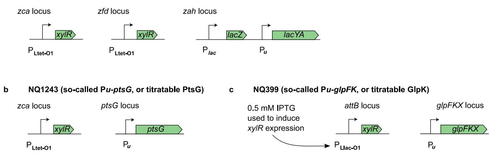

# **Supplementary Figure 1. Titratable carbon-uptake strains**

**a—c.** To study the mechanism and strategy of hierarchical substrate utilization, it is desirable to zoom into the regime where the preferred substrate is running out and the cell switches to the second substrate. However, during diauxic growth this switch is transient, which makes it hard to characterize. Instead, one would prefer to somehow study the crossover in exponentially growing batch cultures. Unfortunately, it is notoriously difficult to experimentally obtain and maintain balanced exponential growth with two (or more) growth-limiting nutrients. In batch culture, cell densities measurable with a regular spectrophotometer are too high to prevent that consumption rapidly depletes low nutrient concentrations. In chemostats, studying the utilization of multiple carbon sources is a challenge too: chemostats readily provide control of the steady-state growth rate of the culture (by manipulating the dilution rate), but not of the steady-state *concentration* of *multiple nutrients*. In particular, under certain conditions discussed in the main text, the cellular growth rate becomes almost independent of the concentration of one of the carbon substrates, in which case this concentration cannot be controlled through the dilution rate. For these reasons, we have made use of *E. coli* strains in which the expression of a substrate uptake system – and hence the substrate uptake itself – can be dialed down in a graded manner. This mimics the situation of the preferred substrate running out, but allows one to keep the actual substrate concentration in the medium at a saturating level1. (For details of all strains, see Supplementary Table 1.)

We constructed strains to control the uptake of three substrates each of which is taken up by distinct mechanisms. To control the uptake of lactose, we constructed a strain (NQ917; Panel a) in which the lactose permease LacY that transports lactose by proton symport2,3 is placed under the control of the P*u* promoter from *Pseudomonas putida*4. The transcriptional activator of P*u*, XylR, is expressed constitutively from two chromosomal copies of the gene. Consequently, the expression of LacY and the resulting lactose uptake can be titrated in a graded manner by varying the concentration of the inducer of XylR, 3-methylbenzyl alcohol (3MBA), in the medium. Similarly, we have constructed a strain (NQ1243; Panel b) with titratable expression of PtsG, the major glucose PTS transporter in *E. coli5,6.* This strain therefore allows glucose uptake to be controlled experimentally. In a third strain (NQ399; Panel c), the *glpFKX* genes are controlled in a similar fashion, placing the expression of the rate-limiting enzyme for glycerol uptake, glycerol kinase GlpK, under experimental control. In this strain, XylR is expressed from a PLlac-O1 promoter7, the expression of which is induced by adding 0.5 mM of isopropyl β-D-1-thiogalactopyranoside (IPTG) to the growth medium.

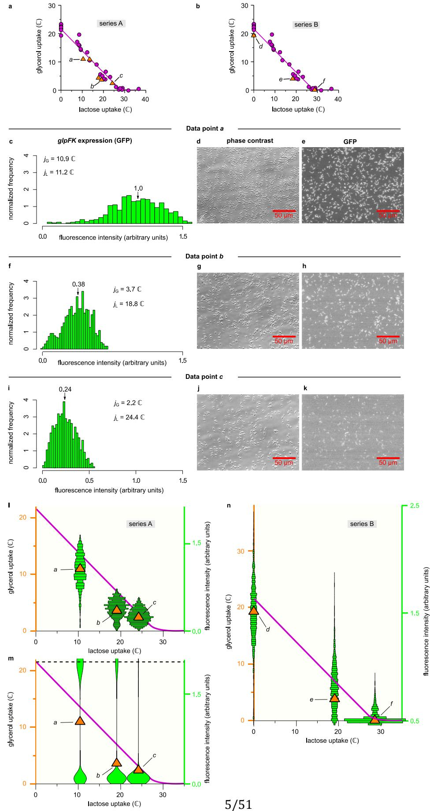

#### **Supplementary Figure 2. Single-cell analysis**

At 3MBA concentrations below ~100 μM, cultures of the titratable LacY strain NQ917 utilize both lactose and glycerol (demonstrated in Fig. 2c). We argue that this is because individual cells take up both substrates (scenario I). In principle, however, it could also result from phenotypic variation, with one fraction of the population consuming glycerol only, and another consuming lactose only (scenario II). To exclude this second scenario, we constructed a titratable LacY strain with a *glpFpgfp* reporter gene (NQ1344); we grew this strain on lactose + glycerol at various 3MBA concentrations and carried out single-cell measurements of the GFP fluorescence intensity. Under scenario II, expression from *glpFp* (and hence fluorescence) should be bimodal, with one peak corresponding to cells growing on glycerol only (high expression), and another peak corresponding to growth on lactose only (baseline expression).

Two series of experiments were performed, labeled as series A and B.

**a**. Glycerol uptake versus lactose uptake for series A (in unit ℂ, defined as one mM of carbon atoms per OD600 per hour) in strain NQ1344 (orange triangles). For comparison, the data for the titratable LacY strain NQ917 used in Fig. 2e are also shown (purple circles). The flux relations of strains NQ1344 and NQ917 are very similar. (We note that the two strains have different sensitivities to the 3MBA concentration because strain NQ1344 carries one copy of the *xylR* gene on its genome whereas NQ917 carries two (Supplementary Table 1) —but this does not affect the flux relation.)

**b.** Same as Panel a, but for series B. In contrast to series A, this series includes two controls: growth on glycerol only (labeled as datapoint ) and growth on lactose only with 500 μM of 3MBA.

**c—k.** In both series of experiments, phase contrast and GFP fluorescence images were taken and converted to histograms of GFP fluorescence intensity per cell. Shown are examples for series A, with [3MBA] = 25 μM (Panels c-e), 200 μM (Panels f-h), and 300 μM (Panels i-k), respectively corresponding to the data points *a*, *b*, and *c* indicated in Panel a.

The histogram in Panel c is for the conditions of data point *a*, which is characterized by a considerable lactose consumption (L = 11.2 ℂ, about half of the total carbon uptake). If this lactose consumption is due to a subpopulation consuming lactose only, we should see two peaks of roughly equal weight: one located at high expression levels, and one at low expression levels. This is not the case. In Panel f(for data point ) the fluorescence of the bulk of the cells is much lower than in Panel c (for data point ), which agrees with the lower rate of glycerol consumption (G = 3.7 ℂ versus

6/51

G = 1.0 ℂ). (The median fluorescence of each histogram is indicated by an arrow.) Despite the slight bimodality seen in this figure, the reduced glycerol uptake is primarily the result of the shift in the whole distribution rather than to the appearance of a small subpopulation with a low expression level. (Incidentally, the bimodality in this distribution can be explained by the sensitive response of the uptake system; see Supplementary Discussion D.)

l & m. To illustrate the argument more clearly, the fluorescence intensity distributions for data points , , and are plotted (green -axis and green bars) together with the measured glycerol uptake (orange -axis and orange triangles) as a function of the lactose uptake rate (-axis). If the co-utilization of glycerol and lactose is the result of two subpopulations, each consuming only one substrate, the green histograms of Panel l would have looked as sketched Panel n: each distribution would be bimodal, with one subpopulation growing exclusively on glycerol (at the corresponding rate of G ≈ 22 ℂ), and another subpopulation growing exclusively on lactose (with G ≈ 0 ℂ). This is not consistent with Panel l.

n. Same as l, but for series B. The (arbitrary) fluorescence units on the right-hand axis differ from Panel l because a different experimental setup was used (see Methods). Cells grown on lactose only had a mean fluorescence intensity of 0.5. As in series A, the reduction in glycerol uptake between conditions , , and are well explained by gradual reduction in the expression levels (fluorescence) of the bulk of the cells, rather than by shifting weights of the peaks of a bimodal distribution.

Each datapoint or distribution in Panel a, b, c, f, i, l, and n represents a single experiment.

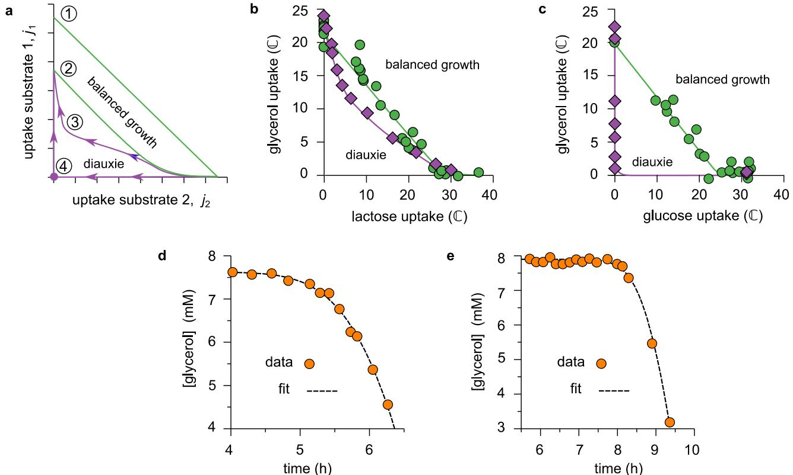

# **Supplementary Figure 3. Interpretation of flux relations: balanced growth versus diauxic growth**

**a—e.** The uptake flux measurements presented in the main text were performed under conditions of balanced exponential growth. It is instructive to compare the flux relations measured under balance exponential growth (Fig. 2e,f) with *instantaneous* fluxes measured during diauxic growth, the process depicted in Fig. 1a,b, and Extended Data Figure 1.

Panel a distinguishes four types of flux relations, numbered 1 to 4. Under conditions of balanced exponential growth we found two types of flux relations (as discussed in the main text). Strains with *glpR glpK22* double mutations produce a straight line, drawn here as line 1, as expected from our quantitative molecular model(see Supplementary Discussion, section B). Strains with an intact glycerol kinase produce a threshold-linear shape (curve 2), indicating carbonsubstrate hierarchy.

During a diauxic shift, the culture transitions from balanced exponential growth on the preferred carbon substrate to balanced exponential growth on the non-preferred one; in the process, the uptake fluxes trace out a different flux relation. The preferred substrate runs out suddenly, allowing the culture insufficient time to adapt, and forcing it out of balanced growth. The resulting flux relations therefore differ from the ones measured under balanced growth. Because induction of glycerol uptake takes time, the glycerol uptake should generally be lower than under balanced growth, resulting in a curve of type 3. In fact, during a true lag phase neither substrate is consumed; then, the flux relation must pass through the origin as in curve 4, deviating maximally from the balanced-growth counterpart.

**b**. The above expectations were tested by deriving the instantaneous uptake fluxes of lactose and glycerol from the curves shown in Fig. 1b; the results (purple diamonds) are plotted here together with the balanced growth results obtained from the titratable LacY strain (green circles). As expected, we find a curve of type 3.

**c**. The same analysis was done for the diauxic curves for growth on glucose and glycerol shown in Fig. 1a (purple diamonds). These carbon substrates produce a clear lag phase, which results in a flux relation of type 4, differing dramatically from the balanced growth results obtained with the titratable PtsG (green circles).

**d, e**. To obtain the instantaneous glycerol uptake fluxes plotted in Panels d and e, we had to extract the time derivatives of the glycerol concentration from the concentration measurements displayed in Fig. 1a,b. Direct discrete derivatives are notoriously sensitive to small measurement errors. We therefore fitted continuous and monotonous curves (dashed lines) through the glycerol concentration data (orange circles) and used the derivatives of these curves to calculate the flux at each time point. Panel d shows the fit used to analyze the lactose-glycerol diauxie, Panel e the one for the glucose-glycerol data.

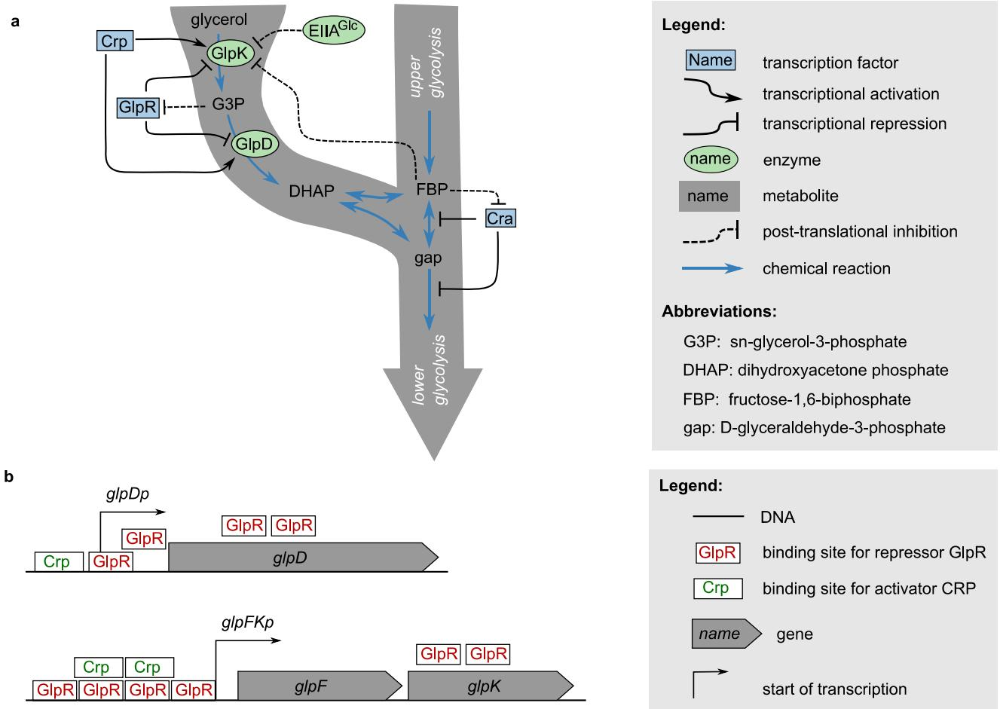

### **Supplementary Figure 4. Glycerol degradation under aerobic conditions**

**a**. Schematic representation of glycerol catabolism in *E. coli*, as well as its interface with the standard glycolysis pathway. The catabolism of glycerol in *E. coli* has been studied in detail for almost fifty years. The first step in the degradation of glycerol is its phosphorylation by ATPdependent kinase GlpK, yielding *sn*-glycerol-3-phosphate (G3P). This is known to be the ratelimiting step of glycerol uptake8. Next, GlpD catalyzes the oxidation of G3P to dihydroacetone phosphate (DHAP), which directly feeds into glycolysis. Transcriptionally, both GlpK and GlpD are activated by cAMP–Crp; in addition, they are both repressed by the glycerol repressor GlpR, which is induced by G3P9,10. At the post-translational level, two additional interactions affect glycerol uptake11. First, in the presence of glucose, the glucose-specific phosphocarrier of the PTS system EIIAGlc (formerly referred to as EIIIGlc) is known to inhibit the activity of GlpK12. This process is called *inducer exclusion,* and similar interactions are known to play a role in several instances of hierarchical carbon usage, including the lactose-glucose diauxie13,14. Second, the metabolite fructose-1,6-bisphosphate (FBP) is also known to inhibit GlpK allosterically15. Inducer exclusion and inhibition by FBP appear to function independently16. The metabolite FBP is a central hub in the glycolysis pathway; it is responsible for the induction of several enzymes in lower glycolysis by inducing repression by transcription factor Cra (also known as FruR), promoting gluconeogenesis. It was recently shown that the intracellular FBP concentration is proportional with the (upper- )glycolytic flux17,18.

**b**. Known transcriptional regulation of *glpD* and *glpFK* transcription units. Here GlpF is the glycerol facilitator, promoting diffusion of glycerol across the inner membrane. Both promoters *glpD*p and *glpF*p are activated transcriptionally by Crp (when bound by ligand cAMP) and repressed by the glycerol repressor GlpR (when not bound by G3P); however, the architectures and responses of both promoters differ9,10,19.

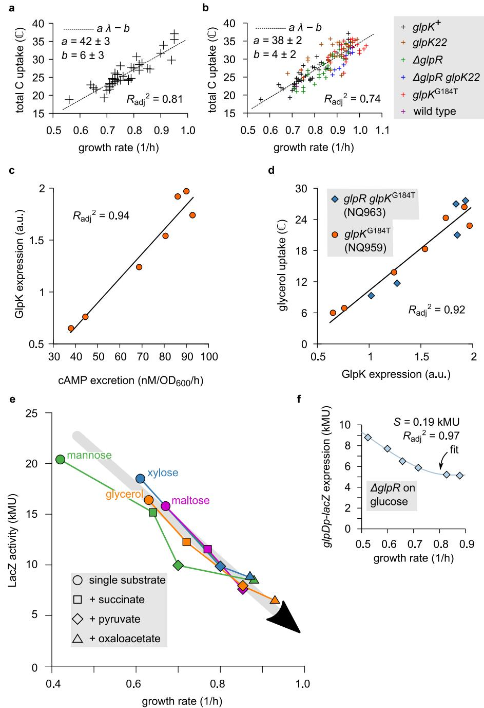

#### **Supplementary Figure 5. Experimental justification of model assumptions**

**a.** Our model assumes that, during balanced exponential growth, total carbon uptake correlates with growth rate. To test this, we use the carbon-uptake measurements for the titratable LacY strain (NQ917) grown on lactose + glycerol at various 3MBA concentrations (as given in Fig. 2c). Here, we plot the total carbon-uptake flux versus the growth rate obtained. A clear correlation is found (Pearson correlation, 2 = 0.82; = 41 conditions, = 13, df = 39, = 9 × 10−16 ); the regression line through the data reads tot = − , with = (42 ± 3) mM/OD600 and = (6 ± 3) ℂ (errors are SE). The observed correlation is hardly surprising: faster growth implies a higher rate of biomass production, which in turn requires a faster uptake of carbon.

**b.** Same as Panel a, but now using the data obtained for all mutant strains studied, including wildtype *E. coli* (NCM3722). Despite slight variation between strains, the correlation is still highly significant (Pearson correlation, 2 = 0.74 , = 131 conditions, = 19 , df = 1 and 129, = 1 × 10−39). We note that, to avoid clutter, we have used symbol sizes much smaller than the experimental error; measurement errors (SD) in growth rate measurements are of order of 5%, errors in total flux measurements can be as large as 15%.

**c—d.** Correlations between cAMP excretion, GlpK expression, and glycerol uptake. In our quantitative molecular model, we assume that glycerol uptake during growth in a glycerolcontaining medium is proportional to GlpK expression, and that GlpK expression is positively correlated to cAMP–Crp activity, provided GlpR repression is relieved by induction or gene deletion and allosteric inhibition of GlpK is constant or excluded. To test these assumptions, we grew the *glpK*G184T strain (NQ959) in medium containing lactose, glycerol and various concentrations of 3MBA, and measured (i) GlpK expression (using a glycerol kinase activity assay) (ii) cAMP excretion rate, as a proxy for the intracellular cAMP level20, (iii) and glycerol uptake rate. (See Methods for details on the various assays.) Panel c plots GlpK expression versus cAMP excretion rate. As expected, a strong correlation is found (Pearson correlation: = 0.97 , = 7 experimental conditions, = 9.5, df = 5, = 2 × 10−4 ; solid line is linear regression). Panel d plots glycerol uptake versus GlpK expression (orange circles). A clear positive linear relation is observed (Pearson correlation: = 0.96, = 12 experimental conditions, = 11.2, df = 10, = 1 × 10−6 ; solid line is linear regression). The experiments were repeated using the *ΔglpR glpK*G184T strain (NQ963; blue diamonds) instead of the *glpK*G184T strain (NQ959; orange circles); the results of both strains are consistent.

**e.** If cAMP–Crp is a total-flux sensor, it should respond to the uptake of glycolytic and gluconeogenic substrates alike. To show that cAMP–Crp signaling indeed responds to the uptake of gluconeogenic substrates, we here present data taken from a previous publication21. Cells of *E. coli* strain NCM3722 were grown on one glycolytic substrate alone (mannose, glycerol, xylose of maltose; colored circles) or one of these glycolytic substrates plus a gluconeogenic substrate (succinate, pyruvate, or oxaloacetate – see legend in figure) in the presence of IPTG. The expression of LacZ

was measured as a proxy for cAMP–Crp signaling and plotted against the growth rate. Clearly, adding a gluconeogenic substrate consistently increased the growth rate and reduced LacZ expression. Overall, LacZ expression correlates negatively with growth rate and traces a straight line (gray arrow), called the C-line22.

**f.** In order to model the response of GlpD expression to cAMP–Crp signaling, we interpolated the empirical *glpDp-lacZ* expression of the *glpR* deletion strain (light-blue diamonds; same data as Fig. 3c) by fitting it to a heuristic mathematical function (solid line; standard error of the regression = 0.19 kMU, adj 2 = 0.97, = 6 experimental conditions). See Equation S9 and further in the Supplementary Discussion for the definition of the fitting function and the values of its parameters.

In Panel a, b, c, d, and f, each datapoint represents a single experiment. In Panel a and b, the data points are from Fig. 2c, Fig. 3d, and Fig. 5a. The full datasets in Panel c and d were obtained through a single series of experiments (see Source Data for details). In Panel e, each datapoint represents the average of at least two independent experiments1,21. In Panel f, the data points are from Fig. 3c.

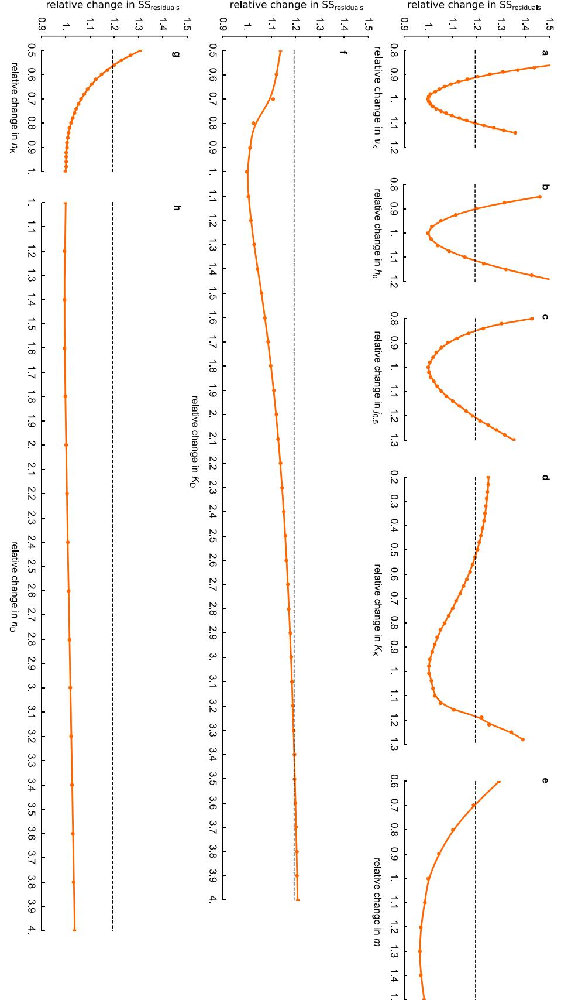

#### **Supplementary Figure 6. Sensitivity of model fit to parameter variation**

As shown in Fig. 5b, the mathematical model presented in the main text and detailed in the Supplementary Discussion is able to closely fit the flux relations of the various mutants. Here, we examine the sensitivity of the quality of the fit to variation of the parameters. For the definition of all parameters, see Supplementary Discussion, section A.

The parameters , , and C are excluded from the analysis presented here because these parameters were not used to fit the flux relations; their values are fixed by other data. Also, parameter D is irrelevant for the flux relations, because an increase in D can always be compensated by decrease in both K and D. (Refer to Supplementary Discussion C for details.)

We first numerically determined the *optimal* parameter values, that is, the values that minimize the sum of squared residuals SSres of the fit with respect to the flux relations of Fig. 5b. Because an unconstrained parameter optimization would increase the Hill coefficients K, D, and beyond the physiologically reasonable range, we imposed that K, D ≤ 3 and ≤ 2. Also, to avoid bistability, we required that K − D < 0.9. (See Supplementary Discussion D.) Under these constraints, the resulting optimal parameter values were: K = 118.5, ℎ0 = 0.55, K = 0.72/D , D = 0.67/D, K = 3.00, D = 2.12, 0.5 = 17.0, and = 2,00. Next, we one by one varied each of the parameters around their optimal value (while keeping the others fixed) and recorded how SSres changed.

Each of the panels plots SSres (normalized by its minimal value) versus one of the parameters (normalized by its optimal value). The axes of all panels have identical scales, so that they can be compared directly. The horizontal dashed line in each figure indicates the critical value of SSres: a value of SSres above this line indicates a quality of fit that is significantly worse than the optimal fit (-test, 95% confidence level). Note also that the parameter value of K is only reduced (not increased) in this analysis, to avoid parameter sets that give rise to bistability. Likewise, D is only decreased.

The results reveal that parameters K, ℎ0, and 0.5 (Panels a,b,c) are fairly constrained by the flux relations. The fit quality is considerably less sensitive to changes in the parameters that define the (induction of) transcriptional regulation by GlpR: K , D , K , and D (Panels d,f,g,h). This is partly because, out of the four strains involved in the fit, in only one (the *glpR+ glpK22*+ strain) GlpR is relevant: in the others, GlpR is either removed (*ΔglpR* and *ΔglpR glpK22*) or almost completely inactivated (*glpK22*). Additionally, if the fit of the abrupt onset of glycerol consumption in the *glpR+ glpK22*+ is mediocre, this affects SSres only mildly, because it increases the residuals of only those data points that lie near the threshold. As mentioned, the parameter (Panel d) was not allowed to exceed = 2 in the optimization; it is therefore no surprise that the fit quality improves if is increased.

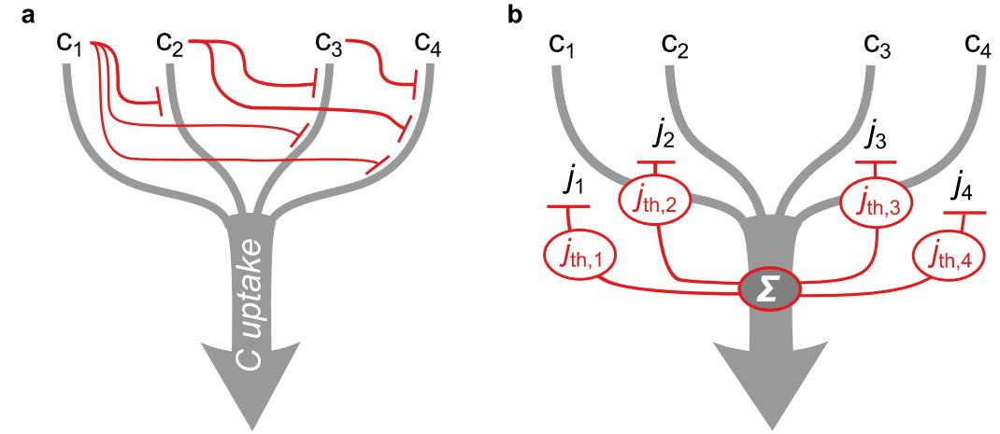

# **Supplementary Figure 7. Hierarchical utilization of carbon substrates implemented by fluxbased regulation.**

**a.** In theory, an arbitrary uptake hierarchy among a collection of substrates (here indicated as C1 to C4) can be implemented through *pairwise inhibition*. This requires independent sensors detecting the availability of each substrate, and a dedicated inhibitory interaction for *each pair* of substrates (red arrows). In this fashion, ( − 1)/2 independent inhibitory interactions are required to obtain a full hierarchy.

**b.** If the hierarchy is to be organized according to the single-substrate growth rate, flux-based regulation (such as total-flux feedback) can implement a full hierarchy with only interactions. The sum of all carbon-uptake fluxes Σ is sensed by a flux sensor. The hierarchy is set by a single regulatory link for each substrate C , such that its uptake is inhibited if Σ exceeds a threshold th, set appropriately for each substrate, slightly above the flux obtained on that substrate alone. Thus, the uptake of each substrate is inhibited in the presence of *any* carbon substrate with a higher "rank" — that is, one that provides a larger carbon flux and growth rate.

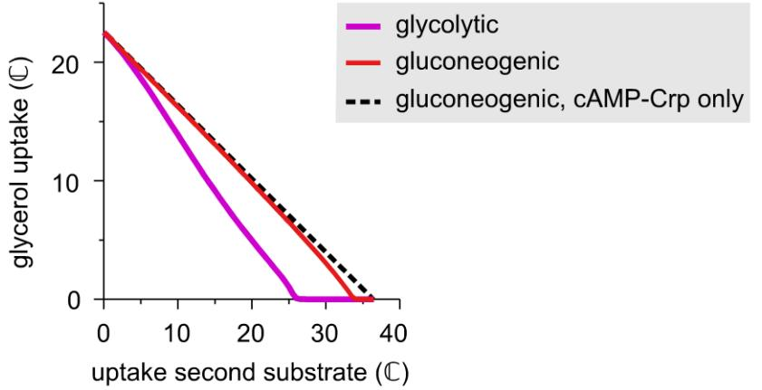

# **Supplementary Figure 8. Growth on one glycolytic and one gluconeogenic substrate: two models compared.**

We previously published a simple model that predicts the growth rate of *E. coli* grown on one glycolytic and one gluconeogenic substrate6. It included cAMP-Crp signaling as the only regulatory mechanism. The model presented in the main text (also see Supplementary Discussion) describes the glycerol uptake regulation in more detail by including allosteric inhibition of GlpK by FBP, specific transcriptional repression by GlpR, and differential regulation of the pertinent operons. This allows it to describe both the hierarchical and the simultaneous utilization regimes, and the response to both glycolytic and gluconeogenic substrates added to the medium. However, when applied to growth on glycerol plus a gluconeogenic substrate, the predictions of both models are very similar, because then allosteric inhibition of GlpK by FBP is minimal (low FBP concentration) and specific repression by GlpR is weak (high concentration of inducer G3P).

The figure shows the flux relation for glycerol plus a gluconeogenic substrate as predicted from the model presented in the main text (also see Supplementary Discussion) by assuming that the uptake of gluconeogenic substrates does not affect allosteric inhibition of GlpK by FBP. The flux relation thus predicted (red line) differs markedly from the flux relation for glycerol plus a glycolytic substrate (pink line; same as in Fig. 5b). Due to the lack of allosteric inhibition, the threshold flux at which glycerol uptake is turned on has shifted far to the right. That is, GlpR repression is eliminated unless the uptake flux of the gluconeogenic substrate is very large. Consequently, the predicted glycerol uptake rate is very similar to the one predicted by the earlier, less detailed model (black dashed line) that ignores allosteric inhibition, specific repression, and differential regulation altogether6.

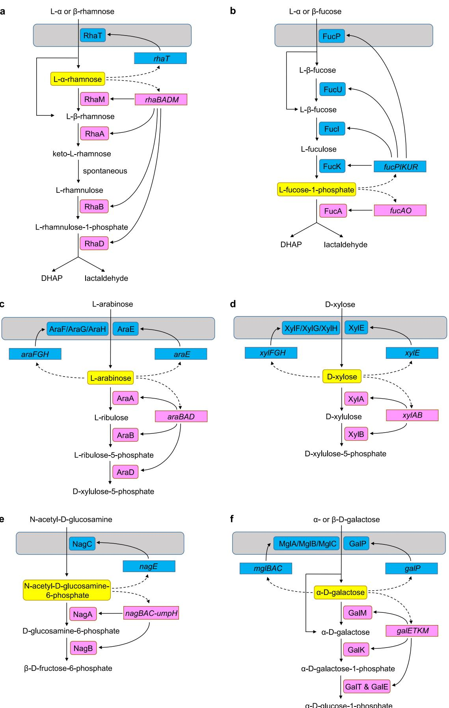

# **Supplementary Figure 9. Carbon utilization systems in which proteins acting upstream and downstream of the individual inducer are encoded on separate operons.**

Panels a to f illustrate the degradation pathways of six different carbon substrates. In each case, the proteins employed in the pathway are encoded on two or three operons that are each induced by the same inducer. In each case, the proteins acting *downstream* of the inducer are all encoded on a single operon, separate from the proteins acting *upstream* of the inducer. In each panel, the inducer is highlighted in yellow. Upstream and downstream enzymes and their operons are colored in blue and pink, respectively.

It should be noted that not all of the known carbon utilization systems are configured in this manner: The lactose utilization system, for instance, is encoded on a single operon.

**a.** L-rhamnose utilization system. The L-rhamnose:H+ symporter RhaT is upstream of the inducer L--rhamnose and is encoded by operon *rhaT*. The downstream catabolic enzymes L-rhamnose mutarotase RhaM, L-rhamnose isomerase RhaA, rhamnulokinase RhaB, and rhamnulose-1 phosphate aldolase RhaD are encoded by a single operon *rhaBADM.* Both operons are positively regulated by cAMP–Crp23.

**b.** L-fucose utilization system. L-fucose:H+ symporter FucP, L-fucose mutarotase FucU, L-fucose isomerase FucI, and L-fuculokinase FucK are upstream of the inducer L-fucose-1-phosphate and are all encoded on a single operon *fucPIKUR*. The downstream catabolic enzyme L-fuculose-phosphate aldolase FucA is encoded on a different operon *fucAO.* Both operons are positively regulated by cAMP–Crp23.

**c.** L-arabinose utilization system. The two arabinose transporters, arabinose:H+ symporter AraE and arabinose ABC transporter AraF/AraG/AraH complex, are upstream of the inducer (intracellular) L-arabinose and encoded on separate operons, *AraE* and *AraFGH*, respectively. The downstream catabolic enzymes L-arabinose isomerase AraA, ribulokinase AraB, and L-ribulose-5 phosphate 4-epimerase AraD are encoded by a different single operon *araBAD.* All the three operons are positively regulated by cAMP–Crp23,24.

**d.** D-xylose utilization system. The two xylose transporters, xylose:H+ symporter XyrE and xylose ABC transporter XyrF/XyrG/XyrH complex, are upstream of the inducer (intracellular) D-xylose and encoded on separate operons, *XylE* and *XylFGH*, respectively. The downstream catabolic enzymes xylose isomerase XylA and xylulokinase XylB are encoded on a different operon *xylAB.* Both *xylF* and *xylA* promoters are positively regulated by cAMP–Crp25. There has been no report that *xylE* promoter is under regulation by cAMP–Crp.

**e.** *N*-acetyl-D-glucosamine utilization system. The PTS transporter NagE is upstream of the inducer N-acetyl-D-glucosamine-6-phosphate and encoded on a separate operon *nagE*. The downstream catabolic enzymes *N*-acetylglucosamine-6-phosphate deacetylase NagA and glucosamine-6 phosphate deaminase NagB are all encoded on a different operon *nagBAC-umpH*. Both operons are positively regulated by cAMP–Crp and the sensitivity to cAMP–Crp is reported to be higher for *nagE* promoter than *nagB* promoter26.

**f.** D-galactose utilization system. The two galactose transporters, galactose:H+ symporter GalP and galactose/methyl-galactoside ABC transporter MglA/MglB/MglC complex are upstream of the inducer -D-galactose and encoded on separate operons, *galP* and *mglBAC*, respectively. The downstream catabolic enzymes galactose-1-epimerase GalM, galactokinase GalK, galactose-1 phosphate uridylyltransferase GalT, and UDP-glucose 4-epimerase GalE are encoded on a separate operon *galETKM.* Both of the upstream operons are positively regulated by cAMP–Crp27-29 and the *galE* promoter positively responds to low extracellular cAMP concentrations23. It was reported that the *galP* promoter is more sensitive to low extracellular cAMP concentrations than the *galE* promoter at saturating galactose concentrations 23,30.

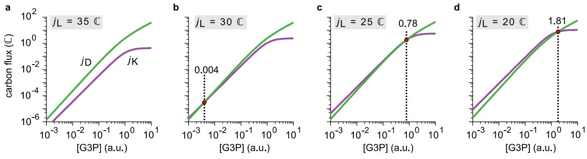

### **Supplementary Figure 10. Source of the sensitive response in the model**

This figure illustrates how the observed sensitive response of the glycerol uptake flux G and G3P concentration to changes in the lactose flux L is achieved in the model. In the regime where the G3P concentration [G3P] is small (which is the case at the onset of glycerol uptake), the phosphorylation flux K catalyzed by GlpK and the oxidation flux D catalyzed by GlpD can be considered functions of [G3P] and the lactose flux L (see Equation S24). In flux balance, G = K = D; therefore the steadystate glycerol uptake flux for given L can be found graphically by plotting K and D as a function of [G3P] and identifying their intersection. A sensitive response is achieved if both functions run approximately parallel in a log-log plot. (That is: if they behave as similar power laws.)

**a.** Here, the lactose uptake flux is large (L = 35 ℂ); therefore, *glpK*p expression is not activated by cAMP–Crp and GlpK is strongly inhibited by FBP. As a result, the purple line for K lies below the green line D in the domain shown. (They intersect at a very low G3P concentration outside of this domain.)

**b.** Same as Panel a, except that the lactose flux is smaller (L = 30 ℂ). *glpK*p expression is marginally activated by cAMP–Crp and GlpK is a little less inhibited by FBP. Thus, the purple line has shifted upwards so that the intersection is now in visible (red dot).

**c.** Now the lactose flux is set at the threshold value of L = 25 ℂ. The lines have shifted only a little compared to Panel B, but because they run almost in parallel the intersection has shifted to the right and upwards by orders of magnitude. Clearly, the response is highly sensitive in this regime.

**d.** At L = 20 ℂ, glycerol uptake is considerably activated. (We note, however, that in this panel the steady-state [G3P] concentration is not small anymore and therefore the approximation on which this analysis is based is unreliable.)

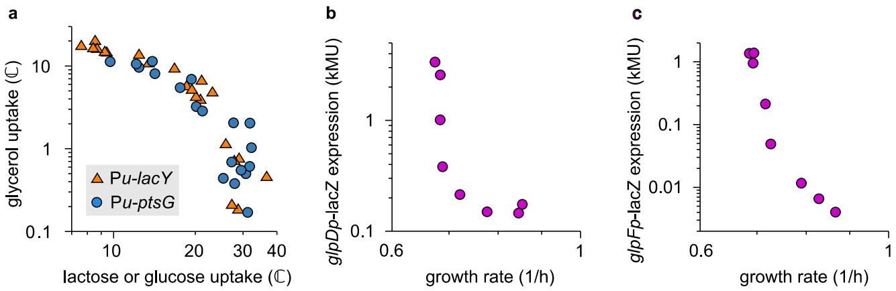

# **Supplementary Figure 11: Sensitivity of glycerol uptake and gene expression to changes in uptake flux or growth rate.**

Sensitivity of some quantity to changes in some other quantity is commonly measured as the logarithmic derivative = d log d log , which corresponds to the slope in a log-log plot.

**a.** Log-log plot of glycerol uptake as a function of uptake flux of the preferred substrate (lactose or glucose, respectively in the titratable LacY strain and in the titratable PtsG strain). (Same data as Fig. 2e,f.) Near the threshold flux of th = 25 ℂ, glycerol uptake is very sensitive to changes in lactose or glucose uptake, as is apparent from the large negative slope of the plot in this regime.

**b.** Log-log plot of expression from the *glpD* promoter as a function of growth rate. (Same data as Fig. 3c.) If the growth rate is reduced (by reducing the 3MBA concentration) and approaches the growth rate on glycerol alone, ~0.7/h, *glpDp* expression becomes highly sensitive to changes in the growth rate.

**c.** Same as Panel b, but for the *glpFK* promoter. (Same data as Fig. 3b.)

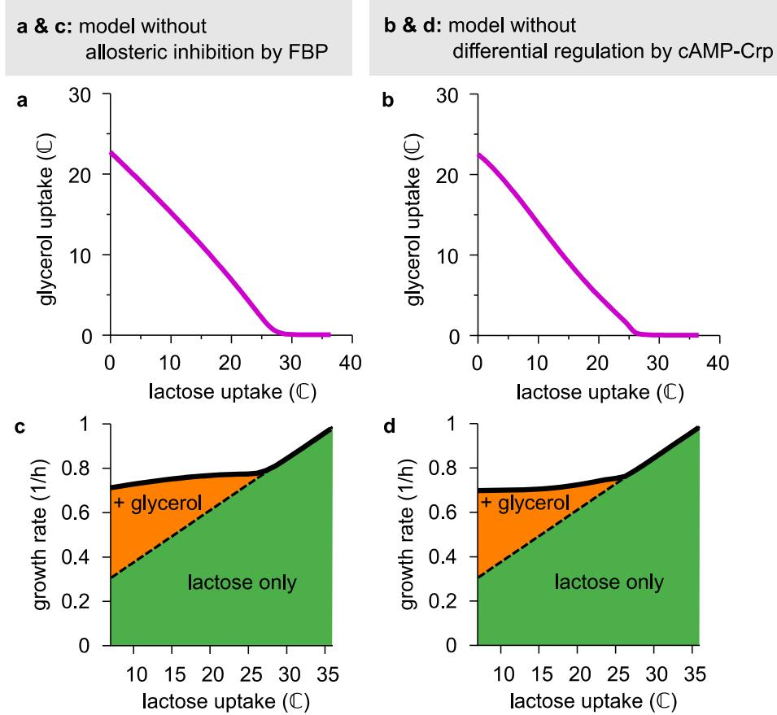

**Supplementary Figure 12. Models without allosteric inhibition or differential regulation by cAMP–Crp**

The observed sensitive response of the glycerol response system can, in theory, be achieved without allosteric inhibition by FBP (Panels a and c) or without differential regulation by cAMP–Crp (Panels b and d) provided model parameters are suitably adjusted for each case. To demonstrate this, we define two "handicapped" models. The first model is identical to the full model except that the inhibition function ℎ(L) of Equation S2 (Supplementary Discussion, section A) is replaced by the constant ℎ0; thus, allosteric inhibition by FBP is removed. The second model is also identical to the full model, but now the regulation function D() of *glpD* expression in Equation S6 (Supplementary Discussion, section A) is assumed to be identical to regulation function K() of *glpK* expression, *i.e.*, the C-line of Equation S8; this removes differential regulation by cAMP–Crp.

**a—b:** Glycerol uptake as a function of lactose uptake for the two "handicapped" models, for suitably adjusted parameters (given in Supplementary Table 3). In both models, the characteristic threshold-linear shape can still be achieved.

**c—d:** Correspondingly, in both models, the growth rate is approximately in constant in the supplementation regime (lactose uptake below ≈ 25 ℂ).

We stress, however, that many other observations cannot be reproduced by these handicapped models. On the one hand, the model without allosteric inhibition by FBP cannot account for the effect of the *glpKG184T* mutation (Fig. 5a), which abolishes the sensitivity in the real system. Also, this model would predict a linear flux relation for the *ΔglpR* strain (NQ958), which is not observed (Fig. 3d). Moreover, it fails to explain the observed difference in the effect of glycolytic and gluconeogenic carbon substrates on the glycerol uptake. On the other hand, the model without differential regulation by cAMP–Crp is inconsistent with the measured GlpD expression levels of the *ΔglpR* deletion strain, and cannot explain the sharp change in G3P concentration as a function of growth rate in the *ΔglpR glpK22* strain.

### **Supplementary Tables**

| NCM3722 derivatives |                                                                                                                                                                       |                                                                                           |  |
|---------------------|-----------------------------------------------------------------------------------------------------------------------------------------------------------------------|-------------------------------------------------------------------------------------------|--|
| Strain              | Genotype                                                                                                                                                              | Description                                                                               |  |
| NCM3722             | wild-type E. coli K12 strain                                                                                                                                    | The parental wild-type strain                                                          |  |
| NQ351               | pKD46                                                                                                                                                                 | You et al., 2013; NCM3722 harboring pKD46                                              |  |
| NQ381               | attB::(amp:PLlac-O1:xylR) zah 3635::(kan:rrnBt:Pu)                                                                                                               | You et al., 2013; Pu promoter is inserted between lacZ and lacY.                 |  |
| NQ399               | attB::(amp:PLlac-O1:xylR) glpF224::(kan: rrnBt:Pu)                                                                                                              | You et al., 2013; glpF promoter is replaced with Pu promoter.                    |  |
| NQ636               | glpKG184T                                                                                                                                                             |                                                                                           |  |
| NQ914               | zca-3633::(FRT:rrnBt:PLtet-O1:xylR)                                                                                                                                  | PLtet-O1:xylR is inserted between ycaC and ycaD.                                 |  |
| NQ915               | zca-3633::(FRT:rrnBt:PLtet-O1:xylR) zfd 3634::(FRT:rrnBt:PLtet-O1:xylR)                                                                                          | PLtet-O1:xylR is inserted between ycaC and ycaD and between intS and yfdG. |  |
| NQ916               | zca-3633::(FRT:rrnBt:PLtet-O1:xylR) zah 3635::(kan:rrnBt:Pu)                                                                                                     | Parental titratable LacY strain for NQ1344                                             |  |
| NQ917               | zca-3633::(FRT:rrnBt:PLtet-O1:xylR) zfd 3634::(FRT:rrnBt:PLtet-O1:xylR) zah 3635::(kan:rrnBt:Pu)                                                             | Titratable LacY strain                                                                    |  |
| NQ958               | Titratable LacY strain with glpR856::FRT zca-3633::(FRT:rrnBt:PLtet  glpR O1:xylR) zfd-3634::(FRT:rrnBt:PLtet-O1:xylR) zah-3635::(kan:rrnBt:Pu) |                                                                                           |  |
| NQ959               | Titratable LacY strain with glpKG184T zca-3633::(FRT:rrnBt:PLtet glpKG184T O1:xylR) zfd-3634::(FRT:rrnBt:PLtet-O1:xylR) zah-3635::(kan:rrnBt:Pu)       |                                                                                           |  |
| NQ963               | glpR856::FRT glpKG184T zca  3633::(FRT:rrnBt:PLtet-O1:xylR) zfd 3634::(FRT:rrnBt:PLtet-O1:xylR) zah 3635::(kan:Pu)                                 | Titratable LacY strain with glpR and glpKG184T                                      |  |
| NQ1186              | Titratable LacY strain with glpK22 zca-3633::(FRT:rrnBt:PLtet-O1:xylR) glpK22 zfd-3634::(FRT:rrnBt:PLtet-O1:xylR) zah 3635::(kan:rrnBt:Pu)             |                                                                                           |  |

| NQ1187             | glpR856::FRT glpK22 zca  3633::(FRT:rrnBt:PLtet-O1:xylR) zfd 3634::(FRT:rrnBt:PLtet-O1:xylR) zah 3635::(kan:rrnBt:Pu)                                    | Titratable LacY strain with glpR and glpK22                            |  |
|--------------------|-----------------------------------------------------------------------------------------------------------------------------------------------------------------------------|------------------------------------------------------------------------------|--|
| NQ1243             | zca-3633::(FRT:rrnBt:PLtet-O1:xylR) ptsG468::(kan:rrnBt:Pu)                                                                                                           | Titratable PtsG strain; ptsG promoter is replaced with Pu promoter. |  |
| NQ1264             | glpR856:FRT glpK22 zca  3633::(FRT:rrnBt:PLtet-O1:xylR) ptsG468::(kan:rrnBt:Pu)                                                                             | Titratable PtsG strain with glpR and glpK22                            |  |
| NQ1332             | zca-3633::(FRT:rrnBt:PLtet-O1:xylR) ptsG469::(FRT:rrnBt:Pu)                                                                                                           | A kan gene is flipped out from NQ1243.                                 |  |
| NQ1344             | Titratable LacY strain with zca-3633::(FRT:rrnBt:PLtet-O1:xylR) zfd gfp placed under glpF 3636::(kan:rrnBt:glpFp:gfpmut3b) zah promoter 3637::(FRT:Pu) |                                                                              |  |
| HE305              | Titratable PtsG strain with lacZ4825::(kan:rrnBt:glpFp) zca glpFp-lacZ 3633::(PLtet-O1:xylR) ptsG469::(FRT:rrnBt:Pu) ∆lacI ∆lacY                            |                                                                              |  |
| HE308              | glpR856::FRT  lacZ4825::(kan:rrnBt:glpFp) zca 3633::(PLtet-O1:xylR) ptsG469::(FRT:rrnBt:Pu) ∆lacI ∆lacY                                                    | Titratable PtsG strain with glpR and glpFp-lacZ                        |  |
| HE333              | glpR856::FRT glpK22  lacZ4825::(kan:rrnBt:glpFp) zca 3633::(PLtet-O1:xylR) ptsG469::(FRT:rrnBt:Pu) ∆lacI ∆lacY                                          | Titratable PtsG strain with glpR, glpK22 and glpFp lacZ          |  |
| HE397              | Titratable PtsG strain with lacZ4826::(kan:rrnBt:glpDp) zca glpDp-lacZ 3633::(PLtet-O1:xylR) ptsG469::(FRT:rrnBt:Pu) ∆lacI ∆lacY                            |                                                                              |  |
| HE398              | glpR856::FRT  lacZ4826::(kan:rrnBt:glpDp) zca 3633::(PLtet-O1:xylR) ptsG469::(FRT:rrnBt:Pu) ∆lacI ∆lacY                                                    | Titratable PtsG strain with glpR and glpDp-lacZ                        |  |
| HE637              | glpR856::FRT glpK22  lacZ4826::(kan:rrnBt:glpDp) zca 3633::(PLtet-O1:xylR) ptsG469::(FRT:rrnBt:Pu) ∆lacI ∆lacY                                          | Titratable PtsG strain with glpR, glpK22 and glpDp lacZ          |  |
| MG1655 derivatives |                                                                                                                                                                             |                                                                              |  |
| Strain             | Genotype                                                                                                                                                                    | Description                                                                  |  |
| MG1655             | wild-type E. coli K12 strain                                                                                                                                          | From CGSC                                                                    |  |
| JW3887-1           | pfkA775::kan                                                                                                                                                            | From CGSC                                                                    |  |

| NQ309 | ∆lacI ∆lacY ∆galK, pKD46 | You et al., 2013 |
|-------|--------------------------|------------------|
|-------|--------------------------|------------------|

## **Supplementary Table 1: List of strains employed in this work.**

| Name              | Sequence (5' -> 3')                                                               |
|-------------------|-----------------------------------------------------------------------------------|
| ycaD-P1-S1        | AGACGCGATGCATTGCTCTGAAAGCATAGACGGGAAATATGAGTTTGCTGTG TAGGCTGGAGCTGCTTC         |
| ycaD-P4-A1        | GGTGAAAATACGCGATATCCCAGCGGCGGTATTATCGATTTATATTACATGA GAATTAATTCCGGGGATCC       |
| intC-P1-S1        | TGAGAAGGTGGAGTGAGCGACCTTAACAACTATCGAATAGCACAAAGTCTTG TGTAGGCTGGAGCTGCTTC       |
| intC-P4-A1        | TTCTTCTATCAGCTAATAATCAAAGGAATGAAGTCTATCATCCAAGTCTTCA TGAGAATTAATTCCGGGGATCC    |
| SDY158            | GCCCGTCTGTTTCACATCGACGCTTCCCGCCTTCAATCCATCCGTTGAGTGTA GGCTGGAGCTGCTTC          |
| SDY159            | CAGCGATTTACCGACCTTTTGCAGGTTAGCAAATGCATTCTTAAACATGGTA CCTTTCTCCTCTT             |
| PglpF-XhoI-S2     | TCACTCGAGCTCCGATTGTATGAAGCCGC                                                     |
| PglpF-KpnI-A4     | CGTGGTACCAATCGGATCCTGAAGAGTTAATGTTTGTTG                                           |
| gfp-Ptet-PglpF-A1 | CGCATGGTACCTTTCTCCTCTTTAATGAATTCGGTCAGTGCGTCCTGCATATG GCTGTAAACTTATCGTTAACGAGC |
| PH008             | AAAACTCGAGCCATTGCGAAACTCTGTGG                                                     |
| PH009             | AATTGGATCCGCTGCCCTCATTCACTTTC                                                     |
| PH019             | GGGAAAAAGTGGAAGCGGCGATGGCGGAGCGTGTAGGCTGGAGCTGCTTC                                |
| PH020             | CGACGGCCAGTGAATCCGTAATCATGGTCATGCTGCCCTCATTCACTTTCGTT AA                       |
| PH025             | TTTCTGCGAAAACGCGGGAAAAAGTGGAAGCGGCG                                               |
| PH026             | ACGACGTTGTAAAACGACGGCCAGTGAATCCG                                                  |

**Supplementary Table 2: List of oligonucleotides.**

| Parameter | Full model               | No allosteric inhibition by FBP | No differential regulation by cAMP–Crp |
|-----------|--------------------------|------------------------------------|-------------------------------------------|
| 𝑎         | 42.5 mM/OD600         | 42.5 mM/OD600                   | 42.5 mM/OD600                          |
| 𝑏         | 6 ℂ                   | 6 ℂ                             | 6 ℂ                                    |
| 𝜆C        | 1/h                      | 1/h                                | 1/h                                       |
| 𝜈K        | 1.2 × 102 mM/OD600 | 102 mM/OD600 1.2 ×           | 102 mM/OD600 1.2 ×                  |
| 𝜈D        | 0.8 (a.u.)               | arbitrary                          | arbitrary                                 |
| 𝐾K        | 0.9/𝜈D                   | 4.0/𝜈D                             | 18.5/𝜈D                                   |
| 𝐾D        | 0.6/𝜈D                   | 2.0/𝜈D                             | 10.7/𝜈D                                   |
| 𝑛K        | 2                        | 2                                  | 2                                         |
| 𝑛D        | 1.2                      | 1.3                                | 1.3                                       |
| ℎ0        | 0.6                      | n.a.                               | 0.6                                       |
| 𝑗0.5      | 16 ℂ                  | n.a.                               | 16 ℂ                                   |
| 𝑚         | 2                        | n.a.                               | 2                                         |

**Supplementary Table 3: Parameter values used for model fits in Fig. 5b,c, and Extended** 

**Data 6.**

### **Supplementary Discussion**

Here, we present the quantitative molecular model discussed in the main text in full detail. In section A, the elements and assumptions of the model will be introduced. We will arrive at general equations describing the relation between the uptake flux of glycerol and the uptake flux of lactose or glucose – the "flux relation". In section B, we will analyze this flux relation for several special cases of the model that correspond to mutant strains discussed in the main text. In section C, the parameter values used to fit the experimental data will be justified. In section D, we analyze how the highly sensitive response of glycerol uptake to lactose or glucose uptake is achieved in the model. In section E we discuss whether allosteric inhibition by FBP and differential regulation by cAMP–CRP are both necessary to achieve a threshold-linear flux relation observed in the experiments (Fig. 2e,f of the main text). Lastly, in section F we provide details of the model used in Fig. 5c to predict the growth rate on glycerol + a second substrate.

### **A. Definition of the model**

For convenience, we will formulate the model in terms of the lactose-glycerol hierarchy, but the resulting model is equally applicable to the glucose-glycerol case. The model is intended as a minimal description and therefore includes only those physiological and metabolic interactions that are essential for the functioning of the glycerol uptake regulation. We refer to Supplementary Figure 4 for an overview of the known molecular players and interactions.

### *In short: structure of the model*

The structure of the model can be summarized as follows. Glycerol uptake is affected by two intracellular signals: allosteric inhibition of enzyme GlpK by metabolite fructose-1,6-bisphosphate (FBP), and transcriptional activation by cAMP–Crp. We use three key empirical observations: During balanced exponential growth (i) the intracellular FBP pool is to good approximation a function of the lactose uptake flux (see Fig. 4a); (ii) cAMP–Crp signaling is a function of the growth rate (Fig. 4c); and (iii) the growth rate in turn correlates linearly with the total carbon-uptake flux (Supplementary Figure 5a,b). Given these relations, we can think of glycerol uptake G as being a function G (L,tot) of the lactose uptake flux L (mediated by FBP inhibition) and the total carbonuptake flux tot (mediated by cAMP–Crp signaling). However, because tot in turn depends on the glycerol uptake flux (since tot ≡ G + L), glycerol uptake affects itself (negatively) through a Crpmediated negative feedback loop. The glycerol uptake realized at a given value of L is therefore the solution of the nonlinear equation G = G (L,G + L ).

To arrive at the functional form of G (L,G + L ) we now proceed to describe all relevant molecular players and their interactions.

#### *Glycerol flux through GlpK*

The first step in the uptake of glycerol relies on the expression and activity of kinase GlpK 8, which catalyzes the phosphorylation of glycerol, yielding G3P:

$$\text{glycerol} \xrightarrow{\text{GlpK}} \text{G3P.}$$

In our experiments, glycerol is always provided at saturating concentrations; this means that the rate of glycerol uptake should be proportional to the concentration of GlpK (as verified in Supplementary Figure 5d). Given the expression level (concentration) of GlpK, K , the phosphorylation flux can be written as

$$j_{\mathbf{K}} = \nu \, h(j_{\mathbf{L}}) \, E_{\mathbf{K}}.\tag{\text{S1}}$$

Here the constant sets the maximal glycerol flux obtainable at a given expression level K. The function ℎ(L ) models the allosteric inhibition of GlpK activity by FBP, as we will now explain.

#### *Allosteric inhibition by the upper-glycolytic flux sensor FBP*

The glycolytic intermediate FBP inhibits the activity of the glycerol kinase GlpK allosterically. As discussed in the main text and shown in Fig. 4a, the flux through upper glycolysis and the cellular FBP concentration are correlated17; that is, FBP is an upper-glycolytic flux sensor. This allows one to include allosteric feedback inhibition in the model by stipulating that GlpK activity is modulated by a factor ℎ(L ) that depends only on the lactose uptake flux L (Equation S1). We assume that ℎ(L ) can be described by a decreasing Hill function

$$h(j_{\rm L}) = \frac{h_0 \langle j_{0.5} \rangle^m}{\langle j_{0.5} \rangle^m + \langle j_{\rm L} \rangle^m}. \tag{S2}$$

with Hill coefficient and half-inhibition parameter 0.5 . The prefactor ℎ0 ≤ 1 sets the level of inhibition at vanishing lactose flux. Note that this Hill function concatenates the relation between the upper-glycolytic flux and the FBP level with the relation between the FBP level and allosteric inhibition, thus eliminating the FBP concentration itself as a variable.

#### *Oxidation of G3P catalyzed by GlpD*

The next step of glycerol degradation is the oxidation of G3P to DHAP, catalyzed by enzyme GlpD:

$$\textbf{G3P} \xrightarrow{\textbf{GlpD}} \textbf{DHAP.}$$

We assume that the dynamics of this reaction can be described by ordinary Michaelis-Menten kinetics, so that the oxidation flux D reads

$$j_{\rm D} = \frac{k_{\rm cat} \, E_{\rm D} \, [\rm G3P]}{K_{\rm m} + [\rm G3P]}. \tag{S3}$$

Here D denotes the expression of GlpD, and cat and m are the catalytic rate (turnover number) and the Michaelis constant, respectively. For simplicity, we assume that the G3P concentration is in the linear regime [G3P] ≪ m, so that we can simplify Equation S3 to

$$j_{\rm D} = k_{\rm D} \,\mathrm{[G3P]} \, E_{\rm D} \,\tag{\rm S4}$$

with D ≡ cat/m.

#### *Transcriptional regulation of GlpK and GlpD by GlpR and cAMP–Crp*

The genes *glpK* and *glpD* coding for enzymes GlpK and GlpD reside in different operons (see Supplementary Figure 4b), but both operons are regulated by the same transcription factors: cAMP–Crp and GlpR (the glycerol-specific repressor). GlpR repression is induced by inducer G3P, which is the product of GlpK and the substrate of GlpD. We assume that the impact of both regulators is approximately multiplicative31, so that the expression levels (*i.e.*, enzyme concentrations) of GlpK and GlpD can respectively be written as

$$E_{\mathbf{K}} = \alpha_{\mathbf{K}} g_{\mathbf{K}}([\mathbf{G3P}]) f_{\mathbf{K}}(\lambda), \tag{\text{S5}}$$

$$E_\mathcal{D} = \alpha_\mathcal{D} \, g_\mathcal{D}([\text{G3P}]) f_\mathcal{D}(\lambda). \tag{\text{S6}}$$

Here K and D set the scale of the expression levels of both enzymes, and the functions and (specified below) model the transcriptional repression by GlpR and activation by cAMP–Crp.

The functions ([G3P]), which describe the effect of GlpR repression on the two operons, depend on the internal concentration of inducer G3P. These functions too are assumed to be well approximated by standard Hill functions of the form

$$\mathcal{G}_{l}([\text{G3P}]) = \frac{[\text{G3P}]^{n_{l}}}{[\text{G3P}]^{n_{l}} + (K_{l})^{n_{l}}}.\tag{\text{S7}}$$

Here the Hill coefficient determines the cooperativity of the regulation, and parameter sets the value of [G3P] where the repression is half-way induced.

The functions () describe the transcriptional regulation by cAMP–Crp. Here, we use the empirical knowledge that the degree of activation of catabolic enzymes by cAMP–Crp is related to the specific growth rate (see Ref. 5). In particular, under balanced exponential growth conditions, the degree of activation of many Crp-regulated catabolic enzymes follows the linear relation () ∝ C − , where the intercept C is slightly strain- and promoter-dependent, but appriximately 1/h. This linear decreasing relation between cAMP–Crp activation and the specific growth rate is called the C-line1. As shown in Fig. 3b (blue diamonds), the expression of GlpK in the *ΔglpR* strain (NQ958) (where cAMP–Crp is the only regulator of *glpK* expression) indeed obeys such a C-line. We therefore assume that

$$f_{\mathbf{K}}(\lambda) = \lambda_{\mathbb{C}} - \lambda. \tag{\text{S8}}$$

The effect of cAMP–Crp regulation on GlpD expression, however, does not obey a C-line, as demonstrated in Fig. 3c (blue diamonds). We therefore describe D () empirically by fitting a heuristic function to the measured growth-rate-dependence of GlpD expression in the *ΔglpR* strain. The following threshold-linear function fits well (adj 2 = 0.97, = 0.19):

$$f_{\rm D}(\lambda) = \begin{cases} \Delta_{\rm v} + \mathrm{s}_{\rm v} \left( \sqrt{1 + \mathrm{s}_{\rm h}^{-2} \left( \lambda - \Delta_{\rm h} \right)^{2}} - 1 \right) & \text{if } \lambda < \Delta_{\rm hv} \\ & \Delta_{\rm v} \end{cases} \tag{S9}$$

with parameters v = 5.18 Miller Units (vertical shift), v = 4.25 (vertical stretch), h = 0.84/h (horizontal shift), and h = 5.00 (horizontal stretch). The fit is shown in Supplementary Figure 5f.

#### *Empirical relation between growth rate and total carbon flux*

As seen in Supplementary Figure 5a,b, measurements over many conditions show that the total rate of carbon uptake tot ≡ G + L correlates with the growth rate. This correlation can, for our strain, be summarized by the regression line

$$j_{\text{tot}} = a\,\lambda - b,\tag{510}$$

with = (42 ± 3) mM/OD600 and = (6 ± 3) ℂ, where the errors given are standard errors of the regression parameters. (Here and in the following, uptake fluxes are expressed in the carbon-flux unit ℂ, defined as 1 mM of carbon atoms per OD600 per hour.) The observed correlation is hardly surprising: faster balanced growth implies a faster rate of biomass production, which requires a faster uptake of carbon.

#### *Steady-state condition: flux balance*

Since all our measurements were performed under conditions of balanced exponential growth, [G3P] assumes a steady-state value such that its production and degradation fluxes are balanced; that is,

$$j_{\mathbf{K}} = j_{\mathbf{D}} \tag{\text{S11}}$$

where K and D were defined in Equations S1 and S4, respectively. (Here, we neglect the dilution of [G3P] due to cell growth, which is negligible compared to its consumption during growth on glycerol.) Obviously, the flux through GlpK also equals the glycerol uptake flux:

$$
\mathbf{j_G} = \mathbf{j_K}.\tag{\text{S12}}
$$

This completes the definition of the model.

#### *Solving the model*

We substitute Equations S1 and S4 into Equation S11 and then insert Equations S5 and S6. Next, we use Equation S10 to eliminate the growth rate . Thus, we arrive at the following relation between [G3P], L, and tot in steady state:

$$\nu_{\rm K} f_{\rm K} \left( \frac{j_{\rm tot} + b}{a} \right) g_{\rm K} (\text{[G3P]}) h \langle j_{\rm L} \rangle = \nu_{\rm D} f_{\rm D} \left( \frac{j_{\rm tot} + b}{a} \right) [\text{G3P}] g_{\rm D} (\text{[G3P]}). \tag{\text{S13}}$$

Here we defined lumped parameters K ≡ K and D ≡ D D. In principle, this equality can be used to solve for [G3P]; therefore, the steady-state value [G3P] can be expressed as a function ̂(L,tot). (We note that for certain parameter choices this system of equations may have multiple solutions, possibly leading to multiple stable growth states at given growth conditions. In our applications below, we avoid parameters that generate bistability.) In terms of this function, we can express Equation S12 as

$$j_{\mathbb{G}} = J_{\mathbb{G}} \{ j_{\mathbb{L}} j_{\mathbb{G}} + j_{\mathbb{L}} \} \tag{\text{S14a}}$$

where we defined

$$J_{\rm G}(j_{\rm L}, j_{\rm tot}) \equiv \nu_{\rm K} \, f_{\rm K} \left( \frac{j_{\rm tot} + b}{a} \right) g_{\rm K} \{ \mathcal{G}(j_{\rm L}, j_{\rm tot}) \} h(j_{\rm L}) . \tag{S14b}$$

The function G (L,tot) was already introduced in the section *In short: structure of the model* above: it is the open-loop response of the glycerol uptake flux to L and tot. The desired flux relation between G and L follows by solving Equation S14 (which requires solving Equation S13).

#### **B. Flux relations for various strains**

For general parameters, solving Equation S14 analytically is not practical; we generally need to resort to numerical solutions. However, analytical results can be obtained for special cases. In particular, the equations above simplify for various mutant strains used in the main text, as we now discuss.

#### *The null model: no allosteric inhibition, no specific repression (strain ΔglpR glpK22, NQ1187)*

We first present the flux relation for the *ΔglpR glpK22* double mutant (strain NQ1187) in which both allosteric inhibition and specific repression have been eliminated. The deletion of *glpR* can, in this model, be implemented by setting ([G3P]) = 1. The *glpK22* mutant enzyme is insensitive to allosteric inhibition32, which can be mimicked by setting ℎ(L ) = 1 . Thus, Equation S14 immediately simplifies to:

$$j_{\mathcal{G}} = \,\,\nu_{\mathcal{K}}\left(\lambda_{\mathcal{C}} - \frac{j_{\mathcal{L}} + j_{\mathcal{G}} + b}{a}\right). \tag{\text{S15}}$$

This can be rewritten as

$$\frac{j_{\rm G}}{j_{\rm G,0}} = 1 - \frac{j_{\rm L}}{j_{\rm max}},\tag{S16a}$$

where we have defined

$$j_{\text{max}} \equiv a \, \lambda_{\text{C}} - b,\tag{S16b}$$

$$j_{\rm G,0} \equiv \left(\frac{\nu_{\rm K}}{a + \nu_{\rm K}}\right) j_{\rm max}.\tag{\rm S16c}$$

Strikingly, Equation S16a predicts a *linear* flux relation for this double-mutant strain, as was verified experimentally in Fig. 5a (green inverted triangles). Based on the values of ≈ 42 mM/OD600, ≈ 6 ℂ, and C ≈ 1/h mentioned above, the intercept max is predicted to have a value of max ≈ 36 ℂ, which is consistent with the observed -intercept in Fig. 5a: the -intercept of the regression line is at 36.1 ℂ.

#### *No allosteric inhibition (strain glpK22, NQ1186)*

We now treat the case in which allosteric inhibition is removed, but specific repression is still in place, as in the *glpK22* strain (NQ1186). We again set ℎ(L) = 1, so that Equation S14 reduces to

$$j_{\mathcal{G}} = \nu_{\mathcal{K}} \left( \lambda_{\mathcal{C}} - \frac{j_{\mathcal{L}} + j_{\mathcal{G}} + b}{a} \right) g_{\mathcal{K}}(\mathcal{G}),\tag{S17}$$

where we wrote ̂ as a shorthand for ̂(L,tot). This equation can be solved numerically for given parameters. However, to gain further insight into the solution, we write it in the following form, analogous to Equation S16:

$$\frac{j_{\rm G}}{j^*(\rm G} = 1 - \frac{j_{\rm L}}{j_{\rm max}},\tag{S18a}$$

with

$$j^*\{\mathcal{G}\} \equiv \left(\frac{\nu_K g_K \{\mathcal{G}\}}{a + \nu_K g_K \{\mathcal{G}\}}\right) j_{\text{max}}\tag{\text{S18b}}$$

For small L (large G ) we expect K(̂) ≈ 1 because glycerol consumption is induced; in this regime, the flux relation of S18 therefore should converge to the straight line of the double mutant, Equation S16. However, at large L the expression of GlpK could be somewhat repressed ((̂) < 1) and therefore glycerol uptake may be lower than in the *ΔglpR glpK22* strain.

#### *No specific repression (strain ΔglpR, NQ958)*

We continue with the *ΔglpR* mutant (strain NQ958). Again, the deletion of *glpR* can be implemented by setting ([G3P]) = 1 in Equation S14 and solving the resulting equation numerically. We can once more gain some insight by considering that, from Equation S14,

$$j_{\rm G} = \nu_{\rm K} \left( \lambda_{\rm C} - \frac{j_{\rm L} + j_{\rm G} + b}{a} \right) h(j_{\rm L}), \tag{S19}$$

which can be written as

$$\frac{j_{\rm G}}{j(j_{\rm L})} = 1 - \frac{j_{\rm L}}{j_{\rm max}},\tag{S20a}$$

with

$$\mathbf{j(j_L)} = \left(\frac{\nu_K h(j_L)}{a + \nu_K h(j_L)}\right) j_{\text{max}}.\tag{S20b}$$

Because ℎ(L ) ≤ ℎ0 ≤ 1, glycerol uptake of this strain is always below that of the double mutant; because ℎ(0) = ℎ0, this holds even in the limit of L = 0. There, glycerol uptake is reduced (relative to the double mutant) by a factor of

$$\frac{f(0)}{j_{\rm c,o}} = \frac{h_0 \left(1 + \frac{a}{\nu_{\rm K}}\right)}{h_0 + \frac{a}{\nu_{\rm K}}},\tag{S21}$$

which is always a little larger than ℎ0.

### **C. Fitting the model to the data**

Taken together, 12 (lumped) parameters have been introduced above: , , C, K, ℎ0, D, K, D, K, D, 0.5, and . Instead of blindly fitting the model to the data, which introduces the risk of overfitting and provides little insight, we now discuss how each parameter relates to the features of the data, and thus arrive at reasonable estimates. The parameters used for Fig. 5b,c, and Extended Data Figure 6 are summarized in Supplementary Table 3.

#### *Constraining parameter values based on the data*

All parameters can be estimated or constrained directly by features of the measured data:

- As discussed, parameters and are the coefficients of the regression line in Supplementary Figure 5a. Estimates for their values have already been given above: = (42 ± 3) mM/OD600, and = (6 ± 3) ℂ.
- In previous studies, C varied slightly per promoter and per strain, but always had a value near C = 1/h1. As noted above, this value is consistent with the measured value of max. In addition, from the -intercept of the measured expression from the *glpF* promoter in the *ΔglpR* strain (Fig. 3b, blue diamonds) we estimate C ≈ 0.92 /h (see main text). For simplicity, we therefore take C = 1.0/h in the model fits.
- The value of K can be estimated through Equation S16c for the *ΔglpR glpK22* strain. We already know the values of and max and have directly measured G,0 = (27 ± 2) ℂ (the intercept of the flux relation of the *ΔglpR glpK22* strain in Fig. 5a). Thus, Equation S16c implies that K ≈ 1.2 × 102 mM/OD600.
- To estimate ℎ0 we use Equation S21. The values of and G,0 have already been estimated above and the value of ̂(0) ≈ 23 ℂ can be determined by reading off the -intercept in the flux relation of the *ΔglpR* strain (Fig. 3d). Solving Equation S21 for ℎ0 then gives

$$h_0 \approx \frac{\left(\frac{f(0)}{\dot{f}_{\rm G,0}}\right)a}{a + \nu_{\rm K}\left(1 - \frac{f(0)}{\dot{f}_{\rm G,0}}\right)} \approx 0.6.\tag{S22}$$

- In Equation S13 we can eliminate parameter D by expressing the G3P concentration and parameters K and D in units of 1/D. This means that D is irrelevant for fitting the flux relations. It will, however, be used to scale the predicted G3P concentrations such that they roughly match the (arbitrary) units of the measured G3P levels (Fig. 3e and 4d). To do so, we calculate from Equation S13 the value of the steady-state G3P concentration at L = 0 for the *ΔglpR glpK22* strain:

$$\mathcal{G} \approx \frac{\nu_{\rm K} \left( \lambda_{\rm c} - \frac{j_{\rm G,0} + b}{a} \right)}{\nu_{\rm D} f_{\rm D} \left( \frac{j_{\rm G,0} + b}{a} \right)} \approx 5/\nu_{\rm D}. \tag{S23}$$

In our measurement units, we found ̂ ≈ 6.2. Therefore D ≈ 5/6.2 ≈ 0.8.

- To estimate values for K and D , we compare the *glpK22* strain with the *ΔglpR glpK22* strain during growth on glycerol only (L = 0). Under those conditions, the glycerol fluxes of these strains are indistinguishable (see Fig. 5a), which means that specific repression of *glpK* and *glpD* by GlpR is almost completely induced. Therefore, the steady-state G3P concentration of the two strains must be comparable, at about ̂ = 5/ (Equation 23). For the operons to be induced at this [G3P] level, K and D must be significantly smaller than 5/D.
- The Hill coefficients K and D for the transcriptional repression of GlpK and GlpD by GlpR contribute to the sharpness or cooperativity of the induction of the glycerol operons. The gene *glpK* is located in the *glpFKX* transcription unit and transcribed from the promoter *glpFp* (see Supplementary Figure 4b for the promoter layout). In this DNA region, 6 GlpR binding sites are known. Two of those have low affinity and overlap with the *glpK* coding region; the other four are at the *cis*-regulatory region and have higher affinity10. Given this number of binding sites, a Hill coefficient up to of K = 6 is physically possible, but smaller values are certainly more likely. The gene *glpD* is transcribed from promoter *glpDp*. Four binding sites for GlpR have been found in this region. Again, two of these are inside the *glpD* coding region19. With this number of binding sites, D = 4 is theoretically possible, but smaller values are more likely. In our fits, we use modest values D = 1.2 and K = 2.

In section D below we discuss how a suitable *difference* between D and K can contribute to a sensitive transition between hierarchical utilization and supplementation.

- In order to contribute to the induction, the parameter 0.5 (see Equation S2) should be of the same order as the threshold flux th ≈ 25 ℂ found in Fig. 2c,e for the titratable LacY strain (NQ917). We used 16 ℂ in our fits.
- The Hill coefficient determines the sharpness or cooperativity of the onset of allosteric inhibition (Equation S2). Allosteric inhibition was described by ℎ(L), which is a function of the upper glycolytic (lactose) flux rather than the FBP concentration. Therefore the value of depends on the relation between the upper glycolytic flux and the FBP concentration, as well as on the relation between the FBP concentration and the inhibition of GlpK activity. From Fig. 4a and earlier data17, the former relation seems to be rather smooth. (As shown in the figure, the data of Fig. 4a fit a quadratic function.) The latter relation, however, is complicated by the known interdependence between the multimeric state of GlpK (present in solution as a dimer-tetramer equilibrium), ATP concentration, and the interaction of GlpK with FBP33-36. Measured values for the Hill coefficient of inhibition of GlpK activity by FBP vary considerably: 1.3 to 4 depending on conditions33; 1.7 ± 0.116; approximately 1.536; and 1.7 ± 0.237. We conclude that values of = 1 to 4 can be defended, but ≈ 2 seems more realistic than ≈ 4. In our fits, we used = 2.

An analysis of the sensitivity of the fit quality to changes in the parameter values is presented in Supplementary Figure 6.

#### **D. Creating the sudden (sensitive) onset of expression, G3P level, and glycerol uptake**

The parameters are further constrained by the observed sudden, sensitive onset of glycerol uptake at a threshold lactose flux th (Fig. 2e), accompanied by a sensitive increase in G3P concentration (Fig. 3e) and gene expression (Fig. 3b,c). We now discuss how the model achieves this phenomenon.

We exploit that the onset of glycerol uptake happens in a regime where G ≈ 0, so that tot ≈ L. In this regime, we can approximate Equation S13 by

$$\nu_{\rm K} \,\, f_{\rm K} \left( \frac{j_{\rm L} + b}{a} \right) g_{\rm K}(\text{[G3P]}) h(j_{\rm L}) = \,\, \nu_{\rm D} \,\, f_{\rm D} \left( \frac{j_{\rm L} + b}{a} \right) [\text{G3P}] g_{\rm D}(\text{[G3P]}). \tag{S24}$$

Remember that this equation expresses the steady-state balance between the phosphorylation flux K catalyzed by GlpK (left-hand side), and the oxidation flux D catalyzed by GlpD (right-hand side). At a given lactose flux L the steady-state value of [G3P], called ̂(L) , can therefore be found graphically by plotting both K and D as a function of [G3P] in the same figure and identifying the intersection between these two plots. Supplementary Figure 10 shows such plots (on a log-log scale) for various values of L ranging from 20 to 35 ℂ (panels a to d). If L is above the threshold th ≈ 25 ℂ, the intersection occurs at a low value of [G3P] (panels a,b). If L is decreased, however, the purple line representing K shifts upward relative to the green line representing D ; this is caused jointly by a gradual release of allosteric inhibition (the factor ℎ(L)) and by the differential regulation by cAMP–Crp (that is, because K responds more sensitively to cAMP–Crp than D ). Crucially, the parameters used for this plot are such that both lines run approximately parallel (in this log-log scale); therefore, the value of ̂(L) at the intersection is small until L approaches the threshold th, where the purple line approximately overlaps with the green one in the domain of the plot. Around this point, a small vertical shift of the lines strongly shifts their intersection so that ̂(L) increases very strongly in response to a small change in L. This increase in [G3P] results in a concomitant response in GlpK and GlpD expression levels and glycerol uptake. This demonstrates that the sensitivity of the onset of glycerol consumption is strongly enhanced if parameters are chosen such that the two lines in Supplementary Figure 10 run approximately parallel at low values of G3P.

The requirement that the two lines run approximately in parallel at low [G3P] values amounts to the condition that they obey a similar power law in that limit. Approximating both sides of Equation S24 to leading order in [G3P] gives

$$\nu_{\rm K} \,\,\, f_{\rm K} \left( \frac{j_{\rm L} + b}{a} \right) \left( \frac{[\rm G\rm P]}{K_{\rm K}} \right)^{n_{\rm K}} h(j_{\rm L}) = \nu_{\rm D} \,\,\, K_{\rm D} \,\, f_{\rm D} \left( \frac{j_{\rm L} + b}{a} \right) \left( \frac{[\rm G\rm P]}{K_{\rm D}} \right)^{n_{\rm D} + 1} \,\,. \tag{S25}$$

We conclude that the left and right side have a similar power-law exponent if K is approximately equal to D + 1. However, K must be smaller than D + 1 in order to prevent multiple crossings (bistability). In line with this, we used D = 1.2 and K = 2 in Fig. 5b,c and Extended Data Figure 6. We stress that both D and K were assigned low values; the sensitivity of the onset of glycerol uptake does not rely on a *high molecular cooperativity* at both promoters, but rather on a suitably *difference* between the cooperativity at both promoters.

A standard way to express the sensitivity of one variable to changes of a second variable is the logarithmic derivative (also called *control coefficient* or *gain*):

$$S \equiv \frac{x \,\mathrm{dy}}{y \,\mathrm{d}x} = \frac{\mathrm{d} \,\log y}{\mathrm{d} \,\log x'} \tag{S26}$$

which corresponds to the slope of a log-log-plot of as a function of . Indeed, as shown in the loglog plots of Supplementary Figure 11b,c, the response of glycerol uptake, GlpK and GlpD expression to changes in L is indeed very sensitive near the threshold th (large negative slope). Under the approximation of Equation S25 we can in fact solve for ̂(L) and calculate the sensitivity ̂,L of the response of ̂(L) to changes in L:

$$S_{G,\mathcal{L}} \equiv \frac{j_{\mathcal{L}}}{\hat{G}} \frac{\mathrm{d}\hat{G}}{\mathrm{d}j_{\mathcal{L}}} = \frac{S_{\mathrm{h},\mathcal{L}} + (S_{f_{\mathcal{K}},\mathcal{L}} - S_{f_{\mathcal{D}},\mathcal{L}})}{n_{\mathcal{D}} - n_{\mathcal{K}} + 1},\tag{S27a}$$

in which the sensitivities of the regulation functions appear:

$$\mathcal{S}_{\rm h,L} \equiv \frac{j_{\rm L}}{h \langle j_{\rm L} \rangle} \frac{\rm dh \langle j_{\rm L} \rangle}{\rm dj_{\rm L}},\tag{S27b}$$

$$S_{f_{\rm K,L}} \equiv \frac{j_{\rm L}}{f_{\rm K}} \frac{\mathrm{d}f_{\rm K}\left(\frac{j_{\rm L}}{a} + \frac{b}{a}\right)}{\mathrm{d}j_{\rm L}},\tag{S27c}$$

$$S_{f_{\rm D,L}} \equiv \frac{j_{\rm L}}{f_{\rm D}} \frac{\rm df_{\rm D} \left(\frac{j_{\rm L}}{a} + \frac{b}{a}\right)}{\rm df_{\rm L}}.\tag{S27d}$$

Evidently, the sensitivity of the response (Equation S27a) originates from two components that contribute additively: the sensitivity ℎ,L of the allosteric inhibition by FBP, and the *difference* between the sensitivities K,L and D,L of the regulation functions of the two operons, representing the differential regulation by cAMP–Crp. Importantly, however, these two components are subsequently amplified by a factor (D − K + 1) −1 as a result of the effect discussed above and illustrated in Supplementary Figure 10. This explains how smooth input signals can still solicit a highly sensitive response.

#### **E. Threshold-linear flux relation requires allosteric inhibition or differential regulation**

Equation S27 above directly shows that, in theory, a sensitive response does not require both differential regulation by cAMP–Crp and allosteric inhibition by FBP. In the absence of differential regulation by cAMP–Crp, the term K,L − D,L vanishes from Equation S27a; but provided that the sensitivity ℎ,L of FBP inhibition is sufficiently high or the Hill coeficients are suitably chosen, ̂,L can still be arbitrarily large. Similarly, in the absence of allosteric inhibition, ℎ,L = 0, so that this term disappears from the right-hand side of Equation S27a; yet it is clear that ̂,L can still be arbitrarily large. This is indeed demonstrated in Supplementary Figure 12, where we show fits of the threshold-linear flux relation for models in which either differential regulation by cAMP–Crp or allosteric inhibition by FBP has been removed. Equation S27a also shows that if both K,L − D,L and ℎ,L vanish, ̂,L = 0 . In other words, in theory a sensitive response requires allosteric inhibition by FBP or differential regulation by cAMP–Crp, but not both. (However: as noted in the main text, in the absence of allosteric inhibition by FBP the system cannot distinguish anymore between glycolytic and gluconeogenic substrates.)

This argument can be made more general in a more abstract model formulation in which we do not specify the mathematical form of the regulatory functions. In this more abstract formulation, we assume that the phosphorylation flux catalyzed by GlpK is an arbitrary function K(L,tot, [G3P]), where the direct dependence on L represents FBP inhibition, the dependence on tot represents the effect of total-flux sensor cAMP–Crp, and the dependence on [G3P] represents the induction by inducer [G3P] of transcriptional repression by GlpR. Similarly, the oxidation flux catalyzed by GlpD is assumed to be a function D(tot, [G3P]). Again, the dependence on tot represents cAMP–Crp signaling; the dependence on [G3P] results from the combined effect of the enzyme kinetics of GlpD (G3P being its substrate) and induction of repression by GlpR (G3P being its inducer).

Under balanced exponential growth, flux balance requires G = D and G = K. To derive the sensitivity of the response of [G3P] and G to changes in L, we first differentiate these two equalities with respect to L and use tot = L + G to find

$$\frac{\mathrm{d}j_{\mathrm{G}}}{\mathrm{d}j_{\mathrm{L}}} = \frac{\mathrm{d}j_{\mathrm{D}}}{\mathrm{d}j_{\mathrm{L}}} = \left(\frac{\partial j_{\mathrm{D}}}{\partial j_{\mathrm{tot}}}\right)\left(1 + \frac{\mathrm{d}j_{\mathrm{G}}}{\mathrm{d}j_{\mathrm{L}}}\right) + \left(\frac{\partial j_{\mathrm{D}}}{\partial \hat{G}}\right)\left(\frac{\mathrm{d}j_{\mathrm{G}}}{\mathrm{d}j_{\mathrm{L}}}\right). \tag{\mathrm{S28a}}$$

$$\frac{\mathrm{d}j_{\mathrm{G}}}{\mathrm{d}j_{\mathrm{L}}} = \frac{\mathrm{d}j_{\mathrm{K}}}{\mathrm{d}j_{\mathrm{L}}} = \frac{\partial j_{\mathrm{K}}}{\partial j_{\mathrm{L}}} + \left(\frac{\partial j_{\mathrm{K}}}{\partial j_{\mathrm{tot}}}\right)\left(1 + \frac{\mathrm{d}j_{\mathrm{G}}}{\mathrm{d}j_{\mathrm{L}}}\right) + \left(\frac{\partial j_{\mathrm{K}}}{\partial \hat{G}}\right)\left(\frac{\mathrm{d}j_{\mathrm{G}}}{\mathrm{d}j_{\mathrm{L}}}\right). \tag{\mathrm{S28b}}$$

Here we denoted [G3P] as ̂ for brevity. We solve this system of equations for dG/dL and d̂/dL and find:

$$\frac{\mathrm{d}j_{\mathrm{G}}}{\mathrm{d}j_{\mathrm{L}}} = \frac{\left(\frac{\partial j_{\mathrm{D}}}{\partial \widehat{G}}\right)\left(\frac{\partial j_{\mathrm{K}}}{\partial j_{\mathrm{L}}} + \frac{\partial j_{\mathrm{K}}}{\partial j_{\mathrm{tot}}}\right) - \left(\frac{\partial j_{\mathrm{K}}}{\partial \widehat{G}}\right)\left(\frac{\partial j_{\mathrm{D}}}{\partial j_{\mathrm{tot}}}\right)}{\left(\frac{\partial j_{\mathrm{D}}}{\partial \widehat{G}}\right)\left(1 - \frac{\partial j_{\mathrm{K}}}{\partial j_{\mathrm{tot}}}\right) - \left(\frac{\partial j_{\mathrm{K}}}{\partial \widehat{G}}\right)\left(1 - \frac{\partial j_{\mathrm{D}}}{\partial j_{\mathrm{tot}}}\right)},\tag{S29a}$$

$$\frac{\mathrm{d}\mathcal{G}}{\mathrm{d}j_{\mathrm{L}}} = \frac{\left(1 - \frac{\partial j_{\mathrm{D}}}{\partial j_{\mathrm{tot}}}\right)\frac{\partial j_{\mathrm{K}}}{\partial j_{\mathrm{L}}} + \frac{\partial j_{\mathrm{K}}}{\partial j_{\mathrm{tot}}} - \frac{\partial j_{\mathrm{D}}}{\partial j_{\mathrm{tot}}} \tag{\mathrm{S29b}}}{\left(\frac{\partial j_{\mathrm{D}}}{\partial \hat{G}}\right)\left(1 - \frac{\partial j_{\mathrm{K}}}{\partial j_{\mathrm{tot}}}\right) - \left(\frac{\partial j_{\mathrm{K}}}{\partial \hat{G}}\right)\left(1 - \frac{\partial j_{\mathrm{D}}}{\partial j_{\mathrm{tot}}}\right)}. \tag{\mathrm{S29b}}$$

These equations can be rewritten by defining the following sensitivities,

$$\mathcal{S}_{l,\hat{G}} \equiv \frac{\mathcal{G}}{j_l} \frac{\partial j_l}{\partial \hat{G}},\tag{\text{S30a}}$$

$$S_{l, \text{tot}} \equiv \frac{j_{\text{tot}}}{j_l} \frac{\partial j_l}{\partial j_{\text{tot}}},\tag{\text{S30b}}$$

$$\mathcal{S}_{\rm K,L} \equiv \frac{j_{\rm L}}{j_{\rm K}} \frac{\partial j_{\rm K}}{\partial j_{\rm L}},\tag{\rm S30c}$$

where ∈ [K, D] . These sensitivities characterize the inherent molecular sensitivities of the regulation functions. In terms of these sensitivities, Equation S29 becomes

$$\mathcal{S}_{\rm G,L} \equiv \frac{j_{\rm L}}{j_{\rm G}} \frac{\mathrm{d}j_{\rm G}}{\mathrm{d}j_{\rm L}} = \frac{\mathcal{S}_{\rm D,\hat{G}} \left(\mathcal{S}_{\rm K,L} + \left(\frac{j_{\rm L}}{j_{\rm tot}}\right) \mathcal{S}_{\rm K,tot}\right) - \mathcal{S}_{\rm K,\hat{G}} \left(\frac{j_{\rm L}}{j_{\rm tot}}\right) \mathcal{S}_{\rm D,tot}}{\mathcal{S}_{\rm D,\hat{G}} \left(1 - \left(\frac{j_{\rm G}}{j_{\rm tot}}\right) \mathcal{S}_{\rm K,tot}\right) - \mathcal{S}_{\rm K,\hat{G}} \left(1 - \left(\frac{j_{\rm G}}{j_{\rm tot}}\right) \mathcal{S}_{\rm D,tot}\right)}\right),$$

$$\mathcal{S}_{\rm G,L} \equiv \frac{j_{\rm L}}{\hat{G}} \frac{\mathrm{d}\hat{G}}{\mathrm{d}j_{\rm L}} = \frac{\left(1 - \left(\frac{j_{\rm G}}{j_{\rm tot}}\right) S_{\rm D,tot}\right) S_{\rm K,L} + \left(\frac{j_{\rm L}}{j_{\rm tot}}\right) \left(S_{\rm K,tot} - S_{\rm D,tot}\right)}{\mathrm{S}_{\rm D,\hat{G}} \left(1 - \left(\frac{j_{\rm G}}{j_{\rm tot}}\right) S_{\rm K,tot}\right) - S_{\rm K,\hat{G}} \left(1 - \left(\frac{j_{\rm G}}{j_{\rm tot}}\right) S_{\rm D,tot}\right)}.\tag{\rm S31b}$$

These expressions specify how the sensitivities of the responses of G and ̂ to changes in L depend on the sensitivities of the various regulation functions.

Because the transition towards glycerol consumption happens in the regime where G ≪ L ≈ tot, we consider Equations S31 in that limit. There, the equations are approximated to leading order in G/tot as:

$$\mathcal{S}_{\rm G,L} \approx \frac{\mathcal{S}_{\rm D,\tilde{\mathcal{G}}} \mathcal{S}_{\rm K,L} + \mathcal{S}_{\rm D,\tilde{\mathcal{G}}} \mathcal{S}_{\rm K,tot} - \mathcal{S}_{\rm K,\tilde{\mathcal{G}}} \mathcal{S}_{\rm D,tot}}{\mathcal{S}_{\rm D,\mathcal{G}} - \mathcal{S}_{\rm K,\mathcal{G}}},\tag{532a}$$

$$\mathcal{S}_{\mathcal{G},L} \approx \frac{\mathcal{S}_{\mathcal{K},L} + (\mathcal{S}_{\mathcal{K},\text{tot}} - \mathcal{S}_{\text{D,tot}})}{\mathcal{S}_{\mathcal{D},\mathcal{G}} - \mathcal{S}_{\text{K},\mathcal{G}}}.\tag{\text{S32b}}$$

Note that in this regime the sensitivity of both responses can be made arbitrarily large by choosing the regulation functions characterizing induction of GlpR such that D,̂ ≈ K,̂. Equation S32b is the direct equivalent of Equation S27a but does not rely on any particular assumptions on the regulation functions.

From these equations, it directly follows that sensitive responses are still possible if allosteric regulation by FBP is removed. To see this, we set K,L = 0, which results in

$$\frac{j_{\rm L}}{j_{\rm G}} \frac{\mathrm{d}j_{\rm G}}{\mathrm{d}j_{\rm L}} \approx \frac{\mathcal{S}_{\rm D,\mathcal{G}} \mathcal{S}_{\rm K,tot} - \mathcal{S}_{\rm K,\mathcal{G}} \mathcal{S}_{\rm D,tot}}{\mathcal{S}_{\rm D,\mathcal{G}} - \mathcal{S}_{\rm K,\mathcal{G}}},\tag{\rm S33a}$$

$$\frac{j_{\rm L}}{\mathcal{G}} \frac{\mathrm{d}\mathcal{G}}{\mathrm{d}j_{\rm L}} \approx \frac{\mathcal{S}_{\rm K,tot} - \mathcal{S}_{\rm D,tot}}{\mathcal{S}_{\rm D,\mathcal{G}} - \mathcal{S}_{\rm K,\mathcal{G}}},\tag{\rm S33b}$$

which can still be made large by setting D,̂ ≈ K,̂. Similarly, if differential regulation is removed instead by setting ,tot = ,tot we find

$$\mathcal{S}_{\rm G,L} \approx \frac{\mathcal{S}_{\rm D,G} \mathcal{S}_{\rm K,L} + (\mathcal{S}_{\rm D,G} - \mathcal{S}_{\rm K,G}) \mathcal{S}_{\rm K,tot}}{\mathcal{S}_{\rm D,G} - \mathcal{S}_{\rm K,G}},\tag{\rm S34a}$$

$$\mathcal{S}_{\mathcal{G},\mathcal{L}} \approx \frac{\mathcal{S}_{\mathcal{K},\mathcal{L}}}{\mathcal{S}_{\mathcal{D},\mathcal{G}} - \mathcal{S}_{\mathcal{K},\mathcal{G}}}.\tag{\text{S34b}}$$

which does not change the situation qualitatively.

If, however, both allosteric inhibition and differential regulation are removed, Equation S31 becomes:

$$\mathcal{S}_{\mathbf{G},L} \equiv \frac{\left(\frac{\dot{f_{\rm L}}}{\dot{f_{\rm tot}}}\right) \mathcal{S}_{\mathbf{K}, \rm tot}}{1 - \left(\frac{\dot{f_{\rm G}}}{\dot{f_{\rm tot}}}\right) \mathcal{S}_{\mathbf{K}, \rm tot}},$$
 
$$\mathcal{S}_{\mathbf{G}, \rm L} \equiv \mathbf{0}, \tag{\rm S35b}$$

which demonstrates that [G3P] does not respond anymore to changes in L (Equation S35b) so that transcriptional repression by GlpR is not induced. As a result, the sensitivity of the response of G to changes in L (Equation S34a) is at best equal to the sensitivity of cAMP–Crp activation; this is seen by noting in Equation S35a that

$$|\mathbb{S}_{\mathrm{G,L}}| \le |\mathbb{S}_{\mathrm{K,tot}}|.\tag{\text{S36}}$$

(Note that both G,L and K,tot are negative.)

Lastly, Equation S35a can be rewritten as

$$\frac{\mathrm{d}j_{\mathrm{G}}}{\mathrm{d}j_{\mathrm{L}}} \equiv \frac{\frac{\partial j_{\mathrm{K}}}{\partial j_{\mathrm{tot}}}}{1 - \frac{\partial j_{\mathrm{K}}}{\partial j_{\mathrm{tot}}}}.\tag{S37}$$

If we assume that ∂K ∂tot is a negative constant ∂K ∂tot = − under a certain fixed level of GlpR repression (as suggested by the C-line for GlpK observed in Fig. 3b for the *ΔglpR* strain), we obtain the following linear relation:

$$\frac{\text{jg}}{\text{j}_{\text{G,o}}} = 1 - \frac{\text{jL}}{\text{j}_{\text{max}}},\tag{\text{S38}}$$

where

$$\frac{j_{\text{G,0}}}{j_{\text{max}}} = \frac{c}{1+c}.\tag{\text{S39}}$$

This confirms that, if both allosteric inhibition by FBP *and* differential regulation by cAMP–Crp are done away with, and we assume a C-line for the expression of GlpK, we generically expect a linear flux relation.

#### **F. Growth rate on glycerol + another glycolytic substrate**

In Fig. 5c of the main text, we plot the measured growth rate on glycerol + a second substrate. In the figure, we also plot a model prediction (gray band) for the case where the second substrate is glycolytic. We here provide the derivation of that prediction.

Above, we have specified fully how glycerol uptake responds to the lactose-uptake flux. Because glycerol ultimately responds to the upper-glycolytic flux and the total carbon flux, the same model applies to any *other* second substrate that is processed by upper glycolysis. Given the uptake flux of the second substrate, 2 , we can therefore calculate glycerol uptake flux G by solving Equation S14a,b, substituting 2 for L . The growth rate on both substrates then follows from Equation S10.

What remains to be done, however, is to predict 2 in the presence of glycerol. Generally, the uptake of the second substrate will itself be affected by the uptake of glycerol; to predict 2 we therefore need to make assumptions on the regulation of the second substrate.

Following Ref. 21, we here assume that glycerol uptake affects the uptake of the second substrate only via cAMP-Crp signaling, and that the expression of the uptake system of the second substrate responds to cAMP-Crp according to a C-line. Analogous to Equation S1 and S5 we then postulate:

$$j_2 = k_2 E_2,\tag{S40}$$

$$E_2 = \alpha_2(\lambda_\mathbb{C} - \lambda). \tag{\text{S41}}$$

We first consider growth on the second substrate alone, at growth rate 2. We substitute Equation S41 into S40, use 2 = 2 − (from Equation S10)to eliminate 2, and define 2 ≡ 22; we thus obtain:

$$\nu_2 = \frac{a\lambda_2 - b}{\lambda_0 - \lambda_2}.\tag{S42}$$

This result allows us to calculate the parameter 2 from the measured single-substrate growth rate 2.

We then proceed with growth on glycerol + the second substrate. Now, Equations S10, S40, and S41 can be combined to give:

$$j_2 = \frac{\nu_2 \{ a \: \lambda_C - j_G - b \}}{a + \nu_2},\tag{S43}$$

which specifies the flux of the second substrate 2 given the glycerol flux G . Substituting Equation S43 into Equation S14a,b gives an equation for G that can be solved numerically. Through Equation S43, 2 can then be calculated, and finally the growth rate on two substrates 12 follows from Equation S10 with tot = G + 2.

While the calculation above is quite complex due to the several layers of feedback involved, the truth is that the result (the gray band in Fig. 5c) could have been anticipated without any calculations. As shown in Fig. 5b, the model closely reproduces the threshold-linear flux relation of the unmutated (*glpR+ glpK22+*) titratable LacY and PtsG strains. This flux relation implies that, if the second substrate on its own produces an uptake flux *larger* than th ≈ 25 ℂ, it will fully inhibit the uptake of glycerol; in those cases, the growth rate in the presence of both substrates must be the same as on the second substrate alone. On the other hand, if the second substrate on its own produces an uptake flux *smaller* than th, glycerol uptake will be supplemented such that the total carbon uptake is approximately the same as on glycerol alone; in those cases, the growth rate in the presence of both substrates must be similar to that on glycerol alone. (In the process, the uptake of the second substrate 2 will likely be reduced in response to the uptake of glycerol, *e.g.* via cAMP-Crp regulation; but this will not affect the growth rate much, because, in the supplementation regime, the growth rate is insensitive to changes in 2.) This argument largely fixes the shape of the grey band in Fig. 5c: it must cross over tightly from the horizontal dotted line (growth rate on glycerol) to the diagonal one (growth rate on second substrate alone).

The above argument relies solely on the threshold-linear flux relation. This implies that the gray band in Fig. 5c is highly insensitive to the details of the model, provided the threshold-linear flux relation is maintained. In particular, the details of the uptake regulation of the second substrate (Equations S40 and S41) hardly matter: if Equations S40 and S41 are extended, perhaps to account for specific repression or inducer exclusion, the gray band stays largely unchanged. Also, the gray band does not depend on the precise parameters chosen: any set of parameters that reproduces the threshold-linear flux relation of Fig. 2e,f must give rise to similar predictions in Fig. 5c.

# **Supplementary References**

- 1. You, C. *et al.* Coordination of bacterial proteome with metabolism by cyclic AMP signalling. *Nature* **500**, 301-6 (2013).
- 2. Newman, M.J. & Wilson, T.H. Solubilization and reconstitution of the lactose transport system from Escherichia coli. *J Biol Chem* **255**, 10583-6 (1980).
- 3. Newman, M.J., Foster, D.L., Wilson, T.H. & Kaback, H.R. Purification and reconstitution of functional lactose carrier from Escherichia coli. *J Biol Chem* **256**, 11804-8 (1981).
- 4. de Lorenzo, V., Herrero, M., Metzke, M. & Timmis, K.N. An upstream XylR- and IHF-induced nucleoprotein complex regulates the sigma 54-dependent Pu promoter of TOL plasmid. *Embo j* **10**, 1159-67 (1991).
- 5. Deutscher, J., Francke, C. & Postma, P.W. How phosphotransferase system-related protein phosphorylation regulates carbohydrate metabolism in bacteria. *Microbiol Mol Biol Rev* **70**, 939- 1031 (2006).
- 6. Kundig, W., Ghosh, S. & Roseman, S. Phosphate bound to histidine in a protein as an intermediate in a novel phospho-transferase system. *Proc Natl Acad Sci U S A* **52**, 1067-74 (1964).
- 7. Lutz, R. & Bujard, H. Independent and tight regulation of transcriptional units in Escherichia coli via the LacR/O, the TetR/O and AraC/I1-I2 regulatory elements. *Nucleic Acids Res* **25**, 1203-10 (1997).
- 8. Zwaig, N., Kistler, W.S. & Lin, E.C. Glycerol kinase, the pacemaker for the dissimilation of glycerol in Escherichia coli. *J Bacteriol* **102**, 753-9 (1970).
- 9. Koch, J.P., Hayashi, S. & Lin, E.C. The control of dissimilation of glycerol and L-alphaglycerophosphate in *Escherichia coli*. *J Biol Chem* **239**, 3106-8 (1964).
- 10. Weissenborn, D.L., Wittekindt, N. & Larson, T.J. Structure and regulation of the glpFK operon encoding glycerol diffusion facilitator and glycerol kinase of Escherichia coli K-12. *J Biol Chem* **267**, 6122-31 (1992).
- 11. Lin, E.C. Glycerol dissimilation and its regulation in bacteria. *Annu Rev Microbiol* **30**, 535-78 (1976).
- 12. Postma, P.W., Epstein, W., Schuitema, A.R. & Nelson, S.O. Interaction between IIIGlc of the phosphoenolpyruvate:sugar phosphotransferase system and glycerol kinase of Salmonella typhimurium. *J Bacteriol* **158**, 351-3 (1984).
- 13. Loomis, W.F. & Magasanik, B. Glucose-lactose diauxie in Escherichia coli. *J Bacteriol* **93**, 1397-401 (1967).
- 14. Saier, M.H. & Roseman, S. Sugar transport. 2nducer exclusion and regulation of the melibiose, maltose, glycerol, and lactose transport systems by the phosphoenolpyruvate:sugar phosphotransferase system. *J Biol Chem* **251**, 6606-15 (1976).
- 15. Zwaig, N. & Lin, E.C. Feedback inhibition of glycerol kinase, a catabolic enzyme in Escherichia coli. *Science* **153**, 755-7 (1966).
- 16. Holtman, C.K., Pawlyk, A.C., Meadow, N.D. & Pettigrew, D.W. Reverse genetics of Escherichia coli glycerol kinase allosteric regulation and glucose control of glycerol utilization in vivo. *J Bacteriol* **183**, 3336-44 (2001).
- 17. Kochanowski, K. *et al.* Functioning of a metabolic flux sensor in Escherichia coli. *Proc Natl Acad Sci U S A* **110**, 1130-5 (2013).
- 18. Kotte, O., Zaugg, J.B. & Heinemann, M. Bacterial adaptation through distributed sensing of metabolic fluxes. *Mol Syst Biol* **6**, 355 (2010).
- 19. Yang, B. & Larson, T.J. Action at a distance for negative control of transcription of the glpD gene encoding sn-glycerol 3-phosphate dehydrogenase of Escherichia coli K-12. *J Bacteriol* **178**, 7090-8 (1996).
- 20. Epstein, W., Rothman-Denes, L.B. & Hesse, J. Adenosine 3':5'-cyclic monophosphate as mediator of catabolite repression in Escherichia coli. *Proc Natl Acad Sci U S A* **72**, 2300-4 (1975).
- 21. Hermsen, R., Okano, H., You, C., Werner, N. & Hwa, T. A growth-rate composition formula for the growth of E.coli on co-utilized carbon substrates. *Mol Syst Biol* **11**, 801 (2015).
- 22. Deris, J.B. *et al.* The innate growth bistability and fitness landscapes of antibiotic-resistant bacteria. *Science* **342**, 1237435 (2013).
- 23. Kaplan, S., Bren, A., Zaslaver, A., Dekel, E. & Alon, U. Diverse two-dimensional input functions control bacterial sugar genes. *Mol Cell* **29**, 786-92 (2008).
- 24. Hendrickson, W., Stoner, C. & Schleif, R. Characterization of the Escherichia coli araFGH and araJ promoters. *J Mol Biol* **215**, 497-510 (1990).
- 25. Tsai, M.J. *et al.* PredCRP: predicting and analysing the regulatory roles of CRP from its binding sites in Escherichia coli. *Sci Rep* **8**, 951 (2018).
- 26. Plumbridge, J.A. Induction of the nag regulon of Escherichia coli by N-acetylglucosamine and glucosamine: role of the cyclic AMP-catabolite activator protein complex in expression of the regulon. *J Bacteriol* **172**, 2728-35 (1990).
- 27. Weickert, M.J. & Adhya, S. The galactose regulon of Escherichia coli. *Mol Microbiol* **10**, 245-51 (1993).
- 28. Hollands, K., Busby, S.J. & Lloyd, G.S. New targets for the cyclic AMP receptor protein in the Escherichia coli K-12 genome. *FEMS Microbiol Lett* **274**, 89-94 (2007).
- 29. Semsey, S., Krishna, S., Sneppen, K. & Adhya, S. Signal integration in the galactose network of Escherichia coli. *Mol Microbiol* **65**, 465-76 (2007).
- 30. Kaplan, S., Bren, A., Dekel, E. & Alon, U. The incoherent feed-forward loop can generate nonmonotonic input functions for genes. *Mol Syst Biol* **4**, 203 (2008).
- 31. Kuhlman, T., Zhang, Z., Saier, M.H. & Hwa, T. Combinatorial transcriptional control of the lactose operon of Escherichia coli. *Proc Natl Acad Sci U S A* **104**, 6043-8 (2007).
- 32. Alon, U.S. *et al.* Lidocaine for the alleviation of pain associated with subcutaneous erythropoietin injection. *J Am Soc Nephrol* **5**, 1161-2 (1994).
- 33. de Riel, J.K. & Paulus, H. Subunit dissociation in the allosteric regulation of glycerol kinase from Escherichia coli. 1. Kinetic evidence. *Biochemistry* **17**, 5134-40 (1978).
- 34. de Riel, J.K. & Paulus, H. Subunit dissociation in the allosteric regulation of glycerol kinase from Escherichia coli. 2. Physical evidence. *Biochemistry* **17**, 5141-6 (1978).
- 35. Liu, W.Z., Faber, R., Feese, M., Remington, S.J. & Pettigrew, D.W. Escherichia coli glycerol kinase: role of a tetramer interface in regulation by fructose 1,6-bisphosphate and phosphotransferase system regulatory protein IIIglc. *Biochemistry* **33**, 10120-6 (1994).
- 36. Yu, P. & Pettigrew, D.W. Linkage between fructose 1,6-bisphosphate binding and the dimertetramer equilibrium of Escherichia coli glycerol kinase: critical behavior arising from change of ligand stoichiometry. *Biochemistry* **42**, 4243-52 (2003).
- 37. Applebee, M.K., Joyce, A.R., Conrad, T.M., Pettigrew, D.W. & Palsson, B. Functional and metabolic effects of adaptive glycerol kinase (GLPK) mutants in Escherichia coli. *J Biol Chem* **286**, 23150-9 (2011).