# **Regulation underlying hierarchical and simultaneous utilization of carbon substrates by flux sensors in** *Escherichia coli*

**Hiroyuki Okano  1,6*, Rutger Hermsen 2,6*, Karl Kochanowski 3,4,5 and Terence Hwa  1**

**Many microorganisms exhibit nutrient preferences, exemplified by the 'hierarchical' consumption of certain carbon substrates. Here, we systematically investigate under which physiological conditions hierarchical substrate utilization occurs and its mechanisms of implementation. We show utilization hierarchy of** *Escherichia coli* **to be ordered by the carbon-uptake flux rather than the identity of the substrates. A detailed study of glycerol uptake finds that it is fully suppressed if the uptake flux of another glycolytic substrate exceeds a threshold, which is set to the influx obtained when grown on glycerol alone. Below this threshold, limited glycerol uptake is 'supplemented' such that the total carbon uptake is maintained at the threshold. This behaviour results from total-flux feedback mediated by cAMP–Crp signalling but also requires inhibition by the regulator fructose 1,6-bisphosphate, which senses the upper-glycolytic flux and ensures that glycerol uptake defers to other glycolytic substrates but not to gluconeogenic ones. A quantitative model reproduces all of the observed utilization patterns, including those of key mutants. The proposed mechanism relies on the differential regulation of uptake enzymes and requires a specific operon organization. This organization is found to be conserved across related species for several uptake systems, suggesting the deployment of similar mechanisms for hierarchical substrate utilization by a spectrum of microorganisms.**

Bacteria grown on multiple carbon substrates often consume them sequentially, using some only after others are deplete[d1,](#page-8-0)[2](#page-8-1) . This 'hierarchical' order of utilization has been studied most intensely in *Escherichia coli*[1,](#page-8-0)[3](#page-8-2)[–5](#page-8-3) , particularly through the iconic diauxic growth on lactose and glucose[6](#page-8-4),[7](#page-8-5) . However, several studies have demonstrated that mixtures of carbon substrates that are utilized hierarchically in batch cultures are utilized simultaneously in carbon-limited chemostat culture[s8–](#page-8-6)[10.](#page-8-7) Similarly, if multiple substrates are present at low concentrations, they are often utilized simultaneously even in batch culture[8,](#page-8-6)[11](#page-8-8)–[13](#page-8-9). Intriguingly, hierarchical utilization appears to be limited to combinations of glycolytic substrates: gluconeogenic substrates tend to be co-utilized with other substrate[s14.](#page-8-10) Together, these observations raise questions regarding the strategies and mechanisms bacteria use to control their carbon utilization.

In this work, we address these questions for several exemplary substrate pairs in *E. coli*. After demonstrating a similar physiological behaviour on a variety of substrate pairs, we focus on glycerol uptake in the presence of the glycolytic substrates glucose and lactose. As shown in Fig. [1a,b](#page-1-0) and Extended Data Fig. 1, the utilization of these substrate pairs is hierarchical: glycerol is not consumed until the glucose or lactose has been depleted. Through quantitative characterization, we establish that glycerol uptake responds to the total carbon-uptake flux—including glycerol uptake itself. Glycerol uptake is turned off if this total carbon-uptake flux exceeds a threshold set slightly above that on glycerol alone. Glycerol is co-utilized with the other substrates if the total flux is below that threshold but only such that the total flux is maintained at approximately the same level as that on glycerol alone. This flux-based regulation dictates that glycerol is simultaneously utilized with other substrates when their flux is sufficiently low, thus explaining why simultaneous utilization is rather general for mixtures of substrates present at low concentrations, including continuous cultures.

We also address how this flux-based regulation of glycerol uptake is molecularly implemented, using a computational model based on known regulatory interactions[15](#page-8-11)[,16.](#page-8-12) We demonstrate that the response of glycerol uptake to other substrates is implemented by feedback loops mediated by cylic AMP (cAMP)–caMP receptor protein (Crp) (reflecting the total carbon-uptake flux) and fructose-1,6-bisphosphate (FBP; reflecting the upper-glycolytic flux). The latter elucidates how the cell distinguishes glycolytic from gluconeogenic substrates and accordingly switches between hierarchical and simultaneous utilization.

We also show that the implementation of the total-flux feedback is facilitated by the chromosomal organization of the glycerol degradation pathway in two separate operons. Strikingly, this organization is found for many other degradation pathways and conserved in related species, suggesting that the total-flux feedback is employed for hierarchical substrate utilization by a spectrum of microorganisms.

### **Results**

**Patterns of hierarchical and simultaneous utilization.** *Titratable uptake of the preferred substrate.* Since its discovery, diauxic growth has been used as the primary way to study hierarchy in carbon-substrate utilization[1](#page-8-0) . However, to elucidate the mechanisms involved, it is necessary to study the regime where the preferred substrate is running out and the cell begins to metabolize the second substrate. The transient nature of this 'diauxic shift' makes a quantitative characterization difficult to perform. Here, we exploit strains that allow

1 Department of Physics, University of California at San Diego, La Jolla, CA, USA. 2 Theoretical Biology Group, Department of Biology, Faculty of Science, Utrecht University, Utrecht, the Netherlands. 3 Institute of Molecular Systems Biology, ETH Zurich, Zurich, Switzerland. 4Life Science Zurich PhD Program on Systems Biology, Zurich, Switzerland. 5 Present address: Department of Pharmaceutical Chemistry, University of California at San Francisco, San Francisco, CA, USA. 6These authors contributed equally: H. Okano, R. Hermsen. *e-mail: [okanoh@physics.ucsd.edu](mailto:okanoh@physics.ucsd.edu); [r.hermsen@uu.nl](mailto:r.hermsen@uu.nl)

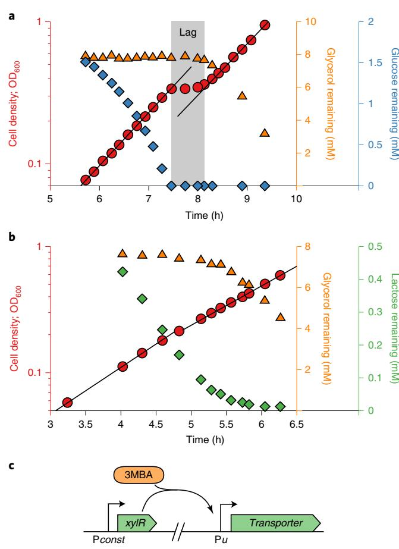

**Fig. 1 | Diauxie and the titratable LacY or PtsG strains. a**, Diauxic growth of *E. coli* (NCM3722) grown on glycerol and glucose. The growth curve (OD600 versus time) is shown together with the measured concentrations of glycerol and glucose remaining in the medium. Two growth phases are separated by a lag time of about 40 min (grey shading). Black lines are exponential fits. Glucose is consumed during the first growth phase but glycerol is not. The lag phase starts when the glucose is depleted; it ends when glycerol consumption begins. **b**, As in **a** but with lactose instead of glucose. No clear lag phase is observed despite the two distinct growth phases. The slight consumption of glycerol in the first phase is due to the low starting concentration of lactose (relative to the Michaelis constant of the lactose transporter), which is necessary for diauxic growth; no glycerol is utilized when the lactose concentrations are sufficiently high (see Extended Data Fig. 1g,h). In **a** and **b**, the preference of *E. coli* for glucose and lactose over glycerol is clearly demonstrated; however, the growth curve in **b** does not exhibit the signature diauxic lag phase. This illustrates that the relation between hierarchical utilization and diauxic growth is not one-to-one and depends on the specifics of the system. The respective y axes are colour-coded to match the data points. **c**, Illustration of the genetic constructs used to titrate the expression of substrate-uptake (transporter) enzymes. Transporters are expressed from the inducible P*u* promoter. This promoter is activated by the XylR transcriptional activator expressed from a constitutive promoter (P*const*) and its activity is modulated by varying the amount of inducer 3MBA in the medium. See Supplementary Fig. 1a–c and Supplementary Table 1 for details.

the cellular response to the depletion of the preferred substrate to be studied in batch cultures under balanced exponential growth. Because maintaining fixed low substrate concentrations during exponential growth is difficult, we used *E. coli* strains in which the expression of a substrate-uptake system—and hence the uptake flux of that substrate—can be controlled by varying the concentration of an inducer (3-methylbenzyl alcohol, 3MBA) in the growth medium (Fig. [1c](#page-1-0))[16.](#page-8-12) Thus, we mimicked the reduced uptake flux of the preferred substrate when it runs out, while keeping its actual concentration at saturating levels. We employed three such strains (NQ917, NQ1243 and NQ399; see Supplementary Fig. 1), in which the expression of LacY, PtsG and GlpF/GlpK—the uptake systems for lactose, glucose and glycerol—can be finely titrated.

*A tight growth-rate crossover.* We first studied the growth of the titratable LacY strain (NQ917) using minimal medium with glycerol, lactose or both and with various concentrations of 3MBA (Fig. [2a](#page-2-0)). The growth rate on medium containing both substrates was similar to that on glycerol-only medium at low 3MBA concentrations (low LacY expression), whereas it was similar to that on lactose-only medium at high 3MBA concentrations (high LacY expression). A tight crossover between these regimes occurred at a 3MBA concentration ([3MBA])≈100μM and growth rate of 0.7–0.8h−1 , near the intersection of the pink circles and the orange triangles (indicated with a red arrow). Remarkably, the growth rate never dipped below that on glycerol only (approximately 0.7h−1 ). A very similar behaviour was found using the titratable PtsG strain (NQ1243) with glucose instead of lactose (Fig. [2b](#page-2-0)) and, importantly, for many other substrate combinations (see Extended Data Fig. 2).

*A threshold separates hierarchical and simultaneous utilization.* We measured the uptake of glycerol and lactose (in the presence of both) at various 3MBA levels to elucidate the growth-rate crossovers (Fig. [2c)](#page-2-0). For lactose uptake above a threshold (dashed horizontal line at *j*th≈25ℂ, where the flux unit ℂ is defined as 1 mM of carbon atoms per optical density (OD)600 per hour, no glycerol was taken up. But when it fell below the threshold, the cells supplemented it with glycerol. The threshold occurred at approximately [3MBA]≈100μM (vertical dashed line), corresponding to the occurrence of the growth-rate crossovers shown in Fig. [2a,b.](#page-2-0) Using single-cell measurements, we ruled out that this supplementation effect arises from population heterogeneity (Supplementary Fig. 2).

Strikingly, the glycerol uptake throughout the supplementation regime adapted such that the total carbon-uptake flux (Fig. [2c)](#page-2-0) remained approximately constant at a level corresponding to that of growth on glycerol alone (23±1ℂ, the error represents the 95% confidence interval; *n*=11 independent measurements) despite a threefold change in lactose uptake. The same pattern was observed for the titratable PtsG strain (NQ1243), with a remarkably similar threshold value th≈25ℂ (Fig. [2d](#page-2-0)). The diauxic lag vanishes at this point because glycerol and glucose are co-utilized in the supplementation regime (see Extended Data Fig. 3).

*A threshold-linear 'flux relation' as a hallmark of hierarchical utilization.* A nearly threshold-linear relation was observed when glycerol uptake was plotted against lactose (Fig. [2e)](#page-2-0) or glucose uptake (Fig. [2f](#page-2-0)). This flux relation reveals the transition from a supplementation regime (a straight line with a slope of approximately −1) to a hierarchical regime (no glycerol uptake) if the uptake of the preferred substrate exceeds the threshold of th≈25ℂ. This flux relation is more revealing than the diauxic lag, which was exhibited only under carefully chosen conditions (Fig. [1a,b,](#page-1-0) Extended Data Fig. 1 and Supplementary Fig. 3).

**Regulation of glycerol uptake.** To elucidate the features of hierarchical utilization described in Fig. [2](#page-2-0), we turned to the regulation of glycerol uptake. The catabolism of glycerol has been studied in detail[15](#page-8-11) (Fig. [3a](#page-3-0) and Supplementary Fig. 4). The assimilation of glycerol into glycolysis requires two reactions, catalysed by kinase GlpK and dehydrogenase GlpD, which are both transcriptionally repressed by the specific repressor Glp[R17](#page-8-13),[18](#page-8-14) and activated by cAMP–Crp. Repression by GlpR is relieved by the inducer *sn*-glycerol-3-phosphate (G3P),

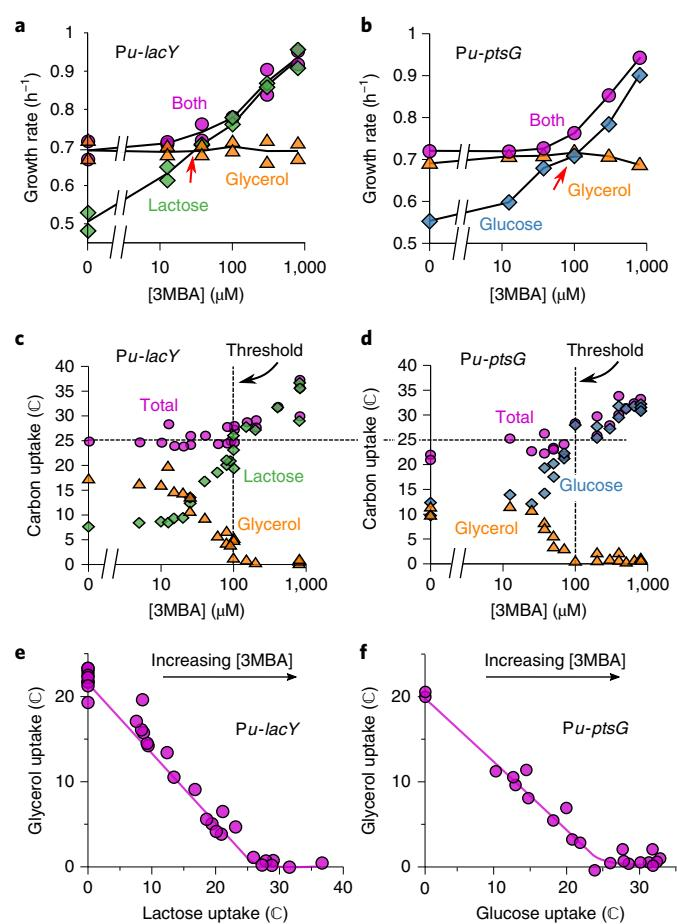

**Fig. 2 | Uptake fluxes reveal hierarchical and simultaneous utilization regimes. a**, Growth rates for the titratable LacY strain (NQ917)—grown on lactose, glycerol or both—at various concentrations of 3MBA. The results from two independent experiments are shown for each condition to demonstrate the reproducibility of the data. **b**, Growth rates for the titratable PtsG strain (NQ1243) under conditions similar to **a**, but with glucose instead of lactose. Other substrate combinations show similar patterns; see Extended Data Fig. 2. **c**, Lactose and glycerol uptake (expressed in the unit ℂ, see main text) by the titratable LacY strain (NQ917) at various concentrations of 3MBA. Glycerol is also consumed if the lactose uptake is below a threshold of about 25 ℂ (horizontal dashed line). In this regime (left of the dashed vertical line), the total carbon uptake stays approximately constant despite a threefold change in lactose uptake. See Supplementary Fig. 2. **d**, As in **c** but for the titratable PtsG strain (NQ1243) and with glucose instead of lactose. The onset of glycerol utilization occurred at a strikingly similar threshold of approximately 25 ℂ. **e**, Plotting glycerol versus lactose uptake (the flux relation) with increasing concentrations of 3MBA of the titratable LacY strain reveals a thresholdlinear relation (the solid line provides a guide to the eye). **f**, As in **e** but for the titratable PtsG strain with glucose instead of lactose. The flux relation is remarkably similar to that observed in **e**.

which is the product of GlpK and the substrate of GlpD. GlpK is allosterically inhibited by FBP, an intermediate of glycolysi[s19](#page-8-15) (the phosphotransferase system enzyme EIIAGlc is also known to inhibit GlpK allosterically but this interaction has little or no effect on glycerol uptake during glucose–glycerol diauxi[e20;](#page-8-16) the data presented below support this).

*Onset of glycerol uptake is due to GlpR derepression following abrupt increase of its inducer G3P.* To establish whether the abrupt onset

in glycerol uptake at the threshold (Fig. [2c,d](#page-2-0)) is tied to the expression of the GlpK and GlpD enzymes, we measured the expression of the LacZ reporter from the *glpFK* (strain HE305) and *glpD* (strain HE397) promoters in titratable PtsG strains. During growth on glucose+glycerol with various 3MBA concentrations, the LacZ expression from both promoters sharply increased when the 3MBA concentration was reduced below the threshold of 100µM (Fig. [3b,c](#page-3-0)). The abrupt onset of expression resulted from the relief of repression by GlpR, because this behaviour is abolished in the *ΔglpR* mutant strains (HE308 and HE398; Fig. [3b,c)](#page-3-0). Consistent with this, the flux relation of the *ΔglpR* strain (NQ958) shows a more gradual transition to glycerol consumption (Fig. [3d)](#page-3-0).

The relief of repression by GlpR is due to an abrupt rise of the inducer G3P, as determined by mass spectrometry (see Methods); the G3P pool in the titratable LacY strain (NQ917) grown on lactose+glycerol increased abruptly when the 3MBA level was reduced below the threshold of 100 µM (Fig. [3e)](#page-3-0).

The tight coupling between the onset of glycerol uptake and the relief of GlpR-dependent repression suggests that the lactose/ glucose flux inhibits glycerol uptake by affecting the G3P pool. We therefore questioned whether the remaining regulators, FBP and cAMP–Crp, could transmit information on the lactose/glucose flux to the G3P pool.

*FBP senses upper-glycolytic flux and directly inhibits glycerol uptake.* A recent study reported that the intracellular FBP pool increases linearly with the glycolytic flux and hence called FBP a glycolytic flux senso[r21](#page-8-17). To verify this, we measured the intracellular FBP pool in the titratable LacY strain (NQ917) grown on lactose alone and on lactose+glycerol, with various 3MBA concentrations. The FBP pool increased consistently with the lactose-uptake flux (Fig. [4a)](#page-4-0) but not with the total glycolytic flux (including the glycerol flux; Fig. [4b)](#page-4-0) across all conditions. This indicates that the FBP pool is sensitive to the flux through upper glycolysis (that is, to substrates entering glycolysis upstream of FBP) rather than to the total glycolytic flux (including substrates entering downstream). As FBP is known to inhibit GlpK activit[y19](#page-8-15) (Fig. [3a](#page-3-0) and Supplementary Fig. 4) and hence the synthesis of G3P, it can transmit information about the upperglycolytic flux to the G3P pool.

*cAMP–Crp senses the total carbon-uptake flux and sharply affects the G3P pool.* Recent studies reported that, under the variation of carbon sources and uptake rates, the transcriptional activation by cAMP–Crp is a decreasing function of the growth rate; in particular, the expression levels of many catabolic genes regulated by cAMP– Crp decrease linearly with the growth rate[14](#page-8-10)[,16,](#page-8-12)[22](#page-8-18). We verified that this linear relation (called the 'C-line'[16)](#page-8-12) also applies under the growth conditions of this study (Fig. [4c](#page-4-0)). Because the growth rate correlates strongly with the total carbon-uptake rate (Supplementary Fig. 5a,b), this also implies that cAMP–Crp can be considered a sensor of the total carbon-uptake flux.

The transcription of the two operons containing the glycerol degradation pathway is activated by cAMP–Crp (Supplementary Fig. 4). We studied a titratable LacY strain carrying the *ΔglpR glpK22* double mutations to test whether cAMP–Crp signalling also affects the intracellular G3P pool. In this strain, the *glpK22* mutation renders GlpK insensitive to allosteric inhibition by EIIAGlc and FBP[19](#page-8-15)[,23,](#page-8-19) and the *glpR* deletion removes specific repression by GlpR so that GlpK and GlpD activity is controlled by cAMP–Crp only (Fig. [3a](#page-3-0) and Supplementary Fig. 4). The intracellular G3P pool responded sharply to changes in the growth rate when this strain was grown on lactose+glycerol with a range of 3MBA concentrations (Fig. [4d,](#page-4-0) purple squares), demonstrating that cAMP–Crp signalling affected the G3P pool. Such an increase was not observed for growth on lactose alone (Fig. [4d,](#page-4-0) green squares), ruling out effects due to conversion of other internal metabolites to G3P. The response differed

## Articles **NATurE MiCroBiology**

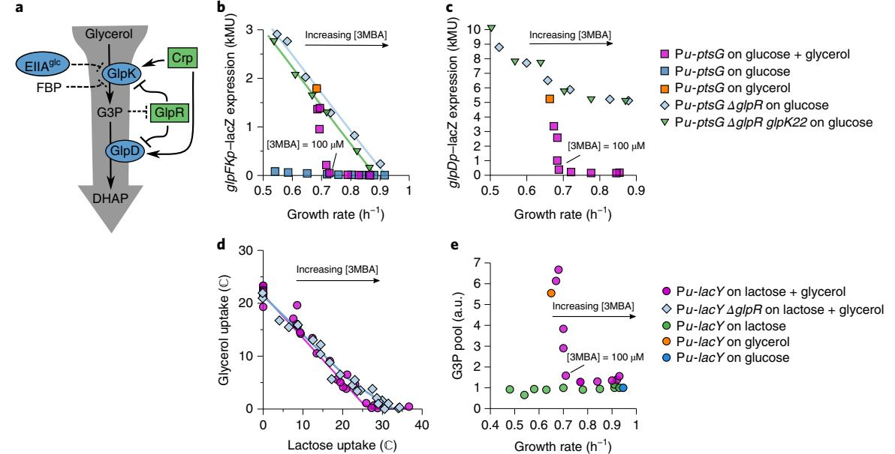

**Fig. 3 | Glycerol uptake involves derepression of glycerol catabolic genes. a**, Known regulation of glycerol uptake under aerobic conditions. The blue ovals represent enzymes and the green rectangles represent transcriptional regulators. Dashed lines indicate allosteric inhibitio[n18](#page-8-14)[,19](#page-8-15)[,49](#page-8-21). See Supplementary Fig. 4 for more details. **b**, LacZ reporter expression from the *glpFK* promoter versus growth rate in titratable PtsG strains (HE305 and mutants thereof) with varying 3MBA levels. Expression fell abruptly in the presence of glucose + glycerol when the growth rate exceeded that on glycerol alone. In contrast, the expression followed a straight line (a C-line[16](#page-8-12)) in the *ΔglpR* and *ΔglpR glpK22* backgrounds. The regression lines are shown. Adjusted coefficient of determination (*R*2 adj*:* I ) = 0.98, *n*= 6 conditions, *t*= 17.6, degrees of freedom (d.f.) = 4 and two-sided *P*= 6.1 × 10−5 for the *ΔglpR* strain; *R*2 adj*:* I = 0.99, *n*= 6 conditions, *t*= 46.0, d.f. = 4 and two-sided *P*= 1.3 × 10−6 for the *ΔglpR glpK22* strain. Little expression was observed on glucose alone. **c**, As in **b** except that the expression from the *glpD* promoter was measured (strain HE397 and mutants thereof). Expression was again abruptly turned off in the presence of glucose + glycerol if the growth rate exceeded that on glycerol alone. However, reporter expression in the *ΔglpR* and *ΔglpR glpK22* backgrounds responded more moderately and displayed a high background level. The key to the right of **c** also applies to **b**. **d**, Comparison between the flux relations of the *ΔglpR* (NQ958) and *glpR*+ (NQ917) strains in the titratable LacY background. The threshold-linear shape is less prominent in *ΔglpR* than in *glpR*+. Solid lines have been drawn in to guide the eye. **e**, Intracellular G3P pool versus growth rate in the titratable LacY strain (NQ917) grown on lactose + glycerol with various 3MBA concentrations, lactose alone with various 3MBA concentrations, glycerol alone without 3MBA and glucose alone without 3MBA. The measurements for each mass-spectrometry run were normalized to the growth on lactose alone with [3MBA] = 800 μM. In the presence of lactose + glycerol, the G3P pool abruptly drops if the growth rate exceeds that on glycerol alone. The key to the right of **e** also applies to **d**.

markedly from that of the *glpR*+ *glpK*+ strain, where the G3P pool fell to the basal level as soon as the growth rate exceeded the threshold of 0.7h−1 (Fig. [3e)](#page-3-0). This confirms that GlpR and/or allosteric inhibition by FBP are necessary for strict inhibition at the threshold.

Because the synthesis and turnover of G3P are dictated by GlpK and GlpD, the G3P level is affected by the ratio of GlpK to GlpD. Given that their genes, *glpK* and *glpD*, reside in different operons, the effect of cAMP–Crp signalling on the G3P pool could be due to a difference in its effect on the expression of these operons (Extended Data Fig. 4). Indeed, the reporter expression from the *glpK* promoter follows a C-line in the *ΔglpR* and *ΔglpR glpK22* strains, in which the expression of *glpD* and *glpK* is controlled by cAMP–Crp only, whereas reporter expression from the *glpD* promoter does not (compare light blue diamonds in Fig. [3b,c](#page-3-0)). This demonstrates that differential regulation of the two operons by cAMP–Crp affects the ratio of GlpK and GlpD expression and thus transmits information on the total carbon uptake to the G3P pool, hence affecting glycerol uptake.

**Analysis and quantitative molecular model.** *The total-flux feedback strategy.* Above, we observed that glycerol uptake: (1) responds nearly identically to lactose and glucose uptake, (2) is completely inhibited if the lactose or glucose flux exceeds a threshold th and (3) is supplemented if the lactose or glucose flux is below th, such that the total carbon-uptake flux is approximately constant and the growth rate is near the growth rate on glycerol alone.

In theory, these observations can be implemented by a simple scheme, which we term the total-flux feedback strategy (Extended Data Fig. 5). It is characterized by a single negative-feedback loop: glycerol uptake is inhibited by a signal that represents the total carbonuptake flux, including glycerol uptake itself. Observations (1)–(3) are attained generically, provided the response of glycerol uptake to the total-flux sensor is sensitive enough and has its response threshold th tuned slightly above the uptake flux on glycerol alone, G,0. In the actual system, cAMP–Crp could implement the total-flux feedback strategy. The required sensitive response of glycerol uptake to cAMP–Crp can be achieved by the differential regulation of *glpK* and *glpD* by GlpR (see Supplementary Discussion D).

*Distinguishing glycolytic and gluconeogenic carbon fluxes.* Although the total-flux feedback strategy alone can produce the hierarchical and supplementation regimes, it cannot explain the observed simultaneous utilization of gluconeogenic substrates with other substrate[s14](#page-8-10) because a total-flux sensor does not distinguish between glycolytic and gluconeogenic substrates. Specifically, cAMP–Crp signalling is known to respond equally to glycolytic and gluconeogenic substrates (Supplementary Fig. 5e)[14.](#page-8-10)

However, the situation changes if FBP is added to the scheme. The FBP pool is much lower during growth on gluconeogenic substrates than during growth on glycolytic substrates[24.](#page-8-20) Glycolytic and gluconeogenic substrates could therefore be distinguished if the inhibitory effect of FBP on GlpK activity is necessary for the

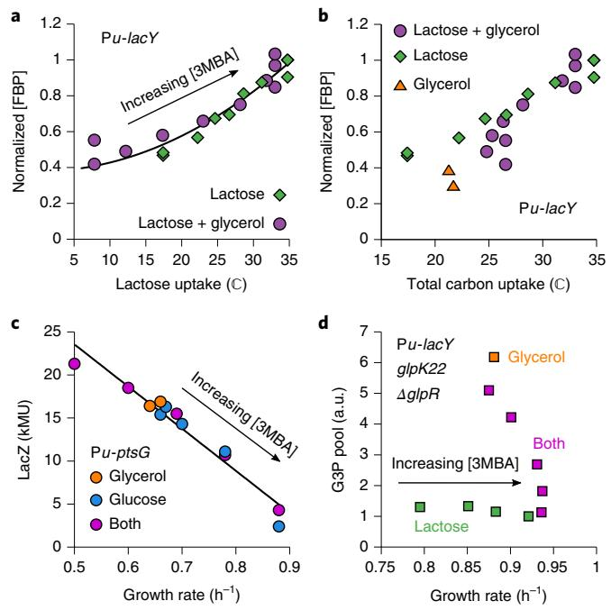

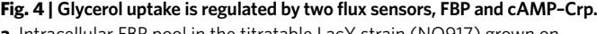

**a**, Intracellular FBP pool in the titratable LacY strain (NQ917) grown on lactose + glycerol or lactose alone plotted against the lactose-uptake flux. The results of each run of mass spectrometry were normalized to the result on lactose alone with [3MBA] = 800 μM. The black line is a quadratic fit (*y*=*a*+*bx*2 , *R*2 adj*:* I = 0.93, *n*= 22 experimental conditions, *t*= 16.7, d.f. = 20 and two-sided *P*= 3 × 10−13). The FBP pool can be considered a function of the lactose-uptake flux alone. **b**, As in **a** but with total carbon flux on the *x* axis. The FBP pool cannot be considered a function of the total carbonuptake flux because the three datasets do not collapse. **c**, Levels of LacZ expression of the native *lac* promoter in the titratable PtsG strain (NQ1243) grown on glucose, glycerol or both glucose and glycerol at various 3MBA concentrations plotted against the growth rate. The expression of LacZ serves a proxy for the activity of cAMP–Crp, as isopropyl-β-d-1 thiogalactopyranoside (1 mM) was added to remove repression by LacI. The black line is a linear regression (*R*2 adj*:* I = 0.94, *n*= 12 experimental conditions, *t*= 13, d.f. = 10 and two-sided *P*= 1.3 × 10−7 ). The data collapse on a single trend line (a C-lin[e16)](#page-8-12), thereby demonstrating that activation by cAMP–Crp can be considered a function of the growth rate or the total carbon-uptake flux. **d**, G3P pool in the titratable LacY strain with the *ΔglpR glpK22* mutations (NQ1187). When grown on lactose + glycerol with varying amounts of 3MBA, the G3P pool responds sharply to changes in the growth rate. This demonstrates that cAMP–Crp signalling affects the G3P levels, as the *ΔglpR glpK22* mutations remove GlpR repression and allosteric inhibition by FBP.

inhibition of glycerol uptake (in addition to cAMP–Crp signalling). Consistent with this, a strain carrying the *glpK*G184T mutation (NQ959), which renders GlpK insensitive to inhibition by FB[P25,](#page-8-22) lost the hierarchical utilization of glycerol with lactose, instead showing a strikingly linear flux relation (Fig. [5a](#page-5-0)). We note that the *glpK22* mutation—which renders GlpK insensitive to inhibition by both EIIAGlc and FB[P23](#page-8-19)—resulted in a similar linear flux relation (Fig. [5a](#page-5-0)), thereby confirming that EIIAGlc plays a minor role.

*Quantitative molecular model of the regulation of glycerol consumption.* We constructed a mathematical model to verify that specific repression by GlpR, allosteric inhibition of GlpK by the upper-glycolytic flux sensor FBP and total-flux feedback through differential regulation by cAMP–Crp can together account for all experimental observations in Figs. [1](#page-1-0)–[4](#page-4-0) (see the Supplementary Discussion). For a single set of physiologically reasonable parameters (Supplementary Table 3; see Supplementary Fig. 6 for a parameter sensitivity analysis), the model reproduces the threshold-linear flux relation of Fig. [2e](#page-2-0) as well as the flux relations of the *ΔglpR*, *glpK22* and *ΔglpR glpK22* strains (see Fig. [5b](#page-5-0)). Moreover, the model predicts the flux relation of the *ΔglpR glpK22* strain to be linear (see Supplementary Discussion B), as observed for the titratable LacY strain in Fig. [5a](#page-5-0) and the titratable PtsG strain in Extended Data Fig. 6a. With the same parameters, the model also reproduces (Extended Data Fig. 6) the salient features of the growth-rate crossover seen in Fig. [2a,b,](#page-2-0) the G3P pool as a function of the growth rate presented in Figs. [3e](#page-3-0) and [4d,](#page-4-0) and the response of the levels of *glpK* and *glpD* expression as a function of the growth rate shown in Fig. [3b,c](#page-3-0).

*Simultaneous utilization of glycolytic and gluconeogenic substrates.* The model can also predict the growth rate on glycerol plus a second substrate (See Supplementary Discussion F and Extended Data Fig. 7a). The utilization is dictated by the threshold-linear flux relation when the second substrate is glycolytic (Fig. [2e,f)](#page-2-0), which implies two regimes: (1) if the second substrate provides an uptake flux (and hence growth rate) larger than that on glycerol alone, glycerol consumption is fully inhibited so that the predicted growth rate is simply the growth rate on the second substrate alone and (2) if the substrate provides an uptake flux (and hence growth rate) smaller than that on glycerol alone, glycerol consumption is supplemented so that the growth rate is approximately the growth rate on glycerol alone. In contrast, if the second substrate is gluconeogenic, the allosteric inhibition of GlpK by FBP is minimal, the substrates are coutilized and the resulting growth rate should be higher than on each of the individual substrates. Note that these predictions do not rely on any details of the model and are completely immune to uncertainty in the model parameters.

To test this, we grew wild-type cells on glycerol plus one of a variety of other substrates. Figure [5c](#page-5-0) plots the measured growth rate on two substrates against that on the second substrate alone. The results are consistent with the model prediction (grey band) for second substrates that are processed (at least partly) by the upperglycolytic pathway. In contrast, adding a gluconeogenic substrate consistently yields a higher growth than on either substrate alone. We conclude that the joint regulation by FBP and cAMP–Crp limits the hierarchical utilization of glycerol to combinations with carbon substrates that are assimilated into the upper-glycolytic pathway.

Remarkably, a very similar utilization pattern was observed for cells grown on xylose or fucose plus a variety of second substrates (Extended Data Fig. 7b,c), suggesting that the regulation strategy of glycerol uptake is not an exception (see Discussion).

### **Discussion**

**Flux-based regulation underlies transitions between hierarchical and simultaneous utilization of glycolytic substrates.** In this study, we investigated the regulatory strategies underlying the utilization of multiple carbon substrates. Titratable uptake systems allowed us to control the uptake rate of a preferred substrate (lactose or glucose) in the presence of a less-preferred one (glycerol) under balanced exponential growth. Glycerol uptake was completely suppressed if the lactose- or glucose-uptake flux exceeded that on glycerol alone. Otherwise, glycerol uptake was curbed such that the total carbon-uptake flux was maintained near the flux obtained on glycerol alone (Fig. [2c,d)](#page-2-0). This pattern was reflected by the thresholdlinear shape of the flux relation (Fig. [2e,f)](#page-2-0) and readily accounts for known differences between batch and continuous cultures: hierarchical utilization dominates in batch cultures where substrate concentrations and, hence, uptake rates are high, whereas simultaneous utilization dominates in continuous cultures, where the substrate concentrations and, hence, uptake rates are low.

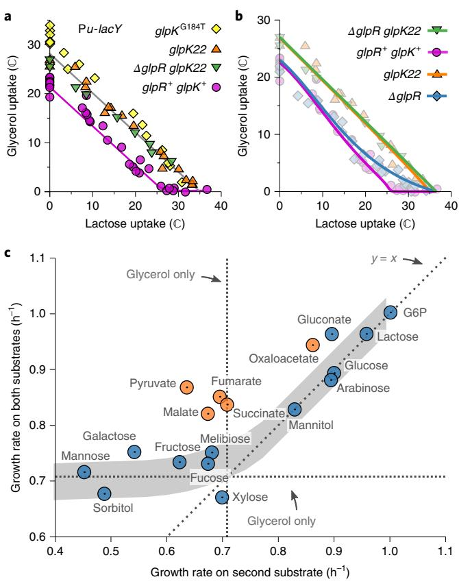

**Fig. 5 | Analysis, modelling and predictions. a**, Comparison between the flux relations of strains harbouring the *glpK*G184T mutation (NQ959), *glpK22* mutation (NQ1186) or the *ΔglpR glpK*22 double mutation (NQ1187) and the wild-type *glpK* (NQ917; *glpR*+ *glpK*+) in the titratable LacY background. The threshold-linear shape is lost in the mutant strains and the flux relation is nearly linear (*R*2 adj*:* I = 0.97, *n*= 18 conditions, *t*= 22.6, d.f. = 16 and *P*= 1 × 10−13 for *glpK*G184T; *R*2 adj*:* I = 0.98, *n*= 18 conditions, *t*= 29.7, d.f. = 16 and *P*= 2 × 10−15 for *glpK22*; *R*2 adj*:* I = 0.99, *n*= 8 conditions, *t*= 27.8, d.f. = 6 and *P*= 1 × 10−7 for *ΔglpR glpK*22). Lines have been drawn in to guide the eye. **b**, Model fits of the flux relations for various strains (solid lines) together with the corresponding measurements (background symbols). A single set of parameter values (given in Supplementary Table 3) fit the data of all strains (*R*2 adj*:* I = 0.98, standard error of the regression (*S*) = 1.3 ℂ and *n*= 84 experimental conditions). The same model and parameters also reproduce the G3P measurements and expression data (see Extended Data Fig. 6). **c**, Growth rate of wild-type (WT) cells (NCM3722) in the presence of glycerol plus one of several 'second' substrates versus the growth rate on the second substrate only. The mean of *n*= 2–4 independent replicates (see Source Data) has been plotted. Horizontal and vertical dashed lines indicate the growth rate on glycerol only. If the second carbon substrate is processed by upper glycolysis (blue circles), the model predicts hierarchical utilization (grey band; the width indicates the estimated standard error of the prediction, assuming an independent error in the predicted uptake of each substrate of *S*= 1.3 ℂ, as in **b**; fit quality: *R*2 adj*:* I = 0.90, *S*= 0.04 h−1 and *n*= 13 independent measurements). The growth rate on both substrates is therefore approximately the larger of the two single-substrate growth rates. In contrast, the growth rate on both substrates is larger than on either substrate alone (*n*= 5 cases; *t*= 9.26; d.f. = 4; *P*= 8 × 10−4, two-sided paired *t*-test) if the second substrate is gluconeogenic (orange circles), thus reflecting simultaneous utilization. A similar trend is seen if xylose or fucose are used instead of glycerol (Extended Data Fig. 7b,c). G6P, glucose 6-phosphate.

Flux-based regulation can be efficient because it allows many carbon substrates (glucose, lactose and so on) to inhibit the uptake of another substrate (glycerol) through a single regulatory system.

## Articles **NATurE MiCroBiology**

As such, it could be used to efficiently establish a hierarchy among a collection of substrates (see Supplementary Fig. 7). We saw that many pairs of carbon substrates showed a growth-rate crossover similar to those involving glycerol (Extended Data Fig. 2) and that the growth rates on xylose or fucose plus a second substrate exhibit the same pattern as observed for glycerol (Extended Data Fig. 7b,c). This suggests that a flux-based mechanism may be employed in the uptake of substrates other than glycerol, although it is unknown whether FBP or another upper-glycolytic flux sensor (for example, EIIAGlc)[26](#page-8-23) is involved in those cases. It also justifies the ad hoc rule used in a previous wor[k27](#page-8-24) modelling the kinetics of growth transitions, where a threshold in the total carbon uptake was assumed to control the uptake of less preferred carbon source.

We previously published a very simple model that predicts the growth rate of *E. coli* grown on one glycolytic and one gluconeogenic substrate[14](#page-8-10). Supplementary Fig. 8 illustrates the relationship between that model and the one presented here. The mechanistic models developed here are based on knowledge of the biological processes. As such, in addition to successfully reproducing complex biological phenomena, the models shed light on the mechanistic origins of these responses.

**Total-flux feedback is enabled by the differential regulation of two operons.** We established that cAMP–Crp causes sharp changes in the pool of inducer G3P (Fig. [4d)](#page-4-0) through differential regulation of *glpK* and *glpD*. This differential regulation is easily implemented because these enzymes are encoded on different operons. Strikingly, the uptake systems of many other carbon substrates show the same operon organization, that is, separate operons for the enzymes upstream and downstream of the specific inducer, each regulated by cAMP–Crp and a specific repressor. Supplementary Fig. 9 illustrates several examples. It is thus possible that the strategy of totalflux feedback through differential regulation is also implemented in these uptake systems.

In addition, if the placement of *glpK* and *glpD* in different operons is physiologically important, one would expect it to be preserved in the *E. coli* pangenome and in related species. An analysis of the EcoCyc database (v.23.0) confirmed this[28.](#page-8-25) This database returned 300 genomes that contain an ortholog of *glpD* and belong to the order of Enterobacteriales (of these, 228 are *E. coli* strains, 38 are other Enterobacteriacea and 34 are Enterobacteriales outside of the Enterobacteriacea). In all of these, *glpK* and *glpD* are in different operons. A similar analysis for the xylose- and fucose-uptake systems (Extended Data Fig. 7b,c) again yielded no exceptions within the Enteriobacteriales: the enzymes *xylA* and *xylB* (downstream of inducer d-xylose) are never combined with *xylE*, *xylF*, *xylG* or *xylH* (upstream), and *fucA* (downstream of inducer l-fucose-1-phosphate) is never combined with *fucP*, *fucI*, *fucK* or *fucU* (upstream).

In contrast, the famous *lac* system is encoded on a single operon. However, it is noteworthy that the *lac* system has several exceptional features. First, both our strain (NCM3722) and the strain originally studied by Monod (ML308[)1](#page-8-0)[,2](#page-8-1) grow faster on lactose than on glucose[16](#page-8-12)[,29](#page-8-26), but glucose is nevertheless preferred. Thus, cells growing on lactose and glucose cannot possibly follow the growth-rate crossover shown in Fig. [2a,b.](#page-2-0) Second, the inducer of the *lac* system, allolactose, is synthesized and degraded by the same enzyme LacZ, which rules out differential regulation. These features suggest that the *lac* system is an exception to the rule described here.

**Physiological rationalization of hierarchical and simultaneous utilization.** Recent studies suggest that simultaneous utilization of glycolytic and gluconeogenic substrates is advantageous, allowing cells to save resources that would otherwise be used to express enzymes necessary to connect the upper and the lower parts of carbon catabolism[30](#page-8-27)–[32](#page-8-28). Our study shows that *E. coli* uses the upperglycolytic sensor FBP as a cue to discriminate between glycolytic or

gluconeogenic substrates and to choose hierarchical or simultaneous utilization accordingly.

Future experiments similar to those presented here, for these and other substrates, will provide information on how widely the strategy employing flux sensors is used. Characterization of such strategies for different microorganisms in a community will reveal a detailed map of who consumes what in what order. It may also open up rational synthetic biology approaches to manipulate the order of substrate hierarchy—for example, the efficient breakdown of cellulose for biofuel productio[n33](#page-8-29)[–35](#page-8-30).

### **Methods**

**Reagents and** *E. coli* **strains.** Isopropyl-β-d-1-thiogalactopyranoside was purchased from Bio Basic Inc. Tetrabuthylammoniumhydrogensulfate (TBAS) was purchased from Waters Corp. Adenosyne 5′-triphosphate, *o*-nitrophenylβ-galactoside, 4-amino-antipyrine, *N*-ethyl-*N*-(3-sulfopropyl)-*m*-anisidine, chloroacetaldehyde, G3P oxidase from *Aerococcus viridans*, horseradish peroxidase, glycerol kinase from *Cellulomonas* sp. and β-galactosidase from *E. coli* were purchased from Sigma-Aldrich. Restriction enzymes were purchased from New England Biolabs.

All of the *E. coli* strains and oligonucleotides used are described in Supplementary Tables 1 and 2, respectively. Unless stated otherwise, all strains were derived from the prototrophic *E. coli* K-12 strain NCM3722 (ref. [36)](#page-8-31). For details on reagents and strain construction, see Extended Experimental Procedures.

**Growth conditions.** Unless stated otherwise, the nitrogen- and carbon-free minimal-medium base was N−C−, as described previously[37](#page-8-32). Ammonium chloride (20mM) was used as a nitrogen source. All growth experiments were conducted at 37 °C under vigorous shaking at 250 r.p.m. in a water-bath shaker. For the growth-rate and diauxie measurements, each carbon substrate was supplied at the carbon-atom concentration of 120mM, unless stated otherwise. For measurements of uptake fluxes, the concentrations of the carbon substrates were adjusted at each 3MBA concentration such that they were sufficiently high to achieve balanced exponential growth but low enough to obtain sufficient resolution for the uptake measurements (see Source Data). The absorbance (OD600) was measured with a Genesys 20 (Thermoscientific) spectrophotometer. With the lot number of this spectrophotometer used for this study, one OD600×ml is equivalent to 0.44mg of dry weigh[t38](#page-8-33).

**Strain construction.** *Transfer of glpK mutations to the NCM3722 background.* Te *glpK* point mutations *glpK22* and *glpK*G184T were moved from one strain to another as follows. A kanamycin-sensitive parental strain was frst transduced with P1*vir* phage prepared from JW3887-1 (Δ*pfA775*::*kan*). Te kanamycinresistant *pfA* transductant cannot grow on minimal agar plates supplemented with 20mM mannitol as the sole carbon substrat[e39](#page-8-34). Te *pfA* transductant was further transduced with P1*vir* phage prepared from the *glpK* mutant strain and selected on the minimal agar plate supplemented with 20mM mannitol as the sole carbon substrate. As *pfA* and *glpK* are genetically linked, the *glpK* mutant allele frequently replaces the wild-type *glpK* in Mtl+ (*pfA*+) transductants. Te Mtl+ KanS transductant carrying the *glpK* allele of interest was selected by DNA sequencing of the region surrounding the mutation.

*PLtetO-1-xylR.* The PLtetO-1–*xylR* allele was made as follows. The *xylR* gen[e40](#page-8-35) was cloned as a *KpnI*–*BamHI* fragment on pKD13-*rrnBt*:PLtet-O1 (ref. [41)](#page-8-36). The resulting plasmid was used as a template to insert a tandem array of the *kan* gene, *rrnB* terminator and PLtetO-1:*xylR* between *ycaC* and *ycaD* (*zca* locus) and between *intS* and *yfdG* (*zfd* locus) using the primer sets ycaD-P1-S1 and ycaD-P4-A1, and intC-P1-S1 and intC-P4-A1, respectively. P1*vir* phages were prepared from these strains and used to transduce NCM3722. Using these phages, NQ914 and NQ915 were created by one and two cycles, respectively, of transduction and the flip-out of the *kan* gene.

*Pu-ptsG.* The Δ*ptsG468*::Φ(*kan*:P*u*) allele, in which the *ptsG* promoter is replaced by the P*u* promoter, was made as follows. The region containing the *kan* gene and P*u* promoter was PCR amplified using the primers SDY158 and SDY159 from NQ381 (ref. [16](#page-8-12)) and integrated at the *ptsG* locus, resulting in the replacement of 342 bases before the open reading frame with a tandem array of the *kan* gene and P*u* promoter (*zah* locus) using the λ Red syste[m42](#page-8-37), which results in the replacement of the *ptsG* promoter with the P*u* promoter.

*glpFp–gfp.* NQ1344 was made as follows. The plasmid pKD13-*rrnBt*:PLtet-O1:*gfp* was made by inserting the *gfpmut3b* structural gene immediately downstream of the PLtetO-1 promoter in pKD13-*rrnBt*:PLtet-O1 (ref. [41)](#page-8-36). The PLtetO-1 in the plasmid pKD13-*rrnBt*:PLtet-O1:*gfp* was replaced by an *XhoI*–*KpnI* fragment containing the *glpF* promoter, which was amplified from NCM3722 using the primers PglpF-XhoI-S2 and PglpF-KpnI-A4. The resulting plasmid pKD13-*rrnBt*:*glpFp*:*gfp* was used to produce a donor DNA fragment. The host strain was made by flipping out the *kan* gene from the strain carrying a tandem array of the *kan* gene, *rrnB*

terminator, *glnK* promoter, 5′ untranslated region from the PLtetO-1 promoter and the structural gene of *gfpmut3b* between *intS* and *yfdG* (*zfd* locus)[43,](#page-8-38) and transforming the flipped-out strain with pKD46 for λ-Red recombinatio[n43](#page-8-38). This strain was transformed with the donor DNA fragment, which was amplified using the primers intC-P1-S1 and gfp-Ptet-PglpF-A1, using pKD13-*rrnBt*:*glpFp*:*gfp* as a template. The resulting strain carries a tandem array between *intS* and *yfdG* consisting of the *kan* gene, *rrnB* terminator, *glpF* promoter spanning −246 to −1, 5′ untranslated region from the PLtetO-1 promoter and the structural gene of *gfpmut3b*. P1*vir* phage was prepared from this strain and used to transduce the strain made by flipping out the *kan* gene flipped out from NQ916.

*glpFp–lacZ and glpDp–lacZ.* The *glpFp–lacZ* reporter strain HE305 was made by transducing NQ1332, a strain made by flipping out of the *kan* gene from NQ1243, with P1*vir* phage containing a tandem array of the *kan* gene, the *rrnB* terminator and the *glpF* promoter spanning −273 to −1bp relative to the *glpF* translational start site[16](#page-8-12).

The *glpDp–lacZ* reporter strain HE397 was made as follows. The PLtetO-1 in the plasmid pKD13-*rrnBt*:PLtet-O1 was replaced with an *XhoI*–*KpnI* fragment containing the *glpD* promoter, which was amplified from NCM3722 using the primers PH008 and PH009. The resulting plasmid pKD13-*rrnBt*:*glpDp* was used to produce a DNA donor as follows. First, a DNA fragment was amplified using PH019 and PH020, using pKD13-*rrnBt*:*glpDp* as a template. This fragment was further amplified using the primers PH025 and PH026 to produce the DNA donor. The host strain NQ309 was transformed with the donor DNA fragment to replace a part of the *lacI* gene and the entire *lac* promoter (from +134bp after the *lacI* translational start codon to the *lacZ* translational start codon) with a tandem array of the *kan* gene, the *rrnB* terminator and the *glpD* promoter spanning −292 to −1bp relative to the *glpD* translational start site. P1*vir* phage was prepared from this strain and used to transduce NQ1332 to obtain HE397.

**Measurements of glucose, lactose and glycerol uptake.** A fraction of an exponentially growing culture was collected and kept on ice for <0.5h. The incubation on ice caused a decrease in the concentration of each carbon substrate by only 2–3%. After the sample was centrifuged at 16,110*g* for 1min, the supernatant was removed, frozen on dry ice and kept at −80 °C. Typically, four samples were taken at an OD600 of between 0.15 and 0.60.

Glucose was assayed enzymatically using a commercially available kit (Glucose assay kit, GAHK20; Sigma-Aldrich). For the lactose assay, the samples were first digested with β-galactosidase in Z buffer at 37 °C for 20min and the released glucose was measured using the glucose assay described earlier. As a control, the sample was treated in the same way without β-galactosidase. Little glucose was detected in the control. Glycerol was measured essentially as described in ref. [44](#page-8-39). The assay was performed by adding 7.5μl sample to 225μl reaction mixture containing 50mM MOPS (pH7.0), 0.75mM ATP, 3.75mM MgSO4, 0.188mM 4-aminoantipyrine, 2.11mM *N*-ethyl-*N*-(3-sulfopropyl)-*m*-anisidine sodium salt, 2.5Uml−1 glycerol phosphate oxidase and 2.5Uml−1 peroxidase with or without 1.25Uml−1 glycerol kinase. After incubation at room temperature for 30–60min, the A540 was measured and converted to the glycerol concentration based on standards.

The carbon-uptake rate was calculated as the slope of the carbon concentration versus the OD600 multiplied by the specific growth rate.

**G3P pool measurements by enzymatic assay.** The G3P pools reported in Fig. [4d](#page-4-0) were measured as follows. The NQ1187 culture was grown to an OD600 of 0.5, the cells were harvested by filtration of 2.5ml culture through a membrane filter (25mm-disc with 0.45-μm pore size, HAWP02500; Millipore) pre-wetted with warmed culture medium, and washed with 2.5ml of warmed culture medium. The filter was quickly immersed in 4ml extraction solution (40% (v/v) methanol, 40% (v/v) acetonitrile and 20% (v/v) water) pre-cooled at −20 °C, and incubated at −20 °C for 2h. The extract was dried in a vacuum concentrator and stored at −80 °C. The samples were dissolved in 170 µl phosphate-buffered saline (D1408; Sigma-Aldrich) immediately before the assay. The G3P was assayed enzymatically using a commercially available kit (Amplite fluorimetric glycerol 3-phosphate assay kit; cat. no. 13827, AAT Bioquest).

**Measurements of intracellular metabolites by mass spectrometry.** The G3P and FBP pools reported in Figs. [3e](#page-3-0) and [4a,b](#page-4-0) were measured as follows. Cultivations were performed in M9 minimal media in 96-deep-well plates as described previousl[y24.](#page-8-20) The cells were harvested during the mid-exponential phase (OD600=0.5) by fast filtration, using 1ml culture as described previousl[y24,](#page-8-20) and the filter was quickly immersed in 4ml extraction solution (40% (v/v) methanol, 40% (v/v) acetonitrile and 20% (v/v) water) pre-cooled to −20 °C and incubated at −20 °C for 2h. The samples were completely dried at 120μbar (Christ RVC 2–33 CD centrifuge and Christ Alpha 2–4 CD freeze dryer) and stored at −80 °C until measurements. Before measurements, the samples were resuspended in 100µl water, centrifuged for 5min (5,000*g*, 4 °C) to remove residual particles, diluted 1:10 in water and transferred to v-bottomed 96-well sample plates (Thermo Fisher Scientific). The samples were measured by flow-injection time-of-flight mass spectrometry using an Agilent 6550 QToF instrument operated in negative

Articles **NATurE MiCroBiology**

ionization mode at 4GHz high-resolution in a range of 50–1,000m/*z* as described previously[45.](#page-8-40) Sample processing and ion annotation was performed based on accurate mass within 0.001Da using the KEGG eco databas[e46](#page-8-41) as a reference and accounting for single deprotonated forms of the respective metabolite (M–H+) as described previousl[y46](#page-8-41).

The total- and lactose-uptake rates used to plot (Fig. [4a,b](#page-4-0)) against the FBP pools were estimated from the relationship between ℂ and the 3MBA concentrations (Fig. [2c)](#page-2-0). The lactose-uptake rates above 12.5μM 3MBA on lactose+glycerol and lactose alone were estimated as −0.495×ln[[3MBA]]3+6.326×ln[[3MBA]]2−18.745×ln[[3MBA]]+23.499 and 0.252×ln[[3MBA]]3−3.446×ln[[3MBA]]2+18.452×ln[[3MBA]]−9.881, respectively, where [3MBA] is in the unit of μM. The glycerol uptake rates on lactose+glycerol below and above 100μM 3MBA were estimated as 34.091−6.679×ln[[3MBA]] and 0, respectively, where [3MBA] is in the unit of μM. When estimating uptake rates at 0μM 3MBA, we used 10μM (instead of 0μM) in the natural logarithm.

**Single-cell analysis of GFP expression from the** *glpF* **promoter.** Cultures of strain NQ1344, carrying a chromosomal *glpFp–gfp* reporter gene together with the titratable LacY system, were grown on N−C− medium supplemented with 20mM NH4Cl, 3mM (Supplementary Fig. 2a,c–l) or 10mM (Supplementary Fig. 2b,n) lactose and 4mM (Supplementary Fig. 2c–e) or 8mM (Supplementary Fig. 2f–k,n) glycerol. At OD600=0.5, a fraction of the culture was removed and kept on ice until images were taken. Green-fluorescent-protein (GFP) fluorescence and phasecontrast images were acquired by a Clara charge-coupled device camera (Andor; Supplementary Fig. 2c–l) or QImaging Retiga 2000R MONO (Teledyne QImaging; Supplementary Fig. 2n) connected to an Eclipse Ti inverted microscopic system (Nikon Inc.) under the control of NIS Elements software (Nikon Inc.).

The images were analysed using the open-source platform software Fij[i47](#page-8-42) as follows. Individual cells were identified as the region of interest on a phase-contrast image with an appropriate threshold set. To minimize the number of misidentified cells, the gate for the cell size was set with the ratio of the maximum to minimum cell size set to four and the remaining misidentified cells were manually removed. The regions of interest obtained on a phase-contrast image in this manner were overlaid on the corresponding GFP fluorescence image and the mean intensity of each region of interest was measured. For series A (see Supplementary Fig. 2), the background fluorescence was subtracted from the signal and used to normalize the intensities. For series B, no background was subtracted; instead, the fluorescence level of cells grown on lactose only with 500μM 3MBA was measured to determine the fluorescence level of cells with minimal *glpFp* expression.

**Glycerol kinase assay.** Cell extracts were prepared essentially as described befor[e17.](#page-8-13) A 25ml culture was grown exponentially to OD600=0.5. The culture (20ml) was transferred to a tube pre-cooled in ice water and chloramphenicol was added to a final concentration of 40μgml−1 . The cells were harvested by centrifugation at 0 °C, washed with 40ml of 1%NaCl, resuspended in 200μl extraction buffer containing 0.1M MOPS–NaCl (pH7.0), 1mM 2-mercaptoethanol, 1mM EDTA and 2mM glycerol and stored at −80 °C.

Before the assay was performed, the cell suspension was thawed, disrupted four times by sonication on ice water for 5 s at an amplitude of four in low mode in an MSE sonicator, centrifuged at 13,600*g* for 30min at 4 °C and the supernatant was frozen at −80 °C. The GlpK activity was stable for one day at −80 °C.

The cell extract was thawed immediately before the assay and diluted in the extraction buffer. The reaction was started by adding 40μl cell extract to 200μl assay buffer, both of which were pre-incubated at 37 °C for 5min, to obtain final concentrations of 0.1M MOPS–NaOH (pH7.0), 0.167mM 2-mercaptoethanol, 0.167mM EDTA, 2mM glycerol, 2.5mM ATP, 13.5mM MgSO4, 0.188mM 4-aminoantipyrine, 2.11mM *N*-ethyl-*N*-(3-sulfopropyl)-*m*-anisidine, 5Uml−1 glycerol phosphate oxidase and 5Uml−1 peroxidase. The A540 was recorded every 6 s. The assays were repeated with four different dilutions of the cell extract for each cell extract to confirm that the activities were proportional to the concentrations of the cell extracts added to the reaction mixture. The GlpK activity was reported as the A540min−1mg−1 total protein. The total amounts of protein in a cell extract were determined using the Biuret method[48](#page-8-43).

### **cAMP assay.** The concentrations of cAMP in media were assayed as described previously[16.](#page-8-12)

A fraction of an exponentially growing culture was collected and filtered through a 0.22-μm-pore-size nylon-membrane filter and the filtrate was frozen on dry ice and kept at −80 °C. Four samples were taken at OD600 values between 0.15 and 0.60.

The cAMP in the filtrate was ethenylated by incubating 80μl of the filtrate for 30min at 70 °C in the presence of 1.2M chloroacetaldehyde, 25mM Na2HPO4 (pH4.0) and 5mM EDTA in a final volume of 200μl. The reaction mixture was transferred to ice, neutralized with the addition of one-third volume of 0.5M NH4HCO3, filtered through a 0.22-μm-pore-size nylon-membrane filter and analysed by high-performance liquid chromatography. The high-performance liquid chromatography system used was the Shimadzu Prominence HPLC system composed of an LC- 20AB binary pump, SIL-10AF autosampler and RF-10AxL

fluorescence detector as the main modules. The flow rate of the eluent was 1.5mlmin−1 . The eluents used were a TBAS buffer (5.7mM TBAS and 30.5mM KH2PO4, adjusted to pH5.8 with phosphoric acid) and an acetonitrile buffer (acetonitrile:TBAS buffer, 2:1). An aliquot of the sample (70μl) was injected onto an XTerra MS C18 column (3.0×50mm, inner diameter of 3mm and 5μm particle size; Waters Corp.) equipped with its guard column and maintained at 40 °C during separation. The elution was isocratic with 90% TBAS buffer (10% acetonitrile buffer) for 3min after injection, decreased to 50% TBAS buffer in 3 s, remaining isocratic for 1.9min and re-equilibrated with 90% TBAS buffer for 2min. The fluorescence signal was monitored at an excitation wavelength of 280nm and an emission wavelength of 410nm. Ethenylated cAMP typically eluted at between 1.5 and 1.6min.

The cAMP excretion rate was calculated as the slope of the plot of the cAMP concentration in a filtrate versus the OD600 value multiplied by the specific growth rate.

**Statistics and reproducibility.** The data shown in Fig. [1a,b](#page-1-0) are from a single series of experiments.

In Fig. [2,](#page-2-0) each data point derives from a single experiment for all panels. In Fig. [2a,b,](#page-2-0) a complete data series (composed of a total of 18 data points: the growth rates on lactose/glucose, glycerol and both, each at six 3MBA concentrations) was typically obtained through two independent batches of experiments. This two-batch series was repeated in Fig. [2a](#page-2-0) and hence two data series are shown for each carbon substrate. The full dataset in Fig. [2c,e](#page-2-0) was obtained through ten independent batches of growth-rate measurements and sampling, which include replicates of the same or similar culture conditions, seven independent batches of the lactose-uptake measurements and seven independent batches of the glyceroluptake measurements. The full dataset in Fig. [2d,f](#page-2-0) was obtained through four independent batches of growth-rate measurements and sampling, which include replicates of the same or similar culture conditions, five independent batches of lactose-uptake measurements and four independent batches of glycerol-uptake measurements. See Source Data for details.

Each data point derives from a single experiment for all panels in Fig. [3.](#page-3-0) The full dataset in Fig. [3b](#page-3-0) was obtained through six independent batches of growth-rate measurements and sampling and six independent batches of LacZ assays. The full dataset in Fig. [3c](#page-3-0) was obtained through four independent batches of growth-rate measurements and sampling, and four independent batches of LacZ assays. The full dataset in Fig. [3d](#page-3-0) was obtained through eight independent batches of growthrate measurements and sampling, which include replicates of the same or similar culture conditions, seven independent batches of lactose-uptake measurements and seven independent batches of glycerol-uptake measurements. The full dataset in Fig. [3e](#page-3-0) was obtained through three independent series of growthrate measurements and sampling, which include replicates of the same culture conditions and two independent sets of mass-spectrometry experiments. See Source Data for details.

Each data point in Fig. [4](#page-4-0) represents a single experiment in all panels. The full dataset in Fig. [4a,b](#page-4-0) was obtained through three independent batches of growthrate measurements and sampling, which include replicates of the same culture conditions and two independent sets of mass-spectrometry experiments. The full datasets in Fig. [4c,d](#page-4-0) were obtained through two independent batches of sampling and a single batch of measurements. See Source Data for details.

Each data point in Fig. [5a](#page-5-0) represents a single experiment and the full datasets for *glpKG184T*, *glpK22* and *ΔglpR glpK22* were obtained through six, six and three independent batches of growth-rate measurements and sampling, respectively (which include replicates of the same or similar culture conditions); five, four and one independent batches of lactose-uptake measurements, respectively, and five, five and one independent batches of glycerol-uptake measurements, respectively. The *x* and *y* values of each data point in Fig. [5c](#page-5-0) represent the average of the growth rates obtained from at least two independent experiments. See Source Data for details.

The growth experiments in Extended Data Fig. 1a,d were repeated twice and similar growth curves were obtained as shown in the Source Data. Each dataset shown in Extended Data Fig. 1b,c,e–h is derived from a single experiment.

Each data point in Extended Data Fig. 2 derives from a single experiment for all panels. A full data series, composed of the growth rates on three carbonsubstrate conditions (first substrate, second substrate and both) at six (Extended Data Fig. 2a–e) or seven (Extended Data Fig. 2i) 3MBA concentrations (18 or 21 data points in total) was typically obtained through two independent batches of experiments. This two-batch series was repeated and hence the two datasets are shown for each carbon substrate in Extended Data Fig. 2a.

Each growth curve in Extended Data Fig. 3 is derived from a single experiment.

Each data point in Extended Data Fig. 6a is derived from a single experiment and the full dataset was obtained through four independent batches of growthrate measurements and sampling, which include replicates of the same or similar culture conditions, four independent batches of the lactose-uptake measurements and four independent batches of the glycerol-uptake measurements. See Source Data for details.

The *x* and *y* values of each data point in Extended Data Fig. 7b,c represent the average of the growth rates obtained from two independent experiments. See Source Data for details.

**Reporting Summary.** Further information on research design is available in the Nature Research Reporting Summary linked to this article.

### **Data availability**

The datasets corresponding to all figures (including the Extended Data and Supplementary figures) are available online as Source Data.

### **Code availability**

Numerical analyses of the mathematical model were carried out using Wolfram Mathematica 11.3, gnuplot and R (v.3.5.1). A Mathematica notebook that reproduces the central modelling results has been shared at [https://doi.org/10.5281/](https://doi.org/10.5281/zenodo.3462129) [zenodo.3462129](https://doi.org/10.5281/zenodo.3462129). Other code will be shared on reasonable request.

Received: 7 September 2018; Accepted: 16 October 2019; Published: xx xx xxxx

### **References**

- 1. Monod, J. *Recherches sur la Croissance des Cultures Bactériennes* (Hermann & Cie., 1942).
- 2. Monod, J. Te phenomenon of enzymatic adaptation—and its bearings on
- problems of genetics and cellular diferentiation. *Growth* **11**, 223–289 (1947). 3. Müller-Hill, B. *Te lac Operon: a Short History of a Genetic Paradigm* (Walter
- de Gruyter, 1996). 4. Deutscher, J., Francke, C. & Postma, P. W. How phosphotransferase system-related protein phosphorylation regulates carbohydrate metabolism in bacteria. *Microbiol. Mol. Biol. Rev.* **70**, 939–1031 (2006).
- 5. Narang, A. & Pilyugin, S. S. Bacterial gene regulation in diauxic and non-diauxic growth. *J. Teor. Biol.* **244**, 326–348 (2007).
- 6. Loomis, W. F. & Magasanik, B. Glucose-lactose diauxie in *Escherichia coli*. *J. Bacteriol.* **93**, 1397–1401 (1967).
- 7. Inada, T., Kimata, K. & Aiba, H. Mechanism responsible for glucose-lactose diauxie in *Escherichia coli*: challenge to the cAMP model. *Genes Cells* **1**, 293–301 (1996).
- 8. Lendenmann, U., Snozzi, M. & Egli, T. Kinetics of the simultaneous utilization of sugar mixtures by *Escherichia coli* in continuous culture. *Appl. Environ. Microbiol.* **62**, 1493–1499 (1996).
- 9. Baidya, T. K. N., Webb, F. C. & Lilly, M. D. Te utilization of mixed sugars in continuous fermentation. I. *Biotechnol. Bioeng.* **9**, 195–204 (1967).
- 10. Harte, M. J. & Webb, F. C. Utilisation of mixed sugars in continuous fermentation. II. *Biotechnol. Bioeng.* **9**, 205–221 (1967).
- 11. Harder, W. & Dijkhuizen, L. Strategies of mixed substrate utilization in microorganisms. *Philos. Trans. R. Soc. Lond. B Biol. Sci.* **297**, 459–480 (1982).
- 12. Wanner, U. & Egli, T. Dynamics of microbial growth and cell composition in batch culture. *FEMS Microbiol. Rev.* **6**, 19–43 (1990).
- 13. Egli, T., Lendenmann, U. & Snozzi, M. Kinetics of microbial growth with mixtures of carbon sources. *Antonie Van Leeuwenhoek* **63**, 289–298 (1993).
- 14. Hermsen, R., Okano, H., You, C., Werner, N. & Hwa, T. A growth-rate composition formula for the growth of *E. coli* on co-utilized carbon substrates. *Mol. Syst. Biol.* **11**, 801 (2015).
- 15. Lin, E. C. Glycerol dissimilation and its regulation in bacteria. *Annu. Rev. Microbiol.* **30**, 535–578 (1976).
- 16. You, C. et al. Coordination of bacterial proteome with metabolism by cyclic AMP signalling. *Nature* **500**, 301–306 (2013).
- 17. Koch, J. P., Hayashi, S. & Lin, E. C. Te control of dissimilation of glycerol and l-α-glycerophosphate in *Escherichia coli*. *J. Biol. Chem.* **239**, 3106–3108 (1964).
- 18. Weissenborn, D. L., Wittekindt, N. & Larson, T. J. Structure and regulation of the *glpFK* operon encoding glycerol difusion facilitator and glycerol kinase of *Escherichia coli* K-12. *J. Biol. Chem.* **267**, 6122–6131 (1992).
- 19. Zwaig, N. & Lin, E. C. Feedback inhibition of glycerol kinase, a catabolic enzyme in *Escherichia coli*. *Science* **153**, 755–757 (1966).
- 20. Holtman, C. K., Pawlyk, A. C., Meadow, N. D. & Pettigrew, D. W. Reverse genetics of *Escherichia coli* glycerol kinase allosteric regulation and glucose control of glycerol utilization in vivo. *J. Bacteriol.* **183**, 3336–3344 (2001).
- 21. Kochanowski, K. et al. Functioning of a metabolic fux sensor in *Escherichia coli*. *Proc. Natl Acad. Sci. USA* **110**, 1130–1135 (2013).
- 22. Hui, S. et al. Quantitative proteomic analysis reveals a simple strategy of global resource allocation in bacteria. *Mol. Syst. Biol.* **11**, 784 (2015).
- 23. Pettigrew, D. W., Liu, W. Z., Holmes, C., Meadow, N. D. & Roseman, S. A single amino acid change in *Escherichia coli* glycerol kinase abolishes glucose control of glycerol utilization in vivo. *J. Bacteriol.* **178**, 2846–2852 (1996).
- 24. Kochanowski, K. et al. Few regulatory metabolites coordinate expression of central metabolic genes in *Escherichia coli*. *Mol. Syst. Biol.* **13**, 903 (2017).
- 25. Applebee, M. K., Joyce, A. R., Conrad, T. M., Pettigrew, D. W. & Palsson, B. Functional and metabolic efects of adaptive glycerol kinase (GLPK) mutants in *Escherichia coli*. *J. Biol. Chem.* **286**, 23150–23159 (2011).
- 26. Bettenbrock, K. et al. Correlation between growth rates, EIIACrr phosphorylation, and intracellular cyclic AMP levels in *Escherichia coli* K-12. *J. Bacteriol.* **189**, 6891–6900 (2007).
- 27. Erickson, D. W. et al. A global resource allocation strategy governs growth transition kinetics of *Escherichia coli*. *Nature* **551**, 119–123 (2017).
- 28. Keseler, I. M. et al. Te EcoCyc database: refecting new knowledge about *Escherichia coli* K-12. *Nucleic Acids Res.* **45**, D543–D550 (2017).
- 29. Mandelstam, J. Te repression of constitutive beta-galactosidase in Escherichia coli by glucose and other carbon sources. *Biochem. J.* **82**, 489–493 (1962).
- 30. Müller, S., Regensburger, G. & Steuer, R. Enzyme allocation problems in kinetic metabolic networks: optimal solutions are elementary fux modes. *J. Teor. Biol.* **347**, 182–190 (2014).
- 31. Wortel, M. T., Peters, H., Hulshof, J., Teusink, B. & Bruggeman, F. J. Metabolic states with maximal specifc rate carry fux through an elementary fux mode. *FEBS J.* **281**, 1547–1555 (2014).
- 32. Wang, X., Xia, K., Yang, X. & Tang, C. Growth strategy of microbes on mixed carbon sources. *Nat. Commun.* **10**, 1279 (2019).
- 33. Kumar, R., Singh, S. & Singh, O. V. Bioconversion of lignocellulosic biomass: biochemical and molecular perspectives. *J. Ind. Microbiol. Biotechnol.* **35**, 377–391 (2008).
- 34. Kim, J. H., Block, D. E. & Mills, D. A. Simultaneous consumption of pentose and hexose sugars: an optimal microbial phenotype for efcient fermentation of lignocellulosic biomass. *Appl. Microbiol. Biotechnol.* **88**, 1077–1085 (2010).
- 35. Vinuselvi, P., Kim, M. K., Lee, S. K. & Ghim, C. M. Rewiring carbon catabolite repression for microbial cell factory. *BMB Rep.* **45**, 59–70 (2012).
- 36. Soupene, E. et al. Physiological studies of *Escherichia coli* strain MG1655: growth defects and apparent cross-regulation of gene expression. *J. Bacteriol.* **185**, 5611–5626 (2003).
- 37. Csonka, L. N., Ikeda, T. P., Fletcher, S. A. & Kustu, S. Te accumulation of glutamate is necessary for optimal growth of *Salmonella typhimurium* in media of high osmolality but not induction of the proU operon. *J. Bacteriol.* **176**, 6324–6333 (1994).
- 38. Basan, M. et al. Infating bacterial cells by increased protein synthesis. *Mol. Syst. Biol.* **11**, 836 (2015).
- 39. Morrissey, A. T. & Fraenkel, D. G. Suppressor of phosphofructokinase mutations of *Escherichia coli*. *J. Bacteriol.* **112**, 183–187 (1972).
- 40. de Lorenzo, V., Herrero, M., Metzke, M. & Timmis, K. N. An upstream XylR- and IHF-induced nucleoprotein complex regulates the sigma 54-dependent Pu promoter of TOL plasmid. *EMBO J.* **10**, 1159–1167 (1991).
- 41. Klumpp, S., Zhang, Z. & Hwa, T. Growth rate-dependent global efects on gene expression in bacteria. *Cell* **139**, 1366–1375 (2009).
- 42. Datsenko, K. A. & Wanner, B. L. One-step inactivation of chromosomal genes in *Escherichia coli* K-12 using PCR products. *Proc. Natl Acad. Sci. USA* **97**, 6640–6645 (2000).
- 43. Kim, M. et al. Need-based activation of ammonium uptake in *Escherichia coli*. *Mol. Syst. Biol.* **8**, 616 (2012).
- 44. McGowan, M. W., Artiss, J. D., Strandbergh, D. R. & Zak, B. A peroxidasecoupled method for the colorimetric determination of serum triglycerides. *Clin. Chem.* **29**, 538–542 (1983).
- 45. Sévin, D. C. & Sauer, U. Ubiquinone accumulation improves osmotic-stress tolerance in *Escherichia coli*. *Nat. Chem. Biol.* **10**, 266–272 (2014).
- 46. Ogata, H. et al. KEGG: Kyoto Encyclopedia of Genes and Genomes. *Nucleic Acids Res.* **27**, 29–34 (1999).
- 47. Schindelin, J. et al. Fiji: an open-source platform for biological-image analysis. *Nat. Methods* **9**, 676–682 (2012).
- 48. Gornall, A. G., Bardawill, C. J. & David, M. M. Determination of serum proteins by means of the biuret reaction. *J. Biol. Chem.* **177**, 751–766 (1949).
- 49. Saier, M. H. & Roseman, S. Sugar transport. Inducer exclusion and regulation of the melibiose, maltose, glycerol, and lactose transport systems by the phosphoenolpyruvate:sugar phosphotransferase system. *J. Biol. Chem.* **251**, 6606–6615 (1976).
- 50. Sandermann, H. Jr. β-d-Galactoside transport in *Escherichia coli*: substrate recognition. *Eur. J. Biochem.* **80**, 507–515 (1977).
- 51. Stock, J. B., Waygood, E. B., Meadow, N. D., Postma, P. W. & Roseman, S. Sugar transport by the bacterial phosphotransferase system. Te glucose receptors of the *Salmonella typhimurium* phosphotransferase system. *J. Biol. Chem.* **257**, 14543–14552 (1982).
- 52. Misset, O., Blaauw, M., Postma, P. W. & Robillard, G. T. Bacterial phosphoenolpyruvate-dependent phosphotransferase system. Mechanism of the transmembrane sugar translocation and phosphorylation. *Biochemistry* **22**, 6163–6170 (1983).

### **Acknowledgements**

We are grateful to U. Sauer for his generous support and encouragement; T. Egli, L. Gerosa, J. Silverman and the members of the Hwa lab for their helpful discussions; K. Applebee for providing the *glpK*G184T strain; and L. Chao and C. U. Rang for helping with the acquisition of the single-cell GFP images. This research is supported by the National Institutes of Health (grant no. R01GM095903 to T.H.). R.H. was supported by the Dutch Research Council (grant no. VENI 680–47–419). T.H. additionally

acknowledges the hospitality of the Institute for Theoretical Studies at ETH, where some of this work was carried out.

### **Author contributions**

H.O. and T.H. designed the experiments. H.O. performed most of the experiments. K.K. performed the mass spectrometry experiment and its analysis. R.H. performed the quantitative modelling and theoretical analysis. H.O., R.H. and T.H. analysed the data and wrote the paper.

### **Competing interests**

The authors declare no competing interests.

### **Additional information**

**Extended data** is available for this paper at [https://doi.org/10.1038/s41564-019-0610-7.](https://doi.org/10.1038/s41564-019-0610-7) **Supplementary information** is available for this paper at [https://doi.org/10.1038/](https://doi.org/10.1038/s41564-019-0610-7) [s41564-019-0610-7](https://doi.org/10.1038/s41564-019-0610-7).

**Correspondence and requests for materials** should be addressed to H.O. or R.H.

**Reprints and permissions information** is available at [www.nature.com/reprints](http://www.nature.com/reprints). **Publisher's note** Springer Nature remains neutral with regard to jurisdictional claims in published maps and institutional affiliations.

© The Author(s), under exclusive licence to Springer Nature Limited 2019

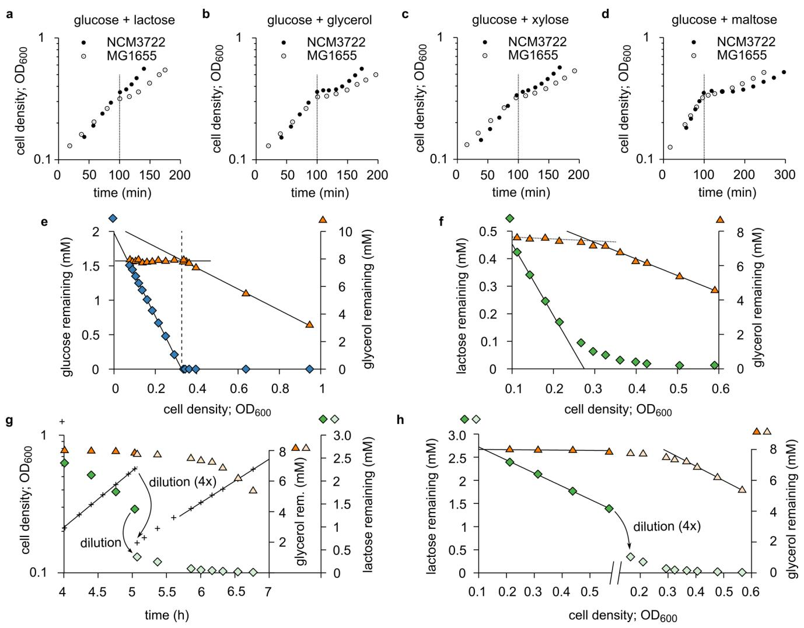

**Extended Data Fig. 1 | Examples of diauxic ('double growth') curves. a–d**. Diauxic growth curve[s1](#page-8-0) on glucose and one additional carbon substrate, for *E. coli* strains NCM3722 (closed circles) and MG1655 (open circles). A diauxic curve consists of two exponential growth phases separated by a lag phase during which the culture hardly grows. (For comparison, all data series are shifted horizontally such that the lag begins at ~100 min.) The duration of the lag phase varies between strains and substrate pairs, from a few minutes (NCM3722 in **a**) to over an hour (NCM3722 in **d**). **e**, Hierarchical growth on glucose plus glycerol. The same data as Fig. [1a](#page-1-0) are now plotted against OD600. The glucose concentration (blue diamonds) initially decreases *linearly* (black solid lines are linear fits): during balanced exponential growth, producing a unit of cell mass consumes a fixed amount of substrate. After glucose runs out, glycerol (orange triangles) is consumed, again linearly. **f**, Similar to **e**, but with lactose (green diamonds) instead of glucose, using the same data as Fig. [1b.](#page-1-0) Here, the transition to glycerol utilization is more gradual than **e**. Lactose uptake slows down before lactose is used up, likely due to the large Michaelis constant of the lactose permeas[e50:](#page-8-44) *K*M = 0.1 to 1 mM. The reduction in lactose uptake relieves the inhibition of glycerol uptake before lactose is fully depleted, resulting in a smooth transition. In contrast, the *K*M of the glucose transporter PtsG[51](#page-8-45)[,52](#page-8-46) is 3–10 μM; therefore, cells do not sense that glucose is running out until the glucose concentration is very low (**e** and Fig. [1a](#page-1-0)). **g**, As Fig. [1b,](#page-1-0) except that a higher initial lactose concentration was used (3 mM instead of 0.7 mM) to fully inhibit glycerol uptake. To observe the transition to glycerol utilization before the culture reaches high OD600, the culture was diluted, at OD600 = 0.5, four-fold in fresh medium containing glycerol (orange diamonds before dilution, pale-orange diamonds after) but no lactose (green triangles before dilution, pale-green triangles after). **h**, Same data as **g**, except that lactose and glycerol concentrations are plotted against OD600, revealing straight lines similar to **e** and **f**.

## Articles **NATurE MiCroBiology**

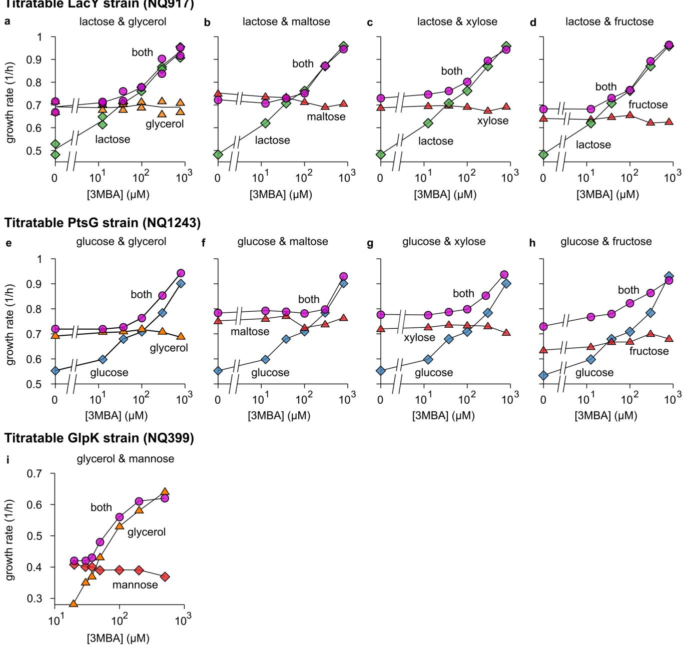

**Extended Data Fig. 2 | Growth-rate crossover patterns for various combinations of substrates. a–d**. The growth rate of the titratable LacY strain (Supplementary Figure 1a) grown on lactose and a second substrate (glycerol, maltose, xylose or fructose) as a function of 3MBA concentration. Each plot shows the measured growth rate on lactose only (green diamonds), the growth rate on the second substrate only (orange or red triangles), and the growth rate in the presence of both (pink circles). **e–h**. As **a–d**, but for the titratable PtsG strain (Supplementary Figure 1b) and glucose (blue diamonds) instead of lactose. **i**, Similar results for the titratable GlpK strain (Supplementary Figure 1c) growing on glycerol (orange triangles), mannose (red diamonds), or both (pink circles). In all cases (**a–i**), if the 3MBA concentration is reduced sufficiently, the growth rate on the preferred carbon substrate eventually becomes smaller than the growth rate on the non-preferred one. Yet, the growth rate in the presence of both substrates never drops below the growth rate on the non-preferred one, indicating that the uptake of the non-preferred substrate is induced. In almost all cases, the crossover regime is rather narrow. The glucose-fructose hierarchy is an apparent exception.

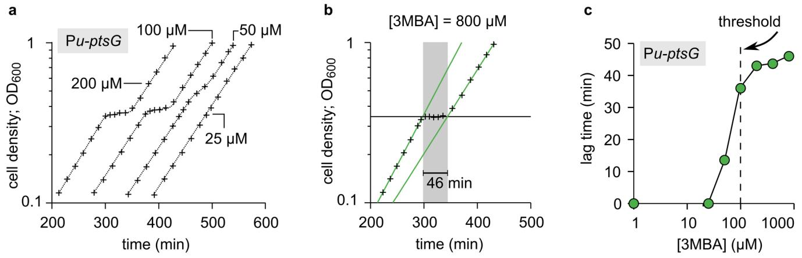

**Extended Data Fig. 3 | The diauxic lag disappears in the supplementation regime. a**, Diauxic growth curves (+) of the titratable PtsG strain (NQ1243) in medium with 1.7 mM glucose and saturating glycerol. Each curve is for a different 3MBA concentration (indicated in the figure) and horizontally shifted for convenience. The data shown is from a single series of experiments. **b**, Lag times were determined for each diauxic growth curve; the method is illustrated here using the condition [3MBA] = 800 µM as an example. We fitted exponential curves through the two growth phases (green lines) and a horizontal line through the lag phase (horizontal black line). The lag time (indicated in grey) is heuristically defined as the horizontal distance between the intersections of the green lines with the horizontal one. In this case, a lag time of 46 min is found. **c**, Lag times of the growth curves versus [3MBA]. The diauxic lag time vanishes precipitously when [3MBA] is tuned below 100 μM, where glycerol and glucose are co-utilized.

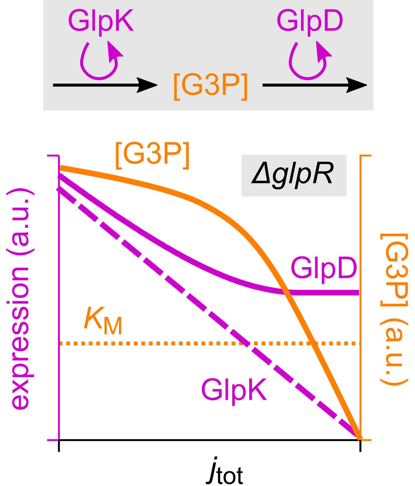

**Extended Data Fig. 4 | See next page for caption.**

**Extended Data Fig. 4 | How differential regulation by cAMP–Crp can affect G3P concentration.** As demonstrated in Fig. [3b,c](#page-3-0) using the *ΔglpR* and *ΔglpR glpK22* background, cAMP–Crp signalling affects the expression of the *glpK* and *glpD* genes differently: with increasing growth rate (decreasing cAMP–Crp transcriptional activation), *glpK* expression vanishes whereas *glpD* expression maintains a significant basal level. The figure illustrates how this differential regulation explains the marked growth-rate dependence of the G3P concentration observed in the *ΔglpR glpK22* background (Fig. [4d)](#page-4-0). G3P is the product of GlpK and the substrate of GlpD. The synthesis of G3P should therefore be proportional with the abundance of GlpK, while its turnover increases with both GlpD abundance and substrate concentration [G3P]. Flux balance then implies that [G3P] increases with the ratio of GlpK (purple dashed line; sketch based on Fig. [3b](#page-3-0)) to GlpD abundance (purple solid line; sketch based on Fig. [3c)](#page-3-0). This ratio reduces with increasing growth rate, so that the G3P concentration (solid orange line; sketch) reduces as well. In strains without the *ΔglpR* mutation the same mechanism should act, but with an additional layer of amplification: Because both *glpK* and *glpD* expression are repressed by GlpR, an increase in its inducer G3P due to differential regulation has little effect until it is of the order of the Michaelis constant *K*M (horizontal dotted line) associated with the induction of GlpR, on which *glpK* and *glpD* expression are induced and glycerol uptake is turned on.

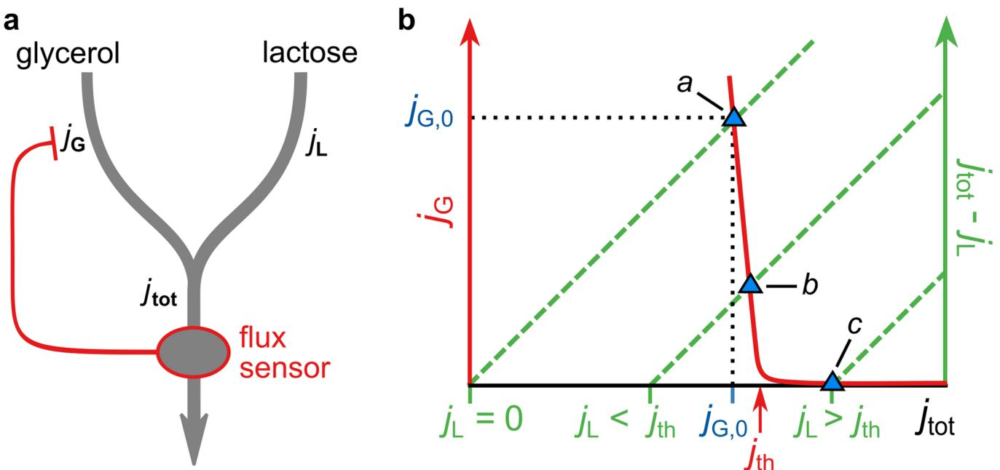

**Extended Data Fig. 5 | The total-flux feedback model. a,** Several key observations can be explained by a highly simplified regulatory scheme in which glycerol uptake is inhibited by a signal that reflects the total carbon-uptake flux—a *total-flux sensor*. In this scheme, glycerol and lactose uptake *j*G and *j*L both contribute to the total carbon- uptake flux *j*tot. This total flux is sensed by a total-flux sensor, which represses glycerol uptake, but only if *j*tot exceeds a threshold that is set to coincide with the carbon flux obtained on glycerol alone. Thus, glycerol uptake is suppressed by any substrate that supplies a larger carbon-uptake flux than glycerol can provide, but not by substrates that produce a smaller flux. **b,** This figure demonstrates graphically how total-flux feedback determines the uptake of glycerol. Because *j*G = *j*tot – *j*L, the steady-state value of *j*G obtained for a given *j*L can be found by plotting both *j*G (*j*tot) (red solid curve) and *j*tot − *j*L (green dashed lines, for various values of *j*L) as a function of *j*tot and determining their intersection (blue triangles). We assume that *j*G responds sensitively to *j*tot, with a threshold *j*th (red arrow) set slightly above the flux on glycerol alone, *j*G,0. Thus, it is seen that glycerol uptake is inhibited if *j*L > *j*th (the hierarchical utilization regime, intersection *c*). Yet, if *j*L < *j*th, glycerol uptake is adjusted such that *j*tot ≈ *j*th ≈ *j*G,0 (the supplementation regime; intersection *a* and *b*). cAMP–Crp signalling can function as a total-flux sensor because transcriptional activation by cAMP–Crp is a decreasing function of *j*tot (Fig. [4c)](#page-4-0)[16](#page-8-12). It transmits information on *j*tot to the glycerol uptake through differential regulation of *glpK* and *glpD* expression (Fig. [3b,c)](#page-3-0).

**Extended Data Fig. 6 | Model predictions.** With a single parameter set, our mathematical model reproduces the main features of various measurements in addition to the flux relations of the various mutants (Fig. [5b)](#page-5-0). **a**, The flux relation of the titratable PtsG strain with the *ΔglpR glpK22* mutations (NQ1264) is linear (Pearson correlation: *R*2 adj I = 0.97, *n* = 13 experimental conditions, *t* = 21, d.f. = 11, = 3 × 10−10), as predicted by the model. The flux relation for the *glpR*+ *glpK*+ strain (NQ1243) is also plotted for comparison. **b**, The growth-rate crossover of the titratable LacY strain. The model predicts that, on lactose only, the growth rate decreases linearly (dashed line) on lactose only as lactose uptake (green area) is reduced. On lactose and glycerol, the growth rate initially follows the same trend (solid line), but below the threshold lactose flux of ≈ 25 ℂ glycerol uptake (orange area) is gradually induced such that the growth rate remains approximately constant. This behaviour underlies the observations in Fig. [2a,c](#page-2-0). (The model makes identical predictions for the titratable PtsG strain.) **c**, The G3P pools. The model predicts that in the titratable LacY strain grown on lactose + glycerol (purple solid line), as the lactose uptake is reduced, the G3P pool remains low until the growth rate approaches that on glycerol only, ≈ 0.7/h; it then sharply increases and converges to the level obtained during growth on glycerol only (orange circle). This closely resembles the measured behaviour in Fig. [3e](#page-3-0) (purple and orange circles). The sensitive response is disrupted in the *ΔglpR glpK22* double mutant (purple dotted line and orange square), in agreement with Fig. [4d](#page-4-0) (purple and orange squares). **d-e**, Expression from *glpF* and *glpD* promoters. If the titratable PstG strain is grown on glucose + glycerol and glucose uptake is reduced, expression levels from both *glpF* and *glpD* promoters are negligible until the growth rate approaches the growth rate on glycerol only, ~0.7/h (purple solid lines in both figures). The sudden onset of expression is completely lost in the *ΔglpR* mutation strain (light blue curves in both figures). This agrees with the measured expression levels in Fig. [3b,c](#page-3-0).

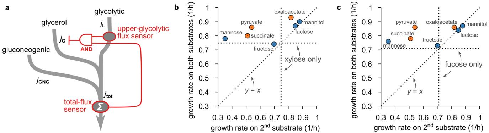

**Extended Data Fig. 7 | a,** This diagram illustrates the difference in the effect of glycolytic and gluconeogenic substrates on glycerol uptake. The uptake and catabolism of glycerol, gluconeogenic substrates and glycolytic substrates are drawn as three pathways (gray arrows) that merge at different places. In the regulation (red lines), two flux-sensors are involved: one (FBP) senses the upper-glycolytic flux *j*L, the other (cAMP-Crp) the total carbon flux *j*tot. Crucially, both flux sensors are required to fully suppress glycerol uptake; this is symbolized in the diagram using the symbol of a logical AND gate. Glycolytic substrates contribute both to the upper-glycolytic flux and the total carbon flux. A sufficiently large glycolytic flux therefore activates both the upper-glycolytic flux sensor AND the total-flux sensor, which together suppress glycerol uptake. In contrast, gluconeogenic substrates do not contribute to the upper-glycolytic flux and will not fully inhibit glycerol uptake even if they provide a large carbon flux. (Through the total-flux sensor cAMP-Crp, gluconeogenic substrates will affect glycerol uptake mildly, but both substrates remain co-utilized.) This difference between glycolytic and gluconeogenic substrates underlies the pattern in Fig. [5c.](#page-5-0) **b,** A pattern similar to Fig. [5c](#page-5-0) is obtained if glycerol is replaced by xylose. Shown here is the growth rate of WT cells (NCM3722) in M9 medium[24](#page-8-20) on xylose plus a second substrate plotted against growth rate with the second substrate only, for a variety of "second" substrates. The growth rate on xylose only is indicated by horizontal and vertical dotted lines. The growth rate on both substrates shows a similar dependence on the "second" substrate species as seen in Fig. [5c](#page-5-0) of the main text: If the second carbon substrate is processed at least partially by upper glycolysis (blue circles) the growth rate is approximately the larger of the two single-substrate growth rates, possibly with an exception for mannose. If on the other hand the second substrate is a gluconeogenic substrate (orange circles) the growth rate on both substrates is usually larger than either of the two single-substrate growth rates. **c,** Same as **b**, but for fucose as the "first" substrate.

Corresponding author(s): Hiroyuki Okano

Last updated by author(s): Oct 4, 2019

### Rutger Hermsen

# Reporting Summary

Nature Research wishes to improve the reproducibility of the work that we publish. This form provides structure for consistency and transparency in reporting. For further information on Nature Research policies, see Authors & Referees and the Editorial Policy Checklist.

## Statistics

|     | For all statistical analyses, confirm that the following items are present in the figure legend, table legend, main text, or Methods section.                                                                                                                 |
|-----|---------------------------------------------------------------------------------------------------------------------------------------------------------------------------------------------------------------------------------------------------------------|
| n/a | Confirmed                                                                                                                                                                                                                                                     |
|     | The exact sample size (n) for each experimental group/condition, given as a discrete number and unit of measurement                                                                                                                                           |
|     | A statement on whether measurements were taken from distinct samples or whether the same sample was measured repeatedly                                                                                                                                       |
|     | The statistical test(s) used AND whether they are one- or two-sided Only common tests should be described solely by name; describe more complex techniques in the Methods section.                                                                         |
|     | A description of all covariates tested                                                                                                                                                                                                                        |
|     | A description of any assumptions or corrections, such as tests of normality and adjustment for multiple comparisons                                                                                                                                           |
|     | A full description of the statistical parameters including central tendency (e.g. means) or other basic estimates (e.g. regression coefficient) AND variation (e.g. standard deviation) or associated estimates of uncertainty (e.g. confidence intervals) |
|     | For null hypothesis testing, the test statistic (e.g. F, t, r) with confidence intervals, effect sizes, degrees of freedom and P value noted Give P values as exact values whenever suitable.                                                              |
|     | For Bayesian analysis, information on the choice of priors and Markov chain Monte Carlo settings                                                                                                                                                              |
|     | For hierarchical and complex designs, identification of the appropriate level for tests and full reporting of outcomes                                                                                                                                        |
|     | Estimates of effect sizes (e.g. Cohen's d, Pearson's r), indicating how they were calculated                                                                                                                                                                  |
|     | Our web collection on statistics for biologists contains articles on many of the points above.                                                                                                                                                                |
|     |                                                                                                                                                                                                                                                               |

## Software and code

| Policy information about availability of computer code |                                                                                                                                                                                                                                                                                                                  |  |  |  |  |  |
|--------------------------------------------------------|------------------------------------------------------------------------------------------------------------------------------------------------------------------------------------------------------------------------------------------------------------------------------------------------------------------|--|--|--|--|--|
| Data collection                                        | No software was used.                                                                                                                                                                                                                                                                                            |  |  |  |  |  |
| Data analysis                                          | Numerical analyses of the mathematical model were carried out using Wolfram Mathematica 11.3, gnuplot, and R (version 3.5.1). A Mathematica notebook that reproduces the central modeling results is shared at: https://doi.org/10.5281/zenodo.3462129. Other code will be shared upon reasonable request. |  |  |  |  |  |
|                                                        | For manuscripts utilizing custom algorithms or software that are central to the research but not yet described in published literature, software must be made available to editors/reviewers.                                                                                                                    |  |  |  |  |  |

For manuscripts utilizing custom algorithms or software that are central to the research but not yet described in published literature, software must be made available to editors/reviewers. We strongly encourage code deposition in a community repository (e.g. GitHub). See the Nature Research guidelines for submitting code & software for further information.

## Data

Policy information about availability of data

All manuscripts must include a data availability statement. This statement should provide the following information, where applicable: - Accession codes, unique identifiers, or web links for publicly available datasets

- A list of figures that have associated raw data
- A description of any restrictions on data availability

All datasets shown in figures are available in Source Data files.

# Field-specific reporting

Please select the one below that is the best fit for your research. If you are not sure, read the appropriate sections before making your selection.

Life sciences Behavioural & social sciences Ecological, evolutionary & environmental sciences

For a reference copy of the document with all sections, see nature.com/documents/nr-reporting-summary-flat.pdf

# Life sciences study design

All studies must disclose on these points even when the disclosure is negative. Sample size The sample sizes were chosen such that quantitative relations between the measured two variables were clearly observed and discriminated from those in other conditions. Data exclusions No data were excluded. Replication Details for each plot are included in the Statistics and Reproducibility section. For many measurements, we provide independent replicates. When replicates were generated, they are plotted as separate data points, unless it is explicitly stated that their averages are reported. Some of our data concern the relations between two variables under variation of a single parameter (i.e. inducer concentrations). In those cases, we sometimes performed independent experiments in which the parameter values were very similar to those of earlier data points but not exactly the same. Even though these experiments are not exact replicates, the fact that a consistent trend is observed among these independent approximate replicates does indicate their reproducibility. See Statistics and Replicates and also Source Data for details. Randomization This is not relevant to this study because our data are grouped only under clear categories such as genotypes, nutrients etc. Blinding This is not relevant to this study because our data are grouped only under clear categories such as genotypes, nutrients etc.

# Reporting for specific materials, systems and methods

We require information from authors about some types of materials, experimental systems and methods used in many studies. Here, indicate whether each material, system or method listed is relevant to your study. If you are not sure if a list item applies to your research, read the appropriate section before selecting a response.

## Materials & experimental systems n/a Involved in the study Antibodies Eukaryotic cell lines Palaeontology Animals and other organisms Human research participants Clinical data

|  | Methods |  |
|--|---------|--|
|  |         |  |

| n/a | Involved in the study  |  |  |
|-----|------------------------|--|--|
|     | ChIP-seq               |  |  |
|     | Flow cytometry         |  |  |
|     | MRI-based neuroimaging |  |  |