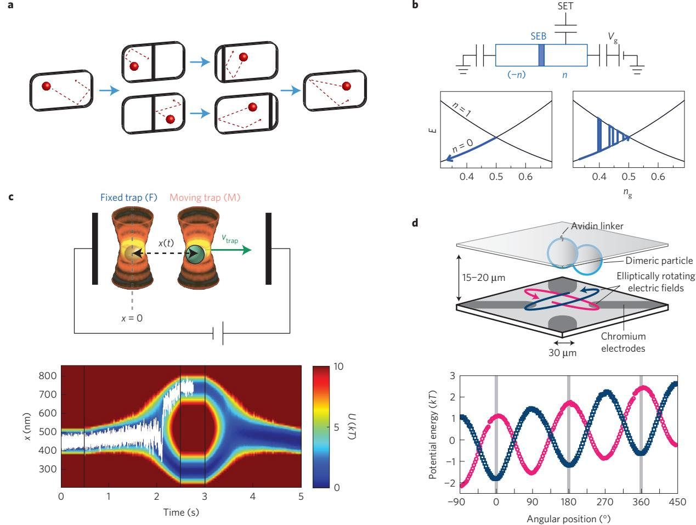
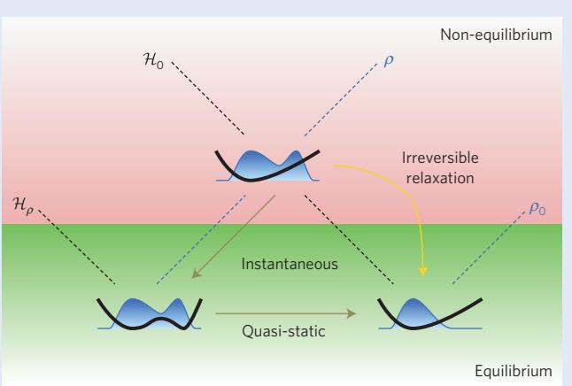
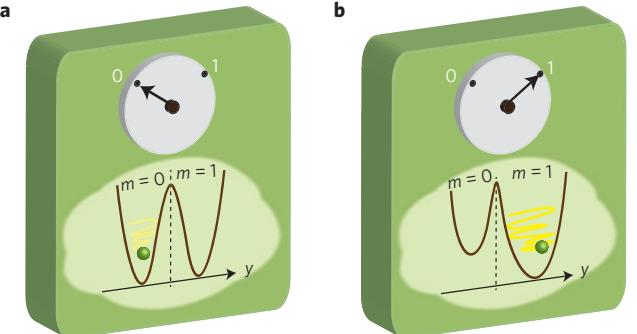
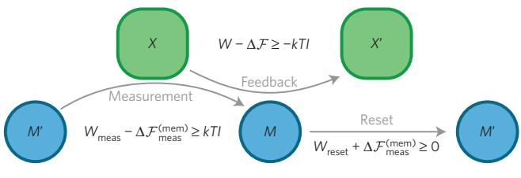

# **Thermodynamics of information**

**Juan M. R. Parrondo1 *, Jordan M. Horowitz2 and Takahiro Sagawa3**

**By its very nature, the second law of thermodynamics is probabilistic, in that its formulation requires a probabilistic description of the state of a system. This raises questions about the objectivity of the second law: does it depend, for example, on what we know about the system? For over a century, much eort has been devoted to incorporating information into thermodynamics and assessing the entropic and energetic costs of manipulating information. More recently, this historically theoretical pursuit has become relevant in practical situations where information is manipulated at small scales, such as in molecular and cell biology, artificial nano-devices or quantum computation. Here we give an introduction to a novel theoretical framework for the thermodynamics of information based on stochastic thermodynamics and fluctuation theorems, review some recent experimental results, and present an overview of the state of the art in the field.**

S oon after the discovery of the second law of thermodynamics, James Clerk Maxwell illustrated the probabilistic nature of the law with a gedanken experiment, now known as Maxwell's demon[1,](#page-6-0)[2](#page-6-1). He argued that if an intelligent being—a demon—had information about the velocities and positions of the particles in a gas, then that demon could transfer the fast, hot particles from a cold reservoir to a hot one, in apparent violation of the second law[1](#page-6-0)[,2](#page-6-1) .

Maxwell's demon revealed the relationship between entropy and information for the first time—demonstrating that, by using information, one can relax the restrictions imposed by the second law on the energy exchanged between a system and its surroundings. But formulations of the second law attributed to Rudolf Clausius, Lord Kelvin and Max Planck[3](#page-6-2) make no mention of information. Reconciling these two pictures involves two separate tasks. First, we must refine the second law to incorporate information explicitly. And second, we must clarify the physical nature of information, so that it enters the second law not as an abstraction, but as a physical entity. In this way, information manipulations such as measurement, erasure, copying and feedback can be thought of as physical operations with thermodynamic costs.

The first task was partially accomplished by Léo Szilárd, who devised a stylized version of Maxwell's demon. Szilárd's demon exploits one bit of information (the outcome of an unbiased yes/no measurement) to implement a cyclic process that extracts kT ln2 of energy as work from a thermal reservoir at temperature T, where k is Boltzmann's constant[4](#page-6-3) . This suggests a quantitative relationship between the information used by the demon and the extractable work from a single thermal reservoir.

Efforts to address the second task have been many and varied[1](#page-6-0)[,2](#page-6-1) . Léon Brillouin quantified the cost of measurement in some specific situations; Marian Smoluchowski[5](#page-6-4) and Richard Feynman[6](#page-6-5) demonstrated that fluctuations prevent apparent second-law violations in autonomous demons; and Rolf Landauer, Charles Bennett and Oliver Penrose[7](#page-6-6) proved that measurements can be realized at zero entropy production—albeit at an energetic cost for measurement erasure[1](#page-6-0) . Bennett subsequently explored several thermodynamic aspects of information processing[8](#page-6-7) , including compression, algorithmic complexity, logical reversibility and proofreading.

Despite this long history of information in thermodynamics, the past decade has seen significant progress due to the application of fluctuation theorems[9](#page-6-8)[,10](#page-6-9) and stochastic thermodynamics[11,](#page-6-10)[12](#page-6-11). They have provided a general framework for the thermodynamics of information that clarifies and generalizes previous results. In parallel with this theoretical progress, technological advances have led to new experimental techniques for manipulating small fluctuating systems. As a result, the thought experiments of the past, such as Maxwell's demon and Szilárd's engine, are now being realized in the laboratory[13](#page-6-12)[,14](#page-6-13), allowing the verification of several fundamental predictions regarding information operations[15,](#page-6-14)[16](#page-7-0) .

Our aim in this article is to complement the existing review literature[1](#page-6-0)[,2,](#page-6-1)[11](#page-6-10)[,12,](#page-6-11)[17](#page-7-1)[–19](#page-7-2) by presenting an updated overview of the recent developments and experiments, as well as to provide a basic introduction to the main ideas and theoretical tools used to analyse the thermodynamics of information systems. After reviewing the Szilárd engine, we will discuss how information can be incorporated into a refined statement of the second law, and then continue by analysing physical realizations of memories and information processing.

### **The Szilárd engine**

Historically, much of the research on the thermodynamics of information has focused on the cyclic engine introduced by Szilárd in 1929 (ref. [4)](#page-6-3). In Szilárd's original formulation, the engine's working substance is a single-molecule gas in a box of volume V0 (Fig. [1a](#page-1-0)), immersed in a thermal reservoir at temperature T, and manipulated by an external agent or demon. The demon initiates a cycle by first rapidly inserting a partition into the middle of the box, splitting it in half. The demon then measures on which side the molecule is trapped and carries out a reversible expansion from volume V0/2 to V0 to extract work Wext = kT ln 2. The cycle is completed by removing the partition. The net effect is the extraction of energy from a single thermal reservoir in a cyclic process, in apparent contradiction to Planck's statement of the second law.

Some aspects of the Szilárd engine seem obscure at first: the molecule does not exert a smoothly varying pressure, but imparts kicks of random intensity, calling into question the applicability of the ideal gas law in the calculation of the work. The role of the measurement is also not clear, as it seems that the pressure itself could reveal the molecule's location. Careful analyses have clarified these issues[1](#page-6-0) . Moreover, any system that undergoes a phase-space splitting could be used as a 'working substance'[20](#page-7-3) . For example, the Szilárd engine has been recently realized in the

1Departamento de Física Atómica, Molecular y Nuclear and GISC, Universidad Complutense de Madrid, 28040, Madrid, Spain. 2Department of Physics, University of Massachusetts at Boston, Boston, Massachusetts 02125, USA. 3Department of Basic Science, The University of Tokyo, Tokyo 153-8902, Japan. *e-mail: [parrondo@fis.ucm.es](mailto:parrondo@fis.ucm.es)

# REVIEW ARTICLES | INSIGHT **NATURE PHYSICS DOI: [10.1038/NPHYS3230](http://www.nature.com/doifinder/10.1038/nphys3230)**

**Figure 1 | The Szilárd engine and recent experimental realizations. a**, In the original Szilárd engine, a partition is inserted into a box containing a single molecule and surrounded by a thermal reservoir at temperature *T*. The half of the box containing the molecule is measured and the partition is moved performing an isothermal expansion extracting work. **b**, Experimental realization with a single-electron box (SEB) controlled by a gate voltage *V*g and monitored by a single-electron transistor (SET; ref. [14)](#page-6-13). The experimental set-up is shown in the top figure. The lower plots show the energy levels of the box, depending on the electron number (*n*=0, 1), as a function of the normalized gate voltage *n*g. The electron number *n* is measured, and *n*g is rapidly changed, decreasing the energy (left plot), and then slowly moved back to the initial value (right plot). There is a net extraction of work in the process due to the thermal excitations of *n* occurring only when *n*g changes slowly. **c**, Experimental realization using a colloidal particle and two optical traps[16](#page-7-0). The top figure shows the experimental set-up: one trap is kept fixed at position *x*=0 and the other is shifted horizontally at a speed *v*trap. A controllable electrostatic field created by two electrodes biases the particle towards one of the traps. The bottom figure shows a contour plot of the potential aecting the particle during a process where the moving trap is shifted and then moved back to its initial position. A realization of the particle's trajectory is visualized as a fluctuating white line. The Szilárd cycle is achieved by measuring the trap where the particle lies in the middle of the process and biasing that trap in the second half of the process. **d**, Experimental realization using a rotating colloidal particle[13](#page-6-12). The top figure shows the experimental set-up, where two particles are attached to a cover glass. One of them is regarded as a rotating Brownian particle and is controlled by the electric field induced by four electrodes. The bottom figure shows two shapes of the eective potential, which is a superposition of a sinusoidal potential and a constant torque. The position of the particle is measured and the potential is switched from one shape to the other when the particle crosses the potential minima in the uphill direction.

laboratory, and the systems used were not single-molecule gases, but a colloidal Brownian particle[13](#page-6-12)[,16](#page-7-0) and a single electron[14](#page-6-13) (Fig. [1)](#page-1-0). Ultimately, what makes the Szilárd engine function is a fundamental relationship between information and entropy, specialized to a class of non-equilibrium state which we now discuss.

#### **Information and the second law**

When we acquire new information about a physical system with microstates x, we update the statistical state, ρ(x), to ρ(x|m), where m encodes the new information, such as the outcome of a measurement or the procedure used to prepare the state. For example, in the Szilárd engine, after measurement the statistical state ρ(x|m) is confined to either the left or right half of the box. In general, this updated state ρ(x|m) is out of equilibrium, even if the pre-measurement state ρ(x) was in equilibrium. Information drives the system away from equilibrium with no apparent energy cost. In this way, a thermodynamics of information can be viewed as a branch of non-equilibrium thermodynamics, dealing with a special class of states and processes. The starting point of this theory is an extension of the definition of entropy to this special class of nonequilibrium states.

**The physical meaning of Shannon entropy.** The definition of entropy for non-equilibrium states has been controversial for many years. Although equilibrium thermodynamic entropy has been successfully used in some non-equilibrium situations, it is not yet clear how to define a physically meaningful entropy for generic non-equilibrium states. Shannon entropy (or von Neumann entropy

#### **Box 1 | Non-equilibrium free energy.**

A simple argument, illustrated in the figure, helps to clarify the physical meaning of the non-equilibrium free energy[23](#page-7-4). The argument compares the energetics of two isothermal processes that drive the system from the non-equilibrium state ρ to the equilibrium state ρ0 = e −βH0 /Z0 . The first is a spontaneous, irreversible relaxation in which a heat Qrelax = hH0iρ0 − hH0iρ is transferred from the thermal reservoir to the system and no work is involved. The second process is driven by an external agent that changes the Hamiltonian instantaneously from its initial value H0 to Hρ ≡ −kT ln ρ and then back to H0 quasi-statically and isothermally. The work done Wdriv to complete this process is the work performed to carry out the quench hHρ iρ − hH0iρ plus the work to reversibly shift the Hamiltonian back to its initial value H0 , which is expressible as a difference of equilibrium free energies F(ρ0)−F(ρ). Hence,

$$\begin{aligned} \mathcal{W}_{\text{div}} &= \langle \mathcal{H}_{\rho} \rangle_{\rho} - \langle \mathcal{H}_{0} \rangle_{\rho} + F(\rho_{0}) - F(\rho) \\ &= F(\rho_{0}) - \mathcal{F}(\rho; \mathcal{H}_{0}) \end{aligned}$$

One can prove that this work is the minimum over all possible isothermal processes driving the system from ρ to ρ0 (ref. [23)](#page-7-4). In other words, −Wdriv is the maximum work that can be extracted from the non-equilibrium state ρ. Consequently, given a Hamiltonian H0 , the non-equilibrium free energy reaches its minimum precisely for the equilibrium state ρ0 . This means that F(ρ;H0)≥F(ρ0) for any statistical state ρ (ref. [23)](#page-7-4).

This process plays an identical role in non-equilibrium situations as do reversible processes in equilibrium thermodynamics. It is operationally reversible, that is, if the driving is reversed in time, the system traverses the exact same sequence of statistical states in reverse, and the energetics—Wdriv and Qdriv—are equal and opposite. It also maximizes the extracted work.

in the quantum case) has been widely used, but in these cases it is loosely taken to be equivalent to thermodynamic entropy. However, recent developments in stochastic thermodynamics rigorously show that Shannon entropy has a clear physical meaning in certain situations; namely, it determines the energetics of non-equilibrium processes for systems coupled to one or more thermodynamic reservoirs[12](#page-6-11) .

In information theory[21](#page-7-5), the Shannon entropy of a random variable X with probability density ρ(x) is defined as H(X)=−P x ρ(x)lnρ(x). When X represents the microscopic state of a physical system, we can use the Shannon entropy, multiplied by Boltzmann's constant, as a candidate for nonequilibrium entropy

$$S(\rho) = kH(X) = -k\sum_{\mathbf{x}} \rho(\mathbf{x}) \ln \rho(\mathbf{x}) \tag{1}$$

We will refer to both S(ρ) and H(X) as Shannon entropy, as they are essentially the same magnitude measured in different units. However, it will prove useful to keep the two notations with their specific dependences, which are standard in thermodynamics and information theory, respectively.

Shannon entropy coincides with the equilibrium entropy for canonical equilibrium states ρ0(x) = e −βH0(x) /Z0 , where H0(x) is the Hamiltonian, β = 1/(kT) (with T the temperature) and Z0 is the partition function. In this case, we recover the thermodynamic relation F =E −TS between free energy F(ρ0)=−kT lnZ0 , average internal energy E = hH0iρ0 and Shannon entropy S(ρ0). One can go further and define a non-equilibrium free energy for a generic

In this reversible process, the total entropy production 1Stot =1Ssys +1Sres, defined as the sum of the Shannon entropy change in the system 1Ssys = S(ρ0) − S(ρ) and in the reservoir 1Sres = −Qdrive/T, is zero, as the heat transferred from the reservoir to the system is Qdriv = hH0iρ0 − hH0iρ − Wdriv. By comparison, the entropy production for the irreversible, spontaneous relaxation is

$$
\Delta \mathcal{S}_{\text{tot}} = \mathcal{S}(\rho_0) - \mathcal{S}(\rho) + \frac{Q_{\text{retax}}}{T}
$$

$$
= \frac{F(\rho_0) - \mathcal{F}(\rho; \mathcal{H}_0)}{T} \ge 0
$$

In other words, in an irreversible process, the entropy production is positive, implying that the decrease of free energy is wasted, as no work is extracted.

statistical state ρ of a system in contact with a thermal bath and with Hamiltonian H0 (refs [22](#page-7-6)[–26)](#page-7-7)

$$\mathcal{F}(\rho; \mathcal{H}_0) \equiv \langle \mathcal{H}_0 \rangle_{\rho} - T\mathcal{S}(\rho) \tag{2}$$

It can be shown that the Shannon entropy and the associated non-equilibrium free energy are analogous to their equilibrium counterparts in non-equilibrium isothermal processes. Here, isothermal implies that the system is in contact with a thermal reservoir at temperature T, although the system itself may not have a well-defined temperature. As illustrated in Box [1,](#page-2-0) the minimal work, on average, necessary to isothermally drive the system from one arbitrary state to another is simply the difference, 1F, between the non-equilibrium free energy in each state. The excess work with respect to this minimum is the dissipated or irreversible work, Wdiss.

We can also identify an entropy production as the increase of Shannon entropy in the system plus the increase in thermodynamic entropy in the reservoir (see Box [1](#page-2-0) and refs [23,](#page-7-4)[26–](#page-7-7)[28)](#page-7-8)

$$T\,\Delta S_{\text{tot}} = W_{\text{dis}} \equiv W - \Delta \mathcal{F} \ge 0 \tag{3}$$

This is the extension of the second law to isothermal processes connecting non-equilibrium states, and forms a basic tool to develop the thermodynamics of information.

**Mutual information and the second law.** We can now address the first task of building a thermodynamics of information: evaluating the change in non-equilibrium free energy due to a measurement.

#### **Box 2 | Mutual information.**

In information theory, the mutual information between two random variables U and V is defined as[21](#page-7-5)

$$\begin{aligned} I(U;V) &= \sum_{\boldsymbol{u},\boldsymbol{v}} \rho(\boldsymbol{u},\boldsymbol{v}) \ln \frac{\rho(\boldsymbol{u},\boldsymbol{v})}{\rho(\boldsymbol{u})\rho(\boldsymbol{v})} \\ &= H(U) + H(V) - H(U,V) \end{aligned}$$

It is always positive, symmetric, and vanishes if and only if U and V are statistically independent. Its interpretation becomes evident when we re-express it as

$$I(U;V) = H(U) - H(U|V) = H(V) - H(V|U)$$

When the statistical state of a system changes from ρ(x) to ρ(x|m), the change in the system's Shannon entropy, S(ρ(x|m))−S(ρ(x)), averaged over all possible outcomes with probability pm, can be written as[29](#page-7-9)

$$
\Delta S_{\text{meas}} = k(H(X|M) - H(X)) = -kI(X;M).
$$

where H is the Shannon entropy in equation [(1)](#page-2-1) and I is the mutual information (Box [2)](#page-3-0) between the microstate of the system X and the measurement outcome M.

To turn this observation into a statement about free energy, we focus on measurements where neither the Hamiltonian nor the microstate of the system is affected. The result is that the measurement does not change the average energy, and the nonequilibrium free energy increases by

$$\begin{split} \Delta \mathcal{F}_{\text{meas}} &= \sum_{m} p_{m} \mathcal{F}(\rho(\mathbf{x}|m); \mathcal{H}) - \mathcal{F}(\rho(\mathbf{x}); \mathcal{H}) \\ &= -T \Delta S_{\text{meas}} = kTI(X; M) \end{split} \tag{4}$$

Because the mutual information is positive, measurement (or information acquisition) always increases the free energy, which in turn increases the work that can be extracted isothermally. This increase, as suggested by equation [(3)](#page-2-2), must be accompanied by work. Elucidating the origin of this work is our second task and will be addressed in the next section. For now, we limit our discussion to the effect of the measurement on the energy transfers between the system and its surroundings.

We can now readily see how to refine the second law to make information explicit. To be precise, consider a system characterized by a set of external parameters λ that are modified by a demon. The parameters are initially fixed to λ=A, and the system is prepared in a canonical equilibrium state at temperature T. The demon then changes the external parameters over the time interval [0, τ ], performing a measurement at some intermediate time, tms, and uses that information to design an external-parameter protocol λ m (t), which depends only on the measurement outcome m for t ≥ tms. By noting the increase in free energy due to the measurement [(4)](#page-3-1), we can apply equation [(3)](#page-2-2) to obtain the second law for feedback processes[30](#page-7-10)

$$W - \Delta \mathcal{F} \succeq -kTI(X(t_{\text{m}}); M) \tag{5}$$

where W is the average work done on the system and 1F is the average change in non-equilibrium free energy. Notice that both the work and the change of free energy depend on the outcome M and equation [(5)](#page-3-2) is valid only for the averages over M. In a cyclic process, where λ m (τ )=λ m (0)=A for all m and the system is allowed to relax back to equilibrium, we have 1F =0 where

$$H(U|V) = -\sum_{\nu,\nu} \rho(\nu)\rho(u|\nu)\ln\rho(u|\nu)$$

is the conditional entropy. Recalling that H(U) quantifies our uncertainty in U, and H(U|V) is our uncertainty in U given V, we see that the mutual information quantifies the reduction in uncertainty about U when we learn V, and vice versa. Thus, we can loosely say that the mutual information is a measure of the correlations. An important special case is when U unequivocally determines V, as for error-free measurements, in which case H(V|U)=0 and I(U;V)=H(V).

and W ≥ −kTI(X(tms); M). This means that we can extract an amount of work, on average, proportional to the information acquired in the measurement. For error-free measurements, the value of M is unequivocally determined by X, and the mutual information is the Shannon entropy of the measurement I(X(tms);M)=H(M) (see Box [2)](#page-3-0). Remarkably, the Szilárd engine reaches this bound, because M is left or right with probability 1/2, giving H(M)=ln2.

**Fluctuation theorems.** The second law of thermodynamics with information in equation [(5)](#page-3-2) bounds a system's average behaviour. However, this inequality can be converted into an equality if one includes fluctuations. Imagine repeating the measurementdependent protocol λ m (t) many times, each time initializing in equilibrium, measuring, and performing feedback. The thermal fluctuations will cause the system to trace out a different microscopic trajectory γ = {x(t)} through its phase space each time. We denote the joint probability for the trajectory and the outcome m as P(γ , m). This scenario is called the forward (feedback) process.

Fluctuation theorems compare the forward process to its time reverse, resulting from the reversal of the driving protocol[9,](#page-6-8)[10,](#page-6-9)[12](#page-6-11) . The difficulty in identifying this reverse process is how to choose the reverse protocol, as the protocol λ m (t) depends on the measurement outcome m after tms. The solution proposed in refs [31](#page-7-11)[,32](#page-7-12) is operationally feasible and provides a useful theorem characterizing the fluctuations of work and information. The idea is to pick m randomly from the probability density of outcomes in the forward process, pm, and then simply run the entire corresponding protocol in reverse, λ˜ m (t) = λ m (τ − t), with no measurement. The detailed fluctuation theorem is then a comparison of P(γ , m) with the probability in the reverse process P˜(γ˜, m) to observe the reverse trajectory γ˜ = {x ∗ (τ − t)}, where ∗ denotes momentum reversal[31,](#page-7-11)[32](#page-7-12)

$$\frac{\mathcal{P}(\boldsymbol{\gamma},m)}{\tilde{\mathcal{P}}(\tilde{\boldsymbol{\gamma}},m)} = \mathbf{e}^{\mathbb{A}(\boldsymbol{w}-\boldsymbol{\Delta}\boldsymbol{F})+\boldsymbol{\mathcal{Z}}}\tag{6}$$

Here w is the stochastic work done on the system along trajectory γ and we have introduced a trajectory-dependent mutual information

$$\mathcal{T}(\boldsymbol{\gamma}, \boldsymbol{m}) = \ln \frac{\boldsymbol{p}(\boldsymbol{m}|\boldsymbol{x}(t_{\mathrm{ms}}))}{\boldsymbol{p}_{\mathrm{m}}}.$$

whose average over γ and m is the mutual information, hIi=I(X(tms);M) (see Box [2)](#page-3-0).

The detailed fluctuation theorem in equation [(6)](#page-3-3) connects the fundamental time-reversal symmetry of the underlying microscopic dynamics to the thermodynamics. From this relation, any of a collection of fluctuation theorems with feedback can

## **NATURE PHYSICS DOI: [10.1038/NPHYS3230](http://www.nature.com/doifinder/10.1038/nphys3230)** INSIGHT | REVIEW ARTICLES

**Figure 2 | Toy model of a memory.** A Brownian particle in a double-well potential with position *y* can be stably trapped in either the left or right well, which represent the mesoscopic informational states *m*=0 and *m*=1 of a bit. The memory can either be symmetric (**a**) or asymmetric (**b**).

be readily derived[32–](#page-7-12)[34](#page-7-13). For example, the integral fluctuation theorem is

$$
\langle \mathbf{e}^{-\beta(w-\Delta F)-\mathcal{Z}} \rangle = 1 \tag{7}
$$

which has been experimentally verified with a Szilárd engine composed of a single electron[14](#page-6-13). Applying Jensen's inequality to equation [(7)](#page-4-0), one obtains the inequality [(5)](#page-3-2).

Equation [(6)](#page-3-3) indicates that the inequality [(5)](#page-3-2) can be saturated at the level of individual trajectories if the feedback process and its reverse are indistinguishable—or, in other words, if the process is reversible. This observation points to a generic method to engineer optimal feedback protocols—by finding a process that looks like the feedback process when run in reverse. In particular, the reverse process must always prepare the conditioned state right after the measurement. If we can find such a reverse process, by reversing it, we recover an optimal feedback protocol. This preparation procedure has been used to design optimal protocols for multi-particle Szilárd engines[35,](#page-7-14)[36](#page-7-15). One particular version of this preparation procedure is analogous to the optimal work protocol described in Box [1,](#page-2-0) and other reversible protocols have been used in models of feedback-controlled harmonic oscillators[37](#page-7-16)[,38](#page-7-17) .

#### **The physical nature of information**

**Memories and Landauer's principle.** At first glance, information is an abstract quantity, independent of its physical implementation. However, when we make a measurement, the outcome has to be recorded in some physical system, whether it be written on a piece of paper or stored in a computer's hard disk. This was originally recognized by Szilárd[4](#page-6-3) , but Landauer captured it best with his aphorism: 'Information is physical'[39](#page-7-18) .

To function as a memory, a system must have several, distinguishable 'informational states' in which the information is stored. For reliable information storage without degradation, these states must have long lifetimes, be robust against environmental noise and be possible under the same external constraints. From the point of view of statistical mechanics, these requirements demand that for a system with microstates y to function as a memory, it has to possess multiple, distinct metastable states under its Hamiltonian H(y). In other words, ergodicity must be broken—or effectively broken for the timescale for which the memory is reliable. In practice, this means its phase space 0 is split into ergodic regions, {0m}, one for each informational state m (ref. [16)](#page-7-0). This loss of ergodicity can be induced by a phase transition in a collective coordinate, such as the magnetization of a small ferromagnetic domain in standard magnetic memories, or by raising high freeenergy barriers separating microscopic degrees of freedom, as in single-electron memories or in DNA base pairing.

The statistical state of the memory is characterized by the probability pm to be in one of its ergodic regions. We can go further by assuming that the memory is locally in equilibrium, so that the conditional probability given informational state m is a canonical distribution over 0m, the region in phase space compatible with m. This distribution has an average energy Em and a Shannon entropy Sm. The non-equilibrium free energy [(2)](#page-2-3) of a memory M can be written in terms of these quantities as

$$\begin{split} \mathcal{F}(M) &= \langle \mathcal{H} \rangle_{\rho} - T\mathcal{S}(\rho) \\ &= \sum_{m} p_{m} F_{m} - kT H(M) \end{split} \tag{8}$$

where Fm =Em −TSm is the free energy of the conditional state. Here the memory's entropy S(ρ) has been decomposed into the Shannon entropy of the informational states, H(M)=−P m pm lnpm, and the average of their individual, internal entropies Sm.

An illustrative example of this set-up is the toy model of a onebit memory depicted in Fig. [2.](#page-4-1) The memory consists of a Brownian particle in a double-well potential. When the barrier is much higher than the thermal energy, the particle will remain in either well for a long time. Thus, the particle being in the left or right well can serve as the stable informational states, '0' and '1', of a bit. The symmetric potential in Fig. [2a](#page-4-1) has F0 =F1 . Another possibility is the asymmetric potential in Fig. [2b](#page-4-1), where F0 6=F1 , as the mean energies and phasespace volumes of the wells are different.

Now we assume that, after any manipulation of the memory, it always finishes the process with the same initial Hamiltonian H(y). In this case, the only relevant states are the informational ones and the energetics of manipulating a memory and its stored information should be expressed only in terms of pm. In particular, the average work to change the statistical state of a memory from M with distribution pm to M0 characterized by p 0 m can be bound, according to the second law [(3)](#page-2-2), as

$$W \succeq \Delta \mathcal{F} \equiv \mathcal{F}(M') - \mathcal{F}(M) \tag{9}$$

which for symmetric memories, according to [(8)](#page-4-2), depends only on the change in information content, W ≥kT(H(M)−H(M0 )).

A celebrated particular case is Landauer's principle, which bounds the heat exhausted to reset (or erase) one random bit stored in a symmetric memory[40](#page-7-19). Resetting a memory is a process where, irrespective of the initial condition, all informational states m are driven to a preselected, standard state, say m = 0, such that p 0 0 = 1 and all other p 0 m = 0. For a symmetric memory, the minimal work to implement this restore-to-zero operation by equation [(9)](#page-4-3) is Wreset ≥kTH(M), as H(M0 )=0. For a random bit, p0 = p1 = 1/2, we recover Landauer's original bound, which has been verified experimentally using an implementation of the toy model memory in Fig. [2](#page-4-1)[15](#page-6-14)[,41,](#page-7-20)[42](#page-7-21). For asymmetric memories, 1Freset is not necessarily equal to −kTH(M), and the generalized Landauer principle is[43,](#page-7-22)[44](#page-7-23)

$$\mathcal{W}_{\text{reset}} \ge \Delta \mathcal{F}_{\text{reset}} \tag{10}$$

The equality is achieved if the reset is thermodynamically reversible. This does not contradict the logical irreversibility of the reset, which implies that the entropy H(M) of the informational states decreases[44](#page-7-23). For finite-time erasing when we cannot saturate equation [(10)](#page-4-4), model studies have been fruitful in elucidating the efficiency trade-offs[45,](#page-7-24)[46](#page-7-25). Again, one can analyse this bound on the trajectory level using an integral fluctuation theorem[47](#page-7-26) .

The opposite of restore-to-zero is a process that increases the memory's disorder to extract work. For instance, an N-bit symmetric memory with a low Shannon entropy can be disordered to a new high entropy state M0 , extracting an amount of work kT(H(M0 )−H(M)). This use of an ordered memory as 'fuel' was

#### **Figure 3 | Schematic of measurement, feedback and reset.**

A measurement is a thermodynamic process in which we vary the memory from *M*0→*M* to develop information *I* about the system *X*. During feedback the system evolves from *X*→*X* 0 with the memory fixed, consuming the correlations to extract work −*W*. Finally, the memory is reset to initial state *M*0 using a protocol that is independent of *X* 0 .

discussed originally by Bennett[8](#page-6-7) , but has been recently implemented in an explicit model by Mandal and Jarzynski[48](#page-7-27). This development has led to the formulation of a new theoretical framework for such ordered memories or, as they are called now, information reservoirs, where they are treated on an equal footing to other thermodynamic reservoirs, such as thermal or chemical baths[49–](#page-7-28)[55](#page-7-29) .

**Cost of measurement.** We now address the second task of the thermodynamics of information, namely, understanding the origin of the mutual information in the second law [(5)](#page-3-2). For this, we consider our system of interest X and a memory M as one joint super-system XM and analyse the energetics over a sequence of two thermodynamic processes, measurement and feedback, as schematically illustrated in Fig. [3.](#page-5-0) A further simplifying assumption is to consider that the memory and the system interact only to perform the measurement and the feedback operation—otherwise the total Hamiltonian of the system is H(x, y)=Hsys(x)+Hmem(y). Using the definition of mutual information (see Box [2)](#page-3-0), the nonequilibrium free energy [(8)](#page-4-2) of the compound system when there is no interaction energy can be readily expressed as

$$\mathcal{F}(XM) = \mathcal{F}(X) + \mathcal{F}(M) + kTI(X;M) \tag{11}$$

From this equation the energetics of measurement and feedback is easily obtained.

The first step is to make a measurement by evolving the memory in an X-dependent manner, holding X fixed. Hence, the nonequilibrium free energy of the system is not affected, but the measurement will establish correlations between the two systems, thereby creating information. To be consistent with the notation of previous sections, we call M0 and M the states of the memory before and after measurement, respectively, pm being the distribution of the outcome M. If the system and the memory do not interact before and after the measurement, we can apply equation [(11)](#page-5-1) and obtain the change in the non-equilibrium free energy of the joint system during the measurement,

$$
\Delta \mathcal{F}_{\text{meas}}^{\text{(tot)}} = \Delta \mathcal{F}_{\text{meas}}^{\text{(mcm)}} + kTI(X;M) \tag{12}
$$

where 1F (mem) meas is the change in the free energy of the memory. The second law in equation [(3)](#page-2-2) implies that the increase in the free energy given by equation [(12)](#page-5-2) requires a work[25](#page-7-30)[,43,](#page-7-22)[56](#page-7-31)[,57](#page-7-32)

$$\mathcal{W}_{\text{meas}} \ge \Delta \mathcal{F}_{\text{meas}}^{(\text{max})} + kTI(X, M) \tag{13}$$

In the special case of a symmetric memory with error-free measurement −1F (mem) meas =kT1H(M)=kTI(X;M), and then it is possible to perform the measurement with zero work, Wmeas ≥0.

Having correlated X and M, we can now use feedback to extract that free energy stored in the information as work from the system. Specifically, we drive the system in a memory-dependent manner with the memory fixed. Assuming there are no remaining correlations after the feedback, by equation [(11)](#page-5-1), the change in nonequilibrium free energy is

$$
\Delta \mathcal{F}_{\text{fb}}^{\text{(tot)}} = \Delta \mathcal{F} - kTI(X;M) \tag{14}
$$

where, as in equation [(5)](#page-3-2), 1F is the change in the free energy of the system averaged over the measurement outcome M. Finally, applying the second law [(3)](#page-2-2) to [(14)](#page-5-3), we recover equation [(5)](#page-3-2) for the average work during feedback W (refs [25](#page-7-30)[,43](#page-7-22)[,57)](#page-7-32).

Ultimately, the information used to extract work during feedback was supplied as work by the memory during the measurement process—meaning information is not free. This point becomes immediately obvious if we look at the work and free energy over the entire measurement–feedback cycle, summing the two inequalities [(5)](#page-3-2) and [(13)](#page-5-4)

$$\mathcal{W}_{\text{meas}} + \mathcal{W} \ge \Delta \mathcal{F}_{\text{meas}}^{(\text{mcm})} + \Delta \mathcal{F}_{\text{eq}}$$

The mutual information has cancelled. From this global perspective, we have merely used the work to add free energy to the memory, which is taken out by the system.

Now, let us recall that the entropy production is given by the difference of the work and non-equilibrium free-energy change of the joint system. Therefore, the inequalities in equations [(13)](#page-5-4) and [(5)](#page-3-2) are equivalent to the fact that the entropy production is nonnegative. In this respect, Maxwell's demon is consistent with the second law as applied to the measurement and feedback processes individually. Furthermore, the measurement and feedback processes are thermodynamically reversible if the equalities in equations [(13)](#page-5-4) and [(5)](#page-3-2) are achieved, respectively. Such a reversible measurement and feedback protocol was demonstrated explicitly using a model of an information motor in ref. [25.](#page-7-30)

This argument alone fully clarifies why Maxwell's demon does not contradict the second law. Still, we would often like to reset the memory back to its initial state M0 after feedback (Fig. [3)](#page-5-0), so that it can be used again for another feedback loop. The cost of the reset is given by the generalized Landauer principle [(10)](#page-4-4), by identifying 1F (mem) reset = −1F (mem) meas . Therefore, the work to operate a memory that is, to measure and reset—is[43](#page-7-22)

$$W_{\text{meas}} + W_{\text{reset}} \ge kTI(X; M)$$

which demonstrates that the fundamental work required to process the information is given solely by the mutual information and is independent of the memory's structure. This expression summarizes the main solutions that were proposed to reconcile the Szilárd engine and the second law[1](#page-6-0) : the energetic cost can be either in the measurement or in the restoration of the memory, depending on the cycle design.

**Dynamic information flow.** So far we have discussed the interaction of a system and a memory with stable informational states, and we have seen that the operative quantity is the mutual information. However, any pair of correlated systems can share mutual information, even if one of them is not a stable memory. In this case, their dynamical evolution will not only cause energy to flow between them, but also information. We can make this notion precise by splitting the second law for two interacting systems X and Y, S˙XY tot =S˙X tot +S˙Y tot, into the entropy production for X, S˙X tot, and Y, S˙Y tot, as[58](#page-7-33)[–61](#page-7-34)

$$
\dot{S}_{\text{tot}}^{\chi} = \dot{\mathcal{S}}(\rho(\varkappa)) + \dot{\mathcal{S}}_{\text{res}}^{\chi} - k \dot{I}^{\chi} \succeq 0
$$
 
$$
\dot{\mathcal{S}}_{\text{tot}}^{\chi} = \dot{\mathcal{S}}(\rho(\wp)) + \dot{\mathcal{S}}_{\text{res}}^{\chi} - k \dot{I}^{\chi} \succeq 0 \tag{15}
$$

where S˙X res and S˙Y res are the rates of entropy change in each subsystem's environmental reservoirs: for isothermal processes, they are the heat, S˙X res = −Q˙ X /T. The new quantities ˙I X and ˙I Y are the rates of change of the mutual information I(X;Y) due to fluctuations in X and Y separately; they represent the dynamic flow of information between the two systems and equation [(15)](#page-5-5) codifies their effect on the thermodynamics.

By applying these inequalities to step-by-step measurement and feedback protocols, such as those in the previous section, we can arrive at equivalent formulae[58](#page-7-33). In this respect, we can view this splitting of the second law as a dynamic version of Maxwell's demon. However, we can analyse other more dynamic scenarios, such as the sensing or monitoring of an unknown fluctuating signal[62](#page-7-35) .

#### **Outlook, extensions and perspectives**

We have presented a basic introduction to the thermodynamics of memories, feedback processes and information flows, for systems in contact with one thermal reservoir. The framework that we have sketched here has also been applied to a number of more general situations. For repeated measurement and feedback, analyses have been carried out both from the point of view of average entropy reduction[63](#page-7-36) and using fluctuation theorems[32,](#page-7-12)[60](#page-7-37)[,64–](#page-7-38)[67](#page-7-39), where the operative quantity is a generalization of the mutual information called the transfer entropy, which captures just the new information acquired in each measurement. Here, the thermodynamic costs depend on whether we choose to record each new measurement in the same memory[57,](#page-7-32)[68,](#page-7-40)[69](#page-7-41), or in a distinct memory, allowing more complex dynamics with multiple, interacting systems[60,](#page-7-37)[65,](#page-7-42)[70](#page-7-43). Beyond isothermal control, fluctuation theorems for feedback systems with broken detailed balance have been derived[71](#page-7-44) .

There is also substantial work on the thermodynamics of quantum measurement and feedback, including the quantum Szilárd engine[72](#page-7-45)[,73](#page-7-46). In this respect, quantum generalizations of both the second law[30](#page-7-10)[,43,](#page-7-22)[74](#page-7-47) and the fluctuation theorems[75–](#page-7-48)[77](#page-7-49) for measurement and feedback have been obtained, allowing the consistent description of entanglement and discord in this setting[78–](#page-7-50)[80](#page-7-51) .

Here we have focused on the informational aspects of the Maxwell demon. However, the original formulation of Maxwell's demon can also be viewed as a system that biases state-to-state transitions without apparent energy expenditure. This approach was originally explored by Smoluchowski[5](#page-6-4) and Feynman[6](#page-6-5) , who considered the possibility of an autonomous Maxwell demon capable of rectifying thermal fluctuations using a ratchet mechanism. This implementation, however, works only if there is something to keep the system out of equilibrium, such as two different thermal baths[6](#page-6-5) or high free-energy chemical reservoirs. Years after Feynman's analysis, these constructions, now known as non-equilibrium Brownian ratchets, have been widely studied as novel transport mechanisms[81](#page-7-52) . In some cases, the bias in a transition admits an interpretation in terms of information, such as in a chemical switch[82](#page-7-53), in which the transitions depend on the position of a rotaxane ring inside a molecular complex. More recently, a generic Maxwell demon breaking detailed balance has been analysed using stochastic thermodynamics[83](#page-7-54). However, it is interesting to note that the simple bias of a transition is not sufficient to determine the thermodynamics of a system. We have shown that the same bias and the same dynamics can be induced by a chemical fuel or by a Maxwell demon, with very different thermodynamics[25](#page-7-30). Remarkably, the demon in this example is able to achieve the same bias with much less entropy production than the chemical fuel.

The interplay between information and thermodynamics appears in phenomena that go beyond feedback engines and memories. Biological systems perform a variety of information processes at the molecular or cellular level, where fluctuations and energy transfers are of the order of the thermal energy. One example is the copying of information from DNA to new DNA (replication) or to RNA (transcription), a process generically known as copolymerization[84](#page-7-55)[,85](#page-7-56). Copolymerization exhibits interesting thermodynamic phenomena, such as the emergence of entropic forces that are related to the accuracy of the process[84,](#page-7-55)[86](#page-7-57) . Furthermore, this accuracy can be enhanced by proofreading at some thermodynamic cost, as occurs in numerous kinetic proofreading schemes[86–](#page-7-57)[90](#page-8-0) that exhibit a trade-off between accuracy and dissipation, with biological consequences. For instance, the optimization of this trade-off could have determined the kinetics of transcription[90](#page-8-0). Another example where information may be relevant for biology is the energetics of sensing and prediction. Biological organisms must sense and adapt to their environment, and it was recently shown that this sensory-adaptation process requires energy to gather information about the environment[62,](#page-7-35)[91](#page-8-1) . On the other hand, the robustness of the adaptation to the environment requires a minimum information[92](#page-8-2). Once an organism has information about its environment, accurately predicting its future fluctuations can be vital, and the minimal work for this task is given by the predictive information[24](#page-7-58) .

Even now, some fundamental questions about information and thermodynamics are under debate, such as the coincidence between the thermodynamic and psychological arrows of time[93](#page-8-3). We believe that we are still several steps away from a complete understanding of the physical nature of information. First, it is necessary to unify the existing theoretical frameworks, and investigate a comprehensive theory for general processes. Second, we need to verify if other phenomena, such as copolymerization and proofreading, can be analysed within this unified framework. And third, we must return to Maxwell's original concern about the second law and try to address the basic problems of statistical mechanics, such as the emergence of the macroscopic world and the subjectivity of entropy, in the light of a general physical theory of information.

#### Received 8 August 2014; accepted 16 December 2014; published online 3 February 2015

#### **References**

- 1. Leff, H. S. & Rex, A. F. (eds) in Maxwell's Demon: Entropy, Information, Computing (Princeton Univ. Press, 1990).
- 2. Maruyama, K., Nori, F. & Vedral, V. Colloquium: The physics of Maxwell's demon and information. Rev. Mod. Phys. **81,** 1–23 (2009).
- 3. Callen, H. B. Thermodynamics and an Introduction to Thermostatistics 2nd edn (John Wiley, 1985).
- 4. Szilárd, L. in Maxwell's Demon: Entropy, Information, Computing (eds Leff, H. S. & Rex, A. F.) (Princeton Univ. Press, 1990).
- 5. Smoluchowski, M. v. Experimentell nachweisbare, der Üblichen Thermodynamik widersprechende Molekularphenomene. Phys. Zeitshur. **13,** 1069–1089 (1912).
- 6. Feynman, R. P., Leighton, R. B. & Sands, M. The Feynman Lectures on Physics Vol. I, Ch. 46 (Addison-Wesley, 1966).
- 7. Penrose, O. Foundations of Statistical Mechanics: A Deductive Treatment (Pergmon Press, 1970).
- 8. Bennett, C. The thermodynamics of computation—a review. Int. J. Theor. Phys. **21,** 905–940 (1982).
- 9. Harris, R. J. & Schütz, G. M. Fluctuation theorems for stochastic dynamics. J. Stat. Mech. **2007,** P07020 (2007).
- 10. Jarzynski, C. Equalities and inequalities: Irreversibility and the second law of thermodynamics at the nanoscale. Ann. Rev. Condens. Matter Phys. **2,** 329–351 (2011).
- 11. Sekimoto, K. Stochastic Energetics 799 (Lect. Notes Phys., Springer, 2010).
- 12. Seifert, U. Stochastic thermodynamics, fluctuation theorems, and molecular machines. Rep. Prog. Phys. **75,** 126001 (2012).
- 13. Toyabe, S., Sagawa, T., Ueda, M., Muneyuki, E. & Sano, M. Experimental demonstration of information-to-energy conversion and validation of the generalized Jarzynski equality. Nature Phys. **6,** 988–992 (2010).
- 14. Koski, J., Maisi, V., Sagawa, T. & Pekola, J. P. Experimental observation of the role of mutual information in the nonequilibrium dynamics of a Maxwell demon. Phys. Rev. Lett. **113,** 030601 (2014).
- 15. Berut, A. et al. Experimental verification of Landauer's principle linking information and thermodynamics. Nature **483,** 187–189 (2011).

# REVIEW ARTICLES | INSIGHT **NATURE PHYSICS DOI: [10.1038/NPHYS3230](http://www.nature.com/doifinder/10.1038/nphys3230)**

- 16. Roldán, E., Martínez, I. A., Parrondo, J. M. R. & Petrov, D. Universal features in the energetics of symmetry breaking. Nature Phys. **10,** 457–461 (2014).
- 17. Plenio, M. B. & Vitelli, V. The physics of forgetting: Landauer's erasure principle and information theory. Contemp. Phys. **42,** 25–60 (2001).
- 18. Sagawa, T. Thermodynamics of Information Processing in Small Systems (Springer Theses, Springer, 2012).
- 19. Sagawa, T. & Ueda, M. Information Thermodynamics: Maxwell's Demon in Nonequilibrium Dynamics 181–211 (Wiley-VCH, 2013).
- 20. Parrondo, J. M. R. The Szilárd engine revisited: Entropy, macroscopic randomness, and symmetry breaking phase transitions. Chaos **11,** 725–733 (2001).
- 21. Cover, T. M. & Thomas, J. A. Elements of Information Theory 2nd edn (Wiley-Interscience, 2006).
- 22. Gaveau, B. & Schulman, L. A general framework for non-equilibrium phenomena: The master equation and its formal consequences. Phys. Lett. A **229,** 347–353 (1997).
- 23. Esposito, M. & Van den Broeck, C. Second law and Landauer principle far from equilibrium. Europhys. Lett. **95,** 40004 (2011).
- 24. Still, S., Sivak, D. A., Bell, A. J. & Crooks, G. E. Thermodynamics of prediction. Phys. Rev. Lett. **109,** 120604 (2012).
- 25. Horowitz, J. M., Sagawa, T. & Parrondo, J. M. R. Imitating chemical motors with optimal information motors. Phys. Rev. Lett. **111,** 010602 (2013).
- 26. Deffner, S. & Lutz, E. Information free energy for nonequilibrium states. Preprint at <http://arxiv.org/abs/1201.3888> (2012).
- 27. Hasegawa, H-H., Ishikawa, J., Takara, K. & Driebe, D. J. Generalization of the second law for a nonequilibrium initial state. Phys. Lett. A **374,** 1001–1004 (2010).
- 28. Takara, K., Hasegawa, H-H. & Driebe, D. J. Generalization of the second law for a transition between nonequilibrium states. Phys. Lett. A **375,** 88–92 (2010).
- 29. Lloyd, S. Use of mutual information to decrease entropy: Implications for the second law of thermodynamics. Phys. Rev. A **39,** 5378–5386 (1989).
- 30. Sagawa, T. & Ueda, M. Second law of thermodynamics with discrete quantum feedback control. Phys. Rev. Lett. **100,** 080403 (2008).
- 31. Ponmurugan, M. Generalized detailed fluctuation theorem under nonequilibrium feedback control. Phys. Rev. E **82,** 031129 (2010).
- 32. Horowitz, J. M. & Vaikuntanathan, S. Nonequilibrium detailed fluctuation theorem for discrete feedback. Phys. Rev. E **82,** 061120 (2010).
- 33. Sagawa, T. & Ueda, M. Generalized Jarzynski equality under nonequilibrium feedback control. Phys. Rev. Lett. **104,** 090602 (2010).
- 34. Fujitani, Y. & Suzuki, H. Jarzynski equality modified in the linear feedback system. J. Phys. Soc. Jpn **79,** 104003 (2010).
- 35. Horowitz, J. M. & Parrondo, J. M. R. Designing optimal discrete-feedback thermodynamic engines. New J. Phys. **13,** 123019 (2011).
- 36. Horowitz, J. M. & Parrondo, J. M. R. Optimizing non-ergodic feedback engines. Acta Phys. Pol. B **44,** 803–814 (2013).
- 37. Abreu, D. & Seifert, U. Extracting work from a single heat bath through feedback. Europhys. Lett. **94,** 10001 (2011).
- 38. Bauer, M., Abreu, D. & Seifert, U. Efficiency of a Brownian information machine. J. Phys. A **45,** 162001 (2012).
- 39. Landauer, R. Information is physical. Phys. Today **44** (5)**,** 23–29 (1991).
- 40. Landauer, R. Maxwell's Demon: Entropy, Information, Computing (Princeton Univ. Press, 1990).
- 41. Berut, A., Petrosyan, A. & Ciliberto, S. Detailed Jarzynski equality applied to a logically irreversible procedure. Europhys. Lett. **103,** 60002 (2013).
- 42. Jun, Y., Gavrilov, M. & Bechhoefer, J. High-precision test of Landauer's principle in a feedback trap. Phys. Rev. Lett. **113,** 190601 (2014).
- 43. Sagawa, T. & Ueda, M. Minimal energy cost for thermodynamic information processing: Measurement and information erasure. Phys. Rev. Lett. **102,** 250602 (2009).
- 44. Sagawa, T. Thermodynamic and logical reversibilities revisited. J. Stat. Mech. **2014,** P03025 (2014).
- 45. Diana, G., Bagci, G. B. & Esposito, M. Finite-time erasing of information stored in fermionic bits. Phys. Rev. E **87,** 012111 (2013).
- 46. Zulkowski, P. R. & DeWeese, M. R. Optimal finite-time erasure of a classical bit. Phys. Rev. E **89,** 052140 (2014).
- 47. Dillenschneider, R. & Lutz, E. Memory erasure in small systems. Phys. Rev. Lett. **102,** 210601 (2009).
- 48. Mandal, D. & Jarzynski, C. Work and information processing in a solvable model of Maxwell's demon. Proc. Natl Acad. Sci. USA **109,** 11641–11645 (2012).
- 49. Mandal, D., Quan, H. T. & Jarzynski, C. Maxwell's refrigerator: An exactly solvable model. Phys. Rev. Lett. **111,** 030602 (2013).
- 50. Hoppenau, J. & Engel, A. On the energetics of information exchange. Europhys. Lett. **105,** 50002 (2014).
- 51. Barato, A. C. & Seifert, U. An autonomous and reversible Maxwell's demon. Europhys. Lett. **101,** 60001 (2013).
- 52. Barato, A. C. & Seifert, U. Unifying three perspectives on information processing in stochastic thermodynamics. Phys. Rev. Lett. **112,** 090601 (2014).
- 53. Deffner, S. & Jarzynski, C. Information processing and the second law of thermodynamics: An inclusive, Hamiltonian approach. Phys. Rev. X **3,** 041003 (2013).
- 54. Deffner, S. Information-driven current in a quantum Maxwell demon. Phys. Rev. E **88,** 062128 (2013).
- 55. Barato, A. & Seifert, U. Stochastic thermodynamics with information reservoirs. Phys. Rev. E **90,** 042150 (2014).
- 56. Granger, L. & Kantz, H. Thermodynamics of measurements. Phys. Rev. E **84,** 061110 (2011).
- 57. Sagawa, T. & Ueda, M. Role of mutual information in entropy production under information exchanges. New J. Phys. **15,** 125012 (2013).
- 58. Horowitz, J. M. & Esposito, M. Thermodynamics with continuous information flow. Phys. Rev. X **4,** 031015 (2014).
- 59. Allahverdyan, A. E., Janzing, D. & Mahler, G. Thermodynamic efficiency of information and heat flow. J. Stat. Mech. **2009,** P09011 (2009).
- 60. Hartich, D., Barato, A. C. & Seifert, U. Stochastic thermodynamics of bipartite systems: Transfer entropy inequalities and a maxwell's demon interpretation. J. Stat. Mech. **2014,** P02016 (2014).
- 61. Shiraishi, N. & Sagawa, T. Fluctuation theorem for partially-masked nonequilibrium dynamics. Phys. Rev. E **91,** 012130 (2015).
- 62. Barato, A., Hartich, D. & Seifert, U. Efficiency of cellular information processing. New J. Phys. **16,** 103024 (2014).
- 63. Cao, F. J. & Feito, M. Thermodynamics of feedback controlled systems. Phys. Rev. E **79,** 041118 (2009).
- 64. Sagawa, T. & Ueda, M. Nonequilibrium thermodynamics of feedback control. Phys. Rev. E **85,** 021104 (2012).
- 65. Ito, S. & Sagawa, T. Information thermodynamics on causal networks. Phys. Rev. Lett. **111,** 180603 (2013).
- 66. Barato, A. C., Hartich, D. & Seifert, U. Rate of mutual information between coarse-grained non-Markovian variables. J. Stat. Phys. **153,** 460–478 (2013).
- 67. Sandberg, H., Delvenne, J-C., Newton, N. J. & Mitter, S. K. Maximum work extraction and implementation costs for nonequilibrium Maxwell's demons. Phys. Rev. E **90,** 042119 (2014).
- 68. Sagawa, T. & Ueda, M. Fluctuation theorem with information exchange: Role of correlations in stochastic thermodynamics. Phys. Rev. Lett. **109,** 180602 (2012).
- 69. Tasaki, H. Unified Jarzynski and Sagawa–Ueda relations for Maxwell's demon. Preprint at <http://arxiv.org/abs/1308.3776> (2013).
- 70. Horowitz, J. M. & Sandberg, H. Second-law-like inequalities with information and their interpretations. New J. Phys. **16,** 125007 (2014).
- 71. Abreu, D. & Seifert, U. Thermodynamics of genuine nonequilibrium states under feedback control. Phys. Rev. Lett. **108,** 030601 (2012).
- 72. Zurek, W. in Maxwell's Demon: Entropy, Information, Computing (eds Leff, H. S. & Rex, A. F.) (Princeton Univ. Press, 1990).
- 73. Kim, S. W., Sagawa, T., De Liberato, S. & Ueda, M. Quantum Szilárd engine. Phys. Rev. Lett. **106,** 070401 (2011).
- 74. Jacobs, K. The second law of thermodynamics and quantum feedback control: Maxwell's demon with weak measurements. Phys. Rev. A **80,** 012322 (2009).
- 75. Morkuni, Y. & Tasaki, H. Quantum Jarzynski–Sagawa–Ueda relations. J. Stat. Phys. **143,** 1–10 (2011).
- 76. Funo, K., Watanabe, Y. & Ueda, M. Integral quantum fluctuation theorems under measurement and feedback control. Phys. Rev. E **88,** 052121 (2013).
- 77. Albash, T., Lidar, D. A., Marvian, M. & Zanardi, P. Fluctuation theorems for quantum processes. Phys. Rev. E **88,** 032146 (2013).
- 78. Zurek, W. Qauntum discord and Maxwell's demons. Phys. Rev. A **67,** 012320 (2003).
- 79. Funo, K., Watanabe, Y. & Ueda, M. Thermodynamic work gain from entanglement. Phys. Rev. A **88,** 052319 (2013).
- 80. Park, J. J., Kim, K. H., Sagawa, T. & Kim, S. W. Heat engine driven by purely quantum information. Phys. Rev. Lett. **111,** 230402 (2013).
- 81. Reimann, P. Brownian motors: Noisy transport far from equilibrium. Phys. Rep. **361,** 57–265 (2002).
- 82. Serreli, V., Lee, C-F., Kay, E. R. & Leigh, D. A. A molecular information ratchet. Nature **445,** 523–527 (2007).
- 83. Esposito, M. & Schaller, G. Stochastic thermodynamics for ''Maxwell demon'' feedbacks. Europhys. Lett. **99,** 30003 (2012).
- 84. Andrieux, D. & Gaspard, P. Nonequilibrium generation of information in copolymerization processes. Proc. Natl Acad. Sci. USA **105,** 9516–9521 (2008).
- 85. Jarzynski, C. The thermodynamics of writing a random polymer. Proc. Natl Acad. Sci. USA **105,** 9451–9452 (2008).
- 86. Bennett, C. H. Dissipation-error tradeoff in proofreading. Biosystems **11,** 85–91 (1979).
- 87. Hopfield, J. J. Kinetic proofreading: A new mechanism for reducing errors in biosynthetic processes requiring high specificity. Proc. Natl Acad. Sci. USA **71,** 4135–4139 (1974).
- 88. Murugan, A., Huse, D. A. & Leibler, S. Discriminatory proofreading regimes in nonequilibrium systems. Phys. Rev. X **4,** 021016 (2014).

# **NATURE PHYSICS DOI: [10.1038/NPHYS3230](http://www.nature.com/doifinder/10.1038/nphys3230)** INSIGHT | REVIEW ARTICLES

- 89. Sartori, P. & Pigolotti, S. Kinetic versus Energetic Discrimination in Biological Copying. Phys. Rev. Lett. **110,** 188101 (2013).
- 90. Depken, M., Parrondo, J. M. R. & Grill, S. W. Intermittent transcription dynamics for the rapid production of long transcripts of high fidelity. Cell Rep. **5,** 521–530 (2013).
- 91. Sartori, P., Granger, L., Lee, C. F. & Horowitz, J. M. Thermodynamic costs of information processing in sensory adaptation. PLOS Comp. Biol. **10,** e1003974 (2014).
- 92. Ito, S. & Sagawa, T. Maxwell's demon in biochemical signal transduction. Preprint at <http://arxiv.org/abs/1406.5810> (2014).
- 93. Mlodinow, L. & Brun, T. A. Relation between the psychological and thermodynamic arrows of time. Phys. Rev. E **89,** 052102 (2014).

### **Acknowledgements**

This work was partially supported by the COST Action MP1209 'Thermodynamics in the quantum regime'. J.M.R.P. is supported financially by the Spanish MINECO Grant ENFASIS (FIS2011-22644). J.M.H. is supported financially by the ARO MURI grant W911NF-11-1-0268. T.S. is supported financially by JSPS KAKENHI Grants No. 22340114 and No. 25800217.

### **Additional information**

Reprints and permissions information is available online at [www.nature.com/reprints.](http://www.nature.com/reprints) Correspondence and requests for materials should be addressed to J.M.R.P.

### **Competing financial interests**

The authors declare no competing financial interests.