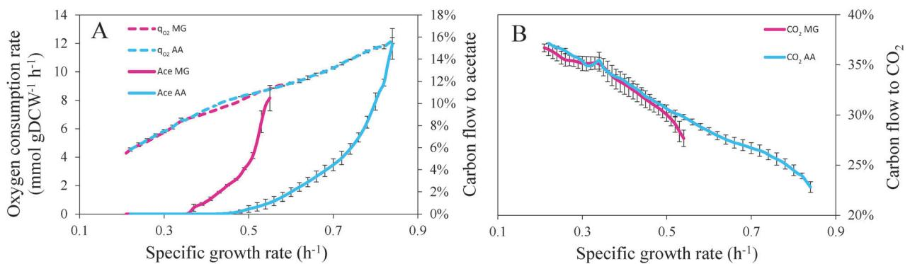
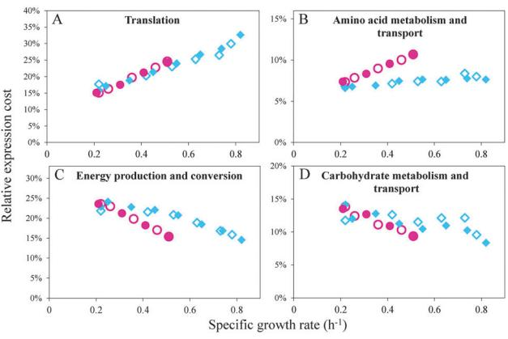
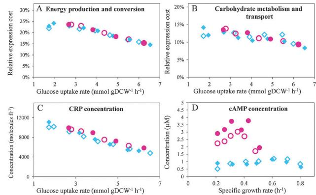
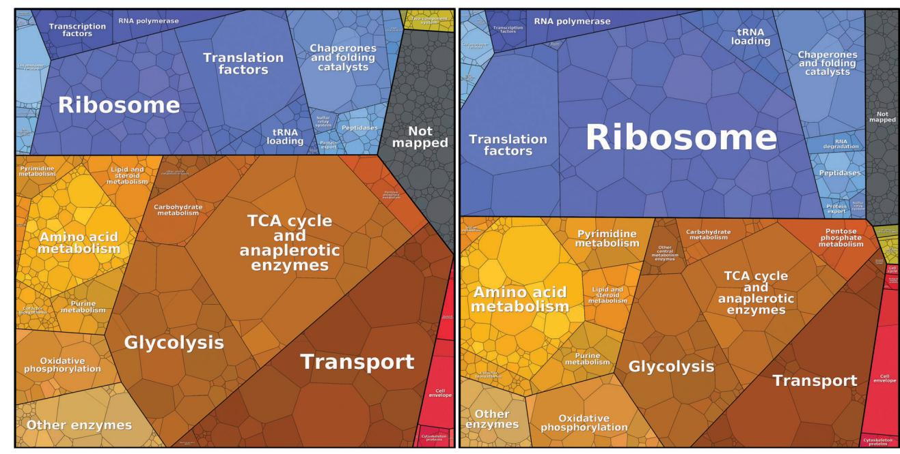
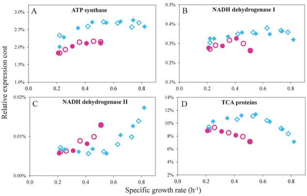

# Molecular BioSystems

#### PAPER

Cite this:DOI: 10.1039/c4mb00721b

Proteome reallocation in Escherichia coli with increasing specific growth rate†

Karl Peebo,*ab Kaspar Valgepea,b Andres Maser,ab Ranno Nahku,b Kaarel Adambergbc and Raivo Viluab

Cells usually respond to changing growth conditions with a change in the specific growth rate (m) and adjustment of their proteome to adapt and maintain metabolic efficiency. Description of the principles behind proteome resource allocation is important for understanding metabolic regulation in response to changing m. Thus, we analysed the proteome resource allocation dynamics of Escherichia coli into different metabolic processes in response to changing m. E. coli was grown on minimal and defined rich media in steady state continuous cultures at different m and characterised combining two LC-MS/ MS-based proteomics methods: stable isotope labelling by amino acids in cell culture (SILAC) and intensity based label-free absolute quantification. We detected slowly growing cells investing more proteome resources in energy generation and carbohydrate transport and metabolism whereas for achieving faster growth cells needed to devote most resources to translation and processes closely related to the protein synthesis pipeline. Furthermore, down-regulation of energy generation and carbohydrate metabolism proteins with faster growth displayed very similar expression dynamics with the global transcriptional regulator CRP (cyclic AMP receptor protein), pointing to a dominant protein resource allocating role of this protein. Our data also suggest that acetate overflow may be the result of global proteome resource optimisation as cells saved proteome resources by switching from fully respiratory to respiro-fermentative growth. The presented results give a quantitative overview of how E. coli adjusts its proteome to achieve faster growth and in future could contribute to the design of more efficient cell factories through proteome optimisation.

Received 18th December 2014, Accepted 16th February 2015

DOI: 10.1039/c4mb00721b

www.rsc.org/molecularbiosystems

## Introduction

Escherichia coli has been one of the model organisms for studying bacterial physiology and also a chassis for numerous cell factories in biotechnological processes for years. Due to the high significance of E. coli for both the academia and the biotechnology industry, studying E. coli physiology and metabolism at new levels has high relevance for the further advancement of our fundamental understanding of living organisms and the needed innovation in the biotechnology industry.

E. coli is known to survive in many different environments and can grow on a variety of substrates and usually responds to changes in these growth conditions with a change in the specific growth rate (m). In a laboratory setting on rich medium, E. coli can double within 20 minutes, however, bacteria in their natural habitat are often faced with carbon limitations that in turn restricts m. 1 Importantly, many physiological properties of cells are known to change in response to a perturbation in m, e.g. morphology,2 gene,3 and protein expression,4,5 metabolic flux patterns.6–9 Cells have to simultaneously manage all these layers to coordinate their central metabolism, monomer synthesis and macromolecule polymerisation for cellular proliferation. It has been shown that slow diffusion of tRNA complexes imposes a physical limit on the speed of translation, which ultimately limits the rate of cell growth.10 Therefore, for understanding the control of m, the production of the cellular workhorses—proteins—could be considered the most critical layer of metabolism to study.

**[View Article Online](http://dx.doi.org/10.1039/C4MB00721B)**

**[View Journal](http://pubs.rsc.org/en/journals/journal/MB)**

To achieve maximal specific growth rate (mmax), cells finetune the expression of their proteins so that the metabolic benefit of a protein pool surpasses the cost of expression and maintenance of this protein pool and results in optimal protein expression.11 Necessity for optimal protein expression has also been demonstrated by several other authors. For example, Li and co-workers demonstrate that both up- and down-regulation of methionine synthase expression (MetE, a bottleneck enzyme

a Tallinn University of Technology, Department of Chemistry, Akadeemia tee 15, 12618 Tallinn, Estonia

b Competence Centre of Food and Fermentation Technologies, Akadeemia tee 15a, 12618 Tallinn, Estonia. E-mail: karl@tftak.eu; Fax: +3726408282; Tel: +3726408200

c Tallinn University of Technology, Department of Food Processing, Ehitajate tee 5, 19086 Tallinn, Estonia

† Electronic supplementary information (ESI) available. See DOI: 10.1039/ c4mb00721b

in the methionine biosynthesis pathway) on rich medium devoid of methionine reduce mmax of E. coli, 12 indicating already optimal MetE expression in wild-type cells (lowering the expression of MetE results in deficiency of methionine and overexpression of the protein results in a burden for the translation machinery). Interestingly, various E. coli singleknockout strains of amino acid, vitamin and nucleobase biosynthesis genes growing on medium supplemented with the amino acid, vitamin or nucleobase they were auxotrophic for show higher mmax compared to the wild-type strain grown under the same conditions.13 Faster growth of the knockout strains is likely achieved by saving proteome resources from not expressing the respective biosynthesis pathway proteins.13 In addition, a thermodynamic analysis of glycolytic strategies across many bacterial species reveals that the key reason why most cells use the Entner–Doudoroff pathway for glucose catabolism instead of the Embden–Meyerhoff–Parnas one is the multiple times lower protein fraction required to achieve the same glucose conversion rate in the former pathway.14 These findings further emphasise the importance of protein resource management as cells seem to precisely take into account the cost and benefit that comes with the expression of a protein pool in order to maximise growth.

As proteome resource allocation seems to be tightly linked to m, it would be highly interesting to understand m-dependent coordinated proteome dynamics. You and colleagues argue in their paper that the general m-dependent coordination of the proteome in E. coli is primarily mediated through the accumulation of a-keto acids and cyclic AMP-cyclic AMP receptor protein (cAMP-CRP) signalling.15 They divide the proteome into four major fractions and measuring the expression of exemplary proteins of these fractions shows a linear m-dependent increase for three (ribosome related, anabolic and non-induced) and a decrease for one (catabolic) proteome fraction. These linear dependencies can be understood as reflecting a trade-off in proteome resource allocation between catabolic and anabolic proteins and interpreted as Pareto surfaces resulting from optimisation of competing interest.16 Moreover, central importance for the most efficient use of the proteome in metabolic regulation is further indicated by minimisation of metabolic reactions (proxy for minimal proteome use)17 being one of the cellular objective functions.18

However, the study of You and colleagues15 was carried out in batch cultures and a different m-dependent profile of the signalling molecule cAMP concentration is seen in E. coli steady state continuous cultures5,19 and under fed-batch conditions.20 Furthermore, batch cultures that rely on the use of different media to evoke changes in m may not be appropriate for such m-dependent studies since cell physiology differs significantly e.g. on the level of proteome, fatty acid composition and by-product profiles4,21,22 when cells are grown on different substrates at the same m. Instead, continuous cultures realising steady state growth should be used.23,24 Unfortunately m-dependent proteome-wide absolute quantitative data determined in steady state cultures, which would allow validating the model of m-dependent proteome allocation, are scarce. For E. coli, absolute concentrations of 56

enzymes in central carbon metabolism have been measured in glucose-limited chemostats6 and determined for more than a 1000 proteins in glucose-limited A-stat experiments.25 More recently, m-dependent E. coli proteomes were compared in ironand glucose-limited chemostats.4 Thus, due to the shortage of data, further detailed investigations of m-dependent steady state proteome-wide dynamics in E. coli are needed for validating the model of m-dependent proteome allocation.

In this work, we coupled absolute quantitative proteomics and high-resolution continuous cultures (accelerostat)26 with the aim of investigating proteome-wide dynamics of E. coli K-12 BW25113 wild-type over a range of m not studied in the steadystate before (0.2–0.9 h-1 ) together with a more accurate proteome quantification strategy with special focus on proteome resource allocation principles.

## Results and discussion

#### Physiological characteristics of Escherichia coli in glucose minimal and defined rich media

Two biological replicate aerobic carbon-limited accelerostat (A-stat)26 continuous cultures with Escherichia coli BW25113 wild-type strain were carried out on minimal glucose medium (MG medium) and on amino acid based defined rich medium (AA medium). The amino acid composition of the AA medium was designed based on the biomass amino acid composition of E. coli MG1655 with the exception of glutamine, asparagine and glycine that were added in excess.5 Glucose concentration in the AA medium was reduced to form approximately 60% (C mol/C mol) of the total carbon to obtain two media with equal total carbon concentrations, meaning also equal biomass concentrations. Carbon-limited cultures were stabilised in chemostat mode at dilution rate (D) = 0.2 h-1 and after achieving the steady state, a continuous increase in D was started with an acceleration of 0.01 h-2 , which enables us to acquire steady state data from A-stat equal to chemostats.5,27,28 The continuous increase of D allowed us to determine cellular growth characteristics until cells could not keep up with the rising D (resulting in culture washout) and achieved the maximal specific growth rate (mmax) at 0.55 0.01 h-1 and 0.83 0.02 h-1 (average of two biological replicates standard deviation) for the MG and AA media, respectively (indicated by the sharp decrease in oxygen consumption and CO2 production). Expectedly, substitution of 40% of carbon with amino acids in AA medium resulted in a lower specific glucose uptake rate (qglc) compared to MG medium at equal m (Fig. S1A, ESI†). Fig. 1 and Fig. S1 and S2 (ESI†) summarise the main m-dependent growth characteristics – biomass yield (YXS), qglc, the specific oxygen consumption rate (qO2 ), carbon flows to CO2, acetate and other by-products. YXS ranged from 13.1 to 13.9 and 13.2 to 14.1 gDCW-1 C mol-1 in MG and AA media, respectively, and increased until m B 0.45 in MG and 0.65 h-1 in AA medium (Fig. S1B, ESI†). Despite the difference in mmax, cells in both media showed similar decreasing m-dependent profiles of qO2 and carbon flow to CO2 (Fig. 1A and B). Acetate overflow profiles seemed to be different between the media as

Fig. 1 Main growth characteristics with rising specific growth rate. (A) Solid line, m-dependent carbon flow to acetate (Ace; %); dotted line, specific oxygen consumption rate (qO2 ; mmol gDCW-1 h-1 ) (B) m-dependent carbon flow to CO2 (CO2; %). gDCW – gram dry cellular weight. Minimal glucose medium (MG) is represented in pink colour and amino acid based defined rich medium (AA) in light blue. Line is average of best-fit splines of 13–21 biomass, substrate and product concentration measurements in single experiments. Error bars represent the standard deviation between two biological replicates. Data for only one biological replicate are shown for the MG medium qO2 .

excretion of acetate started at m = 0.35 and 0.5 h-1 in MG and AA media, respectively (Fig. 1A). Notably, the maximum amount of carbon diverted to acetate near mmax was higher in AA medium (Fig. 1A). Notably, our high-resolution A-stat data revealed that no saturation of qO2 occurs in either media (Fig. 1A), in contrast to the textbook theory of acetate overflow being triggered by limitations in the respiratory capacity.29–31

In addition to acetate, cells in both media excreted minor amounts of orotate, dihydroorotate, carbamoyl-aspartate and acetyl-aspartate and the total carbon fraction excreted as these products was lower than 5% in both media (Fig. S2, ESI†). The first three of these products are intermediates of the pyrimidine synthesis pathway and are most probably excreted due to a genetic frameshift mutation of E. coli K-12 strains leading to low PyrE expression and a bottleneck in the pathway.27,32

#### Specific growth rate-dependent proteome analysis

To obtain a deeper quantitative understanding about m-dependent metabolism and proteome allocation principles of E. coli, we measured both proteome-wide relative expression dynamics and absolute concentrations of proteins in MG and AA media over a range of m not studied in the steady-state before (0.2–0.9 h-1 ). For this, altogether 9 samples from MG medium experiments with m ranging from 0.21 to 0.51 h-1 and 14 samples from AA medium (m = 0.22–0.82 h-1 ) were analysed. To achieve high quality results for both relative and absolute protein expression quantification, we combined the methods of stable isotope labelling by amino acids in cell culture (SILAC) and the label-free quantification technique termed the total protein approach (TPA).33,34 The SILAC approach is known for its high reproducibility as it eliminates quantification errors due to unequal sampling.35 The use of a labelled internal standard allowed accurate relative comparison of protein expression across all samples (average relative standard deviation between biological replicates was o10%). Absolute proteome quantification in cultivation samples was based on label-free quantification of protein concentrations with TPA of the labelled internal standard mixed with each cultivation sample (see Materials and methods for details). The average relative

standard deviation of all protein concentrations in the labelled standard among 23 separate mass-spectrometry analyses was 26%.

#### Reallocation of proteome resources with faster growth

Protein expression levels in E. coli are a result of fine-tuned compromise between metabolic benefit and protein expression cost ensuring that not too much translational capacity is used while optimal growth is achieved.11 As it is difficult to measure the metabolic benefit of a protein pool directly, we estimated it from the investment of translational capacity for each protein to reveal the most valuable metabolic processes for the cells at different m. We defined the investment of translational capacity as the protein expression cost and calculated it by multiplying the protein concentration with its length in amino acids. We did not take into account the different amino acid content of the proteins as the main cost of protein expression is related to the process of translation and not to the cost of amino acid synthesis.36,37 Furthermore, protein degradation would increase the actual expression cost for the cells, but we did not take this into account as the majority of E. coli proteins are long lived in glucose-limited cultures compared to cell cycle lengths observed in our experiments.38–41

We first grouped all proteins based on clusters of orthologous groups (COG)40 and calculated the total protein expression cost for each COG to obtain a global overview of m-dependent proteome resource allocation. Slowly growing cells (m = 0.22 h-1 ) in both media devoted approximately 15% of their protein translational capacity (reflected by the relative protein expression cost) to the COG group of ''translation'' (J) (Fig. 2A). This cost increased linearly as m increased and reached 25% and 33% near mmax in MG and AA media, respectively, becoming the most costly COG. The linear relationship between translation related proteins and m has been described before25,42 and reflects the possible growth limitation by translation capacity.10,43 Other proteome fractions with increasing synthesis requirements with faster growth – ''nucleotide metabolism and transport'', ''transcription'' and ''amino acid metabolism and transport'' (E) – are all closely related to synthesis of proteins but these increasing demands

Fig. 2 Specific growth rate-dependent proteome expression cost allocation. Relative protein expression cost (compared to total expression cost) of COG groups (A) ''translation'' (COG group J) (B) ''amino acid metabolism and transport'' (COG group E) (C) m-dependent ''energy production and conversion'' (COG group C) (D) m-dependent ''carbohydrate metabolism and transport'' (COG group G). MG medium depicted with pink circles and AA medium with light blue diamonds, open and solid shapes represent different biological replicates.

required considerably less protein resource compared to translation (Fig. 2A and Fig. S3, ESI†). These results suggest that ensuring the required translational capacity for achieving faster growth is of high priority in terms of proteome resource allocation for E. coli.

Supplying cells with amino acids in the AA medium expectedly lowered the protein expression cost of the COG group E, taking up 3% less proteome resources compared to MG medium (8 vs. 11%; Fig. 2B). This save in translational burden from lower expression of amino acid biosynthesis proteins which could be invested in higher expression of other proteins could well contribute to the higher mmax attained on AA medium. This hypothesis is well supported by the work of D'Souza and co-workers who show that the deletion of single amino acid biosynthesis genes from E. coli results in higher mmax compared to the parent strain when both strains are grown on medium containing the amino acid that the deletion strains were auxotrophic for.13 Another possibility for the increase in m with the supply of amino acids could be directly related to an energetic gain as cells do not need to synthesise amino acids anymore but this is not supported by the most recent calculations of ATP cost for amino acid synthesis from glucose. It appears that on average E. coli produces rather than consumes ATP when it synthesises the amino acids making up its proteome.36

The necessary increase of translational capacity for faster growth through the increase of translation-related proteins has to come at the expense of other proteome fractions. The most important COGs with down-regulated protein expression costs in response to increase in m were ''energy production and conversion'' (C) and ''carbohydrate metabolism and transport'' (G) (Fig. 2C and D), but also ''lipid metabolism'', ''replication and repair'', ''signal transduction'' and proteins with multiple or no COG annotation (Fig. S3, ESI†) decreased with increasing m. Interestingly, there seemed to be a difference in the m-dependent allocation dynamics of protein resources to COG groups C and G between growth on MG and AA media (Fig. 2C and D): these

Fig. 3 Proteome expression cost allocation and concentration of CRP (cyclic AMP (cAMP) receptor protein) and cAMP. Relative protein expression cost (compared to total expression cost) of COG groups (A) qglc-dependent ''energy production and conversion'' (COG group C) (B) qglc-dependent ''carbohydrate metabolism and transport'' (COG group G). (C) qglc-dependent concentration of CRP protein in protein molecules fL-1 of cell volume and (D) m-dependent cAMP concentration in mM. Data from MG medium depicted with pink circles and from AA medium with light blue diamonds, open and solid shapes represent different biological replicates.

groups were down-regulated more rapidly in MG medium with rising m. This could be explained by lower qglc values in AA medium at equal m (Fig. S1A, ESI†) which points to lower carbon catabolite repression (CCR) in AA medium as qglc is known to regulate the magnitude of CCR.44 This became more evident when expression costs of COGs C and G were plotted against qglc (Fig. 3A and B). The concentration of the known CCR-mediator—cAMP receptor protein (CRP)—also showed a very linear and similar qglc-dependent decrease (Fig. 3C) to the COGs C and G. As one of the main functions of CCR is to free up proteome resources for faster utilisation of the preferred sugar44 and increased translational capacity,15 the slower m-dependent decrease of COGs C and G points to lower translational limitation at similar m in AA medium.

Both energy production, and synthesis and polymerisation of biomass building-blocks are necessary for cellular growth. Our data show that a balance between these needs was achieved by very different proteome resource allocation at slow and fast growth (Fig. 4). This is illustrated better when comparing proteomaps,45 which visualise the quantitative distribution of protein expression costs between the main cellular processes, of slow and fast growing cells (Fig. 4). It is clearly seen that cells need to invest more translational capacity into biosynthetic proteins e.g. ribosomal, translation factors, amino acid and nucleobase metabolism at the expense of the TCA cycle, glycolysis and transport proteins, for realising faster growth. In conclusion, our proteome-wide analysis of protein expression costs showed that slowly growing cells invested most of their resources in catabolic proteins, and with the increase of m a growing fraction of translational capacity was devoted to biosynthetic processes, in line with the interpretations of Hwa and co-workers.15,43,46

#### cAMP and CRP roles in the coordination of proteome allocation

You and co-workers propose that m-dependent proteome allocation in E. coli is regulated by the cyclic AMP–cyclic AMP receptor

Fig. 4 Proteome expression cost partitioning between protein groups in AA medium at slow and fast growth. Proteomaps in the left and right visualise AA medium at m = 0.22 h-1 (average of two biological replicates) and 0.82 h-1 , respectively. Each tile (small polygon) represents one protein. Tiles are arranged and coloured according to the hierarchical KEGG pathway maps such that larger regions correspond to functional categories. Tile size represents relative protein expression cost. The figures were generated using the Paver software developed by Jo¨rg Bernhardt and the Decodon company (Greifswald, Germany).

protein (cAMP–CRP) complex.15 It is believed to be responsible for the allocation of proper fraction of the proteome to carbon– catabolic enzymes which is achieved through a regulatory loop: when favoured carbon sources (e.g. glucose) are available, carbon influx exceeds anabolic capacities and the accumulation of a-keto acids in the TCA cycle inhibits cAMP production which in turn down-regulates catabolic enzymes. By measuring extracellular cAMP levels in batch cultures with different growth media, You and co-workers show that the cAMP excretion rate and carbon–catabolic enzyme levels (exemplified by the LacZ protein) decrease linearly with the increase of m in the range of 0.3 to 1 h-1 . We observed very similar proteome-wide resource allocation principles as the relative expression cost of proteins in C and G groups (Fig. 2A and B) and also the concentration of CRP protein (Fig. 3C) decreased linearly with the increase in m both in AA and MG media. The lower anabolic needs in AA medium (result of amino acid supply) are reflected in lower m-dependent decrease in CRP protein and catabolic proteome groups C and G in AA medium, showing that the balance between anabolic and catabolic needs was shifted by the supply of amino acids.

An important difference between our steady state continuous culture and the batch data of You and co-workers is the m-dependent profile of the cAMP excretion rate (and also cAMP extracellular concentration): in contrast to the linear decrease in the range of m = 0.3 to 1 h-1 observed by them, we detected increasing cAMP profiles up to m B 0.4 in MG and B0.65 h-1 in AA media, after which cAMP started to decrease with the further increase in m (Fig. 3D). A similar extracellular cAMP concentration profile has been seen before by us and others in continuous5,19 and fed-batch cultures.20 Notably, actually the extracellular cAMP concentration does not follow a linear trend also in batch cultures with m o 0.3 h-1 . 47 Therefore, if the intracellular concentration of the cAMP–CRP complex is indeed responsible for the allocation of most proteome resources in E. coli, 15 we suggest that cAMP excretion rates (or extracellular cAMP concentration) do not necessarily reflect the intracellular cAMP levels accurately under all conditions (e.g. continuous cultures and low m in batch cultures), in contrast to what has been proposed before.15,48 Hence, the concentration of CRP instead of the cAMP excretion rate seems to be a better indicator of cAMP–CRP dependent proteome reallocation regulation.

#### Most important single protein expression changes with rising l

In addition to a global overview of proteome resource allocation, we carried out covariance analysis between each protein's expression cost and m to pinpoint the proteins with the highest and lowest synthesis priority for the cells to grow faster. Covariance analysis is a suitable statistic for this since it takes into account both the direction and magnitude of the change in protein's expression cost – proteins with high covariance indicate both high protein expression cost and high m-dependent increase, and vice versa for low covariance. It seems that most of the proteins with the highest and lowest covariance overlap in both media (Fig. 5), and are also consistent with a previous minimal medium data set of E. coli K-12 MG1655.25

The protein with the highest covariance by far in both media was MetE (methionine synthase), a known bottleneck enzyme

| Top 20 |      | Bottom 20 |      |
|--------|------|-----------|------|
| MG     | AA   | MG        | AA   |
| MetE   | MetE | AceA      | AceA |
| OmpA   | RpsA | MglB      | GatY |
| RpsA   | OmpA | GatY      | DppA |
| FusA   | GInA | AldA      | AcnB |
| TufA   | RpIL | AcnB      | AldA |
| GapA   | RpsD | OmpF      | OmpF |
| PyrB   | RpsC | GatZ      | Mdh  |
| SerA   | RplA | OmpC      | Acs  |
| RpsD   | RpsG | MalE      | LivJ |
| RpIL   | RpsB | Acs       | SodA |
| RpsC   | Rpll | GatB      | AhpC |
| RplA   | RpsE | LivJ      | MglB |
| RpsG   | RplB | GltA      | PflB |
| RpsB   | RpIE | AceB      | AceB |
| ThrA   | Gnd  | DppA      | OmpC |
| Gnd    | RpID | PflB      | GltA |
| Rpll   | RplJ | SodA      | MalE |
| RplB   | RpIF | Pck       | GroL |
| RpIE   | GapA | ArgT      | lcd  |
| RpsE   | Tsf  | GroL      | GatB |

Fig. 5 Proteins with highest and lowest covariance between the protein expression cost and specific growth rate. Blue represents high and pink low covariance.

in methionine biosynthesis.12 As cells growing on AA medium should be able to get most of the methionine required for protein synthesis from the medium (see above for media formulation), the unexpectedly high covariance of MetE in the AA medium could mean that cells need an excess amount of methionine compared to the proteome composition, possibly for efficient initiation of protein polymerisation or for methylation. Expectedly, other proteins with high covariance were mostly related to translation in both media – ribosomal proteins, Tsf, TufA, FusA. Interestingly, GlnA (glutamine synthase) has a very high covariance in AA medium and the expression profile is very similar in both media (ESI†) although the AA medium was supplied with an excess amount of glutamine compared to the biomass amino acid composition. This indicates that this amino acid was directed into central carbon metabolism or converted into other amino acids. In addition, GapA (glyceraldehyde 3-phosphate dehydrogenase-A complex) and Gnd (6-phosphogluconate dehydrogenase) showed high covariance suggesting that these proteins could be bottleneck enzymes in glycolysis and the pentose phosphate pathway (PPP), respectively, also evident by their opposite m-dependent expression behaviour compared to the majority of other catabolic enzymes (C and G COG groups) (dataset 1, ESI†). In line with this is the fact that the reaction catalysed by GapA is also one of the thermodynamic bottlenecks in glycolysis,14 and therefore requires a high increase in expression to allow higher qglc at higher m.

Low covariance between protein expression cost and m should point to proteins which are necessary for slowly growing cells but are not needed for fast growth and are thus downregulated to free up resources (both translational and buildingblocks i.e. amino acids) for proteins with higher metabolic benefit. The protein with the lowest covariance by far in both media was AceA (isocitrate lyase) (Fig. 5). AceA together with AceB (malate synthase) and Pck (phosphoenolpyruvate (PEP) carboxykinase) enable E. coli to bypass part of the TCA cycle by forming a PEP–glyoxylate cycle and decouple catabolism from biosynthetic reducing equivalent NADPH formation.49 All these proteins (AceAB, Pck) had very low covariance in both media, showing that cells use this pathway only at slow growth and it is strongly down-regulated at high m, which is also consistent with 13C-fluxome analysis.6–9 AceAB and several other proteins with the lowest covariance (MglB, GatBYZ, MalE, Acs, Pck) are also known proteins under the control of CCR. In both media, enzymes related to oxidative stress (AhpC and SodA) were also strongly down-regulated (Fig. 5). Similar protein resource usage for preservation instead of proliferation at slowly growing cells is also seen for E. coli BL21 during entry into the stationary phase.50

### Acetate overflow as a result of more economic protein resource usage

With the increase in m, E. coli partially switched from respiration to production of acetate (Fig. 1A), which has been well documented before as acetate overflow.5,7,8,19,51 One of the textbook theories is that acetate overflow in E. coli is triggered by limitations in respiratory capacity,26,29,31 meaning that cells start to excrete acetate as a consequence of accumulation of TCA cycle intermediates and acetyl-CoA after reaching maximum qO2 (note that we observed no saturation of qO2 , as shown above). Recently, we proposed that acetate overflow is triggered by the disruption of the phosphotransacetylase (Pta)-acetyl-CoA synthetase (Acs) cycle by CCR-mediated down-regulation of Acs.5 This novel hypothesis is supported by the strongly reduced acetate overflow in E. coli strains with activated acetate cycling and downstream throughput.51 The high-resolution proteome data acquired in this work provide another possible explanation for acetate overflow.

As shown above, E. coli directs more resources to translationrelated proteins with rising m while down-regulating many other proteins. Although we are not able to determine the in vivo mechanism(s) executing acetate overflow here—CCR-mediated repression of Acs or limited respiratory capacity (or both play a role)—our experimental data suggest that a more global regulation of proteome resource optimisation leads to acetate overflow through the modification of catabolic and/or respiratory chain protein expression. Others have previously also proposed this hypothesis but based on in silico metabolic modelling.52,53

Our data show that in addition to the down-regulation of CCRrepressed proteins (as described above), E. coli realised a more economic protein usage through modifying the expression of respiratory chain proteins with faster growth. The most protein resource exhaustive component of the aerobic respiratory apparatus was the ATP generating ATP synthase, requiring 1.5–2.5% of the total translational capacity (Fig. 6A). We observed increasing total ATP synthase expression costs up to m when acetate overflow started (m B 0.35 and m B 0.55 h-1 in MG and AA media, respectively) with no further increase after that. The proton motive force generating NDH-I (NADH dehydrogenase I) that consists of multiple Nuo proteins required 0.2–0.4% of the total translational capacity and had a similar m-dependent profile to the ATP synthase

Fig. 6 Specific growth rate-dependent expression cost of the respiratory chain and TCA cycle proteins. Relative protein expression cost (compared to total expression cost) of: (A) ATP synthase; (B) NADH dehydrogenase I, (C) NADH dehydrogenase II; (D) TCA cycle proteins; from MG medium depicted with pink circles and from AA medium with light blue diamonds. Open and solid shapes represent different biological replicates.

(Fig. 6A and B). The expression profile of NDH-II (NADH dehydrogenase II) was similar to the acetate excretion profile and shows that E. coli switches to a less protein resource requiring (under 0.02% of total translational capacity) NADH dehydrogenase with the start of acetate overflow, which, however, does not generate proton motive force (Fig. 6C). As a result of acetate overflow, carbon flux through the TCA cycle is lowered and, therefore, fewer proteins are also required in this pathway. The sum expression of 18 TCA cycle proteins allocated 6–12% of the total proteome resource and their expression was downregulated after m reached 0.25 and 0.55 h-1 in MG and AA media, respectively (Fig. 6D). Although it still remains unclear what is the exact execution mechanism behind acetate overflow the general driving force seems to be related to the increasing need to direct more translational capacity for translation-related proteins and away from catabolic ones.

## Experimental

#### Bacterial strains, growth media and cultivation conditions

Escherichia coli K-12 BW25113 (lacIq rrnB3 DlacZ4787 hsdR514 D(araBAD)567 D(rhaBAD)568 rph-1) wild-type strain54 was used in all A-stat experiments. For the generation of stable isotope labelling by amino acids in cell culture (SILAC)-labelled internal standard biomass, E. coli K-12 MG1655 DlysA DargA strain was used.

Two replicate accelerostat (A-stat26) experiments using defined minimal medium supplemented with B4.5 g L-1 of glucose (MG medium) were carried out as before.51 A second set of two biological replicate A-stat experiments was carried out with a modified medium (AA medium) where the final glucose concentration was reduced to B2.75 g L-1 which was compensated by the supplementation of 20 amino acids to end up with equal total carbon concentrations in both MG and AA media. The concentrations of supplemented amino acids were calculated based on the biomass composition of E. coli K-12 MG1655

at a specific growth rate of (m) = 0.5 h-1 with the exception of aspartate, glutamine and glycine that were added in excess (Table S1, ESI†).5 The base components in both media were (g L-1 ): FeSO47H2O 0.005; MnSO4H2O 0.002; CaCl22H2O 0.005; ZnSO47H2O 0.002; CoSO47H2O 0.0006; CuSO45H2O 0.0005; (NH4)6Mo7O244H2O 0.0026 (all the latter components were dissolved in 50 ml 5 M HCl); MgSO47H2O 0.5; N-source – NH4Cl 3.5; buffer – K2HPO4 2; and 200 ml L-1 foam removing agent Antifoam C (Sigma-Aldrich).

For the generation of SILAC-labelled internal standard biomass, E. coli K-12 MG1655 was grown in batch on MG medium with the exception of 7 g L-1 K2HPO4 and supplementation of stable isotope labelled arginine and lysine (13C and 15N atoms).

All carbon-limited cultures were grown in 1.25 L Biobundle bioreactors (Applikon Biotechnology B.V., Schiedam, the Netherlands) controlled using an ez-Control biocontroller (Applikon Biotechnology B.V.) and a cultivation control program ''BioXpert XP'' (Applikon Biotechnology B.V.). Off-gas O2 and CO2 were measured using gas analysers and the system was also equipped with pH, pO2 and temperature sensors. Cultivations were carried out at 37 1C and pH 7. Aerobic conditions were ensured by agitation of 800 rpm and an air flow rate of 150 ml min-1 . Cultures were stabilised in chemostat mode at a dilution rate (D) of 0.2 h-1 after which A-stat with a continuous increase of D (acceleration 0.01 h-2 ) was carried out until culture washout. The control algorithm for A-stat was: D = D0 + aD t, where D0 is the initial D of chemostat (h-1 ), aD is the acceleration of the A-stat phase (h-2 ), and t is the time from the start of A-stat (h). Samples were collected throughout the experiments with different intervals for proteome, exo-metabolome, dry cell weight, total protein concentration and amino acid analysis.

#### Exo-metabolome and amino acid analysis

Exo-metabolome analysis was carried out as follows: samples of culture broth were centrifuged (14 000 g for 5 min), the supernatant was collected and analysed for glucose and organic acids by HPLC (Alliance 2795 system, Waters Corporation, Milford, MA, USA) using either a Bio-Rad HPX-87H Aminex ion-exclusion (Bio-Rad Laboratories, Inc., Hercules, CA, USA) or Agilent Hi-Plex H (Agilent Technologies, Santa Clara, CA, USA) column connected to RI and UV detectors (35 1C, flow rate 0.6 ml min-1 ). The column was eluted with 4.1 mM sulphuric acid for glucose, carbamoyl-aspartate, orotate and with 26.5 mM formic acid for acetate and dihydroorotate analysis.

Residual amino acid concentrations were determined using the AccQ-Fluor reagent (6-aminoquinolyl-N-hydroxysuccinimidyl carbamate) kit (Waters Corp.) according to the manual. Shortly, 70 ml of AccQ-Fluor borate buffer and 20 ml of AccQ-Fluor reagent were added to 10 ml of the cultivation sample and incubated for 10 minutes at 55 1C. After derivatisation, samples were analysed using an ultra-high performance liquid chromatography system (Acquity UPLC, Waters Corp.) equipped with an Acquity UPLC BEH C18 1.7 mm (Waters Corp.) reverse phase column and an Acquity UPLC PDA (Waters Corp.) detector. Mobile phase consisted of AccQ-Taq solvent A2 and solvent B2.

Biomass concentration was determined gravimetrically as described previously.51 For the calculation of CO2 production and O2 consumption rates, the gas volume change due to the different proportions of CO2 and O2 in the inflow and outflow gases was taken into account as before.7 Also the soluble CO2 fraction in culture broth was taken into account using Henry's law constant as before.55

#### Proteome analysis

Sample preparation. Cultivation samples for proteome analysis were collected from the experiments as follows m: AA medium, replicate one: 0.22; 0.25; 0.35; 0.45; 0.55; 0.65; 0.74 and 0.82 h-1 , replicate two: 0.22; 0.42; 0.53; 0.63; 0.73 and 0.78 h-1 , and in MG medium replicate one: 0.21; 0.31; 0.41 and 0.51 h-1 , replicate two: 0.22; 0.26; 0.36; 0.46 and 0.51 h-1 . Sample preparation was carried out as described previously.51 Shortly, 1 ml of culture broth was harvested, centrifuged (14 000 g for 1 min at 4 1C), washed once, flash-frozen with liquid nitrogen and kept at -80 1C until further processing. Frozen cultivation sample pellets (unlabelled) were melted on ice and mixed in the 1 : 1 ratio (100 mg : 100 mg) with heavy SILAC-labelled35 E. coli biomass (internal standard biomass) and frozen at -80 1C. This allowed direct comparison between all culture samples (unlabelled) through comparison of heavy (internal standard biomass) and light (cultivation sample) peptide intensities. Mixed biomass pellets were suspended in 100 mL of SDS lysis buffer (4% SDS/100 mM Tris-HCl pH 8/100 mM DTT) and heated at 95 1C for 5 min. Cell lysates were sonicated with ultrasound for a few pulses and pelleted by centrifugation. Cell lysates were digested with trypsin according to the Filter Aided Sample Preparation protocol (FASP)56 and purified with C-18 StageTips.57

Sample analysis by mass spectrometry. Sample analysis was done as before34 with the exception of running one technical replicate. In short, LC-MS/MS analysis was performed using an Agilent 1200 series nanoflow system (Agilent Technologies) connected to an LTQ Orbitrap mass-spectrometer (Thermo Electron, San Jose, CA, USA) equipped with a nanoelectrospray ion source (Proxeon, Odense, Denmark). Peptides were separated with a 240 minute gradient from 2 to 40% B (A: 0.5% acetic acid, B: 0.5% acetic acid/80% acetonitrile) using a flow-rate of 200 nl min-1 .

Mass spectrometry data analysis. Data analysis of raw MS-files was performed by the MaxQuant software package version 1.3.0.5.58 Peak lists were searched against an E. coli database using the Andromeda search engine built into Max-Quant. In the MaxQuant search, a maximum of two missed cleavages, full tryptic specificity and a mass tolerance of 0.5 Da for fragment ions, was specified. Carbamidomethylation of cysteine was set as a fixed modification. Methionine oxidation and protein N-terminal acetylation were set as variable modifications. A decoy revert search option was used and the false discovery rate was set to 1% for both peptide and protein levels. Minimum required peptide length was set to seven amino acids. To increase the number of peptide identifications, ''Match between runs'' option with a time window of two minutes was allowed.

Relative and absolute proteome quantification. Since each sample was mixed with equal amounts of SILAC-labelled E. coli internal standard biomass, relative protein expression differences between unlabelled culture samples could be calculated as the ratio of ratios: the ratio of one sample relative to the labelled internal standard is divided by the ratio of the other relative to the labelled internal standard. To correct for mixing errors of the total protein amount, the ratios of heavy and light labelled peptides were normalised so that the median of logarithmised ratios was zero.58 The m-dependent variation of total protein concentration in dry cell weight measured by the Lowry method59 was also taken into account.

Absolute proteome quantification to determine intracellular protein concentrations (protein copies per fL of biomass) was performed using a label-free protein quantification method termed the total protein approach.33,34 This method assumes that most of the expressed proteins are detected by MS and this is usually the case as top 1000 proteins make up more than 90% of the total protein mass in biomass.25,60 The total protein approach used here is based on LFQ intensities reported by MaxQuant. First, relative fractions from the total proteome for all proteins were derived from the ratio of each protein's individual LFQ intensity to the total LFQ intensity. This ratio was then converted into protein concentration (copies fL-1 ) by dividing it with the protein's molecular weight, and multiplying with the Avogadro constant and the protein concentration in a cell (g protein per ml cell volume).60 We determined the protein concentration using measured biomass concentration and protein fraction of dry biomass, a cell buoyant density of 1.1 g ml-1 and a dry fraction of wet biomass of 30%.61–63 The label-free quantification method was used only for the quantification of proteins in the 23 labelled (heavy) internal standard biomass samples. The average of 23 measurements was calculated for each protein and by taking into account the heavy-to-light ratio, protein concentration for all unlabelled (light) samples (cultivation samples) was calculated. This allowed us to maintain the accuracy of the SILAC method and add the absolute scale to our protein data. For data presentation, protein concentrations (copies fL-1 ) instead of abundances per cell were calculated and are presented because cell size varies between growth conditions and strains.25,60 The mass spectrometry proteomics data have been deposited to the ProteomeXchange Consortium (http://proteomecentral.proteomexchange.org) via the PRIDE partner repository64 with the dataset identifier PXD001594.

## Conclusions

In this work, we presented quantitative analysis of specific growth rate (m)-dependent proteome allocation strategies in E. coli. Our data should help to develop a quantitative intuition about the composition and allocation dynamics of the proteome in the most studied microorganism growing at different m. Moreover, our data are useful in the discovery of true protein targets in experiments where often protein expression changes of interest can be masked by protein expression changes Molecular BioSystems Paper

resulting from changes in m. A quantitative understanding of proteome resource reallocation for realising faster growth could pave the way for more efficient cell factories. As we saw that E. coli clearly increased proteome investment into translationrelated proteins to achieve faster growth, more efficient usage of the protein expression machinery for translation of target molecule-related proteins (e.g. through reduction of protein expression non-essential for optimal bioprocess conditions) could lead to superior microbial cell factories.

## Acknowledgements

We thank Dan Davidi and Uri Moran from the Weizmann Institute of Science, Israel, for generating the proteomaps. The financial support for this work was provided by the European Regional Development Fund project EU29994; Ministry of Education, Estonia, through the grant SF0140090s08; and Estonian Science Foundation through grants G8165 and G9192. The data deposition to the ProteomeXchange Consortium was supported by the PRIDE team.

## Notes and references

- 1 A. G. Franchini and T. Egli, Microbiology, 2006, 152, 2111–2127.
- 2 B. Volkmer and M. Heinemann, PLoS One, 2011, 6, e23126.
- 3 R. Nahku, K. Valgepea, P.-J. Lahtvee, S. Erm, K. Abner, K. Adamberg and R. Vilu, J. Biotechnol., 2010, 145, 60–65.
- 4 J. P. Folsom, A. E. Parker and R. P. Carlson, J. Bacteriol., 2014, 196, 2748–2761.
- 5 K. Valgepea, K. Adamberg, R. Nahku, P.-J. Lahtvee, L. Arike and R. Vilu, BMC Syst. Biol., 2010, 4, 166.
- 6 N. Ishii, K. Nakahigashi, T. Baba, M. Robert, T. Soga, A. Kanai, T. Hirasawa, M. Naba, K. Hirai, A. Hoque, P. Y. Ho, Y. Kakazu, K. Sugawara, S. Igarashi, S. Harada, T. Masuda, N. Sugiyama, T. Togashi, M. Hasegawa, Y. Takai, K. Yugi, K. Arakawa, N. Iwata, Y. Toya, Y. Nakayama, T. Nishioka, K. Shimizu, H. Mori and M. Tomita, Science, 2007, 316, 593–597.
- 7 A. Kayser, J. Weber, V. Hecht and U. Rinas, Microbiology, 2005, 151, 693–706.
- 8 A. Nanchen, A. Schicker and U. Sauer, Appl. Environ. Microbiol., 2006, 72, 1164–1172.
- 9 R. Yao, Y. Hirose, D. Sarkar, K. Nakahigashi, Q. Ye and K. Shimizu, Microb. Cell Fact., 2011, 10, 67.
- 10 S. Klumpp, M. Scott, S. Pedersen and T. Hwa, Proc. Natl. Acad. Sci. U. S. A., 2013, 110, 16754–16759.
- 11 E. Dekel and U. Alon, Nature, 2005, 436, 588–592.
- 12 G.-W. Li, D. Burkhardt, C. Gross and J. S. Weissman, Cell, 2014, 157, 624–635.
- 13 G. D'Souza, S. Waschina, S. Pande, K. Bohl, C. Kaleta and C. Kost, Evolution, 2014, 68, 2559–2570.
- 14 A. Flamholz, E. Noor, A. Bar-Even, W. Liebermeister and R. Milo, Proc. Natl. Acad. Sci. U. S. A., 2013, 110, 10039–10044.
- 15 C. You, H. Okano, S. Hui, Z. Zhang, M. Kim, C. W. Gunderson, Y.-P. Wang, P. Lenz, D. Yan and T. Hwa, Nature, 2013, 500, 301–306.
- 16 S. Klumpp and T. Hwa, Curr. Opin. Biotechnol. C, 2014, 28, 96–102.
- 17 N. E. Lewis, K. K. Hixson, T. M. Conrad, J. a Lerman, P. Charusanti, A. D. Polpitiya, J. N. Adkins, G. Schramm, S. O. Purvine, D. Lopez-Ferrer, K. K. Weitz, R. Eils, R. Ko¨nig, R. D. Smith and B. Ø. Palsson, Mol. Syst. Biol., 2010, 6, 390.
- 18 R. Schuetz, N. Zamboni, M. Zampieri, M. Heinemann and U. Sauer, Science, 2012, 336, 601–605.
- 19 S. Renilla, V. Bernal, T. Fuhrer, S. Castan˜o-Cerezo, J. M. Pastor, J. L. Iborra, U. Sauer and M. Ca´novas, Appl. Microbiol. Biotechnol., 2011, 93, 2109–2124.
- 20 H. Lin, F. Hoffmann, A. Rozkov, S.-O. Enfors, U. Rinas and P. Neubauer, Biotechnol. Bioeng., 2004, 87, 602–613.
- 21 J. Pramanik and J. D. Keasling, Biotechnol. Bioeng., 1998, 60, 230–238.
- 22 Y. Zhu, M. a Eiteman, R. Altman and E. Altman, Appl. Environ. Microbiol., 2008, 74, 6649–6655.
- 23 P. A. Hoskisson and G. Hobbs, Microbiology, 2005, 151, 3153–3159.
- 24 A. T. Bull, J. Ind. Microbiol. Biotechnol., 2010, 37, 993–1021.
- 25 K. Valgepea, K. Adamberg, A. Seiman and R. Vilu, Mol. BioSyst., 2013, 9, 2344–2358.
- 26 T. Paalme, A. Kahru, R. Elken, K. Vanatalu, K. Tiisma and R. Vilu, J. Microbiol. Methods, 1995, 24, 145–153.
- 27 K. Valgepea, K. Adamberg and R. Vilu, BMC Syst. Biol., 2011, 5, 106.
- 28 R. Nahku, PhD thesis, Tallinn University of Technology, 2012.
- 29 K. Han, H. C. Lim and J. Hong, Biotechnol. Bioeng., 1992, 39, 663–671.
- 30 T. Paalme, R. Elken, A. Kahru, K. Vanatalu and R. Vilu, Antonie van Leeuwenhoek, 1997, 71, 217–230.
- 31 A. Varma and B. O. Palsson, Appl. Environ. Microbiol., 1994, 60, 3724–3731.
- 32 K. F. Jensen, J. Bacteriol., 1993, 175, 3401–3407.
- 33 J. R. Wis´niewski, P. Ostasiewicz, K. Dus´, D. F. Zielin´ska, F. Gnad and M. Mann, Mol. Syst. Biol., 2012, 8, 611.
- 34 L. Arike, K. Valgepea, L. Peil, R. Nahku, K. Adamberg and R. Vilu, J. Proteomics, 2012, 75, 5437–5448.
- 35 S.-E. Ong, B. Blagoev, I. Kratchmarova, D. B. Kristensen, H. Steen, A. Pandey and M. Mann, Mol. Cell. Proteomics, 2002, 1, 376–386.
- 36 C. Kaleta, S. Scha¨uble, U. Rinas and S. Schuster, Biotechnol. J., 2013, 8, 1105–1114.
- 37 D. M. Stoebel, A. M. Dean and D. E. Dykhuizen, Genetics, 2008, 178, 1653–1660.
- 38 J. H. Calandruccio and A. R. Larrabee, Arch. Biochem. Biophys., 1981, 210, 270–274.
- 39 K. Nath and A. L. Koch, J. Biol. Chem., 1970, 245, 2889–2900.
- 40 R. L. Tatusov, N. D. Fedorova, J. D. Jackson, A. R. Jacobs, B. Kiryutin, E. V Koonin, D. M. Krylov, R. Mazumder, S. L. Mekhedov, A. N. Nikolskaya, B. S. Rao, S. Smirnov, A. V Sverdlov, S. Vasudevan, Y. I. Wolf, J. J. Yin and D. A Natale, BMC Bioinf., 2003, 4, 41.
- 41 A. C. St John, K. Jakubas and D. Beim, Biochim. Biophys. Acta, Gen. Subj., 1979, 586, 537–544.
- 42 M. Nomura, J. Bacteriol., 1999, 181, 6857–6864.
- 43 M. Scott and T. Hwa, Curr. Opin. Biotechnol., 2011, 22, 559–565.
- 44 B. Go¨rke and J. R. Stu¨lke, Nat. Rev. Microbiol., 2008, 6, 613–624.
- 45 W. Liebermeister, E. Noor, A. Flamholz, D. Davidi and R. Milo, Proc. Natl. Acad. Sci. U. S. A., 2014, 111, 8488–8493.
- 46 S. Klumpp, Z. Zhang and T. Hwa, Cell, 2009, 139, 1366–1375.
- 47 K. Bettenbrock, T. Sauter, K. Jahreis, A. Kremling, J. W. Lengeler and E.-D. Gilles, J. Bacteriol., 2007, 189, 6891–6900.
- 48 W. Epstein, L. B. Rothman-Denes and J. Hesse, Proc. Natl. Acad. Sci. U. S. A., 1975, 72, 2300–2304.
- 49 E. Fischer and U. Sauer, J. Biol. Chem., 2003, 278, 46446–46451.
- 50 Z. Li, M. Nimtz and U. Rinas, Microb. Cell Fact., 2014, 13, 45.
- 51 K. Peebo, K. Valgepea, R. Nahku, G. Riis, M. O˜un, K. Adamberg and R. Vilu, Appl. Microbiol. Biotechnol., 2014, 98, 5131–5143.
- 52 R. Adadi, B. Volkmer, R. Milo, M. Heinemann and T. Shlomi, PLoS Comput. Biol., 2012, 8, e1002575.
- 53 E. J. O'Brien, J. a Lerman, R. L. Chang, D. R. Hyduke and B. Ø. Palsson, Mol. Syst. Biol., 2013, 9, 693.
- 54 T. Baba, T. Ara, M. Hasegawa, Y. Takai, Y. Okumura, M. Baba, K. A Datsenko, M. Tomita, B. L. Wanner and H. Mori, Mol. Syst. Biol., 2006, 2, 2006.0008.
- 55 H. Taymaz-Nikerel, W. M. van Gulik and J. J. Heijnen, Metab. Eng., 2011, 13, 307–318.
- 56 J. R. Wis´niewski, A. Zougman, N. Nagaraj and M. Mann, Nat. Methods, 2009, 6, 359–362.
- 57 J. Rappsilber, M. Mann and Y. Ishihama, Nat. Protoc., 2007, 2, 1896–1906.
- 58 J. Cox and M. Mann, Nat. Biotechnol., 2008, 26, 1367–1372.
- 59 O. H. Lowry, N. J. Rosebrough, L. Farr and R. J. Randall, J. Biol. Chem., 1951, 193, 265–275.
- 60 R. Milo, BioEssays, 2013, 35, 1050–1055.
- 61 M. Loferer-Kro¨ßbacher, J. Klima and R. Psenner, Appl. Environ. Microbiol., 1998, 64, 688–694.
- 62 W. W. Baldwin, R. Myer, T. Kung, E. Anderson and A. L. Koch, J. Bacteriol., 1995, 177, 235–237.
- 63 S. Cayley, B. A. Lewis, H. J. Guttman and M. T. Record, J. Mol. Biol., 1991, 222, 281–300.
- 64 J. A. Vizcaı´no, R. G. Coˆte´, A. Csordas, J. a Dianes, A. Fabregat, J. M. Foster, J. Griss, E. Alpi, M. Birim, J. Contell, G. O'Kelly, A. Schoenegger, D. Ovelleiro, Y. Pe´rez-Riverol, F. Reisinger, D. Rı´os, R. Wang and
	- H. Hermjakob, Nucleic Acids Res., 2013, 41, D1063–D1069.