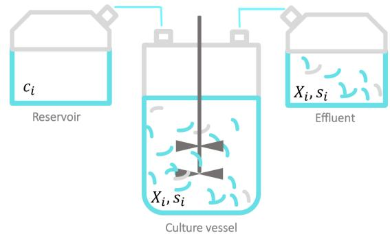
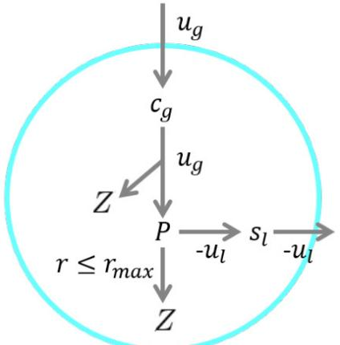
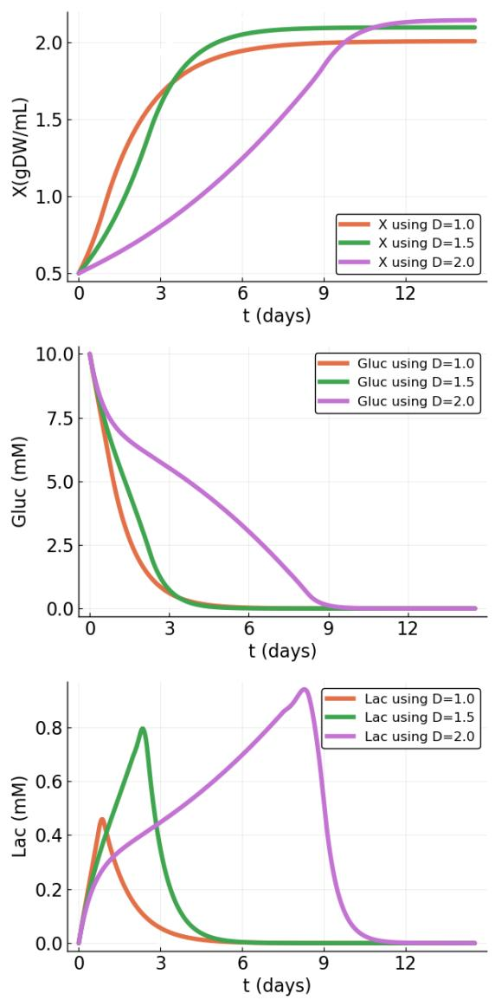
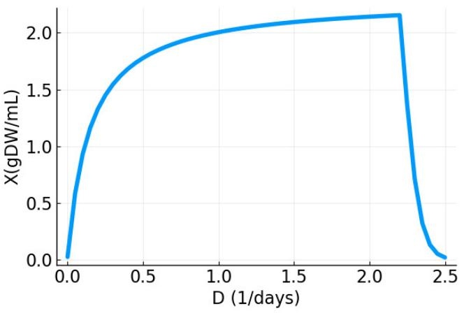
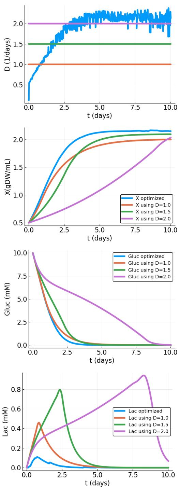
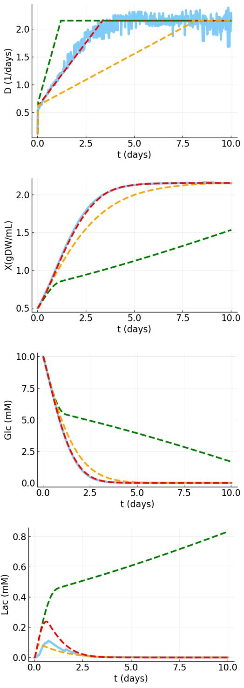

# OPTIMIZING THE DILUTION PROTOCOL IN CONTINUOUS CELL CULTURES OPTIMIZACION DEL PROTOCOLO DE DILUCI ´ ON EN CULTIVOS CELULARES CONTINUOS ´

B. A. Perez ´ -Fernandez ´ a,b† , R. Muleta,c

a) Group of Complex Systems and Statistical Physics, Physics Faculty, University of Havana, San Lazaro and L, 10400 La Habana, Cuba ´ b) Department of Applied Physics, Physics Faculty, University of Havana, San Lazaro and L, 10400 La Habana, Cuba; barbara.perezf@fisica.uh.cu ´ † c) Department of Theoretical Physics, Physics Faculty, University of Havana, San Lazaro and L, 10400 La Habana, Cuba ´ † autor para la correspondencia

#### Recibido 8/6/2021; Aceptado 20/9/2021

Due to its potential impact on the biotech industry, continuous cell cultures have attracted great interest in recent years. However, this type of culture remains expensive and, in some aspects, inefficient. They are often optimized based on the empirical experience of the personnel involved in their development and maintenance, but this is time-consuming and leads to material and nutrients waste that could be reduced with a deeper understanding of the process. We propose an optimization method for continuous cell culture applying techniques from the theory of Optimum Control. As a proof of concept, we apply this method in a simple metabolic network that consumes glucose and secretes lactate. We predict the most appropriate behavior for the dilution rate that maximizes the cell density achieved in the steady state of the system.

Los cultivos celulares continuos han alcanzado un potencial impacto en la industria biotecnologica, lo que ha despertado un gran inter ´ es´ en la comunidad cient´ıfica en los ultimos a ´ nos. Sin embargo, este ˜ tipo de cultivo sigue siendo caro y, en algunos aspectos, ineficiente. Comunmente, el proceso de producci ´ on es optimizado en base a ´ la experiencia emp´ırica del personal involucrado en su desarrollo y mantenimiento, lo cual requiere mucho tiempo y conduce a desperdicios de materiales y nutrientes que podr´ıan reducirse con una comprension m ´ as profunda del proceso. Nosotros proponemos ´ un metodo de optimizaci ´ on para cultivo celular continuo utilizando ´ Teor´ıa de Control. Como prueba de concepto, aplicamos este metodo a una red metab ´ olica simple que consume glucosa y secreta ´ lactato. Predecimos el comportamiento de la tasa de dilucion que ´ maximiza la densidad celular alcanzada en el estado estacionario del sistema.

PACS: Optimization, optimizacion´ 02,70. − *c*; theory optimal control, teor´ıa de control 0,2,30.*Yy*; metabolism, metabolismo 87,17. − *d*

# I. INTRODUCTION

Mammalian cell cultures are at the core of the productions of many therapeutic proteins and viral vaccines [\[1\]](#page-9-0). This has made it critical for pharmaceutical companies to improve their stability and efficiency. All the more reason when it comes to complex production systems such as continuous processes. In this case, fresh medium is continually added, while the culture liquid containing the leftover nutrients, metabolic end products, and toxic by-products is continuously removed to maintain the culture volume.

This type of large-scale production mode has attracted great interest in recent years. [\[2\]](#page-9-1). However, despite enormous advances in understanding and manipulation, continuous bioprocessing remains time consuming, expensive, and in some respects even an inefficient process [\[3\]](#page-9-2).

In principle, we can distinguish four different ways to improve this process [\[4\]](#page-9-3): the selection of the strain, the formulation of a culture medium, the selection of critical parameters and the definition of the optimal protocol.

The strain is usually selected considering its resistance to changes in the environmental conditions of the culture and the possibility of manipulating them to obtain the products of interest to the industry [\[5\]](#page-9-4). The formulation of the culture media is even more delicate. To lower costs, the industry would like a medium that is as cheap as possible, but at the

same time it should be rich enough in nutrients to guarantee maximum growth [\[6\]](#page-9-5) or protein production in the culture. On the other hand, setting parameters such as temperature, *pH* and oxygen concentration, is a very complex process. This generally requires prior knowledge of the values used for similar strains, or alternatively it is necessary to establish it after numerous experiments, implying a waste of time and resources [\[7\]](#page-9-6).

But setting the values of specific parametes is not the only problem, the biggest difficulty is finding an efficient time-dependent protocol for each parameter. For example, in a perfusion system, controlling the dilution rate at the exponential stage of cell growth significantly influences the growth rate and the cell density achieved at steady state [\[8,](#page-9-7)[9\]](#page-9-8).

In this work, we will concentrate our efforts in this last problem: what is the proper protocol of dilution rate that maximizes the cell density of the system at the steady state? As a proof of concept, to answer this question, we will study a toy model of cellular metabolism exploiting results from the Theory of Optimum Control.

Previously, a similar theoretical approach was applied to this problem, using empirical kinetic models for the reactions [\[10\]](#page-9-9). For example, the Monod equations that correlate cell specific growth rate with extracellular substrate concentration by two kinetic parameters [\[11\]](#page-9-10).

Indeed, the Monod equation is one of the best known processes that describe kinetic reactions in the cell. It has a simple formulation and has been extensively validated [\[12,](#page-9-11) [13\]](#page-9-12). However, several studies have shown that growth kinetic constants are actually a function of culture history and composition of the cell community [\[14,](#page-9-13) [15\]](#page-9-14). On the other, for genomic-scale cell lines, it is almost impossible to know all the kinetic parameters that describe the cell growth rate. In particular, for complex lines, such as mammalian cells, it is difficult to know the real form of the kinetic functions.

To avoid these difficulties, we will substitute the use of kinetic equations by the standard assumptions of Flux Balance Analysis (FBA). FBA allows treatment the cell metabolism in steady state, does not require the use of kinetic parameters, and has been shown to be a good approximation to estimate the cell growth rate [\[16\]](#page-9-15).

The rest of the work is organized as follows: In the next section, we will present the standard equations that describe the dynamics of the chemostat and a toy model that describe the metabolism of the cell. There, we will show what is the behavior of said system under standard protocols, also referring to the relevant literature where the reader can seek a more in-depth and detailed analysis of the model. We proceed by providing a brief review of the Theory of Optimum Control and in particular of the technique used in our work. Then, we show and discuss the optimal protocol to be used in our model. Finally, we present the conclusions of our work and suggest possible extensions to our approach.

#### II. THE MODEL

This section is divided into two parts. We first describe the equations that define the behavior of the perfusion system. Essentially, how the number of cells and the concentration of metabolites in the culture change depending on the external parameters of the problem. Next, we present the Toy model mimicking the metabolism of cells. We will remark the connection between these two seemingly disconnected systems of equations.

#### *II.1. The perfusion system*

A cell culture produced in continuous mode can be represented schematically as in figure [1.](#page-1-0) The fundamental dynamic equations that describe this system are [\[17\]](#page-9-16):

$$\frac{dX}{dt} = (\mu - \phi D)X \qquad X(0) = X_0 \tag{1}$$

$$\frac{ds_l}{dt} = -\mu_l X - (s_l - c_l)D \qquad s_l(0) = s_{l0} \tag{2}$$

where X denotes the cell density in the bioreactor (units: gDW/L), µ the effective cell growth rate (units: 1/h), and the perfusion coefficient, φ (unit-less), which characterizes the fraction of cells that escape from the culture through a cell-retention device.

Figura 1. Cells are growing in a bioreactor that is continuously fed fresh medium at a constant flux. While an equivalent flux transports metabolic end products and toxic by-products out of the tank, keeping the culture volume constant. Notation: substrate concentrations in the medium (*ci* ), cell density and metabolite concentrations in the culture (*X*, *si* ), dilution rate (*D* = *F*/*V*, where *F* is the influx/outflux and *V* the culture volume).

Equation [(1)](#page-1-1) describes a process in which the number of cells grows at a rate of µ (growth rate), and is removed from the culture at a rate of φ*D*. On the other hand, equation [(2)](#page-1-2) describes a process in which metabolite *i* is removed/injected at a rate (*si* − *ci*)*D* while *ui* denotes the specific uptake of metabolite *i* (units: mM) from the cells. The variable *si* denotes the concentration of metabolite *i* in the culture (units: mM), while *ci* is the concentration of metabolite *i* in the media formulation. In what follows, *i* will take on two values that describe glucose consumption and lactate production.

Here two things must be taken into account, first that this set of equations depends on the actual metabolism of the cells through *ui* and µ and that the external parameters that control the culture are the dilution rate, D (units: 1/h) and the perfusion coefficient φ.

## *II.2. A Toy Metabolic Network*

We study a simple metabolic network first introduced by A. Vazquez et al. [\[18\]](#page-9-17) to explain the Warburg effect and later exploited by Fernandez de Cossio and collaborators [ ´ [19\]](#page-9-18) to study the effects of toxic by-products of the metabolism, the heterogeneity in a chemostat [\[20\]](#page-9-19) and the bistability of a Warburg-like phenotype due to microenvioronmental cooperation [\[21\]](#page-9-20). A diagram of the network is shown in figure [2.](#page-2-0)

To make the discussion a bit more realistic, we assume that the nutrient consumed is glucose, *cg*, and the waste product is lactate, *sl* , a well-recognized toxic waste in mammalian cell cultures. The cell can consume *cg* from the medium at a rate *ug* > 0, and secrete lactate at a rate *ul* < 0. The stoichiometric relationships for this model are summarized in equations [(3)](#page-1-3) and [(4)](#page-1-4) from the conservation of metabolite *P* and the mass balance constraint of the cell:

$$
\mu_{\mathcal{S}} + \mu_l - r = 0 \tag{3}
$$

$$N_F \mu_\mathcal{g} + N_R r - e - yZ = 0\tag{4}$$

where *NF* and *NR* define the contribution of these reactions to the growth rate of biomass of the cell *Z*. The parameter *e* denotes an energetic maintenance demand, modeled as a constant drain of ATP [\[17,](#page-9-16)[22\]](#page-9-21). The term *y* represents the units of metabolite consumed, in this case it is glucose, required per unit of biomass produced [\[23,](#page-9-22) [24\]](#page-9-23).

Figura 2. A primary nutrient *cg* is consumed by the cell at a rate *ug* > 0. This is processed and the intermediary P is obtained, generating *NF* units of energy for each unit of *cg* consumed. P can be excreted as a waste product *sl* at a rate (−*ul* 6 0) (fermentation), or it can be completely oxidized at a rate of *r* > 0 (respiration) generating *NR* additional energy units (*NR NF*). Respiration is valid for *r* 6 *rmax*.

We also introduce the role of the enzymatic costs [\[17,](#page-9-16) [19\]](#page-9-18). Since this cost is higher in the respiration reaction than during fermentation, we limit, for simplicity, only the flux *r*:

$$r \ll r_m = 0.45 \,\text{mmol} / \text{g} \text{DW/h} \tag{5}$$

Now, since metabolite concentrations in the culture cannot be negative (*si* ≥ 0), Equation[(2)](#page-1-2) in steady state implies that *ui* ≤ *ciD*/*X*. In our setting:

$$
u_{\mathcal{S}} \le \text{Min}(V_{\prime}c_{\mathcal{S}}D/X) \tag{6}$$

where *V* is a constant maximum uptake rate determined by molecular details of the transport process. This bound (Equation [(6)](#page-2-1)) connects the variables in the chemostat with the actual metabolism of the cell.

Moreover, due to the enzymatic cost of respiration shown in the Equations [(3)](#page-1-3) and [(5)](#page-2-2), the flux *r* takes the form

$$r \le \text{Min}(\boldsymbol{u}_{\boldsymbol{\beta}'}, r_m) \tag{7}$$

Therefore, substituting the expressions [(6)](#page-2-1) and [(7)](#page-2-3) in [(3)](#page-1-3), we obtain:

$$
\mu_l = r - \mu_\mathcal{g} = \text{Min}(\mu_{\mathcal{g}'} r_m) - \mu_\mathcal{g} \tag{8}
$$

$$=\text{Min}(\text{Min}(V_{\prime}c_{\S}D/X), r_{m}) - \text{Min}(V_{\prime}c_{\S}D/X) \tag{9}$$

Notice that he study of cell death has been an important area in biomedical research for several years. Many industrially important cell lines have been shown to die by apoptosis (see, for example, the original work of Al-Rubeai et al. [\[25\]](#page-9-24)). This phenomenon has been observed mainly at the end of the batch culture, and it is due to the deprivation of nutrients such as glucose, glutamine, growth factors and oxygen or due to the presence of toxic metabolites such as ammonia and lactate [\[26–](#page-9-25)[28\]](#page-9-26).

Nevertheless, in batch feeding, perfusion, and chemostat cultures, the situation is more complex, as nutrients are constantly being replenished. In these type of cultures, cells can undergo apoptosis in response to various environmental stressors, such as high osmolality, pH fluctuations, oxygen gradients, and deprivation due to insufficient mixing at high cell densities [\[26,](#page-9-25) [29–](#page-9-27)[33\]](#page-9-28). In addition, exposure to increasing hydrodynamic forces from liquid surface bubble burst, gas bubbling, liquid flow or gas entrainment and energy dissipation from the impeller stream can induce apoptosis [\[31,](#page-9-29) [34\]](#page-9-30). Consequently, it is very difficult to obtain a mathematical expression that regulates all these factors involved in continuous or semi-continuous cultures. With more reason in a metabolic model as simple as ours. In particular, in our work we do not take into account bioreactor damage, osmolality, pH fluctuations or oxygen gradients; therefore, we do not take into account cell death due to apoptosis.

However, more generally, we can consider cell death due to the accumulation of toxic by-products, which affects the growth rate. Lactate and ammonia have been shown to inhibit and destroy cells [\[35](#page-9-31)[–37\]](#page-9-32). Specifically, the effects of lactate, a metabolite used in our model as *sl* , are incorporated in the form of growth inhibition and increased death rate as follows:

$$
\mu = Z - \tau \mathbf{s}_l \tag{10}
$$

where µ is the effective cell growth, *Z* represents the biomass production and τ is the death rate.

In short, the internal metabolism of the cell is defined by stoichiometric equations [(3)](#page-1-3) and [(4)](#page-1-4), subject to the bounds [(6)](#page-2-1), [(7)](#page-2-3) and [(9)](#page-2-4). The effective growth rate is given by [(10)](#page-2-5).

In practice, we used: *NF* = 2, *NR* = 38 as the characteristic ATP yields of glycolysis and respiration respectively [\[38\]](#page-9-33), *e* = 1,0625 mmol/gDW/h typical of mammalian cells [\[22\]](#page-9-21), *y* = 348 mmol/gDW is within the range of duplication rates in mammalian cells [\[36,](#page-9-34) [39\]](#page-10-0), *V* = 0,5 mmol/gDW/h is the maximum uptake of glucose measured for HeLa cells [\[40\]](#page-10-1) and the toxicity of waste is τ = 0,0022 h−1mM−1 obtained from linearizing the death rate dependence on lactate in a mammalian cell culture reported by S. Dhir et al. [\[36\]](#page-9-34).

## *II.3. Stability of the System*

To determine the stability of a system of coupled differential equations, on must analyze the Jacobian eigenvalues of the system. If the real parts are all negative the state is stable, but if at least one eigenvalue has a positive real part, the state is unstable.

Our system of equations [(1)](#page-1-1) and [(2)](#page-1-2) was previously presented by Cossio et al. in the report [\[17\]](#page-9-16). In that work, the authors carried out a detailed and very general study of the stability of the system of equations. For the particular set of parameters used in our work, the system is always stable.

To get a clear picture of what to expect from the model presented above, we summarize some general results here. A relevant question is the following: Given a dilution rate *D* set by the experimenter, how do cell density and metabolite concentration evolve over time?

Figura 3. Behavior of cell density and concentrations of nutrients, glucose and lactate, in the culture as a function of time for three different dilution rates (1,0 days−1 , 1,5 days−1 and 2,0 days−1 ). Initial condition, *X*0 = 0,5 gDW/mL, and *cg*0 = 10 mM.

The answer to this question can be obtained by means of the numerical solution of the dynamic system (Equations [(1)](#page-1-1)-[(2)](#page-1-2)) with the addition of the FBA hypothesis for the metabolism of the cell, for different values of *D*. As an example, we show in figure [3,](#page-3-0) for three different values of *D*, how the cell density and the concentrations of the glucose and lactate metabolites vary as a function of time.

As can be seen in the figure [3,](#page-3-0) the dilution rate affects both, the cell density at the steady state and the time required to reach that steady state. Of Course, it also influences the rate at which metabolites are delivered to the culture, and thus changes the concentrations of metabolites in the vessel, including toxic ones like lactate.

To summarize the previous image, in figure [4](#page-3-1) we present, as a function of *D*, the concentration of cells reached at the steady state. Notice, that *X* first increases, essentially, because increasing *D* increases the rate at which nutrients are delivered in the system and this facilitates the growth of the culture. However, if *D* is too large, (*D* > 2 d−1 ) the removal of the cells from the system ocurrs so rapidly that the culture is essentially washed out and *X* is drastically decreased. In this regime, cells just don't growth fast enough.

Figura 4. Expected cell density at a stable state for different constant flux of dilution rates.

In the rest of the work, our task is to suggest a suitable protocol for the experimenters in which, controlling and changing *D* the number of cells at steady state is maximized as quickly as possible. But, before presenting this protocol, we are going to introduce below some concepts and techniques of the Optimal Control Theory.

#### III. OPTIMAL CONTROL PROBLEM

In Optimal Control Theory [\[41\]](#page-10-2), you usually solve problems in which you need to maximize a utility function. In this case, it is the cell density *X*. This maximization occurs through the use of one or more variables from the problem, usually call control parameters. In our case, the control parameter will be the dilution rate *D*. The difficulty arises because the function to be maximized is constrained to following specific dynamic equations [\[41\]](#page-10-2), as in our case equations [(1)](#page-1-1) and [(2)](#page-1-2).

Let us, put this in more explicit form. We want to find the optimal control parameter *u*(*t*) = *D*(*t*) that maximizes *X*(*tf*), where *tf* is an unknown final time of the experiment. Similar to the Lagrangian Mechanics formalism [\[42\]](#page-10-3), this is of course equivalent to minimizing the following objective function:

$$F = -X(t_f) \tag{11}$$

subject to the equations [(1)](#page-1-1) and [(2)](#page-1-2), that for simplicity we rewrite in vectorial form

$$\dot{\mathbf{y}} = \mathbf{g}[\mathbf{y}(t), \boldsymbol{\mu}(t)] \quad \mathbf{y}(0) = \mathbf{y}_0 \tag{12}$$

The above problem is equivalent to minimizing the augmented functional

$$J = \int_{0}^{t_f} [H - \lambda^T \dot{\mathbf{y}}] dt = \int_{0}^{t_f} [F + \lambda^T (-\dot{\mathbf{y}} + \mathbf{g})] dt \tag{13}$$

subject to **y**(0) = **y0**; where *H* = *F* + λ *T***g** is the Hamiltonian, λ the Lagrange multipliers and *H* − λ *T* **˙y** in the language of Theoretical Mechanics is the Lagrangian *L* of the problem.

It is easy to show that the necessary conditions for the minimum of *F* are: [\[41\]](#page-10-2)

$$\begin{cases} \dot{\mathbf{y}} = \mathbf{g}_{\prime} & \mathbf{y}(0) = \mathbf{y}_{0} & \text{State equations} \\\\ \dot{\lambda} = -\mathbf{H}_{\mathbf{y}^{\prime}} & \lambda(\mathbf{t}_{\ell}) = \mathbf{0} & \text{Costate equations} \\\\ H_{\boldsymbol{u}} = \mathbf{0} & \\\\ H(t_{f}) = 0 \end{cases}$$

#### *III.1. Improvements in u and tf to reduce J*

To implement the improvement strategy numerically [\[41\]](#page-10-2), we split the time interval [0, *tf*] into *N* subintervals of equal length and use numerical integration (for example, composite Simpson's 1/3 Rule for even number of subintervals) to calculate δ*J* as well as *J*. Thus, J is rendered into a function dependent on the vector of optimization parameters

$$p \equiv \begin{bmatrix} u[t_0] & u[t_1] & \dots & u(t_N) & t_f \end{bmatrix}^T \tag{14}$$

where *t*0, *t*1, . . ., *tN* form the time-grid of (*N* + 1) equispaced grid points in the time interval [0, *t f*].

However, there is a complication with this approach. An improvement in *tf* changes the time grid, thereby requiring the estimation of controls and states on the new time grid for the next round of improvements. We avoid this situation by linearly transforming the independent variable t in the variable interval [0, *tf*] to a new independent variable σ in the fixed interval [0, 1].

Besides, this improvement is ideal in our problem because we don't know the value of the final time *tf* . We need to minimize, *F*, but both *tf* and *X*(*tf*) are free. We introduce a new independent variable σ ∈ [0, 1] through the linear relation

$$
\sigma = at + b
\tag{15}
$$

where *a* and *b* are some unknown constants.

Thus,

$$
\sigma = \frac{t}{t_f} \quad \frac{d\sigma}{dt} = \frac{1}{t_f} \quad \text{and} \quad \frac{dy_i}{dt} = \frac{dy_i}{d\sigma}
\frac{d\sigma}{dt} = \frac{dy_i}{d\sigma} \frac{1}{t_f} \tag{16}
$$

Substituting, respectively, the initial and final values of σ and *t* in the above equation, we obtain

$$0 = b \quad \text{and} \quad 1 = at_f + b \quad \Rightarrow \quad a = \frac{1}{t_f} \tag{17}$$

Based on the these relations, the objective of the optimal control problem is to find the control *u* and the final time *tf* that minimize the functional (Eq.[(13)](#page-4-0))

$$J = \int_0^{t_f} L(\mathbf{y}(t), \boldsymbol{\mu}(t)) \frac{d\sigma}{d\sigma} dt = \int_0^1 t_f L(\mathbf{y}(t), \boldsymbol{\mu}(t)) d\sigma \tag{18}$$

We compute the integral in the above equation numerically over the fixed σ-interval [0, 1] using composite Simpson's 1/3 Rule (see the Appendix). The interval is split into *N* subintervals of equal length using (*N* + 1) equi-spaced grid points.

$$
\sigma_0 = 0, \quad \sigma_1, \quad \sigma_2, \quad \dots, \quad \sigma_N = 1 \tag{19}
$$

We initialize the control parameter *u* with *N* arbitrary values and *tf* = 1,0. Then, we integrate state equations (**˙y** = **g**) using the initial conditions and the control function values, and save the values of state variables at each grid point. After, we evaluate the objective functional [(18)](#page-4-1) using the values of control functions and state variables and we save the objective functional value. Finally, we integrate costate equations (λ**˙** = −**Hy**) using the final conditions, the control function values, and the saved values of the state variables. It is also necessary to save the values of costate variables at each grid point.

Now, we improve *u* and *tf* using the gradient of the objective functional as follows:

$$\mathbf{u}_{i}^{k+1} = \mathbf{u}_{i}^{k} - \epsilon H_{\boldsymbol{u},i'}^{k} \quad i = 0, 1, \ldots, N \tag{20}$$

$$t_f^{k+1} = t_f^k - \varepsilon f_{t_f}^k \tag{21}$$

where ≡ 0/ k ∆*J* k, and 0 is some positive real number.

This minimization procedure is known as the Gradient Algorithm. It affords a simple and effective way to solve a wide range of optimal control problems [\[41\]](#page-10-2).

## *III.2. Penalty function method*

On the top of the previous discussion, we have to consider also that in some cases control parameters most fulfill specific restrictions. For example, in our case that:

$$D \ge D_0 \tag{22}$$

A constraint that can be generally expressed as

$$f(\mathbf{y}, u) = \ -D + D_0 \ \le 0$$

To solve this additional restriction problem, we use the *Penalty Function Method* [\[41\]](#page-10-2): This is a simple method for solving an optimal control problem with inequality constraints. As the name suggests, the method penalizes the objective functional in proportion to the violation of the constraints, which are not enforced directly. A constrained problem is then solved using successive applications of an optimization method with increasing penalties for these constraint violations. This strategy gradually leads to the solution, which satisfies the inequality constraints.

The problem is equivalent to minimizing the augmented functional

$$J = \bigcup_{0}^{t_f} [F + \lambda^T(-\dot{\mathbf{y}} + \mathbf{g}) + \mu_\lambda^T f]dt = \int_0^{t_f} (L - \lambda^T \dot{\mathbf{y}})dt\tag{23}$$

where, in general, µλ are time dependent multipliers associated with the algebraic constraints *f* and the Lagrangian is

$$L = F + \lambda^T \mathbf{g} + \mu_\lambda^T f = H + \mu_\lambda^T f$$

The necessary conditions for the minimum of *J* are

$$\begin{aligned} \dot{\mathbf{y}} &= \mathbf{g} & \mathbf{y}(0) &= \mathbf{y}_0 & \dot{\lambda} &= -L_{\mathbf{y}} & \lambda(t_f) &= 0\\ f &\le 0 & L_{\mu} &= \mathbf{0} & L(t_f) &= 0 & \mu_{\lambda} &\ge \mathbf{0} & \mu_{\lambda}^T L_{\mu_{\lambda}} &= \mathbf{0} \end{aligned}$$

To handle the inequalities, the penalty function method is slightly modified as follows. At any time, the multipliers corresponding to the inequalities are prescribed as

$$
\mu_{\lambda} = \mathbf{W}h \tag{24}
$$

where **W** is an *l*×*l* diagonal weighting matrix with all positive diagonal elements and *h* is

$$h = \begin{cases} 0 & \text{if } f(t) \le 0 \\\\ 1 & \text{if } f(t) > 0 \end{cases}$$

Thus, the augmented objective functional

$$J = \bigcup_{0}^{t_f} [F + \lambda^T(-\dot{\mathbf{y}} + \mathbf{g}) + h\mathbf{W}f]dt$$

has the penalty function *h***W***f*, which is positive and enlarges *J* whenever any inequality is violated. The computational algorithm to find the minimum is in the Appendix.

## IV. RESULTS AND DISCUSSION

# **IV.0.1. Solution of Optimal Control Problem**

First, we describe how the above formalism translates into our specific problem. As we already mentioned, the equivalent problem in the fixed σ-interval [0, 1] is to minimize

*F* = −*X*(*tf*) (25)

The necessary conditions for the minimum in our problem are

- 1. **˙y** = **g**, *y*(0) = *y*0
The state equations are

$$\begin{cases} dX = t_f(\mu - \phi D)X; & \mathcal{X}(0) = \mathcal{X}_0 \\ \frac{ds_\mathcal{\mathcal{S}}}{d\sigma} = t_f(-\mu_\mathcal{\mathcal{S}}X - (s_\mathcal{\mathcal{S}} - c_\mathcal{\mathcal{S}})D); s_\mathcal{\mathcal{S}}(0) = s_{\mathcal{\mathcal{S}}0} \\ \frac{ds_l}{d\sigma} = t_f(-\mu_l X - s_l D); & s_l(0) = 0 \end{cases}$$

The Hamiltonian is then given by

$$\begin{aligned} H &= t_f \left[ -X + \lambda_\times (\mu - \phi D) X + \cdots \right] \\ + \lambda_\S \left( -\mu_\S X - (s_\S - c_\S) D \right) + \lambda_l (-\mu_l X - s_l D) \rfloor \end{aligned}$$

The Lagrangian is

$$L(\boldsymbol{\sigma}) = H + \left[f(\boldsymbol{y}_{i\prime}\boldsymbol{\mu}_{i})\right]^T \mathbf{W} f(\boldsymbol{y}_{i\prime}\boldsymbol{\mu}_{i});$$
 
$$i = 0, 1, \ldots, N$$

where

$$f(\mathbf{y}, \boldsymbol{\mu}) = \ -D + D_0 \ \leq 0$$

and **W** = α *r***1**. Then

$$\begin{aligned} L(\boldsymbol{\sigma}) &= t_f [-\boldsymbol{X} + \lambda_{\boldsymbol{x}} (\boldsymbol{\mu} - \boldsymbol{\phi} \boldsymbol{D}) \boldsymbol{X} + \cdots \\ &+ \lambda_{\boldsymbol{\S}} (-\boldsymbol{\mu}_{\boldsymbol{\S}} \boldsymbol{X} - (\boldsymbol{s}_{\boldsymbol{\S}} - \boldsymbol{c}_{\boldsymbol{\S}}) \boldsymbol{D}) + \cdots \\ &+ \lambda_{\boldsymbol{I}} (-\boldsymbol{\mu}_{\boldsymbol{I}} \boldsymbol{X} - \boldsymbol{s}_{\boldsymbol{I}} \boldsymbol{D}) \big] + \boldsymbol{\alpha}^{\boldsymbol{r}} (-\boldsymbol{D} + \boldsymbol{D}_{0})^{2} \end{aligned}$$

**2.** 
$$\frac{d\lambda}{d\sigma} = -L_{\mathcal{Y}'}\lambda(1) = 0$$

**3.** 
$$L_u = 0$$

In the Appendix, there is a detailed description of these expressions and their numerical implementations.

The results of our numerical simulations are presented in figure [5,](#page-6-0) where we compare the output of our optimization with the ones obtained using fixed dilution rates (see also figure [3)](#page-3-0).

We can see that using an appropriate dilution rate protocol it is possible to achieve a higher cell density than that obtained using a constant dilution rate value, and also to reach this value more quickly. Note that through this protocol also the concentration of lactate, a toxic by-product of metabolism, is significantly reduced in the culture. We want to point out that predicting the optimal protocol to follow based on experience is not trivial and requires a high expenditure of time and resources.

As can be seen in figure [5,](#page-6-0) the graph indicating the optimal dilution protocol is very noisy. This noise is an effect of finite size due to the finite number *N* of partitions used to describe the interval σ = [0, 1]. This can be solved by increasing N, but

REVISTA CUBANA DE F´ISICA, Vol **38**, No. 2 (2021) 71 ART´ICULOS ORIGINALES (Ed. G. Rojas-Lorenzo)

the computational cost would be higher.

Figura 5. Dilution rate, cell density, and concentrations of glucose and lactate in the culture in time. The blue line shows the results of the Optimal Control Problem, and the others lines are shown above in figure [4.](#page-3-1) In all graphs, we use as initial conditions *X*0 = 0,5 gDW/mL, *cg*0 = 10 mM; and φ = 0,5. In the optimization, we use the follow parameters: *N* = 500, = 0,1, and 30 × 106 iterations.

Therefore, to provide experimenters with a *D*(*t*) curve without this noise, we performed a simple interpolation to describe the protocol for *D*. We use a linear fit for the first part of the protocol, and a constant for the second. In practice, *D*(*t*) = 0,60 days−1 +0,02 days−2 *t* during the first 3 days of the process and *D* = 2,15 days−1 for the rest of the time (red dashed line in figure [6)](#page-6-1). To test the efficiency of the protocol, we compareed the results of using our interpolated function with two similar protocols for the dilution rate *D*. The results are summarized in figure [6.](#page-6-1) We show that if the dilution increases too slowly, the steady state will be reached later in time. On the contrary, if it is increased too quickly, it will take much longer to reach the steady state, but in the process it will produce much more toxic by-products.

Figura 6. Comparison of cell density and glucose and lactate concentrations using two dilution rates somewhat different from the optimal obtained (blue line).

## V. CONCLUSIONS

In this work, we have modeled a continuous cell culture using a set of non-linear equations. Our model describes the dynamics of the cell density as a combination of intracellular properties (cell growth) and external parameters (perfusion coefficient and dilution) in the chemostat. It also describes the dynamics of metabolite concentrations in the culture as a balance between cell consumption/secretion and the dilution rate.

As a proof of concept, we study a simple metabolic network and formulated the cell growth rate through the FBA algorithm. In this way, we avoid the need to use kinetic parameters to describe metabolic reactions. These parameters are usually unknown, or variable over time.

For the studied model, exploiting Optimal Control Theory techniques, including the dynamic penalty method, we were able to predict an optimal protocol for the dilution rate as a function of time. The use of this protocol maximizes the cell density at the steady state, minimizes the time in which this steady state is reached, and also minimizes the secretion of lactate in the culture.

Although these results can no longer be translated already into experimental systems, they support the feasibility of the approach for more complex and realistic problems. We are sure that the extension of this technique to the study of Genome Scale Metabolic Networks could be of great relevance in the biotechnological industry. Work is being done in this direction.

#### ACKNOWLEDGMENTS

This project has received funding from the EuropeanUnion's Horizon 2020 research and innovation programMSCA-RISE-2016 under Grant Agreement No. 734439 IN-FERNET. This research has also been funded by the Office for the managment of funds and projects of the Ministery of Science, Technology and Environment of the Republic of Cuba within the project PN223LH010-015.

## VI. APPENDICES

## *VI.1. Computational Algorithm*

The objective in this problem is to find the control *u* that minimizes

$$\int_{0}^{t_f} F[\mathbf{y}(t), \boldsymbol{\mu}(t)] dt$$

subject

**˙y** = **g**[**y**(*t*), *u*(*t*)], **y**(0) = **y**0

and *l* algebraic equality constraints

$$f(\mathbf{y}, u) = 0$$

The equivalent problem is to find the minimum of the augmented functional

$$J = \int_{0}^{t_f} [F + \lambda^T(-\dot{\mathbf{y}} + \mathbf{g}) + \mu_\lambda^T f] dt = \int_{0}^{t_f} (L - \lambda^T \dot{\mathbf{y}}) dt \tag{26}$$

where, in general, µλ are time dependent multipliers associated with the algebraic constraints *f*.

The necessary conditions for the minimum of *J* are

$$\begin{aligned} \dot{\mathbf{y}} &= \mathbf{g} & \mathbf{y}(0) &= \mathbf{y}_0 & \dot{\lambda} &= -L_{\mathbf{y}} & \lambda(t_f) &= 0\\ f &\le 0 & L_{\boldsymbol{\mu}} &= \mathbf{0} & L(t_f) &= 0 \end{aligned}$$

At any time, the multipliers corresponding to the inequalities are prescribed as

$$
\mu_{\lambda} = \mathbf{W}h \tag{27}
$$

where **W** is an *l*×*l* diagonal weighting matrix with all positive diagonal elements and *h* is

$$h = \begin{cases} 0 & \text{if } f(t) \le 0 \\\\ 1 & \text{if } f(t) > 0 \end{cases}$$

To determine *u* and *tf* at the minimum [\[41\]](#page-10-2),

- 1. Initialize the outer counter *r* = 0. Choose a real number α > 1.
- 2. Set the *l* × *l* diagonal weighting matrix **W** = α *r***1**, where **1** is the *l* × *l* identity matrix.
- 3. Set the iteration counter *k* = 0. Assume *tk* = 1,0 and obtain the fixed σ-grid of (*N*+1) equi-spaced grid points

$$
\sigma_0 = 0, \quad \sigma_1, \quad \sigma_2, \quad \dots, \quad \sigma_N = 1 \tag{28}
$$

At each grid point, assume control function values as follows:

$$
u_i^k \equiv \mathfrak{u}^k(\sigma_i); \quad i = 0, 1, \ldots, N \tag{29}$$

- 4. Integrate state equations forward from σ = 0 to 1 using the initial conditions and the control function values *u k i* , *i* = 0, 1, . . . , *N*. Save the values of state variables at the grid points.
- 5. Evaluate the objective functional using the controls *u k i* and the state variables **y k i** . Using composite Simpson's 1/3 Rule, the objective functional value is given by

$$J = \frac{1}{3N} \left( A_0 + 4 \sum_{1,3,5,\dots}^{N} A_i + 2 \sum_{2,4,6,\dots}^{N} A_i + A_N \right) \tag{30}$$

where *Ai* ≡ *tf F*(*yi* , *ui*) + [*f*(*yi* , *ui*)]*T***W***f*(*yi* , *ui*); *i* = 0, 1, . . . , *N*.

- 6. Check the improvement in F for *k* > 0. Given a tolerable error 1 > 0, if

$$|F^k - F^{k-1}| < \epsilon_1 \tag{31}$$

- 7. Integrate costate equations backward from σ = 1 to 0 using the final conditions, the controls *u k i* , and the state variables **y k i** . Save the values of costate variables at the grid points.
- 8. Evaluate the gradient of J k by calculating the partial derivatives

$$H_{\boldsymbol{u},i}^{k} \equiv H_{\boldsymbol{u}}^{k}(\boldsymbol{\sigma}_{i}) = H_{\boldsymbol{u}}(\mathbf{y}_{i}^{k}, \boldsymbol{u}_{i}^{k}, \boldsymbol{\lambda}_{i}^{k}); \quad i = 0, 1, \ldots, N\tag{32}$$

where

$$\mathbf{H}_i^k \equiv \mathbf{t}_f^k \{ \mathbf{F}(\mathbf{y}_{i\prime}^k, \mathbf{u}_{i\prime}^k, \boldsymbol{\lambda}_i^k) + \boldsymbol{\lambda}_i^T \mathbf{g}(\mathbf{y}_{i\prime}^k, \mathbf{u}_{i\prime}^k, \boldsymbol{\lambda}_i^k) \}; \quad i = 0, 1, 2, \dots, N \tag{33}$$

and

$$J_{t_f}^k = \int_0^1 \frac{H^k}{t_f^k} d\sigma = \frac{1}{3Nt_f^k} \left( H_0^k + 4 \sum_{1,3,5,\dots}^N H_i^k + 2 \sum_{2,4,6,\dots}^N H_i^k + H_N^k \right) \tag{34}$$

Check the magnitude of the gradient. Given a small positive real number 2, if the norm of the gradient

$$\sqrt{\sum_{i=0}^{N} [H_u(\mathcal{Y}_{i'}^k, u_{i'}^k \lambda_i^k)]^2 + [\mathcal{J}_{t_{j'}^k}^k]^2} < \epsilon_2 \tag{35}$$

then take these results.

- 9. Improve control functions and the final time by calculating

$$
\mu_i^{k+1} = \mu_i^k - \epsilon H_{\mu, i\prime}^k \quad i = 0, 1, \dots, N \tag{36}
$$

$$t_f^{k+1} = t_f^k - \epsilon \mathbf{J}_{t_f}^k \tag{37}$$

where ≡ 0/ k ∆*J* k, 0 is some positive real number and

$$\nabla f \equiv \begin{bmatrix} L_{\mathfrak{u}}(\sigma_0) & L_{\mathfrak{u}}(\sigma_1) & \dots & L_{\mathfrak{u}}(\sigma_N) & f_{t_f} \end{bmatrix}^T \tag{38}$$

where

$$\begin{aligned} L(\sigma_i) &= t_f [F(y_{i\prime} u_i) + \lambda_i^T g(y_{i\prime} u_i)] + [f(y_{i\prime} u_i)]^T \mathbf{W} f(y_{i\prime} u_i); \\ &\quad i = 0, 1, \ldots, N \end{aligned} \tag{39}$$

- 10. When the gradient algorithm converges in, say, *k* iterations, save the state, the control, and the final time,

$$\mathbf{y}_{i'}^k \quad \mathfrak{u}_{i'}^k; \quad i = 0, 1, \ldots, N; \quad \text{and} \quad t_f^k$$

11. Increment the counter *r* by one and assign

$$\mathbf{y}_i^k \to \mathbf{y}_{i\prime}^r \quad u_i^k \to u_i^r; \quad \mathbf{h}_i^k \to \mathbf{h}_i^r; \quad i = 0, 1, \dots, N; \quad \text{and} \quad t_f^k \to t_f^r$$

- 12. Given a positive real number 3 close to zero, if the error

$$E = \sum_{i=0}^{N} [\mathbf{h}_i^r]^T f(y_i^r, u_i^r) > \varepsilon_3 \tag{40}$$

then some constraints are violated. Therefore, repeat the algorithm.

Otherwise, the constraints *f* ≤ 0 are satisfied, and the values

**y** *r i* , *u r i* ; *i* = 0, 1, . . . , *N*; and *t r f*

correspond to the minimum.

# *VI.2. Solution of Optimal Control Problem*

# **VI.2.1. Toy model**

# *Dynamic Problem*

The Lagrangian is given by

$$\begin{split} L(\boldsymbol{\sigma}) &= \mathbf{t}_f \left[ -\mathbf{X} + \lambda_x (\mu - \phi \boldsymbol{D}) \mathbf{X} + \lambda_\mathcal{S} (-\boldsymbol{\mu}_\mathcal{S} \mathbf{X} - (\mathbf{s}_\mathcal{S} - \mathbf{c}_\mathcal{S}) \boldsymbol{D}) \right. \\ &\left. + \lambda_l (-\boldsymbol{\mu}_l \mathbf{X} - \mathbf{s}_l \boldsymbol{D}) \right] + \alpha' \left[ (-\boldsymbol{D} + \boldsymbol{D}_0)^2 + \phi^2 + (\phi - 1)^2 \right] \end{split} \tag{41}$$

The following conditions are necessary:

$$\begin{aligned} \frac{d\lambda}{d\sigma} &= -L_{y\prime}\lambda(1) = 0\\ \text{The costate equations are} \end{aligned}$$

$$\begin{split} \frac{d\lambda_{\boldsymbol{x}}}{d\sigma} &= -L_{\boldsymbol{X}} = t_f \left[ 1 - \lambda_{\boldsymbol{x}} (\mu - \phi D + \frac{\partial \mu}{\partial \boldsymbol{X}} \mathbf{X}) + \mathbf{1} \right] \\ \lambda_{\boldsymbol{\S}} (\mu_{\boldsymbol{\S}} + \frac{\partial \mu_{\boldsymbol{\S}}}{\partial \mathbf{X}} \mathbf{X}) + \lambda_{l} (\mu_{l} + \frac{\partial \mu_{l}}{\partial \mathbf{X}} \mathbf{X}) \right] \lambda_{\boldsymbol{x}} (\mathbf{1}) &= \mathbf{0} \\ \frac{d\lambda_{\boldsymbol{\S}}}{d\sigma} &= -L_{\mathbf{s}_{\boldsymbol{\S}}} = t_f \lambda_{\boldsymbol{\S}} D \, \lambda_{\boldsymbol{\S}} (\mathbf{1}) = \mathbf{0} \\ \frac{d\lambda_{l}}{d\sigma} &= -L_{\mathbf{s}_{l}} = t_f (-\lambda_{\boldsymbol{x}} X \frac{\partial \mu}{\partial \mathbf{s}_{l}} + \lambda_{l} D) , \lambda_{l} (\mathbf{1}) = \mathbf{0} \end{split}$$

where

$$\frac{\partial \mu}{\partial X} = \begin{cases} -\frac{1}{\mathcal{Y}} \frac{c_{\mathcal{S}} D}{X^2} (N_F + N_R) & \text{if } c_{\mathcal{S}} D / X < r_m \\\\ -\frac{1}{\mathcal{Y}} \frac{c_{\mathcal{S}} D}{X^2} N_F & \text{if } r_m \le c_{\mathcal{S}} D / X \le V \\\\ 0 & \text{if } V < c_{\mathcal{S}} D / X \end{cases}$$

$$\frac{\partial \mu}{\partial \mathbf{s}_l} = -\tau$$

and

$$\frac{\partial \mu_{\mathcal{S}}}{\partial X} = \begin{cases} -\frac{c_{\mathcal{S}}D}{X^2} & \text{if } V \ge c_{\mathcal{S}}D/X \\\\ 0 & \text{if } V < c_{\mathcal{S}}D/X \end{cases}$$

$$\frac{\partial u_l}{\partial X} = \begin{cases} 0 & \text{if } c_{\mathcal{S}} D/X < r_m \\\\ \frac{c_{\mathcal{S}} D}{X^2} & \text{if } r_m \le c_{\mathcal{S}} D/X \le V \\\\ 0 & \text{if } V < c_{\mathcal{S}} D/X \end{cases}$$

$$\begin{array}{c} \bullet \quad L_u = \mathbf{0} \end{array}$$

$$\frac{\partial L}{\partial D} = t_f \left\{ X \left[ \lambda_x (\frac{\partial \mu}{\partial D} - \phi) - \lambda_\mathcal{g} \frac{\partial u_\mathcal{g}}{\partial D} - \lambda_l \frac{\partial u_l}{\partial D} \right] \right\} \tag{42}$$

$$-t_f [\lambda_\mathcal{g} (\mathbf{s}_\mathcal{g} - \mathbf{c}_\mathcal{g}) - \lambda_l \mathbf{s}_\mathcal{g} - 2\alpha^r (-D + D_0)] = 0$$

$$\frac{\partial L}{\partial \phi} = t_f [-DX\lambda_x] + \alpha'(4\phi - 2) = 0\tag{43}$$

where

$$\frac{\partial \mu}{\partial D} = \begin{cases} \frac{1}{y} \frac{c_s}{X} (N_F + N_R) & \text{if } c_\mathcal{S} D / X < r_m \\\\ \frac{1}{y} \frac{c_\mathcal{S}}{X} N_F & \text{if } r_m \le c_\mathcal{S} D / X \le V \\\\ 0 & \text{if } V < c_\mathcal{S} D / X \end{cases}$$

and

$$\frac{\partial u_{\mathcal{S}}}{\partial D} = \begin{cases} \frac{c_{\mathcal{S}}}{X} & \text{if } V \ge c_{\mathcal{S}}D/X \\\\ 0 & \text{if } V < c_{\mathcal{S}}D/X \end{cases}$$

$$\frac{\partial u_{l}}{\partial D} = \begin{cases} 0 & \text{if } c_{\mathcal{S}}D/X < r_{m} \\\\ -c_{\mathcal{S}}/X & \text{if } r_{m} \le c_{\mathcal{S}}D/X \le V \\\\ 0 & \text{if } V < c_{\mathcal{S}}D/X \end{cases}$$

## REFERENCES

- [1] T. S. Le, M. McCann, S. M. Azarin and W.-S. Hu, Chem. Eng. Prog. **112**, 34 (2016).
- [2] M. S. Croughan, K. B. Konstantinov and C. Cooney, Biotechnol. Bioeng. **112**, 648 (2015).
- [3] A. Kumar, I. A. Udugama, C. L. Gargalo and K. V. Gernaey, Processes **8**, 1641 (2020).
- [4] A. P. B. Benyahia, L. Pereira and F. V. Santos da Silva, New and Future Developments in Microbial Biotechnology and Bioengineering, **69**, 89 (2020).
- [5] M. Guevara-Martinez, Strain-and bioprocess-design strategies to increase production of (r)-3-hydroxybutyrate by escherichia coli, Ph.D. thesis, KTH Royal Institute of Technology (2019).
- [6] B. A. Perez-Fern ´ andez, J. Fernandez-de Cossio-Diaz, T. ´ Boggiano, K. Leon and R. Mulet, Biotechnol. Bioeng. ´ **118**, 1884 (2021).
- [7] P. Biechele, C. Busse, D. Solle, T. Scheper and K. Reardon, Eng. Life Sci. **15**, 469 (2015).
- [8] D. Martens, C. De Gooijer, C. Van der Velden-De Groot, E. Beuvery and J. Tramper, Biotechnol Bioeng **41**, 429 (1993).
- [9] M. K. F. Wolf, A. Closet, M. Bzowska, J.-M. Bielser, J. Souquet, H. Broly and M. Morbidelli, Biotechnol. J. **14**, 1700722 (2019).
- [10] G. Alwan, Int. J. Chem. Process Eng. Res. **5** (2012).
- [11] J. Monod, Annu. Rev. Microbiol. **3**, 371 (1949).
- [12] J. Alvarez-Ramirez, M. Meraz and E. J. Vernon-Carter, Biochem. Eng. J. **150**, 107305 (2019).
- [13] B. Chezeau and C. Vial, Biohydrogen, Biomass, Biofuels, Biochemicals **445**, 483 (Elsevier, 2019), 2nd edition.
- [14] D. Orhon, E. U. Cokgor, G. Insel, O. Karahan and T. Katipoglu, Bioresour. Technol. 100, 5678 (2009).
- [15] I. Pala-Ozkok, A. Rehman, N. Yagci, E. Ubay-Cokgor, D. Jonas and D. Orhon, Bioresour. Technol. **126**, 274 (2012).
- [16] R. U. Ibarra, J. S. Edwards and B. O. Palsson, Nature **420**, 186 (2002).
- [17] J. Fernandez-de-Coss´ıo-D´ıaz, K. Leon and R. Mulet, PLoS Comput. Biol. **13**, e1005835 (2017).
- [18] A. Vazquez, J. Liu, Y. Zhou and Z. N. Oltvai, BMC. Syst. Biol. **4**, 58 (2010).
- [19] J. Fernandez-de-Coss´ıo-D´ıaz and A. Vazquez, Sci. Rep. **7**, 13488 (2017).
- [20] J. Fernandez-de-Coss´ıo-D´ıaz and R. Mulet **15**, e1006823 (2019).
- [21] J. Fernandez-de-Coss´ıo-D´ıaz, A. D. Martino, R. Mulet, Sci. Rep. **7**, 3103 (2017).
- [22] D. Kilburn, M. Lilly and F. Webb, J. Cell. Sci. **4**, 645 (1969).
- [23] A. M. Feist and B. O. Palsson, Curr. Opin. Microbiol. **13**, 344 (2010).
- [24] A. M. Feist and B. O. Palsson, Genome Biol. **17**, 110 (2016).
- [25] M. Al-Rubeai, D. Mills and A. Emery, Cytotechnology **4**, 13 (1990).
- [26] N. Simpson, R. Singh, A. Perani, C. Goldenzon and M. Al-Rubeai, Biotechnol. Bioeng. **59**, 90 (1998).
- [27] R. Singh, M. Al.-Rubeai, C. Gregory and A. Emery, Biotechnol. Bioeng. **44**, 720 (1994).
- [28] S. Mercille and B. Massie, Biotechnol. Bioeng. **44**, 1140 (1994).
- [29] B. Krampe and M. Al-Rubeai, Cytotechnology **62**, 175 (2010).
- [30] A. Perani, R. Singh, R. Chauhan and M. Al-Rubeai, Cell. Culture Engineering VI 177, **188** (Springer, 1998).
- [31] M. Al-Rubeai, R. Singh, M. Goldman and A. Emery, Biotechnol. Bioeng. **45**, 463 (1995).
- [32] R. Singh and M. Al-Rubeai, Apoptosis **167**, 184 (1998).
- [33] J. S. Ryu and G.M. Lee, Biotechnol. Bioeng. **62**, 120 (1999).
- [34] Y. Chisti, Trends Biotechnol. **18**, 420 (2000).
- [35] B. C. Batt and D. S. Kompala, Biotechnol. Bioeng. **34**, 515 (1989).
- [36] S. Dhir, K. J. Morrow, R. R. Rhinehart and T. Wiesner, Biotechnol. Bioeng. **67**, 197 (2000).
- [37] B. S. Cummings and R. G. Schnellmann, Curr. Protoc. Pharmacol. **25**, 12 (2004).
- [38] B. Alberts and A. Johnson, Molecular Biology of the Cell (Garland Science, Taylor and Francis Group, New York, NY, 2015), 6th edition.
- [39] M. A. Bree, P. Dhurjati, R. F. Geoghegan and B. Robnett, Biotechnol. Bioeng. **32**, 1067 (1988).
- [40] S. Rodr´ıguez-Enr´ıquez, A. Mar´ın-Hernandez, J. C. ´ Gallardo-Perez and R. Moreno-S ´ anchez, J. Cell. Physiol. ´ **221**, 552 (2009).
- [41] S. R. Upreti, Optimal control for chemical engineers (Taylor & Francis, 2013).
- [42] H. Goldstein, C. Poole and J. Safko, Classical mechanics (American Association of Physics Teachers, New York, South Carolina, 2002), 3rd edition.

This work is licensed under the Creative Commons Attribution-NonCommercial 4.0 International (CC BY-NC 4.0, http:// creativecommons.org/licenses/by-nc/4.0) license.

