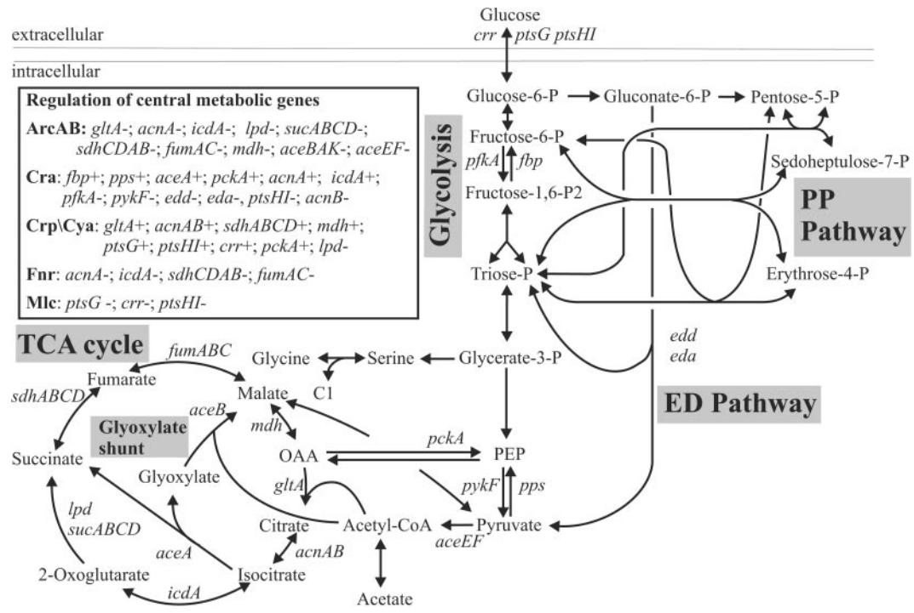
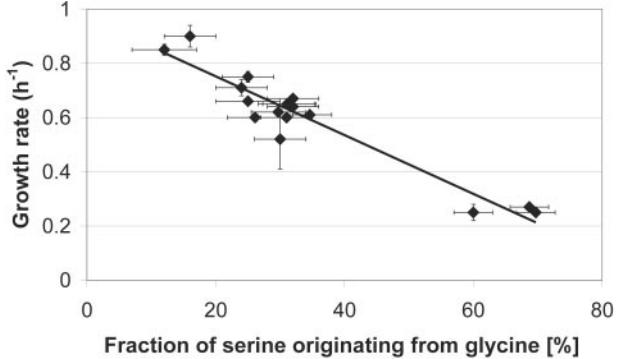
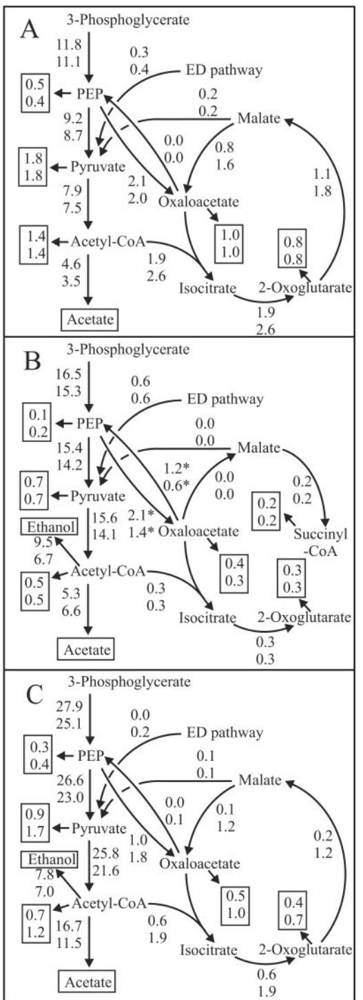
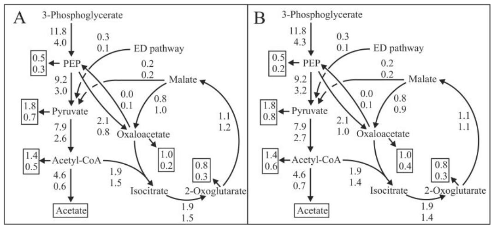

# Impact of Global Transcriptional Regulation by ArcA, ArcB, Cra, Crp, Cya, Fnr, and Mlc on Glucose Catabolism in *Escherichia coli*†

Annik Perrenoud and Uwe Sauer*

*Institute of Biotechnology, ETH Zu¨rich, Zu¨rich, Switzerland*

Received 17 December 2004/Accepted 21 January 2005

**Even though transcriptional regulation plays a key role in establishing the metabolic network, the extent to which it actually controls the in vivo distribution of metabolic fluxes through different pathways is essentially unknown. Based on metabolism-wide quantification of intracellular fluxes, we systematically elucidated the relevance of global transcriptional regulation by ArcA, ArcB, Cra, Crp, Cya, Fnr, and Mlc for aerobic glucose catabolism in batch cultures of** *Escherichia coli***. Knockouts of ArcB, Cra, Fnr, and Mlc were phenotypically silent, while deletion of the catabolite repression regulators Crp and Cya resulted in a pronounced slow-growth phenotype but had only a nonspecific effect on the actual flux distribution. Knockout of ArcA-dependent redox regulation, however, increased the aerobic tricarboxylic acid (TCA) cycle activity by over 60%. Like aerobic conditions, anaerobic derepression of TCA cycle enzymes in an ArcA mutant significantly increased the in vivo TCA flux when nitrate was present as an electron acceptor. The in vivo and in vitro data demonstrate that ArcA-dependent transcriptional regulation directly or indirectly controls TCA cycle flux in both aerobic and anaerobic glucose batch cultures of** *E. coli***. This control goes well beyond the previously known ArcA-dependent regulation of the TCA cycle during microaerobiosis.**

Metabolic networks consist of hundreds of metabolites that are interconnected through a large number of biochemical and regulatory reactions. In principle, metabolites could flow through various reactions, but only few specific pathways are used in reality (20). This distribution of molecular fluxes is regulated by multiple mechanisms at several levels that include gene expression, posttranscriptional control, enzyme kinetics, and allosteric control. While transcriptional regulation is generally considered the main mode of regulation in bacteria, the extent to which it actually controls the distribution of metabolic fluxes through different pathways is mostly unknown. Based on metabolism-wide comparisons of metabolic flux and gene expression during growth on different substrates, the flux through some central metabolic pathways was found to correlate, at least qualitatively, with the expression level, but in many cases there was no apparent correlation (12, 24, 41, 42). In parasitic protists, the glycolytic flux was demonstrated to be rarely completely controlled at the transcriptional level and mostly not even largely controlled at this level (65).

Transcriptional regulation itself involves a complex network of global and specific regulators, in which global regulators exhibit pleiotropic phenotypes and regulate several operons that belong to different functional groups (26). In *Escherichia coli*, only seven global regulators (ArcA, Crp, Fis, Fnr, Ihf, Lrp, and NarL) directly modulate the expression of about one-half of all genes (39). The following three regulators have specific metabolic functions that involve altering expression of genes that are involved in central carbon metabolism (Fig. 1): (i) the

* Corresponding author. Mailing address: Institute of Biotechnology, ETH Zu¨rich, CH-8093 Zu¨rich, Switzerland. Phone: 41-1-633 3672. Fax: 41-1-633 1051. E-mail: sauer@biotech.biol.ethz.ch.

ArcB/ArcA two-component signal transduction system that regulates gene expression in response to redox conditions (36, 37), (ii) the catabolite repressor Crp that is activated by adenylate cyclase (Cya)-synthesized cAMP (55), and (iii) Fnr, whose modulon encodes proteins that are involved in cellular adaptation to growth in anoxic environments (37, 67, 68). Two additional global regulators with important metabolic functions are the cAMP-independent catabolite repressor-activator Cra (54, 55) and the global repressor Mlc that controls transcription of genes involved in carbohydrate utilization, such as the phosphoenolpyruvate (PEP):glucose phosphotransferase (PTS) system (49) (Fig. 1).

Here we describe a systematic and quantitative evaluation of the control that global transcriptional regulators exert on the in vivo activity of pathways and reactions in central carbon metabolism. In contrast to studies of metabolic control theory, in which the objective is to quantify the control that metabolic enzymes exert on the overall rate of flux through a pathway (33), we were primarily interested in the distribution of flux between different pathways. Our focus was on a single physiological state, mid-exponential growth on glucose, which was not expected to be the phase with highest activity for all of the regulators investigated. For quantification of in vivo enzyme activity, we used the methodology that is currently most reliable, metabolic flux analysis based on 13C-labeling experiments (18, 56, 70). For this purpose, isogenic knockout mutants with mutations in the seven global regulators (ArcA, ArcB, Cra, Crp, Cya, Fnr, and Mlc) were grown in shake flask batch cultures. While most regulator knockouts had only little influence or a nonspecific efffect on the flux distribution under these conditions, ArcA controlled tricarboxylic acid (TCA) cycle fluxes rather specifically.

† Supplemental material for this article may be found at http: //jb.asm.org/.

FIG. 1. Biochemical reaction network for central carbon metabolism in *E. coli*. The arrowheads indicate the assumed reaction reversibility. The inset provides an overview of central metabolic genes that are regulated by the global regulators which we investigated. Negative transcriptional regulation and positive transcriptional regulation are indicated by minus signs and plus signs that follow the gene abbreviations, respectively. Only regulated genes are indicated in the network for clarity.

## **MATERIALS AND METHODS**

**Strains and growth conditions.** For clarity, the mutant nomenclature reflects the deleted gene (Table 1). Generally, all knockout mutants were obtained from the Keio knockout collection with the *E. coli* strain BW25113 background (3). Since previously constructed mutants have been widely used in other studies, all aerobic experiments were repeated with such mutants. These mutants were designated the original mutants and were compared to the original parent strains.

Frozen glycerol stock cultures were used to inoculate Luria-Bertani complex

medium; when necessary, the medium was supplemented with 50 mg of kanamycin per liter, 12.5 mg of tetracycline per liter, 20 mg of spectomycin per liter, or 20 mg of streptomycin per liter. All other cultivations were performed without antibiotics. After 8 h of incubation at 37°C with constant shaking, Luria-Bertani medium precultures were used to inoculate M9 medium precultures that were grown overnight for inoculation of cultures for physiological experiments. Aerobic batch cultures containing 30 or 50 ml of M9 medium were inoculated (1:500) with M9 medium precultures in 500-ml baffled shake flasks and incubated on a gyratory shaker at 250 rpm and 37°C. Anaerobic cultures were grown in sealed

| TABLE 1. E. coli strains used |  |  |  |  |  |
|-------------------------------|--|--|--|--|--|
|-------------------------------|--|--|--|--|--|

| Strain                            | Relevant genotype                                                       | Reference or origin |  |
|-----------------------------------|-------------------------------------------------------------------------|------------------------|--|
| BW25113                           | lacIq rrnB3 lacZ4787 hsdR514 (araBAD)567 (rhaBAD)568 rph-1     | 13                     |  |
| JW4364 (ArcA mutant)              | BW25113 arcA::kan                                                    | 3                      |  |
| JW3177 (ArcB mutant)              | BW25113 arcB::kan                                                    | 3                      |  |
| JW0078 (Cra mutant)               | BW25113 cra::kan                                                     | 3                      |  |
| JW3320 (Crp mutant)               | BW25113 crp::kan                                                     | 3                      |  |
| JW3778 (Cya mutant)               | BW25113 cya::kan                                                     | 3                      |  |
| JW1328 (Fnr mutant)               | BW25113 fnr::kan                                                     | 3                      |  |
| JW1586 (Mlc mutant)               | BW25113 mlc::kan                                                     | 3                      |  |
| MC4100                            | F araD139  (argF-lac)U169 rpsL150 relA1 flb5301 deoC1 ptsF25 rbsR | CGSCa                  |  |
| RM3133RM23 (original ArcA mutant) | MC4100 arcA::tet  (pfl-lacZ)                                         | 1                      |  |
| FB8                               | F prototrophic                                                          | 7                      |  |
| LJ2808 (original Cra mutant)      | FB8 cra::Tn10                                                           | CGSC                   |  |
| CA8000                            | e14 relA1 spoT1 thi-1                                                   | CGSC                   |  |
| SP850 (original Cya mutant)       | CA8000 cya::kan                                                      | CGSC                   |  |
| RZ7350                            | lacZ 145 (narG234::Mu dI1734)                                        | 30                     |  |
| RZ8480 (original Fnr mutant)      | RZ7350 fnr                                                           | 35                     |  |
| PP6                               |                                                                         | 31                     |  |
| KK32 (original Mlc mutant)        | PP6 mlc1157::Tn10                                                       | 31                     |  |

*a* CGSC, *E. coli* Genetic Stock Center.

| Strain      | Growth rate (h1 ) | Biomass yield (g g1 ) | Glucose consumption rate (mmol g1 h1 ) | Acetate production rate (mmol g1 h1 ) |  |
|-------------|----------------------|-----------------------------|-------------------------------------------------|------------------------------------------------|--|
| BW25113     | 0.65 	 0.01          | 0.48 	 0.01                 | 7.6 	 0.2                                       | 4.8 	 0.2                                      |  |
| ArcA mutant | 0.60 	 0.01          | 0.46 	 0.01                 | 7.2 	 0.2                                       | 3.5 	 0.0                                      |  |
| ArcB mutant | 0.61 	 0.01          | 0.45 	 0.01                 | 7.4 	 0.1                                       | 4.9 	 0.1                                      |  |
| Cra mutant  | 0.65 	 0.01          | 0.44 	 0.02                 | 8.1 	 0.3                                       | 5.7 	 0.4                                      |  |
| Crp mutant  | 0.25 	 0.01          | 0.56 	 0.02                 | 2.5 	 0.2                                       | 0.7 	 0.1                                      |  |
| Cya mutant  | 0.27 	 0.01          | 0.56 	 0.01                 | 2.7 	 0.1                                       | 0.8 	 0.1                                      |  |
| Fnr mutant  | 0.61 	 0.01          | 0.44 	 0.02                 | 7.7 	 0.5                                       | 4.8 	 0.0                                      |  |
| Mlc mutant  | 0.60 	 0.00          | 0.47 	 0.00                 | 7.1 	 0.0                                       | 4.3 	 0.2                                      |  |

TABLE 2. Aerobic growth parameters for global regulator mutants and their parent strain during exponential batch growth on glucose

flasks containing M9 medium that had been flushed with N2 for 10 min and were inoculated with anaerobic precultures. Where indicated below, dimethyl sulfoxide and NaNO3 were added as electron acceptors to a final concentration of 40 mM. Cra mutant strains were routinely checked for impaired growth on lactate and pyruvate minimal medium (21), while Crp and Cya mutant strains were checked for an inability to grow on maltose minimal medium (55).

M9 medium contained (per liter of deionized water) 0.8 g of NH4Cl, 0.5 g of NaCl, 7.5 g of Na2HPO4 · 2H2O, and 3.0 g of KH2PO4. The following components were sterilized separately and then added (per liter [final volume] of medium): 2 ml of 1 M MgSO4, 1 ml of 0.1 M CaCl2, 0.3 ml of 1 mM filtersterilized thiamine HCl, and 10 ml of a trace element solution containing (per liter) 1 g of FeCl3 · 6H2O, 0.18 g of ZnSO4 · 7H2O, 0.12 g of CuCl2 · 2H2O, 0.12 g of MnSO4 · H2O, and 0.18 g of CoCl2 · 6H2O. Sterilized glucose was added to a final concentration of 2 or 3 g per liter. For 13C-labeling experiments, glucose was added either entirely as the 1-13C-labeled isotope isomer (99%; Euriso-top, GIF-sur-Yvette, France) or as a mixture of 20% (wt/wt) [U-13C]glucose (13C, 98%; Isotech, Miamisburg, Ohio) and 80% (wt/wt) natural glucose.

**Analytical procedures and physiological parameters.** Cell growth was monitored by determining the optical density at 600 nm (OD600). Glucose, acetate, and ethanol concentrations were determined enzymatically by using commercial kits (Beckman-Coulter, Zurich, Switzerland, or Dispolab, Dielsdorf, Switzerland). All physiological parameters were determined during the exponential growth phase as described previously (60). Correlation factors for cellular dry weight and OD600 were determined for at least each reference strain and were used to determine biomass specific yields and consumption or production rates. Crude cell extracts for in vitro enzyme assays were prepared from pellets obtained from 45-ml culture aliquots. The pellets were resuspended in 4 ml of 0.9% (wt/vol) NaCl–10 mM MgSO4, passed three times through a French pressure cell (1.2 108 Pa), and centrifuged at 11,000 *g*. Isocitrate dehydrogenase (34) and 2-oxoglutarate dehydrogenase (53) were assayed at 25°C by using coupled optical tests with NADP and NAD, respectively, as the acceptors. Succinate dehydrogenase activity was assayed by determining the succinate-dependent reduction of 2,6-dichlorophenol-indophenol at 25°C (43). The protein contents of crude cell extracts were determined with the biuret reaction.

**Metabolic flux ratio analysis by GC-MS.** Samples for gas chromatography (GC)-mass spectrometry (MS) analysis were prepared as described previously (16). Briefly, aliquots of 13C-labeled batch cultures were withdrawn during the mid-exponential growth phase, which was defined as an OD600 of 0.8 to 1.2 for aerobic cultures and an OD600 of 0.4 to 0.7 for anaerobic cultures. Cell pellets were hydrolyzed in 6 M HCl at 105°C for 24 h in sealed microtubes. The hydrolysates were dried under a stream of air at around 60°C and then derivatized at 85°C in 30 l of dimethylformamide (Fluka, Buchs, Switzerland) and 30 l of *N*-(*tert*-butyldimethylsilyl)-*N*-methyl-trifluoroacetamide with 1% (vol/vol) *tert*-butyldimethylchlorosilane (Fluka) for 60 min (18). Derivatized amino acids were analyzed with a series 8000 gas chromatograph combined with an MD 800 mass spectrometer (Fisons Instruments, Beverly, Mass.). The GC-MS-derived mass isotope distributions of proteinogenic amino acids were then corrected for naturally occurring isotopes (16). The corrected mass distributions were related to the in vivo metabolic activities with previously described algebraic equations and statistical data treatment, which quantified nine ratios of fluxes through converging reactions and pathways for the synthesis of five intracellular metabolites (16).

**13C-constrained metabolic net flux analysis.** Intracellular net carbon fluxes were estimated by using the previously described (18) stoichiometric model that included all major pathways of central carbon metabolism, including the glyoxylate shunt and the Entner-Doudoroff (ED) pathway. The network considered was similar to the one shown in Fig. 1, except that the gluconeogenic reaction from pyruvate to PEP through PEP synthase was not taken into account for growth on glucose (19). The reaction matrix consisted of 25 unknown fluxes and 21 metabolite balances (including the three experimentally determined rates of glucose uptake and acetate and biomass production). To solve this underdetermined system of equations with 4 degrees of freedom, the following seven of the calculated flux ratios mentioned above were used as additional constraints, as described previously (18, 59): serine derived through the Embden-Meyerhoff-Parnas (EMP) pathway, pyruvate derived through the ED pathway, oxaloacetate (OAA) originating from PEP, PEP originating from OAA, pyruvate originating from malate (upper and lower boundaries), and PEP derived through the pentose phosphate (PP) pathway (upper boundary). The first four ratios were used as equality constraints, while the last three were used only as boundary constraints.

Fluxes into biomass were calculated from the known metabolite requirements for macromolecular compounds and the growth rate-dependent RNA and protein contents (14). Biosynthetic conversion of succinyl coenzyme A (succinyl-CoA) to succinate was not normally considered explicitly but was included as an ATP-requiring reaction in amino acid formation. In cases with low TCA cycle fluxes, such as anaerobic cultures without any electron acceptor, the flux to succinyl-CoA was calculated from the known biomass requirements and was considered explicitly. Only for the anaerobic cultures was the reaction from 2-oxoglutarate to succinyl-CoA removed from the network, since the TCA cycle was absent, as also determined from a metabolic flux ratio analysis (data not shown).

The sum of the weighed square residuals of the constraints from both metabolite balances and flux ratios was minimized by using the MATLAB function fmincon. The residuals were weighed by dividing through the experimental error (18). The computation was repeated at least five times with randomly chosen initial flux distributions to ensure identification of the global minimum, and the system always converged to the same solution.

## **RESULTS**

**Metabolic impact of global regulator knockouts.** To assess the impact of global regulator-mediated transcriptional control on *E. coli* glucose metabolism, we first determined physiological effects of regulator deletions. For this purpose, we grew metabolic regulator ArcA, ArcB, Cra, Crp, Cya, Fnr, and Mlc knockout mutants and the parent in aerobic batch cultures. None of the transcriptional regulators of the aerobic-anaerobic switch (28, 37) (ArcA, ArcB, or Fnr) affected the growth rate (Table 2). Cra, Crp, Cya, and Mlc were reported previously to affect transcription of the glucose PTS uptake system (Fig. 1) (32, 49, 50, 52). If this transcriptional regulation was relevant under the conditions used, one would have expected the glucose uptake rate to be higher in the Cra and Mlc mutants and lower in the Crp and Cya mutants. For the Cra and Mlc mutants, this was not the case because the glucose uptake rate was not significantly different from the parent rate (Table 2). Thus, neither regulator appeared to exert significant control on the glucose uptake flux in an aerobic batch culture. On the other hand, as expected (61, 72), the Crp and Cya mutants

|                               | % of total pool for: |                |                |               |               |               |               |               |
|-------------------------------|----------------------|----------------|----------------|---------------|---------------|---------------|---------------|---------------|
| Metabolite                    | BW25113              | ArcA mutant | ArcB mutant | Cra mutant | Crp mutant | Cya mutant | Fnr mutant | Mlc mutant |
| EMP, ED, and PP pathways      |                      |                |                |               |               |               |               |               |
| Serine through EMP pathwaya   | 78 	 1b              | 81 	 2         | 76 	 2         | 79 	 1        | 72 	 2        | 70 	 2        | 77 	 2        | 76 	 2        |
| Pyruvate through ED pathwaya  | 4 	 3                | 7 	 3          | 7 	 3          | 4 	 3         | 5 	 3         | 6 	 3         | 6 	 3         | 7 	 3         |
| PEP from PP pathway (ub)c     | 13 	 6               | 12 	 5         | 15 	 5         | 16 	 5        | 28 	 5        | 29 	 5        | 17 	 5        | 15 	 5        |
| Gluconeogenesis and TCA cycle |                      |                |                |               |               |               |               |               |
| OAA from PEP                  | 67 	 5               | 55 	 4         | 70 	 5         | 70 	 5        | 43 	 3        | 48 	 4        | 68 	 4        | 67 	 5        |
| Pyruvate from malate (ub)c    | 9 	 5                | 6 	 3          | 8 	 5          | 14 	 5        | 9 	 3         | 10 	 3        | 6 	 5         | 11 	 5        |
| Pyruvate from malate (lb)c    | 3 	 2                | 3 	 2          | 2 	 2          | 4 	 2         | 5 	 2         | 5 	 2         | 2 	 2         | 4 	 2         |
| PEP from OAA                  | 0 	 0                | 0 	 1          | 0 	 1          | 0 	 1         | 2 	 1         | 2 	 2         | 1 	 1         | 0 	 1         |
| C1 metabolism                 |                      |                |                |               |               |               |               |               |
| Serine from glycine           | 31 	 5               | 26 	 4         | 30 	 4         | 31 	 4        | 70 	 3        | 69 	 3        | 35 	 3        | 31 	 4        |
| Glycine from serine           | 100 	 4              | 98 	 3         | 99 	 3         | 98 	 3        | 100 	 4       | 100 	 4       | 98 	 3        | 99 	 3        |

TABLE 3. Origin of metabolic intermediates in aerobic batch cultures of *E. coli* as determined by METAFoR analysis

*a* Values obtained from experiments performed with 100% [1-13C]glucose. All other values were obtained from experiments performed with 20% [U-13C]glucose and 80% natural glucose. *b* Errors were estimated from redundant mass distributions (16).

*c* ub, upper boundary; lb, lower boundary.

exhibited a lower glucose uptake rate, which might partially explain their reduced growth rates (Table 2) (15).

To elucidate the importance of global transcriptional regulation of catabolic genes for the intracellular flux distribution, we quantified nine ratios of metabolic fluxes in 13C-labeled batch cultures from the GC-MS-detected mass isotope distribution in proteinogenic amino acids (Table 3). The initial glucose catabolism in *E. coli* may proceed via the three alternative glycolytic routes (the EMP pathway, the PP pathway, or the ED pathway). The relative use of these three alternative routes was remarkably stable in most mutants and the parent strain, with around 80% EMP pathway, the expected absence or very low activity of the ED pathway (16, 73), and some contribution of the PP pathway. Only the Crp and Cya mutant strains exhibited a slight flux shift from the EMP pathway to the PP pathway, which was probably an indirect effect that was related to their slow-growth phenotype (Table 3). It should be noted that the three independently determined flux ratios should not have added up to exactly 100%, because they were determined at different branch points and fluxes into biomass were not considered here (16). While an absence of control of the initial glucose catabolism was expected for most regulators, a higher EMP pathway value might have been expected for the Cra mutant because Cra represses the two glycolytic key genes *pfkA* and *pykF* (Fig. 1), albeit weakly (5, 40, 52, 54).

In agreement with previous flux data (17, 57, 60, 63) and *lacZ* fusion studies (23), gluconeogenic fluxes were very small or absent in our glucose batch cultures, as judged from the fraction of pyruvate originating from malate and the fraction of PEP originating from OAA (Table 3). The values indicated the activity of the malic enzyme and PEP carboxykinase, respectively. Since gluconeogenesis was inactive in the parent, a potential further reduction in the gluconeogenic fluxes in the Cra, Crp, and Cya mutants that should have had lower *pckA*-encoded PEP carboxykinase activity (Fig. 1) (23, 52) could not be observed under the conditions used.

In contrast to the invariant (within the statistical confidence intervals) gluconeogenic and glycolytic fluxes, two other flux ratios changed significantly. First, the fraction of serine originating from glycine was significantly increased in the Crp and Cya mutants (Table 3). This effect was probably nonspecific because the ratio of this exchange flux was correlated with the growth rate (Fig. 2). Second, the fraction of OAA originating from PEP was significantly decreased in the ArcA (but not ArcB), Cra, and Cya mutants compared to the parent (Table 3). This flux ratio indicates the contribution of the anaplerotic flux catalyzed by PEP carboxylase that replenishes the TCA cycle intermediates required for biosynthesis relative to the respiratory TCA cycle flux to OAA synthesis. The lower fraction of OAA from PEP thus revealed a greater contribution of the respiratory TCA cycle to OAA synthesis in the ArcA, Crp, and Cya mutants. To investigate these mutants in more detail, we calculated intracellular net fluxes from the physiological data (Table 2) with the flux ratios described above as 13C constraints (Table 3), as described previously (18, 57).

**ArcA-dependent transcriptional control of TCA cycle fluxes.** The response regulator ArcA and the sensor ArcB form a two-component system that represses transcription of genes

FIG. 2. Growth rate dependence of the flux ratio for serine originating from glycine. Data for the isogenic mutants, the original mutants, and all reference strains are included. The errors bar for the ratio were estimated from redundant mass distributions (16). The errors bars for the growth rate indicate standard deviations for at least two independent cultivations.

FIG. 3. Metabolic flux distribution in aerobic (A), anaerobic (B), and anaerobic nitrate-respiring (C) batch cultures of the reference strain (top values) and the ArcA mutant (bottom values) on glucose. For the anaerobic conditions (B and C), the original ArcA mutant and its reference strain were used. For clarity only the lower part of metabolism is shown. Net molar fluxes (expressed in millimoles per gram per hour) were determined by 13C-constrained flux analysis from two separate experiments with 100% [1-13C]glucose and with a mixture of 20% [U-13C]glucose and 80% unlabeled glucose. The standard deviations were less than 0.2 mmol g1 h1 (A) and less than 0.3 and 0.5 mmol g1 h1 for the reference strain and the ArcA mutant, respectively (C). In panel B, the standard deviations for TCA cycle and

involved in aerobic respiration and activates operons encoding enzymes of microaerobic or fermentative metabolism in response to the redox conditions (28, 37). In central metabolism, ArcA represses expression of TCA cycle and glyoxylate shunt genes upon oxygen deprivation (Fig. 1). Hence, the 60% higher molecular flux through the respiratory TCA cycle of the fully aerobic ArcA mutant is surprising (Fig. 3A). Although the originally described ArcA mutant and its parent (1) exhibited a slightly different physiology, the original ArcA mutant showed an increase (80%) in TCA cycle flux similar to that of the isogenic ArcA mutant (see the supplemental material). This increase in the flux was rather specific because all other estimated intracellular fluxes were either lower or remained largely unaltered in the mutant. We excluded oxygen deprivation as a potential cause of the observed TCA cycle flux reduction because all cultures were analyzed at an OD600 below 1.2, well before oxygen limitation might occur (18, 29). Under these conditions, the growth rate did not decrease, as would be expected with low concentrations of dissolved oxygen. Thus, the increased TCA cycle flux appeared to be a specific consequence of the absence of ArcA-dependent repression in the mutant. Further evidence that supported this conclusion came from the at least doubled in vitro activity of three ArcAregulated TCA cycle enzymes in ArcA mutants (Table 4). As expected, ArcB did not control the TCA cycle flux because under the aerobic conditions investigated, oxidized quinone electron carriers inhibited autophosphorylation of ArcB, and therefore it could not transphosphorylate ArcA (22).

To elucidate whether ArcA also controlled anaerobic TCA cycle fluxes, we grew the original ArcA mutant and its reference strain under strictly anaerobic conditions and under anaerobic respiration conditions in the presence of two electron acceptors, nitrate and dimethyl sulfoxide. Under strictly anaerobic conditions, the TCA cycle operated as a bifurcated pathway that had exclusively biosynthetic functions (Fig. 3B), as shown previously (16, 60, 63). Although expression of genes encoding TCA cycle enzymes was shown to be increased 6- to 70-fold in ArcA mutants during anaerobic growth (9, 44–48) and in vitro TCA cycle enzyme activities were indeed increased in the ArcA mutant (Table 4), the in vivo TCA flux could not be higher in the mutant because the concomitantly generated NADH could not be reoxidized. In the presence of exogenous electron acceptors, however, this was feasible. With the energetically less favorable electron acceptor dimethyl sulfoxide (27), the TCA cycle still operated as a bifurcated pathway without any respiratory, cyclic flux (data not shown), as reported previously (51). In the presence of nitrate, however, the reference strain exhibited a low but significant respiratory TCA cycle flux (0.2 mmol g1 h1 ), which may have been too low for detection by traditional physiological analyses (51, 66). Since the in vivo TCA cycle flux was further increased in the original ArcA mutant (Fig. 3C), ArcA appears to also control anaerobic respiratory fluxes through the TCA cycle. Further support

acetate formation were 0.1 mmol g1 h1 . For other fluxes in both the reference strain and the mutant, the standard deviation was 0.7 mmol g1 h1 . The asterisks indicate ill-determined fluxes with confidence intervals as large as the fluxes themselves. Fluxes to biomass building blocks and extracellular products are enclosed in boxes.

|  | TABLE 4. In vitro enzyme activities in crude cell extracts of aerobic, anaerobic, and anaerobic nitrate-respiring batch cultures of the |                                                                   |  |  |  |  |
|--|-----------------------------------------------------------------------------------------------------------------------------------------|-------------------------------------------------------------------|--|--|--|--|
|  |                                                                                                                                         | originally described ArcA mutant and its reference strain, MC4100 |  |  |  |  |

|                                      |                          | Sp act (mol of substrate min1 g of protein1 ) |                         |
|--------------------------------------|--------------------------|--------------------------------------------------|-------------------------|
| Strain                               | Isocitrate dehydrogenase | 2-Oxoglutarate dehydrogenase                     | Succinate dehydrogenase |
| Aerobic cultures                     |                          |                                                  |                         |
| MC4100                               | 481 	 24 (632 	 25)a     | 2.5 	 0.3 (4.1 	 1.5)                            | 2.8 	 1.5               |
| MC4100 arcA                       | 813 	 4 (985 	 4)        | 10.4 	 1.4 (14.8 	 0.3)                          | 6.2 	 0.1               |
| Anaerobic cultures                   |                          |                                                  |                         |
| MC4100                               | 169 	 15                 | 0.2 	 0.9                                        | 4.9 	 0.5               |
| MC4100 arcA                       | 784 	 35                 | 14.5 	 1.7                                       | 9.6 	 4.9               |
| Anaerobic nitrate-respiring cultures |                          |                                                  |                         |
| MC4100                               | 289 	 2 (238 	 11)       | 0.2 	 0.2 (1.8 	 0.9)                            | 3.0 	 1.5               |
| MC4100 arcA                       | 1,015 	 63 (1,423 	 29)  | 11.3 	 0.6 (10.8 	 1.6)                          | 1.8 	 1.3               |

*a* Average standard deviation for triplicate experiments. The values in parentheses are values for the BW25113 strain and its ArcA mutant.

for this conclusion came from the strongly increased in vitro TCA cycle enzyme activities in ArcA mutants (Table 4). The sole exception was succinate dehydrogenase, which was difficult to assess and exhibited large confidence intervals.

**Metabolic flux responses in Crp and Cya mutants.** Crp and cAMP, synthesized from the adenylate cyclase (Cya), are involved in catabolite repression in *E. coli*. Upon complex formation with cAMP, Crp activates genes encoding the glucose PTS system (50), the TCA cycle (11, 69, 71), and gluconeogenesis (23). If the Crp-cAMP-dependent induction of TCA cycle enzymes was relevant under our conditions, we would have expected lower TCA cycle fluxes in the Crp and Cya mutants. However, the fraction of OAA originating from PEP was significantly lower in both mutants (Table 3). While this change revealed a major shift in the relative contributions of the anaplerotic reaction and the TCA cycle, it did not reveal the absolute value of the TCA cycle flux. More detailed 13C constraint flux analysis then demonstrated that the absolute molecular fluxes through the TCA cycle were similar in the mutants and the parent strain (Fig. 4). Instead, the altered anaplerotic-to-respiratory flux ratio was caused by a reduced flux through the anaplerotic reaction to OAA. This change was brought about by two- to threefold-lower overall fluxes in the Crp and Cya mutants compared to their parent. Thus, CrpcAMP-mediated catabolite repression exerted no direct control on the TCA cycle flux in batch culture.

**Metabolic flux responses in different strain backgrounds.** The inherent problems of quantitative analyses include direct comparability of the environmental conditions in different labs and comparisons of different strain backgrounds. In our systematic analysis, both the conditions and the strain background were kept as constant as possible. Since the vast majority of the previously reported genetic and biochemical work on the regulators investigated was done with mutants with somewhat different genotypes, we wondered how representative our data were. Hence, all aerobic batch experiments were also done with the most frequently described mutants (referred to as the original mutants) with mutations in the *arcA*, *cra*, *cya*, *fnr*, and *mlc* genes and each of their parental strains (Table 1). While individual growth parameters of the nonmutated parental strains varied up to 50%, all relevant flux responses to the regulator mutations were qualitatively conserved (see the sup-

FIG. 4. Metabolic flux distribution in the Crp mutant (bottom values) and the parent strain (top values) (A) and in the Cya mutant (bottom values) and the parent strain (top values) (B) during exponential aerobic growth on glucose. For clarity only the lower part of metabolism is shown. Net molar fluxes (expressed in millimoles per gram per hour) were determined by 13C-constrained flux analysis from two separate experiments with 100% [1-13C]glucose and with a mixture of 20% [U-13C]glucose and 80% unlabeled glucose. In all cases the standard deviation was less than 0.2 mmol g1 h1 . Fluxes to biomass building blocks and extracellular products are enclosed in boxes.

plemental material). Briefly, the original Fnr and Mlc mutants were phenotypically silent, the Cra and Cya knockouts had only nonspecific flux effects, and the original ArcA mutant exhibited an 80%-higher TCA cycle flux. Thus, intracellular flux responses were often conserved, even when the growth physiology of the parent strains varied somewhat, as observed previously (16, 60). However, this cannot be interpreted as a general rule because entirely different flux responses to a given mutation were observed in different genetic backgrounds (17, 74).

#### **DISCUSSION**

Systematic analysis of global regulator mutants in aerobic glucose batch cultures revealed that Fnr and Mlc are phenotypically silent, as expected from their reported roles (49, 67, 68). Cra- and Crp-cAMP-dependent regulation, in contrast, was reported to be somewhat active in glucose batch cultures (25, 54, 61). While the Cra mutant had no distinct phenotype, the Crp and Cya mutants exhibited a pronounced slow-growth phenotype. Neither Cra- nor Crp-cAMP-mediated catabolite repression, however, had any specific influence on the flux distribution. This finding highlights the danger of direct extrapolation from qualitative genetic data to the quantitative operation of network-embedded pathways.

The unexpected key finding of this work was the apparent control of aerobic and fully anaerobic TCA cycle fluxes by ArcA but not by its sensor kinase, ArcB, which contradicts current beliefs that an absence of ArcA does not significantly affect aerobic or anaerobic glucose catabolism (2, 22, 38, 51). Generally, the Arc (anoxic redox control) two-component system is considered to be a global transcriptional regulator in response to the redox conditions and in particular to deprivation of oxygen under microaerobic conditions (2, 22, 28, 37). Although the expression of the TCA cycle genes *gltA*, *icdA*, *sdhCDAB*, *fumA*, and *mdh* was known to double in fully aerated ArcA mutants (9, 45–48), previous flux (2) and phosphorylation data for the sensor kinase ArcB (22) suggested that ArcA regulation did not affect aerobic glucose catabolism. While ArcA is clearly active under fully anaerobic conditions (36), Arc-dependent regulation can modulate anaerobic TCA cycle fluxes only in the presence of electron acceptors that reoxidze the concomitantly generated reducing equivalents. Like what happens under aerobic conditions, anaerobic derepression of TCA cycle enzymes in an ArcA mutant significantly increased the TCA cycle flux when nitrate was present. Relative to the overall carbon flux under anaerobic conditions, however, the nitrate-dependent TCA cycle flux was small, less than 5% of the glucose uptake rate. This relatively low level of in vivo activity may explain why it was not recognized previously on the basis of acetate formation data (51).

In combination with the very good correlation between TCA cycle flux and mRNA abundance during growth on different substrates (41), our ArcA mutant data indicate that aerobic TCA cycle activity is subject to transcriptional control in *E. coli* and that ArcA plays a major role in this regulation. The TCA cycle-specific effect with otherwise largely unaltered metabolism indicates that there is direct binding of active ArcA to promoters of TCA cycle genes (36). How does ArcA then regulate the TCA cycle? Either the nonphosphorylated form of ArcA binds to DNA and regulates gene expression or at least some ArcA is phosphorylated to increase the affinity for its DNA targets. Under the aerobic conditions investigated, however, oxidized quinone electron carriers inhibit autophosphorylation of its two-component sensor kinase, ArcB (22). This view is consistent with our ArcB mutant data, which were indistinguishable from those obtained for the parent, demonstrating inactivity of the gene. If ArcA is not phosphorylated by ArcB, could ArcA be phosphorylated through cross talk with other sensor kinases, or do small phosphorylated compounds phosphorylate ArcA? Since these molecular mechanisms were not the focus of this work, we hope that our results stimulate further research on the question of whether ArcA is phosphorylated aerobically and, if it is, how it is phosphorylated.

Of the seven global transcriptional regulators investigated, only ArcA affected a single pathway in a specific fashion under the conditions investigated. While transcriptional regulation is clearly condition dependent, our results support the conclusion derived from other quantitative analyses (12, 41, 65) that, in particular, central metabolic fluxes are rarely regulated by gene expression alone and the control is shared by many mechanisms that include allosteric regulation and kinetic effects. While the flux data presented here reflect the integration of all this regulation, a quantitative understanding of the distribution of flux control between different mechanisms requires integration with mRNA and protein data. Such a quantitative understanding is important not only for a comprehensive, systemlevel understanding of regulatory networks (10, 58) but also for metabolic engineering (4, 62). While rational engineering of metabolism has focused primarily on brute-force deletion or overexpression of key enzymes, it is clearly rewarding to manipulate multiple fluxes by more subtle tuning of regulatory networks (6, 8). One example is the twofold increase in phenylalanine production upon deletion of the carbon storage regulator CsrA (64). Before such regulation engineering can be applied effectively, however, a quantitative understanding of the flux-controlling mechanisms under given conditions is imperative.

### **ACKNOWLEDGMENTS**

This work was supported by a scholarship from the EPFL to A.P. We thank Eliane Fischer and Laetitia Malphettes for fruitful discussions and comments and Hiroji Aiba, Francis Biville, Patricia Kiley, Hirotada Mori, and Joost Teixera de Mattos for generously providing strains.

#### **REFERENCES**

- 1. **Alexeeva, S., B. de Kort, G. Sawers, K. J. Hellingwerf, and M. J. Teixeira de Mattos.** 2000. Effects of limited aeration and of the ArcAB system on intermediary pyruvate catabolism in *Escherichia coli*. J. Bacteriol. **182:**4934– 4940.
- 2. **Alexeeva, S., K. J. Hellingwerf, and M. J. Teixeira de Mattos.** 2003. Requirement of ArcA for redox regulation in *Escherichia coli* under microaerobic but not anaerobic or aerobic conditions. J. Bacteriol. **185:**204–209.
- 3. **Baba, T., T. Ara, Y. Okumura, M. Hasegawa, Y. Takai, M. Baba, K. A. Datsenko, T. Oshima, M. Tomita, B. L. Wanner, and H. Mori.**. Submitted for publication.
- 4. **Bailey, J. E.** 1991. Toward a science of metabolic engineering. Science **252:**1668–1675.
- 5. **Bledig, S. A., T. M. Ramseier, and M. H. Saier, Jr.** 1996. FruR mediates catabolite activation of pyruvate kinase (*pykF*) gene expression in *Escherichia coli*. J. Bacteriol. **178:**280–283.
- 6. **Broun, P.** 2004. Transcription factors as tools for metabolic engineering in plants. Curr. Opin. Plant Biotechnol. **7:**202–209.
- 7. **Bruni, C. B., V. Colantuoni, L. Sbordone, R. Cortese, and F. Blasi.** 1977.

Biochemical and regulatory properties of *Escherichia coli* K-12 *hisT* mutants. J. Bacteriol. **130:**4–10.

- 8. **Bulter, T., J. R. Bernstein, and J. C. Liao.** 2003. A perspective of metabolic engineering strategies: moving up the systems hierarchy. Biotechnol. Bioeng. **84:**815–821.
- 9. **Chao, G., J. Shen, C. P. Tseng, S. J. Park, and R. P. Gunsalus.** 1997. Aerobic regulation of isocitrate dehydrogenase gene (*icd*) expression in *Escherichia coli* by the *arcA* and *fnr* gene products. J. Bacteriol. **179:**4299–4304.
- 10. **Covert, M. W., and B. O. Palsson.** 2002. Transcriptional regulation in constraints-based metabolic models of *Escherichia coli*. J. Biol. Chem. **277:** 28058–28064.
- 11. **Cunningham, L., M. J. Gruer, and J. R. Guest.** 1997. Transcriptional regulation of the aconitase genes (*acnA* and *acnB*) of *Escherichia coli*. Microbiology **143:**3795–3805.
- 12. **Daran-Lapujade, P., M. L. Jansen, J. M. Daran, W. van Gulik, J. H. de Winde, and J. T. Pronk.** 2004. Role of transcriptional regulation in controlling fluxes in central carbon metabolism of *Saccharomyces cerevisiae*. A chemostat culture study. J. Biol. Chem. **279:**9125–9138.
- 13. **Datsenko, K. A., and B. L. Wanner.** 2000. One-step inactivation of chromosomal genes in *Escherichia coli* K-12 using PCR products. Proc. Natl. Acad. Sci. USA **97:**6640–6645.
- 14. **Emmerling, M., M. Dauner, A. Ponti, J. Fiaux, M. Hochuli, T. Szyperski, K. Wu¨thrich, J. E. Bailey, and U. Sauer.** 2002. Metabolic flux responses to pyruvate kinase knockout in *Escherichia coli*. J. Bacteriol. **184:**152–164.
- 15. **Ezzell, J. W., and W. J. Dobrogosz.** 1975. Altered hexose transport and salt sensitivity in cyclic adenosine 3 ,5 -monophosphate-deficient *Escherichia coli*. J. Bacteriol. **124:**815–824.
- 16. **Fischer, E., and U. Sauer.** 2003. Metabolic flux profiling of *Escherichia coli* mutants in central carbon metabolism using GC-MS. Eur. J. Biochem. **270:** 880–891.
- 17. **Fischer, E., and U. Sauer.** 2003. A novel metabolic cycle catalyzes glucose oxidation and anaplerosis in hungry *Escherichia coli*. J. Biol. Chem. **278:** 46446–46451.
- 18. **Fischer, E., N. Zamboni, and U. Sauer.** 2004. High-throughput metabolic flux analysis based on gas chromatography-mass spectrometry derived 13C constraints. Anal. Biochem. **325:**308–316.
- 19. **Fraenkel, D. G.** 1996. Glycolysis, p. 189–198. *In* F. C. Neidhardt, R. Curtiss III, J. L. Ingraham, E. C. C. Lin, K. B. Low, B. Magasanik, W. S. Reznikoff, M. Riley, M. Schaechter, and H. E. Umbarger (ed.), *Escherichia coli* and *Salmonella*: cellular and molecular biology, 2nd ed. ASM Press, Washington D.C.
- 20. **Fuhrer, T., E. Fischer, and U. Sauer.** 2005. Experimental identification and quantification of glucose metabolism in seven bacterial species. J. Bacteriol. **187:**1581–1590.
- 21. **Geerse, R. H., C. R. Ruig, A. R. Schuitema, and P. W. Postma.** 1986. Relationship between pseudo-HPr and the PEP: fructose phosphotransferase system in *Salmonella typhimurium* and *Escherichia coli*. Mol. Gen. Genet. **203:**435–444.
- 22. **Georgellis, D., O. Kwon, and E. C. C. Lin.** 2001. Quinones as the redox signal for the Arc two-component system of bacteria. Science **292:**2314–2316.
- 23. **Goldie, H.** 1984. Regulation of transcription of the *Escherichia coli* phosphoenolpyruvate carboxykinase locus: studies with *pck-lacZ* operon fusions. J. Bacteriol. **159:**832–836.
- 24. **Gonzalez, R., H. Tao, K. T. Shanmugam, S. W. York, and L. O. Ingram.** 2002. Global gene expression differences associated with changes in glycolytic flux and growth rate in *Escherichia coli* during the fermentation of glucose and xylose. Biotechnol. Prog. **18:**6–20.
- 25. **Gosset, G., Z. Zhang, S. Nayyar, W. A. Cuevas, and M. H. Saier, Jr.** 2004. Transcriptome analysis of Crp-dependent catabolite control of gene expression in *Escherichia coli*. J. Bacteriol. **186:**3516–3524.
- 26. **Gottesman, S.** 1984. Bacterial regulation: global regulatory networks. Annu. Rev. Genet. **18:**415–441.
- 27. **Gunsalus, R. P.** 1992. Control of electron flow in *Escherichia coli*: coordinated transcription of respiratory pathway genes. J. Bacteriol. **174:**7069– 7074.
- 28. **Gunsalus, R. P., and S. J. Park.** 1994. Aerobic-anaerobic gene regulation in *Escherichia coli*: control by the ArcAB and Fnr regulons. Res. Microbiol. **145:**437–450.
- 29. **Gupta, A., and G. Rao.** 2003. A study of oxygen transfer in shake flasks using a non-invasive oxygen sensor. Biotechnol. Bioeng. **84:**351–358.
- 30. **Kiley, P. J., and W. S. Reznikoff.** 1991. Fnr mutants that activate gene expression in the presence of oxygen. J. Bacteriol. **173:**16–22.
- 31. **Kimata, K., T. Inada, H. Tagami, and H. Aiba.** 1998. A global repressor (Mlc) is involved in glucose induction of the *ptsG* gene encoding major glucose transporter in *Escherichia coli*. Mol. Microbiol. **29:**1509–1519.
- 32. **Kimata, K., H. Takahashi, T. Inada, P. Postma, and H. Aiba.** 1997. cAMP receptor protein-cAMP plays a crucial role in glucose-lactose diauxie by activating the major glucose transporter gene in *Escherichia coli*. Proc. Natl. Acad. Sci. USA **94:**12914–12919.
- 33. **Koebmann, B. J., H. V. Westerhoff, J. L. Snoep, D. Nilsson, and P. R. Jensen.** 2002. The glycolytic flux in *Escherichia coli* is controlled by the demand for ATP. J. Bacteriol. **184:**3909–3916.
- 34. **Kurlandzka, A., R. F. Rosenzweig, and J. Adams.** 1991. Identification of adaptive changes in an evolving population of *Escherichia coli*: the role of changes with regulatory and highly pleiotropic effects. Mol. Biol. Evol. **8:**261–281.
- 35. **Lazazzera, B. A., D. M. Bates, and P. J. Kiley.** 1993. The activity of the *Escherichia coli* transcription factor FNR is regulated by a change in oligomeric state. Genes Dev. **7:**1993–2005.
- 36. **Liu, X., and P. De Wulf.** 2004. Probing the ArcA-P modulon of *Escherichia coli* by whole genome transcriptional analysis and sequence recognition profiling. J. Biol. Chem. **279:**12588–12597.
- 37. **Lynch, A. S., and E. C. C. Lin.** 1996. Responses to molecular oxygen, p. 1526–1538. *In* F. C. Neidhardt, R. Curtiss III, J. L. Ingraham, E. C. C. Lin, K. B. Low, B. Magasanik, W. S. Reznikoff, M. Riley, M. Schaechter, and H. E. Umbarger (ed.), *Escherichia coli* and *Salmonella*: cellular and molecular biology, 2nd ed. ASM Press, Washington D.C.
- 38. **Malpica, R., B. Franco, C. Rodriguez, O. Kwon, and D. Georgellis.** 2004. Identification of a quinone-sensitive redox switch in the ArcB sensor kinase. Proc. Natl. Acad. Sci. USA **101:**13318–13323.
- 39. **Martinez-Antonio, A., and J. Collado-Vides.** 2003. Identifying global regulators in transcriptional regulatory networks in bacteria. Curr. Opin. Microbiol. **6:**482–489.
- 40. **Ne`gre, D., C. Bonod-Bidaud, C. Geourjon, G. Dele´age, A. J. Cozzone, and J. C. Cortay.** 1996. Definition of a consensus DNA-binding site for the *Escherichia coli* pleiotropic regulatory protein, FruR. Mol. Microbiol. **21:** 257–266.
- 41. **Oh, M. K., and J. C. Liao.** 2000. Gene expression profiling by DNA microarrays and metabolic fluxes in *Escherichia coli*. Biotechnol. Prog. **16:**278–286.
- 42. **Oh, M. K., L. Rohlin, K. C. Kao, and J. C. Liao.** 2002. Global expression profiling of acetate-grown *Escherichia coli*. J. Biol. Chem. **277:**13175–13183.
- 43. **O¨ zkanca, R., and K. P. Flint.** 1997. Relationship between respiratory enzymes and survival of *Escherichia coli* under starvation stress in lake water. J. Appl. Microbiol. **82:**301–309.
- 44. **Park, S. J., G. Chao, and R. P. Gunsalus.** 1997. Aerobic regulation of the *sucABCD* genes of *Escherichia coli*, which encode alpha-ketoglutarate dehydrogenase and succinyl coenzyme A synthetase: roles of ArcA, Fnr, and the upstream *sdhCDAB* promoter. J. Bacteriol. **179:**4138–4142.
- 45. **Park, S. J., P. A. Cotter, and R. P. Gunsalus.** 1995. Regulation of malate dehydrogenase (*mdh*) gene expression in *Escherichia coli* in response to oxygen, carbon, and heme availability. J. Bacteriol. **177:**6652–6656.
- 46. **Park, S. J., and R. P. Gunsalus.** 1995. Oxygen, iron, carbon, and superoxide control of the fumarase *fumA* and *fumC* genes of *Escherichia coli*: role of the *arcA*, *fnr*, and *soxR* gene products. J. Bacteriol. **177:**6255–6262.
- 47. **Park, S. J., J. McCabe, J. Turna, and R. P. Gunsalus.** 1994. Regulation of the citrate synthase (*gltA*) gene of *Escherichia coli* in response to anaerobiosis and carbon supply: role of the *arcA* gene product. J. Bacteriol. **176:**5086– 5092.
- 48. **Park, S. J., C. P. Tseng, and R. P. Gunsalus.** 1995. Regulation of succinate dehydrogenase (*sdhCDAB*) operon expression in *Escherichia coli* in response to carbon supply and anaerobiosis: role of ArcA and Fnr. Mol. Microbiol. **15:**473–482.
- 49. **Plumbridge, J.** 2002. Regulation of gene expression in the PTS in *Escherichia coli*: the role and interactions of Mlc. Curr. Opin. Microbiol. **5:**187–193.
- 50. **Postma, P. W., J. W. Lengeler, and G. R. Jacobson.** 1993. Phosphoenolpyruvate:carbohydrate phosphotransferase systems of bacteria. Microbiol. Rev. **57:**543–594.
- 51. **Prohl, C., B. Wackwitz, D. Vlad, and G. Unden.** 1998. Functional citric acid cycle in an *arcA* mutant of *Escherichia coli* during growth with nitrate under anoxic conditions. Arch. Microbiol. **170:**1–7.
- 52. **Ramseier, T. M.** 1996. Cra and the control of carbon flux via metabolic pathways. Res. Microbiol. **147:**489–493.
- 53. **Reeves, H. C., R. Rabin, W. S. Wegener, and S. J. Ajl.** 1971. Assay of enzymes of the tricarboxylic acid and glyoxylate cycles. Methods Microbiol. **6A:**426– 462.
- 54. **Saier, M. H., Jr., and T. M. Ramseier.** 1996. The catabolite repressor/ activator (Cra) protein of enteric bacteria. J. Bacteriol. **178:**3411–3417.
- 55. **Saier, M. H., Jr., T. M. Ramseier, and J. Reizer.** 1996. Regulation of carbon utilization, p. 1325–1343. *In* F. C. Neidhardt, R. Curtiss III, J. L. Ingraham, E. C. C. Lin, K. B. Low, B. Magasanik, W. S. Reznikoff, M. Riley, M. Schaechter, and H. E. Umbarger (ed.), *Escherichia coli* and *Salmonella*: cellular and molecular biology, 2nd ed. ASM Press, Washington D.C.
- 56. **Sauer, U.** 2004. High-throughput phenomics: experimental methods for
- mapping fluxomes. Curr. Opin. Biotechnol. **15:**58–63. 57. **Sauer, U., F. Canonaco, S. Heri, A. Perrenoud, and E. Fischer.** 2004. The soluble and membrane-bound transhydrogenases UdhA and PntAB have divergent functions in NADPH metabolism of *Escherichia coli*. J. Biol. Chem. **279:**6613–6619.
- 58. **Sauer, U., and B. J. Eikmanns.** 2005. The PEP-pyruvate-oxaloacetate node as the switch point for carbon flux distribution in bacteria. FEMS Microbiol. Rev. Epub ahead of print; doi: 10.1016/j.femsre.2004.11.002.
- 59. **Sauer, U., V. Hatzimanikatis, J. E. Bailey, M. Hochuli, T. Szyperski, and K. Wuthrich.** 1997. Metabolic fluxes in riboflavin-producing *Bacillus subtilis*. Nat. Biotechnol. **15:**448–452.

- 60. **Sauer, U., D. R. Lasko, J. Fiaux, M. Hochuli, R. Glaser, T. Szyperski, K. Wu¨thrich, and J. E. Bailey.** 1999. Metabolic flux ratio analysis of genetic and environmental modulations of *Escherichia coli* central carbon metabolism. J. Bacteriol. **181:**6679–6688.
- 61. **Shah, S., and A. Peterkofsky.** 1991. Characterization and generation of *Escherichia coli* adenylate cyclase deletion mutants. J. Bacteriol. **173:**3238– 3242.
- 62. **Stephanopoulos, G.** 1999. Metabolic fluxes and metabolic engineering. Metab. Eng. **1:**1–11.
- 63. **Szyperski, T.** 1995. Biosynthetically directed fractional 13C-labeling of proteinogenic amino acids. An efficient analytical tool to investigate intermediary metabolism. Eur. J. Biochem. **232:**433–448.
- 64. **Tatarko, M., and T. Romeo.** 2001. Disruption of a global regulatory gene to enhance central carbon flux into phenylalanine biosynthesis in *Escherichia coli*. Curr. Microbiol. **43:**26–32.
- 65. **ter Kuile, B. H., and H. V. Westerhoff.** 2001. Transcriptome meets metabolome: hierarchical and metabolic regulation of the glycolytic pathway. FEBS Lett. **500:**169–171.
- 66. **Thauer, R. K., D. Moller-Zinkhan, and A. M. Spormann.** 1989. Biochemistry of acetate catabolism in anaerobic chemotrophic bacteria. Annu. Rev. Microbiol. **43:**43–67.
- 67. **Unden, G., S. Achebach, G. Holighaus, H. G. Tran, B. Wackwitz, and Y.**

**Zeuner.** 2002. Control of FNR function of *Escherichia coli* by O2 and reducing conditions. J. Mol. Microbiol. Biotechnol. **4:**263–268.

- 68. **Unden, G., and J. Schirawski.** 1997. The oxygen-responsive transcriptional regulator FNR of *Escherichia coli*: the search for signals and reactions. Mol. Microbiol. **25:**205–210.
- 69. **Vogel, R. F., K. D. Entian, and D. Mecke.** 1987. Cloning and sequence of the *mdh* structural gene of *Escherichia coli* coding for malate dehydrogenase. Arch. Microbiol. **149:**36–42.
- 70. **Wiechert, W.** 2001. 13C metabolic flux analysis. Metab. Eng. **3:**195–206.
- 71. **Wilde, R. J., and J. R. Guest.** 1986. Transcript analysis of the citrate synthase and succinate dehydrogenase genes of *Escherichia coli* K12. J. Gen. Microbiol. **132:**3239–3251.
- 72. **Wright, L. F., and C. J. Knowles.** 1977. The interrelated effects of cyclic AMP and growth rate on the respiratory system and glycolytic enzyme synthesis of *Escherichia coli* K-12. FEMS Microbiol. Lett. **1:**259–263.
- 73. **Zablotny, R., and D. G. Fraenkel.** 1967. Glucose and gluconate metabolism in a mutant of *Escherichia coli* lacking gluconate-6-phosphate dehydrase. J. Bacteriol. **93:**1579–1581.
- 74. **Zamboni, N., H. Maaheimo, T. Szyperski, H. P. Hohmann, and U. Sauer.** 2004. The phosphoenolpyruvate carboxykinase also catalyzes C3 carboxylation at the interface of glycolysis and the TCA cycle of *Bacillus subtilis*. Metab. Eng. **6:**277–284.