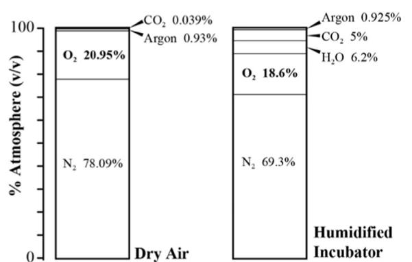
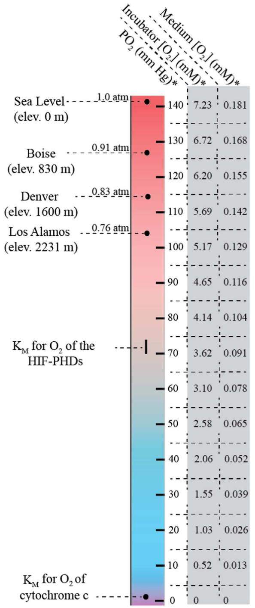
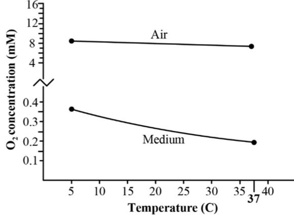
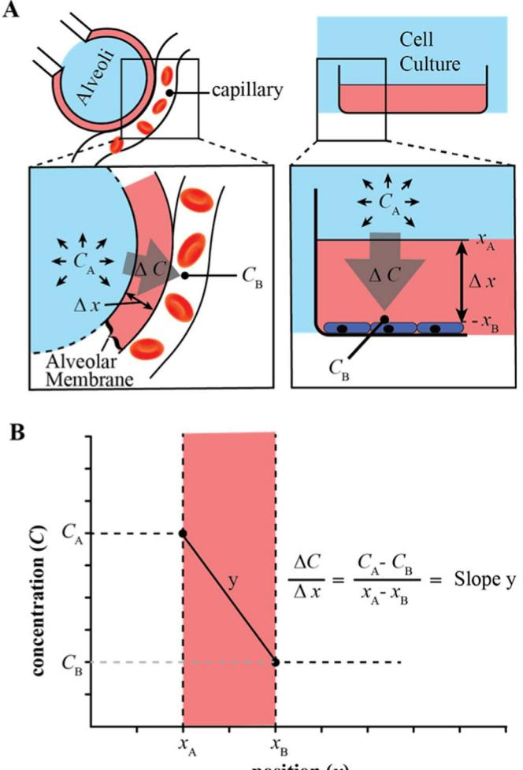
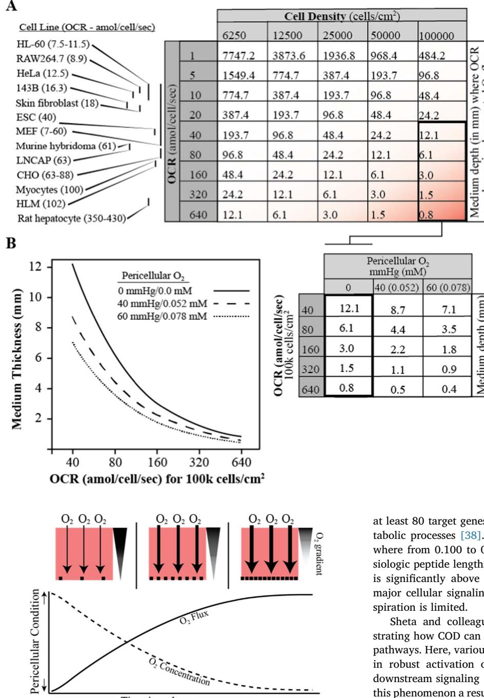
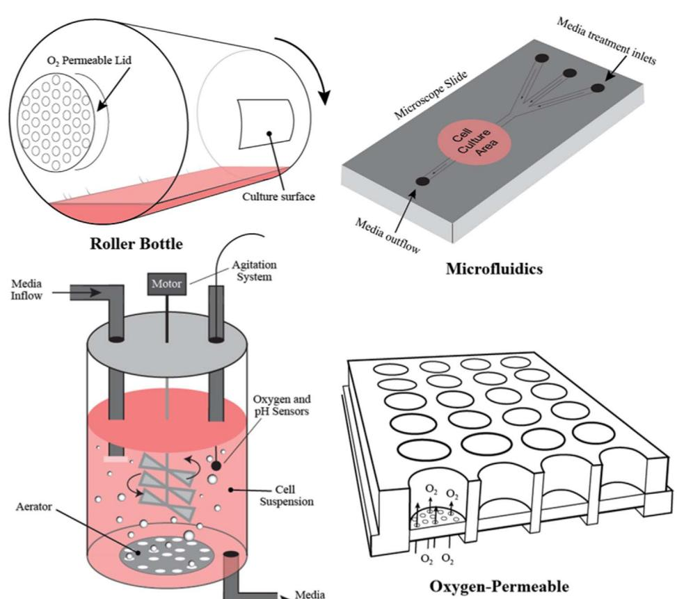

Contents lists available at [ScienceDirect](http://www.sciencedirect.com/science/journal/08915849)

Free Radical Biology and Medicine

Review article

# Limitations of oxygen delivery to cells in culture: An underappreciated problem in basic and translational research

a Department of Obstetrics & Gynecology, Carver College of Medicine, The University of Iowa, Iowa City, IA, USA

b Department of Radiation Oncology, Carver College of Medicine, The University of Iowa, Iowa City, IA, USA

c Pathology Department of Pathology, Carver College of Medicine, The University of Iowa, Iowa City, IA, USA d Department of Surgery, Carver College of Medicine, The University of Iowa, Iowa City, IA, USA

e Department of Cellular and Integrative Physiology, University of Nebraska Medical Center, Omaha, NE, USA

# ARTICLE INFO

Keywords: Hypoxia Anoxia Hyperoxia Hypoxia-inducible factor HIF Prolyl-hydroxylase Oxygen Diffusion constant Diffusion gradients Nitrogen Carbon dioxide Gasses Cell culture Cell lines Reactive oxygen species Mitochondria Respiration Glycolysis Oxidative phosphorylation Metabolism

## ABSTRACT

Molecular oxygen is one of the most important variables in modern cell culture systems. Fluctuations in its concentration can affect cell growth, differentiation, signaling, and free radical production. In order to maintain culture viability, experimental validity, and reproducibility, it is imperative that oxygen levels be consistently maintained within physiological "normoxic" limits. Use of the term normoxia, however, is not consistent among scientists who experiment in cell culture. It is typically used to describe the atmospheric conditions of a standard incubator, not the true microenvironment to which the cells are exposed. This error may lead to the situation where cells grown in a standard "normoxic" oxygen concentration may actually be experiencing a wide range of conditions ranging from hyperoxia to near-anoxic conditions at the cellular level. This apparent paradox is created by oxygen's sluggish rate of diffusion through aqueous medium, and the generally underappreciated effects that cell density, media volume, and barometric pressure can have on pericellular oxygen concentration in a cell culture system. This review aims to provide an overview of this phenomenon we have termed "consumptive oxygen depletion" (COD), and includes a basic review of the physics, potential consequences, and alternative culture methods currently available to help circumvent this largely unrecognized problem.

## 1. Introduction

Since the establishment of the first cell line in 1943, cell culture has played a pivotal role in shaping science and medicine [\[1\].](#page-10-0) With the help of cutting edge media formulations and laboratory equipment, cells from normal and cancerous tissues can be propagated outside of the human body and rigorously studied without harming human subjects. Needless to say, the scientific feats that have been accomplished using cell culture are incredible, especially given the complexity of the physiologic environment cell culture is intended to replicate. Nonetheless, cell culture is a model system with many deficiencies that limit its utility, and many breakthroughs developed in the cell culture model fail to translate to cures for human disease.

One such deficiency of the cell culture system is due to the limitations of oxygen diffusion. This barrier is well known by nature, as the first oxygen-consuming life forms were limited in size by the ability of oxygen to passively diffuse into the organisms from the surrounding ocean. It was only after billions of years that red blood cells and circulatory systems evolved to carry oxygen from the outside of the organism to the cells within, allowing life to become multilayered and much larger in size [\[2\].](#page-10-1)

The delivery of oxygen to cells is clearly a critical component of life on earth. Nonetheless, many modern laboratories fail to consider the fundamental properties of oxygen diffusion that took nature billions of years to overcome. The cell culture systems used by most laboratories today rely on oxygen exchange at the surface of the medium. Oxygen

⁎ Correspondence to: Departments of Radiation Oncology, Pathology, Surgery, Carver College of Medicine, The University of Iowa, Iowa City, IA 52242, USA.

⁎⁎ Correspondence to: Department of Cellular and Integrative Physiology, University of Nebraska Medical Center, Omaha, NE 68198, USA.

E-mail address: [adam.case@unmc.edu](mailto:adam.case@unmc.edu) (A.J. Case).

<http://dx.doi.org/10.1016/j.freeradbiomed.2017.10.003>

Received 1 May 2017; Received in revised form 2 October 2017; Accepted 4 October 2017 Available online 13 October 2017

0891-5849/ © 2017 The Authors. Published by Elsevier Inc. This is an open access article under the CC BY-NC-ND license (http://creativecommons.org/licenses/BY-NC-ND/4.0/).

[T](http://crossmark.crossref.org/dialog/?doi=10.1016/j.freeradbiomed.2017.10.003&domain=pdf)

must then travel by diffusion through the media to the underlying cells. The distance oxygen must travel to reach the underlying cells may range from several millimeters to over a centimeter. This is enormous when compared to the 10–30 µm diffusion distance common in many mammalian tissues [\[3\]](#page-10-2). In fact, the maximum distance of a cell from its nearest capillary rarely exceeds 200 µm and is usually less than 100 µm [\[4\].](#page-10-3)

Despite the widespread use of less than ideal cell culture systems currently utilized around the world, the realization of oxygen diffusion as limiting factor in tissue culture is not new to science. In fact, Dr. August Krogh clearly described this limitation nearly a century ago [\[5\]](#page-10-4). In his pioneering work with tissue explants, he characterized the relatively slow diffusion rates of gasses (e.g. molecular oxygen) through aqueous medium and the importance of effective oxygen delivery systems to maintain cell viability.

After the cell culture revolution in the 1940s and 50 s, the data obtained by Krogh from tissue explants was applied to cells grown in monolayer. In pivotal work by Dr. William McLimans in 1968, it was realized that the oxygen consumption rate (OCR) of cells at the bottom of a petri dish can easily exceed the diffusion rate of oxygen through the overlying culture medium. McLimans subsequently warned against growing cells at too high of density or at excessive medium depths due to significant risk of oxygen deficit or even anoxia at the cellular level [\[6,7\].](#page-10-5) A breadth of significant evidence now exists demonstrating that over-seeding cells can result in altered cell growth characteristics, aberrant signaling, and serious deficiencies in experimental validity [8–[10\].](#page-10-6)

The scientific community generally accepts that cell culture is not a perfect model system. However, there remains a significant amount of complacency with respect to the limitations of oxygen diffusion and the potential effects on cells. This review attempts to answer three fundamental questions: 1) How do the properties of oxygen diffusion and delivery differ between in vitro and in vivo environments? 2) What are the consequences of this altered oxygen availability on the experimental and translational validity of in vitro models? 3) What can scientists do to minimize fluctuations in oxygen concentration in their cell culture models? The review will conclude with basic recommendations to improve rigor and reproducibility of cell culture experiments, especially those focused on hypoxia and metabolism.

## 2. Theory of oxygen diffusion

In the human body, tissue oxygenation is a tightly regulated process. Oxygenation of the blood is first controlled by respiratory rate and intrinsic mechanisms within the pulmonary circulation that maintain oxygen partial pressure in the arterial blood (PaO2). Physiologic PaO2 is maintained around 100 mmHg, which equates to 0.13 mmol of unbound oxygen per liter of blood at sea level (see subsequent sections for math). Hemoglobin increases oxygen capacity of blood an additional 60 times this amount, but it does not contribute to the partial pressure in its bound state [\[11\]](#page-10-7). At the level of the tissue, the local partial pressure of oxygen (PO2) is decreased to approximately 40 mmHg due to cellular oxygen consumption. This drop in oxygen partial pressure creates an oxygen gradient that pulls dissolved oxygen a short distance from the capillary to the respiring cells. The oxygen is quickly replaced by the vast hemoglobin stores that are sensitive to pH and other metabolic factors that fine tune the release of oxygen [\[11\]](#page-10-7). Hemoglobin therefore acts as a rheostat and buffer to maintain a constant rate of flow (otherwise known as flux) of oxygen to metabolically active tissues.

In cell culture, these intricate regulatory mechanisms discussed above are stripped away. What is left are the raw physical laws that govern the properties of gasses and molecules in solution. To understand the extent to which oxygen delivery to cells is limited in the cell culture model, one must understand the nature of molecular oxygen at three levels: 1) Gaseous oxygen in the atmosphere surrounding the culture plate, 2) dissolved oxygen in the cell culture medium, and 3) consumed oxygen by the cells in the culture dish. In concert, these three factors interact to create an oxygen concentration gradient from the surface of the medium down to the surface of the cells.

This concentration gradient is the force that drives the flux of oxygen through the medium to the underlying cells. Modification of any of the above factors alters the gradient, and therefore the rate of oxygen delivery to the cells. When discussing oxygen delivery, rate is key, as true hypoxia occurs at the point where oxygen delivery is no longer sufficient to maintain ATP production via oxidative phosphorylation [\[12\]](#page-10-8). However, the term hypoxia has been clouded by the discovery of the hypoxia-inducible factor (HIF), which is regulated by oxygen sensitive prolyl-hydroxylases (PHDs) [\[13\].](#page-10-9) This system (along with other oxygen-sensitive enzyme pathways) is adaptable to particular set-points that are tissue-dependent, and functions to sense changes in oxygen tension from the baseline. Since different tissue types have different oxygen consumption rates (OCRs) and therefore different oxygen gradients and tensions, there is no single oxygen concentration that can be defined as "hypoxic" with regard to the HIF-PHD system. Furthermore, the range of oxygen tensions in which the HIF-PHD system is sensitive, are well above those limiting to cytochrome c oxidase, and therefore do not describe conditions limiting to oxidative phosphorylation (as we will discuss in later sections) [14–[16\].](#page-10-10) In other words, hypoxia has become a term that is impossible to define without context. When used, it must be clearly defined. Thus, we will use it cautiously throughout the remainder of this review.

In the following sections, we will discuss the behavior of oxygen in cell culture, how it is delivered to cytochrome c oxidase, and how different conditions might affect the oxygen sensing machinery of the cell. To accomplish this, the theory of oxygen diffusion will be broken down into three major components: gaseous oxygen, dissolved oxygen, and consumed oxygen. With each section there will be a discussion on how these can be experimentally manipulated, thereby changing the oxygen flux through the system.

#### 2.1. Gaseous oxygen

The first variable we will consider that affects oxygen concentration in cell culture is atmospheric (gaseous) oxygen. Gaseous oxygen concentration in the context of cell culture is often cited as 21%. Although 21% does represent the volume/volume fraction of oxygen in dry air (78.09% nitrogen, 20.95% oxygen, 0.93% argon, and 0.039% carbon dioxide) [\[17\],](#page-10-11) conventional cell culture incubators introduce additional volumes of both water vapor and carbon dioxide gas. Therefore, the overall concentration of oxygen must decrease to allow for the presence of these additional gasses (See [Fig. 1)](#page-1-0).

First, water vapor (humidity) is supplied by a water bath most often

Fig. 1. The volume/volume ratio of oxygen to other gasses in a typical cell culture incubator is decreased compared to that of dry air. The left graph depicts the relative gas concentrations in dry air. The graph on the right is representative of the relative gas concentrations in a typical incubator where there is addition of CO2 gas and water vapor at 100% humidity.

in the lower section of the incubator, and functions to diminish evaporation of water from the cell culture medium. At 37 °C and 100% humidity, water vapor exerts a partial pressure of 47 mmHg [\[11\]](#page-10-7). Therefore, water vapor will make up 6.2% of the total gas at sea level (47 mmHg/ 760 mmHg). Carbon dioxide at a 5% total volume is also typically added in order to maintain pH balance of the culture medium [\[18\]](#page-10-12). To calculate the final oxygen percentage in the incubator after the addition of both water vapor and carbon dioxide, the above values are applied to Eq. [(1)](#page-2-0) [(0.21 × (1 − 0.062 − 0.05) × 100) = 18.6% oxygen]. Therefore, the true gaseous oxygen percentage that occupies the atmosphere of a typical cell culture incubator is 18.6% oxygen, not 21%.

$$\% \mathcal{O}_{2(\text{final})} = (\% \mathcal{O}_{2(\text{initial})} \ge (1 - \% \text{gas}_{(1)} - \% \text{gas}_{(n)...})) \ge 100 \tag{1}$$

It should be noted that the oxygen percentage calculated above (18.6%) is a volume/volume ratio and is not interchangeable with the molar oxygen concentration. The molar oxygen concentration in air is dependent on variables such as atmospheric pressure and temperature. For mammalian cell culture, temperature is nearly always kept constant at 37 °C, and atmospheric pressure at sea level (1 atm), which is approximately 760 mmHg. Therefore, there is usually minimal variation in the molar gaseous oxygen concentration from lab to lab. However, laboratories at extreme elevations do experience significantly different atmospheric oxygen concentrations. For example, a laboratory in Los Alamos, NM (elevation 2231 m) has an average atmospheric pressure that is approximately 76% that of sea level [\[19\].](#page-10-13) Using the Ideal Gas Law (Eq. [(2)) (P](#page-2-1) = pressure (mmHg); V = volume (L); n = number of molecules of gas (mol); R = ideal gas constant (62.364 L mmHg K−1 mol−1 ); T = temperature (K)) this converts to a decrease of 1.73 mM in the absolute concentration of oxygen in the air at Los Alamos as compared to sea level, even though the oxygen percentage on a volume/volume ratio remains equal (See [Fig. 2](#page-2-2) for oxygen concentration values at different elevations).

$$\text{PV} = \text{nRT} \qquad \text{Ideal Gas Law} \tag{2}$$

Taken in perspective, if laboratory in Los Alamos grows cells under standard incubator conditions (18.6% oxygen), the absolute concentration of atmospheric oxygen would be equivalent to a laboratory at sea level growing cells at 14.1% oxygen. This example clearly underscores the inaccuracy of describing oxygen conditions in terms of volume/volume relationships. A more informative description of the cell culture oxygen environment is the partial pressure of oxygen (PO2). Thus, a laboratory at sea level would cite their cells as grown at a PO2 of 141.4 mmHg, whereas a lab in Los Alamos would cite a PO2 of 107.9 mmHg. Use of PO2 allows for a more accurate comparison of oxygen conditions, and is the standard nomenclature used in medicine to describe oxygen content of the blood. [Fig. 2](#page-2-2) visualizes the effect of elevation on atmospheric PO2 and its comparison with that of PO2 seen in the arterial blood of normal patients. From here forth, we will use the partial pressure of oxygen (PO2) to describe oxygen conditions in cell culture, as the ideal gas law allows easy calculation of the molar concentration of a gas when the other variables are known. However, it should be kept in mind that the ratio between the absolute (molar) concentration of oxygen and its corresponding partial pressure may differ from one medium to another (e.g. air to medium). The reason for this is due to the interactions gas molecules with their environment. This is described by Henry's law and is discussed in the following section.

## 2.2. Dissolved oxygen

## 2.2.1. Oxygen solubility

The second variable that we will consider that impacts the diffusion of oxygen in cell culture is the cell culture medium itself. There are many types of cell culture medium, each containing differing amounts of glucose, amino acids, and other additives. Despite this diversity,

Fig. 2. The relationship between elevation above sea level and oxygen conditions in cell culture. This figure depicts the expected partial pressures as well as the corresponding molar concentrations of dissolved oxygen in cell culture medium under typical incubator settings* (5% CO2, 100% humidity, 37 °C) in laboratories at different elevations. The predicted total atmospheric pressure (atm) at the atmospheric pressure of each location listed. At equilibrium, the amount of oxygen dissolved in the medium of a laboratory in Los Alamos is 76% of the amount of oxygen dissolved at sea level. The PO2 of oxygen at Los Alamos is just above that of normal human arterial blood (80–100 mm Hg). PV = nRT was used to calculate the corresponding molar concentrations of oxygen in air. Henry's Law C = P/H (Eq. [(2)](#page-2-1)) was used to calculate oxygen concentrations in culture medium using H = 7716.5 mm Hg / mM.

commercial mammalian cell culture media behave similarly with regard to oxygen solubility. This is because factors that affect oxygen solubility, such as ionic strength of the solution and protein concentration typically very similar to one another. By design, most mammalian culture media have an ionic strength of 150 – 200 mM, which is similar to that of blood plasma [\[20,21\].](#page-10-14) Protein is then typically added in the form of 10% fetal bovine serum, which has a total protein concentration ranging from 3.0 to 4.5 mg/dL [\[22\]](#page-10-15). Therefore, the final protein concentration in culture medium is approximately 0.3–0.45 mg/dL.

Henry's Law (Eq. [(3)](#page-3-0)) provides a mathematical description of gas solubility in a liquid medium. The law states that the molar concentration of dissolved gas (C(d): mM), is directly proportional to the partial pressure of the gas (P(g): mmHg) of the overlying air and the Henry constant (H: mmHg/mM).

$$C_{\text{(d)}} = P_{\text{(g)}} / H \qquad \qquad \text{Henry\text{'s Law}} \tag{3}$$

When oxygen enters an aqueous solution, it forms weak interactions with water molecules. However, these weak interactions are disrupted by the presence of charged electrolytes and proteins that form much stronger interactions with water. The Henry constant for a solution is dependent on the concentration of electrolytes, proteins, and temperature of the solution. In water at 37 °C and ionic strength of 175 mM (average for most mammalian culture mediums), the Henry constant for oxygen can be calculated using experimentally-derived values of equilibrium dissolved oxygen at different temperatures and ionic strengths (see Supplemental Table 1 for these values) [\[23\].](#page-10-16) For culture medium with an ionic strength of 175 mM, with atmospheric pressure of 760 mmHg, at 37 °C in 100% humidity but without 5% carbon dioxide (PO2(g) = 149.7 mmHg), the extrapolated dissolved oxygen concentration from Supplemental Table 1 is 0.194 mM. Using Eq. [(3)](#page-3-0) (Henry's Law), Henry's constant under the above conditions can be solved as follows: [H = 149.7 mmHg / 0.194 mM; H = 771.65 mmHg/mM].

Using the above value for H, the equilibrium oxygen concentration in culture medium under routine cell culture conditions (where PO2 = 141.4 mmHg) is found to be 0.181 mM at sea level. This concentration is approximately 40 times lower than the molar concentration of oxygen in the overlying air of the incubator [(Fig. 2)](#page-2-2). This does not take into account the effect of glucose and protein, which are also added to culture medium and would be expected to further reduce the total capacity for dissolved oxygen. Unfortunately, these values are difficult to estimate and need to be determined experimentally. To date, it does not appear that any studies have determined the specific value for dissolved oxygen in complete cell culture medium. It would be of interest for these experiments to be undertaken so that a more precise estimation of dissolved oxygen can be used for modeling purposes.

Another important consideration, and perhaps the most significant when discussing dissolved oxygen concentration, is the effect of temperature. As medium is cooled, oxygen solubility increases substantially (Supplemental Table 1). As temperature transitions from 37 °C to 5 °C, the equilibrium concentration of dissolved oxygen in culture medium nearly doubles (1.92x). This is a disproportionate increase relative to the concentration of oxygen in the air, which increases only 1.11x over this temperature range [(Fig. 3](#page-3-1)). Although mammalian cell culture is typically performed at 37 °C, cells may be exposed to cold medium during cryopreservation, cell harvesting for experiments, processing of cells for live cell imaging, and when culture medium is not sufficiently warmed prior to medium changes. In theory, the increased oxygen capacity of cold medium exposes cells to elevated oxygen levels. The negative effects of hyperoxia at the cellular and organismal level have been well documented [\[24,25\].](#page-10-17)

Is the increased oxygen capacity of cold medium potentially harmful to cells in culture? This question has not been specifically addressed; however, studies examining mitochondria have shown an increased production of reactive oxygen species (ROS) as medium temperature is decreased. This occurs despite a decrease in overall cellular metabolism [\[26\]](#page-10-18). These data supports the theory that temperature-related increases in oxygen concentration could lead to an increase in cell oxidative stress or other perturbations in cellular function. While additional

Fig. 3. Relationship between molar concentration of O2 in air and cell culture medium under the same atmospheric conditions: PO2 = 149.7 mm Hg (sea level; 100% humidity; without added 5% CO2) and temperature = 37 °C. Values for air were calculated using the Ideal Gas Law (Eq. [(2)](#page-2-1)). Values for cell culture medium are assumed equivalent to those experimentally determined in a NaCl solution at an ionic strength of 175 mM (see Supplemental Table 1) equilibrated with air under the above conditions.

experiments are warranted to definitively assess these potential hyperoxic effects on cells, investigators should be aware of this phenomenon and use caution when exposing live cells to cooled medium.

## 2.2.2. Rate of oxygen diffusion

Aqueous solutions, such as cell culture medium, not only hold less oxygen than air per unit volume, but also significantly restrict the movement of oxygen molecules. In the body, the diffusion barrier of oxygen is often below 30 µm, and usually does not exceed 100 µm from a cell to the nearest capillary [\[3,4\]](#page-10-2). If the metabolic demands of the tissue increase, the flow of blood through the capillaries are increased in order to meet these demands [\[27\].](#page-10-19) Additionally, tissues with high metabolic demand such as muscle utilize myoglobin to further facilitate the diffusion of oxygen [\[28\].](#page-10-20) In cell culture, these additional mechanisms for enhancing oxygen delivery are lost. Furthermore, the threat of evaporation necessitates a minimum volume of medium be placed on top of the cells. When the energy needs of the underlying cells are increased, a larger volume of medium must be added to meet these nutrient demands, further adding to the diffusion barrier that oxygen needs to overcome.

The failures of the cell culture model with regard to oxygen diffusion can be best understood by examining Fick's Law (Eq. [(4)](#page-3-2)). Fick's Law states that the rate of diffusion or flux (F) of a gas through a medium is directly proportional to the difference in concentration of the gas on either side of the medium, and inversely proportional to the thickness of the medium. The diffusion constant (D) corrects for the solubility of the gas in the medium.

$$\mathbf{F} = \mathbf{D} \mathbf{x} \boldsymbol{\omega} \mathbf{C} / \Delta \mathbf{x} \qquad \quad \text{Fick\text{\textquotedblleft s\textquotedblright}} \mathbf{s} \text{ Firs\textquotedblright} \tag{4}$$

In isotonic saline (which has a similar salt concentration to cell culture medium), D = 2.84 × 10−5 cm2 /s at 37 °C [\[29\].](#page-10-21) The addition of 10% fetal bovine serum (FBS) makes the protein concentration 0.45 mg/dL, as the total protein concentration of FBS is 3.0–4.5 mg/dL [\[22\]](#page-10-15). By extrapolating from data obtained by Goldstick et al., the value of D for a saline solution containing 0.45 mg/dL total protein is approximately 2.69 × 10−5 at 37 °C. Unfortunately, there are no studies to date that have directly determined the value of D specifically for cell culture medium with 10% FBS, nor are there studies examining the addition of other additives such as amino acids and glucose (which would be expected to decrease D further). Therefore, the value of D in complete cell culture medium at 37 °C will be assumed to be approximately 2.69 × 10−5 cm2 /s as reasoned above. As previously mentioned, future studies aimed at specifically measuring the diffusion

Fig. 4. A) A simplified graphical depiction of Fick's Law in both physiological in vivo (alveoli; left) and in vitro (cell culture) examples. The barrier to oxygen diffusion is represented in pink, the oxygen supply is depicted in blue. B) The driving force for oxygen flux through the barrier is proportional to the degree of slope (y) of the oxygen gradient through the barrier. Slope is defined by the difference in oxygen concentration across the diffusion barrier (ΔC) divided by the thickness of the diffusion barrier (Δx). Of note, the concentration of oxygen represented as CA should be the expected value of dissolved oxygen in the medium when fully equilibrated with gaseous oxygen at the surface of the diffusion barrier as calculated by Henry's Law, not the concentration of oxygen in the gaseous form above the medium.

constant for oxygen in cell culture medium with 10% FBS would be helpful in making more accurate predictions regarding oxygen diffusion in the cell culture model.

In medicine, Fick's Law is commonly used to describe the exchange of oxygen in the lung capillaries, where oxygen must traverse the alveolar membrane before entering the blood stream [\[3\]](#page-10-2). Fick's law can be applied to cell culture in a similar manner if the oxygen concentration at the air-medium interface is considered similar to the oxygen concentration of gas at the surface of the alveolar membrane (CA), and the oxygen concentration just above the cell monolayer is paralleled to the oxygen concentration in the blood stream (CB). [Fig. 4](#page-4-0) shows a graphical representation of Fick's law as it applies in vivo and in vitro.

According to Fick's Law, the rate at which oxygen diffuses through a medium is decreased proportionally by the thickness of the medium (Δx) and increased by the oxygen concentration gradient. This principle is commonly encountered in the medical field. For example, the alveolar membrane thickness in the lung averages approximately 0.5 µm [\[30\]](#page-10-22). This very small distance (Δx) steepens the slope of the concentration gradient (ΔC/ Δx). A steep slope equals high oxygen flux, which allows the partial pressure of oxygen in the alveoli to be nearly identical to that of the blood (~100 mmHg). However, pathologic states such as pneumonia and pulmonary fibrosis can increase the alveolar membrane thickness (Δx) and severely limit the rate of oxygen diffusion [\[30\].](#page-10-22) To overcome this increase in Δx, the patient is given pure oxygen to breathe either through a nasal cannula or directly into the trachea through intubation. This elevates the PO2 in the alveoli, thereby increasing the value of ΔC to offset the increase in Δx. This acts to restore the oxygen flux across the alveolar membrane and to resupply the blood with adequate oxygen oxygenation.

In cell culture, increasing oxygen flux can be achieved by decreasing the volume of the medium or increasing the concentration of oxygen in the incubator atmosphere using special gas mixtures. As discussed above, the former is difficult to achieve due to the potential for medium evaporation and risk of cell dehydration, however, alternative cell culture methods have been developed to overcome this limitation. These methods are discussed in a later section entitled "Alternative technologies to standard cell culture."

## 2.2.3. Time needed for equilibration

Fick's first law, as described above (Eq. [(4)](#page-3-2)), is used to describe the situation where a constant oxygen source exists on one side of a barrier and a constant sink on the other side. This situation would promote a constant flux of oxygen across the barrier, which is relevant to the cell culture model where cells are consuming oxygen at a constant rate (discussed further in the following section). However, to estimate the amount of time needed to equilibrate cell-free medium to a novel oxygen concentration, a derivation of Fick's law must be used. There are several publications describing the use of Fick's law in this manner, however, the mathematics behind this calculation are complex and are best reviewed elsewhere [\[29,31\].](#page-10-21)

Diffusion times in cell-free medium have been experimentally determined by several researchers. These experiments have validated the fact that equilibration of oxygen is a slow process requiring significant time periods. For example, Allen et al. demonstrated this in cell culture vessels with intact or perforated lids [\[32\].](#page-10-23) Briefly, an oxygen-sensing probe was placed approximately 2 mm deep into cell culture dishes containing unstirred PBS. The lids of these dishes were either perforated or unaltered, and the dishes were placed in a hypoxia chamber that was flushed with 100% nitrogen gas. The oxygen concentration at 2 mm under the surface of the PBS as well as in the gas phase were measured over time. Allen found that the medium reached equilibrium with the anoxic gas after approximately 100 min with perforated lids. This equilibration time was prolonged to over 180 min in culture dishes where the lids were not perforated, assumingly due to a lag time for the equilibration of the gas inside under the lid of the culture plate itself. In fact, culture dishes with intact lids did not begin to show significant drops in oxygen concentration for nearly 20–40 min after being exposed to anoxic gas [\[32\].](#page-10-23)

The above experiment by Allen underscores the fact that unstirred medium equilibration requires significant time periods to equilibrate once the oxygen gas concentration is changed. Similar data has been published by others in the field [\[33\]](#page-10-24). Therefore, a dish of cells placed in a hypoxia chamber for an experiment may not reach the desired change in oxygen conditions if the experimental time course is less than 2–3 h. Thus, it is imperative that culture medium be pre-equilibrated prior to an experiment involving a change in the desired oxygen concentration within the medium.

The equilibration of an entire bottle of medium may require days to occur. However, this process can be expedited by bubbling gas at the desired oxygen concentration through the medium by placing a pipette attached to an air hose down into the bottom of the media bottle. The bubbles drastically increase the surface area available for gas exchange and can reduce the equilibration time down to a matter of minutes [\[33\]](#page-10-24). There is concern for sterility if this method is used without an appropriate filter on the gas line. Alternatively, the medium may be vigorously shaken or stirred while under an atmosphere with the desired gas concentration so as to create gas bubbles within the medium and expedite equilibration. Vigorous shaking should be avoided on medium containing FBS as significant foaming and protein denaturation will occur.

#### 2.3. Oxygen demand

The final variable we shall consider that affects the diffusion of oxygen in cell culture is the cells themselves. As cells utilize oxygen from the surrounding medium, oxygen must diffuse in from the air/ media interface to replace it. At a critical cell density, the cells on the bottom of the culture plate will consume oxygen at a rate that exceeds the ability of oxygen to diffuse into the media. The number of cells needed to exceed this diffusion rate is highly variable among cancer cell lines, which represent the vast majority of cells used in cell culture experiments. Primary cell cultures are more predictable, but much less utilized.

Wagner et al. have complied a list of cell lines for which the oxygen consumption rate (OCR) has been experimentally determined [\[20\]](#page-10-14). Primary hepatocytes have been consistently shown to have one of the highest OCRs, consuming 200 − 400 attomoles (amol)/cell/s. This is likely also true for cell lines derived from hepatocellular carcinoma [\[34\]](#page-10-25). In comparison, many other cell lines (primarily various cancer derived lines) have OCRs ranging from 1 to 120 amol/cell/s [\[20\]](#page-10-14).

In most cell types, the vast majority of oxygen consumption occurs at cytochrome c oxidase (Complex IV) of the mitochondrial electron transport chain (although surface consumption by NADH does play a role in some cells) [\[35\]](#page-10-26). The affinity for oxygen by cytochrome c oxidase is extraordinary when compared to other oxygen consuming proteins. In fact, the PO2 at which the rate of cytochrome c oxidase activity is ½ maximal (P50/KM) is 0.075 − 0.75 mmHg (0.0097 − 0.097 mM O2) [\[36\].](#page-10-27) Due to this incredibly high affinity for even trace amounts of oxygen, mitochondria respiration has been considered by many to be zero order with regard to oxygen-consumption kinetics, and is therefore limited only by the rate of oxygen delivery (e.g. flux) [\[11\]](#page-10-7). This means the mitochondrial respiration can continue unimpaired until the local concentration of oxygen is nearly zero, so long as the delivery of new oxygen meets the demands of respiration.

Using the above logic, cellular respiration is essentially limited only by the ability of oxygen to diffuse through the overlying medium to the mitochondria. The calculations involved in modeling precise oxygen concentrations at different medium depths, and the changes in these concentrations as the system approaches equilibrium are complex and outside the scope of this review. However, a very simplified calculation can be carried out to determine the minimum medium depth at which oxygen can no longer diffuse fast enough to meet the oxygen consumption rate of the underlying cells. In order to perform this calculation, we assume that oxygen flux through the medium layer exactly equals the oxygen consumption demands of the mitochondria. Using Fick's Law (Eq. [(4)](#page-3-2)), we set F to equal the OCR of the underlying cells, which can be calculated per unit area from known values that can be found in Wagner et al. [\[20\]](#page-10-14). The PO2 at the top of the medium layer is assumed to be at standard incubator conditions (PO2 141.4 mmHg; 0.181 mM). Since mitochondria are a near-perfect oxygen sink, the partial pressure of oxygen at the mitochondrial level in this situation will be set to 0 mmHg, thus giving a ΔC of 0.181 mM (maximal oxygen gradient). By using D = 2.69 × 10−5 and solving the equation for Δx (thickness of media), values representing the precise medium thickness where the rate of oxygen diffusion through the medium exactly equals the OCR of the underlying cell layer ([Fig. 5](#page-6-0)A).

It should be noted here that the values shown in [Fig. 5](#page-6-0) are not recommendations for the medium thicknesses to be used in cell culture. Instead, they are meant to demonstrate the absolute maximal medium thickness that could still theoretically allow for maximum mitochondrial activity for a given cell density and OCR. In order to calculate the medium thickness needed to create a steady state condition where the cellular oxygen concentration is more physiologic (i.e. ~40 mmHg/ 0.052 mM) we make ΔC = 0.181–0.052 mM = 0.129 mM. By setting F equal to the OCR of the specific cellular conditions being used and solving for Δx, we have the medium thickness that will result in a steady state where the oxygen conditions at the cellular level will be approximately 40 mmHg (0.052 mM). [Fig. 5](#page-6-0)B depicts this graphically and in the form of a table and also includes calculations for cells at 60 mmHg.

In reality, cell division, cell shape, as well changes in cellular metabolism caused by cell signaling cause constant changes in oxygen flux and make pericellular oxygen conditions very difficult to model mathematically [\[34\].](#page-10-25) Furthermore, the above calculations represent a simplified theoretical steady state condition that is reached only after a period of time needed to reach equilibrium. Thicker layers of medium require larger amounts of time for the gradients to be established. The incorporation of time to Fick's law is outside the scope of this review. However, we recommend the following excellent reference where complex mathematical computation has been undertaken in an attempt to model pericellular oxygen concentrations under various medium thicknesses and time points [\[7\]](#page-10-28).

By referencing [Fig. 5](#page-6-0)A, the maximal medium depth that will support the normal OCR of the underlying cells can be determined by matching the known OCR from a cell line to the corresponding maximal oxygen flux that is supported at a given medium depth. For example, primary rat hepatocytes have an experimentally determined OCR between 350 and 430 amol/cell/s [\[20\].](#page-10-14) A standard confluent plate (total size of the plate is irrelevant for this calculation) of primary hepatocytes have a density of approximately 100,000 cells/cm2 [\[37\].](#page-10-29) This equates to an OCR of 3.5 × 10−8 mmol/cm2 /s. The medium depth where the flux of oxygen through the medium layer equals the OCR of the cell layer in the above example is between 0.8 and 1.5 mm depending on the exact OCR value that is used in the calculation [(Fig. 5)](#page-6-0). In 1968, McLimans determined this value to be a maximum of 1.2 mm for a confluent dish of primary hepatocytes using a similar but much more complex computational methodology [\[7\]](#page-10-28). For reference, this would equate to approximately 7.2 mL of media on a standard 10 cm cell culture plate, which is below the range of standard media depths (i.e. 8–15 mL) for this culture vessel for a list of growth area measurements and medium height eqivalencies for standard tissue culture dishs, see [Supplemental](#page-10-30) [Figure 2)](#page-10-30). Therefore, it is not possible to culture primary hepatocytes to confluence in a standard cell culture environment without likely limiting mitochondrial function. This may also be the case for other primary cell cultures such as human bone marrow isolates, human intestinal cells, and adult fallopian tube cells, which all have measured OCRs > 100 amol/cell/s [\[20\]](#page-10-14).

Despite the high OCR seen in the aforementioned primary cell lines, many cancer cell lines have much lower OCRs that range from 10 to 60 amol/cell/s (See the left-hand side of [Fig. 5](#page-6-0) for experimentally determined OCRs for selected cell types and lineages) [\[20\]](#page-10-14). Assuming the same cell density as the hepatocytes in the above calculation, oxygen flux to a cell line with an OCR of 60 amol/cell/s can be easily supported by a medium thickness up to 6.5 mm. Therefore, medium volumes used for typical culture of cancer cell lines would not be expected to limit mitochondrial oxygen consumption under routine culture situations.

The caveat to this revelation is that mitochondrial respiration creates an oxygen sink at the bottom of the culture dish, and thereby sets up an oxygen gradient through the culture medium that results in varying degrees of pericellular oxygenation. Although the flux of oxygen through the medium may be sufficient to support mitochondrial respiration, cellular function may still be deterred by relative hypoxia that is created by this consumptive oxygen depletion (COD). This is because there are other oxygen-utilizing enzymes within the cell that have much lower affinities for oxygen than cytochrome c oxidase. Many of these enzymes have been coined as "oxygen sensors", and act as

Fig. 6. The change in pericellular oxygen concentration (dotted line) and oxygen flux (solid line) through cell culture medium with a constant incubator oxygen concentration is depicted over time. At the top of the figure, pink boxes represent a cell culture dish at three time points after cells are seeded. At first (top left), cells are sparse and oxygen flux (downward arrows) is minimal. The oxygen gradient from the top of the medium to the bottom is also minimal as depicted by the triangle to the right. With time, the cells become denser and oxygen flux increases until cells reach confluency and oxygen flux is

maximal and pericellular oxygen is at its minimum.

signaling molecules that modify cellular differentiation and metabolism to adapt to local oxygen concentrations.

The most prevalent example of oxygen sensing enzymes are the hypoxia-inducible factor prolyl-hydroxylases (HIF-PHDs) and Factor Inhibiting HIF (FIH). These enzymes consume oxygen during the hydroxylation of proline and asparagine residues on the HIF transcription factor [\[13\].](#page-10-9) HIF is a ubiquitous protein that controls the transcription of Fig. 5. A) Medium depths at which OCR of corresponding cells at different densities equals the maximal oxygen flux supported by the medium under typical incubator conditions. Oxygen flux was calculated using Fick's Law (F = D × ΔC/ Δx) with D = 2.69 × 10−5 cm2 /s. The [O2] at the top of the medium was assumed to be in equilibration with typical incubator oxygen conditions (PO2 = 141.4 mm Hg/0.18 mM) and the perimitochondrial [O2] was set to zero (maximum gradient; ΔC = 0.018 mM). The OCR values for various cell lines listed, with ranges represented by bars corresponding to the numbers on the leftmost column of the table, were obtained from Wagner et al. [\[20\].](#page-10-14) For reference, 100,000 cells/cm2 is the density of a typical adherent cell line at 100% confluence [\[72\]](#page-11-0). B) Medium thicknesses (graphical view and corresponding chart) that are predicted produce steadystate pericellular O2 conditions of 0, 40 and 60 mm Hg respectively in cells with various OCRs grown at a fixed density of 100,000 cells/cm2 . 40 and 60 mmHg are meant to be representative of physiologic conditions of various tissues [\[73\].](#page-11-1)

at least 80 target genes, most of which are involved in regulating metabolic processes [\[38\].](#page-10-31) Reports on the KM for the HIF-PHDs are anywhere from 0.100 to 0.240 mM, with newer reports using more physiologic peptide lengths showing KM closer to 0.100 mM [14–[16\].](#page-10-10) This is significantly above that of cytochrome c oxidase, predicting that major cellular signaling changes occur long before mitochondrial re-

Sheta and colleagues published a well-controlled study demonstrating how COD can result in the induction of hypoxia cell signaling pathways. Here, various cell lines seeded at confluent numbers resulted in robust activation of the hypoxia-inducible factor (HIF) and it's downstream signaling [\[10\].](#page-10-32) While the authors appropriately identified this phenomenon a result of COD, it could be easily misinterpreted as an effect of contact inhibition or senescence due to the confluent nature of the cells. These types of oxygen dependent artifacts of cell culture could be significantly mitigated in future experiments by disruption of oxygen gradients in the culture medium through gentle agitation of the dish during the experimental time course.

## 3. Evidence for oxygen gradients in cell culture

As the cells on the bottom of a culture dish consume oxygen from the medium, the concentration of oxygen begins to decline and a concentration gradient of oxygen begins to form. This gradient is not stable, but is ever increasing as cell proliferation occurs [(Fig. 6)](#page-6-1) [\[39\]](#page-10-33). There is essentially an infinite number of gradient conditions that may occur depending on the cell density, OCR, and medium thickness utilized in a specific experimental protocol [\[10,20,34,39](#page-10-32)–45]. For example, high OCR cells such as primary hepatocytes or hepatocellular carcinoma cell lines seeded at high density may reach pericellular oxygen concentration near zero within 4 h and possibly in as little as 30 min [\[6,42\].](#page-10-5) In contrast, a culture of Chinese hamster ovary (CHO) cells (which have a moderate OCR of ~60 amol/cell/sec [\[20\])](#page-10-14), may slowly progress from a pericellular oxygen concentration near atmospheric equilibrium levels (0.181 mM) down to 1/10th that of the surface medium (0.018 mM) over a period of 40 h in culture [\[39\]](#page-10-33).

To add to the high degree of variability in oxygen conditions generated in cell culture, there is also evidence that these oxygen gradients oscillate when measured over time. In 1974, Werrlein and Glinos published a set of novel results regarding the nature of oxygen gradients that occur during COD [\[41\]](#page-10-34). The initial goal of their experimentation was to determine the relationship between cell density, metabolism, and cell growth in adherent fibroblast cultures. While measuring oxygen concentrations at various depths in the culture medium, the authors noted that oxygen gradients were not steady, but oscillatory. These oxygen oscillations increased in amplitude as the probe was placed at increased depths. Directly over the cells, the oxygen concentration amplitude ranged from 20 to 80 mmHg with a frequency between 0.34 and 0.56 Hz. Werrlein and Glinos ascribed these oscillations in oxygen concentration to disrupted mitochondrial respiration, as the addition of rotenone (a complex I inhibitor) abolished the phenomenon [\[41\].](#page-10-34)

Given the current knowledge of the extremely low KM of cytochrome c oxidase with respect to oxygen consumption, mitochondrial respiration is not expected to be directly compromised at oxygen concentrations measured above. A more modern explanation of the oscillations seen by Werrlein and Glinos can be attributed to the control of metabolism by oxygen sensors in the PHD/HIF pathway. As discussed in the previous section, the HIF-PHDs are sensitive to oxygen across a large range of concentrations [14–[16\]](#page-10-10). As oxygen levels decline, PHD enzymes are less active and HIF hydroxylation decreases. This lack of hydroxylation stabilizes HIF, allowing it to translocate to the nucleus and transcriptionally upregulate lactate dehydrogenase (LDH) [\[46,47\]](#page-10-35). Increased LDH levels divert pyruvate from Acetyl-CoA to lactate, lowering the flux of carbon through the tricarboxylic acid cycle and thereby decreasing mitochondrial respiratory rate. Reactive species, such as nitric oxide (• NO), are also produced as pericellular oxygen levels decrease. The presence of • NO results in reversible inhibition of cytochrome c oxidase as well as further stabilizing HIF [\[48,49\].](#page-10-36) These complex regulatory mechanisms likely make slight modifications to the mitochondrial oxygen consumption rate as oxygen levels decrease [\[50\]](#page-10-37). Pericellular oxygen levels would then begin to rise as OCR is decreased, which in turn would begin to decrease signaling through the PHD-HIF pathway. Overall, the lag in the cellular response to changing oxygen conditions likely produces an oscillating effect on local oxygen concentrations as the cell continuously adjusts and overshoots to maintain a non-steady-state equilibrium or "oxystatic regulatory system".

It is the constant fluctuation in oxygen concentrations produced by the various mechanisms discussed above that likely has the most significant impact on cultured cells. In fact, a modest decrease in oxygen tension from baseline is a condition to which cells can adapt. For example, there is evidence that HIF-PHD enzymes are capable of adapting to chronic oxygen depletion by changing their "set point" or sensitivity with regard to their response to local oxygen concentrations [\[51\]](#page-10-38). In other words, if oxygen levels drop and then remain steady at a lower concentration, signaling through these pathways would be expected to return to that of the initial (higher) oxygen conditions. Given the wide range of oxygen concentrations that the HIF-PHD enzymes are sensitive to [14–[16\],](#page-10-10) this set point could theoretically occur at any oxygen condition within the physiological realm. However, a state of constant change (i.e. in cell culture) would preclude a new set-point from being reached, and signaling through the oxygen-sensing pathways is in constant flux. Unfortunately, this constant change in oxygen conditions is often unrecognized, despite its profound documented effects on cell behavior [\[52\]](#page-10-39).

#### 4. Alternative technologies to standard cell culture

The evidence for oxygen deprivation in cell culture is quite significant, and probably most well recognized in industry where large scale hepatocyte culture is routinely used to predict drug metabolism in vivo. Oxygen deprivation in cultured hepatocytes has represented one of the major hurdles to developing accurate pharmacokinetic models. Hepatocytes cultured using conventional techniques quickly become depleted of oxygen, and the experimental results significantly deviate from physiologic drug metabolism profiles. In light of this, a significant amount of time and money has gone to researching and improving cell culture techniques where oxygen delivery is both continuous and precisely controlled.

One of the most simple and well-established methods of enhancing oxygen diffusion is by the use of roller bottles. Roller bottle technology was developed and described by George Gey (a pioneer in modern day tissue culture techniques as well as the developer of the well-known cell line HeLa) in 1933 [\[53\]](#page-10-40). This simplistic method is used specifically for anchorage-dependent cells, and utilizes cylindrical bottles that are cultured horizontally while maintaining a constant rotation. Cells are allowed to attach to the inner surface of the bottles while in constant motion, which permits an even distribution of cells throughout the interior cell culture area. Because bottles are only filled with approximately 20% cell culture medium that pools at the lower portion of the vessel due to gravity, the majority of cells are only covered with a thin film of media for a majority of the bottle's rotation [\[54\]](#page-11-2). Due to the incredibly thin layer of media coating rotating cells, this method provides significantly enhanced oxygen diffusion compared to standard cell culture. Roller bottles do however possess limitations. First, this technology cannot be utilized on suspension cells, as adherence to the internal surface of the vessel is required to enhance oxygen diffusion. Second, most roller bottle systems employ sealed lids to prevent leaking. As cells grow and multiply in this closed system the atmospheric conditions will change over time which may lead to altered physiological responses. Routine media changes or ventilation of the system is required to minimize this effect. Last, cells in roller bottles are intermittently exposed to high gas diffusion rates (when covered with minimal media at the top of the vessel) as well as low gas diffusion rates (when covered with the bulk of media at the bottom of the vessel). It is unclear how these recurrent changes affect overall metabolism and physiology of cells, and should be considered depending upon experimental setup.

An additional well-established method of increasing oxygen diffusion is the use of spinner or shaking flasks. This technology is able to be used for either anchorage-dependent or independent cells, and simply enhances gas exchange of the media or gel matrix via agitation [\[55,56\]](#page-11-3). Ventilation is critical to this method to allow a constant equilibration between the medium and atmosphere. While these methods (along with roller bottles) enhance oxygen diffusion to cells, their primary function is to grow large amounts of cells. With this, the media in these large cell load systems is often rapidly nutrient exhausted requiring multiple changes or frequent splitting of cells. Bioreactors, a technology gaining significant popularity for cell culture, circumvent depletion of nutrients by constant perfusion of fresh media. These devices are based on spinner flask technology, as they are usually a large vertical vessel outfitted with a central rotating agitation system that creates constant movement within the grown chamber. Through the use of inlet and outlet pumps, fresh media is constantly syphoned through the system limiting any appreciable nutrient deprivation to the cells. Moreover, bioreactors are often outfitted with submerged aerators and sensors to maintain a continuous level of diffused gasses throughout the freshly perfused media. These systems counteract many of the previously discussed pitfalls of standard cell culture. However, their size and cost often precludes these vessels from being conducive to experimental setups with limited cells or multiple conditions, which limits their practicality to high-throughput assays that may require hundreds of

#### various treatments.

Miniaturized versions of bioreactors have been developed to circumvents the size and cost limitation of standard reactors. These are often referred to as continuous perfusion microfluidic chambers [\[57\]](#page-11-4). In this method, cells are plated within a small chamber possessing both inflow and outflow ports. These ports are attached to a small peristaltic pump (while some are gravity driven) that constantly passes media through the chamber, thus exposing the cells to an uninterrupted flow of nutrients and oxygen. The source of media is constantly equilibrated with atmospheric conditions via agitation, thus allowing for fixed oxygen delivery to the cells. Multi-chamber vessels have been developed, which allow for several experimental setups to be performed using the same system. Additionally, several companies have developed these chambers directly upon microscope slides allowing for the continuous visualization of the cells during experimentation. In contrast to the aforementioned technologies, perfusion microfluidic chambers are limited by their small size. Consequently, only a small number of cells can be utilized, and often the cells are not recoverable after experimentation. This poses a significant limitation to experiments requiring the acquisition of cellular biomaterial for downstream assays. However, larger perfusion chambers have been developed to circumvent this restriction, thus making it a very attractive method for modern day cell culture. For visual examples of the aforementioned technologies please see [Fig. 7.](#page-8-0)

In addition to alternative cell culture techniques, many investigators have developed methods to enhance oxygen delivery to standard tissue culture. For example, one study simply cultured cells in ambient oxygen levels higher than the desired intracellular levels to successfully combat consumptive oxygen depletion in their system [\[58\]](#page-11-5). Another method that can be employed is to supplement the media with oxygen producing hydrogels. In this method, peroxides are encapsulated in hydrophobic gels, which are hydrolytically activated in the aqueous media. This hydrolysis releases molecular oxygen directly into the media at a constant rate that can last for more than 6 weeks [\[59\]](#page-11-6). Last, due to the aforementioned slow diffusion of oxygen through media, many companies are developing cell culture plates with oxygen-diffusible plastic bases. Traditional cell culture typically utilizes polystyrene, which has a very low oxygen permeability [\[60\].](#page-11-7) Using alternative plastics, such as polydimethylsiloxane allows cells to adhere or rest on the bottom of the well and receive the majority of oxygen directly from the underlying atmosphere, thus, bypassing the requirement of liquid diffusion [\[61\].](#page-11-8)

While the previously described technologies significantly enhance oxygen delivery over standard cell culture techniques, they require a significant amount of equipment, expertise, money, and optimization to perform, which limits their attractiveness to many investigators. An alternate technology has attempted to increase the awareness of oxygen diffusion in standard cell culture by directly measuring dissolved oxygen in standard cell culture dishes, and is becoming readily utilized in a variety of experimental designs [62–[64\].](#page-11-9) Luminescent or fluorescent oxygen based sensors are added to cell culture systems by way of plate coating, adhesive stickers, or even beads. As dissolved oxygen concentrations change, so does the specific light readout which is quantified by an external, noninvasive detector [\[65\].](#page-11-10) While this methodology does not enhance the oxygen diffusion in standard cell culture models, it does afford researchers the opportunity to detect diffused oxygen concentrations in their previously optimized systems. This type of continuous monitoring may ultimately allow for better cell culture techniques that limit oxygen fluctuations in cell culture, as well as increase the reproducibility of in vitro cell culture derived results.

#### 5. Summary

Cell culture is a critical scientific tool that has shaped the face of medicine and science over the last fifty years [\[66\].](#page-11-11) Despite these

> Fig. 7. Alternative technology for cell culture that aim to improve control of oxygen delivery to cells in culture. The roller bottle (top left) is spun on its longitudinal axis so that the cells attached maintain a thin layer of medium on their surface that allows for rapid oxygen diffusion between the cells and the gas that passively diffuses into the bottle through the permeable lid. In the bioreactor (bottom left) well oxygenated medium is stirred continuously by an agitator to abolish oxygen gradients. Sensors allow for precise monitoring of dissolved oxygen concentrations and pH. For experiments involving cell imaging, microfluidic slides (top right) can be utilized to flow oxygenated medium that has been equilibrated with precise oxygen concentrations over cells attached to the microscope slide. The oxygen and nutrient content of the medium can be controlled by mixing medium through various ports or inlets. Finally, cells can be cultured on oxygen permeable plastic membranes (bottom right) that allow direct diffusion of oxygen from the bottom of the wells, bypassing the diffusion barrier created by the medium above and allowing for more precise control of oxygen conditions at the cellular level.

discoveries, the cell culture model presents many hurdles to the study of normal cellular physiology, especially those that aim to understand cellular metabolism and oxygen-related signaling. Perhaps the most common error in the scientific community with respect to cell culture, especially those performing hypoxia research, is the assumption that the oxygen percentage of the gas overlying a cell culture is predictive of the conditions of the underlying the cells. This is most certainly not the case. The only thing predicted by the incubator oxygen concentration is that the pericellular oxygen concentration cannot exceed its value. In fact, oxygen concentrations at the cellular level can range from near equilibrium values with the overlying gas, to near anoxic values depending on the OCR of the cell type, density of the cell layer, depth of the overlying media, and even the barometric pressure of the atmosphere where the experiment is taking place.

As has been laid out in the preceding discussion, cell lines have a wide array of OCRs. Depending on the density of the cells at the bottom of the dish, oxygen is utilized and replenished by diffusion from above at different rates. Theoretically, once the OCR of the underlying cells equals the maximal oxygen flux capacity of the overlying media, the cells are in danger of becoming limited with regard to their capacity for oxidative phosphorylation. However, this does not appear to be the norm, as the reported OCR for most cells is well below the danger zone when normal amounts of medium are used. It is more likely that the major cause of non-reproducibility in experiments performed using the cell culture model is due to the effects of changing oxygen conditions on other oxygen-dependent enzymes, such as the HIF-PHDs. These enzymes function to sense changing oxygen conditions and then activate transcriptional programs that modify cellular metabolism and induce cell differentiation. The PHD enzymes that control HIF stability are responsive to changes in oxygen levels that are far above concentrations that are rate limiting for cytochrome c oxidase, and span the full range of conditions that are possible in cell culture [\[14,15\].](#page-10-10) In the body, the concentration of dissolved oxygen is buffered by the huge store of oxygen hemoglobin, and therefore kept relatively constant. In the laboratory, this is not the case. Constantly proliferating cells, as well as inconsistency with regard to cell number and medium thickness from experiment to experiment has the potential to result in a wide range of oxygen tensions in cell culture. The signaling response from the oxygensensing machinery of the cell becomes unpredictable and could be a major driving force in the irreproducibility seen in the results of cell culture experiments from lab to lab.

One major question that arises from the discussion above pertains to the long term consequences of COD in cell culture. To date, no study has specifically addressed this problem, although it has been found that shortly after murine fibroblasts are transitioned to cell culture, a global loss of the epigenetic mark, 5-hydroxymethylcytosine (5hmC) is seen [\[67\]](#page-11-12). Interestingly, the enzymes responsible for this modification of cytosine are the oxygen-dependent TET dioxygenases [\[68\].](#page-11-13) The TET enzymes are dioxygenases that play a major role in modifying the epigenetic landscape during development and cell differentiation [\[69\]](#page-11-14), and given their dependency on oxygen, may function as oxygen-sensing enzymes in a similar manner as the PHDs [\[70,71\].](#page-11-15) This supports the above assumption that changes to cells in culture reflect effects of signaling through oxygen-sensitive enzymes other than cytochrome c oxidase itself.

The most effective method of reducing oxygen gradients that could have unpredictable effects on these signaling enzymes is to reduce the diffusion distance between the oxygen source and the cells. When the medium immediately surrounding the cells is in direct contact with the gas source, the pericellular conditions can hold at the desired oxygen concentration by simply changing the gas concentration into the system. This concept is employed by an array of alternative technologies that are available to industry and researchers. These include the roller bottle, bioreactor, microfluidic slides, and culture plates with growth surfaces made of oxygen permeable plastics ([Fig. 7](#page-8-0)).

Unfortunately, the technologies mentioned above add additional

expense and expertise, and are therefore not an option for many laboratories. In light of this, the following recommendations are suggested for the scientist utilizing conventional cell culture, and are meant to mitigate some of the potential for error and misconception in the field:

- 1. The oxygen composition of the gas in a cell culture incubator/hypoxia chamber is not predictive of pericellular oxygen conditions. Incubator conditions predict only the upper limit of a range of possible oxygen concentrations that might present at the cellular level. Perfusion chambers or roller bottles should be used when the control of pericellular oxygen concentrations is critical.
- 2. The absolute concentration of oxygen decreases as barometric pressure falls despite stable volume/volume relationships. Therefore, oxygen partial pressure (PO2) or molar concentration should be used when describing incubator conditions. The use of oxygen percentage should always be avoided.
- 3. Avoid confluent cell cultures, especially when using cell lines that have high OCRs. Experimental replicates should be performed using identical cell densities. Accurately document culture densities in experimental methods.
- 4. Use consistency with regard to media heights. Ensure equivalent medium heights are used when scaling experiments between different plate sizes ([Fig. 5)](#page-6-0). Carefully document medium volumes and plate sizes in experimental methods.
- 5. Medium changes interrupt the concentration gradient that is established over time in cell culture. The timing of medium changes during experiments should be carefully documented and reproduced in experimental replicates in order to maximize reproducibility.
- 6. Culture medium requires significant amounts of time to equilibrate to new oxygen concentrations. A plate of culture medium 2 mm deep may require 1 h to equilibrate. An opened 500 mL bottle may require over 24 h to completely equilibrate if left stagnant in a hypoxia chamber. Bubbles significantly increase the surface area of the gas to the medium to facilitate diffusion. Therefore, equilibration times can be significantly reduced by bubbling oxygen at the desired concentration through the medium, or agitating the medium so as to introduce gas bubbles below the surface. Medium oxygen concentration should be measured for confirmation of adequate equilibration prior to experimental use. Similarly, other materials used in conjunction with cell culture in hypoxia experiments (i.e. biologic gelatins, oxygen permeable cell culture plasticware, as well as beads used for binding studies) must also be considered as possible source of dissolved/stored oxygen and need to be carefully equilibrated so as to prevent transfer of oxygen to nearby cells in culture during experimentation.
- 7. Cold medium holds significantly more oxygen than warm medium. Addition of cold medium to live cells may lead to increased oxidant formation. The experimenter should keep this in mind when interpreting data from experiments where cells are exposed to cold medium.

In conclusion, cell culture is undoubtedly one of the greatest systems of modern research. Cell culture provides researchers the opportunity to experiment on human and animal-derived tissue and cells with incredible ease, however, significant improvements are necessary to increase the rigor and reproducibility of experiments that rely on this technique. Understanding the principles of oxygen diffusion and utilizing the strategies provided herein serve as a starting point to eliminate unnecessary artifacts from cell culture systems in regards to oxygen biology.

## Acknowledgements

This work is supported by grants from the National Heart, Lung, and Blood Institute (NHLBI) R00HL123471 (to AJC), as well as the National Cancer Institute (NCI) P30CA086862 (Holden Comprehensive Cancer Center). The funders had no role in the decision to publish or preparation of the manuscript.

## Conflict of interest/disclosures

None

#### Appendix A. Supporting information

Supplementary data associated with this article can be found in the online version at [http://dx.doi.org/10.1016/j.freeradbiomed.2017.10.](http://dx.doi.org/10.1016/j.freeradbiomed.2017.10.003) [003](http://dx.doi.org/10.1016/j.freeradbiomed.2017.10.003).

#### References

- [1] [W.R. Earle, E.L. Schilling, T.H. Stark, N.P. Straus, Production of malignancy in vitro.](http://refhub.elsevier.com/S0891-5849(17)30786-4/sbref1) IV. The mouse fi[broblast cultures and changes seen in the living cells, J. Natl.](http://refhub.elsevier.com/S0891-5849(17)30786-4/sbref1) [Cancer Inst. (1943).](http://refhub.elsevier.com/S0891-5849(17)30786-4/sbref1)
- [2] A.H. Knoll, The multiple origins of complex multicellularity, Annu. Rev. Earth Planet. Sci. 39 (2011) 217–239, [http://dx.doi.org/10.1146/annurev.earth.031208.](http://dx.doi.org/10.1146/annurev.earth.031208.100209) [100209.](http://dx.doi.org/10.1146/annurev.earth.031208.100209)
- [3] [S.S. Kety, The theory and applications of the exchange of inert gas at the lungs and](http://refhub.elsevier.com/S0891-5849(17)30786-4/sbref3) [tissues, Pharmacol. Rev. 3 (1951) 1](http://refhub.elsevier.com/S0891-5849(17)30786-4/sbref3)–41.
- [4] [A. Krogh, The supply of oxygen to the tissues and the regulation of the capillary](http://refhub.elsevier.com/S0891-5849(17)30786-4/sbref4) [circulation, J. Physiol. 52 (1919) 457](http://refhub.elsevier.com/S0891-5849(17)30786-4/sbref4)–474.
- [5] A. Krogh, The rate of diff[usion of gases through animal tissues, with some remarks](http://refhub.elsevier.com/S0891-5849(17)30786-4/sbref5) on the coeffi[cient of invasion, J. Physiol. 52 (1919) 391](http://refhub.elsevier.com/S0891-5849(17)30786-4/sbref5)–408.
- [6] [W.F. McLimans, E.J. Crouse, K.V. Tunnah, G.E. Moore, Kinetics of gas di](http://refhub.elsevier.com/S0891-5849(17)30786-4/sbref6)ffusion in [mammalian cell culture systems. I. Experimental, Biotechnol. Bioeng. 10 (1968)](http://refhub.elsevier.com/S0891-5849(17)30786-4/sbref6) 725–[740.](http://refhub.elsevier.com/S0891-5849(17)30786-4/sbref6)
- [7] W.F. McLimans, L.E. Blumenson, K.V. Tunnah, Kinetics of gas diffusion in mammalian cell culture systems. II. Theory, Biotechnol. Bioeng. 10 (1968) 741–763, [http://dx.doi.org/10.1002/bit.260100604.](http://dx.doi.org/10.1002/bit.260100604)
- [8] M. Radisic, J. Malda, E. Epping, W. Geng, R. Langer, G. Vunjak-Novakovic, Oxygen gradients correlate with cell density and cell viability in engineered cardiac tissue, Biotechnol. Bioeng. 93 (2006) 332–343, [http://dx.doi.org/10.1002/bit.20722.](http://dx.doi.org/10.1002/bit.20722)
- [9] [G. Gstraunthaler, T. Seppi, W. Pfaller, Impact of culture conditions, culture media](http://refhub.elsevier.com/S0891-5849(17)30786-4/sbref9) [volumes, and glucose content on metabolic properties of renal epithelial cell cul](http://refhub.elsevier.com/S0891-5849(17)30786-4/sbref9)[tures. Are renal cells in tissue culture hypoxic? Cell. Physiol. Biochem. 9 (1999)](http://refhub.elsevier.com/S0891-5849(17)30786-4/sbref9) 150–[172.](http://refhub.elsevier.com/S0891-5849(17)30786-4/sbref9)
- [10] [E.A. Sheta, H. Trout, J.J. Gildea, M.A. Harding, D. Theodorescu, Cell density](http://refhub.elsevier.com/S0891-5849(17)30786-4/sbref10) [mediated pericellular hypoxia leads to induction of HIF-1alpha via nitric oxide and](http://refhub.elsevier.com/S0891-5849(17)30786-4/sbref10) [Ras/MAP kinase mediated signaling pathways, Oncogene 20 (2001) 7624.](http://refhub.elsevier.com/S0891-5849(17)30786-4/sbref10)
- [11] [R.N. Pittman, Regulation of Tissue Oxygenation, Morgan & Claypool Life Sciences,](http://refhub.elsevier.com/S0891-5849(17)30786-4/sbref11) [San Rafael (CA), 2011.](http://refhub.elsevier.com/S0891-5849(17)30786-4/sbref11)
- [12] G. Gutierrez, Cellular energy metabolism during hypoxia, Crit. Care Med. 19 (1991) 619–626, [http://dx.doi.org/10.1097/00003246-199105000-00008.](http://dx.doi.org/10.1097/00003246-199105000-00008)
- [13] F. Domann, Place, Prolyl-hydroxylase 3: evolving roles for an ancient signaling protein, Hp (2013) 13, [http://dx.doi.org/10.2147/HP.S50091.](http://dx.doi.org/10.2147/HP.S50091)
- [14] M. Hirsila, Characterization of the Novel Human Prolyl 4-hydroxylases and Asparaginyl Hydroxylase that Modify the Hypoxia-inducible Factor, 2004. doi: 〈[http://dx.doi.org/10.1074/jbc.M304982200](http://dx.doi.org//10.1074/jbc.M304982200)〉.
- [15] D. Ehrismann, E. Flashman, D.N. Genn, N. Mathioudakis, K.S. Hewitson, P.J. Ratcliffe, et al., Studies on the activity of the hypoxia-inducible-factor hydroxylases using an oxygen consumption assay, Biochem J. 401 (2007) 227–234, [http://dx.doi.org/10.1042/BJ20061151.](http://dx.doi.org/10.1042/BJ20061151)
- [16] P. Koivunen, M. Hirsilä, K.I. Kivirikko, J. Myllyharju, The length of peptide substrates has a marked effect on hydroxylation by the hypoxia-inducible factor prolyl 4-hydroxylases, J. Biol. Chem. 281 (2006) 28712–28720, [http://dx.doi.org/10.](http://dx.doi.org/10.1074/jbc.M604628200) [1074/jbc.M604628200.](http://dx.doi.org/10.1074/jbc.M604628200)
- [17] P. Brimblecombe, Air Composition and Chemistry, 1996.
- [18] J.D. Williamson, P. Cox, Use of a new buffer in the culture of animal cells, J. Gen. Virol. 2 (1968) 309–312, [http://dx.doi.org/10.1099/0022-1317-2-2-309.](http://dx.doi.org/10.1099/0022-1317-2-2-309)
- [19] D.A. Bruggeman, Los Alamos Climatology 2016 Update. doi: 〈[http://dx.doi.org/10.](http://dx.doi.org//10.2172/1343690) [2172/1343690](http://dx.doi.org//10.2172/1343690)〉.
- [20] B.A. Wagner, S. Venkataraman, G.R. Buettner, Free Radic. Biol. Med. 51 (2011) 700–712, [http://dx.doi.org/10.1016/j.freeradbiomed.2011.05.024.](http://dx.doi.org/10.1016/j.freeradbiomed.2011.05.024)
- [21] [N.F. Maclagan, Flocculation tests; chemical and clinical signi](http://refhub.elsevier.com/S0891-5849(17)30786-4/sbref18)ficance, Br. Med J. 2 [(1948) 892](http://refhub.elsevier.com/S0891-5849(17)30786-4/sbref18)–896.
- [22] Sigma-Aldrich, Fetal Bovine Serum Specification Sheet: Product #F0392. 〈[http://](http://www.sigmaaldrich.com/catalog/DataSheetPage.do?BrandKey=SIGMA&symbol=F0392) [www.sigmaaldrich.com/catalog/DataSheetPage.do?BrandKey = SIGMA&symbol](http://www.sigmaaldrich.com/catalog/DataSheetPage.do?BrandKey=SIGMA&symbol=F0392) [= F0392](http://www.sigmaaldrich.com/catalog/DataSheetPage.do?BrandKey=SIGMA&symbol=F0392)〉 (accessed 4 August 2017).
- [23] [W.H. Koppenol, J. Butler, Energetics of interconversion reactions of oxyradicals,](http://refhub.elsevier.com/S0891-5849(17)30786-4/sbref19) [Adv. Free Radic. Biol. Med. 1 (1985) 91](http://refhub.elsevier.com/S0891-5849(17)30786-4/sbref19)–131.
- [24] [W.B. Davis, S.I. Rennard, P.B. Bitterman, R.G. CRYSTAL, Pulmonary oxygen toxi](http://refhub.elsevier.com/S0891-5849(17)30786-4/sbref20)[city: early reversible changes in human alveolar structures induced by hyperoxia,](http://refhub.elsevier.com/S0891-5849(17)30786-4/sbref20) [Surv. Anesthesiol. 28 (1984) 270.](http://refhub.elsevier.com/S0891-5849(17)30786-4/sbref20)
- [25] C. Brueckl, S. Kaestle, A. Kerem, H. Habazettl, F. Krombach, H. Kuppe, et al., Hyperoxia-induced reactive oxygen species formation in pulmonary capillary endothelial cells in situ, Am. J. Respir. Cell Mol. Biol. 34 (2006) 453–463, [http://dx.](http://dx.doi.org/10.1165/rcmb.2005-0223OC)

[doi.org/10.1165/rcmb.2005-0223OC.](http://dx.doi.org/10.1165/rcmb.2005-0223OC)

- [26] S.S. Ali, M.-C.G. Marcondes, H. Bajova, L.L. Dugan, B. Conti, Metabolic depression and increased reactive oxygen species production by isolated mitochondria at moderately lower temperatures, J. Biol. Chem. 285 (2010) 32522–32528, [http://](http://dx.doi.org/10.1074/jbc.M110.155432) [dx.doi.org/10.1074/jbc.M110.155432.](http://dx.doi.org/10.1074/jbc.M110.155432)
- [27] D.C. Poole, S.W. Copp, D.M. Hirai, T.I. Musch, Dynamics of muscle microcirculatory and blood-myocyte O(2) flux during contractions, Acta Physiol. 202 (2011) 293–310, [http://dx.doi.org/10.1111/j.1748-1716.2010.02246.x.](http://dx.doi.org/10.1111/j.1748-1716.2010.02246.x)
- [28] B.A. Wittenberg, J.B. Wittenberg, Transport of oxygen in muscle, Annu. Rev. Physiol. 51 (1989) 857–878, [http://dx.doi.org/10.1146/annurev.physiol.51.1.857.](http://dx.doi.org/10.1146/annurev.physiol.51.1.857)
- [29] T.K. Goldstick, V.T. Ciuryla, L. Zuckerman, Diffusion of Oxygen in Plasma andBlood (in: Oxygen Transport to Tissue — II), Springer, US, Boston, MA, 1976, pp. 183–190, [http://dx.doi.org/10.1007/978-1-4684-3273-2_23.](http://dx.doi.org/10.1007/978-1-4684-3273-2_23)
- [30] J.N. Maina, J.B. West, Thin and strong! The bioengineering dilemma in the structural and functional design of the blood-gas barrier, Physiol. Rev. 85 (2005) 811–844, [http://dx.doi.org/10.1152/physrev.00022.2004.](http://dx.doi.org/10.1152/physrev.00022.2004)
- [31] J.E. Baumgardner, C.M. Otto, In vitro intermittent hypoxia: challenges for creating hypoxia in cell culture, Respir. Physiol. Neurobiol. 136 (2003) 131–139, [http://dx.](http://dx.doi.org/10.1016/S1569-9048(03)00077-6) [doi.org/10.1016/S1569-9048(03)00077-6.](http://dx.doi.org/10.1016/S1569-9048(03)00077-6)
- [32] [C.B. Allen, B.K. Schneider, C.W. White, Limitations to oxygen di](http://refhub.elsevier.com/S0891-5849(17)30786-4/sbref28)ffusion and equi[libration in in vitro cell exposure systems in hyperoxia and hypoxia, Am. J. Physiol.](http://refhub.elsevier.com/S0891-5849(17)30786-4/sbref28) [Lung Cell Mol. Physiol. 281 (2001) L1021](http://refhub.elsevier.com/S0891-5849(17)30786-4/sbref28)–L1027.
- [33] D. Newby, L. Marks, F. Lyall, Dissolved oxygen concentration in culture medium: assumptions and pitfalls, Placenta 26 (2005) 353–357, [http://dx.doi.org/10.1016/](http://dx.doi.org/10.1016/j.placenta.2004.07.002) [j.placenta.2004.07.002.](http://dx.doi.org/10.1016/j.placenta.2004.07.002)
- [34] E. Metzen, M. Wolff[, J. Fandrey, W. Jelkmann, Pericellular PO2](http://refhub.elsevier.com/S0891-5849(17)30786-4/sbref30) and O2 consumption [in monolayer cell cultures, Respir. Physiol. 100 (1995) 101](http://refhub.elsevier.com/S0891-5849(17)30786-4/sbref30)–106.
- [35] P.M. Herst, M.V. Berridge, Cell surface oxygen consumption: a major contributor to cellular oxygen consumption in glycolytic cancer cell lines, Biochim. Biophys. Acta (BBA) - Bioenerg. 1767 (2007) 170–177, [http://dx.doi.org/10.1016/j.bbabio.2006.](http://dx.doi.org/10.1016/j.bbabio.2006.11.018) [11.018.](http://dx.doi.org/10.1016/j.bbabio.2006.11.018)
- [36] F.M. Scandurra, E. Gnaiger, Cell respiration under hypoxia: facts and artefacts in mitochondrial oxygen kinetics, Adv. Exp. Med Biol. 662 (2010) 7–25, [http://dx.doi.](http://dx.doi.org/10.1007/978-1-4419-1241-1_2) [org/10.1007/978-1-4419-1241-1_2.](http://dx.doi.org/10.1007/978-1-4419-1241-1_2)
- [37] J.R. Morgan, M.L. Yarmush, Tissue engineering methods and protocols, 1998.
- [38] Y. Benita, H. Kikuchi, A.D. Smith, M.Q. Zhang, D.C. Chung, R.J. Xavier, An integrative genomics approach identifies Hypoxia Inducible Factor-1 (HIF-1)-target genes that form the core response to hypoxia, Nucleic Acids Res. 37 (2009) 4587–4602, [http://dx.doi.org/10.1093/nar/gkp425.](http://dx.doi.org/10.1093/nar/gkp425)
- [39] M. Naciri, D. Kuystermans, M. Al-Rubeai, Monitoring pH and dissolved oxygen in mammalian cell culture using optical sensors, Cytotechnology 57 (2008) 245–250, [http://dx.doi.org/10.1007/s10616-008-9160-1.](http://dx.doi.org/10.1007/s10616-008-9160-1)
- [40] Y. Tokuda, S. Crane, Y. Yamaguchi, L. Zhou, V. Falanga, The levels and kinetics of oxygen tension detectable at the surface of human dermal fibroblast cultures, J. Cell. Physiol. 182 (2000) 414–420, [http://dx.doi.org/10.1002/(SICI)1097-](http://dx.doi.org/10.1002/(SICI)1097-4652(200003)182:3<414::AID-JCP12>3.0.CO;2-5) [4652(200003)182:3<414::AID-JCP12>3.0.CO;2-5.](http://dx.doi.org/10.1002/(SICI)1097-4652(200003)182:3<414::AID-JCP12>3.0.CO;2-5)
- [41] R.J. Werrlein, A.D. Glinos, Oxygen microenvironment and respiratory oscillations in cultured mammalian cells, 1974. doi: 〈[http://dx.doi.org/10.1038/251317a0](http://dx.doi.org//10.1038/251317a0)〉.
- [42] M. Wolff[, J. Fandrey, W. Jelkmann, Microelectrode measurements of pericellular](http://refhub.elsevier.com/S0891-5849(17)30786-4/sbref36) PO2 [in erythropoietin-producing human hepatoma cell cultures, Am. J. Physiol. 265](http://refhub.elsevier.com/S0891-5849(17)30786-4/sbref36) [(1993) C1266](http://refhub.elsevier.com/S0891-5849(17)30786-4/sbref36)–C1270.
- [43] S.G. Lynn, J.J. LaPres, K. Studer-Rabeler, Oxygen monitoring in cell cultures, Genet. Eng. Biotechnol. News 31 (2011) 52–53, [http://dx.doi.org/10.1089/gen.31.6.20.](http://dx.doi.org/10.1089/gen.31.6.20)
- [44] E.O. Pettersen, L.H. Larsen, N.B. Ramsing, P. Ebbesen, Pericellular oxygen depletion during ordinary tissue culturing, measured with oxygen microsensors, Cell Prolif. 38 (2005) 257–267, [http://dx.doi.org/10.1111/j.1365-2184.2005.00345.x.](http://dx.doi.org/10.1111/j.1365-2184.2005.00345.x)
- [45] B. Chen, M.S. Longtine, D.M. Nelson, Pericellular oxygen concentration of cultured primary human trophoblasts, Placenta 34 (2013) 106–109, [http://dx.doi.org/10.](http://dx.doi.org/10.1016/j.placenta.2012.11.011) [1016/j.placenta.2012.11.011.](http://dx.doi.org/10.1016/j.placenta.2012.11.011)
- [46] J.-W. Kim, I. Tchernyshyov, G.L. Semenza, C.V. Dang, HIF-1-mediated expression of pyruvate dehydrogenase kinase: a metabolic switch required for cellular adaptation to hypoxia, Cell Metab. 3 (2006) 177–185, [http://dx.doi.org/10.1016/j.cmet.2006.](http://dx.doi.org/10.1016/j.cmet.2006.02.002) [02.002.](http://dx.doi.org/10.1016/j.cmet.2006.02.002)
- [47] I. Papandreou, R.A. Cairns, L. Fontana, A.L. Lim, N.C. Denko, HIF-1 mediates adaptation to hypoxia by actively downregulating mitochondrial oxygen consumption, Cell Metab. 3 (2006) 187–197, [http://dx.doi.org/10.1016/j.cmet.2006.](http://dx.doi.org/10.1016/j.cmet.2006.01.012) [01.012.](http://dx.doi.org/10.1016/j.cmet.2006.01.012)
- [48] C. Giulivi, K. Kato, C.E. Cooper, Nitric oxide regulation of mitochondrial oxygen consumption I: cellular physiology, AJP: Cell Physiol. 291 (2006) C1225–C1231, [http://dx.doi.org/10.1152/ajpcell.00307.2006.](http://dx.doi.org/10.1152/ajpcell.00307.2006)
- [49] C.E. Cooper, C. Giulivi, Nitric oxide regulation of mitochondrial oxygen consumption II: molecular mechanism and tissue physiology, AJP: Cell Physiol. 292 (2007) C1993–C2003, [http://dx.doi.org/10.1152/ajpcell.00310.2006.](http://dx.doi.org/10.1152/ajpcell.00310.2006)
- [50] H.E. Abaci, R. Truitt, E. Luong, G. Drazer, S. Gerecht, Adaptation to oxygen deprivation in cultures of human pluripotent stem cells, endothelial progenitor cells, and umbilical vein endothelial cells, AJP: Cell Physiol. 298 (2010) C1527–C1537, [http://dx.doi.org/10.1152/ajpcell.00484.2009.](http://dx.doi.org/10.1152/ajpcell.00484.2009)
- [51] D.P. Stiehl, R. Wirthner, J. Köditz, P. Spielmann, G. Camenisch, R.H. Wenger, Increased prolyl 4-hydroxylase domain proteins compensate for decreased oxygen levels. Evidence for an autoregulatory oxygen-sensing system, J. Biol. Chem. 281 (2006) 23482–23491, [http://dx.doi.org/10.1074/jbc.M601719200.](http://dx.doi.org/10.1074/jbc.M601719200)
- [52] H.E. Abaci, R. Truitt, S. Tan, S. Gerecht, Unforeseen decreases in dissolved oxygen levels affect tube formation kinetics in collagen gels, AJP: Cell Physiol. 301 (2011) C431–C440, [http://dx.doi.org/10.1152/ajpcell.00074.2011.](http://dx.doi.org/10.1152/ajpcell.00074.2011)
- [53] G.O. Gey, An improved technic for massive tissue culture, Am. J. Cancer 17 (1933) 752–756, [http://dx.doi.org/10.1158/ajc.1933.752.](http://dx.doi.org/10.1158/ajc.1933.752)
- [54] A. Doyle, J.B. Griffiths, Cell and tissue culture: laboratory procedures in biotechnology, 1998.
- [55] P. Sucosky, D.F. Osorio, J.B. Brown, G.P. Neitzel, Fluid mechanics of a spinner-flask bioreactor, Biotechnol. Bioeng. 85 (2004) 34–46, [http://dx.doi.org/10.1002/bit.](http://dx.doi.org/10.1002/bit.10788) [10788.](http://dx.doi.org/10.1002/bit.10788)
- [56] M. Kino-oka, S. Kagita, M.M. Nadzir, H. Inoue, K. Sugawara, M. Taya, Direct measurement of oxygen concentration inside cultured cartilage for relating to spatial growth of rabbit chondrocytes, J. Biosci. Bioeng. 110 (2010) 363–366, [http://dx.doi.org/10.1016/j.jbiosc.2010.03.009.](http://dx.doi.org/10.1016/j.jbiosc.2010.03.009)
- [57] Y. Rigual-González, L. Gómez, J. Núñez, M. Vergara, A. Díaz-Barrera, J. Berrios, et al., Application of a new model based on oxygen balance to determine the oxygen uptake rate in mammalian cell chemostat cultures, Chem. Eng. Sci. 152 (2016) 586–590, [http://dx.doi.org/10.1016/j.ces.2016.06.051.](http://dx.doi.org/10.1016/j.ces.2016.06.051)
- [58] S.J. Chapple, T.P. Keeley, D. Mastronicola, M. Arno, G. Vizcay-Barrena, R. Fleck, et al., Bach1 differentially regulates distinct Nrf2-dependent genes in human venous and coronary artery endothelial cells adapted to physiological oxygen levels, Free Radic. Biol. Med. 92 (2016) 152–162, [http://dx.doi.org/10.1016/j.freeradbiomed.](http://dx.doi.org/10.1016/j.freeradbiomed.2015.12.013) [2015.12.013.](http://dx.doi.org/10.1016/j.freeradbiomed.2015.12.013)
- [59] E. Pedraza, M.M. Coronel, C.A. Fraker, C. Ricordi, C.L. Stabler, Preventing hypoxiainduced cell death in beta cells and islets via hydrolytically activated, oxygengenerating biomaterials, Proc. Natl. Acad. Sci. USA 109 (2012) 4245–4250, [http://](http://dx.doi.org/10.1073/pnas.1113560109) [dx.doi.org/10.1073/pnas.1113560109.](http://dx.doi.org/10.1073/pnas.1113560109)
- [60] S. Halldorsson, E. Lucumi, R. Gómez-Sjöberg, R.M.T. Fleming, Advantages and challenges of microfluidic cell culture in polydimethylsiloxane devices, Biosens. Bioelectron. 63 (2015) 218–231, [http://dx.doi.org/10.1016/j.bios.2014.07.029.](http://dx.doi.org/10.1016/j.bios.2014.07.029)
- [61] W. Xiao, G. Perry, K. Komori, Y. Sakai, New physiologically-relevant liver tissue model based on hierarchically cocultured primary rat hepatocytes with liver endothelial cells, Integr. Biol. 7 (2015) 1412–1422, [http://dx.doi.org/10.1039/](http://dx.doi.org/10.1039/c5ib00170f) [c5ib00170f.](http://dx.doi.org/10.1039/c5ib00170f)
- [62] S. Klatt, H. Stangl, J. Kunath, T. Lowin, G. Pongratz, R.H. Straub, Peripheral elimination of the sympathetic nervous system stimulates immunocyte retention in lymph nodes and ameliorates collagen type II arthritis, Brain Behav. Immun. 54 (2016) 201–210, [http://dx.doi.org/10.1016/j.bbi.2016.02.006.](http://dx.doi.org/10.1016/j.bbi.2016.02.006)
- [63] D.B. Papkovsky, R.I. Dmitriev, Biological detection by optical oxygen sensing, Chem. Soc. Rev. 42 (2013) 8700–8733, [http://dx.doi.org/10.1039/c3cs60131e.](http://dx.doi.org/10.1039/c3cs60131e)
- [64] D.B. Papkovsky, A.V. Zhdanov, Phosphorescence based O2 sensors essential tools for monitoring cell and tissue oxygenation and its impact on metabolism, Free Radic. Biol. Med. 101 (2016) 202–210, [http://dx.doi.org/10.1016/j.](http://dx.doi.org/10.1016/j.freeradbiomed.2016.09.018) [freeradbiomed.2016.09.018.](http://dx.doi.org/10.1016/j.freeradbiomed.2016.09.018)
- [65] D.E. Andreev, P.B. O'Connor, A.V. Zhdanov, R.I. Dmitriev, I.N. Shatsky, D.B. Papkovsky, et al., Oxygen and glucose deprivation induces widespread alterations in mRNA translation within 20 min, Genome Biol. 16 (2015), [http://dx.](http://dx.doi.org/10.1186/s13059-015-0651-z) [doi.org/10.1186/s13059-015-0651-z](http://dx.doi.org/10.1186/s13059-015-0651-z) (378–14).
- [66] T. Okamoto, J.D. Sato, D.W. Barnes, G.H. Sato, Biomedical advances from tissue culture, Cytotechnology 65 (2013) 967–971, [http://dx.doi.org/10.1007/s10616-](http://dx.doi.org/10.1007/s10616-013-9591-1) [013-9591-1.](http://dx.doi.org/10.1007/s10616-013-9591-1)
- [67] C.E. Nestor, Rapid reprogramming of epigenetic and transcriptional profiles in mammalian culture systems, Genome Biol. (2015) 1–17, [http://dx.doi.org/10.](http://dx.doi.org/10.1186/s13059-014-0576-y) [1186/s13059-014-0576-y.](http://dx.doi.org/10.1186/s13059-014-0576-y)
- [68] A.R. Cyr, F.E. Domann, The redox basis of epigenetic modifications: from mechanisms to functional consequences, Antioxid. Redox Signal. 15 (2011) 551–589, [http://dx.doi.org/10.1089/ars.2010.3492.](http://dx.doi.org/10.1089/ars.2010.3492)
- [69] V.K.C. Ponnaluri, J.P. Maciejewski, M. Mukherji, A mechanistic overview of TETmediated 5-methylcytosine oxidation, Biochem. Biophys. Res. Commun. 436 (2013) 115–120, [http://dx.doi.org/10.1016/j.bbrc.2013.05.077.](http://dx.doi.org/10.1016/j.bbrc.2013.05.077)
- [70] M. Santiago, C. Antunes, M. Guedes, N. Sousa, C.J. Marques, TET enzymes and DNA hydroxymethylation in neural development and function – how critical are they? Genomics 104 (2014) 334–340, [http://dx.doi.org/10.1016/j.ygeno.2014.08.018.](http://dx.doi.org/10.1016/j.ygeno.2014.08.018)
- [71] Y.-P. Tsai, H.-F. Chen, S.-Y. Chen, W.-C. Cheng, H.-W. Wang, Z.-J. Shen, et al., TET1 regulates hypoxia-induced epithelial-mesenchymal transition by acting as a co-activator, Genome Biol. 15 (2014) 513, [http://dx.doi.org/10.1186/s13059-014-](http://dx.doi.org/10.1186/s13059-014-0513-0) [0513-0.](http://dx.doi.org/10.1186/s13059-014-0513-0)
- [72] Corning Incorporated, Surface Areas and Recommended Medium Volumes for Corning Cell Culture Vessels, 2008.
- [73] C.A. Finch, C. Lenfant, Oxygen transport in man, N. Engl. J. Med. 286 (1972) 407–415, [http://dx.doi.org/10.1056/nejm197202242860806.](http://dx.doi.org/10.1056/nejm197202242860806)