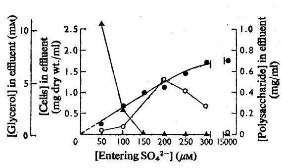
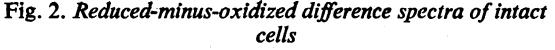
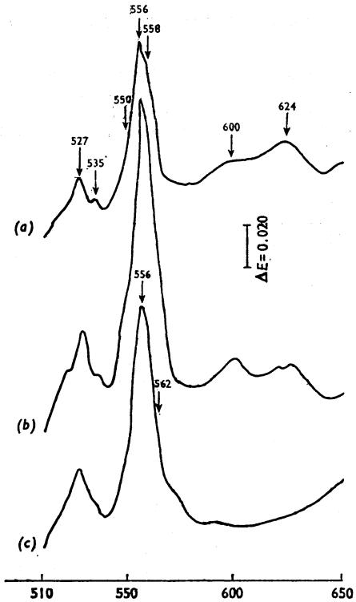
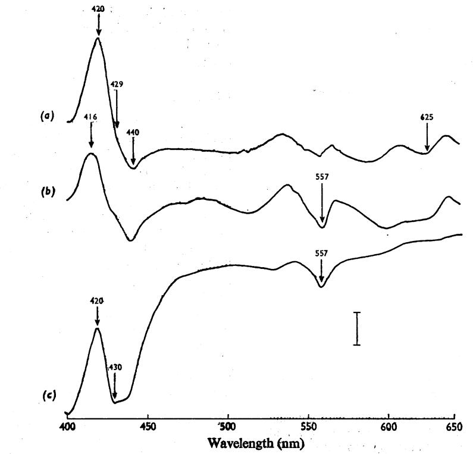
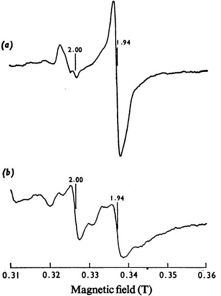
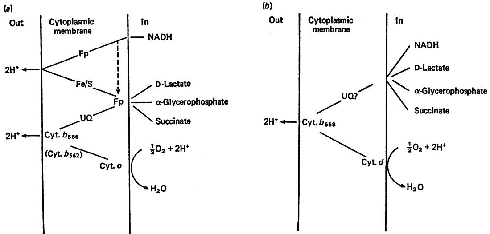

# Effects of Sulphate-Limited Growth in Continuous Culture on the Electron-Transport Chain and Energy Conservation in Escherichia coli K12

By ROBERT K. POOLE* and BRUCE A. HADDOCKt

Department ofBiochemistry, Medical Sciences Institute, University ofDundee, Dundee DD1 4HN, U.K.

(Received 9 June 1975)

Growth of Escherichia coli K12 in a chemostat was limited by sulphate concentrations lower than 300pM. The synthesis of extracellular polysaccharide and a change in morphology accompanied sulphate-limited growth. Growth yields with respect to the amount of glycerol or oxygen consumed were sixfold and twofold lower respectively under these conditions than when growth was limited by glycerol. Sulphate-limited cells lacked the proton-translocating oxidoreduction segment of the electron-transport chain between NADH and the cytochromes, and particles prepared from these cells lacked the energydependent reduction of NAD+ by succinate, DL-cz-glycerophosphate or D-lactate, suggesting the loss ofsite-I phosphorylation. Glycerol-limited cells contained cytochromes b556, b562 and o, ubiquinone and low concentrations of menaquinone. Sulphate limitation resulted in the additional synthesis of cytochromes d, a,, b558 and c55o; the amount of ubiquinone was decreased and menaquinone was barely detectable. Non-haem iron and acid-labile sulphide concentrations were twofold lower in electron-transport particles prepared from sulphate-limited cells. Recovery of site-I phosphorylation could not be demonstrated after incubating sulphate-limited cells with or without glycerol, in either the absence or presence of added sulphate. The loss of site-I phosphorylation in sulphatelimited cells is discussed with reference to the accompanying alterations in cytochrome composition of such cells. Schemes are proposed for the functional organization of the respiratory chains of E. coli grown under conditions of glycerol or sulphate limitation.

Limitation of the growth of micro-organisms in continuous culture by certain nutrients results in functional alterations of the electron-transport chain and of energy-conservation mechanisms (Garland, 1970; Light, 1972). For example, iron- (Light & Garland, 1971; Clegg & Garland, 1971) or sulphate-limited growth (Haddock & Garland, 1971) of Candida utilis results in the reversible loss of energy conservation between NADH and the cytochromes (see also Downie & Garland, 1973a). Similar studies with bacterial systems are more restricted. Iron-limited growth of Escherichia coli in batch culture results in decreased amounts of iron-containing components of the electron-transport chain and an impairment of energy conservation (Rainnie & Bragg, 1973). The use of mutants unable to synthesize components of the enterochelindependent iron transport system (Cox et al., 1970; Gibson & Cox, 1973; Cox & Gibson, 1974) provides an alternative but unexplored means of studying the effects of iron limitation in E. coli.

* Present address: Department of Microbiology, Queen Elizabeth College (University of London), Atkins Building, Campden Hill, London W8 7AH, U.K.

t To whom reprint requests should be addressed.

A restriction in the general application of ironlimited growth conditions in the study of alterations in the functional organization of electron-transport carriers in respiratory chains is that the concentrations of both iron-sulphur proteins and cytochromes in the membrane are decreased. We therefore investigated the effect of sulphate-limited growth conditions on E. coli in an attempt to characterize specifically the role of iron-sulphur proteins in electron transport and energy conservation in this organism. In the present paper we demonstrate that these growth conditions result in the loss of energy conservation in that span of the respiratory chain between NADH and the cytochromes, as in C. utilis (Haddock & Garland, 1971). However, unlike the yeast system, sulphate limitation results in more widespread alterations in other membrane-bound redox carriers. A preliminary report of part of this work has been presented (Poole & Haddock, 1974a).

# Materials and Methods

E. coli strain C-i(S), used throughout for the continuous-culture experiments, was derived from a nalidixic acid-resistant strain C-1 (Poole & Haddock,

1974b) and isolated as indicated in the Results section. The mineral-salts growth medium (Poole & Haddock, 1974b) contained 0.570 (w/v) glycerol as sole carbon source and 0.025 % silicone antifoam emulsion FG (Hopkin and Williams Ltd., Chadwell Heath, Essex, U.K.) but lacked added Mnl*, since the characteristic e.p.r. (electron-pararnagneticresonance) properties of this metal interfere with those of iron-sulphur proteins. The final concentration of K2SO4 in the growth medium was varied between 50.uM and 15mm as indicated. Growth was in a chemostat (Light & Garland, 1971) at 370C with the pH maintained at 7.4. The working volune was 625ml, the dilution rate 0.16h-1 and the air-flow rate 4 litres/min.

# Collection and harvesting of cells, and preparation of subcellular fractions

The chemostat effluent was collected overnight in an ice-cooled vessel (24QC) and cells wore harvested by centrifugation at 4530g for 15mi, unless otherwise specidW. Cells were washed twice, then disrupted by sonication for five periods of 30Q each in an M.S.E., 15W ultrasonic disitegrtor set at medium powxr output (mplitude 8am) at 2-51C. The medium contaiped 50m-Tis4HCl, 2mM-MgCI2 and 1 m*M-QTA [ethanedioxybis(athylamine) tetra-acetic gq4d], pH7,4. !letr,0atr4sport particWl were prepard as dewibed by Poole & Haddok (1974b).

# Incubation of sulphate-limited cells with sulphate and with a carbon source

Cells were harveted by centrifugation from a 12h chemostat collectiQn and washed twice with growth medium lacking sulphate, glycerol and antifoam. Portions ofthe washed bel suspension were incubated in this medium for 12h at 370C with either (a) glycerol (0,5%) in the absence or presence of 1 mm- (2S04 or (b), in the absence of glycerol, with or without 1 mM-K2S04. The final cell concentration waS about 0.5mg (dry wt.) of cells/ml. In (a), cells were subsequently starved for 2h in medium lacking glycerol and sulphate, then (for a and b) washed twice in cold 150mm-KCI, before measurements of oxidase rates and respiration-driven proton translocation,

# Assay and nomenclature ofcytochromnes

Na2S204 - reduced - minus - H202 - oxidized or Na2S204 - reduced+CO - minus - Na2S204 - reduced difference spectra of intact cells were obtained at room temperature (20°C) with a wavelength-scanning spectrophotometer (Haddock & Garland, 1971; Haddock, 1973). Concentrations of cytochromes were determined from such spectra using appropriate

molar extinction coefficients (Haddock & Schairer, 1973). Since the spectral properties of cytochrome d and a CO-reactive b-type cytochrome (cytochrome 0*) cause mutual interference in reduced + CO-minusreduced difference spectra in the region 400-460nm, the concentration of cytochrome o was calculated from such spectra by using the decrease in extinction at 562nm relative to 575nm by assuming that cytochrome o is the only b-type cytochrome reacting with CO (Castor & Chance, 1959) and a millimolar extinction coefficient of 42.2 litre mmol-' *cm-.

Resolution of the various b-type cytochromes, which contribute to the single broad absorption band at about 562nm in reduced-minus-oxidized difference spectra at 77°K of these species (b556, b558 and b562) and of other cytochromes is therefore based on the a-band wavelength maximum (in nm) observed at this temperature. These spectra were obtained by using the same spectrophotometer with low-temperature accessories; the spectral band width was 2nm, the scanning speed was approx. 5nm/s, the time-constant of the measuring circuit 0.1 s, and cuvettes of light-path 0.2cm were used.

# Other assay techniques

Measurements of respiration-driven proton translocation were made as described by Lawford & Haddock (1973), but at 30°C with approx. 4-10mg of bacterial protein and in the presence of valinomycin (lO4g/ml). Where indicated, carbonyl cyanide p-trifluoromethoxyphenylhydrazone was used at a final concentration of 1 pg/ml of suspension. The absence or presence of K2SO4 (at the concentration in the entering growth medium) during starvation (Law. ford & Haddock, 1973) was without effect on the extent of the observed proton translocation.

Non.haem iron and acid.labile sulphide were determined by using o-phenanthroline and NV' dimethyl-p-phenylenediamine dihydrochloride respectively as described by Clegg & Garland (1971). Non.haem iron from E. coli which does not react with o-phenanthroline is not associated with succinate, D-lactate or NADH dehydrogenase activities (Kim & Bragg, 1971).

The extracellular polysaccharide was determined in the supernatant obtained after cells had been removed from samples of chemostat effluent by centrifugation at 20000g for 30mn by using the phenol-H2SO4 method of Dubois et al. (1956). Aqueous solutions of glucose (0-0.1mg/ml) were used as standards.

* In the present paper, cytochrome o is definod as a COreactive b-type cytochrome, capable ofacting as a terminal oxidase (see Ashcroft & Haddock, 1975). The Soret absorption band of the CO-Higanded reduced pigment is at about 432nm at room temperature (Castor & Chanoe, 1959).

E.p.r. spoctroscopy was performed with preparations of Na2S204-reduced electron-transport particles as desribed by Downie & Garland (1973b). Spectra were measured with the Varian E9 spectrometer kindly made available by Dr. R. C. Bray and Dr. D. J. Lowe at the School of Molecular Sciences, University of Sussex. Temperature measurements of the smples were made as described by Lowe et al. (1972).

Other assays to determine oxygen uptake rates (Haddock, 1973), the energy-linked reduction of NADI by clectron-transport particles (Poole & Haddock, 1974b), quinones (Haddock & Schairer, 1973), protein (Lowry et al., 1951), cell dry weight (Tempest & Herbert, 1965), glycerol (Garland & Randle, 1962) and various NADH-acceptor oxidoreductase activities (Bragg & Hou, 1967a; Grossman et al., 1974) have been described previously.

### Reagents

ATP (disodium salt), carbonyl cyanide p-trifluoromethoxyphenylhydrazone, NADI (free acid), and NADH(disodium salt; grade II) were purchased from Boebringer Corp. (London) Ltd., London W5 2TZ, U.K. D-Lac acid (lithium salt, A grade) and valinomycin were obtained from Calbiochem, San Diego, Calif. 92112, U.S.A. Juglone was from Koch-Light Laboratories Ltd., Colnbrook, Bucks., U.K. DL-a-Glycerophosphate (disodium salt, grade X) and menaquinone-1 (vitamin K-1) were from Sigrna (London) Chemical Co., London SMW.6, U,K. Ubiquinone-1 was a generous gift from F. Hoffman, La Roche and Co., CH402 Basel, Switzerland. All other reagents were from BDH Chemicals Ltd., Poole, Dorset, U.K. and were of the highest available purity.

# Results

# Conditioniyfor suiphateJlimited growth

Batch culture. In preliminary experiments with batch culture, lowering of the initial concentration of sulphate from 15mM to 25pM was without effect on the mean generation time during growth on glycerol (approx. 2h), but the stationary-phase population was approximately halved. At initial concentrations of K2S04 lower than 1 UM, the mean generation time was 5.5h, but the stationary-phase population was similar to that in cultures with 2S5M-K2S04; interestingly, addition of sulphate (15mM) to such stationary-phase cultures caused no further growth within 24h.

Continuous culture. In preliminary continuousculture experiments, a fourfold increase in cell yield was observed in a culture of strain C-1 which had been growing for 10 days with added 15mM-K2SO4. It seemed likely that this phenomenon was due to the selection of a variant of the original strain, and so the organism was isolated, designated C-1 (S) and used in all subsequent experiments to be described. This organism retained the ability of the parental strain (C-1) to grow on glucose-nutrient agar in the presenc of natidixic acid (40Mg/mi) and resembled it in colony morphology and appearance under both light and electron microscopy.

Fig. 1 shows the results of an experiment in which the concentration of sulphate entering the culture was decreased sequentially every 4-5 days. When a steady-state cell concentration had been attained, measurements were made of dry weight and the amounts of glycerol and polysaccharide present in the effluent after removal of cells by centrifugation. Growth appeared to be limited by sulphate at entering sulphate concentrations of less than 300,UM, as indicated by the decrease in cell yield, although glycerol was not detectable in the effluent until the sulphate concentration was decreased to 150pUM. Cell yield showed a linear dependence on the entering sulphate concentration from 5OUM to at least 200p,M. In the absence of added sulphate, wash-out occurred. At entering sulphate concentrations between 100 and 300pM, cultures were markedly viscous; this was attributed to the presence of extracellular polysaccharide. Phase-contrast and electron microscopy revealed that a change in cell morphology accompanied sulphate limitation. Approximate measurements of cell length and diameter from electron photomicrographs of fixed and stained cells were made and cell volumes calculated by using the formula of MitchisQn -(1957) for a-cylWdrical cell with hemispherical ends. Cells grown at an entering sulphae concentration of 56.pM were longer and narrower than glycerol-limited cells. For the former

Fig. 1. Growth parameters ofE. coli in continuous culture at various entering concentrations ofsulphate

Assays were pqdorme4 as deribed in the Materials and Methods section. Each point shows measurements mado on samples of effluent culture collected 4-5 days after a decrease in the enternng concentration of sulphate: *, dry weight of oells; o, polyscharide; A, glycerol.

### Table 1. Growth yields ofEscherichia coli grown in continuous culture with various entering concentrations ofsulphate

Direct polarographic measurements of oxygen concentration in the air supply to the chemostat and in the effluent gas were used to calculate the oxygen growth yield (Downs & Jones, 1974); the gas-flow rates over the oxygen electrode were adjusted to about 150ml/min. Values presented are means±s.D., and the number of determinations is given in parentheses (n.t., not tested). Glycerol growth yield was calculated from direct measurements of culture dry weight (Tempest & Herbert, 1965) and glycerol concentration (Garland & Randle, 1962) and subsequently used to estimate the oxygen growth yield by using the formula ofJohnson (1964) or the assumptions ofvon Meyenburg (1969) about the degree of oxidation ofcellular carbon and assuming that carbon accounts for 50% of the cell dry mass (Clegg & Light, 1971).

Oxygen growth yield (g of dry cell mass/g-atoms of 0 consumed)

|                                        |                             | Glycerol growth                     |                                                        | Estimated by th e method of: I-A_ |                   |
|----------------------------------------|-----------------------------|-------------------------------------|--------------------------------------------------------|-----------------------------------------|-------------------|
| [Entering sulphate] for growth (jM) | Growth-limiting nutrient | yield (g of dry cell mass/mol of | Determined by glycerol consumed) direct measurement | _ von Meyenburg (1969)            | Johnson (1964) |
| 15000                                  | Glycerol                    | 32.2                                | 11.9±1.1 (4)                                           | 6.9                                     | 5.4               |
| 100                                    | Sulphate                    | 12.9                                | n.t.                                                   | 2.9                                     | 2.7               |
| 50                                     | Sulphate                    | 5.7                                 | 6.2±0.2 (3)                                            | 1.2                                     | 1.5               |

cell type, mean values for length, diameter and volume were 4.6,um, 0.41 um and 0.42gm3 respectively, whereas for glycerol-limited cells these values were 2.4gm, 0.60gm and 0.62gm3 respectively. In subsequent experiments, glycerol-limited cells were those grown at an entering sulphate concentration of 15 mM; unless otherwise specified, sulphate-limited cells were grown at an entering sulphate concentration of 50gM.

# Growth efficiencies with respect to glycerol and oxygen

The results in Table 1 show that sulphate limitation results in an impairment of growth efficiency on glycerol. The glycerol growth yield for cells grown at an entering sulphate concentration of 50gM is one-sixth of that observed for glycerol-limited cells. Sulphate limitation also results in an approximate halving of the observed oxygen growth yield. The value for glycerol-limited cells (1 1.9 g of dry cell mass/ g-atom of 0 consumed) is in close agreement with oxygen growth yields calculated for aerobic growth of E. coli on glucose (Hernandez & Johnson, 1967) and on glutamate, succinate or lactate (Whittaker & Elsden, 1963), but is significantly lower than the value reported by the latter authors for glucose. When the oxygen growth yield was estimated by the indirect method of Johnson (1964) or voti Meyenburg (1969) considerably lower values were obtained, but again sulphate limitation resulted in a decreased oxygen growth yield. Since the ratio of the oxygen growth yield to the ATP growth yield (g of dry cell mass/mol of ATP) equals an average P/O ratio for the oxidation of all substrates produced during growth, we conclude that the observed oxygen growth yields indicate a significant decrease in the efficiency of energy conservation resulting from

sulphate limitation. However, it is realized that direct measurements of the ATP growth yield and correction ofthe oxygen growth yield for maintenance energy requirements are needed for a fully quantitative assessment of P/O ratios (Stouthamer & Bettenhaussen, 1973). An independent and more direct approach for the determination of energy conservation efficiency was therefore used.

# Respiration-driven proton translocation

Measurements were made of the stoicheiometry of proton translocation coupled to substrate oxidation. Typical proton 'pulses' were achieved and the observed ->H+/O ratios for glycerol-limited cells were in close agreement with those reported previously (Lawford & Haddock, 1973); in particular, the oxidation of L-malate yielded values of ->H+/O close to 4 (Table 2). Proton translocation was abolished by the presence of carbonyl cyanide p-trifluoromethoxyphenylhydrazone. However, corresponding values for sulphate-limited cells oxidizing L-malate were close to 2. Quotients observed during oxidation of flavin-linked substrates such as glycerol, succinate or D-lactate were all close to 2 and were independent of the growth conditions used (Table 2). If it is assumed that two protons are translocated per potential energy-conservation site of the respiratory chain (Mitchell & Moyle, 1967) then these results suggest that of the two sites present under glycerollimited conditions, the first site (that occurring in the span of the respiratory chain between NADH and the junction of the flavin-linked dehydrogenases) is absent under conditions of sulphate-limited growth.

In general, higher oxidase activities of intact cells were observed when cells were grown under conditions of sulphate limitation.

### Table 2. Observed -H+H/O ratios andoxidase ratesfor glycerol andsulphate-limited Escherichia coli respiring different added substrates

Cells grown under conditons of glycerol limitation (entering sulphate concentration 15 mM) or sulphate limitation (entering sulphate concentration 200 or 5O0pM) were starved of endogenous substrates in growth medium (containing no carbon source, but the appropriate concentration of sulphate). Measurements were performed as described in the Materials and Methods section, and values for -+H+/O are presented as means ± S.D. with the numbers of observations in parentheses. n.t., Not tested.

### Cells grown with entering

| sulphate concentrations of |                 | 15 mm~                                              |                | 200pM                                                | 50pM            |                                                     |  |
|----------------------------|-----------------|-----------------------------------------------------|----------------|------------------------------------------------------|-----------------|-----------------------------------------------------|--|
| Substrate added         | --).H+/O        | Oxidase (ng-atoms of 0/min per mg of protein) | --*H+/O        | Oxidase (ng/atoms of 02/min per mg of protein) |                 | Oxidase (ng-atoms of 0/min per mg of protein) |  |
| None (endogenous)       | 3.10±0.45 (7)   | 42                                                  | n.t.           | 58                                                   | 2.04±0.16 (9)   | 60                                                  |  |
| L-Malate                   | 3.58+0.11 (9)   | 144                                                 | 3.10+0.44 (10) | 164                                                  | 2.21 +0.20 (13) | 270                                                 |  |
| Glycerol                   | 2.21 +0.24 (13) | 288                                                 | n.t.           | 378                                                  | 2.23±0.07 (7)   | 750                                                 |  |
| Succinate                  | 2.21 + 0.20 (5) | 252                                                 | 2.25+0.31 (6)  | 193                                                  | 2.17+0.10 (8)   | 330                                                 |  |
| D-Lactate                  | n.t.            | 126                                                 | n.t.           | 204                                                  | 2.00+0.14 (7)   | 318                                                 |  |

# Energy-linked reduction ofNAD+

The measured rates of ATP-dependent, uncouplersensitive NAD+ reduction with succinate, DL-aglycerophosphate or D-lactate as electron donor (i.e. reversed electron flow at site I) were all similar to those described previously for electron-transport particles derived from glycerol-grown E. coli strain C-1 (Poole & Haddock, 1974b). The corresponding rates for electron-transport particles derived from sulphatelimited cells were low but measurable (<1 nmol of NADH formed/min per mg of particle protein). However, these latter activities were ATPindependent and insensitive (less than 10 %inhibition) to carbonyl cyanide p-trifluoromethoxyphenylhydrazone (1 nmol/mg of protein). The results with this site-specific assay using particles confirm the conclusions drawn from measurements of ->H+/O ratios in intact cells, namely that energy conservation at site I is absent from sulphate-limited cells.

### Cytochrome and quinone composition ofglycerol- and sulphate-limited cells

Fig. 2 shows Na2S204-reduced-minus-oxidized difference spectra recorded at 77°K of intact cells harvested from cultures grown at different entering concentrations of sulphate. For glycerol-limited cells, the spectrum shows a maximum at 556nm and a shoulder at 562nm (Fig. 2, trace c). An at-band attributable to a- or d-type cytochromes was not observed. In contrast, the reduced-minus-oxidized difference spectrum of sulphate-limited cells (Fig. 2, trace a) reveals the presence of cytochromes c550, b556, b558, al (600nm) and d (624nm). Growth at

Vol. 152

200piM-K2SO4 (Fig. 2, trace b) results in cells with an intermediary cytochrome composition.

Components were also identified on the basis of their reactivity with CO (Castor & Chance, 1959). The CO difference spectrum of intact glycerollimited cells (Fig. 3, trace c) reveals the major CObinding pigment to be cytochrome o (absorption minimum at 430nm). A further trough is observed at about 557nm.

In contrast the absorption minimum in the Soret region of a spectrum of sulphate-limited cells is at about 440nm and is due to cytochrome d, as is the additional trough at 625nm (Fig. 3, trace a). CO spectra of cells grown at intermediate sulphate concentrations show both cytochromes o and d (Fig. 3, trace b).

Cytochrome concentrations were determined from spectra recorded at room temperature. The concentrations ofcytochromes b and o did not alter markedly at different entering concentrations of sulphate (Table 3). Cytochrome d concentration was too low to measure accurately in glycerol-limited cells, but examination of reduced-minus-oxidized difference spectra of cells grown at entering sulphate concentrations of 50, 100, 150, 200, 250 and 300,UM (spectra not shown) suggested that its concentration was inversely proportional to the sulphate concentration within this range. Cytochrome c was undetectable in glycerol-limited cells, but was clearly present in sulphate-limited cells. The concentration of flavoprotein appeared to be lowest at intermediate entering concentrations of sulphate.

Sulphate limitation resulted in a significant decrease in the concentration of ubiquinone in the cells, but this was not compensated for by an increased synthesis of menaquinone (Table 3).

# (a) (b) (c) s1o 550 600 650 Wavelength (nm)

Cell suspensions for spectroscopy were prepared by diluting harvested and washed cells in 50rnm-Tris-HCI, 2mM-MgCl2, 1 mM-EGTA (pH7.4). Samples (0.5 ml) were reduced with Na2S0,O4 (in the sample cuvette) or oxidized with H202(approx. 1 mM) before immersion ofthecuvettes into liqwd Ns and the recording of difference spectra at 77°K. Cell types and protein concentrations (mg/ml) sed were (a) cells grown at an entering sulphate concentration of 5O,UM (14.6), (b) cells grown at an entering sulphate concentration of 200pM (22.0), and (c) glycerol-limited cells (17.2).

Non-haem iron and acid-labile sulphide in electrontransport particles from glycerol- and sulphate-limited cells

Results in Table 3 demonstrate that sulphate limitation results not only in a 2.3-fold decrease in the concentration of acid-labile sulphide but also in a less marked decrease (1.8-fold) in the concentration of non-haem iron. The ratio of non-haem iron to sulphide was 3.0 in glycerol-limited cells and 3.8 in sulphate-limited cells. These results are unexpected in view of the more marked decreases in concentrations of acid-labile sulphide and the unchanged amounts of non-haem iron observed on sulphate limitation of C. utilis (Haddock & Garland, 1971).

# Electron-paramagnetic-resonance spectroscopy studies ofelectron-transport particles

Fig. 4 shows electron-paramagnetic-resonance spectra of Na2S204-reduced particles from glyceroland sulphate-limited -cells, measured at 12°K. The predominant signal is that at g= 1.94 which was previously attributed to non-haem iron in spectra recorded at 77°K (Nicholas et al., 1962; Hamilton et al., 1970). The spectra presented demnonstrate a decreased amount of non-haem iron in sulphatelimited cells, consistent with the results obtained from chemical analysis. Signals observed at g = 2.00 are unlikely to be due to an organic free radical, since these would be saturated at the power and temperature settings used. Both spectra, but particularly that ofparticles from sulphate-limited cells, exhibit further signals which have not been attributed to particular membrane components; the possibility of contributions from cytochromes has not been investigated.

# NADH-acceptor oxidoreductase activities in electrontransport particles from glycerol- and sulphatelimited cells

Since sulphate-limited growth resulted in the loss of energy conservation associated with NADH dehydrogenase activity (EC 1.6.99.3), the activities of various NADH-dye oxidoreductases were assayed in an attempt to identify alterations in the properties of the enzyme. No large differences were found in such activities by using electron-transport particles derived from glycerol- and sulphate-limited cells, and so the results are not presented in detail. However, particles from sulphate-limited cells demon! strated 1.5-3-fold increased activities of NADH oxidase, NADH-2,6- dichlorophenol - indophenol oxidoreductase, NADH-ubiquinone-1 oxidoreductase, NADH-menadione oxidoreductase, and NADH-juglone oxidoreductase, but a 60%decreased NADH-ferricyanide oxidoreductase activity, when compared with electron-transport particles from glycerol-limited cells.

# Attempts to reverse the effects ofsulphate limitation on respiration-dependent proton translocation at site I by incubating sulphate-limited cells with sulphate and with glycerol

After 12h incubation of cells harvested from a sulphate-limited chemostat collection in glycerolcontaining medium, in the absence or presence of added sulphate, the -÷H+/O ratios observed during succinate oxidation were similar, irrespective of the presence of sulphate in the incubation medium, and were close to 2. Such cells oxidized L-malate only slowly (about 20ng-atoms of 0/min per mg of protein) and the corresponding -÷H+/O ratios were again close to 2 [1.80±0.2 (mean±iS.D.); six deter-

Fig. 3. COCdifference spectra ofintact cells

Cell suspensions were prepared as in Fig. 2. Asample (1 ml), reduced with Na2S204, was split into twoportions. Oneportion was gently bubbled with CO for 3 min and after a further 5 min was transferred to thesampecuvtte. The other portion was transferred to the reference cuvette, before immersion of cuvettes in Iiqwid Ns and recording of difference spectra at 77-K. Cell types (a)-(c) and corresponding protein concentrations are the same as mn Fig. 2. The bar represents AE 0.08, except for spectrum (a) (510-650nm), where it represents AE= 0.02. ,

Table Concensrationsofeytochroms,flavopro:einsandquinonesIn whole cells andofnon-haem iron and acid-labile sulphide in electrof-transport partldes from Evcherkhia coi grown wuder conditions ofglycerol or sulphate limitation

The concentrations of flavoproteins and ofcytochromesd and b and the presence ofcytochromes a. and c were determined from NaS2O4"reduced-minusoxidized difference spqctra recorded at room temperatie. Measurements of Na2SO04- reduced+CO-minus-Na2S204-reduced difference spectra at room temperature were used to determine the concentration of cytochrome o, as described in the Materials and Methods section. Quinones wereextracted from cells, separated and assayed as dciWbed by Haddock & Schairer (1973). The concent;rations of non-haem iron and acid-labile sulphide in electrontransport particles weredetermined chemically as desrbed by Clegg &: Garland (1971); these values are presented as means ±s.D., with the numbers of determinations in pa=theses. n.t., Not tested; + or - indicates the presence or absence of a component whose concentration was too low to assess.

| [Entring sulphatel for growth |      | [Cytochrome] or [flavoprotein] (nmol/mg of total cell protein) |             |    |   |      | [Quinonel (nmol/g of wet wt. of cells) (nmolfmg of sulphide] (nmol/ |                                     | [Non-haem iron] [Acid-labile |                               |
|-------------------------------------|------|-------------------------------------------------------------------|-------------|----|---|------|------------------------------------------------------------------------|-------------------------------------|------------------------------|-------------------------------|
| (AM)                                | b1   | d                                                                 | o           | a, | c |      |                                                                        | Flavoprotein Ubiquinone Menaquinone | particle protein)         | mg of particle protein) |
| 15000                               | 0.25 | +                                                                 | 0.10        | +  | - | 0.53 | 20.3                                                                   | 4.3                                 | 4.28±0.42(4)                 | 1.43±0.27(4)                  |
| 200                                 | 0.21 |                                                                   | 0.027 0.096 | +  | + | 0.36 | n.t.                                                                   | n.t.                                | n.t.                         | n.t.                          |
| 50                                  |      | 0.26 0.05                                                         | 0.078       | +  | + | 0.68 | 8.1                                                                    | <0.5                                |                              | 2.42+0.39 (5) 0.63±0.12 (4)   |

Fig. 4. E.p.r. spectra of electron-transport particles from glycerol- and sulphate-limited E. coli

Particles were prepared from cells grown with entering sulphate concentrations of 15 mm (a) or 50,M (b), and were reduced with Na2S204. In the upper spectrum (a) the protein concentration was 58 mg/ml, the receiver gain 1.0 X 103 and the time-constant 0.1 s. In the lower spectrum (b) the protein concentration was 71 mg/ml, the receiver gain 2.5 x 103 and the time-constant 0.3 s. Each spectrum was measured at a sample temperature of 11.7°K; the modulation amplitude was lOG, the scanning rate 500G/ min, the microwave frequency 9.121 GHz and the microwave power 5.0 mW. Spectra are presented as,the first derivatives in arbitrary units of the microwave-power absorption, plotted against the magnetic field. Theg values numbered in the figure correspond to the field positions given by the vertical bars.

minations]. Incubation in the absence of glycerol, with or without added sulphate, yielded cells incapable of oxidizing exogenous L-malate. Observed ->H+/O ratios for succinate oxidation or on addition of L-malate (presumably during oxidation of endogenous substrates) were 1.61 and 1.69 respectively. The failure to demonstrate recovery of Site I phosphorylation under these conditions is supported by the inability of added sulphate to stimulate growth of sulphate-limited batch cultures, but contrasts with the demonstration by Haddock & Garland (1971) of recovery from sulphate limitation by C. utilis. However, when the medium supply to a sulphatelimited culture was changed to one containing l5mM-K2SO4, the culture became glycerol-limited within a few days. Thus the transition from sulphate

to glycerol limitation was fully reversible in the chemostat, indicating that sulphate limitation did not result in the selection of a mutant lacking site-I energy conservation.

# Discussion

Measurements of growth yields and of the extent of electron-transport-dependent proton translocation in intact cells and of the energy-dependent reduction of NAD+ in particles have led to the conclusion that sulphate-limited growth of E. coli results in the sitespecific loss of energy conservation associated with the oxidation ofNADH. In yeast it has been suggested (Katz et al., 1971), but later discounted (Light & Garland, 1971), that the effect of iron or sulphate limitation on the efficiency of oxidative phosphorylation is the result of excess of carbon source in the medium under these growth conditions. Although we have not performed controls by limiting growth by some nutrient other than the carbon source or sulphate, we consider this explanation unlikely in E. coli, since Stouthamer & Bettenhaussen (1975) have demonstrated that the efficiency of oxidative phosphorylation in Aerobacter aerogenes, as calculated from growth-yield experiments, is similar in glucose- and histidine-limited chemostat cultures but decreased in sulphate-limited chemostat cultures.

Scheme l(a) illustrates the proposed functional organization of the respiratory carriers in glycerollimited cells. The scheme is formulated on the basis of previously published work largely from this laboratory with batch-grown E. coli K12 (Lawford & Haddock, 1973; Schairer & Haddock, 1972; Downie, 1974; Haddock et al., 1974; Poole & Haddock, 1974a,b) and on the results in the present paper. NADH oxidation proceeds via the sequence of respiratory carriers shown, which are arranged in two proton-translocating segments across the cytoplasmic membrane, corrresponding to sites I and II respectively. Flavin-linked substrates communicate with this sequence at the level ofubiquinone. An analogous scheme for the functional organization of the respiratory chain in sulphate-limited cells is more difficult to construct in the absence of further data. Two possibilities, which are not necessarily mutually exclusive, are that sulphate limitation results in either (1) the loss of iron-sulphur proteins in the NADH dehydrogenase region of the chain, which leads to a 'short-circuit' of the proton-translocating oxidoreduction segment normally associated with this region (dotted line in Scheme la), or (2) the synthesis of an additional respiratory chain, which is characterized by a non-proton-translocating NADH dehydrogenase (i.e. a different enzyme) and extra cytochrome components b558 and d (Scheme lb). The first alternative is supported by analogous work on sulphate and iron limitation in yeast (Garland

Scheme 1. Proposedfunctional organization ofthe respiratory chains in glycerol- and sulphate-limited E. coli

'Out' and 'In' refer to the orientation of the cytoplasmic membrane in vivo. Abbreviations: Cyt., cytochromes; Fp, flavoproteins; Fe/S, iron-sulphur proteins; UQ, ubiquinone. Cytochrome c is not included, as reconstitution studies indicate that it is not an obligatory component of the membrane-bound electron-transport system (Haddock & Schairer, 1973), and cytochrome al is not kinetically competent to act as a terminal oxidase in E. coli (Downie, 1974).

et al., 1972; but see also Grossman et al., 1974). The second alternative is supported by the observation that proton translocation in anaerobically grown E. coli (which also possesses cytochromes b558 and d) shows -*H+/O ratios of about 2 for the oxidation of endogenous substrates (Brice et al., 1974) and added L-malate and D-lactate (Downie, 1974). In addition, two NADH dehydrogenase activities which differ in their ability to reduce various dye acceptors have been purified from E. coli (Bragg & Hou, 1967b; Hendler & Burgess, 1974). However, it is not clear whether these are two distinct enzymes or merely two preparations of the same enzyme with different molecular weights. In the absence of further experimental evidence both schemes must be considered as tentative.

The co-ordinate synthesis ofalternative membranebound respiratory-chain components (cytochromes b553, a, and d and menaquinone) has been observed under a variety of different growth conditions (see Ashcroft & Haddock, 1975). Sulphate-limited growth in continuous culture provides a convenient experimental system in which to study the control mechanisms regulating their syntheses. In particular, the inability to detect menaquinone in sulphate-limited cells demonstrates for the first time that the synthesis of cytochromes and of menaquinone are independently controlled.

This work was generously supported by the S.R.C. through a postdoctoral research fellowship (to R. K. P.) and a research grant (B/RG/58518). We thank Professor P. B. Garland and Dr. R. C. Bray for critical discussions. E.p.r. spectra were obtained by Mr. H. Brothwell (University of Sussex) and Mr. T. A. Gray (of this Department). Mr. M. T. Davison parformed skilled electron microscopy, and Dr. A. G. Williams provided helpful advice on the estimation of extracellular polysaccharides. Mr. D. G. Coutie, Mrs. Cynthia Greenwood and Mrs. Yvonne Begg provided expert technical assistance.

### References

- Ashcroft, J. R. & Haddock, B. A. (1975) Biochem. J. 148, 349-352
- Bragg, P. D. & Hou, C. (1967a) Arch. Biochem. Biophys. 119, 194-201
- Bragg, P. D. & Hou, C. (1967b) Arch. Biochem. Biophys. 119,202-208
- Brice, J. M., Law, J. F., Meyer, D. J. &Jones, C. W. (1974) Biochem. Soc. Trans. 2. 523-526
- Castor, L. N. & Chance, B. (1959) J. Biol. Chem. 234, 1587-1592
- Clegg, R. A. & Garland, P. B. (1971) Biochem. J. 124, 135-151
- Clegg, R. A. & Light, P. A. (1971) Biochem. J. 124, 152-154
- Cox, G. B. & Gibson, F. (1974) Biochim. Biophys. Acta 346, 1-25
- Cox, G. B., Newton, N. A., Gibson, F., Snoswell, A. M. & Hamilton, J. A. (1970) Biochem J. 117,551-562
- Downie, J. A. (1974) Ph.D. Thesis, University of Dundee
- Downie, J. A. & Garland, P. B. (1973a) Biochem. J. 134, 1045-1049
- Downie, J. A. & Garland, P. B. (1973b) Biochem. J. 134, 1051-1061
- Downs, A. J. & Jones, C. W. (1974) Biochem. Soc. Trans. 2, 526-529
- Dubois, M., Gillies, K. A., Hamilton, J. K., Rebers, P. A. & Smith, F. (1956) Anal. Chem. 28, 350-355
- Garland, P. B. (1970) Biochem. J. 118, 329-339
- Garland, P. B. &Randle, P. J. (1962) Nature (London) 196, 987-988
- Garland, P. B., Clegg, R. A., Downie, J. A., Gray, T. A., Lawford, H. G. & Skyrme, J. (1972) in Mitochondria, Biogenesis and Bioenergetics. Biomembranes: Molecular Arrangements and Transport Mechanisms (FEBS Symp. vol. 28) (van den Bergh, S. G., Borst, P., van Deenen, L. L. M., Riermersma, J. C., Slater, E. C., Tager, J. M., eds.), pp. 105-117, North-Holland Publishing Co., Amsterdam and London
- Gibson, F. & Cox, G. B. (1973) Essays Biochem. 9, 1-29
- Grossman, S., Cobley, J. G., Singer, T. P. & Beinert, H. (1974) J. Biel. Chem. 249, 3819-3826
- Haddock, B. A. (1973) Blochem. J. 136, 877-884
- Haddock, B. A. & Garland, P. B. (1971) Biochem. J. 124, 155-170
- Haddock, B. A. & Schairer, H. U. (1973) Eur. J. Biochem. 35,34-45
- HIaddock, B. A., Downie, J. A. & Lawford, H. G. (1974) Proc. Soc. Gen. Microbiol. 1, 50
- Hamilton, J. A., Cox, G. B., Looney, F. D. & Gibson, F. (1970) Riochem, J. 116, 319-320
- Hendler, R. W. & Burgess, A. H. (1974) Biochtkm Blophys. Acta 357, 215-230
- Hernandez, E. & Johnson, M. J. (1967) J. Bacteriol. 94, 991-995
- Johnson, M. J. (1964) Chem. Ind. (London) 36,1532-1537
- Katz, R., Kilpatrick, L. & Chance, B. (1971) Eur. J. Biochem. 21, 301-307
- Kim, I. C. &Bragg, P. D. (1971)J. Bacteriol. 107,664-670 Lawford, H. G. & Haddock B. A. (1973) Biochem. J. 136, 217-220
- Light, P. A. (1972) J. Appl. Chem. Biotechnol. 22, 509-526
- Light, P. A. & Garland, P. B. (1971) Biochem. J. 124, 123-134
- Lowe, D. J., Lynden-Bel, R. M. & Bray, R. C. (1972) Biochem. J. 130, 239-249
- Lowry, 0. H., Rosebrough, N. J., Farr, A. L. & Randall, R. J. (1951) J. Biol. Chem. 193, 265-275
- Mitchell, P. & Moyle, J. (1967) Biochem. J. 105,1147-1162
- Mitchison, J. M. (1957) Exp. Cell Res. 13, 244-262
- Nicholas, D. J. D., Wilson, P. W., Heinen, W., Palmer, G. & Beinert, H. (1962) Nature (London) 196,433-436
- Poole, R. K. & Haddock, B. A. (1974a) Biochem. Soc. Trans. 2, 941-944
- Poole, R. K. & Haddock B. A. (1974b) Biochem. J. 144, 77-85
- Rainnie, D. J. & Bragg, P. D. (1973) J. Gen. Microbiol. 77, 339-349
- Schairer, H. U. & Haddock, B. A. (1972) Biochem. Biophys. Res. Commui. 48, 544-551
- Stouthamer, A. H.- & Bettenhausen, C. W. (1973) Bochim. Biophys. Aca 301, 53-70
- Stouthamer, A. H. & Bettenhaussen, C. W. (1975) Arch. Microbiol. 102, 187-192
- Tempest, D. W. & Herbert, D. (1965) J. Gen. Microbiol. 41, 143-150
- von Meyenburg, K. (1969) in Continuous Cultivation of Micro-organisms (Mr}lek, I., Beran, K., Fenel, Z., Munk, V., Ri"ica, J. & Smre&kovd, H., eds.), pp. 129-145, Academia, Prague
- Whitaker, A. M. &Elsden, S. R. (1963) J. Gen. Microbiol. 31, xxii