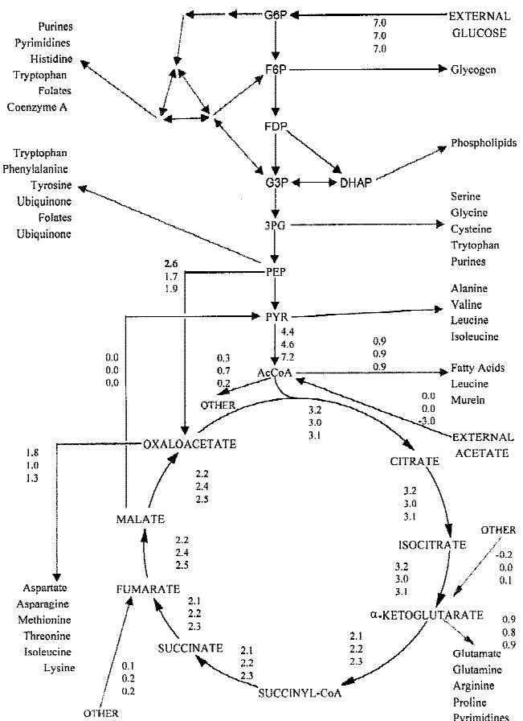
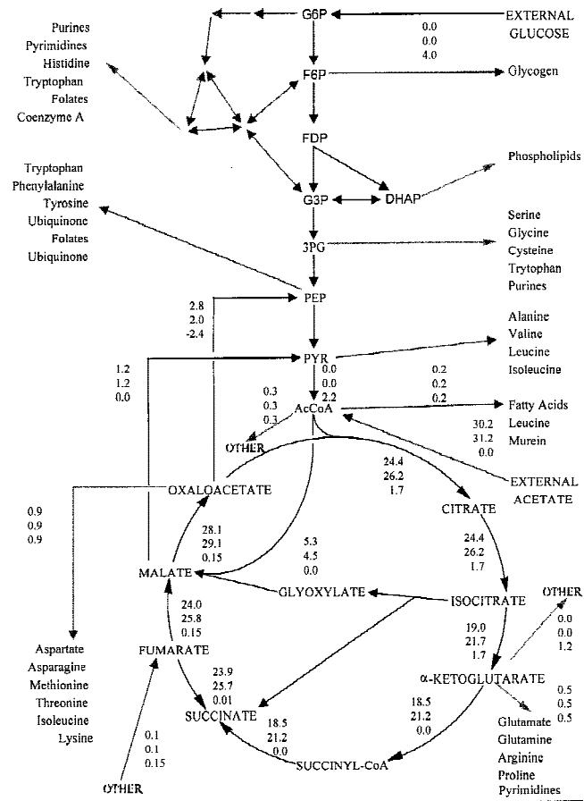

#### **Effect of Escherichia coli Biomass Composition on Central Metabolic Fluxes Predicted by a Stoichiometric Model**

# **J. Pramanik, J. D. Keasling**

Department of Chemical Engineering, University of California, Berkeley, California 94720-1462; telephone: 510 642-4862; fax: 510 643-1228; e-mail: keasling@socrates.berkeley.edu

Received 4 September 1997; accepted 10 March 1998

**Abstract:** The amino acid composition of proteins and the fatty acid composition of the cell membranes were measured in Escherichia coli growing exponentially in batch culture on glucose, succinate, glycerol, pyruvate, and acetate, and growing under continuous culture conditions on glucose at dilutions rates equivalent to the growth rates of the batch cultures. Although the fatty acid composition of the membranes did change significantly with carbon source and dilution rate, the amino acid content of proteins did not change significantly under either condition. A previously developed stoichiometric model of metabolism was used to calculate the fluxes through the metabolic reactions and to determine their sensitivity to changes in fatty acid and amino acid composition. © 1998 John Wiley & Sons, Inc. Biotechnol Bioeng**60:** 230–238, 1998.

**Keywords:** Escherichia coli; metabolism; flux; linear optimization; biomass composition

# **INTRODUCTION**

A central problem in metabolism is understanding how the cell balances its energy and biosynthetic needs (catabolism and anabolism) for optimal growth under various conditions. Simple carbon sources and mineral salts are taken into the cell and transformed into the complex biopolymers and cofactors that compose the cell, while generating the metabolic energy necessary to polymerize these complex biomolecules. As the amounts and composition of these biopolymers are functions of growth conditions and/or growth rates, metabolic models must have the correct biomass composition to accurately predict metabolic regulation.

Metabolic models based on the stoichiometry of the reactions do not require kinetic parameters and information about the kinetic mechanism of each enzyme, and the growth kinetics of the cell are incorporated into the model through the energy and biomass requirements. Because the stoichiometry of cellular metabolism is well-defined and variations among different cells are limited to a few reactions, regulation of metabolism can be studied using the

*Correspondence to:* Jay Keasling Contract grant sponsor: National Science Foundation Contract grant number: BES-9502495

stoichiometry of biochemical pathways and cell composition data. Flux-based metabolic models estimate the steadystate mass and energy distributions in metabolic networks, and experimentally determined consumption and secretion rates and intermediary fluxes can be used as constraints to improve the accuracy of the calculations. Applications of this approach to a subset of hybridoma, yeast, and *Escherichia coli* metabolisms demonstrated the utility of this technique (Jorgensen et al., 1995; Majewski and Domach, 1990; Pramanik and Keasling, 1997; Savinell and Palsson, 1992a,b; See et al., 1986; van Gulik and Heijnen, 1995; Varma et al., 1993; Varma and Palsson, 1993; 1994 a,b; 1995).

Recently, (Pramanik and Keasling, 1997) developed a detailed stoichiometric model of *Escherichia coli* metabolism that includes a more complete database of known reactions involved in the catabolism of glucose, acetate, or TCA cycle intermediates. The model was solved using linear optimization and predicted the metabolic regulation observed during growth under different conditions and on different carbon sources. Sensitivity analysis indicated the importance of biomass composition on the model solutions.

Given the sensitivity of the model to biomass composition, we have measured the composition of two key cellular components: fatty acid composition of membranes and amino acid composition of proteins. These two biomass components were measured in cells grown in batch culture with various carbon sources and in continuous culture at various dilution rates. These experimental data were used to improve flux predictions and to test the sensitivity of key fluxes to the composition of cellular components.

# **MATERIALS AND METHODS**

All experiments were conducted using *Escherichia coli* W3110 under conditions of aerobic growth at 37°C with MOPS (morpholinopropane sulfonate) medium, which was prepared according to the methods of Neidhardt et al. (1974) and filter sterilized using a 0.22-mm filter (Millipore; Bedford, MA). Cells were grown in a Bioflow III fermentor (New Brunswick Scientific Co., Edison, NJ). A 1-L operating volume was used for the continuous culture growth studies and a 1.5-L volume was used for batch growth studies. The impeller speed was set at 300 rpm. House air was filtered through a 0.22-mm filter prior to input into the fermentor. Dissolved oxygen was maintained at 50% or higher saturation as measured by a dissolved oxygen probe (Ingold, Wilmington, MA). The fermentor was maintained at 37°C and the pH measurements were made off-line using Whatman pH indicator paper. The pH of the medium was not controlled as it did not vary significantly from the initial pH of 7.3. Fresh medium was pumped out of a 20-L reservoir using a variable speed Masterflex pump (Cole-Parmer Instrument Co., Vernon Hills, IL). For the batch studies, the carbon sources were glucose, succinate, glycerol, pyruvate, and acetate. The concentration of the carbon sources in the medium was 13.2 m*M* (in terms of carbon). For the batch growth studies, the cells were harvested during the exponential growth phase at an optical density (l 4 600 nm), OD600, of 0.6–0.7. For continuous culture, the carbon source was glucose and the dilution rates were chosen to match the growth rates measured in the batch studies. For continuous culture, the cells were grown to an OD600 of 0.6 in batch prior to continuous cultivation. Then, the pumps were set to the desired dilution rate. To ensure that the continuous culture had reached steady state, the cells were allowed to grow for at least 6 residence times following the start of continuous phase, which was determined by monitoring the OD600 until it was constant. The cells were harvested by centrifugation at 20,000 rpm for 5 min at 4°C, frozen in liquid N2, and stored at −87°C prior to analysis.

# **Fatty Acid Analysis**

The fatty acid content of *Escherichia coli* was determined by gas chromatographic analysis of the fatty acid methyl esters (Eder, 1995) and was performed by Microbial ID, Inc. (Newark, DE) on 20 mg of wet cell paste.

## **Amino Acid Analysis**

The amino acid content of *Escherichia coli* was measured by harvesting cells under the different conditions. The cells were lysed by sonication and then suspended in 10 mL of ice-cold H2O. Ice-cold 20% TCA (10 mL) was added to the cells (Gerhardt, 1994), and the solution was placed in an ice bath for 5 min to complete the precipitation. The precipitate was centrifuged at 5000 rpm for 15 min at 0°C. The supernatant was removed and the pellet suspended in 4 mL of ice-cold 10% TCA and centrifuged again at 5000 rpm for 15 min at 0°C. The supernatant was removed and the pellet was suspended in 10 mL of ice-cold 10% TCA and 10 mL of ice-cold H2O. This mixture was heated for 45 min at 80°C to hydrolyze the DNA and RNA. The mixture was cooled in an ice bath for 30 min to precipitate proteins and centrifuged at 8000 rpm for 15 min at 0°C. The proteins were collected on glass fiber filters (Millipore, Bedford, MA) with a 0.2 mm porosity, and then the test tube that contained the protein precipitate was rinsed twice with 2 mL of ice-cold 10% TCA; both washes were applied to the filter to ensure collection of all the precipitated protein on the filter. The filter was then washed with 3 mL of ice-cold 70% ethanol, twice with 5 mL of 70% ethanol at 45°C, twice with 5 mL of 1:1 ethanol:ether at 45°C, once with 5 mL of ether at 25°C, and dried. The protein on the filter was hydrolyzed using hydrochloric acid and the amino acid content was determined by HPLC analysis, performed by the Protein and Nucleic Acid Facility at Stanford University (Palo Alto, CA).

# **MODEL DEFINITION**

The model has been described previously (Pramanik and Keasling, 1997). Differences between that model and the current version of the model are described.

- The composition of the membrane components and amino acids were measured under batch growth conditions using different carbon sources (acetate, pyruvate, glycerol, succinate, and glucose, which had the growth rates 0.2, 0.31, 0.43, 0.48, and 0.61 h−1, respectively) and continuous culture conditions with glucose as the carbon source, where the dilution rates (0.2, 0.3, 0.4, 0.5, 0.6 h−1) were set to match as closely as possible the growth rates determined from the batch growth studies (Tables I and II). Because the batch growth rate for *E. coli* W3110 on glucose was 0.61 h−1, the maximum dilution rate during continuous culture was set at 0.6 h−1 to prevent washout. The experimentally determined compositions of the protein and cell membranes were used in conjunction with the biomass correlations to calculate the drain of precursors for the synthesis of these macromolecules. See Pramanik and Keasling (1997) for the growth-ratedependent biomass correlations.
- The new reactions added to the model were for synthesis of the even- and odd-chain fatty acids detected in the batch and continuous culture studies. The new reactions and metabolites are presented in Appendix 1 and Appendix 2, respectively. See Pramanik and Keasling (1997) for a list of reaction and metabolites in the first version of the model.

# **RESULTS**

# **Experimental Results**

*Escherichia coli* was grown in batch culture on five different carbon sources: glucose, succinate, glycerol, pyruvate, and acetate. The specific growth rates in the midexponential phase were 0.61 h−1, 0.48 h−1, 0.43 h−1, 0.31 h−1, and 0.2 h−1, respectively. The continuous culture experiments were performed at dilution rates very close to the specific growth rates measured for the batch cultures (0.6, 0.5, 0.4, 0.3, 0.2 h−1). The fatty acid and amino acid compositions were measured in samples harvested at the various dilution rates and in the exponential phase of the batch cultures.

**Table I.** Fatty acid composition as a function of dilution rate in continuous culture or carbon source in batch culture. In the model, the fatty acids were grouped into the following categories: 10:0, 12:0, 13:0, 13:1, 14:0, 14:1, 15:0, 15:1, 16:0, 16:1, 17:0, 17:1, 18:0, 18:1, 19:0

|              | Literature data*% | Continuous culture % (Dilution rate h−1) |       |       |       |       |      |      | Batch culture (Carbon source) |          |          |           |         |      |      |
|--------------|----------------------|------------------------------------------|-------|-------|-------|-------|------|------|-------------------------------|----------|----------|-----------|---------|------|------|
| Fatty acids  |                      | 0.2                                      | 0.3   | 0.4   | 0.5   | 0.6   | Ave. | std. | Acetate                       | Pyruvate | Glycerol | Succirate | Glucose | Avg. | Std. |
| 10:0 3OH     |                      | 0.08                                     |       |       |       |       |      |      |                               |          |          |           |         |      |      |
| 12:0         |                      | 1.54                                     | 3.17  | 3.40  | 3.55  | 3.63  | 3.1  | 0.9  | 3.58                          | 3.54     | 3.65     | 3.52      | 3.57    | 3.6  |      |
| 12:0 2OH     |                      | 1.71                                     | 0.29  | 0.09  |       |       | 0.7  | 0.9  |                               |          |          |           |         |      |      |
| 12:0 3OH     |                      | 0.28                                     |       | 0.06  |       | 0.04  | 0.1  | 0.1  |                               |          |          |           |         |      |      |
| 13:0         |                      | 0.20                                     | 0.25  | 0.10  | 0.27  | 0.21  | 0.2  | 0.1  | 0.15                          |          | 0.15     | 0.15      | 0.09    | 0.1  |      |
| 13:0 OH      |                      | 0.07                                     |       |       |       |       |      |      |                               |          |          |           |         |      |      |
| 13:1         |                      | 0.08                                     |       |       |       |       |      |      | 0.55                          |          | 0.48     |           | 0.47    | 0.5  |      |
| 14:0         | 2.68                 | 6.95                                     | 7.50  | 7.03  | 7.04  | 6.47  | 7.0  | 0.4  | 6.75                          | 7.31     | 7.54     | 6.74      | 6.58    | 7.0  | 0.4  |
| 14:0 2OH     |                      | 2.08                                     | 0.33  |       |       |       | 1.2  | 1.2  |                               |          |          |           |         |      |      |
| 14:0 3OH     |                      | 3.81                                     | 4.29  | 4.28  | 4.18  | 4.36  | 4.2  | 0.2  | 4.48                          | 4.14     | 4.28     | 4.11      | 4.12    | 4.2  | 0.2  |
| 14:1         | 7.7                  | 0.36                                     | 0.80  | 0.68  | 0.87  | 0.78  | 0.7  | 0.2  | 0.80                          | 0.58     | 0.83     | 0.75      | 0.65    | 0.7  | 0.1  |
| 15:0         |                      | 1.65                                     | 1.63  | 0.96  |       | 1.53  | 1.4  | 0.3  | 1.35                          | 0.32     | 1.58     | 1.17      | 0.74    | 1.0  | 0.5  |
| 15:0 iso     |                      | 0.31                                     |       | 0.07  |       | 0.09  | 0.2  | 0.1  |                               | 0.13     |          |           |         |      |      |
| 15 iso 2OH   |                      | 5.74                                     | 7.42  | 8.14  | 8.23  | 9.29  | 7.8  | 1.3  | 10.91                         | 6.90     | 8.29     | 13.07     | 10.33   | 9.9  | 2.4  |
| 15:0 anteiso |                      | 0.30                                     |       |       |       |       |      |      |                               |          |          |           |         |      |      |
| 15:1         |                      | 0.16                                     |       |       | 1.98  | 0.06  | 0.7  | 1.1  |                               |          |          |           |         |      |      |
| 16:0         | 38.23                | 39.56                                    | 37.71 | 37.50 | 35.01 | 34.79 | 36.9 | 2.0  | 34.55                         | 36.05    | 33.46    | 34.98     | 34.36   | 34.7 | 0.9  |
| 16:0 2OH     |                      | 0.80                                     |       |       |       |       |      |      |                               |          |          |           |         |      |      |
| 16:0 3OH     |                      | 0.28                                     |       |       |       |       |      |      |                               |          |          |           |         |      |      |
| 16:1 iso     |                      | 3.81                                     | 4.29  | 4.28  | 4.18  | 4.36  | 4.2  | 0.2  | 4.48                          | 4.14     | 4.28     | 4.11      | 4.12    | 4.2  | 0.2  |
| 16:1         | 10.74                | 5.91                                     | 7.62  | 8.35  | 8.45  | 9.5   | 8.0  | 1.3  | 11.18                         | 7.09     | 8.52     | 13.31     | 10.53   | 10.1 | 2.4  |
| 17:0         | 16.11                | 0.56                                     | 0.71  | 0.42  | 0.91  | 0.72  | 0.7  | 0.2  | 0.71                          | 0.12     | 0.47     | 0.68      | 0.31    | 0.5  | 0.2  |
| 17:0 cyclo   |                      | 19.53                                    | 17.15 | 16.15 | 15.18 | 12.56 | 16.1 | 2.6  | 8.75                          | 19.72    | 16.56    | 4.86      | 11.36   | 12.3 | 6.0  |
| 17:1         |                      | 0.19                                     |       | 0.14  | 0.13  | 0.12  | 0.1  |      |                               |          |          |           |         |      |      |
| 18:0         | 0.9                  | 1.03                                     | 0.53  | 0.38  | 0.24  | 0.25  | 0.5  | 0.3  | 0.39                          | 0.23     | 0.38     | 0.35      | 0.21    | 0.3  | 0.1  |
| 18:1         | 17.91                | 2.48                                     | 5.33  | 6.83  | 8.83  | 10.41 | 6.8  | 3.1  | 11.08                         | 8.18     | 8.59     | 12.02     | 11.87   | 10.3 | 1.8  |
| 19:0 iso     | 5.73                 | 0.25                                     | 0.17  | 0.16  |       | 0.13  | 0.2  | 0.1  |                               | 0.16     | 0.19     |           | 0.12    | 0.2  |      |
| 19:0 cyclo   |                      | 0.34                                     | 0.85  | 0.98  | 0.96  | 0.73  | 0.8  | 0.3  | 0.31                          | 1.40     | 0.77     | 0.19      | 0.57    | 0.6  | 0.5  |

*(Bright-Gaertner and Proulx, 1972; Kanemasa et al., 1967; Mavis and Vagelos, 1972; Neidhardt, 1987).

| Amino acids | Literature dataa % |      | Continuous culture % (Dilution rate H−1) |      |      |      | Batch culture % (Carbon source) |          |          |           |         |  |
|-------------|--------------------------|------|------------------------------------------|------|------|------|---------------------------------|----------|----------|-----------|---------|--|
|             |                          | 0.2  | 0.3                                      | 0.4  | 0.5  | 0.6  | Acetate                         | Pyruvate | Glycerol | Succinate | Glucose |  |
| ala         | 9.6                      | 11.4 | 10.8                                     | 10.8 | 10.9 | 10.7 | 11.0                            | 10.8     | 10.8     | 10.7      | 10.7    |  |
| arg         | 5.5                      | 5.0  | 4.8                                      | 4.9  | 5.0  | 5.0  | 4.9                             | 4.9      | 5.0      | 5.0       | 5.1     |  |
| asp         | 4.5                      | 5.0  | 5.1                                      | 5.2  | 5.3  | 5.1  | 5.1                             | 5.2      | 5.2      | 5.1       | 5.1     |  |
| asn         | 4.5                      | 5.0  | 5.1                                      | 5.2  | 5.3  | 5.1  | 5.1                             | 5.2      | 5.2      | 5.1       | 5.1     |  |
| cysb        | 1.7                      | 1.7  | 1.7                                      | 1.7  | 1.7  | 1.7  | 1.7                             | 1.7      | 1.7      | 1.7       | 1.7     |  |
| glu         | 4.9                      | 5.6  | 5.8                                      | 5.8  | 5.9  | 5.8  | 5.8                             | 5.9      | 5.8      | 5.9       | 5.8     |  |
| gln         | 4.9                      | 5.6  | 5.8                                      | 5.8  | 5.9  | 5.8  | 5.8                             | 5.9      | 5.8      | 5.9       | 5.8     |  |
| gly         | 4.9                      | 8.6  | 8.4                                      | 8.3  | 8.4  | 8.4  | 8.5                             | 8.5      | 8.4      | 8.4       | 8.5     |  |
| his         | 1.8                      | 1.7  | 1.7                                      | 1.8  | 1.8  | 1.8  | 1.8                             | 1.8      | 1.8      | 1.8       | 1.8     |  |
| ile         | 5.4                      | 4.6  | 4.7                                      | 4.8  | 4.9  | 4.8  | 4.9                             | 4.8      | 4.8      | 4.9       | 4.9     |  |
| leu         | 8.4                      | 9.1  | 5.3                                      | 4.5  | 2.6  | 4.6  | 9.0                             | 9.0      | 9.0      | 9.5       | 9.4     |  |
| lys         | 6.4                      | 5.6  | 5.8                                      | 5.9  | 6.0  | 5.9  | 5.7                             | 5.9      | 6.0      | 5.9       | 6.0     |  |
| met         | 2.9                      | 2.4  | 2.5                                      | 2.5  | 2.6  | 2.5  | 2.5                             | 2.5      | 2.5      | 2.5       | 2.4     |  |
| phe         | 3.5                      | 3.4  | 3.4                                      | 3.4  | 3.4  | 3.3  | 3.5                             | 3.4      | 3.4      | 3.4       | 3.3     |  |
| pro         | 4.1                      | 4.2  | 4.1                                      | 4.0  | 4.0  | 3.8  | 4.2                             | 4.3      | 4.0      | 4.0       | 3.8     |  |
| ser         | 4.0                      | 4.9  | 4.8                                      | 4.8  | 4.9  | 4.8  | 4.9                             | 4.8      | 4.9      | 4.8       | 4.9     |  |
| thr         | 4.7                      | 5.3  | 5.2                                      | 5.3  | 5.3  | 5.2  | 5.4                             | 5.3      | 5.3      | 5.3       | 5.3     |  |
| trpb        | 1.1                      | 1.1  | 1.1                                      | 1.1  | 1.1  | 1.1  | 1.1                             | 1.1      | 1.1      | 1.1       | 1.1     |  |
| tyr         | 2.6                      | 2.8  | 2.8                                      | 2.8  | 2.9  | 2.7  | 2.9                             | 2.8      | 2.8      | 2.8       | 2.9     |  |
| val         | 7.9                      | 7.2  | 7.2                                      | 7.2  | 7.4  | 7.3  | 7.0                             | 7.3      | 7.3      | 7.4       | 7.4     |  |

**Table II.** Amino acid composition as a function of dilution rate continuous culture or carbon source in batch culture. Cysteine and tryptophan were calculated based on *E. coli* data (Neidhardt, 1987), because the analysis method used was unable to measure the concentrations of these two amino acids.

a (Bright-Gaertner and Proulx, 1972; Kanemasa et al., 1967; Mavis and Vagelos, 1972; Neidhardt, 1987).

b Calculated from data in Neidhardt et al. (1990).

The fatty acid composition of *Escherichia coli* was strongly dependent on growth rates and/or growth conditions (Table I). Of the 29 different fatty acids detected, 16:0 was the most abundant at approximately 35% of the total. Not all fatty acids were detected for each growth condition. For all growth rates and carbon sources, the fatty acids of lengths 12 and 15 were greater than the literature values, fatty acids of lengths 14 and 16 were about the same, and fatty acids of lengths 18 and 19 were lower than the literature estimates (Bright-Gaertner and Proulx, 1972; Kanemasa et al., 1967; Mavis and Vagelos, 1972; Neidhardt, 1987). The fatty acids 15 iso 2 OH, 16:1, 17:0 cyclo and 18:1 showed the greatest changes with growth conditions. In continuous cultures, the fatty acids 15 iso 2 OH, 16:1, and 18:1 increased (as a percentage of all fatty acids) with dilution rate, whereas the fatty acid 17:0 cyclo decreased with dilution rate. In the batch studies, 15 iso 2 OH, 16:1, and 18:1 were a smaller percentage of the total for growth on pyruvate and glycerol than for growth on acetate, succinate, and glucose. In contrast, the fatty acids 14:0 3 OH, 16:0, and 16:1 iso changed very little with dilution rate or carbon source.

The amino acid composition was also measured for the continuous and batch growth conditions (Table II). In contrast to the fatty acid composition, the amino acid composition did not change significantly with dilution rate or carbon source. Furthermore, the experimentally determined composition was very similar to that given in literature (Neidhardt, 1987).

### **Simulation Results**

To determine the sensitivity of the model to biomass composition, the fluxes were calculated for four experimental

| Table III. |  |  |  |  |  |  |  | Constraints on fluxes and criteria for maximization and minimization. |
|------------|--|--|--|--|--|--|--|-----------------------------------------------------------------------|
|------------|--|--|--|--|--|--|--|-----------------------------------------------------------------------|

|                           | Lower bound |   | Upper bound     |                                 |             |  |
|---------------------------|-------------|---|-----------------|---------------------------------|-------------|--|
| Growth condition          |             |   | (mmols/gDW · h) | Objective function criterion | Note        |  |
| m 4 0.6 h−1               |             |   |                 |                                 |             |  |
| Literature data           |             |   |                 |                                 |             |  |
| Glucose uptake            | 0           |   | 7               | Maximize                        | Measureda   |  |
| Carbon dioxide secretion  | 14.25       |   | `               | Minimize                        |             |  |
| Oxygen uptake             | 0           |   | 12.7            | Maximize                        | Measuredb   |  |
| Acetate secretion         | 0           |   | `               |                                 |             |  |
| Precursor production rate |             | m | dependent       | Maximize                        | c           |  |
| Batch culture data        |             |   |                 |                                 |             |  |
| Glucose uptake            | 0           |   | 7               | Maximize                        | Measureda   |  |
| Carbon dioxide secretion  | 18          |   | `               | Minimize                        |             |  |
| Oxygen uptake             | 0           |   | 21              | Maximize                        | Measuredb   |  |
| Acetate secretion         | 0           |   | `               |                                 |             |  |
| Precursor production rate |             | m | dependent       | Maximize                        | c           |  |
| Continuous culture data   |             |   |                 |                                 |             |  |
| Glucose uptake            | 0           |   | 7               | Maximize                        | Measureda   |  |
| Carbon dioxide secretion  | 14          |   | `               | Minimize                        |             |  |
| Oxygen uptake             | 12          |   | `               |                                 | Measuredb   |  |
| Acetate secretion         | 3           |   | `               | Minimize                        |             |  |
| Precursor production rate |             | m | dependent       | Maximize                        | c           |  |
| m 4 0.2 h−1               |             |   |                 |                                 |             |  |
| Literature data           |             |   |                 |                                 |             |  |
| Acetate uptake            | 0           |   | `               | Minimize                        | Measuredd   |  |
| Carbon dioxide secretion  | 45          |   | `               | Minimize                        | Measuredb,d |  |
| Precursor production rate |             | m | dependent       | Maximize                        | c           |  |
| Batch culture data        |             |   |                 |                                 |             |  |
| Acetate uptake            | 0           |   | `               | Minimize                        | Measuredd   |  |
| Carbon dioxide secretion  | 47          |   | `               | Minimize                        | Measuredd   |  |
| Precursor production rate |             | m | dependent       | Maximize                        |             |  |
| Continuous culture data   |             |   |                 |                                 |             |  |
| Glucose uptake            | 0           |   | 4               | Maximize                        | Measureda   |  |
| Carbon dioxide secretion  | 4.52        |   | `               | Minimize                        | Measuredd   |  |
| Oxygen uptake             | 4           |   | 22              |                                 | Measuredb   |  |
| Precursor production rate |             | m | dependent       | Maximize                        |             |  |
|                           |             |   |                 |                                 |             |  |

a The values present in the literature is in the same range as the value used as a bound for the simulation (Herbert and Kornberg, 1976; Schulze and Lipe, 1964; Tempest and Neijssel, 1987). b (Andersen and von Meyenburg, 1977; Harrison and Loveless, 1971; Hempfling and Mainzer,

1975; Marr, 1991; Schulze and Lipe, 1964).

c (Pramanik and Keasling, 1997), continuous culture, and batch culture studies.

d (Walsh and Koshland, 1985). conditions: (1) batch growth on glucose with a specific growth rate of 0.61 h−1, (2) batch growth on acetate with a specific growth rate of 0.2 h−1, (3) continuous culture on glucose with a dilution rate of 0.6 h−1, and (4) continuous culture on glucose with a dilution rate of 0.2 h−1. For the batch culture cases, the fluxes were calculated using the amino acid and fatty acid compositions determined experimentally and those from literature (Bright-Gaertner and Proulx, 1972; Kanemasa et al., 1967; Mavis and Vagelos, 1972; Neidhardt, 1987).

The constraints and objective functions for all six simulations are presented in Table III. Data from literature was used to define constraints for the consumption and secretion rates of key metabolites (Andersen and von Meyenburg, 1977; Harrison and Loveless, 1971; Hempfling and Mainzer, 1975; Herbert and Kornberg, 1976; Marr, 1991; Schulze and Lipe, 1964; Tempest and Neijssel, 1987; Walsh and Koshland, 1985). With constraints for the carbon uptake rate, carbon dioxide production rate, biomass composition, and in some cases the oxygen input rate, the model was able to predict the fluxes through the necessary reactions.

For growth on glucose, the fatty acid composition from literature was quite different from the experimentally determined composition (in cells grown in continuous or batch culture), whereas the amino acid composition was not very different. Even though the experimentally determined fatty acid composition differed significantly from that reported in the literature, the fluxes through the TCA cycle and glycolysis pathway varied by an average of only 10% (Fig. 1). Individually, the fluxes varied between 0 and 33% (standard deviation). Differences between the fluxes predicted using the continuous culture and batch culture data were very small due to very similar fatty acid compositions in batch or continuously growing cells. For batch growth on glucose, the predicted acetate secretion rate was less than the 3 mmol(g DW ? h)−1 reported in literature (Varma and Palsson, 1995). Only for the continuous culture case (experi-

**Figure 1.** Fluxes through glycolysis and TCA cycle during aerobic growth on glucose. The growth rate was 0.61 h−1. For each set of values, top number is the flux calculated using fatty acid and amino acid data from literature; the middle number, fatty acid data for batch culture; the bottom number, fatty acid data for continuous culture. For both the continuous and batch culture cases the amino acid data was averaged (Table II). Solid lines depict individual reactions and gray lines depict lumped drains for synthesis of cellular components.

**Figure 2.** Fluxes through glycolysis and TCA cycle for a growth rate of 0.2 h−1. For each set of values, the upper two numbers are for aerobic, batch growth on acetate, and the bottom number is for aerobic, continuous growth on glucose. The top number is the flux calculated using fatty acid and amino acid data from literature; the middle number is the flux calculated using the fatty acid data for batch culture; and the bottom number is the flux calculated using the fatty acid data from the continuous culture experiments. For both the continuous and batch culture cases the amino acid data was averaged (Table II). Solid lines depict individual reactions and gray lines depict lumped drains for synthesis of cellular components.

mental fatty acid and amino acid compositions) was the model able to satisfy growth demands while secreting acetate.

For batch growth on acetate, the fatty acid composition determined experimentally was again very different from the composition in literature. In this case, these differences in the precursor requirements gave rise to an average differences in the flux predictions of 5% (Fig. 2, upper two values). Individually, the fluxes differed between 0 and 20%.

To determine how carbon source affects the fluxes through key pathways (at a given growth rate), the model was used to predict fluxes for continuous culture on glucose with a dilution rate of 0.2 h−1, equal to the specific growth rate on acetate in batch culture (Fig. 2, bottom value). The fluxes through glycolysis and the TCA cycle were significantly different from those predicted for batch growth on acetate at the same growth rate. However, there is no available experimental flux data to verify the model results.

#### **Sensitivity Analysis of Flux Constraints**

A complete sensitivity analysis was performed on all six cases to determine which reactions were most constrained, that is, which reactions had the least amount of flexibility in the flux values for which the solution would not change (Table IV). Each case had a different set of end-products which were constrained. Tightly constrained fluxes were defined as values bounded between 0%–200% of the flux prediction; fluxes with values outside that range were considered not tightly constrained. For batch growth on glucose using literature fatty acid and amino acid compositions, the reactions of glycolysis, pentose phosphate, and the TCA cycle were tightly constrained. Thus, a few metabolites synthesized from all three pathways (namely alanine, leucine, lysine, phosphatidyl ethanolamine, peptidoglycan, and glycogen) were also tightly constrained. For batch culture on glucose using experimental fatty acid and amino acid compositions, the reactions of glycolysis, pentose phosphate, and the TCA cycle were also tightly bound and many of the same cellular components were constrained: alanine, aspartate, asparagine, glutamate, glutamine, glycine, serine, and peptidoglycan. For continuous culture on glucose using experimental fatty acid and amino acid compositions, the reactions of glycolysis and pentose phosphate pathways were most tightly bound. Therefore, most of the metabolites synthesized from these pathways were tightly bound (all amino acids except cysteine, asparagine, glutamate, glutamine, serine, and threonine as well as the pyrimidines, purines, phosphatidyl ethanolamine, lipopolysaccharides, peptidoglycan, and glycogen). In contrast to the previous case, the TCA cycle was significantly less constrained.

The model predicted that for cells growing on acetate and having literature fatty acid and amino acid compositions, the TCA cycle and pentose phosphate pathways were tightly bound, but only the amino acid histidine was tightly constrained. For cells growing on acetate and having experimental fatty acid and amino acid compositions, the TCA cycle was much more constrained than the reactions of glycolysis or pentose phosphate, and resulted in tight bounding of methionine and phosphatidyl ethanolamine.

For continuous culture on glucose at a dilution rate equivalent to the acetate growth rate, glycolysis and pentose phosphate reactions were tightly bound and synthesis of

**Table IV.** Sensitivity analysis of the basis matrix with respect to the flux constraints. The most constrained flux range in each pathway is presented for glycolysis/gluconeogenesis, pentose phosphate, and the TCA cycle.

|                                                              | Allowable fluxes* (% of solution value)                        |                                                                        |                                                                                                                                                       |                               |                                  |                                       |  |  |  |  |  |  |
|--------------------------------------------------------------|----------------------------------------------------------------|------------------------------------------------------------------------|-------------------------------------------------------------------------------------------------------------------------------------------------------|-------------------------------|----------------------------------|---------------------------------------|--|--|--|--|--|--|
|                                                              |                                                                | m 4 0.6 h−1                                                            | m 4 0.2 h−                                                                                                                                            |                               |                                  |                                       |  |  |  |  |  |  |
| Pathway                                                      | Glucose literature data                                     | Glucose batch-culture data                                       | Glucose continuous culture data                                                                                                                 | Acetate literature data | Acetate batch-culture data | Glucose continuous culture data |  |  |  |  |  |  |
| Glycolysis/glyconeogenesis Pentose phosphate TCA cycle | 92–100 100–115 90–100                                    | 100–100 100–100 100–100                                          | 100–100 100–100 39–112                                                                                                                          | 99–100 100–100 100–100  | 100–140 90–100 100–100     | 100–100 100–102 96–100          |  |  |  |  |  |  |
| Precursors tightly constrained                            | Alanine, leucine, lysine, PE, peptidoglycan, glycogen | Alanine, aspartate, glutamate glutamine, glycine, serine, PEP | All amino acids except cysteine, asparagine, glutamate, glutamine, serine, and threonine. Pyrimidines, purines, PE, LPS, PEP, glycogen | Histidine                     | Methionine, PE                   | Glycine                               |  |  |  |  |  |  |

*Values refer to the amount the flux value can change without changing the basis matrix. The most tightly bounded reaction in a particular pathway determines the bounds on that pathway.

PE: phosphatidyl ethanolamine.

PG: phosphatidyl glycerol.

LPS: lipopolysaccharide.

PEP: peptidoglycan.

| (1997).   |
|-----------|
|           |
|           |
| Keasling  |
|           |
|           |
|           |
|           |
| and       |
|           |
|           |
| Pramanik  |
|           |
|           |
|           |
|           |
| in        |
|           |
|           |
|           |
|           |
| presented |
|           |
|           |
| was       |
|           |
|           |
|           |
| pathways  |
|           |
|           |
|           |
| new       |
|           |
| the       |
|           |
|           |
|           |
|           |
|           |
| excluding |
|           |
|           |
| list      |
|           |
| pathway   |
|           |
|           |
|           |
|           |
| entire    |
|           |
|           |
|           |
| The       |
|           |
| model.    |
|           |
|           |
|           |
| to        |
|           |
| added     |
|           |
|           |
|           |
| pathways  |
|           |
|           |
|           |
|           |
|           |
| New       |
|           |
|           |
| 1         |
|           |
|           |
|           |
|           |
|           |
|           |
| APPENDIX  |
|           |

| Enzyme                                      | Pathway                                                                                                               | Reference                        |
|---------------------------------------------|-----------------------------------------------------------------------------------------------------------------------|----------------------------------|
| Lipids Membrane of Biosynthesis    |                                                                                                                       |                                  |
| transacylase Propionyl-CoA:ACP           | ACP + PYRCOA <-> COA + PYRACP                                                                       |                                  |
| (C10:0) I synthase b-ketoacyl-ACP  | ACP 4 + NADP 8 + CO2 4 + C10:0ACP -> NADPH 8 + MALACP 4 + ACACP    | 1996) Rock, and (Cronan |
| (C11:0) 1 synthase b-ketoacyl-ACP  | ACP 4 + NADP 8 + CO2 4 + C11:0ACP -> NADPH 8 + MALACP 4 + PYRACP   | 1996) Rock, and (Cronan |
| (C12:0) I synthase b-ketoacyl-ACP  | ACP 5 + NADP 10 + CO2 5 + C12:0ACP -> NADPH 10 + MALACP 5 + ACACP  | 1996) Rock, and (Cronan |
| (C13:0) I synthase b-ketocacyl-ACP | ACP 5 + NADP 10 + CO2 5 + C13:0ACP -> NADPH 10 + MALACP 5 + PYRACP | 1996) Rock, and (Cronan |
| (C13:1) I synthase b-ketocacyl-ACP | ACP 5 + NADP 9 + CO2 5 + C13:1ACP -> NADPH 9 + MALACP 5 + PYRACP   | 1996) Rock, and (Cronan |
| (C15:0) I synthase b-ketocacyl-ACP | ACP 6 + NADP 12 + CO2 6 + C15:0ACP -> NADPH 12 + MALACP 6 + PYRACP | 1996) Rock, and (Cronan |
| (C15:1) I synthase b-ketocacyl-ACP | ACP 6 + NADP 11 + CO2 6 + C15:1ACP -> NADPH 11 + MALACP 6 + PYRACP | 1996) Rock, and (Cronan |
| (C17:0) I synthase b-ketocacyl-ACP | ACP 7 + NADP 14 + CO2 7 + C17:0ACP -> NADPH 14 + MALACP 7 + PYRACP | 1996) Rock, and (Cronan |
| (C17:1) I synthase b-ketocacyl-ACP | ACP 7 + NADP 13 + CO2 7 + C17:1ACP -> NADPH 13 + MALACP 7 + PYRACP | 1996) Rock, and (Cronan |
| (C18:0) I synthase b-ketocacyl-ACP | ACP 8 + NADP 16 + CO2 8 + C18:0ACP -> NADPH 16 + MALACP 8 + ACACP  | 1996) Rock, and (Cronan |
| (C19:0) I synthase b-ketocacyl-ACP | ACP 8 + NADP 16 + CO2 8 + C19:0ACP -> NADPH 16 + MALACP 8 + PYRACP | 1996) Rock, and (Cronan |
| (C20:0) I synthase b-ketocacyl-ACP | ACP 9 + NADP 18 + CO2 8 + C20:0ACP -> NADPH 18 + MALACP 9 + ACACP  | 1996) Rock, and (Cronan |
| acyltransferase* 1-Acyl-G3P              | + fC14:0ACP + eC13:1ACP + dC13:0ACP + cC12:0ACP + +bC11:0ACP aC10:0ACP + GL3P     | 1996) Rock, and (Cronan |
|                                             | + 1C17:0ACP + kC16:1ACP + jC16:0ACP + iC15:1ACP + hC15:0ACP + gC14:1ACP              |                                  |
|                                             | ACP + PA -> qC20:0ACP + pC19:0ACP + oC18:1ACP + nC18:0ACP + mC17:1ACP             |                                  |
| synthesis PropionylCoA                   |                                                                                                                       |                                  |
| mutase MethylmalonylCoA                  | RMMCOA -> SUCCOA                                                                                                |                                  |
| epimerase MethylmalonylCoA               | SMMCOA -> RMMCOA                                                                                                |                                  |
| Transcarboxylase                            | PYRCOA + OA -> PYR + SMMCOA                                                                         |                                  |

*The coefficients a through q depend on the fatty acid content as a function of growth rate and carbon source as presented in Table I.

**APPENDIX 2** Definition of new metabolites relevant to Appendix 1 (Pramanik and Keasling, 1997).

| Abbreviation | Compound                 |
|--------------|--------------------------|
| C10:0ACP     | decanoic acid ACP        |
| C11:0ACP     | hendecanoic acid ACP     |
| C12:0ACP     | dodecanoic acid ACP      |
| C13:0ACP     | tridecanoic acid ACP     |
| C13:1ACP     | tridecanoleic acid ACP   |
| C15:0ACP     | pentadecanoic acid ACP   |
| C15:1ACP     | pentadecanoleic acid ACP |
| C17:0ACP     | heptadecanoic acid ACP   |
| C17:1ACP     | heptadecanoleic acid ACP |
| C18:1ACP     | oleic acid               |
| C19:0ACP     | nonadecanoic acid ACP    |
| C20:0ACP     | eicosanoic acid ACP      |
| PYRCOA       | propionyl-CoA            |
| PYRACP       | propionyl-ACP            |
| RMMCOA       | R-methymalonyl-CoA       |
| SMMCOA       | S-methylmalonyl-CoA      |
|              |                          |

glycine was tightly constrained. In contrast, the TCA cycle was relatively unconstrained.

### **DISCUSSION**

A steady-state flux model, which was developed to study mass and energy flux distributions through *E. coli* metabolic reaction network, was tested for its sensitivity to the fatty acid composition of the cell membrane and the amino acid composition of the proteins. Continuous and batch culture data for fatty acid and amino acid compositions were collected under different dilution rates and carbon sources. The fatty acid composition measured under batch and continuous growth was much more diverse than the literature values, and showed dependence on growth rates and carbon sources. Bright-Gaertner and Proulx, 1972; Kanemasa et al., 1967; Mavis and Vagelos, 1972; Neidhardt, 1987). A number of fatty acids, namely odd-chain fatty acids, were found in the experiments but not in the literature. The composition of all the fatty acids varied with dilution rate and carbon source. Like the smaller, previous version of the model (Pramanik and Keasling, 1997), the new version of the model was sensitive to the composition of fatty acids.

The amino acid data did not differ from literature values and showed no strong dependence on growth rate or carbon source. Due to the large number of proteins in the cell, it is not surprising that the amino acid composition did not change significantly with growth conditions. In part, this result justifies not measuring the amino acid composition as a function of the growth condition in future experiments.

It was not necessary to measure the nucleotide composition of the cells. Because the amino acid composition of proteins does not depend on growth rate, the ribonucleotide content should not change significantly either: (1) The mRNA content should be reflected in the amino acid content of the proteins, and thus should not change; (2) although the ribosomal RNA content should change, its dependence on growth conditions is the same as ribosomes which is already reflected in the amino acid composition (which does not change). Although the total DNA content of cells will change as a function of growth rate (Cooper and Helmstetter, 1968), the fraction of the four deoxyribonucleotides should not. Thus, these metabolites were not measured.

The model was also sensitive to other measurable growth parameters: oxygen uptake, carbon dioxide secretion, acetate secretion, etc. For example, the acetate secretion rate during batch growth on glucose (growth rate of 0.61 h−1) was nearly 0 whereas acetate secretion during continuous culture (dilution rate 0.6 h−1) was significant. Thus, the model was very sensitive to the acetate secretion rate. Further, the oxygen consumption and carbon dioxide production rates were key constraints and were necessary for simulating known regulation, such as the inactivation of the glyoxylate shunt during growth on glucose.

For two of the cases simulated above batch growth on glucose and batch growth on acetate, internal flux measurements were available in literature (Walsh and Koshland, 1985). These fluxes allowed us to test the effect of specific constraints on the regulation of key pathways. However, flux measurements are neither simple nor quick. Thus, it is necessary to have a simple and reliable method (such as the model described here) to predict fluxes in key pathways and determine which reactions may be limiting the synthesis of a key product.

This metabolic model should be a useful tool for studying the effects of re-engineering pathways. It can provide information about how the overall flux distribution will be affected by various growth conditions, and the sensitivity analysis can be used to study the stiffness of the solutions and the regions where bottlenecks may form under certain growth conditions. The model can also elucidate cases under which it will not be possible to satisfy growth demands and secrete a product of interest at a desired level. The model shows a high degree of sensitivity to the biomass information, and therefore the dependence of biomass composition on growth rates must be accounted for in fluxbased metabolic models.

# **References**

- Andersen, K. B., von Meyenburg, K. 1977. Charge of nicotinamide adenine nucleotides and adenylate energy charge as regulatory parameters of the metabolism in *Escherichia coli.* J. Biol. Chem. **252**: 4151–4156.
- Bright-Gaertner, E., Proulx, P. 1972. Metabolism of phosphoglycerides in *Escherichia coli* during growth at 37deg and during a cold-induced lag phase. Biochim. Biophys. Acta **270**: 40–49.
- Cooper, S., Helmstetter, C. E. 1968. Chromosome replication and the division cycle of *Escherichia coli* B/r. J. Mol. Biol. **31**:519–540.
- Cronan, J. E., Rock, C. O. 1996. Biosynthesis of membrane lipids, pp. 612–636. In: F. C. Neidhardt, R. Curtiss, J. L. Ingraham, E. C. C. Lin, K. B. Low, B. Magasanik, W. S. Reznikoff, M. Riley, M. Schaechter, and H. E. Umbarger (eds.) *Escherichia coli* and *Salmonella typhimurium.* Cellular and molecular biology. ASM Press, Washington, DC.
- Eder, K. 1995. Gas chromatographic analysis of fatty acid methyl esters. J. Chromatography **671**:113–31.
- Gerhardt, P. 1994. Methods for general and molecular bacteriology. American Society for Microbiology, Washington, DC.
- Harrison, D. E. F., Loveless, J. E. 1971. The effect of growth conditions on respiratory activity and growth efficiency in facultative anaerobes grown in chemostat culture. J. Gen. Microbiol. **68**: 35–43.
- Hempfling, W. P., Mainzer, S. E. 1975. Effects of varying the carbon source limiting growth on yield and maintenance characteristics of *Escherichia coli* in continuous culture. J. Bacteriol. **123**: 1076–1087.
- Herbert, D., Kornberg, H. L. 1976. Glucose transport as rate-limiting step in the growth of *Escherichia coli* on glucose. Biochem. J. **156**: 477–480.
- Jorgensen, H., Nielsen, J., Villadsen, J. 1995. Metabolic flux distributions in *Penicillium chrysogenum* during fed-batch cultivations. Biotechnol. Bioeng. **46**: 117–131.
- Kanemasa, Y., Akamatsu, Y., Nojima, S. 1967. Composition and turnover of the phospholipids in *Escherichia coli.* Biochim. Biophys. Acta **144**: 382–390.
- Majewski, R. A., Domach, M. M. 1990. Simple constrained-optimization view of acetate overflow in *E. coli.* Biotechnol. Bioeng. **35**: 732–738.
- Marr, A. G. 1991. Growth rate of *Escherichia coli.* Microbiol. Rev. 316–333.
- Mavis, R. D., Vagelos, P. R. 1972. The effect of phospholipid fatty acid composition on membranous enzymes in *Escherichia coli.* J. Biol. Chem. **247**: 652–659.
- Neidhardt, F. C. 1987. Chemical composition of *Escherichia coli*, pp. 3–6. In: F. C. Neidhardt, J. L. Ingraham, K. B. Low, B. Magasanik, M. Schaechter, and H. E. Umbarger (eds), *Escherichia coli* and *Salmonella typhimurium:* Cellular and molecular biology. American Society for Microbiology, Washington, DC.
- Neidhardt, F. C., Bloch, P. L., Smith, D. F. 1974. Culture medium for enterobacteria. J. Bacteriol. **119**: 736–747.
- Neidhardt, F. C., Ingraham, J. L., Schaechter, M. 1990. Physiology of the bacterial cell: A molecular approach. Sinauer Associates. Sunderland, MA.
- Pramanik, J., Keasling, J. D. 1997. A stoichiometric model of *Escherichia coli* metabolism: Incorporation of growth-rate dependent biomass composition and mechanistic energy requirements. Biotechnol. Bioeng. **56**: 398–421.
- Savinell, J. M., Palsson, B. O. 1992a. Network analysis of intermediary metabolism using linear optimization. I. Development of mathematical formalism. J. Theor. Biol. **154**: 421–454.
- Savinell, J. M., Palsson, B. O. 1992b. Network analysis of intermediary metabolism using linear optimization: II. Interpretation of hybridoma cell metabolism. J. Theor. Biol. **154**: 455–473.
- Schulze, K. L., Lipe, R. S. 1964. Relationship between substrate concentration, growth rate, and respiration rate of *Escherichia coli* in continuous culture. Archiv fur Mikrobiologie **48**:1–20.
- See, S. M., Dean, J. P., Dervakos, G. 1986. On the topological features of the optimal metabolic pathway regimes. Applied Biochem. Biotech. **60**: 251–301.
- Tempest, D. W., Neijssel, O. M. 1987. Growth yield and energy distribution, pp. 797–805. In F. C. Neidhardt, J. L. Ingraham, K. B. Low, B. Magasanik, M. Schaechter, and H. E. Umbarger (eds.), *Escherichia coli* and *Salmonella typhimurium:* Cellular and molecular biology. American Society for Microbiology, Washington, DC.
- van Gulik, W. M., Heijnen, J. J. 1995. A metabolic network stoichiometry analysis of microbial growth and product formation. Biotechnol. Bioeng. **48**: 681–698.
- Varma, A., Boesch, B. W., Palsson, B. O. 1993. Biochemical production capabilities of *Escherichia coli.* Biotechnol. Bioeng. **42**: 59–73.
- Varma, A., Palsson, B. O. 1993. Metabolic capabilities of *Escherichia coli.* 2. Optimal growth patterns. J. Theor. Biol. **165**: 503–522.
- Varma, A., Palsson, B. O. 1994a. Metabolic flux balancing: Basic concepts, scientific and practical use. Bio/technol. **12**: 994–998.
- Varma, A., Palsson, B. O. 1994b. Stoichiometric flux balance models quantitatively predict growth and metabolic by-product secretion in wild-type *Escherichia coli* W3110. Appl. Environ. Microbiol. **60**: 3724–3731.
- Varma, A., Palsson, B. O. 1995. Parametric sensitivity of stoichiometric flux balance models applied to wild-type *Escherichia coli* metabolism. Biotechnol. Bioeng. **45**: 69–79.
- Walsh, K., Koshland, D. E. 1985. Branch point control by the phosphorylation state of isocitrate dehydrogenase. A quantitative examination of fluxes during a regulatory transition. J. Biol. Chem. **260**: 8430–8437.