# **Strength of species interactions determines biodiversity and stability in microbial communities**

**Christoph Ratzke 1,3*, Julien Barrere  1,2,3 and Jeff Gore 1 ***

**Organisms—especially microbes—tend to live together in ecosystems. While some of these ecosystems are very biodiverse, others are not, and while some are very stable over time, others undergo strong temporal fluctuations. Despite a long history of research and a plethora of data, it is not fully understood what determines the biodiversity and stability of ecosystems. Theory and experiments suggest a connection between species interaction, biodiversity and the stability of ecosystems, where an increase in ecosystem stability with biodiversity could be observed in several cases. However, what causes these connections remains unclear. Here, we show in microbial ecosystems in the laboratory that the concentrations of available nutrients can set the strength of interactions between bacteria. High nutrient concentrations allowed the bacteria to strongly alter the chemical environment, causing on average more negative interactions between species. These stronger interactions excluded more species from the community, resulting in a loss of biodiversity. At the same time, the stronger interactions also decreased the stability of the microbial communities, providing a mechanistic link between species interaction, biodiversity and stability in microbial ecosystems.**

Microbes do not usually live in isolation. Instead, they reside with myriad other microbes in complex communitie[s1](#page-6-0)–[4](#page-6-1) . The interactions between microbes strongly influence the presence or absence of other organisms in the community and therefore set the overall composition, stability and biodiversity of microbial ecosystems (Fig. [1a](#page-1-0)[)1–](#page-6-0)[3](#page-6-2)[,5](#page-6-3)–[9](#page-6-4) . Accordingly, it should be possible to understand microbial communities from the interactions within them[10](#page-6-5). However, how all of these microbial interactions work together remains unresolved, which makes us wonder whether we can gain insight into complex communities from studying simple microbial interactions at all[11](#page-6-6). Here, we show that we can indeed transfer basic properties of simple interactions to large microbial assemblages and in this way mechanistically understand what determines biodiversity and stability in several complex microbial communities.

Microbes interact in many ways; they can compete for resource[s12](#page-6-7), inhibit each other by the production of antibiotics[13](#page-6-8) or support each other via cross-feedin[g14](#page-6-9)[–16.](#page-6-10) Most of these interactions are mediated by the environment: bacteria chemically modify their surroundings, which directly influences them as well as other members of the community. We and others recently showed that interactions between microbes can be understood and even predicted by understanding how they modify and react to their environmen[t15,](#page-6-11)[17](#page-6-12)–[21](#page-6-13). The higher the nutrient concentrations to which microbes have access, the more they grow and the more substrate they metabolize, and hence the more they can modify the environment[22.](#page-6-14) Accordingly, we expect that higher nutrient concentrations lead to stronger interactions, which may have a strong impact on essential ecosystem properties, such as biodiversity and stabilit[y23](#page-6-15)[,24.](#page-6-16)

### **Results**

We began by exploring how interaction strength is influenced by nutrient concentrations in the context of pairwise interactions. An important environmental parameter that all microbes influence and are influenced by is pH. pH is altered by the uptake and production of many different substances and is therefore an integral metric of how bacteria change their environment. Since different bacteria reach maximum growth at different pH values (Extended Data Fig. 1), by changing the pH, they can directly impact their own and others' growth. We measured the change in environmental pH by 92 soil bacteria (Extended Data Fig. 2b) in media with 0.1% yeast extract and 0.1% soytone with or without an additional 1% glucose and 0.8% urea. We refer to these two conditions as high and low nutrient concentrations, respectively. When grown at low nutrient concentrations with an initial pH of 7, bacteria slightly shifted the pH of the media towards alkaline, whereas at high nutrient concentrations they either strongly increased or decreased the pH (Fig. [1b](#page-1-0)). As expected, stronger buffering or intermediate nutrient concentrations led to intermediate pH change (Extended Data Fig. 2).

To test how this stronger environmental change at high nutrient concentrations affects bacterial interactions, we grew eight different soil bacteria (Extended Data Fig. 3) at low and high nutrient concentrations, then took their spent media and re-grew each of the species in the spent media of the others (Fig. [1c](#page-1-0), top). Bacteria grown on spent media from low-nutrient media usually exhibited lowered but not completely inhibited growth. This growth effect could be attenuated by adding fresh nutrients to the spent media, showing that the growth inhibition was largely driven by resource competition. In contrast, spent media from high nutrient concentrations led to even more pronounced negative interactions and repressed bacterial growth completely in many cases. Therefore, the higher nutrient concentrations caused effectively stronger negative interactions. This does not exclude the presence of positive interactions in the microbial community. Indeed, in ten out of 64 cases, relative facilitation of growth at high compared with low nutrient concentrations was observed (Extended Data Fig. 4). Unlike our observation for low nutrient concentrations, the growth inhibition at high nutrient concentrations could not be overcome by the addition of

1 Physics of Living Systems, Department of Physics, Massachusetts Institute of Technology, Cambridge, MA, USA. 2 Present address: Department of Molecular and Cellular Biology, Harvard University, Cambridge, MA, USA. 3 These authors contributed equally: Christoph Ratzke, Julien Barrere. *e-mail: [cratzke@mit.edu](mailto:cratzke@mit.edu); [gore@mit.edu](mailto:gore@mit.edu)

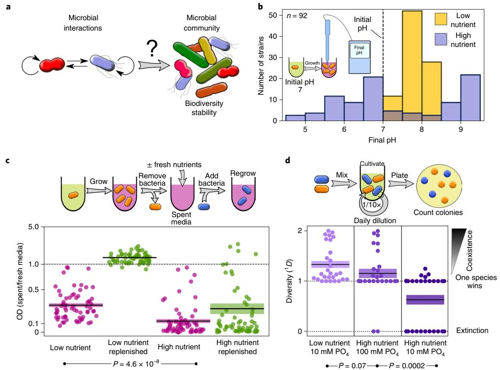

**Fig. 1 | Higher nutrient concentrations lead to more negative interactions between microbes. a**, Can we understand the biodiversity and stability of complex microbial communities from simple bacterial interactions? **b**, Bacteria change the environmental pH more strongly at higher nutrient concentrations. **c**, At higher nutrient concentrations, bacteria produce a more growth-inhibiting environment. Spent media of different bacteria were used either directly (purple) or after replenishing the resources (green) to re-grow the bacteria (all 64 pairs are shown separately in Extended Data Fig. 4). Relative growth for every interaction pair is shown as a scatter plot. Central lines and shading represent means ± s.e.m. OD, optical density at 600 nm. **d**, High nutrient concentrations decrease coexistence between interacting pairs. Low nutrient included 0.1% yeast extract and 0.1% soytone. High nutrient was the same medium with an additional 1% glucose and 0.8% urea. All 28 co-culture outcomes are shown as a swarm plot. Central lines and shading represent means ± s.e.m. For more detailed information, see the Methods. Diversity was calculated with the equation 1 *D* ¼ exp �P*S i*¼1 *pi*ln*pi* I , where *pi* is the relative abundance of species *i* and *S* is the total number of species. If both species went extinct 1 *D* was set to 0. *P* values were calculated using

one-sided *t*-tests. PO4, phosphate.

fresh nutrients (Fig. [1c](#page-1-0), bottom). Therefore, these negative interactions are mostly driven by the production of toxic metabolites and not by competition for resources. Buffering the media removed a large fraction of the inhibitory effect of the supernatant, suggesting that pH was a major factor causing this toxicity (Extended Data Fig. 5). Our bacteria tend to produce a more harmful environment when grown at higher nutrient concentrations.

To determine the consequence of these environmental modifications on the coexistence of bacterial pairs, we co-cultured all pairwise combinations of the eight species in batch culture with daily dilution in both low and high nutrient concentrations (Fig. [1d](#page-1-0)). After 5d, the composition of the cultures was assayed by plating the bacteria and counting the different colonies (see Methods for details). At low nutrient concentrations, there was a high amount of coexistence in pairwise co-culture. For the same interaction partners at high nutrient concentrations, we observed a striking loss of coexistence, where either one species outcompeted the other or, in many cases, both went extinct by ecological suicide—an effect we described recentl[y19](#page-6-17). Intermediate nutrient concentrations led to intermediate loss of coexistence (Extended Data Fig. 6). Higher buffer concentrations prevented the loss of coexistence at high nutrient concentrations, showing once more that pH is a major driver of the species interactions in this system (Fig. [1d](#page-1-0), middle). In addition to pH, other drivers of interaction may exist that work independent of, or even together with, pH. However, since adding buffer strongly reduces mutual exclusion at high nutrient concentrations, pH change is sufficient to explain most of the observed difference in interactions between high and low nutrient concentrations. A similar but weaker loss of coexistence at high nutrient concentrations was also observed when increasing the concentrations of complex nutrients (Extended Data Fig. 7). Therefore, an increase in nutrient concentrations led to stronger, effectively more negative interactions, resulting in a loss of coexistence.

To explore how these observations play out in complex communities, we sampled several soil microbiotas: compost, soil from an indoor flower pot and soil from a local backyard. These samples were cultivated in low and high nutrient concentrations as described above, with daily dilutions into fresh media (see Methods for details). The composition of the communities was followed over time by taking samples every day and performing 16S ribosomal RNA amplicon sequencing (Fig. [2](#page-2-0) and Extended Data Figs. 8–10).

These time courses reveal striking differences between the low and high nutrient concentrations; at low nutrient concentrations, there were more species present and the temporal change of the

## **NATurE EcOlOgy & EvOluTiOn** Articles

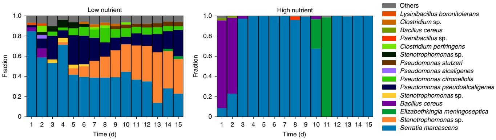

**Fig. 2 | Nutrient concentrations impact the dynamics and composition of a soil microbiota.** Typical time course of the community composition at low (left) and high nutrient concentrations (right), and thus weak and strong interactions according to Fig. [1.](#page-1-0) The plots show the change of composition over time based on 16S amplicon sequencing for a compost sample. Replicates from compost and other sampling sites (an indoor flower pot and outdoor soil) showed similar dynamics, as shown in Extended Data Fig. 10. The number of eukaryotes in these microcosms was very low (Supplementary Fig. 1). Several of the species found in the complex communities were identical to those used for the pairwise interaction experiments shown in Fig. [1](#page-1-0) and are therefore good representatives of these complex soil communities. The compositions of the start communities (day 0) are shown in Extended Data Fig. 9.

system was smooth (compost community shown in Fig. [2](#page-2-0); others shown in Extended Data Fig. 10). In contrast, at high nutrient concentrations, the community exhibited sudden jumps between several low-diversity states.

To gain intuition into whether the properties of the microbial interactions found in mono- and co-culture (Fig. [1](#page-1-0)) may explain the observed behaviour of complex communities (Fig. [2](#page-2-0)), we developed a mathematical model in which bacteria interact by changing the environment and are at the same time affected by these environmental changes. The model is a multi-species extension of a model we previously used to understand homogeneous populations and pairwise interaction outcomes[18:](#page-6-18)

$$\frac{\partial n_{i}}{\partial t} = \begin{cases} k_{\text{growth}} n_{i} (1 - n_{i}) \text{for } p \in [p_{\text{o}_{l}} - p_{\text{c}}, p_{\text{o}_{l}} + p_{\text{c}}] \\ -k_{\text{death}} n_{i} (1 - n_{i}) \text{for } p \notin [p_{\text{o}_{l}} - p_{\text{c}}, p_{\text{o}_{l}} + p_{\text{c}}] \end{cases} (1)$$

$$\frac{\partial p}{\partial t} = \sum_{i} \epsilon_{i} n_{i} \tag{2}$$

The bacterial species *ni* grow logistically with growth rate *k*growth, but only if the environmental parameter *p* lies within the suitable range ( poi I −*p*c to poi I +*p*c), where poi I and *p*c define the suitable range within the bacteria can grow. Although our system is strongly driven by pH, the parameter *p* could be any (or a combination) of several chemical compounds in the environment that the bacteria modify and are impacted by. Outside that range, the bacteria die with rate *k*death. Additionally, bacteria change the environmental parameter *p* with rate ∈*i* , which is taken from a uniform distribution in the interval (−*c*p to *c*p). Accordingly, *c*p is the maximum amplitude of the environmental change. At the end of every growth cycle, the system is diluted by a constant factor (see Supplementary Methods for details).

Simulating 40 interacting pairs with this model and varying the extent to which they changed the environment, and thus the interaction strength, led to results similar to what we observed experimentally (Fig. [3a](#page-3-0), purple; for more values of *c*p, see also Supplementary Fig. 8). Increasing the modification of the environment (*c*p) led to a loss of coexistence in co-culture, as seen in the experiments (Figs. [1d](#page-1-0) and [3b](#page-3-0), purple). Since this model recapitulated the findings for pairwise interactions, we were curious what it could tell us about complex communities. For this purpose, the above simulations were repeated with communities containing 20 species. Increasing the environmental modification by the bacteria caused a decrease in biodiversity (Fig. [3a)](#page-3-0), in line with similar findings in Lotka–Volterra models[23.](#page-6-15)

To test whether this predicted decrease in biodiversity could also be observed in the experiments where we propagated complex communities in low and high nutrient concentrations, we calculated the diversity of the communities at the end of the experiment. Indeed, we observed a loss of biodiversity when the nutrient concentrations and thus the interaction strength were increased, as predicted by the model (Fig. [3b](#page-3-0) and Extended Data Fig. 8). pH modification could be identified as an important driver for the pairwise interactions in Fig. [1](#page-1-0) (Extended Data Figs. 1, 2 and 5). Accordingly, adding buffer to the complex communities also reduced the loss of biodiversity in high nutrient concentrations. Therefore, the loss of biodiversity was largely driven by modifications of the environmental pH, not by the loss of limiting resources upon adding nutrients[25.](#page-6-19) Overall, high nutrient concentrations caused stronger environmental modifications and stronger, more negative interactions, leading to a loss of biodiversity in the microbial communities, as predicted by our simple model.

Another important property of ecosystems that seems to be linked to biodiversity is their stability (for example, how unchanged an ecosystem remains over time)[25–](#page-6-19)[27.](#page-6-20) We show and discuss below how interaction strength impacts the stability of complex microcosms (the effects on pairwise interactions are similar and can be seen in Supplementary Fig. 2). To get an impression of how interaction strength might affect the stability of microbial communities, we performed simulations with the above model to obtain the total bacterial density (∑*ni* ) over time for weak and strong interactions (for example, weak and strong modifications of the environment by tuning *c*p). Our model predicts that the fluctuations of the total bacterial density were much higher at stronger interactions (Fig. [4a](#page-3-1), top).

To determine whether this predicted loss of stability was present in our experimental communities, we analysed the total biomass over time (as quantified by optical density). Consistent with our model predictions, we found that high nutrient concentrations caused stronger temporal fluctuations in all samples (Fig. [4a](#page-3-1), bottom). In addition to increased fluctuations of the total bacterial density, the model predicted an increase in fluctuations of the environmental parameter *p* at stronger change of the environment and thus higher nutrient concentrations (Fig. [4b,](#page-3-1) top). Consistent with this prediction, we found the same effect in the experiments when

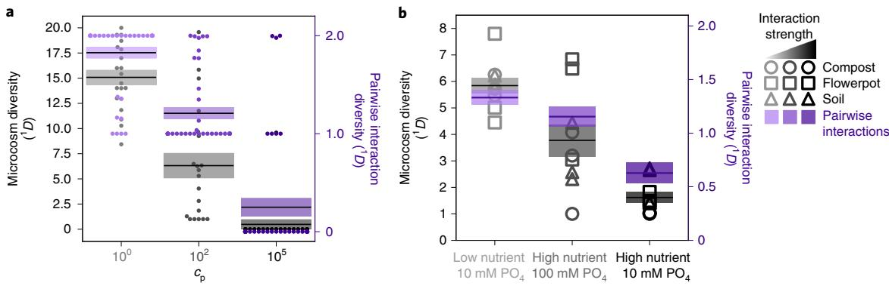

**Fig. 3 | Increased interaction strength leads to a loss of biodiversity. a**, Simulations show a loss of coexistence in pairwise interactions (purple; *n*= 40) and a loss of biodiversity in complex communities (20 interacting species; grey; *n*= 20) upon increasing the strength by which the bacteria change the environment and thus interact. **b**, The same behaviour was found in the experiments, where an increase in nutrient concentrations led to a loss of diversity in both pairs (*n*= 28) and complex communities (three technical replicates for each of the three sampling sites). Adding 100 mM phosphate buffer in these experiments reduced the loss of biodiversity. The pairwise interaction outcomes shown in purple correspond to the data of Fig. [1d](#page-1-0). The corresponding rarefaction curves are shown in Extended Data Fig. 8. They also show that loss of biodiversity is accompanied by a loss in richness.

the pH, as a central environmental parameter, was measured over time. At high nutrient concentrations the pH fluctuated strongly, whereas at low nutrient concentrations it stayed rather constant over time (Fig. [4b,](#page-3-1) bottom). Finally, looking at the change of the bacterial composition, the model predicted stronger fluctuations of the composition over time at higher nutrient concentrations, which again could be found in the measurements (Fig. [4c](#page-3-1)). We therefore found that higher nutrient concentrations, which cause overall more negative interactions, led to a loss of stability of total biomass, environment and species composition, as predicted by the model.

### **Discussion**

Despite the fundamental importance of biodiversity in ecology and its current decline around the worl[d28](#page-6-21)[–30](#page-6-22)—a clear understanding of what determines biodiversity is still missing[31,](#page-6-23)[32](#page-6-24). Abiotic factors surely influence biodiversity, but interactions between organisms are also hypothesized to play a major role in determining the biodiversity of ecosystem[s23](#page-6-15)[,32–](#page-6-24)[36.](#page-6-25) One major obstacle in confirming this hypothesis has been the difficulty of measuring and experimentally manipulating interspecies interactions[37,](#page-6-26)[38](#page-6-27). We showed here a way to tune the interaction strength between bacteria, which allowed us to understand how interactions affect the biodiversity of microbial communities. High nutrient concentrations caused more negative microbial interactions, which led to less diverse communities. In contrast with microbial systems, interactions in other ecosystems may not be primarily mediated by the environment, and it remains to be seen how far our findings can be transferred outside the microbial world. In a plant community, a similar mechanism for biodiversity loss was described. High nutrients led to shading of light (that is, a change of the environment), which caused a loss of biodiversit[y39.](#page-6-28) Moreover, at least in theory, a loss of biodiversity was also described for stronger direct interaction[s23](#page-6-15).

This mechanism for diversity loss is reminiscent of eutrophication, an over-enrichment of nutrients in ecosystems that often leads to blooms of microbial algae that exclude other species[40](#page-6-29)–[42](#page-6-30). In the case of eutrophication, stronger negative interactions are also mediated by the environment (for example, by limiting light or oxygen) and were suspected to contribute to biodiversity los[s40](#page-6-29)[,43,](#page-6-31)[44](#page-6-32). Our findings suggest that the idea of eutrophication can be extended to other microbial systems, such as soil microbiota.

Such eutrophication in microbial systems may even be medically relevant. In the human gut microbiome, a loss of biodiversity was associated with western, high-caloric and low-complexity diets compared with fibre-rich, low-caloric nutritio[n45](#page-6-33)[–51](#page-6-34). We speculate that such a loss of biodiversity upon easily accessible nutrients may be driven by an increased interaction strength between the gut microbes.

There exists a variety of evidence for the connection between biodiversity and stability. Higher biodiversity often, but not always, comes with higher stability in ecosystem[s25–](#page-6-19)[27,](#page-6-20)[52](#page-6-35)–[56](#page-6-36). In our experiments, an increase in interaction strength decreased the stability in pairwise co-cultures as well as in complex communities, indicating that the loss of stability was independent of the initial biodiversity of the microbial system. The loss of stability seems therefore not to be directly caused by the biodiversity itself; instead, the interaction

**Fig. 4 | Stronger interactions lower the stability of total biomass, environment and species composition.** Data shown in red correspond to high nutrient concentrations and data in blue to low nutrient concentrations, where high nutrient concentrations lead to more negative microbial interactions (Figs. [1](#page-1-0) and [3)](#page-3-0). **a**, Total bacterial density fluctuates more over time for stronger interactions in both the simulation (top) and experiment (bottom). OD, optical density at 600 nm. **b**, The environment also fluctuates more strongly for stronger interactions in the model (top) and the experiments (bottom). On the left in **a** and **b**, example curves are shown, whereas the bar plots on the right show the mean of the standard deviations for all obtained time curves. **c**, For weak interactions, the compositions of the communities stayed similar (top left: simulation; bottom left: measurement) over time, whereas for high interaction strength, more pronounced changes in composition over time were observed (top middle: simulation; bottom middle: measurement). The left and middle panels show example curves (different colours correspond to different replicates; arrows point in the direction of time; triangles indicate day 1; data for the remaining samples are shown in Supplementary Fig. 6 and data for the simulations are shown in Supplementary Fig. 13). The right panels show Pearson correlation coefficients of the composition between subsequent days for all obtained data (for simulation, ten different communities with 50 technical replicates each were used; for the experiments, three sampling sites with three technical replicates each were used; see Supplementary Information for more details). The closer the Pearson correlation coefficient is to 1, the more similar the compositions of two subsequent days are (for example, at stronger interactions the communities are more dissimilar between days). *P* values were calculated with one-sided *t*-tests. Simulation and measurement outcomes for multiple interaction strengths are shown in Supplementary Figs. 4, 5, 9 and 10.

## **NATurE EcOlOgy & EvOluTiOn** Articles

strength between the organisms negatively affects both biodiversity and stability at the same time.

Using simple microbial systems in the laboratory with the goal of investigating basic principles of ecology and evolution has led to many fundamental insights[57–](#page-6-37)[59.](#page-6-38) However, because of the simplicity of these systems, it is often unclear how far the obtained findings can be transferred to natural, more complex communities. We show here that at least the biodiversity and stability of complex systems can be understood from properties of simple pairwise interactions. For these ecosystem properties, the average species interaction

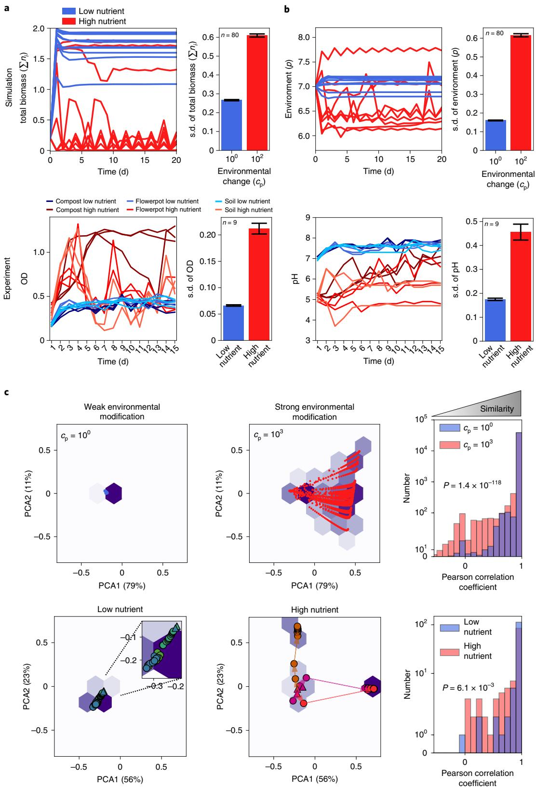

seems to be more important than the mechanistic details of the interactions and how the specific interactions sum up to build the community. This surprising simplicity suggests that it is possible not only to understand properties of complex microbial communities, but also ultimately to engineer them.

### **Methods**

**Media, bufer and bacterial culture.** All of the chemicals were purchased from Sigma–Aldrich unless otherwise stated.

Pre-cultures of bacteria were made in 1× nutrient medium (10 g l −1 yeast extract and 10 g l −1 soytone (both Becton Dickinson), 100mM sodium phosphate, pH7) or Tryptic Soy Broth (TSB; Teknova). The experiments were performed in base medium, which contained 1 g l −1 yeast extract, 1 g l −1 soytone, 0.1mM CaCl2, 2mM MgCl2, 4mg l −1 NiSO4 and 50mg l −1 MnCl2. Different amounts of phosphate (added as sodium dihydrogen phosphate), glucose and urea were added depending on the experimental conditions, as outlined below. The initial pH was adjusted to 7 unless otherwise stated. All media were filter sterilized using Bottle Top Filtration Units (VWR). For plating of bacteria, the cultures were diluted in phosphate buffered saline (PBS; Corning). Plating was done on TSB agar, with 2.5% agar (Becton Dickinson). For the experiments, the bacteria were grown in 96-deepwell plates (Deepwell plate 96/500 µl; Eppendorf) covered with AeraSeal adhesive sealing films (Excel Scientific). The growth temperature was 30 °C for the isolates and 25 °C for the complex communities, unless otherwise stated. The deepwell plates were shaken at 1,350 r.p.m. on Titramax shakers (Heidolph). To avoid evaporation, the plates were incubated inside custom-built acrylic boxes. The exact conditions are outlined for the single experiments below.

**Estimation of population density.** To count colony-forming units per ml, the bacteria were either added as droplets on the agar surface of 150-mm petri dishes (droplet plating) or fully spread on 100-mm agar plates (spread plating). Droplet plating gives a high throughput since 96 cultures can be plated in one working step, but spread plating gives a higher accuracy in counting.

*Droplet plating.* The cultures of interest were serially diluted in PBS (Corning) by seven 1/10-fold dilutions (20 µl into 180 µl; maximum dilution: 10−7 ×) with a 96-well pipette (VIAFLO 96; INTEGRA Biosciences) using the program pipet/mix (pipetting volume: 20 µl; mixing volume: 150µl; mixing cycles: 5; mixing and pipetting speed: 8). From every well, 10 µl was transferred on a large (150mm diameter) TSB 2.5% agar plate (TSB from Teknova; agar from Becton Dickinson) with the 96-well pipette (program: reverse pipette; uptake volume: 20µl; released volume: 10 µl; pipetting speed: 2). Droplets were allowed to dry and the plates were incubated at 30 °C for 1–2d until colonies were visible. The different dilution steps enabled us to find a dilution at which colonies could be optimally counted (between ~5 and ~50 colonies).

*Spread plating.* The cultures were diluted in PBS with seven 1/10-fold dilutions, as described above, and 150 µl of the 10−2 , 10−4 and 10−6 dilutions was spread onto 100-mm TSB agar plates with glass beads. The different dilutions were again allowed to find a plate with optimal density for colony counting.

**pH measurement.** To measure the pH of the microbial cultures, 170µl of sample was transferred into 96-well PCR plates (VWR) and the pH was measured with a pH microelectrode (Orion PerpHecT ROSS; Thermo Fisher Scientific).

**Measuring pH change of soil isolates.** The soil isolates were isolated from local soil (Cambridge, Massachusetts, United States), as described elsewhere[18,](#page-6-18)[60](#page-6-39). The bacteria were pre-cultured in 1× nutrient medium for 24h at 30 °C. The cultures were diluted 1/100-fold into 200 µl of:

- • Base and 10mM phosphate (pH7);
- • Base, 10mM phosphate, 1% glucose and 0.8% urea (pH7);
- • Base, 10mM phosphate, 0.4% glucose and 0.32% urea (pH7); or
- • Base, 100mM phosphate, 1% glucose and 0.8% urea (pH7).

The bacteria were grown in these media for 24h at 30 °C. Afterwards, the pH was measured. The bacterial density was measured as the optical density at a wavelength of 600nm (OD600) in 100 µl in 96-well flat-bottomed plates (Falcon) and only these pH values were taken into final consideration, for which the corresponding culture reached on optical density of at least 0.04. The results of the first two media conditions are shown in Fig. [1](#page-1-0) and all of the results are shown in Extended Data Fig. 2.

**Measuring bacterial growth in spent media.** Eight soil species were chosen for this experiment: *Pseudomonas putida* (American Type Culture Collection (ATCC); 12633), *Pseudomonas aurantiaca* (ATCC; 33663), *Pseudomonas citronellolis* (ATCC; 13674), *Micrococcus luteus* (Ward's Science), *Sporosarcina ureae* (Ward's Science), *Bacillus subtilis* (strain 168), *Enterobacter aerogenes* (ATCC; 13048) and *Serratia marcescens* (ATCC; 13880). These species can be differentiated by colony morphology (Extended Data Fig. 3) and have been used for interaction

studies before[10](#page-6-5)[,61](#page-7-0). The bacteria were grown in 5ml TSB (Teknova) overnight at 30 °C. The bacteria were spun down (15min; 3,220*g*; Eppendorf Centrifuge 5810) and re-suspended in 5ml base medium. The re-suspended bacteria were diluted 1/100-fold into 2× 5ml base±1% glucose and 0.8% urea, with either 10 or 100mM phosphate (pH7) (spent media cultures). At the same time, a new preculture was set up in TSB, as described above. Both cultures were grown for 24h at 30 °C. The spent media cultures were spun down (15min; 3,220*g*; Eppendorf Centrifuge 5810) and the supernatant filter was sterilized with a 50-ml Steriflip Filtration Unit (SCGP00525; 0.22 µm; Millipore/Sigma–Aldrich). Then, 50 µl of this spent media was spotted onto TSB plates to verify sterility. The spent media were either used directly or supplemented with 1/20× of 20× original media without PBS to replenish the nutrients. The second pre-culture was spun down as well after 24h (15min; 3,220*g*; Eppendorf Centrifuge 5810) and re-suspended with base medium as described above. Those bacteria were then diluted 1/100× into the spent media and also into the corresponding fresh media described above. The cultures were grown for 24h at 30 °C in 96-deepwell plates (Deepwell Plate 96/500 µl; Eppendorf), 200µl per well in shaken culture (1,350 r.p.m. shaking speed on a Heidolph Titramax shaker). After 24h the OD600 of the cultures (100 µl in 96-well flat-bottomed plates (Falcon)) in the different spent media was measured and divided by the OD600 obtained in fresh media. The resulting data are shown in Fig. [1c](#page-1-0) and Extended Data Figs. 4 and 5.

**Pairwise interactions.** The eight soil strains described above were grown in TSB overnight at 30 °C. The bacteria were spun down for 5min at 3,220*g* in an Eppendorf centrifuge 5810 and re-suspended in 2.5ml base medium with 10mM phosphate (pH7). For each of the 28 pairwise combinations, 10 µl of each strain was diluted in 200 µl base and 10mM/100mM phosphate ±1% glucose and 0.8% urea. The co-cultures were incubated at 30 °C and a shaking speed of 1,350 r.p.m. on a Heidolph Titramax shaker in 96-deepwell plates. Every 24h, the co-cultures were diluted 1/10× into fresh media. The pH and OD600 were measured at the end of every incubation cycle (every 24h). After 5d, the co-cultures were plated by droplet plating as described above. The agar plates were incubated at 30 °C for around 2d until colonies were clearly visible. The colonies were then counted.

The 1 *D* diversity was calculated according to 1D ¼ exp �PS i¼1 pilnpi I , where 1 *D* was set to 0 if both species went extinct. The results are shown in Fig. [1d](#page-1-0) and Extended Data Fig. 5.

**Obtaining environmental samples.** The compost used for the experiments was purchased from Bootstrap Compost in Boston, Massachusetts. The soil was sampled in Cambridge, Massachusetts, at a depth of ~30 cm. The soil was kept at 4 °C until the experiments were performed. Flower pot soil was sampled the day of the experiment by taking soil from a large indoor plant pot at a depth of 10 cm.

**Temporal dynamics of soil microcosms.** For the compost and flower pot experiments, 4 g of sample was diluted in 20ml PBS, then vortexed at an intermediate speed for 30 s and incubated on a platform shaker (Innova 2000; Eppendorf) at 250 r.p.m. and room temperature. After 30min, the samples were allowed to settle for 5min and the supernatant was transferred to a new clean tube. The sample was then diluted 1:10 before inoculation of the experiments. For the soil experiment, four grains of soils (~0.1 g) were diluted in 40ml PBS, vortexed and mixed as described for the compost samples. The supernatant collected after settling was directly used for inoculation without further dilution. Experiments were inoculated by mixing 170 µl of these obtained liquids into 1,530 µl of the appropriate media, as indicated below.

Experiments were performed in 2,000-µl 96-deepwell plates (Deepwell Plate 96/2000 µl; Eppendorf) using base media at pH7, to which either 10mM (referred to as low buffer) or 100mM (referred to as high buffer) phosphate was added. Glucose/urea ratios of 0/0, 0.5/0.4, 1/0.8, 2/1.6, 3/2.4 and 5/4% (mV−1 ) were added to the high- and low-buffer media, respectively. Plates were covered with two sterile AeraSeal adhesive sealing films (Excel Scientific) and incubated at 25 °C on a VWR Microplate Shaker at 500 r.p.m.

Every 24h, the cultures were thoroughly mixed by pipetting up and down 30 times using the VIAFLO 96-well pipette (mixing volume: 300µl, speed: 10; cycles: 30). Then, the cultures were diluted 1:10 into fresh media. At the end of every cultivation day, 170 µl of culture was transferred into flat-bottomed 96-well plates (Falcon) and the optical density (OD600) was measured with a Varioskan Flash (Thermo Fisher Scientific) plate reader. The pH was measured as described above. The remaining bacterial culture was stored at −80 °C for subsequent DNA extraction. The DNA extractions were performed using an Agencourt DNAdvance [A48705](https://www.ncbi.nlm.nih.gov/nuccore/A48705) extraction kit (Beckman Coulter) following the provided protocol. The obtained DNA was used for 16S amplicon sequencing of the V4–V5 region. Some amount of the samples was also checked for eukaryotes by sequencing the 18S V4 region. The sequencing was done on an Illumina MySeq by the Comparative Genomics and Evolutionary Bioinformatics–Integrated Microbiome Resource at Dalhousie University (Halifax, Nova Scotia, Canada).

**Data analysis.** We analysed the obtained 16S reads as described elsewhere[62](#page-7-1). From the 16S reads, the amplicon sequence variants were obtained with the dada2

## **NATurE EcOlOgy & EvOluTiOn** Articles

package in R[63.](#page-7-2) Taxonomic identities were assigned to the amplicon sequence variants using the GreenGenes Database Consortium (version 13.8)[64](#page-7-3) as a reference database. The principle component analysis shown in Fig. [4](#page-3-1) was performed with the scikit-learn package in Python[65.](#page-7-4)

**Reporting Summary.** Further information on research design is available in the Nature Research Reporting Summary linked to this article.

### **Data availability**

The data and sequencing raw data are available at [https://doi.org/10.5061/dryad.](https://doi.org/10.5061/dryad.vdncjsxq9) [vdncjsxq9.](https://doi.org/10.5061/dryad.vdncjsxq9)

### **Code availability**

The code for the simulations is available at [https://github.com/cratzke/Interaction](https://github.com/cratzke/Interaction-biodiversity-stability)[biodiversity-stability.](https://github.com/cratzke/Interaction-biodiversity-stability)

Received: 2 August 2019; Accepted: 6 January 2020; Published: xx xx xxxx

### **References**

- 1. Faust, K. & Raes, J. Microbial interactions: from networks to models. *Nat. Rev. Microbiol.* **10**, 538–550 (2012).
- 2. Fuhrman, J. A. Microbial community structure and its functional implications. *Nature* **459**, 193–199 (2009).
- 3. Ley, R. E., Peterson, D. A. & Gordon, J. I. Ecological and evolutionary forces shaping microbial diversity in the human intestine. *Cell* **124**, 837–848 (2006).
- 4. Tompson, L. R. et al. A communal catalogue reveals Earth's multiscale microbial diversity. *Nature* **551**, 457–463 (2017).
- 5. Raes, J. & Bork, P. Molecular eco-systems biology: towards an understanding of community function. *Nat. Rev. Microbiol.* **6**, 693–699 (2008).
- 6. Strom, S. L. Microbial ecology of ocean biogeochemistry: a community perspective. *Science* **320**, 1043–1045 (2008).
- 7. Ghoul, M. & Mitri, S. Te ecology and evolution of microbial competition. *Trends Microbiol.* **24**, 833–845 (2016).
- 8. Moons, P., Michiels, C. W. & Aertsen, A. Bacterial interactions in bioflms. *Crit. Rev. Microbiol.* **35**, 157–168 (2009).
- 9. James, G. A., Beaudette, L. & Costerton, J. W. Interspecies bacterial interactions in bioflms. *J. Ind. Microbiol.* **15**, 257–262 (1995).
- 10. Friedman, J., Higgins, L. M. & Gore, J. Community structure follows simple assembly rules in microbial microcosms. *Nat. Ecol. Evol.* **1**, 0109 (2017).
- 11. Momeni, B., Xie, L. & Shou, W. Lotka–Volterra pairwise modeling fails to capture diverse pairwise microbial interactions. *eLife* **6**, e25051 (2017).
- 12. Hibbing, M. E., Fuqua, C., Parsek, M. R. & Peterson, S. B. Bacterial competition: surviving and thriving in the microbial jungle. *Nat. Rev. Micro.* **8**, 15–25 (2010).
- 13. Riley, M. A. & Gordon, D. M. Te ecological role of bacteriocins in bacterial competition. *Trends Microbiol.* **7**, 129–133 (1999).
- 14. Pande, S. et al. Fitness and stability of obligate cross-feeding interactions that emerge upon gene loss in bacteria. *ISME J.* **8**, 953–962 (2014).
- 15. Goldford, J. E. et al. Emergent simplicity in microbial community assembly. *Science* **361**, 469–474 (2018).
- 16. Pande, S. & Kost, C. Bacterial unculturability and the formation of intercellular metabolic networks. *Trends Microbiol.* **25**, 349–361 (2017).
- 17. Estrela, S. et al. Environmentally mediated social dilemmas. *Trends Ecol. Evol.* **34**, 6–18 (2019).
- 18. Ratzke, C. & Gore, J. Modifying and reacting to the environmental pH can drive bacterial interactions. *PLoS Biol.* **16**, e2004248 (2018).
- 19. Ratzke, C., Denk, J. & Gore, J. Ecological suicide in microbes. *Nat. Ecol. Evol.* **2**, 867–872 (2018).
- 20. Niehaus, L. et al. Microbial coexistence through chemical-mediated interactions. *Nat. Commun.* **10**, 2052 (2019).
- 21. Pacheco, A. R., Moel, M. & Segrè, D. Costless metabolic secretions as drivers of interspecies interactions in microbial ecosystems. *Nat. Commun.* **10**, 103 (2019).
- 22. Basan, M. et al. Overfow metabolism in *Escherichia coli* results from efcient proteome allocation. *Nature* **528**, 99–104 (2015).
- 23. May, R. M. Will a large complex system be stable? *Nature* **238**, 413–414 (1972).
- 24. McCann, K., Hastings, A. & Huxel, G. R. Weak trophic interactions and the balance of nature. *Nature* **395**, 794–798 (1998).
- 25. Tilman, D. & Downing, J. A. Biodiversity and stability in grasslands. *Nature* **367**, 363–365 (1994).
- 26. Ives, A. R. & Carpenter, S. R. Stability and diversity of ecosystems. *Science* **317**, 58–62 (2007).
- 27. Ptacnik, R. et al. Diversity predicts stability and resource use efciency in natural phytoplankton communities. *Proc. Natl Acad. Sci. USA* **105**, 5134–5138 (2008).
- 28. Butchart, S. H. M. et al. Global biodiversity: indicators of recent declines. *Science* **328**, 1164–1168 (2010).
- 29. Jones, G. P., McCormick, M. I., Srinivasan, M. & Eagle, J. V. Coral decline threatens fsh biodiversity in marine reserves. *Proc. Natl Acad. Sci. USA* **101**, 8251–8253 (2004).
- 30. Newbold, T. et al. Has land use pushed terrestrial biodiversity beyond the planetary boundary? A global assessment. *Science* **353**, 288–291 (2016).
- 31. Pennisi, E. What determines species diversity? *Science* **309**, 90 (2005).
- 32. May, R. M. How many species are there on Earth? *Science* **241**, 1441–1449 (1988).
- 33. Wardle, D. A. Te infuence of biotic interactions on soil biodiversity. *Ecol. Lett.* **9**, 870–886 (2006).
- 34. Mougi, A. & Kondoh, M. Diversity of interaction types and ecological community stability. *Science* **337**, 349–351 (2012).
- 35. Diamond, J. Factors controlling species diversity: overview and synthesis. *Ann. Missouri Bot. Garden* **75**, 117–129 (1988).
- 36. Litchman, E., de Tezanos Pinto, P., Klausmeier, C. A., Tomas, M. K. & Yoshiyama, K. in *Fify Years Afer the* "*Homage to Santa Rosalia*"*: Old and New Paradigms on Biodiversity in Aquatic Ecosystems* (eds Naselli-Flores, L. & Rossetti, G.) 15–28 (Springer, 2010).
- 37. Volkov, I., Banavar, J. R., Hubbell, S. P. & Maritan, A. Inferring species interactions in tropical forests. *Proc. Natl Acad. Sci. USA* **106**, 13854–13859 (2009).
- 38. Carrara, F., Giometto, A., Seymour, M., Rinaldo, A. & Altermatt, F. Inferring species interactions in ecological communities: a comparison of methods at diferent levels of complexity. *Methods Ecol. Evol.* **6**, 895–906 (2015).
- 39. Hautier, Y., Niklaus, P. A. & Hector, A. Competition for light causes plant biodiversity loss afer eutrophication. *Science* **324**, 636–638 (2009).
- 40. Conley, D. J. et al. Controlling eutrophication: nitrogen and phosphorus. *Science* **323**, 1014–1015 (2009).
- 41. Smith, V. H. & Schindler, D. W. Eutrophication science: where do we go from here? *Trends Ecol. Evol.* **24**, 201–207 (2009).
- 42. Smith, V. H., Joye, S. B. & Howarth, R. W. Eutrophication of freshwater and marine ecosystems. *Limnol. Oceanogr.* **51**, 351–355 (2006).
- 43. Hillebrand, H. & Sommer, U. Diversity of benthic microalgae in response to colonization time and eutrophication. *Aquat. Bot.* **67**, 221–236 (2000).
- 44. Moksness, E., Dahl, E. & Støttrup, J. *Integrated Coastal Zone Management* (John Wiley & Sons, 2009).
- 45. Yatsunenko, T. et al. Human gut microbiome viewed across age and geography. *Nature* **486**, 222–227 (2012).
- 46. Filippo, C. D. et al. Impact of diet in shaping gut microbiota revealed by a comparative study in children from Europe and rural Africa. *Proc. Natl Acad. Sci. USA* **107**, 14691–14696 (2010).
- 47. Segata, N. Gut microbiome: westernization and the disappearance of intestinal diversity. *Curr. Biol.* **25**, R611–R613 (2015).
- 48. Vangay, P. et al. US immigration westernizes the human gut microbiome. *Cell* **175**, 962–972.e10 (2018).
- 49. Deehan, E. C. & Walter, J. Te fber gap and the disappearing gut microbiome: implications for human nutrition. *Trends Endocrinol. Metab.* **27**, 239–242 (2016).
- 50. Zinöcker, M. K. & Lindseth, I. A. Te western diet–microbiome-host interaction and its role in metabolic disease. *Nutrients* **10**, 365 (2018).
- 51. Turnbaugh, P. J., Bäckhed, F., Fulton, L. & Gordon, J. I. Diet-induced obesity is linked to marked but reversible alterations in the mouse distal gut microbiome. *Cell Host Microbe* **3**, 213–223 (2008).
- 52. Hector, A. et al. Plant diversity and productivity experiments in European grasslands. *Science* **286**, 1123–1127 (1999).
- 53. Pennekamp, F. et al. Biodiversity increases and decreases ecosystem stability. *Nature* **563**, 109–112 (2018).
- 54. Bai, Y., Han, X., Wu, J., Chen, Z. & Li, L. Ecosystem stability and compensatory efects in the Inner Mongolia grassland. *Nature* **431**, 181–184 (2004).
- 55. Lozupone, C. A., Stombaugh, J. I., Gordon, J. I., Jansson, J. K. & Knight, R. Diversity, stability and resilience of the human gut microbiota. *Nature* **489**, 220–230 (2012).
- 56. Loreau, M., Naeem, S. & Inchausti, P. *Biodiversity and Ecosystem Functioning: Synthesis and Perspectives* (Oxford Univ. Press, 2002).
- 57. Jessup, C. M. et al. Big questions, small worlds: microbial model systems in ecology. *Trends Ecol. Evol.* **19**, 189–197 (2004).
- 58. Prosser, J. I. et al. Te role of ecological theory in microbial ecology. *Nat. Rev. Microbiol.* **5**, 384–392 (2007).
- 59. Friedman, J. & Gore, J. Ecological systems biology: the dynamics of interacting populations. *Curr. Opin. Syst. Biol.* **1**, 114–121 (2017).
- 60. Higgins, L. M., Friedman, J., Shen, H. & Gore, J. Co-occurring soil bacteria exhibit a robust competitive hierarchy and lack of non-transitive interactions. Preprint at *bioRxiv* [https://www.biorxiv.org/content/10.1101/](https://www.biorxiv.org/content/10.1101/175737v1) [175737v1](https://www.biorxiv.org/content/10.1101/175737v1) (2017).

## Articles **NATurE EcOlOgy & EvOluTiOn**

- 61. Celiker, H. & Gore, J. Clustering in community structure across replicate ecosystems following a long-term bacterial evolution experiment. *Nat. Commun.* **5**, 4643 (2014).
- 62. Callahan, B. J., Sankaran, K., Fukuyama, J. A., McMurdie, P. J. & Holmes, S. P. Bioconductor workfow for microbiome data analysis: from raw reads to community analyses. *F1000Res* **5**, 1492 (2016).
- 63. Callahan, B. J. et al. DADA2: high-resolution sample inference from Illumina amplicon data. *Nat. Methods* **13**, 581–583 (2016).
- 64. DeSantis, T. Z. et al. Greengenes, a chimera-checked 16S rRNA gene database and workbench compatible with ARB. *Appl. Environ. Microbiol.* **72**, 5069–5072 (2006).
- 65. Pedregosa, F. et al. Scikit-learn: machine learning in Python. *J. Mach. Learn. Res.* **12**, 2825–2830 (2011).

### **Acknowledgements**

We thank D. Amor for help with analysing the sequencing data, and C. Abreu and the Gore group for reading and commenting on the manuscript. This work was funded by a NIH R01 (GM102311) grant.

### **Author contributions**

C.R., J.B. and J.G. designed the research. J.B. and C.R. carried out the experiments and performed the mathematical analysis. C.R., J.B. and J.G. discussed and interpreted the results, and wrote the manuscript.

### **Competing interests**

The authors declare no competing interests.

### **Additional information**

**Extended data** is available for this paper at [https://doi.org/10.1038/s41559-020-1099-4.](https://doi.org/10.1038/s41559-020-1099-4)

**Supplementary information** is available for this paper at [https://doi.org/10.1038/](https://doi.org/10.1038/s41559-020-1099-4) [s41559-020-1099-4](https://doi.org/10.1038/s41559-020-1099-4).

**Correspondence and requests for materials** should be addressed to C.R. or J.G.

**Reprints and permissions information** is available at [www.nature.com/reprints](http://www.nature.com/reprints).

**Publisher's note** Springer Nature remains neutral with regard to jurisdictional claims in published maps and institutional affiliations.

© The Author(s), under exclusive licence to Springer Nature Limited 2020

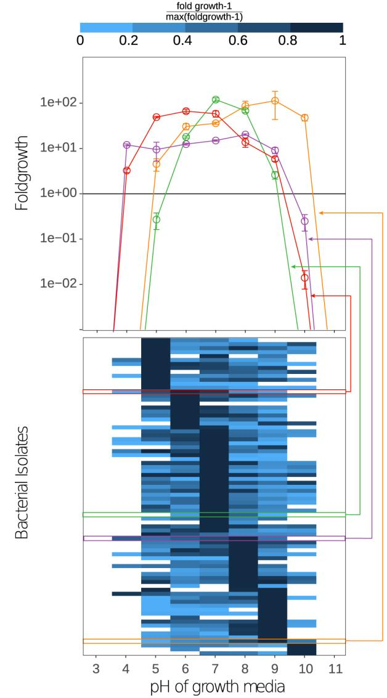

**Extended Data Fig. 1 | Different soil strains have different suitable pH ranges.** We tested the optimal growth pH of 81 isolated soil species. It is a subset of the species shown in Extended Data Fig. 2B. All isolates were pre-cultured in 200µL of 1xNutrient medium for 24h at 25 °C with 1350 rpm shaking speed in 500-µl 96-deepwell plates (Eppendorf, Hauppauge, USA). After 24h of growth the cultures were diluted 1:100 into 500-µl 96-deepwell plates and a final volume of 200µl of Base media with 100mM phosphate with pH values of 3–11. Cultures were incubated for 24h at 25 °C at 1350 rpm on a Heidolph Titramax shaker. Population densities were estimated by CFU counting at the start of the experiment and after 24h, which allows to estimate the fold growth in 24h that is shown in the figure. Several example curves are shown in the upper panel. As can be seen those curves can have several shapes. For simplification, we decided to describe the shape of those curves with a heaviside function in our simulations (see below).

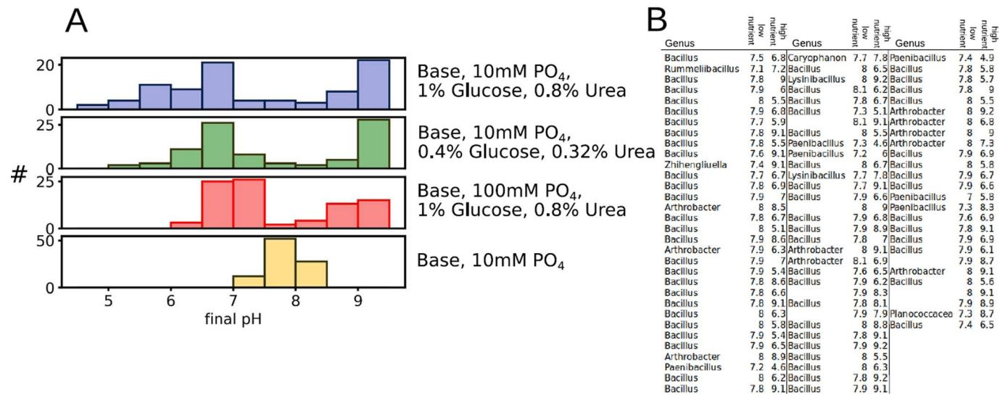

**Extended Data Fig. 2 | Nutrient concentrations and buffering determine pH change of growth media.** (**a**) The top and bottom panels show the same data as Fig. [1b](#page-1-0). Using intermediate nutrient concentrations also causes intermediate pH shifts (green) compared to high (blue) and low (yellow) nutrient concentrations. Also adding higher concentrations of buffer lowers pH shifts (red) compared to the situation with low buffer (blue). (**b**) List of soil isolates that were used to measure the data in main text Fig. [1b](#page-1-0) and Extended Data Fig 1A and 2B. Strains were identified down to genus level by sequencing their 16S rRNA gene and comparing it to the RDP database. The strains belong to a collection of soil strains that we used before for interaction studie[s1](#page-6-0)[,4](#page-6-1). As can be seen many of those strains belong to the genus Bacillus, nevertheless they can change the pH into alkaline or acidic directions. For some cases the sequencing failed which lead to empty entries. PO4 means phosphate.

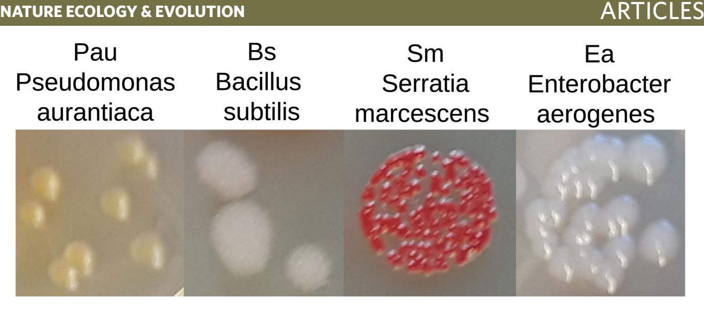

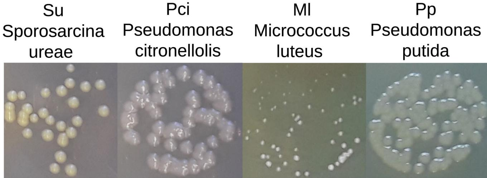

**Extended Data Fig. 3 | Bacteria for the pairwise interaction experiments.** The different colony morphologies allowed to distinguish them after plating on agar plates.

## Articles **NATurE EEcOlOgy & cOlOgy EEvOluTiO vOluTiOnn**

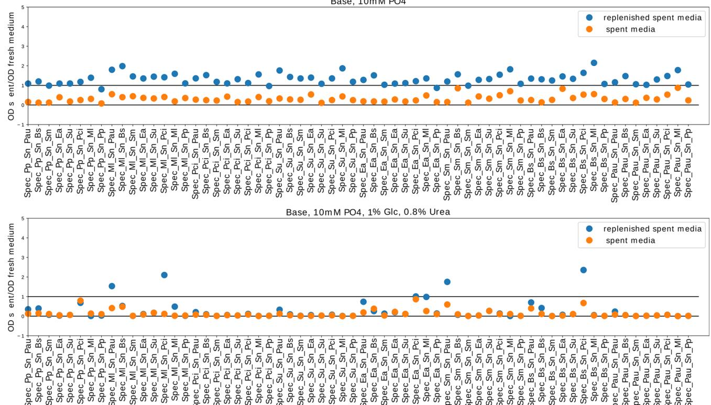

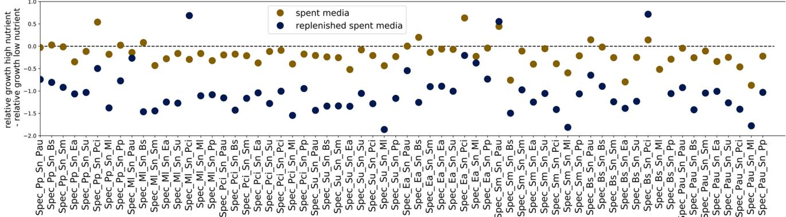

**Extended Data Fig. 4 | High nutrient concentrations lead to stronger negative interactions between bacteria.** The figure shows all the data of main text Fig. [1c](#page-1-0) for low nutrient concentrations (top) and high nutrient concentrations (middle). The bottom panel shows the difference between the top and middle one. As can be seen in most cases (84%, for spent media without replenishment) increasing nutrient concentrations lead to a stronger inhibition of the interaction partner (values below zero), however in the remaining cases it leads to a relative facilitation (values above zero). Spec_X_Sn_Y means species X was grown in supernatant of species Y.

## **NATurE EEcOlOgy & cOlOgy EEvOluTiO vOluTiOnn** Articles

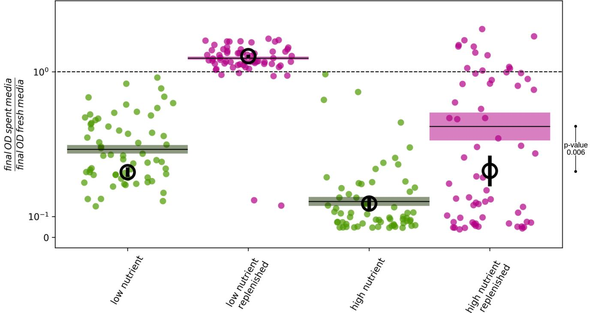

**Extended Data Fig. 5 | Growth inhibition caused by high nutrient spent media is partially caused by pH and can be removed by buffering.** The scatter plots show the ratio of final OD in spent and final OD in fresh media for all 64 interaction pairs in buffered media at low (left) and high (right) nutrient concentrations. The solid lines and boxes show the corresponding mean and SEM. This figure is thus equivalent to Fig. [1c](#page-1-0) in the main text with higher buffer concentrations (100mM phosphate). The black circles show the data of Fig. [1c](#page-1-0) eg with lower buffer concentrations (10mM phosphate). As can be seen the presence of higher buffer concentrations slightly facilitates growth in spent, but not replenished media, possibly because adding phosphate avoids phosphor to be a limiting resource. However, the strongest effect of buffering can be seen in the replenished supernatant. Whereas there is no effect upon the low nutrient replenished supernatant, bacteria grow much better in high nutrient replenished media with higher buffer concentration compared to lower phosphate (one-sided t-test p-value = 0.006). Since in the replenished media nutrient competition as a mode of interaction does not matter, this shows that the growth hindering and thus toxic effect of replenished high nutrient media can partially be diminished by buffering. Thus, at least a part of the toxic effect of high nutrient supernatant is caused by pH.

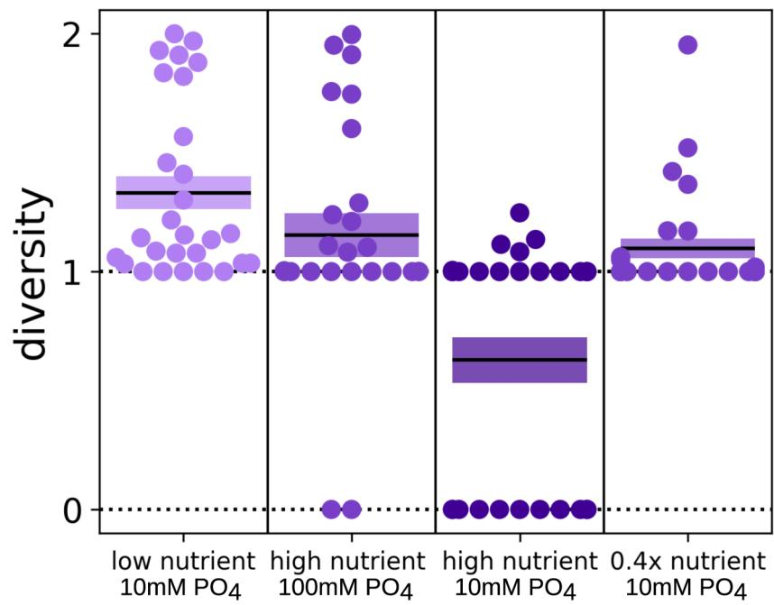

**Extended Data Fig. 6 | Nutrient levels determine interaction strength.** The first three columns correspond to Fig. [1d.](#page-1-0) The fourth column shows the interaction outcomes for a medium nutrient concentration of 0.4% glucose and 0.32% urea eg. 0.4x the high nutrient condition. As expected the results fall in between the results for the low (no Glucose and Urea) and high (1% Glucose and 0.8% Urea) nutrient outcomes. PO4 means phosphate.

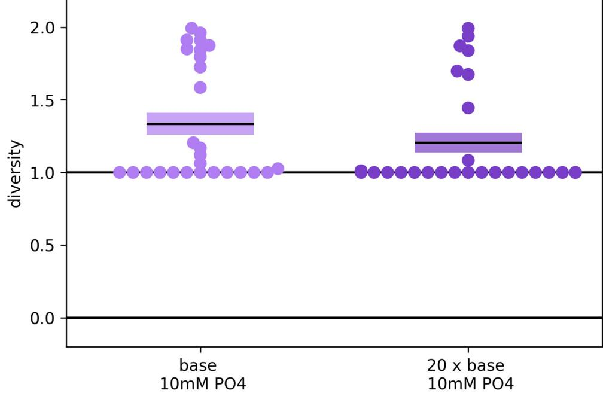

**Extended Data Fig. 7 | Complex nutrients weakly effect interaction.** Increasing the amount of yeast extract and soytone from 1g/L each to 20g/L leads to a slight decrease in overall diversity (p-value: 0.112). However, the effect of glucose and urea is much stronger. On reason for that may be that yeast extract and soytone also work as buffers, which stabilize pH at high nutrient concentrations. PO4 means phosphate.

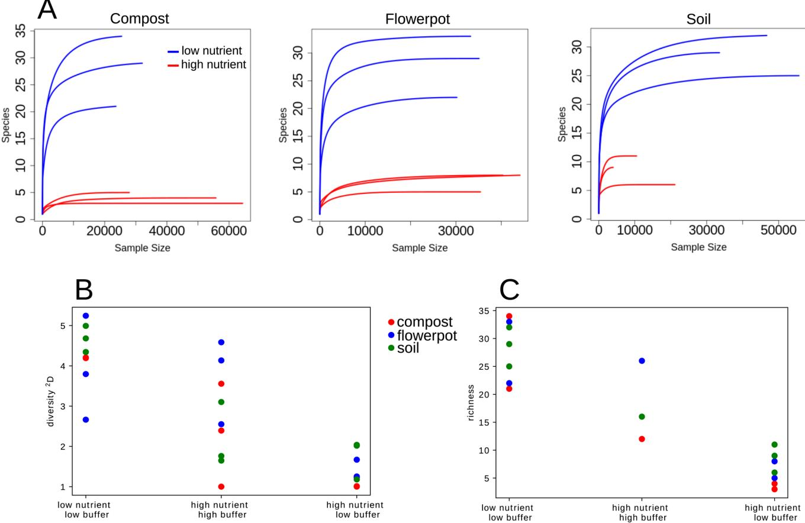

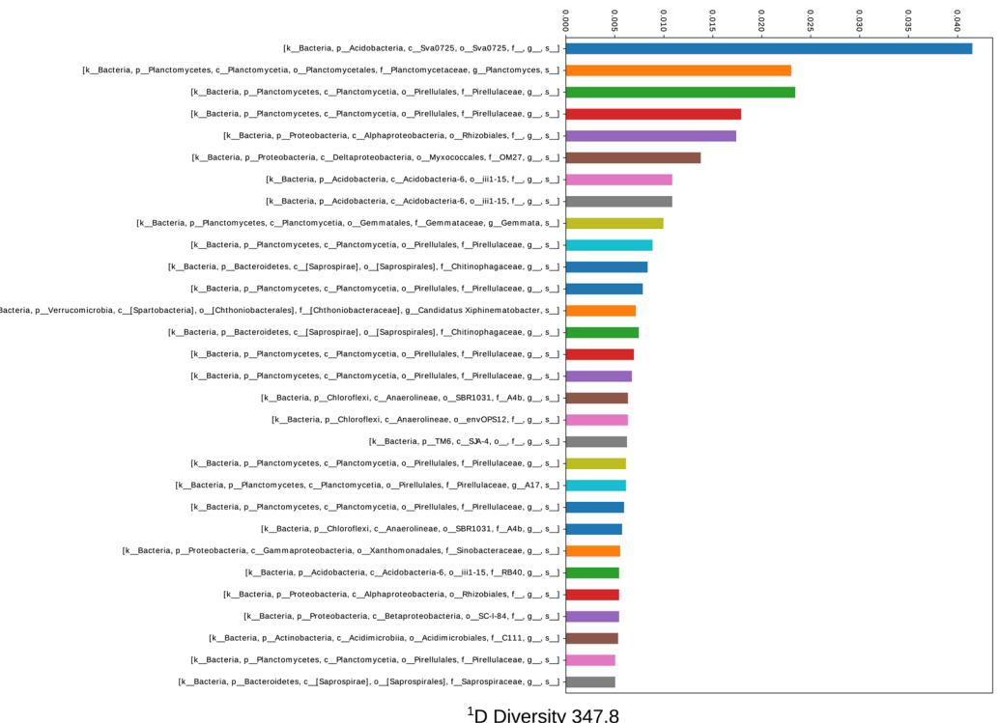

**Extended Data Fig. 9 | Initial community compositions.** Shown are the ASVs with more then 0.05 abundance. The corresponding 1 D diversity and richness are much higher than at the end of the experiments (Fig. [3](#page-3-0)), eg those communities collapsed to communities with lower diversity during the experiments. The sequencing of the initial soil community failed.

## Articles **NATurE EEcOlOgy & cOlOgy EEvOluTiO vOluTiOnn**

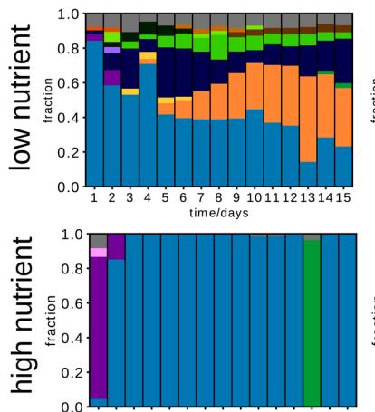

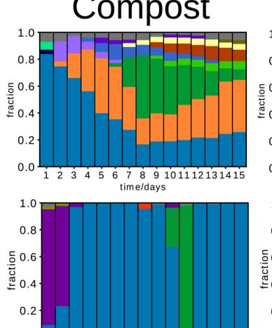

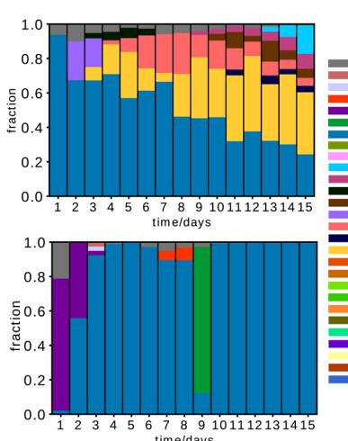

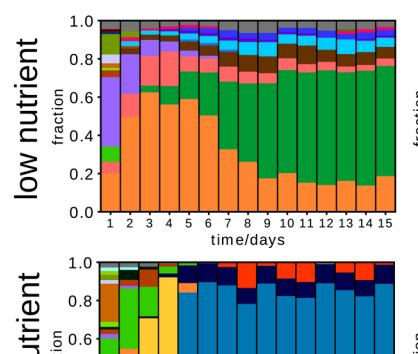

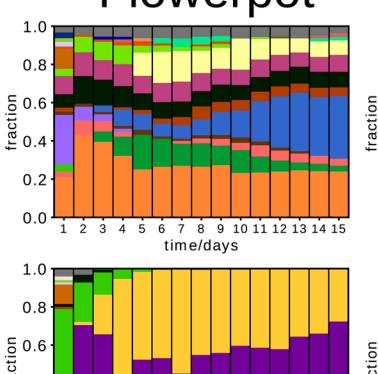

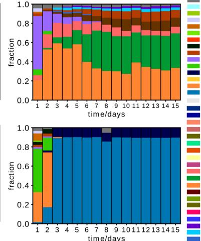

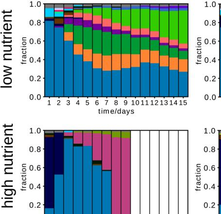

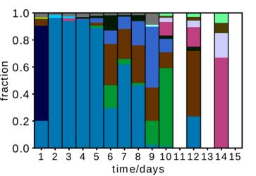

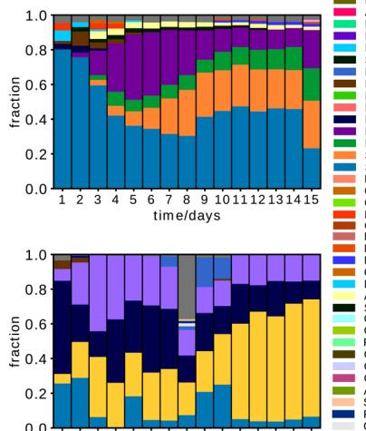

- 
- 
- 
- 
- 
- 
- 
- 
- 

**Extended Data Fig. 10 | See next page for caption.**

**Nature Ecology & Evolution** | [www.nature.com/natecolevol](http://www.nature.com/natecolevol)

**Extended Data Fig. 10 | Community composition over time for different samples sites, replicates and nutrient conditions.** The colors that represent the different species are consistent for a specific sample (compost, flowerpot, soil), but may vary between them. In a few cases different ASVs were identified as the same species, which causes a connection of the same species name with different colors within the same sample site. The white columns indicate days for which the sequencing failed.

Corresponding author(s): Christoph Ratzke, Jeff Gore

Last updated by author(s): Nov 5, 2019

# Reporting Summary

Nature Research wishes to improve the reproducibility of the work that we publish. This form provides structure for consistency and transparency in reporting. For further information on Nature Research policies, see Authors & Referees and the Editorial Policy Checklist.

## Statistics

|     | For all statistical analyses, confirm that the following items are present in the figure legend, table legend, main text, or Methods section.                                                                                                                 |
|-----|---------------------------------------------------------------------------------------------------------------------------------------------------------------------------------------------------------------------------------------------------------------|
| n/a | Confirmed                                                                                                                                                                                                                                                     |
|     | The exact sample size (n) for each experimental group/condition, given as a discrete number and unit of measurement                                                                                                                                           |
|     | A statement on whether measurements were taken from distinct samples or whether the same sample was measured repeatedly                                                                                                                                       |
|     | The statistical test(s) used AND whether they are one- or two-sided Only common tests should be described solely by name; describe more complex techniques in the Methods section.                                                                         |
|     | A description of all covariates tested                                                                                                                                                                                                                        |
|     | A description of any assumptions or corrections, such as tests of normality and adjustment for multiple comparisons                                                                                                                                           |
|     | A full description of the statistical parameters including central tendency (e.g. means) or other basic estimates (e.g. regression coefficient) AND variation (e.g. standard deviation) or associated estimates of uncertainty (e.g. confidence intervals) |
|     | For null hypothesis testing, the test statistic (e.g. F, t, r) with confidence intervals, effect sizes, degrees of freedom and P value noted Give P values as exact values whenever suitable.                                                              |
|     | For Bayesian analysis, information on the choice of priors and Markov chain Monte Carlo settings                                                                                                                                                              |
|     | For hierarchical and complex designs, identification of the appropriate level for tests and full reporting of outcomes                                                                                                                                        |
|     | Estimates of effect sizes (e.g. Cohen's d, Pearson's r), indicating how they were calculated                                                                                                                                                                  |
|     | Our web collection on statistics for biologists contains articles on many of the points above.                                                                                                                                                                |
|     |                                                                                                                                                                                                                                                               |

## Software and code

|                 | Policy information about availability of computer code                                                                                                                                                                                                                                         |
|-----------------|------------------------------------------------------------------------------------------------------------------------------------------------------------------------------------------------------------------------------------------------------------------------------------------------|
| Data collection | 16S amplicon sequencing raw data was processed with dada2 package in R, as described in Callahan, B. J., Sankaran, K., Fukuyama, J. A., McMurdie, P. J. & Holmes, S. P. Bioconductor Workflow for Microbiome Data Analysis: from raw reads to community analyses. F1000Res 5, (2016). |
| Data analysis   | Data analysis was done in Python3, which SciPy and NumPy packages. Plotting was done with matplotlib package. Simulations were run by integrating the given equations with Odeint in SciPy, as described in the Supplementary Methods.                                                      |

For manuscripts utilizing custom algorithms or software that are central to the research but not yet described in published literature, software must be made available to editors/reviewers. We strongly encourage code deposition in a community repository (e.g. GitHub). See the Nature Research guidelines for submitting code & software for further information.

## Data

Policy information about availability of data

All manuscripts must include a data availability statement. This statement should provide the following information, where applicable:

- Accession codes, unique identifiers, or web links for publicly available datasets
- A list of figures that have associated raw data
- A description of any restrictions on data availability

We will make the sequencing raw data accessible on a repository upon publication.

# Field-specific reporting

Please select the one below that is the best fit for your research. If you are not sure, read the appropriate sections before making your selection.

Life sciences Behavioural & social sciences Ecological, evolutionary & environmental sciences

For a reference copy of the document with all sections, see nature.com/documents/nr-reporting-summary-flat.pdf

# Life sciences study design

All studies must disclose on these points even when the disclosure is negative.

| Sample size     | We did several test runs of both the pairwise interaction experiments as well as the experiments on complex communities. In both cases we could see that the expected effects are rather large and thus 8 species ( and thus all their combinations) for the pairwise competition and 3x3 ( three different sample sited with three technical replicates each) samples for complex communities should be more than sufficient.                                                             |
|-----------------|--------------------------------------------------------------------------------------------------------------------------------------------------------------------------------------------------------------------------------------------------------------------------------------------------------------------------------------------------------------------------------------------------------------------------------------------------------------------------------------------------|
|                 |                                                                                                                                                                                                                                                                                                                                                                                                                                                                                                  |
| Data exclusions | For the bacterial co-culture at high nutrient, high buffer one community showed cross contamination and was removed from further analysis. Few of the 16S sequencing reactions failed and therefore excluded themselves as shown in Supplementary Fig. 9.                                                                                                                                                                                                                                     |
| Replication     | All the pairwise interactions experiments were at least repeated twice, in all cases successfully. The experiments with complex communities were done few times without sequencing ( just measuring OD, pH and plating on agar to get rough estimates for the biodiversity) with the same outcomes as shown in the paper. We chose three different sampling sites for the complex communities with 3 technical replicates each, that all showed similar outcomes as shown in the paper. |
| Randomization   | We used the same species/soil samples and just varied the environmental conditions under which they grew in the lab.                                                                                                                                                                                                                                                                                                                                                                             |
|                 |                                                                                                                                                                                                                                                                                                                                                                                                                                                                                                  |
| Blinding        | For the pairwise interactions there was no blinding. However, the data was obtained by counting colonies of bacteria with different colony morphologies. Since this is a very digital process ( colony is there or not) we do not expect that a bias is introduces by the investigator. For the complex communities the experiments were blinded since sequencing and analysis were done by a different person ( CR) then the experiments ( JB).                                        |

# Reporting for specific materials, systems and methods

We require information from authors about some types of materials, experimental systems and methods used in many studies. Here, indicate whether each material, system or method listed is relevant to your study. If you are not sure if a list item applies to your research, read the appropriate section before selecting a response.

## Materials & experimental systems

## Methods

| n/a | Involved in the study       | n/a | Involved in the study  |
|-----|-----------------------------|-----|------------------------|
|     | Antibodies                  |     | ChIP-seq               |
|     | Eukaryotic cell lines       |     | Flow cytometry         |
|     | Palaeontology               |     | MRI-based neuroimaging |
|     | Animals and other organisms |     |                        |
|     | Human research participants |     |                        |
|     | Clinical data               |     |                        |
|     |                             |     |                        |